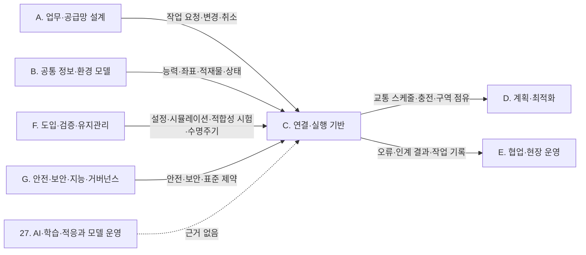

[홈](../../index.md) › C. 연결·실행 기반

# C. 연결·실행 기반

## 핵심 질문

계획한 작업을 실제 장비가 확실하게 수행하게 하려면? [분류원문]

## 개요

**계획한 작업을 실제 장비가 확실하게 수행하게 하는 방법**을 연구한다. 공통 모델을 실제 명령·통신·실행으로 연결하는 영역이다. [분류원문]

## 세부 연구영역

표의 세부 연구영역·무엇을 연구하는가·SCM 관점의 질문 열은 원문 그대로이고, 페이지·현재 상태 열은 위키에서 덧붙인 것이다. 현재 상태는 퍼블리셔가 자동으로 갱신한다.

<!-- auto:category-area-table:start -->
| 세부 연구영역 | 무엇을 연구하는가 | SCM 관점의 질문 | 페이지 | 현재 상태 |
|---|---|---|---|---|
| **9. 로봇·제조사 관제 연동** | 제조사 API·SDK·표준 프로토콜을 연결하고 명령·상태·오류를 변환하는 어댑터 | 개별 로봇을 제어할까, 제조사 관제에 미션을 맡길까? | [9. 로봇·제조사 관제 연동](09-robot-and-vendor-fleet-manager-integration.md) | published |
| **10. 설비·건물 시스템 연동** | 컨베이어, 자동창고, 작업대, PLC, 문, 승강기, 출입통제 시스템과 작업을 연계 | 컨베이어 준비와 로봇 도착을 어떻게 맞출까? | [10. 설비·건물 시스템 연동](10-facility-and-building-system-integration.md) | published |
| **11. 분산 시스템·통신·컴퓨팅 구조** | 클라우드·현장 서버·로봇의 역할 분담, 네트워크 지연, 서비스 가용성, 데이터 전송 품질, 다거점 운영 | 인터넷이 끊겨도 현장에서 어디까지 계속 운영할 수 있을까? | [11. 분산 시스템·통신·컴퓨팅 구조](11-distributed-systems-communication-and-computing.md) | published |
| **12. 명령·작업 실행의 신뢰성** | 접수·실행·완료·취소 상태, 제어권, 중복 요청 방지, 시간 초과, 재시작 후 상태 복원 | 응답이 끊긴 운반 요청을 다시 보내면 같은 화물을 두 번 처리하지 않을까? | [12. 명령·작업 실행의 신뢰성](12-command-and-task-execution-reliability.md) | published |

[분류원문]
<!-- auto:category-area-table:end -->

## 이 대분류의 핵심 포인트

Open-RMF도 제조사별 Fleet Adapter와 건물 설비 인터페이스를 통해 로봇·문·승강기 등을 연결한다. **로봇 연결과 시설 연결을 함께 보는 것**이 필요하다. [4] [분류원문]

## 다른 대분류와의 연결

C. 연결·실행 기반은 다른 대분류가 정한 업무·모델·계획을 로봇과 설비가 실제로 받는 명령과 상태로 옮기는 자리이므로, 다른 대분류와의 연결은 대부분 "무엇을 넘겨받고 무엇을 되돌려 주는가"의 문제로 나타난다. [의견] 이 절의 연결은 게시된 [9. 로봇·제조사 관제 연동](09-robot-and-vendor-fleet-manager-integration.md), [10. 설비·건물 시스템 연동](10-facility-and-building-system-integration.md), [11. 분산 시스템·통신·컴퓨팅 구조](11-distributed-systems-communication-and-computing.md), [12. 명령·작업 실행의 신뢰성](12-command-and-task-execution-reliability.md) 페이지와 A. 업무·공급망 설계·B. 공통 정보·환경 모델 대분류 페이지의 검증된 주장을 다시 쓴 것이 많다. D. 계획·최적화부터 G. 안전·보안·지능·거버넌스까지의 세부영역은 대부분 아직 본문이 없어서, 상대편 쪽 서술도 C. 연결·실행 기반 쪽 근거에 기댄다.

### A. 업무·공급망 설계

[A. 업무·공급망 설계](../a-business-supply-chain-design/index.md) 쪽에서 본 같은 연결은 그 페이지의 [다른 대분류와의 연결](../a-business-supply-chain-design/index.md#다른-대분류와의-연결) 절에 같은 태그와 각주로 실려 있다.

- **9. 로봇·제조사 관제 연동 ↔ [1. 주문·업무 시스템 연계](../a-business-supply-chain-design/01-order-and-business-system-integration.md)**: VDA 5050 3.0.0 은 외부 IT 시스템과의 인터페이스를 범위에서 제외한다. 그래서 상위 주문을 Open-RMF 작업 요청 같은 로봇 작업 요청으로 번역하는 계층이 두 대분류가 일을 넘겨받는 지점이 될 것으로 보인다. [추정][^ref-031][^ref-125]
- **12. 명령·작업 실행의 신뢰성 ↔ 1. 주문·업무 시스템 연계·[2. 공정·워크플로 모델링](../a-business-supply-chain-design/02-process-and-workflow-modeling.md)**: 상위 쪽은 B2MML 거래 동사(CHANGE·CANCEL 등)와 OPC UA for ISA-95 Job Control 메서드(Update·Pause·Resume·Abort·Cancel 등)로 변경·취소를 표현한다. 로봇 쪽 Open-RMF 작업 상태는 queued·underway·completed·canceled·killed·failed 같은 상태 값과 취소·강제 종료 요청 기록을 담는다. [사실][^ref-129][^ref-130][^ref-111] 세 자료는 서로 다른 계층의 사례이며 같은 내용을 교차 확인한 것은 아니다.
- **12. 명령·작업 실행의 신뢰성 ↔ 1. 주문·업무 시스템 연계**: Open-RMF 작업 요청·파견 요청 스키마에는 요청자가 정하는 요청 식별자 필드가 없다. 따라서 상위 요청 id 와 작업 id 의 대응을 ROP 쪽에서 보존해 중복을 걸러야 할 것으로 보인다. [추정][^ref-365][^ref-125][^ref-367] 그 대응을 얼마 동안 보존할지는 [열린 질문](../../open-questions.md) oq-046 으로 남아 있다.
- **10. 설비·건물 시스템 연동 ↔ [3. 처리능력·거점·설비 계획](../a-business-supply-chain-design/03-capacity-site-and-facility-planning.md)**: 병원 약품 배송 로봇 사례에서 승강기 가동률이 높을수록 배송 실패가 많고 시간이 길었으며, 다층 호텔 배송 연구는 승강기를 경로 계획의 대기·운행 시간으로 모델링했다. [사실][^ref-060][^ref-103] 두 사례는 병원·호텔이며 물류센터 적용은 미확인이다(oq-010). 승강기 제어 자체는 분류 원문 9장 '시설·설비 제어' 경계의 연계 대상이며, 3. 처리능력·거점·설비 계획은 이를 제약 입력으로만 받는다. [의견]
- **10. 설비·건물 시스템 연동·11. 분산 시스템·통신·컴퓨팅 구조 ↔ 3. 처리능력·거점·설비 계획**: 국내에서 업무용 건축물 대상 로봇 친화형 건축물 인증을 아파트 단지로 확장한 인증 모델은 건축·시설 설계, 네트워크·시스템, 건축 운영 관리, 로봇 지원 4개 분야의 28개 항목(총점 176점)으로 구성된다(2023년 발행). [사실][^ref-409] 이 모델의 대상은 공동주택(아파트 단지)이며 물류센터가 아니다. 건물 설비와 통신 기반을 로봇 운영 조건으로 평가하는 이런 틀이 거점·설비 계획과 설비·통신 연동을 잇는 근거가 될 수 있다. [추정][^ref-409]
- **11. 분산 시스템·통신·컴퓨팅 구조 ↔ 1. 주문·업무 시스템 연계**: 외부망이 끊긴 동안 현장 관제는 이미 받은 주문을 이어 갈 수 있으나 클라우드 WMS 의 새 주문 수신과 재고 확정은 멈추고, CAP 제약에 따라 재연결 뒤 현장 완료 기록과 WMS 기록을 맞추는 절차가 필요할 것으로 보인다. [추정][^ref-031][^ref-300][^ref-310] 물류센터 운영 기준은 미확인이다(oq-038).

### B. 공통 정보·환경 모델

[B. 공통 정보·환경 모델](../b-common-information-and-environment-model/index.md) 페이지의 [다른 대분류와의 연결](../b-common-information-and-environment-model/index.md#다른-대분류와의-연결) 절에 같은 연결이 같은 각주로 있다.

- **9. 로봇·제조사 관제 연동 ↔ [5. 로봇 능력·작업 온톨로지](../b-common-information-and-environment-model/05-robot-capability-and-task-ontology.md)**: VDA 5050 팩트시트는 적재 명세(loadSets)와 지원 동작(mobileRobotActions)을, Open-RMF [플릿 어댑터](../../glossary/fleet-adapter.md) 템플릿 설정은 수행 가능한 작업 유형(task_capabilities)과 동작 이름(actions)을 선언한다. [사실][^ref-228][^ref-105]
- **9. 로봇·제조사 관제 연동 ↔ [6. 지도·공간·위치 모델](../b-common-information-and-environment-model/06-map-space-and-location-model.md)**: 플릿 어댑터는 로봇 좌표계가 RMF 와 다르면 같은 위치를 가리키는 좌표 쌍으로 회전·축척·이동 변환을 추정하고, 템플릿 설정은 층별 reference_coordinates 로 이 좌표 쌍을 둔다. [사실][^ref-153][^ref-105] 이 작업이 용어집의 [지도 정합](../../glossary/map-alignment.md)이다.
- **10. 설비·건물 시스템 연동 ↔ 6. 지도·공간·위치 모델**: Open-RMF 승강기 상태는 층을 층 이름 문자열(available_floors, current_floor, destination_floor)로 나타내므로, 지도의 층 이름과 승강기 층 이름을 맞추는 대응이 필요할 것으로 보인다. [추정][^ref-286][^ref-079] 대응 규칙을 정한 표준은 미확인이다(oq-045).
- **9. 로봇·제조사 관제 연동 ↔ [7. 화물·재고·자산 식별과 추적](../b-common-information-and-environment-model/07-cargo-inventory-and-asset-identification-and-tracking.md)**: VDA 5050 상태 스키마의 적재물 목록(loads)은 적재 상태를 판단할 수 없는 로봇이 생략할 수 있고, 적재물 식별 번호(loadId)는 바코드·RFID 같은 식별 값이며 아직 식별하지 않았으면 비워 둔다. [사실][^ref-051]
- **10. 설비·건물 시스템 연동 ↔ [8. 실시간 세계 상태·데이터 일관성](../b-common-information-and-environment-model/08-real-time-world-state-and-data-consistency.md)**: Open-RMF 문·승강기 상태 메시지는 시각 필드(door_time, lift_time)를 담고, [승강기 어댑터](../../glossary/lift-adapter.md)는 적절하다고 판단한 요청만 승강기에 전달한다. [사실][^ref-285][^ref-286][^ref-284] 상태를 몇 초까지 믿을지 정한 규칙은 미확인이다(oq-034).
- **11. 분산 시스템·통신·컴퓨팅 구조 ↔ 8. 실시간 세계 상태·데이터 일관성**: ROS 2 QoS 의 기한·생존성 정책, Sparkplug 의 노드 종료 뒤 지표 STALE 표시, VDA 5050 의 MQTT 유언을 통한 연결 끊김 통지처럼 통신 계층에 상태의 오래됨을 알리는 장치가 있다. [사실][^ref-282][^ref-287][^ref-031] 이 연결은 현재 상태를 표현하는 쪽이며, 가정한 미래를 실험하는 22. 시뮬레이션·예측용 디지털 트윈과는 아래 F. 도입·검증·유지관리 항목에서 따로 다룬다.

### D. 계획·최적화

- **9. 로봇·제조사 관제 연동 ↔ [15. 다중 로봇 경로·교통 관리 — MAPF](../d-planning-and-optimization/15-multi-robot-path-and-traffic-management-mapf.md)**: [D. 계획·최적화](../d-planning-and-optimization/index.md)의 교통 관리와 관련해, Open-RMF 플릿 어댑터는 로봇의 예상 이동 경로를 시설 전체의 중앙 교통 스케줄에 보고해 플릿 사이 충돌을 찾아 협상하게 하며, 제조사 관제가 허용하는 제어 수준에 따라 전체 제어·신호등·읽기 전용 가운데 하나로 붙는다. [사실][^ref-004][^ref-251] 제어 수준별 교통 성능 차이는 미확인이다(oq-032).
- **9. 로봇·제조사 관제 연동 ↔ [13. 작업 배정 — MRTA](../d-planning-and-optimization/13-task-allocation-mrta.md)**: 플릿 어댑터 템플릿 설정은 배터리가 recharge_threshold 아래로 내려간 로봇에게 작업을 맡기지 않게 하고, 충전 목표·로봇별 충전기·작업 종료 후 동작(park·charge·nothing)을 둔다. [사실][^ref-105]
- **10. 설비·건물 시스템 연동 ↔ [16. 공용 자원·충전·에너지 최적화](../d-planning-and-optimization/16-shared-resource-charging-and-energy-optimization.md)**: Open-RMF 승강기 요청은 세션 단위로 승강기를 점유하고 AGV 모드에서는 정지 시 문이 열려 있으며, VDA 5050 3.0.0 은 [해제 구역](../../glossary/release-zone.md) 진입 요청에 관제가 허가·대기·철회·거절로 답하게 한다. [사실][^ref-312][^ref-031] 이런 점유·허가 정보가 승강기와 구역을 공용 자원으로 예약·배분하는 입력이 될 것으로 보인다. [추정][^ref-312][^ref-031]
- **12. 명령·작업 실행의 신뢰성 ↔ [14. 작업 순서·스케줄링](../d-planning-and-optimization/14-task-sequencing-and-scheduling.md)**: VDA 5050 에서 이미 로봇에 넘긴 기반(base) 경로는 바꿀 수 없으므로, 우선순위 변경에 따른 재정렬은 아직 해제하지 않은 호라이즌 구간과 새 주문에만 적용할 수 있을 것으로 보인다. [추정][^ref-031]

### E. 협업·현장 운영

- **10. 설비·건물 시스템 연동 ↔ [17. 로봇 간 협업·물리적 인계](../e-collaboration-and-field-operations/17-robot-to-robot-collaboration-and-physical-handover.md)**: [E. 협업·현장 운영](../e-collaboration-and-field-operations/index.md)의 물리적 인계와 관련해, Open-RMF 배송 작업에서 로봇은 하역 지점 워크셀([디스펜서·인제스터](../../glossary/dispenser-ingestor.md))에 IngestorRequest 를 보내고 IngestorResult 를 받을 때까지 반복하며, IngestorResult 는 시각·요청 id·워크셀 id·상태(ACKNOWLEDGED·SUCCESS·FAILED)를 담는다. [사실][^ref-023][^ref-049] 인수 결과를 화물 식별·인계 기록과 잇는 방법은 열린 질문으로 남아 있다(oq-001, oq-042).
- **9. 로봇·제조사 관제 연동 ↔ [20. 예외 복구·재계획·업무 연속성](../e-collaboration-and-field-operations/20-exception-recovery-replanning-and-business-continuity.md)**: VDA 5050 의 주문 거절 오류(NO_ROUTE_TO_TARGET 등)·연결 단절(CONNECTION_BROKEN)과 Open-RMF 로봇 상태 error 를 공통 예외로 옮긴 뒤 재배정이나 사람 확인으로 넘기는 것이 두 대분류의 인계 지점이 될 것으로 보인다. [추정][^ref-031][^ref-148] 공통 상태·오류 어휘 매핑은 미확인이다(oq-033).
- **12. 명령·작업 실행의 신뢰성 ↔ 20. 예외 복구·재계획·업무 연속성**: Open-RMF 저장소 이슈 #224 는 플릿 어댑터가 재시작되면 배정된 작업이 사라진다고 지적하고, 작업 로그·백업을 SQLite 에 저장해 복구하는 기능이 별도 풀 리퀘스트로 제안되었다고 적는다. [사실][^ref-374] 현재 배포판 반영 여부는 미확인이다(oq-048).
- **11. 분산 시스템·통신·컴퓨팅 구조 ↔ 20. 예외 복구·재계획·업무 연속성**: VDA 5050 3.0.0 에서 로봇은 브로커와 연결이 끊겨도 받은 주문 정보를 유지하고, 명세 표현으로 "fulfills the order up to the last released node", 곧 마지막으로 해제된 노드까지 주문을 수행한다. [사실][^ref-031]
- **12. 명령·작업 실행의 신뢰성 ↔ [19. 모니터링·이상 탐지·원인 분석](../e-collaboration-and-field-operations/19-monitoring-anomaly-detection-and-root-cause-analysis.md)**: Open-RMF 작업 상태 기록(취소·강제 종료·중단 요청, 시작·종료 시각)이 이상 탐지와 원인 분석의 입력이 될 것으로 보인다. [추정][^ref-111]

### F. 도입·검증·유지관리

- **9. 로봇·제조사 관제 연동 ↔ [21. 온보딩·설정·현장 시운전](../f-deployment-verification-and-maintenance/21-onboarding-configuration-and-commissioning.md)**: [F. 도입·검증·유지관리](../f-deployment-verification-and-maintenance/index.md)의 온보딩과 관련해, 새 플릿을 붙일 때 플릿 어댑터 설정에 층별 기준 좌표 쌍·충전기·지원 작업·동작을 채우는 일이 로봇 등록·지도 설정의 반복 작업이 될 것으로 보인다. [추정][^ref-105][^ref-153] 온보딩 소요를 측정한 자료는 확인하지 못했다.
- **10. 설비·건물 시스템 연동 ↔ [22. 시뮬레이션·예측용 디지털 트윈](../f-deployment-verification-and-maintenance/22-simulation-and-predictive-digital-twin.md)**: Open-RMF 문서는 traffic-editor 로 주석한 지도에서 문·승강기·워크셀(TeleportDispenser·TeleportIngestor)을 포함한 시뮬레이션 세계를 생성하고, 여러 플릿의 승강기 요청을 조율하는 lift_supervisor 까지 재현하는 흐름을 제시한다. [사실][^ref-406] 이는 가정한 운영 상황을 가상으로 실험하는 쪽이며, 현재 상태를 표현하는 8. 실시간 세계 상태·데이터 일관성의 문·승강기 상태 메시지와는 구분한다.
- **10. 설비·건물 시스템 연동 ↔ [23. 시험·형식 검증·벤치마크](../f-deployment-verification-and-maintenance/23-testing-formal-verification-and-benchmarking.md)**: 같은 문서는 이렇게 만든 시뮬레이션으로 배치 전에 설비 연동을 시험해 시간과 자원을 아낄 수 있다고 설명한다. [사실][^ref-406]
- **9. 로봇·제조사 관제 연동·12. 명령·작업 실행의 신뢰성 ↔ 23. 시험·형식 검증·벤치마크**: 공개 오픈소스 가운데 VDA 5050 3.0.0 로봇 플릿 시뮬레이터(vda5050-sim)는 주문 수명주기·사전 정의 동작·교통 제어 의미를 명세와 대조하는 적합성 시험 묶음과 고장 주입을 둔다고, MQTT 기록 진단 도구(vda5050-lab)는 반복된 주문·갱신 id, 기반·호라이즌 연결, 재연결 뒤 연결 상태, 취소·동작 수명주기 불일치를 진단한다고 각각 README 에 적는다. [사실][^ref-407][^ref-408] 두 도구는 개인 프로젝트의 자기 기술이며 VDA·VDMA 공식 적합성 시험이 아니다.
- **12. 명령·작업 실행의 신뢰성 ↔ [24. 자산·소프트웨어 수명주기 관리](../f-deployment-verification-and-maintenance/24-asset-and-software-lifecycle-management.md)**: ROS 2 [관리형 노드](../../glossary/managed-node.md)는 Unconfigured·Inactive·Active·Finalized 상태와 configure·activate·deactivate·cleanup·shutdown 같은 전이를 두어, 감독 도구가 모든 구성요소가 올바르게 준비됐는지 확인한 뒤 실행을 허용하게 한다. [사실][^ref-364]

### G. 안전·보안·지능·거버넌스

- **10. 설비·건물 시스템 연동 ↔ [25. 안전·위험 관리](../g-safety-security-intelligence-and-governance/25-safety-and-risk-management.md)**: [G. 안전·보안·지능·거버넌스](../g-safety-security-intelligence-and-governance/index.md)의 안전 관리와 관련해, 국가기술표준원은 2021년 11월 이동 로봇의 엘리베이터 탑승 안전 요구사항과 평가 방법을 정한 KS B 7317 을 제정했고, Open-RMF 승강기 상태의 운영 모드에는 사람·AGV·화재·오프라인·비상이 있다. [사실][^ref-314][^ref-315][^ref-286] ROP 는 운영 모드 확인과 작업·경로 제약 반영만 맡고, 승강기 탑승 안전과 설비 안전 제어 자체는 분류 원문 9장 '시설·설비 제어' 경계의 연계 대상이다. [의견]
- **11. 분산 시스템·통신·컴퓨팅 구조·9. 로봇·제조사 관제 연동 ↔ [26. 사이버보안·접근권한·개인정보](../g-safety-security-intelligence-and-governance/26-cybersecurity-access-control-and-privacy.md)**: ROS 2 는 [DDS 보안 규격](../../glossary/dds-security.md)의 인증(PKI)·접근통제(거버넌스·권한 파일)·암호화 플러그인을 쓴다. Open-RMF 문서는 같은 신원과 접근통제 규칙을 공유하는 프로세스 묶음인 SROS 2 인클레이브로 RMF 구성요소의 권한을 나누고, 웹 대시보드에는 TLS·OIDC 인증을 더한다고 설명한다. [사실][^ref-009][^ref-405]
- **10. 설비·건물 시스템 연동 ↔ 26. 사이버보안·접근권한·개인정보**: 로봇 관제가 문·승강기 어댑터에 요청을 보내는 구조에서는 어느 관제 구성요소가 어떤 설비 명령을 낼 수 있는지를 인클레이브·권한 파일 같은 접근통제 단위로 정해야 할 것으로 보인다. [추정][^ref-405][^ref-283][^ref-284] 출입통제 시스템 연동 사례는 미확인이다(oq-043).
- **9. 로봇·제조사 관제 연동 ↔ [28. 표준·상호운용성·다사업자 거버넌스](../g-safety-security-intelligence-and-governance/28-standards-interoperability-and-multi-vendor-governance.md)**: 제조사 중립 연동의 기준으로 VDA 5050(관제–이동로봇 통신), MassRobotics AMR 상호운용 표준(상태 보고), 그리고 개발 중인 국제표준 ISO 21423(산업용 이동로봇의 통신·상호운용성, 검색 결과상 FDIS 단계, 발행 여부 미확인)이 있다. [사실][^ref-031][^ref-253][^ref-159]
- **9. 로봇·제조사 관제 연동 ↔ 28. 표준·상호운용성·다사업자 거버넌스**: 이번에 확인한 VDA 5050 적합성 시험 도구가 제3자 오픈소스뿐이라, 어느 시험 결과를 연동 승인 기준으로 삼고 누가 연동 오류를 판정할지가 거버넌스 과제로 넘어갈 것으로 보인다. [추정][^ref-407][^ref-408][^ref-031] VDA 공식 적합성 인증 절차가 없다는 것은 확정된 사실이 아니다.
- **10. 설비·건물 시스템 연동 ↔ 28. 표준·상호운용성·다사업자 거버넌스**: 국내에서는 대한승강기협회가 엘리베이터와 로봇의 연동을 위한 단체표준을 제정했다고 전해진다(기사 보도 기준, 단체표준 원문·발행일 미확인). [추정][^ref-316][^ref-317] 표준이 정하는 메시지 내용은 oq-041 로 남아 있다.

### 아직 다루지 않은 연결

- **[27. AI·학습·적응과 모델 운영](../g-safety-security-intelligence-and-governance/27-ai-learning-adaptation-and-model-operations.md)**: 이번 조사에서 C. 연결·실행 기반의 네 세부영역과 27. AI·학습·적응과 모델 운영을 잇는 검증된 근거를 찾지 못했다. 위의 12. 명령·작업 실행의 신뢰성 ↔ 19. 모니터링·이상 탐지·원인 분석 연결도 AI 기반 장애 분석이 아니라 작업 기록을 입력으로 쓰는 일반 연결로만 적었다.
- **[18. 사람–로봇 협업·운영 인터페이스](../e-collaboration-and-field-operations/18-human-robot-collaboration-and-operator-interface.md)**, **[4. 성과·경제성·프로세스 개선](../a-business-supply-chain-design/04-performance-economics-and-process-improvement.md)**: 이번 실행에서는 C. 연결·실행 기반과 잇는 근거를 조사하지 않았다.
- 새로 올린 열린 질문: VDA 5050 공식 적합성 시험·인증 절차의 유무와 제3자 시험 결과의 승인 기준 활용, 그리고 로봇 관제·플릿 어댑터·승강기·문 어댑터에 SROS 2 인클레이브와 권한 파일을 나누는 공개 구성 사례. 두 질문은 [열린 질문](../../open-questions.md) 목록에 등록된다.

## 최근 업데이트

<!-- auto:category-recent:start -->
- 2026-09-25 · 갱신 · [12. 명령·작업 실행의 신뢰성](12-command-and-task-execution-reliability.md) — 섹션 3~11 신규 작성(명령 식별자·중복 무시, 멱등성 키, 상태 기계, 시간 초과, 재시도·취소·보상, 재시작 복원, 적치 재전송 시나리오), 페이지 상태 표식 추가, 조건부 승인 수정 11건 이행. 형식 재작성: 6절의 11. 분산 시스템·통신·컴퓨팅 구조 링크를 분리 뒤에도 깨지지 않는 경로(../../categories/…)로 바꿈 (실행 2026-09-25-31)
- 2026-09-25 · 생성 · [12. 명령·작업 실행의 신뢰성 — 대표 접근법과 기술](../../topics/2026/2026-09-25-area12-s6.md) — 자동 분리: 12. 명령·작업 실행의 신뢰성 의 "6. 대표 접근법과 기술" 절(3,046자)을 옮겼다 (실행 2026-09-25-31)
- 2026-09-25 · 생성 · [12. 명령·작업 실행의 신뢰성 — 관련 표준·프레임워크·오픈소스](../../topics/2026/2026-09-25-area12-s7.md) — 자동 분리: 12. 명령·작업 실행의 신뢰성 의 "7. 관련 표준·프레임워크·오픈소스" 절(1,355자)을 옮겼다 (실행 2026-09-25-31)
- 2026-09-25 · 생성 · [12. 명령·작업 실행의 신뢰성 — 핵심 개념과 용어](../../topics/2026/2026-09-25-area12-s4.md) — 자동 분리: 12. 명령·작업 실행의 신뢰성 의 "4. 핵심 개념과 용어" 절(1,163자)을 옮겼다 (실행 2026-09-25-31)
- 2026-09-25 · 생성 · [12. 명령·작업 실행의 신뢰성 — 열린 질문](../../topics/2026/2026-09-25-area12-s11.md) — 자동 분리: 12. 명령·작업 실행의 신뢰성 의 "11. 열린 질문" 절(1,032자)을 옮겼다 (실행 2026-09-25-31)
<!-- auto:category-recent:end -->

## 참고 자료

원문의 [4]는 참고문헌 [ref-004](../../references/ref-004.md)에 해당한다.[^ref-004]

[^ref-004]: Open Robotics, RMF Core Overview — Programming Multiple Robots with ROS 2, 미확인, https://osrf.github.io/ros2multirobotbook/rmf-core.html, 접근일 2026-09-24

[^ref-009]: ROS 2 Design, ROS 2 DDS-Security Integration, 미확인, https://design.ros2.org/articles/ros2_dds_security.html, 접근일 2026-09-25
[^ref-023]: Open Robotics, Workcells - Programming Multiple Robots with ROS 2, 미확인, https://osrf.github.io/ros2multirobotbook/integration_workcells.html, 접근일 2026-09-25
[^ref-031]: VDA / VDMA (VDA5050 GitHub), VDA5050/VDA5050_EN.md — Official Specification document for the VDA 5050, 미확인, https://github.com/VDA5050/VDA5050/blob/main/VDA5050_EN.md, 접근일 2026-09-25
[^ref-049]: Open Robotics (open-rmf), rmf_internal_msgs — rmf_ingestor_msgs/msg/IngestorResult.msg, 미확인, https://github.com/open-rmf/rmf_internal_msgs/blob/main/rmf_ingestor_msgs/msg/IngestorResult.msg, 접근일 2026-09-25 (원문 미열람)
[^ref-051]: VDA / VDMA (VDA5050 GitHub), VDA5050/VDA5050 — json_schemas/state.schema, 미확인, https://github.com/VDA5050/VDA5050/blob/main/json_schemas/state.schema, 접근일 2026-09-25 (원문 미열람)
[^ref-060]: Lee, Y. 외(Digital Health), Feasibility of autonomous medication delivery robots considering elevator utilization in high-traffic hospital environments, 2026, https://doi.org/10.1177/20552076261437181, 접근일 2026-09-25 (원문 미열람)
[^ref-079]: Open Robotics, Traffic Editor - Programming Multiple Robots with ROS 2, 미확인, https://osrf.github.io/ros2multirobotbook/traffic-editor.html, 접근일 2026-09-25 (원문 미열람)
[^ref-103]: PMC 게재 논문(저자 미확인), The Path Planning Problem of Robotic Delivery in Multi-Floor Hotel Environments, 미확인, https://pmc.ncbi.nlm.nih.gov/articles/PMC11946681/, 접근일 2026-09-25 (원문 미열람)
[^ref-105]: Open Robotics (open-rmf), fleet_adapter_template — fleet_adapter_template/config.yaml, 미확인, https://github.com/open-rmf/fleet_adapter_template/blob/main/fleet_adapter_template/config.yaml, 접근일 2026-09-25 (원문 미열람)
[^ref-111]: Open Robotics (open-rmf), rmf_api_msgs — rmf_api_msgs/schemas/task_state.json, 미확인, https://github.com/open-rmf/rmf_api_msgs/blob/main/rmf_api_msgs/schemas/task_state.json, 접근일 2026-09-25 (원문 미열람)
[^ref-125]: Open Robotics (open-rmf), rmf_api_msgs — rmf_api_msgs/schemas/task_request.json, 미확인, https://github.com/open-rmf/rmf_api_msgs/blob/main/rmf_api_msgs/schemas/task_request.json, 접근일 2026-09-25 (원문 미열람)
[^ref-129]: MESA International, B2MML-BatchML/Schema/B2MML-TransactionProfile.xsd, 2023, https://github.com/MESAInternational/B2MML-BatchML/blob/master/Schema/B2MML-TransactionProfile.xsd, 접근일 2026-09-25 (원문 미열람)
[^ref-130]: OPC Foundation, UA-Nodeset ISA95-JOBCONTROL — opc.ua.isa95-jobcontrol.nodeset2 (NodeSet2.xml·documentation.csv), 2024-01-31, https://github.com/OPCFoundation/UA-Nodeset/tree/latest/ISA95-JOBCONTROL, 접근일 2026-09-25 (원문 미열람)
[^ref-148]: Open Robotics (open-rmf), rmf_api_msgs — rmf_api_msgs/schemas/robot_state.json, 미확인, https://github.com/open-rmf/rmf_api_msgs/blob/main/rmf_api_msgs/schemas/robot_state.json, 접근일 2026-09-25 (원문 미열람)
[^ref-153]: Open Robotics, Fleet Adapter Tutorial - Programming Multiple Robots with ROS 2, 미확인, https://osrf.github.io/ros2multirobotbook/integration_fleets_adapter_tutorial.html, 접근일 2026-09-25 (원문 미열람)
[^ref-159]: ISO, ISO 21423 - Robotics — Industrial mobile robots — Communications and interoperability, 미확인, https://www.iso.org/standard/86749.html, 접근일 2026-09-25 (원문 미열람)
[^ref-228]: VDA / VDMA (VDA5050 GitHub), VDA5050/VDA5050 — json_schemas/factsheet.schema, 미확인, https://github.com/VDA5050/VDA5050/blob/main/json_schemas/factsheet.schema, 접근일 2026-09-25 (원문 미열람)
[^ref-251]: Open Robotics, Mobile Robot Fleets (integration_fleets) - Programming Multiple Robots with ROS 2, 미확인, https://osrf.github.io/ros2multirobotbook/integration_fleets.html, 접근일 2026-09-25 (원문 미열람)
[^ref-253]: MassRobotics, MassRobotics-AMR/AMR_Interop_Standard — README, 미확인, https://github.com/MassRobotics-AMR/AMR_Interop_Standard, 접근일 2026-09-25 (원문 미열람)
[^ref-282]: Open Robotics (ROS 2 Documentation), Quality of Service settings — ROS 2 Documentation: Jazzy, 미확인, https://docs.ros.org/en/jazzy/Concepts/Intermediate/About-Quality-of-Service-Settings.html, 접근일 2026-09-25 (원문 미열람)
[^ref-283]: Open Robotics, Doors (integration_doors) - Programming Multiple Robots with ROS 2, 미확인, https://osrf.github.io/ros2multirobotbook/integration_doors.html, 접근일 2026-09-25 (원문 미열람)
[^ref-284]: Open Robotics, Lifts (integration_lifts) - Programming Multiple Robots with ROS 2, 미확인, https://osrf.github.io/ros2multirobotbook/integration_lifts.html, 접근일 2026-09-25 (원문 미열람)
[^ref-285]: Open Robotics (open-rmf), rmf_internal_msgs — rmf_door_msgs/msg/DoorState.msg, 미확인, https://github.com/open-rmf/rmf_internal_msgs/blob/main/rmf_door_msgs/msg/DoorState.msg, 접근일 2026-09-25 (원문 미열람)
[^ref-286]: Open Robotics (open-rmf), rmf_internal_msgs — rmf_lift_msgs/msg/LiftState.msg, 미확인, https://github.com/open-rmf/rmf_internal_msgs/blob/main/rmf_lift_msgs/msg/LiftState.msg, 접근일 2026-09-25 (원문 미열람)
[^ref-287]: Eclipse Foundation (eclipse-sparkplug GitHub), Sparkplug Specification — Chapter 5 Operational Behavior (Sparkplug_5_Operational_Behavior.adoc), 미확인, https://github.com/eclipse-sparkplug/sparkplug/blob/master/specification/src/main/asciidoc/chapters/Sparkplug_5_Operational_Behavior.adoc, 접근일 2026-09-25 (원문 미열람)
[^ref-300]: KubeEdge (CNCF, kubeedge GitHub), KubeEdge — README, 미확인, https://github.com/kubeedge/kubeedge, 접근일 2026-09-25 (원문 미열람)
[^ref-310]: Gilbert, S., & Lynch, N., Brewer's conjecture and the feasibility of consistent, available, partition-tolerant web services, 2002-06, https://dl.acm.org/doi/10.1145/564585.564601, 접근일 2026-09-25 (원문 미열람)
[^ref-312]: Open Robotics (open-rmf), rmf_internal_msgs — rmf_lift_msgs/msg/LiftRequest.msg, 미확인, https://github.com/open-rmf/rmf_internal_msgs/blob/main/rmf_lift_msgs/msg/LiftRequest.msg, 접근일 2026-09-25 (원문 미열람)
[^ref-314]: 국가표준인증통합정보시스템(KSSN), KS B 7317 이동 로봇의 엘리베이터 탑승을 위한 안전 요구사항 및 평가 방법, 2021-11, https://www.kssn.net/search/stddetail.do?itemNo=K001010135682, 접근일 2026-09-25 (원문 미열람)
[^ref-315]: 산업통상자원부 국가기술표준원(대한민국 정책브리핑), 국가표준(KS) 제정으로 로봇의 엘리베이터 탑승 돕는다, 2021-11, https://www.korea.kr/briefing/pressReleaseView.do?newsId=156480155, 접근일 2026-09-25 (원문 미열람)
[^ref-316]: 건설기술신문, 승강기협, 엘리베이터-로봇 연동 단체표준 제정, 미확인, https://www.ctman.kr/35296, 접근일 2026-09-25 (원문 미열람)
[^ref-317]: 전기신문, 승강기협회 '로봇-승강기 연동 표준개발'로 승강기 4차산업 견인, 미확인, https://www.electimes.com/news/articleView.html?idxno=320147, 접근일 2026-09-25 (원문 미열람)
[^ref-364]: ROS 2 Design, Managed nodes (ROS 2 Design: node_lifecycle), 미확인, https://design.ros2.org/articles/node_lifecycle.html, 접근일 2026-09-25
[^ref-365]: Open Robotics (open-rmf), rmf_api_msgs — rmf_api_msgs/schemas/dispatch_task_request.json, 미확인, https://github.com/open-rmf/rmf_api_msgs/blob/main/rmf_api_msgs/schemas/dispatch_task_request.json, 접근일 2026-09-25 (원문 미열람)
[^ref-367]: IETF HTTPAPI Working Group (Jena, J., & Dalal, S.), The Idempotency-Key HTTP Header Field (draft-ietf-httpapi-idempotency-key-header), 미확인, https://github.com/ietf-wg-httpapi/idempotency/blob/main/draft-ietf-httpapi-idempotency-key-header.md, 접근일 2026-09-25 (원문 미열람)
[^ref-374]: Open Robotics (open-rmf/rmf_ros2 GitHub), Task recovery when fleet adapter get restarted · Issue #224 · open-rmf/rmf_ros2, 미확인, https://github.com/open-rmf/rmf_ros2/issues/224, 접근일 2026-09-25 (원문 미열람)
[^ref-405]: Open Robotics, Security - Programming Multiple Robots with ROS 2, 미확인, https://osrf.github.io/ros2multirobotbook/security.html, 접근일 2026-09-25
[^ref-406]: Open Robotics, Simulation - Programming Multiple Robots with ROS 2, 미확인, https://osrf.github.io/ros2multirobotbook/simulation.html, 접근일 2026-09-25
[^ref-407]: gpue (GitHub), vda5050-sim — README (Standards-compliant VDA5050 (v3.0.0) robot fleet simulator — MQTT or NATS), 미확인, https://github.com/gpue/vda5050-sim, 접근일 2026-09-25
[^ref-408]: ekusiadadus (GitHub), vda5050-lab — README (Diagnose VDA 5050 order, reconnect, and cancel failures from MQTT traces), 미확인, https://github.com/ekusiadadus/vda5050-lab, 접근일 2026-09-25
[^ref-409]: 한국 학술지 게재 논문(지적과 국토정보 53(1), 83-105, 저자 미확인), 아파트 단지의 로봇 친화형 환경 인증 모델 개발 (지적과 국토정보 53(1), 83-105), 2023, https://www.kci.go.kr/kciportal/landing/article.kci?arti_id=ART002978381, 접근일 2026-09-25 (원문 미열람)
