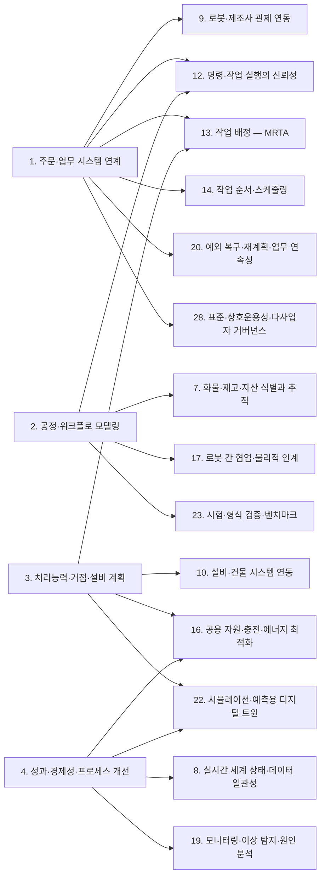
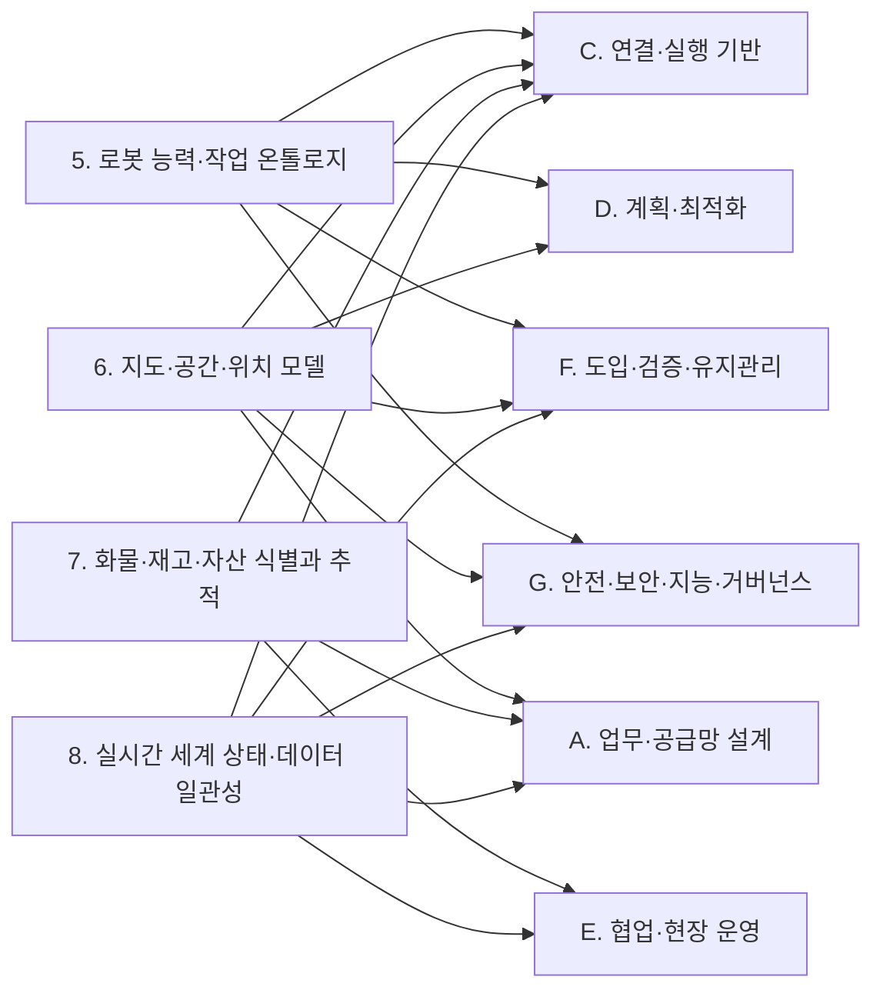
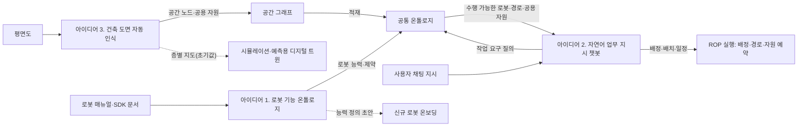

(너의 규칙은 시스템 프롬프트의 agents/shared-rules.md 와 agents/researcher.md 이다. 아래는 이번 실행의 컨텍스트와 입력이다.)

## 실행 컨텍스트

- run_id: 2026-09-25-38
- date: 2026-09-25
- run_type: category_link (대분류 연결)
- 대상: 대분류 C. 연결·실행 기반 페이지의 '다른 대분류와의 연결' 절(대분류 연결 실행). 게시된 세부영역 페이지를 근거로 다른 대분류와의 연결을 조사·서술한다. 스토리텔러는 그 절만 patches 로 바꾼다
- 예산:
    - max_search_queries: 30
    - max_sources_per_run: 15
    - new_topic_pages: 1
    - page_updates: 2
    - max_retries: 2
- 환경 알림: web_fetch_available: false · fetch_mode: mirror_only (일반 웹 페이지 열람은 네트워크 정책으로 막혀 있다. raw.githubusercontent.com 은 열린다: 공식 문서가 GitHub 에 있는 출처는 입력의 config/source_mirrors.yaml 경로를 WebFetch 로 열어 원문을 읽고 sources[].fetched=true, fetched_via=github_raw, fetch_url 을 적는다. 입력에 원문 텍스트(data/source_texts)가 있는 출처는 fetched_via=inbox. 그 밖의 출처는 fetched=false 이며 코드가 신뢰도 상한(medium)을 강제한다 — 공통 규칙 0절 6항)
- 언어: ko
- next_ref_id: ref-798
- 새 출처 id 구간: ref-798 ~ ref-827 — 이 실행 전용으로 예약한 번호다(동시에 도는 다른 실행과 겹치지 않는다). 새 출처는 ref-798 부터 순서대로 쓰고 ref-827 를 넘기지 않는다. 기존 출처는 참고문헌 목록의 id 를 그대로 쓴다

## 입력

### runs/2026-09-25-38/target.json

```json
{
  "run_id": "2026-09-25-38",
  "date": "2026-09-25",
  "weekday": "Fri",
  "run_number": 38,
  "run_type": "category_link",
  "forced": true,
  "target": {
    "area_no": null,
    "area_name": null,
    "category": "C. 연결·실행 기반",
    "category_letter": "C"
  },
  "topic": null,
  "track": null,
  "corrections": [],
  "budget": {
    "max_search_queries": 30,
    "max_sources_per_run": 15,
    "new_topic_pages": 1,
    "page_updates": 2,
    "max_retries": 2
  },
  "priority_reason": null,
  "priority_questions": [],
  "excluded_areas": [],
  "lifted_areas": [],
  "deferred": {
    "monthly_recheck": false,
    "weekly_review": false
  },
  "selection_rationale": "CLI 지정 run_type=category_link"
}
```

### docs/glossary/index.md

```markdown
---
title: "용어집"
type: glossary
subtype: index
status: published
created: 2026-09-24
updated: 2026-09-24
version: 1
---

[홈](../index.md) › 용어집

# 용어집

이 위키에서 쓰는 용어의 한글·영문 표기와 한 줄 정의를 모은다. 용어마다 개별 페이지에 설명, 관련 연구영역, 출처를 둔다. 시드 용어는 SCOR, ISA-95, EPCIS, Open-RMF, Fleet Adapter, WES/WCS/WMS/MES/TMS, MRTA, MAPF, Lifelong MAPF, Multi-Agent Pickup and Delivery, ARIAC, DDS-Security, 디지털 트윈이다. 새 용어는 스토리텔러 에이전트가 제안하고 퍼블리셔가 반영한다.

아래 표는 용어 페이지의 프런트매터(term_ko, term_en, definition, related_areas)에서 자동으로 만든다.

## 용어 목록

<!-- auto:glossary-index:start -->
| 용어(한글) | 용어(영문) | 한 줄 정의 | 관련 영역 |
|---|---|---|---|
| [5G 특화망(이음5G)](private-5g-network.md) | Private 5G Network (e-Um 5G) | 이동통신사가 아닌 기업·기관이 건물·공장 같은 특정 구역 단위로 5G 주파수를 할당받아 직접 구축해 쓰는 국내 5G 통신망이다. | [11. 분산 시스템·통신·컴퓨팅 구조](../categories/c-connectivity-and-execution-foundation/11-distributed-systems-communication-and-computing.md) |
| [B2MML](b2mml.md) | Business To Manufacturing Markup Language (B2MML) | MESA International이 ISA-95(IEC 62264)의 데이터 모델을 XML 스키마로 구현한 교환 형식이다. | [1. 주문·업무 시스템 연계](../categories/a-business-supply-chain-design/01-order-and-business-system-integration.md)<br>[2. 공정·워크플로 모델링](../categories/a-business-supply-chain-design/02-process-and-workflow-modeling.md)<br>[14. 작업 순서·스케줄링](../categories/d-planning-and-optimization/14-task-sequencing-and-scheduling.md) |
| [CAP 정리](cap-theorem.md) | CAP Theorem | 네트워크 분할이 일어날 수 있는 분산 서비스는 일관성과 가용성을 동시에 완전히 보장할 수 없다는 정리이다. | [11. 분산 시스템·통신·컴퓨팅 구조](../categories/c-connectivity-and-execution-foundation/11-distributed-systems-communication-and-computing.md)<br>[8. 실시간 세계 상태·데이터 일관성](../categories/b-common-information-and-environment-model/08-real-time-world-state-and-data-consistency.md) |
| [DDS 보안 규격](dds-security.md) | DDS Security (DDS-Security) | DDS(Data Distribution Service)의 보안 규격으로, ROS 2가 인증·암호화·접근통제 구조의 기반으로 통합했다. | [26. 사이버보안·접근권한·개인정보](../categories/g-safety-security-intelligence-and-governance/26-cybersecurity-access-control-and-privacy.md)<br>[11. 분산 시스템·통신·컴퓨팅 구조](../categories/c-connectivity-and-execution-foundation/11-distributed-systems-communication-and-computing.md)<br>[28. 표준·상호운용성·다사업자 거버넌스](../categories/g-safety-security-intelligence-and-governance/28-standards-interoperability-and-multi-vendor-governance.md) |
| [IndoorGML](indoorgml.md) | IndoorGML | 실내 공간을 셀 공간(CellSpace)과 그 경계, 공간 연결을 나타내는 노드·엣지의 쌍대 그래프, 의미별 주제 레이어로 표현하는 OGC 실내 공간 정보 표준이다. | [6. 지도·공간·위치 모델](../categories/b-common-information-and-environment-model/06-map-space-and-location-model.md)<br>[28. 표준·상호운용성·다사업자 거버넌스](../categories/g-safety-security-intelligence-and-governance/28-standards-interoperability-and-multi-vendor-governance.md) |
| [LLM 에이전트](llm-agent.md) | LLM Agent | 대규모 언어 모델이 사람이 정해 준 도구·함수(로봇 API, 조회 기능 등)를 골라 호출하며 여러 단계로 작업을 수행하도록 구성한 소프트웨어이다. | [27. AI·학습·적응과 모델 운영](../categories/g-safety-security-intelligence-and-governance/27-ai-learning-adaptation-and-model-operations.md)<br>[13. 작업 배정 — MRTA](../categories/d-planning-and-optimization/13-task-allocation-mrta.md)<br>[18. 사람–로봇 협업·운영 인터페이스](../categories/e-collaboration-and-field-operations/18-human-robot-collaboration-and-operator-interface.md) |
| [VDA 5050 팩트시트](vda-5050-factsheet.md) | VDA 5050 factsheet | VDA 5050에서 이동로봇이 관제에 자신의 유형·물리 파라미터·적재 명세·지원 action을 알리는 메시지이다. | [5. 로봇 능력·작업 온톨로지](../categories/b-common-information-and-environment-model/05-robot-capability-and-task-ontology.md)<br>[9. 로봇·제조사 관제 연동](../categories/c-connectivity-and-execution-foundation/09-robot-and-vendor-fleet-manager-integration.md) |
| [VDA 5050](vda-5050.md) | VDA 5050 | VDA 5050 주문에서 관제가 이미 해제해 로봇이 주행해도 되는 경로(베이스)와 계획만 되어 있고 아직 해제되지 않은 경로(호라이즌)를 구분하는 개념이다. | [5. 로봇 능력·작업 온톨로지](../categories/b-common-information-and-environment-model/05-robot-capability-and-task-ontology.md)<br>[7. 화물·재고·자산 식별과 추적](../categories/b-common-information-and-environment-model/07-cargo-inventory-and-asset-identification-and-tracking.md)<br>[9. 로봇·제조사 관제 연동](../categories/c-connectivity-and-execution-foundation/09-robot-and-vendor-fleet-manager-integration.md)<br>[11. 분산 시스템·통신·컴퓨팅 구조](../categories/c-connectivity-and-execution-foundation/11-distributed-systems-communication-and-computing.md)<br>[12. 명령·작업 실행의 신뢰성](../categories/c-connectivity-and-execution-foundation/12-command-and-task-execution-reliability.md)<br>[28. 표준·상호운용성·다사업자 거버넌스](../categories/g-safety-security-intelligence-and-governance/28-standards-interoperability-and-multi-vendor-governance.md) |
| [객체 중심 이벤트 로그](ocel.md) | Object-Centric Event Log (OCEL) | 이벤트와 여러 객체 사이 관계, 관계의 한정자, 시간에 따라 바뀌는 객체 속성을 기록하는 이벤트 로그 교환 표준이며, 2.0판은 SQLite·XML·JSON 형식을 둔다. | [2. 공정·워크플로 모델링](../categories/a-business-supply-chain-design/02-process-and-workflow-modeling.md)<br>[4. 성과·경제성·프로세스 개선](../categories/a-business-supply-chain-design/04-performance-economics-and-process-improvement.md)<br>[19. 모니터링·이상 탐지·원인 분석](../categories/e-collaboration-and-field-operations/19-monitoring-anomaly-detection-and-root-cause-analysis.md) |
| [건물 위상 온톨로지](building-topology-ontology.md) | Building Topology Ontology (BOT) | W3C 링크드 빌딩 데이터 커뮤니티 그룹이 만든, 건물의 대지·건물·층·공간·요소와 그 포함·인접 관계를 RDF 로 기술하는 최소 온톨로지이다. | [6. 지도·공간·위치 모델](../categories/b-common-information-and-environment-model/06-map-space-and-location-model.md)<br>[28. 표준·상호운용성·다사업자 거버넌스](../categories/g-safety-security-intelligence-and-governance/28-standards-interoperability-and-multi-vendor-governance.md) |
| [건물 정보 모델링](building-information-modeling.md) | Building Information Modeling (BIM) | 건물의 공간·요소·속성을 객체 단위의 디지털 모델로 만들고 설계·시공·운영 단계에서 공유하는 방식으로, IFC 가 그 개방형 교환 스키마다. | [6. 지도·공간·위치 모델](../categories/b-common-information-and-environment-model/06-map-space-and-location-model.md)<br>[28. 표준·상호운용성·다사업자 거버넌스](../categories/g-safety-security-intelligence-and-governance/28-standards-interoperability-and-multi-vendor-governance.md) |
| [경로망](roadmap.md) | Roadmap | 다중 AGV·이동로봇이 따라 달릴 수 있는 노드와 엣지의 주행 경로 그래프로, 현장 도입 때 전문가가 설계하거나 자동 생성한다. | [15. 다중 로봇 경로·교통 관리 — MAPF](../categories/d-planning-and-optimization/15-multi-robot-path-and-traffic-management-mapf.md)<br>[21. 온보딩·설정·현장 시운전](../categories/f-deployment-verification-and-maintenance/21-onboarding-configuration-and-commissioning.md)<br>[6. 지도·공간·위치 모델](../categories/b-common-information-and-environment-model/06-map-space-and-location-model.md) |
| [계획 도메인 정의 언어](pddl.md) | Planning Domain Definition Language (PDDL) | 자동 계획 문제에서 행동을 파라미터·전제조건·효과로 기술하고 도메인과 문제 인스턴스를 분리해 표현하는 언어이다. | [5. 로봇 능력·작업 온톨로지](../categories/b-common-information-and-environment-model/05-robot-capability-and-task-ontology.md) |
| [공간 그래프](space-graph.md) | Space Graph | 방·복도 같은 공간을 노드로, 문·공유 경계·계단·엘리베이터 같은 연결을 엣지로 두어 건물 실내의 연결 관계를 나타내는 그래프로, IndoorGML 의 쌍대 그래프가 대표적 표준 표현이다. | [6. 지도·공간·위치 모델](../categories/b-common-information-and-environment-model/06-map-space-and-location-model.md)<br>[15. 다중 로봇 경로·교통 관리 — MAPF](../categories/d-planning-and-optimization/15-multi-robot-path-and-traffic-management-mapf.md)<br>[28. 표준·상호운용성·다사업자 거버넌스](../categories/g-safety-security-intelligence-and-governance/28-standards-interoperability-and-multi-vendor-governance.md) |
| [공급망 운영 참조 모델](scor.md) | Supply Chain Operations Reference (SCOR) | ASCM이 관리하는 공급망 프로세스 참조 모델로, 공급망을 계획·주문·조달·생산/가공·이행·반품 프로세스와 이를 아우르는 오케스트레이션 프로세스로 기술한다. | [1. 주문·업무 시스템 연계](../categories/a-business-supply-chain-design/01-order-and-business-system-integration.md)<br>[2. 공정·워크플로 모델링](../categories/a-business-supply-chain-design/02-process-and-workflow-modeling.md)<br>[4. 성과·경제성·프로세스 개선](../categories/a-business-supply-chain-design/04-performance-economics-and-process-improvement.md) |
| [관리형 노드](managed-node.md) | Managed Node (ROS 2 Lifecycle Node) | Unconfigured·Inactive·Active·Finalized 상태와 전이를 가져 감독 도구가 준비 확인·재시작·교체를 제어할 수 있는 ROS 2 노드이다. | [12. 명령·작업 실행의 신뢰성](../categories/c-connectivity-and-execution-foundation/12-command-and-task-execution-reliability.md)<br>[24. 자산·소프트웨어 수명주기 관리](../categories/f-deployment-verification-and-maintenance/24-asset-and-software-lifecycle-management.md) |
| [구조화 출력](structured-output.md) | Structured Output | LLM 의 응답을 JSON 스키마 같은 정해진 형식의 필드와 값으로 내도록 제약하는 방식이다. | [27. AI·학습·적응과 모델 운영](../categories/g-safety-security-intelligence-and-governance/27-ai-learning-adaptation-and-model-operations.md)<br>[18. 사람–로봇 협업·운영 인터페이스](../categories/e-collaboration-and-field-operations/18-human-robot-collaboration-and-operator-interface.md) |
| [글로벌 개별 자산 식별자](giai.md) | Global Individual Asset Identifier (GIAI) | 컨테이너·트럭·트레일러 같은 개별 자산을 식별하는 GS1 식별 키이다. | [7. 화물·재고·자산 식별과 추적](../categories/b-common-information-and-environment-model/07-cargo-inventory-and-asset-identification-and-tracking.md) |
| [글로벌 반환형 자산 식별자](grai.md) | Global Returnable Asset Identifier (GRAI) | 팔레트·상자·트레이·케그처럼 여러 번 재사용되는 운반구를 식별하는 GS1 식별 키이다. | [7. 화물·재고·자산 식별과 추적](../categories/b-common-information-and-environment-model/07-cargo-inventory-and-asset-identification-and-tracking.md) |
| [기업–제어 시스템 통합 표준](isa-95.md) | ISA-95 Enterprise-Control System Integration | ISA-95 계열에서 하위 실행 계층이 수행할 작업 단위의 요청으로, OPC UA for ISA-95 Job Control 은 이를 저장·시작·갱신·일시정지·중단하는 메서드를 둔다. | [1. 주문·업무 시스템 연계](../categories/a-business-supply-chain-design/01-order-and-business-system-integration.md)<br>[2. 공정·워크플로 모델링](../categories/a-business-supply-chain-design/02-process-and-workflow-modeling.md)<br>[28. 표준·상호운용성·다사업자 거버넌스](../categories/g-safety-security-intelligence-and-governance/28-standards-interoperability-and-multi-vendor-governance.md) |
| [능력 기반 작업 배정](capability-based-task-allocation.md) | Capability-based Task Allocation | 로봇이 선언하거나 관측된 능력·제약과 작업의 요구 조건을 대조해 수행 가능한 로봇에게 작업을 배정하는 방식이다. | [13. 작업 배정 — MRTA](../categories/d-planning-and-optimization/13-task-allocation-mrta.md)<br>[5. 로봇 능력·작업 온톨로지](../categories/b-common-information-and-environment-model/05-robot-capability-and-task-ontology.md) |
| [능력 매칭](capability-matchmaking.md) | Capability Matchmaking | 제품·작업이 요구하는 특성을 자원(로봇·설비)이 제공하는 능력의 파라미터와 비교해 수행 가능한 자원이나 자원 조합을 찾는 일이다. | [5. 로봇 능력·작업 온톨로지](../categories/b-common-information-and-environment-model/05-robot-capability-and-task-ontology.md)<br>[13. 작업 배정 — MRTA](../categories/d-planning-and-optimization/13-task-allocation-mrta.md) |
| [능력·스킬·서비스 모델](capabilities-skills-services.md) | Capabilities, Skills and Services (CSS) Model | Plattform Industrie 4.0 작업반이 제안한 정보 모델로, 구현과 무관한 기능 명세(능력)와 그 실행 가능한 구현(스킬), 제공 형태(서비스)를 구분한다. 이 위키의 온톨로지 초안에서는 CSS의 능력(capability)을 기능(Capability)으로 부른다. | [5. 로봇 능력·작업 온톨로지](../categories/b-common-information-and-environment-model/05-robot-capability-and-task-ontology.md)<br>[28. 표준·상호운용성·다사업자 거버넌스](../categories/g-safety-security-intelligence-and-governance/28-standards-interoperability-and-multi-vendor-governance.md) |
| [다중 로봇 작업 배정](mrta.md) | Multi-Robot Task Allocation (MRTA) | 여러 로봇과 여러 작업이 있을 때 어떤 로봇(또는 로봇 팀)이 어떤 작업을 맡을지 정하는 문제이다. | [13. 작업 배정 — MRTA](../categories/d-planning-and-optimization/13-task-allocation-mrta.md)<br>[5. 로봇 능력·작업 온톨로지](../categories/b-common-information-and-environment-model/05-robot-capability-and-task-ontology.md)<br>[14. 작업 순서·스케줄링](../categories/d-planning-and-optimization/14-task-sequencing-and-scheduling.md)<br>[16. 공용 자원·충전·에너지 최적화](../categories/d-planning-and-optimization/16-shared-resource-charging-and-energy-optimization.md) |
| [다중 에이전트 경로 찾기](mapf.md) | Multi-Agent Path Finding (MAPF) | 여러 에이전트(로봇)가 각자의 출발지에서 목적지까지 서로 충돌하지 않고 동시에 따라갈 수 있는 경로들을 계획하는 문제이다. | [15. 다중 로봇 경로·교통 관리 — MAPF](../categories/d-planning-and-optimization/15-multi-robot-path-and-traffic-management-mapf.md)<br>[6. 지도·공간·위치 모델](../categories/b-common-information-and-environment-model/06-map-space-and-location-model.md)<br>[16. 공용 자원·충전·에너지 최적화](../categories/d-planning-and-optimization/16-shared-resource-charging-and-energy-optimization.md) |
| [다중 에이전트 픽업·배송](multi-agent-pickup-and-delivery.md) | Multi-Agent Pickup and Delivery (MAPD) | 픽업 위치와 배송 위치가 있는 작업이 온라인으로 계속 들어올 때, 에이전트에 작업을 배정하고 충돌 없는 경로를 함께 계획하는 문제이다. | [13. 작업 배정 — MRTA](../categories/d-planning-and-optimization/13-task-allocation-mrta.md)<br>[15. 다중 로봇 경로·교통 관리 — MAPF](../categories/d-planning-and-optimization/15-multi-robot-path-and-traffic-management-mapf.md)<br>[14. 작업 순서·스케줄링](../categories/d-planning-and-optimization/14-task-sequencing-and-scheduling.md) |
| [다중 플릿 오케스트레이션](multi-fleet-orchestration.md) | Multi-Fleet Orchestration | 제조사가 다른 여러 로봇 플릿을 제3자 관제가 한곳에서 조율하는 것으로, 로봇을 직접 제어하는 저수준 방식과 제조사 관제에 작업을 넘기는 고수준 방식이 있다. | [9. 로봇·제조사 관제 연동](../categories/c-connectivity-and-execution-foundation/09-robot-and-vendor-fleet-manager-integration.md)<br>[13. 작업 배정 — MRTA](../categories/d-planning-and-optimization/13-task-allocation-mrta.md)<br>[15. 다중 로봇 경로·교통 관리 — MAPF](../categories/d-planning-and-optimization/15-multi-robot-path-and-traffic-management-mapf.md) |
| [디스펜서·인제스터](dispenser-ingestor.md) | Dispenser / Ingestor | Open-RMF 에서 로봇에 물건을 내주는 작업대(디스펜서)와 로봇에서 물건을 받아들이는 작업대(인제스터)로, 각각 요청·결과·상태 메시지로 배송 작업과 연동된다. | [10. 설비·건물 시스템 연동](../categories/c-connectivity-and-execution-foundation/10-facility-and-building-system-integration.md)<br>[17. 로봇 간 협업·물리적 인계](../categories/e-collaboration-and-field-operations/17-robot-to-robot-collaboration-and-physical-handover.md) |
| [디지털 섀도](digital-shadow.md) | Digital Shadow | 물리 대상의 상태가 디지털 표현으로 한 방향 자동 흐름으로만 반영되는 단계의 디지털 표현으로, 디지털 모델·디지털 트윈과 구분된다(Kritzinger 외(2018) 분류 기준). | [8. 실시간 세계 상태·데이터 일관성](../categories/b-common-information-and-environment-model/08-real-time-world-state-and-data-consistency.md)<br>[22. 시뮬레이션·예측용 디지털 트윈](../categories/f-deployment-verification-and-maintenance/22-simulation-and-predictive-digital-twin.md) |
| [디지털 트윈](digital-twin.md) | Digital Twin | 물리적 대상(장비·자재·공정·설비·제품 등)을 데이터로 연결된 가상 모델로 표현한 것이다. | [22. 시뮬레이션·예측용 디지털 트윈](../categories/f-deployment-verification-and-maintenance/22-simulation-and-predictive-digital-twin.md)<br>[8. 실시간 세계 상태·데이터 일관성](../categories/b-common-information-and-environment-model/08-real-time-world-state-and-data-consistency.md)<br>[23. 시험·형식 검증·벤치마크](../categories/f-deployment-verification-and-maintenance/23-testing-formal-verification-and-benchmarking.md) |
| [래스터–벡터 변환](raster-to-vector-conversion.md) | Raster-to-Vector Conversion | 픽셀 이미지로 된 평면도를 벽 선분·교차점·방 다각형 같은 기하 요소의 벡터 표현으로 바꾸는 처리이다. | [6. 지도·공간·위치 모델](../categories/b-common-information-and-environment-model/06-map-space-and-location-model.md)<br>[27. AI·학습·적응과 모델 운영](../categories/g-safety-security-intelligence-and-governance/27-ai-learning-adaptation-and-model-operations.md) |
| [레이아웃 교환 형식](layout-interchange-format.md) | Layout Interchange Format (LIF) | 무인운반차 통합사가 노드·간선·스테이션으로 이루어진 주행 레이아웃을 제3자 중앙 관제 시스템에 넘기기 위해 VDMA 가 정한 교환 형식이다. | [6. 지도·공간·위치 모델](../categories/b-common-information-and-environment-model/06-map-space-and-location-model.md)<br>[9. 로봇·제조사 관제 연동](../categories/c-connectivity-and-execution-foundation/09-robot-and-vendor-fleet-manager-integration.md)<br>[16. 공용 자원·충전·에너지 최적화](../categories/d-planning-and-optimization/16-shared-resource-charging-and-energy-optimization.md)<br>[28. 표준·상호운용성·다사업자 거버넌스](../categories/g-safety-security-intelligence-and-governance/28-standards-interoperability-and-multi-vendor-governance.md) |
| [로봇 이동형 풀필먼트 시스템](robotic-mobile-fulfillment-system.md) | Robotic Mobile Fulfillment System (RMFS) | 로봇이 상품을 담은 이동식 선반(pod)을 작업대까지 옮기고 작업자가 그 앞에서 피킹·보충하는 부품-작업자(parts-to-picker) 방식의 자동화 창고 시스템이다. | [3. 처리능력·거점·설비 계획](../categories/a-business-supply-chain-design/03-capacity-site-and-facility-planning.md)<br>[13. 작업 배정 — MRTA](../categories/d-planning-and-optimization/13-task-allocation-mrta.md)<br>[16. 공용 자원·충전·에너지 최적화](../categories/d-planning-and-optimization/16-shared-resource-charging-and-energy-optimization.md) |
| [로봇·자동화 핵심 온톨로지](cora.md) | Core Ontology for Robotics and Automation (CORA) | IEEE 1872-2015가 정한 로봇·자동화 분야의 가장 일반적인 개념·관계·공리를 담은 핵심 온톨로지이다. | [5. 로봇 능력·작업 온톨로지](../categories/b-common-information-and-environment-model/05-robot-capability-and-task-ontology.md)<br>[28. 표준·상호운용성·다사업자 거버넌스](../categories/g-safety-security-intelligence-and-governance/28-standards-interoperability-and-multi-vendor-governance.md) |
| [리틀의 법칙](littles-law.md) | Little's Law | 재공품(WIP)이 처리량(TH)과 사이클 타임(CT)의 곱과 같다는 관계로, 처리량·재공품·리드타임을 함께 해석하는 기준이 된다. | [4. 성과·경제성·프로세스 개선](../categories/a-business-supply-chain-design/04-performance-economics-and-process-improvement.md)<br>[3. 처리능력·거점·설비 계획](../categories/a-business-supply-chain-design/03-capacity-site-and-facility-planning.md) |
| [메시지 큐잉 원격 측정 전송](mqtt.md) | Message Queuing Telemetry Transport (MQTT) | MQTT 클라이언트가 예기치 않게 끊기면 브로커가 대신 발행하도록 미리 등록해 둔 메시지로, VDA 5050 은 이를 로봇 연결 끊김(CONNECTION_BROKEN) 알림에 쓴다. | [9. 로봇·제조사 관제 연동](../categories/c-connectivity-and-execution-foundation/09-robot-and-vendor-fleet-manager-integration.md)<br>[11. 분산 시스템·통신·컴퓨팅 구조](../categories/c-connectivity-and-execution-foundation/11-distributed-systems-communication-and-computing.md)<br>[12. 명령·작업 실행의 신뢰성](../categories/c-connectivity-and-execution-foundation/12-command-and-task-execution-reliability.md) |
| [멱등성 키](idempotency-key.md) | Idempotency Key | 클라이언트가 요청마다 만든 고유 값으로, 서버가 같은 요청의 재시도를 알아보고 한 번만 처리하게 하는 데 쓰인다. | [12. 명령·작업 실행의 신뢰성](../categories/c-connectivity-and-execution-foundation/12-command-and-task-execution-reliability.md)<br>[1. 주문·업무 시스템 연계](../categories/a-business-supply-chain-design/01-order-and-business-system-integration.md) |
| [무충돌 복제 데이터 타입](crdt.md) | Conflict-free Replicated Data Type (CRDT) | 여러 복제본을 조율 없이 수정해도 같은 갱신을 받으면 정해진 규칙으로 같은 상태에 수렴하도록 설계된 데이터 타입이다. | [8. 실시간 세계 상태·데이터 일관성](../categories/b-common-information-and-environment-model/08-real-time-world-state-and-data-consistency.md)<br>[11. 분산 시스템·통신·컴퓨팅 구조](../categories/c-connectivity-and-execution-foundation/11-distributed-systems-communication-and-computing.md) |
| [물류 단위 일련 코드](sscc.md) | Serial Shipping Container Code (SSCC) | 케이스·팔레트·소포 등 보관·운송을 위해 묶인 물류 단위를 고유하게 식별하는 18자리 GS1 식별 키이다. | [7. 화물·재고·자산 식별과 추적](../categories/b-common-information-and-environment-model/07-cargo-inventory-and-asset-identification-and-tracking.md) |
| [반개방형 대기행렬 네트워크](semi-open-queueing-network.md) | Semi-Open Queueing Network (SOQN) | 외부에서 주문이 들어오되 로봇 같은 한정된 자원 수가 고정된 채 순환하는 시스템의 처리량·대기 시간을 해석적으로 추정하는 대기행렬 모델이다. | [3. 처리능력·거점·설비 계획](../categories/a-business-supply-chain-design/03-capacity-site-and-facility-planning.md)<br>[16. 공용 자원·충전·에너지 최적화](../categories/d-planning-and-optimization/16-shared-resource-charging-and-energy-optimization.md) |
| [비즈니스 프로세스 모델 및 표기법](bpmn.md) | Business Process Model and Notation (BPMN) | OMG가 정한 업무 프로세스 표기법으로, ISO/IEC 19510:2013은 OMG BPMN 2.0.1을 PAS 절차로 국제표준화한 것이다. | [2. 공정·워크플로 모델링](../categories/a-business-supply-chain-design/02-process-and-workflow-modeling.md)<br>[12. 명령·작업 실행의 신뢰성](../categories/c-connectivity-and-execution-foundation/12-command-and-task-execution-reliability.md) |
| [사가](saga.md) | Saga | 오래 걸리는 작업을 작은 단계의 순서로 나누고 단계마다 보상 동작을 두어, 전부 완료되거나 부분 실행을 보상하게 하는 트랜잭션 구성 방식이다. | [12. 명령·작업 실행의 신뢰성](../categories/c-connectivity-and-execution-foundation/12-command-and-task-execution-reliability.md)<br>[20. 예외 복구·재계획·업무 연속성](../categories/e-collaboration-and-field-operations/20-exception-recovery-replanning-and-business-continuity.md) |
| [산업 기초 클래스](ifc.md) | Industry Foundation Classes (IFC) | buildingSMART 의 BIM 데이터 스키마로, IFC 4.3 은 건물 안에서 특정 기능을 제공하는 경계 지어진 면적·체적을 IfcSpace 로 정의하고 건물 층(IfcBuildingStorey)에 집합 관계로 연결한다. | [6. 지도·공간·위치 모델](../categories/b-common-information-and-environment-model/06-map-space-and-location-model.md)<br>[28. 표준·상호운용성·다사업자 거버넌스](../categories/g-safety-security-intelligence-and-governance/28-standards-interoperability-and-multi-vendor-governance.md) |
| [산업 자동화용 민첩 로봇 경진대회](ariac.md) | Agile Robotics for Industrial Automation Competition (ARIAC) | NIST가 운영하는 로봇 경진대회로, 변화하는 제조 환경에서 로봇의 계획·인식·행동과 적응성을 평가한다. | [23. 시험·형식 검증·벤치마크](../categories/f-deployment-verification-and-maintenance/23-testing-formal-verification-and-benchmarking.md)<br>[22. 시뮬레이션·예측용 디지털 트윈](../categories/f-deployment-verification-and-maintenance/22-simulation-and-predictive-digital-twin.md)<br>[20. 예외 복구·재계획·업무 연속성](../categories/e-collaboration-and-field-operations/20-exception-recovery-replanning-and-business-continuity.md) |
| [선형 시간 논리](linear-temporal-logic.md) | Linear Temporal Logic (LTL) | 작업의 순서·시간 제약을 명확한 의미로 기술하는 형식 논리이다. | [27. AI·학습·적응과 모델 운영](../categories/g-safety-security-intelligence-and-governance/27-ai-learning-adaptation-and-model-operations.md)<br>[23. 시험·형식 검증·벤치마크](../categories/f-deployment-verification-and-maintenance/23-testing-formal-verification-and-benchmarking.md)<br>[13. 작업 배정 — MRTA](../categories/d-planning-and-optimization/13-task-allocation-mrta.md) |
| [스킬](skill.md) | Skill | 구현과 무관하게 명세한 능력(capability)을 실제로 실행하는 캡슐화된 구현으로, OPC UA 같은 호출 인터페이스를 가지며 상태 기계를 가질 수 있다(예: CaSkMan 의 ISA 88 상태 기계). | [5. 로봇 능력·작업 온톨로지](../categories/b-common-information-and-environment-model/05-robot-capability-and-task-ontology.md)<br>[9. 로봇·제조사 관제 연동](../categories/c-connectivity-and-execution-foundation/09-robot-and-vendor-fleet-manager-integration.md)<br>[12. 명령·작업 실행의 신뢰성](../categories/c-connectivity-and-execution-foundation/12-command-and-task-execution-reliability.md) |
| [슬롯 채우기](slot-filling.md) | Slot Filling | 발화에서 요청 처리에 필요한 인자 값(장소·대상·시간 등)을 찾아 미리 정한 항목(슬롯)에 채우는 자연어 이해 과제로, 비어 있는 필수 슬롯은 사용자에게 되묻는 데 쓰인다. | [18. 사람–로봇 협업·운영 인터페이스](../categories/e-collaboration-and-field-operations/18-human-robot-collaboration-and-operator-interface.md)<br>[27. AI·학습·적응과 모델 운영](../categories/g-safety-security-intelligence-and-governance/27-ai-learning-adaptation-and-model-operations.md)<br>[13. 작업 배정 — MRTA](../categories/d-planning-and-optimization/13-task-allocation-mrta.md) |
| [승강기 어댑터](lift-adapter.md) | Lift Adapter | Open-RMF 에서 플릿 어댑터·핵심 시스템의 승강기 요청을 받아 적절할 때만 승강기 노드에 전달하는 감독 구성요소이다. | [10. 설비·건물 시스템 연동](../categories/c-connectivity-and-execution-foundation/10-facility-and-building-system-integration.md)<br>[12. 명령·작업 실행의 신뢰성](../categories/c-connectivity-and-execution-foundation/12-command-and-task-execution-reliability.md)<br>[16. 공용 자원·충전·에너지 최적화](../categories/d-planning-and-optimization/16-shared-resource-charging-and-energy-optimization.md) |
| [실내 지도 데이터 형식](indoor-mapping-data-format.md) | Indoor Mapping Data Format (IMDF) | Apple 이 개발해 OGC 커뮤니티 표준이 된 실내 지도 형식으로, 층·공간 단위·출입구·편의시설 등을 사람 길안내용으로 모델링한다. | [6. 지도·공간·위치 모델](../categories/b-common-information-and-environment-model/06-map-space-and-location-model.md)<br>[28. 표준·상호운용성·다사업자 거버넌스](../categories/g-safety-security-intelligence-and-governance/28-standards-interoperability-and-multi-vendor-governance.md) |
| [업무 위치](business-location.md) | Business Location (EPCIS bizLocation) | EPCIS 이벤트 뒤 다른 이벤트가 반박할 때까지 객체가 있다고 보는 업무상 위치를 나타내는 선택 필드이다. | [7. 화물·재고·자산 식별과 추적](../categories/b-common-information-and-environment-model/07-cargo-inventory-and-asset-identification-and-tracking.md)<br>[6. 지도·공간·위치 모델](../categories/b-common-information-and-environment-model/06-map-space-and-location-model.md) |
| [연결 이벤트](association-event.md) | AssociationEvent | 물리 객체를 상위 객체나 특정 물리 위치와 연결하거나 연결을 해제한 사실을 기록하는 EPCIS 2.0 이벤트 유형이다. | [7. 화물·재고·자산 식별과 추적](../categories/b-common-information-and-environment-model/07-cargo-inventory-and-asset-identification-and-tracking.md) |
| [오류 선언](epcis-error-declaration.md) | Error Declaration (EPCIS errorDeclaration) | 앞선 EPCIS 이벤트의 내용이 틀렸음을 선언 시각·사유·정정 이벤트 id 와 함께 기록해 원 기록을 지우지 않고 바로잡게 하는 EPCIS 요소이다. | [8. 실시간 세계 상태·데이터 일관성](../categories/b-common-information-and-environment-model/08-real-time-world-state-and-data-consistency.md)<br>[7. 화물·재고·자산 식별과 추적](../categories/b-common-information-and-environment-model/07-cargo-inventory-and-asset-identification-and-tracking.md) |
| [오픈 RMF](open-rmf.md) | Open-RMF (Open Robotics Middleware Framework) | ROS 2 기반의 다중 로봇 조율 프레임워크로, 제조사별 플릿 어댑터와 건물 설비 인터페이스를 통해 로봇·문·승강기 등을 연결하고 작업·교통을 조율한다. | [9. 로봇·제조사 관제 연동](../categories/c-connectivity-and-execution-foundation/09-robot-and-vendor-fleet-manager-integration.md)<br>[10. 설비·건물 시스템 연동](../categories/c-connectivity-and-execution-foundation/10-facility-and-building-system-integration.md)<br>[15. 다중 로봇 경로·교통 관리 — MAPF](../categories/d-planning-and-optimization/15-multi-robot-path-and-traffic-management-mapf.md)<br>[13. 작업 배정 — MRTA](../categories/d-planning-and-optimization/13-task-allocation-mrta.md) |
| [완전 주문 이행률](perfect-order-fulfillment.md) | Perfect Order Fulfillment | 완전 주문 수를 전체 주문 수로 나눈 비율로, 주문의 모든 품목 줄이 완전해야 완전 주문으로 보는 SCOR의 신뢰성 대표 지표(RL.1.1)이다. | [4. 성과·경제성·프로세스 개선](../categories/a-business-supply-chain-design/04-performance-economics-and-process-improvement.md)<br>[1. 주문·업무 시스템 연계](../categories/a-business-supply-chain-design/01-order-and-business-system-integration.md) |
| [요구 능력·제공 능력](required-and-provided-capability.md) | Required Capability / Provided (Offered) Capability | 공정·작업 쪽이 필요로 하는 능력과 자원 쪽이 내놓는 능력을 구분한 표현으로, 둘을 비교해 작업을 맡을 자원을 정한다. 이 위키의 온톨로지 초안에서는 capability 를 기능으로 부르므로 요구·제공 한정자에 해당한다. | [5. 로봇 능력·작업 온톨로지](../categories/b-common-information-and-environment-model/05-robot-capability-and-task-ontology.md)<br>[13. 작업 배정 — MRTA](../categories/d-planning-and-optimization/13-task-allocation-mrta.md)<br>[28. 표준·상호운용성·다사업자 거버넌스](../categories/g-safety-security-intelligence-and-governance/28-standards-interoperability-and-multi-vendor-governance.md) |
| [워크플로 넷](workflow-net.md) | Workflow Net (WF-net) | 워크플로를 모델링·분석하는 표준적 방법 가운데 하나로 쓰이는 페트리 넷의 한 부류이다. | [2. 공정·워크플로 모델링](../categories/a-business-supply-chain-design/02-process-and-workflow-modeling.md)<br>[23. 시험·형식 검증·벤치마크](../categories/f-deployment-verification-and-maintenance/23-testing-formal-verification-and-benchmarking.md) |
| [웨이브리스 출고 지시](waveless-order-release.md) | Waveless Order Release | 주문을 큰 묶음(웨이브)으로 모아 내리지 않고 도착·여유 용량에 따라 연속으로 현장에 내려보내는 출고 지시 방식이다. | [1. 주문·업무 시스템 연계](../categories/a-business-supply-chain-design/01-order-and-business-system-integration.md)<br>[14. 작업 순서·스케줄링](../categories/d-planning-and-optimization/14-task-sequencing-and-scheduling.md) |
| [위상 지도](topological-map.md) | Topological Map | 정확한 좌표 대신 방·구역 같은 장소를 노드로, 통로·문 같은 연결을 엣지로 두어 공간의 연결 관계를 표현하는 지도이다. | [6. 지도·공간·위치 모델](../categories/b-common-information-and-environment-model/06-map-space-and-location-model.md)<br>[15. 다중 로봇 경로·교통 관리 — MAPF](../categories/d-planning-and-optimization/15-multi-robot-path-and-traffic-management-mapf.md) |
| [위치 체크 디지트](location-check-digit.md) | Location Check Digit | 보관 위치 라벨에 붙은 짧은 확인용 숫자로, 작업자가 이를 말하거나 입력해 올바른 위치에 있음을 시스템에 확인시키는 데 쓰인다. GS1 식별 키(SSCC·GTIN 등)의 끝자리 검증 숫자(체크 디지트)와는 다른 뜻이다. | [18. 사람–로봇 협업·운영 인터페이스](../categories/e-collaboration-and-field-operations/18-human-robot-collaboration-and-operator-interface.md) |
| [음성 피킹](voice-picking.md) | Voice-Directed Picking (Voice Picking) | 시스템이 작업자에게 갈 위치와 피킹할 수량을 음성으로 지시하고 작업자가 짧은 음성 응답으로 동작을 확인하는 창고 피킹 방식이다. | [18. 사람–로봇 협업·운영 인터페이스](../categories/e-collaboration-and-field-operations/18-human-robot-collaboration-and-operator-interface.md) |
| [의도 인식](intent-recognition.md) | Intent Recognition (Intent Detection) | 사용자 발화가 어떤 요청(의도)인지 미리 정한 의도 유형 가운데 하나로 분류하는 자연어 이해 과제이다. | [18. 사람–로봇 협업·운영 인터페이스](../categories/e-collaboration-and-field-operations/18-human-robot-collaboration-and-operator-interface.md)<br>[27. AI·학습·적응과 모델 운영](../categories/g-safety-security-intelligence-and-governance/27-ai-learning-adaptation-and-model-operations.md)<br>[13. 작업 배정 — MRTA](../categories/d-planning-and-optimization/13-task-allocation-mrta.md) |
| [의미 식별자](semantic-id.md) | Semantic ID (semanticId) | AAS 요소의 의미를 외부 사전(ECLASS·IEC CDD 등)의 개념 기술이나 IDTA 자체 식별자로 가리키는 식별자이다. | [5. 로봇 능력·작업 온톨로지](../categories/b-common-information-and-environment-model/05-robot-capability-and-task-ontology.md)<br>[28. 표준·상호운용성·다사업자 거버넌스](../categories/g-safety-security-intelligence-and-governance/28-standards-interoperability-and-multi-vendor-governance.md) |
| [이산 사건 시뮬레이션](discrete-event-simulation.md) | Discrete Event Simulation (DES) | 주문 도착·작업 완료 같은 사건이 일어나는 시점마다 시스템 상태를 갱신해 처리량·대기·가동률을 실험하는 시뮬레이션 방식이다. | [3. 처리능력·거점·설비 계획](../categories/a-business-supply-chain-design/03-capacity-site-and-facility-planning.md)<br>[22. 시뮬레이션·예측용 디지털 트윈](../categories/f-deployment-verification-and-maintenance/22-simulation-and-predictive-digital-twin.md) |
| [자산관리셸](asset-administration-shell.md) | Asset Administration Shell (AAS) | 산업 자산의 정보를 서브모델 단위로 기술하는 표준 체계로, IDTA가 능력 기술(IDTA 02020)·무인운반차 기술 데이터(IDTA 02047) 같은 서브모델 템플릿을 공개한다. | [5. 로봇 능력·작업 온톨로지](../categories/b-common-information-and-environment-model/05-robot-capability-and-task-ontology.md)<br>[9. 로봇·제조사 관제 연동](../categories/c-connectivity-and-execution-foundation/09-robot-and-vendor-fleet-manager-integration.md)<br>[28. 표준·상호운용성·다사업자 거버넌스](../categories/g-safety-security-intelligence-and-governance/28-standards-interoperability-and-multi-vendor-governance.md) |
| [작업 분해](task-decomposition.md) | Task Decomposition | 상위 지시나 목표를 로봇이 실행할 수 있는 하위 작업·동작의 순서나 구조로 나누는 일이다. | [13. 작업 배정 — MRTA](../categories/d-planning-and-optimization/13-task-allocation-mrta.md)<br>[14. 작업 순서·스케줄링](../categories/d-planning-and-optimization/14-task-sequencing-and-scheduling.md)<br>[2. 공정·워크플로 모델링](../categories/a-business-supply-chain-design/02-process-and-workflow-modeling.md)<br>[27. AI·학습·적응과 모델 운영](../categories/g-safety-security-intelligence-and-governance/27-ai-learning-adaptation-and-model-operations.md) |
| [전자 제품 코드 정보 서비스](epcis.md) | Electronic Product Code Information Services (EPCIS) | GS1이 정한, 제품·자산의 상태·위치·이동·인계에 관한 이벤트를 기록하고 공유하기 위한 표준이다. | [7. 화물·재고·자산 식별과 추적](../categories/b-common-information-and-environment-model/07-cargo-inventory-and-asset-identification-and-tracking.md)<br>[2. 공정·워크플로 모델링](../categories/a-business-supply-chain-design/02-process-and-workflow-modeling.md)<br>[17. 로봇 간 협업·물리적 인계](../categories/e-collaboration-and-field-operations/17-robot-to-robot-collaboration-and-physical-handover.md) |
| [점유 격자 지도](occupancy-grid-map.md) | Occupancy Grid Map (OGM) | 공간을 일정 크기 칸으로 나누고 칸마다 점유·빈 공간·미지 여부를 적어 로봇 위치추정과 경로계획에 쓰는 지도 표현이다. | [6. 지도·공간·위치 모델](../categories/b-common-information-and-environment-model/06-map-space-and-location-model.md) |
| [정보 나이](age-of-information.md) | Age of Information (AoI) | 수신 측이 가진 최신 상태 갱신이 생성된 뒤 흐른 시간으로, 받은 정보가 얼마나 최신인지를 재는 지표이다. | [8. 실시간 세계 상태·데이터 일관성](../categories/b-common-information-and-environment-model/08-real-time-world-state-and-data-consistency.md)<br>[11. 분산 시스템·통신·컴퓨팅 구조](../categories/c-connectivity-and-execution-foundation/11-distributed-systems-communication-and-computing.md) |
| [종합설비효율](overall-equipment-effectiveness.md) | Overall Equipment Effectiveness (OEE) | 설비의 가용성·효과성(성능)·품질률을 곱해 구하는 지표로, ISO 22400-2(2014판)가 제조 운영 관리 KPI의 하나로 정의한다. | [4. 성과·경제성·프로세스 개선](../categories/a-business-supply-chain-design/04-performance-economics-and-process-improvement.md)<br>[16. 공용 자원·충전·에너지 최적화](../categories/d-planning-and-optimization/16-shared-resource-charging-and-energy-optimization.md) |
| [지도 정합](map-alignment.md) | Map Alignment | 서로 다른 로봇·도면의 지도 좌표계를 대응점으로 구한 회전·축척·이동 변환으로 공통 좌표계에 맞추는 일이다. | [6. 지도·공간·위치 모델](../categories/b-common-information-and-environment-model/06-map-space-and-location-model.md)<br>[9. 로봇·제조사 관제 연동](../categories/c-connectivity-and-execution-foundation/09-robot-and-vendor-fleet-manager-integration.md)<br>[21. 온보딩·설정·현장 시운전](../categories/f-deployment-verification-and-maintenance/21-onboarding-configuration-and-commissioning.md) |
| [지속형 다중 에이전트 경로 찾기](lifelong-mapf.md) | Lifelong Multi-Agent Path Finding (Lifelong MAPF) | 에이전트가 목적지에 도착하면 곧바로 새 목적지를 받아 계속 이동하는 조건에서 충돌 없는 경로를 계속 계획하는 MAPF의 변형이다. | [15. 다중 로봇 경로·교통 관리 — MAPF](../categories/d-planning-and-optimization/15-multi-robot-path-and-traffic-management-mapf.md)<br>[14. 작업 순서·스케줄링](../categories/d-planning-and-optimization/14-task-sequencing-and-scheduling.md)<br>[13. 작업 배정 — MRTA](../categories/d-planning-and-optimization/13-task-allocation-mrta.md) |
| [집계 이벤트](aggregation-event.md) | AggregationEvent | 상자를 팔레트에 싣거나 내리는 것처럼 상위 객체와 하위 객체의 물리적 결합·분리를 기록하는 EPCIS 이벤트 유형이다. | [7. 화물·재고·자산 식별과 추적](../categories/b-common-information-and-environment-model/07-cargo-inventory-and-asset-identification-and-tracking.md) |
| [차량 소요대수 산정](fleet-sizing.md) | Fleet Sizing | 예상 물동량과 서비스 수준(대기 시간·처리량) 목표를 만족하는 데 필요한 로봇·운반 차량의 최소 대수를 정하는 계획 문제이다. | [3. 처리능력·거점·설비 계획](../categories/a-business-supply-chain-design/03-capacity-site-and-facility-planning.md)<br>[13. 작업 배정 — MRTA](../categories/d-planning-and-optimization/13-task-allocation-mrta.md)<br>[16. 공용 자원·충전·에너지 최적화](../categories/d-planning-and-optimization/16-shared-resource-charging-and-energy-optimization.md) |
| [창고 실행·창고 제어·창고 관리·제조 실행·운송 관리 시스템](wes-wcs-wms-mes-tms.md) | Warehouse Execution System / Warehouse Control System / Warehouse Management System / Manufacturing Execution System / Transportation Management System | 창고·생산·운송의 주문·재고·설비·공정을 관리하거나 실행하는 업무·실행 시스템 계열의 약어이며, ROP는 이들에서 작업 요청을 받아 로봇 작업으로 바꾸고 결과를 되돌려 주는 관계에 있다. | [1. 주문·업무 시스템 연계](../categories/a-business-supply-chain-design/01-order-and-business-system-integration.md)<br>[2. 공정·워크플로 모델링](../categories/a-business-supply-chain-design/02-process-and-workflow-modeling.md)<br>[10. 설비·건물 시스템 연동](../categories/c-connectivity-and-execution-foundation/10-facility-and-building-system-integration.md) |
| [파놉틱 심볼 스포팅](panoptic-symbol-spotting.md) | Panoptic Symbol Spotting | CAD 도면의 선 요소마다 문·창문 같은 셀 수 있는 기호의 개별 인스턴스와 벽 같은 셀 수 없는 영역의 의미를 함께 판별하는 과제이다. | [6. 지도·공간·위치 모델](../categories/b-common-information-and-environment-model/06-map-space-and-location-model.md)<br>[27. AI·학습·적응과 모델 운영](../categories/g-safety-security-intelligence-and-governance/27-ai-learning-adaptation-and-model-operations.md) |
| [판독 지점](read-point.md) | Read Point (EPCIS readPoint) | EPCIS 이벤트가 일어난 지점을 나타내는 선택 필드이다. | [7. 화물·재고·자산 식별과 추적](../categories/b-common-information-and-environment-model/07-cargo-inventory-and-asset-identification-and-tracking.md)<br>[17. 로봇 간 협업·물리적 인계](../categories/e-collaboration-and-field-operations/17-robot-to-robot-collaboration-and-physical-handover.md) |
| [평면도 인식](floor-plan-recognition.md) | Floor Plan Recognition | 평면도 이미지나 CAD 도면에서 벽·문·창문·계단 같은 건축 요소와 방 영역·유형을 자동으로 찾아내 구조화하는 작업이다. | [6. 지도·공간·위치 모델](../categories/b-common-information-and-environment-model/06-map-space-and-location-model.md)<br>[27. AI·학습·적응과 모델 운영](../categories/g-safety-security-intelligence-and-governance/27-ai-learning-adaptation-and-model-operations.md) |
| [포그 컴퓨팅](fog-computing.md) | Fog Computing | 클라우드와 말단 장치 사이에 계산·저장·네트워크 자원을 계층으로 두어 지연에 민감한 분산 애플리케이션을 현장 가까이에서 처리하게 하는 컴퓨팅 모델이다. | [11. 분산 시스템·통신·컴퓨팅 구조](../categories/c-connectivity-and-execution-foundation/11-distributed-systems-communication-and-computing.md) |
| [프로세스 마이닝](process-mining.md) | Process Mining | 시스템에 남은 이벤트 로그로 실제 업무 흐름을 발견하고 대기·병목을 분석하는 기법이다. | [4. 성과·경제성·프로세스 개선](../categories/a-business-supply-chain-design/04-performance-economics-and-process-improvement.md)<br>[2. 공정·워크플로 모델링](../categories/a-business-supply-chain-design/02-process-and-workflow-modeling.md)<br>[19. 모니터링·이상 탐지·원인 분석](../categories/e-collaboration-and-field-operations/19-monitoring-anomaly-detection-and-root-cause-analysis.md) |
| [플릿 관리 시스템](fleet-management-system.md) | Fleet Management System (FMS) | 여러 이동로봇에 작업을 배정하고 경로·상태를 관리하는 관제 소프트웨어로, 로봇 제조사가 자사 로봇용으로 제공하는 경우가 많다. | [9. 로봇·제조사 관제 연동](../categories/c-connectivity-and-execution-foundation/09-robot-and-vendor-fleet-manager-integration.md)<br>[13. 작업 배정 — MRTA](../categories/d-planning-and-optimization/13-task-allocation-mrta.md) |
| [플릿 어댑터](fleet-adapter.md) | Fleet Adapter | Open-RMF에서 제조사별 로봇 플릿(같은 관제 아래 묶인 로봇 무리)을 연결하기 위해 두는 제조사별 연결 구성요소이다. | [9. 로봇·제조사 관제 연동](../categories/c-connectivity-and-execution-foundation/09-robot-and-vendor-fleet-manager-integration.md)<br>[5. 로봇 능력·작업 온톨로지](../categories/b-common-information-and-environment-model/05-robot-capability-and-task-ontology.md)<br>[12. 명령·작업 실행의 신뢰성](../categories/c-connectivity-and-execution-foundation/12-command-and-task-execution-reliability.md)<br>[21. 온보딩·설정·현장 시운전](../categories/f-deployment-verification-and-maintenance/21-onboarding-configuration-and-commissioning.md) |
| [해제 구역](release-zone.md) | Release Zone | VDA 5050 3.0.0 에서 관제의 진입 허가를 받아야 이동로봇이 들어갈 수 있는 구역이다. | [10. 설비·건물 시스템 연동](../categories/c-connectivity-and-execution-foundation/10-facility-and-building-system-integration.md)<br>[9. 로봇·제조사 관제 연동](../categories/c-connectivity-and-execution-foundation/09-robot-and-vendor-fleet-manager-integration.md)<br>[15. 다중 로봇 경로·교통 관리 — MAPF](../categories/d-planning-and-optimization/15-multi-robot-path-and-traffic-management-mapf.md) |
| [핵심 업무 어휘](cbv.md) | Core Business Vocabulary (CBV) | EPCIS 이벤트의 업무 단계·상태·인계 유형 등에 채울 표준 어휘 값을 정한 GS1 표준(ISO/IEC 19988)이다. | [7. 화물·재고·자산 식별과 추적](../categories/b-common-information-and-environment-model/07-cargo-inventory-and-asset-identification-and-tracking.md) |
| [행동 트리](behavior-tree.md) | Behavior Tree | 로봇 동작과 조건 확인을 트리 노드로 조합해 실행 구조를 표현하는 형식이다. | [12. 명령·작업 실행의 신뢰성](../categories/c-connectivity-and-execution-foundation/12-command-and-task-execution-reliability.md)<br>[27. AI·학습·적응과 모델 운영](../categories/g-safety-security-intelligence-and-governance/27-ai-learning-adaptation-and-model-operations.md)<br>[13. 작업 배정 — MRTA](../categories/d-planning-and-optimization/13-task-allocation-mrta.md) |
| [형상 제약 언어](shacl.md) | Shapes Constraint Language (SHACL) | RDF 그래프가 정해진 구조·값 조건을 지키는지 검증하는 W3C 제약 언어로, 생성된 온톨로지의 품질 검사에 쓰인다. | [5. 로봇 능력·작업 온톨로지](../categories/b-common-information-and-environment-model/05-robot-capability-and-task-ontology.md)<br>[27. AI·학습·적응과 모델 운영](../categories/g-safety-security-intelligence-and-governance/27-ai-learning-adaptation-and-model-operations.md) |
| [혼합 정수 계획](milp.md) | Mixed Integer Linear Programming (MILP) | 일부 결정 변수가 정수여야 하는 선형 목적함수·선형 제약 최적화 문제로, 작업 배정·스케줄링 같은 조합 결정을 정식화해 해법기로 푸는 데 쓰인다. | [13. 작업 배정 — MRTA](../categories/d-planning-and-optimization/13-task-allocation-mrta.md)<br>[14. 작업 순서·스케줄링](../categories/d-planning-and-optimization/14-task-sequencing-and-scheduling.md)<br>[27. AI·학습·적응과 모델 운영](../categories/g-safety-security-intelligence-and-governance/27-ai-learning-adaptation-and-model-operations.md) |
| [환각](hallucination.md) | Hallucination | LLM이 근거 없이 그럴듯한 내용을 만들어 내는 현상이다. | [27. AI·학습·적응과 모델 운영](../categories/g-safety-security-intelligence-and-governance/27-ai-learning-adaptation-and-model-operations.md)<br>[18. 사람–로봇 협업·운영 인터페이스](../categories/e-collaboration-and-field-operations/18-human-robot-collaboration-and-operator-interface.md)<br>[13. 작업 배정 — MRTA](../categories/d-planning-and-optimization/13-task-allocation-mrta.md) |
<!-- auto:glossary-index:end -->
```

### docs/references/index.md

```markdown
---
title: "참고문헌"
type: reference
subtype: index
status: published
created: 2026-09-24
updated: 2026-09-24
version: 1
---

[홈](../index.md) › 참고문헌

# 참고문헌

이 위키가 인용한 출처의 목록이다. 출처마다 id, 기관, 제목, 발행일, URL, 유형, 신뢰도, 접근일, 요약, 인용된 페이지를 개별 페이지에 둔다. 시드 10건(ref-001 ~ ref-010)은 분류 원문 12장의 참고 자료 1~10번에 그대로 대응한다. 새 출처는 리서치 에이전트가 제안하고 내용 검증 에이전트가 실재를 확인한 뒤 퍼블리셔가 추가한다.

신뢰도는 출처 유형을 기준으로 한다. 표준·정부·연구기관·논문·오픈소스 공식 문서는 high, 기사·보도자료·벤더 문서는 medium 이며, 내용 검증 에이전트가 원문을 열어 확인하면 조정할 수 있다. 다만 URL 을 열어 확인하지 못한 출처(원문 미열람)에는 유형과 무관하게 high 를 주지 않고 medium 상한을 적용한다. 시드 10건은 구축 환경의 네트워크 정책으로 URL 을 열지 못했으므로 모두 원문 미열람 상태이며, 각 페이지의 "원문 열람" 행에 그 사실을 적어 둔다. 외부 접속이 가능한 환경에서 `ROP_CHECK_URLS=1 bash pipeline/checks/run_all.sh` 를 실행한 뒤 `python3 pipeline/scaffold.py --apply-url-check` 를 실행하면 열림이 확인된 출처의 신뢰도가 유형 기준값으로 올라간다.

## 목록

<!-- auto:references-index:start -->
| id | 기관 | 제목 | 발행일 | 유형 | 신뢰도 | 접근일 | URL |
|---|---|---|---|---|---|---|---|
| [ref-001](ref-001.md) | ASCM | SCOR Digital Standard | 미확인 | 표준 | medium | 2026-09-24 | <https://www.ascm.org/corporate-solutions/standards-tools/scor-ds/> |
| [ref-002](ref-002.md) | ISA | Update to ISA-95 Standard Addresses Integration of Enterprise and Manufacturing Control Systems | 2025 | 기사 | medium | 2026-09-24 | <https://www.isa.org/news-press-releases/2025/april/update-to-isa-95-standard-addresses-integration-of> |
| [ref-003](ref-003.md) | GS1 | EPCIS and CBV Linked Data Model | 미확인 | 표준 | medium | 2026-09-24 | <https://ref.gs1.org/epcis/> |
| [ref-004](ref-004.md) | Open Robotics | RMF Core Overview — Programming Multiple Robots with ROS 2 | 미확인 | 오픈소스 문서 | high | 2026-09-25 | <https://osrf.github.io/ros2multirobotbook/rmf-core.html> |
| [ref-005](ref-005.md) | Li, J., Tinka, A., Kiesel, S., Durham, J. W., Kumar, T. K. S., & Koenig, S. | Lifelong Multi-Agent Path Finding in Large-Scale Warehouses | 2020 | 논문 | medium | 2026-09-24 | <https://arxiv.org/abs/2005.07371> |
| [ref-006](ref-006.md) | Ma, H., Li, J., Kumar, T. K. S., & Koenig, S. | Lifelong Multi-Agent Path Finding for Online Pickup and Delivery Tasks | 2017 | 논문 | medium | 2026-09-24 | <https://arxiv.org/abs/1705.10868> |
| [ref-007](ref-007.md) | NIST | Performance of Collaborative Robot Systems | 미확인 | 정부·연구기관 | medium | 2026-09-24 | <https://www.nist.gov/programs-projects/performance-collaborative-robot-systems> |
| [ref-008](ref-008.md) | NIST | ARIAC Documentation | 미확인 | 정부·연구기관 | high | 2026-09-25 | <https://pages.nist.gov/ARIAC_docs/en/latest/> |
| [ref-009](ref-009.md) | ROS 2 Design | ROS 2 DDS-Security Integration | 미확인 | 오픈소스 문서 | high | 2026-09-25 | <https://design.ros2.org/articles/ros2_dds_security.html> |
| [ref-010](ref-010.md) | ROS 2 Design | ROS 2 Robotic Systems Threat Model | 미확인 | 오픈소스 문서 | high | 2026-09-25 | <https://design.ros2.org/articles/ros2_threat_model.html> |
| [ref-011](ref-011.md) | ISO/IEC | ISO/IEC 19987:2024 - Information technology — EPC Information Services (EPCIS) | 2024-03 | 표준 | medium | 2026-09-25 | <https://www.iso.org/standard/85557.html> |
| [ref-012](ref-012.md) | ISO/IEC | ISO/IEC 19988:2024 - Information technology — GS1 Core Business Vocabulary (CBV) | 2024 | 표준 | medium | 2026-09-25 | <https://www.iso.org/standard/85558.html> |
| [ref-013](ref-013.md) | OpenEPCIS | EPCIS 2.0 and EPCIS 1.2 \| OpenEPCIS Docs | 미확인 | 오픈소스 문서 | medium | 2026-09-25 | <https://openepcis.io/docs/epcis/> |
| [ref-014](ref-014.md) | GS1 | Core Business Vocabulary (CBV) Standard | 미확인 | 표준 | medium | 2026-09-25 | <https://ref.gs1.org/standards/cbv/> |
| [ref-015](ref-015.md) | GS1 | EPCIS and CBV Implementation Guideline | 미확인 | 표준 | medium | 2026-09-25 | <https://www.gs1.org/docs/epc/EPCIS_Guideline.pdf> |
| [ref-016](ref-016.md) | GS1 | Serial Shipping Container Code (SSCC) | 미확인 | 표준 | medium | 2026-09-25 | <https://www.gs1.org/standards/id-keys/sscc> |
| [ref-017](ref-017.md) | GS1 Korea(대한상공회의소 유통물류진흥원) | SSCC (Serial Shipping Container Code) GS1 Information Vol. 21 | 2019-09 | 표준 | medium | 2026-09-25 | <http://www.gs1kr.org/front/service/File/SSCC%20%EB%B0%9C%EA%B0%84%20%EC%9E%90%EB%A3%8C.pdf> |
| [ref-018](ref-018.md) | GS1 | GS1 Logistic Label Guideline | 미확인 | 표준 | medium | 2026-09-25 | <https://www.gs1.org/docs/tl/GS1_Logistic_Label_Guideline.pdf> |
| [ref-019](ref-019.md) | GS1 | Global Returnable Asset Identifier (GRAI) | 미확인 | 표준 | medium | 2026-09-25 | <https://www.gs1.org/standards/id-keys/grai> |
| [ref-020](ref-020.md) | GS1 | Which GS1 identification key should be used for individual assets used to transport goods? (GS1 GO Customer Service Portal) | 미확인 | 표준 | medium | 2026-09-25 | <https://support.gs1.org/support/solutions/articles/43000734294-which-gs1-identification-key-should-be-used-for-individual-assets-used-to-transport-goods-> |
| [ref-021](ref-021.md) | GS1 | EPC Tag Data Standard | 미확인 | 표준 | medium | 2026-09-25 | <https://www.gs1.org/sites/default/files/docs/epc/GS1_EPC_TDS_i1_11.pdf> |
| [ref-022](ref-022.md) | VDA(Verband der Automobilindustrie) | VDA 5050 Version 2.0.0 — Interface for the communication between automated guided vehicles (AGV) and a master control | 2022-01 | 표준 | medium | 2026-09-25 | <https://www.vda.de/dam/jcr:f0c9c019-1506-4dee-998a-e92723fbf025/EN-VDA5050-V2_0_0.pdf> |
| [ref-023](ref-023.md) | Open Robotics | Workcells - Programming Multiple Robots with ROS 2 | 미확인 | 오픈소스 문서 | high | 2026-09-25 | <https://osrf.github.io/ros2multirobotbook/integration_workcells.html> |
| [ref-024](ref-024.md) | Singh, J. 외 | RFID tag readability issues with palletized loads of consumer goods | 2009 | 논문 | medium | 2026-09-25 | <https://onlinelibrary.wiley.com/doi/abs/10.1002/pts.864> |
| [ref-025](ref-025.md) | IEEE | 1872-2015 - IEEE Standard Ontologies for Robotics and Automation | 2015 | 표준 | medium | 2026-09-25 | <https://ieeexplore.ieee.org/document/7084073/> |
| [ref-026](ref-026.md) | IEEE | IEEE 1872.2-2021 - IEEE Standard for Autonomous Robotics (AuR) Ontology | 2022 | 표준 | medium | 2026-09-25 | <https://standards.ieee.org/standard/1872_2-2021.html> |
| [ref-027](ref-027.md) | Beetz, M., Beßler, D., Haidu, A., Pomarlan, M., Bozcuoglu, A. K., & Bartels, G. | KnowRob 2.0 — A 2nd Generation Knowledge Processing Framework for Cognition-Enabled Robotic Agents | 2018 | 논문 | medium | 2026-09-25 | <https://ai.uni-bremen.de/papers/beetz18knowrob.pdf> |
| [ref-028](ref-028.md) | Beßler, D. 외 | Foundations of the Socio-physical Model of Activities (SOMA) for Autonomous Robotic Agents | 2021 | 논문 | medium | 2026-09-25 | <https://arxiv.org/pdf/2011.11972> |
| [ref-029](ref-029.md) | McDermott, D. 외 | PDDL - The Planning Domain Definition Language | 1998 | 논문 | medium | 2026-09-25 | <https://www.researchgate.net/publication/2278933_PDDL_-_The_Planning_Domain_Definition_Language> |
| [ref-030](ref-030.md) | W3C / OGC | Semantic Sensor Network Ontology | 2017-10-19 | 표준 | medium | 2026-09-25 | <https://www.w3.org/TR/vocab-ssn/> |
| [ref-031](ref-031.md) | VDA / VDMA (VDA5050 GitHub) | VDA5050/VDA5050_EN.md — Official Specification document for the VDA 5050 | 미확인 | 표준 | high | 2026-09-25 | <https://github.com/VDA5050/VDA5050/blob/main/VDA5050_EN.md> |
| [ref-032](ref-032.md) | VDA(Verband der Automobilindustrie) | Version 3.0 of VDA 5050 released | 2026-04 | 표준 | medium | 2026-09-25 | <https://www.vda.de/en/press/press-releases/2026/260421_PM_VDA_5050_EN> |
| [ref-033](ref-033.md) | MassRobotics | Autonomous Mobile Robot Standards Published by MassRobotics | 2021-05 | 표준 | medium | 2026-09-25 | <https://www.massrobotics.org/autonomous-mobile-robot-standards-published-by-massrobotics/> |
| [ref-034](ref-034.md) | OPC Foundation / VDMA | OPC-40010-1 – OPC UA for Robotics - Part 1: Vertical Integration | 미확인 | 표준 | medium | 2026-09-25 | <https://reference.opcfoundation.org/specs/OPC-40010-1> |
| [ref-035](ref-035.md) | Plattform Industrie 4.0 | Information Model for Capabilities, Skills & Services | 2022-11 | 정부·연구기관 | medium | 2026-09-25 | <https://www.plattform-i40.de/IP/Redaktion/EN/Downloads/Publikation/CapabilitiesSkillsServices.html> |
| [ref-036](ref-036.md) | Köcher, A. 외 | A Reference Model for Common Understanding of Capabilities and Skills in Manufacturing | 2022 | 논문 | medium | 2026-09-25 | <https://arxiv.org/abs/2209.09632> |
| [ref-037](ref-037.md) | Vieira da Silva, L. M., Köcher, A., Gill, M. S., Weiss, M., & Fay, A. | Toward a Mapping of Capability and Skill Models using Asset Administration Shells and Ontologies | 2023-07 | 논문 | low | 2026-09-25 | <https://arxiv.org/abs/2307.00827> |
| [ref-038](ref-038.md) | Vieira da Silva, L. M., Köcher, A., & Fay, A. | A Capability and Skill Model for Heterogeneous Autonomous Robots | 2022-09 | 논문 | medium | 2026-09-25 | <https://arxiv.org/abs/2209.10900> |
| [ref-039](ref-039.md) | Open Robotics | Currently supported Tasks - Programming Multiple Robots with ROS 2 | 미확인 | 오픈소스 문서 | high | 2026-09-25 | <https://osrf.github.io/ros2multirobotbook/task_types.html> |
| [ref-040](ref-040.md) | Open Robotics | PerformAction Tutorial - Programming Multiple Robots with ROS 2 | 미확인 | 오픈소스 문서 | high | 2026-09-25 | <https://osrf.github.io/ros2multirobotbook/integration_fleets_action_tutorial.html> |
| [ref-041](ref-041.md) | Naqvi, M. R. 외(Scientific Reports) | Ontology-driven integration of advertised and operational capabilities in robots | 2025-10-02 | 논문 | medium | 2026-09-25 | <https://www.nature.com/articles/s41598-025-16649-3> |
| [ref-042](ref-042.md) | Aguado, E., Gomez, V., Hernando, M., Rossi, C., & Sanz, R. | A survey of ontology-enabled processes for dependable robot autonomy | 2024-07 | 논문 | medium | 2026-09-25 | <https://www.frontiersin.org/journals/robotics-and-ai/articles/10.3389/frobt.2024.1377897/full> |
| [ref-043](ref-043.md) | 신민종, 한영석, 정재윤 | 자산관리쉘 표준을 이용한 자율이동로봇 모니터링 시스템 설계 | 2024 | 논문 | medium | 2026-09-25 | <https://www.kci.go.kr/kciportal/ci/sereArticleSearch/ciSereArtiView.kci?sereArticleSearchBean.artiId=ART003140560> |
| [ref-044](ref-044.md) | GS1 | gs1/EPCIS — Ontology/CBV.ttl (Core Business Vocabulary ontology 2.0) | 2021-09-30 | 표준 | high | 2026-09-25 | <https://github.com/gs1/EPCIS/blob/master/Ontology/CBV.ttl> |
| [ref-045](ref-045.md) | GS1 | gs1/EPCIS — Ontology/EPCIS.ttl (EPCIS ontology 2.0) | 2021-09-30 | 표준 | high | 2026-09-25 | <https://github.com/gs1/EPCIS/blob/master/Ontology/EPCIS.ttl> |
| [ref-046](ref-046.md) | VDMA (Intralogistics-2X-LIF GitHub) | Layout-Interchange-Format — README (Repository for the Layout Interchange Format (LIF) developed by the VDMA) | 2023-09 | 표준 | medium | 2026-09-25 | <https://github.com/Intralogistics-2X-LIF/Layout-Interchange-Format> |
| [ref-047](ref-047.md) | Open Robotics (open-rmf) | rmf_internal_msgs — rmf_dispenser_msgs/msg/DispenserRequest.msg | 미확인 | 오픈소스 문서 | high | 2026-09-25 | <https://github.com/open-rmf/rmf_internal_msgs/blob/main/rmf_dispenser_msgs/msg/DispenserRequest.msg> |
| [ref-048](ref-048.md) | Open Robotics (open-rmf) | rmf_internal_msgs — rmf_dispenser_msgs/msg/DispenserRequestItem.msg | 미확인 | 오픈소스 문서 | high | 2026-09-25 | <https://github.com/open-rmf/rmf_internal_msgs/blob/main/rmf_dispenser_msgs/msg/DispenserRequestItem.msg> |
| [ref-049](ref-049.md) | Open Robotics (open-rmf) | rmf_internal_msgs — rmf_ingestor_msgs/msg/IngestorResult.msg | 미확인 | 오픈소스 문서 | high | 2026-09-25 | <https://github.com/open-rmf/rmf_internal_msgs/blob/main/rmf_ingestor_msgs/msg/IngestorResult.msg> |
| [ref-050](ref-050.md) | Auto-ID Labs Korea(세종대학교), Byun, J. | Oliot EPCIS for GS1 EPCIS/CBV 2.0.0 (GitHub JaewookByun/epcis README) | 미확인 | 오픈소스 문서 | high | 2026-09-25 | <https://github.com/JaewookByun/epcis> |
| [ref-051](ref-051.md) | VDA / VDMA (VDA5050 GitHub) | VDA5050/VDA5050 — json_schemas/state.schema | 미확인 | 표준 | high | 2026-09-25 | <https://github.com/VDA5050/VDA5050/blob/main/json_schemas/state.schema> |
| [ref-052](ref-052.md) | VDA / VDMA (VDA5050 GitHub) | VDA5050/VDA5050 — README.md | 미확인 | 표준 | high | 2026-09-25 | <https://github.com/VDA5050/VDA5050/blob/main/README.md> |
| [ref-053](ref-053.md) | NVIDIA Research (NVlabs) | progprompt-vh — ProgPrompt: Generating Situated Robot Task Plans using Large Language Models (GitHub README) | 미확인 | 오픈소스 문서 | high | 2026-09-25 | <https://github.com/NVlabs/progprompt-vh> |
| [ref-054](ref-054.md) | Singh, I. 외 | ProgPrompt: Generating Situated Robot Task Plans using Large Language Models | 2022-09 | 논문 | medium | 2026-09-25 | <https://arxiv.org/abs/2209.11302> |
| [ref-055](ref-055.md) | Brown University H2R Lab | Lang2LTL — Code for paper Lang2LTL: Grounding Complex Natural Language Commands for Temporal Tasks in Unseen Environments (GitHub README) | 미확인 | 오픈소스 문서 | high | 2026-09-25 | <https://github.com/h2r/Lang2LTL> |
| [ref-056](ref-056.md) | Liu, J. X. 외 | Grounding Complex Natural Language Commands for Temporal Tasks in Unseen Environments | 2023-02 | 논문 | medium | 2026-09-25 | <https://arxiv.org/abs/2302.11649> |
| [ref-057](ref-057.md) | Tellex, S. 외 | Understanding Natural Language Commands for Robotic Navigation and Mobile Manipulation | 2011-08 | 논문 | medium | 2026-09-25 | <https://ojs.aaai.org/index.php/AAAI/article/view/7979> |
| [ref-058](ref-058.md) | Cohen, V., Liu, J. X., Mooney, R., Tellex, S., & Watkins, D. | A Survey of Robotic Language Grounding: Tradeoffs between Symbols and Embeddings | 2024-08 | 논문 | medium | 2026-09-25 | <https://www.ijcai.org/proceedings/2024/885> |
| [ref-059](ref-059.md) | Wang, Y. 외(DART-LLM 저자) | DART-LLM: Dependency-Aware Multi-Robot Task Decomposition and Execution using Large Language Models | 2024-11 | 논문 | medium | 2026-09-25 | <https://arxiv.org/abs/2411.09022> |
| [ref-060](ref-060.md) | Lee, Y. 외(Digital Health) | Feasibility of autonomous medication delivery robots considering elevator utilization in high-traffic hospital environments | 2026 | 논문 | medium | 2026-09-25 | <https://doi.org/10.1177/20552076261437181> |
| [ref-061](ref-061.md) | Izzo, R. A., Bardaro, G., & Matteucci, M. (Politecnico di Milano AIRLab) | BTGenBot: Behavior Tree Generation for Robotic Tasks with Lightweight LLMs | 2024-03 | 논문 | medium | 2026-09-25 | <https://arxiv.org/abs/2403.12761> |
| [ref-062](ref-062.md) | CubiCasa (Kalervo, A. 외) | CubiCasa5k — README (CubiCasa5K: A Dataset and an Improved Multi-Task Model for Floorplan Image Analysis) | 미확인 | 오픈소스 문서 | medium | 2026-09-25 | <https://github.com/CubiCasa/CubiCasa5k> |
| [ref-063](ref-063.md) | Kalervo, A., Ylioinas, J., Häikiö, M., Karhu, A., & Kannala, J. | CubiCasa5K: A Dataset and an Improved Multi-Task Model for Floorplan Image Analysis | 2019-04 | 논문 | medium | 2026-09-25 | <https://arxiv.org/abs/1904.01920> |
| [ref-064](ref-064.md) | Zeng, Z., Li, X., Yu, Y. K., & Fu, C.-W. | DeepFloorplan — README (Deep Floor Plan Recognition using a Multi-task Network with Room-boundary-Guided Attention) | 2019 | 오픈소스 문서 | medium | 2026-09-25 | <https://github.com/zlzeng/DeepFloorplan> |
| [ref-065](ref-065.md) | Liu, C., Wu, J., Kohli, P., & Furukawa, Y. | FloorplanTransformation — README (Raster-to-Vector: Revisiting Floorplan Transformation) | 2017 | 오픈소스 문서 | medium | 2026-09-25 | <https://github.com/art-programmer/FloorplanTransformation> |
| [ref-066](ref-066.md) | FloorPlanCAD 프로젝트(Fan, Z. 외) | FloorPlanCAD Dataset — project page (floorplancad.github.io index.md) | 2021 | 오픈소스 문서 | medium | 2026-09-25 | <https://floorplancad.github.io/> |
| [ref-067](ref-067.md) | Fan, Z., Zhu, L., Li, H., Chen, X., Zhu, S., & Tan, P. | FloorPlanCAD: A Large-Scale CAD Drawing Dataset for Panoptic Symbol Spotting | 2021-05 | 논문 | medium | 2026-09-25 | <https://arxiv.org/abs/2105.07147> |
| [ref-068](ref-068.md) | Voxel51 (Hugging Face) | Voxel51/FloorPlanCAD · Datasets at Hugging Face | 미확인 | 오픈소스 문서 | medium | 2026-09-25 | <https://huggingface.co/datasets/Voxel51/FloorPlanCAD> |
| [ref-069](ref-069.md) | Pizarro, P. N., Hitschfeld, N., & Sipiran, I. (MLSTRUCT) | MLStructFP — README (Large-scale multi-unit floor plan dataset for architectural plan analysis and recognition) | 2023 | 오픈소스 문서 | medium | 2026-09-25 | <https://github.com/MLSTRUCT/MLStructFP> |
| [ref-070](ref-070.md) | Hu, S. 외 | Raster-to-Graph — README (Raster-to-Graph: Floorplan Recognition via Autoregressive Graph Prediction with an Attention Transformer) | 2024 | 오픈소스 문서 | medium | 2026-09-25 | <https://github.com/SizheHu/Raster-to-Graph> |
| [ref-071](ref-071.md) | Agour, M. 외 (ResPlan) | ResPlan — README (ResPlan: A Large-Scale Vector-Graph Dataset of 17,000 Residential Floor Plans) | 2025-08 | 오픈소스 문서 | medium | 2026-09-25 | <https://github.com/m-agour/ResPlan> |
| [ref-072](ref-072.md) | van Engelenburg, C. 외 (MSD) | msd — README (MSD: A Benchmark Dataset for Floor Plan Generation of Building Complexes) | 2024 | 오픈소스 문서 | medium | 2026-09-25 | <https://github.com/caspervanengelenburg/msd> |
| [ref-073](ref-073.md) | Luo, R. 외 | ArchCAD-400K: A Large-Scale CAD drawings Dataset and New Baseline for Panoptic Symbol Spotting | 2025-03 | 논문 | medium | 2026-09-25 | <https://arxiv.org/abs/2503.22346> |
| [ref-074](ref-074.md) | 한국지능정보사회진흥원(AI Hub) | 건축 도면 데이터 | 미확인 | 정부·연구기관 | medium | 2026-09-25 | <https://aihub.or.kr/aihubdata/data/view.do?dataSetSn=71465> |
| [ref-075](ref-075.md) | de las Heras, L.-P., Terrades, O. R., Robles, S., & Sánchez, G. | CVC-FP and SGT: a new database for structural floor plan analysis and its groundtruthing tool | 2015 | 논문 | medium | 2026-09-25 | <https://www.researchgate.net/publication/270597635_CVC-FP_and_SGT_a_new_database_for_structural_floor_plan_analysis_and_its_groundtruthing_tool> |
| [ref-076](ref-076.md) | DeFazio, D., Mehta, H., Wang, M., Yang, P., Blackburn, J., & Zhang, S. | Vision Language Models Can Parse Floor Plan Maps | 2024-09 | 논문 | medium | 2026-09-25 | <https://arxiv.org/abs/2409.12842> |
| [ref-077](ref-077.md) | DoorDet 저자(arXiv 2508.07714) | DoorDet: Semi-Automated Multi-Class Door Detection Dataset via Object Detection and Large Language Models | 2025-08 | 논문 | medium | 2026-09-25 | <https://arxiv.org/abs/2508.07714> |
| [ref-078](ref-078.md) | Kratochvila, L., de Jong, G., Arkesteijn, M., Zemcik, T., Bilik, S., Horak, K., & Rellermeyer, J. S. | Multi-Unit Floor Plan Recognition and Reconstruction Using Improved Semantic Segmentation of Raster-Wise Floor Plans | 2024-08 | 논문 | medium | 2026-09-25 | <https://arxiv.org/abs/2408.01526> |
| [ref-079](ref-079.md) | Open Robotics | Traffic Editor - Programming Multiple Robots with ROS 2 | 미확인 | 오픈소스 문서 | high | 2026-09-25 | <https://osrf.github.io/ros2multirobotbook/traffic-editor.html> |
| [ref-080](ref-080.md) | Open Robotics | Navigation Maps (integration_nav-maps) - Programming Multiple Robots with ROS 2 | 미확인 | 오픈소스 문서 | high | 2026-09-25 | <https://osrf.github.io/ros2multirobotbook/integration_nav-maps.html> |
| [ref-081](ref-081.md) | Vega-Torres, M. A. 외 | Occupancy Grid Map to Pose Graph-based Map: Robust BIM-based 2D-LiDAR Localization for Lifelong Indoor Navigation in Changing and Dynamic Environments | 2023-08 | 논문 | medium | 2026-09-25 | <https://arxiv.org/abs/2308.05443> |
| [ref-082](ref-082.md) | Vega-Torres, M. A. (MigVega GitHub) | Ogm2Pgbm — README (Robust BIM-based 2D-LiDAR Localization for Lifelong Indoor Navigation in Changing and Dynamic Environments) | 미확인 | 오픈소스 문서 | high | 2026-09-25 | <https://github.com/MigVega/Ogm2Pgbm> |
| [ref-083](ref-083.md) | Zhang, J. 외 | Generation of Indoor Open Street Maps for Robot Navigation from CAD Files | 2025-07 | 논문 | medium | 2026-09-25 | <https://arxiv.org/abs/2507.00552> |
| [ref-084](ref-084.md) | Zhang, J. (jiajiezhang7 GitHub) | osmAG-from-cad — README (CAD-to-osmAG pipeline) | 미확인 | 오픈소스 문서 | high | 2026-09-25 | <https://github.com/jiajiezhang7/osmAG-from-cad> |
| [ref-085](ref-085.md) | Braga, R. G., Tahir, M. O., Karimi, S., Dah-Achinanon, U., Iordanova, I., & St-Onge, D. | Intuitive BIM-aided robotic navigation and assets localization with semantic user interfaces | 2025-03-26 | 논문 | medium | 2026-09-25 | <https://www.frontiersin.org/journals/robotics-and-ai/articles/10.3389/frobt.2025.1548684/full> |
| [ref-086](ref-086.md) | Palacz, W., Ślusarczyk, G., Strug, B., & Grabska, E. | Indoor Robot Navigation Using Graph Models Based on BIM/IFC | 2019 | 논문 | medium | 2026-09-25 | <https://www.researchgate.net/publication/333410520_Indoor_Robot_Navigation_Using_Graph_Models_Based_on_BIMIFC> |
| [ref-087](ref-087.md) | Google Research | SayCan (google-research/saycan README) | 미확인 | 오픈소스 문서 | medium | 2026-09-25 | <https://github.com/google-research/google-research/blob/master/saycan/README.md> |
| [ref-088](ref-088.md) | Ahn, M. 외(Google) | Do As I Can, Not As I Say: Grounding Language in Robotic Affordances | 2022-04 | 논문 | medium | 2026-09-25 | <https://arxiv.org/abs/2204.01691> |
| [ref-089](ref-089.md) | SMARTlab-Purdue (Purdue University) | SMART-LLM: Smart Multi-Agent Robot Task Planning using Large Language Models (GitHub README) | 미확인 | 오픈소스 문서 | medium | 2026-09-25 | <https://github.com/SMARTlab-Purdue/SMART-LLM> |
| [ref-090](ref-090.md) | Kannan, S. S., Venkatesh, V. L. N., & Min, B.-C. | SMART-LLM: Smart Multi-Agent Robot Task Planning using Large Language Models | 2023-09 | 논문 | medium | 2026-09-25 | <https://arxiv.org/abs/2309.10062> |
| [ref-091](ref-091.md) | Cranial-XIX (LLM+P 저자) | llm-pddl — LLM+P: Empowering Large Language Models with Optimal Planning Proficiency (GitHub README) | 미확인 | 오픈소스 문서 | medium | 2026-09-25 | <https://github.com/Cranial-XIX/llm-pddl> |
| [ref-092](ref-092.md) | Liu, B., Jiang, Y., Zhang, X., Liu, Q., Zhang, S., Biswas, J., & Stone, P. | LLM+P: Empowering Large Language Models with Optimal Planning Proficiency | 2023-04 | 논문 | medium | 2026-09-25 | <https://arxiv.org/abs/2304.11477> |
| [ref-093](ref-093.md) | Huang, W., Abbeel, P., Pathak, D., & Mordatch, I. | Language Models as Zero-Shot Planners: Extracting Actionable Knowledge for Embodied Agents | 2022-07 | 논문 | medium | 2026-09-25 | <https://proceedings.mlr.press/v162/huang22a.html> |
| [ref-094](ref-094.md) | Huang, W. (language-planner 공식 저장소) | language-planner — Official Code for "Language Models as Zero-Shot Planners" (GitHub README) | 미확인 | 오픈소스 문서 | medium | 2026-09-25 | <https://github.com/huangwl18/language-planner> |
| [ref-095](ref-095.md) | Google Research | Code as Policies: Language Model Programs for Embodied Control (google-research/code_as_policies README) | 미확인 | 오픈소스 문서 | medium | 2026-09-25 | <https://github.com/google-research/google-research/blob/master/code_as_policies/README.md> |
| [ref-096](ref-096.md) | Lamballais, T., Roy, D., & de Koster, M. B. M. | Estimating performance in a Robotic Mobile Fulfillment System | 2017 | 논문 | medium | 2026-09-25 | <https://repub.eur.nl/pub/107376/> |
| [ref-097](ref-097.md) | Lamballais, T., Roy, D., & de Koster, M. B. M. | Inventory allocation in robotic mobile fulfillment systems | 2020 | 논문 | medium | 2026-09-25 | <https://www.tandfonline.com/doi/abs/10.1080/24725854.2018.1560517> |
| [ref-098](ref-098.md) | Zou, B., Gong, Y., de Koster, R., & Xu, X. | Evaluating battery charging and swapping strategies in a robotic mobile fulfillment system | 2018 | 논문 | medium | 2026-09-25 | <https://www.sciencedirect.com/science/article/abs/pii/S0377221717310901> |
| [ref-099](ref-099.md) | Le-Anh, T., & de Koster, M. B. M. | A review of design and control of automated guided vehicle systems | 2006 | 논문 | medium | 2026-09-25 | <https://www.sciencedirect.com/science/article/abs/pii/S0377221705001840> |
| [ref-100](ref-100.md) | Vis, I. F. A. | Survey of research in the design and control of automated guided vehicle systems | 2006 | 논문 | medium | 2026-09-25 | <https://www.sciencedirect.com/science/article/abs/pii/S0377221704006459> |
| [ref-101](ref-101.md) | Merschformann, M. (RAWSim-O GitHub) | RAWSim-O: A simulation framework for Robotic Mobile Fulfillment Systems (README) | 미확인 | 오픈소스 문서 | high | 2026-09-25 | <https://github.com/merschformann/RAWSim-O> |
| [ref-102](ref-102.md) | Springer(FAIM 2025 발표 논문, 저자 미확인) | Simulation-Driven Approach for Dimensioning AMR Fleets in Distribution Centre Logistics | 2025 | 논문 | medium | 2026-09-25 | <https://link.springer.com/chapter/10.1007/978-3-032-07675-5_69> |
| [ref-103](ref-103.md) | PMC 게재 논문(저자 미확인) | The Path Planning Problem of Robotic Delivery in Multi-Floor Hotel Environments | 미확인 | 논문 | medium | 2026-09-25 | <https://pmc.ncbi.nlm.nih.gov/articles/PMC11946681/> |
| [ref-104](ref-104.md) | Open Robotics (open-rmf) | rmf_demos — Demonstrations of Open-RMF (README) | 미확인 | 오픈소스 문서 | high | 2026-09-25 | <https://github.com/open-rmf/rmf_demos> |
| [ref-105](ref-105.md) | Open Robotics (open-rmf) | fleet_adapter_template — fleet_adapter_template/config.yaml | 미확인 | 오픈소스 문서 | high | 2026-09-25 | <https://github.com/open-rmf/fleet_adapter_template/blob/main/fleet_adapter_template/config.yaml> |
| [ref-106](ref-106.md) | 한국교통연구원(인증스마트물류센터) | 인증스마트물류센터 | 미확인 | 정부·연구기관 | medium | 2026-09-25 | <https://cslc.koti.re.kr/> |
| [ref-107](ref-107.md) | 법제처 국가법령정보센터 | 물류시설의 개발 및 운영에 관한 법률 | 미확인 | 정부·연구기관 | medium | 2026-09-25 | <https://www.law.go.kr/LSW/lsInfoP.do?lsId=000091> |
| [ref-108](ref-108.md) | 이문수, 채준재(로지스틱스연구) | AGV 기반 제조물류시스템의 성능평가를 위한 해석적 모형에 관한 연구 - 반도체 Tandem 레이아웃 시스템을 중심으로 - | 2010 | 논문 | medium | 2026-09-25 | <https://www.kci.go.kr/kciportal/ci/sereArticleSearch/ciSereArtiView.kci?sereArticleSearchBean.artiId=ART001485142> |
| [ref-109](ref-109.md) | Stark, H.-G. 외 | A Page-Rank-like Approach to Optimal Placement of Charging Stations in a Warehouse | 2024-06 | 논문 | medium | 2026-09-25 | <https://arxiv.org/abs/2406.17003> |
| [ref-110](ref-110.md) | Open Robotics | Tasks in RMF (task_new) - Programming Multiple Robots with ROS 2 | 미확인 | 오픈소스 문서 | high | 2026-09-25 | <https://osrf.github.io/ros2multirobotbook/task_new.html> |
| [ref-111](ref-111.md) | Open Robotics (open-rmf) | rmf_api_msgs — rmf_api_msgs/schemas/task_state.json | 미확인 | 오픈소스 문서 | high | 2026-09-25 | <https://github.com/open-rmf/rmf_api_msgs/blob/main/rmf_api_msgs/schemas/task_state.json> |
| [ref-112](ref-112.md) | OMG(Object Management Group) | About the Business Process Model And Notation Specification Version 2.0 | 미확인 | 표준 | medium | 2026-09-25 | <https://www.omg.org/spec/BPMN/2.0/About-BPMN> |
| [ref-113](ref-113.md) | Camunda | Messages \| Camunda 8 Docs (camunda-docs: docs/components/concepts/messages.md) | 미확인 | 벤더 문서 | medium | 2026-09-25 | <https://docs.camunda.io/docs/components/concepts/messages/> |
| [ref-114](ref-114.md) | Corradini, F., Pettinari, S., Re, B., Rossi, L., & Tiezzi, F. | A BPMN-driven framework for Multi-Robot System development | 2023 | 논문 | medium | 2026-09-25 | <https://www.sciencedirect.com/science/article/abs/pii/S0921889022002111> |
| [ref-115](ref-115.md) | Production & Manufacturing Research 게재 논문(저자 미확인, Chalmers 공개본) | Throughput bottleneck detection in manufacturing: a systematic review of the literature on methods and operationalization modes | 2023 | 논문 | medium | 2026-09-25 | <https://www.tandfonline.com/doi/full/10.1080/21693277.2023.2283031> |
| [ref-116](ref-116.md) | Filippone, G., Pettinari, S., & Pelliccione, P. | Formalisms for Robotic Mission Specification and Execution: A Comparative Analysis | 2026-03 | 논문 | medium | 2026-09-25 | <https://arxiv.org/abs/2603.15427> |
| [ref-117](ref-117.md) | MESA International | B2MML-BatchML — Schema/B2MML-Common.xsd | 2023 | 표준 | high | 2026-09-25 | <https://github.com/MESAInternational/B2MML-BatchML/blob/master/Schema/B2MML-Common.xsd> |
| [ref-118](ref-118.md) | MESA International | B2MML-BatchML — Schema/B2MML-OperationsDefinition.xsd | 미확인 | 표준 | high | 2026-09-25 | <https://github.com/MESAInternational/B2MML-BatchML/blob/master/Schema/B2MML-OperationsDefinition.xsd> |
| [ref-119](ref-119.md) | IEC / ISO | IEC 62264-3:2016 - Enterprise-control system integration — Part 3: Activity models of manufacturing operations management | 2016 | 표준 | medium | 2026-09-25 | <https://www.iso.org/standard/67480.html> |
| [ref-120](ref-120.md) | Boniardi, F., Valada, A., Mohan, R., Caselitz, T., & Burgard, W. | Robot Localization in Floor Plans Using a Room Layout Edge Extraction Network | 2019-03 | 논문 | medium | 2026-09-25 | <https://arxiv.org/abs/1903.01804> |
| [ref-121](ref-121.md) | Blondin, M., Mazowiecki, F., & Offtermatt, P. (LICS 2022) | The complexity of soundness in workflow nets | 2022 | 논문 | medium | 2026-09-25 | <https://arxiv.org/abs/2201.05588> |
| [ref-122](ref-122.md) | arXiv:2403.01975 저자(미확인) | OCEL (Object-Centric Event Log) 2.0 Specification | 2024-03 | 논문 | medium | 2026-09-25 | <https://arxiv.org/abs/2403.01975> |
| [ref-123](ref-123.md) | ASCM | SCOR Model — Fulfill F1.3 Pick Product | 미확인 | 표준 | medium | 2026-09-25 | <https://scor.ascm.org/processes/fulfill/F1.3> |
| [ref-124](ref-124.md) | 국가물류통합정보센터(국토교통부) | 스마트물류센터 인증제 안내 | 미확인 | 정부·연구기관 | medium | 2026-09-25 | <https://www.nlic.go.kr/nlic/board0010.action?S_DOC_ID=5897&S_DOC_SEQ=&command=VIEW> |
| [ref-125](ref-125.md) | Open Robotics (open-rmf) | rmf_api_msgs — rmf_api_msgs/schemas/task_request.json | 미확인 | 오픈소스 문서 | medium | 2026-09-25 | <https://github.com/open-rmf/rmf_api_msgs/blob/main/rmf_api_msgs/schemas/task_request.json> |
| [ref-126](ref-126.md) | Open Robotics (open-rmf) | rmf_api_msgs — rmf_api_msgs/schemas/cancel_task_request.json | 미확인 | 오픈소스 문서 | medium | 2026-09-25 | <https://github.com/open-rmf/rmf_api_msgs/blob/main/rmf_api_msgs/schemas/cancel_task_request.json> |
| [ref-127](ref-127.md) | Open Robotics (open-rmf) | rmf_api_msgs — rmf_api_msgs/schemas/interrupt_task_request.json | 미확인 | 오픈소스 문서 | medium | 2026-09-25 | <https://github.com/open-rmf/rmf_api_msgs/blob/main/rmf_api_msgs/schemas/interrupt_task_request.json> |
| [ref-128](ref-128.md) | Open Robotics (open-rmf) | rmf_api_msgs — rmf_api_msgs/schemas/rewind_task_request.json | 미확인 | 오픈소스 문서 | medium | 2026-09-25 | <https://github.com/open-rmf/rmf_api_msgs/blob/main/rmf_api_msgs/schemas/rewind_task_request.json> |
| [ref-129](ref-129.md) | MESA International | B2MML-BatchML/Schema/B2MML-TransactionProfile.xsd | 2023 | 표준 | medium | 2026-09-25 | <https://github.com/MESAInternational/B2MML-BatchML/blob/master/Schema/B2MML-TransactionProfile.xsd> |
| [ref-130](ref-130.md) | OPC Foundation | UA-Nodeset ISA95-JOBCONTROL — opc.ua.isa95-jobcontrol.nodeset2 (NodeSet2.xml·documentation.csv) | 2024-01-31 | 표준 | medium | 2026-09-25 | <https://github.com/OPCFoundation/UA-Nodeset/tree/latest/ISA95-JOBCONTROL> |
| [ref-131](ref-131.md) | OPC Foundation / ISA | OPC UA for ISA-95 - Part 4: Job Control - 6.2 ObjectTypes (OPC 10031-4) | 미확인 | 표준 | medium | 2026-09-25 | <https://reference.opcfoundation.org/specs/OPC-10031-4/6.2> |
| [ref-132](ref-132.md) | Yu, S., & Srinivas, S. | Collaborative Human–Robot Teaming for Dynamic Order Picking: Interventionist strategies for improving warehouse intralogistics operations | 2025 | 논문 | medium | 2026-09-25 | <https://www.sciencedirect.com/science/article/abs/pii/S1366554525001231> |
| [ref-133](ref-133.md) | Lorenz, Otto, & Gendreau (Networks, Wiley) | Picking Operations in Warehouses With Dynamically Arriving Orders: How Good is Reoptimization? | 2025 | 논문 | medium | 2026-09-25 | <https://onlinelibrary.wiley.com/doi/full/10.1002/net.22281> |
| [ref-134](ref-134.md) | Gallien, J., & Weber, T. G. | To Wave or Not to Wave? Order Release Policies for Warehouses with an Automated Sorter | 2010 | 논문 | medium | 2026-09-25 | <https://pubsonline.informs.org/doi/abs/10.1287/msom.1100.0291> |
| [ref-135](ref-135.md) | ASCM | SCOR Digital Standard — Introduction and Front Matter (SCOR Version 14.0, 2025) | 2025 | 표준 | medium | 2026-09-25 | <https://www.ascm.org/globalassets/ascm_website_assets/docs/scor/intro-and-front-matter-scor-digital-standard-2025.pdf> |
| [ref-136](ref-136.md) | Applied Sciences(MDPI) 게재 논문 저자(미확인) | Integrated Fleet Management of Mobile Robots for Enhancing Industrial Efficiency: A Case Study on Interoperability in Multi-Brand Environments Within the Automotive Sector | 2025 | 논문 | medium | 2026-09-25 | <https://www.mdpi.com/2076-3417/15/13/7235> |
| [ref-137](ref-137.md) | 머니투데이 | 물류센터 관리시스템에 로봇 연동…"물류 자동화 새 표준 만든다" | 2025-01 | 기사 | low | 2026-09-25 | <https://news.mt.co.kr/mtview.php?no=2025012116183583251> |
| [ref-138](ref-138.md) | 국가표준인증통합정보시스템(KSSN) | KS B 7321-2 로봇 — 서비스 로봇 모듈용 정보 모델 — 제2부: 소프트웨어 모듈용 정보 모델 | 미확인 | 표준 | medium | 2026-09-25 | <https://www.kssn.net/search/stddetail.do?itemNo=K001010147546> |
| [ref-139](ref-139.md) | ISO | ISO 22400-2:2014 - Automation systems and integration — Key performance indicators (KPIs) for manufacturing operations management — Part 2: Definitions and descriptions | 2014 | 표준 | medium | 2026-09-25 | <https://www.iso.org/standard/54497.html> |
| [ref-140](ref-140.md) | ASCM | SCOR Model — Performance: Reliability RL.1.1 Perfect Customer Order Fulfillment | 미확인 | 표준 | medium | 2026-09-25 | <https://scor.ascm.org/performance/reliability/RL.1.1> |
| [ref-141](ref-141.md) | WERC(Warehousing Education and Research Council) | WERC DC Measures Survey - 2025 | 2025 | 업계 보고서 | medium | 2026-09-25 | <https://wercmetrics.werc.org/WERC-DC-Measures-Survey-2025.pdf> |
| [ref-142](ref-142.md) | Computers & Industrial Engineering 게재 논문(저자 미확인) | Overall Equipment Effectiveness: consistency of ISO standard with literature | 2020 | 논문 | medium | 2026-09-25 | <https://www.sciencedirect.com/science/article/abs/pii/S0360835220302527> |
| [ref-143](ref-143.md) | Project Production Institute | Little’s Law – A Practical Approach to Understanding Production System Performance | 미확인 | 업계 보고서 | medium | 2026-09-25 | <https://projectproduction.org/journal/littles-law-a-practical-approach-to-understanding-production-system-performance/> |
| [ref-144](ref-144.md) | Azadeh, K., de Koster, R., & Roy, D. | Robotized and Automated Warehouse Systems: Review and Recent Developments | 2019 | 논문 | medium | 2026-09-25 | <https://pubsonline.informs.org/doi/abs/10.1287/trsc.2018.0873> |
| [ref-145](ref-145.md) | Ghelichi, Z., & Kilaru, S. | Analytical models for collaborative autonomous mobile robot solutions in fulfillment centers | 2021 | 논문 | medium | 2026-09-25 | <https://www.sciencedirect.com/science/article/pii/S0307904X20305801> |
| [ref-146](ref-146.md) | Omega 게재 논문(저자 미확인) | The role of energy consumption in robotic mobile fulfillment systems: Performance evaluation and operating policies with dynamic priority | 2024 | 논문 | medium | 2026-09-25 | <https://www.sciencedirect.com/science/article/abs/pii/S0305048324001336> |
| [ref-147](ref-147.md) | Process Intelligence Solutions (PM4Py GitHub) | pm4py — Official public repository for PM4Py (Process Mining for Python) (README) | 미확인 | 오픈소스 문서 | high | 2026-09-25 | <https://github.com/process-intelligence-solutions/pm4py> |
| [ref-148](ref-148.md) | Open Robotics (open-rmf) | rmf_api_msgs — rmf_api_msgs/schemas/robot_state.json | 미확인 | 오픈소스 문서 | high | 2026-09-25 | <https://github.com/open-rmf/rmf_api_msgs/blob/main/rmf_api_msgs/schemas/robot_state.json> |
| [ref-149](ref-149.md) | Springer(학술대회 발표 논문, 저자 미확인) | Material Movement Analysis for Warehouse Business Process Improvement with Process Mining: A Case Study | 2015 | 논문 | medium | 2026-09-25 | <https://link.springer.com/chapter/10.1007/978-3-319-19509-4_9> |
| [ref-150](ref-150.md) | CIO Korea | 오토스토어, 물류 자동화 시스템의 경제적 효과 연구 보고서 발표 | 미확인 | 기사 | low | 2026-09-25 | <https://www.cio.com/article/3517636/%EC%98%A4%ED%86%A0%EC%8A%A4%ED%86%A0%EC%96%B4-%EB%AC%BC%EB%A5%98-%EC%9E%90%EB%8F%99%ED%99%94-%EC%8B%9C%EC%8A%A4%ED%85%9C%EC%9D%98-%EA%B2%BD%EC%A0%9C%EC%A0%81-%ED%9A%A8%EA%B3%BC-%EC%97%B0%EA%B5%AC.html> |
| [ref-151](ref-151.md) | 박정수, 안영효(유통경영학회지) | 화주기업과 물류기업의 공동 핵심성과지표 관리방법에 대한 연구 | 2010 | 논문 | medium | 2026-09-25 | <https://www.kci.go.kr/kciportal/ci/sereArticleSearch/ciSereArtiView.kci?sereArticleSearchBean.artiId=ART001434387> |
| [ref-152](ref-152.md) | Meseguer Valenzuela, A., & Blanes Noguera, F. | Task Allocation in Mobile Robot Fleets: A review | 2025-01 | 논문 | medium | 2026-09-25 | <https://arxiv.org/abs/2501.08726> |
| [ref-153](ref-153.md) | Open Robotics | Fleet Adapter Tutorial - Programming Multiple Robots with ROS 2 | 미확인 | 오픈소스 문서 | high | 2026-09-25 | <https://osrf.github.io/ros2multirobotbook/integration_fleets_adapter_tutorial.html> |
| [ref-154](ref-154.md) | Open Robotics (open-rmf) | rmf_api_msgs — rmf_api_msgs/schemas/location_2D.json | 미확인 | 오픈소스 문서 | high | 2026-09-25 | <https://github.com/open-rmf/rmf_api_msgs/blob/main/rmf_api_msgs/schemas/location_2D.json> |
| [ref-155](ref-155.md) | ROS (ros-infrastructure/rep) | REP 105 -- Coordinate Frames for Mobile Platforms | 미확인 | 오픈소스 문서 | high | 2026-09-25 | <https://www.ros.org/reps/rep-0105.html> |
| [ref-156](ref-156.md) | buildingSMART International | IFC 4.3 documentation — IfcSpace (IFC4.3.x-development) | 미확인 | 표준 | high | 2026-09-25 | <https://github.com/buildingSMART/IFC4.3.x-development/blob/ifc4.3-main/docs/schemas/core/IfcProductExtension/Entities/IfcSpace.md> |
| [ref-157](ref-157.md) | OGC IndoorGML SWG (opengeospatial/IndoorGML-SWG GitHub) | IndoorGML-SWG — README and OGC IndoorGML 2.0 Part 2a – XML Encoding (26-042, Candidate SWG Draft) | 미확인 | 표준 | medium | 2026-09-25 | <https://github.com/opengeospatial/IndoorGML-SWG> |
| [ref-158](ref-158.md) | ISO | ISO 19164:2024 - Geographic information — Indoor feature model | 2024 | 표준 | medium | 2026-09-25 | <https://www.iso.org/standard/83153.html> |
| [ref-159](ref-159.md) | ISO | ISO 21423 - Robotics — Industrial mobile robots — Communications and interoperability | 미확인 | 표준 | medium | 2026-09-25 | <https://www.iso.org/standard/86749.html> |
| [ref-160](ref-160.md) | Prakhya, S. M., Yang, L., & Liu, Z. | Lifelong 3D Mapping Framework for Hand-held & Robot-mounted LiDAR Mapping Systems | 2025-01 | 논문 | medium | 2026-09-25 | <https://arxiv.org/abs/2501.18110> |
| [ref-161](ref-161.md) | Abdul Hafez, O., Joerger, M., & Spenko, M. | Quantifying mobile robot localization safety for an EKF-based SLAM estimator: An integrity monitoring approach | 2025-05 | 논문 | medium | 2026-09-25 | <https://journals.sagepub.com/doi/10.1177/02783649241287797> |
| [ref-162](ref-162.md) | GS1 | Identifying a physical location - GLN | 미확인 | 표준 | medium | 2026-09-25 | <https://www.gs1.org/standards/id-keys/gln/physical-location> |
| [ref-163](ref-163.md) | 노주형, 강규리, 김연찬, 심현철(로봇학회 논문지) | 탐사 및 엘리베이터 연계를 이용한 완전 자율 다층 실내 지도 구축 시스템 | 2026 | 논문 | medium | 2026-09-25 | <https://www.kci.go.kr/kciportal/landing/article.kci?arti_id=ART003305667> |
| [ref-164](ref-164.md) | TASL Lab (LaMMA-P 저자) | LaMMA-P: Generalizable Multi-Agent Long-Horizon Task Allocation and Planning with LM-Driven PDDL Planner (GitHub README) | 미확인 | 오픈소스 문서 | medium | 2026-09-25 | <https://github.com/tasl-lab/LaMMA-P> |
| [ref-165](ref-165.md) | Autonomous Robots 게재 서베이(arXiv 2502.03814) 저자 | Large Language Models for Multi-Robot Systems: A Survey | 2025-02 | 논문 | medium | 2026-09-25 | <https://arxiv.org/abs/2502.03814> |
| [ref-166](ref-166.md) | Obata, K., Aoki, T., Horii, T., Taniguchi, T., & Nagai, T. | LiP-LLM: Integrating Linear Programming and dependency graph with Large Language Models for multi-robot task planning | 2024-10 | 논문 | medium | 2026-09-25 | <https://arxiv.org/abs/2410.21040> |
| [ref-167](ref-167.md) | Peng, M., Chen, Z., Yang, J., Huang, J., Shi, Z., Liu, Q., Li, X., & Gao, L. | Automatic MILP Model Construction for Multi-Robot Task Allocation and Scheduling Based on Large Language Models | 2025-03 | 논문 | medium | 2026-09-25 | <https://arxiv.org/abs/2503.13813> |
| [ref-168](ref-168.md) | Kaitha, S., & Yu, S. 외(arXiv 2512.02810) | Phase-Adaptive LLM Framework with Multi-Stage Validation for Construction Robot Task Allocation: A Systematic Benchmark Against Traditional Optimization Algorithms | 2025-12 | 논문 | medium | 2026-09-25 | <https://arxiv.org/abs/2512.02810> |
| [ref-169](ref-169.md) | SHAILAB-IPEC (COHERENT 저자) | COHERENT: Collaboration of Heterogeneous Multi-Robot System with Large Language Models (GitHub README) | 미확인 | 오픈소스 문서 | medium | 2026-09-25 | <https://github.com/SHAILAB-IPEC/COHERENT> |
| [ref-170](ref-170.md) | Su, X., Xu, J., van Kaick, O., Xu, K., & Hu, R. | IMR-LLM: Industrial Multi-Robot Task Planning and Program Generation using Large Language Models | 2026-03 | 논문 | medium | 2026-09-25 | <https://arxiv.org/abs/2603.02669> |
| [ref-171](ref-171.md) | NASA Jet Propulsion Laboratory (nasa-jpl) | ROSA — ROS Agent (GitHub README) | 미확인 | 오픈소스 문서 | medium | 2026-09-25 | <https://github.com/nasa-jpl/rosa> |
| [ref-172](ref-172.md) | NASA Jet Propulsion Laboratory (nasa-jpl) | Custom Agents · nasa-jpl/rosa Wiki | 미확인 | 오픈소스 문서 | medium | 2026-09-25 | <https://github.com/nasa-jpl/rosa/wiki/Custom-Agents> |
| [ref-173](ref-173.md) | Microsoft | PromptCraft-Robotics (GitHub README) | 미확인 | 오픈소스 문서 | medium | 2026-09-25 | <https://github.com/microsoft/PromptCraft-Robotics> |
| [ref-174](ref-174.md) | Vemprala, S., Bonatti, R., Bucker, A., & Kapoor, A. (Microsoft) | ChatGPT for Robotics: Design Principles and Model Abilities | 2023-07 | 논문 | medium | 2026-09-25 | <https://arxiv.org/abs/2306.17582> |
| [ref-175](ref-175.md) | Robotec.ai (RobotecAI) | RAI — vendor agnostic agentic framework for Physical AI robotics (GitHub README) | 미확인 | 오픈소스 문서 | medium | 2026-09-25 | <https://github.com/RobotecAI/rai> |
| [ref-176](ref-176.md) | InOrbit.AI | InOrbit Unveils RobOps Copilot for AI-Powered Robot Optimization at Automate 2024 | 2024-05 | 벤더 문서 | low | 2026-09-25 | <https://www.inorbit.ai/press/inorbit-robops-copilot> |
| [ref-177](ref-177.md) | InOrbit.AI (RoboticsTomorrow 게재 보도자료) | InOrbit.AI Demonstrates the Future of Multi-Vendor Robot Orchestration and Physical AI at Automate 2026 | 2026-06-22 | 벤더 문서 | low | 2026-09-25 | <https://www.roboticstomorrow.com/news/2026/06/22/inorbitai-demonstrates-the-future-of-multi-vendor-robot-orchestration-and-physical-ai-at-automate-2026/26757/> |
| [ref-178](ref-178.md) | Formant (Business Wire 보도자료) | Formant F3 Brings Generative AI and Agentic Reasoning to Robot Ops | 2025-06-30 | 벤더 문서 | low | 2026-09-25 | <https://www.businesswire.com/news/home/20250630008190/en/Formant-F3-Brings-Generative-AI-and-Agentic-Reasoning-to-Robot-Ops> |
| [ref-179](ref-179.md) | 와우테일 | 다임리서치, 중기부-인텔 '인지니어스' 글로벌 협업 기업 선정 | 2026-08-27 | 기사 | low | 2026-09-25 | <https://wowtale.net/2026/08/27/263530/> |
| [ref-180](ref-180.md) | 이종록, 황정훈, 박민철(한국전자기술연구원) | LLM 기반 로봇관제시스템의 Agent AI 구축 | 미확인 | 논문 | medium | 2026-09-25 | <https://d2j16w31g89z0j.cloudfront.net/site/2026w/abs/0560-YDVVV.pdf> |
| [ref-181](ref-181.md) | Shi, G., Wu, Y., Kumar, V., & Sukhatme, G. S. | PIP-LLM: Integrating PDDL-Integer Programming with LLMs for Coordinating Multi-Robot Teams Using Natural Language | 2025-10 | 논문 | medium | 2026-09-25 | <https://arxiv.org/abs/2510.22784> |
| [ref-212](ref-212.md) | continua-systems (GitHub) | vdma-lif — schema/lif-schema.json (JSON parsers and models for the VDMA LIF, VDMA 공식 산출물이 아닌 제3자 스키마) | 미확인 | 오픈소스 문서 | medium | 2026-09-25 | <https://github.com/continua-systems/vdma-lif/blob/main/schema/lif-schema.json> |
| [ref-213](ref-213.md) | buildingSMART (IFC4.3.x-development GitHub) | IFC 4.3 — IfcTransportElement (개발 브랜치 ifc4.3-main 원본, 게시판 IFC 4.3 ADD2와 문구가 다를 수 있음) | 미확인 | 표준 | medium | 2026-09-25 | <https://github.com/buildingSMART/IFC4.3.x-development/blob/ifc4.3-main/docs/schemas/core/IfcProductExtension/Entities/IfcTransportElement.md> |
| [ref-214](ref-214.md) | buildingSMART (IFC4.3.x-development GitHub) | IFC 4.3 — IfcOutletTypeEnum (개발 브랜치 ifc4.3-main 원본, 게시판 IFC 4.3 ADD2와 문구가 다를 수 있음) | 미확인 | 표준 | medium | 2026-09-25 | <https://github.com/buildingSMART/IFC4.3.x-development/blob/ifc4.3-main/docs/schemas/domain/IfcElectricalDomain/Types/IfcOutletTypeEnum.md> |
| [ref-215](ref-215.md) | buildingSMART (IFC4.3.x-development GitHub) | IFC 4.3 — IfcElectricApplianceTypeEnum (개발 브랜치 ifc4.3-main 원본, 게시판 IFC 4.3 ADD2와 문구가 다를 수 있음) | 미확인 | 표준 | medium | 2026-09-25 | <https://github.com/buildingSMART/IFC4.3.x-development/blob/ifc4.3-main/docs/schemas/domain/IfcElectricalDomain/Types/IfcElectricApplianceTypeEnum.md> |
| [ref-216](ref-216.md) | ROS Navigation (ros-navigation/navigation2 GitHub) | nav2_docking — README (Open Navigation's Nav2 Docking Framework) | 미확인 | 오픈소스 문서 | medium | 2026-09-25 | <https://github.com/ros-navigation/navigation2/blob/main/nav2_docking/README.md> |
| [ref-217](ref-217.md) | Beinschob, P., Meyer, M., Reinke, C., Digani, V., Secchi, C., & Sabattini, L. | Semi-automated map creation for fast deployment of AGV fleets in modern logistics | 2017 | 논문 | medium | 2026-09-25 | <https://www.sciencedirect.com/science/article/abs/pii/S0921889015302724> |
| [ref-218](ref-218.md) | Digani, V., Sabattini, L., Secchi, C., & Fantuzzi, C. | An automatic approach for the generation of the roadmap for multi-AGV systems in an industrial environment | 2014 | 논문 | medium | 2026-09-25 | <https://www.researchgate.net/publication/286354583_An_automatic_approach_for_the_generation_of_the_roadmap_for_multi-AGV_systems_in_an_industrial_environment> |
| [ref-219](ref-219.md) | Mobile Industrial Robots(MiR) (ManualsLib 게재본) | MiR Charge 24V Operating Manual — Setting charging station markers on the map (제조사 공식 사이트가 아닌 매뉴얼 게재 사이트 사본) | 미확인 | 벤더 문서 | low | 2026-09-25 | <https://www.manualslib.com/manual/1941068/Mir-Mir-Charge-24v.html?page=23> |
| [ref-220](ref-220.md) | Pointr | IMDF from Floor Plan & CAD Conversion Services | 미확인 | 벤더 문서 | low | 2026-09-25 | <https://www.pointr.tech/technology/imdf> |
| [ref-221](ref-221.md) | Vega Torres, M. A., Braun, A., & Borrmann, A. | BIM-SLAM: Integrating BIM Models in Multi-session SLAM for Lifelong Mapping using 3D LiDAR | 2024-08 | 논문 | medium | 2026-09-25 | <https://arxiv.org/abs/2408.15870> |
| [ref-222](ref-222.md) | Navitec Systems | Universal Fleet Control Software for AGVs & AMRs | 미확인 | 벤더 문서 | low | 2026-09-25 | <https://navitecsystems.com/universal-fleet-control/> |
| [ref-223](ref-223.md) | Boniardi, F., Caselitz, T., Kümmerle, R., & Burgard, W. | Robust LiDAR-based localization in architectural floor plans | 2017 | 논문 | medium | 2026-09-25 | <http://ais.informatik.uni-freiburg.de/publications/papers/boniardi17iros.pdf> |
| [ref-224](ref-224.md) | Shaheer, M., Millan-Romera, J. A., Bavle, H., Giberna, M., Sanchez-Lopez, J. L., Civera, J., & Voos, H. | Tightly Coupled SLAM with Imprecise Architectural Plans | 2024-08 | 논문 | medium | 2026-09-25 | <https://arxiv.org/abs/2408.01737> |
| [ref-225](ref-225.md) | Diakité, A. A., Díaz-Vilariño, L., Biljecki, F., Isikdag, Ü., Simmons, S., Li, K., & Zlatanova, S. | IFC2INDOORGML: An Open-Source Tool for Generating IndoorGML from IFC | 2022 | 논문 | medium | 2026-09-25 | <https://isprs-archives.copernicus.org/articles/XLIII-B4-2022/295/2022/> |
| [ref-226](ref-226.md) | 박근홍, 박병준, 이슬기(한국산학기술학회논문지) | BIM-건설로봇 통합 연구의 체계적 문헌고찰 (한국산학기술학회논문지 26(11), 218-225, DOI 10.5762/KAIS.2025.26.11.218) | 2025 | 논문 | medium | 2026-09-25 | <https://www.kci.go.kr/kciportal/ci/sereArticleSearch/ciSereArtiView.kci?sereArticleSearchBean.artiId=ART003269295> |
| [ref-227](ref-227.md) | Mobile Industrial Robots(MiR) | MiR Fleet Enterprise Documentation Version 1.2 (en) — 유통사(jk.de) 게재본 | 2025-01 | 벤더 문서 | low | 2026-09-25 | <https://jk.de/media/a2/50/ce/1738939330/mir_fleet_enterprise_documentation_1.2_en.pdf?ts=1738939330> |
| [ref-228](ref-228.md) | VDA / VDMA (VDA5050 GitHub) | VDA5050/VDA5050 — json_schemas/factsheet.schema | 미확인 | 표준 | high | 2026-09-25 | <https://github.com/VDA5050/VDA5050/blob/main/json_schemas/factsheet.schema> |
| [ref-229](ref-229.md) | IDTA(Industrial Digital Twin Association) | IDTA 02020 Capability Description 1.0 — README (admin-shell-io/submodel-templates) | 미확인 | 표준 | medium | 2026-09-25 | <https://github.com/admin-shell-io/submodel-templates/tree/main/published/Capability%20Description> |
| [ref-230](ref-230.md) | MassRobotics | MassRobotics-AMR/AMR_Interop_Standard — AMR_Interop_Standard.json | 미확인 | 표준 | high | 2026-09-25 | <https://github.com/MassRobotics-AMR/AMR_Interop_Standard/blob/main/AMR_Interop_Standard.json> |
| [ref-231](ref-231.md) | CaSkade-Automation (GitHub) | CaSkMan - An OWL ontology to model capabilities and skills in manufacturing (README) | 미확인 | 오픈소스 문서 | high | 2026-09-25 | <https://github.com/CaSkade-Automation/CaSkMan> |
| [ref-232](ref-232.md) | Helmut Schmidt University, Institute of Automation Technology (hsu-aut GitHub) | IndustrialStandard-ODP-IEEE1872-2 — README (IEEE 1872.2 AuR ontology OWL implementation) | 미확인 | 오픈소스 문서 | medium | 2026-09-25 | <https://github.com/hsu-aut/IndustrialStandard-ODP-IEEE1872-2> |
| [ref-233](ref-233.md) | EASE CRC (ease-crc/soma) | SOMA — README (Socio-physical Model of Activities) | 미확인 | 오픈소스 문서 | high | 2026-09-25 | <https://github.com/ease-crc/soma> |
| [ref-234](ref-234.md) | IDTA(Industrial Digital Twin Association) | IDTA 02047 Technical Data for Automated Guided Vehicles 1.0 — README (admin-shell-io/submodel-templates) | 미확인 | 표준 | medium | 2026-09-25 | <https://github.com/admin-shell-io/submodel-templates/tree/main/published/Technical%20Data%20for%20Automated%20Guided%20Vehicles> |
| [ref-235](ref-235.md) | W3C / OGC Spatial Data on the Web WG (w3c/sdw GitHub) | ssn/integrated/ssn-system.ttl (SSN System Capabilities module) | 미확인 | 표준 | medium | 2026-09-25 | <https://github.com/w3c/sdw/blob/gh-pages/ssn/integrated/ssn-system.ttl> |
| [ref-236](ref-236.md) | Electronics(MDPI) 게재 논문(저자 미확인) | Semantic Feasibility Reasoning for Heterogeneous Multi-Robot Task Allocation | 2026-08-11 | 논문 | medium | 2026-09-25 | <https://doi.org/10.3390/electronics15163562> |
| [ref-237](ref-237.md) | Kluge-Wilkes, A. 외(RWTH Aachen WZL) | Ontology-based task allocation for heterogeneous resources in Line-less Mobile Assembly Systems | 2022 | 논문 | medium | 2026-09-25 | <https://www.techrxiv.org/users/685235/articles/679210-ontology-based-task-allocation-for-heterogeneous-resources-in-line-less-mobile-assembly-systems> |
| [ref-238](ref-238.md) | Vieira da Silva, L. M., Köcher, A., Gehlhoff, F., & Fay, A. | On the Use of Large Language Models to Generate Capability Ontologies | 2024-04 | 논문 | medium | 2026-09-25 | <https://arxiv.org/abs/2404.17524> |
| [ref-239](ref-239.md) | Dussard, B., & Sarthou, G. (LAAS-CNRS) | Extracting Semantics: LLM-Guided Automatic Population of Robot Ontology from URDF | 2026-06 | 논문 | medium | 2026-09-25 | <https://arxiv.org/abs/2606.17073> |
| [ref-240](ref-240.md) | ISO | ISO 22166-201:2024 - Robotics — Modularity for service robots — Part 201: Common information model for modules | 2024-02 | 표준 | medium | 2026-09-25 | <https://www.iso.org/standard/82334.html> |
| [ref-241](ref-241.md) | Sommer, M., Stjepandić, J., Stobrawa, S., & von Soden, M. | Automated generation of digital twin for a built environment using scan and object detection as input for production planning | 2023 | 논문 | medium | 2026-09-25 | <https://www.sciencedirect.com/science/article/abs/pii/S2452414X23000353> |
| [ref-242](ref-242.md) | Rivera, C., Byrd, G., Booker, M., Kemp, B., Gaines, A., Holmes, E., Uplinger, J., de Melo, C. M., & Handelman, D.(JHU APL·JHU·DEVCOM ARL) | FLEET: Formal Language-Grounded Scheduling for Heterogeneous Robot Teams | 2025-10 | 논문 | medium | 2026-09-25 | <https://arxiv.org/abs/2510.07417> |
| [ref-243](ref-243.md) | IDTA (admin-shell-io/submodel-templates) | IDTA 02020_Template_Capability_Description.json | 미확인 | 표준 | high | 2026-09-25 | <https://github.com/admin-shell-io/submodel-templates/blob/main/published/Capability%20Description/1/0/IDTA%2002020_Template_Capability_Description.json> |
| [ref-244](ref-244.md) | OPC Foundation (UA-Nodeset GitHub) | UA-Nodeset Robotics — Opc.Ua.Robotics.Nodeset2.documentation.csv | 미확인 | 표준 | high | 2026-09-25 | <https://github.com/OPCFoundation/UA-Nodeset/blob/latest/Robotics/Opc.Ua.Robotics.Nodeset2.documentation.csv> |
| [ref-245](ref-245.md) | IDTA (admin-shell-io/submodel-templates) | IDTA 02047-1-0 Template_TechnicalDataForAGV.json | 미확인 | 표준 | high | 2026-09-25 | <https://github.com/admin-shell-io/submodel-templates/blob/main/published/Technical%20Data%20for%20Automated%20Guided%20Vehicles/1/0/IDTA%2002047-1-0%20Template_TechnicalDataForAGV.json> |
| [ref-246](ref-246.md) | Sidorenko, A., Volkmann, M., Motsch, W., Wagner, A., & Ruskowski, M. | An OPC UA Model of the Skill Execution Interaction Protocol for the Active Asset Administration Shell | 2021 | 논문 | medium | 2026-09-25 | <https://www.sciencedirect.com/science/article/pii/S2351978921002249> |
| [ref-247](ref-247.md) | IDTA(Industrial Digital Twin Association) | Specification of the Asset Administration Shell Part 3a: Data Specification – IEC 61360 (IDTA-01003-a-3-0-2) | 2024-07 | 표준 | medium | 2026-09-25 | <https://industrialdigitaltwin.org/wp-content/uploads/2024/07/IDTA-01003-a-3-0-2_SpecificationAssetAdministrationShell_Part3a_DataSpecification_IEC613601.pdf> |
| [ref-248](ref-248.md) | ISO | ISO 22166-202:2025 - Robotics — Modularity for service robots — Part 202: Information model for software modules | 2025 | 표준 | medium | 2026-09-25 | <https://www.iso.org/standard/84589.html> |
| [ref-249](ref-249.md) | Dussard, B. 외 | Ontological Component-based Description of Robot Capabilities | 2023-06 | 논문 | medium | 2026-09-25 | <https://arxiv.org/abs/2306.07569> |
| [ref-250](ref-250.md) | RVMI lab, Aalborg University (SkiROS2 GitHub) | SkiROS2 — README (skill-based robot control platform) | 미확인 | 오픈소스 문서 | high | 2026-09-25 | <https://github.com/RVMI/skiros2> |
| [ref-251](ref-251.md) | Open Robotics | Mobile Robot Fleets (integration_fleets) - Programming Multiple Robots with ROS 2 | 미확인 | 오픈소스 문서 | high | 2026-09-25 | <https://osrf.github.io/ros2multirobotbook/integration_fleets.html> |
| [ref-252](ref-252.md) | Open Robotics | Integration (integration) - Programming Multiple Robots with ROS 2 | 미확인 | 오픈소스 문서 | high | 2026-09-25 | <https://osrf.github.io/ros2multirobotbook/integration.html> |
| [ref-253](ref-253.md) | MassRobotics | MassRobotics-AMR/AMR_Interop_Standard — README | 미확인 | 표준 | medium | 2026-09-25 | <https://github.com/MassRobotics-AMR/AMR_Interop_Standard> |
| [ref-254](ref-254.md) | Open Robotics (open-rmf) | awesome_adapters — A curated list of adapters from the community which can be used with Open-RMF (README) | 미확인 | 오픈소스 문서 | high | 2026-09-25 | <https://github.com/open-rmf/awesome_adapters> |
| [ref-255](ref-255.md) | InOrbit (inorbit-ai GitHub) | ros_amr_interop — README (ROS packages for AMR interoperability: VDA5050 connector, MassRobotics AMR sender) | 미확인 | 오픈소스 문서 | high | 2026-09-25 | <https://github.com/inorbit-ai/ros_amr_interop> |
| [ref-256](ref-256.md) | Open Robotics (open-rmf) | free_fleet — README (A free fleet management system) | 미확인 | 오픈소스 문서 | high | 2026-09-25 | <https://github.com/open-rmf/free_fleet> |
| [ref-257](ref-257.md) | Interact Analysis | AMR Multi-Fleet Orchestration Software Explained | 미확인 | 업계 보고서 | medium | 2026-09-25 | <https://interactanalysis.com/insight/amr-multi-fleet-orchestration-software/> |
| [ref-258](ref-258.md) | ARM Institute | Interoperability and Orchestration of Autonomous Mobile Robots (IO-AMRs) | 미확인 | 정부·연구기관 | medium | 2026-09-25 | <https://arminstitute.org/projects/interoperability-and-orchestration-of-autonomous-mobile-robots-io-amrs/> |
| [ref-259](ref-259.md) | Franke, S., Lünsch, D., Jost, J., & Roidl, M. | Identification of requirements and opportunities for new types of standardized interfaces for AGV systems based on the VDA 5050 concept | 2023 | 논문 | medium | 2026-09-25 | <https://www.researchgate.net/publication/374741902_Identification_of_requirements_and_opportunities_for_new_types_of_standardized_interfaces_for_AGV_systems_based_on_the_VDA_5050_concept> |
| [ref-260](ref-260.md) | ScienceDirect 게재 논문(저자 미확인) | Heterogeneous multi-agent fleet control system for material handling in a Software-Defined Factory | 2026 | 논문 | medium | 2026-09-25 | <https://www.sciencedirect.com/science/article/abs/pii/S0278612526000166> |
| [ref-261](ref-261.md) | 헬로티(HelloT) | 미르, 다기종 모바일 로봇 연동 SW 어댑터 ‘MiR VDA 5050’ 론칭 | 미확인 | 기사 | low | 2026-09-25 | <https://www.hellot.net/news/article.html?no=99467> |
| [ref-262](ref-262.md) | 클로봇(Clobot) | 통합 로봇 관제 플랫폼 크롬스[CROMS] | 미확인 | 벤더 문서 | low | 2026-09-25 | <https://clobot.co.kr/croms> |
| [ref-263](ref-263.md) | 디지털투데이 | 카카오모빌리티, 로봇 플랫폼 사업 본격화..."이기종 로봇 통합 운영" | 2026-05 | 기사 | low | 2026-09-25 | <https://www.digitaltoday.co.kr/news/articleView.html?idxno=665333> |
| [ref-264](ref-264.md) | 머니투데이 | "로봇 통합 관제 기술, 인정받았다"..노바테크, 70억원 투자 유치 | 2026-07-14 | 기사 | low | 2026-09-25 | <https://www.mt.co.kr/industry/2026/07/14/2026071409414468672> |
| [ref-265](ref-265.md) | European Commission (CORDIS) | PAN-ROBOTS: Automating logistics for the factory of the future | 미확인 | 정부·연구기관 | medium | 2026-09-25 | <https://cordis.europa.eu/article/id/160857-panrobots-automating-logistics-for-the-factory-of-the-future> |
| [ref-266](ref-266.md) | Beinschob, P., & Reinke, C. | Graph SLAM based mapping for AGV localization in large-scale warehouses | 2015 | 논문 | medium | 2026-09-25 | <https://ieeexplore.ieee.org/document/7312637/> |
| [ref-267](ref-267.md) | IEEE 게재 논문 저자(미확인) | Simulation-Based Approach for Automatic Roadmap Design in Multi-AGV Systems (IEEE Transactions on Automation Science and Engineering 21(4), 2024 (2023 온라인 공개)) | 2024 | 논문 | medium | 2026-09-25 | <https://ieeexplore.ieee.org/document/10287275/> |
| [ref-268](ref-268.md) | Rüdt, M., Enke, C., & Furmans, K. (KIT) | Automated Generation of Continuous-Space Roadmaps for Routing Mobile Robot Fleets (v2 제목: Continuous-Space Roadmap Generation for Mobile Robot Fleets with Distance Constraints and Geometry-Aware Discretization) | 2025-11 | 논문 | medium | 2026-09-25 | <https://arxiv.org/abs/2511.07175> |
| [ref-269](ref-269.md) | Heselden, J. R., & Das, G. P. | Unified Map Handling for Robotic Systems: Enhancing Interoperability and Efficiency Across Diverse Environments | 2024-04 | 논문 | medium | 2026-09-25 | <https://arxiv.org/abs/2404.13499> |
| [ref-270](ref-270.md) | Macenski, S. (SteveMacenski GitHub) | slam_toolbox — README (Slam Toolbox for lifelong mapping and localization in potentially massive maps with ROS) | 미확인 | 오픈소스 문서 | medium | 2026-09-25 | <https://github.com/SteveMacenski/slam_toolbox> |
| [ref-271](ref-271.md) | OTTO Motors (Rockwell Automation) | Maximize AMR productivity and simplify commissioning with our latest software release | 2023 | 벤더 문서 | low | 2026-09-25 | <https://ottomotors.com/blog/amr-productivity-software-release/> |
| [ref-272](ref-272.md) | Lucas Systems | Voice-Directed Warehousing - Solutions \| Lucas Systems | 미확인 | 벤더 문서 | low | 2026-09-25 | <https://www.lucasware.com/voice-directed-warehousing/> |
| [ref-273](ref-273.md) | Mobile Industrial Robots(MiR) (ManualsLib 게재본) | MiR250 User Manual — Creating and configuring a map (page 104, 제조사 공식 사이트가 아닌 매뉴얼 게재 사이트 사본) | 미확인 | 벤더 문서 | low | 2026-09-25 | <https://www.manualslib.com/manual/1941073/Mir-Mir250.html?page=104> |
| [ref-274](ref-274.md) | ScaliRo | LIF – Layout Interchange Format Explained | 미확인 | 벤더 문서 | low | 2026-09-25 | <https://scaliro.de/en/lif/> |
| [ref-275](ref-275.md) | USPTO(미국 특허 공보, 양수인 VOCOLLECT, INC.) | System and method for generating and updating location check digits (US 8868519) | 미확인 | 정부·연구기관 | medium | 2026-09-25 | <https://image-ppubs.uspto.gov/dirsearch-public/print/downloadPdf/8868519> |
| [ref-276](ref-276.md) | Amazon | Amazon unveils next-gen Proteus robot as part of €10 billion European investment in its fulfillment network | 2026-06 | 벤더 문서 | low | 2026-09-25 | <https://www.aboutamazon.com/news/operations/amazon-proteus-robot-europe-investment-employee-support> |
| [ref-277](ref-277.md) | The Robot Report | Proteus gets natural-language ability as Amazon expands European robot deployments | 2026-06 | 기사 | low | 2026-09-25 | <https://www.therobotreport.com/proteus-gets-natural-language-ability-amazon-expands-europe-robot-deployments/> |
| [ref-278](ref-278.md) | InOrbit.AI | InOrbit RobOps Copilot - Bring AI power to robot operations | 미확인 | 벤더 문서 | low | 2026-09-25 | <https://www.inorbit.ai/robopscopilot> |
| [ref-279](ref-279.md) | Locus Robotics | Efficient Robot Interface for Seamless Human-Robot Collaboration (LocusONE user interface) | 미확인 | 벤더 문서 | low | 2026-09-25 | <https://locusrobotics.com/locusone/automated-warehouse-software/user-interface> |
| [ref-280](ref-280.md) | Aila Technologies | Locus Robotics leverages Aila's scanning to increase productivity (case study) | 미확인 | 벤더 문서 | low | 2026-09-25 | <https://www.ailatech.com/blog/case-study-locus-robotics/> |
| [ref-281](ref-281.md) | 뉴스핌 | 현대로템, 무인로봇 국책과제 2건 수주 | 2026-05-26 | 기사 | low | 2026-09-25 | <https://www.newspim.com/news/view/20260526000361> |
| [ref-282](ref-282.md) | Open Robotics (ROS 2 Documentation) | Quality of Service settings — ROS 2 Documentation: Jazzy | 미확인 | 오픈소스 문서 | high | 2026-09-25 | <https://docs.ros.org/en/jazzy/Concepts/Intermediate/About-Quality-of-Service-Settings.html> |
| [ref-283](ref-283.md) | Open Robotics | Doors (integration_doors) - Programming Multiple Robots with ROS 2 | 미확인 | 오픈소스 문서 | high | 2026-09-25 | <https://osrf.github.io/ros2multirobotbook/integration_doors.html> |
| [ref-284](ref-284.md) | Open Robotics | Lifts (integration_lifts) - Programming Multiple Robots with ROS 2 | 미확인 | 오픈소스 문서 | high | 2026-09-25 | <https://osrf.github.io/ros2multirobotbook/integration_lifts.html> |
| [ref-285](ref-285.md) | Open Robotics (open-rmf) | rmf_internal_msgs — rmf_door_msgs/msg/DoorState.msg | 미확인 | 오픈소스 문서 | high | 2026-09-25 | <https://github.com/open-rmf/rmf_internal_msgs/blob/main/rmf_door_msgs/msg/DoorState.msg> |
| [ref-286](ref-286.md) | Open Robotics (open-rmf) | rmf_internal_msgs — rmf_lift_msgs/msg/LiftState.msg | 미확인 | 오픈소스 문서 | high | 2026-09-25 | <https://github.com/open-rmf/rmf_internal_msgs/blob/main/rmf_lift_msgs/msg/LiftState.msg> |
| [ref-287](ref-287.md) | Eclipse Foundation (eclipse-sparkplug GitHub) | Sparkplug Specification — Chapter 5 Operational Behavior (Sparkplug_5_Operational_Behavior.adoc) | 미확인 | 표준 | high | 2026-09-25 | <https://github.com/eclipse-sparkplug/sparkplug/blob/master/specification/src/main/asciidoc/chapters/Sparkplug_5_Operational_Behavior.adoc> |
| [ref-288](ref-288.md) | OPC Foundation | OPC Unified Architecture – Part 4: Services - 7.11 DataValue | 미확인 | 표준 | medium | 2026-09-25 | <https://reference.opcfoundation.org/specs/OPC-10000-4/7.11> |
| [ref-289](ref-289.md) | Yates, R. D., Sun, Y., Brown, D. R., Kaul, S. K., Modiano, E., & Ulukus, S. | Age of Information: An Introduction and Survey | 2021-05 | 논문 | medium | 2026-09-25 | <https://arxiv.org/abs/2007.08564> |
| [ref-290](ref-290.md) | NIST | DIGITAL TWINS FOR ADVANCED MANUFACTURING: THE STANDARDIZED APPROACH | 미확인 | 정부·연구기관 | medium | 2026-09-25 | <https://tsapps.nist.gov/publication/get_pdf.cfm?pub_id=957417> |
| [ref-291](ref-291.md) | Kritzinger, W., Karner, M., Traar, G., Henjes, J., & Sihn, W. | Digital Twin in manufacturing: A categorical literature review and classification | 2018 | 논문 | medium | 2026-09-25 | <https://www.sciencedirect.com/science/article/pii/S2405896318316021> |
| [ref-292](ref-292.md) | DeHoratius, N., & Raman, A. | Inventory Record Inaccuracy: An Empirical Analysis | 2008 | 논문 | medium | 2026-09-25 | <https://pubsonline.informs.org/doi/10.1287/mnsc.1070.0789> |
| [ref-293](ref-293.md) | Massawe, L. V. 외(Sensors) | Reducing False Negative Reads in RFID Data Streams Using an Adaptive Sliding-Window Approach | 2012-03-28 | 논문 | medium | 2026-09-25 | <https://doi.org/10.3390/s120404187> |
| [ref-294](ref-294.md) | 이동건, 송승현, 이찬혁, 노상도, 윤상문, 이현영(한국CDE학회 논문집) | 자동물류시스템의 설계 검증 및 운영을 위한 디지털트윈 개발 및 적용 | 2021-12 | 논문 | medium | 2026-09-25 | <https://www.kci.go.kr/kciportal/ci/sereArticleSearch/ciSereArtiView.kci?sereArticleSearchBean.artiId=ART002781294> |
| [ref-295](ref-295.md) | Preguiça, N., Baquero, C., & Shapiro, M. | Conflict-free Replicated Data Types (CRDTs) | 2018-05 | 논문 | medium | 2026-09-25 | <https://arxiv.org/abs/1805.06358> |
| [ref-296](ref-296.md) | 김지형 | OPC UA를 활용한 이기종 로봇의 실시간 디지털 트윈 설계 및 구현 | 2023 | 논문 | medium | 2026-09-25 | <https://www.kci.go.kr/kciportal/ci/sereArticleSearch/ciSereArtiView.kci?sereArticleSearchBean.artiId=ART002993454> |
| [ref-297](ref-297.md) | ROS 2 Design | ROS on DDS | 미확인 | 오픈소스 문서 | high | 2026-09-25 | <https://design.ros2.org/articles/ros_on_dds.html> |
| [ref-298](ref-298.md) | ROS 2 Design | ROS 2 Quality of Service policies | 미확인 | 오픈소스 문서 | high | 2026-09-25 | <https://design.ros2.org/articles/qos.html> |
| [ref-299](ref-299.md) | ROS 2 (ros2/rmw_zenoh GitHub) | rmw_zenoh — README (A ROS 2 RMW implementation based on Zenoh) | 미확인 | 오픈소스 문서 | high | 2026-09-25 | <https://github.com/ros2/rmw_zenoh> |
| [ref-300](ref-300.md) | KubeEdge (CNCF, kubeedge GitHub) | KubeEdge — README | 미확인 | 오픈소스 문서 | high | 2026-09-25 | <https://github.com/kubeedge/kubeedge> |
| [ref-301](ref-301.md) | Microsoft | Operate Azure IoT Edge devices offline | 2026-03-02 | 벤더 문서 | medium | 2026-09-25 | <https://learn.microsoft.com/en-us/azure/iot-edge/offline-capabilities> |
| [ref-302](ref-302.md) | Open Robotics (open-rmf) | rmf-web — README | 미확인 | 오픈소스 문서 | high | 2026-09-25 | <https://github.com/open-rmf/rmf-web> |
| [ref-303](ref-303.md) | NIST | NIST Special Publication (SP) 500-325, Fog Computing Conceptual Model | 2018-03 | 정부·연구기관 | medium | 2026-09-25 | <https://csrc.nist.gov/pubs/sp/500/325/final> |
| [ref-304](ref-304.md) | Ichnowski, J., Chen, K. 외(UC Berkeley AUTOLAB) | FogROS2: An Adaptive Platform for Cloud and Fog Robotics Using ROS 2 | 2022-05 | 논문 | medium | 2026-09-25 | <https://arxiv.org/abs/2205.09778> |
| [ref-305](ref-305.md) | Kehoe, B., Patil, S., Abbeel, P., & Goldberg, K. | A Survey of Research on Cloud Robotics and Automation | 2015 | 논문 | medium | 2026-09-25 | <https://escholarship.org/uc/item/3t04p9m1> |
| [ref-306](ref-306.md) | OASIS | MQTT Version 5.0 | 2019-03 | 표준 | medium | 2026-09-25 | <https://docs.oasis-open.org/mqtt/mqtt/v5.0/mqtt-v5.0.html> |
| [ref-307](ref-307.md) | CJ대한통운 | CJ대한통운, 물류센터 최초 5G 개통 … 속도 1000배 빨라진다 | 2023-04 | 벤더 문서 | low | 2026-09-25 | <https://www.cjlogistics.com/ko/newsroom/news/NR_00001046> |
| [ref-308](ref-308.md) | Brorsson, E. 외 | Infrastructure-based Autonomous Mobile Robots for Internal Logistics -- Challenges and Future Perspectives | 2025-12 | 논문 | medium | 2026-09-25 | <https://arxiv.org/abs/2512.15215> |
| [ref-309](ref-309.md) | FreightWaves | Warehouses face $100K-hour downtime risk as cloud outages mount | 미확인 | 기사 | low | 2026-09-25 | <https://www.freightwaves.com/news/warehouses-face-100k-hour-downtime-risk-hybrid-wms> |
| [ref-310](ref-310.md) | Gilbert, S., & Lynch, N. | Brewer's conjecture and the feasibility of consistent, available, partition-tolerant web services | 2002-06 | 논문 | medium | 2026-09-25 | <https://dl.acm.org/doi/10.1145/564585.564601> |
| [ref-311](ref-311.md) | ETRI Journal 게재 논문(Jun 외, 한국전자통신연구원 발행) | Ultra-low-latency services in 5G systems: A perspective from 3GPP standards | 2020 | 논문 | medium | 2026-09-25 | <https://onlinelibrary.wiley.com/doi/full/10.4218/etrij.2020-0200> |
| [ref-312](ref-312.md) | Open Robotics (open-rmf) | rmf_internal_msgs — rmf_lift_msgs/msg/LiftRequest.msg | 미확인 | 오픈소스 문서 | high | 2026-09-25 | <https://github.com/open-rmf/rmf_internal_msgs/blob/main/rmf_lift_msgs/msg/LiftRequest.msg> |
| [ref-313](ref-313.md) | Open Robotics (open-rmf) | rmf_internal_msgs — rmf_door_msgs/msg/DoorMode.msg | 미확인 | 오픈소스 문서 | high | 2026-09-25 | <https://github.com/open-rmf/rmf_internal_msgs/blob/main/rmf_door_msgs/msg/DoorMode.msg> |
| [ref-314](ref-314.md) | 국가표준인증통합정보시스템(KSSN) | KS B 7317 이동 로봇의 엘리베이터 탑승을 위한 안전 요구사항 및 평가 방법 | 2021-11 | 표준 | medium | 2026-09-25 | <https://www.kssn.net/search/stddetail.do?itemNo=K001010135682> |
| [ref-315](ref-315.md) | 산업통상자원부 국가기술표준원(대한민국 정책브리핑) | 국가표준(KS) 제정으로 로봇의 엘리베이터 탑승 돕는다 | 2021-11 | 정부·연구기관 | medium | 2026-09-25 | <https://www.korea.kr/briefing/pressReleaseView.do?newsId=156480155> |
| [ref-316](ref-316.md) | 건설기술신문 | 승강기협, 엘리베이터-로봇 연동 단체표준 제정 | 미확인 | 기사 | low | 2026-09-25 | <https://www.ctman.kr/35296> |
| [ref-317](ref-317.md) | 전기신문 | 승강기협회 '로봇-승강기 연동 표준개발'로 승강기 4차산업 견인 | 미확인 | 기사 | low | 2026-09-25 | <https://www.electimes.com/news/articleView.html?idxno=320147> |
| [ref-318](ref-318.md) | KONE | KONE Service Robot API | 미확인 | 벤더 문서 | low | 2026-09-25 | <https://dev.kone.com/api-portal/service-robot-api/> |
| [ref-319](ref-319.md) | 한국경제 | 현대엘리베이터, 엘리베이터-로봇 연계 가능한 '오픈 API' 공개 | 2022-03 | 기사 | low | 2026-09-25 | <https://www.hankyung.com/economy/article/202203314153Y> |
| [ref-320](ref-320.md) | 파이낸셜뉴스 | 현대엘리베이터 '오픈 API' 참여 다각화..."엘리베이터와 로봇 연동" | 2023-02 | 기사 | low | 2026-09-25 | <https://www.fnnews.com/news/202302140913318867> |
| [ref-321](ref-321.md) | Electronics(MDPI) 게재 논문(저자 미확인) | Efficient Graph-Based Multi-Story Path Planning with Optimized Elevator Selection for Indoor Delivery Robots | 2025 | 논문 | medium | 2026-09-25 | <https://doi.org/10.3390/electronics14050982> |
| [ref-322](ref-322.md) | 국토교통부 | 올해 '로봇 친화형 건축물 설계·시공 및 운영·관리 핵심기술 개발'부터 착수 (보도자료) | 미확인 | 정부·연구기관 | medium | 2026-09-25 | <https://www.molit.go.kr/USR/NEWS/m_71/dtl.jsp?lcmspage=1&id=95090964> |
| [ref-323](ref-323.md) | VDA / VDMA (VDA5050 GitHub) | VDA5050/VDA5050 (tag 2.1.0) — json_schemas/factsheet.schema | 미확인 | 표준 | high | 2026-09-25 | <https://github.com/VDA5050/VDA5050/blob/2.1.0/json_schemas/factsheet.schema> |
| [ref-324](ref-324.md) | EASE CRC (ease-crc/soma) | SOMA — owl/SOMA-ACT.owl | 미확인 | 오픈소스 문서 | high | 2026-09-25 | <https://github.com/ease-crc/soma/blob/master/owl/SOMA-ACT.owl> |
| [ref-325](ref-325.md) | Helmut Schmidt University, Institute of Automation Technology (hsu-aut GitHub) | IndustrialStandard-ODP-IEEE1872-2 — AuR_IEEE1872-2.ttl | 미확인 | 오픈소스 문서 | medium | 2026-09-25 | <https://github.com/hsu-aut/IndustrialStandard-ODP-IEEE1872-2/blob/main/AuR_IEEE1872-2.ttl> |
| [ref-326](ref-326.md) | KnowRob (knowrob GitHub) | knowrob — README (dev branch) | 미확인 | 오픈소스 문서 | high | 2026-09-25 | <https://github.com/knowrob/knowrob> |
| [ref-327](ref-327.md) | Järvenpää, E., Siltala, N., Hylli, O., Nylund, H., & Lanz, M. | Semantic rules for capability matchmaking in the context of manufacturing system design and reconfiguration | 2023 | 논문 | medium | 2026-09-25 | <https://www.tandfonline.com/doi/full/10.1080/0951192X.2022.2081361> |
| [ref-328](ref-328.md) | Köcher, A., Vieira da Silva, L. M., & Fay, A. | Automated Process Planning Based on a Semantic Capability Model and SMT | 2023-12 | 논문 | medium | 2026-09-25 | <https://arxiv.org/abs/2312.08801> |
| [ref-329](ref-329.md) | VDA / VDMA (VDA5050 GitHub) | VDA5050/VDA5050 (tag 2.0.0) — VDA5050_EN_V1.md | 미확인 | 표준 | medium | 2026-09-25 | <https://github.com/VDA5050/VDA5050/blob/2.0.0/VDA5050_EN_V1.md> |
| [ref-330](ref-330.md) | srfiorini (IEEE1872-owl GitHub) | IEEE1872-owl — cora-bare.owl (OWL specification of CORA) | 미확인 | 오픈소스 문서 | medium | 2026-09-25 | <https://github.com/srfiorini/IEEE1872-owl/blob/master/cora-bare.owl> |
| [ref-331](ref-331.md) | OGC (Open Geospatial Consortium) | OGC IndoorGML 2.0 Part 1 – Conceptual Model (22-045r5) | 2025-08 | 표준 | medium | 2026-09-25 | <https://docs.ogc.org/is/22-045r5/22-045r5.html> |
| [ref-332](ref-332.md) | OGC (Open Geospatial Consortium) | OGC Publishes IndoorGML 2.0 Part 1 Conceptual Model Standard | 2025-08-28 | 표준 | medium | 2026-09-25 | <https://www.ogc.org/announcement/ogc-publishes-indoorgml-2-0-part-1-conceptual-model-standard/> |
| [ref-333](ref-333.md) | OGC IndoorGML SWG (opengeospatial/IndoorGML-SWG GitHub) | OGC IndoorGML 2.0 Part 2b – JSON Encoding (26-043, Candidate SWG Draft v0.5.0) | 2026-02-28 | 표준 | high | 2026-09-25 | <https://github.com/opengeospatial/IndoorGML-SWG/blob/master/26-043.html> |
| [ref-334](ref-334.md) | buildingSMART (IFC4.3.x-development GitHub) | IFC 4.3 — IfcRelSpaceBoundary (개발 브랜치 ifc4.3-main 원본, 게시판 IFC 4.3 ADD2와 문구가 다를 수 있음) | 미확인 | 표준 | high | 2026-09-25 | <https://github.com/buildingSMART/IFC4.3.x-development/blob/ifc4.3-main/docs/schemas/core/IfcProductExtension/Entities/IfcRelSpaceBoundary.md> |
| [ref-335](ref-335.md) | ISO | ISO 16739-1:2024 - Industry Foundation Classes (IFC) for data sharing in the construction and facility management industries — Part 1: Data schema | 2024 | 표준 | medium | 2026-09-25 | <https://www.iso.org/standard/84123.html> |
| [ref-336](ref-336.md) | W3C Linked Building Data Community Group (w3c-lbd-cg GitHub) | Building Topology Ontology (BOT) — bot.ttl (version 0.3.2) | 2020-07-31 | 표준 | high | 2026-09-25 | <https://github.com/w3c-lbd-cg/bot/blob/master/bot.ttl> |
| [ref-337](ref-337.md) | Rasmussen, M. H., Lefrançois, M., Schneider, G. F., & Pauwels, P. | BOT: The building topology ontology of the W3C linked building data group | 2020 | 논문 | medium | 2026-09-25 | <https://journals.sagepub.com/doi/10.3233/SW-200385> |
| [ref-338](ref-338.md) | OGC (Open Geospatial Consortium) / Apple | Indoor Mapping Data Format (1.0.0) — OGC Community Standard 20-094 | 2021-02 | 표준 | medium | 2026-09-25 | <https://docs.ogc.org/cs/20-094/> |
| [ref-339](ref-339.md) | OGC (Open Geospatial Consortium) | OGC City Geography Markup Language (CityGML) Part 1: Conceptual Model Standard (20-010) | 2021 | 표준 | medium | 2026-09-25 | <https://docs.ogc.org/is/20-010/20-010.html> |
| [ref-340](ref-340.md) | PFG(Journal of Photogrammetry, Remote Sensing and Geoinformation Science) 게재 논문 저자(미확인) | CityGML 3.0: New Functions Open Up New Applications | 2020 | 논문 | medium | 2026-09-25 | <https://link.springer.com/article/10.1007/s41064-020-00095-z> |
| [ref-341](ref-341.md) | Brick Consortium (Brick Schema) | Relationships — Brick Ontology Documentation | 미확인 | 오픈소스 문서 | medium | 2026-09-25 | <https://docs.brickschema.org/brick/relationships.html> |
| [ref-342](ref-342.md) | buildingSMART (buildingsmart-community GitHub) | ifcOWL — README (ifcOWL standard) | 미확인 | 표준 | high | 2026-09-25 | <https://github.com/buildingsmart-community/ifcOWL> |
| [ref-343](ref-343.md) | Zhu, J., Wong, M. O., Nisbet, N., Xu, J., Kelly, T., Zlatanova, S., & Brilakis, I. | Semantics-based connectivity graph for indoor pathfinding powered by IFC-Graph | 2025 | 논문 | medium | 2026-09-25 | <https://www.sciencedirect.com/science/article/pii/S0926580525000597> |
| [ref-344](ref-344.md) | 이기준, 이지영(한국공간정보학회지) | 실내공간 표준안 IndoorGML의 개념 및 활용 | 2013 | 논문 | medium | 2026-09-25 | <https://www.kci.go.kr/kciportal/ci/sereArticleSearch/ciSereArtiView.kci?sereArticleSearchBean.artiId=ART001786322> |
| [ref-345](ref-345.md) | 국토교통부(법제처 국가법령정보센터) | 실내공간정보 구축 작업규정 | 2018-03-05 | 정부·연구기관 | medium | 2026-09-25 | <https://law.go.kr/admRulLsInfoP.do?admRulSeq=2100000116559> |
| [ref-346](ref-346.md) | Open Robotics (open-rmf) | rmf_building_map_msgs — rmf_building_map_msgs/msg/Level.msg | 미확인 | 오픈소스 문서 | high | 2026-09-25 | <https://github.com/open-rmf/rmf_building_map_msgs/blob/main/rmf_building_map_msgs/msg/Level.msg> |
| [ref-347](ref-347.md) | Hughes, N., Chang, Y., Hu, S., Talak, R., Abdulhai, R., Strader, J., & Carlone, L. | Foundations of Spatial Perception for Robotics: Hierarchical Representations and Real-time Systems | 2023-05 | 논문 | medium | 2026-09-25 | <https://arxiv.org/abs/2305.07154> |
| [ref-348](ref-348.md) | ISPRS International Journal of Geo-Information(MDPI) 게재 논문 저자(미확인) | Data Model for IndoorGML Extension to Support Indoor Navigation of People with Mobility Disabilities | 2020 | 논문 | medium | 2026-09-25 | <https://www.mdpi.com/2220-9964/9/2/66> |
| [ref-349](ref-349.md) | Open Robotics (open-rmf) | rmf_building_map_msgs — rmf_building_map_msgs/msg/Graph.msg | 미확인 | 오픈소스 문서 | high | 2026-09-25 | <https://github.com/open-rmf/rmf_building_map_msgs/blob/main/rmf_building_map_msgs/msg/Graph.msg> |
| [ref-350](ref-350.md) | Ren, A. Z. 외(Google DeepMind·Princeton University, KnowNo 프로젝트) | Robots That Ask For Help: Uncertainty Alignment for Large Language Model Planners — project page (robot-help.github.io) | 미확인 | 오픈소스 문서 | medium | 2026-09-25 | <https://robot-help.github.io/> |
| [ref-351](ref-351.md) | Ren, A. Z. 외 | Robots That Ask For Help: Uncertainty Alignment for Large Language Model Planners | 2023-07 | 논문 | medium | 2026-09-25 | <https://arxiv.org/abs/2307.01928> |
| [ref-352](ref-352.md) | Park, J. 외(고려대학교·연세대학교·Google Research, CLARA 프로젝트) | CLARA: Classifying and Disambiguating User Commands for Reliable Interactive Robotic Agents — project page (clararobot.github.io) | 미확인 | 오픈소스 문서 | medium | 2026-09-25 | <https://clararobot.github.io/> |
| [ref-353](ref-353.md) | Park, J., Lim, S., Lee, J., Park, S., Chang, M., Yu, Y., & Choi, S. | CLARA: Classifying and Disambiguating User Commands for Reliable Interactive Robotic Agents | 2024 | 논문 | medium | 2026-09-25 | <https://arxiv.org/abs/2306.10376> |
| [ref-354](ref-354.md) | cog-model (AmbiK 저자) | AmbiK-dataset — README (AmbiK: Dataset of Ambiguous Tasks in Kitchen Environment) | 미확인 | 오픈소스 문서 | high | 2026-09-25 | <https://github.com/cog-model/AmbiK-dataset> |
| [ref-355](ref-355.md) | Ivanova, A. 외(AmbiK 저자, dblp 기록 기준) | AmbiK: Dataset of Ambiguous Tasks in Kitchen Environment | 2025 | 논문 | medium | 2026-09-25 | <https://aclanthology.org/2025.acl-long.1593/> |
| [ref-356](ref-356.md) | Rasa Technologies (RasaHQ/rasa GitHub) | Forms — Rasa documentation (docs/docs/forms.mdx) | 미확인 | 오픈소스 문서 | high | 2026-09-25 | <https://github.com/RasaHQ/rasa/blob/main/docs/docs/forms.mdx> |
| [ref-357](ref-357.md) | Weld, H., Huang, X., Long, S., Poon, J., & Han, S. C. | A Survey of Joint Intent Detection and Slot Filling Models in Natural Language Understanding | 2022-12 | 논문 | medium | 2026-09-25 | <https://dl.acm.org/doi/10.1145/3547138> |
| [ref-358](ref-358.md) | Chen, H. 외 | Enabling Robots to Understand Incomplete Natural Language Instructions Using Commonsense Reasoning | 2019-04 | 논문 | medium | 2026-09-25 | <https://arxiv.org/abs/1904.12907> |
| [ref-359](ref-359.md) | Wang, W. 외 | Learning to Ask: When LLM Agents Meet Unclear Instruction | 2024-09 | 논문 | medium | 2026-09-25 | <https://arxiv.org/abs/2409.00557> |
| [ref-360](ref-360.md) | arXiv 2508.19114 저자(미확인) | DELIVER: A System for LLM-Guided Coordinated Multi-Robot Pickup and Delivery using Voronoi-Based Relay Planning | 2025-08 | 논문 | medium | 2026-09-25 | <https://arxiv.org/abs/2508.19114> |
| [ref-361](ref-361.md) | Sucker, S., Neubauer, M., & Henrich, D. | Robot Tasks with Fuzzy Time Requirements from Natural Language Instructions | 2024-11 | 논문 | medium | 2026-09-25 | <https://arxiv.org/abs/2411.09436> |
| [ref-362](ref-362.md) | OpenAI | Introducing Structured Outputs in the API | 2024-08 | 벤더 문서 | low | 2026-09-25 | <https://openai.com/index/introducing-structured-outputs-in-the-api/> |
| [ref-363](ref-363.md) | ROS 2 Design | Actions (ROS 2 Design) | 미확인 | 오픈소스 문서 | high | 2026-09-25 | <https://design.ros2.org/articles/actions.html> |
| [ref-364](ref-364.md) | ROS 2 Design | Managed nodes (ROS 2 Design: node_lifecycle) | 미확인 | 오픈소스 문서 | high | 2026-09-25 | <https://design.ros2.org/articles/node_lifecycle.html> |
| [ref-365](ref-365.md) | Open Robotics (open-rmf) | rmf_api_msgs — rmf_api_msgs/schemas/dispatch_task_request.json | 미확인 | 오픈소스 문서 | high | 2026-09-25 | <https://github.com/open-rmf/rmf_api_msgs/blob/main/rmf_api_msgs/schemas/dispatch_task_request.json> |
| [ref-366](ref-366.md) | Open Robotics (open-rmf) | rmf_task — rmf_task/include/rmf_task/Task.hpp | 미확인 | 오픈소스 문서 | high | 2026-09-25 | <https://github.com/open-rmf/rmf_task/blob/main/rmf_task/include/rmf_task/Task.hpp> |
| [ref-367](ref-367.md) | IETF HTTPAPI Working Group (Jena, J., & Dalal, S.) | The Idempotency-Key HTTP Header Field (draft-ietf-httpapi-idempotency-key-header) | 미확인 | 표준 | medium | 2026-09-25 | <https://github.com/ietf-wg-httpapi/idempotency/blob/main/draft-ietf-httpapi-idempotency-key-header.md> |
| [ref-368](ref-368.md) | OPC Foundation | OPC 10000-10 UA Part 10: Programs - 4.2.4 Program states | 미확인 | 표준 | medium | 2026-09-25 | <https://reference.opcfoundation.org/Core/Part10/v104/docs/4.2.4> |
| [ref-369](ref-369.md) | ISA | ISA-TR88.00.02-2022, Machine and Unit States: An implementation example of ISA-88.00.01 | 2022 | 표준 | medium | 2026-09-25 | <https://www.isa.org/products/isa-tr88-00-02-2022-machine-and-unit-states-an-imp> |
| [ref-370](ref-370.md) | Colledanchise, M., & Ögren, P. | Behavior Trees in Robotics and AI: An Introduction | 2017-09 | 논문 | medium | 2026-09-25 | <https://arxiv.org/abs/1709.00084> |
| [ref-371](ref-371.md) | BehaviorTree.CPP (BehaviorTree GitHub) | BehaviorTree.CPP — include/behaviortree_cpp/decorators/retry_node.h | 미확인 | 오픈소스 문서 | high | 2026-09-25 | <https://github.com/BehaviorTree/BehaviorTree.CPP/blob/master/include/behaviortree_cpp/decorators/retry_node.h> |
| [ref-372](ref-372.md) | BehaviorTree.CPP (BehaviorTree GitHub) | BehaviorTree.CPP — include/behaviortree_cpp/decorators/timeout_node.h | 미확인 | 오픈소스 문서 | high | 2026-09-25 | <https://github.com/BehaviorTree/BehaviorTree.CPP/blob/master/include/behaviortree_cpp/decorators/timeout_node.h> |
| [ref-373](ref-373.md) | Garcia-Molina, H., & Salem, K. | Sagas | 1987 | 논문 | medium | 2026-09-25 | <https://dl.acm.org/doi/10.1145/38713.38742> |
| [ref-374](ref-374.md) | Open Robotics (open-rmf/rmf_ros2 GitHub) | Task recovery when fleet adapter get restarted · Issue #224 · open-rmf/rmf_ros2 | 미확인 | 오픈소스 문서 | medium | 2026-09-25 | <https://github.com/open-rmf/rmf_ros2/issues/224> |
| [ref-375](ref-375.md) | Paul, T. C., Lertpongrujikorn, P., Nguyen, H. D., & Amini Salehi, M. | Benchmarking Message Brokers for IoT Edge Computing: A Comprehensive Performance Study | 2026-03-23 | 논문 | medium | 2026-09-25 | <https://arxiv.org/abs/2603.21600> |
<!-- auto:references-index:end -->
```

### docs/open-questions.md

```markdown
---
title: "열린 질문"
type: questions
status: published
created: 2026-09-24
updated: 2026-09-24
version: 1
---

[홈](index.md) › 열린 질문

# 열린 질문

아직 해결되지 않은 질문의 목록이다. 질문마다 관련 영역, 제기일, 제기한 실행, 상태(열림 / 조사 중 / 해결 / 보류), 해결 시 링크를 둔다. 세 에이전트 모두 질문을 제기할 수 있고, 해결 판정은 내용 검증 에이전트가 한다. 서로 다른 출처가 충돌하면 한쪽을 고르지 않고 둘 다 제시한 뒤 여기에 올린다. 새 세부영역이 필요해 보이면 분류를 바꾸지 않고 "분류 확장 제안"으로 여기에 기록한다.

중점 연구 트랙 전용 질문은 트랙의 질문 백로그에 두고, 여기에는 링크만 둔다. 이 표는 `data/open_questions.json` 에서 자동으로 만든다.

## 목록

<!-- auto:open-questions:start -->
| id | 질문 | 관련 영역 | 제기일 | 제기한 실행 | 상태 | 해결 시 링크 |
|---|---|---|---|---|---|---|
| oq-001 | 로봇의 적재·하역 완료 신호(VDA 5050 drop 동작 완료, Open-RMF IngestorResult)를 EPCIS 인계 이벤트로 옮기는 표준 매핑이나 공개 구현 사례가 있는가? | [7. 화물·재고·자산 식별과 추적](categories/b-common-information-and-environment-model/07-cargo-inventory-and-asset-identification-and-tracking.md)<br>[17. 로봇 간 협업·물리적 인계](categories/e-collaboration-and-field-operations/17-robot-to-robot-collaboration-and-physical-handover.md)<br>[9. 로봇·제조사 관제 연동](categories/c-connectivity-and-execution-foundation/09-robot-and-vendor-fleet-manager-integration.md) | 2026-09-25 | 2026-09-25-01 | 열림 | — |
| oq-002 | 국내 물류센터에서 SSCC 라벨이나 EPCIS 이벤트를 로봇 작업 결과(적재·하역 완료)와 연결해 운영하는 사례가 있는가? | [7. 화물·재고·자산 식별과 추적](categories/b-common-information-and-environment-model/07-cargo-inventory-and-asset-identification-and-tracking.md)<br>[1. 주문·업무 시스템 연계](categories/a-business-supply-chain-design/01-order-and-business-system-integration.md) | 2026-09-25 | 2026-09-25-01 | 열림 | — |
| oq-003 | 로봇·게이트의 바코드·RFID 판독 실패나 오판독이 생기면 인계 확정을 보류·재스캔·사람 확인 중 어떤 기준으로 처리해야 하는가? | [7. 화물·재고·자산 식별과 추적](categories/b-common-information-and-environment-model/07-cargo-inventory-and-asset-identification-and-tracking.md)<br>[20. 예외 복구·재계획·업무 연속성](categories/e-collaboration-and-field-operations/20-exception-recovery-replanning-and-business-continuity.md) | 2026-09-25 | 2026-09-25-01 | 열림 | — |
| oq-004 | IEEE 1872 계열 로봇 온톨로지 표준이나 AAS 능력 서브모델을 KS로 부합화했거나 국내 로봇 관제 사업에 적용한 사례가 있는가? | [28. 표준·상호운용성·다사업자 거버넌스](categories/g-safety-security-intelligence-and-governance/28-standards-interoperability-and-multi-vendor-governance.md)<br>[5. 로봇 능력·작업 온톨로지](categories/b-common-information-and-environment-model/05-robot-capability-and-task-ontology.md) | 2026-09-25 | 2026-09-25-02 | 열림 | — |
| oq-005 | 출처 충돌: VDA 5050 3.0.0의 정확한 발행일은 언제인가? 검색 요약은 3.0 발행을 2026-03-19, 보도자료를 2026-04-20로 전하지만 보도자료 URL은 2026-04-21 계열이다. | [9. 로봇·제조사 관제 연동](categories/c-connectivity-and-execution-foundation/09-robot-and-vendor-fleet-manager-integration.md)<br>[28. 표준·상호운용성·다사업자 거버넌스](categories/g-safety-security-intelligence-and-governance/28-standards-interoperability-and-multi-vendor-governance.md) | 2026-09-25 | 2026-09-25-02 | 열림 | — |
| oq-006 | CBV의 loading·unloading이 운송 수단 적재로 정의되어 있을 때 시설 안 로봇의 적재·운반·하역은 어떤 업무 단계(bizStep) 값이나 사용자 정의 어휘로 기록해야 하는가? | [7. 화물·재고·자산 식별과 추적](categories/b-common-information-and-environment-model/07-cargo-inventory-and-asset-identification-and-tracking.md)<br>[17. 로봇 간 협업·물리적 인계](categories/e-collaboration-and-field-operations/17-robot-to-robot-collaboration-and-physical-handover.md) | 2026-09-25 | 2026-09-25-03 | 열림 | — |
| oq-007 | VDA 5050 3.0.0에서 관제가 loadId를 정할 때 SSCC 같은 GS1 키를 그대로 쓰도록 권고하거나 제약하는 규정이 있는가, 로봇이 판독한 식별자와 다르면 어떻게 보고하는가? | [7. 화물·재고·자산 식별과 추적](categories/b-common-information-and-environment-model/07-cargo-inventory-and-asset-identification-and-tracking.md)<br>[9. 로봇·제조사 관제 연동](categories/c-connectivity-and-execution-foundation/09-robot-and-vendor-fleet-manager-integration.md) | 2026-09-25 | 2026-09-25-03 | 열림 | — |
| oq-008 | 여러 거점 사이에서 로봇을 재배치·공유하거나 성수기에 임대로 보충하는 결정을 다룬 학술·공공 자료나 국내 사례가 있는가? | [3. 처리능력·거점·설비 계획](categories/a-business-supply-chain-design/03-capacity-site-and-facility-planning.md)<br>[4. 성과·경제성·프로세스 개선](categories/a-business-supply-chain-design/04-performance-economics-and-process-improvement.md) | 2026-09-25 | 2026-09-25-10 | 열림 | — |
| oq-009 | 교대조별 작업자 수와 로봇·작업대 수를 함께 정하는 처리능력 계획 모델이나 사례가 있는가? | [3. 처리능력·거점·설비 계획](categories/a-business-supply-chain-design/03-capacity-site-and-facility-planning.md)<br>[18. 사람–로봇 협업·운영 인터페이스](categories/e-collaboration-and-field-operations/18-human-robot-collaboration-and-operator-interface.md) | 2026-09-25 | 2026-09-25-10 | 열림 | — |
| oq-010 | 국내 다층 물류센터에서 화물용 승강기나 층간 반송 설비가 로봇 처리량의 병목이 된다는 정량 자료가 있는가, 병원·호텔 사례의 승강기 혼잡 결과를 물류센터에 옮길 수 있는가? | [3. 처리능력·거점·설비 계획](categories/a-business-supply-chain-design/03-capacity-site-and-facility-planning.md)<br>[10. 설비·건물 시스템 연동](categories/c-connectivity-and-execution-foundation/10-facility-and-building-system-integration.md) | 2026-09-25 | 2026-09-25-10 | 열림 | — |
| oq-011 | 스마트물류센터 인증의 세부 평가 지표에 로봇 대수·가동률·처리능력 같은 설비 계획 지표가 포함되는가? | [3. 처리능력·거점·설비 계획](categories/a-business-supply-chain-design/03-capacity-site-and-facility-planning.md)<br>[4. 성과·경제성·프로세스 개선](categories/a-business-supply-chain-design/04-performance-economics-and-process-improvement.md) | 2026-09-25 | 2026-09-25-10 | 열림 | — |
| oq-012 | 국내 물류센터는 로봇의 운반 완료와 WMS의 입고·인수 확정을 별도 단계로 두는가, 그렇다면 두 단계를 잇는 식별 키와 확정 대기 시간 기준은 무엇인가? | [2. 공정·워크플로 모델링](categories/a-business-supply-chain-design/02-process-and-workflow-modeling.md)<br>[1. 주문·업무 시스템 연계](categories/a-business-supply-chain-design/01-order-and-business-system-integration.md) | 2026-09-25 | 2026-09-25-09 | 열림 | — |
| oq-013 | ISA-95 세그먼트 의존 유형(B2MML DependencyType)을 입고·적치·피킹·출하 같은 창고 물류 작업의 선후관계 표현에 적용한 사례나 확장이 있는가? | [2. 공정·워크플로 모델링](categories/a-business-supply-chain-design/02-process-and-workflow-modeling.md)<br>[14. 작업 순서·스케줄링](categories/d-planning-and-optimization/14-task-sequencing-and-scheduling.md) | 2026-09-25 | 2026-09-25-09 | 열림 | — |
| oq-014 | 업무 프로세스 모델(BPMN 등)의 단계 상태와 로봇 작업 상태(Open-RMF 작업 상태, VDA 5050 동작 상태)를 동기화하는 표준 매핑이나 공개 구현이 있는가? | [2. 공정·워크플로 모델링](categories/a-business-supply-chain-design/02-process-and-workflow-modeling.md)<br>[9. 로봇·제조사 관제 연동](categories/c-connectivity-and-execution-foundation/09-robot-and-vendor-fleet-manager-integration.md)<br>[12. 명령·작업 실행의 신뢰성](categories/c-connectivity-and-execution-foundation/12-command-and-task-execution-reliability.md) | 2026-09-25 | 2026-09-25-09 | 열림 | — |
| oq-015 | 로봇 상태 기록(작업 중·유휴·충전·오류)과 WMS·ERP의 주문 이행 지표(완전 주문 이행률, 주문 이행 사이클 타임)를 같은 기간·같은 주문 단위로 연결해 로봇 도입이 출하량·비용 개선으로 이어졌는지 검증한 공개 사례가 있는가? | [4. 성과·경제성·프로세스 개선](categories/a-business-supply-chain-design/04-performance-economics-and-process-improvement.md)<br>[1. 주문·업무 시스템 연계](categories/a-business-supply-chain-design/01-order-and-business-system-integration.md) | 2026-09-25 | 2026-09-25-14 | 열림 | — |
| oq-016 | 창고 이동로봇 플릿에 ISO 22400식 OEE(가용성·성능·품질)를 적용하는 합의된 정의가 있는가, 충전·대기·교통 정체 시간은 어느 손실로 분류해야 하는가? | [4. 성과·경제성·프로세스 개선](categories/a-business-supply-chain-design/04-performance-economics-and-process-improvement.md)<br>[16. 공용 자원·충전·에너지 최적화](categories/d-planning-and-optimization/16-shared-resource-charging-and-energy-optimization.md) | 2026-09-25 | 2026-09-25-14 | 열림 | — |
| oq-017 | 벤더 발표가 아닌 공공·학술 자료로 국내 물류 로봇 도입의 투자 효과(생산성·비용·회수 기간)를 측정한 결과가 있는가? | [4. 성과·경제성·프로세스 개선](categories/a-business-supply-chain-design/04-performance-economics-and-process-improvement.md)<br>[3. 처리능력·거점·설비 계획](categories/a-business-supply-chain-design/03-capacity-site-and-facility-planning.md) | 2026-09-25 | 2026-09-25-14 | 열림 | — |
| oq-018 | 이동로봇·작업대·승강기가 섞인 창고 흐름에 활성 구간 기반 이동 병목 탐지나 객체 중심 프로세스 마이닝을 적용한 연구가 있는가? | [4. 성과·경제성·프로세스 개선](categories/a-business-supply-chain-design/04-performance-economics-and-process-improvement.md)<br>[19. 모니터링·이상 탐지·원인 분석](categories/e-collaboration-and-field-operations/19-monitoring-anomaly-detection-and-root-cause-analysis.md) | 2026-09-25 | 2026-09-25-14 | 열림 | — |
| oq-019 | 상위 시스템의 출고 우선순위(납기·운송 마감)를 Open-RMF 우선순위 스키마나 ROP 작업 대기열 규칙으로 옮겨 진행 중 작업을 재정렬하는 공개 설계나 사례가 있는가? | [1. 주문·업무 시스템 연계](categories/a-business-supply-chain-design/01-order-and-business-system-integration.md)<br>[14. 작업 순서·스케줄링](categories/d-planning-and-optimization/14-task-sequencing-and-scheduling.md) | 2026-09-25 | 2026-09-25-13 | 열림 | — |
| oq-020 | ISA-95 작업 지시·작업 응답(B2MML, OPC UA for ISA-95 Job Control)을 VDA 5050 주문·상태나 Open-RMF 작업 요청·상태로 옮기는 표준 매핑이나 공개 구현이 있는가? | [1. 주문·업무 시스템 연계](categories/a-business-supply-chain-design/01-order-and-business-system-integration.md)<br>[9. 로봇·제조사 관제 연동](categories/c-connectivity-and-execution-foundation/09-robot-and-vendor-fleet-manager-integration.md)<br>[28. 표준·상호운용성·다사업자 거버넌스](categories/g-safety-security-intelligence-and-governance/28-standards-interoperability-and-multi-vendor-governance.md) | 2026-09-25 | 2026-09-25-13 | 열림 | — |
| oq-021 | 로봇이 이미 화물을 싣거나 옮긴 뒤 상위 시스템이 주문을 취소·변경하면 되돌림 작업과 재고 반영을 누가 어떤 규칙으로 정하는가(국내 물류센터 사례 포함)? | [1. 주문·업무 시스템 연계](categories/a-business-supply-chain-design/01-order-and-business-system-integration.md)<br>[20. 예외 복구·재계획·업무 연속성](categories/e-collaboration-and-field-operations/20-exception-recovery-replanning-and-business-continuity.md) | 2026-09-25 | 2026-09-25-13 | 열림 | — |
| oq-022 | 국내 물류센터에서 설계 도면(CAD·BIM)을 로봇 지도 작성이나 시운전에 실제로 활용한 사례가 있는가, 있다면 도면–현장 차이를 어떻게 확인했는가? | [6. 지도·공간·위치 모델](categories/b-common-information-and-environment-model/06-map-space-and-location-model.md)<br>[21. 온보딩·설정·현장 시운전](categories/f-deployment-verification-and-maintenance/21-onboarding-configuration-and-commissioning.md) | 2026-09-25 | 2026-09-25-11 | 열림 | — |
| oq-023 | VDA 5050 팩트시트의 loadType 과 MassRobotics 의 cargoType 이 자유 문자열일 때 팔레트·용기 같은 적재물 유형을 제조사 사이에 같은 의미로 맞출 공통 어휘나 코드 체계가 있는가? | [5. 로봇 능력·작업 온톨로지](categories/b-common-information-and-environment-model/05-robot-capability-and-task-ontology.md)<br>[7. 화물·재고·자산 식별과 추적](categories/b-common-information-and-environment-model/07-cargo-inventory-and-asset-identification-and-tracking.md) | 2026-09-25 | 2026-09-25-15 | 열림 | — |
| oq-024 | 제조사가 문서로 선언한 능력(팩트시트·매뉴얼)과 현장에서 관측한 운용 능력(적재 후 속도, 배터리 저하 등)이 다를 때 작업 배정은 어느 값을 기준으로 삼고 능력 모델을 어떻게 갱신하는가? | [5. 로봇 능력·작업 온톨로지](categories/b-common-information-and-environment-model/05-robot-capability-and-task-ontology.md)<br>[8. 실시간 세계 상태·데이터 일관성](categories/b-common-information-and-environment-model/08-real-time-world-state-and-data-consistency.md)<br>[13. 작업 배정 — MRTA](categories/d-planning-and-optimization/13-task-allocation-mrta.md) | 2026-09-25 | 2026-09-25-15 | 열림 | — |
| oq-025 | 출처 충돌: VDMA LIF 의 판과 발행일은 무엇인가(VDA 5050 3.0.0 은 VDMA 2024-03 으로 인용하고, LIF 공식 저장소 README 는 1.0.0 판을 2023-09 로 적는다)? | [28. 표준·상호운용성·다사업자 거버넌스](categories/g-safety-security-intelligence-and-governance/28-standards-interoperability-and-multi-vendor-governance.md)<br>[6. 지도·공간·위치 모델](categories/b-common-information-and-environment-model/06-map-space-and-location-model.md) | 2026-09-25 | 2026-09-25-19 | 열림 | — |
| oq-026 | KS B 7321-2(서비스 로봇 모듈용 정보 모델 — 소프트웨어 모듈)가 ISO 22166-202와 부합화된 표준인지, 국내 물류 로봇·관제 사업에 적용한 사례가 있는가? (IEEE 1872 계열·AAS 능력 서브모델의 KS 부합화를 묻는 oq-004와 연결된다) | [28. 표준·상호운용성·다사업자 거버넌스](categories/g-safety-security-intelligence-and-governance/28-standards-interoperability-and-multi-vendor-governance.md)<br>[5. 로봇 능력·작업 온톨로지](categories/b-common-information-and-environment-model/05-robot-capability-and-task-ontology.md) | 2026-09-25 | 2026-09-25-16 | 열림 | — |
| oq-027 | ISO 21423 의 공통 좌표계(CCS)는 발행판에서 어떻게 정의되며, VDA 5050 mapId·Open-RMF 지도·층 이름·MassRobotics planarDatum 과 어떻게 대응하는가? | [6. 지도·공간·위치 모델](categories/b-common-information-and-environment-model/06-map-space-and-location-model.md)<br>[28. 표준·상호운용성·다사업자 거버넌스](categories/g-safety-security-intelligence-and-governance/28-standards-interoperability-and-multi-vendor-governance.md) | 2026-09-25 | 2026-09-25-17 | 열림 | — |
| oq-028 | 제조사마다 계산 방식이 다른 위치추정 신뢰도(VDA 5050 localizationScore 등)나 신뢰도 필드가 없는 로봇의 위치 보고를 ROP 가 같은 기준으로 수용·거부하는 방법이 있는가? | [6. 지도·공간·위치 모델](categories/b-common-information-and-environment-model/06-map-space-and-location-model.md)<br>[8. 실시간 세계 상태·데이터 일관성](categories/b-common-information-and-environment-model/08-real-time-world-state-and-data-consistency.md) | 2026-09-25 | 2026-09-25-17 | 열림 | — |
| oq-029 | 국내 물류센터에서 GLN 하위 위치나 WMS 로케이션 코드를 로봇 지도 위 경유점·스테이션과 대응시켜 목적지로 쓰는 사례가 있는가? | [6. 지도·공간·위치 모델](categories/b-common-information-and-environment-model/06-map-space-and-location-model.md)<br>[7. 화물·재고·자산 식별과 추적](categories/b-common-information-and-environment-model/07-cargo-inventory-and-asset-identification-and-tracking.md) | 2026-09-25 | 2026-09-25-17 | 열림 | — |
| oq-030 | 출처 충돌: LTAA(arXiv 2512.02810) 초록 요약은 로봇 전문화가 강한 설정에서 LLM 배정이 작업 완료율 77%로 전통 기법을 모두 앞섰다고 하지만, 다른 2차 요약은 동적 계획법의 완료율이 더 높다고 적는다. 어느 쪽이 원문 결과인가? | [13. 작업 배정 — MRTA](categories/d-planning-and-optimization/13-task-allocation-mrta.md)<br>[27. AI·학습·적응과 모델 운영](categories/g-safety-security-intelligence-and-governance/27-ai-learning-adaptation-and-model-operations.md) | 2026-09-25 | 2026-09-25-21 | 열림 | — |
| oq-031 | 국내 물류센터에서 로봇을 직접 제어하는 방식과 제조사 관제에 작업을 넘기는 방식 가운데 어느 쪽이 쓰이는지, 선택 기준이나 처리량·연동 비용을 비교한 공개 자료가 있는가? | [9. 로봇·제조사 관제 연동](categories/c-connectivity-and-execution-foundation/09-robot-and-vendor-fleet-manager-integration.md)<br>[3. 처리능력·거점·설비 계획](categories/a-business-supply-chain-design/03-capacity-site-and-facility-planning.md) | 2026-09-25 | 2026-09-25-20 | 열림 | — |
| oq-032 | 제조사 관제가 일시정지·재개나 상태 보고만 허용할 때 공용 통로·승강기·문에서 다른 플릿과의 교착을 어떻게 막는가, 제어 수준에 따른 교통 성능 차이를 측정한 연구가 있는가? | [9. 로봇·제조사 관제 연동](categories/c-connectivity-and-execution-foundation/09-robot-and-vendor-fleet-manager-integration.md)<br>[15. 다중 로봇 경로·교통 관리 — MAPF](categories/d-planning-and-optimization/15-multi-robot-path-and-traffic-management-mapf.md) | 2026-09-25 | 2026-09-25-20 | 열림 | — |
| oq-033 | Open-RMF 로봇 상태, VDA 5050 action 상태·오류, MassRobotics 운용 상태를 하나의 공통 상태·오류 어휘로 옮기는 표준 매핑이나 공개 구현이 있는가? | [9. 로봇·제조사 관제 연동](categories/c-connectivity-and-execution-foundation/09-robot-and-vendor-fleet-manager-integration.md)<br>[12. 명령·작업 실행의 신뢰성](categories/c-connectivity-and-execution-foundation/12-command-and-task-execution-reliability.md)<br>[19. 모니터링·이상 탐지·원인 분석](categories/e-collaboration-and-field-operations/19-monitoring-anomaly-detection-and-root-cause-analysis.md) | 2026-09-25 | 2026-09-25-20 | 열림 | — |
| oq-034 | 문·승강기·충전기 같은 설비 상태 정보를 몇 초까지 믿고 통과·배정을 확정할지 정한 표준이나 국내 현장 기준이 있는가, 없으면 대상별 허용 경과 시간을 어떤 근거로 정할 것인가? | [8. 실시간 세계 상태·데이터 일관성](categories/b-common-information-and-environment-model/08-real-time-world-state-and-data-consistency.md)<br>[10. 설비·건물 시스템 연동](categories/c-connectivity-and-execution-foundation/10-facility-and-building-system-integration.md) | 2026-09-25 | 2026-09-25-24 | 열림 | — |
| oq-035 | 상태 보고 주기와 시각 체계가 다른 로봇(VDA 5050 최소 30초 주기의 ISO 8601 시각, Open-RMF 밀리초 시각)이 섞일 때 공통 세계 상태의 시각 동기화 방식과 허용 시계 오차를 규정한 자료나 사례가 있는가? | [8. 실시간 세계 상태·데이터 일관성](categories/b-common-information-and-environment-model/08-real-time-world-state-and-data-consistency.md)<br>[9. 로봇·제조사 관제 연동](categories/c-connectivity-and-execution-foundation/09-robot-and-vendor-fleet-manager-integration.md)<br>[11. 분산 시스템·통신·컴퓨팅 구조](categories/c-connectivity-and-execution-foundation/11-distributed-systems-communication-and-computing.md) | 2026-09-25 | 2026-09-25-24 | 열림 | — |
| oq-036 | 로봇이 보고한 적재물 식별·판독 결과와 WMS 재고 기록이 어긋날 때 어느 쪽을 기준으로 삼고 정정 기록을 누가 발행하는가(국내 물류센터 사례 포함)? | [8. 실시간 세계 상태·데이터 일관성](categories/b-common-information-and-environment-model/08-real-time-world-state-and-data-consistency.md)<br>[7. 화물·재고·자산 식별과 추적](categories/b-common-information-and-environment-model/07-cargo-inventory-and-asset-identification-and-tracking.md) | 2026-09-25 | 2026-09-25-24 | 열림 | — |
| oq-037 | 출처 충돌: 김지형(2023) 'OPC UA를 활용한 이기종 로봇의 실시간 디지털 트윈 설계 및 구현'의 게재 학술지를 한 검색 요약은 지능정보논문지로, KoreaScience 는 한국인터넷방송통신학회논문지(DOI 10.7236/JIIBC.2023.23.4.189)로 적는다. 어느 쪽이 맞는가? | [8. 실시간 세계 상태·데이터 일관성](categories/b-common-information-and-environment-model/08-real-time-world-state-and-data-consistency.md) | 2026-09-25 | 2026-09-25-24 | 열림 | — |
| oq-038 | 외부망이 끊겨 클라우드 WMS 와 단절된 동안 현장 ROP 가 이미 받은 주문·작업을 어디까지 계속 실행하고, 재연결 뒤 재고·완료 기록을 어떻게 맞추는지 정한 국내 물류센터 운영 기준이나 사례가 있는가? | [11. 분산 시스템·통신·컴퓨팅 구조](categories/c-connectivity-and-execution-foundation/11-distributed-systems-communication-and-computing.md)<br>[1. 주문·업무 시스템 연계](categories/a-business-supply-chain-design/01-order-and-business-system-integration.md)<br>[20. 예외 복구·재계획·업무 연속성](categories/e-collaboration-and-field-operations/20-exception-recovery-replanning-and-business-continuity.md) | 2026-09-25 | 2026-09-25-27 | 열림 | — |
| oq-039 | 물류센터 로봇 관제 통신(와이파이·5G 특화망)에서 명령·상태 메시지의 허용 지연·손실률·로밍 중단 시간을 정한 표준이나 공개 측정 자료가 있는가? | [11. 분산 시스템·통신·컴퓨팅 구조](categories/c-connectivity-and-execution-foundation/11-distributed-systems-communication-and-computing.md)<br>[9. 로봇·제조사 관제 연동](categories/c-connectivity-and-execution-foundation/09-robot-and-vendor-fleet-manager-integration.md) | 2026-09-25 | 2026-09-25-27 | 열림 | — |
| oq-040 | 여러 거점의 로봇 운영을 한곳에서 관리할 때 거점별 현장 서버와 중앙 클라우드 사이 역할 분담과 데이터 동기화를 공개한 오픈소스 구성이나 사례가 있는가? | [11. 분산 시스템·통신·컴퓨팅 구조](categories/c-connectivity-and-execution-foundation/11-distributed-systems-communication-and-computing.md)<br>[3. 처리능력·거점·설비 계획](categories/a-business-supply-chain-design/03-capacity-site-and-facility-planning.md) | 2026-09-25 | 2026-09-25-27 | 열림 | — |
| oq-041 | 대한승강기협회 '엘리베이터와 로봇의 상호 연동을 위한 가이드라인' 단체표준은 어떤 메시지·상태(호출·탑승·하차·세션 해제 등)를 정하며, Open-RMF 승강기 요청·상태 메시지와 어떻게 대응하는가? | [10. 설비·건물 시스템 연동](categories/c-connectivity-and-execution-foundation/10-facility-and-building-system-integration.md)<br>[28. 표준·상호운용성·다사업자 거버넌스](categories/g-safety-security-intelligence-and-governance/28-standards-interoperability-and-multi-vendor-governance.md) | 2026-09-25 | 2026-09-25-25 | 열림 | — |
| oq-042 | 컨베이어·작업대와 이동로봇 사이 적재물 인계 신호(준비·허가·이송·완료)를 제조사 중립으로 정한 공개 표준이나 규격이 있는가? | [10. 설비·건물 시스템 연동](categories/c-connectivity-and-execution-foundation/10-facility-and-building-system-integration.md)<br>[17. 로봇 간 협업·물리적 인계](categories/e-collaboration-and-field-operations/17-robot-to-robot-collaboration-and-physical-handover.md) | 2026-09-25 | 2026-09-25-25 | 열림 | — |
| oq-043 | 로봇 관제가 출입통제·건물 자동화 시스템(BACnet 등)을 통해 보안문을 여닫는 공개 설계나 국내 사례가 있고, 권한 확인은 누가 하는가? | [10. 설비·건물 시스템 연동](categories/c-connectivity-and-execution-foundation/10-facility-and-building-system-integration.md)<br>[26. 사이버보안·접근권한·개인정보](categories/g-safety-security-intelligence-and-governance/26-cybersecurity-access-control-and-privacy.md) | 2026-09-25 | 2026-09-25-25 | 열림 | — |
| oq-044 | 국내에서 ISO 19164 나 IndoorGML 2.0 을 KS 로 부합화했거나, CityGML 2.0 과 IndoorGML 공간 개념을 원칙으로 둔 실내공간정보 구축 작업규정을 새 판 표준에 맞춰 개정한 사례가 있는가? | [6. 지도·공간·위치 모델](categories/b-common-information-and-environment-model/06-map-space-and-location-model.md)<br>[28. 표준·상호운용성·다사업자 거버넌스](categories/g-safety-security-intelligence-and-governance/28-standards-interoperability-and-multi-vendor-governance.md) | 2026-09-25 | 2026-09-25-28 | 열림 | — |
| oq-045 | 로봇 지도의 층(level) 이름과 승강기 상태의 층 이름(Open-RMF available_floors 등)을 서로 대응시키는 규칙을 정한 표준이나 공개 구현이 있는가? | [6. 지도·공간·위치 모델](categories/b-common-information-and-environment-model/06-map-space-and-location-model.md)<br>[10. 설비·건물 시스템 연동](categories/c-connectivity-and-execution-foundation/10-facility-and-building-system-integration.md) | 2026-09-25 | 2026-09-25-32 | 열림 | — |
| oq-046 | 상위 시스템 요청의 중복을 판별하는 키(멱등성 키나 상위 요청 id)를 ROP 가 얼마 동안 보존해야 하는가, 운반 작업의 재전송 가능 기간에 맞춘 만료 기준을 정한 표준이나 사례가 있는가? | [12. 명령·작업 실행의 신뢰성](categories/c-connectivity-and-execution-foundation/12-command-and-task-execution-reliability.md)<br>[1. 주문·업무 시스템 연계](categories/a-business-supply-chain-design/01-order-and-business-system-integration.md) | 2026-09-25 | 2026-09-25-31 | 열림 | — |
| oq-047 | VDA 5050 로봇이 재부팅되면 받아 둔 주문을 유지하는지에 대한 규정이 명세에서 확인되지 않는데, 제조사 구현이나 공개 사례는 재부팅 뒤 주문·동작 상태를 어떻게 복원하거나 폐기하는가? | [12. 명령·작업 실행의 신뢰성](categories/c-connectivity-and-execution-foundation/12-command-and-task-execution-reliability.md)<br>[9. 로봇·제조사 관제 연동](categories/c-connectivity-and-execution-foundation/09-robot-and-vendor-fleet-manager-integration.md) | 2026-09-25 | 2026-09-25-31 | 열림 | — |
| oq-048 | Open-RMF 플릿 어댑터 재시작 시 작업 유실을 막는 작업 백업·복원 기능(SQLite 저장 제안)이 현재 배포판에 반영되었는가, 반영되었다면 복원 뒤 로봇의 실제 위치·적재 상태와 어떻게 대조하는가? | [12. 명령·작업 실행의 신뢰성](categories/c-connectivity-and-execution-foundation/12-command-and-task-execution-reliability.md)<br>[20. 예외 복구·재계획·업무 연속성](categories/e-collaboration-and-field-operations/20-exception-recovery-replanning-and-business-continuity.md) | 2026-09-25 | 2026-09-25-31 | 열림 | — |

상태별 건수: 열림 48건

**트랙 전용 질문(트랙 백로그)**

- 매뉴얼 기반 로봇 기능 온톨로지: [질문 백로그](tracks/manual-capability-ontology/question-backlog.md) (열린 질문 40건)
- 자연어 업무 지시 챗봇: [질문 백로그](tracks/nl-task-chatbot/question-backlog.md) (열린 질문 23건)
- 건축 도면 자동 인식: [질문 백로그](tracks/floorplan-recognition/question-backlog.md) (열린 질문 22건)
<!-- auto:open-questions:end -->
```

### config/priority.yaml

```yaml
# config/priority.yaml — 사용자가 지정하는 우선 영역·주제·질문 (빌드 사양서 7.1, 7.4, 8.2)
#
# 비어 있으면 순환 규칙(config/rotation.yaml)만 따른다. 항목이 없는 키는 빈 목록([])으로 둔다.
# 네 키(areas, topics, questions, track_questions)는 빈 목록이라도 모두 있어야 하고, 항목의 필드 이름은 아래 예시와 같아야 한다.
# 항목의 뜻과 반영 시점은 config/README.md 와 docs/about/how-to-contribute.md 에 있다.
#
# 읽는 주체:
#   - pipeline/select_target.*  : areas·topics·questions 로 그날의 대상을 정한다(순환보다 우선, 7.1). questions 는 area_no 영역을 대상으로 올리고, 2주기에는 그 영역의 점수에도 더한다
#   - 리서치·검증 에이전트       : 이 파일 전문이 프롬프트의 "## 입력"에 들어간다. 대상 영역의 questions 는 조사 질문에 포함된다
#   - pipeline/select_target.*  : 트랙 실행의 대상 선정에서 track_questions 를 트랙 백로그(data/tracks/<slug>/backlog.json)에 제기 근거 "사용자"로 먼저 등록하고 그 실행의 질문으로 고른다
#   - 퍼블리셔                   : 대상 선정 뒤에 더해진 track_questions 를 같은 방식으로 등록한다(보완)
#
# area_no 는 1~28 의 세부영역 번호다. 사람이 읽기 쉽도록 주석에 영역 이름을 함께 적는다(예: 7. 화물·재고·자산 식별과 추적).
# 지정한 항목이 처리되면 목록에서 지워도 된다. 지우지 않으면 rotation.yaml 의 priority.skip_if_targeted_within_days 가 지난 뒤 다시 우선된다.
# 우선 지정은 조사 대상을 정할 뿐 검증 규칙과 하루 예산(daily_budget)을 바꾸지 않는다.

# 세부영역을 먼저 다루게 한다. weight 는 대상 선정 점수에 더하는 가중치, reason 은 로그(target.json·일일 로그)에 남는 지정 사유다.
areas: []
# 작성 예시:
# areas:
#   - area_no: 7            # 7. 화물·재고·자산 식별과 추적
#     weight: 10            # 대상 선정 점수에 더하는 가중치
#     reason: "인계 확인 사례가 부족하다"

# 특정 주제로 주제 조사(run_type topic)를 실행하게 한다. area_no 는 주 연구영역이다.
topics: []
# 작성 예시:
# topics:
#   - title: "팔레트 인계 확인에 EPCIS 이벤트를 쓰는 방법"
#     area_no: 7            # 주 연구영역: 7. 화물·재고·자산 식별과 추적
#     weight: 8

# 답을 찾게 할 질문이다. area_no 영역을 areas 와 같이 순환보다 먼저 대상으로 올리고(가중치는 rotation.yaml 의 priority.question_weight), 그 영역이 대상이 되면 리서치 에이전트의 조사 질문에 포함된다.
questions: []
# 작성 예시:
# questions:
#   - question: "로봇 도착과 실제 팔레트 인계를 어떤 이벤트로 구분해 기록하는가?"
#     area_no: 7            # 7. 화물·재고·자산 식별과 추적

# 트랙 백로그에 넣을 질문이다(8.2). 다음 트랙 실행의 대상 선정이 제기 근거 "사용자"로 백로그에 등록해 우선순위를 올린다(8.2).
# 처리 순서: 리서치 에이전트는 트랙 실행마다 현재 단계의 열린 질문 가운데 사용자 지정 → 앞 단계로 되돌아온 질문 → 오래된 순으로 1~3개를 고르므로(6.1),
# 현재 단계에 넣은 사용자 질문이 가장 앞에 온다. 사용자 질문이 여럿이면 priority(high → normal → low), 같으면 파일에 적힌 순이다 [가정].
# stage 가 현재 단계보다 앞이면 되돌아온 질문과 같이 다음 트랙 실행에서 우선 처리하고(8.2), 뒤이면 그 단계가 현재 단계가 될 때 다룬다 [가정].
track_questions: []
# 작성 예시:
# track_questions:
#   - track: manual-capability-ontology   # config/tracks/<slug>.yaml 의 slug
#     stage: 1              # 질문을 넣을 단계 번호(1~7). 예: 단계 1. 기존 능력 표현 모델과 표준 조사
#     question: "산업 상호운용 규격의 팩트시트는 적재 제약을 어떤 필드로 기술하는가?"
#     priority: high        # high / normal / low. 사용자 지정 질문이 여럿일 때 고르는 순서에만 쓴다 [가정]
```

### inbox/corrections.md

````markdown
# 정정 요청함 (inbox/corrections.md)

이 파일은 위키 내용에 대한 정정 요청을 모으는 곳이다. 형식, 처리 흐름, 거부되는 경우는 docs/corrections.md(정정 요청 안내)에 있다.

- 한 요청은 `## corr-NNN` 제목으로 시작하는 블록 하나다. id 는 corr-001 부터 순서대로 늘리며, 아래 "요청 목록"에 새 블록을 덧붙인다.
- 필드는 서식의 여섯 줄(페이지, 문제 문장, 근거, 요청일, 요청자, 상태)을 그대로 쓰고 값만 채운다. 각 필드는 한 줄로 쓴다. 페이지·문제 문장·근거·요청일은 빌드 사양서 7.4 의 필드이고, 요청자·상태는 구축자가 더한 것이다. [가정]
- 상태는 요청자가 `open` 으로 쓴다. `applied`(반영됨)·`rejected`(반영하지 않음)는 퍼블리셔가 바꾸고, 그때 "처리 실행"과 "처리 메모" 줄을 덧붙인다.
- 리서치 에이전트는 다음 실행에서 이 파일 전체를 읽는다. 대상 페이지에 걸린 `open` 요청은 반드시 조사 질문에 들어가고, 내용 검증 에이전트가 1차 검증 항목 11(정정 요청 반영 여부)로 확인하며, 처리 결과는 docs/changelog.md(변경 이력)에 남는다.
- 분류 원문의 명칭·번호·정의·질문은 정정 대상이 아니다. 새 주제나 우선 영역은 config/priority.yaml 에 적는다.

## 서식

아래 블록을 복사해 "요청 목록" 끝에 붙이고, 제목의 `corr-NNN` 을 실제 id 로 바꾼 뒤 값을 채운다. 코드 펜스 안의 서식은 요청으로 읽히지 않는다(정정 요청을 읽는 스크립트는 코드 펜스 안의 `## corr-` 줄을 제외해야 한다). [가정]

```markdown
## corr-NNN

- 페이지: docs/<경로>/<파일>.md
- 문제 문장: "페이지에 있는 문장을 태그까지 그대로 옮긴다"
- 근거: 출처 URL 또는 설명
- 요청일: YYYY-MM-DD
- 요청자: 이름 또는 역할
- 상태: open
```

## 요청 목록

(아직 요청이 없다.)
````

### runs/2026-09-25-37/research.md

```markdown
# 리서치 브리프 2026-09-25-37

| 항목 | 값 |
|---|---|
| 실행 id | 2026-09-25-37 |
| 날짜 | 2026-09-25 |
| 실행 유형 | track (트랙 실행) |
| 대상 영역 | 13. 작업 배정 — MRTA |
| 대분류 | D. 계획·최적화 |

트랙 실행: 트랙 `nl-task-chatbot` · 단계 2 · 답한 질문 q2-01

## 갭(비어 있거나 약한 섹션)

- 단계 2 질문 q2-01 열림(target.json 지정, CLI 지정 질문 id). 단계 2 페이지 3~6·8절 비어 있음(단계 2 첫 실행)
- 완료 조건: 필요한 데이터 항목과 표준·형식 목록이 아이디어 2. 자연어 업무 지시 챗봇 페이지 4절에 없음
- 완료 조건: 업무 분해·배정 설계 초안 2절의 '(단계 2에서 확정)' 속성(상황의 장소 표현·대상 표현·시간 조건, 업무의 기한·우선순위·완료 조건)이 미확정
- 13. 작업 배정 — MRTA 페이지 섹션 7. 관련 표준·프레임워크·오픈소스 비어 있음(작업 요청 필드 근거 없음)

## 조사 질문

1. 가장 가까운 로봇에 맡기는 것이 전체적으로도 유리한가? [분류원문]
2. q2-01 채팅 지시를 작업으로 바꾸려면 어떤 정보(작업 종류, 장소, 대상 화물, 기한, 우선순위, 완료 조건)가 필요하고, 그 가운데 무엇을 로봇 기능 온톨로지·공간 그래프·업무 시스템에서 가져오는가?
3. 로봇 관제 인터페이스(Open-RMF 작업 요청·배송 기술, VDA 5050 주문·팩트시트)는 작업 종류·장소·화물·시작 시각·우선순위를 어떤 필드로 받고 무엇을 받지 않는가? (단계 2 페이지 3절, 13. 작업 배정 — MRTA 섹션 7 겨냥)
4. 업무 시스템 쪽 표준(ISA-95 작업 지시, GS1 EPCIS)은 기한·우선순위·자재·완료 기록을 어떤 항목으로 표현하는가? (1. 주문·업무 시스템 연계 연결)
5. 로봇 명령 이해 연구와 LLM 계획 연구는 지시에서 어떤 인자(행동, 대상, 출발지·목적지, 사람)를 뽑고 장소 표현을 무엇(장면 그래프, 경유점)에 접지하는가? (업무 분해·배정 설계 초안 '상황' 속성 겨냥)
6. 지시에서 안전 관련 속성을 따로 뽑아 실행 전에 판정하는 연구나, 채팅으로 WMS 작업을 실행하는 제품은 무엇을 확인하는가? (25. 안전·위험 관리, 18. 사람–로봇 협업·운영 인터페이스 연결)
7. 국내 자료에 자연어 물류 작업 지시의 정보 항목을 정리한 것이 있는가? (한국 자료 우선 규칙)

## 발견 사항

| id | 태그 | 주장 | 출처 | 교차 확인 | 신뢰도 | 기준일 | 흐름 단계 / 항목 | 표시 |
|---|---|---|---|---|---|---|---|---|
| f1 | [사실] | Open-RMF 작업 요청 스키마는 작업 범주(category)와 작업 기술(description)만 필수로 두고, 가장 이른 시작 시각·요청 시각·우선순위·라벨·요청자·플릿 이름을 선택 필드로 두며, 마감 시각(기한) 필드는 두지 않는다. | ref-125 | 아니오 | medium | 2026-09-25 | 시작 조건 | — |
| f2 | [사실] | Open-RMF 배송(Delivery) 작업 기술은 픽업(pickup)과 하역(dropoff) 두 사건을 필수로 두고, 각 사건은 장소(place)와 적재물(payload)을 필수로, 처리 설비(handler)를 선택으로 두며, 적재물 항목은 품목 코드(sku)와 수량(quantity)을 필수로, 칸(compartment)을 선택으로 둔다. | ref-768, ref-769 | 아니오 | medium | 2026-09-25 | 피킹 / 작업 대상 | — |
| f3 | [사실] | Open-RMF 의 장소(place)는 경유점 이름(문자열), 경유점 번호(정수), 경유점과 방향을 담은 객체 가운데 하나로 지정되며, 건물 지도 그래프의 노드는 x·y 좌표, 이름(name), 파라미터 목록을 가진다. | ref-770, ref-772 | 아니오 | medium | 2026-09-25 | 작업 대상 | — |
| f4 | [사실] | VDA 5050 주문(order) 스키마는 주문 id·갱신 id·노드·간선을 필수로 두고 노드 위치에 지도 id(mapId)를 두며, 노드·간선에 붙는 동작은 동작 유형(actionType)과 차단 유형(blockingType)을 필수로 두지만, 주문 수준에 기한·우선순위 필드는 없다. | ref-771 | 아니오 | medium | 2026-09-25 | 제약 | — |
| f5 | [사실] | VDA 5050 명세의 사전 정의 동작 pick·drop 은 적재 장치(lhd), 스테이션 유형·이름, 적재물 유형(loadType), 적재물 id(loadId), 높이·깊이·측면을 모두 선택 파라미터로 둔다. | ref-031 | 아니오 | medium | 2026-09-25 | 적치 / 작업 대상 | — |
| f6 | [사실] | VDA 5050 팩트시트는 적재 명세(loadSets: 적재물 유형, 적재물 치수, 최대 중량, 취급 높이 범위, 픽·드롭 소요 시간)와 로봇이 지원하는 동작 목록(동작 유형, 적용 범위, 파라미터, 차단 유형, 일시정지·취소 허용)을 로봇이 선언하게 한다. | ref-228 | 아니오 | medium | 2026-09-25 | 수행 자원 | — |
| f7 | [사실] | OPC UA for ISA-95 작업 제어 노드셋의 작업 지시 데이터형(ISA95JobOrderDataType)은 작업 지시 id 를 필수로, 설명·작업 마스터·시작 시각·종료 시각·우선순위·파라미터·인원·설비·물리 자산·자재 요구를 선택으로 두고, 자재 데이터형은 자재 정의 id·로트 id·수량·단위를 둔다. | ref-130 | 아니오 | medium | 2024-01-31 | 시작 조건 | — |
| f8 | [사실] | GS1 EPCIS 이벤트는 무엇(대상 식별자: GTIN·SSCC·GIAI 등), 언제(사건 시각·기록 시각), 어디서(판독 지점·업무 위치), 왜(업무 맥락)의 차원으로 기록되며 EPCIS 2.0 은 센서 정보를 담는 어떻게(how) 차원을 더했다. | ref-015 | 아니오 | medium | 2026-09-25 | 출하 / 완료·인계 | 원문 미열람 |
| f9 | [사실] | 서비스 로봇 명령 이해 연구(arXiv 1807.03053)는 명령을 행동 하나와 인자(슬롯)로 모델링해 행동 탐지와 슬롯 채우기를 LSTM 계열 신경망으로 풀고, 요청된 행동이 로봇 능력 안에 있는지를 SVM 으로 따로 판정했다. | ref-773 | 아니오 | medium | 2018-07 | 시작 조건 | 원문 미열람 |
| f10 | [사실] | DELIVER 는 경량 LLaMA3 로 지시에서 픽업·배송 위치를 뽑아 다중 로봇 픽업·배송에 넘기며, 물류에 가까운 LLM 지시 해석 연구 가운데 뽑는 인자가 위치 두 개로 한정된 예다. | ref-360 | 아니오 | medium | 2025-08 | 작업 대상 | 원문 미열람 |
| f11 | [사실] | SayPlan(CoRL 2023)은 LLM 계획을 계층형 3D 장면 그래프에 접지하며, 접힌 그래프에서 작업 관련 하위 그래프를 찾는 의미 탐색과 고전 경로 계획기, 장면 그래프 시뮬레이터 피드백에 따른 반복 재계획을 쓰고, 최대 3개 층·36개 방·140개 자산·객체 환경에서 평가되었다. | ref-774 | 아니오 | medium | 2023-07 | 작업 대상 | 원문 미열람 |
| f12 | [사실] | SafeGate(arXiv 2604.05427)는 자연어 명령에서 안전 관련 속성을 구조화해 뽑고 ISO 13482 에 기반한 결정적 판정으로 실행을 승인·거부하며, 통과한 명령을 불변 조건·가드·중단 조건으로 된 작업 안전 계약으로 분해한다. | ref-775 | 아니오 | medium | 2026-04 | 예외·성과 | 원문 미열람 |
| f13 | [추정] | Mecalux 는 Easy WMS 에 통합한 대화형 비서 Easy AI 가 긴급 주문 일괄 출고 지시나 통로 잠금 해제 같은 WMS 작업을 채팅 요청으로 실행하며, 실행 전에 동작과 영향받는 항목의 요약을 보여 주고 채팅에서 확인을 받은 뒤 수행한다고 밝힌다. | ref-776 | 아니오 | low | 2026-09-25 | 출하 / 시작 조건 | 원문 미열람, 벤더 주장 |
| f14 | [추정] | q2-01 의 정보 항목을 원천별로 대응시키면, 작업 종류는 로봇 인터페이스의 작업 범주·동작 유형(Open-RMF category, VDA 5050 actionType, 팩트시트 지원 동작)과, 장소는 공간 그래프의 경유점 이름·지도 id 와, 대상 화물은 업무 시스템의 품목·자재·물류 단위 식별자와 로봇 쪽 적재물 유형·치수·중량과, 기한·우선순위는 업무 시스템 작업 지시의 종료 시각·우선순위와 맞물리는 것으로 보이며, 완료 조건을 표현하는 필드는 이번에 연 로봇 요청·주문 스키마에 없었다. | ref-125, ref-768, ref-769, ref-770, ref-771, ref-228, ref-130, ref-015 | 아니오 | low | 2026-09-25 | — | — |
| f15 | [추정] | 기한(마감 시각)은 ISA-95 작업 지시에는 종료 시각으로 있지만 Open-RMF 작업 요청과 VDA 5050 주문에는 필드가 없으므로, 채팅 지시나 업무 시스템에서 받은 기한은 ROP 의 작업 모델이 보유하고 로봇 쪽에는 가장 이른 시작 시각·우선순위·배정 순서로 바꿔 넘겨야 할 것으로 보인다. | ref-125, ref-771, ref-130 | 아니오 | low | 2026-09-25 | 출하 / 제약 | — |
| f16 | [추정] | 지시 속 장소 표현(예: 층·구역·도크 이름)은 로봇 인터페이스가 받는 경유점 이름·번호나 지도 id 로 옮겨야 하므로, 현장 용어와 공간 그래프 노드 이름을 잇는 이름 대응 정보가 필요하며, SayPlan 처럼 LLM 이 장면 그래프 안에서 관련 노드를 찾게 하는 방식이 그 접지 방법의 선행 사례로 보인다. | ref-770, ref-772, ref-771, ref-774 | 아니오 | low | 2026-09-25 | 작업 대상 | — |
| f17 | [추정] | 대상 화물 식별은 인터페이스마다 단위가 달라 Open-RMF 배송은 품목 코드와 수량, VDA 5050 은 적재물 id·유형, ISA-95 는 자재 정의·로트, EPCIS 는 SSCC 같은 물류 단위 식별자를 쓰므로, ROP 는 지시의 '대상 화물'을 품목 단위와 적재 단위 가운데 어느 쪽으로 받을지와 둘 사이 대응을 정해야 할 것으로 보인다. | ref-769, ref-031, ref-130, ref-015 | 아니오 | low | 2026-09-25 | 피킹 / 작업 대상 | — |
| f18 | [추정] | 분류 원문 질문(가장 가까운 로봇에 맡기는 것이 전체적으로도 유리한가)과 관련해, 채팅 지시만으로는 기한·우선순위·화물 제약이 비기 쉬우므로 배정이 거리만이 아닌 전체 목적을 따르려면 이 항목을 업무 시스템(작업 지시의 종료 시각·우선순위)과 로봇 팩트시트(적재 명세)에서 보완해 배정기에 넘겨야 할 것으로 보인다. | ref-130, ref-228, ref-360 | 아니오 | low | 2026-09-25 | 수행 자원 | — |

### 근거 발췌

- **f1**: task_request.json 원본(github_raw): required category·description, 둘 다 'must match a schema supported by a fleet'. 선택: unix_millis_earliest_start_time, priority, labels, requester, fleet_name. (발행일 미확인, 확인일 기준)
- **f2**: task_description__delivery.json: required pickup, dropoff. event_description__payload_transfer.json: required place, payload; payload 요소 required sku(string), quantity(integer, minimum 0). (발행일 미확인, 확인일 기준)
- **f3**: place.json 원본: 문자열 또는 minimum 0 정수, 또는 waypoint(필수)·orientation 객체. GraphNode.msg: float32 x, float32 y, string name, Param[] params. (발행일 미확인, 확인일 기준)
- **f4**: order.schema 원본(main): required headerId…orderId, orderUpdateId, nodes, edges; nodePosition required x, y, mapId; action required actionId, actionType, blockingType. orderDescription 은 'only for visualization purposes'. (발행일 미확인, 확인일 기준)
- **f5**: VDA5050_EN.md(main, github_raw) 표 4: pick/drop 파라미터 lhd, stationType, stationName, loadType(예: EPAL), loadId, height, depth, side 모두 optional. (발행일 미확인, 확인일 기준)
- **f6**: factsheet.schema(main, github_raw): loadSpecification.loadSets 에 loadType, loadDimensions, maximumWeight, pickTime, dropTime; mobileRobotActions 에 actionType, actionScopes, actionParameters, blockingTypes, pauseAllowed, cancelAllowed. (발행일 미확인, 확인일 기준)
- **f7**: NodeSet2.xml(github_raw) Definition: JobOrderID(String) 필수, StartTime·EndTime(DateTime)·Priority(Int16) IsOptional=true, MaterialRequirements(ISA95MaterialDataType). 자재: MaterialDefinitionID, MaterialLotID, Quantity, EngineeringUnits.
- **f8**: 검색 요약: EPCIS events consist of context information comprising What, When, Where, Why, and How; What 은 GTIN, SGTIN, SSCC, GIAI 같은 식별자. 원문 미열람. (발행일 미확인, 확인일 기준)
- **f9**: 검색 요약: 'commands modeled as one action plus arguments (slots)'; 행동이 로봇 능력 밖일 수 있어 SVM 으로 판정; ROS·SMACH 로 구현, 가정용 서비스 로봇 벤치마크. 슬롯 목록은 원문 미확인. 원문 미열람.
- **f10**: 검색 요약: 'a lightweight instance of LLaMA3 interprets the command to extract pickup and delivery locations'. 화물 식별·기한 추출은 요약에 없음. 원문 미열람. (재인용: 2026-09-25-30)
- **f11**: 검색 요약: LLMs conduct a 'semantic search' for task-relevant subgraphs from a collapsed 3DSG; classical path planner; iterative replanning; 3 floors, 36 rooms, 140 assets. 저자 보고, 원문 미열람.
- **f12**: 검색 요약: 'extracts structured safety-relevant properties from natural language commands and applies a deterministic decision gate'; invariants, guards, abort conditions; 230개 전문가 작성 과업, AI2-THOR 30개 시나리오. 저자 보고, 원문 미열람.
- **f13**: 벤더 주장: 검색 요약 'displays a summary of the action and the affected elements, and once the action is confirmed through the chat, it is carried out immediately'; 예시 releasing all rush orders, unlocking a specific aisle. 원문 미열람. (발행일 미확인, 확인일 기준)
- **f14**: f1~f8 을 q2-01 의 여섯 항목에 대응시킨 이 위키의 정리. 이 대응표를 제시한 단일 출처는 확인하지 못함. 완료 조건은 작업 상태 스키마(ref-111)·EPCIS 이벤트 쪽을 이번 실행에서 다시 보지 않음.
- **f15**: f1(마감 필드 없음), f4(주문 수준 기한·우선순위 없음), f7(EndTime·Priority 선택 필드)에서 도출. 실행 2026-09-25-34 의 f19(oq-019)와 같은 방향의 추론.
- **f16**: f3(place 는 경유점 이름·번호), f4(nodePosition 의 mapId), f11(장면 그래프 의미 탐색)을 대응시킨 추론. 물류 현장 용어 사전을 다룬 자료는 이번 검색에서 찾지 못함(oq-029 관련).
- **f17**: f2(sku·quantity), f5(loadId·loadType), f7(MaterialDefinitionID·MaterialLotID), f8(SSCC) 비교에서 도출. oq-007·oq-023 과 연결.
- **f18**: f7(업무 시스템의 기한·우선순위), f6(로봇 적재 명세), f10(지시에서 위치만 뽑는 예)을 13. 작업 배정 — MRTA 의 SCM 질문에 대응시킨 추론.

## 출처

| id | 기관 | 제목 | 발행일 | 유형 | 신뢰도 | 접근일 | URL | 원문 미열람 |
|---|---|---|---|---|---|---|---|---|
| ref-125 | Open Robotics (open-rmf) | rmf_api_msgs — rmf_api_msgs/schemas/task_request.json | 미확인 | 오픈소스 문서 | medium | 2026-09-25 | https://github.com/open-rmf/rmf_api_msgs/blob/main/rmf_api_msgs/schemas/task_request.json | 아니오 |
| ref-031 | VDA / VDMA (VDA5050 GitHub) | VDA5050/VDA5050_EN.md — Official Specification document for the VDA 5050 | 미확인 | 표준 | high | 2026-09-25 | https://github.com/VDA5050/VDA5050/blob/main/VDA5050_EN.md | 아니오 |
| ref-228 | VDA / VDMA (VDA5050 GitHub) | VDA5050/VDA5050 — json_schemas/factsheet.schema | 미확인 | 표준 | high | 2026-09-25 | https://github.com/VDA5050/VDA5050/blob/main/json_schemas/factsheet.schema | 아니오 |
| ref-130 | OPC Foundation | UA-Nodeset ISA95-JOBCONTROL — opc.ua.isa95-jobcontrol.nodeset2 (NodeSet2.xml·documentation.csv) | 2024-01-31 | 표준 | medium | 2026-09-25 | https://github.com/OPCFoundation/UA-Nodeset/tree/latest/ISA95-JOBCONTROL | 아니오 |
| ref-015 | GS1 | EPCIS and CBV Implementation Guideline | 미확인 | 표준 | medium | 2026-09-25 | https://www.gs1.org/docs/epc/EPCIS_Guideline.pdf | 예 |
| ref-360 | arXiv 2508.19114 저자(미확인) | DELIVER: A System for LLM-Guided Coordinated Multi-Robot Pickup and Delivery using Voronoi-Based Relay Planning | 2025-08 | 논문 | medium | 2026-09-25 | https://arxiv.org/abs/2508.19114 | 예 |
| ref-768 | Open Robotics (open-rmf) | rmf_ros2 — rmf_fleet_adapter/schemas/task_description__delivery.json | 미확인 | 오픈소스 문서 | high | 2026-09-25 | https://github.com/open-rmf/rmf_ros2/blob/main/rmf_fleet_adapter/schemas/task_description__delivery.json | 아니오 |
| ref-769 | Open Robotics (open-rmf) | rmf_ros2 — rmf_fleet_adapter/schemas/event_description__payload_transfer.json | 미확인 | 오픈소스 문서 | high | 2026-09-25 | https://github.com/open-rmf/rmf_ros2/blob/main/rmf_fleet_adapter/schemas/event_description__payload_transfer.json | 아니오 |
| ref-770 | Open Robotics (open-rmf) | rmf_ros2 — rmf_fleet_adapter/schemas/place.json | 미확인 | 오픈소스 문서 | high | 2026-09-25 | https://github.com/open-rmf/rmf_ros2/blob/main/rmf_fleet_adapter/schemas/place.json | 아니오 |
| ref-771 | VDA / VDMA (VDA5050 GitHub) | VDA5050/VDA5050 — json_schemas/order.schema | 미확인 | 표준 | high | 2026-09-25 | https://github.com/VDA5050/VDA5050/blob/main/json_schemas/order.schema | 아니오 |
| ref-772 | Open Robotics (open-rmf) | rmf_building_map_msgs — rmf_building_map_msgs/msg/GraphNode.msg | 미확인 | 오픈소스 문서 | high | 2026-09-25 | https://github.com/open-rmf/rmf_building_map_msgs/blob/main/rmf_building_map_msgs/msg/GraphNode.msg | 아니오 |
| ref-773 | arXiv 1807.03053 저자(미확인) | A deep learning approach for understanding natural language commands for mobile service robots | 2018-07 | 논문 | medium | 2026-09-25 | https://arxiv.org/abs/1807.03053 | 예 |
| ref-774 | Rana, K. 외(SayPlan 저자) | SayPlan: Grounding Large Language Models using 3D Scene Graphs for Scalable Robot Task Planning | 2023-07 | 논문 | medium | 2026-09-25 | https://arxiv.org/abs/2307.06135 | 예 |
| ref-775 | Purdue University SMART Laboratory(arXiv 2604.05427 저자) | Pre-Execution Safety Gate & Task Safety Contracts for LLM-Controlled Robot Systems | 2026-04 | 논문 | medium | 2026-09-25 | https://arxiv.org/abs/2604.05427 | 예 |
| ref-776 | Mecalux | Mecalux integrates generative AI into Easy WMS | 미확인 | 벤더 문서 | low | 2026-09-25 | https://www.mecalux.com/news/generative-ai-easy-wms-mecalux | 예 |

### 출처 요약

- **ref-125**: Open-RMF 작업 요청 JSON 스키마. 필수 category·description 과 선택 필드(가장 이른 시작 시각, 우선순위, 라벨, 요청자, 플릿 이름)를 이번 실행에서 원문으로 다시 확인했다.
- **ref-031**: VDA 5050 최신판 명세 원문. 이번 실행은 사전 정의 동작 pick·drop 의 선택 파라미터와 관제의 역할 서술을 확인했다.
- **ref-228**: VDA 5050 팩트시트 JSON 스키마. 이번 실행은 적재 명세(loadSets)와 지원 동작(mobileRobotActions) 필드를 원문으로 확인했다.
- **ref-130**: OPC UA for ISA-95 작업 제어 노드셋. 이번 실행은 작업 지시·자재·설비 데이터형의 필드 정의를 NodeSet2.xml 원문으로 확인했다.
- **ref-015**: 원문 미열람. EPCIS·CBV 구현 지침으로, 이벤트를 무엇·언제·어디서·왜(2.0 은 어떻게 추가) 차원으로 기록하는 방법을 설명한다(검색 요약 기준).
- **ref-360**: 원문 미열람. 경량 LLaMA3 로 지시에서 픽업·배송 위치를 뽑고 보로노이 분할·중계 지점으로 다중 로봇 픽업·배송을 조율하는 체계 논문.
- **ref-768**: Open-RMF 플릿 어댑터의 배송 작업 기술 JSON 스키마. 픽업과 하역 사건을 필수로 두는 구조를 원문으로 확인했다.
- **ref-769**: Open-RMF 적재물 인계(픽업·하역) 사건 기술 스키마. 장소·적재물 필수, 처리 설비 선택, 적재물 항목의 sku·수량 필수와 칸 선택을 원문으로 확인했다.
- **ref-770**: Open-RMF 장소 스키마. 경유점 이름·번호 또는 경유점과 방향 객체로 장소를 지정하는 형식을 원문으로 확인했다.
- **ref-771**: VDA 5050 주문 메시지 JSON 스키마(main). 주문·노드·간선·동작의 필수·선택 필드와 노드 위치의 지도 id 를 원문으로 확인했다.
- **ref-772**: Open-RMF 건물 지도 그래프 노드 메시지. x·y 좌표, 이름, 파라미터 목록 필드를 원문으로 확인했다.
- **ref-773**: 원문 미열람. 로봇 명령을 행동과 인자(슬롯)로 모델링해 행동 탐지·슬롯 채우기를 신경망으로 풀고 행동이 로봇 능력 안에 있는지 SVM 으로 판정한 프리프린트.
- **ref-774**: 원문 미열람. 계층형 3D 장면 그래프의 의미 탐색·경로 계획기·반복 재계획으로 LLM 계획을 대규모 다층 환경에 접지한 논문(CoRL 2023, PMLR 229).
- **ref-775**: 원문 미열람. 자연어 명령에서 안전 관련 속성을 뽑아 결정적 게이트로 실행을 승인·거부하고 작업 안전 계약(불변 조건·가드·중단 조건)으로 분해하는 SafeGate 프리프린트.
- **ref-776**: 원문 미열람. WMS 에 통합한 대화형 비서 Easy AI 가 데이터 질의와 긴급 주문 출고·통로 잠금 해제 같은 작업을 채팅 확인 뒤 실행한다는 벤더 발표.

## 페이지 제안

| 동작 | 경로 | 섹션 | 이유 |
|---|---|---|---|
| update | docs/tracks/nl-task-chatbot/stage-2-data-and-standards.md | 2, 3, 4, 5, 6, 8, 9 | q2-01 답: f1·f2·f3·f4·f5·f6·f7·f8·f9·f10·f11·f12·f13·f14·f15·f16·f17·f18 (신뢰도 low) — 2절 q2-01 상태 답함, 3절 q2-01 소제목 신설({#q2-01}): 로봇 인터페이스가 받는 항목(Open-RMF 요청·배송·장소 f1·f2·f3, VDA 5050 주문·동작 f4·f5), 로봇 능력 원천(팩트시트 f6), 업무 시스템 원천(ISA-95 작업 지시 f7, EPCIS 차원 f8), 지시 해석 연구가 뽑는 인자와 장소 접지(f9·f10·f11), 안전 속성 추출(f12), 채팅 WMS 제품(f13 벤더 주장), 항목–원천 대응(f14), 기한 공백(f15), 장소 이름 대응(f16), 화물 식별 단위(f17), SCM 질문 연결(f18) / 4절 결론·불확실성 / 5절 후속 질문 / 6절 완료 조건 현황 / 8절 출처 / 9절 이력 |
| update | docs/ideas/nl-task-chatbot.md | 4 | 아이디어 페이지 4절: '필요한 데이터 항목과 원천' 소절 신설 — 항목–원천 대응 f14(추정), 로봇 인터페이스 필드 f1·f2·f3·f4·f5, 로봇 능력 f6, 업무 시스템 f7·f8, 기한 공백 f15, 화물 식별 단위 f17. f13 은 [추정] 벤더 주장 병기. 표준·형식 목록 비교(q2-02)는 미조사임을 명시 |
| update | docs/tracks/nl-task-chatbot/task-model-draft.md | 2, 6 | 트랙 산출물 갱신: track.ontology_changes(상황의 장소 표현에 공간 노드 참조, 업무의 기한·우선순위 값 원천, 작업 요구의 적재물 속성)가 승인되면 2절 반영과 초안 버전 인상(f3·f4·f5·f6·f7·f15·f16·f17). 미승인 부분은 6절 '상황의 항목' 질문(q2-01)에 근거로 연결 |
| update | docs/categories/d-planning-and-optimization/13-task-allocation-mrta.md | 7 | 트랙 nl-task-chatbot 단계 2 반영 제안 (f1, f2, f6, f15, f18): Open-RMF 작업 요청·배송 기술의 필드(기한 필드 없음), VDA 5050 팩트시트 적재 명세·지원 동작이 배정 입력이 되는 구조와 분류 원문 질문 연결 |
| update | docs/categories/a-business-supply-chain-design/01-order-and-business-system-integration.md | 7 | 트랙 nl-task-chatbot 단계 2 반영 제안 (f7, f13, f15): ISA-95 작업 지시의 종료 시각·우선순위·자재 요구가 채팅 지시의 기한·대상 화물 원천이 되는 점, 채팅으로 WMS 작업을 실행하는 제품(벤더 주장) |
| update | docs/categories/e-collaboration-and-field-operations/18-human-robot-collaboration-and-operator-interface.md | 6 | 트랙 nl-task-chatbot 단계 2 반영 제안 (f12, f13): 채팅 지시 실행 전 요약·확인(Mecalux Easy AI, 벤더 주장)과 안전 속성 추출 뒤 결정적 승인 게이트(SafeGate). 27. AI·학습·적응과 모델 운영과 함께 연결 |

## 용어 후보

| 용어(한글) | 용어(영문) | 한 줄 정의 |
|---|---|---|
| 사람 확인 루프 | Human-in-the-Loop | 자동화된 처리 흐름에서 AI 나 시스템이 만든 결과를 실행하기 전에 사람이 검토·승인하거나 수정하는 단계를 두는 방식이다. |

## 열린 질문

새로 생긴 질문:

- 없음

해결 제안(판정은 검증 에이전트):

- 없음

## 자체 점검

- 출처 수: 15 · 교차 확인: 0
- 예산 사용량: 검색 9회 · 신규 출처 9건
- 미확인 항목:
    - 모든 finding 교차 확인 없음: 인터페이스 필드는 각 표준·오픈소스의 단일 공식 파일, 연구는 단일 논문 검색 요약
    - f8·f9·f10·f11·f12·f13 근거 출처 원문 미열람(검색 요약 범위)
    - f9 연구의 슬롯 목록과 저자 미확인(ref-773)
    - f13 Mecalux 발표 발행일 미확인, 벤더 주장
    - f14 완료 조건: Open-RMF 작업 상태(ref-111)·EPCIS 이벤트 스키마를 이번 실행에서 다시 열지 않아 완료 조건 표현의 원천은 미확인
    - VDA 5050 상태 메시지의 loads 필드 세부는 이번 열람 응답에서 확인하지 못함
    - 한국어 검색 1회에서 자연어 물류 작업 지시 정보 항목을 다룬 국내 자료를 찾지 못함
- 범위 경계 위반 의심:
    - 없음
- 한계: web_fetch_available: false · fetch_mode mirror_only. raw.githubusercontent.com 으로 원문을 연 출처: 신규 ref-768·ref-769·ref-770·ref-771·ref-772, 재사용 ref-125·ref-031·ref-228·ref-130. 신규 ref-773~ref-776 과 재사용 ref-015·ref-360 은 원문 미열람(신뢰도 상한 medium, 벤더 low). 검색 9회/40, 신규 출처 9건/20(ref-768~ref-776, 예약 구간 안), 재사용 6건. 교차 확인 0건. 질문 선택: target.json 지정 q2-01 1건. q2-01 은 로봇 인터페이스(Open-RMF, VDA 5050)·로봇 능력(팩트시트)·업무 시스템(ISA-95, EPCIS)의 필드와 지시 해석 연구로 답했으나, 항목–원천 대응(f14)은 이 위키의 추론이라 질문 종합 신뢰도를 low 로 두었다. 로봇 기능 온톨로지·공간 그래프는 아직 트랙 산출물이 없어 VDA 5050 팩트시트와 Open-RMF 지도 그래프를 대리 원천으로 썼다. 교차 규칙: LLM 지시 해석 finding(f10·f11·f12)은 27. AI·학습·적응과 모델 운영과 적용 대상 13. 작업 배정 — MRTA·18. 사람–로봇 협업·운영 인터페이스 양쪽에 반영 제안했다. 8. 실시간 세계 상태·데이터 일관성과 22. 시뮬레이션·예측용 디지털 트윈 관련 주장 없음. 정정 요청 없음. 새 일반 열린 질문 없음: 장소 이름 대응은 기존 oq-029, 화물 식별자는 oq-007·oq-023, 기한 전달은 oq-019 와 겹쳐 트랙 질문으로만 올렸다. 용어 후보는 트랙 glossary_targets 가운데 용어집에 없는 '사람 확인 루프' 1건(근거 f13·f12). 후속 질문 3건, 온톨로지 변경 제안 3건.

## 트랙 블록

- 트랙: nl-task-chatbot · 단계: 2
- 답한 질문 id: q2-01

### 새 질문

| 제안 id | 질문 | 보낼 단계 | 근거 finding |
|---|---|---|---|
| — | 지시 속 현장 장소 용어(예: 3층 출하 대기장, 2번 도크)와 공간 그래프 경유점 이름·지도 id·WMS 로케이션 코드를 대응시키는 이름 사전은 어떤 형식으로 두고 누가 관리하는가? (q2-01 에서 파생) | 2 | f16 |
| — | 채팅 지시의 '대상 화물'을 품목 단위(sku·수량)로 받을지 적재 단위(loadId·SSCC)로 받을지, 둘 사이 대응은 어느 시스템에서 가져오는가? (q2-01 에서 파생) | 2 | f17 |
| — | 로봇 인터페이스에 기한 필드가 없을 때 작업 모델이 보유한 기한을 가장 이른 시작 시각·우선순위·배정 순서로 바꾸는 규칙은 LLM 과 최적화 엔진 가운데 어디에 두는가? (q2-01 에서 파생) | 3 | f15 |

### 온톨로지 초안 변경 제안

| 동작 | 종류 | 이름 | 근거 finding | 설명 |
|---|---|---|---|---|
| modify | concept | 상황 (Situation) | f3, f4, f16 | 속성 '장소 표현'에 해석 결과인 '공간 노드 참조(지도 id, 경유점 이름 또는 번호)'를 짝으로 둔다. 로봇 인터페이스는 경유점 이름·번호(Open-RMF place)나 지도 id 가 있는 노드(VDA 5050)만 받으므로 원문 표현과 접지 결과를 함께 기록해야 한다. 이름 대응 규칙은 새 질문으로 둔다. |
| modify | concept | 업무 (Job) | f1, f4, f7, f15 | 속성 '기한'·'우선순위'의 '(단계 2에서 확정)' 표기를 정리해, 값 원천 후보를 채팅 지시와 업무 시스템 작업 지시(ISA-95 EndTime·Priority)로 적고, 로봇 인터페이스(Open-RMF 요청, VDA 5050 주문)에는 기한 필드가 없어 작업 모델이 기한을 보유한다는 메모를 단다. 변환 규칙은 단계 3 질문. |
| modify | concept | 작업 요구 (Task Requirement) | f2, f5, f6, f17 | 제약(적재량·층·통과 조건)에 '적재물 식별(품목 코드·수량 또는 적재물 id)'과 '적재물 유형·치수·중량'을 더해, 로봇 팩트시트 적재 명세(loadSets)와 대조할 수 있게 한다. 품목 단위와 적재 단위 중 무엇을 기준으로 할지는 새 질문으로 둔다. 능력 온톨로지 초안의 작업 요구와 같은 개념이므로 그쪽 정의와 충돌 여부 확인 필요. |

### 단계 완료 조건 자체 평가

- 충족 여부(자체 평가): 미충족
- 못 채운 조건:
    - 필요한 데이터 항목과 표준·형식 목록이 아이디어 2. 자연어 업무 지시 챗봇 4절에 아직 실리지 않음(이번 제안 반영 전)
    - 작업 모델의 정보 항목이 업무 분해·배정 설계 초안 개념 목록 표에 미반영(온톨로지 변경 검증 전)
    - 열린 질문 q2-02, q2-03, q2-04
```

### runs/2026-09-25-36/research.md

```markdown
# 리서치 브리프 2026-09-25-36

| 항목 | 값 |
|---|---|
| 실행 id | 2026-09-25-36 |
| 날짜 | 2026-09-25 |
| 실행 유형 | track (트랙 실행) |
| 대상 영역 | 6. 지도·공간·위치 모델 |
| 대분류 | B. 공통 정보·환경 모델 |

트랙 실행: 트랙 `floorplan-recognition` · 단계 2 · 답한 질문 q2-02

## 갭(비어 있거나 약한 섹션)

- 단계 2 질문 q2-02 열림(target.json 지정, CLI 지정 질문 id). 단계 2 페이지 3절에 q2-02 소제목 없음
- 완료 조건: 아이디어 3. 건축 도면 자동 인식 4절에 입력 형식(벡터 CAD, BIM 모델, 래스터 스캔)별 정보 항목이 없음
- 공간 그래프 스키마 초안 v0.4: 문·계단의 BIM 대응 클래스와 평면도의 길이 단위·축척 정보 속성이 없음
- 6. 지도·공간·위치 모델 7절(주제 페이지 분리)은 도면 입력 형식별로 어떤 공간 정보가 담기는지 다루지 않음
- q2-03·q2-04·q2-06·q2-07 은 이번 실행 범위 밖(열림)

## 조사 질문

1. 제조사마다 다른 지도에서 ‘3층 출하 대기장’을 어떻게 동일한 장소로 인식할까? [분류원문]
2. q2-02 도면 입력 형식(벡터 CAD, BIM 모델, 래스터 스캔)마다 벽·문·엘리베이터·계단·충전 위치 정보가 어떻게 들어 있고 무엇이 빠지는가?
3. BIM 모델(IFC 4.3)은 벽·문·계단·엘리베이터·층을 어떤 엔터티·속성·관계로 담고, 실무 IFC 모델에서는 무엇이 누락되거나 잘못 분류되는가? (단계 2 페이지 3절, 공간 그래프 스키마 초안 2절 겨냥)
4. 벡터 CAD(DXF·DWG)는 레이어·블록·텍스트·단위로 무엇을 담고, 레이어 명명 표준(ISO 13567, 미국 NCS, 국내 KS F 1542·건설CALS)은 의미 정보를 얼마나 보장하는가? (아이디어 페이지 4절 겨냥)
5. 래스터 스캔 평면도에서는 축척·요소 의미를 어디서 얻고, 공개 데이터셋은 엘리베이터·계단·충전 위치를 라벨로 담는가? (단계 4 q4-05 선행 근거)
6. 국내 CAD 레이어 표준과 공공 BIM 지침은 도면 입력의 정보 수준에 어떤 전제를 주는가? (한국 자료 우선 규칙)

## 발견 사항

| id | 태그 | 주장 | 출처 | 교차 확인 | 신뢰도 | 기준일 | 흐름 단계 / 항목 | 표시 |
|---|---|---|---|---|---|---|---|---|
| f1 | [사실] | IFC 4.3 문서는 IfcDoor 를 사람·물품·차량의 통제된 출입에 주로 쓰는 건축 요소로 정의하고, 전체 높이·폭(OverallHeight·OverallWidth)과 여닫는 방식(OperationType: 단일·양방향 스윙, 회전문 등) 속성을 두며, 문은 IfcRelFillsElement 로 벽의 개구부(IfcOpeningElement)를 채운다. | ref-738 | 아니오 | medium | 2026-09-25 | — | — |
| f2 | [사실] | IFC 4.3 문서는 IfcWall 을 건축물을 둘러싸거나 나누는 수직 구조로 정의하고, 문·창문 같은 개구부를 IfcRelVoidsElement 로 벽에 붙는 IfcOpeningElement 로 표현하며, 벽은 층·건물·대지에 공간적으로 포함된다. | ref-741 | 아니오 | medium | 2026-09-25 | — | — |
| f3 | [사실] | IFC 4.3 문서는 IfcStair 를 다른 층으로 걸어서 오갈 수 있게 하는 수평 단(계단·참)의 연속으로 정의하고, 계단참(IfcStairFlight)·참 슬래브(IfcSlab LANDING)·난간(IfcRailing)으로 분해할 수 있으며, 기본 공간 컨테이너는 IfcBuildingStorey 이고 여러 층에 걸치면 IfcBuilding 에 포함한다. | ref-739 | 아니오 | medium | 2026-09-25 | — | — |
| f4 | [사실] | IFC 4.3 의 운송 요소 유형 열거(IfcTransportElementTypeEnum)는 ELEVATOR(사람·물품을 수직으로 옮기는 승강기), ESCALATOR, MOVINGWALKWAY, CRANEWAY, HAULINGGEAR, LIFTINGGEAR 와 USERDEFINED·NOTDEFINED 값을 둔다. | ref-740 | 아니오 | medium | 2026-09-25 | — | — |
| f5 | [사실] | IFC 4.3 문서는 IfcBuildingStorey 를 연속한 두 바닥(또는 바닥과 지붕) 사이 공간의 수평 집합으로 정의하며, 층 기준 고도 속성 Elevation 은 IFC4.3.0.0 에서 폐기 예정(deprecated)으로 두고 속성 세트의 ElevationOfSSLRelative 또는 ElevationOfFFLRelative 사용을 권한다. | ref-742 | 아니오 | medium | 2026-09-25 | — | — |
| f6 | [추정] | IFC 4.3 입력에는 벽·문·계단·엘리베이터·층이 유형이 붙은 객체와 층 포함 관계로 들어 있지만, 문이 어느 두 공간을 잇는지는 문→개구부→벽의 채움·보이드 관계와 공간 경계(IfcRelSpaceBoundary)를 거쳐 도출해야 하고 계단·엘리베이터가 잇는 층도 직접 속성이 아니라 포함 관계·형상에서 도출해야 할 것으로 보인다. | ref-738, ref-741, ref-739, ref-334, ref-156 | 아니오 | low | 2026-09-25 | — | — |
| f7 | [사실] | 실무에서 만든 IFC 모델을 표준 정의와 대조한 연구(Applied Sciences, 2021)는 IFC 가 예정하지 않은 요소를 담는 IfcBuildingElementProxy 가 유효한 IFC 엔터티가 있는 요소의 대체로 잘못 쓰일 수 있다고 보고 모델마다 그 사용을 점검·채점했다. | ref-751 | 아니오 | medium | 2021 | — | 원문 미열람 |
| f8 | [추정] | BIM 입력에서 엘리베이터·문·계단이 IfcTransportElement(ELEVATOR)·IfcDoor·IfcStair 로 담긴다는 것은 스키마의 가능성이고, 실무 모델에서는 이들이 IfcBuildingElementProxy 로 내보내져 유형 정보가 빠질 수 있으므로 인식 전에 클래스 사용을 점검해야 할 것으로 보인다. | ref-751, ref-740, ref-738 | 아니오 | low | 2026-09-25 | — | — |
| f9 | [사실] | IFC 4.3 개발 브랜치의 콘센트 유형 열거와 전기기기 유형 열거에는 차량·로봇 충전 설비를 뜻하는 값이 없고 USERDEFINED·NOTDEFINED 만 남아, BIM 입력의 충전 위치는 표준 유형 값으로 구분되지 않는다. | ref-214, ref-215 | 아니오 | medium | 2026-09-25 | — | 원문 미열람 |
| f10 | [사실] | DXF 형식에서 블록(block)은 여러 번 배치할 수 있는 엔터티 묶음이고 각 배치는 블록 참조(INSERT 엔터티)로 위치·회전·축척을 가지며, 블록 참조에는 태그가 붙은 속성 텍스트(ATTRIB)를 달아 메타데이터를 실을 수 있다. | ref-743 | 아니오 | medium | 2026-09-25 | — | — |
| f11 | [사실] | DXF 형식에서 레이어는 객체를 논리적 묶음으로 나누고 보이기·선택·색상·선 종류를 제어하는 수단이며, 벽·가구·주석 같은 레이어 구분은 사용 관례로 예시될 뿐 형식 자체가 정한 의미는 아니다. | ref-744 | 아니오 | medium | 2026-09-25 | — | — |
| f12 | [사실] | DXF 의 길이·좌표 값은 그 자체로 단위가 없고, 모델 공간의 단위는 선택 헤더 변수 $INSUNITS 로 주어지며 $MEASUREMENT 는 미터법·야드파운드법 선 종류·해치 패턴 선택에만 관계한다. | ref-745 | 아니오 | medium | 2026-09-25 | — | — |
| f13 | [사실] | ISO 13567-1:2017 은 CAD 파일의 레이어 구조화 원칙을 정하고, 레이어 이름을 책임 주체(설계 분야)·요소(분류 체계 코드)·표현 등 고정 길이 필드로 이루어진 문자열로 구성하게 한다. | ref-746 | 아니오 | medium | 2017 | — | 원문 미열람 |
| f14 | [사실] | 미국 국가 CAD 표준(NCS)이 채택한 AIA CAD 레이어 형식은 하이픈으로 나눈 필드(분야 지정자·주 그룹 등)로 레이어 이름을 짓고, 건축 분야의 문 레이어를 A-DOOR, 벽 레이어를 A-WALL 같은 이름으로 둔다. | ref-747 | 아니오 | medium | 2026-09-25 | — | 원문 미열람 |
| f15 | [사실] | 국내에서는 국토교통부 건설CALS 체계의 '건설CALS 전자도면 작성표준'이 전자도면의 도면분류·파일명·선·색상·레이어·심벌을 정하며(V1.0 2004-08 공고, V1.1 2006-12 개정), 레이어 부문은 KS F 1542 'CAD 도면 작성을 위한 레이어 원칙과 기준'(2020 확인)으로 국가표준화되어 있다. | ref-749, ref-748 | 아니오 | medium | 2020-12 | — | 원문 미열람 |
| f16 | [사실] | 신동철(대한건축학회 논문집 계획계 25(11), 2009)은 국내 건축 표준 CAD 레이어의 실무 적용 실태를 분석했다. | ref-750 | 아니오 | low | 2009-11 | — | 원문 미열람 |
| f17 | [사실] | ArchCAD-400K 프로젝트 페이지는 체계적으로 보관된 CAD 도면의 고유 속성인 레이어·블록 계층을 이용해 구조 인식형 자동 라벨링을 하고, 전문가 보정을 래스터가 아닌 벡터 공간에서 직접 한다고 설명한다. | ref-753 | 아니오 | medium | 2026-09-25 | — | — |
| f18 | [사실] | FloorPlanCAD 는 실제 CAD 도면을 SVG 벡터로 담고 선 요소마다 범주를 주석해, CAD 선 요소에서 문·창문 같은 기호의 인스턴스와 벽 같은 영역의 의미를 함께 판별하는 파놉틱 심볼 스포팅 과제를 정의했다. | ref-067, ref-066 | 아니오 | medium | 2021-05 | — | 원문 미열람 |
| f19 | [사실] | 2026년 프리프린트(arXiv 2607.12678)는 CAD 평면도의 텍스트 주석이 유형과 등급·치수 같은 속성을 압축 코드(예: 'FM B 1321')로 담는 다층 의미 구조를 가져, 이를 선 요소 단위 심볼 스포팅에 결합하는 것이 과제라고 보고 텍스트를 함께 쓰는 다중 모달 방법을 제안했다. | ref-752 | 아니오 | medium | 2026-07 | — | 원문 미열람 |
| f20 | [사실] | osmAG-from-cad 공식 저장소는 DXF 를 기본 입력으로 받아 SVG·PNG 로 바꾼 뒤 AreaGraph 로 분할하며, DWG 는 외부 변환기(ODA File Converter)를 거쳐야 하고 문자 기반 방 이름 붙이기는 기본으로 꺼져 있다. | ref-084 | 아니오 | medium | 2026-09-25 | — | 원문 미열람 |
| f21 | [추정] | 벡터 CAD 입력에서 벽·문·계단·엘리베이터는 선·폴리라인·블록 참조·텍스트로 들어 있고 그 의미는 형식이 아니라 프로젝트의 레이어·블록 이름 관례(ISO 13567, NCS, KS F 1542 같은 명명 표준을 따를 수도 있음)와 텍스트 주석에서 읽어야 하며, 길이 단위도 선택 헤더에 기대므로, 표준을 따르지 않은 도면에서는 요소 의미와 축척을 인식으로 복원해야 할 것으로 보인다. | ref-743, ref-744, ref-745, ref-746, ref-747, ref-748, ref-752, ref-753 | 아니오 | low | 2026-09-25 | — | — |
| f22 | [사실] | 래스터 평면도 데이터셋 가운데 MLSTRUCT-FP 는 이미지별 축척(px/m) 메타데이터를 주지만 Raster-to-Graph 는 이미지를 512×512 로 정규화해 이미지 좌표만 다루는 등, 래스터 입력에는 축척이 이미지 자체에 들어 있지 않고 별도 메타데이터로만 주어진다. | ref-069, ref-070 | 아니오 | medium | 2024 | — | 원문 미열람 |
| f23 | [사실] | 래스터 기반 주택 평면 인식·3D 재구성 연구(Buildings 15(7), 2025)는 YOLOv8 과 Shi–Tomasi 모서리 검출로 치수선 끝점을 찾고 사전학습 다중 모달 OCR(OFA-OCR)로 치수 숫자를 읽어 축척을 계산했으며, 축척 계산 정확도가 95%를 넘었다고 보고했다. | ref-754 | 아니오 | medium | 2025 | — | 원문 미열람 |
| f24 | [사실] | 공개 래스터 평면도 자료의 라벨은 벽·문·창문·방(CubiCasa5K 는 계단·난간 포함, Kratochvila 외는 계단·난간 포함)과 AI Hub 건축 도면 데이터의 벽체·창호·출입문·도면 문자 중심이며, 엘리베이터 라벨은 이들 자료에서 확인되지 않았다. | ref-063, ref-078, ref-074 | 아니오 | medium | 2024-08 | — | 원문 미열람 |
| f25 | [추정] | 래스터 스캔 입력에는 레이어·객체·단위가 없어 벽·문·계단은 기호 모양에서, 축척은 치수 문자·축척 표기에서, 방·층 이름은 도면 문자 OCR 에서 복원해야 하고, 엘리베이터 라벨이 확인된 공개 래스터 데이터셋이 없어 엘리베이터 인식은 학습 자료부터 부족할 것으로 보인다. | ref-063, ref-069, ref-070, ref-074, ref-754 | 아니오 | low | 2026-09-25 | — | 원문 미열람 |
| f26 | [추정] | 세 입력 형식 모두에서 로봇 충전 위치는 표준 표현으로 확인되지 않았다 — IFC 4.3 유형 값에 충전 설비가 없고, 확인한 CAD 레이어 표준 자료에서 충전 위치 레이어 코드를 찾지 못했으며, 공개 평면도 데이터셋에 충전 위치 라벨이 없어, 충전 위치는 도면 밖 정보로 보완해야 할 것으로 보인다. | ref-214, ref-215, ref-746, ref-747, ref-063, ref-073 | 아니오 | low | 2026-09-25 | — | 원문 미열람 |
| f27 | [사실] | Vega-Torres 외는 BIM(IFC)에서 자동 생성한 2D 점유 격자 지도가 구조 요소만 담으며, 가구·잡동사니와 설계–시공 편차 때문에 BIM 이 현실을 정확히 나타낸다는 가정이 성립하지 않는다고 지적했다. | ref-081 | 아니오 | medium | 2023-08 | — | 원문 미열람 |
| f28 | [추정] | 분류 원문 질문(‘3층 출하 대기장’을 같은 장소로 인식)에 대해, BIM 입력은 공간 이름과 층 소속을 객체 속성·관계로 주지만 벡터 CAD·래스터 입력에서는 장소 이름이 텍스트 주석으로만 있어 OCR·텍스트 해석으로 공간에 붙여야 하고, 어느 형식이든 제조사 로봇 지도 식별자와의 대응은 도면 밖의 ROP 쪽 대응 계층이 맡아야 할 것으로 보인다. | ref-156, ref-742, ref-752, ref-074 | 아니오 | low | 2026-09-25 | 출하 / 완료·인계 | — |
| f29 | [사실] | 국토교통부는 2022-07 BIM 성과품의 작성·납품과 활용의 방법·절차를 제시하는 '건설산업 BIM 시행지침'을 발표했다. | ref-755 | 아니오 | medium | 2022-07 | — | 원문 미열람 |
| f30 | [추정] | q2-02 에 대해 종합하면, BIM(IFC) 입력은 벽·문(폭·여닫는 방식)·계단·엘리베이터·층을 유형 객체로 담아 가장 정보가 많지만 연결은 도출해야 하고 실무 모델은 프록시 오분류가 있을 수 있으며, 벡터 CAD 는 기하는 정확하나 의미·단위가 레이어·블록·텍스트 관례에 기대고, 래스터 스캔은 의미·축척을 모두 인식으로 복원해야 하며, 충전 위치는 세 형식 모두 표준 표현이 확인되지 않은 것으로 보인다. | ref-738, ref-739, ref-740, ref-751, ref-744, ref-745, ref-752, ref-754, ref-214 | 아니오 | low | 2026-09-25 | — | — |

### 근거 발췌

- **f1**: 개발 브랜치 원본(IfcDoor.md): 'predominately used to provide controlled access for people, goods, animals and vehicles'. OverallHeight·OverallWidth 가 없으면 관련 개구부에서 값을 얻는다. 게시판 IFC 4.3 ADD2 와 문구가 다를 수 있음. (발행일 미확인, 확인일 기준)
- **f2**: 개발 브랜치 원본(IfcWall.md): 'vertical construction ... which bounds or subdivides a construction works'. 개구부는 IfcRelVoidsElement, 이미 형상에 포함된 문·창문은 IfcRelConnectsElements 로 연결. (발행일 미확인, 확인일 기준)
- **f3**: 개발 브랜치 원본(IfcStair.md): 'a succession of horizontal stages (steps or landings) that make it possible to pass on foot to other levels'. 계단이 잇는 두 층을 가리키는 전용 속성은 이번 열람 범위에서 확인하지 못함. (발행일 미확인, 확인일 기준)
- **f4**: 개발 브랜치 원본(IfcTransportElementTypeEnum.md): ELEVATOR 'Elevator or lift being a transport device to move people or goods vertically.' 이전 실행(2026-09-25-19)의 IfcTransportElement 정의와 같은 발행 주체. (발행일 미확인, 확인일 기준)
- **f5**: 개발 브랜치 원본(IfcBuildingStorey.md): Elevation 은 건물 내부 기준 높이(0.00) 대비 층 바닥 고도이며 4.3 에서 deprecated, 'ElevationOfSSLRelative or ElevationOfFFLRelative instead'. (발행일 미확인, 확인일 기준)
- **f6**: f1(IfcRelFillsElement)·f2(IfcRelVoidsElement)·f3(층 컨테이너)과 이전 실행 2026-09-25-28 의 IfcRelSpaceBoundary·IfcSpace 열람 결과(공간–공간 직접 연결 관계 없음)를 결합한 추론. IFC 전체 관계 엔터티를 대조하지 않아 부재 확정 아님. (재인용: 2026-09-25-28)
- **f7**: 검색 요약: IfcBuildingElementProxy 'is useful to include elements not foreseen by the IFC model, but can be wrongly used to substitute entities having a valid representation in IFC'. 실무자가 다른 목적으로 만든 모델 표본을 점검. 대체 비율 수치는 확인 못함. 원문 미열람.
- **f8**: f4·f1(스키마 정의)과 f7(실무 모델의 프록시 오용 점검)을 결합한 추론. 엘리베이터가 실제로 프록시로 내보내진 사례·비율은 이번에 확인하지 못함.
- **f9**: IfcOutletTypeEnum: 음향영상·통신·전원·데이터·전화 콘센트, IfcElectricApplianceTypeEnum: 가전·사무기기 16종. 두 파일은 같은 발행 주체라 독립 교차 아님. 이번 실행에서 다시 열지 않음. (재인용: 2026-09-25-19)
- **f10**: ezdxf 문서 원본(blocks.rst): 'collections of DXF entities which can be placed multiple times as block references'. ATTRIB 로 CAD 응용이 블록 참조에 메타데이터를 붙이고 내보낼 수 있음. Autodesk 공식 참조가 아닌 오픈소스 라이브러리 문서. (발행일 미확인, 확인일 기준)
- **f11**: ezdxf 문서 원본(layers.rst): 'You use layers to organize objects into logical groups of things that belong together'. 레이어 이름의 표준 의미는 문서에 정의되어 있지 않음(열람 범위 기준). (발행일 미확인, 확인일 기준)
- **f12**: ezdxf 문서 원본(units.rst): 'Any length or coordinate value in DXF is unitless in the first place, there is no unit information attached to the value.' 단위 지정은 선택이지만 단위가 다른 블록을 합칠 때 필요. (발행일 미확인, 확인일 기준)
- **f13**: 검색 요약: 레이어는 'used to control visibility and to manage and communicate CAD file data'; 필드는 Agent Responsible(2자), Element(6자, CI/SfB·Uniclass 등), Presentation 등. Part 2(2017)는 건설 문서용 개념·코드. 유료 표준, 원문 미열람.
- **f14**: 검색 요약: 'four separate fields separated by hyphens', 분야 지정자는 2자(첫 글자 분야, 둘째 선택 수식자), A-WALL-FULL·A-DOOR 예. 계단·승강기 레이어 코드는 확인 못함. NCS 5 문서, 원문 미열람. (발행일 미확인, 확인일 기준)
- **f15**: 검색 요약: 전자도면 작성표준은 '도면분류, 파일명, 선, 색상, 레이어, 심벌 등을 정한 표준'. KSSN: KS F 1542(2020 확인), 관련 KS F 1540·1541. 문·계단·승강기 레이어 코드 내용은 원문 미열람으로 미확인. 두 출처는 서로 다른 문서를 말해 교차 확인 아님.
- **f16**: 검색 요약: 제목 '건축 표준 캐드 레이어의 실무적용 실태 분석 연구', 2009-11 게재. 같은 저자의 정착 방안 연구(2010)도 있음. 분석 결과(표준 레이어 사용 비율 등)는 초록·본문 미열람으로 확인하지 못함.
- **f17**: 프로젝트 페이지 원본(index.html): 'leveraging inherent layer and block hierarchy', 'intrinsic attributes from systematically archived CAD drawings'. 27개 범주 목록은 페이지에 없음. (발행일 미확인, 확인일 기준)
- **f18**: 15,663장(초판 11,602장), 35개 범주, 선 단위 주석, 주석 라이선스 CC BY-NC 4.0. 두 출처 같은 저자라 독립 교차 아님. 이번 실행에서 다시 열지 않음. (재인용: 2026-09-25-05)
- **f19**: 검색 요약: CAD annotations 'are neither generic natural language nor flat auxiliary labels but exhibit complex syntactic structures and multi-level semantics'; 'FM' 은 유형, 'B 1321' 은 등급·치수 속성. 성능 수치는 확인 못함. 원문 미열람.
- **f20**: README: DWG 변환은 'not part of the default reproducibility path', 출력은 방 기하·통로 위상·선택적 방 이름의 OSM XML. 이번 실행에서 다시 열지 않음. (재인용: 2026-09-25-11)
- **f21**: f10~f15·f17·f19 를 결합한 이 위키의 정리. 국내 실무 도면이 KS F 1542·건설CALS 레이어를 얼마나 따르는지는 f16 의 결과를 확인하지 못해 미확인.
- **f22**: MLSTRUCT README: 954장, 'scale factors in px/m'. Raster-to-Graph README: 512×512 이미지. 두 출처는 서로 다른 데이터셋의 사례이며 교차 확인 아님. 이번 실행에서 다시 열지 않음. (재인용: 2026-09-25-05)
- **f23**: 검색 요약: 'Scale recognition combines YOLOv8 with Shi–Tomasi corner detection ... OFA-OCR ... scale calculation accuracy exceeding 95%'. 데이터셋·도면 조건은 미확인, 저자 보고 단일 출처. 원문 미열람.
- **f24**: CubiCasa5K 구조 요소에 staircase, Kratochvila 외 대상 walls·windows·stairs·railings, AI Hub 는 출입문·창호·벽체 세그멘테이션과 YOLOv5+CRNN OCR. 전체 클래스 목록 원문 미열람이라 엘리베이터 부재는 확정 아님(q2-04). (재인용: 2026-09-25-05)
- **f25**: f22·f23·f24 를 결합한 이 위키의 정리. 스캔 품질(잡음·기울기)의 영향은 이번에 조사하지 않음.
- **f26**: f9·f13·f14·f24 와 이전 실행 2026-09-25-05 f18(물류·충전 라벨 데이터셋 부재), 2026-09-25-19(q1-03, 도면 밖 보완 사례)를 결합. 레이어 표준 원문은 미열람이라 충전 위치 코드 부재는 확정 아님.
- **f27**: 검색 요약: 'only represent structural elements'; 'most of these studies assume that the BIM model precisely represents the real world, which is rarely true'. 원문 미열람. (재인용: 2026-09-25-11)
- **f28**: f5(층), IfcSpace 정의(재인용: 2026-09-25-28), f19(CAD 텍스트 주석), AI Hub OCR 모델을 SCM 질문에 대응시킨 추론. 물류센터 도면에 구역 이름이 어떻게 적히는지는 확인하지 못함.
- **f29**: 검색 요약: 시행지침은 'BIM 적용 시 성과품의 작성/납품 및 활용에 대한 방법과 절차 등 세부 기준을 제시'. 공공공사 BIM 의무화 확대 일정은 벤더 요약에만 있어 finding 으로 내지 않음. 원문 미열람.
- **f30**: f1~f26 을 입력 형식별로 묶은 이 위키의 정리. 이 3분 비교를 제시한 단일 출처는 확인하지 못함.

## 출처

| id | 기관 | 제목 | 발행일 | 유형 | 신뢰도 | 접근일 | URL | 원문 미열람 |
|---|---|---|---|---|---|---|---|---|
| ref-738 | buildingSMART (IFC4.3.x-development GitHub) | IFC 4.3 — IfcDoor (개발 브랜치 ifc4.3-main 원본, 게시판 IFC 4.3 ADD2와 문구가 다를 수 있음) | 미확인 | 표준 | high | 2026-09-25 | https://github.com/buildingSMART/IFC4.3.x-development/blob/ifc4.3-main/docs/schemas/shared/IfcSharedBldgElements/Entities/IfcDoor.md | 아니오 |
| ref-739 | buildingSMART (IFC4.3.x-development GitHub) | IFC 4.3 — IfcStair (개발 브랜치 ifc4.3-main 원본, 게시판 IFC 4.3 ADD2와 문구가 다를 수 있음) | 미확인 | 표준 | high | 2026-09-25 | https://github.com/buildingSMART/IFC4.3.x-development/blob/ifc4.3-main/docs/schemas/shared/IfcSharedBldgElements/Entities/IfcStair.md | 아니오 |
| ref-740 | buildingSMART (IFC4.3.x-development GitHub) | IFC 4.3 — IfcTransportElementTypeEnum (개발 브랜치 ifc4.3-main 원본, 게시판 IFC 4.3 ADD2와 문구가 다를 수 있음) | 미확인 | 표준 | high | 2026-09-25 | https://github.com/buildingSMART/IFC4.3.x-development/blob/ifc4.3-main/docs/schemas/core/IfcProductExtension/Types/IfcTransportElementTypeEnum.md | 아니오 |
| ref-741 | buildingSMART (IFC4.3.x-development GitHub) | IFC 4.3 — IfcWall (개발 브랜치 ifc4.3-main 원본, 게시판 IFC 4.3 ADD2와 문구가 다를 수 있음) | 미확인 | 표준 | high | 2026-09-25 | https://github.com/buildingSMART/IFC4.3.x-development/blob/ifc4.3-main/docs/schemas/shared/IfcSharedBldgElements/Entities/IfcWall.md | 아니오 |
| ref-742 | buildingSMART (IFC4.3.x-development GitHub) | IFC 4.3 — IfcBuildingStorey (개발 브랜치 ifc4.3-main 원본, 게시판 IFC 4.3 ADD2와 문구가 다를 수 있음) | 미확인 | 표준 | high | 2026-09-25 | https://github.com/buildingSMART/IFC4.3.x-development/blob/ifc4.3-main/docs/schemas/core/IfcProductExtension/Entities/IfcBuildingStorey.md | 아니오 |
| ref-743 | Moitzi, M. (mozman/ezdxf GitHub) | ezdxf documentation — Concepts: Blocks (docs/source/concepts/blocks.rst) | 미확인 | 오픈소스 문서 | medium | 2026-09-25 | https://github.com/mozman/ezdxf/blob/master/docs/source/concepts/blocks.rst | 아니오 |
| ref-744 | Moitzi, M. (mozman/ezdxf GitHub) | ezdxf documentation — Concepts: Layers (docs/source/concepts/layers.rst) | 미확인 | 오픈소스 문서 | medium | 2026-09-25 | https://github.com/mozman/ezdxf/blob/master/docs/source/concepts/layers.rst | 아니오 |
| ref-745 | Moitzi, M. (mozman/ezdxf GitHub) | ezdxf documentation — Concepts: DXF Units (docs/source/concepts/units.rst) | 미확인 | 오픈소스 문서 | medium | 2026-09-25 | https://github.com/mozman/ezdxf/blob/master/docs/source/concepts/units.rst | 아니오 |
| ref-746 | ISO | ISO 13567-1:2017 - Technical product documentation — Organization and naming of layers for CAD — Part 1: Overview and principles | 2017 | 표준 | medium | 2026-09-25 | https://www.iso.org/standard/70181.html | 예 |
| ref-747 | National Institute of Building Sciences (United States National CAD Standard) | AIA CAD Layer Guidelines, Layer Name Format (NCS V5) | 미확인 | 표준 | medium | 2026-09-25 | https://www.nationalcadstandard.org/ncs5/pdfs/ncs5_clg_lnf.pdf | 예 |
| ref-748 | 국가표준인증통합정보시스템(KSSN) | KS F 1542(2020 확인) CAD 도면 작성을 위한 레이어 원칙과 기준 | 2020-12 | 표준 | medium | 2026-09-25 | https://www.kssn.net/search/stddetail.do?itemNo=K001010129900 | 예 |
| ref-749 | 국토교통부 건설사업정보시스템(CALS) | 건설CALS 전자도면 작성표준 | 미확인 | 정부·연구기관 | medium | 2026-09-25 | https://www.calspia.go.kr/portal/intro/introStandard02.do | 예 |
| ref-750 | 신동철(대한건축학회 논문집 계획계) | 건축 표준 캐드 레이어의 실무적용 실태 분석 연구 | 2009-11 | 논문 | medium | 2026-09-25 | https://www.dbpia.co.kr/Journal/articleDetail?nodeId=NODE01288876 | 예 |
| ref-751 | Applied Sciences(MDPI) 게재 논문 저자(미확인) | An Inspection of IFC Models from Practice | 2021 | 논문 | medium | 2026-09-25 | https://www.mdpi.com/2076-3417/11/5/2232 | 예 |
| ref-752 | arXiv 2607.12678 저자(미확인) | Text-Aided Multi-Modal Panoptic Symbol Spotting for CAD Floor Plan Drawings | 2026-07 | 논문 | medium | 2026-09-25 | https://arxiv.org/abs/2607.12678 | 예 |
| ref-753 | ArchiAI Lab (ArchCAD-400K 프로젝트) | ArchCAD-400k: A Large-Scale CAD drawings Dataset and New Baseline for Panoptic Symbol Spotting — project page | 미확인 | 오픈소스 문서 | medium | 2026-09-25 | https://archiai-lab.github.io/ArchCAD.github.io/ | 아니오 |
| ref-754 | Buildings(MDPI) 게재 논문 저자(미확인) | Raster Image-Based House-Type Recognition and Three-Dimensional Reconstruction Technology | 2025 | 논문 | medium | 2026-09-25 | https://doi.org/10.3390/buildings15071178 | 예 |
| ref-755 | 국토교통부 | 건설산업 BIM 시행지침 정책정보 상세보기 | 2022-07 | 정부·연구기관 | medium | 2026-09-25 | https://www.molit.go.kr/USR/policyData/m_34681/dtl.jsp?srch_usr_titl=Y&psize=10&lcmspage=1&id=4634 | 예 |
| ref-156 | buildingSMART International | IFC 4.3 documentation — IfcSpace (IFC4.3.x-development) | 미확인 | 표준 | medium | 2026-09-25 | https://github.com/buildingSMART/IFC4.3.x-development/blob/ifc4.3-main/docs/schemas/core/IfcProductExtension/Entities/IfcSpace.md | 예 |
| ref-334 | buildingSMART (IFC4.3.x-development GitHub) | IFC 4.3 — IfcRelSpaceBoundary (개발 브랜치 ifc4.3-main 원본, 게시판 IFC 4.3 ADD2와 문구가 다를 수 있음) | 미확인 | 표준 | medium | 2026-09-25 | https://github.com/buildingSMART/IFC4.3.x-development/blob/ifc4.3-main/docs/schemas/core/IfcProductExtension/Entities/IfcRelSpaceBoundary.md | 예 |
| ref-214 | buildingSMART (IFC4.3.x-development GitHub) | IFC 4.3 — IfcOutletTypeEnum (개발 브랜치 ifc4.3-main 원본, 게시판 IFC 4.3 ADD2와 문구가 다를 수 있음) | 미확인 | 표준 | medium | 2026-09-25 | https://github.com/buildingSMART/IFC4.3.x-development/blob/ifc4.3-main/docs/schemas/domain/IfcElectricalDomain/Types/IfcOutletTypeEnum.md | 예 |
| ref-215 | buildingSMART (IFC4.3.x-development GitHub) | IFC 4.3 — IfcElectricApplianceTypeEnum (개발 브랜치 ifc4.3-main 원본, 게시판 IFC 4.3 ADD2와 문구가 다를 수 있음) | 미확인 | 표준 | medium | 2026-09-25 | https://github.com/buildingSMART/IFC4.3.x-development/blob/ifc4.3-main/docs/schemas/domain/IfcElectricalDomain/Types/IfcElectricApplianceTypeEnum.md | 예 |
| ref-063 | Kalervo, A., Ylioinas, J., Häikiö, M., Karhu, A., & Kannala, J. | CubiCasa5K: A Dataset and an Improved Multi-Task Model for Floorplan Image Analysis | 2019-04 | 논문 | medium | 2026-09-25 | https://arxiv.org/abs/1904.01920 | 예 |
| ref-066 | FloorPlanCAD 프로젝트(Fan, Z. 외) | FloorPlanCAD Dataset — project page (floorplancad.github.io index.md) | 2021 | 오픈소스 문서 | medium | 2026-09-25 | https://floorplancad.github.io/ | 예 |
| ref-067 | Fan, Z., Zhu, L., Li, H., Chen, X., Zhu, S., & Tan, P. | FloorPlanCAD: A Large-Scale CAD Drawing Dataset for Panoptic Symbol Spotting | 2021-05 | 논문 | medium | 2026-09-25 | https://arxiv.org/abs/2105.07147 | 예 |
| ref-069 | Pizarro, P. N., Hitschfeld, N., & Sipiran, I. (MLSTRUCT) | MLStructFP — README (Large-scale multi-unit floor plan dataset for architectural plan analysis and recognition) | 2023 | 오픈소스 문서 | medium | 2026-09-25 | https://github.com/MLSTRUCT/MLStructFP | 예 |
| ref-070 | Hu, S. 외 | Raster-to-Graph — README (Raster-to-Graph: Floorplan Recognition via Autoregressive Graph Prediction with an Attention Transformer) | 2024 | 오픈소스 문서 | medium | 2026-09-25 | https://github.com/SizheHu/Raster-to-Graph | 예 |
| ref-073 | Luo, R. 외 | ArchCAD-400K: A Large-Scale CAD drawings Dataset and New Baseline for Panoptic Symbol Spotting | 2025-03 | 논문 | medium | 2026-09-25 | https://arxiv.org/abs/2503.22346 | 예 |
| ref-074 | 한국지능정보사회진흥원(AI Hub) | 건축 도면 데이터 | 미확인 | 정부·연구기관 | medium | 2026-09-25 | https://aihub.or.kr/aihubdata/data/view.do?dataSetSn=71465 | 예 |
| ref-078 | Kratochvila, L., de Jong, G., Arkesteijn, M., Zemcik, T., Bilik, S., Horak, K., & Rellermeyer, J. S. | Multi-Unit Floor Plan Recognition and Reconstruction Using Improved Semantic Segmentation of Raster-Wise Floor Plans | 2024-08 | 논문 | medium | 2026-09-25 | https://arxiv.org/abs/2408.01526 | 예 |
| ref-081 | Vega-Torres, M. A. 외 | Occupancy Grid Map to Pose Graph-based Map: Robust BIM-based 2D-LiDAR Localization for Lifelong Indoor Navigation in Changing and Dynamic Environments | 2023-08 | 논문 | medium | 2026-09-25 | https://arxiv.org/abs/2308.05443 | 예 |
| ref-084 | Zhang, J. (jiajiezhang7 GitHub) | osmAG-from-cad — README (CAD-to-osmAG pipeline) | 미확인 | 오픈소스 문서 | medium | 2026-09-25 | https://github.com/jiajiezhang7/osmAG-from-cad | 예 |

### 출처 요약

- **ref-738**: IFC 4.3 문 엔터티 정의 원본. 전체 높이·폭, 여닫는 방식 속성과 개구부를 채우는 관계(IfcRelFillsElement)를 설명한다.
- **ref-739**: IFC 4.3 계단 엔터티 정의 원본. 계단참·참 슬래브·난간으로의 분해와 층·건물 공간 컨테이너를 설명한다.
- **ref-740**: IFC 4.3 운송 요소 유형 열거 원본. ELEVATOR·ESCALATOR·MOVINGWALKWAY·CRANEWAY·HAULINGGEAR·LIFTINGGEAR 값을 둔다.
- **ref-741**: IFC 4.3 벽 엔터티 정의 원본. 개구부(IfcRelVoidsElement)와 공간 포함 관계를 설명한다.
- **ref-742**: IFC 4.3 건물 층 엔터티 정의 원본. Elevation 속성 폐기 예정과 속성 세트 기반 층 고도 사용 권고를 적는다.
- **ref-743**: DXF 읽기·쓰기 오픈소스 라이브러리 문서. 블록·블록 참조(INSERT)·속성 텍스트(ATTRIB)의 개념을 설명한다. Autodesk 공식 참조가 아니다.
- **ref-744**: DXF 레이어가 객체를 논리적 묶음으로 나누고 보이기·색상·선 종류를 제어한다는 개념 설명. Autodesk 공식 참조가 아니다.
- **ref-745**: DXF 좌표·길이 값에 단위가 없고 모델 공간 단위는 $INSUNITS 헤더 변수로 주어진다는 설명. Autodesk 공식 참조가 아니다.
- **ref-746**: 원문 미열람. CAD 레이어의 구조화 원칙과 고정 길이 필드로 된 레이어 이름 체계를 정한 국제표준(유료).
- **ref-747**: 원문 미열람. 미국 국가 CAD 표준이 채택한 AIA 레이어 이름 형식(하이픈으로 나눈 분야·주 그룹 등 필드)을 설명한 문서.
- **ref-748**: 원문 미열람. CAD 도면의 레이어 원칙과 기준을 정한 국가표준(KS F 1540·1541 과 한 묶음, 유료).
- **ref-749**: 원문 미열람. 건설사업 전자도면의 도면분류·파일명·선·색상·레이어·심벌을 정한 표준의 소개 페이지(V1.0 2004, V1.1 2006).
- **ref-750**: 원문 미열람. 국내 건축 표준 CAD 레이어의 실무 적용 실태를 분석한 논문(25권 11호).
- **ref-751**: 원문 미열람. 실무자가 만든 IFC 모델 표본을 표준 정의와 대조해 엔터티 사용 일관성과 IfcBuildingElementProxy 오용을 점검한 논문(11권 5호).
- **ref-752**: 원문 미열람. CAD 평면도 텍스트 주석의 압축 코드 의미를 선 요소 단위 심볼 스포팅에 결합하는 다중 모달 방법을 제안한 프리프린트.
- **ref-753**: ArchCAD-400K 프로젝트 페이지 원본. CAD 레이어·블록 계층을 이용한 자동 라벨링과 벡터 공간 전문가 보정을 설명한다. 범주 목록은 없다.
- **ref-754**: 원문 미열람. 래스터 주택 평면도에서 요소 인식·축척 인식(YOLOv8·OCR)·3D 재구성을 하는 방법을 제시한 논문(15권 7호).
- **ref-755**: 원문 미열람. BIM 성과품의 작성·납품·활용 방법과 절차를 제시한 국토교통부 시행지침의 게시 페이지.
- **ref-156**: 원문 미열람. 이번 실행에서 다시 열지 않았다(2026-09-25-28 실행에서 원문 확인). IFC 4.3 공간 정의와 층 집합 관계.
- **ref-334**: 원문 미열람. 이번 실행에서 다시 열지 않았다(2026-09-25-28 실행에서 원문 확인). 공간과 경계 요소를 잇는 관계 정의.
- **ref-214**: 원문 미열람. 이번 실행에서 다시 열지 않았다. 콘센트 유형 열거에 로봇 충전 설비 값이 없음을 보인 근거.
- **ref-215**: 원문 미열람. 이번 실행에서 다시 열지 않았다. 전기기기 유형 열거에 로봇 충전 설비 값이 없음을 보인 근거.
- **ref-063**: 원문 미열람. 핀란드 부동산 평면도 5,000장의 SVG 주석 데이터셋과 다중 작업 인식 모델.
- **ref-066**: 원문 미열람. 이번 실행에서 다시 열지 않았다. FloorPlanCAD 도면 수, 주석 라이선스, 프로젝트 종료를 적은 공식 페이지.
- **ref-067**: 원문 미열람. CAD 평면도를 선 단위로 주석하고 파놉틱 심볼 스포팅 과제를 제시한 ICCV 2021 논문.
- **ref-069**: 원문 미열람. 이번 실행에서 다시 열지 않았다. 954장 평면도의 벽·슬래브·축척(px/m) JSON 데이터셋 README.
- **ref-070**: 원문 미열람. 이번 실행에서 다시 열지 않았다. 512×512 주거 평면도의 구조 그래프 인식 방법 README.
- **ref-073**: 원문 미열람. 공공·상업 시설 중심 건축 CAD 도면 27개 범주 주석 데이터셋 논문.
- **ref-074**: 원문 미열람. 주택 유형별 도면의 객체·문자 주석 데이터와 객체 인식·세그멘테이션·OCR 학습 모델.
- **ref-078**: 원문 미열람. 다세대 래스터 평면도의 벽·창문·계단·난간 분할과 벡터화·3D 재구성.
- **ref-081**: 원문 미열람. BIM 에서 구조 요소만 담은 점유 격자 지도를 자동 생성하고 설계–시공 편차에 견고한 위치추정을 다룬 논문.
- **ref-084**: 원문 미열람. 이번 실행에서 다시 열지 않았다(2026-09-25-11 실행에서 원문 확인). DXF→osmAG 파이프라인 README.

## 페이지 제안

| 동작 | 경로 | 섹션 | 이유 |
|---|---|---|---|
| update | docs/tracks/floorplan-recognition/stage-2-data-and-standards.md | 2, 3, 4, 5, 6, 8, 9 | q2-02 답: f1·f2·f3·f4·f5·f6·f7·f8·f9·f10·f11·f12·f13·f14·f15·f16·f17·f18·f19·f20·f21·f22·f23·f24·f25·f26·f27·f28·f29·f30 (신뢰도 medium) — 2절 q2-02 상태 답함, 3절 q2-02 소제목 신설({#q2-02}): BIM(IFC 4.3) 입력 f1·f2·f3·f4·f5·f6과 실무 모델 품질 f7·f8, 충전 위치 f9, BIM 기반 지도의 한계 f27, 국내 BIM 시행지침 f29 / 벡터 CAD 입력 f10·f11·f12, 레이어 명명 표준 f13·f14·f15·f16, CAD 인식 연구 f17·f18·f19·f20, 종합 f21 / 래스터 스캔 입력 f22·f23·f24·f25 / 충전 위치 종합 f26 / 분류 원문 질문 f28 / 입력 형식별 종합 f30 / 4절 결론·불확실성(레이어 표준 실무 준수율 미확인, 프록시 오분류 비율 미확인) / 5절 후속 질문 / 6절 완료 조건 현황 / 8절 출처 / 9절 이력 |
| update | docs/ideas/floorplan-recognition.md | 4 | 아이디어 페이지 4절(트랙 산출물): '입력 형식별 정보 항목' 소절 신설 — BIM(IFC 4.3) f1·f3·f4·f5·f6·f8, 벡터 CAD f10·f11·f12·f13·f14·f15·f21, 래스터 스캔 f22·f23·f24·f25, 충전 위치 부재 f9·f26, 종합 비교 f30(추정). 관제 수용 형식(q2-03)은 아직 없음을 명시 |
| update | docs/tracks/floorplan-recognition/space-graph-schema-draft.md | 2, 6 | 트랙 산출물 갱신: track.ontology_changes 가 검증 승인되면 문(BIM 대응 클래스 IfcDoor, 폭·여닫는 방식의 IFC 원천 속성, f1), 계단(BIM 대응 클래스 IfcStair, f3), 엘리베이터(유형 값 ELEVATOR, f4), 평면도(길이 단위·축척 정보 속성, f12·f22) 반영. 미승인 제안과 f6(연결 도출)·f8(프록시 오분류)·f26(충전 위치 표준 표현 부재)은 6절 질문으로 |
| update | docs/categories/b-common-information-and-environment-model/06-map-space-and-location-model.md | 7 | 트랙 floorplan-recognition 단계 2 반영 제안 (f1, f4, f10, f12, f15, f22, f27, f30): 7절(주제 페이지 area06-s7)에 도면 입력 형식(BIM·벡터 CAD·래스터)별로 담기는 공간 정보와 빠지는 정보(단위·축척·충전 위치), 국내 CAD 레이어 표준(KS F 1542·건설CALS) 추가 |
| update | docs/categories/g-safety-security-intelligence-and-governance/28-standards-interoperability-and-multi-vendor-governance.md | 7 | 트랙 floorplan-recognition 단계 2 반영 제안 (f7, f13, f14, f15, f29): CAD 레이어 명명 표준(ISO 13567, 미국 NCS, KS F 1542·건설CALS 전자도면 작성표준), 실무 IFC 모델의 프록시 오용 점검, 국토교통부 건설산업 BIM 시행지침 |
| update | docs/categories/g-safety-security-intelligence-and-governance/27-ai-learning-adaptation-and-model-operations.md | 8 | 트랙 floorplan-recognition 단계 2 반영 제안 (f17, f19, f23): 교차 규칙(도면 해석은 6. 지도·공간·위치 모델에 적용)에 따라 CAD 레이어·블록 기반 자동 라벨링, 텍스트 결합 심볼 스포팅, 래스터 축척 OCR 인식 연구를 6. 지도·공간·위치 모델 페이지와 양쪽 연결 |

## 용어 후보

| 용어(한글) | 용어(영문) | 한 줄 정의 |
|---|---|---|
| 도면 교환 형식 | Drawing Exchange Format (DXF) | AutoCAD 도면의 엔터티·레이어·블록을 태그 붙은 데이터로 기록하는 CAD 교환 파일 형식으로, 좌표 값에 단위가 붙지 않고 모델 공간 단위는 선택 헤더 변수($INSUNITS)로 준다. |
| 블록 참조 | Block Reference (INSERT) | CAD 도면에서 여러 번 재사용하는 엔터티 묶음(블록)을 위치·회전·축척을 주어 한 번 배치한 것으로, 문·설비 기호가 흔히 이 형태로 들어가며 속성 텍스트(ATTRIB)를 달 수 있다. |

## 열린 질문

새로 생긴 질문:

- 없음

해결 제안(판정은 검증 에이전트):

- 없음

## 자체 점검

- 출처 수: 31 · 교차 확인: 0
- 예산 사용량: 검색 16회 · 신규 출처 18건
- 미확인 항목:
    - 모든 finding 교차 확인 없음: 입력 형식마다 발행 주체 한 곳(또는 같은 계열)의 자료만 있음
    - f7 실무 IFC 모델의 IfcBuildingElementProxy 대체 비율과 엘리베이터가 프록시로 내보내진 사례는 확인 못함(원문 미열람)
    - f10~f12 DXF 근거는 Autodesk 공식 DXF 참조가 아닌 오픈소스 라이브러리(ezdxf) 문서 기준
    - f13~f15 ISO 13567·NCS·KS F 1542 는 유료·미열람이라 문·계단·승강기·충전 위치 레이어 코드의 유무를 확인하지 못함
    - f16 국내 표준 CAD 레이어 실무 적용 실태의 분석 결과(사용 비율 등) 미확인
    - f19·f23 성능 수치는 저자 보고 단일 출처, ref-751·ref-752·ref-754 저자 목록 미확인
    - f24 AI Hub·CubiCasa5K 전체 클래스 목록 미확인(q2-04 범위)
    - f3 IfcStair 가 잇는 두 층을 가리키는 전용 속성의 존재는 열람 범위에서 확인하지 못함
    - 공공공사 BIM 의무화 확대 일정은 벤더 요약에만 있어 finding 으로 내지 않음
- 범위 경계 위반 의심:
    - f27: BIM 기반 점유 격자 지도와 위치추정은 분류 원문 9장 '로봇 자체 지능·제어' 연계 영역이라 도면 입력이 담지 못하는 정보의 근거로만 씀
- 한계: web_fetch_available: false · fetch_mode mirror_only. raw.githubusercontent.com 으로 원문 9건을 열었다(ref-738~ref-742 IFC 4.3 개발 브랜치 IfcDoor·IfcStair·IfcTransportElementTypeEnum·IfcWall·IfcBuildingStorey, ref-743~ref-745 ezdxf 문서 blocks·layers·units, ref-753 ArchCAD-400K 프로젝트 페이지). 나머지 신규 9건과 재사용 13건은 원문 미열람이라 신뢰도 상한 medium. finding 신뢰도는 모두 medium 이하, 교차 확인 0건. 검색 16회/40, 신규 출처 18건/20(ref-738~ref-755, 예약 구간 안), 재사용 13건. 질문 선택: target.json 지정 q2-02 1건. q2-02 는 BIM·벡터 CAD·래스터 입력별로 담기는 정보와 빠지는 정보(연결 도출 필요, 프록시 오분류 가능성, 레이어·단위 관례 의존, 축척 부재, 충전 위치 표준 표현 부재)로 답했으며 종합(f30)은 추정이다. 한국 자료: 건설CALS 전자도면 작성표준(ref-749), KS F 1542(ref-748), 신동철 2009(ref-750), 국토교통부 BIM 시행지침(ref-755), AI Hub(ref-074 재사용). 교차 규칙: 도면 해석 AI 연구(f17·f19·f23)는 27. AI·학습·적응과 모델 운영과 6. 지도·공간·위치 모델 양쪽 반영을 제안했다. 8. 실시간 세계 상태·데이터 일관성과 22. 시뮬레이션·예측용 디지털 트윈 관련 주장 없음. 일반 열린 질문 신규 없음(새 질문은 모두 트랙 전용). 후속 질문 3건, 온톨로지 변경 제안 4건.

## 트랙 블록

- 트랙: floorplan-recognition · 단계: 2
- 답한 질문 id: q2-02

### 새 질문

| 제안 id | 질문 | 보낼 단계 | 근거 finding |
|---|---|---|---|
| — | 국내 실무 건축 CAD 도면은 KS F 1542·건설CALS 전자도면 작성표준의 레이어 체계를 얼마나 따르며, 그 표준 레이어·심벌 코드에 문·계단·승강기·충전 위치를 구분하는 코드가 있는가? (q2-02 에서 파생) | 2 | f15 |
| — | 실무 IFC 모델에서 엘리베이터·문·계단이 IfcBuildingElementProxy 로 내보내지는 경우를 어떻게 찾아 보정하며(IDS 검사, 이름·형상 규칙 등), 그 빈도를 보고한 자료가 있는가? (q2-02 에서 파생) | 2 | f7 |
| — | 벡터 CAD 도면의 레이어·블록 이름과 텍스트 주석(문 기호 코드, 방·구역 이름)을 선 요소 인식과 결합해 공간 노드·문·구역 이름을 만드는 처리 흐름에서 사람 검토를 어디에 두는가? (q2-02 에서 파생) | 3 | f19 |

### 온톨로지 초안 변경 제안

| 동작 | 종류 | 이름 | 근거 finding | 설명 |
|---|---|---|---|---|
| modify | concept | 문 (Door) | f1 | 속성에 'BIM 대응 클래스(IFC 4.3 IfcDoor, 개발 브랜치 기준, IfcRelFillsElement 로 벽 개구부를 채움)'를 더하고, 기존 속성 '폭'·'여닫는 방식'의 IFC 원천으로 OverallWidth·OperationType 을 메모한다. v0.4 에서 보류된 '표준 대응 클래스'(IndoorGML 2.0 문 표현 미확인, q2-07)와는 별개로 IFC 한 표준에 한정한 제안이다. |
| modify | concept | 계단 (Stairs) | f3 | 속성에 'BIM 대응 클래스(IFC 4.3 IfcStair, 계단참·참 슬래브·난간으로 분해 가능, 기본 컨테이너 IfcBuildingStorey)'를 더한다. 계단이 잇는 층은 IFC 에서 직접 속성이 아니라 포함 관계·형상에서 도출해야 할 것으로 보인다(f6, 추정). |
| modify | concept | 엘리베이터 (Elevator) | f4 | 기존 속성 'BIM 대응 클래스(IfcTransportElement)'에 유형 열거 값 ELEVATOR(IfcTransportElementTypeEnum)를 확정한다. v0.3 에서 '유형 열거 값 이름은 단계 2에서 확정'으로 남긴 항목이다. |
| modify | concept | 평면도 (Floor Plan) | f12, f22 | 속성에 '길이 단위·축척 정보(DXF 는 선택 헤더 $INSUNITS, 래스터는 별도 메타데이터나 치수 문자에서 복원)'를 더한다. 축척 복원 방법은 q4-05 에서 다룬다. |

### 단계 완료 조건 자체 평가

- 충족 여부(자체 평가): 미충족
- 못 채운 조건:
    - 열린 질문 q2-03·q2-04·q2-06·q2-07(막힌 질문)
    - 아이디어 3. 건축 도면 자동 인식 4절의 관제 수용 형식(q2-03) 미작성 — 입력 형식별 정보 항목(q2-02)은 이번 실행에서 제안
    - 표준과 대응시킨 관계(엣지) 유형이 공간 그래프 스키마 초안에 없음, 이번 온톨로지 변경 제안은 검증 승인 전
```

### docs/categories/c-connectivity-and-execution-foundation/index.md

```markdown
---
title: "C. 연결·실행 기반"
type: category
status: seed
created: 2026-09-24
updated: 2026-09-24
version: 1
---

[홈](../../index.md) › C. 연결·실행 기반

# C. 연결·실행 기반

## 핵심 질문

계획한 작업을 실제 장비가 확실하게 수행하게 하려면? [분류원문]

## 개요

**계획한 작업을 실제 장비가 확실하게 수행하게 하는 방법**을 연구한다. 공통 모델을 실제 명령·통신·실행으로 연결하는 영역이다. [분류원문]

## 세부 연구영역

표의 세부 연구영역·무엇을 연구하는가·SCM 관점의 질문 열은 원문 그대로이고, 페이지·현재 상태 열은 위키에서 덧붙인 것이다. 현재 상태는 퍼블리셔가 자동으로 갱신한다.

<!-- auto:category-area-table:start -->
| 세부 연구영역 | 무엇을 연구하는가 | SCM 관점의 질문 | 페이지 | 현재 상태 |
|---|---|---|---|---|
| **9. 로봇·제조사 관제 연동** | 제조사 API·SDK·표준 프로토콜을 연결하고 명령·상태·오류를 변환하는 어댑터 | 개별 로봇을 제어할까, 제조사 관제에 미션을 맡길까? | [9. 로봇·제조사 관제 연동](09-robot-and-vendor-fleet-manager-integration.md) | published |
| **10. 설비·건물 시스템 연동** | 컨베이어, 자동창고, 작업대, PLC, 문, 승강기, 출입통제 시스템과 작업을 연계 | 컨베이어 준비와 로봇 도착을 어떻게 맞출까? | [10. 설비·건물 시스템 연동](10-facility-and-building-system-integration.md) | published |
| **11. 분산 시스템·통신·컴퓨팅 구조** | 클라우드·현장 서버·로봇의 역할 분담, 네트워크 지연, 서비스 가용성, 데이터 전송 품질, 다거점 운영 | 인터넷이 끊겨도 현장에서 어디까지 계속 운영할 수 있을까? | [11. 분산 시스템·통신·컴퓨팅 구조](11-distributed-systems-communication-and-computing.md) | published |
| **12. 명령·작업 실행의 신뢰성** | 접수·실행·완료·취소 상태, 제어권, 중복 요청 방지, 시간 초과, 재시작 후 상태 복원 | 응답이 끊긴 운반 요청을 다시 보내면 같은 화물을 두 번 처리하지 않을까? | [12. 명령·작업 실행의 신뢰성](12-command-and-task-execution-reliability.md) | published |

[분류원문]
<!-- auto:category-area-table:end -->

## 이 대분류의 핵심 포인트

Open-RMF도 제조사별 Fleet Adapter와 건물 설비 인터페이스를 통해 로봇·문·승강기 등을 연결한다. **로봇 연결과 시설 연결을 함께 보는 것**이 필요하다. [4] [분류원문]

## 다른 대분류와의 연결

아직 작성되지 않음(에이전트가 채운다).

## 최근 업데이트

<!-- auto:category-recent:start -->
- 2026-09-25 · 갱신 · [12. 명령·작업 실행의 신뢰성](12-command-and-task-execution-reliability.md) — 섹션 3~11 신규 작성(명령 식별자·중복 무시, 멱등성 키, 상태 기계, 시간 초과, 재시도·취소·보상, 재시작 복원, 적치 재전송 시나리오), 페이지 상태 표식 추가, 조건부 승인 수정 11건 이행. 형식 재작성: 6절의 11. 분산 시스템·통신·컴퓨팅 구조 링크를 분리 뒤에도 깨지지 않는 경로(../../categories/…)로 바꿈 (실행 2026-09-25-31)
- 2026-09-25 · 생성 · [12. 명령·작업 실행의 신뢰성 — 대표 접근법과 기술](../../topics/2026/2026-09-25-area12-s6.md) — 자동 분리: 12. 명령·작업 실행의 신뢰성 의 "6. 대표 접근법과 기술" 절(3,046자)을 옮겼다 (실행 2026-09-25-31)
- 2026-09-25 · 생성 · [12. 명령·작업 실행의 신뢰성 — 관련 표준·프레임워크·오픈소스](../../topics/2026/2026-09-25-area12-s7.md) — 자동 분리: 12. 명령·작업 실행의 신뢰성 의 "7. 관련 표준·프레임워크·오픈소스" 절(1,355자)을 옮겼다 (실행 2026-09-25-31)
- 2026-09-25 · 생성 · [12. 명령·작업 실행의 신뢰성 — 핵심 개념과 용어](../../topics/2026/2026-09-25-area12-s4.md) — 자동 분리: 12. 명령·작업 실행의 신뢰성 의 "4. 핵심 개념과 용어" 절(1,163자)을 옮겼다 (실행 2026-09-25-31)
- 2026-09-25 · 생성 · [12. 명령·작업 실행의 신뢰성 — 열린 질문](../../topics/2026/2026-09-25-area12-s11.md) — 자동 분리: 12. 명령·작업 실행의 신뢰성 의 "11. 열린 질문" 절(1,032자)을 옮겼다 (실행 2026-09-25-31)
<!-- auto:category-recent:end -->

## 참고 자료

원문의 [4]는 참고문헌 [ref-004](../../references/ref-004.md)에 해당한다.[^ref-004]

[^ref-004]: Open Robotics, RMF Core Overview — Programming Multiple Robots with ROS 2, 미확인, https://osrf.github.io/ros2multirobotbook/rmf-core.html, 접근일 2026-09-24
```

### docs/categories/c-connectivity-and-execution-foundation/09-robot-and-vendor-fleet-manager-integration.md

```markdown
---
title: "9. 로봇·제조사 관제 연동"
type: area
category: "C. 연결·실행 기반"
area_no: 9
related_areas: [5, 6, 10, 11, 12, 13, 15, 20]
tags: [플릿 어댑터, VDA 5050, Open-RMF, MassRobotics, 제조사 관제, 명령·상태 변환]
status: published
confidence: medium
created: 2026-09-24
updated: 2026-09-25
sources: [ref-004, ref-031, ref-105, ref-148, ref-251, ref-252, ref-153, ref-254, ref-256, ref-257, ref-258, ref-259]
last_run: 2026-09-25
version: 2
---

[홈](../../index.md) › [C. 연결·실행 기반](index.md) › 9. 로봇·제조사 관제 연동

# 9. 로봇·제조사 관제 연동

!!! info "소속 대분류"
    [C. 연결·실행 기반](index.md) — 핵심 질문:
    계획한 작업을 실제 장비가 확실하게 수행하게 하려면? [분류원문]

<!-- auto:area-tracks:start -->
!!! note "관련 연구 트랙"
    이 세부영역을 가로지르는 중점 연구 트랙과 확장 아이디어다. 트랙은 분류를 바꾸지 않으며, 트랙에서 확인된 사실은 이 페이지에 반영하도록 제안된다. 전체 매핑은 [확장 아이디어 연결 구조](../../ideas/index.md)에 있다.

    - [매뉴얼 기반 로봇 기능 온톨로지](../../tracks/manual-capability-ontology/index.md) — 함께 필요한 영역(○) · 확장 아이디어: [아이디어 1. 로봇 기능 온톨로지](../../ideas/robot-capability-ontology.md)
<!-- auto:area-tracks:end -->

<!-- auto:page-status:start -->
> 페이지 상태: published · 신뢰도: medium · 페이지 버전: 2 · 마지막 갱신: 2026-09-25 · 마지막 실행: 2026-09-25
<!-- auto:page-status:end -->

## 1. 한 줄 정의

제조사 API·SDK·표준 프로토콜을 연결하고 명령·상태·오류를 변환하는 어댑터 [분류원문]

## 2. SCM 관점의 질문

개별 로봇을 제어할까, 제조사 관제에 미션을 맡길까? [분류원문]

## 3. 왜 중요한가

AMR(Autonomous Mobile Robot, 자율이동로봇) 제조사마다 자체 플릿 관리 소프트웨어를 쓰기 때문에 여러 브랜드를 섞은 플릿을 한 현장에서 운영하기 어렵다는 문제가 연구 과제로 다뤄지고 있다. [사실][^ref-258] 미국 ARM Institute의 IO-AMRs 과제는 이 문제를 풀려고 다중 지도 관리자·연결 계층·전역 플릿 관리자를 만드는 것을 목표로 한다. [사실][^ref-258]

표준 쪽에서도 같은 문제를 다룬다. VDA 5050은 서로 다른 제조사의 AGV(Automated Guided Vehicle, 무인운반차)·AMR을 하나의 관제(fleet control)로 운용하기 위한 제조사 중립 통신 인터페이스이다. [사실][^ref-031][^ref-259]

이 영역의 SCM 질문은 개별 로봇을 직접 제어할지, 제조사 관제에 작업을 맡길지이다. Interact Analysis는 자사 분석(의견)에서 제3자 관제가 로봇에 직접 접속하는 저수준 제어가 현재 가장 흔하고 제조사 관제에 작업을 넘기는 고수준 제어가 늘고 있으나, 장기적으로 어느 쪽이 쓰일지는 아직 정해지지 않았다고 본다. [의견][^ref-257] 어느 쪽을 고르느냐에 따라 ROP가 공용 통로·승강기·문에서 다른 플릿과 교통을 조정할 수 있는 정도와 제조사에 요구해야 할 API가 달라질 것으로 보인다. [추정][^ref-004][^ref-251]

## 4. 핵심 개념과 용어

**[플릿 어댑터](../../glossary/fleet-adapter.md)(Fleet Adapter)** — Open-RMF에서 제조사별 API를 RMF 교통 스케줄·협상 시스템의 인터페이스에 잇고, 로봇의 예상 이동 경로(itinerary)를 시설 전체의 중앙 교통 스케줄에 보고해 플릿 사이 충돌을 찾아 협상하게 하는 구성요소이다. [사실][^ref-004] Open-RMF 통합 문서는 어댑터를 하드웨어별 인터페이스와 RMF 범용 인터페이스 사이의 다리로 설명한다. [사실][^ref-252]

자세한 내용은 주제 페이지 [9. 로봇·제조사 관제 연동 — 핵심 개념과 용어](../../topics/2026/2026-09-25-area09-s4.md)에 있다.

## 5. 현장 시나리오 (물류 흐름의 어느 단계인지 명시)

**물류 흐름 단계:** 출하

**시나리오:** 출하 팔레트를 제조사가 다른 AMR로 출하 도크까지 운반

| 항목 | 내용 |
|---|---|
| 시작 조건 | 상위 시스템이 출하 팔레트 운반을 요청하면, ROP는 연동 방식에 따라 이를 VDA 5050 주문(노드·엣지와 pick·drop action)이나 제조사 관제·Open-RMF 어댑터의 이동·동작 명령으로 바꿔 전달해야 할 것으로 보인다. [추정][^ref-031][^ref-153] |
| 작업 대상 | 해당 없음(화물 식별은 [7. 화물·재고·자산 식별과 추적](../b-common-information-and-environment-model/07-cargo-inventory-and-asset-identification-and-tracking.md)에서 다룬다) |
| 수행 자원 | 개별 로봇 제어(저수준 제어·전체 제어·VDA 5050 직접 연결)는 ROP가 경로·교통을 통합 조정할 수 있는 대신 제조사가 경로 지정·중단·교체 API나 VDA 5050 지원을 제공해야 하고, 제조사 관제 위임이나 신호등·읽기 전용 수준 연동은 연동 부담이 작은 대신 공용 통로·승강기·문에서의 조정이 일시정지·재개나 상태 관측에 그칠 것으로 보인다. [추정][^ref-004][^ref-251][^ref-257][^ref-031] 두 방식의 처리량·비용을 정량 비교한 자료는 이번 조사에서 찾지 못했다. |
| 제약 | Open-RMF 전체 제어로 붙이려면 제조사 관제(또는 로봇 API)가 로봇이 따를 명시적 경로를 지정할 수 있고, 그 경로를 언제든 중단해 새 경로로 바꿀 수 있으며, 이동 중 위치를 실시간으로 갱신해 주어야 한다. [사실][^ref-251] |
| 완료·인계 | VDA 5050 3.0.0의 pick·drop action은 적재물이 로봇에 들어왔거나 떠났고 로봇이 새 적재 상태를 보고했을 때를 완료(FINISHED)로 정의하므로, 관제는 action 상태와 적재 상태로 적재·하역 완료를 확인할 수 있다. [사실][^ref-031] Open-RMF 어댑터 튜토리얼은 로봇·제조사 관제 API에 명령 완료 확인 함수를 요구한다. [사실][^ref-153] |
| 예외·성과 | 주문 거절 오류(NO_ROUTE_TO_TARGET 등), 연결 단절(CONNECTION_BROKEN), Open-RMF 로봇 상태 error가 보고되면 ROP는 이를 공통 예외로 옮겨 다른 로봇·플릿 재배정이나 사람 확인으로 넘겨야 할 것으로 보인다. [추정][^ref-031][^ref-148] |

다음은 설명을 위한 가상의 시나리오이다. 한 물류센터가 VDA 5050을 지원하는 A사 AMR 플릿과 자체 관제 API만 여는 B사 AMR 플릿을 함께 쓰고, ROP가 상위 시스템의 출하 운반 요청을 두 플릿에 나눠 준다고 가정한다.

A사 플릿에는 ROP가 주문을 직접 보내고 pick·drop action 완료로 적재·하역을 확인한다. B사 플릿은 제조사 관제가 경로 교체를 허용하지 않으면 신호등이나 읽기 전용 수준으로만 붙으므로, 공용 통로에서 ROP가 할 수 있는 일이 일시정지·재개나 관측으로 좁아진다. 오류가 나면 두 플릿의 서로 다른 오류 어휘를 공통 예외로 옮긴 뒤 복구를 [20. 예외 복구·재계획·업무 연속성](../e-collaboration-and-field-operations/20-exception-recovery-replanning-and-business-continuity.md)의 규칙에 넘긴다.

## 6. 대표 접근법과 기술

Open-RMF 플릿 어댑터는 제조사 관제나 로봇 API가 허용하는 제어 수준에 따라 전체 제어·신호등·읽기 전용 가운데 하나로 RMF에 붙는다. [사실][^ref-004][^ref-251] 아래는 이번 조사에서 확인한 연동 방식이다.

자세한 내용은 주제 페이지 [9. 로봇·제조사 관제 연동 — 대표 접근법과 기술](../../topics/2026/2026-09-25-area09-s6.md)에 있다.

## 7. 관련 표준·프레임워크·오픈소스

VDA 5050 3.0.0은 제조사 중립 관제–로봇 인터페이스로서 팩트시트, 주문 거절 오류, action 진행 상태 보고를 둔다. [사실][^ref-031] 아래 표는 이 영역이 참조하는 표준과 공개 구현이다.

자세한 내용은 주제 페이지 [9. 로봇·제조사 관제 연동 — 관련 표준·프레임워크·오픈소스](../../topics/2026/2026-09-25-area09-s7.md)에 있다.

## 8. 대표 연구와 자료

VDA 5050이 주변 설비 인터페이스를 다루지 않는다는 한계를 지적한 연구가 있다. [사실][^ref-259] 이번 조사에서 찾은 국내 자료는 기사·벤더 발표뿐이다.

자세한 내용은 주제 페이지 [9. 로봇·제조사 관제 연동 — 대표 연구와 자료](../../topics/2026/2026-09-25-area09-s8.md)에 있다.

## 9. ROP가 직접 맡는 것과 외부와 연계하는 것 (부록 A 9장 기준)

| 경계 | ROP가 직접 맡는 것 | 외부와 연계하는 것 |
|---|---|---|
| 로봇 자체 지능·제어 | 이종 제조사를 잇는 어댑터의 명령·상태·오류 변환, 지도 좌표 변환, 완료 확인, 교통·설비 조정 인터페이스 [추정][^ref-031][^ref-251][^ref-105][^ref-153] | 연계 대상: 로컬 경로 계획·장애물 회피·위치추정 같은 로봇 자체 주행 기능은 로봇·제조사 쪽에 남는 것으로 보인다. [추정][^ref-031][^ref-251][^ref-105][^ref-153] |
| 시설·설비 제어 | 로봇 작업과 설비를 잇는 별도 인터페이스. [추정][^ref-031][^ref-251][^ref-105][^ref-153] VDA 5050은 AGV·관제와 주변 설비 사이 인터페이스를 다루지 않는다. [사실][^ref-259] | 연계 대상: 승강기·문 제어 자체. Open-RMF 커뮤니티는 승강기·문 어댑터를 플릿 어댑터와 따로 둔다. [사실][^ref-254] |

이종 제조사를 잇는 ROP의 어댑터는 명령·상태·오류 변환, 지도 좌표 변환, 완료 확인, 교통·설비 조정 인터페이스를 맡는 것으로 보인다. [추정][^ref-031][^ref-251][^ref-105][^ref-153] 교통 조정은 VDA 5050 명세 범위 밖이어서 관제 구현의 몫으로 남는다. [사실][^ref-031]

분류 원문 9장은 이 경계가 제품 전략에 따라 이동할 수 있다고 보며, 이종 제조사를 연결하는 ROP는 로컬 주행 기능을 제조사에 맡기고 "인터페이스와 실행 보장을 담당할 수 있다"고 적는다([범위 경계](../../about/scope-boundary.md)). free_fleet처럼 내비게이션 스택에 직접 붙는 방식도 주행 기능을 ROP로 가져오는 것이 아니라 연결 지점을 바꾸는 것이다. [추정][^ref-256]

## 10. 다른 연구영역과의 연결 (번호와 이름을 함께 표기)

[5. 로봇 능력·작업 온톨로지](../b-common-information-and-environment-model/05-robot-capability-and-task-ontology.md) — VDA 5050 팩트시트와 Open-RMF task_capabilities 선언은 능력 모델과 맞춰야 할 입력으로 보인다. [추정][^ref-031][^ref-105]

자세한 내용은 주제 페이지 [9. 로봇·제조사 관제 연동 — 다른 연구영역과의 연결](../../topics/2026/2026-09-25-area09-s10.md)에 있다.

## 11. 열린 질문

이 영역에 걸린 기존 질문과 이번 실행에서 새로 올린 질문이다. 전체 목록은 [열린 질문](../../open-questions.md)에 있다.

자세한 내용은 주제 페이지 [9. 로봇·제조사 관제 연동 — 열린 질문](../../topics/2026/2026-09-25-area09-s11.md)에 있다.

## 12. 최근 업데이트 (자동)

<!-- auto:area-recent:start -->
- 2026-09-25 · 갱신 · [9. 로봇·제조사 관제 연동](09-robot-and-vendor-fleet-manager-integration.md) — 섹션 3~11 신규 작성(제어 수준 4범주, 어댑터 API 요구, VDA 5050 3.0.0, MassRobotics, 출하 시나리오), 트랙 반영 제안 7절 반영, 페이지 상태 표식 추가. 2차 수정: 9절 설비 행 태그 분리·free_fleet 문장 태그와 ref-256 각주 추가, 8절 요약 문장 교체 (실행 2026-09-25-20)
- 2026-09-25 · 생성 · [9. 로봇·제조사 관제 연동 — 관련 표준·프레임워크·오픈소스](../../topics/2026/2026-09-25-area09-s7.md) — 자동 분리: 9. 로봇·제조사 관제 연동 의 "7. 관련 표준·프레임워크·오픈소스" 절(1,784자)을 옮겼다 (실행 2026-09-25-20)
- 2026-09-25 · 생성 · [9. 로봇·제조사 관제 연동 — 대표 연구와 자료](../../topics/2026/2026-09-25-area09-s8.md) — 자동 분리: 9. 로봇·제조사 관제 연동 의 "8. 대표 연구와 자료" 절(1,706자)을 옮겼다. 2차 수정: 1절·3절 첫 요약 문장을 ref-259 범위 문장과 조사 범위 설명 두 문장으로 교체 (실행 2026-09-25-20)
- 2026-09-25 · 생성 · [9. 로봇·제조사 관제 연동 — 대표 접근법과 기술](../../topics/2026/2026-09-25-area09-s6.md) — 자동 분리: 9. 로봇·제조사 관제 연동 의 "6. 대표 접근법과 기술" 절(1,498자)을 옮겼다 (실행 2026-09-25-20)
- 2026-09-25 · 생성 · [9. 로봇·제조사 관제 연동 — 열린 질문](../../topics/2026/2026-09-25-area09-s11.md) — 자동 분리: 9. 로봇·제조사 관제 연동 의 "11. 열린 질문" 절(1,297자)을 옮겼다 (실행 2026-09-25-20)
<!-- auto:area-recent:end -->

## 13. 참고 자료 (각주)

[^ref-004]: Open Robotics, RMF Core Overview — Programming Multiple Robots with ROS 2, 미확인, https://osrf.github.io/ros2multirobotbook/rmf-core.html, 접근일 2026-09-25
[^ref-031]: VDA / VDMA (VDA5050 GitHub), VDA5050/VDA5050_EN.md — Official Specification document for the VDA 5050, 미확인, https://github.com/VDA5050/VDA5050/blob/main/VDA5050_EN.md, 접근일 2026-09-25
[^ref-105]: Open Robotics (open-rmf), fleet_adapter_template — fleet_adapter_template/config.yaml, 미확인, https://github.com/open-rmf/fleet_adapter_template/blob/main/fleet_adapter_template/config.yaml, 접근일 2026-09-25
[^ref-148]: Open Robotics (open-rmf), rmf_api_msgs — rmf_api_msgs/schemas/robot_state.json, 미확인, https://github.com/open-rmf/rmf_api_msgs/blob/main/rmf_api_msgs/schemas/robot_state.json, 접근일 2026-09-25
[^ref-251]: Open Robotics, Mobile Robot Fleets (integration_fleets) - Programming Multiple Robots with ROS 2, 미확인, https://osrf.github.io/ros2multirobotbook/integration_fleets.html, 접근일 2026-09-25
[^ref-252]: Open Robotics, Integration (integration) - Programming Multiple Robots with ROS 2, 미확인, https://osrf.github.io/ros2multirobotbook/integration.html, 접근일 2026-09-25
[^ref-153]: Open Robotics, Fleet Adapter Tutorial (integration_fleets_adapter_tutorial) - Programming Multiple Robots with ROS 2, 미확인, https://osrf.github.io/ros2multirobotbook/integration_fleets_adapter_tutorial.html, 접근일 2026-09-25
[^ref-254]: Open Robotics (open-rmf), awesome_adapters — A curated list of adapters from the community which can be used with Open-RMF (README), 미확인, https://github.com/open-rmf/awesome_adapters, 접근일 2026-09-25
[^ref-256]: Open Robotics (open-rmf), free_fleet — README (A free fleet management system), 미확인, https://github.com/open-rmf/free_fleet, 접근일 2026-09-25
[^ref-257]: Interact Analysis, AMR Multi-Fleet Orchestration Software Explained, 미확인, https://interactanalysis.com/insight/amr-multi-fleet-orchestration-software/, 접근일 2026-09-25 (원문 미열람)
[^ref-258]: ARM Institute, Interoperability and Orchestration of Autonomous Mobile Robots (IO-AMRs), 미확인, https://arminstitute.org/projects/interoperability-and-orchestration-of-autonomous-mobile-robots-io-amrs/, 접근일 2026-09-25 (원문 미열람)
[^ref-259]: Franke, S., Lünsch, D., Jost, J., & Roidl, M., Identification of requirements and opportunities for new types of standardized interfaces for AGV systems based on the VDA 5050 concept, 2023, https://www.researchgate.net/publication/374741902_Identification_of_requirements_and_opportunities_for_new_types_of_standardized_interfaces_for_AGV_systems_based_on_the_VDA_5050_concept, 접근일 2026-09-25 (원문 미열람)
```

### docs/categories/c-connectivity-and-execution-foundation/10-facility-and-building-system-integration.md

````markdown
---
title: "10. 설비·건물 시스템 연동"
type: area
category: "C. 연결·실행 기반"
area_no: 10
related_areas: [3, 6, 9, 12, 15, 16, 17, 20, 25, 26, 28]
tags: [승강기 연동, Open-RMF, VDA 5050, 해제 구역, 작업대 인계, KS B 7317]
status: published
confidence: medium
created: 2026-09-24
updated: 2026-09-25
sources: [ref-023, ref-031, ref-047, ref-049, ref-060, ref-103, ref-163, ref-283, ref-284, ref-286, ref-312, ref-313, ref-314, ref-315, ref-316, ref-317, ref-318, ref-319, ref-320, ref-321, ref-322]
last_run: 2026-09-25
version: 2
---

[홈](../../index.md) › [C. 연결·실행 기반](index.md) › 10. 설비·건물 시스템 연동

# 10. 설비·건물 시스템 연동

!!! info "소속 대분류"
    [C. 연결·실행 기반](index.md) — 핵심 질문:
    계획한 작업을 실제 장비가 확실하게 수행하게 하려면? [분류원문]

<!-- auto:area-tracks:start -->
!!! note "관련 연구 트랙"
    이 세부영역을 가로지르는 중점 연구 트랙과 확장 아이디어다. 트랙은 분류를 바꾸지 않으며, 트랙에서 확인된 사실은 이 페이지에 반영하도록 제안된다. 전체 매핑은 [확장 아이디어 연결 구조](../../ideas/index.md)에 있다.

    - [매뉴얼 기반 로봇 기능 온톨로지](../../tracks/manual-capability-ontology/index.md) — 함께 필요한 영역(○) · 확장 아이디어: [아이디어 1. 로봇 기능 온톨로지](../../ideas/robot-capability-ontology.md)
    - [건축 도면 자동 인식](../../tracks/floorplan-recognition/index.md) — 함께 필요한 영역(○) · 확장 아이디어: [아이디어 3. 건축 도면 자동 인식](../../ideas/floorplan-recognition.md)
<!-- auto:area-tracks:end -->

<!-- auto:page-status:start -->
> 페이지 상태: published · 신뢰도: medium · 페이지 버전: 2 · 마지막 갱신: 2026-09-25 · 마지막 실행: 2026-09-25
<!-- auto:page-status:end -->

## 1. 한 줄 정의

컨베이어, 자동창고, 작업대, PLC, 문, 승강기, 출입통제 시스템과 작업을 연계 [분류원문]

## 2. SCM 관점의 질문

컨베이어 준비와 로봇 도착을 어떻게 맞출까? [분류원문]

## 3. 왜 중요한가

로봇–관제 인터페이스 표준인 VDA 5050 3.0.0 은 문·게이트·승강기 같은 주변 시스템과의 통신을 관제(fleet control) 시스템의 최소 기능 목록에 넣는다. [사실][^ref-031] 그러나 같은 명세는 관제–이동로봇 통신과 무관한 인터페이스, 곧 주변 설비·인프라 구성요소·외부 IT 시스템과의 인터페이스를 범위에서 제외한다. [사실][^ref-031] 위 두 사실에 비추어, 로봇 쪽 표준만으로는 설비 쪽 연결 방식이 정해지지 않으므로 이종 제조사 로봇을 연결하는 플랫폼은 설비 연동을 따로 설계해야 한다는 것이 이 위키 구축자의 의견이다. [의견]

설비는 여러 로봇이 나눠 쓰는 자원이기도 하다. 로봇이 층간 운반에 승강기를 쓰면 한 로봇의 세션이 승강기를 점유하는 동안 다른 로봇이 기다려야 하므로, 승강기 대기가 처리량과 운반 시간에 영향을 줄 것으로 보인다. [추정][^ref-312][^ref-286][^ref-060][^ref-103] 다만 물류센터 화물용 승강기에 대한 정량 자료는 아직 확인되지 않았다(열린 질문 oq-010).

국내에서도 제도 정비가 진행 중이다. 국가기술표준원은 2021년 11월 이동 로봇의 엘리베이터 탑승을 위한 안전 요구사항과 평가 방법을 정한 국가표준 KS B 7317 을 제정했으며, 승강기 안전기준 소관 부처인 행정안전부와 협력해 추진했다. [사실][^ref-314][^ref-315] 국토교통부는 '로봇 친화형 건축물 설계·시공 및 운영·관리 핵심기술 개발'에 착수한다고 발표했다(발행일 미확인). [추정][^ref-322]

## 4. 핵심 개념과 용어

아래 개념은 대부분 [Open-RMF](../../glossary/open-rmf.md)와 [VDA 5050](../../glossary/vda-5050.md)의 공개 문서에서 왔으며, 각각 발행 주체 한 곳의 문서에 기댄다(확인일 2026-09-25).

자세한 내용은 주제 페이지 [10. 설비·건물 시스템 연동 — 핵심 개념과 용어](../../topics/2026/2026-09-25-area10-s4.md)에 있다.

## 5. 현장 시나리오 (물류 흐름의 어느 단계인지 명시)

다음은 설명을 위한 가상의 시나리오이다. 수치는 쓰지 않는다.

**물류 흐름 단계:** 출하 (같은 층간 운반 구조가 입고·적치에도 나타난다)

**시나리오:** 위층 보관 구역의 출하 화물을 승강기로 내려 1층 출하 작업대(컨베이어 입구)에 인계

| 항목 | 내용 |
|---|---|
| 시작 조건 | 상위 업무 시스템의 출하 지시로 운반 작업이 생기고, 출하 작업대가 화물을 받을 준비가 됐는지가 인계 단계의 진행 조건이 된다. 작업대 앞 구역을 VDA 5050 해제 구역으로 두면 로봇이 진입을 요청하고 관제가 허가·대기·철회·거절로 답한다. [사실][^ref-031] |
| 작업 대상 | 출하용 박스·토트(가상) |
| 수행 자원 | 이동로봇은 운반, 승강기·자동문은 각 설비 제어기가 제어하고, Open-RMF 구조에서는 문·승강기 어댑터가 요청을 걸러 설비 노드에 전달한다. [사실][^ref-283][^ref-284] |
| 제약 | 승강기는 요청한 세션이 점유하며 AGV 모드에서는 정지 시 문이 열려 있다. [사실][^ref-312] KS B 7317 은 이동 로봇의 엘리베이터 탑승 안전 요구사항과 평가 방법을 정한다. [사실][^ref-314] |
| 완료·인계 | 로봇은 하역 위치에서 인제스터 서비스를 요청하고 확인을 받아야 다음 단계로 넘어간다. [사실][^ref-023] 이 요청–결과 방식과 구역 진입 허가를 조합하면 설비 준비 신호와 로봇 도착을 한 작업 흐름 안에서 맞출 수 있을 것으로 보인다. [추정][^ref-023][^ref-031] |
| 예외·성과 | 승강기가 화재·비상·오프라인 모드로 바뀌거나 문 상태가 오프라인·알 수 없음이면 해당 설비를 쓰는 작업을 멈추거나 다른 경로·사람 확인으로 넘기는 예외로 다뤄야 할 것으로 보인다. [추정][^ref-286][^ref-313] 승강기 세션 대기는 출하뿐 아니라 입고·적치의 층간 운반에서도 처리량과 운반 시간에 영향을 줄 것으로 보인다. [추정][^ref-312][^ref-286][^ref-060][^ref-103] |

이 시나리오에서 이 영역이 맡는 칸은 수행 자원(설비와의 요청 경로), 제약(승강기 점유와 탑승 조건), 완료·인계(작업대의 결과 확인)다. 분류 원문의 질문인 컨베이어 준비와 로봇 도착 맞추기에는 현재 추정 수준의 답만 있다. 두 시점을 함께 최적화한 공개 연구는 이번 조사에서 찾지 못했다.

복구 규칙 자체는 [20. 예외 복구·재계획·업무 연속성](../e-collaboration-and-field-operations/20-exception-recovery-replanning-and-business-continuity.md)에서 다룬다. 흐름 전체의 칸은 [물류 흐름 매트릭스](../../flow-matrix.md)에 모인다.

## 6. 대표 접근법과 기술

공개 자료에서 확인한 접근법은 어댑터를 거친 요청·상태 감독, 요청–결과 방식의 작업대 인계, 관제의 구역 진입 허가 세 가지다. [사실][^ref-283][^ref-023][^ref-031]

### 어댑터를 거친 요청·상태 감독

Open-RMF 는 문과 승강기 앞에 어댑터를 두어 요청을 걸러 설비 노드에 전달하고, 승강기 노드는 OPC 같은 프로토콜로 승강기 제어기와 통신한다. [사실][^ref-283][^ref-284] 설비 상태는 문 모드와 승강기 상태 메시지로 되돌아온다. [사실][^ref-313][^ref-286] 한계는 이 구조가 Open-RMF 한 곳의 문서에 기댄다는 점이다.


위 그림은 Open-RMF 문서 설명을 바탕으로 이 위키가 직접 그린 개념도다.

### 요청–결과 방식의 작업대 인계

배송 작업에서 로봇은 픽업 위치에서 디스펜서 서비스를 요청해 확인을 기다리고, 하역 위치에서 인제스터 서비스를 요청해 확인을 기다린다. [사실][^ref-023] 두 유형은 예시 구현이므로 실제 컨베이어·자동창고에 맞춘 어댑터는 현장마다 따로 필요하다. [추정][^ref-023]

### 관제의 구역 진입 허가

VDA 5050 3.0.0 에서 로봇은 상태 메시지의 zoneRequests 로 해제 구역 진입을 요청하고, 관제는 responses 토픽으로 허가·대기·철회·거절을 답한다. 허가가 철회·만료될 때의 행동은 releaseLossBehavior(정지·계속·대피)로 정한다. [사실][^ref-031] 동작 구역은 구역 진입·통과·이탈 때 미리 정한 action 을 수행하게 하는 장치이며, 명세는 이를 문·승강기 연동 수단으로 규정하지 않는다. [사실][^ref-031]

## 7. 관련 표준·프레임워크·오픈소스

이 영역과 관련된 공개 규격은 오픈소스 메시지 정의와 로봇 탑승 안전 표준이 중심이다. [사실][^ref-286][^ref-314] 설비–로봇 연동 자체를 정한 국제 표준은 이번 조사에서 확인하지 못했다.

자세한 내용은 주제 페이지 [10. 설비·건물 시스템 연동 — 관련 표준·프레임워크·오픈소스](../../topics/2026/2026-09-25-area10-s7.md)에 있다.

## 8. 대표 연구와 자료

승강기를 포함한 다층 이동은 경로계획·병원 배송·지도 구축 연구에서 다뤄지고 있으며, 이번에 확인한 연구는 모두 원문을 열지 못해 결과 수치는 쓰지 않는다. [사실][^ref-060][^ref-103]

자세한 내용은 주제 페이지 [10. 설비·건물 시스템 연동 — 대표 연구와 자료](../../topics/2026/2026-09-25-area10-s8.md)에 있다.

## 9. ROP가 직접 맡는 것과 외부와 연계하는 것 (부록 A 9장 기준)

| 경계 | ROP가 직접 맡는 것 | 외부와 연계하는 것 |
|---|---|---|
| 시설·설비 제어 | 어댑터를 통한 작업 요청·점유 예약(승강기 세션 등)·상태 확인·완료 확인 [추정][^ref-283][^ref-284] | 연계 대상: 승강기·자동문·컨베이어·PLC 의 제어와 설비 안전 제어(설비 제조사·설비 제어기) [추정][^ref-283][^ref-284][^ref-031] |
| 로봇 자체 지능·제어 | 로봇이 탑승 조건을 갖췄는지를 실행 조건으로 확인해 작업·경로 제약에 반영하는 것이 적절하다는 구축자 의견 [의견] | 연계 대상: 이동 로봇의 엘리베이터 탑승 안전 요구사항과 평가 방법(KS B 7317) [사실][^ref-314] |

승강기·자동문·컨베이어·PLC 의 제어와 설비 안전 제어는 설비 제조사·설비 제어기 쪽에 남고, ROP 는 어댑터를 통해 작업 요청·점유 예약·상태 확인·완료 확인을 맡는 것으로 보인다. [추정][^ref-283][^ref-284][^ref-031] VDA 5050 3.0.0 은 주변 시스템과의 통신을 관제 최소 기능 목록에 넣지만 주변 설비 인터페이스 자체는 범위에서 제외한다. [사실][^ref-031]

분류 원문 9장은 이 경계가 제품 전략에 따라 이동할 수 있다고 적는다([범위 경계](../../about/scope-boundary.md)). 위의 어댑터 구조와 VDA 5050 범위 규정에 비추어, 이종 제조사를 연결하는 ROP 라면 설비 쪽 제어를 직접 만들기보다 설비별 어댑터의 요청·상태 형식과 실행 확인을 담당하는 쪽이 원문의 경계와 맞는다는 것이 이 위키 구축자의 의견이다. [의견]

## 10. 다른 연구영역과의 연결 (번호와 이름을 함께 표기)

설비 연동은 로봇 연동, 공용 자원 계획, 안전 제약과 함께 움직인다.

자세한 내용은 주제 페이지 [10. 설비·건물 시스템 연동 — 다른 연구영역과의 연결](../../topics/2026/2026-09-25-area10-s10.md)에 있다.

## 11. 열린 질문

아래 질문은 [열린 질문](../../open-questions.md) 목록에 함께 오른다.

자세한 내용은 주제 페이지 [10. 설비·건물 시스템 연동 — 열린 질문](../../topics/2026/2026-09-25-area10-s11.md)에 있다.

## 12. 최근 업데이트 (자동)

<!-- auto:area-recent:start -->
- 2026-09-25 · 갱신 · [10. 설비·건물 시스템 연동](10-facility-and-building-system-integration.md) — 섹션 3~11 신규 작성(Open-RMF 문·승강기 어댑터와 설비 메시지, 디스펜서·인제스터, VDA 5050 3.0.0 해제·동작 구역, KS B 7317·단체표준·제조사 API, 출하 시나리오), 페이지 상태 표식 추가. 2차 수정: 7절 요약의 '국제 표준 미확인' 태그·각주 분리, 5절 KS B 7317 문장 교체, 3·9절 [의견]에 구축자 의견 명시 (실행 2026-09-25-25)
- 2026-09-25 · 생성 · [10. 설비·건물 시스템 연동 — 관련 표준·프레임워크·오픈소스](../../topics/2026/2026-09-25-area10-s7.md) — 자동 분리: 10. 설비·건물 시스템 연동 의 "7. 관련 표준·프레임워크·오픈소스" 절을 옮겼다. 2차 수정: 1절·3절 첫 문장의 '국제 표준 미확인'을 태그 없는 조사 한계 서술로 분리 (실행 2026-09-25-25)
- 2026-09-25 · 생성 · [10. 설비·건물 시스템 연동 — 핵심 개념과 용어](../../topics/2026/2026-09-25-area10-s4.md) — 자동 분리: 10. 설비·건물 시스템 연동 의 "4. 핵심 개념과 용어" 절을 옮겼다(2차 재실행에서 변경 없음) (실행 2026-09-25-25)
- 2026-09-25 · 생성 · [10. 설비·건물 시스템 연동 — 다른 연구영역과의 연결](../../topics/2026/2026-09-25-area10-s10.md) — 자동 분리: 10. 설비·건물 시스템 연동 의 "10. 다른 연구영역과의 연결" 절을 옮겼다. 2차 수정: 9번 항목 사실·의견 분리, 17번 항목을 Open-RMF 예시 작업대로 한정, 28번 항목 사실·열린 질문 분리 (실행 2026-09-25-25)
- 2026-09-25 · 생성 · [10. 설비·건물 시스템 연동 — 대표 연구와 자료](../../topics/2026/2026-09-25-area10-s8.md) — 자동 분리: 10. 설비·건물 시스템 연동 의 "8. 대표 연구와 자료" 절을 옮겼다(2차 재실행에서 변경 없음) (실행 2026-09-25-25)
<!-- auto:area-recent:end -->

## 13. 참고 자료 (각주)

[^ref-023]: Open Robotics, Workcells - Programming Multiple Robots with ROS 2, 미확인, https://osrf.github.io/ros2multirobotbook/integration_workcells.html, 접근일 2026-09-25
[^ref-031]: VDA / VDMA (VDA5050 GitHub), VDA5050/VDA5050_EN.md — Official Specification document for the VDA 5050, 미확인, https://github.com/VDA5050/VDA5050/blob/main/VDA5050_EN.md, 접근일 2026-09-25
[^ref-060]: Lee, Y. 외(Digital Health), Feasibility of autonomous medication delivery robots considering elevator utilization in high-traffic hospital environments, 2026, https://doi.org/10.1177/20552076261437181, 접근일 2026-09-25 (원문 미열람)
[^ref-103]: PMC 게재 논문(저자 미확인), The Path Planning Problem of Robotic Delivery in Multi-Floor Hotel Environments, 2025, https://pmc.ncbi.nlm.nih.gov/articles/PMC11946681/, 접근일 2026-09-25 (원문 미열람)
[^ref-283]: Open Robotics, Doors (integration_doors) - Programming Multiple Robots with ROS 2, 미확인, https://osrf.github.io/ros2multirobotbook/integration_doors.html, 접근일 2026-09-25
[^ref-284]: Open Robotics, Lifts (integration_lifts) - Programming Multiple Robots with ROS 2, 미확인, https://osrf.github.io/ros2multirobotbook/integration_lifts.html, 접근일 2026-09-25
[^ref-286]: Open Robotics (open-rmf), rmf_internal_msgs — rmf_lift_msgs/msg/LiftState.msg, 미확인, https://github.com/open-rmf/rmf_internal_msgs/blob/main/rmf_lift_msgs/msg/LiftState.msg, 접근일 2026-09-25
[^ref-312]: Open Robotics (open-rmf), rmf_internal_msgs — rmf_lift_msgs/msg/LiftRequest.msg, 미확인, https://github.com/open-rmf/rmf_internal_msgs/blob/main/rmf_lift_msgs/msg/LiftRequest.msg, 접근일 2026-09-25
[^ref-313]: Open Robotics (open-rmf), rmf_internal_msgs — rmf_door_msgs/msg/DoorMode.msg, 미확인, https://github.com/open-rmf/rmf_internal_msgs/blob/main/rmf_door_msgs/msg/DoorMode.msg, 접근일 2026-09-25
[^ref-314]: 국가표준인증통합정보시스템(KSSN), KS B 7317 이동 로봇의 엘리베이터 탑승을 위한 안전 요구사항 및 평가 방법, 2021-11, https://www.kssn.net/search/stddetail.do?itemNo=K001010135682, 접근일 2026-09-25 (원문 미열람)
[^ref-315]: 산업통상자원부 국가기술표준원(대한민국 정책브리핑), 국가표준(KS) 제정으로 로봇의 엘리베이터 탑승 돕는다, 2021-11, https://www.korea.kr/briefing/pressReleaseView.do?newsId=156480155, 접근일 2026-09-25 (원문 미열람)
[^ref-322]: 국토교통부, 올해 '로봇 친화형 건축물 설계·시공 및 운영·관리 핵심기술 개발'부터 착수 (보도자료), 미확인, https://www.molit.go.kr/USR/NEWS/m_71/dtl.jsp?lcmspage=1&id=95090964, 접근일 2026-09-25 (원문 미열람)
````

### docs/categories/c-connectivity-and-execution-foundation/11-distributed-systems-communication-and-computing.md

```markdown
---
title: "11. 분산 시스템·통신·컴퓨팅 구조"
type: area
category: "C. 연결·실행 기반"
area_no: 11
related_areas: [9, 12, 8, 1, 20, 26, 3, 27]
tags: [VDA 5050, MQTT, Zenoh, 엣지 컴퓨팅, 포그 컴퓨팅, CAP 정리]
status: published
confidence: low
created: 2026-09-24
updated: 2026-09-25
sources: [ref-031, ref-256, ref-300, ref-301, ref-304, ref-306, ref-307, ref-308, ref-309, ref-310, ref-311]
last_run: 2026-09-25
version: 2
---

[홈](../../index.md) › [C. 연결·실행 기반](index.md) › 11. 분산 시스템·통신·컴퓨팅 구조

# 11. 분산 시스템·통신·컴퓨팅 구조

!!! info "소속 대분류"
    [C. 연결·실행 기반](index.md) — 핵심 질문:
    계획한 작업을 실제 장비가 확실하게 수행하게 하려면? [분류원문]

<!-- auto:area-tracks:start -->
<!-- auto:area-tracks:end -->

<!-- auto:page-status:start -->
> 페이지 상태: published · 신뢰도: low · 페이지 버전: 2 · 마지막 갱신: 2026-09-25 · 마지막 실행: 2026-09-25
<!-- auto:page-status:end -->

## 1. 한 줄 정의

클라우드·현장 서버·로봇의 역할 분담, 네트워크 지연, 서비스 가용성, 데이터 전송 품질, 다거점 운영 [분류원문]

## 2. SCM 관점의 질문

인터넷이 끊겨도 현장에서 어디까지 계속 운영할 수 있을까? [분류원문]

## 3. 왜 중요한가

연결이 끊기면 자동화 자산이 멈추는 일이 창고 운영 중단의 한 원인으로 보고되지만, 그 근거는 아직 판매사 조사 수준이다. [추정][^ref-309] 하이브리드 WMS(창고 관리 시스템, Warehouse Management System) 판매사 Synergy Logistics의 조사 주장을 전한 FreightWaves 기사에 따르면, 응답 조직의 84%가 최근 24개월 안에 큰 운영 중단을 한 번 이상 겪었고 절반 가까이는 소프트웨어·연결 중단으로 자동화 자산이 멈췄다. [추정][^ref-309] 중단 비용은 시간당 최대 10만 달러로 제시되었으나 하한은 미확인이고, 조사 방법·표본과 기사 발행일도 확인하지 못했다. [추정][^ref-309]

현장 무선망의 품질도 같은 문제다. CJ대한통운은 2023년 4월 이천 2풀필먼트센터에 물류센터 최초로 5G 특화망 이음5G를 구축했다고 발표하면서 기존 와이파이의 채널 간섭·지연을 생산성 저하 원인으로 들었고, 와이파이 대비 약 1,000배 빠른 속도를 주장했다. [추정] 벤더 주장[^ref-307] 발표 당시 로봇·설비·CCTV 적용은 무선 단말 시범 적용 뒤의 확대 계획이었다. [추정] 벤더 주장[^ref-307]

그래서 2절의 질문은 로봇 한 대의 성능이 아니라 통신과 계산을 어디에 두는가의 문제가 된다. 다만 외부망 단절 중 운영 범위를 정한 물류센터의 공개 기준이나 사례는 이번 조사에서 찾지 못했고, 아래 5절의 답은 관제 표준과 엣지 플랫폼 문서에서 끌어낸 추론이다. [추정][^ref-031][^ref-300]

## 4. 핵심 개념과 용어

2절의 질문을 다루려면 계산 계층, 분산 시스템의 이론적 한계, 통신 품질을 가리키는 용어를 먼저 맞춰야 한다. 아래 용어는 이 페이지 전체에서 같은 뜻으로 쓴다.

자세한 내용은 주제 페이지 [11. 분산 시스템·통신·컴퓨팅 구조 — 핵심 개념과 용어](../../topics/2026/2026-09-25-area11-s4.md)에 있다.

## 5. 현장 시나리오 (물류 흐름의 어느 단계인지 명시)

**물류 흐름 단계:** 피킹

**시나리오:** 피킹 운반 도중 현장과 클라우드를 잇는 외부망이 끊김

| 항목 | 내용 |
|---|---|
| 시작 조건 | 클라우드 WMS가 내린 피킹 주문으로 ROP가 운반 작업을 만들어 로봇에 배정했고, 운반 도중 외부망이 끊긴다. |
| 작업 대상 | 피킹한 상품을 담은 토트·박스 |
| 수행 자원 | 현장 서버의 관제·브로커가 배정과 로봇 통신을 맡고 로봇은 받은 경로를 주행한다. Open-RMF free_fleet는 로봇마다 Zenoh 브리지를 두고 라우터를 플릿 어댑터와 같은 네트워크에서 실행하는 구성을 공개한다. [사실][^ref-256] |
| 제약 | VDA 5050(3.0.0 기준)은 연결 실패와 메시지 손실이 있는 무선망을 전제하고 주문·상태 토픽에 재전송 없는 MQTT QoS 0을 쓴다. [사실][^ref-031] 공장 자동화 같은 초저지연 서비스는 종단 간 10ms 미만 지연을 요구한다고 정리된다(2020년 논문 기준). [사실][^ref-311] |
| 완료·인계 | 단절 중에는 클라우드 WMS의 새 주문 수신과 재고 확정이 멈추고, 재연결 뒤 현장 완료 기록을 WMS 기록과 맞춰야 할 것으로 보인다. [추정][^ref-310] |
| 예외·성과 | 로봇은 브로커와 끊겨도 이미 해제된 노드까지 주문을 수행한다. [사실][^ref-031] 재연결 뒤 관제는 다음 상태 메시지로 로봇 상태를 다시 세워야 할 것으로 보인다. [추정][^ref-031][^ref-306] |

다음은 설명을 위한 가상의 시나리오이다. 관제와 브로커를 현장 서버에 두었다면 외부망 단절 중에도 이미 받은 주문과 현장 내 배정은 이어 갈 수 있으나, 클라우드 WMS의 새 주문 수신과 재고 확정은 멈추고 CAP 제약에 따라 단절 중 현장 기록과 WMS 기록을 재연결 뒤 맞추는 절차가 필요할 것으로 보인다. [추정][^ref-031][^ref-300][^ref-301][^ref-310] 이 판단은 로봇·엣지 플랫폼 문서를 대응시킨 추론이며, 물류센터의 외부망 단절 운영 기준이나 공개 사례로 확인한 것은 아니다.

현장 무선망이 끊기는 경우는 사정이 다르다. VDA 5050 3.0.0에서 로봇은 브로커와 연결이 끊겨도 받은 주문 정보를 유지하고 "fulfills the order up to the last released node" — 곧 해제된 베이스까지만 수행하고 해제되지 않은 호라이즌 구간은 주행하지 않는다. [사실][^ref-031] 주문·상태가 QoS 0이고 상태는 사건 발생 시와 적어도 30초마다(최대 간격 30초) 다시 보내므로, 재연결 뒤 관제는 끊긴 동안의 메시지가 쌓여 전달되리라 기대하기보다 다음 상태 메시지로 로봇 상태를 다시 세우고 주문을 갱신하는 구조가 필요할 것으로 보인다. [추정][^ref-031][^ref-306] VDA 5050이 MQTT 5.0의 세션 만료 같은 장치를 어떻게 쓰는지는 미확인이다.

## 6. 대표 접근법과 기술

공개 자료가 다루는 접근법은 분산 발견과 라우터 연결, 손실을 전제한 메시지 설계, 엣지의 단절 중 운영, 클라우드·포그로의 계산 이전, 관제 서버 가용성과 다거점 구성으로 나눌 수 있다. [의견]

자세한 내용은 주제 페이지 [11. 분산 시스템·통신·컴퓨팅 구조 — 대표 접근법과 기술](../../topics/2026/2026-09-25-area11-s6.md)에 있다.

## 7. 관련 표준·프레임워크·오픈소스

VDA 5050(3.0.0 기준)은 연결 실패와 메시지 손실이 있는 무선망을 전제한 통신 방식을 정한다. [사실][^ref-031] KubeEdge는 클라우드–엣지 네트워크가 끊겨도 엣지 노드와 애플리케이션이 자율적으로 계속 동작하는 구조를 둔다. [사실][^ref-300]

자세한 내용은 주제 페이지 [11. 분산 시스템·통신·컴퓨팅 구조 — 관련 표준·프레임워크·오픈소스](../../topics/2026/2026-09-25-area11-s7.md)에 있다.

## 8. 대표 연구와 자료

이 영역의 학술 자료는 계산 계층 모델, 분산 시스템의 이론적 한계, 클라우드 로보틱스, 초저지연 무선 통신으로 나뉜다. [의견]

자세한 내용은 주제 페이지 [11. 분산 시스템·통신·컴퓨팅 구조 — 대표 연구와 자료](../../topics/2026/2026-09-25-area11-s8.md)에 있다.

## 9. ROP가 직접 맡는 것과 외부와 연계하는 것 (부록 A 9장 기준)

ROP는 명령·상태 메시지의 통신 품질 요구, 연결 상태 감시, 재연결 뒤 상태 재구성을 맡고, 무선망 구축과 로봇 탑재 주행·회피는 연계 대상으로 두는 것으로 보인다. [추정][^ref-031][^ref-307]

| 경계 | ROP가 직접 맡는 것 | 외부와 연계하는 것 |
|---|---|---|
| 상위 업무 시스템 | 외부망 단절 중 이미 받은 주문·현장 내 배정의 지속 범위 판단, 재연결 뒤 완료·재고 기록을 WMS와 맞추는 절차 [추정][^ref-310] | 클라우드 WMS의 새 주문 발행·재고 확정(연계 대상) |
| 로봇 자체 지능·제어 | 명령·상태 메시지의 통신 품질 요구, last will 등을 이용한 연결 상태 감시, 재연결 뒤 상태 재구성 [추정][^ref-031] | 로봇 탑재부의 실시간 주행·회피와 인식·계획 계산(클라우드·포그로 옮기는 연구 포함)은 연계 대상이다 [추정][^ref-304][^ref-308] |

무선망(와이파이·5G 특화망) 구축·운영은 분류 원문 9장 표에 명시된 항목은 아니지만, ROP가 소유하지 않는 통신 기반 연계 대상에 가까운 것으로 보인다. [추정][^ref-307] 경계 전체는 [범위 경계](../../about/scope-boundary.md) 페이지에서 본다.

이 경계는 제품 전략에 따라 이동할 수 있다. 자사 로봇까지 만드는 회사는 로컬 주행을 포함할 수 있지만, **이종 제조사를 연결하는 ROP는 그 기능을 제조사에 맡기고 인터페이스와 실행 보장을 담당할 수 있다.** [분류원문]

## 10. 다른 연구영역과의 연결 (번호와 이름을 함께 표기)

이 영역의 통신·계산 배치 결정은 관제 연동, 명령 신뢰성, 세계 상태, 업무 연속성과 직접 맞물린다. [의견]

자세한 내용은 주제 페이지 [11. 분산 시스템·통신·컴퓨팅 구조 — 다른 연구영역과의 연결](../../topics/2026/2026-09-25-area11-s10.md)에 있다.

## 11. 열린 질문

이번 실행은 다음 질문을 새로 올린다(id 는 [열린 질문](../../open-questions.md) 목록에 등록될 때 부여된다).

- (상태: 열림 · 제기 2026-09-25 · 실행 2026-09-25-27) 외부망이 끊겨 클라우드 WMS와 단절된 동안 현장 ROP가 이미 받은 주문·작업을 어디까지 계속 실행하고, 재연결 뒤 재고·완료 기록을 어떻게 맞추는지 정한 국내 물류센터 운영 기준이나 사례가 있는가?
- (상태: 열림 · 제기 2026-09-25 · 실행 2026-09-25-27) 물류센터 로봇 관제 통신(와이파이·5G 특화망)에서 명령·상태 메시지의 허용 지연·손실률·로밍 중단 시간을 정한 표준이나 공개 측정 자료가 있는가?
- (상태: 열림 · 제기 2026-09-25 · 실행 2026-09-25-27) 여러 거점의 로봇 운영을 한곳에서 관리할 때 거점별 현장 서버와 중앙 클라우드 사이 역할 분담과 데이터 동기화를 공개한 오픈소스 구성이나 사례가 있는가?

## 12. 최근 업데이트 (자동)

<!-- auto:area-recent:start -->
- 2026-09-25 · 갱신 · [11. 분산 시스템·통신·컴퓨팅 구조](11-distributed-systems-communication-and-computing.md) — 섹션 3~11 신규 작성(외부망 단절 운영 범위, VDA 5050 무선망 전제·QoS·베이스/호라이즌, ROS 2 DDS·Zenoh, 엣지 단절 운영, 계산 배치 선례, 피킹 시나리오), 페이지 상태 표식 추가, 조건부 승인 수정 16건 이행, 4·6·7·8·10절 주제 페이지 분리 상태 유지. 2차 수정: 7절 첫 문장을 VDA 5050·KubeEdge 두 사례에 한정한 [사실] 문장으로 교체 (실행 2026-09-25-27)
- 2026-09-25 · 생성 · [11. 분산 시스템·통신·컴퓨팅 구조 — 대표 접근법과 기술](../../topics/2026/2026-09-25-area11-s6.md) — 자동 분리: 11. 분산 시스템·통신·컴퓨팅 구조 의 "6. 대표 접근법과 기술" 절(2,039자)을 옮겼다 (실행 2026-09-25-27)
- 2026-09-25 · 생성 · [11. 분산 시스템·통신·컴퓨팅 구조 — 핵심 개념과 용어](../../topics/2026/2026-09-25-area11-s4.md) — 자동 분리: 11. 분산 시스템·통신·컴퓨팅 구조 의 "4. 핵심 개념과 용어" 절(1,171자)을 옮겼다 (실행 2026-09-25-27)
- 2026-09-25 · 생성 · [11. 분산 시스템·통신·컴퓨팅 구조 — 대표 연구와 자료](../../topics/2026/2026-09-25-area11-s8.md) — 자동 분리: 11. 분산 시스템·통신·컴퓨팅 구조 의 "8. 대표 연구와 자료" 절(855자)을 옮겼다. 2차 수정: NIST 항목의 쓰임새 평가를 [의견]으로, Gilbert·Lynch 항목의 적용 구절을 [추정]으로 분리 (실행 2026-09-25-27)
- 2026-09-25 · 생성 · [11. 분산 시스템·통신·컴퓨팅 구조 — 관련 표준·프레임워크·오픈소스](../../topics/2026/2026-09-25-area11-s7.md) — 자동 분리: 11. 분산 시스템·통신·컴퓨팅 구조 의 "7. 관련 표준·프레임워크·오픈소스" 절(769자)을 옮겼다. 2차 수정: 세 줄 요약·본문 첫 문장의 '대부분' 일반화를 VDA 5050·KubeEdge 두 사례에 한정한 [사실] 문장으로 교체 (실행 2026-09-25-27)
<!-- auto:area-recent:end -->

## 13. 참고 자료 (각주)

[^ref-031]: VDA / VDMA (VDA5050 GitHub), VDA5050/VDA5050_EN.md — Official Specification document for the VDA 5050, 미확인, https://github.com/VDA5050/VDA5050/blob/main/VDA5050_EN.md, 접근일 2026-09-25
[^ref-256]: Open Robotics (open-rmf), free_fleet — README (A free fleet management system), 미확인, https://github.com/open-rmf/free_fleet, 접근일 2026-09-25
[^ref-300]: KubeEdge (CNCF, kubeedge GitHub), KubeEdge — README, 미확인, https://github.com/kubeedge/kubeedge, 접근일 2026-09-25
[^ref-301]: Microsoft, Operate Azure IoT Edge devices offline, 2026-03-02, https://learn.microsoft.com/en-us/azure/iot-edge/offline-capabilities, 접근일 2026-09-25
[^ref-304]: Ichnowski, J., Chen, K. 외(UC Berkeley AUTOLAB), FogROS2: An Adaptive Platform for Cloud and Fog Robotics Using ROS 2, 2022-05, https://arxiv.org/abs/2205.09778, 접근일 2026-09-25 (원문 미열람)
[^ref-306]: OASIS, MQTT Version 5.0, 2019-03, https://docs.oasis-open.org/mqtt/mqtt/v5.0/mqtt-v5.0.html, 접근일 2026-09-25 (원문 미열람)
[^ref-307]: CJ대한통운, CJ대한통운, 물류센터 최초 5G 개통 … 속도 1000배 빨라진다, 2023-04, https://www.cjlogistics.com/ko/newsroom/news/NR_00001046, 접근일 2026-09-25 (원문 미열람)
[^ref-308]: Brorsson, E. 외, Infrastructure-based Autonomous Mobile Robots for Internal Logistics -- Challenges and Future Perspectives, 2025-12, https://arxiv.org/abs/2512.15215, 접근일 2026-09-25 (원문 미열람)
[^ref-309]: FreightWaves, Warehouses face $100K-hour downtime risk as cloud outages mount, 미확인, https://www.freightwaves.com/news/warehouses-face-100k-hour-downtime-risk-hybrid-wms, 접근일 2026-09-25 (원문 미열람)
[^ref-310]: Gilbert, S., & Lynch, N., Brewer's conjecture and the feasibility of consistent, available, partition-tolerant web services, 2002-06, https://dl.acm.org/doi/10.1145/564585.564601, 접근일 2026-09-25 (원문 미열람)
[^ref-311]: ETRI Journal 게재 논문(Jun 외, 한국전자통신연구원 발행), Ultra-low-latency services in 5G systems: A perspective from 3GPP standards, 2020, https://onlinelibrary.wiley.com/doi/full/10.4218/etrij.2020-0200, 접근일 2026-09-25 (원문 미열람)
```

### docs/categories/c-connectivity-and-execution-foundation/12-command-and-task-execution-reliability.md

```markdown
---
title: "12. 명령·작업 실행의 신뢰성"
type: area
category: "C. 연결·실행 기반"
area_no: 12
related_areas: [1, 2, 9, 11, 19, 20]
tags: [VDA 5050, 멱등성, 작업 상태 기계, 시간 초과, 재시작 복원]
status: published
confidence: medium
created: 2026-09-24
updated: 2026-09-25
sources: [ref-031, ref-111, ref-125, ref-126, ref-127, ref-129, ref-130, ref-282, ref-306, ref-363, ref-364, ref-365, ref-366, ref-367, ref-368, ref-369, ref-370, ref-371, ref-372, ref-373, ref-374, ref-375]
last_run: 2026-09-25
version: 2
---

[홈](../../index.md) › [C. 연결·실행 기반](index.md) › 12. 명령·작업 실행의 신뢰성

# 12. 명령·작업 실행의 신뢰성

!!! info "소속 대분류"
    [C. 연결·실행 기반](index.md) — 핵심 질문:
    계획한 작업을 실제 장비가 확실하게 수행하게 하려면? [분류원문]

<!-- auto:area-tracks:start -->
!!! note "관련 연구 트랙"
    이 세부영역을 가로지르는 중점 연구 트랙과 확장 아이디어다. 트랙은 분류를 바꾸지 않으며, 트랙에서 확인된 사실은 이 페이지에 반영하도록 제안된다. 전체 매핑은 [확장 아이디어 연결 구조](../../ideas/index.md)에 있다.

    - [매뉴얼 기반 로봇 기능 온톨로지](../../tracks/manual-capability-ontology/index.md) — 함께 필요한 영역(○) · 확장 아이디어: [아이디어 1. 로봇 기능 온톨로지](../../ideas/robot-capability-ontology.md)
    - [자연어 업무 지시 챗봇](../../tracks/nl-task-chatbot/index.md) — 함께 필요한 영역(○) · 확장 아이디어: [아이디어 2. 자연어 업무 지시 챗봇](../../ideas/nl-task-chatbot.md)
<!-- auto:area-tracks:end -->

<!-- auto:page-status:start -->
> 페이지 상태: published · 신뢰도: medium · 페이지 버전: 2 · 마지막 갱신: 2026-09-25 · 마지막 실행: 2026-09-25
<!-- auto:page-status:end -->

## 1. 한 줄 정의

접수·실행·완료·취소 상태, 제어권, 중복 요청 방지, 시간 초과, 재시작 후 상태 복원 [분류원문]

## 2. SCM 관점의 질문

응답이 끊긴 운반 요청을 다시 보내면 같은 화물을 두 번 처리하지 않을까? [분류원문]

## 3. 왜 중요한가

로봇 명령은 무선망을 거쳐 전달되고 관제·로봇 어느 쪽이든 재시작될 수 있으므로, 명령의 접수와 완료를 따로 확인하는 장치가 없으면 2절의 질문처럼 같은 화물을 두 번 옮기거나 진행 중 작업을 잃을 수 있다. [추정][^ref-031][^ref-374]

VDA 5050 3.0.0 은 무선 전송을 신뢰할 수 없다는 전제에서, 이미 로봇에 넘긴 기반(base) 경로는 바꿀 수 없고 관제는 그 경로가 이미 실행됐다고 가정해야 한다고 정한다. [사실][^ref-031] 브로커와 연결이 끊긴 로봇도 주문 정보를 유지한 채 마지막으로 해제된(released) 노드까지 주문을 수행한다. [사실][^ref-031] 따라서 관제가 응답을 받지 못했다는 사실만으로 작업이 실행되지 않았다고 판단할 수는 없다. [추정][^ref-031]

재시작도 같은 문제를 낳는다. Open-RMF 저장소 이슈 #224 는 플릿 어댑터가 재시작되면 배정된 작업이 사라진다고 지적하고, 작업 로그와 백업을 SQLite 데이터베이스에 저장해 복구하는 기능이 별도 풀 리퀘스트로 제안되었다고 적는다(현재 배포판 반영 여부는 미확인). [사실][^ref-374]

반대로 응답이 끊긴 요청을 그대로 다시 보내면 중복 실행 위험이 생긴다. 로봇 쪽에 같은 주문의 재수신을 무시하는 규칙이 있어도, 상위 시스템이 새 요청으로 다시 보내 ROP 가 새 주문 id 를 발급하면 그 보호가 작동하지 않을 것으로 보인다. [추정][^ref-031][^ref-367]

## 4. 핵심 개념과 용어

대표 규격마다 명령을 구분하는 식별자와 상태 값을 따로 정한다: VDA 5050 은 주문 id·주문 갱신 id 를, ROS 2 액션은 클라이언트가 만든 UUID 목표 id 를 쓴다. [사실][^ref-031][^ref-363]

자세한 내용은 주제 페이지 [12. 명령·작업 실행의 신뢰성 — 핵심 개념과 용어](../../topics/2026/2026-09-25-area12-s4.md)에 있다.

## 5. 현장 시나리오 (물류 흐름의 어느 단계인지 명시)

다음은 설명을 위한 가상의 시나리오이다.

**물류 흐름 단계:** 적치

**시나리오:** 입고 검수를 마친 팔레트를 보관 위치로 옮기는 운반 주문의 응답이 끊겨 다시 보내는 상황

| 항목 | 내용 |
|---|---|
| 시작 조건 | 상위 시스템(WMS)이 입고 확정된 팔레트의 적치를 요청하고, ROP 가 이를 로봇 운반 주문으로 바꿔 보낸다. Open-RMF 작업 요청 스키마에는 요청자가 정하는 요청 식별자 필드가 없다. [사실][^ref-365][^ref-125] |
| 작업 대상 | 팔레트 1개와 그 운반 주문(주문 id·주문 갱신 id)이다. |
| 수행 자원 | ROP 는 요청 수신·주문 발급·상태 판정을, 로봇은 주행·적재·하역과 상태 보고를 맡는다. 연계 대상: 로봇 내부의 동작 재시도·정지 방식은 제조사 영역으로 보인다. [추정][^ref-031] |
| 제약 | 이미 넘긴 기반 경로는 바꿀 수 없고 관제는 그것이 실행됐다고 가정해야 한다. [사실][^ref-031] 상태 메시지가 오지 않을 때 관제가 할 일은 명세 발췌 범위에서 찾지 못했다(부재 확정 아님). [추정][^ref-031] |
| 완료·인계 | 로봇은 상태 메시지를 관련 사건이 생길 때 또는 적어도 30초마다 발행해야 하고, 관제는 그 안의 주문 id·주문 갱신 id 로 수용 여부를 안다. [사실][^ref-031] Open-RMF 작업 상태는 completed 등 상태 값과 시작·종료 시각을 담는다. [사실][^ref-111] |
| 예외·성과 | 같은 주문 id·같은 갱신 id·같은 내용으로 다시 보내면 로봇은 무시하지만, 상위 시스템이 새 요청으로 보내 ROP 가 새 주문 id 를 발급하면 이 보호가 작동하지 않을 것으로 보인다. [추정][^ref-031][^ref-367] |

관제가 적치 운반 주문을 보낸 뒤 로봇 상태 메시지에서 그 주문 id·주문 갱신 id 를 보지 못하면, 주문이 전달되지 않은 것인지 이미 실행 중인지 바로 구분할 수 없다. 같은 식별자로 다시 보내는 것은 VDA 5050 로봇 쪽에서 무시되므로 안전하지만, 같은 적치 요청이 새 요청으로 들어오면 두 번째 운반 주문이 생길 수 있다. [추정][^ref-031][^ref-367]

Open-RMF 를 쓰는 경우 응답을 받지 못한 파견 요청을 그대로 다시 보내면 별개 작업이 하나 더 생길 수 있어, ROP 쪽에서 상위 요청 id 와 작업 id 의 대응을 저장해 중복을 걸러야 할 것으로 보인다(서버 쪽 중복 필터링은 미확인). [추정][^ref-365][^ref-125][^ref-111] 이 시나리오에서 이 영역이 관여하는 칸은 주로 시작 조건(요청 식별), 완료·인계(상태 판정), 예외·성과(재전송 처리)다.

## 6. 대표 접근법과 기술

명령 실행 신뢰성의 기법은 식별자로 중복 거르기, 요청 단위 멱등성 키, 상태 기계, 시간 초과 감지, 재시도·취소·보상, 상태 저장과 재시작 복원으로 나눌 수 있다. [추정][^ref-031][^ref-366]

자세한 내용은 주제 페이지 [12. 명령·작업 실행의 신뢰성 — 대표 접근법과 기술](../../topics/2026/2026-09-25-area12-s6.md)에 있다.

## 7. 관련 표준·프레임워크·오픈소스

아래 표는 명령 식별자·상태·재시도·끊김 감지를 정한 표준과 공개 구현을 정리한 것이다. 전체 목록은 [표준·프레임워크 목록](../../standards/index.md)에 있다.

자세한 내용은 주제 페이지 [12. 명령·작업 실행의 신뢰성 — 관련 표준·프레임워크·오픈소스](../../topics/2026/2026-09-25-area12-s7.md)에 있다.

## 8. 대표 연구와 자료

이 영역의 학술 자료는 실행 구조(행동 트리·사가)와 메시지 전달 신뢰성 측정이 중심이며, 사가를 물류 로봇에 적용한 사례는 이번 조사에서 찾지 못했다. [추정][^ref-370][^ref-373]

자세한 내용은 주제 페이지 [12. 명령·작업 실행의 신뢰성 — 대표 연구와 자료](../../topics/2026/2026-09-25-area12-s8.md)에 있다.

## 9. ROP가 직접 맡는 것과 외부와 연계하는 것 (부록 A 9장 기준)

이 영역에서 ROP 는 명령 식별자와 작업 상태를 관리하는 쪽이고, 로봇 내부의 동작 복구는 제조사에 맡기는 쪽에 가까운 것으로 보인다. [추정][^ref-031][^ref-366]

| 경계 | ROP가 직접 맡는 것 | 외부와 연계하는 것 |
|---|---|---|
| 로봇 자체 지능·제어 | 명령 식별자 발급·보존, 작업 상태 기계 유지, 시간 초과 판정, 재시작 뒤 상태 복원, 로봇이 보고한 RETRIABLE·cancelOrder 상태의 해석 [추정][^ref-031][^ref-366][^ref-365] | 연계 대상: 로봇 내부의 동작 재시도, 로컬 회피, 정지 방식(선 유도 로봇의 다음 노드 정지 등) [추정][^ref-031] |
| 상위 업무 시스템 | 상위 요청의 중복 판별(상위 요청 id 와 작업 id 의 대응 보존), 완료·취소 결과 반영 [추정][^ref-367][^ref-365] | 연계 대상: 작업 지시의 발행·변경·취소는 상위 쪽 규격(ISA-95 Job Control 메서드, B2MML 거래 동사)으로 표현된다 [사실][^ref-130][^ref-129] |

통신 계층(MQTT QoS, ROS 2 QoS)은 전달 보장과 끊김 신호를 제공할 뿐 업무 요청 단위의 중복을 판단하지 않으므로, ROP 는 이를 입력으로 받아 응용 계층에서 중복·시간 초과를 판정해야 할 것으로 보인다. [추정][^ref-306][^ref-031]

분류 원문 9장은 이 경계가 제품 전략에 따라 이동할 수 있고, 이종 제조사를 연결하는 ROP 는 로봇 기능을 제조사에 맡기고 인터페이스와 실행 보장을 담당할 수 있다고 본다([범위 경계](../../about/scope-boundary.md)).

## 10. 다른 연구영역과의 연결 (번호와 이름을 함께 표기)

명령 신뢰성은 상위 요청을 받는 쪽, 로봇·통신 쪽, 실패 뒤 처리 쪽에 모두 걸쳐 있다. [추정][^ref-031][^ref-130]

- [1. 주문·업무 시스템 연계](../a-business-supply-chain-design/01-order-and-business-system-integration.md) — 상위 작업 지시의 저장·시작·취소 메서드와 거래 동사가 ROP 가 받는 요청의 식별·취소 단위가 될 것으로 보인다. [추정][^ref-130][^ref-129]
- [2. 공정·워크플로 모델링](../a-business-supply-chain-design/02-process-and-workflow-modeling.md) — 업무 프로세스 단계 상태와 로봇 작업 상태를 맞추는 대응 규칙 문제(oq-014)를 공유한다. [추정][^ref-111]
- [9. 로봇·제조사 관제 연동](09-robot-and-vendor-fleet-manager-integration.md) — VDA 5050 주문 id·동작 상태 규칙을 어댑터가 옮기며, 공통 상태·오류 어휘 문제(oq-033)를 공유한다. [추정][^ref-031]
- [11. 분산 시스템·통신·컴퓨팅 구조](11-distributed-systems-communication-and-computing.md) — MQTT·ROS 2 QoS 전달 보장과 브로커 손실률 같은 통신 계층 내용은 그 영역에서 다루고, 이 영역은 이를 중복·시간 초과 판단의 입력으로만 쓴다. [추정][^ref-306][^ref-282][^ref-375]
- [19. 모니터링·이상 탐지·원인 분석](../e-collaboration-and-field-operations/19-monitoring-anomaly-detection-and-root-cause-analysis.md) — 작업 상태 기록(취소·강제 종료·중단)이 이상 탐지와 원인 분석의 입력이 될 것으로 보인다. [추정][^ref-111]
- [20. 예외 복구·재계획·업무 연속성](../e-collaboration-and-field-operations/20-exception-recovery-replanning-and-business-continuity.md) — 재시도·취소·보상 작업과 재시작 뒤 복원이 예외 복구 절차로 이어지며, 화물을 옮긴 뒤 취소된 주문의 되돌림 규칙(oq-021)을 공유한다. [추정][^ref-366][^ref-373]

## 11. 열린 질문

공통 작업 상태 매핑과 되돌림 규칙은 이번 조사에서도 표준을 찾지 못했고, 중복 키 보존 기간과 재시작 뒤 복원 방식은 새 질문으로 올린다. 전체 목록은 [열린 질문](../../open-questions.md)에 있다.

자세한 내용은 주제 페이지 [12. 명령·작업 실행의 신뢰성 — 열린 질문](../../topics/2026/2026-09-25-area12-s11.md)에 있다.

## 12. 최근 업데이트 (자동)

<!-- auto:area-recent:start -->
- 2026-09-25 · 갱신 · [12. 명령·작업 실행의 신뢰성](12-command-and-task-execution-reliability.md) — 섹션 3~11 신규 작성(명령 식별자·중복 무시, 멱등성 키, 상태 기계, 시간 초과, 재시도·취소·보상, 재시작 복원, 적치 재전송 시나리오), 페이지 상태 표식 추가, 조건부 승인 수정 11건 이행. 형식 재작성: 6절의 11. 분산 시스템·통신·컴퓨팅 구조 링크를 분리 뒤에도 깨지지 않는 경로(../../categories/…)로 바꿈 (실행 2026-09-25-31)
- 2026-09-25 · 생성 · [12. 명령·작업 실행의 신뢰성 — 대표 접근법과 기술](../../topics/2026/2026-09-25-area12-s6.md) — 자동 분리: 12. 명령·작업 실행의 신뢰성 의 "6. 대표 접근법과 기술" 절(3,046자)을 옮겼다 (실행 2026-09-25-31)
- 2026-09-25 · 생성 · [12. 명령·작업 실행의 신뢰성 — 관련 표준·프레임워크·오픈소스](../../topics/2026/2026-09-25-area12-s7.md) — 자동 분리: 12. 명령·작업 실행의 신뢰성 의 "7. 관련 표준·프레임워크·오픈소스" 절(1,355자)을 옮겼다 (실행 2026-09-25-31)
- 2026-09-25 · 생성 · [12. 명령·작업 실행의 신뢰성 — 핵심 개념과 용어](../../topics/2026/2026-09-25-area12-s4.md) — 자동 분리: 12. 명령·작업 실행의 신뢰성 의 "4. 핵심 개념과 용어" 절(1,163자)을 옮겼다 (실행 2026-09-25-31)
- 2026-09-25 · 생성 · [12. 명령·작업 실행의 신뢰성 — 열린 질문](../../topics/2026/2026-09-25-area12-s11.md) — 자동 분리: 12. 명령·작업 실행의 신뢰성 의 "11. 열린 질문" 절(1,032자)을 옮겼다 (실행 2026-09-25-31)
<!-- auto:area-recent:end -->

## 13. 참고 자료 (각주)

[^ref-031]: VDA / VDMA (VDA5050 GitHub), VDA5050/VDA5050_EN.md — Official Specification document for the VDA 5050, 미확인, https://github.com/VDA5050/VDA5050/blob/main/VDA5050_EN.md, 접근일 2026-09-25
[^ref-111]: Open Robotics (open-rmf), rmf_api_msgs — rmf_api_msgs/schemas/task_state.json, 미확인, https://github.com/open-rmf/rmf_api_msgs/blob/main/rmf_api_msgs/schemas/task_state.json, 접근일 2026-09-25
[^ref-125]: Open Robotics (open-rmf), rmf_api_msgs — rmf_api_msgs/schemas/task_request.json, 미확인, https://github.com/open-rmf/rmf_api_msgs/blob/main/rmf_api_msgs/schemas/task_request.json, 접근일 2026-09-25
[^ref-129]: MESA International, B2MML-BatchML/Schema/B2MML-TransactionProfile.xsd, 2023, https://github.com/MESAInternational/B2MML-BatchML/blob/master/Schema/B2MML-TransactionProfile.xsd, 접근일 2026-09-25 (원문 미열람)
[^ref-130]: OPC Foundation, UA-Nodeset ISA95-JOBCONTROL — opc.ua.isa95-jobcontrol.nodeset2 (NodeSet2.xml·documentation.csv), 2024-01-31, https://github.com/OPCFoundation/UA-Nodeset/tree/latest/ISA95-JOBCONTROL, 접근일 2026-09-25
[^ref-282]: Open Robotics (ROS 2 Documentation), Quality of Service settings — ROS 2 Documentation: Jazzy, 미확인, https://docs.ros.org/en/jazzy/Concepts/Intermediate/About-Quality-of-Service-Settings.html, 접근일 2026-09-25
[^ref-306]: OASIS, MQTT Version 5.0, 2019-03, https://docs.oasis-open.org/mqtt/mqtt/v5.0/mqtt-v5.0.html, 접근일 2026-09-25 (원문 미열람)
[^ref-363]: ROS 2 Design, Actions (ROS 2 Design), 미확인, https://design.ros2.org/articles/actions.html, 접근일 2026-09-25
[^ref-365]: Open Robotics (open-rmf), rmf_api_msgs — rmf_api_msgs/schemas/dispatch_task_request.json, 미확인, https://github.com/open-rmf/rmf_api_msgs/blob/main/rmf_api_msgs/schemas/dispatch_task_request.json, 접근일 2026-09-25
[^ref-366]: Open Robotics (open-rmf), rmf_task — rmf_task/include/rmf_task/Task.hpp, 미확인, https://github.com/open-rmf/rmf_task/blob/main/rmf_task/include/rmf_task/Task.hpp, 접근일 2026-09-25
[^ref-367]: IETF HTTPAPI Working Group (Jena, J., & Dalal, S.), The Idempotency-Key HTTP Header Field (draft-ietf-httpapi-idempotency-key-header), 미확인, https://github.com/ietf-wg-httpapi/idempotency/blob/main/draft-ietf-httpapi-idempotency-key-header.md, 접근일 2026-09-25
[^ref-370]: Colledanchise, M., & Ögren, P., Behavior Trees in Robotics and AI: An Introduction, 2017-09, https://arxiv.org/abs/1709.00084, 접근일 2026-09-25 (원문 미열람)
[^ref-373]: Garcia-Molina, H., & Salem, K., Sagas, 1987, https://dl.acm.org/doi/10.1145/38713.38742, 접근일 2026-09-25 (원문 미열람)
[^ref-374]: Open Robotics (open-rmf/rmf_ros2 GitHub), Task recovery when fleet adapter get restarted · Issue #224 · open-rmf/rmf_ros2, 미확인, https://github.com/open-rmf/rmf_ros2/issues/224, 접근일 2026-09-25 (원문 미열람)
[^ref-375]: Paul, T. C., Lertpongrujikorn, P., Nguyen, H. D., & Amini Salehi, M., Benchmarking Message Brokers for IoT Edge Computing: A Comprehensive Performance Study, 2026-03-23, https://arxiv.org/abs/2603.21600, 접근일 2026-09-25 (원문 미열람)
```

### docs/categories/a-business-supply-chain-design/index.md

````markdown
---
title: "A. 업무·공급망 설계"
type: category
status: published
created: 2026-09-24
updated: 2026-09-25
version: 2
sources: [ref-002, ref-023, ref-031, ref-044, ref-049, ref-060, ref-098, ref-101, ref-102, ref-103, ref-104, ref-105, ref-111, ref-115, ref-121, ref-125, ref-129, ref-130, ref-132, ref-133, ref-134, ref-146, ref-148, ref-149]
---

[홈](../../index.md) › A. 업무·공급망 설계

# A. 업무·공급망 설계

## 핵심 질문

무슨 일을 왜, 얼마나 해야 하는가? [분류원문]

## 개요

**무슨 일을 왜, 얼마나 해야 하는가**를 연구한다. 로봇을 움직이기 전에 공급망의 요구를 실행 가능한 업무로 정의하는 영역이다. [분류원문]

## 세부 연구영역

표의 세부 연구영역·무엇을 연구하는가·SCM 관점의 질문 열은 원문 그대로이고, 페이지·현재 상태 열은 위키에서 덧붙인 것이다. 현재 상태는 퍼블리셔가 자동으로 갱신한다.

<!-- auto:category-area-table:start -->
| 세부 연구영역 | 무엇을 연구하는가 | SCM 관점의 질문 | 페이지 | 현재 상태 |
|---|---|---|---|---|
| **1. 주문·업무 시스템 연계** | ERP, WMS, MES, WES, TMS의 주문·재고·생산 요청을 받아 작업으로 변환하고, 변경·취소·완료를 다시 반영하는 방법 | 출고 우선순위가 바뀌면 이미 진행 중인 로봇 작업을 어떻게 바꿀까? | [1. 주문·업무 시스템 연계](01-order-and-business-system-integration.md) | published |
| **2. 공정·워크플로 모델링** | 입고·검수·적치·보충·피킹·이송·생산·포장·출하·반품을 작업 단계로 분해하고, 선후관계와 완료 조건을 정의 | ‘운반 완료’와 ‘인수 확인·재고 반영 완료’를 어떻게 연결할까? | [2. 공정·워크플로 모델링](02-process-and-workflow-modeling.md) | published |
| **3. 처리능력·거점·설비 계획** | 물동량에 필요한 로봇 수와 종류, 작업대·충전기 배치, 교대 운영, 여러 거점의 자원 배치를 결정 | 로봇을 늘려야 할까, 포장대나 엘리베이터가 병목일까? | [3. 처리능력·거점·설비 계획](03-capacity-site-and-facility-planning.md) | published |
| **4. 성과·경제성·프로세스 개선** | 납기 준수율, 처리량, 리드타임, 재공품, 비용, 에너지 등을 측정하고 병목과 투자 효과를 분석 | 로봇 가동률 상승이 실제 출하량과 비용 개선으로 이어졌는가? | [4. 성과·경제성·프로세스 개선](04-performance-economics-and-process-improvement.md) | published |

[분류원문]
<!-- auto:category-area-table:end -->

## 이 대분류의 핵심 포인트

핵심은 **로봇 개별 성능과 공급망 전체 성과를 구분하는 것**이다. 로봇이 물건을 더 빨리 가져와도 다음 공정이 막히면 대기 재고만 늘어날 수 있다. [분류원문]

기업 업무와 현장 운영·제어의 경계를 정리할 때는 ISA-95의 기업–제어 시스템 통합 관점이 참고가 된다. 실제 제품별로 WES·WCS·FMS·ROP의 책임은 겹칠 수 있다. [2] [분류원문]

## 다른 대분류와의 연결

A. 업무·공급망 설계가 정한 업무는 다른 여섯 대분류의 세부영역으로 넘어가 실행되고 측정된다. 예를 들어 VDA 5050 은 외부 IT 시스템과의 인터페이스를 범위에서 제외하므로, 상위 주문을 로봇 작업 요청으로 번역하는 계층이 넘겨받는 지점이 될 것으로 보인다. [추정][^ref-031][^ref-125]

아래 연결은 게시된 1. 주문·업무 시스템 연계 ~ 4. 성과·경제성·프로세스 개선 페이지에서 검증된 주장을 근거로 한다. 연결 상대 세부영역은 대부분 아직 심화 조사 전이라, 상대편에 관한 서술도 A. 업무·공급망 설계 쪽 근거에 기댄다. 확인일은 2026-09-25이고, 출처별 발행일은 참고 자료 절의 각주에 있다.



### [B. 공통 정보·환경 모델](../b-common-information-and-environment-model/index.md)

- **[2. 공정·워크플로 모델링](02-process-and-workflow-modeling.md) ↔ [7. 화물·재고·자산 식별과 추적](../b-common-information-and-environment-model/07-cargo-inventory-and-asset-identification-and-tracking.md)** — '운반 완료'와 '인수 확인·재고 반영 완료'를 잇는 신호가 여기서 나온다. GS1 핵심 업무 어휘(Core Business Vocabulary, CBV)는 객체가 위치에 도착하는 arriving, 수령자 재고에 추가되는 receiving, 점유·소유가 바뀌는 accepting 을 서로 다른 업무 단계로 정의한다. [사실][^ref-044] VDA 5050 은 drop 동작의 완료를 적재물이 로봇을 떠나고 로봇이 새 적재 상태를 보고한 때로 정의한다. [사실][^ref-031] 로봇 완료 신호는 arriving 수준의 물리적 인도에 가까우므로, 공정 모델의 '인수 확인·재고 반영 완료' 조건은 7. 화물·재고·자산 식별과 추적이 다루는 식별자와 receiving·accepting 이벤트에 기대야 할 것으로 보인다. [추정][^ref-044][^ref-031][^ref-049] 이 구성을 적용한 표준·사례는 확인하지 못했다([열린 질문](../../open-questions.md) oq-001, oq-012).
- **[4. 성과·경제성·프로세스 개선](04-performance-economics-and-process-improvement.md) ↔ [8. 실시간 세계 상태·데이터 일관성](../b-common-information-and-environment-model/08-real-time-world-state-and-data-consistency.md)** — Open-RMF 로봇 상태 스키마는 상태 값(idle·charging·working·error 등), 0~1 범위의 배터리, 현재 작업 id, 운영자가 대응할 문제 목록, 위치, 기록 시각을 담는다. [사실][^ref-148] 이 필드들은 가동률·충전 시간·오류 시간 같은 성과 지표를 계산하는 원천이 될 것으로 보이며, 이 연결은 현재 상태를 표현하는 8. 실시간 세계 상태·데이터 일관성 쪽에 속한다. [추정][^ref-148]

### [C. 연결·실행 기반](../c-connectivity-and-execution-foundation/index.md)

- **[1. 주문·업무 시스템 연계](01-order-and-business-system-integration.md) ↔ [9. 로봇·제조사 관제 연동](../c-connectivity-and-execution-foundation/09-robot-and-vendor-fleet-manager-integration.md)** — VDA 5050 3.0.0 명세는 관제 시스템과 이동로봇 사이 통신에 해당하지 않는 인터페이스, 곧 주변 설비·인프라·외부 IT 시스템과의 인터페이스를 범위에서 뺀다. [사실][^ref-031] 이처럼 로봇 인터페이스가 상위 시스템 연동을 범위 밖에 두므로, 상위 주문을 로봇 작업 요청(Open-RMF 작업 요청 등)으로 번역하는 계층이 두 대분류가 넘겨받는 지점이 될 것으로 보인다. [추정][^ref-031][^ref-125] 이 번역 계층을 규정한 표준은 확인하지 못했다.
- **[1. 주문·업무 시스템 연계](01-order-and-business-system-integration.md)·[2. 공정·워크플로 모델링](02-process-and-workflow-modeling.md) ↔ [12. 명령·작업 실행의 신뢰성](../c-connectivity-and-execution-foundation/12-command-and-task-execution-reliability.md)** — 상위 쪽 변경·취소 명령이 로봇 쪽 실행 상태와 만나는 지점이다. B2MML 거래 프로파일은 CHANGE·CANCEL 등의 거래 동사를 정의한다. [사실][^ref-129] OPC UA for ISA-95 Job Control 은 Update·Pause·Resume·Abort·Cancel 등의 작업 지시 메서드를 정의한다. [사실][^ref-130] 로봇 쪽 VDA 5050 은 주문을 수행하는 중에 다른 주문을 받으면 로봇이 OTHER_ORDER_ACTIVE 오류를 경고(WARNING) 수준으로 보고하게 한다. [사실][^ref-031] 취소할 수 없는 동작은 주문 취소(cancelOrder) 뒤에도 실행 중(RUNNING)을 거쳐 완료(FINISHED) 또는 실패(FAILED)로 보고하게 한다. [사실][^ref-031] Open-RMF 작업 상태 스키마는 queued·underway·completed·canceled·killed·failed 등의 상태 값, 시작·종료 시각, 소요 시간 추정, 취소·강제 종료·중단 요청 기록을 담는다. [사실][^ref-111] 이 기록은 두 세부영역이 상위 시스템에 되돌려 줄 결과의 원천이 될 것으로 보인다. [추정][^ref-111]
- **[3. 처리능력·거점·설비 계획](03-capacity-site-and-facility-planning.md) ↔ [10. 설비·건물 시스템 연동](../c-connectivity-and-execution-foundation/10-facility-and-building-system-integration.md)** — Open-RMF 데모의 호텔 환경은 승강기 2대, 여러 문, 3개 플릿(로봇 4대)이 다층 건물에서 함께 일하는 구성을 보이고, 공간과 승강기·문 같은 건물 설비를 공유하는 로봇의 교통 관리를 설명한다. [사실][^ref-104] 병원 약품 배송 로봇 사례에서는 승강기 가동률이 높을수록 배송 실패가 많고 배송 시간이 길었다. [사실][^ref-060] 다층 호텔의 배송 로봇 연구는 승강기를 경로 계획 안의 대기·운행 시간으로 모델링했다. [사실][^ref-103] 두 사례는 병원·호텔이며 물류센터 적용 여부는 미확인이다([열린 질문](../../open-questions.md) oq-010). 3. 처리능력·거점·설비 계획은 승강기를 처리능력의 제약 입력으로만 받는다. 승강기 제어 자체는 분류 원문 9장의 시설·설비 제어 경계에 따라 연계 대상이며, ROP 는 10. 설비·건물 시스템 연동을 통해 작업 요청·예약·상태 확인을 맡는다.

### [D. 계획·최적화](../d-planning-and-optimization/index.md)

- **[1. 주문·업무 시스템 연계](01-order-and-business-system-integration.md) ↔ [14. 작업 순서·스케줄링](../d-planning-and-optimization/14-task-sequencing-and-scheduling.md)** — 웨이브·웨이브리스 출고 지시 정책 연구(Gallien·Weber, 2010)와 동적으로 도착하는 주문의 피킹 재최적화 연구(Lorenz 외, 2025)는 상위 시스템의 출고 지시·우선순위 변경이 작업 순서 결정 문제로 넘어가는 지점을 다루는 것으로 보인다. [추정][^ref-134][^ref-133]
- **[1. 주문·업무 시스템 연계](01-order-and-business-system-integration.md) ↔ [13. 작업 배정 — MRTA](../d-planning-and-optimization/13-task-allocation-mrta.md)** — 작업자가 피킹하고 자율이동로봇(Autonomous Mobile Robot, AMR)이 운반하는 동적 주문 피킹 연구(2025)는 AMR 가용성에 따른 개입 전략을 다룬다. [추정][^ref-132] 이 연구는 주문 변경과 로봇 배정이 맞물리는 사례가 될 것으로 보인다. [추정][^ref-132]
- **[3. 처리능력·거점·설비 계획](03-capacity-site-and-facility-planning.md) ↔ [13. 작업 배정 — MRTA](../d-planning-and-optimization/13-task-allocation-mrta.md)** — Open-RMF 플릿 어댑터 템플릿 설정은 배터리가 recharge_threshold(예시값 0.10) 아래로 내려간 로봇에게 작업을 맡기지 않게 한다. [사실][^ref-105] 또 충전 목표(recharge_soc), 로봇별 충전기, 작업 종료 후 동작(park·charge·nothing)을 둔다. [사실][^ref-105]
- **[3. 처리능력·거점·설비 계획](03-capacity-site-and-facility-planning.md) ↔ [16. 공용 자원·충전·에너지 최적화](../d-planning-and-optimization/16-shared-resource-charging-and-energy-optimization.md)** — AMR 물류센터 시뮬레이션 연구(2025)에서는 충전기가 부족하면 큰 지연이, 남으면 불필요한 비용이 생겼다. [사실][^ref-102] 로봇 이동형 풀필먼트 시스템(Robotic Mobile Fulfillment System, RMFS)의 충전·배터리 교환 전략을 비교한 연구(2018)도 있다. [사실][^ref-098]
- **[4. 성과·경제성·프로세스 개선](04-performance-economics-and-process-improvement.md) ↔ [16. 공용 자원·충전·에너지 최적화](../d-planning-and-optimization/16-shared-resource-charging-and-energy-optimization.md)** — Omega(2024)에 실린 연구는 RMFS 에서 동적 우선순위 규칙이 선착순보다 에너지 소비를 3.41% 줄이고 처리량을 26.07% 높였다고 보고했다. [사실][^ref-146] 이 수치는 모델·시뮬레이션 조건의 저자 보고값이며 현장 실측이 아니다. [사실][^ref-146]

### [E. 협업·현장 운영](../e-collaboration-and-field-operations/index.md)

- **[1. 주문·업무 시스템 연계](01-order-and-business-system-integration.md) ↔ [20. 예외 복구·재계획·업무 연속성](../e-collaboration-and-field-operations/20-exception-recovery-replanning-and-business-continuity.md)** — 상위 시스템의 취소(CANCEL)가 로봇이 화물을 이미 실은 뒤에 오거나, 취소할 수 없는 동작이 끝까지 수행될 수 있다. [추정][^ref-031][^ref-129] 이 경우 되돌림 작업과 재고 반영이 복구·재계획 과제로 넘어갈 것으로 보인다. [추정][^ref-031][^ref-129] 되돌림 규칙을 정한 표준·사례는 확인하지 못했다([열린 질문](../../open-questions.md) oq-021).
- **[2. 공정·워크플로 모델링](02-process-and-workflow-modeling.md) ↔ [17. 로봇 간 협업·물리적 인계](../e-collaboration-and-field-operations/17-robot-to-robot-collaboration-and-physical-handover.md)** — 공정 모델이 완료 조건으로 삼을 수 있는 인계 확인 신호가 여기에 있다. Open-RMF 배송 작업에서 로봇은 하역 지점의 워크셀(workcell)에 IngestorRequest 를 보내고, IngestorResult 를 받을 때까지 이를 반복한다. [사실][^ref-023] IngestorResult 는 시각, 요청 id, 워크셀 id, 상태(ACKNOWLEDGED·SUCCESS·FAILED)를 담는다. [사실][^ref-049]
- **[4. 성과·경제성·프로세스 개선](04-performance-economics-and-process-improvement.md) ↔ [19. 모니터링·이상 탐지·원인 분석](../e-collaboration-and-field-operations/19-monitoring-anomaly-detection-and-root-cause-analysis.md)** — 제조 처리량의 병목 탐지 방법을 검토한 문헌(2023)과 창고 이벤트 로그에 프로세스 마이닝을 적용한 사례(2015)가 있다. [추정][^ref-115][^ref-149] 이를 로봇 상태 기록에 적용하면 성과 분석과 이상·원인 분석이 같은 로그를 공유할 것으로 보인다. [추정][^ref-115][^ref-149][^ref-148] 이런 적용 연구는 확인하지 못했다([열린 질문](../../open-questions.md) oq-018).

### [F. 도입·검증·유지관리](../f-deployment-verification-and-maintenance/index.md)

- **[2. 공정·워크플로 모델링](02-process-and-workflow-modeling.md) ↔ [23. 시험·형식 검증·벤치마크](../f-deployment-verification-and-maintenance/23-testing-formal-verification-and-benchmarking.md)** — 워크플로 넷의 건전성(soundness) 판정 복잡도를 다룬 연구(2022)가 있다. [추정][^ref-121] 따라서 공정 모델의 형식적 설계 점검은 형식 검증과 이어질 것으로 보인다. [추정][^ref-121] 물류 로봇 공정에 적용한 사례는 확인하지 못했다.
- **[3. 처리능력·거점·설비 계획](03-capacity-site-and-facility-planning.md) ↔ [22. 시뮬레이션·예측용 디지털 트윈](../f-deployment-verification-and-maintenance/22-simulation-and-predictive-digital-twin.md)** — RAWSim-O 는 RMFS 운영의 여러 결정 문제가 미치는 효과를 연구하기 위한 이산 사건 시뮬레이션이다. [사실][^ref-101] 이런 도구는 증차·증설처럼 가정한 미래를 실험하는 데 쓰일 것으로 보인다. [추정][^ref-101]
- **[4. 성과·경제성·프로세스 개선](04-performance-economics-and-process-improvement.md) ↔ [22. 시뮬레이션·예측용 디지털 트윈](../f-deployment-verification-and-maintenance/22-simulation-and-predictive-digital-twin.md)** — 우선순위 정책이나 충전 대안을 운영 전에 비교하는 일은 가정한 미래를 실험하는 22. 시뮬레이션·예측용 디지털 트윈 쪽 일이다. 이 일은 현재 상태를 표현하는 8. 실시간 세계 상태·데이터 일관성과 역할을 나눠 연결될 것으로 보인다. [추정][^ref-146][^ref-102]

### [G. 안전·보안·지능·거버넌스](../g-safety-security-intelligence-and-governance/index.md)

- **[1. 주문·업무 시스템 연계](01-order-and-business-system-integration.md) ↔ [28. 표준·상호운용성·다사업자 거버넌스](../g-safety-security-intelligence-and-governance/28-standards-interoperability-and-multi-vendor-governance.md)** — ISA-95 계열의 작업 지시 동사·메서드와 VDA 5050·Open-RMF 의 주문·작업 요청을 잇는 표준 매핑은 이번 조사 범위에서 확인되지 않았다. 그래서 번역 규칙을 누가 소유하고 누가 변경을 승인하는지가 상호운용성 거버넌스 과제로 넘어갈 것으로 보인다. [추정][^ref-129][^ref-130][^ref-031][^ref-125] 관련 질문은 [열린 질문](../../open-questions.md) oq-020 이다.

### 아직 다루지 않은 연결

11. 분산 시스템·통신·컴퓨팅 구조, 21. 온보딩·설정·현장 시운전, 24. 자산·소프트웨어 수명주기 관리, 25. 안전·위험 관리, 26. 사이버보안·접근권한·개인정보, 27. AI·학습·적응과 모델 운영과의 연결은 검증된 근거가 아직 없어 싣지 않았다. 해당 세부영역의 조사가 게시되면 보강한다.

## 최근 업데이트

<!-- auto:category-recent:start -->
- 2026-09-25 · 갱신 · [A. 업무·공급망 설계](index.md) — '다른 대분류와의 연결' 절 신규 작성(B~G 6개 대분류, 세부영역 연결 18쌍·근거 finding 22건, Mermaid 도식), '참고 자료' 절 끝에 각주 정의 23건 추가. 2차: 번호만 쓴 호칭 수정, 첫 문장 태그·각주 보강 (실행 2026-09-25-29)
- 2026-09-25 · 요약 · [A. 업무·공급망 설계](index.md) — A. 업무·공급망 설계: 다른 대분류와의 연결 절 작성(B~G 여섯 대분류, 세부영역 연결 18쌍, 근거 finding 22건 중 추정 9건) (실행 2026-09-25-29)
- 2026-09-25 · 갱신 · [4. 성과·경제성·프로세스 개선](04-performance-economics-and-process-improvement.md) — 영역 심화: 3~11절 신규 작성(성과 지표 표준, 흐름 법칙·병목 탐지·프로세스 마이닝, 가상 시나리오, ROP 경계, 연결 7개 영역, 열린 질문 4건+기존 2건), task_state.json 은 기존 ref-111 재사용 (실행 2026-09-25-14)
- 2026-09-25 · 생성 · [4. 성과·경제성·프로세스 개선 — 대표 연구와 자료](../../topics/2026/2026-09-25-area04-s8.md) — 자동 분리: 4. 성과·경제성·프로세스 개선 의 "8. 대표 연구와 자료" 절(1,579자)을 옮겼다. 2차 수정: 각주 id 를 브리프 id 로 원복 (실행 2026-09-25-14)
- 2026-09-25 · 생성 · [4. 성과·경제성·프로세스 개선 — 핵심 개념과 용어](../../topics/2026/2026-09-25-area04-s4.md) — 자동 분리: 4. 성과·경제성·프로세스 개선 의 "4. 핵심 개념과 용어" 절(1,517자)을 옮겼다. 2차 수정: 각주 id 를 브리프 id 로 원복 (실행 2026-09-25-14)
<!-- auto:category-recent:end -->

## 참고 자료

원문의 [2]는 참고문헌 [ref-002](../../references/ref-002.md)에 해당한다.[^ref-002]

[^ref-002]: ISA, Update to ISA-95 Standard Addresses Integration of Enterprise and Manufacturing Control Systems, 2025, https://www.isa.org/news-press-releases/2025/april/update-to-isa-95-standard-addresses-integration-of, 접근일 2026-09-24

[^ref-023]: Open Robotics, Workcells - Programming Multiple Robots with ROS 2, 미확인, https://osrf.github.io/ros2multirobotbook/integration_workcells.html, 접근일 2026-09-25
[^ref-031]: VDA / VDMA (VDA5050 GitHub), VDA5050/VDA5050_EN.md — Official Specification document for the VDA 5050, 미확인, https://github.com/VDA5050/VDA5050/blob/main/VDA5050_EN.md, 접근일 2026-09-25
[^ref-044]: GS1, gs1/EPCIS — Ontology/CBV.ttl (Core Business Vocabulary ontology 2.0), 2021-09-30, https://github.com/gs1/EPCIS/blob/master/Ontology/CBV.ttl, 접근일 2026-09-25
[^ref-049]: Open Robotics (open-rmf), rmf_internal_msgs — rmf_ingestor_msgs/msg/IngestorResult.msg, 미확인, https://github.com/open-rmf/rmf_internal_msgs/blob/main/rmf_ingestor_msgs/msg/IngestorResult.msg, 접근일 2026-09-25
[^ref-060]: Lee, Y. 외(Digital Health), Feasibility of autonomous medication delivery robots considering elevator utilization in high-traffic hospital environments, 2026, https://doi.org/10.1177/20552076261437181, 접근일 2026-09-25 (원문 미열람)
[^ref-098]: Zou, B., Gong, Y., de Koster, R., & Xu, X., Evaluating battery charging and swapping strategies in a robotic mobile fulfillment system, 2018, https://www.sciencedirect.com/science/article/abs/pii/S0377221717310901, 접근일 2026-09-25 (원문 미열람)
[^ref-101]: Merschformann, M. (RAWSim-O GitHub), RAWSim-O: A simulation framework for Robotic Mobile Fulfillment Systems (README), 미확인, https://github.com/merschformann/RAWSim-O, 접근일 2026-09-25
[^ref-102]: Springer(FAIM 2025 발표 논문, 저자 미확인), Simulation-Driven Approach for Dimensioning AMR Fleets in Distribution Centre Logistics, 2025, https://link.springer.com/chapter/10.1007/978-3-032-07675-5_69, 접근일 2026-09-25 (원문 미열람)
[^ref-103]: PMC 게재 논문(저자 미확인), The Path Planning Problem of Robotic Delivery in Multi-Floor Hotel Environments, 미확인, https://pmc.ncbi.nlm.nih.gov/articles/PMC11946681/, 접근일 2026-09-25 (원문 미열람)
[^ref-104]: Open Robotics (open-rmf), rmf_demos — Demonstrations of Open-RMF (README), 미확인, https://github.com/open-rmf/rmf_demos, 접근일 2026-09-25
[^ref-105]: Open Robotics (open-rmf), fleet_adapter_template — fleet_adapter_template/config.yaml, 미확인, https://github.com/open-rmf/fleet_adapter_template/blob/main/fleet_adapter_template/config.yaml, 접근일 2026-09-25
[^ref-111]: Open Robotics (open-rmf), rmf_api_msgs — rmf_api_msgs/schemas/task_state.json, 미확인, https://github.com/open-rmf/rmf_api_msgs/blob/main/rmf_api_msgs/schemas/task_state.json, 접근일 2026-09-25
[^ref-115]: Production & Manufacturing Research 게재 논문(저자 미확인, Chalmers 공개본), Throughput bottleneck detection in manufacturing: a systematic review of the literature on methods and operationalization modes, 2023, https://www.tandfonline.com/doi/full/10.1080/21693277.2023.2283031, 접근일 2026-09-25 (원문 미열람)
[^ref-121]: Blondin, M., Mazowiecki, F., & Offtermatt, P. (LICS 2022), The complexity of soundness in workflow nets, 2022, https://arxiv.org/abs/2201.05588, 접근일 2026-09-25 (원문 미열람)
[^ref-125]: Open Robotics (open-rmf), rmf_api_msgs — rmf_api_msgs/schemas/task_request.json, 미확인, https://github.com/open-rmf/rmf_api_msgs/blob/main/rmf_api_msgs/schemas/task_request.json, 접근일 2026-09-25 (원문 미열람)
[^ref-129]: MESA International, B2MML-BatchML/Schema/B2MML-TransactionProfile.xsd, 2023, https://github.com/MESAInternational/B2MML-BatchML/blob/master/Schema/B2MML-TransactionProfile.xsd, 접근일 2026-09-25
[^ref-130]: OPC Foundation, UA-Nodeset ISA95-JOBCONTROL — opc.ua.isa95-jobcontrol.nodeset2 (NodeSet2.xml·documentation.csv), 2024-01-31, https://github.com/OPCFoundation/UA-Nodeset/tree/latest/ISA95-JOBCONTROL, 접근일 2026-09-25
[^ref-132]: Yu, S., & Srinivas, S., Collaborative Human–Robot Teaming for Dynamic Order Picking: Interventionist strategies for improving warehouse intralogistics operations, 2025, https://www.sciencedirect.com/science/article/abs/pii/S1366554525001231, 접근일 2026-09-25 (원문 미열람)
[^ref-133]: Lorenz, Otto, & Gendreau (Networks, Wiley), Picking Operations in Warehouses With Dynamically Arriving Orders: How Good is Reoptimization?, 2025, https://onlinelibrary.wiley.com/doi/full/10.1002/net.22281, 접근일 2026-09-25 (원문 미열람)
[^ref-134]: Gallien, J., & Weber, T. G., To Wave or Not to Wave? Order Release Policies for Warehouses with an Automated Sorter, 2010, https://pubsonline.informs.org/doi/abs/10.1287/msom.1100.0291, 접근일 2026-09-25 (원문 미열람)
[^ref-146]: Omega 게재 논문(저자 미확인), The role of energy consumption in robotic mobile fulfillment systems: Performance evaluation and operating policies with dynamic priority, 2024, https://www.sciencedirect.com/science/article/abs/pii/S0305048324001336, 접근일 2026-09-25 (원문 미열람)
[^ref-148]: Open Robotics (open-rmf), rmf_api_msgs — rmf_api_msgs/schemas/robot_state.json, 미확인, https://github.com/open-rmf/rmf_api_msgs/blob/main/rmf_api_msgs/schemas/robot_state.json, 접근일 2026-09-25
[^ref-149]: Springer(학술대회 발표 논문, 저자 미확인), Material Movement Analysis for Warehouse Business Process Improvement with Process Mining: A Case Study, 2015, https://link.springer.com/chapter/10.1007/978-3-319-19509-4_9, 접근일 2026-09-25 (원문 미열람)
````

### docs/categories/a-business-supply-chain-design/01-order-and-business-system-integration.md (요약)

```markdown
# 1. 주문·업무 시스템 연계

소속 대분류: A. 업무·공급망 설계 · 상태: published · 신뢰도: medium · 마지막 갱신: 2026-09-25 · 버전: 2

## 1. 한 줄 정의

ERP, WMS, MES, WES, TMS의 주문·재고·생산 요청을 받아 작업으로 변환하고, 변경·취소·완료를 다시 반영하는 방법 [분류원문]

## 2. SCM 관점의 질문

출고 우선순위가 바뀌면 이미 진행 중인 로봇 작업을 어떻게 바꿀까? [분류원문]
```

### docs/categories/a-business-supply-chain-design/02-process-and-workflow-modeling.md (요약)

```markdown
# 2. 공정·워크플로 모델링

소속 대분류: A. 업무·공급망 설계 · 상태: published · 신뢰도: medium · 마지막 갱신: 2026-09-25 · 버전: 2

## 1. 한 줄 정의

입고·검수·적치·보충·피킹·이송·생산·포장·출하·반품을 작업 단계로 분해하고, 선후관계와 완료 조건을 정의 [분류원문]

## 2. SCM 관점의 질문

‘운반 완료’와 ‘인수 확인·재고 반영 완료’를 어떻게 연결할까? [분류원문]
```

### docs/categories/a-business-supply-chain-design/03-capacity-site-and-facility-planning.md (요약)

```markdown
# 3. 처리능력·거점·설비 계획

소속 대분류: A. 업무·공급망 설계 · 상태: published · 신뢰도: medium · 마지막 갱신: 2026-09-25 · 버전: 2

## 1. 한 줄 정의

물동량에 필요한 로봇 수와 종류, 작업대·충전기 배치, 교대 운영, 여러 거점의 자원 배치를 결정 [분류원문]

## 2. SCM 관점의 질문

로봇을 늘려야 할까, 포장대나 엘리베이터가 병목일까? [분류원문]
```

### docs/categories/a-business-supply-chain-design/04-performance-economics-and-process-improvement.md (요약)

```markdown
# 4. 성과·경제성·프로세스 개선

소속 대분류: A. 업무·공급망 설계 · 상태: published · 신뢰도: medium · 마지막 갱신: 2026-09-25 · 버전: 2

## 1. 한 줄 정의

납기 준수율, 처리량, 리드타임, 재공품, 비용, 에너지 등을 측정하고 병목과 투자 효과를 분석 [분류원문]

## 2. SCM 관점의 질문

로봇 가동률 상승이 실제 출하량과 비용 개선으로 이어졌는가? [분류원문]
```

### docs/categories/b-common-information-and-environment-model/index.md

````markdown
---
title: "B. 공통 정보·환경 모델"
type: category
status: published
created: 2026-09-24
updated: 2026-09-25
version: 2
sources: [ref-003, ref-162, ref-031, ref-044, ref-148, ref-228, ref-105, ref-040, ref-153, ref-051, ref-286, ref-079, ref-023, ref-049, ref-285, ref-284, ref-282, ref-287, ref-236, ref-041, ref-014, ref-015, ref-024, ref-238, ref-239, ref-080, ref-224, ref-291, ref-290, ref-076, ref-234, ref-240, ref-138, ref-159]
---

[홈](../../index.md) › B. 공통 정보·환경 모델

# B. 공통 정보·환경 모델

## 핵심 질문

로봇·물건·공간·상태를 어떻게 같은 의미로 이해할 것인가? [분류원문]

## 개요

**로봇, 물건, 공간, 상태를 어떻게 같은 의미로 이해할 것인가**를 연구한다. 매뉴얼 온톨로지와 건축 도면 기반 지도가 주로 이 영역에 들어간다. [분류원문]

## 세부 연구영역

표의 세부 연구영역·무엇을 연구하는가·SCM 관점의 질문 열은 원문 그대로이고, 페이지·현재 상태 열은 위키에서 덧붙인 것이다. 현재 상태는 퍼블리셔가 자동으로 갱신한다.

<!-- auto:category-area-table:start -->
| 세부 연구영역 | 무엇을 연구하는가 | SCM 관점의 질문 | 페이지 | 현재 상태 |
|---|---|---|---|---|
| **5. 로봇 능력·작업 온톨로지** | 제조사별 기능·제약·장착 장비·실행 조건을 공통 모델로 표현하고, 작업 요구와 연결 | 같은 ‘운반 로봇’ 중 누가 이 화물을 실제로 취급할 수 있는가? | [5. 로봇 능력·작업 온톨로지](05-robot-capability-and-task-ontology.md) | published |
| **6. 지도·공간·위치 모델** | BIM·CAD·센서 지도에서 이동 공간과 경로를 만들고, 로봇별 좌표계·층·목적지를 정렬 | 제조사마다 다른 지도에서 ‘3층 출하 대기장’을 어떻게 동일한 장소로 인식할까? | [6. 지도·공간·위치 모델](06-map-space-and-location-model.md) | published |
| **7. 화물·재고·자산 식별과 추적** | 제품·박스·팔레트·운반구·로봇을 식별하고, 적재 관계·위치·인계 이력을 연결 | 로봇은 도착했는데 실제로 어떤 팔레트가 인계됐는가? | [7. 화물·재고·자산 식별과 추적](07-cargo-inventory-and-asset-identification-and-tracking.md) | published |
| **8. 실시간 세계 상태·데이터 일관성** | 로봇·설비·공간·화물의 현재 상태를 통합하고, 시간 지연·누락·충돌·불확실성을 관리 | 문이 열려 있다는 정보가 30초 전이라면 지금도 통과 가능하다고 볼 수 있을까? | [8. 실시간 세계 상태·데이터 일관성](08-real-time-world-state-and-data-consistency.md) | published |

[분류원문]
<!-- auto:category-area-table:end -->

## 이 대분류의 핵심 포인트

**7번은 SCM 관점에서 특히 빠뜨리기 쉽다.** 로봇 위치를 추적하는 것과 화물의 위치·인계 책임을 추적하는 것은 다르다. GS1 EPCIS는 제품·자산의 상태, 위치, 이동, 인계에 관한 이벤트를 공유하는 참고 표준이다. [3] [분류원문]

6번에는 지도 생성뿐 아니라 **현장과 도면의 차이 확인, 지도 버전 관리, 위치추정 결과의 신뢰도**도 포함해야 한다. [분류원문]

## 다른 대분류와의 연결

이 절은 B. 공통 정보·환경 모델의 게시된 세부영역 페이지(5. 로봇 능력·작업 온톨로지, 6. 지도·공간·위치 모델, 7. 화물·재고·자산 식별과 추적, 8. 실시간 세계 상태·데이터 일관성)의 검증된 주장과 각주를 근거로, 이 대분류의 모델이 다른 대분류의 어느 세부영역과 무엇으로 이어지는지 정리한다. 연결 상대 세부영역 가운데 상당수는 아직 본문이 없으므로, 연결의 근거는 이 대분류 쪽 자료에 기댄다.



### [A. 업무·공급망 설계](../a-business-supply-chain-design/index.md)

- [6. 지도·공간·위치 모델](06-map-space-and-location-model.md) ↔ [1. 주문·업무 시스템 연계](../a-business-supply-chain-design/01-order-and-business-system-integration.md): GS1 GLN 은 도크 문·보관 위치 같은 하위 위치를 식별할 수 있고 GLN 확장 요소는 조직 내부나 거래 당사자 간 합의로만 쓰므로, 업무 위치와 로봇 지도 장소의 대응은 ROP 쪽 대응 계층이 맡게 될 것으로 보인다. [추정][^ref-162][^ref-031] 국내 사례는 [열린 질문](../../open-questions.md) oq-029 에서 다룬다.
- [7. 화물·재고·자산 식별과 추적](07-cargo-inventory-and-asset-identification-and-tracking.md) ↔ [2. 공정·워크플로 모델링](../a-business-supply-chain-design/02-process-and-workflow-modeling.md): GS1 CBV 는 도착(arriving)·입고(receiving)·인수(accepting)를 서로 다른 업무 단계로 정의하고, VDA 5050 은 하역(drop) 완료를 적재물이 로봇을 떠나 로봇이 새 적재 상태를 보고한 때로 정의한다. [사실][^ref-044][^ref-031] 같은 연결은 [A. 업무·공급망 설계](../a-business-supply-chain-design/index.md) 페이지의 다른 대분류와의 연결 절에도 같은 각주로 실려 있다.
- [8. 실시간 세계 상태·데이터 일관성](08-real-time-world-state-and-data-consistency.md) ↔ [4. 성과·경제성·프로세스 개선](../a-business-supply-chain-design/04-performance-economics-and-process-improvement.md): Open-RMF 로봇 상태 스키마는 상태(idle·charging·working·error 등), 배터리, 현재 작업 id, 문제 목록, 위치, 기록 시각을 담는다. [사실][^ref-148] 이 필드들은 가동률·충전·오류 시간 지표의 원천이 될 것으로 보인다. [추정][^ref-148] 이 연결도 [A. 업무·공급망 설계](../a-business-supply-chain-design/index.md) 페이지와 같은 각주를 쓴다.

### [C. 연결·실행 기반](../c-connectivity-and-execution-foundation/index.md)

- [5. 로봇 능력·작업 온톨로지](05-robot-capability-and-task-ontology.md) ↔ [9. 로봇·제조사 관제 연동](../c-connectivity-and-execution-foundation/09-robot-and-vendor-fleet-manager-integration.md): VDA 5050 팩트시트는 적재 명세(loadSets: 적재 유형·최대 중량·처리 높이·픽·드롭 소요 시간)와 지원 동작(mobileRobotActions)을 선언하고, Open-RMF 플릿 어댑터 템플릿 설정은 수행 가능한 작업 유형(task_capabilities)과 동작 이름(actions)을 선언한다. [사실][^ref-228][^ref-105] 두 자료는 서로 다른 인터페이스의 사례다.
- [5. 로봇 능력·작업 온톨로지](05-robot-capability-and-task-ontology.md) ↔ [12. 명령·작업 실행의 신뢰성](../c-connectivity-and-execution-foundation/12-command-and-task-execution-reliability.md): 팩트시트에서 선언한 동작 이름(actionType)이 명령과 완료 보고에 그대로 쓰이고 Open-RMF 어댑터가 로봇 API 의 완료 확인 뒤 완료를 알리므로, 능력 선언이 실행 확인의 기준 어휘가 될 것으로 보인다. [추정][^ref-228][^ref-040]
- [6. 지도·공간·위치 모델](06-map-space-and-location-model.md) ↔ [9. 로봇·제조사 관제 연동](../c-connectivity-and-execution-foundation/09-robot-and-vendor-fleet-manager-integration.md): Open-RMF 플릿 어댑터는 로봇 좌표계가 RMF 와 다르면 같은 위치를 가리키는 좌표 쌍으로 회전·축척·이동 변환을 추정하며(대응점 4개 이상 권장), 템플릿 설정은 층별 reference_coordinates 로 이 좌표 쌍을 둔다. [사실][^ref-153][^ref-105] 이 작업은 용어집의 [지도 정합](../../glossary/map-alignment.md)에 해당한다. VDA 5050 상태 스키마는 위치추정 품질(localizationScore), 편차 범위(deviationRange), 지도 식별자(mapId)를 두며, 편차를 추정할 수 없는 로봇은 편차 범위를 생략할 수 있다. [사실][^ref-051] 그래서 위치 신뢰도 보고가 제조사 구현에 따라 달라질 수 있다. [추정][^ref-051] 수용 기준은 열린 질문 oq-028 에서 다룬다.
- [6. 지도·공간·위치 모델](06-map-space-and-location-model.md) ↔ [10. 설비·건물 시스템 연동](../c-connectivity-and-execution-foundation/10-facility-and-building-system-integration.md): Open-RMF 승강기 상태는 층을 층 이름 문자열(available_floors, current_floor, destination_floor)로 나타내므로, 지도의 층 이름과 승강기의 층 이름을 맞추는 대응이 두 대분류 사이에 필요할 것으로 보인다. [추정][^ref-286][^ref-079] 이 대응 규칙은 새 열린 질문으로 올렸고, 공통 좌표계 대응(oq-027)·업무 위치 대응(oq-029)과 함께 본다.
- [7. 화물·재고·자산 식별과 추적](07-cargo-inventory-and-asset-identification-and-tracking.md) ↔ [9. 로봇·제조사 관제 연동](../c-connectivity-and-execution-foundation/09-robot-and-vendor-fleet-manager-integration.md): VDA 5050 상태 스키마의 적재물 목록(loads)은 로봇이 취급 중인 적재물을 담되 적재 상태를 판단할 수 없는 로봇은 생략할 수 있고, 적재물 식별 번호(loadId)는 바코드·RFID 같은 식별 값이며 아직 식별하지 않았으면 비워 둔다. [사실][^ref-051]
- [7. 화물·재고·자산 식별과 추적](07-cargo-inventory-and-asset-identification-and-tracking.md) ↔ [10. 설비·건물 시스템 연동](../c-connectivity-and-execution-foundation/10-facility-and-building-system-integration.md): Open-RMF 배송 작업에서 로봇은 픽업 지점 워크셀에서 DispenserResult 를, 하역 지점 워크셀에서 IngestorResult 를 받을 때까지 요청을 되풀이한다. [사실][^ref-023] IngestorResult 는 시각, 요청 id, 워크셀 id, 상태(ACKNOWLEDGED·SUCCESS·FAILED)를 담는다. [사실][^ref-049]
- [8. 실시간 세계 상태·데이터 일관성](08-real-time-world-state-and-data-consistency.md) ↔ [10. 설비·건물 시스템 연동](../c-connectivity-and-execution-foundation/10-facility-and-building-system-integration.md): Open-RMF 문·승강기 상태 메시지는 시각 필드(door_time, lift_time)를 담고, 승강기 어댑터는 적절하다고 판단한 요청만 승강기에 전달한다. [사실][^ref-285][^ref-286][^ref-284] 상태 발행 주기나 오래됨 판정 규칙은 이번에 연 승강기 연동 문서 범위에서는 찾지 못했다. [추정][^ref-284]
- [8. 실시간 세계 상태·데이터 일관성](08-real-time-world-state-and-data-consistency.md) ↔ [11. 분산 시스템·통신·컴퓨팅 구조](../c-connectivity-and-execution-foundation/11-distributed-systems-communication-and-computing.md): ROS 2 QoS 의 기한·생존성 정책, Sparkplug 의 노드 종료(NDEATH) 뒤 지표 STALE 표시, VDA 5050 의 MQTT 유언을 통한 연결 끊김 통지처럼 통신 계층에도 상태의 오래됨을 알리는 장치가 있다. [사실][^ref-282][^ref-287][^ref-031] 세 출처는 각각 한 장치만 다룬다.

### [D. 계획·최적화](../d-planning-and-optimization/index.md)

- [5. 로봇 능력·작업 온톨로지](05-robot-capability-and-task-ontology.md) ↔ [13. 작업 배정 — MRTA](../d-planning-and-optimization/13-task-allocation-mrta.md): 이종 다중 로봇 작업 배정에서 온톨로지 기반 실행 가능성 판정 결과를 배정기와 독립된 입력으로 넘기는 연구가 있다(2026-08 발행). [사실][^ref-236] 제조사가 광고한 능력과 운용 중 관측된 능력을 온톨로지로 구분해 통합하는 연구도 있어, 배정 기준을 어느 값으로 둘지가 두 대분류 사이의 쟁점이 될 것으로 보인다(열린 질문 oq-024). [추정][^ref-041]
- [6. 지도·공간·위치 모델](06-map-space-and-location-model.md) ↔ [15. 다중 로봇 경로·교통 관리 — MAPF](../d-planning-and-optimization/15-multi-robot-path-and-traffic-management-mapf.md): Open-RMF traffic-editor 로 주석한 차선·경유점 그래프는 building_map_generator 로 주행 그래프(navigation graph)로 내보내져 플릿 어댑터의 경로 계획에 쓰인다. [사실][^ref-079]
- [6. 지도·공간·위치 모델](06-map-space-and-location-model.md) ↔ [16. 공용 자원·충전·에너지 최적화](../d-planning-and-optimization/16-shared-resource-charging-and-energy-optimization.md): traffic-editor 는 주차 위치·충전기 위치·승강기·문·층을 지도에 주석하게 하므로, 공용 자원의 위치 정보가 지도 모델에서 나온다. [사실][^ref-079]

### [E. 협업·현장 운영](../e-collaboration-and-field-operations/index.md)

- [7. 화물·재고·자산 식별과 추적](07-cargo-inventory-and-asset-identification-and-tracking.md) ↔ [17. 로봇 간 협업·물리적 인계](../e-collaboration-and-field-operations/17-robot-to-robot-collaboration-and-physical-handover.md): 설비의 인수 결과에는 화물 식별자·인계 당사자가 없고 EPCIS 는 소유·점유·위치 이전을 출발지·도착지(source/destination)로 표현하므로, 물리적 인계 확인은 7. 화물·재고·자산 식별과 추적의 식별·인계 기록과 결합해야 할 것으로 보인다(열린 질문 oq-001). [추정][^ref-049][^ref-014][^ref-015]
- [7. 화물·재고·자산 식별과 추적](07-cargo-inventory-and-asset-identification-and-tracking.md) ↔ [20. 예외 복구·재계획·업무 연속성](../e-collaboration-and-field-operations/20-exception-recovery-replanning-and-business-continuity.md): 팔레트 RFID 태그 판독성이 제품·포장·태그 위치·적재 패턴에 따라 달라진다는 2009년 실험 보고가 있어, 판독 실패 때 인계 보류·재스캔·사람 확인 규칙이 복구 과제로 넘어갈 것으로 보인다(열린 질문 oq-003). [추정][^ref-024]
- [8. 실시간 세계 상태·데이터 일관성](08-real-time-world-state-and-data-consistency.md) ↔ [19. 모니터링·이상 탐지·원인 분석](../e-collaboration-and-field-operations/19-monitoring-anomaly-detection-and-root-cause-analysis.md): 로봇 상태의 문제 목록·오류 상태와 설비 상태의 시각 정보를 한 세계 상태에 모으면, 지연 원인이 로봇인지 문인지 구분하는 분석이 같은 상태 기록을 쓰게 될 것으로 보인다. [추정][^ref-148][^ref-285]

### [F. 도입·검증·유지관리](../f-deployment-verification-and-maintenance/index.md)

- [5. 로봇 능력·작업 온톨로지](05-robot-capability-and-task-ontology.md) ↔ [21. 온보딩·설정·현장 시운전](../f-deployment-verification-and-maintenance/21-onboarding-configuration-and-commissioning.md): 매뉴얼·로봇 기술 파일을 해석해 능력 모델 초안을 만드는 일은 새 로봇 등록 때 필요한 작업이 될 것으로 보이며, 이는 분류 원문 8장의 매뉴얼 해석 교차 규칙과 같은 방향이다. [추정][^ref-238][^ref-239] 온보딩 현장에 적용한 사례는 아직 확인하지 못했다.
- [6. 지도·공간·위치 모델](06-map-space-and-location-model.md) ↔ [21. 온보딩·설정·현장 시운전](../f-deployment-verification-and-maintenance/21-onboarding-configuration-and-commissioning.md): 도면에서 만든 지도에는 대기 위치 같은 운영 요소와 도면–현장 편차가 자동으로 담기지 않아, 시운전 때 사람의 주석·정렬 단계가 남는 것으로 보인다(열린 질문 oq-022). [추정][^ref-079][^ref-080][^ref-224]
- [8. 실시간 세계 상태·데이터 일관성](08-real-time-world-state-and-data-consistency.md) ↔ [22. 시뮬레이션·예측용 디지털 트윈](../f-deployment-verification-and-maintenance/22-simulation-and-predictive-digital-twin.md): 제조 분야를 대상으로 한 분류 자료는 현장 상태가 한 방향으로 자동 반영되는 [디지털 섀도](../../glossary/digital-shadow.md)와 디지털 트윈을 구분하므로, 8. 실시간 세계 상태·데이터 일관성은 현재 상태 표현을, 22. 시뮬레이션·예측용 디지털 트윈은 그 표현을 복제해 가정한 미래를 실험하는 쪽을 맡는 것이 분류 원문의 구분과 맞을 것으로 보인다. [추정][^ref-291][^ref-290] 근거 자료가 물류가 아닌 제조 대상이라는 한계가 있다.

### [G. 안전·보안·지능·거버넌스](../g-safety-security-intelligence-and-governance/index.md)

- [5. 로봇 능력·작업 온톨로지](05-robot-capability-and-task-ontology.md) ↔ [27. AI·학습·적응과 모델 운영](../g-safety-security-intelligence-and-governance/27-ai-learning-adaptation-and-model-operations.md): 대규모 언어 모델(Large Language Model, LLM)로 능력 온톨로지를 생성하는 연구(2024-04)와 로봇 기술 파일(URDF)에서 로봇 온톨로지를 LLM 으로 채우는 연구(2026-06)가 있다. [사실][^ref-238][^ref-239] 매뉴얼 해석의 적용 대상은 위 21. 온보딩·설정·현장 시운전 연결과 함께 본다.
- [6. 지도·공간·위치 모델](06-map-space-and-location-model.md) ↔ [27. AI·학습·적응과 모델 운영](../g-safety-security-intelligence-and-governance/27-ai-learning-adaptation-and-model-operations.md): 비전 언어 모델로 평면도 지도를 해석하는 연구(2024-09)가 있어, 분류 원문 8장 교차 규칙의 도면 해석이 두 대분류를 잇는다. [사실][^ref-076]
- [5. 로봇 능력·작업 온톨로지](05-robot-capability-and-task-ontology.md) ↔ [28. 표준·상호운용성·다사업자 거버넌스](../g-safety-security-intelligence-and-governance/28-standards-interoperability-and-multi-vendor-governance.md): 무인운반차 기술 데이터 서브모델 IDTA 02047, 서비스 로봇 모듈 공통 정보 모델 ISO 22166-201(2024-02), 국내 KS B 7321-2 같은 제조사 독립 정보 모델 표준이 있다. [사실][^ref-234][^ref-240][^ref-138] KS 부합화 여부는 열린 질문 oq-004·oq-026 에서 다룬다.
- [6. 지도·공간·위치 모델](06-map-space-and-location-model.md) ↔ [28. 표준·상호운용성·다사업자 거버넌스](../g-safety-security-intelligence-and-governance/28-standards-interoperability-and-multi-vendor-governance.md): ISO 21423 은 산업용 이동로봇의 통신·상호운용성을 다루는 표준이다. [사실][^ref-159] 그 공통 좌표계가 제조사 지도 식별자와 어떻게 대응하는지는 아직 확인되지 않았다(열린 질문 oq-027).
- [8. 실시간 세계 상태·데이터 일관성](08-real-time-world-state-and-data-consistency.md) ↔ [25. 안전·위험 관리](../g-safety-security-intelligence-and-governance/25-safety-and-risk-management.md): Open-RMF 승강기 상태의 운영 모드에 사람·AGV·화재·오프라인·비상이 있으므로, 탑승 확정 전에 최신 모드를 확인하는 규칙이 안전 조건과 맞물릴 것으로 보인다. [추정][^ref-286] 여기서 ROP 는 상태를 확인하는 범위만 맡고, 설비 안전 제어 자체는 분류 원문 9장 시설·설비 제어 경계의 연계 대상이다.

### 아직 다루지 않은 연결

14. 작업 순서·스케줄링, 18. 사람–로봇 협업·운영 인터페이스, 23. 시험·형식 검증·벤치마크, 24. 자산·소프트웨어 수명주기 관리, 26. 사이버보안·접근권한·개인정보 와 이 대분류 세부영역 사이의 연결은 게시 페이지에 검증된 근거가 없어 싣지 않았다. 이 연결은 해당 세부영역 조사가 진행되면 보강한다.

## 최근 업데이트

<!-- auto:category-recent:start -->
- 2026-09-25 · 갱신 · [B. 공통 정보·환경 모델](index.md) — 다른 대분류와의 연결 절 신규 작성(A·C·D·E·F·G 대분류와의 연결 27건, Mermaid 도식 포함), 참고 자료 절에 새 각주 33건 정의 추가, 프런트매터 sources 추가 (실행 2026-09-25-32)
- 2026-09-25 · 요약 · [B. 공통 정보·환경 모델](index.md) — B. 공통 정보·환경 모델: 다른 대분류와의 연결 절 신규 작성(A·C·D·E·F·G 대분류와의 연결 27건, 1차 조건부 승인 수정 14건 이행) (실행 2026-09-25-32)
- 2026-09-25 · 갱신 · [8. 실시간 세계 상태·데이터 일관성](08-real-time-world-state-and-data-consistency.md) — 영역 심화: 섹션 3~11 신규 작성, 페이지 상태 자동 영역 표식 추가, 1차 조건부 승인 수정 14건 이행, 2차 수정: 5절 승강기 추론 문장에 [추정] 태그·각주 추가, 완료·인계 칸 EPCIS 문장을 사실 부분만 남김 (실행 2026-09-25-24)
- 2026-09-25 · 생성 · [8. 실시간 세계 상태·데이터 일관성 — 관련 표준·프레임워크·오픈소스](../../topics/2026/2026-09-25-area08-s7.md) — 자동 분리: 8. 실시간 세계 상태·데이터 일관성 의 "7. 관련 표준·프레임워크·오픈소스" 절(1,454자)을 옮겼다(2차 재실행에서 변경 없음) (실행 2026-09-25-24)
- 2026-09-25 · 생성 · [8. 실시간 세계 상태·데이터 일관성 — 핵심 개념과 용어](../../topics/2026/2026-09-25-area08-s4.md) — 자동 분리: 8. 실시간 세계 상태·데이터 일관성 의 "4. 핵심 개념과 용어" 절(1,436자)을 옮겼다(2차 재실행에서 변경 없음) (실행 2026-09-25-24)
<!-- auto:category-recent:end -->

## 참고 자료

원문의 [3]은 참고문헌 [ref-003](../../references/ref-003.md)에 해당한다.[^ref-003]

[^ref-003]: GS1, EPCIS and CBV Linked Data Model, 미확인, https://ref.gs1.org/epcis/, 접근일 2026-09-24

[^ref-162]: GS1, Identifying a physical location - GLN, 미확인, https://www.gs1.org/standards/id-keys/gln/physical-location, 접근일 2026-09-25 (원문 미열람)
[^ref-031]: VDA / VDMA (VDA5050 GitHub), VDA5050/VDA5050_EN.md — Official Specification document for the VDA 5050, 미확인, https://github.com/VDA5050/VDA5050/blob/main/VDA5050_EN.md, 접근일 2026-09-25
[^ref-044]: GS1, gs1/EPCIS — Ontology/CBV.ttl (Core Business Vocabulary ontology 2.0), 2021-09-30, https://github.com/gs1/EPCIS/blob/master/Ontology/CBV.ttl, 접근일 2026-09-25 (원문 미열람)
[^ref-148]: Open Robotics (open-rmf), rmf_api_msgs — rmf_api_msgs/schemas/robot_state.json, 미확인, https://github.com/open-rmf/rmf_api_msgs/blob/main/rmf_api_msgs/schemas/robot_state.json, 접근일 2026-09-25 (원문 미열람)
[^ref-228]: VDA / VDMA (VDA5050 GitHub), VDA5050/VDA5050 — json_schemas/factsheet.schema, 미확인, https://github.com/VDA5050/VDA5050/blob/main/json_schemas/factsheet.schema, 접근일 2026-09-25
[^ref-105]: Open Robotics (open-rmf), fleet_adapter_template — fleet_adapter_template/config.yaml, 미확인, https://github.com/open-rmf/fleet_adapter_template/blob/main/fleet_adapter_template/config.yaml, 접근일 2026-09-25
[^ref-040]: Open Robotics, PerformAction Tutorial - Programming Multiple Robots with ROS 2, 미확인, https://osrf.github.io/ros2multirobotbook/integration_fleets_action_tutorial.html, 접근일 2026-09-25
[^ref-153]: Open Robotics, Fleet Adapter Tutorial - Programming Multiple Robots with ROS 2, 미확인, https://osrf.github.io/ros2multirobotbook/integration_fleets_adapter_tutorial.html, 접근일 2026-09-25
[^ref-051]: VDA / VDMA (VDA5050 GitHub), VDA5050/VDA5050 — json_schemas/state.schema, 미확인, https://github.com/VDA5050/VDA5050/blob/main/json_schemas/state.schema, 접근일 2026-09-25
[^ref-286]: Open Robotics (open-rmf), rmf_internal_msgs — rmf_lift_msgs/msg/LiftState.msg, 미확인, https://github.com/open-rmf/rmf_internal_msgs/blob/main/rmf_lift_msgs/msg/LiftState.msg, 접근일 2026-09-25
[^ref-079]: Open Robotics, Traffic Editor - Programming Multiple Robots with ROS 2, 미확인, https://osrf.github.io/ros2multirobotbook/traffic-editor.html, 접근일 2026-09-25
[^ref-023]: Open Robotics, Workcells - Programming Multiple Robots with ROS 2, 미확인, https://osrf.github.io/ros2multirobotbook/integration_workcells.html, 접근일 2026-09-25
[^ref-049]: Open Robotics (open-rmf), rmf_internal_msgs — rmf_ingestor_msgs/msg/IngestorResult.msg, 미확인, https://github.com/open-rmf/rmf_internal_msgs/blob/main/rmf_ingestor_msgs/msg/IngestorResult.msg, 접근일 2026-09-25
[^ref-285]: Open Robotics (open-rmf), rmf_internal_msgs — rmf_door_msgs/msg/DoorState.msg, 미확인, https://github.com/open-rmf/rmf_internal_msgs/blob/main/rmf_door_msgs/msg/DoorState.msg, 접근일 2026-09-25
[^ref-284]: Open Robotics, Lifts (integration_lifts) - Programming Multiple Robots with ROS 2, 미확인, https://osrf.github.io/ros2multirobotbook/integration_lifts.html, 접근일 2026-09-25
[^ref-282]: Open Robotics (ROS 2 Documentation), Quality of Service settings — ROS 2 Documentation: Jazzy, 미확인, https://docs.ros.org/en/jazzy/Concepts/Intermediate/About-Quality-of-Service-Settings.html, 접근일 2026-09-25 (원문 미열람)
[^ref-287]: Eclipse Foundation (eclipse-sparkplug GitHub), Sparkplug Specification — Chapter 5 Operational Behavior (Sparkplug_5_Operational_Behavior.adoc), 미확인, https://github.com/eclipse-sparkplug/sparkplug/blob/master/specification/src/main/asciidoc/chapters/Sparkplug_5_Operational_Behavior.adoc, 접근일 2026-09-25
[^ref-236]: Electronics(MDPI) 게재 논문(저자 미확인), Semantic Feasibility Reasoning for Heterogeneous Multi-Robot Task Allocation, 2026-08-11, https://doi.org/10.3390/electronics15163562, 접근일 2026-09-25 (원문 미열람)
[^ref-041]: Naqvi, M. R. 외(Scientific Reports), Ontology-driven integration of advertised and operational capabilities in robots, 2025-10-02, https://www.nature.com/articles/s41598-025-16649-3, 접근일 2026-09-25 (원문 미열람)
[^ref-014]: GS1, Core Business Vocabulary (CBV) Standard, 미확인, https://ref.gs1.org/standards/cbv/, 접근일 2026-09-25 (원문 미열람)
[^ref-015]: GS1, EPCIS and CBV Implementation Guideline, 미확인, https://www.gs1.org/docs/epc/EPCIS_Guideline.pdf, 접근일 2026-09-25 (원문 미열람)
[^ref-024]: Singh, J. 외, RFID tag readability issues with palletized loads of consumer goods, 2009, https://onlinelibrary.wiley.com/doi/abs/10.1002/pts.864, 접근일 2026-09-25 (원문 미열람)
[^ref-238]: Vieira da Silva, L. M., Köcher, A., Gehlhoff, F., & Fay, A., On the Use of Large Language Models to Generate Capability Ontologies, 2024-04, https://arxiv.org/abs/2404.17524, 접근일 2026-09-25 (원문 미열람)
[^ref-239]: Dussard, B., & Sarthou, G. (LAAS-CNRS), Extracting Semantics: LLM-Guided Automatic Population of Robot Ontology from URDF, 2026-06, https://arxiv.org/abs/2606.17073, 접근일 2026-09-25 (원문 미열람)
[^ref-080]: Open Robotics, Navigation Maps (integration_nav-maps) - Programming Multiple Robots with ROS 2, 미확인, https://osrf.github.io/ros2multirobotbook/integration_nav-maps.html, 접근일 2026-09-25 (원문 미열람)
[^ref-224]: Shaheer, M., Millan-Romera, J. A., Bavle, H., Giberna, M., Sanchez-Lopez, J. L., Civera, J., & Voos, H., Tightly Coupled SLAM with Imprecise Architectural Plans, 2024-08, https://arxiv.org/abs/2408.01737, 접근일 2026-09-25 (원문 미열람)
[^ref-291]: Kritzinger, W., Karner, M., Traar, G., Henjes, J., & Sihn, W., Digital Twin in manufacturing: A categorical literature review and classification, 2018, https://www.sciencedirect.com/science/article/pii/S2405896318316021, 접근일 2026-09-25 (원문 미열람)
[^ref-290]: NIST, DIGITAL TWINS FOR ADVANCED MANUFACTURING: THE STANDARDIZED APPROACH, 미확인, https://tsapps.nist.gov/publication/get_pdf.cfm?pub_id=957417, 접근일 2026-09-25 (원문 미열람)
[^ref-076]: DeFazio, D., Mehta, H., Wang, M., Yang, P., Blackburn, J., & Zhang, S., Vision Language Models Can Parse Floor Plan Maps, 2024-09, https://arxiv.org/abs/2409.12842, 접근일 2026-09-25 (원문 미열람)
[^ref-234]: IDTA(Industrial Digital Twin Association), IDTA 02047 Technical Data for Automated Guided Vehicles 1.0 — README (admin-shell-io/submodel-templates), 미확인, https://github.com/admin-shell-io/submodel-templates/tree/main/published/Technical%20Data%20for%20Automated%20Guided%20Vehicles, 접근일 2026-09-25 (원문 미열람)
[^ref-240]: ISO, ISO 22166-201:2024 - Robotics — Modularity for service robots — Part 201: Common information model for modules, 2024-02, https://www.iso.org/standard/82334.html, 접근일 2026-09-25 (원문 미열람)
[^ref-138]: 국가표준인증통합정보시스템(KSSN), KS B 7321-2 로봇 — 서비스 로봇 모듈용 정보 모델 — 제2부: 소프트웨어 모듈용 정보 모델, 미확인, https://www.kssn.net/search/stddetail.do?itemNo=K001010147546, 접근일 2026-09-25 (원문 미열람)
[^ref-159]: ISO, ISO 21423 - Robotics — Industrial mobile robots — Communications and interoperability, 미확인, https://www.iso.org/standard/86749.html, 접근일 2026-09-25 (원문 미열람)
````

### docs/categories/b-common-information-and-environment-model/05-robot-capability-and-task-ontology.md (요약)

```markdown
# 5. 로봇 능력·작업 온톨로지

소속 대분류: B. 공통 정보·환경 모델 · 상태: published · 신뢰도: medium · 마지막 갱신: 2026-09-25 · 버전: 2

## 1. 한 줄 정의

제조사별 기능·제약·장착 장비·실행 조건을 공통 모델로 표현하고, 작업 요구와 연결 [분류원문]

## 2. SCM 관점의 질문

같은 ‘운반 로봇’ 중 누가 이 화물을 실제로 취급할 수 있는가? [분류원문]

> 원문 주석: 27번의 AI는 특정 기능 하나에만 해당하지 않는다. **매뉴얼 해석은 5·21번, 도면 해석은 6번, 학습 기반 배차는 13번, 장애 분석은 19번**에 적용되는 연구 방법이다. [분류원문]
```

### docs/categories/b-common-information-and-environment-model/06-map-space-and-location-model.md (요약)

```markdown
# 6. 지도·공간·위치 모델

소속 대분류: B. 공통 정보·환경 모델 · 상태: published · 신뢰도: medium · 마지막 갱신: 2026-09-25 · 버전: 2

## 1. 한 줄 정의

BIM·CAD·센서 지도에서 이동 공간과 경로를 만들고, 로봇별 좌표계·층·목적지를 정렬 [분류원문]

## 2. SCM 관점의 질문

제조사마다 다른 지도에서 ‘3층 출하 대기장’을 어떻게 동일한 장소로 인식할까? [분류원문]

> 원문 주석: 6번에는 지도 생성뿐 아니라 **현장과 도면의 차이 확인, 지도 버전 관리, 위치추정 결과의 신뢰도**도 포함해야 한다. [분류원문]

> 원문 주석: 27번의 AI는 특정 기능 하나에만 해당하지 않는다. **매뉴얼 해석은 5·21번, 도면 해석은 6번, 학습 기반 배차는 13번, 장애 분석은 19번**에 적용되는 연구 방법이다. [분류원문]
```

### docs/categories/b-common-information-and-environment-model/07-cargo-inventory-and-asset-identification-and-tracking.md (요약)

```markdown
# 7. 화물·재고·자산 식별과 추적

소속 대분류: B. 공통 정보·환경 모델 · 상태: published · 신뢰도: medium · 마지막 갱신: 2026-09-25 · 버전: 4

## 1. 한 줄 정의

제품·박스·팔레트·운반구·로봇을 식별하고, 적재 관계·위치·인계 이력을 연결 [분류원문]

## 2. SCM 관점의 질문

로봇은 도착했는데 실제로 어떤 팔레트가 인계됐는가? [분류원문]

> 원문 주석: **7번은 SCM 관점에서 특히 빠뜨리기 쉽다.** 로봇 위치를 추적하는 것과 화물의 위치·인계 책임을 추적하는 것은 다르다. GS1 EPCIS는 제품·자산의 상태, 위치, 이동, 인계에 관한 이벤트를 공유하는 참고 표준이다. [3] [분류원문]

원문의 [3]은 참고문헌 [ref-003](../../references/ref-003.md)에 해당한다.[^ref-003]
```

### docs/categories/b-common-information-and-environment-model/08-real-time-world-state-and-data-consistency.md (요약)

```markdown
# 8. 실시간 세계 상태·데이터 일관성

소속 대분류: B. 공통 정보·환경 모델 · 상태: published · 신뢰도: low · 마지막 갱신: 2026-09-25 · 버전: 2

## 1. 한 줄 정의

로봇·설비·공간·화물의 현재 상태를 통합하고, 시간 지연·누락·충돌·불확실성을 관리 [분류원문]

## 2. SCM 관점의 질문

문이 열려 있다는 정보가 30초 전이라면 지금도 통과 가능하다고 볼 수 있을까? [분류원문]

> 원문 주석: 8번의 실시간 모델이 **현재 상태를 표현**한다면, 22번은 그 모델을 이용해 **가정한 미래를 실험**한다. 구분해두면 디지털 트윈이라는 이름 아래 서로 다른 기능이 섞이지 않는다. [분류원문]
```

### docs/categories/d-planning-and-optimization/index.md

```markdown
---
title: "D. 계획·최적화"
type: category
status: seed
created: 2026-09-24
updated: 2026-09-24
version: 1
---

[홈](../../index.md) › D. 계획·최적화

# D. 계획·최적화

## 핵심 질문

누가, 언제, 어디로, 어떤 자원을 사용해 작업할 것인가? [분류원문]

## 개요

**누가, 언제, 어디로, 어떤 자원을 사용해 작업할 것인가**를 연구한다. 논문에서 작업 배정이나 경로 계획으로 많이 등장하는 영역이다. 네 항목은 분리해서 연구할 수 있지만 실제 운영에서는 서로 영향을 준다. [분류원문]

## 세부 연구영역

표의 세부 연구영역·무엇을 연구하는가·SCM 관점의 질문 열은 원문 그대로이고, 페이지·현재 상태 열은 위키에서 덧붙인 것이다. 현재 상태는 퍼블리셔가 자동으로 갱신한다.

<!-- auto:category-area-table:start -->
| 세부 연구영역 | 무엇을 연구하는가 | SCM 관점의 질문 | 페이지 | 현재 상태 |
|---|---|---|---|---|
| **13. 작업 배정 — MRTA** | 능력·위치·적재량·배터리·납기 등을 고려해 로봇 또는 로봇 팀에 작업을 배정 | 가장 가까운 로봇에 맡기는 것이 전체적으로도 유리한가? | [13. 작업 배정 — MRTA](13-task-allocation-mrta.md) | seed |
| **14. 작업 순서·스케줄링** | 주문 묶음, 작업 선후관계, 시간 제약, 공정 간 동기화, 긴급 작업 삽입 | 피킹·운반·포장이 서로 기다리지 않게 어떤 순서로 실행할까? | [14. 작업 순서·스케줄링](14-task-sequencing-and-scheduling.md) | seed |
| **15. 다중 로봇 경로·교통 관리 — MAPF** | 여러 로봇의 경로와 통과 시점을 조율하고, 혼잡·교착·우선권을 처리 | 서로 다른 제조사의 로봇이 좁은 통로에서 마주치면 누가 양보할까? | [15. 다중 로봇 경로·교통 관리 — MAPF](15-multi-robot-path-and-traffic-management-mapf.md) | seed |
| **16. 공용 자원·충전·에너지 최적화** | 충전기·승강기·작업대·대기 공간·버퍼의 예약과 배분, 충전 시점과 에너지 사용 계획 | 로봇들이 동시에 충전하거나 승강기를 기다리는 상황을 어떻게 줄일까? | [16. 공용 자원·충전·에너지 최적화](16-shared-resource-charging-and-energy-optimization.md) | seed |

[분류원문]
<!-- auto:category-area-table:end -->

## 이 대분류의 핵심 포인트

SCM에서는 **작업이 계속 새로 들어오는 조건**이 중요하다. 정해진 목적지까지 한 번 이동하는 문제와 지속적으로 주문이 들어오는 운영은 다르다. 이를 다루는 연구가 *Lifelong MAPF*, *Multi-Agent Pickup and Delivery*이다. [5][6] [분류원문]

## 다른 대분류와의 연결

아직 작성되지 않음(에이전트가 채운다).

## 최근 업데이트

<!-- auto:category-recent:start -->
아직 기록된 업데이트가 없다.
<!-- auto:category-recent:end -->

## 참고 자료

원문의 [5]는 참고문헌 [ref-005](../../references/ref-005.md)에 해당한다.[^ref-005] 원문의 [6]은 참고문헌 [ref-006](../../references/ref-006.md)에 해당한다.[^ref-006]

[^ref-005]: Li, J., Tinka, A., Kiesel, S., Durham, J. W., Kumar, T. K. S., & Koenig, S., Lifelong Multi-Agent Path Finding in Large-Scale Warehouses, 2020, https://arxiv.org/abs/2005.07371, 접근일 2026-09-24
[^ref-006]: Ma, H., Li, J., Kumar, T. K. S., & Koenig, S., Lifelong Multi-Agent Path Finding for Online Pickup and Delivery Tasks, 2017, https://arxiv.org/abs/1705.10868, 접근일 2026-09-24
```

### docs/categories/d-planning-and-optimization/13-task-allocation-mrta.md (요약)

```markdown
# 13. 작업 배정 — MRTA

소속 대분류: D. 계획·최적화 · 상태: seed · 신뢰도: — · 마지막 갱신: 2026-09-24 · 버전: 1

## 1. 한 줄 정의

능력·위치·적재량·배터리·납기 등을 고려해 로봇 또는 로봇 팀에 작업을 배정 [분류원문]

## 2. SCM 관점의 질문

가장 가까운 로봇에 맡기는 것이 전체적으로도 유리한가? [분류원문]

> 원문 주석: 27번의 AI는 특정 기능 하나에만 해당하지 않는다. **매뉴얼 해석은 5·21번, 도면 해석은 6번, 학습 기반 배차는 13번, 장애 분석은 19번**에 적용되는 연구 방법이다. [분류원문]
```

### docs/categories/d-planning-and-optimization/14-task-sequencing-and-scheduling.md (요약)

```markdown
# 14. 작업 순서·스케줄링

소속 대분류: D. 계획·최적화 · 상태: seed · 신뢰도: — · 마지막 갱신: 2026-09-24 · 버전: 1

## 1. 한 줄 정의

주문 묶음, 작업 선후관계, 시간 제약, 공정 간 동기화, 긴급 작업 삽입 [분류원문]

## 2. SCM 관점의 질문

피킹·운반·포장이 서로 기다리지 않게 어떤 순서로 실행할까? [분류원문]
```

### docs/categories/d-planning-and-optimization/15-multi-robot-path-and-traffic-management-mapf.md (요약)

```markdown
# 15. 다중 로봇 경로·교통 관리 — MAPF

소속 대분류: D. 계획·최적화 · 상태: seed · 신뢰도: — · 마지막 갱신: 2026-09-24 · 버전: 1

## 1. 한 줄 정의

여러 로봇의 경로와 통과 시점을 조율하고, 혼잡·교착·우선권을 처리 [분류원문]

## 2. SCM 관점의 질문

서로 다른 제조사의 로봇이 좁은 통로에서 마주치면 누가 양보할까? [분류원문]
```

### docs/categories/d-planning-and-optimization/16-shared-resource-charging-and-energy-optimization.md (요약)

```markdown
# 16. 공용 자원·충전·에너지 최적화

소속 대분류: D. 계획·최적화 · 상태: seed · 신뢰도: — · 마지막 갱신: 2026-09-24 · 버전: 1

## 1. 한 줄 정의

충전기·승강기·작업대·대기 공간·버퍼의 예약과 배분, 충전 시점과 에너지 사용 계획 [분류원문]

## 2. SCM 관점의 질문

로봇들이 동시에 충전하거나 승강기를 기다리는 상황을 어떻게 줄일까? [분류원문]
```

### docs/categories/e-collaboration-and-field-operations/index.md

```markdown
---
title: "E. 협업·현장 운영"
type: category
status: seed
created: 2026-09-24
updated: 2026-09-24
version: 1
---

[홈](../../index.md) › E. 협업·현장 운영

# E. 협업·현장 운영

## 핵심 질문

계획과 실제가 달라지는 상황에서 일을 어떻게 계속할 것인가? [분류원문]

## 개요

**계획과 실제가 달라지는 상황에서 일을 어떻게 계속할 것인가**를 연구한다. 정상적인 시연과 실제 운영의 차이가 많이 드러나는 영역이다. [분류원문]

## 세부 연구영역

표의 세부 연구영역·무엇을 연구하는가·SCM 관점의 질문 열은 원문 그대로이고, 페이지·현재 상태 열은 위키에서 덧붙인 것이다. 현재 상태는 퍼블리셔가 자동으로 갱신한다.

<!-- auto:category-area-table:start -->
| 세부 연구영역 | 무엇을 연구하는가 | SCM 관점의 질문 | 페이지 | 현재 상태 |
|---|---|---|---|---|
| **17. 로봇 간 협업·물리적 인계** | 이동로봇–로봇팔 협업, 공동 운반, 작업 동기화, 인계 확인, 필요한 정보·인식 결과 공유 | AMR이 물건을 가져온 뒤 로봇팔이 안전하게 인수했음을 어떻게 확인할까? | [17. 로봇 간 협업·물리적 인계](17-robot-to-robot-collaboration-and-physical-handover.md) | seed |
| **18. 사람–로봇 협업·운영 인터페이스** | 작업자에게 일 배정, 승인·수동 전환, 원격 조작, 설명 가능한 상태 표시, 인체공학 | 사람이 피킹하고 로봇이 운반할 때 서로 기다리지 않게 하려면? | [18. 사람–로봇 협업·운영 인터페이스](18-human-robot-collaboration-and-operator-interface.md) | seed |
| **19. 모니터링·이상 탐지·원인 분석** | 로그·이벤트·성능 지표를 연결해 이상을 탐지하고, 로봇·설비·통신·공정 원인을 구분 | 지연 원인이 로봇 고장인지, 문인지, 앞 공정인지 어떻게 찾을까? | [19. 모니터링·이상 탐지·원인 분석](19-monitoring-anomaly-detection-and-root-cause-analysis.md) | seed |
| **20. 예외 복구·재계획·업무 연속성** | 고장·통신 단절·화물 누락·긴급 주문 등에 대해 재배정, 우회, 수동 처리, 제한 운영을 결정 | 운반 중 고장 난 로봇의 화물과 남은 주문은 어떻게 처리할까? | [20. 예외 복구·재계획·업무 연속성](20-exception-recovery-replanning-and-business-continuity.md) | seed |

[분류원문]
<!-- auto:category-area-table:end -->

## 이 대분류의 핵심 포인트

17번의 협업은 이동로봇끼리 길을 양보하는 문제보다 넓다. **이동·조작·검사·사람 작업을 하나의 공정으로 묶는 문제**까지 포함한다. NIST도 이종 로봇과 사람의 협업 성능을 별도 연구·평가 대상으로 다룬다. [7] [분류원문]

## 다른 대분류와의 연결

아직 작성되지 않음(에이전트가 채운다).

## 최근 업데이트

<!-- auto:category-recent:start -->
아직 기록된 업데이트가 없다.
<!-- auto:category-recent:end -->

## 참고 자료

원문의 [7]은 참고문헌 [ref-007](../../references/ref-007.md)에 해당한다.[^ref-007]

[^ref-007]: NIST, Performance of Collaborative Robot Systems, 미확인, https://www.nist.gov/programs-projects/performance-collaborative-robot-systems, 접근일 2026-09-24
```

### docs/categories/e-collaboration-and-field-operations/17-robot-to-robot-collaboration-and-physical-handover.md (요약)

```markdown
# 17. 로봇 간 협업·물리적 인계

소속 대분류: E. 협업·현장 운영 · 상태: seed · 신뢰도: — · 마지막 갱신: 2026-09-24 · 버전: 1

## 1. 한 줄 정의

이동로봇–로봇팔 협업, 공동 운반, 작업 동기화, 인계 확인, 필요한 정보·인식 결과 공유 [분류원문]

## 2. SCM 관점의 질문

AMR이 물건을 가져온 뒤 로봇팔이 안전하게 인수했음을 어떻게 확인할까? [분류원문]

> 원문 주석: 17번의 협업은 이동로봇끼리 길을 양보하는 문제보다 넓다. **이동·조작·검사·사람 작업을 하나의 공정으로 묶는 문제**까지 포함한다. NIST도 이종 로봇과 사람의 협업 성능을 별도 연구·평가 대상으로 다룬다. [7] [분류원문]

원문의 [7]은 참고문헌 [ref-007](../../references/ref-007.md)에 해당한다.[^ref-007]
```

### docs/categories/e-collaboration-and-field-operations/18-human-robot-collaboration-and-operator-interface.md (요약)

```markdown
# 18. 사람–로봇 협업·운영 인터페이스

소속 대분류: E. 협업·현장 운영 · 상태: seed · 신뢰도: — · 마지막 갱신: 2026-09-24 · 버전: 1

## 1. 한 줄 정의

작업자에게 일 배정, 승인·수동 전환, 원격 조작, 설명 가능한 상태 표시, 인체공학 [분류원문]

## 2. SCM 관점의 질문

사람이 피킹하고 로봇이 운반할 때 서로 기다리지 않게 하려면? [분류원문]
```

### docs/categories/e-collaboration-and-field-operations/19-monitoring-anomaly-detection-and-root-cause-analysis.md (요약)

```markdown
# 19. 모니터링·이상 탐지·원인 분석

소속 대분류: E. 협업·현장 운영 · 상태: seed · 신뢰도: — · 마지막 갱신: 2026-09-24 · 버전: 1

## 1. 한 줄 정의

로그·이벤트·성능 지표를 연결해 이상을 탐지하고, 로봇·설비·통신·공정 원인을 구분 [분류원문]

## 2. SCM 관점의 질문

지연 원인이 로봇 고장인지, 문인지, 앞 공정인지 어떻게 찾을까? [분류원문]

> 원문 주석: 27번의 AI는 특정 기능 하나에만 해당하지 않는다. **매뉴얼 해석은 5·21번, 도면 해석은 6번, 학습 기반 배차는 13번, 장애 분석은 19번**에 적용되는 연구 방법이다. [분류원문]
```

### docs/categories/e-collaboration-and-field-operations/20-exception-recovery-replanning-and-business-continuity.md (요약)

```markdown
# 20. 예외 복구·재계획·업무 연속성

소속 대분류: E. 협업·현장 운영 · 상태: seed · 신뢰도: — · 마지막 갱신: 2026-09-24 · 버전: 1

## 1. 한 줄 정의

고장·통신 단절·화물 누락·긴급 주문 등에 대해 재배정, 우회, 수동 처리, 제한 운영을 결정 [분류원문]

## 2. SCM 관점의 질문

운반 중 고장 난 로봇의 화물과 남은 주문은 어떻게 처리할까? [분류원문]
```

### docs/categories/f-deployment-verification-and-maintenance/index.md

```markdown
---
title: "F. 도입·검증·유지관리"
type: category
status: seed
created: 2026-09-24
updated: 2026-09-24
version: 1
---

[홈](../../index.md) › F. 도입·검증·유지관리

# F. 도입·검증·유지관리

## 핵심 질문

새 현장에 설치하고, 변경하면서, 오래 운영하려면? [분류원문]

## 개요

**새 현장에 설치하고, 변경하면서, 오래 운영하는 방법**을 연구한다. 플랫폼 사업에서는 알고리즘 성능 못지않게 중요한 영역이다. [분류원문]

## 세부 연구영역

표의 세부 연구영역·무엇을 연구하는가·SCM 관점의 질문 열은 원문 그대로이고, 페이지·현재 상태 열은 위키에서 덧붙인 것이다. 현재 상태는 퍼블리셔가 자동으로 갱신한다.

<!-- auto:category-area-table:start -->
| 세부 연구영역 | 무엇을 연구하는가 | SCM 관점의 질문 | 페이지 | 현재 상태 |
|---|---|---|---|---|
| **21. 온보딩·설정·현장 시운전** | 로봇 등록, 기능 탐색, 문서 분석, 지도·설비 설정, 교정, 설치 절차 자동화 | 새 제조사나 새 물류센터를 추가할 때 반복 작업을 얼마나 줄일까? | [21. 온보딩·설정·현장 시운전](21-onboarding-configuration-and-commissioning.md) | seed |
| **22. 시뮬레이션·예측용 디지털 트윈** | 로봇·설비·물동량을 가상 환경에서 재현하고, 배치·운영 정책·수요 변화의 효과를 예측 | 성수기 주문량이 늘면 어디가 먼저 막힐까? | [22. 시뮬레이션·예측용 디지털 트윈](22-simulation-and-predictive-digital-twin.md) | seed |
| **23. 시험·형식 검증·벤치마크** | 시뮬레이션·실기체 시험, 장애 주입, 교착·제약 위반 검증, 회귀시험, 성능 비교 | 업데이트 후 정상 상황뿐 아니라 장애 상황도 여전히 처리되는가? | [23. 시험·형식 검증·벤치마크](23-testing-formal-verification-and-benchmarking.md) | seed |
| **24. 자산·소프트웨어 수명주기 관리** | 고장 예측·정비, 배터리 열화, 펌웨어·어댑터·지도·모델 버전, 배포·복구, 장비 교체 | 제조사 펌웨어가 바뀌면 어떤 현장과 기능을 다시 검증해야 할까? | [24. 자산·소프트웨어 수명주기 관리](24-asset-and-software-lifecycle-management.md) | seed |

[분류원문]
<!-- auto:category-area-table:end -->

## 이 대분류의 핵심 포인트

8번의 실시간 모델이 **현재 상태를 표현**한다면, 22번은 그 모델을 이용해 **가정한 미래를 실험**한다. 구분해두면 디지털 트윈이라는 이름 아래 서로 다른 기능이 섞이지 않는다. [분류원문]

NIST의 ARIAC처럼 변화하는 제조 환경에서 로봇의 계획·인식·행동과 적응성을 평가하는 시험 환경도 참고할 수 있다. [8] [분류원문]

## 다른 대분류와의 연결

아직 작성되지 않음(에이전트가 채운다).

## 최근 업데이트

<!-- auto:category-recent:start -->
아직 기록된 업데이트가 없다.
<!-- auto:category-recent:end -->

## 참고 자료

원문의 [8]은 참고문헌 [ref-008](../../references/ref-008.md)에 해당한다.[^ref-008]

[^ref-008]: NIST, ARIAC Documentation, 미확인, https://pages.nist.gov/ARIAC_docs/en/latest/, 접근일 2026-09-24
```

### docs/categories/f-deployment-verification-and-maintenance/21-onboarding-configuration-and-commissioning.md (요약)

```markdown
# 21. 온보딩·설정·현장 시운전

소속 대분류: F. 도입·검증·유지관리 · 상태: seed · 신뢰도: — · 마지막 갱신: 2026-09-24 · 버전: 1

## 1. 한 줄 정의

로봇 등록, 기능 탐색, 문서 분석, 지도·설비 설정, 교정, 설치 절차 자동화 [분류원문]

## 2. SCM 관점의 질문

새 제조사나 새 물류센터를 추가할 때 반복 작업을 얼마나 줄일까? [분류원문]

> 원문 주석: 27번의 AI는 특정 기능 하나에만 해당하지 않는다. **매뉴얼 해석은 5·21번, 도면 해석은 6번, 학습 기반 배차는 13번, 장애 분석은 19번**에 적용되는 연구 방법이다. [분류원문]
```

### docs/categories/f-deployment-verification-and-maintenance/22-simulation-and-predictive-digital-twin.md (요약)

```markdown
# 22. 시뮬레이션·예측용 디지털 트윈

소속 대분류: F. 도입·검증·유지관리 · 상태: seed · 신뢰도: — · 마지막 갱신: 2026-09-24 · 버전: 1

## 1. 한 줄 정의

로봇·설비·물동량을 가상 환경에서 재현하고, 배치·운영 정책·수요 변화의 효과를 예측 [분류원문]

## 2. SCM 관점의 질문

성수기 주문량이 늘면 어디가 먼저 막힐까? [분류원문]

> 원문 주석: 8번의 실시간 모델이 **현재 상태를 표현**한다면, 22번은 그 모델을 이용해 **가정한 미래를 실험**한다. 구분해두면 디지털 트윈이라는 이름 아래 서로 다른 기능이 섞이지 않는다. [분류원문]
```

### docs/categories/f-deployment-verification-and-maintenance/23-testing-formal-verification-and-benchmarking.md (요약)

```markdown
# 23. 시험·형식 검증·벤치마크

소속 대분류: F. 도입·검증·유지관리 · 상태: seed · 신뢰도: — · 마지막 갱신: 2026-09-24 · 버전: 1

## 1. 한 줄 정의

시뮬레이션·실기체 시험, 장애 주입, 교착·제약 위반 검증, 회귀시험, 성능 비교 [분류원문]

## 2. SCM 관점의 질문

업데이트 후 정상 상황뿐 아니라 장애 상황도 여전히 처리되는가? [분류원문]
```

### docs/categories/f-deployment-verification-and-maintenance/24-asset-and-software-lifecycle-management.md (요약)

```markdown
# 24. 자산·소프트웨어 수명주기 관리

소속 대분류: F. 도입·검증·유지관리 · 상태: seed · 신뢰도: — · 마지막 갱신: 2026-09-24 · 버전: 1

## 1. 한 줄 정의

고장 예측·정비, 배터리 열화, 펌웨어·어댑터·지도·모델 버전, 배포·복구, 장비 교체 [분류원문]

## 2. SCM 관점의 질문

제조사 펌웨어가 바뀌면 어떤 현장과 기능을 다시 검증해야 할까? [분류원문]
```

### docs/categories/g-safety-security-intelligence-and-governance/index.md

```markdown
---
title: "G. 안전·보안·지능·거버넌스"
type: category
status: seed
created: 2026-09-24
updated: 2026-09-24
version: 1
---

[홈](../../index.md) › G. 안전·보안·지능·거버넌스

# G. 안전·보안·지능·거버넌스

## 핵심 질문

전체 영역에 어떤 공통 제약과 관리 체계를 적용할 것인가? [분류원문]

## 개요

위 여섯 영역 전체에 적용되는 연구다. 마지막에 추가하는 부가기능으로 보면 누락되기 쉽다. [분류원문]

## 세부 연구영역

표의 세부 연구영역·무엇을 연구하는가·SCM 관점의 질문 열은 원문 그대로이고, 페이지·현재 상태 열은 위키에서 덧붙인 것이다. 현재 상태는 퍼블리셔가 자동으로 갱신한다.

<!-- auto:category-area-table:start -->
| 세부 연구영역 | 무엇을 연구하는가 | SCM 관점의 질문 | 페이지 | 현재 상태 |
|---|---|---|---|---|
| **25. 안전·위험 관리** | 로봇·사람·설비 상호작용의 위험, 안전 조건, 정지·재개 절차, 비상 상황 대응, 안전 책임 경계 | 여러 장비는 각각 안전해도 함께 움직일 때 새로운 위험이 생기지 않는가? | [25. 안전·위험 관리](25-safety-and-risk-management.md) | seed |
| **26. 사이버보안·접근권한·개인정보** | 장비 인증, 통신 보호, 명령 권한, 원격 접속, 고객별 격리, 영상·작업자 데이터 보호 | 외부 유지보수 계정이 어느 로봇에 어떤 명령까지 내릴 수 있는가? | [26. 사이버보안·접근권한·개인정보](26-cybersecurity-access-control-and-privacy.md) | seed |
| **27. AI·학습·적응과 모델 운영** | 문서·도면 해석, 수요·고장 예측, 학습 기반 계획, LLM 에이전트, 불확실성 평가, 모델 변경 관리 | AI가 만든 작업 계획이나 기능 해석을 어떤 기준으로 실행에 사용할까? | [27. AI·학습·적응과 모델 운영](27-ai-learning-adaptation-and-model-operations.md) | seed |
| **28. 표준·상호운용성·다사업자 거버넌스** | 공통 규격, 적합성 시험, 제조사 간 책임, 데이터 소유권, API 변경 정책, 서비스 수준과 감사 이력 | 제조사·ROP·설비업체 중 누가 연동 오류를 수정하고 변경을 승인할까? | [28. 표준·상호운용성·다사업자 거버넌스](28-standards-interoperability-and-multi-vendor-governance.md) | seed |

[분류원문]
<!-- auto:category-area-table:end -->

## 이 대분류의 핵심 포인트

ROS 2도 인증·암호화·접근권한과 보안 위협 모델을 별도로 다룬다. 기능 연동과 보안 연동은 함께 설계해야 하는 영역이다. [9][10] [분류원문]

27번의 AI는 특정 기능 하나에만 해당하지 않는다. **매뉴얼 해석은 5·21번, 도면 해석은 6번, 학습 기반 배차는 13번, 장애 분석은 19번**에 적용되는 연구 방법이다. [분류원문]

## 다른 대분류와의 연결

아직 작성되지 않음(에이전트가 채운다).

## 최근 업데이트

<!-- auto:category-recent:start -->
아직 기록된 업데이트가 없다.
<!-- auto:category-recent:end -->

## 참고 자료

원문의 [9]는 참고문헌 [ref-009](../../references/ref-009.md)에 해당한다.[^ref-009] 원문의 [10]은 참고문헌 [ref-010](../../references/ref-010.md)에 해당한다.[^ref-010]

[^ref-009]: ROS 2 Design, ROS 2 DDS-Security Integration, 미확인, https://design.ros2.org/articles/ros2_dds_security.html, 접근일 2026-09-24
[^ref-010]: ROS 2 Design, ROS 2 Robotic Systems Threat Model, 미확인, https://design.ros2.org/articles/ros2_threat_model.html, 접근일 2026-09-24
```

### docs/categories/g-safety-security-intelligence-and-governance/25-safety-and-risk-management.md (요약)

```markdown
# 25. 안전·위험 관리

소속 대분류: G. 안전·보안·지능·거버넌스 · 상태: seed · 신뢰도: — · 마지막 갱신: 2026-09-24 · 버전: 1

## 1. 한 줄 정의

로봇·사람·설비 상호작용의 위험, 안전 조건, 정지·재개 절차, 비상 상황 대응, 안전 책임 경계 [분류원문]

## 2. SCM 관점의 질문

여러 장비는 각각 안전해도 함께 움직일 때 새로운 위험이 생기지 않는가? [분류원문]
```

### docs/categories/g-safety-security-intelligence-and-governance/26-cybersecurity-access-control-and-privacy.md (요약)

```markdown
# 26. 사이버보안·접근권한·개인정보

소속 대분류: G. 안전·보안·지능·거버넌스 · 상태: seed · 신뢰도: — · 마지막 갱신: 2026-09-24 · 버전: 1

## 1. 한 줄 정의

장비 인증, 통신 보호, 명령 권한, 원격 접속, 고객별 격리, 영상·작업자 데이터 보호 [분류원문]

## 2. SCM 관점의 질문

외부 유지보수 계정이 어느 로봇에 어떤 명령까지 내릴 수 있는가? [분류원문]
```

### docs/categories/g-safety-security-intelligence-and-governance/27-ai-learning-adaptation-and-model-operations.md (요약)

```markdown
# 27. AI·학습·적응과 모델 운영

소속 대분류: G. 안전·보안·지능·거버넌스 · 상태: seed · 신뢰도: — · 마지막 갱신: 2026-09-24 · 버전: 1

## 1. 한 줄 정의

문서·도면 해석, 수요·고장 예측, 학습 기반 계획, LLM 에이전트, 불확실성 평가, 모델 변경 관리 [분류원문]

## 2. SCM 관점의 질문

AI가 만든 작업 계획이나 기능 해석을 어떤 기준으로 실행에 사용할까? [분류원문]

> 원문 주석: 27번의 AI는 특정 기능 하나에만 해당하지 않는다. **매뉴얼 해석은 5·21번, 도면 해석은 6번, 학습 기반 배차는 13번, 장애 분석은 19번**에 적용되는 연구 방법이다. [분류원문]
```

### docs/categories/g-safety-security-intelligence-and-governance/28-standards-interoperability-and-multi-vendor-governance.md (요약)

```markdown
# 28. 표준·상호운용성·다사업자 거버넌스

소속 대분류: G. 안전·보안·지능·거버넌스 · 상태: seed · 신뢰도: — · 마지막 갱신: 2026-09-24 · 버전: 1

## 1. 한 줄 정의

공통 규격, 적합성 시험, 제조사 간 책임, 데이터 소유권, API 변경 정책, 서비스 수준과 감사 이력 [분류원문]

## 2. SCM 관점의 질문

제조사·ROP·설비업체 중 누가 연동 오류를 수정하고 변경을 승인할까? [분류원문]
```

### docs/ideas/index.md

````markdown
---
title: "확장 아이디어 연결 구조"
type: idea
subtype: index
related_areas: [1, 2, 3, 5, 6, 8, 9, 10, 12, 13, 14, 15, 16, 18, 19, 20, 21, 22, 23, 24, 25, 26, 27, 28]
tags: [확장 아이디어, 공통 데이터 모델, 연구영역 매핑]
status: published
created: 2026-09-25
updated: 2026-09-25
version: 1
---

[홈](../index.md) › 확장 아이디어 연결 구조

# 확장 아이디어 연결 구조

이 페이지는 사용자가 제안한 세 확장 아이디어가 서로 어떻게 이어지는지, 무엇을 공통 데이터로 주고받는지, 28개 세부 연구영역과 어떻게 대응하는지를 한곳에 모은다. 아이디어는 분류를 바꾸지 않는다. 7개 대분류·28개 세부 연구영역의 이름·순서·번호·정의는 그대로이고, 아이디어는 세부영역에 연결을 더할 뿐이다. 각 아이디어의 연구는 중점 연구 트랙이 단계적으로 진행하며, 이 페이지의 구조와 데이터 모델은 구축자 제안이다. [가정]

## 세 아이디어

| 아이디어 | 정의(사용자 문구 그대로) | 연구하는 트랙 |
|---|---|---|
| [아이디어 1. 로봇 기능 온톨로지](robot-capability-ontology.md) | 로봇 매뉴얼·SDK 문서에서 로봇별 능력(이동·계단·적재·도어 조작·충전)과 제약을 추출해 온톨로지로 정리. 작업 할당 시 수행 가능한 로봇을 질의로 찾고, 신규 로봇 온보딩 시 능력 정의 초안을 자동 생성 | [매뉴얼 기반 로봇 기능 온톨로지](../tracks/manual-capability-ontology/index.md)(기존 트랙 확장) |
| [아이디어 2. 자연어 업무 지시 챗봇](nl-task-chatbot.md) | 사용자가 채팅으로 상황과 처리할 일을 입력하면 AI가 업무를 파악·분해하고, 온톨로지로 적합한 로봇을 찾아 배정·배치한 뒤 작업 진행과 스케줄링을 자동으로 관리 | [자연어 업무 지시 챗봇](../tracks/nl-task-chatbot/index.md)(새 트랙) |
| [아이디어 3. 건축 도면 자동 인식](floorplan-recognition.md) | 평면도에서 벽·문·엘리베이터·계단·충전 위치를 인식해 층별 지도와 공용 자원 목록을 자동 생성하고, 공간 그래프로 온톨로지에 적재. 현장 모델링 시간을 줄이고 시뮬레이션 초기값으로 사용 | [건축 도면 자동 인식](../tracks/floorplan-recognition/index.md)(새 트랙) |

## 이어지는 구조

세 아이디어는 하나의 흐름으로 이어진다. 도면 인식(아이디어 3)이 평면도에서 공간과 시설(공간 노드, 공용 자원)을 뽑아 공간 그래프로 온톨로지에 적재하고, 로봇 기능 온톨로지(아이디어 1)가 로봇의 능력과 제약을 같은 온톨로지에 담는다. 챗봇(아이디어 2)은 사용자의 지시를 작업으로 분해한 뒤 그 온톨로지를 질의해 작업을 할 수 있는 로봇과 경로·자원을 고른다. [가정]

이 흐름은 분류 원문 10장의 "로봇과 건물 조건을 함께 판단" 아이디어가 가리키는 지점과 겹친다. 원문은 그 중심 연구영역을 [5. 로봇 능력·작업 온톨로지](../categories/b-common-information-and-environment-model/05-robot-capability-and-task-ontology.md), [6. 지도·공간·위치 모델](../categories/b-common-information-and-environment-model/06-map-space-and-location-model.md), [8. 실시간 세계 상태·데이터 일관성](../categories/b-common-information-and-environment-model/08-real-time-world-state-and-data-consistency.md)으로, 함께 필요한 영역을 [13. 작업 배정 — MRTA](../categories/d-planning-and-optimization/13-task-allocation-mrta.md), [16. 공용 자원·충전·에너지 최적화](../categories/d-planning-and-optimization/16-shared-resource-charging-and-energy-optimization.md), [25. 안전·위험 관리](../categories/g-safety-security-intelligence-and-governance/25-safety-and-risk-management.md)로 둔다(원문 표는 [논의한 아이디어의 연구영역 매핑](../about/idea-mapping.md)에 있다).



## 공통 데이터 모델

세 아이디어가 함께 쓰는 네 요소다. 정의와 속성은 아이디어 정의 문구에서 구축자가 도출한 출발점이며, 각 트랙의 초안([능력 온톨로지 초안](../tracks/manual-capability-ontology/ontology-draft.md), [업무 분해·배정 설계 초안](../tracks/nl-task-chatbot/task-model-draft.md), [공간 그래프 스키마 초안](../tracks/floorplan-recognition/space-graph-schema-draft.md))이 근거와 함께 고친다. [가정]

| 요소 | 정의 | 주요 속성 | 생산하는 아이디어 | 소비하는 아이디어 |
|---|---|---|---|---|
| 공간 노드 | 로봇이 머물거나 지나가는 공간 단위(층·구역·통로)와 그 사이를 잇는 문·엘리베이터·계단 | 층, 종류, 연결된 노드, 통과 조건, 이름·별칭, 근거 도면 | 아이디어 3 | 아이디어 1(계단·도어 조작 능력과 통과 조건 대조), 아이디어 2(지시 속 장소 해석, 배치 경로) |
| 공용 자원 | 여러 로봇이 나눠 쓰는 시설(엘리베이터, 충전 위치 등) | 종류, 위치(공간 노드), 수용량, 예약·사용 조건, 설비 연동 여부 | 아이디어 3(공용 자원 목록) | 아이디어 1(충전·도어 조작 능력과 대응), 아이디어 2(배치·일정의 자원 예약) |
| 로봇 능력 | 로봇이 수행할 수 있는 기능과 그 제약(범위 능력: 이동·계단·적재·도어 조작·충전) | 기능, 제약, 장착 장비, 실행 조건, 근거 문서 | 아이디어 1 | 아이디어 2(작업 할당 질의), 아이디어 3(로봇별 통과 가능 경로 판단) |
| 작업 | 지시에서 분해된 실행 단위와 그 요구 | 작업 종류, 장소(공간 노드), 대상, 기한·우선순위, 작업 요구(필요 능력·제약), 배정 로봇, 진행 상태 | 아이디어 2 | 아이디어 1(작업 요구와 기능의 대응 질의) |

## 아이디어 사이의 입출력

| 보내는 아이디어 | 받는 아이디어 | 전달하는 것 | 받는 쪽의 쓰임 |
|---|---|---|---|
| 아이디어 3. 건축 도면 자동 인식 | 아이디어 1. 로봇 기능 온톨로지 | 공간 그래프(공간 노드·공용 자원) | 온톨로지에 적재해 로봇 능력(계단·도어 조작·충전)과 공간 조건을 같은 기준으로 대조 |
| 아이디어 3. 건축 도면 자동 인식 | 아이디어 2. 자연어 업무 지시 챗봇 | 층·구역 이름과 별칭, 경로, 공용 자원 목록 | 지시 속 장소 해석, 배치 경로와 자원 예약 |
| 아이디어 1. 로봇 기능 온톨로지 | 아이디어 2. 자연어 업무 지시 챗봇 | 작업 할당 질의 결과(수행 가능한 로봇 후보와 근거) | 배정 후보 선택과 배정 근거 설명 |
| 아이디어 2. 자연어 업무 지시 챗봇 | 아이디어 1. 로봇 기능 온톨로지 | 작업 요구(필요 능력·제약), 질의가 실패한 사례 | 질의 입력, 온톨로지 보강 질문 |
| 아이디어 2. 자연어 업무 지시 챗봇 | 아이디어 3. 건축 도면 자동 인식 | 해석하지 못한 장소 표현 | 공간 노드 이름·별칭 보강 |

표의 입출력은 구축자가 아이디어 정의에서 도출한 설계 가설이며, 각 트랙의 단계 3(구현 가설 설계)이 근거와 함께 확정하거나 고친다. [가정]

## 28개 세부 연구영역 매핑표

각 칸의 ●는 그 아이디어의 중심 영역, ○는 함께 필요한 영역, 빈칸은 직접 연결이 없음을 뜻한다. 원천은 각 트랙 정의(`config/tracks/*.yaml`)의 `idea_areas`이며, 퍼블리셔가 이 표와 세부영역 페이지 머리의 "관련 연구 트랙" 안내를 같은 원천에서 다시 만든다. 매핑 근거는 각 아이디어 페이지의 "2. 관련 세부 연구영역"과 결정 기록에 있다. 분류 원문 10장이 정한 매핑(아이디어 1의 5·9·21·23·24, 아이디어 3의 6·15·21·22)과 8장의 교차 규칙(27. AI·학습·적응과 모델 운영의 문서·도면 해석)은 그대로 따랐고, 나머지는 구축자 제안이다. [가정]

<!-- auto:idea-area-map:start -->
| 대분류 | 세부 연구영역 | [아이디어 1. 로봇 기능 온톨로지](robot-capability-ontology.md) | [아이디어 2. 자연어 업무 지시 챗봇](nl-task-chatbot.md) | [아이디어 3. 건축 도면 자동 인식](floorplan-recognition.md) |
|---|---|---|---|---|
| [A. 업무·공급망 설계](../categories/a-business-supply-chain-design/index.md) | [1. 주문·업무 시스템 연계](../categories/a-business-supply-chain-design/01-order-and-business-system-integration.md) |  | ○ |  |
| [A. 업무·공급망 설계](../categories/a-business-supply-chain-design/index.md) | [2. 공정·워크플로 모델링](../categories/a-business-supply-chain-design/02-process-and-workflow-modeling.md) |  | ○ |  |
| [A. 업무·공급망 설계](../categories/a-business-supply-chain-design/index.md) | [3. 처리능력·거점·설비 계획](../categories/a-business-supply-chain-design/03-capacity-site-and-facility-planning.md) |  |  | ○ |
| [A. 업무·공급망 설계](../categories/a-business-supply-chain-design/index.md) | [4. 성과·경제성·프로세스 개선](../categories/a-business-supply-chain-design/04-performance-economics-and-process-improvement.md) |  |  |  |
| [B. 공통 정보·환경 모델](../categories/b-common-information-and-environment-model/index.md) | [5. 로봇 능력·작업 온톨로지](../categories/b-common-information-and-environment-model/05-robot-capability-and-task-ontology.md) | ● | ○ | ○ |
| [B. 공통 정보·환경 모델](../categories/b-common-information-and-environment-model/index.md) | [6. 지도·공간·위치 모델](../categories/b-common-information-and-environment-model/06-map-space-and-location-model.md) |  | ○ | ● |
| [B. 공통 정보·환경 모델](../categories/b-common-information-and-environment-model/index.md) | [7. 화물·재고·자산 식별과 추적](../categories/b-common-information-and-environment-model/07-cargo-inventory-and-asset-identification-and-tracking.md) |  |  |  |
| [B. 공통 정보·환경 모델](../categories/b-common-information-and-environment-model/index.md) | [8. 실시간 세계 상태·데이터 일관성](../categories/b-common-information-and-environment-model/08-real-time-world-state-and-data-consistency.md) | ○ | ○ | ○ |
| [C. 연결·실행 기반](../categories/c-connectivity-and-execution-foundation/index.md) | [9. 로봇·제조사 관제 연동](../categories/c-connectivity-and-execution-foundation/09-robot-and-vendor-fleet-manager-integration.md) | ○ |  |  |
| [C. 연결·실행 기반](../categories/c-connectivity-and-execution-foundation/index.md) | [10. 설비·건물 시스템 연동](../categories/c-connectivity-and-execution-foundation/10-facility-and-building-system-integration.md) | ○ |  | ○ |
| [C. 연결·실행 기반](../categories/c-connectivity-and-execution-foundation/index.md) | [11. 분산 시스템·통신·컴퓨팅 구조](../categories/c-connectivity-and-execution-foundation/11-distributed-systems-communication-and-computing.md) |  |  |  |
| [C. 연결·실행 기반](../categories/c-connectivity-and-execution-foundation/index.md) | [12. 명령·작업 실행의 신뢰성](../categories/c-connectivity-and-execution-foundation/12-command-and-task-execution-reliability.md) | ○ | ○ |  |
| [D. 계획·최적화](../categories/d-planning-and-optimization/index.md) | [13. 작업 배정 — MRTA](../categories/d-planning-and-optimization/13-task-allocation-mrta.md) | ○ | ● |  |
| [D. 계획·최적화](../categories/d-planning-and-optimization/index.md) | [14. 작업 순서·스케줄링](../categories/d-planning-and-optimization/14-task-sequencing-and-scheduling.md) |  | ● |  |
| [D. 계획·최적화](../categories/d-planning-and-optimization/index.md) | [15. 다중 로봇 경로·교통 관리 — MAPF](../categories/d-planning-and-optimization/15-multi-robot-path-and-traffic-management-mapf.md) |  |  | ○ |
| [D. 계획·최적화](../categories/d-planning-and-optimization/index.md) | [16. 공용 자원·충전·에너지 최적화](../categories/d-planning-and-optimization/16-shared-resource-charging-and-energy-optimization.md) | ○ | ○ | ○ |
| [E. 협업·현장 운영](../categories/e-collaboration-and-field-operations/index.md) | [17. 로봇 간 협업·물리적 인계](../categories/e-collaboration-and-field-operations/17-robot-to-robot-collaboration-and-physical-handover.md) |  |  |  |
| [E. 협업·현장 운영](../categories/e-collaboration-and-field-operations/index.md) | [18. 사람–로봇 협업·운영 인터페이스](../categories/e-collaboration-and-field-operations/18-human-robot-collaboration-and-operator-interface.md) |  | ● |  |
| [E. 협업·현장 운영](../categories/e-collaboration-and-field-operations/index.md) | [19. 모니터링·이상 탐지·원인 분석](../categories/e-collaboration-and-field-operations/19-monitoring-anomaly-detection-and-root-cause-analysis.md) |  | ○ |  |
| [E. 협업·현장 운영](../categories/e-collaboration-and-field-operations/index.md) | [20. 예외 복구·재계획·업무 연속성](../categories/e-collaboration-and-field-operations/20-exception-recovery-replanning-and-business-continuity.md) |  | ○ |  |
| [F. 도입·검증·유지관리](../categories/f-deployment-verification-and-maintenance/index.md) | [21. 온보딩·설정·현장 시운전](../categories/f-deployment-verification-and-maintenance/21-onboarding-configuration-and-commissioning.md) | ○ |  | ○ |
| [F. 도입·검증·유지관리](../categories/f-deployment-verification-and-maintenance/index.md) | [22. 시뮬레이션·예측용 디지털 트윈](../categories/f-deployment-verification-and-maintenance/22-simulation-and-predictive-digital-twin.md) |  |  | ○ |
| [F. 도입·검증·유지관리](../categories/f-deployment-verification-and-maintenance/index.md) | [23. 시험·형식 검증·벤치마크](../categories/f-deployment-verification-and-maintenance/23-testing-formal-verification-and-benchmarking.md) | ○ | ○ | ○ |
| [F. 도입·검증·유지관리](../categories/f-deployment-verification-and-maintenance/index.md) | [24. 자산·소프트웨어 수명주기 관리](../categories/f-deployment-verification-and-maintenance/24-asset-and-software-lifecycle-management.md) | ○ |  | ○ |
| [G. 안전·보안·지능·거버넌스](../categories/g-safety-security-intelligence-and-governance/index.md) | [25. 안전·위험 관리](../categories/g-safety-security-intelligence-and-governance/25-safety-and-risk-management.md) | ○ | ○ |  |
| [G. 안전·보안·지능·거버넌스](../categories/g-safety-security-intelligence-and-governance/index.md) | [26. 사이버보안·접근권한·개인정보](../categories/g-safety-security-intelligence-and-governance/26-cybersecurity-access-control-and-privacy.md) |  | ○ |  |
| [G. 안전·보안·지능·거버넌스](../categories/g-safety-security-intelligence-and-governance/index.md) | [27. AI·학습·적응과 모델 운영](../categories/g-safety-security-intelligence-and-governance/27-ai-learning-adaptation-and-model-operations.md) | ○ | ● | ○ |
| [G. 안전·보안·지능·거버넌스](../categories/g-safety-security-intelligence-and-governance/index.md) | [28. 표준·상호운용성·다사업자 거버넌스](../categories/g-safety-security-intelligence-and-governance/28-standards-interoperability-and-multi-vendor-governance.md) | ○ |  | ○ |

● 중심 영역 · ○ 함께 필요한 영역 · 빈칸은 직접 연결 없음. 영역 수:

- 아이디어 1. 로봇 기능 온톨로지: ● 1개 · ○ 12개 · 합계 13개 영역 ([트랙 개요](../tracks/manual-capability-ontology/index.md))
- 아이디어 2. 자연어 업무 지시 챗봇: ● 4개 · ○ 12개 · 합계 16개 영역 ([트랙 개요](../tracks/nl-task-chatbot/index.md))
- 아이디어 3. 건축 도면 자동 인식: ● 1개 · ○ 12개 · 합계 13개 영역 ([트랙 개요](../tracks/floorplan-recognition/index.md))
<!-- auto:idea-area-map:end -->

## 관련 페이지

- [논의한 아이디어의 연구영역 매핑](../about/idea-mapping.md) — 분류 원문 10장의 표 원문
- [매뉴얼 기반 로봇 기능 온톨로지](../tracks/manual-capability-ontology/index.md), [자연어 업무 지시 챗봇](../tracks/nl-task-chatbot/index.md), [건축 도면 자동 인식](../tracks/floorplan-recognition/index.md) — 세 아이디어를 연구하는 중점 연구 트랙
- [에이전트 소개](../about/agents.md) — 트랙 실행과 트랙 조사 비중 설정
````
