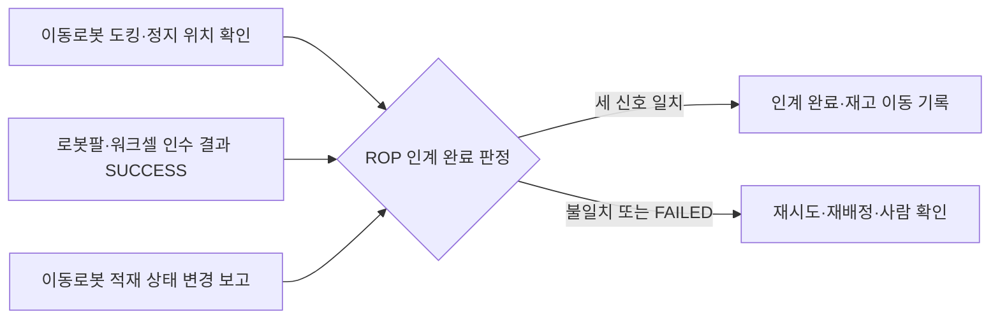

[홈](../../index.md) › [주제](../index.md) › 17. 로봇 간 협업·물리적 인계 — 대표 접근법과 기술

# 17. 로봇 간 협업·물리적 인계 — 대표 접근법과 기술

<!-- auto:page-status:start -->
<!-- auto:page-status:end -->

## 1. 세 줄 요약

- Open-RMF 배송 작업에서 로봇은 픽업 지점에서 DispenserResult 를 받을 때까지 DispenserRequest 를, 하역 지점에서 IngestorResult 를 받을 때까지 IngestorRequest 를 반복해 보내며, 워크셀은 상태(DispenserState·IngestorState)를 주기적으로 발행한다. [사실][^ref-023] 이 흐름은 플릿 어댑터의 perform_deliveries 설정을 켜야 동작한다. [사실][^ref-023]
- 이 페이지는 [17. 로봇 간 협업·물리적 인계](../../categories/e-collaboration-and-field-operations/17-robot-to-robot-collaboration-and-physical-handover.md) 페이지의 "대표 접근법과 기술" 절이 분량 기준을 넘어 옮겨 온 것이다. 원 페이지의 검증을 거친 내용이며 새 주장은 없다.

## 2. 배경

[17. 로봇 간 협업·물리적 인계](../../categories/e-collaboration-and-field-operations/17-robot-to-robot-collaboration-and-physical-handover.md) 페이지를 쓰는 과정에서 "대표 접근법과 기술" 절의 분량이 세부영역 페이지 기준(4,000자)을 넘어, 내용을 줄이지 않고 이 주제 페이지로 분리했다.

## 3. 본문

### 요청–결과 메시지로 인계 주고받기

Open-RMF 배송 작업에서 로봇은 픽업 지점에서 DispenserResult 를 받을 때까지 DispenserRequest 를, 하역 지점에서 IngestorResult 를 받을 때까지 IngestorRequest 를 반복해 보내며, 워크셀은 상태(DispenserState·IngestorState)를 주기적으로 발행한다. [사실][^ref-023] 이 흐름은 플릿 어댑터의 perform_deliveries 설정을 켜야 동작한다. [사실][^ref-023]

디스펜서 요청 메시지는 시각·요청 id(request_guid)·대상 워크셀 이름(target_guid)·운반체 유형(transporter_type)·품목 목록(품목 유형 id, 수량, 칸 이름)을 담고, 결과 메시지는 시각·요청 id·보낸 워크셀 id(source_guid)·상태(ACKNOWLEDGED, SUCCESS, FAILED)를 담는다. [사실][^ref-047][^ref-048][^ref-930]

이 위키의 추론으로는, 결과 메시지가 요청 단위의 성공·실패 상태만 담고 넘겨받은 화물의 개별 식별자나 실측 수량 필드가 없어 인수 확인의 근거가 워크셀 자체 판단에 기대므로, ROP 가 화물 식별·적재 상태 같은 별도 확인과 결합해야 할 것으로 보인다. [추정][^ref-930][^ref-047][^ref-048]

연구 시스템에서는 더 가벼운 신호도 쓴다. DELIVER(2025)는 로봇끼리 화물을 넘기는 릴레이 배송에서 넘기는 로봇이 ROS 메시지나 LED 색 변화로 준비를 알리고, 받는 로봇이 그 신호를 감지하면 움직이기 시작하게 한다. [사실][^ref-360]

### 동작 완료를 적재 상태 보고로 판정

VDA 5050 3.0.0 의 pick·drop 동작은 적재 장치(lhd), 스테이션 유형(바닥, 랙, 수동·능동 컨베이어 등), 스테이션 이름, 적재물 유형·식별 번호(loadType, loadId), 높이·깊이 파라미터를 두며, pick 은 적재물이 로봇에 들어오고 로봇이 새 적재 상태를 보고해야 완료(FINISHED)로 본다(발행일 미확인, 확인일 2026-09-25). [사실][^ref-031]

### 도킹 위치 확인

ROS 2 Nav2 도킹 프레임워크는 충전 도크와 컨베이어·팔레트 같은 비충전 도크를 모두 지원하며, 준비 위치(staging pose)로 간 뒤 센서로 도크 위치를 다듬어 접근하고, 모터 전류 급증(도크 접촉 감지)이나 거리 임계값으로 도킹 여부를 판정하며, 실패하면 기본 3회까지 재시도한다. [사실][^ref-216]

### 여러 신호를 결합한 인계 완료 판정

위 세 가지 신호(도킹 확인, 워크셀 인수 결과, 적재 상태 보고)가 모두 일치할 때 인계 완료로 인정하는 방식이 가능할 것으로 보이나, 세 신호를 결합하는 규정은 이번 조사에서 어느 표준에서도 확인하지 못했다. [추정][^ref-216][^ref-930][^ref-031][^ref-920] 아래 도식은 이 위키가 제안하는 판정 흐름이다.

## 4. 현장 시나리오

현장 시나리오는 원 페이지의 [5. 현장 시나리오 (물류 흐름의 어느 단계인지 명시)](../../categories/e-collaboration-and-field-operations/17-robot-to-robot-collaboration-and-physical-handover.md) 절에 있다.

## 5. ROP 관점의 시사점

ROP가 직접 맡는 것과 외부와 연계하는 것은 원 페이지의 [9. ROP가 직접 맡는 것과 외부와 연계하는 것 (부록 A 9장 기준)](../../categories/e-collaboration-and-field-operations/17-robot-to-robot-collaboration-and-physical-handover.md) 절에 있다.

## 6. 연결되는 연구영역

- 주 연구영역: [17. 로봇 간 협업·물리적 인계](../../categories/e-collaboration-and-field-operations/17-robot-to-robot-collaboration-and-physical-handover.md)
- 관련 영역: [5. 로봇 능력·작업 온톨로지](../../categories/b-common-information-and-environment-model/05-robot-capability-and-task-ontology.md), [7. 화물·재고·자산 식별과 추적](../../categories/b-common-information-and-environment-model/07-cargo-inventory-and-asset-identification-and-tracking.md), [10. 설비·건물 시스템 연동](../../categories/c-connectivity-and-execution-foundation/10-facility-and-building-system-integration.md), [13. 작업 배정 — MRTA](../../categories/d-planning-and-optimization/13-task-allocation-mrta.md), [14. 작업 순서·스케줄링](../../categories/d-planning-and-optimization/14-task-sequencing-and-scheduling.md), [16. 공용 자원·충전·에너지 최적화](../../categories/d-planning-and-optimization/16-shared-resource-charging-and-energy-optimization.md), [20. 예외 복구·재계획·업무 연속성](../../categories/e-collaboration-and-field-operations/20-exception-recovery-replanning-and-business-continuity.md), [23. 시험·형식 검증·벤치마크](../../categories/f-deployment-verification-and-maintenance/23-testing-formal-verification-and-benchmarking.md), [25. 안전·위험 관리](../../categories/g-safety-security-intelligence-and-governance/25-safety-and-risk-management.md)

## 7. 열린 질문

열린 질문은 원 페이지의 [11. 열린 질문](../../categories/e-collaboration-and-field-operations/17-robot-to-robot-collaboration-and-physical-handover.md) 절과 [열린 질문](../../open-questions.md) 페이지에 모은다.

## 8. 출처

[^ref-023]: Open Robotics, Workcells - Programming Multiple Robots with ROS 2, 미확인, https://osrf.github.io/ros2multirobotbook/integration_workcells.html, 접근일 2026-09-25
[^ref-031]: VDA / VDMA (VDA5050 GitHub), VDA5050/VDA5050_EN.md — Official Specification document for the VDA 5050, 미확인, https://github.com/VDA5050/VDA5050/blob/main/VDA5050_EN.md, 접근일 2026-09-25
[^ref-047]: Open Robotics (open-rmf), rmf_internal_msgs — rmf_dispenser_msgs/msg/DispenserRequest.msg, 미확인, https://github.com/open-rmf/rmf_internal_msgs/blob/main/rmf_dispenser_msgs/msg/DispenserRequest.msg, 접근일 2026-09-25
[^ref-048]: Open Robotics (open-rmf), rmf_internal_msgs — rmf_dispenser_msgs/msg/DispenserRequestItem.msg, 미확인, https://github.com/open-rmf/rmf_internal_msgs/blob/main/rmf_dispenser_msgs/msg/DispenserRequestItem.msg, 접근일 2026-09-25
[^ref-216]: ROS Navigation (ros-navigation/navigation2 GitHub), nav2_docking — README (Open Navigation's Nav2 Docking Framework), 미확인, https://github.com/ros-navigation/navigation2/blob/main/nav2_docking/README.md, 접근일 2026-09-25
[^ref-360]: arXiv 2508.19114 저자(미확인), DELIVER: A System for LLM-Guided Coordinated Multi-Robot Pickup and Delivery using Voronoi-Based Relay Planning, 2025-08, https://arxiv.org/abs/2508.19114, 접근일 2026-09-25 (원문 미열람)
[^ref-920]: ASTM International, Standard Test Method for Confirming the Docking Performance of A-UGVs (ASTM F3499-21), 2021, https://www.astm.org/f3499-21.html, 접근일 2026-09-25 (원문 미열람)
[^ref-930]: Open Robotics (open-rmf), rmf_internal_msgs — rmf_dispenser_msgs/msg/DispenserResult.msg, 미확인, https://github.com/open-rmf/rmf_internal_msgs/blob/main/rmf_dispenser_msgs/msg/DispenserResult.msg, 접근일 2026-09-25

## 9. 검증 노트

원 페이지와 함께 실행 2026-09-25-42 의 1차·2차 검증을 거쳤다. 분리는 코드가 했고 내용은 바꾸지 않았다.

## 10. 이력

| 날짜 | 실행 id | 변경 |
|---|---|---|
| 2026-09-25 | 2026-09-25-42 | 17. 로봇 간 협업·물리적 인계 의 "대표 접근법과 기술" 절에서 분리 |
