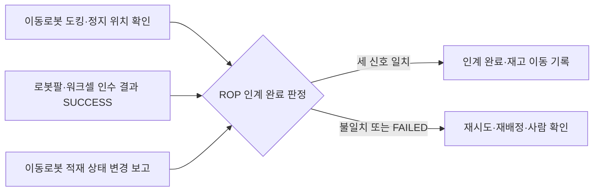

(너의 규칙은 시스템 프롬프트의 agents/shared-rules.md 와 agents/storyteller.md 이다. 아래는 이번 실행의 컨텍스트와 입력이다.)

## 실행 컨텍스트

- run_id: 2026-09-25-42
- date: 2026-09-25
- run_type: area_deep_dive (영역 심화)
- 대상: 17. 로봇 간 협업·물리적 인계 (E. 협업·현장 운영)
- 예산:
    - max_search_queries: 30
    - max_sources_per_run: 15
    - new_topic_pages: 1
    - page_updates: 2
    - max_retries: 2
- 환경 알림: web_fetch_available: false · fetch_mode: mirror_only (일반 웹 페이지 열람은 네트워크 정책으로 막혀 있다. raw.githubusercontent.com 은 열린다: 공식 문서가 GitHub 에 있는 출처는 입력의 config/source_mirrors.yaml 경로를 WebFetch 로 열어 원문을 읽고 sources[].fetched=true, fetched_via=github_raw, fetch_url 을 적는다. 입력에 원문 텍스트(data/source_texts)가 있는 출처는 fetched_via=inbox. 그 밖의 출처는 fetched=false 이며 코드가 신뢰도 상한(medium)을 강제한다 — 공통 규칙 0절 6항)
- 언어: ko
- retry_count: 1
- max_retries: 2

## 입력

### runs/2026-09-25-42/target.json

```json
{
  "run_id": "2026-09-25-42",
  "date": "2026-09-25",
  "weekday": "Fri",
  "run_number": 42,
  "run_type": "area_deep_dive",
  "forced": true,
  "target": {
    "area_no": 17,
    "area_name": "17. 로봇 간 협업·물리적 인계",
    "category": "E. 협업·현장 운영",
    "category_letter": "E"
  },
  "topic": null,
  "track": null,
  "corrections": [],
  "budget": {
    "max_search_queries": 30,
    "max_sources_per_run": 15,
    "new_topic_pages": 1,
    "page_updates": 2,
    "max_retries": 2
  },
  "priority_reason": null,
  "priority_questions": [],
  "excluded_areas": [],
  "lifted_areas": [],
  "deferred": {
    "monthly_recheck": false,
    "weekly_review": false
  },
  "selection_rationale": "CLI 지정 run_type=area_deep_dive, area=17"
}
```

### runs/2026-09-25-42/research.json

```json
{
  "run_id": "2026-09-25-42",
  "date": "2026-09-25",
  "run_type": "area_deep_dive",
  "target": {
    "area_no": 17,
    "area_name": "17. 로봇 간 협업·물리적 인계",
    "category": "E. 협업·현장 운영"
  },
  "gaps": [
    "섹션 3. 왜 중요한가 비어 있음",
    "섹션 4. 핵심 개념과 용어 비어 있음",
    "섹션 5. 현장 시나리오 (물류 흐름의 어느 단계인지 명시) 비어 있음",
    "섹션 6. 대표 접근법과 기술 비어 있음",
    "섹션 7. 관련 표준·프레임워크·오픈소스 비어 있음",
    "섹션 8. 대표 연구와 자료 비어 있음 — 기존 각주는 ref-007 1건뿐",
    "섹션 9. ROP가 직접 맡는 것과 외부와 연계하는 것 (부록 A 9장 기준) 비어 있음",
    "섹션 10. 다른 연구영역과의 연결 비어 있음",
    "섹션 11. 열린 질문 비어 있음(기존 oq-001, oq-006, oq-042 가 이 영역에 걸림)"
  ],
  "research_questions": [
    "AMR이 물건을 가져온 뒤 로봇팔이 안전하게 인수했음을 어떻게 확인할까? [분류원문] (섹션 3·5·6 겨냥)",
    "로봇–로봇·로봇–설비 인계를 요청·결과 메시지나 단계 신호로 표현하는 공개 규격·오픈소스(Open-RMF 워크셀, VDA 5050 pick/drop, SEMI E84)는 무엇을 규정하고 무엇을 비워 두는가? — oq-001·oq-042 관련 (섹션 4·7 겨냥)",
    "이동로봇이 작업대·로봇팔 앞에 정확히 섰는지(도킹·정지 위치 정밀도)를 재는 시험 방법과 도구는 무엇인가? (섹션 6·7·8 겨냥)",
    "서로 다른 로봇 작업 사이의 선후·동기화(스케줄 간 의존, 인계 스테이션·릴레이)를 다루는 배정·계획 연구는 무엇인가? (섹션 6·8·10 겨냥)",
    "공동 운반과 인식 결과 공유(협동 인지)는 연구에서 어떻게 정의되고 분류되는가? (섹션 4·8 겨냥)",
    "인계 완료를 재고·업무 이벤트로 기록할 때 GS1 CBV 업무 단계 어휘는 어떤 값을 제공하는가? — oq-006 관련 (섹션 4·10 겨냥)",
    "모바일 매니퓰레이터·이동로봇 협업의 안전 표준과 국내 자료·사례는 무엇이 있는가? (섹션 8·9·10 겨냥, 한국 자료 우선)"
  ],
  "findings": [
    {
      "id": "f1",
      "claim": "NIST 의 Performance of Collaborative Robot Systems 프로젝트는 사람–로봇·로봇–로봇 협업 팀의 안전성과 효과를 평가하는 방법·프로토콜·지표를 목표로 하며, 제조사·기종이 다른 로봇이 함께 일하는 이종 로봇 워크셀의 통합·평가를 대상으로 삼고 로봇 간·사람–로봇 간 협업 통신 프로토콜 개발을 과제 영역 하나로 둔다.",
      "tag": "사실",
      "source_ids": [
        "ref-007"
      ],
      "cross_checked": false,
      "confidence": "medium",
      "evidence_excerpt": "검색 요약: 'heterogeneous robot workcells (i.e., robots of different makes and models working together)'; 네 과제 영역에 협업 통신 프로토콜 개발 포함. 원문 미열람. (발행일 미확인, 확인일 기준)",
      "as_of": "2026-09-25",
      "flow_step": null,
      "flow_item": null,
      "source_unopened": true
    },
    {
      "id": "f2",
      "claim": "Open-RMF 배송 작업에서 로봇은 픽업 지점에서 DispenserResult 를 받을 때까지 DispenserRequest 를 반복해 보내고, 하역 지점에서 IngestorResult 를 받을 때까지 IngestorRequest 를 반복해 보내며, 워크셀은 주기적으로 상태(DispenserState·IngestorState)를 발행하고 이 흐름은 플릿 어댑터의 perform_deliveries 설정을 켜야 동작한다.",
      "tag": "사실",
      "source_ids": [
        "ref-023"
      ],
      "cross_checked": false,
      "confidence": "medium",
      "evidence_excerpt": "integration_workcells.md 원본(github_raw): 'Requests a DispenserRequest till receives a DispenserResult. (Done Dispensing)', 하역도 같은 방식. (발행일 미확인, 확인일 기준)",
      "as_of": "2026-09-25",
      "flow_step": null,
      "flow_item": "완료·인계"
    },
    {
      "id": "f3",
      "claim": "Open-RMF 디스펜서 요청 메시지는 시각·요청 id(request_guid)·대상 워크셀 이름(target_guid)·운반체 유형(transporter_type)·품목 목록(품목 유형 id, 수량, 칸 이름)을 담고, 디스펜서 결과 메시지는 시각·요청 id·보낸 워크셀 id(source_guid)·상태(ACKNOWLEDGED, SUCCESS, FAILED)를 담는다.",
      "tag": "사실",
      "source_ids": [
        "ref-047",
        "ref-048",
        "ref-930"
      ],
      "cross_checked": false,
      "confidence": "medium",
      "evidence_excerpt": "DispenserRequest.msg·DispenserRequestItem.msg·DispenserResult.msg 원본(github_raw): type_guid, quantity, compartment_name; status ACKNOWLEDGED=0 SUCCESS=1 FAILED=2. 같은 저장소라 독립 교차 아님. (발행일 미확인, 확인일 기준)",
      "as_of": "2026-09-25",
      "flow_step": null,
      "flow_item": "작업 대상"
    },
    {
      "id": "f4",
      "claim": "Open-RMF 워크셀 결과 메시지는 요청 단위의 성공·실패 상태만 담고 넘겨받은 화물의 개별 식별자나 실측 수량 필드가 없어, 인수 확인의 근거는 워크셀 자체 판단에 기대며 ROP 가 화물 식별·적재 상태 같은 별도 확인과 결합해야 할 것으로 보인다.",
      "tag": "추정",
      "source_ids": [
        "ref-930",
        "ref-047",
        "ref-048"
      ],
      "cross_checked": false,
      "confidence": "low",
      "evidence_excerpt": "f3 의 필드 목록에서 도출. 결과 메시지에 품목 필드 없음, 요청 품목은 유형 id·수량뿐. 이 위키의 추론(oq-001 관련).",
      "as_of": "2026-09-25",
      "flow_step": null,
      "flow_item": "완료·인계"
    },
    {
      "id": "f5",
      "claim": "VDA 5050 최신판(3.0.0)의 pick·drop 동작은 적재 장치(lhd), 스테이션 유형(예: 바닥, 랙, 수동·능동 컨베이어), 스테이션 이름, 적재물 유형·식별 번호(loadType, loadId), 높이·깊이 파라미터를 두며, pick 은 적재물이 로봇에 들어오고 로봇이 새 적재 상태를 보고하면 완료(FINISHED)로 본다.",
      "tag": "사실",
      "source_ids": [
        "ref-031"
      ],
      "cross_checked": false,
      "confidence": "medium",
      "evidence_excerpt": "VDA5050_EN.md 원본(github_raw): pick 완료 = 'Load has entered the mobile robot and mobile robot reports new load state'; 적재 장치가 여럿이면 lhd 필요(예: LHD1). (발행일 미확인, 확인일 기준)",
      "as_of": "2026-09-25",
      "flow_step": null,
      "flow_item": "완료·인계"
    },
    {
      "id": "f6",
      "claim": "VDA 5050 은 관제–이동로봇 통신과 무관한 인터페이스(주변 설비, 인프라, 외부 IT 시스템)를 범위에서 제외하며, 3.0.0 판에도 로봇과 컨베이어·스테이션 사이 인계 신호 절차는 들어 있지 않다.",
      "tag": "사실",
      "source_ids": [
        "ref-031"
      ],
      "cross_checked": false,
      "confidence": "medium",
      "evidence_excerpt": "VDA5050_EN.md 원본: 'interfaces to peripheral equipment, infrastructure components, or external IT systems' 제외. stationType 은 파라미터일 뿐 설비와의 핸드셰이크는 규정하지 않음. (발행일 미확인, 확인일 기준)",
      "as_of": "2026-09-25",
      "flow_step": null,
      "flow_item": "제약"
    },
    {
      "id": "f7",
      "claim": "반도체 업종의 SEMI E84 는 자동 반송 시스템(AMHS)과 생산 장비 로드포트 사이 캐리어 인계용 병렬 I/O 신호를 정하며, 장비가 인계 준비가 되었는지, 어느 로드포트를 쓸지, 인계가 진행 중인지·완료되었는지를 신호로 주고받는다.",
      "tag": "사실",
      "source_ids": [
        "ref-918",
        "ref-919"
      ],
      "cross_checked": true,
      "confidence": "medium",
      "evidence_excerpt": "검색 요약: 'handoff carriers between the production equipment and the AMHS'; 신호가 준비 여부·사용 로드포트·진행·완료를 나타냄. 개별 신호 이름·순서는 원문(유료) 미열람으로 확인 못함. (발행일 미확인, 확인일 기준)",
      "as_of": "2026-09-25",
      "flow_step": null,
      "flow_item": "완료·인계",
      "source_unopened": true
    },
    {
      "id": "f8",
      "claim": "SEMI E84 처럼 준비–진행–완료를 양쪽이 단계별로 확인하는 인계 신호 구조는, VDA 5050 이 비워 둔 이동로봇–작업대·로봇팔 인계 확인의 상태 모델을 ROP 가 정할 때 참고할 수 있을 것으로 보이나, 물류 업종에서 같은 역할을 하는 제조사 중립 공개 규격은 이번 조사에서 확인하지 못했다.",
      "tag": "추정",
      "source_ids": [
        "ref-918",
        "ref-919",
        "ref-031"
      ],
      "cross_checked": false,
      "confidence": "low",
      "evidence_excerpt": "f6(주변 설비 인터페이스 범위 제외)과 f7(E84 인계 신호)을 대응시킨 이 위키의 추론. 한·영 검색 각 1회에서 물류 AMR–컨베이어 공개 핸드셰이크 규격 미발견(oq-042).",
      "as_of": "2026-09-25",
      "flow_step": null,
      "flow_item": "완료·인계",
      "source_unopened": false
    },
    {
      "id": "f9",
      "claim": "NIST ARIAC 2025 시나리오에서 AGV 는 검사·조립·출하·재활용 스테이션 사이로 셀 트레이를 옮기고 검사 로봇팔이 합격 셀을 AGV 트레이에 올리며, 완성 키트를 실은 AGV 를 움직이기 전에 참가 팀은 키트 품질 확인 서비스를 호출해야 하고 트레이에 놓인 셀은 고정되어 검사 스테이션에서 다시 옮길 수 없다.",
      "tag": "사실",
      "source_ids": [
        "ref-008"
      ],
      "cross_checked": false,
      "confidence": "medium",
      "evidence_excerpt": "scenario.rst 원본(github_raw): move agv action, check kit quality service, 'Cells lock to the tray after they are placed and cannot be moved at the inspection station'. (발행일 미확인, 확인일 기준)",
      "as_of": "2026-09-25",
      "flow_step": null,
      "flow_item": "완료·인계"
    },
    {
      "id": "f10",
      "claim": "ASTM F3499-21 은 무인운반차·자율이동로봇(A-UGV)이 전역 위치나 도크 같은 현장 설비 기준 위치에 정지할 때의 위치 반복성과, 포크 같은 적재 이송 장치의 높이 제어 반복성을 확인하는 시험 방법이다.",
      "tag": "사실",
      "source_ids": [
        "ref-920"
      ],
      "cross_checked": false,
      "confidence": "medium",
      "evidence_excerpt": "검색 요약: positioning 은 'repeatability of A-UGV location when stationary after completing maneuvers to a stop location'; 'height control of load transfer equipment, for example an A-UGV with fork tines'. 원문 미열람.",
      "as_of": "2021",
      "flow_step": null,
      "flow_item": "제약",
      "source_unopened": true
    },
    {
      "id": "f11",
      "claim": "NIST 는 ASTM F45 위원회에서 이동로봇·모바일 매니퓰레이터 시험 방법 개발에 참여하며, 매니퓰레이터에 단 카메라·센서로 기준 표식을 측정해 모바일 매니퓰레이터의 위치 불확도를 재는 재구성형 시험 기물(RMMA)을 설계했고 그 측정 불확도가 2 mm 수준이라고 보고했다.",
      "tag": "사실",
      "source_ids": [
        "ref-921",
        "ref-922"
      ],
      "cross_checked": false,
      "confidence": "medium",
      "evidence_excerpt": "검색 요약: RMMA 는 'positioning uncertainty of mobile manipulators within a measurement uncertainty of 2 mm'; 도킹 실험 결과 반복 가능. 두 출처 모두 NIST 계열이라 독립 교차 아님. 원문 미열람. (발행일 미확인, 확인일 기준)",
      "as_of": "2026-09-25",
      "flow_step": null,
      "flow_item": "제약",
      "source_unopened": true
    },
    {
      "id": "f12",
      "claim": "ROS 2 Nav2 도킹 프레임워크는 충전 도크와 컨베이어·팔레트 같은 비충전 도크를 모두 지원하며, 준비 위치(staging pose)로 간 뒤 센서로 도크 위치를 다듬어 접근하고, 관절 부하 급증이나 거리 임계값으로 도킹 여부를 판정하며, 실패하면 기본 3회까지 재시도한다.",
      "tag": "사실",
      "source_ids": [
        "ref-216"
      ],
      "cross_checked": false,
      "confidence": "medium",
      "evidence_excerpt": "nav2_docking README 원본(github_raw): isDocked()·isCharging(), 'N retries may be made, driving back to the dock's staging pose'. (발행일 미확인, 확인일 기준)",
      "as_of": "2026-09-25",
      "flow_step": null,
      "flow_item": "예외·성과"
    },
    {
      "id": "f13",
      "claim": "Korsah·Stentz·Dias 의 다중 로봇 작업 배정 분류(iTax)는 작업 사이 의존을 의존 없음(ND)·일정 내 의존(ID)·스케줄 간 의존(XD)·복합 의존(CD)으로 나누며, 서로 다른 로봇에 배정된 작업 사이에 선후 제약 같은 관계가 있으면 스케줄 간 의존으로 본다.",
      "tag": "사실",
      "source_ids": [
        "ref-394"
      ],
      "cross_checked": false,
      "confidence": "medium",
      "evidence_excerpt": "검색 요약: 'no dependencies (ND), in-schedule dependencies (ID), cross-schedule dependencies (XD), and complex dependencies (CD)'. 원문 미열람.",
      "as_of": "2013",
      "flow_step": null,
      "flow_item": "제약",
      "source_unopened": true
    },
    {
      "id": "f14",
      "claim": "Coltin·Veloso(ICRA 2014)는 여러 이동로봇이 서로 물건을 옮겨 주는 전달(transfer)을 허용해 픽업·배송 계획을 개선하는 온라인 계획 알고리즘을 제시했다.",
      "tag": "사실",
      "source_ids": [
        "ref-924"
      ],
      "cross_checked": false,
      "confidence": "medium",
      "evidence_excerpt": "검색 요약: 'robots transfer objects to optimize a pickup and delivery plan', ICRA 2014, 5786–5791쪽. 원문 미열람.",
      "as_of": "2014",
      "flow_step": null,
      "flow_item": null,
      "source_unopened": true
    },
    {
      "id": "f15",
      "claim": "Zang 외(2026)는 구역에 묶인 플릿들이 도크 1개와 유한 버퍼를 가진 인계 스테이션으로 화물을 주고받는 지속형 다중 에이전트 픽업·배송 문제를 정식화하고, 공유 도크 예약 달력과 버퍼 점유 예측으로 경로를 승인하는 제어기(HARR)가 시뮬레이션에서 고정 도크 비교안보다 처리량을 최대 77% 높이고 적체를 92% 줄였다고 보고했다.",
      "tag": "사실",
      "source_ids": [
        "ref-925"
      ],
      "cross_checked": false,
      "confidence": "medium",
      "evidence_excerpt": "검색 요약: 'handover stations equipped with single docks and finite buffers, which are vulnerable to blocking and starvation'; 수치는 저자 보고·시뮬레이션·중간 부하 조건. 원문 미열람.",
      "as_of": "2026-07",
      "flow_step": null,
      "flow_item": "예외·성과",
      "source_unopened": true
    },
    {
      "id": "f16",
      "claim": "DELIVER(2025)는 보로노이 경계에서 로봇끼리 화물을 넘기는 릴레이 배송에서, 넘기는 로봇이 ROS 메시지나 LED 색 변화로 준비를 알리고 받는 로봇이 그 신호를 감지하면 움직이기 시작하는 가벼운 신호 방식을 쓴다.",
      "tag": "사실",
      "source_ids": [
        "ref-360"
      ],
      "cross_checked": false,
      "confidence": "medium",
      "evidence_excerpt": "검색 요약: 'the sending robot signals readiness via a ROS message or LED color change, and the receiving robot initiates motion upon detecting this signal'. 원문 미열람.",
      "as_of": "2025-08",
      "flow_step": null,
      "flow_item": "완료·인계",
      "source_unopened": true
    },
    {
      "id": "f17",
      "claim": "Tuci 외(2018)는 로봇 한 대로 다루기에 너무 크거나 무거운 물체를 여러 로봇이 행동을 조율해 목적지까지 옮기는 협동 운반(cooperative object transport)을 검토하고, 운반·조율·제어 전략이 다양하게 제안되어 왔다고 정리했다.",
      "tag": "사실",
      "source_ids": [
        "ref-923"
      ],
      "cross_checked": false,
      "confidence": "medium",
      "evidence_excerpt": "검색 요약: 'coordinate their actions to transport objects from a starting position to a final destination'; Frontiers in Robotics and AI 5:59. 원문 미열람.",
      "as_of": "2018",
      "flow_step": null,
      "flow_item": null,
      "source_unopened": true
    },
    {
      "id": "f18",
      "claim": "Singh 외(2024)는 로봇 플릿의 협동 인지를 여러 에이전트가 센서 정보를 공유·융합해 환경을 더 넓게 이해하고 판단을 돕는 능력으로 정의하고 관련 연구를 체계적으로 검토했다.",
      "tag": "사실",
      "source_ids": [
        "ref-928"
      ],
      "cross_checked": false,
      "confidence": "medium",
      "evidence_excerpt": "검색 요약: 'share and integrate their sensory information for a more comprehensive understanding of their environment'. ECCV 2024 워크숍 게재. 원문 미열람.",
      "as_of": "2024-03",
      "flow_step": null,
      "flow_item": null,
      "source_unopened": true
    },
    {
      "id": "f19",
      "claim": "ANSI/A3 R15.08-2-2023 은 산업용 이동로봇(IMR)과 그 플릿을 현장에 통합·배치할 때의 안전 요구사항을 정하며, AMR·AGV 플랫폼에 매니퓰레이터를 부착한 IMR 유형 C(모바일 매니퓰레이터)를 다룬다.",
      "tag": "사실",
      "source_ids": [
        "ref-926"
      ],
      "cross_checked": false,
      "confidence": "medium",
      "evidence_excerpt": "검색 요약: Part 2 는 'integrating, configuring, and customizing an IMR or fleet of IMRs into a site'; 'IMR Type C: ... mobile platform with a manipulator as the attachment'. 원문 미열람.",
      "as_of": "2023",
      "flow_step": null,
      "flow_item": "제약",
      "source_unopened": true
    },
    {
      "id": "f20",
      "claim": "국내에는 로봇 시스템과 그 통합의 안전 요구사항을 정한 한국산업표준 KS B ISO 10218-2(로봇 및 로봇 장치 — 산업용 로봇의 안전에 관한 요구사항 — 제2부: 로봇 시스템 및 통합)가 있다.",
      "tag": "사실",
      "source_ids": [
        "ref-927"
      ],
      "cross_checked": false,
      "confidence": "medium",
      "evidence_excerpt": "KSSN 표준 정보 검색 결과의 표준 번호·제목. 판·확인 연도와 이동식 로봇 적용 조항은 원문 미열람으로 확인 못함. (발행일 미확인, 확인일 기준)",
      "as_of": "2026-09-25",
      "flow_step": null,
      "flow_item": "제약",
      "source_unopened": true
    },
    {
      "id": "f21",
      "claim": "GS1 CBV 온톨로지는 업무 단계 accepting 을 물체의 점유·소유가 바뀌는 활동으로, receiving 을 물체가 한 위치에서 받아들여져 받는 쪽 재고에 더해지는 활동으로 정의하고, loading·unloading 은 운송 수단(shipping conveyance)에 싣고 내리는 활동으로 정의한다.",
      "tag": "사실",
      "source_ids": [
        "ref-044"
      ],
      "cross_checked": false,
      "confidence": "medium",
      "evidence_excerpt": "CBV.ttl 원본(github_raw): accepting 'an object changes possession and/or ownership'; receiving '... added to the receiver's inventory'; loading 'loaded into shipping conveyance'.",
      "as_of": "2021-09-30",
      "flow_step": null,
      "flow_item": "완료·인계"
    },
    {
      "id": "f22",
      "claim": "시설 안 로봇 사이·로봇과 작업대 사이의 물리적 인계는 CBV 에서 점유 이동을 뜻하는 accepting 이나 재고 편입을 뜻하는 receiving 에 가깝고 운송 수단 기준의 loading·unloading 과는 맞지 않아, 인계 이벤트의 업무 단계 값은 ROP 가 정해야 할 것으로 보인다.",
      "tag": "추정",
      "source_ids": [
        "ref-044"
      ],
      "cross_checked": false,
      "confidence": "low",
      "evidence_excerpt": "f21 정의에서 도출한 이 위키의 추론. 로봇 인계에 쓸 CBV 값을 권고한 GS1 문서는 확인 못함(oq-006).",
      "as_of": "2026-09-25",
      "flow_step": null,
      "flow_item": "완료·인계"
    },
    {
      "id": "f23",
      "claim": "국내에서는 유진로봇이 과학기술정보통신부·정보통신기획평가원의 스마트제조혁신기술개발사업으로 자율이송 모바일 매니퓰레이터 기반 지능형 제조 물류시스템 개발을 추진한다고 보도되었다.",
      "tag": "사실",
      "source_ids": [
        "ref-929"
      ],
      "cross_checked": false,
      "confidence": "low",
      "evidence_excerpt": "검색 요약(기사): '자율이송 모바일 매니플레이터 기반 지능형 제조 물류시스템 개발 사업', 스마트제조혁신기술개발사업 일환. 1차 출처(과제 공고) 미확인. 원문 미열람.",
      "as_of": "2025-11-04",
      "flow_step": null,
      "flow_item": null,
      "source_unopened": true
    },
    {
      "id": "f24",
      "claim": "분류 원문 질문(AMR 이 가져온 물건을 로봇팔이 안전하게 인수했음을 어떻게 확인할까)에 대해, 이동로봇의 도킹·정지 위치 확인, 로봇팔·워크셀의 인수 결과(SUCCESS), 이동로봇의 적재 상태 변경 보고라는 서로 독립된 신호가 모두 일치할 때 인계 완료로 인정하는 방식이 가능할 것으로 보인다.",
      "tag": "추정",
      "source_ids": [
        "ref-216",
        "ref-930",
        "ref-031",
        "ref-920"
      ],
      "cross_checked": false,
      "confidence": "low",
      "evidence_excerpt": "f10·f12(도킹 확인), f3(워크셀 결과 상태), f5(pick 완료 = 새 적재 상태 보고)를 SCM 질문에 대응시킨 추론. 세 신호를 결합하는 규정은 어느 표준에서도 확인 못함.",
      "as_of": "2026-09-25",
      "flow_step": "피킹",
      "flow_item": "완료·인계",
      "source_unopened": false
    },
    {
      "id": "f25",
      "claim": "피킹 단계에서 인계가 실패하면(워크셀 결과 FAILED, 도킹 재시도 한도 초과, 동작 FAILED) 인계 재시도·다른 작업대로 재배정·사람 확인 가운데 하나로 넘겨야 하며, 대기 동안 이동로봇과 작업대가 함께 묶여 처리량 손실이 생길 것으로 보인다.",
      "tag": "추정",
      "source_ids": [
        "ref-930",
        "ref-216",
        "ref-031",
        "ref-925"
      ],
      "cross_checked": false,
      "confidence": "low",
      "evidence_excerpt": "f3(FAILED 상태), f12(재시도 3회 기본), f5(동작 상태), f15(인계 스테이션의 차단·고갈)를 예외·성과 항목에 대응시킨 추론. 현장 사례 미확인.",
      "as_of": "2026-09-25",
      "flow_step": "피킹",
      "flow_item": "예외·성과",
      "source_unopened": false
    },
    {
      "id": "f26",
      "claim": "보충 단계에서 이동로봇 운반과 로봇팔 적치처럼 서로 다른 로봇의 작업이 선후로 이어지면 스케줄 간 의존이 생기고, 인계 스테이션의 도크·버퍼가 공용 자원 제약이 되므로 인계 시점을 두 로봇 일정에 함께 맞춰야 할 것으로 보인다.",
      "tag": "추정",
      "source_ids": [
        "ref-394",
        "ref-925"
      ],
      "cross_checked": false,
      "confidence": "low",
      "evidence_excerpt": "f13(XD)과 f15(도크 예약·버퍼 제약)를 보충 흐름의 제약 항목에 대응시킨 추론.",
      "as_of": "2026-09-25",
      "flow_step": "보충",
      "flow_item": "제약",
      "source_unopened": true
    },
    {
      "id": "f27",
      "claim": "ROP 가 직접 맡을 범위는 인계 작업의 순서·시점 동기화, 인계 요청·결과 신호의 중계, 여러 확인 신호를 모은 인계 완료 판정, 그 결과의 재고·업무 시스템 반영일 것으로 보인다.",
      "tag": "추정",
      "source_ids": [
        "ref-023",
        "ref-031",
        "ref-044"
      ],
      "cross_checked": false,
      "confidence": "low",
      "evidence_excerpt": "f2(요청–결과 중계), f6(VDA 5050 이 비워 둔 설비 인계), f21(업무 이벤트 어휘)을 분류 원문 9장 경계에 대응시킨 추론.",
      "as_of": "2026-09-25",
      "flow_step": null,
      "flow_item": "수행 자원"
    },
    {
      "id": "f28",
      "claim": "연계 대상: 로봇팔의 파지·동작 제어, 이동로봇의 도킹 주행 제어와 센서 인식, 컨베이어 PLC 와 설비 안전 제어는 로봇·설비 제조사가 맡고 ROP 는 그 결과 상태와 실패 신호를 받는 것으로 보인다.",
      "tag": "추정",
      "source_ids": [
        "ref-216",
        "ref-031",
        "ref-926"
      ],
      "cross_checked": false,
      "confidence": "low",
      "evidence_excerpt": "f12(도킹은 로봇 쪽 내비게이션 스택 기능), f6(주변 설비 인터페이스 범위 밖), f19(IMR 통합 안전)에서 도출. 분류 원문 9장 '로봇 자체 지능·제어'·'시설·설비 제어' 경계.",
      "as_of": "2026-09-25",
      "flow_step": null,
      "flow_item": "수행 자원",
      "source_unopened": false
    },
    {
      "id": "f29",
      "claim": "이 영역은 워크셀·컨베이어 인계로 10. 설비·건물 시스템 연동과, 인계 이벤트 기록으로 7. 화물·재고·자산 식별과 추적과, 스케줄 간 의존으로 13. 작업 배정 — MRTA·14. 작업 순서·스케줄링과, 인계 스테이션 도크 예약으로 16. 공용 자원·충전·에너지 최적화와, 인계 실패 처리로 20. 예외 복구·재계획·업무 연속성과, 도킹 시험·ARIAC 로 23. 시험·형식 검증·벤치마크와, 모바일 매니퓰레이터 안전으로 25. 안전·위험 관리와 이어질 것으로 보인다.",
      "tag": "추정",
      "source_ids": [
        "ref-023",
        "ref-044",
        "ref-394",
        "ref-925",
        "ref-920",
        "ref-008",
        "ref-926"
      ],
      "cross_checked": false,
      "confidence": "low",
      "evidence_excerpt": "f2·f21·f13·f15·f25·f10·f9·f19 를 영역 연결로 정리한 추론. 적재 장치 선언(lhd)은 5. 로봇 능력·작업 온톨로지와도 연결.",
      "as_of": "2026-09-25",
      "flow_step": null,
      "flow_item": null,
      "source_unopened": false
    }
  ],
  "sources": [
    {
      "id": "ref-007",
      "org": "NIST",
      "title": "Performance of Collaborative Robot Systems",
      "published": null,
      "url": "https://www.nist.gov/programs-projects/performance-collaborative-robot-systems",
      "type": "정부·연구기관",
      "reliability": "medium",
      "accessed": "2026-09-25",
      "summary": "원문 미열람. 사람–로봇·로봇–로봇 협업 팀과 이종 로봇 워크셀의 협업 성능을 평가하는 시험 방법·지표·통신 프로토콜 개발 프로젝트(검색 요약 기준).",
      "source_unopened": true,
      "fetched": false,
      "fetched_via": null,
      "fetch_url": null
    },
    {
      "id": "ref-008",
      "org": "NIST",
      "title": "ARIAC Documentation",
      "published": null,
      "url": "https://pages.nist.gov/ARIAC_docs/en/latest/",
      "type": "정부·연구기관",
      "reliability": "high",
      "accessed": "2026-09-25",
      "summary": "ARIAC 문서. 이번 실행은 2025 시나리오의 AGV 스테이션 이동, 로봇팔의 트레이 적재, 이동 전 키트 품질 확인 서비스를 원본으로 확인했다.",
      "fetched": true,
      "fetched_via": "github_raw",
      "fetch_url": "https://raw.githubusercontent.com/usnistgov/ARIAC_docs/main/docs/pages/scenario.rst",
      "source_unopened": false
    },
    {
      "id": "ref-023",
      "org": "Open Robotics",
      "title": "Workcells - Programming Multiple Robots with ROS 2",
      "published": null,
      "url": "https://osrf.github.io/ros2multirobotbook/integration_workcells.html",
      "type": "오픈소스 문서",
      "reliability": "high",
      "accessed": "2026-09-25",
      "summary": "디스펜서·인제스터 워크셀과 배송 작업의 요청–결과 반복 방식을 설명한 장. 이번 실행에서 mdBook 원본을 열었다.",
      "fetched": true,
      "fetched_via": "github_raw",
      "fetch_url": "https://raw.githubusercontent.com/osrf/ros2multirobotbook/master/src/integration_workcells.md",
      "source_unopened": false
    },
    {
      "id": "ref-031",
      "org": "VDA / VDMA (VDA5050 GitHub)",
      "title": "VDA5050/VDA5050_EN.md — Official Specification document for the VDA 5050",
      "published": null,
      "url": "https://github.com/VDA5050/VDA5050/blob/main/VDA5050_EN.md",
      "type": "표준",
      "reliability": "high",
      "accessed": "2026-09-25",
      "summary": "VDA 5050 최신판(3.0.0) 명세 원문. 이번 실행은 pick·drop 파라미터와 완료 조건, 주변 설비 인터페이스의 범위 제외를 확인했다.",
      "fetched": true,
      "fetched_via": "github_raw",
      "fetch_url": "https://raw.githubusercontent.com/VDA5050/VDA5050/main/VDA5050_EN.md",
      "source_unopened": false
    },
    {
      "id": "ref-044",
      "org": "GS1",
      "title": "gs1/EPCIS — Ontology/CBV.ttl (Core Business Vocabulary ontology 2.0)",
      "published": "2021-09-30",
      "url": "https://github.com/gs1/EPCIS/blob/master/Ontology/CBV.ttl",
      "type": "표준",
      "reliability": "high",
      "accessed": "2026-09-25",
      "summary": "CBV 업무 단계·상태 어휘 온톨로지. 이번 실행은 accepting·receiving·loading·unloading 등의 정의를 원본으로 확인했다.",
      "fetched": true,
      "fetched_via": "github_raw",
      "fetch_url": "https://raw.githubusercontent.com/gs1/EPCIS/master/Ontology/CBV.ttl",
      "source_unopened": false
    },
    {
      "id": "ref-047",
      "org": "Open Robotics (open-rmf)",
      "title": "rmf_internal_msgs — rmf_dispenser_msgs/msg/DispenserRequest.msg",
      "published": null,
      "url": "https://github.com/open-rmf/rmf_internal_msgs/blob/main/rmf_dispenser_msgs/msg/DispenserRequest.msg",
      "type": "오픈소스 문서",
      "reliability": "high",
      "accessed": "2026-09-25",
      "summary": "디스펜서 요청 메시지(시각, 요청 id, 대상 워크셀, 운반체 유형, 품목 목록). 이번 실행에서 원본을 열었다.",
      "fetched": true,
      "fetched_via": "github_raw",
      "fetch_url": "https://raw.githubusercontent.com/open-rmf/rmf_internal_msgs/main/rmf_dispenser_msgs/msg/DispenserRequest.msg",
      "source_unopened": false
    },
    {
      "id": "ref-048",
      "org": "Open Robotics (open-rmf)",
      "title": "rmf_internal_msgs — rmf_dispenser_msgs/msg/DispenserRequestItem.msg",
      "published": null,
      "url": "https://github.com/open-rmf/rmf_internal_msgs/blob/main/rmf_dispenser_msgs/msg/DispenserRequestItem.msg",
      "type": "오픈소스 문서",
      "reliability": "high",
      "accessed": "2026-09-25",
      "summary": "디스펜서 요청 품목(품목 유형 id, 수량, 칸 이름). 이번 실행에서 원본을 열었다.",
      "fetched": true,
      "fetched_via": "github_raw",
      "fetch_url": "https://raw.githubusercontent.com/open-rmf/rmf_internal_msgs/main/rmf_dispenser_msgs/msg/DispenserRequestItem.msg",
      "source_unopened": false
    },
    {
      "id": "ref-216",
      "org": "ROS Navigation (ros-navigation/navigation2 GitHub)",
      "title": "nav2_docking — README (Open Navigation's Nav2 Docking Framework)",
      "published": null,
      "url": "https://github.com/ros-navigation/navigation2/blob/main/nav2_docking/README.md",
      "type": "오픈소스 문서",
      "reliability": "medium",
      "accessed": "2026-09-25",
      "summary": "충전·비충전 도크 도킹 절차(준비 위치, 도크 위치 보정, 도킹 판정, 재시도)를 설명한 README. 이번 실행에서 원본을 열었다.",
      "fetched": true,
      "fetched_via": "github_raw",
      "fetch_url": "https://raw.githubusercontent.com/ros-navigation/navigation2/main/nav2_docking/README.md",
      "source_unopened": false
    },
    {
      "id": "ref-360",
      "org": "arXiv 2508.19114 저자(미확인)",
      "title": "DELIVER: A System for LLM-Guided Coordinated Multi-Robot Pickup and Delivery using Voronoi-Based Relay Planning",
      "published": "2025-08",
      "url": "https://arxiv.org/abs/2508.19114",
      "type": "논문",
      "reliability": "medium",
      "accessed": "2026-09-25",
      "summary": "원문 미열람. 보로노이 경계에서 로봇끼리 화물을 넘기는 릴레이 배송과 가벼운 준비 신호 방식을 다룬 프리프린트.",
      "source_unopened": true,
      "fetched": false,
      "fetched_via": null,
      "fetch_url": null
    },
    {
      "id": "ref-394",
      "org": "Korsah, G. A., Stentz, A., & Dias, M. B.",
      "title": "A comprehensive taxonomy for multi-robot task allocation",
      "published": "2013",
      "url": "https://journals.sagepub.com/doi/10.1177/0278364913496484",
      "type": "논문",
      "reliability": "medium",
      "accessed": "2026-09-25",
      "summary": "원문 미열람. 작업 사이 의존(ND·ID·XD·CD)을 포함한 다중 로봇 작업 배정 분류 iTax 를 제시한 논문.",
      "source_unopened": true,
      "fetched": false,
      "fetched_via": null,
      "fetch_url": null
    },
    {
      "id": "ref-918",
      "org": "SEMI",
      "title": "E08400 - SEMI E84 - Specification for Enhanced Carrier Handoff Parallel I/O Interface",
      "published": null,
      "url": "https://store-us.semi.org/products/e08400-semi-e84-specification-for-enhanced-carrier-handoff-parallel-i-o-interface",
      "type": "표준",
      "reliability": "medium",
      "accessed": "2026-09-25",
      "summary": "원문 미열람. 자동 반송 시스템과 생산 장비 로드포트 사이 캐리어 인계용 병렬 I/O 신호를 정한 SEMI 표준의 발행 기관 판매 페이지(유료 원문).",
      "source_unopened": true,
      "fetched": false,
      "fetched_via": null,
      "fetch_url": null
    },
    {
      "id": "ref-919",
      "org": "PEER Group",
      "title": "SEMI E84: Carrier Handoff",
      "published": null,
      "url": "https://www.peergroup.com/definition-of-standard/semi-e84/",
      "type": "벤더 문서",
      "reliability": "low",
      "accessed": "2026-09-25",
      "summary": "원문 미열람. 반도체 자동화 소프트웨어 업체의 SEMI E84 해설 페이지로, 도착 뒤 신호 교환으로 인계 준비·진행·완료를 확인한다고 설명한다.",
      "source_unopened": true,
      "fetched": false,
      "fetched_via": null,
      "fetch_url": null
    },
    {
      "id": "ref-920",
      "org": "ASTM International",
      "title": "Standard Test Method for Confirming the Docking Performance of A-UGVs (ASTM F3499-21)",
      "published": "2021",
      "url": "https://www.astm.org/f3499-21.html",
      "type": "표준",
      "reliability": "medium",
      "accessed": "2026-09-25",
      "summary": "원문 미열람. A-UGV 의 정지·도킹 위치 반복성과 적재 이송 장치 높이 제어 반복성을 확인하는 시험 방법.",
      "source_unopened": true,
      "fetched": false,
      "fetched_via": null,
      "fetch_url": null
    },
    {
      "id": "ref-921",
      "org": "NIST",
      "title": "Design and Application of the Reconfigurable Mobile Manipulator Artifact (RMMA)",
      "published": null,
      "url": "https://www.nist.gov/publications/design-and-application-reconfigurable-mobile-manipulator-artifact-rmma",
      "type": "정부·연구기관",
      "reliability": "medium",
      "accessed": "2026-09-25",
      "summary": "원문 미열람. 모바일 매니퓰레이터의 위치 불확도를 기준 표식으로 재는 시험 기물(RMMA)의 설계와 적용을 다룬 NIST 발행물.",
      "source_unopened": true,
      "fetched": false,
      "fetched_via": null,
      "fetch_url": null
    },
    {
      "id": "ref-922",
      "org": "Bostelman, R. 외(NIST)",
      "title": "Mobile Robot and Mobile Manipulator Research Towards ASTM Standards Development",
      "published": null,
      "url": "https://pubmed.ncbi.nlm.nih.gov/28690359/",
      "type": "논문",
      "reliability": "medium",
      "accessed": "2026-09-25",
      "summary": "원문 미열람. ASTM F45 표준 개발을 위한 NIST 의 이동로봇 도킹·모바일 매니퓰레이터 성능 측정 연구를 정리한 논문.",
      "source_unopened": true,
      "fetched": false,
      "fetched_via": null,
      "fetch_url": null
    },
    {
      "id": "ref-923",
      "org": "Tuci, E., Alkilabi, M. H. M., & Akanyeti, O.",
      "title": "Cooperative Object Transport in Multi-Robot Systems: A Review of the State-of-the-Art",
      "published": "2018",
      "url": "https://www.frontiersin.org/journals/robotics-and-ai/articles/10.3389/frobt.2018.00059/full",
      "type": "논문",
      "reliability": "medium",
      "accessed": "2026-09-25",
      "summary": "원문 미열람. 여러 로봇이 행동을 조율해 크거나 무거운 물체를 옮기는 협동 운반 연구를 검토한 Frontiers in Robotics and AI 리뷰.",
      "source_unopened": true,
      "fetched": false,
      "fetched_via": null,
      "fetch_url": null
    },
    {
      "id": "ref-924",
      "org": "Coltin, B., & Veloso, M.",
      "title": "Online pickup and delivery planning with transfers for mobile robots",
      "published": "2014",
      "url": "https://www.researchgate.net/publication/289338501_Online_pickup_and_delivery_planning_with_transfers_for_mobile_robots",
      "type": "논문",
      "reliability": "medium",
      "accessed": "2026-09-25",
      "summary": "원문 미열람. 이동로봇 사이 물건 전달을 허용해 픽업·배송 계획을 개선하는 온라인 알고리즘(ICRA 2014).",
      "source_unopened": true,
      "fetched": false,
      "fetched_via": null,
      "fetch_url": null
    },
    {
      "id": "ref-925",
      "org": "Zang, C. 외",
      "title": "Lifelong Multi-Subsystem Pickup and Delivery with Buffer-Limited Handover Stations",
      "published": "2026-07",
      "url": "https://arxiv.org/abs/2607.17724",
      "type": "논문",
      "reliability": "medium",
      "accessed": "2026-09-25",
      "summary": "원문 미열람. 도크 1개·유한 버퍼의 인계 스테이션으로 화물을 주고받는 다중 서브시스템 픽업·배송 문제와 도크 예약·버퍼 예측 제어기(HARR)를 제시한 프리프린트.",
      "source_unopened": true,
      "fetched": false,
      "fetched_via": null,
      "fetch_url": null
    },
    {
      "id": "ref-926",
      "org": "ANSI / A3(Association for Advancing Automation)",
      "title": "ANSI/A3 R15.08-2-2023 - Industrial Mobile Robots - Safety Requirements - Part 2: Requirements for IMR system(s) and IMR application(s)",
      "published": "2023",
      "url": "https://webstore.ansi.org/standards/ria/ansia3r15082023",
      "type": "표준",
      "reliability": "medium",
      "accessed": "2026-09-25",
      "summary": "원문 미열람. 산업용 이동로봇 시스템·응용·플릿의 현장 통합 안전 요구사항을 정한 미국 국가표준으로, 매니퓰레이터를 단 이동로봇(유형 C)을 다룬다.",
      "source_unopened": true,
      "fetched": false,
      "fetched_via": null,
      "fetch_url": null
    },
    {
      "id": "ref-927",
      "org": "국가표준인증통합정보시스템(KSSN)",
      "title": "KS B ISO 10218-2 로봇 및 로봇 장치 - 산업용 로봇의 안전에 관한 요구사항 - 제2부: 로봇 시스템 및 통합",
      "published": null,
      "url": "https://www.kssn.net/search/stddetail.do?itemNo=K001010083660",
      "type": "표준",
      "reliability": "medium",
      "accessed": "2026-09-25",
      "summary": "원문 미열람. 산업용 로봇 시스템과 그 통합의 안전 요구사항을 정한 한국산업표준의 표준 정보 페이지.",
      "source_unopened": true,
      "fetched": false,
      "fetched_via": null,
      "fetch_url": null
    },
    {
      "id": "ref-928",
      "org": "Singh, A., Raut, G., & Choudhary, A.",
      "title": "Multi-agent Collaborative Perception for Robotic Fleet: A Systematic Review",
      "published": "2024-03",
      "url": "https://arxiv.org/abs/2405.15777",
      "type": "논문",
      "reliability": "medium",
      "accessed": "2026-09-25",
      "summary": "원문 미열람. 로봇 플릿에서 여러 에이전트가 센서 정보를 공유·융합하는 협동 인지 연구를 검토한 논문(ECCV 2024 워크숍).",
      "source_unopened": true,
      "fetched": false,
      "fetched_via": null,
      "fetch_url": null
    },
    {
      "id": "ref-929",
      "org": "다음뉴스 게재 기사(원 언론사 미확인)",
      "title": "유진로봇, 지능형 제조 물류시스템 공개",
      "published": "2025-11-04",
      "url": "https://v.daum.net/v/20251104092138920",
      "type": "기사",
      "reliability": "low",
      "accessed": "2026-09-25",
      "summary": "원문 미열람. 유진로봇의 자율이송 모바일 매니퓰레이터 기반 지능형 제조 물류시스템 국책과제를 전한 기사(검색 요약 기준).",
      "source_unopened": true,
      "fetched": false,
      "fetched_via": null,
      "fetch_url": null
    },
    {
      "id": "ref-930",
      "org": "Open Robotics (open-rmf)",
      "title": "rmf_internal_msgs — rmf_dispenser_msgs/msg/DispenserResult.msg",
      "published": null,
      "url": "https://github.com/open-rmf/rmf_internal_msgs/blob/main/rmf_dispenser_msgs/msg/DispenserResult.msg",
      "type": "오픈소스 문서",
      "reliability": "high",
      "accessed": "2026-09-25",
      "summary": "디스펜서 결과 메시지(시각, 요청 id, 워크셀 id, 상태 ACKNOWLEDGED·SUCCESS·FAILED). 이번 실행에서 원본을 열었다.",
      "fetched": true,
      "fetched_via": "github_raw",
      "fetch_url": "https://raw.githubusercontent.com/open-rmf/rmf_internal_msgs/main/rmf_dispenser_msgs/msg/DispenserResult.msg",
      "source_unopened": false
    }
  ],
  "page_proposals": [
    {
      "action": "update",
      "path": "docs/categories/e-collaboration-and-field-operations/17-robot-to-robot-collaboration-and-physical-handover.md",
      "sections": [
        "3",
        "4",
        "5",
        "6",
        "7",
        "8",
        "9",
        "10",
        "11"
      ],
      "rationale": "3절: f1(NIST 이종 로봇 협업 평가), f6·f8(인계 신호의 표준 공백), f24(SCM 질문) / 4절: f13(스케줄 간 의존), f17(협동 운반), f18(협동 인지), f21(CBV accepting·receiving), f2·f3(디스펜서·인제스터 요청–결과) / 5절: f24(피킹, 완료·인계), f25(피킹, 예외·성과), f26(보충, 제약) / 6절: f2·f4·f5·f12·f14·f15·f16·f24 / 7절: f2·f3(Open-RMF 워크셀), f5·f6(VDA 5050 pick·drop과 범위 제외), f7(SEMI E84), f10(ASTM F3499), f12(Nav2 도킹), f19·f20(R15.08-2, KS B ISO 10218-2) / 8절: f1·f9·f11·f13·f14·f15·f16·f17·f18·f23(국내 자료 f20·f23 포함) / 9절: f27(직접 범위), f28(연계 대상: 파지·도킹 주행·PLC·설비 안전 제어) / 10절: f29(7·10·13·14·16·20·23·25번, 5번은 lhd 선언), f22(7. 화물·재고·자산 식별과 추적, oq-006) / 11절: 기존 oq-001·oq-006·oq-042 연결과 새 열린 질문. f7 은 반도체 업종 규격이라 업종 차이를 병기, f23 은 기사 1건이라 한계 병기."
    }
  ],
  "glossary_candidates": [
    {
      "term_ko": "모바일 매니퓰레이터",
      "term_en": "Mobile Manipulator",
      "definition": "AMR·AGV 같은 이동 플랫폼에 로봇팔을 결합해 이동과 집기·놓기 작업을 함께 수행하는 로봇이다."
    },
    {
      "term_ko": "협동 운반",
      "term_en": "Cooperative Object Transport",
      "definition": "로봇 한 대로 다루기 어려운 크거나 무거운 물체를 여러 로봇이 행동을 조율해 목적지까지 함께 옮기는 일이다."
    },
    {
      "term_ko": "협동 인지",
      "term_en": "Collaborative Perception",
      "definition": "여러 로봇이 센서 정보나 인식 결과를 공유·융합해 한 대가 볼 때보다 넓고 정확하게 환경을 파악하는 방식이다."
    },
    {
      "term_ko": "스케줄 간 의존",
      "term_en": "Cross-schedule Dependency (XD)",
      "definition": "서로 다른 로봇에 배정된 작업 사이에 선후 같은 관계가 있어, 한 로봇의 작업 적합성이 다른 로봇의 일정에 따라 달라지는 작업 의존 유형이다."
    }
  ],
  "open_questions_new": [
    "로봇팔·워크셀의 인수 결과와 이동로봇의 적재 상태 보고가 어긋날 때(한쪽은 성공, 다른 쪽은 적재 유지) 어느 신호를 기준으로 인계 완료를 판정하는지 정한 표준이나 현장 사례가 있는가? | 관련 영역: 17. 로봇 간 협업·물리적 인계, 8. 실시간 세계 상태·데이터 일관성 | 근거: f24 | 종류: 일반",
    "반도체 업종의 SEMI E84 같은 단계별 인계 신호를 물류센터의 이동로봇–컨베이어·작업대 인계에 적용하거나 옮긴 사례가 있는가? | 관련 영역: 17. 로봇 간 협업·물리적 인계, 10. 설비·건물 시스템 연동 | 근거: f7 | 종류: 일반",
    "ASTM F3499·NIST RMMA 같은 도킹·위치 정밀도 시험 결과를 로봇팔 파지 허용 오차와 연결해 인계 가능 여부를 정하는 기준이 있는가? | 관련 영역: 17. 로봇 간 협업·물리적 인계, 23. 시험·형식 검증·벤치마크 | 근거: f10 | 종류: 일반",
    "국내에 ANSI/A3 R15.08-2 의 유형 C(모바일 매니퓰레이터) 통합 안전 요구에 대응하는 KS 표준이나 인증 기준이 있는가? | 관련 영역: 17. 로봇 간 협업·물리적 인계, 25. 안전·위험 관리 | 근거: f19 | 종류: 일반"
  ],
  "open_questions_resolved": [],
  "self_check": {
    "source_count": 23,
    "cross_checked_count": 1,
    "unverified": [
      "f7 SEMI E84 개별 신호 이름·순서는 유료 원문 미열람으로 확인 못함",
      "f11 RMMA 2 mm 수치는 NIST 계열 출처뿐으로 독립 교차 확인 실패",
      "f15 처리량·적체 수치는 저자 보고 시뮬레이션 결과",
      "f20 KS B ISO 10218-2 의 판·확인 연도와 이동식 로봇 적용 조항 미확인",
      "f23 국책과제 1차 출처(공고·과제 정보) 미확인, 기사 원 언론사 미확인",
      "ref-922 발행연도 미확인",
      "물류 업종의 이동로봇–컨베이어 제조사 중립 인계 규격은 찾지 못함(oq-042 미해결)",
      "공동 운반(협동 운반)의 물류센터 적용 사례는 찾지 못함"
    ],
    "scope_violations": [
      "f28: 로봇팔 파지·도킹 주행 제어·컨베이어 PLC·설비 안전 제어는 분류 원문 9장 '로봇 자체 지능·제어'·'시설·설비 제어' 연계 영역이라 claim 을 '연계 대상: '으로 표시함",
      "f7·f8: SEMI E84 는 반도체 업종 규격이라 물류센터 직접 적용 근거가 아니라 참고 사례로만 제안함",
      "f19·f20: 안전 표준은 25. 안전·위험 관리의 내용이며 이 영역에서는 제약으로만 연결하도록 제안함"
    ],
    "budget_used": {
      "queries": 21,
      "sources": 13
    },
    "limits": "web_fetch_available: false · fetch_mode mirror_only. raw.githubusercontent.com 으로 원문을 연 출처: 재사용 ref-008(ARIAC scenario.rst)·ref-023(workcells)·ref-031(VDA 5050 main)·ref-044(CBV.ttl)·ref-047·ref-048(디스펜서 요청 메시지)·ref-216(nav2_docking README), 신규 ref-930(DispenserResult.msg). 그 밖의 신규 12건과 재사용 ref-007·ref-360·ref-394 는 원문 미열람(신뢰도 상한 medium). 검색 21회/30(영어 13, 한국어 8), 신규 출처 13건/15(ref-918~ref-930, 예약 구간 안), 재사용 10건. 교차 확인 1건(f7). 입력의 정정 요청 없음. 한국 자료: KS B ISO 10218-2(ref-927), 유진로봇 국책과제 기사(ref-929); 국내 학술 논문으로 이동로봇–로봇팔 인계 확인을 다룬 것은 찾지 못했다. oq-042 는 f6·f7·f8 로 일부 답했으나(VDA 5050 은 범위 밖, 반도체 E84 존재) 물류 업종 중립 규격을 찾지 못해 해결 제안하지 않았다. oq-006 은 f21·f22 로 CBV 정의를 보강했을 뿐 해결하지 않았다. 27. AI·학습·적응과 모델 운영 관련 finding 은 내지 않았다(f16 의 LLM 은 계획용이며 인계 신호 방식만 인용). 8. 실시간 세계 상태·데이터 일관성(현재 인계 상태 판정)과 22. 시뮬레이션·예측용 디지털 트윈(ARIAC 같은 시뮬레이션 평가)은 섞지 않고 ARIAC 는 23. 시험·형식 검증·벤치마크 쪽으로 연결했다."
  }
}
```

### runs/2026-09-25-42/verification.json

```json
{
  "run_id": "2026-09-25-42",
  "stage": "first",
  "verdict": "조건부 승인",
  "claim_checks": [
    {
      "finding_id": "f1",
      "source_exists": true,
      "supports_claim": true,
      "cross_checked": false,
      "tag_decision": "유지",
      "note": "ref-007 은 시드 참고문헌(분류 원문 [7])으로 실재. 원문 미열람(fetch_mode mirror_only, 미러 없음). 검증자는 검색 예산 때문에 다시 검색하지 않았고, 이종 로봇 워크셀·협업 통신 프로토콜 과제는 리서치 스니펫 기준이다. 단일 출처이며 기준일은 확인일이다."
    },
    {
      "finding_id": "f2",
      "source_exists": true,
      "supports_claim": true,
      "cross_checked": false,
      "tag_decision": "유지",
      "note": "확인: ref-023 mdBook 원본(입력 data/source_texts)에서 DispenserRequest→DispenserResult, IngestorRequest→IngestorResult 반복, 상태 주기 발행, perform_deliveries 조건을 확인했다. 발행일은 미확인."
    },
    {
      "finding_id": "f3",
      "source_exists": true,
      "supports_claim": true,
      "cross_checked": false,
      "tag_decision": "유지",
      "note": "확인: 검증자가 raw.githubusercontent.com 에서 DispenserRequest.msg(time, request_guid, target_guid, transporter_type, items), DispenserRequestItem.msg(type_guid, quantity, compartment_name), DispenserResult.msg(time, request_guid, source_guid, ACKNOWLEDGED=0·SUCCESS=1·FAILED=2)를 직접 열어 일치를 확인했다. 같은 저장소라 독립 교차는 아니다."
    },
    {
      "finding_id": "f4",
      "source_exists": true,
      "supports_claim": true,
      "cross_checked": false,
      "tag_decision": "유지",
      "note": "[추정] 유지. 결과 메시지에 품목·실측 필드가 없음을 원본으로 확인했다(IngestorResult ref-049 는 이번에 대조하지 않음). 이 위키의 추론임을 본문에 밝혀야 한다."
    },
    {
      "finding_id": "f5",
      "source_exists": true,
      "supports_claim": true,
      "cross_checked": false,
      "tag_decision": "유지",
      "note": "확인: VDA5050_EN.md(3.0.0) 원본의 pick 파라미터(lhd, stationType, stationName, loadType, loadId, height, depth, side)와 FINISHED 조건('Load has entered the mobile robot and mobile robot reports new load state')이 일치한다. 판은 3.0.0 이고 발행일은 미확인이다(oq-005 참조)."
    },
    {
      "finding_id": "f6",
      "source_exists": true,
      "supports_claim": true,
      "cross_checked": false,
      "tag_decision": "유지",
      "note": "확인: 2절 Scope 에서 'interfaces to peripheral equipment, infrastructure components, or external IT systems' 제외를 확인했다. 명세에는 설비 핸드셰이크 절차가 없고, 5.3절이 주변 시스템(문·게이트·승강기) 통신을 관제 기능으로 두는 수준이다. ref-031 직접 인용이 f5 와 겹친다(인용 규칙 참조)."
    },
    {
      "finding_id": "f7",
      "source_exists": true,
      "supports_claim": true,
      "cross_checked": true,
      "tag_decision": "유지",
      "note": "원문 미열람(유료 표준). 검증자 검색으로 SEMI 판매 페이지(ref-918)와 PEER Group 해설(ref-919)이 AMHS–장비 로드포트 캐리어 인계용 병렬 I/O 신호(준비·로드포트·진행·완료)를 설명하는 것을 확인했다. 발행 주체가 다르므로 독립 교차로 본다. 개별 신호 이름·순서는 미확인이다. 반도체 업종 규격이므로 업종 차이를 병기해야 한다."
    },
    {
      "finding_id": "f8",
      "source_exists": true,
      "supports_claim": true,
      "cross_checked": false,
      "tag_decision": "유지",
      "note": "[추정] 유지. f6·f7 을 대응시킨 추론이며, 근거 가운데 ref-918·ref-919 는 원문 미열람이다. 브리프가 source_unopened: false 로 적었으나 미열람 출처에 기대고 있다."
    },
    {
      "finding_id": "f9",
      "source_exists": true,
      "supports_claim": true,
      "cross_checked": false,
      "tag_decision": "유지",
      "note": "확인: scenario.rst 원본에서 AGV 스테이션 4곳(Inspection, Assembly, Shipping, Recycling), 검사 로봇2(UR5e)의 트레이 적재, 이동 전 check kit quality 서비스 호출, 'Cells lock to the tray after they are placed and cannot be moved at the inspection station'을 확인했다. ARIAC 2025 기준이다."
    },
    {
      "finding_id": "f10",
      "source_exists": true,
      "supports_claim": true,
      "cross_checked": false,
      "tag_decision": "유지",
      "note": "원문 미열람. 검증자 검색 결과 ASTM 페이지(f3499-21) 요약이 정지 위치 반복성·도킹(현장 설비 기준 위치)·포크 높이 제어 반복성 시험을 담고 있어 일치한다. 발행은 2021 이다."
    },
    {
      "finding_id": "f11",
      "source_exists": true,
      "supports_claim": true,
      "cross_checked": false,
      "tag_decision": "유지",
      "note": "원문 미열람. 검증자 검색으로 NIST RMMA 발행물 페이지가 '2 mm 측정 불확도 내 위치 불확도 측정'을 기술함을 확인했다. 2 mm 는 NIST 자체 보고치이며 독립 교차 확인이 없다. ASTM F45 참여 서술은 ref-922 스니펫 기준이고, ref-922 발행연도는 미확인이다."
    },
    {
      "finding_id": "f12",
      "source_exists": true,
      "supports_claim": true,
      "cross_checked": false,
      "tag_decision": "유지",
      "note": "확인: nav2_docking README 원본에서 충전·비충전 도크(컨베이어·팔레트), 준비 위치(staging pose), 거리 임계(docking_threshold) 판정, max_retries 기본 3 을 확인했다. 다만 원문의 접촉 판정은 '전류(current) 급증'이므로 '관절 부하 급증'이라는 표현은 고쳐야 한다."
    },
    {
      "finding_id": "f13",
      "source_exists": true,
      "supports_claim": true,
      "cross_checked": false,
      "tag_decision": "유지",
      "note": "원문 미열람. ref-394 는 기존 참고문헌이다. ND·ID·XD·CD 분류는 리서치 스니펫 기준이며 검증자는 재검색하지 않았다. 발행은 2013 이다."
    },
    {
      "finding_id": "f14",
      "source_exists": true,
      "supports_claim": true,
      "cross_checked": false,
      "tag_decision": "유지",
      "note": "원문 미열람. ResearchGate 사본 URL이며 리서치 스니펫(ICRA 2014, 5786–5791쪽) 기준이다. 검증자는 재검색하지 않았다."
    },
    {
      "finding_id": "f15",
      "source_exists": true,
      "supports_claim": true,
      "cross_checked": false,
      "tag_decision": "유지",
      "note": "원문 미열람. 검증자 검색으로 arXiv 2607.17724(Zang, Barz, Mannucci, Schillinger, Lier, Hönig, 2026-07)의 실재와 HARR(공유 도크 예약 달력, 버퍼 점유 예측), 중간 부하에서 고정 도크 비교안 대비 처리량 최대 77%↑·적체 92%↓를 확인했다. 수치는 저자 보고 시뮬레이션 결과이며 프리프린트다."
    },
    {
      "finding_id": "f16",
      "source_exists": true,
      "supports_claim": true,
      "cross_checked": false,
      "tag_decision": "유지",
      "note": "원문 미열람. 검증자 검색으로 arXiv 2508.19114 요약('sending robot signals readiness via a ROS message or LED color change')을 확인했다. TurtleBot3 실기·Gazebo 검증으로, 물류 현장 적용 사례는 아니다. IEEE Xplore 게재본이 있다."
    },
    {
      "finding_id": "f17",
      "source_exists": true,
      "supports_claim": true,
      "cross_checked": false,
      "tag_decision": "유지",
      "note": "원문 미열람. Frontiers in Robotics and AI 5:59(2018) 리뷰이며 리서치 스니펫 기준이다. 검증자는 재검색하지 않았다."
    },
    {
      "finding_id": "f18",
      "source_exists": true,
      "supports_claim": true,
      "cross_checked": false,
      "tag_decision": "유지",
      "note": "원문 미열람. 검증자 검색으로 arXiv 2405.15777(Singh, Raut, Choudhary; 제출 2024-03-22), ECCV 2024 워크숍 게재, 협동 인지 정의를 확인했다."
    },
    {
      "finding_id": "f19",
      "source_exists": true,
      "supports_claim": true,
      "cross_checked": false,
      "tag_decision": "유지",
      "note": "원문 미열람. 검증자 검색으로 ANSI 웹스토어·A3 발표에서 Part 2 가 IMR·플릿의 현장 통합 안전 요구를 정하고 IMR 유형 C(AMR·AGV 플랫폼 + 매니퓰레이터)를 정의함을 확인했다. 25. 안전·위험 관리의 내용이다."
    },
    {
      "finding_id": "f20",
      "source_exists": true,
      "supports_claim": true,
      "cross_checked": false,
      "tag_decision": "유지",
      "note": "원문 미열람. 검증자 검색으로 KSSN 표준 정보(itemNo K001010083660)와 제목이 일치함을 확인했다. KSSN 에 2017 확인판 항목(K001010116494)도 따로 있어 판·확인 연도는 미확인이다."
    },
    {
      "finding_id": "f21",
      "source_exists": true,
      "supports_claim": true,
      "cross_checked": false,
      "tag_decision": "유지",
      "note": "확인: CBV.ttl 원본에서 accepting('changes possession and/or ownership'), receiving('added to the receiver's inventory'), loading·unloading('shipping conveyance') 정의를 확인했다. 온톨로지 수정일은 2021-09-30(생성 2021-06-01)이다."
    },
    {
      "finding_id": "f22",
      "source_exists": true,
      "supports_claim": true,
      "cross_checked": false,
      "tag_decision": "유지",
      "note": "[추정] 유지. f21 정의에서 도출한 이 위키의 추론이다(oq-006). GS1 권고 문서는 확인하지 못했다."
    },
    {
      "finding_id": "f23",
      "source_exists": true,
      "supports_claim": false,
      "cross_checked": false,
      "tag_decision": "강등",
      "note": "사실 → 추정. 기사 실재는 확인했다(다음뉴스 게재, 같은 제목·날짜의 지디넷코리아·한국경제·로봇신문 기사가 검색됨). 그러나 기사들은 2025-11-04 과제 결과물 공개·시연을 전하며, '추진한다'는 서술과 정보통신기획평가원 명시는 검색 범위에서 확인하지 못했다. 기사 1건 기반이고 1차 출처(과제 정보)는 미확인이다."
    },
    {
      "finding_id": "f24",
      "source_exists": true,
      "supports_claim": true,
      "cross_checked": false,
      "tag_decision": "유지",
      "note": "[추정] 유지. SCM 질문에 대응한 추론이다. 근거 가운데 ref-920 은 원문 미열람이며, 세 신호 결합 규정은 어느 표준에도 없다."
    },
    {
      "finding_id": "f25",
      "source_exists": true,
      "supports_claim": true,
      "cross_checked": false,
      "tag_decision": "유지",
      "note": "[추정] 유지. 현장 사례는 미확인이다. ref-925 는 원문 미열람이다."
    },
    {
      "finding_id": "f26",
      "source_exists": true,
      "supports_claim": true,
      "cross_checked": false,
      "tag_decision": "유지",
      "note": "[추정] 유지. f13·f15 의 원문 미열람 출처에 기댄 추론이다."
    },
    {
      "finding_id": "f27",
      "source_exists": true,
      "supports_claim": true,
      "cross_checked": false,
      "tag_decision": "유지",
      "note": "[추정] 유지. 분류 원문 9장 경계에 대응한 추론이다. VDA 5050 5.3절이 주변 시스템 통신을 관제 기능으로 두는 점과도 어긋나지 않는다."
    },
    {
      "finding_id": "f28",
      "source_exists": true,
      "supports_claim": true,
      "cross_checked": false,
      "tag_decision": "유지",
      "note": "[추정] 유지. '연계 대상'으로 표시되어 범위 경계를 지킨다. ref-926 은 원문 미열람이다."
    },
    {
      "finding_id": "f29",
      "source_exists": true,
      "supports_claim": true,
      "cross_checked": false,
      "tag_decision": "유지",
      "note": "[추정] 유지. 영역 연결 정리이며, 번호와 이름을 함께 쓴 것을 확인했다."
    }
  ],
  "category_fit": {
    "ok": true,
    "reassign_to": null
  },
  "scope_boundary": {
    "ok": true,
    "issues": [
      "f28: 파지·도킹 주행·PLC·설비 안전 제어는 '연계 대상'으로 표시되어 있어 위반은 아니다. 본문 9절에서도 ROP 는 결과 상태·실패 신호 수신으로만 서술해야 한다.",
      "f7·f8: SEMI E84 는 반도체 업종 규격(분류 원문 9장 '업종별 조건')이므로 물류센터 직접 적용 근거가 아니라 참고 사례로만 서술해야 한다.",
      "f19·f20: 안전 표준은 25. 안전·위험 관리의 내용이므로 이 영역에서는 제약·연결로만 다뤄야 한다."
    ]
  },
  "duplication": {
    "ok": true,
    "overlaps": [
      "f2·f3(디스펜서·인제스터)은 용어집 기존 항목 '디스펜서·인제스터'와 겹치므로 새 용어로 등록하지 않고 링크한다.",
      "f13·f26(스케줄 간 의존)은 기존 oq-049(제조사가 다른 플릿 사이 작업 선후)와 관련되므로 11절에서 연결한다.",
      "f15 는 용어집 '다중 에이전트 픽업·배송'(MAPD)·'선후 제약'과 관련되므로 링크한다.",
      "새 열린 질문 2(SEMI E84 의 물류 적용 사례)는 기존 oq-042(제조사 중립 인계 신호 규격)와 인접하므로 본문에서 oq-042 와 함께 제시한다.",
      "ref-007·ref-008·ref-023·ref-031·ref-044·ref-047·ref-048·ref-216·ref-360·ref-394 는 기존 참고문헌이므로 기존 각주를 재사용한다."
    ]
  },
  "terminology": {
    "ok": true,
    "conflicts": []
  },
  "quotation_check": {
    "ok": true,
    "issues": [
      "ref-031 은 f5·f6 발췌에 직접 인용 구절이 두 번 나온다. 페이지에서는 ref-031 직접 인용을 1회 이하로 제한하고 나머지는 재서술해야 한다."
    ]
  },
  "corrections_applied": [],
  "corrections_rejected": [],
  "required_fixes": [
    "f23: [사실] → [추정]으로 강등하고 문장을 '유진로봇이 과학기술정보통신부 스마트제조혁신기술개발사업의 자율이송 모바일 매니퓰레이터 기반 지능형 제조 물류시스템 개발 과제 결과물을 공개했다고 보도되었다(2025-11-04)'로 고친다. '정보통신기획평가원'과 '추진한다'는 뺀다 — 검증 검색에서 기사들은 결과물 공개를 전했고, 전담기관 명칭은 확인되지 않았다. 기사 1건 기반이라는 한계를 병기한다.",
    "f12: '관절 부하 급증' 표현을 '모터 전류 급증(도크 접촉 감지)'으로 고친다 — nav2_docking README 원문은 current spike 를 기준으로 한다.",
    "f15: 77%·92% 수치에는 '저자 보고, 시뮬레이션, 중간 부하 조건, 고정 도크 비교안 대비, 프리프린트'라는 조건을 본문에 함께 적는다 — 단일 출처의 저자 보고치다.",
    "f11: 2 mm 는 'NIST 보고치'로 명시하고 독립 확인이 없음을 병기한다 — ref-921·ref-922 가 모두 NIST 계열이다.",
    "f7·f8: SEMI E84 를 서술하는 문장마다 '반도체 업종(AMHS–생산 장비 로드포트) 규격이며 물류센터 적용 근거는 아니다'를 병기하고, 개별 신호 이름·순서는 '미확인'으로 둔다 — 원문 미열람 유료 표준이다.",
    "f4·f8·f22·f24~f29: [추정] 문장에는 '이 위키의 추론'임을 드러내는 표현(…것으로 보인다)을 유지하고 [사실]로 올리지 않는다.",
    "원문 미열람 표시: fetched=false 인 출처 ref-007·ref-360·ref-394·ref-918·ref-919·ref-920·ref-921·ref-922·ref-923·ref-924·ref-925·ref-926·ref-927·ref-928·ref-929 의 각주 정의에는 접근일 뒤에 ' (원문 미열람)'을 붙이고, reference_updates 의 해당 항목에 source_unopened: true 를 넣는다. raw 로 연 ref-008·ref-023·ref-031·ref-044·ref-047·ref-048·ref-216·ref-930 에는 붙이지 않는다.",
    "ref-007: 새 각주를 만들지 않고 시드 페이지의 기존 각주 정의 줄을 재사용한다. 다른 기존 참고문헌(ref-008·ref-023·ref-031·ref-044·ref-047·ref-048·ref-216·ref-360·ref-394)도 references/ref-NNN.md 의 각주 형식 줄을 그대로 쓴다.",
    "인용: ref-031 의 원문 직접 인용은 페이지 전체에서 1회 이하로 두고 나머지는 재서술한다 — 출처당 1회 규칙이다.",
    "f19·f20: 9절·7절에서 안전 표준은 '25. 안전·위험 관리와 연결되는 제약'으로만 서술하고, ROP 가 안전 요구를 이행하는 것처럼 쓰지 않는다. f20 에는 '판·확인 연도와 이동식 로봇 적용 조항 미확인'을 병기한다.",
    "11절: 기존 oq-001·oq-006·oq-042 와 함께 oq-049 를 연결하고, 새 열린 질문 2(SEMI E84 물류 적용)는 oq-042 와 나란히 둔다. 새 열린 질문 3의 근거 필드를 'f10·f11'로 고친다(RMMA 를 언급하므로).",
    "4절: '디스펜서·인제스터'는 새 용어로 등록하지 않고 기존 용어집 페이지(docs/glossary/dispenser-ingestor.md)에 링크한다. 새 용어 후보 4건(모바일 매니퓰레이터, 협동 운반, 협동 인지, 스케줄 간 의존)은 기존 항목과 충돌하지 않으므로 등록할 수 있다."
  ],
  "confidence": "medium",
  "verification_note": "판정: 1차 조건부 승인. 이번 실행은 원문 열람이 차단된 환경(fetch_mode mirror_only, raw.githubusercontent.com 만 열람)에서 검증됐다. 확인 28건, 미확인 1건(f23), 교차 확인 1건(f7). 강등: f23 사실 → 추정(기사는 과제 결과물 공개를 전하며 전담기관 명시는 미확인). 원문 미열람 출처: ref-007, ref-360, ref-394, ref-918, ref-919, ref-920, ref-921, ref-922, ref-923, ref-924, ref-925, ref-926, ref-927, ref-928, ref-929. 원문 확인 출처: ref-008, ref-023, ref-031, ref-044, ref-047, ref-048, ref-216, ref-930(검증자가 DispenserRequest·DispenserRequestItem·DispenserResult·nav2_docking README·ARIAC scenario.rst·CBV.ttl·VDA 5050 3.0.0 을 직접 대조). 검증 검색 9회(리서치 21회와 합쳐 30/30)로 ref-918·ref-919·ref-920·ref-921·ref-925·ref-926·ref-927·ref-928·ref-929·ref-360 의 실재와 요약 일치를 확인했다. ref-007·ref-394·ref-923·ref-924·ref-922 는 검증 예산이 부족해 리서치 스니펫 기준으로만 판단했다. 주의: 이동로봇–작업대·로봇팔 인계 확인을 제조사 중립으로 정한 물류 업종 공개 규격은 확인되지 않았다(oq-042 미해결). SEMI E84 는 반도체 업종 참고 사례이며, 인계 완료 판정 방식(f24)과 ROP 직접 범위(f27)는 이 위키의 추론이다. 정정 요청 없음. 미사용 출처 없음.",
  "retry_reason": null
}
```

### docs/categories/e-collaboration-and-field-operations/17-robot-to-robot-collaboration-and-physical-handover.md

```markdown
---
title: "17. 로봇 간 협업·물리적 인계"
type: area
category: "E. 협업·현장 운영"
area_no: 17
related_areas: []
tags: []
status: seed
created: 2026-09-24
updated: 2026-09-24
sources: []
version: 1
---

[홈](../../index.md) › [E. 협업·현장 운영](index.md) › 17. 로봇 간 협업·물리적 인계

# 17. 로봇 간 협업·물리적 인계

!!! info "소속 대분류"
    [E. 협업·현장 운영](index.md) — 핵심 질문:
    계획과 실제가 달라지는 상황에서 일을 어떻게 계속할 것인가? [분류원문]

<!-- auto:area-tracks:start -->
<!-- auto:area-tracks:end -->

## 1. 한 줄 정의

이동로봇–로봇팔 협업, 공동 운반, 작업 동기화, 인계 확인, 필요한 정보·인식 결과 공유 [분류원문]

## 2. SCM 관점의 질문

AMR이 물건을 가져온 뒤 로봇팔이 안전하게 인수했음을 어떻게 확인할까? [분류원문]

> 원문 주석: 17번의 협업은 이동로봇끼리 길을 양보하는 문제보다 넓다. **이동·조작·검사·사람 작업을 하나의 공정으로 묶는 문제**까지 포함한다. NIST도 이종 로봇과 사람의 협업 성능을 별도 연구·평가 대상으로 다룬다. [7] [분류원문]

원문의 [7]은 참고문헌 [ref-007](../../references/ref-007.md)에 해당한다.[^ref-007]

## 3. 왜 중요한가

아직 작성되지 않음

## 4. 핵심 개념과 용어

아직 작성되지 않음

## 5. 현장 시나리오 (물류 흐름의 어느 단계인지 명시)

아직 작성되지 않음

## 6. 대표 접근법과 기술

아직 작성되지 않음

## 7. 관련 표준·프레임워크·오픈소스

아직 작성되지 않음

## 8. 대표 연구와 자료

아직 작성되지 않음

## 9. ROP가 직접 맡는 것과 외부와 연계하는 것 (부록 A 9장 기준)

아직 작성되지 않음

## 10. 다른 연구영역과의 연결 (번호와 이름을 함께 표기)

아직 작성되지 않음

## 11. 열린 질문

아직 작성되지 않음

## 12. 최근 업데이트 (자동)

<!-- auto:area-recent:start -->
아직 기록된 업데이트가 없다.
<!-- auto:area-recent:end -->

## 13. 참고 자료 (각주)

[^ref-007]: NIST, Performance of Collaborative Robot Systems, 미확인, https://www.nist.gov/programs-projects/performance-collaborative-robot-systems, 접근일 2026-09-24
```

### docs/categories/e-collaboration-and-field-operations/index.md

```markdown
---
title: "E. 협업·현장 운영"
type: category
status: seed
created: 2026-09-24
updated: 2026-09-24
version: 1
---

[홈](../../index.md) › E. 협업·현장 운영

# E. 협업·현장 운영

## 핵심 질문

계획과 실제가 달라지는 상황에서 일을 어떻게 계속할 것인가? [분류원문]

## 개요

**계획과 실제가 달라지는 상황에서 일을 어떻게 계속할 것인가**를 연구한다. 정상적인 시연과 실제 운영의 차이가 많이 드러나는 영역이다. [분류원문]

## 세부 연구영역

표의 세부 연구영역·무엇을 연구하는가·SCM 관점의 질문 열은 원문 그대로이고, 페이지·현재 상태 열은 위키에서 덧붙인 것이다. 현재 상태는 퍼블리셔가 자동으로 갱신한다.

<!-- auto:category-area-table:start -->
| 세부 연구영역 | 무엇을 연구하는가 | SCM 관점의 질문 | 페이지 | 현재 상태 |
|---|---|---|---|---|
| **17. 로봇 간 협업·물리적 인계** | 이동로봇–로봇팔 협업, 공동 운반, 작업 동기화, 인계 확인, 필요한 정보·인식 결과 공유 | AMR이 물건을 가져온 뒤 로봇팔이 안전하게 인수했음을 어떻게 확인할까? | [17. 로봇 간 협업·물리적 인계](17-robot-to-robot-collaboration-and-physical-handover.md) | seed |
| **18. 사람–로봇 협업·운영 인터페이스** | 작업자에게 일 배정, 승인·수동 전환, 원격 조작, 설명 가능한 상태 표시, 인체공학 | 사람이 피킹하고 로봇이 운반할 때 서로 기다리지 않게 하려면? | [18. 사람–로봇 협업·운영 인터페이스](18-human-robot-collaboration-and-operator-interface.md) | seed |
| **19. 모니터링·이상 탐지·원인 분석** | 로그·이벤트·성능 지표를 연결해 이상을 탐지하고, 로봇·설비·통신·공정 원인을 구분 | 지연 원인이 로봇 고장인지, 문인지, 앞 공정인지 어떻게 찾을까? | [19. 모니터링·이상 탐지·원인 분석](19-monitoring-anomaly-detection-and-root-cause-analysis.md) | seed |
| **20. 예외 복구·재계획·업무 연속성** | 고장·통신 단절·화물 누락·긴급 주문 등에 대해 재배정, 우회, 수동 처리, 제한 운영을 결정 | 운반 중 고장 난 로봇의 화물과 남은 주문은 어떻게 처리할까? | [20. 예외 복구·재계획·업무 연속성](20-exception-recovery-replanning-and-business-continuity.md) | seed |

[분류원문]
<!-- auto:category-area-table:end -->

## 이 대분류의 핵심 포인트

17번의 협업은 이동로봇끼리 길을 양보하는 문제보다 넓다. **이동·조작·검사·사람 작업을 하나의 공정으로 묶는 문제**까지 포함한다. NIST도 이종 로봇과 사람의 협업 성능을 별도 연구·평가 대상으로 다룬다. [7] [분류원문]

## 다른 대분류와의 연결

아직 작성되지 않음(에이전트가 채운다).

## 최근 업데이트

<!-- auto:category-recent:start -->
아직 기록된 업데이트가 없다.
<!-- auto:category-recent:end -->

## 참고 자료

원문의 [7]은 참고문헌 [ref-007](../../references/ref-007.md)에 해당한다.[^ref-007]

[^ref-007]: NIST, Performance of Collaborative Robot Systems, 미확인, https://www.nist.gov/programs-projects/performance-collaborative-robot-systems, 접근일 2026-09-24
```

### templates/area.md

```markdown
---
title: "{{area_no}}. {{area_name}}"        # 원문 명칭 그대로. 예: "7. 화물·재고·자산 식별과 추적"
type: area
category: "{{category}}"                    # 소속 대분류 원문 명칭. 예: "B. 공통 정보·환경 모델"
area_no: {{area_no}}                        # 1~28 정수
related_areas: [{{related_areas}}]          # 10절에서 연결한 세부영역 번호. 예: [8, 12, 17]. 없으면 []
tags: [{{tags}}]                            # 핵심 용어 3~6개. 예: [EPCIS, 인계 확인, 자산 추적]. 시드면 []
status: {{status}}                          # seed | draft | verified | published | needs_update | deprecated
confidence: {{confidence}}                  # high | medium | low. 내용 검증 에이전트가 부여. 시드면 이 줄을 뺀다
created: {{created}}                        # YYYY-MM-DD. 페이지를 처음 만든 날
updated: {{updated}}                        # YYYY-MM-DD. 마지막으로 내용을 바꾼 날
sources: [{{sources}}]                      # 이 페이지 각주에 쓴 참고문헌 id. 예: [ref-003, ref-021]. 없으면 []
last_run: {{last_run}}                      # 이 페이지를 마지막으로 다룬 실행 날짜 YYYY-MM-DD. 시드면 이 줄을 뺀다
version: {{version}}                        # 정수. 시드 1, 갱신마다 +1
---
<!--
[템플릿] 세부 연구영역 페이지 (type: area)
경로: docs/categories/<대분류 slug>/<두 자리 번호-slug>.md  (아래 경로 규약 표)
쓰임: 구축 시 시드 생성 → 영역 심화 실행(1주기)에서 3~11절 작성 → 갱신·월간 재검증 실행에서 부분 갱신.
시드 규칙(4.4): 1절·2절의 원문 정의·질문, 소속 대분류, 원문 주석(2절의 "> 원문 주석:" 인용 블록. 예: 7. 화물·재고·자산 식별과 추적의 EPCIS 언급, 6. 지도·공간·위치 모델의 지도 버전 관리 포함 주석, 8. 실시간 세계 상태·데이터 일관성과 22. 시뮬레이션·예측용 디지털 트윈의 구분, 27. AI·학습·적응과 모델 운영의 교차 적용 주석)만 넣고, 3~11절은 제목만 두고 "아직 작성되지 않음"으로 표시한다. status 는 seed.
분량: 3~11절의 본문 글자 수(공백 포함, 표 구분 기호·각주 정의·프런트매터 제외)를 4,000자 이내로 한다. 넘치면 주제 페이지(docs/topics/)로 분리하고 이 페이지에서는 링크한다.
갱신 규칙: 갱신 실행에서는 기존 본문 중 유지할 부분과 바꿀 부분을 정하고, 브리프에 없는 새 사실을 더하지 않는다. 조건부 승인의 수정 목록은 모두 반영한다. 변경 요약은 pages.json 의 diff_summary 와 changelog_entry 로 내고(12절 최근 업데이트는 퍼블리셔가 채운다) version 을 올린다.
절 제목: 아래 13개 H2 문자열은 사양서 5.4 문구 그대로(괄호 설명 포함)이며 pipeline/checks/protect_source.py 의 AREA_SECTIONS 와 글자 단위로 같다. 괄호까지 포함해 그대로 쓴다. 다르면 "섹션 제목·순서 불일치"로 반려된다.

[공통 규칙] 모든 템플릿에 같은 규칙이 적용된다.
1. 자리 표시: {{...}} 는 모두 실제 값으로 바꾼다. 자리 표시({{ }})가 남은 페이지는 퍼블리셔가 반려한다. 값이 없는 선택 필드는 줄 자체를 지운다.
2. 섹션 제목과 순서는 고정이다. 제목 문구를 바꾸거나, 섹션을 빼거나, 순서를 바꾸지 않는다. 채울 근거가 없는 섹션은 제목 아래에 "아직 작성되지 않음" 한 줄만 둔다. 섹션 안의 소제목(###)은 자유롭게 둘 수 있다.
3. 자동 갱신 영역: auto:<key>:start 와 auto:<key>:end 마커 사이는 퍼블리셔 스크립트가 다시 쓴다. 마커를 지우거나 옮기지 않으며, 마커 사이의 내용은 손대지 않는다(새 페이지에서는 템플릿의 안내 문구를 그대로 둔다). 마커 밖의 본문은 스크립트가 건드리지 않는다.
4. 안내 주석 처리: 이 블록을 포함한 HTML 주석과 프런트매터의 # 주석은 완성 페이지에서 지운다. auto 마커 주석만 남긴다.
5. 문체: 한국어 평서체("~이다/~한다"), 짧은 단락, 전문용어는 첫 등장 시 영문 병기, 약어는 첫 등장 시 풀어 쓴다. 마케팅 표현 금지, 근거 없는 단정 금지. 독자는 SCM·로봇·기획 실무자이며 전문가가 아니어도 이해할 수 있어야 한다.
6. 항목 호칭: 대분류·세부영역은 항상 번호와 이름을 함께 쓴다. 예: "7. 화물·재고·자산 식별과 추적", "B. 공통 정보·환경 모델". "B-7", "2-1", "7번"처럼 코드·번호만으로 부르지 않는다. 표·도식·링크 텍스트 안에서도 같다.
7. 사실 표기: 주장 문장의 끝에 [사실] / [추정] / [의견] 중 하나와 각주를 함께 붙인다. 예: "GS1 EPCIS는 제품·자산의 상태·위치·이동·인계 이벤트를 공유하는 표준이다. [사실][^ref-003]". 트랙 가설은 [가설], 사용자가 experiments/ 에 넣은 실험 결과는 [사용자 실험]으로 표기하고, 둘 다 [사실]로 올리려면 내용 검증 에이전트의 판정이 필요하다. 벤더의 기능·성능 주장은 독립 출처로 확인되기 전까지 [추정]에 "벤더 주장"을 병기한다. 출처 없는 수치·사례는 쓰지 않는다. 핵심 수치는 2개 이상 출처로 교차 확인한다. 확인하지 못한 것은 지어내지 않고 "미확인"으로 남기거나 열린 질문으로 보낸다. 모든 사실에는 기준일(발행일 또는 확인일)을 남긴다. 서로 다른 출처가 충돌하면 한쪽을 고르지 않고 둘 다 제시하고 열린 질문에 올린다. "빠짐없이", "완전", "모든 기능" 같은 표현은 측정 결과(커버리지 지표)가 있을 때만 쓴다.
8. 분류 원문: _source/ROP_SCM_연구분야_분류.md 에서 가져온 문장은 한 글자도 바꾸지 않고(굵게·기울임 같은 마크다운 표기와 원문의 [1]~[10] 번호 표기 포함) 문장(또는 표) 끝에 [분류원문] 을 붙인다. 원문의 대분류·세부영역 명칭·번호·정의·질문은 변경·축약·병합하지 않는다. 세부영역을 새로 만들거나 분류를 확장하지 않는다. 필요해 보이면 열린 질문에 "분류 확장 제안"으로만 기록한다.
9. 각주: 본문에서는 [^ref-003] 형식으로 쓴다. 각주 정의는 페이지 마지막 "참고 자료" 또는 "출처" 섹션에 "[^ref-003]: 기관, 제목, 발행일, URL, 접근일 YYYY-MM-DD" 형식으로 둔다(시드 docs/references/ref-003.md·docs/about/what-is-rop.md 와 같은 형식. 예: "[^ref-003]: GS1, EPCIS and CBV Linked Data Model, 미확인, https://ref.gs1.org/epcis/, 접근일 2026-09-24"). 발행일을 모르면 발행일 자리에 "미확인"을 쓰고, 접근일은 날짜 앞에 "접근일 "을 붙인다. 원문을 열지 못한 출처는 접근일 뒤에 " (원문 미열람)"을 붙인다. 참고문헌 id 는 ref-001 ~ ref-010 이 분류 원문 12장의 1~10번에 대응한다(ref-001 ASCM SCOR, ref-002 ISA-95, ref-003 GS1 EPCIS, ref-004 Open-RMF, ref-005 Li et al. Lifelong MAPF, ref-006 Ma et al. MAPD, ref-007 NIST 협업 로봇 성능, ref-008 NIST ARIAC, ref-009 ROS 2 DDS-Security, ref-010 ROS 2 위협 모델). 새 출처는 ref-011 부터 리서치 브리프가 준 id 를 그대로 쓴다. 같은 주장에는 기존 각주를 재사용한다. 출처 원문 직접 인용은 출처당 1회, 짧은 구절만 허용하고 나머지는 요약·재서술한다. 표·그림은 복제하지 않고 필요하면 Mermaid로 직접 그린다.
10. 링크: 이 페이지의 위치 기준 상대 경로 마크다운 링크를 쓰고 .md 확장자를 포함한다. 링크 텍스트는 원문 명칭 그대로 쓴다.
11. 도식: mermaid 코드 펜스를 쓴다. 노드 id 는 영문으로, 표시 이름은 한국어 이름으로 쓴다. 도식 안에서도 번호만 쓰지 말고 이름을 쓴다.
12. 범위 경계: 분류 원문 9장을 기준으로 한다. 외부 연계 영역(수요예측·구매·재무·전사 재고정책 / 센서 인식·SLAM·로컬 회피·파지·모터·관절 제어 / 승강기·컨베이어·PLC·설비 안전 제어 / 배차·운송계획·운임·국제물류 / 의료·식품·위험물·실외 차량·드론 등의 전문 요구사항)은 "연계 대상"으로 짧게 다루고 ROP 직접 범위처럼 서술하지 않는다.
13. 교차 규칙: 27. AI·학습·적응과 모델 운영의 AI는 매뉴얼 해석은 5. 로봇 능력·작업 온톨로지와 21. 온보딩·설정·현장 시운전, 도면 해석은 6. 지도·공간·위치 모델, 학습 기반 배차는 13. 작업 배정 — MRTA, 장애 분석은 19. 모니터링·이상 탐지·원인 분석에 적용되는 연구 방법이다. AI 관련 내용은 27. AI·학습·적응과 모델 운영 페이지와 적용 대상 영역 페이지 양쪽에 연결한다. 8. 실시간 세계 상태·데이터 일관성(현재 상태를 표현)과 22. 시뮬레이션·예측용 디지털 트윈(가정한 미래를 실험)의 구분을 지킨다.
14. 날짜는 YYYY-MM-DD(Asia/Seoul). 실행 id 는 YYYY-MM-DD-NN(예 2026-09-25-01). 열린 질문 id 는 oq-001 부터, 트랙 백로그 질문 id 는 q<단계>-<두 자리>(예 q1-01), 참고문헌 id 는 ref-NNN.

[경로 규약] 대분류 폴더와 세부영역 파일. 같은 대분류 안의 세부영역은 파일명만으로, 다른 대분류의 세부영역은 ../<대분류 slug>/<파일>로 링크한다. 홈은 ../../index.md, 열린 질문은 ../../open-questions.md, 흐름 매트릭스는 ../../flow-matrix.md, 용어집은 ../../glossary/<slug>.md, 참고문헌은 ../../references/ref-NNN.md, 표준 목록은 ../../standards/index.md, 주제 페이지는 ../../topics/YYYY/YYYY-MM-DD-slug.md, 트랙 개요는 ../../tracks/manual-capability-ontology/index.md 이다.
| 대분류 | 핵심 질문 | 폴더 (docs/categories/ 아래, index.md 가 대분류 페이지) |
|-|-|-|
| A. 업무·공급망 설계 | 무슨 일을 왜, 얼마나 해야 하는가? | a-business-supply-chain-design/ |
| B. 공통 정보·환경 모델 | 로봇·물건·공간·상태를 어떻게 같은 의미로 이해할 것인가? | b-common-information-and-environment-model/ |
| C. 연결·실행 기반 | 계획한 작업을 실제 장비가 확실하게 수행하게 하려면? | c-connectivity-and-execution-foundation/ |
| D. 계획·최적화 | 누가, 언제, 어디로, 어떤 자원을 사용해 작업할 것인가? | d-planning-and-optimization/ |
| E. 협업·현장 운영 | 계획과 실제가 달라지는 상황에서 일을 어떻게 계속할 것인가? | e-collaboration-and-field-operations/ |
| F. 도입·검증·유지관리 | 새 현장에 설치하고, 변경하면서, 오래 운영하려면? | f-deployment-verification-and-maintenance/ |
| G. 안전·보안·지능·거버넌스 | 전체 영역에 어떤 공통 제약과 관리 체계를 적용할 것인가? | g-safety-security-intelligence-and-governance/ |

| 번호 | 세부영역(원문 명칭) | 대분류 | 파일 (docs/categories/ 아래) |
|-|-|-|-|
| 1 | 1. 주문·업무 시스템 연계 | A. 업무·공급망 설계 | a-business-supply-chain-design/01-order-and-business-system-integration.md |
| 2 | 2. 공정·워크플로 모델링 | A. 업무·공급망 설계 | a-business-supply-chain-design/02-process-and-workflow-modeling.md |
| 3 | 3. 처리능력·거점·설비 계획 | A. 업무·공급망 설계 | a-business-supply-chain-design/03-capacity-site-and-facility-planning.md |
| 4 | 4. 성과·경제성·프로세스 개선 | A. 업무·공급망 설계 | a-business-supply-chain-design/04-performance-economics-and-process-improvement.md |
| 5 | 5. 로봇 능력·작업 온톨로지 | B. 공통 정보·환경 모델 | b-common-information-and-environment-model/05-robot-capability-and-task-ontology.md |
| 6 | 6. 지도·공간·위치 모델 | B. 공통 정보·환경 모델 | b-common-information-and-environment-model/06-map-space-and-location-model.md |
| 7 | 7. 화물·재고·자산 식별과 추적 | B. 공통 정보·환경 모델 | b-common-information-and-environment-model/07-cargo-inventory-and-asset-identification-and-tracking.md |
| 8 | 8. 실시간 세계 상태·데이터 일관성 | B. 공통 정보·환경 모델 | b-common-information-and-environment-model/08-real-time-world-state-and-data-consistency.md |
| 9 | 9. 로봇·제조사 관제 연동 | C. 연결·실행 기반 | c-connectivity-and-execution-foundation/09-robot-and-vendor-fleet-manager-integration.md |
| 10 | 10. 설비·건물 시스템 연동 | C. 연결·실행 기반 | c-connectivity-and-execution-foundation/10-facility-and-building-system-integration.md |
| 11 | 11. 분산 시스템·통신·컴퓨팅 구조 | C. 연결·실행 기반 | c-connectivity-and-execution-foundation/11-distributed-systems-communication-and-computing.md |
| 12 | 12. 명령·작업 실행의 신뢰성 | C. 연결·실행 기반 | c-connectivity-and-execution-foundation/12-command-and-task-execution-reliability.md |
| 13 | 13. 작업 배정 — MRTA | D. 계획·최적화 | d-planning-and-optimization/13-task-allocation-mrta.md |
| 14 | 14. 작업 순서·스케줄링 | D. 계획·최적화 | d-planning-and-optimization/14-task-sequencing-and-scheduling.md |
| 15 | 15. 다중 로봇 경로·교통 관리 — MAPF | D. 계획·최적화 | d-planning-and-optimization/15-multi-robot-path-and-traffic-management-mapf.md |
| 16 | 16. 공용 자원·충전·에너지 최적화 | D. 계획·최적화 | d-planning-and-optimization/16-shared-resource-charging-and-energy-optimization.md |
| 17 | 17. 로봇 간 협업·물리적 인계 | E. 협업·현장 운영 | e-collaboration-and-field-operations/17-robot-to-robot-collaboration-and-physical-handover.md |
| 18 | 18. 사람–로봇 협업·운영 인터페이스 | E. 협업·현장 운영 | e-collaboration-and-field-operations/18-human-robot-collaboration-and-operator-interface.md |
| 19 | 19. 모니터링·이상 탐지·원인 분석 | E. 협업·현장 운영 | e-collaboration-and-field-operations/19-monitoring-anomaly-detection-and-root-cause-analysis.md |
| 20 | 20. 예외 복구·재계획·업무 연속성 | E. 협업·현장 운영 | e-collaboration-and-field-operations/20-exception-recovery-replanning-and-business-continuity.md |
| 21 | 21. 온보딩·설정·현장 시운전 | F. 도입·검증·유지관리 | f-deployment-verification-and-maintenance/21-onboarding-configuration-and-commissioning.md |
| 22 | 22. 시뮬레이션·예측용 디지털 트윈 | F. 도입·검증·유지관리 | f-deployment-verification-and-maintenance/22-simulation-and-predictive-digital-twin.md |
| 23 | 23. 시험·형식 검증·벤치마크 | F. 도입·검증·유지관리 | f-deployment-verification-and-maintenance/23-testing-formal-verification-and-benchmarking.md |
| 24 | 24. 자산·소프트웨어 수명주기 관리 | F. 도입·검증·유지관리 | f-deployment-verification-and-maintenance/24-asset-and-software-lifecycle-management.md |
| 25 | 25. 안전·위험 관리 | G. 안전·보안·지능·거버넌스 | g-safety-security-intelligence-and-governance/25-safety-and-risk-management.md |
| 26 | 26. 사이버보안·접근권한·개인정보 | G. 안전·보안·지능·거버넌스 | g-safety-security-intelligence-and-governance/26-cybersecurity-access-control-and-privacy.md |
| 27 | 27. AI·학습·적응과 모델 운영 | G. 안전·보안·지능·거버넌스 | g-safety-security-intelligence-and-governance/27-ai-learning-adaptation-and-model-operations.md |
| 28 | 28. 표준·상호운용성·다사업자 거버넌스 | G. 안전·보안·지능·거버넌스 | g-safety-security-intelligence-and-governance/28-standards-interoperability-and-multi-vendor-governance.md |
-->
[홈](../../index.md) › [{{category}}](index.md) › {{area_no}}. {{area_name}}

# {{area_no}}. {{area_name}}

!!! info "소속 대분류"
    [{{category}}](index.md) — 핵심 질문:
    {{category_core_question}} [분류원문]
<!-- 4.8: 세부영역 페이지 상단에 소속 대분류와 핵심 질문을 노출한다. 시드 28페이지(예: docs/categories/b-common-information-and-environment-model/05-robot-capability-and-task-ontology.md)·agents/storyteller.md 4.2·agents/verifier.md 11절 항목 3·부록 C 와 같은 세 줄 admonition 블록이다.
1줄: !!! info "소속 대분류"
2줄: 공백 4칸 + 대분류 링크 + " — 핵심 질문:" (콜론에서 줄이 끝난다. 콜론 뒤에 공백을 두지 않는다)
3줄: 공백 4칸 + 분류 원문 1장 표의 핵심 질문 문장 그대로(위 경로 규약의 대분류 표 참고) + " [분류원문]"
예(B. 공통 정보·환경 모델):
!!! info "소속 대분류"
    [B. 공통 정보·환경 모델](index.md) — 핵심 질문:
    로봇·물건·공간·상태를 어떻게 같은 의미로 이해할 것인가? [분류원문]
3줄은 태그를 뗀 문자열이 분류 원문 표 셀 하나와 글자 단위로 같아야 퍼블리셔 원문 보호 검사(protect_source.py 의 check_area·check_tagged_lines)를 통과한다. 링크와 핵심 질문을 한 줄에 합치면 태그 줄이 원문 셀과 달라져 반려된다. 갱신 실행에서는 입력으로 받은 시드의 이 세 줄을 들여쓰기·줄바꿈 위치까지 한 글자도 바꾸지 않고 그대로 둔다. 2차 검증(verifier.md 항목 3·부록 C)은 이 블록을 입력 시드와 줄바꿈까지 글자 단위로 대조하며, 한 줄로 합치거나 "**소속 대분류:** …" 단락으로 바꾸면 [분류원문] 훼손으로 불통과된다. -->

<!-- auto:area-tracks:start -->
<!-- auto:area-tracks:end -->
<!-- "관련 연구 트랙" 안내. 퍼블리셔가 config/tracks/*.yaml 의 primary_area·related_areas·idea_areas 에서 만든다(연결된 트랙이 없으면 빈 영역). 시드 28페이지 모두 admonition 블록 바로 아래에 이 마커가 있다. 마커를 지우거나 옮기지 않는다. -->

<!-- auto:page-status:start -->
<!-- auto:page-status:end -->
<!-- 페이지 상태 줄은 손으로 쓰지 않는다. 상태의 단일 원천은 프런트매터(status·confidence·version·updated·last_run)이며, 퍼블리셔가 이 마커 안에 "> 페이지 상태: … · 신뢰도: … · 페이지 버전: … · 마지막 갱신: … · 마지막 실행: …" 한 줄을 만든다. 마커 밖에 "페이지 상태:" 나 "> 상태: draft …" 같은 줄을 쓰면 check_frontmatter 가 반려한다. 시드 세부영역에는 이 마커가 없으며, 영역 심화 실행에서 area-tracks 마커 아래(1절 제목 위)에 빈 마커 두 줄을 넣는다. 새 시드를 이 템플릿으로 만들 때는 이 마커를 지운다. -->

## 1. 한 줄 정의

{{definition}} [분류원문]
<!--
분류 원문 표의 "무엇을 연구하는가" 칸 문장을 한 글자도 바꾸지 않고 옮기고 끝에 " [분류원문]" 을 붙인다. 예: "제품·박스·팔레트·운반구·로봇을 식별하고, 적재 관계·위치·인계 이력을 연결 [분류원문]".
이 절의 첫 내용 줄은 정의 문장 + " [분류원문]" 과 글자 단위로 같아야 한다. 태그 뒤에 각주나 다른 글자를 붙이지 않고, 이 절에는 다른 문장을 두지 않는다. 원문 주석은 이 절이 아니라 2절의 인용 블록에 둔다.
이 절의 문장은 에이전트가 수정하지 않는다. 퍼블리셔(pipeline/checks/protect_source.py check_area)가 _source/ 원문과 글자 단위로 대조한다.
-->

## 2. SCM 관점의 질문

{{scm_question}} [분류원문]

> 원문 주석: {{source_note_paragraph}} [분류원문]

{{source_note_footnote_sentence}}
<!--
첫 내용 줄은 분류 원문 표의 "SCM 관점의 질문" 칸 문장 + " [분류원문]" 과 글자 단위로 같아야 한다. 예: "로봇은 도착했는데 실제로 어떤 팔레트가 인계됐는가? [분류원문]". 수정 금지.
원문 주석: 분류 원문에서 이 세부영역을 "N번"으로 명시해 언급하는 표 아래 문단이 있는 영역(5. 로봇 능력·작업 온톨로지, 6. 지도·공간·위치 모델, 7. 화물·재고·자산 식별과 추적, 8. 실시간 세계 상태·데이터 일관성, 13. 작업 배정 — MRTA, 17. 로봇 간 협업·물리적 인계, 19. 모니터링·이상 탐지·원인 분석, 21. 온보딩·설정·현장 시운전, 22. 시뮬레이션·예측용 디지털 트윈, 27. AI·학습·적응과 모델 운영. 예: 7. 화물·재고·자산 식별과 추적의 EPCIS 언급, 6. 지도·공간·위치 모델의 지도 버전 관리 포함 주석, 8. 실시간 세계 상태·데이터 일관성과 22. 시뮬레이션·예측용 디지털 트윈의 구분, 27. AI·학습·적응과 모델 운영의 교차 적용 주석)은 문단마다 이 절 안에 "> 원문 주석: <문단 그대로> [분류원문]" 인용 블록 하나를 둔다. 굵게 표기와 원문의 [n] 번호를 그대로 두고, 인용 블록은 " [분류원문]" 으로 끝나야 하며 그 뒤에 각주를 붙이지 않는다. 한 문단이 여러 영역을 언급하면 각 영역 페이지에 같은 인용 블록을 둔다(27. AI·학습·적응과 모델 운영의 교차 규칙 문단은 5. 로봇 능력·작업 온톨로지, 6. 지도·공간·위치 모델, 13. 작업 배정 — MRTA, 19. 모니터링·이상 탐지·원인 분석, 21. 온보딩·설정·현장 시운전, 27. AI·학습·적응과 모델 운영 페이지에 둔다). 문단이 둘인 영역(6. 지도·공간·위치 모델)은 인용 블록도 둘이다. 원문 주석이 없는 영역은 인용 블록 줄과 각주 문장 줄을 지운다.
각주: 원문의 [n] 에 대응하는 참고문헌 각주는 인용 블록 밖의 별도 문장에 둔다. 예: "원문의 [3]은 참고문헌 [ref-003](../../references/ref-003.md)에 해당한다.[^ref-003]". 각주 정의는 13절에 둔다. [n] 이 없는 주석이면 각주 문장 줄을 지운다.
퍼블리셔(pipeline/checks/protect_source.py check_area)가 이 절의 첫 줄과 "> 원문 주석:" 인용 블록 목록을 _source/ 원문과 글자 단위로 대조한다. 인용 블록이 1절에 있거나, "원문 주석: "으로 시작하지 않거나, 태그 뒤에 각주가 붙으면 "원문 주석 인용 불일치"로 반려된다.
-->

## 3. 왜 중요한가

{{why_it_matters}}
<!--
2~4개의 짧은 단락. 이 영역이 없으면 공급망 운영에서 무엇이 막히는지, 로봇 개별 성능과 공급망 전체 성과가 어떻게 갈리는지를 쓴다. 2절의 SCM 관점 질문에서 출발한다.
주장마다 태그와 각주를 붙인다. 근거가 브리프에 없으면 [의견]으로 쓰거나 쓰지 않는다. 사례·수치는 출처가 있을 때만 쓴다.
-->

## 4. 핵심 개념과 용어

{{key_concepts}}
<!--
형식: "- **용어(영문)** — 한 줄 설명. [태그][^ref]" 목록. 3~8개.
약어는 첫 등장 시 풀어 쓴다. 예: "WES(Warehouse Execution System, 창고 실행 시스템)". 용어집에 있는 용어는 ../../glossary/<slug>.md 로 링크한다. 새 용어는 pages.json 의 glossary_updates 로도 낸다.
-->

## 5. 현장 시나리오 (물류 흐름의 어느 단계인지 명시)

**물류 흐름 단계:** {{flow_steps}}
<!-- 분류 원문 11장의 흐름 "입고 → 적치 → 보충 → 피킹 → 포장 → 출하 → 반품" 중 이 시나리오가 놓이는 단계를 이름으로 명시한다. 예: "피킹 → 포장". 여러 단계에 걸치면 모두 적는다. -->

**시나리오:** {{scenario_title}}
<!-- 한 현장의 구체적 작업 하나를 제목으로 쓴다. 예: "피킹한 박스를 포장대로 운반". -->

| 항목 | 내용 |
|---|---|
| 시작 조건 | {{trigger}} |
| 작업 대상 | {{object}} |
| 수행 자원 | {{resources}} |
| 제약 | {{constraints}} |
| 완료·인계 | {{completion_handover}} |
| 예외·성과 | {{exception_performance}} |

{{scenario_narrative}}
<!--
여섯 항목은 분류 원문 11장의 정의를 따른다. 시작 조건: 어떤 주문·재고·설비 이벤트가 작업을 발생시키는가 / 작업 대상: 어떤 화물·운반구를 다루는가 / 수행 자원: 로봇·사람·설비 중 누가 어떤 부분을 맡는가 / 제약: 납기·공간·적재량·설비·권한 제약은 무엇인가 / 완료·인계: 무엇이 확인돼야 업무 완료와 재고 변경을 인정하는가 / 예외·성과: 실패하면 누가 복구하며, 처리량·시간·비용에 어떤 영향을 주는가.
표 아래에 1~3단락으로 시나리오를 서술한다. 이 영역이 여섯 항목 중 어디에 관여하는지가 드러나야 한다. 지어낸 현장 수치는 쓰지 않는다(설명용 가상 시나리오임을 첫 문장에 밝힌다. 예: "다음은 설명을 위한 가상의 시나리오이다.").
다룬 칸(단계 × 항목)은 pages.json 의 flow_matrix_updates 로 함께 낸다. 흐름 매트릭스 페이지: ../../flow-matrix.md
-->

## 6. 대표 접근법과 기술

{{approaches}}
<!--
소제목(###)별로 접근법을 2~5개 정리한다. 각 접근법: 무엇을 해결하는가, 어떻게 동작하는가, 한계는 무엇인가. 주장마다 태그·각주.
벤더 제품의 기능·성능은 [추정]에 "벤더 주장"을 병기한다. 표·그림은 복제하지 않고 필요하면 mermaid 로 직접 그린다.
-->

## 7. 관련 표준·프레임워크·오픈소스

{{standards}}
<!--
표 형식: | 이름 | 유형(표준 / 오픈소스 / 평가 프로그램 / 프레임워크) | 이 영역과의 관계 | 출처 |. 각 행의 출처 칸에 각주.
표준·규격은 발행 기관의 공식 자료를 근거로 하고, 원문을 못 열었으면 "원문 미열람"을 표기한다. 대체·개정된 표준은 현재 버전을 확인해 기준일을 쓴다. 표준 목록 페이지(../../standards/index.md)와 용어집 링크를 함께 둔다.
-->

## 8. 대표 연구와 자료

{{key_research}}
<!--
목록 형식: "- 저자 또는 기관, 제목(연도) — 한두 문장 요약과 이 영역에서의 의미. [태그][^ref]". 3~8건. 학술 논문·표준·정부·연구기관 보고서를 우선하고 기사·벤더 문서는 보조로 둔다.
-->

## 9. ROP가 직접 맡는 것과 외부와 연계하는 것 (부록 A 9장 기준)

| 경계 | ROP가 직접 맡는 것 | 외부와 연계하는 것 |
|---|---|---|
| {{boundary_row}} | {{owned}} | {{external}} |

{{boundary_note}}
<!--
분류 원문 9장의 다섯 경계(상위 업무 시스템 / 로봇 자체 지능·제어 / 시설·설비 제어 / 거점 간 운송 / 업종별 조건) 중 이 영역에 해당하는 행만 골라 채운다(최소 1행). 이 표는 위키의 열 이름과 영역에 맞게 고쳐 쓴 셀을 섞은 합성 표이므로 행 끝에 [분류원문] 을 붙이지 않는다(원문의 줄도 셀도 아닌 문장에 태그가 붙으면 태그 줄 원문 대조에 실패한다). 원문 9장 표를 열 이름·셀까지 그대로 옮길 때만 표 아래 빈 줄 다음에 [분류원문] 한 줄을 두고, 영역에 맞게 고쳐 쓴 행·문장에는 태그를 붙이지 않고 주장에 [사실]/[추정]/[의견]과 각주를 붙인다. 원문 셀 문구를 인용할 때는 문장 안에 따옴표로 인용하고 범위 경계 페이지(../../about/scope-boundary.md)로 링크한다.
표 아래 1~2단락: 경계가 제품 전략에 따라 이동할 수 있다는 점과, 이 영역에서 이종 제조사를 연결하는 ROP가 어디까지를 인터페이스와 실행 보장으로 맡는지를 쓴다. 외부 연계 영역을 ROP 직접 범위처럼 서술하지 않는다. 범위 경계 페이지: ../../about/scope-boundary.md
-->

## 10. 다른 연구영역과의 연결 (번호와 이름을 함께 표기)

{{connections}}
<!--
목록 형식: "- [8. 실시간 세계 상태·데이터 일관성](08-real-time-world-state-and-data-consistency.md) — 연결 이유 한 문장". 다른 대분류의 영역은 ../<대분류 slug>/<파일>.md 로 링크한다(경로 규약 표 참고).
반드시 번호와 이름을 함께 쓴다. 여기에 적은 번호를 프런트매터 related_areas 에 넣는다.
교차 규칙: AI를 다루면 27. AI·학습·적응과 모델 운영을 연결한다. 8. 실시간 세계 상태·데이터 일관성(현재 상태를 표현)과 22. 시뮬레이션·예측용 디지털 트윈(가정한 미래를 실험)의 구분을 지킨다. 트랙과 관련된 영역이면 트랙 개요(../../tracks/manual-capability-ontology/index.md)도 연결한다.
-->

## 11. 열린 질문

{{open_questions}}
<!--
목록 형식: "- **oq-012** (상태: 열림 | 조사 중 | 해결 | 보류 · 제기 2026-09-25 · 실행 2026-09-25-01) 질문 문장". 해결된 질문은 답이 실린 페이지 링크를 덧붙인다.
새 질문·해결된 질문은 pages.json 의 open_question_updates 로도 낸다. 전체 목록: ../../open-questions.md
트랙 전용 질문(q1-01 형식)은 여기에 두지 않고 트랙 백로그(../../tracks/manual-capability-ontology/question-backlog.md)로 링크만 둔다.
출처가 충돌한 주장, 확인하지 못한 수치, "분류 확장 제안"은 여기에 질문으로 올린다.
-->

## 12. 최근 업데이트 (자동)

<!-- auto:area-recent:start -->
퍼블리셔가 자동으로 채운다.
<!-- auto:area-recent:end -->
<!-- 퍼블리셔가 이 영역을 다룬 실행과 주제 페이지를 최신순으로 넣는다(날짜 | 실행 id | 변경 요약 | 페이지 링크). 스토리텔러는 마커 사이를 건드리지 않는다. -->

## 13. 참고 자료 (각주)

{{footnotes}}
<!--
각주 정의만 둔다. 형식: "[^ref-003]: GS1, EPCIS and CBV Linked Data Model, 미확인, https://ref.gs1.org/epcis/, 접근일 2026-09-24"(공통 규칙 9). 본문에서 쓴 각주는 모두 여기에 정의하고, 정의만 있고 본문에 없는 각주는 지운다. 프런트매터 sources 와 일치시킨다.
시드 페이지는 2절 원문 주석의 [n] 에 대응하는 각주 정의만 둔다(없으면 "아직 작성되지 않음"). 각주 정의는 이 절에만 두고 [분류원문] 이 붙은 줄에는 붙이지 않는다.
-->
```

### templates/category.md

```markdown
---
title: "{{category}}"                       # 원문 명칭 그대로. 예: "B. 공통 정보·환경 모델"
type: category
category: "{{category}}"                    # title 과 같은 값
tags: [{{tags}}]                            # 선택. 없으면 []
status: {{status}}                          # seed | published. 시드 대분류 페이지는 seed 이며, "다른 대분류와의 연결"이 채워져 게시되면 published 로 바꾼다 [가정]
created: {{created}}                        # YYYY-MM-DD
updated: {{updated}}                        # YYYY-MM-DD
sources: [{{sources}}]                      # 원문 주석의 [n] 에 대응하는 참고문헌 id. 예: [ref-003]
version: {{version}}                        # 정수
---
<!--
[템플릿] 대분류 페이지 (type: category)
경로: docs/categories/<대분류 slug>/index.md
쓰임: 구축 시 원문 부분(핵심 질문·개요·세부 연구영역·이 대분류의 핵심 포인트)을 채워 만든다. "다른 대분류와의 연결"은 에이전트(스토리텔러)가 관련 영역을 다루는 실행에서 채우고, "세부 연구영역" 표(페이지·현재 상태 열 포함)와 "최근 업데이트"는 퍼블리셔가 자동 갱신한다.
여섯 섹션(4.3): 핵심 질문 / 개요 / 세부 연구영역 / 이 대분류의 핵심 포인트 / 다른 대분류와의 연결 / 최근 업데이트. 제목·순서 고정. H2 문자열은 사양서 4.3 문구 그대로이며 번호를 붙이지 않는다(pipeline/checks/protect_source.py 의 CATEGORY_SECTIONS 와 글자 단위로 같다. "1. 핵심 질문"처럼 번호를 붙이면 "섹션 제목·순서 불일치"로 반려된다). 각주 정의를 둘 자리로 번호 없는 "참고 자료" 절을 여섯 섹션 뒤에 하나 더 두었다. 이 절은 사양서 4.3 의 여섯 섹션에 없는 구축자 추가 절이다 [가정].

[공통 규칙] 모든 템플릿에 같은 규칙이 적용된다.
1. 자리 표시: {{...}} 는 모두 실제 값으로 바꾼다. 자리 표시({{ }})가 남은 페이지는 퍼블리셔가 반려한다. 값이 없는 선택 필드는 줄 자체를 지운다.
2. 섹션 제목과 순서는 고정이다. 제목 문구를 바꾸거나, 섹션을 빼거나, 순서를 바꾸지 않는다. 채울 근거가 없는 섹션은 제목 아래에 "아직 작성되지 않음" 한 줄만 둔다. 섹션 안의 소제목(###)은 자유롭게 둘 수 있다.
3. 자동 갱신 영역: auto:<key>:start 와 auto:<key>:end 마커 사이는 퍼블리셔 스크립트가 다시 쓴다. 마커를 지우거나 옮기지 않으며, 마커 사이의 내용은 손대지 않는다(새 페이지에서는 템플릿의 안내 문구를 그대로 둔다). 마커 밖의 본문은 스크립트가 건드리지 않는다.
4. 안내 주석 처리: 이 블록을 포함한 HTML 주석과 프런트매터의 # 주석은 완성 페이지에서 지운다. auto 마커 주석만 남긴다.
5. 문체: 한국어 평서체("~이다/~한다"), 짧은 단락, 전문용어는 첫 등장 시 영문 병기, 약어는 첫 등장 시 풀어 쓴다. 마케팅 표현 금지, 근거 없는 단정 금지. 독자는 SCM·로봇·기획 실무자이며 전문가가 아니어도 이해할 수 있어야 한다.
6. 항목 호칭: 대분류·세부영역은 항상 번호와 이름을 함께 쓴다. 예: "7. 화물·재고·자산 식별과 추적", "B. 공통 정보·환경 모델". "B-7", "2-1", "7번"처럼 코드·번호만으로 부르지 않는다. 표·도식·링크 텍스트 안에서도 같다.
7. 사실 표기: 주장 문장의 끝에 [사실] / [추정] / [의견] 중 하나와 각주를 함께 붙인다. 예: "GS1 EPCIS는 제품·자산의 상태·위치·이동·인계 이벤트를 공유하는 표준이다. [사실][^ref-003]". 트랙 가설은 [가설], 사용자가 experiments/ 에 넣은 실험 결과는 [사용자 실험]으로 표기하고, 둘 다 [사실]로 올리려면 내용 검증 에이전트의 판정이 필요하다. 벤더의 기능·성능 주장은 독립 출처로 확인되기 전까지 [추정]에 "벤더 주장"을 병기한다. 출처 없는 수치·사례는 쓰지 않는다. 핵심 수치는 2개 이상 출처로 교차 확인한다. 확인하지 못한 것은 지어내지 않고 "미확인"으로 남기거나 열린 질문으로 보낸다. 모든 사실에는 기준일(발행일 또는 확인일)을 남긴다. 서로 다른 출처가 충돌하면 한쪽을 고르지 않고 둘 다 제시하고 열린 질문에 올린다. "빠짐없이", "완전", "모든 기능" 같은 표현은 측정 결과(커버리지 지표)가 있을 때만 쓴다.
8. 분류 원문: _source/ROP_SCM_연구분야_분류.md 에서 가져온 문장은 한 글자도 바꾸지 않고(굵게·기울임 같은 마크다운 표기와 원문의 [1]~[10] 번호 표기 포함) 문장(또는 표) 끝에 [분류원문] 을 붙인다. 원문의 대분류·세부영역 명칭·번호·정의·질문은 변경·축약·병합하지 않는다. 세부영역을 새로 만들거나 분류를 확장하지 않는다. 필요해 보이면 열린 질문에 "분류 확장 제안"으로만 기록한다.
9. 각주: 본문에서는 [^ref-003] 형식으로 쓴다. 각주 정의는 페이지 마지막 "참고 자료" 또는 "출처" 섹션에 "[^ref-003]: 기관, 제목, 발행일, URL, 접근일 YYYY-MM-DD" 형식으로 둔다(시드 docs/references/ref-003.md·docs/about/what-is-rop.md 와 같은 형식. 예: "[^ref-003]: GS1, EPCIS and CBV Linked Data Model, 미확인, https://ref.gs1.org/epcis/, 접근일 2026-09-24"). 발행일을 모르면 발행일 자리에 "미확인"을 쓰고, 접근일은 날짜 앞에 "접근일 "을 붙인다. 원문을 열지 못한 출처는 접근일 뒤에 " (원문 미열람)"을 붙인다. 참고문헌 id 는 ref-001 ~ ref-010 이 분류 원문 12장의 1~10번에 대응한다(ref-001 ASCM SCOR, ref-002 ISA-95, ref-003 GS1 EPCIS, ref-004 Open-RMF, ref-005 Li et al. Lifelong MAPF, ref-006 Ma et al. MAPD, ref-007 NIST 협업 로봇 성능, ref-008 NIST ARIAC, ref-009 ROS 2 DDS-Security, ref-010 ROS 2 위협 모델). 새 출처는 ref-011 부터 리서치 브리프가 준 id 를 그대로 쓴다. 같은 주장에는 기존 각주를 재사용한다. 출처 원문 직접 인용은 출처당 1회, 짧은 구절만 허용하고 나머지는 요약·재서술한다. 표·그림은 복제하지 않고 필요하면 Mermaid로 직접 그린다.
10. 링크: 이 페이지의 위치 기준 상대 경로 마크다운 링크를 쓰고 .md 확장자를 포함한다. 링크 텍스트는 원문 명칭 그대로 쓴다.
11. 도식: mermaid 코드 펜스를 쓴다. 노드 id 는 영문으로, 표시 이름은 한국어 이름으로 쓴다. 도식 안에서도 번호만 쓰지 말고 이름을 쓴다.
12. 범위 경계: 분류 원문 9장을 기준으로 한다. 외부 연계 영역(수요예측·구매·재무·전사 재고정책 / 센서 인식·SLAM·로컬 회피·파지·모터·관절 제어 / 승강기·컨베이어·PLC·설비 안전 제어 / 배차·운송계획·운임·국제물류 / 의료·식품·위험물·실외 차량·드론 등의 전문 요구사항)은 "연계 대상"으로 짧게 다루고 ROP 직접 범위처럼 서술하지 않는다.
13. 교차 규칙: 27. AI·학습·적응과 모델 운영의 AI는 매뉴얼 해석은 5. 로봇 능력·작업 온톨로지와 21. 온보딩·설정·현장 시운전, 도면 해석은 6. 지도·공간·위치 모델, 학습 기반 배차는 13. 작업 배정 — MRTA, 장애 분석은 19. 모니터링·이상 탐지·원인 분석에 적용되는 연구 방법이다. AI 관련 내용은 27. AI·학습·적응과 모델 운영 페이지와 적용 대상 영역 페이지 양쪽에 연결한다. 8. 실시간 세계 상태·데이터 일관성(현재 상태를 표현)과 22. 시뮬레이션·예측용 디지털 트윈(가정한 미래를 실험)의 구분을 지킨다.
14. 날짜는 YYYY-MM-DD(Asia/Seoul). 실행 id 는 YYYY-MM-DD-NN(예 2026-09-25-01). 열린 질문 id 는 oq-001 부터, 트랙 백로그 질문 id 는 q<단계>-<두 자리>(예 q1-01), 참고문헌 id 는 ref-NNN.

[경로 규약] 이 페이지에서 홈은 ../../index.md, 같은 대분류의 세부영역은 <파일>.md, 다른 대분류는 ../<대분류 slug>/index.md 이다.
| 대분류 | 핵심 질문 | 폴더 (docs/categories/ 아래, index.md 가 대분류 페이지) |
|-|-|-|
| A. 업무·공급망 설계 | 무슨 일을 왜, 얼마나 해야 하는가? | a-business-supply-chain-design/ |
| B. 공통 정보·환경 모델 | 로봇·물건·공간·상태를 어떻게 같은 의미로 이해할 것인가? | b-common-information-and-environment-model/ |
| C. 연결·실행 기반 | 계획한 작업을 실제 장비가 확실하게 수행하게 하려면? | c-connectivity-and-execution-foundation/ |
| D. 계획·최적화 | 누가, 언제, 어디로, 어떤 자원을 사용해 작업할 것인가? | d-planning-and-optimization/ |
| E. 협업·현장 운영 | 계획과 실제가 달라지는 상황에서 일을 어떻게 계속할 것인가? | e-collaboration-and-field-operations/ |
| F. 도입·검증·유지관리 | 새 현장에 설치하고, 변경하면서, 오래 운영하려면? | f-deployment-verification-and-maintenance/ |
| G. 안전·보안·지능·거버넌스 | 전체 영역에 어떤 공통 제약과 관리 체계를 적용할 것인가? | g-safety-security-intelligence-and-governance/ |

| 번호 | 세부영역(원문 명칭) | 대분류 | 파일 (docs/categories/ 아래) |
|-|-|-|-|
| 1 | 1. 주문·업무 시스템 연계 | A. 업무·공급망 설계 | a-business-supply-chain-design/01-order-and-business-system-integration.md |
| 2 | 2. 공정·워크플로 모델링 | A. 업무·공급망 설계 | a-business-supply-chain-design/02-process-and-workflow-modeling.md |
| 3 | 3. 처리능력·거점·설비 계획 | A. 업무·공급망 설계 | a-business-supply-chain-design/03-capacity-site-and-facility-planning.md |
| 4 | 4. 성과·경제성·프로세스 개선 | A. 업무·공급망 설계 | a-business-supply-chain-design/04-performance-economics-and-process-improvement.md |
| 5 | 5. 로봇 능력·작업 온톨로지 | B. 공통 정보·환경 모델 | b-common-information-and-environment-model/05-robot-capability-and-task-ontology.md |
| 6 | 6. 지도·공간·위치 모델 | B. 공통 정보·환경 모델 | b-common-information-and-environment-model/06-map-space-and-location-model.md |
| 7 | 7. 화물·재고·자산 식별과 추적 | B. 공통 정보·환경 모델 | b-common-information-and-environment-model/07-cargo-inventory-and-asset-identification-and-tracking.md |
| 8 | 8. 실시간 세계 상태·데이터 일관성 | B. 공통 정보·환경 모델 | b-common-information-and-environment-model/08-real-time-world-state-and-data-consistency.md |
| 9 | 9. 로봇·제조사 관제 연동 | C. 연결·실행 기반 | c-connectivity-and-execution-foundation/09-robot-and-vendor-fleet-manager-integration.md |
| 10 | 10. 설비·건물 시스템 연동 | C. 연결·실행 기반 | c-connectivity-and-execution-foundation/10-facility-and-building-system-integration.md |
| 11 | 11. 분산 시스템·통신·컴퓨팅 구조 | C. 연결·실행 기반 | c-connectivity-and-execution-foundation/11-distributed-systems-communication-and-computing.md |
| 12 | 12. 명령·작업 실행의 신뢰성 | C. 연결·실행 기반 | c-connectivity-and-execution-foundation/12-command-and-task-execution-reliability.md |
| 13 | 13. 작업 배정 — MRTA | D. 계획·최적화 | d-planning-and-optimization/13-task-allocation-mrta.md |
| 14 | 14. 작업 순서·스케줄링 | D. 계획·최적화 | d-planning-and-optimization/14-task-sequencing-and-scheduling.md |
| 15 | 15. 다중 로봇 경로·교통 관리 — MAPF | D. 계획·최적화 | d-planning-and-optimization/15-multi-robot-path-and-traffic-management-mapf.md |
| 16 | 16. 공용 자원·충전·에너지 최적화 | D. 계획·최적화 | d-planning-and-optimization/16-shared-resource-charging-and-energy-optimization.md |
| 17 | 17. 로봇 간 협업·물리적 인계 | E. 협업·현장 운영 | e-collaboration-and-field-operations/17-robot-to-robot-collaboration-and-physical-handover.md |
| 18 | 18. 사람–로봇 협업·운영 인터페이스 | E. 협업·현장 운영 | e-collaboration-and-field-operations/18-human-robot-collaboration-and-operator-interface.md |
| 19 | 19. 모니터링·이상 탐지·원인 분석 | E. 협업·현장 운영 | e-collaboration-and-field-operations/19-monitoring-anomaly-detection-and-root-cause-analysis.md |
| 20 | 20. 예외 복구·재계획·업무 연속성 | E. 협업·현장 운영 | e-collaboration-and-field-operations/20-exception-recovery-replanning-and-business-continuity.md |
| 21 | 21. 온보딩·설정·현장 시운전 | F. 도입·검증·유지관리 | f-deployment-verification-and-maintenance/21-onboarding-configuration-and-commissioning.md |
| 22 | 22. 시뮬레이션·예측용 디지털 트윈 | F. 도입·검증·유지관리 | f-deployment-verification-and-maintenance/22-simulation-and-predictive-digital-twin.md |
| 23 | 23. 시험·형식 검증·벤치마크 | F. 도입·검증·유지관리 | f-deployment-verification-and-maintenance/23-testing-formal-verification-and-benchmarking.md |
| 24 | 24. 자산·소프트웨어 수명주기 관리 | F. 도입·검증·유지관리 | f-deployment-verification-and-maintenance/24-asset-and-software-lifecycle-management.md |
| 25 | 25. 안전·위험 관리 | G. 안전·보안·지능·거버넌스 | g-safety-security-intelligence-and-governance/25-safety-and-risk-management.md |
| 26 | 26. 사이버보안·접근권한·개인정보 | G. 안전·보안·지능·거버넌스 | g-safety-security-intelligence-and-governance/26-cybersecurity-access-control-and-privacy.md |
| 27 | 27. AI·학습·적응과 모델 운영 | G. 안전·보안·지능·거버넌스 | g-safety-security-intelligence-and-governance/27-ai-learning-adaptation-and-model-operations.md |
| 28 | 28. 표준·상호운용성·다사업자 거버넌스 | G. 안전·보안·지능·거버넌스 | g-safety-security-intelligence-and-governance/28-standards-interoperability-and-multi-vendor-governance.md |
-->
[홈](../../index.md) › {{category}}

# {{category}}

## 핵심 질문

{{core_question}} [분류원문]
<!-- 분류 원문 1장 표의 "핵심 질문" 칸 문장 그대로. 예: "로봇·물건·공간·상태를 어떻게 같은 의미로 이해할 것인가? [분류원문]". 수정 금지. -->

## 개요

{{overview_paragraph}} [분류원문]
<!-- 분류 원문에서 이 대분류 장의 첫 문단(표 위의 문단)을 굵게 표기까지 그대로 옮긴다. 예: "**로봇, 물건, 공간, 상태를 어떻게 같은 의미로 이해할 것인가**를 연구한다. 매뉴얼 온톨로지와 건축 도면 기반 지도가 주로 이 영역에 들어간다. [분류원문]". G. 안전·보안·지능·거버넌스처럼 첫 문단에 굵은 표기가 없는 장도 그대로 옮긴다. -->

## 세부 연구영역

표의 세부 연구영역·무엇을 연구하는가·SCM 관점의 질문 열은 원문 그대로이고, 페이지·현재 상태 열은 위키에서 덧붙인 것이다. 현재 상태는 퍼블리셔가 자동으로 갱신한다.

<!-- auto:category-area-table:start -->
| 세부 연구영역 | 무엇을 연구하는가 | SCM 관점의 질문 | 페이지 | 현재 상태 |
|---|---|---|---|---|
| **{{area_no}}. {{area_name}}** | {{what_to_research}} | {{scm_question}} | [{{area_no}}. {{area_name}}]({{area_file}}.md) | {{area_status}} |
| **{{area_no}}. {{area_name}}** | {{what_to_research}} | {{scm_question}} | [{{area_no}}. {{area_name}}]({{area_file}}.md) | {{area_status}} |
| **{{area_no}}. {{area_name}}** | {{what_to_research}} | {{scm_question}} | [{{area_no}}. {{area_name}}]({{area_file}}.md) | {{area_status}} |
| **{{area_no}}. {{area_name}}** | {{what_to_research}} | {{scm_question}} | [{{area_no}}. {{area_name}}]({{area_file}}.md) | {{area_status}} |

[분류원문]
<!-- auto:category-area-table:end -->
<!--
원문 표 4행을 그대로 옮기고(앞 3열은 원문 셀과 글자 단위로 같게, 첫 열의 굵은 표기 유지, 첫 열에 링크를 씌우지 않음), "페이지" 열에 세부영역 페이지 링크, "현재 상태" 열에 해당 페이지 프런트매터 status(seed | draft | verified | published | needs_update | deprecated)를 둔다(4.3 의 "링크와 현재 상태 열만 추가"). 표 바로 아래 빈 줄 다음에 [분류원문] 한 줄을 둔다. 퍼블리셔(pipeline/checks/protect_source.py check_category)가 각 행의 앞 3칸과 [분류원문] 줄을 원문과 대조한다.
표 전체는 auto:category-area-table 마커 안에 있고 퍼블리셔(pipeline/lib/render.py render_category_area_table)가 원문 파서와 세부영역 페이지의 status 로 다시 쓴다. 스토리텔러는 마커 사이를 건드리지 않는다. 마커 위의 안내 문장은 마커 밖이므로 그대로 둔다. 이 key 는 사양서에 없는 구축자 추가 key 이며, 시드 대분류 페이지·agents/shared-rules.md 6절의 auto key 목록·퍼블리셔(pipeline/lib/autoregion.py AUTO_KEYS)가 같은 값을 쓴다 [가정 — 사용자 결정 항목: 표 전체를 자동 영역으로 둘지, 표는 마커 밖에 두고 현재 상태 열만 갱신할지].
-->

## 이 대분류의 핵심 포인트

{{key_point_paragraphs}}
<!--
분류 원문에서 이 대분류 장의 표 아래 설명 문단들을 순서대로 모두 옮긴다. 문단마다 끝에 " [분류원문]" 을 붙이고, 그 줄에는 태그 뒤에 아무것도(각주 포함) 붙이지 않는다. 원문의 [n] 번호 표기는 문장 안에 그대로 둔다. 예: "... 참고 표준이다. [3] [분류원문]". 대응 각주 [^ref-00n] 은 이 절이 아니라 "참고 자료" 절의 별도 문장에 둔다. 굵게·기울임 표기를 유지한다. 에이전트는 이 절의 원문 문장을 고치지 않고, 원문 문단 뒤에 자기 문장을 덧붙이지도 않는다.
퍼블리셔(pipeline/checks/protect_source.py check_category)는 이 절에서 " [분류원문]" 으로 끝나는 줄만 모아 원문 문단 목록과 글자 단위로 대조한다. 태그 뒤에 각주를 붙이면 그 줄이 빠져 "핵심 포인트 문단 불일치"로 반려된다.
-->

## 다른 대분류와의 연결

{{category_connections}}
<!--
에이전트가 채운다. 목록 형식: "- [C. 연결·실행 기반](../c-connectivity-and-execution-foundation/index.md) — 이 대분류의 어떤 영역이 저 대분류의 어떤 영역과 왜 이어지는지 한두 문장(세부영역은 번호와 이름 함께)". 주장에는 태그·각주. 구축 시에는 "아직 작성되지 않음"으로 둔다.
G. 안전·보안·지능·거버넌스는 나머지 여섯 대분류 전체에 적용된다는 원문 취지를 반영한다. 27. AI·학습·적응과 모델 운영의 교차 규칙(매뉴얼 해석은 5. 로봇 능력·작업 온톨로지와 21. 온보딩·설정·현장 시운전, 도면 해석은 6. 지도·공간·위치 모델, 학습 기반 배차는 13. 작업 배정 — MRTA, 장애 분석은 19. 모니터링·이상 탐지·원인 분석)을 여기서도 지킨다.
-->

## 최근 업데이트

<!-- auto:category-recent:start -->
퍼블리셔가 자동으로 채운다.
<!-- auto:category-recent:end -->
<!-- 퍼블리셔가 이 대분류에 속한 세부영역·주제 페이지의 최근 변경을 최신순으로 넣는다(날짜 | 실행 id | 페이지 | 변경 요약). 마커 사이는 스토리텔러가 건드리지 않는다. -->

## 참고 자료

{{source_footnote_sentences}}

{{footnotes}}
<!-- "이 대분류의 핵심 포인트" 원문 문단의 [n] 에 대응하는 각주를 별도 문장으로 두고(예: "원문의 [3]은 참고문헌 [ref-003](../../references/ref-003.md)에 해당한다.[^ref-003]"), 그 아래에 각주 정의를 둔다. 형식: "[^ref-003]: 기관, 제목, 발행일, URL, 접근일 YYYY-MM-DD". "다른 대분류와의 연결"에서 쓴 각주도 여기에 둔다. 각주가 없으면 "없음". 이 절은 사양서 4.3 의 여섯 섹션 밖의 보조 절로, 5.3 의 각주 정의 자리를 위해 구축자가 추가했으며 번호를 붙이지 않는다 [가정]. -->
```

### docs/glossary/index.md

```markdown
---
title: "용어집"
type: glossary
subtype: index
status: published
created: 2026-09-24
updated: 2026-09-24
version: 1
---

[홈](../index.md) › 용어집

# 용어집

이 위키에서 쓰는 용어의 한글·영문 표기와 한 줄 정의를 모은다. 용어마다 개별 페이지에 설명, 관련 연구영역, 출처를 둔다. 시드 용어는 SCOR, ISA-95, EPCIS, Open-RMF, Fleet Adapter, WES/WCS/WMS/MES/TMS, MRTA, MAPF, Lifelong MAPF, Multi-Agent Pickup and Delivery, ARIAC, DDS-Security, 디지털 트윈이다. 새 용어는 스토리텔러 에이전트가 제안하고 퍼블리셔가 반영한다.

아래 표는 용어 페이지의 프런트매터(term_ko, term_en, definition, related_areas)에서 자동으로 만든다.

## 용어 목록

<!-- auto:glossary-index:start -->
| 용어(한글) | 용어(영문) | 한 줄 정의 | 관련 영역 |
|---|---|---|---|
| [5G 특화망(이음5G)](private-5g-network.md) | Private 5G Network (e-Um 5G) | 이동통신사가 아닌 기업·기관이 건물·공장 같은 특정 구역 단위로 5G 주파수를 할당받아 직접 구축해 쓰는 국내 5G 통신망이다. | [11. 분산 시스템·통신·컴퓨팅 구조](../categories/c-connectivity-and-execution-foundation/11-distributed-systems-communication-and-computing.md) |
| [B2MML](b2mml.md) | Business To Manufacturing Markup Language (B2MML) | MESA International이 ISA-95(IEC 62264)의 데이터 모델을 XML 스키마로 구현한 교환 형식이다. | [1. 주문·업무 시스템 연계](../categories/a-business-supply-chain-design/01-order-and-business-system-integration.md)<br>[2. 공정·워크플로 모델링](../categories/a-business-supply-chain-design/02-process-and-workflow-modeling.md)<br>[14. 작업 순서·스케줄링](../categories/d-planning-and-optimization/14-task-sequencing-and-scheduling.md) |
| [CAP 정리](cap-theorem.md) | CAP Theorem | 네트워크 분할이 일어날 수 있는 분산 서비스는 일관성과 가용성을 동시에 완전히 보장할 수 없다는 정리이다. | [11. 분산 시스템·통신·컴퓨팅 구조](../categories/c-connectivity-and-execution-foundation/11-distributed-systems-communication-and-computing.md)<br>[8. 실시간 세계 상태·데이터 일관성](../categories/b-common-information-and-environment-model/08-real-time-world-state-and-data-consistency.md) |
| [DDS 보안 규격](dds-security.md) | DDS Security (DDS-Security) | DDS(Data Distribution Service)의 보안 규격으로, ROS 2가 인증·암호화·접근통제 구조의 기반으로 통합했다. | [26. 사이버보안·접근권한·개인정보](../categories/g-safety-security-intelligence-and-governance/26-cybersecurity-access-control-and-privacy.md)<br>[11. 분산 시스템·통신·컴퓨팅 구조](../categories/c-connectivity-and-execution-foundation/11-distributed-systems-communication-and-computing.md)<br>[28. 표준·상호운용성·다사업자 거버넌스](../categories/g-safety-security-intelligence-and-governance/28-standards-interoperability-and-multi-vendor-governance.md) |
| [ECLASS](eclass.md) | ECLASS | ECLASS e.V. 가 관리하는 제품·서비스 분류·속성 사전 표준으로, 4단계 계층의 8자리 코드와 IRDI 로 분류 클래스와 속성을 식별한다. | [5. 로봇 능력·작업 온톨로지](../categories/b-common-information-and-environment-model/05-robot-capability-and-task-ontology.md)<br>[28. 표준·상호운용성·다사업자 거버넌스](../categories/g-safety-security-intelligence-and-governance/28-standards-interoperability-and-multi-vendor-governance.md) |
| [IEC 공통 데이터 사전](iec-common-data-dictionary.md) | IEC Common Data Dictionary (IEC CDD) | IEC 61360 기반 IEC 온라인 데이터 사전으로, 공정 자동화·저압 개폐장치·측정 장비 등 도메인별 제품 온톨로지와 측정 단위를 제공한다. | [28. 표준·상호운용성·다사업자 거버넌스](../categories/g-safety-security-intelligence-and-governance/28-standards-interoperability-and-multi-vendor-governance.md)<br>[5. 로봇 능력·작업 온톨로지](../categories/b-common-information-and-environment-model/05-robot-capability-and-task-ontology.md) |
| [IndoorGML](indoorgml.md) | IndoorGML | 실내 공간을 셀 공간(CellSpace)과 그 경계, 공간 연결을 나타내는 노드·엣지의 쌍대 그래프, 의미별 주제 레이어로 표현하는 OGC 실내 공간 정보 표준이다. | [6. 지도·공간·위치 모델](../categories/b-common-information-and-environment-model/06-map-space-and-location-model.md)<br>[28. 표준·상호운용성·다사업자 거버넌스](../categories/g-safety-security-intelligence-and-governance/28-standards-interoperability-and-multi-vendor-governance.md) |
| [LLM 에이전트](llm-agent.md) | LLM Agent | 대규모 언어 모델이 사람이 정해 준 도구·함수(로봇 API, 조회 기능 등)를 골라 호출하며 여러 단계로 작업을 수행하도록 구성한 소프트웨어이다. | [27. AI·학습·적응과 모델 운영](../categories/g-safety-security-intelligence-and-governance/27-ai-learning-adaptation-and-model-operations.md)<br>[13. 작업 배정 — MRTA](../categories/d-planning-and-optimization/13-task-allocation-mrta.md)<br>[18. 사람–로봇 협업·운영 인터페이스](../categories/e-collaboration-and-field-operations/18-human-robot-collaboration-and-operator-interface.md) |
| [VDA 5050 팩트시트](vda-5050-factsheet.md) | VDA 5050 factsheet | VDA 5050에서 이동로봇이 관제에 자신의 유형·물리 파라미터·적재 명세·지원 action을 알리는 메시지이다. | [5. 로봇 능력·작업 온톨로지](../categories/b-common-information-and-environment-model/05-robot-capability-and-task-ontology.md)<br>[9. 로봇·제조사 관제 연동](../categories/c-connectivity-and-execution-foundation/09-robot-and-vendor-fleet-manager-integration.md) |
| [VDA 5050](vda-5050.md) | VDA 5050 | VDA 5050 주문에서 관제가 이미 해제해 로봇이 주행해도 되는 경로(베이스)와 계획만 되어 있고 아직 해제되지 않은 경로(호라이즌)를 구분하는 개념이다. | [5. 로봇 능력·작업 온톨로지](../categories/b-common-information-and-environment-model/05-robot-capability-and-task-ontology.md)<br>[7. 화물·재고·자산 식별과 추적](../categories/b-common-information-and-environment-model/07-cargo-inventory-and-asset-identification-and-tracking.md)<br>[9. 로봇·제조사 관제 연동](../categories/c-connectivity-and-execution-foundation/09-robot-and-vendor-fleet-manager-integration.md)<br>[11. 분산 시스템·통신·컴퓨팅 구조](../categories/c-connectivity-and-execution-foundation/11-distributed-systems-communication-and-computing.md)<br>[12. 명령·작업 실행의 신뢰성](../categories/c-connectivity-and-execution-foundation/12-command-and-task-execution-reliability.md)<br>[28. 표준·상호운용성·다사업자 거버넌스](../categories/g-safety-security-intelligence-and-governance/28-standards-interoperability-and-multi-vendor-governance.md) |
| [객체 중심 이벤트 로그](ocel.md) | Object-Centric Event Log (OCEL) | 이벤트와 여러 객체 사이 관계, 관계의 한정자, 시간에 따라 바뀌는 객체 속성을 기록하는 이벤트 로그 교환 표준이며, 2.0판은 SQLite·XML·JSON 형식을 둔다. | [2. 공정·워크플로 모델링](../categories/a-business-supply-chain-design/02-process-and-workflow-modeling.md)<br>[4. 성과·경제성·프로세스 개선](../categories/a-business-supply-chain-design/04-performance-economics-and-process-improvement.md)<br>[19. 모니터링·이상 탐지·원인 분석](../categories/e-collaboration-and-field-operations/19-monitoring-anomaly-detection-and-root-cause-analysis.md) |
| [건물 위상 온톨로지](building-topology-ontology.md) | Building Topology Ontology (BOT) | W3C 링크드 빌딩 데이터 커뮤니티 그룹이 만든, 건물의 대지·건물·층·공간·요소와 그 포함·인접 관계를 RDF 로 기술하는 최소 온톨로지이다. | [6. 지도·공간·위치 모델](../categories/b-common-information-and-environment-model/06-map-space-and-location-model.md)<br>[28. 표준·상호운용성·다사업자 거버넌스](../categories/g-safety-security-intelligence-and-governance/28-standards-interoperability-and-multi-vendor-governance.md) |
| [건물 정보 모델링](building-information-modeling.md) | Building Information Modeling (BIM) | 건물의 공간·요소·속성을 객체 단위의 디지털 모델로 만들고 설계·시공·운영 단계에서 공유하는 방식으로, IFC 가 그 개방형 교환 스키마다. | [6. 지도·공간·위치 모델](../categories/b-common-information-and-environment-model/06-map-space-and-location-model.md)<br>[28. 표준·상호운용성·다사업자 거버넌스](../categories/g-safety-security-intelligence-and-governance/28-standards-interoperability-and-multi-vendor-governance.md) |
| [경로망](roadmap.md) | Roadmap | 다중 AGV·이동로봇이 따라 달릴 수 있는 노드와 엣지의 주행 경로 그래프로, 현장 도입 때 전문가가 설계하거나 자동 생성한다. | [15. 다중 로봇 경로·교통 관리 — MAPF](../categories/d-planning-and-optimization/15-multi-robot-path-and-traffic-management-mapf.md)<br>[21. 온보딩·설정·현장 시운전](../categories/f-deployment-verification-and-maintenance/21-onboarding-configuration-and-commissioning.md)<br>[6. 지도·공간·위치 모델](../categories/b-common-information-and-environment-model/06-map-space-and-location-model.md) |
| [계획 도메인 정의 언어](pddl.md) | Planning Domain Definition Language (PDDL) | 자동 계획 문제에서 행동을 파라미터·전제조건·효과로 기술하고 도메인과 문제 인스턴스를 분리해 표현하는 언어이다. | [5. 로봇 능력·작업 온톨로지](../categories/b-common-information-and-environment-model/05-robot-capability-and-task-ontology.md) |
| [공간 그래프](space-graph.md) | Space Graph | 방·복도 같은 공간을 노드로, 문·공유 경계·계단·엘리베이터 같은 연결을 엣지로 두어 건물 실내의 연결 관계를 나타내는 그래프로, IndoorGML 의 쌍대 그래프가 대표적 표준 표현이다. | [6. 지도·공간·위치 모델](../categories/b-common-information-and-environment-model/06-map-space-and-location-model.md)<br>[15. 다중 로봇 경로·교통 관리 — MAPF](../categories/d-planning-and-optimization/15-multi-robot-path-and-traffic-management-mapf.md)<br>[28. 표준·상호운용성·다사업자 거버넌스](../categories/g-safety-security-intelligence-and-governance/28-standards-interoperability-and-multi-vendor-governance.md) |
| [공급망 운영 참조 모델](scor.md) | Supply Chain Operations Reference (SCOR) | ASCM이 관리하는 공급망 프로세스 참조 모델로, 공급망을 계획·주문·조달·생산/가공·이행·반품 프로세스와 이를 아우르는 오케스트레이션 프로세스로 기술한다. | [1. 주문·업무 시스템 연계](../categories/a-business-supply-chain-design/01-order-and-business-system-integration.md)<br>[2. 공정·워크플로 모델링](../categories/a-business-supply-chain-design/02-process-and-workflow-modeling.md)<br>[4. 성과·경제성·프로세스 개선](../categories/a-business-supply-chain-design/04-performance-economics-and-process-improvement.md) |
| [관리형 노드](managed-node.md) | Managed Node (ROS 2 Lifecycle Node) | Unconfigured·Inactive·Active·Finalized 상태와 전이를 가져 감독 도구가 준비 확인·재시작·교체를 제어할 수 있는 ROS 2 노드이다. | [12. 명령·작업 실행의 신뢰성](../categories/c-connectivity-and-execution-foundation/12-command-and-task-execution-reliability.md)<br>[24. 자산·소프트웨어 수명주기 관리](../categories/f-deployment-verification-and-maintenance/24-asset-and-software-lifecycle-management.md) |
| [교착](deadlock.md) | Deadlock | 여러 로봇이 서로 상대가 비켜 주기를 기다리며 아무도 진행하지 못하는 상태로, 좁은 통로·공유 구간에서 교통 관리가 탐지·예방·해소해야 한다. | [15. 다중 로봇 경로·교통 관리 — MAPF](../categories/d-planning-and-optimization/15-multi-robot-path-and-traffic-management-mapf.md)<br>[9. 로봇·제조사 관제 연동](../categories/c-connectivity-and-execution-foundation/09-robot-and-vendor-fleet-manager-integration.md) |
| [구조화 출력](structured-output.md) | Structured Output | LLM 의 응답을 JSON 스키마 같은 정해진 형식의 필드와 값으로 내도록 제약하는 방식이다. | [27. AI·학습·적응과 모델 운영](../categories/g-safety-security-intelligence-and-governance/27-ai-learning-adaptation-and-model-operations.md)<br>[18. 사람–로봇 협업·운영 인터페이스](../categories/e-collaboration-and-field-operations/18-human-robot-collaboration-and-operator-interface.md) |
| [국제 등록 데이터 식별자](irdi.md) | International Registration Data Identifier (IRDI) | ECLASS·IEC CDD 같은 데이터 사전이 속성·분류 클래스를 기관 식별자와 코드 공간·항목 코드·버전으로 고유하게 가리키는 식별자 형식이다(예: 최대 적재 질량 속성의 ECLASS IRDI 0173-1#02-ABJ258#001). | [5. 로봇 능력·작업 온톨로지](../categories/b-common-information-and-environment-model/05-robot-capability-and-task-ontology.md)<br>[28. 표준·상호운용성·다사업자 거버넌스](../categories/g-safety-security-intelligence-and-governance/28-standards-interoperability-and-multi-vendor-governance.md) |
| [글로벌 개별 자산 식별자](giai.md) | Global Individual Asset Identifier (GIAI) | 컨테이너·트럭·트레일러 같은 개별 자산을 식별하는 GS1 식별 키이다. | [7. 화물·재고·자산 식별과 추적](../categories/b-common-information-and-environment-model/07-cargo-inventory-and-asset-identification-and-tracking.md) |
| [글로벌 반환형 자산 식별자](grai.md) | Global Returnable Asset Identifier (GRAI) | 팔레트·상자·트레이·케그처럼 여러 번 재사용되는 운반구를 식별하는 GS1 식별 키이다. | [7. 화물·재고·자산 식별과 추적](../categories/b-common-information-and-environment-model/07-cargo-inventory-and-asset-identification-and-tracking.md) |
| [기업–제어 시스템 통합 표준](isa-95.md) | ISA-95 Enterprise-Control System Integration | ISA-95 계열에서 하위 실행 계층이 수행할 작업 단위의 요청으로, OPC UA for ISA-95 Job Control 은 이를 저장·시작·갱신·일시정지·중단하는 메서드를 둔다. | [1. 주문·업무 시스템 연계](../categories/a-business-supply-chain-design/01-order-and-business-system-integration.md)<br>[2. 공정·워크플로 모델링](../categories/a-business-supply-chain-design/02-process-and-workflow-modeling.md)<br>[28. 표준·상호운용성·다사업자 거버넌스](../categories/g-safety-security-intelligence-and-governance/28-standards-interoperability-and-multi-vendor-governance.md) |
| [능력 기반 작업 배정](capability-based-task-allocation.md) | Capability-based Task Allocation | 로봇이 선언하거나 관측된 능력·제약과 작업의 요구 조건을 대조해 수행 가능한 로봇에게 작업을 배정하는 방식이다. | [13. 작업 배정 — MRTA](../categories/d-planning-and-optimization/13-task-allocation-mrta.md)<br>[5. 로봇 능력·작업 온톨로지](../categories/b-common-information-and-environment-model/05-robot-capability-and-task-ontology.md) |
| [능력 매칭](capability-matchmaking.md) | Capability Matchmaking | 제품·작업이 요구하는 특성을 자원(로봇·설비)이 제공하는 능력의 파라미터와 비교해 수행 가능한 자원이나 자원 조합을 찾는 일이다. | [5. 로봇 능력·작업 온톨로지](../categories/b-common-information-and-environment-model/05-robot-capability-and-task-ontology.md)<br>[13. 작업 배정 — MRTA](../categories/d-planning-and-optimization/13-task-allocation-mrta.md) |
| [능력·스킬·서비스 모델](capabilities-skills-services.md) | Capabilities, Skills and Services (CSS) Model | Plattform Industrie 4.0 작업반이 제안한 정보 모델로, 구현과 무관한 기능 명세(능력)와 그 실행 가능한 구현(스킬), 제공 형태(서비스)를 구분한다. 이 위키의 온톨로지 초안에서는 CSS의 능력(capability)을 기능(Capability)으로 부른다. | [5. 로봇 능력·작업 온톨로지](../categories/b-common-information-and-environment-model/05-robot-capability-and-task-ontology.md)<br>[28. 표준·상호운용성·다사업자 거버넌스](../categories/g-safety-security-intelligence-and-governance/28-standards-interoperability-and-multi-vendor-governance.md) |
| [다중 로봇 작업 배정](mrta.md) | Multi-Robot Task Allocation (MRTA) | 여러 로봇과 여러 작업이 있을 때 어떤 로봇(또는 로봇 팀)이 어떤 작업을 맡을지 정하는 문제이다. | [13. 작업 배정 — MRTA](../categories/d-planning-and-optimization/13-task-allocation-mrta.md)<br>[5. 로봇 능력·작업 온톨로지](../categories/b-common-information-and-environment-model/05-robot-capability-and-task-ontology.md)<br>[14. 작업 순서·스케줄링](../categories/d-planning-and-optimization/14-task-sequencing-and-scheduling.md)<br>[16. 공용 자원·충전·에너지 최적화](../categories/d-planning-and-optimization/16-shared-resource-charging-and-energy-optimization.md) |
| [다중 에이전트 경로 찾기](mapf.md) | Multi-Agent Path Finding (MAPF) | 여러 에이전트(로봇)가 각자의 출발지에서 목적지까지 서로 충돌하지 않고 동시에 따라갈 수 있는 경로들을 계획하는 문제이다. | [15. 다중 로봇 경로·교통 관리 — MAPF](../categories/d-planning-and-optimization/15-multi-robot-path-and-traffic-management-mapf.md)<br>[6. 지도·공간·위치 모델](../categories/b-common-information-and-environment-model/06-map-space-and-location-model.md)<br>[16. 공용 자원·충전·에너지 최적화](../categories/d-planning-and-optimization/16-shared-resource-charging-and-energy-optimization.md) |
| [다중 에이전트 픽업·배송](multi-agent-pickup-and-delivery.md) | Multi-Agent Pickup and Delivery (MAPD) | 픽업 위치와 배송 위치가 있는 작업이 온라인으로 계속 들어올 때, 에이전트에 작업을 배정하고 충돌 없는 경로를 함께 계획하는 문제이다. | [13. 작업 배정 — MRTA](../categories/d-planning-and-optimization/13-task-allocation-mrta.md)<br>[15. 다중 로봇 경로·교통 관리 — MAPF](../categories/d-planning-and-optimization/15-multi-robot-path-and-traffic-management-mapf.md)<br>[14. 작업 순서·스케줄링](../categories/d-planning-and-optimization/14-task-sequencing-and-scheduling.md) |
| [다중 플릿 오케스트레이션](multi-fleet-orchestration.md) | Multi-Fleet Orchestration | 제조사가 다른 여러 로봇 플릿을 제3자 관제가 한곳에서 조율하는 것으로, 로봇을 직접 제어하는 저수준 방식과 제조사 관제에 작업을 넘기는 고수준 방식이 있다. | [9. 로봇·제조사 관제 연동](../categories/c-connectivity-and-execution-foundation/09-robot-and-vendor-fleet-manager-integration.md)<br>[13. 작업 배정 — MRTA](../categories/d-planning-and-optimization/13-task-allocation-mrta.md)<br>[15. 다중 로봇 경로·교통 관리 — MAPF](../categories/d-planning-and-optimization/15-multi-robot-path-and-traffic-management-mapf.md) |
| [도면 교환 형식](drawing-exchange-format.md) | Drawing Exchange Format (DXF) | 레이어·블록·엔터티로 CAD 도면을 담는 교환 파일 형식으로, ezdxf 문서 기준 좌표·길이 값에 단위가 붙지 않고 모델 공간 단위는 선택 헤더 변수($INSUNITS)로 준다. | [6. 지도·공간·위치 모델](../categories/b-common-information-and-environment-model/06-map-space-and-location-model.md)<br>[28. 표준·상호운용성·다사업자 거버넌스](../categories/g-safety-security-intelligence-and-governance/28-standards-interoperability-and-multi-vendor-governance.md) |
| [디스펜서·인제스터](dispenser-ingestor.md) | Dispenser / Ingestor | Open-RMF 에서 로봇에 물건을 내주는 작업대(디스펜서)와 로봇에서 물건을 받아들이는 작업대(인제스터)로, 각각 요청·결과·상태 메시지로 배송 작업과 연동된다. | [10. 설비·건물 시스템 연동](../categories/c-connectivity-and-execution-foundation/10-facility-and-building-system-integration.md)<br>[17. 로봇 간 협업·물리적 인계](../categories/e-collaboration-and-field-operations/17-robot-to-robot-collaboration-and-physical-handover.md) |
| [디지털 섀도](digital-shadow.md) | Digital Shadow | 물리 대상의 상태가 디지털 표현으로 한 방향 자동 흐름으로만 반영되는 단계의 디지털 표현으로, 디지털 모델·디지털 트윈과 구분된다(Kritzinger 외(2018) 분류 기준). | [8. 실시간 세계 상태·데이터 일관성](../categories/b-common-information-and-environment-model/08-real-time-world-state-and-data-consistency.md)<br>[22. 시뮬레이션·예측용 디지털 트윈](../categories/f-deployment-verification-and-maintenance/22-simulation-and-predictive-digital-twin.md) |
| [디지털 트윈](digital-twin.md) | Digital Twin | 물리적 대상(장비·자재·공정·설비·제품 등)을 데이터로 연결된 가상 모델로 표현한 것이다. | [22. 시뮬레이션·예측용 디지털 트윈](../categories/f-deployment-verification-and-maintenance/22-simulation-and-predictive-digital-twin.md)<br>[8. 실시간 세계 상태·데이터 일관성](../categories/b-common-information-and-environment-model/08-real-time-world-state-and-data-consistency.md)<br>[23. 시험·형식 검증·벤치마크](../categories/f-deployment-verification-and-maintenance/23-testing-formal-verification-and-benchmarking.md) |
| [래스터–벡터 변환](raster-to-vector-conversion.md) | Raster-to-Vector Conversion | 픽셀 이미지로 된 평면도를 벽 선분·교차점·방 다각형 같은 기하 요소의 벡터 표현으로 바꾸는 처리이다. | [6. 지도·공간·위치 모델](../categories/b-common-information-and-environment-model/06-map-space-and-location-model.md)<br>[27. AI·학습·적응과 모델 운영](../categories/g-safety-security-intelligence-and-governance/27-ai-learning-adaptation-and-model-operations.md) |
| [레이아웃 교환 형식](layout-interchange-format.md) | Layout Interchange Format (LIF) | 무인운반차 통합사가 노드·간선·스테이션으로 이루어진 주행 레이아웃을 제3자 중앙 관제 시스템에 넘기기 위해 VDMA 가 정한 교환 형식이다. | [6. 지도·공간·위치 모델](../categories/b-common-information-and-environment-model/06-map-space-and-location-model.md)<br>[9. 로봇·제조사 관제 연동](../categories/c-connectivity-and-execution-foundation/09-robot-and-vendor-fleet-manager-integration.md)<br>[16. 공용 자원·충전·에너지 최적화](../categories/d-planning-and-optimization/16-shared-resource-charging-and-energy-optimization.md)<br>[28. 표준·상호운용성·다사업자 거버넌스](../categories/g-safety-security-intelligence-and-governance/28-standards-interoperability-and-multi-vendor-governance.md) |
| [로봇 이동형 풀필먼트 시스템](robotic-mobile-fulfillment-system.md) | Robotic Mobile Fulfillment System (RMFS) | 로봇이 상품을 담은 이동식 선반(pod)을 작업대까지 옮기고 작업자가 그 앞에서 피킹·보충하는 부품-작업자(parts-to-picker) 방식의 자동화 창고 시스템이다. | [3. 처리능력·거점·설비 계획](../categories/a-business-supply-chain-design/03-capacity-site-and-facility-planning.md)<br>[13. 작업 배정 — MRTA](../categories/d-planning-and-optimization/13-task-allocation-mrta.md)<br>[16. 공용 자원·충전·에너지 최적화](../categories/d-planning-and-optimization/16-shared-resource-charging-and-energy-optimization.md) |
| [로봇·자동화 핵심 온톨로지](cora.md) | Core Ontology for Robotics and Automation (CORA) | IEEE 1872-2015가 정한 로봇·자동화 분야의 가장 일반적인 개념·관계·공리를 담은 핵심 온톨로지이다. | [5. 로봇 능력·작업 온톨로지](../categories/b-common-information-and-environment-model/05-robot-capability-and-task-ontology.md)<br>[28. 표준·상호운용성·다사업자 거버넌스](../categories/g-safety-security-intelligence-and-governance/28-standards-interoperability-and-multi-vendor-governance.md) |
| [리틀의 법칙](littles-law.md) | Little's Law | 재공품(WIP)이 처리량(TH)과 사이클 타임(CT)의 곱과 같다는 관계로, 처리량·재공품·리드타임을 함께 해석하는 기준이 된다. | [4. 성과·경제성·프로세스 개선](../categories/a-business-supply-chain-design/04-performance-economics-and-process-improvement.md)<br>[3. 처리능력·거점·설비 계획](../categories/a-business-supply-chain-design/03-capacity-site-and-facility-planning.md) |
| [메시지 큐잉 원격 측정 전송](mqtt.md) | Message Queuing Telemetry Transport (MQTT) | MQTT 클라이언트가 예기치 않게 끊기면 브로커가 대신 발행하도록 미리 등록해 둔 메시지로, VDA 5050 은 이를 로봇 연결 끊김(CONNECTION_BROKEN) 알림에 쓴다. | [9. 로봇·제조사 관제 연동](../categories/c-connectivity-and-execution-foundation/09-robot-and-vendor-fleet-manager-integration.md)<br>[11. 분산 시스템·통신·컴퓨팅 구조](../categories/c-connectivity-and-execution-foundation/11-distributed-systems-communication-and-computing.md)<br>[12. 명령·작업 실행의 신뢰성](../categories/c-connectivity-and-execution-foundation/12-command-and-task-execution-reliability.md) |
| [멱등성 키](idempotency-key.md) | Idempotency Key | 클라이언트가 요청마다 만든 고유 값으로, 서버가 같은 요청의 재시도를 알아보고 한 번만 처리하게 하는 데 쓰인다. | [12. 명령·작업 실행의 신뢰성](../categories/c-connectivity-and-execution-foundation/12-command-and-task-execution-reliability.md)<br>[1. 주문·업무 시스템 연계](../categories/a-business-supply-chain-design/01-order-and-business-system-integration.md) |
| [무충돌 복제 데이터 타입](crdt.md) | Conflict-free Replicated Data Type (CRDT) | 여러 복제본을 조율 없이 수정해도 같은 갱신을 받으면 정해진 규칙으로 같은 상태에 수렴하도록 설계된 데이터 타입이다. | [8. 실시간 세계 상태·데이터 일관성](../categories/b-common-information-and-environment-model/08-real-time-world-state-and-data-consistency.md)<br>[11. 분산 시스템·통신·컴퓨팅 구조](../categories/c-connectivity-and-execution-foundation/11-distributed-systems-communication-and-computing.md) |
| [물류 단위 일련 코드](sscc.md) | Serial Shipping Container Code (SSCC) | 케이스·팔레트·소포 등 보관·운송을 위해 묶인 물류 단위를 고유하게 식별하는 18자리 GS1 식별 키이다. | [7. 화물·재고·자산 식별과 추적](../categories/b-common-information-and-environment-model/07-cargo-inventory-and-asset-identification-and-tracking.md) |
| [반개방형 대기행렬 네트워크](semi-open-queueing-network.md) | Semi-Open Queueing Network (SOQN) | 외부에서 주문이 들어오되 로봇 같은 한정된 자원 수가 고정된 채 순환하는 시스템의 처리량·대기 시간을 해석적으로 추정하는 대기행렬 모델이다. | [3. 처리능력·거점·설비 계획](../categories/a-business-supply-chain-design/03-capacity-site-and-facility-planning.md)<br>[16. 공용 자원·충전·에너지 최적화](../categories/d-planning-and-optimization/16-shared-resource-charging-and-energy-optimization.md) |
| [블록 참조](block-reference.md) | Block Reference (INSERT) | CAD 도면에서 여러 번 재사용하는 엔터티 묶음(블록)을 위치·회전·축척을 주어 한 번 배치한 것으로, 태그가 붙은 속성 텍스트(ATTRIB)를 달아 메타데이터를 실을 수 있다. | [6. 지도·공간·위치 모델](../categories/b-common-information-and-environment-model/06-map-space-and-location-model.md)<br>[27. AI·학습·적응과 모델 운영](../categories/g-safety-security-intelligence-and-governance/27-ai-learning-adaptation-and-model-operations.md) |
| [비즈니스 프로세스 모델 및 표기법](bpmn.md) | Business Process Model and Notation (BPMN) | OMG가 정한 업무 프로세스 표기법으로, ISO/IEC 19510:2013은 OMG BPMN 2.0.1을 PAS 절차로 국제표준화한 것이다. | [2. 공정·워크플로 모델링](../categories/a-business-supply-chain-design/02-process-and-workflow-modeling.md)<br>[12. 명령·작업 실행의 신뢰성](../categories/c-connectivity-and-execution-foundation/12-command-and-task-execution-reliability.md) |
| [사가](saga.md) | Saga | 오래 걸리는 작업을 작은 단계의 순서로 나누고 단계마다 보상 동작을 두어, 전부 완료되거나 부분 실행을 보상하게 하는 트랜잭션 구성 방식이다. | [12. 명령·작업 실행의 신뢰성](../categories/c-connectivity-and-execution-foundation/12-command-and-task-execution-reliability.md)<br>[20. 예외 복구·재계획·업무 연속성](../categories/e-collaboration-and-field-operations/20-exception-recovery-replanning-and-business-continuity.md) |
| [산업 기초 클래스](ifc.md) | Industry Foundation Classes (IFC) | buildingSMART 의 BIM 데이터 스키마로, IFC 4.3 은 건물 안에서 특정 기능을 제공하는 경계 지어진 면적·체적을 IfcSpace 로 정의하고 건물 층(IfcBuildingStorey)에 집합 관계로 연결한다. | [6. 지도·공간·위치 모델](../categories/b-common-information-and-environment-model/06-map-space-and-location-model.md)<br>[28. 표준·상호운용성·다사업자 거버넌스](../categories/g-safety-security-intelligence-and-governance/28-standards-interoperability-and-multi-vendor-governance.md) |
| [산업 자동화용 민첩 로봇 경진대회](ariac.md) | Agile Robotics for Industrial Automation Competition (ARIAC) | NIST가 운영하는 로봇 경진대회로, 변화하는 제조 환경에서 로봇의 계획·인식·행동과 적응성을 평가한다. | [23. 시험·형식 검증·벤치마크](../categories/f-deployment-verification-and-maintenance/23-testing-formal-verification-and-benchmarking.md)<br>[22. 시뮬레이션·예측용 디지털 트윈](../categories/f-deployment-verification-and-maintenance/22-simulation-and-predictive-digital-twin.md)<br>[20. 예외 복구·재계획·업무 연속성](../categories/e-collaboration-and-field-operations/20-exception-recovery-replanning-and-business-continuity.md) |
| [선형 시간 논리](linear-temporal-logic.md) | Linear Temporal Logic (LTL) | 작업의 순서·시간 제약을 명확한 의미로 기술하는 형식 논리이다. | [27. AI·학습·적응과 모델 운영](../categories/g-safety-security-intelligence-and-governance/27-ai-learning-adaptation-and-model-operations.md)<br>[23. 시험·형식 검증·벤치마크](../categories/f-deployment-verification-and-maintenance/23-testing-formal-verification-and-benchmarking.md)<br>[13. 작업 배정 — MRTA](../categories/d-planning-and-optimization/13-task-allocation-mrta.md) |
| [선후 제약](precedence-constraint.md) | Precedence Constraint | 한 작업이 끝나야 다른 작업을 시작할 수 있는 것처럼 두 작업의 실행 순서를 제한하는 조건이다. | [14. 작업 순서·스케줄링](../categories/d-planning-and-optimization/14-task-sequencing-and-scheduling.md)<br>[15. 다중 로봇 경로·교통 관리 — MAPF](../categories/d-planning-and-optimization/15-multi-robot-path-and-traffic-management-mapf.md) |
| [스킬](skill.md) | Skill | 구현과 무관하게 명세한 능력(capability)을 실제로 실행하는 캡슐화된 구현으로, OPC UA 같은 호출 인터페이스를 가지며 상태 기계를 가질 수 있다(예: CaSkMan 의 ISA 88 상태 기계). | [5. 로봇 능력·작업 온톨로지](../categories/b-common-information-and-environment-model/05-robot-capability-and-task-ontology.md)<br>[9. 로봇·제조사 관제 연동](../categories/c-connectivity-and-execution-foundation/09-robot-and-vendor-fleet-manager-integration.md)<br>[12. 명령·작업 실행의 신뢰성](../categories/c-connectivity-and-execution-foundation/12-command-and-task-execution-reliability.md) |
| [슬롯 채우기](slot-filling.md) | Slot Filling | 발화에서 요청 처리에 필요한 인자 값(장소·대상·시간 등)을 찾아 미리 정한 항목(슬롯)에 채우는 자연어 이해 과제로, 비어 있는 필수 슬롯은 사용자에게 되묻는 데 쓰인다. | [18. 사람–로봇 협업·운영 인터페이스](../categories/e-collaboration-and-field-operations/18-human-robot-collaboration-and-operator-interface.md)<br>[27. AI·학습·적응과 모델 운영](../categories/g-safety-security-intelligence-and-governance/27-ai-learning-adaptation-and-model-operations.md)<br>[13. 작업 배정 — MRTA](../categories/d-planning-and-optimization/13-task-allocation-mrta.md) |
| [승강기 어댑터](lift-adapter.md) | Lift Adapter | Open-RMF 에서 플릿 어댑터·핵심 시스템의 승강기 요청을 받아 적절할 때만 승강기 노드에 전달하는 감독 구성요소이다. | [10. 설비·건물 시스템 연동](../categories/c-connectivity-and-execution-foundation/10-facility-and-building-system-integration.md)<br>[12. 명령·작업 실행의 신뢰성](../categories/c-connectivity-and-execution-foundation/12-command-and-task-execution-reliability.md)<br>[16. 공용 자원·충전·에너지 최적화](../categories/d-planning-and-optimization/16-shared-resource-charging-and-energy-optimization.md) |
| [시간창](time-window.md) | Time Window | 작업이 시작되거나 실행되어야 하는 가장 이른 시각과 가장 늦은 시각 사이의 허용 구간이다. | [14. 작업 순서·스케줄링](../categories/d-planning-and-optimization/14-task-sequencing-and-scheduling.md)<br>[13. 작업 배정 — MRTA](../categories/d-planning-and-optimization/13-task-allocation-mrta.md) |
| [시장 기반 작업 배정](market-based-task-allocation.md) | Market-based Task Allocation | 로봇이 작업에 대한 비용·효용을 입찰하고 경매로 낙찰자를 정해 작업을 나누는 배정 방식이다. | [13. 작업 배정 — MRTA](../categories/d-planning-and-optimization/13-task-allocation-mrta.md) |
| [실내 지도 데이터 형식](indoor-mapping-data-format.md) | Indoor Mapping Data Format (IMDF) | Apple 이 개발해 OGC 커뮤니티 표준이 된 실내 지도 형식으로, 층·공간 단위·출입구·편의시설 등을 사람 길안내용으로 모델링한다. | [6. 지도·공간·위치 모델](../categories/b-common-information-and-environment-model/06-map-space-and-location-model.md)<br>[28. 표준·상호운용성·다사업자 거버넌스](../categories/g-safety-security-intelligence-and-governance/28-standards-interoperability-and-multi-vendor-governance.md) |
| [안전 구간 경로 계획](safe-interval-path-planning.md) | Safe Interval Path Planning (SIPP) | 위치마다 충돌 없는 연속 시간 구간(안전 구간)을 두고 위치와 안전 구간의 쌍을 상태로 삼아 움직이는 장애물 사이 경로를 찾는 방법이다. | [15. 다중 로봇 경로·교통 관리 — MAPF](../categories/d-planning-and-optimization/15-multi-robot-path-and-traffic-management-mapf.md) |
| [업무 위치](business-location.md) | Business Location (EPCIS bizLocation) | EPCIS 이벤트 뒤 다른 이벤트가 반박할 때까지 객체가 있다고 보는 업무상 위치를 나타내는 선택 필드이다. | [7. 화물·재고·자산 식별과 추적](../categories/b-common-information-and-environment-model/07-cargo-inventory-and-asset-identification-and-tracking.md)<br>[6. 지도·공간·위치 모델](../categories/b-common-information-and-environment-model/06-map-space-and-location-model.md) |
| [연결 이벤트](association-event.md) | AssociationEvent | 물리 객체를 상위 객체나 특정 물리 위치와 연결하거나 연결을 해제한 사실을 기록하는 EPCIS 2.0 이벤트 유형이다. | [7. 화물·재고·자산 식별과 추적](../categories/b-common-information-and-environment-model/07-cargo-inventory-and-asset-identification-and-tracking.md) |
| [오류 선언](epcis-error-declaration.md) | Error Declaration (EPCIS errorDeclaration) | 앞선 EPCIS 이벤트의 내용이 틀렸음을 선언 시각·사유·정정 이벤트 id 와 함께 기록해 원 기록을 지우지 않고 바로잡게 하는 EPCIS 요소이다. | [8. 실시간 세계 상태·데이터 일관성](../categories/b-common-information-and-environment-model/08-real-time-world-state-and-data-consistency.md)<br>[7. 화물·재고·자산 식별과 추적](../categories/b-common-information-and-environment-model/07-cargo-inventory-and-asset-identification-and-tracking.md) |
| [오픈 RMF](open-rmf.md) | Open-RMF (Open Robotics Middleware Framework) | ROS 2 기반의 다중 로봇 조율 프레임워크로, 제조사별 플릿 어댑터와 건물 설비 인터페이스를 통해 로봇·문·승강기 등을 연결하고 작업·교통을 조율한다. | [9. 로봇·제조사 관제 연동](../categories/c-connectivity-and-execution-foundation/09-robot-and-vendor-fleet-manager-integration.md)<br>[10. 설비·건물 시스템 연동](../categories/c-connectivity-and-execution-foundation/10-facility-and-building-system-integration.md)<br>[15. 다중 로봇 경로·교통 관리 — MAPF](../categories/d-planning-and-optimization/15-multi-robot-path-and-traffic-management-mapf.md)<br>[13. 작업 배정 — MRTA](../categories/d-planning-and-optimization/13-task-allocation-mrta.md) |
| [완전 주문 이행률](perfect-order-fulfillment.md) | Perfect Order Fulfillment | 완전 주문 수를 전체 주문 수로 나눈 비율로, 주문의 모든 품목 줄이 완전해야 완전 주문으로 보는 SCOR의 신뢰성 대표 지표(RL.1.1)이다. | [4. 성과·경제성·프로세스 개선](../categories/a-business-supply-chain-design/04-performance-economics-and-process-improvement.md)<br>[1. 주문·업무 시스템 연계](../categories/a-business-supply-chain-design/01-order-and-business-system-integration.md) |
| [요구 능력·제공 능력](required-and-provided-capability.md) | Required Capability / Provided (Offered) Capability | 공정·작업 쪽이 필요로 하는 능력과 자원 쪽이 내놓는 능력을 구분한 표현으로, 둘을 비교해 작업을 맡을 자원을 정한다. 이 위키의 온톨로지 초안에서는 capability 를 기능으로 부르므로 요구·제공 한정자에 해당한다. | [5. 로봇 능력·작업 온톨로지](../categories/b-common-information-and-environment-model/05-robot-capability-and-task-ontology.md)<br>[13. 작업 배정 — MRTA](../categories/d-planning-and-optimization/13-task-allocation-mrta.md)<br>[28. 표준·상호운용성·다사업자 거버넌스](../categories/g-safety-security-intelligence-and-governance/28-standards-interoperability-and-multi-vendor-governance.md) |
| [우선순위 상속·되돌림](priority-inheritance-with-backtracking.md) | Priority Inheritance with Backtracking (PIBT) | 매 시간 단계마다 에이전트에 우선순위를 주고 우선순위 상속과 되돌림으로 한 걸음씩 이동을 정하는 반복형 MAPF 방법이다. | [15. 다중 로봇 경로·교통 관리 — MAPF](../categories/d-planning-and-optimization/15-multi-robot-path-and-traffic-management-mapf.md) |
| [워크플로 넷](workflow-net.md) | Workflow Net (WF-net) | 워크플로를 모델링·분석하는 표준적 방법 가운데 하나로 쓰이는 페트리 넷의 한 부류이다. | [2. 공정·워크플로 모델링](../categories/a-business-supply-chain-design/02-process-and-workflow-modeling.md)<br>[23. 시험·형식 검증·벤치마크](../categories/f-deployment-verification-and-maintenance/23-testing-formal-verification-and-benchmarking.md) |
| [웨이브리스 출고 지시](waveless-order-release.md) | Waveless Order Release | 주문을 큰 묶음(웨이브)으로 모아 내리지 않고 도착·여유 용량에 따라 연속으로 현장에 내려보내는 출고 지시 방식이다. | [1. 주문·업무 시스템 연계](../categories/a-business-supply-chain-design/01-order-and-business-system-integration.md)<br>[14. 작업 순서·스케줄링](../categories/d-planning-and-optimization/14-task-sequencing-and-scheduling.md) |
| [위상 지도](topological-map.md) | Topological Map | 정확한 좌표 대신 방·구역 같은 장소를 노드로, 통로·문 같은 연결을 엣지로 두어 공간의 연결 관계를 표현하는 지도이다. | [6. 지도·공간·위치 모델](../categories/b-common-information-and-environment-model/06-map-space-and-location-model.md)<br>[15. 다중 로봇 경로·교통 관리 — MAPF](../categories/d-planning-and-optimization/15-multi-robot-path-and-traffic-management-mapf.md) |
| [위치 체크 디지트](location-check-digit.md) | Location Check Digit | 보관 위치 라벨에 붙은 짧은 확인용 숫자로, 작업자가 이를 말하거나 입력해 올바른 위치에 있음을 시스템에 확인시키는 데 쓰인다. GS1 식별 키(SSCC·GTIN 등)의 끝자리 검증 숫자(체크 디지트)와는 다른 뜻이다. | [18. 사람–로봇 협업·운영 인터페이스](../categories/e-collaboration-and-field-operations/18-human-robot-collaboration-and-operator-interface.md) |
| [음성 피킹](voice-picking.md) | Voice-Directed Picking (Voice Picking) | 시스템이 작업자에게 갈 위치와 피킹할 수량을 음성으로 지시하고 작업자가 짧은 음성 응답으로 동작을 확인하는 창고 피킹 방식이다. | [18. 사람–로봇 협업·운영 인터페이스](../categories/e-collaboration-and-field-operations/18-human-robot-collaboration-and-operator-interface.md) |
| [의도 인식](intent-recognition.md) | Intent Recognition (Intent Detection) | 사용자 발화가 어떤 요청(의도)인지 미리 정한 의도 유형 가운데 하나로 분류하는 자연어 이해 과제이다. | [18. 사람–로봇 협업·운영 인터페이스](../categories/e-collaboration-and-field-operations/18-human-robot-collaboration-and-operator-interface.md)<br>[27. AI·학습·적응과 모델 운영](../categories/g-safety-security-intelligence-and-governance/27-ai-learning-adaptation-and-model-operations.md)<br>[13. 작업 배정 — MRTA](../categories/d-planning-and-optimization/13-task-allocation-mrta.md) |
| [의미 식별자](semantic-id.md) | Semantic ID (semanticId) | AAS 요소의 의미를 외부 사전(ECLASS·IEC CDD 등)의 개념 기술이나 IDTA 자체 식별자로 가리키는 식별자이다. | [5. 로봇 능력·작업 온톨로지](../categories/b-common-information-and-environment-model/05-robot-capability-and-task-ontology.md)<br>[28. 표준·상호운용성·다사업자 거버넌스](../categories/g-safety-security-intelligence-and-governance/28-standards-interoperability-and-multi-vendor-governance.md) |
| [이산 사건 시뮬레이션](discrete-event-simulation.md) | Discrete Event Simulation (DES) | 주문 도착·작업 완료 같은 사건이 일어나는 시점마다 시스템 상태를 갱신해 처리량·대기·가동률을 실험하는 시뮬레이션 방식이다. | [3. 처리능력·거점·설비 계획](../categories/a-business-supply-chain-design/03-capacity-site-and-facility-planning.md)<br>[22. 시뮬레이션·예측용 디지털 트윈](../categories/f-deployment-verification-and-maintenance/22-simulation-and-predictive-digital-twin.md) |
| [인클레이브](enclave.md) | Enclave (SROS 2) | SROS 2 에서 같은 신원과 접근통제 규칙을 공유하는 프로세스 또는 프로세스 묶음으로, 보안 인증서·권한 파일을 이 단위로 발급·적용한다. | [26. 사이버보안·접근권한·개인정보](../categories/g-safety-security-intelligence-and-governance/26-cybersecurity-access-control-and-privacy.md)<br>[11. 분산 시스템·통신·컴퓨팅 구조](../categories/c-connectivity-and-execution-foundation/11-distributed-systems-communication-and-computing.md)<br>[10. 설비·건물 시스템 연동](../categories/c-connectivity-and-execution-foundation/10-facility-and-building-system-integration.md) |
| [자산관리셸](asset-administration-shell.md) | Asset Administration Shell (AAS) | 산업 자산의 정보를 서브모델 단위로 기술하는 표준 체계로, IDTA가 능력 기술(IDTA 02020)·무인운반차 기술 데이터(IDTA 02047) 같은 서브모델 템플릿을 공개한다. | [5. 로봇 능력·작업 온톨로지](../categories/b-common-information-and-environment-model/05-robot-capability-and-task-ontology.md)<br>[9. 로봇·제조사 관제 연동](../categories/c-connectivity-and-execution-foundation/09-robot-and-vendor-fleet-manager-integration.md)<br>[28. 표준·상호운용성·다사업자 거버넌스](../categories/g-safety-security-intelligence-and-governance/28-standards-interoperability-and-multi-vendor-governance.md) |
| [작업 분해](task-decomposition.md) | Task Decomposition | 상위 지시나 목표를 로봇이 실행할 수 있는 하위 작업·동작의 순서나 구조로 나누는 일이다. | [13. 작업 배정 — MRTA](../categories/d-planning-and-optimization/13-task-allocation-mrta.md)<br>[14. 작업 순서·스케줄링](../categories/d-planning-and-optimization/14-task-sequencing-and-scheduling.md)<br>[2. 공정·워크플로 모델링](../categories/a-business-supply-chain-design/02-process-and-workflow-modeling.md)<br>[27. AI·학습·적응과 모델 운영](../categories/g-safety-security-intelligence-and-governance/27-ai-learning-adaptation-and-model-operations.md) |
| [적합성 시험](conformance-test.md) | Conformance Test | 구현이 표준·명세가 정한 메시지 형식과 동작 규칙을 지키는지 정해진 시나리오로 확인하는 시험이다. | [23. 시험·형식 검증·벤치마크](../categories/f-deployment-verification-and-maintenance/23-testing-formal-verification-and-benchmarking.md)<br>[9. 로봇·제조사 관제 연동](../categories/c-connectivity-and-execution-foundation/09-robot-and-vendor-fleet-manager-integration.md)<br>[28. 표준·상호운용성·다사업자 거버넌스](../categories/g-safety-security-intelligence-and-governance/28-standards-interoperability-and-multi-vendor-governance.md) |
| [전자 제품 코드 정보 서비스](epcis.md) | Electronic Product Code Information Services (EPCIS) | GS1이 정한, 제품·자산의 상태·위치·이동·인계에 관한 이벤트를 기록하고 공유하기 위한 표준이다. | [7. 화물·재고·자산 식별과 추적](../categories/b-common-information-and-environment-model/07-cargo-inventory-and-asset-identification-and-tracking.md)<br>[2. 공정·워크플로 모델링](../categories/a-business-supply-chain-design/02-process-and-workflow-modeling.md)<br>[17. 로봇 간 협업·물리적 인계](../categories/e-collaboration-and-field-operations/17-robot-to-robot-collaboration-and-physical-handover.md) |
| [점유 격자 지도](occupancy-grid-map.md) | Occupancy Grid Map (OGM) | 공간을 일정 크기 칸으로 나누고 칸마다 점유·빈 공간·미지 여부를 적어 로봇 위치추정과 경로계획에 쓰는 지도 표현이다. | [6. 지도·공간·위치 모델](../categories/b-common-information-and-environment-model/06-map-space-and-location-model.md) |
| [정보 나이](age-of-information.md) | Age of Information (AoI) | 수신 측이 가진 최신 상태 갱신이 생성된 뒤 흐른 시간으로, 받은 정보가 얼마나 최신인지를 재는 지표이다. | [8. 실시간 세계 상태·데이터 일관성](../categories/b-common-information-and-environment-model/08-real-time-world-state-and-data-consistency.md)<br>[11. 분산 시스템·통신·컴퓨팅 구조](../categories/c-connectivity-and-execution-foundation/11-distributed-systems-communication-and-computing.md) |
| [종합설비효율](overall-equipment-effectiveness.md) | Overall Equipment Effectiveness (OEE) | 설비의 가용성·효과성(성능)·품질률을 곱해 구하는 지표로, ISO 22400-2(2014판)가 제조 운영 관리 KPI의 하나로 정의한다. | [4. 성과·경제성·프로세스 개선](../categories/a-business-supply-chain-design/04-performance-economics-and-process-improvement.md)<br>[16. 공용 자원·충전·에너지 최적화](../categories/d-planning-and-optimization/16-shared-resource-charging-and-energy-optimization.md) |
| [주문 배치](order-batching.md) | Order Batching | 여러 고객 주문을 한 번의 피킹 작업으로 묶어 이동·방문 횟수를 줄이는 창고 운영 결정이다. | [14. 작업 순서·스케줄링](../categories/d-planning-and-optimization/14-task-sequencing-and-scheduling.md) |
| [지도 정합](map-alignment.md) | Map Alignment | 서로 다른 로봇·도면의 지도 좌표계를 대응점으로 구한 회전·축척·이동 변환으로 공통 좌표계에 맞추는 일이다. | [6. 지도·공간·위치 모델](../categories/b-common-information-and-environment-model/06-map-space-and-location-model.md)<br>[9. 로봇·제조사 관제 연동](../categories/c-connectivity-and-execution-foundation/09-robot-and-vendor-fleet-manager-integration.md)<br>[21. 온보딩·설정·현장 시운전](../categories/f-deployment-verification-and-maintenance/21-onboarding-configuration-and-commissioning.md) |
| [지속형 다중 에이전트 경로 찾기](lifelong-mapf.md) | Lifelong Multi-Agent Path Finding (Lifelong MAPF) | 에이전트가 목적지에 도착하면 곧바로 새 목적지를 받아 계속 이동하는 조건에서 충돌 없는 경로를 계속 계획하는 MAPF의 변형이다. | [15. 다중 로봇 경로·교통 관리 — MAPF](../categories/d-planning-and-optimization/15-multi-robot-path-and-traffic-management-mapf.md)<br>[14. 작업 순서·스케줄링](../categories/d-planning-and-optimization/14-task-sequencing-and-scheduling.md)<br>[13. 작업 배정 — MRTA](../categories/d-planning-and-optimization/13-task-allocation-mrta.md) |
| [집계 이벤트](aggregation-event.md) | AggregationEvent | 상자를 팔레트에 싣거나 내리는 것처럼 상위 객체와 하위 객체의 물리적 결합·분리를 기록하는 EPCIS 이벤트 유형이다. | [7. 화물·재고·자산 식별과 추적](../categories/b-common-information-and-environment-model/07-cargo-inventory-and-asset-identification-and-tracking.md) |
| [차량 소요대수 산정](fleet-sizing.md) | Fleet Sizing | 예상 물동량과 서비스 수준(대기 시간·처리량) 목표를 만족하는 데 필요한 로봇·운반 차량의 최소 대수를 정하는 계획 문제이다. | [3. 처리능력·거점·설비 계획](../categories/a-business-supply-chain-design/03-capacity-site-and-facility-planning.md)<br>[13. 작업 배정 — MRTA](../categories/d-planning-and-optimization/13-task-allocation-mrta.md)<br>[16. 공용 자원·충전·에너지 최적화](../categories/d-planning-and-optimization/16-shared-resource-charging-and-energy-optimization.md) |
| [창고 실행·창고 제어·창고 관리·제조 실행·운송 관리 시스템](wes-wcs-wms-mes-tms.md) | Warehouse Execution System / Warehouse Control System / Warehouse Management System / Manufacturing Execution System / Transportation Management System | 창고·생산·운송의 주문·재고·설비·공정을 관리하거나 실행하는 업무·실행 시스템 계열의 약어이며, ROP는 이들에서 작업 요청을 받아 로봇 작업으로 바꾸고 결과를 되돌려 주는 관계에 있다. | [1. 주문·업무 시스템 연계](../categories/a-business-supply-chain-design/01-order-and-business-system-integration.md)<br>[2. 공정·워크플로 모델링](../categories/a-business-supply-chain-design/02-process-and-workflow-modeling.md)<br>[10. 설비·건물 시스템 연동](../categories/c-connectivity-and-execution-foundation/10-facility-and-building-system-integration.md) |
| [최근접 차량 우선 규칙](nearest-vehicle-first-rule.md) | Nearest Vehicle First (NVF) Rule | 운반 요청이 생기면 요청 위치까지 이동 거리가 가장 짧은 유휴 차량·로봇에 작업을 맡기는 배차 규칙이다. | [13. 작업 배정 — MRTA](../categories/d-planning-and-optimization/13-task-allocation-mrta.md) |
| [충돌 기반 탐색](conflict-based-search.md) | Conflict-Based Search (CBS) | 에이전트 쌍의 충돌로 이루어진 충돌 트리를 상위 단계에서 탐색하고 하위 단계에서는 에이전트 하나씩 경로를 다시 찾는 2단계 최적 MAPF 알고리즘이다. | [15. 다중 로봇 경로·교통 관리 — MAPF](../categories/d-planning-and-optimization/15-multi-robot-path-and-traffic-management-mapf.md) |
| [파놉틱 심볼 스포팅](panoptic-symbol-spotting.md) | Panoptic Symbol Spotting | CAD 도면의 선 요소마다 문·창문 같은 셀 수 있는 기호의 개별 인스턴스와 벽 같은 셀 수 없는 영역의 의미를 함께 판별하는 과제이다. | [6. 지도·공간·위치 모델](../categories/b-common-information-and-environment-model/06-map-space-and-location-model.md)<br>[27. AI·학습·적응과 모델 운영](../categories/g-safety-security-intelligence-and-governance/27-ai-learning-adaptation-and-model-operations.md) |
| [판독 지점](read-point.md) | Read Point (EPCIS readPoint) | EPCIS 이벤트가 일어난 지점을 나타내는 선택 필드이다. | [7. 화물·재고·자산 식별과 추적](../categories/b-common-information-and-environment-model/07-cargo-inventory-and-asset-identification-and-tracking.md)<br>[17. 로봇 간 협업·물리적 인계](../categories/e-collaboration-and-field-operations/17-robot-to-robot-collaboration-and-physical-handover.md) |
| [평면도 인식](floor-plan-recognition.md) | Floor Plan Recognition | 평면도 이미지나 CAD 도면에서 벽·문·창문·계단 같은 건축 요소와 방 영역·유형을 자동으로 찾아내 구조화하는 작업이다. | [6. 지도·공간·위치 모델](../categories/b-common-information-and-environment-model/06-map-space-and-location-model.md)<br>[27. AI·학습·적응과 모델 운영](../categories/g-safety-security-intelligence-and-governance/27-ai-learning-adaptation-and-model-operations.md) |
| [포그 컴퓨팅](fog-computing.md) | Fog Computing | 클라우드와 말단 장치 사이에 계산·저장·네트워크 자원을 계층으로 두어 지연에 민감한 분산 애플리케이션을 현장 가까이에서 처리하게 하는 컴퓨팅 모델이다. | [11. 분산 시스템·통신·컴퓨팅 구조](../categories/c-connectivity-and-execution-foundation/11-distributed-systems-communication-and-computing.md) |
| [풋월](put-wall.md) | Put Wall | 앞뒤로 열린 칸막이 선반으로, 한쪽에서 묶음 피킹한 물품을 주문별 칸에 넣고 반대쪽에서 완성된 주문을 꺼내 포장하는 주문 통합 설비이다. | [14. 작업 순서·스케줄링](../categories/d-planning-and-optimization/14-task-sequencing-and-scheduling.md) |
| [프로세스 마이닝](process-mining.md) | Process Mining | 시스템에 남은 이벤트 로그로 실제 업무 흐름을 발견하고 대기·병목을 분석하는 기법이다. | [4. 성과·경제성·프로세스 개선](../categories/a-business-supply-chain-design/04-performance-economics-and-process-improvement.md)<br>[2. 공정·워크플로 모델링](../categories/a-business-supply-chain-design/02-process-and-workflow-modeling.md)<br>[19. 모니터링·이상 탐지·원인 분석](../categories/e-collaboration-and-field-operations/19-monitoring-anomaly-detection-and-root-cause-analysis.md) |
| [플릿 관리 시스템](fleet-management-system.md) | Fleet Management System (FMS) | 여러 이동로봇에 작업을 배정하고 경로·상태를 관리하는 관제 소프트웨어로, 로봇 제조사가 자사 로봇용으로 제공하는 경우가 많다. | [9. 로봇·제조사 관제 연동](../categories/c-connectivity-and-execution-foundation/09-robot-and-vendor-fleet-manager-integration.md)<br>[13. 작업 배정 — MRTA](../categories/d-planning-and-optimization/13-task-allocation-mrta.md) |
| [플릿 어댑터](fleet-adapter.md) | Fleet Adapter | Open-RMF에서 제조사별 로봇 플릿(같은 관제 아래 묶인 로봇 무리)을 연결하기 위해 두는 제조사별 연결 구성요소이다. | [9. 로봇·제조사 관제 연동](../categories/c-connectivity-and-execution-foundation/09-robot-and-vendor-fleet-manager-integration.md)<br>[5. 로봇 능력·작업 온톨로지](../categories/b-common-information-and-environment-model/05-robot-capability-and-task-ontology.md)<br>[12. 명령·작업 실행의 신뢰성](../categories/c-connectivity-and-execution-foundation/12-command-and-task-execution-reliability.md)<br>[21. 온보딩·설정·현장 시운전](../categories/f-deployment-verification-and-maintenance/21-onboarding-configuration-and-commissioning.md) |
| [합의 기반 번들 알고리즘](consensus-based-bundle-algorithm.md) | Consensus-Based Bundle Algorithm (CBBA) | 각 로봇이 작업 묶음에 입찰하고 이웃과의 국소 통신 합의로 낙찰 충돌을 풀어 중앙 없이 충돌 없는 배정에 이르는 분산 배정 알고리즘이다. | [13. 작업 배정 — MRTA](../categories/d-planning-and-optimization/13-task-allocation-mrta.md) |
| [해제 구역](release-zone.md) | Release Zone | VDA 5050 3.0.0 에서 관제의 진입 허가를 받아야 이동로봇이 들어갈 수 있는 구역이다. | [10. 설비·건물 시스템 연동](../categories/c-connectivity-and-execution-foundation/10-facility-and-building-system-integration.md)<br>[9. 로봇·제조사 관제 연동](../categories/c-connectivity-and-execution-foundation/09-robot-and-vendor-fleet-manager-integration.md)<br>[15. 다중 로봇 경로·교통 관리 — MAPF](../categories/d-planning-and-optimization/15-multi-robot-path-and-traffic-management-mapf.md) |
| [핵심 업무 어휘](cbv.md) | Core Business Vocabulary (CBV) | EPCIS 이벤트의 업무 단계·상태·인계 유형 등에 채울 표준 어휘 값을 정한 GS1 표준(ISO/IEC 19988)이다. | [7. 화물·재고·자산 식별과 추적](../categories/b-common-information-and-environment-model/07-cargo-inventory-and-asset-identification-and-tracking.md) |
| [행동 의존 그래프](action-dependency-graph.md) | Action Dependency Graph (ADG) | MAPF 계획에서 로봇들 사이 통과 순서를 의존 관계로 기록해, 실행 중 지연이 생겨도 그 순서를 지키며 충돌 없이 계획을 실행하게 하는 그래프이다. | [15. 다중 로봇 경로·교통 관리 — MAPF](../categories/d-planning-and-optimization/15-multi-robot-path-and-traffic-management-mapf.md) |
| [행동 트리](behavior-tree.md) | Behavior Tree | 로봇 동작과 조건 확인을 트리 노드로 조합해 실행 구조를 표현하는 형식이다. | [12. 명령·작업 실행의 신뢰성](../categories/c-connectivity-and-execution-foundation/12-command-and-task-execution-reliability.md)<br>[27. AI·학습·적응과 모델 운영](../categories/g-safety-security-intelligence-and-governance/27-ai-learning-adaptation-and-model-operations.md)<br>[13. 작업 배정 — MRTA](../categories/d-planning-and-optimization/13-task-allocation-mrta.md) |
| [헝가리안 방법](hungarian-method.md) | Hungarian Method | 작업과 수행자 사이 일대일 배정에서 총비용을 최소로 하는 최적 배정 문제를 다항 시간에 푸는 고전 알고리즘이다. | [13. 작업 배정 — MRTA](../categories/d-planning-and-optimization/13-task-allocation-mrta.md) |
| [형상 제약 언어](shacl.md) | Shapes Constraint Language (SHACL) | RDF 그래프가 정해진 구조·값 조건을 지키는지 검증하는 W3C 제약 언어로, 생성된 온톨로지의 품질 검사에 쓰인다. | [5. 로봇 능력·작업 온톨로지](../categories/b-common-information-and-environment-model/05-robot-capability-and-task-ontology.md)<br>[27. AI·학습·적응과 모델 운영](../categories/g-safety-security-intelligence-and-governance/27-ai-learning-adaptation-and-model-operations.md) |
| [혼합 정수 계획](milp.md) | Mixed Integer Linear Programming (MILP) | 일부 결정 변수가 정수여야 하는 선형 목적함수·선형 제약 최적화 문제로, 작업 배정·스케줄링 같은 조합 결정을 정식화해 해법기로 푸는 데 쓰인다. | [13. 작업 배정 — MRTA](../categories/d-planning-and-optimization/13-task-allocation-mrta.md)<br>[14. 작업 순서·스케줄링](../categories/d-planning-and-optimization/14-task-sequencing-and-scheduling.md)<br>[27. AI·학습·적응과 모델 운영](../categories/g-safety-security-intelligence-and-governance/27-ai-learning-adaptation-and-model-operations.md) |
| [환각](hallucination.md) | Hallucination | LLM이 근거 없이 그럴듯한 내용을 만들어 내는 현상이다. | [27. AI·학습·적응과 모델 운영](../categories/g-safety-security-intelligence-and-governance/27-ai-learning-adaptation-and-model-operations.md)<br>[18. 사람–로봇 협업·운영 인터페이스](../categories/e-collaboration-and-field-operations/18-human-robot-collaboration-and-operator-interface.md)<br>[13. 작업 배정 — MRTA](../categories/d-planning-and-optimization/13-task-allocation-mrta.md) |
<!-- auto:glossary-index:end -->
```

### docs/references/index.md

```markdown
---
title: "참고문헌"
type: reference
subtype: index
status: published
created: 2026-09-24
updated: 2026-09-24
version: 1
---

[홈](../index.md) › 참고문헌

# 참고문헌

이 위키가 인용한 출처의 목록이다. 출처마다 id, 기관, 제목, 발행일, URL, 유형, 신뢰도, 접근일, 요약, 인용된 페이지를 개별 페이지에 둔다. 시드 10건(ref-001 ~ ref-010)은 분류 원문 12장의 참고 자료 1~10번에 그대로 대응한다. 새 출처는 리서치 에이전트가 제안하고 내용 검증 에이전트가 실재를 확인한 뒤 퍼블리셔가 추가한다.

신뢰도는 출처 유형을 기준으로 한다. 표준·정부·연구기관·논문·오픈소스 공식 문서는 high, 기사·보도자료·벤더 문서는 medium 이며, 내용 검증 에이전트가 원문을 열어 확인하면 조정할 수 있다. 다만 URL 을 열어 확인하지 못한 출처(원문 미열람)에는 유형과 무관하게 high 를 주지 않고 medium 상한을 적용한다. 시드 10건은 구축 환경의 네트워크 정책으로 URL 을 열지 못했으므로 모두 원문 미열람 상태이며, 각 페이지의 "원문 열람" 행에 그 사실을 적어 둔다. 외부 접속이 가능한 환경에서 `ROP_CHECK_URLS=1 bash pipeline/checks/run_all.sh` 를 실행한 뒤 `python3 pipeline/scaffold.py --apply-url-check` 를 실행하면 열림이 확인된 출처의 신뢰도가 유형 기준값으로 올라간다.

## 목록

<!-- auto:references-index:start -->
| id | 기관 | 제목 | 발행일 | 유형 | 신뢰도 | 접근일 | URL |
|---|---|---|---|---|---|---|---|
| [ref-001](ref-001.md) | ASCM | SCOR Digital Standard | 미확인 | 표준 | medium | 2026-09-24 | <https://www.ascm.org/corporate-solutions/standards-tools/scor-ds/> |
| [ref-002](ref-002.md) | ISA | Update to ISA-95 Standard Addresses Integration of Enterprise and Manufacturing Control Systems | 2025 | 기사 | medium | 2026-09-24 | <https://www.isa.org/news-press-releases/2025/april/update-to-isa-95-standard-addresses-integration-of> |
| [ref-003](ref-003.md) | GS1 | EPCIS and CBV Linked Data Model | 미확인 | 표준 | medium | 2026-09-24 | <https://ref.gs1.org/epcis/> |
| [ref-004](ref-004.md) | Open Robotics | RMF Core Overview — Programming Multiple Robots with ROS 2 | 미확인 | 오픈소스 문서 | high | 2026-09-25 | <https://osrf.github.io/ros2multirobotbook/rmf-core.html> |
| [ref-005](ref-005.md) | Li, J., Tinka, A., Kiesel, S., Durham, J. W., Kumar, T. K. S., & Koenig, S. | Lifelong Multi-Agent Path Finding in Large-Scale Warehouses | 2020 | 논문 | medium | 2026-09-24 | <https://arxiv.org/abs/2005.07371> |
| [ref-006](ref-006.md) | Ma, H., Li, J., Kumar, T. K. S., & Koenig, S. | Lifelong Multi-Agent Path Finding for Online Pickup and Delivery Tasks | 2017 | 논문 | medium | 2026-09-24 | <https://arxiv.org/abs/1705.10868> |
| [ref-007](ref-007.md) | NIST | Performance of Collaborative Robot Systems | 미확인 | 정부·연구기관 | medium | 2026-09-24 | <https://www.nist.gov/programs-projects/performance-collaborative-robot-systems> |
| [ref-008](ref-008.md) | NIST | ARIAC Documentation | 미확인 | 정부·연구기관 | high | 2026-09-25 | <https://pages.nist.gov/ARIAC_docs/en/latest/> |
| [ref-009](ref-009.md) | ROS 2 Design | ROS 2 DDS-Security Integration | 미확인 | 오픈소스 문서 | high | 2026-09-25 | <https://design.ros2.org/articles/ros2_dds_security.html> |
| [ref-010](ref-010.md) | ROS 2 Design | ROS 2 Robotic Systems Threat Model | 미확인 | 오픈소스 문서 | high | 2026-09-25 | <https://design.ros2.org/articles/ros2_threat_model.html> |
| [ref-011](ref-011.md) | ISO/IEC | ISO/IEC 19987:2024 - Information technology — EPC Information Services (EPCIS) | 2024-03 | 표준 | medium | 2026-09-25 | <https://www.iso.org/standard/85557.html> |
| [ref-012](ref-012.md) | ISO/IEC | ISO/IEC 19988:2024 - Information technology — GS1 Core Business Vocabulary (CBV) | 2024 | 표준 | medium | 2026-09-25 | <https://www.iso.org/standard/85558.html> |
| [ref-013](ref-013.md) | OpenEPCIS | EPCIS 2.0 and EPCIS 1.2 \| OpenEPCIS Docs | 미확인 | 오픈소스 문서 | medium | 2026-09-25 | <https://openepcis.io/docs/epcis/> |
| [ref-014](ref-014.md) | GS1 | Core Business Vocabulary (CBV) Standard | 미확인 | 표준 | medium | 2026-09-25 | <https://ref.gs1.org/standards/cbv/> |
| [ref-015](ref-015.md) | GS1 | EPCIS and CBV Implementation Guideline | 미확인 | 표준 | medium | 2026-09-25 | <https://www.gs1.org/docs/epc/EPCIS_Guideline.pdf> |
| [ref-016](ref-016.md) | GS1 | Serial Shipping Container Code (SSCC) | 미확인 | 표준 | medium | 2026-09-25 | <https://www.gs1.org/standards/id-keys/sscc> |
| [ref-017](ref-017.md) | GS1 Korea(대한상공회의소 유통물류진흥원) | SSCC (Serial Shipping Container Code) GS1 Information Vol. 21 | 2019-09 | 표준 | medium | 2026-09-25 | <http://www.gs1kr.org/front/service/File/SSCC%20%EB%B0%9C%EA%B0%84%20%EC%9E%90%EB%A3%8C.pdf> |
| [ref-018](ref-018.md) | GS1 | GS1 Logistic Label Guideline | 미확인 | 표준 | medium | 2026-09-25 | <https://www.gs1.org/docs/tl/GS1_Logistic_Label_Guideline.pdf> |
| [ref-019](ref-019.md) | GS1 | Global Returnable Asset Identifier (GRAI) | 미확인 | 표준 | medium | 2026-09-25 | <https://www.gs1.org/standards/id-keys/grai> |
| [ref-020](ref-020.md) | GS1 | Which GS1 identification key should be used for individual assets used to transport goods? (GS1 GO Customer Service Portal) | 미확인 | 표준 | medium | 2026-09-25 | <https://support.gs1.org/support/solutions/articles/43000734294-which-gs1-identification-key-should-be-used-for-individual-assets-used-to-transport-goods-> |
| [ref-021](ref-021.md) | GS1 | EPC Tag Data Standard | 미확인 | 표준 | medium | 2026-09-25 | <https://www.gs1.org/sites/default/files/docs/epc/GS1_EPC_TDS_i1_11.pdf> |
| [ref-022](ref-022.md) | VDA(Verband der Automobilindustrie) | VDA 5050 Version 2.0.0 — Interface for the communication between automated guided vehicles (AGV) and a master control | 2022-01 | 표준 | medium | 2026-09-25 | <https://www.vda.de/dam/jcr:f0c9c019-1506-4dee-998a-e92723fbf025/EN-VDA5050-V2_0_0.pdf> |
| [ref-023](ref-023.md) | Open Robotics | Workcells - Programming Multiple Robots with ROS 2 | 미확인 | 오픈소스 문서 | high | 2026-09-25 | <https://osrf.github.io/ros2multirobotbook/integration_workcells.html> |
| [ref-024](ref-024.md) | Singh, J. 외 | RFID tag readability issues with palletized loads of consumer goods | 2009 | 논문 | medium | 2026-09-25 | <https://onlinelibrary.wiley.com/doi/abs/10.1002/pts.864> |
| [ref-025](ref-025.md) | IEEE | 1872-2015 - IEEE Standard Ontologies for Robotics and Automation | 2015 | 표준 | medium | 2026-09-25 | <https://ieeexplore.ieee.org/document/7084073/> |
| [ref-026](ref-026.md) | IEEE | IEEE 1872.2-2021 - IEEE Standard for Autonomous Robotics (AuR) Ontology | 2022 | 표준 | medium | 2026-09-25 | <https://standards.ieee.org/standard/1872_2-2021.html> |
| [ref-027](ref-027.md) | Beetz, M., Beßler, D., Haidu, A., Pomarlan, M., Bozcuoglu, A. K., & Bartels, G. | KnowRob 2.0 — A 2nd Generation Knowledge Processing Framework for Cognition-Enabled Robotic Agents | 2018 | 논문 | medium | 2026-09-25 | <https://ai.uni-bremen.de/papers/beetz18knowrob.pdf> |
| [ref-028](ref-028.md) | Beßler, D. 외 | Foundations of the Socio-physical Model of Activities (SOMA) for Autonomous Robotic Agents | 2021 | 논문 | medium | 2026-09-25 | <https://arxiv.org/pdf/2011.11972> |
| [ref-029](ref-029.md) | McDermott, D. 외 | PDDL - The Planning Domain Definition Language | 1998 | 논문 | medium | 2026-09-25 | <https://www.researchgate.net/publication/2278933_PDDL_-_The_Planning_Domain_Definition_Language> |
| [ref-030](ref-030.md) | W3C / OGC | Semantic Sensor Network Ontology | 2017-10-19 | 표준 | medium | 2026-09-25 | <https://www.w3.org/TR/vocab-ssn/> |
| [ref-031](ref-031.md) | VDA / VDMA (VDA5050 GitHub) | VDA5050/VDA5050_EN.md — Official Specification document for the VDA 5050 | 미확인 | 표준 | high | 2026-09-25 | <https://github.com/VDA5050/VDA5050/blob/main/VDA5050_EN.md> |
| [ref-032](ref-032.md) | VDA(Verband der Automobilindustrie) | Version 3.0 of VDA 5050 released | 2026-04 | 표준 | medium | 2026-09-25 | <https://www.vda.de/en/press/press-releases/2026/260421_PM_VDA_5050_EN> |
| [ref-033](ref-033.md) | MassRobotics | Autonomous Mobile Robot Standards Published by MassRobotics | 2021-05 | 표준 | medium | 2026-09-25 | <https://www.massrobotics.org/autonomous-mobile-robot-standards-published-by-massrobotics/> |
| [ref-034](ref-034.md) | OPC Foundation / VDMA | OPC-40010-1 – OPC UA for Robotics - Part 1: Vertical Integration | 미확인 | 표준 | medium | 2026-09-25 | <https://reference.opcfoundation.org/specs/OPC-40010-1> |
| [ref-035](ref-035.md) | Plattform Industrie 4.0 | Information Model for Capabilities, Skills & Services | 2022-11 | 정부·연구기관 | medium | 2026-09-25 | <https://www.plattform-i40.de/IP/Redaktion/EN/Downloads/Publikation/CapabilitiesSkillsServices.html> |
| [ref-036](ref-036.md) | Köcher, A. 외 | A Reference Model for Common Understanding of Capabilities and Skills in Manufacturing | 2022 | 논문 | medium | 2026-09-25 | <https://arxiv.org/abs/2209.09632> |
| [ref-037](ref-037.md) | Vieira da Silva, L. M., Köcher, A., Gill, M. S., Weiss, M., & Fay, A. | Toward a Mapping of Capability and Skill Models using Asset Administration Shells and Ontologies | 2023-07 | 논문 | low | 2026-09-25 | <https://arxiv.org/abs/2307.00827> |
| [ref-038](ref-038.md) | Vieira da Silva, L. M., Köcher, A., & Fay, A. | A Capability and Skill Model for Heterogeneous Autonomous Robots | 2022-09 | 논문 | medium | 2026-09-25 | <https://arxiv.org/abs/2209.10900> |
| [ref-039](ref-039.md) | Open Robotics | Currently supported Tasks - Programming Multiple Robots with ROS 2 | 미확인 | 오픈소스 문서 | high | 2026-09-25 | <https://osrf.github.io/ros2multirobotbook/task_types.html> |
| [ref-040](ref-040.md) | Open Robotics | PerformAction Tutorial - Programming Multiple Robots with ROS 2 | 미확인 | 오픈소스 문서 | high | 2026-09-25 | <https://osrf.github.io/ros2multirobotbook/integration_fleets_action_tutorial.html> |
| [ref-041](ref-041.md) | Naqvi, M. R. 외(Scientific Reports) | Ontology-driven integration of advertised and operational capabilities in robots | 2025-10-02 | 논문 | medium | 2026-09-25 | <https://www.nature.com/articles/s41598-025-16649-3> |
| [ref-042](ref-042.md) | Aguado, E., Gomez, V., Hernando, M., Rossi, C., & Sanz, R. | A survey of ontology-enabled processes for dependable robot autonomy | 2024-07 | 논문 | medium | 2026-09-25 | <https://www.frontiersin.org/journals/robotics-and-ai/articles/10.3389/frobt.2024.1377897/full> |
| [ref-043](ref-043.md) | 신민종, 한영석, 정재윤 | 자산관리쉘 표준을 이용한 자율이동로봇 모니터링 시스템 설계 | 2024 | 논문 | medium | 2026-09-25 | <https://www.kci.go.kr/kciportal/ci/sereArticleSearch/ciSereArtiView.kci?sereArticleSearchBean.artiId=ART003140560> |
| [ref-044](ref-044.md) | GS1 | gs1/EPCIS — Ontology/CBV.ttl (Core Business Vocabulary ontology 2.0) | 2021-09-30 | 표준 | high | 2026-09-25 | <https://github.com/gs1/EPCIS/blob/master/Ontology/CBV.ttl> |
| [ref-045](ref-045.md) | GS1 | gs1/EPCIS — Ontology/EPCIS.ttl (EPCIS ontology 2.0) | 2021-09-30 | 표준 | high | 2026-09-25 | <https://github.com/gs1/EPCIS/blob/master/Ontology/EPCIS.ttl> |
| [ref-046](ref-046.md) | VDMA (Intralogistics-2X-LIF GitHub) | Layout-Interchange-Format — README (Repository for the Layout Interchange Format (LIF) developed by the VDMA) | 2023-09 | 표준 | medium | 2026-09-25 | <https://github.com/Intralogistics-2X-LIF/Layout-Interchange-Format> |
| [ref-047](ref-047.md) | Open Robotics (open-rmf) | rmf_internal_msgs — rmf_dispenser_msgs/msg/DispenserRequest.msg | 미확인 | 오픈소스 문서 | high | 2026-09-25 | <https://github.com/open-rmf/rmf_internal_msgs/blob/main/rmf_dispenser_msgs/msg/DispenserRequest.msg> |
| [ref-048](ref-048.md) | Open Robotics (open-rmf) | rmf_internal_msgs — rmf_dispenser_msgs/msg/DispenserRequestItem.msg | 미확인 | 오픈소스 문서 | high | 2026-09-25 | <https://github.com/open-rmf/rmf_internal_msgs/blob/main/rmf_dispenser_msgs/msg/DispenserRequestItem.msg> |
| [ref-049](ref-049.md) | Open Robotics (open-rmf) | rmf_internal_msgs — rmf_ingestor_msgs/msg/IngestorResult.msg | 미확인 | 오픈소스 문서 | high | 2026-09-25 | <https://github.com/open-rmf/rmf_internal_msgs/blob/main/rmf_ingestor_msgs/msg/IngestorResult.msg> |
| [ref-050](ref-050.md) | Auto-ID Labs Korea(세종대학교), Byun, J. | Oliot EPCIS for GS1 EPCIS/CBV 2.0.0 (GitHub JaewookByun/epcis README) | 미확인 | 오픈소스 문서 | high | 2026-09-25 | <https://github.com/JaewookByun/epcis> |
| [ref-051](ref-051.md) | VDA / VDMA (VDA5050 GitHub) | VDA5050/VDA5050 — json_schemas/state.schema | 미확인 | 표준 | high | 2026-09-25 | <https://github.com/VDA5050/VDA5050/blob/main/json_schemas/state.schema> |
| [ref-052](ref-052.md) | VDA / VDMA (VDA5050 GitHub) | VDA5050/VDA5050 — README.md | 미확인 | 표준 | high | 2026-09-25 | <https://github.com/VDA5050/VDA5050/blob/main/README.md> |
| [ref-053](ref-053.md) | NVIDIA Research (NVlabs) | progprompt-vh — ProgPrompt: Generating Situated Robot Task Plans using Large Language Models (GitHub README) | 미확인 | 오픈소스 문서 | high | 2026-09-25 | <https://github.com/NVlabs/progprompt-vh> |
| [ref-054](ref-054.md) | Singh, I. 외 | ProgPrompt: Generating Situated Robot Task Plans using Large Language Models | 2022-09 | 논문 | medium | 2026-09-25 | <https://arxiv.org/abs/2209.11302> |
| [ref-055](ref-055.md) | Brown University H2R Lab | Lang2LTL — Code for paper Lang2LTL: Grounding Complex Natural Language Commands for Temporal Tasks in Unseen Environments (GitHub README) | 미확인 | 오픈소스 문서 | high | 2026-09-25 | <https://github.com/h2r/Lang2LTL> |
| [ref-056](ref-056.md) | Liu, J. X. 외 | Grounding Complex Natural Language Commands for Temporal Tasks in Unseen Environments | 2023-02 | 논문 | medium | 2026-09-25 | <https://arxiv.org/abs/2302.11649> |
| [ref-057](ref-057.md) | Tellex, S. 외 | Understanding Natural Language Commands for Robotic Navigation and Mobile Manipulation | 2011-08 | 논문 | medium | 2026-09-25 | <https://ojs.aaai.org/index.php/AAAI/article/view/7979> |
| [ref-058](ref-058.md) | Cohen, V., Liu, J. X., Mooney, R., Tellex, S., & Watkins, D. | A Survey of Robotic Language Grounding: Tradeoffs between Symbols and Embeddings | 2024-08 | 논문 | medium | 2026-09-25 | <https://www.ijcai.org/proceedings/2024/885> |
| [ref-059](ref-059.md) | Wang, Y. 외(DART-LLM 저자) | DART-LLM: Dependency-Aware Multi-Robot Task Decomposition and Execution using Large Language Models | 2024-11 | 논문 | medium | 2026-09-25 | <https://arxiv.org/abs/2411.09022> |
| [ref-060](ref-060.md) | Lee, Y. 외(Digital Health) | Feasibility of autonomous medication delivery robots considering elevator utilization in high-traffic hospital environments | 2026 | 논문 | medium | 2026-09-25 | <https://doi.org/10.1177/20552076261437181> |
| [ref-061](ref-061.md) | Izzo, R. A., Bardaro, G., & Matteucci, M. (Politecnico di Milano AIRLab) | BTGenBot: Behavior Tree Generation for Robotic Tasks with Lightweight LLMs | 2024-03 | 논문 | medium | 2026-09-25 | <https://arxiv.org/abs/2403.12761> |
| [ref-062](ref-062.md) | CubiCasa (Kalervo, A. 외) | CubiCasa5k — README (CubiCasa5K: A Dataset and an Improved Multi-Task Model for Floorplan Image Analysis) | 미확인 | 오픈소스 문서 | medium | 2026-09-25 | <https://github.com/CubiCasa/CubiCasa5k> |
| [ref-063](ref-063.md) | Kalervo, A., Ylioinas, J., Häikiö, M., Karhu, A., & Kannala, J. | CubiCasa5K: A Dataset and an Improved Multi-Task Model for Floorplan Image Analysis | 2019-04 | 논문 | medium | 2026-09-25 | <https://arxiv.org/abs/1904.01920> |
| [ref-064](ref-064.md) | Zeng, Z., Li, X., Yu, Y. K., & Fu, C.-W. | DeepFloorplan — README (Deep Floor Plan Recognition using a Multi-task Network with Room-boundary-Guided Attention) | 2019 | 오픈소스 문서 | medium | 2026-09-25 | <https://github.com/zlzeng/DeepFloorplan> |
| [ref-065](ref-065.md) | Liu, C., Wu, J., Kohli, P., & Furukawa, Y. | FloorplanTransformation — README (Raster-to-Vector: Revisiting Floorplan Transformation) | 2017 | 오픈소스 문서 | medium | 2026-09-25 | <https://github.com/art-programmer/FloorplanTransformation> |
| [ref-066](ref-066.md) | FloorPlanCAD 프로젝트(Fan, Z. 외) | FloorPlanCAD Dataset — project page (floorplancad.github.io index.md) | 2021 | 오픈소스 문서 | medium | 2026-09-25 | <https://floorplancad.github.io/> |
| [ref-067](ref-067.md) | Fan, Z., Zhu, L., Li, H., Chen, X., Zhu, S., & Tan, P. | FloorPlanCAD: A Large-Scale CAD Drawing Dataset for Panoptic Symbol Spotting | 2021-05 | 논문 | medium | 2026-09-25 | <https://arxiv.org/abs/2105.07147> |
| [ref-068](ref-068.md) | Voxel51 (Hugging Face) | Voxel51/FloorPlanCAD · Datasets at Hugging Face | 미확인 | 오픈소스 문서 | medium | 2026-09-25 | <https://huggingface.co/datasets/Voxel51/FloorPlanCAD> |
| [ref-069](ref-069.md) | Pizarro, P. N., Hitschfeld, N., & Sipiran, I. (MLSTRUCT) | MLStructFP — README (Large-scale multi-unit floor plan dataset for architectural plan analysis and recognition) | 2023 | 오픈소스 문서 | medium | 2026-09-25 | <https://github.com/MLSTRUCT/MLStructFP> |
| [ref-070](ref-070.md) | Hu, S. 외 | Raster-to-Graph — README (Raster-to-Graph: Floorplan Recognition via Autoregressive Graph Prediction with an Attention Transformer) | 2024 | 오픈소스 문서 | medium | 2026-09-25 | <https://github.com/SizheHu/Raster-to-Graph> |
| [ref-071](ref-071.md) | Agour, M. 외 (ResPlan) | ResPlan — README (ResPlan: A Large-Scale Vector-Graph Dataset of 17,000 Residential Floor Plans) | 2025-08 | 오픈소스 문서 | medium | 2026-09-25 | <https://github.com/m-agour/ResPlan> |
| [ref-072](ref-072.md) | van Engelenburg, C. 외 (MSD) | msd — README (MSD: A Benchmark Dataset for Floor Plan Generation of Building Complexes) | 2024 | 오픈소스 문서 | medium | 2026-09-25 | <https://github.com/caspervanengelenburg/msd> |
| [ref-073](ref-073.md) | Luo, R. 외 | ArchCAD-400K: A Large-Scale CAD drawings Dataset and New Baseline for Panoptic Symbol Spotting | 2025-03 | 논문 | medium | 2026-09-25 | <https://arxiv.org/abs/2503.22346> |
| [ref-074](ref-074.md) | 한국지능정보사회진흥원(AI Hub) | 건축 도면 데이터 | 미확인 | 정부·연구기관 | medium | 2026-09-25 | <https://aihub.or.kr/aihubdata/data/view.do?dataSetSn=71465> |
| [ref-075](ref-075.md) | de las Heras, L.-P., Terrades, O. R., Robles, S., & Sánchez, G. | CVC-FP and SGT: a new database for structural floor plan analysis and its groundtruthing tool | 2015 | 논문 | medium | 2026-09-25 | <https://www.researchgate.net/publication/270597635_CVC-FP_and_SGT_a_new_database_for_structural_floor_plan_analysis_and_its_groundtruthing_tool> |
| [ref-076](ref-076.md) | DeFazio, D., Mehta, H., Wang, M., Yang, P., Blackburn, J., & Zhang, S. | Vision Language Models Can Parse Floor Plan Maps | 2024-09 | 논문 | medium | 2026-09-25 | <https://arxiv.org/abs/2409.12842> |
| [ref-077](ref-077.md) | DoorDet 저자(arXiv 2508.07714) | DoorDet: Semi-Automated Multi-Class Door Detection Dataset via Object Detection and Large Language Models | 2025-08 | 논문 | medium | 2026-09-25 | <https://arxiv.org/abs/2508.07714> |
| [ref-078](ref-078.md) | Kratochvila, L., de Jong, G., Arkesteijn, M., Zemcik, T., Bilik, S., Horak, K., & Rellermeyer, J. S. | Multi-Unit Floor Plan Recognition and Reconstruction Using Improved Semantic Segmentation of Raster-Wise Floor Plans | 2024-08 | 논문 | medium | 2026-09-25 | <https://arxiv.org/abs/2408.01526> |
| [ref-079](ref-079.md) | Open Robotics | Traffic Editor - Programming Multiple Robots with ROS 2 | 미확인 | 오픈소스 문서 | high | 2026-09-25 | <https://osrf.github.io/ros2multirobotbook/traffic-editor.html> |
| [ref-080](ref-080.md) | Open Robotics | Navigation Maps (integration_nav-maps) - Programming Multiple Robots with ROS 2 | 미확인 | 오픈소스 문서 | high | 2026-09-25 | <https://osrf.github.io/ros2multirobotbook/integration_nav-maps.html> |
| [ref-081](ref-081.md) | Vega-Torres, M. A. 외 | Occupancy Grid Map to Pose Graph-based Map: Robust BIM-based 2D-LiDAR Localization for Lifelong Indoor Navigation in Changing and Dynamic Environments | 2023-08 | 논문 | medium | 2026-09-25 | <https://arxiv.org/abs/2308.05443> |
| [ref-082](ref-082.md) | Vega-Torres, M. A. (MigVega GitHub) | Ogm2Pgbm — README (Robust BIM-based 2D-LiDAR Localization for Lifelong Indoor Navigation in Changing and Dynamic Environments) | 미확인 | 오픈소스 문서 | high | 2026-09-25 | <https://github.com/MigVega/Ogm2Pgbm> |
| [ref-083](ref-083.md) | Zhang, J. 외 | Generation of Indoor Open Street Maps for Robot Navigation from CAD Files | 2025-07 | 논문 | medium | 2026-09-25 | <https://arxiv.org/abs/2507.00552> |
| [ref-084](ref-084.md) | Zhang, J. (jiajiezhang7 GitHub) | osmAG-from-cad — README (CAD-to-osmAG pipeline) | 미확인 | 오픈소스 문서 | high | 2026-09-25 | <https://github.com/jiajiezhang7/osmAG-from-cad> |
| [ref-085](ref-085.md) | Braga, R. G., Tahir, M. O., Karimi, S., Dah-Achinanon, U., Iordanova, I., & St-Onge, D. | Intuitive BIM-aided robotic navigation and assets localization with semantic user interfaces | 2025-03-26 | 논문 | medium | 2026-09-25 | <https://www.frontiersin.org/journals/robotics-and-ai/articles/10.3389/frobt.2025.1548684/full> |
| [ref-086](ref-086.md) | Palacz, W., Ślusarczyk, G., Strug, B., & Grabska, E. | Indoor Robot Navigation Using Graph Models Based on BIM/IFC | 2019 | 논문 | medium | 2026-09-25 | <https://www.researchgate.net/publication/333410520_Indoor_Robot_Navigation_Using_Graph_Models_Based_on_BIMIFC> |
| [ref-087](ref-087.md) | Google Research | SayCan (google-research/saycan README) | 미확인 | 오픈소스 문서 | medium | 2026-09-25 | <https://github.com/google-research/google-research/blob/master/saycan/README.md> |
| [ref-088](ref-088.md) | Ahn, M. 외(Google) | Do As I Can, Not As I Say: Grounding Language in Robotic Affordances | 2022-04 | 논문 | medium | 2026-09-25 | <https://arxiv.org/abs/2204.01691> |
| [ref-089](ref-089.md) | SMARTlab-Purdue (Purdue University) | SMART-LLM: Smart Multi-Agent Robot Task Planning using Large Language Models (GitHub README) | 미확인 | 오픈소스 문서 | medium | 2026-09-25 | <https://github.com/SMARTlab-Purdue/SMART-LLM> |
| [ref-090](ref-090.md) | Kannan, S. S., Venkatesh, V. L. N., & Min, B.-C. | SMART-LLM: Smart Multi-Agent Robot Task Planning using Large Language Models | 2023-09 | 논문 | medium | 2026-09-25 | <https://arxiv.org/abs/2309.10062> |
| [ref-091](ref-091.md) | Cranial-XIX (LLM+P 저자) | llm-pddl — LLM+P: Empowering Large Language Models with Optimal Planning Proficiency (GitHub README) | 미확인 | 오픈소스 문서 | medium | 2026-09-25 | <https://github.com/Cranial-XIX/llm-pddl> |
| [ref-092](ref-092.md) | Liu, B., Jiang, Y., Zhang, X., Liu, Q., Zhang, S., Biswas, J., & Stone, P. | LLM+P: Empowering Large Language Models with Optimal Planning Proficiency | 2023-04 | 논문 | medium | 2026-09-25 | <https://arxiv.org/abs/2304.11477> |
| [ref-093](ref-093.md) | Huang, W., Abbeel, P., Pathak, D., & Mordatch, I. | Language Models as Zero-Shot Planners: Extracting Actionable Knowledge for Embodied Agents | 2022-07 | 논문 | medium | 2026-09-25 | <https://proceedings.mlr.press/v162/huang22a.html> |
| [ref-094](ref-094.md) | Huang, W. (language-planner 공식 저장소) | language-planner — Official Code for "Language Models as Zero-Shot Planners" (GitHub README) | 미확인 | 오픈소스 문서 | medium | 2026-09-25 | <https://github.com/huangwl18/language-planner> |
| [ref-095](ref-095.md) | Google Research | Code as Policies: Language Model Programs for Embodied Control (google-research/code_as_policies README) | 미확인 | 오픈소스 문서 | medium | 2026-09-25 | <https://github.com/google-research/google-research/blob/master/code_as_policies/README.md> |
| [ref-096](ref-096.md) | Lamballais, T., Roy, D., & de Koster, M. B. M. | Estimating performance in a Robotic Mobile Fulfillment System | 2017 | 논문 | medium | 2026-09-25 | <https://repub.eur.nl/pub/107376/> |
| [ref-097](ref-097.md) | Lamballais, T., Roy, D., & de Koster, M. B. M. | Inventory allocation in robotic mobile fulfillment systems | 2020 | 논문 | medium | 2026-09-25 | <https://www.tandfonline.com/doi/abs/10.1080/24725854.2018.1560517> |
| [ref-098](ref-098.md) | Zou, B., Gong, Y., de Koster, R., & Xu, X. | Evaluating battery charging and swapping strategies in a robotic mobile fulfillment system | 2018 | 논문 | medium | 2026-09-25 | <https://www.sciencedirect.com/science/article/abs/pii/S0377221717310901> |
| [ref-099](ref-099.md) | Le-Anh, T., & de Koster, M. B. M. | A review of design and control of automated guided vehicle systems | 2006 | 논문 | medium | 2026-09-25 | <https://www.sciencedirect.com/science/article/abs/pii/S0377221705001840> |
| [ref-100](ref-100.md) | Vis, I. F. A. | Survey of research in the design and control of automated guided vehicle systems | 2006 | 논문 | medium | 2026-09-25 | <https://www.sciencedirect.com/science/article/abs/pii/S0377221704006459> |
| [ref-101](ref-101.md) | Merschformann, M. (RAWSim-O GitHub) | RAWSim-O: A simulation framework for Robotic Mobile Fulfillment Systems (README) | 미확인 | 오픈소스 문서 | high | 2026-09-25 | <https://github.com/merschformann/RAWSim-O> |
| [ref-102](ref-102.md) | Springer(FAIM 2025 발표 논문, 저자 미확인) | Simulation-Driven Approach for Dimensioning AMR Fleets in Distribution Centre Logistics | 2025 | 논문 | medium | 2026-09-25 | <https://link.springer.com/chapter/10.1007/978-3-032-07675-5_69> |
| [ref-103](ref-103.md) | PMC 게재 논문(저자 미확인) | The Path Planning Problem of Robotic Delivery in Multi-Floor Hotel Environments | 미확인 | 논문 | medium | 2026-09-25 | <https://pmc.ncbi.nlm.nih.gov/articles/PMC11946681/> |
| [ref-104](ref-104.md) | Open Robotics (open-rmf) | rmf_demos — Demonstrations of Open-RMF (README) | 미확인 | 오픈소스 문서 | high | 2026-09-25 | <https://github.com/open-rmf/rmf_demos> |
| [ref-105](ref-105.md) | Open Robotics (open-rmf) | fleet_adapter_template — fleet_adapter_template/config.yaml | 미확인 | 오픈소스 문서 | high | 2026-09-25 | <https://github.com/open-rmf/fleet_adapter_template/blob/main/fleet_adapter_template/config.yaml> |
| [ref-106](ref-106.md) | 한국교통연구원(인증스마트물류센터) | 인증스마트물류센터 | 미확인 | 정부·연구기관 | medium | 2026-09-25 | <https://cslc.koti.re.kr/> |
| [ref-107](ref-107.md) | 법제처 국가법령정보센터 | 물류시설의 개발 및 운영에 관한 법률 | 미확인 | 정부·연구기관 | medium | 2026-09-25 | <https://www.law.go.kr/LSW/lsInfoP.do?lsId=000091> |
| [ref-108](ref-108.md) | 이문수, 채준재(로지스틱스연구) | AGV 기반 제조물류시스템의 성능평가를 위한 해석적 모형에 관한 연구 - 반도체 Tandem 레이아웃 시스템을 중심으로 - | 2010 | 논문 | medium | 2026-09-25 | <https://www.kci.go.kr/kciportal/ci/sereArticleSearch/ciSereArtiView.kci?sereArticleSearchBean.artiId=ART001485142> |
| [ref-109](ref-109.md) | Stark, H.-G. 외 | A Page-Rank-like Approach to Optimal Placement of Charging Stations in a Warehouse | 2024-06 | 논문 | medium | 2026-09-25 | <https://arxiv.org/abs/2406.17003> |
| [ref-110](ref-110.md) | Open Robotics | Tasks in RMF (task_new) - Programming Multiple Robots with ROS 2 | 미확인 | 오픈소스 문서 | high | 2026-09-25 | <https://osrf.github.io/ros2multirobotbook/task_new.html> |
| [ref-111](ref-111.md) | Open Robotics (open-rmf) | rmf_api_msgs — rmf_api_msgs/schemas/task_state.json | 미확인 | 오픈소스 문서 | high | 2026-09-25 | <https://github.com/open-rmf/rmf_api_msgs/blob/main/rmf_api_msgs/schemas/task_state.json> |
| [ref-112](ref-112.md) | OMG(Object Management Group) | About the Business Process Model And Notation Specification Version 2.0 | 미확인 | 표준 | medium | 2026-09-25 | <https://www.omg.org/spec/BPMN/2.0/About-BPMN> |
| [ref-113](ref-113.md) | Camunda | Messages \| Camunda 8 Docs (camunda-docs: docs/components/concepts/messages.md) | 미확인 | 벤더 문서 | medium | 2026-09-25 | <https://docs.camunda.io/docs/components/concepts/messages/> |
| [ref-114](ref-114.md) | Corradini, F., Pettinari, S., Re, B., Rossi, L., & Tiezzi, F. | A BPMN-driven framework for Multi-Robot System development | 2023 | 논문 | medium | 2026-09-25 | <https://www.sciencedirect.com/science/article/abs/pii/S0921889022002111> |
| [ref-115](ref-115.md) | Production & Manufacturing Research 게재 논문(저자 미확인, Chalmers 공개본) | Throughput bottleneck detection in manufacturing: a systematic review of the literature on methods and operationalization modes | 2023 | 논문 | medium | 2026-09-25 | <https://www.tandfonline.com/doi/full/10.1080/21693277.2023.2283031> |
| [ref-116](ref-116.md) | Filippone, G., Pettinari, S., & Pelliccione, P. | Formalisms for Robotic Mission Specification and Execution: A Comparative Analysis | 2026-03 | 논문 | medium | 2026-09-25 | <https://arxiv.org/abs/2603.15427> |
| [ref-117](ref-117.md) | MESA International | B2MML-BatchML — Schema/B2MML-Common.xsd | 2023 | 표준 | high | 2026-09-25 | <https://github.com/MESAInternational/B2MML-BatchML/blob/master/Schema/B2MML-Common.xsd> |
| [ref-118](ref-118.md) | MESA International | B2MML-BatchML — Schema/B2MML-OperationsDefinition.xsd | 미확인 | 표준 | high | 2026-09-25 | <https://github.com/MESAInternational/B2MML-BatchML/blob/master/Schema/B2MML-OperationsDefinition.xsd> |
| [ref-119](ref-119.md) | IEC / ISO | IEC 62264-3:2016 - Enterprise-control system integration — Part 3: Activity models of manufacturing operations management | 2016 | 표준 | medium | 2026-09-25 | <https://www.iso.org/standard/67480.html> |
| [ref-120](ref-120.md) | Boniardi, F., Valada, A., Mohan, R., Caselitz, T., & Burgard, W. | Robot Localization in Floor Plans Using a Room Layout Edge Extraction Network | 2019-03 | 논문 | medium | 2026-09-25 | <https://arxiv.org/abs/1903.01804> |
| [ref-121](ref-121.md) | Blondin, M., Mazowiecki, F., & Offtermatt, P. (LICS 2022) | The complexity of soundness in workflow nets | 2022 | 논문 | medium | 2026-09-25 | <https://arxiv.org/abs/2201.05588> |
| [ref-122](ref-122.md) | arXiv:2403.01975 저자(미확인) | OCEL (Object-Centric Event Log) 2.0 Specification | 2024-03 | 논문 | medium | 2026-09-25 | <https://arxiv.org/abs/2403.01975> |
| [ref-123](ref-123.md) | ASCM | SCOR Model — Fulfill F1.3 Pick Product | 미확인 | 표준 | medium | 2026-09-25 | <https://scor.ascm.org/processes/fulfill/F1.3> |
| [ref-124](ref-124.md) | 국가물류통합정보센터(국토교통부) | 스마트물류센터 인증제 안내 | 미확인 | 정부·연구기관 | medium | 2026-09-25 | <https://www.nlic.go.kr/nlic/board0010.action?S_DOC_ID=5897&S_DOC_SEQ=&command=VIEW> |
| [ref-125](ref-125.md) | Open Robotics (open-rmf) | rmf_api_msgs — rmf_api_msgs/schemas/task_request.json | 미확인 | 오픈소스 문서 | medium | 2026-09-25 | <https://github.com/open-rmf/rmf_api_msgs/blob/main/rmf_api_msgs/schemas/task_request.json> |
| [ref-126](ref-126.md) | Open Robotics (open-rmf) | rmf_api_msgs — rmf_api_msgs/schemas/cancel_task_request.json | 미확인 | 오픈소스 문서 | medium | 2026-09-25 | <https://github.com/open-rmf/rmf_api_msgs/blob/main/rmf_api_msgs/schemas/cancel_task_request.json> |
| [ref-127](ref-127.md) | Open Robotics (open-rmf) | rmf_api_msgs — rmf_api_msgs/schemas/interrupt_task_request.json | 미확인 | 오픈소스 문서 | medium | 2026-09-25 | <https://github.com/open-rmf/rmf_api_msgs/blob/main/rmf_api_msgs/schemas/interrupt_task_request.json> |
| [ref-128](ref-128.md) | Open Robotics (open-rmf) | rmf_api_msgs — rmf_api_msgs/schemas/rewind_task_request.json | 미확인 | 오픈소스 문서 | medium | 2026-09-25 | <https://github.com/open-rmf/rmf_api_msgs/blob/main/rmf_api_msgs/schemas/rewind_task_request.json> |
| [ref-129](ref-129.md) | MESA International | B2MML-BatchML/Schema/B2MML-TransactionProfile.xsd | 2023 | 표준 | medium | 2026-09-25 | <https://github.com/MESAInternational/B2MML-BatchML/blob/master/Schema/B2MML-TransactionProfile.xsd> |
| [ref-130](ref-130.md) | OPC Foundation | UA-Nodeset ISA95-JOBCONTROL — opc.ua.isa95-jobcontrol.nodeset2 (NodeSet2.xml·documentation.csv) | 2024-01-31 | 표준 | medium | 2026-09-25 | <https://github.com/OPCFoundation/UA-Nodeset/tree/latest/ISA95-JOBCONTROL> |
| [ref-131](ref-131.md) | OPC Foundation / ISA | OPC UA for ISA-95 - Part 4: Job Control - 6.2 ObjectTypes (OPC 10031-4) | 미확인 | 표준 | medium | 2026-09-25 | <https://reference.opcfoundation.org/specs/OPC-10031-4/6.2> |
| [ref-132](ref-132.md) | Yu, S., & Srinivas, S. | Collaborative Human–Robot Teaming for Dynamic Order Picking: Interventionist strategies for improving warehouse intralogistics operations | 2025 | 논문 | medium | 2026-09-25 | <https://www.sciencedirect.com/science/article/abs/pii/S1366554525001231> |
| [ref-133](ref-133.md) | Lorenz, Otto, & Gendreau (Networks, Wiley) | Picking Operations in Warehouses With Dynamically Arriving Orders: How Good is Reoptimization? | 2025 | 논문 | medium | 2026-09-25 | <https://onlinelibrary.wiley.com/doi/full/10.1002/net.22281> |
| [ref-134](ref-134.md) | Gallien, J., & Weber, T. G. | To Wave or Not to Wave? Order Release Policies for Warehouses with an Automated Sorter | 2010 | 논문 | medium | 2026-09-25 | <https://pubsonline.informs.org/doi/abs/10.1287/msom.1100.0291> |
| [ref-135](ref-135.md) | ASCM | SCOR Digital Standard — Introduction and Front Matter (SCOR Version 14.0, 2025) | 2025 | 표준 | medium | 2026-09-25 | <https://www.ascm.org/globalassets/ascm_website_assets/docs/scor/intro-and-front-matter-scor-digital-standard-2025.pdf> |
| [ref-136](ref-136.md) | Applied Sciences(MDPI) 게재 논문 저자(미확인) | Integrated Fleet Management of Mobile Robots for Enhancing Industrial Efficiency: A Case Study on Interoperability in Multi-Brand Environments Within the Automotive Sector | 2025 | 논문 | medium | 2026-09-25 | <https://www.mdpi.com/2076-3417/15/13/7235> |
| [ref-137](ref-137.md) | 머니투데이 | 물류센터 관리시스템에 로봇 연동…"물류 자동화 새 표준 만든다" | 2025-01 | 기사 | low | 2026-09-25 | <https://news.mt.co.kr/mtview.php?no=2025012116183583251> |
| [ref-138](ref-138.md) | 국가표준인증통합정보시스템(KSSN) | KS B 7321-2 로봇 — 서비스 로봇 모듈용 정보 모델 — 제2부: 소프트웨어 모듈용 정보 모델 | 미확인 | 표준 | medium | 2026-09-25 | <https://www.kssn.net/search/stddetail.do?itemNo=K001010147546> |
| [ref-139](ref-139.md) | ISO | ISO 22400-2:2014 - Automation systems and integration — Key performance indicators (KPIs) for manufacturing operations management — Part 2: Definitions and descriptions | 2014 | 표준 | medium | 2026-09-25 | <https://www.iso.org/standard/54497.html> |
| [ref-140](ref-140.md) | ASCM | SCOR Model — Performance: Reliability RL.1.1 Perfect Customer Order Fulfillment | 미확인 | 표준 | medium | 2026-09-25 | <https://scor.ascm.org/performance/reliability/RL.1.1> |
| [ref-141](ref-141.md) | WERC(Warehousing Education and Research Council) | WERC DC Measures Survey - 2025 | 2025 | 업계 보고서 | medium | 2026-09-25 | <https://wercmetrics.werc.org/WERC-DC-Measures-Survey-2025.pdf> |
| [ref-142](ref-142.md) | Computers & Industrial Engineering 게재 논문(저자 미확인) | Overall Equipment Effectiveness: consistency of ISO standard with literature | 2020 | 논문 | medium | 2026-09-25 | <https://www.sciencedirect.com/science/article/abs/pii/S0360835220302527> |
| [ref-143](ref-143.md) | Project Production Institute | Little’s Law – A Practical Approach to Understanding Production System Performance | 미확인 | 업계 보고서 | medium | 2026-09-25 | <https://projectproduction.org/journal/littles-law-a-practical-approach-to-understanding-production-system-performance/> |
| [ref-144](ref-144.md) | Azadeh, K., de Koster, R., & Roy, D. | Robotized and Automated Warehouse Systems: Review and Recent Developments | 2019 | 논문 | medium | 2026-09-25 | <https://pubsonline.informs.org/doi/abs/10.1287/trsc.2018.0873> |
| [ref-145](ref-145.md) | Ghelichi, Z., & Kilaru, S. | Analytical models for collaborative autonomous mobile robot solutions in fulfillment centers | 2021 | 논문 | medium | 2026-09-25 | <https://www.sciencedirect.com/science/article/pii/S0307904X20305801> |
| [ref-146](ref-146.md) | Omega 게재 논문(저자 미확인) | The role of energy consumption in robotic mobile fulfillment systems: Performance evaluation and operating policies with dynamic priority | 2024 | 논문 | medium | 2026-09-25 | <https://www.sciencedirect.com/science/article/abs/pii/S0305048324001336> |
| [ref-147](ref-147.md) | Process Intelligence Solutions (PM4Py GitHub) | pm4py — Official public repository for PM4Py (Process Mining for Python) (README) | 미확인 | 오픈소스 문서 | high | 2026-09-25 | <https://github.com/process-intelligence-solutions/pm4py> |
| [ref-148](ref-148.md) | Open Robotics (open-rmf) | rmf_api_msgs — rmf_api_msgs/schemas/robot_state.json | 미확인 | 오픈소스 문서 | high | 2026-09-25 | <https://github.com/open-rmf/rmf_api_msgs/blob/main/rmf_api_msgs/schemas/robot_state.json> |
| [ref-149](ref-149.md) | Springer(학술대회 발표 논문, 저자 미확인) | Material Movement Analysis for Warehouse Business Process Improvement with Process Mining: A Case Study | 2015 | 논문 | medium | 2026-09-25 | <https://link.springer.com/chapter/10.1007/978-3-319-19509-4_9> |
| [ref-150](ref-150.md) | CIO Korea | 오토스토어, 물류 자동화 시스템의 경제적 효과 연구 보고서 발표 | 미확인 | 기사 | low | 2026-09-25 | <https://www.cio.com/article/3517636/%EC%98%A4%ED%86%A0%EC%8A%A4%ED%86%A0%EC%96%B4-%EB%AC%BC%EB%A5%98-%EC%9E%90%EB%8F%99%ED%99%94-%EC%8B%9C%EC%8A%A4%ED%85%9C%EC%9D%98-%EA%B2%BD%EC%A0%9C%EC%A0%81-%ED%9A%A8%EA%B3%BC-%EC%97%B0%EA%B5%AC.html> |
| [ref-151](ref-151.md) | 박정수, 안영효(유통경영학회지) | 화주기업과 물류기업의 공동 핵심성과지표 관리방법에 대한 연구 | 2010 | 논문 | medium | 2026-09-25 | <https://www.kci.go.kr/kciportal/ci/sereArticleSearch/ciSereArtiView.kci?sereArticleSearchBean.artiId=ART001434387> |
| [ref-152](ref-152.md) | Meseguer Valenzuela, A., & Blanes Noguera, F. | Task Allocation in Mobile Robot Fleets: A review | 2025-01 | 논문 | medium | 2026-09-25 | <https://arxiv.org/abs/2501.08726> |
| [ref-153](ref-153.md) | Open Robotics | Fleet Adapter Tutorial - Programming Multiple Robots with ROS 2 | 미확인 | 오픈소스 문서 | high | 2026-09-25 | <https://osrf.github.io/ros2multirobotbook/integration_fleets_adapter_tutorial.html> |
| [ref-154](ref-154.md) | Open Robotics (open-rmf) | rmf_api_msgs — rmf_api_msgs/schemas/location_2D.json | 미확인 | 오픈소스 문서 | high | 2026-09-25 | <https://github.com/open-rmf/rmf_api_msgs/blob/main/rmf_api_msgs/schemas/location_2D.json> |
| [ref-155](ref-155.md) | ROS (ros-infrastructure/rep) | REP 105 -- Coordinate Frames for Mobile Platforms | 미확인 | 오픈소스 문서 | high | 2026-09-25 | <https://www.ros.org/reps/rep-0105.html> |
| [ref-156](ref-156.md) | buildingSMART International | IFC 4.3 documentation — IfcSpace (IFC4.3.x-development) | 미확인 | 표준 | high | 2026-09-25 | <https://github.com/buildingSMART/IFC4.3.x-development/blob/ifc4.3-main/docs/schemas/core/IfcProductExtension/Entities/IfcSpace.md> |
| [ref-157](ref-157.md) | OGC IndoorGML SWG (opengeospatial/IndoorGML-SWG GitHub) | IndoorGML-SWG — README and OGC IndoorGML 2.0 Part 2a – XML Encoding (26-042, Candidate SWG Draft) | 미확인 | 표준 | medium | 2026-09-25 | <https://github.com/opengeospatial/IndoorGML-SWG> |
| [ref-158](ref-158.md) | ISO | ISO 19164:2024 - Geographic information — Indoor feature model | 2024 | 표준 | medium | 2026-09-25 | <https://www.iso.org/standard/83153.html> |
| [ref-159](ref-159.md) | ISO | ISO 21423 - Robotics — Industrial mobile robots — Communications and interoperability | 미확인 | 표준 | medium | 2026-09-25 | <https://www.iso.org/standard/86749.html> |
| [ref-160](ref-160.md) | Prakhya, S. M., Yang, L., & Liu, Z. | Lifelong 3D Mapping Framework for Hand-held & Robot-mounted LiDAR Mapping Systems | 2025-01 | 논문 | medium | 2026-09-25 | <https://arxiv.org/abs/2501.18110> |
| [ref-161](ref-161.md) | Abdul Hafez, O., Joerger, M., & Spenko, M. | Quantifying mobile robot localization safety for an EKF-based SLAM estimator: An integrity monitoring approach | 2025-05 | 논문 | medium | 2026-09-25 | <https://journals.sagepub.com/doi/10.1177/02783649241287797> |
| [ref-162](ref-162.md) | GS1 | Identifying a physical location - GLN | 미확인 | 표준 | medium | 2026-09-25 | <https://www.gs1.org/standards/id-keys/gln/physical-location> |
| [ref-163](ref-163.md) | 노주형, 강규리, 김연찬, 심현철(로봇학회 논문지) | 탐사 및 엘리베이터 연계를 이용한 완전 자율 다층 실내 지도 구축 시스템 | 2026 | 논문 | medium | 2026-09-25 | <https://www.kci.go.kr/kciportal/landing/article.kci?arti_id=ART003305667> |
| [ref-164](ref-164.md) | TASL Lab (LaMMA-P 저자) | LaMMA-P: Generalizable Multi-Agent Long-Horizon Task Allocation and Planning with LM-Driven PDDL Planner (GitHub README) | 미확인 | 오픈소스 문서 | medium | 2026-09-25 | <https://github.com/tasl-lab/LaMMA-P> |
| [ref-165](ref-165.md) | Autonomous Robots 게재 서베이(arXiv 2502.03814) 저자 | Large Language Models for Multi-Robot Systems: A Survey | 2025-02 | 논문 | medium | 2026-09-25 | <https://arxiv.org/abs/2502.03814> |
| [ref-166](ref-166.md) | Obata, K., Aoki, T., Horii, T., Taniguchi, T., & Nagai, T. | LiP-LLM: Integrating Linear Programming and dependency graph with Large Language Models for multi-robot task planning | 2024-10 | 논문 | medium | 2026-09-25 | <https://arxiv.org/abs/2410.21040> |
| [ref-167](ref-167.md) | Peng, M., Chen, Z., Yang, J., Huang, J., Shi, Z., Liu, Q., Li, X., & Gao, L. | Automatic MILP Model Construction for Multi-Robot Task Allocation and Scheduling Based on Large Language Models | 2025-03 | 논문 | medium | 2026-09-25 | <https://arxiv.org/abs/2503.13813> |
| [ref-168](ref-168.md) | Kaitha, S., & Yu, S. 외(arXiv 2512.02810) | Phase-Adaptive LLM Framework with Multi-Stage Validation for Construction Robot Task Allocation: A Systematic Benchmark Against Traditional Optimization Algorithms | 2025-12 | 논문 | medium | 2026-09-25 | <https://arxiv.org/abs/2512.02810> |
| [ref-169](ref-169.md) | SHAILAB-IPEC (COHERENT 저자) | COHERENT: Collaboration of Heterogeneous Multi-Robot System with Large Language Models (GitHub README) | 미확인 | 오픈소스 문서 | medium | 2026-09-25 | <https://github.com/SHAILAB-IPEC/COHERENT> |
| [ref-170](ref-170.md) | Su, X., Xu, J., van Kaick, O., Xu, K., & Hu, R. | IMR-LLM: Industrial Multi-Robot Task Planning and Program Generation using Large Language Models | 2026-03 | 논문 | medium | 2026-09-25 | <https://arxiv.org/abs/2603.02669> |
| [ref-171](ref-171.md) | NASA Jet Propulsion Laboratory (nasa-jpl) | ROSA — ROS Agent (GitHub README) | 미확인 | 오픈소스 문서 | medium | 2026-09-25 | <https://github.com/nasa-jpl/rosa> |
| [ref-172](ref-172.md) | NASA Jet Propulsion Laboratory (nasa-jpl) | Custom Agents · nasa-jpl/rosa Wiki | 미확인 | 오픈소스 문서 | medium | 2026-09-25 | <https://github.com/nasa-jpl/rosa/wiki/Custom-Agents> |
| [ref-173](ref-173.md) | Microsoft | PromptCraft-Robotics (GitHub README) | 미확인 | 오픈소스 문서 | medium | 2026-09-25 | <https://github.com/microsoft/PromptCraft-Robotics> |
| [ref-174](ref-174.md) | Vemprala, S., Bonatti, R., Bucker, A., & Kapoor, A. (Microsoft) | ChatGPT for Robotics: Design Principles and Model Abilities | 2023-07 | 논문 | medium | 2026-09-25 | <https://arxiv.org/abs/2306.17582> |
| [ref-175](ref-175.md) | Robotec.ai (RobotecAI) | RAI — vendor agnostic agentic framework for Physical AI robotics (GitHub README) | 미확인 | 오픈소스 문서 | medium | 2026-09-25 | <https://github.com/RobotecAI/rai> |
| [ref-176](ref-176.md) | InOrbit.AI | InOrbit Unveils RobOps Copilot for AI-Powered Robot Optimization at Automate 2024 | 2024-05 | 벤더 문서 | low | 2026-09-25 | <https://www.inorbit.ai/press/inorbit-robops-copilot> |
| [ref-177](ref-177.md) | InOrbit.AI (RoboticsTomorrow 게재 보도자료) | InOrbit.AI Demonstrates the Future of Multi-Vendor Robot Orchestration and Physical AI at Automate 2026 | 2026-06-22 | 벤더 문서 | low | 2026-09-25 | <https://www.roboticstomorrow.com/news/2026/06/22/inorbitai-demonstrates-the-future-of-multi-vendor-robot-orchestration-and-physical-ai-at-automate-2026/26757/> |
| [ref-178](ref-178.md) | Formant (Business Wire 보도자료) | Formant F3 Brings Generative AI and Agentic Reasoning to Robot Ops | 2025-06-30 | 벤더 문서 | low | 2026-09-25 | <https://www.businesswire.com/news/home/20250630008190/en/Formant-F3-Brings-Generative-AI-and-Agentic-Reasoning-to-Robot-Ops> |
| [ref-179](ref-179.md) | 와우테일 | 다임리서치, 중기부-인텔 '인지니어스' 글로벌 협업 기업 선정 | 2026-08-27 | 기사 | low | 2026-09-25 | <https://wowtale.net/2026/08/27/263530/> |
| [ref-180](ref-180.md) | 이종록, 황정훈, 박민철(한국전자기술연구원) | LLM 기반 로봇관제시스템의 Agent AI 구축 | 미확인 | 논문 | medium | 2026-09-25 | <https://d2j16w31g89z0j.cloudfront.net/site/2026w/abs/0560-YDVVV.pdf> |
| [ref-181](ref-181.md) | Shi, G., Wu, Y., Kumar, V., & Sukhatme, G. S. | PIP-LLM: Integrating PDDL-Integer Programming with LLMs for Coordinating Multi-Robot Teams Using Natural Language | 2025-10 | 논문 | medium | 2026-09-25 | <https://arxiv.org/abs/2510.22784> |
| [ref-182](ref-182.md) | ECLASS e.V. | Neuer Content für ECLASS Release 15.0 | 미확인 | 표준 | medium | 2026-09-25 | <https://eclass.eu/aktuelles/news/neuer-content-fuer-eclass-release-150> |
| [ref-183](ref-183.md) | IEC TC 3 | Common Data Dictionary – CDD – TC 3 | 미확인 | 표준 | medium | 2026-09-25 | <https://tc3.iec.ch/tc-activity/common-data-dictionary-cdd/> |
| [ref-184](ref-184.md) | ECLASS e.V. | Classification Class - ECLASS Technischer Support | 미확인 | 표준 | medium | 2026-09-25 | <https://eclass.eu/support/technical-specification/structure-and-elements/classification-class> |
| [ref-185](ref-185.md) | ECLASS e.V. | The latest ECLASS Release | 미확인 | 표준 | medium | 2026-09-25 | <https://eclass.eu/en/eclass-standard/releases> |
| [ref-186](ref-186.md) | Stern, R., Sturtevant, N. R., Felner, A., Koenig, S. 외 | Multi-Agent Pathfinding: Definitions, Variants, and Benchmarks | 2019-06 | 논문 | medium | 2026-09-25 | <https://arxiv.org/abs/1906.08291> |
| [ref-187](ref-187.md) | Sharon, G., Stern, R., Felner, A., & Sturtevant, N. R. | Conflict-based search for optimal multi-agent pathfinding | 2015 | 논문 | medium | 2026-09-25 | <https://dl.acm.org/doi/10.1016/j.artint.2014.11.006> |
| [ref-188](ref-188.md) | Hönig, W., Kiesel, S. 외 | Persistent and Robust Execution of MAPF Schedules in Warehouses | 2019 | 논문 | medium | 2026-09-25 | <https://ieeexplore.ieee.org/abstract/document/8620328/> |
| [ref-189](ref-189.md) | Okumura, K., Machida, M., Défago, X., & Tamura, Y. | Priority Inheritance with Backtracking for Iterative Multi-agent Path Finding | 2019-01 | 논문 | medium | 2026-09-25 | <https://arxiv.org/abs/1901.11282> |
| [ref-190](ref-190.md) | Yu, J., & LaValle, S. M. | Optimal Multi-Robot Path Planning on Graphs: Structure and Computational Complexity | 2015-07 | 논문 | medium | 2026-09-25 | <https://arxiv.org/abs/1507.03289> |
| [ref-191](ref-191.md) | DiligentPanda (Team Pikachu, GitHub) | MAPF-LRR2023 — README (Team Pikachu's solution in the League of Robot Runners Competition 2023) | 미확인 | 오픈소스 문서 | medium | 2026-09-25 | <https://github.com/DiligentPanda/MAPF-LRR2023> |
| [ref-192](ref-192.md) | Bonetti, A., Proia, S., Guidetti, S., & Sabattini, L. | A traffic management system for large and heterogeneous vehicles in narrow industrial environments | 2026-09 | 논문 | medium | 2026-09-25 | <https://arxiv.org/abs/2609.10400> |
| [ref-193](ref-193.md) | IEEE 게재 논문 저자(미확인) | Hierarchical Traffic Management of Multi-AGV Systems With Deadlock Prevention Applied to Industrial Environments | 2023 | 논문 | medium | 2026-09-25 | <https://ieeexplore.ieee.org/document/10132864/> |
| [ref-194](ref-194.md) | 전진표, 강재호, 류광렬, 김갑환, 윤항묵(한국항해항만학회지) | 자동화 컨테이너 터미널에서 AGV 교착 방지와 회귀 분석을 이용한 경로 선정 방안 | 2005 | 논문 | medium | 2026-09-25 | <https://www.kci.go.kr/kciportal/ci/sereArticleSearch/ciSereArtiView.kci?sereArticleSearchBean.artiId=ART001130155> |
| [ref-195](ref-195.md) | Phillips, M., & Likhachev, M. | SIPP: Safe interval path planning for dynamic environments | 2011 | 논문 | medium | 2026-09-25 | <https://www.researchgate.net/publication/224252713_SIPP_Safe_interval_path_planning_for_dynamic_environments> |
| [ref-196](ref-196.md) | Ma, H., Koenig, S. 외 | Overview: Generalizations of Multi-Agent Path Finding to Real-World Scenarios | 2017-02 | 논문 | medium | 2026-09-25 | <https://arxiv.org/abs/1702.05515> |
| [ref-197](ref-197.md) | Open Robotics (open-rmf) | rmf_traffic — README | 미확인 | 오픈소스 문서 | high | 2026-09-25 | <https://github.com/open-rmf/rmf_traffic> |
| [ref-198](ref-198.md) | IDTA(Industrial Digital Twin Association) | IDTA 02047-1-0 Technical Data for AGV in Intralogistics | 2025-03 | 표준 | medium | 2026-09-25 | <https://industrialdigitaltwin.org/wp-content/uploads/2025/03/IDTA-02047-1-0-Submodel_Technical-Data-for-AGV.pdf> |
| [ref-199](ref-199.md) | arXiv 2410.21415 저자(미확인) | Deploying Ten Thousand Robots: Scalable Imitation Learning for Lifelong Multi-Agent Path Finding | 2024-10 | 논문 | medium | 2026-09-25 | <https://arxiv.org/abs/2410.21415> |
| [ref-200](ref-200.md) | IDTA / ECLASS e.V. | GUIDELINE How to transport ECLASS in the Asset Administration Shell (IDTA ECLASS Semantic Transport, 1.0) | 2024-10 | 표준 | medium | 2026-09-25 | <https://industrialdigitaltwin.org/wp-content/uploads/2024/10/2024-10_IDTA_ECLASS_Semantic_Transport_ECLASS_in_AAS_1.0.pdf> |
| [ref-201](ref-201.md) | Nabizada, H., Wirt, T., Vieira da Silva, L. M., Gehlhoff, F., & Fay, A. | From Capability Models to Automated Planning: An AAS-Native Approach for Automatic PDDL Generation | 2026-06 | 논문 | medium | 2026-09-25 | <https://arxiv.org/abs/2606.02167> |
| [ref-212](ref-212.md) | continua-systems (GitHub) | vdma-lif — schema/lif-schema.json (JSON parsers and models for the VDMA LIF, VDMA 공식 산출물이 아닌 제3자 스키마) | 미확인 | 오픈소스 문서 | medium | 2026-09-25 | <https://github.com/continua-systems/vdma-lif/blob/main/schema/lif-schema.json> |
| [ref-213](ref-213.md) | buildingSMART (IFC4.3.x-development GitHub) | IFC 4.3 — IfcTransportElement (개발 브랜치 ifc4.3-main 원본, 게시판 IFC 4.3 ADD2와 문구가 다를 수 있음) | 미확인 | 표준 | medium | 2026-09-25 | <https://github.com/buildingSMART/IFC4.3.x-development/blob/ifc4.3-main/docs/schemas/core/IfcProductExtension/Entities/IfcTransportElement.md> |
| [ref-214](ref-214.md) | buildingSMART (IFC4.3.x-development GitHub) | IFC 4.3 — IfcOutletTypeEnum (개발 브랜치 ifc4.3-main 원본, 게시판 IFC 4.3 ADD2와 문구가 다를 수 있음) | 미확인 | 표준 | medium | 2026-09-25 | <https://github.com/buildingSMART/IFC4.3.x-development/blob/ifc4.3-main/docs/schemas/domain/IfcElectricalDomain/Types/IfcOutletTypeEnum.md> |
| [ref-215](ref-215.md) | buildingSMART (IFC4.3.x-development GitHub) | IFC 4.3 — IfcElectricApplianceTypeEnum (개발 브랜치 ifc4.3-main 원본, 게시판 IFC 4.3 ADD2와 문구가 다를 수 있음) | 미확인 | 표준 | medium | 2026-09-25 | <https://github.com/buildingSMART/IFC4.3.x-development/blob/ifc4.3-main/docs/schemas/domain/IfcElectricalDomain/Types/IfcElectricApplianceTypeEnum.md> |
| [ref-216](ref-216.md) | ROS Navigation (ros-navigation/navigation2 GitHub) | nav2_docking — README (Open Navigation's Nav2 Docking Framework) | 미확인 | 오픈소스 문서 | medium | 2026-09-25 | <https://github.com/ros-navigation/navigation2/blob/main/nav2_docking/README.md> |
| [ref-217](ref-217.md) | Beinschob, P., Meyer, M., Reinke, C., Digani, V., Secchi, C., & Sabattini, L. | Semi-automated map creation for fast deployment of AGV fleets in modern logistics | 2017 | 논문 | medium | 2026-09-25 | <https://www.sciencedirect.com/science/article/abs/pii/S0921889015302724> |
| [ref-218](ref-218.md) | Digani, V., Sabattini, L., Secchi, C., & Fantuzzi, C. | An automatic approach for the generation of the roadmap for multi-AGV systems in an industrial environment | 2014 | 논문 | medium | 2026-09-25 | <https://www.researchgate.net/publication/286354583_An_automatic_approach_for_the_generation_of_the_roadmap_for_multi-AGV_systems_in_an_industrial_environment> |
| [ref-219](ref-219.md) | Mobile Industrial Robots(MiR) (ManualsLib 게재본) | MiR Charge 24V Operating Manual — Setting charging station markers on the map (제조사 공식 사이트가 아닌 매뉴얼 게재 사이트 사본) | 미확인 | 벤더 문서 | low | 2026-09-25 | <https://www.manualslib.com/manual/1941068/Mir-Mir-Charge-24v.html?page=23> |
| [ref-220](ref-220.md) | Pointr | IMDF from Floor Plan & CAD Conversion Services | 미확인 | 벤더 문서 | low | 2026-09-25 | <https://www.pointr.tech/technology/imdf> |
| [ref-221](ref-221.md) | Vega Torres, M. A., Braun, A., & Borrmann, A. | BIM-SLAM: Integrating BIM Models in Multi-session SLAM for Lifelong Mapping using 3D LiDAR | 2024-08 | 논문 | medium | 2026-09-25 | <https://arxiv.org/abs/2408.15870> |
| [ref-222](ref-222.md) | Navitec Systems | Universal Fleet Control Software for AGVs & AMRs | 미확인 | 벤더 문서 | low | 2026-09-25 | <https://navitecsystems.com/universal-fleet-control/> |
| [ref-223](ref-223.md) | Boniardi, F., Caselitz, T., Kümmerle, R., & Burgard, W. | Robust LiDAR-based localization in architectural floor plans | 2017 | 논문 | medium | 2026-09-25 | <http://ais.informatik.uni-freiburg.de/publications/papers/boniardi17iros.pdf> |
| [ref-224](ref-224.md) | Shaheer, M., Millan-Romera, J. A., Bavle, H., Giberna, M., Sanchez-Lopez, J. L., Civera, J., & Voos, H. | Tightly Coupled SLAM with Imprecise Architectural Plans | 2024-08 | 논문 | medium | 2026-09-25 | <https://arxiv.org/abs/2408.01737> |
| [ref-225](ref-225.md) | Diakité, A. A., Díaz-Vilariño, L., Biljecki, F., Isikdag, Ü., Simmons, S., Li, K., & Zlatanova, S. | IFC2INDOORGML: An Open-Source Tool for Generating IndoorGML from IFC | 2022 | 논문 | medium | 2026-09-25 | <https://isprs-archives.copernicus.org/articles/XLIII-B4-2022/295/2022/> |
| [ref-226](ref-226.md) | 박근홍, 박병준, 이슬기(한국산학기술학회논문지) | BIM-건설로봇 통합 연구의 체계적 문헌고찰 (한국산학기술학회논문지 26(11), 218-225, DOI 10.5762/KAIS.2025.26.11.218) | 2025 | 논문 | medium | 2026-09-25 | <https://www.kci.go.kr/kciportal/ci/sereArticleSearch/ciSereArtiView.kci?sereArticleSearchBean.artiId=ART003269295> |
| [ref-227](ref-227.md) | Mobile Industrial Robots(MiR) | MiR Fleet Enterprise Documentation Version 1.2 (en) — 유통사(jk.de) 게재본 | 2025-01 | 벤더 문서 | low | 2026-09-25 | <https://jk.de/media/a2/50/ce/1738939330/mir_fleet_enterprise_documentation_1.2_en.pdf?ts=1738939330> |
| [ref-228](ref-228.md) | VDA / VDMA (VDA5050 GitHub) | VDA5050/VDA5050 — json_schemas/factsheet.schema | 미확인 | 표준 | high | 2026-09-25 | <https://github.com/VDA5050/VDA5050/blob/main/json_schemas/factsheet.schema> |
| [ref-229](ref-229.md) | IDTA(Industrial Digital Twin Association) | IDTA 02020 Capability Description 1.0 — README (admin-shell-io/submodel-templates) | 미확인 | 표준 | medium | 2026-09-25 | <https://github.com/admin-shell-io/submodel-templates/tree/main/published/Capability%20Description> |
| [ref-230](ref-230.md) | MassRobotics | MassRobotics-AMR/AMR_Interop_Standard — AMR_Interop_Standard.json | 미확인 | 표준 | high | 2026-09-25 | <https://github.com/MassRobotics-AMR/AMR_Interop_Standard/blob/main/AMR_Interop_Standard.json> |
| [ref-231](ref-231.md) | CaSkade-Automation (GitHub) | CaSkMan - An OWL ontology to model capabilities and skills in manufacturing (README) | 미확인 | 오픈소스 문서 | high | 2026-09-25 | <https://github.com/CaSkade-Automation/CaSkMan> |
| [ref-232](ref-232.md) | Helmut Schmidt University, Institute of Automation Technology (hsu-aut GitHub) | IndustrialStandard-ODP-IEEE1872-2 — README (IEEE 1872.2 AuR ontology OWL implementation) | 미확인 | 오픈소스 문서 | medium | 2026-09-25 | <https://github.com/hsu-aut/IndustrialStandard-ODP-IEEE1872-2> |
| [ref-233](ref-233.md) | EASE CRC (ease-crc/soma) | SOMA — README (Socio-physical Model of Activities) | 미확인 | 오픈소스 문서 | high | 2026-09-25 | <https://github.com/ease-crc/soma> |
| [ref-234](ref-234.md) | IDTA(Industrial Digital Twin Association) | IDTA 02047 Technical Data for Automated Guided Vehicles 1.0 — README (admin-shell-io/submodel-templates) | 미확인 | 표준 | medium | 2026-09-25 | <https://github.com/admin-shell-io/submodel-templates/tree/main/published/Technical%20Data%20for%20Automated%20Guided%20Vehicles> |
| [ref-235](ref-235.md) | W3C / OGC Spatial Data on the Web WG (w3c/sdw GitHub) | ssn/integrated/ssn-system.ttl (SSN System Capabilities module) | 미확인 | 표준 | medium | 2026-09-25 | <https://github.com/w3c/sdw/blob/gh-pages/ssn/integrated/ssn-system.ttl> |
| [ref-236](ref-236.md) | Electronics(MDPI) 게재 논문(저자 미확인) | Semantic Feasibility Reasoning for Heterogeneous Multi-Robot Task Allocation | 2026-08-11 | 논문 | medium | 2026-09-25 | <https://doi.org/10.3390/electronics15163562> |
| [ref-237](ref-237.md) | Kluge-Wilkes, A. 외(RWTH Aachen WZL) | Ontology-based task allocation for heterogeneous resources in Line-less Mobile Assembly Systems | 2022 | 논문 | medium | 2026-09-25 | <https://www.techrxiv.org/users/685235/articles/679210-ontology-based-task-allocation-for-heterogeneous-resources-in-line-less-mobile-assembly-systems> |
| [ref-238](ref-238.md) | Vieira da Silva, L. M., Köcher, A., Gehlhoff, F., & Fay, A. | On the Use of Large Language Models to Generate Capability Ontologies | 2024-04 | 논문 | medium | 2026-09-25 | <https://arxiv.org/abs/2404.17524> |
| [ref-239](ref-239.md) | Dussard, B., & Sarthou, G. (LAAS-CNRS) | Extracting Semantics: LLM-Guided Automatic Population of Robot Ontology from URDF | 2026-06 | 논문 | medium | 2026-09-25 | <https://arxiv.org/abs/2606.17073> |
| [ref-240](ref-240.md) | ISO | ISO 22166-201:2024 - Robotics — Modularity for service robots — Part 201: Common information model for modules | 2024-02 | 표준 | medium | 2026-09-25 | <https://www.iso.org/standard/82334.html> |
| [ref-241](ref-241.md) | Sommer, M., Stjepandić, J., Stobrawa, S., & von Soden, M. | Automated generation of digital twin for a built environment using scan and object detection as input for production planning | 2023 | 논문 | medium | 2026-09-25 | <https://www.sciencedirect.com/science/article/abs/pii/S2452414X23000353> |
| [ref-242](ref-242.md) | Rivera, C., Byrd, G., Booker, M., Kemp, B., Gaines, A., Holmes, E., Uplinger, J., de Melo, C. M., & Handelman, D.(JHU APL·JHU·DEVCOM ARL) | FLEET: Formal Language-Grounded Scheduling for Heterogeneous Robot Teams | 2025-10 | 논문 | medium | 2026-09-25 | <https://arxiv.org/abs/2510.07417> |
| [ref-243](ref-243.md) | IDTA (admin-shell-io/submodel-templates) | IDTA 02020_Template_Capability_Description.json | 미확인 | 표준 | high | 2026-09-25 | <https://github.com/admin-shell-io/submodel-templates/blob/main/published/Capability%20Description/1/0/IDTA%2002020_Template_Capability_Description.json> |
| [ref-244](ref-244.md) | OPC Foundation (UA-Nodeset GitHub) | UA-Nodeset Robotics — Opc.Ua.Robotics.Nodeset2.documentation.csv | 미확인 | 표준 | high | 2026-09-25 | <https://github.com/OPCFoundation/UA-Nodeset/blob/latest/Robotics/Opc.Ua.Robotics.Nodeset2.documentation.csv> |
| [ref-245](ref-245.md) | IDTA (admin-shell-io/submodel-templates) | IDTA 02047-1-0 Template_TechnicalDataForAGV.json | 미확인 | 표준 | high | 2026-09-25 | <https://github.com/admin-shell-io/submodel-templates/blob/main/published/Technical%20Data%20for%20Automated%20Guided%20Vehicles/1/0/IDTA%2002047-1-0%20Template_TechnicalDataForAGV.json> |
| [ref-246](ref-246.md) | Sidorenko, A., Volkmann, M., Motsch, W., Wagner, A., & Ruskowski, M. | An OPC UA Model of the Skill Execution Interaction Protocol for the Active Asset Administration Shell | 2021 | 논문 | medium | 2026-09-25 | <https://www.sciencedirect.com/science/article/pii/S2351978921002249> |
| [ref-247](ref-247.md) | IDTA(Industrial Digital Twin Association) | Specification of the Asset Administration Shell Part 3a: Data Specification – IEC 61360 (IDTA-01003-a-3-0-2) | 2024-07 | 표준 | medium | 2026-09-25 | <https://industrialdigitaltwin.org/wp-content/uploads/2024/07/IDTA-01003-a-3-0-2_SpecificationAssetAdministrationShell_Part3a_DataSpecification_IEC613601.pdf> |
| [ref-248](ref-248.md) | ISO | ISO 22166-202:2025 - Robotics — Modularity for service robots — Part 202: Information model for software modules | 2025 | 표준 | medium | 2026-09-25 | <https://www.iso.org/standard/84589.html> |
| [ref-249](ref-249.md) | Dussard, B. 외 | Ontological Component-based Description of Robot Capabilities | 2023-06 | 논문 | medium | 2026-09-25 | <https://arxiv.org/abs/2306.07569> |
| [ref-250](ref-250.md) | RVMI lab, Aalborg University (SkiROS2 GitHub) | SkiROS2 — README (skill-based robot control platform) | 미확인 | 오픈소스 문서 | high | 2026-09-25 | <https://github.com/RVMI/skiros2> |
| [ref-251](ref-251.md) | Open Robotics | Mobile Robot Fleets (integration_fleets) - Programming Multiple Robots with ROS 2 | 미확인 | 오픈소스 문서 | high | 2026-09-25 | <https://osrf.github.io/ros2multirobotbook/integration_fleets.html> |
| [ref-252](ref-252.md) | Open Robotics | Integration (integration) - Programming Multiple Robots with ROS 2 | 미확인 | 오픈소스 문서 | high | 2026-09-25 | <https://osrf.github.io/ros2multirobotbook/integration.html> |
| [ref-253](ref-253.md) | MassRobotics | MassRobotics-AMR/AMR_Interop_Standard — README | 미확인 | 표준 | medium | 2026-09-25 | <https://github.com/MassRobotics-AMR/AMR_Interop_Standard> |
| [ref-254](ref-254.md) | Open Robotics (open-rmf) | awesome_adapters — A curated list of adapters from the community which can be used with Open-RMF (README) | 미확인 | 오픈소스 문서 | high | 2026-09-25 | <https://github.com/open-rmf/awesome_adapters> |
| [ref-255](ref-255.md) | InOrbit (inorbit-ai GitHub) | ros_amr_interop — README (ROS packages for AMR interoperability: VDA5050 connector, MassRobotics AMR sender) | 미확인 | 오픈소스 문서 | high | 2026-09-25 | <https://github.com/inorbit-ai/ros_amr_interop> |
| [ref-256](ref-256.md) | Open Robotics (open-rmf) | free_fleet — README (A free fleet management system) | 미확인 | 오픈소스 문서 | high | 2026-09-25 | <https://github.com/open-rmf/free_fleet> |
| [ref-257](ref-257.md) | Interact Analysis | AMR Multi-Fleet Orchestration Software Explained | 미확인 | 업계 보고서 | medium | 2026-09-25 | <https://interactanalysis.com/insight/amr-multi-fleet-orchestration-software/> |
| [ref-258](ref-258.md) | ARM Institute | Interoperability and Orchestration of Autonomous Mobile Robots (IO-AMRs) | 미확인 | 정부·연구기관 | medium | 2026-09-25 | <https://arminstitute.org/projects/interoperability-and-orchestration-of-autonomous-mobile-robots-io-amrs/> |
| [ref-259](ref-259.md) | Franke, S., Lünsch, D., Jost, J., & Roidl, M. | Identification of requirements and opportunities for new types of standardized interfaces for AGV systems based on the VDA 5050 concept | 2023 | 논문 | medium | 2026-09-25 | <https://www.researchgate.net/publication/374741902_Identification_of_requirements_and_opportunities_for_new_types_of_standardized_interfaces_for_AGV_systems_based_on_the_VDA_5050_concept> |
| [ref-260](ref-260.md) | ScienceDirect 게재 논문(저자 미확인) | Heterogeneous multi-agent fleet control system for material handling in a Software-Defined Factory | 2026 | 논문 | medium | 2026-09-25 | <https://www.sciencedirect.com/science/article/abs/pii/S0278612526000166> |
| [ref-261](ref-261.md) | 헬로티(HelloT) | 미르, 다기종 모바일 로봇 연동 SW 어댑터 ‘MiR VDA 5050’ 론칭 | 미확인 | 기사 | low | 2026-09-25 | <https://www.hellot.net/news/article.html?no=99467> |
| [ref-262](ref-262.md) | 클로봇(Clobot) | 통합 로봇 관제 플랫폼 크롬스[CROMS] | 미확인 | 벤더 문서 | low | 2026-09-25 | <https://clobot.co.kr/croms> |
| [ref-263](ref-263.md) | 디지털투데이 | 카카오모빌리티, 로봇 플랫폼 사업 본격화..."이기종 로봇 통합 운영" | 2026-05 | 기사 | low | 2026-09-25 | <https://www.digitaltoday.co.kr/news/articleView.html?idxno=665333> |
| [ref-264](ref-264.md) | 머니투데이 | "로봇 통합 관제 기술, 인정받았다"..노바테크, 70억원 투자 유치 | 2026-07-14 | 기사 | low | 2026-09-25 | <https://www.mt.co.kr/industry/2026/07/14/2026071409414468672> |
| [ref-265](ref-265.md) | European Commission (CORDIS) | PAN-ROBOTS: Automating logistics for the factory of the future | 미확인 | 정부·연구기관 | medium | 2026-09-25 | <https://cordis.europa.eu/article/id/160857-panrobots-automating-logistics-for-the-factory-of-the-future> |
| [ref-266](ref-266.md) | Beinschob, P., & Reinke, C. | Graph SLAM based mapping for AGV localization in large-scale warehouses | 2015 | 논문 | medium | 2026-09-25 | <https://ieeexplore.ieee.org/document/7312637/> |
| [ref-267](ref-267.md) | IEEE 게재 논문 저자(미확인) | Simulation-Based Approach for Automatic Roadmap Design in Multi-AGV Systems (IEEE Transactions on Automation Science and Engineering 21(4), 2024 (2023 온라인 공개)) | 2024 | 논문 | medium | 2026-09-25 | <https://ieeexplore.ieee.org/document/10287275/> |
| [ref-268](ref-268.md) | Rüdt, M., Enke, C., & Furmans, K. (KIT) | Automated Generation of Continuous-Space Roadmaps for Routing Mobile Robot Fleets (v2 제목: Continuous-Space Roadmap Generation for Mobile Robot Fleets with Distance Constraints and Geometry-Aware Discretization) | 2025-11 | 논문 | medium | 2026-09-25 | <https://arxiv.org/abs/2511.07175> |
| [ref-269](ref-269.md) | Heselden, J. R., & Das, G. P. | Unified Map Handling for Robotic Systems: Enhancing Interoperability and Efficiency Across Diverse Environments | 2024-04 | 논문 | medium | 2026-09-25 | <https://arxiv.org/abs/2404.13499> |
| [ref-270](ref-270.md) | Macenski, S. (SteveMacenski GitHub) | slam_toolbox — README (Slam Toolbox for lifelong mapping and localization in potentially massive maps with ROS) | 미확인 | 오픈소스 문서 | medium | 2026-09-25 | <https://github.com/SteveMacenski/slam_toolbox> |
| [ref-271](ref-271.md) | OTTO Motors (Rockwell Automation) | Maximize AMR productivity and simplify commissioning with our latest software release | 2023 | 벤더 문서 | low | 2026-09-25 | <https://ottomotors.com/blog/amr-productivity-software-release/> |
| [ref-272](ref-272.md) | Lucas Systems | Voice-Directed Warehousing - Solutions \| Lucas Systems | 미확인 | 벤더 문서 | low | 2026-09-25 | <https://www.lucasware.com/voice-directed-warehousing/> |
| [ref-273](ref-273.md) | Mobile Industrial Robots(MiR) (ManualsLib 게재본) | MiR250 User Manual — Creating and configuring a map (page 104, 제조사 공식 사이트가 아닌 매뉴얼 게재 사이트 사본) | 미확인 | 벤더 문서 | low | 2026-09-25 | <https://www.manualslib.com/manual/1941073/Mir-Mir250.html?page=104> |
| [ref-274](ref-274.md) | ScaliRo | LIF – Layout Interchange Format Explained | 미확인 | 벤더 문서 | low | 2026-09-25 | <https://scaliro.de/en/lif/> |
| [ref-275](ref-275.md) | USPTO(미국 특허 공보, 양수인 VOCOLLECT, INC.) | System and method for generating and updating location check digits (US 8868519) | 미확인 | 정부·연구기관 | medium | 2026-09-25 | <https://image-ppubs.uspto.gov/dirsearch-public/print/downloadPdf/8868519> |
| [ref-276](ref-276.md) | Amazon | Amazon unveils next-gen Proteus robot as part of €10 billion European investment in its fulfillment network | 2026-06 | 벤더 문서 | low | 2026-09-25 | <https://www.aboutamazon.com/news/operations/amazon-proteus-robot-europe-investment-employee-support> |
| [ref-277](ref-277.md) | The Robot Report | Proteus gets natural-language ability as Amazon expands European robot deployments | 2026-06 | 기사 | low | 2026-09-25 | <https://www.therobotreport.com/proteus-gets-natural-language-ability-amazon-expands-europe-robot-deployments/> |
| [ref-278](ref-278.md) | InOrbit.AI | InOrbit RobOps Copilot - Bring AI power to robot operations | 미확인 | 벤더 문서 | low | 2026-09-25 | <https://www.inorbit.ai/robopscopilot> |
| [ref-279](ref-279.md) | Locus Robotics | Efficient Robot Interface for Seamless Human-Robot Collaboration (LocusONE user interface) | 미확인 | 벤더 문서 | low | 2026-09-25 | <https://locusrobotics.com/locusone/automated-warehouse-software/user-interface> |
| [ref-280](ref-280.md) | Aila Technologies | Locus Robotics leverages Aila's scanning to increase productivity (case study) | 미확인 | 벤더 문서 | low | 2026-09-25 | <https://www.ailatech.com/blog/case-study-locus-robotics/> |
| [ref-281](ref-281.md) | 뉴스핌 | 현대로템, 무인로봇 국책과제 2건 수주 | 2026-05-26 | 기사 | low | 2026-09-25 | <https://www.newspim.com/news/view/20260526000361> |
| [ref-282](ref-282.md) | Open Robotics (ROS 2 Documentation) | Quality of Service settings — ROS 2 Documentation: Jazzy | 미확인 | 오픈소스 문서 | high | 2026-09-25 | <https://docs.ros.org/en/jazzy/Concepts/Intermediate/About-Quality-of-Service-Settings.html> |
| [ref-283](ref-283.md) | Open Robotics | Doors (integration_doors) - Programming Multiple Robots with ROS 2 | 미확인 | 오픈소스 문서 | high | 2026-09-25 | <https://osrf.github.io/ros2multirobotbook/integration_doors.html> |
| [ref-284](ref-284.md) | Open Robotics | Lifts (integration_lifts) - Programming Multiple Robots with ROS 2 | 미확인 | 오픈소스 문서 | high | 2026-09-25 | <https://osrf.github.io/ros2multirobotbook/integration_lifts.html> |
| [ref-285](ref-285.md) | Open Robotics (open-rmf) | rmf_internal_msgs — rmf_door_msgs/msg/DoorState.msg | 미확인 | 오픈소스 문서 | high | 2026-09-25 | <https://github.com/open-rmf/rmf_internal_msgs/blob/main/rmf_door_msgs/msg/DoorState.msg> |
| [ref-286](ref-286.md) | Open Robotics (open-rmf) | rmf_internal_msgs — rmf_lift_msgs/msg/LiftState.msg | 미확인 | 오픈소스 문서 | high | 2026-09-25 | <https://github.com/open-rmf/rmf_internal_msgs/blob/main/rmf_lift_msgs/msg/LiftState.msg> |
| [ref-287](ref-287.md) | Eclipse Foundation (eclipse-sparkplug GitHub) | Sparkplug Specification — Chapter 5 Operational Behavior (Sparkplug_5_Operational_Behavior.adoc) | 미확인 | 표준 | high | 2026-09-25 | <https://github.com/eclipse-sparkplug/sparkplug/blob/master/specification/src/main/asciidoc/chapters/Sparkplug_5_Operational_Behavior.adoc> |
| [ref-288](ref-288.md) | OPC Foundation | OPC Unified Architecture – Part 4: Services - 7.11 DataValue | 미확인 | 표준 | medium | 2026-09-25 | <https://reference.opcfoundation.org/specs/OPC-10000-4/7.11> |
| [ref-289](ref-289.md) | Yates, R. D., Sun, Y., Brown, D. R., Kaul, S. K., Modiano, E., & Ulukus, S. | Age of Information: An Introduction and Survey | 2021-05 | 논문 | medium | 2026-09-25 | <https://arxiv.org/abs/2007.08564> |
| [ref-290](ref-290.md) | NIST | DIGITAL TWINS FOR ADVANCED MANUFACTURING: THE STANDARDIZED APPROACH | 미확인 | 정부·연구기관 | medium | 2026-09-25 | <https://tsapps.nist.gov/publication/get_pdf.cfm?pub_id=957417> |
| [ref-291](ref-291.md) | Kritzinger, W., Karner, M., Traar, G., Henjes, J., & Sihn, W. | Digital Twin in manufacturing: A categorical literature review and classification | 2018 | 논문 | medium | 2026-09-25 | <https://www.sciencedirect.com/science/article/pii/S2405896318316021> |
| [ref-292](ref-292.md) | DeHoratius, N., & Raman, A. | Inventory Record Inaccuracy: An Empirical Analysis | 2008 | 논문 | medium | 2026-09-25 | <https://pubsonline.informs.org/doi/10.1287/mnsc.1070.0789> |
| [ref-293](ref-293.md) | Massawe, L. V. 외(Sensors) | Reducing False Negative Reads in RFID Data Streams Using an Adaptive Sliding-Window Approach | 2012-03-28 | 논문 | medium | 2026-09-25 | <https://doi.org/10.3390/s120404187> |
| [ref-294](ref-294.md) | 이동건, 송승현, 이찬혁, 노상도, 윤상문, 이현영(한국CDE학회 논문집) | 자동물류시스템의 설계 검증 및 운영을 위한 디지털트윈 개발 및 적용 | 2021-12 | 논문 | medium | 2026-09-25 | <https://www.kci.go.kr/kciportal/ci/sereArticleSearch/ciSereArtiView.kci?sereArticleSearchBean.artiId=ART002781294> |
| [ref-295](ref-295.md) | Preguiça, N., Baquero, C., & Shapiro, M. | Conflict-free Replicated Data Types (CRDTs) | 2018-05 | 논문 | medium | 2026-09-25 | <https://arxiv.org/abs/1805.06358> |
| [ref-296](ref-296.md) | 김지형 | OPC UA를 활용한 이기종 로봇의 실시간 디지털 트윈 설계 및 구현 | 2023 | 논문 | medium | 2026-09-25 | <https://www.kci.go.kr/kciportal/ci/sereArticleSearch/ciSereArtiView.kci?sereArticleSearchBean.artiId=ART002993454> |
| [ref-297](ref-297.md) | ROS 2 Design | ROS on DDS | 미확인 | 오픈소스 문서 | high | 2026-09-25 | <https://design.ros2.org/articles/ros_on_dds.html> |
| [ref-298](ref-298.md) | ROS 2 Design | ROS 2 Quality of Service policies | 미확인 | 오픈소스 문서 | high | 2026-09-25 | <https://design.ros2.org/articles/qos.html> |
| [ref-299](ref-299.md) | ROS 2 (ros2/rmw_zenoh GitHub) | rmw_zenoh — README (A ROS 2 RMW implementation based on Zenoh) | 미확인 | 오픈소스 문서 | high | 2026-09-25 | <https://github.com/ros2/rmw_zenoh> |
| [ref-300](ref-300.md) | KubeEdge (CNCF, kubeedge GitHub) | KubeEdge — README | 미확인 | 오픈소스 문서 | high | 2026-09-25 | <https://github.com/kubeedge/kubeedge> |
| [ref-301](ref-301.md) | Microsoft | Operate Azure IoT Edge devices offline | 2026-03-02 | 벤더 문서 | medium | 2026-09-25 | <https://learn.microsoft.com/en-us/azure/iot-edge/offline-capabilities> |
| [ref-302](ref-302.md) | Open Robotics (open-rmf) | rmf-web — README | 미확인 | 오픈소스 문서 | high | 2026-09-25 | <https://github.com/open-rmf/rmf-web> |
| [ref-303](ref-303.md) | NIST | NIST Special Publication (SP) 500-325, Fog Computing Conceptual Model | 2018-03 | 정부·연구기관 | medium | 2026-09-25 | <https://csrc.nist.gov/pubs/sp/500/325/final> |
| [ref-304](ref-304.md) | Ichnowski, J., Chen, K. 외(UC Berkeley AUTOLAB) | FogROS2: An Adaptive Platform for Cloud and Fog Robotics Using ROS 2 | 2022-05 | 논문 | medium | 2026-09-25 | <https://arxiv.org/abs/2205.09778> |
| [ref-305](ref-305.md) | Kehoe, B., Patil, S., Abbeel, P., & Goldberg, K. | A Survey of Research on Cloud Robotics and Automation | 2015 | 논문 | medium | 2026-09-25 | <https://escholarship.org/uc/item/3t04p9m1> |
| [ref-306](ref-306.md) | OASIS | MQTT Version 5.0 | 2019-03 | 표준 | medium | 2026-09-25 | <https://docs.oasis-open.org/mqtt/mqtt/v5.0/mqtt-v5.0.html> |
| [ref-307](ref-307.md) | CJ대한통운 | CJ대한통운, 물류센터 최초 5G 개통 … 속도 1000배 빨라진다 | 2023-04 | 벤더 문서 | low | 2026-09-25 | <https://www.cjlogistics.com/ko/newsroom/news/NR_00001046> |
| [ref-308](ref-308.md) | Brorsson, E. 외 | Infrastructure-based Autonomous Mobile Robots for Internal Logistics -- Challenges and Future Perspectives | 2025-12 | 논문 | medium | 2026-09-25 | <https://arxiv.org/abs/2512.15215> |
| [ref-309](ref-309.md) | FreightWaves | Warehouses face $100K-hour downtime risk as cloud outages mount | 미확인 | 기사 | low | 2026-09-25 | <https://www.freightwaves.com/news/warehouses-face-100k-hour-downtime-risk-hybrid-wms> |
| [ref-310](ref-310.md) | Gilbert, S., & Lynch, N. | Brewer's conjecture and the feasibility of consistent, available, partition-tolerant web services | 2002-06 | 논문 | medium | 2026-09-25 | <https://dl.acm.org/doi/10.1145/564585.564601> |
| [ref-311](ref-311.md) | ETRI Journal 게재 논문(Jun 외, 한국전자통신연구원 발행) | Ultra-low-latency services in 5G systems: A perspective from 3GPP standards | 2020 | 논문 | medium | 2026-09-25 | <https://onlinelibrary.wiley.com/doi/full/10.4218/etrij.2020-0200> |
| [ref-312](ref-312.md) | Open Robotics (open-rmf) | rmf_internal_msgs — rmf_lift_msgs/msg/LiftRequest.msg | 미확인 | 오픈소스 문서 | high | 2026-09-25 | <https://github.com/open-rmf/rmf_internal_msgs/blob/main/rmf_lift_msgs/msg/LiftRequest.msg> |
| [ref-313](ref-313.md) | Open Robotics (open-rmf) | rmf_internal_msgs — rmf_door_msgs/msg/DoorMode.msg | 미확인 | 오픈소스 문서 | high | 2026-09-25 | <https://github.com/open-rmf/rmf_internal_msgs/blob/main/rmf_door_msgs/msg/DoorMode.msg> |
| [ref-314](ref-314.md) | 국가표준인증통합정보시스템(KSSN) | KS B 7317 이동 로봇의 엘리베이터 탑승을 위한 안전 요구사항 및 평가 방법 | 2021-11 | 표준 | medium | 2026-09-25 | <https://www.kssn.net/search/stddetail.do?itemNo=K001010135682> |
| [ref-315](ref-315.md) | 산업통상자원부 국가기술표준원(대한민국 정책브리핑) | 국가표준(KS) 제정으로 로봇의 엘리베이터 탑승 돕는다 | 2021-11 | 정부·연구기관 | medium | 2026-09-25 | <https://www.korea.kr/briefing/pressReleaseView.do?newsId=156480155> |
| [ref-316](ref-316.md) | 건설기술신문 | 승강기협, 엘리베이터-로봇 연동 단체표준 제정 | 미확인 | 기사 | low | 2026-09-25 | <https://www.ctman.kr/35296> |
| [ref-317](ref-317.md) | 전기신문 | 승강기협회 '로봇-승강기 연동 표준개발'로 승강기 4차산업 견인 | 미확인 | 기사 | low | 2026-09-25 | <https://www.electimes.com/news/articleView.html?idxno=320147> |
| [ref-318](ref-318.md) | KONE | KONE Service Robot API | 미확인 | 벤더 문서 | low | 2026-09-25 | <https://dev.kone.com/api-portal/service-robot-api/> |
| [ref-319](ref-319.md) | 한국경제 | 현대엘리베이터, 엘리베이터-로봇 연계 가능한 '오픈 API' 공개 | 2022-03 | 기사 | low | 2026-09-25 | <https://www.hankyung.com/economy/article/202203314153Y> |
| [ref-320](ref-320.md) | 파이낸셜뉴스 | 현대엘리베이터 '오픈 API' 참여 다각화..."엘리베이터와 로봇 연동" | 2023-02 | 기사 | low | 2026-09-25 | <https://www.fnnews.com/news/202302140913318867> |
| [ref-321](ref-321.md) | Electronics(MDPI) 게재 논문(저자 미확인) | Efficient Graph-Based Multi-Story Path Planning with Optimized Elevator Selection for Indoor Delivery Robots | 2025 | 논문 | medium | 2026-09-25 | <https://doi.org/10.3390/electronics14050982> |
| [ref-322](ref-322.md) | 국토교통부 | 올해 '로봇 친화형 건축물 설계·시공 및 운영·관리 핵심기술 개발'부터 착수 (보도자료) | 미확인 | 정부·연구기관 | medium | 2026-09-25 | <https://www.molit.go.kr/USR/NEWS/m_71/dtl.jsp?lcmspage=1&id=95090964> |
| [ref-323](ref-323.md) | VDA / VDMA (VDA5050 GitHub) | VDA5050/VDA5050 (tag 2.1.0) — json_schemas/factsheet.schema | 미확인 | 표준 | high | 2026-09-25 | <https://github.com/VDA5050/VDA5050/blob/2.1.0/json_schemas/factsheet.schema> |
| [ref-324](ref-324.md) | EASE CRC (ease-crc/soma) | SOMA — owl/SOMA-ACT.owl | 미확인 | 오픈소스 문서 | high | 2026-09-25 | <https://github.com/ease-crc/soma/blob/master/owl/SOMA-ACT.owl> |
| [ref-325](ref-325.md) | Helmut Schmidt University, Institute of Automation Technology (hsu-aut GitHub) | IndustrialStandard-ODP-IEEE1872-2 — AuR_IEEE1872-2.ttl | 미확인 | 오픈소스 문서 | medium | 2026-09-25 | <https://github.com/hsu-aut/IndustrialStandard-ODP-IEEE1872-2/blob/main/AuR_IEEE1872-2.ttl> |
| [ref-326](ref-326.md) | KnowRob (knowrob GitHub) | knowrob — README (dev branch) | 미확인 | 오픈소스 문서 | high | 2026-09-25 | <https://github.com/knowrob/knowrob> |
| [ref-327](ref-327.md) | Järvenpää, E., Siltala, N., Hylli, O., Nylund, H., & Lanz, M. | Semantic rules for capability matchmaking in the context of manufacturing system design and reconfiguration | 2023 | 논문 | medium | 2026-09-25 | <https://www.tandfonline.com/doi/full/10.1080/0951192X.2022.2081361> |
| [ref-328](ref-328.md) | Köcher, A., Vieira da Silva, L. M., & Fay, A. | Automated Process Planning Based on a Semantic Capability Model and SMT | 2023-12 | 논문 | medium | 2026-09-25 | <https://arxiv.org/abs/2312.08801> |
| [ref-329](ref-329.md) | VDA / VDMA (VDA5050 GitHub) | VDA5050/VDA5050 (tag 2.0.0) — VDA5050_EN_V1.md | 미확인 | 표준 | medium | 2026-09-25 | <https://github.com/VDA5050/VDA5050/blob/2.0.0/VDA5050_EN_V1.md> |
| [ref-330](ref-330.md) | srfiorini (IEEE1872-owl GitHub) | IEEE1872-owl — cora-bare.owl (OWL specification of CORA) | 미확인 | 오픈소스 문서 | medium | 2026-09-25 | <https://github.com/srfiorini/IEEE1872-owl/blob/master/cora-bare.owl> |
| [ref-331](ref-331.md) | OGC (Open Geospatial Consortium) | OGC IndoorGML 2.0 Part 1 – Conceptual Model (22-045r5) | 2025-08 | 표준 | medium | 2026-09-25 | <https://docs.ogc.org/is/22-045r5/22-045r5.html> |
| [ref-332](ref-332.md) | OGC (Open Geospatial Consortium) | OGC Publishes IndoorGML 2.0 Part 1 Conceptual Model Standard | 2025-08-28 | 표준 | medium | 2026-09-25 | <https://www.ogc.org/announcement/ogc-publishes-indoorgml-2-0-part-1-conceptual-model-standard/> |
| [ref-333](ref-333.md) | OGC IndoorGML SWG (opengeospatial/IndoorGML-SWG GitHub) | OGC IndoorGML 2.0 Part 2b – JSON Encoding (26-043, Candidate SWG Draft v0.5.0) | 2026-02-28 | 표준 | high | 2026-09-25 | <https://github.com/opengeospatial/IndoorGML-SWG/blob/master/26-043.html> |
| [ref-334](ref-334.md) | buildingSMART (IFC4.3.x-development GitHub) | IFC 4.3 — IfcRelSpaceBoundary (개발 브랜치 ifc4.3-main 원본, 게시판 IFC 4.3 ADD2와 문구가 다를 수 있음) | 미확인 | 표준 | high | 2026-09-25 | <https://github.com/buildingSMART/IFC4.3.x-development/blob/ifc4.3-main/docs/schemas/core/IfcProductExtension/Entities/IfcRelSpaceBoundary.md> |
| [ref-335](ref-335.md) | ISO | ISO 16739-1:2024 - Industry Foundation Classes (IFC) for data sharing in the construction and facility management industries — Part 1: Data schema | 2024 | 표준 | medium | 2026-09-25 | <https://www.iso.org/standard/84123.html> |
| [ref-336](ref-336.md) | W3C Linked Building Data Community Group (w3c-lbd-cg GitHub) | Building Topology Ontology (BOT) — bot.ttl (version 0.3.2) | 2020-07-31 | 표준 | high | 2026-09-25 | <https://github.com/w3c-lbd-cg/bot/blob/master/bot.ttl> |
| [ref-337](ref-337.md) | Rasmussen, M. H., Lefrançois, M., Schneider, G. F., & Pauwels, P. | BOT: The building topology ontology of the W3C linked building data group | 2020 | 논문 | medium | 2026-09-25 | <https://journals.sagepub.com/doi/10.3233/SW-200385> |
| [ref-338](ref-338.md) | OGC (Open Geospatial Consortium) / Apple | Indoor Mapping Data Format (1.0.0) — OGC Community Standard 20-094 | 2021-02 | 표준 | medium | 2026-09-25 | <https://docs.ogc.org/cs/20-094/> |
| [ref-339](ref-339.md) | OGC (Open Geospatial Consortium) | OGC City Geography Markup Language (CityGML) Part 1: Conceptual Model Standard (20-010) | 2021 | 표준 | medium | 2026-09-25 | <https://docs.ogc.org/is/20-010/20-010.html> |
| [ref-340](ref-340.md) | PFG(Journal of Photogrammetry, Remote Sensing and Geoinformation Science) 게재 논문 저자(미확인) | CityGML 3.0: New Functions Open Up New Applications | 2020 | 논문 | medium | 2026-09-25 | <https://link.springer.com/article/10.1007/s41064-020-00095-z> |
| [ref-341](ref-341.md) | Brick Consortium (Brick Schema) | Relationships — Brick Ontology Documentation | 미확인 | 오픈소스 문서 | medium | 2026-09-25 | <https://docs.brickschema.org/brick/relationships.html> |
| [ref-342](ref-342.md) | buildingSMART (buildingsmart-community GitHub) | ifcOWL — README (ifcOWL standard) | 미확인 | 표준 | high | 2026-09-25 | <https://github.com/buildingsmart-community/ifcOWL> |
| [ref-343](ref-343.md) | Zhu, J., Wong, M. O., Nisbet, N., Xu, J., Kelly, T., Zlatanova, S., & Brilakis, I. | Semantics-based connectivity graph for indoor pathfinding powered by IFC-Graph | 2025 | 논문 | medium | 2026-09-25 | <https://www.sciencedirect.com/science/article/pii/S0926580525000597> |
| [ref-344](ref-344.md) | 이기준, 이지영(한국공간정보학회지) | 실내공간 표준안 IndoorGML의 개념 및 활용 | 2013 | 논문 | medium | 2026-09-25 | <https://www.kci.go.kr/kciportal/ci/sereArticleSearch/ciSereArtiView.kci?sereArticleSearchBean.artiId=ART001786322> |
| [ref-345](ref-345.md) | 국토교통부(법제처 국가법령정보센터) | 실내공간정보 구축 작업규정 | 2018-03-05 | 정부·연구기관 | medium | 2026-09-25 | <https://law.go.kr/admRulLsInfoP.do?admRulSeq=2100000116559> |
| [ref-346](ref-346.md) | Open Robotics (open-rmf) | rmf_building_map_msgs — rmf_building_map_msgs/msg/Level.msg | 미확인 | 오픈소스 문서 | high | 2026-09-25 | <https://github.com/open-rmf/rmf_building_map_msgs/blob/main/rmf_building_map_msgs/msg/Level.msg> |
| [ref-347](ref-347.md) | Hughes, N., Chang, Y., Hu, S., Talak, R., Abdulhai, R., Strader, J., & Carlone, L. | Foundations of Spatial Perception for Robotics: Hierarchical Representations and Real-time Systems | 2023-05 | 논문 | medium | 2026-09-25 | <https://arxiv.org/abs/2305.07154> |
| [ref-348](ref-348.md) | ISPRS International Journal of Geo-Information(MDPI) 게재 논문 저자(미확인) | Data Model for IndoorGML Extension to Support Indoor Navigation of People with Mobility Disabilities | 2020 | 논문 | medium | 2026-09-25 | <https://www.mdpi.com/2220-9964/9/2/66> |
| [ref-349](ref-349.md) | Open Robotics (open-rmf) | rmf_building_map_msgs — rmf_building_map_msgs/msg/Graph.msg | 미확인 | 오픈소스 문서 | high | 2026-09-25 | <https://github.com/open-rmf/rmf_building_map_msgs/blob/main/rmf_building_map_msgs/msg/Graph.msg> |
| [ref-350](ref-350.md) | Ren, A. Z. 외(Google DeepMind·Princeton University, KnowNo 프로젝트) | Robots That Ask For Help: Uncertainty Alignment for Large Language Model Planners — project page (robot-help.github.io) | 미확인 | 오픈소스 문서 | medium | 2026-09-25 | <https://robot-help.github.io/> |
| [ref-351](ref-351.md) | Ren, A. Z. 외 | Robots That Ask For Help: Uncertainty Alignment for Large Language Model Planners | 2023-07 | 논문 | medium | 2026-09-25 | <https://arxiv.org/abs/2307.01928> |
| [ref-352](ref-352.md) | Park, J. 외(고려대학교·연세대학교·Google Research, CLARA 프로젝트) | CLARA: Classifying and Disambiguating User Commands for Reliable Interactive Robotic Agents — project page (clararobot.github.io) | 미확인 | 오픈소스 문서 | medium | 2026-09-25 | <https://clararobot.github.io/> |
| [ref-353](ref-353.md) | Park, J., Lim, S., Lee, J., Park, S., Chang, M., Yu, Y., & Choi, S. | CLARA: Classifying and Disambiguating User Commands for Reliable Interactive Robotic Agents | 2024 | 논문 | medium | 2026-09-25 | <https://arxiv.org/abs/2306.10376> |
| [ref-354](ref-354.md) | cog-model (AmbiK 저자) | AmbiK-dataset — README (AmbiK: Dataset of Ambiguous Tasks in Kitchen Environment) | 미확인 | 오픈소스 문서 | high | 2026-09-25 | <https://github.com/cog-model/AmbiK-dataset> |
| [ref-355](ref-355.md) | Ivanova, A. 외(AmbiK 저자, dblp 기록 기준) | AmbiK: Dataset of Ambiguous Tasks in Kitchen Environment | 2025 | 논문 | medium | 2026-09-25 | <https://aclanthology.org/2025.acl-long.1593/> |
| [ref-356](ref-356.md) | Rasa Technologies (RasaHQ/rasa GitHub) | Forms — Rasa documentation (docs/docs/forms.mdx) | 미확인 | 오픈소스 문서 | high | 2026-09-25 | <https://github.com/RasaHQ/rasa/blob/main/docs/docs/forms.mdx> |
| [ref-357](ref-357.md) | Weld, H., Huang, X., Long, S., Poon, J., & Han, S. C. | A Survey of Joint Intent Detection and Slot Filling Models in Natural Language Understanding | 2022-12 | 논문 | medium | 2026-09-25 | <https://dl.acm.org/doi/10.1145/3547138> |
| [ref-358](ref-358.md) | Chen, H. 외 | Enabling Robots to Understand Incomplete Natural Language Instructions Using Commonsense Reasoning | 2019-04 | 논문 | medium | 2026-09-25 | <https://arxiv.org/abs/1904.12907> |
| [ref-359](ref-359.md) | Wang, W. 외 | Learning to Ask: When LLM Agents Meet Unclear Instruction | 2024-09 | 논문 | medium | 2026-09-25 | <https://arxiv.org/abs/2409.00557> |
| [ref-360](ref-360.md) | arXiv 2508.19114 저자(미확인) | DELIVER: A System for LLM-Guided Coordinated Multi-Robot Pickup and Delivery using Voronoi-Based Relay Planning | 2025-08 | 논문 | medium | 2026-09-25 | <https://arxiv.org/abs/2508.19114> |
| [ref-361](ref-361.md) | Sucker, S., Neubauer, M., & Henrich, D. | Robot Tasks with Fuzzy Time Requirements from Natural Language Instructions | 2024-11 | 논문 | medium | 2026-09-25 | <https://arxiv.org/abs/2411.09436> |
| [ref-362](ref-362.md) | OpenAI | Introducing Structured Outputs in the API | 2024-08 | 벤더 문서 | low | 2026-09-25 | <https://openai.com/index/introducing-structured-outputs-in-the-api/> |
| [ref-363](ref-363.md) | ROS 2 Design | Actions (ROS 2 Design) | 미확인 | 오픈소스 문서 | high | 2026-09-25 | <https://design.ros2.org/articles/actions.html> |
| [ref-364](ref-364.md) | ROS 2 Design | Managed nodes (ROS 2 Design: node_lifecycle) | 미확인 | 오픈소스 문서 | high | 2026-09-25 | <https://design.ros2.org/articles/node_lifecycle.html> |
| [ref-365](ref-365.md) | Open Robotics (open-rmf) | rmf_api_msgs — rmf_api_msgs/schemas/dispatch_task_request.json | 미확인 | 오픈소스 문서 | high | 2026-09-25 | <https://github.com/open-rmf/rmf_api_msgs/blob/main/rmf_api_msgs/schemas/dispatch_task_request.json> |
| [ref-366](ref-366.md) | Open Robotics (open-rmf) | rmf_task — rmf_task/include/rmf_task/Task.hpp | 미확인 | 오픈소스 문서 | high | 2026-09-25 | <https://github.com/open-rmf/rmf_task/blob/main/rmf_task/include/rmf_task/Task.hpp> |
| [ref-367](ref-367.md) | IETF HTTPAPI Working Group (Jena, J., & Dalal, S.) | The Idempotency-Key HTTP Header Field (draft-ietf-httpapi-idempotency-key-header) | 미확인 | 표준 | medium | 2026-09-25 | <https://github.com/ietf-wg-httpapi/idempotency/blob/main/draft-ietf-httpapi-idempotency-key-header.md> |
| [ref-368](ref-368.md) | OPC Foundation | OPC 10000-10 UA Part 10: Programs - 4.2.4 Program states | 미확인 | 표준 | medium | 2026-09-25 | <https://reference.opcfoundation.org/Core/Part10/v104/docs/4.2.4> |
| [ref-369](ref-369.md) | ISA | ISA-TR88.00.02-2022, Machine and Unit States: An implementation example of ISA-88.00.01 | 2022 | 표준 | medium | 2026-09-25 | <https://www.isa.org/products/isa-tr88-00-02-2022-machine-and-unit-states-an-imp> |
| [ref-370](ref-370.md) | Colledanchise, M., & Ögren, P. | Behavior Trees in Robotics and AI: An Introduction | 2017-09 | 논문 | medium | 2026-09-25 | <https://arxiv.org/abs/1709.00084> |
| [ref-371](ref-371.md) | BehaviorTree.CPP (BehaviorTree GitHub) | BehaviorTree.CPP — include/behaviortree_cpp/decorators/retry_node.h | 미확인 | 오픈소스 문서 | high | 2026-09-25 | <https://github.com/BehaviorTree/BehaviorTree.CPP/blob/master/include/behaviortree_cpp/decorators/retry_node.h> |
| [ref-372](ref-372.md) | BehaviorTree.CPP (BehaviorTree GitHub) | BehaviorTree.CPP — include/behaviortree_cpp/decorators/timeout_node.h | 미확인 | 오픈소스 문서 | high | 2026-09-25 | <https://github.com/BehaviorTree/BehaviorTree.CPP/blob/master/include/behaviortree_cpp/decorators/timeout_node.h> |
| [ref-373](ref-373.md) | Garcia-Molina, H., & Salem, K. | Sagas | 1987 | 논문 | medium | 2026-09-25 | <https://dl.acm.org/doi/10.1145/38713.38742> |
| [ref-374](ref-374.md) | Open Robotics (open-rmf/rmf_ros2 GitHub) | Task recovery when fleet adapter get restarted · Issue #224 · open-rmf/rmf_ros2 | 미확인 | 오픈소스 문서 | medium | 2026-09-25 | <https://github.com/open-rmf/rmf_ros2/issues/224> |
| [ref-375](ref-375.md) | Paul, T. C., Lertpongrujikorn, P., Nguyen, H. D., & Amini Salehi, M. | Benchmarking Message Brokers for IoT Edge Computing: A Comprehensive Performance Study | 2026-03-23 | 논문 | medium | 2026-09-25 | <https://arxiv.org/abs/2603.21600> |
| [ref-376](ref-376.md) | Open Robotics | Tasks in RMF (task) - Programming Multiple Robots with ROS 2 | 미확인 | 오픈소스 문서 | high | 2026-09-25 | <https://osrf.github.io/ros2multirobotbook/task.html> |
| [ref-377](ref-377.md) | Open Robotics (open-rmf) | rmf_task — rmf_task/include/rmf_task/TaskPlanner.hpp | 미확인 | 오픈소스 문서 | high | 2026-09-25 | <https://github.com/open-rmf/rmf_task/blob/main/rmf_task/include/rmf_task/TaskPlanner.hpp> |
| [ref-378](ref-378.md) | Open Robotics (open-rmf) | rmf_ros2 — rmf_task_ros2/include/rmf_task_ros2/Dispatcher.hpp | 미확인 | 오픈소스 문서 | high | 2026-09-25 | <https://github.com/open-rmf/rmf_ros2/blob/main/rmf_task_ros2/include/rmf_task_ros2/Dispatcher.hpp> |
| [ref-379](ref-379.md) | Google (google/or-tools GitHub) | OR-Tools — ortools/sat/docs/scheduling.md (Scheduling recipes for the CP-SAT solver) | 미확인 | 오픈소스 문서 | high | 2026-09-25 | <https://github.com/google/or-tools/blob/stable/ortools/sat/docs/scheduling.md> |
| [ref-380](ref-380.md) | de Koster, R., Le-Duc, T., & Roodbergen, K. J. | Design and control of warehouse order picking: A literature review | 2007 | 논문 | medium | 2026-09-25 | <https://pure.eur.nl/en/publications/design-and-control-of-warehouse-order-picking-a-literature-review/> |
| [ref-381](ref-381.md) | Boysen, N., Briskorn, D., & Emde, S. | Parts-to-picker based order processing in a rack-moving mobile robots environment | 2017 | 논문 | medium | 2026-09-25 | <https://www.sciencedirect.com/science/article/abs/pii/S0377221717302758> |
| [ref-382](ref-382.md) | Boysen, N., de Koster, R., & Weidinger, F. | Warehousing in the e-commerce era: A survey | 2019 | 논문 | medium | 2026-09-25 | <https://pure.eur.nl/en/publications/warehousing-in-the-e-commerce-era-a-survey/> |
| [ref-383](ref-383.md) | Nunes, E., Manner, M., Mitiche, H., & Gini, M. | A taxonomy for task allocation problems with temporal and ordering constraints | 2017 | 논문 | medium | 2026-09-25 | <https://www.sciencedirect.com/science/article/abs/pii/S0921889016306157> |
| [ref-384](ref-384.md) | Yang, X., Hua, G., Zhang, L., Cheng, T. C. E., & Choi, T. M. | Joint order assignment and picking station scheduling in KIVA warehouses with multiple stations | 2021-08 | 논문 | medium | 2026-09-25 | <https://arxiv.org/abs/2108.09056> |
| [ref-385](ref-385.md) | Boysen, N., Stephan, K., & Weidinger, F. | Manual order consolidation with put walls: the batched order bin sequencing problem | 2019 | 논문 | medium | 2026-09-25 | <https://www.sciencedirect.com/science/article/pii/S2192437620300315> |
| [ref-386](ref-386.md) | Jiang, M., & Huang, G. Q. | Intralogistics synchronization in robotic forward-reserve warehouses for e-commerce last-mile delivery | 2022 | 논문 | medium | 2026-09-25 | <https://www.sciencedirect.com/science/article/abs/pii/S1366554522000175> |
| [ref-387](ref-387.md) | 신희철, 이강현, 방선호, 신광섭(한국빅데이터학회 학회지) | 물류센터 생산성 향상을 위한 피킹스케줄링 문제에 관한 연구 | 2024 | 논문 | medium | 2026-09-25 | <https://www.kci.go.kr/kciportal/ci/sereArticleSearch/ciSereArtiView.kci?sereArticleSearchBean.artiId=ART003163116> |
| [ref-388](ref-388.md) | Tran Bo Tao Huong, 이광헌, 홍순도(대한산업공학회지) | 복수 포장대와 피킹-패킹 전환 정책을 운영하는 물류센터에서의 작업자 스케줄링 | 2025 | 논문 | medium | 2026-09-25 | <https://www.kci.go.kr/kciportal/ci/sereArticleSearch/ciSereArtiView.kci?sereArticleSearchBean.artiId=ART003194570> |
| [ref-389](ref-389.md) | Kedia, K., Jenamani, R. K., Hazra, A., & Chakrabarti, P. P. | Optimal Multi-Agent Path Finding for Precedence Constrained Planning Tasks | 2022-02 | 논문 | medium | 2026-09-25 | <https://arxiv.org/abs/2202.10449> |
| [ref-390](ref-390.md) | Open Robotics (open-rmf) | rmf_task — rmf_task/include/rmf_task/BinaryPriorityScheme.hpp | 미확인 | 오픈소스 문서 | high | 2026-09-25 | <https://github.com/open-rmf/rmf_task/blob/main/rmf_task/include/rmf_task/BinaryPriorityScheme.hpp> |
| [ref-391](ref-391.md) | MassRobotics | What Is the MassRobotics AMR Interoperability Standard? | 미확인 | 표준 | medium | 2026-09-25 | <https://www.massrobotics.org/what-is-the-massrobotics-amr-interoperability-standard/> |
| [ref-392](ref-392.md) | ECLASS e.V. | IRDI - ECLASS Technischer Support | 미확인 | 표준 | medium | 2026-09-25 | <https://eclass.eu/support/technical-specification/structure-and-elements/irdi> |
| [ref-393](ref-393.md) | Gerkey, B. P., & Matarić, M. J. | A Formal Analysis and Taxonomy of Task Allocation in Multi-Robot Systems | 2004-09 | 논문 | medium | 2026-09-25 | <https://journals.sagepub.com/doi/10.1177/0278364904045564> |
| [ref-394](ref-394.md) | Korsah, G. A., Stentz, A., & Dias, M. B. | A comprehensive taxonomy for multi-robot task allocation | 2013 | 논문 | medium | 2026-09-25 | <https://journals.sagepub.com/doi/10.1177/0278364913496484> |
| [ref-395](ref-395.md) | Choi, H.-L., Brunet, L., & How, J. P. | Consensus-Based Decentralized Auctions for Robust Task Allocation | 2009 | 논문 | medium | 2026-09-25 | <https://dl.acm.org/doi/10.1109/tro.2009.2022423> |
| [ref-396](ref-396.md) | Dias, M. B., Zlot, R., Kalra, N., & Stentz, A. | Market-Based Multirobot Coordination: A Survey and Analysis | 2006-07 | 논문 | medium | 2026-09-25 | <https://www.ri.cmu.edu/pub_files/2006/7/01677943-1.pdf> |
| [ref-397](ref-397.md) | Aziz, H., Chan, H., Cseh, Á., Li, B., Ramezani, F., & Wang, C. | Multi-Robot Task Allocation—Complexity and Approximation | 2021-05 | 논문 | medium | 2026-09-25 | <https://arxiv.org/abs/2103.12370> |
| [ref-398](ref-398.md) | Merschformann, M., Lamballais, T., de Koster, R., & Suhl, L. | Decision rules for robotic mobile fulfillment systems | 2019 | 논문 | medium | 2026-09-25 | <https://www.sciencedirect.com/science/article/pii/S2214716019300946> |
| [ref-399](ref-399.md) | Wang, Z., & Gombolay, M. | Heterogeneous graph attention networks for scalable multi-robot scheduling with temporospatial constraints | 미확인 | 논문 | medium | 2026-09-25 | <https://link.springer.com/article/10.1007/s10514-021-09997-2> |
| [ref-400](ref-400.md) | International Journal of Planning and Scheduling 게재 논문(저자 미확인) | Automated guided vehicle dispatching based on combinatorial optimisation to minimise job waiting time on shop floors | 2019 | 논문 | medium | 2026-09-25 | <https://www.inderscience.com/info/inarticle.php?artid=103016> |
| [ref-401](ref-401.md) | KISTI ScienceON 수록 국가R&D 과제 보고서(수행기관 미확인) | 클라우드에 연결된 개별 로봇 및 로봇그룹의 작업 계획 기술 개발 | 미확인 | 정부·연구기관 | medium | 2026-09-25 | <https://scienceon.kisti.re.kr/srch/selectPORSrchReport.do?cn=TRKO202400003952> |
| [ref-402](ref-402.md) | KISTI ScienceON 수록 논문(저자 미확인) | 시뮬레이션과 메타모델을 이용한 자동물류센터 설계 최적화 | 미확인 | 논문 | medium | 2026-09-25 | <https://scienceon.kisti.re.kr/srch/selectPORSrchArticle.do?cn=JAKO200634515151716> |
| [ref-403](ref-403.md) | Li, J., Li, S., Chu, J., Li, W., & Chen, D.(UT Austin) | Fleet-Level Battery-Health-Aware Scheduling for Autonomous Mobile Robots | 2026-03 | 논문 | medium | 2026-09-25 | <https://arxiv.org/abs/2603.22731> |
| [ref-404](ref-404.md) | Open Robotics (open-rmf) | rmf_task — README | 미확인 | 오픈소스 문서 | high | 2026-09-25 | <https://github.com/open-rmf/rmf_task> |
| [ref-405](ref-405.md) | Open Robotics | Security - Programming Multiple Robots with ROS 2 | 미확인 | 오픈소스 문서 | high | 2026-09-25 | <https://osrf.github.io/ros2multirobotbook/security.html> |
| [ref-406](ref-406.md) | Open Robotics | Simulation - Programming Multiple Robots with ROS 2 | 미확인 | 오픈소스 문서 | high | 2026-09-25 | <https://osrf.github.io/ros2multirobotbook/simulation.html> |
| [ref-407](ref-407.md) | gpue (GitHub) | vda5050-sim — README (Standards-compliant VDA5050 (v3.0.0) robot fleet simulator — MQTT or NATS) | 미확인 | 오픈소스 문서 | medium | 2026-09-25 | <https://github.com/gpue/vda5050-sim> |
| [ref-408](ref-408.md) | ekusiadadus (GitHub) | vda5050-lab — README (Diagnose VDA 5050 order, reconnect, and cancel failures from MQTT traces) | 미확인 | 오픈소스 문서 | medium | 2026-09-25 | <https://github.com/ekusiadadus/vda5050-lab> |
| [ref-409](ref-409.md) | 한국 학술지 게재 논문(지적과 국토정보 53(1), 83-105, 저자 미확인) | 아파트 단지의 로봇 친화형 환경 인증 모델 개발 (지적과 국토정보 53(1), 83-105) | 2023 | 논문 | medium | 2026-09-25 | <https://www.kci.go.kr/kciportal/landing/article.kci?arti_id=ART002978381> |
| [ref-410](ref-410.md) | Open Robotics (open-rmf) | rmf_ros2 — rmf_fleet_adapter/schemas/task_description__delivery.json | 미확인 | 오픈소스 문서 | high | 2026-09-25 | <https://github.com/open-rmf/rmf_ros2/blob/main/rmf_fleet_adapter/schemas/task_description__delivery.json> |
| [ref-411](ref-411.md) | Open Robotics (open-rmf) | rmf_ros2 — rmf_fleet_adapter/schemas/event_description__payload_transfer.json | 미확인 | 오픈소스 문서 | high | 2026-09-25 | <https://github.com/open-rmf/rmf_ros2/blob/main/rmf_fleet_adapter/schemas/event_description__payload_transfer.json> |
| [ref-412](ref-412.md) | Open Robotics (open-rmf) | rmf_ros2 — rmf_fleet_adapter/schemas/place.json | 미확인 | 오픈소스 문서 | high | 2026-09-25 | <https://github.com/open-rmf/rmf_ros2/blob/main/rmf_fleet_adapter/schemas/place.json> |
| [ref-413](ref-413.md) | VDA / VDMA (VDA5050 GitHub) | VDA5050/VDA5050 — json_schemas/order.schema | 미확인 | 표준 | high | 2026-09-25 | <https://github.com/VDA5050/VDA5050/blob/main/json_schemas/order.schema> |
| [ref-414](ref-414.md) | Open Robotics (open-rmf) | rmf_building_map_msgs — rmf_building_map_msgs/msg/GraphNode.msg | 미확인 | 오픈소스 문서 | high | 2026-09-25 | <https://github.com/open-rmf/rmf_building_map_msgs/blob/main/rmf_building_map_msgs/msg/GraphNode.msg> |
| [ref-415](ref-415.md) | Martins, P. H., Custódio, L., & Ventura, R. | A deep learning approach for understanding natural language commands for mobile service robots | 2018-07 | 논문 | medium | 2026-09-25 | <https://arxiv.org/abs/1807.03053> |
| [ref-416](ref-416.md) | Rana, K. 외 | SayPlan: Grounding Large Language Models using 3D Scene Graphs for Scalable Robot Task Planning | 2023-07 | 논문 | medium | 2026-09-25 | <https://arxiv.org/abs/2307.06135> |
| [ref-417](ref-417.md) | Obi, I., Venkatesh, V. L. N., Wang, W., Wang, R., Suh, D., Amosa, T. I., Jo, W., & Min, B.-C.(Purdue University SMART Lab) | Pre-Execution Safety Gate & Task Safety Contracts for LLM-Controlled Robot Systems | 2026-04 | 논문 | medium | 2026-09-25 | <https://arxiv.org/abs/2604.05427> |
| [ref-418](ref-418.md) | Mecalux | Mecalux integrates generative AI into Easy WMS | 미확인 | 벤더 문서 | low | 2026-09-25 | <https://www.mecalux.com/news/generative-ai-easy-wms-mecalux> |
| [ref-419](ref-419.md) | buildingSMART (IFC4.3.x-development GitHub) | IFC 4.3 — IfcDoor (개발 브랜치 ifc4.3-main 원본, 게시판 IFC 4.3 ADD2와 문구가 다를 수 있음) | 미확인 | 표준 | high | 2026-09-25 | <https://github.com/buildingSMART/IFC4.3.x-development/blob/ifc4.3-main/docs/schemas/shared/IfcSharedBldgElements/Entities/IfcDoor.md> |
| [ref-420](ref-420.md) | buildingSMART (IFC4.3.x-development GitHub) | IFC 4.3 — IfcStair (개발 브랜치 ifc4.3-main 원본, 게시판 IFC 4.3 ADD2와 문구가 다를 수 있음) | 미확인 | 표준 | high | 2026-09-25 | <https://github.com/buildingSMART/IFC4.3.x-development/blob/ifc4.3-main/docs/schemas/shared/IfcSharedBldgElements/Entities/IfcStair.md> |
| [ref-421](ref-421.md) | buildingSMART (IFC4.3.x-development GitHub) | IFC 4.3 — IfcTransportElementTypeEnum (개발 브랜치 ifc4.3-main 원본, 게시판 IFC 4.3 ADD2와 문구가 다를 수 있음) | 미확인 | 표준 | high | 2026-09-25 | <https://github.com/buildingSMART/IFC4.3.x-development/blob/ifc4.3-main/docs/schemas/core/IfcProductExtension/Types/IfcTransportElementTypeEnum.md> |
| [ref-422](ref-422.md) | buildingSMART (IFC4.3.x-development GitHub) | IFC 4.3 — IfcWall (개발 브랜치 ifc4.3-main 원본, 게시판 IFC 4.3 ADD2와 문구가 다를 수 있음) | 미확인 | 표준 | high | 2026-09-25 | <https://github.com/buildingSMART/IFC4.3.x-development/blob/ifc4.3-main/docs/schemas/shared/IfcSharedBldgElements/Entities/IfcWall.md> |
| [ref-423](ref-423.md) | buildingSMART (IFC4.3.x-development GitHub) | IFC 4.3 — IfcBuildingStorey (개발 브랜치 ifc4.3-main 원본, 게시판 IFC 4.3 ADD2와 문구가 다를 수 있음) | 미확인 | 표준 | high | 2026-09-25 | <https://github.com/buildingSMART/IFC4.3.x-development/blob/ifc4.3-main/docs/schemas/core/IfcProductExtension/Entities/IfcBuildingStorey.md> |
| [ref-424](ref-424.md) | Moitzi, M. (mozman/ezdxf GitHub) | ezdxf documentation — Concepts: Blocks (docs/source/concepts/blocks.rst) | 미확인 | 오픈소스 문서 | medium | 2026-09-25 | <https://github.com/mozman/ezdxf/blob/master/docs/source/concepts/blocks.rst> |
| [ref-425](ref-425.md) | Moitzi, M. (mozman/ezdxf GitHub) | ezdxf documentation — Concepts: Layers (docs/source/concepts/layers.rst) | 미확인 | 오픈소스 문서 | medium | 2026-09-25 | <https://github.com/mozman/ezdxf/blob/master/docs/source/concepts/layers.rst> |
| [ref-426](ref-426.md) | Moitzi, M. (mozman/ezdxf GitHub) | ezdxf documentation — Concepts: DXF Units (docs/source/concepts/units.rst) | 미확인 | 오픈소스 문서 | medium | 2026-09-25 | <https://github.com/mozman/ezdxf/blob/master/docs/source/concepts/units.rst> |
| [ref-427](ref-427.md) | ISO | ISO 13567-1:2017 - Technical product documentation — Organization and naming of layers for CAD — Part 1: Overview and principles | 2017 | 표준 | medium | 2026-09-25 | <https://www.iso.org/standard/70181.html> |
| [ref-428](ref-428.md) | National Institute of Building Sciences (United States National CAD Standard) | AIA CAD Layer Guidelines, Layer Name Format (NCS V5) | 미확인 | 표준 | medium | 2026-09-25 | <https://www.nationalcadstandard.org/ncs5/pdfs/ncs5_clg_lnf.pdf> |
| [ref-429](ref-429.md) | 국가표준인증통합정보시스템(KSSN) | KS F 1542(2020 확인) CAD 도면 작성을 위한 레이어 원칙과 기준 | 2020-12 | 표준 | medium | 2026-09-25 | <https://www.kssn.net/search/stddetail.do?itemNo=K001010129900> |
| [ref-430](ref-430.md) | 국토교통부 건설사업정보시스템(CALS) | 건설CALS 전자도면 작성표준 | 미확인 | 정부·연구기관 | medium | 2026-09-25 | <https://www.calspia.go.kr/portal/intro/introStandard02.do> |
| [ref-431](ref-431.md) | 신동철(대한건축학회 논문집 계획계) | 건축 표준 캐드 레이어의 실무적용 실태 분석 연구 | 2009-11 | 논문 | medium | 2026-09-25 | <https://www.dbpia.co.kr/Journal/articleDetail?nodeId=NODE01288876> |
| [ref-432](ref-432.md) | Noardo, F., Arroyo Ohori, K., Krijnen, T., & Stoter, J. (Applied Sciences 11(5), 2232) | An Inspection of IFC Models from Practice | 2021 | 논문 | medium | 2026-09-25 | <https://www.mdpi.com/2076-3417/11/5/2232> |
| [ref-433](ref-433.md) | arXiv 2607.12678 저자(미확인) | Text-Aided Multi-Modal Panoptic Symbol Spotting for CAD Floor Plan Drawings | 2026-07-14 | 논문 | medium | 2026-09-25 | <https://arxiv.org/abs/2607.12678> |
| [ref-434](ref-434.md) | ArchiAI Lab (ArchCAD-400K 프로젝트) | ArchCAD-400k: A Large-Scale CAD drawings Dataset and New Baseline for Panoptic Symbol Spotting — project page | 미확인 | 오픈소스 문서 | medium | 2026-09-25 | <https://archiai-lab.github.io/ArchCAD.github.io/> |
| [ref-435](ref-435.md) | Buildings(MDPI) 게재 논문 저자(미확인) | Raster Image-Based House-Type Recognition and Three-Dimensional Reconstruction Technology | 2025 | 논문 | medium | 2026-09-25 | <https://doi.org/10.3390/buildings15071178> |
| [ref-436](ref-436.md) | 국토교통부 | 건설산업 BIM 시행지침 정책정보 상세보기 | 2022-07 | 정부·연구기관 | medium | 2026-09-25 | <https://www.molit.go.kr/USR/policyData/m_34681/dtl.jsp?srch_usr_titl=Y&psize=10&lcmspage=1&id=4634> |
<!-- auto:references-index:end -->
```

### docs/standards/index.md

```markdown
---
title: "표준·프레임워크 목록"
type: standard
subtype: index
status: published
created: 2026-09-24
updated: 2026-09-24
version: 3
---

[홈](../index.md) › 표준·프레임워크 목록

# 표준·프레임워크 목록

이 위키가 참조하는 표준·오픈소스·평가 프로그램·프레임워크를 관련 세부영역과 함께 정리한다. 시드 8건은 분류 원문 12장의 참고 자료 가운데 표준·오픈소스·평가 프로그램·프레임워크에 해당하는 항목이며(12장 참고 자료 목록의 다섯째·여섯째 항목인 Li 등 2020, Ma 등 2017 논문은 제외), 각 항목의 출처는 [참고문헌](../references/index.md)의 ref-001 ~ ref-010 에 대응한다. 시드 표는 아래 "시드 목록"에 손으로 두고, 리서치 에이전트가 제안하고 내용 검증 에이전트가 실재와 최신성을 확인한 새 항목은 퍼블리셔가 "추가 항목"의 자동 갱신 영역에 표로 넣는다. [가정]

종류는 네 가지로 나눈다. **표준**은 표준 기관이 제정·관리하는 규격, **오픈소스**는 공개 저장소로 배포되는 소프트웨어와 그 공식 문서, **평가 프로그램**은 연구기관이 운영하는 성능 평가·경진대회, **프레임워크**는 규범적 규격은 아니지만 구조·어휘·설계 관점을 제공하는 참조 모델·설계 문서다. SCOR(Supply Chain Operations Reference)의 종류는 참고문헌 ref-001 의 유형(표준)과 같게 표준으로 두었고, ROS 2(Robot Operating System 2) DDS-Security와 ROS 2 위협 모델은 규격 본문이 아니라 ROS 2 설계 문서이므로 둘 다 프레임워크로 두었다. 이 둘은 구축자의 분류이며 검증 에이전트가 바꿀 수 있다. [가정]

관련 세부영역은 번호와 이름을 함께 쓴다. "원문 12장 요약" 열은 분류 원문 12장의 요약 구절을 그대로 옮긴 것이다. 세부 내용과 근거는 이름 열의 링크(용어집 항목)와 출처 열의 참고문헌 페이지에서 본다.

## 시드 목록

| 이름 | 종류 | 발행 기관 | 관련 세부영역 | 원문 12장 요약 | 출처 |
|---|---|---|---|---|---|
| [SCOR (SCOR Digital Standard)](../glossary/scor.md) | 표준 | ASCM(Association for Supply Chain Management) | [1. 주문·업무 시스템 연계](../categories/a-business-supply-chain-design/01-order-and-business-system-integration.md) · [2. 공정·워크플로 모델링](../categories/a-business-supply-chain-design/02-process-and-workflow-modeling.md) · [4. 성과·경제성·프로세스 개선](../categories/a-business-supply-chain-design/04-performance-economics-and-process-improvement.md) | 공급망 프로세스 범위 참고. [분류원문] | [ref-001](../references/ref-001.md)[^ref-001] |
| [ISA-95 (ANSI/ISA-95)](../glossary/isa-95.md) | 표준 | ISA(International Society of Automation) | [1. 주문·업무 시스템 연계](../categories/a-business-supply-chain-design/01-order-and-business-system-integration.md) · [2. 공정·워크플로 모델링](../categories/a-business-supply-chain-design/02-process-and-workflow-modeling.md) · [28. 표준·상호운용성·다사업자 거버넌스](../categories/g-safety-security-intelligence-and-governance/28-standards-interoperability-and-multi-vendor-governance.md) | 기업 업무와 제조 운영·제어의 통합 경계 참고. [분류원문] | [ref-002](../references/ref-002.md)[^ref-002] |
| [GS1 EPCIS](../glossary/epcis.md) | 표준 | GS1 | [7. 화물·재고·자산 식별과 추적](../categories/b-common-information-and-environment-model/07-cargo-inventory-and-asset-identification-and-tracking.md) · [2. 공정·워크플로 모델링](../categories/a-business-supply-chain-design/02-process-and-workflow-modeling.md) · [17. 로봇 간 협업·물리적 인계](../categories/e-collaboration-and-field-operations/17-robot-to-robot-collaboration-and-physical-handover.md) | 제품·자산의 상태·위치·이동·인계 이벤트 모델 참고. [분류원문] | [ref-003](../references/ref-003.md)[^ref-003] |
| [Open-RMF](../glossary/open-rmf.md) | 오픈소스 | Open Robotics | [9. 로봇·제조사 관제 연동](../categories/c-connectivity-and-execution-foundation/09-robot-and-vendor-fleet-manager-integration.md) · [10. 설비·건물 시스템 연동](../categories/c-connectivity-and-execution-foundation/10-facility-and-building-system-integration.md) · [15. 다중 로봇 경로·교통 관리 — MAPF](../categories/d-planning-and-optimization/15-multi-robot-path-and-traffic-management-mapf.md) · [13. 작업 배정 — MRTA](../categories/d-planning-and-optimization/13-task-allocation-mrta.md) | 작업·교통 조율, Fleet Adapter, 설비 연동 구조 참고. [분류원문] | [ref-004](../references/ref-004.md)[^ref-004] |
| [ROS 2 DDS-Security (ROS 2 DDS-Security Integration)](../glossary/dds-security.md) | 프레임워크 | ROS 2 Design | [26. 사이버보안·접근권한·개인정보](../categories/g-safety-security-intelligence-and-governance/26-cybersecurity-access-control-and-privacy.md) · [11. 분산 시스템·통신·컴퓨팅 구조](../categories/c-connectivity-and-execution-foundation/11-distributed-systems-communication-and-computing.md) · [28. 표준·상호운용성·다사업자 거버넌스](../categories/g-safety-security-intelligence-and-governance/28-standards-interoperability-and-multi-vendor-governance.md) | 인증·암호화·접근통제 구조 참고. [분류원문] | [ref-009](../references/ref-009.md)[^ref-009] |
| ROS 2 위협 모델 (ROS 2 Robotic Systems Threat Model) | 프레임워크 | ROS 2 Design | [26. 사이버보안·접근권한·개인정보](../categories/g-safety-security-intelligence-and-governance/26-cybersecurity-access-control-and-privacy.md) · [25. 안전·위험 관리](../categories/g-safety-security-intelligence-and-governance/25-safety-and-risk-management.md) · [28. 표준·상호운용성·다사업자 거버넌스](../categories/g-safety-security-intelligence-and-governance/28-standards-interoperability-and-multi-vendor-governance.md) | 로봇 시스템의 보안 위협과 대응 설계 참고. [분류원문] | [ref-010](../references/ref-010.md)[^ref-010] |
| NIST 협업 로봇 성능 (Performance of Collaborative Robot Systems) | 평가 프로그램 | NIST(National Institute of Standards and Technology) | [17. 로봇 간 협업·물리적 인계](../categories/e-collaboration-and-field-operations/17-robot-to-robot-collaboration-and-physical-handover.md) · [18. 사람–로봇 협업·운영 인터페이스](../categories/e-collaboration-and-field-operations/18-human-robot-collaboration-and-operator-interface.md) · [23. 시험·형식 검증·벤치마크](../categories/f-deployment-verification-and-maintenance/23-testing-formal-verification-and-benchmarking.md) | 사람–로봇 및 이종 로봇 협업 성능 평가 참고. [분류원문] | [ref-007](../references/ref-007.md)[^ref-007] |
| [ARIAC](../glossary/ariac.md) | 평가 프로그램 | NIST | [23. 시험·형식 검증·벤치마크](../categories/f-deployment-verification-and-maintenance/23-testing-formal-verification-and-benchmarking.md) · [22. 시뮬레이션·예측용 디지털 트윈](../categories/f-deployment-verification-and-maintenance/22-simulation-and-predictive-digital-twin.md) · [20. 예외 복구·재계획·업무 연속성](../categories/e-collaboration-and-field-operations/20-exception-recovery-replanning-and-business-continuity.md) | 변화하는 제조 환경에서의 로봇 작업 수행·적응성 평가 참고. [분류원문] | [ref-008](../references/ref-008.md)[^ref-008] |

## 추가 항목

리서치·검증을 거쳐 새로 등록되는 항목은 퍼블리셔가 아래 자동 갱신 영역에 표로 넣는다. 그 표의 열 구성(이름 | 기관 | 종류 | 관련 영역 | 참고문헌 | URL)은 퍼블리셔 렌더러를 따르며, 위의 시드 표는 이 영역 밖에 있어 자동 갱신이 지우지 않는다. [가정]

<!-- auto:standards-table:start -->
| 이름 | 기관 | 종류 | 관련 영역 | 참고문헌 | URL |
|---|---|---|---|---|---|
| GS1 EPCIS 2.0 (ISO/IEC 19987:2024) | ISO/IEC · GS1 | 표준 | [7. 화물·재고·자산 식별과 추적](../categories/b-common-information-and-environment-model/07-cargo-inventory-and-asset-identification-and-tracking.md) | [ref-011](../references/ref-011.md) | <https://www.iso.org/standard/85557.html> |
| GS1 CBV (Core Business Vocabulary) | GS1 | 표준 | [7. 화물·재고·자산 식별과 추적](../categories/b-common-information-and-environment-model/07-cargo-inventory-and-asset-identification-and-tracking.md) | [ref-014](../references/ref-014.md) | <https://ref.gs1.org/standards/cbv/> |
| SSCC (Serial Shipping Container Code) | GS1 | 표준 | [7. 화물·재고·자산 식별과 추적](../categories/b-common-information-and-environment-model/07-cargo-inventory-and-asset-identification-and-tracking.md) | [ref-016](../references/ref-016.md) | <https://www.gs1.org/standards/id-keys/sscc> |
| GS1 Logistic Label Guideline | GS1 | 표준 | [7. 화물·재고·자산 식별과 추적](../categories/b-common-information-and-environment-model/07-cargo-inventory-and-asset-identification-and-tracking.md) | [ref-018](../references/ref-018.md) | <https://www.gs1.org/docs/tl/GS1_Logistic_Label_Guideline.pdf> |
| GRAI (Global Returnable Asset Identifier) | GS1 | 표준 | [7. 화물·재고·자산 식별과 추적](../categories/b-common-information-and-environment-model/07-cargo-inventory-and-asset-identification-and-tracking.md) | [ref-019](../references/ref-019.md) | <https://www.gs1.org/standards/id-keys/grai> |
| GIAI (Global Individual Asset Identifier) | GS1 | 표준 | [7. 화물·재고·자산 식별과 추적](../categories/b-common-information-and-environment-model/07-cargo-inventory-and-asset-identification-and-tracking.md) | [ref-020](../references/ref-020.md) | <https://support.gs1.org/support/solutions/articles/43000734294-which-gs1-identification-key-should-be-used-for-individual-assets-used-to-transport-goods-> |
| EPC Tag Data Standard (1.11판) | GS1 | 표준 | [7. 화물·재고·자산 식별과 추적](../categories/b-common-information-and-environment-model/07-cargo-inventory-and-asset-identification-and-tracking.md) | [ref-021](../references/ref-021.md) | <https://www.gs1.org/sites/default/files/docs/epc/GS1_EPC_TDS_i1_11.pdf> |
| VDA 5050 (2.0.0) | VDA(Verband der Automobilindustrie) | 표준 | [7. 화물·재고·자산 식별과 추적](../categories/b-common-information-and-environment-model/07-cargo-inventory-and-asset-identification-and-tracking.md)<br>[9. 로봇·제조사 관제 연동](../categories/c-connectivity-and-execution-foundation/09-robot-and-vendor-fleet-manager-integration.md) | [ref-022](../references/ref-022.md) | <https://www.vda.de/dam/jcr:f0c9c019-1506-4dee-998a-e92723fbf025/EN-VDA5050-V2_0_0.pdf> |
| OpenEPCIS | OpenEPCIS | 오픈소스 | [7. 화물·재고·자산 식별과 추적](../categories/b-common-information-and-environment-model/07-cargo-inventory-and-asset-identification-and-tracking.md) | [ref-013](../references/ref-013.md) | <https://openepcis.io/docs/epcis/> |
| IEEE 1872-2015 Standard Ontologies for Robotics and Automation (CORA) | IEEE | 표준 | [5. 로봇 능력·작업 온톨로지](../categories/b-common-information-and-environment-model/05-robot-capability-and-task-ontology.md)<br>[28. 표준·상호운용성·다사업자 거버넌스](../categories/g-safety-security-intelligence-and-governance/28-standards-interoperability-and-multi-vendor-governance.md) | [ref-025](../references/ref-025.md) | <https://ieeexplore.ieee.org/document/7084073/> |
| IEEE 1872.2-2021 Standard for Autonomous Robotics (AuR) Ontology | IEEE | 표준 | [5. 로봇 능력·작업 온톨로지](../categories/b-common-information-and-environment-model/05-robot-capability-and-task-ontology.md)<br>[28. 표준·상호운용성·다사업자 거버넌스](../categories/g-safety-security-intelligence-and-governance/28-standards-interoperability-and-multi-vendor-governance.md) | [ref-026](../references/ref-026.md) | <https://standards.ieee.org/standard/1872_2-2021.html> |
| W3C/OGC Semantic Sensor Network Ontology (SSN/SOSA) | W3C / OGC | 표준 | [5. 로봇 능력·작업 온톨로지](../categories/b-common-information-and-environment-model/05-robot-capability-and-task-ontology.md) | [ref-030](../references/ref-030.md) | <https://www.w3.org/TR/vocab-ssn/> |
| VDA 5050 (3.0.0) | VDA(Verband der Automobilindustrie) | 표준 | [9. 로봇·제조사 관제 연동](../categories/c-connectivity-and-execution-foundation/09-robot-and-vendor-fleet-manager-integration.md)<br>[28. 표준·상호운용성·다사업자 거버넌스](../categories/g-safety-security-intelligence-and-governance/28-standards-interoperability-and-multi-vendor-governance.md) | [ref-032](../references/ref-032.md) | <https://www.vda.de/en/press/press-releases/2026/260421_PM_VDA_5050_EN> |
| MassRobotics AMR Interoperability Standard (1.0) | MassRobotics | 표준 | [9. 로봇·제조사 관제 연동](../categories/c-connectivity-and-execution-foundation/09-robot-and-vendor-fleet-manager-integration.md)<br>[28. 표준·상호운용성·다사업자 거버넌스](../categories/g-safety-security-intelligence-and-governance/28-standards-interoperability-and-multi-vendor-governance.md) | [ref-033](../references/ref-033.md) | <https://www.massrobotics.org/autonomous-mobile-robot-standards-published-by-massrobotics/> |
| OPC UA for Robotics Part 1: Vertical Integration (OPC 40010-1) | OPC Foundation / VDMA | 표준 | [9. 로봇·제조사 관제 연동](../categories/c-connectivity-and-execution-foundation/09-robot-and-vendor-fleet-manager-integration.md)<br>[28. 표준·상호운용성·다사업자 거버넌스](../categories/g-safety-security-intelligence-and-governance/28-standards-interoperability-and-multi-vendor-governance.md) | [ref-034](../references/ref-034.md) | <https://reference.opcfoundation.org/specs/OPC-40010-1> |
| Information Model for Capabilities, Skills & Services (CSS) | Plattform Industrie 4.0 | 프레임워크 | [5. 로봇 능력·작업 온톨로지](../categories/b-common-information-and-environment-model/05-robot-capability-and-task-ontology.md)<br>[28. 표준·상호운용성·다사업자 거버넌스](../categories/g-safety-security-intelligence-and-governance/28-standards-interoperability-and-multi-vendor-governance.md) | [ref-035](../references/ref-035.md) | <https://www.plattform-i40.de/IP/Redaktion/EN/Downloads/Publikation/CapabilitiesSkillsServices.html> |
| Oliot EPCIS (GS1 EPCIS/CBV 2.0 오픈소스 구현) | Auto-ID Labs Korea(세종대학교) | 오픈소스 | [7. 화물·재고·자산 식별과 추적](../categories/b-common-information-and-environment-model/07-cargo-inventory-and-asset-identification-and-tracking.md) | [ref-050](../references/ref-050.md) | <https://github.com/JaewookByun/epcis> |
| RAWSim-O | Merschformann, M. (RAWSim-O GitHub) | 오픈소스 | [3. 처리능력·거점·설비 계획](../categories/a-business-supply-chain-design/03-capacity-site-and-facility-planning.md)<br>[22. 시뮬레이션·예측용 디지털 트윈](../categories/f-deployment-verification-and-maintenance/22-simulation-and-predictive-digital-twin.md) | [ref-101](../references/ref-101.md) | <https://github.com/merschformann/RAWSim-O> |
| 스마트물류센터 인증제 | 한국교통연구원(인증스마트물류센터) | 평가 프로그램 | [3. 처리능력·거점·설비 계획](../categories/a-business-supply-chain-design/03-capacity-site-and-facility-planning.md)<br>[4. 성과·경제성·프로세스 개선](../categories/a-business-supply-chain-design/04-performance-economics-and-process-improvement.md) | [ref-106](../references/ref-106.md) | <https://cslc.koti.re.kr/> |
| BPMN 2.0 (ISO/IEC 19510:2013) | OMG(Object Management Group) · ISO/IEC | 표준 | [2. 공정·워크플로 모델링](../categories/a-business-supply-chain-design/02-process-and-workflow-modeling.md)<br>[12. 명령·작업 실행의 신뢰성](../categories/c-connectivity-and-execution-foundation/12-command-and-task-execution-reliability.md) | [ref-112](../references/ref-112.md) | <https://www.omg.org/spec/BPMN/2.0/About-BPMN> |
| IEC 62264-3:2016 (ISA-95 Part 3) 제조 운영 관리 활동 모델 | IEC / ISO | 표준 | [1. 주문·업무 시스템 연계](../categories/a-business-supply-chain-design/01-order-and-business-system-integration.md)<br>[2. 공정·워크플로 모델링](../categories/a-business-supply-chain-design/02-process-and-workflow-modeling.md) | [ref-119](../references/ref-119.md) | <https://www.iso.org/standard/67480.html> |
| B2MML (Business To Manufacturing Markup Language, 판 0701) | MESA International | 표준 | [1. 주문·업무 시스템 연계](../categories/a-business-supply-chain-design/01-order-and-business-system-integration.md)<br>[2. 공정·워크플로 모델링](../categories/a-business-supply-chain-design/02-process-and-workflow-modeling.md)<br>[14. 작업 순서·스케줄링](../categories/d-planning-and-optimization/14-task-sequencing-and-scheduling.md) | [ref-117](../references/ref-117.md) | <https://github.com/MESAInternational/B2MML-BatchML/blob/master/Schema/B2MML-Common.xsd> |
| OCEL 2.0 (Object-Centric Event Log) | arXiv:2403.01975 저자(미확인) | 표준 | [2. 공정·워크플로 모델링](../categories/a-business-supply-chain-design/02-process-and-workflow-modeling.md)<br>[4. 성과·경제성·프로세스 개선](../categories/a-business-supply-chain-design/04-performance-economics-and-process-improvement.md)<br>[19. 모니터링·이상 탐지·원인 분석](../categories/e-collaboration-and-field-operations/19-monitoring-anomaly-detection-and-root-cause-analysis.md) | [ref-122](../references/ref-122.md) | <https://arxiv.org/abs/2403.01975> |
| ISO 22400-2:2014 제조 운영 관리 KPI 정의 | ISO | 표준 | [4. 성과·경제성·프로세스 개선](../categories/a-business-supply-chain-design/04-performance-economics-and-process-improvement.md) | [ref-139](../references/ref-139.md) | <https://www.iso.org/standard/54497.html> |
| WERC DC Measures | WERC(Warehousing Education and Research Council) | 평가 프로그램 | [4. 성과·경제성·프로세스 개선](../categories/a-business-supply-chain-design/04-performance-economics-and-process-improvement.md) | [ref-141](../references/ref-141.md) | <https://wercmetrics.werc.org/WERC-DC-Measures-Survey-2025.pdf> |
| PM4Py | Process Intelligence Solutions | 오픈소스 | [4. 성과·경제성·프로세스 개선](../categories/a-business-supply-chain-design/04-performance-economics-and-process-improvement.md)<br>[2. 공정·워크플로 모델링](../categories/a-business-supply-chain-design/02-process-and-workflow-modeling.md)<br>[19. 모니터링·이상 탐지·원인 분석](../categories/e-collaboration-and-field-operations/19-monitoring-anomaly-detection-and-root-cause-analysis.md) | [ref-147](../references/ref-147.md) | <https://github.com/process-intelligence-solutions/pm4py> |
| OPC UA for ISA-95 Part 4: Job Control (OPC 10031-4, 노드셋 2.0.0) | OPC Foundation / ISA | 표준 | [1. 주문·업무 시스템 연계](../categories/a-business-supply-chain-design/01-order-and-business-system-integration.md)<br>[2. 공정·워크플로 모델링](../categories/a-business-supply-chain-design/02-process-and-workflow-modeling.md)<br>[28. 표준·상호운용성·다사업자 거버넌스](../categories/g-safety-security-intelligence-and-governance/28-standards-interoperability-and-multi-vendor-governance.md) | [ref-130](../references/ref-130.md) | <https://github.com/OPCFoundation/UA-Nodeset/tree/latest/ISA95-JOBCONTROL> |
| osmAG-from-cad (CAD-to-osmAG 파이프라인) | Zhang, J. (jiajiezhang7 GitHub) | 오픈소스 | [6. 지도·공간·위치 모델](../categories/b-common-information-and-environment-model/06-map-space-and-location-model.md) | [ref-084](../references/ref-084.md) | <https://github.com/jiajiezhang7/osmAG-from-cad> |
| Ogm2Pgbm | Vega-Torres, M. A. (MigVega GitHub) | 오픈소스 | [6. 지도·공간·위치 모델](../categories/b-common-information-and-environment-model/06-map-space-and-location-model.md) | [ref-082](../references/ref-082.md) | <https://github.com/MigVega/Ogm2Pgbm> |
| ifc2indoorgml | Diakité, A. A. 외 | 오픈소스 | [6. 지도·공간·위치 모델](../categories/b-common-information-and-environment-model/06-map-space-and-location-model.md)<br>[28. 표준·상호운용성·다사업자 거버넌스](../categories/g-safety-security-intelligence-and-governance/28-standards-interoperability-and-multi-vendor-governance.md) | [ref-225](../references/ref-225.md) | <https://isprs-archives.copernicus.org/articles/XLIII-B4-2022/295/2022/> |
| IDTA 02020 Capability Description 1.0 | IDTA(Industrial Digital Twin Association) | 표준 | [5. 로봇 능력·작업 온톨로지](../categories/b-common-information-and-environment-model/05-robot-capability-and-task-ontology.md)<br>[28. 표준·상호운용성·다사업자 거버넌스](../categories/g-safety-security-intelligence-and-governance/28-standards-interoperability-and-multi-vendor-governance.md) | [ref-229](../references/ref-229.md) | <https://github.com/admin-shell-io/submodel-templates/tree/main/published/Capability%20Description> |
| IDTA 02047 Technical Data for Automated Guided Vehicles 1.0 | IDTA(Industrial Digital Twin Association) | 표준 | [5. 로봇 능력·작업 온톨로지](../categories/b-common-information-and-environment-model/05-robot-capability-and-task-ontology.md)<br>[28. 표준·상호운용성·다사업자 거버넌스](../categories/g-safety-security-intelligence-and-governance/28-standards-interoperability-and-multi-vendor-governance.md) | [ref-234](../references/ref-234.md) | <https://github.com/admin-shell-io/submodel-templates/tree/main/published/Technical%20Data%20for%20Automated%20Guided%20Vehicles> |
| CaSkMan | CaSkade-Automation (GitHub) | 오픈소스 | [5. 로봇 능력·작업 온톨로지](../categories/b-common-information-and-environment-model/05-robot-capability-and-task-ontology.md) | [ref-231](../references/ref-231.md) | <https://github.com/CaSkade-Automation/CaSkMan> |
| SOMA (Socio-physical Model of Activities) | EASE CRC | 오픈소스 | [5. 로봇 능력·작업 온톨로지](../categories/b-common-information-and-environment-model/05-robot-capability-and-task-ontology.md) | [ref-233](../references/ref-233.md) | <https://github.com/ease-crc/soma> |
| IEEE 1872.2 AuR 온톨로지 OWL 구현(IndustrialStandard-ODP-IEEE1872-2) | Helmut Schmidt University, Institute of Automation Technology | 오픈소스 | [5. 로봇 능력·작업 온톨로지](../categories/b-common-information-and-environment-model/05-robot-capability-and-task-ontology.md)<br>[28. 표준·상호운용성·다사업자 거버넌스](../categories/g-safety-security-intelligence-and-governance/28-standards-interoperability-and-multi-vendor-governance.md) | [ref-232](../references/ref-232.md) | <https://github.com/hsu-aut/IndustrialStandard-ODP-IEEE1872-2> |
| ISO 22166-201:2024 서비스 로봇 모듈 공통 정보 모델 | ISO | 표준 | [5. 로봇 능력·작업 온톨로지](../categories/b-common-information-and-environment-model/05-robot-capability-and-task-ontology.md)<br>[28. 표준·상호운용성·다사업자 거버넌스](../categories/g-safety-security-intelligence-and-governance/28-standards-interoperability-and-multi-vendor-governance.md) | [ref-240](../references/ref-240.md) | <https://www.iso.org/standard/82334.html> |
| KS B 7321-2 서비스 로봇 모듈용 정보 모델 — 제2부: 소프트웨어 모듈용 정보 모델 | 국가표준인증통합정보시스템(KSSN) | 표준 | [5. 로봇 능력·작업 온톨로지](../categories/b-common-information-and-environment-model/05-robot-capability-and-task-ontology.md)<br>[28. 표준·상호운용성·다사업자 거버넌스](../categories/g-safety-security-intelligence-and-governance/28-standards-interoperability-and-multi-vendor-governance.md) | [ref-138](../references/ref-138.md) | <https://www.kssn.net/search/stddetail.do?itemNo=K001010147546> |
| VDMA LIF (Layout Interchange Format) | VDMA | 표준 | [28. 표준·상호운용성·다사업자 거버넌스](../categories/g-safety-security-intelligence-and-governance/28-standards-interoperability-and-multi-vendor-governance.md)<br>[6. 지도·공간·위치 모델](../categories/b-common-information-and-environment-model/06-map-space-and-location-model.md)<br>[9. 로봇·제조사 관제 연동](../categories/c-connectivity-and-execution-foundation/09-robot-and-vendor-fleet-manager-integration.md) | [ref-046](../references/ref-046.md) | <https://github.com/Intralogistics-2X-LIF/Layout-Interchange-Format> |
| IFC 4.3 (Industry Foundation Classes, 개발 저장소 ifc4.3-main) | buildingSMART | 표준 | [6. 지도·공간·위치 모델](../categories/b-common-information-and-environment-model/06-map-space-and-location-model.md)<br>[28. 표준·상호운용성·다사업자 거버넌스](../categories/g-safety-security-intelligence-and-governance/28-standards-interoperability-and-multi-vendor-governance.md) | [ref-213](../references/ref-213.md) | <https://github.com/buildingSMART/IFC4.3.x-development/blob/ifc4.3-main/docs/schemas/core/IfcProductExtension/Entities/IfcTransportElement.md> |
| Nav2 Docking Framework (nav2_docking) | ROS Navigation (Open Navigation) | 오픈소스 | [16. 공용 자원·충전·에너지 최적화](../categories/d-planning-and-optimization/16-shared-resource-charging-and-energy-optimization.md)<br>[6. 지도·공간·위치 모델](../categories/b-common-information-and-environment-model/06-map-space-and-location-model.md) | [ref-216](../references/ref-216.md) | <https://github.com/ros-navigation/navigation2/blob/main/nav2_docking/README.md> |
| IDTA 02020 Capability Description (AAS 서브모델 1.0) | IDTA(Industrial Digital Twin Association) | 표준 | [5. 로봇 능력·작업 온톨로지](../categories/b-common-information-and-environment-model/05-robot-capability-and-task-ontology.md)<br>[28. 표준·상호운용성·다사업자 거버넌스](../categories/g-safety-security-intelligence-and-governance/28-standards-interoperability-and-multi-vendor-governance.md) | [ref-243](../references/ref-243.md) | <https://github.com/admin-shell-io/submodel-templates/blob/main/published/Capability%20Description/1/0/IDTA%2002020_Template_Capability_Description.json> |
| IDTA 02047 Technical Data for Automated Guided Vehicles (1.0) | IDTA(Industrial Digital Twin Association) | 표준 | [5. 로봇 능력·작업 온톨로지](../categories/b-common-information-and-environment-model/05-robot-capability-and-task-ontology.md)<br>[9. 로봇·제조사 관제 연동](../categories/c-connectivity-and-execution-foundation/09-robot-and-vendor-fleet-manager-integration.md) | [ref-245](../references/ref-245.md) | <https://github.com/admin-shell-io/submodel-templates/blob/main/published/Technical%20Data%20for%20Automated%20Guided%20Vehicles/1/0/IDTA%2002047-1-0%20Template_TechnicalDataForAGV.json> |
| AAS Part 3a: Data Specification – IEC 61360 (IDTA-01003-a 3.0.2) | IDTA(Industrial Digital Twin Association) | 표준 | [28. 표준·상호운용성·다사업자 거버넌스](../categories/g-safety-security-intelligence-and-governance/28-standards-interoperability-and-multi-vendor-governance.md)<br>[5. 로봇 능력·작업 온톨로지](../categories/b-common-information-and-environment-model/05-robot-capability-and-task-ontology.md) | [ref-247](../references/ref-247.md) | <https://industrialdigitaltwin.org/wp-content/uploads/2024/07/IDTA-01003-a-3-0-2_SpecificationAssetAdministrationShell_Part3a_DataSpecification_IEC613601.pdf> |
| ISO 22166-202:2025 서비스 로봇 소프트웨어 모듈 정보 모델 | ISO | 표준 | [28. 표준·상호운용성·다사업자 거버넌스](../categories/g-safety-security-intelligence-and-governance/28-standards-interoperability-and-multi-vendor-governance.md)<br>[5. 로봇 능력·작업 온톨로지](../categories/b-common-information-and-environment-model/05-robot-capability-and-task-ontology.md) | [ref-248](../references/ref-248.md) | <https://www.iso.org/standard/84589.html> |
| KS B 7321-2 로봇 — 서비스 로봇 모듈용 정보 모델 — 제2부: 소프트웨어 모듈용 정보 모델 | 국가표준인증통합정보시스템(KSSN) | 표준 | [28. 표준·상호운용성·다사업자 거버넌스](../categories/g-safety-security-intelligence-and-governance/28-standards-interoperability-and-multi-vendor-governance.md)<br>[5. 로봇 능력·작업 온톨로지](../categories/b-common-information-and-environment-model/05-robot-capability-and-task-ontology.md) | [ref-138](../references/ref-138.md) | <https://www.kssn.net/search/stddetail.do?itemNo=K001010147546> |
| SkiROS2 | RVMI lab, Aalborg University | 오픈소스 | [5. 로봇 능력·작업 온톨로지](../categories/b-common-information-and-environment-model/05-robot-capability-and-task-ontology.md) | [ref-250](../references/ref-250.md) | <https://github.com/RVMI/skiros2> |
| LIF (Layout Interchange Format) 1.0.0 | VDMA | 표준 | [6. 지도·공간·위치 모델](../categories/b-common-information-and-environment-model/06-map-space-and-location-model.md)<br>[9. 로봇·제조사 관제 연동](../categories/c-connectivity-and-execution-foundation/09-robot-and-vendor-fleet-manager-integration.md)<br>[28. 표준·상호운용성·다사업자 거버넌스](../categories/g-safety-security-intelligence-and-governance/28-standards-interoperability-and-multi-vendor-governance.md) | [ref-046](../references/ref-046.md) | <https://github.com/Intralogistics-2X-LIF/Layout-Interchange-Format> |
| ISO 21423 Industrial mobile robots — Communications and interoperability | ISO | 표준 | [6. 지도·공간·위치 모델](../categories/b-common-information-and-environment-model/06-map-space-and-location-model.md)<br>[9. 로봇·제조사 관제 연동](../categories/c-connectivity-and-execution-foundation/09-robot-and-vendor-fleet-manager-integration.md)<br>[28. 표준·상호운용성·다사업자 거버넌스](../categories/g-safety-security-intelligence-and-governance/28-standards-interoperability-and-multi-vendor-governance.md) | [ref-159](../references/ref-159.md) | <https://www.iso.org/standard/86749.html> |
| IFC 4.3 (IfcSpace) | buildingSMART International | 표준 | [6. 지도·공간·위치 모델](../categories/b-common-information-and-environment-model/06-map-space-and-location-model.md)<br>[28. 표준·상호운용성·다사업자 거버넌스](../categories/g-safety-security-intelligence-and-governance/28-standards-interoperability-and-multi-vendor-governance.md) | [ref-156](../references/ref-156.md) | <https://github.com/buildingSMART/IFC4.3.x-development/blob/ifc4.3-main/docs/schemas/core/IfcProductExtension/Entities/IfcSpace.md> |
| OGC IndoorGML 2.0 | OGC | 표준 | [6. 지도·공간·위치 모델](../categories/b-common-information-and-environment-model/06-map-space-and-location-model.md)<br>[28. 표준·상호운용성·다사업자 거버넌스](../categories/g-safety-security-intelligence-and-governance/28-standards-interoperability-and-multi-vendor-governance.md) | [ref-157](../references/ref-157.md) | <https://github.com/opengeospatial/IndoorGML-SWG> |
| ISO 19164:2024 Indoor feature model | ISO | 표준 | [6. 지도·공간·위치 모델](../categories/b-common-information-and-environment-model/06-map-space-and-location-model.md)<br>[28. 표준·상호운용성·다사업자 거버넌스](../categories/g-safety-security-intelligence-and-governance/28-standards-interoperability-and-multi-vendor-governance.md) | [ref-158](../references/ref-158.md) | <https://www.iso.org/standard/83153.html> |
| GS1 GLN (Global Location Number) | GS1 | 표준 | [6. 지도·공간·위치 모델](../categories/b-common-information-and-environment-model/06-map-space-and-location-model.md)<br>[7. 화물·재고·자산 식별과 추적](../categories/b-common-information-and-environment-model/07-cargo-inventory-and-asset-identification-and-tracking.md) | [ref-162](../references/ref-162.md) | <https://www.gs1.org/standards/id-keys/gln/physical-location> |
| REP 105 Coordinate Frames for Mobile Platforms | ROS (ros-infrastructure/rep) | 프레임워크 | [6. 지도·공간·위치 모델](../categories/b-common-information-and-environment-model/06-map-space-and-location-model.md)<br>[9. 로봇·제조사 관제 연동](../categories/c-connectivity-and-execution-foundation/09-robot-and-vendor-fleet-manager-integration.md) | [ref-155](../references/ref-155.md) | <https://www.ros.org/reps/rep-0105.html> |
| ROSA (ROS Agent) | NASA Jet Propulsion Laboratory | 오픈소스 | [27. AI·학습·적응과 모델 운영](../categories/g-safety-security-intelligence-and-governance/27-ai-learning-adaptation-and-model-operations.md)<br>[18. 사람–로봇 협업·운영 인터페이스](../categories/e-collaboration-and-field-operations/18-human-robot-collaboration-and-operator-interface.md) | [ref-171](../references/ref-171.md) | <https://github.com/nasa-jpl/rosa> |
| RAI | Robotec.ai | 오픈소스 | [27. AI·학습·적응과 모델 운영](../categories/g-safety-security-intelligence-and-governance/27-ai-learning-adaptation-and-model-operations.md)<br>[18. 사람–로봇 협업·운영 인터페이스](../categories/e-collaboration-and-field-operations/18-human-robot-collaboration-and-operator-interface.md) | [ref-175](../references/ref-175.md) | <https://github.com/RobotecAI/rai> |
| free_fleet (Open-RMF 플릿 어댑터) | Open Robotics (open-rmf) | 오픈소스 | [9. 로봇·제조사 관제 연동](../categories/c-connectivity-and-execution-foundation/09-robot-and-vendor-fleet-manager-integration.md) | [ref-256](../references/ref-256.md) | <https://github.com/open-rmf/free_fleet> |
| ros_amr_interop (VDA5050 커넥터·MassRobotics 송신 노드) | InOrbit | 오픈소스 | [9. 로봇·제조사 관제 연동](../categories/c-connectivity-and-execution-foundation/09-robot-and-vendor-fleet-manager-integration.md)<br>[28. 표준·상호운용성·다사업자 거버넌스](../categories/g-safety-security-intelligence-and-governance/28-standards-interoperability-and-multi-vendor-governance.md) | [ref-255](../references/ref-255.md) | <https://github.com/inorbit-ai/ros_amr_interop> |
| Open-RMF fleet_adapter_template | Open Robotics (open-rmf) | 오픈소스 | [9. 로봇·제조사 관제 연동](../categories/c-connectivity-and-execution-foundation/09-robot-and-vendor-fleet-manager-integration.md) | [ref-105](../references/ref-105.md) | <https://github.com/open-rmf/fleet_adapter_template/blob/main/fleet_adapter_template/config.yaml> |
| SLAM Toolbox | Macenski, S. (SteveMacenski GitHub) | 오픈소스 | [6. 지도·공간·위치 모델](../categories/b-common-information-and-environment-model/06-map-space-and-location-model.md)<br>[21. 온보딩·설정·현장 시운전](../categories/f-deployment-verification-and-maintenance/21-onboarding-configuration-and-commissioning.md) | [ref-270](../references/ref-270.md) | <https://github.com/SteveMacenski/slam_toolbox> |
| ROS 2 QoS 정책 (Deadline·Lifespan·Liveliness, Jazzy 문서) | Open Robotics (ROS 2 Documentation) | 오픈소스 | [8. 실시간 세계 상태·데이터 일관성](../categories/b-common-information-and-environment-model/08-real-time-world-state-and-data-consistency.md)<br>[11. 분산 시스템·통신·컴퓨팅 구조](../categories/c-connectivity-and-execution-foundation/11-distributed-systems-communication-and-computing.md) | [ref-282](../references/ref-282.md) | <https://docs.ros.org/en/jazzy/Concepts/Intermediate/About-Quality-of-Service-Settings.html> |
| Eclipse Sparkplug (Chapter 5 Operational Behavior) | Eclipse Foundation | 표준 | [8. 실시간 세계 상태·데이터 일관성](../categories/b-common-information-and-environment-model/08-real-time-world-state-and-data-consistency.md)<br>[11. 분산 시스템·통신·컴퓨팅 구조](../categories/c-connectivity-and-execution-foundation/11-distributed-systems-communication-and-computing.md)<br>[19. 모니터링·이상 탐지·원인 분석](../categories/e-collaboration-and-field-operations/19-monitoring-anomaly-detection-and-root-cause-analysis.md) | [ref-287](../references/ref-287.md) | <https://github.com/eclipse-sparkplug/sparkplug/blob/master/specification/src/main/asciidoc/chapters/Sparkplug_5_Operational_Behavior.adoc> |
| OPC UA Part 4: Services (7.11 DataValue) | OPC Foundation | 표준 | [8. 실시간 세계 상태·데이터 일관성](../categories/b-common-information-and-environment-model/08-real-time-world-state-and-data-consistency.md)<br>[11. 분산 시스템·통신·컴퓨팅 구조](../categories/c-connectivity-and-execution-foundation/11-distributed-systems-communication-and-computing.md) | [ref-288](../references/ref-288.md) | <https://reference.opcfoundation.org/specs/OPC-10000-4/7.11> |
| ISO 23247 제조 디지털 트윈 프레임워크 | ISO (NIST 해설 경유) | 표준 | [8. 실시간 세계 상태·데이터 일관성](../categories/b-common-information-and-environment-model/08-real-time-world-state-and-data-consistency.md)<br>[22. 시뮬레이션·예측용 디지털 트윈](../categories/f-deployment-verification-and-maintenance/22-simulation-and-predictive-digital-twin.md) | [ref-290](../references/ref-290.md) | <https://tsapps.nist.gov/publication/get_pdf.cfm?pub_id=957417> |
| ROS 2 설계 문서 — ROS on DDS · QoS 정책 | ROS 2 Design | 프레임워크 | [11. 분산 시스템·통신·컴퓨팅 구조](../categories/c-connectivity-and-execution-foundation/11-distributed-systems-communication-and-computing.md)<br>[9. 로봇·제조사 관제 연동](../categories/c-connectivity-and-execution-foundation/09-robot-and-vendor-fleet-manager-integration.md) | [ref-298](../references/ref-298.md) | <https://design.ros2.org/articles/qos.html> |
| rmw_zenoh (Zenoh 기반 ROS 2 미들웨어) | ROS 2 (ros2/rmw_zenoh) | 오픈소스 | [11. 분산 시스템·통신·컴퓨팅 구조](../categories/c-connectivity-and-execution-foundation/11-distributed-systems-communication-and-computing.md)<br>[9. 로봇·제조사 관제 연동](../categories/c-connectivity-and-execution-foundation/09-robot-and-vendor-fleet-manager-integration.md) | [ref-299](../references/ref-299.md) | <https://github.com/ros2/rmw_zenoh> |
| KubeEdge | KubeEdge (CNCF) | 오픈소스 | [11. 분산 시스템·통신·컴퓨팅 구조](../categories/c-connectivity-and-execution-foundation/11-distributed-systems-communication-and-computing.md)<br>[20. 예외 복구·재계획·업무 연속성](../categories/e-collaboration-and-field-operations/20-exception-recovery-replanning-and-business-continuity.md) | [ref-300](../references/ref-300.md) | <https://github.com/kubeedge/kubeedge> |
| Open-RMF rmf-web (대시보드·API 서버) | Open Robotics (open-rmf) | 오픈소스 | [11. 분산 시스템·통신·컴퓨팅 구조](../categories/c-connectivity-and-execution-foundation/11-distributed-systems-communication-and-computing.md)<br>[9. 로봇·제조사 관제 연동](../categories/c-connectivity-and-execution-foundation/09-robot-and-vendor-fleet-manager-integration.md) | [ref-302](../references/ref-302.md) | <https://github.com/open-rmf/rmf-web> |
| MQTT Version 5.0 | OASIS | 표준 | [11. 분산 시스템·통신·컴퓨팅 구조](../categories/c-connectivity-and-execution-foundation/11-distributed-systems-communication-and-computing.md)<br>[9. 로봇·제조사 관제 연동](../categories/c-connectivity-and-execution-foundation/09-robot-and-vendor-fleet-manager-integration.md) | [ref-306](../references/ref-306.md) | <https://docs.oasis-open.org/mqtt/mqtt/v5.0/mqtt-v5.0.html> |
| NIST SP 500-325 Fog Computing Conceptual Model | NIST | 프레임워크 | [11. 분산 시스템·통신·컴퓨팅 구조](../categories/c-connectivity-and-execution-foundation/11-distributed-systems-communication-and-computing.md) | [ref-303](../references/ref-303.md) | <https://csrc.nist.gov/pubs/sp/500/325/final> |
| KS B 7317 이동 로봇의 엘리베이터 탑승을 위한 안전 요구사항 및 평가 방법 | 산업통상자원부 국가기술표준원 | 표준 | [10. 설비·건물 시스템 연동](../categories/c-connectivity-and-execution-foundation/10-facility-and-building-system-integration.md)<br>[25. 안전·위험 관리](../categories/g-safety-security-intelligence-and-governance/25-safety-and-risk-management.md) | [ref-314](../references/ref-314.md) | <https://www.kssn.net/search/stddetail.do?itemNo=K001010135682> |
| Open-RMF 승강기·문 메시지(rmf_internal_msgs의 rmf_lift_msgs·rmf_door_msgs) | Open Robotics (open-rmf) | 오픈소스 | [10. 설비·건물 시스템 연동](../categories/c-connectivity-and-execution-foundation/10-facility-and-building-system-integration.md)<br>[12. 명령·작업 실행의 신뢰성](../categories/c-connectivity-and-execution-foundation/12-command-and-task-execution-reliability.md)<br>[16. 공용 자원·충전·에너지 최적화](../categories/d-planning-and-optimization/16-shared-resource-charging-and-energy-optimization.md) | [ref-286](../references/ref-286.md) | <https://github.com/open-rmf/rmf_internal_msgs/blob/main/rmf_lift_msgs/msg/LiftState.msg> |
| KnowRob (하이브리드 지식 베이스) | KnowRob (knowrob GitHub) | 오픈소스 | [5. 로봇 능력·작업 온톨로지](../categories/b-common-information-and-environment-model/05-robot-capability-and-task-ontology.md) | [ref-326](../references/ref-326.md) | <https://github.com/knowrob/knowrob> |
| IEEE1872-owl (CORA 공개 OWL 번역, 제3자) | srfiorini (IEEE1872-owl GitHub) | 오픈소스 | [5. 로봇 능력·작업 온톨로지](../categories/b-common-information-and-environment-model/05-robot-capability-and-task-ontology.md)<br>[28. 표준·상호운용성·다사업자 거버넌스](../categories/g-safety-security-intelligence-and-governance/28-standards-interoperability-and-multi-vendor-governance.md) | [ref-330](../references/ref-330.md) | <https://github.com/srfiorini/IEEE1872-owl/blob/master/cora-bare.owl> |
| CityGML 3.0 Part 1: Conceptual Model (OGC 20-010) | OGC | 표준 | [6. 지도·공간·위치 모델](../categories/b-common-information-and-environment-model/06-map-space-and-location-model.md)<br>[28. 표준·상호운용성·다사업자 거버넌스](../categories/g-safety-security-intelligence-and-governance/28-standards-interoperability-and-multi-vendor-governance.md) | [ref-339](../references/ref-339.md) | <https://docs.ogc.org/is/20-010/20-010.html> |
| IMDF (Indoor Mapping Data Format) 1.0.0 | OGC / Apple | 표준 | [6. 지도·공간·위치 모델](../categories/b-common-information-and-environment-model/06-map-space-and-location-model.md)<br>[28. 표준·상호운용성·다사업자 거버넌스](../categories/g-safety-security-intelligence-and-governance/28-standards-interoperability-and-multi-vendor-governance.md) | [ref-338](../references/ref-338.md) | <https://docs.ogc.org/cs/20-094/> |
| BOT (Building Topology Ontology) 0.3.2 | W3C Linked Building Data Community Group | 프레임워크 | [6. 지도·공간·위치 모델](../categories/b-common-information-and-environment-model/06-map-space-and-location-model.md)<br>[28. 표준·상호운용성·다사업자 거버넌스](../categories/g-safety-security-intelligence-and-governance/28-standards-interoperability-and-multi-vendor-governance.md) | [ref-336](../references/ref-336.md) | <https://github.com/w3c-lbd-cg/bot/blob/master/bot.ttl> |
| ifcOWL | buildingSMART | 표준 | [6. 지도·공간·위치 모델](../categories/b-common-information-and-environment-model/06-map-space-and-location-model.md)<br>[28. 표준·상호운용성·다사업자 거버넌스](../categories/g-safety-security-intelligence-and-governance/28-standards-interoperability-and-multi-vendor-governance.md) | [ref-342](../references/ref-342.md) | <https://github.com/buildingsmart-community/ifcOWL> |
| Brick Schema | Brick Consortium | 오픈소스 | [6. 지도·공간·위치 모델](../categories/b-common-information-and-environment-model/06-map-space-and-location-model.md)<br>[10. 설비·건물 시스템 연동](../categories/c-connectivity-and-execution-foundation/10-facility-and-building-system-integration.md) | [ref-341](../references/ref-341.md) | <https://docs.brickschema.org/brick/relationships.html> |
| ISO 16739-1:2024 (IFC 4.3) | ISO | 표준 | [6. 지도·공간·위치 모델](../categories/b-common-information-and-environment-model/06-map-space-and-location-model.md)<br>[28. 표준·상호운용성·다사업자 거버넌스](../categories/g-safety-security-intelligence-and-governance/28-standards-interoperability-and-multi-vendor-governance.md) | [ref-335](../references/ref-335.md) | <https://www.iso.org/standard/84123.html> |
| Rasa 폼(Forms, Rasa 3.x) | Rasa Technologies | 오픈소스 | [18. 사람–로봇 협업·운영 인터페이스](../categories/e-collaboration-and-field-operations/18-human-robot-collaboration-and-operator-interface.md)<br>[27. AI·학습·적응과 모델 운영](../categories/g-safety-security-intelligence-and-governance/27-ai-learning-adaptation-and-model-operations.md) | [ref-356](../references/ref-356.md) | <https://github.com/RasaHQ/rasa/blob/main/docs/docs/forms.mdx> |
| ROS 2 액션 설계(Actions) | ROS 2 Design | 프레임워크 | [12. 명령·작업 실행의 신뢰성](../categories/c-connectivity-and-execution-foundation/12-command-and-task-execution-reliability.md)<br>[9. 로봇·제조사 관제 연동](../categories/c-connectivity-and-execution-foundation/09-robot-and-vendor-fleet-manager-integration.md) | [ref-363](../references/ref-363.md) | <https://design.ros2.org/articles/actions.html> |
| ROS 2 관리형 노드 수명주기(Managed nodes) | ROS 2 Design | 프레임워크 | [12. 명령·작업 실행의 신뢰성](../categories/c-connectivity-and-execution-foundation/12-command-and-task-execution-reliability.md)<br>[24. 자산·소프트웨어 수명주기 관리](../categories/f-deployment-verification-and-maintenance/24-asset-and-software-lifecycle-management.md) | [ref-364](../references/ref-364.md) | <https://design.ros2.org/articles/node_lifecycle.html> |
| Open-RMF rmf_task | Open Robotics (open-rmf) | 오픈소스 | [12. 명령·작업 실행의 신뢰성](../categories/c-connectivity-and-execution-foundation/12-command-and-task-execution-reliability.md)<br>[20. 예외 복구·재계획·업무 연속성](../categories/e-collaboration-and-field-operations/20-exception-recovery-replanning-and-business-continuity.md) | [ref-366](../references/ref-366.md) | <https://github.com/open-rmf/rmf_task/blob/main/rmf_task/include/rmf_task/Task.hpp> |
| IETF Idempotency-Key HTTP 헤더 초안(draft-ietf-httpapi-idempotency-key-header) | IETF HTTPAPI Working Group | 표준 | [12. 명령·작업 실행의 신뢰성](../categories/c-connectivity-and-execution-foundation/12-command-and-task-execution-reliability.md)<br>[1. 주문·업무 시스템 연계](../categories/a-business-supply-chain-design/01-order-and-business-system-integration.md) | [ref-367](../references/ref-367.md) | <https://github.com/ietf-wg-httpapi/idempotency/blob/main/draft-ietf-httpapi-idempotency-key-header.md> |
| OPC UA Part 10: Programs (v1.04) | OPC Foundation | 표준 | [12. 명령·작업 실행의 신뢰성](../categories/c-connectivity-and-execution-foundation/12-command-and-task-execution-reliability.md) | [ref-368](../references/ref-368.md) | <https://reference.opcfoundation.org/Core/Part10/v104/docs/4.2.4> |
| ISA-TR88.00.02 Machine and Unit States (PackML) | ISA | 표준 | [12. 명령·작업 실행의 신뢰성](../categories/c-connectivity-and-execution-foundation/12-command-and-task-execution-reliability.md) | [ref-369](../references/ref-369.md) | <https://www.isa.org/products/isa-tr88-00-02-2022-machine-and-unit-states-an-imp> |
| BehaviorTree.CPP | BehaviorTree (GitHub) | 오픈소스 | [12. 명령·작업 실행의 신뢰성](../categories/c-connectivity-and-execution-foundation/12-command-and-task-execution-reliability.md) | [ref-371](../references/ref-371.md) | <https://github.com/BehaviorTree/BehaviorTree.CPP/blob/master/include/behaviortree_cpp/decorators/retry_node.h> |
| OR-Tools CP-SAT (스케줄링 레시피) | Google | 오픈소스 | [14. 작업 순서·스케줄링](../categories/d-planning-and-optimization/14-task-sequencing-and-scheduling.md) | [ref-379](../references/ref-379.md) | <https://github.com/google/or-tools/blob/stable/ortools/sat/docs/scheduling.md> |
| Open-RMF rmf_task (TaskPlanner·BinaryPriorityScheme) | Open Robotics (open-rmf) | 오픈소스 | [14. 작업 순서·스케줄링](../categories/d-planning-and-optimization/14-task-sequencing-and-scheduling.md)<br>[13. 작업 배정 — MRTA](../categories/d-planning-and-optimization/13-task-allocation-mrta.md)<br>[16. 공용 자원·충전·에너지 최적화](../categories/d-planning-and-optimization/16-shared-resource-charging-and-energy-optimization.md) | [ref-377](../references/ref-377.md) | <https://github.com/open-rmf/rmf_task/blob/main/rmf_task/include/rmf_task/TaskPlanner.hpp> |
| rmf_task (Open-RMF 작업 계획기 TaskPlanner) | Open Robotics (open-rmf) | 오픈소스 | [13. 작업 배정 — MRTA](../categories/d-planning-and-optimization/13-task-allocation-mrta.md)<br>[14. 작업 순서·스케줄링](../categories/d-planning-and-optimization/14-task-sequencing-and-scheduling.md)<br>[16. 공용 자원·충전·에너지 최적화](../categories/d-planning-and-optimization/16-shared-resource-charging-and-energy-optimization.md) | [ref-404](../references/ref-404.md) | <https://github.com/open-rmf/rmf_task> |
| ISO 13567-1:2017 CAD 레이어 구성·명명 — Part 1: 개요와 원칙 | ISO | 표준 | [6. 지도·공간·위치 모델](../categories/b-common-information-and-environment-model/06-map-space-and-location-model.md)<br>[28. 표준·상호운용성·다사업자 거버넌스](../categories/g-safety-security-intelligence-and-governance/28-standards-interoperability-and-multi-vendor-governance.md) | [ref-427](../references/ref-427.md) | <https://www.iso.org/standard/70181.html> |
| 미국 국가 CAD 표준(NCS) AIA CAD 레이어 이름 형식(V5, V6 판 있음) | National Institute of Building Sciences | 표준 | [6. 지도·공간·위치 모델](../categories/b-common-information-and-environment-model/06-map-space-and-location-model.md)<br>[28. 표준·상호운용성·다사업자 거버넌스](../categories/g-safety-security-intelligence-and-governance/28-standards-interoperability-and-multi-vendor-governance.md) | [ref-428](../references/ref-428.md) | <https://www.nationalcadstandard.org/ncs5/pdfs/ncs5_clg_lnf.pdf> |
| KS F 1542 CAD 도면 작성을 위한 레이어 원칙과 기준 | 국가표준인증통합정보시스템(KSSN) | 표준 | [6. 지도·공간·위치 모델](../categories/b-common-information-and-environment-model/06-map-space-and-location-model.md)<br>[28. 표준·상호운용성·다사업자 거버넌스](../categories/g-safety-security-intelligence-and-governance/28-standards-interoperability-and-multi-vendor-governance.md) | [ref-429](../references/ref-429.md) | <https://www.kssn.net/search/stddetail.do?itemNo=K001010129900> |
| 건설CALS/EC 전자도면 작성표준(V1.1, KCCS-0001-2006) | 한국건설기술연구원(건설CALS 체계) | 표준 | [6. 지도·공간·위치 모델](../categories/b-common-information-and-environment-model/06-map-space-and-location-model.md)<br>[28. 표준·상호운용성·다사업자 거버넌스](../categories/g-safety-security-intelligence-and-governance/28-standards-interoperability-and-multi-vendor-governance.md) | [ref-430](../references/ref-430.md) | <https://www.calspia.go.kr/portal/intro/introStandard02.do> |
| ezdxf (DXF 읽기·쓰기 라이브러리) | Moitzi, M. (mozman/ezdxf GitHub) | 오픈소스 | [6. 지도·공간·위치 모델](../categories/b-common-information-and-environment-model/06-map-space-and-location-model.md) | [ref-424](../references/ref-424.md) | <https://github.com/mozman/ezdxf/blob/master/docs/source/concepts/blocks.rst> |
| ECLASS (제품·서비스 분류·속성 사전, Release 15.0·16.0) | ECLASS e.V. | 표준 | [5. 로봇 능력·작업 온톨로지](../categories/b-common-information-and-environment-model/05-robot-capability-and-task-ontology.md)<br>[28. 표준·상호운용성·다사업자 거버넌스](../categories/g-safety-security-intelligence-and-governance/28-standards-interoperability-and-multi-vendor-governance.md) | [ref-185](../references/ref-185.md) | <https://eclass.eu/en/eclass-standard/releases> |
| IEC 공통 데이터 사전(IEC CDD) | IEC | 표준 | [28. 표준·상호운용성·다사업자 거버넌스](../categories/g-safety-security-intelligence-and-governance/28-standards-interoperability-and-multi-vendor-governance.md)<br>[5. 로봇 능력·작업 온톨로지](../categories/b-common-information-and-environment-model/05-robot-capability-and-task-ontology.md) | [ref-183](../references/ref-183.md) | <https://tc3.iec.ch/tc-activity/common-data-dictionary-cdd/> |
| rmf_traffic (Open-RMF 교통 스케줄링·협상 패키지) | Open Robotics (open-rmf) | 오픈소스 | [15. 다중 로봇 경로·교통 관리 — MAPF](../categories/d-planning-and-optimization/15-multi-robot-path-and-traffic-management-mapf.md)<br>[9. 로봇·제조사 관제 연동](../categories/c-connectivity-and-execution-foundation/09-robot-and-vendor-fleet-manager-integration.md) | [ref-197](../references/ref-197.md) | <https://github.com/open-rmf/rmf_traffic> |
| Open-RMF Traffic Editor | Open Robotics | 오픈소스 | [15. 다중 로봇 경로·교통 관리 — MAPF](../categories/d-planning-and-optimization/15-multi-robot-path-and-traffic-management-mapf.md)<br>[6. 지도·공간·위치 모델](../categories/b-common-information-and-environment-model/06-map-space-and-location-model.md)<br>[21. 온보딩·설정·현장 시운전](../categories/f-deployment-verification-and-maintenance/21-onboarding-configuration-and-commissioning.md) | [ref-079](../references/ref-079.md) | <https://osrf.github.io/ros2multirobotbook/traffic-editor.html> |
| MAPF-LRR2023 (League of Robot Runners 2023 팀 해법 WPPL) | DiligentPanda (Team Pikachu, GitHub) | 오픈소스 | [15. 다중 로봇 경로·교통 관리 — MAPF](../categories/d-planning-and-optimization/15-multi-robot-path-and-traffic-management-mapf.md)<br>[23. 시험·형식 검증·벤치마크](../categories/f-deployment-verification-and-maintenance/23-testing-formal-verification-and-benchmarking.md) | [ref-191](../references/ref-191.md) | <https://github.com/DiligentPanda/MAPF-LRR2023> |
<!-- auto:standards-table:end -->

## 읽는 법

- 표의 항목 이름에 링크가 있으면 용어집 항목으로 이어진다. ROS 2 위협 모델과 NIST 협업 로봇 성능은 아직 용어집 항목이 없다.
- ROS 2 DDS-Security 행은 ROS 2 설계 문서 "ROS 2 DDS-Security Integration"을 가리킨다. 그 바탕이 되는 객체 관리 그룹(OMG, Object Management Group)의 DDS(Data Distribution Service) 보안 규격 DDS-Security(표준)는 용어집 항목 [DDS 보안 규격 (DDS-Security)](../glossary/dds-security.md)에서 다루며, 규격 자체는 검증을 거쳐 별도 행으로 등록될 수 있다.
- 관련 세부영역은 구축자가 분류 원문의 인용 위치와 각 항목의 성격을 바탕으로 배정한 것이며, 세부영역 페이지의 "7. 관련 표준·프레임워크·오픈소스" 절이 채워지면 그에 맞춰 조정한다. [가정]
- 표준의 현행 판본·발행일은 대부분 미확인이다. 이번 구축에서는 출처 원문을 열지 못했으므로 아래 각주에 "(원문 미열람)"을 표시했다. 판본이 바뀌거나 대체된 표준은 월간 재검증에서 `needs_update` 또는 `deprecated` 로 처리한다.
- 여기 실린 항목의 기능·성능에 관한 주장은 이 위키에서 확인하지 않았다. 각 항목의 근거 문장과 태그는 용어집 항목과 세부영역 페이지에서 본다.

## 출처

[^ref-001]: ASCM, SCOR Digital Standard, 미확인, https://www.ascm.org/corporate-solutions/standards-tools/scor-ds/, 접근일 2026-09-24 (원문 미열람)
[^ref-002]: ISA, Update to ISA-95 Standard Addresses Integration of Enterprise and Manufacturing Control Systems, 2025, https://www.isa.org/news-press-releases/2025/april/update-to-isa-95-standard-addresses-integration-of, 접근일 2026-09-24 (원문 미열람)
[^ref-003]: GS1, EPCIS and CBV Linked Data Model, 미확인, https://ref.gs1.org/epcis/, 접근일 2026-09-24 (원문 미열람)
[^ref-004]: Open Robotics, RMF Core Overview — Programming Multiple Robots with ROS 2, 미확인, https://osrf.github.io/ros2multirobotbook/rmf-core.html, 접근일 2026-09-24 (원문 미열람)
[^ref-007]: NIST, Performance of Collaborative Robot Systems, 미확인, https://www.nist.gov/programs-projects/performance-collaborative-robot-systems, 접근일 2026-09-24 (원문 미열람)
[^ref-008]: NIST, ARIAC Documentation, 미확인, https://pages.nist.gov/ARIAC_docs/en/latest/, 접근일 2026-09-24 (원문 미열람)
[^ref-009]: ROS 2 Design, ROS 2 DDS-Security Integration, 미확인, https://design.ros2.org/articles/ros2_dds_security.html, 접근일 2026-09-24 (원문 미열람)
[^ref-010]: ROS 2 Design, ROS 2 Robotic Systems Threat Model, 미확인, https://design.ros2.org/articles/ros2_threat_model.html, 접근일 2026-09-24 (원문 미열람)

- 참고문헌 페이지: [ref-001](../references/ref-001.md), [ref-002](../references/ref-002.md), [ref-003](../references/ref-003.md), [ref-004](../references/ref-004.md), [ref-007](../references/ref-007.md), [ref-008](../references/ref-008.md), [ref-009](../references/ref-009.md), [ref-010](../references/ref-010.md)
- [용어집](../glossary/index.md)
```

### docs/open-questions.md

```markdown
---
title: "열린 질문"
type: questions
status: published
created: 2026-09-24
updated: 2026-09-24
version: 1
---

[홈](index.md) › 열린 질문

# 열린 질문

아직 해결되지 않은 질문의 목록이다. 질문마다 관련 영역, 제기일, 제기한 실행, 상태(열림 / 조사 중 / 해결 / 보류), 해결 시 링크를 둔다. 세 에이전트 모두 질문을 제기할 수 있고, 해결 판정은 내용 검증 에이전트가 한다. 서로 다른 출처가 충돌하면 한쪽을 고르지 않고 둘 다 제시한 뒤 여기에 올린다. 새 세부영역이 필요해 보이면 분류를 바꾸지 않고 "분류 확장 제안"으로 여기에 기록한다.

중점 연구 트랙 전용 질문은 트랙의 질문 백로그에 두고, 여기에는 링크만 둔다. 이 표는 `data/open_questions.json` 에서 자동으로 만든다.

## 목록

<!-- auto:open-questions:start -->
| id | 질문 | 관련 영역 | 제기일 | 제기한 실행 | 상태 | 해결 시 링크 |
|---|---|---|---|---|---|---|
| oq-001 | 로봇의 적재·하역 완료 신호(VDA 5050 drop 동작 완료, Open-RMF IngestorResult)를 EPCIS 인계 이벤트로 옮기는 표준 매핑이나 공개 구현 사례가 있는가? | [7. 화물·재고·자산 식별과 추적](categories/b-common-information-and-environment-model/07-cargo-inventory-and-asset-identification-and-tracking.md)<br>[17. 로봇 간 협업·물리적 인계](categories/e-collaboration-and-field-operations/17-robot-to-robot-collaboration-and-physical-handover.md)<br>[9. 로봇·제조사 관제 연동](categories/c-connectivity-and-execution-foundation/09-robot-and-vendor-fleet-manager-integration.md) | 2026-09-25 | 2026-09-25-01 | 열림 | — |
| oq-002 | 국내 물류센터에서 SSCC 라벨이나 EPCIS 이벤트를 로봇 작업 결과(적재·하역 완료)와 연결해 운영하는 사례가 있는가? | [7. 화물·재고·자산 식별과 추적](categories/b-common-information-and-environment-model/07-cargo-inventory-and-asset-identification-and-tracking.md)<br>[1. 주문·업무 시스템 연계](categories/a-business-supply-chain-design/01-order-and-business-system-integration.md) | 2026-09-25 | 2026-09-25-01 | 열림 | — |
| oq-003 | 로봇·게이트의 바코드·RFID 판독 실패나 오판독이 생기면 인계 확정을 보류·재스캔·사람 확인 중 어떤 기준으로 처리해야 하는가? | [7. 화물·재고·자산 식별과 추적](categories/b-common-information-and-environment-model/07-cargo-inventory-and-asset-identification-and-tracking.md)<br>[20. 예외 복구·재계획·업무 연속성](categories/e-collaboration-and-field-operations/20-exception-recovery-replanning-and-business-continuity.md) | 2026-09-25 | 2026-09-25-01 | 열림 | — |
| oq-004 | IEEE 1872 계열 로봇 온톨로지 표준이나 AAS 능력 서브모델을 KS로 부합화했거나 국내 로봇 관제 사업에 적용한 사례가 있는가? | [28. 표준·상호운용성·다사업자 거버넌스](categories/g-safety-security-intelligence-and-governance/28-standards-interoperability-and-multi-vendor-governance.md)<br>[5. 로봇 능력·작업 온톨로지](categories/b-common-information-and-environment-model/05-robot-capability-and-task-ontology.md) | 2026-09-25 | 2026-09-25-02 | 열림 | — |
| oq-005 | 출처 충돌: VDA 5050 3.0.0의 정확한 발행일은 언제인가? 검색 요약은 3.0 발행을 2026-03-19, 보도자료를 2026-04-20로 전하지만 보도자료 URL은 2026-04-21 계열이다. | [9. 로봇·제조사 관제 연동](categories/c-connectivity-and-execution-foundation/09-robot-and-vendor-fleet-manager-integration.md)<br>[28. 표준·상호운용성·다사업자 거버넌스](categories/g-safety-security-intelligence-and-governance/28-standards-interoperability-and-multi-vendor-governance.md) | 2026-09-25 | 2026-09-25-02 | 열림 | — |
| oq-006 | CBV의 loading·unloading이 운송 수단 적재로 정의되어 있을 때 시설 안 로봇의 적재·운반·하역은 어떤 업무 단계(bizStep) 값이나 사용자 정의 어휘로 기록해야 하는가? | [7. 화물·재고·자산 식별과 추적](categories/b-common-information-and-environment-model/07-cargo-inventory-and-asset-identification-and-tracking.md)<br>[17. 로봇 간 협업·물리적 인계](categories/e-collaboration-and-field-operations/17-robot-to-robot-collaboration-and-physical-handover.md) | 2026-09-25 | 2026-09-25-03 | 열림 | — |
| oq-007 | VDA 5050 3.0.0에서 관제가 loadId를 정할 때 SSCC 같은 GS1 키를 그대로 쓰도록 권고하거나 제약하는 규정이 있는가, 로봇이 판독한 식별자와 다르면 어떻게 보고하는가? | [7. 화물·재고·자산 식별과 추적](categories/b-common-information-and-environment-model/07-cargo-inventory-and-asset-identification-and-tracking.md)<br>[9. 로봇·제조사 관제 연동](categories/c-connectivity-and-execution-foundation/09-robot-and-vendor-fleet-manager-integration.md) | 2026-09-25 | 2026-09-25-03 | 열림 | — |
| oq-008 | 여러 거점 사이에서 로봇을 재배치·공유하거나 성수기에 임대로 보충하는 결정을 다룬 학술·공공 자료나 국내 사례가 있는가? | [3. 처리능력·거점·설비 계획](categories/a-business-supply-chain-design/03-capacity-site-and-facility-planning.md)<br>[4. 성과·경제성·프로세스 개선](categories/a-business-supply-chain-design/04-performance-economics-and-process-improvement.md) | 2026-09-25 | 2026-09-25-10 | 열림 | — |
| oq-009 | 교대조별 작업자 수와 로봇·작업대 수를 함께 정하는 처리능력 계획 모델이나 사례가 있는가? | [3. 처리능력·거점·설비 계획](categories/a-business-supply-chain-design/03-capacity-site-and-facility-planning.md)<br>[18. 사람–로봇 협업·운영 인터페이스](categories/e-collaboration-and-field-operations/18-human-robot-collaboration-and-operator-interface.md) | 2026-09-25 | 2026-09-25-10 | 열림 | — |
| oq-010 | 국내 다층 물류센터에서 화물용 승강기나 층간 반송 설비가 로봇 처리량의 병목이 된다는 정량 자료가 있는가, 병원·호텔 사례의 승강기 혼잡 결과를 물류센터에 옮길 수 있는가? | [3. 처리능력·거점·설비 계획](categories/a-business-supply-chain-design/03-capacity-site-and-facility-planning.md)<br>[10. 설비·건물 시스템 연동](categories/c-connectivity-and-execution-foundation/10-facility-and-building-system-integration.md) | 2026-09-25 | 2026-09-25-10 | 열림 | — |
| oq-011 | 스마트물류센터 인증의 세부 평가 지표에 로봇 대수·가동률·처리능력 같은 설비 계획 지표가 포함되는가? | [3. 처리능력·거점·설비 계획](categories/a-business-supply-chain-design/03-capacity-site-and-facility-planning.md)<br>[4. 성과·경제성·프로세스 개선](categories/a-business-supply-chain-design/04-performance-economics-and-process-improvement.md) | 2026-09-25 | 2026-09-25-10 | 열림 | — |
| oq-012 | 국내 물류센터는 로봇의 운반 완료와 WMS의 입고·인수 확정을 별도 단계로 두는가, 그렇다면 두 단계를 잇는 식별 키와 확정 대기 시간 기준은 무엇인가? | [2. 공정·워크플로 모델링](categories/a-business-supply-chain-design/02-process-and-workflow-modeling.md)<br>[1. 주문·업무 시스템 연계](categories/a-business-supply-chain-design/01-order-and-business-system-integration.md) | 2026-09-25 | 2026-09-25-09 | 열림 | — |
| oq-013 | ISA-95 세그먼트 의존 유형(B2MML DependencyType)을 입고·적치·피킹·출하 같은 창고 물류 작업의 선후관계 표현에 적용한 사례나 확장이 있는가? | [2. 공정·워크플로 모델링](categories/a-business-supply-chain-design/02-process-and-workflow-modeling.md)<br>[14. 작업 순서·스케줄링](categories/d-planning-and-optimization/14-task-sequencing-and-scheduling.md) | 2026-09-25 | 2026-09-25-09 | 열림 | — |
| oq-014 | 업무 프로세스 모델(BPMN 등)의 단계 상태와 로봇 작업 상태(Open-RMF 작업 상태, VDA 5050 동작 상태)를 동기화하는 표준 매핑이나 공개 구현이 있는가? | [2. 공정·워크플로 모델링](categories/a-business-supply-chain-design/02-process-and-workflow-modeling.md)<br>[9. 로봇·제조사 관제 연동](categories/c-connectivity-and-execution-foundation/09-robot-and-vendor-fleet-manager-integration.md)<br>[12. 명령·작업 실행의 신뢰성](categories/c-connectivity-and-execution-foundation/12-command-and-task-execution-reliability.md) | 2026-09-25 | 2026-09-25-09 | 열림 | — |
| oq-015 | 로봇 상태 기록(작업 중·유휴·충전·오류)과 WMS·ERP의 주문 이행 지표(완전 주문 이행률, 주문 이행 사이클 타임)를 같은 기간·같은 주문 단위로 연결해 로봇 도입이 출하량·비용 개선으로 이어졌는지 검증한 공개 사례가 있는가? | [4. 성과·경제성·프로세스 개선](categories/a-business-supply-chain-design/04-performance-economics-and-process-improvement.md)<br>[1. 주문·업무 시스템 연계](categories/a-business-supply-chain-design/01-order-and-business-system-integration.md) | 2026-09-25 | 2026-09-25-14 | 열림 | — |
| oq-016 | 창고 이동로봇 플릿에 ISO 22400식 OEE(가용성·성능·품질)를 적용하는 합의된 정의가 있는가, 충전·대기·교통 정체 시간은 어느 손실로 분류해야 하는가? | [4. 성과·경제성·프로세스 개선](categories/a-business-supply-chain-design/04-performance-economics-and-process-improvement.md)<br>[16. 공용 자원·충전·에너지 최적화](categories/d-planning-and-optimization/16-shared-resource-charging-and-energy-optimization.md) | 2026-09-25 | 2026-09-25-14 | 열림 | — |
| oq-017 | 벤더 발표가 아닌 공공·학술 자료로 국내 물류 로봇 도입의 투자 효과(생산성·비용·회수 기간)를 측정한 결과가 있는가? | [4. 성과·경제성·프로세스 개선](categories/a-business-supply-chain-design/04-performance-economics-and-process-improvement.md)<br>[3. 처리능력·거점·설비 계획](categories/a-business-supply-chain-design/03-capacity-site-and-facility-planning.md) | 2026-09-25 | 2026-09-25-14 | 열림 | — |
| oq-018 | 이동로봇·작업대·승강기가 섞인 창고 흐름에 활성 구간 기반 이동 병목 탐지나 객체 중심 프로세스 마이닝을 적용한 연구가 있는가? | [4. 성과·경제성·프로세스 개선](categories/a-business-supply-chain-design/04-performance-economics-and-process-improvement.md)<br>[19. 모니터링·이상 탐지·원인 분석](categories/e-collaboration-and-field-operations/19-monitoring-anomaly-detection-and-root-cause-analysis.md) | 2026-09-25 | 2026-09-25-14 | 열림 | — |
| oq-019 | 상위 시스템의 출고 우선순위(납기·운송 마감)를 Open-RMF 우선순위 스키마나 ROP 작업 대기열 규칙으로 옮겨 진행 중 작업을 재정렬하는 공개 설계나 사례가 있는가? | [1. 주문·업무 시스템 연계](categories/a-business-supply-chain-design/01-order-and-business-system-integration.md)<br>[14. 작업 순서·스케줄링](categories/d-planning-and-optimization/14-task-sequencing-and-scheduling.md) | 2026-09-25 | 2026-09-25-13 | 열림 | — |
| oq-020 | ISA-95 작업 지시·작업 응답(B2MML, OPC UA for ISA-95 Job Control)을 VDA 5050 주문·상태나 Open-RMF 작업 요청·상태로 옮기는 표준 매핑이나 공개 구현이 있는가? | [1. 주문·업무 시스템 연계](categories/a-business-supply-chain-design/01-order-and-business-system-integration.md)<br>[9. 로봇·제조사 관제 연동](categories/c-connectivity-and-execution-foundation/09-robot-and-vendor-fleet-manager-integration.md)<br>[28. 표준·상호운용성·다사업자 거버넌스](categories/g-safety-security-intelligence-and-governance/28-standards-interoperability-and-multi-vendor-governance.md) | 2026-09-25 | 2026-09-25-13 | 열림 | — |
| oq-021 | 로봇이 이미 화물을 싣거나 옮긴 뒤 상위 시스템이 주문을 취소·변경하면 되돌림 작업과 재고 반영을 누가 어떤 규칙으로 정하는가(국내 물류센터 사례 포함)? | [1. 주문·업무 시스템 연계](categories/a-business-supply-chain-design/01-order-and-business-system-integration.md)<br>[20. 예외 복구·재계획·업무 연속성](categories/e-collaboration-and-field-operations/20-exception-recovery-replanning-and-business-continuity.md) | 2026-09-25 | 2026-09-25-13 | 열림 | — |
| oq-022 | 국내 물류센터에서 설계 도면(CAD·BIM)을 로봇 지도 작성이나 시운전에 실제로 활용한 사례가 있는가, 있다면 도면–현장 차이를 어떻게 확인했는가? | [6. 지도·공간·위치 모델](categories/b-common-information-and-environment-model/06-map-space-and-location-model.md)<br>[21. 온보딩·설정·현장 시운전](categories/f-deployment-verification-and-maintenance/21-onboarding-configuration-and-commissioning.md) | 2026-09-25 | 2026-09-25-11 | 열림 | — |
| oq-023 | VDA 5050 팩트시트의 loadType 과 MassRobotics 의 cargoType 이 자유 문자열일 때 팔레트·용기 같은 적재물 유형을 제조사 사이에 같은 의미로 맞출 공통 어휘나 코드 체계가 있는가? | [5. 로봇 능력·작업 온톨로지](categories/b-common-information-and-environment-model/05-robot-capability-and-task-ontology.md)<br>[7. 화물·재고·자산 식별과 추적](categories/b-common-information-and-environment-model/07-cargo-inventory-and-asset-identification-and-tracking.md) | 2026-09-25 | 2026-09-25-15 | 열림 | — |
| oq-024 | 제조사가 문서로 선언한 능력(팩트시트·매뉴얼)과 현장에서 관측한 운용 능력(적재 후 속도, 배터리 저하 등)이 다를 때 작업 배정은 어느 값을 기준으로 삼고 능력 모델을 어떻게 갱신하는가? | [5. 로봇 능력·작업 온톨로지](categories/b-common-information-and-environment-model/05-robot-capability-and-task-ontology.md)<br>[8. 실시간 세계 상태·데이터 일관성](categories/b-common-information-and-environment-model/08-real-time-world-state-and-data-consistency.md)<br>[13. 작업 배정 — MRTA](categories/d-planning-and-optimization/13-task-allocation-mrta.md) | 2026-09-25 | 2026-09-25-15 | 열림 | — |
| oq-025 | 출처 충돌: VDMA LIF 의 판과 발행일은 무엇인가(VDA 5050 3.0.0 은 VDMA 2024-03 으로 인용하고, LIF 공식 저장소 README 는 1.0.0 판을 2023-09 로 적는다)? | [28. 표준·상호운용성·다사업자 거버넌스](categories/g-safety-security-intelligence-and-governance/28-standards-interoperability-and-multi-vendor-governance.md)<br>[6. 지도·공간·위치 모델](categories/b-common-information-and-environment-model/06-map-space-and-location-model.md) | 2026-09-25 | 2026-09-25-19 | 열림 | — |
| oq-026 | KS B 7321-2(서비스 로봇 모듈용 정보 모델 — 소프트웨어 모듈)가 ISO 22166-202와 부합화된 표준인지, 국내 물류 로봇·관제 사업에 적용한 사례가 있는가? (IEEE 1872 계열·AAS 능력 서브모델의 KS 부합화를 묻는 oq-004와 연결된다) | [28. 표준·상호운용성·다사업자 거버넌스](categories/g-safety-security-intelligence-and-governance/28-standards-interoperability-and-multi-vendor-governance.md)<br>[5. 로봇 능력·작업 온톨로지](categories/b-common-information-and-environment-model/05-robot-capability-and-task-ontology.md) | 2026-09-25 | 2026-09-25-16 | 열림 | — |
| oq-027 | ISO 21423 의 공통 좌표계(CCS)는 발행판에서 어떻게 정의되며, VDA 5050 mapId·Open-RMF 지도·층 이름·MassRobotics planarDatum 과 어떻게 대응하는가? | [6. 지도·공간·위치 모델](categories/b-common-information-and-environment-model/06-map-space-and-location-model.md)<br>[28. 표준·상호운용성·다사업자 거버넌스](categories/g-safety-security-intelligence-and-governance/28-standards-interoperability-and-multi-vendor-governance.md) | 2026-09-25 | 2026-09-25-17 | 열림 | — |
| oq-028 | 제조사마다 계산 방식이 다른 위치추정 신뢰도(VDA 5050 localizationScore 등)나 신뢰도 필드가 없는 로봇의 위치 보고를 ROP 가 같은 기준으로 수용·거부하는 방법이 있는가? | [6. 지도·공간·위치 모델](categories/b-common-information-and-environment-model/06-map-space-and-location-model.md)<br>[8. 실시간 세계 상태·데이터 일관성](categories/b-common-information-and-environment-model/08-real-time-world-state-and-data-consistency.md) | 2026-09-25 | 2026-09-25-17 | 열림 | — |
| oq-029 | 국내 물류센터에서 GLN 하위 위치나 WMS 로케이션 코드를 로봇 지도 위 경유점·스테이션과 대응시켜 목적지로 쓰는 사례가 있는가? | [6. 지도·공간·위치 모델](categories/b-common-information-and-environment-model/06-map-space-and-location-model.md)<br>[7. 화물·재고·자산 식별과 추적](categories/b-common-information-and-environment-model/07-cargo-inventory-and-asset-identification-and-tracking.md) | 2026-09-25 | 2026-09-25-17 | 열림 | — |
| oq-030 | 출처 충돌: LTAA(arXiv 2512.02810) 초록 요약은 로봇 전문화가 강한 설정에서 LLM 배정이 작업 완료율 77%로 전통 기법을 모두 앞섰다고 하지만, 다른 2차 요약은 동적 계획법의 완료율이 더 높다고 적는다. 어느 쪽이 원문 결과인가? | [13. 작업 배정 — MRTA](categories/d-planning-and-optimization/13-task-allocation-mrta.md)<br>[27. AI·학습·적응과 모델 운영](categories/g-safety-security-intelligence-and-governance/27-ai-learning-adaptation-and-model-operations.md) | 2026-09-25 | 2026-09-25-21 | 열림 | — |
| oq-031 | 국내 물류센터에서 로봇을 직접 제어하는 방식과 제조사 관제에 작업을 넘기는 방식 가운데 어느 쪽이 쓰이는지, 선택 기준이나 처리량·연동 비용을 비교한 공개 자료가 있는가? | [9. 로봇·제조사 관제 연동](categories/c-connectivity-and-execution-foundation/09-robot-and-vendor-fleet-manager-integration.md)<br>[3. 처리능력·거점·설비 계획](categories/a-business-supply-chain-design/03-capacity-site-and-facility-planning.md) | 2026-09-25 | 2026-09-25-20 | 열림 | — |
| oq-032 | 제조사 관제가 일시정지·재개나 상태 보고만 허용할 때 공용 통로·승강기·문에서 다른 플릿과의 교착을 어떻게 막는가, 제어 수준에 따른 교통 성능 차이를 측정한 연구가 있는가? | [9. 로봇·제조사 관제 연동](categories/c-connectivity-and-execution-foundation/09-robot-and-vendor-fleet-manager-integration.md)<br>[15. 다중 로봇 경로·교통 관리 — MAPF](categories/d-planning-and-optimization/15-multi-robot-path-and-traffic-management-mapf.md) | 2026-09-25 | 2026-09-25-20 | 열림 | — |
| oq-033 | Open-RMF 로봇 상태, VDA 5050 action 상태·오류, MassRobotics 운용 상태를 하나의 공통 상태·오류 어휘로 옮기는 표준 매핑이나 공개 구현이 있는가? | [9. 로봇·제조사 관제 연동](categories/c-connectivity-and-execution-foundation/09-robot-and-vendor-fleet-manager-integration.md)<br>[12. 명령·작업 실행의 신뢰성](categories/c-connectivity-and-execution-foundation/12-command-and-task-execution-reliability.md)<br>[19. 모니터링·이상 탐지·원인 분석](categories/e-collaboration-and-field-operations/19-monitoring-anomaly-detection-and-root-cause-analysis.md) | 2026-09-25 | 2026-09-25-20 | 열림 | — |
| oq-034 | 문·승강기·충전기 같은 설비 상태 정보를 몇 초까지 믿고 통과·배정을 확정할지 정한 표준이나 국내 현장 기준이 있는가, 없으면 대상별 허용 경과 시간을 어떤 근거로 정할 것인가? | [8. 실시간 세계 상태·데이터 일관성](categories/b-common-information-and-environment-model/08-real-time-world-state-and-data-consistency.md)<br>[10. 설비·건물 시스템 연동](categories/c-connectivity-and-execution-foundation/10-facility-and-building-system-integration.md) | 2026-09-25 | 2026-09-25-24 | 열림 | — |
| oq-035 | 상태 보고 주기와 시각 체계가 다른 로봇(VDA 5050 최소 30초 주기의 ISO 8601 시각, Open-RMF 밀리초 시각)이 섞일 때 공통 세계 상태의 시각 동기화 방식과 허용 시계 오차를 규정한 자료나 사례가 있는가? | [8. 실시간 세계 상태·데이터 일관성](categories/b-common-information-and-environment-model/08-real-time-world-state-and-data-consistency.md)<br>[9. 로봇·제조사 관제 연동](categories/c-connectivity-and-execution-foundation/09-robot-and-vendor-fleet-manager-integration.md)<br>[11. 분산 시스템·통신·컴퓨팅 구조](categories/c-connectivity-and-execution-foundation/11-distributed-systems-communication-and-computing.md) | 2026-09-25 | 2026-09-25-24 | 열림 | — |
| oq-036 | 로봇이 보고한 적재물 식별·판독 결과와 WMS 재고 기록이 어긋날 때 어느 쪽을 기준으로 삼고 정정 기록을 누가 발행하는가(국내 물류센터 사례 포함)? | [8. 실시간 세계 상태·데이터 일관성](categories/b-common-information-and-environment-model/08-real-time-world-state-and-data-consistency.md)<br>[7. 화물·재고·자산 식별과 추적](categories/b-common-information-and-environment-model/07-cargo-inventory-and-asset-identification-and-tracking.md) | 2026-09-25 | 2026-09-25-24 | 열림 | — |
| oq-037 | 출처 충돌: 김지형(2023) 'OPC UA를 활용한 이기종 로봇의 실시간 디지털 트윈 설계 및 구현'의 게재 학술지를 한 검색 요약은 지능정보논문지로, KoreaScience 는 한국인터넷방송통신학회논문지(DOI 10.7236/JIIBC.2023.23.4.189)로 적는다. 어느 쪽이 맞는가? | [8. 실시간 세계 상태·데이터 일관성](categories/b-common-information-and-environment-model/08-real-time-world-state-and-data-consistency.md) | 2026-09-25 | 2026-09-25-24 | 열림 | — |
| oq-038 | 외부망이 끊겨 클라우드 WMS 와 단절된 동안 현장 ROP 가 이미 받은 주문·작업을 어디까지 계속 실행하고, 재연결 뒤 재고·완료 기록을 어떻게 맞추는지 정한 국내 물류센터 운영 기준이나 사례가 있는가? | [11. 분산 시스템·통신·컴퓨팅 구조](categories/c-connectivity-and-execution-foundation/11-distributed-systems-communication-and-computing.md)<br>[1. 주문·업무 시스템 연계](categories/a-business-supply-chain-design/01-order-and-business-system-integration.md)<br>[20. 예외 복구·재계획·업무 연속성](categories/e-collaboration-and-field-operations/20-exception-recovery-replanning-and-business-continuity.md) | 2026-09-25 | 2026-09-25-27 | 열림 | — |
| oq-039 | 물류센터 로봇 관제 통신(와이파이·5G 특화망)에서 명령·상태 메시지의 허용 지연·손실률·로밍 중단 시간을 정한 표준이나 공개 측정 자료가 있는가? | [11. 분산 시스템·통신·컴퓨팅 구조](categories/c-connectivity-and-execution-foundation/11-distributed-systems-communication-and-computing.md)<br>[9. 로봇·제조사 관제 연동](categories/c-connectivity-and-execution-foundation/09-robot-and-vendor-fleet-manager-integration.md) | 2026-09-25 | 2026-09-25-27 | 열림 | — |
| oq-040 | 여러 거점의 로봇 운영을 한곳에서 관리할 때 거점별 현장 서버와 중앙 클라우드 사이 역할 분담과 데이터 동기화를 공개한 오픈소스 구성이나 사례가 있는가? | [11. 분산 시스템·통신·컴퓨팅 구조](categories/c-connectivity-and-execution-foundation/11-distributed-systems-communication-and-computing.md)<br>[3. 처리능력·거점·설비 계획](categories/a-business-supply-chain-design/03-capacity-site-and-facility-planning.md) | 2026-09-25 | 2026-09-25-27 | 열림 | — |
| oq-041 | 대한승강기협회 '엘리베이터와 로봇의 상호 연동을 위한 가이드라인' 단체표준은 어떤 메시지·상태(호출·탑승·하차·세션 해제 등)를 정하며, Open-RMF 승강기 요청·상태 메시지와 어떻게 대응하는가? | [10. 설비·건물 시스템 연동](categories/c-connectivity-and-execution-foundation/10-facility-and-building-system-integration.md)<br>[28. 표준·상호운용성·다사업자 거버넌스](categories/g-safety-security-intelligence-and-governance/28-standards-interoperability-and-multi-vendor-governance.md) | 2026-09-25 | 2026-09-25-25 | 열림 | — |
| oq-042 | 컨베이어·작업대와 이동로봇 사이 적재물 인계 신호(준비·허가·이송·완료)를 제조사 중립으로 정한 공개 표준이나 규격이 있는가? | [10. 설비·건물 시스템 연동](categories/c-connectivity-and-execution-foundation/10-facility-and-building-system-integration.md)<br>[17. 로봇 간 협업·물리적 인계](categories/e-collaboration-and-field-operations/17-robot-to-robot-collaboration-and-physical-handover.md) | 2026-09-25 | 2026-09-25-25 | 열림 | — |
| oq-043 | 로봇 관제가 출입통제·건물 자동화 시스템(BACnet 등)을 통해 보안문을 여닫는 공개 설계나 국내 사례가 있고, 권한 확인은 누가 하는가? | [10. 설비·건물 시스템 연동](categories/c-connectivity-and-execution-foundation/10-facility-and-building-system-integration.md)<br>[26. 사이버보안·접근권한·개인정보](categories/g-safety-security-intelligence-and-governance/26-cybersecurity-access-control-and-privacy.md) | 2026-09-25 | 2026-09-25-25 | 열림 | — |
| oq-044 | 국내에서 ISO 19164 나 IndoorGML 2.0 을 KS 로 부합화했거나, CityGML 2.0 과 IndoorGML 공간 개념을 원칙으로 둔 실내공간정보 구축 작업규정을 새 판 표준에 맞춰 개정한 사례가 있는가? | [6. 지도·공간·위치 모델](categories/b-common-information-and-environment-model/06-map-space-and-location-model.md)<br>[28. 표준·상호운용성·다사업자 거버넌스](categories/g-safety-security-intelligence-and-governance/28-standards-interoperability-and-multi-vendor-governance.md) | 2026-09-25 | 2026-09-25-28 | 열림 | — |
| oq-045 | 로봇 지도의 층(level) 이름과 승강기 상태의 층 이름(Open-RMF available_floors 등)을 서로 대응시키는 규칙을 정한 표준이나 공개 구현이 있는가? | [6. 지도·공간·위치 모델](categories/b-common-information-and-environment-model/06-map-space-and-location-model.md)<br>[10. 설비·건물 시스템 연동](categories/c-connectivity-and-execution-foundation/10-facility-and-building-system-integration.md) | 2026-09-25 | 2026-09-25-32 | 열림 | — |
| oq-046 | 상위 시스템 요청의 중복을 판별하는 키(멱등성 키나 상위 요청 id)를 ROP 가 얼마 동안 보존해야 하는가, 운반 작업의 재전송 가능 기간에 맞춘 만료 기준을 정한 표준이나 사례가 있는가? | [12. 명령·작업 실행의 신뢰성](categories/c-connectivity-and-execution-foundation/12-command-and-task-execution-reliability.md)<br>[1. 주문·업무 시스템 연계](categories/a-business-supply-chain-design/01-order-and-business-system-integration.md) | 2026-09-25 | 2026-09-25-31 | 열림 | — |
| oq-047 | VDA 5050 로봇이 재부팅되면 받아 둔 주문을 유지하는지에 대한 규정이 명세에서 확인되지 않는데, 제조사 구현이나 공개 사례는 재부팅 뒤 주문·동작 상태를 어떻게 복원하거나 폐기하는가? | [12. 명령·작업 실행의 신뢰성](categories/c-connectivity-and-execution-foundation/12-command-and-task-execution-reliability.md)<br>[9. 로봇·제조사 관제 연동](categories/c-connectivity-and-execution-foundation/09-robot-and-vendor-fleet-manager-integration.md) | 2026-09-25 | 2026-09-25-31 | 열림 | — |
| oq-048 | Open-RMF 플릿 어댑터 재시작 시 작업 유실을 막는 작업 백업·복원 기능(SQLite 저장 제안)이 현재 배포판에 반영되었는가, 반영되었다면 복원 뒤 로봇의 실제 위치·적재 상태와 어떻게 대조하는가? | [12. 명령·작업 실행의 신뢰성](categories/c-connectivity-and-execution-foundation/12-command-and-task-execution-reliability.md)<br>[20. 예외 복구·재계획·업무 연속성](categories/e-collaboration-and-field-operations/20-exception-recovery-replanning-and-business-continuity.md) | 2026-09-25 | 2026-09-25-31 | 열림 | — |
| oq-049 | 제조사가 다른 로봇 플릿 사이의 작업 선후(예: 피킹 로봇 완료 뒤 운반 로봇 출발)를 작업 요청 수준에서 표현·집행하는 표준 필드나 공개 구현이 있는가? | [14. 작업 순서·스케줄링](categories/d-planning-and-optimization/14-task-sequencing-and-scheduling.md)<br>[13. 작업 배정 — MRTA](categories/d-planning-and-optimization/13-task-allocation-mrta.md)<br>[9. 로봇·제조사 관제 연동](categories/c-connectivity-and-execution-foundation/09-robot-and-vendor-fleet-manager-integration.md) | 2026-09-25 | 2026-09-25-34 | 열림 | — |
| oq-050 | 로봇 작업대의 주문·랙 순서 최적화 연구가 보고한 로봇 대수·랙 방문 절감 효과를 이종 로봇과 사람 포장대가 섞인 국내 물류센터에서 검증한 자료가 있는가? | [14. 작업 순서·스케줄링](categories/d-planning-and-optimization/14-task-sequencing-and-scheduling.md)<br>[3. 처리능력·거점·설비 계획](categories/a-business-supply-chain-design/03-capacity-site-and-facility-planning.md) | 2026-09-25 | 2026-09-25-34 | 열림 | — |
| oq-051 | 피킹–포장 동기화의 성과를 포장 작업자 대기시간이나 주문 완료 시간 분산 같은 지표로 재는 합의된 정의가 있는가, ROP 가 순서 결정의 목적함수로 쓸 수 있는가? | [14. 작업 순서·스케줄링](categories/d-planning-and-optimization/14-task-sequencing-and-scheduling.md)<br>[4. 성과·경제성·프로세스 개선](categories/a-business-supply-chain-design/04-performance-economics-and-process-improvement.md) | 2026-09-25 | 2026-09-25-34 | 열림 | — |
| oq-052 | 국내외 물류센터에서 최근접 배정 규칙과 전역 최적화(또는 LLM 기반) 배정을 같은 조건에서 비교해 총 이동거리·처리량·납기 준수를 실측한 자료가 있는가? | [13. 작업 배정 — MRTA](categories/d-planning-and-optimization/13-task-allocation-mrta.md)<br>[4. 성과·경제성·프로세스 개선](categories/a-business-supply-chain-design/04-performance-economics-and-process-improvement.md) | 2026-09-25 | 2026-09-25-33 | 열림 | — |
| oq-053 | ROP 가 플릿 단위로 작업을 입찰·배정하고 제조사 관제가 플릿 안에서 다시 로봇을 고르는 두 수준 배정에서 전체 최적성이 얼마나 손실되며, 이를 줄이려면 제조사 관제가 어떤 비용·상태 정보를 내야 하는가? (관련 기존 질문: oq-031) | [13. 작업 배정 — MRTA](categories/d-planning-and-optimization/13-task-allocation-mrta.md)<br>[9. 로봇·제조사 관제 연동](categories/c-connectivity-and-execution-foundation/09-robot-and-vendor-fleet-manager-integration.md) | 2026-09-25 | 2026-09-25-33 | 열림 | — |
| oq-054 | 출하 마감·납기 같은 상위 업무 제약을 배정 목적함수(완료 시각 최소화, 비용 최소화)와 어떻게 결합하는지 정한 공개 설계나 창고 사례가 있는가? (관련 기존 질문: oq-019) | [13. 작업 배정 — MRTA](categories/d-planning-and-optimization/13-task-allocation-mrta.md)<br>[14. 작업 순서·스케줄링](categories/d-planning-and-optimization/14-task-sequencing-and-scheduling.md)<br>[1. 주문·업무 시스템 연계](categories/a-business-supply-chain-design/01-order-and-business-system-integration.md) | 2026-09-25 | 2026-09-25-33 | 열림 | — |
| oq-055 | VDA 5050 에 공식 적합성 시험·인증 절차가 있는가, 없다면 제3자 오픈소스 적합성 시험 도구의 결과를 새 로봇 연동 승인 기준으로 쓸 수 있는가? | [9. 로봇·제조사 관제 연동](categories/c-connectivity-and-execution-foundation/09-robot-and-vendor-fleet-manager-integration.md)<br>[23. 시험·형식 검증·벤치마크](categories/f-deployment-verification-and-maintenance/23-testing-formal-verification-and-benchmarking.md)<br>[28. 표준·상호운용성·다사업자 거버넌스](categories/g-safety-security-intelligence-and-governance/28-standards-interoperability-and-multi-vendor-governance.md) | 2026-09-25 | 2026-09-25-38 | 열림 | — |
| oq-056 | 로봇 관제·플릿 어댑터·승강기·문 어댑터에 SROS 2 인클레이브와 권한 파일을 어떤 단위로 나눠 설비 명령 권한을 제한하는지 공개한 구성이나 사례가 있는가? | [10. 설비·건물 시스템 연동](categories/c-connectivity-and-execution-foundation/10-facility-and-building-system-integration.md)<br>[26. 사이버보안·접근권한·개인정보](categories/g-safety-security-intelligence-and-governance/26-cybersecurity-access-control-and-privacy.md) | 2026-09-25 | 2026-09-25-38 | 열림 | — |
| oq-057 | VDA 5050 3.0.0 의 해제 구역·협조 재계획 구역과 Open-RMF 교통 스케줄·협상을 한 현장에서 함께 쓰는 공개 설계나 구현이 있는가? | [15. 다중 로봇 경로·교통 관리 — MAPF](categories/d-planning-and-optimization/15-multi-robot-path-and-traffic-management-mapf.md)<br>[9. 로봇·제조사 관제 연동](categories/c-connectivity-and-execution-foundation/09-robot-and-vendor-fleet-manager-integration.md) | 2026-09-25 | 2026-09-25-39 | 열림 | — |
| oq-058 | 격자·단위 시간 가정의 MAPF 벤치마크 성과(대회 결과 포함)가 실제 물류센터 로봇의 처리량으로 얼마나 이어지는지 측정한 공개 자료나 국내 사례가 있는가? | [15. 다중 로봇 경로·교통 관리 — MAPF](categories/d-planning-and-optimization/15-multi-robot-path-and-traffic-management-mapf.md)<br>[23. 시험·형식 검증·벤치마크](categories/f-deployment-verification-and-maintenance/23-testing-formal-verification-and-benchmarking.md) | 2026-09-25 | 2026-09-25-39 | 열림 | — |
| oq-059 | 주문 납기·출하 마감 같은 업무 우선순위를 교통 협상·통로 양보의 우선권으로 옮기는 규칙을 정한 연구나 현장 기준이 있는가? | [15. 다중 로봇 경로·교통 관리 — MAPF](categories/d-planning-and-optimization/15-multi-robot-path-and-traffic-management-mapf.md)<br>[14. 작업 순서·스케줄링](categories/d-planning-and-optimization/14-task-sequencing-and-scheduling.md) | 2026-09-25 | 2026-09-25-39 | 열림 | — |
| oq-060 | 출처 충돌: IDTA 02047 1.0 에 충전 관련 요소(ChargingTimeAsSpecified, ChargingDeviceRequirements, BatteryInformation)가 있는가? 명세 PDF 검색 요약은 있다고 전하지만, 공식 저장소 템플릿 JSON 의 잘린 열람 응답에서는 확인되지 않았다. | [5. 로봇 능력·작업 온톨로지](categories/b-common-information-and-environment-model/05-robot-capability-and-task-ontology.md)<br>[16. 공용 자원·충전·에너지 최적화](categories/d-planning-and-optimization/16-shared-resource-charging-and-energy-optimization.md) | 2026-09-25 | 2026-09-25-45 | 열림 | — |

상태별 건수: 열림 60건

**트랙 전용 질문(트랙 백로그)**

- 매뉴얼 기반 로봇 기능 온톨로지: [질문 백로그](tracks/manual-capability-ontology/question-backlog.md) (열린 질문 43건)
- 자연어 업무 지시 챗봇: [질문 백로그](tracks/nl-task-chatbot/question-backlog.md) (열린 질문 24건)
- 건축 도면 자동 인식: [질문 백로그](tracks/floorplan-recognition/question-backlog.md) (열린 질문 23건)
<!-- auto:open-questions:end -->
```

### runs/2026-09-25-42/docs_tree.txt

```text
about/agents.md
about/how-to-contribute.md
about/idea-mapping.md
about/reading-guide.md
about/research-method.md
about/scope-boundary.md
about/what-is-rop.md
categories/a-business-supply-chain-design/01-order-and-business-system-integration.md
categories/a-business-supply-chain-design/02-process-and-workflow-modeling.md
categories/a-business-supply-chain-design/03-capacity-site-and-facility-planning.md
categories/a-business-supply-chain-design/04-performance-economics-and-process-improvement.md
categories/a-business-supply-chain-design/index.md
categories/b-common-information-and-environment-model/05-robot-capability-and-task-ontology.md
categories/b-common-information-and-environment-model/06-map-space-and-location-model.md
categories/b-common-information-and-environment-model/07-cargo-inventory-and-asset-identification-and-tracking.md
categories/b-common-information-and-environment-model/08-real-time-world-state-and-data-consistency.md
categories/b-common-information-and-environment-model/index.md
categories/c-connectivity-and-execution-foundation/09-robot-and-vendor-fleet-manager-integration.md
categories/c-connectivity-and-execution-foundation/10-facility-and-building-system-integration.md
categories/c-connectivity-and-execution-foundation/11-distributed-systems-communication-and-computing.md
categories/c-connectivity-and-execution-foundation/12-command-and-task-execution-reliability.md
categories/c-connectivity-and-execution-foundation/index.md
categories/d-planning-and-optimization/13-task-allocation-mrta.md
categories/d-planning-and-optimization/14-task-sequencing-and-scheduling.md
categories/d-planning-and-optimization/15-multi-robot-path-and-traffic-management-mapf.md
categories/d-planning-and-optimization/16-shared-resource-charging-and-energy-optimization.md
categories/d-planning-and-optimization/index.md
categories/e-collaboration-and-field-operations/17-robot-to-robot-collaboration-and-physical-handover.md
categories/e-collaboration-and-field-operations/18-human-robot-collaboration-and-operator-interface.md
categories/e-collaboration-and-field-operations/19-monitoring-anomaly-detection-and-root-cause-analysis.md
categories/e-collaboration-and-field-operations/20-exception-recovery-replanning-and-business-continuity.md
categories/e-collaboration-and-field-operations/index.md
categories/f-deployment-verification-and-maintenance/21-onboarding-configuration-and-commissioning.md
categories/f-deployment-verification-and-maintenance/22-simulation-and-predictive-digital-twin.md
categories/f-deployment-verification-and-maintenance/23-testing-formal-verification-and-benchmarking.md
categories/f-deployment-verification-and-maintenance/24-asset-and-software-lifecycle-management.md
categories/f-deployment-verification-and-maintenance/index.md
categories/g-safety-security-intelligence-and-governance/25-safety-and-risk-management.md
categories/g-safety-security-intelligence-and-governance/26-cybersecurity-access-control-and-privacy.md
categories/g-safety-security-intelligence-and-governance/27-ai-learning-adaptation-and-model-operations.md
categories/g-safety-security-intelligence-and-governance/28-standards-interoperability-and-multi-vendor-governance.md
categories/g-safety-security-intelligence-and-governance/index.md
changelog.md
corrections.md
flow-matrix.md
glossary/action-dependency-graph.md
glossary/age-of-information.md
glossary/aggregation-event.md
glossary/ariac.md
glossary/asset-administration-shell.md
glossary/association-event.md
glossary/b2mml.md
glossary/behavior-tree.md
glossary/block-reference.md
glossary/bpmn.md
glossary/building-information-modeling.md
glossary/building-topology-ontology.md
glossary/business-location.md
glossary/cap-theorem.md
glossary/capabilities-skills-services.md
glossary/capability-based-task-allocation.md
glossary/capability-matchmaking.md
glossary/cbv.md
glossary/conflict-based-search.md
glossary/conformance-test.md
glossary/consensus-based-bundle-algorithm.md
glossary/cora.md
glossary/crdt.md
glossary/dds-security.md
glossary/deadlock.md
glossary/digital-shadow.md
glossary/digital-twin.md
glossary/discrete-event-simulation.md
glossary/dispenser-ingestor.md
glossary/drawing-exchange-format.md
glossary/eclass.md
glossary/enclave.md
glossary/epcis-error-declaration.md
glossary/epcis.md
glossary/fleet-adapter.md
glossary/fleet-management-system.md
glossary/fleet-sizing.md
glossary/floor-plan-recognition.md
glossary/fog-computing.md
glossary/giai.md
glossary/grai.md
glossary/hallucination.md
glossary/hungarian-method.md
glossary/idempotency-key.md
glossary/iec-common-data-dictionary.md
glossary/ifc.md
glossary/index.md
glossary/indoor-mapping-data-format.md
glossary/indoorgml.md
glossary/intent-recognition.md
glossary/irdi.md
glossary/isa-95.md
glossary/layout-interchange-format.md
glossary/lifelong-mapf.md
glossary/lift-adapter.md
glossary/linear-temporal-logic.md
glossary/littles-law.md
glossary/llm-agent.md
glossary/location-check-digit.md
glossary/managed-node.md
glossary/map-alignment.md
glossary/mapf.md
glossary/market-based-task-allocation.md
glossary/milp.md
glossary/mqtt.md
glossary/mrta.md
glossary/multi-agent-pickup-and-delivery.md
glossary/multi-fleet-orchestration.md
glossary/nearest-vehicle-first-rule.md
glossary/occupancy-grid-map.md
glossary/ocel.md
glossary/open-rmf.md
glossary/order-batching.md
glossary/overall-equipment-effectiveness.md
glossary/panoptic-symbol-spotting.md
glossary/pddl.md
glossary/perfect-order-fulfillment.md
glossary/precedence-constraint.md
glossary/priority-inheritance-with-backtracking.md
glossary/private-5g-network.md
glossary/process-mining.md
glossary/put-wall.md
glossary/raster-to-vector-conversion.md
glossary/read-point.md
glossary/release-zone.md
glossary/required-and-provided-capability.md
glossary/roadmap.md
glossary/robotic-mobile-fulfillment-system.md
glossary/safe-interval-path-planning.md
glossary/saga.md
glossary/scor.md
glossary/semantic-id.md
glossary/semi-open-queueing-network.md
glossary/shacl.md
glossary/skill.md
glossary/slot-filling.md
glossary/space-graph.md
glossary/sscc.md
glossary/structured-output.md
glossary/task-decomposition.md
glossary/time-window.md
glossary/topological-map.md
glossary/vda-5050-factsheet.md
glossary/vda-5050.md
glossary/voice-picking.md
glossary/waveless-order-release.md
glossary/wes-wcs-wms-mes-tms.md
glossary/workflow-net.md
ideas/floorplan-recognition.md
ideas/index.md
ideas/nl-task-chatbot.md
ideas/robot-capability-ontology.md
index.md
logs/daily/2026-09-25.md
logs/index.md
metrics.md
open-questions.md
references/index.md
references/ref-001.md
references/ref-002.md
references/ref-003.md
references/ref-004.md
references/ref-005.md
references/ref-006.md
references/ref-007.md
references/ref-008.md
references/ref-009.md
references/ref-010.md
references/ref-011.md
references/ref-012.md
references/ref-013.md
references/ref-014.md
references/ref-015.md
references/ref-016.md
references/ref-017.md
references/ref-018.md
references/ref-019.md
references/ref-020.md
references/ref-021.md
references/ref-022.md
references/ref-023.md
references/ref-024.md
references/ref-025.md
references/ref-026.md
references/ref-027.md
references/ref-028.md
references/ref-029.md
references/ref-030.md
references/ref-031.md
references/ref-032.md
references/ref-033.md
references/ref-034.md
references/ref-035.md
references/ref-036.md
references/ref-037.md
references/ref-038.md
references/ref-039.md
references/ref-040.md
references/ref-041.md
references/ref-042.md
references/ref-043.md
references/ref-044.md
references/ref-045.md
references/ref-046.md
references/ref-047.md
references/ref-048.md
references/ref-049.md
references/ref-050.md
references/ref-051.md
references/ref-052.md
references/ref-053.md
references/ref-054.md
references/ref-055.md
references/ref-056.md
references/ref-057.md
references/ref-058.md
references/ref-059.md
references/ref-060.md
references/ref-061.md
references/ref-062.md
references/ref-063.md
references/ref-064.md
references/ref-065.md
references/ref-066.md
references/ref-067.md
references/ref-068.md
references/ref-069.md
references/ref-070.md
references/ref-071.md
references/ref-072.md
references/ref-073.md
references/ref-074.md
references/ref-075.md
references/ref-076.md
references/ref-077.md
references/ref-078.md
references/ref-079.md
references/ref-080.md
references/ref-081.md
references/ref-082.md
references/ref-083.md
references/ref-084.md
references/ref-085.md
references/ref-086.md
references/ref-087.md
references/ref-088.md
references/ref-089.md
references/ref-090.md
references/ref-091.md
references/ref-092.md
references/ref-093.md
references/ref-094.md
references/ref-095.md
references/ref-096.md
references/ref-097.md
references/ref-098.md
references/ref-099.md
references/ref-100.md
references/ref-101.md
references/ref-102.md
references/ref-103.md
references/ref-104.md
references/ref-105.md
references/ref-106.md
references/ref-107.md
references/ref-108.md
references/ref-109.md
references/ref-110.md
references/ref-111.md
references/ref-112.md
references/ref-113.md
references/ref-114.md
references/ref-115.md
references/ref-116.md
references/ref-117.md
references/ref-118.md
references/ref-119.md
references/ref-120.md
references/ref-121.md
references/ref-122.md
references/ref-123.md
references/ref-124.md
references/ref-125.md
references/ref-126.md
references/ref-127.md
references/ref-128.md
references/ref-129.md
references/ref-130.md
references/ref-131.md
references/ref-132.md
references/ref-133.md
references/ref-134.md
references/ref-135.md
references/ref-136.md
references/ref-137.md
references/ref-138.md
references/ref-139.md
references/ref-140.md
references/ref-141.md
references/ref-142.md
references/ref-143.md
references/ref-144.md
references/ref-145.md
references/ref-146.md
references/ref-147.md
references/ref-148.md
references/ref-149.md
references/ref-150.md
references/ref-151.md
references/ref-152.md
references/ref-153.md
references/ref-154.md
references/ref-155.md
references/ref-156.md
references/ref-157.md
references/ref-158.md
references/ref-159.md
references/ref-160.md
references/ref-161.md
references/ref-162.md
references/ref-163.md
references/ref-164.md
references/ref-165.md
references/ref-166.md
references/ref-167.md
references/ref-168.md
references/ref-169.md
references/ref-170.md
references/ref-171.md
references/ref-172.md
references/ref-173.md
references/ref-174.md
references/ref-175.md
references/ref-176.md
references/ref-177.md
references/ref-178.md
references/ref-179.md
references/ref-180.md
references/ref-181.md
references/ref-182.md
references/ref-183.md
references/ref-184.md
references/ref-185.md
references/ref-186.md
references/ref-187.md
references/ref-188.md
references/ref-189.md
references/ref-190.md
references/ref-191.md
references/ref-192.md
references/ref-193.md
references/ref-194.md
references/ref-195.md
references/ref-196.md
references/ref-197.md
references/ref-199.md
references/ref-212.md
references/ref-213.md
references/ref-214.md
references/ref-215.md
references/ref-216.md
references/ref-217.md
references/ref-218.md
references/ref-219.md
references/ref-220.md
references/ref-221.md
references/ref-222.md
references/ref-223.md
references/ref-224.md
references/ref-225.md
references/ref-226.md
references/ref-227.md
references/ref-228.md
references/ref-229.md
references/ref-230.md
references/ref-231.md
references/ref-232.md
references/ref-233.md
references/ref-234.md
references/ref-235.md
references/ref-236.md
references/ref-237.md
references/ref-238.md
references/ref-239.md
references/ref-240.md
references/ref-241.md
references/ref-242.md
references/ref-243.md
references/ref-244.md
references/ref-245.md
references/ref-246.md
references/ref-247.md
references/ref-248.md
references/ref-249.md
references/ref-250.md
references/ref-251.md
references/ref-252.md
references/ref-253.md
references/ref-254.md
references/ref-255.md
references/ref-256.md
references/ref-257.md
references/ref-258.md
references/ref-259.md
references/ref-260.md
references/ref-261.md
references/ref-262.md
references/ref-263.md
references/ref-264.md
references/ref-265.md
references/ref-266.md
references/ref-267.md
references/ref-268.md
references/ref-269.md
references/ref-270.md
references/ref-271.md
references/ref-272.md
references/ref-273.md
references/ref-274.md
references/ref-275.md
references/ref-276.md
references/ref-277.md
references/ref-278.md
references/ref-279.md
references/ref-280.md
references/ref-281.md
references/ref-282.md
references/ref-283.md
references/ref-284.md
references/ref-285.md
references/ref-286.md
references/ref-287.md
references/ref-288.md
references/ref-289.md
references/ref-290.md
references/ref-291.md
references/ref-292.md
references/ref-293.md
references/ref-294.md
references/ref-295.md
references/ref-296.md
references/ref-297.md
references/ref-298.md
references/ref-299.md
references/ref-300.md
references/ref-301.md
references/ref-302.md
references/ref-303.md
references/ref-304.md
references/ref-305.md
references/ref-306.md
references/ref-307.md
references/ref-308.md
references/ref-309.md
references/ref-310.md
references/ref-311.md
references/ref-312.md
references/ref-313.md
references/ref-314.md
references/ref-315.md
references/ref-316.md
references/ref-317.md
references/ref-318.md
references/ref-319.md
references/ref-320.md
references/ref-321.md
references/ref-322.md
references/ref-323.md
references/ref-324.md
references/ref-325.md
references/ref-326.md
references/ref-327.md
references/ref-328.md
references/ref-329.md
references/ref-330.md
references/ref-331.md
references/ref-332.md
references/ref-333.md
references/ref-334.md
references/ref-335.md
references/ref-336.md
references/ref-337.md
references/ref-338.md
references/ref-339.md
references/ref-340.md
references/ref-341.md
references/ref-342.md
references/ref-343.md
references/ref-344.md
references/ref-345.md
references/ref-346.md
references/ref-347.md
references/ref-348.md
references/ref-349.md
references/ref-350.md
references/ref-351.md
references/ref-352.md
references/ref-353.md
references/ref-354.md
references/ref-355.md
references/ref-356.md
references/ref-357.md
references/ref-358.md
references/ref-359.md
references/ref-360.md
references/ref-361.md
references/ref-362.md
references/ref-363.md
references/ref-364.md
references/ref-365.md
references/ref-366.md
references/ref-367.md
references/ref-368.md
references/ref-369.md
references/ref-370.md
references/ref-371.md
references/ref-372.md
references/ref-373.md
references/ref-374.md
references/ref-375.md
references/ref-376.md
references/ref-377.md
references/ref-378.md
references/ref-379.md
references/ref-380.md
references/ref-381.md
references/ref-382.md
references/ref-383.md
references/ref-384.md
references/ref-385.md
references/ref-386.md
references/ref-387.md
references/ref-388.md
references/ref-389.md
references/ref-390.md
references/ref-391.md
references/ref-392.md
references/ref-393.md
references/ref-394.md
references/ref-395.md
references/ref-396.md
references/ref-397.md
references/ref-398.md
references/ref-399.md
references/ref-400.md
references/ref-401.md
references/ref-402.md
references/ref-403.md
references/ref-404.md
references/ref-405.md
references/ref-406.md
references/ref-407.md
references/ref-408.md
references/ref-409.md
references/ref-410.md
references/ref-411.md
references/ref-412.md
references/ref-413.md
references/ref-414.md
references/ref-415.md
references/ref-416.md
references/ref-417.md
references/ref-418.md
references/ref-419.md
references/ref-420.md
references/ref-421.md
references/ref-422.md
references/ref-423.md
references/ref-424.md
references/ref-425.md
references/ref-426.md
references/ref-427.md
references/ref-428.md
references/ref-429.md
references/ref-430.md
references/ref-431.md
references/ref-432.md
references/ref-433.md
references/ref-434.md
references/ref-435.md
references/ref-436.md
standards/index.md
topics/2026/2026-09-25-area01-s11.md
topics/2026/2026-09-25-area01-s3.md
topics/2026/2026-09-25-area01-s4.md
topics/2026/2026-09-25-area01-s6.md
topics/2026/2026-09-25-area01-s7.md
topics/2026/2026-09-25-area01-s8.md
topics/2026/2026-09-25-area02-s10.md
topics/2026/2026-09-25-area02-s11.md
topics/2026/2026-09-25-area02-s4.md
topics/2026/2026-09-25-area02-s6.md
topics/2026/2026-09-25-area02-s7.md
topics/2026/2026-09-25-area02-s8.md
topics/2026/2026-09-25-area03-s11.md
topics/2026/2026-09-25-area03-s6.md
topics/2026/2026-09-25-area03-s7.md
topics/2026/2026-09-25-area03-s8.md
topics/2026/2026-09-25-area04-s11.md
topics/2026/2026-09-25-area04-s4.md
topics/2026/2026-09-25-area04-s6.md
topics/2026/2026-09-25-area04-s7.md
topics/2026/2026-09-25-area04-s8.md
topics/2026/2026-09-25-area05-s4.md
topics/2026/2026-09-25-area05-s6.md
topics/2026/2026-09-25-area05-s7.md
topics/2026/2026-09-25-area05-s8.md
topics/2026/2026-09-25-area06-s10.md
topics/2026/2026-09-25-area06-s3.md
topics/2026/2026-09-25-area06-s4.md
topics/2026/2026-09-25-area06-s6.md
topics/2026/2026-09-25-area06-s7.md
topics/2026/2026-09-25-area06-s8.md
topics/2026/2026-09-25-area07-s6.md
topics/2026/2026-09-25-area07-s7.md
topics/2026/2026-09-25-area08-s10.md
topics/2026/2026-09-25-area08-s11.md
topics/2026/2026-09-25-area08-s3.md
topics/2026/2026-09-25-area08-s4.md
topics/2026/2026-09-25-area08-s6.md
topics/2026/2026-09-25-area08-s7.md
topics/2026/2026-09-25-area08-s8.md
topics/2026/2026-09-25-area09-s10.md
topics/2026/2026-09-25-area09-s11.md
topics/2026/2026-09-25-area09-s4.md
topics/2026/2026-09-25-area09-s6.md
topics/2026/2026-09-25-area09-s7.md
topics/2026/2026-09-25-area09-s8.md
topics/2026/2026-09-25-area10-s10.md
topics/2026/2026-09-25-area10-s11.md
topics/2026/2026-09-25-area10-s4.md
topics/2026/2026-09-25-area10-s7.md
topics/2026/2026-09-25-area10-s8.md
topics/2026/2026-09-25-area11-s10.md
topics/2026/2026-09-25-area11-s4.md
topics/2026/2026-09-25-area11-s6.md
topics/2026/2026-09-25-area11-s7.md
topics/2026/2026-09-25-area11-s8.md
topics/2026/2026-09-25-area12-s11.md
topics/2026/2026-09-25-area12-s4.md
topics/2026/2026-09-25-area12-s6.md
topics/2026/2026-09-25-area12-s7.md
topics/2026/2026-09-25-area12-s8.md
topics/2026/2026-09-25-area13-s11.md
topics/2026/2026-09-25-area13-s4.md
topics/2026/2026-09-25-area13-s6.md
topics/2026/2026-09-25-area13-s7.md
topics/2026/2026-09-25-area13-s8.md
topics/2026/2026-09-25-area14-s11.md
topics/2026/2026-09-25-area14-s4.md
topics/2026/2026-09-25-area14-s6.md
topics/2026/2026-09-25-area14-s8.md
topics/2026/2026-09-25-area15-s3.md
topics/2026/2026-09-25-area15-s4.md
topics/2026/2026-09-25-area15-s6.md
topics/2026/2026-09-25-area15-s7.md
topics/2026/2026-09-25-area15-s8.md
topics/2026/2026-09-25-epcis-event-design-for-robot-handover.md
topics/2026/2026-09-25-robot-load-reporting-handover-confirmation.md
topics/index.md
tracks/floorplan-recognition/experiments.md
tracks/floorplan-recognition/index.md
tracks/floorplan-recognition/log.md
tracks/floorplan-recognition/question-backlog.md
tracks/floorplan-recognition/space-graph-schema-draft.md
tracks/floorplan-recognition/stage-1-prior-work-and-products.md
tracks/floorplan-recognition/stage-2-data-and-standards.md
tracks/floorplan-recognition/stage-3-implementation-hypothesis.md
tracks/floorplan-recognition/stage-4-map-conversion-and-site-alignment.md
tracks/floorplan-recognition/stage-5-verification-and-hypotheses.md
tracks/manual-capability-ontology/document-type-matrix.md
tracks/manual-capability-ontology/evaluation-and-verification.md
tracks/manual-capability-ontology/experiments.md
tracks/manual-capability-ontology/index.md
tracks/manual-capability-ontology/log.md
tracks/manual-capability-ontology/model-standard-comparison.md
tracks/manual-capability-ontology/ontology-draft.md
tracks/manual-capability-ontology/question-backlog.md
tracks/manual-capability-ontology/stage-1-existing-models-and-standards.md
tracks/manual-capability-ontology/stage-2-document-types.md
tracks/manual-capability-ontology/stage-3-extraction-methods.md
tracks/manual-capability-ontology/stage-4-execution-grounding.md
tracks/manual-capability-ontology/stage-5-completeness-verification.md
tracks/manual-capability-ontology/stage-6-lifecycle-governance.md
tracks/manual-capability-ontology/stage-7-rop-scenarios-and-hypotheses.md
tracks/nl-task-chatbot/experiments.md
tracks/nl-task-chatbot/index.md
tracks/nl-task-chatbot/log.md
tracks/nl-task-chatbot/question-backlog.md
tracks/nl-task-chatbot/stage-1-prior-work-and-products.md
tracks/nl-task-chatbot/stage-2-data-and-standards.md
tracks/nl-task-chatbot/stage-3-implementation-hypothesis.md
tracks/nl-task-chatbot/stage-4-misinterpretation-safeguards.md
tracks/nl-task-chatbot/stage-5-verification-and-hypotheses.md
tracks/nl-task-chatbot/task-model-draft.md
```

### inbox/corrections.md

````markdown
# 정정 요청함 (inbox/corrections.md)

이 파일은 위키 내용에 대한 정정 요청을 모으는 곳이다. 형식, 처리 흐름, 거부되는 경우는 docs/corrections.md(정정 요청 안내)에 있다.

- 한 요청은 `## corr-NNN` 제목으로 시작하는 블록 하나다. id 는 corr-001 부터 순서대로 늘리며, 아래 "요청 목록"에 새 블록을 덧붙인다.
- 필드는 서식의 여섯 줄(페이지, 문제 문장, 근거, 요청일, 요청자, 상태)을 그대로 쓰고 값만 채운다. 각 필드는 한 줄로 쓴다. 페이지·문제 문장·근거·요청일은 빌드 사양서 7.4 의 필드이고, 요청자·상태는 구축자가 더한 것이다. [가정]
- 상태는 요청자가 `open` 으로 쓴다. `applied`(반영됨)·`rejected`(반영하지 않음)는 퍼블리셔가 바꾸고, 그때 "처리 실행"과 "처리 메모" 줄을 덧붙인다.
- 리서치 에이전트는 다음 실행에서 이 파일 전체를 읽는다. 대상 페이지에 걸린 `open` 요청은 반드시 조사 질문에 들어가고, 내용 검증 에이전트가 1차 검증 항목 11(정정 요청 반영 여부)로 확인하며, 처리 결과는 docs/changelog.md(변경 이력)에 남는다.
- 분류 원문의 명칭·번호·정의·질문은 정정 대상이 아니다. 새 주제나 우선 영역은 config/priority.yaml 에 적는다.

## 서식

아래 블록을 복사해 "요청 목록" 끝에 붙이고, 제목의 `corr-NNN` 을 실제 id 로 바꾼 뒤 값을 채운다. 코드 펜스 안의 서식은 요청으로 읽히지 않는다(정정 요청을 읽는 스크립트는 코드 펜스 안의 `## corr-` 줄을 제외해야 한다). [가정]

```markdown
## corr-NNN

- 페이지: docs/<경로>/<파일>.md
- 문제 문장: "페이지에 있는 문장을 태그까지 그대로 옮긴다"
- 근거: 출처 URL 또는 설명
- 요청일: YYYY-MM-DD
- 요청자: 이름 또는 역할
- 상태: open
```

## 요청 목록

(아직 요청이 없다.)
````

### runs/2026-09-25-42/pages.json

```json
{
  "run_id": "2026-09-25-42",
  "outline": [
    {
      "path": "docs/categories/e-collaboration-and-field-operations/17-robot-to-robot-collaboration-and-physical-handover.md",
      "section": "3. 왜 중요한가",
      "budget_chars": 650,
      "summary": "NIST 는 이종 로봇 워크셀의 협업 평가와 협업 통신 프로토콜을 과제로 둔다. [사실][^ref-007] VDA 5050 은 주변 설비 인터페이스를 범위에서 제외해 인계 확인이 비어 있다. [사실][^ref-031]",
      "planned_findings": [
        "f1",
        "f6",
        "f8",
        "f24"
      ]
    },
    {
      "path": "docs/categories/e-collaboration-and-field-operations/17-robot-to-robot-collaboration-and-physical-handover.md",
      "section": "4. 핵심 개념과 용어",
      "budget_chars": 900,
      "summary": "모바일 매니퓰레이터는 ANSI/A3 R15.08-2-2023 의 IMR 유형 C 로 다뤄진다. [사실][^ref-926] 스케줄 간 의존·협동 운반·협동 인지·CBV 업무 단계를 정리한다.",
      "planned_findings": [
        "f19",
        "f2",
        "f13",
        "f17",
        "f18",
        "f21",
        "f5"
      ]
    },
    {
      "path": "docs/categories/e-collaboration-and-field-operations/17-robot-to-robot-collaboration-and-physical-handover.md",
      "section": "5. 현장 시나리오 (물류 흐름의 어느 단계인지 명시)",
      "budget_chars": 900,
      "summary": "보충 → 피킹 흐름에서 이동로봇이 가져온 상자를 로봇팔이 인수하는 가상 시나리오로, 완료·인계는 독립 신호의 일치로 판정할 수 있을 것으로 보인다. [추정][^ref-216]",
      "planned_findings": [
        "f2",
        "f3",
        "f5",
        "f10",
        "f24",
        "f25",
        "f26",
        "f27",
        "f28"
      ]
    },
    {
      "path": "docs/categories/e-collaboration-and-field-operations/17-robot-to-robot-collaboration-and-physical-handover.md",
      "section": "6. 대표 접근법과 기술",
      "budget_chars": 1100,
      "summary": "Open-RMF 는 결과를 받을 때까지 요청을 반복하는 워크셀 인계를 쓴다. [사실][^ref-023] VDA 5050 pick 은 새 적재 상태 보고로 완료를 본다. [사실][^ref-031]",
      "planned_findings": [
        "f2",
        "f3",
        "f4",
        "f5",
        "f12",
        "f16",
        "f24"
      ]
    },
    {
      "path": "docs/categories/e-collaboration-and-field-operations/17-robot-to-robot-collaboration-and-physical-handover.md",
      "section": "7. 관련 표준·프레임워크·오픈소스",
      "budget_chars": 800,
      "summary": "Open-RMF 워크셀, VDA 5050 3.0.0, SEMI E84(반도체 업종 참고), ASTM F3499-21, Nav2 도킹, ARIAC, CBV, 안전 표준 두 건을 정리한다. [사실][^ref-031]",
      "planned_findings": [
        "f2",
        "f3",
        "f5",
        "f6",
        "f7",
        "f10",
        "f12",
        "f19",
        "f20",
        "f21"
      ]
    },
    {
      "path": "docs/categories/e-collaboration-and-field-operations/17-robot-to-robot-collaboration-and-physical-handover.md",
      "section": "8. 대표 연구와 자료",
      "budget_chars": 900,
      "summary": "NIST ARIAC 2025 는 AGV 와 로봇팔의 트레이 인계를 다룬다. [사실][^ref-008] 인계 스테이션 연구(Zang 외 2026)는 저자 보고 시뮬레이션 수치를 낸다. [사실][^ref-925]",
      "planned_findings": [
        "f1",
        "f9",
        "f11",
        "f13",
        "f14",
        "f15",
        "f17",
        "f18",
        "f23"
      ]
    },
    {
      "path": "docs/categories/e-collaboration-and-field-operations/17-robot-to-robot-collaboration-and-physical-handover.md",
      "section": "9. ROP가 직접 맡는 것과 외부와 연계하는 것 (부록 A 9장 기준)",
      "budget_chars": 700,
      "summary": "ROP 는 인계 순서·시점 동기화, 신호 중계, 완료 판정과 업무 반영을 맡고 파지·도킹 주행·PLC 는 연계 대상일 것으로 보인다. [추정][^ref-023]",
      "planned_findings": [
        "f27",
        "f28",
        "f8",
        "f19",
        "f20"
      ]
    },
    {
      "path": "docs/categories/e-collaboration-and-field-operations/17-robot-to-robot-collaboration-and-physical-handover.md",
      "section": "10. 다른 연구영역과의 연결 (번호와 이름을 함께 표기)",
      "budget_chars": 700,
      "summary": "인계는 7. 화물·재고·자산 식별과 추적, 10. 설비·건물 시스템 연동, 13. 작업 배정 — MRTA·14. 작업 순서·스케줄링 등과 이어질 것으로 보인다. [추정][^ref-044]",
      "planned_findings": [
        "f29",
        "f22",
        "f5"
      ]
    },
    {
      "path": "docs/categories/e-collaboration-and-field-operations/17-robot-to-robot-collaboration-and-physical-handover.md",
      "section": "11. 열린 질문",
      "budget_chars": 900,
      "summary": "기존 oq-001·oq-006·oq-042·oq-049 에 이번 실행의 진전을 적고 새 질문 4건을 둔다.",
      "planned_findings": [
        "f4",
        "f7",
        "f10",
        "f11",
        "f19",
        "f22",
        "f24"
      ]
    }
  ],
  "pages": [
    {
      "path": "docs/categories/e-collaboration-and-field-operations/17-robot-to-robot-collaboration-and-physical-handover.md",
      "action": "update",
      "status": "draft",
      "diff_summary": "영역 심화: 3~11절 신규 작성, 페이지 상태 자동 표식 추가, 10절 첫 항목 목록 기호 보정"
    },
    {
      "path": "docs/topics/2026/2026-09-25-area17-s11.md",
      "action": "create",
      "status": "draft",
      "diff_summary": "자동 분리: 17. 로봇 간 협업·물리적 인계 의 \"11. 열린 질문\" 절(1,494자)을 옮겼다"
    },
    {
      "path": "docs/topics/2026/2026-09-25-area17-s8.md",
      "action": "create",
      "status": "draft",
      "diff_summary": "자동 분리: 17. 로봇 간 협업·물리적 인계 의 \"8. 대표 연구와 자료\" 절(1,462자)을 옮겼다"
    },
    {
      "path": "docs/topics/2026/2026-09-25-area17-s7.md",
      "action": "create",
      "status": "draft",
      "diff_summary": "자동 분리: 17. 로봇 간 협업·물리적 인계 의 \"7. 관련 표준·프레임워크·오픈소스\" 절(1,323자)을 옮겼다. 25. 안전·위험 관리 링크를 주제 페이지 기준 경로로 고침"
    },
    {
      "path": "docs/topics/2026/2026-09-25-area17-s4.md",
      "action": "create",
      "status": "draft",
      "diff_summary": "자동 분리: 17. 로봇 간 협업·물리적 인계 의 \"4. 핵심 개념과 용어\" 절(1,232자)을 옮겼다"
    },
    {
      "path": "docs/topics/2026/2026-09-25-area17-s6.md",
      "action": "create",
      "status": "draft",
      "diff_summary": "자동 분리: 17. 로봇 간 협업·물리적 인계 의 \"6. 대표 접근법과 기술\" 절(1,226자)을 옮겼다"
    },
    {
      "path": "docs/topics/2026/2026-09-25-area17-s10.md",
      "action": "create",
      "status": "draft",
      "diff_summary": "자동 분리: 17. 로봇 간 협업·물리적 인계 의 \"10. 다른 연구영역과의 연결 (번호와 이름을 함께 표기)\" 절(647자)을 옮겼다. 세부영역 링크를 주제 페이지 기준 경로로 고침"
    }
  ],
  "changelog_entry": "2026-09-25 | 17. 로봇 간 협업·물리적 인계 | 영역 심화: 3~11절 신규 작성(인계 확인 신호·도킹 시험·스케줄 간 의존), 새 열린 질문 4건 | run 2026-09-25-42",
  "index_updates": {
    "home_recent": "2026-09-25 — 17. 로봇 간 협업·물리적 인계: 3~11절 신규 작성(Open-RMF 워크셀·VDA 5050 pick 완료 조건·도킹 시험·스케줄 간 의존, 인계 완료 판정은 이 위키의 추론)",
    "category_recent": "2026-09-25 — 17. 로봇 간 협업·물리적 인계: 영역 심화 초안, 물류 업종 제조사 중립 인계 규격은 미확인(oq-042)",
    "area_recent": "2026-09-25 — 17. 로봇 간 협업·물리적 인계: 3~11절 신규 작성, 새 열린 질문 4건"
  },
  "glossary_updates": [
    {
      "action": "new",
      "slug": "mobile-manipulator",
      "term_ko": "모바일 매니퓰레이터",
      "term_en": "Mobile Manipulator",
      "definition": "AMR·AGV 같은 이동 플랫폼에 로봇팔을 결합해 이동과 집기·놓기 작업을 함께 수행하는 로봇이다.",
      "description": "ANSI/A3 R15.08-2-2023 은 매니퓰레이터를 단 이동로봇을 산업용 이동로봇(IMR) 유형 C 로 다룬다.",
      "related_areas": [
        17,
        25
      ],
      "sources": [
        "ref-926"
      ]
    },
    {
      "action": "new",
      "slug": "cooperative-object-transport",
      "term_ko": "협동 운반",
      "term_en": "Cooperative Object Transport",
      "definition": "로봇 한 대로 다루기 어려운 크거나 무거운 물체를 여러 로봇이 행동을 조율해 목적지까지 함께 옮기는 일이다.",
      "related_areas": [
        17
      ],
      "sources": [
        "ref-923"
      ]
    },
    {
      "action": "new",
      "slug": "collaborative-perception",
      "term_ko": "협동 인지",
      "term_en": "Collaborative Perception",
      "definition": "여러 로봇이 센서 정보나 인식 결과를 공유·융합해 한 대가 볼 때보다 넓고 정확하게 환경을 파악하는 방식이다.",
      "related_areas": [
        17
      ],
      "sources": [
        "ref-928"
      ]
    },
    {
      "action": "new",
      "slug": "cross-schedule-dependency",
      "term_ko": "스케줄 간 의존",
      "term_en": "Cross-schedule Dependency (XD)",
      "definition": "서로 다른 로봇에 배정된 작업 사이에 선후 같은 관계가 있어, 한 로봇의 작업 적합성이 다른 로봇의 일정에 따라 달라지는 작업 의존 유형이다.",
      "description": "Korsah·Stentz·Dias(2013)의 MRTA 분류 iTax 는 작업 의존을 ND·ID·XD·CD 로 나눈다.",
      "related_areas": [
        17,
        13,
        14
      ],
      "sources": [
        "ref-394"
      ]
    }
  ],
  "reference_updates": [
    {
      "id": "ref-007",
      "org": "NIST",
      "title": "Performance of Collaborative Robot Systems",
      "published": null,
      "url": "https://www.nist.gov/programs-projects/performance-collaborative-robot-systems",
      "type": "정부·연구기관",
      "reliability": "medium",
      "accessed": "2026-09-25",
      "summary": "원문 미열람. 사람–로봇·로봇–로봇 협업 팀과 이종 로봇 워크셀의 협업 성능을 평가하는 시험 방법·지표·통신 프로토콜 개발 프로젝트(검색 요약 기준).",
      "source_unopened": true,
      "cited_by": [
        "docs/categories/e-collaboration-and-field-operations/17-robot-to-robot-collaboration-and-physical-handover.md"
      ]
    },
    {
      "id": "ref-008",
      "org": "NIST",
      "title": "ARIAC Documentation",
      "published": null,
      "url": "https://pages.nist.gov/ARIAC_docs/en/latest/",
      "type": "정부·연구기관",
      "reliability": "high",
      "accessed": "2026-09-25",
      "summary": "ARIAC 문서. 2025 시나리오의 AGV 스테이션 이동, 로봇팔의 트레이 적재, 이동 전 키트 품질 확인 서비스를 원본으로 확인했다.",
      "cited_by": [
        "docs/categories/e-collaboration-and-field-operations/17-robot-to-robot-collaboration-and-physical-handover.md"
      ]
    },
    {
      "id": "ref-023",
      "org": "Open Robotics",
      "title": "Workcells - Programming Multiple Robots with ROS 2",
      "published": null,
      "url": "https://osrf.github.io/ros2multirobotbook/integration_workcells.html",
      "type": "오픈소스 문서",
      "reliability": "high",
      "accessed": "2026-09-25",
      "summary": "디스펜서·인제스터 워크셀과 배송 작업의 요청–결과 반복 방식을 설명한 장.",
      "cited_by": [
        "docs/categories/e-collaboration-and-field-operations/17-robot-to-robot-collaboration-and-physical-handover.md"
      ]
    },
    {
      "id": "ref-031",
      "org": "VDA / VDMA (VDA5050 GitHub)",
      "title": "VDA5050/VDA5050_EN.md — Official Specification document for the VDA 5050",
      "published": null,
      "url": "https://github.com/VDA5050/VDA5050/blob/main/VDA5050_EN.md",
      "type": "표준",
      "reliability": "high",
      "accessed": "2026-09-25",
      "summary": "VDA 5050 최신판(3.0.0) 명세 원문. pick·drop 파라미터와 완료 조건, 주변 설비 인터페이스의 범위 제외를 확인했다.",
      "cited_by": [
        "docs/categories/e-collaboration-and-field-operations/17-robot-to-robot-collaboration-and-physical-handover.md"
      ]
    },
    {
      "id": "ref-044",
      "org": "GS1",
      "title": "gs1/EPCIS — Ontology/CBV.ttl (Core Business Vocabulary ontology 2.0)",
      "published": "2021-09-30",
      "url": "https://github.com/gs1/EPCIS/blob/master/Ontology/CBV.ttl",
      "type": "표준",
      "reliability": "high",
      "accessed": "2026-09-25",
      "summary": "CBV 업무 단계·상태 어휘 온톨로지. accepting·receiving·loading·unloading 정의를 원본으로 확인했다.",
      "cited_by": [
        "docs/categories/e-collaboration-and-field-operations/17-robot-to-robot-collaboration-and-physical-handover.md"
      ]
    },
    {
      "id": "ref-047",
      "org": "Open Robotics (open-rmf)",
      "title": "rmf_internal_msgs — rmf_dispenser_msgs/msg/DispenserRequest.msg",
      "published": null,
      "url": "https://github.com/open-rmf/rmf_internal_msgs/blob/main/rmf_dispenser_msgs/msg/DispenserRequest.msg",
      "type": "오픈소스 문서",
      "reliability": "high",
      "accessed": "2026-09-25",
      "summary": "디스펜서 요청 메시지(시각, 요청 id, 대상 워크셀, 운반체 유형, 품목 목록).",
      "cited_by": [
        "docs/categories/e-collaboration-and-field-operations/17-robot-to-robot-collaboration-and-physical-handover.md"
      ]
    },
    {
      "id": "ref-048",
      "org": "Open Robotics (open-rmf)",
      "title": "rmf_internal_msgs — rmf_dispenser_msgs/msg/DispenserRequestItem.msg",
      "published": null,
      "url": "https://github.com/open-rmf/rmf_internal_msgs/blob/main/rmf_dispenser_msgs/msg/DispenserRequestItem.msg",
      "type": "오픈소스 문서",
      "reliability": "high",
      "accessed": "2026-09-25",
      "summary": "디스펜서 요청 품목(품목 유형 id, 수량, 칸 이름).",
      "cited_by": [
        "docs/categories/e-collaboration-and-field-operations/17-robot-to-robot-collaboration-and-physical-handover.md"
      ]
    },
    {
      "id": "ref-216",
      "org": "ROS Navigation (ros-navigation/navigation2 GitHub)",
      "title": "nav2_docking — README (Open Navigation's Nav2 Docking Framework)",
      "published": null,
      "url": "https://github.com/ros-navigation/navigation2/blob/main/nav2_docking/README.md",
      "type": "오픈소스 문서",
      "reliability": "medium",
      "accessed": "2026-09-25",
      "summary": "충전·비충전 도크 도킹 절차(준비 위치, 도크 위치 보정, 전류 급증·거리 임계 판정, 재시도)를 설명한 README.",
      "cited_by": [
        "docs/categories/e-collaboration-and-field-operations/17-robot-to-robot-collaboration-and-physical-handover.md"
      ]
    },
    {
      "id": "ref-360",
      "org": "arXiv 2508.19114 저자(미확인)",
      "title": "DELIVER: A System for LLM-Guided Coordinated Multi-Robot Pickup and Delivery using Voronoi-Based Relay Planning",
      "published": "2025-08",
      "url": "https://arxiv.org/abs/2508.19114",
      "type": "논문",
      "reliability": "medium",
      "accessed": "2026-09-25",
      "summary": "원문 미열람. 보로노이 경계에서 로봇끼리 화물을 넘기는 릴레이 배송과 가벼운 준비 신호 방식을 다룬 프리프린트.",
      "source_unopened": true,
      "cited_by": [
        "docs/topics/2026/2026-09-25-area17-s6.md"
      ]
    },
    {
      "id": "ref-394",
      "org": "Korsah, G. A., Stentz, A., & Dias, M. B.",
      "title": "A comprehensive taxonomy for multi-robot task allocation",
      "published": "2013",
      "url": "https://journals.sagepub.com/doi/10.1177/0278364913496484",
      "type": "논문",
      "reliability": "medium",
      "accessed": "2026-09-25",
      "summary": "원문 미열람. 작업 사이 의존(ND·ID·XD·CD)을 포함한 다중 로봇 작업 배정 분류 iTax 를 제시한 논문.",
      "source_unopened": true,
      "cited_by": [
        "docs/categories/e-collaboration-and-field-operations/17-robot-to-robot-collaboration-and-physical-handover.md"
      ]
    },
    {
      "id": "ref-918",
      "org": "SEMI",
      "title": "E08400 - SEMI E84 - Specification for Enhanced Carrier Handoff Parallel I/O Interface",
      "published": null,
      "url": "https://store-us.semi.org/products/e08400-semi-e84-specification-for-enhanced-carrier-handoff-parallel-i-o-interface",
      "type": "표준",
      "reliability": "medium",
      "accessed": "2026-09-25",
      "summary": "원문 미열람. 자동 반송 시스템과 생산 장비 로드포트 사이 캐리어 인계용 병렬 I/O 신호를 정한 SEMI 표준의 판매 페이지(유료 원문).",
      "source_unopened": true,
      "cited_by": [
        "docs/categories/e-collaboration-and-field-operations/17-robot-to-robot-collaboration-and-physical-handover.md"
      ]
    },
    {
      "id": "ref-919",
      "org": "PEER Group",
      "title": "SEMI E84: Carrier Handoff",
      "published": null,
      "url": "https://www.peergroup.com/definition-of-standard/semi-e84/",
      "type": "벤더 문서",
      "reliability": "low",
      "accessed": "2026-09-25",
      "summary": "원문 미열람. 반도체 자동화 소프트웨어 업체의 SEMI E84 해설 페이지로, 신호 교환으로 인계 준비·진행·완료를 확인한다고 설명한다.",
      "source_unopened": true,
      "cited_by": [
        "docs/categories/e-collaboration-and-field-operations/17-robot-to-robot-collaboration-and-physical-handover.md"
      ]
    },
    {
      "id": "ref-920",
      "org": "ASTM International",
      "title": "Standard Test Method for Confirming the Docking Performance of A-UGVs (ASTM F3499-21)",
      "published": "2021",
      "url": "https://www.astm.org/f3499-21.html",
      "type": "표준",
      "reliability": "medium",
      "accessed": "2026-09-25",
      "summary": "원문 미열람. A-UGV 의 정지·도킹 위치 반복성과 적재 이송 장치 높이 제어 반복성을 확인하는 시험 방법.",
      "source_unopened": true,
      "cited_by": [
        "docs/categories/e-collaboration-and-field-operations/17-robot-to-robot-collaboration-and-physical-handover.md"
      ]
    },
    {
      "id": "ref-921",
      "org": "NIST",
      "title": "Design and Application of the Reconfigurable Mobile Manipulator Artifact (RMMA)",
      "published": null,
      "url": "https://www.nist.gov/publications/design-and-application-reconfigurable-mobile-manipulator-artifact-rmma",
      "type": "정부·연구기관",
      "reliability": "medium",
      "accessed": "2026-09-25",
      "summary": "원문 미열람. 모바일 매니퓰레이터의 위치 불확도를 기준 표식으로 재는 시험 기물(RMMA)의 설계와 적용을 다룬 NIST 발행물.",
      "source_unopened": true,
      "cited_by": [
        "docs/topics/2026/2026-09-25-area17-s8.md"
      ]
    },
    {
      "id": "ref-922",
      "org": "Bostelman, R. 외(NIST)",
      "title": "Mobile Robot and Mobile Manipulator Research Towards ASTM Standards Development",
      "published": null,
      "url": "https://pubmed.ncbi.nlm.nih.gov/28690359/",
      "type": "논문",
      "reliability": "medium",
      "accessed": "2026-09-25",
      "summary": "원문 미열람. ASTM F45 표준 개발을 위한 NIST 의 이동로봇 도킹·모바일 매니퓰레이터 성능 측정 연구를 정리한 논문.",
      "source_unopened": true,
      "cited_by": [
        "docs/topics/2026/2026-09-25-area17-s8.md"
      ]
    },
    {
      "id": "ref-923",
      "org": "Tuci, E., Alkilabi, M. H. M., & Akanyeti, O.",
      "title": "Cooperative Object Transport in Multi-Robot Systems: A Review of the State-of-the-Art",
      "published": "2018",
      "url": "https://www.frontiersin.org/journals/robotics-and-ai/articles/10.3389/frobt.2018.00059/full",
      "type": "논문",
      "reliability": "medium",
      "accessed": "2026-09-25",
      "summary": "원문 미열람. 여러 로봇이 행동을 조율해 크거나 무거운 물체를 옮기는 협동 운반 연구를 검토한 리뷰.",
      "source_unopened": true,
      "cited_by": [
        "docs/topics/2026/2026-09-25-area17-s4.md",
        "docs/topics/2026/2026-09-25-area17-s8.md"
      ]
    },
    {
      "id": "ref-924",
      "org": "Coltin, B., & Veloso, M.",
      "title": "Online pickup and delivery planning with transfers for mobile robots",
      "published": "2014",
      "url": "https://www.researchgate.net/publication/289338501_Online_pickup_and_delivery_planning_with_transfers_for_mobile_robots",
      "type": "논문",
      "reliability": "medium",
      "accessed": "2026-09-25",
      "summary": "원문 미열람. 이동로봇 사이 물건 전달을 허용해 픽업·배송 계획을 개선하는 온라인 알고리즘(ICRA 2014).",
      "source_unopened": true,
      "cited_by": [
        "docs/topics/2026/2026-09-25-area17-s8.md"
      ]
    },
    {
      "id": "ref-925",
      "org": "Zang, C. 외",
      "title": "Lifelong Multi-Subsystem Pickup and Delivery with Buffer-Limited Handover Stations",
      "published": "2026-07",
      "url": "https://arxiv.org/abs/2607.17724",
      "type": "논문",
      "reliability": "medium",
      "accessed": "2026-09-25",
      "summary": "원문 미열람. 도크 1개·유한 버퍼의 인계 스테이션으로 화물을 주고받는 다중 서브시스템 픽업·배송 문제와 도크 예약·버퍼 예측 제어기(HARR)를 제시한 프리프린트.",
      "source_unopened": true,
      "cited_by": [
        "docs/categories/e-collaboration-and-field-operations/17-robot-to-robot-collaboration-and-physical-handover.md"
      ]
    },
    {
      "id": "ref-926",
      "org": "ANSI / A3(Association for Advancing Automation)",
      "title": "ANSI/A3 R15.08-2-2023 - Industrial Mobile Robots - Safety Requirements - Part 2: Requirements for IMR system(s) and IMR application(s)",
      "published": "2023",
      "url": "https://webstore.ansi.org/standards/ria/ansia3r15082023",
      "type": "표준",
      "reliability": "medium",
      "accessed": "2026-09-25",
      "summary": "원문 미열람. 산업용 이동로봇 시스템·응용·플릿의 현장 통합 안전 요구사항을 정한 미국 국가표준으로, 매니퓰레이터를 단 이동로봇(유형 C)을 다룬다.",
      "source_unopened": true,
      "cited_by": [
        "docs/categories/e-collaboration-and-field-operations/17-robot-to-robot-collaboration-and-physical-handover.md"
      ]
    },
    {
      "id": "ref-927",
      "org": "국가표준인증통합정보시스템(KSSN)",
      "title": "KS B ISO 10218-2 로봇 및 로봇 장치 - 산업용 로봇의 안전에 관한 요구사항 - 제2부: 로봇 시스템 및 통합",
      "published": null,
      "url": "https://www.kssn.net/search/stddetail.do?itemNo=K001010083660",
      "type": "표준",
      "reliability": "medium",
      "accessed": "2026-09-25",
      "summary": "원문 미열람. 산업용 로봇 시스템과 그 통합의 안전 요구사항을 정한 한국산업표준의 표준 정보 페이지. 판·확인 연도 미확인.",
      "source_unopened": true,
      "cited_by": [
        "docs/categories/e-collaboration-and-field-operations/17-robot-to-robot-collaboration-and-physical-handover.md"
      ]
    },
    {
      "id": "ref-928",
      "org": "Singh, A., Raut, G., & Choudhary, A.",
      "title": "Multi-agent Collaborative Perception for Robotic Fleet: A Systematic Review",
      "published": "2024-03",
      "url": "https://arxiv.org/abs/2405.15777",
      "type": "논문",
      "reliability": "medium",
      "accessed": "2026-09-25",
      "summary": "원문 미열람. 로봇 플릿에서 여러 에이전트가 센서 정보를 공유·융합하는 협동 인지 연구를 검토한 논문(ECCV 2024 워크숍).",
      "source_unopened": true,
      "cited_by": [
        "docs/topics/2026/2026-09-25-area17-s4.md",
        "docs/topics/2026/2026-09-25-area17-s8.md"
      ]
    },
    {
      "id": "ref-929",
      "org": "다음뉴스 게재 기사(원 언론사 미확인)",
      "title": "유진로봇, 지능형 제조 물류시스템 공개",
      "published": "2025-11-04",
      "url": "https://v.daum.net/v/20251104092138920",
      "type": "기사",
      "reliability": "low",
      "accessed": "2026-09-25",
      "summary": "원문 미열람. 유진로봇의 자율이송 모바일 매니퓰레이터 기반 지능형 제조 물류시스템 과제 결과물 공개를 전한 기사(검색 요약 기준).",
      "source_unopened": true,
      "cited_by": [
        "docs/topics/2026/2026-09-25-area17-s8.md"
      ]
    },
    {
      "id": "ref-930",
      "org": "Open Robotics (open-rmf)",
      "title": "rmf_internal_msgs — rmf_dispenser_msgs/msg/DispenserResult.msg",
      "published": null,
      "url": "https://github.com/open-rmf/rmf_internal_msgs/blob/main/rmf_dispenser_msgs/msg/DispenserResult.msg",
      "type": "오픈소스 문서",
      "reliability": "high",
      "accessed": "2026-09-25",
      "summary": "디스펜서 결과 메시지(시각, 요청 id, 워크셀 id, 상태 ACKNOWLEDGED·SUCCESS·FAILED). 원본을 열었다.",
      "cited_by": [
        "docs/categories/e-collaboration-and-field-operations/17-robot-to-robot-collaboration-and-physical-handover.md"
      ]
    }
  ],
  "open_question_updates": [
    {
      "action": "new",
      "question": "로봇팔·워크셀의 인수 결과와 이동로봇의 적재 상태 보고가 어긋날 때(한쪽은 성공, 다른 쪽은 적재 유지) 어느 신호를 기준으로 인계 완료를 판정하는지 정한 표준이나 현장 사례가 있는가?",
      "areas": [
        17,
        8
      ],
      "status": "열림",
      "link": null
    },
    {
      "action": "new",
      "question": "반도체 업종의 SEMI E84 같은 단계별 인계 신호를 물류센터의 이동로봇–컨베이어·작업대 인계에 적용하거나 옮긴 사례가 있는가?",
      "areas": [
        17,
        10
      ],
      "status": "열림",
      "link": null
    },
    {
      "action": "new",
      "question": "ASTM F3499·NIST RMMA 같은 도킹·위치 정밀도 시험 결과를 로봇팔 파지 허용 오차와 연결해 인계 가능 여부를 정하는 기준이 있는가?",
      "areas": [
        17,
        23
      ],
      "status": "열림",
      "link": null
    },
    {
      "action": "new",
      "question": "국내에 ANSI/A3 R15.08-2 의 유형 C(모바일 매니퓰레이터) 통합 안전 요구에 대응하는 KS 표준이나 인증 기준이 있는가?",
      "areas": [
        17,
        25
      ],
      "status": "열림",
      "link": null
    }
  ],
  "flow_matrix_updates": [
    {
      "step": "피킹",
      "item": "시작 조건",
      "link": "docs/categories/e-collaboration-and-field-operations/17-robot-to-robot-collaboration-and-physical-handover.md#5-현장-시나리오-물류-흐름의-어느-단계인지-명시",
      "title": "17. 로봇 간 협업·물리적 인계"
    },
    {
      "step": "피킹",
      "item": "작업 대상",
      "link": "docs/categories/e-collaboration-and-field-operations/17-robot-to-robot-collaboration-and-physical-handover.md#5-현장-시나리오-물류-흐름의-어느-단계인지-명시",
      "title": "17. 로봇 간 협업·물리적 인계"
    },
    {
      "step": "피킹",
      "item": "수행 자원",
      "link": "docs/categories/e-collaboration-and-field-operations/17-robot-to-robot-collaboration-and-physical-handover.md#5-현장-시나리오-물류-흐름의-어느-단계인지-명시",
      "title": "17. 로봇 간 협업·물리적 인계"
    },
    {
      "step": "피킹",
      "item": "제약",
      "link": "docs/categories/e-collaboration-and-field-operations/17-robot-to-robot-collaboration-and-physical-handover.md#5-현장-시나리오-물류-흐름의-어느-단계인지-명시",
      "title": "17. 로봇 간 협업·물리적 인계"
    },
    {
      "step": "피킹",
      "item": "완료·인계",
      "link": "docs/categories/e-collaboration-and-field-operations/17-robot-to-robot-collaboration-and-physical-handover.md#5-현장-시나리오-물류-흐름의-어느-단계인지-명시",
      "title": "17. 로봇 간 협업·물리적 인계"
    },
    {
      "step": "피킹",
      "item": "예외·성과",
      "link": "docs/categories/e-collaboration-and-field-operations/17-robot-to-robot-collaboration-and-physical-handover.md#5-현장-시나리오-물류-흐름의-어느-단계인지-명시",
      "title": "17. 로봇 간 협업·물리적 인계"
    },
    {
      "step": "보충",
      "item": "제약",
      "link": "docs/categories/e-collaboration-and-field-operations/17-robot-to-robot-collaboration-and-physical-handover.md#5-현장-시나리오-물류-흐름의-어느-단계인지-명시",
      "title": "17. 로봇 간 협업·물리적 인계"
    }
  ],
  "standards_updates": [
    {
      "name": "SEMI E84 Enhanced Carrier Handoff Parallel I/O Interface",
      "kind": "표준",
      "org": "SEMI",
      "url": "https://store-us.semi.org/products/e08400-semi-e84-specification-for-enhanced-carrier-handoff-parallel-i-o-interface",
      "related_areas": [
        17,
        10
      ],
      "summary": "반도체 업종에서 자동 반송 시스템(AMHS)과 생산 장비 로드포트 사이 캐리어 인계용 병렬 I/O 신호를 정한 표준. 물류센터 적용 근거는 아니며 참고 사례로만 다룬다(원문 미열람).",
      "ref_id": "ref-918"
    },
    {
      "name": "ASTM F3499-21 A-UGV 도킹 성능 시험 방법",
      "kind": "표준",
      "org": "ASTM International",
      "url": "https://www.astm.org/f3499-21.html",
      "related_areas": [
        17,
        23
      ],
      "summary": "A-UGV 의 정지·도킹 위치 반복성과 적재 이송 장치 높이 제어 반복성을 확인하는 시험 방법(원문 미열람).",
      "ref_id": "ref-920"
    },
    {
      "name": "ANSI/A3 R15.08-2-2023 Industrial Mobile Robots — Safety Requirements — Part 2",
      "kind": "표준",
      "org": "ANSI / A3",
      "url": "https://webstore.ansi.org/standards/ria/ansia3r15082023",
      "related_areas": [
        25,
        17
      ],
      "summary": "산업용 이동로봇과 플릿의 현장 통합 안전 요구사항을 정하고 모바일 매니퓰레이터(IMR 유형 C)를 다룬다(원문 미열람).",
      "ref_id": "ref-926"
    },
    {
      "name": "KS B ISO 10218-2 산업용 로봇의 안전 — 제2부: 로봇 시스템 및 통합",
      "kind": "표준",
      "org": "국가표준인증통합정보시스템(KSSN)",
      "url": "https://www.kssn.net/search/stddetail.do?itemNo=K001010083660",
      "related_areas": [
        25,
        17
      ],
      "summary": "로봇 시스템과 그 통합의 안전 요구사항을 정한 한국산업표준. 판·확인 연도와 이동식 로봇 적용 조항 미확인(원문 미열람).",
      "ref_id": "ref-927"
    },
    {
      "name": "Open-RMF 디스펜서·인제스터 메시지(rmf_internal_msgs의 rmf_dispenser_msgs)",
      "kind": "오픈소스",
      "org": "Open Robotics (open-rmf)",
      "url": "https://github.com/open-rmf/rmf_internal_msgs/blob/main/rmf_dispenser_msgs/msg/DispenserResult.msg",
      "related_areas": [
        17,
        10
      ],
      "summary": "워크셀 인계의 요청(요청 id, 대상 워크셀, 품목 목록)과 결과(ACKNOWLEDGED·SUCCESS·FAILED) 메시지 정의.",
      "ref_id": "ref-930"
    }
  ],
  "additional_research_requests": [
    "6절·11절: Open-RMF IngestorResult(ref-049)의 필드를 원본으로 대조해 하역 쪽 결과 메시지에도 화물 식별·실측 수량 필드가 없는지 확인이 필요하다(f4 는 디스펜서 쪽만 대조).",
    "3절·7절·11절(oq-042): 물류 업종에서 이동로봇–컨베이어·작업대 인계 신호를 제조사 중립으로 정한 공개 규격과, SEMI E84 개별 신호 이름·순서(유료 원문)를 확인할 필요가 있다.",
    "4절·8절: 협동 운반·협동 인지의 물류센터 적용 사례를 찾지 못해 개념 정의만 실었다.",
    "8절: 이동로봇–로봇팔 인계 확인을 다룬 국내 학술 논문과 유진로봇 과제의 1차 출처(과제 정보)가 필요하다.",
    "7절: KS B ISO 10218-2 의 판·확인 연도(KSSN 2017 확인판 항목 K001010116494 포함)와 이동식 로봇 적용 조항 확인이 필요하다.",
    "8절: RMMA 2 mm 측정 불확도의 NIST 밖 독립 확인과 ref-922 발행연도 확인이 필요하다.",
    "5절: 인계 실패 시 재시도·재배정·사람 확인에 따른 처리량 영향의 현장 사례가 필요하다(f25 는 추론).",
    "pipeline 담당: 분량 자동 분리 코드가 세부영역 절을 주제 페이지로 옮길 때 상대 링크(../<대분류>/…, 같은 대분류 파일명)를 docs/topics/YYYY/ 기준(../../categories/…)으로 다시 써야 한다. 이번 실행의 깨진 링크는 그 누락에서 생겼다."
  ],
  "fixes_applied": [
    "f23 강등·문장 수정 — 8절 국내 자료 항목을 [추정]으로 바꾸고 '과제 결과물을 공개했다고 보도되었다(2025-11-04)'로 고쳤으며 정보통신기획평가원·'추진한다'를 빼고 기사 1건 기반·1차 출처 미확인 한계를 병기했다.",
    "f12 표현 수정 — 6절 도킹 위치 확인에서 '관절 부하 급증'을 '모터 전류 급증(도크 접촉 감지)'으로 썼다.",
    "f15 조건 병기 — 8절 Zang 외 항목에 저자 보고·시뮬레이션·중간 부하 조건·고정 도크 비교안 대비·프리프린트를 함께 적었다.",
    "f11 병기 — 8절 RMMA 항목에 2 mm 가 NIST 보고치이며 두 출처 모두 NIST 계열이라 독립 확인이 없음을 적었다.",
    "f7·f8 업종 병기 — 3절·7절·9절·11절의 SEMI E84 서술마다 '반도체 업종(AMHS–생산 장비 로드포트) 규격이며 물류센터 적용 근거는 아니다'를 넣고 7절에 개별 신호 이름·순서 미확인을 적었다.",
    "[추정] 유지 — f4·f8·f22·f24~f29 를 쓴 모든 문장을 [추정]과 '…것으로 보인다' 표현으로 두었고 [사실]로 올리지 않았다.",
    "원문 미열람 표시 — ref-007·ref-360·ref-394·ref-918~ref-929 각주 정의 끝에 ' (원문 미열람)'을 붙이고 reference_updates 에 source_unopened: true 를 넣었으며, ref-008·ref-023·ref-031·ref-044·ref-047·ref-048·ref-216·ref-930 에는 붙이지 않았다.",
    "기존 각주 재사용 — ref-007 은 시드 각주 정의 줄을 그대로 쓰고(앞 지시에 따라 끝에 원문 미열람 표시만 덧붙임), 다른 기존 참고문헌은 참고문헌 색인의 기관·제목·발행일·URL·접근일로 각주 형식 줄을 만들었다.",
    "인용 제한 — ref-031 은 원문 직접 인용 없이 모두 재서술했다(0회).",
    "f19·f20 범위 — 7절 표 아래와 9절에서 안전 표준을 25. 안전·위험 관리와 연결되는 제약으로만 서술하고 ROP 가 이행 주체가 아니라고 적었으며, f20 에 판·확인 연도와 이동식 로봇 적용 조항 미확인을 병기했다.",
    "11절 연결 — oq-001·oq-006·oq-042·oq-049 를 두고 새 질문 2(SEMI E84 물류 적용)를 oq-042 바로 아래에 나란히 두었으며, 새 질문 3 은 근거를 f10·f11 로 보고 ASTM F3499·NIST RMMA 를 함께 언급했다(근거 필드는 JSON 에 넣지 않음).",
    "4절 용어 — 디스펜서·인제스터는 기존 용어집 페이지(docs/glossary/dispenser-ingestor.md)에 링크만 하고 glossary_updates 에는 새 용어 4건(모바일 매니퓰레이터, 협동 운반, 협동 인지, 스케줄 간 의존)만 냈다.",
    "분량 초과 자동 분리: 17. 로봇 간 협업·물리적 인계 본문 9,774자 > 기준 4,000자 → 6개 절을 주제 페이지로 옮김, 남은 본문 3,969자",
    "형식 검증: 분리된 주제 페이지 2026-09-25-area17-s10.md·2026-09-25-area17-s7.md 의 세부영역 링크(../<대분류>/…, 20-exception-… 파일명만)를 docs/topics/2026/ 기준 ../../categories/<대분류>/<파일>.md 로 고쳤다. 세부영역 페이지 10절 첫 항목에 빠진 목록 기호 '- '를 넣었다. 주장·태그·각주는 바꾸지 않았다."
  ]
}
```

### runs/2026-09-25-42/pages/categories/e-collaboration-and-field-operations/17-robot-to-robot-collaboration-and-physical-handover.md

```markdown
---
title: "17. 로봇 간 협업·물리적 인계"
type: area
category: "E. 협업·현장 운영"
area_no: 17
related_areas: [5, 7, 10, 13, 14, 16, 20, 23, 25]
tags: [인계 확인, 모바일 매니퓰레이터, 디스펜서·인제스터, VDA 5050, 스케줄 간 의존, 도킹]
status: draft
confidence: medium
created: 2026-09-24
updated: 2026-09-25
sources: [ref-007, ref-008, ref-023, ref-031, ref-044, ref-047, ref-048, ref-216, ref-360, ref-394, ref-918, ref-919, ref-920, ref-921, ref-922, ref-923, ref-924, ref-925, ref-926, ref-927, ref-928, ref-929, ref-930]
last_run: 2026-09-25
version: 2
---

[홈](../../index.md) › [E. 협업·현장 운영](index.md) › 17. 로봇 간 협업·물리적 인계

# 17. 로봇 간 협업·물리적 인계

!!! info "소속 대분류"
    [E. 협업·현장 운영](index.md) — 핵심 질문:
    계획과 실제가 달라지는 상황에서 일을 어떻게 계속할 것인가? [분류원문]

<!-- auto:area-tracks:start -->
<!-- auto:area-tracks:end -->

<!-- auto:page-status:start -->
<!-- auto:page-status:end -->

## 1. 한 줄 정의

이동로봇–로봇팔 협업, 공동 운반, 작업 동기화, 인계 확인, 필요한 정보·인식 결과 공유 [분류원문]

## 2. SCM 관점의 질문

AMR이 물건을 가져온 뒤 로봇팔이 안전하게 인수했음을 어떻게 확인할까? [분류원문]

> 원문 주석: 17번의 협업은 이동로봇끼리 길을 양보하는 문제보다 넓다. **이동·조작·검사·사람 작업을 하나의 공정으로 묶는 문제**까지 포함한다. NIST도 이종 로봇과 사람의 협업 성능을 별도 연구·평가 대상으로 다룬다. [7] [분류원문]

원문의 [7]은 참고문헌 [ref-007](../../references/ref-007.md)에 해당한다.[^ref-007]

## 3. 왜 중요한가

NIST 의 협업 로봇 시스템 성능 프로젝트는 사람–로봇·로봇–로봇 협업 팀의 안전성과 효과를 평가하는 방법·지표를 목표로 하며, 제조사·기종이 다른 로봇이 함께 일하는 이종 로봇 워크셀과 로봇 간 협업 통신 프로토콜 개발을 과제로 둔다(확인일 2026-09-25). [사실][^ref-007]

그런데 이동로봇 관제 규격인 VDA 5050 은 관제–이동로봇 통신과 관계없는 주변 설비·인프라·외부 IT 시스템 인터페이스를 범위에서 제외하며, 최신판 3.0.0 에도 로봇과 컨베이어·스테이션 사이 인계 신호 절차는 없다. [사실][^ref-031]

반도체 업종의 SEMI E84 처럼 준비–진행–완료를 양쪽이 단계별로 확인하는 인계 신호 구조는 ROP 가 이동로봇–작업대·로봇팔 인계의 상태 모델을 정할 때 참고할 수 있을 것으로 보이나, 이는 반도체 업종(AMHS–생산 장비 로드포트) 규격이며 물류센터 적용 근거는 아니고, 물류 업종에서 같은 역할을 하는 제조사 중립 공개 규격은 이번 조사에서 확인하지 못했다. [추정][^ref-918][^ref-919][^ref-031]

2절의 질문에 대해서는 도킹·정지 위치 확인, 로봇팔·워크셀의 인수 결과, 이동로봇의 적재 상태 변경 보고라는 서로 독립된 신호가 모두 일치할 때 인계 완료로 인정하는 방식이 가능할 것으로 보인다(6절). [추정][^ref-216][^ref-930][^ref-031][^ref-920]

## 4. 핵심 개념과 용어

**모바일 매니퓰레이터(Mobile Manipulator)** — AMR(Autonomous Mobile Robot, 자율이동로봇)·AGV(Automated Guided Vehicle, 무인운반차) 같은 이동 플랫폼에 로봇팔을 단 로봇으로, ANSI/A3 R15.08-2-2023 은 이를 산업용 이동로봇(Industrial Mobile Robot, IMR) 유형 C 로 다룬다. [사실][^ref-926]

자세한 내용은 주제 페이지 [17. 로봇 간 협업·물리적 인계 — 핵심 개념과 용어](../../topics/2026/2026-09-25-area17-s4.md)에 있다.

## 5. 현장 시나리오 (물류 흐름의 어느 단계인지 명시)

다음은 설명을 위한 가상의 시나리오이다.

**물류 흐름 단계:** 보충 → 피킹

**시나리오:** 이동로봇이 가져온 상자를 작업대 로봇팔이 인수

| 항목 | 내용 |
|---|---|
| 시작 조건 | 이동로봇이 작업대 앞 하역 지점에 도착한다(가상 설정). Open-RMF 배송 작업이라면 이 시점부터 로봇이 결과 메시지를 받을 때까지 인제스터 요청을 반복해 보낸다. [사실][^ref-023] |
| 작업 대상 | 상자 단위 화물. 인계 요청이 담는 화물 정보는 규격마다 달라, Open-RMF 디스펜서 요청은 품목 유형 id·수량·칸 이름을, VDA 5050 pick·drop 은 적재물 유형·식별 번호(loadType, loadId)를 담는다. [사실][^ref-047][^ref-048][^ref-031] |
| 수행 자원 | 이동로봇은 운반·도킹을, 로봇팔은 파지·적재를 맡고, ROP 는 인계 순서·시점 동기화와 요청·결과 신호 중계, 인계 완료 판정을 맡으며 파지·도킹 주행 제어는 제조사가 맡는 것으로 보인다. [추정][^ref-023][^ref-031][^ref-044][^ref-216] |
| 제약 | 보충 단계에서 이동로봇 운반과 로봇팔 적치가 선후로 이어지면 스케줄 간 의존이 생기고 인계 스테이션의 도크·버퍼가 공용 자원 제약이 되어, 인계 시점을 두 로봇 일정에 함께 맞춰야 할 것으로 보인다. [추정][^ref-394][^ref-925] 도킹 정지 위치의 반복성은 ASTM F3499-21 같은 시험 방법으로 확인한다. [사실][^ref-920] |
| 완료·인계 | 이동로봇의 도킹·정지 위치 확인, 로봇팔·워크셀의 인수 결과(SUCCESS), 이동로봇의 적재 상태 변경 보고가 모두 일치할 때 인계 완료로 인정하는 방식이 가능할 것으로 보인다. [추정][^ref-216][^ref-930][^ref-031][^ref-920] |
| 예외·성과 | 워크셀 결과 FAILED, 도킹 재시도 한도 초과, 동작 FAILED 가 나오면 인계 재시도·다른 작업대로 재배정·사람 확인 가운데 하나로 넘겨야 하며, 대기 동안 이동로봇과 작업대가 함께 묶여 처리량 손실이 생길 것으로 보인다(현장 사례 미확인). [추정][^ref-930][^ref-216][^ref-031][^ref-925] |

가상 흐름은 다음과 같다. 이동로봇이 도착해 도킹을 마치면 로봇팔이 상자를 집어 작업대에 올리고, 이동로봇은 적재 상태 변화를 보고한다. ROP 는 이 신호들을 모아 인계 완료를 판정한 뒤 재고 이동을 업무 시스템에 기록한다. 어느 신호라도 어긋나면 예외·성과 칸의 처리로 넘어간다.

## 6. 대표 접근법과 기술

Open-RMF 배송 작업에서 로봇은 픽업 지점에서 DispenserResult 를 받을 때까지 DispenserRequest 를, 하역 지점에서 IngestorResult 를 받을 때까지 IngestorRequest 를 반복해 보내며, 워크셀은 상태(DispenserState·IngestorState)를 주기적으로 발행한다. [사실][^ref-023] 이 흐름은 플릿 어댑터의 perform_deliveries 설정을 켜야 동작한다. [사실][^ref-023]

자세한 내용은 주제 페이지 [17. 로봇 간 협업·물리적 인계 — 대표 접근법과 기술](../../topics/2026/2026-09-25-area17-s6.md)에 있다.

## 7. 관련 표준·프레임워크·오픈소스

안전 표준 두 건(ANSI/A3 R15.08-2-2023, KS B ISO 10218-2)은 [25. 안전·위험 관리](../g-safety-security-intelligence-and-governance/25-safety-and-risk-management.md)의 내용이며, 이 영역에서는 인계 작업에 걸리는 제약으로만 연결한다. 전체 목록은 [표준·프레임워크 목록](../../standards/index.md)에 있다.

자세한 내용은 주제 페이지 [17. 로봇 간 협업·물리적 인계 — 관련 표준·프레임워크·오픈소스](../../topics/2026/2026-09-25-area17-s7.md)에 있다.

## 8. 대표 연구와 자료

NIST, ARIAC 2025 시나리오 — AGV 가 검사·조립·출하·재활용 스테이션 사이로 셀 트레이를 옮기고 검사 로봇팔이 합격 셀을 AGV 트레이에 올리며, 완성 키트를 실은 AGV 를 움직이기 전에 키트 품질 확인 서비스를 호출해야 하고 트레이에 놓인 셀은 고정되어 검사 스테이션에서 다시 옮길 수 없다. 이동 전 확인을 요구하는 인계 평가 사례다. [사실][^ref-008]

자세한 내용은 주제 페이지 [17. 로봇 간 협업·물리적 인계 — 대표 연구와 자료](../../topics/2026/2026-09-25-area17-s8.md)에 있다.

## 9. ROP가 직접 맡는 것과 외부와 연계하는 것 (부록 A 9장 기준)

| 경계 | ROP가 직접 맡는 것 | 외부와 연계하는 것 |
|---|---|---|
| 상위 업무 시스템 | 여러 확인 신호를 모은 인계 완료 판정과 그 결과의 재고·업무 시스템 반영 [추정][^ref-023][^ref-031][^ref-044] | 연계 대상: 재고를 기록하는 업무 시스템. 인계 이벤트의 업무 단계 값은 미정이다(oq-006). |
| 로봇 자체 지능·제어 | 인계 작업의 순서·시점 동기화, 도킹·동작 결과 상태와 실패 신호 수신 [추정][^ref-023][^ref-031][^ref-044] | 연계 대상: 로봇팔의 파지·동작 제어, 이동로봇의 도킹 주행 제어와 센서 인식 [추정][^ref-216][^ref-031][^ref-926] |
| 시설·설비 제어 | 인계 요청·결과 신호의 중계 [추정][^ref-023][^ref-031][^ref-044] | 연계 대상: 컨베이어 PLC 와 설비 안전 제어 [추정][^ref-216][^ref-031][^ref-926] |
| 업종별 조건 | 업종 인계 규격을 인계 상태 모델의 참고 사례로 검토 [추정][^ref-918][^ref-919][^ref-031] | 연계 대상: SEMI E84 같은 업종별 인계 규격. 반도체 업종(AMHS–생산 장비 로드포트) 규격이며 물류센터 적용 근거는 아니다. |

ROP 는 제조사가 맡는 파지·도킹 주행·설비 제어의 결과 상태와 실패 신호를 받는 쪽에 서고, 그 신호를 묶어 인계 완료를 판정해 업무 시스템에 반영하는 것을 직접 범위로 삼을 것으로 보인다. [추정][^ref-216][^ref-031][^ref-926] 모바일 매니퓰레이터의 현장 통합 안전 요구(ANSI/A3 R15.08-2-2023, KS B ISO 10218-2)는 25. 안전·위험 관리와 연결되는 제약이며, ROP 가 이 안전 요구를 이행하는 주체는 아닌 것으로 보인다. [추정][^ref-926][^ref-927]

범위 경계의 기준과 제품 전략에 따른 경계 이동은 [범위 경계](../../about/scope-boundary.md) 페이지에 있다.

## 10. 다른 연구영역과의 연결 (번호와 이름을 함께 표기)

- [7. 화물·재고·자산 식별과 추적](../b-common-information-and-environment-model/07-cargo-inventory-and-asset-identification-and-tracking.md) — 시설 안 로봇 사이·로봇과 작업대 사이의 물리적 인계는 CBV 의 accepting 이나 receiving 에 가깝고 운송 수단 기준의 loading·unloading 과는 맞지 않아, 인계 이벤트의 업무 단계 값은 ROP 가 정해야 할 것으로 보인다(oq-006). [추정][^ref-044]
- [10. 설비·건물 시스템 연동](../c-connectivity-and-execution-foundation/10-facility-and-building-system-integration.md) — 워크셀·컨베이어와의 인계 신호로 이어질 것으로 보인다. [추정][^ref-023]

자세한 내용은 주제 페이지 [17. 로봇 간 협업·물리적 인계 — 다른 연구영역과의 연결](../../topics/2026/2026-09-25-area17-s10.md)에 있다.

## 11. 열린 질문

**oq-001** (상태: 열림 · 제기 2026-09-25 · 실행 2026-09-25-01) 로봇의 적재·하역 완료 신호(VDA 5050 drop 동작 완료, Open-RMF IngestorResult)를 EPCIS 인계 이벤트로 옮기는 표준 매핑이나 공개 구현 사례가 있는가? 이번 실행에서 Open-RMF 디스펜서 결과 메시지에 화물의 개별 식별자·실측 수량 필드가 없음을 확인했으므로, 매핑에는 별도 화물 식별 확인이 필요할 것으로 보인다. [추정][^ref-930]

자세한 내용은 주제 페이지 [17. 로봇 간 협업·물리적 인계 — 열린 질문](../../topics/2026/2026-09-25-area17-s11.md)에 있다.

## 12. 최근 업데이트 (자동)

<!-- auto:area-recent:start -->
아직 기록된 업데이트가 없다.
<!-- auto:area-recent:end -->

## 13. 참고 자료 (각주)

[^ref-007]: NIST, Performance of Collaborative Robot Systems, 미확인, https://www.nist.gov/programs-projects/performance-collaborative-robot-systems, 접근일 2026-09-24 (원문 미열람)
[^ref-008]: NIST, ARIAC Documentation, 미확인, https://pages.nist.gov/ARIAC_docs/en/latest/, 접근일 2026-09-25
[^ref-023]: Open Robotics, Workcells - Programming Multiple Robots with ROS 2, 미확인, https://osrf.github.io/ros2multirobotbook/integration_workcells.html, 접근일 2026-09-25
[^ref-031]: VDA / VDMA (VDA5050 GitHub), VDA5050/VDA5050_EN.md — Official Specification document for the VDA 5050, 미확인, https://github.com/VDA5050/VDA5050/blob/main/VDA5050_EN.md, 접근일 2026-09-25
[^ref-044]: GS1, gs1/EPCIS — Ontology/CBV.ttl (Core Business Vocabulary ontology 2.0), 2021-09-30, https://github.com/gs1/EPCIS/blob/master/Ontology/CBV.ttl, 접근일 2026-09-25
[^ref-047]: Open Robotics (open-rmf), rmf_internal_msgs — rmf_dispenser_msgs/msg/DispenserRequest.msg, 미확인, https://github.com/open-rmf/rmf_internal_msgs/blob/main/rmf_dispenser_msgs/msg/DispenserRequest.msg, 접근일 2026-09-25
[^ref-048]: Open Robotics (open-rmf), rmf_internal_msgs — rmf_dispenser_msgs/msg/DispenserRequestItem.msg, 미확인, https://github.com/open-rmf/rmf_internal_msgs/blob/main/rmf_dispenser_msgs/msg/DispenserRequestItem.msg, 접근일 2026-09-25
[^ref-216]: ROS Navigation (ros-navigation/navigation2 GitHub), nav2_docking — README (Open Navigation's Nav2 Docking Framework), 미확인, https://github.com/ros-navigation/navigation2/blob/main/nav2_docking/README.md, 접근일 2026-09-25
[^ref-394]: Korsah, G. A., Stentz, A., & Dias, M. B., A comprehensive taxonomy for multi-robot task allocation, 2013, https://journals.sagepub.com/doi/10.1177/0278364913496484, 접근일 2026-09-25 (원문 미열람)
[^ref-918]: SEMI, E08400 - SEMI E84 - Specification for Enhanced Carrier Handoff Parallel I/O Interface, 미확인, https://store-us.semi.org/products/e08400-semi-e84-specification-for-enhanced-carrier-handoff-parallel-i-o-interface, 접근일 2026-09-25 (원문 미열람)
[^ref-919]: PEER Group, SEMI E84: Carrier Handoff, 미확인, https://www.peergroup.com/definition-of-standard/semi-e84/, 접근일 2026-09-25 (원문 미열람)
[^ref-920]: ASTM International, Standard Test Method for Confirming the Docking Performance of A-UGVs (ASTM F3499-21), 2021, https://www.astm.org/f3499-21.html, 접근일 2026-09-25 (원문 미열람)
[^ref-925]: Zang, C. 외, Lifelong Multi-Subsystem Pickup and Delivery with Buffer-Limited Handover Stations, 2026-07, https://arxiv.org/abs/2607.17724, 접근일 2026-09-25 (원문 미열람)
[^ref-926]: ANSI / A3(Association for Advancing Automation), ANSI/A3 R15.08-2-2023 - Industrial Mobile Robots - Safety Requirements - Part 2: Requirements for IMR system(s) and IMR application(s), 2023, https://webstore.ansi.org/standards/ria/ansia3r15082023, 접근일 2026-09-25 (원문 미열람)
[^ref-927]: 국가표준인증통합정보시스템(KSSN), KS B ISO 10218-2 로봇 및 로봇 장치 - 산업용 로봇의 안전에 관한 요구사항 - 제2부: 로봇 시스템 및 통합, 미확인, https://www.kssn.net/search/stddetail.do?itemNo=K001010083660, 접근일 2026-09-25 (원문 미열람)
[^ref-930]: Open Robotics (open-rmf), rmf_internal_msgs — rmf_dispenser_msgs/msg/DispenserResult.msg, 미확인, https://github.com/open-rmf/rmf_internal_msgs/blob/main/rmf_dispenser_msgs/msg/DispenserResult.msg, 접근일 2026-09-25
```

### runs/2026-09-25-42/pages/topics/2026/2026-09-25-area17-s11.md

```markdown
---
title: "17. 로봇 간 협업·물리적 인계 — 열린 질문"
type: topic
category: "E. 협업·현장 운영"
primary_area_no: 17
related_areas: [5, 7, 10, 13, 14, 16, 20, 23, 25]
tags: [분리 페이지]
status: draft
confidence: medium
created: 2026-09-25
updated: 2026-09-25
sources: [ref-031, ref-044, ref-918, ref-930]
last_run: 2026-09-25
version: 1
split_from: docs/categories/e-collaboration-and-field-operations/17-robot-to-robot-collaboration-and-physical-handover.md#11
---

[홈](../../index.md) › [주제](../index.md) › 17. 로봇 간 협업·물리적 인계 — 열린 질문

# 17. 로봇 간 협업·물리적 인계 — 열린 질문

<!-- auto:page-status:start -->
<!-- auto:page-status:end -->

## 1. 세 줄 요약

- **oq-001** (상태: 열림 · 제기 2026-09-25 · 실행 2026-09-25-01) 로봇의 적재·하역 완료 신호(VDA 5050 drop 동작 완료, Open-RMF IngestorResult)를 EPCIS 인계 이벤트로 옮기는 표준 매핑이나 공개 구현 사례가 있는가? 이번 실행에서 Open-RMF 디스펜서 결과 메시지에 화물의 개별 식별자·실측 수량 필드가 없음을 확인했으므로, 매핑에는 별도 화물 식별 확인이 필요할 것으로 보인다. [추정][^ref-930]
- 이 페이지는 [17. 로봇 간 협업·물리적 인계](../../categories/e-collaboration-and-field-operations/17-robot-to-robot-collaboration-and-physical-handover.md) 페이지의 "열린 질문" 절이 분량 기준을 넘어 옮겨 온 것이다. 원 페이지의 검증을 거친 내용이며 새 주장은 없다.

## 2. 배경

[17. 로봇 간 협업·물리적 인계](../../categories/e-collaboration-and-field-operations/17-robot-to-robot-collaboration-and-physical-handover.md) 페이지를 쓰는 과정에서 "열린 질문" 절의 분량이 세부영역 페이지 기준(4,000자)을 넘어, 내용을 줄이지 않고 이 주제 페이지로 분리했다.

## 3. 본문

- **oq-001** (상태: 열림 · 제기 2026-09-25 · 실행 2026-09-25-01) 로봇의 적재·하역 완료 신호(VDA 5050 drop 동작 완료, Open-RMF IngestorResult)를 EPCIS 인계 이벤트로 옮기는 표준 매핑이나 공개 구현 사례가 있는가? 이번 실행에서 Open-RMF 디스펜서 결과 메시지에 화물의 개별 식별자·실측 수량 필드가 없음을 확인했으므로, 매핑에는 별도 화물 식별 확인이 필요할 것으로 보인다. [추정][^ref-930]
- **oq-006** (상태: 열림 · 제기 2026-09-25 · 실행 2026-09-25-03) CBV의 loading·unloading이 운송 수단 적재로 정의되어 있을 때 시설 안 로봇의 적재·운반·하역은 어떤 업무 단계(bizStep) 값이나 사용자 정의 어휘로 기록해야 하는가? 이번 실행은 accepting·receiving 정의를 보강했으나 로봇 인계에 쓸 값을 권고한 GS1 문서는 찾지 못했다. [추정][^ref-044]
- **oq-042** (상태: 열림 · 제기 2026-09-25 · 실행 2026-09-25-25) 컨베이어·작업대와 이동로봇 사이 적재물 인계 신호(준비·허가·이송·완료)를 제조사 중립으로 정한 공개 표준이나 규격이 있는가? 이번 실행에서 VDA 5050 이 주변 설비 인터페이스를 범위에서 제외함을 확인했고 반도체 업종 규격 SEMI E84 를 찾았으나(반도체 업종(AMHS–생산 장비 로드포트) 규격이며 물류센터 적용 근거는 아니다), 물류 업종의 제조사 중립 규격은 찾지 못했다. [추정][^ref-031][^ref-918]
  - **신규** (상태: 열림 · 제기 2026-09-25 · 실행 2026-09-25-42) 반도체 업종의 SEMI E84 같은 단계별 인계 신호를 물류센터의 이동로봇–컨베이어·작업대 인계에 적용하거나 옮긴 사례가 있는가?
- **oq-049** (상태: 열림 · 제기 2026-09-25 · 실행 2026-09-25-34) 제조사가 다른 로봇 플릿 사이의 작업 선후(예: 피킹 로봇 완료 뒤 운반 로봇 출발)를 작업 요청 수준에서 표현·집행하는 표준 필드나 공개 구현이 있는가? 4절의 스케줄 간 의존과 관련된다.
- **신규** (상태: 열림 · 제기 2026-09-25 · 실행 2026-09-25-42) 로봇팔·워크셀의 인수 결과와 이동로봇의 적재 상태 보고가 어긋날 때(한쪽은 성공, 다른 쪽은 적재 유지) 어느 신호를 기준으로 인계 완료를 판정하는지 정한 표준이나 현장 사례가 있는가?
- **신규** (상태: 열림 · 제기 2026-09-25 · 실행 2026-09-25-42) ASTM F3499·NIST RMMA 같은 도킹·위치 정밀도 시험 결과를 로봇팔 파지 허용 오차와 연결해 인계 가능 여부를 정하는 기준이 있는가?
- **신규** (상태: 열림 · 제기 2026-09-25 · 실행 2026-09-25-42) 국내에 ANSI/A3 R15.08-2 의 유형 C(모바일 매니퓰레이터) 통합 안전 요구에 대응하는 KS 표준이나 인증 기준이 있는가?

전체 목록은 [열린 질문](../../open-questions.md)에 있다.

## 4. 현장 시나리오

현장 시나리오는 원 페이지의 [5. 현장 시나리오 (물류 흐름의 어느 단계인지 명시)](../../categories/e-collaboration-and-field-operations/17-robot-to-robot-collaboration-and-physical-handover.md) 절에 있다.

## 5. ROP 관점의 시사점

ROP가 직접 맡는 것과 외부와 연계하는 것은 원 페이지의 [9. ROP가 직접 맡는 것과 외부와 연계하는 것 (부록 A 9장 기준)](../../categories/e-collaboration-and-field-operations/17-robot-to-robot-collaboration-and-physical-handover.md) 절에 있다.

## 6. 연결되는 연구영역

- 주 연구영역: [17. 로봇 간 협업·물리적 인계](../../categories/e-collaboration-and-field-operations/17-robot-to-robot-collaboration-and-physical-handover.md)
- 관련 영역: [5. 로봇 능력·작업 온톨로지](../../categories/b-common-information-and-environment-model/05-robot-capability-and-task-ontology.md), [7. 화물·재고·자산 식별과 추적](../../categories/b-common-information-and-environment-model/07-cargo-inventory-and-asset-identification-and-tracking.md), [10. 설비·건물 시스템 연동](../../categories/c-connectivity-and-execution-foundation/10-facility-and-building-system-integration.md), [13. 작업 배정 — MRTA](../../categories/d-planning-and-optimization/13-task-allocation-mrta.md), [14. 작업 순서·스케줄링](../../categories/d-planning-and-optimization/14-task-sequencing-and-scheduling.md), [16. 공용 자원·충전·에너지 최적화](../../categories/d-planning-and-optimization/16-shared-resource-charging-and-energy-optimization.md), [20. 예외 복구·재계획·업무 연속성](../../categories/e-collaboration-and-field-operations/20-exception-recovery-replanning-and-business-continuity.md), [23. 시험·형식 검증·벤치마크](../../categories/f-deployment-verification-and-maintenance/23-testing-formal-verification-and-benchmarking.md), [25. 안전·위험 관리](../../categories/g-safety-security-intelligence-and-governance/25-safety-and-risk-management.md)

## 7. 열린 질문

열린 질문은 원 페이지의 [11. 열린 질문](../../categories/e-collaboration-and-field-operations/17-robot-to-robot-collaboration-and-physical-handover.md) 절과 [열린 질문](../../open-questions.md) 페이지에 모은다.

## 8. 출처

[^ref-031]: VDA / VDMA (VDA5050 GitHub), VDA5050/VDA5050_EN.md — Official Specification document for the VDA 5050, 미확인, https://github.com/VDA5050/VDA5050/blob/main/VDA5050_EN.md, 접근일 2026-09-25
[^ref-044]: GS1, gs1/EPCIS — Ontology/CBV.ttl (Core Business Vocabulary ontology 2.0), 2021-09-30, https://github.com/gs1/EPCIS/blob/master/Ontology/CBV.ttl, 접근일 2026-09-25
[^ref-918]: SEMI, E08400 - SEMI E84 - Specification for Enhanced Carrier Handoff Parallel I/O Interface, 미확인, https://store-us.semi.org/products/e08400-semi-e84-specification-for-enhanced-carrier-handoff-parallel-i-o-interface, 접근일 2026-09-25 (원문 미열람)
[^ref-930]: Open Robotics (open-rmf), rmf_internal_msgs — rmf_dispenser_msgs/msg/DispenserResult.msg, 미확인, https://github.com/open-rmf/rmf_internal_msgs/blob/main/rmf_dispenser_msgs/msg/DispenserResult.msg, 접근일 2026-09-25

## 9. 검증 노트

원 페이지와 함께 실행 2026-09-25-42 의 1차·2차 검증을 거쳤다. 분리는 코드가 했고 내용은 바꾸지 않았다.

## 10. 이력

| 날짜 | 실행 id | 변경 |
|---|---|---|
| 2026-09-25 | 2026-09-25-42 | 17. 로봇 간 협업·물리적 인계 의 "열린 질문" 절에서 분리 |
```

### runs/2026-09-25-42/pages/topics/2026/2026-09-25-area17-s8.md

```markdown
---
title: "17. 로봇 간 협업·물리적 인계 — 대표 연구와 자료"
type: topic
category: "E. 협업·현장 운영"
primary_area_no: 17
related_areas: [5, 7, 10, 13, 14, 16, 20, 23, 25]
tags: [분리 페이지]
status: draft
confidence: medium
created: 2026-09-25
updated: 2026-09-25
sources: [ref-008, ref-394, ref-921, ref-922, ref-923, ref-924, ref-925, ref-928, ref-929]
last_run: 2026-09-25
version: 1
split_from: docs/categories/e-collaboration-and-field-operations/17-robot-to-robot-collaboration-and-physical-handover.md#8
---

[홈](../../index.md) › [주제](../index.md) › 17. 로봇 간 협업·물리적 인계 — 대표 연구와 자료

# 17. 로봇 간 협업·물리적 인계 — 대표 연구와 자료

<!-- auto:page-status:start -->
<!-- auto:page-status:end -->

## 1. 세 줄 요약

- NIST, ARIAC 2025 시나리오 — AGV 가 검사·조립·출하·재활용 스테이션 사이로 셀 트레이를 옮기고 검사 로봇팔이 합격 셀을 AGV 트레이에 올리며, 완성 키트를 실은 AGV 를 움직이기 전에 키트 품질 확인 서비스를 호출해야 하고 트레이에 놓인 셀은 고정되어 검사 스테이션에서 다시 옮길 수 없다. 이동 전 확인을 요구하는 인계 평가 사례다. [사실][^ref-008]
- 이 페이지는 [17. 로봇 간 협업·물리적 인계](../../categories/e-collaboration-and-field-operations/17-robot-to-robot-collaboration-and-physical-handover.md) 페이지의 "대표 연구와 자료" 절이 분량 기준을 넘어 옮겨 온 것이다. 원 페이지의 검증을 거친 내용이며 새 주장은 없다.

## 2. 배경

[17. 로봇 간 협업·물리적 인계](../../categories/e-collaboration-and-field-operations/17-robot-to-robot-collaboration-and-physical-handover.md) 페이지를 쓰는 과정에서 "대표 연구와 자료" 절의 분량이 세부영역 페이지 기준(4,000자)을 넘어, 내용을 줄이지 않고 이 주제 페이지로 분리했다.

## 3. 본문

- NIST, ARIAC 2025 시나리오 — AGV 가 검사·조립·출하·재활용 스테이션 사이로 셀 트레이를 옮기고 검사 로봇팔이 합격 셀을 AGV 트레이에 올리며, 완성 키트를 실은 AGV 를 움직이기 전에 키트 품질 확인 서비스를 호출해야 하고 트레이에 놓인 셀은 고정되어 검사 스테이션에서 다시 옮길 수 없다. 이동 전 확인을 요구하는 인계 평가 사례다. [사실][^ref-008]
- NIST, Reconfigurable Mobile Manipulator Artifact(RMMA)와 Bostelman 외(발행연도 미확인) — NIST 는 ASTM F45 위원회에서 이동로봇·모바일 매니퓰레이터 시험 방법 개발에 참여하며, 매니퓰레이터에 단 카메라·센서로 기준 표식을 측정해 위치 불확도를 재는 시험 기물(RMMA)을 설계했고 그 측정 불확도가 2 mm 수준이라고 보고했다. 2 mm 는 NIST 보고치이며 두 출처 모두 NIST 계열이라 독립 확인은 없다. [사실][^ref-921][^ref-922]
- Coltin·Veloso, Online pickup and delivery planning with transfers for mobile robots(ICRA 2014) — 여러 이동로봇이 서로 물건을 옮겨 주는 전달(transfer)을 허용해 픽업·배송 계획을 개선하는 온라인 계획 알고리즘을 제시했다. [사실][^ref-924]
- Zang 외, Lifelong Multi-Subsystem Pickup and Delivery with Buffer-Limited Handover Stations(2026-07, 프리프린트) — 구역에 묶인 플릿들이 도크 1개와 유한 버퍼를 가진 인계 스테이션으로 화물을 주고받는 [다중 에이전트 픽업·배송](../../glossary/multi-agent-pickup-and-delivery.md) 문제를 정식화했다. 공유 도크 예약 달력과 버퍼 점유 예측으로 경로를 승인하는 제어기(HARR)가 처리량을 최대 77% 높이고 적체를 92% 줄였다고 하나, 이는 저자 보고이며 시뮬레이션·중간 부하 조건에서 고정 도크 비교안 대비로 얻은 프리프린트 수치다. [사실][^ref-925]
- Korsah·Stentz·Dias, A comprehensive taxonomy for multi-robot task allocation(2013) — 작업 의존을 포함한 배정 분류 iTax 를 제시했다(4절의 스케줄 간 의존). [사실][^ref-394]
- Tuci 외, Cooperative Object Transport in Multi-Robot Systems(2018) — 협동 운반 연구를 검토했다. 물류센터 적용 사례는 이번 조사에서 찾지 못했다. [사실][^ref-923]
- Singh 외, Multi-agent Collaborative Perception for Robotic Fleet(2024) — 로봇 플릿의 협동 인지 연구를 체계적으로 검토했다. [사실][^ref-928]
- 국내 자료: 유진로봇이 과학기술정보통신부 스마트제조혁신기술개발사업의 자율이송 모바일 매니퓰레이터 기반 지능형 제조 물류시스템 개발 과제 결과물을 공개했다고 보도되었다(2025-11-04). 기사 1건에 기댄 것이며 1차 출처(과제 정보)는 확인하지 못했다. [추정][^ref-929]

## 4. 현장 시나리오

현장 시나리오는 원 페이지의 [5. 현장 시나리오 (물류 흐름의 어느 단계인지 명시)](../../categories/e-collaboration-and-field-operations/17-robot-to-robot-collaboration-and-physical-handover.md) 절에 있다.

## 5. ROP 관점의 시사점

ROP가 직접 맡는 것과 외부와 연계하는 것은 원 페이지의 [9. ROP가 직접 맡는 것과 외부와 연계하는 것 (부록 A 9장 기준)](../../categories/e-collaboration-and-field-operations/17-robot-to-robot-collaboration-and-physical-handover.md) 절에 있다.

## 6. 연결되는 연구영역

- 주 연구영역: [17. 로봇 간 협업·물리적 인계](../../categories/e-collaboration-and-field-operations/17-robot-to-robot-collaboration-and-physical-handover.md)
- 관련 영역: [5. 로봇 능력·작업 온톨로지](../../categories/b-common-information-and-environment-model/05-robot-capability-and-task-ontology.md), [7. 화물·재고·자산 식별과 추적](../../categories/b-common-information-and-environment-model/07-cargo-inventory-and-asset-identification-and-tracking.md), [10. 설비·건물 시스템 연동](../../categories/c-connectivity-and-execution-foundation/10-facility-and-building-system-integration.md), [13. 작업 배정 — MRTA](../../categories/d-planning-and-optimization/13-task-allocation-mrta.md), [14. 작업 순서·스케줄링](../../categories/d-planning-and-optimization/14-task-sequencing-and-scheduling.md), [16. 공용 자원·충전·에너지 최적화](../../categories/d-planning-and-optimization/16-shared-resource-charging-and-energy-optimization.md), [20. 예외 복구·재계획·업무 연속성](../../categories/e-collaboration-and-field-operations/20-exception-recovery-replanning-and-business-continuity.md), [23. 시험·형식 검증·벤치마크](../../categories/f-deployment-verification-and-maintenance/23-testing-formal-verification-and-benchmarking.md), [25. 안전·위험 관리](../../categories/g-safety-security-intelligence-and-governance/25-safety-and-risk-management.md)

## 7. 열린 질문

열린 질문은 원 페이지의 [11. 열린 질문](../../categories/e-collaboration-and-field-operations/17-robot-to-robot-collaboration-and-physical-handover.md) 절과 [열린 질문](../../open-questions.md) 페이지에 모은다.

## 8. 출처

[^ref-008]: NIST, ARIAC Documentation, 미확인, https://pages.nist.gov/ARIAC_docs/en/latest/, 접근일 2026-09-25
[^ref-394]: Korsah, G. A., Stentz, A., & Dias, M. B., A comprehensive taxonomy for multi-robot task allocation, 2013, https://journals.sagepub.com/doi/10.1177/0278364913496484, 접근일 2026-09-25 (원문 미열람)
[^ref-921]: NIST, Design and Application of the Reconfigurable Mobile Manipulator Artifact (RMMA), 미확인, https://www.nist.gov/publications/design-and-application-reconfigurable-mobile-manipulator-artifact-rmma, 접근일 2026-09-25 (원문 미열람)
[^ref-922]: Bostelman, R. 외(NIST), Mobile Robot and Mobile Manipulator Research Towards ASTM Standards Development, 미확인, https://pubmed.ncbi.nlm.nih.gov/28690359/, 접근일 2026-09-25 (원문 미열람)
[^ref-923]: Tuci, E., Alkilabi, M. H. M., & Akanyeti, O., Cooperative Object Transport in Multi-Robot Systems: A Review of the State-of-the-Art, 2018, https://www.frontiersin.org/journals/robotics-and-ai/articles/10.3389/frobt.2018.00059/full, 접근일 2026-09-25 (원문 미열람)
[^ref-924]: Coltin, B., & Veloso, M., Online pickup and delivery planning with transfers for mobile robots, 2014, https://www.researchgate.net/publication/289338501_Online_pickup_and_delivery_planning_with_transfers_for_mobile_robots, 접근일 2026-09-25 (원문 미열람)
[^ref-925]: Zang, C. 외, Lifelong Multi-Subsystem Pickup and Delivery with Buffer-Limited Handover Stations, 2026-07, https://arxiv.org/abs/2607.17724, 접근일 2026-09-25 (원문 미열람)
[^ref-928]: Singh, A., Raut, G., & Choudhary, A., Multi-agent Collaborative Perception for Robotic Fleet: A Systematic Review, 2024-03, https://arxiv.org/abs/2405.15777, 접근일 2026-09-25 (원문 미열람)
[^ref-929]: 다음뉴스 게재 기사(원 언론사 미확인), 유진로봇, 지능형 제조 물류시스템 공개, 2025-11-04, https://v.daum.net/v/20251104092138920, 접근일 2026-09-25 (원문 미열람)

## 9. 검증 노트

원 페이지와 함께 실행 2026-09-25-42 의 1차·2차 검증을 거쳤다. 분리는 코드가 했고 내용은 바꾸지 않았다.

## 10. 이력

| 날짜 | 실행 id | 변경 |
|---|---|---|
| 2026-09-25 | 2026-09-25-42 | 17. 로봇 간 협업·물리적 인계 의 "대표 연구와 자료" 절에서 분리 |
```

### runs/2026-09-25-42/pages/topics/2026/2026-09-25-area17-s7.md

```markdown
---
title: "17. 로봇 간 협업·물리적 인계 — 관련 표준·프레임워크·오픈소스"
type: topic
category: "E. 협업·현장 운영"
primary_area_no: 17
related_areas: [5, 7, 10, 13, 14, 16, 20, 23, 25]
tags: [분리 페이지]
status: draft
confidence: medium
created: 2026-09-25
updated: 2026-09-25
sources: [ref-007, ref-008, ref-023, ref-031, ref-044, ref-216, ref-918, ref-919, ref-920, ref-926, ref-927, ref-930]
last_run: 2026-09-25
version: 1
split_from: docs/categories/e-collaboration-and-field-operations/17-robot-to-robot-collaboration-and-physical-handover.md#7
---

[홈](../../index.md) › [주제](../index.md) › 17. 로봇 간 협업·물리적 인계 — 관련 표준·프레임워크·오픈소스

# 17. 로봇 간 협업·물리적 인계 — 관련 표준·프레임워크·오픈소스

<!-- auto:page-status:start -->
<!-- auto:page-status:end -->

## 1. 세 줄 요약

- 안전 표준 두 건(ANSI/A3 R15.08-2-2023, KS B ISO 10218-2)은 [25. 안전·위험 관리](../../categories/g-safety-security-intelligence-and-governance/25-safety-and-risk-management.md)의 내용이며, 이 영역에서는 인계 작업에 걸리는 제약으로만 연결한다. 전체 목록은 [표준·프레임워크 목록](../../standards/index.md)에 있다.
- 이 페이지는 [17. 로봇 간 협업·물리적 인계](../../categories/e-collaboration-and-field-operations/17-robot-to-robot-collaboration-and-physical-handover.md) 페이지의 "관련 표준·프레임워크·오픈소스" 절이 분량 기준을 넘어 옮겨 온 것이다. 원 페이지의 검증을 거친 내용이며 새 주장은 없다.

## 2. 배경

[17. 로봇 간 협업·물리적 인계](../../categories/e-collaboration-and-field-operations/17-robot-to-robot-collaboration-and-physical-handover.md) 페이지를 쓰는 과정에서 "관련 표준·프레임워크·오픈소스" 절의 분량이 세부영역 페이지 기준(4,000자)을 넘어, 내용을 줄이지 않고 이 주제 페이지로 분리했다.

## 3. 본문

| 이름 | 유형 | 이 영역과의 관계 | 출처 |
|---|---|---|---|
| Open-RMF 워크셀 메시지(rmf_dispenser_msgs 등) | 오픈소스 | 디스펜서·인제스터의 요청–결과·상태 메시지로 워크셀 인계를 주고받는다. [사실][^ref-023][^ref-930] | [ref-023](../../references/ref-023.md), ref-930 |
| VDA 5050 3.0.0 | 표준 | pick·drop 동작이 적재 장치·스테이션·적재물 파라미터를 두지만 주변 설비와의 인계 신호 절차는 범위 밖이다. [사실][^ref-031] | [ref-031](../../references/ref-031.md) |
| SEMI E84 | 표준 | 자동 반송 시스템(Automated Material Handling System, AMHS)과 생산 장비 로드포트 사이 캐리어 인계용 병렬 I/O 신호로 준비 여부·사용 로드포트·진행·완료를 주고받으며, 반도체 업종(AMHS–생산 장비 로드포트) 규격이며 물류센터 적용 근거는 아니고, 개별 신호 이름·순서는 미확인이다. [사실][^ref-918][^ref-919] | ref-918·ref-919, 원문 미열람 |
| ASTM F3499-21 | 표준 | A-UGV 가 도크 같은 현장 설비 기준 위치에 정지할 때의 위치 반복성과 포크 같은 적재 이송 장치의 높이 제어 반복성을 확인하는 시험 방법이다(2021). [사실][^ref-920] | ref-920, 원문 미열람 |
| Nav2 Docking Framework | 오픈소스 | 충전·비충전 도크의 도킹 절차·판정·재시도를 제공한다(6절). [사실][^ref-216] | [ref-216](../../references/ref-216.md) |
| [ARIAC](../../glossary/ariac.md) 2025 | 평가 프로그램 | AGV 와 로봇팔의 트레이 인계, 이동 전 키트 품질 확인 서비스를 시나리오에 둔다(8절). [사실][^ref-008] | [ref-008](../../references/ref-008.md) |
| NIST 협업 로봇 성능 | 평가 프로그램 | 이종 로봇 워크셀의 협업 성능 평가를 과제로 둔다(3절). [사실][^ref-007] | [ref-007](../../references/ref-007.md), 원문 미열람 |
| GS1 CBV | 표준 | 인계 이벤트에 쓸 업무 단계 어휘(accepting·receiving 등)를 정의한다(4절). [사실][^ref-044] | [ref-044](../../references/ref-044.md) |
| ANSI/A3 R15.08-2-2023 | 표준 | 산업용 이동로봇과 그 플릿을 현장에 통합·배치할 때의 안전 요구사항을 정하고 유형 C(모바일 매니퓰레이터)를 다룬다. [사실][^ref-926] | ref-926, 원문 미열람 |
| KS B ISO 10218-2 | 표준 | 로봇 시스템과 그 통합의 안전 요구사항을 정한 한국산업표준이며, 판·확인 연도와 이동식 로봇 적용 조항은 미확인이다. [사실][^ref-927] | ref-927, 원문 미열람 |

안전 표준 두 건(ANSI/A3 R15.08-2-2023, KS B ISO 10218-2)은 [25. 안전·위험 관리](../../categories/g-safety-security-intelligence-and-governance/25-safety-and-risk-management.md)의 내용이며, 이 영역에서는 인계 작업에 걸리는 제약으로만 연결한다. 전체 목록은 [표준·프레임워크 목록](../../standards/index.md)에 있다.

## 4. 현장 시나리오

현장 시나리오는 원 페이지의 [5. 현장 시나리오 (물류 흐름의 어느 단계인지 명시)](../../categories/e-collaboration-and-field-operations/17-robot-to-robot-collaboration-and-physical-handover.md) 절에 있다.

## 5. ROP 관점의 시사점

ROP가 직접 맡는 것과 외부와 연계하는 것은 원 페이지의 [9. ROP가 직접 맡는 것과 외부와 연계하는 것 (부록 A 9장 기준)](../../categories/e-collaboration-and-field-operations/17-robot-to-robot-collaboration-and-physical-handover.md) 절에 있다.

## 6. 연결되는 연구영역

- 주 연구영역: [17. 로봇 간 협업·물리적 인계](../../categories/e-collaboration-and-field-operations/17-robot-to-robot-collaboration-and-physical-handover.md)
- 관련 영역: [5. 로봇 능력·작업 온톨로지](../../categories/b-common-information-and-environment-model/05-robot-capability-and-task-ontology.md), [7. 화물·재고·자산 식별과 추적](../../categories/b-common-information-and-environment-model/07-cargo-inventory-and-asset-identification-and-tracking.md), [10. 설비·건물 시스템 연동](../../categories/c-connectivity-and-execution-foundation/10-facility-and-building-system-integration.md), [13. 작업 배정 — MRTA](../../categories/d-planning-and-optimization/13-task-allocation-mrta.md), [14. 작업 순서·스케줄링](../../categories/d-planning-and-optimization/14-task-sequencing-and-scheduling.md), [16. 공용 자원·충전·에너지 최적화](../../categories/d-planning-and-optimization/16-shared-resource-charging-and-energy-optimization.md), [20. 예외 복구·재계획·업무 연속성](../../categories/e-collaboration-and-field-operations/20-exception-recovery-replanning-and-business-continuity.md), [23. 시험·형식 검증·벤치마크](../../categories/f-deployment-verification-and-maintenance/23-testing-formal-verification-and-benchmarking.md), [25. 안전·위험 관리](../../categories/g-safety-security-intelligence-and-governance/25-safety-and-risk-management.md)

## 7. 열린 질문

열린 질문은 원 페이지의 [11. 열린 질문](../../categories/e-collaboration-and-field-operations/17-robot-to-robot-collaboration-and-physical-handover.md) 절과 [열린 질문](../../open-questions.md) 페이지에 모은다.

## 8. 출처

[^ref-007]: NIST, Performance of Collaborative Robot Systems, 미확인, https://www.nist.gov/programs-projects/performance-collaborative-robot-systems, 접근일 2026-09-24 (원문 미열람)
[^ref-008]: NIST, ARIAC Documentation, 미확인, https://pages.nist.gov/ARIAC_docs/en/latest/, 접근일 2026-09-25
[^ref-023]: Open Robotics, Workcells - Programming Multiple Robots with ROS 2, 미확인, https://osrf.github.io/ros2multirobotbook/integration_workcells.html, 접근일 2026-09-25
[^ref-031]: VDA / VDMA (VDA5050 GitHub), VDA5050/VDA5050_EN.md — Official Specification document for the VDA 5050, 미확인, https://github.com/VDA5050/VDA5050/blob/main/VDA5050_EN.md, 접근일 2026-09-25
[^ref-044]: GS1, gs1/EPCIS — Ontology/CBV.ttl (Core Business Vocabulary ontology 2.0), 2021-09-30, https://github.com/gs1/EPCIS/blob/master/Ontology/CBV.ttl, 접근일 2026-09-25
[^ref-216]: ROS Navigation (ros-navigation/navigation2 GitHub), nav2_docking — README (Open Navigation's Nav2 Docking Framework), 미확인, https://github.com/ros-navigation/navigation2/blob/main/nav2_docking/README.md, 접근일 2026-09-25
[^ref-918]: SEMI, E08400 - SEMI E84 - Specification for Enhanced Carrier Handoff Parallel I/O Interface, 미확인, https://store-us.semi.org/products/e08400-semi-e84-specification-for-enhanced-carrier-handoff-parallel-i-o-interface, 접근일 2026-09-25 (원문 미열람)
[^ref-919]: PEER Group, SEMI E84: Carrier Handoff, 미확인, https://www.peergroup.com/definition-of-standard/semi-e84/, 접근일 2026-09-25 (원문 미열람)
[^ref-920]: ASTM International, Standard Test Method for Confirming the Docking Performance of A-UGVs (ASTM F3499-21), 2021, https://www.astm.org/f3499-21.html, 접근일 2026-09-25 (원문 미열람)
[^ref-926]: ANSI / A3(Association for Advancing Automation), ANSI/A3 R15.08-2-2023 - Industrial Mobile Robots - Safety Requirements - Part 2: Requirements for IMR system(s) and IMR application(s), 2023, https://webstore.ansi.org/standards/ria/ansia3r15082023, 접근일 2026-09-25 (원문 미열람)
[^ref-927]: 국가표준인증통합정보시스템(KSSN), KS B ISO 10218-2 로봇 및 로봇 장치 - 산업용 로봇의 안전에 관한 요구사항 - 제2부: 로봇 시스템 및 통합, 미확인, https://www.kssn.net/search/stddetail.do?itemNo=K001010083660, 접근일 2026-09-25 (원문 미열람)
[^ref-930]: Open Robotics (open-rmf), rmf_internal_msgs — rmf_dispenser_msgs/msg/DispenserResult.msg, 미확인, https://github.com/open-rmf/rmf_internal_msgs/blob/main/rmf_dispenser_msgs/msg/DispenserResult.msg, 접근일 2026-09-25

## 9. 검증 노트

원 페이지와 함께 실행 2026-09-25-42 의 1차·2차 검증을 거쳤다. 분리는 코드가 했고 내용은 바꾸지 않았다.

## 10. 이력

| 날짜 | 실행 id | 변경 |
|---|---|---|
| 2026-09-25 | 2026-09-25-42 | 17. 로봇 간 협업·물리적 인계 의 "관련 표준·프레임워크·오픈소스" 절에서 분리 |
```

### runs/2026-09-25-42/pages/topics/2026/2026-09-25-area17-s4.md

```markdown
---
title: "17. 로봇 간 협업·물리적 인계 — 핵심 개념과 용어"
type: topic
category: "E. 협업·현장 운영"
primary_area_no: 17
related_areas: [5, 7, 10, 13, 14, 16, 20, 23, 25]
tags: [분리 페이지]
status: draft
confidence: medium
created: 2026-09-25
updated: 2026-09-25
sources: [ref-023, ref-031, ref-044, ref-394, ref-923, ref-926, ref-928]
last_run: 2026-09-25
version: 1
split_from: docs/categories/e-collaboration-and-field-operations/17-robot-to-robot-collaboration-and-physical-handover.md#4
---

[홈](../../index.md) › [주제](../index.md) › 17. 로봇 간 협업·물리적 인계 — 핵심 개념과 용어

# 17. 로봇 간 협업·물리적 인계 — 핵심 개념과 용어

<!-- auto:page-status:start -->
<!-- auto:page-status:end -->

## 1. 세 줄 요약

- **모바일 매니퓰레이터(Mobile Manipulator)** — AMR(Autonomous Mobile Robot, 자율이동로봇)·AGV(Automated Guided Vehicle, 무인운반차) 같은 이동 플랫폼에 로봇팔을 단 로봇으로, ANSI/A3 R15.08-2-2023 은 이를 산업용 이동로봇(Industrial Mobile Robot, IMR) 유형 C 로 다룬다. [사실][^ref-926]
- 이 페이지는 [17. 로봇 간 협업·물리적 인계](../../categories/e-collaboration-and-field-operations/17-robot-to-robot-collaboration-and-physical-handover.md) 페이지의 "핵심 개념과 용어" 절이 분량 기준을 넘어 옮겨 온 것이다. 원 페이지의 검증을 거친 내용이며 새 주장은 없다.

## 2. 배경

[17. 로봇 간 협업·물리적 인계](../../categories/e-collaboration-and-field-operations/17-robot-to-robot-collaboration-and-physical-handover.md) 페이지를 쓰는 과정에서 "핵심 개념과 용어" 절의 분량이 세부영역 페이지 기준(4,000자)을 넘어, 내용을 줄이지 않고 이 주제 페이지로 분리했다.

## 3. 본문

- **모바일 매니퓰레이터(Mobile Manipulator)** — AMR(Autonomous Mobile Robot, 자율이동로봇)·AGV(Automated Guided Vehicle, 무인운반차) 같은 이동 플랫폼에 로봇팔을 단 로봇으로, ANSI/A3 R15.08-2-2023 은 이를 산업용 이동로봇(Industrial Mobile Robot, IMR) 유형 C 로 다룬다. [사실][^ref-926]
- **[디스펜서·인제스터](../../glossary/dispenser-ingestor.md)(Dispenser / Ingestor)** — Open-RMF 에서 로봇에 물건을 내주는 워크셀과 로봇에서 물건을 받아들이는 워크셀로, 로봇은 결과 메시지를 받을 때까지 요청 메시지를 반복해 보내고 워크셀은 상태를 주기적으로 발행한다. [사실][^ref-023]
- **스케줄 간 의존(Cross-schedule Dependency, XD)** — Korsah·Stentz·Dias 의 [다중 로봇 작업 배정](../../glossary/mrta.md)(Multi-Robot Task Allocation, MRTA) 분류 iTax(2013)는 작업 의존을 의존 없음(ND)·일정 내 의존(ID)·스케줄 간 의존(XD)·복합 의존(CD)으로 나누고, 서로 다른 로봇에 배정된 작업 사이에 [선후 제약](../../glossary/precedence-constraint.md) 같은 관계가 있으면 스케줄 간 의존으로 본다. [사실][^ref-394]
- **협동 운반(Cooperative Object Transport)** — 로봇 한 대로 다루기에 너무 크거나 무거운 물체를 여러 로봇이 행동을 조율해 목적지까지 옮기는 일로, Tuci 외(2018)는 운반·조율·제어 전략이 다양하게 제안되어 왔다고 정리했다. [사실][^ref-923]
- **협동 인지(Collaborative Perception)** — Singh 외(2024)는 로봇 플릿의 협동 인지를 여러 에이전트가 센서 정보를 공유·융합해 환경을 더 넓게 이해하고 판단을 돕는 능력으로 정의했다. [사실][^ref-928]
- **CBV 업무 단계 accepting·receiving** — GS1 [핵심 업무 어휘](../../glossary/cbv.md)(Core Business Vocabulary, CBV) 온톨로지(2021-09-30 수정판)는 accepting 을 물체의 점유·소유가 바뀌는 활동으로, receiving 을 받아들인 물체가 받는 쪽 재고에 더해지는 활동으로 정의하고, loading·unloading 은 운송 수단에 싣고 내리는 활동으로 정의한다. [사실][^ref-044]
- **적재 장치(load handling device, lhd)** — VDA 5050 3.0.0 의 pick·drop 동작 파라미터로, 적재 장치가 여럿인 로봇에서 어느 장치로 화물을 다룰지 지정한다. [사실][^ref-031]

## 4. 현장 시나리오

현장 시나리오는 원 페이지의 [5. 현장 시나리오 (물류 흐름의 어느 단계인지 명시)](../../categories/e-collaboration-and-field-operations/17-robot-to-robot-collaboration-and-physical-handover.md) 절에 있다.

## 5. ROP 관점의 시사점

ROP가 직접 맡는 것과 외부와 연계하는 것은 원 페이지의 [9. ROP가 직접 맡는 것과 외부와 연계하는 것 (부록 A 9장 기준)](../../categories/e-collaboration-and-field-operations/17-robot-to-robot-collaboration-and-physical-handover.md) 절에 있다.

## 6. 연결되는 연구영역

- 주 연구영역: [17. 로봇 간 협업·물리적 인계](../../categories/e-collaboration-and-field-operations/17-robot-to-robot-collaboration-and-physical-handover.md)
- 관련 영역: [5. 로봇 능력·작업 온톨로지](../../categories/b-common-information-and-environment-model/05-robot-capability-and-task-ontology.md), [7. 화물·재고·자산 식별과 추적](../../categories/b-common-information-and-environment-model/07-cargo-inventory-and-asset-identification-and-tracking.md), [10. 설비·건물 시스템 연동](../../categories/c-connectivity-and-execution-foundation/10-facility-and-building-system-integration.md), [13. 작업 배정 — MRTA](../../categories/d-planning-and-optimization/13-task-allocation-mrta.md), [14. 작업 순서·스케줄링](../../categories/d-planning-and-optimization/14-task-sequencing-and-scheduling.md), [16. 공용 자원·충전·에너지 최적화](../../categories/d-planning-and-optimization/16-shared-resource-charging-and-energy-optimization.md), [20. 예외 복구·재계획·업무 연속성](../../categories/e-collaboration-and-field-operations/20-exception-recovery-replanning-and-business-continuity.md), [23. 시험·형식 검증·벤치마크](../../categories/f-deployment-verification-and-maintenance/23-testing-formal-verification-and-benchmarking.md), [25. 안전·위험 관리](../../categories/g-safety-security-intelligence-and-governance/25-safety-and-risk-management.md)

## 7. 열린 질문

열린 질문은 원 페이지의 [11. 열린 질문](../../categories/e-collaboration-and-field-operations/17-robot-to-robot-collaboration-and-physical-handover.md) 절과 [열린 질문](../../open-questions.md) 페이지에 모은다.

## 8. 출처

[^ref-023]: Open Robotics, Workcells - Programming Multiple Robots with ROS 2, 미확인, https://osrf.github.io/ros2multirobotbook/integration_workcells.html, 접근일 2026-09-25
[^ref-031]: VDA / VDMA (VDA5050 GitHub), VDA5050/VDA5050_EN.md — Official Specification document for the VDA 5050, 미확인, https://github.com/VDA5050/VDA5050/blob/main/VDA5050_EN.md, 접근일 2026-09-25
[^ref-044]: GS1, gs1/EPCIS — Ontology/CBV.ttl (Core Business Vocabulary ontology 2.0), 2021-09-30, https://github.com/gs1/EPCIS/blob/master/Ontology/CBV.ttl, 접근일 2026-09-25
[^ref-394]: Korsah, G. A., Stentz, A., & Dias, M. B., A comprehensive taxonomy for multi-robot task allocation, 2013, https://journals.sagepub.com/doi/10.1177/0278364913496484, 접근일 2026-09-25 (원문 미열람)
[^ref-923]: Tuci, E., Alkilabi, M. H. M., & Akanyeti, O., Cooperative Object Transport in Multi-Robot Systems: A Review of the State-of-the-Art, 2018, https://www.frontiersin.org/journals/robotics-and-ai/articles/10.3389/frobt.2018.00059/full, 접근일 2026-09-25 (원문 미열람)
[^ref-926]: ANSI / A3(Association for Advancing Automation), ANSI/A3 R15.08-2-2023 - Industrial Mobile Robots - Safety Requirements - Part 2: Requirements for IMR system(s) and IMR application(s), 2023, https://webstore.ansi.org/standards/ria/ansia3r15082023, 접근일 2026-09-25 (원문 미열람)
[^ref-928]: Singh, A., Raut, G., & Choudhary, A., Multi-agent Collaborative Perception for Robotic Fleet: A Systematic Review, 2024-03, https://arxiv.org/abs/2405.15777, 접근일 2026-09-25 (원문 미열람)

## 9. 검증 노트

원 페이지와 함께 실행 2026-09-25-42 의 1차·2차 검증을 거쳤다. 분리는 코드가 했고 내용은 바꾸지 않았다.

## 10. 이력

| 날짜 | 실행 id | 변경 |
|---|---|---|
| 2026-09-25 | 2026-09-25-42 | 17. 로봇 간 협업·물리적 인계 의 "핵심 개념과 용어" 절에서 분리 |
```

### runs/2026-09-25-42/pages/topics/2026/2026-09-25-area17-s6.md

````markdown
---
title: "17. 로봇 간 협업·물리적 인계 — 대표 접근법과 기술"
type: topic
category: "E. 협업·현장 운영"
primary_area_no: 17
related_areas: [5, 7, 10, 13, 14, 16, 20, 23, 25]
tags: [분리 페이지]
status: draft
confidence: medium
created: 2026-09-25
updated: 2026-09-25
sources: [ref-023, ref-031, ref-047, ref-048, ref-216, ref-360, ref-920, ref-930]
last_run: 2026-09-25
version: 1
split_from: docs/categories/e-collaboration-and-field-operations/17-robot-to-robot-collaboration-and-physical-handover.md#6
---

[홈](../../index.md) › [주제](../index.md) › 17. 로봇 간 협업·물리적 인계 — 대표 접근법과 기술

# 17. 로봇 간 협업·물리적 인계 — 대표 접근법과 기술

<!-- auto:page-status:start -->
<!-- auto:page-status:end -->

## 1. 세 줄 요약

- Open-RMF 배송 작업에서 로봇은 픽업 지점에서 DispenserResult 를 받을 때까지 DispenserRequest 를, 하역 지점에서 IngestorResult 를 받을 때까지 IngestorRequest 를 반복해 보내며, 워크셀은 상태(DispenserState·IngestorState)를 주기적으로 발행한다. [사실][^ref-023] 이 흐름은 플릿 어댑터의 perform_deliveries 설정을 켜야 동작한다. [사실][^ref-023]
- 이 페이지는 [17. 로봇 간 협업·물리적 인계](../../categories/e-collaboration-and-field-operations/17-robot-to-robot-collaboration-and-physical-handover.md) 페이지의 "대표 접근법과 기술" 절이 분량 기준을 넘어 옮겨 온 것이다. 원 페이지의 검증을 거친 내용이며 새 주장은 없다.

## 2. 배경

[17. 로봇 간 협업·물리적 인계](../../categories/e-collaboration-and-field-operations/17-robot-to-robot-collaboration-and-physical-handover.md) 페이지를 쓰는 과정에서 "대표 접근법과 기술" 절의 분량이 세부영역 페이지 기준(4,000자)을 넘어, 내용을 줄이지 않고 이 주제 페이지로 분리했다.

## 3. 본문

### 요청–결과 메시지로 인계 주고받기

Open-RMF 배송 작업에서 로봇은 픽업 지점에서 DispenserResult 를 받을 때까지 DispenserRequest 를, 하역 지점에서 IngestorResult 를 받을 때까지 IngestorRequest 를 반복해 보내며, 워크셀은 상태(DispenserState·IngestorState)를 주기적으로 발행한다. [사실][^ref-023] 이 흐름은 플릿 어댑터의 perform_deliveries 설정을 켜야 동작한다. [사실][^ref-023]

디스펜서 요청 메시지는 시각·요청 id(request_guid)·대상 워크셀 이름(target_guid)·운반체 유형(transporter_type)·품목 목록(품목 유형 id, 수량, 칸 이름)을 담고, 결과 메시지는 시각·요청 id·보낸 워크셀 id(source_guid)·상태(ACKNOWLEDGED, SUCCESS, FAILED)를 담는다. [사실][^ref-047][^ref-048][^ref-930]

이 위키의 추론으로는, 결과 메시지가 요청 단위의 성공·실패 상태만 담고 넘겨받은 화물의 개별 식별자나 실측 수량 필드가 없어 인수 확인의 근거가 워크셀 자체 판단에 기대므로, ROP 가 화물 식별·적재 상태 같은 별도 확인과 결합해야 할 것으로 보인다. [추정][^ref-930][^ref-047][^ref-048]

연구 시스템에서는 더 가벼운 신호도 쓴다. DELIVER(2025)는 로봇끼리 화물을 넘기는 릴레이 배송에서 넘기는 로봇이 ROS 메시지나 LED 색 변화로 준비를 알리고, 받는 로봇이 그 신호를 감지하면 움직이기 시작하게 한다. [사실][^ref-360]

### 동작 완료를 적재 상태 보고로 판정

VDA 5050 3.0.0 의 pick·drop 동작은 적재 장치(lhd), 스테이션 유형(바닥, 랙, 수동·능동 컨베이어 등), 스테이션 이름, 적재물 유형·식별 번호(loadType, loadId), 높이·깊이 파라미터를 두며, pick 은 적재물이 로봇에 들어오고 로봇이 새 적재 상태를 보고해야 완료(FINISHED)로 본다(발행일 미확인, 확인일 2026-09-25). [사실][^ref-031]

### 도킹 위치 확인

ROS 2 Nav2 도킹 프레임워크는 충전 도크와 컨베이어·팔레트 같은 비충전 도크를 모두 지원하며, 준비 위치(staging pose)로 간 뒤 센서로 도크 위치를 다듬어 접근하고, 모터 전류 급증(도크 접촉 감지)이나 거리 임계값으로 도킹 여부를 판정하며, 실패하면 기본 3회까지 재시도한다. [사실][^ref-216]

### 여러 신호를 결합한 인계 완료 판정

위 세 가지 신호(도킹 확인, 워크셀 인수 결과, 적재 상태 보고)가 모두 일치할 때 인계 완료로 인정하는 방식이 가능할 것으로 보이나, 세 신호를 결합하는 규정은 이번 조사에서 어느 표준에서도 확인하지 못했다. [추정][^ref-216][^ref-930][^ref-031][^ref-920] 아래 도식은 이 위키가 제안하는 판정 흐름이다.



## 4. 현장 시나리오

현장 시나리오는 원 페이지의 [5. 현장 시나리오 (물류 흐름의 어느 단계인지 명시)](../../categories/e-collaboration-and-field-operations/17-robot-to-robot-collaboration-and-physical-handover.md) 절에 있다.

## 5. ROP 관점의 시사점

ROP가 직접 맡는 것과 외부와 연계하는 것은 원 페이지의 [9. ROP가 직접 맡는 것과 외부와 연계하는 것 (부록 A 9장 기준)](../../categories/e-collaboration-and-field-operations/17-robot-to-robot-collaboration-and-physical-handover.md) 절에 있다.

## 6. 연결되는 연구영역

- 주 연구영역: [17. 로봇 간 협업·물리적 인계](../../categories/e-collaboration-and-field-operations/17-robot-to-robot-collaboration-and-physical-handover.md)
- 관련 영역: [5. 로봇 능력·작업 온톨로지](../../categories/b-common-information-and-environment-model/05-robot-capability-and-task-ontology.md), [7. 화물·재고·자산 식별과 추적](../../categories/b-common-information-and-environment-model/07-cargo-inventory-and-asset-identification-and-tracking.md), [10. 설비·건물 시스템 연동](../../categories/c-connectivity-and-execution-foundation/10-facility-and-building-system-integration.md), [13. 작업 배정 — MRTA](../../categories/d-planning-and-optimization/13-task-allocation-mrta.md), [14. 작업 순서·스케줄링](../../categories/d-planning-and-optimization/14-task-sequencing-and-scheduling.md), [16. 공용 자원·충전·에너지 최적화](../../categories/d-planning-and-optimization/16-shared-resource-charging-and-energy-optimization.md), [20. 예외 복구·재계획·업무 연속성](../../categories/e-collaboration-and-field-operations/20-exception-recovery-replanning-and-business-continuity.md), [23. 시험·형식 검증·벤치마크](../../categories/f-deployment-verification-and-maintenance/23-testing-formal-verification-and-benchmarking.md), [25. 안전·위험 관리](../../categories/g-safety-security-intelligence-and-governance/25-safety-and-risk-management.md)

## 7. 열린 질문

열린 질문은 원 페이지의 [11. 열린 질문](../../categories/e-collaboration-and-field-operations/17-robot-to-robot-collaboration-and-physical-handover.md) 절과 [열린 질문](../../open-questions.md) 페이지에 모은다.

## 8. 출처

[^ref-023]: Open Robotics, Workcells - Programming Multiple Robots with ROS 2, 미확인, https://osrf.github.io/ros2multirobotbook/integration_workcells.html, 접근일 2026-09-25
[^ref-031]: VDA / VDMA (VDA5050 GitHub), VDA5050/VDA5050_EN.md — Official Specification document for the VDA 5050, 미확인, https://github.com/VDA5050/VDA5050/blob/main/VDA5050_EN.md, 접근일 2026-09-25
[^ref-047]: Open Robotics (open-rmf), rmf_internal_msgs — rmf_dispenser_msgs/msg/DispenserRequest.msg, 미확인, https://github.com/open-rmf/rmf_internal_msgs/blob/main/rmf_dispenser_msgs/msg/DispenserRequest.msg, 접근일 2026-09-25
[^ref-048]: Open Robotics (open-rmf), rmf_internal_msgs — rmf_dispenser_msgs/msg/DispenserRequestItem.msg, 미확인, https://github.com/open-rmf/rmf_internal_msgs/blob/main/rmf_dispenser_msgs/msg/DispenserRequestItem.msg, 접근일 2026-09-25
[^ref-216]: ROS Navigation (ros-navigation/navigation2 GitHub), nav2_docking — README (Open Navigation's Nav2 Docking Framework), 미확인, https://github.com/ros-navigation/navigation2/blob/main/nav2_docking/README.md, 접근일 2026-09-25
[^ref-360]: arXiv 2508.19114 저자(미확인), DELIVER: A System for LLM-Guided Coordinated Multi-Robot Pickup and Delivery using Voronoi-Based Relay Planning, 2025-08, https://arxiv.org/abs/2508.19114, 접근일 2026-09-25 (원문 미열람)
[^ref-920]: ASTM International, Standard Test Method for Confirming the Docking Performance of A-UGVs (ASTM F3499-21), 2021, https://www.astm.org/f3499-21.html, 접근일 2026-09-25 (원문 미열람)
[^ref-930]: Open Robotics (open-rmf), rmf_internal_msgs — rmf_dispenser_msgs/msg/DispenserResult.msg, 미확인, https://github.com/open-rmf/rmf_internal_msgs/blob/main/rmf_dispenser_msgs/msg/DispenserResult.msg, 접근일 2026-09-25

## 9. 검증 노트

원 페이지와 함께 실행 2026-09-25-42 의 1차·2차 검증을 거쳤다. 분리는 코드가 했고 내용은 바꾸지 않았다.

## 10. 이력

| 날짜 | 실행 id | 변경 |
|---|---|---|
| 2026-09-25 | 2026-09-25-42 | 17. 로봇 간 협업·물리적 인계 의 "대표 접근법과 기술" 절에서 분리 |
````

### runs/2026-09-25-42/pages/topics/2026/2026-09-25-area17-s10.md

```markdown
---
title: "17. 로봇 간 협업·물리적 인계 — 다른 연구영역과의 연결"
type: topic
category: "E. 협업·현장 운영"
primary_area_no: 17
related_areas: [5, 7, 10, 13, 14, 16, 20, 23, 25]
tags: [분리 페이지]
status: draft
confidence: medium
created: 2026-09-25
updated: 2026-09-25
sources: [ref-008, ref-023, ref-031, ref-044, ref-216, ref-394, ref-920, ref-925, ref-926, ref-930]
last_run: 2026-09-25
version: 1
split_from: docs/categories/e-collaboration-and-field-operations/17-robot-to-robot-collaboration-and-physical-handover.md#10
---

[홈](../../index.md) › [주제](../index.md) › 17. 로봇 간 협업·물리적 인계 — 다른 연구영역과의 연결

# 17. 로봇 간 협업·물리적 인계 — 다른 연구영역과의 연결

<!-- auto:page-status:start -->
<!-- auto:page-status:end -->

## 1. 세 줄 요약

- [7. 화물·재고·자산 식별과 추적](../../categories/b-common-information-and-environment-model/07-cargo-inventory-and-asset-identification-and-tracking.md) — 시설 안 로봇 사이·로봇과 작업대 사이의 물리적 인계는 CBV 의 accepting 이나 receiving 에 가깝고 운송 수단 기준의 loading·unloading 과는 맞지 않아, 인계 이벤트의 업무 단계 값은 ROP 가 정해야 할 것으로 보인다(oq-006). [추정][^ref-044]
- [10. 설비·건물 시스템 연동](../../categories/c-connectivity-and-execution-foundation/10-facility-and-building-system-integration.md) — 워크셀·컨베이어와의 인계 신호로 이어질 것으로 보인다. [추정][^ref-023]
- 이 페이지는 [17. 로봇 간 협업·물리적 인계](../../categories/e-collaboration-and-field-operations/17-robot-to-robot-collaboration-and-physical-handover.md) 페이지의 "다른 연구영역과의 연결" 절이 분량 기준을 넘어 옮겨 온 것이다. 원 페이지의 검증을 거친 내용이며 새 주장은 없다.

## 2. 배경

[17. 로봇 간 협업·물리적 인계](../../categories/e-collaboration-and-field-operations/17-robot-to-robot-collaboration-and-physical-handover.md) 페이지를 쓰는 과정에서 "다른 연구영역과의 연결 (번호와 이름을 함께 표기)" 절의 분량이 세부영역 페이지 기준(4,000자)을 넘어, 내용을 줄이지 않고 이 주제 페이지로 분리했다.

## 3. 본문

- [7. 화물·재고·자산 식별과 추적](../../categories/b-common-information-and-environment-model/07-cargo-inventory-and-asset-identification-and-tracking.md) — 시설 안 로봇 사이·로봇과 작업대 사이의 물리적 인계는 CBV 의 accepting 이나 receiving 에 가깝고 운송 수단 기준의 loading·unloading 과는 맞지 않아, 인계 이벤트의 업무 단계 값은 ROP 가 정해야 할 것으로 보인다(oq-006). [추정][^ref-044]
- [10. 설비·건물 시스템 연동](../../categories/c-connectivity-and-execution-foundation/10-facility-and-building-system-integration.md) — 워크셀·컨베이어와의 인계 신호로 이어질 것으로 보인다. [추정][^ref-023]
- [5. 로봇 능력·작업 온톨로지](../../categories/b-common-information-and-environment-model/05-robot-capability-and-task-ontology.md) — pick·drop 에서 쓰는 적재 장치(lhd) 선언으로 로봇 능력 표현과 이어질 것으로 보인다. [추정][^ref-031]
- [13. 작업 배정 — MRTA](../../categories/d-planning-and-optimization/13-task-allocation-mrta.md)·[14. 작업 순서·스케줄링](../../categories/d-planning-and-optimization/14-task-sequencing-and-scheduling.md) — 서로 다른 로봇 작업의 스케줄 간 의존으로 이어질 것으로 보인다. [추정][^ref-394]
- [16. 공용 자원·충전·에너지 최적화](../../categories/d-planning-and-optimization/16-shared-resource-charging-and-energy-optimization.md) — 인계 스테이션의 도크 예약·버퍼 제약으로 이어질 것으로 보인다. [추정][^ref-925]
- [20. 예외 복구·재계획·업무 연속성](../../categories/e-collaboration-and-field-operations/20-exception-recovery-replanning-and-business-continuity.md) — 인계 실패 뒤 재시도·재배정·사람 확인 처리로 이어질 것으로 보인다. [추정][^ref-930][^ref-216]
- [23. 시험·형식 검증·벤치마크](../../categories/f-deployment-verification-and-maintenance/23-testing-formal-verification-and-benchmarking.md) — 도킹 위치 시험(ASTM F3499-21)과 ARIAC 같은 평가로 이어질 것으로 보인다. [추정][^ref-920][^ref-008]
- [25. 안전·위험 관리](../../categories/g-safety-security-intelligence-and-governance/25-safety-and-risk-management.md) — 모바일 매니퓰레이터 통합 안전 요구로 이어질 것으로 보인다. [추정][^ref-926]

## 4. 현장 시나리오

현장 시나리오는 원 페이지의 [5. 현장 시나리오 (물류 흐름의 어느 단계인지 명시)](../../categories/e-collaboration-and-field-operations/17-robot-to-robot-collaboration-and-physical-handover.md) 절에 있다.

## 5. ROP 관점의 시사점

ROP가 직접 맡는 것과 외부와 연계하는 것은 원 페이지의 [9. ROP가 직접 맡는 것과 외부와 연계하는 것 (부록 A 9장 기준)](../../categories/e-collaboration-and-field-operations/17-robot-to-robot-collaboration-and-physical-handover.md) 절에 있다.

## 6. 연결되는 연구영역

- 주 연구영역: [17. 로봇 간 협업·물리적 인계](../../categories/e-collaboration-and-field-operations/17-robot-to-robot-collaboration-and-physical-handover.md)
- 관련 영역: [5. 로봇 능력·작업 온톨로지](../../categories/b-common-information-and-environment-model/05-robot-capability-and-task-ontology.md), [7. 화물·재고·자산 식별과 추적](../../categories/b-common-information-and-environment-model/07-cargo-inventory-and-asset-identification-and-tracking.md), [10. 설비·건물 시스템 연동](../../categories/c-connectivity-and-execution-foundation/10-facility-and-building-system-integration.md), [13. 작업 배정 — MRTA](../../categories/d-planning-and-optimization/13-task-allocation-mrta.md), [14. 작업 순서·스케줄링](../../categories/d-planning-and-optimization/14-task-sequencing-and-scheduling.md), [16. 공용 자원·충전·에너지 최적화](../../categories/d-planning-and-optimization/16-shared-resource-charging-and-energy-optimization.md), [20. 예외 복구·재계획·업무 연속성](../../categories/e-collaboration-and-field-operations/20-exception-recovery-replanning-and-business-continuity.md), [23. 시험·형식 검증·벤치마크](../../categories/f-deployment-verification-and-maintenance/23-testing-formal-verification-and-benchmarking.md), [25. 안전·위험 관리](../../categories/g-safety-security-intelligence-and-governance/25-safety-and-risk-management.md)

## 7. 열린 질문

열린 질문은 원 페이지의 [11. 열린 질문](../../categories/e-collaboration-and-field-operations/17-robot-to-robot-collaboration-and-physical-handover.md) 절과 [열린 질문](../../open-questions.md) 페이지에 모은다.

## 8. 출처

[^ref-008]: NIST, ARIAC Documentation, 미확인, https://pages.nist.gov/ARIAC_docs/en/latest/, 접근일 2026-09-25
[^ref-023]: Open Robotics, Workcells - Programming Multiple Robots with ROS 2, 미확인, https://osrf.github.io/ros2multirobotbook/integration_workcells.html, 접근일 2026-09-25
[^ref-031]: VDA / VDMA (VDA5050 GitHub), VDA5050/VDA5050_EN.md — Official Specification document for the VDA 5050, 미확인, https://github.com/VDA5050/VDA5050/blob/main/VDA5050_EN.md, 접근일 2026-09-25
[^ref-044]: GS1, gs1/EPCIS — Ontology/CBV.ttl (Core Business Vocabulary ontology 2.0), 2021-09-30, https://github.com/gs1/EPCIS/blob/master/Ontology/CBV.ttl, 접근일 2026-09-25
[^ref-216]: ROS Navigation (ros-navigation/navigation2 GitHub), nav2_docking — README (Open Navigation's Nav2 Docking Framework), 미확인, https://github.com/ros-navigation/navigation2/blob/main/nav2_docking/README.md, 접근일 2026-09-25
[^ref-394]: Korsah, G. A., Stentz, A., & Dias, M. B., A comprehensive taxonomy for multi-robot task allocation, 2013, https://journals.sagepub.com/doi/10.1177/0278364913496484, 접근일 2026-09-25 (원문 미열람)
[^ref-920]: ASTM International, Standard Test Method for Confirming the Docking Performance of A-UGVs (ASTM F3499-21), 2021, https://www.astm.org/f3499-21.html, 접근일 2026-09-25 (원문 미열람)
[^ref-925]: Zang, C. 외, Lifelong Multi-Subsystem Pickup and Delivery with Buffer-Limited Handover Stations, 2026-07, https://arxiv.org/abs/2607.17724, 접근일 2026-09-25 (원문 미열람)
[^ref-926]: ANSI / A3(Association for Advancing Automation), ANSI/A3 R15.08-2-2023 - Industrial Mobile Robots - Safety Requirements - Part 2: Requirements for IMR system(s) and IMR application(s), 2023, https://webstore.ansi.org/standards/ria/ansia3r15082023, 접근일 2026-09-25 (원문 미열람)
[^ref-930]: Open Robotics (open-rmf), rmf_internal_msgs — rmf_dispenser_msgs/msg/DispenserResult.msg, 미확인, https://github.com/open-rmf/rmf_internal_msgs/blob/main/rmf_dispenser_msgs/msg/DispenserResult.msg, 접근일 2026-09-25

## 9. 검증 노트

원 페이지와 함께 실행 2026-09-25-42 의 1차·2차 검증을 거쳤다. 분리는 코드가 했고 내용은 바꾸지 않았다.

## 10. 이력

| 날짜 | 실행 id | 변경 |
|---|---|---|
| 2026-09-25 | 2026-09-25-42 | 17. 로봇 간 협업·물리적 인계 의 "다른 연구영역과의 연결" 절에서 분리 |
```

### runs/2026-09-25-42/verification2.json

```json
{
  "run_id": "2026-09-25-42",
  "stage": "second",
  "verdict": "수정 후 재검증",
  "claim_checks": [],
  "category_fit": {
    "ok": true,
    "reassign_to": null
  },
  "scope_boundary": {
    "ok": true,
    "issues": []
  },
  "duplication": {
    "ok": true,
    "overlaps": [
      "11절(분리 페이지 docs/topics/2026/2026-09-25-area17-s11.md)은 1차 지시대로 기존 oq-001·oq-006·oq-042·oq-049에 이번 실행의 진전을 덧붙였다. 새 질문 2(SEMI E84의 물류 적용)는 oq-042 바로 아래 하위 항목으로 두었다."
    ]
  },
  "terminology": {
    "ok": true,
    "conflicts": []
  },
  "quotation_check": {
    "ok": true
  },
  "corrections_applied": [],
  "corrections_rejected": [],
  "required_fixes": [
    "docs/topics/2026/2026-09-25-area17-s7.md 3절 표 'GS1 CBV' 행: '인계 이벤트에 쓸 업무 단계 어휘(accepting·receiving 등)를 정의한다. [사실][^ref-044]'를 'GS1 CBV는 업무 단계 어휘(accepting·receiving·loading·unloading 등)를 정의한다. [사실][^ref-044] 이 가운데 어느 값을 인계 이벤트에 쓸지는 정해지지 않았다(4절, oq-006).'처럼 고친다. f21이 뒷받침하는 것은 어휘의 정의뿐이다. CBV가 인계 이벤트용 값을 정한다는 뜻으로 읽히는 부분은 f22([추정], 이 위키의 추론)의 내용이므로 [사실]로 쓰면 태그가 올라간다.",
    "docs/categories/e-collaboration-and-field-operations/17-robot-to-robot-collaboration-and-physical-handover.md 5절 표 '제약' 칸: '도킹 정지 위치의 반복성은 ASTM F3499-21 같은 시험 방법으로 확인한다. [사실][^ref-920]'를 '도킹 정지 위치의 반복성을 확인하는 시험 방법으로 ASTM F3499-21(2021)이 있다. [사실][^ref-920]'처럼 고친다. f10은 시험 방법이 있다는 사실만 뒷받침한다. 이 현장에서 그 시험으로 확인한다는 운영 서술은 브리프 어디에도 없다. 이 칸 앞 문장의 [추정] 태그와 각주는 그대로 둔다."
  ],
  "confidence": "medium",
  "verification_note": "판정: 1차 조건부 승인 / 2차 수정 후 재검증. 이번 실행은 원문 열람이 차단된 환경(fetch_mode mirror_only, raw.githubusercontent.com만 열람)에서 검증됐다. 확인 28건, 미확인 1건(f23), 교차 확인 1건(f7). 강등: f23 사실 → 추정(기사는 과제 결과물 공개를 전하며, 전담기관 명시는 미확인). 원문 미열람 출처: ref-007, ref-360, ref-394, ref-918, ref-919, ref-920, ref-921, ref-922, ref-923, ref-924, ref-925, ref-926, ref-927, ref-928, ref-929. 원문 확인 출처: ref-008, ref-023, ref-031, ref-044, ref-047, ref-048, ref-216, ref-930. 주의: 이동로봇–작업대·로봇팔 인계 확인을 제조사 중립으로 정한 물류 업종 공개 규격은 확인되지 않았다(oq-042 미해결). SEMI E84는 반도체 업종의 참고 사례이며, 인계 완료 판정 방식(f24)과 ROP 직접 범위(f27)는 이 위키의 추론이다. 정정 요청 없음. / 2차 수정 후 재검증. 드리프트 2건을 처리하도록 지시했다(분리 페이지 7절 GS1 CBV 행이 f22의 추론을 [사실]로 쓴 표현, 5절 제약 칸의 ASTM F3499-21 운영 서술). 1차 수정 지시 12건은 모두 이행을 확인했다(f23 강등·문장 수정, f12 전류 급증, f15·f11 조건 병기, SEMI E84 업종 병기, 원문 미열람 표시, 기존 각주 재사용, ref-031 직접 인용 0회, 안전 표준 범위, 11절 연결, 용어 링크). [분류원문] 보존, 섹션 순서 준수, 링크 유효(docs_tree 기준). 참고: reference_updates의 cited_by가 분리 주제 페이지 인용을 일부 빠뜨렸다(예: ref-008·ref-023). 퍼블리셔 자동 영역(reference-cited-pages)이 다시 계산하는 항목이라 수정 지시는 하지 않았다. ref-007 각주는 시드 줄을 재사용해 접근일이 2026-09-24이다. 분리 주제 페이지의 검증 노트는 코드가 생성한 문구이며, 게시는 2차 통과 뒤에만 이루어진다.",
  "retry_reason": null
}
```


## 수정 지시

- 판정(verdict): 수정 후 재검증
- 재작업 사유(retry_reason): —
- 수정 지시(required_fixes):
    - docs/topics/2026/2026-09-25-area17-s7.md 3절 표 'GS1 CBV' 행: '인계 이벤트에 쓸 업무 단계 어휘(accepting·receiving 등)를 정의한다. [사실][^ref-044]'를 'GS1 CBV는 업무 단계 어휘(accepting·receiving·loading·unloading 등)를 정의한다. [사실][^ref-044] 이 가운데 어느 값을 인계 이벤트에 쓸지는 정해지지 않았다(4절, oq-006).'처럼 고친다. f21이 뒷받침하는 것은 어휘의 정의뿐이다. CBV가 인계 이벤트용 값을 정한다는 뜻으로 읽히는 부분은 f22([추정], 이 위키의 추론)의 내용이므로 [사실]로 쓰면 태그가 올라간다.
    - docs/categories/e-collaboration-and-field-operations/17-robot-to-robot-collaboration-and-physical-handover.md 5절 표 '제약' 칸: '도킹 정지 위치의 반복성은 ASTM F3499-21 같은 시험 방법으로 확인한다. [사실][^ref-920]'를 '도킹 정지 위치의 반복성을 확인하는 시험 방법으로 ASTM F3499-21(2021)이 있다. [사실][^ref-920]'처럼 고친다. f10은 시험 방법이 있다는 사실만 뒷받침한다. 이 현장에서 그 시험으로 확인한다는 운영 서술은 브리프 어디에도 없다. 이 칸 앞 문장의 [추정] 태그와 각주는 그대로 둔다.
- 검증 노트: 판정: 1차 조건부 승인 / 2차 수정 후 재검증. 이번 실행은 원문 열람이 차단된 환경(fetch_mode mirror_only, raw.githubusercontent.com만 열람)에서 검증됐다. 확인 28건, 미확인 1건(f23), 교차 확인 1건(f7). 강등: f23 사실 → 추정(기사는 과제 결과물 공개를 전하며, 전담기관 명시는 미확인). 원문 미열람 출처: ref-007, ref-360, ref-394, ref-918, ref-919, ref-920, ref-921, ref-922, ref-923, ref-924, ref-925, ref-926, ref-927, ref-928, ref-929. 원문 확인 출처: ref-008, ref-023, ref-031, ref-044, ref-047, ref-048, ref-216, ref-930. 주의: 이동로봇–작업대·로봇팔 인계 확인을 제조사 중립으로 정한 물류 업종 공개 규격은 확인되지 않았다(oq-042 미해결). SEMI E84는 반도체 업종의 참고 사례이며, 인계 완료 판정 방식(f24)과 ROP 직접 범위(f27)는 이 위키의 추론이다. 정정 요청 없음. / 2차 수정 후 재검증. 드리프트 2건을 처리하도록 지시했다(분리 페이지 7절 GS1 CBV 행이 f22의 추론을 [사실]로 쓴 표현, 5절 제약 칸의 ASTM F3499-21 운영 서술). 1차 수정 지시 12건은 모두 이행을 확인했다(f23 강등·문장 수정, f12 전류 급증, f15·f11 조건 병기, SEMI E84 업종 병기, 원문 미열람 표시, 기존 각주 재사용, ref-031 직접 인용 0회, 안전 표준 범위, 11절 연결, 용어 링크). [분류원문] 보존, 섹션 순서 준수, 링크 유효(docs_tree 기준). 참고: reference_updates의 cited_by가 분리 주제 페이지 인용을 일부 빠뜨렸다(예: ref-008·ref-023). 퍼블리셔 자동 영역(reference-cited-pages)이 다시 계산하는 항목이라 수정 지시는 하지 않았다. ref-007 각주는 시드 줄을 재사용해 접근일이 2026-09-24이다. 분리 주제 페이지의 검증 노트는 코드가 생성한 문구이며, 게시는 2차 통과 뒤에만 이루어진다.

이전 초안(runs/<run_id>/pages.json, pages/)과 2차 판정(verification2.json)은 입력에 있다. storyteller.md 9절대로 이행하고 모든 페이지의 content 를 포함한 전체 pages.json 을 다시 반환한다.
