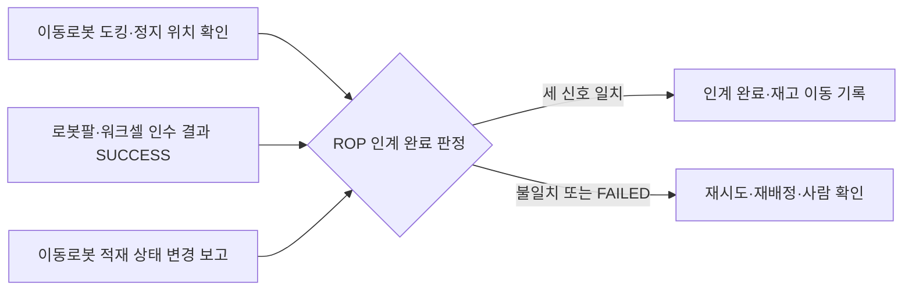

(너의 규칙은 시스템 프롬프트의 agents/shared-rules.md 와 agents/verifier.md 이다. 아래는 이번 실행의 컨텍스트와 입력이다.)

## 실행 컨텍스트

- run_id: 2026-09-25-42
- date: 2026-09-25
- run_type: area_deep_dive (영역 심화)
- 대상: 17. 로봇 간 협업·물리적 인계 (E. 협업·현장 운영)
- 예산:
    - max_search_queries: 30
    - max_sources_per_run: 15
    - new_topic_pages: 1
    - page_updates: 2
    - max_retries: 2
- 환경 알림: web_fetch_available: false · fetch_mode: mirror_only (일반 웹 페이지 열람은 네트워크 정책으로 막혀 있다. raw.githubusercontent.com 은 열린다: 공식 문서가 GitHub 에 있는 출처는 입력의 config/source_mirrors.yaml 경로를 WebFetch 로 열어 원문을 읽고 sources[].fetched=true, fetched_via=github_raw, fetch_url 을 적는다. 입력에 원문 텍스트(data/source_texts)가 있는 출처는 fetched_via=inbox. 그 밖의 출처는 fetched=false 이며 코드가 신뢰도 상한(medium)을 강제한다 — 공통 규칙 0절 6항)
- 언어: ko
- verification_stage: second
- verifier_budget:
    - max_search_queries: 30
    - max_sources_per_run: 15
    - new_topic_pages: 1
    - page_updates: 2
    - max_retries: 2
- retry_count: 1
- max_retries: 2

## 입력

### runs/2026-09-25-42/target.json

```json
{
  "run_id": "2026-09-25-42",
  "date": "2026-09-25",
  "weekday": "Fri",
  "run_number": 42,
  "run_type": "area_deep_dive",
  "forced": true,
  "target": {
    "area_no": 17,
    "area_name": "17. 로봇 간 협업·물리적 인계",
    "category": "E. 협업·현장 운영",
    "category_letter": "E"
  },
  "topic": null,
  "track": null,
  "corrections": [],
  "budget": {
    "max_search_queries": 30,
    "max_sources_per_run": 15,
    "new_topic_pages": 1,
    "page_updates": 2,
    "max_retries": 2
  },
  "priority_reason": null,
  "priority_questions": [],
  "excluded_areas": [],
  "lifted_areas": [],
  "deferred": {
    "monthly_recheck": false,
    "weekly_review": false
  },
  "selection_rationale": "CLI 지정 run_type=area_deep_dive, area=17"
}
```

### runs/2026-09-25-42/research.json

```json
{
  "run_id": "2026-09-25-42",
  "date": "2026-09-25",
  "run_type": "area_deep_dive",
  "target": {
    "area_no": 17,
    "area_name": "17. 로봇 간 협업·물리적 인계",
    "category": "E. 협업·현장 운영"
  },
  "gaps": [
    "섹션 3. 왜 중요한가 비어 있음",
    "섹션 4. 핵심 개념과 용어 비어 있음",
    "섹션 5. 현장 시나리오 (물류 흐름의 어느 단계인지 명시) 비어 있음",
    "섹션 6. 대표 접근법과 기술 비어 있음",
    "섹션 7. 관련 표준·프레임워크·오픈소스 비어 있음",
    "섹션 8. 대표 연구와 자료 비어 있음 — 기존 각주는 ref-007 1건뿐",
    "섹션 9. ROP가 직접 맡는 것과 외부와 연계하는 것 (부록 A 9장 기준) 비어 있음",
    "섹션 10. 다른 연구영역과의 연결 비어 있음",
    "섹션 11. 열린 질문 비어 있음(기존 oq-001, oq-006, oq-042 가 이 영역에 걸림)"
  ],
  "research_questions": [
    "AMR이 물건을 가져온 뒤 로봇팔이 안전하게 인수했음을 어떻게 확인할까? [분류원문] (섹션 3·5·6 겨냥)",
    "로봇–로봇·로봇–설비 인계를 요청·결과 메시지나 단계 신호로 표현하는 공개 규격·오픈소스(Open-RMF 워크셀, VDA 5050 pick/drop, SEMI E84)는 무엇을 규정하고 무엇을 비워 두는가? — oq-001·oq-042 관련 (섹션 4·7 겨냥)",
    "이동로봇이 작업대·로봇팔 앞에 정확히 섰는지(도킹·정지 위치 정밀도)를 재는 시험 방법과 도구는 무엇인가? (섹션 6·7·8 겨냥)",
    "서로 다른 로봇 작업 사이의 선후·동기화(스케줄 간 의존, 인계 스테이션·릴레이)를 다루는 배정·계획 연구는 무엇인가? (섹션 6·8·10 겨냥)",
    "공동 운반과 인식 결과 공유(협동 인지)는 연구에서 어떻게 정의되고 분류되는가? (섹션 4·8 겨냥)",
    "인계 완료를 재고·업무 이벤트로 기록할 때 GS1 CBV 업무 단계 어휘는 어떤 값을 제공하는가? — oq-006 관련 (섹션 4·10 겨냥)",
    "모바일 매니퓰레이터·이동로봇 협업의 안전 표준과 국내 자료·사례는 무엇이 있는가? (섹션 8·9·10 겨냥, 한국 자료 우선)"
  ],
  "findings": [
    {
      "id": "f1",
      "claim": "NIST 의 Performance of Collaborative Robot Systems 프로젝트는 사람–로봇·로봇–로봇 협업 팀의 안전성과 효과를 평가하는 방법·프로토콜·지표를 목표로 하며, 제조사·기종이 다른 로봇이 함께 일하는 이종 로봇 워크셀의 통합·평가를 대상으로 삼고 로봇 간·사람–로봇 간 협업 통신 프로토콜 개발을 과제 영역 하나로 둔다.",
      "tag": "사실",
      "source_ids": [
        "ref-007"
      ],
      "cross_checked": false,
      "confidence": "medium",
      "evidence_excerpt": "검색 요약: 'heterogeneous robot workcells (i.e., robots of different makes and models working together)'; 네 과제 영역에 협업 통신 프로토콜 개발 포함. 원문 미열람. (발행일 미확인, 확인일 기준)",
      "as_of": "2026-09-25",
      "flow_step": null,
      "flow_item": null,
      "source_unopened": true
    },
    {
      "id": "f2",
      "claim": "Open-RMF 배송 작업에서 로봇은 픽업 지점에서 DispenserResult 를 받을 때까지 DispenserRequest 를 반복해 보내고, 하역 지점에서 IngestorResult 를 받을 때까지 IngestorRequest 를 반복해 보내며, 워크셀은 주기적으로 상태(DispenserState·IngestorState)를 발행하고 이 흐름은 플릿 어댑터의 perform_deliveries 설정을 켜야 동작한다.",
      "tag": "사실",
      "source_ids": [
        "ref-023"
      ],
      "cross_checked": false,
      "confidence": "medium",
      "evidence_excerpt": "integration_workcells.md 원본(github_raw): 'Requests a DispenserRequest till receives a DispenserResult. (Done Dispensing)', 하역도 같은 방식. (발행일 미확인, 확인일 기준)",
      "as_of": "2026-09-25",
      "flow_step": null,
      "flow_item": "완료·인계"
    },
    {
      "id": "f3",
      "claim": "Open-RMF 디스펜서 요청 메시지는 시각·요청 id(request_guid)·대상 워크셀 이름(target_guid)·운반체 유형(transporter_type)·품목 목록(품목 유형 id, 수량, 칸 이름)을 담고, 디스펜서 결과 메시지는 시각·요청 id·보낸 워크셀 id(source_guid)·상태(ACKNOWLEDGED, SUCCESS, FAILED)를 담는다.",
      "tag": "사실",
      "source_ids": [
        "ref-047",
        "ref-048",
        "ref-930"
      ],
      "cross_checked": false,
      "confidence": "medium",
      "evidence_excerpt": "DispenserRequest.msg·DispenserRequestItem.msg·DispenserResult.msg 원본(github_raw): type_guid, quantity, compartment_name; status ACKNOWLEDGED=0 SUCCESS=1 FAILED=2. 같은 저장소라 독립 교차 아님. (발행일 미확인, 확인일 기준)",
      "as_of": "2026-09-25",
      "flow_step": null,
      "flow_item": "작업 대상"
    },
    {
      "id": "f4",
      "claim": "Open-RMF 워크셀 결과 메시지는 요청 단위의 성공·실패 상태만 담고 넘겨받은 화물의 개별 식별자나 실측 수량 필드가 없어, 인수 확인의 근거는 워크셀 자체 판단에 기대며 ROP 가 화물 식별·적재 상태 같은 별도 확인과 결합해야 할 것으로 보인다.",
      "tag": "추정",
      "source_ids": [
        "ref-930",
        "ref-047",
        "ref-048"
      ],
      "cross_checked": false,
      "confidence": "low",
      "evidence_excerpt": "f3 의 필드 목록에서 도출. 결과 메시지에 품목 필드 없음, 요청 품목은 유형 id·수량뿐. 이 위키의 추론(oq-001 관련).",
      "as_of": "2026-09-25",
      "flow_step": null,
      "flow_item": "완료·인계"
    },
    {
      "id": "f5",
      "claim": "VDA 5050 최신판(3.0.0)의 pick·drop 동작은 적재 장치(lhd), 스테이션 유형(예: 바닥, 랙, 수동·능동 컨베이어), 스테이션 이름, 적재물 유형·식별 번호(loadType, loadId), 높이·깊이 파라미터를 두며, pick 은 적재물이 로봇에 들어오고 로봇이 새 적재 상태를 보고하면 완료(FINISHED)로 본다.",
      "tag": "사실",
      "source_ids": [
        "ref-031"
      ],
      "cross_checked": false,
      "confidence": "medium",
      "evidence_excerpt": "VDA5050_EN.md 원본(github_raw): pick 완료 = 'Load has entered the mobile robot and mobile robot reports new load state'; 적재 장치가 여럿이면 lhd 필요(예: LHD1). (발행일 미확인, 확인일 기준)",
      "as_of": "2026-09-25",
      "flow_step": null,
      "flow_item": "완료·인계"
    },
    {
      "id": "f6",
      "claim": "VDA 5050 은 관제–이동로봇 통신과 무관한 인터페이스(주변 설비, 인프라, 외부 IT 시스템)를 범위에서 제외하며, 3.0.0 판에도 로봇과 컨베이어·스테이션 사이 인계 신호 절차는 들어 있지 않다.",
      "tag": "사실",
      "source_ids": [
        "ref-031"
      ],
      "cross_checked": false,
      "confidence": "medium",
      "evidence_excerpt": "VDA5050_EN.md 원본: 'interfaces to peripheral equipment, infrastructure components, or external IT systems' 제외. stationType 은 파라미터일 뿐 설비와의 핸드셰이크는 규정하지 않음. (발행일 미확인, 확인일 기준)",
      "as_of": "2026-09-25",
      "flow_step": null,
      "flow_item": "제약"
    },
    {
      "id": "f7",
      "claim": "반도체 업종의 SEMI E84 는 자동 반송 시스템(AMHS)과 생산 장비 로드포트 사이 캐리어 인계용 병렬 I/O 신호를 정하며, 장비가 인계 준비가 되었는지, 어느 로드포트를 쓸지, 인계가 진행 중인지·완료되었는지를 신호로 주고받는다.",
      "tag": "사실",
      "source_ids": [
        "ref-918",
        "ref-919"
      ],
      "cross_checked": true,
      "confidence": "medium",
      "evidence_excerpt": "검색 요약: 'handoff carriers between the production equipment and the AMHS'; 신호가 준비 여부·사용 로드포트·진행·완료를 나타냄. 개별 신호 이름·순서는 원문(유료) 미열람으로 확인 못함. (발행일 미확인, 확인일 기준)",
      "as_of": "2026-09-25",
      "flow_step": null,
      "flow_item": "완료·인계",
      "source_unopened": true
    },
    {
      "id": "f8",
      "claim": "SEMI E84 처럼 준비–진행–완료를 양쪽이 단계별로 확인하는 인계 신호 구조는, VDA 5050 이 비워 둔 이동로봇–작업대·로봇팔 인계 확인의 상태 모델을 ROP 가 정할 때 참고할 수 있을 것으로 보이나, 물류 업종에서 같은 역할을 하는 제조사 중립 공개 규격은 이번 조사에서 확인하지 못했다.",
      "tag": "추정",
      "source_ids": [
        "ref-918",
        "ref-919",
        "ref-031"
      ],
      "cross_checked": false,
      "confidence": "low",
      "evidence_excerpt": "f6(주변 설비 인터페이스 범위 제외)과 f7(E84 인계 신호)을 대응시킨 이 위키의 추론. 한·영 검색 각 1회에서 물류 AMR–컨베이어 공개 핸드셰이크 규격 미발견(oq-042).",
      "as_of": "2026-09-25",
      "flow_step": null,
      "flow_item": "완료·인계",
      "source_unopened": false
    },
    {
      "id": "f9",
      "claim": "NIST ARIAC 2025 시나리오에서 AGV 는 검사·조립·출하·재활용 스테이션 사이로 셀 트레이를 옮기고 검사 로봇팔이 합격 셀을 AGV 트레이에 올리며, 완성 키트를 실은 AGV 를 움직이기 전에 참가 팀은 키트 품질 확인 서비스를 호출해야 하고 트레이에 놓인 셀은 고정되어 검사 스테이션에서 다시 옮길 수 없다.",
      "tag": "사실",
      "source_ids": [
        "ref-008"
      ],
      "cross_checked": false,
      "confidence": "medium",
      "evidence_excerpt": "scenario.rst 원본(github_raw): move agv action, check kit quality service, 'Cells lock to the tray after they are placed and cannot be moved at the inspection station'. (발행일 미확인, 확인일 기준)",
      "as_of": "2026-09-25",
      "flow_step": null,
      "flow_item": "완료·인계"
    },
    {
      "id": "f10",
      "claim": "ASTM F3499-21 은 무인운반차·자율이동로봇(A-UGV)이 전역 위치나 도크 같은 현장 설비 기준 위치에 정지할 때의 위치 반복성과, 포크 같은 적재 이송 장치의 높이 제어 반복성을 확인하는 시험 방법이다.",
      "tag": "사실",
      "source_ids": [
        "ref-920"
      ],
      "cross_checked": false,
      "confidence": "medium",
      "evidence_excerpt": "검색 요약: positioning 은 'repeatability of A-UGV location when stationary after completing maneuvers to a stop location'; 'height control of load transfer equipment, for example an A-UGV with fork tines'. 원문 미열람.",
      "as_of": "2021",
      "flow_step": null,
      "flow_item": "제약",
      "source_unopened": true
    },
    {
      "id": "f11",
      "claim": "NIST 는 ASTM F45 위원회에서 이동로봇·모바일 매니퓰레이터 시험 방법 개발에 참여하며, 매니퓰레이터에 단 카메라·센서로 기준 표식을 측정해 모바일 매니퓰레이터의 위치 불확도를 재는 재구성형 시험 기물(RMMA)을 설계했고 그 측정 불확도가 2 mm 수준이라고 보고했다.",
      "tag": "사실",
      "source_ids": [
        "ref-921",
        "ref-922"
      ],
      "cross_checked": false,
      "confidence": "medium",
      "evidence_excerpt": "검색 요약: RMMA 는 'positioning uncertainty of mobile manipulators within a measurement uncertainty of 2 mm'; 도킹 실험 결과 반복 가능. 두 출처 모두 NIST 계열이라 독립 교차 아님. 원문 미열람. (발행일 미확인, 확인일 기준)",
      "as_of": "2026-09-25",
      "flow_step": null,
      "flow_item": "제약",
      "source_unopened": true
    },
    {
      "id": "f12",
      "claim": "ROS 2 Nav2 도킹 프레임워크는 충전 도크와 컨베이어·팔레트 같은 비충전 도크를 모두 지원하며, 준비 위치(staging pose)로 간 뒤 센서로 도크 위치를 다듬어 접근하고, 관절 부하 급증이나 거리 임계값으로 도킹 여부를 판정하며, 실패하면 기본 3회까지 재시도한다.",
      "tag": "사실",
      "source_ids": [
        "ref-216"
      ],
      "cross_checked": false,
      "confidence": "medium",
      "evidence_excerpt": "nav2_docking README 원본(github_raw): isDocked()·isCharging(), 'N retries may be made, driving back to the dock's staging pose'. (발행일 미확인, 확인일 기준)",
      "as_of": "2026-09-25",
      "flow_step": null,
      "flow_item": "예외·성과"
    },
    {
      "id": "f13",
      "claim": "Korsah·Stentz·Dias 의 다중 로봇 작업 배정 분류(iTax)는 작업 사이 의존을 의존 없음(ND)·일정 내 의존(ID)·스케줄 간 의존(XD)·복합 의존(CD)으로 나누며, 서로 다른 로봇에 배정된 작업 사이에 선후 제약 같은 관계가 있으면 스케줄 간 의존으로 본다.",
      "tag": "사실",
      "source_ids": [
        "ref-394"
      ],
      "cross_checked": false,
      "confidence": "medium",
      "evidence_excerpt": "검색 요약: 'no dependencies (ND), in-schedule dependencies (ID), cross-schedule dependencies (XD), and complex dependencies (CD)'. 원문 미열람.",
      "as_of": "2013",
      "flow_step": null,
      "flow_item": "제약",
      "source_unopened": true
    },
    {
      "id": "f14",
      "claim": "Coltin·Veloso(ICRA 2014)는 여러 이동로봇이 서로 물건을 옮겨 주는 전달(transfer)을 허용해 픽업·배송 계획을 개선하는 온라인 계획 알고리즘을 제시했다.",
      "tag": "사실",
      "source_ids": [
        "ref-924"
      ],
      "cross_checked": false,
      "confidence": "medium",
      "evidence_excerpt": "검색 요약: 'robots transfer objects to optimize a pickup and delivery plan', ICRA 2014, 5786–5791쪽. 원문 미열람.",
      "as_of": "2014",
      "flow_step": null,
      "flow_item": null,
      "source_unopened": true
    },
    {
      "id": "f15",
      "claim": "Zang 외(2026)는 구역에 묶인 플릿들이 도크 1개와 유한 버퍼를 가진 인계 스테이션으로 화물을 주고받는 지속형 다중 에이전트 픽업·배송 문제를 정식화하고, 공유 도크 예약 달력과 버퍼 점유 예측으로 경로를 승인하는 제어기(HARR)가 시뮬레이션에서 고정 도크 비교안보다 처리량을 최대 77% 높이고 적체를 92% 줄였다고 보고했다.",
      "tag": "사실",
      "source_ids": [
        "ref-925"
      ],
      "cross_checked": false,
      "confidence": "medium",
      "evidence_excerpt": "검색 요약: 'handover stations equipped with single docks and finite buffers, which are vulnerable to blocking and starvation'; 수치는 저자 보고·시뮬레이션·중간 부하 조건. 원문 미열람.",
      "as_of": "2026-07",
      "flow_step": null,
      "flow_item": "예외·성과",
      "source_unopened": true
    },
    {
      "id": "f16",
      "claim": "DELIVER(2025)는 보로노이 경계에서 로봇끼리 화물을 넘기는 릴레이 배송에서, 넘기는 로봇이 ROS 메시지나 LED 색 변화로 준비를 알리고 받는 로봇이 그 신호를 감지하면 움직이기 시작하는 가벼운 신호 방식을 쓴다.",
      "tag": "사실",
      "source_ids": [
        "ref-360"
      ],
      "cross_checked": false,
      "confidence": "medium",
      "evidence_excerpt": "검색 요약: 'the sending robot signals readiness via a ROS message or LED color change, and the receiving robot initiates motion upon detecting this signal'. 원문 미열람.",
      "as_of": "2025-08",
      "flow_step": null,
      "flow_item": "완료·인계",
      "source_unopened": true
    },
    {
      "id": "f17",
      "claim": "Tuci 외(2018)는 로봇 한 대로 다루기에 너무 크거나 무거운 물체를 여러 로봇이 행동을 조율해 목적지까지 옮기는 협동 운반(cooperative object transport)을 검토하고, 운반·조율·제어 전략이 다양하게 제안되어 왔다고 정리했다.",
      "tag": "사실",
      "source_ids": [
        "ref-923"
      ],
      "cross_checked": false,
      "confidence": "medium",
      "evidence_excerpt": "검색 요약: 'coordinate their actions to transport objects from a starting position to a final destination'; Frontiers in Robotics and AI 5:59. 원문 미열람.",
      "as_of": "2018",
      "flow_step": null,
      "flow_item": null,
      "source_unopened": true
    },
    {
      "id": "f18",
      "claim": "Singh 외(2024)는 로봇 플릿의 협동 인지를 여러 에이전트가 센서 정보를 공유·융합해 환경을 더 넓게 이해하고 판단을 돕는 능력으로 정의하고 관련 연구를 체계적으로 검토했다.",
      "tag": "사실",
      "source_ids": [
        "ref-928"
      ],
      "cross_checked": false,
      "confidence": "medium",
      "evidence_excerpt": "검색 요약: 'share and integrate their sensory information for a more comprehensive understanding of their environment'. ECCV 2024 워크숍 게재. 원문 미열람.",
      "as_of": "2024-03",
      "flow_step": null,
      "flow_item": null,
      "source_unopened": true
    },
    {
      "id": "f19",
      "claim": "ANSI/A3 R15.08-2-2023 은 산업용 이동로봇(IMR)과 그 플릿을 현장에 통합·배치할 때의 안전 요구사항을 정하며, AMR·AGV 플랫폼에 매니퓰레이터를 부착한 IMR 유형 C(모바일 매니퓰레이터)를 다룬다.",
      "tag": "사실",
      "source_ids": [
        "ref-926"
      ],
      "cross_checked": false,
      "confidence": "medium",
      "evidence_excerpt": "검색 요약: Part 2 는 'integrating, configuring, and customizing an IMR or fleet of IMRs into a site'; 'IMR Type C: ... mobile platform with a manipulator as the attachment'. 원문 미열람.",
      "as_of": "2023",
      "flow_step": null,
      "flow_item": "제약",
      "source_unopened": true
    },
    {
      "id": "f20",
      "claim": "국내에는 로봇 시스템과 그 통합의 안전 요구사항을 정한 한국산업표준 KS B ISO 10218-2(로봇 및 로봇 장치 — 산업용 로봇의 안전에 관한 요구사항 — 제2부: 로봇 시스템 및 통합)가 있다.",
      "tag": "사실",
      "source_ids": [
        "ref-927"
      ],
      "cross_checked": false,
      "confidence": "medium",
      "evidence_excerpt": "KSSN 표준 정보 검색 결과의 표준 번호·제목. 판·확인 연도와 이동식 로봇 적용 조항은 원문 미열람으로 확인 못함. (발행일 미확인, 확인일 기준)",
      "as_of": "2026-09-25",
      "flow_step": null,
      "flow_item": "제약",
      "source_unopened": true
    },
    {
      "id": "f21",
      "claim": "GS1 CBV 온톨로지는 업무 단계 accepting 을 물체의 점유·소유가 바뀌는 활동으로, receiving 을 물체가 한 위치에서 받아들여져 받는 쪽 재고에 더해지는 활동으로 정의하고, loading·unloading 은 운송 수단(shipping conveyance)에 싣고 내리는 활동으로 정의한다.",
      "tag": "사실",
      "source_ids": [
        "ref-044"
      ],
      "cross_checked": false,
      "confidence": "medium",
      "evidence_excerpt": "CBV.ttl 원본(github_raw): accepting 'an object changes possession and/or ownership'; receiving '... added to the receiver's inventory'; loading 'loaded into shipping conveyance'.",
      "as_of": "2021-09-30",
      "flow_step": null,
      "flow_item": "완료·인계"
    },
    {
      "id": "f22",
      "claim": "시설 안 로봇 사이·로봇과 작업대 사이의 물리적 인계는 CBV 에서 점유 이동을 뜻하는 accepting 이나 재고 편입을 뜻하는 receiving 에 가깝고 운송 수단 기준의 loading·unloading 과는 맞지 않아, 인계 이벤트의 업무 단계 값은 ROP 가 정해야 할 것으로 보인다.",
      "tag": "추정",
      "source_ids": [
        "ref-044"
      ],
      "cross_checked": false,
      "confidence": "low",
      "evidence_excerpt": "f21 정의에서 도출한 이 위키의 추론. 로봇 인계에 쓸 CBV 값을 권고한 GS1 문서는 확인 못함(oq-006).",
      "as_of": "2026-09-25",
      "flow_step": null,
      "flow_item": "완료·인계"
    },
    {
      "id": "f23",
      "claim": "국내에서는 유진로봇이 과학기술정보통신부·정보통신기획평가원의 스마트제조혁신기술개발사업으로 자율이송 모바일 매니퓰레이터 기반 지능형 제조 물류시스템 개발을 추진한다고 보도되었다.",
      "tag": "사실",
      "source_ids": [
        "ref-929"
      ],
      "cross_checked": false,
      "confidence": "low",
      "evidence_excerpt": "검색 요약(기사): '자율이송 모바일 매니플레이터 기반 지능형 제조 물류시스템 개발 사업', 스마트제조혁신기술개발사업 일환. 1차 출처(과제 공고) 미확인. 원문 미열람.",
      "as_of": "2025-11-04",
      "flow_step": null,
      "flow_item": null,
      "source_unopened": true
    },
    {
      "id": "f24",
      "claim": "분류 원문 질문(AMR 이 가져온 물건을 로봇팔이 안전하게 인수했음을 어떻게 확인할까)에 대해, 이동로봇의 도킹·정지 위치 확인, 로봇팔·워크셀의 인수 결과(SUCCESS), 이동로봇의 적재 상태 변경 보고라는 서로 독립된 신호가 모두 일치할 때 인계 완료로 인정하는 방식이 가능할 것으로 보인다.",
      "tag": "추정",
      "source_ids": [
        "ref-216",
        "ref-930",
        "ref-031",
        "ref-920"
      ],
      "cross_checked": false,
      "confidence": "low",
      "evidence_excerpt": "f10·f12(도킹 확인), f3(워크셀 결과 상태), f5(pick 완료 = 새 적재 상태 보고)를 SCM 질문에 대응시킨 추론. 세 신호를 결합하는 규정은 어느 표준에서도 확인 못함.",
      "as_of": "2026-09-25",
      "flow_step": "피킹",
      "flow_item": "완료·인계",
      "source_unopened": false
    },
    {
      "id": "f25",
      "claim": "피킹 단계에서 인계가 실패하면(워크셀 결과 FAILED, 도킹 재시도 한도 초과, 동작 FAILED) 인계 재시도·다른 작업대로 재배정·사람 확인 가운데 하나로 넘겨야 하며, 대기 동안 이동로봇과 작업대가 함께 묶여 처리량 손실이 생길 것으로 보인다.",
      "tag": "추정",
      "source_ids": [
        "ref-930",
        "ref-216",
        "ref-031",
        "ref-925"
      ],
      "cross_checked": false,
      "confidence": "low",
      "evidence_excerpt": "f3(FAILED 상태), f12(재시도 3회 기본), f5(동작 상태), f15(인계 스테이션의 차단·고갈)를 예외·성과 항목에 대응시킨 추론. 현장 사례 미확인.",
      "as_of": "2026-09-25",
      "flow_step": "피킹",
      "flow_item": "예외·성과",
      "source_unopened": false
    },
    {
      "id": "f26",
      "claim": "보충 단계에서 이동로봇 운반과 로봇팔 적치처럼 서로 다른 로봇의 작업이 선후로 이어지면 스케줄 간 의존이 생기고, 인계 스테이션의 도크·버퍼가 공용 자원 제약이 되므로 인계 시점을 두 로봇 일정에 함께 맞춰야 할 것으로 보인다.",
      "tag": "추정",
      "source_ids": [
        "ref-394",
        "ref-925"
      ],
      "cross_checked": false,
      "confidence": "low",
      "evidence_excerpt": "f13(XD)과 f15(도크 예약·버퍼 제약)를 보충 흐름의 제약 항목에 대응시킨 추론.",
      "as_of": "2026-09-25",
      "flow_step": "보충",
      "flow_item": "제약",
      "source_unopened": true
    },
    {
      "id": "f27",
      "claim": "ROP 가 직접 맡을 범위는 인계 작업의 순서·시점 동기화, 인계 요청·결과 신호의 중계, 여러 확인 신호를 모은 인계 완료 판정, 그 결과의 재고·업무 시스템 반영일 것으로 보인다.",
      "tag": "추정",
      "source_ids": [
        "ref-023",
        "ref-031",
        "ref-044"
      ],
      "cross_checked": false,
      "confidence": "low",
      "evidence_excerpt": "f2(요청–결과 중계), f6(VDA 5050 이 비워 둔 설비 인계), f21(업무 이벤트 어휘)을 분류 원문 9장 경계에 대응시킨 추론.",
      "as_of": "2026-09-25",
      "flow_step": null,
      "flow_item": "수행 자원"
    },
    {
      "id": "f28",
      "claim": "연계 대상: 로봇팔의 파지·동작 제어, 이동로봇의 도킹 주행 제어와 센서 인식, 컨베이어 PLC 와 설비 안전 제어는 로봇·설비 제조사가 맡고 ROP 는 그 결과 상태와 실패 신호를 받는 것으로 보인다.",
      "tag": "추정",
      "source_ids": [
        "ref-216",
        "ref-031",
        "ref-926"
      ],
      "cross_checked": false,
      "confidence": "low",
      "evidence_excerpt": "f12(도킹은 로봇 쪽 내비게이션 스택 기능), f6(주변 설비 인터페이스 범위 밖), f19(IMR 통합 안전)에서 도출. 분류 원문 9장 '로봇 자체 지능·제어'·'시설·설비 제어' 경계.",
      "as_of": "2026-09-25",
      "flow_step": null,
      "flow_item": "수행 자원",
      "source_unopened": false
    },
    {
      "id": "f29",
      "claim": "이 영역은 워크셀·컨베이어 인계로 10. 설비·건물 시스템 연동과, 인계 이벤트 기록으로 7. 화물·재고·자산 식별과 추적과, 스케줄 간 의존으로 13. 작업 배정 — MRTA·14. 작업 순서·스케줄링과, 인계 스테이션 도크 예약으로 16. 공용 자원·충전·에너지 최적화와, 인계 실패 처리로 20. 예외 복구·재계획·업무 연속성과, 도킹 시험·ARIAC 로 23. 시험·형식 검증·벤치마크와, 모바일 매니퓰레이터 안전으로 25. 안전·위험 관리와 이어질 것으로 보인다.",
      "tag": "추정",
      "source_ids": [
        "ref-023",
        "ref-044",
        "ref-394",
        "ref-925",
        "ref-920",
        "ref-008",
        "ref-926"
      ],
      "cross_checked": false,
      "confidence": "low",
      "evidence_excerpt": "f2·f21·f13·f15·f25·f10·f9·f19 를 영역 연결로 정리한 추론. 적재 장치 선언(lhd)은 5. 로봇 능력·작업 온톨로지와도 연결.",
      "as_of": "2026-09-25",
      "flow_step": null,
      "flow_item": null,
      "source_unopened": false
    }
  ],
  "sources": [
    {
      "id": "ref-007",
      "org": "NIST",
      "title": "Performance of Collaborative Robot Systems",
      "published": null,
      "url": "https://www.nist.gov/programs-projects/performance-collaborative-robot-systems",
      "type": "정부·연구기관",
      "reliability": "medium",
      "accessed": "2026-09-25",
      "summary": "원문 미열람. 사람–로봇·로봇–로봇 협업 팀과 이종 로봇 워크셀의 협업 성능을 평가하는 시험 방법·지표·통신 프로토콜 개발 프로젝트(검색 요약 기준).",
      "source_unopened": true,
      "fetched": false,
      "fetched_via": null,
      "fetch_url": null
    },
    {
      "id": "ref-008",
      "org": "NIST",
      "title": "ARIAC Documentation",
      "published": null,
      "url": "https://pages.nist.gov/ARIAC_docs/en/latest/",
      "type": "정부·연구기관",
      "reliability": "high",
      "accessed": "2026-09-25",
      "summary": "ARIAC 문서. 이번 실행은 2025 시나리오의 AGV 스테이션 이동, 로봇팔의 트레이 적재, 이동 전 키트 품질 확인 서비스를 원본으로 확인했다.",
      "fetched": true,
      "fetched_via": "github_raw",
      "fetch_url": "https://raw.githubusercontent.com/usnistgov/ARIAC_docs/main/docs/pages/scenario.rst",
      "source_unopened": false
    },
    {
      "id": "ref-023",
      "org": "Open Robotics",
      "title": "Workcells - Programming Multiple Robots with ROS 2",
      "published": null,
      "url": "https://osrf.github.io/ros2multirobotbook/integration_workcells.html",
      "type": "오픈소스 문서",
      "reliability": "high",
      "accessed": "2026-09-25",
      "summary": "디스펜서·인제스터 워크셀과 배송 작업의 요청–결과 반복 방식을 설명한 장. 이번 실행에서 mdBook 원본을 열었다.",
      "fetched": true,
      "fetched_via": "github_raw",
      "fetch_url": "https://raw.githubusercontent.com/osrf/ros2multirobotbook/master/src/integration_workcells.md",
      "source_unopened": false
    },
    {
      "id": "ref-031",
      "org": "VDA / VDMA (VDA5050 GitHub)",
      "title": "VDA5050/VDA5050_EN.md — Official Specification document for the VDA 5050",
      "published": null,
      "url": "https://github.com/VDA5050/VDA5050/blob/main/VDA5050_EN.md",
      "type": "표준",
      "reliability": "high",
      "accessed": "2026-09-25",
      "summary": "VDA 5050 최신판(3.0.0) 명세 원문. 이번 실행은 pick·drop 파라미터와 완료 조건, 주변 설비 인터페이스의 범위 제외를 확인했다.",
      "fetched": true,
      "fetched_via": "github_raw",
      "fetch_url": "https://raw.githubusercontent.com/VDA5050/VDA5050/main/VDA5050_EN.md",
      "source_unopened": false
    },
    {
      "id": "ref-044",
      "org": "GS1",
      "title": "gs1/EPCIS — Ontology/CBV.ttl (Core Business Vocabulary ontology 2.0)",
      "published": "2021-09-30",
      "url": "https://github.com/gs1/EPCIS/blob/master/Ontology/CBV.ttl",
      "type": "표준",
      "reliability": "high",
      "accessed": "2026-09-25",
      "summary": "CBV 업무 단계·상태 어휘 온톨로지. 이번 실행은 accepting·receiving·loading·unloading 등의 정의를 원본으로 확인했다.",
      "fetched": true,
      "fetched_via": "github_raw",
      "fetch_url": "https://raw.githubusercontent.com/gs1/EPCIS/master/Ontology/CBV.ttl",
      "source_unopened": false
    },
    {
      "id": "ref-047",
      "org": "Open Robotics (open-rmf)",
      "title": "rmf_internal_msgs — rmf_dispenser_msgs/msg/DispenserRequest.msg",
      "published": null,
      "url": "https://github.com/open-rmf/rmf_internal_msgs/blob/main/rmf_dispenser_msgs/msg/DispenserRequest.msg",
      "type": "오픈소스 문서",
      "reliability": "high",
      "accessed": "2026-09-25",
      "summary": "디스펜서 요청 메시지(시각, 요청 id, 대상 워크셀, 운반체 유형, 품목 목록). 이번 실행에서 원본을 열었다.",
      "fetched": true,
      "fetched_via": "github_raw",
      "fetch_url": "https://raw.githubusercontent.com/open-rmf/rmf_internal_msgs/main/rmf_dispenser_msgs/msg/DispenserRequest.msg",
      "source_unopened": false
    },
    {
      "id": "ref-048",
      "org": "Open Robotics (open-rmf)",
      "title": "rmf_internal_msgs — rmf_dispenser_msgs/msg/DispenserRequestItem.msg",
      "published": null,
      "url": "https://github.com/open-rmf/rmf_internal_msgs/blob/main/rmf_dispenser_msgs/msg/DispenserRequestItem.msg",
      "type": "오픈소스 문서",
      "reliability": "high",
      "accessed": "2026-09-25",
      "summary": "디스펜서 요청 품목(품목 유형 id, 수량, 칸 이름). 이번 실행에서 원본을 열었다.",
      "fetched": true,
      "fetched_via": "github_raw",
      "fetch_url": "https://raw.githubusercontent.com/open-rmf/rmf_internal_msgs/main/rmf_dispenser_msgs/msg/DispenserRequestItem.msg",
      "source_unopened": false
    },
    {
      "id": "ref-216",
      "org": "ROS Navigation (ros-navigation/navigation2 GitHub)",
      "title": "nav2_docking — README (Open Navigation's Nav2 Docking Framework)",
      "published": null,
      "url": "https://github.com/ros-navigation/navigation2/blob/main/nav2_docking/README.md",
      "type": "오픈소스 문서",
      "reliability": "medium",
      "accessed": "2026-09-25",
      "summary": "충전·비충전 도크 도킹 절차(준비 위치, 도크 위치 보정, 도킹 판정, 재시도)를 설명한 README. 이번 실행에서 원본을 열었다.",
      "fetched": true,
      "fetched_via": "github_raw",
      "fetch_url": "https://raw.githubusercontent.com/ros-navigation/navigation2/main/nav2_docking/README.md",
      "source_unopened": false
    },
    {
      "id": "ref-360",
      "org": "arXiv 2508.19114 저자(미확인)",
      "title": "DELIVER: A System for LLM-Guided Coordinated Multi-Robot Pickup and Delivery using Voronoi-Based Relay Planning",
      "published": "2025-08",
      "url": "https://arxiv.org/abs/2508.19114",
      "type": "논문",
      "reliability": "medium",
      "accessed": "2026-09-25",
      "summary": "원문 미열람. 보로노이 경계에서 로봇끼리 화물을 넘기는 릴레이 배송과 가벼운 준비 신호 방식을 다룬 프리프린트.",
      "source_unopened": true,
      "fetched": false,
      "fetched_via": null,
      "fetch_url": null
    },
    {
      "id": "ref-394",
      "org": "Korsah, G. A., Stentz, A., & Dias, M. B.",
      "title": "A comprehensive taxonomy for multi-robot task allocation",
      "published": "2013",
      "url": "https://journals.sagepub.com/doi/10.1177/0278364913496484",
      "type": "논문",
      "reliability": "medium",
      "accessed": "2026-09-25",
      "summary": "원문 미열람. 작업 사이 의존(ND·ID·XD·CD)을 포함한 다중 로봇 작업 배정 분류 iTax 를 제시한 논문.",
      "source_unopened": true,
      "fetched": false,
      "fetched_via": null,
      "fetch_url": null
    },
    {
      "id": "ref-918",
      "org": "SEMI",
      "title": "E08400 - SEMI E84 - Specification for Enhanced Carrier Handoff Parallel I/O Interface",
      "published": null,
      "url": "https://store-us.semi.org/products/e08400-semi-e84-specification-for-enhanced-carrier-handoff-parallel-i-o-interface",
      "type": "표준",
      "reliability": "medium",
      "accessed": "2026-09-25",
      "summary": "원문 미열람. 자동 반송 시스템과 생산 장비 로드포트 사이 캐리어 인계용 병렬 I/O 신호를 정한 SEMI 표준의 발행 기관 판매 페이지(유료 원문).",
      "source_unopened": true,
      "fetched": false,
      "fetched_via": null,
      "fetch_url": null
    },
    {
      "id": "ref-919",
      "org": "PEER Group",
      "title": "SEMI E84: Carrier Handoff",
      "published": null,
      "url": "https://www.peergroup.com/definition-of-standard/semi-e84/",
      "type": "벤더 문서",
      "reliability": "low",
      "accessed": "2026-09-25",
      "summary": "원문 미열람. 반도체 자동화 소프트웨어 업체의 SEMI E84 해설 페이지로, 도착 뒤 신호 교환으로 인계 준비·진행·완료를 확인한다고 설명한다.",
      "source_unopened": true,
      "fetched": false,
      "fetched_via": null,
      "fetch_url": null
    },
    {
      "id": "ref-920",
      "org": "ASTM International",
      "title": "Standard Test Method for Confirming the Docking Performance of A-UGVs (ASTM F3499-21)",
      "published": "2021",
      "url": "https://www.astm.org/f3499-21.html",
      "type": "표준",
      "reliability": "medium",
      "accessed": "2026-09-25",
      "summary": "원문 미열람. A-UGV 의 정지·도킹 위치 반복성과 적재 이송 장치 높이 제어 반복성을 확인하는 시험 방법.",
      "source_unopened": true,
      "fetched": false,
      "fetched_via": null,
      "fetch_url": null
    },
    {
      "id": "ref-921",
      "org": "NIST",
      "title": "Design and Application of the Reconfigurable Mobile Manipulator Artifact (RMMA)",
      "published": null,
      "url": "https://www.nist.gov/publications/design-and-application-reconfigurable-mobile-manipulator-artifact-rmma",
      "type": "정부·연구기관",
      "reliability": "medium",
      "accessed": "2026-09-25",
      "summary": "원문 미열람. 모바일 매니퓰레이터의 위치 불확도를 기준 표식으로 재는 시험 기물(RMMA)의 설계와 적용을 다룬 NIST 발행물.",
      "source_unopened": true,
      "fetched": false,
      "fetched_via": null,
      "fetch_url": null
    },
    {
      "id": "ref-922",
      "org": "Bostelman, R. 외(NIST)",
      "title": "Mobile Robot and Mobile Manipulator Research Towards ASTM Standards Development",
      "published": null,
      "url": "https://pubmed.ncbi.nlm.nih.gov/28690359/",
      "type": "논문",
      "reliability": "medium",
      "accessed": "2026-09-25",
      "summary": "원문 미열람. ASTM F45 표준 개발을 위한 NIST 의 이동로봇 도킹·모바일 매니퓰레이터 성능 측정 연구를 정리한 논문.",
      "source_unopened": true,
      "fetched": false,
      "fetched_via": null,
      "fetch_url": null
    },
    {
      "id": "ref-923",
      "org": "Tuci, E., Alkilabi, M. H. M., & Akanyeti, O.",
      "title": "Cooperative Object Transport in Multi-Robot Systems: A Review of the State-of-the-Art",
      "published": "2018",
      "url": "https://www.frontiersin.org/journals/robotics-and-ai/articles/10.3389/frobt.2018.00059/full",
      "type": "논문",
      "reliability": "medium",
      "accessed": "2026-09-25",
      "summary": "원문 미열람. 여러 로봇이 행동을 조율해 크거나 무거운 물체를 옮기는 협동 운반 연구를 검토한 Frontiers in Robotics and AI 리뷰.",
      "source_unopened": true,
      "fetched": false,
      "fetched_via": null,
      "fetch_url": null
    },
    {
      "id": "ref-924",
      "org": "Coltin, B., & Veloso, M.",
      "title": "Online pickup and delivery planning with transfers for mobile robots",
      "published": "2014",
      "url": "https://www.researchgate.net/publication/289338501_Online_pickup_and_delivery_planning_with_transfers_for_mobile_robots",
      "type": "논문",
      "reliability": "medium",
      "accessed": "2026-09-25",
      "summary": "원문 미열람. 이동로봇 사이 물건 전달을 허용해 픽업·배송 계획을 개선하는 온라인 알고리즘(ICRA 2014).",
      "source_unopened": true,
      "fetched": false,
      "fetched_via": null,
      "fetch_url": null
    },
    {
      "id": "ref-925",
      "org": "Zang, C. 외",
      "title": "Lifelong Multi-Subsystem Pickup and Delivery with Buffer-Limited Handover Stations",
      "published": "2026-07",
      "url": "https://arxiv.org/abs/2607.17724",
      "type": "논문",
      "reliability": "medium",
      "accessed": "2026-09-25",
      "summary": "원문 미열람. 도크 1개·유한 버퍼의 인계 스테이션으로 화물을 주고받는 다중 서브시스템 픽업·배송 문제와 도크 예약·버퍼 예측 제어기(HARR)를 제시한 프리프린트.",
      "source_unopened": true,
      "fetched": false,
      "fetched_via": null,
      "fetch_url": null
    },
    {
      "id": "ref-926",
      "org": "ANSI / A3(Association for Advancing Automation)",
      "title": "ANSI/A3 R15.08-2-2023 - Industrial Mobile Robots - Safety Requirements - Part 2: Requirements for IMR system(s) and IMR application(s)",
      "published": "2023",
      "url": "https://webstore.ansi.org/standards/ria/ansia3r15082023",
      "type": "표준",
      "reliability": "medium",
      "accessed": "2026-09-25",
      "summary": "원문 미열람. 산업용 이동로봇 시스템·응용·플릿의 현장 통합 안전 요구사항을 정한 미국 국가표준으로, 매니퓰레이터를 단 이동로봇(유형 C)을 다룬다.",
      "source_unopened": true,
      "fetched": false,
      "fetched_via": null,
      "fetch_url": null
    },
    {
      "id": "ref-927",
      "org": "국가표준인증통합정보시스템(KSSN)",
      "title": "KS B ISO 10218-2 로봇 및 로봇 장치 - 산업용 로봇의 안전에 관한 요구사항 - 제2부: 로봇 시스템 및 통합",
      "published": null,
      "url": "https://www.kssn.net/search/stddetail.do?itemNo=K001010083660",
      "type": "표준",
      "reliability": "medium",
      "accessed": "2026-09-25",
      "summary": "원문 미열람. 산업용 로봇 시스템과 그 통합의 안전 요구사항을 정한 한국산업표준의 표준 정보 페이지.",
      "source_unopened": true,
      "fetched": false,
      "fetched_via": null,
      "fetch_url": null
    },
    {
      "id": "ref-928",
      "org": "Singh, A., Raut, G., & Choudhary, A.",
      "title": "Multi-agent Collaborative Perception for Robotic Fleet: A Systematic Review",
      "published": "2024-03",
      "url": "https://arxiv.org/abs/2405.15777",
      "type": "논문",
      "reliability": "medium",
      "accessed": "2026-09-25",
      "summary": "원문 미열람. 로봇 플릿에서 여러 에이전트가 센서 정보를 공유·융합하는 협동 인지 연구를 검토한 논문(ECCV 2024 워크숍).",
      "source_unopened": true,
      "fetched": false,
      "fetched_via": null,
      "fetch_url": null
    },
    {
      "id": "ref-929",
      "org": "다음뉴스 게재 기사(원 언론사 미확인)",
      "title": "유진로봇, 지능형 제조 물류시스템 공개",
      "published": "2025-11-04",
      "url": "https://v.daum.net/v/20251104092138920",
      "type": "기사",
      "reliability": "low",
      "accessed": "2026-09-25",
      "summary": "원문 미열람. 유진로봇의 자율이송 모바일 매니퓰레이터 기반 지능형 제조 물류시스템 국책과제를 전한 기사(검색 요약 기준).",
      "source_unopened": true,
      "fetched": false,
      "fetched_via": null,
      "fetch_url": null
    },
    {
      "id": "ref-930",
      "org": "Open Robotics (open-rmf)",
      "title": "rmf_internal_msgs — rmf_dispenser_msgs/msg/DispenserResult.msg",
      "published": null,
      "url": "https://github.com/open-rmf/rmf_internal_msgs/blob/main/rmf_dispenser_msgs/msg/DispenserResult.msg",
      "type": "오픈소스 문서",
      "reliability": "high",
      "accessed": "2026-09-25",
      "summary": "디스펜서 결과 메시지(시각, 요청 id, 워크셀 id, 상태 ACKNOWLEDGED·SUCCESS·FAILED). 이번 실행에서 원본을 열었다.",
      "fetched": true,
      "fetched_via": "github_raw",
      "fetch_url": "https://raw.githubusercontent.com/open-rmf/rmf_internal_msgs/main/rmf_dispenser_msgs/msg/DispenserResult.msg",
      "source_unopened": false
    }
  ],
  "page_proposals": [
    {
      "action": "update",
      "path": "docs/categories/e-collaboration-and-field-operations/17-robot-to-robot-collaboration-and-physical-handover.md",
      "sections": [
        "3",
        "4",
        "5",
        "6",
        "7",
        "8",
        "9",
        "10",
        "11"
      ],
      "rationale": "3절: f1(NIST 이종 로봇 협업 평가), f6·f8(인계 신호의 표준 공백), f24(SCM 질문) / 4절: f13(스케줄 간 의존), f17(협동 운반), f18(협동 인지), f21(CBV accepting·receiving), f2·f3(디스펜서·인제스터 요청–결과) / 5절: f24(피킹, 완료·인계), f25(피킹, 예외·성과), f26(보충, 제약) / 6절: f2·f4·f5·f12·f14·f15·f16·f24 / 7절: f2·f3(Open-RMF 워크셀), f5·f6(VDA 5050 pick·drop과 범위 제외), f7(SEMI E84), f10(ASTM F3499), f12(Nav2 도킹), f19·f20(R15.08-2, KS B ISO 10218-2) / 8절: f1·f9·f11·f13·f14·f15·f16·f17·f18·f23(국내 자료 f20·f23 포함) / 9절: f27(직접 범위), f28(연계 대상: 파지·도킹 주행·PLC·설비 안전 제어) / 10절: f29(7·10·13·14·16·20·23·25번, 5번은 lhd 선언), f22(7. 화물·재고·자산 식별과 추적, oq-006) / 11절: 기존 oq-001·oq-006·oq-042 연결과 새 열린 질문. f7 은 반도체 업종 규격이라 업종 차이를 병기, f23 은 기사 1건이라 한계 병기."
    }
  ],
  "glossary_candidates": [
    {
      "term_ko": "모바일 매니퓰레이터",
      "term_en": "Mobile Manipulator",
      "definition": "AMR·AGV 같은 이동 플랫폼에 로봇팔을 결합해 이동과 집기·놓기 작업을 함께 수행하는 로봇이다."
    },
    {
      "term_ko": "협동 운반",
      "term_en": "Cooperative Object Transport",
      "definition": "로봇 한 대로 다루기 어려운 크거나 무거운 물체를 여러 로봇이 행동을 조율해 목적지까지 함께 옮기는 일이다."
    },
    {
      "term_ko": "협동 인지",
      "term_en": "Collaborative Perception",
      "definition": "여러 로봇이 센서 정보나 인식 결과를 공유·융합해 한 대가 볼 때보다 넓고 정확하게 환경을 파악하는 방식이다."
    },
    {
      "term_ko": "스케줄 간 의존",
      "term_en": "Cross-schedule Dependency (XD)",
      "definition": "서로 다른 로봇에 배정된 작업 사이에 선후 같은 관계가 있어, 한 로봇의 작업 적합성이 다른 로봇의 일정에 따라 달라지는 작업 의존 유형이다."
    }
  ],
  "open_questions_new": [
    "로봇팔·워크셀의 인수 결과와 이동로봇의 적재 상태 보고가 어긋날 때(한쪽은 성공, 다른 쪽은 적재 유지) 어느 신호를 기준으로 인계 완료를 판정하는지 정한 표준이나 현장 사례가 있는가? | 관련 영역: 17. 로봇 간 협업·물리적 인계, 8. 실시간 세계 상태·데이터 일관성 | 근거: f24 | 종류: 일반",
    "반도체 업종의 SEMI E84 같은 단계별 인계 신호를 물류센터의 이동로봇–컨베이어·작업대 인계에 적용하거나 옮긴 사례가 있는가? | 관련 영역: 17. 로봇 간 협업·물리적 인계, 10. 설비·건물 시스템 연동 | 근거: f7 | 종류: 일반",
    "ASTM F3499·NIST RMMA 같은 도킹·위치 정밀도 시험 결과를 로봇팔 파지 허용 오차와 연결해 인계 가능 여부를 정하는 기준이 있는가? | 관련 영역: 17. 로봇 간 협업·물리적 인계, 23. 시험·형식 검증·벤치마크 | 근거: f10 | 종류: 일반",
    "국내에 ANSI/A3 R15.08-2 의 유형 C(모바일 매니퓰레이터) 통합 안전 요구에 대응하는 KS 표준이나 인증 기준이 있는가? | 관련 영역: 17. 로봇 간 협업·물리적 인계, 25. 안전·위험 관리 | 근거: f19 | 종류: 일반"
  ],
  "open_questions_resolved": [],
  "self_check": {
    "source_count": 23,
    "cross_checked_count": 1,
    "unverified": [
      "f7 SEMI E84 개별 신호 이름·순서는 유료 원문 미열람으로 확인 못함",
      "f11 RMMA 2 mm 수치는 NIST 계열 출처뿐으로 독립 교차 확인 실패",
      "f15 처리량·적체 수치는 저자 보고 시뮬레이션 결과",
      "f20 KS B ISO 10218-2 의 판·확인 연도와 이동식 로봇 적용 조항 미확인",
      "f23 국책과제 1차 출처(공고·과제 정보) 미확인, 기사 원 언론사 미확인",
      "ref-922 발행연도 미확인",
      "물류 업종의 이동로봇–컨베이어 제조사 중립 인계 규격은 찾지 못함(oq-042 미해결)",
      "공동 운반(협동 운반)의 물류센터 적용 사례는 찾지 못함"
    ],
    "scope_violations": [
      "f28: 로봇팔 파지·도킹 주행 제어·컨베이어 PLC·설비 안전 제어는 분류 원문 9장 '로봇 자체 지능·제어'·'시설·설비 제어' 연계 영역이라 claim 을 '연계 대상: '으로 표시함",
      "f7·f8: SEMI E84 는 반도체 업종 규격이라 물류센터 직접 적용 근거가 아니라 참고 사례로만 제안함",
      "f19·f20: 안전 표준은 25. 안전·위험 관리의 내용이며 이 영역에서는 제약으로만 연결하도록 제안함"
    ],
    "budget_used": {
      "queries": 21,
      "sources": 13
    },
    "limits": "web_fetch_available: false · fetch_mode mirror_only. raw.githubusercontent.com 으로 원문을 연 출처: 재사용 ref-008(ARIAC scenario.rst)·ref-023(workcells)·ref-031(VDA 5050 main)·ref-044(CBV.ttl)·ref-047·ref-048(디스펜서 요청 메시지)·ref-216(nav2_docking README), 신규 ref-930(DispenserResult.msg). 그 밖의 신규 12건과 재사용 ref-007·ref-360·ref-394 는 원문 미열람(신뢰도 상한 medium). 검색 21회/30(영어 13, 한국어 8), 신규 출처 13건/15(ref-918~ref-930, 예약 구간 안), 재사용 10건. 교차 확인 1건(f7). 입력의 정정 요청 없음. 한국 자료: KS B ISO 10218-2(ref-927), 유진로봇 국책과제 기사(ref-929); 국내 학술 논문으로 이동로봇–로봇팔 인계 확인을 다룬 것은 찾지 못했다. oq-042 는 f6·f7·f8 로 일부 답했으나(VDA 5050 은 범위 밖, 반도체 E84 존재) 물류 업종 중립 규격을 찾지 못해 해결 제안하지 않았다. oq-006 은 f21·f22 로 CBV 정의를 보강했을 뿐 해결하지 않았다. 27. AI·학습·적응과 모델 운영 관련 finding 은 내지 않았다(f16 의 LLM 은 계획용이며 인계 신호 방식만 인용). 8. 실시간 세계 상태·데이터 일관성(현재 인계 상태 판정)과 22. 시뮬레이션·예측용 디지털 트윈(ARIAC 같은 시뮬레이션 평가)은 섞지 않고 ARIAC 는 23. 시험·형식 검증·벤치마크 쪽으로 연결했다."
  }
}
```

### runs/2026-09-25-42/verification.json

```json
{
  "run_id": "2026-09-25-42",
  "stage": "first",
  "verdict": "조건부 승인",
  "claim_checks": [
    {
      "finding_id": "f1",
      "source_exists": true,
      "supports_claim": true,
      "cross_checked": false,
      "tag_decision": "유지",
      "note": "ref-007 은 시드 참고문헌(분류 원문 [7])으로 실재. 원문 미열람(fetch_mode mirror_only, 미러 없음). 검증자는 검색 예산 때문에 다시 검색하지 않았고, 이종 로봇 워크셀·협업 통신 프로토콜 과제는 리서치 스니펫 기준이다. 단일 출처이며 기준일은 확인일이다."
    },
    {
      "finding_id": "f2",
      "source_exists": true,
      "supports_claim": true,
      "cross_checked": false,
      "tag_decision": "유지",
      "note": "확인: ref-023 mdBook 원본(입력 data/source_texts)에서 DispenserRequest→DispenserResult, IngestorRequest→IngestorResult 반복, 상태 주기 발행, perform_deliveries 조건을 확인했다. 발행일은 미확인."
    },
    {
      "finding_id": "f3",
      "source_exists": true,
      "supports_claim": true,
      "cross_checked": false,
      "tag_decision": "유지",
      "note": "확인: 검증자가 raw.githubusercontent.com 에서 DispenserRequest.msg(time, request_guid, target_guid, transporter_type, items), DispenserRequestItem.msg(type_guid, quantity, compartment_name), DispenserResult.msg(time, request_guid, source_guid, ACKNOWLEDGED=0·SUCCESS=1·FAILED=2)를 직접 열어 일치를 확인했다. 같은 저장소라 독립 교차는 아니다."
    },
    {
      "finding_id": "f4",
      "source_exists": true,
      "supports_claim": true,
      "cross_checked": false,
      "tag_decision": "유지",
      "note": "[추정] 유지. 결과 메시지에 품목·실측 필드가 없음을 원본으로 확인했다(IngestorResult ref-049 는 이번에 대조하지 않음). 이 위키의 추론임을 본문에 밝혀야 한다."
    },
    {
      "finding_id": "f5",
      "source_exists": true,
      "supports_claim": true,
      "cross_checked": false,
      "tag_decision": "유지",
      "note": "확인: VDA5050_EN.md(3.0.0) 원본의 pick 파라미터(lhd, stationType, stationName, loadType, loadId, height, depth, side)와 FINISHED 조건('Load has entered the mobile robot and mobile robot reports new load state')이 일치한다. 판은 3.0.0 이고 발행일은 미확인이다(oq-005 참조)."
    },
    {
      "finding_id": "f6",
      "source_exists": true,
      "supports_claim": true,
      "cross_checked": false,
      "tag_decision": "유지",
      "note": "확인: 2절 Scope 에서 'interfaces to peripheral equipment, infrastructure components, or external IT systems' 제외를 확인했다. 명세에는 설비 핸드셰이크 절차가 없고, 5.3절이 주변 시스템(문·게이트·승강기) 통신을 관제 기능으로 두는 수준이다. ref-031 직접 인용이 f5 와 겹친다(인용 규칙 참조)."
    },
    {
      "finding_id": "f7",
      "source_exists": true,
      "supports_claim": true,
      "cross_checked": true,
      "tag_decision": "유지",
      "note": "원문 미열람(유료 표준). 검증자 검색으로 SEMI 판매 페이지(ref-918)와 PEER Group 해설(ref-919)이 AMHS–장비 로드포트 캐리어 인계용 병렬 I/O 신호(준비·로드포트·진행·완료)를 설명하는 것을 확인했다. 발행 주체가 다르므로 독립 교차로 본다. 개별 신호 이름·순서는 미확인이다. 반도체 업종 규격이므로 업종 차이를 병기해야 한다."
    },
    {
      "finding_id": "f8",
      "source_exists": true,
      "supports_claim": true,
      "cross_checked": false,
      "tag_decision": "유지",
      "note": "[추정] 유지. f6·f7 을 대응시킨 추론이며, 근거 가운데 ref-918·ref-919 는 원문 미열람이다. 브리프가 source_unopened: false 로 적었으나 미열람 출처에 기대고 있다."
    },
    {
      "finding_id": "f9",
      "source_exists": true,
      "supports_claim": true,
      "cross_checked": false,
      "tag_decision": "유지",
      "note": "확인: scenario.rst 원본에서 AGV 스테이션 4곳(Inspection, Assembly, Shipping, Recycling), 검사 로봇2(UR5e)의 트레이 적재, 이동 전 check kit quality 서비스 호출, 'Cells lock to the tray after they are placed and cannot be moved at the inspection station'을 확인했다. ARIAC 2025 기준이다."
    },
    {
      "finding_id": "f10",
      "source_exists": true,
      "supports_claim": true,
      "cross_checked": false,
      "tag_decision": "유지",
      "note": "원문 미열람. 검증자 검색 결과 ASTM 페이지(f3499-21) 요약이 정지 위치 반복성·도킹(현장 설비 기준 위치)·포크 높이 제어 반복성 시험을 담고 있어 일치한다. 발행은 2021 이다."
    },
    {
      "finding_id": "f11",
      "source_exists": true,
      "supports_claim": true,
      "cross_checked": false,
      "tag_decision": "유지",
      "note": "원문 미열람. 검증자 검색으로 NIST RMMA 발행물 페이지가 '2 mm 측정 불확도 내 위치 불확도 측정'을 기술함을 확인했다. 2 mm 는 NIST 자체 보고치이며 독립 교차 확인이 없다. ASTM F45 참여 서술은 ref-922 스니펫 기준이고, ref-922 발행연도는 미확인이다."
    },
    {
      "finding_id": "f12",
      "source_exists": true,
      "supports_claim": true,
      "cross_checked": false,
      "tag_decision": "유지",
      "note": "확인: nav2_docking README 원본에서 충전·비충전 도크(컨베이어·팔레트), 준비 위치(staging pose), 거리 임계(docking_threshold) 판정, max_retries 기본 3 을 확인했다. 다만 원문의 접촉 판정은 '전류(current) 급증'이므로 '관절 부하 급증'이라는 표현은 고쳐야 한다."
    },
    {
      "finding_id": "f13",
      "source_exists": true,
      "supports_claim": true,
      "cross_checked": false,
      "tag_decision": "유지",
      "note": "원문 미열람. ref-394 는 기존 참고문헌이다. ND·ID·XD·CD 분류는 리서치 스니펫 기준이며 검증자는 재검색하지 않았다. 발행은 2013 이다."
    },
    {
      "finding_id": "f14",
      "source_exists": true,
      "supports_claim": true,
      "cross_checked": false,
      "tag_decision": "유지",
      "note": "원문 미열람. ResearchGate 사본 URL이며 리서치 스니펫(ICRA 2014, 5786–5791쪽) 기준이다. 검증자는 재검색하지 않았다."
    },
    {
      "finding_id": "f15",
      "source_exists": true,
      "supports_claim": true,
      "cross_checked": false,
      "tag_decision": "유지",
      "note": "원문 미열람. 검증자 검색으로 arXiv 2607.17724(Zang, Barz, Mannucci, Schillinger, Lier, Hönig, 2026-07)의 실재와 HARR(공유 도크 예약 달력, 버퍼 점유 예측), 중간 부하에서 고정 도크 비교안 대비 처리량 최대 77%↑·적체 92%↓를 확인했다. 수치는 저자 보고 시뮬레이션 결과이며 프리프린트다."
    },
    {
      "finding_id": "f16",
      "source_exists": true,
      "supports_claim": true,
      "cross_checked": false,
      "tag_decision": "유지",
      "note": "원문 미열람. 검증자 검색으로 arXiv 2508.19114 요약('sending robot signals readiness via a ROS message or LED color change')을 확인했다. TurtleBot3 실기·Gazebo 검증으로, 물류 현장 적용 사례는 아니다. IEEE Xplore 게재본이 있다."
    },
    {
      "finding_id": "f17",
      "source_exists": true,
      "supports_claim": true,
      "cross_checked": false,
      "tag_decision": "유지",
      "note": "원문 미열람. Frontiers in Robotics and AI 5:59(2018) 리뷰이며 리서치 스니펫 기준이다. 검증자는 재검색하지 않았다."
    },
    {
      "finding_id": "f18",
      "source_exists": true,
      "supports_claim": true,
      "cross_checked": false,
      "tag_decision": "유지",
      "note": "원문 미열람. 검증자 검색으로 arXiv 2405.15777(Singh, Raut, Choudhary; 제출 2024-03-22), ECCV 2024 워크숍 게재, 협동 인지 정의를 확인했다."
    },
    {
      "finding_id": "f19",
      "source_exists": true,
      "supports_claim": true,
      "cross_checked": false,
      "tag_decision": "유지",
      "note": "원문 미열람. 검증자 검색으로 ANSI 웹스토어·A3 발표에서 Part 2 가 IMR·플릿의 현장 통합 안전 요구를 정하고 IMR 유형 C(AMR·AGV 플랫폼 + 매니퓰레이터)를 정의함을 확인했다. 25. 안전·위험 관리의 내용이다."
    },
    {
      "finding_id": "f20",
      "source_exists": true,
      "supports_claim": true,
      "cross_checked": false,
      "tag_decision": "유지",
      "note": "원문 미열람. 검증자 검색으로 KSSN 표준 정보(itemNo K001010083660)와 제목이 일치함을 확인했다. KSSN 에 2017 확인판 항목(K001010116494)도 따로 있어 판·확인 연도는 미확인이다."
    },
    {
      "finding_id": "f21",
      "source_exists": true,
      "supports_claim": true,
      "cross_checked": false,
      "tag_decision": "유지",
      "note": "확인: CBV.ttl 원본에서 accepting('changes possession and/or ownership'), receiving('added to the receiver's inventory'), loading·unloading('shipping conveyance') 정의를 확인했다. 온톨로지 수정일은 2021-09-30(생성 2021-06-01)이다."
    },
    {
      "finding_id": "f22",
      "source_exists": true,
      "supports_claim": true,
      "cross_checked": false,
      "tag_decision": "유지",
      "note": "[추정] 유지. f21 정의에서 도출한 이 위키의 추론이다(oq-006). GS1 권고 문서는 확인하지 못했다."
    },
    {
      "finding_id": "f23",
      "source_exists": true,
      "supports_claim": false,
      "cross_checked": false,
      "tag_decision": "강등",
      "note": "사실 → 추정. 기사 실재는 확인했다(다음뉴스 게재, 같은 제목·날짜의 지디넷코리아·한국경제·로봇신문 기사가 검색됨). 그러나 기사들은 2025-11-04 과제 결과물 공개·시연을 전하며, '추진한다'는 서술과 정보통신기획평가원 명시는 검색 범위에서 확인하지 못했다. 기사 1건 기반이고 1차 출처(과제 정보)는 미확인이다."
    },
    {
      "finding_id": "f24",
      "source_exists": true,
      "supports_claim": true,
      "cross_checked": false,
      "tag_decision": "유지",
      "note": "[추정] 유지. SCM 질문에 대응한 추론이다. 근거 가운데 ref-920 은 원문 미열람이며, 세 신호 결합 규정은 어느 표준에도 없다."
    },
    {
      "finding_id": "f25",
      "source_exists": true,
      "supports_claim": true,
      "cross_checked": false,
      "tag_decision": "유지",
      "note": "[추정] 유지. 현장 사례는 미확인이다. ref-925 는 원문 미열람이다."
    },
    {
      "finding_id": "f26",
      "source_exists": true,
      "supports_claim": true,
      "cross_checked": false,
      "tag_decision": "유지",
      "note": "[추정] 유지. f13·f15 의 원문 미열람 출처에 기댄 추론이다."
    },
    {
      "finding_id": "f27",
      "source_exists": true,
      "supports_claim": true,
      "cross_checked": false,
      "tag_decision": "유지",
      "note": "[추정] 유지. 분류 원문 9장 경계에 대응한 추론이다. VDA 5050 5.3절이 주변 시스템 통신을 관제 기능으로 두는 점과도 어긋나지 않는다."
    },
    {
      "finding_id": "f28",
      "source_exists": true,
      "supports_claim": true,
      "cross_checked": false,
      "tag_decision": "유지",
      "note": "[추정] 유지. '연계 대상'으로 표시되어 범위 경계를 지킨다. ref-926 은 원문 미열람이다."
    },
    {
      "finding_id": "f29",
      "source_exists": true,
      "supports_claim": true,
      "cross_checked": false,
      "tag_decision": "유지",
      "note": "[추정] 유지. 영역 연결 정리이며, 번호와 이름을 함께 쓴 것을 확인했다."
    }
  ],
  "category_fit": {
    "ok": true,
    "reassign_to": null
  },
  "scope_boundary": {
    "ok": true,
    "issues": [
      "f28: 파지·도킹 주행·PLC·설비 안전 제어는 '연계 대상'으로 표시되어 있어 위반은 아니다. 본문 9절에서도 ROP 는 결과 상태·실패 신호 수신으로만 서술해야 한다.",
      "f7·f8: SEMI E84 는 반도체 업종 규격(분류 원문 9장 '업종별 조건')이므로 물류센터 직접 적용 근거가 아니라 참고 사례로만 서술해야 한다.",
      "f19·f20: 안전 표준은 25. 안전·위험 관리의 내용이므로 이 영역에서는 제약·연결로만 다뤄야 한다."
    ]
  },
  "duplication": {
    "ok": true,
    "overlaps": [
      "f2·f3(디스펜서·인제스터)은 용어집 기존 항목 '디스펜서·인제스터'와 겹치므로 새 용어로 등록하지 않고 링크한다.",
      "f13·f26(스케줄 간 의존)은 기존 oq-049(제조사가 다른 플릿 사이 작업 선후)와 관련되므로 11절에서 연결한다.",
      "f15 는 용어집 '다중 에이전트 픽업·배송'(MAPD)·'선후 제약'과 관련되므로 링크한다.",
      "새 열린 질문 2(SEMI E84 의 물류 적용 사례)는 기존 oq-042(제조사 중립 인계 신호 규격)와 인접하므로 본문에서 oq-042 와 함께 제시한다.",
      "ref-007·ref-008·ref-023·ref-031·ref-044·ref-047·ref-048·ref-216·ref-360·ref-394 는 기존 참고문헌이므로 기존 각주를 재사용한다."
    ]
  },
  "terminology": {
    "ok": true,
    "conflicts": []
  },
  "quotation_check": {
    "ok": true,
    "issues": [
      "ref-031 은 f5·f6 발췌에 직접 인용 구절이 두 번 나온다. 페이지에서는 ref-031 직접 인용을 1회 이하로 제한하고 나머지는 재서술해야 한다."
    ]
  },
  "corrections_applied": [],
  "corrections_rejected": [],
  "required_fixes": [
    "f23: [사실] → [추정]으로 강등하고 문장을 '유진로봇이 과학기술정보통신부 스마트제조혁신기술개발사업의 자율이송 모바일 매니퓰레이터 기반 지능형 제조 물류시스템 개발 과제 결과물을 공개했다고 보도되었다(2025-11-04)'로 고친다. '정보통신기획평가원'과 '추진한다'는 뺀다 — 검증 검색에서 기사들은 결과물 공개를 전했고, 전담기관 명칭은 확인되지 않았다. 기사 1건 기반이라는 한계를 병기한다.",
    "f12: '관절 부하 급증' 표현을 '모터 전류 급증(도크 접촉 감지)'으로 고친다 — nav2_docking README 원문은 current spike 를 기준으로 한다.",
    "f15: 77%·92% 수치에는 '저자 보고, 시뮬레이션, 중간 부하 조건, 고정 도크 비교안 대비, 프리프린트'라는 조건을 본문에 함께 적는다 — 단일 출처의 저자 보고치다.",
    "f11: 2 mm 는 'NIST 보고치'로 명시하고 독립 확인이 없음을 병기한다 — ref-921·ref-922 가 모두 NIST 계열이다.",
    "f7·f8: SEMI E84 를 서술하는 문장마다 '반도체 업종(AMHS–생산 장비 로드포트) 규격이며 물류센터 적용 근거는 아니다'를 병기하고, 개별 신호 이름·순서는 '미확인'으로 둔다 — 원문 미열람 유료 표준이다.",
    "f4·f8·f22·f24~f29: [추정] 문장에는 '이 위키의 추론'임을 드러내는 표현(…것으로 보인다)을 유지하고 [사실]로 올리지 않는다.",
    "원문 미열람 표시: fetched=false 인 출처 ref-007·ref-360·ref-394·ref-918·ref-919·ref-920·ref-921·ref-922·ref-923·ref-924·ref-925·ref-926·ref-927·ref-928·ref-929 의 각주 정의에는 접근일 뒤에 ' (원문 미열람)'을 붙이고, reference_updates 의 해당 항목에 source_unopened: true 를 넣는다. raw 로 연 ref-008·ref-023·ref-031·ref-044·ref-047·ref-048·ref-216·ref-930 에는 붙이지 않는다.",
    "ref-007: 새 각주를 만들지 않고 시드 페이지의 기존 각주 정의 줄을 재사용한다. 다른 기존 참고문헌(ref-008·ref-023·ref-031·ref-044·ref-047·ref-048·ref-216·ref-360·ref-394)도 references/ref-NNN.md 의 각주 형식 줄을 그대로 쓴다.",
    "인용: ref-031 의 원문 직접 인용은 페이지 전체에서 1회 이하로 두고 나머지는 재서술한다 — 출처당 1회 규칙이다.",
    "f19·f20: 9절·7절에서 안전 표준은 '25. 안전·위험 관리와 연결되는 제약'으로만 서술하고, ROP 가 안전 요구를 이행하는 것처럼 쓰지 않는다. f20 에는 '판·확인 연도와 이동식 로봇 적용 조항 미확인'을 병기한다.",
    "11절: 기존 oq-001·oq-006·oq-042 와 함께 oq-049 를 연결하고, 새 열린 질문 2(SEMI E84 물류 적용)는 oq-042 와 나란히 둔다. 새 열린 질문 3의 근거 필드를 'f10·f11'로 고친다(RMMA 를 언급하므로).",
    "4절: '디스펜서·인제스터'는 새 용어로 등록하지 않고 기존 용어집 페이지(docs/glossary/dispenser-ingestor.md)에 링크한다. 새 용어 후보 4건(모바일 매니퓰레이터, 협동 운반, 협동 인지, 스케줄 간 의존)은 기존 항목과 충돌하지 않으므로 등록할 수 있다."
  ],
  "confidence": "medium",
  "verification_note": "판정: 1차 조건부 승인. 이번 실행은 원문 열람이 차단된 환경(fetch_mode mirror_only, raw.githubusercontent.com 만 열람)에서 검증됐다. 확인 28건, 미확인 1건(f23), 교차 확인 1건(f7). 강등: f23 사실 → 추정(기사는 과제 결과물 공개를 전하며 전담기관 명시는 미확인). 원문 미열람 출처: ref-007, ref-360, ref-394, ref-918, ref-919, ref-920, ref-921, ref-922, ref-923, ref-924, ref-925, ref-926, ref-927, ref-928, ref-929. 원문 확인 출처: ref-008, ref-023, ref-031, ref-044, ref-047, ref-048, ref-216, ref-930(검증자가 DispenserRequest·DispenserRequestItem·DispenserResult·nav2_docking README·ARIAC scenario.rst·CBV.ttl·VDA 5050 3.0.0 을 직접 대조). 검증 검색 9회(리서치 21회와 합쳐 30/30)로 ref-918·ref-919·ref-920·ref-921·ref-925·ref-926·ref-927·ref-928·ref-929·ref-360 의 실재와 요약 일치를 확인했다. ref-007·ref-394·ref-923·ref-924·ref-922 는 검증 예산이 부족해 리서치 스니펫 기준으로만 판단했다. 주의: 이동로봇–작업대·로봇팔 인계 확인을 제조사 중립으로 정한 물류 업종 공개 규격은 확인되지 않았다(oq-042 미해결). SEMI E84 는 반도체 업종 참고 사례이며, 인계 완료 판정 방식(f24)과 ROP 직접 범위(f27)는 이 위키의 추론이다. 정정 요청 없음. 미사용 출처 없음.",
  "retry_reason": null
}
```

### runs/2026-09-25-42/pages.json

```json
{
  "run_id": "2026-09-25-42",
  "outline": [
    {
      "path": "docs/categories/e-collaboration-and-field-operations/17-robot-to-robot-collaboration-and-physical-handover.md",
      "section": "3. 왜 중요한가",
      "budget_chars": 650,
      "summary": "NIST 는 이종 로봇 워크셀의 협업 평가와 협업 통신 프로토콜을 과제로 둔다. [사실][^ref-007] VDA 5050 은 주변 설비 인터페이스를 범위에서 제외해 인계 확인이 비어 있다. [사실][^ref-031]",
      "planned_findings": [
        "f1",
        "f6",
        "f8",
        "f24"
      ]
    },
    {
      "path": "docs/categories/e-collaboration-and-field-operations/17-robot-to-robot-collaboration-and-physical-handover.md",
      "section": "4. 핵심 개념과 용어",
      "budget_chars": 900,
      "summary": "모바일 매니퓰레이터는 ANSI/A3 R15.08-2-2023 의 IMR 유형 C 로 다뤄진다. [사실][^ref-926] 스케줄 간 의존·협동 운반·협동 인지·CBV 업무 단계를 정리한다.",
      "planned_findings": [
        "f19",
        "f2",
        "f13",
        "f17",
        "f18",
        "f21",
        "f5"
      ]
    },
    {
      "path": "docs/categories/e-collaboration-and-field-operations/17-robot-to-robot-collaboration-and-physical-handover.md",
      "section": "5. 현장 시나리오 (물류 흐름의 어느 단계인지 명시)",
      "budget_chars": 900,
      "summary": "보충 → 피킹 흐름에서 이동로봇이 가져온 상자를 로봇팔이 인수하는 가상 시나리오로, 완료·인계는 독립 신호의 일치로 판정할 수 있을 것으로 보인다. [추정][^ref-216]",
      "planned_findings": [
        "f2",
        "f3",
        "f5",
        "f10",
        "f24",
        "f25",
        "f26",
        "f27",
        "f28"
      ]
    },
    {
      "path": "docs/categories/e-collaboration-and-field-operations/17-robot-to-robot-collaboration-and-physical-handover.md",
      "section": "6. 대표 접근법과 기술",
      "budget_chars": 1100,
      "summary": "Open-RMF 는 결과를 받을 때까지 요청을 반복하는 워크셀 인계를 쓴다. [사실][^ref-023] VDA 5050 pick 은 새 적재 상태 보고로 완료를 본다. [사실][^ref-031]",
      "planned_findings": [
        "f2",
        "f3",
        "f4",
        "f5",
        "f12",
        "f16",
        "f24"
      ]
    },
    {
      "path": "docs/categories/e-collaboration-and-field-operations/17-robot-to-robot-collaboration-and-physical-handover.md",
      "section": "7. 관련 표준·프레임워크·오픈소스",
      "budget_chars": 800,
      "summary": "Open-RMF 워크셀, VDA 5050 3.0.0, SEMI E84(반도체 업종 참고), ASTM F3499-21, Nav2 도킹, ARIAC, CBV, 안전 표준 두 건을 정리한다. [사실][^ref-031]",
      "planned_findings": [
        "f2",
        "f3",
        "f5",
        "f6",
        "f7",
        "f10",
        "f12",
        "f19",
        "f20",
        "f21"
      ]
    },
    {
      "path": "docs/categories/e-collaboration-and-field-operations/17-robot-to-robot-collaboration-and-physical-handover.md",
      "section": "8. 대표 연구와 자료",
      "budget_chars": 900,
      "summary": "NIST ARIAC 2025 는 AGV 와 로봇팔의 트레이 인계를 다룬다. [사실][^ref-008] 인계 스테이션 연구(Zang 외 2026)는 저자 보고 시뮬레이션 수치를 낸다. [사실][^ref-925]",
      "planned_findings": [
        "f1",
        "f9",
        "f11",
        "f13",
        "f14",
        "f15",
        "f17",
        "f18",
        "f23"
      ]
    },
    {
      "path": "docs/categories/e-collaboration-and-field-operations/17-robot-to-robot-collaboration-and-physical-handover.md",
      "section": "9. ROP가 직접 맡는 것과 외부와 연계하는 것 (부록 A 9장 기준)",
      "budget_chars": 700,
      "summary": "ROP 는 인계 순서·시점 동기화, 신호 중계, 완료 판정과 업무 반영을 맡고 파지·도킹 주행·PLC 는 연계 대상일 것으로 보인다. [추정][^ref-023]",
      "planned_findings": [
        "f27",
        "f28",
        "f8",
        "f19",
        "f20"
      ]
    },
    {
      "path": "docs/categories/e-collaboration-and-field-operations/17-robot-to-robot-collaboration-and-physical-handover.md",
      "section": "10. 다른 연구영역과의 연결 (번호와 이름을 함께 표기)",
      "budget_chars": 700,
      "summary": "인계는 7. 화물·재고·자산 식별과 추적, 10. 설비·건물 시스템 연동, 13. 작업 배정 — MRTA·14. 작업 순서·스케줄링 등과 이어질 것으로 보인다. [추정][^ref-044]",
      "planned_findings": [
        "f29",
        "f22",
        "f5"
      ]
    },
    {
      "path": "docs/categories/e-collaboration-and-field-operations/17-robot-to-robot-collaboration-and-physical-handover.md",
      "section": "11. 열린 질문",
      "budget_chars": 900,
      "summary": "기존 oq-001·oq-006·oq-042·oq-049 에 이번 실행의 진전을 적고 새 질문 4건을 둔다.",
      "planned_findings": [
        "f4",
        "f7",
        "f10",
        "f11",
        "f19",
        "f22",
        "f24"
      ]
    }
  ],
  "pages": [
    {
      "path": "docs/categories/e-collaboration-and-field-operations/17-robot-to-robot-collaboration-and-physical-handover.md",
      "action": "update",
      "status": "draft",
      "diff_summary": "영역 심화: 3~11절 신규 작성, 페이지 상태 자동 표식 추가, 10절 첫 항목 목록 기호 보정. 2차: 5절 제약 칸의 ASTM F3499-21 서술을 시험 방법의 존재로 고침"
    },
    {
      "path": "docs/topics/2026/2026-09-25-area17-s11.md",
      "action": "create",
      "status": "draft",
      "diff_summary": "자동 분리: 17. 로봇 간 협업·물리적 인계 의 \"11. 열린 질문\" 절(1,494자)을 옮겼다"
    },
    {
      "path": "docs/topics/2026/2026-09-25-area17-s8.md",
      "action": "create",
      "status": "draft",
      "diff_summary": "자동 분리: 17. 로봇 간 협업·물리적 인계 의 \"8. 대표 연구와 자료\" 절(1,462자)을 옮겼다"
    },
    {
      "path": "docs/topics/2026/2026-09-25-area17-s7.md",
      "action": "create",
      "status": "draft",
      "diff_summary": "자동 분리: 17. 로봇 간 협업·물리적 인계 의 \"7. 관련 표준·프레임워크·오픈소스\" 절을 옮겼다. 25. 안전·위험 관리 링크를 주제 페이지 기준 경로로 고침. 2차: GS1 CBV 행을 어휘 정의만 [사실]로 쓰고 인계 이벤트 값은 미정(oq-006)으로 고침"
    },
    {
      "path": "docs/topics/2026/2026-09-25-area17-s4.md",
      "action": "create",
      "status": "draft",
      "diff_summary": "자동 분리: 17. 로봇 간 협업·물리적 인계 의 \"4. 핵심 개념과 용어\" 절(1,232자)을 옮겼다"
    },
    {
      "path": "docs/topics/2026/2026-09-25-area17-s6.md",
      "action": "create",
      "status": "draft",
      "diff_summary": "자동 분리: 17. 로봇 간 협업·물리적 인계 의 \"6. 대표 접근법과 기술\" 절(1,226자)을 옮겼다"
    },
    {
      "path": "docs/topics/2026/2026-09-25-area17-s10.md",
      "action": "create",
      "status": "draft",
      "diff_summary": "자동 분리: 17. 로봇 간 협업·물리적 인계 의 \"10. 다른 연구영역과의 연결 (번호와 이름을 함께 표기)\" 절(647자)을 옮겼다. 세부영역 링크를 주제 페이지 기준 경로로 고침"
    }
  ],
  "changelog_entry": "2026-09-25 | 17. 로봇 간 협업·물리적 인계 | 영역 심화: 3~11절 신규 작성(인계 확인 신호·도킹 시험·스케줄 간 의존), 새 열린 질문 4건 | run 2026-09-25-42",
  "index_updates": {
    "home_recent": "2026-09-25 — 17. 로봇 간 협업·물리적 인계: 3~11절 신규 작성(Open-RMF 워크셀·VDA 5050 pick 완료 조건·도킹 시험·스케줄 간 의존, 인계 완료 판정은 이 위키의 추론)",
    "category_recent": "2026-09-25 — 17. 로봇 간 협업·물리적 인계: 영역 심화 초안, 물류 업종 제조사 중립 인계 규격은 미확인(oq-042)",
    "area_recent": "2026-09-25 — 17. 로봇 간 협업·물리적 인계: 3~11절 신규 작성, 새 열린 질문 4건"
  },
  "glossary_updates": [
    {
      "action": "new",
      "slug": "mobile-manipulator",
      "term_ko": "모바일 매니퓰레이터",
      "term_en": "Mobile Manipulator",
      "definition": "AMR·AGV 같은 이동 플랫폼에 로봇팔을 결합해 이동과 집기·놓기 작업을 함께 수행하는 로봇이다.",
      "description": "ANSI/A3 R15.08-2-2023 은 매니퓰레이터를 단 이동로봇을 산업용 이동로봇(IMR) 유형 C 로 다룬다.",
      "related_areas": [
        17,
        25
      ],
      "sources": [
        "ref-926"
      ]
    },
    {
      "action": "new",
      "slug": "cooperative-object-transport",
      "term_ko": "협동 운반",
      "term_en": "Cooperative Object Transport",
      "definition": "로봇 한 대로 다루기 어려운 크거나 무거운 물체를 여러 로봇이 행동을 조율해 목적지까지 함께 옮기는 일이다.",
      "related_areas": [
        17
      ],
      "sources": [
        "ref-923"
      ]
    },
    {
      "action": "new",
      "slug": "collaborative-perception",
      "term_ko": "협동 인지",
      "term_en": "Collaborative Perception",
      "definition": "여러 로봇이 센서 정보나 인식 결과를 공유·융합해 한 대가 볼 때보다 넓고 정확하게 환경을 파악하는 방식이다.",
      "related_areas": [
        17
      ],
      "sources": [
        "ref-928"
      ]
    },
    {
      "action": "new",
      "slug": "cross-schedule-dependency",
      "term_ko": "스케줄 간 의존",
      "term_en": "Cross-schedule Dependency (XD)",
      "definition": "서로 다른 로봇에 배정된 작업 사이에 선후 같은 관계가 있어, 한 로봇의 작업 적합성이 다른 로봇의 일정에 따라 달라지는 작업 의존 유형이다.",
      "description": "Korsah·Stentz·Dias(2013)의 MRTA 분류 iTax 는 작업 의존을 ND·ID·XD·CD 로 나눈다.",
      "related_areas": [
        17,
        13,
        14
      ],
      "sources": [
        "ref-394"
      ]
    }
  ],
  "reference_updates": [
    {
      "id": "ref-007",
      "org": "NIST",
      "title": "Performance of Collaborative Robot Systems",
      "published": null,
      "url": "https://www.nist.gov/programs-projects/performance-collaborative-robot-systems",
      "type": "정부·연구기관",
      "reliability": "medium",
      "accessed": "2026-09-25",
      "summary": "원문 미열람. 사람–로봇·로봇–로봇 협업 팀과 이종 로봇 워크셀의 협업 성능을 평가하는 시험 방법·지표·통신 프로토콜 개발 프로젝트(검색 요약 기준).",
      "source_unopened": true,
      "cited_by": [
        "docs/categories/e-collaboration-and-field-operations/17-robot-to-robot-collaboration-and-physical-handover.md",
        "docs/topics/2026/2026-09-25-area17-s7.md"
      ]
    },
    {
      "id": "ref-008",
      "org": "NIST",
      "title": "ARIAC Documentation",
      "published": null,
      "url": "https://pages.nist.gov/ARIAC_docs/en/latest/",
      "type": "정부·연구기관",
      "reliability": "high",
      "accessed": "2026-09-25",
      "summary": "ARIAC 문서. 2025 시나리오의 AGV 스테이션 이동, 로봇팔의 트레이 적재, 이동 전 키트 품질 확인 서비스를 원본으로 확인했다.",
      "cited_by": [
        "docs/categories/e-collaboration-and-field-operations/17-robot-to-robot-collaboration-and-physical-handover.md",
        "docs/topics/2026/2026-09-25-area17-s7.md",
        "docs/topics/2026/2026-09-25-area17-s8.md",
        "docs/topics/2026/2026-09-25-area17-s10.md"
      ]
    },
    {
      "id": "ref-023",
      "org": "Open Robotics",
      "title": "Workcells - Programming Multiple Robots with ROS 2",
      "published": null,
      "url": "https://osrf.github.io/ros2multirobotbook/integration_workcells.html",
      "type": "오픈소스 문서",
      "reliability": "high",
      "accessed": "2026-09-25",
      "summary": "디스펜서·인제스터 워크셀과 배송 작업의 요청–결과 반복 방식을 설명한 장.",
      "cited_by": [
        "docs/categories/e-collaboration-and-field-operations/17-robot-to-robot-collaboration-and-physical-handover.md",
        "docs/topics/2026/2026-09-25-area17-s4.md",
        "docs/topics/2026/2026-09-25-area17-s6.md",
        "docs/topics/2026/2026-09-25-area17-s7.md",
        "docs/topics/2026/2026-09-25-area17-s10.md"
      ]
    },
    {
      "id": "ref-031",
      "org": "VDA / VDMA (VDA5050 GitHub)",
      "title": "VDA5050/VDA5050_EN.md — Official Specification document for the VDA 5050",
      "published": null,
      "url": "https://github.com/VDA5050/VDA5050/blob/main/VDA5050_EN.md",
      "type": "표준",
      "reliability": "high",
      "accessed": "2026-09-25",
      "summary": "VDA 5050 최신판(3.0.0) 명세 원문. pick·drop 파라미터와 완료 조건, 주변 설비 인터페이스의 범위 제외를 확인했다.",
      "cited_by": [
        "docs/categories/e-collaboration-and-field-operations/17-robot-to-robot-collaboration-and-physical-handover.md"
      ]
    },
    {
      "id": "ref-044",
      "org": "GS1",
      "title": "gs1/EPCIS — Ontology/CBV.ttl (Core Business Vocabulary ontology 2.0)",
      "published": "2021-09-30",
      "url": "https://github.com/gs1/EPCIS/blob/master/Ontology/CBV.ttl",
      "type": "표준",
      "reliability": "high",
      "accessed": "2026-09-25",
      "summary": "CBV 업무 단계·상태 어휘 온톨로지. accepting·receiving·loading·unloading 정의를 원본으로 확인했다.",
      "cited_by": [
        "docs/categories/e-collaboration-and-field-operations/17-robot-to-robot-collaboration-and-physical-handover.md"
      ]
    },
    {
      "id": "ref-047",
      "org": "Open Robotics (open-rmf)",
      "title": "rmf_internal_msgs — rmf_dispenser_msgs/msg/DispenserRequest.msg",
      "published": null,
      "url": "https://github.com/open-rmf/rmf_internal_msgs/blob/main/rmf_dispenser_msgs/msg/DispenserRequest.msg",
      "type": "오픈소스 문서",
      "reliability": "high",
      "accessed": "2026-09-25",
      "summary": "디스펜서 요청 메시지(시각, 요청 id, 대상 워크셀, 운반체 유형, 품목 목록).",
      "cited_by": [
        "docs/categories/e-collaboration-and-field-operations/17-robot-to-robot-collaboration-and-physical-handover.md"
      ]
    },
    {
      "id": "ref-048",
      "org": "Open Robotics (open-rmf)",
      "title": "rmf_internal_msgs — rmf_dispenser_msgs/msg/DispenserRequestItem.msg",
      "published": null,
      "url": "https://github.com/open-rmf/rmf_internal_msgs/blob/main/rmf_dispenser_msgs/msg/DispenserRequestItem.msg",
      "type": "오픈소스 문서",
      "reliability": "high",
      "accessed": "2026-09-25",
      "summary": "디스펜서 요청 품목(품목 유형 id, 수량, 칸 이름).",
      "cited_by": [
        "docs/categories/e-collaboration-and-field-operations/17-robot-to-robot-collaboration-and-physical-handover.md"
      ]
    },
    {
      "id": "ref-216",
      "org": "ROS Navigation (ros-navigation/navigation2 GitHub)",
      "title": "nav2_docking — README (Open Navigation's Nav2 Docking Framework)",
      "published": null,
      "url": "https://github.com/ros-navigation/navigation2/blob/main/nav2_docking/README.md",
      "type": "오픈소스 문서",
      "reliability": "medium",
      "accessed": "2026-09-25",
      "summary": "충전·비충전 도크 도킹 절차(준비 위치, 도크 위치 보정, 전류 급증·거리 임계 판정, 재시도)를 설명한 README.",
      "cited_by": [
        "docs/categories/e-collaboration-and-field-operations/17-robot-to-robot-collaboration-and-physical-handover.md"
      ]
    },
    {
      "id": "ref-360",
      "org": "arXiv 2508.19114 저자(미확인)",
      "title": "DELIVER: A System for LLM-Guided Coordinated Multi-Robot Pickup and Delivery using Voronoi-Based Relay Planning",
      "published": "2025-08",
      "url": "https://arxiv.org/abs/2508.19114",
      "type": "논문",
      "reliability": "medium",
      "accessed": "2026-09-25",
      "summary": "원문 미열람. 보로노이 경계에서 로봇끼리 화물을 넘기는 릴레이 배송과 가벼운 준비 신호 방식을 다룬 프리프린트.",
      "source_unopened": true,
      "cited_by": [
        "docs/topics/2026/2026-09-25-area17-s6.md"
      ]
    },
    {
      "id": "ref-394",
      "org": "Korsah, G. A., Stentz, A., & Dias, M. B.",
      "title": "A comprehensive taxonomy for multi-robot task allocation",
      "published": "2013",
      "url": "https://journals.sagepub.com/doi/10.1177/0278364913496484",
      "type": "논문",
      "reliability": "medium",
      "accessed": "2026-09-25",
      "summary": "원문 미열람. 작업 사이 의존(ND·ID·XD·CD)을 포함한 다중 로봇 작업 배정 분류 iTax 를 제시한 논문.",
      "source_unopened": true,
      "cited_by": [
        "docs/categories/e-collaboration-and-field-operations/17-robot-to-robot-collaboration-and-physical-handover.md"
      ]
    },
    {
      "id": "ref-918",
      "org": "SEMI",
      "title": "E08400 - SEMI E84 - Specification for Enhanced Carrier Handoff Parallel I/O Interface",
      "published": null,
      "url": "https://store-us.semi.org/products/e08400-semi-e84-specification-for-enhanced-carrier-handoff-parallel-i-o-interface",
      "type": "표준",
      "reliability": "medium",
      "accessed": "2026-09-25",
      "summary": "원문 미열람. 자동 반송 시스템과 생산 장비 로드포트 사이 캐리어 인계용 병렬 I/O 신호를 정한 SEMI 표준의 판매 페이지(유료 원문).",
      "source_unopened": true,
      "cited_by": [
        "docs/categories/e-collaboration-and-field-operations/17-robot-to-robot-collaboration-and-physical-handover.md"
      ]
    },
    {
      "id": "ref-919",
      "org": "PEER Group",
      "title": "SEMI E84: Carrier Handoff",
      "published": null,
      "url": "https://www.peergroup.com/definition-of-standard/semi-e84/",
      "type": "벤더 문서",
      "reliability": "low",
      "accessed": "2026-09-25",
      "summary": "원문 미열람. 반도체 자동화 소프트웨어 업체의 SEMI E84 해설 페이지로, 신호 교환으로 인계 준비·진행·완료를 확인한다고 설명한다.",
      "source_unopened": true,
      "cited_by": [
        "docs/categories/e-collaboration-and-field-operations/17-robot-to-robot-collaboration-and-physical-handover.md"
      ]
    },
    {
      "id": "ref-920",
      "org": "ASTM International",
      "title": "Standard Test Method for Confirming the Docking Performance of A-UGVs (ASTM F3499-21)",
      "published": "2021",
      "url": "https://www.astm.org/f3499-21.html",
      "type": "표준",
      "reliability": "medium",
      "accessed": "2026-09-25",
      "summary": "원문 미열람. A-UGV 의 정지·도킹 위치 반복성과 적재 이송 장치 높이 제어 반복성을 확인하는 시험 방법.",
      "source_unopened": true,
      "cited_by": [
        "docs/categories/e-collaboration-and-field-operations/17-robot-to-robot-collaboration-and-physical-handover.md"
      ]
    },
    {
      "id": "ref-921",
      "org": "NIST",
      "title": "Design and Application of the Reconfigurable Mobile Manipulator Artifact (RMMA)",
      "published": null,
      "url": "https://www.nist.gov/publications/design-and-application-reconfigurable-mobile-manipulator-artifact-rmma",
      "type": "정부·연구기관",
      "reliability": "medium",
      "accessed": "2026-09-25",
      "summary": "원문 미열람. 모바일 매니퓰레이터의 위치 불확도를 기준 표식으로 재는 시험 기물(RMMA)의 설계와 적용을 다룬 NIST 발행물.",
      "source_unopened": true,
      "cited_by": [
        "docs/topics/2026/2026-09-25-area17-s8.md"
      ]
    },
    {
      "id": "ref-922",
      "org": "Bostelman, R. 외(NIST)",
      "title": "Mobile Robot and Mobile Manipulator Research Towards ASTM Standards Development",
      "published": null,
      "url": "https://pubmed.ncbi.nlm.nih.gov/28690359/",
      "type": "논문",
      "reliability": "medium",
      "accessed": "2026-09-25",
      "summary": "원문 미열람. ASTM F45 표준 개발을 위한 NIST 의 이동로봇 도킹·모바일 매니퓰레이터 성능 측정 연구를 정리한 논문.",
      "source_unopened": true,
      "cited_by": [
        "docs/topics/2026/2026-09-25-area17-s8.md"
      ]
    },
    {
      "id": "ref-923",
      "org": "Tuci, E., Alkilabi, M. H. M., & Akanyeti, O.",
      "title": "Cooperative Object Transport in Multi-Robot Systems: A Review of the State-of-the-Art",
      "published": "2018",
      "url": "https://www.frontiersin.org/journals/robotics-and-ai/articles/10.3389/frobt.2018.00059/full",
      "type": "논문",
      "reliability": "medium",
      "accessed": "2026-09-25",
      "summary": "원문 미열람. 여러 로봇이 행동을 조율해 크거나 무거운 물체를 옮기는 협동 운반 연구를 검토한 리뷰.",
      "source_unopened": true,
      "cited_by": [
        "docs/topics/2026/2026-09-25-area17-s4.md",
        "docs/topics/2026/2026-09-25-area17-s8.md"
      ]
    },
    {
      "id": "ref-924",
      "org": "Coltin, B., & Veloso, M.",
      "title": "Online pickup and delivery planning with transfers for mobile robots",
      "published": "2014",
      "url": "https://www.researchgate.net/publication/289338501_Online_pickup_and_delivery_planning_with_transfers_for_mobile_robots",
      "type": "논문",
      "reliability": "medium",
      "accessed": "2026-09-25",
      "summary": "원문 미열람. 이동로봇 사이 물건 전달을 허용해 픽업·배송 계획을 개선하는 온라인 알고리즘(ICRA 2014).",
      "source_unopened": true,
      "cited_by": [
        "docs/topics/2026/2026-09-25-area17-s8.md"
      ]
    },
    {
      "id": "ref-925",
      "org": "Zang, C. 외",
      "title": "Lifelong Multi-Subsystem Pickup and Delivery with Buffer-Limited Handover Stations",
      "published": "2026-07",
      "url": "https://arxiv.org/abs/2607.17724",
      "type": "논문",
      "reliability": "medium",
      "accessed": "2026-09-25",
      "summary": "원문 미열람. 도크 1개·유한 버퍼의 인계 스테이션으로 화물을 주고받는 다중 서브시스템 픽업·배송 문제와 도크 예약·버퍼 예측 제어기(HARR)를 제시한 프리프린트.",
      "source_unopened": true,
      "cited_by": [
        "docs/categories/e-collaboration-and-field-operations/17-robot-to-robot-collaboration-and-physical-handover.md"
      ]
    },
    {
      "id": "ref-926",
      "org": "ANSI / A3(Association for Advancing Automation)",
      "title": "ANSI/A3 R15.08-2-2023 - Industrial Mobile Robots - Safety Requirements - Part 2: Requirements for IMR system(s) and IMR application(s)",
      "published": "2023",
      "url": "https://webstore.ansi.org/standards/ria/ansia3r15082023",
      "type": "표준",
      "reliability": "medium",
      "accessed": "2026-09-25",
      "summary": "원문 미열람. 산업용 이동로봇 시스템·응용·플릿의 현장 통합 안전 요구사항을 정한 미국 국가표준으로, 매니퓰레이터를 단 이동로봇(유형 C)을 다룬다.",
      "source_unopened": true,
      "cited_by": [
        "docs/categories/e-collaboration-and-field-operations/17-robot-to-robot-collaboration-and-physical-handover.md"
      ]
    },
    {
      "id": "ref-927",
      "org": "국가표준인증통합정보시스템(KSSN)",
      "title": "KS B ISO 10218-2 로봇 및 로봇 장치 - 산업용 로봇의 안전에 관한 요구사항 - 제2부: 로봇 시스템 및 통합",
      "published": null,
      "url": "https://www.kssn.net/search/stddetail.do?itemNo=K001010083660",
      "type": "표준",
      "reliability": "medium",
      "accessed": "2026-09-25",
      "summary": "원문 미열람. 산업용 로봇 시스템과 그 통합의 안전 요구사항을 정한 한국산업표준의 표준 정보 페이지. 판·확인 연도 미확인.",
      "source_unopened": true,
      "cited_by": [
        "docs/categories/e-collaboration-and-field-operations/17-robot-to-robot-collaboration-and-physical-handover.md"
      ]
    },
    {
      "id": "ref-928",
      "org": "Singh, A., Raut, G., & Choudhary, A.",
      "title": "Multi-agent Collaborative Perception for Robotic Fleet: A Systematic Review",
      "published": "2024-03",
      "url": "https://arxiv.org/abs/2405.15777",
      "type": "논문",
      "reliability": "medium",
      "accessed": "2026-09-25",
      "summary": "원문 미열람. 로봇 플릿에서 여러 에이전트가 센서 정보를 공유·융합하는 협동 인지 연구를 검토한 논문(ECCV 2024 워크숍).",
      "source_unopened": true,
      "cited_by": [
        "docs/topics/2026/2026-09-25-area17-s4.md",
        "docs/topics/2026/2026-09-25-area17-s8.md"
      ]
    },
    {
      "id": "ref-929",
      "org": "다음뉴스 게재 기사(원 언론사 미확인)",
      "title": "유진로봇, 지능형 제조 물류시스템 공개",
      "published": "2025-11-04",
      "url": "https://v.daum.net/v/20251104092138920",
      "type": "기사",
      "reliability": "low",
      "accessed": "2026-09-25",
      "summary": "원문 미열람. 유진로봇의 자율이송 모바일 매니퓰레이터 기반 지능형 제조 물류시스템 과제 결과물 공개를 전한 기사(검색 요약 기준).",
      "source_unopened": true,
      "cited_by": [
        "docs/topics/2026/2026-09-25-area17-s8.md"
      ]
    },
    {
      "id": "ref-930",
      "org": "Open Robotics (open-rmf)",
      "title": "rmf_internal_msgs — rmf_dispenser_msgs/msg/DispenserResult.msg",
      "published": null,
      "url": "https://github.com/open-rmf/rmf_internal_msgs/blob/main/rmf_dispenser_msgs/msg/DispenserResult.msg",
      "type": "오픈소스 문서",
      "reliability": "high",
      "accessed": "2026-09-25",
      "summary": "디스펜서 결과 메시지(시각, 요청 id, 워크셀 id, 상태 ACKNOWLEDGED·SUCCESS·FAILED). 원본을 열었다.",
      "cited_by": [
        "docs/categories/e-collaboration-and-field-operations/17-robot-to-robot-collaboration-and-physical-handover.md"
      ]
    }
  ],
  "open_question_updates": [
    {
      "action": "new",
      "question": "로봇팔·워크셀의 인수 결과와 이동로봇의 적재 상태 보고가 어긋날 때(한쪽은 성공, 다른 쪽은 적재 유지) 어느 신호를 기준으로 인계 완료를 판정하는지 정한 표준이나 현장 사례가 있는가?",
      "areas": [
        17,
        8
      ],
      "status": "열림",
      "link": null
    },
    {
      "action": "new",
      "question": "반도체 업종의 SEMI E84 같은 단계별 인계 신호를 물류센터의 이동로봇–컨베이어·작업대 인계에 적용하거나 옮긴 사례가 있는가?",
      "areas": [
        17,
        10
      ],
      "status": "열림",
      "link": null
    },
    {
      "action": "new",
      "question": "ASTM F3499·NIST RMMA 같은 도킹·위치 정밀도 시험 결과를 로봇팔 파지 허용 오차와 연결해 인계 가능 여부를 정하는 기준이 있는가?",
      "areas": [
        17,
        23
      ],
      "status": "열림",
      "link": null
    },
    {
      "action": "new",
      "question": "국내에 ANSI/A3 R15.08-2 의 유형 C(모바일 매니퓰레이터) 통합 안전 요구에 대응하는 KS 표준이나 인증 기준이 있는가?",
      "areas": [
        17,
        25
      ],
      "status": "열림",
      "link": null
    }
  ],
  "flow_matrix_updates": [
    {
      "step": "피킹",
      "item": "시작 조건",
      "link": "docs/categories/e-collaboration-and-field-operations/17-robot-to-robot-collaboration-and-physical-handover.md#5-현장-시나리오-물류-흐름의-어느-단계인지-명시",
      "title": "17. 로봇 간 협업·물리적 인계"
    },
    {
      "step": "피킹",
      "item": "작업 대상",
      "link": "docs/categories/e-collaboration-and-field-operations/17-robot-to-robot-collaboration-and-physical-handover.md#5-현장-시나리오-물류-흐름의-어느-단계인지-명시",
      "title": "17. 로봇 간 협업·물리적 인계"
    },
    {
      "step": "피킹",
      "item": "수행 자원",
      "link": "docs/categories/e-collaboration-and-field-operations/17-robot-to-robot-collaboration-and-physical-handover.md#5-현장-시나리오-물류-흐름의-어느-단계인지-명시",
      "title": "17. 로봇 간 협업·물리적 인계"
    },
    {
      "step": "피킹",
      "item": "제약",
      "link": "docs/categories/e-collaboration-and-field-operations/17-robot-to-robot-collaboration-and-physical-handover.md#5-현장-시나리오-물류-흐름의-어느-단계인지-명시",
      "title": "17. 로봇 간 협업·물리적 인계"
    },
    {
      "step": "피킹",
      "item": "완료·인계",
      "link": "docs/categories/e-collaboration-and-field-operations/17-robot-to-robot-collaboration-and-physical-handover.md#5-현장-시나리오-물류-흐름의-어느-단계인지-명시",
      "title": "17. 로봇 간 협업·물리적 인계"
    },
    {
      "step": "피킹",
      "item": "예외·성과",
      "link": "docs/categories/e-collaboration-and-field-operations/17-robot-to-robot-collaboration-and-physical-handover.md#5-현장-시나리오-물류-흐름의-어느-단계인지-명시",
      "title": "17. 로봇 간 협업·물리적 인계"
    },
    {
      "step": "보충",
      "item": "제약",
      "link": "docs/categories/e-collaboration-and-field-operations/17-robot-to-robot-collaboration-and-physical-handover.md#5-현장-시나리오-물류-흐름의-어느-단계인지-명시",
      "title": "17. 로봇 간 협업·물리적 인계"
    }
  ],
  "standards_updates": [
    {
      "name": "SEMI E84 Enhanced Carrier Handoff Parallel I/O Interface",
      "kind": "표준",
      "org": "SEMI",
      "url": "https://store-us.semi.org/products/e08400-semi-e84-specification-for-enhanced-carrier-handoff-parallel-i-o-interface",
      "related_areas": [
        17,
        10
      ],
      "summary": "반도체 업종에서 자동 반송 시스템(AMHS)과 생산 장비 로드포트 사이 캐리어 인계용 병렬 I/O 신호를 정한 표준. 물류센터 적용 근거는 아니며 참고 사례로만 다룬다(원문 미열람).",
      "ref_id": "ref-918"
    },
    {
      "name": "ASTM F3499-21 A-UGV 도킹 성능 시험 방법",
      "kind": "표준",
      "org": "ASTM International",
      "url": "https://www.astm.org/f3499-21.html",
      "related_areas": [
        17,
        23
      ],
      "summary": "A-UGV 의 정지·도킹 위치 반복성과 적재 이송 장치 높이 제어 반복성을 확인하는 시험 방법(원문 미열람).",
      "ref_id": "ref-920"
    },
    {
      "name": "ANSI/A3 R15.08-2-2023 Industrial Mobile Robots — Safety Requirements — Part 2",
      "kind": "표준",
      "org": "ANSI / A3",
      "url": "https://webstore.ansi.org/standards/ria/ansia3r15082023",
      "related_areas": [
        25,
        17
      ],
      "summary": "산업용 이동로봇과 플릿의 현장 통합 안전 요구사항을 정하고 모바일 매니퓰레이터(IMR 유형 C)를 다룬다(원문 미열람).",
      "ref_id": "ref-926"
    },
    {
      "name": "KS B ISO 10218-2 산업용 로봇의 안전 — 제2부: 로봇 시스템 및 통합",
      "kind": "표준",
      "org": "국가표준인증통합정보시스템(KSSN)",
      "url": "https://www.kssn.net/search/stddetail.do?itemNo=K001010083660",
      "related_areas": [
        25,
        17
      ],
      "summary": "로봇 시스템과 그 통합의 안전 요구사항을 정한 한국산업표준. 판·확인 연도와 이동식 로봇 적용 조항 미확인(원문 미열람).",
      "ref_id": "ref-927"
    },
    {
      "name": "Open-RMF 디스펜서·인제스터 메시지(rmf_internal_msgs의 rmf_dispenser_msgs)",
      "kind": "오픈소스",
      "org": "Open Robotics (open-rmf)",
      "url": "https://github.com/open-rmf/rmf_internal_msgs/blob/main/rmf_dispenser_msgs/msg/DispenserResult.msg",
      "related_areas": [
        17,
        10
      ],
      "summary": "워크셀 인계의 요청(요청 id, 대상 워크셀, 품목 목록)과 결과(ACKNOWLEDGED·SUCCESS·FAILED) 메시지 정의.",
      "ref_id": "ref-930"
    }
  ],
  "additional_research_requests": [
    "6절·11절: Open-RMF IngestorResult(ref-049)의 필드를 원본으로 대조해 하역 쪽 결과 메시지에도 화물 식별·실측 수량 필드가 없는지 확인이 필요하다(f4 는 디스펜서 쪽만 대조).",
    "3절·7절·11절(oq-042): 물류 업종에서 이동로봇–컨베이어·작업대 인계 신호를 제조사 중립으로 정한 공개 규격과, SEMI E84 개별 신호 이름·순서(유료 원문)를 확인할 필요가 있다.",
    "4절·8절: 협동 운반·협동 인지의 물류센터 적용 사례를 찾지 못해 개념 정의만 실었다.",
    "8절: 이동로봇–로봇팔 인계 확인을 다룬 국내 학술 논문과 유진로봇 과제의 1차 출처(과제 정보)가 필요하다.",
    "7절: KS B ISO 10218-2 의 판·확인 연도(KSSN 2017 확인판 항목 K001010116494 포함)와 이동식 로봇 적용 조항 확인이 필요하다.",
    "8절: RMMA 2 mm 측정 불확도의 NIST 밖 독립 확인과 ref-922 발행연도 확인이 필요하다.",
    "5절: 인계 실패 시 재시도·재배정·사람 확인에 따른 처리량 영향의 현장 사례와, 현장에서 도킹 정지 위치 반복성을 어떤 시험으로 확인하는지의 운영 사례가 필요하다(f25 는 추론, f10 은 시험 방법의 존재만 확인).",
    "pipeline 담당: 분량 자동 분리 코드가 세부영역 절을 주제 페이지로 옮길 때 상대 링크(../<대분류>/…, 같은 대분류 파일명)를 docs/topics/YYYY/ 기준(../../categories/…)으로 다시 써야 한다. 이번 실행의 깨진 링크는 그 누락에서 생겼다."
  ],
  "fixes_applied": [
    "f23 강등·문장 수정 — 8절 국내 자료 항목을 [추정]으로 바꾸고 '과제 결과물을 공개했다고 보도되었다(2025-11-04)'로 고쳤으며 정보통신기획평가원·'추진한다'를 빼고 기사 1건 기반·1차 출처 미확인 한계를 병기했다.",
    "f12 표현 수정 — 6절 도킹 위치 확인에서 '관절 부하 급증'을 '모터 전류 급증(도크 접촉 감지)'으로 썼다.",
    "f15 조건 병기 — 8절 Zang 외 항목에 저자 보고·시뮬레이션·중간 부하 조건·고정 도크 비교안 대비·프리프린트를 함께 적었다.",
    "f11 병기 — 8절 RMMA 항목에 2 mm 가 NIST 보고치이며 두 출처 모두 NIST 계열이라 독립 확인이 없음을 적었다.",
    "f7·f8 업종 병기 — 3절·7절·9절·11절의 SEMI E84 서술마다 '반도체 업종(AMHS–생산 장비 로드포트) 규격이며 물류센터 적용 근거는 아니다'를 넣고 7절에 개별 신호 이름·순서 미확인을 적었다.",
    "[추정] 유지 — f4·f8·f22·f24~f29 를 쓴 모든 문장을 [추정]과 '…것으로 보인다' 표현으로 두었고 [사실]로 올리지 않았다.",
    "원문 미열람 표시 — ref-007·ref-360·ref-394·ref-918~ref-929 각주 정의 끝에 ' (원문 미열람)'을 붙이고 reference_updates 에 source_unopened: true 를 넣었으며, ref-008·ref-023·ref-031·ref-044·ref-047·ref-048·ref-216·ref-930 에는 붙이지 않았다.",
    "기존 각주 재사용 — ref-007 은 시드 각주 정의 줄을 그대로 쓰고(앞 지시에 따라 끝에 원문 미열람 표시만 덧붙임), 다른 기존 참고문헌은 참고문헌 색인의 기관·제목·발행일·URL·접근일로 각주 형식 줄을 만들었다.",
    "인용 제한 — ref-031 은 원문 직접 인용 없이 모두 재서술했다(0회).",
    "f19·f20 범위 — 7절 표 아래와 9절에서 안전 표준을 25. 안전·위험 관리와 연결되는 제약으로만 서술하고 ROP 가 이행 주체가 아니라고 적었으며, f20 에 판·확인 연도와 이동식 로봇 적용 조항 미확인을 병기했다.",
    "11절 연결 — oq-001·oq-006·oq-042·oq-049 를 두고 새 질문 2(SEMI E84 물류 적용)를 oq-042 바로 아래에 나란히 두었으며, 새 질문 3 은 근거를 f10·f11 로 보고 ASTM F3499·NIST RMMA 를 함께 언급했다(근거 필드는 JSON 에 넣지 않음).",
    "4절 용어 — 디스펜서·인제스터는 기존 용어집 페이지(docs/glossary/dispenser-ingestor.md)에 링크만 하고 glossary_updates 에는 새 용어 4건(모바일 매니퓰레이터, 협동 운반, 협동 인지, 스케줄 간 의존)만 냈다.",
    "분량 초과 자동 분리: 17. 로봇 간 협업·물리적 인계 본문 9,774자 > 기준 4,000자 → 6개 절을 주제 페이지로 옮김, 남은 본문 3,969자",
    "형식 검증: 분리된 주제 페이지 2026-09-25-area17-s10.md·2026-09-25-area17-s7.md 의 세부영역 링크(../<대분류>/…, 20-exception-… 파일명만)를 docs/topics/2026/ 기준 ../../categories/<대분류>/<파일>.md 로 고쳤다. 세부영역 페이지 10절 첫 항목에 빠진 목록 기호 '- '를 넣었다. 주장·태그·각주는 바꾸지 않았다.",
    "2차: GS1 CBV 행 드리프트 — docs/topics/2026/2026-09-25-area17-s7.md 3절 표의 GS1 CBV 행을 'GS1 CBV는 업무 단계 어휘(accepting·receiving·loading·unloading 등)를 정의한다. [사실][^ref-044] 이 가운데 어느 값을 인계 이벤트에 쓸지는 정해지지 않았다(4절, oq-006).'로 고쳐 [사실]은 어휘 정의(f21)에만 두었다.",
    "2차: ASTM F3499-21 운영 서술 — 세부영역 페이지 5절 표 '제약' 칸의 해당 문장을 '도킹 정지 위치의 반복성을 확인하는 시험 방법으로 ASTM F3499-21(2021)이 있다. [사실][^ref-920]'로 고쳤고, 그 칸 앞 문장의 [추정] 태그와 각주는 그대로 두었다."
  ]
}
```

### runs/2026-09-25-42/format_check.md

```markdown
# 형식 검증 결과(pages)

- 판정: 통과
```

### runs/2026-09-25-42/pages/categories/e-collaboration-and-field-operations/17-robot-to-robot-collaboration-and-physical-handover.md

```markdown
---
title: "17. 로봇 간 협업·물리적 인계"
type: area
category: "E. 협업·현장 운영"
area_no: 17
related_areas: [5, 7, 10, 13, 14, 16, 20, 23, 25]
tags: [인계 확인, 모바일 매니퓰레이터, 디스펜서·인제스터, VDA 5050, 스케줄 간 의존, 도킹]
status: draft
confidence: medium
created: 2026-09-24
updated: 2026-09-25
sources: [ref-007, ref-008, ref-023, ref-031, ref-044, ref-047, ref-048, ref-216, ref-360, ref-394, ref-918, ref-919, ref-920, ref-921, ref-922, ref-923, ref-924, ref-925, ref-926, ref-927, ref-928, ref-929, ref-930]
last_run: 2026-09-25
version: 2
---

[홈](../../index.md) › [E. 협업·현장 운영](index.md) › 17. 로봇 간 협업·물리적 인계

# 17. 로봇 간 협업·물리적 인계

!!! info "소속 대분류"
    [E. 협업·현장 운영](index.md) — 핵심 질문:
    계획과 실제가 달라지는 상황에서 일을 어떻게 계속할 것인가? [분류원문]

<!-- auto:area-tracks:start -->
<!-- auto:area-tracks:end -->

<!-- auto:page-status:start -->
<!-- auto:page-status:end -->

## 1. 한 줄 정의

이동로봇–로봇팔 협업, 공동 운반, 작업 동기화, 인계 확인, 필요한 정보·인식 결과 공유 [분류원문]

## 2. SCM 관점의 질문

AMR이 물건을 가져온 뒤 로봇팔이 안전하게 인수했음을 어떻게 확인할까? [분류원문]

> 원문 주석: 17번의 협업은 이동로봇끼리 길을 양보하는 문제보다 넓다. **이동·조작·검사·사람 작업을 하나의 공정으로 묶는 문제**까지 포함한다. NIST도 이종 로봇과 사람의 협업 성능을 별도 연구·평가 대상으로 다룬다. [7] [분류원문]

원문의 [7]은 참고문헌 [ref-007](../../references/ref-007.md)에 해당한다.[^ref-007]

## 3. 왜 중요한가

NIST 의 협업 로봇 시스템 성능 프로젝트는 사람–로봇·로봇–로봇 협업 팀의 안전성과 효과를 평가하는 방법·지표를 목표로 하며, 제조사·기종이 다른 로봇이 함께 일하는 이종 로봇 워크셀과 로봇 간 협업 통신 프로토콜 개발을 과제로 둔다(확인일 2026-09-25). [사실][^ref-007]

그런데 이동로봇 관제 규격인 VDA 5050 은 관제–이동로봇 통신과 관계없는 주변 설비·인프라·외부 IT 시스템 인터페이스를 범위에서 제외하며, 최신판 3.0.0 에도 로봇과 컨베이어·스테이션 사이 인계 신호 절차는 없다. [사실][^ref-031]

반도체 업종의 SEMI E84 처럼 준비–진행–완료를 양쪽이 단계별로 확인하는 인계 신호 구조는 ROP 가 이동로봇–작업대·로봇팔 인계의 상태 모델을 정할 때 참고할 수 있을 것으로 보이나, 이는 반도체 업종(AMHS–생산 장비 로드포트) 규격이며 물류센터 적용 근거는 아니고, 물류 업종에서 같은 역할을 하는 제조사 중립 공개 규격은 이번 조사에서 확인하지 못했다. [추정][^ref-918][^ref-919][^ref-031]

2절의 질문에 대해서는 도킹·정지 위치 확인, 로봇팔·워크셀의 인수 결과, 이동로봇의 적재 상태 변경 보고라는 서로 독립된 신호가 모두 일치할 때 인계 완료로 인정하는 방식이 가능할 것으로 보인다(6절). [추정][^ref-216][^ref-930][^ref-031][^ref-920]

## 4. 핵심 개념과 용어

**모바일 매니퓰레이터(Mobile Manipulator)** — AMR(Autonomous Mobile Robot, 자율이동로봇)·AGV(Automated Guided Vehicle, 무인운반차) 같은 이동 플랫폼에 로봇팔을 단 로봇으로, ANSI/A3 R15.08-2-2023 은 이를 산업용 이동로봇(Industrial Mobile Robot, IMR) 유형 C 로 다룬다. [사실][^ref-926]

자세한 내용은 주제 페이지 [17. 로봇 간 협업·물리적 인계 — 핵심 개념과 용어](../../topics/2026/2026-09-25-area17-s4.md)에 있다.

## 5. 현장 시나리오 (물류 흐름의 어느 단계인지 명시)

다음은 설명을 위한 가상의 시나리오이다.

**물류 흐름 단계:** 보충 → 피킹

**시나리오:** 이동로봇이 가져온 상자를 작업대 로봇팔이 인수

| 항목 | 내용 |
|---|---|
| 시작 조건 | 이동로봇이 작업대 앞 하역 지점에 도착한다(가상 설정). Open-RMF 배송 작업이라면 이 시점부터 로봇이 결과 메시지를 받을 때까지 인제스터 요청을 반복해 보낸다. [사실][^ref-023] |
| 작업 대상 | 상자 단위 화물. 인계 요청이 담는 화물 정보는 규격마다 달라, Open-RMF 디스펜서 요청은 품목 유형 id·수량·칸 이름을, VDA 5050 pick·drop 은 적재물 유형·식별 번호(loadType, loadId)를 담는다. [사실][^ref-047][^ref-048][^ref-031] |
| 수행 자원 | 이동로봇은 운반·도킹을, 로봇팔은 파지·적재를 맡고, ROP 는 인계 순서·시점 동기화와 요청·결과 신호 중계, 인계 완료 판정을 맡으며 파지·도킹 주행 제어는 제조사가 맡는 것으로 보인다. [추정][^ref-023][^ref-031][^ref-044][^ref-216] |
| 제약 | 보충 단계에서 이동로봇 운반과 로봇팔 적치가 선후로 이어지면 스케줄 간 의존이 생기고 인계 스테이션의 도크·버퍼가 공용 자원 제약이 되어, 인계 시점을 두 로봇 일정에 함께 맞춰야 할 것으로 보인다. [추정][^ref-394][^ref-925] 도킹 정지 위치의 반복성을 확인하는 시험 방법으로 ASTM F3499-21(2021)이 있다. [사실][^ref-920] |
| 완료·인계 | 이동로봇의 도킹·정지 위치 확인, 로봇팔·워크셀의 인수 결과(SUCCESS), 이동로봇의 적재 상태 변경 보고가 모두 일치할 때 인계 완료로 인정하는 방식이 가능할 것으로 보인다. [추정][^ref-216][^ref-930][^ref-031][^ref-920] |
| 예외·성과 | 워크셀 결과 FAILED, 도킹 재시도 한도 초과, 동작 FAILED 가 나오면 인계 재시도·다른 작업대로 재배정·사람 확인 가운데 하나로 넘겨야 하며, 대기 동안 이동로봇과 작업대가 함께 묶여 처리량 손실이 생길 것으로 보인다(현장 사례 미확인). [추정][^ref-930][^ref-216][^ref-031][^ref-925] |

가상 흐름은 다음과 같다. 이동로봇이 도착해 도킹을 마치면 로봇팔이 상자를 집어 작업대에 올리고, 이동로봇은 적재 상태 변화를 보고한다. ROP 는 이 신호들을 모아 인계 완료를 판정한 뒤 재고 이동을 업무 시스템에 기록한다. 어느 신호라도 어긋나면 예외·성과 칸의 처리로 넘어간다.

## 6. 대표 접근법과 기술

Open-RMF 배송 작업에서 로봇은 픽업 지점에서 DispenserResult 를 받을 때까지 DispenserRequest 를, 하역 지점에서 IngestorResult 를 받을 때까지 IngestorRequest 를 반복해 보내며, 워크셀은 상태(DispenserState·IngestorState)를 주기적으로 발행한다. [사실][^ref-023] 이 흐름은 플릿 어댑터의 perform_deliveries 설정을 켜야 동작한다. [사실][^ref-023]

자세한 내용은 주제 페이지 [17. 로봇 간 협업·물리적 인계 — 대표 접근법과 기술](../../topics/2026/2026-09-25-area17-s6.md)에 있다.

## 7. 관련 표준·프레임워크·오픈소스

안전 표준 두 건(ANSI/A3 R15.08-2-2023, KS B ISO 10218-2)은 [25. 안전·위험 관리](../g-safety-security-intelligence-and-governance/25-safety-and-risk-management.md)의 내용이며, 이 영역에서는 인계 작업에 걸리는 제약으로만 연결한다. 전체 목록은 [표준·프레임워크 목록](../../standards/index.md)에 있다.

자세한 내용은 주제 페이지 [17. 로봇 간 협업·물리적 인계 — 관련 표준·프레임워크·오픈소스](../../topics/2026/2026-09-25-area17-s7.md)에 있다.

## 8. 대표 연구와 자료

NIST, ARIAC 2025 시나리오 — AGV 가 검사·조립·출하·재활용 스테이션 사이로 셀 트레이를 옮기고 검사 로봇팔이 합격 셀을 AGV 트레이에 올리며, 완성 키트를 실은 AGV 를 움직이기 전에 키트 품질 확인 서비스를 호출해야 하고 트레이에 놓인 셀은 고정되어 검사 스테이션에서 다시 옮길 수 없다. 이동 전 확인을 요구하는 인계 평가 사례다. [사실][^ref-008]

자세한 내용은 주제 페이지 [17. 로봇 간 협업·물리적 인계 — 대표 연구와 자료](../../topics/2026/2026-09-25-area17-s8.md)에 있다.

## 9. ROP가 직접 맡는 것과 외부와 연계하는 것 (부록 A 9장 기준)

| 경계 | ROP가 직접 맡는 것 | 외부와 연계하는 것 |
|---|---|---|
| 상위 업무 시스템 | 여러 확인 신호를 모은 인계 완료 판정과 그 결과의 재고·업무 시스템 반영 [추정][^ref-023][^ref-031][^ref-044] | 연계 대상: 재고를 기록하는 업무 시스템. 인계 이벤트의 업무 단계 값은 미정이다(oq-006). |
| 로봇 자체 지능·제어 | 인계 작업의 순서·시점 동기화, 도킹·동작 결과 상태와 실패 신호 수신 [추정][^ref-023][^ref-031][^ref-044] | 연계 대상: 로봇팔의 파지·동작 제어, 이동로봇의 도킹 주행 제어와 센서 인식 [추정][^ref-216][^ref-031][^ref-926] |
| 시설·설비 제어 | 인계 요청·결과 신호의 중계 [추정][^ref-023][^ref-031][^ref-044] | 연계 대상: 컨베이어 PLC 와 설비 안전 제어 [추정][^ref-216][^ref-031][^ref-926] |
| 업종별 조건 | 업종 인계 규격을 인계 상태 모델의 참고 사례로 검토 [추정][^ref-918][^ref-919][^ref-031] | 연계 대상: SEMI E84 같은 업종별 인계 규격. 반도체 업종(AMHS–생산 장비 로드포트) 규격이며 물류센터 적용 근거는 아니다. |

ROP 는 제조사가 맡는 파지·도킹 주행·설비 제어의 결과 상태와 실패 신호를 받는 쪽에 서고, 그 신호를 묶어 인계 완료를 판정해 업무 시스템에 반영하는 것을 직접 범위로 삼을 것으로 보인다. [추정][^ref-216][^ref-031][^ref-926] 모바일 매니퓰레이터의 현장 통합 안전 요구(ANSI/A3 R15.08-2-2023, KS B ISO 10218-2)는 25. 안전·위험 관리와 연결되는 제약이며, ROP 가 이 안전 요구를 이행하는 주체는 아닌 것으로 보인다. [추정][^ref-926][^ref-927]

범위 경계의 기준과 제품 전략에 따른 경계 이동은 [범위 경계](../../about/scope-boundary.md) 페이지에 있다.

## 10. 다른 연구영역과의 연결 (번호와 이름을 함께 표기)

- [7. 화물·재고·자산 식별과 추적](../b-common-information-and-environment-model/07-cargo-inventory-and-asset-identification-and-tracking.md) — 시설 안 로봇 사이·로봇과 작업대 사이의 물리적 인계는 CBV 의 accepting 이나 receiving 에 가깝고 운송 수단 기준의 loading·unloading 과는 맞지 않아, 인계 이벤트의 업무 단계 값은 ROP 가 정해야 할 것으로 보인다(oq-006). [추정][^ref-044]
- [10. 설비·건물 시스템 연동](../c-connectivity-and-execution-foundation/10-facility-and-building-system-integration.md) — 워크셀·컨베이어와의 인계 신호로 이어질 것으로 보인다. [추정][^ref-023]

자세한 내용은 주제 페이지 [17. 로봇 간 협업·물리적 인계 — 다른 연구영역과의 연결](../../topics/2026/2026-09-25-area17-s10.md)에 있다.

## 11. 열린 질문

**oq-001** (상태: 열림 · 제기 2026-09-25 · 실행 2026-09-25-01) 로봇의 적재·하역 완료 신호(VDA 5050 drop 동작 완료, Open-RMF IngestorResult)를 EPCIS 인계 이벤트로 옮기는 표준 매핑이나 공개 구현 사례가 있는가? 이번 실행에서 Open-RMF 디스펜서 결과 메시지에 화물의 개별 식별자·실측 수량 필드가 없음을 확인했으므로, 매핑에는 별도 화물 식별 확인이 필요할 것으로 보인다. [추정][^ref-930]

자세한 내용은 주제 페이지 [17. 로봇 간 협업·물리적 인계 — 열린 질문](../../topics/2026/2026-09-25-area17-s11.md)에 있다.

## 12. 최근 업데이트 (자동)

<!-- auto:area-recent:start -->
아직 기록된 업데이트가 없다.
<!-- auto:area-recent:end -->

## 13. 참고 자료 (각주)

[^ref-007]: NIST, Performance of Collaborative Robot Systems, 미확인, https://www.nist.gov/programs-projects/performance-collaborative-robot-systems, 접근일 2026-09-24 (원문 미열람)
[^ref-008]: NIST, ARIAC Documentation, 미확인, https://pages.nist.gov/ARIAC_docs/en/latest/, 접근일 2026-09-25
[^ref-023]: Open Robotics, Workcells - Programming Multiple Robots with ROS 2, 미확인, https://osrf.github.io/ros2multirobotbook/integration_workcells.html, 접근일 2026-09-25
[^ref-031]: VDA / VDMA (VDA5050 GitHub), VDA5050/VDA5050_EN.md — Official Specification document for the VDA 5050, 미확인, https://github.com/VDA5050/VDA5050/blob/main/VDA5050_EN.md, 접근일 2026-09-25
[^ref-044]: GS1, gs1/EPCIS — Ontology/CBV.ttl (Core Business Vocabulary ontology 2.0), 2021-09-30, https://github.com/gs1/EPCIS/blob/master/Ontology/CBV.ttl, 접근일 2026-09-25
[^ref-047]: Open Robotics (open-rmf), rmf_internal_msgs — rmf_dispenser_msgs/msg/DispenserRequest.msg, 미확인, https://github.com/open-rmf/rmf_internal_msgs/blob/main/rmf_dispenser_msgs/msg/DispenserRequest.msg, 접근일 2026-09-25
[^ref-048]: Open Robotics (open-rmf), rmf_internal_msgs — rmf_dispenser_msgs/msg/DispenserRequestItem.msg, 미확인, https://github.com/open-rmf/rmf_internal_msgs/blob/main/rmf_dispenser_msgs/msg/DispenserRequestItem.msg, 접근일 2026-09-25
[^ref-216]: ROS Navigation (ros-navigation/navigation2 GitHub), nav2_docking — README (Open Navigation's Nav2 Docking Framework), 미확인, https://github.com/ros-navigation/navigation2/blob/main/nav2_docking/README.md, 접근일 2026-09-25
[^ref-394]: Korsah, G. A., Stentz, A., & Dias, M. B., A comprehensive taxonomy for multi-robot task allocation, 2013, https://journals.sagepub.com/doi/10.1177/0278364913496484, 접근일 2026-09-25 (원문 미열람)
[^ref-918]: SEMI, E08400 - SEMI E84 - Specification for Enhanced Carrier Handoff Parallel I/O Interface, 미확인, https://store-us.semi.org/products/e08400-semi-e84-specification-for-enhanced-carrier-handoff-parallel-i-o-interface, 접근일 2026-09-25 (원문 미열람)
[^ref-919]: PEER Group, SEMI E84: Carrier Handoff, 미확인, https://www.peergroup.com/definition-of-standard/semi-e84/, 접근일 2026-09-25 (원문 미열람)
[^ref-920]: ASTM International, Standard Test Method for Confirming the Docking Performance of A-UGVs (ASTM F3499-21), 2021, https://www.astm.org/f3499-21.html, 접근일 2026-09-25 (원문 미열람)
[^ref-925]: Zang, C. 외, Lifelong Multi-Subsystem Pickup and Delivery with Buffer-Limited Handover Stations, 2026-07, https://arxiv.org/abs/2607.17724, 접근일 2026-09-25 (원문 미열람)
[^ref-926]: ANSI / A3(Association for Advancing Automation), ANSI/A3 R15.08-2-2023 - Industrial Mobile Robots - Safety Requirements - Part 2: Requirements for IMR system(s) and IMR application(s), 2023, https://webstore.ansi.org/standards/ria/ansia3r15082023, 접근일 2026-09-25 (원문 미열람)
[^ref-927]: 국가표준인증통합정보시스템(KSSN), KS B ISO 10218-2 로봇 및 로봇 장치 - 산업용 로봇의 안전에 관한 요구사항 - 제2부: 로봇 시스템 및 통합, 미확인, https://www.kssn.net/search/stddetail.do?itemNo=K001010083660, 접근일 2026-09-25 (원문 미열람)
[^ref-930]: Open Robotics (open-rmf), rmf_internal_msgs — rmf_dispenser_msgs/msg/DispenserResult.msg, 미확인, https://github.com/open-rmf/rmf_internal_msgs/blob/main/rmf_dispenser_msgs/msg/DispenserResult.msg, 접근일 2026-09-25
```

### docs/categories/e-collaboration-and-field-operations/17-robot-to-robot-collaboration-and-physical-handover.md

```markdown
---
title: "17. 로봇 간 협업·물리적 인계"
type: area
category: "E. 협업·현장 운영"
area_no: 17
related_areas: []
tags: []
status: seed
created: 2026-09-24
updated: 2026-09-24
sources: []
version: 1
---

[홈](../../index.md) › [E. 협업·현장 운영](index.md) › 17. 로봇 간 협업·물리적 인계

# 17. 로봇 간 협업·물리적 인계

!!! info "소속 대분류"
    [E. 협업·현장 운영](index.md) — 핵심 질문:
    계획과 실제가 달라지는 상황에서 일을 어떻게 계속할 것인가? [분류원문]

<!-- auto:area-tracks:start -->
<!-- auto:area-tracks:end -->

## 1. 한 줄 정의

이동로봇–로봇팔 협업, 공동 운반, 작업 동기화, 인계 확인, 필요한 정보·인식 결과 공유 [분류원문]

## 2. SCM 관점의 질문

AMR이 물건을 가져온 뒤 로봇팔이 안전하게 인수했음을 어떻게 확인할까? [분류원문]

> 원문 주석: 17번의 협업은 이동로봇끼리 길을 양보하는 문제보다 넓다. **이동·조작·검사·사람 작업을 하나의 공정으로 묶는 문제**까지 포함한다. NIST도 이종 로봇과 사람의 협업 성능을 별도 연구·평가 대상으로 다룬다. [7] [분류원문]

원문의 [7]은 참고문헌 [ref-007](../../references/ref-007.md)에 해당한다.[^ref-007]

## 3. 왜 중요한가

아직 작성되지 않음

## 4. 핵심 개념과 용어

아직 작성되지 않음

## 5. 현장 시나리오 (물류 흐름의 어느 단계인지 명시)

아직 작성되지 않음

## 6. 대표 접근법과 기술

아직 작성되지 않음

## 7. 관련 표준·프레임워크·오픈소스

아직 작성되지 않음

## 8. 대표 연구와 자료

아직 작성되지 않음

## 9. ROP가 직접 맡는 것과 외부와 연계하는 것 (부록 A 9장 기준)

아직 작성되지 않음

## 10. 다른 연구영역과의 연결 (번호와 이름을 함께 표기)

아직 작성되지 않음

## 11. 열린 질문

아직 작성되지 않음

## 12. 최근 업데이트 (자동)

<!-- auto:area-recent:start -->
아직 기록된 업데이트가 없다.
<!-- auto:area-recent:end -->

## 13. 참고 자료 (각주)

[^ref-007]: NIST, Performance of Collaborative Robot Systems, 미확인, https://www.nist.gov/programs-projects/performance-collaborative-robot-systems, 접근일 2026-09-24
```

### runs/2026-09-25-42/pages/topics/2026/2026-09-25-area17-s11.md

```markdown
---
title: "17. 로봇 간 협업·물리적 인계 — 열린 질문"
type: topic
category: "E. 협업·현장 운영"
primary_area_no: 17
related_areas: [5, 7, 10, 13, 14, 16, 20, 23, 25]
tags: [분리 페이지]
status: draft
confidence: medium
created: 2026-09-25
updated: 2026-09-25
sources: [ref-031, ref-044, ref-918, ref-930]
last_run: 2026-09-25
version: 1
split_from: docs/categories/e-collaboration-and-field-operations/17-robot-to-robot-collaboration-and-physical-handover.md#11
---

[홈](../../index.md) › [주제](../index.md) › 17. 로봇 간 협업·물리적 인계 — 열린 질문

# 17. 로봇 간 협업·물리적 인계 — 열린 질문

<!-- auto:page-status:start -->
<!-- auto:page-status:end -->

## 1. 세 줄 요약

- **oq-001** (상태: 열림 · 제기 2026-09-25 · 실행 2026-09-25-01) 로봇의 적재·하역 완료 신호(VDA 5050 drop 동작 완료, Open-RMF IngestorResult)를 EPCIS 인계 이벤트로 옮기는 표준 매핑이나 공개 구현 사례가 있는가? 이번 실행에서 Open-RMF 디스펜서 결과 메시지에 화물의 개별 식별자·실측 수량 필드가 없음을 확인했으므로, 매핑에는 별도 화물 식별 확인이 필요할 것으로 보인다. [추정][^ref-930]
- 이 페이지는 [17. 로봇 간 협업·물리적 인계](../../categories/e-collaboration-and-field-operations/17-robot-to-robot-collaboration-and-physical-handover.md) 페이지의 "열린 질문" 절이 분량 기준을 넘어 옮겨 온 것이다. 원 페이지의 검증을 거친 내용이며 새 주장은 없다.

## 2. 배경

[17. 로봇 간 협업·물리적 인계](../../categories/e-collaboration-and-field-operations/17-robot-to-robot-collaboration-and-physical-handover.md) 페이지를 쓰는 과정에서 "열린 질문" 절의 분량이 세부영역 페이지 기준(4,000자)을 넘어, 내용을 줄이지 않고 이 주제 페이지로 분리했다.

## 3. 본문

- **oq-001** (상태: 열림 · 제기 2026-09-25 · 실행 2026-09-25-01) 로봇의 적재·하역 완료 신호(VDA 5050 drop 동작 완료, Open-RMF IngestorResult)를 EPCIS 인계 이벤트로 옮기는 표준 매핑이나 공개 구현 사례가 있는가? 이번 실행에서 Open-RMF 디스펜서 결과 메시지에 화물의 개별 식별자·실측 수량 필드가 없음을 확인했으므로, 매핑에는 별도 화물 식별 확인이 필요할 것으로 보인다. [추정][^ref-930]
- **oq-006** (상태: 열림 · 제기 2026-09-25 · 실행 2026-09-25-03) CBV의 loading·unloading이 운송 수단 적재로 정의되어 있을 때 시설 안 로봇의 적재·운반·하역은 어떤 업무 단계(bizStep) 값이나 사용자 정의 어휘로 기록해야 하는가? 이번 실행은 accepting·receiving 정의를 보강했으나 로봇 인계에 쓸 값을 권고한 GS1 문서는 찾지 못했다. [추정][^ref-044]
- **oq-042** (상태: 열림 · 제기 2026-09-25 · 실행 2026-09-25-25) 컨베이어·작업대와 이동로봇 사이 적재물 인계 신호(준비·허가·이송·완료)를 제조사 중립으로 정한 공개 표준이나 규격이 있는가? 이번 실행에서 VDA 5050 이 주변 설비 인터페이스를 범위에서 제외함을 확인했고 반도체 업종 규격 SEMI E84 를 찾았으나(반도체 업종(AMHS–생산 장비 로드포트) 규격이며 물류센터 적용 근거는 아니다), 물류 업종의 제조사 중립 규격은 찾지 못했다. [추정][^ref-031][^ref-918]
  - **신규** (상태: 열림 · 제기 2026-09-25 · 실행 2026-09-25-42) 반도체 업종의 SEMI E84 같은 단계별 인계 신호를 물류센터의 이동로봇–컨베이어·작업대 인계에 적용하거나 옮긴 사례가 있는가?
- **oq-049** (상태: 열림 · 제기 2026-09-25 · 실행 2026-09-25-34) 제조사가 다른 로봇 플릿 사이의 작업 선후(예: 피킹 로봇 완료 뒤 운반 로봇 출발)를 작업 요청 수준에서 표현·집행하는 표준 필드나 공개 구현이 있는가? 4절의 스케줄 간 의존과 관련된다.
- **신규** (상태: 열림 · 제기 2026-09-25 · 실행 2026-09-25-42) 로봇팔·워크셀의 인수 결과와 이동로봇의 적재 상태 보고가 어긋날 때(한쪽은 성공, 다른 쪽은 적재 유지) 어느 신호를 기준으로 인계 완료를 판정하는지 정한 표준이나 현장 사례가 있는가?
- **신규** (상태: 열림 · 제기 2026-09-25 · 실행 2026-09-25-42) ASTM F3499·NIST RMMA 같은 도킹·위치 정밀도 시험 결과를 로봇팔 파지 허용 오차와 연결해 인계 가능 여부를 정하는 기준이 있는가?
- **신규** (상태: 열림 · 제기 2026-09-25 · 실행 2026-09-25-42) 국내에 ANSI/A3 R15.08-2 의 유형 C(모바일 매니퓰레이터) 통합 안전 요구에 대응하는 KS 표준이나 인증 기준이 있는가?

전체 목록은 [열린 질문](../../open-questions.md)에 있다.

## 4. 현장 시나리오

현장 시나리오는 원 페이지의 [5. 현장 시나리오 (물류 흐름의 어느 단계인지 명시)](../../categories/e-collaboration-and-field-operations/17-robot-to-robot-collaboration-and-physical-handover.md) 절에 있다.

## 5. ROP 관점의 시사점

ROP가 직접 맡는 것과 외부와 연계하는 것은 원 페이지의 [9. ROP가 직접 맡는 것과 외부와 연계하는 것 (부록 A 9장 기준)](../../categories/e-collaboration-and-field-operations/17-robot-to-robot-collaboration-and-physical-handover.md) 절에 있다.

## 6. 연결되는 연구영역

- 주 연구영역: [17. 로봇 간 협업·물리적 인계](../../categories/e-collaboration-and-field-operations/17-robot-to-robot-collaboration-and-physical-handover.md)
- 관련 영역: [5. 로봇 능력·작업 온톨로지](../../categories/b-common-information-and-environment-model/05-robot-capability-and-task-ontology.md), [7. 화물·재고·자산 식별과 추적](../../categories/b-common-information-and-environment-model/07-cargo-inventory-and-asset-identification-and-tracking.md), [10. 설비·건물 시스템 연동](../../categories/c-connectivity-and-execution-foundation/10-facility-and-building-system-integration.md), [13. 작업 배정 — MRTA](../../categories/d-planning-and-optimization/13-task-allocation-mrta.md), [14. 작업 순서·스케줄링](../../categories/d-planning-and-optimization/14-task-sequencing-and-scheduling.md), [16. 공용 자원·충전·에너지 최적화](../../categories/d-planning-and-optimization/16-shared-resource-charging-and-energy-optimization.md), [20. 예외 복구·재계획·업무 연속성](../../categories/e-collaboration-and-field-operations/20-exception-recovery-replanning-and-business-continuity.md), [23. 시험·형식 검증·벤치마크](../../categories/f-deployment-verification-and-maintenance/23-testing-formal-verification-and-benchmarking.md), [25. 안전·위험 관리](../../categories/g-safety-security-intelligence-and-governance/25-safety-and-risk-management.md)

## 7. 열린 질문

열린 질문은 원 페이지의 [11. 열린 질문](../../categories/e-collaboration-and-field-operations/17-robot-to-robot-collaboration-and-physical-handover.md) 절과 [열린 질문](../../open-questions.md) 페이지에 모은다.

## 8. 출처

[^ref-031]: VDA / VDMA (VDA5050 GitHub), VDA5050/VDA5050_EN.md — Official Specification document for the VDA 5050, 미확인, https://github.com/VDA5050/VDA5050/blob/main/VDA5050_EN.md, 접근일 2026-09-25
[^ref-044]: GS1, gs1/EPCIS — Ontology/CBV.ttl (Core Business Vocabulary ontology 2.0), 2021-09-30, https://github.com/gs1/EPCIS/blob/master/Ontology/CBV.ttl, 접근일 2026-09-25
[^ref-918]: SEMI, E08400 - SEMI E84 - Specification for Enhanced Carrier Handoff Parallel I/O Interface, 미확인, https://store-us.semi.org/products/e08400-semi-e84-specification-for-enhanced-carrier-handoff-parallel-i-o-interface, 접근일 2026-09-25 (원문 미열람)
[^ref-930]: Open Robotics (open-rmf), rmf_internal_msgs — rmf_dispenser_msgs/msg/DispenserResult.msg, 미확인, https://github.com/open-rmf/rmf_internal_msgs/blob/main/rmf_dispenser_msgs/msg/DispenserResult.msg, 접근일 2026-09-25

## 9. 검증 노트

원 페이지와 함께 실행 2026-09-25-42 의 1차·2차 검증을 거쳤다. 분리는 코드가 했고 내용은 바꾸지 않았다.

## 10. 이력

| 날짜 | 실행 id | 변경 |
|---|---|---|
| 2026-09-25 | 2026-09-25-42 | 17. 로봇 간 협업·물리적 인계 의 "열린 질문" 절에서 분리 |
```

### runs/2026-09-25-42/pages/topics/2026/2026-09-25-area17-s8.md

```markdown
---
title: "17. 로봇 간 협업·물리적 인계 — 대표 연구와 자료"
type: topic
category: "E. 협업·현장 운영"
primary_area_no: 17
related_areas: [5, 7, 10, 13, 14, 16, 20, 23, 25]
tags: [분리 페이지]
status: draft
confidence: medium
created: 2026-09-25
updated: 2026-09-25
sources: [ref-008, ref-394, ref-921, ref-922, ref-923, ref-924, ref-925, ref-928, ref-929]
last_run: 2026-09-25
version: 1
split_from: docs/categories/e-collaboration-and-field-operations/17-robot-to-robot-collaboration-and-physical-handover.md#8
---

[홈](../../index.md) › [주제](../index.md) › 17. 로봇 간 협업·물리적 인계 — 대표 연구와 자료

# 17. 로봇 간 협업·물리적 인계 — 대표 연구와 자료

<!-- auto:page-status:start -->
<!-- auto:page-status:end -->

## 1. 세 줄 요약

- NIST, ARIAC 2025 시나리오 — AGV 가 검사·조립·출하·재활용 스테이션 사이로 셀 트레이를 옮기고 검사 로봇팔이 합격 셀을 AGV 트레이에 올리며, 완성 키트를 실은 AGV 를 움직이기 전에 키트 품질 확인 서비스를 호출해야 하고 트레이에 놓인 셀은 고정되어 검사 스테이션에서 다시 옮길 수 없다. 이동 전 확인을 요구하는 인계 평가 사례다. [사실][^ref-008]
- 이 페이지는 [17. 로봇 간 협업·물리적 인계](../../categories/e-collaboration-and-field-operations/17-robot-to-robot-collaboration-and-physical-handover.md) 페이지의 "대표 연구와 자료" 절이 분량 기준을 넘어 옮겨 온 것이다. 원 페이지의 검증을 거친 내용이며 새 주장은 없다.

## 2. 배경

[17. 로봇 간 협업·물리적 인계](../../categories/e-collaboration-and-field-operations/17-robot-to-robot-collaboration-and-physical-handover.md) 페이지를 쓰는 과정에서 "대표 연구와 자료" 절의 분량이 세부영역 페이지 기준(4,000자)을 넘어, 내용을 줄이지 않고 이 주제 페이지로 분리했다.

## 3. 본문

- NIST, ARIAC 2025 시나리오 — AGV 가 검사·조립·출하·재활용 스테이션 사이로 셀 트레이를 옮기고 검사 로봇팔이 합격 셀을 AGV 트레이에 올리며, 완성 키트를 실은 AGV 를 움직이기 전에 키트 품질 확인 서비스를 호출해야 하고 트레이에 놓인 셀은 고정되어 검사 스테이션에서 다시 옮길 수 없다. 이동 전 확인을 요구하는 인계 평가 사례다. [사실][^ref-008]
- NIST, Reconfigurable Mobile Manipulator Artifact(RMMA)와 Bostelman 외(발행연도 미확인) — NIST 는 ASTM F45 위원회에서 이동로봇·모바일 매니퓰레이터 시험 방법 개발에 참여하며, 매니퓰레이터에 단 카메라·센서로 기준 표식을 측정해 위치 불확도를 재는 시험 기물(RMMA)을 설계했고 그 측정 불확도가 2 mm 수준이라고 보고했다. 2 mm 는 NIST 보고치이며 두 출처 모두 NIST 계열이라 독립 확인은 없다. [사실][^ref-921][^ref-922]
- Coltin·Veloso, Online pickup and delivery planning with transfers for mobile robots(ICRA 2014) — 여러 이동로봇이 서로 물건을 옮겨 주는 전달(transfer)을 허용해 픽업·배송 계획을 개선하는 온라인 계획 알고리즘을 제시했다. [사실][^ref-924]
- Zang 외, Lifelong Multi-Subsystem Pickup and Delivery with Buffer-Limited Handover Stations(2026-07, 프리프린트) — 구역에 묶인 플릿들이 도크 1개와 유한 버퍼를 가진 인계 스테이션으로 화물을 주고받는 [다중 에이전트 픽업·배송](../../glossary/multi-agent-pickup-and-delivery.md) 문제를 정식화했다. 공유 도크 예약 달력과 버퍼 점유 예측으로 경로를 승인하는 제어기(HARR)가 처리량을 최대 77% 높이고 적체를 92% 줄였다고 하나, 이는 저자 보고이며 시뮬레이션·중간 부하 조건에서 고정 도크 비교안 대비로 얻은 프리프린트 수치다. [사실][^ref-925]
- Korsah·Stentz·Dias, A comprehensive taxonomy for multi-robot task allocation(2013) — 작업 의존을 포함한 배정 분류 iTax 를 제시했다(4절의 스케줄 간 의존). [사실][^ref-394]
- Tuci 외, Cooperative Object Transport in Multi-Robot Systems(2018) — 협동 운반 연구를 검토했다. 물류센터 적용 사례는 이번 조사에서 찾지 못했다. [사실][^ref-923]
- Singh 외, Multi-agent Collaborative Perception for Robotic Fleet(2024) — 로봇 플릿의 협동 인지 연구를 체계적으로 검토했다. [사실][^ref-928]
- 국내 자료: 유진로봇이 과학기술정보통신부 스마트제조혁신기술개발사업의 자율이송 모바일 매니퓰레이터 기반 지능형 제조 물류시스템 개발 과제 결과물을 공개했다고 보도되었다(2025-11-04). 기사 1건에 기댄 것이며 1차 출처(과제 정보)는 확인하지 못했다. [추정][^ref-929]

## 4. 현장 시나리오

현장 시나리오는 원 페이지의 [5. 현장 시나리오 (물류 흐름의 어느 단계인지 명시)](../../categories/e-collaboration-and-field-operations/17-robot-to-robot-collaboration-and-physical-handover.md) 절에 있다.

## 5. ROP 관점의 시사점

ROP가 직접 맡는 것과 외부와 연계하는 것은 원 페이지의 [9. ROP가 직접 맡는 것과 외부와 연계하는 것 (부록 A 9장 기준)](../../categories/e-collaboration-and-field-operations/17-robot-to-robot-collaboration-and-physical-handover.md) 절에 있다.

## 6. 연결되는 연구영역

- 주 연구영역: [17. 로봇 간 협업·물리적 인계](../../categories/e-collaboration-and-field-operations/17-robot-to-robot-collaboration-and-physical-handover.md)
- 관련 영역: [5. 로봇 능력·작업 온톨로지](../../categories/b-common-information-and-environment-model/05-robot-capability-and-task-ontology.md), [7. 화물·재고·자산 식별과 추적](../../categories/b-common-information-and-environment-model/07-cargo-inventory-and-asset-identification-and-tracking.md), [10. 설비·건물 시스템 연동](../../categories/c-connectivity-and-execution-foundation/10-facility-and-building-system-integration.md), [13. 작업 배정 — MRTA](../../categories/d-planning-and-optimization/13-task-allocation-mrta.md), [14. 작업 순서·스케줄링](../../categories/d-planning-and-optimization/14-task-sequencing-and-scheduling.md), [16. 공용 자원·충전·에너지 최적화](../../categories/d-planning-and-optimization/16-shared-resource-charging-and-energy-optimization.md), [20. 예외 복구·재계획·업무 연속성](../../categories/e-collaboration-and-field-operations/20-exception-recovery-replanning-and-business-continuity.md), [23. 시험·형식 검증·벤치마크](../../categories/f-deployment-verification-and-maintenance/23-testing-formal-verification-and-benchmarking.md), [25. 안전·위험 관리](../../categories/g-safety-security-intelligence-and-governance/25-safety-and-risk-management.md)

## 7. 열린 질문

열린 질문은 원 페이지의 [11. 열린 질문](../../categories/e-collaboration-and-field-operations/17-robot-to-robot-collaboration-and-physical-handover.md) 절과 [열린 질문](../../open-questions.md) 페이지에 모은다.

## 8. 출처

[^ref-008]: NIST, ARIAC Documentation, 미확인, https://pages.nist.gov/ARIAC_docs/en/latest/, 접근일 2026-09-25
[^ref-394]: Korsah, G. A., Stentz, A., & Dias, M. B., A comprehensive taxonomy for multi-robot task allocation, 2013, https://journals.sagepub.com/doi/10.1177/0278364913496484, 접근일 2026-09-25 (원문 미열람)
[^ref-921]: NIST, Design and Application of the Reconfigurable Mobile Manipulator Artifact (RMMA), 미확인, https://www.nist.gov/publications/design-and-application-reconfigurable-mobile-manipulator-artifact-rmma, 접근일 2026-09-25 (원문 미열람)
[^ref-922]: Bostelman, R. 외(NIST), Mobile Robot and Mobile Manipulator Research Towards ASTM Standards Development, 미확인, https://pubmed.ncbi.nlm.nih.gov/28690359/, 접근일 2026-09-25 (원문 미열람)
[^ref-923]: Tuci, E., Alkilabi, M. H. M., & Akanyeti, O., Cooperative Object Transport in Multi-Robot Systems: A Review of the State-of-the-Art, 2018, https://www.frontiersin.org/journals/robotics-and-ai/articles/10.3389/frobt.2018.00059/full, 접근일 2026-09-25 (원문 미열람)
[^ref-924]: Coltin, B., & Veloso, M., Online pickup and delivery planning with transfers for mobile robots, 2014, https://www.researchgate.net/publication/289338501_Online_pickup_and_delivery_planning_with_transfers_for_mobile_robots, 접근일 2026-09-25 (원문 미열람)
[^ref-925]: Zang, C. 외, Lifelong Multi-Subsystem Pickup and Delivery with Buffer-Limited Handover Stations, 2026-07, https://arxiv.org/abs/2607.17724, 접근일 2026-09-25 (원문 미열람)
[^ref-928]: Singh, A., Raut, G., & Choudhary, A., Multi-agent Collaborative Perception for Robotic Fleet: A Systematic Review, 2024-03, https://arxiv.org/abs/2405.15777, 접근일 2026-09-25 (원문 미열람)
[^ref-929]: 다음뉴스 게재 기사(원 언론사 미확인), 유진로봇, 지능형 제조 물류시스템 공개, 2025-11-04, https://v.daum.net/v/20251104092138920, 접근일 2026-09-25 (원문 미열람)

## 9. 검증 노트

원 페이지와 함께 실행 2026-09-25-42 의 1차·2차 검증을 거쳤다. 분리는 코드가 했고 내용은 바꾸지 않았다.

## 10. 이력

| 날짜 | 실행 id | 변경 |
|---|---|---|
| 2026-09-25 | 2026-09-25-42 | 17. 로봇 간 협업·물리적 인계 의 "대표 연구와 자료" 절에서 분리 |
```

### runs/2026-09-25-42/pages/topics/2026/2026-09-25-area17-s7.md

```markdown
---
title: "17. 로봇 간 협업·물리적 인계 — 관련 표준·프레임워크·오픈소스"
type: topic
category: "E. 협업·현장 운영"
primary_area_no: 17
related_areas: [5, 7, 10, 13, 14, 16, 20, 23, 25]
tags: [분리 페이지]
status: draft
confidence: medium
created: 2026-09-25
updated: 2026-09-25
sources: [ref-007, ref-008, ref-023, ref-031, ref-044, ref-216, ref-918, ref-919, ref-920, ref-926, ref-927, ref-930]
last_run: 2026-09-25
version: 1
split_from: docs/categories/e-collaboration-and-field-operations/17-robot-to-robot-collaboration-and-physical-handover.md#7
---

[홈](../../index.md) › [주제](../index.md) › 17. 로봇 간 협업·물리적 인계 — 관련 표준·프레임워크·오픈소스

# 17. 로봇 간 협업·물리적 인계 — 관련 표준·프레임워크·오픈소스

<!-- auto:page-status:start -->
<!-- auto:page-status:end -->

## 1. 세 줄 요약

- 안전 표준 두 건(ANSI/A3 R15.08-2-2023, KS B ISO 10218-2)은 [25. 안전·위험 관리](../../categories/g-safety-security-intelligence-and-governance/25-safety-and-risk-management.md)의 내용이며, 이 영역에서는 인계 작업에 걸리는 제약으로만 연결한다. 전체 목록은 [표준·프레임워크 목록](../../standards/index.md)에 있다.
- 이 페이지는 [17. 로봇 간 협업·물리적 인계](../../categories/e-collaboration-and-field-operations/17-robot-to-robot-collaboration-and-physical-handover.md) 페이지의 "관련 표준·프레임워크·오픈소스" 절이 분량 기준을 넘어 옮겨 온 것이다. 원 페이지의 검증을 거친 내용이며 새 주장은 없다.

## 2. 배경

[17. 로봇 간 협업·물리적 인계](../../categories/e-collaboration-and-field-operations/17-robot-to-robot-collaboration-and-physical-handover.md) 페이지를 쓰는 과정에서 "관련 표준·프레임워크·오픈소스" 절의 분량이 세부영역 페이지 기준(4,000자)을 넘어, 내용을 줄이지 않고 이 주제 페이지로 분리했다.

## 3. 본문

| 이름 | 유형 | 이 영역과의 관계 | 출처 |
|---|---|---|---|
| Open-RMF 워크셀 메시지(rmf_dispenser_msgs 등) | 오픈소스 | 디스펜서·인제스터의 요청–결과·상태 메시지로 워크셀 인계를 주고받는다. [사실][^ref-023][^ref-930] | [ref-023](../../references/ref-023.md), ref-930 |
| VDA 5050 3.0.0 | 표준 | pick·drop 동작이 적재 장치·스테이션·적재물 파라미터를 두지만 주변 설비와의 인계 신호 절차는 범위 밖이다. [사실][^ref-031] | [ref-031](../../references/ref-031.md) |
| SEMI E84 | 표준 | 자동 반송 시스템(Automated Material Handling System, AMHS)과 생산 장비 로드포트 사이 캐리어 인계용 병렬 I/O 신호로 준비 여부·사용 로드포트·진행·완료를 주고받으며, 반도체 업종(AMHS–생산 장비 로드포트) 규격이며 물류센터 적용 근거는 아니고, 개별 신호 이름·순서는 미확인이다. [사실][^ref-918][^ref-919] | ref-918·ref-919, 원문 미열람 |
| ASTM F3499-21 | 표준 | A-UGV 가 도크 같은 현장 설비 기준 위치에 정지할 때의 위치 반복성과 포크 같은 적재 이송 장치의 높이 제어 반복성을 확인하는 시험 방법이다(2021). [사실][^ref-920] | ref-920, 원문 미열람 |
| Nav2 Docking Framework | 오픈소스 | 충전·비충전 도크의 도킹 절차·판정·재시도를 제공한다(6절). [사실][^ref-216] | [ref-216](../../references/ref-216.md) |
| [ARIAC](../../glossary/ariac.md) 2025 | 평가 프로그램 | AGV 와 로봇팔의 트레이 인계, 이동 전 키트 품질 확인 서비스를 시나리오에 둔다(8절). [사실][^ref-008] | [ref-008](../../references/ref-008.md) |
| NIST 협업 로봇 성능 | 평가 프로그램 | 이종 로봇 워크셀의 협업 성능 평가를 과제로 둔다(3절). [사실][^ref-007] | [ref-007](../../references/ref-007.md), 원문 미열람 |
| GS1 CBV | 표준 | GS1 CBV는 업무 단계 어휘(accepting·receiving·loading·unloading 등)를 정의한다. [사실][^ref-044] 이 가운데 어느 값을 인계 이벤트에 쓸지는 정해지지 않았다(4절, oq-006). | [ref-044](../../references/ref-044.md) |
| ANSI/A3 R15.08-2-2023 | 표준 | 산업용 이동로봇과 그 플릿을 현장에 통합·배치할 때의 안전 요구사항을 정하고 유형 C(모바일 매니퓰레이터)를 다룬다. [사실][^ref-926] | ref-926, 원문 미열람 |
| KS B ISO 10218-2 | 표준 | 로봇 시스템과 그 통합의 안전 요구사항을 정한 한국산업표준이며, 판·확인 연도와 이동식 로봇 적용 조항은 미확인이다. [사실][^ref-927] | ref-927, 원문 미열람 |

안전 표준 두 건(ANSI/A3 R15.08-2-2023, KS B ISO 10218-2)은 [25. 안전·위험 관리](../../categories/g-safety-security-intelligence-and-governance/25-safety-and-risk-management.md)의 내용이며, 이 영역에서는 인계 작업에 걸리는 제약으로만 연결한다. 전체 목록은 [표준·프레임워크 목록](../../standards/index.md)에 있다.

## 4. 현장 시나리오

현장 시나리오는 원 페이지의 [5. 현장 시나리오 (물류 흐름의 어느 단계인지 명시)](../../categories/e-collaboration-and-field-operations/17-robot-to-robot-collaboration-and-physical-handover.md) 절에 있다.

## 5. ROP 관점의 시사점

ROP가 직접 맡는 것과 외부와 연계하는 것은 원 페이지의 [9. ROP가 직접 맡는 것과 외부와 연계하는 것 (부록 A 9장 기준)](../../categories/e-collaboration-and-field-operations/17-robot-to-robot-collaboration-and-physical-handover.md) 절에 있다.

## 6. 연결되는 연구영역

- 주 연구영역: [17. 로봇 간 협업·물리적 인계](../../categories/e-collaboration-and-field-operations/17-robot-to-robot-collaboration-and-physical-handover.md)
- 관련 영역: [5. 로봇 능력·작업 온톨로지](../../categories/b-common-information-and-environment-model/05-robot-capability-and-task-ontology.md), [7. 화물·재고·자산 식별과 추적](../../categories/b-common-information-and-environment-model/07-cargo-inventory-and-asset-identification-and-tracking.md), [10. 설비·건물 시스템 연동](../../categories/c-connectivity-and-execution-foundation/10-facility-and-building-system-integration.md), [13. 작업 배정 — MRTA](../../categories/d-planning-and-optimization/13-task-allocation-mrta.md), [14. 작업 순서·스케줄링](../../categories/d-planning-and-optimization/14-task-sequencing-and-scheduling.md), [16. 공용 자원·충전·에너지 최적화](../../categories/d-planning-and-optimization/16-shared-resource-charging-and-energy-optimization.md), [20. 예외 복구·재계획·업무 연속성](../../categories/e-collaboration-and-field-operations/20-exception-recovery-replanning-and-business-continuity.md), [23. 시험·형식 검증·벤치마크](../../categories/f-deployment-verification-and-maintenance/23-testing-formal-verification-and-benchmarking.md), [25. 안전·위험 관리](../../categories/g-safety-security-intelligence-and-governance/25-safety-and-risk-management.md)

## 7. 열린 질문

열린 질문은 원 페이지의 [11. 열린 질문](../../categories/e-collaboration-and-field-operations/17-robot-to-robot-collaboration-and-physical-handover.md) 절과 [열린 질문](../../open-questions.md) 페이지에 모은다.

## 8. 출처

[^ref-007]: NIST, Performance of Collaborative Robot Systems, 미확인, https://www.nist.gov/programs-projects/performance-collaborative-robot-systems, 접근일 2026-09-24 (원문 미열람)
[^ref-008]: NIST, ARIAC Documentation, 미확인, https://pages.nist.gov/ARIAC_docs/en/latest/, 접근일 2026-09-25
[^ref-023]: Open Robotics, Workcells - Programming Multiple Robots with ROS 2, 미확인, https://osrf.github.io/ros2multirobotbook/integration_workcells.html, 접근일 2026-09-25
[^ref-031]: VDA / VDMA (VDA5050 GitHub), VDA5050/VDA5050_EN.md — Official Specification document for the VDA 5050, 미확인, https://github.com/VDA5050/VDA5050/blob/main/VDA5050_EN.md, 접근일 2026-09-25
[^ref-044]: GS1, gs1/EPCIS — Ontology/CBV.ttl (Core Business Vocabulary ontology 2.0), 2021-09-30, https://github.com/gs1/EPCIS/blob/master/Ontology/CBV.ttl, 접근일 2026-09-25
[^ref-216]: ROS Navigation (ros-navigation/navigation2 GitHub), nav2_docking — README (Open Navigation's Nav2 Docking Framework), 미확인, https://github.com/ros-navigation/navigation2/blob/main/nav2_docking/README.md, 접근일 2026-09-25
[^ref-918]: SEMI, E08400 - SEMI E84 - Specification for Enhanced Carrier Handoff Parallel I/O Interface, 미확인, https://store-us.semi.org/products/e08400-semi-e84-specification-for-enhanced-carrier-handoff-parallel-i-o-interface, 접근일 2026-09-25 (원문 미열람)
[^ref-919]: PEER Group, SEMI E84: Carrier Handoff, 미확인, https://www.peergroup.com/definition-of-standard/semi-e84/, 접근일 2026-09-25 (원문 미열람)
[^ref-920]: ASTM International, Standard Test Method for Confirming the Docking Performance of A-UGVs (ASTM F3499-21), 2021, https://www.astm.org/f3499-21.html, 접근일 2026-09-25 (원문 미열람)
[^ref-926]: ANSI / A3(Association for Advancing Automation), ANSI/A3 R15.08-2-2023 - Industrial Mobile Robots - Safety Requirements - Part 2: Requirements for IMR system(s) and IMR application(s), 2023, https://webstore.ansi.org/standards/ria/ansia3r15082023, 접근일 2026-09-25 (원문 미열람)
[^ref-927]: 국가표준인증통합정보시스템(KSSN), KS B ISO 10218-2 로봇 및 로봇 장치 - 산업용 로봇의 안전에 관한 요구사항 - 제2부: 로봇 시스템 및 통합, 미확인, https://www.kssn.net/search/stddetail.do?itemNo=K001010083660, 접근일 2026-09-25 (원문 미열람)
[^ref-930]: Open Robotics (open-rmf), rmf_internal_msgs — rmf_dispenser_msgs/msg/DispenserResult.msg, 미확인, https://github.com/open-rmf/rmf_internal_msgs/blob/main/rmf_dispenser_msgs/msg/DispenserResult.msg, 접근일 2026-09-25

## 9. 검증 노트

원 페이지와 함께 실행 2026-09-25-42 의 1차·2차 검증을 거쳤다. 분리는 코드가 했고 내용은 바꾸지 않았다.

## 10. 이력

| 날짜 | 실행 id | 변경 |
|---|---|---|
| 2026-09-25 | 2026-09-25-42 | 17. 로봇 간 협업·물리적 인계 의 "관련 표준·프레임워크·오픈소스" 절에서 분리 |
```

### runs/2026-09-25-42/pages/topics/2026/2026-09-25-area17-s4.md

```markdown
---
title: "17. 로봇 간 협업·물리적 인계 — 핵심 개념과 용어"
type: topic
category: "E. 협업·현장 운영"
primary_area_no: 17
related_areas: [5, 7, 10, 13, 14, 16, 20, 23, 25]
tags: [분리 페이지]
status: draft
confidence: medium
created: 2026-09-25
updated: 2026-09-25
sources: [ref-023, ref-031, ref-044, ref-394, ref-923, ref-926, ref-928]
last_run: 2026-09-25
version: 1
split_from: docs/categories/e-collaboration-and-field-operations/17-robot-to-robot-collaboration-and-physical-handover.md#4
---

[홈](../../index.md) › [주제](../index.md) › 17. 로봇 간 협업·물리적 인계 — 핵심 개념과 용어

# 17. 로봇 간 협업·물리적 인계 — 핵심 개념과 용어

<!-- auto:page-status:start -->
<!-- auto:page-status:end -->

## 1. 세 줄 요약

- **모바일 매니퓰레이터(Mobile Manipulator)** — AMR(Autonomous Mobile Robot, 자율이동로봇)·AGV(Automated Guided Vehicle, 무인운반차) 같은 이동 플랫폼에 로봇팔을 단 로봇으로, ANSI/A3 R15.08-2-2023 은 이를 산업용 이동로봇(Industrial Mobile Robot, IMR) 유형 C 로 다룬다. [사실][^ref-926]
- 이 페이지는 [17. 로봇 간 협업·물리적 인계](../../categories/e-collaboration-and-field-operations/17-robot-to-robot-collaboration-and-physical-handover.md) 페이지의 "핵심 개념과 용어" 절이 분량 기준을 넘어 옮겨 온 것이다. 원 페이지의 검증을 거친 내용이며 새 주장은 없다.

## 2. 배경

[17. 로봇 간 협업·물리적 인계](../../categories/e-collaboration-and-field-operations/17-robot-to-robot-collaboration-and-physical-handover.md) 페이지를 쓰는 과정에서 "핵심 개념과 용어" 절의 분량이 세부영역 페이지 기준(4,000자)을 넘어, 내용을 줄이지 않고 이 주제 페이지로 분리했다.

## 3. 본문

- **모바일 매니퓰레이터(Mobile Manipulator)** — AMR(Autonomous Mobile Robot, 자율이동로봇)·AGV(Automated Guided Vehicle, 무인운반차) 같은 이동 플랫폼에 로봇팔을 단 로봇으로, ANSI/A3 R15.08-2-2023 은 이를 산업용 이동로봇(Industrial Mobile Robot, IMR) 유형 C 로 다룬다. [사실][^ref-926]
- **[디스펜서·인제스터](../../glossary/dispenser-ingestor.md)(Dispenser / Ingestor)** — Open-RMF 에서 로봇에 물건을 내주는 워크셀과 로봇에서 물건을 받아들이는 워크셀로, 로봇은 결과 메시지를 받을 때까지 요청 메시지를 반복해 보내고 워크셀은 상태를 주기적으로 발행한다. [사실][^ref-023]
- **스케줄 간 의존(Cross-schedule Dependency, XD)** — Korsah·Stentz·Dias 의 [다중 로봇 작업 배정](../../glossary/mrta.md)(Multi-Robot Task Allocation, MRTA) 분류 iTax(2013)는 작업 의존을 의존 없음(ND)·일정 내 의존(ID)·스케줄 간 의존(XD)·복합 의존(CD)으로 나누고, 서로 다른 로봇에 배정된 작업 사이에 [선후 제약](../../glossary/precedence-constraint.md) 같은 관계가 있으면 스케줄 간 의존으로 본다. [사실][^ref-394]
- **협동 운반(Cooperative Object Transport)** — 로봇 한 대로 다루기에 너무 크거나 무거운 물체를 여러 로봇이 행동을 조율해 목적지까지 옮기는 일로, Tuci 외(2018)는 운반·조율·제어 전략이 다양하게 제안되어 왔다고 정리했다. [사실][^ref-923]
- **협동 인지(Collaborative Perception)** — Singh 외(2024)는 로봇 플릿의 협동 인지를 여러 에이전트가 센서 정보를 공유·융합해 환경을 더 넓게 이해하고 판단을 돕는 능력으로 정의했다. [사실][^ref-928]
- **CBV 업무 단계 accepting·receiving** — GS1 [핵심 업무 어휘](../../glossary/cbv.md)(Core Business Vocabulary, CBV) 온톨로지(2021-09-30 수정판)는 accepting 을 물체의 점유·소유가 바뀌는 활동으로, receiving 을 받아들인 물체가 받는 쪽 재고에 더해지는 활동으로 정의하고, loading·unloading 은 운송 수단에 싣고 내리는 활동으로 정의한다. [사실][^ref-044]
- **적재 장치(load handling device, lhd)** — VDA 5050 3.0.0 의 pick·drop 동작 파라미터로, 적재 장치가 여럿인 로봇에서 어느 장치로 화물을 다룰지 지정한다. [사실][^ref-031]

## 4. 현장 시나리오

현장 시나리오는 원 페이지의 [5. 현장 시나리오 (물류 흐름의 어느 단계인지 명시)](../../categories/e-collaboration-and-field-operations/17-robot-to-robot-collaboration-and-physical-handover.md) 절에 있다.

## 5. ROP 관점의 시사점

ROP가 직접 맡는 것과 외부와 연계하는 것은 원 페이지의 [9. ROP가 직접 맡는 것과 외부와 연계하는 것 (부록 A 9장 기준)](../../categories/e-collaboration-and-field-operations/17-robot-to-robot-collaboration-and-physical-handover.md) 절에 있다.

## 6. 연결되는 연구영역

- 주 연구영역: [17. 로봇 간 협업·물리적 인계](../../categories/e-collaboration-and-field-operations/17-robot-to-robot-collaboration-and-physical-handover.md)
- 관련 영역: [5. 로봇 능력·작업 온톨로지](../../categories/b-common-information-and-environment-model/05-robot-capability-and-task-ontology.md), [7. 화물·재고·자산 식별과 추적](../../categories/b-common-information-and-environment-model/07-cargo-inventory-and-asset-identification-and-tracking.md), [10. 설비·건물 시스템 연동](../../categories/c-connectivity-and-execution-foundation/10-facility-and-building-system-integration.md), [13. 작업 배정 — MRTA](../../categories/d-planning-and-optimization/13-task-allocation-mrta.md), [14. 작업 순서·스케줄링](../../categories/d-planning-and-optimization/14-task-sequencing-and-scheduling.md), [16. 공용 자원·충전·에너지 최적화](../../categories/d-planning-and-optimization/16-shared-resource-charging-and-energy-optimization.md), [20. 예외 복구·재계획·업무 연속성](../../categories/e-collaboration-and-field-operations/20-exception-recovery-replanning-and-business-continuity.md), [23. 시험·형식 검증·벤치마크](../../categories/f-deployment-verification-and-maintenance/23-testing-formal-verification-and-benchmarking.md), [25. 안전·위험 관리](../../categories/g-safety-security-intelligence-and-governance/25-safety-and-risk-management.md)

## 7. 열린 질문

열린 질문은 원 페이지의 [11. 열린 질문](../../categories/e-collaboration-and-field-operations/17-robot-to-robot-collaboration-and-physical-handover.md) 절과 [열린 질문](../../open-questions.md) 페이지에 모은다.

## 8. 출처

[^ref-023]: Open Robotics, Workcells - Programming Multiple Robots with ROS 2, 미확인, https://osrf.github.io/ros2multirobotbook/integration_workcells.html, 접근일 2026-09-25
[^ref-031]: VDA / VDMA (VDA5050 GitHub), VDA5050/VDA5050_EN.md — Official Specification document for the VDA 5050, 미확인, https://github.com/VDA5050/VDA5050/blob/main/VDA5050_EN.md, 접근일 2026-09-25
[^ref-044]: GS1, gs1/EPCIS — Ontology/CBV.ttl (Core Business Vocabulary ontology 2.0), 2021-09-30, https://github.com/gs1/EPCIS/blob/master/Ontology/CBV.ttl, 접근일 2026-09-25
[^ref-394]: Korsah, G. A., Stentz, A., & Dias, M. B., A comprehensive taxonomy for multi-robot task allocation, 2013, https://journals.sagepub.com/doi/10.1177/0278364913496484, 접근일 2026-09-25 (원문 미열람)
[^ref-923]: Tuci, E., Alkilabi, M. H. M., & Akanyeti, O., Cooperative Object Transport in Multi-Robot Systems: A Review of the State-of-the-Art, 2018, https://www.frontiersin.org/journals/robotics-and-ai/articles/10.3389/frobt.2018.00059/full, 접근일 2026-09-25 (원문 미열람)
[^ref-926]: ANSI / A3(Association for Advancing Automation), ANSI/A3 R15.08-2-2023 - Industrial Mobile Robots - Safety Requirements - Part 2: Requirements for IMR system(s) and IMR application(s), 2023, https://webstore.ansi.org/standards/ria/ansia3r15082023, 접근일 2026-09-25 (원문 미열람)
[^ref-928]: Singh, A., Raut, G., & Choudhary, A., Multi-agent Collaborative Perception for Robotic Fleet: A Systematic Review, 2024-03, https://arxiv.org/abs/2405.15777, 접근일 2026-09-25 (원문 미열람)

## 9. 검증 노트

원 페이지와 함께 실행 2026-09-25-42 의 1차·2차 검증을 거쳤다. 분리는 코드가 했고 내용은 바꾸지 않았다.

## 10. 이력

| 날짜 | 실행 id | 변경 |
|---|---|---|
| 2026-09-25 | 2026-09-25-42 | 17. 로봇 간 협업·물리적 인계 의 "핵심 개념과 용어" 절에서 분리 |
```

### runs/2026-09-25-42/pages/topics/2026/2026-09-25-area17-s6.md

````markdown
---
title: "17. 로봇 간 협업·물리적 인계 — 대표 접근법과 기술"
type: topic
category: "E. 협업·현장 운영"
primary_area_no: 17
related_areas: [5, 7, 10, 13, 14, 16, 20, 23, 25]
tags: [분리 페이지]
status: draft
confidence: medium
created: 2026-09-25
updated: 2026-09-25
sources: [ref-023, ref-031, ref-047, ref-048, ref-216, ref-360, ref-920, ref-930]
last_run: 2026-09-25
version: 1
split_from: docs/categories/e-collaboration-and-field-operations/17-robot-to-robot-collaboration-and-physical-handover.md#6
---

[홈](../../index.md) › [주제](../index.md) › 17. 로봇 간 협업·물리적 인계 — 대표 접근법과 기술

# 17. 로봇 간 협업·물리적 인계 — 대표 접근법과 기술

<!-- auto:page-status:start -->
<!-- auto:page-status:end -->

## 1. 세 줄 요약

- Open-RMF 배송 작업에서 로봇은 픽업 지점에서 DispenserResult 를 받을 때까지 DispenserRequest 를, 하역 지점에서 IngestorResult 를 받을 때까지 IngestorRequest 를 반복해 보내며, 워크셀은 상태(DispenserState·IngestorState)를 주기적으로 발행한다. [사실][^ref-023] 이 흐름은 플릿 어댑터의 perform_deliveries 설정을 켜야 동작한다. [사실][^ref-023]
- 이 페이지는 [17. 로봇 간 협업·물리적 인계](../../categories/e-collaboration-and-field-operations/17-robot-to-robot-collaboration-and-physical-handover.md) 페이지의 "대표 접근법과 기술" 절이 분량 기준을 넘어 옮겨 온 것이다. 원 페이지의 검증을 거친 내용이며 새 주장은 없다.

## 2. 배경

[17. 로봇 간 협업·물리적 인계](../../categories/e-collaboration-and-field-operations/17-robot-to-robot-collaboration-and-physical-handover.md) 페이지를 쓰는 과정에서 "대표 접근법과 기술" 절의 분량이 세부영역 페이지 기준(4,000자)을 넘어, 내용을 줄이지 않고 이 주제 페이지로 분리했다.

## 3. 본문

### 요청–결과 메시지로 인계 주고받기

Open-RMF 배송 작업에서 로봇은 픽업 지점에서 DispenserResult 를 받을 때까지 DispenserRequest 를, 하역 지점에서 IngestorResult 를 받을 때까지 IngestorRequest 를 반복해 보내며, 워크셀은 상태(DispenserState·IngestorState)를 주기적으로 발행한다. [사실][^ref-023] 이 흐름은 플릿 어댑터의 perform_deliveries 설정을 켜야 동작한다. [사실][^ref-023]

디스펜서 요청 메시지는 시각·요청 id(request_guid)·대상 워크셀 이름(target_guid)·운반체 유형(transporter_type)·품목 목록(품목 유형 id, 수량, 칸 이름)을 담고, 결과 메시지는 시각·요청 id·보낸 워크셀 id(source_guid)·상태(ACKNOWLEDGED, SUCCESS, FAILED)를 담는다. [사실][^ref-047][^ref-048][^ref-930]

이 위키의 추론으로는, 결과 메시지가 요청 단위의 성공·실패 상태만 담고 넘겨받은 화물의 개별 식별자나 실측 수량 필드가 없어 인수 확인의 근거가 워크셀 자체 판단에 기대므로, ROP 가 화물 식별·적재 상태 같은 별도 확인과 결합해야 할 것으로 보인다. [추정][^ref-930][^ref-047][^ref-048]

연구 시스템에서는 더 가벼운 신호도 쓴다. DELIVER(2025)는 로봇끼리 화물을 넘기는 릴레이 배송에서 넘기는 로봇이 ROS 메시지나 LED 색 변화로 준비를 알리고, 받는 로봇이 그 신호를 감지하면 움직이기 시작하게 한다. [사실][^ref-360]

### 동작 완료를 적재 상태 보고로 판정

VDA 5050 3.0.0 의 pick·drop 동작은 적재 장치(lhd), 스테이션 유형(바닥, 랙, 수동·능동 컨베이어 등), 스테이션 이름, 적재물 유형·식별 번호(loadType, loadId), 높이·깊이 파라미터를 두며, pick 은 적재물이 로봇에 들어오고 로봇이 새 적재 상태를 보고해야 완료(FINISHED)로 본다(발행일 미확인, 확인일 2026-09-25). [사실][^ref-031]

### 도킹 위치 확인

ROS 2 Nav2 도킹 프레임워크는 충전 도크와 컨베이어·팔레트 같은 비충전 도크를 모두 지원하며, 준비 위치(staging pose)로 간 뒤 센서로 도크 위치를 다듬어 접근하고, 모터 전류 급증(도크 접촉 감지)이나 거리 임계값으로 도킹 여부를 판정하며, 실패하면 기본 3회까지 재시도한다. [사실][^ref-216]

### 여러 신호를 결합한 인계 완료 판정

위 세 가지 신호(도킹 확인, 워크셀 인수 결과, 적재 상태 보고)가 모두 일치할 때 인계 완료로 인정하는 방식이 가능할 것으로 보이나, 세 신호를 결합하는 규정은 이번 조사에서 어느 표준에서도 확인하지 못했다. [추정][^ref-216][^ref-930][^ref-031][^ref-920] 아래 도식은 이 위키가 제안하는 판정 흐름이다.



## 4. 현장 시나리오

현장 시나리오는 원 페이지의 [5. 현장 시나리오 (물류 흐름의 어느 단계인지 명시)](../../categories/e-collaboration-and-field-operations/17-robot-to-robot-collaboration-and-physical-handover.md) 절에 있다.

## 5. ROP 관점의 시사점

ROP가 직접 맡는 것과 외부와 연계하는 것은 원 페이지의 [9. ROP가 직접 맡는 것과 외부와 연계하는 것 (부록 A 9장 기준)](../../categories/e-collaboration-and-field-operations/17-robot-to-robot-collaboration-and-physical-handover.md) 절에 있다.

## 6. 연결되는 연구영역

- 주 연구영역: [17. 로봇 간 협업·물리적 인계](../../categories/e-collaboration-and-field-operations/17-robot-to-robot-collaboration-and-physical-handover.md)
- 관련 영역: [5. 로봇 능력·작업 온톨로지](../../categories/b-common-information-and-environment-model/05-robot-capability-and-task-ontology.md), [7. 화물·재고·자산 식별과 추적](../../categories/b-common-information-and-environment-model/07-cargo-inventory-and-asset-identification-and-tracking.md), [10. 설비·건물 시스템 연동](../../categories/c-connectivity-and-execution-foundation/10-facility-and-building-system-integration.md), [13. 작업 배정 — MRTA](../../categories/d-planning-and-optimization/13-task-allocation-mrta.md), [14. 작업 순서·스케줄링](../../categories/d-planning-and-optimization/14-task-sequencing-and-scheduling.md), [16. 공용 자원·충전·에너지 최적화](../../categories/d-planning-and-optimization/16-shared-resource-charging-and-energy-optimization.md), [20. 예외 복구·재계획·업무 연속성](../../categories/e-collaboration-and-field-operations/20-exception-recovery-replanning-and-business-continuity.md), [23. 시험·형식 검증·벤치마크](../../categories/f-deployment-verification-and-maintenance/23-testing-formal-verification-and-benchmarking.md), [25. 안전·위험 관리](../../categories/g-safety-security-intelligence-and-governance/25-safety-and-risk-management.md)

## 7. 열린 질문

열린 질문은 원 페이지의 [11. 열린 질문](../../categories/e-collaboration-and-field-operations/17-robot-to-robot-collaboration-and-physical-handover.md) 절과 [열린 질문](../../open-questions.md) 페이지에 모은다.

## 8. 출처

[^ref-023]: Open Robotics, Workcells - Programming Multiple Robots with ROS 2, 미확인, https://osrf.github.io/ros2multirobotbook/integration_workcells.html, 접근일 2026-09-25
[^ref-031]: VDA / VDMA (VDA5050 GitHub), VDA5050/VDA5050_EN.md — Official Specification document for the VDA 5050, 미확인, https://github.com/VDA5050/VDA5050/blob/main/VDA5050_EN.md, 접근일 2026-09-25
[^ref-047]: Open Robotics (open-rmf), rmf_internal_msgs — rmf_dispenser_msgs/msg/DispenserRequest.msg, 미확인, https://github.com/open-rmf/rmf_internal_msgs/blob/main/rmf_dispenser_msgs/msg/DispenserRequest.msg, 접근일 2026-09-25
[^ref-048]: Open Robotics (open-rmf), rmf_internal_msgs — rmf_dispenser_msgs/msg/DispenserRequestItem.msg, 미확인, https://github.com/open-rmf/rmf_internal_msgs/blob/main/rmf_dispenser_msgs/msg/DispenserRequestItem.msg, 접근일 2026-09-25
[^ref-216]: ROS Navigation (ros-navigation/navigation2 GitHub), nav2_docking — README (Open Navigation's Nav2 Docking Framework), 미확인, https://github.com/ros-navigation/navigation2/blob/main/nav2_docking/README.md, 접근일 2026-09-25
[^ref-360]: arXiv 2508.19114 저자(미확인), DELIVER: A System for LLM-Guided Coordinated Multi-Robot Pickup and Delivery using Voronoi-Based Relay Planning, 2025-08, https://arxiv.org/abs/2508.19114, 접근일 2026-09-25 (원문 미열람)
[^ref-920]: ASTM International, Standard Test Method for Confirming the Docking Performance of A-UGVs (ASTM F3499-21), 2021, https://www.astm.org/f3499-21.html, 접근일 2026-09-25 (원문 미열람)
[^ref-930]: Open Robotics (open-rmf), rmf_internal_msgs — rmf_dispenser_msgs/msg/DispenserResult.msg, 미확인, https://github.com/open-rmf/rmf_internal_msgs/blob/main/rmf_dispenser_msgs/msg/DispenserResult.msg, 접근일 2026-09-25

## 9. 검증 노트

원 페이지와 함께 실행 2026-09-25-42 의 1차·2차 검증을 거쳤다. 분리는 코드가 했고 내용은 바꾸지 않았다.

## 10. 이력

| 날짜 | 실행 id | 변경 |
|---|---|---|
| 2026-09-25 | 2026-09-25-42 | 17. 로봇 간 협업·물리적 인계 의 "대표 접근법과 기술" 절에서 분리 |
````

### runs/2026-09-25-42/pages/topics/2026/2026-09-25-area17-s10.md

```markdown
---
title: "17. 로봇 간 협업·물리적 인계 — 다른 연구영역과의 연결"
type: topic
category: "E. 협업·현장 운영"
primary_area_no: 17
related_areas: [5, 7, 10, 13, 14, 16, 20, 23, 25]
tags: [분리 페이지]
status: draft
confidence: medium
created: 2026-09-25
updated: 2026-09-25
sources: [ref-008, ref-023, ref-031, ref-044, ref-216, ref-394, ref-920, ref-925, ref-926, ref-930]
last_run: 2026-09-25
version: 1
split_from: docs/categories/e-collaboration-and-field-operations/17-robot-to-robot-collaboration-and-physical-handover.md#10
---

[홈](../../index.md) › [주제](../index.md) › 17. 로봇 간 협업·물리적 인계 — 다른 연구영역과의 연결

# 17. 로봇 간 협업·물리적 인계 — 다른 연구영역과의 연결

<!-- auto:page-status:start -->
<!-- auto:page-status:end -->

## 1. 세 줄 요약

- [7. 화물·재고·자산 식별과 추적](../../categories/b-common-information-and-environment-model/07-cargo-inventory-and-asset-identification-and-tracking.md) — 시설 안 로봇 사이·로봇과 작업대 사이의 물리적 인계는 CBV 의 accepting 이나 receiving 에 가깝고 운송 수단 기준의 loading·unloading 과는 맞지 않아, 인계 이벤트의 업무 단계 값은 ROP 가 정해야 할 것으로 보인다(oq-006). [추정][^ref-044]
- [10. 설비·건물 시스템 연동](../../categories/c-connectivity-and-execution-foundation/10-facility-and-building-system-integration.md) — 워크셀·컨베이어와의 인계 신호로 이어질 것으로 보인다. [추정][^ref-023]
- 이 페이지는 [17. 로봇 간 협업·물리적 인계](../../categories/e-collaboration-and-field-operations/17-robot-to-robot-collaboration-and-physical-handover.md) 페이지의 "다른 연구영역과의 연결" 절이 분량 기준을 넘어 옮겨 온 것이다. 원 페이지의 검증을 거친 내용이며 새 주장은 없다.

## 2. 배경

[17. 로봇 간 협업·물리적 인계](../../categories/e-collaboration-and-field-operations/17-robot-to-robot-collaboration-and-physical-handover.md) 페이지를 쓰는 과정에서 "다른 연구영역과의 연결 (번호와 이름을 함께 표기)" 절의 분량이 세부영역 페이지 기준(4,000자)을 넘어, 내용을 줄이지 않고 이 주제 페이지로 분리했다.

## 3. 본문

- [7. 화물·재고·자산 식별과 추적](../../categories/b-common-information-and-environment-model/07-cargo-inventory-and-asset-identification-and-tracking.md) — 시설 안 로봇 사이·로봇과 작업대 사이의 물리적 인계는 CBV 의 accepting 이나 receiving 에 가깝고 운송 수단 기준의 loading·unloading 과는 맞지 않아, 인계 이벤트의 업무 단계 값은 ROP 가 정해야 할 것으로 보인다(oq-006). [추정][^ref-044]
- [10. 설비·건물 시스템 연동](../../categories/c-connectivity-and-execution-foundation/10-facility-and-building-system-integration.md) — 워크셀·컨베이어와의 인계 신호로 이어질 것으로 보인다. [추정][^ref-023]
- [5. 로봇 능력·작업 온톨로지](../../categories/b-common-information-and-environment-model/05-robot-capability-and-task-ontology.md) — pick·drop 에서 쓰는 적재 장치(lhd) 선언으로 로봇 능력 표현과 이어질 것으로 보인다. [추정][^ref-031]
- [13. 작업 배정 — MRTA](../../categories/d-planning-and-optimization/13-task-allocation-mrta.md)·[14. 작업 순서·스케줄링](../../categories/d-planning-and-optimization/14-task-sequencing-and-scheduling.md) — 서로 다른 로봇 작업의 스케줄 간 의존으로 이어질 것으로 보인다. [추정][^ref-394]
- [16. 공용 자원·충전·에너지 최적화](../../categories/d-planning-and-optimization/16-shared-resource-charging-and-energy-optimization.md) — 인계 스테이션의 도크 예약·버퍼 제약으로 이어질 것으로 보인다. [추정][^ref-925]
- [20. 예외 복구·재계획·업무 연속성](../../categories/e-collaboration-and-field-operations/20-exception-recovery-replanning-and-business-continuity.md) — 인계 실패 뒤 재시도·재배정·사람 확인 처리로 이어질 것으로 보인다. [추정][^ref-930][^ref-216]
- [23. 시험·형식 검증·벤치마크](../../categories/f-deployment-verification-and-maintenance/23-testing-formal-verification-and-benchmarking.md) — 도킹 위치 시험(ASTM F3499-21)과 ARIAC 같은 평가로 이어질 것으로 보인다. [추정][^ref-920][^ref-008]
- [25. 안전·위험 관리](../../categories/g-safety-security-intelligence-and-governance/25-safety-and-risk-management.md) — 모바일 매니퓰레이터 통합 안전 요구로 이어질 것으로 보인다. [추정][^ref-926]

## 4. 현장 시나리오

현장 시나리오는 원 페이지의 [5. 현장 시나리오 (물류 흐름의 어느 단계인지 명시)](../../categories/e-collaboration-and-field-operations/17-robot-to-robot-collaboration-and-physical-handover.md) 절에 있다.

## 5. ROP 관점의 시사점

ROP가 직접 맡는 것과 외부와 연계하는 것은 원 페이지의 [9. ROP가 직접 맡는 것과 외부와 연계하는 것 (부록 A 9장 기준)](../../categories/e-collaboration-and-field-operations/17-robot-to-robot-collaboration-and-physical-handover.md) 절에 있다.

## 6. 연결되는 연구영역

- 주 연구영역: [17. 로봇 간 협업·물리적 인계](../../categories/e-collaboration-and-field-operations/17-robot-to-robot-collaboration-and-physical-handover.md)
- 관련 영역: [5. 로봇 능력·작업 온톨로지](../../categories/b-common-information-and-environment-model/05-robot-capability-and-task-ontology.md), [7. 화물·재고·자산 식별과 추적](../../categories/b-common-information-and-environment-model/07-cargo-inventory-and-asset-identification-and-tracking.md), [10. 설비·건물 시스템 연동](../../categories/c-connectivity-and-execution-foundation/10-facility-and-building-system-integration.md), [13. 작업 배정 — MRTA](../../categories/d-planning-and-optimization/13-task-allocation-mrta.md), [14. 작업 순서·스케줄링](../../categories/d-planning-and-optimization/14-task-sequencing-and-scheduling.md), [16. 공용 자원·충전·에너지 최적화](../../categories/d-planning-and-optimization/16-shared-resource-charging-and-energy-optimization.md), [20. 예외 복구·재계획·업무 연속성](../../categories/e-collaboration-and-field-operations/20-exception-recovery-replanning-and-business-continuity.md), [23. 시험·형식 검증·벤치마크](../../categories/f-deployment-verification-and-maintenance/23-testing-formal-verification-and-benchmarking.md), [25. 안전·위험 관리](../../categories/g-safety-security-intelligence-and-governance/25-safety-and-risk-management.md)

## 7. 열린 질문

열린 질문은 원 페이지의 [11. 열린 질문](../../categories/e-collaboration-and-field-operations/17-robot-to-robot-collaboration-and-physical-handover.md) 절과 [열린 질문](../../open-questions.md) 페이지에 모은다.

## 8. 출처

[^ref-008]: NIST, ARIAC Documentation, 미확인, https://pages.nist.gov/ARIAC_docs/en/latest/, 접근일 2026-09-25
[^ref-023]: Open Robotics, Workcells - Programming Multiple Robots with ROS 2, 미확인, https://osrf.github.io/ros2multirobotbook/integration_workcells.html, 접근일 2026-09-25
[^ref-031]: VDA / VDMA (VDA5050 GitHub), VDA5050/VDA5050_EN.md — Official Specification document for the VDA 5050, 미확인, https://github.com/VDA5050/VDA5050/blob/main/VDA5050_EN.md, 접근일 2026-09-25
[^ref-044]: GS1, gs1/EPCIS — Ontology/CBV.ttl (Core Business Vocabulary ontology 2.0), 2021-09-30, https://github.com/gs1/EPCIS/blob/master/Ontology/CBV.ttl, 접근일 2026-09-25
[^ref-216]: ROS Navigation (ros-navigation/navigation2 GitHub), nav2_docking — README (Open Navigation's Nav2 Docking Framework), 미확인, https://github.com/ros-navigation/navigation2/blob/main/nav2_docking/README.md, 접근일 2026-09-25
[^ref-394]: Korsah, G. A., Stentz, A., & Dias, M. B., A comprehensive taxonomy for multi-robot task allocation, 2013, https://journals.sagepub.com/doi/10.1177/0278364913496484, 접근일 2026-09-25 (원문 미열람)
[^ref-920]: ASTM International, Standard Test Method for Confirming the Docking Performance of A-UGVs (ASTM F3499-21), 2021, https://www.astm.org/f3499-21.html, 접근일 2026-09-25 (원문 미열람)
[^ref-925]: Zang, C. 외, Lifelong Multi-Subsystem Pickup and Delivery with Buffer-Limited Handover Stations, 2026-07, https://arxiv.org/abs/2607.17724, 접근일 2026-09-25 (원문 미열람)
[^ref-926]: ANSI / A3(Association for Advancing Automation), ANSI/A3 R15.08-2-2023 - Industrial Mobile Robots - Safety Requirements - Part 2: Requirements for IMR system(s) and IMR application(s), 2023, https://webstore.ansi.org/standards/ria/ansia3r15082023, 접근일 2026-09-25 (원문 미열람)
[^ref-930]: Open Robotics (open-rmf), rmf_internal_msgs — rmf_dispenser_msgs/msg/DispenserResult.msg, 미확인, https://github.com/open-rmf/rmf_internal_msgs/blob/main/rmf_dispenser_msgs/msg/DispenserResult.msg, 접근일 2026-09-25

## 9. 검증 노트

원 페이지와 함께 실행 2026-09-25-42 의 1차·2차 검증을 거쳤다. 분리는 코드가 했고 내용은 바꾸지 않았다.

## 10. 이력

| 날짜 | 실행 id | 변경 |
|---|---|---|
| 2026-09-25 | 2026-09-25-42 | 17. 로봇 간 협업·물리적 인계 의 "다른 연구영역과의 연결" 절에서 분리 |
```

### runs/2026-09-25-42/docs_tree.txt

```text
about/agents.md
about/how-to-contribute.md
about/idea-mapping.md
about/reading-guide.md
about/research-method.md
about/scope-boundary.md
about/what-is-rop.md
categories/a-business-supply-chain-design/01-order-and-business-system-integration.md
categories/a-business-supply-chain-design/02-process-and-workflow-modeling.md
categories/a-business-supply-chain-design/03-capacity-site-and-facility-planning.md
categories/a-business-supply-chain-design/04-performance-economics-and-process-improvement.md
categories/a-business-supply-chain-design/index.md
categories/b-common-information-and-environment-model/05-robot-capability-and-task-ontology.md
categories/b-common-information-and-environment-model/06-map-space-and-location-model.md
categories/b-common-information-and-environment-model/07-cargo-inventory-and-asset-identification-and-tracking.md
categories/b-common-information-and-environment-model/08-real-time-world-state-and-data-consistency.md
categories/b-common-information-and-environment-model/index.md
categories/c-connectivity-and-execution-foundation/09-robot-and-vendor-fleet-manager-integration.md
categories/c-connectivity-and-execution-foundation/10-facility-and-building-system-integration.md
categories/c-connectivity-and-execution-foundation/11-distributed-systems-communication-and-computing.md
categories/c-connectivity-and-execution-foundation/12-command-and-task-execution-reliability.md
categories/c-connectivity-and-execution-foundation/index.md
categories/d-planning-and-optimization/13-task-allocation-mrta.md
categories/d-planning-and-optimization/14-task-sequencing-and-scheduling.md
categories/d-planning-and-optimization/15-multi-robot-path-and-traffic-management-mapf.md
categories/d-planning-and-optimization/16-shared-resource-charging-and-energy-optimization.md
categories/d-planning-and-optimization/index.md
categories/e-collaboration-and-field-operations/17-robot-to-robot-collaboration-and-physical-handover.md
categories/e-collaboration-and-field-operations/18-human-robot-collaboration-and-operator-interface.md
categories/e-collaboration-and-field-operations/19-monitoring-anomaly-detection-and-root-cause-analysis.md
categories/e-collaboration-and-field-operations/20-exception-recovery-replanning-and-business-continuity.md
categories/e-collaboration-and-field-operations/index.md
categories/f-deployment-verification-and-maintenance/21-onboarding-configuration-and-commissioning.md
categories/f-deployment-verification-and-maintenance/22-simulation-and-predictive-digital-twin.md
categories/f-deployment-verification-and-maintenance/23-testing-formal-verification-and-benchmarking.md
categories/f-deployment-verification-and-maintenance/24-asset-and-software-lifecycle-management.md
categories/f-deployment-verification-and-maintenance/index.md
categories/g-safety-security-intelligence-and-governance/25-safety-and-risk-management.md
categories/g-safety-security-intelligence-and-governance/26-cybersecurity-access-control-and-privacy.md
categories/g-safety-security-intelligence-and-governance/27-ai-learning-adaptation-and-model-operations.md
categories/g-safety-security-intelligence-and-governance/28-standards-interoperability-and-multi-vendor-governance.md
categories/g-safety-security-intelligence-and-governance/index.md
changelog.md
corrections.md
flow-matrix.md
glossary/action-dependency-graph.md
glossary/age-of-information.md
glossary/aggregation-event.md
glossary/ariac.md
glossary/asset-administration-shell.md
glossary/association-event.md
glossary/b2mml.md
glossary/behavior-tree.md
glossary/block-reference.md
glossary/bpmn.md
glossary/building-information-modeling.md
glossary/building-topology-ontology.md
glossary/business-location.md
glossary/cap-theorem.md
glossary/capabilities-skills-services.md
glossary/capability-based-task-allocation.md
glossary/capability-matchmaking.md
glossary/cbv.md
glossary/conflict-based-search.md
glossary/conformance-test.md
glossary/consensus-based-bundle-algorithm.md
glossary/cora.md
glossary/crdt.md
glossary/dds-security.md
glossary/deadlock.md
glossary/digital-shadow.md
glossary/digital-twin.md
glossary/discrete-event-simulation.md
glossary/dispenser-ingestor.md
glossary/drawing-exchange-format.md
glossary/eclass.md
glossary/enclave.md
glossary/epcis-error-declaration.md
glossary/epcis.md
glossary/fleet-adapter.md
glossary/fleet-management-system.md
glossary/fleet-sizing.md
glossary/floor-plan-recognition.md
glossary/fog-computing.md
glossary/giai.md
glossary/grai.md
glossary/hallucination.md
glossary/hungarian-method.md
glossary/idempotency-key.md
glossary/iec-common-data-dictionary.md
glossary/ifc.md
glossary/index.md
glossary/indoor-mapping-data-format.md
glossary/indoorgml.md
glossary/intent-recognition.md
glossary/irdi.md
glossary/isa-95.md
glossary/layout-interchange-format.md
glossary/lifelong-mapf.md
glossary/lift-adapter.md
glossary/linear-temporal-logic.md
glossary/littles-law.md
glossary/llm-agent.md
glossary/location-check-digit.md
glossary/managed-node.md
glossary/map-alignment.md
glossary/mapf.md
glossary/market-based-task-allocation.md
glossary/milp.md
glossary/mqtt.md
glossary/mrta.md
glossary/multi-agent-pickup-and-delivery.md
glossary/multi-fleet-orchestration.md
glossary/nearest-vehicle-first-rule.md
glossary/occupancy-grid-map.md
glossary/ocel.md
glossary/open-rmf.md
glossary/order-batching.md
glossary/overall-equipment-effectiveness.md
glossary/panoptic-symbol-spotting.md
glossary/pddl.md
glossary/perfect-order-fulfillment.md
glossary/precedence-constraint.md
glossary/priority-inheritance-with-backtracking.md
glossary/private-5g-network.md
glossary/process-mining.md
glossary/put-wall.md
glossary/raster-to-vector-conversion.md
glossary/read-point.md
glossary/release-zone.md
glossary/required-and-provided-capability.md
glossary/roadmap.md
glossary/robotic-mobile-fulfillment-system.md
glossary/safe-interval-path-planning.md
glossary/saga.md
glossary/scor.md
glossary/semantic-id.md
glossary/semi-open-queueing-network.md
glossary/shacl.md
glossary/skill.md
glossary/slot-filling.md
glossary/space-graph.md
glossary/sscc.md
glossary/structured-output.md
glossary/task-decomposition.md
glossary/time-window.md
glossary/topological-map.md
glossary/vda-5050-factsheet.md
glossary/vda-5050.md
glossary/voice-picking.md
glossary/waveless-order-release.md
glossary/wes-wcs-wms-mes-tms.md
glossary/workflow-net.md
ideas/floorplan-recognition.md
ideas/index.md
ideas/nl-task-chatbot.md
ideas/robot-capability-ontology.md
index.md
logs/daily/2026-09-25.md
logs/index.md
metrics.md
open-questions.md
references/index.md
references/ref-001.md
references/ref-002.md
references/ref-003.md
references/ref-004.md
references/ref-005.md
references/ref-006.md
references/ref-007.md
references/ref-008.md
references/ref-009.md
references/ref-010.md
references/ref-011.md
references/ref-012.md
references/ref-013.md
references/ref-014.md
references/ref-015.md
references/ref-016.md
references/ref-017.md
references/ref-018.md
references/ref-019.md
references/ref-020.md
references/ref-021.md
references/ref-022.md
references/ref-023.md
references/ref-024.md
references/ref-025.md
references/ref-026.md
references/ref-027.md
references/ref-028.md
references/ref-029.md
references/ref-030.md
references/ref-031.md
references/ref-032.md
references/ref-033.md
references/ref-034.md
references/ref-035.md
references/ref-036.md
references/ref-037.md
references/ref-038.md
references/ref-039.md
references/ref-040.md
references/ref-041.md
references/ref-042.md
references/ref-043.md
references/ref-044.md
references/ref-045.md
references/ref-046.md
references/ref-047.md
references/ref-048.md
references/ref-049.md
references/ref-050.md
references/ref-051.md
references/ref-052.md
references/ref-053.md
references/ref-054.md
references/ref-055.md
references/ref-056.md
references/ref-057.md
references/ref-058.md
references/ref-059.md
references/ref-060.md
references/ref-061.md
references/ref-062.md
references/ref-063.md
references/ref-064.md
references/ref-065.md
references/ref-066.md
references/ref-067.md
references/ref-068.md
references/ref-069.md
references/ref-070.md
references/ref-071.md
references/ref-072.md
references/ref-073.md
references/ref-074.md
references/ref-075.md
references/ref-076.md
references/ref-077.md
references/ref-078.md
references/ref-079.md
references/ref-080.md
references/ref-081.md
references/ref-082.md
references/ref-083.md
references/ref-084.md
references/ref-085.md
references/ref-086.md
references/ref-087.md
references/ref-088.md
references/ref-089.md
references/ref-090.md
references/ref-091.md
references/ref-092.md
references/ref-093.md
references/ref-094.md
references/ref-095.md
references/ref-096.md
references/ref-097.md
references/ref-098.md
references/ref-099.md
references/ref-100.md
references/ref-101.md
references/ref-102.md
references/ref-103.md
references/ref-104.md
references/ref-105.md
references/ref-106.md
references/ref-107.md
references/ref-108.md
references/ref-109.md
references/ref-110.md
references/ref-111.md
references/ref-112.md
references/ref-113.md
references/ref-114.md
references/ref-115.md
references/ref-116.md
references/ref-117.md
references/ref-118.md
references/ref-119.md
references/ref-120.md
references/ref-121.md
references/ref-122.md
references/ref-123.md
references/ref-124.md
references/ref-125.md
references/ref-126.md
references/ref-127.md
references/ref-128.md
references/ref-129.md
references/ref-130.md
references/ref-131.md
references/ref-132.md
references/ref-133.md
references/ref-134.md
references/ref-135.md
references/ref-136.md
references/ref-137.md
references/ref-138.md
references/ref-139.md
references/ref-140.md
references/ref-141.md
references/ref-142.md
references/ref-143.md
references/ref-144.md
references/ref-145.md
references/ref-146.md
references/ref-147.md
references/ref-148.md
references/ref-149.md
references/ref-150.md
references/ref-151.md
references/ref-152.md
references/ref-153.md
references/ref-154.md
references/ref-155.md
references/ref-156.md
references/ref-157.md
references/ref-158.md
references/ref-159.md
references/ref-160.md
references/ref-161.md
references/ref-162.md
references/ref-163.md
references/ref-164.md
references/ref-165.md
references/ref-166.md
references/ref-167.md
references/ref-168.md
references/ref-169.md
references/ref-170.md
references/ref-171.md
references/ref-172.md
references/ref-173.md
references/ref-174.md
references/ref-175.md
references/ref-176.md
references/ref-177.md
references/ref-178.md
references/ref-179.md
references/ref-180.md
references/ref-181.md
references/ref-182.md
references/ref-183.md
references/ref-184.md
references/ref-185.md
references/ref-186.md
references/ref-187.md
references/ref-188.md
references/ref-189.md
references/ref-190.md
references/ref-191.md
references/ref-192.md
references/ref-193.md
references/ref-194.md
references/ref-195.md
references/ref-196.md
references/ref-197.md
references/ref-199.md
references/ref-212.md
references/ref-213.md
references/ref-214.md
references/ref-215.md
references/ref-216.md
references/ref-217.md
references/ref-218.md
references/ref-219.md
references/ref-220.md
references/ref-221.md
references/ref-222.md
references/ref-223.md
references/ref-224.md
references/ref-225.md
references/ref-226.md
references/ref-227.md
references/ref-228.md
references/ref-229.md
references/ref-230.md
references/ref-231.md
references/ref-232.md
references/ref-233.md
references/ref-234.md
references/ref-235.md
references/ref-236.md
references/ref-237.md
references/ref-238.md
references/ref-239.md
references/ref-240.md
references/ref-241.md
references/ref-242.md
references/ref-243.md
references/ref-244.md
references/ref-245.md
references/ref-246.md
references/ref-247.md
references/ref-248.md
references/ref-249.md
references/ref-250.md
references/ref-251.md
references/ref-252.md
references/ref-253.md
references/ref-254.md
references/ref-255.md
references/ref-256.md
references/ref-257.md
references/ref-258.md
references/ref-259.md
references/ref-260.md
references/ref-261.md
references/ref-262.md
references/ref-263.md
references/ref-264.md
references/ref-265.md
references/ref-266.md
references/ref-267.md
references/ref-268.md
references/ref-269.md
references/ref-270.md
references/ref-271.md
references/ref-272.md
references/ref-273.md
references/ref-274.md
references/ref-275.md
references/ref-276.md
references/ref-277.md
references/ref-278.md
references/ref-279.md
references/ref-280.md
references/ref-281.md
references/ref-282.md
references/ref-283.md
references/ref-284.md
references/ref-285.md
references/ref-286.md
references/ref-287.md
references/ref-288.md
references/ref-289.md
references/ref-290.md
references/ref-291.md
references/ref-292.md
references/ref-293.md
references/ref-294.md
references/ref-295.md
references/ref-296.md
references/ref-297.md
references/ref-298.md
references/ref-299.md
references/ref-300.md
references/ref-301.md
references/ref-302.md
references/ref-303.md
references/ref-304.md
references/ref-305.md
references/ref-306.md
references/ref-307.md
references/ref-308.md
references/ref-309.md
references/ref-310.md
references/ref-311.md
references/ref-312.md
references/ref-313.md
references/ref-314.md
references/ref-315.md
references/ref-316.md
references/ref-317.md
references/ref-318.md
references/ref-319.md
references/ref-320.md
references/ref-321.md
references/ref-322.md
references/ref-323.md
references/ref-324.md
references/ref-325.md
references/ref-326.md
references/ref-327.md
references/ref-328.md
references/ref-329.md
references/ref-330.md
references/ref-331.md
references/ref-332.md
references/ref-333.md
references/ref-334.md
references/ref-335.md
references/ref-336.md
references/ref-337.md
references/ref-338.md
references/ref-339.md
references/ref-340.md
references/ref-341.md
references/ref-342.md
references/ref-343.md
references/ref-344.md
references/ref-345.md
references/ref-346.md
references/ref-347.md
references/ref-348.md
references/ref-349.md
references/ref-350.md
references/ref-351.md
references/ref-352.md
references/ref-353.md
references/ref-354.md
references/ref-355.md
references/ref-356.md
references/ref-357.md
references/ref-358.md
references/ref-359.md
references/ref-360.md
references/ref-361.md
references/ref-362.md
references/ref-363.md
references/ref-364.md
references/ref-365.md
references/ref-366.md
references/ref-367.md
references/ref-368.md
references/ref-369.md
references/ref-370.md
references/ref-371.md
references/ref-372.md
references/ref-373.md
references/ref-374.md
references/ref-375.md
references/ref-376.md
references/ref-377.md
references/ref-378.md
references/ref-379.md
references/ref-380.md
references/ref-381.md
references/ref-382.md
references/ref-383.md
references/ref-384.md
references/ref-385.md
references/ref-386.md
references/ref-387.md
references/ref-388.md
references/ref-389.md
references/ref-390.md
references/ref-391.md
references/ref-392.md
references/ref-393.md
references/ref-394.md
references/ref-395.md
references/ref-396.md
references/ref-397.md
references/ref-398.md
references/ref-399.md
references/ref-400.md
references/ref-401.md
references/ref-402.md
references/ref-403.md
references/ref-404.md
references/ref-405.md
references/ref-406.md
references/ref-407.md
references/ref-408.md
references/ref-409.md
references/ref-410.md
references/ref-411.md
references/ref-412.md
references/ref-413.md
references/ref-414.md
references/ref-415.md
references/ref-416.md
references/ref-417.md
references/ref-418.md
references/ref-419.md
references/ref-420.md
references/ref-421.md
references/ref-422.md
references/ref-423.md
references/ref-424.md
references/ref-425.md
references/ref-426.md
references/ref-427.md
references/ref-428.md
references/ref-429.md
references/ref-430.md
references/ref-431.md
references/ref-432.md
references/ref-433.md
references/ref-434.md
references/ref-435.md
references/ref-436.md
standards/index.md
topics/2026/2026-09-25-area01-s11.md
topics/2026/2026-09-25-area01-s3.md
topics/2026/2026-09-25-area01-s4.md
topics/2026/2026-09-25-area01-s6.md
topics/2026/2026-09-25-area01-s7.md
topics/2026/2026-09-25-area01-s8.md
topics/2026/2026-09-25-area02-s10.md
topics/2026/2026-09-25-area02-s11.md
topics/2026/2026-09-25-area02-s4.md
topics/2026/2026-09-25-area02-s6.md
topics/2026/2026-09-25-area02-s7.md
topics/2026/2026-09-25-area02-s8.md
topics/2026/2026-09-25-area03-s11.md
topics/2026/2026-09-25-area03-s6.md
topics/2026/2026-09-25-area03-s7.md
topics/2026/2026-09-25-area03-s8.md
topics/2026/2026-09-25-area04-s11.md
topics/2026/2026-09-25-area04-s4.md
topics/2026/2026-09-25-area04-s6.md
topics/2026/2026-09-25-area04-s7.md
topics/2026/2026-09-25-area04-s8.md
topics/2026/2026-09-25-area05-s4.md
topics/2026/2026-09-25-area05-s6.md
topics/2026/2026-09-25-area05-s7.md
topics/2026/2026-09-25-area05-s8.md
topics/2026/2026-09-25-area06-s10.md
topics/2026/2026-09-25-area06-s3.md
topics/2026/2026-09-25-area06-s4.md
topics/2026/2026-09-25-area06-s6.md
topics/2026/2026-09-25-area06-s7.md
topics/2026/2026-09-25-area06-s8.md
topics/2026/2026-09-25-area07-s6.md
topics/2026/2026-09-25-area07-s7.md
topics/2026/2026-09-25-area08-s10.md
topics/2026/2026-09-25-area08-s11.md
topics/2026/2026-09-25-area08-s3.md
topics/2026/2026-09-25-area08-s4.md
topics/2026/2026-09-25-area08-s6.md
topics/2026/2026-09-25-area08-s7.md
topics/2026/2026-09-25-area08-s8.md
topics/2026/2026-09-25-area09-s10.md
topics/2026/2026-09-25-area09-s11.md
topics/2026/2026-09-25-area09-s4.md
topics/2026/2026-09-25-area09-s6.md
topics/2026/2026-09-25-area09-s7.md
topics/2026/2026-09-25-area09-s8.md
topics/2026/2026-09-25-area10-s10.md
topics/2026/2026-09-25-area10-s11.md
topics/2026/2026-09-25-area10-s4.md
topics/2026/2026-09-25-area10-s7.md
topics/2026/2026-09-25-area10-s8.md
topics/2026/2026-09-25-area11-s10.md
topics/2026/2026-09-25-area11-s4.md
topics/2026/2026-09-25-area11-s6.md
topics/2026/2026-09-25-area11-s7.md
topics/2026/2026-09-25-area11-s8.md
topics/2026/2026-09-25-area12-s11.md
topics/2026/2026-09-25-area12-s4.md
topics/2026/2026-09-25-area12-s6.md
topics/2026/2026-09-25-area12-s7.md
topics/2026/2026-09-25-area12-s8.md
topics/2026/2026-09-25-area13-s11.md
topics/2026/2026-09-25-area13-s4.md
topics/2026/2026-09-25-area13-s6.md
topics/2026/2026-09-25-area13-s7.md
topics/2026/2026-09-25-area13-s8.md
topics/2026/2026-09-25-area14-s11.md
topics/2026/2026-09-25-area14-s4.md
topics/2026/2026-09-25-area14-s6.md
topics/2026/2026-09-25-area14-s8.md
topics/2026/2026-09-25-area15-s3.md
topics/2026/2026-09-25-area15-s4.md
topics/2026/2026-09-25-area15-s6.md
topics/2026/2026-09-25-area15-s7.md
topics/2026/2026-09-25-area15-s8.md
topics/2026/2026-09-25-epcis-event-design-for-robot-handover.md
topics/2026/2026-09-25-robot-load-reporting-handover-confirmation.md
topics/index.md
tracks/floorplan-recognition/experiments.md
tracks/floorplan-recognition/index.md
tracks/floorplan-recognition/log.md
tracks/floorplan-recognition/question-backlog.md
tracks/floorplan-recognition/space-graph-schema-draft.md
tracks/floorplan-recognition/stage-1-prior-work-and-products.md
tracks/floorplan-recognition/stage-2-data-and-standards.md
tracks/floorplan-recognition/stage-3-implementation-hypothesis.md
tracks/floorplan-recognition/stage-4-map-conversion-and-site-alignment.md
tracks/floorplan-recognition/stage-5-verification-and-hypotheses.md
tracks/manual-capability-ontology/document-type-matrix.md
tracks/manual-capability-ontology/evaluation-and-verification.md
tracks/manual-capability-ontology/experiments.md
tracks/manual-capability-ontology/index.md
tracks/manual-capability-ontology/log.md
tracks/manual-capability-ontology/model-standard-comparison.md
tracks/manual-capability-ontology/ontology-draft.md
tracks/manual-capability-ontology/question-backlog.md
tracks/manual-capability-ontology/stage-1-existing-models-and-standards.md
tracks/manual-capability-ontology/stage-2-document-types.md
tracks/manual-capability-ontology/stage-3-extraction-methods.md
tracks/manual-capability-ontology/stage-4-execution-grounding.md
tracks/manual-capability-ontology/stage-5-completeness-verification.md
tracks/manual-capability-ontology/stage-6-lifecycle-governance.md
tracks/manual-capability-ontology/stage-7-rop-scenarios-and-hypotheses.md
tracks/nl-task-chatbot/experiments.md
tracks/nl-task-chatbot/index.md
tracks/nl-task-chatbot/log.md
tracks/nl-task-chatbot/question-backlog.md
tracks/nl-task-chatbot/stage-1-prior-work-and-products.md
tracks/nl-task-chatbot/stage-2-data-and-standards.md
tracks/nl-task-chatbot/stage-3-implementation-hypothesis.md
tracks/nl-task-chatbot/stage-4-misinterpretation-safeguards.md
tracks/nl-task-chatbot/stage-5-verification-and-hypotheses.md
tracks/nl-task-chatbot/task-model-draft.md
```

### docs/references/index.md (요약: 이번 대상 페이지가 인용한 1건 / 전체 426건. 목록에 없는 출처는 새 id 로 적는다 — 같은 URL 이 이미 있으면 퍼블리셔가 기존 id 로 합친다)

```markdown
| id | 기관 | 제목 | 발행일 | URL | 접근일 | 원문 열람 |
|---|---|---|---|---|---|---|
| ref-007 | NIST | Performance of Collaborative Robot Systems | 미확인 | https://www.nist.gov/programs-projects/performance-collaborative-robot-systems | 2026-09-24 | 아니오 |
```

### docs/glossary/index.md (요약: 용어 107개, slug: 한국어 (영어). 정의는 docs/glossary/<slug>.md)

```markdown
- action-dependency-graph: 행동 의존 그래프 (Action Dependency Graph (ADG))
- age-of-information: 정보 나이 (Age of Information (AoI))
- aggregation-event: 집계 이벤트 (AggregationEvent)
- ariac: 산업 자동화용 민첩 로봇 경진대회 (Agile Robotics for Industrial Automation Competition (ARIAC))
- asset-administration-shell: 자산관리셸 (Asset Administration Shell (AAS))
- association-event: 연결 이벤트 (AssociationEvent)
- b2mml: B2MML (Business To Manufacturing Markup Language (B2MML))
- behavior-tree: 행동 트리 (Behavior Tree)
- block-reference: 블록 참조 (Block Reference (INSERT))
- bpmn: 비즈니스 프로세스 모델 및 표기법 (Business Process Model and Notation (BPMN))
- building-information-modeling: 건물 정보 모델링 (Building Information Modeling (BIM))
- building-topology-ontology: 건물 위상 온톨로지 (Building Topology Ontology (BOT))
- business-location: 업무 위치 (Business Location (EPCIS bizLocation))
- cap-theorem: CAP 정리 (CAP Theorem)
- capabilities-skills-services: 능력·스킬·서비스 모델 (Capabilities, Skills and Services (CSS) Model)
- capability-based-task-allocation: 능력 기반 작업 배정 (Capability-based Task Allocation)
- capability-matchmaking: 능력 매칭 (Capability Matchmaking)
- cbv: 핵심 업무 어휘 (Core Business Vocabulary (CBV))
- conflict-based-search: 충돌 기반 탐색 (Conflict-Based Search (CBS))
- conformance-test: 적합성 시험 (Conformance Test)
- consensus-based-bundle-algorithm: 합의 기반 번들 알고리즘 (Consensus-Based Bundle Algorithm (CBBA))
- cora: 로봇·자동화 핵심 온톨로지 (Core Ontology for Robotics and Automation (CORA))
- crdt: 무충돌 복제 데이터 타입 (Conflict-free Replicated Data Type (CRDT))
- dds-security: DDS 보안 규격 (DDS Security (DDS-Security))
- deadlock: 교착 (Deadlock)
- digital-shadow: 디지털 섀도 (Digital Shadow)
- digital-twin: 디지털 트윈 (Digital Twin)
- discrete-event-simulation: 이산 사건 시뮬레이션 (Discrete Event Simulation (DES))
- dispenser-ingestor: 디스펜서·인제스터 (Dispenser / Ingestor)
- drawing-exchange-format: 도면 교환 형식 (Drawing Exchange Format (DXF))
- eclass: ECLASS (ECLASS)
- enclave: 인클레이브 (Enclave (SROS 2))
- epcis-error-declaration: 오류 선언 (Error Declaration (EPCIS errorDeclaration))
- epcis: 전자 제품 코드 정보 서비스 (Electronic Product Code Information Services (EPCIS))
- fleet-adapter: 플릿 어댑터 (Fleet Adapter)
- fleet-management-system: 플릿 관리 시스템 (Fleet Management System (FMS))
- fleet-sizing: 차량 소요대수 산정 (Fleet Sizing)
- floor-plan-recognition: 평면도 인식 (Floor Plan Recognition)
- fog-computing: 포그 컴퓨팅 (Fog Computing)
- giai: 글로벌 개별 자산 식별자 (Global Individual Asset Identifier (GIAI))
- grai: 글로벌 반환형 자산 식별자 (Global Returnable Asset Identifier (GRAI))
- hallucination: 환각 (Hallucination)
- hungarian-method: 헝가리안 방법 (Hungarian Method)
- idempotency-key: 멱등성 키 (Idempotency Key)
- iec-common-data-dictionary: IEC 공통 데이터 사전 (IEC Common Data Dictionary (IEC CDD))
- ifc: 산업 기초 클래스 (Industry Foundation Classes (IFC))
- indoor-mapping-data-format: 실내 지도 데이터 형식 (Indoor Mapping Data Format (IMDF))
- indoorgml: IndoorGML (IndoorGML)
- intent-recognition: 의도 인식 (Intent Recognition (Intent Detection))
- irdi: 국제 등록 데이터 식별자 (International Registration Data Identifier (IRDI))
- isa-95: 기업–제어 시스템 통합 표준 (ISA-95 Enterprise-Control System Integration)
- layout-interchange-format: 레이아웃 교환 형식 (Layout Interchange Format (LIF))
- lifelong-mapf: 지속형 다중 에이전트 경로 찾기 (Lifelong Multi-Agent Path Finding (Lifelong MAPF))
- lift-adapter: 승강기 어댑터 (Lift Adapter)
- linear-temporal-logic: 선형 시간 논리 (Linear Temporal Logic (LTL))
- littles-law: 리틀의 법칙 (Little's Law)
- llm-agent: LLM 에이전트 (LLM Agent)
- location-check-digit: 위치 체크 디지트 (Location Check Digit)
- managed-node: 관리형 노드 (Managed Node (ROS 2 Lifecycle Node))
- map-alignment: 지도 정합 (Map Alignment)
- mapf: 다중 에이전트 경로 찾기 (Multi-Agent Path Finding (MAPF))
- market-based-task-allocation: 시장 기반 작업 배정 (Market-based Task Allocation)
- milp: 혼합 정수 계획 (Mixed Integer Linear Programming (MILP))
- mqtt: 메시지 큐잉 원격 측정 전송 (Message Queuing Telemetry Transport (MQTT))
- mrta: 다중 로봇 작업 배정 (Multi-Robot Task Allocation (MRTA))
- multi-agent-pickup-and-delivery: 다중 에이전트 픽업·배송 (Multi-Agent Pickup and Delivery (MAPD))
- multi-fleet-orchestration: 다중 플릿 오케스트레이션 (Multi-Fleet Orchestration)
- nearest-vehicle-first-rule: 최근접 차량 우선 규칙 (Nearest Vehicle First (NVF) Rule)
- occupancy-grid-map: 점유 격자 지도 (Occupancy Grid Map (OGM))
- ocel: 객체 중심 이벤트 로그 (Object-Centric Event Log (OCEL))
- open-rmf: 오픈 RMF (Open-RMF (Open Robotics Middleware Framework))
- order-batching: 주문 배치 (Order Batching)
- overall-equipment-effectiveness: 종합설비효율 (Overall Equipment Effectiveness (OEE))
- panoptic-symbol-spotting: 파놉틱 심볼 스포팅 (Panoptic Symbol Spotting)
- pddl: 계획 도메인 정의 언어 (Planning Domain Definition Language (PDDL))
- perfect-order-fulfillment: 완전 주문 이행률 (Perfect Order Fulfillment)
- precedence-constraint: 선후 제약 (Precedence Constraint)
- priority-inheritance-with-backtracking: 우선순위 상속·되돌림 (Priority Inheritance with Backtracking (PIBT))
- private-5g-network: 5G 특화망(이음5G) (Private 5G Network (e-Um 5G))
- process-mining: 프로세스 마이닝 (Process Mining)
- put-wall: 풋월 (Put Wall)
- raster-to-vector-conversion: 래스터–벡터 변환 (Raster-to-Vector Conversion)
- read-point: 판독 지점 (Read Point (EPCIS readPoint))
- release-zone: 해제 구역 (Release Zone)
- required-and-provided-capability: 요구 능력·제공 능력 (Required Capability / Provided (Offered) Capability)
- roadmap: 경로망 (Roadmap)
- robotic-mobile-fulfillment-system: 로봇 이동형 풀필먼트 시스템 (Robotic Mobile Fulfillment System (RMFS))
- safe-interval-path-planning: 안전 구간 경로 계획 (Safe Interval Path Planning (SIPP))
- saga: 사가 (Saga)
- scor: 공급망 운영 참조 모델 (Supply Chain Operations Reference (SCOR))
- semantic-id: 의미 식별자 (Semantic ID (semanticId))
- semi-open-queueing-network: 반개방형 대기행렬 네트워크 (Semi-Open Queueing Network (SOQN))
- shacl: 형상 제약 언어 (Shapes Constraint Language (SHACL))
- skill: 스킬 (Skill)
- slot-filling: 슬롯 채우기 (Slot Filling)
- space-graph: 공간 그래프 (Space Graph)
- sscc: 물류 단위 일련 코드 (Serial Shipping Container Code (SSCC))
- structured-output: 구조화 출력 (Structured Output)
- task-decomposition: 작업 분해 (Task Decomposition)
- time-window: 시간창 (Time Window)
- topological-map: 위상 지도 (Topological Map)
- vda-5050-factsheet: VDA 5050 팩트시트 (VDA 5050 factsheet)
- vda-5050: VDA 5050 (VDA 5050)
- voice-picking: 음성 피킹 (Voice-Directed Picking (Voice Picking))
- waveless-order-release: 웨이브리스 출고 지시 (Waveless Order Release)
- wes-wcs-wms-mes-tms: 창고 실행·창고 제어·창고 관리·제조 실행·운송 관리 시스템 (Warehouse Execution System / Warehouse Control System / Warehouse Management System / Manufacturing Execution System / Transportation Management System)
- workflow-net: 워크플로 넷 (Workflow Net (WF-net))
```

### docs/open-questions.md (요약: 대상 영역 [17] 에 걸린 3건 / 전체 60건)

```markdown
- oq-001 [열림] 로봇의 적재·하역 완료 신호(VDA 5050 drop 동작 완료, Open-RMF IngestorResult)를 EPCIS 인계 이벤트로 옮기는 표준 매핑이나 공개 구현 사례가 있는가? (영역 7, 17, 9)
- oq-006 [열림] CBV의 loading·unloading이 운송 수단 적재로 정의되어 있을 때 시설 안 로봇의 적재·운반·하역은 어떤 업무 단계(bizStep) 값이나 사용자 정의 어휘로 기록해야 하는가? (영역 7, 17)
- oq-042 [열림] 컨베이어·작업대와 이동로봇 사이 적재물 인계 신호(준비·허가·이송·완료)를 제조사 중립으로 정한 공개 표준이나 규격이 있는가? (영역 10, 17)
```

### _source/ROP_SCM_연구분야_분류.md

```markdown
# SCM 관점의 로봇 오케스트레이션 플랫폼 연구분야

> 문서화: 2026-09-24  
> 범위: 7개 대분류·28개 세부 연구영역, ROP의 책임 경계, 기존 아이디어의 위치, SCM 기반 분석 방법  
> 이 문서는 앞선 대화의 분류 내용을 Markdown으로 정리한 자료다. 공식 단일 분류가 아니라 공급망 프레임워크·로봇 연구·실제 플랫폼 구조를 종합한 연구 범위 점검용 분류이며, 모든 항목을 직접 개발한다는 의미는 아니다.

## 1. 전체 관점

SCM 관점에서 ROP는 **주문·물류·생산 계획을 로봇과 현장 설비의 실제 행동으로 연결하고, 결과를 다시 업무 시스템에 반영하는 실행 플랫폼**으로 볼 수 있다.

연구 범위는 다음과 같이 구분한다.

| 대분류 | 핵심 질문 | 세부영역 |
|---|---|---|
| A. 업무·공급망 설계 | 무슨 일을 왜, 얼마나 해야 하는가? | 1–4 |
| B. 공통 정보·환경 모델 | 로봇·물건·공간·상태를 어떻게 같은 의미로 이해할 것인가? | 5–8 |
| C. 연결·실행 기반 | 계획한 작업을 실제 장비가 확실하게 수행하게 하려면? | 9–12 |
| D. 계획·최적화 | 누가, 언제, 어디로, 어떤 자원을 사용해 작업할 것인가? | 13–16 |
| E. 협업·현장 운영 | 계획과 실제가 달라지는 상황에서 일을 어떻게 계속할 것인가? | 17–20 |
| F. 도입·검증·유지관리 | 새 현장에 설치하고, 변경하면서, 오래 운영하려면? | 21–24 |
| G. 안전·보안·지능·거버넌스 | 전체 영역에 어떤 공통 제약과 관리 체계를 적용할 것인가? | 25–28 |

ASCM의 SCOR는 계획·주문·조달·생산/가공·이행·반품과 이를 아우르는 Orchestrate를 다룬다. **ROP는 이 중 물리적인 작업이 발생하는 부분을 연결하는 역할**로 접근할 수 있다. SCOR의 공급망 오케스트레이션과 로봇 오케스트레이션은 범위가 다르다. [1]

## 2. A — 업무·공급망 설계

**무슨 일을 왜, 얼마나 해야 하는가**를 연구한다. 로봇을 움직이기 전에 공급망의 요구를 실행 가능한 업무로 정의하는 영역이다.

| 세부 연구영역 | 무엇을 연구하는가 | SCM 관점의 질문 |
|---|---|---|
| **1. 주문·업무 시스템 연계** | ERP, WMS, MES, WES, TMS의 주문·재고·생산 요청을 받아 작업으로 변환하고, 변경·취소·완료를 다시 반영하는 방법 | 출고 우선순위가 바뀌면 이미 진행 중인 로봇 작업을 어떻게 바꿀까? |
| **2. 공정·워크플로 모델링** | 입고·검수·적치·보충·피킹·이송·생산·포장·출하·반품을 작업 단계로 분해하고, 선후관계와 완료 조건을 정의 | ‘운반 완료’와 ‘인수 확인·재고 반영 완료’를 어떻게 연결할까? |
| **3. 처리능력·거점·설비 계획** | 물동량에 필요한 로봇 수와 종류, 작업대·충전기 배치, 교대 운영, 여러 거점의 자원 배치를 결정 | 로봇을 늘려야 할까, 포장대나 엘리베이터가 병목일까? |
| **4. 성과·경제성·프로세스 개선** | 납기 준수율, 처리량, 리드타임, 재공품, 비용, 에너지 등을 측정하고 병목과 투자 효과를 분석 | 로봇 가동률 상승이 실제 출하량과 비용 개선으로 이어졌는가? |

핵심은 **로봇 개별 성능과 공급망 전체 성과를 구분하는 것**이다. 로봇이 물건을 더 빨리 가져와도 다음 공정이 막히면 대기 재고만 늘어날 수 있다.

기업 업무와 현장 운영·제어의 경계를 정리할 때는 ISA-95의 기업–제어 시스템 통합 관점이 참고가 된다. 실제 제품별로 WES·WCS·FMS·ROP의 책임은 겹칠 수 있다. [2]

## 3. B — 공통 정보·환경 모델

**로봇, 물건, 공간, 상태를 어떻게 같은 의미로 이해할 것인가**를 연구한다. 매뉴얼 온톨로지와 건축 도면 기반 지도가 주로 이 영역에 들어간다.

| 세부 연구영역 | 무엇을 연구하는가 | SCM 관점의 질문 |
|---|---|---|
| **5. 로봇 능력·작업 온톨로지** | 제조사별 기능·제약·장착 장비·실행 조건을 공통 모델로 표현하고, 작업 요구와 연결 | 같은 ‘운반 로봇’ 중 누가 이 화물을 실제로 취급할 수 있는가? |
| **6. 지도·공간·위치 모델** | BIM·CAD·센서 지도에서 이동 공간과 경로를 만들고, 로봇별 좌표계·층·목적지를 정렬 | 제조사마다 다른 지도에서 ‘3층 출하 대기장’을 어떻게 동일한 장소로 인식할까? |
| **7. 화물·재고·자산 식별과 추적** | 제품·박스·팔레트·운반구·로봇을 식별하고, 적재 관계·위치·인계 이력을 연결 | 로봇은 도착했는데 실제로 어떤 팔레트가 인계됐는가? |
| **8. 실시간 세계 상태·데이터 일관성** | 로봇·설비·공간·화물의 현재 상태를 통합하고, 시간 지연·누락·충돌·불확실성을 관리 | 문이 열려 있다는 정보가 30초 전이라면 지금도 통과 가능하다고 볼 수 있을까? |

**7번은 SCM 관점에서 특히 빠뜨리기 쉽다.** 로봇 위치를 추적하는 것과 화물의 위치·인계 책임을 추적하는 것은 다르다. GS1 EPCIS는 제품·자산의 상태, 위치, 이동, 인계에 관한 이벤트를 공유하는 참고 표준이다. [3]

6번에는 지도 생성뿐 아니라 **현장과 도면의 차이 확인, 지도 버전 관리, 위치추정 결과의 신뢰도**도 포함해야 한다.

## 4. C — 연결·실행 기반

**계획한 작업을 실제 장비가 확실하게 수행하게 하는 방법**을 연구한다. 공통 모델을 실제 명령·통신·실행으로 연결하는 영역이다.

| 세부 연구영역 | 무엇을 연구하는가 | SCM 관점의 질문 |
|---|---|---|
| **9. 로봇·제조사 관제 연동** | 제조사 API·SDK·표준 프로토콜을 연결하고 명령·상태·오류를 변환하는 어댑터 | 개별 로봇을 제어할까, 제조사 관제에 미션을 맡길까? |
| **10. 설비·건물 시스템 연동** | 컨베이어, 자동창고, 작업대, PLC, 문, 승강기, 출입통제 시스템과 작업을 연계 | 컨베이어 준비와 로봇 도착을 어떻게 맞출까? |
| **11. 분산 시스템·통신·컴퓨팅 구조** | 클라우드·현장 서버·로봇의 역할 분담, 네트워크 지연, 서비스 가용성, 데이터 전송 품질, 다거점 운영 | 인터넷이 끊겨도 현장에서 어디까지 계속 운영할 수 있을까? |
| **12. 명령·작업 실행의 신뢰성** | 접수·실행·완료·취소 상태, 제어권, 중복 요청 방지, 시간 초과, 재시작 후 상태 복원 | 응답이 끊긴 운반 요청을 다시 보내면 같은 화물을 두 번 처리하지 않을까? |

Open-RMF도 제조사별 Fleet Adapter와 건물 설비 인터페이스를 통해 로봇·문·승강기 등을 연결한다. **로봇 연결과 시설 연결을 함께 보는 것**이 필요하다. [4]

## 5. D — 계획·최적화

**누가, 언제, 어디로, 어떤 자원을 사용해 작업할 것인가**를 연구한다. 논문에서 작업 배정이나 경로 계획으로 많이 등장하는 영역이다. 네 항목은 분리해서 연구할 수 있지만 실제 운영에서는 서로 영향을 준다.

| 세부 연구영역 | 무엇을 연구하는가 | SCM 관점의 질문 |
|---|---|---|
| **13. 작업 배정 — MRTA** | 능력·위치·적재량·배터리·납기 등을 고려해 로봇 또는 로봇 팀에 작업을 배정 | 가장 가까운 로봇에 맡기는 것이 전체적으로도 유리한가? |
| **14. 작업 순서·스케줄링** | 주문 묶음, 작업 선후관계, 시간 제약, 공정 간 동기화, 긴급 작업 삽입 | 피킹·운반·포장이 서로 기다리지 않게 어떤 순서로 실행할까? |
| **15. 다중 로봇 경로·교통 관리 — MAPF** | 여러 로봇의 경로와 통과 시점을 조율하고, 혼잡·교착·우선권을 처리 | 서로 다른 제조사의 로봇이 좁은 통로에서 마주치면 누가 양보할까? |
| **16. 공용 자원·충전·에너지 최적화** | 충전기·승강기·작업대·대기 공간·버퍼의 예약과 배분, 충전 시점과 에너지 사용 계획 | 로봇들이 동시에 충전하거나 승강기를 기다리는 상황을 어떻게 줄일까? |

SCM에서는 **작업이 계속 새로 들어오는 조건**이 중요하다. 정해진 목적지까지 한 번 이동하는 문제와 지속적으로 주문이 들어오는 운영은 다르다. 이를 다루는 연구가 *Lifelong MAPF*, *Multi-Agent Pickup and Delivery*이다. [5][6]

## 6. E — 협업·현장 운영

**계획과 실제가 달라지는 상황에서 일을 어떻게 계속할 것인가**를 연구한다. 정상적인 시연과 실제 운영의 차이가 많이 드러나는 영역이다.

| 세부 연구영역 | 무엇을 연구하는가 | SCM 관점의 질문 |
|---|---|---|
| **17. 로봇 간 협업·물리적 인계** | 이동로봇–로봇팔 협업, 공동 운반, 작업 동기화, 인계 확인, 필요한 정보·인식 결과 공유 | AMR이 물건을 가져온 뒤 로봇팔이 안전하게 인수했음을 어떻게 확인할까? |
| **18. 사람–로봇 협업·운영 인터페이스** | 작업자에게 일 배정, 승인·수동 전환, 원격 조작, 설명 가능한 상태 표시, 인체공학 | 사람이 피킹하고 로봇이 운반할 때 서로 기다리지 않게 하려면? |
| **19. 모니터링·이상 탐지·원인 분석** | 로그·이벤트·성능 지표를 연결해 이상을 탐지하고, 로봇·설비·통신·공정 원인을 구분 | 지연 원인이 로봇 고장인지, 문인지, 앞 공정인지 어떻게 찾을까? |
| **20. 예외 복구·재계획·업무 연속성** | 고장·통신 단절·화물 누락·긴급 주문 등에 대해 재배정, 우회, 수동 처리, 제한 운영을 결정 | 운반 중 고장 난 로봇의 화물과 남은 주문은 어떻게 처리할까? |

17번의 협업은 이동로봇끼리 길을 양보하는 문제보다 넓다. **이동·조작·검사·사람 작업을 하나의 공정으로 묶는 문제**까지 포함한다. NIST도 이종 로봇과 사람의 협업 성능을 별도 연구·평가 대상으로 다룬다. [7]

## 7. F — 도입·검증·유지관리

**새 현장에 설치하고, 변경하면서, 오래 운영하는 방법**을 연구한다. 플랫폼 사업에서는 알고리즘 성능 못지않게 중요한 영역이다.

| 세부 연구영역 | 무엇을 연구하는가 | SCM 관점의 질문 |
|---|---|---|
| **21. 온보딩·설정·현장 시운전** | 로봇 등록, 기능 탐색, 문서 분석, 지도·설비 설정, 교정, 설치 절차 자동화 | 새 제조사나 새 물류센터를 추가할 때 반복 작업을 얼마나 줄일까? |
| **22. 시뮬레이션·예측용 디지털 트윈** | 로봇·설비·물동량을 가상 환경에서 재현하고, 배치·운영 정책·수요 변화의 효과를 예측 | 성수기 주문량이 늘면 어디가 먼저 막힐까? |
| **23. 시험·형식 검증·벤치마크** | 시뮬레이션·실기체 시험, 장애 주입, 교착·제약 위반 검증, 회귀시험, 성능 비교 | 업데이트 후 정상 상황뿐 아니라 장애 상황도 여전히 처리되는가? |
| **24. 자산·소프트웨어 수명주기 관리** | 고장 예측·정비, 배터리 열화, 펌웨어·어댑터·지도·모델 버전, 배포·복구, 장비 교체 | 제조사 펌웨어가 바뀌면 어떤 현장과 기능을 다시 검증해야 할까? |

8번의 실시간 모델이 **현재 상태를 표현**한다면, 22번은 그 모델을 이용해 **가정한 미래를 실험**한다. 구분해두면 디지털 트윈이라는 이름 아래 서로 다른 기능이 섞이지 않는다.

NIST의 ARIAC처럼 변화하는 제조 환경에서 로봇의 계획·인식·행동과 적응성을 평가하는 시험 환경도 참고할 수 있다. [8]

## 8. G — 안전·보안·지능·거버넌스

위 여섯 영역 전체에 적용되는 연구다. 마지막에 추가하는 부가기능으로 보면 누락되기 쉽다.

| 세부 연구영역 | 무엇을 연구하는가 | SCM 관점의 질문 |
|---|---|---|
| **25. 안전·위험 관리** | 로봇·사람·설비 상호작용의 위험, 안전 조건, 정지·재개 절차, 비상 상황 대응, 안전 책임 경계 | 여러 장비는 각각 안전해도 함께 움직일 때 새로운 위험이 생기지 않는가? |
| **26. 사이버보안·접근권한·개인정보** | 장비 인증, 통신 보호, 명령 권한, 원격 접속, 고객별 격리, 영상·작업자 데이터 보호 | 외부 유지보수 계정이 어느 로봇에 어떤 명령까지 내릴 수 있는가? |
| **27. AI·학습·적응과 모델 운영** | 문서·도면 해석, 수요·고장 예측, 학습 기반 계획, LLM 에이전트, 불확실성 평가, 모델 변경 관리 | AI가 만든 작업 계획이나 기능 해석을 어떤 기준으로 실행에 사용할까? |
| **28. 표준·상호운용성·다사업자 거버넌스** | 공통 규격, 적합성 시험, 제조사 간 책임, 데이터 소유권, API 변경 정책, 서비스 수준과 감사 이력 | 제조사·ROP·설비업체 중 누가 연동 오류를 수정하고 변경을 승인할까? |

ROS 2도 인증·암호화·접근권한과 보안 위협 모델을 별도로 다룬다. 기능 연동과 보안 연동은 함께 설계해야 하는 영역이다. [9][10]

27번의 AI는 특정 기능 하나에만 해당하지 않는다. **매뉴얼 해석은 5·21번, 도면 해석은 6번, 학습 기반 배차는 13번, 장애 분석은 19번**에 적용되는 연구 방법이다.

## 9. ROP가 직접 소유할 범위와 외부 연계 경계

전체를 연구하되 **ROP가 직접 소유할 범위는 별도로 정해야 한다.** 그렇지 않으면 SCM 시스템부터 로봇의 모터 제어까지 모두 만드는 프로젝트가 된다.

| 경계 | ROP에서 다룰 내용 | 주로 연계할 외부 영역 |
|---|---|---|
| **상위 업무 시스템** | 주문·납기·재고 제약을 받아 실행하고 결과 반영 | 수요예측, 구매, 재무, 전사 재고정책 |
| **로봇 자체 지능·제어** | 가능한 기능과 실행 조건, 상태·실패·완료 확인 | 센서 인식, SLAM, 로컬 회피, 파지, 모터·관절 제어 |
| **시설·설비 제어** | 작업 요청·예약·인계·상태 확인 | 승강기·컨베이어·PLC·설비 안전 제어 |
| **거점 간 운송** | 입출고 시간과 인계, 현장 작업 동기화 | 배차·운송계획·운임·국제물류 |
| **업종별 조건** | 해당 조건을 작업·경로·권한 제약으로 반영 | 의료·식품·위험물·실외 차량·드론 등의 전문 요구사항 |

이 경계는 제품 전략에 따라 이동할 수 있다. 자사 로봇까지 만드는 회사는 로컬 주행을 포함할 수 있지만, **이종 제조사를 연결하는 ROP는 그 기능을 제조사에 맡기고 인터페이스와 실행 보장을 담당할 수 있다.**

## 10. 논의한 아이디어의 연구영역 매핑

| 아이디어 | 중심 연구영역 | 함께 필요한 영역 |
|---|---|---|
| 매뉴얼 기반 로봇 온톨로지 | **5. 능력·작업 온톨로지** | 9. 어댑터, 21. 온보딩, 23. 검증, 24. 버전 관리 |
| 건축 도면 기반 이동 지도 | **6. 지도·공간 모델** | 15. 교통 관리, 21. 시운전, 22. 시뮬레이션 |
| 로봇과 건물 조건을 함께 판단 | **5+6+8. 능력·공간·현재 상태** | 13. 배정, 16. 자원, 25. 안전 |
| SCM 전체와 연결한 ROP | **1+2+4. 업무 연계·공정·성과** | C~G의 필요한 기능을 조합 |

## 11. SCM 관점의 연구 시작 방법

**기술 목록에 실제 물류 흐름을 교차해서 본다.**

첫 분석 대상으로 한 현장의 **입고 → 적치 → 보충 → 피킹 → 포장 → 출하 → 반품**을 잡고, 각 단계마다 다음 여섯 항목을 채운다.

1. **시작 조건:** 어떤 주문·재고·설비 이벤트가 작업을 발생시키는가?
2. **작업 대상:** 어떤 화물·운반구를 다루는가?
3. **수행 자원:** 로봇·사람·설비 중 누가 어떤 부분을 맡는가?
4. **제약:** 납기·공간·적재량·설비·권한 제약은 무엇인가?
5. **완료·인계:** 무엇이 확인돼야 업무 완료와 재고 변경을 인정하는가?
6. **예외·성과:** 실패하면 누가 복구하며, 처리량·시간·비용에 어떤 영향을 주는가?

예를 들어 **‘피킹한 박스를 포장대로 운반’**이라는 작업 하나에서도 로봇 배정, 경로, 포장대 수용능력, 화물 식별, 인계 확인, 고장 복구가 연결된다. 이 흐름을 먼저 정하면, 온톨로지와 지도 자동화가 **전체 공급망의 어느 비용과 병목을 줄이는 기술인지** 구체적으로 판단할 수 있다.

## 12. 참고 자료

아래는 앞선 답변에서 확인·인용한 공식 자료와 연구 논문이다. 분류표 전체를 단일 출처에서 가져온 것은 아니며, 세부 분류와 연구 질문은 이를 바탕으로 구성한 분석이다.

1. ASCM. [SCOR Digital Standard](https://www.ascm.org/corporate-solutions/standards-tools/scor-ds/). 공급망 프로세스 범위 참고.
2. ISA. [Update to ISA-95 Standard Addresses Integration of Enterprise and Manufacturing Control Systems](https://www.isa.org/news-press-releases/2025/april/update-to-isa-95-standard-addresses-integration-of), 2025. 기업 업무와 제조 운영·제어의 통합 경계 참고.
3. GS1. [EPCIS and CBV Linked Data Model](https://ref.gs1.org/epcis/). 제품·자산의 상태·위치·이동·인계 이벤트 모델 참고.
4. Open Robotics. [RMF Core Overview — Programming Multiple Robots with ROS 2](https://osrf.github.io/ros2multirobotbook/rmf-core.html). 작업·교통 조율, Fleet Adapter, 설비 연동 구조 참고.
5. Li, J., Tinka, A., Kiesel, S., Durham, J. W., Kumar, T. K. S., & Koenig, S. [Lifelong Multi-Agent Path Finding in Large-Scale Warehouses](https://arxiv.org/abs/2005.07371), 2020. 지속적으로 목표가 들어오는 다중 로봇 경로 계획 연구.
6. Ma, H., Li, J., Kumar, T. K. S., & Koenig, S. [Lifelong Multi-Agent Path Finding for Online Pickup and Delivery Tasks](https://arxiv.org/abs/1705.10868), 2017. 온라인 픽업·배송 작업의 배정과 충돌 없는 이동 연구.
7. NIST. [Performance of Collaborative Robot Systems](https://www.nist.gov/programs-projects/performance-collaborative-robot-systems). 사람–로봇 및 이종 로봇 협업 성능 평가 참고.
8. NIST. [ARIAC Documentation](https://pages.nist.gov/ARIAC_docs/en/latest/). 변화하는 제조 환경에서의 로봇 작업 수행·적응성 평가 참고.
9. ROS 2 Design. [ROS 2 DDS-Security Integration](https://design.ros2.org/articles/ros2_dds_security.html). 인증·암호화·접근통제 구조 참고.
10. ROS 2 Design. [ROS 2 Robotic Systems Threat Model](https://design.ros2.org/articles/ros2_threat_model.html). 로봇 시스템의 보안 위협과 대응 설계 참고.
```

### runs/2026-09-25-42/verification2.json

```json
{
  "run_id": "2026-09-25-42",
  "stage": "second",
  "verdict": "수정 후 재검증",
  "claim_checks": [],
  "category_fit": {
    "ok": true,
    "reassign_to": null
  },
  "scope_boundary": {
    "ok": true,
    "issues": []
  },
  "duplication": {
    "ok": true,
    "overlaps": [
      "11절(분리 페이지 docs/topics/2026/2026-09-25-area17-s11.md)은 1차 지시대로 기존 oq-001·oq-006·oq-042·oq-049에 이번 실행의 진전을 덧붙였다. 새 질문 2(SEMI E84의 물류 적용)는 oq-042 바로 아래 하위 항목으로 두었다."
    ]
  },
  "terminology": {
    "ok": true,
    "conflicts": []
  },
  "quotation_check": {
    "ok": true
  },
  "corrections_applied": [],
  "corrections_rejected": [],
  "required_fixes": [
    "docs/topics/2026/2026-09-25-area17-s7.md 3절 표 'GS1 CBV' 행: '인계 이벤트에 쓸 업무 단계 어휘(accepting·receiving 등)를 정의한다. [사실][^ref-044]'를 'GS1 CBV는 업무 단계 어휘(accepting·receiving·loading·unloading 등)를 정의한다. [사실][^ref-044] 이 가운데 어느 값을 인계 이벤트에 쓸지는 정해지지 않았다(4절, oq-006).'처럼 고친다. f21이 뒷받침하는 것은 어휘의 정의뿐이다. CBV가 인계 이벤트용 값을 정한다는 뜻으로 읽히는 부분은 f22([추정], 이 위키의 추론)의 내용이므로 [사실]로 쓰면 태그가 올라간다.",
    "docs/categories/e-collaboration-and-field-operations/17-robot-to-robot-collaboration-and-physical-handover.md 5절 표 '제약' 칸: '도킹 정지 위치의 반복성은 ASTM F3499-21 같은 시험 방법으로 확인한다. [사실][^ref-920]'를 '도킹 정지 위치의 반복성을 확인하는 시험 방법으로 ASTM F3499-21(2021)이 있다. [사실][^ref-920]'처럼 고친다. f10은 시험 방법이 있다는 사실만 뒷받침한다. 이 현장에서 그 시험으로 확인한다는 운영 서술은 브리프 어디에도 없다. 이 칸 앞 문장의 [추정] 태그와 각주는 그대로 둔다."
  ],
  "confidence": "medium",
  "verification_note": "판정: 1차 조건부 승인 / 2차 수정 후 재검증. 이번 실행은 원문 열람이 차단된 환경(fetch_mode mirror_only, raw.githubusercontent.com만 열람)에서 검증됐다. 확인 28건, 미확인 1건(f23), 교차 확인 1건(f7). 강등: f23 사실 → 추정(기사는 과제 결과물 공개를 전하며, 전담기관 명시는 미확인). 원문 미열람 출처: ref-007, ref-360, ref-394, ref-918, ref-919, ref-920, ref-921, ref-922, ref-923, ref-924, ref-925, ref-926, ref-927, ref-928, ref-929. 원문 확인 출처: ref-008, ref-023, ref-031, ref-044, ref-047, ref-048, ref-216, ref-930. 주의: 이동로봇–작업대·로봇팔 인계 확인을 제조사 중립으로 정한 물류 업종 공개 규격은 확인되지 않았다(oq-042 미해결). SEMI E84는 반도체 업종의 참고 사례이며, 인계 완료 판정 방식(f24)과 ROP 직접 범위(f27)는 이 위키의 추론이다. 정정 요청 없음. / 2차 수정 후 재검증. 드리프트 2건을 처리하도록 지시했다(분리 페이지 7절 GS1 CBV 행이 f22의 추론을 [사실]로 쓴 표현, 5절 제약 칸의 ASTM F3499-21 운영 서술). 1차 수정 지시 12건은 모두 이행을 확인했다(f23 강등·문장 수정, f12 전류 급증, f15·f11 조건 병기, SEMI E84 업종 병기, 원문 미열람 표시, 기존 각주 재사용, ref-031 직접 인용 0회, 안전 표준 범위, 11절 연결, 용어 링크). [분류원문] 보존, 섹션 순서 준수, 링크 유효(docs_tree 기준). 참고: reference_updates의 cited_by가 분리 주제 페이지 인용을 일부 빠뜨렸다(예: ref-008·ref-023). 퍼블리셔 자동 영역(reference-cited-pages)이 다시 계산하는 항목이라 수정 지시는 하지 않았다. ref-007 각주는 시드 줄을 재사용해 접근일이 2026-09-24이다. 분리 주제 페이지의 검증 노트는 코드가 생성한 문구이며, 게시는 2차 통과 뒤에만 이루어진다.",
  "retry_reason": null
}
```
