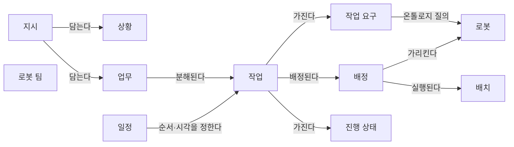
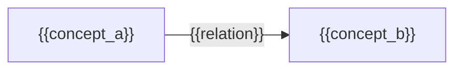

(너의 규칙은 시스템 프롬프트의 agents/shared-rules.md 와 agents/verifier.md 이다. 아래는 이번 실행의 컨텍스트와 입력이다.)

## 실행 컨텍스트

- run_id: 2026-09-25-43
- date: 2026-09-25
- run_type: track (트랙 실행)
- 대상: 트랙 nl-task-chatbot (자연어 업무 지시 챗봇) · 현재 단계: 단계 2. 필요한 데이터와 표준 조사 · 이번에 다룰 백로그 질문 id: q2-02 · 중심 세부영역: 13. 작업 배정 — MRTA (D. 계획·최적화)
- 예산:
    - max_search_queries: 40
    - max_sources_per_run: 20
    - new_topic_pages: 1
    - page_updates: 2
    - max_retries: 2
- 환경 알림: web_fetch_available: false · fetch_mode: mirror_only (일반 웹 페이지 열람은 네트워크 정책으로 막혀 있다. raw.githubusercontent.com 은 열린다: 공식 문서가 GitHub 에 있는 출처는 입력의 config/source_mirrors.yaml 경로를 WebFetch 로 열어 원문을 읽고 sources[].fetched=true, fetched_via=github_raw, fetch_url 을 적는다. 입력에 원문 텍스트(data/source_texts)가 있는 출처는 fetched_via=inbox. 그 밖의 출처는 fetched=false 이며 코드가 신뢰도 상한(medium)을 강제한다 — 공통 규칙 0절 6항)
- 언어: ko
- verification_stage: second
- verifier_budget:
    - max_search_queries: 40
    - max_sources_per_run: 20
    - new_topic_pages: 1
    - page_updates: 2
    - max_retries: 2
- retry_count: 1
- max_retries: 2

## 입력

### runs/2026-09-25-43/target.json

```json
{
  "run_id": "2026-09-25-43",
  "date": "2026-09-25",
  "weekday": "Fri",
  "run_number": 43,
  "run_type": "track",
  "forced": true,
  "target": {
    "area_no": 13,
    "area_name": "13. 작업 배정 — MRTA",
    "category": "D. 계획·최적화",
    "category_letter": "D"
  },
  "topic": null,
  "track": {
    "slug": "nl-task-chatbot",
    "name": "자연어 업무 지시 챗봇",
    "stage": 2,
    "stages": 5,
    "stage_name": "필요한 데이터와 표준 조사",
    "question_ids": [
      "q2-02"
    ],
    "user_questions": [],
    "runs_per_week": 3,
    "question_rationale": "CLI 지정 질문 id"
  },
  "corrections": [],
  "budget": {
    "max_search_queries": 40,
    "max_sources_per_run": 20,
    "new_topic_pages": 1,
    "page_updates": 2,
    "max_retries": 2
  },
  "priority_reason": null,
  "priority_questions": [],
  "excluded_areas": [],
  "lifted_areas": [],
  "deferred": {
    "monthly_recheck": false,
    "weekly_review": true
  },
  "selection_rationale": "CLI 지정 run_type=track, area=13; 트랙 실행일(Fri, track_days 앞 3개) → 트랙 nl-task-chatbot 단계 2, 질문 q2-02 (CLI 지정 질문 id)"
}
```

### runs/2026-09-25-43/research.json

```json
{
  "run_id": "2026-09-25-43",
  "date": "2026-09-25",
  "run_type": "track",
  "target": {
    "area_no": 13,
    "area_name": "13. 작업 배정 — MRTA",
    "category": "D. 계획·최적화"
  },
  "gaps": [
    "단계 2 질문 q2-02 열림(target.json 지정, CLI 지정 질문 id). 단계 2 페이지 3절에 q2-02 소제목 없음",
    "완료 조건: 아이디어 2. 자연어 업무 지시 챗봇 페이지 4절에 표준·형식 목록 비교 없음(q2-01 데이터 항목만 실림)",
    "완료 조건: 업무 분해·배정 설계 초안의 진행 상태·배정 개념 속성이 외부 표현 형식과 대조되지 않음",
    "13. 작업 배정 — MRTA 페이지 섹션 7. 관련 표준·프레임워크·오픈소스에 배정 결과(누구에게 배정했는가)를 기록하는 형식 근거 없음"
  ],
  "research_questions": [
    "가장 가까운 로봇에 맡기는 것이 전체적으로도 유리한가? [분류원문]",
    "q2-02 분해한 작업과 배정 결과를 표현하는 기존 표준·형식(작업·미션 기술, 워크플로 기술)은 무엇이 있고, ROP의 작업 모델에 비해 무엇이 빠지는가?",
    "로봇 관제 쪽 형식(Open-RMF 복합 작업·작업 상태, VDA 5050 주문, MassRobotics 상태 보고)은 작업의 단계 구조와 배정 결과를 어떤 필드로 표현하는가? (단계 2 페이지 3절, 13. 작업 배정 — MRTA 섹션 7 겨냥)",
    "업무·워크플로 쪽 형식(ISA-95 작업 지시·작업 응답, BPMN 2.0 수행자, Serverless Workflow)은 작업 구조·수행 자원·기한을 어떻게 표현하는가? (1. 주문·업무 시스템 연계, 2. 공정·워크플로 모델링 연결)",
    "로봇 계획·실행 표현(HDDL 계층 작업 네트워크, 행동 트리 XML)은 분해 구조와 순서를 어떻게 기술하고, 로봇 임무 기술에 합의된 표준 형식이 있는가? (14. 작업 순서·스케줄링 연결)",
    "서로 다른 로봇·플릿의 작업 선후를 표준 형식 안에서 표현·집행할 수단이 있는가? (oq-049 관련)",
    "국내에 로봇 작업·임무 기술 형식을 정한 KS 표준이나 연구가 있는가? (한국 자료 우선 규칙)"
  ],
  "findings": [
    {
      "id": "f1",
      "claim": "Open-RMF 복합(compose) 작업 기술 스키마는 순서가 있는 단계(phases) 배열을 유일한 필수 필드로 두고, 각 단계는 활동(activity: 범주와 플릿이 지원하는 스키마에 맞는 기술)을 필수로, 취소 시 실행할 활동 목록(on_cancel)을 선택으로 두며, 한 단계 안의 여러 활동은 Sequence 활동으로 묶게 한다.",
      "tag": "사실",
      "source_ids": [
        "ref-948"
      ],
      "cross_checked": false,
      "confidence": "medium",
      "evidence_excerpt": "task_description__compose.json 원본(github_raw): required phases(minItems 1), phase 는 activity 필수·on_cancel 선택. 'If there should be multiple activities within a phase, then use a Sequence activity.' (발행일 미확인, 확인일 기준)",
      "as_of": "2026-09-25",
      "flow_step": null,
      "flow_item": null
    },
    {
      "id": "f2",
      "claim": "Open-RMF 작업 상태 스키마는 예약 정보(booking)만 필수로 두고, 배정 결과를 로봇 그룹(플릿)과 이름으로 된 assigned_to 필드로, 배정 과정을 queued·selected·dispatched·failed_to_assign·canceled_in_flight 값의 dispatch 상태로, 진행을 uninitialized·blocked·queued·underway·delayed·completed·canceled·failed 등의 status 값과 단계별 상태·예상 소요 시간으로 표현한다.",
      "tag": "사실",
      "source_ids": [
        "ref-111"
      ],
      "cross_checked": false,
      "confidence": "medium",
      "evidence_excerpt": "task_state.json 원본(github_raw): assigned_to 'Which agent (robot) is the task assigned to'(group, name 필수); dispatch status enum; status enum 12종; estimate_millis, phases. (발행일 미확인, 확인일 기준)",
      "as_of": "2026-09-25",
      "flow_step": null,
      "flow_item": "수행 자원"
    },
    {
      "id": "f3",
      "claim": "이번에 연 Open-RMF 복합 작업·작업 상태 스키마에서는 배정 결과가 '어느 로봇인가'만 기록되고 배정 근거(선택 이유·산출 방식)·사용자 확인 여부·다른 작업과의 선행 의존을 담는 필드는 확인되지 않아, 이 항목은 ROP 의 작업 모델이 따로 보유해야 할 것으로 보인다.",
      "tag": "추정",
      "source_ids": [
        "ref-948",
        "ref-111"
      ],
      "cross_checked": false,
      "confidence": "low",
      "evidence_excerpt": "f1·f2 필드 목록에서 도출한 이 위키의 추론. 부재 관찰은 두 스키마 범위이며 rmf_task 내부 구현은 확인하지 않음(oq-049 관련).",
      "as_of": "2026-09-25",
      "flow_step": null,
      "flow_item": null
    },
    {
      "id": "f4",
      "claim": "VDA 5050 3.0.0 은 관제의 최소 기능으로 주문의 이동로봇 배정을 두지만, 주문 자체는 로봇 한 대가 지나갈 노드–간선 그래프 구간이며 전체 운반 작업은 orderId·orderUpdateId 로 이어진 여러 하위 주문으로 나뉠 수 있어, 업무·작업 수준의 구조나 배정 근거를 담는 메시지는 두지 않는다.",
      "tag": "사실",
      "source_ids": [
        "ref-031"
      ],
      "cross_checked": false,
      "confidence": "medium",
      "evidence_excerpt": "VDA5050_EN.md 3.0.0 원문(inbox): 5.3 'Assignment of orders to the mobile robots'; 6.1 'An order message does not necessarily describe the full transport order'. (발행일 미확인, 확인일 기준)",
      "as_of": "2026-09-25",
      "flow_step": null,
      "flow_item": "수행 자원"
    },
    {
      "id": "f5",
      "claim": "VDA 5050 3.0.0 의 사전 정의 동작 waitForTrigger 는 이동로봇이 관제(FLEET_CONTROL)나 로봇 자체 입력(LOCAL)의 트리거를 기다리게 하고, 관제는 제3 시스템에서 기다리던 과정이 끝났다는 정보를 받으면 순간 동작 trigger 로 이를 풀며, 시간 초과 처리와 주문 취소는 관제가 맡는다.",
      "tag": "사실",
      "source_ids": [
        "ref-031"
      ],
      "cross_checked": false,
      "confidence": "medium",
      "evidence_excerpt": "VDA5050_EN.md 3.0.0 원문(inbox) 표 4: trigger 'Typically, this occurs when the fleet control system receives information from a third-party system indicating that the process the mobile robot was waiting for has completed.'",
      "as_of": "2026-09-25",
      "flow_step": null,
      "flow_item": "완료·인계"
    },
    {
      "id": "f6",
      "claim": "MassRobotics AMR 상호운용 표준의 JSON 스키마는 로봇이 내보내는 식별 보고와 상태 보고만 정의하고 로봇에 작업을 보내는 메시지는 두지 않으며, 상태 보고에 운용 상태(navigating, idle, charging, waitingHumanEvent 등)와 목적지(destinations)·단기 경로를 담는다.",
      "tag": "사실",
      "source_ids": [
        "ref-230",
        "ref-253"
      ],
      "cross_checked": false,
      "confidence": "medium",
      "evidence_excerpt": "AMR_Interop_Standard.json 원본(github_raw): Identity Report·Status Report 두 유형, operationalState enum 9종, destinations 'Target destination(s) of AGV'. README 는 'tasking / availability' 공유를 목적으로 언급. 같은 발행 주체. (발행일 미확인, 확인일 기준)",
      "as_of": "2026-09-25",
      "flow_step": null,
      "flow_item": null
    },
    {
      "id": "f7",
      "claim": "OPC UA for ISA-95 작업 제어 노드셋의 작업 응답 데이터형은 작업 응답 id·연결된 작업 지시 id·실제 시작·종료 시각·작업 상태와 인원·설비·물리 자산·자재의 실적(Actuals)을 두고, 설비 데이터형의 ID 는 설비 클래스 또는 개별 설비를 가리킬 수 있다.",
      "tag": "사실",
      "source_ids": [
        "ref-130"
      ],
      "cross_checked": false,
      "confidence": "medium",
      "evidence_excerpt": "NodeSet2.xml 원본(github_raw): ISA95JobResponseDataType JobResponseID, JobOrderID, StartTime·EndTime 'actual', JobState, EquipmentActuals 등; ISA95EquipmentDataType ID 'An identification of an EquipmentClass or Equipment'.",
      "as_of": "2024-01-31",
      "flow_step": null,
      "flow_item": "완료·인계"
    },
    {
      "id": "f8",
      "claim": "이번에 연 ISA-95 작업 제어 노드셋의 작업 지시·작업 응답 데이터형에서는 작업 지시 사이의 선행·의존 관계를 담는 필드가 확인되지 않았다.",
      "tag": "추정",
      "source_ids": [
        "ref-130"
      ],
      "cross_checked": false,
      "confidence": "low",
      "evidence_excerpt": "NodeSet2.xml 열람 응답 기준의 부재 관찰이며 부재 확인 아님. 세그먼트 의존은 B2MML 쪽에 있음(oq-013 관련).",
      "as_of": "2026-09-25",
      "flow_step": null,
      "flow_item": null
    },
    {
      "id": "f9",
      "claim": "OMG BPMN 2.0.2 명세는 활동을 수행하거나 책임지는 자원을 수행자(Performer, 10.3.2절)로 정의하고, 사람 수행자(HumanPerformer)와 잠재 담당자(PotentialOwner) 같은 특수화와 자원 배정 식(resourceAssignmentExpression)으로 활동을 맡을 자원을 지정하게 한다.",
      "tag": "사실",
      "source_ids": [
        "ref-952"
      ],
      "cross_checked": false,
      "confidence": "medium",
      "evidence_excerpt": "검색 요약: 명세 PDF 목차의 10.3.2 'Performer'; Performer 는 사람에 한정되지 않으며 PotentialOwner 는 User Task 를 맡을 수 있는 후보를 나타낸다(구현 문서 요약 포함). 원문 미열람.",
      "as_of": "2014-01",
      "flow_step": null,
      "flow_item": "수행 자원",
      "source_unopened": true
    },
    {
      "id": "f10",
      "claim": "Corradini 외(2023)는 BPMN 2.0 협업 다이어그램으로 다중 로봇 시스템의 협력 행동을 모델링·설정·실행하는 틀을 제안했다.",
      "tag": "사실",
      "source_ids": [
        "ref-114"
      ],
      "cross_checked": false,
      "confidence": "medium",
      "evidence_excerpt": "검색 요약: 'framework for modeling, configuring and enacting the cooperative behaviors of multi-robot systems through collaboration diagrams' (Robotics and Autonomous Systems). 원문 미열람.",
      "as_of": "2023",
      "flow_step": null,
      "flow_item": null,
      "source_unopened": true
    },
    {
      "id": "f11",
      "claim": "CNCF 의 Serverless Workflow(Open Workflow Specification) DSL 1.0.x 는 YAML·JSON 으로 워크플로를 기술하며 call·do(순차)·fork(병렬)·switch·wait·emit·listen·raise·try·set·run 같은 작업 유형과 시간 초과·일정(cron·every·after) 표현을 둔다.",
      "tag": "사실",
      "source_ids": [
        "ref-949"
      ],
      "cross_checked": false,
      "confidence": "medium",
      "evidence_excerpt": "dsl.md 원본(github_raw): 'platform-agnostic workflow orchestration', Do 'subtasks to perform in sequence', Fork 'to perform in parallel', 문서 표기 DSL 1.0.3. (발행일 미확인, 확인일 기준)",
      "as_of": "2026-09-25",
      "flow_step": null,
      "flow_item": null
    },
    {
      "id": "f12",
      "claim": "이번에 연 Serverless Workflow DSL 문서에서는 작업을 특정 수행자·자원에 배정하거나 우선순위·기한을 표현하는 개념이 확인되지 않았다.",
      "tag": "추정",
      "source_ids": [
        "ref-949"
      ],
      "cross_checked": false,
      "confidence": "low",
      "evidence_excerpt": "dsl.md 열람 응답 기준의 부재 관찰. 시간 초과는 있으나 마감 시각 개념은 확인되지 않음. 부재 확인 아님.",
      "as_of": "2026-09-25",
      "flow_step": null,
      "flow_item": null
    },
    {
      "id": "f13",
      "claim": "BehaviorTree.CPP 는 행동 트리를 실행 시 불러오는 XML 기반 도메인 특화 언어로 정의하고, 사용자 정의 노드를 정적으로 링크하거나 플러그인으로 불러오며, 비동기 동작을 기본으로 지원한다.",
      "tag": "사실",
      "source_ids": [
        "ref-950"
      ],
      "cross_checked": false,
      "confidence": "medium",
      "evidence_excerpt": "README 원본(github_raw): 'a domain specific scripting language based on XML' that 'can be loaded at run-time'; ROS 2(colcon) 빌드 지원. 다중 로봇 배정 언급 없음. (발행일 미확인, 확인일 기준)",
      "as_of": "2026-09-25",
      "flow_step": null,
      "flow_item": null
    },
    {
      "id": "f14",
      "claim": "HDDL(Höller 외, AAAI 2020)은 PDDL 을 확장해 기본 작업·복합 작업과 복합 작업을 하위 작업 네트워크로 나누는 분해 방법, 하위 작업의 부분·전체 순서를 기술하는 계층적 작업 네트워크(HTN) 계획 언어로, 2020년 국제 계획 경진대회 계층 계획 부문의 공통 언어로 만들어졌다.",
      "tag": "사실",
      "source_ids": [
        "ref-951"
      ],
      "cross_checked": false,
      "confidence": "medium",
      "evidence_excerpt": "검색 요약: HDDL 'based on PDDL 2.1', IPC 2020 계층 계획 트랙용 표준 언어, compound task·method 선언, ':ordering' 절로 부분·전체 순서. 원문 미열람.",
      "as_of": "2019-11",
      "flow_step": null,
      "flow_item": null,
      "source_unopened": true
    },
    {
      "id": "f15",
      "claim": "Filippone 외(2026)는 단일·다중 로봇 시스템의 임무 기술에 표준이나 널리 합의된 형식이 없고, 행동 트리·상태 기계·계층적 작업 네트워크·BPMN 이 정도를 달리하며 쓰인다고 평가한다.",
      "tag": "의견",
      "source_ids": [
        "ref-116"
      ],
      "cross_checked": false,
      "confidence": "medium",
      "evidence_excerpt": "검색 요약(arXiv 2603.15427v2): 'there is no standard or widely accepted formalism for specifying missions in single- or multi-robot systems'. 원문 미열람.",
      "as_of": "2026-03",
      "flow_step": null,
      "flow_item": null,
      "source_unopened": true
    },
    {
      "id": "f16",
      "claim": "q2-02 에 대해 이번에 확인한 형식을 업무 분해·배정 설계 초안과 대조하면, 로봇 관제 형식(Open-RMF, VDA 5050)은 작업 단계·배정 결과·진행 상태를, 업무 형식(ISA-95 작업 지시·응답)은 기한·우선순위·자원 요구·실적을, 워크플로 형식(BPMN, Serverless Workflow)과 계획 언어(HDDL, 행동 트리)는 분해·순서 구조를 담지만, 지시 원문과 상황 값의 출처, 배정 근거·산출 방식, 사용자 확인 여부를 함께 담는 형식은 찾지 못해 ROP 는 이 항목을 자체 작업 모델에 두고 외부 형식으로 옮겨야 할 것으로 보인다.",
      "tag": "추정",
      "source_ids": [
        "ref-948",
        "ref-111",
        "ref-031",
        "ref-130",
        "ref-952",
        "ref-949",
        "ref-951",
        "ref-950"
      ],
      "cross_checked": false,
      "confidence": "low",
      "evidence_excerpt": "f1~f14 를 초안 2절 개념(지시·상황·업무·작업·배정·진행 상태)에 대응시킨 이 위키의 정리. 이 대응을 제시한 단일 출처는 확인하지 못함. 검색 범위의 결과이며 부재 확인 아님.",
      "as_of": "2026-09-25",
      "flow_step": null,
      "flow_item": null,
      "source_unopened": false
    },
    {
      "id": "f17",
      "claim": "확인한 형식 가운데 서로 다른 로봇·플릿 작업 사이의 선행 의존을 필드로 표현하는 것은 없었고, VDA 5050 의 waitForTrigger–trigger 처럼 관제가 다른 과정의 완료를 받아 로봇을 풀어 주는 동작이 플릿 사이 동기화 수단으로 쓰일 수 있어 보이나, 그 집행은 관제(ROP) 몫으로 남는다.",
      "tag": "추정",
      "source_ids": [
        "ref-031",
        "ref-948",
        "ref-130"
      ],
      "cross_checked": false,
      "confidence": "low",
      "evidence_excerpt": "f3·f5·f8 에서 도출한 추론. 이를 플릿 사이 선후 집행에 쓴 사례는 확인하지 못함(oq-049 관련).",
      "as_of": "2026-09-25",
      "flow_step": "피킹",
      "flow_item": "제약"
    },
    {
      "id": "f18",
      "claim": "분류 원문 질문(가장 가까운 로봇에 맡기는 것이 전체적으로도 유리한가)과 관련해, 표준 형식의 배정 결과(Open-RMF assigned_to·dispatch 상태, ISA-95 설비 실적)는 누가 맡았는지만 남기므로, 최근접 배정과 다른 배정 기준의 전체 효과를 사후에 비교하려면 ROP 가 배정 근거·목적함수 값을 별도로 기록해야 할 것으로 보인다.",
      "tag": "추정",
      "source_ids": [
        "ref-111",
        "ref-130"
      ],
      "cross_checked": false,
      "confidence": "low",
      "evidence_excerpt": "f2·f7 을 13. 작업 배정 — MRTA 의 SCM 질문에 대응시킨 추론. 배정 근거 기록을 권고한 출처는 확인하지 못함(oq-052 관련).",
      "as_of": "2026-09-25",
      "flow_step": null,
      "flow_item": "예외·성과"
    }
  ],
  "sources": [
    {
      "id": "ref-031",
      "org": "VDA / VDMA (VDA5050 GitHub)",
      "title": "VDA5050/VDA5050_EN.md — Official Specification document for the VDA 5050",
      "published": null,
      "url": "https://github.com/VDA5050/VDA5050/blob/main/VDA5050_EN.md",
      "type": "표준",
      "reliability": "high",
      "accessed": "2026-09-25",
      "summary": "VDA 5050 3.0.0 명세 원문. 이번 실행은 관제 기능(주문 배정), 주문 구조·하위 주문 분할, waitForTrigger·trigger 동작을 입력 원문 텍스트로 확인했다.",
      "fetched": true,
      "fetched_via": "github_raw",
      "fetch_url": null,
      "source_unopened": false
    },
    {
      "id": "ref-111",
      "org": "Open Robotics (open-rmf)",
      "title": "rmf_api_msgs — rmf_api_msgs/schemas/task_state.json",
      "published": null,
      "url": "https://github.com/open-rmf/rmf_api_msgs/blob/main/rmf_api_msgs/schemas/task_state.json",
      "type": "오픈소스 문서",
      "reliability": "high",
      "accessed": "2026-09-25",
      "summary": "Open-RMF 작업 상태 스키마. 예약, 배정 대상(assigned_to), 배정 과정(dispatch) 상태, 진행 상태 값, 단계 상태, 예상 소요 시간 필드를 원문으로 확인했다.",
      "fetched": true,
      "fetched_via": "github_raw",
      "fetch_url": "https://raw.githubusercontent.com/open-rmf/rmf_api_msgs/main/rmf_api_msgs/schemas/task_state.json",
      "source_unopened": false
    },
    {
      "id": "ref-130",
      "org": "OPC Foundation",
      "title": "UA-Nodeset ISA95-JOBCONTROL — opc.ua.isa95-jobcontrol.nodeset2 (NodeSet2.xml·documentation.csv)",
      "published": "2024-01-31",
      "url": "https://github.com/OPCFoundation/UA-Nodeset/tree/latest/ISA95-JOBCONTROL",
      "type": "표준",
      "reliability": "medium",
      "accessed": "2026-09-25",
      "summary": "OPC UA for ISA-95 작업 제어 노드셋. 이번 실행은 작업 응답·설비·인원 데이터형 필드를 NodeSet2.xml 원문으로 확인했다.",
      "fetched": true,
      "fetched_via": "github_raw",
      "fetch_url": "https://raw.githubusercontent.com/OPCFoundation/UA-Nodeset/latest/ISA95-JOBCONTROL/opc.ua.isa95-jobcontrol.nodeset2.xml",
      "source_unopened": false
    },
    {
      "id": "ref-230",
      "org": "MassRobotics",
      "title": "MassRobotics-AMR/AMR_Interop_Standard — AMR_Interop_Standard.json",
      "published": null,
      "url": "https://github.com/MassRobotics-AMR/AMR_Interop_Standard/blob/main/AMR_Interop_Standard.json",
      "type": "표준",
      "reliability": "high",
      "accessed": "2026-09-25",
      "summary": "MassRobotics AMR 상호운용 표준 JSON 스키마. 식별 보고·상태 보고 두 메시지와 운용 상태·목적지 필드를 원문으로 확인했다.",
      "fetched": true,
      "fetched_via": "github_raw",
      "fetch_url": "https://raw.githubusercontent.com/MassRobotics-AMR/AMR_Interop_Standard/main/AMR_Interop_Standard.json",
      "source_unopened": false
    },
    {
      "id": "ref-253",
      "org": "MassRobotics",
      "title": "MassRobotics-AMR/AMR_Interop_Standard — README",
      "published": null,
      "url": "https://github.com/MassRobotics-AMR/AMR_Interop_Standard",
      "type": "표준",
      "reliability": "medium",
      "accessed": "2026-09-25",
      "summary": "MassRobotics AMR 상호운용 표준 저장소 README. 위치·속도·상태·작업 가용성 등 정보 공유를 목적으로 적는다.",
      "fetched": false,
      "fetched_via": null,
      "fetch_url": "https://raw.githubusercontent.com/MassRobotics-AMR/AMR_Interop_Standard/main/README.md",
      "source_unopened": true
    },
    {
      "id": "ref-114",
      "org": "Corradini, F., Pettinari, S., Re, B., Rossi, L., & Tiezzi, F.",
      "title": "A BPMN-driven framework for Multi-Robot System development",
      "published": "2023",
      "url": "https://www.sciencedirect.com/science/article/abs/pii/S0921889022002111",
      "type": "논문",
      "reliability": "medium",
      "accessed": "2026-09-25",
      "summary": "원문 미열람. BPMN 2.0 협업 다이어그램으로 다중 로봇 시스템의 협력 행동을 모델링·설정·실행하는 틀을 제안한 논문.",
      "fetched": false,
      "fetched_via": null,
      "fetch_url": null,
      "source_unopened": true
    },
    {
      "id": "ref-116",
      "org": "Filippone, G., Pettinari, S., & Pelliccione, P.",
      "title": "Formalisms for Robotic Mission Specification and Execution: A Comparative Analysis",
      "published": "2026-03",
      "url": "https://arxiv.org/abs/2603.15427",
      "type": "논문",
      "reliability": "medium",
      "accessed": "2026-09-25",
      "summary": "원문 미열람. 행동 트리·상태 기계·계층적 작업 네트워크·BPMN 등 로봇 임무 기술 형식을 비교한 프리프린트.",
      "fetched": false,
      "fetched_via": null,
      "fetch_url": null,
      "source_unopened": true
    },
    {
      "id": "ref-948",
      "org": "Open Robotics (open-rmf)",
      "title": "rmf_ros2 — rmf_fleet_adapter/schemas/task_description__compose.json",
      "published": null,
      "url": "https://github.com/open-rmf/rmf_ros2/blob/main/rmf_fleet_adapter/schemas/task_description__compose.json",
      "type": "오픈소스 문서",
      "reliability": "high",
      "accessed": "2026-09-25",
      "summary": "Open-RMF 복합 작업 기술 스키마. 순서가 있는 단계 배열, 단계별 활동과 취소 시 활동을 원문으로 확인했다.",
      "fetched": true,
      "fetched_via": "github_raw",
      "fetch_url": "https://raw.githubusercontent.com/open-rmf/rmf_ros2/main/rmf_fleet_adapter/schemas/task_description__compose.json",
      "source_unopened": false
    },
    {
      "id": "ref-949",
      "org": "CNCF Serverless Workflow (serverlessworkflow/specification GitHub)",
      "title": "Serverless Workflow Specification — dsl.md (DSL 1.0)",
      "published": null,
      "url": "https://github.com/serverlessworkflow/specification/blob/main/dsl.md",
      "type": "오픈소스 문서",
      "reliability": "high",
      "accessed": "2026-09-25",
      "summary": "플랫폼 중립 워크플로 기술 DSL 문서. YAML·JSON 형식, 작업 유형(순차·병렬·분기·대기·이벤트·오류 처리), 시간 초과·일정 표현을 원문으로 확인했다.",
      "fetched": true,
      "fetched_via": "github_raw",
      "fetch_url": "https://raw.githubusercontent.com/serverlessworkflow/specification/main/dsl.md",
      "source_unopened": false
    },
    {
      "id": "ref-950",
      "org": "BehaviorTree.CPP (BehaviorTree GitHub)",
      "title": "BehaviorTree.CPP — README",
      "published": null,
      "url": "https://github.com/BehaviorTree/BehaviorTree.CPP",
      "type": "오픈소스 문서",
      "reliability": "high",
      "accessed": "2026-09-25",
      "summary": "행동 트리 C++ 라이브러리 README. XML 기반 트리 정의의 실행 시 적재, 플러그인 노드, 비동기 동작 지원을 원문으로 확인했다.",
      "fetched": true,
      "fetched_via": "github_raw",
      "fetch_url": "https://raw.githubusercontent.com/BehaviorTree/BehaviorTree.CPP/master/README.md",
      "source_unopened": false
    },
    {
      "id": "ref-951",
      "org": "Höller, D., Behnke, G., Bercher, P., Biundo, S., Fiorino, H., Pellier, D., & Alford, R.",
      "title": "HDDL – A Language to Describe Hierarchical Planning Problems",
      "published": "2019-11",
      "url": "https://arxiv.org/abs/1911.05499",
      "type": "논문",
      "reliability": "medium",
      "accessed": "2026-09-25",
      "summary": "원문 미열람. PDDL 을 확장해 계층적 작업 네트워크 계획 문제(기본·복합 작업, 분해 방법, 순서)를 기술하는 HDDL 을 제안한 논문(AAAI 2020 발표, 저자 목록은 검색 기록 기준).",
      "fetched": false,
      "fetched_via": null,
      "fetch_url": null,
      "source_unopened": true
    },
    {
      "id": "ref-952",
      "org": "OMG(Object Management Group)",
      "title": "Business Process Model and Notation (BPMN), Version 2.0.2",
      "published": "2014-01",
      "url": "https://www.omg.org/spec/BPMN/2.0.2/PDF",
      "type": "표준",
      "reliability": "medium",
      "accessed": "2026-09-25",
      "summary": "원문 미열람. OMG BPMN 2.0.2 명세 PDF. 활동 수행 자원(Performer, 10.3.2절)과 사람 수행자·자원 배정 식을 정의한다(검색 요약 기준).",
      "fetched": false,
      "fetched_via": null,
      "fetch_url": null,
      "source_unopened": true
    }
  ],
  "page_proposals": [
    {
      "action": "update",
      "path": "docs/tracks/nl-task-chatbot/stage-2-data-and-standards.md",
      "sections": [
        "2",
        "3",
        "4",
        "5",
        "6",
        "8",
        "9"
      ],
      "rationale": "q2-02 답: f1·f2·f3·f4·f5·f6·f7·f8·f9·f10·f11·f12·f13·f14·f15·f16·f17·f18 (신뢰도 low) — 2절 q2-02 상태 답함, 3절 q2-02 소제목 신설({#q2-02}): 로봇 관제 형식(Open-RMF 복합 작업·작업 상태 f1·f2, VDA 5050 주문·waitForTrigger f4·f5, MassRobotics 상태 보고만 f6), 업무 형식(ISA-95 작업 응답 f7·f8), 워크플로 형식(BPMN 수행자 f9·f10, Serverless Workflow f11·f12), 계획·실행 표현(HDDL f14, 행동 트리 XML f13), 합의된 임무 기술 표준 부재 평가(f15 의견), 초안 대비 빠진 항목(f16·f3), 플릿 사이 선후(f17), SCM 질문 연결(f18) / 4절 결론·불확실성 / 5절 후속 질문 / 6절 완료 조건 현황 / 8절 출처 / 9절 이력"
    },
    {
      "action": "update",
      "path": "docs/ideas/nl-task-chatbot.md",
      "sections": [
        "4"
      ],
      "rationale": "아이디어 페이지 4절: '작업·배정 결과를 표현하는 표준·형식' 소절 신설 — 형식 비교표(f1·f2·f4·f6·f7·f9·f11·f13·f14), 초안 대비 빠진 항목(f16·f3, 추정), 합의된 임무 기술 표준 부재 평가(f15 의견). 평가 데이터(q2-03)는 미조사임을 명시"
    },
    {
      "action": "update",
      "path": "docs/tracks/nl-task-chatbot/task-model-draft.md",
      "sections": [
        "2",
        "6"
      ],
      "rationale": "트랙 산출물 갱신: track.ontology_changes(진행 상태 값 원천, 배정 결과의 외부 표현 대응)가 승인되면 2절 반영과 초안 버전 인상(f2·f4·f7·f16). 미승인 부분과 플릿 사이 선행 의존(f17)은 6절 질문으로"
    },
    {
      "action": "update",
      "path": "docs/categories/d-planning-and-optimization/13-task-allocation-mrta.md",
      "sections": [
        "7"
      ],
      "rationale": "트랙 nl-task-chatbot 단계 2 반영 제안 (f2, f4, f18): Open-RMF 작업 상태의 배정 결과(assigned_to)·배정 과정(dispatch) 상태, VDA 5050 의 배정 기능과 주문 단위, 배정 근거 기록 필요와 분류 원문 질문 연결"
    },
    {
      "action": "update",
      "path": "docs/categories/a-business-supply-chain-design/02-process-and-workflow-modeling.md",
      "sections": [
        "7"
      ],
      "rationale": "트랙 nl-task-chatbot 단계 2 반영 제안 (f7, f9, f10, f11, f15): ISA-95 작업 응답의 실적 필드, BPMN 수행자와 다중 로봇 BPMN 틀, Serverless Workflow, 임무 기술 형식에 합의된 표준이 없다는 평가"
    },
    {
      "action": "update",
      "path": "docs/categories/d-planning-and-optimization/14-task-sequencing-and-scheduling.md",
      "sections": [
        "7"
      ],
      "rationale": "트랙 nl-task-chatbot 단계 2 반영 제안 (f1, f5, f14, f17): Open-RMF 복합 작업의 단계 순서, HDDL 의 하위 작업 순서 표현, VDA 5050 waitForTrigger 를 통한 플릿 사이 동기화 가능성(oq-049 관련)"
    }
  ],
  "glossary_candidates": [
    {
      "term_ko": "계층적 작업 네트워크",
      "term_en": "Hierarchical Task Network (HTN)",
      "definition": "복합 작업을 미리 정한 분해 방법으로 하위 작업 네트워크로 나누어 결국 실행 가능한 기본 작업의 순서에 이르게 하는 자동 계획 방식이다."
    },
    {
      "term_ko": "계층 도메인 정의 언어",
      "term_en": "Hierarchical Domain Definition Language (HDDL)",
      "definition": "PDDL 을 확장해 기본 작업·복합 작업·분해 방법과 하위 작업의 순서를 기술하는 계층적 작업 네트워크 계획 문제의 공통 기술 언어이다."
    }
  ],
  "open_questions_new": [],
  "open_questions_resolved": [],
  "self_check": {
    "source_count": 12,
    "cross_checked_count": 0,
    "unverified": [
      "모든 finding 교차 확인 없음: 형식마다 단일 공식 파일이거나 같은 발행 주체의 스키마·README 쌍",
      "f9 BPMN 수행자 정의는 명세 PDF 원문 미열람(검색 요약·구현 문서 요약 범위)",
      "f14 HDDL 저자 목록·발행 형태는 검색 기록 기준",
      "f3·f8·f12 는 연 문서 범위의 부재 관찰이며 부재 확인 아님",
      "f17 waitForTrigger 를 플릿 사이 선후 집행에 쓴 사례 미확인",
      "ISA-95 작업 지시 상태 기계의 상태 이름은 이번 열람 응답에서 확인하지 못함",
      "한국어 검색 2회에서 로봇 작업·임무 기술 형식을 정한 KS 표준이나 국내 연구를 찾지 못함"
    ],
    "scope_violations": [],
    "budget_used": {
      "queries": 7,
      "sources": 5
    },
    "limits": "web_fetch_available: false · fetch_mode mirror_only. 원문을 연 출처: 신규 ref-948(Open-RMF 복합 작업)·ref-949(Serverless Workflow DSL)·ref-950(BehaviorTree.CPP README)는 github_raw, 재사용 ref-111·ref-130·ref-230·ref-253 은 github_raw, ref-031 은 입력 원문 텍스트(inbox). 신규 ref-951(HDDL)·ref-952(BPMN 2.0.2 PDF)와 재사용 ref-114·ref-116 은 원문 미열람(신뢰도 상한 medium). 검색 7회/40, 신규 출처 5건/20(ref-948~ref-952, 예약 구간 안), 재사용 7건. 교차 확인 0건. 질문 선택: target.json 지정 q2-02 1건. q2-02 는 로봇 관제·업무·워크플로·계획 언어 형식의 필드 관찰로 답했으나, 초안 대비 빠진 항목(f16)은 이 위키의 대응 추론이라 질문 종합 신뢰도를 low 로 두었다. 한국 자료: 한국어 검색 2회에서 KS 로봇 작업 지시·임무 기술 표준을 찾지 못함(KS B ISO 8373·10218 등 용어·안전 표준만 확인되어 넣지 않음). 교차 규칙: 이번 finding 은 LLM 방법이 아니라 표현 형식이라 27. AI·학습·적응과 모델 운영 반영은 제안하지 않았다. 8. 실시간 세계 상태·데이터 일관성과 22. 시뮬레이션·예측용 디지털 트윈 관련 주장 없음. 정정 요청 없음. 새 일반 열린 질문 없음: 플릿 사이 선후는 기존 oq-049, 배정 비교 실측은 oq-052 와 겹친다. 용어 후보 2건(f14 근거). 트랙 glossary_targets 가운데 용어집에 없는 '사람 확인 루프'는 이번 finding 근거가 없어 내지 않았다. 후속 질문 2건. 온톨로지 변경 제안 2건."
  },
  "track": {
    "slug": "nl-task-chatbot",
    "stage": 2,
    "answered_question_ids": [
      "q2-02"
    ],
    "new_questions": [
      {
        "question": "ROP 가 업무→작업 분해 구조를 내부에 둘 때 BPMN·Serverless Workflow·HDDL 같은 기존 형식을 표준 표현으로 채택할지, 자체 작업 모델 스키마를 두고 Open-RMF 복합 작업·VDA 5050 주문으로 변환할지, 변환 때 배정 근거·확인 여부는 어디에 남기는가? (q2-02 에서 파생)",
        "stage": 3,
        "rationale_finding_id": "f16"
      },
      {
        "question": "Open-RMF 복합 작업의 단계와 VDA 5050 waitForTrigger–trigger 를 조합해 제조사가 다른 플릿 사이 작업 선후(예: 피킹 로봇 완료 뒤 운반 로봇 출발)를 집행할 수 있는가, 트리거 누락·시간 초과 때 누가 복구하는가? (q2-02 에서 파생)",
        "stage": 3,
        "rationale_finding_id": "f17"
      }
    ],
    "ontology_changes": [
      {
        "op": "modify",
        "kind": "concept",
        "name": "진행 상태 (Progress)",
        "evidence_finding_ids": [
          "f2",
          "f7"
        ],
        "description": "속성 '상태 값'에 외부 표현 원천 후보를 적는다: Open-RMF 작업 상태 status 값(queued·underway·delayed·completed·canceled·failed 등)과 배정 과정 dispatch 값(queued·selected·dispatched·failed_to_assign), ISA-95 작업 응답의 JobState·실제 시작·종료 시각. 초안의 '접수·실행·완료·취소' 네 값과의 대응 규칙은 6절 질문으로 둔다."
      },
      {
        "op": "modify",
        "kind": "concept",
        "name": "배정 (Assignment)",
        "evidence_finding_ids": [
          "f2",
          "f4",
          "f3",
          "f18"
        ],
        "description": "배정 결과의 외부 표현 대응을 메모로 단다: Open-RMF 는 assigned_to(플릿 그룹·로봇 이름)로, VDA 5050 은 주문을 보내는 로봇 토픽으로 배정 대상만 표현하고 선택 근거·배정 산출 방식·확인 여부 필드는 없어 작업 모델이 보유한다. 기존 속성과 충돌하지 않는 메모 수준 제안이다."
      }
    ],
    "stage_completion_self_assessment": {
      "met": false,
      "missing": [
        "필요한 데이터 항목과 표준·형식 목록이 아이디어 2. 자연어 업무 지시 챗봇 4절에 아직 실리지 않음(이번 제안 반영 전)",
        "작업 모델의 정보 항목이 업무 분해·배정 설계 초안 개념 목록 표에 일부만 반영됨(작업 요구 적재물 속성·완료 조건 미확정)",
        "열린 질문 q2-03, q2-04, q2-05, q2-06"
      ]
    }
  }
}
```

### runs/2026-09-25-43/verification.json

```json
{
  "run_id": "2026-09-25-43",
  "stage": "first",
  "verdict": "조건부 승인",
  "claim_checks": [
    {
      "finding_id": "f1",
      "source_exists": true,
      "supports_claim": true,
      "cross_checked": false,
      "tag_decision": "유지",
      "note": "확인: ref-948 원본을 github_raw로 다시 열었다. 필수 필드는 phases(최소 1개)뿐이고, phase는 activity 필수·on_cancel 선택이며 'use a Sequence activity' 문구가 있다. 발행일은 미확인, 확인일 2026-09-25 기준."
    },
    {
      "finding_id": "f2",
      "source_exists": true,
      "supports_claim": true,
      "cross_checked": false,
      "tag_decision": "유지",
      "note": "확인: ref-111 원본을 다시 열었다. 필수는 booking뿐이다. assigned_to는 group·name 필수이고, dispatch status 값은 queued/selected/dispatched/failed_to_assign/canceled_in_flight 5종이다. status는 uninitialized, blocked, error, failed, queued, standby, underway, delayed, skipped, canceled, killed, completed의 12종이다. 브리프가 '등'으로 줄인 것은 원문과 맞다. 추가로 event_state에 같은 phase 안 사건 사이 의존(deps) 배열이 있다(f3·f16·f17 관련)."
    },
    {
      "finding_id": "f3",
      "source_exists": true,
      "supports_claim": true,
      "cross_checked": false,
      "tag_decision": "유지",
      "note": "추정 유지. 배정 근거·확인 여부 필드가 없다는 점은 원본으로 확인했다. 다만 task_state.json에는 작업 내부 사건 사이 의존(event_state.deps)이 있으므로, '선행 의존 필드 없음'은 서로 다른 작업 사이에 한정해 써야 한다(수정 지시)."
    },
    {
      "finding_id": "f4",
      "source_exists": true,
      "supports_claim": true,
      "cross_checked": false,
      "tag_decision": "유지",
      "note": "확인: 입력 원문 텍스트 data/source_texts/ref-031.txt(VDA 5050 3.0.0)에서 5.3 'Assignment of orders to the mobile robots'와 6.1.1 'An order message does not necessarily describe the full transport order'를 확인했다. 브리프 sources의 ref-031은 fetched_via가 github_raw인데 fetch_url은 null이고 발췌에는 inbox로 적혀 있다. 실제 경로는 inbox다."
    },
    {
      "finding_id": "f5",
      "source_exists": true,
      "supports_claim": true,
      "cross_checked": false,
      "tag_decision": "유지",
      "note": "확인: 입력 원문 표 4에서 확인했다. waitForTrigger의 triggerType에 FLEET_CONTROL·LOCAL이 있고, 'Fleet control is responsible for handling the timeout and shall cancel the order if necessary'라는 문구와 trigger 순간 동작의 제3 시스템 문구가 있다."
    },
    {
      "finding_id": "f6",
      "source_exists": true,
      "supports_claim": true,
      "cross_checked": false,
      "tag_decision": "유지",
      "note": "확인: ref-230 JSON 원본을 다시 열었다. oneOf로 identityReport·statusReport 두 유형만 있고, 작업을 보내는 메시지는 없다. operationalState 9종, destinations 'Target destination(s) of AGV'를 확인했다. README(ref-253)는 원문 미열람이며 같은 발행 주체라 교차 확인이 아니다."
    },
    {
      "finding_id": "f7",
      "source_exists": true,
      "supports_claim": true,
      "cross_checked": false,
      "tag_decision": "유지",
      "note": "확인: NodeSet2.xml 원본을 다시 열었다. JobResponseID, JobOrderID, 실제 StartTime·EndTime, JobState, Equipment·Personnel·PhysicalAsset·Material Actuals가 있다. 설비 ID는 'EquipmentClass or Equipment'이고, 모델 발행일은 2024-01-31이다."
    },
    {
      "finding_id": "f8",
      "source_exists": true,
      "supports_claim": true,
      "cross_checked": false,
      "tag_decision": "유지",
      "note": "추정 유지. 검증 열람에서도 ISA95JobOrderDataType에 작업 지시 사이 의존·선행 필드가 없었다. 부재 관찰이며, B2MML 세그먼트 의존은 oq-013과 연결된다."
    },
    {
      "finding_id": "f9",
      "source_exists": true,
      "supports_claim": false,
      "cross_checked": false,
      "tag_decision": "강등",
      "note": "사실 → 추정. 원문 미열람. 검증 검색에서 HumanPerformer의 특수화 PotentialOwner와 ResourceAssignmentExpression, 명세 10.3.2절·표 10.17·10.18 참조는 확인했다. 그러나 근거가 주로 구현 문서(Flowable 등) 요약이고, 'Performer를 활동을 수행하거나 책임지는 자원으로 정의'라는 정의 문구는 발행 기관(OMG) 원문으로 확인하지 못했다. 표준 주장이 발행 기관 자료로 확인되지 않았으므로 재확인을 요청한다. BPMN 2.0.2 발행 2014-01은 맞다."
    },
    {
      "finding_id": "f10",
      "source_exists": true,
      "supports_claim": true,
      "cross_checked": false,
      "tag_decision": "유지",
      "note": "확인(원문 미열람): 검증 검색에서 저자 5명, Robotics and Autonomous Systems 160권 104322(2023), BPMN 기반 다중 로봇 임무 모델링·설정·실행 틀과 툴체인을 확인했다."
    },
    {
      "finding_id": "f11",
      "source_exists": true,
      "supports_claim": true,
      "cross_checked": false,
      "tag_decision": "유지",
      "note": "확인: dsl.md 원본을 다시 열었다. 예시 표기 DSL 1.0.3, 작업 유형 Call·Do·Emit·For·Fork·Listen·Raise·Run·Set·Switch·Try·Wait, 시간 초과와 every·cron·after 일정을 확인했다. 브리프 목록에서 For가 빠졌지만 '같은'으로 예시한 것이라 허용한다."
    },
    {
      "finding_id": "f12",
      "source_exists": true,
      "supports_claim": true,
      "cross_checked": false,
      "tag_decision": "유지",
      "note": "추정 유지. 검증 열람에서도 수행자 배정·우선순위·기한 개념은 확인되지 않았다(시간 초과만 있음). 부재 관찰이다."
    },
    {
      "finding_id": "f13",
      "source_exists": true,
      "supports_claim": true,
      "cross_checked": false,
      "tag_decision": "유지",
      "note": "확인: README 원본에서 XML 기반 DSL의 실행 시 적재, 정적 링크·플러그인 노드, 비동기 Action을 first-class로 두는 점을 확인했다."
    },
    {
      "finding_id": "f14",
      "source_exists": true,
      "supports_claim": true,
      "cross_checked": false,
      "tag_decision": "유지",
      "note": "확인(원문 미열람): 검증 검색에서 arXiv 1911.05499(2019-11-13), PDDL2.1 STRIPS 부분의 확장, 기본 HTN 계획 한정, AAAI 2020 발표를 확인했다. 'IPC 2020 계층 계획 부문 공통 언어' 부분은 리서치 검색 요약에만 있다."
    },
    {
      "finding_id": "f15",
      "source_exists": true,
      "supports_claim": true,
      "cross_checked": false,
      "tag_decision": "유지",
      "note": "확인(원문 미열람): 검증 검색에서 저자 Filippone·Pettinari·Pelliccione(GSSI), arXiv 2603.15427, 'no standard or widely accepted formalism' 문구, BT·상태 기계·HTN·BPMN 비교를 확인했다. [의견]이므로 누구의 평가인지 밝혀 쓴다."
    },
    {
      "finding_id": "f16",
      "source_exists": true,
      "supports_claim": true,
      "cross_checked": false,
      "tag_decision": "유지",
      "note": "추정 유지(이 위키의 대응). 다만 BPMN을 '분해·순서 구조'로만 분류하면 f9의 수행자 지정(자원 배정 식)을 빠뜨린다. 또 Open-RMF 작업 상태의 작업 내부 사건 의존(deps)을 고려해 표현을 고쳐야 한다(수정 지시). 브리프는 source_unopened를 false로 적었지만, 근거에 원문 미열람 출처 ref-951·ref-952가 섞여 있다."
    },
    {
      "finding_id": "f17",
      "source_exists": true,
      "supports_claim": true,
      "cross_checked": false,
      "tag_decision": "유지",
      "note": "추정 유지. waitForTrigger–trigger 동작은 원문으로 확인했다. 이를 플릿 사이 선후 집행에 쓴 사례는 확인되지 않았다. oq-049는 해결로 바꾸지 않는다. '작업 사이'라는 한정을 유지한다."
    },
    {
      "finding_id": "f18",
      "source_exists": true,
      "supports_claim": true,
      "cross_checked": false,
      "tag_decision": "유지",
      "note": "추정 유지. assigned_to(f2)와 EquipmentActuals(f7)는 원문으로 확인했다. 배정 근거 기록을 권고한 출처는 없으며 oq-052와 연결된다."
    }
  ],
  "category_fit": {
    "ok": true,
    "reassign_to": null
  },
  "scope_boundary": {
    "ok": true,
    "issues": []
  },
  "duplication": {
    "ok": true,
    "overlaps": [
      "f4는 13. 작업 배정 — MRTA 7절·9절의 기존 서술('VDA 5050은 주문 배정을 관제의 기능으로 둔다', ref-031)과 같은 주장이다. 기존 각주 ref-031을 재사용하고 반영 제안에서 새 문장으로 반복하지 않는다.",
      "f17과 새 질문 'Open-RMF 복합 작업 + waitForTrigger로 플릿 사이 선후 집행'은 열린 질문 oq-049(플릿 사이 작업 선후 표현·집행)와 겹친다. 중복 등록은 아니지만 oq-049로 연결한다.",
      "f7·f16은 oq-020(ISA-95 작업 지시·응답 ↔ VDA 5050·Open-RMF 매핑), f9·f10은 oq-014(BPMN 단계 상태 ↔ 로봇 작업 상태 동기화), f8은 oq-013(B2MML 의존 유형)과 관련된다. 어느 것도 해결로 판정하지 않는다.",
      "새 질문 'BPMN·Serverless Workflow·HDDL을 표준 표현으로 채택할지 자체 스키마를 두고 변환할지'는 백로그 q2-04(중간 표현을 작업 모델·관제 인터페이스로 옮길 때 무엇이 빠지는가)와 관련되지만, 단계 3의 설계 결정 질문이라 중복으로 보지 않는다.",
      "f18은 oq-052(최근접 대 전역 최적 배정 실측 비교)와 관련된다."
    ]
  },
  "terminology": {
    "ok": false,
    "conflicts": [
      "f2가 Open-RMF의 dispatch를 '배정 과정'으로 번역했는데, 업무 분해·배정 설계 초안에서 '배치(Dispatch)'는 배정된 로봇에게 작업을 내보내는 실행 지시이고 '배정(Assignment)'은 별개 개념이다. 페이지에서는 'Open-RMF 디스패치 상태(dispatch status: queued·selected·dispatched·failed_to_assign·canceled_in_flight)'로 원어를 병기한다. 초안의 배정·배치 개념과 같은 것으로 단정하지 않는다."
    ]
  },
  "quotation_check": {
    "ok": true
  },
  "corrections_applied": [],
  "corrections_rejected": [],
  "required_fixes": [
    "f9: [사실] → [추정]으로 강등한다. 'BPMN 2.0.2 명세는 사람 수행자(HumanPerformer)와 그 특수화인 잠재 담당자(PotentialOwner), 자원 배정 식(resourceAssignmentExpression)으로 활동을 맡을 자원을 지정하게 한다(발행 기관 원문 미열람, 구현 문서 요약 기준)' 수준으로 쓴다. 'Performer를 활동을 수행하거나 책임지는 자원으로 정의' 문구는 넣지 않는다. 이유: 정의 문구를 OMG 원문으로 확인하지 못했고, 근거가 구현 문서 요약이다.",
    "f3·f16·f17: '선행 의존 필드가 확인되지 않았다'는 서술을 '서로 다른 작업(작업 요청) 사이'로 한정해 쓴다. 이유: 검증 열람에서 Open-RMF task_state.json의 작업 내부 사건 사이에는 의존(deps) 배열이 있음을 확인했다. 이 사실은 검증 노트에만 두고 새 [사실] 문장으로 추가하지 않는다.",
    "f16: 대응 서술과 표에서 BPMN을 '분해·순서 구조'로만 분류하지 않는다. f9의 수행자·자원 배정 식을 '배정 대상 지정' 칸에 [추정]으로 함께 적는다. 이유: 이 위키의 대응(추론)이 f9와 어긋난다.",
    "f2 용어: Open-RMF dispatch는 '디스패치 상태(dispatch)'로 원어를 병기한다. 업무 분해·배정 설계 초안의 '배치(Dispatch)'나 '배정(Assignment)' 개념과 같은 것으로 쓰지 않는다.",
    "f15: [의견] 문장에 'Filippone 외(2026-03, 프리프린트)의 평가'임을 문장 안에 밝힌다.",
    "f14: 날짜는 'arXiv 2019-11 공개, AAAI 2020 발표'로 적는다. 'IPC 2020 계층 계획 부문 공통 언어' 부분은 원문 미열람 검색 요약 기준임을 병기한다.",
    "원문 미열람 표시: ref-114, ref-116, ref-253, ref-951, ref-952의 각주 정의 접근일 뒤에 ' (원문 미열람)'을 붙이고, 신규 출처(ref-951·ref-952)의 reference_updates에 source_unopened: true를 넣는다. ref-031·ref-111·ref-130·ref-230·ref-948·ref-949·ref-950은 원문 열람 출처이므로 표시하지 않는다.",
    "온톨로지 변경 '진행 상태 (Progress)' 수정을 승인한다. 속성 '상태 값'에 외부 표현 원천 후보(Open-RMF 작업 상태 status 값, Open-RMF 디스패치 상태 값, ISA-95 작업 응답 JobState·실제 시작·종료 시각)를 근거 f2·f7 각주와 함께 적는다. 행 상태는 초안 → 확정으로 바꾼다. 초안의 네 값(접수·실행·완료·취소)과의 대응 규칙은 6절 미해결 모델링 질문에 새 항목으로 둔다.",
    "온톨로지 변경 '배정 (Assignment)' 수정(메모)을 승인하되 표현을 고친다. 'Open-RMF 작업 상태는 assigned_to(그룹·이름)로 배정 대상만 기록하고 배정 근거·산출 방식·확인 여부 필드는 확인되지 않았다 [추정]; VDA 5050 3.0.0은 주문의 로봇 배정을 관제의 기능으로 둘 뿐 배정 근거를 담는 메시지를 두지 않는다 [사실][^ref-031]'로 쓴다. '로봇 토픽으로 배정 대상을 표현' 문구는 f4에 없으므로 쓰지 않는다. 행 상태는 확정을 유지한다.",
    "초안 버전: 승인한 변경이 있으므로 ontology_version을 '0.4' → '0.5'로 올린다. H1 '(v0.5)', page-status 표기, 프런트매터, pages.json track_updates.ontology_draft_version 네 곳을 같은 값으로 맞추고, 1절 버전 설명에 v0.5를 더한다.",
    "단계 2 페이지: 2절 q2-02 상태는 '답함'(답한 실행 2026-09-25-43, 답 위치 #q2-02)으로 바꾼다. 3절에 '### q2-02 … {#q2-02}' 소제목을 둔다. 6절 두 완료 조건은 모두 '미충족', 검증 판정 칸은 '미충족 · 미승인'으로 둔다. 아래 줄은 '다음 단계로 전환: 아니오(열린 질문 q2-03·q2-04·q2-05·q2-06, 작업 요구의 적재물 속성·업무 완료 조건 미확정)'로 쓴다. 상태 줄의 열린 질문·답한 질문 수를 2절 표와 맞춘다.",
    "새 질문 두 건은 단계 3 태그로 backlog_updates에 등록한다(origin f16, f17). 'Open-RMF 복합 작업·waitForTrigger' 질문 문장에는 열린 질문 oq-049와 관련됨을 병기한다. 'BPMN·Serverless Workflow·HDDL 채택 대 자체 스키마' 질문 옆에는 q2-04와의 관계를 단계 페이지 5절에 한 줄로 적는다.",
    "세부영역 반영 제안(13. 작업 배정 — MRTA, 2. 공정·워크플로 모델링, 14. 작업 순서·스케줄링)은 세부영역 페이지를 직접 고치지 않고 area_reflection_proposals로만 낸다. 13. 작업 배정 — MRTA 제안에서 VDA 5050 배정 기능 서술은 기존 7절·9절 문장과 각주 ref-031을 재사용하고 새로 반복하지 않는다. f9는 강등된 태그([추정])로 제안한다.",
    "아이디어 2 페이지 4절: '작업·배정 결과를 표현하는 표준·형식' 소절의 비교표는 이 위키가 구성한 것임을 밝히고 [추정] 태그와 근거 각주를 붙인다. 원 명세의 표를 복제하지 않는다. q2-03(평가 데이터)은 미조사임을 명시한다.",
    "용어집: 신규 용어 '계층적 작업 네트워크(Hierarchical Task Network, HTN)'와 '계층 도메인 정의 언어(Hierarchical Domain Definition Language, HDDL)'를 근거 f14로 등록한다. HDDL 정의에서는 기존 용어 '계획 도메인 정의 언어(PDDL)' 페이지에 연결한다. BPMN은 기존 용어 '비즈니스 프로세스 모델 및 표기법' 페이지에 연결하고 새로 등록하지 않는다."
  ],
  "confidence": "low",
  "verification_note": "판정: 조건부 승인. 이번 실행은 원문 열람이 차단된 환경(fetch_mode mirror_only)에서 검증됐다. GitHub 공식 저장소 원문 6건(ref-948, ref-111, ref-230, ref-949, ref-950, ref-130)은 다시 열어 확인했고, ref-031은 입력 원문 텍스트로 확인했다. 확인 17건, 미확인 1건(f9), 교차 확인 0건. 강등: f9 사실 → 추정(BPMN 수행자 정의 문구를 발행 기관 원문으로 확인하지 못했고, 근거가 구현 문서 요약이다). 원문 미열람 출처: ref-114, ref-116, ref-253, ref-951, ref-952. 주의: 표준·형식의 필드는 각 공식 파일 하나에 기댄 관찰이고, '초안 대비 빠진 항목(배정 근거·지시 원문·상황 값 출처·확인 여부)'은 이 위키의 대응 추론이다(부재의 확인이 아님). 검증 열람에서 Open-RMF 작업 상태 스키마에 작업 내부 사건 사이 의존(event_state.deps)이 있음을 확인했으므로, 선행 의존 부재 서술은 서로 다른 작업 사이로 한정한다. 브리프 기록 오류도 있다. ref-031은 fetched_via가 github_raw로 적혀 있으나 실제로는 입력 원문 텍스트(inbox)로 확인했다. ref-253은 fetched: false인데 fetch_url이 적혀 있다. f16은 원문 미열람 출처를 포함하는데 source_unopened가 false로 적혀 있다. 검증 검색 4회(리서치 7회 포함 11/40). 정정 요청 없음. 열린 질문 해결 인정 없음(oq-049·oq-052·oq-014·oq-020은 관련만 표시). 온톨로지 변경 승인: 진행 상태 (Progress) 수정 — 상태 값의 외부 표현 원천 후보(f2·f7), 초안 → 확정 / 배정 (Assignment) 수정 — 외부 표현이 배정 대상만 담는다는 메모(f2·f4, [추정] f3·f18), VDA 5050 '로봇 토픽' 표현은 제외, 확정 유지. 이에 따라 v0.4 → v0.5. 거부: 없음. 새 질문 2건(단계 3, f16·f17) 등록, 중복 없음. 단계 완료 조건: 미충족(부족: 평가 데이터 q2-03 미조사, 작업 모델 정보 항목 가운데 작업 요구의 적재물 속성과 업무 완료 조건 미확정). 단계 전환: 미승인(막힌 질문 q2-03·q2-04·q2-05·q2-06).",
  "retry_reason": null,
  "track_checks": {
    "standard_sources_ok": false,
    "vendor_claims_tagged": true,
    "ontology_changes_grounded": true,
    "backlog_duplicates": [],
    "stage_tag_issues": [],
    "completeness_wording_ok": true,
    "stage_complete": false,
    "stage_transition_approved": false
  }
}
```

### runs/2026-09-25-43/pages.json

```json
{
  "run_id": "2026-09-25-43",
  "outline": [
    {
      "path": "docs/tracks/nl-task-chatbot/stage-2-data-and-standards.md",
      "section": "3. 조사 결과 — q2-02",
      "budget_chars": 3800,
      "summary": "로봇 관제·업무·워크플로·계획 형식은 작업 단계·배정 대상·진행 상태·분해 구조를 나눠 담지만, 지시 원문·상황 값 출처·배정 근거·확인 여부를 함께 담는 형식은 찾지 못했다. [추정][^ref-948][^ref-111][^ref-031][^ref-130]",
      "planned_findings": [
        "f1",
        "f2",
        "f3",
        "f4",
        "f5",
        "f6",
        "f7",
        "f8",
        "f9",
        "f10",
        "f11",
        "f12",
        "f13",
        "f14",
        "f15",
        "f16",
        "f17",
        "f18"
      ]
    },
    {
      "path": "docs/tracks/nl-task-chatbot/stage-2-data-and-standards.md",
      "section": "4~6. 결론·후속 질문·완료 조건",
      "budget_chars": 1800,
      "summary": "q2-02 답함, 후속 질문 q3-08·q3-09, 두 완료 조건 모두 미충족·미승인.",
      "planned_findings": [
        "f16",
        "f17"
      ]
    },
    {
      "path": "docs/tracks/nl-task-chatbot/task-model-draft.md",
      "section": "2. 개념 목록 표",
      "budget_chars": 900,
      "summary": "진행 상태에 외부 표현 원천 후보(확정), 배정에 외부 표현 메모(확정 유지), v0.5. [사실][^ref-111][^ref-130][^ref-031]",
      "planned_findings": [
        "f2",
        "f3",
        "f4",
        "f7",
        "f18"
      ]
    },
    {
      "path": "docs/ideas/nl-task-chatbot.md",
      "section": "4. 필요한 데이터와 표준",
      "budget_chars": 1500,
      "summary": "작업·배정 결과 표현 형식 비교표(이 위키 구성, [추정])와 빠지는 항목, 평가 데이터 미조사.",
      "planned_findings": [
        "f1",
        "f2",
        "f4",
        "f6",
        "f7",
        "f9",
        "f11",
        "f13",
        "f14",
        "f15",
        "f16"
      ]
    }
  ],
  "pages": [
    {
      "path": "docs/tracks/nl-task-chatbot/stage-2-data-and-standards.md",
      "action": "update",
      "status": "draft",
      "diff_summary": "q2-02 답함(3절 소제목 신설), 상태 줄 수치·4~6·7~9절 갱신, 후속 질문 q3-08·q3-09 추가. 2차: 형식–작업 모델 대응 표 머리 문장 각주에 ref-125·ref-413 추가"
    },
    {
      "path": "docs/tracks/nl-task-chatbot/task-model-draft.md",
      "action": "update",
      "status": "draft",
      "diff_summary": "v0.4 → v0.5: 진행 상태에 외부 표현 원천 후보 추가(초안 → 확정), 배정에 외부 표현 메모 추가(확정 유지), 6절 질문 추가(H1 버전 표기 변경 때문에 전체 content 로 보냄). 2차 변경 없음"
    },
    {
      "path": "docs/ideas/nl-task-chatbot.md",
      "action": "update",
      "status": "draft",
      "diff_summary": "4절에 '작업·배정 결과를 표현하는 표준·형식' 소절 신설(q2-02, 이 위키 구성 비교표 [추정]), 안내 문장 갱신, q2-03 미조사 명시. 2차: 아직 없는 용어 페이지(계층적 작업 네트워크) 링크를 글자로 바꿈",
      "patches": [
        {
          "section": "4. 필요한 데이터와 표준",
          "action": "replace",
          "frontmatter": {
            "sources": [
              "ref-054",
              "ref-055",
              "ref-057",
              "ref-058",
              "ref-059",
              "ref-061",
              "ref-089",
              "ref-090",
              "ref-091",
              "ref-093",
              "ref-094",
              "ref-095",
              "ref-087",
              "ref-164",
              "ref-166",
              "ref-167",
              "ref-168",
              "ref-169",
              "ref-170",
              "ref-171",
              "ref-172",
              "ref-174",
              "ref-175",
              "ref-176",
              "ref-177",
              "ref-178",
              "ref-179",
              "ref-180",
              "ref-181",
              "ref-242",
              "ref-272",
              "ref-275",
              "ref-276",
              "ref-277",
              "ref-278",
              "ref-279",
              "ref-280",
              "ref-350",
              "ref-351",
              "ref-352",
              "ref-353",
              "ref-354",
              "ref-355",
              "ref-356",
              "ref-357",
              "ref-358",
              "ref-359",
              "ref-360",
              "ref-362",
              "ref-015",
              "ref-031",
              "ref-125",
              "ref-130",
              "ref-228",
              "ref-411",
              "ref-413",
              "ref-418",
              "ref-111",
              "ref-114",
              "ref-116",
              "ref-230",
              "ref-948",
              "ref-949",
              "ref-950",
              "ref-951",
              "ref-952"
            ],
            "last_run": "2026-09-25"
          },
          "content": "(절 본문 생략 — runs/2026-09-25-43/pages/ideas/nl-task-chatbot.md 의 해당 절을 본다)"
        }
      ]
    },
    {
      "path": "docs/tracks/nl-task-chatbot/index.md",
      "action": "update",
      "status": "draft",
      "diff_summary": "6절 살아있는 산출물 링크: 초안 v0.5 반영, 아이디어 4절 q2-02 작성 반영",
      "patches": [
        {
          "section": "6. 살아있는 산출물 링크",
          "action": "replace",
          "content": "(절 본문 생략 — runs/2026-09-25-43/pages/tracks/nl-task-chatbot/index.md 의 해당 절을 본다)"
        }
      ]
    }
  ],
  "changelog_entry": "2026-09-25 | 자연어 업무 지시 챗봇 단계 2 | q2-02 답함(작업·배정 결과 표현 형식 비교), 업무 분해·배정 설계 초안 v0.4 → v0.5, 후속 질문 q3-08·q3-09 | run 2026-09-25-43",
  "index_updates": {
    "home_recent": "2026-09-25 — 자연어 업무 지시 챗봇 단계 2: q2-02 답함 — Open-RMF·VDA 5050·ISA-95·BPMN·Serverless Workflow·HDDL·행동 트리의 작업·배정 표현을 비교했고, 배정 근거·확인 여부를 담는 형식은 찾지 못했다(추정). 업무 분해·배정 설계 초안 v0.5",
    "category_recent": "2026-09-25 — 자연어 업무 지시 챗봇 단계 2(중심 영역 13. 작업 배정 — MRTA): 표준 형식의 배정 결과는 누가 맡았는지만 남긴다는 관찰과 배정 근거 기록 필요(추정)를 반영 제안",
    "area_recent": "2026-09-25 — 자연어 업무 지시 챗봇 단계 2: 7. 관련 표준·프레임워크·오픈소스 절에 Open-RMF 작업 상태의 assigned_to·디스패치 상태와 배정 근거 기록 필요(추정) 반영 제안(다음 영역 실행에서 반영)"
  },
  "glossary_updates": [
    {
      "action": "new",
      "slug": "hierarchical-task-network",
      "term_ko": "계층적 작업 네트워크",
      "term_en": "Hierarchical Task Network (HTN)",
      "definition": "복합 작업을 미리 정한 분해 방법으로 하위 작업 네트워크로 나누어 결국 실행 가능한 기본 작업의 순서에 이르게 하는 자동 계획 방식이다.",
      "description": "HDDL 은 이 방식의 계획 문제를 기술하는 공통 언어로 제안되었다(Höller 외, arXiv 2019-11 공개, AAAI 2020 발표, 원문 미열람). Filippone 외(2026-03, 프리프린트, 원문 미열람)는 로봇 임무 기술 형식의 하나로 이 방식을 비교했다.",
      "related_areas": [
        14,
        2,
        13
      ],
      "sources": [
        "ref-951",
        "ref-116"
      ]
    },
    {
      "action": "new",
      "slug": "hddl",
      "term_ko": "계층 도메인 정의 언어",
      "term_en": "Hierarchical Domain Definition Language (HDDL)",
      "definition": "PDDL 을 확장해 기본 작업·복합 작업·분해 방법과 하위 작업의 순서를 기술하는 계층적 작업 네트워크 계획 문제의 공통 기술 언어이다.",
      "description": "기존 용어 [계획 도메인 정의 언어(PDDL)](pddl.md)를 확장한 언어이며, 하위 작업의 부분·전체 순서를 기술한다(arXiv 2019-11 공개, AAAI 2020 발표). 2020년 국제 계획 경진대회 계층 계획 부문의 공통 언어로 만들어졌다는 부분은 원문 미열람 검색 요약 기준이다. 관련 용어: 계층적 작업 네트워크(Hierarchical Task Network, HTN).",
      "related_areas": [
        14,
        2,
        13
      ],
      "sources": [
        "ref-951"
      ]
    }
  ],
  "reference_updates": [
    {
      "id": "ref-031",
      "org": "VDA / VDMA (VDA5050 GitHub)",
      "title": "VDA5050/VDA5050_EN.md — Official Specification document for the VDA 5050",
      "published": null,
      "url": "https://github.com/VDA5050/VDA5050/blob/main/VDA5050_EN.md",
      "type": "표준",
      "reliability": "high",
      "accessed": "2026-09-25",
      "summary": "VDA 5050 3.0.0 명세 원문. 이번 실행은 관제 기능(주문 배정), 주문 구조·하위 주문 분할, waitForTrigger·trigger 동작을 입력 원문 텍스트(inbox)로 확인했다.",
      "cited_by": [
        "docs/tracks/nl-task-chatbot/stage-2-data-and-standards.md",
        "docs/tracks/nl-task-chatbot/task-model-draft.md",
        "docs/ideas/nl-task-chatbot.md"
      ],
      "source_unopened": false
    },
    {
      "id": "ref-111",
      "org": "Open Robotics (open-rmf)",
      "title": "rmf_api_msgs — rmf_api_msgs/schemas/task_state.json",
      "published": null,
      "url": "https://github.com/open-rmf/rmf_api_msgs/blob/main/rmf_api_msgs/schemas/task_state.json",
      "type": "오픈소스 문서",
      "reliability": "high",
      "accessed": "2026-09-25",
      "summary": "Open-RMF 작업 상태 스키마. 예약, 배정 대상(assigned_to), 디스패치 상태, 진행 상태 값, 단계 상태, 예상 소요 시간 필드를 원문으로 확인했다.",
      "cited_by": [
        "docs/tracks/nl-task-chatbot/stage-2-data-and-standards.md",
        "docs/tracks/nl-task-chatbot/task-model-draft.md",
        "docs/ideas/nl-task-chatbot.md"
      ],
      "source_unopened": false
    },
    {
      "id": "ref-130",
      "org": "OPC Foundation",
      "title": "UA-Nodeset ISA95-JOBCONTROL — opc.ua.isa95-jobcontrol.nodeset2 (NodeSet2.xml·documentation.csv)",
      "published": "2024-01-31",
      "url": "https://github.com/OPCFoundation/UA-Nodeset/tree/latest/ISA95-JOBCONTROL",
      "type": "표준",
      "reliability": "medium",
      "accessed": "2026-09-25",
      "summary": "OPC UA for ISA-95 작업 제어 노드셋. 이번 실행은 작업 응답·설비·인원 데이터형 필드를 NodeSet2.xml 원문으로 확인했다.",
      "cited_by": [
        "docs/tracks/nl-task-chatbot/stage-2-data-and-standards.md",
        "docs/tracks/nl-task-chatbot/task-model-draft.md",
        "docs/ideas/nl-task-chatbot.md"
      ],
      "source_unopened": false
    },
    {
      "id": "ref-230",
      "org": "MassRobotics",
      "title": "MassRobotics-AMR/AMR_Interop_Standard — AMR_Interop_Standard.json",
      "published": null,
      "url": "https://github.com/MassRobotics-AMR/AMR_Interop_Standard/blob/main/AMR_Interop_Standard.json",
      "type": "표준",
      "reliability": "high",
      "accessed": "2026-09-25",
      "summary": "MassRobotics AMR 상호운용 표준 JSON 스키마. 식별 보고·상태 보고 두 메시지와 운용 상태·목적지 필드를 원문으로 확인했다.",
      "cited_by": [
        "docs/tracks/nl-task-chatbot/stage-2-data-and-standards.md",
        "docs/ideas/nl-task-chatbot.md"
      ],
      "source_unopened": false
    },
    {
      "id": "ref-253",
      "org": "MassRobotics",
      "title": "MassRobotics-AMR/AMR_Interop_Standard — README",
      "published": null,
      "url": "https://github.com/MassRobotics-AMR/AMR_Interop_Standard",
      "type": "표준",
      "reliability": "medium",
      "accessed": "2026-09-25",
      "summary": "원문 미열람. MassRobotics AMR 상호운용 표준 저장소 README. 위치·속도·상태·작업 가용성 등 정보 공유를 목적으로 적는다.",
      "cited_by": [
        "docs/tracks/nl-task-chatbot/stage-2-data-and-standards.md"
      ],
      "source_unopened": true
    },
    {
      "id": "ref-114",
      "org": "Corradini, F., Pettinari, S., Re, B., Rossi, L., & Tiezzi, F.",
      "title": "A BPMN-driven framework for Multi-Robot System development",
      "published": "2023",
      "url": "https://www.sciencedirect.com/science/article/abs/pii/S0921889022002111",
      "type": "논문",
      "reliability": "medium",
      "accessed": "2026-09-25",
      "summary": "원문 미열람. BPMN 2.0 협업 다이어그램으로 다중 로봇 시스템의 협력 행동을 모델링·설정·실행하는 틀을 제안한 논문.",
      "cited_by": [
        "docs/tracks/nl-task-chatbot/stage-2-data-and-standards.md",
        "docs/ideas/nl-task-chatbot.md"
      ],
      "source_unopened": true
    },
    {
      "id": "ref-116",
      "org": "Filippone, G., Pettinari, S., & Pelliccione, P.",
      "title": "Formalisms for Robotic Mission Specification and Execution: A Comparative Analysis",
      "published": "2026-03",
      "url": "https://arxiv.org/abs/2603.15427",
      "type": "논문",
      "reliability": "medium",
      "accessed": "2026-09-25",
      "summary": "원문 미열람. 행동 트리·상태 기계·계층적 작업 네트워크·BPMN 등 로봇 임무 기술 형식을 비교한 프리프린트.",
      "cited_by": [
        "docs/tracks/nl-task-chatbot/stage-2-data-and-standards.md",
        "docs/ideas/nl-task-chatbot.md"
      ],
      "source_unopened": true
    },
    {
      "id": "ref-948",
      "org": "Open Robotics (open-rmf)",
      "title": "rmf_ros2 — rmf_fleet_adapter/schemas/task_description__compose.json",
      "published": null,
      "url": "https://github.com/open-rmf/rmf_ros2/blob/main/rmf_fleet_adapter/schemas/task_description__compose.json",
      "type": "오픈소스 문서",
      "reliability": "high",
      "accessed": "2026-09-25",
      "summary": "Open-RMF 복합 작업 기술 스키마. 순서가 있는 단계 배열, 단계별 활동과 취소 시 활동을 원문으로 확인했다.",
      "cited_by": [
        "docs/tracks/nl-task-chatbot/stage-2-data-and-standards.md",
        "docs/tracks/nl-task-chatbot/task-model-draft.md",
        "docs/ideas/nl-task-chatbot.md"
      ],
      "source_unopened": false
    },
    {
      "id": "ref-949",
      "org": "CNCF Serverless Workflow (serverlessworkflow/specification GitHub)",
      "title": "Serverless Workflow Specification — dsl.md (DSL 1.0)",
      "published": null,
      "url": "https://github.com/serverlessworkflow/specification/blob/main/dsl.md",
      "type": "오픈소스 문서",
      "reliability": "high",
      "accessed": "2026-09-25",
      "summary": "플랫폼 중립 워크플로 기술 DSL 문서. YAML·JSON 형식, 작업 유형(순차·병렬·분기·대기·이벤트·오류 처리), 시간 초과·일정 표현을 원문으로 확인했다.",
      "cited_by": [
        "docs/tracks/nl-task-chatbot/stage-2-data-and-standards.md",
        "docs/ideas/nl-task-chatbot.md"
      ],
      "source_unopened": false
    },
    {
      "id": "ref-950",
      "org": "BehaviorTree.CPP (BehaviorTree GitHub)",
      "title": "BehaviorTree.CPP — README",
      "published": null,
      "url": "https://github.com/BehaviorTree/BehaviorTree.CPP",
      "type": "오픈소스 문서",
      "reliability": "high",
      "accessed": "2026-09-25",
      "summary": "행동 트리 C++ 라이브러리 README. XML 기반 트리 정의의 실행 시 적재, 플러그인 노드, 비동기 동작 지원을 원문으로 확인했다.",
      "cited_by": [
        "docs/tracks/nl-task-chatbot/stage-2-data-and-standards.md",
        "docs/ideas/nl-task-chatbot.md"
      ],
      "source_unopened": false
    },
    {
      "id": "ref-951",
      "org": "Höller, D., Behnke, G., Bercher, P., Biundo, S., Fiorino, H., Pellier, D., & Alford, R.",
      "title": "HDDL – A Language to Describe Hierarchical Planning Problems",
      "published": "2019-11",
      "url": "https://arxiv.org/abs/1911.05499",
      "type": "논문",
      "reliability": "medium",
      "accessed": "2026-09-25",
      "summary": "원문 미열람. PDDL 을 확장해 계층적 작업 네트워크 계획 문제(기본·복합 작업, 분해 방법, 순서)를 기술하는 HDDL 을 제안한 논문(arXiv 2019-11 공개, AAAI 2020 발표, 저자 목록은 검색 기록 기준).",
      "cited_by": [
        "docs/tracks/nl-task-chatbot/stage-2-data-and-standards.md",
        "docs/ideas/nl-task-chatbot.md"
      ],
      "source_unopened": true
    },
    {
      "id": "ref-952",
      "org": "OMG(Object Management Group)",
      "title": "Business Process Model and Notation (BPMN), Version 2.0.2",
      "published": "2014-01",
      "url": "https://www.omg.org/spec/BPMN/2.0.2/PDF",
      "type": "표준",
      "reliability": "medium",
      "accessed": "2026-09-25",
      "summary": "원문 미열람. OMG BPMN 2.0.2 명세 PDF. 사람 수행자·잠재 담당자·자원 배정 식으로 활동을 맡을 자원을 지정한다(구현 문서 요약 기준, 정의 문구는 발행 기관 원문으로 미확인).",
      "cited_by": [
        "docs/tracks/nl-task-chatbot/stage-2-data-and-standards.md",
        "docs/ideas/nl-task-chatbot.md"
      ],
      "source_unopened": true
    }
  ],
  "standards_updates": [
    {
      "name": "Serverless Workflow (Open Workflow Specification) DSL 1.0",
      "kind": "오픈소스",
      "org": "CNCF Serverless Workflow",
      "url": "https://github.com/serverlessworkflow/specification/blob/main/dsl.md",
      "related_areas": [
        2,
        14
      ],
      "summary": "YAML·JSON 으로 워크플로를 기술하는 플랫폼 중립 DSL로, 순차·병렬·분기·대기·이벤트·오류 처리 작업 유형과 시간 초과·일정 표현을 둔다. 수행자 배정·우선순위·기한 개념은 확인되지 않았다.",
      "ref_id": "ref-949"
    },
    {
      "name": "HDDL (Hierarchical Domain Definition Language)",
      "kind": "프레임워크",
      "org": "Höller, D. 외",
      "url": "https://arxiv.org/abs/1911.05499",
      "related_areas": [
        14,
        2
      ],
      "summary": "PDDL 을 확장해 계층적 작업 네트워크 계획 문제의 분해 방법과 하위 작업 순서를 기술하는 언어(arXiv 2019-11 공개, AAAI 2020 발표, 원문 미열람).",
      "ref_id": "ref-951"
    }
  ],
  "open_question_updates": [],
  "flow_matrix_updates": [],
  "additional_research_requests": [
    "단계 2 페이지 3절 q2-02 표의 VDA 5050 진행 상태 칸: VDA 5050 3.0.0 상태 메시지(state)가 주문·동작 진행을 어떤 필드로 표현하는지 이번 브리프에 없어 '이번 실행에서 보지 않음'으로 두었다. 초안 진행 상태의 외부 원천 후보를 보완하려면 필요하다.",
    "업무 분해·배정 설계 초안 6절 진행 상태 대응 질문: ISA-95 작업 지시 상태 기계(OPC 10031-4)의 상태 이름을 원문으로 확인해야 초안 네 값과의 대응 규칙을 정할 수 있다.",
    "BPMN 2.0.2 수행자(Performer, 10.3.2절) 정의를 OMG 발행 원문으로 확인해 f9 를 [사실]로 되돌릴 수 있는지 재확인이 필요하다(1차 검증 요청).",
    "q2-03(해석·분해 평가용 지시–정답 작업 쌍 데이터와 공개 데이터셋)이 미조사라 단계 2 완료 조건과 아이디어 2 4절이 채워지지 않았다.",
    "Open-RMF rmf_task 내부 구현에 서로 다른 작업 요청 사이의 선행 의존이나 배정 근거를 보관하는 구조가 있는지 확인이 필요하다(q3-09, oq-049 관련).",
    "업무 완료 조건의 표현 원천(EPCIS 이벤트 등) 확인이 필요하다(초안 6절 완료 조건 질문).",
    "용어집 계층적 작업 네트워크 페이지가 게시된 뒤, 아이디어 2 4절과 HDDL 용어 설명에서 해당 용어를 링크로 되살리는 후속 갱신이 필요하다(2차 수정으로 링크를 글자로 바꿈)."
  ],
  "fixes_applied": [
    "f9 강등 — 단계 2 페이지 3절 q2-02 와 아이디어 2 4절에서 BPMN 문장을 지시 문구대로 [추정]으로 고쳐 쓰고 'Performer 를 활동을 수행하거나 책임지는 자원으로 정의' 문구는 넣지 않았다.",
    "f3·f16·f17 선행 의존 한정 — 단계 2 페이지·아이디어 2 4절·초안 6절에서 선행 의존 부재 서술을 모두 '서로 다른 작업(작업 요청) 사이'로 한정했고, 작업 내부 사건 의존(deps)은 새 [사실] 문장으로 넣지 않았다.",
    "f16 BPMN 분류 — 단계 2 페이지와 아이디어 2 4절의 대응 서술·표에서 BPMN 을 '배정 대상 지정' 칸에 수행자·자원 배정 식(원문 미열람)으로 함께 적고 표 전체에 [추정] 태그와 근거 각주를 붙였다.",
    "f2 용어 — Open-RMF dispatch 를 모든 페이지에서 '디스패치 상태(dispatch)'로 원어 병기했고, 초안의 배치(Dispatch)·배정(Assignment) 개념과 같은 것으로 보지 않는다는 문장을 단계 2 페이지·초안 2절 아래 설명·아이디어 2 4절에 두었다.",
    "f15 — [의견] 문장을 'Filippone 외(2026-03, 프리프린트)의 평가에 따르면'으로 시작해 평가 주체를 문장 안에 밝혔다(단계 2 페이지, 아이디어 2 4절).",
    "f14 — HDDL 날짜를 'arXiv 2019-11 공개, AAAI 2020 발표'로 쓰고, IPC 2020 계층 계획 부문 공통 언어 부분은 원문 미열람 검색 요약 기준임을 별도 문장으로 병기했다(단계 2 페이지, 용어집 설명).",
    "원문 미열람 표시 — ref-114·ref-116·ref-253·ref-951·ref-952 각주 정의 접근일 뒤에 ' (원문 미열람)'을 붙이고 reference_updates 에서 ref-951·ref-952(와 ref-114·ref-116·ref-253)에 source_unopened: true 를 넣었다. 열람 출처 7건에는 표시하지 않았다.",
    "진행 상태 수정 승인 — 초안 2절 진행 상태 행의 속성 '상태 값'에 외부 표현 원천 후보(Open-RMF status 값, 디스패치 상태 값, ISA-95 JobState·실제 시작·종료 시각)를 근거 f2·f7 각주와 함께 적고 상태를 초안 → 확정으로 바꿨으며, 네 값과의 대응 규칙을 6절 새 질문으로 두었다.",
    "배정 메모 승인 — 초안 2절 배정 행 정의에 지시 문구대로 외부 표현 메모([추정][^ref-111]; [사실][^ref-031])를 넣고 '로봇 토픽' 표현은 쓰지 않았으며 상태는 확정을 유지했다.",
    "초안 버전 — 프런트매터 ontology_version '0.5', H1 '(v0.5)', track_updates.ontology_draft_version '0.5' 로 맞추고(page-status 표기는 자동 영역이라 퍼블리셔가 프런트매터 값으로 갱신), 1절 버전 설명에 v0.5 문장을 더했다.",
    "단계 2 페이지 — 2절 q2-02 를 답함(2026-09-25-43, #q2-02)으로, 3절에 '### q2-02 … {#q2-02}' 소제목을 두고, 6절 두 조건을 미충족·'미충족 · 미승인'으로, 전환 줄을 지시 문구대로 썼으며 상태 줄을 열린 질문 4건·답한 질문 2건으로 맞췄다(상태 줄·H1 은 H2 밖이라 전체 content 로 보냄).",
    "새 질문 — q3-08(origin f16)·q3-09(origin f17)를 단계 3 으로 backlog_updates 에 등록하고, q3-09 질문 문장에 oq-049 관련을 병기했으며, 단계 2 페이지 5절에 q3-08 과 q2-04 의 관계를 한 줄로 적었다.",
    "세부영역 반영 — 13. 작업 배정 — MRTA, 2. 공정·워크플로 모델링, 14. 작업 순서·스케줄링 페이지는 고치지 않고 area_reflection_proposals 로만 냈으며, 13 제안에서 VDA 5050 배정 기능은 기존 7·9절 문장과 ref-031 재사용을 명시하고 f9 는 [추정]으로 제안했다.",
    "아이디어 2 4절 — '작업·배정 결과를 표현하는 표준·형식' 소절의 비교표를 이 위키가 구성한 것이라고 밝히고 [추정] 태그와 근거 각주를 붙였으며, 원 명세 표를 복제하지 않았고 q2-03 미조사를 절 머리에 명시했다.",
    "용어집 — '계층적 작업 네트워크(HTN)'와 '계층 도메인 정의 언어(HDDL)'를 근거 ref-951(f14)로 glossary_updates 에 냈고, HDDL 설명에서 기존 PDDL 페이지에 연결했으며 BPMN 은 새로 등록하지 않았다.",
    "2차: 아이디어 2 4절 HDDL 항목의 용어 링크 — ../glossary/hierarchical-task-network.md 링크를 링크 없는 글자 '계층적 작업 네트워크(Hierarchical Task Network, HTN)'로 바꿨고 glossary_updates 의 용어 등록은 유지했다.",
    "2차: hddl 용어 description — '관련 용어: 계층적 작업 네트워크(Hierarchical Task Network, HTN)'로 링크 없는 글자로 바꾸고 기존 PDDL 페이지 링크는 유지했다.",
    "2차: hierarchical-task-network 용어 — Filippone 외 문장을 유지하고 sources 에 ref-116 을 더했다(원문 미열람 병기).",
    "2차: area_reflection_proposals 세 항목 — 태그 바로 뒤 괄호를 모두 없애고 '[사실] 근거 ref-111·f2' 처럼 태그 뒤에 공백과 '근거'를 두는 형식으로 고쳤다.",
    "2차: area_reflection_proposals 의 2. 공정·워크플로 모델링 항목 Corradini 외(ref-114)와 14. 작업 순서·스케줄링 항목 HDDL(ref-951)에 '원문 미열람'을 병기했다(2. 공정·워크플로 모델링 항목의 BPMN·Filippone 외에도 병기).",
    "2차: 단계 2 페이지 3절 '형식–작업 모델 대응' 표 머리 문장의 [추정] 태그 각주에 [^ref-125][^ref-413] 을 더했다(두 각주 정의는 8절에 이미 있음)."
  ],
  "area_reflection_proposals": [
    {
      "area_no": 13,
      "section": "7. 관련 표준·프레임워크·오픈소스",
      "summary": "Open-RMF 작업 상태 스키마는 배정 결과를 assigned_to(플릿 그룹·로봇 이름)로, 배정·발송 과정을 디스패치 상태(dispatch)로 표현한다 [사실] 근거 ref-111·f2. VDA 5050 배정 기능은 기존 7·9절 문장과 각주 ref-031 을 재사용하고 새로 반복하지 않는다. 표준 형식의 배정 결과는 누가 맡았는지만 남기므로 최근접 배정과 다른 기준의 전체 효과를 사후 비교하려면 ROP 가 배정 근거·목적함수 값을 별도로 기록해야 할 것으로 보인다 [추정] 근거 ref-111·ref-130·f18 — 2절 원문 질문과 oq-052 에 연결."
    },
    {
      "area_no": 2,
      "section": "7. 관련 표준·프레임워크·오픈소스",
      "summary": "OPC UA for ISA-95 작업 응답의 실제 시작·종료 시각·작업 상태·인원·설비·자재 실적 필드 [사실] 근거 ref-130·f7; BPMN 2.0.2 의 사람 수행자·잠재 담당자·자원 배정 식 [추정] 근거 ref-952·f9, 원문 미열람; Corradini 외(2023)의 BPMN 기반 다중 로봇 틀 [사실] 근거 ref-114·f10, 원문 미열람; Serverless Workflow DSL 1.0.x [사실] 근거 ref-949·f11; Filippone 외(2026-03, 프리프린트)의 '로봇 임무 기술에 합의된 표준 형식이 없다'는 평가 [의견] 근거 ref-116·f15, 원문 미열람."
    },
    {
      "area_no": 14,
      "section": "7. 관련 표준·프레임워크·오픈소스",
      "summary": "Open-RMF 복합 작업의 순서가 있는 단계(phases) 표현 [사실] 근거 ref-948·f1; HDDL 의 하위 작업 부분·전체 순서 표현(arXiv 2019-11 공개, AAAI 2020 발표) [사실] 근거 ref-951·f14, 원문 미열람; VDA 5050 3.0.0 waitForTrigger–trigger 동작 [사실] 근거 ref-031·f5; 이를 서로 다른 플릿의 작업(작업 요청) 사이 동기화에 쓸 가능성 [추정] 근거 f17, oq-049 관련."
    }
  ],
  "track_updates": {
    "stage_page": "docs/tracks/nl-task-chatbot/stage-2-data-and-standards.md",
    "ontology_draft_version": "0.5",
    "backlog_updates": [
      {
        "id": "q2-02",
        "status": "답함",
        "answer_link": "docs/tracks/nl-task-chatbot/stage-2-data-and-standards.md#q2-02"
      },
      {
        "id": "q3-08",
        "status": "열림",
        "answer_link": null,
        "question": "ROP 가 업무→작업 분해 구조를 내부에 둘 때 BPMN·Serverless Workflow·HDDL 같은 기존 형식을 표준 표현으로 채택할지, 자체 작업 모델 스키마를 두고 Open-RMF 복합 작업·VDA 5050 주문으로 변환할지, 변환 때 배정 근거·확인 여부는 어디에 남기는가? (q2-02 에서 파생)",
        "stage": 3,
        "origin": "f16"
      },
      {
        "id": "q3-09",
        "status": "열림",
        "answer_link": null,
        "question": "Open-RMF 복합 작업의 단계와 VDA 5050 waitForTrigger–trigger 를 조합해 제조사가 다른 플릿 사이 작업 선후(예: 피킹 로봇 완료 뒤 운반 로봇 출발)를 집행할 수 있는가, 트리거 누락·시간 초과 때 누가 복구하는가? (q2-02 에서 파생, 열린 질문 oq-049 관련)",
        "stage": 3,
        "origin": "f17"
      }
    ],
    "log_entry": "답한 질문: q2-02(작업·배정 결과를 표현하는 표준·형식 비교, f1~f18) / 새 질문: q3-08(f16), q3-09(f17, oq-049 관련) / 온톨로지 변경: v0.4 → v0.5: 개념 '진행 상태 (Progress)' 속성 '상태 값'에 외부 표현 원천 후보(Open-RMF 작업 상태 status 값, 디스패치 상태 값, ISA-95 작업 응답 JobState·실제 시작·종료 시각) 추가, 초안 → 확정(f2·f7) / 개념 '배정 (Assignment)'에 외부 표현이 배정 대상만 담는다는 메모 추가, 확정 유지(f2·f3·f4·f18); 거부 없음; 근거 실행 2026-09-25-43 / 완료 조건 평가: 미충족(부족: 평가 데이터 q2-03 미조사, 작업 요구의 적재물 속성·업무 완료 조건 미확정; 막힌 질문 q2-03·q2-04·q2-05·q2-06) / 세부영역 반영 제안: 13. 작업 배정 — MRTA, 2. 공정·워크플로 모델링, 14. 작업 순서·스케줄링 3건 / 다음 실행 제안: q2-03(평가 데이터), q2-04(중간 표현 변환 손실)",
    "overview_progress": "단계 2 진행 중 — 열린 질문 4, 답함 2, 완료 조건 미충족"
  }
}
```

### runs/2026-09-25-43/format_check.md

```markdown
# 형식 검증 결과(pages)

- 판정: 통과
- 차등 갱신 패치 적용:
    - docs/ideas/nl-task-chatbot.md (1개 절)
    - docs/tracks/nl-task-chatbot/index.md (1개 절)
```

### runs/2026-09-25-43/pages/tracks/nl-task-chatbot/stage-2-data-and-standards.md

```markdown
---
title: "단계 2. 필요한 데이터와 표준 조사"
type: track-stage
track: nl-task-chatbot
stage: 2
related_areas: [1, 2, 5, 6, 13, 14, 18, 25, 27]
tags: [데이터 항목, 작업 표현 형식, Open-RMF, VDA 5050, ISA-95, EPCIS, BPMN, HDDL]
status: draft
confidence: low
created: 2026-09-25
updated: 2026-09-25
sources: [ref-015, ref-031, ref-111, ref-114, ref-116, ref-125, ref-130, ref-228, ref-230, ref-253, ref-360, ref-410, ref-411, ref-412, ref-413, ref-414, ref-415, ref-416, ref-417, ref-418, ref-948, ref-949, ref-950, ref-951, ref-952]
last_run: 2026-09-25
version: 3
---

[홈](../../index.md) › 중점 연구 트랙 › [자연어 업무 지시 챗봇](index.md) › 단계 2. 필요한 데이터와 표준 조사

# 단계 2. 필요한 데이터와 표준 조사

> 단계 상태: 진행 중 · 열린 질문: 4건 · 답한 질문: 2건 · 완료 조건: 미충족 · 마지막 실행: 2026-09-25

## 1. 이 단계에서 밝힐 것

> 지시를 작업으로 바꾸고 배정·스케줄링하는 데 필요한 정보 항목과, 그 정보를 표현·교환하는 기존 표준·형식은 무엇인가.

위 문장은 트랙 정의의 "밝힐 것"이다(트랙 정의의 단계별 밝힐 것과 완료 조건은 [트랙 개요](index.md)의 단계 진행 현황에 정리되어 있다). 조사 결과는 [아이디어 2. 자연어 업무 지시 챗봇](../../ideas/nl-task-chatbot.md)과 [업무 분해·배정 설계 초안](task-model-draft.md)으로 이어진다.

## 2. 질문 목록

이 단계의 시작 질문 3개와 앞선 실행·이번 실행에서 생긴 후속 질문이다. 시작 질문은 구축자가 이 단계의 밝힐 것에서 정한 것이다. [가정] 상태와 답 위치는 [질문 백로그](question-backlog.md)와 일치시키며, 백로그의 "조사 중"은 이 표에서 "열림"으로 표시하고 "폐기"는 표에서 빼고 백로그에만 남긴다. 답은 3절의 질문 id로 시작하는 소제목에 실리고, 답 위치 칸에는 그 앵커 또는 주제 페이지 링크를 적는다. 제기 근거 칸에는 finding id 또는 "사용자"만 쓴다.

| id | 질문 | 상태 | 제기 근거 | 답한 실행 id | 답 위치 |
|---|---|---|---|---|---|
| q2-01 | 채팅 지시를 작업으로 바꾸려면 어떤 정보(작업 종류, 장소, 대상 화물, 기한, 우선순위, 완료 조건)가 필요하고, 그 가운데 무엇을 로봇 기능 온톨로지·공간 그래프·업무 시스템에서 가져오는가? | 답함 | 사용자 | 2026-09-25-37 | [#q2-01](#q2-01) |
| q2-02 | 분해한 작업과 배정 결과를 표현하는 기존 표준·형식(작업·미션 기술, 워크플로 기술)은 무엇이 있고, ROP의 작업 모델에 비해 무엇이 빠지는가? | 답함 | 사용자 | 2026-09-25-43 | [#q2-02](#q2-02) |
| q2-03 | 해석·분해의 정확도를 평가하려면 어떤 지시–정답 작업 쌍 데이터가 필요하며, 쓸 수 있는 공개 데이터셋이 있는가? | 열림 | 사용자 | | |
| q2-04 | 분해 결과의 중간 표현(PDDL, LTL, 행동 트리, 의존 DAG) 가운데 업무 분해·배정 설계 초안의 작업 모델과 로봇 관제 인터페이스(VDA 5050 주문, Open-RMF 작업)로 옮기기 쉬운 것은 무엇이고 옮길 때 무엇이 빠지는가? | 열림 | f13 | | |
| q2-05 | 지시 속 현장 장소 용어(예: 3층 출하 대기장, 2번 도크)와 공간 그래프 경유점 이름·지도 id·WMS 로케이션 코드를 대응시키는 이름 사전은 어떤 형식으로 두고 누가 관리하는가? | 열림 | f16 | | |
| q2-06 | 채팅 지시의 '대상 화물'을 품목 단위(sku·수량)로 받을지 적재 단위(loadId·SSCC)로 받을지, 둘 사이 대응은 어느 시스템에서 가져오는가? | 열림 | f17 | | |

## 3. 조사 결과

### q2-01 필요한 정보 항목과 그 원천 {#q2-01}

로봇 관제 인터페이스는 작업 종류·장소·화물을 받지만 기한 필드는 없고, 기한·우선순위는 업무 시스템 작업 지시에 선택 필드로 있다. [사실][^ref-125][^ref-411][^ref-413][^ref-130] 이 답은 로봇 관제 인터페이스(Open-RMF, VDA 5050)와 업무 시스템 표준(ISA-95, GS1 EPCIS)의 필드, 지시 해석 연구를 대조해 얻었다. 로봇 기능 온톨로지와 공간 그래프는 아직 트랙 산출물이 없어, 이번 실행은 VDA 5050 팩트시트를 로봇 기능 온톨로지의, Open-RMF 건물 지도 그래프를 공간 그래프의 대리 원천으로 썼다.

#### 로봇 관제 인터페이스가 받는 항목

- Open-RMF 작업 요청 스키마는 작업 범주(category)와 작업 기술(description)만 필수로 두고, 가장 이른 시작 시각·요청 시각·우선순위·라벨·요청자·플릿 이름을 선택 필드로 두며, 마감 시각(기한) 필드는 두지 않는다(공식 저장소, 확인일 2026-09-25 기준). [사실][^ref-125]
- Open-RMF 배송 작업 기술은 픽업과 하역 두 사건을 필수로 두고, 각 사건은 장소와 적재물을 필수로, 처리 설비(handler)를 선택으로 두며, 적재물 항목은 품목 코드(sku)와 수량을 필수로, 칸(compartment)을 선택으로 둔다(확인일 2026-09-25 기준). [사실][^ref-410][^ref-411]
- Open-RMF 의 장소는 경유점 이름, 경유점 번호, 경유점과 방향을 담은 객체 가운데 하나로 지정되며, 건물 지도 그래프의 노드는 x·y 좌표, 이름, 파라미터 목록을 가진다(확인일 2026-09-25 기준). [사실][^ref-412][^ref-414]
- VDA 5050 3.0.0(공식 저장소 main 브랜치, 확인일 2026-09-25)의 주문 스키마는 주문 id·갱신 id·노드·간선을 필수로 두고 노드 위치에 지도 id(mapId)를 두며, 동작은 동작 유형과 차단 유형을 필수로 두지만, 주문 수준에 기한·우선순위 필드는 없다. [사실][^ref-413]
- VDA 5050 3.0.0(공식 저장소 main 브랜치, 확인일 2026-09-25)의 사전 정의 동작 pick·drop 은 적재 장치, 스테이션 유형·이름, 적재물 유형(loadType), 적재물 id(loadId), 높이·깊이·측면을 모두 선택 파라미터로 둔다. [사실][^ref-031]

#### 로봇 능력의 대리 원천

- VDA 5050 3.0.0(공식 저장소 main 브랜치, 확인일 2026-09-25)의 팩트시트는 적재 명세(적재물 유형, 적재물 치수, 최대 중량, 취급 높이 범위, 픽·드롭 소요 시간)와 로봇이 지원하는 동작 목록(동작 유형, 적용 범위, 파라미터, 차단 유형, 일시정지·취소 허용)을 로봇이 선언하게 한다. [사실][^ref-228]

#### 업무 시스템 쪽 원천

- OPC UA for ISA-95 작업 제어 노드셋(모델 발행일 2024-01-31)의 작업 지시 데이터형은 작업 지시 id 를 필수로, 설명·작업 마스터·시작 시각·종료 시각·우선순위·파라미터·인원·설비·물리 자산·자재 요구를 선택으로 둔다. [사실][^ref-130] 자재 데이터형은 자재 정의 id·로트 id·수량·단위 등을 둔다(자재 클래스·하위 로트 id 도 있음, 모두 선택). [사실][^ref-130]
- GS1 EPCIS 이벤트는 무엇(GTIN·SSCC·GIAI 같은 대상 식별자), 언제(사건 시각·기록 시각), 어디서(판독 지점·업무 위치), 왜(업무 맥락)의 차원으로 기록되며, EPCIS 2.0 은 센서 정보를 담는 어떻게(how) 차원을 더했다(검색 요약 기준, 확인일 2026-09-25). [사실][^ref-015]
- Mecalux 는 Easy WMS 에 통합한 대화형 비서 Easy AI 가 긴급 주문 일괄 출고나 통로 잠금 해제 같은 WMS 작업을 채팅 요청으로 실행하며, 실행 전에 동작과 영향받는 항목의 요약을 보여 주고 채팅에서 확인을 받는다고 밝힌다(발행일 미확인). 이는 상위 업무 시스템(WMS) 쪽 제품 기능으로, ROP 에게는 연계 대상의 사례다. [추정] 벤더 주장[^ref-418]

#### 지시 해석 연구가 뽑는 인자와 장소 접지

- Martins 외(2018-07)는 서비스 로봇 명령을 행동 하나와 인자(슬롯)로 모델링해 행동 탐지와 슬롯 채우기를 LSTM 계열 신경망으로 풀고, 요청된 행동이 로봇 능력 안에 있는지를 SVM 으로 따로 판정했다. 슬롯 목록은 미확인이다. [사실][^ref-415]
- DELIVER(2025-08)는 경량 LLaMA3 로 지시에서 픽업·배송 위치를 뽑아 다중 로봇 픽업·배송에 넘긴다. [사실][^ref-360] 검색 요약 범위에서 화물 식별·기한 추출은 확인되지 않았다(원문 미열람). [추정][^ref-360]
- SayPlan(CoRL 2023)은 LLM 계획을 계층형 3D 장면 그래프에 접지하며, 접힌 그래프에서 작업 관련 하위 그래프를 찾는 의미 탐색과 고전 경로 계획기, 장면 그래프 시뮬레이터 피드백에 따른 반복 재계획을 쓰고, 최대 3개 층·36개 방·140개 자산·객체 환경에서 평가되었다(저자 보고). [사실][^ref-416]
- SafeGate(2026-04)는 자연어 명령에서 안전 관련 속성을 구조화해 뽑고 ISO 13482 에 기반한 결정적 판정으로 실행을 승인·거부하며, 통과한 명령을 불변 조건·가드·중단 조건으로 된 작업 안전 계약으로 분해한다. [사실][^ref-417] 근거 표준 ISO 13482 는 개인 돌봄 로봇 안전 표준이고, 230개 과업·AI2-THOR 30개 시나리오 평가는 저자 보고이며 물류 현장 대상이 아니다. [사실][^ref-417]

#### 항목–원천 대응

아래 표는 위 필드를 q2-01 의 여섯 정보 항목에 대응시켜 이 위키가 구성한 것이며, 이 대응을 제시한 단일 출처는 확인하지 못했다. [추정][^ref-125][^ref-411][^ref-413][^ref-228][^ref-130][^ref-015]

| 정보 항목 | 로봇 인터페이스 쪽 필드 | 업무 시스템 쪽 필드 | 비고 |
|---|---|---|---|
| 작업 종류 | Open-RMF 작업 범주, VDA 5050 동작 유형, 팩트시트 지원 동작 | 미확인 | 로봇 기능 온톨로지의 대리 원천 |
| 장소 | 경유점 이름·번호(Open-RMF), 지도 id 가 있는 노드(VDA 5050) | 미확인 | 현장 용어와의 이름 대응 필요(q2-05) |
| 대상 화물 | sku·수량(Open-RMF), 적재물 id·유형(VDA 5050), 팩트시트 적재 명세 | 자재 정의·로트(ISA-95), SSCC 같은 식별자(EPCIS) | 식별 단위가 다름(q2-06) |
| 기한 | 필드 없음 | 종료 시각(ISA-95) | 작업 모델이 보유 |
| 우선순위 | 우선순위(Open-RMF 선택 필드), VDA 5050 주문 수준에는 없음 | 우선순위(ISA-95) | |
| 완료 조건 | 이번에 연 요청·주문 스키마에 필드 없음 | 미확인 | 표현 원천 미확인 |

- 기한은 ISA-95 작업 지시에는 종료 시각으로 있지만 Open-RMF 작업 요청과 VDA 5050 주문에는 필드가 없으므로, 채팅 지시나 업무 시스템에서 받은 기한은 ROP 의 작업 모델이 보유하고 로봇 쪽에는 가장 이른 시작 시각·우선순위·배정 순서로 바꿔 넘겨야 할 것으로 보인다. 이는 열린 질문 [oq-019](../../open-questions.md)와 같은 방향의 추론이다. [추정][^ref-125][^ref-413][^ref-130]
- 지시 속 장소 표현(층·구역·도크 이름)은 로봇 인터페이스가 받는 경유점 이름·번호나 지도 id 로 옮겨야 하므로 현장 용어와 공간 그래프 노드 이름을 잇는 이름 대응 정보가 필요해 보이며, LLM 이 장면 그래프 안에서 관련 노드를 찾는 SayPlan 의 방식은 참고할 접지 방법으로 보인다. SayPlan 은 가정·사무 환경 연구라 물류 선행 사례로 단정하지 않는다. 이 문제는 열린 질문 [oq-029](../../open-questions.md)와 겹친다. [추정][^ref-412][^ref-414][^ref-413][^ref-416]
- 대상 화물 식별은 인터페이스마다 단위가 달라 Open-RMF 배송은 품목 코드와 수량, VDA 5050 은 적재물 id·유형, ISA-95 는 자재 정의·로트, EPCIS 는 SSCC 같은 물류 단위 식별자를 쓰므로, ROP 는 지시의 대상 화물을 품목 단위와 적재 단위 가운데 어느 쪽으로 받을지와 둘 사이 대응을 정해야 할 것으로 보인다. 열린 질문 [oq-007](../../open-questions.md)·[oq-023](../../open-questions.md)과 이어진다. [추정][^ref-411][^ref-031][^ref-130][^ref-015]

#### 13. 작업 배정 — MRTA 의 질문과의 연결

> 가장 가까운 로봇에 맡기는 것이 전체적으로도 유리한가? [분류원문]

채팅 지시만으로는 기한·우선순위·화물 제약이 비기 쉬우므로, 배정이 거리만이 아닌 전체 목적을 따르려면 이 항목을 업무 시스템(작업 지시의 종료 시각·우선순위)과 로봇 팩트시트(적재 명세)에서 보완해 배정기에 넘겨야 할 것으로 보인다. [추정][^ref-130][^ref-228][^ref-360]

### q2-02 작업·배정 결과를 표현하는 표준·형식과 빠지는 항목 {#q2-02}

이번에 확인한 로봇 관제·업무·워크플로·계획 형식은 작업 단계, 배정 대상, 진행 상태, 분해·순서 구조를 나눠 담지만, 지시 원문과 상황 값의 출처·배정 근거·사용자 확인 여부를 함께 담는 형식은 찾지 못했다(이 위키의 대응이며 검색 범위의 결과로, 부재의 확인은 아니다). [추정][^ref-948][^ref-111][^ref-031][^ref-130][^ref-952][^ref-949][^ref-951][^ref-950] 이 답은 형식마다 공식 파일 하나(스키마·명세·README)를 열어 본 필드 관찰과, 그 필드를 [업무 분해·배정 설계 초안](task-model-draft.md)의 개념(지시·상황·업무·작업·배정·진행 상태)에 대응시킨 이 위키의 추론으로 이루어진다. 교차 확인된 finding 은 없다.

#### 로봇 관제 형식

- Open-RMF 복합(compose) 작업 기술 스키마는 순서가 있는 단계(phases) 배열을 유일한 필수 필드로 두고, 각 단계는 활동(activity)을 필수로, 취소 시 실행할 활동 목록(on_cancel)을 선택으로 두며, 한 단계 안의 여러 활동은 Sequence 활동으로 묶게 한다(공식 저장소, 확인일 2026-09-25 기준). [사실][^ref-948]
- Open-RMF 작업 상태 스키마는 예약 정보(booking)만 필수로 두고, 배정 결과를 플릿 그룹과 로봇 이름으로 된 assigned_to 필드로, 배정·발송 과정을 디스패치 상태(dispatch: queued·selected·dispatched·failed_to_assign·canceled_in_flight)로, 진행을 uninitialized·blocked·queued·underway·delayed·completed·canceled·failed 등의 상태 값과 단계별 상태·예상 소요 시간으로 표현한다(확인일 2026-09-25 기준). [사실][^ref-111] 이 위키는 이 디스패치 상태를 업무 분해·배정 설계 초안의 배치(Dispatch)나 배정(Assignment) 개념과 같은 것으로 보지 않는다.
- 이번에 연 두 Open-RMF 스키마에서는 배정 결과가 어느 로봇인가만 기록되고, 배정 근거(선택 이유·산출 방식)·사용자 확인 여부·서로 다른 작업(작업 요청) 사이의 선행 의존을 담는 필드는 확인되지 않아, 이 항목은 ROP 의 작업 모델이 따로 보유해야 할 것으로 보인다(rmf_task 내부 구현은 확인하지 않음). [추정][^ref-948][^ref-111]
- VDA 5050 3.0.0(공식 저장소 main 브랜치, 확인일 2026-09-25)은 관제의 최소 기능으로 주문의 이동로봇 배정을 두지만, 주문 자체는 로봇 한 대가 지나갈 노드–간선 그래프 구간이며 전체 운반 작업은 orderId·orderUpdateId 로 이어진 여러 하위 주문으로 나뉠 수 있어, 업무·작업 수준의 구조나 배정 근거를 담는 메시지는 두지 않는다. [사실][^ref-031]
- 같은 명세의 사전 정의 동작 waitForTrigger 는 이동로봇이 관제(FLEET_CONTROL)나 로봇 자체 입력(LOCAL)의 트리거를 기다리게 하고, 관제는 제3 시스템에서 기다리던 과정이 끝났다는 정보를 받으면 순간 동작 trigger 로 이를 풀며, 시간 초과 처리와 주문 취소는 관제가 맡는다. [사실][^ref-031]
- MassRobotics AMR 상호운용 표준의 JSON 스키마는 로봇이 내보내는 식별 보고와 상태 보고만 정의하고 로봇에 작업을 보내는 메시지는 두지 않으며, 상태 보고에 운용 상태(navigating, idle, charging, waitingHumanEvent 등)와 목적지(destinations)·단기 경로를 담는다(확인일 2026-09-25 기준). [사실][^ref-230][^ref-253]

#### 업무 형식

- OPC UA for ISA-95 작업 제어 노드셋(모델 발행일 2024-01-31)의 작업 응답 데이터형은 작업 응답 id·연결된 작업 지시 id·실제 시작·종료 시각·작업 상태(JobState)와 인원·설비·물리 자산·자재의 실적(Actuals)을 두고, 설비 데이터형의 ID 는 설비 클래스 또는 개별 설비를 가리킬 수 있다. [사실][^ref-130]
- 이번에 연 같은 노드셋의 작업 지시·작업 응답 데이터형에서는 작업 지시 사이의 선행·의존 관계를 담는 필드가 확인되지 않았다(부재 관찰이며 부재 확인은 아님). B2MML 쪽 세그먼트 의존은 열린 질문 [oq-013](../../open-questions.md)과 이어진다. [추정][^ref-130]

#### 워크플로 형식

- BPMN 2.0.2 명세(2014-01)는 사람 수행자(HumanPerformer)와 그 특수화인 잠재 담당자(PotentialOwner), 자원 배정 식(resourceAssignmentExpression)으로 활동을 맡을 자원을 지정하게 한다(발행 기관 원문 미열람, 구현 문서 요약 기준). [추정][^ref-952]
- Corradini 외(2023)는 BPMN 2.0 협업 다이어그램으로 다중 로봇 시스템의 협력 행동을 모델링·설정·실행하는 틀을 제안했다. [사실][^ref-114]
- CNCF 의 Serverless Workflow(Open Workflow Specification) DSL 1.0.x 는 YAML·JSON 으로 워크플로를 기술하며 call·do(순차)·fork(병렬)·switch·wait·emit·listen·raise·try·set·run 같은 작업 유형과 시간 초과·일정(cron·every·after) 표현을 둔다(문서 표기 DSL 1.0.3, 확인일 2026-09-25 기준). [사실][^ref-949]
- 이번에 연 Serverless Workflow DSL 문서에서는 작업을 특정 수행자·자원에 배정하거나 우선순위·기한을 표현하는 개념이 확인되지 않았다(시간 초과만 있음, 부재 관찰). [추정][^ref-949]

#### 계획·실행 표현

- HDDL(Höller 외, arXiv 2019-11 공개, AAAI 2020 발표)은 PDDL 을 확장해 기본 작업·복합 작업과 복합 작업을 하위 작업 네트워크로 나누는 분해 방법, 하위 작업의 부분·전체 순서를 기술하는 계층적 작업 네트워크(Hierarchical Task Network, HTN) 계획 언어다. [사실][^ref-951] 2020년 국제 계획 경진대회(IPC) 계층 계획 부문의 공통 언어로 만들어졌다는 부분은 원문 미열람 검색 요약 기준이다. [사실][^ref-951]
- BehaviorTree.CPP 는 행동 트리를 실행 시 불러오는 XML 기반 도메인 특화 언어로 정의하고, 사용자 정의 노드를 정적으로 링크하거나 플러그인으로 불러오며, 비동기 동작을 기본으로 지원한다(README, 확인일 2026-09-25 기준). [사실][^ref-950]
- Filippone 외(2026-03, 프리프린트)의 평가에 따르면 단일·다중 로봇 시스템의 임무 기술에는 표준이나 널리 합의된 형식이 없고, 행동 트리·상태 기계·계층적 작업 네트워크·BPMN 이 정도를 달리하며 쓰인다. [의견][^ref-116]

#### 형식–작업 모델 대응

아래 표는 위 필드를 업무 분해·배정 설계 초안의 개념에 대응시켜 이 위키가 구성한 것이며, 이 대응을 제시한 단일 출처는 확인하지 못했다. 원 명세의 표를 옮긴 것이 아니다. [추정][^ref-948][^ref-111][^ref-031][^ref-230][^ref-130][^ref-952][^ref-949][^ref-951][^ref-950][^ref-125][^ref-413]

| 형식 | 분해·순서 구조 | 배정 대상 지정·결과 | 진행 상태 | 기한·우선순위·자원 요구 | 배정 근거·확인 여부 |
|---|---|---|---|---|---|
| Open-RMF 복합 작업·작업 상태 | 순서가 있는 단계(phases) | assigned_to(그룹·이름), 디스패치 상태 | 상태 값·단계별 상태·예상 소요 시간 | 우선순위·가장 이른 시작 시각(선택), 기한 없음(q2-01) | 확인되지 않음 |
| VDA 5050 3.0.0 주문 | 로봇 한 대의 노드–간선 구간, 하위 주문 | 관제 기능으로 규정, 담는 메시지 없음 | 이번 실행에서 보지 않음 | 주문 수준 기한·우선순위 없음(q2-01) | 두지 않음 |
| MassRobotics AMR 상호운용 표준 | 없음(보고만) | 없음 | 운용 상태·목적지 | 미확인 | 없음 |
| OPC UA for ISA-95 작업 제어 | 작업 지시 사이 의존 필드 확인되지 않음 | 설비 실적(설비 클래스 또는 개별 설비) | 작업 상태·실제 시작·종료 시각 | 종료 시각·우선순위·자원 요구(q2-01) | 확인되지 않음 |
| BPMN 2.0.2 | 활동 흐름 | 수행자·자원 배정 식(원문 미열람) | 미확인 | 미확인 | 확인되지 않음 |
| Serverless Workflow DSL 1.0.x | 순차·병렬·분기·대기 | 확인되지 않음 | 미확인 | 시간 초과·일정만, 기한·우선순위 확인되지 않음 | 확인되지 않음 |
| HDDL | 분해 방법, 부분·전체 순서 | 미확인 | 미확인 | 미확인 | 미확인 |
| BehaviorTree.CPP | XML 행동 트리 | 미확인 | 미확인 | 미확인 | 미확인 |

- 이 대응으로 보면 로봇 관제 형식(Open-RMF, VDA 5050)은 작업 단계·배정 결과·진행 상태를, 업무 형식(ISA-95 작업 지시·응답)은 기한·우선순위·자원 요구·실적을, 워크플로 형식 가운데 BPMN 은 활동 흐름과 함께 수행자·자원 배정 식으로 배정 대상 지정을, Serverless Workflow 와 계획 언어(HDDL, 행동 트리)는 분해·순서 구조를 담는다. 그러나 지시 원문과 상황 값의 출처, 배정 근거·산출 방식, 사용자 확인 여부를 함께 담는 형식은 찾지 못해, ROP 는 이 항목을 자체 작업 모델에 두고 외부 형식으로 옮겨야 할 것으로 보인다. [추정][^ref-948][^ref-111][^ref-031][^ref-130][^ref-952][^ref-949][^ref-951][^ref-950]
- 확인한 형식 가운데 서로 다른 로봇·플릿의 작업(작업 요청) 사이 선행 의존을 필드로 표현하는 것은 없었고, VDA 5050 의 waitForTrigger–trigger 처럼 관제가 다른 과정의 완료를 받아 로봇을 풀어 주는 동작이 플릿 사이 동기화 수단으로 쓰일 수 있어 보이나, 그 집행은 관제(ROP) 몫으로 남는다. 이를 플릿 사이 선후 집행에 쓴 사례는 확인하지 못했으며 열린 질문 [oq-049](../../open-questions.md)와 이어진다. [추정][^ref-031][^ref-948][^ref-130]

#### 13. 작업 배정 — MRTA 의 질문과의 연결

> 가장 가까운 로봇에 맡기는 것이 전체적으로도 유리한가? [분류원문]

표준 형식의 배정 결과(Open-RMF assigned_to·디스패치 상태, ISA-95 설비 실적)는 누가 맡았는지만 남기므로, 최근접 배정과 다른 배정 기준의 전체 효과를 사후에 비교하려면 ROP 가 배정 근거·목적함수 값을 별도로 기록해야 할 것으로 보인다. 배정 근거 기록을 권고한 출처는 확인하지 못했으며 열린 질문 [oq-052](../../open-questions.md)와 이어진다. [추정][^ref-111][^ref-130]

## 4. 결론과 남은 불확실성

**결론**
- 로봇 관제 인터페이스(Open-RMF 작업 요청·배송 기술, VDA 5050 3.0.0 주문·동작)는 작업 종류·장소·화물(품목 또는 적재물)과 시작 시각·우선순위 일부를 받지만 기한 필드는 없다(확인일 2026-09-25 기준). [사실][^ref-125][^ref-411][^ref-413]
- 업무 시스템 작업 지시(OPC UA for ISA-95, 2024-01-31)는 종료 시각·우선순위·자재 요구를 선택 필드로 표현한다. [사실][^ref-130]
- q2-01 의 핵심 답인 항목–원천 대응, 기한 공백의 처리, 장소 이름 대응, 화물 식별 단위는 스키마 필드 관찰을 이 위키가 대응시킨 추론이며(신뢰도 low), 교차 확인된 finding 은 0건이다. [추정][^ref-125][^ref-413][^ref-228][^ref-130]
- Open-RMF 작업 상태는 배정 결과를 assigned_to(그룹·이름)와 디스패치 상태로, 진행을 상태 값·단계별 상태로 표현한다(확인일 2026-09-25 기준). [사실][^ref-111] VDA 5050 3.0.0 은 주문의 로봇 배정을 관제 기능으로 둘 뿐 배정 근거를 담는 메시지를 두지 않는다. [사실][^ref-031]
- q2-02 의 핵심 답인 형식–작업 모델 대응과 "지시 원문·상황 값 출처·배정 근거·확인 여부를 함께 담는 형식은 찾지 못했다"는 판단은 이 위키의 대응 추론이며 검색 범위의 결과다(신뢰도 low). [추정][^ref-948][^ref-111][^ref-031][^ref-130]
- 초안 반영: [업무 분해·배정 설계 초안](task-model-draft.md)을 v0.3 → v0.4 로 올려 상황(장소 표현의 공간 노드 참조)과 업무(기한·우선순위 값 원천) 수정을 반영했다. 작업 요구에 적재물 식별·유형·치수·중량을 더하는 제안은 능력 온톨로지 초안의 작업 요구와 충돌 여부를 확인하지 못해 반영하지 않고 초안 6절 질문으로 두었다.
- 초안 반영(실행 2026-09-25-43): 초안을 v0.4 → v0.5 로 올려 진행 상태 개념에 외부 표현 원천 후보(Open-RMF 작업 상태·디스패치 상태 값, ISA-95 작업 응답 JobState·실제 시작·종료 시각)를 더해 확정하고, 배정 개념에 외부 표현이 배정 대상만 담는다는 메모를 더했다(확정 유지). 초안의 네 상태 값과 외부 상태 값의 대응 규칙은 초안 6절 질문으로 두었다.

**남은 불확실성**
- 로봇 기능 온톨로지·공간 그래프 트랙 산출물이 아직 없어 VDA 5050 팩트시트와 Open-RMF 건물 지도 그래프를 대리 원천으로 썼다. 실제 산출물이 나오면 대응을 다시 확인해야 한다.
- 완료 조건의 표현 원천(EPCIS 이벤트 등)은 아직 미확인이다. Open-RMF 작업 상태 스키마는 이번 실행에서 진행 상태 필드를 확인했으나, 업무 완료 조건을 무엇으로 표현할지는 정해지지 않았다.
- VDA 5050 필드는 3.0.0(main 브랜치) 기준이며 2.x 판과 다를 수 있다. VDA 5050 상태 메시지의 적재물(loads) 필드와 진행 표현 세부는 확인하지 못했다.
- ISA-95 작업 지시 상태 기계의 상태 이름은 이번 열람에서 확인하지 못했다.
- 인터페이스·형식 필드는 각 표준·오픈소스의 단일 공식 파일에 기댄다. EPCIS 지침, DELIVER, Martins 외, SayPlan, SafeGate, Mecalux 발표, BPMN 2.0.2 명세 PDF, HDDL 논문, Corradini 외, Filippone 외, MassRobotics README 는 원문 미열람이고, Mecalux 는 벤더 주장이다.
- 작업 사이 선행 의존·배정 근거·확인 여부 필드가 없다는 판단은 이번에 연 문서 범위의 부재 관찰이며 부재 확인이 아니다. Open-RMF 내부 구현(rmf_task)은 확인하지 않았다.
- 한국어 검색에서 자연어 물류 작업 지시의 정보 항목을 정리한 국내 자료와, 로봇 작업·임무 기술 형식을 정한 KS 표준이나 국내 연구를 찾지 못했다(부재의 확인은 아님).

## 5. 이 단계가 낳은 후속 질문

| 새 질문 id | 질문 | 보낼 단계 | 근거 finding id | 상태 |
|---|---|---|---|---|
| q2-05 | 지시 속 현장 장소 용어(예: 3층 출하 대기장, 2번 도크)와 공간 그래프 경유점 이름·지도 id·WMS 로케이션 코드를 대응시키는 이름 사전은 어떤 형식으로 두고 누가 관리하는가? | 단계 2. 필요한 데이터와 표준 조사 | f16 (실행 2026-09-25-37) | 열림 |
| q2-06 | 채팅 지시의 '대상 화물'을 품목 단위(sku·수량)로 받을지 적재 단위(loadId·SSCC)로 받을지, 둘 사이 대응은 어느 시스템에서 가져오는가? | 단계 2. 필요한 데이터와 표준 조사 | f17 (실행 2026-09-25-37) | 열림 |
| q3-08 | ROP 가 업무→작업 분해 구조를 내부에 둘 때 BPMN·Serverless Workflow·HDDL 같은 기존 형식을 표준 표현으로 채택할지, 자체 작업 모델 스키마를 두고 Open-RMF 복합 작업·VDA 5050 주문으로 변환할지, 변환 때 배정 근거·확인 여부는 어디에 남기는가? | 단계 3. 구현 가설 설계 | f16 (실행 2026-09-25-43) | 열림 |
| q3-09 | Open-RMF 복합 작업의 단계와 VDA 5050 waitForTrigger–trigger 를 조합해 제조사가 다른 플릿 사이 작업 선후(예: 피킹 로봇 완료 뒤 운반 로봇 출발)를 집행할 수 있는가, 트리거 누락·시간 초과 때 누가 복구하는가? (열린 질문 oq-049 관련) | 단계 3. 구현 가설 설계 | f17 (실행 2026-09-25-43) | 열림 |

기한을 가장 이른 시작 시각·우선순위·배정 순서로 바꾸는 규칙을 LLM 과 최적화 엔진 가운데 어디에 둘지는 기존 질문 q3-01(스케줄링 결정을 LLM 과 최적화 엔진 중 어디에 맡기는가)의 범위에 들어가므로 새 id 를 만들지 않고 q3-01 에 근거 f15(실행 2026-09-25-37)로 연결했다.

q3-08 은 기존 질문 q2-04(중간 표현을 작업 모델·관제 인터페이스로 옮길 때 무엇이 빠지는가)와 관련되지만, q2-04 가 옮길 때의 손실을 묻는 조사 질문인 데 비해 q3-08 은 채택과 변환 가운데 무엇을 고를지 정하는 단계 3 의 설계 결정 질문이라 따로 두었다. q3-09 는 열린 질문 [oq-049](../../open-questions.md)(플릿 사이 작업 선후 표현·집행)와 겹치는 부분을 단계 3 설계 관점에서 묻는다.

## 6. 완료 조건 충족 현황

충족 여부는 리서치 에이전트의 자체 평가를 스토리텔러 에이전트가 옮겨 적은 값이고, 최종 판정은 내용 검증 에이전트가 한다. 둘이 다르면 검증 판정을 따른다.

| 완료 조건 | 충족 여부 | 근거 | 검증 판정 |
|---|---|---|---|
| 필요한 데이터 항목과 표준·형식 목록이 [아이디어 2. 자연어 업무 지시 챗봇](../../ideas/nl-task-chatbot.md)의 "4. 필요한 데이터와 표준" 절에 실림 | 미충족 | 4절에 필요한 데이터 항목과 원천(q2-01, 실행 2026-09-25-37)과 작업·배정 결과 표현 형식 비교(q2-02, 실행 2026-09-25-43)를 실었으나 평가 데이터(q2-03)는 미조사 | 미충족 · 미승인 |
| 작업 모델의 정보 항목이 [업무 분해·배정 설계 초안](task-model-draft.md)의 개념 목록 표에 반영됨 | 미충족 | v0.4·v0.5 에서 상황·업무·진행 상태·배정의 정보 항목을 반영했으나 작업 요구의 적재물 속성과 업무 완료 조건은 미확정 | 미충족 · 미승인 |

다음 단계로 전환: 아니오(열린 질문 q2-03·q2-04·q2-05·q2-06, 작업 요구의 적재물 속성·업무 완료 조건 미확정)

## 7. 관련 세부영역

이 트랙은 분류를 바꾸지 않는다. 확인된 사실은 세부영역 페이지를 직접 고치지 않고 [트랙 로그](log.md)의 "세부영역 반영 제안"으로 남기며, 반영은 다음 해당 영역 실행에서 한다. 프런트매터 `related_areas`는 아래 목록과 같다.

- [1. 주문·업무 시스템 연계](../../categories/a-business-supply-chain-design/01-order-and-business-system-integration.md) — ISA-95 작업 지시의 종료 시각·우선순위·자재 요구가 기한·대상 화물의 원천이 되는 점을 7. 관련 표준·프레임워크·오픈소스에, 채팅으로 WMS 작업을 실행하는 제품(벤더 주장, 연계 대상 사례)을 6. 대표 접근법과 기술에 반영 제안
- [2. 공정·워크플로 모델링](../../categories/a-business-supply-chain-design/02-process-and-workflow-modeling.md) — ISA-95 작업 응답의 실적 필드, BPMN 수행자·자원 배정 식([추정], 원문 미열람)과 다중 로봇 BPMN 틀, Serverless Workflow, 임무 기술 형식에 합의된 표준이 없다는 Filippone 외의 평가([의견])를 7. 관련 표준·프레임워크·오픈소스에 반영 제안(완료 조건 원천은 미확인)
- [5. 로봇 능력·작업 온톨로지](../../categories/b-common-information-and-environment-model/05-robot-capability-and-task-ontology.md) — '온톨로지로 적합한 로봇을 찾는' 질의의 대상이며, 실행 2026-09-25-37 은 VDA 5050 팩트시트를 대리 원천으로 썼다
- [6. 지도·공간·위치 모델](../../categories/b-common-information-and-environment-model/06-map-space-and-location-model.md) — Open-RMF 장소·지도 노드 형식과 장소 이름 대응 문제를 7. 관련 표준·프레임워크·오픈소스에 반영 제안
- [13. 작업 배정 — MRTA](../../categories/d-planning-and-optimization/13-task-allocation-mrta.md) — Open-RMF 작업 요청·배송 기술 필드(기한 필드 없음)와 팩트시트 적재 명세가 배정 입력이 되는 구조, Open-RMF 작업 상태의 배정 결과(assigned_to)·디스패치 상태와 배정 근거를 별도로 기록해야 할 필요([추정])를 7. 관련 표준·프레임워크·오픈소스에 반영 제안(VDA 5050 배정 기능은 기존 문장 재사용)
- [14. 작업 순서·스케줄링](../../categories/d-planning-and-optimization/14-task-sequencing-and-scheduling.md) — Open-RMF 복합 작업의 단계 순서, HDDL 의 하위 작업 순서 표현, VDA 5050 waitForTrigger 를 통한 플릿 사이 동기화 가능성([추정], oq-049 관련)을 7. 관련 표준·프레임워크·오픈소스에 반영 제안
- [18. 사람–로봇 협업·운영 인터페이스](../../categories/e-collaboration-and-field-operations/18-human-robot-collaboration-and-operator-interface.md) — 채팅 지시 실행 전 요약·확인(벤더 주장)과 안전 속성 추출 뒤 결정적 승인 게이트를 6. 대표 접근법과 기술에 반영 제안
- [25. 안전·위험 관리](../../categories/g-safety-security-intelligence-and-governance/25-safety-and-risk-management.md) — 자연어 명령의 안전 속성 추출과 작업 안전 계약(SafeGate, 개인 돌봄 로봇 표준 기반·물류 현장 미평가)을 6. 대표 접근법과 기술에 반영 제안
- [27. AI·학습·적응과 모델 운영](../../categories/g-safety-security-intelligence-and-governance/27-ai-learning-adaptation-and-model-operations.md) — LLM 지시 해석(DELIVER, SayPlan, SafeGate)은 이 영역의 연구 방법이 13. 작업 배정 — MRTA 와 18. 사람–로봇 협업·운영 인터페이스에 적용된 예이므로 양쪽에 연결한다. 실행 2026-09-25-43 의 finding 은 LLM 방법이 아니라 표현 형식이라 이 영역 반영은 제안하지 않았다

## 8. 출처

[^ref-015]: GS1, EPCIS and CBV Implementation Guideline, 미확인, https://www.gs1.org/docs/epc/EPCIS_Guideline.pdf, 접근일 2026-09-25 (원문 미열람)
[^ref-031]: VDA / VDMA (VDA5050 GitHub), VDA5050/VDA5050_EN.md — Official Specification document for the VDA 5050, 미확인, https://github.com/VDA5050/VDA5050/blob/main/VDA5050_EN.md, 접근일 2026-09-25
[^ref-111]: Open Robotics (open-rmf), rmf_api_msgs — rmf_api_msgs/schemas/task_state.json, 미확인, https://github.com/open-rmf/rmf_api_msgs/blob/main/rmf_api_msgs/schemas/task_state.json, 접근일 2026-09-25
[^ref-114]: Corradini, F., Pettinari, S., Re, B., Rossi, L., & Tiezzi, F., A BPMN-driven framework for Multi-Robot System development, 2023, https://www.sciencedirect.com/science/article/abs/pii/S0921889022002111, 접근일 2026-09-25 (원문 미열람)
[^ref-116]: Filippone, G., Pettinari, S., & Pelliccione, P., Formalisms for Robotic Mission Specification and Execution: A Comparative Analysis, 2026-03, https://arxiv.org/abs/2603.15427, 접근일 2026-09-25 (원문 미열람)
[^ref-125]: Open Robotics (open-rmf), rmf_api_msgs — rmf_api_msgs/schemas/task_request.json, 미확인, https://github.com/open-rmf/rmf_api_msgs/blob/main/rmf_api_msgs/schemas/task_request.json, 접근일 2026-09-25
[^ref-130]: OPC Foundation, UA-Nodeset ISA95-JOBCONTROL — opc.ua.isa95-jobcontrol.nodeset2 (NodeSet2.xml·documentation.csv), 2024-01-31, https://github.com/OPCFoundation/UA-Nodeset/tree/latest/ISA95-JOBCONTROL, 접근일 2026-09-25
[^ref-228]: VDA / VDMA (VDA5050 GitHub), VDA5050/VDA5050 — json_schemas/factsheet.schema, 미확인, https://github.com/VDA5050/VDA5050/blob/main/json_schemas/factsheet.schema, 접근일 2026-09-25
[^ref-230]: MassRobotics, MassRobotics-AMR/AMR_Interop_Standard — AMR_Interop_Standard.json, 미확인, https://github.com/MassRobotics-AMR/AMR_Interop_Standard/blob/main/AMR_Interop_Standard.json, 접근일 2026-09-25
[^ref-253]: MassRobotics, MassRobotics-AMR/AMR_Interop_Standard — README, 미확인, https://github.com/MassRobotics-AMR/AMR_Interop_Standard, 접근일 2026-09-25 (원문 미열람)
[^ref-360]: arXiv 2508.19114 저자(미확인), DELIVER: A System for LLM-Guided Coordinated Multi-Robot Pickup and Delivery using Voronoi-Based Relay Planning, 2025-08, https://arxiv.org/abs/2508.19114, 접근일 2026-09-25 (원문 미열람)
[^ref-410]: Open Robotics (open-rmf), rmf_ros2 — rmf_fleet_adapter/schemas/task_description__delivery.json, 미확인, https://github.com/open-rmf/rmf_ros2/blob/main/rmf_fleet_adapter/schemas/task_description__delivery.json, 접근일 2026-09-25
[^ref-411]: Open Robotics (open-rmf), rmf_ros2 — rmf_fleet_adapter/schemas/event_description__payload_transfer.json, 미확인, https://github.com/open-rmf/rmf_ros2/blob/main/rmf_fleet_adapter/schemas/event_description__payload_transfer.json, 접근일 2026-09-25
[^ref-412]: Open Robotics (open-rmf), rmf_ros2 — rmf_fleet_adapter/schemas/place.json, 미확인, https://github.com/open-rmf/rmf_ros2/blob/main/rmf_fleet_adapter/schemas/place.json, 접근일 2026-09-25
[^ref-413]: VDA / VDMA (VDA5050 GitHub), VDA5050/VDA5050 — json_schemas/order.schema, 미확인, https://github.com/VDA5050/VDA5050/blob/main/json_schemas/order.schema, 접근일 2026-09-25
[^ref-414]: Open Robotics (open-rmf), rmf_building_map_msgs — rmf_building_map_msgs/msg/GraphNode.msg, 미확인, https://github.com/open-rmf/rmf_building_map_msgs/blob/main/rmf_building_map_msgs/msg/GraphNode.msg, 접근일 2026-09-25
[^ref-415]: Martins, P. H., Custódio, L., & Ventura, R., A deep learning approach for understanding natural language commands for mobile service robots, 2018-07, https://arxiv.org/abs/1807.03053, 접근일 2026-09-25 (원문 미열람)
[^ref-416]: Rana, K. 외, SayPlan: Grounding Large Language Models using 3D Scene Graphs for Scalable Robot Task Planning, 2023-07, https://arxiv.org/abs/2307.06135, 접근일 2026-09-25 (원문 미열람)
[^ref-417]: Obi, I., Venkatesh, V. L. N., Wang, W., Wang, R., Suh, D., Amosa, T. I., Jo, W., & Min, B.-C.(Purdue University SMART Lab), Pre-Execution Safety Gate & Task Safety Contracts for LLM-Controlled Robot Systems, 2026-04, https://arxiv.org/abs/2604.05427, 접근일 2026-09-25 (원문 미열람)
[^ref-418]: Mecalux, Mecalux integrates generative AI into Easy WMS, 미확인, https://www.mecalux.com/news/generative-ai-easy-wms-mecalux, 접근일 2026-09-25 (원문 미열람)
[^ref-948]: Open Robotics (open-rmf), rmf_ros2 — rmf_fleet_adapter/schemas/task_description__compose.json, 미확인, https://github.com/open-rmf/rmf_ros2/blob/main/rmf_fleet_adapter/schemas/task_description__compose.json, 접근일 2026-09-25
[^ref-949]: CNCF Serverless Workflow (serverlessworkflow/specification GitHub), Serverless Workflow Specification — dsl.md (DSL 1.0), 미확인, https://github.com/serverlessworkflow/specification/blob/main/dsl.md, 접근일 2026-09-25
[^ref-950]: BehaviorTree.CPP (BehaviorTree GitHub), BehaviorTree.CPP — README, 미확인, https://github.com/BehaviorTree/BehaviorTree.CPP, 접근일 2026-09-25
[^ref-951]: Höller, D., Behnke, G., Bercher, P., Biundo, S., Fiorino, H., Pellier, D., & Alford, R., HDDL – A Language to Describe Hierarchical Planning Problems, 2019-11, https://arxiv.org/abs/1911.05499, 접근일 2026-09-25 (원문 미열람)
[^ref-952]: OMG(Object Management Group), Business Process Model and Notation (BPMN), Version 2.0.2, 2014-01, https://www.omg.org/spec/BPMN/2.0.2/PDF, 접근일 2026-09-25 (원문 미열람)

## 9. 이력

실행 id `build-2026-09-25`는 확장 아이디어 편입 때의 트랙 시드 생성을 나타내며, 파이프라인 실행이 아니므로 일일 로그가 없다.

| 날짜 | 실행 id | 답한 질문 | 새 질문 | 초안 변경 | 버전 |
|---|---|---|---|---|---|
| 2026-09-25 | 2026-09-25-43 | q2-02 | q3-08, q3-09 | v0.4 → v0.5 | 3 |
| 2026-09-25 | 2026-09-25-37 | q2-01 | q2-05, q2-06 | v0.3 → v0.4 | 2 |
| 2026-09-25 | build-2026-09-25(트랙 시드, 파이프라인 실행 아님) | 없음 | 시드 q2-01~q2-03(3건, [질문 백로그](question-backlog.md)에 등록) | 없음(v0 시드는 [업무 분해·배정 설계 초안](task-model-draft.md)에서 생성) | 1 |
```

### docs/tracks/nl-task-chatbot/stage-2-data-and-standards.md

```markdown
---
title: "단계 2. 필요한 데이터와 표준 조사"
type: track-stage
track: nl-task-chatbot
stage: 2
related_areas: [1, 2, 5, 6, 13, 18, 25, 27]
tags: [데이터 항목, 작업 표현 형식, Open-RMF, VDA 5050, ISA-95, EPCIS]
status: published
confidence: low
created: 2026-09-25
updated: 2026-09-25
sources: [ref-015, ref-031, ref-125, ref-130, ref-228, ref-360, ref-410, ref-411, ref-412, ref-413, ref-414, ref-415, ref-416, ref-417, ref-418]
last_run: 2026-09-25
version: 2
---

[홈](../../index.md) › 중점 연구 트랙 › [자연어 업무 지시 챗봇](index.md) › 단계 2. 필요한 데이터와 표준 조사

# 단계 2. 필요한 데이터와 표준 조사

> 단계 상태: 진행 중 · 열린 질문: 5건 · 답한 질문: 1건 · 완료 조건: 미충족 · 마지막 실행: 2026-09-25

## 1. 이 단계에서 밝힐 것

> 지시를 작업으로 바꾸고 배정·스케줄링하는 데 필요한 정보 항목과, 그 정보를 표현·교환하는 기존 표준·형식은 무엇인가.

위 문장은 트랙 정의의 "밝힐 것"이다(트랙 정의의 단계별 밝힐 것과 완료 조건은 [트랙 개요](index.md)의 단계 진행 현황에 정리되어 있다). 조사 결과는 [아이디어 2. 자연어 업무 지시 챗봇](../../ideas/nl-task-chatbot.md)과 [업무 분해·배정 설계 초안](task-model-draft.md)으로 이어진다.

## 2. 질문 목록

이 단계의 시작 질문 3개와 앞선 실행·이번 실행에서 생긴 후속 질문이다. 시작 질문은 구축자가 이 단계의 밝힐 것에서 정한 것이다. [가정] 상태와 답 위치는 [질문 백로그](question-backlog.md)와 일치시키며, 백로그의 "조사 중"은 이 표에서 "열림"으로 표시하고 "폐기"는 표에서 빼고 백로그에만 남긴다. 답은 3절의 질문 id로 시작하는 소제목에 실리고, 답 위치 칸에는 그 앵커 또는 주제 페이지 링크를 적는다. 제기 근거 칸에는 finding id 또는 "사용자"만 쓴다.

| id | 질문 | 상태 | 제기 근거 | 답한 실행 id | 답 위치 |
|---|---|---|---|---|---|
| q2-01 | 채팅 지시를 작업으로 바꾸려면 어떤 정보(작업 종류, 장소, 대상 화물, 기한, 우선순위, 완료 조건)가 필요하고, 그 가운데 무엇을 로봇 기능 온톨로지·공간 그래프·업무 시스템에서 가져오는가? | 답함 | 사용자 | 2026-09-25-37 | [#q2-01](#q2-01) |
| q2-02 | 분해한 작업과 배정 결과를 표현하는 기존 표준·형식(작업·미션 기술, 워크플로 기술)은 무엇이 있고, ROP의 작업 모델에 비해 무엇이 빠지는가? | 열림 | 사용자 | | |
| q2-03 | 해석·분해의 정확도를 평가하려면 어떤 지시–정답 작업 쌍 데이터가 필요하며, 쓸 수 있는 공개 데이터셋이 있는가? | 열림 | 사용자 | | |
| q2-04 | 분해 결과의 중간 표현(PDDL, LTL, 행동 트리, 의존 DAG) 가운데 업무 분해·배정 설계 초안의 작업 모델과 로봇 관제 인터페이스(VDA 5050 주문, Open-RMF 작업)로 옮기기 쉬운 것은 무엇이고 옮길 때 무엇이 빠지는가? | 열림 | f13 | | |
| q2-05 | 지시 속 현장 장소 용어(예: 3층 출하 대기장, 2번 도크)와 공간 그래프 경유점 이름·지도 id·WMS 로케이션 코드를 대응시키는 이름 사전은 어떤 형식으로 두고 누가 관리하는가? | 열림 | f16 | | |
| q2-06 | 채팅 지시의 '대상 화물'을 품목 단위(sku·수량)로 받을지 적재 단위(loadId·SSCC)로 받을지, 둘 사이 대응은 어느 시스템에서 가져오는가? | 열림 | f17 | | |

## 3. 조사 결과

### q2-01 필요한 정보 항목과 그 원천 {#q2-01}

로봇 관제 인터페이스는 작업 종류·장소·화물을 받지만 기한 필드는 없고, 기한·우선순위는 업무 시스템 작업 지시에 선택 필드로 있다. [사실][^ref-125][^ref-411][^ref-413][^ref-130] 이 답은 로봇 관제 인터페이스(Open-RMF, VDA 5050)와 업무 시스템 표준(ISA-95, GS1 EPCIS)의 필드, 지시 해석 연구를 대조해 얻었다. 로봇 기능 온톨로지와 공간 그래프는 아직 트랙 산출물이 없어, 이번 실행은 VDA 5050 팩트시트를 로봇 기능 온톨로지의, Open-RMF 건물 지도 그래프를 공간 그래프의 대리 원천으로 썼다.

#### 로봇 관제 인터페이스가 받는 항목

- Open-RMF 작업 요청 스키마는 작업 범주(category)와 작업 기술(description)만 필수로 두고, 가장 이른 시작 시각·요청 시각·우선순위·라벨·요청자·플릿 이름을 선택 필드로 두며, 마감 시각(기한) 필드는 두지 않는다(공식 저장소, 확인일 2026-09-25 기준). [사실][^ref-125]
- Open-RMF 배송 작업 기술은 픽업과 하역 두 사건을 필수로 두고, 각 사건은 장소와 적재물을 필수로, 처리 설비(handler)를 선택으로 두며, 적재물 항목은 품목 코드(sku)와 수량을 필수로, 칸(compartment)을 선택으로 둔다(확인일 2026-09-25 기준). [사실][^ref-410][^ref-411]
- Open-RMF 의 장소는 경유점 이름, 경유점 번호, 경유점과 방향을 담은 객체 가운데 하나로 지정되며, 건물 지도 그래프의 노드는 x·y 좌표, 이름, 파라미터 목록을 가진다(확인일 2026-09-25 기준). [사실][^ref-412][^ref-414]
- VDA 5050 3.0.0(공식 저장소 main 브랜치, 확인일 2026-09-25)의 주문 스키마는 주문 id·갱신 id·노드·간선을 필수로 두고 노드 위치에 지도 id(mapId)를 두며, 동작은 동작 유형과 차단 유형을 필수로 두지만, 주문 수준에 기한·우선순위 필드는 없다. [사실][^ref-413]
- VDA 5050 3.0.0(공식 저장소 main 브랜치, 확인일 2026-09-25)의 사전 정의 동작 pick·drop 은 적재 장치, 스테이션 유형·이름, 적재물 유형(loadType), 적재물 id(loadId), 높이·깊이·측면을 모두 선택 파라미터로 둔다. [사실][^ref-031]

#### 로봇 능력의 대리 원천

- VDA 5050 3.0.0(공식 저장소 main 브랜치, 확인일 2026-09-25)의 팩트시트는 적재 명세(적재물 유형, 적재물 치수, 최대 중량, 취급 높이 범위, 픽·드롭 소요 시간)와 로봇이 지원하는 동작 목록(동작 유형, 적용 범위, 파라미터, 차단 유형, 일시정지·취소 허용)을 로봇이 선언하게 한다. [사실][^ref-228]

#### 업무 시스템 쪽 원천

- OPC UA for ISA-95 작업 제어 노드셋(모델 발행일 2024-01-31)의 작업 지시 데이터형은 작업 지시 id 를 필수로, 설명·작업 마스터·시작 시각·종료 시각·우선순위·파라미터·인원·설비·물리 자산·자재 요구를 선택으로 둔다. [사실][^ref-130] 자재 데이터형은 자재 정의 id·로트 id·수량·단위 등을 둔다(자재 클래스·하위 로트 id 도 있음, 모두 선택). [사실][^ref-130]
- GS1 EPCIS 이벤트는 무엇(GTIN·SSCC·GIAI 같은 대상 식별자), 언제(사건 시각·기록 시각), 어디서(판독 지점·업무 위치), 왜(업무 맥락)의 차원으로 기록되며, EPCIS 2.0 은 센서 정보를 담는 어떻게(how) 차원을 더했다(검색 요약 기준, 확인일 2026-09-25). [사실][^ref-015]
- Mecalux 는 Easy WMS 에 통합한 대화형 비서 Easy AI 가 긴급 주문 일괄 출고나 통로 잠금 해제 같은 WMS 작업을 채팅 요청으로 실행하며, 실행 전에 동작과 영향받는 항목의 요약을 보여 주고 채팅에서 확인을 받는다고 밝힌다(발행일 미확인). 이는 상위 업무 시스템(WMS) 쪽 제품 기능으로, ROP 에게는 연계 대상의 사례다. [추정] 벤더 주장[^ref-418]

#### 지시 해석 연구가 뽑는 인자와 장소 접지

- Martins 외(2018-07)는 서비스 로봇 명령을 행동 하나와 인자(슬롯)로 모델링해 행동 탐지와 슬롯 채우기를 LSTM 계열 신경망으로 풀고, 요청된 행동이 로봇 능력 안에 있는지를 SVM 으로 따로 판정했다. 슬롯 목록은 미확인이다. [사실][^ref-415]
- DELIVER(2025-08)는 경량 LLaMA3 로 지시에서 픽업·배송 위치를 뽑아 다중 로봇 픽업·배송에 넘긴다. [사실][^ref-360] 검색 요약 범위에서 화물 식별·기한 추출은 확인되지 않았다(원문 미열람). [추정][^ref-360]
- SayPlan(CoRL 2023)은 LLM 계획을 계층형 3D 장면 그래프에 접지하며, 접힌 그래프에서 작업 관련 하위 그래프를 찾는 의미 탐색과 고전 경로 계획기, 장면 그래프 시뮬레이터 피드백에 따른 반복 재계획을 쓰고, 최대 3개 층·36개 방·140개 자산·객체 환경에서 평가되었다(저자 보고). [사실][^ref-416]
- SafeGate(2026-04)는 자연어 명령에서 안전 관련 속성을 구조화해 뽑고 ISO 13482 에 기반한 결정적 판정으로 실행을 승인·거부하며, 통과한 명령을 불변 조건·가드·중단 조건으로 된 작업 안전 계약으로 분해한다. [사실][^ref-417] 근거 표준 ISO 13482 는 개인 돌봄 로봇 안전 표준이고, 230개 과업·AI2-THOR 30개 시나리오 평가는 저자 보고이며 물류 현장 대상이 아니다. [사실][^ref-417]

#### 항목–원천 대응

아래 표는 위 필드를 q2-01 의 여섯 정보 항목에 대응시켜 이 위키가 구성한 것이며, 이 대응을 제시한 단일 출처는 확인하지 못했다. [추정][^ref-125][^ref-411][^ref-413][^ref-228][^ref-130][^ref-015]

| 정보 항목 | 로봇 인터페이스 쪽 필드 | 업무 시스템 쪽 필드 | 비고 |
|---|---|---|---|
| 작업 종류 | Open-RMF 작업 범주, VDA 5050 동작 유형, 팩트시트 지원 동작 | 미확인 | 로봇 기능 온톨로지의 대리 원천 |
| 장소 | 경유점 이름·번호(Open-RMF), 지도 id 가 있는 노드(VDA 5050) | 미확인 | 현장 용어와의 이름 대응 필요(q2-05) |
| 대상 화물 | sku·수량(Open-RMF), 적재물 id·유형(VDA 5050), 팩트시트 적재 명세 | 자재 정의·로트(ISA-95), SSCC 같은 식별자(EPCIS) | 식별 단위가 다름(q2-06) |
| 기한 | 필드 없음 | 종료 시각(ISA-95) | 작업 모델이 보유 |
| 우선순위 | 우선순위(Open-RMF 선택 필드), VDA 5050 주문 수준에는 없음 | 우선순위(ISA-95) | |
| 완료 조건 | 이번에 연 요청·주문 스키마에 필드 없음 | 미확인 | 표현 원천 미확인 |

- 기한은 ISA-95 작업 지시에는 종료 시각으로 있지만 Open-RMF 작업 요청과 VDA 5050 주문에는 필드가 없으므로, 채팅 지시나 업무 시스템에서 받은 기한은 ROP 의 작업 모델이 보유하고 로봇 쪽에는 가장 이른 시작 시각·우선순위·배정 순서로 바꿔 넘겨야 할 것으로 보인다. 이는 열린 질문 [oq-019](../../open-questions.md)와 같은 방향의 추론이다. [추정][^ref-125][^ref-413][^ref-130]
- 지시 속 장소 표현(층·구역·도크 이름)은 로봇 인터페이스가 받는 경유점 이름·번호나 지도 id 로 옮겨야 하므로 현장 용어와 공간 그래프 노드 이름을 잇는 이름 대응 정보가 필요해 보이며, LLM 이 장면 그래프 안에서 관련 노드를 찾는 SayPlan 의 방식은 참고할 접지 방법으로 보인다. SayPlan 은 가정·사무 환경 연구라 물류 선행 사례로 단정하지 않는다. 이 문제는 열린 질문 [oq-029](../../open-questions.md)와 겹친다. [추정][^ref-412][^ref-414][^ref-413][^ref-416]
- 대상 화물 식별은 인터페이스마다 단위가 달라 Open-RMF 배송은 품목 코드와 수량, VDA 5050 은 적재물 id·유형, ISA-95 는 자재 정의·로트, EPCIS 는 SSCC 같은 물류 단위 식별자를 쓰므로, ROP 는 지시의 대상 화물을 품목 단위와 적재 단위 가운데 어느 쪽으로 받을지와 둘 사이 대응을 정해야 할 것으로 보인다. 열린 질문 [oq-007](../../open-questions.md)·[oq-023](../../open-questions.md)과 이어진다. [추정][^ref-411][^ref-031][^ref-130][^ref-015]

#### 13. 작업 배정 — MRTA 의 질문과의 연결

> 가장 가까운 로봇에 맡기는 것이 전체적으로도 유리한가? [분류원문]

채팅 지시만으로는 기한·우선순위·화물 제약이 비기 쉬우므로, 배정이 거리만이 아닌 전체 목적을 따르려면 이 항목을 업무 시스템(작업 지시의 종료 시각·우선순위)과 로봇 팩트시트(적재 명세)에서 보완해 배정기에 넘겨야 할 것으로 보인다. [추정][^ref-130][^ref-228][^ref-360]

## 4. 결론과 남은 불확실성

**결론**
- 로봇 관제 인터페이스(Open-RMF 작업 요청·배송 기술, VDA 5050 3.0.0 주문·동작)는 작업 종류·장소·화물(품목 또는 적재물)과 시작 시각·우선순위 일부를 받지만 기한 필드는 없다(확인일 2026-09-25 기준). [사실][^ref-125][^ref-411][^ref-413]
- 업무 시스템 작업 지시(OPC UA for ISA-95, 2024-01-31)는 종료 시각·우선순위·자재 요구를 선택 필드로 표현한다. [사실][^ref-130]
- q2-01 의 핵심 답인 항목–원천 대응, 기한 공백의 처리, 장소 이름 대응, 화물 식별 단위는 스키마 필드 관찰을 이 위키가 대응시킨 추론이며(신뢰도 low), 교차 확인된 finding 은 0건이다. [추정][^ref-125][^ref-413][^ref-228][^ref-130]
- 초안 반영: [업무 분해·배정 설계 초안](task-model-draft.md)을 v0.3 → v0.4 로 올려 상황(장소 표현의 공간 노드 참조)과 업무(기한·우선순위 값 원천) 수정을 반영했다. 작업 요구에 적재물 식별·유형·치수·중량을 더하는 제안은 능력 온톨로지 초안의 작업 요구와 충돌 여부를 확인하지 못해 반영하지 않고 초안 6절 질문으로 두었다.

**남은 불확실성**
- 로봇 기능 온톨로지·공간 그래프 트랙 산출물이 아직 없어 VDA 5050 팩트시트와 Open-RMF 건물 지도 그래프를 대리 원천으로 썼다. 실제 산출물이 나오면 대응을 다시 확인해야 한다.
- 완료 조건의 표현 원천(Open-RMF 작업 상태 스키마, EPCIS 이벤트)은 이번 실행에서 다시 보지 않아 미확인이다.
- VDA 5050 필드는 3.0.0(main 브랜치) 기준이며 2.x 판과 다를 수 있다. VDA 5050 상태 메시지의 적재물(loads) 필드 세부는 확인하지 못했다.
- 인터페이스 필드는 각 표준·오픈소스의 단일 공식 파일에 기댄다. EPCIS 지침, DELIVER, Martins 외, SayPlan, SafeGate, Mecalux 발표는 원문 미열람이고, Mecalux 는 벤더 주장이다.
- 한국어 검색 1회에서 자연어 물류 작업 지시의 정보 항목을 정리한 국내 자료를 찾지 못했다(부재의 확인은 아님).

## 5. 이 단계가 낳은 후속 질문

| 새 질문 id | 질문 | 보낼 단계 | 근거 finding id | 상태 |
|---|---|---|---|---|
| q2-05 | 지시 속 현장 장소 용어(예: 3층 출하 대기장, 2번 도크)와 공간 그래프 경유점 이름·지도 id·WMS 로케이션 코드를 대응시키는 이름 사전은 어떤 형식으로 두고 누가 관리하는가? | 단계 2. 필요한 데이터와 표준 조사 | f16 (실행 2026-09-25-37) | 열림 |
| q2-06 | 채팅 지시의 '대상 화물'을 품목 단위(sku·수량)로 받을지 적재 단위(loadId·SSCC)로 받을지, 둘 사이 대응은 어느 시스템에서 가져오는가? | 단계 2. 필요한 데이터와 표준 조사 | f17 (실행 2026-09-25-37) | 열림 |

기한을 가장 이른 시작 시각·우선순위·배정 순서로 바꾸는 규칙을 LLM 과 최적화 엔진 가운데 어디에 둘지는 기존 질문 q3-01(스케줄링 결정을 LLM 과 최적화 엔진 중 어디에 맡기는가)의 범위에 들어가므로 새 id 를 만들지 않고 q3-01 에 근거 f15(실행 2026-09-25-37)로 연결했다.

## 6. 완료 조건 충족 현황

충족 여부는 리서치 에이전트의 자체 평가를 스토리텔러 에이전트가 옮겨 적은 값이고, 최종 판정은 내용 검증 에이전트가 한다. 둘이 다르면 검증 판정을 따른다.

| 완료 조건 | 충족 여부 | 근거 | 검증 판정 |
|---|---|---|---|
| 필요한 데이터 항목과 표준·형식 목록이 [아이디어 2. 자연어 업무 지시 챗봇](../../ideas/nl-task-chatbot.md)의 "4. 필요한 데이터와 표준" 절에 실림 | 미충족 | 이번 실행에서 4절에 "필요한 데이터 항목과 원천" 소절을 실었으나 표준·형식 목록 비교(q2-02)와 평가 데이터(q2-03)는 미조사 | 미충족 · 미승인 |
| 작업 모델의 정보 항목이 [업무 분해·배정 설계 초안](task-model-draft.md)의 개념 목록 표에 반영됨 | 미충족 | v0.4 에서 상황·업무의 정보 항목 일부를 반영했고, 작업 요구 수정은 거부되었으며 완료 조건 속성은 미확정 | 미충족 · 미승인 |

다음 단계로 전환: 아니오(아이디어 2 4절의 표준·형식 목록(q2-02) 미조사, 작업 모델 정보 항목 일부만 반영, 열린 질문 q2-02·q2-03·q2-04)

## 7. 관련 세부영역

이 트랙은 분류를 바꾸지 않는다. 확인된 사실은 세부영역 페이지를 직접 고치지 않고 [트랙 로그](log.md)의 "세부영역 반영 제안"으로 남기며, 반영은 다음 해당 영역 실행에서 한다. 프런트매터 `related_areas`는 아래 목록과 같다.

- [1. 주문·업무 시스템 연계](../../categories/a-business-supply-chain-design/01-order-and-business-system-integration.md) — ISA-95 작업 지시의 종료 시각·우선순위·자재 요구가 기한·대상 화물의 원천이 되는 점을 7. 관련 표준·프레임워크·오픈소스에, 채팅으로 WMS 작업을 실행하는 제품(벤더 주장, 연계 대상 사례)을 6. 대표 접근법과 기술에 반영 제안
- [2. 공정·워크플로 모델링](../../categories/a-business-supply-chain-design/02-process-and-workflow-modeling.md) — 분해 결과가 들어갈 작업 단계·선후관계·완료 조건의 틀을 이 영역이 정의한다(완료 조건 원천은 미확인)
- [5. 로봇 능력·작업 온톨로지](../../categories/b-common-information-and-environment-model/05-robot-capability-and-task-ontology.md) — '온톨로지로 적합한 로봇을 찾는' 질의의 대상이며, 이번 실행은 VDA 5050 팩트시트를 대리 원천으로 썼다
- [6. 지도·공간·위치 모델](../../categories/b-common-information-and-environment-model/06-map-space-and-location-model.md) — Open-RMF 장소·지도 노드 형식과 장소 이름 대응 문제를 7. 관련 표준·프레임워크·오픈소스에 반영 제안
- [13. 작업 배정 — MRTA](../../categories/d-planning-and-optimization/13-task-allocation-mrta.md) — Open-RMF 작업 요청·배송 기술 필드(기한 필드 없음)와 팩트시트 적재 명세가 배정 입력이 되는 구조를 7. 관련 표준·프레임워크·오픈소스에 반영 제안
- [18. 사람–로봇 협업·운영 인터페이스](../../categories/e-collaboration-and-field-operations/18-human-robot-collaboration-and-operator-interface.md) — 채팅 지시 실행 전 요약·확인(벤더 주장)과 안전 속성 추출 뒤 결정적 승인 게이트를 6. 대표 접근법과 기술에 반영 제안
- [25. 안전·위험 관리](../../categories/g-safety-security-intelligence-and-governance/25-safety-and-risk-management.md) — 자연어 명령의 안전 속성 추출과 작업 안전 계약(SafeGate, 개인 돌봄 로봇 표준 기반·물류 현장 미평가)을 6. 대표 접근법과 기술에 반영 제안
- [27. AI·학습·적응과 모델 운영](../../categories/g-safety-security-intelligence-and-governance/27-ai-learning-adaptation-and-model-operations.md) — LLM 지시 해석(DELIVER, SayPlan, SafeGate)은 이 영역의 연구 방법이 13. 작업 배정 — MRTA 와 18. 사람–로봇 협업·운영 인터페이스에 적용된 예이므로 양쪽에 연결한다

## 8. 출처

[^ref-015]: GS1, EPCIS and CBV Implementation Guideline, 미확인, https://www.gs1.org/docs/epc/EPCIS_Guideline.pdf, 접근일 2026-09-25 (원문 미열람)
[^ref-031]: VDA / VDMA (VDA5050 GitHub), VDA5050/VDA5050_EN.md — Official Specification document for the VDA 5050, 미확인, https://github.com/VDA5050/VDA5050/blob/main/VDA5050_EN.md, 접근일 2026-09-25
[^ref-125]: Open Robotics (open-rmf), rmf_api_msgs — rmf_api_msgs/schemas/task_request.json, 미확인, https://github.com/open-rmf/rmf_api_msgs/blob/main/rmf_api_msgs/schemas/task_request.json, 접근일 2026-09-25
[^ref-130]: OPC Foundation, UA-Nodeset ISA95-JOBCONTROL — opc.ua.isa95-jobcontrol.nodeset2 (NodeSet2.xml·documentation.csv), 2024-01-31, https://github.com/OPCFoundation/UA-Nodeset/tree/latest/ISA95-JOBCONTROL, 접근일 2026-09-25
[^ref-228]: VDA / VDMA (VDA5050 GitHub), VDA5050/VDA5050 — json_schemas/factsheet.schema, 미확인, https://github.com/VDA5050/VDA5050/blob/main/json_schemas/factsheet.schema, 접근일 2026-09-25
[^ref-360]: arXiv 2508.19114 저자(미확인), DELIVER: A System for LLM-Guided Coordinated Multi-Robot Pickup and Delivery using Voronoi-Based Relay Planning, 2025-08, https://arxiv.org/abs/2508.19114, 접근일 2026-09-25 (원문 미열람)
[^ref-410]: Open Robotics (open-rmf), rmf_ros2 — rmf_fleet_adapter/schemas/task_description__delivery.json, 미확인, https://github.com/open-rmf/rmf_ros2/blob/main/rmf_fleet_adapter/schemas/task_description__delivery.json, 접근일 2026-09-25
[^ref-411]: Open Robotics (open-rmf), rmf_ros2 — rmf_fleet_adapter/schemas/event_description__payload_transfer.json, 미확인, https://github.com/open-rmf/rmf_ros2/blob/main/rmf_fleet_adapter/schemas/event_description__payload_transfer.json, 접근일 2026-09-25
[^ref-412]: Open Robotics (open-rmf), rmf_ros2 — rmf_fleet_adapter/schemas/place.json, 미확인, https://github.com/open-rmf/rmf_ros2/blob/main/rmf_fleet_adapter/schemas/place.json, 접근일 2026-09-25
[^ref-413]: VDA / VDMA (VDA5050 GitHub), VDA5050/VDA5050 — json_schemas/order.schema, 미확인, https://github.com/VDA5050/VDA5050/blob/main/json_schemas/order.schema, 접근일 2026-09-25
[^ref-414]: Open Robotics (open-rmf), rmf_building_map_msgs — rmf_building_map_msgs/msg/GraphNode.msg, 미확인, https://github.com/open-rmf/rmf_building_map_msgs/blob/main/rmf_building_map_msgs/msg/GraphNode.msg, 접근일 2026-09-25
[^ref-415]: Martins, P. H., Custódio, L., & Ventura, R., A deep learning approach for understanding natural language commands for mobile service robots, 2018-07, https://arxiv.org/abs/1807.03053, 접근일 2026-09-25 (원문 미열람)
[^ref-416]: Rana, K. 외, SayPlan: Grounding Large Language Models using 3D Scene Graphs for Scalable Robot Task Planning, 2023-07, https://arxiv.org/abs/2307.06135, 접근일 2026-09-25 (원문 미열람)
[^ref-417]: Obi, I., Venkatesh, V. L. N., Wang, W., Wang, R., Suh, D., Amosa, T. I., Jo, W., & Min, B.-C.(Purdue University SMART Lab), Pre-Execution Safety Gate & Task Safety Contracts for LLM-Controlled Robot Systems, 2026-04, https://arxiv.org/abs/2604.05427, 접근일 2026-09-25 (원문 미열람)
[^ref-418]: Mecalux, Mecalux integrates generative AI into Easy WMS, 미확인, https://www.mecalux.com/news/generative-ai-easy-wms-mecalux, 접근일 2026-09-25 (원문 미열람)

## 9. 이력

실행 id `build-2026-09-25`는 확장 아이디어 편입 때의 트랙 시드 생성을 나타내며, 파이프라인 실행이 아니므로 일일 로그가 없다.

| 날짜 | 실행 id | 답한 질문 | 새 질문 | 초안 변경 | 버전 |
|---|---|---|---|---|---|
| 2026-09-25 | 2026-09-25-37 | q2-01 | q2-05, q2-06 | v0.3 → v0.4 | 2 |
| 2026-09-25 | build-2026-09-25(트랙 시드, 파이프라인 실행 아님) | 없음 | 시드 q2-01~q2-03(3건, [질문 백로그](question-backlog.md)에 등록) | 없음(v0 시드는 [업무 분해·배정 설계 초안](task-model-draft.md)에서 생성) | 1 |
```

### runs/2026-09-25-43/pages/tracks/nl-task-chatbot/task-model-draft.md

````markdown
---
title: "업무 분해·배정 설계 초안"
type: ontology-draft
track: nl-task-chatbot
ontology_version: '0.5'
related_areas: [13, 14, 18, 27, 1, 2, 5, 6, 8, 12, 16, 19, 20, 23, 25, 26]
tags: [작업 모델, 업무 분해, 배정, 배치, 스케줄, 확장 아이디어]
status: draft
confidence: low
created: 2026-09-25
updated: 2026-09-25
sources: [ref-031, ref-054, ref-055, ref-059, ref-089, ref-090, ref-091, ref-093, ref-111, ref-125, ref-130, ref-166, ref-167, ref-169, ref-181, ref-242, ref-350, ref-352, ref-356, ref-357, ref-358, ref-359, ref-361, ref-411, ref-412, ref-413, ref-414, ref-948]
last_run: 2026-09-25
version: 6
---

[홈](../../index.md) › 중점 연구 트랙 › [자연어 업무 지시 챗봇](index.md) › 업무 분해·배정 설계 초안

# 업무 분해·배정 설계 초안 (v0.5)

<!-- auto:page-status:start -->
> 초안 버전: v0.4 · 페이지 상태: published · 신뢰도: low · 페이지 버전: 5 · 마지막 갱신: 2026-09-25 · 마지막 실행: 2026-09-25
<!-- auto:page-status:end -->

## 1. 목적과 범위

이 페이지는 중점 연구 트랙 [자연어 업무 지시 챗봇](index.md)의 살아있는 산출물이다. 사용자가 채팅으로 준 지시가 어떤 단위로 파악·분해되고, 어떤 작업 요구를 거쳐 로봇에 배정·배치되며, 진행과 일정이 어떻게 관리되는지를 하나의 작업 모델로 표현하는 것이 목적이다. 이 작업 모델은 챗봇(LLM)이 내놓는 해석 결과의 형식이자, 온톨로지 질의와 최적화 엔진이 받는 입력의 형식이 된다. [가정]

v0은 확장 아이디어 2의 정의 문구(아래 인용)에 나오는 요소만으로 시드했다. 개념과 관계의 정의 문장은 구축자가 그 문구에서 도출한 것이므로 모두 "아이디어 정의 기반 [가정]"으로 표기했다. 출처 finding이 없는 개념·관계는 더 넣지 않는다. 이후 트랙 실행에서 리서치 에이전트가 근거 finding id와 함께 변경을 제안하고, 내용 검증 에이전트가 승인한 변경만 스토리텔러 에이전트가 반영하며 그때 초안 버전을 올린다. v0.1(실행 2026-09-25-04)에서는 검증이 승인한 개념 1개(로봇 팀)를 더했고, 승인되지 않은 제안 3건은 6절의 질문으로 두었다. v0.2(실행 2026-09-25-21)에서는 검증이 승인한 배정 개념의 수정(속성 '배정 산출 방식' 추가, 상태 초안 → 확정)을 반영했고, 같은 제안 가운데 값 후보 '규칙'은 근거 finding이 없어 6절의 질문으로 두었다. v0.3(실행 2026-09-25-30)에서는 검증이 승인한 상황 개념의 수정(속성 '값 출처' 추가, 상태 초안 → 확정)을 반영했고, 상황의 시간 조건에 모호한 시간 표현을 담는 제안은 일정 개념과 겹쳐 6절의 질문으로 두었다. v0.4(실행 2026-09-25-37)에서는 검증이 승인한 상황 개념의 수정(장소 표현에 해석 결과 '공간 노드 참조'를 짝으로 추가, 상태 확정 유지)과 업무 개념의 수정(기한·우선순위의 값 원천 후보와 로봇 인터페이스의 기한 필드 부재 메모, 상태 초안 → 확정)을 반영했다. 작업 요구에 적재물 식별과 적재물 유형·치수·중량을 더하는 제안은 능력 온톨로지 초안의 작업 요구와 충돌하는지 확인하지 못해 검증이 거부했고, 6절의 질문으로 두었다. v0.5(실행 2026-09-25-43)에서는 검증이 승인한 진행 상태 개념의 수정(속성 '상태 값'에 외부 표현 원천 후보 추가, 상태 초안 → 확정)과 배정 개념의 수정(외부 표현이 배정 대상만 담는다는 메모 추가, 상태 확정 유지)을 반영했다. 초안의 네 상태 값(접수·실행·완료·취소)과 외부 상태 값의 대응 규칙은 6절의 질문으로 두었다.

> 사용자가 채팅으로 상황과 처리할 일을 입력하면 AI가 업무를 파악·분해하고, 온톨로지로 적합한 로봇을 찾아 배정·배치한 뒤 작업 진행과 스케줄링을 자동으로 관리

초안 버전(프런트매터 `ontology_version`)은 페이지 버전(`version`)과 별개다. 키 이름은 첫 트랙의 온톨로지 초안과 같게 두어 파이프라인이 같은 방식으로 버전을 대조한다. [가정] 이 초안과 다른 아이디어의 공통 데이터 모델(공간 노드, 공용 자원, 로봇 능력, 작업)의 관계는 [확장 아이디어 연결 구조](../../ideas/index.md)에 있다.

## 2. 개념 목록 표

| 개념 | 정의 | 주요 속성 | 근거 출처 | 상태 |
|---|---|---|---|---|
| 지시(Instruction) | 사용자가 채팅으로 입력한 메시지 하나 또는 한 대화의 묶음. 상황과 처리할 일을 담는다. 아이디어 정의 기반 [가정] | 원문 메시지, 입력자, 입력 시각, 대화 id | 확장 아이디어 2의 정의 문구 | 초안 |
| 상황(Situation) | 지시가 전제하는 현장 조건. 장소·대상·시간 조건 같은 맥락이다. 아이디어 정의 기반 [가정] 상황의 값은 얻는 경로가 다를 수 있다. 작업 지향 대화 시스템은 발화에서 인자 값을 뽑는 슬롯 채우기(slot filling)를 쓰고 [사실][^ref-357] Rasa 폼은 비어 있는 필수 슬롯을 사용자에게 묻는다. [사실][^ref-356] LMCR은 빠진 정보를 주변 관찰 객체와 언어 모델의 상식 추론으로 채운다. [사실][^ref-358] CLARA는 모호한 명령에 질문을 만들어 사용자와 대화하고, KnowNo는 불확실할 때 사람에게 도움을 요청한다. [사실][^ref-352][^ref-350] 로봇 관제 인터페이스는 장소를 경유점 이름·번호나 경유점과 방향을 담은 객체(Open-RMF, 확인일 2026-09-25 기준), 지도 id(mapId)가 있는 노드(VDA 5050 3.0.0, 공식 저장소 main 브랜치, 확인일 2026-09-25)로 받는다. [사실][^ref-412][^ref-413] Open-RMF 건물 지도 그래프의 노드는 x·y 좌표, 이름, 파라미터 목록을 가진다. [사실][^ref-414] | 장소 표현과 그 해석 결과인 공간 노드 참조(지도 id, 경유점 이름 또는 번호), 대상 표현, 시간 조건(단계 2에서 확정), 값 출처(값 후보: 지시 원문에서 추출 / 환경·상식으로 추론 / 사용자 되묻기 응답) | 확장 아이디어 2의 정의 문구; 값 출처: finding f1·f2 (실행 2026-09-25-30)[^ref-357][^ref-356], finding f6 (실행 2026-09-25-30)[^ref-358], finding f2·f7·f8 (실행 2026-09-25-30)[^ref-356][^ref-352][^ref-350]; 공간 노드 참조: finding f3·f4 (실행 2026-09-25-37)[^ref-412][^ref-414][^ref-413] | 확정 |
| 업무(Job) | 지시에서 파악한 처리할 일. 하나 이상의 작업으로 분해된다. 아이디어 정의 기반 [가정] 업무 시스템 작업 지시(OPC UA for ISA-95 작업 제어 노드셋, 모델 발행일 2024-01-31)는 종료 시각(EndTime)과 우선순위(Priority)를 선택 필드로 둔다. [사실][^ref-130] 로봇 인터페이스(Open-RMF 작업 요청, VDA 5050 3.0.0 주문)에는 기한 필드가 없다(확인일 2026-09-25 기준). [사실][^ref-125][^ref-413] 그래서 기한은 로봇 쪽이 아니라 작업 모델이 보유하는 것으로 본다. [추정][^ref-125][^ref-413][^ref-130] | 목표, 기한(값 원천 후보: 채팅 지시 / 업무 시스템 작업 지시(ISA-95 EndTime)), 우선순위(값 원천 후보: 채팅 지시 / 업무 시스템 작업 지시(ISA-95 Priority)), 완료 조건(단계 2에서 확정) | 확장 아이디어 2의 정의 문구; 값 원천 후보: finding f7 (실행 2026-09-25-37)[^ref-130]; 기한 필드 부재: finding f1·f4 (실행 2026-09-25-37)[^ref-125][^ref-413]; 작업 모델의 기한 보유: finding f15 (실행 2026-09-25-37) | 확정 |
| 작업(Task) | 업무를 분해한 실행 단위. 한 로봇(또는 로봇 팀)에 배정되는 크기다. 아이디어 정의 기반 [가정] | 작업 종류, 장소, 선후관계, 진행 상태 | 확장 아이디어 2의 정의 문구 | 초안 |
| 작업 요구(Task Requirement) | 작업이 요구하는 능력과 제약. 온톨로지 질의의 입력이며 [능력 온톨로지 초안](../manual-capability-ontology/ontology-draft.md)의 작업 요구와 같은 개념으로 본다. 아이디어 정의 기반 [가정] | 필요 능력, 제약(적재량·층·통과 조건) | 확장 아이디어 2의 정의 문구 | 초안 |
| 로봇(Robot) | 배정 대상. 능력과 제약은 로봇 기능 온톨로지에서 가져온다. 아이디어 정의 기반 [가정] | 식별자, 능력(온톨로지 참조), 현재 상태(8. 실시간 세계 상태·데이터 일관성에서 확인) | 확장 아이디어 2의 정의 문구 | 초안 |
| 로봇 팀(Coalition) | 하나의 작업을 함께 맡도록 구성된 로봇 묶음. 배정의 대상은 로봇 또는 로봇 팀일 수 있다. SMART-LLM은 작업 분해 뒤 팀 구성(coalition formation)과 작업 할당을 차례로 수행한다. [사실][^ref-089][^ref-090] | 구성 로봇, 맡은 작업 | finding f9 (실행 2026-09-25-04)[^ref-089] | 확정 |
| 배정(Assignment) | 작업과 로봇의 짝. 온톨로지 질의 결과(수행 가능한 로봇 후보) 가운데에서 고른다. 아이디어 정의 기반 [가정] 배정을 무엇이 산출하는지는 연구마다 다르다. COHERENT는 중앙 배정자 LLM이 하위 작업을 로봇에 배정한다. [사실][^ref-169] LiP-LLM은 선형계획, PIP-LLM은 정수계획, FLEET은 makespan(모든 작업이 끝나는 데 걸리는 전체 시간) 최소화 문제, Peng 외는 혼합 정수 계획(Mixed Integer Linear Programming, MILP) 모델로 배정·일정을 푼다. [사실][^ref-166][^ref-181][^ref-242][^ref-167] 외부 표현 메모: Open-RMF 작업 상태는 assigned_to(그룹·이름)로 배정 대상만 기록하고 배정 근거·산출 방식·확인 여부 필드는 확인되지 않았다 [추정][^ref-111]; VDA 5050 3.0.0은 주문의 로봇 배정을 관제의 기능으로 둘 뿐 배정 근거를 담는 메시지를 두지 않는다 [사실][^ref-031] | 작업, 로봇, 선택 근거, 배정 산출 방식(값 후보: LLM 직접 추론 / 최적화 해법(선형계획·정수계획·MILP·makespan 최소화)), 확인 여부 | 확장 아이디어 2의 정의 문구; 배정 산출 방식: finding f9 (실행 2026-09-25-21)[^ref-169], finding f3·f5·f7·f8 (실행 2026-09-25-21)[^ref-166][^ref-167][^ref-181][^ref-242]; 외부 표현 메모: finding f2·f3 (실행 2026-09-25-43)[^ref-111], finding f4 (실행 2026-09-25-43)[^ref-031], finding f18 (실행 2026-09-25-43) | 확정 |
| 배치(Dispatch) | 배정된 로봇에게 작업을 실제로 내보내는 실행 지시. 아이디어 정의 기반 [가정] | 명령, 보낸 시각, 실행 상태 | 확장 아이디어 2의 정의 문구 | 초안 |
| 일정(Schedule) | 작업들의 순서와 시각. 새 지시·지시 변경·예외에 따라 다시 계산된다. 아이디어 정의 기반 [가정] | 작업 순서, 시작·종료 예정 시각, 갱신 이유 | 확장 아이디어 2의 정의 문구 | 초안 |
| 진행 상태(Progress) | 작업이 접수·실행·완료·취소 가운데 어디에 있는지와 지연 여부. 아이디어 정의 기반 [가정] Open-RMF 작업 상태 스키마는 진행을 queued·underway·delayed·completed·canceled·failed 등의 상태 값과 단계별 상태·예상 소요 시간으로, 배정·발송 과정을 디스패치 상태(dispatch: queued·selected·dispatched·failed_to_assign·canceled_in_flight)로 표현한다(확인일 2026-09-25 기준). [사실][^ref-111] OPC UA for ISA-95 작업 응답은 작업 상태(JobState)와 실제 시작·종료 시각을 둔다(모델 발행일 2024-01-31). [사실][^ref-130] | 상태 값(외부 표현 원천 후보: Open-RMF 작업 상태 status 값 / Open-RMF 디스패치 상태(dispatch) 값 / ISA-95 작업 응답 JobState·실제 시작·종료 시각), 갱신 시각, 지연 사유 | 확장 아이디어 2의 정의 문구; 외부 표현 원천 후보: finding f2 (실행 2026-09-25-43)[^ref-111], finding f7 (실행 2026-09-25-43)[^ref-130] | 확정 |

개념은 번호나 코드로 부르지 않고 이름으로 부른다. 상태 값은 초안(시드) / 제안(검증 승인 전) / 확정(검증 승인) / 폐기(이유 병기)이며, 폐기한 개념은 표에서 지우지 않고 상태만 바꾼다. 속성의 "(단계 n에서 확정)"은 그 단계의 조사 결과로 정한다는 뜻이다. 배정 산출 방식은 기존 속성 '선택 근거'(왜 그 로봇인가)와 합치지 않은 별도 속성(무엇이 배정을 계산했는가)이다. 상황의 값 출처는 장소 표현·대상 표현·시간 조건 같은 각 값을 어떤 경로로 얻었는지를 적는 속성이다. 상황의 공간 노드 참조는 장소 표현을 대체하지 않고 짝으로 두어, 지시 원문의 표현과 그것을 접지한 결과를 함께 기록한다. 업무의 기한·우선순위 값 원천은 후보이며, 작업 모델이 보유한 기한을 로봇 쪽 필드로 바꾸는 규칙은 6절의 질문으로 둔다. 진행 상태의 외부 표현 원천은 후보이며, 초안의 네 값과의 대응 규칙은 6절의 질문으로 둔다. Open-RMF 의 디스패치 상태는 이 초안의 배치(Dispatch)나 배정(Assignment) 개념과 같은 것으로 보지 않고, 진행 상태 값의 외부 원천 후보로만 둔다.

## 3. 관계 목록 표

| 주어 | 관계 | 목적어 | 근거 |
|---|---|---|---|
| 지시 | 상황과 업무를 담는다 | 상황, 업무 | 확장 아이디어 2의 정의 문구 — 아이디어 정의 기반 [가정] |
| 업무 | 작업으로 분해된다 | 작업 | 확장 아이디어 2의 정의 문구 — 아이디어 정의 기반 [가정] |
| 작업 | 작업 요구를 가진다 | 작업 요구 | 확장 아이디어 2의 정의 문구 — 아이디어 정의 기반 [가정] |
| 작업 요구 | 온톨로지 질의로 후보 로봇을 찾는다 | 로봇 | 확장 아이디어 2의 정의 문구 — 아이디어 정의 기반 [가정] |
| 작업 | 배정된다 | 배정 | 확장 아이디어 2의 정의 문구 — 아이디어 정의 기반 [가정] |
| 배정 | 로봇을 가리킨다 | 로봇 | 확장 아이디어 2의 정의 문구 — 아이디어 정의 기반 [가정] |
| 배정 | 배치로 실행된다 | 배치 | 확장 아이디어 2의 정의 문구 — 아이디어 정의 기반 [가정] |
| 일정 | 작업의 순서와 시각을 정한다 | 작업 | 확장 아이디어 2의 정의 문구 — 아이디어 정의 기반 [가정] |
| 작업 | 진행 상태를 가진다 | 진행 상태 | 확장 아이디어 2의 정의 문구 — 아이디어 정의 기반 [가정] |

관계의 방향은 주어에서 목적어로 읽는다. 카디널리티는 정하지 않았으며 6절의 미해결 질문으로 둔다. 로봇 팀과 다른 개념 사이의 관계(배정이 로봇 팀을 가리키는지 등)는 아직 검증된 근거가 없어 넣지 않았다.

## 4. 다이어그램



도식은 2절의 개념과 3절의 관계만 그렸다. 로봇 팀은 관계가 아직 정해지지 않아 따로 두었다. 배정 산출 방식과 외부 표현 메모, 상황의 값 출처와 공간 노드 참조, 업무의 기한·우선순위 값 원천, 진행 상태의 외부 표현 원천 후보는 각 개념의 속성이므로 도식에 별도 노드로 그리지 않았다.

## 5. 적용 예시

아직 없음. 단계 3(구현 가설 설계) 이후 공개 자료로 확인할 수 있는 사례 하나에 이 초안을 적용한 인스턴스 예를 둔다. 제품·제조사 자료에서 가져온 값은 `[추정]`에 "벤더 주장"을 병기한다.

## 6. 미해결 모델링 질문

v0을 아이디어 정의에서 도출하는 과정과 이후 트랙 실행에서 생긴 질문이다. 관련 id는 [질문 백로그](question-backlog.md)의 질문이다.

- 작업의 단위 크기를 어디서 끊는가. 업무 하나가 작업 몇 개로 나뉘어야 배정(13. 작업 배정 — MRTA)과 스케줄링(14. 작업 순서·스케줄링)에 모두 쓰이는지 정해지지 않았다. — 관련: q1-01, q3-02 [가정] 단계 1 조사에서는 기존 분해 연구가 기술·허용 동작 순서, 프로그램 코드, 형식 명세, 실행 구조 그래프 등 서로 다른 크기의 단위를 쓰며, 조사한 일곱 LLM 기반 접근에서는 실행 단위를 사람이 미리 정해 둔다는 정리가 나왔다(이 위키의 정리, [단계 1 조사 결과](stage-1-prior-work-and-products.md#q1-01)). [추정][^ref-093][^ref-054][^ref-089]
- 상황의 항목(장소·대상·긴급도·기한)과, 그 가운데 무엇을 지시에서 읽고 무엇을 업무 시스템·공간 그래프·온톨로지에서 가져오는지 정해지지 않았다. — 관련: q1-04, q2-01, q2-05, q3-07 [가정] 실행 2026-09-25-30에서 상황에 속성 '값 출처'를 두었다(v0.3). 상황 속성을 필수 슬롯으로 두면 값마다 지시 원문에서 읽었는지, 환경·상식으로 추론했는지, 사용자에게 되물어 얻었는지를 구분해 기록할 수 있고, 추론으로 채운 값(LMCR 방식)은 Wang 외가 지적한 빠진 인자 지어내기와 구분되지 않아 확인 대상으로 표시해야 할 것으로 보인다. 이는 설계 추론이라 속성 정의에는 넣지 않았다([단계 1 조사 결과](stage-1-prior-work-and-products.md#q1-04)). [추정][^ref-356][^ref-358][^ref-359] 실행 2026-09-25-37에서 장소 표현에 해석 결과 '공간 노드 참조'를 짝으로 두었다(v0.4). 현장 장소 용어와 경유점 이름·지도 id·WMS 로케이션 코드를 잇는 이름 대응 규칙은 정해지지 않았으며 열린 질문 [oq-029](../../open-questions.md)와 겹친다([단계 2 조사 결과](stage-2-data-and-standards.md#q2-01)).
- 작업 요구에 적재물 식별(품목 코드·수량 또는 적재물 id)과 적재물 유형·치수·중량을 더해 팩트시트 적재 명세(loadSets)와 대조할 것인가. 능력 온톨로지 초안의 작업 요구와 같은 개념이므로 그쪽 정의와 대조한 뒤 결정한다(근거 f2·f5·f6·f17, 실행 2026-09-25-37 검증 미승인). 로봇 쪽 인터페이스는 Open-RMF 배송이 품목 코드와 수량을, VDA 5050 3.0.0 이 적재물 유형·id 를 쓰는 식으로 화물 식별 단위가 다르다(이 위키의 정리). [추정][^ref-411][^ref-031] — 관련: q2-01, q2-06
- 업무가 보유한 기한을 로봇 쪽의 가장 이른 시작 시각·우선순위·배정 순서로 바꾸는 규칙을 LLM 과 최적화 엔진 가운데 어디에 둘 것인가(근거 f15, 실행 2026-09-25-37). 상위 시스템 출고 우선순위를 옮기는 설계를 묻는 열린 질문 [oq-019](../../open-questions.md)와 같은 방향이다. — 관련: q3-01
- 진행 상태의 네 값(접수·실행·완료·취소)과 외부 상태 값(Open-RMF 작업 상태 status 값, Open-RMF 디스패치 상태 값, ISA-95 작업 응답 JobState) 사이의 대응 규칙을 어떻게 둘 것인가(근거 f2·f7, 실행 2026-09-25-43). 외부 값이 네 값보다 세분되어 있어(예: 지연·차단·실패) 네 값을 늘릴지, 대응표로 묶을지 정해지지 않았고, ISA-95 작업 지시 상태 기계의 상태 이름은 확인하지 못했다. — 관련: q2-02, q3-02
- 모호한 시간 표현(예: 몇 분 뒤)을 상황의 시간 조건과 일정 개념 가운데 어디에 만족도 함수(허용 창)로 둘 것인가. Sucker 외(IEEE IRC 2024)는 모호한 시간 요구를 시작 시각별 사용자 만족도를 나타내는 만족도 함수를 가진 퍼지 스킬(fuzzy skill)로 표현했다. [사실][^ref-361] 일정 개념의 속성과 겹치고 일정 계산 주체(q3-01)가 정해지지 않았으며 근거가 원문 미열람 단일 출처라 실행 2026-09-25-30 검증에서 반영하지 않았다. — 관련: q3-01, q2-01
- 일정을 누가 계산하는가. 스케줄링 결정을 LLM과 최적화 엔진 가운데 어디에 맡기는지에 따라 일정 개념의 속성이 달라진다. — 관련: q3-01 [가정]
- 배정 산출 방식에 '규칙'(사람이 정한 배정 규칙) 값을 둘 것인가. 실행 2026-09-25-21 검증은 이 값을 뒷받침하는 finding이 없어 넣지 않았다. — 관련: q3-01, q3-05
- 사용자 확인(승인)을 별도 개념으로 둘지, 배정의 속성(확인 여부)으로 둘지 정해지지 않았다. 확인 절차의 설계(단계 4)에 따른다. — 관련: q4-01, q4-04 [가정]
- 진행 중인 작업에 지시 변경(취소·우선순위 변경)이 들어올 때 지시·업무·작업 사이의 이력을 어떻게 남기는지 정해지지 않았다. — 관련: q3-04 [가정]
- 업무의 완료 조건을 무엇으로 표현할 것인가. 이번에 연 로봇 요청·주문 스키마에는 완료 조건 필드가 없었고, EPCIS 이벤트 쪽 원천은 아직 확인하지 않았다(실행 2026-09-25-37). — 관련: q2-01, q2-02
- 허용 동작 목록(Admissible Action Set)을 개념으로 둘 것인가. Huang 외, SayCan, ProgPrompt, Code as Policies, LLM+P, Lang2LTL, SMART-LLM 일곱 접근은 사람이 미리 정한 허용 동작·가용 동작·기술 목록 안에서 분해하는 것으로 보인다(이 위키의 정리). [추정][^ref-093][^ref-054][^ref-089] 이 목록이 매뉴얼 기반 로봇 기능 온톨로지의 기능, 공통 데이터 모델의 로봇 능력과 같은 대상일 수 있어 표에 넣지 않았다(실행 2026-09-25-04 검증 미승인). — 관련: q1-01, q2-01
- 형식 작업 명세(Formal Task Specification)를 업무와 작업 사이에 둘 것인가. LLM+P는 자연어 문제를 [계획 도메인 정의 언어(Planning Domain Definition Language, PDDL)](../../glossary/pddl.md) 문제 파일로 바꿔 고전 계획기에 넘기고, Lang2LTL은 명령을 선형 시간 논리(Linear Temporal Logic, LTL) 식으로 옮긴다. [사실][^ref-091][^ref-055] 이 중간 표현의 배치 위치는 단계 3에서 판단한다(실행 2026-09-25-04 검증 미승인). — 관련: q3-02, q3-08
- 작업 사이 선행 의존을 관계(작업 / 선행 의존한다 / 작업)로 드러낼 것인가. DART-LLM은 하위 작업 사이 의존을 방향 비순환 그래프로 표현한다. [사실][^ref-059] v0 작업 속성 '선후관계'와 중복되므로 둘 중 하나로 정리해야 한다(실행 2026-09-25-04 검증 미승인). 실행 2026-09-25-43 에서 연 형식(Open-RMF 복합 작업·작업 상태, ISA-95 작업 지시·응답)에서는 서로 다른 작업(작업 요청) 사이의 선행 의존을 담는 필드가 확인되지 않아, 이 관계는 작업 모델이 보유해야 할 것으로 보인다(이 위키의 추론, 부재 확인 아님). [추정][^ref-948][^ref-111][^ref-130] — 관련: q3-02, q3-09

## 7. 버전 이력

아래 표는 퍼블리셔가 원천 데이터 `data/tracks/nl-task-chatbot/task_model_versions.json`에서 만든다. [가정]

<!-- auto:ontology-version-history:start -->
| 버전 | 날짜 | 변경 내용 | 근거 실행 id |
|---|---|---|---|
| 0 | 2026-09-25 | v0 시드: 확장 아이디어 2의 정의 문구에서 도출한 개념 10개·관계 9개(아이디어 정의 기반 [가정]) | build-2026-09-25 |
| 0.1 | 2026-09-25 | v0 → v0.1: 개념 '로봇 팀 (Coalition)' 추가(f9, 실행 2026-09-25-04). 거부 3건(허용 동작 목록, 형식 작업 명세, 작업 | 2026-09-25-04 |
| 0.2 | 2026-09-25 | v0.1 → v0.2: 개념 '배정 (Assignment)'에 속성 '배정 산출 방식'(값 후보 LLM 직접 추론 f9 | 2026-09-25-21 |
| 0.3 | 2026-09-25 | v0.2 → v0.3: 개념 '상황 (Situation)'에 속성 '값 출처'(지시 원문에서 추출 f1·f2 | 2026-09-25-30 |
| 0.4 | 2026-09-25 | v0.3 → v0.4: 개념 '상황 (Situation)' 장소 표현에 해석 결과 '공간 노드 참조(지도 id, 경유점 이름 또는 번호)' 짝 추가(f3·f4, 상태 확정 유지), 개념 '업무 (Job)' 기한·우선순위 값 원천 후보(채팅 지시 | 2026-09-25-37 |
<!-- auto:ontology-version-history:end -->

[^ref-031]: VDA / VDMA (VDA5050 GitHub), VDA5050/VDA5050_EN.md — Official Specification document for the VDA 5050, 미확인, https://github.com/VDA5050/VDA5050/blob/main/VDA5050_EN.md, 접근일 2026-09-25
[^ref-054]: Singh, I. 외, ProgPrompt: Generating Situated Robot Task Plans using Large Language Models, 2022-09, https://arxiv.org/abs/2209.11302, 접근일 2026-09-25 (원문 미열람)
[^ref-055]: Brown University H2R Lab, Lang2LTL — Code for paper Lang2LTL: Grounding Complex Natural Language Commands for Temporal Tasks in Unseen Environments (GitHub README), 미확인, https://github.com/h2r/Lang2LTL, 접근일 2026-09-25
[^ref-059]: Wang, Y. 외(DART-LLM 저자), DART-LLM: Dependency-Aware Multi-Robot Task Decomposition and Execution using Large Language Models, 2024-11, https://arxiv.org/abs/2411.09022, 접근일 2026-09-25 (원문 미열람)
[^ref-089]: SMARTlab-Purdue (Purdue University), SMART-LLM: Smart Multi-Agent Robot Task Planning using Large Language Models (GitHub README), 미확인, https://github.com/SMARTlab-Purdue/SMART-LLM, 접근일 2026-09-25 (원문 미열람)
[^ref-090]: Kannan, S. S., Venkatesh, V. L. N., & Min, B.-C., SMART-LLM: Smart Multi-Agent Robot Task Planning using Large Language Models, 2023-09, https://arxiv.org/abs/2309.10062, 접근일 2026-09-25 (원문 미열람)
[^ref-091]: Cranial-XIX (LLM+P 저자), llm-pddl — LLM+P: Empowering Large Language Models with Optimal Planning Proficiency (GitHub README), 미확인, https://github.com/Cranial-XIX/llm-pddl, 접근일 2026-09-25 (원문 미열람)
[^ref-093]: Huang, W., Abbeel, P., Pathak, D., & Mordatch, I., Language Models as Zero-Shot Planners: Extracting Actionable Knowledge for Embodied Agents, 2022-07, https://proceedings.mlr.press/v162/huang22a.html, 접근일 2026-09-25 (원문 미열람)
[^ref-111]: Open Robotics (open-rmf), rmf_api_msgs — rmf_api_msgs/schemas/task_state.json, 미확인, https://github.com/open-rmf/rmf_api_msgs/blob/main/rmf_api_msgs/schemas/task_state.json, 접근일 2026-09-25
[^ref-125]: Open Robotics (open-rmf), rmf_api_msgs — rmf_api_msgs/schemas/task_request.json, 미확인, https://github.com/open-rmf/rmf_api_msgs/blob/main/rmf_api_msgs/schemas/task_request.json, 접근일 2026-09-25
[^ref-130]: OPC Foundation, UA-Nodeset ISA95-JOBCONTROL — opc.ua.isa95-jobcontrol.nodeset2 (NodeSet2.xml·documentation.csv), 2024-01-31, https://github.com/OPCFoundation/UA-Nodeset/tree/latest/ISA95-JOBCONTROL, 접근일 2026-09-25
[^ref-166]: Obata, K., Aoki, T., Horii, T., Taniguchi, T., & Nagai, T., LiP-LLM: Integrating Linear Programming and dependency graph with Large Language Models for multi-robot task planning, 2024-10, https://arxiv.org/abs/2410.21040, 접근일 2026-09-25 (원문 미열람)
[^ref-167]: Peng, M., Chen, Z., Yang, J., Huang, J., Shi, Z., Liu, Q., Li, X., & Gao, L., Automatic MILP Model Construction for Multi-Robot Task Allocation and Scheduling Based on Large Language Models, 2025-03, https://arxiv.org/abs/2503.13813, 접근일 2026-09-25 (원문 미열람)
[^ref-169]: SHAILAB-IPEC (COHERENT 저자), COHERENT: Collaboration of Heterogeneous Multi-Robot System with Large Language Models (GitHub README), 미확인, https://github.com/SHAILAB-IPEC/COHERENT, 접근일 2026-09-25
[^ref-181]: Shi, G., Wu, Y., Kumar, V., & Sukhatme, G. S., PIP-LLM: Integrating PDDL-Integer Programming with LLMs for Coordinating Multi-Robot Teams Using Natural Language, 2025-10, https://arxiv.org/abs/2510.22784, 접근일 2026-09-25 (원문 미열람)
[^ref-242]: Rivera, C., Byrd, G., Booker, M., Kemp, B., Gaines, A., Holmes, E., Uplinger, J., de Melo, C. M., & Handelman, D.(JHU APL·JHU·DEVCOM ARL), FLEET: Formal Language-Grounded Scheduling for Heterogeneous Robot Teams, 2025-10, https://arxiv.org/abs/2510.07417, 접근일 2026-09-25 (원문 미열람)
[^ref-350]: Ren, A. Z. 외(Google DeepMind·Princeton University, KnowNo 프로젝트), Robots That Ask For Help: Uncertainty Alignment for Large Language Model Planners — project page (robot-help.github.io), 미확인, https://robot-help.github.io/, 접근일 2026-09-25
[^ref-352]: Park, J. 외(고려대학교·연세대학교·Google Research, CLARA 프로젝트), CLARA: Classifying and Disambiguating User Commands for Reliable Interactive Robotic Agents — project page (clararobot.github.io), 미확인, https://clararobot.github.io/, 접근일 2026-09-25
[^ref-356]: Rasa Technologies (RasaHQ/rasa GitHub), Forms — Rasa documentation (docs/docs/forms.mdx), 미확인, https://github.com/RasaHQ/rasa/blob/main/docs/docs/forms.mdx, 접근일 2026-09-25
[^ref-357]: Weld, H., Huang, X., Long, S., Poon, J., & Han, S. C., A Survey of Joint Intent Detection and Slot Filling Models in Natural Language Understanding, 2022-12, https://dl.acm.org/doi/10.1145/3547138, 접근일 2026-09-25 (원문 미열람)
[^ref-358]: Chen, H. 외, Enabling Robots to Understand Incomplete Natural Language Instructions Using Commonsense Reasoning, 2019-04, https://arxiv.org/abs/1904.12907, 접근일 2026-09-25 (원문 미열람)
[^ref-359]: Wang, W. 외, Learning to Ask: When LLM Agents Meet Unclear Instruction, 2024-09, https://arxiv.org/abs/2409.00557, 접근일 2026-09-25 (원문 미열람)
[^ref-361]: Sucker, S., Neubauer, M., & Henrich, D., Robot Tasks with Fuzzy Time Requirements from Natural Language Instructions, 2024-11, https://arxiv.org/abs/2411.09436, 접근일 2026-09-25 (원문 미열람)
[^ref-411]: Open Robotics (open-rmf), rmf_ros2 — rmf_fleet_adapter/schemas/event_description__payload_transfer.json, 미확인, https://github.com/open-rmf/rmf_ros2/blob/main/rmf_fleet_adapter/schemas/event_description__payload_transfer.json, 접근일 2026-09-25
[^ref-412]: Open Robotics (open-rmf), rmf_ros2 — rmf_fleet_adapter/schemas/place.json, 미확인, https://github.com/open-rmf/rmf_ros2/blob/main/rmf_fleet_adapter/schemas/place.json, 접근일 2026-09-25
[^ref-413]: VDA / VDMA (VDA5050 GitHub), VDA5050/VDA5050 — json_schemas/order.schema, 미확인, https://github.com/VDA5050/VDA5050/blob/main/json_schemas/order.schema, 접근일 2026-09-25
[^ref-414]: Open Robotics (open-rmf), rmf_building_map_msgs — rmf_building_map_msgs/msg/GraphNode.msg, 미확인, https://github.com/open-rmf/rmf_building_map_msgs/blob/main/rmf_building_map_msgs/msg/GraphNode.msg, 접근일 2026-09-25
[^ref-948]: Open Robotics (open-rmf), rmf_ros2 — rmf_fleet_adapter/schemas/task_description__compose.json, 미확인, https://github.com/open-rmf/rmf_ros2/blob/main/rmf_fleet_adapter/schemas/task_description__compose.json, 접근일 2026-09-25
````

### docs/tracks/nl-task-chatbot/task-model-draft.md

````markdown
---
title: "업무 분해·배정 설계 초안"
type: ontology-draft
track: nl-task-chatbot
ontology_version: '0.4'
related_areas: [13, 14, 18, 27, 1, 2, 5, 6, 8, 12, 16, 19, 20, 23, 25, 26]
tags: [작업 모델, 업무 분해, 배정, 배치, 스케줄, 확장 아이디어]
status: published
confidence: low
created: 2026-09-25
updated: 2026-09-25
sources: [ref-031, ref-054, ref-055, ref-059, ref-089, ref-090, ref-091, ref-093, ref-125, ref-130, ref-166, ref-167, ref-169, ref-181, ref-242, ref-350, ref-352, ref-356, ref-357, ref-358, ref-359, ref-361, ref-411, ref-412, ref-413, ref-414]
last_run: 2026-09-25
version: 5
---

[홈](../../index.md) › 중점 연구 트랙 › [자연어 업무 지시 챗봇](index.md) › 업무 분해·배정 설계 초안

# 업무 분해·배정 설계 초안 (v0.4)

<!-- auto:page-status:start -->
> 초안 버전: v0.4 · 페이지 상태: published · 신뢰도: low · 페이지 버전: 5 · 마지막 갱신: 2026-09-25 · 마지막 실행: 2026-09-25
<!-- auto:page-status:end -->

## 1. 목적과 범위

이 페이지는 중점 연구 트랙 [자연어 업무 지시 챗봇](index.md)의 살아있는 산출물이다. 사용자가 채팅으로 준 지시가 어떤 단위로 파악·분해되고, 어떤 작업 요구를 거쳐 로봇에 배정·배치되며, 진행과 일정이 어떻게 관리되는지를 하나의 작업 모델로 표현하는 것이 목적이다. 이 작업 모델은 챗봇(LLM)이 내놓는 해석 결과의 형식이자, 온톨로지 질의와 최적화 엔진이 받는 입력의 형식이 된다. [가정]

v0은 확장 아이디어 2의 정의 문구(아래 인용)에 나오는 요소만으로 시드했다. 개념과 관계의 정의 문장은 구축자가 그 문구에서 도출한 것이므로 모두 "아이디어 정의 기반 [가정]"으로 표기했다. 출처 finding이 없는 개념·관계는 더 넣지 않는다. 이후 트랙 실행에서 리서치 에이전트가 근거 finding id와 함께 변경을 제안하고, 내용 검증 에이전트가 승인한 변경만 스토리텔러 에이전트가 반영하며 그때 초안 버전을 올린다. v0.1(실행 2026-09-25-04)에서는 검증이 승인한 개념 1개(로봇 팀)를 더했고, 승인되지 않은 제안 3건은 6절의 질문으로 두었다. v0.2(실행 2026-09-25-21)에서는 검증이 승인한 배정 개념의 수정(속성 '배정 산출 방식' 추가, 상태 초안 → 확정)을 반영했고, 같은 제안 가운데 값 후보 '규칙'은 근거 finding이 없어 6절의 질문으로 두었다. v0.3(실행 2026-09-25-30)에서는 검증이 승인한 상황 개념의 수정(속성 '값 출처' 추가, 상태 초안 → 확정)을 반영했고, 상황의 시간 조건에 모호한 시간 표현을 담는 제안은 일정 개념과 겹쳐 6절의 질문으로 두었다. v0.4(실행 2026-09-25-37)에서는 검증이 승인한 상황 개념의 수정(장소 표현에 해석 결과 '공간 노드 참조'를 짝으로 추가, 상태 확정 유지)과 업무 개념의 수정(기한·우선순위의 값 원천 후보와 로봇 인터페이스의 기한 필드 부재 메모, 상태 초안 → 확정)을 반영했다. 작업 요구에 적재물 식별과 적재물 유형·치수·중량을 더하는 제안은 능력 온톨로지 초안의 작업 요구와 충돌하는지 확인하지 못해 검증이 거부했고, 6절의 질문으로 두었다.

> 사용자가 채팅으로 상황과 처리할 일을 입력하면 AI가 업무를 파악·분해하고, 온톨로지로 적합한 로봇을 찾아 배정·배치한 뒤 작업 진행과 스케줄링을 자동으로 관리

초안 버전(프런트매터 `ontology_version`)은 페이지 버전(`version`)과 별개다. 키 이름은 첫 트랙의 온톨로지 초안과 같게 두어 파이프라인이 같은 방식으로 버전을 대조한다. [가정] 이 초안과 다른 아이디어의 공통 데이터 모델(공간 노드, 공용 자원, 로봇 능력, 작업)의 관계는 [확장 아이디어 연결 구조](../../ideas/index.md)에 있다.

## 2. 개념 목록 표

| 개념 | 정의 | 주요 속성 | 근거 출처 | 상태 |
|---|---|---|---|---|
| 지시(Instruction) | 사용자가 채팅으로 입력한 메시지 하나 또는 한 대화의 묶음. 상황과 처리할 일을 담는다. 아이디어 정의 기반 [가정] | 원문 메시지, 입력자, 입력 시각, 대화 id | 확장 아이디어 2의 정의 문구 | 초안 |
| 상황(Situation) | 지시가 전제하는 현장 조건. 장소·대상·시간 조건 같은 맥락이다. 아이디어 정의 기반 [가정] 상황의 값은 얻는 경로가 다를 수 있다. 작업 지향 대화 시스템은 발화에서 인자 값을 뽑는 슬롯 채우기(slot filling)를 쓰고 [사실][^ref-357] Rasa 폼은 비어 있는 필수 슬롯을 사용자에게 묻는다. [사실][^ref-356] LMCR은 빠진 정보를 주변 관찰 객체와 언어 모델의 상식 추론으로 채운다. [사실][^ref-358] CLARA는 모호한 명령에 질문을 만들어 사용자와 대화하고, KnowNo는 불확실할 때 사람에게 도움을 요청한다. [사실][^ref-352][^ref-350] 로봇 관제 인터페이스는 장소를 경유점 이름·번호나 경유점과 방향을 담은 객체(Open-RMF, 확인일 2026-09-25 기준), 지도 id(mapId)가 있는 노드(VDA 5050 3.0.0, 공식 저장소 main 브랜치, 확인일 2026-09-25)로 받는다. [사실][^ref-412][^ref-413] Open-RMF 건물 지도 그래프의 노드는 x·y 좌표, 이름, 파라미터 목록을 가진다. [사실][^ref-414] | 장소 표현과 그 해석 결과인 공간 노드 참조(지도 id, 경유점 이름 또는 번호), 대상 표현, 시간 조건(단계 2에서 확정), 값 출처(값 후보: 지시 원문에서 추출 / 환경·상식으로 추론 / 사용자 되묻기 응답) | 확장 아이디어 2의 정의 문구; 값 출처: finding f1·f2 (실행 2026-09-25-30)[^ref-357][^ref-356], finding f6 (실행 2026-09-25-30)[^ref-358], finding f2·f7·f8 (실행 2026-09-25-30)[^ref-356][^ref-352][^ref-350]; 공간 노드 참조: finding f3·f4 (실행 2026-09-25-37)[^ref-412][^ref-414][^ref-413] | 확정 |
| 업무(Job) | 지시에서 파악한 처리할 일. 하나 이상의 작업으로 분해된다. 아이디어 정의 기반 [가정] 업무 시스템 작업 지시(OPC UA for ISA-95 작업 제어 노드셋, 모델 발행일 2024-01-31)는 종료 시각(EndTime)과 우선순위(Priority)를 선택 필드로 둔다. [사실][^ref-130] 로봇 인터페이스(Open-RMF 작업 요청, VDA 5050 3.0.0 주문)에는 기한 필드가 없다(확인일 2026-09-25 기준). [사실][^ref-125][^ref-413] 그래서 기한은 로봇 쪽이 아니라 작업 모델이 보유하는 것으로 본다. [추정][^ref-125][^ref-413][^ref-130] | 목표, 기한(값 원천 후보: 채팅 지시 / 업무 시스템 작업 지시(ISA-95 EndTime)), 우선순위(값 원천 후보: 채팅 지시 / 업무 시스템 작업 지시(ISA-95 Priority)), 완료 조건(단계 2에서 확정) | 확장 아이디어 2의 정의 문구; 값 원천 후보: finding f7 (실행 2026-09-25-37)[^ref-130]; 기한 필드 부재: finding f1·f4 (실행 2026-09-25-37)[^ref-125][^ref-413]; 작업 모델의 기한 보유: finding f15 (실행 2026-09-25-37) | 확정 |
| 작업(Task) | 업무를 분해한 실행 단위. 한 로봇(또는 로봇 팀)에 배정되는 크기다. 아이디어 정의 기반 [가정] | 작업 종류, 장소, 선후관계, 진행 상태 | 확장 아이디어 2의 정의 문구 | 초안 |
| 작업 요구(Task Requirement) | 작업이 요구하는 능력과 제약. 온톨로지 질의의 입력이며 [능력 온톨로지 초안](../manual-capability-ontology/ontology-draft.md)의 작업 요구와 같은 개념으로 본다. 아이디어 정의 기반 [가정] | 필요 능력, 제약(적재량·층·통과 조건) | 확장 아이디어 2의 정의 문구 | 초안 |
| 로봇(Robot) | 배정 대상. 능력과 제약은 로봇 기능 온톨로지에서 가져온다. 아이디어 정의 기반 [가정] | 식별자, 능력(온톨로지 참조), 현재 상태(8. 실시간 세계 상태·데이터 일관성에서 확인) | 확장 아이디어 2의 정의 문구 | 초안 |
| 로봇 팀(Coalition) | 하나의 작업을 함께 맡도록 구성된 로봇 묶음. 배정의 대상은 로봇 또는 로봇 팀일 수 있다. SMART-LLM은 작업 분해 뒤 팀 구성(coalition formation)과 작업 할당을 차례로 수행한다. [사실][^ref-089][^ref-090] | 구성 로봇, 맡은 작업 | finding f9 (실행 2026-09-25-04)[^ref-089] | 확정 |
| 배정(Assignment) | 작업과 로봇의 짝. 온톨로지 질의 결과(수행 가능한 로봇 후보) 가운데에서 고른다. 아이디어 정의 기반 [가정] 배정을 무엇이 산출하는지는 연구마다 다르다. COHERENT는 중앙 배정자 LLM이 하위 작업을 로봇에 배정한다. [사실][^ref-169] LiP-LLM은 선형계획, PIP-LLM은 정수계획, FLEET은 makespan(모든 작업이 끝나는 데 걸리는 전체 시간) 최소화 문제, Peng 외는 혼합 정수 계획(Mixed Integer Linear Programming, MILP) 모델로 배정·일정을 푼다. [사실][^ref-166][^ref-181][^ref-242][^ref-167] | 작업, 로봇, 선택 근거, 배정 산출 방식(값 후보: LLM 직접 추론 / 최적화 해법(선형계획·정수계획·MILP·makespan 최소화)), 확인 여부 | 확장 아이디어 2의 정의 문구; 배정 산출 방식: finding f9 (실행 2026-09-25-21)[^ref-169], finding f3·f5·f7·f8 (실행 2026-09-25-21)[^ref-166][^ref-167][^ref-181][^ref-242] | 확정 |
| 배치(Dispatch) | 배정된 로봇에게 작업을 실제로 내보내는 실행 지시. 아이디어 정의 기반 [가정] | 명령, 보낸 시각, 실행 상태 | 확장 아이디어 2의 정의 문구 | 초안 |
| 일정(Schedule) | 작업들의 순서와 시각. 새 지시·지시 변경·예외에 따라 다시 계산된다. 아이디어 정의 기반 [가정] | 작업 순서, 시작·종료 예정 시각, 갱신 이유 | 확장 아이디어 2의 정의 문구 | 초안 |
| 진행 상태(Progress) | 작업이 접수·실행·완료·취소 가운데 어디에 있는지와 지연 여부. 아이디어 정의 기반 [가정] | 상태 값, 갱신 시각, 지연 사유 | 확장 아이디어 2의 정의 문구 | 초안 |

개념은 번호나 코드로 부르지 않고 이름으로 부른다. 상태 값은 초안(시드) / 제안(검증 승인 전) / 확정(검증 승인) / 폐기(이유 병기)이며, 폐기한 개념은 표에서 지우지 않고 상태만 바꾼다. 속성의 "(단계 n에서 확정)"은 그 단계의 조사 결과로 정한다는 뜻이다. 배정 산출 방식은 기존 속성 '선택 근거'(왜 그 로봇인가)와 합치지 않은 별도 속성(무엇이 배정을 계산했는가)이다. 상황의 값 출처는 장소 표현·대상 표현·시간 조건 같은 각 값을 어떤 경로로 얻었는지를 적는 속성이다. 상황의 공간 노드 참조는 장소 표현을 대체하지 않고 짝으로 두어, 지시 원문의 표현과 그것을 접지한 결과를 함께 기록한다. 업무의 기한·우선순위 값 원천은 후보이며, 작업 모델이 보유한 기한을 로봇 쪽 필드로 바꾸는 규칙은 6절의 질문으로 둔다.

## 3. 관계 목록 표

| 주어 | 관계 | 목적어 | 근거 |
|---|---|---|---|
| 지시 | 상황과 업무를 담는다 | 상황, 업무 | 확장 아이디어 2의 정의 문구 — 아이디어 정의 기반 [가정] |
| 업무 | 작업으로 분해된다 | 작업 | 확장 아이디어 2의 정의 문구 — 아이디어 정의 기반 [가정] |
| 작업 | 작업 요구를 가진다 | 작업 요구 | 확장 아이디어 2의 정의 문구 — 아이디어 정의 기반 [가정] |
| 작업 요구 | 온톨로지 질의로 후보 로봇을 찾는다 | 로봇 | 확장 아이디어 2의 정의 문구 — 아이디어 정의 기반 [가정] |
| 작업 | 배정된다 | 배정 | 확장 아이디어 2의 정의 문구 — 아이디어 정의 기반 [가정] |
| 배정 | 로봇을 가리킨다 | 로봇 | 확장 아이디어 2의 정의 문구 — 아이디어 정의 기반 [가정] |
| 배정 | 배치로 실행된다 | 배치 | 확장 아이디어 2의 정의 문구 — 아이디어 정의 기반 [가정] |
| 일정 | 작업의 순서와 시각을 정한다 | 작업 | 확장 아이디어 2의 정의 문구 — 아이디어 정의 기반 [가정] |
| 작업 | 진행 상태를 가진다 | 진행 상태 | 확장 아이디어 2의 정의 문구 — 아이디어 정의 기반 [가정] |

관계의 방향은 주어에서 목적어로 읽는다. 카디널리티는 정하지 않았으며 6절의 미해결 질문으로 둔다. 로봇 팀과 다른 개념 사이의 관계(배정이 로봇 팀을 가리키는지 등)는 아직 검증된 근거가 없어 넣지 않았다.

## 4. 다이어그램


도식은 2절의 개념과 3절의 관계만 그렸다. 로봇 팀은 관계가 아직 정해지지 않아 따로 두었다. 배정 산출 방식, 상황의 값 출처와 공간 노드 참조, 업무의 기한·우선순위 값 원천은 각 개념의 속성이므로 도식에 별도 노드로 그리지 않았다.

## 5. 적용 예시

아직 없음. 단계 3(구현 가설 설계) 이후 공개 자료로 확인할 수 있는 사례 하나에 이 초안을 적용한 인스턴스 예를 둔다. 제품·제조사 자료에서 가져온 값은 `[추정]`에 "벤더 주장"을 병기한다.

## 6. 미해결 모델링 질문

v0을 아이디어 정의에서 도출하는 과정과 이후 트랙 실행에서 생긴 질문이다. 관련 id는 [질문 백로그](question-backlog.md)의 질문이다.

- 작업의 단위 크기를 어디서 끊는가. 업무 하나가 작업 몇 개로 나뉘어야 배정(13. 작업 배정 — MRTA)과 스케줄링(14. 작업 순서·스케줄링)에 모두 쓰이는지 정해지지 않았다. — 관련: q1-01, q3-02 [가정] 단계 1 조사에서는 기존 분해 연구가 기술·허용 동작 순서, 프로그램 코드, 형식 명세, 실행 구조 그래프 등 서로 다른 크기의 단위를 쓰며, 조사한 일곱 LLM 기반 접근에서는 실행 단위를 사람이 미리 정해 둔다는 정리가 나왔다(이 위키의 정리, [단계 1 조사 결과](stage-1-prior-work-and-products.md#q1-01)). [추정][^ref-093][^ref-054][^ref-089]
- 상황의 항목(장소·대상·긴급도·기한)과, 그 가운데 무엇을 지시에서 읽고 무엇을 업무 시스템·공간 그래프·온톨로지에서 가져오는지 정해지지 않았다. — 관련: q1-04, q2-01, q2-05, q3-07 [가정] 실행 2026-09-25-30에서 상황에 속성 '값 출처'를 두었다(v0.3). 상황 속성을 필수 슬롯으로 두면 값마다 지시 원문에서 읽었는지, 환경·상식으로 추론했는지, 사용자에게 되물어 얻었는지를 구분해 기록할 수 있고, 추론으로 채운 값(LMCR 방식)은 Wang 외가 지적한 빠진 인자 지어내기와 구분되지 않아 확인 대상으로 표시해야 할 것으로 보인다. 이는 설계 추론이라 속성 정의에는 넣지 않았다([단계 1 조사 결과](stage-1-prior-work-and-products.md#q1-04)). [추정][^ref-356][^ref-358][^ref-359] 실행 2026-09-25-37에서 장소 표현에 해석 결과 '공간 노드 참조'를 짝으로 두었다(v0.4). 현장 장소 용어와 경유점 이름·지도 id·WMS 로케이션 코드를 잇는 이름 대응 규칙은 정해지지 않았으며 열린 질문 [oq-029](../../open-questions.md)와 겹친다([단계 2 조사 결과](stage-2-data-and-standards.md#q2-01)).
- 작업 요구에 적재물 식별(품목 코드·수량 또는 적재물 id)과 적재물 유형·치수·중량을 더해 팩트시트 적재 명세(loadSets)와 대조할 것인가. 능력 온톨로지 초안의 작업 요구와 같은 개념이므로 그쪽 정의와 대조한 뒤 결정한다(근거 f2·f5·f6·f17, 실행 2026-09-25-37 검증 미승인). 로봇 쪽 인터페이스는 Open-RMF 배송이 품목 코드와 수량을, VDA 5050 3.0.0 이 적재물 유형·id 를 쓰는 식으로 화물 식별 단위가 다르다(이 위키의 정리). [추정][^ref-411][^ref-031] — 관련: q2-01, q2-06
- 업무가 보유한 기한을 로봇 쪽의 가장 이른 시작 시각·우선순위·배정 순서로 바꾸는 규칙을 LLM 과 최적화 엔진 가운데 어디에 둘 것인가(근거 f15, 실행 2026-09-25-37). 상위 시스템 출고 우선순위를 옮기는 설계를 묻는 열린 질문 [oq-019](../../open-questions.md)와 같은 방향이다. — 관련: q3-01
- 모호한 시간 표현(예: 몇 분 뒤)을 상황의 시간 조건과 일정 개념 가운데 어디에 만족도 함수(허용 창)로 둘 것인가. Sucker 외(IEEE IRC 2024)는 모호한 시간 요구를 시작 시각별 사용자 만족도를 나타내는 만족도 함수를 가진 퍼지 스킬(fuzzy skill)로 표현했다. [사실][^ref-361] 일정 개념의 속성과 겹치고 일정 계산 주체(q3-01)가 정해지지 않았으며 근거가 원문 미열람 단일 출처라 실행 2026-09-25-30 검증에서 반영하지 않았다. — 관련: q3-01, q2-01
- 일정을 누가 계산하는가. 스케줄링 결정을 LLM과 최적화 엔진 가운데 어디에 맡기는지에 따라 일정 개념의 속성이 달라진다. — 관련: q3-01 [가정]
- 배정 산출 방식에 '규칙'(사람이 정한 배정 규칙) 값을 둘 것인가. 실행 2026-09-25-21 검증은 이 값을 뒷받침하는 finding이 없어 넣지 않았다. — 관련: q3-01, q3-05
- 사용자 확인(승인)을 별도 개념으로 둘지, 배정의 속성(확인 여부)으로 둘지 정해지지 않았다. 확인 절차의 설계(단계 4)에 따른다. — 관련: q4-01, q4-04 [가정]
- 진행 중인 작업에 지시 변경(취소·우선순위 변경)이 들어올 때 지시·업무·작업 사이의 이력을 어떻게 남기는지 정해지지 않았다. — 관련: q3-04 [가정]
- 업무의 완료 조건을 무엇으로 표현할 것인가. 이번에 연 로봇 요청·주문 스키마에는 완료 조건 필드가 없었고, 작업 상태 스키마·EPCIS 이벤트 쪽 원천은 아직 확인하지 않았다(실행 2026-09-25-37). — 관련: q2-01, q2-02
- 허용 동작 목록(Admissible Action Set)을 개념으로 둘 것인가. Huang 외, SayCan, ProgPrompt, Code as Policies, LLM+P, Lang2LTL, SMART-LLM 일곱 접근은 사람이 미리 정한 허용 동작·가용 동작·기술 목록 안에서 분해하는 것으로 보인다(이 위키의 정리). [추정][^ref-093][^ref-054][^ref-089] 이 목록이 매뉴얼 기반 로봇 기능 온톨로지의 기능, 공통 데이터 모델의 로봇 능력과 같은 대상일 수 있어 표에 넣지 않았다(실행 2026-09-25-04 검증 미승인). — 관련: q1-01, q2-01
- 형식 작업 명세(Formal Task Specification)를 업무와 작업 사이에 둘 것인가. LLM+P는 자연어 문제를 [계획 도메인 정의 언어(Planning Domain Definition Language, PDDL)](../../glossary/pddl.md) 문제 파일로 바꿔 고전 계획기에 넘기고, Lang2LTL은 명령을 선형 시간 논리(Linear Temporal Logic, LTL) 식으로 옮긴다. [사실][^ref-091][^ref-055] 이 중간 표현의 배치 위치는 단계 3에서 판단한다(실행 2026-09-25-04 검증 미승인). — 관련: q3-02
- 작업 사이 선행 의존을 관계(작업 / 선행 의존한다 / 작업)로 드러낼 것인가. DART-LLM은 하위 작업 사이 의존을 방향 비순환 그래프로 표현한다. [사실][^ref-059] v0 작업 속성 '선후관계'와 중복되므로 둘 중 하나로 정리해야 한다(실행 2026-09-25-04 검증 미승인). — 관련: q3-02

## 7. 버전 이력

아래 표는 퍼블리셔가 원천 데이터 `data/tracks/nl-task-chatbot/task_model_versions.json`에서 만든다. [가정]

<!-- auto:ontology-version-history:start -->
| 버전 | 날짜 | 변경 내용 | 근거 실행 id |
|---|---|---|---|
| 0 | 2026-09-25 | v0 시드: 확장 아이디어 2의 정의 문구에서 도출한 개념 10개·관계 9개(아이디어 정의 기반 [가정]) | build-2026-09-25 |
| 0.1 | 2026-09-25 | v0 → v0.1: 개념 '로봇 팀 (Coalition)' 추가(f9, 실행 2026-09-25-04). 거부 3건(허용 동작 목록, 형식 작업 명세, 작업 | 2026-09-25-04 |
| 0.2 | 2026-09-25 | v0.1 → v0.2: 개념 '배정 (Assignment)'에 속성 '배정 산출 방식'(값 후보 LLM 직접 추론 f9 | 2026-09-25-21 |
| 0.3 | 2026-09-25 | v0.2 → v0.3: 개념 '상황 (Situation)'에 속성 '값 출처'(지시 원문에서 추출 f1·f2 | 2026-09-25-30 |
| 0.4 | 2026-09-25 | v0.3 → v0.4: 개념 '상황 (Situation)' 장소 표현에 해석 결과 '공간 노드 참조(지도 id, 경유점 이름 또는 번호)' 짝 추가(f3·f4, 상태 확정 유지), 개념 '업무 (Job)' 기한·우선순위 값 원천 후보(채팅 지시 | 2026-09-25-37 |
<!-- auto:ontology-version-history:end -->

[^ref-031]: VDA / VDMA (VDA5050 GitHub), VDA5050/VDA5050_EN.md — Official Specification document for the VDA 5050, 미확인, https://github.com/VDA5050/VDA5050/blob/main/VDA5050_EN.md, 접근일 2026-09-25
[^ref-054]: Singh, I. 외, ProgPrompt: Generating Situated Robot Task Plans using Large Language Models, 2022-09, https://arxiv.org/abs/2209.11302, 접근일 2026-09-25 (원문 미열람)
[^ref-055]: Brown University H2R Lab, Lang2LTL — Code for paper Lang2LTL: Grounding Complex Natural Language Commands for Temporal Tasks in Unseen Environments (GitHub README), 미확인, https://github.com/h2r/Lang2LTL, 접근일 2026-09-25
[^ref-059]: Wang, Y. 외(DART-LLM 저자), DART-LLM: Dependency-Aware Multi-Robot Task Decomposition and Execution using Large Language Models, 2024-11, https://arxiv.org/abs/2411.09022, 접근일 2026-09-25 (원문 미열람)
[^ref-089]: SMARTlab-Purdue (Purdue University), SMART-LLM: Smart Multi-Agent Robot Task Planning using Large Language Models (GitHub README), 미확인, https://github.com/SMARTlab-Purdue/SMART-LLM, 접근일 2026-09-25 (원문 미열람)
[^ref-090]: Kannan, S. S., Venkatesh, V. L. N., & Min, B.-C., SMART-LLM: Smart Multi-Agent Robot Task Planning using Large Language Models, 2023-09, https://arxiv.org/abs/2309.10062, 접근일 2026-09-25 (원문 미열람)
[^ref-091]: Cranial-XIX (LLM+P 저자), llm-pddl — LLM+P: Empowering Large Language Models with Optimal Planning Proficiency (GitHub README), 미확인, https://github.com/Cranial-XIX/llm-pddl, 접근일 2026-09-25 (원문 미열람)
[^ref-093]: Huang, W., Abbeel, P., Pathak, D., & Mordatch, I., Language Models as Zero-Shot Planners: Extracting Actionable Knowledge for Embodied Agents, 2022-07, https://proceedings.mlr.press/v162/huang22a.html, 접근일 2026-09-25 (원문 미열람)
[^ref-125]: Open Robotics (open-rmf), rmf_api_msgs — rmf_api_msgs/schemas/task_request.json, 미확인, https://github.com/open-rmf/rmf_api_msgs/blob/main/rmf_api_msgs/schemas/task_request.json, 접근일 2026-09-25
[^ref-130]: OPC Foundation, UA-Nodeset ISA95-JOBCONTROL — opc.ua.isa95-jobcontrol.nodeset2 (NodeSet2.xml·documentation.csv), 2024-01-31, https://github.com/OPCFoundation/UA-Nodeset/tree/latest/ISA95-JOBCONTROL, 접근일 2026-09-25
[^ref-166]: Obata, K., Aoki, T., Horii, T., Taniguchi, T., & Nagai, T., LiP-LLM: Integrating Linear Programming and dependency graph with Large Language Models for multi-robot task planning, 2024-10, https://arxiv.org/abs/2410.21040, 접근일 2026-09-25 (원문 미열람)
[^ref-167]: Peng, M., Chen, Z., Yang, J., Huang, J., Shi, Z., Liu, Q., Li, X., & Gao, L., Automatic MILP Model Construction for Multi-Robot Task Allocation and Scheduling Based on Large Language Models, 2025-03, https://arxiv.org/abs/2503.13813, 접근일 2026-09-25 (원문 미열람)
[^ref-169]: SHAILAB-IPEC (COHERENT 저자), COHERENT: Collaboration of Heterogeneous Multi-Robot System with Large Language Models (GitHub README), 미확인, https://github.com/SHAILAB-IPEC/COHERENT, 접근일 2026-09-25
[^ref-181]: Shi, G., Wu, Y., Kumar, V., & Sukhatme, G. S., PIP-LLM: Integrating PDDL-Integer Programming with LLMs for Coordinating Multi-Robot Teams Using Natural Language, 2025-10, https://arxiv.org/abs/2510.22784, 접근일 2026-09-25 (원문 미열람)
[^ref-242]: Rivera, C., Byrd, G., Booker, M., Kemp, B., Gaines, A., Holmes, E., Uplinger, J., de Melo, C. M., & Handelman, D.(JHU APL·JHU·DEVCOM ARL), FLEET: Formal Language-Grounded Scheduling for Heterogeneous Robot Teams, 2025-10, https://arxiv.org/abs/2510.07417, 접근일 2026-09-25 (원문 미열람)
[^ref-350]: Ren, A. Z. 외(Google DeepMind·Princeton University, KnowNo 프로젝트), Robots That Ask For Help: Uncertainty Alignment for Large Language Model Planners — project page (robot-help.github.io), 미확인, https://robot-help.github.io/, 접근일 2026-09-25
[^ref-352]: Park, J. 외(고려대학교·연세대학교·Google Research, CLARA 프로젝트), CLARA: Classifying and Disambiguating User Commands for Reliable Interactive Robotic Agents — project page (clararobot.github.io), 미확인, https://clararobot.github.io/, 접근일 2026-09-25
[^ref-356]: Rasa Technologies (RasaHQ/rasa GitHub), Forms — Rasa documentation (docs/docs/forms.mdx), 미확인, https://github.com/RasaHQ/rasa/blob/main/docs/docs/forms.mdx, 접근일 2026-09-25
[^ref-357]: Weld, H., Huang, X., Long, S., Poon, J., & Han, S. C., A Survey of Joint Intent Detection and Slot Filling Models in Natural Language Understanding, 2022-12, https://dl.acm.org/doi/10.1145/3547138, 접근일 2026-09-25 (원문 미열람)
[^ref-358]: Chen, H. 외, Enabling Robots to Understand Incomplete Natural Language Instructions Using Commonsense Reasoning, 2019-04, https://arxiv.org/abs/1904.12907, 접근일 2026-09-25 (원문 미열람)
[^ref-359]: Wang, W. 외, Learning to Ask: When LLM Agents Meet Unclear Instruction, 2024-09, https://arxiv.org/abs/2409.00557, 접근일 2026-09-25 (원문 미열람)
[^ref-361]: Sucker, S., Neubauer, M., & Henrich, D., Robot Tasks with Fuzzy Time Requirements from Natural Language Instructions, 2024-11, https://arxiv.org/abs/2411.09436, 접근일 2026-09-25 (원문 미열람)
[^ref-411]: Open Robotics (open-rmf), rmf_ros2 — rmf_fleet_adapter/schemas/event_description__payload_transfer.json, 미확인, https://github.com/open-rmf/rmf_ros2/blob/main/rmf_fleet_adapter/schemas/event_description__payload_transfer.json, 접근일 2026-09-25
[^ref-412]: Open Robotics (open-rmf), rmf_ros2 — rmf_fleet_adapter/schemas/place.json, 미확인, https://github.com/open-rmf/rmf_ros2/blob/main/rmf_fleet_adapter/schemas/place.json, 접근일 2026-09-25
[^ref-413]: VDA / VDMA (VDA5050 GitHub), VDA5050/VDA5050 — json_schemas/order.schema, 미확인, https://github.com/VDA5050/VDA5050/blob/main/json_schemas/order.schema, 접근일 2026-09-25
[^ref-414]: Open Robotics (open-rmf), rmf_building_map_msgs — rmf_building_map_msgs/msg/GraphNode.msg, 미확인, https://github.com/open-rmf/rmf_building_map_msgs/blob/main/rmf_building_map_msgs/msg/GraphNode.msg, 접근일 2026-09-25
````

### runs/2026-09-25-43/pages/ideas/nl-task-chatbot.md

```markdown
---
title: "아이디어 2. 자연어 업무 지시 챗봇"
type: idea
track: nl-task-chatbot
related_areas: [1, 2, 5, 6, 8, 12, 13, 14, 16, 18, 19, 20, 23, 25, 26, 27]
tags: [확장 아이디어, 자연어 지시, 챗봇, LLM, 작업 배정, 스케줄링]
status: draft
created: 2026-09-25
updated: 2026-09-25
version: 7
sources: [ref-054, ref-055, ref-057, ref-058, ref-059, ref-061, ref-089, ref-090, ref-091, ref-093, ref-094, ref-095, ref-087, ref-164, ref-166, ref-167, ref-168, ref-169, ref-170, ref-171, ref-172, ref-174, ref-175, ref-176, ref-177, ref-178, ref-179, ref-180, ref-181, ref-242, ref-272, ref-275, ref-276, ref-277, ref-278, ref-279, ref-280, ref-350, ref-351, ref-352, ref-353, ref-354, ref-355, ref-356, ref-357, ref-358, ref-359, ref-360, ref-362, ref-015, ref-031, ref-125, ref-130, ref-228, ref-411, ref-413, ref-418, ref-111, ref-114, ref-116, ref-230, ref-948, ref-949, ref-950, ref-951, ref-952]
confidence: low
last_run: 2026-09-25
---

[홈](../index.md) › [확장 아이디어](index.md) › 아이디어 2. 자연어 업무 지시 챗봇

# 아이디어 2. 자연어 업무 지시 챗봇

<!-- auto:page-status:start -->
> 페이지 상태: published · 신뢰도: low · 페이지 버전: 6 · 마지막 갱신: 2026-09-25 · 마지막 실행: 2026-09-25
<!-- auto:page-status:end -->

이 페이지는 확장 아이디어 2의 정리 페이지다. 이 아이디어는 새 중점 연구 트랙 [자연어 업무 지시 챗봇](../tracks/nl-task-chatbot/index.md)으로 연구하며, 트랙의 살아있는 산출물은 [업무 분해·배정 설계 초안](../tracks/nl-task-chatbot/task-model-draft.md)이다. 세 아이디어의 연결은 [확장 아이디어 연결 구조](index.md)에 있다. 3~6절은 트랙 실행이 출처와 함께 채우며, 그 전까지 조사하지 않은 내용은 쓰지 않는다.

## 1. 문제 정의

> 사용자가 채팅으로 상황과 처리할 일을 입력하면 AI가 업무를 파악·분해하고, 온톨로지로 적합한 로봇을 찾아 배정·배치한 뒤 작업 진행과 스케줄링을 자동으로 관리

위 문장은 사용자가 정의한 아이디어 문구를 그대로 옮긴 것이다.

**풀려는 현장 문제.** 분류 원문에서 이 문제와 가장 가까운 질문은 [13. 작업 배정 — MRTA](../categories/d-planning-and-optimization/13-task-allocation-mrta.md), [27. AI·학습·적응과 모델 운영](../categories/g-safety-security-intelligence-and-governance/27-ai-learning-adaptation-and-model-operations.md)의 SCM 관점 질문이다.

> 가장 가까운 로봇에 맡기는 것이 전체적으로도 유리한가? [분류원문]

> AI가 만든 작업 계획이나 기능 해석을 어떤 기준으로 실행에 사용할까? [분류원문]

현장에서 처리할 일은 주문·업무 시스템 밖에서도 말이나 메시지로 생기는데, 그 일을 로봇이 실행할 수 있는 작업으로 바꾸고 맞는 로봇을 고르고 순서를 정하는 일은 사람이 관제 화면에서 직접 해야 한다는 것이 이 아이디어가 전제하는 현장 문제다. 이 아이디어는 채팅 한 번으로 그 과정을 자동화하되, AI의 잘못된 해석이 로봇 배정으로 이어지지 않게 하려는 것이다. [가정]

## 2. 관련 세부 연구영역

매핑표 기준이다(● 중심 영역, ○ 함께 필요한 영역). 매핑은 연결을 더할 뿐 분류를 바꾸지 않으며, 원천은 트랙 정의 `config/tracks/nl-task-chatbot.yaml`의 `idea_areas`·`idea_area_notes`다.

<!-- auto:idea-areas:start -->
**중심 영역(●)**

- [13. 작업 배정 — MRTA](../categories/d-planning-and-optimization/13-task-allocation-mrta.md) — '온톨로지로 적합한 로봇을 찾아 배정'하는 일이 이 영역의 배정 문제다
- [14. 작업 순서·스케줄링](../categories/d-planning-and-optimization/14-task-sequencing-and-scheduling.md) — '작업 진행과 스케줄링을 자동으로 관리'하는 일이 이 영역의 순서·시간 제약·긴급 작업 삽입 문제다
- [18. 사람–로봇 협업·운영 인터페이스](../categories/e-collaboration-and-field-operations/18-human-robot-collaboration-and-operator-interface.md) — 채팅은 작업자·관리자가 일을 지시하고 확인·승인하는 운영 인터페이스다
- [27. AI·학습·적응과 모델 운영](../categories/g-safety-security-intelligence-and-governance/27-ai-learning-adaptation-and-model-operations.md) — 이 영역 정의의 LLM 에이전트와, AI가 만든 작업 계획을 실행에 쓰는 기준을 묻는 이 영역의 질문이 해석과 오해석 방지 단계에 그대로 걸린다

**함께 필요한 영역(○)**

- [1. 주문·업무 시스템 연계](../categories/a-business-supply-chain-design/01-order-and-business-system-integration.md) — 채팅 지시는 업무 시스템의 주문·요청과 나란히 들어오는 업무 요청이므로 변경·취소·완료 반영 규칙을 함께 본다
- [2. 공정·워크플로 모델링](../categories/a-business-supply-chain-design/02-process-and-workflow-modeling.md) — 분해 결과가 들어갈 작업 단계·선후관계·완료 조건의 틀을 이 영역이 정의한다
- [5. 로봇 능력·작업 온톨로지](../categories/b-common-information-and-environment-model/05-robot-capability-and-task-ontology.md) — '온톨로지로 적합한 로봇을 찾는' 질의의 대상이다(아이디어 1의 산출물)
- [6. 지도·공간·위치 모델](../categories/b-common-information-and-environment-model/06-map-space-and-location-model.md) — 지시 속 장소 표현(예: 층·구역 이름)을 공간 노드로 해석한다(아이디어 3의 산출물)
- [8. 실시간 세계 상태·데이터 일관성](../categories/b-common-information-and-environment-model/08-real-time-world-state-and-data-consistency.md) — 배정 시점의 로봇 위치·배터리·가용 상태를 현재 상태로 확인한다
- [12. 명령·작업 실행의 신뢰성](../categories/c-connectivity-and-execution-foundation/12-command-and-task-execution-reliability.md) — 배정 뒤 명령의 접수·실행·완료·취소 상태와 같은 지시의 중복 처리 방지가 필요하다
- [16. 공용 자원·충전·에너지 최적화](../categories/d-planning-and-optimization/16-shared-resource-charging-and-energy-optimization.md) — 배치할 때 승강기·충전기 같은 공용 자원 예약을 함께 정한다
- [19. 모니터링·이상 탐지·원인 분석](../categories/e-collaboration-and-field-operations/19-monitoring-anomaly-detection-and-root-cause-analysis.md) — '작업 진행 관리'에서 지연·이상을 탐지하고 원인을 설명한다
- [20. 예외 복구·재계획·업무 연속성](../categories/e-collaboration-and-field-operations/20-exception-recovery-replanning-and-business-continuity.md) — 진행 중 고장·지시 변경 때 재배정·재계획을 한다
- [23. 시험·형식 검증·벤치마크](../categories/f-deployment-verification-and-maintenance/23-testing-formal-verification-and-benchmarking.md) — 해석·배정 결과를 지시 시나리오 시험과 모델·프롬프트 변경 뒤 회귀시험으로 검증한다
- [25. 안전·위험 관리](../categories/g-safety-security-intelligence-and-governance/25-safety-and-risk-management.md) — 오해석이 위험한 동작으로 이어지지 않게 안전 조건을 확인 절차에 넣는다
- [26. 사이버보안·접근권한·개인정보](../categories/g-safety-security-intelligence-and-governance/26-cybersecurity-access-control-and-privacy.md) — 채팅 사용자가 어느 로봇·구역에 어떤 작업까지 지시할 수 있는지(명령 권한)와 대화 기록 보호를 정한다

매핑 전체와 다른 아이디어와의 비교는 [확장 아이디어 연결 구조](index.md)의 매핑표에 있다.
<!-- auto:idea-areas:end -->

## 3. 선행 연구·제품 사례

이 절은 선행 연구, 제품 사례, 채팅·음성 지시 제품의 확인·승인 방식 비교를 담는다. 제품 사례는 보도자료·제품 페이지 수준의 벤더 주장이며, 로봇에 자연어로 일을 지시하는 제품이 해석 결과를 실행 전에 확인·승인받는 절차는 공개 자료에서 확인되지 않았다. 자세한 내용과 출처는 [단계 1. 선행 연구·제품 사례 조사](../tracks/nl-task-chatbot/stage-1-prior-work-and-products.md#q1-01)의 q1-01, [q1-02](../tracks/nl-task-chatbot/stage-1-prior-work-and-products.md#q1-02), [q1-03](../tracks/nl-task-chatbot/stage-1-prior-work-and-products.md#q1-03)에 있다.

### 선행 연구: 분해 결과의 형태

자연어 지시를 작업으로 나누는 기존 연구는 분해 결과의 형태에 따라 여섯 유형으로 묶을 수 있다는 것이 이 위키의 정리(추론)이며, 이 분류를 제시한 출처는 확인하지 못했다. [추정][^ref-057][^ref-093][^ref-087][^ref-054][^ref-095][^ref-091][^ref-055][^ref-061][^ref-059][^ref-089]

| 유형 | 분해 결과의 형태 | 대표 연구 |
|---|---|---|
| 확률 그래프 접지 | 명령 구조에 맞춘 확률 그래프 모델 | G3(Tellex 외 2011) |
| 기술·허용 동작 순서 | 미리 정한 기술·허용 동작의 순서 | Huang 외 2022, SayCan |
| 프로그램 코드 | 실행 가능한 계획 프로그램·정책 코드 | ProgPrompt, Code as Policies |
| 형식 명세를 계획기에 넘김 | [계획 도메인 정의 언어(Planning Domain Definition Language, PDDL)](../glossary/pddl.md) 문제 파일, 선형 시간 논리(Linear Temporal Logic, LTL) 식 | LLM+P, Lang2LTL |
| 실행 구조 그래프 | 행동 트리, 하위 작업 의존 그래프 | BTGenBot, DART-LLM |
| 다중 로봇 파이프라인 | 분해·팀 구성·할당을 잇는 단계 | SMART-LLM, DART-LLM |

여러 로봇을 다룬 연구로 SMART-LLM은 LLM이 프로그램형 few-shot 프롬프트로 작업 분해, 팀 구성, 작업 할당을 차례로 수행한다. [사실][^ref-089][^ref-090] 이 할당에서 이동 거리·납기·부하 같은 비용을 최적화 엔진으로 푸는 구조는 공식 저장소 README 기준으로 확인되지 않으며 논문 본문의 할당 세부는 미확인이다. [추정][^ref-089][^ref-090]

### 선행 연구: LLM이 맡는 범위

다중 로봇 작업 계획·배정 연구에서 LLM이 맡는 범위는 (1) 분해와 배정을 LLM이 함께 맡는 방식, (2) LLM은 분해·의존 그래프·정식화를 만들고 배정·일정·계획은 결정적 해법이 맡는 방식, (3) 사람이 정한 로봇 API·도구 안에서 LLM이 명령·코드를 생성하는 방식으로 나눌 수 있다는 것이 이 위키의 정리다. [추정][^ref-089][^ref-169][^ref-168][^ref-164][^ref-166][^ref-181][^ref-242][^ref-167][^ref-170][^ref-091][^ref-174][^ref-171][^ref-175][^ref-180] 이 분류를 제시한 단일 출처는 확인하지 못했고, 위 여섯 유형(분해 결과의 형태)과는 기준 축(LLM이 맡는 범위)이 다르다.

두 번째 방식의 사례는 다음과 같다.

- LiP-LLM은 LLM이 기술 목록과 선후 의존 그래프를 만들고 로봇 배정은 선형계획으로 푼다. [사실][^ref-166] 저자들은 LLM 기반 배정이 추적 한계로 어려움을 겪은 반면 선형계획 배정은 배정 실패가 거의 없었다고 보고했다(저자 보고, 독립 재현과 실험 조건 미확인). [사실][^ref-166]
- PIP-LLM은 자연어 명령을 팀 수준 PDDL 문제와 하위 작업 의존 그래프로 옮긴 뒤 이동 비용·작업 부하를 최적화하는 정수계획 배정 문제를 푼다. [사실][^ref-181]
- FLEET은 LLM이 작업 그래프와 로봇–작업 적합도 행렬을 만들고, 형식적 뒷단이 makespan(모든 작업이 끝나는 데 걸리는 전체 시간) 최소화 문제를 푼다. [사실][^ref-242]
- Peng 외는 로컬 LLM으로 자연어 작업 기술을 혼합 정수 계획(Mixed Integer Linear Programming, MILP) 모델과 실행 코드로 바꾼다. [사실][^ref-167] 항공기 외피 제조 작업(makespan 최소화)에서 제약 추출 평균 정확도 82%, MILP 코드 생성 평균 정확도 90%는 저자 보고값이며 독립 재현은 확인되지 않았다. [사실][^ref-167]

LLM이 직접 배정하는 LTAA 연구는 TEACh 건설 작업에서 전통 기법을 앞섰다는 초록 요약(저자 보고값, 독립 재현 미확인)과, 동적 계획법이 더 높았다는 다른 2차 요약이 충돌해 비교 우위가 확정되지 않았다. [추정][^ref-168]

### 무엇을 자동화하고 무엇을 사람에게 남기는가

- Huang 외, SayCan, ProgPrompt, Code as Policies, LLM+P, Lang2LTL, SMART-LLM 일곱 접근은 실행 가능한 단위(기술 목록, 가용 동작·객체, 제어 API, PDDL 도메인, 랜드마크 목록, 로봇 능력 목록)를 사람이 미리 정의해 두고 LLM은 그 어휘 안에서 분해하므로, 실행 단위의 정의와 예시 작성은 사람에게 남는 일로 보인다(이 위키의 정리). [추정][^ref-094][^ref-087][^ref-054][^ref-095][^ref-091][^ref-055][^ref-089]
- LLM이 형식 명세만 만들고 계획·검증은 결정적 계획기나 논리 검사에 맡기는 구조(LLM+P, Lang2LTL)는 LLM 출력을 실행 전에 형식적으로 점검할 수 있어 오해석 방지와 이어지는 선행 사례로 보인다. 잘못된 배정을 실제로 줄이는지는 확인하지 못했다(이 위키의 정리). [추정][^ref-091][^ref-055][^ref-058]
- 조사한 LLM 기반 분해·배정 연구의 평가 환경은 가정·주방 시뮬레이터, 실내·도시 내비게이션, 건설 기계 시나리오, 건설 작업, 항공기 외피 제조, 산업 조립 벤치마크였고, 물류 지시를 직접 다룬 예는 이번 검색 범위에서 LLM 이전 연구인 G3뿐이었다. 부재의 확인은 아니다(이 위키의 정리). [추정][^ref-094][^ref-054][^ref-089][^ref-055][^ref-059][^ref-057][^ref-168][^ref-167][^ref-170]

### 제품 사례

#### 공개 에이전트 프레임워크

- NASA JPL의 ROSA는 LangChain 기반 에이전트로 ROS 1·ROS 2 시스템을 자연어로 조회·진단·조작하며, 개발자가 도구 함수 목록을 넘겨 에이전트가 쓸 수 있는 행동을 정한다(공식 README·위키, 확인일 2026-09-25 기준). [사실][^ref-171][^ref-172]
- Robotec.ai의 RAI는 ROS 2용 에이전트 프레임워크로 음성 인식·음성 합성·인식·시뮬레이션 연동·벤치마크 패키지를 Apache 2.0 라이선스로 공개하며, README 범위에서는 안전·사람 승인·도구 제한 설명이 없다(확인일 2026-09-25 기준). [사실][^ref-175]
- 국내에서는 한국전자기술연구원 연구진이 LangChain 에이전트의 도구를 ROS 2 토픽·서비스 인터페이스로 정의해 자연어 명령을 로봇 제어 명령으로 바꾸고 로봇별 위치·상태를 모니터링하는 다중 로봇 관제 시스템을 구현했다고 발표했다(학술대회 이름·일자 미확인). [사실][^ref-180]

#### 로봇 운영 제품 (모두 벤더 주장)

- InOrbit은 2024년 RobOps Copilot을 LLM으로 로봇 운영 데이터에 대해 사용자가 선호하는 언어로 질문하고 설명·분석을 받는 도구로 발표했다. [추정] 벤더 주장[^ref-176]
- InOrbit은 2026년 RobOps Copilot을 음성을 포함한 자연어로 로봇 동작 정의, 실시간 데이터 조회, 성능 분석, 로봇 미션 실행, 보고서 생성을 하는 에이전트형 AI 계층으로 소개했다. [추정] 벤더 주장[^ref-177]
- Formant는 2025년 F3를 자연어 인터페이스가 답·시각화·로봇 직접 제어로 응답하고 에이전트 계층이 플릿을 감시·분석·권고하는 로봇 운영 플랫폼으로 발표했으며, 제어 범위와 승인 방식은 미확인이다. [추정] 벤더 주장[^ref-178]
- 국내 로봇 통합관제 기업 다임리서치는 통합관제 xMS 운영 데이터로 자연어 질의응답과 장애 원인·대응 방안 제시를 하는 온프레미스 AI 에이전트 다비스(DARVIS)를 개발 중이며 2027년 상반기 1.0 출시를 계획한다고 밝혔다. 제품 기능이 아니라 개발 계획이다. [추정] 벤더 주장[^ref-179]
- 이 제품 자료에서 LLM의 역할은 운영 데이터 질의·설명·진단에서 자연어 미션 실행·제어로 넓어지는 흐름이 보이지만, 미션이 미리 정의된 것을 호출하는지 지시를 새로 분해하는지와 실행 전 확인·권한 장치는 공개 자료에서 확인되지 않는다. [추정] 벤더 주장[^ref-176][^ref-177][^ref-178][^ref-179]

### 채팅·음성 지시의 확인·승인 방식

작업자에게 일을 지시하는 제품은 동작 하나하나를 현장에서 확인받는 방식이 확인되지만, 로봇에 자연어로 일을 지시하는 제품은 해석 결과를 실행 전에 확인받는 방식이 공개 자료에서 드러나지 않는다(이 위키의 정리). [추정][^ref-272][^ref-275][^ref-279][^ref-276][^ref-177][^ref-178] 이 결론은 검색 요약 범위의 자료에 기대므로 신뢰도가 낮다.

#### 작업자 대상 지시

- 음성 피킹(voice-directed picking)에서는 시스템이 작업자에게 갈 위치와 할 일을 음성으로 지시하고, 작업자는 위치 라벨의 체크 디지트나 수량 같은 짧은 음성 응답으로 각 동작을 확인한다(확인일 2026-09-25 기준). [사실][^ref-272][^ref-275] Lucas Systems는 자사 음성 비서 Jennifer가 이런 방식으로 작업자를 안내한다고 설명한다. [추정] 벤더 주장[^ref-272]
- 위치 체크 디지트에 관한 미국 특허 공보 US 8868519(양수인 VOCOLLECT, INC., 출원 2011-05-27, 검색 요약 기준)는 작업자가 말하거나 입력한 체크 디지트가 그 위치에 저장된 확인 값과 맞지 않으면 경고하는 방식을 기술한다. 특허 공보의 기술 내용이며 제품 동작을 확인한 것은 아니다. [사실][^ref-275]
- Locus Robotics는 협업 피킹 로봇의 화면이 품목·위치·수량을 보여 주고, 선택 기능인 피킹 검증에서는 위치나 용기 바코드를 스캔하게 한 뒤 작업자가 확인하면 로봇이 다음 목적지로 이동한다고 소개한다(Locus와 협력사 Aila 자료, 독립 교차 아님). [추정] 벤더 주장[^ref-279][^ref-280]

#### 로봇 대상 자연어 지시

- Amazon은 2026-06-04(발표일, 검색 요약 기준) 차세대 Proteus를 직원이 일상 언어로 할 일을 말하면 로봇이 우선순위·경로·시점을 스스로 정하는 자율이동로봇으로 발표했으며, 발표 시점에는 실험실 파일럿 단계이고 유럽 배치는 2027년 상반기로 계획했다. [추정] 벤더 주장[^ref-276][^ref-277]
- InOrbit은 RobOps Copilot 제품 페이지에서 대화형으로 자율 주행 사건·미션 성과·로봇 상태를 탐색하게 한다고 설명하고, 같은 제품 페이지 요약 기준으로 InOrbit Connect에서 WMS·다제조사 AMR과 연계한 미션을 정의·실행·분석한다고 밝힌다. [추정] 벤더 주장[^ref-278]
- InOrbit RobOps Copilot(2026 발표)과 Formant F3의 공개 자료에서는 이번 검색 범위에서도 실행 전 확인·승인이나 명령 권한 제한 장치 설명을 찾지 못했다. 검색 요약 범위의 관찰이며 부재의 확인이 아니다. [추정][^ref-177][^ref-178][^ref-278]

#### 두 확인 방식의 비교

아래 표는 위 사례를 대응시켜 이 위키가 직접 구성한 것이다. [추정][^ref-272][^ref-279][^ref-276][^ref-278]

| 지시 대상 | 지시 수단 | 확인하는 것 | 확인 시점 | 확인한 사례 |
|---|---|---|---|---|
| 작업자 | 음성 | 도착 위치(체크 디지트)와 수량 | 동작마다 현장에서 | 음성 피킹 일반 관행, Lucas Systems(벤더 주장) |
| 작업자 | 협업 피킹 로봇의 화면 | 위치·용기 바코드 스캔 뒤 화면 확인 | 피킹 동작마다 | Locus Robotics(벤더 주장) |
| 로봇 | 일상 언어·자연어(음성 포함) | 해석 결과 확인 절차가 공개 자료에서 드러나지 않음 | 미확인 | Amazon 차세대 Proteus, InOrbit RobOps Copilot, Formant F3(벤더 주장) |

작업자 대상 확인은 지시받은 동작을 제대로 수행했는지를 보는 수행 확인에 가깝고, 챗봇이 필요로 하는 확인은 지시를 제대로 해석했는지(무엇을 어느 로봇이 할지)를 배정 전에 보는 지시 확인이라서, 두 확인은 대상과 시점이 다른 것으로 보인다(이 위키의 정리). [추정][^ref-272][^ref-276] 두 방식을 함께 둘 때 각각 잡는 오류와 확인 부담은 [단계 4. 오해석 방지와 확인 절차](../tracks/nl-task-chatbot/stage-4-misinterpretation-safeguards.md)의 질문(q4-01, q4-06)으로 이어진다.

[^ref-054]: Singh, I. 외, ProgPrompt: Generating Situated Robot Task Plans using Large Language Models, 2022-09, https://arxiv.org/abs/2209.11302, 접근일 2026-09-25 (원문 미열람)
[^ref-055]: Brown University H2R Lab, Lang2LTL — Code for paper Lang2LTL: Grounding Complex Natural Language Commands for Temporal Tasks in Unseen Environments (GitHub README), 미확인, https://github.com/h2r/Lang2LTL, 접근일 2026-09-25
[^ref-057]: Tellex, S. 외, Understanding Natural Language Commands for Robotic Navigation and Mobile Manipulation, 2011-08, https://ojs.aaai.org/index.php/AAAI/article/view/7979, 접근일 2026-09-25 (원문 미열람)
[^ref-058]: Cohen, V., Liu, J. X., Mooney, R., Tellex, S., & Watkins, D., A Survey of Robotic Language Grounding: Tradeoffs between Symbols and Embeddings, 2024-08, https://www.ijcai.org/proceedings/2024/885, 접근일 2026-09-25 (원문 미열람)
[^ref-059]: Wang, Y. 외(DART-LLM 저자), DART-LLM: Dependency-Aware Multi-Robot Task Decomposition and Execution using Large Language Models, 2024-11, https://arxiv.org/abs/2411.09022, 접근일 2026-09-25 (원문 미열람)
[^ref-061]: Izzo, R. A., Bardaro, G., & Matteucci, M. (Politecnico di Milano AIRLab), BTGenBot: Behavior Tree Generation for Robotic Tasks with Lightweight LLMs, 2024-03, https://arxiv.org/abs/2403.12761, 접근일 2026-09-25 (원문 미열람)
[^ref-089]: SMARTlab-Purdue (Purdue University), SMART-LLM: Smart Multi-Agent Robot Task Planning using Large Language Models (GitHub README), 미확인, https://github.com/SMARTlab-Purdue/SMART-LLM, 접근일 2026-09-25 (원문 미열람)
[^ref-090]: Kannan, S. S., Venkatesh, V. L. N., & Min, B.-C., SMART-LLM: Smart Multi-Agent Robot Task Planning using Large Language Models, 2023-09, https://arxiv.org/abs/2309.10062, 접근일 2026-09-25 (원문 미열람)
[^ref-091]: Cranial-XIX (LLM+P 저자), llm-pddl — LLM+P: Empowering Large Language Models with Optimal Planning Proficiency (GitHub README), 미확인, https://github.com/Cranial-XIX/llm-pddl, 접근일 2026-09-25 (원문 미열람)
[^ref-093]: Huang, W., Abbeel, P., Pathak, D., & Mordatch, I., Language Models as Zero-Shot Planners: Extracting Actionable Knowledge for Embodied Agents, 2022-07, https://proceedings.mlr.press/v162/huang22a.html, 접근일 2026-09-25 (원문 미열람)
[^ref-094]: Huang, W. (language-planner 공식 저장소), language-planner — Official Code for "Language Models as Zero-Shot Planners" (GitHub README), 미확인, https://github.com/huangwl18/language-planner, 접근일 2026-09-25
[^ref-095]: Google Research, Code as Policies: Language Model Programs for Embodied Control (google-research/code_as_policies README), 미확인, https://github.com/google-research/google-research/blob/master/code_as_policies/README.md, 접근일 2026-09-25
[^ref-087]: Google Research, SayCan (google-research/saycan README), 미확인, https://github.com/google-research/google-research/blob/master/saycan/README.md, 접근일 2026-09-25
[^ref-164]: TASL Lab (LaMMA-P 저자), LaMMA-P: Generalizable Multi-Agent Long-Horizon Task Allocation and Planning with LM-Driven PDDL Planner (GitHub README), 미확인, https://github.com/tasl-lab/LaMMA-P, 접근일 2026-09-25
[^ref-166]: Obata, K., Aoki, T., Horii, T., Taniguchi, T., & Nagai, T., LiP-LLM: Integrating Linear Programming and dependency graph with Large Language Models for multi-robot task planning, 2024-10, https://arxiv.org/abs/2410.21040, 접근일 2026-09-25 (원문 미열람)
[^ref-167]: Peng, M., Chen, Z., Yang, J., Huang, J., Shi, Z., Liu, Q., Li, X., & Gao, L., Automatic MILP Model Construction for Multi-Robot Task Allocation and Scheduling Based on Large Language Models, 2025-03, https://arxiv.org/abs/2503.13813, 접근일 2026-09-25 (원문 미열람)
[^ref-168]: Kaitha, S., & Yu, S. 외(arXiv 2512.02810), Phase-Adaptive LLM Framework with Multi-Stage Validation for Construction Robot Task Allocation: A Systematic Benchmark Against Traditional Optimization Algorithms, 2025-12, https://arxiv.org/abs/2512.02810, 접근일 2026-09-25 (원문 미열람)
[^ref-169]: SHAILAB-IPEC (COHERENT 저자), COHERENT: Collaboration of Heterogeneous Multi-Robot System with Large Language Models (GitHub README), 미확인, https://github.com/SHAILAB-IPEC/COHERENT, 접근일 2026-09-25
[^ref-170]: Su, X., Xu, J., van Kaick, O., Xu, K., & Hu, R., IMR-LLM: Industrial Multi-Robot Task Planning and Program Generation using Large Language Models, 2026-03, https://arxiv.org/abs/2603.02669, 접근일 2026-09-25 (원문 미열람)
[^ref-171]: NASA Jet Propulsion Laboratory (nasa-jpl), ROSA — ROS Agent (GitHub README), 미확인, https://github.com/nasa-jpl/rosa, 접근일 2026-09-25
[^ref-172]: NASA Jet Propulsion Laboratory (nasa-jpl), Custom Agents · nasa-jpl/rosa Wiki, 미확인, https://github.com/nasa-jpl/rosa/wiki/Custom-Agents, 접근일 2026-09-25
[^ref-174]: Vemprala, S., Bonatti, R., Bucker, A., & Kapoor, A. (Microsoft), ChatGPT for Robotics: Design Principles and Model Abilities, 2023-07, https://arxiv.org/abs/2306.17582, 접근일 2026-09-25 (원문 미열람)
[^ref-175]: Robotec.ai (RobotecAI), RAI — vendor agnostic agentic framework for Physical AI robotics (GitHub README), 미확인, https://github.com/RobotecAI/rai, 접근일 2026-09-25
[^ref-176]: InOrbit.AI, InOrbit Unveils RobOps Copilot for AI-Powered Robot Optimization at Automate 2024, 2024-05, https://www.inorbit.ai/press/inorbit-robops-copilot, 접근일 2026-09-25 (원문 미열람)
[^ref-177]: InOrbit.AI (RoboticsTomorrow 게재 보도자료), InOrbit.AI Demonstrates the Future of Multi-Vendor Robot Orchestration and Physical AI at Automate 2026, 2026-06-22, https://www.roboticstomorrow.com/news/2026/06/22/inorbitai-demonstrates-the-future-of-multi-vendor-robot-orchestration-and-physical-ai-at-automate-2026/26757/, 접근일 2026-09-25 (원문 미열람)
[^ref-178]: Formant (Business Wire 보도자료), Formant F3 Brings Generative AI and Agentic Reasoning to Robot Ops, 2025-06-30, https://www.businesswire.com/news/home/20250630008190/en/Formant-F3-Brings-Generative-AI-and-Agentic-Reasoning-to-Robot-Ops, 접근일 2026-09-25 (원문 미열람)
[^ref-179]: 와우테일, 다임리서치, 중기부-인텔 '인지니어스' 글로벌 협업 기업 선정, 2026-08-27, https://wowtale.net/2026/08/27/263530/, 접근일 2026-09-25 (원문 미열람)
[^ref-180]: 이종록, 황정훈, 박민철(한국전자기술연구원), LLM 기반 로봇관제시스템의 Agent AI 구축, 미확인, https://d2j16w31g89z0j.cloudfront.net/site/2026w/abs/0560-YDVVV.pdf, 접근일 2026-09-25 (원문 미열람)
[^ref-181]: Shi, G., Wu, Y., Kumar, V., & Sukhatme, G. S., PIP-LLM: Integrating PDDL-Integer Programming with LLMs for Coordinating Multi-Robot Teams Using Natural Language, 2025-10, https://arxiv.org/abs/2510.22784, 접근일 2026-09-25 (원문 미열람)
[^ref-242]: Rivera, C., Byrd, G., Booker, M., Kemp, B., Gaines, A., Holmes, E., Uplinger, J., de Melo, C. M., & Handelman, D.(JHU APL·JHU·DEVCOM ARL), FLEET: Formal Language-Grounded Scheduling for Heterogeneous Robot Teams, 2025-10, https://arxiv.org/abs/2510.07417, 접근일 2026-09-25 (원문 미열람)
[^ref-272]: Lucas Systems, Voice-Directed Warehousing - Solutions (Lucas Systems), 미확인, https://www.lucasware.com/voice-directed-warehousing/, 접근일 2026-09-25 (원문 미열람)
[^ref-275]: USPTO(미국 특허 공보, 양수인 VOCOLLECT, INC.), System and method for generating and updating location check digits (US 8868519), 미확인, https://image-ppubs.uspto.gov/dirsearch-public/print/downloadPdf/8868519, 접근일 2026-09-25 (원문 미열람)
[^ref-276]: Amazon, Amazon unveils next-gen Proteus robot as part of €10 billion European investment in its fulfillment network, 2026-06, https://www.aboutamazon.com/news/operations/amazon-proteus-robot-europe-investment-employee-support, 접근일 2026-09-25 (원문 미열람)
[^ref-277]: The Robot Report, Proteus gets natural-language ability as Amazon expands European robot deployments, 2026-06, https://www.therobotreport.com/proteus-gets-natural-language-ability-amazon-expands-europe-robot-deployments/, 접근일 2026-09-25 (원문 미열람)
[^ref-278]: InOrbit.AI, InOrbit RobOps Copilot - Bring AI power to robot operations, 미확인, https://www.inorbit.ai/robopscopilot, 접근일 2026-09-25 (원문 미열람)
[^ref-279]: Locus Robotics, Efficient Robot Interface for Seamless Human-Robot Collaboration (LocusONE user interface), 미확인, https://locusrobotics.com/locusone/automated-warehouse-software/user-interface, 접근일 2026-09-25 (원문 미열람)
[^ref-280]: Aila Technologies, Locus Robotics leverages Aila's scanning to increase productivity (case study), 미확인, https://www.ailatech.com/blog/case-study-locus-robotics/, 접근일 2026-09-25 (원문 미열람)

### 상황 정보 추출과 되묻기

지시에서 장소·대상·시간 같은 상황 정보를 뽑은 뒤 빠진 정보를 다루는 기존 방법은 (1) 의도·슬롯을 미리 정하고 비어 있는 필수 슬롯을 차례로 묻는 방식, (2) 빠진 정보를 환경 관찰과 상식 추론으로 스스로 채우는 방식, (3) LLM의 불확실성이나 빠진 인자를 탐지해 필요할 때만 되묻는 방식으로 나뉘는 것으로 보인다는 것이 이 위키의 정리이며, 이 분류를 제시한 단일 출처는 확인하지 못했다. [추정][^ref-357][^ref-356][^ref-358][^ref-350][^ref-352][^ref-359] 위의 여섯 유형(분해 결과의 형태), 세 방식(LLM이 맡는 범위)과는 기준 축(빠진 정보 처리 방식)이 다르다. 이 소절은 가정·주방, 도구 호출, 내비게이션 조건의 연구에 기대므로 신뢰도가 낮다. 자세한 내용과 출처는 [단계 1. 선행 연구·제품 사례 조사](../tracks/nl-task-chatbot/stage-1-prior-work-and-products.md#q1-04)의 q1-04에 있다.

- **필수 슬롯 되묻기**: 작업 지향 대화 시스템(task-oriented dialogue system)의 자연어 이해는 의도 인식(intent detection)과 슬롯 채우기(slot filling)의 두 하위 과제로 이루어지며, 두 과제를 함께 학습하는 결합 모델이 연구되어 왔다. [사실][^ref-357] Rasa의 폼은 필수 슬롯을 정해 두고 비어 있는 다음 필수 슬롯을 사용자에게 묻고, 추출한 값을 검증 동작으로 검사하며, 필수 슬롯이 모두 채워지면 비활성화된다(Rasa 3.x 문서, main 브랜치, 확인일 2026-09-25 기준). [사실][^ref-356]
- **추론으로 채움**: LMCR(ICRA 2020)은 지시를 동사 프레임으로 파싱한 뒤 빠진 정보를 주변 관찰 객체와 언어 모델의 상식 추론으로 자동으로 채운다. [사실][^ref-358]
- **불확실성 기반 되묻기**: KnowNo(CoRL 2023)는 등각 예측(conformal prediction)으로 정한 문턱을 넘는 선택지가 둘 이상이면 사람에게 도움을 요청한다. [사실][^ref-350][^ref-351] 국내 연구인 고려대 등의 CLARA(IEEE RA-L 2024)는 LLM 불확실성과 상황 맥락으로 명령을 명확·모호·수행 불가로 나누고, 모호한 명령에는 질문을 만들어 사용자와 대화한다. [사실][^ref-352][^ref-353] Wang 외(EMNLP 2025)는 [LLM 에이전트](../glossary/llm-agent.md)가 불명확한 지시에서 빠진 도구 호출 인자를 임의로 지어내는 경향을 보고하고, 필요할 때 사용자에게 묻게 하는 Ask-when-Needed 프롬프트 틀을 제안했다. [사실][^ref-359]
- **되묻기 판단의 한계**: AmbiK 논문 저자들은 기존 모호성 탐지 방법이 모호한 작업과 모호하지 않은 작업을 대부분 구분하지 못해 구분 점수가 대부분 10% 미만이고 가장 높은 값도 Llama-3-8B에서 LofreeCP 44%, KnowNo 40%였다고 보고했으며, 이는 저자 보고값이고 독립 재현 미확인이며 주방 텍스트 작업(AmbiK) 조건의 결과다. [사실][^ref-355] KnowNo의 통계적 보장(작업 성공 수준)과 이 점수(모호성 구분)는 평가 조건과 지표가 달라 서로를 반박하는 결과로 읽지 않는다. [추정][^ref-350][^ref-355]
- **구조화 출력**: OpenAI는 구조화 출력(structured output) 기능이 모델 출력을 개발자가 준 JSON 스키마에 맞추도록 보장해 필수 키 누락을 막는다고 설명한다(2024-08 발표). [추정] 벤더 주장[^ref-362]
- **물류 적용 공백**: 이번에 확인한 연구의 평가 환경은 주방·가정, 도구 호출 API, 실내·도시 내비게이션이었고, 물류에 가까운 예는 픽업·배송 위치만 뽑는 DELIVER뿐이어서 화물 식별자·긴급도·기한을 필수 항목으로 둔 물류 지시 추출·되묻기 연구나 데이터셋은 이번 검색 범위에서 찾지 못했다. 부재의 확인은 아니다. [추정][^ref-354][^ref-352][^ref-359][^ref-055][^ref-360]

이 결과 가운데 검증이 승인한 부분은 [업무 분해·배정 설계 초안](../tracks/nl-task-chatbot/task-model-draft.md)의 상황 개념에 속성 '값 출처'(지시 원문에서 추출 / 환경·상식으로 추론 / 사용자 되묻기 응답)로 반영되었다(v0.3).

[^ref-350]: Ren, A. Z. 외(Google DeepMind·Princeton University, KnowNo 프로젝트), Robots That Ask For Help: Uncertainty Alignment for Large Language Model Planners — project page (robot-help.github.io), 미확인, https://robot-help.github.io/, 접근일 2026-09-25
[^ref-351]: Ren, A. Z. 외, Robots That Ask For Help: Uncertainty Alignment for Large Language Model Planners, 2023-07, https://arxiv.org/abs/2307.01928, 접근일 2026-09-25 (원문 미열람)
[^ref-352]: Park, J. 외(고려대학교·연세대학교·Google Research, CLARA 프로젝트), CLARA: Classifying and Disambiguating User Commands for Reliable Interactive Robotic Agents — project page (clararobot.github.io), 미확인, https://clararobot.github.io/, 접근일 2026-09-25
[^ref-353]: Park, J., Lim, S., Lee, J., Park, S., Chang, M., Yu, Y., & Choi, S., CLARA: Classifying and Disambiguating User Commands for Reliable Interactive Robotic Agents, 2024, https://arxiv.org/abs/2306.10376, 접근일 2026-09-25 (원문 미열람)
[^ref-354]: cog-model (AmbiK 저자), AmbiK-dataset — README (AmbiK: Dataset of Ambiguous Tasks in Kitchen Environment), 미확인, https://github.com/cog-model/AmbiK-dataset, 접근일 2026-09-25
[^ref-355]: Ivanova, A. 외(AmbiK 저자, dblp 기록 기준), AmbiK: Dataset of Ambiguous Tasks in Kitchen Environment, 2025, https://aclanthology.org/2025.acl-long.1593/, 접근일 2026-09-25 (원문 미열람)
[^ref-356]: Rasa Technologies (RasaHQ/rasa GitHub), Forms — Rasa documentation (docs/docs/forms.mdx), 미확인, https://github.com/RasaHQ/rasa/blob/main/docs/docs/forms.mdx, 접근일 2026-09-25
[^ref-357]: Weld, H., Huang, X., Long, S., Poon, J., & Han, S. C., A Survey of Joint Intent Detection and Slot Filling Models in Natural Language Understanding, 2022-12, https://dl.acm.org/doi/10.1145/3547138, 접근일 2026-09-25 (원문 미열람)
[^ref-358]: Chen, H. 외, Enabling Robots to Understand Incomplete Natural Language Instructions Using Commonsense Reasoning, 2019-04, https://arxiv.org/abs/1904.12907, 접근일 2026-09-25 (원문 미열람)
[^ref-359]: Wang, W. 외, Learning to Ask: When LLM Agents Meet Unclear Instruction, 2024-09, https://arxiv.org/abs/2409.00557, 접근일 2026-09-25 (원문 미열람)
[^ref-360]: arXiv 2508.19114 저자(미확인), DELIVER: A System for LLM-Guided Coordinated Multi-Robot Pickup and Delivery using Voronoi-Based Relay Planning, 2025-08, https://arxiv.org/abs/2508.19114, 접근일 2026-09-25 (원문 미열람)
[^ref-362]: OpenAI, Introducing Structured Outputs in the API, 2024-08, https://openai.com/index/introducing-structured-outputs-in-the-api/, 접근일 2026-09-25 (원문 미열람)

## 4. 필요한 데이터와 표준

이 절은 [단계 2. 필요한 데이터와 표준 조사](../tracks/nl-task-chatbot/stage-2-data-and-standards.md)의 결과를 싣는다. q2-01 의 답인 필요한 데이터 항목과 그 원천(실행 2026-09-25-37), q2-02 의 답인 작업·배정 결과를 표현하는 표준·형식 비교(실행 2026-09-25-43)를 실었다. 해석·분해의 정확도를 평가할 지시–정답 작업 쌍 데이터(q2-03)는 아직 조사하지 않았다.

### 필요한 데이터 항목과 원천

로봇 관제 인터페이스는 작업 종류·장소·화물을 받지만 기한 필드는 없고, 기한·우선순위는 업무 시스템 작업 지시에 선택 필드로 있다. [사실][^ref-125][^ref-411][^ref-413][^ref-130] 로봇 기능 온톨로지와 공간 그래프는 아직 트랙 산출물이 없어, VDA 5050 팩트시트와 Open-RMF 건물 지도 그래프를 대리 원천으로 썼다. 자세한 근거는 [단계 2 조사 결과](../tracks/nl-task-chatbot/stage-2-data-and-standards.md#q2-01)에 있다.

아래 표는 로봇 관제 인터페이스와 업무 시스템 표준의 필드를 채팅 지시의 여섯 정보 항목에 대응시켜 이 위키가 구성한 것이며, 이 대응을 제시한 단일 출처는 확인하지 못했다. [추정][^ref-125][^ref-411][^ref-413][^ref-228][^ref-130][^ref-015]

| 정보 항목 | 로봇 인터페이스 쪽 필드 | 업무 시스템 쪽 필드 |
|---|---|---|
| 작업 종류 | Open-RMF 작업 범주, VDA 5050 동작 유형, 팩트시트 지원 동작 | 미확인 |
| 장소 | 경유점 이름·번호(Open-RMF), 지도 id 가 있는 노드(VDA 5050) | 미확인 |
| 대상 화물 | sku·수량(Open-RMF), 적재물 id·유형(VDA 5050), 팩트시트 적재 명세 | 자재 정의·로트(ISA-95), SSCC 같은 식별자(EPCIS) |
| 기한 | 필드 없음 | 종료 시각(ISA-95) |
| 우선순위 | 우선순위(Open-RMF 선택 필드), VDA 5050 주문 수준에는 없음 | 우선순위(ISA-95) |
| 완료 조건 | 이번에 연 요청·주문 스키마에 필드 없음 | 미확인 |

- Open-RMF 작업 요청은 작업 범주와 작업 기술만 필수로 두고 가장 이른 시작 시각·우선순위 등을 선택 필드로 두며 기한 필드가 없다. VDA 5050 3.0.0(공식 저장소 main 브랜치, 확인일 2026-09-25) 주문에도 주문 수준의 기한·우선순위 필드가 없다. [사실][^ref-125][^ref-413]
- OPC UA for ISA-95 작업 제어 노드셋(모델 발행일 2024-01-31)의 작업 지시는 작업 지시 id 만 필수이고 시작·종료 시각, 우선순위, 자재 요구 등은 선택이며, 자재 데이터형은 자재 정의 id·로트 id·수량·단위 등을 둔다(자재 클래스·하위 로트 id 도 있음, 모두 선택). [사실][^ref-130]
- VDA 5050 3.0.0(공식 저장소 main 브랜치, 확인일 2026-09-25) 팩트시트는 적재 명세와 지원 동작 목록을 로봇이 선언하게 한다. [사실][^ref-228] 이번 실행은 이를 로봇 기능 온톨로지의 대리 원천으로 썼다.
- 기한은 로봇 쪽에 필드가 없으므로 ROP 의 작업 모델이 보유하고 로봇에는 가장 이른 시작 시각·우선순위·배정 순서로 바꿔 넘겨야 할 것으로 보인다(열린 질문 [oq-019](../open-questions.md)와 같은 방향). [추정][^ref-125][^ref-413][^ref-130]
- 대상 화물은 인터페이스마다 식별 단위(품목 코드·수량, 적재물 id, 자재·로트, SSCC)가 달라 어느 단위로 받을지와 대응을 정해야 할 것으로 보인다(열린 질문 [oq-007](../open-questions.md)·[oq-023](../open-questions.md)). [추정][^ref-411][^ref-031][^ref-130][^ref-015]
- 상위 업무 시스템 쪽에서는 Mecalux 가 WMS 에 통합한 대화형 비서가 긴급 주문 출고나 통로 잠금 해제 같은 WMS 작업을 채팅 요청으로 실행하되 실행 전에 동작·영향 항목 요약을 보여 주고 확인을 받는다고 밝힌다. 이는 WMS 제품 기능이며 ROP 에게는 연계 대상의 사례다. [추정] 벤더 주장[^ref-418]
- 완료 조건의 표현 원천(작업 상태 스키마, EPCIS 이벤트)은 아직 확인하지 않았다.

검증이 승인한 부분은 [업무 분해·배정 설계 초안](../tracks/nl-task-chatbot/task-model-draft.md)의 상황(장소 표현의 공간 노드 참조)과 업무(기한·우선순위 값 원천) 속성으로 반영되었다(v0.4).

### 작업·배정 결과를 표현하는 표준·형식

이번에 확인한 로봇 관제·업무·워크플로·계획 형식은 작업 단계, 배정 대상, 진행 상태, 분해·순서 구조를 나눠 담지만, 지시 원문과 상황 값의 출처·배정 근거·사용자 확인 여부를 함께 담는 형식은 찾지 못했다(이 위키의 대응이며 검색 범위의 결과로, 부재의 확인은 아니다). [추정][^ref-948][^ref-111][^ref-031][^ref-130][^ref-952][^ref-949][^ref-951][^ref-950] 자세한 근거는 [단계 2 조사 결과](../tracks/nl-task-chatbot/stage-2-data-and-standards.md#q2-02)에 있다.

아래 비교표는 각 형식의 공식 파일에서 확인한 필드를 업무 분해·배정 설계 초안의 개념에 대응시켜 이 위키가 직접 구성한 것이며, 원 명세의 표를 옮긴 것이 아니다. [추정][^ref-948][^ref-111][^ref-031][^ref-230][^ref-130][^ref-952][^ref-949][^ref-951][^ref-950]

| 형식 | 분해·순서 구조 | 배정 대상 지정·결과 | 진행 상태 | 배정 근거·확인 여부 |
|---|---|---|---|---|
| Open-RMF 복합 작업·작업 상태 | 순서가 있는 단계(phases) | assigned_to(그룹·이름), 디스패치 상태 | 상태 값·단계별 상태·예상 소요 시간 | 확인되지 않음 |
| VDA 5050 3.0.0 주문 | 로봇 한 대의 노드–간선 구간, 하위 주문 | 관제 기능으로 규정, 담는 메시지 없음 | 이번 실행에서 보지 않음 | 두지 않음 |
| MassRobotics AMR 상호운용 표준 | 없음(상태 보고만) | 없음 | 운용 상태·목적지 | 없음 |
| OPC UA for ISA-95 작업 제어 | 작업 지시 사이 의존 필드 확인되지 않음 | 설비 실적(설비 클래스 또는 개별 설비) | 작업 상태·실제 시작·종료 시각 | 확인되지 않음 |
| BPMN 2.0.2 | 활동 흐름 | 수행자·자원 배정 식(원문 미열람) | 미확인 | 확인되지 않음 |
| Serverless Workflow DSL 1.0.x | 순차·병렬·분기·대기 | 확인되지 않음 | 미확인 | 확인되지 않음 |
| HDDL | 복합 작업 분해 방법, 부분·전체 순서 | 미확인 | 미확인 | 미확인 |
| BehaviorTree.CPP | XML 행동 트리 | 미확인 | 미확인 | 미확인 |

- Open-RMF 작업 상태 스키마는 배정 결과를 플릿 그룹과 로봇 이름으로 된 assigned_to 로, 배정·발송 과정을 디스패치 상태(dispatch)로, 진행을 상태 값과 단계별 상태·예상 소요 시간으로 표현한다(확인일 2026-09-25 기준). [사실][^ref-111] 이 디스패치 상태는 초안의 배치(Dispatch)·배정(Assignment) 개념과 같은 것으로 보지 않는다.
- VDA 5050 3.0.0 은 주문의 이동로봇 배정을 관제의 최소 기능으로 두지만, 주문은 로봇 한 대의 노드–간선 구간이고 업무·작업 수준의 구조나 배정 근거를 담는 메시지는 두지 않는다. [사실][^ref-031]
- BPMN 2.0.2 명세는 사람 수행자(HumanPerformer)와 그 특수화인 잠재 담당자(PotentialOwner), 자원 배정 식(resourceAssignmentExpression)으로 활동을 맡을 자원을 지정하게 한다(발행 기관 원문 미열람, 구현 문서 요약 기준). [추정][^ref-952] Corradini 외(2023)는 BPMN 2.0 협업 다이어그램으로 다중 로봇 시스템의 협력 행동을 모델링·설정·실행하는 틀을 제안했다. [사실][^ref-114]
- HDDL(Höller 외, arXiv 2019-11 공개, AAAI 2020 발표)은 PDDL 을 확장해 복합 작업의 분해 방법과 하위 작업 순서를 기술하는 계층적 작업 네트워크(Hierarchical Task Network, HTN) 계획 언어다. [사실][^ref-951]
- Filippone 외(2026-03, 프리프린트)의 평가에 따르면 로봇 임무 기술에는 표준이나 널리 합의된 형식이 없고 행동 트리·상태 기계·계층적 작업 네트워크·BPMN 이 정도를 달리하며 쓰인다. [의견][^ref-116]
- 확인한 형식 가운데 서로 다른 로봇·플릿의 작업(작업 요청) 사이 선행 의존을 필드로 표현하는 것은 없었고, ROP 는 지시 원문·상황 값의 출처·배정 근거·확인 여부를 자체 작업 모델에 두고 외부 형식으로 옮겨야 할 것으로 보인다(이 위키의 추론, 열린 질문 [oq-049](../open-questions.md) 관련). [추정][^ref-948][^ref-111][^ref-031][^ref-130]

검증이 승인한 부분은 [업무 분해·배정 설계 초안](../tracks/nl-task-chatbot/task-model-draft.md)의 진행 상태(외부 표현 원천 후보)와 배정(외부 표현이 배정 대상만 담는다는 메모) 개념으로 반영되었다(v0.5).

[^ref-111]: Open Robotics (open-rmf), rmf_api_msgs — rmf_api_msgs/schemas/task_state.json, 미확인, https://github.com/open-rmf/rmf_api_msgs/blob/main/rmf_api_msgs/schemas/task_state.json, 접근일 2026-09-25
[^ref-114]: Corradini, F., Pettinari, S., Re, B., Rossi, L., & Tiezzi, F., A BPMN-driven framework for Multi-Robot System development, 2023, https://www.sciencedirect.com/science/article/abs/pii/S0921889022002111, 접근일 2026-09-25 (원문 미열람)
[^ref-116]: Filippone, G., Pettinari, S., & Pelliccione, P., Formalisms for Robotic Mission Specification and Execution: A Comparative Analysis, 2026-03, https://arxiv.org/abs/2603.15427, 접근일 2026-09-25 (원문 미열람)
[^ref-230]: MassRobotics, MassRobotics-AMR/AMR_Interop_Standard — AMR_Interop_Standard.json, 미확인, https://github.com/MassRobotics-AMR/AMR_Interop_Standard/blob/main/AMR_Interop_Standard.json, 접근일 2026-09-25
[^ref-948]: Open Robotics (open-rmf), rmf_ros2 — rmf_fleet_adapter/schemas/task_description__compose.json, 미확인, https://github.com/open-rmf/rmf_ros2/blob/main/rmf_fleet_adapter/schemas/task_description__compose.json, 접근일 2026-09-25
[^ref-949]: CNCF Serverless Workflow (serverlessworkflow/specification GitHub), Serverless Workflow Specification — dsl.md (DSL 1.0), 미확인, https://github.com/serverlessworkflow/specification/blob/main/dsl.md, 접근일 2026-09-25
[^ref-950]: BehaviorTree.CPP (BehaviorTree GitHub), BehaviorTree.CPP — README, 미확인, https://github.com/BehaviorTree/BehaviorTree.CPP, 접근일 2026-09-25
[^ref-951]: Höller, D., Behnke, G., Bercher, P., Biundo, S., Fiorino, H., Pellier, D., & Alford, R., HDDL – A Language to Describe Hierarchical Planning Problems, 2019-11, https://arxiv.org/abs/1911.05499, 접근일 2026-09-25 (원문 미열람)
[^ref-952]: OMG(Object Management Group), Business Process Model and Notation (BPMN), Version 2.0.2, 2014-01, https://www.omg.org/spec/BPMN/2.0.2/PDF, 접근일 2026-09-25 (원문 미열람)

## 5. 구현 가설

아직 조사되지 않음 — [자연어 업무 지시 챗봇](../tracks/nl-task-chatbot/index.md) 트랙 실행이 채운다. 처리 흐름, 핵심 구성 요소, 다른 아이디어와의 연결을 [단계 3. 구현 가설 설계](../tracks/nl-task-chatbot/stage-3-implementation-hypothesis.md)와 [단계 4. 오해석 방지와 확인 절차](../tracks/nl-task-chatbot/stage-4-misinterpretation-safeguards.md)의 결과로 채운다. 다른 아이디어와의 연결 구조(구축자 제안)는 [확장 아이디어 연결 구조](index.md)에 있다.

## 6. 검증 방법

아직 조사되지 않음 — [자연어 업무 지시 챗봇](../tracks/nl-task-chatbot/index.md) 트랙 실행이 채운다. 주로 [단계 5. 검증 방법과 가설 판정](../tracks/nl-task-chatbot/stage-5-verification-and-hypotheses.md)의 결과가 이 절에 실린다.

## 7. 미해결 질문 백로그

아래 표는 퍼블리셔가 트랙 [질문 백로그](../tracks/nl-task-chatbot/question-backlog.md)의 원천 데이터에서 상태순(열림 → 조사 중 → 답함 → 보류 → 폐기)으로 자동으로 만든다.

<!-- auto:idea-backlog:start -->
원천: [질문 백로그](../tracks/nl-task-chatbot/question-backlog.md)([자연어 업무 지시 챗봇](../tracks/nl-task-chatbot/index.md) 트랙) · 열림 24건 · 답함 5건

| 상태 | id | 질문 | 단계 | 제기 근거 | 답 |
|---|---|---|---|---|---|
| 열림 | q1-05 | 물류·창고 현장 지시를 다룬 LLM 작업 분해 연구가 있는가, 가정용 시뮬레이터 결과를 물류 지시로 옮길 때 무엇이 달라지는가? | [단계 1. 선행 연구·제품 사례 조사](../tracks/nl-task-chatbot/stage-1-prior-work-and-products.md) | f15 | — |
| 열림 | q1-06 | 팔레트 이동·출하 준비 같은 물류·창고 현장 지시를 대상으로 한 LLM 작업 분해 연구나 지시–작업 데이터셋이 있는가, 가정용 시뮬레이터(VirtualHome, AI2-THOR) 결과를 물류 지시로 옮길 때 무엇이 달라지는가? (q1-01 에서 파생) | [단계 1. 선행 연구·제품 사례 조사](../tracks/nl-task-chatbot/stage-1-prior-work-and-products.md) | f15 | — |
| 열림 | q2-02 | 분해한 작업과 배정 결과를 표현하는 기존 표준·형식(작업·미션 기술, 워크플로 기술)은 무엇이 있고, ROP의 작업 모델에 비해 무엇이 빠지는가? | [단계 2. 필요한 데이터와 표준 조사](../tracks/nl-task-chatbot/stage-2-data-and-standards.md) | 사용자 | — |
| 열림 | q2-03 | 해석·분해의 정확도를 평가하려면 어떤 지시–정답 작업 쌍 데이터가 필요하며, 쓸 수 있는 공개 데이터셋이 있는가? | [단계 2. 필요한 데이터와 표준 조사](../tracks/nl-task-chatbot/stage-2-data-and-standards.md) | 사용자 | — |
| 열림 | q2-04 | 분해 결과의 중간 표현(PDDL, LTL, 행동 트리, 의존 DAG) 가운데 업무 분해·배정 설계 초안의 작업 모델과 로봇 관제 인터페이스(VDA 5050 주문, Open-RMF 작업)로 옮기기 쉬운 것은 무엇이고 옮길 때 무엇이 빠지는가? (q1-01 에서 파생) | [단계 2. 필요한 데이터와 표준 조사](../tracks/nl-task-chatbot/stage-2-data-and-standards.md) | f13 | — |
| 열림 | q2-05 | 지시 속 현장 장소 용어(예: 3층 출하 대기장, 2번 도크)와 공간 그래프 경유점 이름·지도 id·WMS 로케이션 코드를 대응시키는 이름 사전은 어떤 형식으로 두고 누가 관리하는가? (q2-01 에서 파생) | [단계 2. 필요한 데이터와 표준 조사](../tracks/nl-task-chatbot/stage-2-data-and-standards.md) | f16 | — |
| 열림 | q2-06 | 채팅 지시의 '대상 화물'을 품목 단위(sku·수량)로 받을지 적재 단위(loadId·SSCC)로 받을지, 둘 사이 대응은 어느 시스템에서 가져오는가? (q2-01 에서 파생) | [단계 2. 필요한 데이터와 표준 조사](../tracks/nl-task-chatbot/stage-2-data-and-standards.md) | f17 | — |
| 열림 | q3-01 | 스케줄링 결정은 LLM과 최적화 엔진 중 어디에 맡기는가? | [단계 3. 구현 가설 설계](../tracks/nl-task-chatbot/stage-3-implementation-hypothesis.md) | 사용자 | — |
| 열림 | q3-02 | 지시 해석 → 작업 분해 → 능력 질의 → 배정 → 스케줄링 → 진행 관리의 흐름에서 단계마다 입력·출력은 무엇이고, 규칙·최적화처럼 결과가 정해진(결정적) 구성 요소는 어디에 두는가? | [단계 3. 구현 가설 설계](../tracks/nl-task-chatbot/stage-3-implementation-hypothesis.md) | 사용자 | — |
| 열림 | q3-03 | 온톨로지 질의가 수행 가능한 로봇을 찾지 못하거나 후보를 여럿 낼 때, 챗봇은 무엇을 사용자에게 되묻고 무엇을 스스로 정하는가? | [단계 3. 구현 가설 설계](../tracks/nl-task-chatbot/stage-3-implementation-hypothesis.md) | 사용자 | — |
| 열림 | q3-04 | 진행 중인 작업에 새 지시가 들어오거나 지시가 바뀌면(취소·우선순위 변경) 작업 모델과 일정은 어떻게 갱신하는가? | [단계 3. 구현 가설 설계](../tracks/nl-task-chatbot/stage-3-implementation-hypothesis.md) | 사용자 | — |
| 열림 | q3-05 | 같은 다중 로봇 배정 작업에서 LLM이 직접 배정하는 방식과 LLM이 정식화하고 선형계획·정수계획·MILP 해법기가 배정하는 방식을 배정 오류율·일정 품질·계산 시간으로 비교한 연구가 있는가, 창고 작업에서도 같은 결과가 나오는가? (q1-02 에서 파생) | [단계 3. 구현 가설 설계](../tracks/nl-task-chatbot/stage-3-implementation-hypothesis.md) | f10 | — |
| 열림 | q3-06 | FLEET처럼 LLM이 만든 로봇–작업 적합도 행렬 대신 로봇 기능 온톨로지 질의(능력·제약 대조)로 적합도를 정해 최적화 해법기에 넘기면 배정 근거의 설명·재현성이 달라지는가, 이를 시도한 연구가 있는가? (q1-02 에서 파생) | [단계 3. 구현 가설 설계](../tracks/nl-task-chatbot/stage-3-implementation-hypothesis.md) | f8 | — |
| 열림 | q3-07 | LMCR 처럼 환경 관찰·상식으로 빠진 정보를 스스로 채워도 되는 상황 항목(예: 가장 가까운 출하 도크)과 반드시 사용자에게 되물어야 하는 항목(예: 기한·대상 화물)을 어떤 기준으로 나누는가? (q1-04 에서 파생) | [단계 3. 구현 가설 설계](../tracks/nl-task-chatbot/stage-3-implementation-hypothesis.md) | f6 | — |
| 열림 | q4-01 | LLM의 잘못된 해석이 로봇 배정으로 이어지지 않게 하는 확인 절차는 어떻게 두는가? | [단계 4. 오해석 방지와 확인 절차](../tracks/nl-task-chatbot/stage-4-misinterpretation-safeguards.md) | 사용자 | — |
| 열림 | q4-02 | 해석 결과를 실행 전에 검증하는 방법(스키마 검증, 온톨로지 제약 대조, 사람 확인, 모의 실행)에는 무엇이 있고 각각 어떤 오류를 잡는가? | [단계 4. 오해석 방지와 확인 절차](../tracks/nl-task-chatbot/stage-4-misinterpretation-safeguards.md) | 사용자 | — |
| 열림 | q4-03 | 채팅 사용자별 명령 권한(어느 로봇·구역·작업까지 지시할 수 있는가)과 지시·확인의 감사 기록은 어떻게 두는가? | [단계 4. 오해석 방지와 확인 절차](../tracks/nl-task-chatbot/stage-4-misinterpretation-safeguards.md) | 사용자 | — |
| 열림 | q4-04 | 해석의 불확실성이 클 때 되묻기·사람 승인·실행 보류 같은 제한 운영으로 넘기는 기준은 무엇인가? | [단계 4. 오해석 방지와 확인 절차](../tracks/nl-task-chatbot/stage-4-misinterpretation-safeguards.md) | 사용자 | — |
| 열림 | q4-05 | LLM 이 허용 동작 목록에 없는 동작이나 존재하지 않는 대상을 분해 결과에 넣을 때, 허용 동작 대응(Huang 외)·assertion(ProgPrompt)·계획기 검사(LLM+P) 같은 기존 장치는 각각 어떤 오류를 걸러내고 무엇을 놓치는가? (q1-01 에서 파생) | [단계 4. 오해석 방지와 확인 절차](../tracks/nl-task-chatbot/stage-4-misinterpretation-safeguards.md) | f14 | — |
| 열림 | q4-06 | 작업자 음성 피킹의 체크 디지트·스캔처럼 동작 하나하나를 현장에서 확인받는 방식과, 자연어 지시의 해석 결과(작업·대상·로봇)를 배정 전에 요약해 확인받는 방식을 함께 둘 때 각각 어떤 오류를 잡고 확인 부담은 얼마나 늘어나는가? (q1-03 에서 파생) | [단계 4. 오해석 방지와 확인 절차](../tracks/nl-task-chatbot/stage-4-misinterpretation-safeguards.md) | f9 | — |
| 열림 | q4-07 | 필수 슬롯 누락은 규칙(스키마)으로 검사하고 지시의 모호성은 KnowNo·CLARA 같은 불확실성 추정으로 판단하는 식으로 두 방식을 나눠 쓸 때, 가정용 벤치마크(AmbiK)에서 보고된 모호성 탐지의 낮은 구분 성능이 물류 지시(화물·장소·기한)에서도 나타나는가, 되묻기 횟수와 오배정은 어떻게 달라지는가? (q1-04 에서 파생) | [단계 4. 오해석 방지와 확인 절차](../tracks/nl-task-chatbot/stage-4-misinterpretation-safeguards.md) | f11 | — |
| 열림 | q5-01 | 해석·분해 정확도, 배정 적합성, 일정 품질을 각각 어떤 지표로 측정하는가? | [단계 5. 검증 방법과 가설 판정](../tracks/nl-task-chatbot/stage-5-verification-and-hypotheses.md) | 사용자 | — |
| 열림 | q5-02 | 가상 현장·가상 로봇으로 지시 시나리오를 재현해 챗봇을 시험하는 방법과 그 한계는 무엇인가? | [단계 5. 검증 방법과 가설 판정](../tracks/nl-task-chatbot/stage-5-verification-and-hypotheses.md) | 사용자 | — |
| 열림 | q5-03 | 가설 1~3은 단계 1~4의 결과로 어떻게 판정되는가? | [단계 5. 검증 방법과 가설 판정](../tracks/nl-task-chatbot/stage-5-verification-and-hypotheses.md) | 사용자 | — |
| 답함 | q1-01 | 자연어 지시를 작업 단위로 분해하는 기존 접근은 무엇이 있는가? | [단계 1. 선행 연구·제품 사례 조사](../tracks/nl-task-chatbot/stage-1-prior-work-and-products.md) | 사용자 | [답](../tracks/nl-task-chatbot/stage-1-prior-work-and-products.md#q1-01) |
| 답함 | q1-02 | LLM을 로봇 작업 계획이나 여러 로봇의 작업 배정에 쓴 연구·제품 사례는 무엇이 있고, 각각 LLM이 맡는 범위(해석·분해·배정·명령 생성)는 어디까지인가? | [단계 1. 선행 연구·제품 사례 조사](../tracks/nl-task-chatbot/stage-1-prior-work-and-products.md) | 사용자 | [답](../tracks/nl-task-chatbot/stage-1-prior-work-and-products.md#q1-02) |
| 답함 | q1-03 | 물류·시설 현장에서 채팅이나 음성으로 로봇·작업자에게 일을 지시하는 운영 인터페이스 제품은 무엇이 있고, 지시를 받은 뒤 확인·승인을 어떻게 받는가? | [단계 1. 선행 연구·제품 사례 조사](../tracks/nl-task-chatbot/stage-1-prior-work-and-products.md) | 사용자 | [답](../tracks/nl-task-chatbot/stage-1-prior-work-and-products.md#q1-03) |
| 답함 | q1-04 | 자연어 지시에서 장소·대상 화물·긴급도·기한 같은 상황 정보를 뽑아내는 기존 방법은 무엇이고, 빠진 정보는 어떻게 되묻는가? | [단계 1. 선행 연구·제품 사례 조사](../tracks/nl-task-chatbot/stage-1-prior-work-and-products.md) | 사용자 | [답](../tracks/nl-task-chatbot/stage-1-prior-work-and-products.md#q1-04) |
| 답함 | q2-01 | 채팅 지시를 작업으로 바꾸려면 어떤 정보(작업 종류, 장소, 대상 화물, 기한, 우선순위, 완료 조건)가 필요하고, 그 가운데 무엇을 로봇 기능 온톨로지·공간 그래프·업무 시스템에서 가져오는가? | [단계 2. 필요한 데이터와 표준 조사](../tracks/nl-task-chatbot/stage-2-data-and-standards.md) | 사용자 | [답](../tracks/nl-task-chatbot/stage-2-data-and-standards.md#q2-01) |
<!-- auto:idea-backlog:end -->

[^ref-015]: GS1, EPCIS and CBV Implementation Guideline, 미확인, https://www.gs1.org/docs/epc/EPCIS_Guideline.pdf, 접근일 2026-09-25 (원문 미열람)
[^ref-031]: VDA / VDMA (VDA5050 GitHub), VDA5050/VDA5050_EN.md — Official Specification document for the VDA 5050, 미확인, https://github.com/VDA5050/VDA5050/blob/main/VDA5050_EN.md, 접근일 2026-09-25
[^ref-125]: Open Robotics (open-rmf), rmf_api_msgs — rmf_api_msgs/schemas/task_request.json, 미확인, https://github.com/open-rmf/rmf_api_msgs/blob/main/rmf_api_msgs/schemas/task_request.json, 접근일 2026-09-25
[^ref-130]: OPC Foundation, UA-Nodeset ISA95-JOBCONTROL — opc.ua.isa95-jobcontrol.nodeset2 (NodeSet2.xml·documentation.csv), 2024-01-31, https://github.com/OPCFoundation/UA-Nodeset/tree/latest/ISA95-JOBCONTROL, 접근일 2026-09-25
[^ref-228]: VDA / VDMA (VDA5050 GitHub), VDA5050/VDA5050 — json_schemas/factsheet.schema, 미확인, https://github.com/VDA5050/VDA5050/blob/main/json_schemas/factsheet.schema, 접근일 2026-09-25
[^ref-411]: Open Robotics (open-rmf), rmf_ros2 — rmf_fleet_adapter/schemas/event_description__payload_transfer.json, 미확인, https://github.com/open-rmf/rmf_ros2/blob/main/rmf_fleet_adapter/schemas/event_description__payload_transfer.json, 접근일 2026-09-25
[^ref-413]: VDA / VDMA (VDA5050 GitHub), VDA5050/VDA5050 — json_schemas/order.schema, 미확인, https://github.com/VDA5050/VDA5050/blob/main/json_schemas/order.schema, 접근일 2026-09-25
[^ref-418]: Mecalux, Mecalux integrates generative AI into Easy WMS, 미확인, https://www.mecalux.com/news/generative-ai-easy-wms-mecalux, 접근일 2026-09-25 (원문 미열람)
```

### docs/ideas/nl-task-chatbot.md

```markdown
---
title: "아이디어 2. 자연어 업무 지시 챗봇"
type: idea
track: nl-task-chatbot
related_areas: [1, 2, 5, 6, 8, 12, 13, 14, 16, 18, 19, 20, 23, 25, 26, 27]
tags: [확장 아이디어, 자연어 지시, 챗봇, LLM, 작업 배정, 스케줄링]
status: published
created: 2026-09-25
updated: 2026-09-25
version: 6
sources: [ref-054, ref-055, ref-057, ref-058, ref-059, ref-061, ref-089, ref-090, ref-091, ref-093, ref-094, ref-095, ref-087, ref-164, ref-166, ref-167, ref-168, ref-169, ref-170, ref-171, ref-172, ref-174, ref-175, ref-176, ref-177, ref-178, ref-179, ref-180, ref-181, ref-242, ref-272, ref-275, ref-276, ref-277, ref-278, ref-279, ref-280, ref-350, ref-351, ref-352, ref-353, ref-354, ref-355, ref-356, ref-357, ref-358, ref-359, ref-360, ref-362, ref-015, ref-031, ref-125, ref-130, ref-228, ref-411, ref-413, ref-418]
confidence: low
last_run: 2026-09-25
---

[홈](../index.md) › [확장 아이디어](index.md) › 아이디어 2. 자연어 업무 지시 챗봇

# 아이디어 2. 자연어 업무 지시 챗봇

<!-- auto:page-status:start -->
> 페이지 상태: published · 신뢰도: low · 페이지 버전: 6 · 마지막 갱신: 2026-09-25 · 마지막 실행: 2026-09-25
<!-- auto:page-status:end -->

이 페이지는 확장 아이디어 2의 정리 페이지다. 이 아이디어는 새 중점 연구 트랙 [자연어 업무 지시 챗봇](../tracks/nl-task-chatbot/index.md)으로 연구하며, 트랙의 살아있는 산출물은 [업무 분해·배정 설계 초안](../tracks/nl-task-chatbot/task-model-draft.md)이다. 세 아이디어의 연결은 [확장 아이디어 연결 구조](index.md)에 있다. 3~6절은 트랙 실행이 출처와 함께 채우며, 그 전까지 조사하지 않은 내용은 쓰지 않는다.

## 1. 문제 정의

> 사용자가 채팅으로 상황과 처리할 일을 입력하면 AI가 업무를 파악·분해하고, 온톨로지로 적합한 로봇을 찾아 배정·배치한 뒤 작업 진행과 스케줄링을 자동으로 관리

위 문장은 사용자가 정의한 아이디어 문구를 그대로 옮긴 것이다.

**풀려는 현장 문제.** 분류 원문에서 이 문제와 가장 가까운 질문은 [13. 작업 배정 — MRTA](../categories/d-planning-and-optimization/13-task-allocation-mrta.md), [27. AI·학습·적응과 모델 운영](../categories/g-safety-security-intelligence-and-governance/27-ai-learning-adaptation-and-model-operations.md)의 SCM 관점 질문이다.

> 가장 가까운 로봇에 맡기는 것이 전체적으로도 유리한가? [분류원문]

> AI가 만든 작업 계획이나 기능 해석을 어떤 기준으로 실행에 사용할까? [분류원문]

현장에서 처리할 일은 주문·업무 시스템 밖에서도 말이나 메시지로 생기는데, 그 일을 로봇이 실행할 수 있는 작업으로 바꾸고 맞는 로봇을 고르고 순서를 정하는 일은 사람이 관제 화면에서 직접 해야 한다는 것이 이 아이디어가 전제하는 현장 문제다. 이 아이디어는 채팅 한 번으로 그 과정을 자동화하되, AI의 잘못된 해석이 로봇 배정으로 이어지지 않게 하려는 것이다. [가정]

## 2. 관련 세부 연구영역

매핑표 기준이다(● 중심 영역, ○ 함께 필요한 영역). 매핑은 연결을 더할 뿐 분류를 바꾸지 않으며, 원천은 트랙 정의 `config/tracks/nl-task-chatbot.yaml`의 `idea_areas`·`idea_area_notes`다.

<!-- auto:idea-areas:start -->
**중심 영역(●)**

- [13. 작업 배정 — MRTA](../categories/d-planning-and-optimization/13-task-allocation-mrta.md) — '온톨로지로 적합한 로봇을 찾아 배정'하는 일이 이 영역의 배정 문제다
- [14. 작업 순서·스케줄링](../categories/d-planning-and-optimization/14-task-sequencing-and-scheduling.md) — '작업 진행과 스케줄링을 자동으로 관리'하는 일이 이 영역의 순서·시간 제약·긴급 작업 삽입 문제다
- [18. 사람–로봇 협업·운영 인터페이스](../categories/e-collaboration-and-field-operations/18-human-robot-collaboration-and-operator-interface.md) — 채팅은 작업자·관리자가 일을 지시하고 확인·승인하는 운영 인터페이스다
- [27. AI·학습·적응과 모델 운영](../categories/g-safety-security-intelligence-and-governance/27-ai-learning-adaptation-and-model-operations.md) — 이 영역 정의의 LLM 에이전트와, AI가 만든 작업 계획을 실행에 쓰는 기준을 묻는 이 영역의 질문이 해석과 오해석 방지 단계에 그대로 걸린다

**함께 필요한 영역(○)**

- [1. 주문·업무 시스템 연계](../categories/a-business-supply-chain-design/01-order-and-business-system-integration.md) — 채팅 지시는 업무 시스템의 주문·요청과 나란히 들어오는 업무 요청이므로 변경·취소·완료 반영 규칙을 함께 본다
- [2. 공정·워크플로 모델링](../categories/a-business-supply-chain-design/02-process-and-workflow-modeling.md) — 분해 결과가 들어갈 작업 단계·선후관계·완료 조건의 틀을 이 영역이 정의한다
- [5. 로봇 능력·작업 온톨로지](../categories/b-common-information-and-environment-model/05-robot-capability-and-task-ontology.md) — '온톨로지로 적합한 로봇을 찾는' 질의의 대상이다(아이디어 1의 산출물)
- [6. 지도·공간·위치 모델](../categories/b-common-information-and-environment-model/06-map-space-and-location-model.md) — 지시 속 장소 표현(예: 층·구역 이름)을 공간 노드로 해석한다(아이디어 3의 산출물)
- [8. 실시간 세계 상태·데이터 일관성](../categories/b-common-information-and-environment-model/08-real-time-world-state-and-data-consistency.md) — 배정 시점의 로봇 위치·배터리·가용 상태를 현재 상태로 확인한다
- [12. 명령·작업 실행의 신뢰성](../categories/c-connectivity-and-execution-foundation/12-command-and-task-execution-reliability.md) — 배정 뒤 명령의 접수·실행·완료·취소 상태와 같은 지시의 중복 처리 방지가 필요하다
- [16. 공용 자원·충전·에너지 최적화](../categories/d-planning-and-optimization/16-shared-resource-charging-and-energy-optimization.md) — 배치할 때 승강기·충전기 같은 공용 자원 예약을 함께 정한다
- [19. 모니터링·이상 탐지·원인 분석](../categories/e-collaboration-and-field-operations/19-monitoring-anomaly-detection-and-root-cause-analysis.md) — '작업 진행 관리'에서 지연·이상을 탐지하고 원인을 설명한다
- [20. 예외 복구·재계획·업무 연속성](../categories/e-collaboration-and-field-operations/20-exception-recovery-replanning-and-business-continuity.md) — 진행 중 고장·지시 변경 때 재배정·재계획을 한다
- [23. 시험·형식 검증·벤치마크](../categories/f-deployment-verification-and-maintenance/23-testing-formal-verification-and-benchmarking.md) — 해석·배정 결과를 지시 시나리오 시험과 모델·프롬프트 변경 뒤 회귀시험으로 검증한다
- [25. 안전·위험 관리](../categories/g-safety-security-intelligence-and-governance/25-safety-and-risk-management.md) — 오해석이 위험한 동작으로 이어지지 않게 안전 조건을 확인 절차에 넣는다
- [26. 사이버보안·접근권한·개인정보](../categories/g-safety-security-intelligence-and-governance/26-cybersecurity-access-control-and-privacy.md) — 채팅 사용자가 어느 로봇·구역에 어떤 작업까지 지시할 수 있는지(명령 권한)와 대화 기록 보호를 정한다

매핑 전체와 다른 아이디어와의 비교는 [확장 아이디어 연결 구조](index.md)의 매핑표에 있다.
<!-- auto:idea-areas:end -->

## 3. 선행 연구·제품 사례

이 절은 선행 연구, 제품 사례, 채팅·음성 지시 제품의 확인·승인 방식 비교를 담는다. 제품 사례는 보도자료·제품 페이지 수준의 벤더 주장이며, 로봇에 자연어로 일을 지시하는 제품이 해석 결과를 실행 전에 확인·승인받는 절차는 공개 자료에서 확인되지 않았다. 자세한 내용과 출처는 [단계 1. 선행 연구·제품 사례 조사](../tracks/nl-task-chatbot/stage-1-prior-work-and-products.md#q1-01)의 q1-01, [q1-02](../tracks/nl-task-chatbot/stage-1-prior-work-and-products.md#q1-02), [q1-03](../tracks/nl-task-chatbot/stage-1-prior-work-and-products.md#q1-03)에 있다.

### 선행 연구: 분해 결과의 형태

자연어 지시를 작업으로 나누는 기존 연구는 분해 결과의 형태에 따라 여섯 유형으로 묶을 수 있다는 것이 이 위키의 정리(추론)이며, 이 분류를 제시한 출처는 확인하지 못했다. [추정][^ref-057][^ref-093][^ref-087][^ref-054][^ref-095][^ref-091][^ref-055][^ref-061][^ref-059][^ref-089]

| 유형 | 분해 결과의 형태 | 대표 연구 |
|---|---|---|
| 확률 그래프 접지 | 명령 구조에 맞춘 확률 그래프 모델 | G3(Tellex 외 2011) |
| 기술·허용 동작 순서 | 미리 정한 기술·허용 동작의 순서 | Huang 외 2022, SayCan |
| 프로그램 코드 | 실행 가능한 계획 프로그램·정책 코드 | ProgPrompt, Code as Policies |
| 형식 명세를 계획기에 넘김 | [계획 도메인 정의 언어(Planning Domain Definition Language, PDDL)](../glossary/pddl.md) 문제 파일, 선형 시간 논리(Linear Temporal Logic, LTL) 식 | LLM+P, Lang2LTL |
| 실행 구조 그래프 | 행동 트리, 하위 작업 의존 그래프 | BTGenBot, DART-LLM |
| 다중 로봇 파이프라인 | 분해·팀 구성·할당을 잇는 단계 | SMART-LLM, DART-LLM |

여러 로봇을 다룬 연구로 SMART-LLM은 LLM이 프로그램형 few-shot 프롬프트로 작업 분해, 팀 구성, 작업 할당을 차례로 수행한다. [사실][^ref-089][^ref-090] 이 할당에서 이동 거리·납기·부하 같은 비용을 최적화 엔진으로 푸는 구조는 공식 저장소 README 기준으로 확인되지 않으며 논문 본문의 할당 세부는 미확인이다. [추정][^ref-089][^ref-090]

### 선행 연구: LLM이 맡는 범위

다중 로봇 작업 계획·배정 연구에서 LLM이 맡는 범위는 (1) 분해와 배정을 LLM이 함께 맡는 방식, (2) LLM은 분해·의존 그래프·정식화를 만들고 배정·일정·계획은 결정적 해법이 맡는 방식, (3) 사람이 정한 로봇 API·도구 안에서 LLM이 명령·코드를 생성하는 방식으로 나눌 수 있다는 것이 이 위키의 정리다. [추정][^ref-089][^ref-169][^ref-168][^ref-164][^ref-166][^ref-181][^ref-242][^ref-167][^ref-170][^ref-091][^ref-174][^ref-171][^ref-175][^ref-180] 이 분류를 제시한 단일 출처는 확인하지 못했고, 위 여섯 유형(분해 결과의 형태)과는 기준 축(LLM이 맡는 범위)이 다르다.

두 번째 방식의 사례는 다음과 같다.

- LiP-LLM은 LLM이 기술 목록과 선후 의존 그래프를 만들고 로봇 배정은 선형계획으로 푼다. [사실][^ref-166] 저자들은 LLM 기반 배정이 추적 한계로 어려움을 겪은 반면 선형계획 배정은 배정 실패가 거의 없었다고 보고했다(저자 보고, 독립 재현과 실험 조건 미확인). [사실][^ref-166]
- PIP-LLM은 자연어 명령을 팀 수준 PDDL 문제와 하위 작업 의존 그래프로 옮긴 뒤 이동 비용·작업 부하를 최적화하는 정수계획 배정 문제를 푼다. [사실][^ref-181]
- FLEET은 LLM이 작업 그래프와 로봇–작업 적합도 행렬을 만들고, 형식적 뒷단이 makespan(모든 작업이 끝나는 데 걸리는 전체 시간) 최소화 문제를 푼다. [사실][^ref-242]
- Peng 외는 로컬 LLM으로 자연어 작업 기술을 혼합 정수 계획(Mixed Integer Linear Programming, MILP) 모델과 실행 코드로 바꾼다. [사실][^ref-167] 항공기 외피 제조 작업(makespan 최소화)에서 제약 추출 평균 정확도 82%, MILP 코드 생성 평균 정확도 90%는 저자 보고값이며 독립 재현은 확인되지 않았다. [사실][^ref-167]

LLM이 직접 배정하는 LTAA 연구는 TEACh 건설 작업에서 전통 기법을 앞섰다는 초록 요약(저자 보고값, 독립 재현 미확인)과, 동적 계획법이 더 높았다는 다른 2차 요약이 충돌해 비교 우위가 확정되지 않았다. [추정][^ref-168]

### 무엇을 자동화하고 무엇을 사람에게 남기는가

- Huang 외, SayCan, ProgPrompt, Code as Policies, LLM+P, Lang2LTL, SMART-LLM 일곱 접근은 실행 가능한 단위(기술 목록, 가용 동작·객체, 제어 API, PDDL 도메인, 랜드마크 목록, 로봇 능력 목록)를 사람이 미리 정의해 두고 LLM은 그 어휘 안에서 분해하므로, 실행 단위의 정의와 예시 작성은 사람에게 남는 일로 보인다(이 위키의 정리). [추정][^ref-094][^ref-087][^ref-054][^ref-095][^ref-091][^ref-055][^ref-089]
- LLM이 형식 명세만 만들고 계획·검증은 결정적 계획기나 논리 검사에 맡기는 구조(LLM+P, Lang2LTL)는 LLM 출력을 실행 전에 형식적으로 점검할 수 있어 오해석 방지와 이어지는 선행 사례로 보인다. 잘못된 배정을 실제로 줄이는지는 확인하지 못했다(이 위키의 정리). [추정][^ref-091][^ref-055][^ref-058]
- 조사한 LLM 기반 분해·배정 연구의 평가 환경은 가정·주방 시뮬레이터, 실내·도시 내비게이션, 건설 기계 시나리오, 건설 작업, 항공기 외피 제조, 산업 조립 벤치마크였고, 물류 지시를 직접 다룬 예는 이번 검색 범위에서 LLM 이전 연구인 G3뿐이었다. 부재의 확인은 아니다(이 위키의 정리). [추정][^ref-094][^ref-054][^ref-089][^ref-055][^ref-059][^ref-057][^ref-168][^ref-167][^ref-170]

### 제품 사례

#### 공개 에이전트 프레임워크

- NASA JPL의 ROSA는 LangChain 기반 에이전트로 ROS 1·ROS 2 시스템을 자연어로 조회·진단·조작하며, 개발자가 도구 함수 목록을 넘겨 에이전트가 쓸 수 있는 행동을 정한다(공식 README·위키, 확인일 2026-09-25 기준). [사실][^ref-171][^ref-172]
- Robotec.ai의 RAI는 ROS 2용 에이전트 프레임워크로 음성 인식·음성 합성·인식·시뮬레이션 연동·벤치마크 패키지를 Apache 2.0 라이선스로 공개하며, README 범위에서는 안전·사람 승인·도구 제한 설명이 없다(확인일 2026-09-25 기준). [사실][^ref-175]
- 국내에서는 한국전자기술연구원 연구진이 LangChain 에이전트의 도구를 ROS 2 토픽·서비스 인터페이스로 정의해 자연어 명령을 로봇 제어 명령으로 바꾸고 로봇별 위치·상태를 모니터링하는 다중 로봇 관제 시스템을 구현했다고 발표했다(학술대회 이름·일자 미확인). [사실][^ref-180]

#### 로봇 운영 제품 (모두 벤더 주장)

- InOrbit은 2024년 RobOps Copilot을 LLM으로 로봇 운영 데이터에 대해 사용자가 선호하는 언어로 질문하고 설명·분석을 받는 도구로 발표했다. [추정] 벤더 주장[^ref-176]
- InOrbit은 2026년 RobOps Copilot을 음성을 포함한 자연어로 로봇 동작 정의, 실시간 데이터 조회, 성능 분석, 로봇 미션 실행, 보고서 생성을 하는 에이전트형 AI 계층으로 소개했다. [추정] 벤더 주장[^ref-177]
- Formant는 2025년 F3를 자연어 인터페이스가 답·시각화·로봇 직접 제어로 응답하고 에이전트 계층이 플릿을 감시·분석·권고하는 로봇 운영 플랫폼으로 발표했으며, 제어 범위와 승인 방식은 미확인이다. [추정] 벤더 주장[^ref-178]
- 국내 로봇 통합관제 기업 다임리서치는 통합관제 xMS 운영 데이터로 자연어 질의응답과 장애 원인·대응 방안 제시를 하는 온프레미스 AI 에이전트 다비스(DARVIS)를 개발 중이며 2027년 상반기 1.0 출시를 계획한다고 밝혔다. 제품 기능이 아니라 개발 계획이다. [추정] 벤더 주장[^ref-179]
- 이 제품 자료에서 LLM의 역할은 운영 데이터 질의·설명·진단에서 자연어 미션 실행·제어로 넓어지는 흐름이 보이지만, 미션이 미리 정의된 것을 호출하는지 지시를 새로 분해하는지와 실행 전 확인·권한 장치는 공개 자료에서 확인되지 않는다. [추정] 벤더 주장[^ref-176][^ref-177][^ref-178][^ref-179]

### 채팅·음성 지시의 확인·승인 방식

작업자에게 일을 지시하는 제품은 동작 하나하나를 현장에서 확인받는 방식이 확인되지만, 로봇에 자연어로 일을 지시하는 제품은 해석 결과를 실행 전에 확인받는 방식이 공개 자료에서 드러나지 않는다(이 위키의 정리). [추정][^ref-272][^ref-275][^ref-279][^ref-276][^ref-177][^ref-178] 이 결론은 검색 요약 범위의 자료에 기대므로 신뢰도가 낮다.

#### 작업자 대상 지시

- 음성 피킹(voice-directed picking)에서는 시스템이 작업자에게 갈 위치와 할 일을 음성으로 지시하고, 작업자는 위치 라벨의 체크 디지트나 수량 같은 짧은 음성 응답으로 각 동작을 확인한다(확인일 2026-09-25 기준). [사실][^ref-272][^ref-275] Lucas Systems는 자사 음성 비서 Jennifer가 이런 방식으로 작업자를 안내한다고 설명한다. [추정] 벤더 주장[^ref-272]
- 위치 체크 디지트에 관한 미국 특허 공보 US 8868519(양수인 VOCOLLECT, INC., 출원 2011-05-27, 검색 요약 기준)는 작업자가 말하거나 입력한 체크 디지트가 그 위치에 저장된 확인 값과 맞지 않으면 경고하는 방식을 기술한다. 특허 공보의 기술 내용이며 제품 동작을 확인한 것은 아니다. [사실][^ref-275]
- Locus Robotics는 협업 피킹 로봇의 화면이 품목·위치·수량을 보여 주고, 선택 기능인 피킹 검증에서는 위치나 용기 바코드를 스캔하게 한 뒤 작업자가 확인하면 로봇이 다음 목적지로 이동한다고 소개한다(Locus와 협력사 Aila 자료, 독립 교차 아님). [추정] 벤더 주장[^ref-279][^ref-280]

#### 로봇 대상 자연어 지시

- Amazon은 2026-06-04(발표일, 검색 요약 기준) 차세대 Proteus를 직원이 일상 언어로 할 일을 말하면 로봇이 우선순위·경로·시점을 스스로 정하는 자율이동로봇으로 발표했으며, 발표 시점에는 실험실 파일럿 단계이고 유럽 배치는 2027년 상반기로 계획했다. [추정] 벤더 주장[^ref-276][^ref-277]
- InOrbit은 RobOps Copilot 제품 페이지에서 대화형으로 자율 주행 사건·미션 성과·로봇 상태를 탐색하게 한다고 설명하고, 같은 제품 페이지 요약 기준으로 InOrbit Connect에서 WMS·다제조사 AMR과 연계한 미션을 정의·실행·분석한다고 밝힌다. [추정] 벤더 주장[^ref-278]
- InOrbit RobOps Copilot(2026 발표)과 Formant F3의 공개 자료에서는 이번 검색 범위에서도 실행 전 확인·승인이나 명령 권한 제한 장치 설명을 찾지 못했다. 검색 요약 범위의 관찰이며 부재의 확인이 아니다. [추정][^ref-177][^ref-178][^ref-278]

#### 두 확인 방식의 비교

아래 표는 위 사례를 대응시켜 이 위키가 직접 구성한 것이다. [추정][^ref-272][^ref-279][^ref-276][^ref-278]

| 지시 대상 | 지시 수단 | 확인하는 것 | 확인 시점 | 확인한 사례 |
|---|---|---|---|---|
| 작업자 | 음성 | 도착 위치(체크 디지트)와 수량 | 동작마다 현장에서 | 음성 피킹 일반 관행, Lucas Systems(벤더 주장) |
| 작업자 | 협업 피킹 로봇의 화면 | 위치·용기 바코드 스캔 뒤 화면 확인 | 피킹 동작마다 | Locus Robotics(벤더 주장) |
| 로봇 | 일상 언어·자연어(음성 포함) | 해석 결과 확인 절차가 공개 자료에서 드러나지 않음 | 미확인 | Amazon 차세대 Proteus, InOrbit RobOps Copilot, Formant F3(벤더 주장) |

작업자 대상 확인은 지시받은 동작을 제대로 수행했는지를 보는 수행 확인에 가깝고, 챗봇이 필요로 하는 확인은 지시를 제대로 해석했는지(무엇을 어느 로봇이 할지)를 배정 전에 보는 지시 확인이라서, 두 확인은 대상과 시점이 다른 것으로 보인다(이 위키의 정리). [추정][^ref-272][^ref-276] 두 방식을 함께 둘 때 각각 잡는 오류와 확인 부담은 [단계 4. 오해석 방지와 확인 절차](../tracks/nl-task-chatbot/stage-4-misinterpretation-safeguards.md)의 질문(q4-01, q4-06)으로 이어진다.

[^ref-054]: Singh, I. 외, ProgPrompt: Generating Situated Robot Task Plans using Large Language Models, 2022-09, https://arxiv.org/abs/2209.11302, 접근일 2026-09-25 (원문 미열람)
[^ref-055]: Brown University H2R Lab, Lang2LTL — Code for paper Lang2LTL: Grounding Complex Natural Language Commands for Temporal Tasks in Unseen Environments (GitHub README), 미확인, https://github.com/h2r/Lang2LTL, 접근일 2026-09-25
[^ref-057]: Tellex, S. 외, Understanding Natural Language Commands for Robotic Navigation and Mobile Manipulation, 2011-08, https://ojs.aaai.org/index.php/AAAI/article/view/7979, 접근일 2026-09-25 (원문 미열람)
[^ref-058]: Cohen, V., Liu, J. X., Mooney, R., Tellex, S., & Watkins, D., A Survey of Robotic Language Grounding: Tradeoffs between Symbols and Embeddings, 2024-08, https://www.ijcai.org/proceedings/2024/885, 접근일 2026-09-25 (원문 미열람)
[^ref-059]: Wang, Y. 외(DART-LLM 저자), DART-LLM: Dependency-Aware Multi-Robot Task Decomposition and Execution using Large Language Models, 2024-11, https://arxiv.org/abs/2411.09022, 접근일 2026-09-25 (원문 미열람)
[^ref-061]: Izzo, R. A., Bardaro, G., & Matteucci, M. (Politecnico di Milano AIRLab), BTGenBot: Behavior Tree Generation for Robotic Tasks with Lightweight LLMs, 2024-03, https://arxiv.org/abs/2403.12761, 접근일 2026-09-25 (원문 미열람)
[^ref-089]: SMARTlab-Purdue (Purdue University), SMART-LLM: Smart Multi-Agent Robot Task Planning using Large Language Models (GitHub README), 미확인, https://github.com/SMARTlab-Purdue/SMART-LLM, 접근일 2026-09-25 (원문 미열람)
[^ref-090]: Kannan, S. S., Venkatesh, V. L. N., & Min, B.-C., SMART-LLM: Smart Multi-Agent Robot Task Planning using Large Language Models, 2023-09, https://arxiv.org/abs/2309.10062, 접근일 2026-09-25 (원문 미열람)
[^ref-091]: Cranial-XIX (LLM+P 저자), llm-pddl — LLM+P: Empowering Large Language Models with Optimal Planning Proficiency (GitHub README), 미확인, https://github.com/Cranial-XIX/llm-pddl, 접근일 2026-09-25 (원문 미열람)
[^ref-093]: Huang, W., Abbeel, P., Pathak, D., & Mordatch, I., Language Models as Zero-Shot Planners: Extracting Actionable Knowledge for Embodied Agents, 2022-07, https://proceedings.mlr.press/v162/huang22a.html, 접근일 2026-09-25 (원문 미열람)
[^ref-094]: Huang, W. (language-planner 공식 저장소), language-planner — Official Code for "Language Models as Zero-Shot Planners" (GitHub README), 미확인, https://github.com/huangwl18/language-planner, 접근일 2026-09-25
[^ref-095]: Google Research, Code as Policies: Language Model Programs for Embodied Control (google-research/code_as_policies README), 미확인, https://github.com/google-research/google-research/blob/master/code_as_policies/README.md, 접근일 2026-09-25
[^ref-087]: Google Research, SayCan (google-research/saycan README), 미확인, https://github.com/google-research/google-research/blob/master/saycan/README.md, 접근일 2026-09-25
[^ref-164]: TASL Lab (LaMMA-P 저자), LaMMA-P: Generalizable Multi-Agent Long-Horizon Task Allocation and Planning with LM-Driven PDDL Planner (GitHub README), 미확인, https://github.com/tasl-lab/LaMMA-P, 접근일 2026-09-25
[^ref-166]: Obata, K., Aoki, T., Horii, T., Taniguchi, T., & Nagai, T., LiP-LLM: Integrating Linear Programming and dependency graph with Large Language Models for multi-robot task planning, 2024-10, https://arxiv.org/abs/2410.21040, 접근일 2026-09-25 (원문 미열람)
[^ref-167]: Peng, M., Chen, Z., Yang, J., Huang, J., Shi, Z., Liu, Q., Li, X., & Gao, L., Automatic MILP Model Construction for Multi-Robot Task Allocation and Scheduling Based on Large Language Models, 2025-03, https://arxiv.org/abs/2503.13813, 접근일 2026-09-25 (원문 미열람)
[^ref-168]: Kaitha, S., & Yu, S. 외(arXiv 2512.02810), Phase-Adaptive LLM Framework with Multi-Stage Validation for Construction Robot Task Allocation: A Systematic Benchmark Against Traditional Optimization Algorithms, 2025-12, https://arxiv.org/abs/2512.02810, 접근일 2026-09-25 (원문 미열람)
[^ref-169]: SHAILAB-IPEC (COHERENT 저자), COHERENT: Collaboration of Heterogeneous Multi-Robot System with Large Language Models (GitHub README), 미확인, https://github.com/SHAILAB-IPEC/COHERENT, 접근일 2026-09-25
[^ref-170]: Su, X., Xu, J., van Kaick, O., Xu, K., & Hu, R., IMR-LLM: Industrial Multi-Robot Task Planning and Program Generation using Large Language Models, 2026-03, https://arxiv.org/abs/2603.02669, 접근일 2026-09-25 (원문 미열람)
[^ref-171]: NASA Jet Propulsion Laboratory (nasa-jpl), ROSA — ROS Agent (GitHub README), 미확인, https://github.com/nasa-jpl/rosa, 접근일 2026-09-25
[^ref-172]: NASA Jet Propulsion Laboratory (nasa-jpl), Custom Agents · nasa-jpl/rosa Wiki, 미확인, https://github.com/nasa-jpl/rosa/wiki/Custom-Agents, 접근일 2026-09-25
[^ref-174]: Vemprala, S., Bonatti, R., Bucker, A., & Kapoor, A. (Microsoft), ChatGPT for Robotics: Design Principles and Model Abilities, 2023-07, https://arxiv.org/abs/2306.17582, 접근일 2026-09-25 (원문 미열람)
[^ref-175]: Robotec.ai (RobotecAI), RAI — vendor agnostic agentic framework for Physical AI robotics (GitHub README), 미확인, https://github.com/RobotecAI/rai, 접근일 2026-09-25
[^ref-176]: InOrbit.AI, InOrbit Unveils RobOps Copilot for AI-Powered Robot Optimization at Automate 2024, 2024-05, https://www.inorbit.ai/press/inorbit-robops-copilot, 접근일 2026-09-25 (원문 미열람)
[^ref-177]: InOrbit.AI (RoboticsTomorrow 게재 보도자료), InOrbit.AI Demonstrates the Future of Multi-Vendor Robot Orchestration and Physical AI at Automate 2026, 2026-06-22, https://www.roboticstomorrow.com/news/2026/06/22/inorbitai-demonstrates-the-future-of-multi-vendor-robot-orchestration-and-physical-ai-at-automate-2026/26757/, 접근일 2026-09-25 (원문 미열람)
[^ref-178]: Formant (Business Wire 보도자료), Formant F3 Brings Generative AI and Agentic Reasoning to Robot Ops, 2025-06-30, https://www.businesswire.com/news/home/20250630008190/en/Formant-F3-Brings-Generative-AI-and-Agentic-Reasoning-to-Robot-Ops, 접근일 2026-09-25 (원문 미열람)
[^ref-179]: 와우테일, 다임리서치, 중기부-인텔 '인지니어스' 글로벌 협업 기업 선정, 2026-08-27, https://wowtale.net/2026/08/27/263530/, 접근일 2026-09-25 (원문 미열람)
[^ref-180]: 이종록, 황정훈, 박민철(한국전자기술연구원), LLM 기반 로봇관제시스템의 Agent AI 구축, 미확인, https://d2j16w31g89z0j.cloudfront.net/site/2026w/abs/0560-YDVVV.pdf, 접근일 2026-09-25 (원문 미열람)
[^ref-181]: Shi, G., Wu, Y., Kumar, V., & Sukhatme, G. S., PIP-LLM: Integrating PDDL-Integer Programming with LLMs for Coordinating Multi-Robot Teams Using Natural Language, 2025-10, https://arxiv.org/abs/2510.22784, 접근일 2026-09-25 (원문 미열람)
[^ref-242]: Rivera, C., Byrd, G., Booker, M., Kemp, B., Gaines, A., Holmes, E., Uplinger, J., de Melo, C. M., & Handelman, D.(JHU APL·JHU·DEVCOM ARL), FLEET: Formal Language-Grounded Scheduling for Heterogeneous Robot Teams, 2025-10, https://arxiv.org/abs/2510.07417, 접근일 2026-09-25 (원문 미열람)
[^ref-272]: Lucas Systems, Voice-Directed Warehousing - Solutions (Lucas Systems), 미확인, https://www.lucasware.com/voice-directed-warehousing/, 접근일 2026-09-25 (원문 미열람)
[^ref-275]: USPTO(미국 특허 공보, 양수인 VOCOLLECT, INC.), System and method for generating and updating location check digits (US 8868519), 미확인, https://image-ppubs.uspto.gov/dirsearch-public/print/downloadPdf/8868519, 접근일 2026-09-25 (원문 미열람)
[^ref-276]: Amazon, Amazon unveils next-gen Proteus robot as part of €10 billion European investment in its fulfillment network, 2026-06, https://www.aboutamazon.com/news/operations/amazon-proteus-robot-europe-investment-employee-support, 접근일 2026-09-25 (원문 미열람)
[^ref-277]: The Robot Report, Proteus gets natural-language ability as Amazon expands European robot deployments, 2026-06, https://www.therobotreport.com/proteus-gets-natural-language-ability-amazon-expands-europe-robot-deployments/, 접근일 2026-09-25 (원문 미열람)
[^ref-278]: InOrbit.AI, InOrbit RobOps Copilot - Bring AI power to robot operations, 미확인, https://www.inorbit.ai/robopscopilot, 접근일 2026-09-25 (원문 미열람)
[^ref-279]: Locus Robotics, Efficient Robot Interface for Seamless Human-Robot Collaboration (LocusONE user interface), 미확인, https://locusrobotics.com/locusone/automated-warehouse-software/user-interface, 접근일 2026-09-25 (원문 미열람)
[^ref-280]: Aila Technologies, Locus Robotics leverages Aila's scanning to increase productivity (case study), 미확인, https://www.ailatech.com/blog/case-study-locus-robotics/, 접근일 2026-09-25 (원문 미열람)

### 상황 정보 추출과 되묻기

지시에서 장소·대상·시간 같은 상황 정보를 뽑은 뒤 빠진 정보를 다루는 기존 방법은 (1) 의도·슬롯을 미리 정하고 비어 있는 필수 슬롯을 차례로 묻는 방식, (2) 빠진 정보를 환경 관찰과 상식 추론으로 스스로 채우는 방식, (3) LLM의 불확실성이나 빠진 인자를 탐지해 필요할 때만 되묻는 방식으로 나뉘는 것으로 보인다는 것이 이 위키의 정리이며, 이 분류를 제시한 단일 출처는 확인하지 못했다. [추정][^ref-357][^ref-356][^ref-358][^ref-350][^ref-352][^ref-359] 위의 여섯 유형(분해 결과의 형태), 세 방식(LLM이 맡는 범위)과는 기준 축(빠진 정보 처리 방식)이 다르다. 이 소절은 가정·주방, 도구 호출, 내비게이션 조건의 연구에 기대므로 신뢰도가 낮다. 자세한 내용과 출처는 [단계 1. 선행 연구·제품 사례 조사](../tracks/nl-task-chatbot/stage-1-prior-work-and-products.md#q1-04)의 q1-04에 있다.

- **필수 슬롯 되묻기**: 작업 지향 대화 시스템(task-oriented dialogue system)의 자연어 이해는 의도 인식(intent detection)과 슬롯 채우기(slot filling)의 두 하위 과제로 이루어지며, 두 과제를 함께 학습하는 결합 모델이 연구되어 왔다. [사실][^ref-357] Rasa의 폼은 필수 슬롯을 정해 두고 비어 있는 다음 필수 슬롯을 사용자에게 묻고, 추출한 값을 검증 동작으로 검사하며, 필수 슬롯이 모두 채워지면 비활성화된다(Rasa 3.x 문서, main 브랜치, 확인일 2026-09-25 기준). [사실][^ref-356]
- **추론으로 채움**: LMCR(ICRA 2020)은 지시를 동사 프레임으로 파싱한 뒤 빠진 정보를 주변 관찰 객체와 언어 모델의 상식 추론으로 자동으로 채운다. [사실][^ref-358]
- **불확실성 기반 되묻기**: KnowNo(CoRL 2023)는 등각 예측(conformal prediction)으로 정한 문턱을 넘는 선택지가 둘 이상이면 사람에게 도움을 요청한다. [사실][^ref-350][^ref-351] 국내 연구인 고려대 등의 CLARA(IEEE RA-L 2024)는 LLM 불확실성과 상황 맥락으로 명령을 명확·모호·수행 불가로 나누고, 모호한 명령에는 질문을 만들어 사용자와 대화한다. [사실][^ref-352][^ref-353] Wang 외(EMNLP 2025)는 [LLM 에이전트](../glossary/llm-agent.md)가 불명확한 지시에서 빠진 도구 호출 인자를 임의로 지어내는 경향을 보고하고, 필요할 때 사용자에게 묻게 하는 Ask-when-Needed 프롬프트 틀을 제안했다. [사실][^ref-359]
- **되묻기 판단의 한계**: AmbiK 논문 저자들은 기존 모호성 탐지 방법이 모호한 작업과 모호하지 않은 작업을 대부분 구분하지 못해 구분 점수가 대부분 10% 미만이고 가장 높은 값도 Llama-3-8B에서 LofreeCP 44%, KnowNo 40%였다고 보고했으며, 이는 저자 보고값이고 독립 재현 미확인이며 주방 텍스트 작업(AmbiK) 조건의 결과다. [사실][^ref-355] KnowNo의 통계적 보장(작업 성공 수준)과 이 점수(모호성 구분)는 평가 조건과 지표가 달라 서로를 반박하는 결과로 읽지 않는다. [추정][^ref-350][^ref-355]
- **구조화 출력**: OpenAI는 구조화 출력(structured output) 기능이 모델 출력을 개발자가 준 JSON 스키마에 맞추도록 보장해 필수 키 누락을 막는다고 설명한다(2024-08 발표). [추정] 벤더 주장[^ref-362]
- **물류 적용 공백**: 이번에 확인한 연구의 평가 환경은 주방·가정, 도구 호출 API, 실내·도시 내비게이션이었고, 물류에 가까운 예는 픽업·배송 위치만 뽑는 DELIVER뿐이어서 화물 식별자·긴급도·기한을 필수 항목으로 둔 물류 지시 추출·되묻기 연구나 데이터셋은 이번 검색 범위에서 찾지 못했다. 부재의 확인은 아니다. [추정][^ref-354][^ref-352][^ref-359][^ref-055][^ref-360]

이 결과 가운데 검증이 승인한 부분은 [업무 분해·배정 설계 초안](../tracks/nl-task-chatbot/task-model-draft.md)의 상황 개념에 속성 '값 출처'(지시 원문에서 추출 / 환경·상식으로 추론 / 사용자 되묻기 응답)로 반영되었다(v0.3).

[^ref-350]: Ren, A. Z. 외(Google DeepMind·Princeton University, KnowNo 프로젝트), Robots That Ask For Help: Uncertainty Alignment for Large Language Model Planners — project page (robot-help.github.io), 미확인, https://robot-help.github.io/, 접근일 2026-09-25
[^ref-351]: Ren, A. Z. 외, Robots That Ask For Help: Uncertainty Alignment for Large Language Model Planners, 2023-07, https://arxiv.org/abs/2307.01928, 접근일 2026-09-25 (원문 미열람)
[^ref-352]: Park, J. 외(고려대학교·연세대학교·Google Research, CLARA 프로젝트), CLARA: Classifying and Disambiguating User Commands for Reliable Interactive Robotic Agents — project page (clararobot.github.io), 미확인, https://clararobot.github.io/, 접근일 2026-09-25
[^ref-353]: Park, J., Lim, S., Lee, J., Park, S., Chang, M., Yu, Y., & Choi, S., CLARA: Classifying and Disambiguating User Commands for Reliable Interactive Robotic Agents, 2024, https://arxiv.org/abs/2306.10376, 접근일 2026-09-25 (원문 미열람)
[^ref-354]: cog-model (AmbiK 저자), AmbiK-dataset — README (AmbiK: Dataset of Ambiguous Tasks in Kitchen Environment), 미확인, https://github.com/cog-model/AmbiK-dataset, 접근일 2026-09-25
[^ref-355]: Ivanova, A. 외(AmbiK 저자, dblp 기록 기준), AmbiK: Dataset of Ambiguous Tasks in Kitchen Environment, 2025, https://aclanthology.org/2025.acl-long.1593/, 접근일 2026-09-25 (원문 미열람)
[^ref-356]: Rasa Technologies (RasaHQ/rasa GitHub), Forms — Rasa documentation (docs/docs/forms.mdx), 미확인, https://github.com/RasaHQ/rasa/blob/main/docs/docs/forms.mdx, 접근일 2026-09-25
[^ref-357]: Weld, H., Huang, X., Long, S., Poon, J., & Han, S. C., A Survey of Joint Intent Detection and Slot Filling Models in Natural Language Understanding, 2022-12, https://dl.acm.org/doi/10.1145/3547138, 접근일 2026-09-25 (원문 미열람)
[^ref-358]: Chen, H. 외, Enabling Robots to Understand Incomplete Natural Language Instructions Using Commonsense Reasoning, 2019-04, https://arxiv.org/abs/1904.12907, 접근일 2026-09-25 (원문 미열람)
[^ref-359]: Wang, W. 외, Learning to Ask: When LLM Agents Meet Unclear Instruction, 2024-09, https://arxiv.org/abs/2409.00557, 접근일 2026-09-25 (원문 미열람)
[^ref-360]: arXiv 2508.19114 저자(미확인), DELIVER: A System for LLM-Guided Coordinated Multi-Robot Pickup and Delivery using Voronoi-Based Relay Planning, 2025-08, https://arxiv.org/abs/2508.19114, 접근일 2026-09-25 (원문 미열람)
[^ref-362]: OpenAI, Introducing Structured Outputs in the API, 2024-08, https://openai.com/index/introducing-structured-outputs-in-the-api/, 접근일 2026-09-25 (원문 미열람)

## 4. 필요한 데이터와 표준

이 절은 [단계 2. 필요한 데이터와 표준 조사](../tracks/nl-task-chatbot/stage-2-data-and-standards.md)의 결과를 싣는다. 이번에는 q2-01 의 답인 필요한 데이터 항목과 그 원천만 실었고, 분해한 작업·배정 결과를 표현하는 표준·형식 목록 비교(q2-02)와 해석·분해 평가 데이터(q2-03)는 아직 조사하지 않았다.

### 필요한 데이터 항목과 원천

로봇 관제 인터페이스는 작업 종류·장소·화물을 받지만 기한 필드는 없고, 기한·우선순위는 업무 시스템 작업 지시에 선택 필드로 있다. [사실][^ref-125][^ref-411][^ref-413][^ref-130] 로봇 기능 온톨로지와 공간 그래프는 아직 트랙 산출물이 없어, VDA 5050 팩트시트와 Open-RMF 건물 지도 그래프를 대리 원천으로 썼다. 자세한 근거는 [단계 2 조사 결과](../tracks/nl-task-chatbot/stage-2-data-and-standards.md#q2-01)에 있다.

아래 표는 로봇 관제 인터페이스와 업무 시스템 표준의 필드를 채팅 지시의 여섯 정보 항목에 대응시켜 이 위키가 구성한 것이며, 이 대응을 제시한 단일 출처는 확인하지 못했다. [추정][^ref-125][^ref-411][^ref-413][^ref-228][^ref-130][^ref-015]

| 정보 항목 | 로봇 인터페이스 쪽 필드 | 업무 시스템 쪽 필드 |
|---|---|---|
| 작업 종류 | Open-RMF 작업 범주, VDA 5050 동작 유형, 팩트시트 지원 동작 | 미확인 |
| 장소 | 경유점 이름·번호(Open-RMF), 지도 id 가 있는 노드(VDA 5050) | 미확인 |
| 대상 화물 | sku·수량(Open-RMF), 적재물 id·유형(VDA 5050), 팩트시트 적재 명세 | 자재 정의·로트(ISA-95), SSCC 같은 식별자(EPCIS) |
| 기한 | 필드 없음 | 종료 시각(ISA-95) |
| 우선순위 | 우선순위(Open-RMF 선택 필드), VDA 5050 주문 수준에는 없음 | 우선순위(ISA-95) |
| 완료 조건 | 이번에 연 요청·주문 스키마에 필드 없음 | 미확인 |

- Open-RMF 작업 요청은 작업 범주와 작업 기술만 필수로 두고 가장 이른 시작 시각·우선순위 등을 선택 필드로 두며 기한 필드가 없다. VDA 5050 3.0.0(공식 저장소 main 브랜치, 확인일 2026-09-25) 주문에도 주문 수준의 기한·우선순위 필드가 없다. [사실][^ref-125][^ref-413]
- OPC UA for ISA-95 작업 제어 노드셋(모델 발행일 2024-01-31)의 작업 지시는 작업 지시 id 만 필수이고 시작·종료 시각, 우선순위, 자재 요구 등은 선택이며, 자재 데이터형은 자재 정의 id·로트 id·수량·단위 등을 둔다(자재 클래스·하위 로트 id 도 있음, 모두 선택). [사실][^ref-130]
- VDA 5050 3.0.0(공식 저장소 main 브랜치, 확인일 2026-09-25) 팩트시트는 적재 명세와 지원 동작 목록을 로봇이 선언하게 한다. [사실][^ref-228] 이번 실행은 이를 로봇 기능 온톨로지의 대리 원천으로 썼다.
- 기한은 로봇 쪽에 필드가 없으므로 ROP 의 작업 모델이 보유하고 로봇에는 가장 이른 시작 시각·우선순위·배정 순서로 바꿔 넘겨야 할 것으로 보인다(열린 질문 [oq-019](../open-questions.md)와 같은 방향). [추정][^ref-125][^ref-413][^ref-130]
- 대상 화물은 인터페이스마다 식별 단위(품목 코드·수량, 적재물 id, 자재·로트, SSCC)가 달라 어느 단위로 받을지와 대응을 정해야 할 것으로 보인다(열린 질문 [oq-007](../open-questions.md)·[oq-023](../open-questions.md)). [추정][^ref-411][^ref-031][^ref-130][^ref-015]
- 상위 업무 시스템 쪽에서는 Mecalux 가 WMS 에 통합한 대화형 비서가 긴급 주문 출고나 통로 잠금 해제 같은 WMS 작업을 채팅 요청으로 실행하되 실행 전에 동작·영향 항목 요약을 보여 주고 확인을 받는다고 밝힌다. 이는 WMS 제품 기능이며 ROP 에게는 연계 대상의 사례다. [추정] 벤더 주장[^ref-418]
- 완료 조건의 표현 원천(작업 상태 스키마, EPCIS 이벤트)은 아직 확인하지 않았다.

검증이 승인한 부분은 [업무 분해·배정 설계 초안](../tracks/nl-task-chatbot/task-model-draft.md)의 상황(장소 표현의 공간 노드 참조)과 업무(기한·우선순위 값 원천) 속성으로 반영되었다(v0.4).

## 5. 구현 가설

아직 조사되지 않음 — [자연어 업무 지시 챗봇](../tracks/nl-task-chatbot/index.md) 트랙 실행이 채운다. 처리 흐름, 핵심 구성 요소, 다른 아이디어와의 연결을 [단계 3. 구현 가설 설계](../tracks/nl-task-chatbot/stage-3-implementation-hypothesis.md)와 [단계 4. 오해석 방지와 확인 절차](../tracks/nl-task-chatbot/stage-4-misinterpretation-safeguards.md)의 결과로 채운다. 다른 아이디어와의 연결 구조(구축자 제안)는 [확장 아이디어 연결 구조](index.md)에 있다.

## 6. 검증 방법

아직 조사되지 않음 — [자연어 업무 지시 챗봇](../tracks/nl-task-chatbot/index.md) 트랙 실행이 채운다. 주로 [단계 5. 검증 방법과 가설 판정](../tracks/nl-task-chatbot/stage-5-verification-and-hypotheses.md)의 결과가 이 절에 실린다.

## 7. 미해결 질문 백로그

아래 표는 퍼블리셔가 트랙 [질문 백로그](../tracks/nl-task-chatbot/question-backlog.md)의 원천 데이터에서 상태순(열림 → 조사 중 → 답함 → 보류 → 폐기)으로 자동으로 만든다.

<!-- auto:idea-backlog:start -->
원천: [질문 백로그](../tracks/nl-task-chatbot/question-backlog.md)([자연어 업무 지시 챗봇](../tracks/nl-task-chatbot/index.md) 트랙) · 열림 24건 · 답함 5건

| 상태 | id | 질문 | 단계 | 제기 근거 | 답 |
|---|---|---|---|---|---|
| 열림 | q1-05 | 물류·창고 현장 지시를 다룬 LLM 작업 분해 연구가 있는가, 가정용 시뮬레이터 결과를 물류 지시로 옮길 때 무엇이 달라지는가? | [단계 1. 선행 연구·제품 사례 조사](../tracks/nl-task-chatbot/stage-1-prior-work-and-products.md) | f15 | — |
| 열림 | q1-06 | 팔레트 이동·출하 준비 같은 물류·창고 현장 지시를 대상으로 한 LLM 작업 분해 연구나 지시–작업 데이터셋이 있는가, 가정용 시뮬레이터(VirtualHome, AI2-THOR) 결과를 물류 지시로 옮길 때 무엇이 달라지는가? (q1-01 에서 파생) | [단계 1. 선행 연구·제품 사례 조사](../tracks/nl-task-chatbot/stage-1-prior-work-and-products.md) | f15 | — |
| 열림 | q2-02 | 분해한 작업과 배정 결과를 표현하는 기존 표준·형식(작업·미션 기술, 워크플로 기술)은 무엇이 있고, ROP의 작업 모델에 비해 무엇이 빠지는가? | [단계 2. 필요한 데이터와 표준 조사](../tracks/nl-task-chatbot/stage-2-data-and-standards.md) | 사용자 | — |
| 열림 | q2-03 | 해석·분해의 정확도를 평가하려면 어떤 지시–정답 작업 쌍 데이터가 필요하며, 쓸 수 있는 공개 데이터셋이 있는가? | [단계 2. 필요한 데이터와 표준 조사](../tracks/nl-task-chatbot/stage-2-data-and-standards.md) | 사용자 | — |
| 열림 | q2-04 | 분해 결과의 중간 표현(PDDL, LTL, 행동 트리, 의존 DAG) 가운데 업무 분해·배정 설계 초안의 작업 모델과 로봇 관제 인터페이스(VDA 5050 주문, Open-RMF 작업)로 옮기기 쉬운 것은 무엇이고 옮길 때 무엇이 빠지는가? (q1-01 에서 파생) | [단계 2. 필요한 데이터와 표준 조사](../tracks/nl-task-chatbot/stage-2-data-and-standards.md) | f13 | — |
| 열림 | q2-05 | 지시 속 현장 장소 용어(예: 3층 출하 대기장, 2번 도크)와 공간 그래프 경유점 이름·지도 id·WMS 로케이션 코드를 대응시키는 이름 사전은 어떤 형식으로 두고 누가 관리하는가? (q2-01 에서 파생) | [단계 2. 필요한 데이터와 표준 조사](../tracks/nl-task-chatbot/stage-2-data-and-standards.md) | f16 | — |
| 열림 | q2-06 | 채팅 지시의 '대상 화물'을 품목 단위(sku·수량)로 받을지 적재 단위(loadId·SSCC)로 받을지, 둘 사이 대응은 어느 시스템에서 가져오는가? (q2-01 에서 파생) | [단계 2. 필요한 데이터와 표준 조사](../tracks/nl-task-chatbot/stage-2-data-and-standards.md) | f17 | — |
| 열림 | q3-01 | 스케줄링 결정은 LLM과 최적화 엔진 중 어디에 맡기는가? | [단계 3. 구현 가설 설계](../tracks/nl-task-chatbot/stage-3-implementation-hypothesis.md) | 사용자 | — |
| 열림 | q3-02 | 지시 해석 → 작업 분해 → 능력 질의 → 배정 → 스케줄링 → 진행 관리의 흐름에서 단계마다 입력·출력은 무엇이고, 규칙·최적화처럼 결과가 정해진(결정적) 구성 요소는 어디에 두는가? | [단계 3. 구현 가설 설계](../tracks/nl-task-chatbot/stage-3-implementation-hypothesis.md) | 사용자 | — |
| 열림 | q3-03 | 온톨로지 질의가 수행 가능한 로봇을 찾지 못하거나 후보를 여럿 낼 때, 챗봇은 무엇을 사용자에게 되묻고 무엇을 스스로 정하는가? | [단계 3. 구현 가설 설계](../tracks/nl-task-chatbot/stage-3-implementation-hypothesis.md) | 사용자 | — |
| 열림 | q3-04 | 진행 중인 작업에 새 지시가 들어오거나 지시가 바뀌면(취소·우선순위 변경) 작업 모델과 일정은 어떻게 갱신하는가? | [단계 3. 구현 가설 설계](../tracks/nl-task-chatbot/stage-3-implementation-hypothesis.md) | 사용자 | — |
| 열림 | q3-05 | 같은 다중 로봇 배정 작업에서 LLM이 직접 배정하는 방식과 LLM이 정식화하고 선형계획·정수계획·MILP 해법기가 배정하는 방식을 배정 오류율·일정 품질·계산 시간으로 비교한 연구가 있는가, 창고 작업에서도 같은 결과가 나오는가? (q1-02 에서 파생) | [단계 3. 구현 가설 설계](../tracks/nl-task-chatbot/stage-3-implementation-hypothesis.md) | f10 | — |
| 열림 | q3-06 | FLEET처럼 LLM이 만든 로봇–작업 적합도 행렬 대신 로봇 기능 온톨로지 질의(능력·제약 대조)로 적합도를 정해 최적화 해법기에 넘기면 배정 근거의 설명·재현성이 달라지는가, 이를 시도한 연구가 있는가? (q1-02 에서 파생) | [단계 3. 구현 가설 설계](../tracks/nl-task-chatbot/stage-3-implementation-hypothesis.md) | f8 | — |
| 열림 | q3-07 | LMCR 처럼 환경 관찰·상식으로 빠진 정보를 스스로 채워도 되는 상황 항목(예: 가장 가까운 출하 도크)과 반드시 사용자에게 되물어야 하는 항목(예: 기한·대상 화물)을 어떤 기준으로 나누는가? (q1-04 에서 파생) | [단계 3. 구현 가설 설계](../tracks/nl-task-chatbot/stage-3-implementation-hypothesis.md) | f6 | — |
| 열림 | q4-01 | LLM의 잘못된 해석이 로봇 배정으로 이어지지 않게 하는 확인 절차는 어떻게 두는가? | [단계 4. 오해석 방지와 확인 절차](../tracks/nl-task-chatbot/stage-4-misinterpretation-safeguards.md) | 사용자 | — |
| 열림 | q4-02 | 해석 결과를 실행 전에 검증하는 방법(스키마 검증, 온톨로지 제약 대조, 사람 확인, 모의 실행)에는 무엇이 있고 각각 어떤 오류를 잡는가? | [단계 4. 오해석 방지와 확인 절차](../tracks/nl-task-chatbot/stage-4-misinterpretation-safeguards.md) | 사용자 | — |
| 열림 | q4-03 | 채팅 사용자별 명령 권한(어느 로봇·구역·작업까지 지시할 수 있는가)과 지시·확인의 감사 기록은 어떻게 두는가? | [단계 4. 오해석 방지와 확인 절차](../tracks/nl-task-chatbot/stage-4-misinterpretation-safeguards.md) | 사용자 | — |
| 열림 | q4-04 | 해석의 불확실성이 클 때 되묻기·사람 승인·실행 보류 같은 제한 운영으로 넘기는 기준은 무엇인가? | [단계 4. 오해석 방지와 확인 절차](../tracks/nl-task-chatbot/stage-4-misinterpretation-safeguards.md) | 사용자 | — |
| 열림 | q4-05 | LLM 이 허용 동작 목록에 없는 동작이나 존재하지 않는 대상을 분해 결과에 넣을 때, 허용 동작 대응(Huang 외)·assertion(ProgPrompt)·계획기 검사(LLM+P) 같은 기존 장치는 각각 어떤 오류를 걸러내고 무엇을 놓치는가? (q1-01 에서 파생) | [단계 4. 오해석 방지와 확인 절차](../tracks/nl-task-chatbot/stage-4-misinterpretation-safeguards.md) | f14 | — |
| 열림 | q4-06 | 작업자 음성 피킹의 체크 디지트·스캔처럼 동작 하나하나를 현장에서 확인받는 방식과, 자연어 지시의 해석 결과(작업·대상·로봇)를 배정 전에 요약해 확인받는 방식을 함께 둘 때 각각 어떤 오류를 잡고 확인 부담은 얼마나 늘어나는가? (q1-03 에서 파생) | [단계 4. 오해석 방지와 확인 절차](../tracks/nl-task-chatbot/stage-4-misinterpretation-safeguards.md) | f9 | — |
| 열림 | q4-07 | 필수 슬롯 누락은 규칙(스키마)으로 검사하고 지시의 모호성은 KnowNo·CLARA 같은 불확실성 추정으로 판단하는 식으로 두 방식을 나눠 쓸 때, 가정용 벤치마크(AmbiK)에서 보고된 모호성 탐지의 낮은 구분 성능이 물류 지시(화물·장소·기한)에서도 나타나는가, 되묻기 횟수와 오배정은 어떻게 달라지는가? (q1-04 에서 파생) | [단계 4. 오해석 방지와 확인 절차](../tracks/nl-task-chatbot/stage-4-misinterpretation-safeguards.md) | f11 | — |
| 열림 | q5-01 | 해석·분해 정확도, 배정 적합성, 일정 품질을 각각 어떤 지표로 측정하는가? | [단계 5. 검증 방법과 가설 판정](../tracks/nl-task-chatbot/stage-5-verification-and-hypotheses.md) | 사용자 | — |
| 열림 | q5-02 | 가상 현장·가상 로봇으로 지시 시나리오를 재현해 챗봇을 시험하는 방법과 그 한계는 무엇인가? | [단계 5. 검증 방법과 가설 판정](../tracks/nl-task-chatbot/stage-5-verification-and-hypotheses.md) | 사용자 | — |
| 열림 | q5-03 | 가설 1~3은 단계 1~4의 결과로 어떻게 판정되는가? | [단계 5. 검증 방법과 가설 판정](../tracks/nl-task-chatbot/stage-5-verification-and-hypotheses.md) | 사용자 | — |
| 답함 | q1-01 | 자연어 지시를 작업 단위로 분해하는 기존 접근은 무엇이 있는가? | [단계 1. 선행 연구·제품 사례 조사](../tracks/nl-task-chatbot/stage-1-prior-work-and-products.md) | 사용자 | [답](../tracks/nl-task-chatbot/stage-1-prior-work-and-products.md#q1-01) |
| 답함 | q1-02 | LLM을 로봇 작업 계획이나 여러 로봇의 작업 배정에 쓴 연구·제품 사례는 무엇이 있고, 각각 LLM이 맡는 범위(해석·분해·배정·명령 생성)는 어디까지인가? | [단계 1. 선행 연구·제품 사례 조사](../tracks/nl-task-chatbot/stage-1-prior-work-and-products.md) | 사용자 | [답](../tracks/nl-task-chatbot/stage-1-prior-work-and-products.md#q1-02) |
| 답함 | q1-03 | 물류·시설 현장에서 채팅이나 음성으로 로봇·작업자에게 일을 지시하는 운영 인터페이스 제품은 무엇이 있고, 지시를 받은 뒤 확인·승인을 어떻게 받는가? | [단계 1. 선행 연구·제품 사례 조사](../tracks/nl-task-chatbot/stage-1-prior-work-and-products.md) | 사용자 | [답](../tracks/nl-task-chatbot/stage-1-prior-work-and-products.md#q1-03) |
| 답함 | q1-04 | 자연어 지시에서 장소·대상 화물·긴급도·기한 같은 상황 정보를 뽑아내는 기존 방법은 무엇이고, 빠진 정보는 어떻게 되묻는가? | [단계 1. 선행 연구·제품 사례 조사](../tracks/nl-task-chatbot/stage-1-prior-work-and-products.md) | 사용자 | [답](../tracks/nl-task-chatbot/stage-1-prior-work-and-products.md#q1-04) |
| 답함 | q2-01 | 채팅 지시를 작업으로 바꾸려면 어떤 정보(작업 종류, 장소, 대상 화물, 기한, 우선순위, 완료 조건)가 필요하고, 그 가운데 무엇을 로봇 기능 온톨로지·공간 그래프·업무 시스템에서 가져오는가? | [단계 2. 필요한 데이터와 표준 조사](../tracks/nl-task-chatbot/stage-2-data-and-standards.md) | 사용자 | [답](../tracks/nl-task-chatbot/stage-2-data-and-standards.md#q2-01) |
<!-- auto:idea-backlog:end -->

[^ref-015]: GS1, EPCIS and CBV Implementation Guideline, 미확인, https://www.gs1.org/docs/epc/EPCIS_Guideline.pdf, 접근일 2026-09-25 (원문 미열람)
[^ref-031]: VDA / VDMA (VDA5050 GitHub), VDA5050/VDA5050_EN.md — Official Specification document for the VDA 5050, 미확인, https://github.com/VDA5050/VDA5050/blob/main/VDA5050_EN.md, 접근일 2026-09-25
[^ref-125]: Open Robotics (open-rmf), rmf_api_msgs — rmf_api_msgs/schemas/task_request.json, 미확인, https://github.com/open-rmf/rmf_api_msgs/blob/main/rmf_api_msgs/schemas/task_request.json, 접근일 2026-09-25
[^ref-130]: OPC Foundation, UA-Nodeset ISA95-JOBCONTROL — opc.ua.isa95-jobcontrol.nodeset2 (NodeSet2.xml·documentation.csv), 2024-01-31, https://github.com/OPCFoundation/UA-Nodeset/tree/latest/ISA95-JOBCONTROL, 접근일 2026-09-25
[^ref-228]: VDA / VDMA (VDA5050 GitHub), VDA5050/VDA5050 — json_schemas/factsheet.schema, 미확인, https://github.com/VDA5050/VDA5050/blob/main/json_schemas/factsheet.schema, 접근일 2026-09-25
[^ref-411]: Open Robotics (open-rmf), rmf_ros2 — rmf_fleet_adapter/schemas/event_description__payload_transfer.json, 미확인, https://github.com/open-rmf/rmf_ros2/blob/main/rmf_fleet_adapter/schemas/event_description__payload_transfer.json, 접근일 2026-09-25
[^ref-413]: VDA / VDMA (VDA5050 GitHub), VDA5050/VDA5050 — json_schemas/order.schema, 미확인, https://github.com/VDA5050/VDA5050/blob/main/json_schemas/order.schema, 접근일 2026-09-25
[^ref-418]: Mecalux, Mecalux integrates generative AI into Easy WMS, 미확인, https://www.mecalux.com/news/generative-ai-easy-wms-mecalux, 접근일 2026-09-25 (원문 미열람)
```

### runs/2026-09-25-43/pages/tracks/nl-task-chatbot/index.md

```markdown
---
title: "자연어 업무 지시 챗봇"
type: track
track: nl-task-chatbot
related_areas: [13, 14, 18, 27, 1, 2, 5, 6, 8, 12, 16, 19, 20, 23, 25, 26]
tags: [자연어 지시, 챗봇, LLM, 작업 분해, 작업 배정, 스케줄링, 중점 연구 트랙, 확장 아이디어]
status: draft
created: 2026-09-25
updated: 2026-09-25
last_run: 2026-09-25
version: 7
---

[홈](../../index.md) › 중점 연구 트랙 › 자연어 업무 지시 챗봇

# 자연어 업무 지시 챗봇

> 트랙 상태: active · 현재 단계: 단계 1. 선행 연구·제품 사례 조사 · 마지막 트랙 실행: 2026-09-25

이 페이지는 중점 연구 트랙 "자연어 업무 지시 챗봇"의 개요다. 이 트랙은 [아이디어 2. 자연어 업무 지시 챗봇](../../ideas/nl-task-chatbot.md)(확장 아이디어 2)의 연구를 위해 2026-09-25에 추가되었다. 트랙(track)은 분류 원문의 7개 대분류·28개 세부 연구영역을 바꾸지 않고, 여러 세부영역을 가로지르는 하나의 연구 주제를 단계적으로 파고드는 집중 연구 프로그램이다. 페이지 구성·백로그 형식·단계 전환 규칙은 첫 트랙 [매뉴얼 기반 로봇 기능 온톨로지](../manual-capability-ontology/index.md)와 같고, 단계는 다섯 개다.

트랙 정의 파일은 `config/tracks/nl-task-chatbot.yaml`이다. 트랙 공통 운영 규칙(트랙 실행 1회가 반드시 내는 결과, 단계 전환, 트랙 조사 비중 설정)은 [에이전트 소개](../../about/agents.md)의 "트랙 실행이 일반 실행과 다른 점" 절에 있다. 세 확장 아이디어가 이어지는 구조와 공통 데이터 모델은 [확장 아이디어 연결 구조](../../ideas/index.md)에 있다. 첫 트랙 실행(2026-09-25-04)의 조사 결과는 [단계 1. 선행 연구·제품 사례 조사](stage-1-prior-work-and-products.md)에 있으며, 모든 조사 내용은 트랙 실행이 출처와 함께 채운다.

## 1. 컨셉

> 사용자가 채팅으로 상황과 처리할 일을 입력하면 AI가 업무를 파악·분해하고, 온톨로지로 적합한 로봇을 찾아 배정·배치한 뒤 작업 진행과 스케줄링을 자동으로 관리

위 문장은 사용자가 정의한 확장 아이디어 2의 문구를 그대로 옮긴 것이다. 문장의 "온톨로지"는 [매뉴얼 기반 로봇 기능 온톨로지](../manual-capability-ontology/index.md) 트랙(확장 아이디어 1)이 만드는 로봇 기능 온톨로지이며, [건축 도면 자동 인식](../floorplan-recognition/index.md) 트랙(확장 아이디어 3)이 공간 그래프로 적재하는 공간·시설도 함께 담는 것으로 본다. [가정] 이 트랙은 그 온톨로지를 만드는 쪽이 아니라 질의해 쓰는 쪽이다. 지시의 해석과 분해, 로봇 배정과 배치, 진행 관리와 스케줄링을 어디까지 자동화할 수 있는지, 그리고 대규모 언어 모델(Large Language Model, LLM)의 잘못된 해석이 로봇 배정으로 이어지지 않게 하려면 무엇이 필요한지를 묻는다.

## 2. 연구 목표

1. 자연어 지시(상황과 처리할 일)를 ROP가 실행할 수 있는 작업 단위로 파악·분해하는 방법을 밝힌다.
2. 분해한 작업을 로봇 기능 온톨로지 질의로 적합한 로봇에 배정·배치하는 연결 방법을 밝힌다.
3. LLM의 잘못된 해석이 로봇 배정과 실행으로 이어지지 않게 하는 확인 절차와 권한 경계를 정한다.
4. 작업 진행 관리와 스케줄링 결정을 LLM과 최적화 엔진 사이에 어떻게 나눌지 정한다.
5. 해석·분해 정확도와 배정 적합성을 검증하는 지표와 절차를 정한다.

목표 1은 단계 1·2·3, 목표 2는 단계 2·3, 목표 3은 단계 4, 목표 4는 단계 3, 목표 5는 단계 5에 주로 대응한다. [가정]

## 3. 가설과 판정 상태

| 가설 | 내용 | 판정 | 근거(단계·실행 id) |
|---|---|---|---|
| 가설 1 | 자연어 지시를 정해진 작업 모델([업무 분해·배정 설계 초안](task-model-draft.md))로 먼저 구조화하면, LLM이 로봇 명령을 직접 만드는 방식보다 잘못된 배정이 줄어든다. [가설] | 미판정 | 단계 5에서 판정 |
| 가설 2 | 적합한 로봇의 선택을 LLM의 판단 대신 온톨로지 질의(능력·제약 대조)에 맡기면 배정 근거를 설명하고 재현할 수 있다. [가설] | 미판정 | 단계 5에서 판정 |
| 가설 3 | 스케줄링 결정은 최적화 엔진이 맡고 LLM은 지시 해석·확인 대화·진행 설명을 맡는 분담이 운영을 더 안정적으로 만든다. [가설] | 미판정 | 단계 5에서 판정 |

판정 값은 지지 / 부분 지지 / 기각 / 미판정 네 가지다. 구축 시점에는 모두 미판정이며, 판정은 [단계 5. 검증 방법과 가설 판정](stage-5-verification-and-hypotheses.md)에서 내용 검증 에이전트의 승인을 받은 결과만 적는다. 가설은 `[사실]`로 승격되기 전까지 `[가설]` 태그를 유지한다. 가설 문장은 아이디어 정의에서 구축자가 도출한 것이다. [가정]

## 4. 관련 세부영역

이 트랙은 분류를 바꾸지 않는다. 아래 목록은 [확장 아이디어 연결 구조](../../ideas/index.md)의 매핑표(● 중심 영역, ○ 함께 필요한 영역)에서 자동으로 만들며, 원천은 트랙 정의의 `idea_areas`와 `idea_area_notes`다. 프런트매터 `related_areas`는 이 목록과 같다. 매핑은 구축자 제안이며 근거는 결정 기록에 남겼다. [가정]

<!-- auto:idea-areas:start -->
**중심 영역(●)**

- [13. 작업 배정 — MRTA](../../categories/d-planning-and-optimization/13-task-allocation-mrta.md) — '온톨로지로 적합한 로봇을 찾아 배정'하는 일이 이 영역의 배정 문제다
- [14. 작업 순서·스케줄링](../../categories/d-planning-and-optimization/14-task-sequencing-and-scheduling.md) — '작업 진행과 스케줄링을 자동으로 관리'하는 일이 이 영역의 순서·시간 제약·긴급 작업 삽입 문제다
- [18. 사람–로봇 협업·운영 인터페이스](../../categories/e-collaboration-and-field-operations/18-human-robot-collaboration-and-operator-interface.md) — 채팅은 작업자·관리자가 일을 지시하고 확인·승인하는 운영 인터페이스다
- [27. AI·학습·적응과 모델 운영](../../categories/g-safety-security-intelligence-and-governance/27-ai-learning-adaptation-and-model-operations.md) — 이 영역 정의의 LLM 에이전트와, AI가 만든 작업 계획을 실행에 쓰는 기준을 묻는 이 영역의 질문이 해석과 오해석 방지 단계에 그대로 걸린다

**함께 필요한 영역(○)**

- [1. 주문·업무 시스템 연계](../../categories/a-business-supply-chain-design/01-order-and-business-system-integration.md) — 채팅 지시는 업무 시스템의 주문·요청과 나란히 들어오는 업무 요청이므로 변경·취소·완료 반영 규칙을 함께 본다
- [2. 공정·워크플로 모델링](../../categories/a-business-supply-chain-design/02-process-and-workflow-modeling.md) — 분해 결과가 들어갈 작업 단계·선후관계·완료 조건의 틀을 이 영역이 정의한다
- [5. 로봇 능력·작업 온톨로지](../../categories/b-common-information-and-environment-model/05-robot-capability-and-task-ontology.md) — '온톨로지로 적합한 로봇을 찾는' 질의의 대상이다(아이디어 1의 산출물)
- [6. 지도·공간·위치 모델](../../categories/b-common-information-and-environment-model/06-map-space-and-location-model.md) — 지시 속 장소 표현(예: 층·구역 이름)을 공간 노드로 해석한다(아이디어 3의 산출물)
- [8. 실시간 세계 상태·데이터 일관성](../../categories/b-common-information-and-environment-model/08-real-time-world-state-and-data-consistency.md) — 배정 시점의 로봇 위치·배터리·가용 상태를 현재 상태로 확인한다
- [12. 명령·작업 실행의 신뢰성](../../categories/c-connectivity-and-execution-foundation/12-command-and-task-execution-reliability.md) — 배정 뒤 명령의 접수·실행·완료·취소 상태와 같은 지시의 중복 처리 방지가 필요하다
- [16. 공용 자원·충전·에너지 최적화](../../categories/d-planning-and-optimization/16-shared-resource-charging-and-energy-optimization.md) — 배치할 때 승강기·충전기 같은 공용 자원 예약을 함께 정한다
- [19. 모니터링·이상 탐지·원인 분석](../../categories/e-collaboration-and-field-operations/19-monitoring-anomaly-detection-and-root-cause-analysis.md) — '작업 진행 관리'에서 지연·이상을 탐지하고 원인을 설명한다
- [20. 예외 복구·재계획·업무 연속성](../../categories/e-collaboration-and-field-operations/20-exception-recovery-replanning-and-business-continuity.md) — 진행 중 고장·지시 변경 때 재배정·재계획을 한다
- [23. 시험·형식 검증·벤치마크](../../categories/f-deployment-verification-and-maintenance/23-testing-formal-verification-and-benchmarking.md) — 해석·배정 결과를 지시 시나리오 시험과 모델·프롬프트 변경 뒤 회귀시험으로 검증한다
- [25. 안전·위험 관리](../../categories/g-safety-security-intelligence-and-governance/25-safety-and-risk-management.md) — 오해석이 위험한 동작으로 이어지지 않게 안전 조건을 확인 절차에 넣는다
- [26. 사이버보안·접근권한·개인정보](../../categories/g-safety-security-intelligence-and-governance/26-cybersecurity-access-control-and-privacy.md) — 채팅 사용자가 어느 로봇·구역에 어떤 작업까지 지시할 수 있는지(명령 권한)와 대화 기록 보호를 정한다

매핑 전체와 다른 아이디어와의 비교는 [확장 아이디어 연결 구조](../../ideas/index.md)의 매핑표에 있다.
<!-- auto:idea-areas:end -->

## 5. 단계 진행 현황 표

다섯 단계는 각각 시작 질문에 답하고, 답하는 과정에서 생긴 후속 질문을 [질문 백로그](question-backlog.md)에 쌓고, 완료 조건을 채우면 다음 단계로 넘어간다. 뒤 단계에서 생긴 질문이 앞 단계를 다시 열 수 있다. 단계별로 밝힐 것과 완료 조건은 다음과 같다.

| 단계 | 밝힐 것 | 완료 조건 | 시작 질문 수 |
|---|---|---|---|
| [단계 1. 선행 연구·제품 사례 조사](stage-1-prior-work-and-products.md) | 자연어 지시를 작업으로 바꾸고 로봇에 배정하는 기존 연구와 제품은 무엇을 자동화하고 무엇을 사람에게 남기는가. | 선행 연구·제품 사례 비교가 [아이디어 2. 자연어 업무 지시 챗봇](../../ideas/nl-task-chatbot.md)의 "3. 선행 연구·제품 사례" 절에 실림; 지시 분해 접근의 유형 목록이 [업무 분해·배정 설계 초안](task-model-draft.md)에 반영됨 | 4 |
| [단계 2. 필요한 데이터와 표준 조사](stage-2-data-and-standards.md) | 지시를 작업으로 바꾸고 배정·스케줄링하는 데 필요한 정보 항목과, 그 정보를 표현·교환하는 기존 표준·형식은 무엇인가. | 필요한 데이터 항목과 표준·형식 목록이 [아이디어 2. 자연어 업무 지시 챗봇](../../ideas/nl-task-chatbot.md)의 "4. 필요한 데이터와 표준" 절에 실림; 작업 모델의 정보 항목이 [업무 분해·배정 설계 초안](task-model-draft.md)의 개념 목록 표에 반영됨 | 3 |
| [단계 3. 구현 가설 설계](stage-3-implementation-hypothesis.md) | 지시 해석부터 진행 관리까지의 처리 흐름에서 어느 부분을 LLM이 맡고 어느 부분을 온톨로지 질의와 최적화 엔진이 맡는가. | 처리 흐름·핵심 구성 요소·다른 아이디어와의 연결이 [아이디어 2. 자연어 업무 지시 챗봇](../../ideas/nl-task-chatbot.md)의 "5. 구현 가설" 절에 실림; [업무 분해·배정 설계 초안](task-model-draft.md)이 근거 finding과 함께 v0.1 이상으로 갱신됨; 사용자에게 제안하는 실험 계획이 [실험](experiments.md)에 실림 | 4 |
| [단계 4. 오해석 방지와 확인 절차](stage-4-misinterpretation-safeguards.md) | LLM의 잘못된 해석이 배정·실행으로 이어지기 전에 어디서, 어떤 방법으로 멈추는가. | 실행 전 검증 단계, 명령 권한, 제한 운영 기준을 담은 확인 절차 초안이 [업무 분해·배정 설계 초안](task-model-draft.md)의 미해결 모델링 질문과 [아이디어 2. 자연어 업무 지시 챗봇](../../ideas/nl-task-chatbot.md)의 "5. 구현 가설" 절에 반영됨 | 4 |
| [단계 5. 검증 방법과 가설 판정](stage-5-verification-and-hypotheses.md) | 챗봇이 지시를 맞게 해석하고 적합한 로봇을 배정했는지를 어떻게 측정하고, 가설 1~3을 어떻게 판정하는가. | 평가 지표와 검증 절차가 [아이디어 2. 자연어 업무 지시 챗봇](../../ideas/nl-task-chatbot.md)의 "6. 검증 방법" 절에 실림; 가설 판정표가 [트랙 개요](index.md)의 "3. 가설과 판정 상태"에 실림; 사용자에게 제안하는 실험 계획이 [실험](experiments.md)에 실림 | 3 |

아래 표는 퍼블리셔가 트랙 정의와 질문 백로그에서 자동으로 만든다(단계 / 상태 / 열린 질문 수 / 완료 조건 충족 여부).

<!-- auto:track-progress:start -->
| 단계 | 상태 | 열린 질문 수 | 완료 조건 충족 여부 |
|---|---|---|---|
| [단계 1. 선행 연구·제품 사례 조사](stage-1-prior-work-and-products.md) | 진행 중 | 2 | 미충족 |
| [단계 2. 필요한 데이터와 표준 조사](stage-2-data-and-standards.md) | 대기 | 5 | 미충족 |
| [단계 3. 구현 가설 설계](stage-3-implementation-hypothesis.md) | 대기 | 7 | 미충족 |
| [단계 4. 오해석 방지와 확인 절차](stage-4-misinterpretation-safeguards.md) | 대기 | 7 | 미충족 |
| [단계 5. 검증 방법과 가설 판정](stage-5-verification-and-hypotheses.md) | 대기 | 3 | 미충족 |

현재 단계: 단계 1. 선행 연구·제품 사례 조사 (1 / 5) · 트랙 상태: active
<!-- auto:track-progress:end -->

## 6. 살아있는 산출물 링크

- [업무 분해·배정 설계 초안](task-model-draft.md) — 현재 버전 v0.5. 아이디어 정의에서 도출한 v0 개념 10개·관계 9개에 검증을 거친 개념 로봇 팀을 더했고(v0.1, 실행 2026-09-25-04), 배정 개념에 속성 '배정 산출 방식'을 더해 확정했으며(v0.2, 실행 2026-09-25-21), 상황 개념에 속성 '값 출처'를 더해 확정했고(v0.3, 실행 2026-09-25-30), 상황의 장소 표현에 해석 결과 '공간 노드 참조'를 짝으로 더하고 업무 개념의 기한·우선순위 값 원천을 정리해 확정했으며(v0.4, 실행 2026-09-25-37), 진행 상태 개념에 외부 표현 원천 후보를 더해 확정하고 배정 개념에 외부 표현이 배정 대상만 담는다는 메모를 더했다(v0.5, 실행 2026-09-25-43). 실행 2026-09-25-26에서는 변경이 없었다. 트랙 실행이 근거 finding과 함께 갱신한다.
- [아이디어 2. 자연어 업무 지시 챗봇](../../ideas/nl-task-chatbot.md) — 확장 아이디어 페이지. 3~6절(선행 연구·제품 사례, 필요한 데이터와 표준, 구현 가설, 검증 방법)을 이 트랙의 단계 1·2·3·4·5 실행이 채운다. 3절은 선행 연구와 제품 사례(벤더 주장 수준), 채팅·음성 지시 제품의 확인·승인 방식 비교(q1-03, 실행 2026-09-25-26)에 더해 상황 정보 추출과 되묻기(q1-04, 실행 2026-09-25-30)가 작성되었다. 로봇에 자연어로 일을 지시하는 제품의 해석 결과 확인·승인 절차와 물류 지시를 대상으로 한 추출·되묻기 연구는 공개 자료·검색 범위에서 확인되지 않았다(부재의 확인은 아님). 4절은 필요한 데이터 항목과 원천(q2-01, 실행 2026-09-25-37)과 작업·배정 결과를 표현하는 표준·형식 비교(q2-02, 실행 2026-09-25-43)가 작성되었고, 평가 데이터(q2-03)는 아직 조사되지 않았다.
- [질문 백로그](question-backlog.md) — 최신 수치는 백로그 페이지의 자동 표를 따른다.
- [트랙 로그](log.md) — 실행별 기록
- [실험](experiments.md) — 제안된 실험 계획과 사용자 실험 결과 요약(선택). 현재 제안된 실험은 없다.

## 7. 최근 실행

<!-- auto:track-recent-runs:start -->
| 실행 id | 날짜 | 단계 | 판정(1차 / 2차) | 생성 / 갱신 | 일일 로그 |
|---|---|---|---|---|---|
| 2026-09-25-43 | 2026-09-25 | 단계 2. 필요한 데이터와 표준 조사 | 조건부 승인 / None | 0 / 0 | [로그](../../logs/daily/2026-09-25.md) |
| 2026-09-25-37 | 2026-09-25 | 단계 2. 필요한 데이터와 표준 조사 | 조건부 승인 / 통과 | 0 / 4 | [로그](../../logs/daily/2026-09-25.md) |
| 2026-09-25-30 | 2026-09-25 | 단계 1. 선행 연구·제품 사례 조사 | 조건부 승인 / 통과 | 0 / 4 | [로그](../../logs/daily/2026-09-25.md) |
| 2026-09-25-26 | 2026-09-25 | 단계 1. 선행 연구·제품 사례 조사 | 조건부 승인 / 통과 | 0 / 3 | [로그](../../logs/daily/2026-09-25.md) |
| 2026-09-25-21 | 2026-09-25 | 단계 1. 선행 연구·제품 사례 조사 | 조건부 승인 / 통과 | 0 / 4 | [로그](../../logs/daily/2026-09-25.md) |
<!-- auto:track-recent-runs:end -->

## 8. 참고 자료

없음. 트랙 실행에서 출처가 생기면 각주 정의(`[^ref-NNN]: 기관, 제목, 발행일, URL, 접근일`)를 여기에 둔다. 이번 실행의 출처는 [단계 1. 선행 연구·제품 사례 조사](stage-1-prior-work-and-products.md)의 출처 절에 있다.
```

### docs/tracks/nl-task-chatbot/index.md

```markdown
---
title: "자연어 업무 지시 챗봇"
type: track
track: nl-task-chatbot
related_areas: [13, 14, 18, 27, 1, 2, 5, 6, 8, 12, 16, 19, 20, 23, 25, 26]
tags: [자연어 지시, 챗봇, LLM, 작업 분해, 작업 배정, 스케줄링, 중점 연구 트랙, 확장 아이디어]
status: published
created: 2026-09-25
updated: 2026-09-25
last_run: 2026-09-25
version: 6
---

[홈](../../index.md) › 중점 연구 트랙 › 자연어 업무 지시 챗봇

# 자연어 업무 지시 챗봇

> 트랙 상태: active · 현재 단계: 단계 1. 선행 연구·제품 사례 조사 · 마지막 트랙 실행: 2026-09-25

이 페이지는 중점 연구 트랙 "자연어 업무 지시 챗봇"의 개요다. 이 트랙은 [아이디어 2. 자연어 업무 지시 챗봇](../../ideas/nl-task-chatbot.md)(확장 아이디어 2)의 연구를 위해 2026-09-25에 추가되었다. 트랙(track)은 분류 원문의 7개 대분류·28개 세부 연구영역을 바꾸지 않고, 여러 세부영역을 가로지르는 하나의 연구 주제를 단계적으로 파고드는 집중 연구 프로그램이다. 페이지 구성·백로그 형식·단계 전환 규칙은 첫 트랙 [매뉴얼 기반 로봇 기능 온톨로지](../manual-capability-ontology/index.md)와 같고, 단계는 다섯 개다.

트랙 정의 파일은 `config/tracks/nl-task-chatbot.yaml`이다. 트랙 공통 운영 규칙(트랙 실행 1회가 반드시 내는 결과, 단계 전환, 트랙 조사 비중 설정)은 [에이전트 소개](../../about/agents.md)의 "트랙 실행이 일반 실행과 다른 점" 절에 있다. 세 확장 아이디어가 이어지는 구조와 공통 데이터 모델은 [확장 아이디어 연결 구조](../../ideas/index.md)에 있다. 첫 트랙 실행(2026-09-25-04)의 조사 결과는 [단계 1. 선행 연구·제품 사례 조사](stage-1-prior-work-and-products.md)에 있으며, 모든 조사 내용은 트랙 실행이 출처와 함께 채운다.

## 1. 컨셉

> 사용자가 채팅으로 상황과 처리할 일을 입력하면 AI가 업무를 파악·분해하고, 온톨로지로 적합한 로봇을 찾아 배정·배치한 뒤 작업 진행과 스케줄링을 자동으로 관리

위 문장은 사용자가 정의한 확장 아이디어 2의 문구를 그대로 옮긴 것이다. 문장의 "온톨로지"는 [매뉴얼 기반 로봇 기능 온톨로지](../manual-capability-ontology/index.md) 트랙(확장 아이디어 1)이 만드는 로봇 기능 온톨로지이며, [건축 도면 자동 인식](../floorplan-recognition/index.md) 트랙(확장 아이디어 3)이 공간 그래프로 적재하는 공간·시설도 함께 담는 것으로 본다. [가정] 이 트랙은 그 온톨로지를 만드는 쪽이 아니라 질의해 쓰는 쪽이다. 지시의 해석과 분해, 로봇 배정과 배치, 진행 관리와 스케줄링을 어디까지 자동화할 수 있는지, 그리고 대규모 언어 모델(Large Language Model, LLM)의 잘못된 해석이 로봇 배정으로 이어지지 않게 하려면 무엇이 필요한지를 묻는다.

## 2. 연구 목표

1. 자연어 지시(상황과 처리할 일)를 ROP가 실행할 수 있는 작업 단위로 파악·분해하는 방법을 밝힌다.
2. 분해한 작업을 로봇 기능 온톨로지 질의로 적합한 로봇에 배정·배치하는 연결 방법을 밝힌다.
3. LLM의 잘못된 해석이 로봇 배정과 실행으로 이어지지 않게 하는 확인 절차와 권한 경계를 정한다.
4. 작업 진행 관리와 스케줄링 결정을 LLM과 최적화 엔진 사이에 어떻게 나눌지 정한다.
5. 해석·분해 정확도와 배정 적합성을 검증하는 지표와 절차를 정한다.

목표 1은 단계 1·2·3, 목표 2는 단계 2·3, 목표 3은 단계 4, 목표 4는 단계 3, 목표 5는 단계 5에 주로 대응한다. [가정]

## 3. 가설과 판정 상태

| 가설 | 내용 | 판정 | 근거(단계·실행 id) |
|---|---|---|---|
| 가설 1 | 자연어 지시를 정해진 작업 모델([업무 분해·배정 설계 초안](task-model-draft.md))로 먼저 구조화하면, LLM이 로봇 명령을 직접 만드는 방식보다 잘못된 배정이 줄어든다. [가설] | 미판정 | 단계 5에서 판정 |
| 가설 2 | 적합한 로봇의 선택을 LLM의 판단 대신 온톨로지 질의(능력·제약 대조)에 맡기면 배정 근거를 설명하고 재현할 수 있다. [가설] | 미판정 | 단계 5에서 판정 |
| 가설 3 | 스케줄링 결정은 최적화 엔진이 맡고 LLM은 지시 해석·확인 대화·진행 설명을 맡는 분담이 운영을 더 안정적으로 만든다. [가설] | 미판정 | 단계 5에서 판정 |

판정 값은 지지 / 부분 지지 / 기각 / 미판정 네 가지다. 구축 시점에는 모두 미판정이며, 판정은 [단계 5. 검증 방법과 가설 판정](stage-5-verification-and-hypotheses.md)에서 내용 검증 에이전트의 승인을 받은 결과만 적는다. 가설은 `[사실]`로 승격되기 전까지 `[가설]` 태그를 유지한다. 가설 문장은 아이디어 정의에서 구축자가 도출한 것이다. [가정]

## 4. 관련 세부영역

이 트랙은 분류를 바꾸지 않는다. 아래 목록은 [확장 아이디어 연결 구조](../../ideas/index.md)의 매핑표(● 중심 영역, ○ 함께 필요한 영역)에서 자동으로 만들며, 원천은 트랙 정의의 `idea_areas`와 `idea_area_notes`다. 프런트매터 `related_areas`는 이 목록과 같다. 매핑은 구축자 제안이며 근거는 결정 기록에 남겼다. [가정]

<!-- auto:idea-areas:start -->
**중심 영역(●)**

- [13. 작업 배정 — MRTA](../../categories/d-planning-and-optimization/13-task-allocation-mrta.md) — '온톨로지로 적합한 로봇을 찾아 배정'하는 일이 이 영역의 배정 문제다
- [14. 작업 순서·스케줄링](../../categories/d-planning-and-optimization/14-task-sequencing-and-scheduling.md) — '작업 진행과 스케줄링을 자동으로 관리'하는 일이 이 영역의 순서·시간 제약·긴급 작업 삽입 문제다
- [18. 사람–로봇 협업·운영 인터페이스](../../categories/e-collaboration-and-field-operations/18-human-robot-collaboration-and-operator-interface.md) — 채팅은 작업자·관리자가 일을 지시하고 확인·승인하는 운영 인터페이스다
- [27. AI·학습·적응과 모델 운영](../../categories/g-safety-security-intelligence-and-governance/27-ai-learning-adaptation-and-model-operations.md) — 이 영역 정의의 LLM 에이전트와, AI가 만든 작업 계획을 실행에 쓰는 기준을 묻는 이 영역의 질문이 해석과 오해석 방지 단계에 그대로 걸린다

**함께 필요한 영역(○)**

- [1. 주문·업무 시스템 연계](../../categories/a-business-supply-chain-design/01-order-and-business-system-integration.md) — 채팅 지시는 업무 시스템의 주문·요청과 나란히 들어오는 업무 요청이므로 변경·취소·완료 반영 규칙을 함께 본다
- [2. 공정·워크플로 모델링](../../categories/a-business-supply-chain-design/02-process-and-workflow-modeling.md) — 분해 결과가 들어갈 작업 단계·선후관계·완료 조건의 틀을 이 영역이 정의한다
- [5. 로봇 능력·작업 온톨로지](../../categories/b-common-information-and-environment-model/05-robot-capability-and-task-ontology.md) — '온톨로지로 적합한 로봇을 찾는' 질의의 대상이다(아이디어 1의 산출물)
- [6. 지도·공간·위치 모델](../../categories/b-common-information-and-environment-model/06-map-space-and-location-model.md) — 지시 속 장소 표현(예: 층·구역 이름)을 공간 노드로 해석한다(아이디어 3의 산출물)
- [8. 실시간 세계 상태·데이터 일관성](../../categories/b-common-information-and-environment-model/08-real-time-world-state-and-data-consistency.md) — 배정 시점의 로봇 위치·배터리·가용 상태를 현재 상태로 확인한다
- [12. 명령·작업 실행의 신뢰성](../../categories/c-connectivity-and-execution-foundation/12-command-and-task-execution-reliability.md) — 배정 뒤 명령의 접수·실행·완료·취소 상태와 같은 지시의 중복 처리 방지가 필요하다
- [16. 공용 자원·충전·에너지 최적화](../../categories/d-planning-and-optimization/16-shared-resource-charging-and-energy-optimization.md) — 배치할 때 승강기·충전기 같은 공용 자원 예약을 함께 정한다
- [19. 모니터링·이상 탐지·원인 분석](../../categories/e-collaboration-and-field-operations/19-monitoring-anomaly-detection-and-root-cause-analysis.md) — '작업 진행 관리'에서 지연·이상을 탐지하고 원인을 설명한다
- [20. 예외 복구·재계획·업무 연속성](../../categories/e-collaboration-and-field-operations/20-exception-recovery-replanning-and-business-continuity.md) — 진행 중 고장·지시 변경 때 재배정·재계획을 한다
- [23. 시험·형식 검증·벤치마크](../../categories/f-deployment-verification-and-maintenance/23-testing-formal-verification-and-benchmarking.md) — 해석·배정 결과를 지시 시나리오 시험과 모델·프롬프트 변경 뒤 회귀시험으로 검증한다
- [25. 안전·위험 관리](../../categories/g-safety-security-intelligence-and-governance/25-safety-and-risk-management.md) — 오해석이 위험한 동작으로 이어지지 않게 안전 조건을 확인 절차에 넣는다
- [26. 사이버보안·접근권한·개인정보](../../categories/g-safety-security-intelligence-and-governance/26-cybersecurity-access-control-and-privacy.md) — 채팅 사용자가 어느 로봇·구역에 어떤 작업까지 지시할 수 있는지(명령 권한)와 대화 기록 보호를 정한다

매핑 전체와 다른 아이디어와의 비교는 [확장 아이디어 연결 구조](../../ideas/index.md)의 매핑표에 있다.
<!-- auto:idea-areas:end -->

## 5. 단계 진행 현황 표

다섯 단계는 각각 시작 질문에 답하고, 답하는 과정에서 생긴 후속 질문을 [질문 백로그](question-backlog.md)에 쌓고, 완료 조건을 채우면 다음 단계로 넘어간다. 뒤 단계에서 생긴 질문이 앞 단계를 다시 열 수 있다. 단계별로 밝힐 것과 완료 조건은 다음과 같다.

| 단계 | 밝힐 것 | 완료 조건 | 시작 질문 수 |
|---|---|---|---|
| [단계 1. 선행 연구·제품 사례 조사](stage-1-prior-work-and-products.md) | 자연어 지시를 작업으로 바꾸고 로봇에 배정하는 기존 연구와 제품은 무엇을 자동화하고 무엇을 사람에게 남기는가. | 선행 연구·제품 사례 비교가 [아이디어 2. 자연어 업무 지시 챗봇](../../ideas/nl-task-chatbot.md)의 "3. 선행 연구·제품 사례" 절에 실림; 지시 분해 접근의 유형 목록이 [업무 분해·배정 설계 초안](task-model-draft.md)에 반영됨 | 4 |
| [단계 2. 필요한 데이터와 표준 조사](stage-2-data-and-standards.md) | 지시를 작업으로 바꾸고 배정·스케줄링하는 데 필요한 정보 항목과, 그 정보를 표현·교환하는 기존 표준·형식은 무엇인가. | 필요한 데이터 항목과 표준·형식 목록이 [아이디어 2. 자연어 업무 지시 챗봇](../../ideas/nl-task-chatbot.md)의 "4. 필요한 데이터와 표준" 절에 실림; 작업 모델의 정보 항목이 [업무 분해·배정 설계 초안](task-model-draft.md)의 개념 목록 표에 반영됨 | 3 |
| [단계 3. 구현 가설 설계](stage-3-implementation-hypothesis.md) | 지시 해석부터 진행 관리까지의 처리 흐름에서 어느 부분을 LLM이 맡고 어느 부분을 온톨로지 질의와 최적화 엔진이 맡는가. | 처리 흐름·핵심 구성 요소·다른 아이디어와의 연결이 [아이디어 2. 자연어 업무 지시 챗봇](../../ideas/nl-task-chatbot.md)의 "5. 구현 가설" 절에 실림; [업무 분해·배정 설계 초안](task-model-draft.md)이 근거 finding과 함께 v0.1 이상으로 갱신됨; 사용자에게 제안하는 실험 계획이 [실험](experiments.md)에 실림 | 4 |
| [단계 4. 오해석 방지와 확인 절차](stage-4-misinterpretation-safeguards.md) | LLM의 잘못된 해석이 배정·실행으로 이어지기 전에 어디서, 어떤 방법으로 멈추는가. | 실행 전 검증 단계, 명령 권한, 제한 운영 기준을 담은 확인 절차 초안이 [업무 분해·배정 설계 초안](task-model-draft.md)의 미해결 모델링 질문과 [아이디어 2. 자연어 업무 지시 챗봇](../../ideas/nl-task-chatbot.md)의 "5. 구현 가설" 절에 반영됨 | 4 |
| [단계 5. 검증 방법과 가설 판정](stage-5-verification-and-hypotheses.md) | 챗봇이 지시를 맞게 해석하고 적합한 로봇을 배정했는지를 어떻게 측정하고, 가설 1~3을 어떻게 판정하는가. | 평가 지표와 검증 절차가 [아이디어 2. 자연어 업무 지시 챗봇](../../ideas/nl-task-chatbot.md)의 "6. 검증 방법" 절에 실림; 가설 판정표가 [트랙 개요](index.md)의 "3. 가설과 판정 상태"에 실림; 사용자에게 제안하는 실험 계획이 [실험](experiments.md)에 실림 | 3 |

아래 표는 퍼블리셔가 트랙 정의와 질문 백로그에서 자동으로 만든다(단계 / 상태 / 열린 질문 수 / 완료 조건 충족 여부).

<!-- auto:track-progress:start -->
| 단계 | 상태 | 열린 질문 수 | 완료 조건 충족 여부 |
|---|---|---|---|
| [단계 1. 선행 연구·제품 사례 조사](stage-1-prior-work-and-products.md) | 진행 중 | 2 | 미충족 |
| [단계 2. 필요한 데이터와 표준 조사](stage-2-data-and-standards.md) | 대기 | 5 | 미충족 |
| [단계 3. 구현 가설 설계](stage-3-implementation-hypothesis.md) | 대기 | 7 | 미충족 |
| [단계 4. 오해석 방지와 확인 절차](stage-4-misinterpretation-safeguards.md) | 대기 | 7 | 미충족 |
| [단계 5. 검증 방법과 가설 판정](stage-5-verification-and-hypotheses.md) | 대기 | 3 | 미충족 |

현재 단계: 단계 1. 선행 연구·제품 사례 조사 (1 / 5) · 트랙 상태: active
<!-- auto:track-progress:end -->

## 6. 살아있는 산출물 링크

- [업무 분해·배정 설계 초안](task-model-draft.md) — 현재 버전 v0.4. 아이디어 정의에서 도출한 v0 개념 10개·관계 9개에 검증을 거친 개념 로봇 팀을 더했고(v0.1, 실행 2026-09-25-04), 배정 개념에 속성 '배정 산출 방식'을 더해 확정했으며(v0.2, 실행 2026-09-25-21), 상황 개념에 속성 '값 출처'를 더해 확정했고(v0.3, 실행 2026-09-25-30), 상황의 장소 표현에 해석 결과 '공간 노드 참조'를 짝으로 더하고 업무 개념의 기한·우선순위 값 원천을 정리해 확정했다(v0.4, 실행 2026-09-25-37). 실행 2026-09-25-26에서는 변경이 없었다. 트랙 실행이 근거 finding과 함께 갱신한다.
- [아이디어 2. 자연어 업무 지시 챗봇](../../ideas/nl-task-chatbot.md) — 확장 아이디어 페이지. 3~6절(선행 연구·제품 사례, 필요한 데이터와 표준, 구현 가설, 검증 방법)을 이 트랙의 단계 1·2·3·4·5 실행이 채운다. 3절은 선행 연구와 제품 사례(벤더 주장 수준), 채팅·음성 지시 제품의 확인·승인 방식 비교(q1-03, 실행 2026-09-25-26)에 더해 상황 정보 추출과 되묻기(q1-04, 실행 2026-09-25-30)가 작성되었다. 로봇에 자연어로 일을 지시하는 제품의 해석 결과 확인·승인 절차와 물류 지시를 대상으로 한 추출·되묻기 연구는 공개 자료·검색 범위에서 확인되지 않았다(부재의 확인은 아님). 4절은 필요한 데이터 항목과 원천(q2-01, 실행 2026-09-25-37)이 작성되었고, 표준·형식 목록 비교(q2-02)와 평가 데이터(q2-03)는 아직 조사되지 않았다.
- [질문 백로그](question-backlog.md) — 최신 수치는 백로그 페이지의 자동 표를 따른다.
- [트랙 로그](log.md) — 실행별 기록
- [실험](experiments.md) — 제안된 실험 계획과 사용자 실험 결과 요약(선택). 현재 제안된 실험은 없다.

## 7. 최근 실행

<!-- auto:track-recent-runs:start -->
| 실행 id | 날짜 | 단계 | 판정(1차 / 2차) | 생성 / 갱신 | 일일 로그 |
|---|---|---|---|---|---|
| 2026-09-25-43 | 2026-09-25 | 단계 2. 필요한 데이터와 표준 조사 | 조건부 승인 / None | 0 / 0 | [로그](../../logs/daily/2026-09-25.md) |
| 2026-09-25-37 | 2026-09-25 | 단계 2. 필요한 데이터와 표준 조사 | 조건부 승인 / 통과 | 0 / 4 | [로그](../../logs/daily/2026-09-25.md) |
| 2026-09-25-30 | 2026-09-25 | 단계 1. 선행 연구·제품 사례 조사 | 조건부 승인 / 통과 | 0 / 4 | [로그](../../logs/daily/2026-09-25.md) |
| 2026-09-25-26 | 2026-09-25 | 단계 1. 선행 연구·제품 사례 조사 | 조건부 승인 / 통과 | 0 / 3 | [로그](../../logs/daily/2026-09-25.md) |
| 2026-09-25-21 | 2026-09-25 | 단계 1. 선행 연구·제품 사례 조사 | 조건부 승인 / 통과 | 0 / 4 | [로그](../../logs/daily/2026-09-25.md) |
<!-- auto:track-recent-runs:end -->

## 8. 참고 자료

없음. 트랙 실행에서 출처가 생기면 각주 정의(`[^ref-NNN]: 기관, 제목, 발행일, URL, 접근일`)를 여기에 둔다. 이번 실행의 출처는 [단계 1. 선행 연구·제품 사례 조사](stage-1-prior-work-and-products.md)의 출처 절에 있다.
```

### docs/categories/d-planning-and-optimization/13-task-allocation-mrta.md

```markdown
---
title: "13. 작업 배정 — MRTA"
type: area
category: "D. 계획·최적화"
area_no: 13
related_areas: [1, 5, 9, 14, 15, 16, 22, 27]
tags: [MRTA, 작업 배정, 시장 기반 배정, 최근접 배정, Open-RMF, LLM 기반 배정]
status: published
confidence: medium
created: 2026-09-24
updated: 2026-09-25
sources: [ref-006, ref-031, ref-059, ref-089, ref-090, ref-101, ref-105, ref-132, ref-152, ref-166, ref-167, ref-168, ref-181, ref-236, ref-237, ref-242, ref-393, ref-394, ref-395, ref-396, ref-397, ref-398, ref-399, ref-400, ref-376, ref-401, ref-402, ref-403, ref-404]
last_run: 2026-09-25
version: 2
---

[홈](../../index.md) › [D. 계획·최적화](index.md) › 13. 작업 배정 — MRTA

# 13. 작업 배정 — MRTA

!!! info "소속 대분류"
    [D. 계획·최적화](index.md) — 핵심 질문:
    누가, 언제, 어디로, 어떤 자원을 사용해 작업할 것인가? [분류원문]

<!-- auto:area-tracks:start -->
!!! note "관련 연구 트랙"
    이 세부영역을 가로지르는 중점 연구 트랙과 확장 아이디어다. 트랙은 분류를 바꾸지 않으며, 트랙에서 확인된 사실은 이 페이지에 반영하도록 제안된다. 전체 매핑은 [확장 아이디어 연결 구조](../../ideas/index.md)에 있다.

    - [매뉴얼 기반 로봇 기능 온톨로지](../../tracks/manual-capability-ontology/index.md) — 함께 필요한 영역(○) · 확장 아이디어: [아이디어 1. 로봇 기능 온톨로지](../../ideas/robot-capability-ontology.md)
    - [자연어 업무 지시 챗봇](../../tracks/nl-task-chatbot/index.md) — 중심 영역(●) · 확장 아이디어: [아이디어 2. 자연어 업무 지시 챗봇](../../ideas/nl-task-chatbot.md)
<!-- auto:area-tracks:end -->

<!-- auto:page-status:start -->
> 페이지 상태: published · 신뢰도: medium · 페이지 버전: 2 · 마지막 갱신: 2026-09-25 · 마지막 실행: 2026-09-25
<!-- auto:page-status:end -->

## 1. 한 줄 정의

능력·위치·적재량·배터리·납기 등을 고려해 로봇 또는 로봇 팀에 작업을 배정 [분류원문]

## 2. SCM 관점의 질문

가장 가까운 로봇에 맡기는 것이 전체적으로도 유리한가? [분류원문]

> 원문 주석: 27번의 AI는 특정 기능 하나에만 해당하지 않는다. **매뉴얼 해석은 5·21번, 도면 해석은 6번, 학습 기반 배차는 13번, 장애 분석은 19번**에 적용되는 연구 방법이다. [분류원문]

## 3. 왜 중요한가

[로봇 이동형 풀필먼트 시스템(RMFS)](../../glossary/robotic-mobile-fulfillment-system.md)의 이산 사건 시뮬레이션에서 피킹 주문을 작업대에 배정하는 규칙은 단위 처리량을 크게 바꾸었다고 보고됐다. [사실][^ref-398] 배정은 개별 로봇의 문제가 아니라 창고 전체 처리량의 문제가 될 수 있다. [추정][^ref-398]

2절의 질문처럼 가장 가까운 로봇에 맡기는 최근접 배정은 단순해서 다중 에이전트 픽업·배송 알고리즘과 국내 자동물류센터 시뮬레이션에서 기본 규칙으로 쓰였다. [사실][^ref-006][^ref-402] 그러나 작업장(shop floor) 사례 연구에서 앞으로의 운반 요청을 고려한 조합 최적화 배차가 무작위·최근접 규칙보다 작업 대기 시간을 더 잘 통제했다고 저자가 보고했다(2019). [사실][^ref-400]

두 결과를 함께 보면 최근접 배정이 전체 최적이라는 보장은 없다. 다만 근거는 작업장 사례 연구(지표: 작업 대기 시간)와 시뮬레이션뿐이며, 창고 현장에서 둘을 직접 비교한 실측 자료는 이번 조사에서 찾지 못했다. [추정][^ref-006][^ref-400][^ref-402][^ref-398]

## 4. 핵심 개념과 용어

**MRTA 분류 체계(Gerkey–Matarić taxonomy)** — [다중 로봇 작업 배정(MRTA)](../../glossary/mrta.md)을 단일 작업 로봇(ST)/다중 작업 로봇(MT), 단일 로봇 작업(SR)/다중 로봇 작업(MR), 즉시 배정(IA)/시간 확장 배정(TA)의 세 축으로 나누는 도메인 독립 분류다(2004). [사실][^ref-393]
- **최적 배정 문제(Optimal Assignment Problem)** — ST-SR-IA 유형은 이 문제의 한 사례로, 헝가리안 방법(Hungarian Method) 같은 다항 시간 해법으로 최적해를 구할 수 있다. [사실][^ref-393]

자세한 내용은 주제 페이지 [13. 작업 배정 — MRTA — 핵심 개념과 용어](../../topics/2026/2026-09-25-area13-s4.md)에 있다.

## 5. 현장 시나리오 (물류 흐름의 어느 단계인지 명시)

**물류 흐름 단계:** 피킹

**시나리오:** 피킹한 토트의 운반 작업을 여러 제조사 로봇 가운데 누구에게 맡길지 정하기

| 항목 | 내용 |
|---|---|
| 시작 조건 | 상위 업무 시스템(WMS 등)이 피킹 주문을 내려 운반 작업이 생긴다. 주문·납기·재고 정책 자체는 ROP 밖의 연계 대상이다. [추정][^ref-031] |
| 작업 대상 | 피킹한 상품을 담은 토트(설명용 가정) |
| 수행 자원 | 작업자가 피킹하고 AMR(Autonomous Mobile Robot, 자율이동로봇)이 운반하는 협업 설정이 연구되어 있다. [사실][^ref-132] ROP 는 플릿별 입찰을 비교해 작업을 줄 플릿을 고르는 역할을 맡을 수 있다. [추정][^ref-376][^ref-031] |
| 제약 | 배터리가 설정 임계값(Open-RMF 템플릿 예시값 0.10) 아래인 로봇은 작업하지 않도록 해 배정 후보에서 빠진다. [사실][^ref-105] 출하 마감을 배정 목적함수에 넣는 방법은 미확인이다. |
| 완료·인계 | 해당 없음 |
| 예외·성과 | RMFS 이산 사건 시뮬레이션에서 피킹 주문 배정 규칙이 단위 처리량을 크게 바꾸었다. [사실][^ref-398] 최근접 배정이 전체 최적이라는 보장은 없다. [추정][^ref-400] |

다음은 설명을 위한 가상의 시나리오이다. 두 제조사의 AMR 플릿이 같은 피킹 구역을 쓰고, 작업자가 피킹한 토트를 다음 공정으로 옮길 운반 작업이 계속 들어온다. 이 영역이 관여하는 칸은 수행 자원(누구에게 맡길지), 제약(배터리·능력으로 후보 거르기), 예외·성과(배정 규칙이 처리량에 주는 영향)다.

Open-RMF 방식이라면 디스패처가 각 플릿 어댑터에 입찰 공고를 보내고, 처리할 수 있는 플릿이 비용을 담아 입찰하면 가장 빨리 끝나는 것 같은 설정 기준으로 비교해 작업을 준다. [사실][^ref-376] 가장 가까운 로봇을 고르는 규칙은 계산이 가볍지만 뒤이어 들어올 요청을 고려하지 않으므로 전체 이동이나 대기가 늘 수 있다. [추정][^ref-400]

## 6. 대표 접근법과 기술

이동로봇 플릿 작업 배정 연구를 알고리즘 계열별로 정리한 문헌 검토가 있으나(2025-01), 검토 편수·계열 구분·실험 플릿 규모에 관한 수치는 이 위키에서 확인하지 못했다(미확인). [추정][^ref-152] 주제 페이지에 여섯 갈래(중앙 최적화, 시장 기반 경매·분산 합의, 최근접 규칙, 학습 기반 배차, LLM 기반 배정, 배터리·충전 결합)로 정리했다.

자세한 내용은 주제 페이지 [13. 작업 배정 — MRTA — 대표 접근법과 기술](../../topics/2026/2026-09-25-area13-s6.md)에 있다.

## 7. 관련 표준·프레임워크·오픈소스

표준과 오픈소스는 배정을 어느 구성요소의 책임으로 두는지 보여 주며, Open-RMF 는 입찰 기반 배정을 구현하고 VDA 5050 은 배정을 관제의 기능으로만 규정한다. [사실][^ref-376][^ref-031]

자세한 내용은 주제 페이지 [13. 작업 배정 — MRTA — 관련 표준·프레임워크·오픈소스](../../topics/2026/2026-09-25-area13-s7.md)에 있다.

## 8. 대표 연구와 자료

분류 체계와 시장 기반 방법의 고전 연구, 창고 결정 규칙의 시뮬레이션 연구, 국내 자료를 이 영역의 대표 자료로 골랐다(이 위키의 선정).

자세한 내용은 주제 페이지 [13. 작업 배정 — MRTA — 대표 연구와 자료](../../topics/2026/2026-09-25-area13-s8.md)에 있다.

## 9. ROP가 직접 맡는 것과 외부와 연계하는 것 (부록 A 9장 기준)

이종 제조사를 잇는 ROP 는 어느 플릿·로봇에 작업을 줄지의 배정 결정과 기준을 맡고, 플릿 내부 경로·주행은 제조사 관제나 로봇에 맡기는 분담이 가능할 것으로 보인다. [추정][^ref-376][^ref-031]

| 경계 | ROP가 직접 맡는 것 | 외부와 연계하는 것 |
|---|---|---|
| 상위 업무 시스템 | 주문·납기·재고 제약을 배정의 입력으로 받아 쓰고 결과를 되돌린다. [추정][^ref-031] | 수요예측·전사 재고정책(연계 대상) |
| 로봇 자체 지능·제어 | 플릿·로봇 사이 배정 결정과 기준(비용·완료 시각). [추정][^ref-376][^ref-031] | 플릿 내부 경로·주행, 로컬 회피(제조사 관제·로봇) |

VDA 5050 은 주문 배정을 관제의 기능으로 두지만 배정 알고리즘 자체는 규정하지 않는다. [사실][^ref-031] 두 수준으로 나눈 배정이 전체 최적성을 얼마나 잃는지는 확인하지 못해 11절에 질문으로 둔다.

연계 대상: VDA 5050 은 관제–이동로봇 통신과 무관한 외부 IT 시스템 인터페이스를 범위에서 제외하므로, 배정 입력이 되는 주문·납기·재고 제약은 WMS 등 상위 업무 시스템에서 오고 그 정책은 ROP 밖에 있다. [추정][^ref-031] 이 경계는 제품 전략에 따라 이동할 수 있다([범위 경계](../../about/scope-boundary.md)).

## 10. 다른 연구영역과의 연결 (번호와 이름을 함께 표기)

배정은 로봇 능력 정보를 입력으로 받고 순서·경로·충전 결정과 맞물린다. 교차 규칙(분류 원문 8장)에 따라 학습·LLM 기반 배차는 27. AI·학습·적응과 모델 운영과 이 영역 양쪽에 연결한다.

- [5. 로봇 능력·작업 온톨로지](../b-common-information-and-environment-model/05-robot-capability-and-task-ontology.md) — 능력 온톨로지로 이종 로봇·자원의 작업 수행 가능성을 추론해 배정 후보를 정하는 연구가 있다(2022, 2026). [사실][^ref-236][^ref-237]
- [9. 로봇·제조사 관제 연동](../c-connectivity-and-execution-foundation/09-robot-and-vendor-fleet-manager-integration.md) — Open-RMF 플릿 어댑터 입찰과 VDA 5050 관제 기능이 배정의 인터페이스가 된다. [사실][^ref-376][^ref-031]
- [14. 작업 순서·스케줄링](14-task-sequencing-and-scheduling.md) — 작업 간 의존(ID·XD)과 rmf_task 의 배정·순서 동시 결정이 두 영역을 잇는다. [사실][^ref-394][^ref-404]
- [15. 다중 로봇 경로·교통 관리 — MAPF](15-multi-robot-path-and-traffic-management-mapf.md) — MAPD 토큰 패싱은 작업 선택과 충돌 없는 경로 계획을 함께 다룬다. [사실][^ref-006]
- [16. 공용 자원·충전·에너지 최적화](16-shared-resource-charging-and-energy-optimization.md) — 배터리 임계값·충전 작업 삽입·충전기 조율이 배정 후보와 일정에 들어간다. [사실][^ref-105][^ref-404][^ref-403]
- [22. 시뮬레이션·예측용 디지털 트윈](../f-deployment-verification-and-maintenance/22-simulation-and-predictive-digital-twin.md) — RMFS·자동물류센터 시뮬레이션은 배정 규칙을 가정한 미래에서 실험하는 도구다. [사실][^ref-398][^ref-402]
- [27. AI·학습·적응과 모델 운영](../g-safety-security-intelligence-and-governance/27-ai-learning-adaptation-and-model-operations.md) — 학습 기반 배차(ScheduleNet)와 LLM 기반 배정은 27. AI·학습·적응과 모델 운영의 연구 방법이 이 영역에 적용된 것이다. [사실][^ref-399][^ref-090][^ref-168]
- [1. 주문·업무 시스템 연계](../a-business-supply-chain-design/01-order-and-business-system-integration.md) — 배정 입력인 주문·납기 제약이 상위 업무 시스템에서 온다. [추정][^ref-031]

## 11. 열린 질문

이 위키의 열린 질문 현황이다. LLM 배정 결과의 출처 충돌과 선언·관측 능력 차이가 아직 풀리지 않았고, 창고 비교 실측·두 수준 배정·납기 결합에 관한 질문을 새로 올렸다.

자세한 내용은 주제 페이지 [13. 작업 배정 — MRTA — 열린 질문](../../topics/2026/2026-09-25-area13-s11.md)에 있다.

## 12. 최근 업데이트 (자동)

<!-- auto:area-recent:start -->
- 2026-09-25 · 갱신 · [13. 작업 배정 — MRTA](13-task-allocation-mrta.md) — 섹션 3~11 신규 작성(분류 체계·배정 방식·Open-RMF 입찰·LLM 기반 배정·열린 질문), 트랙 반영 제안 반영, 페이지 상태 마커 추가. 2차 수정: 6·8·10·11절 첫 문장의 표기·태그 정리 (실행 2026-09-25-33)
- 2026-09-25 · 생성 · [13. 작업 배정 — MRTA — 대표 접근법과 기술](../../topics/2026/2026-09-25-area13-s6.md) — 자동 분리: 13. 작업 배정 — MRTA 의 "6. 대표 접근법과 기술" 절을 옮겼다. 2차 수정: 내부 용어 '브리프' 삭제, 원 페이지 3절 참조를 링크로 명시 (실행 2026-09-25-33)
- 2026-09-25 · 생성 · [13. 작업 배정 — MRTA — 대표 연구와 자료](../../topics/2026/2026-09-25-area13-s8.md) — 자동 분리: 13. 작업 배정 — MRTA 의 "8. 대표 연구와 자료" 절을 옮겼다. 2차 수정: '대표 자료' 선정 문장을 이 위키의 선정으로 밝힌 안내 문장으로 고침 (실행 2026-09-25-33)
- 2026-09-25 · 생성 · [13. 작업 배정 — MRTA — 열린 질문](../../topics/2026/2026-09-25-area13-s11.md) — 자동 분리: 13. 작업 배정 — MRTA 의 "11. 열린 질문" 절을 옮겼다. 2차 수정: 안내 문장의 태그·각주 제거, oq-024 항목의 단정을 [추정] 문장으로 고침 (실행 2026-09-25-33)
- 2026-09-25 · 생성 · [13. 작업 배정 — MRTA — 관련 표준·프레임워크·오픈소스](../../topics/2026/2026-09-25-area13-s7.md) — 자동 분리: 13. 작업 배정 — MRTA 의 "7. 관련 표준·프레임워크·오픈소스" 절을 옮겼다(2차 수정 대상 아님, 변경 없음) (실행 2026-09-25-33)
<!-- auto:area-recent:end -->

## 13. 참고 자료 (각주)

[^ref-006]: Ma, H., Li, J., Kumar, T. K. S., & Koenig, S., Lifelong Multi-Agent Path Finding for Online Pickup and Delivery Tasks, 2017, https://arxiv.org/abs/1705.10868, 접근일 2026-09-24 (원문 미열람)
[^ref-031]: VDA / VDMA (VDA5050 GitHub), VDA5050/VDA5050_EN.md — Official Specification document for the VDA 5050, 미확인, https://github.com/VDA5050/VDA5050/blob/main/VDA5050_EN.md, 접근일 2026-09-25
[^ref-090]: Kannan, S. S., Venkatesh, V. L. N., & Min, B.-C., SMART-LLM: Smart Multi-Agent Robot Task Planning using Large Language Models, 2023-09, https://arxiv.org/abs/2309.10062, 접근일 2026-09-25 (원문 미열람)
[^ref-105]: Open Robotics (open-rmf), fleet_adapter_template — fleet_adapter_template/config.yaml, 미확인, https://github.com/open-rmf/fleet_adapter_template/blob/main/fleet_adapter_template/config.yaml, 접근일 2026-09-25 (원문 미열람)
[^ref-132]: Yu, S., & Srinivas, S., Collaborative Human–Robot Teaming for Dynamic Order Picking: Interventionist strategies for improving warehouse intralogistics operations, 2025, https://www.sciencedirect.com/science/article/abs/pii/S1366554525001231, 접근일 2026-09-25 (원문 미열람)
[^ref-152]: Meseguer Valenzuela, A., & Blanes Noguera, F., Task Allocation in Mobile Robot Fleets: A review, 2025-01, https://arxiv.org/abs/2501.08726, 접근일 2026-09-25 (원문 미열람)
[^ref-168]: Kaitha, S., & Yu, S. 외(arXiv 2512.02810), Phase-Adaptive LLM Framework with Multi-Stage Validation for Construction Robot Task Allocation: A Systematic Benchmark Against Traditional Optimization Algorithms, 2025-12, https://arxiv.org/abs/2512.02810, 접근일 2026-09-25 (원문 미열람)
[^ref-236]: Electronics(MDPI) 게재 논문(저자 미확인), Semantic Feasibility Reasoning for Heterogeneous Multi-Robot Task Allocation, 2026-08-11, https://doi.org/10.3390/electronics15163562, 접근일 2026-09-25 (원문 미열람)
[^ref-237]: Kluge-Wilkes, A. 외(RWTH Aachen WZL), Ontology-based task allocation for heterogeneous resources in Line-less Mobile Assembly Systems, 2022, https://www.techrxiv.org/users/685235/articles/679210-ontology-based-task-allocation-for-heterogeneous-resources-in-line-less-mobile-assembly-systems, 접근일 2026-09-25 (원문 미열람)
[^ref-393]: Gerkey, B. P., & Matarić, M. J., A Formal Analysis and Taxonomy of Task Allocation in Multi-Robot Systems, 2004-09, https://journals.sagepub.com/doi/10.1177/0278364904045564, 접근일 2026-09-25 (원문 미열람)
[^ref-394]: Korsah, G. A., Stentz, A., & Dias, M. B., A comprehensive taxonomy for multi-robot task allocation, 2013, https://journals.sagepub.com/doi/10.1177/0278364913496484, 접근일 2026-09-25 (원문 미열람)
[^ref-398]: Merschformann, M., Lamballais, T., de Koster, R., & Suhl, L., Decision rules for robotic mobile fulfillment systems (arXiv 2018-01 공개, Operations Research Perspectives 2019 게재, 이산 사건 시뮬레이션 조건), 2019, https://www.sciencedirect.com/science/article/pii/S2214716019300946, 접근일 2026-09-25 (원문 미열람)
[^ref-399]: Wang, Z., & Gombolay, M., Heterogeneous graph attention networks for scalable multi-robot scheduling with temporospatial constraints, 미확인, https://link.springer.com/article/10.1007/s10514-021-09997-2, 접근일 2026-09-25 (원문 미열람)
[^ref-400]: International Journal of Planning and Scheduling 게재 논문(저자 미확인), Automated guided vehicle dispatching based on combinatorial optimisation to minimise job waiting time on shop floors, 2019, https://www.inderscience.com/info/inarticle.php?artid=103016, 접근일 2026-09-25 (원문 미열람)
[^ref-376]: Open Robotics, Tasks in RMF (task) - Programming Multiple Robots with ROS 2, 미확인, https://osrf.github.io/ros2multirobotbook/task.html, 접근일 2026-09-25
[^ref-402]: KISTI ScienceON 수록 논문(저자 미확인), 시뮬레이션과 메타모델을 이용한 자동물류센터 설계 최적화, 미확인, https://scienceon.kisti.re.kr/srch/selectPORSrchArticle.do?cn=JAKO200634515151716, 접근일 2026-09-25 (원문 미열람)
[^ref-403]: Li, J., Li, S., Chu, J., Li, W., & Chen, D.(UT Austin), Fleet-Level Battery-Health-Aware Scheduling for Autonomous Mobile Robots, 2026-03, https://arxiv.org/abs/2603.22731, 접근일 2026-09-25 (원문 미열람)
[^ref-404]: Open Robotics (open-rmf), rmf_task — README, 미확인, https://github.com/open-rmf/rmf_task, 접근일 2026-09-25
```

### runs/2026-09-25-43/docs_tree.txt

```text
about/agents.md
about/how-to-contribute.md
about/idea-mapping.md
about/reading-guide.md
about/research-method.md
about/scope-boundary.md
about/what-is-rop.md
categories/a-business-supply-chain-design/01-order-and-business-system-integration.md
categories/a-business-supply-chain-design/02-process-and-workflow-modeling.md
categories/a-business-supply-chain-design/03-capacity-site-and-facility-planning.md
categories/a-business-supply-chain-design/04-performance-economics-and-process-improvement.md
categories/a-business-supply-chain-design/index.md
categories/b-common-information-and-environment-model/05-robot-capability-and-task-ontology.md
categories/b-common-information-and-environment-model/06-map-space-and-location-model.md
categories/b-common-information-and-environment-model/07-cargo-inventory-and-asset-identification-and-tracking.md
categories/b-common-information-and-environment-model/08-real-time-world-state-and-data-consistency.md
categories/b-common-information-and-environment-model/index.md
categories/c-connectivity-and-execution-foundation/09-robot-and-vendor-fleet-manager-integration.md
categories/c-connectivity-and-execution-foundation/10-facility-and-building-system-integration.md
categories/c-connectivity-and-execution-foundation/11-distributed-systems-communication-and-computing.md
categories/c-connectivity-and-execution-foundation/12-command-and-task-execution-reliability.md
categories/c-connectivity-and-execution-foundation/index.md
categories/d-planning-and-optimization/13-task-allocation-mrta.md
categories/d-planning-and-optimization/14-task-sequencing-and-scheduling.md
categories/d-planning-and-optimization/15-multi-robot-path-and-traffic-management-mapf.md
categories/d-planning-and-optimization/16-shared-resource-charging-and-energy-optimization.md
categories/d-planning-and-optimization/index.md
categories/e-collaboration-and-field-operations/17-robot-to-robot-collaboration-and-physical-handover.md
categories/e-collaboration-and-field-operations/18-human-robot-collaboration-and-operator-interface.md
categories/e-collaboration-and-field-operations/19-monitoring-anomaly-detection-and-root-cause-analysis.md
categories/e-collaboration-and-field-operations/20-exception-recovery-replanning-and-business-continuity.md
categories/e-collaboration-and-field-operations/index.md
categories/f-deployment-verification-and-maintenance/21-onboarding-configuration-and-commissioning.md
categories/f-deployment-verification-and-maintenance/22-simulation-and-predictive-digital-twin.md
categories/f-deployment-verification-and-maintenance/23-testing-formal-verification-and-benchmarking.md
categories/f-deployment-verification-and-maintenance/24-asset-and-software-lifecycle-management.md
categories/f-deployment-verification-and-maintenance/index.md
categories/g-safety-security-intelligence-and-governance/25-safety-and-risk-management.md
categories/g-safety-security-intelligence-and-governance/26-cybersecurity-access-control-and-privacy.md
categories/g-safety-security-intelligence-and-governance/27-ai-learning-adaptation-and-model-operations.md
categories/g-safety-security-intelligence-and-governance/28-standards-interoperability-and-multi-vendor-governance.md
categories/g-safety-security-intelligence-and-governance/index.md
changelog.md
corrections.md
flow-matrix.md
glossary/action-dependency-graph.md
glossary/age-of-information.md
glossary/aggregation-event.md
glossary/ariac.md
glossary/asset-administration-shell.md
glossary/association-event.md
glossary/b2mml.md
glossary/behavior-tree.md
glossary/block-reference.md
glossary/bpmn.md
glossary/building-information-modeling.md
glossary/building-topology-ontology.md
glossary/business-location.md
glossary/cap-theorem.md
glossary/capabilities-skills-services.md
glossary/capability-based-task-allocation.md
glossary/capability-matchmaking.md
glossary/cbv.md
glossary/conflict-based-search.md
glossary/conformance-test.md
glossary/consensus-based-bundle-algorithm.md
glossary/cora.md
glossary/crdt.md
glossary/dds-security.md
glossary/deadlock.md
glossary/digital-shadow.md
glossary/digital-twin.md
glossary/discrete-event-simulation.md
glossary/dispenser-ingestor.md
glossary/drawing-exchange-format.md
glossary/eclass.md
glossary/enclave.md
glossary/epcis-error-declaration.md
glossary/epcis.md
glossary/fleet-adapter.md
glossary/fleet-management-system.md
glossary/fleet-sizing.md
glossary/floor-plan-recognition.md
glossary/fog-computing.md
glossary/giai.md
glossary/grai.md
glossary/hallucination.md
glossary/hungarian-method.md
glossary/idempotency-key.md
glossary/iec-common-data-dictionary.md
glossary/ifc.md
glossary/index.md
glossary/indoor-mapping-data-format.md
glossary/indoorgml.md
glossary/intent-recognition.md
glossary/irdi.md
glossary/isa-95.md
glossary/layout-interchange-format.md
glossary/lifelong-mapf.md
glossary/lift-adapter.md
glossary/linear-temporal-logic.md
glossary/littles-law.md
glossary/llm-agent.md
glossary/location-check-digit.md
glossary/managed-node.md
glossary/map-alignment.md
glossary/mapf.md
glossary/market-based-task-allocation.md
glossary/milp.md
glossary/mqtt.md
glossary/mrta.md
glossary/multi-agent-pickup-and-delivery.md
glossary/multi-fleet-orchestration.md
glossary/nearest-vehicle-first-rule.md
glossary/occupancy-grid-map.md
glossary/ocel.md
glossary/open-rmf.md
glossary/order-batching.md
glossary/overall-equipment-effectiveness.md
glossary/panoptic-symbol-spotting.md
glossary/pddl.md
glossary/perfect-order-fulfillment.md
glossary/precedence-constraint.md
glossary/priority-inheritance-with-backtracking.md
glossary/private-5g-network.md
glossary/process-mining.md
glossary/put-wall.md
glossary/raster-to-vector-conversion.md
glossary/read-point.md
glossary/release-zone.md
glossary/required-and-provided-capability.md
glossary/roadmap.md
glossary/robotic-mobile-fulfillment-system.md
glossary/safe-interval-path-planning.md
glossary/saga.md
glossary/scor.md
glossary/semantic-id.md
glossary/semi-open-queueing-network.md
glossary/shacl.md
glossary/skill.md
glossary/slot-filling.md
glossary/space-graph.md
glossary/sscc.md
glossary/structured-output.md
glossary/task-decomposition.md
glossary/time-window.md
glossary/topological-map.md
glossary/vda-5050-factsheet.md
glossary/vda-5050.md
glossary/voice-picking.md
glossary/waveless-order-release.md
glossary/wes-wcs-wms-mes-tms.md
glossary/workflow-net.md
ideas/floorplan-recognition.md
ideas/index.md
ideas/nl-task-chatbot.md
ideas/robot-capability-ontology.md
index.md
logs/daily/2026-09-25.md
logs/index.md
metrics.md
open-questions.md
references/index.md
references/ref-001.md
references/ref-002.md
references/ref-003.md
references/ref-004.md
references/ref-005.md
references/ref-006.md
references/ref-007.md
references/ref-008.md
references/ref-009.md
references/ref-010.md
references/ref-011.md
references/ref-012.md
references/ref-013.md
references/ref-014.md
references/ref-015.md
references/ref-016.md
references/ref-017.md
references/ref-018.md
references/ref-019.md
references/ref-020.md
references/ref-021.md
references/ref-022.md
references/ref-023.md
references/ref-024.md
references/ref-025.md
references/ref-026.md
references/ref-027.md
references/ref-028.md
references/ref-029.md
references/ref-030.md
references/ref-031.md
references/ref-032.md
references/ref-033.md
references/ref-034.md
references/ref-035.md
references/ref-036.md
references/ref-037.md
references/ref-038.md
references/ref-039.md
references/ref-040.md
references/ref-041.md
references/ref-042.md
references/ref-043.md
references/ref-044.md
references/ref-045.md
references/ref-046.md
references/ref-047.md
references/ref-048.md
references/ref-049.md
references/ref-050.md
references/ref-051.md
references/ref-052.md
references/ref-053.md
references/ref-054.md
references/ref-055.md
references/ref-056.md
references/ref-057.md
references/ref-058.md
references/ref-059.md
references/ref-060.md
references/ref-061.md
references/ref-062.md
references/ref-063.md
references/ref-064.md
references/ref-065.md
references/ref-066.md
references/ref-067.md
references/ref-068.md
references/ref-069.md
references/ref-070.md
references/ref-071.md
references/ref-072.md
references/ref-073.md
references/ref-074.md
references/ref-075.md
references/ref-076.md
references/ref-077.md
references/ref-078.md
references/ref-079.md
references/ref-080.md
references/ref-081.md
references/ref-082.md
references/ref-083.md
references/ref-084.md
references/ref-085.md
references/ref-086.md
references/ref-087.md
references/ref-088.md
references/ref-089.md
references/ref-090.md
references/ref-091.md
references/ref-092.md
references/ref-093.md
references/ref-094.md
references/ref-095.md
references/ref-096.md
references/ref-097.md
references/ref-098.md
references/ref-099.md
references/ref-100.md
references/ref-101.md
references/ref-102.md
references/ref-103.md
references/ref-104.md
references/ref-105.md
references/ref-106.md
references/ref-107.md
references/ref-108.md
references/ref-109.md
references/ref-110.md
references/ref-111.md
references/ref-112.md
references/ref-113.md
references/ref-114.md
references/ref-115.md
references/ref-116.md
references/ref-117.md
references/ref-118.md
references/ref-119.md
references/ref-120.md
references/ref-121.md
references/ref-122.md
references/ref-123.md
references/ref-124.md
references/ref-125.md
references/ref-126.md
references/ref-127.md
references/ref-128.md
references/ref-129.md
references/ref-130.md
references/ref-131.md
references/ref-132.md
references/ref-133.md
references/ref-134.md
references/ref-135.md
references/ref-136.md
references/ref-137.md
references/ref-138.md
references/ref-139.md
references/ref-140.md
references/ref-141.md
references/ref-142.md
references/ref-143.md
references/ref-144.md
references/ref-145.md
references/ref-146.md
references/ref-147.md
references/ref-148.md
references/ref-149.md
references/ref-150.md
references/ref-151.md
references/ref-152.md
references/ref-153.md
references/ref-154.md
references/ref-155.md
references/ref-156.md
references/ref-157.md
references/ref-158.md
references/ref-159.md
references/ref-160.md
references/ref-161.md
references/ref-162.md
references/ref-163.md
references/ref-164.md
references/ref-165.md
references/ref-166.md
references/ref-167.md
references/ref-168.md
references/ref-169.md
references/ref-170.md
references/ref-171.md
references/ref-172.md
references/ref-173.md
references/ref-174.md
references/ref-175.md
references/ref-176.md
references/ref-177.md
references/ref-178.md
references/ref-179.md
references/ref-180.md
references/ref-181.md
references/ref-182.md
references/ref-183.md
references/ref-184.md
references/ref-185.md
references/ref-186.md
references/ref-187.md
references/ref-188.md
references/ref-189.md
references/ref-190.md
references/ref-191.md
references/ref-192.md
references/ref-193.md
references/ref-194.md
references/ref-195.md
references/ref-196.md
references/ref-197.md
references/ref-199.md
references/ref-212.md
references/ref-213.md
references/ref-214.md
references/ref-215.md
references/ref-216.md
references/ref-217.md
references/ref-218.md
references/ref-219.md
references/ref-220.md
references/ref-221.md
references/ref-222.md
references/ref-223.md
references/ref-224.md
references/ref-225.md
references/ref-226.md
references/ref-227.md
references/ref-228.md
references/ref-229.md
references/ref-230.md
references/ref-231.md
references/ref-232.md
references/ref-233.md
references/ref-234.md
references/ref-235.md
references/ref-236.md
references/ref-237.md
references/ref-238.md
references/ref-239.md
references/ref-240.md
references/ref-241.md
references/ref-242.md
references/ref-243.md
references/ref-244.md
references/ref-245.md
references/ref-246.md
references/ref-247.md
references/ref-248.md
references/ref-249.md
references/ref-250.md
references/ref-251.md
references/ref-252.md
references/ref-253.md
references/ref-254.md
references/ref-255.md
references/ref-256.md
references/ref-257.md
references/ref-258.md
references/ref-259.md
references/ref-260.md
references/ref-261.md
references/ref-262.md
references/ref-263.md
references/ref-264.md
references/ref-265.md
references/ref-266.md
references/ref-267.md
references/ref-268.md
references/ref-269.md
references/ref-270.md
references/ref-271.md
references/ref-272.md
references/ref-273.md
references/ref-274.md
references/ref-275.md
references/ref-276.md
references/ref-277.md
references/ref-278.md
references/ref-279.md
references/ref-280.md
references/ref-281.md
references/ref-282.md
references/ref-283.md
references/ref-284.md
references/ref-285.md
references/ref-286.md
references/ref-287.md
references/ref-288.md
references/ref-289.md
references/ref-290.md
references/ref-291.md
references/ref-292.md
references/ref-293.md
references/ref-294.md
references/ref-295.md
references/ref-296.md
references/ref-297.md
references/ref-298.md
references/ref-299.md
references/ref-300.md
references/ref-301.md
references/ref-302.md
references/ref-303.md
references/ref-304.md
references/ref-305.md
references/ref-306.md
references/ref-307.md
references/ref-308.md
references/ref-309.md
references/ref-310.md
references/ref-311.md
references/ref-312.md
references/ref-313.md
references/ref-314.md
references/ref-315.md
references/ref-316.md
references/ref-317.md
references/ref-318.md
references/ref-319.md
references/ref-320.md
references/ref-321.md
references/ref-322.md
references/ref-323.md
references/ref-324.md
references/ref-325.md
references/ref-326.md
references/ref-327.md
references/ref-328.md
references/ref-329.md
references/ref-330.md
references/ref-331.md
references/ref-332.md
references/ref-333.md
references/ref-334.md
references/ref-335.md
references/ref-336.md
references/ref-337.md
references/ref-338.md
references/ref-339.md
references/ref-340.md
references/ref-341.md
references/ref-342.md
references/ref-343.md
references/ref-344.md
references/ref-345.md
references/ref-346.md
references/ref-347.md
references/ref-348.md
references/ref-349.md
references/ref-350.md
references/ref-351.md
references/ref-352.md
references/ref-353.md
references/ref-354.md
references/ref-355.md
references/ref-356.md
references/ref-357.md
references/ref-358.md
references/ref-359.md
references/ref-360.md
references/ref-361.md
references/ref-362.md
references/ref-363.md
references/ref-364.md
references/ref-365.md
references/ref-366.md
references/ref-367.md
references/ref-368.md
references/ref-369.md
references/ref-370.md
references/ref-371.md
references/ref-372.md
references/ref-373.md
references/ref-374.md
references/ref-375.md
references/ref-376.md
references/ref-377.md
references/ref-378.md
references/ref-379.md
references/ref-380.md
references/ref-381.md
references/ref-382.md
references/ref-383.md
references/ref-384.md
references/ref-385.md
references/ref-386.md
references/ref-387.md
references/ref-388.md
references/ref-389.md
references/ref-390.md
references/ref-391.md
references/ref-392.md
references/ref-393.md
references/ref-394.md
references/ref-395.md
references/ref-396.md
references/ref-397.md
references/ref-398.md
references/ref-399.md
references/ref-400.md
references/ref-401.md
references/ref-402.md
references/ref-403.md
references/ref-404.md
references/ref-405.md
references/ref-406.md
references/ref-407.md
references/ref-408.md
references/ref-409.md
references/ref-410.md
references/ref-411.md
references/ref-412.md
references/ref-413.md
references/ref-414.md
references/ref-415.md
references/ref-416.md
references/ref-417.md
references/ref-418.md
references/ref-419.md
references/ref-420.md
references/ref-421.md
references/ref-422.md
references/ref-423.md
references/ref-424.md
references/ref-425.md
references/ref-426.md
references/ref-427.md
references/ref-428.md
references/ref-429.md
references/ref-430.md
references/ref-431.md
references/ref-432.md
references/ref-433.md
references/ref-434.md
references/ref-435.md
references/ref-436.md
standards/index.md
topics/2026/2026-09-25-area01-s11.md
topics/2026/2026-09-25-area01-s3.md
topics/2026/2026-09-25-area01-s4.md
topics/2026/2026-09-25-area01-s6.md
topics/2026/2026-09-25-area01-s7.md
topics/2026/2026-09-25-area01-s8.md
topics/2026/2026-09-25-area02-s10.md
topics/2026/2026-09-25-area02-s11.md
topics/2026/2026-09-25-area02-s4.md
topics/2026/2026-09-25-area02-s6.md
topics/2026/2026-09-25-area02-s7.md
topics/2026/2026-09-25-area02-s8.md
topics/2026/2026-09-25-area03-s11.md
topics/2026/2026-09-25-area03-s6.md
topics/2026/2026-09-25-area03-s7.md
topics/2026/2026-09-25-area03-s8.md
topics/2026/2026-09-25-area04-s11.md
topics/2026/2026-09-25-area04-s4.md
topics/2026/2026-09-25-area04-s6.md
topics/2026/2026-09-25-area04-s7.md
topics/2026/2026-09-25-area04-s8.md
topics/2026/2026-09-25-area05-s4.md
topics/2026/2026-09-25-area05-s6.md
topics/2026/2026-09-25-area05-s7.md
topics/2026/2026-09-25-area05-s8.md
topics/2026/2026-09-25-area06-s10.md
topics/2026/2026-09-25-area06-s3.md
topics/2026/2026-09-25-area06-s4.md
topics/2026/2026-09-25-area06-s6.md
topics/2026/2026-09-25-area06-s7.md
topics/2026/2026-09-25-area06-s8.md
topics/2026/2026-09-25-area07-s6.md
topics/2026/2026-09-25-area07-s7.md
topics/2026/2026-09-25-area08-s10.md
topics/2026/2026-09-25-area08-s11.md
topics/2026/2026-09-25-area08-s3.md
topics/2026/2026-09-25-area08-s4.md
topics/2026/2026-09-25-area08-s6.md
topics/2026/2026-09-25-area08-s7.md
topics/2026/2026-09-25-area08-s8.md
topics/2026/2026-09-25-area09-s10.md
topics/2026/2026-09-25-area09-s11.md
topics/2026/2026-09-25-area09-s4.md
topics/2026/2026-09-25-area09-s6.md
topics/2026/2026-09-25-area09-s7.md
topics/2026/2026-09-25-area09-s8.md
topics/2026/2026-09-25-area10-s10.md
topics/2026/2026-09-25-area10-s11.md
topics/2026/2026-09-25-area10-s4.md
topics/2026/2026-09-25-area10-s7.md
topics/2026/2026-09-25-area10-s8.md
topics/2026/2026-09-25-area11-s10.md
topics/2026/2026-09-25-area11-s4.md
topics/2026/2026-09-25-area11-s6.md
topics/2026/2026-09-25-area11-s7.md
topics/2026/2026-09-25-area11-s8.md
topics/2026/2026-09-25-area12-s11.md
topics/2026/2026-09-25-area12-s4.md
topics/2026/2026-09-25-area12-s6.md
topics/2026/2026-09-25-area12-s7.md
topics/2026/2026-09-25-area12-s8.md
topics/2026/2026-09-25-area13-s11.md
topics/2026/2026-09-25-area13-s4.md
topics/2026/2026-09-25-area13-s6.md
topics/2026/2026-09-25-area13-s7.md
topics/2026/2026-09-25-area13-s8.md
topics/2026/2026-09-25-area14-s11.md
topics/2026/2026-09-25-area14-s4.md
topics/2026/2026-09-25-area14-s6.md
topics/2026/2026-09-25-area14-s8.md
topics/2026/2026-09-25-area15-s3.md
topics/2026/2026-09-25-area15-s4.md
topics/2026/2026-09-25-area15-s6.md
topics/2026/2026-09-25-area15-s7.md
topics/2026/2026-09-25-area15-s8.md
topics/2026/2026-09-25-epcis-event-design-for-robot-handover.md
topics/2026/2026-09-25-robot-load-reporting-handover-confirmation.md
topics/index.md
tracks/floorplan-recognition/experiments.md
tracks/floorplan-recognition/index.md
tracks/floorplan-recognition/log.md
tracks/floorplan-recognition/question-backlog.md
tracks/floorplan-recognition/space-graph-schema-draft.md
tracks/floorplan-recognition/stage-1-prior-work-and-products.md
tracks/floorplan-recognition/stage-2-data-and-standards.md
tracks/floorplan-recognition/stage-3-implementation-hypothesis.md
tracks/floorplan-recognition/stage-4-map-conversion-and-site-alignment.md
tracks/floorplan-recognition/stage-5-verification-and-hypotheses.md
tracks/manual-capability-ontology/document-type-matrix.md
tracks/manual-capability-ontology/evaluation-and-verification.md
tracks/manual-capability-ontology/experiments.md
tracks/manual-capability-ontology/index.md
tracks/manual-capability-ontology/log.md
tracks/manual-capability-ontology/model-standard-comparison.md
tracks/manual-capability-ontology/ontology-draft.md
tracks/manual-capability-ontology/question-backlog.md
tracks/manual-capability-ontology/stage-1-existing-models-and-standards.md
tracks/manual-capability-ontology/stage-2-document-types.md
tracks/manual-capability-ontology/stage-3-extraction-methods.md
tracks/manual-capability-ontology/stage-4-execution-grounding.md
tracks/manual-capability-ontology/stage-5-completeness-verification.md
tracks/manual-capability-ontology/stage-6-lifecycle-governance.md
tracks/manual-capability-ontology/stage-7-rop-scenarios-and-hypotheses.md
tracks/nl-task-chatbot/experiments.md
tracks/nl-task-chatbot/index.md
tracks/nl-task-chatbot/log.md
tracks/nl-task-chatbot/question-backlog.md
tracks/nl-task-chatbot/stage-1-prior-work-and-products.md
tracks/nl-task-chatbot/stage-2-data-and-standards.md
tracks/nl-task-chatbot/stage-3-implementation-hypothesis.md
tracks/nl-task-chatbot/stage-4-misinterpretation-safeguards.md
tracks/nl-task-chatbot/stage-5-verification-and-hypotheses.md
tracks/nl-task-chatbot/task-model-draft.md
```

### docs/references/index.md (요약: 이번 대상 페이지가 인용한 91건 / 전체 439건. 목록에 없는 출처는 새 id 로 적는다 — 같은 URL 이 이미 있으면 퍼블리셔가 기존 id 로 합친다)

```markdown
| id | 기관 | 제목 | 발행일 | URL | 접근일 | 원문 열람 |
|---|---|---|---|---|---|---|
| ref-006 | Ma, H., Li, J., Kumar, T. K. S., & Koenig, S. | Lifelong Multi-Agent Path Finding for Online Pickup and Delivery Tasks | 2017 | https://arxiv.org/abs/1705.10868 | 2026-09-24 | 아니오 |
| ref-015 | GS1 | EPCIS and CBV Implementation Guideline | 미확인 | https://www.gs1.org/docs/epc/EPCIS_Guideline.pdf | 2026-09-25 | 아니오 |
| ref-031 | VDA / VDMA (VDA5050 GitHub) | VDA5050/VDA5050_EN.md — Official Specification document for the VDA 5050 | 미확인 | https://github.com/VDA5050/VDA5050/blob/main/VDA5050_EN.md | 2026-09-25 | 예 |
| ref-053 | NVIDIA Research (NVlabs) | progprompt-vh — ProgPrompt: Generating Situated Robot Task Plans using Large Language Models (GitHub README) | 미확인 | https://github.com/NVlabs/progprompt-vh | 2026-09-25 | 예 |
| ref-054 | Singh, I. 외 | ProgPrompt: Generating Situated Robot Task Plans using Large Language Models | 2022-09 | https://arxiv.org/abs/2209.11302 | 2026-09-25 | 아니오 |
| ref-055 | Brown University H2R Lab | Lang2LTL — Code for paper Lang2LTL: Grounding Complex Natural Language Commands for Temporal Tasks in Unseen Environments (GitHub README) | 미확인 | https://github.com/h2r/Lang2LTL | 2026-09-25 | 예 |
| ref-056 | Liu, J. X. 외 | Grounding Complex Natural Language Commands for Temporal Tasks in Unseen Environments | 2023-02 | https://arxiv.org/abs/2302.11649 | 2026-09-25 | 아니오 |
| ref-057 | Tellex, S. 외 | Understanding Natural Language Commands for Robotic Navigation and Mobile Manipulation | 2011-08 | https://ojs.aaai.org/index.php/AAAI/article/view/7979 | 2026-09-25 | 아니오 |
| ref-058 | Cohen, V., Liu, J. X., Mooney, R., Tellex, S., & Watkins, D. | A Survey of Robotic Language Grounding: Tradeoffs between Symbols and Embeddings | 2024-08 | https://www.ijcai.org/proceedings/2024/885 | 2026-09-25 | 아니오 |
| ref-059 | Wang, Y. 외(DART-LLM 저자) | DART-LLM: Dependency-Aware Multi-Robot Task Decomposition and Execution using Large Language Models | 2024-11 | https://arxiv.org/abs/2411.09022 | 2026-09-25 | 아니오 |
| ref-061 | Izzo, R. A., Bardaro, G., & Matteucci, M. (Politecnico di Milano AIRLab) | BTGenBot: Behavior Tree Generation for Robotic Tasks with Lightweight LLMs | 2024-03 | https://arxiv.org/abs/2403.12761 | 2026-09-25 | 아니오 |
| ref-087 | Google Research | SayCan (google-research/saycan README) | 미확인 | https://github.com/google-research/google-research/blob/master/saycan/README.md | 2026-09-25 | 아니오 |
| ref-088 | Ahn, M. 외(Google) | Do As I Can, Not As I Say: Grounding Language in Robotic Affordances | 2022-04 | https://arxiv.org/abs/2204.01691 | 2026-09-25 | 아니오 |
| ref-089 | SMARTlab-Purdue (Purdue University) | SMART-LLM: Smart Multi-Agent Robot Task Planning using Large Language Models (GitHub README) | 미확인 | https://github.com/SMARTlab-Purdue/SMART-LLM | 2026-09-25 | 아니오 |
| ref-090 | Kannan, S. S., Venkatesh, V. L. N., & Min, B.-C. | SMART-LLM: Smart Multi-Agent Robot Task Planning using Large Language Models | 2023-09 | https://arxiv.org/abs/2309.10062 | 2026-09-25 | 아니오 |
| ref-091 | Cranial-XIX (LLM+P 저자) | llm-pddl — LLM+P: Empowering Large Language Models with Optimal Planning Proficiency (GitHub README) | 미확인 | https://github.com/Cranial-XIX/llm-pddl | 2026-09-25 | 아니오 |
| ref-092 | Liu, B., Jiang, Y., Zhang, X., Liu, Q., Zhang, S., Biswas, J., & Stone, P. | LLM+P: Empowering Large Language Models with Optimal Planning Proficiency | 2023-04 | https://arxiv.org/abs/2304.11477 | 2026-09-25 | 아니오 |
| ref-093 | Huang, W., Abbeel, P., Pathak, D., & Mordatch, I. | Language Models as Zero-Shot Planners: Extracting Actionable Knowledge for Embodied Agents | 2022-07 | https://proceedings.mlr.press/v162/huang22a.html | 2026-09-25 | 아니오 |
| ref-094 | Huang, W. (language-planner 공식 저장소) | language-planner — Official Code for "Language Models as Zero-Shot Planners" (GitHub README) | 미확인 | https://github.com/huangwl18/language-planner | 2026-09-25 | 아니오 |
| ref-095 | Google Research | Code as Policies: Language Model Programs for Embodied Control (google-research/code_as_policies README) | 미확인 | https://github.com/google-research/google-research/blob/master/code_as_policies/README.md | 2026-09-25 | 아니오 |
| ref-101 | Merschformann, M. (RAWSim-O GitHub) | RAWSim-O: A simulation framework for Robotic Mobile Fulfillment Systems (README) | 미확인 | https://github.com/merschformann/RAWSim-O | 2026-09-25 | 예 |
| ref-105 | Open Robotics (open-rmf) | fleet_adapter_template — fleet_adapter_template/config.yaml | 미확인 | https://github.com/open-rmf/fleet_adapter_template/blob/main/fleet_adapter_template/config.yaml | 2026-09-25 | 예 |
| ref-125 | Open Robotics (open-rmf) | rmf_api_msgs — rmf_api_msgs/schemas/task_request.json | 미확인 | https://github.com/open-rmf/rmf_api_msgs/blob/main/rmf_api_msgs/schemas/task_request.json | 2026-09-25 | 아니오 |
| ref-130 | OPC Foundation | UA-Nodeset ISA95-JOBCONTROL — opc.ua.isa95-jobcontrol.nodeset2 (NodeSet2.xml·documentation.csv) | 2024-01-31 | https://github.com/OPCFoundation/UA-Nodeset/tree/latest/ISA95-JOBCONTROL | 2026-09-25 | 아니오 |
| ref-132 | Yu, S., & Srinivas, S. | Collaborative Human–Robot Teaming for Dynamic Order Picking: Interventionist strategies for improving warehouse intralogistics operations | 2025 | https://www.sciencedirect.com/science/article/abs/pii/S1366554525001231 | 2026-09-25 | 아니오 |
| ref-152 | Meseguer Valenzuela, A., & Blanes Noguera, F. | Task Allocation in Mobile Robot Fleets: A review | 2025-01 | https://arxiv.org/abs/2501.08726 | 2026-09-25 | 아니오 |
| ref-164 | TASL Lab (LaMMA-P 저자) | LaMMA-P: Generalizable Multi-Agent Long-Horizon Task Allocation and Planning with LM-Driven PDDL Planner (GitHub README) | 미확인 | https://github.com/tasl-lab/LaMMA-P | 2026-09-25 | 예 |
| ref-165 | Autonomous Robots 게재 서베이(arXiv 2502.03814) 저자 | Large Language Models for Multi-Robot Systems: A Survey | 2025-02 | https://arxiv.org/abs/2502.03814 | 2026-09-25 | 아니오 |
| ref-166 | Obata, K., Aoki, T., Horii, T., Taniguchi, T., & Nagai, T. | LiP-LLM: Integrating Linear Programming and dependency graph with Large Language Models for multi-robot task planning | 2024-10 | https://arxiv.org/abs/2410.21040 | 2026-09-25 | 아니오 |
| ref-167 | Peng, M., Chen, Z., Yang, J., Huang, J., Shi, Z., Liu, Q., Li, X., & Gao, L. | Automatic MILP Model Construction for Multi-Robot Task Allocation and Scheduling Based on Large Language Models | 2025-03 | https://arxiv.org/abs/2503.13813 | 2026-09-25 | 아니오 |
| ref-168 | Kaitha, S., & Yu, S. 외(arXiv 2512.02810) | Phase-Adaptive LLM Framework with Multi-Stage Validation for Construction Robot Task Allocation: A Systematic Benchmark Against Traditional Optimization Algorithms | 2025-12 | https://arxiv.org/abs/2512.02810 | 2026-09-25 | 아니오 |
| ref-169 | SHAILAB-IPEC (COHERENT 저자) | COHERENT: Collaboration of Heterogeneous Multi-Robot System with Large Language Models (GitHub README) | 미확인 | https://github.com/SHAILAB-IPEC/COHERENT | 2026-09-25 | 예 |
| ref-170 | Su, X., Xu, J., van Kaick, O., Xu, K., & Hu, R. | IMR-LLM: Industrial Multi-Robot Task Planning and Program Generation using Large Language Models | 2026-03 | https://arxiv.org/abs/2603.02669 | 2026-09-25 | 아니오 |
| ref-171 | NASA Jet Propulsion Laboratory (nasa-jpl) | ROSA — ROS Agent (GitHub README) | 미확인 | https://github.com/nasa-jpl/rosa | 2026-09-25 | 예 |
| ref-172 | NASA Jet Propulsion Laboratory (nasa-jpl) | Custom Agents · nasa-jpl/rosa Wiki | 미확인 | https://github.com/nasa-jpl/rosa/wiki/Custom-Agents | 2026-09-25 | 예 |
| ref-173 | Microsoft | PromptCraft-Robotics (GitHub README) | 미확인 | https://github.com/microsoft/PromptCraft-Robotics | 2026-09-25 | 예 |
| ref-174 | Vemprala, S., Bonatti, R., Bucker, A., & Kapoor, A. (Microsoft) | ChatGPT for Robotics: Design Principles and Model Abilities | 2023-07 | https://arxiv.org/abs/2306.17582 | 2026-09-25 | 아니오 |
| ref-175 | Robotec.ai (RobotecAI) | RAI — vendor agnostic agentic framework for Physical AI robotics (GitHub README) | 미확인 | https://github.com/RobotecAI/rai | 2026-09-25 | 예 |
| ref-176 | InOrbit.AI | InOrbit Unveils RobOps Copilot for AI-Powered Robot Optimization at Automate 2024 | 2024-05 | https://www.inorbit.ai/press/inorbit-robops-copilot | 2026-09-25 | 아니오 |
| ref-177 | InOrbit.AI (RoboticsTomorrow 게재 보도자료) | InOrbit.AI Demonstrates the Future of Multi-Vendor Robot Orchestration and Physical AI at Automate 2026 | 2026-06-22 | https://www.roboticstomorrow.com/news/2026/06/22/inorbitai-demonstrates-the-future-of-multi-vendor-robot-orchestration-and-physical-ai-at-automate-2026/26757/ | 2026-09-25 | 아니오 |
| ref-178 | Formant (Business Wire 보도자료) | Formant F3 Brings Generative AI and Agentic Reasoning to Robot Ops | 2025-06-30 | https://www.businesswire.com/news/home/20250630008190/en/Formant-F3-Brings-Generative-AI-and-Agentic-Reasoning-to-Robot-Ops | 2026-09-25 | 아니오 |
| ref-179 | 와우테일 | 다임리서치, 중기부-인텔 '인지니어스' 글로벌 협업 기업 선정 | 2026-08-27 | https://wowtale.net/2026/08/27/263530/ | 2026-09-25 | 아니오 |
| ref-180 | 이종록, 황정훈, 박민철(한국전자기술연구원) | LLM 기반 로봇관제시스템의 Agent AI 구축 | 미확인 | https://d2j16w31g89z0j.cloudfront.net/site/2026w/abs/0560-YDVVV.pdf | 2026-09-25 | 아니오 |
| ref-181 | Shi, G., Wu, Y., Kumar, V., & Sukhatme, G. S. | PIP-LLM: Integrating PDDL-Integer Programming with LLMs for Coordinating Multi-Robot Teams Using Natural Language | 2025-10 | https://arxiv.org/abs/2510.22784 | 2026-09-25 | 아니오 |
| ref-228 | VDA / VDMA (VDA5050 GitHub) | VDA5050/VDA5050 — json_schemas/factsheet.schema | 미확인 | https://github.com/VDA5050/VDA5050/blob/main/json_schemas/factsheet.schema | 2026-09-25 | 예 |
| ref-236 | Electronics(MDPI) 게재 논문(저자 미확인) | Semantic Feasibility Reasoning for Heterogeneous Multi-Robot Task Allocation | 2026-08-11 | https://doi.org/10.3390/electronics15163562 | 2026-09-25 | 아니오 |
| ref-237 | Kluge-Wilkes, A. 외(RWTH Aachen WZL) | Ontology-based task allocation for heterogeneous resources in Line-less Mobile Assembly Systems | 2022 | https://www.techrxiv.org/users/685235/articles/679210-ontology-based-task-allocation-for-heterogeneous-resources-in-line-less-mobile-assembly-systems | 2026-09-25 | 아니오 |
| ref-242 | Rivera, C., Byrd, G., Booker, M., Kemp, B., Gaines, A., Holmes, E., Uplinger, J., de Melo, C. M., & Handelman, D.(JHU APL·JHU·DEVCOM ARL) | FLEET: Formal Language-Grounded Scheduling for Heterogeneous Robot Teams | 2025-10 | https://arxiv.org/abs/2510.07417 | 2026-09-25 | 아니오 |
| ref-272 | Lucas Systems | Voice-Directed Warehousing - Solutions | Lucas Systems | 미확인 | https://www.lucasware.com/voice-directed-warehousing/ | 2026-09-25 | 아니오 |
| ref-275 | USPTO(미국 특허 공보, 양수인 VOCOLLECT, INC.) | System and method for generating and updating location check digits (US 8868519) | 미확인 | https://image-ppubs.uspto.gov/dirsearch-public/print/downloadPdf/8868519 | 2026-09-25 | 아니오 |
| ref-276 | Amazon | Amazon unveils next-gen Proteus robot as part of €10 billion European investment in its fulfillment network | 2026-06 | https://www.aboutamazon.com/news/operations/amazon-proteus-robot-europe-investment-employee-support | 2026-09-25 | 아니오 |
| ref-277 | The Robot Report | Proteus gets natural-language ability as Amazon expands European robot deployments | 2026-06 | https://www.therobotreport.com/proteus-gets-natural-language-ability-amazon-expands-europe-robot-deployments/ | 2026-09-25 | 아니오 |
| ref-278 | InOrbit.AI | InOrbit RobOps Copilot - Bring AI power to robot operations | 미확인 | https://www.inorbit.ai/robopscopilot | 2026-09-25 | 아니오 |
| ref-279 | Locus Robotics | Efficient Robot Interface for Seamless Human-Robot Collaboration (LocusONE user interface) | 미확인 | https://locusrobotics.com/locusone/automated-warehouse-software/user-interface | 2026-09-25 | 아니오 |
| ref-280 | Aila Technologies | Locus Robotics leverages Aila's scanning to increase productivity (case study) | 미확인 | https://www.ailatech.com/blog/case-study-locus-robotics/ | 2026-09-25 | 아니오 |
| ref-281 | 뉴스핌 | 현대로템, 무인로봇 국책과제 2건 수주 | 2026-05-26 | https://www.newspim.com/news/view/20260526000361 | 2026-09-25 | 아니오 |
| ref-350 | Ren, A. Z. 외(Google DeepMind·Princeton University, KnowNo 프로젝트) | Robots That Ask For Help: Uncertainty Alignment for Large Language Model Planners — project page (robot-help.github.io) | 미확인 | https://robot-help.github.io/ | 2026-09-25 | 예 |
| ref-351 | Ren, A. Z. 외 | Robots That Ask For Help: Uncertainty Alignment for Large Language Model Planners | 2023-07 | https://arxiv.org/abs/2307.01928 | 2026-09-25 | 아니오 |
| ref-352 | Park, J. 외(고려대학교·연세대학교·Google Research, CLARA 프로젝트) | CLARA: Classifying and Disambiguating User Commands for Reliable Interactive Robotic Agents — project page (clararobot.github.io) | 미확인 | https://clararobot.github.io/ | 2026-09-25 | 예 |
| ref-353 | Park, J., Lim, S., Lee, J., Park, S., Chang, M., Yu, Y., & Choi, S. | CLARA: Classifying and Disambiguating User Commands for Reliable Interactive Robotic Agents | 2024 | https://arxiv.org/abs/2306.10376 | 2026-09-25 | 아니오 |
| ref-354 | cog-model (AmbiK 저자) | AmbiK-dataset — README (AmbiK: Dataset of Ambiguous Tasks in Kitchen Environment) | 미확인 | https://github.com/cog-model/AmbiK-dataset | 2026-09-25 | 예 |
| ref-355 | Ivanova, A. 외(AmbiK 저자, dblp 기록 기준) | AmbiK: Dataset of Ambiguous Tasks in Kitchen Environment | 2025 | https://aclanthology.org/2025.acl-long.1593/ | 2026-09-25 | 아니오 |
| ref-356 | Rasa Technologies (RasaHQ/rasa GitHub) | Forms — Rasa documentation (docs/docs/forms.mdx) | 미확인 | https://github.com/RasaHQ/rasa/blob/main/docs/docs/forms.mdx | 2026-09-25 | 예 |
| ref-357 | Weld, H., Huang, X., Long, S., Poon, J., & Han, S. C. | A Survey of Joint Intent Detection and Slot Filling Models in Natural Language Understanding | 2022-12 | https://dl.acm.org/doi/10.1145/3547138 | 2026-09-25 | 아니오 |
| ref-358 | Chen, H. 외 | Enabling Robots to Understand Incomplete Natural Language Instructions Using Commonsense Reasoning | 2019-04 | https://arxiv.org/abs/1904.12907 | 2026-09-25 | 아니오 |
| ref-359 | Wang, W. 외 | Learning to Ask: When LLM Agents Meet Unclear Instruction | 2024-09 | https://arxiv.org/abs/2409.00557 | 2026-09-25 | 아니오 |
| ref-360 | arXiv 2508.19114 저자(미확인) | DELIVER: A System for LLM-Guided Coordinated Multi-Robot Pickup and Delivery using Voronoi-Based Relay Planning | 2025-08 | https://arxiv.org/abs/2508.19114 | 2026-09-25 | 아니오 |
| ref-361 | Sucker, S., Neubauer, M., & Henrich, D. | Robot Tasks with Fuzzy Time Requirements from Natural Language Instructions | 2024-11 | https://arxiv.org/abs/2411.09436 | 2026-09-25 | 아니오 |
| ref-362 | OpenAI | Introducing Structured Outputs in the API | 2024-08 | https://openai.com/index/introducing-structured-outputs-in-the-api/ | 2026-09-25 | 아니오 |
| ref-376 | Open Robotics | Tasks in RMF (task) - Programming Multiple Robots with ROS 2 | 미확인 | https://osrf.github.io/ros2multirobotbook/task.html | 2026-09-25 | 예 |
| ref-393 | Gerkey, B. P., & Matarić, M. J. | A Formal Analysis and Taxonomy of Task Allocation in Multi-Robot Systems | 2004-09 | https://journals.sagepub.com/doi/10.1177/0278364904045564 | 2026-09-25 | 아니오 |
| ref-394 | Korsah, G. A., Stentz, A., & Dias, M. B. | A comprehensive taxonomy for multi-robot task allocation | 2013 | https://journals.sagepub.com/doi/10.1177/0278364913496484 | 2026-09-25 | 아니오 |
| ref-395 | Choi, H.-L., Brunet, L., & How, J. P. | Consensus-Based Decentralized Auctions for Robust Task Allocation | 2009 | https://dl.acm.org/doi/10.1109/tro.2009.2022423 | 2026-09-25 | 아니오 |
| ref-396 | Dias, M. B., Zlot, R., Kalra, N., & Stentz, A. | Market-Based Multirobot Coordination: A Survey and Analysis | 2006-07 | https://www.ri.cmu.edu/pub_files/2006/7/01677943-1.pdf | 2026-09-25 | 아니오 |
| ref-397 | Aziz, H., Chan, H., Cseh, Á., Li, B., Ramezani, F., & Wang, C. | Multi-Robot Task Allocation—Complexity and Approximation | 2021-05 | https://arxiv.org/abs/2103.12370 | 2026-09-25 | 아니오 |
| ref-398 | Merschformann, M., Lamballais, T., de Koster, R., & Suhl, L. | Decision rules for robotic mobile fulfillment systems | 2019 | https://www.sciencedirect.com/science/article/pii/S2214716019300946 | 2026-09-25 | 아니오 |
| ref-399 | Wang, Z., & Gombolay, M. | Heterogeneous graph attention networks for scalable multi-robot scheduling with temporospatial constraints | 미확인 | https://link.springer.com/article/10.1007/s10514-021-09997-2 | 2026-09-25 | 아니오 |
| ref-400 | International Journal of Planning and Scheduling 게재 논문(저자 미확인) | Automated guided vehicle dispatching based on combinatorial optimisation to minimise job waiting time on shop floors | 2019 | https://www.inderscience.com/info/inarticle.php?artid=103016 | 2026-09-25 | 아니오 |
| ref-401 | KISTI ScienceON 수록 국가R&D 과제 보고서(수행기관 미확인) | 클라우드에 연결된 개별 로봇 및 로봇그룹의 작업 계획 기술 개발 | 미확인 | https://scienceon.kisti.re.kr/srch/selectPORSrchReport.do?cn=TRKO202400003952 | 2026-09-25 | 아니오 |
| ref-402 | KISTI ScienceON 수록 논문(저자 미확인) | 시뮬레이션과 메타모델을 이용한 자동물류센터 설계 최적화 | 미확인 | https://scienceon.kisti.re.kr/srch/selectPORSrchArticle.do?cn=JAKO200634515151716 | 2026-09-25 | 아니오 |
| ref-403 | Li, J., Li, S., Chu, J., Li, W., & Chen, D.(UT Austin) | Fleet-Level Battery-Health-Aware Scheduling for Autonomous Mobile Robots | 2026-03 | https://arxiv.org/abs/2603.22731 | 2026-09-25 | 아니오 |
| ref-404 | Open Robotics (open-rmf) | rmf_task — README | 미확인 | https://github.com/open-rmf/rmf_task | 2026-09-25 | 예 |
| ref-410 | Open Robotics (open-rmf) | rmf_ros2 — rmf_fleet_adapter/schemas/task_description__delivery.json | 미확인 | https://github.com/open-rmf/rmf_ros2/blob/main/rmf_fleet_adapter/schemas/task_description__delivery.json | 2026-09-25 | 예 |
| ref-411 | Open Robotics (open-rmf) | rmf_ros2 — rmf_fleet_adapter/schemas/event_description__payload_transfer.json | 미확인 | https://github.com/open-rmf/rmf_ros2/blob/main/rmf_fleet_adapter/schemas/event_description__payload_transfer.json | 2026-09-25 | 예 |
| ref-412 | Open Robotics (open-rmf) | rmf_ros2 — rmf_fleet_adapter/schemas/place.json | 미확인 | https://github.com/open-rmf/rmf_ros2/blob/main/rmf_fleet_adapter/schemas/place.json | 2026-09-25 | 예 |
| ref-413 | VDA / VDMA (VDA5050 GitHub) | VDA5050/VDA5050 — json_schemas/order.schema | 미확인 | https://github.com/VDA5050/VDA5050/blob/main/json_schemas/order.schema | 2026-09-25 | 예 |
| ref-414 | Open Robotics (open-rmf) | rmf_building_map_msgs — rmf_building_map_msgs/msg/GraphNode.msg | 미확인 | https://github.com/open-rmf/rmf_building_map_msgs/blob/main/rmf_building_map_msgs/msg/GraphNode.msg | 2026-09-25 | 예 |
| ref-415 | Martins, P. H., Custódio, L., & Ventura, R. | A deep learning approach for understanding natural language commands for mobile service robots | 2018-07 | https://arxiv.org/abs/1807.03053 | 2026-09-25 | 아니오 |
| ref-416 | Rana, K. 외 | SayPlan: Grounding Large Language Models using 3D Scene Graphs for Scalable Robot Task Planning | 2023-07 | https://arxiv.org/abs/2307.06135 | 2026-09-25 | 아니오 |
| ref-417 | Obi, I., Venkatesh, V. L. N., Wang, W., Wang, R., Suh, D., Amosa, T. I., Jo, W., & Min, B.-C.(Purdue University SMART Lab) | Pre-Execution Safety Gate & Task Safety Contracts for LLM-Controlled Robot Systems | 2026-04 | https://arxiv.org/abs/2604.05427 | 2026-09-25 | 아니오 |
| ref-418 | Mecalux | Mecalux integrates generative AI into Easy WMS | 미확인 | https://www.mecalux.com/news/generative-ai-easy-wms-mecalux | 2026-09-25 | 아니오 |
```

### docs/glossary/index.md (요약: 용어 111개, slug: 한국어 (영어). 정의는 docs/glossary/<slug>.md)

```markdown
- action-dependency-graph: 행동 의존 그래프 (Action Dependency Graph (ADG))
- age-of-information: 정보 나이 (Age of Information (AoI))
- aggregation-event: 집계 이벤트 (AggregationEvent)
- ariac: 산업 자동화용 민첩 로봇 경진대회 (Agile Robotics for Industrial Automation Competition (ARIAC))
- asset-administration-shell: 자산관리셸 (Asset Administration Shell (AAS))
- association-event: 연결 이벤트 (AssociationEvent)
- b2mml: B2MML (Business To Manufacturing Markup Language (B2MML))
- behavior-tree: 행동 트리 (Behavior Tree)
- block-reference: 블록 참조 (Block Reference (INSERT))
- bpmn: 비즈니스 프로세스 모델 및 표기법 (Business Process Model and Notation (BPMN))
- building-information-modeling: 건물 정보 모델링 (Building Information Modeling (BIM))
- building-topology-ontology: 건물 위상 온톨로지 (Building Topology Ontology (BOT))
- business-location: 업무 위치 (Business Location (EPCIS bizLocation))
- cap-theorem: CAP 정리 (CAP Theorem)
- capabilities-skills-services: 능력·스킬·서비스 모델 (Capabilities, Skills and Services (CSS) Model)
- capability-based-task-allocation: 능력 기반 작업 배정 (Capability-based Task Allocation)
- capability-matchmaking: 능력 매칭 (Capability Matchmaking)
- cbv: 핵심 업무 어휘 (Core Business Vocabulary (CBV))
- collaborative-perception: 협동 인지 (Collaborative Perception)
- conflict-based-search: 충돌 기반 탐색 (Conflict-Based Search (CBS))
- conformance-test: 적합성 시험 (Conformance Test)
- consensus-based-bundle-algorithm: 합의 기반 번들 알고리즘 (Consensus-Based Bundle Algorithm (CBBA))
- cooperative-object-transport: 협동 운반 (Cooperative Object Transport)
- cora: 로봇·자동화 핵심 온톨로지 (Core Ontology for Robotics and Automation (CORA))
- crdt: 무충돌 복제 데이터 타입 (Conflict-free Replicated Data Type (CRDT))
- cross-schedule-dependency: 스케줄 간 의존 (Cross-schedule Dependency (XD))
- dds-security: DDS 보안 규격 (DDS Security (DDS-Security))
- deadlock: 교착 (Deadlock)
- digital-shadow: 디지털 섀도 (Digital Shadow)
- digital-twin: 디지털 트윈 (Digital Twin)
- discrete-event-simulation: 이산 사건 시뮬레이션 (Discrete Event Simulation (DES))
- dispenser-ingestor: 디스펜서·인제스터 (Dispenser / Ingestor)
- drawing-exchange-format: 도면 교환 형식 (Drawing Exchange Format (DXF))
- eclass: ECLASS (ECLASS)
- enclave: 인클레이브 (Enclave (SROS 2))
- epcis-error-declaration: 오류 선언 (Error Declaration (EPCIS errorDeclaration))
- epcis: 전자 제품 코드 정보 서비스 (Electronic Product Code Information Services (EPCIS))
- fleet-adapter: 플릿 어댑터 (Fleet Adapter)
- fleet-management-system: 플릿 관리 시스템 (Fleet Management System (FMS))
- fleet-sizing: 차량 소요대수 산정 (Fleet Sizing)
- floor-plan-recognition: 평면도 인식 (Floor Plan Recognition)
- fog-computing: 포그 컴퓨팅 (Fog Computing)
- giai: 글로벌 개별 자산 식별자 (Global Individual Asset Identifier (GIAI))
- grai: 글로벌 반환형 자산 식별자 (Global Returnable Asset Identifier (GRAI))
- hallucination: 환각 (Hallucination)
- hungarian-method: 헝가리안 방법 (Hungarian Method)
- idempotency-key: 멱등성 키 (Idempotency Key)
- iec-common-data-dictionary: IEC 공통 데이터 사전 (IEC Common Data Dictionary (IEC CDD))
- ifc: 산업 기초 클래스 (Industry Foundation Classes (IFC))
- indoor-mapping-data-format: 실내 지도 데이터 형식 (Indoor Mapping Data Format (IMDF))
- indoorgml: IndoorGML (IndoorGML)
- intent-recognition: 의도 인식 (Intent Recognition (Intent Detection))
- irdi: 국제 등록 데이터 식별자 (International Registration Data Identifier (IRDI))
- isa-95: 기업–제어 시스템 통합 표준 (ISA-95 Enterprise-Control System Integration)
- layout-interchange-format: 레이아웃 교환 형식 (Layout Interchange Format (LIF))
- lifelong-mapf: 지속형 다중 에이전트 경로 찾기 (Lifelong Multi-Agent Path Finding (Lifelong MAPF))
- lift-adapter: 승강기 어댑터 (Lift Adapter)
- linear-temporal-logic: 선형 시간 논리 (Linear Temporal Logic (LTL))
- littles-law: 리틀의 법칙 (Little's Law)
- llm-agent: LLM 에이전트 (LLM Agent)
- location-check-digit: 위치 체크 디지트 (Location Check Digit)
- managed-node: 관리형 노드 (Managed Node (ROS 2 Lifecycle Node))
- map-alignment: 지도 정합 (Map Alignment)
- mapf: 다중 에이전트 경로 찾기 (Multi-Agent Path Finding (MAPF))
- market-based-task-allocation: 시장 기반 작업 배정 (Market-based Task Allocation)
- milp: 혼합 정수 계획 (Mixed Integer Linear Programming (MILP))
- mobile-manipulator: 모바일 매니퓰레이터 (Mobile Manipulator)
- mqtt: 메시지 큐잉 원격 측정 전송 (Message Queuing Telemetry Transport (MQTT))
- mrta: 다중 로봇 작업 배정 (Multi-Robot Task Allocation (MRTA))
- multi-agent-pickup-and-delivery: 다중 에이전트 픽업·배송 (Multi-Agent Pickup and Delivery (MAPD))
- multi-fleet-orchestration: 다중 플릿 오케스트레이션 (Multi-Fleet Orchestration)
- nearest-vehicle-first-rule: 최근접 차량 우선 규칙 (Nearest Vehicle First (NVF) Rule)
- occupancy-grid-map: 점유 격자 지도 (Occupancy Grid Map (OGM))
- ocel: 객체 중심 이벤트 로그 (Object-Centric Event Log (OCEL))
- open-rmf: 오픈 RMF (Open-RMF (Open Robotics Middleware Framework))
- order-batching: 주문 배치 (Order Batching)
- overall-equipment-effectiveness: 종합설비효율 (Overall Equipment Effectiveness (OEE))
- panoptic-symbol-spotting: 파놉틱 심볼 스포팅 (Panoptic Symbol Spotting)
- pddl: 계획 도메인 정의 언어 (Planning Domain Definition Language (PDDL))
- perfect-order-fulfillment: 완전 주문 이행률 (Perfect Order Fulfillment)
- precedence-constraint: 선후 제약 (Precedence Constraint)
- priority-inheritance-with-backtracking: 우선순위 상속·되돌림 (Priority Inheritance with Backtracking (PIBT))
- private-5g-network: 5G 특화망(이음5G) (Private 5G Network (e-Um 5G))
- process-mining: 프로세스 마이닝 (Process Mining)
- put-wall: 풋월 (Put Wall)
- raster-to-vector-conversion: 래스터–벡터 변환 (Raster-to-Vector Conversion)
- read-point: 판독 지점 (Read Point (EPCIS readPoint))
- release-zone: 해제 구역 (Release Zone)
- required-and-provided-capability: 요구 능력·제공 능력 (Required Capability / Provided (Offered) Capability)
- roadmap: 경로망 (Roadmap)
- robotic-mobile-fulfillment-system: 로봇 이동형 풀필먼트 시스템 (Robotic Mobile Fulfillment System (RMFS))
- safe-interval-path-planning: 안전 구간 경로 계획 (Safe Interval Path Planning (SIPP))
- saga: 사가 (Saga)
- scor: 공급망 운영 참조 모델 (Supply Chain Operations Reference (SCOR))
- semantic-id: 의미 식별자 (Semantic ID (semanticId))
- semi-open-queueing-network: 반개방형 대기행렬 네트워크 (Semi-Open Queueing Network (SOQN))
- shacl: 형상 제약 언어 (Shapes Constraint Language (SHACL))
- skill: 스킬 (Skill)
- slot-filling: 슬롯 채우기 (Slot Filling)
- space-graph: 공간 그래프 (Space Graph)
- sscc: 물류 단위 일련 코드 (Serial Shipping Container Code (SSCC))
- structured-output: 구조화 출력 (Structured Output)
- task-decomposition: 작업 분해 (Task Decomposition)
- time-window: 시간창 (Time Window)
- topological-map: 위상 지도 (Topological Map)
- vda-5050-factsheet: VDA 5050 팩트시트 (VDA 5050 factsheet)
- vda-5050: VDA 5050 (VDA 5050)
- voice-picking: 음성 피킹 (Voice-Directed Picking (Voice Picking))
- waveless-order-release: 웨이브리스 출고 지시 (Waveless Order Release)
- wes-wcs-wms-mes-tms: 창고 실행·창고 제어·창고 관리·제조 실행·운송 관리 시스템 (Warehouse Execution System / Warehouse Control System / Warehouse Management System / Manufacturing Execution System / Transportation Management System)
- workflow-net: 워크플로 넷 (Workflow Net (WF-net))
```

### docs/open-questions.md (요약: 대상 영역 [1, 2, 5, 6, 8, 12, 13, 14, 16, 18, 19, 20, 23, 25, 26, 27] 에 걸린 48건 / 전체 64건)

```markdown
- oq-002 [열림] 국내 물류센터에서 SSCC 라벨이나 EPCIS 이벤트를 로봇 작업 결과(적재·하역 완료)와 연결해 운영하는 사례가 있는가? (영역 7, 1)
- oq-003 [열림] 로봇·게이트의 바코드·RFID 판독 실패나 오판독이 생기면 인계 확정을 보류·재스캔·사람 확인 중 어떤 기준으로 처리해야 하는가? (영역 7, 20)
- oq-004 [열림] IEEE 1872 계열 로봇 온톨로지 표준이나 AAS 능력 서브모델을 KS로 부합화했거나 국내 로봇 관제 사업에 적용한 사례가 있는가? (영역 28, 5)
- oq-009 [열림] 교대조별 작업자 수와 로봇·작업대 수를 함께 정하는 처리능력 계획 모델이나 사례가 있는가? (영역 3, 18)
- oq-012 [열림] 국내 물류센터는 로봇의 운반 완료와 WMS의 입고·인수 확정을 별도 단계로 두는가, 그렇다면 두 단계를 잇는 식별 키와 확정 대기 시간 기준은 무엇인가? (영역 2, 1)
- oq-013 [열림] ISA-95 세그먼트 의존 유형(B2MML DependencyType)을 입고·적치·피킹·출하 같은 창고 물류 작업의 선후관계 표현에 적용한 사례나 확장이 있는가? (영역 2, 14)
- oq-014 [열림] 업무 프로세스 모델(BPMN 등)의 단계 상태와 로봇 작업 상태(Open-RMF 작업 상태, VDA 5050 동작 상태)를 동기화하는 표준 매핑이나 공개 구현이 있는가? (영역 2, 9, 12)
- oq-015 [열림] 로봇 상태 기록(작업 중·유휴·충전·오류)과 WMS·ERP의 주문 이행 지표(완전 주문 이행률, 주문 이행 사이클 타임)를 같은 기간·같은 주문 단위로 연결해 로봇 도입이 출하량·비용 개선으로 이어졌는지 검증한 공개 사례가 있는가? (영역 4, 1)
- oq-016 [열림] 창고 이동로봇 플릿에 ISO 22400식 OEE(가용성·성능·품질)를 적용하는 합의된 정의가 있는가, 충전·대기·교통 정체 시간은 어느 손실로 분류해야 하는가? (영역 4, 16)
- oq-018 [열림] 이동로봇·작업대·승강기가 섞인 창고 흐름에 활성 구간 기반 이동 병목 탐지나 객체 중심 프로세스 마이닝을 적용한 연구가 있는가? (영역 4, 19)
- oq-019 [열림] 상위 시스템의 출고 우선순위(납기·운송 마감)를 Open-RMF 우선순위 스키마나 ROP 작업 대기열 규칙으로 옮겨 진행 중 작업을 재정렬하는 공개 설계나 사례가 있는가? (영역 1, 14)
- oq-020 [열림] ISA-95 작업 지시·작업 응답(B2MML, OPC UA for ISA-95 Job Control)을 VDA 5050 주문·상태나 Open-RMF 작업 요청·상태로 옮기는 표준 매핑이나 공개 구현이 있는가? (영역 1, 9, 28)
- oq-021 [열림] 로봇이 이미 화물을 싣거나 옮긴 뒤 상위 시스템이 주문을 취소·변경하면 되돌림 작업과 재고 반영을 누가 어떤 규칙으로 정하는가(국내 물류센터 사례 포함)? (영역 1, 20)
- oq-022 [열림] 국내 물류센터에서 설계 도면(CAD·BIM)을 로봇 지도 작성이나 시운전에 실제로 활용한 사례가 있는가, 있다면 도면–현장 차이를 어떻게 확인했는가? (영역 6, 21)
- oq-023 [열림] VDA 5050 팩트시트의 loadType 과 MassRobotics 의 cargoType 이 자유 문자열일 때 팔레트·용기 같은 적재물 유형을 제조사 사이에 같은 의미로 맞출 공통 어휘나 코드 체계가 있는가? (영역 5, 7)
- oq-024 [열림] 제조사가 문서로 선언한 능력(팩트시트·매뉴얼)과 현장에서 관측한 운용 능력(적재 후 속도, 배터리 저하 등)이 다를 때 작업 배정은 어느 값을 기준으로 삼고 능력 모델을 어떻게 갱신하는가? (영역 5, 8, 13)
- oq-025 [열림] 출처 충돌: VDMA LIF 의 판과 발행일은 무엇인가(VDA 5050 3.0.0 은 VDMA 2024-03 으로 인용하고, LIF 공식 저장소 README 는 1.0.0 판을 2023-09 로 적는다)? (영역 28, 6)
- oq-026 [열림] KS B 7321-2(서비스 로봇 모듈용 정보 모델 — 소프트웨어 모듈)가 ISO 22166-202와 부합화된 표준인지, 국내 물류 로봇·관제 사업에 적용한 사례가 있는가? (IEEE 1872 계열·AAS 능력 서브모델의 KS 부합화를 묻는 oq-004와 연결된다) (영역 28, 5)
- oq-027 [열림] ISO 21423 의 공통 좌표계(CCS)는 발행판에서 어떻게 정의되며, VDA 5050 mapId·Open-RMF 지도·층 이름·MassRobotics planarDatum 과 어떻게 대응하는가? (영역 6, 28)
- oq-028 [열림] 제조사마다 계산 방식이 다른 위치추정 신뢰도(VDA 5050 localizationScore 등)나 신뢰도 필드가 없는 로봇의 위치 보고를 ROP 가 같은 기준으로 수용·거부하는 방법이 있는가? (영역 6, 8)
- oq-029 [열림] 국내 물류센터에서 GLN 하위 위치나 WMS 로케이션 코드를 로봇 지도 위 경유점·스테이션과 대응시켜 목적지로 쓰는 사례가 있는가? (영역 6, 7)
- oq-030 [열림] 출처 충돌: LTAA(arXiv 2512.02810) 초록 요약은 로봇 전문화가 강한 설정에서 LLM 배정이 작업 완료율 77%로 전통 기법을 모두 앞섰다고 하지만, 다른 2차 요약은 동적 계획법의 완료율이 더 높다고 적는다. 어느 쪽이 원문 결과인가? (영역 13, 27)
- oq-033 [열림] Open-RMF 로봇 상태, VDA 5050 action 상태·오류, MassRobotics 운용 상태를 하나의 공통 상태·오류 어휘로 옮기는 표준 매핑이나 공개 구현이 있는가? (영역 9, 12, 19)
- oq-034 [열림] 문·승강기·충전기 같은 설비 상태 정보를 몇 초까지 믿고 통과·배정을 확정할지 정한 표준이나 국내 현장 기준이 있는가, 없으면 대상별 허용 경과 시간을 어떤 근거로 정할 것인가? (영역 8, 10)
- oq-035 [열림] 상태 보고 주기와 시각 체계가 다른 로봇(VDA 5050 최소 30초 주기의 ISO 8601 시각, Open-RMF 밀리초 시각)이 섞일 때 공통 세계 상태의 시각 동기화 방식과 허용 시계 오차를 규정한 자료나 사례가 있는가? (영역 8, 9, 11)
- oq-036 [열림] 로봇이 보고한 적재물 식별·판독 결과와 WMS 재고 기록이 어긋날 때 어느 쪽을 기준으로 삼고 정정 기록을 누가 발행하는가(국내 물류센터 사례 포함)? (영역 8, 7)
- oq-037 [열림] 출처 충돌: 김지형(2023) 'OPC UA를 활용한 이기종 로봇의 실시간 디지털 트윈 설계 및 구현'의 게재 학술지를 한 검색 요약은 지능정보논문지로, KoreaScience 는 한국인터넷방송통신학회논문지(DOI 10.7236/JIIBC.2023.23.4.189)로 적는다. 어느 쪽이 맞는가? (영역 8)
- oq-038 [열림] 외부망이 끊겨 클라우드 WMS 와 단절된 동안 현장 ROP 가 이미 받은 주문·작업을 어디까지 계속 실행하고, 재연결 뒤 재고·완료 기록을 어떻게 맞추는지 정한 국내 물류센터 운영 기준이나 사례가 있는가? (영역 11, 1, 20)
- oq-043 [열림] 로봇 관제가 출입통제·건물 자동화 시스템(BACnet 등)을 통해 보안문을 여닫는 공개 설계나 국내 사례가 있고, 권한 확인은 누가 하는가? (영역 10, 26)
- oq-044 [열림] 국내에서 ISO 19164 나 IndoorGML 2.0 을 KS 로 부합화했거나, CityGML 2.0 과 IndoorGML 공간 개념을 원칙으로 둔 실내공간정보 구축 작업규정을 새 판 표준에 맞춰 개정한 사례가 있는가? (영역 6, 28)
- oq-045 [열림] 로봇 지도의 층(level) 이름과 승강기 상태의 층 이름(Open-RMF available_floors 등)을 서로 대응시키는 규칙을 정한 표준이나 공개 구현이 있는가? (영역 6, 10)
- oq-046 [열림] 상위 시스템 요청의 중복을 판별하는 키(멱등성 키나 상위 요청 id)를 ROP 가 얼마 동안 보존해야 하는가, 운반 작업의 재전송 가능 기간에 맞춘 만료 기준을 정한 표준이나 사례가 있는가? (영역 12, 1)
- oq-047 [열림] VDA 5050 로봇이 재부팅되면 받아 둔 주문을 유지하는지에 대한 규정이 명세에서 확인되지 않는데, 제조사 구현이나 공개 사례는 재부팅 뒤 주문·동작 상태를 어떻게 복원하거나 폐기하는가? (영역 12, 9)
- oq-048 [열림] Open-RMF 플릿 어댑터 재시작 시 작업 유실을 막는 작업 백업·복원 기능(SQLite 저장 제안)이 현재 배포판에 반영되었는가, 반영되었다면 복원 뒤 로봇의 실제 위치·적재 상태와 어떻게 대조하는가? (영역 12, 20)
- oq-049 [열림] 제조사가 다른 로봇 플릿 사이의 작업 선후(예: 피킹 로봇 완료 뒤 운반 로봇 출발)를 작업 요청 수준에서 표현·집행하는 표준 필드나 공개 구현이 있는가? (영역 14, 13, 9)
- oq-050 [열림] 로봇 작업대의 주문·랙 순서 최적화 연구가 보고한 로봇 대수·랙 방문 절감 효과를 이종 로봇과 사람 포장대가 섞인 국내 물류센터에서 검증한 자료가 있는가? (영역 14, 3)
- oq-051 [열림] 피킹–포장 동기화의 성과를 포장 작업자 대기시간이나 주문 완료 시간 분산 같은 지표로 재는 합의된 정의가 있는가, ROP 가 순서 결정의 목적함수로 쓸 수 있는가? (영역 14, 4)
- oq-052 [열림] 국내외 물류센터에서 최근접 배정 규칙과 전역 최적화(또는 LLM 기반) 배정을 같은 조건에서 비교해 총 이동거리·처리량·납기 준수를 실측한 자료가 있는가? (영역 13, 4)
- oq-053 [열림] ROP 가 플릿 단위로 작업을 입찰·배정하고 제조사 관제가 플릿 안에서 다시 로봇을 고르는 두 수준 배정에서 전체 최적성이 얼마나 손실되며, 이를 줄이려면 제조사 관제가 어떤 비용·상태 정보를 내야 하는가? (관련 기존 질문: oq-031) (영역 13, 9)
- oq-054 [열림] 출하 마감·납기 같은 상위 업무 제약을 배정 목적함수(완료 시각 최소화, 비용 최소화)와 어떻게 결합하는지 정한 공개 설계나 창고 사례가 있는가? (관련 기존 질문: oq-019) (영역 13, 14, 1)
- oq-055 [열림] VDA 5050 에 공식 적합성 시험·인증 절차가 있는가, 없다면 제3자 오픈소스 적합성 시험 도구의 결과를 새 로봇 연동 승인 기준으로 쓸 수 있는가? (영역 9, 23, 28)
- oq-056 [열림] 로봇 관제·플릿 어댑터·승강기·문 어댑터에 SROS 2 인클레이브와 권한 파일을 어떤 단위로 나눠 설비 명령 권한을 제한하는지 공개한 구성이나 사례가 있는가? (영역 10, 26)
- oq-058 [열림] 격자·단위 시간 가정의 MAPF 벤치마크 성과(대회 결과 포함)가 실제 물류센터 로봇의 처리량으로 얼마나 이어지는지 측정한 공개 자료나 국내 사례가 있는가? (영역 15, 23)
- oq-059 [열림] 주문 납기·출하 마감 같은 업무 우선순위를 교통 협상·통로 양보의 우선권으로 옮기는 규칙을 정한 연구나 현장 기준이 있는가? (영역 15, 14)
- oq-060 [열림] 출처 충돌: IDTA 02047 1.0 에 충전 관련 요소(ChargingTimeAsSpecified, ChargingDeviceRequirements, BatteryInformation)가 있는가? 명세 PDF 검색 요약은 있다고 전하지만, 공식 저장소 템플릿 JSON 의 잘린 열람 응답에서는 확인되지 않았다. (영역 5, 16)
- oq-061 [열림] 로봇팔·워크셀의 인수 결과와 이동로봇의 적재 상태 보고가 어긋날 때(한쪽은 성공, 다른 쪽은 적재 유지) 어느 신호를 기준으로 인계 완료를 판정하는지 정한 표준이나 현장 사례가 있는가? (영역 17, 8)
- oq-063 [열림] ASTM F3499·NIST RMMA 같은 도킹·위치 정밀도 시험 결과를 로봇팔 파지 허용 오차와 연결해 인계 가능 여부를 정하는 기준이 있는가? (영역 17, 23)
- oq-064 [열림] 국내에 ANSI/A3 R15.08-2 의 유형 C(모바일 매니퓰레이터) 통합 안전 요구에 대응하는 KS 표준이나 인증 기준이 있는가? (영역 17, 25)
```

### _source/ROP_SCM_연구분야_분류.md

```markdown
# SCM 관점의 로봇 오케스트레이션 플랫폼 연구분야

> 문서화: 2026-09-24  
> 범위: 7개 대분류·28개 세부 연구영역, ROP의 책임 경계, 기존 아이디어의 위치, SCM 기반 분석 방법  
> 이 문서는 앞선 대화의 분류 내용을 Markdown으로 정리한 자료다. 공식 단일 분류가 아니라 공급망 프레임워크·로봇 연구·실제 플랫폼 구조를 종합한 연구 범위 점검용 분류이며, 모든 항목을 직접 개발한다는 의미는 아니다.

## 1. 전체 관점

SCM 관점에서 ROP는 **주문·물류·생산 계획을 로봇과 현장 설비의 실제 행동으로 연결하고, 결과를 다시 업무 시스템에 반영하는 실행 플랫폼**으로 볼 수 있다.

연구 범위는 다음과 같이 구분한다.

| 대분류 | 핵심 질문 | 세부영역 |
|---|---|---|
| A. 업무·공급망 설계 | 무슨 일을 왜, 얼마나 해야 하는가? | 1–4 |
| B. 공통 정보·환경 모델 | 로봇·물건·공간·상태를 어떻게 같은 의미로 이해할 것인가? | 5–8 |
| C. 연결·실행 기반 | 계획한 작업을 실제 장비가 확실하게 수행하게 하려면? | 9–12 |
| D. 계획·최적화 | 누가, 언제, 어디로, 어떤 자원을 사용해 작업할 것인가? | 13–16 |
| E. 협업·현장 운영 | 계획과 실제가 달라지는 상황에서 일을 어떻게 계속할 것인가? | 17–20 |
| F. 도입·검증·유지관리 | 새 현장에 설치하고, 변경하면서, 오래 운영하려면? | 21–24 |
| G. 안전·보안·지능·거버넌스 | 전체 영역에 어떤 공통 제약과 관리 체계를 적용할 것인가? | 25–28 |

ASCM의 SCOR는 계획·주문·조달·생산/가공·이행·반품과 이를 아우르는 Orchestrate를 다룬다. **ROP는 이 중 물리적인 작업이 발생하는 부분을 연결하는 역할**로 접근할 수 있다. SCOR의 공급망 오케스트레이션과 로봇 오케스트레이션은 범위가 다르다. [1]

## 2. A — 업무·공급망 설계

**무슨 일을 왜, 얼마나 해야 하는가**를 연구한다. 로봇을 움직이기 전에 공급망의 요구를 실행 가능한 업무로 정의하는 영역이다.

| 세부 연구영역 | 무엇을 연구하는가 | SCM 관점의 질문 |
|---|---|---|
| **1. 주문·업무 시스템 연계** | ERP, WMS, MES, WES, TMS의 주문·재고·생산 요청을 받아 작업으로 변환하고, 변경·취소·완료를 다시 반영하는 방법 | 출고 우선순위가 바뀌면 이미 진행 중인 로봇 작업을 어떻게 바꿀까? |
| **2. 공정·워크플로 모델링** | 입고·검수·적치·보충·피킹·이송·생산·포장·출하·반품을 작업 단계로 분해하고, 선후관계와 완료 조건을 정의 | ‘운반 완료’와 ‘인수 확인·재고 반영 완료’를 어떻게 연결할까? |
| **3. 처리능력·거점·설비 계획** | 물동량에 필요한 로봇 수와 종류, 작업대·충전기 배치, 교대 운영, 여러 거점의 자원 배치를 결정 | 로봇을 늘려야 할까, 포장대나 엘리베이터가 병목일까? |
| **4. 성과·경제성·프로세스 개선** | 납기 준수율, 처리량, 리드타임, 재공품, 비용, 에너지 등을 측정하고 병목과 투자 효과를 분석 | 로봇 가동률 상승이 실제 출하량과 비용 개선으로 이어졌는가? |

핵심은 **로봇 개별 성능과 공급망 전체 성과를 구분하는 것**이다. 로봇이 물건을 더 빨리 가져와도 다음 공정이 막히면 대기 재고만 늘어날 수 있다.

기업 업무와 현장 운영·제어의 경계를 정리할 때는 ISA-95의 기업–제어 시스템 통합 관점이 참고가 된다. 실제 제품별로 WES·WCS·FMS·ROP의 책임은 겹칠 수 있다. [2]

## 3. B — 공통 정보·환경 모델

**로봇, 물건, 공간, 상태를 어떻게 같은 의미로 이해할 것인가**를 연구한다. 매뉴얼 온톨로지와 건축 도면 기반 지도가 주로 이 영역에 들어간다.

| 세부 연구영역 | 무엇을 연구하는가 | SCM 관점의 질문 |
|---|---|---|
| **5. 로봇 능력·작업 온톨로지** | 제조사별 기능·제약·장착 장비·실행 조건을 공통 모델로 표현하고, 작업 요구와 연결 | 같은 ‘운반 로봇’ 중 누가 이 화물을 실제로 취급할 수 있는가? |
| **6. 지도·공간·위치 모델** | BIM·CAD·센서 지도에서 이동 공간과 경로를 만들고, 로봇별 좌표계·층·목적지를 정렬 | 제조사마다 다른 지도에서 ‘3층 출하 대기장’을 어떻게 동일한 장소로 인식할까? |
| **7. 화물·재고·자산 식별과 추적** | 제품·박스·팔레트·운반구·로봇을 식별하고, 적재 관계·위치·인계 이력을 연결 | 로봇은 도착했는데 실제로 어떤 팔레트가 인계됐는가? |
| **8. 실시간 세계 상태·데이터 일관성** | 로봇·설비·공간·화물의 현재 상태를 통합하고, 시간 지연·누락·충돌·불확실성을 관리 | 문이 열려 있다는 정보가 30초 전이라면 지금도 통과 가능하다고 볼 수 있을까? |

**7번은 SCM 관점에서 특히 빠뜨리기 쉽다.** 로봇 위치를 추적하는 것과 화물의 위치·인계 책임을 추적하는 것은 다르다. GS1 EPCIS는 제품·자산의 상태, 위치, 이동, 인계에 관한 이벤트를 공유하는 참고 표준이다. [3]

6번에는 지도 생성뿐 아니라 **현장과 도면의 차이 확인, 지도 버전 관리, 위치추정 결과의 신뢰도**도 포함해야 한다.

## 4. C — 연결·실행 기반

**계획한 작업을 실제 장비가 확실하게 수행하게 하는 방법**을 연구한다. 공통 모델을 실제 명령·통신·실행으로 연결하는 영역이다.

| 세부 연구영역 | 무엇을 연구하는가 | SCM 관점의 질문 |
|---|---|---|
| **9. 로봇·제조사 관제 연동** | 제조사 API·SDK·표준 프로토콜을 연결하고 명령·상태·오류를 변환하는 어댑터 | 개별 로봇을 제어할까, 제조사 관제에 미션을 맡길까? |
| **10. 설비·건물 시스템 연동** | 컨베이어, 자동창고, 작업대, PLC, 문, 승강기, 출입통제 시스템과 작업을 연계 | 컨베이어 준비와 로봇 도착을 어떻게 맞출까? |
| **11. 분산 시스템·통신·컴퓨팅 구조** | 클라우드·현장 서버·로봇의 역할 분담, 네트워크 지연, 서비스 가용성, 데이터 전송 품질, 다거점 운영 | 인터넷이 끊겨도 현장에서 어디까지 계속 운영할 수 있을까? |
| **12. 명령·작업 실행의 신뢰성** | 접수·실행·완료·취소 상태, 제어권, 중복 요청 방지, 시간 초과, 재시작 후 상태 복원 | 응답이 끊긴 운반 요청을 다시 보내면 같은 화물을 두 번 처리하지 않을까? |

Open-RMF도 제조사별 Fleet Adapter와 건물 설비 인터페이스를 통해 로봇·문·승강기 등을 연결한다. **로봇 연결과 시설 연결을 함께 보는 것**이 필요하다. [4]

## 5. D — 계획·최적화

**누가, 언제, 어디로, 어떤 자원을 사용해 작업할 것인가**를 연구한다. 논문에서 작업 배정이나 경로 계획으로 많이 등장하는 영역이다. 네 항목은 분리해서 연구할 수 있지만 실제 운영에서는 서로 영향을 준다.

| 세부 연구영역 | 무엇을 연구하는가 | SCM 관점의 질문 |
|---|---|---|
| **13. 작업 배정 — MRTA** | 능력·위치·적재량·배터리·납기 등을 고려해 로봇 또는 로봇 팀에 작업을 배정 | 가장 가까운 로봇에 맡기는 것이 전체적으로도 유리한가? |
| **14. 작업 순서·스케줄링** | 주문 묶음, 작업 선후관계, 시간 제약, 공정 간 동기화, 긴급 작업 삽입 | 피킹·운반·포장이 서로 기다리지 않게 어떤 순서로 실행할까? |
| **15. 다중 로봇 경로·교통 관리 — MAPF** | 여러 로봇의 경로와 통과 시점을 조율하고, 혼잡·교착·우선권을 처리 | 서로 다른 제조사의 로봇이 좁은 통로에서 마주치면 누가 양보할까? |
| **16. 공용 자원·충전·에너지 최적화** | 충전기·승강기·작업대·대기 공간·버퍼의 예약과 배분, 충전 시점과 에너지 사용 계획 | 로봇들이 동시에 충전하거나 승강기를 기다리는 상황을 어떻게 줄일까? |

SCM에서는 **작업이 계속 새로 들어오는 조건**이 중요하다. 정해진 목적지까지 한 번 이동하는 문제와 지속적으로 주문이 들어오는 운영은 다르다. 이를 다루는 연구가 *Lifelong MAPF*, *Multi-Agent Pickup and Delivery*이다. [5][6]

## 6. E — 협업·현장 운영

**계획과 실제가 달라지는 상황에서 일을 어떻게 계속할 것인가**를 연구한다. 정상적인 시연과 실제 운영의 차이가 많이 드러나는 영역이다.

| 세부 연구영역 | 무엇을 연구하는가 | SCM 관점의 질문 |
|---|---|---|
| **17. 로봇 간 협업·물리적 인계** | 이동로봇–로봇팔 협업, 공동 운반, 작업 동기화, 인계 확인, 필요한 정보·인식 결과 공유 | AMR이 물건을 가져온 뒤 로봇팔이 안전하게 인수했음을 어떻게 확인할까? |
| **18. 사람–로봇 협업·운영 인터페이스** | 작업자에게 일 배정, 승인·수동 전환, 원격 조작, 설명 가능한 상태 표시, 인체공학 | 사람이 피킹하고 로봇이 운반할 때 서로 기다리지 않게 하려면? |
| **19. 모니터링·이상 탐지·원인 분석** | 로그·이벤트·성능 지표를 연결해 이상을 탐지하고, 로봇·설비·통신·공정 원인을 구분 | 지연 원인이 로봇 고장인지, 문인지, 앞 공정인지 어떻게 찾을까? |
| **20. 예외 복구·재계획·업무 연속성** | 고장·통신 단절·화물 누락·긴급 주문 등에 대해 재배정, 우회, 수동 처리, 제한 운영을 결정 | 운반 중 고장 난 로봇의 화물과 남은 주문은 어떻게 처리할까? |

17번의 협업은 이동로봇끼리 길을 양보하는 문제보다 넓다. **이동·조작·검사·사람 작업을 하나의 공정으로 묶는 문제**까지 포함한다. NIST도 이종 로봇과 사람의 협업 성능을 별도 연구·평가 대상으로 다룬다. [7]

## 7. F — 도입·검증·유지관리

**새 현장에 설치하고, 변경하면서, 오래 운영하는 방법**을 연구한다. 플랫폼 사업에서는 알고리즘 성능 못지않게 중요한 영역이다.

| 세부 연구영역 | 무엇을 연구하는가 | SCM 관점의 질문 |
|---|---|---|
| **21. 온보딩·설정·현장 시운전** | 로봇 등록, 기능 탐색, 문서 분석, 지도·설비 설정, 교정, 설치 절차 자동화 | 새 제조사나 새 물류센터를 추가할 때 반복 작업을 얼마나 줄일까? |
| **22. 시뮬레이션·예측용 디지털 트윈** | 로봇·설비·물동량을 가상 환경에서 재현하고, 배치·운영 정책·수요 변화의 효과를 예측 | 성수기 주문량이 늘면 어디가 먼저 막힐까? |
| **23. 시험·형식 검증·벤치마크** | 시뮬레이션·실기체 시험, 장애 주입, 교착·제약 위반 검증, 회귀시험, 성능 비교 | 업데이트 후 정상 상황뿐 아니라 장애 상황도 여전히 처리되는가? |
| **24. 자산·소프트웨어 수명주기 관리** | 고장 예측·정비, 배터리 열화, 펌웨어·어댑터·지도·모델 버전, 배포·복구, 장비 교체 | 제조사 펌웨어가 바뀌면 어떤 현장과 기능을 다시 검증해야 할까? |

8번의 실시간 모델이 **현재 상태를 표현**한다면, 22번은 그 모델을 이용해 **가정한 미래를 실험**한다. 구분해두면 디지털 트윈이라는 이름 아래 서로 다른 기능이 섞이지 않는다.

NIST의 ARIAC처럼 변화하는 제조 환경에서 로봇의 계획·인식·행동과 적응성을 평가하는 시험 환경도 참고할 수 있다. [8]

## 8. G — 안전·보안·지능·거버넌스

위 여섯 영역 전체에 적용되는 연구다. 마지막에 추가하는 부가기능으로 보면 누락되기 쉽다.

| 세부 연구영역 | 무엇을 연구하는가 | SCM 관점의 질문 |
|---|---|---|
| **25. 안전·위험 관리** | 로봇·사람·설비 상호작용의 위험, 안전 조건, 정지·재개 절차, 비상 상황 대응, 안전 책임 경계 | 여러 장비는 각각 안전해도 함께 움직일 때 새로운 위험이 생기지 않는가? |
| **26. 사이버보안·접근권한·개인정보** | 장비 인증, 통신 보호, 명령 권한, 원격 접속, 고객별 격리, 영상·작업자 데이터 보호 | 외부 유지보수 계정이 어느 로봇에 어떤 명령까지 내릴 수 있는가? |
| **27. AI·학습·적응과 모델 운영** | 문서·도면 해석, 수요·고장 예측, 학습 기반 계획, LLM 에이전트, 불확실성 평가, 모델 변경 관리 | AI가 만든 작업 계획이나 기능 해석을 어떤 기준으로 실행에 사용할까? |
| **28. 표준·상호운용성·다사업자 거버넌스** | 공통 규격, 적합성 시험, 제조사 간 책임, 데이터 소유권, API 변경 정책, 서비스 수준과 감사 이력 | 제조사·ROP·설비업체 중 누가 연동 오류를 수정하고 변경을 승인할까? |

ROS 2도 인증·암호화·접근권한과 보안 위협 모델을 별도로 다룬다. 기능 연동과 보안 연동은 함께 설계해야 하는 영역이다. [9][10]

27번의 AI는 특정 기능 하나에만 해당하지 않는다. **매뉴얼 해석은 5·21번, 도면 해석은 6번, 학습 기반 배차는 13번, 장애 분석은 19번**에 적용되는 연구 방법이다.

## 9. ROP가 직접 소유할 범위와 외부 연계 경계

전체를 연구하되 **ROP가 직접 소유할 범위는 별도로 정해야 한다.** 그렇지 않으면 SCM 시스템부터 로봇의 모터 제어까지 모두 만드는 프로젝트가 된다.

| 경계 | ROP에서 다룰 내용 | 주로 연계할 외부 영역 |
|---|---|---|
| **상위 업무 시스템** | 주문·납기·재고 제약을 받아 실행하고 결과 반영 | 수요예측, 구매, 재무, 전사 재고정책 |
| **로봇 자체 지능·제어** | 가능한 기능과 실행 조건, 상태·실패·완료 확인 | 센서 인식, SLAM, 로컬 회피, 파지, 모터·관절 제어 |
| **시설·설비 제어** | 작업 요청·예약·인계·상태 확인 | 승강기·컨베이어·PLC·설비 안전 제어 |
| **거점 간 운송** | 입출고 시간과 인계, 현장 작업 동기화 | 배차·운송계획·운임·국제물류 |
| **업종별 조건** | 해당 조건을 작업·경로·권한 제약으로 반영 | 의료·식품·위험물·실외 차량·드론 등의 전문 요구사항 |

이 경계는 제품 전략에 따라 이동할 수 있다. 자사 로봇까지 만드는 회사는 로컬 주행을 포함할 수 있지만, **이종 제조사를 연결하는 ROP는 그 기능을 제조사에 맡기고 인터페이스와 실행 보장을 담당할 수 있다.**

## 10. 논의한 아이디어의 연구영역 매핑

| 아이디어 | 중심 연구영역 | 함께 필요한 영역 |
|---|---|---|
| 매뉴얼 기반 로봇 온톨로지 | **5. 능력·작업 온톨로지** | 9. 어댑터, 21. 온보딩, 23. 검증, 24. 버전 관리 |
| 건축 도면 기반 이동 지도 | **6. 지도·공간 모델** | 15. 교통 관리, 21. 시운전, 22. 시뮬레이션 |
| 로봇과 건물 조건을 함께 판단 | **5+6+8. 능력·공간·현재 상태** | 13. 배정, 16. 자원, 25. 안전 |
| SCM 전체와 연결한 ROP | **1+2+4. 업무 연계·공정·성과** | C~G의 필요한 기능을 조합 |

## 11. SCM 관점의 연구 시작 방법

**기술 목록에 실제 물류 흐름을 교차해서 본다.**

첫 분석 대상으로 한 현장의 **입고 → 적치 → 보충 → 피킹 → 포장 → 출하 → 반품**을 잡고, 각 단계마다 다음 여섯 항목을 채운다.

1. **시작 조건:** 어떤 주문·재고·설비 이벤트가 작업을 발생시키는가?
2. **작업 대상:** 어떤 화물·운반구를 다루는가?
3. **수행 자원:** 로봇·사람·설비 중 누가 어떤 부분을 맡는가?
4. **제약:** 납기·공간·적재량·설비·권한 제약은 무엇인가?
5. **완료·인계:** 무엇이 확인돼야 업무 완료와 재고 변경을 인정하는가?
6. **예외·성과:** 실패하면 누가 복구하며, 처리량·시간·비용에 어떤 영향을 주는가?

예를 들어 **‘피킹한 박스를 포장대로 운반’**이라는 작업 하나에서도 로봇 배정, 경로, 포장대 수용능력, 화물 식별, 인계 확인, 고장 복구가 연결된다. 이 흐름을 먼저 정하면, 온톨로지와 지도 자동화가 **전체 공급망의 어느 비용과 병목을 줄이는 기술인지** 구체적으로 판단할 수 있다.

## 12. 참고 자료

아래는 앞선 답변에서 확인·인용한 공식 자료와 연구 논문이다. 분류표 전체를 단일 출처에서 가져온 것은 아니며, 세부 분류와 연구 질문은 이를 바탕으로 구성한 분석이다.

1. ASCM. [SCOR Digital Standard](https://www.ascm.org/corporate-solutions/standards-tools/scor-ds/). 공급망 프로세스 범위 참고.
2. ISA. [Update to ISA-95 Standard Addresses Integration of Enterprise and Manufacturing Control Systems](https://www.isa.org/news-press-releases/2025/april/update-to-isa-95-standard-addresses-integration-of), 2025. 기업 업무와 제조 운영·제어의 통합 경계 참고.
3. GS1. [EPCIS and CBV Linked Data Model](https://ref.gs1.org/epcis/). 제품·자산의 상태·위치·이동·인계 이벤트 모델 참고.
4. Open Robotics. [RMF Core Overview — Programming Multiple Robots with ROS 2](https://osrf.github.io/ros2multirobotbook/rmf-core.html). 작업·교통 조율, Fleet Adapter, 설비 연동 구조 참고.
5. Li, J., Tinka, A., Kiesel, S., Durham, J. W., Kumar, T. K. S., & Koenig, S. [Lifelong Multi-Agent Path Finding in Large-Scale Warehouses](https://arxiv.org/abs/2005.07371), 2020. 지속적으로 목표가 들어오는 다중 로봇 경로 계획 연구.
6. Ma, H., Li, J., Kumar, T. K. S., & Koenig, S. [Lifelong Multi-Agent Path Finding for Online Pickup and Delivery Tasks](https://arxiv.org/abs/1705.10868), 2017. 온라인 픽업·배송 작업의 배정과 충돌 없는 이동 연구.
7. NIST. [Performance of Collaborative Robot Systems](https://www.nist.gov/programs-projects/performance-collaborative-robot-systems). 사람–로봇 및 이종 로봇 협업 성능 평가 참고.
8. NIST. [ARIAC Documentation](https://pages.nist.gov/ARIAC_docs/en/latest/). 변화하는 제조 환경에서의 로봇 작업 수행·적응성 평가 참고.
9. ROS 2 Design. [ROS 2 DDS-Security Integration](https://design.ros2.org/articles/ros2_dds_security.html). 인증·암호화·접근통제 구조 참고.
10. ROS 2 Design. [ROS 2 Robotic Systems Threat Model](https://design.ros2.org/articles/ros2_threat_model.html). 로봇 시스템의 보안 위협과 대응 설계 참고.
```

### runs/2026-09-25-43/verification2.json

```json
{
  "run_id": "2026-09-25-43",
  "stage": "second",
  "verdict": "수정 후 재검증",
  "claim_checks": [],
  "category_fit": {
    "ok": true,
    "reassign_to": null
  },
  "scope_boundary": {
    "ok": true,
    "issues": []
  },
  "duplication": {
    "ok": true,
    "overlaps": [
      "13. 작업 배정 — MRTA 반영 제안은 1차 지시대로 VDA 5050 배정 기능 서술에서 기존 7절·9절 문장과 각주 ref-031 을 재사용한다고 명시했다(중복 없음).",
      "q3-09 는 열린 질문 oq-049 와 겹치는 부분을 질문 문장·단계 페이지 5절에 밝혔고, q3-08 과 q2-04 의 관계도 5절에 한 줄로 적었다."
    ]
  },
  "terminology": {
    "ok": true,
    "conflicts": []
  },
  "quotation_check": {
    "ok": true
  },
  "corrections_applied": [],
  "corrections_rejected": [],
  "required_fixes": [
    "docs/ideas/nl-task-chatbot.md 4절 '작업·배정 결과를 표현하는 표준·형식' 소절의 HDDL 항목: 링크 [계층적 작업 네트워크(Hierarchical Task Network, HTN)](../glossary/hierarchical-task-network.md) 를 링크 없는 글자 '계층적 작업 네트워크(Hierarchical Task Network, HTN)'로 바꾼다 — 이 용어 페이지는 docs_tree.txt 에 없어 퍼블리셔 사전 검사(4단계 링크·각주 검사)가 깨진 링크로 반려했다(format_check.md). 용어 등록(glossary_updates)은 그대로 둔다.",
    "glossary_updates 의 hddl 항목 description: 같은 실행에서 새로 만드는 용어 페이지를 가리키는 링크 [계층적 작업 네트워크](hierarchical-task-network.md) 를 링크 없는 글자로 바꾼다 — 게시 전 링크 검사 시점에 대상 페이지가 없어 같은 이유로 반려될 수 있다. 기존 페이지 링크 [계획 도메인 정의 언어(PDDL)](pddl.md) 는 유지한다.",
    "glossary_updates 의 hierarchical-task-network 항목 description: 'Filippone 외(2026-03, 프리프린트)는 로봇 임무 기술 형식의 하나로 이 방식을 비교했다' 문장은 근거가 ref-116(f15)인데 sources 가 [ref-951] 뿐이다 — sources 에 ref-116 을 더하거나 이 문장을 뺀다.",
    "area_reflection_proposals 세 항목: '[사실](ref-111, f2)', '[추정](ref-111·ref-130, f18)' 처럼 태그 바로 뒤에 여는 괄호가 붙어 있다 — 트랙 로그로 렌더링되면 마크다운 링크로 읽히므로(공통 규칙 부록 R-4) '[사실] 근거 ref-111·f2' 처럼 태그와 괄호를 띄우거나 괄호를 없애는 형식으로 모두 고친다.",
    "area_reflection_proposals 의 2. 공정·워크플로 모델링 항목(Corradini 외, ref-114)과 14. 작업 순서·스케줄링 항목(HDDL, ref-951)에 '원문 미열람'을 병기한다 — 두 출처 모두 source_unopened: true 이며 1차 지시의 원문 미열람 표시 대상이다.",
    "docs/tracks/nl-task-chatbot/stage-2-data-and-standards.md 3절 '형식–작업 모델 대응' 표 머리 문장의 태그 각주에 [^ref-125] 와 [^ref-413] 을 더한다 — 표의 '기한·우선순위·자원 요구' 열이 Open-RMF 작업 요청(ref-125)과 VDA 5050 주문 스키마(ref-413)의 q2-01 관찰을 옮겨 쓰는데 해당 각주가 태그 뒤에 없다."
  ],
  "confidence": "low",
  "verification_note": "판정: 조건부 승인 / 2차 수정 후 재검증. 이번 실행은 원문 열람이 차단된 환경(fetch_mode mirror_only)에서 검증됐다. GitHub 공식 저장소 원문 6건(ref-948, ref-111, ref-230, ref-949, ref-950, ref-130)은 다시 열어 확인했고, ref-031은 입력 원문 텍스트로 확인했다. 확인 17건, 미확인 1건(f9), 교차 확인 0건. 강등: f9 사실 → 추정(BPMN 수행자 정의 문구를 발행 기관 원문으로 확인하지 못했고, 근거가 구현 문서 요약이다). 원문 미열람 출처: ref-114, ref-116, ref-253, ref-951, ref-952. 주의: 표준·형식의 필드는 각 공식 파일 하나에 기댄 관찰이고, '초안 대비 빠진 항목(배정 근거·지시 원문·상황 값 출처·확인 여부)'은 이 위키의 대응 추론이다(부재의 확인이 아님). 선행 의존 부재 서술은 서로 다른 작업 사이로 한정했다. 브리프 기록 오류(ref-031 fetched_via, ref-253 fetch_url, f16 source_unopened)는 페이지에는 영향이 없도록 처리됐다. 정정 요청 없음. 열린 질문 해결 인정 없음(oq-049·oq-052·oq-014·oq-020은 관련만 표시). 온톨로지 변경 승인: 진행 상태 (Progress) 수정(f2·f7, 초안 → 확정) / 배정 (Assignment) 외부 표현 메모(f2·f4, [추정] f3·f18, 확정 유지). 거부: 없음. v0.4 → v0.5(H1·프런트매터·track_updates 일치). 새 질문 q3-08(f16)·q3-09(f17) 단계 3 등록, 중복 없음. 단계 완료 조건: 미충족(부족: 평가 데이터 q2-03 미조사, 작업 요구의 적재물 속성과 업무 완료 조건 미확정). 단계 전환: 미승인(막힌 질문 q2-03·q2-04·q2-05·q2-06). / 2차 수정 후 재검증. 드리프트 없음(1차 수정 지시 15건 모두 이행 확인: f9 강등, 선행 의존 한정, BPMN 배정 대상 칸, 디스패치 상태 원어 병기, Filippone 평가 주체 명시, HDDL 날짜·IPC 부분 병기, 원문 미열람 표시, 초안 v0.5 반영, 단계 페이지 2·3·5·6절, 반영 제안, 아이디어 4절, 용어집), [분류원문] 보존, 섹션 순서 준수. 링크 1건 깨짐: 아이디어 페이지의 새 용어 페이지 링크(../glossary/hierarchical-task-network.md)로 퍼블리셔 사전 검사가 실패했다. 그 밖에 용어 설명의 근거 출처 누락, 반영 제안 문자열의 '태그 뒤 괄호' 형식, 표 태그 각주 누락을 고치도록 지시했다. 참고(사용자 결정 항목): 트랙 개요 상태 줄과 자동 진행 표는 현재 단계를 '단계 1'로 두는데 이번 실행은 CLI 지정으로 단계 2 질문을 다뤘다. 이 불일치는 이번 실행 이전부터 있던 것으로 이번 패치 범위(6절) 밖이라 수정 지시하지 않았다.",
  "retry_reason": null,
  "track_checks": {
    "standard_sources_ok": false,
    "vendor_claims_tagged": true,
    "ontology_changes_grounded": true,
    "backlog_duplicates": [],
    "stage_tag_issues": [],
    "completeness_wording_ok": true,
    "stage_complete": false,
    "stage_transition_approved": false
  }
}
```

### config/tracks/nl-task-chatbot.yaml

```yaml
# 중점 연구 트랙 정의 — 자연어 업무 지시 챗봇 (확장 아이디어 2, 2026-09-25 편입)
# 형식은 첫 트랙(config/tracks/manual-capability-ontology.yaml)과 같다(빌드 사양서 8.2 "트랙 정의 파일 형식" + 구축자 추가 필드).
# 트랙은 분류를 바꾸지 않으며, 이 파일은 세부영역을 추가·병합하지 않는다. 세부영역은 데이터로는 번호로 적지만 페이지에서는 번호와 이름을 함께 쓴다.
slug: nl-task-chatbot
name: "자연어 업무 지시 챗봇"
status: active                     # active | paused | done
primary_area: 13                   # 13. 작업 배정 — MRTA
related_areas: [14, 18, 27, 1, 2, 5, 6, 8, 12, 16, 19, 20, 23, 25, 26]
# 중심(●): 13. 작업 배정 — MRTA, 14. 작업 순서·스케줄링, 18. 사람–로봇 협업·운영 인터페이스, 27. AI·학습·적응과 모델 운영
# 함께 필요(○): 1. 주문·업무 시스템 연계, 2. 공정·워크플로 모델링, 5. 로봇 능력·작업 온톨로지, 6. 지도·공간·위치 모델,
#   8. 실시간 세계 상태·데이터 일관성, 12. 명령·작업 실행의 신뢰성, 16. 공용 자원·충전·에너지 최적화, 19. 모니터링·이상 탐지·원인 분석,
#   20. 예외 복구·재계획·업무 연속성, 23. 시험·형식 검증·벤치마크, 25. 안전·위험 관리, 26. 사이버보안·접근권한·개인정보 (근거는 idea_area_notes)
current_stage: 1
stages: 5
runs_per_week: null                # 비우면 settings.track_runs_per_week(트랙 전체의 주당 횟수)를 따르고, 트랙 사이 배분은 settings.track_weights 가 정한다
budget: {max_sources_per_run: 20, max_search_queries: 40}

stage_names:
  1: "선행 연구·제품 사례 조사"
  2: "필요한 데이터와 표준 조사"
  3: "구현 가설 설계"
  4: "오해석 방지와 확인 절차"
  5: "검증 방법과 가설 판정"
stage_pages:
  1: stage-1-prior-work-and-products.md
  2: stage-2-data-and-standards.md
  3: stage-3-implementation-hypothesis.md
  4: stage-4-misinterpretation-safeguards.md
  5: stage-5-verification-and-hypotheses.md

order: 2                           # 트랙 표시 순서
research_goals:
  - "자연어 지시(상황과 처리할 일)를 ROP가 실행할 수 있는 작업 단위로 파악·분해하는 방법을 밝힌다."
  - "분해한 작업을 로봇 기능 온톨로지 질의로 적합한 로봇에 배정·배치하는 연결 방법을 밝힌다."
  - "LLM의 잘못된 해석이 로봇 배정과 실행으로 이어지지 않게 하는 확인 절차와 권한 경계를 정한다."
  - "작업 진행 관리와 스케줄링 결정을 LLM과 최적화 엔진 사이에 어떻게 나눌지 정한다."
  - "해석·분해 정확도와 배정 적합성을 검증하는 지표와 절차를 정한다."
draft_page: task-model-draft.md
draft_title: "업무 분해·배정 설계 초안"
draft_template: track-draft.md
draft_versions: task_model_versions.json
draft_version_label: "초안 버전"
stage_artifacts:
  3: [experiments.md]
  5: [experiments.md]
idea_no: 2
idea_name: "자연어 업무 지시 챗봇"
idea_definition: "사용자가 채팅으로 상황과 처리할 일을 입력하면 AI가 업무를 파악·분해하고, 온톨로지로 적합한 로봇을 찾아 배정·배치한 뒤 작업 진행과 스케줄링을 자동으로 관리"
idea_page: docs/ideas/nl-task-chatbot.md
idea_areas:
  primary: [13, 14, 18, 27]
  related: [1, 2, 5, 6, 8, 12, 16, 19, 20, 23, 25, 26]
idea_area_notes:
  13: "'온톨로지로 적합한 로봇을 찾아 배정'하는 일이 이 영역의 배정 문제다"
  14: "'작업 진행과 스케줄링을 자동으로 관리'하는 일이 이 영역의 순서·시간 제약·긴급 작업 삽입 문제다"
  18: "채팅은 작업자·관리자가 일을 지시하고 확인·승인하는 운영 인터페이스다"
  27: "이 영역 정의의 LLM 에이전트와, AI가 만든 작업 계획을 실행에 쓰는 기준을 묻는 이 영역의 질문이 해석과 오해석 방지 단계에 그대로 걸린다"
  1: "채팅 지시는 업무 시스템의 주문·요청과 나란히 들어오는 업무 요청이므로 변경·취소·완료 반영 규칙을 함께 본다"
  2: "분해 결과가 들어갈 작업 단계·선후관계·완료 조건의 틀을 이 영역이 정의한다"
  5: "'온톨로지로 적합한 로봇을 찾는' 질의의 대상이다(아이디어 1의 산출물)"
  6: "지시 속 장소 표현(예: 층·구역 이름)을 공간 노드로 해석한다(아이디어 3의 산출물)"
  8: "배정 시점의 로봇 위치·배터리·가용 상태를 현재 상태로 확인한다"
  12: "배정 뒤 명령의 접수·실행·완료·취소 상태와 같은 지시의 중복 처리 방지가 필요하다"
  16: "배치할 때 승강기·충전기 같은 공용 자원 예약을 함께 정한다"
  19: "'작업 진행 관리'에서 지연·이상을 탐지하고 원인을 설명한다"
  20: "진행 중 고장·지시 변경 때 재배정·재계획을 한다"
  23: "해석·배정 결과를 지시 시나리오 시험과 모델·프롬프트 변경 뒤 회귀시험으로 검증한다"
  25: "오해석이 위험한 동작으로 이어지지 않게 안전 조건을 확인 절차에 넣는다"
  26: "채팅 사용자가 어느 로봇·구역에 어떤 작업까지 지시할 수 있는지(명령 권한)와 대화 기록 보호를 정한다"
glossary_targets:
  - "작업 분해(task decomposition)"
  - "LLM 에이전트(LLM agent)"
  - "구조화 출력(structured output)"
  - "의도 인식(intent recognition)"
  - "슬롯 채우기(slot filling)"
  - "사람 확인 루프(human-in-the-loop)"
  - "혼합 정수 계획(Mixed Integer Linear Programming, MILP)"
  - "환각(hallucination)"
```

### docs/tracks/nl-task-chatbot/index.md

```markdown
---
title: "자연어 업무 지시 챗봇"
type: track
track: nl-task-chatbot
related_areas: [13, 14, 18, 27, 1, 2, 5, 6, 8, 12, 16, 19, 20, 23, 25, 26]
tags: [자연어 지시, 챗봇, LLM, 작업 분해, 작업 배정, 스케줄링, 중점 연구 트랙, 확장 아이디어]
status: published
created: 2026-09-25
updated: 2026-09-25
last_run: 2026-09-25
version: 6
---

[홈](../../index.md) › 중점 연구 트랙 › 자연어 업무 지시 챗봇

# 자연어 업무 지시 챗봇

> 트랙 상태: active · 현재 단계: 단계 1. 선행 연구·제품 사례 조사 · 마지막 트랙 실행: 2026-09-25

이 페이지는 중점 연구 트랙 "자연어 업무 지시 챗봇"의 개요다. 이 트랙은 [아이디어 2. 자연어 업무 지시 챗봇](../../ideas/nl-task-chatbot.md)(확장 아이디어 2)의 연구를 위해 2026-09-25에 추가되었다. 트랙(track)은 분류 원문의 7개 대분류·28개 세부 연구영역을 바꾸지 않고, 여러 세부영역을 가로지르는 하나의 연구 주제를 단계적으로 파고드는 집중 연구 프로그램이다. 페이지 구성·백로그 형식·단계 전환 규칙은 첫 트랙 [매뉴얼 기반 로봇 기능 온톨로지](../manual-capability-ontology/index.md)와 같고, 단계는 다섯 개다.

트랙 정의 파일은 `config/tracks/nl-task-chatbot.yaml`이다. 트랙 공통 운영 규칙(트랙 실행 1회가 반드시 내는 결과, 단계 전환, 트랙 조사 비중 설정)은 [에이전트 소개](../../about/agents.md)의 "트랙 실행이 일반 실행과 다른 점" 절에 있다. 세 확장 아이디어가 이어지는 구조와 공통 데이터 모델은 [확장 아이디어 연결 구조](../../ideas/index.md)에 있다. 첫 트랙 실행(2026-09-25-04)의 조사 결과는 [단계 1. 선행 연구·제품 사례 조사](stage-1-prior-work-and-products.md)에 있으며, 모든 조사 내용은 트랙 실행이 출처와 함께 채운다.

## 1. 컨셉

> 사용자가 채팅으로 상황과 처리할 일을 입력하면 AI가 업무를 파악·분해하고, 온톨로지로 적합한 로봇을 찾아 배정·배치한 뒤 작업 진행과 스케줄링을 자동으로 관리

위 문장은 사용자가 정의한 확장 아이디어 2의 문구를 그대로 옮긴 것이다. 문장의 "온톨로지"는 [매뉴얼 기반 로봇 기능 온톨로지](../manual-capability-ontology/index.md) 트랙(확장 아이디어 1)이 만드는 로봇 기능 온톨로지이며, [건축 도면 자동 인식](../floorplan-recognition/index.md) 트랙(확장 아이디어 3)이 공간 그래프로 적재하는 공간·시설도 함께 담는 것으로 본다. [가정] 이 트랙은 그 온톨로지를 만드는 쪽이 아니라 질의해 쓰는 쪽이다. 지시의 해석과 분해, 로봇 배정과 배치, 진행 관리와 스케줄링을 어디까지 자동화할 수 있는지, 그리고 대규모 언어 모델(Large Language Model, LLM)의 잘못된 해석이 로봇 배정으로 이어지지 않게 하려면 무엇이 필요한지를 묻는다.

## 2. 연구 목표

1. 자연어 지시(상황과 처리할 일)를 ROP가 실행할 수 있는 작업 단위로 파악·분해하는 방법을 밝힌다.
2. 분해한 작업을 로봇 기능 온톨로지 질의로 적합한 로봇에 배정·배치하는 연결 방법을 밝힌다.
3. LLM의 잘못된 해석이 로봇 배정과 실행으로 이어지지 않게 하는 확인 절차와 권한 경계를 정한다.
4. 작업 진행 관리와 스케줄링 결정을 LLM과 최적화 엔진 사이에 어떻게 나눌지 정한다.
5. 해석·분해 정확도와 배정 적합성을 검증하는 지표와 절차를 정한다.

목표 1은 단계 1·2·3, 목표 2는 단계 2·3, 목표 3은 단계 4, 목표 4는 단계 3, 목표 5는 단계 5에 주로 대응한다. [가정]

## 3. 가설과 판정 상태

| 가설 | 내용 | 판정 | 근거(단계·실행 id) |
|---|---|---|---|
| 가설 1 | 자연어 지시를 정해진 작업 모델([업무 분해·배정 설계 초안](task-model-draft.md))로 먼저 구조화하면, LLM이 로봇 명령을 직접 만드는 방식보다 잘못된 배정이 줄어든다. [가설] | 미판정 | 단계 5에서 판정 |
| 가설 2 | 적합한 로봇의 선택을 LLM의 판단 대신 온톨로지 질의(능력·제약 대조)에 맡기면 배정 근거를 설명하고 재현할 수 있다. [가설] | 미판정 | 단계 5에서 판정 |
| 가설 3 | 스케줄링 결정은 최적화 엔진이 맡고 LLM은 지시 해석·확인 대화·진행 설명을 맡는 분담이 운영을 더 안정적으로 만든다. [가설] | 미판정 | 단계 5에서 판정 |

판정 값은 지지 / 부분 지지 / 기각 / 미판정 네 가지다. 구축 시점에는 모두 미판정이며, 판정은 [단계 5. 검증 방법과 가설 판정](stage-5-verification-and-hypotheses.md)에서 내용 검증 에이전트의 승인을 받은 결과만 적는다. 가설은 `[사실]`로 승격되기 전까지 `[가설]` 태그를 유지한다. 가설 문장은 아이디어 정의에서 구축자가 도출한 것이다. [가정]

## 4. 관련 세부영역

이 트랙은 분류를 바꾸지 않는다. 아래 목록은 [확장 아이디어 연결 구조](../../ideas/index.md)의 매핑표(● 중심 영역, ○ 함께 필요한 영역)에서 자동으로 만들며, 원천은 트랙 정의의 `idea_areas`와 `idea_area_notes`다. 프런트매터 `related_areas`는 이 목록과 같다. 매핑은 구축자 제안이며 근거는 결정 기록에 남겼다. [가정]

<!-- auto:idea-areas:start -->
**중심 영역(●)**

- [13. 작업 배정 — MRTA](../../categories/d-planning-and-optimization/13-task-allocation-mrta.md) — '온톨로지로 적합한 로봇을 찾아 배정'하는 일이 이 영역의 배정 문제다
- [14. 작업 순서·스케줄링](../../categories/d-planning-and-optimization/14-task-sequencing-and-scheduling.md) — '작업 진행과 스케줄링을 자동으로 관리'하는 일이 이 영역의 순서·시간 제약·긴급 작업 삽입 문제다
- [18. 사람–로봇 협업·운영 인터페이스](../../categories/e-collaboration-and-field-operations/18-human-robot-collaboration-and-operator-interface.md) — 채팅은 작업자·관리자가 일을 지시하고 확인·승인하는 운영 인터페이스다
- [27. AI·학습·적응과 모델 운영](../../categories/g-safety-security-intelligence-and-governance/27-ai-learning-adaptation-and-model-operations.md) — 이 영역 정의의 LLM 에이전트와, AI가 만든 작업 계획을 실행에 쓰는 기준을 묻는 이 영역의 질문이 해석과 오해석 방지 단계에 그대로 걸린다

**함께 필요한 영역(○)**

- [1. 주문·업무 시스템 연계](../../categories/a-business-supply-chain-design/01-order-and-business-system-integration.md) — 채팅 지시는 업무 시스템의 주문·요청과 나란히 들어오는 업무 요청이므로 변경·취소·완료 반영 규칙을 함께 본다
- [2. 공정·워크플로 모델링](../../categories/a-business-supply-chain-design/02-process-and-workflow-modeling.md) — 분해 결과가 들어갈 작업 단계·선후관계·완료 조건의 틀을 이 영역이 정의한다
- [5. 로봇 능력·작업 온톨로지](../../categories/b-common-information-and-environment-model/05-robot-capability-and-task-ontology.md) — '온톨로지로 적합한 로봇을 찾는' 질의의 대상이다(아이디어 1의 산출물)
- [6. 지도·공간·위치 모델](../../categories/b-common-information-and-environment-model/06-map-space-and-location-model.md) — 지시 속 장소 표현(예: 층·구역 이름)을 공간 노드로 해석한다(아이디어 3의 산출물)
- [8. 실시간 세계 상태·데이터 일관성](../../categories/b-common-information-and-environment-model/08-real-time-world-state-and-data-consistency.md) — 배정 시점의 로봇 위치·배터리·가용 상태를 현재 상태로 확인한다
- [12. 명령·작업 실행의 신뢰성](../../categories/c-connectivity-and-execution-foundation/12-command-and-task-execution-reliability.md) — 배정 뒤 명령의 접수·실행·완료·취소 상태와 같은 지시의 중복 처리 방지가 필요하다
- [16. 공용 자원·충전·에너지 최적화](../../categories/d-planning-and-optimization/16-shared-resource-charging-and-energy-optimization.md) — 배치할 때 승강기·충전기 같은 공용 자원 예약을 함께 정한다
- [19. 모니터링·이상 탐지·원인 분석](../../categories/e-collaboration-and-field-operations/19-monitoring-anomaly-detection-and-root-cause-analysis.md) — '작업 진행 관리'에서 지연·이상을 탐지하고 원인을 설명한다
- [20. 예외 복구·재계획·업무 연속성](../../categories/e-collaboration-and-field-operations/20-exception-recovery-replanning-and-business-continuity.md) — 진행 중 고장·지시 변경 때 재배정·재계획을 한다
- [23. 시험·형식 검증·벤치마크](../../categories/f-deployment-verification-and-maintenance/23-testing-formal-verification-and-benchmarking.md) — 해석·배정 결과를 지시 시나리오 시험과 모델·프롬프트 변경 뒤 회귀시험으로 검증한다
- [25. 안전·위험 관리](../../categories/g-safety-security-intelligence-and-governance/25-safety-and-risk-management.md) — 오해석이 위험한 동작으로 이어지지 않게 안전 조건을 확인 절차에 넣는다
- [26. 사이버보안·접근권한·개인정보](../../categories/g-safety-security-intelligence-and-governance/26-cybersecurity-access-control-and-privacy.md) — 채팅 사용자가 어느 로봇·구역에 어떤 작업까지 지시할 수 있는지(명령 권한)와 대화 기록 보호를 정한다

매핑 전체와 다른 아이디어와의 비교는 [확장 아이디어 연결 구조](../../ideas/index.md)의 매핑표에 있다.
<!-- auto:idea-areas:end -->

## 5. 단계 진행 현황 표

다섯 단계는 각각 시작 질문에 답하고, 답하는 과정에서 생긴 후속 질문을 [질문 백로그](question-backlog.md)에 쌓고, 완료 조건을 채우면 다음 단계로 넘어간다. 뒤 단계에서 생긴 질문이 앞 단계를 다시 열 수 있다. 단계별로 밝힐 것과 완료 조건은 다음과 같다.

| 단계 | 밝힐 것 | 완료 조건 | 시작 질문 수 |
|---|---|---|---|
| [단계 1. 선행 연구·제품 사례 조사](stage-1-prior-work-and-products.md) | 자연어 지시를 작업으로 바꾸고 로봇에 배정하는 기존 연구와 제품은 무엇을 자동화하고 무엇을 사람에게 남기는가. | 선행 연구·제품 사례 비교가 [아이디어 2. 자연어 업무 지시 챗봇](../../ideas/nl-task-chatbot.md)의 "3. 선행 연구·제품 사례" 절에 실림; 지시 분해 접근의 유형 목록이 [업무 분해·배정 설계 초안](task-model-draft.md)에 반영됨 | 4 |
| [단계 2. 필요한 데이터와 표준 조사](stage-2-data-and-standards.md) | 지시를 작업으로 바꾸고 배정·스케줄링하는 데 필요한 정보 항목과, 그 정보를 표현·교환하는 기존 표준·형식은 무엇인가. | 필요한 데이터 항목과 표준·형식 목록이 [아이디어 2. 자연어 업무 지시 챗봇](../../ideas/nl-task-chatbot.md)의 "4. 필요한 데이터와 표준" 절에 실림; 작업 모델의 정보 항목이 [업무 분해·배정 설계 초안](task-model-draft.md)의 개념 목록 표에 반영됨 | 3 |
| [단계 3. 구현 가설 설계](stage-3-implementation-hypothesis.md) | 지시 해석부터 진행 관리까지의 처리 흐름에서 어느 부분을 LLM이 맡고 어느 부분을 온톨로지 질의와 최적화 엔진이 맡는가. | 처리 흐름·핵심 구성 요소·다른 아이디어와의 연결이 [아이디어 2. 자연어 업무 지시 챗봇](../../ideas/nl-task-chatbot.md)의 "5. 구현 가설" 절에 실림; [업무 분해·배정 설계 초안](task-model-draft.md)이 근거 finding과 함께 v0.1 이상으로 갱신됨; 사용자에게 제안하는 실험 계획이 [실험](experiments.md)에 실림 | 4 |
| [단계 4. 오해석 방지와 확인 절차](stage-4-misinterpretation-safeguards.md) | LLM의 잘못된 해석이 배정·실행으로 이어지기 전에 어디서, 어떤 방법으로 멈추는가. | 실행 전 검증 단계, 명령 권한, 제한 운영 기준을 담은 확인 절차 초안이 [업무 분해·배정 설계 초안](task-model-draft.md)의 미해결 모델링 질문과 [아이디어 2. 자연어 업무 지시 챗봇](../../ideas/nl-task-chatbot.md)의 "5. 구현 가설" 절에 반영됨 | 4 |
| [단계 5. 검증 방법과 가설 판정](stage-5-verification-and-hypotheses.md) | 챗봇이 지시를 맞게 해석하고 적합한 로봇을 배정했는지를 어떻게 측정하고, 가설 1~3을 어떻게 판정하는가. | 평가 지표와 검증 절차가 [아이디어 2. 자연어 업무 지시 챗봇](../../ideas/nl-task-chatbot.md)의 "6. 검증 방법" 절에 실림; 가설 판정표가 [트랙 개요](index.md)의 "3. 가설과 판정 상태"에 실림; 사용자에게 제안하는 실험 계획이 [실험](experiments.md)에 실림 | 3 |

아래 표는 퍼블리셔가 트랙 정의와 질문 백로그에서 자동으로 만든다(단계 / 상태 / 열린 질문 수 / 완료 조건 충족 여부).

<!-- auto:track-progress:start -->
| 단계 | 상태 | 열린 질문 수 | 완료 조건 충족 여부 |
|---|---|---|---|
| [단계 1. 선행 연구·제품 사례 조사](stage-1-prior-work-and-products.md) | 진행 중 | 2 | 미충족 |
| [단계 2. 필요한 데이터와 표준 조사](stage-2-data-and-standards.md) | 대기 | 5 | 미충족 |
| [단계 3. 구현 가설 설계](stage-3-implementation-hypothesis.md) | 대기 | 7 | 미충족 |
| [단계 4. 오해석 방지와 확인 절차](stage-4-misinterpretation-safeguards.md) | 대기 | 7 | 미충족 |
| [단계 5. 검증 방법과 가설 판정](stage-5-verification-and-hypotheses.md) | 대기 | 3 | 미충족 |

현재 단계: 단계 1. 선행 연구·제품 사례 조사 (1 / 5) · 트랙 상태: active
<!-- auto:track-progress:end -->

## 6. 살아있는 산출물 링크

- [업무 분해·배정 설계 초안](task-model-draft.md) — 현재 버전 v0.4. 아이디어 정의에서 도출한 v0 개념 10개·관계 9개에 검증을 거친 개념 로봇 팀을 더했고(v0.1, 실행 2026-09-25-04), 배정 개념에 속성 '배정 산출 방식'을 더해 확정했으며(v0.2, 실행 2026-09-25-21), 상황 개념에 속성 '값 출처'를 더해 확정했고(v0.3, 실행 2026-09-25-30), 상황의 장소 표현에 해석 결과 '공간 노드 참조'를 짝으로 더하고 업무 개념의 기한·우선순위 값 원천을 정리해 확정했다(v0.4, 실행 2026-09-25-37). 실행 2026-09-25-26에서는 변경이 없었다. 트랙 실행이 근거 finding과 함께 갱신한다.
- [아이디어 2. 자연어 업무 지시 챗봇](../../ideas/nl-task-chatbot.md) — 확장 아이디어 페이지. 3~6절(선행 연구·제품 사례, 필요한 데이터와 표준, 구현 가설, 검증 방법)을 이 트랙의 단계 1·2·3·4·5 실행이 채운다. 3절은 선행 연구와 제품 사례(벤더 주장 수준), 채팅·음성 지시 제품의 확인·승인 방식 비교(q1-03, 실행 2026-09-25-26)에 더해 상황 정보 추출과 되묻기(q1-04, 실행 2026-09-25-30)가 작성되었다. 로봇에 자연어로 일을 지시하는 제품의 해석 결과 확인·승인 절차와 물류 지시를 대상으로 한 추출·되묻기 연구는 공개 자료·검색 범위에서 확인되지 않았다(부재의 확인은 아님). 4절은 필요한 데이터 항목과 원천(q2-01, 실행 2026-09-25-37)이 작성되었고, 표준·형식 목록 비교(q2-02)와 평가 데이터(q2-03)는 아직 조사되지 않았다.
- [질문 백로그](question-backlog.md) — 최신 수치는 백로그 페이지의 자동 표를 따른다.
- [트랙 로그](log.md) — 실행별 기록
- [실험](experiments.md) — 제안된 실험 계획과 사용자 실험 결과 요약(선택). 현재 제안된 실험은 없다.

## 7. 최근 실행

<!-- auto:track-recent-runs:start -->
| 실행 id | 날짜 | 단계 | 판정(1차 / 2차) | 생성 / 갱신 | 일일 로그 |
|---|---|---|---|---|---|
| 2026-09-25-43 | 2026-09-25 | 단계 2. 필요한 데이터와 표준 조사 | 조건부 승인 / None | 0 / 0 | [로그](../../logs/daily/2026-09-25.md) |
| 2026-09-25-37 | 2026-09-25 | 단계 2. 필요한 데이터와 표준 조사 | 조건부 승인 / 통과 | 0 / 4 | [로그](../../logs/daily/2026-09-25.md) |
| 2026-09-25-30 | 2026-09-25 | 단계 1. 선행 연구·제품 사례 조사 | 조건부 승인 / 통과 | 0 / 4 | [로그](../../logs/daily/2026-09-25.md) |
| 2026-09-25-26 | 2026-09-25 | 단계 1. 선행 연구·제품 사례 조사 | 조건부 승인 / 통과 | 0 / 3 | [로그](../../logs/daily/2026-09-25.md) |
| 2026-09-25-21 | 2026-09-25 | 단계 1. 선행 연구·제품 사례 조사 | 조건부 승인 / 통과 | 0 / 4 | [로그](../../logs/daily/2026-09-25.md) |
<!-- auto:track-recent-runs:end -->

## 8. 참고 자료

없음. 트랙 실행에서 출처가 생기면 각주 정의(`[^ref-NNN]: 기관, 제목, 발행일, URL, 접근일`)를 여기에 둔다. 이번 실행의 출처는 [단계 1. 선행 연구·제품 사례 조사](stage-1-prior-work-and-products.md)의 출처 절에 있다.
```

### docs/tracks/nl-task-chatbot/stage-2-data-and-standards.md

```markdown
---
title: "단계 2. 필요한 데이터와 표준 조사"
type: track-stage
track: nl-task-chatbot
stage: 2
related_areas: [1, 2, 5, 6, 13, 18, 25, 27]
tags: [데이터 항목, 작업 표현 형식, Open-RMF, VDA 5050, ISA-95, EPCIS]
status: published
confidence: low
created: 2026-09-25
updated: 2026-09-25
sources: [ref-015, ref-031, ref-125, ref-130, ref-228, ref-360, ref-410, ref-411, ref-412, ref-413, ref-414, ref-415, ref-416, ref-417, ref-418]
last_run: 2026-09-25
version: 2
---

[홈](../../index.md) › 중점 연구 트랙 › [자연어 업무 지시 챗봇](index.md) › 단계 2. 필요한 데이터와 표준 조사

# 단계 2. 필요한 데이터와 표준 조사

> 단계 상태: 진행 중 · 열린 질문: 5건 · 답한 질문: 1건 · 완료 조건: 미충족 · 마지막 실행: 2026-09-25

## 1. 이 단계에서 밝힐 것

> 지시를 작업으로 바꾸고 배정·스케줄링하는 데 필요한 정보 항목과, 그 정보를 표현·교환하는 기존 표준·형식은 무엇인가.

위 문장은 트랙 정의의 "밝힐 것"이다(트랙 정의의 단계별 밝힐 것과 완료 조건은 [트랙 개요](index.md)의 단계 진행 현황에 정리되어 있다). 조사 결과는 [아이디어 2. 자연어 업무 지시 챗봇](../../ideas/nl-task-chatbot.md)과 [업무 분해·배정 설계 초안](task-model-draft.md)으로 이어진다.

## 2. 질문 목록

이 단계의 시작 질문 3개와 앞선 실행·이번 실행에서 생긴 후속 질문이다. 시작 질문은 구축자가 이 단계의 밝힐 것에서 정한 것이다. [가정] 상태와 답 위치는 [질문 백로그](question-backlog.md)와 일치시키며, 백로그의 "조사 중"은 이 표에서 "열림"으로 표시하고 "폐기"는 표에서 빼고 백로그에만 남긴다. 답은 3절의 질문 id로 시작하는 소제목에 실리고, 답 위치 칸에는 그 앵커 또는 주제 페이지 링크를 적는다. 제기 근거 칸에는 finding id 또는 "사용자"만 쓴다.

| id | 질문 | 상태 | 제기 근거 | 답한 실행 id | 답 위치 |
|---|---|---|---|---|---|
| q2-01 | 채팅 지시를 작업으로 바꾸려면 어떤 정보(작업 종류, 장소, 대상 화물, 기한, 우선순위, 완료 조건)가 필요하고, 그 가운데 무엇을 로봇 기능 온톨로지·공간 그래프·업무 시스템에서 가져오는가? | 답함 | 사용자 | 2026-09-25-37 | [#q2-01](#q2-01) |
| q2-02 | 분해한 작업과 배정 결과를 표현하는 기존 표준·형식(작업·미션 기술, 워크플로 기술)은 무엇이 있고, ROP의 작업 모델에 비해 무엇이 빠지는가? | 열림 | 사용자 | | |
| q2-03 | 해석·분해의 정확도를 평가하려면 어떤 지시–정답 작업 쌍 데이터가 필요하며, 쓸 수 있는 공개 데이터셋이 있는가? | 열림 | 사용자 | | |
| q2-04 | 분해 결과의 중간 표현(PDDL, LTL, 행동 트리, 의존 DAG) 가운데 업무 분해·배정 설계 초안의 작업 모델과 로봇 관제 인터페이스(VDA 5050 주문, Open-RMF 작업)로 옮기기 쉬운 것은 무엇이고 옮길 때 무엇이 빠지는가? | 열림 | f13 | | |
| q2-05 | 지시 속 현장 장소 용어(예: 3층 출하 대기장, 2번 도크)와 공간 그래프 경유점 이름·지도 id·WMS 로케이션 코드를 대응시키는 이름 사전은 어떤 형식으로 두고 누가 관리하는가? | 열림 | f16 | | |
| q2-06 | 채팅 지시의 '대상 화물'을 품목 단위(sku·수량)로 받을지 적재 단위(loadId·SSCC)로 받을지, 둘 사이 대응은 어느 시스템에서 가져오는가? | 열림 | f17 | | |

## 3. 조사 결과

### q2-01 필요한 정보 항목과 그 원천 {#q2-01}

로봇 관제 인터페이스는 작업 종류·장소·화물을 받지만 기한 필드는 없고, 기한·우선순위는 업무 시스템 작업 지시에 선택 필드로 있다. [사실][^ref-125][^ref-411][^ref-413][^ref-130] 이 답은 로봇 관제 인터페이스(Open-RMF, VDA 5050)와 업무 시스템 표준(ISA-95, GS1 EPCIS)의 필드, 지시 해석 연구를 대조해 얻었다. 로봇 기능 온톨로지와 공간 그래프는 아직 트랙 산출물이 없어, 이번 실행은 VDA 5050 팩트시트를 로봇 기능 온톨로지의, Open-RMF 건물 지도 그래프를 공간 그래프의 대리 원천으로 썼다.

#### 로봇 관제 인터페이스가 받는 항목

- Open-RMF 작업 요청 스키마는 작업 범주(category)와 작업 기술(description)만 필수로 두고, 가장 이른 시작 시각·요청 시각·우선순위·라벨·요청자·플릿 이름을 선택 필드로 두며, 마감 시각(기한) 필드는 두지 않는다(공식 저장소, 확인일 2026-09-25 기준). [사실][^ref-125]
- Open-RMF 배송 작업 기술은 픽업과 하역 두 사건을 필수로 두고, 각 사건은 장소와 적재물을 필수로, 처리 설비(handler)를 선택으로 두며, 적재물 항목은 품목 코드(sku)와 수량을 필수로, 칸(compartment)을 선택으로 둔다(확인일 2026-09-25 기준). [사실][^ref-410][^ref-411]
- Open-RMF 의 장소는 경유점 이름, 경유점 번호, 경유점과 방향을 담은 객체 가운데 하나로 지정되며, 건물 지도 그래프의 노드는 x·y 좌표, 이름, 파라미터 목록을 가진다(확인일 2026-09-25 기준). [사실][^ref-412][^ref-414]
- VDA 5050 3.0.0(공식 저장소 main 브랜치, 확인일 2026-09-25)의 주문 스키마는 주문 id·갱신 id·노드·간선을 필수로 두고 노드 위치에 지도 id(mapId)를 두며, 동작은 동작 유형과 차단 유형을 필수로 두지만, 주문 수준에 기한·우선순위 필드는 없다. [사실][^ref-413]
- VDA 5050 3.0.0(공식 저장소 main 브랜치, 확인일 2026-09-25)의 사전 정의 동작 pick·drop 은 적재 장치, 스테이션 유형·이름, 적재물 유형(loadType), 적재물 id(loadId), 높이·깊이·측면을 모두 선택 파라미터로 둔다. [사실][^ref-031]

#### 로봇 능력의 대리 원천

- VDA 5050 3.0.0(공식 저장소 main 브랜치, 확인일 2026-09-25)의 팩트시트는 적재 명세(적재물 유형, 적재물 치수, 최대 중량, 취급 높이 범위, 픽·드롭 소요 시간)와 로봇이 지원하는 동작 목록(동작 유형, 적용 범위, 파라미터, 차단 유형, 일시정지·취소 허용)을 로봇이 선언하게 한다. [사실][^ref-228]

#### 업무 시스템 쪽 원천

- OPC UA for ISA-95 작업 제어 노드셋(모델 발행일 2024-01-31)의 작업 지시 데이터형은 작업 지시 id 를 필수로, 설명·작업 마스터·시작 시각·종료 시각·우선순위·파라미터·인원·설비·물리 자산·자재 요구를 선택으로 둔다. [사실][^ref-130] 자재 데이터형은 자재 정의 id·로트 id·수량·단위 등을 둔다(자재 클래스·하위 로트 id 도 있음, 모두 선택). [사실][^ref-130]
- GS1 EPCIS 이벤트는 무엇(GTIN·SSCC·GIAI 같은 대상 식별자), 언제(사건 시각·기록 시각), 어디서(판독 지점·업무 위치), 왜(업무 맥락)의 차원으로 기록되며, EPCIS 2.0 은 센서 정보를 담는 어떻게(how) 차원을 더했다(검색 요약 기준, 확인일 2026-09-25). [사실][^ref-015]
- Mecalux 는 Easy WMS 에 통합한 대화형 비서 Easy AI 가 긴급 주문 일괄 출고나 통로 잠금 해제 같은 WMS 작업을 채팅 요청으로 실행하며, 실행 전에 동작과 영향받는 항목의 요약을 보여 주고 채팅에서 확인을 받는다고 밝힌다(발행일 미확인). 이는 상위 업무 시스템(WMS) 쪽 제품 기능으로, ROP 에게는 연계 대상의 사례다. [추정] 벤더 주장[^ref-418]

#### 지시 해석 연구가 뽑는 인자와 장소 접지

- Martins 외(2018-07)는 서비스 로봇 명령을 행동 하나와 인자(슬롯)로 모델링해 행동 탐지와 슬롯 채우기를 LSTM 계열 신경망으로 풀고, 요청된 행동이 로봇 능력 안에 있는지를 SVM 으로 따로 판정했다. 슬롯 목록은 미확인이다. [사실][^ref-415]
- DELIVER(2025-08)는 경량 LLaMA3 로 지시에서 픽업·배송 위치를 뽑아 다중 로봇 픽업·배송에 넘긴다. [사실][^ref-360] 검색 요약 범위에서 화물 식별·기한 추출은 확인되지 않았다(원문 미열람). [추정][^ref-360]
- SayPlan(CoRL 2023)은 LLM 계획을 계층형 3D 장면 그래프에 접지하며, 접힌 그래프에서 작업 관련 하위 그래프를 찾는 의미 탐색과 고전 경로 계획기, 장면 그래프 시뮬레이터 피드백에 따른 반복 재계획을 쓰고, 최대 3개 층·36개 방·140개 자산·객체 환경에서 평가되었다(저자 보고). [사실][^ref-416]
- SafeGate(2026-04)는 자연어 명령에서 안전 관련 속성을 구조화해 뽑고 ISO 13482 에 기반한 결정적 판정으로 실행을 승인·거부하며, 통과한 명령을 불변 조건·가드·중단 조건으로 된 작업 안전 계약으로 분해한다. [사실][^ref-417] 근거 표준 ISO 13482 는 개인 돌봄 로봇 안전 표준이고, 230개 과업·AI2-THOR 30개 시나리오 평가는 저자 보고이며 물류 현장 대상이 아니다. [사실][^ref-417]

#### 항목–원천 대응

아래 표는 위 필드를 q2-01 의 여섯 정보 항목에 대응시켜 이 위키가 구성한 것이며, 이 대응을 제시한 단일 출처는 확인하지 못했다. [추정][^ref-125][^ref-411][^ref-413][^ref-228][^ref-130][^ref-015]

| 정보 항목 | 로봇 인터페이스 쪽 필드 | 업무 시스템 쪽 필드 | 비고 |
|---|---|---|---|
| 작업 종류 | Open-RMF 작업 범주, VDA 5050 동작 유형, 팩트시트 지원 동작 | 미확인 | 로봇 기능 온톨로지의 대리 원천 |
| 장소 | 경유점 이름·번호(Open-RMF), 지도 id 가 있는 노드(VDA 5050) | 미확인 | 현장 용어와의 이름 대응 필요(q2-05) |
| 대상 화물 | sku·수량(Open-RMF), 적재물 id·유형(VDA 5050), 팩트시트 적재 명세 | 자재 정의·로트(ISA-95), SSCC 같은 식별자(EPCIS) | 식별 단위가 다름(q2-06) |
| 기한 | 필드 없음 | 종료 시각(ISA-95) | 작업 모델이 보유 |
| 우선순위 | 우선순위(Open-RMF 선택 필드), VDA 5050 주문 수준에는 없음 | 우선순위(ISA-95) | |
| 완료 조건 | 이번에 연 요청·주문 스키마에 필드 없음 | 미확인 | 표현 원천 미확인 |

- 기한은 ISA-95 작업 지시에는 종료 시각으로 있지만 Open-RMF 작업 요청과 VDA 5050 주문에는 필드가 없으므로, 채팅 지시나 업무 시스템에서 받은 기한은 ROP 의 작업 모델이 보유하고 로봇 쪽에는 가장 이른 시작 시각·우선순위·배정 순서로 바꿔 넘겨야 할 것으로 보인다. 이는 열린 질문 [oq-019](../../open-questions.md)와 같은 방향의 추론이다. [추정][^ref-125][^ref-413][^ref-130]
- 지시 속 장소 표현(층·구역·도크 이름)은 로봇 인터페이스가 받는 경유점 이름·번호나 지도 id 로 옮겨야 하므로 현장 용어와 공간 그래프 노드 이름을 잇는 이름 대응 정보가 필요해 보이며, LLM 이 장면 그래프 안에서 관련 노드를 찾는 SayPlan 의 방식은 참고할 접지 방법으로 보인다. SayPlan 은 가정·사무 환경 연구라 물류 선행 사례로 단정하지 않는다. 이 문제는 열린 질문 [oq-029](../../open-questions.md)와 겹친다. [추정][^ref-412][^ref-414][^ref-413][^ref-416]
- 대상 화물 식별은 인터페이스마다 단위가 달라 Open-RMF 배송은 품목 코드와 수량, VDA 5050 은 적재물 id·유형, ISA-95 는 자재 정의·로트, EPCIS 는 SSCC 같은 물류 단위 식별자를 쓰므로, ROP 는 지시의 대상 화물을 품목 단위와 적재 단위 가운데 어느 쪽으로 받을지와 둘 사이 대응을 정해야 할 것으로 보인다. 열린 질문 [oq-007](../../open-questions.md)·[oq-023](../../open-questions.md)과 이어진다. [추정][^ref-411][^ref-031][^ref-130][^ref-015]

#### 13. 작업 배정 — MRTA 의 질문과의 연결

> 가장 가까운 로봇에 맡기는 것이 전체적으로도 유리한가? [분류원문]

채팅 지시만으로는 기한·우선순위·화물 제약이 비기 쉬우므로, 배정이 거리만이 아닌 전체 목적을 따르려면 이 항목을 업무 시스템(작업 지시의 종료 시각·우선순위)과 로봇 팩트시트(적재 명세)에서 보완해 배정기에 넘겨야 할 것으로 보인다. [추정][^ref-130][^ref-228][^ref-360]

## 4. 결론과 남은 불확실성

**결론**
- 로봇 관제 인터페이스(Open-RMF 작업 요청·배송 기술, VDA 5050 3.0.0 주문·동작)는 작업 종류·장소·화물(품목 또는 적재물)과 시작 시각·우선순위 일부를 받지만 기한 필드는 없다(확인일 2026-09-25 기준). [사실][^ref-125][^ref-411][^ref-413]
- 업무 시스템 작업 지시(OPC UA for ISA-95, 2024-01-31)는 종료 시각·우선순위·자재 요구를 선택 필드로 표현한다. [사실][^ref-130]
- q2-01 의 핵심 답인 항목–원천 대응, 기한 공백의 처리, 장소 이름 대응, 화물 식별 단위는 스키마 필드 관찰을 이 위키가 대응시킨 추론이며(신뢰도 low), 교차 확인된 finding 은 0건이다. [추정][^ref-125][^ref-413][^ref-228][^ref-130]
- 초안 반영: [업무 분해·배정 설계 초안](task-model-draft.md)을 v0.3 → v0.4 로 올려 상황(장소 표현의 공간 노드 참조)과 업무(기한·우선순위 값 원천) 수정을 반영했다. 작업 요구에 적재물 식별·유형·치수·중량을 더하는 제안은 능력 온톨로지 초안의 작업 요구와 충돌 여부를 확인하지 못해 반영하지 않고 초안 6절 질문으로 두었다.

**남은 불확실성**
- 로봇 기능 온톨로지·공간 그래프 트랙 산출물이 아직 없어 VDA 5050 팩트시트와 Open-RMF 건물 지도 그래프를 대리 원천으로 썼다. 실제 산출물이 나오면 대응을 다시 확인해야 한다.
- 완료 조건의 표현 원천(Open-RMF 작업 상태 스키마, EPCIS 이벤트)은 이번 실행에서 다시 보지 않아 미확인이다.
- VDA 5050 필드는 3.0.0(main 브랜치) 기준이며 2.x 판과 다를 수 있다. VDA 5050 상태 메시지의 적재물(loads) 필드 세부는 확인하지 못했다.
- 인터페이스 필드는 각 표준·오픈소스의 단일 공식 파일에 기댄다. EPCIS 지침, DELIVER, Martins 외, SayPlan, SafeGate, Mecalux 발표는 원문 미열람이고, Mecalux 는 벤더 주장이다.
- 한국어 검색 1회에서 자연어 물류 작업 지시의 정보 항목을 정리한 국내 자료를 찾지 못했다(부재의 확인은 아님).

## 5. 이 단계가 낳은 후속 질문

| 새 질문 id | 질문 | 보낼 단계 | 근거 finding id | 상태 |
|---|---|---|---|---|
| q2-05 | 지시 속 현장 장소 용어(예: 3층 출하 대기장, 2번 도크)와 공간 그래프 경유점 이름·지도 id·WMS 로케이션 코드를 대응시키는 이름 사전은 어떤 형식으로 두고 누가 관리하는가? | 단계 2. 필요한 데이터와 표준 조사 | f16 (실행 2026-09-25-37) | 열림 |
| q2-06 | 채팅 지시의 '대상 화물'을 품목 단위(sku·수량)로 받을지 적재 단위(loadId·SSCC)로 받을지, 둘 사이 대응은 어느 시스템에서 가져오는가? | 단계 2. 필요한 데이터와 표준 조사 | f17 (실행 2026-09-25-37) | 열림 |

기한을 가장 이른 시작 시각·우선순위·배정 순서로 바꾸는 규칙을 LLM 과 최적화 엔진 가운데 어디에 둘지는 기존 질문 q3-01(스케줄링 결정을 LLM 과 최적화 엔진 중 어디에 맡기는가)의 범위에 들어가므로 새 id 를 만들지 않고 q3-01 에 근거 f15(실행 2026-09-25-37)로 연결했다.

## 6. 완료 조건 충족 현황

충족 여부는 리서치 에이전트의 자체 평가를 스토리텔러 에이전트가 옮겨 적은 값이고, 최종 판정은 내용 검증 에이전트가 한다. 둘이 다르면 검증 판정을 따른다.

| 완료 조건 | 충족 여부 | 근거 | 검증 판정 |
|---|---|---|---|
| 필요한 데이터 항목과 표준·형식 목록이 [아이디어 2. 자연어 업무 지시 챗봇](../../ideas/nl-task-chatbot.md)의 "4. 필요한 데이터와 표준" 절에 실림 | 미충족 | 이번 실행에서 4절에 "필요한 데이터 항목과 원천" 소절을 실었으나 표준·형식 목록 비교(q2-02)와 평가 데이터(q2-03)는 미조사 | 미충족 · 미승인 |
| 작업 모델의 정보 항목이 [업무 분해·배정 설계 초안](task-model-draft.md)의 개념 목록 표에 반영됨 | 미충족 | v0.4 에서 상황·업무의 정보 항목 일부를 반영했고, 작업 요구 수정은 거부되었으며 완료 조건 속성은 미확정 | 미충족 · 미승인 |

다음 단계로 전환: 아니오(아이디어 2 4절의 표준·형식 목록(q2-02) 미조사, 작업 모델 정보 항목 일부만 반영, 열린 질문 q2-02·q2-03·q2-04)

## 7. 관련 세부영역

이 트랙은 분류를 바꾸지 않는다. 확인된 사실은 세부영역 페이지를 직접 고치지 않고 [트랙 로그](log.md)의 "세부영역 반영 제안"으로 남기며, 반영은 다음 해당 영역 실행에서 한다. 프런트매터 `related_areas`는 아래 목록과 같다.

- [1. 주문·업무 시스템 연계](../../categories/a-business-supply-chain-design/01-order-and-business-system-integration.md) — ISA-95 작업 지시의 종료 시각·우선순위·자재 요구가 기한·대상 화물의 원천이 되는 점을 7. 관련 표준·프레임워크·오픈소스에, 채팅으로 WMS 작업을 실행하는 제품(벤더 주장, 연계 대상 사례)을 6. 대표 접근법과 기술에 반영 제안
- [2. 공정·워크플로 모델링](../../categories/a-business-supply-chain-design/02-process-and-workflow-modeling.md) — 분해 결과가 들어갈 작업 단계·선후관계·완료 조건의 틀을 이 영역이 정의한다(완료 조건 원천은 미확인)
- [5. 로봇 능력·작업 온톨로지](../../categories/b-common-information-and-environment-model/05-robot-capability-and-task-ontology.md) — '온톨로지로 적합한 로봇을 찾는' 질의의 대상이며, 이번 실행은 VDA 5050 팩트시트를 대리 원천으로 썼다
- [6. 지도·공간·위치 모델](../../categories/b-common-information-and-environment-model/06-map-space-and-location-model.md) — Open-RMF 장소·지도 노드 형식과 장소 이름 대응 문제를 7. 관련 표준·프레임워크·오픈소스에 반영 제안
- [13. 작업 배정 — MRTA](../../categories/d-planning-and-optimization/13-task-allocation-mrta.md) — Open-RMF 작업 요청·배송 기술 필드(기한 필드 없음)와 팩트시트 적재 명세가 배정 입력이 되는 구조를 7. 관련 표준·프레임워크·오픈소스에 반영 제안
- [18. 사람–로봇 협업·운영 인터페이스](../../categories/e-collaboration-and-field-operations/18-human-robot-collaboration-and-operator-interface.md) — 채팅 지시 실행 전 요약·확인(벤더 주장)과 안전 속성 추출 뒤 결정적 승인 게이트를 6. 대표 접근법과 기술에 반영 제안
- [25. 안전·위험 관리](../../categories/g-safety-security-intelligence-and-governance/25-safety-and-risk-management.md) — 자연어 명령의 안전 속성 추출과 작업 안전 계약(SafeGate, 개인 돌봄 로봇 표준 기반·물류 현장 미평가)을 6. 대표 접근법과 기술에 반영 제안
- [27. AI·학습·적응과 모델 운영](../../categories/g-safety-security-intelligence-and-governance/27-ai-learning-adaptation-and-model-operations.md) — LLM 지시 해석(DELIVER, SayPlan, SafeGate)은 이 영역의 연구 방법이 13. 작업 배정 — MRTA 와 18. 사람–로봇 협업·운영 인터페이스에 적용된 예이므로 양쪽에 연결한다

## 8. 출처

[^ref-015]: GS1, EPCIS and CBV Implementation Guideline, 미확인, https://www.gs1.org/docs/epc/EPCIS_Guideline.pdf, 접근일 2026-09-25 (원문 미열람)
[^ref-031]: VDA / VDMA (VDA5050 GitHub), VDA5050/VDA5050_EN.md — Official Specification document for the VDA 5050, 미확인, https://github.com/VDA5050/VDA5050/blob/main/VDA5050_EN.md, 접근일 2026-09-25
[^ref-125]: Open Robotics (open-rmf), rmf_api_msgs — rmf_api_msgs/schemas/task_request.json, 미확인, https://github.com/open-rmf/rmf_api_msgs/blob/main/rmf_api_msgs/schemas/task_request.json, 접근일 2026-09-25
[^ref-130]: OPC Foundation, UA-Nodeset ISA95-JOBCONTROL — opc.ua.isa95-jobcontrol.nodeset2 (NodeSet2.xml·documentation.csv), 2024-01-31, https://github.com/OPCFoundation/UA-Nodeset/tree/latest/ISA95-JOBCONTROL, 접근일 2026-09-25
[^ref-228]: VDA / VDMA (VDA5050 GitHub), VDA5050/VDA5050 — json_schemas/factsheet.schema, 미확인, https://github.com/VDA5050/VDA5050/blob/main/json_schemas/factsheet.schema, 접근일 2026-09-25
[^ref-360]: arXiv 2508.19114 저자(미확인), DELIVER: A System for LLM-Guided Coordinated Multi-Robot Pickup and Delivery using Voronoi-Based Relay Planning, 2025-08, https://arxiv.org/abs/2508.19114, 접근일 2026-09-25 (원문 미열람)
[^ref-410]: Open Robotics (open-rmf), rmf_ros2 — rmf_fleet_adapter/schemas/task_description__delivery.json, 미확인, https://github.com/open-rmf/rmf_ros2/blob/main/rmf_fleet_adapter/schemas/task_description__delivery.json, 접근일 2026-09-25
[^ref-411]: Open Robotics (open-rmf), rmf_ros2 — rmf_fleet_adapter/schemas/event_description__payload_transfer.json, 미확인, https://github.com/open-rmf/rmf_ros2/blob/main/rmf_fleet_adapter/schemas/event_description__payload_transfer.json, 접근일 2026-09-25
[^ref-412]: Open Robotics (open-rmf), rmf_ros2 — rmf_fleet_adapter/schemas/place.json, 미확인, https://github.com/open-rmf/rmf_ros2/blob/main/rmf_fleet_adapter/schemas/place.json, 접근일 2026-09-25
[^ref-413]: VDA / VDMA (VDA5050 GitHub), VDA5050/VDA5050 — json_schemas/order.schema, 미확인, https://github.com/VDA5050/VDA5050/blob/main/json_schemas/order.schema, 접근일 2026-09-25
[^ref-414]: Open Robotics (open-rmf), rmf_building_map_msgs — rmf_building_map_msgs/msg/GraphNode.msg, 미확인, https://github.com/open-rmf/rmf_building_map_msgs/blob/main/rmf_building_map_msgs/msg/GraphNode.msg, 접근일 2026-09-25
[^ref-415]: Martins, P. H., Custódio, L., & Ventura, R., A deep learning approach for understanding natural language commands for mobile service robots, 2018-07, https://arxiv.org/abs/1807.03053, 접근일 2026-09-25 (원문 미열람)
[^ref-416]: Rana, K. 외, SayPlan: Grounding Large Language Models using 3D Scene Graphs for Scalable Robot Task Planning, 2023-07, https://arxiv.org/abs/2307.06135, 접근일 2026-09-25 (원문 미열람)
[^ref-417]: Obi, I., Venkatesh, V. L. N., Wang, W., Wang, R., Suh, D., Amosa, T. I., Jo, W., & Min, B.-C.(Purdue University SMART Lab), Pre-Execution Safety Gate & Task Safety Contracts for LLM-Controlled Robot Systems, 2026-04, https://arxiv.org/abs/2604.05427, 접근일 2026-09-25 (원문 미열람)
[^ref-418]: Mecalux, Mecalux integrates generative AI into Easy WMS, 미확인, https://www.mecalux.com/news/generative-ai-easy-wms-mecalux, 접근일 2026-09-25 (원문 미열람)

## 9. 이력

실행 id `build-2026-09-25`는 확장 아이디어 편입 때의 트랙 시드 생성을 나타내며, 파이프라인 실행이 아니므로 일일 로그가 없다.

| 날짜 | 실행 id | 답한 질문 | 새 질문 | 초안 변경 | 버전 |
|---|---|---|---|---|---|
| 2026-09-25 | 2026-09-25-37 | q2-01 | q2-05, q2-06 | v0.3 → v0.4 | 2 |
| 2026-09-25 | build-2026-09-25(트랙 시드, 파이프라인 실행 아님) | 없음 | 시드 q2-01~q2-03(3건, [질문 백로그](question-backlog.md)에 등록) | 없음(v0 시드는 [업무 분해·배정 설계 초안](task-model-draft.md)에서 생성) | 1 |
```

### data/tracks/nl-task-chatbot/backlog.json

```json
{
  "items": [
    {
      "id": "q1-01",
      "question": "자연어 지시를 작업 단위로 분해하는 기존 접근은 무엇이 있는가?",
      "stage": 1,
      "origin": "사용자",
      "status": "답함",
      "answered_run_id": "2026-09-25-04",
      "answer_link": "docs/tracks/nl-task-chatbot/stage-1-prior-work-and-products.md#q1-01",
      "created": "2026-09-25"
    },
    {
      "id": "q1-02",
      "question": "LLM을 로봇 작업 계획이나 여러 로봇의 작업 배정에 쓴 연구·제품 사례는 무엇이 있고, 각각 LLM이 맡는 범위(해석·분해·배정·명령 생성)는 어디까지인가?",
      "stage": 1,
      "origin": "사용자",
      "status": "답함",
      "answered_run_id": "2026-09-25-21",
      "answer_link": "docs/tracks/nl-task-chatbot/stage-1-prior-work-and-products.md#q1-02",
      "created": "2026-09-25"
    },
    {
      "id": "q1-03",
      "question": "물류·시설 현장에서 채팅이나 음성으로 로봇·작업자에게 일을 지시하는 운영 인터페이스 제품은 무엇이 있고, 지시를 받은 뒤 확인·승인을 어떻게 받는가?",
      "stage": 1,
      "origin": "사용자",
      "status": "답함",
      "answered_run_id": "2026-09-25-26",
      "answer_link": "docs/tracks/nl-task-chatbot/stage-1-prior-work-and-products.md#q1-03",
      "created": "2026-09-25"
    },
    {
      "id": "q1-04",
      "question": "자연어 지시에서 장소·대상 화물·긴급도·기한 같은 상황 정보를 뽑아내는 기존 방법은 무엇이고, 빠진 정보는 어떻게 되묻는가?",
      "stage": 1,
      "origin": "사용자",
      "status": "답함",
      "answered_run_id": "2026-09-25-30",
      "answer_link": "docs/tracks/nl-task-chatbot/stage-1-prior-work-and-products.md#q1-04",
      "created": "2026-09-25"
    },
    {
      "id": "q2-01",
      "question": "채팅 지시를 작업으로 바꾸려면 어떤 정보(작업 종류, 장소, 대상 화물, 기한, 우선순위, 완료 조건)가 필요하고, 그 가운데 무엇을 로봇 기능 온톨로지·공간 그래프·업무 시스템에서 가져오는가?",
      "stage": 2,
      "origin": "사용자",
      "status": "답함",
      "answered_run_id": "2026-09-25-37",
      "answer_link": "docs/tracks/nl-task-chatbot/stage-2-data-and-standards.md#q2-01",
      "created": "2026-09-25"
    },
    {
      "id": "q2-02",
      "question": "분해한 작업과 배정 결과를 표현하는 기존 표준·형식(작업·미션 기술, 워크플로 기술)은 무엇이 있고, ROP의 작업 모델에 비해 무엇이 빠지는가?",
      "stage": 2,
      "origin": "사용자",
      "status": "열림",
      "answered_run_id": null,
      "answer_link": null,
      "created": "2026-09-25"
    },
    {
      "id": "q2-03",
      "question": "해석·분해의 정확도를 평가하려면 어떤 지시–정답 작업 쌍 데이터가 필요하며, 쓸 수 있는 공개 데이터셋이 있는가?",
      "stage": 2,
      "origin": "사용자",
      "status": "열림",
      "answered_run_id": null,
      "answer_link": null,
      "created": "2026-09-25"
    },
    {
      "id": "q3-01",
      "question": "스케줄링 결정은 LLM과 최적화 엔진 중 어디에 맡기는가?",
      "stage": 3,
      "origin": "사용자",
      "status": "열림",
      "answered_run_id": null,
      "answer_link": null,
      "created": "2026-09-25"
    },
    {
      "id": "q3-02",
      "question": "지시 해석 → 작업 분해 → 능력 질의 → 배정 → 스케줄링 → 진행 관리의 흐름에서 단계마다 입력·출력은 무엇이고, 규칙·최적화처럼 결과가 정해진(결정적) 구성 요소는 어디에 두는가?",
      "stage": 3,
      "origin": "사용자",
      "status": "열림",
      "answered_run_id": null,
      "answer_link": null,
      "created": "2026-09-25"
    },
    {
      "id": "q3-03",
      "question": "온톨로지 질의가 수행 가능한 로봇을 찾지 못하거나 후보를 여럿 낼 때, 챗봇은 무엇을 사용자에게 되묻고 무엇을 스스로 정하는가?",
      "stage": 3,
      "origin": "사용자",
      "status": "열림",
      "answered_run_id": null,
      "answer_link": null,
      "created": "2026-09-25"
    },
    {
      "id": "q3-04",
      "question": "진행 중인 작업에 새 지시가 들어오거나 지시가 바뀌면(취소·우선순위 변경) 작업 모델과 일정은 어떻게 갱신하는가?",
      "stage": 3,
      "origin": "사용자",
      "status": "열림",
      "answered_run_id": null,
      "answer_link": null,
      "created": "2026-09-25"
    },
    {
      "id": "q4-01",
      "question": "LLM의 잘못된 해석이 로봇 배정으로 이어지지 않게 하는 확인 절차는 어떻게 두는가?",
      "stage": 4,
      "origin": "사용자",
      "status": "열림",
      "answered_run_id": null,
      "answer_link": null,
      "created": "2026-09-25"
    },
    {
      "id": "q4-02",
      "question": "해석 결과를 실행 전에 검증하는 방법(스키마 검증, 온톨로지 제약 대조, 사람 확인, 모의 실행)에는 무엇이 있고 각각 어떤 오류를 잡는가?",
      "stage": 4,
      "origin": "사용자",
      "status": "열림",
      "answered_run_id": null,
      "answer_link": null,
      "created": "2026-09-25"
    },
    {
      "id": "q4-03",
      "question": "채팅 사용자별 명령 권한(어느 로봇·구역·작업까지 지시할 수 있는가)과 지시·확인의 감사 기록은 어떻게 두는가?",
      "stage": 4,
      "origin": "사용자",
      "status": "열림",
      "answered_run_id": null,
      "answer_link": null,
      "created": "2026-09-25"
    },
    {
      "id": "q4-04",
      "question": "해석의 불확실성이 클 때 되묻기·사람 승인·실행 보류 같은 제한 운영으로 넘기는 기준은 무엇인가?",
      "stage": 4,
      "origin": "사용자",
      "status": "열림",
      "answered_run_id": null,
      "answer_link": null,
      "created": "2026-09-25"
    },
    {
      "id": "q5-01",
      "question": "해석·분해 정확도, 배정 적합성, 일정 품질을 각각 어떤 지표로 측정하는가?",
      "stage": 5,
      "origin": "사용자",
      "status": "열림",
      "answered_run_id": null,
      "answer_link": null,
      "created": "2026-09-25"
    },
    {
      "id": "q5-02",
      "question": "가상 현장·가상 로봇으로 지시 시나리오를 재현해 챗봇을 시험하는 방법과 그 한계는 무엇인가?",
      "stage": 5,
      "origin": "사용자",
      "status": "열림",
      "answered_run_id": null,
      "answer_link": null,
      "created": "2026-09-25"
    },
    {
      "id": "q5-03",
      "question": "가설 1~3은 단계 1~4의 결과로 어떻게 판정되는가?",
      "stage": 5,
      "origin": "사용자",
      "status": "열림",
      "answered_run_id": null,
      "answer_link": null,
      "created": "2026-09-25"
    },
    {
      "id": "q1-05",
      "question": "물류·창고 현장 지시를 다룬 LLM 작업 분해 연구가 있는가, 가정용 시뮬레이터 결과를 물류 지시로 옮길 때 무엇이 달라지는가?",
      "stage": 1,
      "origin": "f15",
      "status": "열림",
      "answered_run_id": null,
      "answer_link": null,
      "created": "2026-09-25",
      "origin_run_id": "2026-09-25-04"
    },
    {
      "id": "q1-06",
      "question": "팔레트 이동·출하 준비 같은 물류·창고 현장 지시를 대상으로 한 LLM 작업 분해 연구나 지시–작업 데이터셋이 있는가, 가정용 시뮬레이터(VirtualHome, AI2-THOR) 결과를 물류 지시로 옮길 때 무엇이 달라지는가? (q1-01 에서 파생)",
      "stage": 1,
      "origin": "f15",
      "status": "열림",
      "answered_run_id": null,
      "answer_link": null,
      "created": "2026-09-25",
      "origin_run_id": "2026-09-25-04"
    },
    {
      "id": "q2-04",
      "question": "분해 결과의 중간 표현(PDDL, LTL, 행동 트리, 의존 DAG) 가운데 업무 분해·배정 설계 초안의 작업 모델과 로봇 관제 인터페이스(VDA 5050 주문, Open-RMF 작업)로 옮기기 쉬운 것은 무엇이고 옮길 때 무엇이 빠지는가? (q1-01 에서 파생)",
      "stage": 2,
      "origin": "f13",
      "status": "열림",
      "answered_run_id": null,
      "answer_link": null,
      "created": "2026-09-25",
      "origin_run_id": "2026-09-25-04"
    },
    {
      "id": "q4-05",
      "question": "LLM 이 허용 동작 목록에 없는 동작이나 존재하지 않는 대상을 분해 결과에 넣을 때, 허용 동작 대응(Huang 외)·assertion(ProgPrompt)·계획기 검사(LLM+P) 같은 기존 장치는 각각 어떤 오류를 걸러내고 무엇을 놓치는가? (q1-01 에서 파생)",
      "stage": 4,
      "origin": "f14",
      "status": "열림",
      "answered_run_id": null,
      "answer_link": null,
      "created": "2026-09-25",
      "origin_run_id": "2026-09-25-04"
    },
    {
      "id": "q3-05",
      "question": "같은 다중 로봇 배정 작업에서 LLM이 직접 배정하는 방식과 LLM이 정식화하고 선형계획·정수계획·MILP 해법기가 배정하는 방식을 배정 오류율·일정 품질·계산 시간으로 비교한 연구가 있는가, 창고 작업에서도 같은 결과가 나오는가? (q1-02 에서 파생)",
      "stage": 3,
      "origin": "f10",
      "status": "열림",
      "answered_run_id": null,
      "answer_link": null,
      "created": "2026-09-25",
      "origin_run_id": "2026-09-25-21"
    },
    {
      "id": "q3-06",
      "question": "FLEET처럼 LLM이 만든 로봇–작업 적합도 행렬 대신 로봇 기능 온톨로지 질의(능력·제약 대조)로 적합도를 정해 최적화 해법기에 넘기면 배정 근거의 설명·재현성이 달라지는가, 이를 시도한 연구가 있는가? (q1-02 에서 파생)",
      "stage": 3,
      "origin": "f8",
      "status": "열림",
      "answered_run_id": null,
      "answer_link": null,
      "created": "2026-09-25",
      "origin_run_id": "2026-09-25-21"
    },
    {
      "id": "q4-06",
      "question": "작업자 음성 피킹의 체크 디지트·스캔처럼 동작 하나하나를 현장에서 확인받는 방식과, 자연어 지시의 해석 결과(작업·대상·로봇)를 배정 전에 요약해 확인받는 방식을 함께 둘 때 각각 어떤 오류를 잡고 확인 부담은 얼마나 늘어나는가? (q1-03 에서 파생)",
      "stage": 4,
      "origin": "f9",
      "status": "열림",
      "answered_run_id": null,
      "answer_link": null,
      "created": "2026-09-25",
      "origin_run_id": "2026-09-25-26"
    },
    {
      "id": "q4-07",
      "question": "필수 슬롯 누락은 규칙(스키마)으로 검사하고 지시의 모호성은 KnowNo·CLARA 같은 불확실성 추정으로 판단하는 식으로 두 방식을 나눠 쓸 때, 가정용 벤치마크(AmbiK)에서 보고된 모호성 탐지의 낮은 구분 성능이 물류 지시(화물·장소·기한)에서도 나타나는가, 되묻기 횟수와 오배정은 어떻게 달라지는가? (q1-04 에서 파생)",
      "stage": 4,
      "origin": "f11",
      "status": "열림",
      "answered_run_id": null,
      "answer_link": null,
      "created": "2026-09-25",
      "origin_run_id": "2026-09-25-30"
    },
    {
      "id": "q3-07",
      "question": "LMCR 처럼 환경 관찰·상식으로 빠진 정보를 스스로 채워도 되는 상황 항목(예: 가장 가까운 출하 도크)과 반드시 사용자에게 되물어야 하는 항목(예: 기한·대상 화물)을 어떤 기준으로 나누는가? (q1-04 에서 파생)",
      "stage": 3,
      "origin": "f6",
      "status": "열림",
      "answered_run_id": null,
      "answer_link": null,
      "created": "2026-09-25",
      "origin_run_id": "2026-09-25-30"
    },
    {
      "id": "q2-05",
      "question": "지시 속 현장 장소 용어(예: 3층 출하 대기장, 2번 도크)와 공간 그래프 경유점 이름·지도 id·WMS 로케이션 코드를 대응시키는 이름 사전은 어떤 형식으로 두고 누가 관리하는가? (q2-01 에서 파생)",
      "stage": 2,
      "origin": "f16",
      "status": "열림",
      "answered_run_id": null,
      "answer_link": null,
      "created": "2026-09-25",
      "origin_run_id": "2026-09-25-37"
    },
    {
      "id": "q2-06",
      "question": "채팅 지시의 '대상 화물'을 품목 단위(sku·수량)로 받을지 적재 단위(loadId·SSCC)로 받을지, 둘 사이 대응은 어느 시스템에서 가져오는가? (q2-01 에서 파생)",
      "stage": 2,
      "origin": "f17",
      "status": "열림",
      "answered_run_id": null,
      "answer_link": null,
      "created": "2026-09-25",
      "origin_run_id": "2026-09-25-37"
    }
  ]
}
```

### docs/tracks/nl-task-chatbot/task-model-draft.md

````markdown
---
title: "업무 분해·배정 설계 초안"
type: ontology-draft
track: nl-task-chatbot
ontology_version: '0.4'
related_areas: [13, 14, 18, 27, 1, 2, 5, 6, 8, 12, 16, 19, 20, 23, 25, 26]
tags: [작업 모델, 업무 분해, 배정, 배치, 스케줄, 확장 아이디어]
status: published
confidence: low
created: 2026-09-25
updated: 2026-09-25
sources: [ref-031, ref-054, ref-055, ref-059, ref-089, ref-090, ref-091, ref-093, ref-125, ref-130, ref-166, ref-167, ref-169, ref-181, ref-242, ref-350, ref-352, ref-356, ref-357, ref-358, ref-359, ref-361, ref-411, ref-412, ref-413, ref-414]
last_run: 2026-09-25
version: 5
---

[홈](../../index.md) › 중점 연구 트랙 › [자연어 업무 지시 챗봇](index.md) › 업무 분해·배정 설계 초안

# 업무 분해·배정 설계 초안 (v0.4)

<!-- auto:page-status:start -->
> 초안 버전: v0.4 · 페이지 상태: published · 신뢰도: low · 페이지 버전: 5 · 마지막 갱신: 2026-09-25 · 마지막 실행: 2026-09-25
<!-- auto:page-status:end -->

## 1. 목적과 범위

이 페이지는 중점 연구 트랙 [자연어 업무 지시 챗봇](index.md)의 살아있는 산출물이다. 사용자가 채팅으로 준 지시가 어떤 단위로 파악·분해되고, 어떤 작업 요구를 거쳐 로봇에 배정·배치되며, 진행과 일정이 어떻게 관리되는지를 하나의 작업 모델로 표현하는 것이 목적이다. 이 작업 모델은 챗봇(LLM)이 내놓는 해석 결과의 형식이자, 온톨로지 질의와 최적화 엔진이 받는 입력의 형식이 된다. [가정]

v0은 확장 아이디어 2의 정의 문구(아래 인용)에 나오는 요소만으로 시드했다. 개념과 관계의 정의 문장은 구축자가 그 문구에서 도출한 것이므로 모두 "아이디어 정의 기반 [가정]"으로 표기했다. 출처 finding이 없는 개념·관계는 더 넣지 않는다. 이후 트랙 실행에서 리서치 에이전트가 근거 finding id와 함께 변경을 제안하고, 내용 검증 에이전트가 승인한 변경만 스토리텔러 에이전트가 반영하며 그때 초안 버전을 올린다. v0.1(실행 2026-09-25-04)에서는 검증이 승인한 개념 1개(로봇 팀)를 더했고, 승인되지 않은 제안 3건은 6절의 질문으로 두었다. v0.2(실행 2026-09-25-21)에서는 검증이 승인한 배정 개념의 수정(속성 '배정 산출 방식' 추가, 상태 초안 → 확정)을 반영했고, 같은 제안 가운데 값 후보 '규칙'은 근거 finding이 없어 6절의 질문으로 두었다. v0.3(실행 2026-09-25-30)에서는 검증이 승인한 상황 개념의 수정(속성 '값 출처' 추가, 상태 초안 → 확정)을 반영했고, 상황의 시간 조건에 모호한 시간 표현을 담는 제안은 일정 개념과 겹쳐 6절의 질문으로 두었다. v0.4(실행 2026-09-25-37)에서는 검증이 승인한 상황 개념의 수정(장소 표현에 해석 결과 '공간 노드 참조'를 짝으로 추가, 상태 확정 유지)과 업무 개념의 수정(기한·우선순위의 값 원천 후보와 로봇 인터페이스의 기한 필드 부재 메모, 상태 초안 → 확정)을 반영했다. 작업 요구에 적재물 식별과 적재물 유형·치수·중량을 더하는 제안은 능력 온톨로지 초안의 작업 요구와 충돌하는지 확인하지 못해 검증이 거부했고, 6절의 질문으로 두었다.

> 사용자가 채팅으로 상황과 처리할 일을 입력하면 AI가 업무를 파악·분해하고, 온톨로지로 적합한 로봇을 찾아 배정·배치한 뒤 작업 진행과 스케줄링을 자동으로 관리

초안 버전(프런트매터 `ontology_version`)은 페이지 버전(`version`)과 별개다. 키 이름은 첫 트랙의 온톨로지 초안과 같게 두어 파이프라인이 같은 방식으로 버전을 대조한다. [가정] 이 초안과 다른 아이디어의 공통 데이터 모델(공간 노드, 공용 자원, 로봇 능력, 작업)의 관계는 [확장 아이디어 연결 구조](../../ideas/index.md)에 있다.

## 2. 개념 목록 표

| 개념 | 정의 | 주요 속성 | 근거 출처 | 상태 |
|---|---|---|---|---|
| 지시(Instruction) | 사용자가 채팅으로 입력한 메시지 하나 또는 한 대화의 묶음. 상황과 처리할 일을 담는다. 아이디어 정의 기반 [가정] | 원문 메시지, 입력자, 입력 시각, 대화 id | 확장 아이디어 2의 정의 문구 | 초안 |
| 상황(Situation) | 지시가 전제하는 현장 조건. 장소·대상·시간 조건 같은 맥락이다. 아이디어 정의 기반 [가정] 상황의 값은 얻는 경로가 다를 수 있다. 작업 지향 대화 시스템은 발화에서 인자 값을 뽑는 슬롯 채우기(slot filling)를 쓰고 [사실][^ref-357] Rasa 폼은 비어 있는 필수 슬롯을 사용자에게 묻는다. [사실][^ref-356] LMCR은 빠진 정보를 주변 관찰 객체와 언어 모델의 상식 추론으로 채운다. [사실][^ref-358] CLARA는 모호한 명령에 질문을 만들어 사용자와 대화하고, KnowNo는 불확실할 때 사람에게 도움을 요청한다. [사실][^ref-352][^ref-350] 로봇 관제 인터페이스는 장소를 경유점 이름·번호나 경유점과 방향을 담은 객체(Open-RMF, 확인일 2026-09-25 기준), 지도 id(mapId)가 있는 노드(VDA 5050 3.0.0, 공식 저장소 main 브랜치, 확인일 2026-09-25)로 받는다. [사실][^ref-412][^ref-413] Open-RMF 건물 지도 그래프의 노드는 x·y 좌표, 이름, 파라미터 목록을 가진다. [사실][^ref-414] | 장소 표현과 그 해석 결과인 공간 노드 참조(지도 id, 경유점 이름 또는 번호), 대상 표현, 시간 조건(단계 2에서 확정), 값 출처(값 후보: 지시 원문에서 추출 / 환경·상식으로 추론 / 사용자 되묻기 응답) | 확장 아이디어 2의 정의 문구; 값 출처: finding f1·f2 (실행 2026-09-25-30)[^ref-357][^ref-356], finding f6 (실행 2026-09-25-30)[^ref-358], finding f2·f7·f8 (실행 2026-09-25-30)[^ref-356][^ref-352][^ref-350]; 공간 노드 참조: finding f3·f4 (실행 2026-09-25-37)[^ref-412][^ref-414][^ref-413] | 확정 |
| 업무(Job) | 지시에서 파악한 처리할 일. 하나 이상의 작업으로 분해된다. 아이디어 정의 기반 [가정] 업무 시스템 작업 지시(OPC UA for ISA-95 작업 제어 노드셋, 모델 발행일 2024-01-31)는 종료 시각(EndTime)과 우선순위(Priority)를 선택 필드로 둔다. [사실][^ref-130] 로봇 인터페이스(Open-RMF 작업 요청, VDA 5050 3.0.0 주문)에는 기한 필드가 없다(확인일 2026-09-25 기준). [사실][^ref-125][^ref-413] 그래서 기한은 로봇 쪽이 아니라 작업 모델이 보유하는 것으로 본다. [추정][^ref-125][^ref-413][^ref-130] | 목표, 기한(값 원천 후보: 채팅 지시 / 업무 시스템 작업 지시(ISA-95 EndTime)), 우선순위(값 원천 후보: 채팅 지시 / 업무 시스템 작업 지시(ISA-95 Priority)), 완료 조건(단계 2에서 확정) | 확장 아이디어 2의 정의 문구; 값 원천 후보: finding f7 (실행 2026-09-25-37)[^ref-130]; 기한 필드 부재: finding f1·f4 (실행 2026-09-25-37)[^ref-125][^ref-413]; 작업 모델의 기한 보유: finding f15 (실행 2026-09-25-37) | 확정 |
| 작업(Task) | 업무를 분해한 실행 단위. 한 로봇(또는 로봇 팀)에 배정되는 크기다. 아이디어 정의 기반 [가정] | 작업 종류, 장소, 선후관계, 진행 상태 | 확장 아이디어 2의 정의 문구 | 초안 |
| 작업 요구(Task Requirement) | 작업이 요구하는 능력과 제약. 온톨로지 질의의 입력이며 [능력 온톨로지 초안](../manual-capability-ontology/ontology-draft.md)의 작업 요구와 같은 개념으로 본다. 아이디어 정의 기반 [가정] | 필요 능력, 제약(적재량·층·통과 조건) | 확장 아이디어 2의 정의 문구 | 초안 |
| 로봇(Robot) | 배정 대상. 능력과 제약은 로봇 기능 온톨로지에서 가져온다. 아이디어 정의 기반 [가정] | 식별자, 능력(온톨로지 참조), 현재 상태(8. 실시간 세계 상태·데이터 일관성에서 확인) | 확장 아이디어 2의 정의 문구 | 초안 |
| 로봇 팀(Coalition) | 하나의 작업을 함께 맡도록 구성된 로봇 묶음. 배정의 대상은 로봇 또는 로봇 팀일 수 있다. SMART-LLM은 작업 분해 뒤 팀 구성(coalition formation)과 작업 할당을 차례로 수행한다. [사실][^ref-089][^ref-090] | 구성 로봇, 맡은 작업 | finding f9 (실행 2026-09-25-04)[^ref-089] | 확정 |
| 배정(Assignment) | 작업과 로봇의 짝. 온톨로지 질의 결과(수행 가능한 로봇 후보) 가운데에서 고른다. 아이디어 정의 기반 [가정] 배정을 무엇이 산출하는지는 연구마다 다르다. COHERENT는 중앙 배정자 LLM이 하위 작업을 로봇에 배정한다. [사실][^ref-169] LiP-LLM은 선형계획, PIP-LLM은 정수계획, FLEET은 makespan(모든 작업이 끝나는 데 걸리는 전체 시간) 최소화 문제, Peng 외는 혼합 정수 계획(Mixed Integer Linear Programming, MILP) 모델로 배정·일정을 푼다. [사실][^ref-166][^ref-181][^ref-242][^ref-167] | 작업, 로봇, 선택 근거, 배정 산출 방식(값 후보: LLM 직접 추론 / 최적화 해법(선형계획·정수계획·MILP·makespan 최소화)), 확인 여부 | 확장 아이디어 2의 정의 문구; 배정 산출 방식: finding f9 (실행 2026-09-25-21)[^ref-169], finding f3·f5·f7·f8 (실행 2026-09-25-21)[^ref-166][^ref-167][^ref-181][^ref-242] | 확정 |
| 배치(Dispatch) | 배정된 로봇에게 작업을 실제로 내보내는 실행 지시. 아이디어 정의 기반 [가정] | 명령, 보낸 시각, 실행 상태 | 확장 아이디어 2의 정의 문구 | 초안 |
| 일정(Schedule) | 작업들의 순서와 시각. 새 지시·지시 변경·예외에 따라 다시 계산된다. 아이디어 정의 기반 [가정] | 작업 순서, 시작·종료 예정 시각, 갱신 이유 | 확장 아이디어 2의 정의 문구 | 초안 |
| 진행 상태(Progress) | 작업이 접수·실행·완료·취소 가운데 어디에 있는지와 지연 여부. 아이디어 정의 기반 [가정] | 상태 값, 갱신 시각, 지연 사유 | 확장 아이디어 2의 정의 문구 | 초안 |

개념은 번호나 코드로 부르지 않고 이름으로 부른다. 상태 값은 초안(시드) / 제안(검증 승인 전) / 확정(검증 승인) / 폐기(이유 병기)이며, 폐기한 개념은 표에서 지우지 않고 상태만 바꾼다. 속성의 "(단계 n에서 확정)"은 그 단계의 조사 결과로 정한다는 뜻이다. 배정 산출 방식은 기존 속성 '선택 근거'(왜 그 로봇인가)와 합치지 않은 별도 속성(무엇이 배정을 계산했는가)이다. 상황의 값 출처는 장소 표현·대상 표현·시간 조건 같은 각 값을 어떤 경로로 얻었는지를 적는 속성이다. 상황의 공간 노드 참조는 장소 표현을 대체하지 않고 짝으로 두어, 지시 원문의 표현과 그것을 접지한 결과를 함께 기록한다. 업무의 기한·우선순위 값 원천은 후보이며, 작업 모델이 보유한 기한을 로봇 쪽 필드로 바꾸는 규칙은 6절의 질문으로 둔다.

## 3. 관계 목록 표

| 주어 | 관계 | 목적어 | 근거 |
|---|---|---|---|
| 지시 | 상황과 업무를 담는다 | 상황, 업무 | 확장 아이디어 2의 정의 문구 — 아이디어 정의 기반 [가정] |
| 업무 | 작업으로 분해된다 | 작업 | 확장 아이디어 2의 정의 문구 — 아이디어 정의 기반 [가정] |
| 작업 | 작업 요구를 가진다 | 작업 요구 | 확장 아이디어 2의 정의 문구 — 아이디어 정의 기반 [가정] |
| 작업 요구 | 온톨로지 질의로 후보 로봇을 찾는다 | 로봇 | 확장 아이디어 2의 정의 문구 — 아이디어 정의 기반 [가정] |
| 작업 | 배정된다 | 배정 | 확장 아이디어 2의 정의 문구 — 아이디어 정의 기반 [가정] |
| 배정 | 로봇을 가리킨다 | 로봇 | 확장 아이디어 2의 정의 문구 — 아이디어 정의 기반 [가정] |
| 배정 | 배치로 실행된다 | 배치 | 확장 아이디어 2의 정의 문구 — 아이디어 정의 기반 [가정] |
| 일정 | 작업의 순서와 시각을 정한다 | 작업 | 확장 아이디어 2의 정의 문구 — 아이디어 정의 기반 [가정] |
| 작업 | 진행 상태를 가진다 | 진행 상태 | 확장 아이디어 2의 정의 문구 — 아이디어 정의 기반 [가정] |

관계의 방향은 주어에서 목적어로 읽는다. 카디널리티는 정하지 않았으며 6절의 미해결 질문으로 둔다. 로봇 팀과 다른 개념 사이의 관계(배정이 로봇 팀을 가리키는지 등)는 아직 검증된 근거가 없어 넣지 않았다.

## 4. 다이어그램


도식은 2절의 개념과 3절의 관계만 그렸다. 로봇 팀은 관계가 아직 정해지지 않아 따로 두었다. 배정 산출 방식, 상황의 값 출처와 공간 노드 참조, 업무의 기한·우선순위 값 원천은 각 개념의 속성이므로 도식에 별도 노드로 그리지 않았다.

## 5. 적용 예시

아직 없음. 단계 3(구현 가설 설계) 이후 공개 자료로 확인할 수 있는 사례 하나에 이 초안을 적용한 인스턴스 예를 둔다. 제품·제조사 자료에서 가져온 값은 `[추정]`에 "벤더 주장"을 병기한다.

## 6. 미해결 모델링 질문

v0을 아이디어 정의에서 도출하는 과정과 이후 트랙 실행에서 생긴 질문이다. 관련 id는 [질문 백로그](question-backlog.md)의 질문이다.

- 작업의 단위 크기를 어디서 끊는가. 업무 하나가 작업 몇 개로 나뉘어야 배정(13. 작업 배정 — MRTA)과 스케줄링(14. 작업 순서·스케줄링)에 모두 쓰이는지 정해지지 않았다. — 관련: q1-01, q3-02 [가정] 단계 1 조사에서는 기존 분해 연구가 기술·허용 동작 순서, 프로그램 코드, 형식 명세, 실행 구조 그래프 등 서로 다른 크기의 단위를 쓰며, 조사한 일곱 LLM 기반 접근에서는 실행 단위를 사람이 미리 정해 둔다는 정리가 나왔다(이 위키의 정리, [단계 1 조사 결과](stage-1-prior-work-and-products.md#q1-01)). [추정][^ref-093][^ref-054][^ref-089]
- 상황의 항목(장소·대상·긴급도·기한)과, 그 가운데 무엇을 지시에서 읽고 무엇을 업무 시스템·공간 그래프·온톨로지에서 가져오는지 정해지지 않았다. — 관련: q1-04, q2-01, q2-05, q3-07 [가정] 실행 2026-09-25-30에서 상황에 속성 '값 출처'를 두었다(v0.3). 상황 속성을 필수 슬롯으로 두면 값마다 지시 원문에서 읽었는지, 환경·상식으로 추론했는지, 사용자에게 되물어 얻었는지를 구분해 기록할 수 있고, 추론으로 채운 값(LMCR 방식)은 Wang 외가 지적한 빠진 인자 지어내기와 구분되지 않아 확인 대상으로 표시해야 할 것으로 보인다. 이는 설계 추론이라 속성 정의에는 넣지 않았다([단계 1 조사 결과](stage-1-prior-work-and-products.md#q1-04)). [추정][^ref-356][^ref-358][^ref-359] 실행 2026-09-25-37에서 장소 표현에 해석 결과 '공간 노드 참조'를 짝으로 두었다(v0.4). 현장 장소 용어와 경유점 이름·지도 id·WMS 로케이션 코드를 잇는 이름 대응 규칙은 정해지지 않았으며 열린 질문 [oq-029](../../open-questions.md)와 겹친다([단계 2 조사 결과](stage-2-data-and-standards.md#q2-01)).
- 작업 요구에 적재물 식별(품목 코드·수량 또는 적재물 id)과 적재물 유형·치수·중량을 더해 팩트시트 적재 명세(loadSets)와 대조할 것인가. 능력 온톨로지 초안의 작업 요구와 같은 개념이므로 그쪽 정의와 대조한 뒤 결정한다(근거 f2·f5·f6·f17, 실행 2026-09-25-37 검증 미승인). 로봇 쪽 인터페이스는 Open-RMF 배송이 품목 코드와 수량을, VDA 5050 3.0.0 이 적재물 유형·id 를 쓰는 식으로 화물 식별 단위가 다르다(이 위키의 정리). [추정][^ref-411][^ref-031] — 관련: q2-01, q2-06
- 업무가 보유한 기한을 로봇 쪽의 가장 이른 시작 시각·우선순위·배정 순서로 바꾸는 규칙을 LLM 과 최적화 엔진 가운데 어디에 둘 것인가(근거 f15, 실행 2026-09-25-37). 상위 시스템 출고 우선순위를 옮기는 설계를 묻는 열린 질문 [oq-019](../../open-questions.md)와 같은 방향이다. — 관련: q3-01
- 모호한 시간 표현(예: 몇 분 뒤)을 상황의 시간 조건과 일정 개념 가운데 어디에 만족도 함수(허용 창)로 둘 것인가. Sucker 외(IEEE IRC 2024)는 모호한 시간 요구를 시작 시각별 사용자 만족도를 나타내는 만족도 함수를 가진 퍼지 스킬(fuzzy skill)로 표현했다. [사실][^ref-361] 일정 개념의 속성과 겹치고 일정 계산 주체(q3-01)가 정해지지 않았으며 근거가 원문 미열람 단일 출처라 실행 2026-09-25-30 검증에서 반영하지 않았다. — 관련: q3-01, q2-01
- 일정을 누가 계산하는가. 스케줄링 결정을 LLM과 최적화 엔진 가운데 어디에 맡기는지에 따라 일정 개념의 속성이 달라진다. — 관련: q3-01 [가정]
- 배정 산출 방식에 '규칙'(사람이 정한 배정 규칙) 값을 둘 것인가. 실행 2026-09-25-21 검증은 이 값을 뒷받침하는 finding이 없어 넣지 않았다. — 관련: q3-01, q3-05
- 사용자 확인(승인)을 별도 개념으로 둘지, 배정의 속성(확인 여부)으로 둘지 정해지지 않았다. 확인 절차의 설계(단계 4)에 따른다. — 관련: q4-01, q4-04 [가정]
- 진행 중인 작업에 지시 변경(취소·우선순위 변경)이 들어올 때 지시·업무·작업 사이의 이력을 어떻게 남기는지 정해지지 않았다. — 관련: q3-04 [가정]
- 업무의 완료 조건을 무엇으로 표현할 것인가. 이번에 연 로봇 요청·주문 스키마에는 완료 조건 필드가 없었고, 작업 상태 스키마·EPCIS 이벤트 쪽 원천은 아직 확인하지 않았다(실행 2026-09-25-37). — 관련: q2-01, q2-02
- 허용 동작 목록(Admissible Action Set)을 개념으로 둘 것인가. Huang 외, SayCan, ProgPrompt, Code as Policies, LLM+P, Lang2LTL, SMART-LLM 일곱 접근은 사람이 미리 정한 허용 동작·가용 동작·기술 목록 안에서 분해하는 것으로 보인다(이 위키의 정리). [추정][^ref-093][^ref-054][^ref-089] 이 목록이 매뉴얼 기반 로봇 기능 온톨로지의 기능, 공통 데이터 모델의 로봇 능력과 같은 대상일 수 있어 표에 넣지 않았다(실행 2026-09-25-04 검증 미승인). — 관련: q1-01, q2-01
- 형식 작업 명세(Formal Task Specification)를 업무와 작업 사이에 둘 것인가. LLM+P는 자연어 문제를 [계획 도메인 정의 언어(Planning Domain Definition Language, PDDL)](../../glossary/pddl.md) 문제 파일로 바꿔 고전 계획기에 넘기고, Lang2LTL은 명령을 선형 시간 논리(Linear Temporal Logic, LTL) 식으로 옮긴다. [사실][^ref-091][^ref-055] 이 중간 표현의 배치 위치는 단계 3에서 판단한다(실행 2026-09-25-04 검증 미승인). — 관련: q3-02
- 작업 사이 선행 의존을 관계(작업 / 선행 의존한다 / 작업)로 드러낼 것인가. DART-LLM은 하위 작업 사이 의존을 방향 비순환 그래프로 표현한다. [사실][^ref-059] v0 작업 속성 '선후관계'와 중복되므로 둘 중 하나로 정리해야 한다(실행 2026-09-25-04 검증 미승인). — 관련: q3-02

## 7. 버전 이력

아래 표는 퍼블리셔가 원천 데이터 `data/tracks/nl-task-chatbot/task_model_versions.json`에서 만든다. [가정]

<!-- auto:ontology-version-history:start -->
| 버전 | 날짜 | 변경 내용 | 근거 실행 id |
|---|---|---|---|
| 0 | 2026-09-25 | v0 시드: 확장 아이디어 2의 정의 문구에서 도출한 개념 10개·관계 9개(아이디어 정의 기반 [가정]) | build-2026-09-25 |
| 0.1 | 2026-09-25 | v0 → v0.1: 개념 '로봇 팀 (Coalition)' 추가(f9, 실행 2026-09-25-04). 거부 3건(허용 동작 목록, 형식 작업 명세, 작업 | 2026-09-25-04 |
| 0.2 | 2026-09-25 | v0.1 → v0.2: 개념 '배정 (Assignment)'에 속성 '배정 산출 방식'(값 후보 LLM 직접 추론 f9 | 2026-09-25-21 |
| 0.3 | 2026-09-25 | v0.2 → v0.3: 개념 '상황 (Situation)'에 속성 '값 출처'(지시 원문에서 추출 f1·f2 | 2026-09-25-30 |
| 0.4 | 2026-09-25 | v0.3 → v0.4: 개념 '상황 (Situation)' 장소 표현에 해석 결과 '공간 노드 참조(지도 id, 경유점 이름 또는 번호)' 짝 추가(f3·f4, 상태 확정 유지), 개념 '업무 (Job)' 기한·우선순위 값 원천 후보(채팅 지시 | 2026-09-25-37 |
<!-- auto:ontology-version-history:end -->

[^ref-031]: VDA / VDMA (VDA5050 GitHub), VDA5050/VDA5050_EN.md — Official Specification document for the VDA 5050, 미확인, https://github.com/VDA5050/VDA5050/blob/main/VDA5050_EN.md, 접근일 2026-09-25
[^ref-054]: Singh, I. 외, ProgPrompt: Generating Situated Robot Task Plans using Large Language Models, 2022-09, https://arxiv.org/abs/2209.11302, 접근일 2026-09-25 (원문 미열람)
[^ref-055]: Brown University H2R Lab, Lang2LTL — Code for paper Lang2LTL: Grounding Complex Natural Language Commands for Temporal Tasks in Unseen Environments (GitHub README), 미확인, https://github.com/h2r/Lang2LTL, 접근일 2026-09-25
[^ref-059]: Wang, Y. 외(DART-LLM 저자), DART-LLM: Dependency-Aware Multi-Robot Task Decomposition and Execution using Large Language Models, 2024-11, https://arxiv.org/abs/2411.09022, 접근일 2026-09-25 (원문 미열람)
[^ref-089]: SMARTlab-Purdue (Purdue University), SMART-LLM: Smart Multi-Agent Robot Task Planning using Large Language Models (GitHub README), 미확인, https://github.com/SMARTlab-Purdue/SMART-LLM, 접근일 2026-09-25 (원문 미열람)
[^ref-090]: Kannan, S. S., Venkatesh, V. L. N., & Min, B.-C., SMART-LLM: Smart Multi-Agent Robot Task Planning using Large Language Models, 2023-09, https://arxiv.org/abs/2309.10062, 접근일 2026-09-25 (원문 미열람)
[^ref-091]: Cranial-XIX (LLM+P 저자), llm-pddl — LLM+P: Empowering Large Language Models with Optimal Planning Proficiency (GitHub README), 미확인, https://github.com/Cranial-XIX/llm-pddl, 접근일 2026-09-25 (원문 미열람)
[^ref-093]: Huang, W., Abbeel, P., Pathak, D., & Mordatch, I., Language Models as Zero-Shot Planners: Extracting Actionable Knowledge for Embodied Agents, 2022-07, https://proceedings.mlr.press/v162/huang22a.html, 접근일 2026-09-25 (원문 미열람)
[^ref-125]: Open Robotics (open-rmf), rmf_api_msgs — rmf_api_msgs/schemas/task_request.json, 미확인, https://github.com/open-rmf/rmf_api_msgs/blob/main/rmf_api_msgs/schemas/task_request.json, 접근일 2026-09-25
[^ref-130]: OPC Foundation, UA-Nodeset ISA95-JOBCONTROL — opc.ua.isa95-jobcontrol.nodeset2 (NodeSet2.xml·documentation.csv), 2024-01-31, https://github.com/OPCFoundation/UA-Nodeset/tree/latest/ISA95-JOBCONTROL, 접근일 2026-09-25
[^ref-166]: Obata, K., Aoki, T., Horii, T., Taniguchi, T., & Nagai, T., LiP-LLM: Integrating Linear Programming and dependency graph with Large Language Models for multi-robot task planning, 2024-10, https://arxiv.org/abs/2410.21040, 접근일 2026-09-25 (원문 미열람)
[^ref-167]: Peng, M., Chen, Z., Yang, J., Huang, J., Shi, Z., Liu, Q., Li, X., & Gao, L., Automatic MILP Model Construction for Multi-Robot Task Allocation and Scheduling Based on Large Language Models, 2025-03, https://arxiv.org/abs/2503.13813, 접근일 2026-09-25 (원문 미열람)
[^ref-169]: SHAILAB-IPEC (COHERENT 저자), COHERENT: Collaboration of Heterogeneous Multi-Robot System with Large Language Models (GitHub README), 미확인, https://github.com/SHAILAB-IPEC/COHERENT, 접근일 2026-09-25
[^ref-181]: Shi, G., Wu, Y., Kumar, V., & Sukhatme, G. S., PIP-LLM: Integrating PDDL-Integer Programming with LLMs for Coordinating Multi-Robot Teams Using Natural Language, 2025-10, https://arxiv.org/abs/2510.22784, 접근일 2026-09-25 (원문 미열람)
[^ref-242]: Rivera, C., Byrd, G., Booker, M., Kemp, B., Gaines, A., Holmes, E., Uplinger, J., de Melo, C. M., & Handelman, D.(JHU APL·JHU·DEVCOM ARL), FLEET: Formal Language-Grounded Scheduling for Heterogeneous Robot Teams, 2025-10, https://arxiv.org/abs/2510.07417, 접근일 2026-09-25 (원문 미열람)
[^ref-350]: Ren, A. Z. 외(Google DeepMind·Princeton University, KnowNo 프로젝트), Robots That Ask For Help: Uncertainty Alignment for Large Language Model Planners — project page (robot-help.github.io), 미확인, https://robot-help.github.io/, 접근일 2026-09-25
[^ref-352]: Park, J. 외(고려대학교·연세대학교·Google Research, CLARA 프로젝트), CLARA: Classifying and Disambiguating User Commands for Reliable Interactive Robotic Agents — project page (clararobot.github.io), 미확인, https://clararobot.github.io/, 접근일 2026-09-25
[^ref-356]: Rasa Technologies (RasaHQ/rasa GitHub), Forms — Rasa documentation (docs/docs/forms.mdx), 미확인, https://github.com/RasaHQ/rasa/blob/main/docs/docs/forms.mdx, 접근일 2026-09-25
[^ref-357]: Weld, H., Huang, X., Long, S., Poon, J., & Han, S. C., A Survey of Joint Intent Detection and Slot Filling Models in Natural Language Understanding, 2022-12, https://dl.acm.org/doi/10.1145/3547138, 접근일 2026-09-25 (원문 미열람)
[^ref-358]: Chen, H. 외, Enabling Robots to Understand Incomplete Natural Language Instructions Using Commonsense Reasoning, 2019-04, https://arxiv.org/abs/1904.12907, 접근일 2026-09-25 (원문 미열람)
[^ref-359]: Wang, W. 외, Learning to Ask: When LLM Agents Meet Unclear Instruction, 2024-09, https://arxiv.org/abs/2409.00557, 접근일 2026-09-25 (원문 미열람)
[^ref-361]: Sucker, S., Neubauer, M., & Henrich, D., Robot Tasks with Fuzzy Time Requirements from Natural Language Instructions, 2024-11, https://arxiv.org/abs/2411.09436, 접근일 2026-09-25 (원문 미열람)
[^ref-411]: Open Robotics (open-rmf), rmf_ros2 — rmf_fleet_adapter/schemas/event_description__payload_transfer.json, 미확인, https://github.com/open-rmf/rmf_ros2/blob/main/rmf_fleet_adapter/schemas/event_description__payload_transfer.json, 접근일 2026-09-25
[^ref-412]: Open Robotics (open-rmf), rmf_ros2 — rmf_fleet_adapter/schemas/place.json, 미확인, https://github.com/open-rmf/rmf_ros2/blob/main/rmf_fleet_adapter/schemas/place.json, 접근일 2026-09-25
[^ref-413]: VDA / VDMA (VDA5050 GitHub), VDA5050/VDA5050 — json_schemas/order.schema, 미확인, https://github.com/VDA5050/VDA5050/blob/main/json_schemas/order.schema, 접근일 2026-09-25
[^ref-414]: Open Robotics (open-rmf), rmf_building_map_msgs — rmf_building_map_msgs/msg/GraphNode.msg, 미확인, https://github.com/open-rmf/rmf_building_map_msgs/blob/main/rmf_building_map_msgs/msg/GraphNode.msg, 접근일 2026-09-25
````

### docs/ideas/nl-task-chatbot.md

```markdown
---
title: "아이디어 2. 자연어 업무 지시 챗봇"
type: idea
track: nl-task-chatbot
related_areas: [1, 2, 5, 6, 8, 12, 13, 14, 16, 18, 19, 20, 23, 25, 26, 27]
tags: [확장 아이디어, 자연어 지시, 챗봇, LLM, 작업 배정, 스케줄링]
status: published
created: 2026-09-25
updated: 2026-09-25
version: 6
sources: [ref-054, ref-055, ref-057, ref-058, ref-059, ref-061, ref-089, ref-090, ref-091, ref-093, ref-094, ref-095, ref-087, ref-164, ref-166, ref-167, ref-168, ref-169, ref-170, ref-171, ref-172, ref-174, ref-175, ref-176, ref-177, ref-178, ref-179, ref-180, ref-181, ref-242, ref-272, ref-275, ref-276, ref-277, ref-278, ref-279, ref-280, ref-350, ref-351, ref-352, ref-353, ref-354, ref-355, ref-356, ref-357, ref-358, ref-359, ref-360, ref-362, ref-015, ref-031, ref-125, ref-130, ref-228, ref-411, ref-413, ref-418]
confidence: low
last_run: 2026-09-25
---

[홈](../index.md) › [확장 아이디어](index.md) › 아이디어 2. 자연어 업무 지시 챗봇

# 아이디어 2. 자연어 업무 지시 챗봇

<!-- auto:page-status:start -->
> 페이지 상태: published · 신뢰도: low · 페이지 버전: 6 · 마지막 갱신: 2026-09-25 · 마지막 실행: 2026-09-25
<!-- auto:page-status:end -->

이 페이지는 확장 아이디어 2의 정리 페이지다. 이 아이디어는 새 중점 연구 트랙 [자연어 업무 지시 챗봇](../tracks/nl-task-chatbot/index.md)으로 연구하며, 트랙의 살아있는 산출물은 [업무 분해·배정 설계 초안](../tracks/nl-task-chatbot/task-model-draft.md)이다. 세 아이디어의 연결은 [확장 아이디어 연결 구조](index.md)에 있다. 3~6절은 트랙 실행이 출처와 함께 채우며, 그 전까지 조사하지 않은 내용은 쓰지 않는다.

## 1. 문제 정의

> 사용자가 채팅으로 상황과 처리할 일을 입력하면 AI가 업무를 파악·분해하고, 온톨로지로 적합한 로봇을 찾아 배정·배치한 뒤 작업 진행과 스케줄링을 자동으로 관리

위 문장은 사용자가 정의한 아이디어 문구를 그대로 옮긴 것이다.

**풀려는 현장 문제.** 분류 원문에서 이 문제와 가장 가까운 질문은 [13. 작업 배정 — MRTA](../categories/d-planning-and-optimization/13-task-allocation-mrta.md), [27. AI·학습·적응과 모델 운영](../categories/g-safety-security-intelligence-and-governance/27-ai-learning-adaptation-and-model-operations.md)의 SCM 관점 질문이다.

> 가장 가까운 로봇에 맡기는 것이 전체적으로도 유리한가? [분류원문]

> AI가 만든 작업 계획이나 기능 해석을 어떤 기준으로 실행에 사용할까? [분류원문]

현장에서 처리할 일은 주문·업무 시스템 밖에서도 말이나 메시지로 생기는데, 그 일을 로봇이 실행할 수 있는 작업으로 바꾸고 맞는 로봇을 고르고 순서를 정하는 일은 사람이 관제 화면에서 직접 해야 한다는 것이 이 아이디어가 전제하는 현장 문제다. 이 아이디어는 채팅 한 번으로 그 과정을 자동화하되, AI의 잘못된 해석이 로봇 배정으로 이어지지 않게 하려는 것이다. [가정]

## 2. 관련 세부 연구영역

매핑표 기준이다(● 중심 영역, ○ 함께 필요한 영역). 매핑은 연결을 더할 뿐 분류를 바꾸지 않으며, 원천은 트랙 정의 `config/tracks/nl-task-chatbot.yaml`의 `idea_areas`·`idea_area_notes`다.

<!-- auto:idea-areas:start -->
**중심 영역(●)**

- [13. 작업 배정 — MRTA](../categories/d-planning-and-optimization/13-task-allocation-mrta.md) — '온톨로지로 적합한 로봇을 찾아 배정'하는 일이 이 영역의 배정 문제다
- [14. 작업 순서·스케줄링](../categories/d-planning-and-optimization/14-task-sequencing-and-scheduling.md) — '작업 진행과 스케줄링을 자동으로 관리'하는 일이 이 영역의 순서·시간 제약·긴급 작업 삽입 문제다
- [18. 사람–로봇 협업·운영 인터페이스](../categories/e-collaboration-and-field-operations/18-human-robot-collaboration-and-operator-interface.md) — 채팅은 작업자·관리자가 일을 지시하고 확인·승인하는 운영 인터페이스다
- [27. AI·학습·적응과 모델 운영](../categories/g-safety-security-intelligence-and-governance/27-ai-learning-adaptation-and-model-operations.md) — 이 영역 정의의 LLM 에이전트와, AI가 만든 작업 계획을 실행에 쓰는 기준을 묻는 이 영역의 질문이 해석과 오해석 방지 단계에 그대로 걸린다

**함께 필요한 영역(○)**

- [1. 주문·업무 시스템 연계](../categories/a-business-supply-chain-design/01-order-and-business-system-integration.md) — 채팅 지시는 업무 시스템의 주문·요청과 나란히 들어오는 업무 요청이므로 변경·취소·완료 반영 규칙을 함께 본다
- [2. 공정·워크플로 모델링](../categories/a-business-supply-chain-design/02-process-and-workflow-modeling.md) — 분해 결과가 들어갈 작업 단계·선후관계·완료 조건의 틀을 이 영역이 정의한다
- [5. 로봇 능력·작업 온톨로지](../categories/b-common-information-and-environment-model/05-robot-capability-and-task-ontology.md) — '온톨로지로 적합한 로봇을 찾는' 질의의 대상이다(아이디어 1의 산출물)
- [6. 지도·공간·위치 모델](../categories/b-common-information-and-environment-model/06-map-space-and-location-model.md) — 지시 속 장소 표현(예: 층·구역 이름)을 공간 노드로 해석한다(아이디어 3의 산출물)
- [8. 실시간 세계 상태·데이터 일관성](../categories/b-common-information-and-environment-model/08-real-time-world-state-and-data-consistency.md) — 배정 시점의 로봇 위치·배터리·가용 상태를 현재 상태로 확인한다
- [12. 명령·작업 실행의 신뢰성](../categories/c-connectivity-and-execution-foundation/12-command-and-task-execution-reliability.md) — 배정 뒤 명령의 접수·실행·완료·취소 상태와 같은 지시의 중복 처리 방지가 필요하다
- [16. 공용 자원·충전·에너지 최적화](../categories/d-planning-and-optimization/16-shared-resource-charging-and-energy-optimization.md) — 배치할 때 승강기·충전기 같은 공용 자원 예약을 함께 정한다
- [19. 모니터링·이상 탐지·원인 분석](../categories/e-collaboration-and-field-operations/19-monitoring-anomaly-detection-and-root-cause-analysis.md) — '작업 진행 관리'에서 지연·이상을 탐지하고 원인을 설명한다
- [20. 예외 복구·재계획·업무 연속성](../categories/e-collaboration-and-field-operations/20-exception-recovery-replanning-and-business-continuity.md) — 진행 중 고장·지시 변경 때 재배정·재계획을 한다
- [23. 시험·형식 검증·벤치마크](../categories/f-deployment-verification-and-maintenance/23-testing-formal-verification-and-benchmarking.md) — 해석·배정 결과를 지시 시나리오 시험과 모델·프롬프트 변경 뒤 회귀시험으로 검증한다
- [25. 안전·위험 관리](../categories/g-safety-security-intelligence-and-governance/25-safety-and-risk-management.md) — 오해석이 위험한 동작으로 이어지지 않게 안전 조건을 확인 절차에 넣는다
- [26. 사이버보안·접근권한·개인정보](../categories/g-safety-security-intelligence-and-governance/26-cybersecurity-access-control-and-privacy.md) — 채팅 사용자가 어느 로봇·구역에 어떤 작업까지 지시할 수 있는지(명령 권한)와 대화 기록 보호를 정한다

매핑 전체와 다른 아이디어와의 비교는 [확장 아이디어 연결 구조](index.md)의 매핑표에 있다.
<!-- auto:idea-areas:end -->

## 3. 선행 연구·제품 사례

이 절은 선행 연구, 제품 사례, 채팅·음성 지시 제품의 확인·승인 방식 비교를 담는다. 제품 사례는 보도자료·제품 페이지 수준의 벤더 주장이며, 로봇에 자연어로 일을 지시하는 제품이 해석 결과를 실행 전에 확인·승인받는 절차는 공개 자료에서 확인되지 않았다. 자세한 내용과 출처는 [단계 1. 선행 연구·제품 사례 조사](../tracks/nl-task-chatbot/stage-1-prior-work-and-products.md#q1-01)의 q1-01, [q1-02](../tracks/nl-task-chatbot/stage-1-prior-work-and-products.md#q1-02), [q1-03](../tracks/nl-task-chatbot/stage-1-prior-work-and-products.md#q1-03)에 있다.

### 선행 연구: 분해 결과의 형태

자연어 지시를 작업으로 나누는 기존 연구는 분해 결과의 형태에 따라 여섯 유형으로 묶을 수 있다는 것이 이 위키의 정리(추론)이며, 이 분류를 제시한 출처는 확인하지 못했다. [추정][^ref-057][^ref-093][^ref-087][^ref-054][^ref-095][^ref-091][^ref-055][^ref-061][^ref-059][^ref-089]

| 유형 | 분해 결과의 형태 | 대표 연구 |
|---|---|---|
| 확률 그래프 접지 | 명령 구조에 맞춘 확률 그래프 모델 | G3(Tellex 외 2011) |
| 기술·허용 동작 순서 | 미리 정한 기술·허용 동작의 순서 | Huang 외 2022, SayCan |
| 프로그램 코드 | 실행 가능한 계획 프로그램·정책 코드 | ProgPrompt, Code as Policies |
| 형식 명세를 계획기에 넘김 | [계획 도메인 정의 언어(Planning Domain Definition Language, PDDL)](../glossary/pddl.md) 문제 파일, 선형 시간 논리(Linear Temporal Logic, LTL) 식 | LLM+P, Lang2LTL |
| 실행 구조 그래프 | 행동 트리, 하위 작업 의존 그래프 | BTGenBot, DART-LLM |
| 다중 로봇 파이프라인 | 분해·팀 구성·할당을 잇는 단계 | SMART-LLM, DART-LLM |

여러 로봇을 다룬 연구로 SMART-LLM은 LLM이 프로그램형 few-shot 프롬프트로 작업 분해, 팀 구성, 작업 할당을 차례로 수행한다. [사실][^ref-089][^ref-090] 이 할당에서 이동 거리·납기·부하 같은 비용을 최적화 엔진으로 푸는 구조는 공식 저장소 README 기준으로 확인되지 않으며 논문 본문의 할당 세부는 미확인이다. [추정][^ref-089][^ref-090]

### 선행 연구: LLM이 맡는 범위

다중 로봇 작업 계획·배정 연구에서 LLM이 맡는 범위는 (1) 분해와 배정을 LLM이 함께 맡는 방식, (2) LLM은 분해·의존 그래프·정식화를 만들고 배정·일정·계획은 결정적 해법이 맡는 방식, (3) 사람이 정한 로봇 API·도구 안에서 LLM이 명령·코드를 생성하는 방식으로 나눌 수 있다는 것이 이 위키의 정리다. [추정][^ref-089][^ref-169][^ref-168][^ref-164][^ref-166][^ref-181][^ref-242][^ref-167][^ref-170][^ref-091][^ref-174][^ref-171][^ref-175][^ref-180] 이 분류를 제시한 단일 출처는 확인하지 못했고, 위 여섯 유형(분해 결과의 형태)과는 기준 축(LLM이 맡는 범위)이 다르다.

두 번째 방식의 사례는 다음과 같다.

- LiP-LLM은 LLM이 기술 목록과 선후 의존 그래프를 만들고 로봇 배정은 선형계획으로 푼다. [사실][^ref-166] 저자들은 LLM 기반 배정이 추적 한계로 어려움을 겪은 반면 선형계획 배정은 배정 실패가 거의 없었다고 보고했다(저자 보고, 독립 재현과 실험 조건 미확인). [사실][^ref-166]
- PIP-LLM은 자연어 명령을 팀 수준 PDDL 문제와 하위 작업 의존 그래프로 옮긴 뒤 이동 비용·작업 부하를 최적화하는 정수계획 배정 문제를 푼다. [사실][^ref-181]
- FLEET은 LLM이 작업 그래프와 로봇–작업 적합도 행렬을 만들고, 형식적 뒷단이 makespan(모든 작업이 끝나는 데 걸리는 전체 시간) 최소화 문제를 푼다. [사실][^ref-242]
- Peng 외는 로컬 LLM으로 자연어 작업 기술을 혼합 정수 계획(Mixed Integer Linear Programming, MILP) 모델과 실행 코드로 바꾼다. [사실][^ref-167] 항공기 외피 제조 작업(makespan 최소화)에서 제약 추출 평균 정확도 82%, MILP 코드 생성 평균 정확도 90%는 저자 보고값이며 독립 재현은 확인되지 않았다. [사실][^ref-167]

LLM이 직접 배정하는 LTAA 연구는 TEACh 건설 작업에서 전통 기법을 앞섰다는 초록 요약(저자 보고값, 독립 재현 미확인)과, 동적 계획법이 더 높았다는 다른 2차 요약이 충돌해 비교 우위가 확정되지 않았다. [추정][^ref-168]

### 무엇을 자동화하고 무엇을 사람에게 남기는가

- Huang 외, SayCan, ProgPrompt, Code as Policies, LLM+P, Lang2LTL, SMART-LLM 일곱 접근은 실행 가능한 단위(기술 목록, 가용 동작·객체, 제어 API, PDDL 도메인, 랜드마크 목록, 로봇 능력 목록)를 사람이 미리 정의해 두고 LLM은 그 어휘 안에서 분해하므로, 실행 단위의 정의와 예시 작성은 사람에게 남는 일로 보인다(이 위키의 정리). [추정][^ref-094][^ref-087][^ref-054][^ref-095][^ref-091][^ref-055][^ref-089]
- LLM이 형식 명세만 만들고 계획·검증은 결정적 계획기나 논리 검사에 맡기는 구조(LLM+P, Lang2LTL)는 LLM 출력을 실행 전에 형식적으로 점검할 수 있어 오해석 방지와 이어지는 선행 사례로 보인다. 잘못된 배정을 실제로 줄이는지는 확인하지 못했다(이 위키의 정리). [추정][^ref-091][^ref-055][^ref-058]
- 조사한 LLM 기반 분해·배정 연구의 평가 환경은 가정·주방 시뮬레이터, 실내·도시 내비게이션, 건설 기계 시나리오, 건설 작업, 항공기 외피 제조, 산업 조립 벤치마크였고, 물류 지시를 직접 다룬 예는 이번 검색 범위에서 LLM 이전 연구인 G3뿐이었다. 부재의 확인은 아니다(이 위키의 정리). [추정][^ref-094][^ref-054][^ref-089][^ref-055][^ref-059][^ref-057][^ref-168][^ref-167][^ref-170]

### 제품 사례

#### 공개 에이전트 프레임워크

- NASA JPL의 ROSA는 LangChain 기반 에이전트로 ROS 1·ROS 2 시스템을 자연어로 조회·진단·조작하며, 개발자가 도구 함수 목록을 넘겨 에이전트가 쓸 수 있는 행동을 정한다(공식 README·위키, 확인일 2026-09-25 기준). [사실][^ref-171][^ref-172]
- Robotec.ai의 RAI는 ROS 2용 에이전트 프레임워크로 음성 인식·음성 합성·인식·시뮬레이션 연동·벤치마크 패키지를 Apache 2.0 라이선스로 공개하며, README 범위에서는 안전·사람 승인·도구 제한 설명이 없다(확인일 2026-09-25 기준). [사실][^ref-175]
- 국내에서는 한국전자기술연구원 연구진이 LangChain 에이전트의 도구를 ROS 2 토픽·서비스 인터페이스로 정의해 자연어 명령을 로봇 제어 명령으로 바꾸고 로봇별 위치·상태를 모니터링하는 다중 로봇 관제 시스템을 구현했다고 발표했다(학술대회 이름·일자 미확인). [사실][^ref-180]

#### 로봇 운영 제품 (모두 벤더 주장)

- InOrbit은 2024년 RobOps Copilot을 LLM으로 로봇 운영 데이터에 대해 사용자가 선호하는 언어로 질문하고 설명·분석을 받는 도구로 발표했다. [추정] 벤더 주장[^ref-176]
- InOrbit은 2026년 RobOps Copilot을 음성을 포함한 자연어로 로봇 동작 정의, 실시간 데이터 조회, 성능 분석, 로봇 미션 실행, 보고서 생성을 하는 에이전트형 AI 계층으로 소개했다. [추정] 벤더 주장[^ref-177]
- Formant는 2025년 F3를 자연어 인터페이스가 답·시각화·로봇 직접 제어로 응답하고 에이전트 계층이 플릿을 감시·분석·권고하는 로봇 운영 플랫폼으로 발표했으며, 제어 범위와 승인 방식은 미확인이다. [추정] 벤더 주장[^ref-178]
- 국내 로봇 통합관제 기업 다임리서치는 통합관제 xMS 운영 데이터로 자연어 질의응답과 장애 원인·대응 방안 제시를 하는 온프레미스 AI 에이전트 다비스(DARVIS)를 개발 중이며 2027년 상반기 1.0 출시를 계획한다고 밝혔다. 제품 기능이 아니라 개발 계획이다. [추정] 벤더 주장[^ref-179]
- 이 제품 자료에서 LLM의 역할은 운영 데이터 질의·설명·진단에서 자연어 미션 실행·제어로 넓어지는 흐름이 보이지만, 미션이 미리 정의된 것을 호출하는지 지시를 새로 분해하는지와 실행 전 확인·권한 장치는 공개 자료에서 확인되지 않는다. [추정] 벤더 주장[^ref-176][^ref-177][^ref-178][^ref-179]

### 채팅·음성 지시의 확인·승인 방식

작업자에게 일을 지시하는 제품은 동작 하나하나를 현장에서 확인받는 방식이 확인되지만, 로봇에 자연어로 일을 지시하는 제품은 해석 결과를 실행 전에 확인받는 방식이 공개 자료에서 드러나지 않는다(이 위키의 정리). [추정][^ref-272][^ref-275][^ref-279][^ref-276][^ref-177][^ref-178] 이 결론은 검색 요약 범위의 자료에 기대므로 신뢰도가 낮다.

#### 작업자 대상 지시

- 음성 피킹(voice-directed picking)에서는 시스템이 작업자에게 갈 위치와 할 일을 음성으로 지시하고, 작업자는 위치 라벨의 체크 디지트나 수량 같은 짧은 음성 응답으로 각 동작을 확인한다(확인일 2026-09-25 기준). [사실][^ref-272][^ref-275] Lucas Systems는 자사 음성 비서 Jennifer가 이런 방식으로 작업자를 안내한다고 설명한다. [추정] 벤더 주장[^ref-272]
- 위치 체크 디지트에 관한 미국 특허 공보 US 8868519(양수인 VOCOLLECT, INC., 출원 2011-05-27, 검색 요약 기준)는 작업자가 말하거나 입력한 체크 디지트가 그 위치에 저장된 확인 값과 맞지 않으면 경고하는 방식을 기술한다. 특허 공보의 기술 내용이며 제품 동작을 확인한 것은 아니다. [사실][^ref-275]
- Locus Robotics는 협업 피킹 로봇의 화면이 품목·위치·수량을 보여 주고, 선택 기능인 피킹 검증에서는 위치나 용기 바코드를 스캔하게 한 뒤 작업자가 확인하면 로봇이 다음 목적지로 이동한다고 소개한다(Locus와 협력사 Aila 자료, 독립 교차 아님). [추정] 벤더 주장[^ref-279][^ref-280]

#### 로봇 대상 자연어 지시

- Amazon은 2026-06-04(발표일, 검색 요약 기준) 차세대 Proteus를 직원이 일상 언어로 할 일을 말하면 로봇이 우선순위·경로·시점을 스스로 정하는 자율이동로봇으로 발표했으며, 발표 시점에는 실험실 파일럿 단계이고 유럽 배치는 2027년 상반기로 계획했다. [추정] 벤더 주장[^ref-276][^ref-277]
- InOrbit은 RobOps Copilot 제품 페이지에서 대화형으로 자율 주행 사건·미션 성과·로봇 상태를 탐색하게 한다고 설명하고, 같은 제품 페이지 요약 기준으로 InOrbit Connect에서 WMS·다제조사 AMR과 연계한 미션을 정의·실행·분석한다고 밝힌다. [추정] 벤더 주장[^ref-278]
- InOrbit RobOps Copilot(2026 발표)과 Formant F3의 공개 자료에서는 이번 검색 범위에서도 실행 전 확인·승인이나 명령 권한 제한 장치 설명을 찾지 못했다. 검색 요약 범위의 관찰이며 부재의 확인이 아니다. [추정][^ref-177][^ref-178][^ref-278]

#### 두 확인 방식의 비교

아래 표는 위 사례를 대응시켜 이 위키가 직접 구성한 것이다. [추정][^ref-272][^ref-279][^ref-276][^ref-278]

| 지시 대상 | 지시 수단 | 확인하는 것 | 확인 시점 | 확인한 사례 |
|---|---|---|---|---|
| 작업자 | 음성 | 도착 위치(체크 디지트)와 수량 | 동작마다 현장에서 | 음성 피킹 일반 관행, Lucas Systems(벤더 주장) |
| 작업자 | 협업 피킹 로봇의 화면 | 위치·용기 바코드 스캔 뒤 화면 확인 | 피킹 동작마다 | Locus Robotics(벤더 주장) |
| 로봇 | 일상 언어·자연어(음성 포함) | 해석 결과 확인 절차가 공개 자료에서 드러나지 않음 | 미확인 | Amazon 차세대 Proteus, InOrbit RobOps Copilot, Formant F3(벤더 주장) |

작업자 대상 확인은 지시받은 동작을 제대로 수행했는지를 보는 수행 확인에 가깝고, 챗봇이 필요로 하는 확인은 지시를 제대로 해석했는지(무엇을 어느 로봇이 할지)를 배정 전에 보는 지시 확인이라서, 두 확인은 대상과 시점이 다른 것으로 보인다(이 위키의 정리). [추정][^ref-272][^ref-276] 두 방식을 함께 둘 때 각각 잡는 오류와 확인 부담은 [단계 4. 오해석 방지와 확인 절차](../tracks/nl-task-chatbot/stage-4-misinterpretation-safeguards.md)의 질문(q4-01, q4-06)으로 이어진다.

[^ref-054]: Singh, I. 외, ProgPrompt: Generating Situated Robot Task Plans using Large Language Models, 2022-09, https://arxiv.org/abs/2209.11302, 접근일 2026-09-25 (원문 미열람)
[^ref-055]: Brown University H2R Lab, Lang2LTL — Code for paper Lang2LTL: Grounding Complex Natural Language Commands for Temporal Tasks in Unseen Environments (GitHub README), 미확인, https://github.com/h2r/Lang2LTL, 접근일 2026-09-25
[^ref-057]: Tellex, S. 외, Understanding Natural Language Commands for Robotic Navigation and Mobile Manipulation, 2011-08, https://ojs.aaai.org/index.php/AAAI/article/view/7979, 접근일 2026-09-25 (원문 미열람)
[^ref-058]: Cohen, V., Liu, J. X., Mooney, R., Tellex, S., & Watkins, D., A Survey of Robotic Language Grounding: Tradeoffs between Symbols and Embeddings, 2024-08, https://www.ijcai.org/proceedings/2024/885, 접근일 2026-09-25 (원문 미열람)
[^ref-059]: Wang, Y. 외(DART-LLM 저자), DART-LLM: Dependency-Aware Multi-Robot Task Decomposition and Execution using Large Language Models, 2024-11, https://arxiv.org/abs/2411.09022, 접근일 2026-09-25 (원문 미열람)
[^ref-061]: Izzo, R. A., Bardaro, G., & Matteucci, M. (Politecnico di Milano AIRLab), BTGenBot: Behavior Tree Generation for Robotic Tasks with Lightweight LLMs, 2024-03, https://arxiv.org/abs/2403.12761, 접근일 2026-09-25 (원문 미열람)
[^ref-089]: SMARTlab-Purdue (Purdue University), SMART-LLM: Smart Multi-Agent Robot Task Planning using Large Language Models (GitHub README), 미확인, https://github.com/SMARTlab-Purdue/SMART-LLM, 접근일 2026-09-25 (원문 미열람)
[^ref-090]: Kannan, S. S., Venkatesh, V. L. N., & Min, B.-C., SMART-LLM: Smart Multi-Agent Robot Task Planning using Large Language Models, 2023-09, https://arxiv.org/abs/2309.10062, 접근일 2026-09-25 (원문 미열람)
[^ref-091]: Cranial-XIX (LLM+P 저자), llm-pddl — LLM+P: Empowering Large Language Models with Optimal Planning Proficiency (GitHub README), 미확인, https://github.com/Cranial-XIX/llm-pddl, 접근일 2026-09-25 (원문 미열람)
[^ref-093]: Huang, W., Abbeel, P., Pathak, D., & Mordatch, I., Language Models as Zero-Shot Planners: Extracting Actionable Knowledge for Embodied Agents, 2022-07, https://proceedings.mlr.press/v162/huang22a.html, 접근일 2026-09-25 (원문 미열람)
[^ref-094]: Huang, W. (language-planner 공식 저장소), language-planner — Official Code for "Language Models as Zero-Shot Planners" (GitHub README), 미확인, https://github.com/huangwl18/language-planner, 접근일 2026-09-25
[^ref-095]: Google Research, Code as Policies: Language Model Programs for Embodied Control (google-research/code_as_policies README), 미확인, https://github.com/google-research/google-research/blob/master/code_as_policies/README.md, 접근일 2026-09-25
[^ref-087]: Google Research, SayCan (google-research/saycan README), 미확인, https://github.com/google-research/google-research/blob/master/saycan/README.md, 접근일 2026-09-25
[^ref-164]: TASL Lab (LaMMA-P 저자), LaMMA-P: Generalizable Multi-Agent Long-Horizon Task Allocation and Planning with LM-Driven PDDL Planner (GitHub README), 미확인, https://github.com/tasl-lab/LaMMA-P, 접근일 2026-09-25
[^ref-166]: Obata, K., Aoki, T., Horii, T., Taniguchi, T., & Nagai, T., LiP-LLM: Integrating Linear Programming and dependency graph with Large Language Models for multi-robot task planning, 2024-10, https://arxiv.org/abs/2410.21040, 접근일 2026-09-25 (원문 미열람)
[^ref-167]: Peng, M., Chen, Z., Yang, J., Huang, J., Shi, Z., Liu, Q., Li, X., & Gao, L., Automatic MILP Model Construction for Multi-Robot Task Allocation and Scheduling Based on Large Language Models, 2025-03, https://arxiv.org/abs/2503.13813, 접근일 2026-09-25 (원문 미열람)
[^ref-168]: Kaitha, S., & Yu, S. 외(arXiv 2512.02810), Phase-Adaptive LLM Framework with Multi-Stage Validation for Construction Robot Task Allocation: A Systematic Benchmark Against Traditional Optimization Algorithms, 2025-12, https://arxiv.org/abs/2512.02810, 접근일 2026-09-25 (원문 미열람)
[^ref-169]: SHAILAB-IPEC (COHERENT 저자), COHERENT: Collaboration of Heterogeneous Multi-Robot System with Large Language Models (GitHub README), 미확인, https://github.com/SHAILAB-IPEC/COHERENT, 접근일 2026-09-25
[^ref-170]: Su, X., Xu, J., van Kaick, O., Xu, K., & Hu, R., IMR-LLM: Industrial Multi-Robot Task Planning and Program Generation using Large Language Models, 2026-03, https://arxiv.org/abs/2603.02669, 접근일 2026-09-25 (원문 미열람)
[^ref-171]: NASA Jet Propulsion Laboratory (nasa-jpl), ROSA — ROS Agent (GitHub README), 미확인, https://github.com/nasa-jpl/rosa, 접근일 2026-09-25
[^ref-172]: NASA Jet Propulsion Laboratory (nasa-jpl), Custom Agents · nasa-jpl/rosa Wiki, 미확인, https://github.com/nasa-jpl/rosa/wiki/Custom-Agents, 접근일 2026-09-25
[^ref-174]: Vemprala, S., Bonatti, R., Bucker, A., & Kapoor, A. (Microsoft), ChatGPT for Robotics: Design Principles and Model Abilities, 2023-07, https://arxiv.org/abs/2306.17582, 접근일 2026-09-25 (원문 미열람)
[^ref-175]: Robotec.ai (RobotecAI), RAI — vendor agnostic agentic framework for Physical AI robotics (GitHub README), 미확인, https://github.com/RobotecAI/rai, 접근일 2026-09-25
[^ref-176]: InOrbit.AI, InOrbit Unveils RobOps Copilot for AI-Powered Robot Optimization at Automate 2024, 2024-05, https://www.inorbit.ai/press/inorbit-robops-copilot, 접근일 2026-09-25 (원문 미열람)
[^ref-177]: InOrbit.AI (RoboticsTomorrow 게재 보도자료), InOrbit.AI Demonstrates the Future of Multi-Vendor Robot Orchestration and Physical AI at Automate 2026, 2026-06-22, https://www.roboticstomorrow.com/news/2026/06/22/inorbitai-demonstrates-the-future-of-multi-vendor-robot-orchestration-and-physical-ai-at-automate-2026/26757/, 접근일 2026-09-25 (원문 미열람)
[^ref-178]: Formant (Business Wire 보도자료), Formant F3 Brings Generative AI and Agentic Reasoning to Robot Ops, 2025-06-30, https://www.businesswire.com/news/home/20250630008190/en/Formant-F3-Brings-Generative-AI-and-Agentic-Reasoning-to-Robot-Ops, 접근일 2026-09-25 (원문 미열람)
[^ref-179]: 와우테일, 다임리서치, 중기부-인텔 '인지니어스' 글로벌 협업 기업 선정, 2026-08-27, https://wowtale.net/2026/08/27/263530/, 접근일 2026-09-25 (원문 미열람)
[^ref-180]: 이종록, 황정훈, 박민철(한국전자기술연구원), LLM 기반 로봇관제시스템의 Agent AI 구축, 미확인, https://d2j16w31g89z0j.cloudfront.net/site/2026w/abs/0560-YDVVV.pdf, 접근일 2026-09-25 (원문 미열람)
[^ref-181]: Shi, G., Wu, Y., Kumar, V., & Sukhatme, G. S., PIP-LLM: Integrating PDDL-Integer Programming with LLMs for Coordinating Multi-Robot Teams Using Natural Language, 2025-10, https://arxiv.org/abs/2510.22784, 접근일 2026-09-25 (원문 미열람)
[^ref-242]: Rivera, C., Byrd, G., Booker, M., Kemp, B., Gaines, A., Holmes, E., Uplinger, J., de Melo, C. M., & Handelman, D.(JHU APL·JHU·DEVCOM ARL), FLEET: Formal Language-Grounded Scheduling for Heterogeneous Robot Teams, 2025-10, https://arxiv.org/abs/2510.07417, 접근일 2026-09-25 (원문 미열람)
[^ref-272]: Lucas Systems, Voice-Directed Warehousing - Solutions (Lucas Systems), 미확인, https://www.lucasware.com/voice-directed-warehousing/, 접근일 2026-09-25 (원문 미열람)
[^ref-275]: USPTO(미국 특허 공보, 양수인 VOCOLLECT, INC.), System and method for generating and updating location check digits (US 8868519), 미확인, https://image-ppubs.uspto.gov/dirsearch-public/print/downloadPdf/8868519, 접근일 2026-09-25 (원문 미열람)
[^ref-276]: Amazon, Amazon unveils next-gen Proteus robot as part of €10 billion European investment in its fulfillment network, 2026-06, https://www.aboutamazon.com/news/operations/amazon-proteus-robot-europe-investment-employee-support, 접근일 2026-09-25 (원문 미열람)
[^ref-277]: The Robot Report, Proteus gets natural-language ability as Amazon expands European robot deployments, 2026-06, https://www.therobotreport.com/proteus-gets-natural-language-ability-amazon-expands-europe-robot-deployments/, 접근일 2026-09-25 (원문 미열람)
[^ref-278]: InOrbit.AI, InOrbit RobOps Copilot - Bring AI power to robot operations, 미확인, https://www.inorbit.ai/robopscopilot, 접근일 2026-09-25 (원문 미열람)
[^ref-279]: Locus Robotics, Efficient Robot Interface for Seamless Human-Robot Collaboration (LocusONE user interface), 미확인, https://locusrobotics.com/locusone/automated-warehouse-software/user-interface, 접근일 2026-09-25 (원문 미열람)
[^ref-280]: Aila Technologies, Locus Robotics leverages Aila's scanning to increase productivity (case study), 미확인, https://www.ailatech.com/blog/case-study-locus-robotics/, 접근일 2026-09-25 (원문 미열람)

### 상황 정보 추출과 되묻기

지시에서 장소·대상·시간 같은 상황 정보를 뽑은 뒤 빠진 정보를 다루는 기존 방법은 (1) 의도·슬롯을 미리 정하고 비어 있는 필수 슬롯을 차례로 묻는 방식, (2) 빠진 정보를 환경 관찰과 상식 추론으로 스스로 채우는 방식, (3) LLM의 불확실성이나 빠진 인자를 탐지해 필요할 때만 되묻는 방식으로 나뉘는 것으로 보인다는 것이 이 위키의 정리이며, 이 분류를 제시한 단일 출처는 확인하지 못했다. [추정][^ref-357][^ref-356][^ref-358][^ref-350][^ref-352][^ref-359] 위의 여섯 유형(분해 결과의 형태), 세 방식(LLM이 맡는 범위)과는 기준 축(빠진 정보 처리 방식)이 다르다. 이 소절은 가정·주방, 도구 호출, 내비게이션 조건의 연구에 기대므로 신뢰도가 낮다. 자세한 내용과 출처는 [단계 1. 선행 연구·제품 사례 조사](../tracks/nl-task-chatbot/stage-1-prior-work-and-products.md#q1-04)의 q1-04에 있다.

- **필수 슬롯 되묻기**: 작업 지향 대화 시스템(task-oriented dialogue system)의 자연어 이해는 의도 인식(intent detection)과 슬롯 채우기(slot filling)의 두 하위 과제로 이루어지며, 두 과제를 함께 학습하는 결합 모델이 연구되어 왔다. [사실][^ref-357] Rasa의 폼은 필수 슬롯을 정해 두고 비어 있는 다음 필수 슬롯을 사용자에게 묻고, 추출한 값을 검증 동작으로 검사하며, 필수 슬롯이 모두 채워지면 비활성화된다(Rasa 3.x 문서, main 브랜치, 확인일 2026-09-25 기준). [사실][^ref-356]
- **추론으로 채움**: LMCR(ICRA 2020)은 지시를 동사 프레임으로 파싱한 뒤 빠진 정보를 주변 관찰 객체와 언어 모델의 상식 추론으로 자동으로 채운다. [사실][^ref-358]
- **불확실성 기반 되묻기**: KnowNo(CoRL 2023)는 등각 예측(conformal prediction)으로 정한 문턱을 넘는 선택지가 둘 이상이면 사람에게 도움을 요청한다. [사실][^ref-350][^ref-351] 국내 연구인 고려대 등의 CLARA(IEEE RA-L 2024)는 LLM 불확실성과 상황 맥락으로 명령을 명확·모호·수행 불가로 나누고, 모호한 명령에는 질문을 만들어 사용자와 대화한다. [사실][^ref-352][^ref-353] Wang 외(EMNLP 2025)는 [LLM 에이전트](../glossary/llm-agent.md)가 불명확한 지시에서 빠진 도구 호출 인자를 임의로 지어내는 경향을 보고하고, 필요할 때 사용자에게 묻게 하는 Ask-when-Needed 프롬프트 틀을 제안했다. [사실][^ref-359]
- **되묻기 판단의 한계**: AmbiK 논문 저자들은 기존 모호성 탐지 방법이 모호한 작업과 모호하지 않은 작업을 대부분 구분하지 못해 구분 점수가 대부분 10% 미만이고 가장 높은 값도 Llama-3-8B에서 LofreeCP 44%, KnowNo 40%였다고 보고했으며, 이는 저자 보고값이고 독립 재현 미확인이며 주방 텍스트 작업(AmbiK) 조건의 결과다. [사실][^ref-355] KnowNo의 통계적 보장(작업 성공 수준)과 이 점수(모호성 구분)는 평가 조건과 지표가 달라 서로를 반박하는 결과로 읽지 않는다. [추정][^ref-350][^ref-355]
- **구조화 출력**: OpenAI는 구조화 출력(structured output) 기능이 모델 출력을 개발자가 준 JSON 스키마에 맞추도록 보장해 필수 키 누락을 막는다고 설명한다(2024-08 발표). [추정] 벤더 주장[^ref-362]
- **물류 적용 공백**: 이번에 확인한 연구의 평가 환경은 주방·가정, 도구 호출 API, 실내·도시 내비게이션이었고, 물류에 가까운 예는 픽업·배송 위치만 뽑는 DELIVER뿐이어서 화물 식별자·긴급도·기한을 필수 항목으로 둔 물류 지시 추출·되묻기 연구나 데이터셋은 이번 검색 범위에서 찾지 못했다. 부재의 확인은 아니다. [추정][^ref-354][^ref-352][^ref-359][^ref-055][^ref-360]

이 결과 가운데 검증이 승인한 부분은 [업무 분해·배정 설계 초안](../tracks/nl-task-chatbot/task-model-draft.md)의 상황 개념에 속성 '값 출처'(지시 원문에서 추출 / 환경·상식으로 추론 / 사용자 되묻기 응답)로 반영되었다(v0.3).

[^ref-350]: Ren, A. Z. 외(Google DeepMind·Princeton University, KnowNo 프로젝트), Robots That Ask For Help: Uncertainty Alignment for Large Language Model Planners — project page (robot-help.github.io), 미확인, https://robot-help.github.io/, 접근일 2026-09-25
[^ref-351]: Ren, A. Z. 외, Robots That Ask For Help: Uncertainty Alignment for Large Language Model Planners, 2023-07, https://arxiv.org/abs/2307.01928, 접근일 2026-09-25 (원문 미열람)
[^ref-352]: Park, J. 외(고려대학교·연세대학교·Google Research, CLARA 프로젝트), CLARA: Classifying and Disambiguating User Commands for Reliable Interactive Robotic Agents — project page (clararobot.github.io), 미확인, https://clararobot.github.io/, 접근일 2026-09-25
[^ref-353]: Park, J., Lim, S., Lee, J., Park, S., Chang, M., Yu, Y., & Choi, S., CLARA: Classifying and Disambiguating User Commands for Reliable Interactive Robotic Agents, 2024, https://arxiv.org/abs/2306.10376, 접근일 2026-09-25 (원문 미열람)
[^ref-354]: cog-model (AmbiK 저자), AmbiK-dataset — README (AmbiK: Dataset of Ambiguous Tasks in Kitchen Environment), 미확인, https://github.com/cog-model/AmbiK-dataset, 접근일 2026-09-25
[^ref-355]: Ivanova, A. 외(AmbiK 저자, dblp 기록 기준), AmbiK: Dataset of Ambiguous Tasks in Kitchen Environment, 2025, https://aclanthology.org/2025.acl-long.1593/, 접근일 2026-09-25 (원문 미열람)
[^ref-356]: Rasa Technologies (RasaHQ/rasa GitHub), Forms — Rasa documentation (docs/docs/forms.mdx), 미확인, https://github.com/RasaHQ/rasa/blob/main/docs/docs/forms.mdx, 접근일 2026-09-25
[^ref-357]: Weld, H., Huang, X., Long, S., Poon, J., & Han, S. C., A Survey of Joint Intent Detection and Slot Filling Models in Natural Language Understanding, 2022-12, https://dl.acm.org/doi/10.1145/3547138, 접근일 2026-09-25 (원문 미열람)
[^ref-358]: Chen, H. 외, Enabling Robots to Understand Incomplete Natural Language Instructions Using Commonsense Reasoning, 2019-04, https://arxiv.org/abs/1904.12907, 접근일 2026-09-25 (원문 미열람)
[^ref-359]: Wang, W. 외, Learning to Ask: When LLM Agents Meet Unclear Instruction, 2024-09, https://arxiv.org/abs/2409.00557, 접근일 2026-09-25 (원문 미열람)
[^ref-360]: arXiv 2508.19114 저자(미확인), DELIVER: A System for LLM-Guided Coordinated Multi-Robot Pickup and Delivery using Voronoi-Based Relay Planning, 2025-08, https://arxiv.org/abs/2508.19114, 접근일 2026-09-25 (원문 미열람)
[^ref-362]: OpenAI, Introducing Structured Outputs in the API, 2024-08, https://openai.com/index/introducing-structured-outputs-in-the-api/, 접근일 2026-09-25 (원문 미열람)

## 4. 필요한 데이터와 표준

이 절은 [단계 2. 필요한 데이터와 표준 조사](../tracks/nl-task-chatbot/stage-2-data-and-standards.md)의 결과를 싣는다. 이번에는 q2-01 의 답인 필요한 데이터 항목과 그 원천만 실었고, 분해한 작업·배정 결과를 표현하는 표준·형식 목록 비교(q2-02)와 해석·분해 평가 데이터(q2-03)는 아직 조사하지 않았다.

### 필요한 데이터 항목과 원천

로봇 관제 인터페이스는 작업 종류·장소·화물을 받지만 기한 필드는 없고, 기한·우선순위는 업무 시스템 작업 지시에 선택 필드로 있다. [사실][^ref-125][^ref-411][^ref-413][^ref-130] 로봇 기능 온톨로지와 공간 그래프는 아직 트랙 산출물이 없어, VDA 5050 팩트시트와 Open-RMF 건물 지도 그래프를 대리 원천으로 썼다. 자세한 근거는 [단계 2 조사 결과](../tracks/nl-task-chatbot/stage-2-data-and-standards.md#q2-01)에 있다.

아래 표는 로봇 관제 인터페이스와 업무 시스템 표준의 필드를 채팅 지시의 여섯 정보 항목에 대응시켜 이 위키가 구성한 것이며, 이 대응을 제시한 단일 출처는 확인하지 못했다. [추정][^ref-125][^ref-411][^ref-413][^ref-228][^ref-130][^ref-015]

| 정보 항목 | 로봇 인터페이스 쪽 필드 | 업무 시스템 쪽 필드 |
|---|---|---|
| 작업 종류 | Open-RMF 작업 범주, VDA 5050 동작 유형, 팩트시트 지원 동작 | 미확인 |
| 장소 | 경유점 이름·번호(Open-RMF), 지도 id 가 있는 노드(VDA 5050) | 미확인 |
| 대상 화물 | sku·수량(Open-RMF), 적재물 id·유형(VDA 5050), 팩트시트 적재 명세 | 자재 정의·로트(ISA-95), SSCC 같은 식별자(EPCIS) |
| 기한 | 필드 없음 | 종료 시각(ISA-95) |
| 우선순위 | 우선순위(Open-RMF 선택 필드), VDA 5050 주문 수준에는 없음 | 우선순위(ISA-95) |
| 완료 조건 | 이번에 연 요청·주문 스키마에 필드 없음 | 미확인 |

- Open-RMF 작업 요청은 작업 범주와 작업 기술만 필수로 두고 가장 이른 시작 시각·우선순위 등을 선택 필드로 두며 기한 필드가 없다. VDA 5050 3.0.0(공식 저장소 main 브랜치, 확인일 2026-09-25) 주문에도 주문 수준의 기한·우선순위 필드가 없다. [사실][^ref-125][^ref-413]
- OPC UA for ISA-95 작업 제어 노드셋(모델 발행일 2024-01-31)의 작업 지시는 작업 지시 id 만 필수이고 시작·종료 시각, 우선순위, 자재 요구 등은 선택이며, 자재 데이터형은 자재 정의 id·로트 id·수량·단위 등을 둔다(자재 클래스·하위 로트 id 도 있음, 모두 선택). [사실][^ref-130]
- VDA 5050 3.0.0(공식 저장소 main 브랜치, 확인일 2026-09-25) 팩트시트는 적재 명세와 지원 동작 목록을 로봇이 선언하게 한다. [사실][^ref-228] 이번 실행은 이를 로봇 기능 온톨로지의 대리 원천으로 썼다.
- 기한은 로봇 쪽에 필드가 없으므로 ROP 의 작업 모델이 보유하고 로봇에는 가장 이른 시작 시각·우선순위·배정 순서로 바꿔 넘겨야 할 것으로 보인다(열린 질문 [oq-019](../open-questions.md)와 같은 방향). [추정][^ref-125][^ref-413][^ref-130]
- 대상 화물은 인터페이스마다 식별 단위(품목 코드·수량, 적재물 id, 자재·로트, SSCC)가 달라 어느 단위로 받을지와 대응을 정해야 할 것으로 보인다(열린 질문 [oq-007](../open-questions.md)·[oq-023](../open-questions.md)). [추정][^ref-411][^ref-031][^ref-130][^ref-015]
- 상위 업무 시스템 쪽에서는 Mecalux 가 WMS 에 통합한 대화형 비서가 긴급 주문 출고나 통로 잠금 해제 같은 WMS 작업을 채팅 요청으로 실행하되 실행 전에 동작·영향 항목 요약을 보여 주고 확인을 받는다고 밝힌다. 이는 WMS 제품 기능이며 ROP 에게는 연계 대상의 사례다. [추정] 벤더 주장[^ref-418]
- 완료 조건의 표현 원천(작업 상태 스키마, EPCIS 이벤트)은 아직 확인하지 않았다.

검증이 승인한 부분은 [업무 분해·배정 설계 초안](../tracks/nl-task-chatbot/task-model-draft.md)의 상황(장소 표현의 공간 노드 참조)과 업무(기한·우선순위 값 원천) 속성으로 반영되었다(v0.4).

## 5. 구현 가설

아직 조사되지 않음 — [자연어 업무 지시 챗봇](../tracks/nl-task-chatbot/index.md) 트랙 실행이 채운다. 처리 흐름, 핵심 구성 요소, 다른 아이디어와의 연결을 [단계 3. 구현 가설 설계](../tracks/nl-task-chatbot/stage-3-implementation-hypothesis.md)와 [단계 4. 오해석 방지와 확인 절차](../tracks/nl-task-chatbot/stage-4-misinterpretation-safeguards.md)의 결과로 채운다. 다른 아이디어와의 연결 구조(구축자 제안)는 [확장 아이디어 연결 구조](index.md)에 있다.

## 6. 검증 방법

아직 조사되지 않음 — [자연어 업무 지시 챗봇](../tracks/nl-task-chatbot/index.md) 트랙 실행이 채운다. 주로 [단계 5. 검증 방법과 가설 판정](../tracks/nl-task-chatbot/stage-5-verification-and-hypotheses.md)의 결과가 이 절에 실린다.

## 7. 미해결 질문 백로그

아래 표는 퍼블리셔가 트랙 [질문 백로그](../tracks/nl-task-chatbot/question-backlog.md)의 원천 데이터에서 상태순(열림 → 조사 중 → 답함 → 보류 → 폐기)으로 자동으로 만든다.

<!-- auto:idea-backlog:start -->
원천: [질문 백로그](../tracks/nl-task-chatbot/question-backlog.md)([자연어 업무 지시 챗봇](../tracks/nl-task-chatbot/index.md) 트랙) · 열림 24건 · 답함 5건

| 상태 | id | 질문 | 단계 | 제기 근거 | 답 |
|---|---|---|---|---|---|
| 열림 | q1-05 | 물류·창고 현장 지시를 다룬 LLM 작업 분해 연구가 있는가, 가정용 시뮬레이터 결과를 물류 지시로 옮길 때 무엇이 달라지는가? | [단계 1. 선행 연구·제품 사례 조사](../tracks/nl-task-chatbot/stage-1-prior-work-and-products.md) | f15 | — |
| 열림 | q1-06 | 팔레트 이동·출하 준비 같은 물류·창고 현장 지시를 대상으로 한 LLM 작업 분해 연구나 지시–작업 데이터셋이 있는가, 가정용 시뮬레이터(VirtualHome, AI2-THOR) 결과를 물류 지시로 옮길 때 무엇이 달라지는가? (q1-01 에서 파생) | [단계 1. 선행 연구·제품 사례 조사](../tracks/nl-task-chatbot/stage-1-prior-work-and-products.md) | f15 | — |
| 열림 | q2-02 | 분해한 작업과 배정 결과를 표현하는 기존 표준·형식(작업·미션 기술, 워크플로 기술)은 무엇이 있고, ROP의 작업 모델에 비해 무엇이 빠지는가? | [단계 2. 필요한 데이터와 표준 조사](../tracks/nl-task-chatbot/stage-2-data-and-standards.md) | 사용자 | — |
| 열림 | q2-03 | 해석·분해의 정확도를 평가하려면 어떤 지시–정답 작업 쌍 데이터가 필요하며, 쓸 수 있는 공개 데이터셋이 있는가? | [단계 2. 필요한 데이터와 표준 조사](../tracks/nl-task-chatbot/stage-2-data-and-standards.md) | 사용자 | — |
| 열림 | q2-04 | 분해 결과의 중간 표현(PDDL, LTL, 행동 트리, 의존 DAG) 가운데 업무 분해·배정 설계 초안의 작업 모델과 로봇 관제 인터페이스(VDA 5050 주문, Open-RMF 작업)로 옮기기 쉬운 것은 무엇이고 옮길 때 무엇이 빠지는가? (q1-01 에서 파생) | [단계 2. 필요한 데이터와 표준 조사](../tracks/nl-task-chatbot/stage-2-data-and-standards.md) | f13 | — |
| 열림 | q2-05 | 지시 속 현장 장소 용어(예: 3층 출하 대기장, 2번 도크)와 공간 그래프 경유점 이름·지도 id·WMS 로케이션 코드를 대응시키는 이름 사전은 어떤 형식으로 두고 누가 관리하는가? (q2-01 에서 파생) | [단계 2. 필요한 데이터와 표준 조사](../tracks/nl-task-chatbot/stage-2-data-and-standards.md) | f16 | — |
| 열림 | q2-06 | 채팅 지시의 '대상 화물'을 품목 단위(sku·수량)로 받을지 적재 단위(loadId·SSCC)로 받을지, 둘 사이 대응은 어느 시스템에서 가져오는가? (q2-01 에서 파생) | [단계 2. 필요한 데이터와 표준 조사](../tracks/nl-task-chatbot/stage-2-data-and-standards.md) | f17 | — |
| 열림 | q3-01 | 스케줄링 결정은 LLM과 최적화 엔진 중 어디에 맡기는가? | [단계 3. 구현 가설 설계](../tracks/nl-task-chatbot/stage-3-implementation-hypothesis.md) | 사용자 | — |
| 열림 | q3-02 | 지시 해석 → 작업 분해 → 능력 질의 → 배정 → 스케줄링 → 진행 관리의 흐름에서 단계마다 입력·출력은 무엇이고, 규칙·최적화처럼 결과가 정해진(결정적) 구성 요소는 어디에 두는가? | [단계 3. 구현 가설 설계](../tracks/nl-task-chatbot/stage-3-implementation-hypothesis.md) | 사용자 | — |
| 열림 | q3-03 | 온톨로지 질의가 수행 가능한 로봇을 찾지 못하거나 후보를 여럿 낼 때, 챗봇은 무엇을 사용자에게 되묻고 무엇을 스스로 정하는가? | [단계 3. 구현 가설 설계](../tracks/nl-task-chatbot/stage-3-implementation-hypothesis.md) | 사용자 | — |
| 열림 | q3-04 | 진행 중인 작업에 새 지시가 들어오거나 지시가 바뀌면(취소·우선순위 변경) 작업 모델과 일정은 어떻게 갱신하는가? | [단계 3. 구현 가설 설계](../tracks/nl-task-chatbot/stage-3-implementation-hypothesis.md) | 사용자 | — |
| 열림 | q3-05 | 같은 다중 로봇 배정 작업에서 LLM이 직접 배정하는 방식과 LLM이 정식화하고 선형계획·정수계획·MILP 해법기가 배정하는 방식을 배정 오류율·일정 품질·계산 시간으로 비교한 연구가 있는가, 창고 작업에서도 같은 결과가 나오는가? (q1-02 에서 파생) | [단계 3. 구현 가설 설계](../tracks/nl-task-chatbot/stage-3-implementation-hypothesis.md) | f10 | — |
| 열림 | q3-06 | FLEET처럼 LLM이 만든 로봇–작업 적합도 행렬 대신 로봇 기능 온톨로지 질의(능력·제약 대조)로 적합도를 정해 최적화 해법기에 넘기면 배정 근거의 설명·재현성이 달라지는가, 이를 시도한 연구가 있는가? (q1-02 에서 파생) | [단계 3. 구현 가설 설계](../tracks/nl-task-chatbot/stage-3-implementation-hypothesis.md) | f8 | — |
| 열림 | q3-07 | LMCR 처럼 환경 관찰·상식으로 빠진 정보를 스스로 채워도 되는 상황 항목(예: 가장 가까운 출하 도크)과 반드시 사용자에게 되물어야 하는 항목(예: 기한·대상 화물)을 어떤 기준으로 나누는가? (q1-04 에서 파생) | [단계 3. 구현 가설 설계](../tracks/nl-task-chatbot/stage-3-implementation-hypothesis.md) | f6 | — |
| 열림 | q4-01 | LLM의 잘못된 해석이 로봇 배정으로 이어지지 않게 하는 확인 절차는 어떻게 두는가? | [단계 4. 오해석 방지와 확인 절차](../tracks/nl-task-chatbot/stage-4-misinterpretation-safeguards.md) | 사용자 | — |
| 열림 | q4-02 | 해석 결과를 실행 전에 검증하는 방법(스키마 검증, 온톨로지 제약 대조, 사람 확인, 모의 실행)에는 무엇이 있고 각각 어떤 오류를 잡는가? | [단계 4. 오해석 방지와 확인 절차](../tracks/nl-task-chatbot/stage-4-misinterpretation-safeguards.md) | 사용자 | — |
| 열림 | q4-03 | 채팅 사용자별 명령 권한(어느 로봇·구역·작업까지 지시할 수 있는가)과 지시·확인의 감사 기록은 어떻게 두는가? | [단계 4. 오해석 방지와 확인 절차](../tracks/nl-task-chatbot/stage-4-misinterpretation-safeguards.md) | 사용자 | — |
| 열림 | q4-04 | 해석의 불확실성이 클 때 되묻기·사람 승인·실행 보류 같은 제한 운영으로 넘기는 기준은 무엇인가? | [단계 4. 오해석 방지와 확인 절차](../tracks/nl-task-chatbot/stage-4-misinterpretation-safeguards.md) | 사용자 | — |
| 열림 | q4-05 | LLM 이 허용 동작 목록에 없는 동작이나 존재하지 않는 대상을 분해 결과에 넣을 때, 허용 동작 대응(Huang 외)·assertion(ProgPrompt)·계획기 검사(LLM+P) 같은 기존 장치는 각각 어떤 오류를 걸러내고 무엇을 놓치는가? (q1-01 에서 파생) | [단계 4. 오해석 방지와 확인 절차](../tracks/nl-task-chatbot/stage-4-misinterpretation-safeguards.md) | f14 | — |
| 열림 | q4-06 | 작업자 음성 피킹의 체크 디지트·스캔처럼 동작 하나하나를 현장에서 확인받는 방식과, 자연어 지시의 해석 결과(작업·대상·로봇)를 배정 전에 요약해 확인받는 방식을 함께 둘 때 각각 어떤 오류를 잡고 확인 부담은 얼마나 늘어나는가? (q1-03 에서 파생) | [단계 4. 오해석 방지와 확인 절차](../tracks/nl-task-chatbot/stage-4-misinterpretation-safeguards.md) | f9 | — |
| 열림 | q4-07 | 필수 슬롯 누락은 규칙(스키마)으로 검사하고 지시의 모호성은 KnowNo·CLARA 같은 불확실성 추정으로 판단하는 식으로 두 방식을 나눠 쓸 때, 가정용 벤치마크(AmbiK)에서 보고된 모호성 탐지의 낮은 구분 성능이 물류 지시(화물·장소·기한)에서도 나타나는가, 되묻기 횟수와 오배정은 어떻게 달라지는가? (q1-04 에서 파생) | [단계 4. 오해석 방지와 확인 절차](../tracks/nl-task-chatbot/stage-4-misinterpretation-safeguards.md) | f11 | — |
| 열림 | q5-01 | 해석·분해 정확도, 배정 적합성, 일정 품질을 각각 어떤 지표로 측정하는가? | [단계 5. 검증 방법과 가설 판정](../tracks/nl-task-chatbot/stage-5-verification-and-hypotheses.md) | 사용자 | — |
| 열림 | q5-02 | 가상 현장·가상 로봇으로 지시 시나리오를 재현해 챗봇을 시험하는 방법과 그 한계는 무엇인가? | [단계 5. 검증 방법과 가설 판정](../tracks/nl-task-chatbot/stage-5-verification-and-hypotheses.md) | 사용자 | — |
| 열림 | q5-03 | 가설 1~3은 단계 1~4의 결과로 어떻게 판정되는가? | [단계 5. 검증 방법과 가설 판정](../tracks/nl-task-chatbot/stage-5-verification-and-hypotheses.md) | 사용자 | — |
| 답함 | q1-01 | 자연어 지시를 작업 단위로 분해하는 기존 접근은 무엇이 있는가? | [단계 1. 선행 연구·제품 사례 조사](../tracks/nl-task-chatbot/stage-1-prior-work-and-products.md) | 사용자 | [답](../tracks/nl-task-chatbot/stage-1-prior-work-and-products.md#q1-01) |
| 답함 | q1-02 | LLM을 로봇 작업 계획이나 여러 로봇의 작업 배정에 쓴 연구·제품 사례는 무엇이 있고, 각각 LLM이 맡는 범위(해석·분해·배정·명령 생성)는 어디까지인가? | [단계 1. 선행 연구·제품 사례 조사](../tracks/nl-task-chatbot/stage-1-prior-work-and-products.md) | 사용자 | [답](../tracks/nl-task-chatbot/stage-1-prior-work-and-products.md#q1-02) |
| 답함 | q1-03 | 물류·시설 현장에서 채팅이나 음성으로 로봇·작업자에게 일을 지시하는 운영 인터페이스 제품은 무엇이 있고, 지시를 받은 뒤 확인·승인을 어떻게 받는가? | [단계 1. 선행 연구·제품 사례 조사](../tracks/nl-task-chatbot/stage-1-prior-work-and-products.md) | 사용자 | [답](../tracks/nl-task-chatbot/stage-1-prior-work-and-products.md#q1-03) |
| 답함 | q1-04 | 자연어 지시에서 장소·대상 화물·긴급도·기한 같은 상황 정보를 뽑아내는 기존 방법은 무엇이고, 빠진 정보는 어떻게 되묻는가? | [단계 1. 선행 연구·제품 사례 조사](../tracks/nl-task-chatbot/stage-1-prior-work-and-products.md) | 사용자 | [답](../tracks/nl-task-chatbot/stage-1-prior-work-and-products.md#q1-04) |
| 답함 | q2-01 | 채팅 지시를 작업으로 바꾸려면 어떤 정보(작업 종류, 장소, 대상 화물, 기한, 우선순위, 완료 조건)가 필요하고, 그 가운데 무엇을 로봇 기능 온톨로지·공간 그래프·업무 시스템에서 가져오는가? | [단계 2. 필요한 데이터와 표준 조사](../tracks/nl-task-chatbot/stage-2-data-and-standards.md) | 사용자 | [답](../tracks/nl-task-chatbot/stage-2-data-and-standards.md#q2-01) |
<!-- auto:idea-backlog:end -->

[^ref-015]: GS1, EPCIS and CBV Implementation Guideline, 미확인, https://www.gs1.org/docs/epc/EPCIS_Guideline.pdf, 접근일 2026-09-25 (원문 미열람)
[^ref-031]: VDA / VDMA (VDA5050 GitHub), VDA5050/VDA5050_EN.md — Official Specification document for the VDA 5050, 미확인, https://github.com/VDA5050/VDA5050/blob/main/VDA5050_EN.md, 접근일 2026-09-25
[^ref-125]: Open Robotics (open-rmf), rmf_api_msgs — rmf_api_msgs/schemas/task_request.json, 미확인, https://github.com/open-rmf/rmf_api_msgs/blob/main/rmf_api_msgs/schemas/task_request.json, 접근일 2026-09-25
[^ref-130]: OPC Foundation, UA-Nodeset ISA95-JOBCONTROL — opc.ua.isa95-jobcontrol.nodeset2 (NodeSet2.xml·documentation.csv), 2024-01-31, https://github.com/OPCFoundation/UA-Nodeset/tree/latest/ISA95-JOBCONTROL, 접근일 2026-09-25
[^ref-228]: VDA / VDMA (VDA5050 GitHub), VDA5050/VDA5050 — json_schemas/factsheet.schema, 미확인, https://github.com/VDA5050/VDA5050/blob/main/json_schemas/factsheet.schema, 접근일 2026-09-25
[^ref-411]: Open Robotics (open-rmf), rmf_ros2 — rmf_fleet_adapter/schemas/event_description__payload_transfer.json, 미확인, https://github.com/open-rmf/rmf_ros2/blob/main/rmf_fleet_adapter/schemas/event_description__payload_transfer.json, 접근일 2026-09-25
[^ref-413]: VDA / VDMA (VDA5050 GitHub), VDA5050/VDA5050 — json_schemas/order.schema, 미확인, https://github.com/VDA5050/VDA5050/blob/main/json_schemas/order.schema, 접근일 2026-09-25
[^ref-418]: Mecalux, Mecalux integrates generative AI into Easy WMS, 미확인, https://www.mecalux.com/news/generative-ai-easy-wms-mecalux, 접근일 2026-09-25 (원문 미열람)
```

### templates/track-draft.md

````markdown
---
title: "{{draft_title}}"                    # 트랙의 살아있는 초안 문서 이름. 트랙 정의(config/tracks/<slug>.yaml)의 draft_title. 예: "업무 분해·배정 설계 초안", "공간 그래프 스키마 초안". H1·이동 경로의 마지막 항목과 같은 문자열
type: ontology-draft                        # 트랙 초안 문서 유형. 첫 트랙의 온톨로지 초안과 같은 유형을 써서 퍼블리셔·검사가 같은 방식으로 다룬다 [가정]
track: {{track_slug}}                       # 예: nl-task-chatbot
ontology_version: "{{draft_version}}"       # 초안 버전(문자열). v0 시드는 "0", 검증이 승인한 변경을 반영할 때마다 "0.1", "0.2", … 로 올린다(pages.json 의 track_updates.ontology_draft_version 과 같은 값). 키 이름은 첫 트랙과 같게 둔다 [가정]
related_areas: [{{related_areas}}]          # 트랙 정의의 primary_area 와 related_areas
tags: [{{tags}}]
status: {{status}}                          # seed(v0) | draft | verified | published | needs_update | deprecated
confidence: {{confidence}}                  # high | medium | low. v0 시드는 이 줄을 뺀다
created: {{created}}                        # YYYY-MM-DD
updated: {{updated}}                        # YYYY-MM-DD
sources: [{{sources}}]                      # 개념·관계의 근거 참고문헌 id
last_run: {{last_run}}                      # 마지막으로 이 페이지를 바꾼 트랙 실행 날짜. 없으면 이 줄을 뺀다
version: {{version}}                        # 페이지 버전(정수). 초안 버전(ontology_version)과 별개
---
<!--
[템플릿] 트랙 초안 문서 (type: ontology-draft, 두 번째 이후 트랙용 일반 템플릿) [가정]
경로: docs/tracks/<트랙 slug>/<draft_page> — 파일명은 트랙 정의의 draft_page(예: task-model-draft.md, space-graph-schema-draft.md). 트랙 정의의 draft_template 이 이 파일(track-draft.md)을 가리킨다. 첫 트랙은 templates/ontology-draft.md 를 쓴다.
쓰임: 구축 시 v0 시드(그 트랙이 연구하는 확장 아이디어의 정의 문구에 나오는 요소만. 개념·관계의 근거 칸은 "아이디어 정의 기반 [가정]"). 이후 트랙 실행에서 스토리텔러가 내용 검증 에이전트가 승인한 변경(verification.json 의 ontology_changes_grounded 가 true 인 research.json 의 track.ontology_changes)만 반영하고 ontology_version 을 올린다. 주로 단계 2(필요한 데이터와 표준)·3(구현 가설 설계)·4의 결과로 갱신된다.
일곱 섹션: 목적과 범위 / 개념 목록 표 / 관계 목록 표 / 다이어그램 / 적용 예시 / 미해결 모델링 질문 / 버전 이력. 첫 트랙의 온톨로지 초안(사양서 5.4)과 같은 제목·순서이며 고정이다. 7절은 퍼블리셔가 원천 데이터 data/tracks/<slug>/<draft_versions>(트랙 정의의 draft_versions)에서 자동 갱신한다(auto key 는 첫 트랙과 같은 ontology-version-history).
상태 줄: H1 아래에 auto:page-status 마커만 둔다. 퍼블리셔가 "> 초안 버전: v… · 페이지 상태: … · 신뢰도: … · 페이지 버전: … · 마지막 갱신: … · 마지막 실행: …" 한 줄을 만든다(라벨은 트랙 정의의 draft_version_label). 마커 밖에 "페이지 상태:" 줄을 쓰면 check_frontmatter 가 반려한다.
규칙: 개념·관계의 추가·변경·삭제에는 근거 finding id 와 출처 각주가 있어야 한다. 근거 없는 개념·관계를 넣지 않는다. 기존 개념·관계와 충돌하는 변경은 검증이 승인하기 전에는 6절의 질문으로만 둔다. 삭제한 개념은 표에서 지우지 않고 상태를 "폐기"로 바꾸고 이유를 적는다. 다른 아이디어의 공통 데이터 모델(공간 노드, 공용 자원, 로봇 능력, 작업)과 겹치는 개념은 docs/ideas/index.md 의 정의와 같은 이름을 쓰고, 달라지면 6절 질문으로 올린다.

[공통 규칙] 모든 템플릿에 같은 규칙이 적용된다.
1. 자리 표시: {{...}} 는 모두 실제 값으로 바꾼다. 자리 표시({{ }})가 남은 페이지는 퍼블리셔가 반려한다. 값이 없는 선택 필드는 줄 자체를 지운다.
2. 섹션 제목과 순서는 고정이다. 제목 문구를 바꾸거나, 섹션을 빼거나, 순서를 바꾸지 않는다. 채울 근거가 없는 섹션은 제목 아래에 "아직 작성되지 않음" 한 줄만 둔다. 섹션 안의 소제목(###)은 자유롭게 둘 수 있다.
3. 자동 갱신 영역: auto:<key>:start 와 auto:<key>:end 마커 사이는 퍼블리셔 스크립트가 다시 쓴다. 마커를 지우거나 옮기지 않으며, 마커 사이의 내용은 손대지 않는다(새 페이지에서는 템플릿의 안내 문구를 그대로 둔다). 마커 밖의 본문은 스크립트가 건드리지 않는다.
4. 안내 주석 처리: 이 블록을 포함한 HTML 주석과 프런트매터의 # 주석은 완성 페이지에서 지운다. auto 마커 주석만 남긴다.
5. 문체: 한국어 평서체("~이다/~한다"), 짧은 단락, 전문용어는 첫 등장 시 영문 병기, 약어는 첫 등장 시 풀어 쓴다. 마케팅 표현 금지, 근거 없는 단정 금지. 독자는 SCM·로봇·기획 실무자이며 전문가가 아니어도 이해할 수 있어야 한다.
6. 항목 호칭: 대분류·세부영역은 항상 번호와 이름을 함께 쓴다. 예: "7. 화물·재고·자산 식별과 추적", "B. 공통 정보·환경 모델". "B-7", "2-1", "7번"처럼 코드·번호만으로 부르지 않는다. 표·도식·링크 텍스트 안에서도 같다.
7. 사실 표기: 주장 문장의 끝에 [사실] / [추정] / [의견] 중 하나와 각주를 함께 붙인다. 예: "GS1 EPCIS는 제품·자산의 상태·위치·이동·인계 이벤트를 공유하는 표준이다. [사실][^ref-003]". 트랙 가설은 [가설], 사용자가 experiments/ 에 넣은 실험 결과는 [사용자 실험]으로 표기하고, 둘 다 [사실]로 올리려면 내용 검증 에이전트의 판정이 필요하다. 벤더의 기능·성능 주장은 독립 출처로 확인되기 전까지 [추정]에 "벤더 주장"을 병기한다. 출처 없는 수치·사례는 쓰지 않는다. 핵심 수치는 2개 이상 출처로 교차 확인한다. 확인하지 못한 것은 지어내지 않고 "미확인"으로 남기거나 열린 질문으로 보낸다. 모든 사실에는 기준일(발행일 또는 확인일)을 남긴다. 서로 다른 출처가 충돌하면 한쪽을 고르지 않고 둘 다 제시하고 열린 질문에 올린다. "빠짐없이", "완전", "모든 기능" 같은 표현은 측정 결과(커버리지 지표)가 있을 때만 쓴다.
8. 분류 원문: _source/ROP_SCM_연구분야_분류.md 에서 가져온 문장은 한 글자도 바꾸지 않고(굵게·기울임 같은 마크다운 표기와 원문의 [1]~[10] 번호 표기 포함) 문장(또는 표) 끝에 [분류원문] 을 붙인다. 원문의 대분류·세부영역 명칭·번호·정의·질문은 변경·축약·병합하지 않는다. 세부영역을 새로 만들거나 분류를 확장하지 않는다. 필요해 보이면 열린 질문에 "분류 확장 제안"으로만 기록한다.
9. 각주: 본문에서는 [^ref-003] 형식으로 쓴다. 각주 정의는 페이지 마지막 "참고 자료" 또는 "출처" 섹션에 "[^ref-003]: 기관, 제목, 발행일, URL, 접근일 YYYY-MM-DD" 형식으로 둔다(시드 docs/references/ref-003.md·docs/about/what-is-rop.md 와 같은 형식. 예: "[^ref-003]: GS1, EPCIS and CBV Linked Data Model, 미확인, https://ref.gs1.org/epcis/, 접근일 2026-09-24"). 발행일을 모르면 발행일 자리에 "미확인"을 쓰고, 접근일은 날짜 앞에 "접근일 "을 붙인다. 원문을 열지 못한 출처는 접근일 뒤에 " (원문 미열람)"을 붙인다. 참고문헌 id 는 ref-001 ~ ref-010 이 분류 원문 12장의 1~10번에 대응한다(ref-001 ASCM SCOR, ref-002 ISA-95, ref-003 GS1 EPCIS, ref-004 Open-RMF, ref-005 Li et al. Lifelong MAPF, ref-006 Ma et al. MAPD, ref-007 NIST 협업 로봇 성능, ref-008 NIST ARIAC, ref-009 ROS 2 DDS-Security, ref-010 ROS 2 위협 모델). 새 출처는 ref-011 부터 리서치 브리프가 준 id 를 그대로 쓴다. 같은 주장에는 기존 각주를 재사용한다. 출처 원문 직접 인용은 출처당 1회, 짧은 구절만 허용하고 나머지는 요약·재서술한다. 표·그림은 복제하지 않고 필요하면 Mermaid로 직접 그린다.
10. 링크: 이 페이지의 위치 기준 상대 경로 마크다운 링크를 쓰고 .md 확장자를 포함한다. 링크 텍스트는 원문 명칭 그대로 쓴다.
11. 도식: mermaid 코드 펜스를 쓴다. 노드 id 는 영문으로, 표시 이름은 한국어 이름으로 쓴다. 도식 안에서도 번호만 쓰지 말고 이름을 쓴다.
12. 범위 경계: 분류 원문 9장을 기준으로 한다. 외부 연계 영역(수요예측·구매·재무·전사 재고정책 / 센서 인식·SLAM·로컬 회피·파지·모터·관절 제어 / 승강기·컨베이어·PLC·설비 안전 제어 / 배차·운송계획·운임·국제물류 / 의료·식품·위험물·실외 차량·드론 등의 전문 요구사항)은 "연계 대상"으로 짧게 다루고 ROP 직접 범위처럼 서술하지 않는다.
13. 교차 규칙: 27. AI·학습·적응과 모델 운영의 AI는 매뉴얼 해석은 5. 로봇 능력·작업 온톨로지와 21. 온보딩·설정·현장 시운전, 도면 해석은 6. 지도·공간·위치 모델, 학습 기반 배차는 13. 작업 배정 — MRTA, 장애 분석은 19. 모니터링·이상 탐지·원인 분석에 적용되는 연구 방법이다. AI 관련 내용은 27. AI·학습·적응과 모델 운영 페이지와 적용 대상 영역 페이지 양쪽에 연결한다. 8. 실시간 세계 상태·데이터 일관성(현재 상태를 표현)과 22. 시뮬레이션·예측용 디지털 트윈(가정한 미래를 실험)의 구분을 지킨다.
14. 날짜는 YYYY-MM-DD(Asia/Seoul). 실행 id 는 YYYY-MM-DD-NN(예 2026-09-25-01). 열린 질문 id 는 oq-001 부터, 트랙 백로그 질문 id 는 q<단계>-<두 자리>(예 q1-01), 참고문헌 id 는 ref-NNN.

[경로 규약] 이 페이지에서 홈은 ../../index.md, 트랙 개요는 index.md, 단계 페이지·산출물은 <파일>.md, 세부영역은 ../../categories/<대분류 slug>/<파일>.md, 용어집은 ../../glossary/<slug>.md 이다.
| 번호 | 세부영역(원문 명칭) | 대분류 | 파일 (docs/categories/ 아래) |
|-|-|-|-|
| 1 | 1. 주문·업무 시스템 연계 | A. 업무·공급망 설계 | a-business-supply-chain-design/01-order-and-business-system-integration.md |
| 2 | 2. 공정·워크플로 모델링 | A. 업무·공급망 설계 | a-business-supply-chain-design/02-process-and-workflow-modeling.md |
| 3 | 3. 처리능력·거점·설비 계획 | A. 업무·공급망 설계 | a-business-supply-chain-design/03-capacity-site-and-facility-planning.md |
| 4 | 4. 성과·경제성·프로세스 개선 | A. 업무·공급망 설계 | a-business-supply-chain-design/04-performance-economics-and-process-improvement.md |
| 5 | 5. 로봇 능력·작업 온톨로지 | B. 공통 정보·환경 모델 | b-common-information-and-environment-model/05-robot-capability-and-task-ontology.md |
| 6 | 6. 지도·공간·위치 모델 | B. 공통 정보·환경 모델 | b-common-information-and-environment-model/06-map-space-and-location-model.md |
| 7 | 7. 화물·재고·자산 식별과 추적 | B. 공통 정보·환경 모델 | b-common-information-and-environment-model/07-cargo-inventory-and-asset-identification-and-tracking.md |
| 8 | 8. 실시간 세계 상태·데이터 일관성 | B. 공통 정보·환경 모델 | b-common-information-and-environment-model/08-real-time-world-state-and-data-consistency.md |
| 9 | 9. 로봇·제조사 관제 연동 | C. 연결·실행 기반 | c-connectivity-and-execution-foundation/09-robot-and-vendor-fleet-manager-integration.md |
| 10 | 10. 설비·건물 시스템 연동 | C. 연결·실행 기반 | c-connectivity-and-execution-foundation/10-facility-and-building-system-integration.md |
| 11 | 11. 분산 시스템·통신·컴퓨팅 구조 | C. 연결·실행 기반 | c-connectivity-and-execution-foundation/11-distributed-systems-communication-and-computing.md |
| 12 | 12. 명령·작업 실행의 신뢰성 | C. 연결·실행 기반 | c-connectivity-and-execution-foundation/12-command-and-task-execution-reliability.md |
| 13 | 13. 작업 배정 — MRTA | D. 계획·최적화 | d-planning-and-optimization/13-task-allocation-mrta.md |
| 14 | 14. 작업 순서·스케줄링 | D. 계획·최적화 | d-planning-and-optimization/14-task-sequencing-and-scheduling.md |
| 15 | 15. 다중 로봇 경로·교통 관리 — MAPF | D. 계획·최적화 | d-planning-and-optimization/15-multi-robot-path-and-traffic-management-mapf.md |
| 16 | 16. 공용 자원·충전·에너지 최적화 | D. 계획·최적화 | d-planning-and-optimization/16-shared-resource-charging-and-energy-optimization.md |
| 17 | 17. 로봇 간 협업·물리적 인계 | E. 협업·현장 운영 | e-collaboration-and-field-operations/17-robot-to-robot-collaboration-and-physical-handover.md |
| 18 | 18. 사람–로봇 협업·운영 인터페이스 | E. 협업·현장 운영 | e-collaboration-and-field-operations/18-human-robot-collaboration-and-operator-interface.md |
| 19 | 19. 모니터링·이상 탐지·원인 분석 | E. 협업·현장 운영 | e-collaboration-and-field-operations/19-monitoring-anomaly-detection-and-root-cause-analysis.md |
| 20 | 20. 예외 복구·재계획·업무 연속성 | E. 협업·현장 운영 | e-collaboration-and-field-operations/20-exception-recovery-replanning-and-business-continuity.md |
| 21 | 21. 온보딩·설정·현장 시운전 | F. 도입·검증·유지관리 | f-deployment-verification-and-maintenance/21-onboarding-configuration-and-commissioning.md |
| 22 | 22. 시뮬레이션·예측용 디지털 트윈 | F. 도입·검증·유지관리 | f-deployment-verification-and-maintenance/22-simulation-and-predictive-digital-twin.md |
| 23 | 23. 시험·형식 검증·벤치마크 | F. 도입·검증·유지관리 | f-deployment-verification-and-maintenance/23-testing-formal-verification-and-benchmarking.md |
| 24 | 24. 자산·소프트웨어 수명주기 관리 | F. 도입·검증·유지관리 | f-deployment-verification-and-maintenance/24-asset-and-software-lifecycle-management.md |
| 25 | 25. 안전·위험 관리 | G. 안전·보안·지능·거버넌스 | g-safety-security-intelligence-and-governance/25-safety-and-risk-management.md |
| 26 | 26. 사이버보안·접근권한·개인정보 | G. 안전·보안·지능·거버넌스 | g-safety-security-intelligence-and-governance/26-cybersecurity-access-control-and-privacy.md |
| 27 | 27. AI·학습·적응과 모델 운영 | G. 안전·보안·지능·거버넌스 | g-safety-security-intelligence-and-governance/27-ai-learning-adaptation-and-model-operations.md |
| 28 | 28. 표준·상호운용성·다사업자 거버넌스 | G. 안전·보안·지능·거버넌스 | g-safety-security-intelligence-and-governance/28-standards-interoperability-and-multi-vendor-governance.md |
-->
[홈](../../index.md) › 중점 연구 트랙 › [{{track_name}}](index.md) › {{draft_title}}

# {{draft_title}} (v{{draft_version}})

<!-- auto:page-status:start -->
<!-- auto:page-status:end -->

## 1. 목적과 범위

{{purpose_and_scope}}
<!-- 이 초안이 무엇을 표현하는지, 어느 트랙·아이디어의 살아있는 산출물인지, v0 을 무엇에서 시드했는지(아이디어 정의 문구 인용), 범위 밖(분류 원문 9장 경계). 한두 단락. -->

## 2. 개념 목록 표

| 개념 | 정의 | 주요 속성 | 근거 출처 | 상태 |
|---|---|---|---|---|
| {{concept_name}} | {{definition}} | {{attributes}} | {{evidence}} | {{concept_status}} |
<!-- 개념 이름은 한국어(영문 병기). 근거 출처: v0 은 "아이디어 정의 기반 [가정]", 이후는 finding id 와 각주. 상태: 초안 | 제안 | 확정 | 폐기 -->

## 3. 관계 목록 표

| 주어 | 관계 | 목적어 | 근거 |
|---|---|---|---|
| {{subject}} | {{relation}} | {{object}} | {{evidence}} |

## 4. 다이어그램


<!-- 2절의 개념과 3절의 관계만 그린다. 노드 id 는 영문, 표시 이름은 한국어 개념 이름. -->

## 5. 적용 예시

{{example_or_아직 없음}}
<!-- 공개 자료로 확인할 수 있는 사례 하나에 이 초안을 적용한 인스턴스 예. 제품·제조사 자료의 값은 [추정]에 "벤더 주장" 병기. 없으면 "아직 없음"과 언제 채우는지. -->

## 6. 미해결 모델링 질문

- {{question}} — 관련: {{backlog_ids}}
<!-- 질문 백로그(question-backlog.md)의 id 를 쓴다. 검증이 승인하지 않은 제안도 여기에 질문으로 둔다. -->

## 7. 버전 이력

아래 표는 퍼블리셔가 원천 데이터 `data/tracks/{{track_slug}}/{{draft_versions}}`에서 만든다.

<!-- auto:ontology-version-history:start -->
퍼블리셔가 자동으로 채운다.
<!-- auto:ontology-version-history:end -->
````
