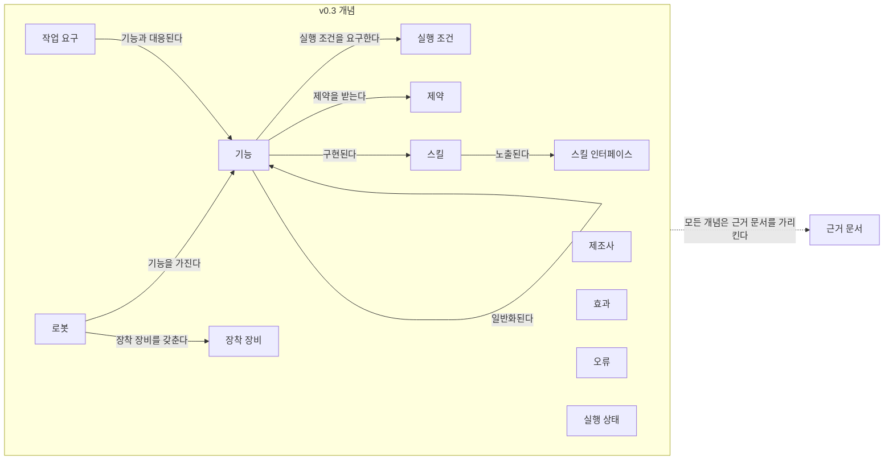
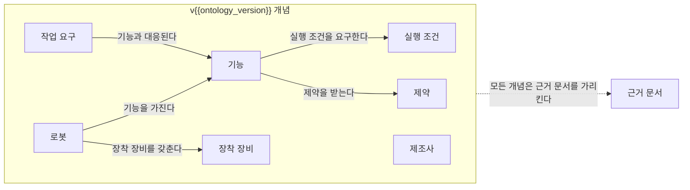

(너의 규칙은 시스템 프롬프트의 agents/shared-rules.md 와 agents/verifier.md 이다. 아래는 이번 실행의 컨텍스트와 입력이다.)

## 실행 컨텍스트

- run_id: 2026-09-25-47
- date: 2026-09-25
- run_type: track (트랙 실행)
- 대상: 트랙 manual-capability-ontology (매뉴얼 기반 로봇 기능 온톨로지) · 현재 단계: 단계 1. 기존 능력 표현 모델과 표준 조사 · 이번에 다룰 백로그 질문 id: q1-09 · 중심 세부영역: 5. 로봇 능력·작업 온톨로지 (B. 공통 정보·환경 모델)
- 예산:
    - max_search_queries: 40
    - max_sources_per_run: 20
    - new_topic_pages: 1
    - page_updates: 2
    - max_retries: 2
- 환경 알림: web_fetch_available: false · fetch_mode: mirror_only (일반 웹 페이지 열람은 네트워크 정책으로 막혀 있다. raw.githubusercontent.com 은 열린다: 공식 문서가 GitHub 에 있는 출처는 입력의 config/source_mirrors.yaml 경로를 WebFetch 로 열어 원문을 읽고 sources[].fetched=true, fetched_via=github_raw, fetch_url 을 적는다. 입력에 원문 텍스트(data/source_texts)가 있는 출처는 fetched_via=inbox. 그 밖의 출처는 fetched=false 이며 코드가 신뢰도 상한(medium)을 강제한다 — 공통 규칙 0절 6항)
- 언어: ko
- verification_stage: second
- verifier_budget:
    - max_search_queries: 40
    - max_sources_per_run: 20
    - new_topic_pages: 1
    - page_updates: 2
    - max_retries: 2
- retry_count: 1
- max_retries: 2

## 입력

### runs/2026-09-25-47/target.json

```json
{
  "run_id": "2026-09-25-47",
  "date": "2026-09-25",
  "weekday": "Fri",
  "run_number": 47,
  "run_type": "track",
  "forced": true,
  "target": {
    "area_no": 5,
    "area_name": "5. 로봇 능력·작업 온톨로지",
    "category": "B. 공통 정보·환경 모델",
    "category_letter": "B"
  },
  "topic": null,
  "track": {
    "slug": "manual-capability-ontology",
    "name": "매뉴얼 기반 로봇 기능 온톨로지",
    "stage": 1,
    "stages": 7,
    "stage_name": "기존 능력 표현 모델과 표준 조사",
    "question_ids": [
      "q1-09"
    ],
    "user_questions": [],
    "runs_per_week": 3,
    "question_rationale": "사용자 지정 0건, 되돌아온 질문 0건, 현재 단계 열린 질문 1건 중 오래된 순"
  },
  "corrections": [],
  "budget": {
    "max_search_queries": 40,
    "max_sources_per_run": 20,
    "new_topic_pages": 1,
    "page_updates": 2,
    "max_retries": 2
  },
  "priority_reason": null,
  "priority_questions": [],
  "excluded_areas": [],
  "lifted_areas": [],
  "deferred": {
    "monthly_recheck": false,
    "weekly_review": true
  },
  "selection_rationale": "CLI 지정 run_type=track, area=5; 트랙 실행일(Fri, track_days 앞 3개) → 트랙 manual-capability-ontology 단계 1, 질문 q1-09 (사용자 지정 0건, 되돌아온 질문 0건, 현재 단계 열린 질문 1건 중 오래된 순)"
}
```

### runs/2026-09-25-47/research.json

```json
{
  "run_id": "2026-09-25-47",
  "date": "2026-09-25",
  "run_type": "track",
  "target": {
    "area_no": 5,
    "area_name": "5. 로봇 능력·작업 온톨로지",
    "category": "B. 공통 정보·환경 모델"
  },
  "gaps": [
    "단계 1 질문 q1-09 조사 중(실행 2026-09-25-35·41·45 부분 답) — target.json 지정(사용자 지정 0건, 되돌아온 질문 0건, 현재 단계 열린 질문 1건 중 오래된 순)",
    "q1-09 핵심 미확인: ECLASS 콘텐츠 데이터베이스·IEC CDD 트리에 이동로봇 분류 클래스와 범위 능력(이동·계단·적재·도어 조작·충전) 항목이 있는지",
    "oq-060 출처 충돌: IDTA 02047 템플릿 JSON 열람 응답 절단과 명세 PDF 검색 요약의 충전 요소 — 템플릿 구조(묶음 순서)로 설명할 근거 필요",
    "IDTA 02047 충전·배터리 요소의 의미 식별자가 ECLASS IRDI 인지 IDTA 자체 식별자인지 미확인(두 층 의미 식별자 추정의 근거 보강 필요)",
    "완료 조건: ROP용 능력 개념 요구 목록 가운데 구성 버전·운용 구역·환경 조건·충전 조건이 온톨로지 초안 6절 질문으로 남아 있음",
    "섹션 6. 완료 조건 — 모델·표준 비교표 IDTA 02047 행의 전제조건·완료 확인·오류 칸 미조사"
  ],
  "research_questions": [
    "같은 ‘운반 로봇’ 중 누가 이 화물을 실제로 취급할 수 있는가? [분류원문]",
    "q1-09 ECLASS·IEC CDD 에 이동로봇의 범위 능력(이동·계단·적재·도어 조작·충전)과 그 속성을 기술하는 항목이 있는가, 있으면 능력 온톨로지의 의미 식별자로 쓸 수 있는가?",
    "IDTA 02047 템플릿은 어떤 서브모델 요소 묶음으로 구성되며, 충전·배터리 요소는 어느 묶음에 있고 어떤 의미 식별자(ECLASS IRDI 또는 IDTA 자체 식별자)를 갖는가? (oq-060 출처 충돌 해소 시도, 단계 1 페이지 3절 q1-09 겨냥)",
    "ECLASS 에 무인운반차(FTF)·자율이동로봇 분류 클래스가 있는가(한·영·독 검색, Release 16.0)? (q1-09 ECLASS 부분)",
    "IEC CDD 에 로봇 도메인이나 ISO 22166 계열 속성 사전, 교차 도메인 사전(IEC 61360-7)이 있는가? (q1-09 IEC CDD 부분)",
    "AAS 에서 로봇 제품 자체의 분류(ECLASS·IEC CDD 클래스)를 가리키는 방법은 무엇이며, 능력·속성 단위 식별자와 어떻게 구분되는가? (온톨로지 초안 6절 의미 식별자 질문 겨냥)",
    "국내 자료에 ECLASS 기반 물류로봇 분류·속성 사전이나 AAS 의미 식별자 적용을 다룬 것이 있는가? (한국 자료 우선 규칙)"
  ],
  "findings": [
    {
      "id": "f1",
      "claim": "IDTA 02047 무인운반차 기술 데이터 1.0 명세는 정보를 TypeAndApplicationInformation, TechnicalParameters, VDA5050Factsheet, EnergyAndCommunication(하위 Battery), Safety, TemporaryTechnicalData 서브모델 요소 묶음으로 구조화한다.",
      "tag": "사실",
      "source_ids": [
        "ref-198"
      ],
      "cross_checked": false,
      "confidence": "medium",
      "evidence_excerpt": "검색 요약: information is structured under SubmodelCollections including 'TypeAndApplicationInformation', 'TechnicalParameters', 'VDA5050Factsheet', 'EnergyAndCommunication' with subsection 'Battery', 'Safety' and 'TemporaryTechnicalData'. 명세 PDF 원문 미열람(raw 미러 PDF 는 이미지·압축 스트림이라 읽지 못함).",
      "as_of": "2025-03",
      "flow_step": null,
      "flow_item": null,
      "source_unopened": true
    },
    {
      "id": "f2",
      "claim": "IDTA 02047 명세에서 충전 장치 요구(ChargingDeviceRequirements)와 배터리 정보(BatteryInformation) 요소는 ECLASS IRDI 가 아니라 IDTA 자체 식별자(https://admin-shell.io/idta/technicaldataagv/chargingdevicerequirements/1/0, …/batteryinformation/1/0)를 의미 식별자로 가진다.",
      "tag": "사실",
      "source_ids": [
        "ref-198"
      ],
      "cross_checked": false,
      "confidence": "medium",
      "evidence_excerpt": "검색 요약: ChargingDeviceRequirements semantic ID IRI https://admin-shell.io/idta/technicaldataagv/chargingdevicerequirements/1/0 (충전 스테이션·인프라에 대한 요구, 전압 범위·최대 전류 등); BatteryInformation IRI …/batteryinformation/1/0 (배터리 종류·용량·최대 충전 횟수). 원문 미열람.",
      "as_of": "2025-03",
      "flow_step": null,
      "flow_item": null,
      "source_unopened": true
    },
    {
      "id": "f3",
      "claim": "이번에도 공식 저장소 템플릿 JSON 열람 응답은 TechnicalParameters 의 DecelerationMax 에서 잘렸고, 명세상 충전·배터리 요소가 속한 EnergyAndCommunication 묶음은 TechnicalParameters 뒤에 나열되므로, 이전 실행들의 '템플릿에 충전 속성 없음' 관찰은 열람 절단에서 생긴 것일 가능성이 높아 보이지만 템플릿 원문으로 확인된 것은 아니다.",
      "tag": "추정",
      "source_ids": [
        "ref-245",
        "ref-198"
      ],
      "cross_checked": false,
      "confidence": "low",
      "evidence_excerpt": "github_raw 열람 응답: Charging·Battery·AAF391·Stair·Door·Lift 모두 없음, '[Content truncated due to length...]', 마지막 idShort 'DecelerationMax'(0173-1#02-ABG746#002). 묶음 순서는 f1 검색 요약의 나열 순서에 기댄 추론(발행일 미확인, 확인일 기준)",
      "as_of": "2026-09-25",
      "flow_step": null,
      "flow_item": null,
      "source_unopened": false
    },
    {
      "id": "f4",
      "claim": "IDTA 02047 1.0 README 는 이 서브모델 템플릿을 공장 자재 흐름의 무인 차량을 대상으로 여러 제조사의 혼합 플릿 통합을 지원하는 AAS 서브모델 템플릿 명세로 소개하며, AASX 파일을 AAS 메타모델 3.0 호환으로 갱신했다고 적고, 충전·배터리·에너지나 서브모델 요소 묶음은 언급하지 않는다.",
      "tag": "사실",
      "source_ids": [
        "ref-234"
      ],
      "cross_checked": false,
      "confidence": "medium",
      "evidence_excerpt": "README 원본(github_raw): 'This is a Submodel template specification for the Asset Administration Shell'; 혼합 플릿 통합·'integration of the individual vehicles into an overall system'. 발행일 표기 없음. (발행일 미확인, 확인일 기준)",
      "as_of": "2026-09-25",
      "flow_step": null,
      "flow_item": null,
      "source_unopened": true
    },
    {
      "id": "f5",
      "claim": "IDTA 공식 서브모델 템플릿 저장소 README 기준으로 게시된 판은 Capability Description 1.0 과 Technical Data for Automated Guided Vehicles 1.0 하나씩이고, 기술 데이터 일반 틀(IDTA 02003)은 1.1 과 2.0.1 이 있다.",
      "tag": "사실",
      "source_ids": [
        "ref-439"
      ],
      "cross_checked": false,
      "confidence": "medium",
      "evidence_excerpt": "저장소 README 표(github_raw): published/Technical_Data/1/1, published/Technical_Data/2/0/1, published/Capability%20Description/1/0, published/Technical%20Data%20for%20Automated%20Guided%20Vehicles/1/0. (발행일 미확인, 확인일 기준)",
      "as_of": "2026-09-25",
      "flow_step": null,
      "flow_item": null,
      "source_unopened": true
    },
    {
      "id": "f6",
      "claim": "IEC 61360-7:2024 는 IEC CDD 에 게시된 교차 도메인 데이터 사전 'IEC 61360-7 – General items'를 정하며, 국가·언어 코드, 외함 보호 등급(IP 코드) 같은 모든 데이터 사전에서 쓸 일반 항목과 선택된 AAS 에 대한 참조를 제공한다.",
      "tag": "사실",
      "source_ids": [
        "ref-437"
      ],
      "cross_checked": false,
      "confidence": "medium",
      "evidence_excerpt": "검색 요약: specifies the new data dictionary (domain) 'IEC 61360-7 - General items'; concepts intended for cross-domain use, e.g. common codes for countries, languages, IP Code, and references to selected AAS; 수평 출판물(IEC Guide 108). 원문 미열람.",
      "as_of": "2024",
      "flow_step": null,
      "flow_item": null,
      "source_unopened": true
    },
    {
      "id": "f7",
      "claim": "IEC TC 3 안내 페이지의 CDD 도메인(공정 자동화, 저압 개폐장치, 측정 장비, 단위)과 교차 도메인 사전 IEC 61360-7(일반 항목)을 합쳐도 확인된 도메인에 로봇 도메인은 없고, ISO 22166 계열 속성이 CDD 에 등록됐다는 자료도 이번 검색에서 나오지 않아, IEC CDD 에서 이동로봇 범위 능력 항목을 가져올 가능성은 낮아 보인다(CDD 트리 미조회, 부재 확정 아님).",
      "tag": "추정",
      "source_ids": [
        "ref-183",
        "ref-437"
      ],
      "cross_checked": false,
      "confidence": "low",
      "evidence_excerpt": "ref-183 도메인 목록(재인용: 2026-09-25-41)과 f6 을 합친 추론. 'ISO 22166 common data dictionary/IEC CDD/ISO 13584' 검색은 ISO 22166 소개와 CDD 일반 설명만 반환. cdd.iec.ch 는 네트워크 정책으로 열지 못함.",
      "as_of": "2026-09-25",
      "flow_step": null,
      "flow_item": null,
      "source_unopened": true
    },
    {
      "id": "f8",
      "claim": "IDTA 02003 기술 데이터 일반 틀은 제품 분류 항목(ProductClassificationItem) 묶음으로 제품을 특정 분류 체계·속성 사전의 제품 클래스와 연결하게 하고, 분류 체계 이름(ProductClassificationSystem)의 예로 'ECLASS'와 'IEC CDD'를 든다.",
      "tag": "사실",
      "source_ids": [
        "ref-438"
      ],
      "cross_checked": false,
      "confidence": "medium",
      "evidence_excerpt": "검색 요약: ProductClassificationItem 'represents a single product classification by association with a product class in a particular classification system or property dictionary'; ProductClassificationSystem 예 'ECLASS' or 'IEC CDD'. 원문 미열람. (발행일 미확인, 확인일 기준)",
      "as_of": "2026-09-25",
      "flow_step": null,
      "flow_item": null,
      "source_unopened": true
    },
    {
      "id": "f9",
      "claim": "AAS 에서 의미 식별자는 제품 분류(IDTA 02003 제품 분류 항목의 ECLASS·IEC CDD 클래스), 능력(IDTA 02020 의 IDTA 일반 식별자), 속성(IDTA 02047 의 ECLASS IRDI 또는 IDTA 자체 식별자)의 서로 다른 층에 붙는 것으로 보여, ROP 가 범위 능력을 식별할 때 로봇 제품 클래스와 능력 식별자를 구분해 두어야 할 것으로 보인다.",
      "tag": "추정",
      "source_ids": [
        "ref-438",
        "ref-243",
        "ref-245",
        "ref-198"
      ],
      "cross_checked": false,
      "confidence": "low",
      "evidence_excerpt": "f8(제품 분류), IDTA 02020 능력 요소의 IDTA 일반 식별자(재인용: 2026-09-25-35), IDTA 02047 속성 ECLASS IRDI(재인용: 2026-09-25-35)와 f2(충전·배터리 요소의 IDTA 자체 식별자)를 대응시킨 이 위키의 추론. 실행 2026-09-25-45 의 두 층 추정을 세 층으로 구체화.",
      "as_of": "2026-09-25",
      "flow_step": "적치",
      "flow_item": "수행 자원",
      "source_unopened": false
    },
    {
      "id": "f10",
      "claim": "이번 실행의 영·독·한 검색(무인운반차·Fahrerloses Transportfahrzeug·AMR, ECLASS 16.0 로봇 내용)에서도 ECLASS 에 무인운반차·자율이동로봇을 가리키는 분류 클래스 코드는 나오지 않았고, 드러난 로봇 관련 작업은 여전히 산업용 로봇 그룹 27-38-01 에 한정된 것으로 보인다(데이터베이스 미조회, 부재 확정 아님).",
      "tag": "추정",
      "source_ids": [
        "ref-182",
        "ref-184",
        "ref-185"
      ],
      "cross_checked": false,
      "confidence": "low",
      "evidence_excerpt": "검색 결과에 ECLASS 클래스 코드가 나온 결과 없음(특허·제품 페이지·ECLASS 일반 페이지뿐). 16.0 은 새 분류 클래스 137개를 포함하나 요약에 로봇·AGV 클래스 언급 없음(재인용: 2026-09-25-41).",
      "as_of": "2026-09-25",
      "flow_step": null,
      "flow_item": null,
      "source_unopened": true
    }
  ],
  "sources": [
    {
      "id": "ref-198",
      "org": "IDTA(Industrial Digital Twin Association)",
      "title": "IDTA 02047-1-0 Technical Data for AGV in Intralogistics",
      "published": "2025-03",
      "url": "https://industrialdigitaltwin.org/wp-content/uploads/2025/03/IDTA-02047-1-0-Submodel_Technical-Data-for-AGV.pdf",
      "type": "표준",
      "reliability": "medium",
      "accessed": "2026-09-25",
      "summary": "원문 미열람. IDTA 가 발행한 무인운반차 기술 데이터 서브모델 명세 PDF. 서브모델 요소 묶음 구성과 충전 장치 요구·배터리 정보 요소의 IDTA 자체 의미 식별자를 검색 요약으로 확인했다. raw 미러 PDF 는 이미지·압축 스트림이라 읽지 못했다.",
      "fetched": false,
      "fetched_via": null,
      "fetch_url": null,
      "source_unopened": true
    },
    {
      "id": "ref-245",
      "org": "IDTA (admin-shell-io/submodel-templates)",
      "title": "IDTA 02047-1-0 Template_TechnicalDataForAGV.json",
      "published": null,
      "url": "https://github.com/admin-shell-io/submodel-templates/blob/main/published/Technical%20Data%20for%20Automated%20Guided%20Vehicles/1/0/IDTA%2002047-1-0%20Template_TechnicalDataForAGV.json",
      "type": "표준",
      "reliability": "medium",
      "accessed": "2026-09-25",
      "summary": "무인운반차 기술 데이터 서브모델 1.0 템플릿 JSON. 이번 실행에서 raw 원문을 다시 열었으나 열람 응답이 TechnicalParameters 의 DecelerationMax 에서 잘려 뒤쪽 묶음(에너지·배터리 등)을 확인하지 못했다.",
      "fetched": true,
      "fetched_via": "github_raw",
      "fetch_url": "https://raw.githubusercontent.com/admin-shell-io/submodel-templates/main/published/Technical%20Data%20for%20Automated%20Guided%20Vehicles/1/0/IDTA%2002047-1-0%20Template_TechnicalDataForAGV.json",
      "source_unopened": false
    },
    {
      "id": "ref-234",
      "org": "IDTA(Industrial Digital Twin Association)",
      "title": "IDTA 02047 Technical Data for Automated Guided Vehicles 1.0 — README (admin-shell-io/submodel-templates)",
      "published": null,
      "url": "https://github.com/admin-shell-io/submodel-templates/tree/main/published/Technical%20Data%20for%20Automated%20Guided%20Vehicles",
      "type": "표준",
      "reliability": "medium",
      "accessed": "2026-09-25",
      "summary": "IDTA 02047 무인운반차 기술 데이터 서브모델 1.0 README. 혼합 플릿 통합 목적과 AASX 의 메타모델 3.0 호환 갱신을 적고, 충전·배터리 요소는 언급하지 않는다.",
      "fetched": false,
      "fetched_via": null,
      "fetch_url": "https://raw.githubusercontent.com/admin-shell-io/submodel-templates/main/published/Technical%20Data%20for%20Automated%20Guided%20Vehicles/1/0/README.md",
      "source_unopened": true
    },
    {
      "id": "ref-243",
      "org": "IDTA (admin-shell-io/submodel-templates)",
      "title": "IDTA 02020_Template_Capability_Description.json",
      "published": null,
      "url": "https://github.com/admin-shell-io/submodel-templates/blob/main/published/Capability%20Description/1/0/IDTA%2002020_Template_Capability_Description.json",
      "type": "표준",
      "reliability": "medium",
      "accessed": "2026-09-25",
      "summary": "원문 미열람. 이번 실행에서 다시 열지 않았다(실행 2026-09-25-35 원문 확인). 능력 기술 서브모델 1.0 템플릿으로 능력 요소에 IDTA 일반 식별자만 둔다.",
      "fetched": false,
      "fetched_via": null,
      "fetch_url": null,
      "source_unopened": true
    },
    {
      "id": "ref-183",
      "org": "IEC TC 3",
      "title": "Common Data Dictionary – CDD – TC 3",
      "published": null,
      "url": "https://tc3.iec.ch/tc-activity/common-data-dictionary-cdd/",
      "type": "표준",
      "reliability": "medium",
      "accessed": "2026-09-25",
      "summary": "원문 미열람. IEC 공통 데이터 사전의 도메인(IEC 61987, IEC 62683, IEC 62720, IEC 63213)과 역할을 설명하는 IEC TC 3 페이지(검색 요약 기준).",
      "fetched": false,
      "fetched_via": null,
      "fetch_url": null,
      "source_unopened": true
    },
    {
      "id": "ref-182",
      "org": "ECLASS e.V.",
      "title": "Neuer Content für ECLASS Release 15.0",
      "published": null,
      "url": "https://eclass.eu/aktuelles/news/neuer-content-fuer-eclass-release-150",
      "type": "표준",
      "reliability": "medium",
      "accessed": "2026-09-25",
      "summary": "원문 미열람. ECLASS Release 15.0 의 새 콘텐츠 공지로, 로봇 그룹 27-38-01 클래스 재구성·속성 추가와 전문가 그룹 'Robotic' 신설을 알린다(검색 요약 기준).",
      "fetched": false,
      "fetched_via": null,
      "fetch_url": null,
      "source_unopened": true
    },
    {
      "id": "ref-184",
      "org": "ECLASS e.V.",
      "title": "Classification Class - ECLASS Technischer Support",
      "published": null,
      "url": "https://eclass.eu/support/technical-specification/structure-and-elements/classification-class",
      "type": "표준",
      "reliability": "medium",
      "accessed": "2026-09-25",
      "summary": "원문 미열람. ECLASS 분류 클래스의 구조(4단계 계층, IRDI·우선 명칭·코드)를 설명하는 기술 명세 페이지(검색 요약 기준).",
      "fetched": false,
      "fetched_via": null,
      "fetch_url": null,
      "source_unopened": true
    },
    {
      "id": "ref-185",
      "org": "ECLASS e.V.",
      "title": "The latest ECLASS Release",
      "published": null,
      "url": "https://eclass.eu/en/eclass-standard/releases",
      "type": "표준",
      "reliability": "medium",
      "accessed": "2026-09-25",
      "summary": "원문 미열람. ECLASS 최신 판 안내 페이지로 Release 16.0(2025-11-28)의 새 클래스 수 등을 알린다(검색 요약 기준).",
      "fetched": false,
      "fetched_via": null,
      "fetch_url": null,
      "source_unopened": true
    },
    {
      "id": "ref-437",
      "org": "IEC",
      "title": "IEC 61360-7:2024 — Standard data element types with associated classification scheme — Part 7: Data dictionary of cross-domain concepts",
      "published": "2024",
      "url": "https://webstore.iec.ch/en/publication/72956",
      "type": "표준",
      "reliability": "medium",
      "accessed": "2026-09-25",
      "summary": "원문 미열람. IEC CDD 에 게시된 교차 도메인 데이터 사전 'IEC 61360-7 – General items'(국가·언어 코드, IP 코드, 선택된 AAS 참조 등)을 정하는 IEC 표준의 웹스토어 소개(검색 요약 기준). 제목의 부제는 검색 결과 표기 기준이다.",
      "fetched": false,
      "fetched_via": null,
      "fetch_url": null,
      "source_unopened": true
    },
    {
      "id": "ref-438",
      "org": "IDTA(Industrial Digital Twin Association)",
      "title": "IDTA 02003-1-2 Generic Frame for Technical Data for Industrial Equipment in Manufacturing",
      "published": null,
      "url": "https://industrialdigitaltwin.org/wp-content/uploads/2022/10/IDTA-02003-1-2_Submodel_TechnicalData.pdf",
      "type": "표준",
      "reliability": "medium",
      "accessed": "2026-09-25",
      "summary": "원문 미열람. ECLASS·IEC CDD 같은 사전으로 기술 데이터를 기술하는 AAS 서브모델 일반 틀 명세. 제품 분류 항목(ProductClassificationItem)과 분류 체계 이름(ECLASS, IEC CDD)을 둔다(검색 요약 기준).",
      "fetched": false,
      "fetched_via": null,
      "fetch_url": null,
      "source_unopened": true
    },
    {
      "id": "ref-439",
      "org": "IDTA (admin-shell-io/submodel-templates)",
      "title": "admin-shell-io/submodel-templates — README (published Submodel Templates list)",
      "published": null,
      "url": "https://github.com/admin-shell-io/submodel-templates",
      "type": "표준",
      "reliability": "medium",
      "accessed": "2026-09-25",
      "summary": "IDTA 공식 서브모델 템플릿 저장소 README. 게시된 템플릿의 폴더와 판(Technical Data 1.1·2.0.1, Capability Description 1.0, Technical Data for AGV 1.0 등)을 나열한다.",
      "fetched": false,
      "fetched_via": null,
      "fetch_url": "https://raw.githubusercontent.com/admin-shell-io/submodel-templates/main/README.md",
      "source_unopened": true
    }
  ],
  "page_proposals": [
    {
      "action": "update",
      "path": "docs/tracks/manual-capability-ontology/stage-1-existing-models-and-standards.md",
      "sections": [
        "3",
        "4",
        "5",
        "8",
        "9"
      ],
      "rationale": "q1-09 부분 답: f1·f2·f3·f4·f5·f6·f7·f8·f9·f10 — 3절 q1-09 '(부분 답)'에 '실행 2026-09-25-47 보강' 소절 추가: IDTA 02047 서브모델 요소 묶음 구성(f1)과 충전·배터리 요소의 IDTA 자체 의미 식별자(f2), 템플릿 열람 절단이 이전 부재 관찰의 원인일 가능성(f3, 출처 충돌 oq-060 에 병기하되 해소로 쓰지 않음), IDTA 02047 README(f4)·게시 판 목록(f5), IEC 61360-7 교차 도메인 사전(f6)과 CDD 로봇 도메인 부재 추정(f7), IDTA 02003 제품 분류 항목(f8)과 제품 분류·능력·속성 세 층 식별자 추정(f9), ECLASS 무인운반차 클래스 미검출(f10) / 4절 불확실성(ECLASS·CDD 데이터베이스는 네 번째 실행에서도 미조회) / 5절 후속 질문 / 8절 출처 / 9절 이력. q1-09 는 열림 유지"
    },
    {
      "action": "update",
      "path": "docs/tracks/manual-capability-ontology/model-standard-comparison.md",
      "sections": [
        "4",
        "7",
        "8"
      ],
      "rationale": "트랙 산출물 갱신: IDTA 02047 행 종류 칸에 서브모델 요소 묶음 구성(VDA5050Factsheet·EnergyAndCommunication/Battery·Safety 포함, f1)과 충전 장치 요구·배터리 정보의 IDTA 자체 식별자(f2) 메모, 출처에 ref-198 추가"
    },
    {
      "action": "update",
      "path": "docs/ideas/robot-capability-ontology.md",
      "sections": [
        "4"
      ],
      "rationale": "아이디어 페이지 4절: 범위 능력 '충전'의 요소가 EnergyAndCommunication/Battery 묶음에 있고 IDTA 자체 식별자를 쓴다는 점(f1·f2), 템플릿 열람 절단 설명(f3), 의미 식별자 세 층 추정(f8·f9)으로 '범위 능력의 의미 식별자' 소절 보강"
    },
    {
      "action": "update",
      "path": "docs/categories/b-common-information-and-environment-model/05-robot-capability-and-task-ontology.md",
      "sections": [
        "7"
      ],
      "rationale": "트랙 manual-capability-ontology 단계 1 반영 제안 (f1, f2, f8): IDTA 02047 의 서브모델 요소 묶음(VDA5050Factsheet 포함)과 충전·배터리 요소의 IDTA 자체 식별자, IDTA 02003 제품 분류 항목으로 ECLASS·IEC CDD 제품 클래스를 가리키는 방법"
    },
    {
      "action": "update",
      "path": "docs/categories/d-planning-and-optimization/16-shared-resource-charging-and-energy-optimization.md",
      "sections": [
        "7"
      ],
      "rationale": "트랙 manual-capability-ontology 단계 1 반영 제안 (f1, f2): IDTA 02047 의 EnergyAndCommunication/Battery 묶음과 충전 장치 요구(전압 범위·최대 전류)·배터리 정보(종류·용량·최대 충전 횟수) 요소가 충전기 배분·충전 시점 계획의 입력 후보"
    },
    {
      "action": "update",
      "path": "docs/categories/g-safety-security-intelligence-and-governance/28-standards-interoperability-and-multi-vendor-governance.md",
      "sections": [
        "7"
      ],
      "rationale": "트랙 manual-capability-ontology 단계 1 반영 제안 (f6, f7, f8): IEC 61360-7 교차 도메인 사전, IEC CDD 에 로봇 도메인이 확인되지 않음(추정), IDTA 02003 제품 분류 항목의 ECLASS·IEC CDD 참조"
    }
  ],
  "glossary_candidates": [],
  "open_questions_new": [],
  "open_questions_resolved": [],
  "self_check": {
    "source_count": 10,
    "cross_checked_count": 0,
    "unverified": [
      "q1-09 부분 답: ECLASS 콘텐츠 데이터베이스(15.0·16.0)와 IEC CDD 트리를 네트워크 정책(mirror_only)으로 열지 못해 이동로봇 분류 클래스·범위 능력 항목의 존재 여부를 직접 확인하지 못함(네 번째 실행)",
      "f1·f2: IDTA 02047 명세 PDF 원문 미열람(검색 요약 기준), raw 미러 PDF 는 이미지·압축 스트림이라 읽지 못함",
      "f3: 템플릿 JSON 열람 응답이 다시 DecelerationMax 에서 잘려 EnergyAndCommunication 묶음과 충전 요소를 원문으로 확인하지 못함 — oq-060 은 해소 제안하지 않음",
      "ChargingTimeAsSpecified 의 ECLASS IRDI(0173-1#02-AAF391#006, 실행 2026-09-25-45 검색 요약)는 이번 검색에서 확인되지 않음",
      "f8: IDTA 02003 제품 분류 항목은 검색 요약 기준이며 어느 판(1.2 또는 2.0.1)의 기술인지 미확인, ref-438 발행일 미확인",
      "ref-437 IEC 61360-7 제목의 부제는 검색 결과 표기 기준",
      "모든 finding 교차 확인 없음(발행 주체 한 곳의 자료)"
    ],
    "scope_violations": [],
    "budget_used": {
      "queries": 15,
      "sources": 3
    },
    "limits": "답한 질문 없음: q1-09 의 핵심(ECLASS·IEC CDD 에 이동로봇 범위 능력 항목이 있는가)은 ECLASS·CDD 데이터베이스가 네트워크 정책(fetch_mode mirror_only)으로 열리지 않고 영·독·한 검색 15회에서도 이동로봇 클래스 코드가 나오지 않아 확정하지 못함 — 부분 답 f1~f10 만 냄. 네 번의 실행이 같은 벽에 막혔으므로, 사용자가 ECLASS 콘텐츠 검색(eclass.eu)과 cdd.iec.ch 에서 'AGV·FTF·autonomous mobile robot' 조회 결과를 inbox/sources 로 넣어 주거나 q1-09 를 '보류'로 돌리는 판단이 필요해 보인다(판단은 검증·사용자 몫). web_fetch_available: false · fetch_mode mirror_only. raw.githubusercontent.com 으로 연 출처: 재사용 ref-245(템플릿 JSON, 절단)·ref-234(IDTA 02047 README), 신규 ref-439(저장소 README). IDTA 02003 README 경로(Technical_Data/1/2)는 404, 2.0.1 README 는 변경 이력뿐이었다. 신규 ref-437·ref-438 과 재사용 ref-198·ref-243·ref-183·ref-182·ref-184·ref-185 는 원문 미열람(신뢰도 상한 medium). 실행 2026-09-25-45 가 같은 IDTA 02047 PDF URL 에 ref-437 을 부여했으나 참고문헌 목록에는 ref-198 로 있어 ref-198 을 재사용했고, 이번 ref-437 은 다른 출처(IEC 61360-7)다 — 퍼블리셔 id 확인 필요. 검색 15회/40, 신규 출처 3건/20(ref-437~ref-439, 예약 구간 안). 한국어 검색 1회는 대학 e-class 사이트·개인 블로그만 나와 출처로 넣지 않음. 온톨로지 변경 없음: 의미 식별자 세 층(f9)은 추정이고 능력 단위 사전 항목 근거가 여전히 없으며 충전 요소는 출처 충돌(oq-060) 상태라 초안 6절 '기능의 의미 식별자 속성'·충전 조건 질문을 유지함. 용어 후보 없음: 트랙 glossary_targets 가운데 미등록 용어(로봇 능력 온톨로지, 역량 질문, SPARQL, 온톨로지 학습)에 대한 이번 근거 출처가 없음. 후속 질문 1건. 27. AI·학습·적응과 모델 운영, 8. 실시간 세계 상태·데이터 일관성, 22. 시뮬레이션·예측용 디지털 트윈 관련 주장 없음. 정정 요청 없음."
  },
  "track": {
    "slug": "manual-capability-ontology",
    "stage": 1,
    "answered_question_ids": [],
    "new_questions": [
      {
        "question": "IDTA 02047 이 서브모델 안에 VDA5050Factsheet 묶음을 둘 때 VDA 5050 팩트시트의 어느 판·필드를 담으며, 팩트시트와 AAS 서브모델이 같은 능력 값(적재·충전 등)을 이중으로 가질 때 능력 온톨로지는 어느 쪽을 근거 문서로 삼고 불일치를 어떻게 처리하는가? (q1-09 에서 파생)",
        "stage": 4,
        "rationale_finding_id": "f1"
      }
    ],
    "ontology_changes": [],
    "stage_completion_self_assessment": {
      "met": false,
      "missing": [
        "q1-09 부분 답: ECLASS·IEC CDD 직접 조회 필요, IDTA 02047 충전 요소 출처 충돌(oq-060) 미해소",
        "ROP용 능력 개념 요구 목록 가운데 구성 버전·운용 구역·환경 조건·충전 조건이 온톨로지 초안에 미반영(6절 질문)",
        "모델·표준 비교표의 PDDL·OPC UA Robotics·MassRobotics·AAS·Open-RMF 행과 후보 밖 행의 '미조사' 칸 잔존"
      ]
    }
  }
}
```

### runs/2026-09-25-47/verification.json

```json
{
  "run_id": "2026-09-25-47",
  "stage": "first",
  "verdict": "조건부 승인",
  "claim_checks": [
    {
      "finding_id": "f1",
      "source_exists": true,
      "supports_claim": true,
      "cross_checked": false,
      "tag_decision": "유지",
      "note": "원문 미열람. 검증 검색에서 IDTA 게시 URL(2025/03, IDTA-02047-1-0)과 같은 요약을 확인했다: TypeAndApplicationInformation·TechnicalParameters·VDA5050Factsheet·EnergyAndCommunication(하위 Battery)·Safety·TemporaryTechnicalData. 같은 요약은 이 묶음들이 SpecificDescriptions 컬렉션 안에 놓인다고 적는다. 검증자가 github_raw 로 연 템플릿 JSON 에서도 최상위는 GeneralInformation·SpecificDescriptions 이고 TechnicalParameters 는 SpecificDescriptions 아래에 있다(절단 전 범위). 단일 발행 기관이므로 교차 확인은 아니다. 발행 2025-03. 이 문장으로 oq-060 을 해소하지 않는다."
    },
    {
      "finding_id": "f2",
      "source_exists": true,
      "supports_claim": true,
      "cross_checked": false,
      "tag_decision": "강등",
      "note": "원문 미열람. 검증 검색 요약에서 ChargingDeviceRequirements(충전 스테이션·인프라에 대한 요구: 전압 범위·최대 전류)와 BatteryInformation(배터리 종류·용량·최대 충전 횟수)이 IRI 식별자를 가진 SMC 라는 점을 확인했다. 식별자 문자열 자체는 검증 스니펫에 나오지 않았다. 이 요소들의 존재는 출처 충돌(oq-060)이 풀리지 않았고, 단계 1 페이지는 같은 요소를 이미 [추정]으로 적었다(실행 2026-09-25-45, ref-198). 같은 페이지 안에서 태그를 맞추기 위해 사실 → 추정으로 강등한다."
    },
    {
      "finding_id": "f3",
      "source_exists": true,
      "supports_claim": true,
      "cross_checked": false,
      "tag_decision": "유지",
      "note": "확인: 검증자가 raw 템플릿 JSON 을 다시 열었다. 응답은 DecelerationMax 에서 잘렸고, EnergyAndCommunication·Battery·Charging·VDA5050Factsheet 문자열은 보이는 범위에 없었다. 묶음 순서는 검색 요약의 나열 순서에 기댄 추론이다. 이 finding 은 oq-060 의 근거 보강일 뿐 해소가 아니므로 [추정] low 를 유지한다."
    },
    {
      "finding_id": "f4",
      "source_exists": true,
      "supports_claim": true,
      "cross_checked": false,
      "tag_decision": "유지",
      "note": "확인: 검증자가 README 를 raw 로 열어 확인했다('first version officially published by IDTA', AASX 의 메타모델 3.0 호환 갱신, 충전·배터리·에너지·묶음 언급 없음, 발행일 없음). 브리프는 이 출처를 fetched=false·source_unopened=true 로 적었지만 evidence 와 limits 는 github_raw 로 열었다고 쓴다. 표시가 서로 어긋난다(R-1). 내용은 실행 2026-09-25-41 이 단계 1 페이지에 이미 쓴 문장과 거의 같다(중복)."
    },
    {
      "finding_id": "f5",
      "source_exists": true,
      "supports_claim": true,
      "cross_checked": false,
      "tag_decision": "유지",
      "note": "확인: 검증자가 저장소 README 를 raw 로 열어 Technical_Data/1/1·2/0/1, Capability Description/1/0, AGV/1/0 을 확인했다. 브리프의 fetched=false 표시는 f4 와 같은 방식으로 어긋난다(R-1). 한편 검증 검색에 저장소의 published/Technical_Data/1/2 폴더 PDF 가 나온다. 따라서 'README 표 기준'임을 밝혀야 한다. 발행일 미확인, 확인일 2026-09-25."
    },
    {
      "finding_id": "f6",
      "source_exists": true,
      "supports_claim": true,
      "cross_checked": false,
      "tag_decision": "유지",
      "note": "원문 미열람. 검증 검색(IEC 웹스토어 72956)에서 'IEC 61360-7 - General items', 교차 도메인 사용, 국가·언어 코드·IP 코드, 선택된 AAS 서브모델 참조, cdd.iec.ch 게시, IEC Guide 108 수평 출판물을 확인했다. 최신성: 유럽 채택판 EN IEC 61360-7:2026 이 있다. 기준일 2024."
    },
    {
      "finding_id": "f7",
      "source_exists": true,
      "supports_claim": true,
      "cross_checked": false,
      "tag_decision": "유지",
      "note": "원문 미열람. ref-183 의 도메인 목록(실행 2026-09-25-41 재인용)과 f6 을 합친 추론이다. CDD 트리는 조회하지 못했다. 단계 1 페이지의 기존 불확실성(CDD 범위가 모든 ISO·IEC 도메인으로 확장 중)과 함께 제시해야 한다. [추정] low 를 유지한다."
    },
    {
      "finding_id": "f8",
      "source_exists": true,
      "supports_claim": true,
      "cross_checked": false,
      "tag_decision": "유지",
      "note": "원문 미열람. 검증 검색(IDTA-02003-1-2 PDF, 게시 경로 2022/10)에서 ProductClassificationItem 정의와 ProductClassificationSystem 의 예 'ECLASS'·'IEC CDD' 를 확인했다. 최신성: IDTA 02003 의 더 새 판(2025/03 게시 'IDTA 02003 Generic Frame', 저장소 2.0.1)이 있다. 따라서 1.2 판 기준임을 밝힌다. 발행일은 미확인이며 URL 경로상 2022-10 이다."
    },
    {
      "finding_id": "f9",
      "source_exists": true,
      "supports_claim": true,
      "cross_checked": false,
      "tag_decision": "유지",
      "note": "f8·f2 와 이전 실행의 원문 확인(IDTA 02020 일반 식별자, IDTA 02047 속성 ECLASS IRDI)을 대응시킨 이 위키의 추론이다. f2 가 강등됐으므로 충전·배터리 요소의 IDTA 자체 식별자 부분은 추정 근거로만 쓴다. 실행 2026-09-25-45 의 두 층 [추정]을 세분한 것이며 대체가 아니다."
    },
    {
      "finding_id": "f10",
      "source_exists": true,
      "supports_claim": true,
      "cross_checked": false,
      "tag_decision": "유지",
      "note": "원문 미열람. 부재 관찰의 근거는 검색 결과이고, 인용된 ref-182·184·185 는 배경(27-38-01, 분류 구조, 16.0 신규 클래스 수)만 뒷받침한다. 실행 2026-09-25-41 의 [추정]과 같은 결론이므로 새 결론이 아니라 재확인으로 서술한다. [추정] low 를 유지한다."
    }
  ],
  "category_fit": {
    "ok": true,
    "reassign_to": null
  },
  "scope_boundary": {
    "ok": true,
    "issues": []
  },
  "duplication": {
    "ok": false,
    "overlaps": [
      "f2(와 f1 의 EnergyAndCommunication/Battery 부분): 단계 1 페이지 q1-09 '실행 2026-09-25-45 보강'의 [추정] 문장(충전 시간·충전 장치 요구·배터리 정보, ref-198)과 겹친다. 기존 각주 ref-198 을 재사용하고, 출처 충돌 oq-060 은 열린 상태로 둔다",
      "f4: 실행 2026-09-25-41 보강의 IDTA 02047 README 문장(ref-234, 1.0 판·메타모델 3.0 호환·능력 언급 없음)과 사실상 같다",
      "f7·f10: 실행 2026-09-25-41 의 [추정](IEC CDD 로봇 도메인 부재, ECLASS 이동로봇 클래스 미확인)과 같은 결론이다",
      "f9: 실행 2026-09-25-45 의 두 층 의미 식별자 [추정]을 세 층으로 세분한다. 기존 문장과 충돌하지 않지만 대체하지도 않는다",
      "참고문헌 id: 실행 2026-09-25-45 브리프가 ref-437~ref-439 를 다른 출처(IDTA 02047 PDF·ECLASS-in-AAS 지침·Nabizada 외)에 썼고, 게시 때 ref-198·ref-200·ref-201 로 합쳐졌다. 이번 ref-437(IEC 61360-7)·ref-438(IDTA 02003 1.2)·ref-439(저장소 README)가 기존 참고문헌 id 와 충돌하지 않는지 퍼블리셔가 확인해야 한다"
    ]
  },
  "terminology": {
    "ok": true,
    "conflicts": []
  },
  "quotation_check": {
    "ok": false,
    "issues": [
      "ref-234: f4 의 evidence_excerpt 에 직접 인용 두 개('This is a Submodel template specification for the Asset Administration Shell', 'integration of the individual vehicles into an overall system')가 있다 — 출처당 1회 규칙 위반"
    ]
  },
  "corrections_applied": [],
  "corrections_rejected": [],
  "required_fixes": [
    "f2: [사실] → [추정]으로 강등한다. '명세 PDF 검색 요약 기준, 원문 미열람'과 '식별자 문자열은 검증 검색에서 다시 확인되지 않음'을 병기한다. 이유: 충전·배터리 요소의 존재는 출처 충돌 oq-060 이 풀리지 않았고, 같은 페이지의 실행 2026-09-25-45 문장이 이미 [추정]이다.",
    "f1·f2·f3: 이 문장들로 oq-060 을 해소했다고 쓰지 않는다. 단계 1 페이지 q1-09 의 출처 충돌 병기 옆에 근거 보강으로만 둔다. oq-060 은 열림으로 유지한다. 이유: 템플릿 원문은 여전히 DecelerationMax 에서 잘려 확인되지 않았다(검증자 재열람 결과도 같다).",
    "f1: 묶음 구성을 쓸 때 '명세 PDF 검색 요약 기준'을 밝힌다. 검증자가 확인한 사실을 덧붙여도 된다: 템플릿 JSON 의 최상위는 GeneralInformation·SpecificDescriptions 이고, TechnicalParameters 는 SpecificDescriptions 아래에 있다(ref-245, 확인일 2026-09-25).",
    "f4: 새 단락을 만들지 않는다. 실행 2026-09-25-41 보강의 README 문장 옆에 '실행 2026-09-25-47 에서 README 를 다시 열어 같은 내용을 확인'이라고 한 줄만 둔다. 직접 인용은 ref-234 에서 한 구절만 쓰거나 모두 재서술한다. 이유: 기존 문장과 중복이고, 출처당 인용 1회 규칙이 있다.",
    "f5: 'README 표 기준'임을 문장에 밝힌다. 저장소에 published/Technical_Data/1/2 폴더의 PDF 도 있다는 점(검증 검색)을 괄호로 병기한다. 이유: README 표에 없는 판이 저장소에 있다.",
    "f6: 기준일을 2024(IEC 61360-7:2024)로 적는다. 유럽 채택판 EN IEC 61360-7:2026 이 있다는 점을 짧게 병기한다(최신성).",
    "f8: 'IDTA 02003 1.2 판(ref-438) 기준'을 밝히고 더 새 판(2.0.1 등)의 해당 요소는 미확인으로 둔다. ref-438 각주의 발행일은 '미확인'으로 두고, 접근일 뒤에 ' (원문 미열람)'을 붙인다.",
    "f7·f10: 새 결론이 아니라 '네 번째 실행에서도 같은 관찰'로 서술한다. 실행 2026-09-25-41 의 [추정] 문장과 각주(ref-182·183·184)를 재사용하고, 부재 확정이 아님을 유지한다.",
    "f9: 실행 2026-09-25-45 의 두 층 [추정]을 지우지 않는다. 이 위키의 추론임을 밝혀 '세 층(제품 분류·능력·속성)으로 세분한 추정'으로 덧붙인다. 충전·배터리 요소의 IDTA 자체 식별자 부분은 f2 가 추정임을 반영해 '검색 요약 기준'으로 적는다.",
    "원문 열람 표시(R-1): 검증자가 ref-234(IDTA 02047 README)와 ref-439(저장소 README)를 raw.githubusercontent.com 으로 열어 내용을 확인했다. 두 출처의 각주에는 ' (원문 미열람)'을 붙이지 않고, reference_updates 의 source_unopened 는 false 로 둔다. ref-198·ref-243·ref-183·ref-182·ref-184·ref-185·ref-437·ref-438 은 각주 접근일 뒤에 ' (원문 미열람)'을 붙이고, reference_updates[].source_unopened: true 로 둔다.",
    "단계 1 페이지: q1-09 는 부분 답이므로 2절 표에서 '열림'(백로그 '조사 중')을 유지하고 답 위치는 비운다. 3절 '(부분 답)' 소제목 아래에 '#### 실행 2026-09-25-47 보강' 소절을 추가한다. 6절 두 완료 조건은 모두 '미충족 · 미승인'으로 두고, 전환 줄은 '다음 단계로 전환: 아니오(모델·표준 비교표 미조사 칸 잔존, 요구 목록 일부 미반영, 막힌 질문 q1-09)'로 적는다. 9절 이력에 '없음(q1-09 부분 답 보강) / 새 질문 1건 / 온톨로지 변경 없음(v0.3 유지)'을 추가한다.",
    "모델·표준 비교표: IDTA 02047 행의 종류 칸에 f1(묶음 구성, 검색 요약 기준)과 f2([추정], 출처 충돌 병기)를 더하고 출처 칸에 ref-198 을 추가한다. 행 상태 문구에는 '명세 PDF 는 원문 미열람'을 더한다.",
    "새 질문(단계 4, f1)은 백로그에 새로 등록한다. q4-02(문서 대 실제 API), q4-06(IDTA 02020 대 팩트시트), q4-14(충전 요소 정규화)와 초점이 달라 중복이 아니다. origin 은 'f1', origin_run_id 는 2026-09-25-47 로 적는다."
  ],
  "confidence": "medium",
  "verification_note": "판정: 1차 조건부 승인. 이번 실행은 원문 열람이 차단된 환경(mirror_only)에서 검증됐다. GitHub 공식 저장소 원문(IDTA 02047 템플릿 JSON·README, 저장소 README)은 검증자가 raw 경로로 직접 열어 대조했다. 확인 10건, 미확인 0건, 교차 확인 0건(모든 사실이 발행 기관 한 곳의 자료다). 강등: f2 사실 → 추정(출처 충돌 oq-060 이 풀리지 않았고, 같은 페이지의 기존 [추정] 문장과 태그를 맞춘다). 원문 미열람 출처: ref-198, ref-243, ref-183, ref-182, ref-184, ref-185, ref-437, ref-438. 브리프 원문 열람 표시 오류: ref-234·ref-439 는 github_raw 로 열렸는데 fetched=false·source_unopened=true 로 적혀 있다(검증자가 원문을 확인해 열람 출처로 처리). 주의: 템플릿 JSON 은 검증자가 다시 열어도 DecelerationMax 에서 잘려 충전·배터리 요소를 원문으로 확인하지 못했다. oq-060 은 해소하지 않는다. IDTA 02003 은 1.2 판, IEC 61360-7 은 2024 판 기준이며 두 표준 모두 더 새 판(2.0.1, EN IEC 61360-7:2026)이 있다. 새 참고문헌 id ref-437~ref-439 는 실행 2026-09-25-45 브리프가 다른 출처에 썼던 번호이므로 퍼블리셔가 충돌 여부를 확인해야 한다. 미사용 출처: 없음. 정정 요청: 없음. 온톨로지 변경 승인: 없음(제안 없음) / 거부: 없음. v0.3 유지. 백로그 중복: 없음(새 질문 1건은 단계 4 로 등록). 단계 완료 조건: 미충족(부족: 모델·표준 비교표의 미조사 칸, ROP용 능력 개념 요구 목록 가운데 구성 버전·운용 구역·환경 조건·충전 조건 미반영). 단계 전환: 미승인(막힌 질문 q1-09). q1-09 는 네 번의 실행이 같은 네트워크 제약에 막혀 부분 답만 냈다. 답한 질문 0개는 출처 접근 불가에 따른 부분 결과로 보아 반려하지 않았다. 다음 실행 전에 사용자가 ECLASS·IEC CDD 조회 결과를 inbox/sources 로 넣어 줄지, q1-09 를 사유와 재개 조건을 적어 보류할지 결정할 필요가 있다.",
  "retry_reason": null,
  "track_checks": {
    "standard_sources_ok": true,
    "vendor_claims_tagged": true,
    "ontology_changes_grounded": true,
    "backlog_duplicates": [],
    "stage_tag_issues": [],
    "completeness_wording_ok": true,
    "stage_complete": false,
    "stage_transition_approved": false
  }
}
```

### runs/2026-09-25-47/pages.json

```json
{
  "run_id": "2026-09-25-47",
  "outline": [
    {
      "path": "docs/tracks/manual-capability-ontology/stage-1-existing-models-and-standards.md",
      "section": "3. 조사 결과",
      "budget_chars": 2600,
      "summary": "q1-09 부분 답에 '실행 2026-09-25-47 보강' 소절을 더한다. IDTA 02047 명세의 서브모델 요소 묶음 구성(검색 요약 기준)과 템플릿 최상위 구조, 충전·배터리 요소의 IDTA 자체 식별자 추정, 열람 절단 추정(oq-060 해소 아님), 게시 판 목록, IEC 61360-7, IDTA 02003 제품 분류 항목, 세 층 의미 식별자 추정을 싣는다. [추정][^ref-198]",
      "planned_findings": [
        "f1",
        "f2",
        "f3",
        "f4",
        "f5",
        "f6",
        "f7",
        "f8",
        "f9",
        "f10"
      ]
    },
    {
      "path": "docs/tracks/manual-capability-ontology/stage-1-existing-models-and-standards.md",
      "section": "4. 결론과 남은 불확실성",
      "budget_chars": 900,
      "summary": "실행 2026-09-25-47 결론(묶음 구성, 세 층 식별자 추정, 제품 분류 항목)과 불확실성(oq-060 미해소, ECLASS·CDD 미조회, 판 최신성)을 덧붙인다. [추정][^ref-438]",
      "planned_findings": [
        "f1",
        "f8",
        "f9"
      ]
    },
    {
      "path": "docs/tracks/manual-capability-ontology/stage-1-existing-models-and-standards.md",
      "section": "5. 이 단계가 낳은 후속 질문",
      "budget_chars": 300,
      "summary": "새 질문 q4-15(VDA5050Factsheet 묶음과 팩트시트의 이중 능력 값 처리)를 단계 4로 보낸다.",
      "planned_findings": [
        "f1"
      ]
    },
    {
      "path": "docs/tracks/manual-capability-ontology/stage-1-existing-models-and-standards.md",
      "section": "6. 완료 조건 충족 현황",
      "budget_chars": 300,
      "summary": "두 완료 조건 모두 미충족·미승인, 전환 아니오(막힌 질문 q1-09)."
    },
    {
      "path": "docs/tracks/manual-capability-ontology/model-standard-comparison.md",
      "section": "4. 비교표",
      "budget_chars": 400,
      "summary": "IDTA 02047 행 종류 칸에 묶음 구성(검색 요약 기준)과 충전 요소 식별자 추정을 더한다. [추정][^ref-198]",
      "planned_findings": [
        "f1",
        "f2"
      ]
    },
    {
      "path": "docs/ideas/robot-capability-ontology.md",
      "section": "4. 필요한 데이터와 표준",
      "budget_chars": 700,
      "summary": "범위 능력 '충전' 요소가 EnergyAndCommunication/Battery 묶음에 있는 것으로 보이고 의미 식별자가 세 층으로 나뉠 것으로 보인다는 점을 덧붙인다. [추정][^ref-198][^ref-438]",
      "planned_findings": [
        "f1",
        "f2",
        "f3",
        "f8",
        "f9"
      ]
    }
  ],
  "pages": [
    {
      "path": "docs/tracks/manual-capability-ontology/stage-1-existing-models-and-standards.md",
      "action": "update",
      "status": "draft",
      "diff_summary": "q1-09 부분 답에 '실행 2026-09-25-47 보강' 소절 추가, 4절 결론·불확실성 추가, 새 질문 q4-15, 6절 완료 조건 근거 갱신(미충족·미승인), 7절 반영 제안, 8절 출처(ref-437~439 추가, ref-243 각주는 기존 게시본 형태 유지), 9절 이력",
      "patches": [
        {
          "section": "3. 조사 결과",
          "action": "append",
          "frontmatter": {
            "sources": [
              "ref-022",
              "ref-025",
              "ref-026",
              "ref-027",
              "ref-028",
              "ref-029",
              "ref-030",
              "ref-031",
              "ref-032",
              "ref-033",
              "ref-034",
              "ref-035",
              "ref-036",
              "ref-037",
              "ref-038",
              "ref-039",
              "ref-040",
              "ref-041",
              "ref-042",
              "ref-043",
              "ref-051",
              "ref-228",
              "ref-229",
              "ref-243",
              "ref-231",
              "ref-230",
              "ref-244",
              "ref-245",
              "ref-246",
              "ref-236",
              "ref-247",
              "ref-248",
              "ref-138",
              "ref-249",
              "ref-250",
              "ref-323",
              "ref-329",
              "ref-235",
              "ref-324",
              "ref-325",
              "ref-330",
              "ref-326",
              "ref-327",
              "ref-328",
              "ref-391",
              "ref-392",
              "ref-234",
              "ref-182",
              "ref-183",
              "ref-184",
              "ref-185",
              "ref-198",
              "ref-200",
              "ref-201",
              "ref-437",
              "ref-438",
              "ref-439"
            ]
          },
          "content": "(절 본문 생략 — runs/2026-09-25-47/pages/tracks/manual-capability-ontology/stage-1-existing-models-and-standards.md 의 해당 절을 본다)"
        },
        {
          "section": "4. 결론과 남은 불확실성",
          "action": "append",
          "content": "(절 본문 생략 — runs/2026-09-25-47/pages/tracks/manual-capability-ontology/stage-1-existing-models-and-standards.md 의 해당 절을 본다)"
        },
        {
          "section": "5. 이 단계가 낳은 후속 질문",
          "action": "replace",
          "content": "(절 본문 생략 — runs/2026-09-25-47/pages/tracks/manual-capability-ontology/stage-1-existing-models-and-standards.md 의 해당 절을 본다)"
        },
        {
          "section": "6. 완료 조건 충족 현황",
          "action": "replace",
          "content": "(절 본문 생략 — runs/2026-09-25-47/pages/tracks/manual-capability-ontology/stage-1-existing-models-and-standards.md 의 해당 절을 본다)"
        },
        {
          "section": "7. 관련 세부영역",
          "action": "append",
          "content": "(절 본문 생략 — runs/2026-09-25-47/pages/tracks/manual-capability-ontology/stage-1-existing-models-and-standards.md 의 해당 절을 본다)"
        },
        {
          "section": "8. 출처",
          "action": "replace",
          "content": "(절 본문 생략 — runs/2026-09-25-47/pages/tracks/manual-capability-ontology/stage-1-existing-models-and-standards.md 의 해당 절을 본다)"
        },
        {
          "section": "9. 이력",
          "action": "replace",
          "content": "(절 본문 생략 — runs/2026-09-25-47/pages/tracks/manual-capability-ontology/stage-1-existing-models-and-standards.md 의 해당 절을 본다)"
        }
      ]
    },
    {
      "path": "docs/tracks/manual-capability-ontology/model-standard-comparison.md",
      "action": "update",
      "status": "draft",
      "diff_summary": "IDTA 02047 행 종류 칸에 서브모델 요소 묶음 구성(검색 요약 기준)·템플릿 최상위 구조·충전 요소 식별자 추정(출처 충돌 병기), 출처 칸에 ref-198 추가, 상태 문구에 명세 PDF 원문 미열람 추가, 출처·이력 갱신",
      "patches": [
        {
          "section": "4. 비교표",
          "action": "replace",
          "frontmatter": {
            "sources": [
              "ref-022",
              "ref-025",
              "ref-026",
              "ref-027",
              "ref-028",
              "ref-029",
              "ref-030",
              "ref-031",
              "ref-032",
              "ref-033",
              "ref-034",
              "ref-035",
              "ref-036",
              "ref-037",
              "ref-038",
              "ref-039",
              "ref-040",
              "ref-041",
              "ref-051",
              "ref-228",
              "ref-229",
              "ref-243",
              "ref-231",
              "ref-230",
              "ref-244",
              "ref-245",
              "ref-250",
              "ref-323",
              "ref-329",
              "ref-235",
              "ref-324",
              "ref-325",
              "ref-330",
              "ref-326",
              "ref-391",
              "ref-392",
              "ref-198"
            ]
          },
          "content": "(절 본문 생략 — runs/2026-09-25-47/pages/tracks/manual-capability-ontology/model-standard-comparison.md 의 해당 절을 본다)"
        },
        {
          "section": "7. 출처",
          "action": "append",
          "content": "(절 본문 생략 — runs/2026-09-25-47/pages/tracks/manual-capability-ontology/model-standard-comparison.md 의 해당 절을 본다)"
        },
        {
          "section": "8. 이력",
          "action": "replace",
          "content": "(절 본문 생략 — runs/2026-09-25-47/pages/tracks/manual-capability-ontology/model-standard-comparison.md 의 해당 절을 본다)"
        }
      ]
    },
    {
      "path": "docs/ideas/robot-capability-ontology.md",
      "action": "update",
      "status": "draft",
      "diff_summary": "4절에 '범위 능력 충전 요소의 묶음 위치와 세 층 의미 식별자(실행 2026-09-25-47)' 단락과 ref-438 각주 추가",
      "patches": [
        {
          "section": "4. 필요한 데이터와 표준",
          "action": "append",
          "content": "(절 본문 생략 — runs/2026-09-25-47/pages/ideas/robot-capability-ontology.md 의 해당 절을 본다)"
        }
      ]
    }
  ],
  "changelog_entry": "2026-09-25 | 매뉴얼 기반 로봇 기능 온톨로지 단계 1 | q1-09 부분 답 보강(IDTA 02047 묶음 구성·충전 요소 식별자 추정·IEC 61360-7·IDTA 02003 제품 분류 항목·세 층 의미 식별자 추정), 새 질문 q4-15, 비교표 IDTA 02047 행 보강, 온톨로지 변경 없음(v0.3) | run 2026-09-25-47",
  "index_updates": {
    "home_recent": "2026-09-25 — 매뉴얼 기반 로봇 기능 온톨로지 단계 1: q1-09 부분 답 보강(IDTA 02047 서브모델 묶음 구성, 제품 분류·능력·속성 세 층 의미 식별자 추정), 새 질문 1건, 온톨로지 v0.3 유지",
    "category_recent": "2026-09-25 — B. 공통 정보·환경 모델: 트랙 단계 1 실행에서 5. 로봇 능력·작업 온톨로지 관련 IDTA 02047 묶음 구성·IDTA 02003 제품 분류 항목 조사, 7절 반영 제안",
    "area_recent": "2026-09-25 — 5. 로봇 능력·작업 온톨로지: 트랙 단계 1 실행 2026-09-25-47 이 7. 관련 표준·프레임워크·오픈소스 절에 IDTA 02047 묶음 구성·충전 요소 식별자 추정·IDTA 02003 제품 분류 항목 반영을 제안"
  },
  "glossary_updates": [],
  "reference_updates": [
    {
      "id": "ref-198",
      "org": "IDTA(Industrial Digital Twin Association)",
      "title": "IDTA 02047-1-0 Technical Data for AGV in Intralogistics",
      "published": "2025-03",
      "url": "https://industrialdigitaltwin.org/wp-content/uploads/2025/03/IDTA-02047-1-0-Submodel_Technical-Data-for-AGV.pdf",
      "type": "표준",
      "reliability": "medium",
      "accessed": "2026-09-25",
      "summary": "원문 미열람. IDTA 무인운반차 기술 데이터 서브모델 명세 PDF. 서브모델 요소 묶음 구성과 충전 장치 요구·배터리 정보 요소의 의미 식별자를 검색 요약으로 확인했다.",
      "source_unopened": true,
      "cited_by": [
        "docs/tracks/manual-capability-ontology/stage-1-existing-models-and-standards.md",
        "docs/tracks/manual-capability-ontology/model-standard-comparison.md",
        "docs/ideas/robot-capability-ontology.md"
      ]
    },
    {
      "id": "ref-245",
      "org": "IDTA (admin-shell-io/submodel-templates)",
      "title": "IDTA 02047-1-0 Template_TechnicalDataForAGV.json",
      "published": null,
      "url": "https://github.com/admin-shell-io/submodel-templates/blob/main/published/Technical%20Data%20for%20Automated%20Guided%20Vehicles/1/0/IDTA%2002047-1-0%20Template_TechnicalDataForAGV.json",
      "type": "표준",
      "reliability": "medium",
      "accessed": "2026-09-25",
      "summary": "무인운반차 기술 데이터 서브모델 1.0 템플릿 JSON. raw 원문을 다시 열었으나 열람 응답이 TechnicalParameters 의 DecelerationMax 에서 잘려 뒤쪽 묶음을 확인하지 못했다.",
      "source_unopened": false,
      "cited_by": [
        "docs/tracks/manual-capability-ontology/stage-1-existing-models-and-standards.md",
        "docs/tracks/manual-capability-ontology/model-standard-comparison.md",
        "docs/ideas/robot-capability-ontology.md"
      ]
    },
    {
      "id": "ref-234",
      "org": "IDTA(Industrial Digital Twin Association)",
      "title": "IDTA 02047 Technical Data for Automated Guided Vehicles 1.0 — README (admin-shell-io/submodel-templates)",
      "published": null,
      "url": "https://github.com/admin-shell-io/submodel-templates/tree/main/published/Technical%20Data%20for%20Automated%20Guided%20Vehicles",
      "type": "표준",
      "reliability": "medium",
      "accessed": "2026-09-25",
      "summary": "IDTA 02047 1.0 README. 혼합 플릿 통합 목적과 AASX 의 메타모델 3.0 호환 갱신을 적고 충전·배터리 요소는 언급하지 않는다(raw 원문으로 재확인).",
      "source_unopened": false,
      "cited_by": [
        "docs/tracks/manual-capability-ontology/stage-1-existing-models-and-standards.md"
      ]
    },
    {
      "id": "ref-439",
      "org": "IDTA (admin-shell-io/submodel-templates)",
      "title": "admin-shell-io/submodel-templates — README (published Submodel Templates list)",
      "published": null,
      "url": "https://github.com/admin-shell-io/submodel-templates",
      "type": "표준",
      "reliability": "medium",
      "accessed": "2026-09-25",
      "summary": "IDTA 공식 서브모델 템플릿 저장소 README. 게시된 템플릿의 폴더와 판(Technical Data 1.1·2.0.1, Capability Description 1.0, Technical Data for AGV 1.0 등)을 나열한다.",
      "source_unopened": false,
      "cited_by": [
        "docs/tracks/manual-capability-ontology/stage-1-existing-models-and-standards.md"
      ]
    },
    {
      "id": "ref-437",
      "org": "IEC",
      "title": "IEC 61360-7:2024 — Standard data element types with associated classification scheme — Part 7: Data dictionary of cross-domain concepts",
      "published": "2024",
      "url": "https://webstore.iec.ch/en/publication/72956",
      "type": "표준",
      "reliability": "medium",
      "accessed": "2026-09-25",
      "summary": "원문 미열람. IEC CDD 에 게시된 교차 도메인 데이터 사전 'IEC 61360-7 – General items'(국가·언어 코드, IP 코드, 선택된 AAS 참조 등)을 정하는 표준의 웹스토어 소개(검색 요약 기준). 유럽 채택판 EN IEC 61360-7:2026 이 있다.",
      "source_unopened": true,
      "cited_by": [
        "docs/tracks/manual-capability-ontology/stage-1-existing-models-and-standards.md"
      ]
    },
    {
      "id": "ref-438",
      "org": "IDTA(Industrial Digital Twin Association)",
      "title": "IDTA 02003-1-2 Generic Frame for Technical Data for Industrial Equipment in Manufacturing",
      "published": null,
      "url": "https://industrialdigitaltwin.org/wp-content/uploads/2022/10/IDTA-02003-1-2_Submodel_TechnicalData.pdf",
      "type": "표준",
      "reliability": "medium",
      "accessed": "2026-09-25",
      "summary": "원문 미열람. 기술 데이터 AAS 서브모델 일반 틀 1.2 판 명세. 제품 분류 항목(ProductClassificationItem)과 분류 체계 이름(ECLASS, IEC CDD)을 둔다(검색 요약 기준).",
      "source_unopened": true,
      "cited_by": [
        "docs/tracks/manual-capability-ontology/stage-1-existing-models-and-standards.md",
        "docs/ideas/robot-capability-ontology.md"
      ]
    },
    {
      "id": "ref-243",
      "org": "IDTA (admin-shell-io/submodel-templates)",
      "title": "IDTA 02020_Template_Capability_Description.json",
      "published": null,
      "url": "https://github.com/admin-shell-io/submodel-templates/blob/main/published/Capability%20Description/1/0/IDTA%2002020_Template_Capability_Description.json",
      "type": "표준",
      "reliability": "medium",
      "accessed": "2026-09-25",
      "summary": "실행 2026-09-25-35 에서 원문 확인, 이번 실행에서는 다시 열지 않음. 능력 기술 서브모델 1.0 템플릿으로 능력 요소에 IDTA 일반 식별자만 둔다.",
      "source_unopened": false,
      "cited_by": [
        "docs/tracks/manual-capability-ontology/stage-1-existing-models-and-standards.md",
        "docs/ideas/robot-capability-ontology.md"
      ]
    },
    {
      "id": "ref-183",
      "org": "IEC TC 3",
      "title": "Common Data Dictionary – CDD – TC 3",
      "published": null,
      "url": "https://tc3.iec.ch/tc-activity/common-data-dictionary-cdd/",
      "type": "표준",
      "reliability": "medium",
      "accessed": "2026-09-25",
      "summary": "원문 미열람. IEC 공통 데이터 사전의 도메인과 역할을 설명하는 IEC TC 3 페이지(검색 요약 기준).",
      "source_unopened": true,
      "cited_by": [
        "docs/tracks/manual-capability-ontology/stage-1-existing-models-and-standards.md"
      ]
    },
    {
      "id": "ref-182",
      "org": "ECLASS e.V.",
      "title": "Neuer Content für ECLASS Release 15.0",
      "published": null,
      "url": "https://eclass.eu/aktuelles/news/neuer-content-fuer-eclass-release-150",
      "type": "표준",
      "reliability": "medium",
      "accessed": "2026-09-25",
      "summary": "원문 미열람. ECLASS Release 15.0 새 콘텐츠 공지(로봇 그룹 27-38-01 재구성, 전문가 그룹 'Robotic' 신설, 검색 요약 기준).",
      "source_unopened": true,
      "cited_by": [
        "docs/tracks/manual-capability-ontology/stage-1-existing-models-and-standards.md"
      ]
    },
    {
      "id": "ref-184",
      "org": "ECLASS e.V.",
      "title": "Classification Class - ECLASS Technischer Support",
      "published": null,
      "url": "https://eclass.eu/support/technical-specification/structure-and-elements/classification-class",
      "type": "표준",
      "reliability": "medium",
      "accessed": "2026-09-25",
      "summary": "원문 미열람. ECLASS 분류 클래스 구조(4단계 계층, IRDI·우선 명칭·코드) 설명 페이지(검색 요약 기준).",
      "source_unopened": true,
      "cited_by": [
        "docs/tracks/manual-capability-ontology/stage-1-existing-models-and-standards.md"
      ]
    },
    {
      "id": "ref-185",
      "org": "ECLASS e.V.",
      "title": "The latest ECLASS Release",
      "published": null,
      "url": "https://eclass.eu/en/eclass-standard/releases",
      "type": "표준",
      "reliability": "medium",
      "accessed": "2026-09-25",
      "summary": "원문 미열람. ECLASS 최신 판 안내 페이지(Release 16.0, 새 클래스 수 등, 검색 요약 기준).",
      "source_unopened": true,
      "cited_by": [
        "docs/tracks/manual-capability-ontology/stage-1-existing-models-and-standards.md"
      ]
    }
  ],
  "open_question_updates": [],
  "flow_matrix_updates": [],
  "standards_updates": [
    {
      "name": "IEC 61360-7:2024 교차 도메인 개념 데이터 사전(General items)",
      "kind": "표준",
      "org": "IEC",
      "url": "https://webstore.iec.ch/en/publication/72956",
      "related_areas": [
        28,
        5
      ],
      "summary": "IEC CDD 에 게시된 교차 도메인 데이터 사전으로 국가·언어 코드, IP 코드, 선택된 AAS 참조 같은 일반 항목을 정한다(2024판, 유럽 채택판 EN IEC 61360-7:2026 있음, 원문 미열람).",
      "ref_id": "ref-437"
    },
    {
      "name": "IDTA 02003 Generic Frame for Technical Data for Industrial Equipment in Manufacturing (1.2)",
      "kind": "표준",
      "org": "IDTA(Industrial Digital Twin Association)",
      "url": "https://industrialdigitaltwin.org/wp-content/uploads/2022/10/IDTA-02003-1-2_Submodel_TechnicalData.pdf",
      "related_areas": [
        5,
        28
      ],
      "summary": "기술 데이터 AAS 서브모델 일반 틀. 제품 분류 항목으로 제품을 ECLASS·IEC CDD 같은 분류 체계의 제품 클래스에 연결하게 한다(1.2 판 기준, 저장소에 2.0.1 판 있음, 원문 미열람).",
      "ref_id": "ref-438"
    }
  ],
  "additional_research_requests": [
    "단계 1 페이지 q1-09: ECLASS 콘텐츠 데이터베이스(15.0·16.0)와 cdd.iec.ch 에서 'AGV·FTF·autonomous mobile robot' 조회 결과가 필요하다. 네 번의 실행이 네트워크 정책(mirror_only)에 막혔으므로 사용자가 조회 결과를 inbox/sources 로 넣을지, q1-09 를 사유·재개 조건과 함께 보류할지 결정이 필요하다.",
    "출처 충돌 oq-060 해소: IDTA 02047 템플릿 JSON 을 절단 없이 읽을 방법(분할 열람 또는 inbox 원문 텍스트)이나 명세 PDF 원문 텍스트가 필요하다. EnergyAndCommunication·Battery 묶음의 요소와 의미 식별자 문자열, ChargingTimeAsSpecified 의 ECLASS IRDI 를 확인해야 한다.",
    "IDTA 02003 더 새 판(2.0.1)에서 제품 분류 항목(ProductClassificationItem)이 유지되는지 확인이 필요하다(단계 1 페이지 3절 q1-09 보강의 제품 분류 층 근거).",
    "퍼블리셔 확인 요청: 이번 참고문헌 id ref-437(IEC 61360-7)·ref-438(IDTA 02003 1.2)·ref-439(저장소 README)는 실행 2026-09-25-45 브리프가 다른 출처에 썼던 번호이므로 기존 참고문헌 id 와 충돌하지 않는지 확인해야 한다."
  ],
  "fixes_applied": [
    "f2 강등 — 단계 1 페이지 '충전·배터리 요소의 의미 식별자' 단락과 비교표 IDTA 02047 행, 아이디어 페이지에서 [추정]으로 쓰고 '명세 PDF 검색 요약 기준, 원문 미열람'과 '식별자 문자열은 검증 검색에서 다시 확인되지 않았다'를 병기했다.",
    "f1·f2·f3 로 oq-060 해소 금지 — 단계 1 페이지 '템플릿 열람 절단과 출처 충돌' 단락 끝과 4절 불확실성에 '근거 보강일 뿐 해소가 아니며 oq-060 은 열림'이라고 적었고, open_question_updates 에 oq-060 변경을 내지 않았다.",
    "f1 기준 명시 — 묶음 구성 문장에 '명세 PDF 검색 요약 기준(원문 미열람)'을 밝히고, 템플릿 JSON 최상위 GeneralInformation·SpecificDescriptions 와 TechnicalParameters 위치(ref-245, 확인일 2026-09-25)를 덧붙였다(단계 1 페이지·비교표).",
    "f4 중복·인용 — 새 단락을 만들지 않고 '실행 2026-09-25-47 보강' 첫 단락 안에 실행 2026-09-25-41 README 문장을 다시 열어 같은 내용을 확인했다는 한 문장만 두었으며 직접 인용 없이 재서술했다(패치가 H2 단위라 41 보강 문장 바로 옆 대신 47 소절 도입부에 두었다).",
    "f5 — 문장에 'README 표 기준'을 밝히고 published/Technical_Data/1/2 폴더 PDF 가 저장소에 있다는 점(검증 검색 기준)을 괄호로 병기했다.",
    "f6 — 기준일 2024(IEC 61360-7:2024)로 적고 유럽 채택판 EN IEC 61360-7:2026 을 괄호로 병기했다.",
    "f8 — 'IDTA 02003 1.2 판(ref-438) 기준'을 밝히고 더 새 판(2.0.1 등)의 해당 요소는 미확인으로 두었으며, ref-438 각주는 발행일 '미확인', 접근일 뒤 ' (원문 미열람)'으로 적었다.",
    "f7·f10 — '네 번째 실행에서도 같은 관찰'로 서술하고 실행 2026-09-25-41 의 각주(ref-182·183·184)를 재사용했으며 CDD 범위 확장 불확실성과 부재 확정 아님을 함께 적었다.",
    "f9 — 실행 2026-09-25-45 의 두 층 [추정]을 지우지 않고 '대체하지 않고 이 위키의 추론으로 세분'한 세 층 추정으로 덧붙였고, 충전·배터리 요소의 IDTA 자체 식별자 부분은 '검색 요약 기준'으로 적었다.",
    "원문 열람 표시 — ref-234·ref-439 각주에 ' (원문 미열람)'을 붙이지 않고 reference_updates 의 source_unopened 를 false 로 두었으며, ref-198·ref-183·ref-182·ref-184·ref-185·ref-437·ref-438 은 단계 1 페이지 각주 접근일 뒤에 ' (원문 미열람)'을 붙이고 reference_updates 의 source_unopened 를 true 로 두었다(ref-243 은 실행 2026-09-25-35 원문 열람 출처이므로 2차 지시에 따라 미열람 목록에서 뺐다).",
    "단계 1 페이지 — 2절 q1-09 는 열림(백로그 조사 중)·답 위치 빈칸 유지, 3절 '(부분 답)' 아래에 '#### 실행 2026-09-25-47 보강' 소절 추가, 6절 두 조건 '미충족 · 미승인'과 전환 줄 '다음 단계로 전환: 아니오(모델·표준 비교표 미조사 칸 잔존, 요구 목록 일부 미반영, 막힌 질문 q1-09)', 9절 이력에 '없음(q1-09 부분 답 보강) / 새 질문 1건 / 온톨로지 변경 없음(v0.3 유지)' 행을 추가했다.",
    "모델·표준 비교표 — IDTA 02047 행 종류 칸에 f1(묶음 구성, 검색 요약 기준)과 f2([추정], 출처 충돌 oq-060 병기)를 더하고 출처 칸에 ref-198 을, 상태 문구에 '명세 PDF 는 원문 미열람'을 더했다.",
    "새 질문 — 단계 4 질문 q4-15 로 백로그에 새로 등록(backlog_updates: status 열림, stage 4, origin f1)하고 단계 1 페이지 5절 표에 'f1 (실행 2026-09-25-47)'로 적었다. origin_run_id 는 퍼블리셔가 이 run_id(2026-09-25-47)로 기록한다.",
    "형식 검증 수정 — 비교표 8. 이력 2026-09-25-47 행의 '[추정](출처 충돌 oq-060 병기)'를 '(출처 충돌 oq-060 병기) [추정]'으로 바꿔 괄호 설명을 태그 앞에 두었고, 같은 형식의 diff_summary·세부영역 반영 제안 문구도 태그 뒤 괄호가 없게 고쳤다(내용 변경 없음).",
    "2차: ref-243 각주 — 단계 1 페이지 8. 출처 절의 ref-243 각주 정의 끝 ' (원문 미열람)'을 지워 기존 게시본과 같은 형태(…IDTA%2002020_Template_Capability_Description.json, 접근일 2026-09-25)로 되돌렸다.",
    "2차: reference_updates 의 ref-243 — source_unopened 를 false 로 바꾸고 summary 를 '실행 2026-09-25-35 에서 원문 확인, 이번 실행에서는 다시 열지 않음.'으로 시작하도록 고쳤다('원문 미열람' 문구 삭제).",
    "2차: fixes_applied·additional_research_requests — '원문 열람 표시' 항목에서 ref-243 을 원문 미열람 목록에서 뺐고, additional_research_requests 의 ref-243 원문 열람 표시 처리 요청(파이프라인 확인 요청)은 이 지시로 해소되어 제외했다."
  ],
  "track_updates": {
    "stage_page": "docs/tracks/manual-capability-ontology/stage-1-existing-models-and-standards.md",
    "ontology_draft_version": "0.3",
    "backlog_updates": [
      {
        "id": "q1-09",
        "status": "조사 중",
        "answer_link": null
      },
      {
        "id": "q4-15",
        "status": "열림",
        "answer_link": null,
        "question": "IDTA 02047 이 서브모델 안에 VDA5050Factsheet 묶음을 둘 때 VDA 5050 팩트시트의 어느 판·필드를 담으며, 팩트시트와 AAS 서브모델이 같은 능력 값(적재·충전 등)을 이중으로 가질 때 능력 온톨로지는 어느 쪽을 근거 문서로 삼고 불일치를 어떻게 처리하는가? (q1-09 에서 파생)",
        "stage": 4,
        "origin": "f1"
      }
    ],
    "log_entry": "답한 질문: 없음(q1-09 부분 답 보강 — ECLASS·IEC CDD 데이터베이스가 네트워크 정책으로 열리지 않아 네 번째 실행에서도 핵심 미확인) / 새 질문: q4-15(단계 4. 온톨로지를 실행에 연결하는 방법 조사, 근거 f1) / 온톨로지 변경: 없음(v0.3 유지 — 세 층 의미 식별자는 추정이고 충전 요소는 출처 충돌 oq-060 상태) / 완료 조건 평가: 미충족(부족: 모델·표준 비교표 미조사 칸, 요구 목록의 구성 버전·운용 구역·환경 조건·충전 조건 미반영, 막힌 질문 q1-09) / 세부영역 반영 제안: 5. 로봇 능력·작업 온톨로지, 16. 공용 자원·충전·에너지 최적화, 28. 표준·상호운용성·다사업자 거버넌스 3건(모두 7. 관련 표준·프레임워크·오픈소스) / 다음 실행 제안: q1-09 — 사용자가 ECLASS·IEC CDD 조회 결과를 inbox/sources 로 넣거나 q1-09 를 보류할지 결정한 뒤 진행, 또는 비교표 미조사 칸 보강",
    "overview_progress": "단계 1 진행 중 — 열린 질문 1, 답함 8, 완료 조건 미충족(답한 질문 없음(q1-09 부분 답: ECLASS·IEC CDD 조회 불가))"
  },
  "area_reflection_proposals": [
    {
      "area_no": 5,
      "section": "7. 관련 표준·프레임워크·오픈소스",
      "summary": "IDTA 02047 명세의 서브모델 요소 묶음(VDA5050Factsheet·EnergyAndCommunication/Battery 포함, 검색 요약 기준)과 충전·배터리 요소의 IDTA 자체 식별자(추정, 출처 충돌 oq-060), IDTA 02003 1.2 제품 분류 항목으로 ECLASS·IEC CDD 제품 클래스를 가리키는 방법(ref-198, ref-438)"
    },
    {
      "area_no": 16,
      "section": "7. 관련 표준·프레임워크·오픈소스",
      "summary": "IDTA 02047 의 EnergyAndCommunication/Battery 묶음과 충전 장치 요구(전압 범위·최대 전류)·배터리 정보(종류·용량·최대 충전 횟수) 요소가 충전기 배분·충전 시점 계획의 입력 후보라는 추정(명세 PDF 검색 요약 기준, ref-198)"
    },
    {
      "area_no": 28,
      "section": "7. 관련 표준·프레임워크·오픈소스",
      "summary": "IEC 61360-7:2024 교차 도메인 사전(EN IEC 61360-7:2026 병기), IEC CDD 확인 도메인에 로봇 도메인이 없다는 추정(CDD 트리 미조회), IDTA 02003 제품 분류 항목의 ECLASS·IEC CDD 참조(ref-437, ref-183, ref-438)"
    }
  ]
}
```

### runs/2026-09-25-47/format_check.md

```markdown
# 형식 검증 결과(pages)

- 판정: 통과
- 차등 갱신 패치 적용:
    - docs/tracks/manual-capability-ontology/stage-1-existing-models-and-standards.md (7개 절)
    - docs/tracks/manual-capability-ontology/model-standard-comparison.md (3개 절)
    - docs/ideas/robot-capability-ontology.md (1개 절)
```

### runs/2026-09-25-47/pages/tracks/manual-capability-ontology/stage-1-existing-models-and-standards.md

```markdown
---
title: "단계 1. 기존 능력 표현 모델과 표준 조사"
type: track-stage
track: manual-capability-ontology
stage: 1
related_areas: [5, 27, 9, 28, 16]
tags: [능력 온톨로지, 산업 상호운용 규격, 모델·표준 비교표, ROP용 능력 개념, 능력 매칭]
status: draft
confidence: medium
created: 2026-09-24
updated: 2026-09-25
sources: [ref-022, ref-025, ref-026, ref-027, ref-028, ref-029, ref-030, ref-031, ref-032, ref-033, ref-034, ref-035, ref-036, ref-037, ref-038, ref-039, ref-040, ref-041, ref-042, ref-043, ref-051, ref-228, ref-229, ref-243, ref-231, ref-230, ref-244, ref-245, ref-246, ref-236, ref-247, ref-248, ref-138, ref-249, ref-250, ref-323, ref-329, ref-235, ref-324, ref-325, ref-330, ref-326, ref-327, ref-328, ref-391, ref-392, ref-234, ref-182, ref-183, ref-184, ref-185, ref-198, ref-200, ref-201, ref-437, ref-438, ref-439]
last_run: 2026-09-25
version: 8
---

[홈](../../index.md) › 중점 연구 트랙 › [매뉴얼 기반 로봇 기능 온톨로지](index.md) › 단계 1. 기존 능력 표현 모델과 표준 조사

# 단계 1. 기존 능력 표현 모델과 표준 조사

> 단계 상태: 진행 중 · 열린 질문: 1건 · 답한 질문: 8건 · 완료 조건: 미충족 · 마지막 실행: 2026-09-25

## 1. 이 단계에서 밝힐 것

> 로봇의 능력·스킬·작업을 표현하는 기존 온톨로지와 표준이 무엇을 담고 무엇을 못 담는가.

위 문장은 트랙 정의의 "밝힐 것"을 그대로 옮긴 것이다(트랙 정의의 단계별 밝힐 것과 완료 조건은 [트랙 개요](index.md)의 단계 진행 현황에 정리되어 있다). 이 단계는 트랙의 중심 영역인 [5. 로봇 능력·작업 온톨로지](../../categories/b-common-information-and-environment-model/05-robot-capability-and-task-ontology.md)에서 출발한다. 조사 결과는 [모델·표준 비교표](model-standard-comparison.md)와, 로봇 오케스트레이션 플랫폼(Robot Orchestration Platform, ROP)용 능력 개념 요구 목록 초안의 형태로 [능력 온톨로지 초안](ontology-draft.md)에 반영된다.

## 2. 질문 목록

이 단계의 시작 질문 6개와, 실행 2026-09-25-02에서 생겨 이 단계로 들어온 후속 질문 2개, 실행 2026-09-25-16에서 생겨 이 단계로 들어온 후속 질문 1개다. 시작 질문 문장은 괄호 안의 내용까지 트랙 정의 그대로다. 괄호 안의 이름은 리서치 에이전트가 실재·최신성을 확인해야 할 출처 후보이지 확인된 출처가 아니다. 후보 이름 속 약어(IEEE, PDDL, W3C, VDA, OPC UA 등)는 트랙 정의의 후보 이름 그대로 두며, 실재를 확인한 뒤 발행 기관의 공식 명칭으로 풀어 쓴다. 상태와 답 위치는 [질문 백로그](question-backlog.md)와 일치시키며, 백로그의 "조사 중"은 이 표에서 "열림"으로 표시하고 "폐기"는 표에서 빼고 백로그에만 남긴다. [가정] 답은 3절의 질문 id로 시작하는 소제목에 실리고, 답 위치 칸에는 그 앵커(예: `#q1-01`) 또는 주제 페이지 링크를 적는다. 뒤 단계에서 되돌아온 질문은 이 단계 태그로 이 표에 추가하고 다음 트랙 실행에서 우선 처리한다. 제기 근거 칸의 값은 [질문 백로그](question-backlog.md)의 항목 형식과 같이 finding id(제안한 실행의 발견 사항 id) 또는 "사용자" 가운데 하나만 쓴다. 시드 질문은 사용자가 정의한 트랙 정의의 시작 질문이므로 백로그와 같게 "사용자"로 적는다.

페이지 상단의 단계 상태 줄(단계 상태 · 열린 질문 · 답한 질문 · 완료 조건 · 마지막 실행)은 퍼블리셔가 다시 쓰는 자동 갱신 영역이 아니라, 스토리텔러 에이전트가 이 페이지를 갱신할 때 [질문 백로그](question-backlog.md)와 맞추는 값이다. 기준값은 [트랙 개요](index.md)의 단계 진행 현황 자동 표(상태·열린 질문 수·완료 조건 충족 여부)와 최근 실행 자동 표(마지막 실행)이며, 이 줄과 그 표가 다르면 그 표를 따른다. [가정]

| id | 질문 | 상태 | 제기 근거 | 답한 실행 id | 답 위치 |
|---|---|---|---|---|---|
| q1-01 | 로봇 능력·작업을 표현하는 온톨로지·지식 모델에는 무엇이 있고 각각 무엇을 표현하는가? (후보: IEEE 1872 CORA, IEEE 1872.2 자율 로봇 온톨로지, KnowRob·SOMA, PDDL 계열 행동 모델, W3C SSN/SOSA) | 답함 | 사용자 | 2026-09-25-02 | [#q1-01](#q1-01) |
| q1-02 | 산업 상호운용 규격은 로봇 기능을 어떤 형식으로 기술하는가? (후보: VDA 5050의 팩트시트, MassRobotics AMR 상호운용 표준, OPC UA Robotics, Asset Administration Shell의 능력·스킬·서비스 모델, Open-RMF Fleet Adapter의 기능 기술) | 답함 | 사용자 | 2026-09-25-02 | [#q1-02](#q1-02) |
| q1-03 | 이 모델들은 ROP가 배정·실행·검증에 필요로 하는 정보 — 전제조건, 파라미터 범위, 적재·환경 제약, 완료 확인 방법, 오류의 의미 — 를 얼마나 담는가? 빠진 것은 무엇인가? | 답함 | 사용자 | 2026-09-25-23 | [#q1-03](#q1-03) |
| q1-04 | 능력 기술과 실행 인터페이스(명령·상태)는 기존 표준에서 어떻게 연결되는가? | 답함 | 사용자 | 2026-09-25-16 | [#q1-04](#q1-04) |
| q1-05 | 제조사마다 같은 이름의 기능('운반', '도킹', '리프트')이 다른 의미를 갖는 문제를 기존 모델은 어떻게 다루는가? | 답함 | 사용자 | 2026-09-25-16 | [#q1-05](#q1-05) |
| q1-06 | 부록 A 5번 정의의 요소(제조사별 기능·제약·장착 장비·실행 조건, 작업 요구)를 기준으로 ROP용 능력 개념에 무엇을 더 추가해야 하는가? | 답함 | 사용자 | 2026-09-25-23 | [#q1-06](#q1-06) |
| q1-07 | VDA 5050 3.0에서 팩트시트(유형 명세·적재 명세·지원 action)의 필드가 2.0 대비 어떻게 바뀌었으며, 적재 제약을 어떤 필드로 기술하는가? | 답함 | f12, 실행 2026-09-25-02 | 2026-09-25-23 | [#q1-07](#q1-07) |
| q1-08 | MassRobotics AMR 상호운용 표준의 setup·status 메시지 스키마에는 로봇 능력(적재량, 지원 작업, 부착 장비)을 기술하는 필드가 있는가? | 답함 | f13, 실행 2026-09-25-02 | 2026-09-25-35 | [#q1-08](#q1-08) |
| q1-09 | ECLASS·IEC CDD 에 이동로봇의 범위 능력(이동·계단·적재·도어 조작·충전)과 그 속성을 기술하는 항목이 있는가, 있으면 능력 온톨로지의 의미 식별자로 쓸 수 있는가? | 열림 | f30, 실행 2026-09-25-16 | | |

표의 질문 문장은 트랙 정의(q1-01~q1-06)와 리서치 브리프(q1-07·q1-08·q1-09) 그대로 두었다. 다음은 구축자 보충이다. q1-06의 "부록 A 5번 정의"에서 5번은 [5. 로봇 능력·작업 온톨로지](../../categories/b-common-information-and-environment-model/05-robot-capability-and-task-ontology.md)를 가리킨다. "부록 A"는 이 위키의 분류 원문(`_source/ROP_SCM_연구분야_분류.md`)을 뜻한다. q1-02의 AMR은 자율이동로봇(Autonomous Mobile Robot, AMR)이다. q1-03은 실행 2026-09-25-16까지 부분 답이었고, 실행 2026-09-25-23에서 학술 온톨로지 행의 원문 대조를 더해 답함으로 처리했다. q1-08은 실행 2026-09-25-35에서 답함으로 처리했다. q1-09는 같은 실행에서 부분 답을 냈으나 ECLASS 데이터베이스·IEC CDD 를 조회하지 못해 질문의 핵심(능력 항목 존재 여부)이 미확인이므로 열림으로 둔다(백로그 상태는 조사 중). 백로그에 q1-09와 같은 질문으로 중복 등록된 q1-10은 실행 2026-09-25-23에서 폐기해 이 표에 두지 않는다.

## 3. 조사 결과

실행 2026-09-25-02는 페이지 열람이 차단된 환경에서 이루어져, 그 실행의 출처는 검색 결과의 기관·제목·URL 일치로만 실재를 확인했다. 실행 2026-09-25-16은 일반 웹 열람이 막힌 대신 공식 GitHub 저장소 원문을 열 수 있어, VDA 5050 명세·상태 스키마·팩트시트 스키마, IDTA 02020·02047 템플릿과 README, MassRobotics 스키마, OPC UA Robotics 노드셋 문서, CaSkMan·SkiROS2 README, Open-RMF 튜토리얼 원본을 원문으로 대조했다. 실행 2026-09-25-23도 같은 환경에서 VDA 5050 공식 저장소 2.1.0 태그와 main 의 팩트시트 스키마, 2.0.0 태그의 명세 마크다운, W3C SSN 시스템 능력 모듈(작업반 편집본), SOMA-ACT 온톨로지 파일, IEEE 1872.2 의 제3자 OWL 구현, IEEE 1872-2015 CORA 의 제3자 OWL 번역, KnowRob README 를 원문으로 열었다. 실행 2026-09-25-35도 같은 환경에서 MassRobotics 공식 JSON 스키마와 IDTA 02047·02020 템플릿을 원문으로 다시 열었고, MassRobotics 표준 설명 페이지와 ECLASS IRDI 설명 페이지는 원문을 열지 못했다. 논문·ISO·KS·IDTA PDF 자료와 능력 매칭 논문 2건은 원문 미열람이며, 네 실행 모두 핵심 주장을 독립 출처로 교차 확인한 것은 없다. 조사 결과를 모은 표는 [모델·표준 비교표](model-standard-comparison.md)에, 반영된 개념 변경은 [능력 온톨로지 초안](ontology-draft.md) v0.3에 있다.

### q1-01 로봇 능력·작업을 표현하는 온톨로지·지식 모델 {#q1-01}

로봇 분야의 공통 어휘로는 IEEE(Institute of Electrical and Electronics Engineers)의 표준 계열이 있다. IEEE 1872-2015는 로봇·자동화 분야의 가장 일반적인 개념·관계·공리를 정한 핵심 온톨로지 CORA(Core Ontology for Robotics and Automation)와 보조 온톨로지 CORAX·POS·RPARTS로 구성되며, 상위 온톨로지 SUMO에 연결된다(2015년 발행). [사실][^ref-025] IEEE 1872.2-2021은 CORA를 확장해 자율 로봇(Autonomous Robotics, AuR)의 설계 패턴·시스템 아키텍처를 표현하는 온톨로지 표준이다(2022년 발행). [사실][^ref-026]

로봇이 작업을 추론하는 데 쓰는 지식 모델도 있다. KnowRob 2.0은 Prolog로 구현된 로봇용 지식 처리 프레임워크로, 논리 표현의 일부를 실시간 센서·운동 데이터와 모션 계획 결과에서 필요할 때 만들어 조작 행동을 추론하게 한다(2018년 논문 기준). [사실][^ref-027] 현재 공식 저장소 dev 브랜치의 README 는 KnowRob 을 RDF·RDFS·OWL 어휘의 맥락화된 트리플로 지식을 표현하고 여러 추론기의 결과를 결합하는 하이브리드 지식 베이스로 설명하며, 저장 백엔드로 Prolog 기반 저장소·MongoDB·Redland 를 들고, 현재 구현은 C++ 이고 Prolog 는 선택 지원이다(확인일 2026-09-25). [사실][^ref-326] 두 서술은 판이 다르다: 2018년 논문의 KnowRob 2.0 은 Prolog 구현이고, 현재 dev 브랜치는 C++ 구현이다. SOMA(Socio-physical Model of Activities)는 DUL 기반으로 일상 활동의 물리·사회적 맥락을 표현하는 로봇용 온톨로지이며, 행동·로봇·어포던스·실행 실패를 다루는 하위 온톨로지를 가진다(2021년 논문 기준). [사실][^ref-028]

행동을 계획 문제로 기술하는 모델로는 계획 도메인 정의 언어(Planning Domain Definition Language, PDDL)가 있다. PDDL은 1998년 AIPS-98 계획 경진대회를 위해 McDermott 등이 만든 언어로, 파라미터를 가진 행동을 전제조건(precondition)과 효과(effect)로 기술하고 도메인 기술과 문제 인스턴스를 분리한다. [사실][^ref-029] 센서·액추에이터 쪽에서는 W3C(World Wide Web Consortium)와 OGC(Open Geospatial Consortium)의 공동 표준인 Semantic Sensor Network Ontology(SSN)가 2017-10-19 W3C 권고안으로 발행되었고, 경량 핵심 모듈 SOSA와 확장 모듈 SSN으로 센서·액추에이터·샘플러와 관측·작동·샘플링 활동 및 사용된 절차(procedure)를 표현한다. [사실][^ref-030] SSN의 System Capabilities 모듈은 특정 조건(Condition) 아래의 시스템 성능(SystemCapability), 정상 운용 범위(OperatingRange), 손상 없이 견디는 범위(SurvivalRange)를 표현하는 클래스를 둔다. [사실][^ref-030]

후보 밖에서도 두 자료가 확인됐다. Robotic Capability Ontology(RCO)를 제안한 2025년 논문은 로봇 능력을 제조사가 명시한 광고 능력(advertised capability)과 실제 운용 성능을 반영한 운용 능력(operational capability)으로 구분한다. [사실][^ref-041] 자율 로봇의 신뢰성을 위한 온톨로지 활용을 조사한 2024년 서베이는 조사 대상 온톨로지가 주로 행동의 선택·배열(자율성·계획·행위 개념)과 비상 상황 극복(고장·적응 개념)에 관련된다고 정리한다. [사실][^ref-042]

### q1-02 산업 상호운용 규격의 로봇 기능 기술 형식 {#q1-02}

독일자동차산업협회(Verband der Automobilindustrie, VDA)의 VDA 5050 2.0.0(2022년 1월판) 기준으로, 차량은 팩트시트(factsheet) 토픽으로 자신의 기능(차량 유형, 구동 방식 등)을 상위 관제(master control)에 미리 알린다. [추정][^ref-022] 팩트시트의 블록 구성은 판마다 나눠 적는다. 공식 저장소 2.1.0 태그의 팩트시트 스키마(제목 'AGV Factsheet')는 version·manufacturer·serialNumber 와 유형 명세(typeSpecification), 물리 파라미터(physicalParameters), 프로토콜 한계(protocolLimits), 지원 기능(protocolFeatures), 차량 기하(agvGeometry), 적재 명세(loadSpecification) 블록을 필수로 두고, 버전·네트워크 정보를 담는 vehicleConfig 블록을 둔다(확인일 2026-09-25). [사실][^ref-323] 공식 저장소 main(3.0.0 판)의 팩트시트 스키마는 headerId·timestamp·version·manufacturer·serialNumber 와 typeSpecification·physicalParameters·protocolLimits·protocolFeatures·mobileRobotGeometry·loadSpecification 블록을 필수로, mobileRobotConfiguration 블록을 선택으로 둔다(확인일 2026-09-25). [사실][^ref-228] 2.0.0 태그의 명세 마크다운(머리말 RELEASE CANDIDATE 표기)은 팩트시트 블록으로 localizationParameters 를 적지만 2.1.0 태그와 main 스키마에서는 이 블록이 확인되지 않아, 2.0.0 게시판의 블록 구성은 확정할 수 없는 것으로 보인다. [추정][^ref-329][^ref-323][^ref-228] 실행 2026-09-25-16에서는 공식 저장소 main 브랜치의 팩트시트 스키마를 원문으로 열어 적재 명세와 지원 action 정의 블록을 확인했다(내용은 q1-03 답). [사실][^ref-228] 2.0.0 기준 상태 메시지는 오류를 유형(errorType)·등급(errorLevel: WARNING 또는 FATAL)·설명·참조로 보고하고, action 완료는 actionStatus 가 finished 로 바뀐 상태 메시지로 알린다. [사실][^ref-022]

VDA 5050은 3.0.0판이 2026년에 발행되어(3.0.0 발행 2026-03, 보도자료 2026-04) 자율도 높은 이동로봇 통합을 위해 인터페이스를 확장했다. [사실][^ref-032] 확장 내용으로 구역(zone) 개념, 경로 공유, 새 오류 등급 CRITICAL·URGENT, 절전 모드 action 추가와 기존 궤적·회랑 방식 유지가 거론되지만, 이 목록은 검색 요약 기준이며 원문 미열람이다. [추정][^ref-032] 이 가운데 오류 등급은 공식 저장소 main 브랜치의 상태 스키마 원문으로 확인했다: 3.0.0의 오류 등급은 WARNING·URGENT·CRITICAL·FATAL 넷이다(확인일 2026-09-25). [사실][^ref-051] 팩트시트 필드의 2.x 대비 변화는 q1-07 답에 있다(2.x 기준은 2.1.0 태그). 그 밖의 2.0.0 기준 서술이 3.0.0에서 어떻게 바뀌었는지는 미확인이다.

MassRobotics AMR 상호운용 표준 1.0(2021년 5월)은 식별·설정(setup) 메시지와 상태(status) 메시지 두 가지로 제조사·모델, 위치·속도·방향, 상태(health), 작업·가용 상태를 공유하게 한다. [사실][^ref-033] OPC UA(Open Platform Communications Unified Architecture) for Robotics Part 1: Vertical Integration(OPC 40010-1, 판·발행일 미확인)은 VDMA(Verband Deutscher Maschinen- und Anlagenbau)와 OPC Foundation이 만든 동반 규격으로, 모션 장치 시스템(컨트롤러 1대와 모션 장치 1..n대)의 자산 관리·상태 감시 데이터를 상위 시스템(공장 제어·제조 실행 시스템(Manufacturing Execution System, MES)·클라우드)에 제공하는 정보 모델을 정의한다. [사실][^ref-034]

Plattform Industrie 4.0의 능력·스킬·서비스(Capabilities, Skills and Services, CSS) 정보 모델 토론 문서(2022년 11월)는 능력(capability)을 구현과 무관한 기능 명세로, 스킬(skill)을 그 능력의 실행 가능한 구현으로 구분하고 서비스(service)와의 관계를 정한다. [사실][^ref-035][^ref-036] 이 위키의 [능력 온톨로지 초안](ontology-draft.md)에서는 CSS의 능력(capability)을 기능(Capability)으로 부른다. 자산 관리 셸(Asset Administration Shell, AAS) 쪽에서는 IDTA 02020 Capability Description 1.0 서브모델의 공식 템플릿이 CapabilitySet → CapabilityContainer 아래에 Capability(한정자 Required·Offered·NotAssigned), 속성 묶음(PropertySet), 능력 관계(CapabilityRealizedBy, ComposedOfSet, GeneralizedBySet), 제약 묶음(ConstraintSet)을 두고 요소마다 의미 식별자(semanticId)를 붙인다(확인일 2026-09-25). [사실][^ref-243] 이전 실행이 인용한 제3자 논문은 같은 서브모델의 제약을 ConditionContainer로, 속성과 스킬 파라미터를 잇는 관계를 realizedBy로 적었다. [추정][^ref-037] 이 표기는 제3자 논문 표기이며 1.0 템플릿에서 확인되지 않는다 — 판 차이 여부 미확인. Vieira da Silva·Köcher·Fay(2022)는 제조 분야의 능력·스킬 모델을 이종 자율 로봇 팀에 적용·확장하고, AAS 서브모델과 능력·스킬 온톨로지 사이의 양방향 매핑 개념을 제시했다. [사실][^ref-038] 국내에서는 신민종·한영석·정재윤의 논문 「자산관리쉘 표준을 이용한 자율이동로봇 모니터링 시스템 설계」가 한국전자거래학회지 29권 4호 203-213쪽(2024)에 게재되었다(논문 본문 내용은 미확인). [사실][^ref-043]

Open-RMF는 청소(Clean)·배송(Delivery)·순회(Loop) 작업 유형을 지원하며, 플릿 어댑터 설정의 작업 능력(task capabilities) 항목으로 플릿이 수행할 수 있는 작업 유형을 선언한다(확인일 2026-09-25). [사실][^ref-039] 플릿 어댑터는 설정 파일에 수행 가능한 사용자 정의 동작(performable actions) 목록을 둘 수 있고, 해당 동작이 배정되면 execute_action 콜백이 호출되며 RMF는 완료 신호를 받을 때까지 로봇 제어를 어댑터에 넘긴다(확인일 2026-09-25). [사실][^ref-040]

### q1-03 ROP가 필요로 하는 다섯 정보의 담김 정도 {#q1-03}

원문을 연 산업 규격·서브모델·오픈소스와 학술 온톨로지 기준으로 다섯 정보 항목은 여러 모델에 흩어져 담기며, 다섯을 한 모델이 모두 담는 경우는 확인되지 않았다. [추정][^ref-228][^ref-243][^ref-051][^ref-324][^ref-235] 실행 2026-09-25-16은 산업 규격·서브모델·오픈소스를 항목별로 대조했고, 실행 2026-09-25-23은 남은 학술 온톨로지 행(IEEE 1872 CORA, IEEE 1872.2, KnowRob·SOMA, SSN/SOSA)을 공개 저장소 원문으로 대조해 이 질문을 답함으로 처리했다. 다만 KnowRob 은 README 범위에서 판정할 수 없고, PDDL 행은 검색 요약 수준이다.

**적재·환경 제약.** VDA 5050 공식 저장소 main 브랜치의 팩트시트 스키마는 적재 명세(loadSpecification)를 적재 위치 목록(loadPositions)과 적재 세트(loadSets)로 두고, 적재 세트마다 적재 유형, 적재 치수(길이·너비·높이), 최대 중량, 적재 취급 높이·깊이·기울기의 최소·최대, 적재 시 최대 속도·가감속, 적재·하역 소요 시간(pickTime·dropTime)을 기술하게 한다(확인일 2026-09-25). [사실][^ref-228] IDTA 02047 무인운반차(Automated Guided Vehicle, AGV) 기술 데이터 1.0 템플릿은 최대 적재 질량, 적재·무적재 시 최대 등판·측경사 각, 최대 속도와 가동 시간의 명세값(AsSpecified)과 운용값(AsOperated), 위치추정·정위치 정확도, 실외 사용 적합 여부와 요구 환경 조건, 부착 장비 인터페이스를 속성으로 둔다(확인일 2026-09-25). [사실][^ref-245] MassRobotics AMR 상호운용 표준의 공식 JSON 스키마는 식별 보고(identityReport)에 최대 속도·예상 가동 시간·충전기 유형·화물 최대 부피·화물 최대 중량(kg)과 자유 서술 화물 유형(cargoType)을, 상태 보고(statusReport)에 운용 상태 9종·배터리 비율·남은 적재 여유 비율·문자열 오류 코드 배열을 둔다(확인일 2026-09-25). [사실][^ref-230]

**파라미터 범위.** 같은 팩트시트 스키마는 지원 action 목록(mobileRobotActions)에 action 유형·설명, 적용 범위(INSTANT·NODE·EDGE·ZONE), 파라미터(키·데이터형·설명·선택 여부), 결과 설명, 차단 유형(NONE·SOFT·SINGLE·HARD), 일시정지·취소 허용 여부를 둔다. [사실][^ref-228] 이번에 연 스키마에서 action 파라미터는 데이터형만 두고 허용 값 범위를 두지 않으며, 전제조건이나 오류 의미를 기술하는 블록은 확인되지 않았다(스키마 전체를 글자 단위로 대조하지 않아 부재의 확정은 아니다). [추정][^ref-228] IDTA 02020 템플릿은 속성 묶음(PropertySet) 안에 속성(Property)과 범위(Range) 요소를 둔다. [사실][^ref-243]

**전제조건.** IDTA 02020 능력 기술 1.0 서브모델은 능력을 물리·가상 세계에 효과를 내는 기능의 구현 독립 명세로 정의하고, 속성(최대 속도·공차·온도 범위 등)과 두 종류의 제약 — 속성 제약(전제조건·불변조건·사후조건)과 능력 사이 순서·병행을 정하는 전이 제약 — 을 두며, 능력은 스킬로 구현된다고 설명한다. [사실][^ref-229][^ref-243] SkiROS2는 스킬을 행동 트리로 조합하는 ROS 기반 플랫폼으로, 스킬마다 실행 전 전제조건·실행 중 유지조건·실행 후 사후조건을 두고, 의미 데이터베이스 형태의 세계 모델로 스킬 파라미터를 자동 추론한다. [사실][^ref-250] SkiROS2는 로봇 내부의 실행 플랫폼이어서 분류 원문 9장의 로봇 자체 지능·제어 쪽 연계 대상이므로, 여기서는 스킬 조건을 표현하는 사례로만 쓴다.

**완료 확인 방법.** VDA 5050 3.0.0 명세는 사전 정의 action pick·drop 에 적재 장치(lhd)·스테이션 유형·스테이션 이름·적재 유형·적재 id·높이·깊이·측면을 선택 파라미터로 두고, 완료(FINISHED)를 적재물이 로봇에 들어왔거나(pick) 로봇을 떠났고(drop) 로봇이 새 적재 상태를 보고한 때로 정의한다. [사실][^ref-031] 이전 실행(2026-09-25-02)은 능력 기술 안에 완료 확인 방법을 명시하는 항목이 확인되지 않았다고 적었으나 이는 검색 범위에서의 추정이었고, 원문 대조 결과 VDA 5050 3.0.0의 pick·drop 완료 정의, IDTA 02020의 사후조건, SkiROS2의 사후조건이 완료 확인에 쓰일 수 있는 항목으로 보인다. [추정][^ref-031][^ref-229][^ref-250]

**오류의 의미.** VDA 5050 공식 저장소 main 의 상태 스키마는 오류 등급을 WARNING(계속 가능, 즉시 조치 불필요)·URGENT(계속 가능, 즉시 조치 필요)·CRITICAL(현재 주문 계속 불가)·FATAL(새 주문 수락 불가, 사용자 개입 필요) 넷으로 두고, 오류에 설명(errorDescription)·해결 힌트(errorHint)와 번역을, action 상태에 WAITING·INITIALIZING·RUNNING·RETRIABLE·PAUSED·FINISHED·FAILED 를 둔다(확인일 2026-09-25). [사실][^ref-051] 오류 복구 절차를 구조화한 모델은 RETRIABLE 상태와 자유 서술 해결 힌트 외에는 확인하지 못했다. [추정][^ref-051]

**다른 후보.** OPC UA for Robotics 공식 노드셋 문서는 모션 장치 시스템·컨트롤러·모션 장치·축·동력 전달계·부하·안전 상태(비상정지·보호정지) 유형과, 프로그램을 이름·노드로 적재하고 시작·정지하는 작업 제어와 운영 상태 기계를 정의하며, 목록에서 능력·스킬 유형은 확인되지 않았다(노드셋 판 표기 v100, 명세 본문 아님). [사실][^ref-244] 이 규격의 모션 장치·축·안전 정지 유형은 로봇 제어 쪽이므로 능력 기술이 있는지를 판단하는 데만 썼다. Open-RMF 문서는 플릿이 수행할 수 있는 사용자 정의 동작을 설정 파일의 actions 목록으로 선언하고, 작업 요청의 category(동작 이름)와 description(동작별 내용)을 어댑터의 execute_action 이 받아 처리한 뒤 execution.finished() 로 완료를 알리게 하며, 파라미터 스키마·전제조건·구조화된 실패 보고는 설명하지 않는다(확인일 2026-09-25). [사실][^ref-040] PDDL 행은 여전히 검색 요약 기준의 추정이다: 전제조건·효과는 PDDL이 담는 것으로 보인다. [추정][^ref-029]

**학술 온톨로지 행(실행 2026-09-25-23).** W3C SSN 의 System Capabilities 모듈(ssn-system.ttl, 작업반 편집본)은 조건 아래 시스템 성질을 기술하는 SystemCapability·OperatingRange·SurvivalRange·Condition 클래스와, 하위 성질 MeasurementRange·ActuationRange·Accuracy·Latency·ResponseTime 등, 운용 성질 MaintenanceSchedule·OperatingPowerRange, 생존 성질 SystemLifetime·BatteryLifetime 을 두고 hasSystemCapability·hasOperatingRange·inCondition 속성으로 잇는다(확인일 2026-09-25, /TR 판과 문구 차이 가능). [사실][^ref-235] 이 모듈은 다섯 항목 가운데 파라미터 범위(ActuationRange·조건 아래 성능)와 환경 제약(Condition·OperatingRange·SurvivalRange)을 담지만, 열람 범위에서 전제조건·완료 확인 방법·오류 의미·적재 제약을 기술하는 클래스는 확인되지 않았다(SOSA 핵심 모듈은 열지 않아 부재 확정이 아니다). [추정][^ref-235]

SOMA 공식 저장소의 SOMA-ACT 온톨로지는 작업 실행 상태 영역(ExecutionStateRegion)에 Active·Cancelled·Failed·Paused·Pending·Succeeded 여섯 상태를 두고, 전제 상황(hasRequiredInitialSituation)과 기대 종료 상황(hasExpectedTerminalSituation) 관계, 충족되지 않은 사후조건 같은 기대 불일치를 나타내는 NonmanifestedSituation 클래스를 둔다(확인일 2026-09-25). [사실][^ref-324] 따라서 SOMA 는 전제조건(요구 초기 상황), 완료 확인(기대 종료 상황과 Succeeded 상태), 오류 의미(Failed 상태와 기대 불일치 상황)를 담지만, 이번에 연 SOMA-ACT 파일에서 파라미터 허용 범위와 적재 제약은 확인되지 않았다(다른 모듈은 열지 않아 부재 확정이 아니다). [추정][^ref-324]

헬무트 슈미트 대학이 공개한 IEEE 1872.2 AuR 온톨로지 OWL 구현은 기능(Function)·기능 실행(FunctionExecution), 행동 분류(ArchitecturalBehavior·ManifestedBehavior·EmergentBehavior 등), 물리·정보 상호작용, 객체 중심 환경 기술 클래스를 두고 기능을 행동에 잇는 isPlayedBy 속성을 둔다. [사실][^ref-325] 이 파일은 제3자 OWL 구현이며 IEEE 표준 본문이 아니다. 이 구현에서는 능력·전제조건·사후조건·파라미터 범위·실패·작업 완료 상태를 명시하는 클래스·속성이 확인되지 않아, 다섯 정보 항목을 구조로 담지 않는 것으로 보인다(열람 파일 기준, 부재 확정 아님). [추정][^ref-325]

IEEE 1872-2015 CORA 의 공개 OWL 번역(cora-bare.owl, 제3자 수작업 번역이며 IEEE 표준 본문이 아님)은 Robot·RobotGroup·RobotInterface·RoboticEnvironment·RoboticSystem·SingleRoboticSystem·CollectiveRoboticSystem 클래스와, 부품 관계(robotPart), 로봇 환경이 로봇 시스템을 갖춘다는 관계(equippedWith), 자율성 수준(자율·반자율·원격 조종·원격 조작) 속성을 둔다. [사실][^ref-330] CORA 는 로봇·로봇 시스템의 분류, 부품 관계(robotPart)와 로봇 환경이 로봇 시스템을 갖춘다는 관계(equippedWith)를 표현할 뿐 다섯 정보 항목과 능력·작업 개념은 담지 않는 것으로 보인다(열람 파일 기준, 부재 확정 아님). [추정][^ref-330]

KnowRob README 는 전제조건·파라미터 범위·실패 같은 항목을 직접 다루지 않아, KnowRob 행의 다섯 정보 항목은 README 만으로 판정할 수 없고 KnowRob 이 쓰는 도메인 온톨로지(SOMA 등) 쪽 판정에 기대야 할 것으로 보인다. [추정][^ref-326][^ref-324]

**종합.** 원문을 연 모델 기준으로 전제조건은 IDTA 02020 속성 제약·SkiROS2 스킬 조건·SOMA 요구 초기 상황이, 파라미터 범위는 IDTA 02020 Range 속성과 SSN 시스템 능력이(VDA 5050 팩트시트는 데이터형만), 적재·환경 제약은 VDA 5050 적재 세트·IDTA 02047·MassRobotics 화물 최대값과 SSN 운용 조건이, 완료 확인은 VDA 5050 pick·drop 완료 정의·IDTA 02020 사후조건·SkiROS2 사후조건·SOMA 기대 종료 상황이, 오류 의미는 VDA 5050 오류 등급·힌트와 SOMA 실패 상태가 담으며, 다섯을 한 모델이 모두 담는 경우는 확인되지 않았다. [추정][^ref-228][^ref-031][^ref-051][^ref-243][^ref-245][^ref-230][^ref-250][^ref-324][^ref-235] 원문을 연 학술 온톨로지 기준으로 전제조건·완료 확인·오류 의미는 SOMA 가, 파라미터 범위·환경 제약은 SSN System Capabilities 가 일부 담고, CORA·IEEE 1872.2 구현은 다섯 항목을 담지 않으며, 적재 제약은 어떤 학술 온톨로지에서도 확인되지 않고 VDA 5050 적재 세트 같은 산업 규격에만 있어, ROP 는 적재 제약과 오류의 조치 의미(등급·재시도)를 산업 규격 쪽에서 가져와야 할 것으로 보인다. [추정][^ref-324][^ref-235][^ref-330][^ref-325][^ref-228] 이 판정 범위는 원문을 연 파일로 한정되며 PDDL·KnowRob 자체는 포함하지 않는다. IDTA 02047 이 속도·가동 시간을 명세값과 운용값으로 나눠 두는 것은 RCO가 구분한 광고 능력과 운용 능력에 대응하는 표현으로 보인다(IDTA 문서가 두 값의 정의를 어떻게 적는지는 미확인). [추정][^ref-245][^ref-041]

**분류 원문 질문에 대한 시사점.** 이 단계의 중심 영역은 다음 질문을 묻는다.

> 같은 ‘운반 로봇’ 중 누가 이 화물을 실제로 취급할 수 있는가? [분류원문]

Electronics(2026-08-11 게재) 연구는 이종 다중 로봇 작업 배정에서 수행 가능성 판단이 기존에는 특정 최적화기·계획기 안에 묻혀 있고 공간 통행 가능성이 적재 상태에 따른 변화를 반영하지 못한다고 지적하고, 로봇·작업·장소의 의미 모델과 선언적·절차적 혼합 추론으로 다축 능력 조건과 적재 상태별 장소 도달 가능성을 판정하는 방법을 제안했다. [사실][^ref-236] 이 질문에 답하려면 화물의 치수·중량·적재 높이를 로봇의 적재 명세(VDA 5050 적재 세트, MassRobotics 화물 최대값, IDTA 02047 최대 적재 질량)와 대조하고 적재 상태에서의 경로·장소 도달 가능성까지 판정해야 할 것으로 보이며, 어느 표준도 이 대조 규칙 자체는 정하지 않는다. [추정][^ref-228][^ref-230][^ref-245][^ref-236] 화물 쪽 속성은 [7. 화물·재고·자산 식별과 추적](../../categories/b-common-information-and-environment-model/07-cargo-inventory-and-asset-identification-and-tracking.md)의 식별·적재 관계에서 와야 한다.

단계 1의 시사점으로, 매뉴얼에서 가져온 능력 정보는 RCO의 구분으로는 제조사가 명시한 광고 능력에 해당하므로, ROP가 배정에 쓰려면 현장 운용 성능(운용 능력)으로 보완·검증하는 절차가 필요할 것으로 보인다. [추정][^ref-041] 이 추정은 트랙 가설 1의 판정 근거로 쓰지 않는다.

### q1-04 능력 기술과 실행 인터페이스(명령·상태)의 연결 {#q1-04}

확인한 표준에서 능력 기술과 실행 인터페이스는 같은 프로토콜 안에서 이름으로 맞물리거나, 능력–스킬–스킬 인터페이스를 모델 안에서 잇거나, 아예 연결이 없는 세 방식으로 나뉘는 것으로 보인다. [추정][^ref-228][^ref-036][^ref-230] 아래는 방식별 근거다.

**같은 프로토콜 안에서 이름으로 맞물리는 방식.** VDA 5050 3.0.0 명세는 로봇의 능력을 팩트시트 토픽으로 관제에 알리게 하고(지원 구역 이름은 팩트시트 유형 명세의 supportedZones 에 추가), 사전 정의 action 으로 옮길 수 없는 동작은 제조사가 추가 action 을 정의해 관제가 쓰도록 한다. [사실][^ref-031] VDA 5050에서 능력 기술과 명령의 연결은 팩트시트의 action 정의(action 유형·파라미터 키·적용 범위·차단 유형)와 주문·즉시 action 의 action 유형·파라미터가 같은 이름으로 맞물리는 방식이며, 관제가 보내기 전에 팩트시트로 검증해야 한다는 규정은 이번 열람 범위에서 확인되지 않았다. [추정][^ref-228][^ref-031] Open-RMF 에서는 설정에 선언한 동작 이름을 작업 요청의 category 로 받아 어댑터의 execute_action 이 처리하고 execution.finished() 로 완료를 알린다. [사실][^ref-040]

**능력–스킬–스킬 인터페이스를 모델 안에서 잇는 방식.** Plattform Industrie 4.0 작업반의 능력·스킬 참조 모델(Köcher 외, 2022년 arXiv, 저널판 Automatisierungstechnik 71(2), 2023)은 스킬을 능력이 명세한 기능의 실행 가능한 구현으로 정의하고, 모든 스킬이 조화된 상태 기계를 따르고 그 상태 기계를 스킬 인터페이스로 노출해 현재 상태 감시와 전이 호출을 하게 하며, OPC UA 구현에서는 SkillType 객체가 실현하는 능력을 ontologyURL 로 가리킨다. [사실][^ref-036] CaSkMan 온톨로지는 기계가 능력을 제공하고(providesCapability) 능력이 스킬로 실현되며(isRealizedBy) 스킬이 ISA 88 상태 기계와 REST 또는 OPC UA 스킬 인터페이스로 실행되는 구조를 둔다(제조 기계 대상이며 README 에 이동로봇 사례는 없다). [사실][^ref-231] Sidorenko 외(Procedia Manufacturing 55, 2021)는 스킬을 유한 상태 기계로 모델링해 OPC UA 로 노출하고, I4.0 언어의 스킬 실행 상호작용 프로토콜 메시지와 상호작용 상태 기계를 자산 관리 셸에 표현하는 방법을 제시했다. [사실][^ref-246]

**연결이 없는 방식.** IDTA 02020 1.0 은 능력과 스킬 구현 사이를 CapabilityRealizedBy 관계 요소로만 잇고, README 는 스킬의 실행 인터페이스(명령·상태)를 이 서브모델에서 정하지 않는다. [사실][^ref-243][^ref-229] MassRobotics AMR 상호운용 표준의 공식 JSON 스키마는 식별 보고와 상태 보고 두 메시지 유형만 정의해, 로봇에 명령을 보내는 메시지를 두지 않는다. [사실][^ref-230] OPC UA for Robotics 노드셋 문서의 작업 제어는 프로그램 단위의 적재·시작·정지에 머물고 능력·스킬 유형은 목록에서 확인되지 않았다. [사실][^ref-244]

서비스 로봇 쪽에서는 ISO 22166-202:2025 가 서비스 로봇 소프트웨어 모듈의 정보 모델 요구사항을 정하며, 설계·개발과 실행 시점에 쓰이는 인터페이스·속성·구성·실행 관련 정보를 구조화해 기술하게 한다(2025년 발행, 이 질문의 보조 근거). [사실][^ref-248] 한국산업표준 KS B 7321-2 '로봇 — 서비스 로봇 모듈용 정보 모델 — 제2부: 소프트웨어 모듈용 정보 모델'이 국가표준 목록에 있으며, ISO 22166-202 와 같은 주제를 다루는 대응 표준으로 보인다(부합화 여부·제정일 미확인). [추정][^ref-138][^ref-248]

위 세 방식 — (1) VDA 5050 팩트시트–주문 action, Open-RMF 선언 동작–execute_action 처럼 같은 프로토콜 안에서 이름으로 맞물리는 방식, (2) CSS 참조 모델·CaSkMan·AAS 스킬 실행 프로토콜처럼 능력–스킬–스킬 인터페이스(상태 기계, OPC UA·REST)를 모델 안에서 잇는 방식, (3) 보고 전용 MassRobotics, 프로그램 단위 제어만 있는 OPC UA Robotics, 관계만 둔 IDTA 02020 처럼 연결이 없는 방식 — 은 이 위키가 묶은 분류이며, 이 분류를 제시한 단일 출처는 확인하지 못했다. 이 분류로 보면 ROP는 능력 온톨로지와 제조사 프로토콜의 action 이름·파라미터를 잇는 매핑 계층을 따로 가져야 할 것으로 보인다. [추정][^ref-228][^ref-031][^ref-040][^ref-036][^ref-231][^ref-246][^ref-230][^ref-244][^ref-243] 이동로봇 표준(VDA 5050)과 CSS 스킬 상태 기계를 잇는 공개 매핑은 찾지 못했다(후속 질문 q4-09).

### q1-05 같은 이름 기능의 제조사별 의미 차이 {#q1-05}

같은 이름 기능의 의미 차이를 기존 모델은 공통 참조 어휘, 표준이 고정한 사전 정의 동작, 속성 단위의 외부 사전 식별자, 분류 체계·일반화 관계로 다루는 것으로 보이나, 두 제조사의 '도킹'·'리프트'가 실제로 같은 동작인지를 판정하는 방법은 확인되지 않았다. [추정][^ref-025][^ref-031][^ref-247][^ref-243] 아래는 방식별 근거다.

**공통 참조 어휘.** IEEE 1872-2015 는 로봇·자동화 분야의 지식 표현·추론과 로봇–사람 사이 소통의 공식 참조 어휘로 쓰이도록, 개념을 더 정확히 정의하고 공동체의 공통 이해를 높이며 로봇 시스템 사이 데이터 통합과 정보 전달을 돕는 것을 목적으로 한다. [사실][^ref-025] RCO 논문(Naqvi 외, 2025) 저자는 참조 능력 온톨로지가 표준 어휘와 추론 규칙을 제공해 서로 다른 제조사·구성의 로봇을 같은 기준으로 비교할 수 있게 한다고 주장한다. [의견][^ref-041]

**표준이 고정한 동작과 제조사 확장의 분리.** VDA 5050 3.0.0 명세는 사전 정의 action 29종(startPause, startCharging, stopCharging, initializePosition, pick, drop, detectObject, finePositioning, waitForTrigger, cancelOrder, factsheetRequest 등)의 이름·파라미터·상태별 의미를 표로 고정하고 쓸 수 있으면 정의된 파라미터를 쓰도록 하며, 이 목록에 dock·lift 라는 이름의 action 은 없다. [사실][^ref-031] 목록 밖 동작은 q1-04 에 적은 제조사 정의 action 으로 들어간다.

**속성 단위의 외부 사전 식별자.** IDTA 의 AAS 명세 Part 3a 는 IEC 61360 데이터 명세를 두어, 속성의 의미를 ECLASS·IEC 공통 데이터 사전(CDD) 같은 IEC 61360 기반 사전의 개념 기술을 가리키는 의미 식별자로 정하게 한다(인용한 판은 IDTA-01003-a 3.0.2, 2024-07이며 최신판 3.1.1 이 있다). [사실][^ref-247] IDTA 02047 템플릿은 제조사명(0173-1#02-AAO677)·최대 적재 질량(0173-1#02-ABJ258) 같은 일부 속성에 ECLASS IRDI 를 붙이고, 속도 속성에는 IDTA 자체 식별자를 쓴다. [추정][^ref-245] 이 고정은 능력(기능) 단위가 아니라 속성 단위다.

**분류 체계·일반화 관계·구성 요소 기반 추론.** IDTA 02020 템플릿은 능력 사이에 일반화(CapabilityGeneralizedBy, 구체 능력→일반 능력)·구성(CapabilityComposedOf) 관계와 속성 사이 동일성(SameProperty) 관계를 둔다. [사실][^ref-243] 이 관계로 제조사별 구체 능력을 공통 상위 능력에 연결할 수 있을 것으로 보인다. [추정][^ref-243] CaSkMan 은 능력 분류에 VDI 2860(핸들링)·DIN 8580(제조 공정) 분류 체계와 VDI 3682 공정 모델을 쓴다. [사실][^ref-231] Dussard 외(2023)는 로봇의 구성 요소와 저수준 능력으로부터 에이전트의 능력을 추론하는 온톨로지 방법을 제안했다. [사실][^ref-249]

**자유 이름·자유 서술에 맡기는 경우.** MassRobotics 식별 보고의 화물 유형은 자유 서술 필드다. [사실][^ref-230] Open-RMF 의 사용자 정의 동작은 플릿 설정에 선언한 자유 문자열 이름이고 그 의미는 어댑터 코드의 분기 구현이 정하므로, 서로 다른 플릿이 같은 이름('clean', 'dock' 등)으로 다른 동작을 수행할 수 있을 것으로 보인다. [추정][^ref-040]

정리하면 (1) 공통 참조 어휘·상위 온톨로지(IEEE 1872, RCO), (2) 표준이 이름·파라미터·완료 의미를 고정한 사전 정의 동작과 제조사 확장의 분리(VDA 5050), (3) 속성 단위의 외부 사전 식별자(AAS 의미 식별자, ECLASS·IEC CDD), (4) 분류 체계·일반화 관계·구성 요소 기반 추론(IDTA 02020, CaSkMan, Dussard 외)이 확인되며, MassRobotics·Open-RMF 는 자유 서술·자유 이름에 맡긴다. 이 네 방식은 이 위키가 묶은 분류다. [추정][^ref-025][^ref-041][^ref-031][^ref-247][^ref-245][^ref-243][^ref-231][^ref-249][^ref-230][^ref-040] 두 제조사의 사용자 정의 동작이 같은 동작인지 판정하는 시험 절차는 후속 질문 q5-07 로 보냈다.

### q1-06 ROP용 능력 개념에 더할 것 {#q1-06}

분류 원문 5. 로봇 능력·작업 온톨로지의 정의 요소(제조사별 기능·제약·장착 장비·실행 조건, 작업 요구)를 기준으로 보면, 기능을 요구 쪽과 제공 쪽으로 나눠 속성 단위로 비교하는 표현이 먼저 필요한 것으로 보인다. [추정][^ref-229][^ref-327][^ref-228] 아래는 근거와 요구 목록 초안이다.

**요구 능력과 제공 능력의 비교.** IDTA 02020 능력 기술 1.0 README 는 이 서브모델이 공정·제품 쪽 요구 능력과 자원 쪽 제공 능력을 비교해 생산 계획·오케스트레이션을 돕는다고 설명한다. [사실][^ref-229] Järvenpää 외(IJCIM 36(1), 2023, 온라인 2022-06-07)는 제품과 자원의 온톨로지 기술과 SPIN 규칙으로 결합 자원의 결합 능력 파라미터를 추론하고 제품 특성을 자원(조합)의 능력 파라미터와 비교해 가능한 자원 조합을 찾는, 능력 매칭을 위한 의미 규칙(SPIN)을 제시했다. [사실][^ref-327] Köcher·Vieira da Silva·Fay(arXiv 2312.08801, 2023-12, AAAI 2024 CAIPI 워크숍)는 의미 능력 모델과 SMT 로 제품 생산이나 자율 로봇 임무 수행에 필요한 개별 능력의 순서를 자동으로 찾는 공정 계획 방법을 제안했다. [사실][^ref-328] 두 논문은 제조 공정 계획 연구이므로 물류 현장 적용 사례가 아니라 방법의 선례로만 쓴다.

**장착 장비·구성·운용 조건의 선언.** VDA 5050 main(3.0.0) 팩트시트는 적재 취급 장치 식별자 목록(loadPositions), 위치추정·주행 방식(localizationTypes·navigationTypes), 지원 구역 유형(supportedZones), 하드웨어·소프트웨어 버전 키-값(mobileRobotConfiguration.versions), 충전 설정(batteryCharging)을 기술하게 해, 장착 장비·운용 구역·버전·충전 조건을 로봇 선언의 일부로 둔다. [사실][^ref-228] IDTA 02047 무인운반차 기술 데이터 1.0 템플릿은 부착 장비 인터페이스(InterfacesForAttachments)와 속도·가동 시간의 명세값(AsSpecified)·운용값(AsOperated) 쌍을 속성으로 둔다(실행 2026-09-25-16 원문 확인의 재인용). [사실][^ref-245]

**요구 목록 초안.** 정의 요소를 기준으로 온톨로지 초안에 더할 ROP용 능력 개념 요구 후보는 (1) 기능의 요구·제공 구분과 속성 단위 비교, (2) 기능 속성의 값·범위, (3) 전제·사후조건, (4) 실행 상태, (5) 로봇의 하드웨어·소프트웨어 구성 버전, (6) 장착 장비의 부착 인터페이스·적재 취급 장치 위치, (7) 운용 구역·환경 조건, (8) 충전 조건, (9) 결합 자원의 결합 능력인 것으로 보인다. [추정][^ref-229][^ref-327][^ref-324][^ref-235][^ref-228][^ref-245][^ref-330] 이 목록은 이 위키의 종합이며 이 목록을 제시한 단일 출처는 없다. 내용 검증 에이전트가 승인한 것은 (1)·(4)·(6)이며 [능력 온톨로지 초안](ontology-draft.md) v0.3에 반영됐다. (5)·(7)·(8)은 초안 6절 질문으로 두었고, (2)·(3)·(9)는 이번에 변경 제안이 없다. 항목별 반영 상태는 초안 6절의 요구 목록 표에 있다.

**분류 원문 질문과의 연결.** 분류 원문의 질문(같은 운반 로봇 중 누가 이 화물을 실제로 취급할 수 있는가)에 답하려면 작업 요구를 화물 치수·중량 같은 요구 능력 속성으로 표현하고 로봇의 적재 세트 같은 제공 능력 속성과 비교하는 규칙이 필요할 것으로 보이며, 제조 분야의 능력 매칭 연구가 이 비교를 의미 규칙으로 구현한 선례가 된다. [추정][^ref-229][^ref-327][^ref-228][^ref-236] 물류 이동로봇 대상의 능력 매칭 규칙은 찾지 못했고, 비교 규칙의 질의 형식은 단계 4 질문 q4-07 에서 다룬다.

### q1-07 VDA 5050 팩트시트의 2.x 대비 3.0.0 필드 변화와 적재 제약 필드 {#q1-07}

이 답의 '2.x'는 VDA 5050 공식 저장소 2.1.0 태그의 팩트시트 스키마 기준이다. 2.0.0 태그에는 팩트시트 JSON 스키마가 없고(해당 경로가 열리지 않음) 2.0.0 태그의 명세는 RELEASE CANDIDATE 표기 문서여서, 2.0.0 게시판과 필드 단위로 대조하지 못했다. 3.0.0 은 공식 저장소 main 의 스키마 기준이다.

**블록 구성.** 2.1.0 태그 스키마는 version·manufacturer·serialNumber 와 typeSpecification·physicalParameters·protocolLimits·protocolFeatures·agvGeometry·loadSpecification 블록을 필수로 두고 vehicleConfig 블록을 둔다. [사실][^ref-323] main(3.0.0) 스키마는 headerId·timestamp·version·manufacturer·serialNumber 와 typeSpecification·physicalParameters·protocolLimits·protocolFeatures·mobileRobotGeometry·loadSpecification 블록을 필수로, mobileRobotConfiguration 블록을 선택으로 둔다. [사실][^ref-228] 2.0.0 태그 명세가 적는 localizationParameters 블록은 2.1.0 태그와 main 스키마에서 확인되지 않아, 2.0.0 게시판의 블록 구성은 확정할 수 없는 것으로 보인다. [추정][^ref-329][^ref-323][^ref-228]

**확인된 이름 변경.** 두 스키마를 대조하면 agvGeometry→mobileRobotGeometry, vehicleConfig→mobileRobotConfiguration, agvActions→mobileRobotActions, resultDescription→actionResult, agvKinematic·agvClass·maxLoadMass→mobileRobotKinematics·mobileRobotClass·maximumLoadMass, speedMin·speedMax·accelerationMax·decelerationMax·heightMin·heightMax→minimumSpeed·maximumSpeed·maximumAcceleration·maximumDeceleration·minimumHeight·maximumHeight 로 이름이 바뀌었다. [사실][^ref-323][^ref-228] 이 목록은 확인된 변화이며 완결 목록이 아니다.

**확인된 추가 필드.** main(3.0.0) 스키마는 2.1.0 태그 스키마에 없던 action 적용 범위 ZONE, action 필수 필드 pauseAllowed·cancelAllowed, 유형 명세의 supportedZones, 구성 블록의 batteryCharging(임계 저충전 수준·희망 최소·최대 충전 수준·최소 충전 시간)을 더했고, 지원·필수 선택 파라미터 목록(optionalParameters: parameter·support SUPPORTED/REQUIRED·description)은 두 판 모두 둔다. [사실][^ref-323][^ref-228]

**적재 제약 필드.** 적재 제약은 두 판 모두 적재 명세(loadSpecification)의 적재 세트(loadSets)에 기술되며, 2.1.0 태그는 maxWeight, min/maxLoadhandlingHeight·Depth·Tilt, agvSpeedLimit·agvAccelerationLimit·agvDecelerationLimit, pickTime·dropTime 을, main(3.0.0)은 maximumWeight, minimum/maximumLoadhandlingHeight·Depth·Tilt, maximumSpeed·maximumAcceleration·maximumDeceleration, pickTime·dropTime 을 두고, 로봇 전체 최대 적재 질량은 유형 명세(maxLoadMass→maximumLoadMass)에 둔다. [사실][^ref-323][^ref-228] 2.1.0 태그 기준의 2.x 와 3.0.0 의 적재 제약은 적재 세트 단위(치수·최대 중량·취급 높이·깊이·기울기·적재 시 속도 한계·적재·하역 시간)라는 구조가 같고 필드 이름만 바뀐 것으로 보여, ROP 가 두 판을 함께 받으려면 필드 이름 대응표로 판 무관 속성에 정규화할 수 있을 것으로 보인다. [추정][^ref-323][^ref-228] 판이 바뀔 때의 정규화와 재검증 절차는 후속 질문 q6-05 로 보냈다.

### q1-08 MassRobotics 식별·상태 보고의 능력 필드 {#q1-08}

MassRobotics AMR 상호운용 표준의 공식 JSON 스키마에서 적재량은 식별 보고의 화물 최대 중량·화물 최대 부피 필드로 기술된다. [사실][^ref-230] 반면 로봇이 수행할 수 있는 작업·동작(지원 작업)이나 부착 장비를 기술하는 필드는 없는 것으로 보인다. [추정][^ref-230] 식별·상태 보고의 주요 필드는 [q1-03 답](#q1-03)의 적재·환경 제약 문단에 이미 적었으므로, 여기서는 실행 2026-09-25-35에서 원문으로 다시 확인한 필수·선택 구분, 값의 형식, 빠진 필드를 중심으로 쓴다.

**식별 보고.** 공식 JSON 스키마의 식별 보고(identityReport)는 uuid·timestamp·manufacturerName·robotModel·robotSerialNumber·baseRobotEnvelope 를 필수로 두고, 최대 속도(maxSpeed, m/s)·예상 가동 시간(maxRunTime, 시간)·충전기 유형(chargerType)·화물 설명(cargoType)·화물 최대 부피(cargoMaxVolume)·화물 최대 중량(cargoMaxWeight, kg)·제품 문서 링크(productDocumentation)를 선택 필드로 둔다(스키마에 판 번호·발행일이 없어 확인일 2026-09-25 기준). [사실][^ref-230] 이 스키마는 화물 최대 중량을 문자열(string)로, 화물 최대 부피를 객체(object)로 정의하므로, ROP 가 이 값을 화물 중량·치수와 수치로 비교하려면 어댑터에서 형식·단위를 정규화하는 규칙이 필요할 것으로 보인다. [추정][^ref-230] 이 정규화 규칙은 후속 질문 q4-13 으로 보냈다.

**상태 보고.** 같은 스키마의 상태 보고(statusReport)는 uuid·timestamp·operationalState·location 을 필수로 두고, 운용 상태 9종(navigating·idle·disabled·offline·charging·waitingHumanEvent·waitingExternalEvent·waitingInternalEvent·manualOverride), 배터리 비율, 남은 가동 시간, 남은 적재 여유 비율(loadPercentageStillAvailable), 오류 코드 배열, 목적지, 약 10초 단기 경로를 둔다(확인일 2026-09-25). [사실][^ref-230] MassRobotics 의 표준 설명 페이지는 이 표준을 로봇이 위치·속도·방향·상태·작업·가용 상태를 공유하고 관찰 용도로 쓰이는 보고 방식으로 설명한다(원문 미열람, 검색 요약 기준, 발행일 미확인). [사실][^ref-391] 운용 상태의 구체 값은 위 스키마 원문에서 확인한 것이다.

**빠진 것.** 지원 작업·부착 장비 필드의 부재는 식별 보고 17개·상태 보고 11개 필드 목록 기준의 관찰이며, 스키마 전체를 글자 단위로 대조한 것이 아니어서 부재의 확정은 아니다. VDA 5050 팩트시트가 적재 세트별 치수·최대 중량·취급 높이와 지원 action 을, IDTA 02047 이 부착 장비 인터페이스를 두는 것과 달리 MassRobotics 식별 보고는 로봇 전체 수준의 최대값(화물 최대 중량·부피, 최대 속도, 가동 시간, 충전기 유형)만 두므로, 분류 원문 질문(누가 이 화물을 실제로 취급할 수 있는가)에 답하려면 ROP 는 적재 취급 방식·지원 동작·장착 장비 정보를 팩트시트·서브모델·매뉴얼 같은 다른 출처에서 보완해야 할 것으로 보인다. [추정][^ref-230][^ref-228][^ref-245]

### q1-09 ECLASS·IEC CDD 의 이동로봇 범위 능력 항목 (부분 답)

실행 2026-09-25-35는 ECLASS 데이터베이스와 IEC 공통 데이터 사전(CDD)을 직접 조회하지 못해, 질문의 핵심인 범위 능력(이동·계단·적재·도어 조작·충전) 항목의 존재 여부를 확인하지 못했다. 대신 IDTA 서브모델 템플릿이 ECLASS 식별자를 어디에 쓰는지를 원문으로 확인했으며, 아래는 그 확인된 부분만이다. 이 질문은 열림으로 둔다.

**IDTA 02047 의 식별자 사용.** IDTA 02047 무인운반차 기술 데이터 1.0 템플릿은 제조사명(0173-1#02-AAO677#004)·보호 등급 IP(0173-1#02-AAV695#003)·실외 사용 적합(0173-1#02-BAD676#009)·최대 적재 질량(0173-1#02-ABJ258#001)·가동 시간 명세값(0173-1#02-AAJ479#004)·최대 가속도(0173-1#02-ABG746#002) 같은 속성에 ECLASS 속성 IRDI 를 붙이고, 측경사 각(MaxLateralInclinationMaxLoad)·기구학 유형(AgvKinematic) 같은 무인운반차 고유 속성에는 IDTA 자체 식별자(admin-shell.io)를 쓴다(확인일 2026-09-25). [사실][^ref-245] 이 관찰은 [q1-05 답](#q1-05)의 [추정] 문장(일부 속성에 ECLASS IRDI, 속도 속성에 IDTA 자체 식별자)을 원문으로 보강한다. 같은 템플릿의 특수 능력(SpecialCapabilities) 요소는 IDTA 자체 식별자를 가진 다국어 자유 텍스트 속성(MultiLanguageProperty)으로, 무인운반차의 특수 능력·기능을 구조 없이 서술하게 한다. [사실][^ref-245]

**분류 클래스 코드의 위치.** IDTA 02047 템플릿에서 ECLASS 분류 클래스 코드 공간(0173-1#01-…) 식별자는 제조사명·제조사 제품 명칭 등 일반 정보 요소와 제품 이미지의 복합 semanticId(예: 0173-1#02-ABK161#002/0173-1#01-AHX838#002)에만 나타나고, 무인운반차·이동로봇 자체를 가리키는 클래스로 쓰인 곳은 확인되지 않았다. [사실][^ref-245] ECLASS IRDI 에서 코드 공간 01 은 분류 클래스를 뜻한다(원문 미열람, 검색 요약 기준). [사실][^ref-392]

**범위 능력.** 이번에 연 IDTA 02047 템플릿 범위에서 범위 능력을 능력 단위로 가리키는 ECLASS 식별자는 확인되지 않았고, ECLASS 는 최대 적재 질량·실외 사용 적합 같은 속성 단위에만 쓰이며 충전·계단·도어 조작 속성은 템플릿에 없는 것으로 보인다(요소 목록 기준, 부재 확정 아님). [추정][^ref-245] 템플릿 JSON 열람 응답이 DecelerationMax 에서 잘려 충전 요소 유무는 미확인이며, 명세 PDF 검색 요약은 ChargingTimeAsSpecified·ChargingDeviceRequirements·BatteryInformation 요소를 전한다(실행 2026-09-25-45 병기, 두 출처가 충돌하며 한쪽을 고르지 않는다). [추정][^ref-245][^ref-198]

**IDTA 02020 의 능력 식별.** IDTA 02020 능력 기술 1.0 템플릿의 능력(Capability) 요소와 속성 요소는 IDTA 일반 템플릿 식별자(admin-shell.io/idta/CapabilityDescription/…)만 두고 특정 능력 사전을 가리키지 않으며, 속성 설명은 값의 의미를 valueId 로 정하게 하고, README 도 표준 능력 사전·분류 체계를 지정하지 않는다. [사실][^ref-243][^ref-229]

**시사점.** AAS 는 요소의 의미를 ECLASS·IEC CDD 같은 외부 사전으로 가리킬 수 있지만 능력 서브모델은 능력 단위 사전을 지정하지 않으므로, 범위 능력의 의미 식별자는 구현자가 정해야 하며 ECLASS·IEC CDD 에 이동로봇 능력 항목이 있어야만 그것을 쓸 수 있을 것으로 보인다(항목 존재 여부는 이번 실행에서 확인하지 못함). [추정][^ref-247][^ref-243][^ref-245] 제조사가 자유 텍스트 항목이나 매뉴얼에 범위 능력을 실제로 어떻게 적는지는 후속 질문 q2-06 으로 보냈다.

#### 실행 2026-09-25-41 보강

실행 2026-09-25-41은 ECLASS·IEC CDD 자료를 한국어·영어로 다시 검색했으나, ECLASS 콘텐츠 데이터베이스(15.0·16.0)와 IEC CDD 트리는 네트워크 정책으로 열지 못해 질문의 핵심(범위 능력 항목의 존재 여부)은 여전히 미확인이다. 이번 실행에서 원문을 연 출처는 IDTA 02047 README 하나이고, 나머지는 검색 결과로 기관·제목·URL 을 확인한 원문 미열람 자료다. 교차 확인은 없으며, 모든 사실이 발행 기관 한 곳의 자료에 기댄다. 한국어 검색에서는 ECLASS 기반 물류로봇 분류·속성 사전을 다룬 국내 자료를 찾지 못했다.

**ECLASS 의 로봇 관련 작업.** ECLASS e.V. 는 Release 15.0 에서 그룹 27-38-01 '로봇(Roboter)'의 클래스를 재구성하고 산업용 로봇 구조에 속성을 추가했으며, 새로 만든 전문가 그룹 'Robotic'이 2024-04-30 첫 회의를 열었다고 알렸다(Release 15.0 발행 2024-11-30(검색 결과 기준), 확인일 2026-09-25). [사실][^ref-182] ECLASS Release 16.0 은 2025-11-28 발행되었고, 약 50,000개 클래스·23,000개 속성·140,000개 키워드를 담으며 새 분류 클래스 137개를 포함한다(단일 출처, 실행 2026-09-25-45 보강). [사실][^ref-185] 16.0 에 이동로봇 클래스가 들어 있는지는 미확인이다.

**ECLASS 분류 구조.** ECLASS 는 4단계 계층의 8자리 코드로 제품 클래스를 분류하며, 각 분류 클래스는 고유 식별자(International Registration Data Identifier, IRDI)·우선 명칭·코드를 갖는다(확인일 2026-09-25). [사실][^ref-184][^ref-392] IRDI 의 코드 공간 01 이 분류 클래스를 뜻한다는 점은 위 부분 답에 적은 것과 같다.

**이동로봇 클래스와 범위 능력 항목.** 이번 한·영 검색 범위에서는 ECLASS 에 무인운반차·자율이동로봇 자체를 가리키는 분류 클래스나 범위 능력(이동·계단·적재·도어 조작·충전)을 능력 단위로 가리키는 항목을 확인하지 못했고, 최근 판 공지에 드러난 로봇 관련 작업은 산업용 로봇 그룹 27-38-01 에 한정된 것으로 보인다(데이터베이스를 직접 조회하지 못한 검색 결과 기준의 관찰이며 부재 확정이 아니다). [추정][^ref-182][^ref-184]

**IEC CDD.** IEC TC 3 의 공통 데이터 사전(Common Data Dictionary, CDD) 안내 페이지는 제품 온톨로지 도메인으로 IEC 61987(공정 자동화), IEC 62683(저압 개폐장치·제어장치), IEC 63213(전기·전자기량 측정 장비)과 단위 도메인 IEC 62720 을 든다(확인일 2026-09-25). [사실][^ref-183] 안내에 든 도메인에 로봇 도메인이 없어 IEC CDD 에서 이동로봇 범위 능력을 가리키는 항목을 가져올 가능성은 낮아 보이지만, 이는 IEC TC 3 안내 페이지에 든 도메인 기준이며 CDD 데이터베이스는 조회하지 못했다. [추정][^ref-183]

**능력의 의미 식별자를 ECLASS 분류로 가리키는 방법.** Vieira da Silva 외(2023-07 프리프린트)는 DIN 8580·VDI 2860 공정 유형을 능력의 의미 식별자(semanticId)로 해당 ECLASS 분류를 써서 나타낼 수 있다고 적어 능력 단위 의미 식별자를 ECLASS 분류 클래스로 가리키는 방법을 제시하며, 그 대상은 제조 공정 유형이고 이동로봇 범위 능력 사례는 아니다(제3자 논문, 원문 미열람). [사실][^ref-037]

**IDTA 02047 README.** IDTA 02047 무인운반차 기술 데이터 1.0 README 는 이 서브모델을 IDTA 가 처음 공식 발행한 1.0 판(AAS 메타모델 3.0 호환)으로 소개하며, ECLASS 분류 클래스·IEC CDD 나 충전·계단·도어·리프트 같은 능력을 언급하지 않는다(발행일 표기 없음, 확인일 2026-09-25, README 기준의 부재 관찰). [사실][^ref-234]

**시사점.** 구축자 의견으로는 IDTA 02020·02047 이 능력 단위 사전을 지정하지 않고 ECLASS·IEC CDD 에서도 이동로봇 범위 능력 항목이 확인되지 않았으므로, ROP 는 당분간 범위 능력의 의미 식별자를 자체 네임스페이스로 정하고 ECLASS 클래스가 생기면 대응시키는 방식을 택하는 것이 현실적이라고 보며, 다만 근거가 된 ECLASS·IEC CDD 항목 부재는 검색 결과·안내 페이지 기준의 관찰이고 부재가 확정된 것은 아니다. [의견][^ref-182][^ref-183][^ref-037] 이 의견은 어느 출처도 권고하지 않은 규범적 판단이며, 네임스페이스·버전 규칙과 등록 제안 책임은 후속 질문 q6-06 으로 보냈다.

#### 실행 2026-09-25-45 보강

실행 2026-09-25-45도 ECLASS 콘텐츠 데이터베이스와 IEC CDD 트리를 네트워크 정책으로 열지 못해 질문의 핵심(범위 능력 항목의 존재 여부)은 여전히 미확인이고, 이 질문은 열림으로 둔다. 이번 실행에서 원문을 연 출처는 공식 저장소의 IDTA 02047 템플릿 JSON 하나인데, 열람 응답이 TechnicalParameters 의 DecelerationMax 요소에서 잘려(열람 응답 절단) 템플릿 전체의 요소를 확인하지 못했다. 나머지 출처는 검색 결과로 기관·제목·URL 을 확인한 원문 미열람 자료이며, 교차 확인은 없다. 한국어 검색에서도 ECLASS 기반 물류로봇 사전을 다룬 국내 자료는 찾지 못했다.

**IDTA 02047 명세의 대상.** IDTA 02047 무인운반차 기술 데이터 1.0 명세(2025-03)는 AGV 를 인트라로지스틱스의 무인 차량·로봇 전체를 가리키는 총칭으로 쓰며, 자율이동로봇이나 유도식 무인 지게차 같은 여러 무인 차량을 대상으로 한다(검색 요약 기준). [사실][^ref-198]

**충전 관련 요소.** IDTA 02047 명세는 제조사가 명시한 완전 방전에서 완전 충전까지의 충전 시간 속성(ChargingTimeAsSpecified), 충전 스테이션·인프라에 대한 무인운반차의 요구(전압 범위·최대 전류 등)를 담는 충전 장치 요구(ChargingDeviceRequirements), 배터리 종류·용량·최대 충전 횟수를 담는 배터리 정보(BatteryInformation) 요소를 두는 것으로 보이며, 충전 시간 속성에 붙는 ECLASS IRDI 는 미확인이다(IDTA 명세 PDF 검색 요약 기준, 원문 미열람). [추정][^ref-198]

**이전 관찰과의 충돌.** 이번에 연 템플릿 JSON 은 열람 응답이 DecelerationMax 에서 잘려 충전·배터리 문자열이 보이지 않았으므로, 실행 2026-09-25-35 가 같은 방식으로 적은 '충전·계단·도어 조작 속성은 템플릿에 없는 것으로 보인다'는 관찰은 위 명세 요약과 어긋나며, 적어도 충전에 대해서는 같은 절단 한계에 기댄 것일 수 있다(확인일 2026-09-25). [추정][^ref-245][^ref-198] 두 출처 가운데 한쪽을 고르지 않고 [열린 질문](../../open-questions.md)에 출처 충돌로 올렸다. 계단·도어 조작에 대해서는 새 근거가 없다.

**ECLASS 를 AAS 에 싣는 지침.** IDTA·ECLASS 공동 지침 'How to transport ECLASS in the Asset Administration Shell'(1.0, 2024-10)은 ECLASS 를 AAS 의 의미로 쓸 때 ECLASS 요소를 AAS 안에서 교환하는 방법을 범위로 하며, 예시는 ECLASS 14.0 기준이다. [사실][^ref-200] 이 지침이 AAS 요소의 semanticId 가 로컬 개념 기술이나 ECLASS·IEC CDD 같은 전역 사전을 가리킬 수 있다고 설명한다는 부분은 검색 요약 기준이다. [사실][^ref-200]

**AAS 능력 모델에서 계획 문제로.** Nabizada 외(arXiv 2606.02167, 2026-06, IEEE CASE 2026 채택(검색 결과 기준))는 VDI 3682 공정 기술, IEC 61360-1 의미 속성 한정, IDTA 02011 유형 계층, IDTA 02016 인스턴스 기술로 구조화한 AAS 능력 모델이 PDDL 계획 문제를 자동 생성하는 데 충분한 정보를 담는다고 보이고, PDDL 전용 서브모델 없이 자원 기능(능력)의 도메인 수준 기술에서 계획 요소를 도출했다. [사실][^ref-201] 이 연구는 생산 시스템 설계 대상이므로 물류 현장 적용 사례가 아니라 방법의 선례로만 쓴다.

**두 층 의미 식별자.** 실행 2026-09-25-35 에서 원문으로 확인한 IDTA 02047 의 속성 단위 ECLASS IRDI 사용(최대 적재 질량 등)과 IDTA 02020 능력 요소가 IDTA 일반 식별자만 둔다는 관찰, 그리고 semanticId 가 ECLASS·IEC CDD·로컬 개념 기술을 가리킬 수 있다는 지침 설명(검색 요약 기준)을 대응시키면, ROP 의 의미 식별자는 능력 단위(자체 네임스페이스 또는 아직 확인되지 않은 사전 항목)와 속성 단위(ECLASS IRDI·IDTA 식별자)의 두 층으로 나뉠 것으로 보인다. [추정][^ref-245][^ref-243][^ref-200] 이 추정은 이 위키의 추론이며, 위 실행 2026-09-25-41 보강의 구축자 의견(자체 네임스페이스)을 새 결론이 아니라 근거 보강으로 뒷받침한다. 충전 시간 속성 자체의 IRDI 는 확인하지 못했다.

#### 실행 2026-09-25-47 보강

실행 2026-09-25-47도 ECLASS 콘텐츠 데이터베이스와 IEC CDD 트리를 네트워크 정책으로 열지 못해, 네 번째 실행에서도 질문의 핵심(범위 능력 항목의 존재 여부)은 미확인이고 이 질문은 열림으로 둔다. 이번 실행에서 원문을 연 출처는 공식 저장소의 IDTA 02047 템플릿 JSON(열람 응답이 다시 잘림), IDTA 02047 README, 서브모델 템플릿 저장소 README 이며, 나머지는 검색 결과로 기관·제목·URL 을 확인한 원문 미열람 자료이고 교차 확인은 없다. 위 실행 2026-09-25-41 보강의 IDTA 02047 README 문장은 이번 실행에서 README 를 다시 열어 같은 내용을 확인했다(확인일 2026-09-25). [사실][^ref-234] 한국어 검색에서는 출처로 쓸 자료를 찾지 못했다.

**IDTA 02047 명세의 묶음 구성.** 명세 PDF 검색 요약 기준(원문 미열람)으로, IDTA 02047 무인운반차 기술 데이터 1.0 명세(2025-03)는 정보를 TypeAndApplicationInformation, TechnicalParameters, VDA5050Factsheet, EnergyAndCommunication(하위 Battery), Safety, TemporaryTechnicalData 서브모델 요소 묶음으로 구조화한다. [사실][^ref-198] 공식 저장소 템플릿 JSON 의 최상위는 GeneralInformation·SpecificDescriptions 이고, TechnicalParameters 는 SpecificDescriptions 아래에 있다(열람 응답이 잘리기 전 범위, 확인일 2026-09-25). [사실][^ref-245]

**충전·배터리 요소의 의미 식별자.** 명세 PDF 검색 요약 기준(원문 미열람)으로, 충전 장치 요구(ChargingDeviceRequirements, 전압 범위·최대 전류 등)와 배터리 정보(BatteryInformation, 배터리 종류·용량·최대 충전 횟수) 요소는 ECLASS IRDI 가 아니라 IDTA 자체 식별자(`https://admin-shell.io/idta/technicaldataagv/chargingdevicerequirements/1/0`, `…/batteryinformation/1/0`)를 의미 식별자로 가지는 것으로 보이며, 이 식별자 문자열은 검증 검색에서 다시 확인되지 않았다. [추정][^ref-198]

**템플릿 열람 절단과 출처 충돌.** 이번에도 템플릿 JSON 열람 응답은 TechnicalParameters 의 DecelerationMax 에서 잘렸고, 명세상 충전·배터리 요소가 속한 EnergyAndCommunication 묶음은 TechnicalParameters 뒤에 나열되므로, 이전 실행들의 '템플릿에 충전 속성 없음' 관찰은 열람 절단에서 생긴 것일 가능성이 높아 보이지만 템플릿 원문으로 확인된 것은 아니다(묶음 순서는 검색 요약의 나열 순서에 기댄 추론, 확인일 2026-09-25). [추정][^ref-245][^ref-198] 위 세 단락은 [열린 질문](../../open-questions.md) oq-060(출처 충돌)의 근거 보강일 뿐 해소가 아니며, oq-060 은 열림으로 둔다.

**게시된 판.** IDTA 공식 서브모델 템플릿 저장소 README 표 기준으로, 게시된 판은 Capability Description 1.0 과 Technical Data for Automated Guided Vehicles 1.0 이 하나씩이고, 기술 데이터 일반 틀(IDTA 02003)은 1.1 과 2.0.1 이 있다(저장소에는 README 표에 없는 published/Technical_Data/1/2 폴더의 PDF 도 있다(검증 검색 기준), 발행일 미확인, 확인일 2026-09-25). [사실][^ref-439]

**IEC 61360-7 교차 도메인 사전.** IEC 61360-7:2024 는 IEC CDD 에 게시된 교차 도메인 데이터 사전 'IEC 61360-7 – General items'를 정하며, 국가·언어 코드, 외함 보호 등급(IP 코드) 같은 모든 데이터 사전에서 쓸 일반 항목과 선택된 AAS 에 대한 참조를 제공한다(기준일 2024, 유럽 채택판 EN IEC 61360-7:2026 이 있다). [사실][^ref-437]

**IEC CDD·ECLASS 의 이동로봇 항목(재확인).** 네 번째 실행에서도 같은 관찰이다: IEC TC 3 안내 페이지의 CDD 도메인에 위 교차 도메인 사전을 합쳐도 확인된 도메인에 로봇 도메인은 없고 ISO 22166 계열 속성이 CDD 에 등록됐다는 자료도 나오지 않아, IEC CDD 에서 이동로봇 범위 능력 항목을 가져올 가능성은 낮아 보이지만, CDD 트리는 조회하지 못했고 CDD 범위가 모든 ISO·IEC 도메인으로 확장되고 있다는 기존 불확실성이 있어 부재 확정이 아니다. [추정][^ref-183][^ref-437] 영·독·한 검색에서도 ECLASS 에 무인운반차·자율이동로봇을 가리키는 분류 클래스 코드는 나오지 않았고, 드러난 로봇 관련 작업은 여전히 산업용 로봇 그룹 27-38-01 에 한정된 것으로 보인다(데이터베이스 미조회, 부재 확정 아님). [추정][^ref-182][^ref-184][^ref-185]

**제품 분류 항목.** IDTA 02003 1.2 판 기준(원문 미열람, 검색 요약 기준)으로, 기술 데이터 일반 틀은 제품 분류 항목(ProductClassificationItem) 묶음으로 제품을 특정 분류 체계·속성 사전의 제품 클래스와 연결하게 하고, 분류 체계 이름(ProductClassificationSystem)의 예로 'ECLASS'와 'IEC CDD'를 든다. [사실][^ref-438] 더 새 판(2.0.1 등)의 해당 요소는 미확인이다.

**세 층 의미 식별자.** 위 실행 2026-09-25-45 보강의 두 층 추정을 대체하지 않고 이 위키의 추론으로 세분하면, AAS 에서 의미 식별자는 제품 분류(IDTA 02003 제품 분류 항목의 ECLASS·IEC CDD 클래스), 능력(IDTA 02020 의 IDTA 일반 식별자), 속성(IDTA 02047 의 ECLASS IRDI 또는 IDTA 자체 식별자 — 충전·배터리 요소의 IDTA 자체 식별자 부분은 검색 요약 기준)의 서로 다른 층에 붙는 것으로 보여, ROP 가 범위 능력을 식별할 때 로봇 제품 클래스와 능력 식별자를 구분해 두어야 할 것으로 보인다. [추정][^ref-438][^ref-243][^ref-245][^ref-198]

## 4. 결론과 남은 불확실성

**결론**

- 로봇 능력을 표현하는 기존 모델로 IEEE 1872 계열 온톨로지, KnowRob·SOMA, PDDL, W3C SSN/SOSA가 확인됐고, 각각 공통 개념·관계, 조작 행동 추론·활동 맥락, 행동의 전제조건·효과, 센서·작동과 운용 범위를 표현한다. [사실][^ref-025][^ref-026][^ref-027][^ref-028][^ref-029][^ref-030]
- CSS 모델은 능력(구현 독립 명세)과 스킬(실행 가능한 구현)을 구분한다. [사실][^ref-035][^ref-036]
- 산업 규격 쪽 기능 기술은 VDA 5050 팩트시트(2.0.0 기준), Open-RMF 작업 유형·사용자 정의 동작 선언처럼 관제 연동 메시지·설정 안에 들어 있다. [추정][^ref-022][^ref-039][^ref-040] MassRobotics AMR 상호운용 표준 1.0은 setup·status 메시지로 제조사·모델, 위치·속도·방향, 상태, 작업·가용 상태를 공유하게 한다. [사실][^ref-033]
- VDA 5050 3.0.0(공식 저장소 main)의 오류 등급은 WARNING·URGENT·CRITICAL·FATAL 넷이고, 사전 정의 action 은 29종이며 dock·lift 라는 이름은 없다. [사실][^ref-051][^ref-031]
- 다섯 정보 항목은 여러 모델에 흩어져 담기며 한 모델이 모두 담는 경우는 확인되지 않았다. 원문을 연 학술 온톨로지 기준으로 전제조건·완료 확인·오류 의미는 SOMA 가, 파라미터 범위·환경 제약은 SSN System Capabilities 가 일부 담고, CORA·IEEE 1872.2 구현은 다섯 항목을 담지 않으며, 적재 제약은 산업 규격에만 있어 ROP 는 적재 제약과 오류의 조치 의미를 산업 규격 쪽에서 가져와야 할 것으로 보인다(q1-03). [추정][^ref-324][^ref-235][^ref-330][^ref-325][^ref-228]
- 능력 기술과 실행 인터페이스의 연결은 같은 프로토콜 안의 이름 맞물림, 능력–스킬–스킬 인터페이스 모델, 연결 없음의 세 방식으로 나뉘는 것으로 보이며, ROP는 둘을 잇는 매핑 계층이 따로 필요할 것으로 보인다(q1-04, 이 위키의 분류). [추정][^ref-228][^ref-036][^ref-230]
- 같은 이름 기능의 의미 차이는 공통 어휘, 사전 정의 동작, 속성 단위 외부 사전 식별자, 분류·일반화 관계로 다뤄지는 것으로 보이나, 동작 의미의 동일성을 판정하는 방법은 확인되지 않았다(q1-05, 이 위키의 분류). [추정][^ref-025][^ref-031][^ref-247][^ref-243]
- ROP용 능력 개념 요구 목록 초안은 아홉 후보로 정리되며, 그 첫 항목인 요구·제공 능력의 속성 단위 비교는 제조 분야 능력 매칭 연구가 의미 규칙으로 구현한 선례가 있다(q1-06). [추정][^ref-229][^ref-327][^ref-228]
- VDA 5050 팩트시트는 2.1.0 태그 기준의 2.x 와 3.0.0 사이에 필드 이름이 바뀌고 ZONE 범위·pauseAllowed·cancelAllowed·supportedZones·batteryCharging 이 더해졌으며, 적재 제약은 두 판 모두 적재 세트에 기술된다(q1-07). [사실][^ref-323][^ref-228]
- MassRobotics 식별 보고는 적재량을 화물 최대 중량·화물 최대 부피 필드로 담는다(q1-08). [사실][^ref-230] 지원 작업·부착 장비 필드는 없는 것으로 보여, ROP 는 적재 취급 방식·지원 동작·장착 장비 정보를 팩트시트·서브모델·매뉴얼 같은 다른 출처에서 보완해야 할 것으로 보인다(q1-08). [추정][^ref-230][^ref-228][^ref-245]
- IDTA 02047 은 ECLASS 식별자를 최대 적재 질량·실외 사용 적합 같은 속성 단위에만 쓰고 IDTA 02020 은 능력 단위 사전을 지정하지 않아, 범위 능력의 의미 식별자는 구현자가 정해야 할 것으로 보인다(q1-09 부분 답). [추정][^ref-247][^ref-243][^ref-245]
- [능력 온톨로지 초안](ontology-draft.md)은 v0.2 → v0.3으로 올랐다: 기능 속성 한정자(요구 / 제공), 개념 실행 상태, 장착 장비 속성 부착 인터페이스·적재 취급 장치 위치(장착 장비 확정)가 반영됐다. 로봇의 구성 버전 수정, 제약 종류 값 추가, 장착 관계와 CORA equippedWith 의 대응 메모는 근거 부족·충돌로 반영하지 않고 초안 6절 질문으로 두었다. 이전 버전의 변경은 v0.1(실행 2026-09-25-02)·v0.2(실행 2026-09-25-16)에 있다. 실행 2026-09-25-35에서는 온톨로지 변경 제안이 없어 v0.3을 유지했다. q1-09 가 부분 답이고 능력 단위 의미 식별자를 뒷받침할 사전 항목을 확인하지 못해, 초안 6절의 '기능의 의미 식별자 속성' 질문은 그대로 두며 이번 근거 보강은 다음 버전 갱신 때 반영한다.

**남은 불확실성**

- 실행 2026-09-25-02의 출처는 모두 원문 미열람이다. 실행 2026-09-25-16·2026-09-25-23·2026-09-25-35는 공식·공개 GitHub 저장소 원문을 열었으나 논문·ISO·KS·IDTA PDF 자료는 원문 미열람이며, 네 실행 모두 교차 확인은 0건이다. 표준·모델마다 발행 주체 한 곳의 자료이거나 같은 저장소의 서로 다른 판에만 기댄다.
- KnowRob 행의 판정은 README 범위에 그치며, KnowRob 자체의 다섯 정보 항목은 판정할 수 없어 SOMA 행에 기댄다.
- PDDL 행은 여전히 검색 요약 수준이며 원문 대조를 하지 않았다.
- 학술 온톨로지 행의 부재 관찰(SSN 의 전제조건·완료·오류·적재, SOMA 의 파라미터 범위·적재, IEEE 1872.2 구현·CORA 번역의 다섯 항목)은 열람 파일 기준이며 부재의 확정이 아니다. SOSA 핵심 모듈과 SOMA 의 다른 모듈, CORA 의 POS·CORAX·RPARTS 파일은 열지 않았다.
- IEEE 1872-2015·1872.2 는 제3자 OWL 번역·구현만 열었고 IEEE 표준 원문(유료)과의 차이는 미확인이다. SSN 파일은 작업반 편집본이라 /TR 판과 문구가 다를 수 있다.
- q1-07 의 2.x 비교는 2.1.0 태그 기준이며 2.0.0 게시판(PDF)과 필드 단위로 같은지는 미확인이다. 2.0.0 태그 명세의 localizationParameters 블록이 게시판에 있는지도 미확인이다. 3.0.0 변경 목록은 확인된 변화이며 완결 목록이 아니다.
- 능력 매칭 논문 2건(Järvenpää 외, Köcher 외)은 원문 미열람이며 검색 요약 범위다. 요구 목록 초안은 이 위키의 종합이며 단일 출처가 없다.
- IDTA 02020 요소 이름이 충돌한다: 공식 1.0 템플릿은 ConstraintSet·CapabilityRealizedBy 를 두지만, 이전 실행이 인용한 제3자 논문은 ConditionContainer·realizedBy 로 적었다. 제3자 논문 표기는 1.0 템플릿에서 확인되지 않으며, 판 차이 여부는 미확인이다.
- VDA 5050 3.0.0의 정확한 발행일이 미확인이다. 검색 요약은 3.0 발행을 2026-03-19, 보도자료를 2026-04-20로 전하지만 보도자료 URL은 260421 계열이다.
- MassRobotics 표준 본문 PDF 는 실행 2026-09-25-35에서 압축된 본문을 읽지 못해 판 번호·메시지 의미 설명을 확인하지 못했고, 표준 설명 페이지는 원문 미열람이다. 표준 2.0의 현재 상태도 미확인이다.
- q1-08·q1-09 의 부재 관찰(MassRobotics 의 지원 작업·부착 장비 필드, IDTA 02047 의 충전·계단·도어 조작 속성)은 열람 도구가 나열한 필드·요소 기준이며 부재의 확정이 아니다.
- ECLASS 데이터베이스와 IEC CDD 를 조회하지 못해 무인운반차·이동로봇 분류 클래스와 범위 능력 속성의 존재 여부는 미확인이다(q1-09 열림). ECLASS IRDI 구조 설명 페이지는 원문 미열람이다.
- IDTA 02047 의 측경사 각(MaxLateralInclinationMaxLoad) 식별자는 열람 도구 응답이 한 번 ECLASS IRDI 로 답했다가 원문 인용에서 IDTA 자체 식별자로 확인됐다. 템플릿의 '주행 방식' 요소의 식별자는 확인하지 못했다.
- 실행 2026-09-25-16의 부재 관찰(팩트시트의 범위·전제조건 블록, 관제의 사전 검증 의무, Open-RMF 공통 어휘 장치)은 열람 범위 기준이며 부재의 확정이 아니다.
- CSS 계열 스킬의 FeasibilityCheck·PreconditionCheck 설명은 출처 미확정이다.
- OPC UA Robotics는 노드셋 문서(판 표기 v100)만 열었고 명세 본문과 Part 2 이후 부의 범위는 미확인이다.
- KS B 7321-2 와 ISO 22166-202 의 부합화 여부·제정일은 미확인이다([열린 질문](../../open-questions.md)의 oq-026).
- 국내 논문(신민종·한영석·정재윤, 2024)은 게재 사실만 확인했고 본문 내용은 미확인이다. 한국어 검색에서도 로봇 능력 온톨로지·능력 기반 할당을 다룬 국내 자료는 찾지 못했고, 실행 2026-09-25-35의 한국어 검색에서도 MassRobotics 표준 필드나 ECLASS 기반 이동로봇 속성 사전을 다룬 국내 자료는 찾지 못했다.
- ref-031·ref-034·ref-039·ref-040·ref-228~ref-245·ref-138·ref-323~ref-326·ref-329·ref-355·ref-391·ref-709의 발행일과 ref-236의 저자는 미확인이다.

**실행 2026-09-25-41 결론과 남은 불확실성**

- 결론: ECLASS 최근 판 공지에 드러난 로봇 관련 작업은 산업용 로봇 그룹 27-38-01 에 한정된 것으로 보이며, 무인운반차·자율이동로봇 클래스나 범위 능력 항목은 이번 검색 범위에서 확인되지 않았다(부재 확정 아님). [추정][^ref-182][^ref-184]
- 결론: IEC TC 3 안내 페이지에 든 CDD 도메인에는 로봇 도메인이 없다(안내 페이지 기준, CDD 데이터베이스 미조회). [추정][^ref-183]
- 온톨로지 변경 없음(v0.3 유지): 능력 단위 의미 식별자를 뒷받침할 사전 항목을 확인하지 못해 초안 6절의 '기능의 의미 식별자 속성' 질문을 그대로 두었다. 이번 ECLASS 분류 참조 방법(제조 공정 대상)과 구축자 의견은 그 질문의 근거 보강 후보로만 트랙 로그에 남긴다.
- 불확실성: ECLASS 콘텐츠 데이터베이스(15.0·16.0)와 IEC CDD 트리를 조회하지 못했다. ECLASS 공지·기술 명세 페이지와 IEC TC 3 페이지는 원문 미열람이며 발행일이 미확인이다. Release 15.0 발행일(2024-11-30)은 검색 결과 기준이다.
- 불확실성: 검증 검색 결과는 CDD 레지스트리 범위가 모든 ISO·IEC 도메인으로 확장되고 있다고 적어, 안내 페이지 목록만으로 로봇 도메인의 부재를 일반화할 수 없다.
- 불확실성: IDTA 02020 명세 PDF 는 압축 바이너리라 ECLASS 참조 규정을 읽지 못했다.

**실행 2026-09-25-45 결론과 남은 불확실성**

- 결론: IDTA 02047 명세는 AGV 를 인트라로지스틱스 무인 차량·로봇 전체의 총칭으로 쓴다(검색 요약 기준). [사실][^ref-198]
- 결론: ROP 의 의미 식별자는 능력 단위(자체 네임스페이스 또는 미확인 사전 항목)와 속성 단위(ECLASS IRDI·IDTA 식별자)의 두 층으로 나뉠 것으로 보인다(이 위키의 추론). [추정][^ref-245][^ref-243][^ref-200]
- 온톨로지 변경 없음(v0.3 유지): 능력 단위 의미 식별자 근거가 여전히 없고 충전 속성은 출처 충돌 상태라, 초안 6절의 '기능의 의미 식별자 속성'과 충전 조건 질문을 그대로 두었다.
- 불확실성(출처 충돌): IDTA 02047 명세 PDF 검색 요약은 충전 시간·충전 장치 요구·배터리 정보 요소를 전하지만, 공식 저장소 템플릿 JSON 의 열람 응답은 DecelerationMax 에서 잘려 이 요소를 확인하지 못했다. 실행 2026-09-25-35·2026-09-25-41 의 템플릿 부재 관찰도 같은 절단 한계일 수 있다. 명세 PDF 원문과 충전 시간 속성의 ECLASS IRDI 는 미확인이다.
- 불확실성: ECLASS 콘텐츠 데이터베이스(15.0·16.0)와 IEC CDD 트리는 이번에도 조회하지 못했고, ECLASS 16.0 에 이동로봇 클래스가 있는지와 IEC CDD 에 ISO 22166 계열 속성이 등록됐는지는 미확인이다.
- 불확실성: ECLASS-in-AAS 지침과 Nabizada 외(2026) 프리프린트는 원문 미열람이며, 모든 발견이 발행 기관 한 곳의 자료에 기대 교차 확인이 없다.

**실행 2026-09-25-47 결론과 남은 불확실성**

- 결론: IDTA 02047 명세는 정보를 TypeAndApplicationInformation·TechnicalParameters·VDA5050Factsheet·EnergyAndCommunication(하위 Battery)·Safety·TemporaryTechnicalData 묶음으로 구조화한다(명세 PDF 검색 요약 기준). [사실][^ref-198]
- 결론: IDTA 02003 1.2 판은 제품 분류 항목으로 제품을 ECLASS·IEC CDD 같은 분류 체계의 제품 클래스에 연결하게 한다. [사실][^ref-438]
- 결론: 의미 식별자는 제품 분류·능력·속성의 세 층으로 나뉘는 것으로 보여 로봇 제품 클래스와 능력 식별자를 구분해 두어야 할 것으로 보인다(이 위키의 추론, 실행 2026-09-25-45 두 층 추정의 세분). [추정][^ref-438][^ref-243][^ref-245]
- 온톨로지 변경 없음(v0.3 유지): 세 층 식별자는 추정이고 능력 단위 사전 항목 근거가 여전히 없으며 충전 요소는 출처 충돌(oq-060) 상태라, 초안 6절의 '기능의 의미 식별자 속성'과 충전 조건 질문을 그대로 두었다.
- 불확실성(출처 충돌): 템플릿 JSON 은 이번 실행과 검증자 재열람 모두 DecelerationMax 에서 잘려 충전·배터리 요소를 원문으로 확인하지 못했다. 열람 절단 설명은 근거 보강일 뿐 oq-060 은 열림이다. 충전·배터리 요소의 IDTA 자체 식별자 문자열은 검증 검색에서 다시 확인되지 않았고, 충전 시간 속성의 ECLASS IRDI 도 미확인이다.
- 불확실성: ECLASS 콘텐츠 데이터베이스와 IEC CDD 트리는 네 번째 실행에서도 조회하지 못했다. 사용자가 조회 결과를 inbox/sources 로 넣을지, q1-09 를 사유와 재개 조건을 적어 보류할지 결정이 필요하다.
- 불확실성: IDTA 02003 은 1.2 판, IEC 61360-7 은 2024 판 기준이며 더 새 판(2.0.1, EN IEC 61360-7:2026)의 내용은 미확인이다. IEC 61360-7 제목의 부제는 검색 결과 표기 기준이다. 모든 발견이 발행 기관 한 곳의 자료에 기대 교차 확인이 없다.

## 5. 이 단계가 낳은 후속 질문

| 새 질문 id | 질문 | 보낼 단계 | 근거 finding id | 상태 |
|---|---|---|---|---|
| q1-07 | VDA 5050 3.0에서 팩트시트(유형 명세·적재 명세·지원 action)의 필드가 2.0 대비 어떻게 바뀌었으며, 적재 제약을 어떤 필드로 기술하는가? | 단계 1. 기존 능력 표현 모델과 표준 조사 | f12 (실행 2026-09-25-02) | 답함 |
| q1-08 | MassRobotics AMR 상호운용 표준의 setup·status 메시지 스키마에는 로봇 능력(적재량, 지원 작업, 부착 장비)을 기술하는 필드가 있는가? | 단계 1. 기존 능력 표현 모델과 표준 조사 | f13 (실행 2026-09-25-02) | 답함 |
| q4-06 | IDTA 02020 능력 서브모델의 속성·제약(ConditionContainer)과 VDA 5050 팩트시트의 적재 명세·지원 action 을 서로 매핑할 수 있는가, 매핑하면 무엇이 남는가? | 단계 4. 온톨로지를 실행에 연결하는 방법 조사 | f17 (실행 2026-09-25-02) | 열림 |
| q5-05 | 제조사 매뉴얼에서 추출한 광고 능력과 현장 시험으로 확인한 운용 능력의 차이를 어떤 지표로 측정하고 온톨로지에 함께 기록할 것인가? | 단계 5. 완전성과 정확성을 검증하는 방법 조사 | f27 (실행 2026-09-25-02) | 열림 |
| q1-09 | ECLASS·IEC CDD 에 이동로봇의 범위 능력(이동·계단·적재·도어 조작·충전)과 그 속성을 기술하는 항목이 있는가, 있으면 능력 온톨로지의 의미 식별자로 쓸 수 있는가? | 단계 1. 기존 능력 표현 모델과 표준 조사 | f30 (실행 2026-09-25-16) | 열림 |
| q4-09 | CSS 참조 모델의 스킬 상태 기계(SkillType·SkillStateMachine)와 VDA 5050 action 상태(WAITING~FAILED·RETRIABLE), Open-RMF execute_action 완료 신호를 하나의 스킬 실행 상태 모델로 대응시킬 수 있는가? | 단계 4. 온톨로지를 실행에 연결하는 방법 조사 | f26 (실행 2026-09-25-16) | 열림 |
| q5-07 | 서로 다른 제조사가 정의한 사용자 정의 action(예: 도킹·리프트)이 같은 동작인지를 파라미터·완료 정의·효과 비교로 판정하는 시험 절차를 어떻게 둘 것인가? | 단계 5. 완전성과 정확성을 검증하는 방법 조사 | f35 (실행 2026-09-25-16) | 열림 |
| q6-05 | VDA 5050 2.x 와 3.0.0 팩트시트를 함께 받는 현장에서 판마다 다른 필드 이름(maxWeight→maximumWeight 등)을 능력 온톨로지의 판 무관 속성으로 정규화하고, 판이 바뀔 때 능력 정의를 어떻게 재검증하는가? (q1-07 에서 파생) | 단계 6. 변경 관리·운영·거버넌스 조사 | f6 (실행 2026-09-25-23) | 열림 |
| q4-13 | MassRobotics 식별 보고의 화물 최대 중량(문자열)·최대 부피(객체) 값을 VDA 5050 팩트시트 적재 세트의 수치 필드와 같은 단위·형식으로 정규화해 화물 요구와 비교하는 어댑터 규칙을 어떻게 둘 것인가? (q1-08 에서 파생) | 단계 4. 온톨로지를 실행에 연결하는 방법 조사 | f6 (실행 2026-09-25-35) | 열림 |
| q2-06 | 제조사는 IDTA 02047 의 특수 능력(SpecialCapabilities) 같은 자유 텍스트 항목이나 매뉴얼에 계단·도어 조작·충전 같은 범위 능력을 실제로 어떻게 적는가? (q1-09 에서 파생) | 단계 2. 로봇 문서 유형과 정보 구조 조사 | f8 (실행 2026-09-25-35) | 열림 |
| q6-06 | ECLASS 에 이동로봇 범위 능력(이동·계단·적재·도어 조작·충전) 클래스·속성이 없을 때 ROP 는 자체 의미 식별자를 어떤 네임스페이스·버전 규칙으로 두고, ECLASS 변경 요청(전문가 그룹 'Robotic' 등)으로 등록을 제안하는 책임은 누가 지는가? (q1-09 에서 파생) | 단계 6. 변경 관리·운영·거버넌스 조사 | f8 (실행 2026-09-25-41) | 열림 |
| q4-14 | IDTA 02047 의 충전 관련 요소(충전 시간, 충전 장치 요구, 배터리 정보)를 VDA 5050 3.0.0 팩트시트의 batteryCharging(임계 저충전 수준·희망 최소·최대 충전 수준·최소 충전 시간)과 대응시켜 범위 능력 '충전'의 판 무관 속성으로 정규화할 수 있는가? (q1-09 에서 파생) | 단계 4. 온톨로지를 실행에 연결하는 방법 조사 | f1 (실행 2026-09-25-45) | 열림 |
| q4-15 | IDTA 02047 이 서브모델 안에 VDA5050Factsheet 묶음을 둘 때 VDA 5050 팩트시트의 어느 판·필드를 담으며, 팩트시트와 AAS 서브모델이 같은 능력 값(적재·충전 등)을 이중으로 가질 때 능력 온톨로지는 어느 쪽을 근거 문서로 삼고 불일치를 어떻게 처리하는가? (q1-09 에서 파생) | 단계 4. 온톨로지를 실행에 연결하는 방법 조사 | f1 (실행 2026-09-25-47) | 열림 |

같은 질문은 [질문 백로그](question-backlog.md)에 등록된다(백로그 반영은 퍼블리셔가 한다). 실행 2026-09-25-16에서 함께 제안된 "VDA 5050 팩트시트의 action 파라미터 범위를 IDTA 02020 범위 속성으로 보완할 수 있는가" 질문은 q4-06 과 중복이라 등록하지 않았다. 실행 2026-09-25-23에서 제안된 "작업 요구를 요구 능력 속성으로 표현해 로봇 적재 세트와 비교하는 규칙의 질의·규칙 형식" 질문은 q4-07 과 중복이라 등록하지 않았다. 백로그에 중복 등록된 q1-10(q1-09 와 같은 질문), q4-11(q4-09 와 같은 질문), q5-08(q5-07 과 같은 질문)은 실행 2026-09-25-23에서 폐기했다. 실행 2026-09-25-35의 새 질문 2건(q4-13, q2-06)은 1차 검증에서 백로그 중복이 없다고 판정됐다. 실행 2026-09-25-41의 새 질문 q6-06 은 1차 검증에서 q6-02·q6-03 과 초점이 달라 중복이 아니라고 판정됐다. 실행 2026-09-25-45의 새 질문 q4-14 는 1차 검증에서 q4-06(IDTA 02020 대 팩트시트)·q4-13(MassRobotics 대 팩트시트)과 대상이 달라 중복이 아니라고 판정됐다. 실행 2026-09-25-47의 새 질문 q4-15 는 1차 검증에서 q4-02(문서 대 실제 API)·q4-06(IDTA 02020 대 팩트시트)·q4-14(충전 요소 정규화)와 초점이 달라 중복이 아니라고 판정됐다.

## 6. 완료 조건 충족 현황

완료 조건은 트랙 정의의 문장을 옮기되 파일명은 페이지 링크로 바꾸고, 조건이 여러 항목이면 행을 나눴다. 트랙 정의의 문장은 아래 인용 블록에 그대로 두었고, [트랙 개요](index.md)의 단계 진행 현황 표에도 같은 조건이 링크를 붙인 형태로 있다. 충족 여부는 리서치 에이전트의 자체 평가와 1차 검증의 지시를 스토리텔러 에이전트가 옮겨 적은 값이고, 최종 판정은 내용 검증 에이전트가 한다. 둘이 다르면 검증 판정을 따른다.

> 완료 조건: 모델·표준 비교표(`model-standard-comparison.md`) 작성, ROP용 능력 개념 요구 목록 초안이 온톨로지 초안에 반영됨.

| 완료 조건 | 충족 여부 | 근거 | 검증 판정 |
|---|---|---|---|
| 모델·표준 비교표([model-standard-comparison.md](model-standard-comparison.md)) 작성 | 미충족 | [모델·표준 비교표](model-standard-comparison.md)의 후보 10행과 후보 밖 5행 모두에 조사 결과가 있으나, PDDL·OPC UA Robotics·MassRobotics·AAS·Open-RMF 행과 후보 밖 RCO·이종 자율 로봇 능력·스킬 모델 행에는 "미조사" 칸이 남아 있다(실행 2026-09-25-47 리서치 자체 평가와 1차 검증 기준). 학술 온톨로지 행은 실행 2026-09-25-23에서, MassRobotics 행의 일부 칸은 실행 2026-09-25-35에서 채웠고, 실행 2026-09-25-47에서는 IDTA 02047 행의 종류·출처 칸만 보강해 미조사 칸은 그대로다 | 미충족 · 미승인 |
| ROP용 능력 개념 요구 목록 초안이 온톨로지 초안에 반영됨 | 미충족 | 초안은 실었으나 일부만 개념에 반영: 아홉 후보 가운데 요구·제공 한정자, 실행 상태, 부착 인터페이스·적재 취급 장치 위치만 [능력 온톨로지 초안](ontology-draft.md) v0.3에 반영됐고 구성 버전·운용 구역·환경 조건·충전 조건은 6절 질문으로 남았다. 실행 2026-09-25-35·2026-09-25-41·2026-09-25-45·2026-09-25-47에서는 온톨로지 변경이 없다 | 미충족 · 미승인 |

다음 단계로 전환: 아니오(모델·표준 비교표 미조사 칸 잔존, 요구 목록 일부 미반영, 막힌 질문 q1-09)

## 7. 관련 세부영역

이 트랙은 분류를 바꾸지 않는다. 각 항목 뒤에는 이 단계에서 확인된 사실을 그 영역 페이지의 어느 절에 반영하자고 제안할지를 적었다. 반영 제안은 세부영역 페이지를 직접 고치지 않고 [트랙 로그](log.md)의 "세부영역 반영 제안" 항목으로 남기며, 반영은 다음 해당 영역 실행에서 한다. 프런트매터 `related_areas`는 아래 목록과 같다.

**중심 영역**

- [5. 로봇 능력·작업 온톨로지](../../categories/b-common-information-and-environment-model/05-robot-capability-and-task-ontology.md) — 트랙이 출발하는 영역이다. 실행 2026-09-25-02에서 "4. 핵심 개념과 용어"(능력·스킬 구분, 전제조건·효과, 광고 능력·운용 능력), "7. 관련 표준·프레임워크·오픈소스"(IEEE 1872 계열, SSN/SOSA, CSS, IDTA 02020), "8. 대표 연구와 자료"(KnowRob·SOMA, RCO, 서베이, 국내 논문) 절에 반영을 제안했다. 실행 2026-09-25-16에서 "4. 핵심 개념과 용어"(능력·스킬·스킬 인터페이스, 속성 제약, 의미 식별자), "6. 대표 접근법과 기술"(능력–명령 연결 방식과 이름 의미 차이 대응 방식), "7. 관련 표준·프레임워크·오픈소스"(VDA 5050 팩트시트, IDTA 02020·02047, MassRobotics 스키마, CaSkMan, SkiROS2) 절에 반영을 제안했다. 실행 2026-09-25-23에서 "4. 핵심 개념과 용어"(요구 능력·제공 능력, 능력 매칭), "7. 관련 표준·프레임워크·오픈소스"(CORA·SSN·SOMA 가 다섯 정보 항목을 담는 정도), "8. 대표 연구와 자료"(Järvenpää 외, Köcher 외의 능력 매칭 연구) 절에 반영을 제안했다. 실행 2026-09-25-35에서 "7. 관련 표준·프레임워크·오픈소스" 절에 MassRobotics 식별 보고의 능력 필드 범위와 지원 작업·부착 장비 필드 부재, IDTA 02020 이 능력 단위 사전을 지정하지 않는다는 점의 반영을 제안했다.

**연구 방법으로 연결되는 영역(분류 원문 8장의 교차 규칙)**

- [27. AI·학습·적응과 모델 운영](../../categories/g-safety-security-intelligence-and-governance/27-ai-learning-adaptation-and-model-operations.md) — 매뉴얼 해석은 이 영역의 방법이 5. 로봇 능력·작업 온톨로지와 21. 온보딩·설정·현장 시운전에 적용되는 것으로 다룬다. 단계 1에서는 기존 모델·표준이 AI가 해석한 기능 정보(신뢰도, 근거 위치)를 담을 자리를 갖는지의 관점으로 연결한다. 실행 2026-09-25-02·2026-09-25-16·2026-09-25-23·2026-09-25-35에서는 이 영역에 해당하는 발견 사항이 없어 반영 제안을 내지 않았다.

**이 단계의 질문이 언급하는 영역(트랙 개요의 배정에 따른 추가 연결, [가정])**

- [9. 로봇·제조사 관제 연동](../../categories/c-connectivity-and-execution-foundation/09-robot-and-vendor-fleet-manager-integration.md) — q1-04(능력 기술과 실행 인터페이스의 연결)와 q1-02의 Open-RMF Fleet Adapter 후보가 이 영역의 어댑터 문제에 닿는다. 실행 2026-09-25-02에서 "7. 관련 표준·프레임워크·오픈소스" 절에 VDA 5050 팩트시트·오류 보고, MassRobotics 메시지, Open-RMF 작업 능력·사용자 정의 동작의 반영을 제안했다. 실행 2026-09-25-16에서 "6. 대표 접근법과 기술"·"7. 관련 표준·프레임워크·오픈소스" 절에 어댑터가 능력 선언을 명령으로 옮기는 방식, VDA 5050 3.0.0 오류 등급·action 상태, MassRobotics 보고 전용 구조의 반영을 제안했다. 실행 2026-09-25-23에서 "7. 관련 표준·프레임워크·오픈소스" 절에 VDA 5050 2.x(2.1.0 태그)와 3.0.0 팩트시트의 필드 이름 변화와 추가 필드, 어댑터가 두 판을 함께 받을 때의 정규화 필요의 반영을 제안했다. 실행 2026-09-25-35에서 같은 절에 MassRobotics 식별·상태 보고 필드와 화물 최대 중량(문자열)·최대 부피(객체) 값의 어댑터 정규화 필요의 반영을 제안했다.
- [16. 공용 자원·충전·에너지 최적화](../../categories/d-planning-and-optimization/16-shared-resource-charging-and-energy-optimization.md) — 범위 능력 "충전"의 연결 영역이다. 실행 2026-09-25-23에서 "7. 관련 표준·프레임워크·오픈소스" 절에 VDA 5050 3.0.0 팩트시트의 충전 설정(batteryCharging)이 충전 시점 계획의 입력이 될 수 있다는 점의 반영을 제안했다.
- [28. 표준·상호운용성·다사업자 거버넌스](../../categories/g-safety-security-intelligence-and-governance/28-standards-interoperability-and-multi-vendor-governance.md) — q1-02의 산업 상호운용 규격 조사가 이 영역의 공통 규격·적합성 시험에 닿는다. 실행 2026-09-25-02에서 "7. 관련 표준·프레임워크·오픈소스" 절에 능력 기술 관련 표준·규격의 발행 기관과 현재 판의 반영을 제안했다. 실행 2026-09-25-16에서 같은 절에 공통 어휘(IEEE 1872), 의미 식별자(AAS IEC 61360·ECLASS), 서비스 로봇 모듈 정보 모델(ISO 22166-202, KS B 7321-2)의 반영을 제안했다. 실행 2026-09-25-35에서 같은 절에 IDTA 02047 의 ECLASS 속성 IRDI 사용 범위와 무인운반차 고유 속성의 IDTA 자체 식별자, 능력 단위 의미 식별자의 공백의 반영을 제안했다.

실행 2026-09-25-41에서는 [28. 표준·상호운용성·다사업자 거버넌스](../../categories/g-safety-security-intelligence-and-governance/28-standards-interoperability-and-multi-vendor-governance.md)의 "7. 관련 표준·프레임워크·오픈소스" 절에 ECLASS Release 15.0 의 로봇 그룹 27-38-01 재구성과 전문가 그룹 'Robotic', Release 16.0 발행, IEC CDD 안내 도메인과 그 안에 로봇 도메인이 없다는 추정(안내 페이지 기준)의 반영을 제안했고, [5. 로봇 능력·작업 온톨로지](../../categories/b-common-information-and-environment-model/05-robot-capability-and-task-ontology.md)의 같은 절에 ECLASS·IEC CDD 에서 이동로봇 범위 능력 항목이 확인되지 않았다는 추정의 반영을 제안했다.

실행 2026-09-25-45에서는 [5. 로봇 능력·작업 온톨로지](../../categories/b-common-information-and-environment-model/05-robot-capability-and-task-ontology.md)의 "7. 관련 표준·프레임워크·오픈소스" 절에 IDTA 02047 이 AGV 를 인트라로지스틱스 무인 차량·로봇의 총칭으로 쓴다는 점, 충전 관련 요소(명세 PDF 검색 요약 기준의 [추정], 템플릿 열람과 출처 충돌), IDTA·ECLASS 의 ECLASS-in-AAS 지침의 반영을 제안했고, [16. 공용 자원·충전·에너지 최적화](../../categories/d-planning-and-optimization/16-shared-resource-charging-and-energy-optimization.md)의 같은 절에 IDTA 02047 의 충전 시간·충전 장치 요구·배터리 정보 요소가 충전기 배분·충전 시점 계획의 입력 후보가 될 수 있다는 [추정]의 반영을 제안했다.

실행 2026-09-25-47에서는 [5. 로봇 능력·작업 온톨로지](../../categories/b-common-information-and-environment-model/05-robot-capability-and-task-ontology.md)의 "7. 관련 표준·프레임워크·오픈소스" 절에 IDTA 02047 의 서브모델 요소 묶음(VDA5050Factsheet 포함, 검색 요약 기준)과 충전·배터리 요소의 IDTA 자체 식별자([추정]), IDTA 02003 제품 분류 항목으로 ECLASS·IEC CDD 제품 클래스를 가리키는 방법의 반영을 제안했고, [16. 공용 자원·충전·에너지 최적화](../../categories/d-planning-and-optimization/16-shared-resource-charging-and-energy-optimization.md)의 같은 절에 IDTA 02047 의 EnergyAndCommunication/Battery 묶음과 충전 장치 요구·배터리 정보 요소가 충전기 배분·충전 시점 계획의 입력 후보라는 [추정]의 반영을, [28. 표준·상호운용성·다사업자 거버넌스](../../categories/g-safety-security-intelligence-and-governance/28-standards-interoperability-and-multi-vendor-governance.md)의 같은 절에 IEC 61360-7 교차 도메인 사전, IEC CDD 에 로봇 도메인이 확인되지 않는다는 추정, IDTA 02003 제품 분류 항목의 ECLASS·IEC CDD 참조의 반영을 제안했다.

## 8. 출처

[^ref-022]: VDA(Verband der Automobilindustrie), VDA 5050 Version 2.0.0 — Interface for the communication between automated guided vehicles (AGV) and a master control, 2022-01, https://www.vda.de/dam/jcr:f0c9c019-1506-4dee-998a-e92723fbf025/EN-VDA5050-V2_0_0.pdf, 접근일 2026-09-25 (원문 미열람)
[^ref-025]: IEEE, 1872-2015 - IEEE Standard Ontologies for Robotics and Automation, 2015, https://ieeexplore.ieee.org/document/7084073/, 접근일 2026-09-25 (원문 미열람)
[^ref-026]: IEEE, IEEE 1872.2-2021 - IEEE Standard for Autonomous Robotics (AuR) Ontology, 2022, https://standards.ieee.org/standard/1872_2-2021.html, 접근일 2026-09-25 (원문 미열람)
[^ref-027]: Beetz, M., Beßler, D., Haidu, A., Pomarlan, M., Bozcuoglu, A. K., & Bartels, G., KnowRob 2.0 — A 2nd Generation Knowledge Processing Framework for Cognition-Enabled Robotic Agents, 2018, https://ai.uni-bremen.de/papers/beetz18knowrob.pdf, 접근일 2026-09-25 (원문 미열람)
[^ref-028]: Beßler, D. 외, Foundations of the Socio-physical Model of Activities (SOMA) for Autonomous Robotic Agents, 2021, https://arxiv.org/pdf/2011.11972, 접근일 2026-09-25 (원문 미열람)
[^ref-029]: McDermott, D. 외, PDDL - The Planning Domain Definition Language, 1998, https://www.researchgate.net/publication/2278933_PDDL_-_The_Planning_Domain_Definition_Language, 접근일 2026-09-25 (원문 미열람)
[^ref-030]: W3C / OGC, Semantic Sensor Network Ontology, 2017-10-19, https://www.w3.org/TR/vocab-ssn/, 접근일 2026-09-25 (원문 미열람)
[^ref-031]: VDA / VDMA (VDA5050 GitHub), VDA5050/VDA5050_EN.md — Official Specification document for the VDA 5050, 미확인, https://github.com/VDA5050/VDA5050/blob/main/VDA5050_EN.md, 접근일 2026-09-25
[^ref-032]: VDA(Verband der Automobilindustrie), Version 3.0 of VDA 5050 released, 2026-04, https://www.vda.de/en/press/press-releases/2026/260421_PM_VDA_5050_EN, 접근일 2026-09-25 (원문 미열람)
[^ref-033]: MassRobotics, Autonomous Mobile Robot Standards Published by MassRobotics, 2021-05, https://www.massrobotics.org/autonomous-mobile-robot-standards-published-by-massrobotics/, 접근일 2026-09-25 (원문 미열람)
[^ref-034]: OPC Foundation / VDMA, OPC-40010-1 – OPC UA for Robotics - Part 1: Vertical Integration, 미확인, https://reference.opcfoundation.org/specs/OPC-40010-1, 접근일 2026-09-25 (원문 미열람)
[^ref-035]: Plattform Industrie 4.0, Information Model for Capabilities, Skills & Services, 2022-11, https://www.plattform-i40.de/IP/Redaktion/EN/Downloads/Publikation/CapabilitiesSkillsServices.html, 접근일 2026-09-25 (원문 미열람)
[^ref-036]: Köcher, A. 외, A Reference Model for Common Understanding of Capabilities and Skills in Manufacturing, 2022, https://arxiv.org/abs/2209.09632, 접근일 2026-09-25 (원문 미열람)
[^ref-037]: Vieira da Silva, L. M., Köcher, A., Gill, M. S., Weiss, M., & Fay, A., Toward a Mapping of Capability and Skill Models using Asset Administration Shells and Ontologies, 2023-07, https://arxiv.org/abs/2307.00827, 접근일 2026-09-25 (원문 미열람)
[^ref-038]: Vieira da Silva, L. M., Köcher, A., & Fay, A., A Capability and Skill Model for Heterogeneous Autonomous Robots, 2022-09, https://arxiv.org/abs/2209.10900, 접근일 2026-09-25 (원문 미열람)
[^ref-039]: Open Robotics, Currently supported Tasks - Programming Multiple Robots with ROS 2, 미확인, https://osrf.github.io/ros2multirobotbook/task_types.html, 접근일 2026-09-25 (원문 미열람)
[^ref-040]: Open Robotics, PerformAction Tutorial - Programming Multiple Robots with ROS 2, 미확인, https://osrf.github.io/ros2multirobotbook/integration_fleets_action_tutorial.html, 접근일 2026-09-25
[^ref-041]: Naqvi, M. R. 외(Scientific Reports), Ontology-driven integration of advertised and operational capabilities in robots, 2025-10-02, https://www.nature.com/articles/s41598-025-16649-3, 접근일 2026-09-25 (원문 미열람)
[^ref-042]: Aguado, E., Gomez, V., Hernando, M., Rossi, C., & Sanz, R., A survey of ontology-enabled processes for dependable robot autonomy, 2024-07, https://www.frontiersin.org/journals/robotics-and-ai/articles/10.3389/frobt.2024.1377897/full, 접근일 2026-09-25 (원문 미열람)
[^ref-043]: 신민종, 한영석, 정재윤, 자산관리쉘 표준을 이용한 자율이동로봇 모니터링 시스템 설계, 2024, https://www.kci.go.kr/kciportal/ci/sereArticleSearch/ciSereArtiView.kci?sereArticleSearchBean.artiId=ART003140560, 접근일 2026-09-25 (원문 미열람)
[^ref-051]: VDA / VDMA (VDA5050 GitHub), VDA5050/VDA5050 — json_schemas/state.schema, 미확인, https://github.com/VDA5050/VDA5050/blob/main/json_schemas/state.schema, 접근일 2026-09-25
[^ref-228]: VDA / VDMA (VDA5050 GitHub), VDA5050/VDA5050 — json_schemas/factsheet.schema, 미확인, https://github.com/VDA5050/VDA5050/blob/main/json_schemas/factsheet.schema, 접근일 2026-09-25 (원문 미열람)
[^ref-229]: IDTA(Industrial Digital Twin Association), IDTA 02020 Capability Description 1.0 — README (admin-shell-io/submodel-templates), 미확인, https://github.com/admin-shell-io/submodel-templates/tree/main/published/Capability%20Description, 접근일 2026-09-25
[^ref-243]: IDTA (admin-shell-io/submodel-templates), IDTA 02020_Template_Capability_Description.json, 미확인, https://github.com/admin-shell-io/submodel-templates/blob/main/published/Capability%20Description/1/0/IDTA%2002020_Template_Capability_Description.json, 접근일 2026-09-25
[^ref-231]: CaSkade-Automation (GitHub), CaSkMan - An OWL ontology to model capabilities and skills in manufacturing (README), 미확인, https://github.com/CaSkade-Automation/CaSkMan, 접근일 2026-09-25
[^ref-230]: MassRobotics, MassRobotics-AMR/AMR_Interop_Standard — AMR_Interop_Standard.json, 미확인, https://github.com/MassRobotics-AMR/AMR_Interop_Standard/blob/main/AMR_Interop_Standard.json, 접근일 2026-09-25
[^ref-244]: OPC Foundation (UA-Nodeset GitHub), UA-Nodeset Robotics — Opc.Ua.Robotics.Nodeset2.documentation.csv, 미확인, https://github.com/OPCFoundation/UA-Nodeset/blob/latest/Robotics/Opc.Ua.Robotics.Nodeset2.documentation.csv, 접근일 2026-09-25
[^ref-245]: IDTA (admin-shell-io/submodel-templates), IDTA 02047-1-0 Template_TechnicalDataForAGV.json, 미확인, https://github.com/admin-shell-io/submodel-templates/blob/main/published/Technical%20Data%20for%20Automated%20Guided%20Vehicles/1/0/IDTA%2002047-1-0%20Template_TechnicalDataForAGV.json, 접근일 2026-09-25
[^ref-246]: Sidorenko, A., Volkmann, M., Motsch, W., Wagner, A., & Ruskowski, M., An OPC UA Model of the Skill Execution Interaction Protocol for the Active Asset Administration Shell, 2021, https://www.sciencedirect.com/science/article/pii/S2351978921002249, 접근일 2026-09-25 (원문 미열람)
[^ref-236]: Electronics(MDPI) 게재 논문(저자 미확인), Semantic Feasibility Reasoning for Heterogeneous Multi-Robot Task Allocation, 2026-08-11, https://doi.org/10.3390/electronics15163562, 접근일 2026-09-25 (원문 미열람)
[^ref-247]: IDTA(Industrial Digital Twin Association), Specification of the Asset Administration Shell Part 3a: Data Specification – IEC 61360 (IDTA-01003-a-3-0-2), 2024-07, https://industrialdigitaltwin.org/wp-content/uploads/2024/07/IDTA-01003-a-3-0-2_SpecificationAssetAdministrationShell_Part3a_DataSpecification_IEC613601.pdf, 접근일 2026-09-25 (원문 미열람)
[^ref-248]: ISO, ISO 22166-202:2025 - Robotics — Modularity for service robots — Part 202: Information model for software modules, 2025, https://www.iso.org/standard/84589.html, 접근일 2026-09-25 (원문 미열람)
[^ref-138]: 국가표준인증통합정보시스템(KSSN), KS B 7321-2 로봇 — 서비스 로봇 모듈용 정보 모델 — 제2부: 소프트웨어 모듈용 정보 모델, 미확인, https://www.kssn.net/search/stddetail.do?itemNo=K001010147546, 접근일 2026-09-25 (원문 미열람)
[^ref-249]: Dussard, B. 외, Ontological Component-based Description of Robot Capabilities, 2023-06, https://arxiv.org/abs/2306.07569, 접근일 2026-09-25 (원문 미열람)
[^ref-250]: RVMI lab, Aalborg University (SkiROS2 GitHub), SkiROS2 — README (skill-based robot control platform), 미확인, https://github.com/RVMI/skiros2, 접근일 2026-09-25
[^ref-323]: VDA / VDMA (VDA5050 GitHub), VDA5050/VDA5050 (tag 2.1.0) — json_schemas/factsheet.schema, 미확인, https://github.com/VDA5050/VDA5050/blob/2.1.0/json_schemas/factsheet.schema, 접근일 2026-09-25
[^ref-329]: VDA / VDMA (VDA5050 GitHub), VDA5050/VDA5050 (tag 2.0.0) — VDA5050_EN_V1.md, 미확인, https://github.com/VDA5050/VDA5050/blob/2.0.0/VDA5050_EN_V1.md, 접근일 2026-09-25
[^ref-235]: W3C / OGC Spatial Data on the Web WG (w3c/sdw GitHub), ssn/integrated/ssn-system.ttl (SSN System Capabilities module), 미확인, https://github.com/w3c/sdw/blob/gh-pages/ssn/integrated/ssn-system.ttl, 접근일 2026-09-25
[^ref-324]: EASE CRC (ease-crc/soma), SOMA — owl/SOMA-ACT.owl, 미확인, https://github.com/ease-crc/soma/blob/master/owl/SOMA-ACT.owl, 접근일 2026-09-25
[^ref-325]: Helmut Schmidt University, Institute of Automation Technology (hsu-aut GitHub), IndustrialStandard-ODP-IEEE1872-2 — AuR_IEEE1872-2.ttl, 미확인, https://github.com/hsu-aut/IndustrialStandard-ODP-IEEE1872-2/blob/main/AuR_IEEE1872-2.ttl, 접근일 2026-09-25
[^ref-330]: srfiorini (IEEE1872-owl GitHub), IEEE1872-owl — cora-bare.owl (OWL specification of CORA), 미확인, https://github.com/srfiorini/IEEE1872-owl/blob/master/cora-bare.owl, 접근일 2026-09-25
[^ref-326]: KnowRob (knowrob GitHub), knowrob — README (dev branch), 미확인, https://github.com/knowrob/knowrob, 접근일 2026-09-25
[^ref-327]: Järvenpää, E., Siltala, N., Hylli, O., Nylund, H., & Lanz, M., Semantic rules for capability matchmaking in the context of manufacturing system design and reconfiguration, 2023, https://www.tandfonline.com/doi/full/10.1080/0951192X.2022.2081361, 접근일 2026-09-25 (원문 미열람)
[^ref-328]: Köcher, A., Vieira da Silva, L. M., & Fay, A., Automated Process Planning Based on a Semantic Capability Model and SMT, 2023-12, https://arxiv.org/abs/2312.08801, 접근일 2026-09-25 (원문 미열람)
[^ref-391]: MassRobotics, What Is the MassRobotics AMR Interoperability Standard?, 미확인, https://www.massrobotics.org/what-is-the-massrobotics-amr-interoperability-standard/, 접근일 2026-09-25 (원문 미열람)
[^ref-392]: ECLASS e.V., IRDI - ECLASS Technischer Support, 미확인, https://eclass.eu/support/technical-specification/structure-and-elements/irdi, 접근일 2026-09-25 (원문 미열람)

[^ref-234]: IDTA(Industrial Digital Twin Association), IDTA 02047 Technical Data for Automated Guided Vehicles 1.0 — README (admin-shell-io/submodel-templates), 미확인, https://github.com/admin-shell-io/submodel-templates/tree/main/published/Technical%20Data%20for%20Automated%20Guided%20Vehicles, 접근일 2026-09-25
[^ref-182]: ECLASS e.V., Neuer Content für ECLASS Release 15.0, 미확인, https://eclass.eu/aktuelles/news/neuer-content-fuer-eclass-release-150, 접근일 2026-09-25 (원문 미열람)
[^ref-183]: IEC TC 3, Common Data Dictionary – CDD – TC 3, 미확인, https://tc3.iec.ch/tc-activity/common-data-dictionary-cdd/, 접근일 2026-09-25 (원문 미열람)
[^ref-184]: ECLASS e.V., Classification Class - ECLASS Technischer Support, 미확인, https://eclass.eu/support/technical-specification/structure-and-elements/classification-class, 접근일 2026-09-25 (원문 미열람)
[^ref-185]: ECLASS e.V., The latest ECLASS Release, 미확인, https://eclass.eu/en/eclass-standard/releases, 접근일 2026-09-25 (원문 미열람)

[^ref-198]: IDTA(Industrial Digital Twin Association), IDTA 02047-1-0 Technical Data for AGV in Intralogistics, 2025-03, https://industrialdigitaltwin.org/wp-content/uploads/2025/03/IDTA-02047-1-0-Submodel_Technical-Data-for-AGV.pdf, 접근일 2026-09-25 (원문 미열람)
[^ref-200]: IDTA / ECLASS e.V., GUIDELINE How to transport ECLASS in the Asset Administration Shell (IDTA ECLASS Semantic Transport, 1.0), 2024-10, https://industrialdigitaltwin.org/wp-content/uploads/2024/10/2024-10_IDTA_ECLASS_Semantic_Transport_ECLASS_in_AAS_1.0.pdf, 접근일 2026-09-25 (원문 미열람)
[^ref-201]: Nabizada, H., Wirt, T., Vieira da Silva, L. M., Gehlhoff, F., & Fay, A., From Capability Models to Automated Planning: An AAS-Native Approach for Automatic PDDL Generation, 2026-06, https://arxiv.org/abs/2606.02167, 접근일 2026-09-25 (원문 미열람)

[^ref-437]: IEC, IEC 61360-7:2024 — Standard data element types with associated classification scheme — Part 7: Data dictionary of cross-domain concepts, 2024, https://webstore.iec.ch/en/publication/72956, 접근일 2026-09-25 (원문 미열람)
[^ref-438]: IDTA(Industrial Digital Twin Association), IDTA 02003-1-2 Generic Frame for Technical Data for Industrial Equipment in Manufacturing, 미확인, https://industrialdigitaltwin.org/wp-content/uploads/2022/10/IDTA-02003-1-2_Submodel_TechnicalData.pdf, 접근일 2026-09-25 (원문 미열람)
[^ref-439]: IDTA (admin-shell-io/submodel-templates), admin-shell-io/submodel-templates — README (published Submodel Templates list), 미확인, https://github.com/admin-shell-io/submodel-templates, 접근일 2026-09-25

## 9. 이력

실행 id는 트랙 실행의 id(YYYY-MM-DD-NN)이며, 구축 시드 항목은 [트랙 로그](log.md)와 같은 표기 `build-2026-09-24`를 쓴다. 이 값은 실행 id가 아니라 위키 구축 시점을 나타내며, 파이프라인 실행이 아니므로 일일 로그가 없다.

| 날짜 | 실행 id | 답한 질문 | 새 질문 | 온톨로지 변경 | 버전 |
|---|---|---|---|---|---|
| 2026-09-25 | 2026-09-25-47 | 없음(q1-09 부분 답 보강) | 새 질문 1건(q4-15) | 온톨로지 변경 없음(v0.3 유지) | 8 |
| 2026-09-25 | 2026-09-25-45 | 없음(q1-09 부분 답 보강) | q4-14 | 없음(v0.3 유지) | 7 |
| 2026-09-25 | 2026-09-25-41 | 없음(q1-09 부분 답 보강) | q6-06 | 없음(v0.3 유지) | 6 |
| 2026-09-25 | 2026-09-25-35 | q1-08(q1-09 부분 답) | q4-13, q2-06 | 없음(v0.3 유지) | 5 |
| 2026-09-25 | 2026-09-25-23 | q1-03, q1-06, q1-07 | q6-05(중복 q1-10·q4-11·q5-08 폐기) | v0.2 → v0.3 | 4 |
| 2026-09-25 | 2026-09-25-16 | q1-04, q1-05(q1-03 부분 답 갱신) | q1-09, q4-09, q5-07 | v0.1 → v0.2 | 3 |
| 2026-09-25 | 2026-09-25-02 | q1-01, q1-02(q1-03 부분 답) | q1-07, q1-08, q4-06, q5-05 | v0 → v0.1 | 2 |
| 2026-09-24 | build-2026-09-24(구축 시드, 파이프라인 실행 아님) | 없음 | 시드 q1-01~q1-06(6건, 구축 시 [질문 백로그](question-backlog.md)에 등록) | 없음(v0 시드는 [능력 온톨로지 초안](ontology-draft.md)에서 생성) | 1 |
```

### docs/tracks/manual-capability-ontology/stage-1-existing-models-and-standards.md

```markdown
---
title: "단계 1. 기존 능력 표현 모델과 표준 조사"
type: track-stage
track: manual-capability-ontology
stage: 1
related_areas: [5, 27, 9, 28, 16]
tags: [능력 온톨로지, 산업 상호운용 규격, 모델·표준 비교표, ROP용 능력 개념, 능력 매칭]
status: published
confidence: medium
created: 2026-09-24
updated: 2026-09-25
sources: [ref-022, ref-025, ref-026, ref-027, ref-028, ref-029, ref-030, ref-031, ref-032, ref-033, ref-034, ref-035, ref-036, ref-037, ref-038, ref-039, ref-040, ref-041, ref-042, ref-043, ref-051, ref-228, ref-229, ref-243, ref-231, ref-230, ref-244, ref-245, ref-246, ref-236, ref-247, ref-248, ref-138, ref-249, ref-250, ref-323, ref-329, ref-235, ref-324, ref-325, ref-330, ref-326, ref-327, ref-328, ref-391, ref-392, ref-234, ref-182, ref-183, ref-184, ref-185, ref-198, ref-200, ref-201]
last_run: 2026-09-25
version: 7
---

[홈](../../index.md) › 중점 연구 트랙 › [매뉴얼 기반 로봇 기능 온톨로지](index.md) › 단계 1. 기존 능력 표현 모델과 표준 조사

# 단계 1. 기존 능력 표현 모델과 표준 조사

> 단계 상태: 진행 중 · 열린 질문: 1건 · 답한 질문: 8건 · 완료 조건: 미충족 · 마지막 실행: 2026-09-25

## 1. 이 단계에서 밝힐 것

> 로봇의 능력·스킬·작업을 표현하는 기존 온톨로지와 표준이 무엇을 담고 무엇을 못 담는가.

위 문장은 트랙 정의의 "밝힐 것"을 그대로 옮긴 것이다(트랙 정의의 단계별 밝힐 것과 완료 조건은 [트랙 개요](index.md)의 단계 진행 현황에 정리되어 있다). 이 단계는 트랙의 중심 영역인 [5. 로봇 능력·작업 온톨로지](../../categories/b-common-information-and-environment-model/05-robot-capability-and-task-ontology.md)에서 출발한다. 조사 결과는 [모델·표준 비교표](model-standard-comparison.md)와, 로봇 오케스트레이션 플랫폼(Robot Orchestration Platform, ROP)용 능력 개념 요구 목록 초안의 형태로 [능력 온톨로지 초안](ontology-draft.md)에 반영된다.

## 2. 질문 목록

이 단계의 시작 질문 6개와, 실행 2026-09-25-02에서 생겨 이 단계로 들어온 후속 질문 2개, 실행 2026-09-25-16에서 생겨 이 단계로 들어온 후속 질문 1개다. 시작 질문 문장은 괄호 안의 내용까지 트랙 정의 그대로다. 괄호 안의 이름은 리서치 에이전트가 실재·최신성을 확인해야 할 출처 후보이지 확인된 출처가 아니다. 후보 이름 속 약어(IEEE, PDDL, W3C, VDA, OPC UA 등)는 트랙 정의의 후보 이름 그대로 두며, 실재를 확인한 뒤 발행 기관의 공식 명칭으로 풀어 쓴다. 상태와 답 위치는 [질문 백로그](question-backlog.md)와 일치시키며, 백로그의 "조사 중"은 이 표에서 "열림"으로 표시하고 "폐기"는 표에서 빼고 백로그에만 남긴다. [가정] 답은 3절의 질문 id로 시작하는 소제목에 실리고, 답 위치 칸에는 그 앵커(예: `#q1-01`) 또는 주제 페이지 링크를 적는다. 뒤 단계에서 되돌아온 질문은 이 단계 태그로 이 표에 추가하고 다음 트랙 실행에서 우선 처리한다. 제기 근거 칸의 값은 [질문 백로그](question-backlog.md)의 항목 형식과 같이 finding id(제안한 실행의 발견 사항 id) 또는 "사용자" 가운데 하나만 쓴다. 시드 질문은 사용자가 정의한 트랙 정의의 시작 질문이므로 백로그와 같게 "사용자"로 적는다.

페이지 상단의 단계 상태 줄(단계 상태 · 열린 질문 · 답한 질문 · 완료 조건 · 마지막 실행)은 퍼블리셔가 다시 쓰는 자동 갱신 영역이 아니라, 스토리텔러 에이전트가 이 페이지를 갱신할 때 [질문 백로그](question-backlog.md)와 맞추는 값이다. 기준값은 [트랙 개요](index.md)의 단계 진행 현황 자동 표(상태·열린 질문 수·완료 조건 충족 여부)와 최근 실행 자동 표(마지막 실행)이며, 이 줄과 그 표가 다르면 그 표를 따른다. [가정]

| id | 질문 | 상태 | 제기 근거 | 답한 실행 id | 답 위치 |
|---|---|---|---|---|---|
| q1-01 | 로봇 능력·작업을 표현하는 온톨로지·지식 모델에는 무엇이 있고 각각 무엇을 표현하는가? (후보: IEEE 1872 CORA, IEEE 1872.2 자율 로봇 온톨로지, KnowRob·SOMA, PDDL 계열 행동 모델, W3C SSN/SOSA) | 답함 | 사용자 | 2026-09-25-02 | [#q1-01](#q1-01) |
| q1-02 | 산업 상호운용 규격은 로봇 기능을 어떤 형식으로 기술하는가? (후보: VDA 5050의 팩트시트, MassRobotics AMR 상호운용 표준, OPC UA Robotics, Asset Administration Shell의 능력·스킬·서비스 모델, Open-RMF Fleet Adapter의 기능 기술) | 답함 | 사용자 | 2026-09-25-02 | [#q1-02](#q1-02) |
| q1-03 | 이 모델들은 ROP가 배정·실행·검증에 필요로 하는 정보 — 전제조건, 파라미터 범위, 적재·환경 제약, 완료 확인 방법, 오류의 의미 — 를 얼마나 담는가? 빠진 것은 무엇인가? | 답함 | 사용자 | 2026-09-25-23 | [#q1-03](#q1-03) |
| q1-04 | 능력 기술과 실행 인터페이스(명령·상태)는 기존 표준에서 어떻게 연결되는가? | 답함 | 사용자 | 2026-09-25-16 | [#q1-04](#q1-04) |
| q1-05 | 제조사마다 같은 이름의 기능('운반', '도킹', '리프트')이 다른 의미를 갖는 문제를 기존 모델은 어떻게 다루는가? | 답함 | 사용자 | 2026-09-25-16 | [#q1-05](#q1-05) |
| q1-06 | 부록 A 5번 정의의 요소(제조사별 기능·제약·장착 장비·실행 조건, 작업 요구)를 기준으로 ROP용 능력 개념에 무엇을 더 추가해야 하는가? | 답함 | 사용자 | 2026-09-25-23 | [#q1-06](#q1-06) |
| q1-07 | VDA 5050 3.0에서 팩트시트(유형 명세·적재 명세·지원 action)의 필드가 2.0 대비 어떻게 바뀌었으며, 적재 제약을 어떤 필드로 기술하는가? | 답함 | f12, 실행 2026-09-25-02 | 2026-09-25-23 | [#q1-07](#q1-07) |
| q1-08 | MassRobotics AMR 상호운용 표준의 setup·status 메시지 스키마에는 로봇 능력(적재량, 지원 작업, 부착 장비)을 기술하는 필드가 있는가? | 답함 | f13, 실행 2026-09-25-02 | 2026-09-25-35 | [#q1-08](#q1-08) |
| q1-09 | ECLASS·IEC CDD 에 이동로봇의 범위 능력(이동·계단·적재·도어 조작·충전)과 그 속성을 기술하는 항목이 있는가, 있으면 능력 온톨로지의 의미 식별자로 쓸 수 있는가? | 열림 | f30, 실행 2026-09-25-16 | | |

표의 질문 문장은 트랙 정의(q1-01~q1-06)와 리서치 브리프(q1-07·q1-08·q1-09) 그대로 두었다. 다음은 구축자 보충이다. q1-06의 "부록 A 5번 정의"에서 5번은 [5. 로봇 능력·작업 온톨로지](../../categories/b-common-information-and-environment-model/05-robot-capability-and-task-ontology.md)를 가리킨다. "부록 A"는 이 위키의 분류 원문(`_source/ROP_SCM_연구분야_분류.md`)을 뜻한다. q1-02의 AMR은 자율이동로봇(Autonomous Mobile Robot, AMR)이다. q1-03은 실행 2026-09-25-16까지 부분 답이었고, 실행 2026-09-25-23에서 학술 온톨로지 행의 원문 대조를 더해 답함으로 처리했다. q1-08은 실행 2026-09-25-35에서 답함으로 처리했다. q1-09는 같은 실행에서 부분 답을 냈으나 ECLASS 데이터베이스·IEC CDD 를 조회하지 못해 질문의 핵심(능력 항목 존재 여부)이 미확인이므로 열림으로 둔다(백로그 상태는 조사 중). 백로그에 q1-09와 같은 질문으로 중복 등록된 q1-10은 실행 2026-09-25-23에서 폐기해 이 표에 두지 않는다.

## 3. 조사 결과

실행 2026-09-25-02는 페이지 열람이 차단된 환경에서 이루어져, 그 실행의 출처는 검색 결과의 기관·제목·URL 일치로만 실재를 확인했다. 실행 2026-09-25-16은 일반 웹 열람이 막힌 대신 공식 GitHub 저장소 원문을 열 수 있어, VDA 5050 명세·상태 스키마·팩트시트 스키마, IDTA 02020·02047 템플릿과 README, MassRobotics 스키마, OPC UA Robotics 노드셋 문서, CaSkMan·SkiROS2 README, Open-RMF 튜토리얼 원본을 원문으로 대조했다. 실행 2026-09-25-23도 같은 환경에서 VDA 5050 공식 저장소 2.1.0 태그와 main 의 팩트시트 스키마, 2.0.0 태그의 명세 마크다운, W3C SSN 시스템 능력 모듈(작업반 편집본), SOMA-ACT 온톨로지 파일, IEEE 1872.2 의 제3자 OWL 구현, IEEE 1872-2015 CORA 의 제3자 OWL 번역, KnowRob README 를 원문으로 열었다. 실행 2026-09-25-35도 같은 환경에서 MassRobotics 공식 JSON 스키마와 IDTA 02047·02020 템플릿을 원문으로 다시 열었고, MassRobotics 표준 설명 페이지와 ECLASS IRDI 설명 페이지는 원문을 열지 못했다. 논문·ISO·KS·IDTA PDF 자료와 능력 매칭 논문 2건은 원문 미열람이며, 네 실행 모두 핵심 주장을 독립 출처로 교차 확인한 것은 없다. 조사 결과를 모은 표는 [모델·표준 비교표](model-standard-comparison.md)에, 반영된 개념 변경은 [능력 온톨로지 초안](ontology-draft.md) v0.3에 있다.

### q1-01 로봇 능력·작업을 표현하는 온톨로지·지식 모델 {#q1-01}

로봇 분야의 공통 어휘로는 IEEE(Institute of Electrical and Electronics Engineers)의 표준 계열이 있다. IEEE 1872-2015는 로봇·자동화 분야의 가장 일반적인 개념·관계·공리를 정한 핵심 온톨로지 CORA(Core Ontology for Robotics and Automation)와 보조 온톨로지 CORAX·POS·RPARTS로 구성되며, 상위 온톨로지 SUMO에 연결된다(2015년 발행). [사실][^ref-025] IEEE 1872.2-2021은 CORA를 확장해 자율 로봇(Autonomous Robotics, AuR)의 설계 패턴·시스템 아키텍처를 표현하는 온톨로지 표준이다(2022년 발행). [사실][^ref-026]

로봇이 작업을 추론하는 데 쓰는 지식 모델도 있다. KnowRob 2.0은 Prolog로 구현된 로봇용 지식 처리 프레임워크로, 논리 표현의 일부를 실시간 센서·운동 데이터와 모션 계획 결과에서 필요할 때 만들어 조작 행동을 추론하게 한다(2018년 논문 기준). [사실][^ref-027] 현재 공식 저장소 dev 브랜치의 README 는 KnowRob 을 RDF·RDFS·OWL 어휘의 맥락화된 트리플로 지식을 표현하고 여러 추론기의 결과를 결합하는 하이브리드 지식 베이스로 설명하며, 저장 백엔드로 Prolog 기반 저장소·MongoDB·Redland 를 들고, 현재 구현은 C++ 이고 Prolog 는 선택 지원이다(확인일 2026-09-25). [사실][^ref-326] 두 서술은 판이 다르다: 2018년 논문의 KnowRob 2.0 은 Prolog 구현이고, 현재 dev 브랜치는 C++ 구현이다. SOMA(Socio-physical Model of Activities)는 DUL 기반으로 일상 활동의 물리·사회적 맥락을 표현하는 로봇용 온톨로지이며, 행동·로봇·어포던스·실행 실패를 다루는 하위 온톨로지를 가진다(2021년 논문 기준). [사실][^ref-028]

행동을 계획 문제로 기술하는 모델로는 계획 도메인 정의 언어(Planning Domain Definition Language, PDDL)가 있다. PDDL은 1998년 AIPS-98 계획 경진대회를 위해 McDermott 등이 만든 언어로, 파라미터를 가진 행동을 전제조건(precondition)과 효과(effect)로 기술하고 도메인 기술과 문제 인스턴스를 분리한다. [사실][^ref-029] 센서·액추에이터 쪽에서는 W3C(World Wide Web Consortium)와 OGC(Open Geospatial Consortium)의 공동 표준인 Semantic Sensor Network Ontology(SSN)가 2017-10-19 W3C 권고안으로 발행되었고, 경량 핵심 모듈 SOSA와 확장 모듈 SSN으로 센서·액추에이터·샘플러와 관측·작동·샘플링 활동 및 사용된 절차(procedure)를 표현한다. [사실][^ref-030] SSN의 System Capabilities 모듈은 특정 조건(Condition) 아래의 시스템 성능(SystemCapability), 정상 운용 범위(OperatingRange), 손상 없이 견디는 범위(SurvivalRange)를 표현하는 클래스를 둔다. [사실][^ref-030]

후보 밖에서도 두 자료가 확인됐다. Robotic Capability Ontology(RCO)를 제안한 2025년 논문은 로봇 능력을 제조사가 명시한 광고 능력(advertised capability)과 실제 운용 성능을 반영한 운용 능력(operational capability)으로 구분한다. [사실][^ref-041] 자율 로봇의 신뢰성을 위한 온톨로지 활용을 조사한 2024년 서베이는 조사 대상 온톨로지가 주로 행동의 선택·배열(자율성·계획·행위 개념)과 비상 상황 극복(고장·적응 개념)에 관련된다고 정리한다. [사실][^ref-042]

### q1-02 산업 상호운용 규격의 로봇 기능 기술 형식 {#q1-02}

독일자동차산업협회(Verband der Automobilindustrie, VDA)의 VDA 5050 2.0.0(2022년 1월판) 기준으로, 차량은 팩트시트(factsheet) 토픽으로 자신의 기능(차량 유형, 구동 방식 등)을 상위 관제(master control)에 미리 알린다. [추정][^ref-022] 팩트시트의 블록 구성은 판마다 나눠 적는다. 공식 저장소 2.1.0 태그의 팩트시트 스키마(제목 'AGV Factsheet')는 version·manufacturer·serialNumber 와 유형 명세(typeSpecification), 물리 파라미터(physicalParameters), 프로토콜 한계(protocolLimits), 지원 기능(protocolFeatures), 차량 기하(agvGeometry), 적재 명세(loadSpecification) 블록을 필수로 두고, 버전·네트워크 정보를 담는 vehicleConfig 블록을 둔다(확인일 2026-09-25). [사실][^ref-323] 공식 저장소 main(3.0.0 판)의 팩트시트 스키마는 headerId·timestamp·version·manufacturer·serialNumber 와 typeSpecification·physicalParameters·protocolLimits·protocolFeatures·mobileRobotGeometry·loadSpecification 블록을 필수로, mobileRobotConfiguration 블록을 선택으로 둔다(확인일 2026-09-25). [사실][^ref-228] 2.0.0 태그의 명세 마크다운(머리말 RELEASE CANDIDATE 표기)은 팩트시트 블록으로 localizationParameters 를 적지만 2.1.0 태그와 main 스키마에서는 이 블록이 확인되지 않아, 2.0.0 게시판의 블록 구성은 확정할 수 없는 것으로 보인다. [추정][^ref-329][^ref-323][^ref-228] 실행 2026-09-25-16에서는 공식 저장소 main 브랜치의 팩트시트 스키마를 원문으로 열어 적재 명세와 지원 action 정의 블록을 확인했다(내용은 q1-03 답). [사실][^ref-228] 2.0.0 기준 상태 메시지는 오류를 유형(errorType)·등급(errorLevel: WARNING 또는 FATAL)·설명·참조로 보고하고, action 완료는 actionStatus 가 finished 로 바뀐 상태 메시지로 알린다. [사실][^ref-022]

VDA 5050은 3.0.0판이 2026년에 발행되어(3.0.0 발행 2026-03, 보도자료 2026-04) 자율도 높은 이동로봇 통합을 위해 인터페이스를 확장했다. [사실][^ref-032] 확장 내용으로 구역(zone) 개념, 경로 공유, 새 오류 등급 CRITICAL·URGENT, 절전 모드 action 추가와 기존 궤적·회랑 방식 유지가 거론되지만, 이 목록은 검색 요약 기준이며 원문 미열람이다. [추정][^ref-032] 이 가운데 오류 등급은 공식 저장소 main 브랜치의 상태 스키마 원문으로 확인했다: 3.0.0의 오류 등급은 WARNING·URGENT·CRITICAL·FATAL 넷이다(확인일 2026-09-25). [사실][^ref-051] 팩트시트 필드의 2.x 대비 변화는 q1-07 답에 있다(2.x 기준은 2.1.0 태그). 그 밖의 2.0.0 기준 서술이 3.0.0에서 어떻게 바뀌었는지는 미확인이다.

MassRobotics AMR 상호운용 표준 1.0(2021년 5월)은 식별·설정(setup) 메시지와 상태(status) 메시지 두 가지로 제조사·모델, 위치·속도·방향, 상태(health), 작업·가용 상태를 공유하게 한다. [사실][^ref-033] OPC UA(Open Platform Communications Unified Architecture) for Robotics Part 1: Vertical Integration(OPC 40010-1, 판·발행일 미확인)은 VDMA(Verband Deutscher Maschinen- und Anlagenbau)와 OPC Foundation이 만든 동반 규격으로, 모션 장치 시스템(컨트롤러 1대와 모션 장치 1..n대)의 자산 관리·상태 감시 데이터를 상위 시스템(공장 제어·제조 실행 시스템(Manufacturing Execution System, MES)·클라우드)에 제공하는 정보 모델을 정의한다. [사실][^ref-034]

Plattform Industrie 4.0의 능력·스킬·서비스(Capabilities, Skills and Services, CSS) 정보 모델 토론 문서(2022년 11월)는 능력(capability)을 구현과 무관한 기능 명세로, 스킬(skill)을 그 능력의 실행 가능한 구현으로 구분하고 서비스(service)와의 관계를 정한다. [사실][^ref-035][^ref-036] 이 위키의 [능력 온톨로지 초안](ontology-draft.md)에서는 CSS의 능력(capability)을 기능(Capability)으로 부른다. 자산 관리 셸(Asset Administration Shell, AAS) 쪽에서는 IDTA 02020 Capability Description 1.0 서브모델의 공식 템플릿이 CapabilitySet → CapabilityContainer 아래에 Capability(한정자 Required·Offered·NotAssigned), 속성 묶음(PropertySet), 능력 관계(CapabilityRealizedBy, ComposedOfSet, GeneralizedBySet), 제약 묶음(ConstraintSet)을 두고 요소마다 의미 식별자(semanticId)를 붙인다(확인일 2026-09-25). [사실][^ref-243] 이전 실행이 인용한 제3자 논문은 같은 서브모델의 제약을 ConditionContainer로, 속성과 스킬 파라미터를 잇는 관계를 realizedBy로 적었다. [추정][^ref-037] 이 표기는 제3자 논문 표기이며 1.0 템플릿에서 확인되지 않는다 — 판 차이 여부 미확인. Vieira da Silva·Köcher·Fay(2022)는 제조 분야의 능력·스킬 모델을 이종 자율 로봇 팀에 적용·확장하고, AAS 서브모델과 능력·스킬 온톨로지 사이의 양방향 매핑 개념을 제시했다. [사실][^ref-038] 국내에서는 신민종·한영석·정재윤의 논문 「자산관리쉘 표준을 이용한 자율이동로봇 모니터링 시스템 설계」가 한국전자거래학회지 29권 4호 203-213쪽(2024)에 게재되었다(논문 본문 내용은 미확인). [사실][^ref-043]

Open-RMF는 청소(Clean)·배송(Delivery)·순회(Loop) 작업 유형을 지원하며, 플릿 어댑터 설정의 작업 능력(task capabilities) 항목으로 플릿이 수행할 수 있는 작업 유형을 선언한다(확인일 2026-09-25). [사실][^ref-039] 플릿 어댑터는 설정 파일에 수행 가능한 사용자 정의 동작(performable actions) 목록을 둘 수 있고, 해당 동작이 배정되면 execute_action 콜백이 호출되며 RMF는 완료 신호를 받을 때까지 로봇 제어를 어댑터에 넘긴다(확인일 2026-09-25). [사실][^ref-040]

### q1-03 ROP가 필요로 하는 다섯 정보의 담김 정도 {#q1-03}

원문을 연 산업 규격·서브모델·오픈소스와 학술 온톨로지 기준으로 다섯 정보 항목은 여러 모델에 흩어져 담기며, 다섯을 한 모델이 모두 담는 경우는 확인되지 않았다. [추정][^ref-228][^ref-243][^ref-051][^ref-324][^ref-235] 실행 2026-09-25-16은 산업 규격·서브모델·오픈소스를 항목별로 대조했고, 실행 2026-09-25-23은 남은 학술 온톨로지 행(IEEE 1872 CORA, IEEE 1872.2, KnowRob·SOMA, SSN/SOSA)을 공개 저장소 원문으로 대조해 이 질문을 답함으로 처리했다. 다만 KnowRob 은 README 범위에서 판정할 수 없고, PDDL 행은 검색 요약 수준이다.

**적재·환경 제약.** VDA 5050 공식 저장소 main 브랜치의 팩트시트 스키마는 적재 명세(loadSpecification)를 적재 위치 목록(loadPositions)과 적재 세트(loadSets)로 두고, 적재 세트마다 적재 유형, 적재 치수(길이·너비·높이), 최대 중량, 적재 취급 높이·깊이·기울기의 최소·최대, 적재 시 최대 속도·가감속, 적재·하역 소요 시간(pickTime·dropTime)을 기술하게 한다(확인일 2026-09-25). [사실][^ref-228] IDTA 02047 무인운반차(Automated Guided Vehicle, AGV) 기술 데이터 1.0 템플릿은 최대 적재 질량, 적재·무적재 시 최대 등판·측경사 각, 최대 속도와 가동 시간의 명세값(AsSpecified)과 운용값(AsOperated), 위치추정·정위치 정확도, 실외 사용 적합 여부와 요구 환경 조건, 부착 장비 인터페이스를 속성으로 둔다(확인일 2026-09-25). [사실][^ref-245] MassRobotics AMR 상호운용 표준의 공식 JSON 스키마는 식별 보고(identityReport)에 최대 속도·예상 가동 시간·충전기 유형·화물 최대 부피·화물 최대 중량(kg)과 자유 서술 화물 유형(cargoType)을, 상태 보고(statusReport)에 운용 상태 9종·배터리 비율·남은 적재 여유 비율·문자열 오류 코드 배열을 둔다(확인일 2026-09-25). [사실][^ref-230]

**파라미터 범위.** 같은 팩트시트 스키마는 지원 action 목록(mobileRobotActions)에 action 유형·설명, 적용 범위(INSTANT·NODE·EDGE·ZONE), 파라미터(키·데이터형·설명·선택 여부), 결과 설명, 차단 유형(NONE·SOFT·SINGLE·HARD), 일시정지·취소 허용 여부를 둔다. [사실][^ref-228] 이번에 연 스키마에서 action 파라미터는 데이터형만 두고 허용 값 범위를 두지 않으며, 전제조건이나 오류 의미를 기술하는 블록은 확인되지 않았다(스키마 전체를 글자 단위로 대조하지 않아 부재의 확정은 아니다). [추정][^ref-228] IDTA 02020 템플릿은 속성 묶음(PropertySet) 안에 속성(Property)과 범위(Range) 요소를 둔다. [사실][^ref-243]

**전제조건.** IDTA 02020 능력 기술 1.0 서브모델은 능력을 물리·가상 세계에 효과를 내는 기능의 구현 독립 명세로 정의하고, 속성(최대 속도·공차·온도 범위 등)과 두 종류의 제약 — 속성 제약(전제조건·불변조건·사후조건)과 능력 사이 순서·병행을 정하는 전이 제약 — 을 두며, 능력은 스킬로 구현된다고 설명한다. [사실][^ref-229][^ref-243] SkiROS2는 스킬을 행동 트리로 조합하는 ROS 기반 플랫폼으로, 스킬마다 실행 전 전제조건·실행 중 유지조건·실행 후 사후조건을 두고, 의미 데이터베이스 형태의 세계 모델로 스킬 파라미터를 자동 추론한다. [사실][^ref-250] SkiROS2는 로봇 내부의 실행 플랫폼이어서 분류 원문 9장의 로봇 자체 지능·제어 쪽 연계 대상이므로, 여기서는 스킬 조건을 표현하는 사례로만 쓴다.

**완료 확인 방법.** VDA 5050 3.0.0 명세는 사전 정의 action pick·drop 에 적재 장치(lhd)·스테이션 유형·스테이션 이름·적재 유형·적재 id·높이·깊이·측면을 선택 파라미터로 두고, 완료(FINISHED)를 적재물이 로봇에 들어왔거나(pick) 로봇을 떠났고(drop) 로봇이 새 적재 상태를 보고한 때로 정의한다. [사실][^ref-031] 이전 실행(2026-09-25-02)은 능력 기술 안에 완료 확인 방법을 명시하는 항목이 확인되지 않았다고 적었으나 이는 검색 범위에서의 추정이었고, 원문 대조 결과 VDA 5050 3.0.0의 pick·drop 완료 정의, IDTA 02020의 사후조건, SkiROS2의 사후조건이 완료 확인에 쓰일 수 있는 항목으로 보인다. [추정][^ref-031][^ref-229][^ref-250]

**오류의 의미.** VDA 5050 공식 저장소 main 의 상태 스키마는 오류 등급을 WARNING(계속 가능, 즉시 조치 불필요)·URGENT(계속 가능, 즉시 조치 필요)·CRITICAL(현재 주문 계속 불가)·FATAL(새 주문 수락 불가, 사용자 개입 필요) 넷으로 두고, 오류에 설명(errorDescription)·해결 힌트(errorHint)와 번역을, action 상태에 WAITING·INITIALIZING·RUNNING·RETRIABLE·PAUSED·FINISHED·FAILED 를 둔다(확인일 2026-09-25). [사실][^ref-051] 오류 복구 절차를 구조화한 모델은 RETRIABLE 상태와 자유 서술 해결 힌트 외에는 확인하지 못했다. [추정][^ref-051]

**다른 후보.** OPC UA for Robotics 공식 노드셋 문서는 모션 장치 시스템·컨트롤러·모션 장치·축·동력 전달계·부하·안전 상태(비상정지·보호정지) 유형과, 프로그램을 이름·노드로 적재하고 시작·정지하는 작업 제어와 운영 상태 기계를 정의하며, 목록에서 능력·스킬 유형은 확인되지 않았다(노드셋 판 표기 v100, 명세 본문 아님). [사실][^ref-244] 이 규격의 모션 장치·축·안전 정지 유형은 로봇 제어 쪽이므로 능력 기술이 있는지를 판단하는 데만 썼다. Open-RMF 문서는 플릿이 수행할 수 있는 사용자 정의 동작을 설정 파일의 actions 목록으로 선언하고, 작업 요청의 category(동작 이름)와 description(동작별 내용)을 어댑터의 execute_action 이 받아 처리한 뒤 execution.finished() 로 완료를 알리게 하며, 파라미터 스키마·전제조건·구조화된 실패 보고는 설명하지 않는다(확인일 2026-09-25). [사실][^ref-040] PDDL 행은 여전히 검색 요약 기준의 추정이다: 전제조건·효과는 PDDL이 담는 것으로 보인다. [추정][^ref-029]

**학술 온톨로지 행(실행 2026-09-25-23).** W3C SSN 의 System Capabilities 모듈(ssn-system.ttl, 작업반 편집본)은 조건 아래 시스템 성질을 기술하는 SystemCapability·OperatingRange·SurvivalRange·Condition 클래스와, 하위 성질 MeasurementRange·ActuationRange·Accuracy·Latency·ResponseTime 등, 운용 성질 MaintenanceSchedule·OperatingPowerRange, 생존 성질 SystemLifetime·BatteryLifetime 을 두고 hasSystemCapability·hasOperatingRange·inCondition 속성으로 잇는다(확인일 2026-09-25, /TR 판과 문구 차이 가능). [사실][^ref-235] 이 모듈은 다섯 항목 가운데 파라미터 범위(ActuationRange·조건 아래 성능)와 환경 제약(Condition·OperatingRange·SurvivalRange)을 담지만, 열람 범위에서 전제조건·완료 확인 방법·오류 의미·적재 제약을 기술하는 클래스는 확인되지 않았다(SOSA 핵심 모듈은 열지 않아 부재 확정이 아니다). [추정][^ref-235]

SOMA 공식 저장소의 SOMA-ACT 온톨로지는 작업 실행 상태 영역(ExecutionStateRegion)에 Active·Cancelled·Failed·Paused·Pending·Succeeded 여섯 상태를 두고, 전제 상황(hasRequiredInitialSituation)과 기대 종료 상황(hasExpectedTerminalSituation) 관계, 충족되지 않은 사후조건 같은 기대 불일치를 나타내는 NonmanifestedSituation 클래스를 둔다(확인일 2026-09-25). [사실][^ref-324] 따라서 SOMA 는 전제조건(요구 초기 상황), 완료 확인(기대 종료 상황과 Succeeded 상태), 오류 의미(Failed 상태와 기대 불일치 상황)를 담지만, 이번에 연 SOMA-ACT 파일에서 파라미터 허용 범위와 적재 제약은 확인되지 않았다(다른 모듈은 열지 않아 부재 확정이 아니다). [추정][^ref-324]

헬무트 슈미트 대학이 공개한 IEEE 1872.2 AuR 온톨로지 OWL 구현은 기능(Function)·기능 실행(FunctionExecution), 행동 분류(ArchitecturalBehavior·ManifestedBehavior·EmergentBehavior 등), 물리·정보 상호작용, 객체 중심 환경 기술 클래스를 두고 기능을 행동에 잇는 isPlayedBy 속성을 둔다. [사실][^ref-325] 이 파일은 제3자 OWL 구현이며 IEEE 표준 본문이 아니다. 이 구현에서는 능력·전제조건·사후조건·파라미터 범위·실패·작업 완료 상태를 명시하는 클래스·속성이 확인되지 않아, 다섯 정보 항목을 구조로 담지 않는 것으로 보인다(열람 파일 기준, 부재 확정 아님). [추정][^ref-325]

IEEE 1872-2015 CORA 의 공개 OWL 번역(cora-bare.owl, 제3자 수작업 번역이며 IEEE 표준 본문이 아님)은 Robot·RobotGroup·RobotInterface·RoboticEnvironment·RoboticSystem·SingleRoboticSystem·CollectiveRoboticSystem 클래스와, 부품 관계(robotPart), 로봇 환경이 로봇 시스템을 갖춘다는 관계(equippedWith), 자율성 수준(자율·반자율·원격 조종·원격 조작) 속성을 둔다. [사실][^ref-330] CORA 는 로봇·로봇 시스템의 분류, 부품 관계(robotPart)와 로봇 환경이 로봇 시스템을 갖춘다는 관계(equippedWith)를 표현할 뿐 다섯 정보 항목과 능력·작업 개념은 담지 않는 것으로 보인다(열람 파일 기준, 부재 확정 아님). [추정][^ref-330]

KnowRob README 는 전제조건·파라미터 범위·실패 같은 항목을 직접 다루지 않아, KnowRob 행의 다섯 정보 항목은 README 만으로 판정할 수 없고 KnowRob 이 쓰는 도메인 온톨로지(SOMA 등) 쪽 판정에 기대야 할 것으로 보인다. [추정][^ref-326][^ref-324]

**종합.** 원문을 연 모델 기준으로 전제조건은 IDTA 02020 속성 제약·SkiROS2 스킬 조건·SOMA 요구 초기 상황이, 파라미터 범위는 IDTA 02020 Range 속성과 SSN 시스템 능력이(VDA 5050 팩트시트는 데이터형만), 적재·환경 제약은 VDA 5050 적재 세트·IDTA 02047·MassRobotics 화물 최대값과 SSN 운용 조건이, 완료 확인은 VDA 5050 pick·drop 완료 정의·IDTA 02020 사후조건·SkiROS2 사후조건·SOMA 기대 종료 상황이, 오류 의미는 VDA 5050 오류 등급·힌트와 SOMA 실패 상태가 담으며, 다섯을 한 모델이 모두 담는 경우는 확인되지 않았다. [추정][^ref-228][^ref-031][^ref-051][^ref-243][^ref-245][^ref-230][^ref-250][^ref-324][^ref-235] 원문을 연 학술 온톨로지 기준으로 전제조건·완료 확인·오류 의미는 SOMA 가, 파라미터 범위·환경 제약은 SSN System Capabilities 가 일부 담고, CORA·IEEE 1872.2 구현은 다섯 항목을 담지 않으며, 적재 제약은 어떤 학술 온톨로지에서도 확인되지 않고 VDA 5050 적재 세트 같은 산업 규격에만 있어, ROP 는 적재 제약과 오류의 조치 의미(등급·재시도)를 산업 규격 쪽에서 가져와야 할 것으로 보인다. [추정][^ref-324][^ref-235][^ref-330][^ref-325][^ref-228] 이 판정 범위는 원문을 연 파일로 한정되며 PDDL·KnowRob 자체는 포함하지 않는다. IDTA 02047 이 속도·가동 시간을 명세값과 운용값으로 나눠 두는 것은 RCO가 구분한 광고 능력과 운용 능력에 대응하는 표현으로 보인다(IDTA 문서가 두 값의 정의를 어떻게 적는지는 미확인). [추정][^ref-245][^ref-041]

**분류 원문 질문에 대한 시사점.** 이 단계의 중심 영역은 다음 질문을 묻는다.

> 같은 ‘운반 로봇’ 중 누가 이 화물을 실제로 취급할 수 있는가? [분류원문]

Electronics(2026-08-11 게재) 연구는 이종 다중 로봇 작업 배정에서 수행 가능성 판단이 기존에는 특정 최적화기·계획기 안에 묻혀 있고 공간 통행 가능성이 적재 상태에 따른 변화를 반영하지 못한다고 지적하고, 로봇·작업·장소의 의미 모델과 선언적·절차적 혼합 추론으로 다축 능력 조건과 적재 상태별 장소 도달 가능성을 판정하는 방법을 제안했다. [사실][^ref-236] 이 질문에 답하려면 화물의 치수·중량·적재 높이를 로봇의 적재 명세(VDA 5050 적재 세트, MassRobotics 화물 최대값, IDTA 02047 최대 적재 질량)와 대조하고 적재 상태에서의 경로·장소 도달 가능성까지 판정해야 할 것으로 보이며, 어느 표준도 이 대조 규칙 자체는 정하지 않는다. [추정][^ref-228][^ref-230][^ref-245][^ref-236] 화물 쪽 속성은 [7. 화물·재고·자산 식별과 추적](../../categories/b-common-information-and-environment-model/07-cargo-inventory-and-asset-identification-and-tracking.md)의 식별·적재 관계에서 와야 한다.

단계 1의 시사점으로, 매뉴얼에서 가져온 능력 정보는 RCO의 구분으로는 제조사가 명시한 광고 능력에 해당하므로, ROP가 배정에 쓰려면 현장 운용 성능(운용 능력)으로 보완·검증하는 절차가 필요할 것으로 보인다. [추정][^ref-041] 이 추정은 트랙 가설 1의 판정 근거로 쓰지 않는다.

### q1-04 능력 기술과 실행 인터페이스(명령·상태)의 연결 {#q1-04}

확인한 표준에서 능력 기술과 실행 인터페이스는 같은 프로토콜 안에서 이름으로 맞물리거나, 능력–스킬–스킬 인터페이스를 모델 안에서 잇거나, 아예 연결이 없는 세 방식으로 나뉘는 것으로 보인다. [추정][^ref-228][^ref-036][^ref-230] 아래는 방식별 근거다.

**같은 프로토콜 안에서 이름으로 맞물리는 방식.** VDA 5050 3.0.0 명세는 로봇의 능력을 팩트시트 토픽으로 관제에 알리게 하고(지원 구역 이름은 팩트시트 유형 명세의 supportedZones 에 추가), 사전 정의 action 으로 옮길 수 없는 동작은 제조사가 추가 action 을 정의해 관제가 쓰도록 한다. [사실][^ref-031] VDA 5050에서 능력 기술과 명령의 연결은 팩트시트의 action 정의(action 유형·파라미터 키·적용 범위·차단 유형)와 주문·즉시 action 의 action 유형·파라미터가 같은 이름으로 맞물리는 방식이며, 관제가 보내기 전에 팩트시트로 검증해야 한다는 규정은 이번 열람 범위에서 확인되지 않았다. [추정][^ref-228][^ref-031] Open-RMF 에서는 설정에 선언한 동작 이름을 작업 요청의 category 로 받아 어댑터의 execute_action 이 처리하고 execution.finished() 로 완료를 알린다. [사실][^ref-040]

**능력–스킬–스킬 인터페이스를 모델 안에서 잇는 방식.** Plattform Industrie 4.0 작업반의 능력·스킬 참조 모델(Köcher 외, 2022년 arXiv, 저널판 Automatisierungstechnik 71(2), 2023)은 스킬을 능력이 명세한 기능의 실행 가능한 구현으로 정의하고, 모든 스킬이 조화된 상태 기계를 따르고 그 상태 기계를 스킬 인터페이스로 노출해 현재 상태 감시와 전이 호출을 하게 하며, OPC UA 구현에서는 SkillType 객체가 실현하는 능력을 ontologyURL 로 가리킨다. [사실][^ref-036] CaSkMan 온톨로지는 기계가 능력을 제공하고(providesCapability) 능력이 스킬로 실현되며(isRealizedBy) 스킬이 ISA 88 상태 기계와 REST 또는 OPC UA 스킬 인터페이스로 실행되는 구조를 둔다(제조 기계 대상이며 README 에 이동로봇 사례는 없다). [사실][^ref-231] Sidorenko 외(Procedia Manufacturing 55, 2021)는 스킬을 유한 상태 기계로 모델링해 OPC UA 로 노출하고, I4.0 언어의 스킬 실행 상호작용 프로토콜 메시지와 상호작용 상태 기계를 자산 관리 셸에 표현하는 방법을 제시했다. [사실][^ref-246]

**연결이 없는 방식.** IDTA 02020 1.0 은 능력과 스킬 구현 사이를 CapabilityRealizedBy 관계 요소로만 잇고, README 는 스킬의 실행 인터페이스(명령·상태)를 이 서브모델에서 정하지 않는다. [사실][^ref-243][^ref-229] MassRobotics AMR 상호운용 표준의 공식 JSON 스키마는 식별 보고와 상태 보고 두 메시지 유형만 정의해, 로봇에 명령을 보내는 메시지를 두지 않는다. [사실][^ref-230] OPC UA for Robotics 노드셋 문서의 작업 제어는 프로그램 단위의 적재·시작·정지에 머물고 능력·스킬 유형은 목록에서 확인되지 않았다. [사실][^ref-244]

서비스 로봇 쪽에서는 ISO 22166-202:2025 가 서비스 로봇 소프트웨어 모듈의 정보 모델 요구사항을 정하며, 설계·개발과 실행 시점에 쓰이는 인터페이스·속성·구성·실행 관련 정보를 구조화해 기술하게 한다(2025년 발행, 이 질문의 보조 근거). [사실][^ref-248] 한국산업표준 KS B 7321-2 '로봇 — 서비스 로봇 모듈용 정보 모델 — 제2부: 소프트웨어 모듈용 정보 모델'이 국가표준 목록에 있으며, ISO 22166-202 와 같은 주제를 다루는 대응 표준으로 보인다(부합화 여부·제정일 미확인). [추정][^ref-138][^ref-248]

위 세 방식 — (1) VDA 5050 팩트시트–주문 action, Open-RMF 선언 동작–execute_action 처럼 같은 프로토콜 안에서 이름으로 맞물리는 방식, (2) CSS 참조 모델·CaSkMan·AAS 스킬 실행 프로토콜처럼 능력–스킬–스킬 인터페이스(상태 기계, OPC UA·REST)를 모델 안에서 잇는 방식, (3) 보고 전용 MassRobotics, 프로그램 단위 제어만 있는 OPC UA Robotics, 관계만 둔 IDTA 02020 처럼 연결이 없는 방식 — 은 이 위키가 묶은 분류이며, 이 분류를 제시한 단일 출처는 확인하지 못했다. 이 분류로 보면 ROP는 능력 온톨로지와 제조사 프로토콜의 action 이름·파라미터를 잇는 매핑 계층을 따로 가져야 할 것으로 보인다. [추정][^ref-228][^ref-031][^ref-040][^ref-036][^ref-231][^ref-246][^ref-230][^ref-244][^ref-243] 이동로봇 표준(VDA 5050)과 CSS 스킬 상태 기계를 잇는 공개 매핑은 찾지 못했다(후속 질문 q4-09).

### q1-05 같은 이름 기능의 제조사별 의미 차이 {#q1-05}

같은 이름 기능의 의미 차이를 기존 모델은 공통 참조 어휘, 표준이 고정한 사전 정의 동작, 속성 단위의 외부 사전 식별자, 분류 체계·일반화 관계로 다루는 것으로 보이나, 두 제조사의 '도킹'·'리프트'가 실제로 같은 동작인지를 판정하는 방법은 확인되지 않았다. [추정][^ref-025][^ref-031][^ref-247][^ref-243] 아래는 방식별 근거다.

**공통 참조 어휘.** IEEE 1872-2015 는 로봇·자동화 분야의 지식 표현·추론과 로봇–사람 사이 소통의 공식 참조 어휘로 쓰이도록, 개념을 더 정확히 정의하고 공동체의 공통 이해를 높이며 로봇 시스템 사이 데이터 통합과 정보 전달을 돕는 것을 목적으로 한다. [사실][^ref-025] RCO 논문(Naqvi 외, 2025) 저자는 참조 능력 온톨로지가 표준 어휘와 추론 규칙을 제공해 서로 다른 제조사·구성의 로봇을 같은 기준으로 비교할 수 있게 한다고 주장한다. [의견][^ref-041]

**표준이 고정한 동작과 제조사 확장의 분리.** VDA 5050 3.0.0 명세는 사전 정의 action 29종(startPause, startCharging, stopCharging, initializePosition, pick, drop, detectObject, finePositioning, waitForTrigger, cancelOrder, factsheetRequest 등)의 이름·파라미터·상태별 의미를 표로 고정하고 쓸 수 있으면 정의된 파라미터를 쓰도록 하며, 이 목록에 dock·lift 라는 이름의 action 은 없다. [사실][^ref-031] 목록 밖 동작은 q1-04 에 적은 제조사 정의 action 으로 들어간다.

**속성 단위의 외부 사전 식별자.** IDTA 의 AAS 명세 Part 3a 는 IEC 61360 데이터 명세를 두어, 속성의 의미를 ECLASS·IEC 공통 데이터 사전(CDD) 같은 IEC 61360 기반 사전의 개념 기술을 가리키는 의미 식별자로 정하게 한다(인용한 판은 IDTA-01003-a 3.0.2, 2024-07이며 최신판 3.1.1 이 있다). [사실][^ref-247] IDTA 02047 템플릿은 제조사명(0173-1#02-AAO677)·최대 적재 질량(0173-1#02-ABJ258) 같은 일부 속성에 ECLASS IRDI 를 붙이고, 속도 속성에는 IDTA 자체 식별자를 쓴다. [추정][^ref-245] 이 고정은 능력(기능) 단위가 아니라 속성 단위다.

**분류 체계·일반화 관계·구성 요소 기반 추론.** IDTA 02020 템플릿은 능력 사이에 일반화(CapabilityGeneralizedBy, 구체 능력→일반 능력)·구성(CapabilityComposedOf) 관계와 속성 사이 동일성(SameProperty) 관계를 둔다. [사실][^ref-243] 이 관계로 제조사별 구체 능력을 공통 상위 능력에 연결할 수 있을 것으로 보인다. [추정][^ref-243] CaSkMan 은 능력 분류에 VDI 2860(핸들링)·DIN 8580(제조 공정) 분류 체계와 VDI 3682 공정 모델을 쓴다. [사실][^ref-231] Dussard 외(2023)는 로봇의 구성 요소와 저수준 능력으로부터 에이전트의 능력을 추론하는 온톨로지 방법을 제안했다. [사실][^ref-249]

**자유 이름·자유 서술에 맡기는 경우.** MassRobotics 식별 보고의 화물 유형은 자유 서술 필드다. [사실][^ref-230] Open-RMF 의 사용자 정의 동작은 플릿 설정에 선언한 자유 문자열 이름이고 그 의미는 어댑터 코드의 분기 구현이 정하므로, 서로 다른 플릿이 같은 이름('clean', 'dock' 등)으로 다른 동작을 수행할 수 있을 것으로 보인다. [추정][^ref-040]

정리하면 (1) 공통 참조 어휘·상위 온톨로지(IEEE 1872, RCO), (2) 표준이 이름·파라미터·완료 의미를 고정한 사전 정의 동작과 제조사 확장의 분리(VDA 5050), (3) 속성 단위의 외부 사전 식별자(AAS 의미 식별자, ECLASS·IEC CDD), (4) 분류 체계·일반화 관계·구성 요소 기반 추론(IDTA 02020, CaSkMan, Dussard 외)이 확인되며, MassRobotics·Open-RMF 는 자유 서술·자유 이름에 맡긴다. 이 네 방식은 이 위키가 묶은 분류다. [추정][^ref-025][^ref-041][^ref-031][^ref-247][^ref-245][^ref-243][^ref-231][^ref-249][^ref-230][^ref-040] 두 제조사의 사용자 정의 동작이 같은 동작인지 판정하는 시험 절차는 후속 질문 q5-07 로 보냈다.

### q1-06 ROP용 능력 개념에 더할 것 {#q1-06}

분류 원문 5. 로봇 능력·작업 온톨로지의 정의 요소(제조사별 기능·제약·장착 장비·실행 조건, 작업 요구)를 기준으로 보면, 기능을 요구 쪽과 제공 쪽으로 나눠 속성 단위로 비교하는 표현이 먼저 필요한 것으로 보인다. [추정][^ref-229][^ref-327][^ref-228] 아래는 근거와 요구 목록 초안이다.

**요구 능력과 제공 능력의 비교.** IDTA 02020 능력 기술 1.0 README 는 이 서브모델이 공정·제품 쪽 요구 능력과 자원 쪽 제공 능력을 비교해 생산 계획·오케스트레이션을 돕는다고 설명한다. [사실][^ref-229] Järvenpää 외(IJCIM 36(1), 2023, 온라인 2022-06-07)는 제품과 자원의 온톨로지 기술과 SPIN 규칙으로 결합 자원의 결합 능력 파라미터를 추론하고 제품 특성을 자원(조합)의 능력 파라미터와 비교해 가능한 자원 조합을 찾는, 능력 매칭을 위한 의미 규칙(SPIN)을 제시했다. [사실][^ref-327] Köcher·Vieira da Silva·Fay(arXiv 2312.08801, 2023-12, AAAI 2024 CAIPI 워크숍)는 의미 능력 모델과 SMT 로 제품 생산이나 자율 로봇 임무 수행에 필요한 개별 능력의 순서를 자동으로 찾는 공정 계획 방법을 제안했다. [사실][^ref-328] 두 논문은 제조 공정 계획 연구이므로 물류 현장 적용 사례가 아니라 방법의 선례로만 쓴다.

**장착 장비·구성·운용 조건의 선언.** VDA 5050 main(3.0.0) 팩트시트는 적재 취급 장치 식별자 목록(loadPositions), 위치추정·주행 방식(localizationTypes·navigationTypes), 지원 구역 유형(supportedZones), 하드웨어·소프트웨어 버전 키-값(mobileRobotConfiguration.versions), 충전 설정(batteryCharging)을 기술하게 해, 장착 장비·운용 구역·버전·충전 조건을 로봇 선언의 일부로 둔다. [사실][^ref-228] IDTA 02047 무인운반차 기술 데이터 1.0 템플릿은 부착 장비 인터페이스(InterfacesForAttachments)와 속도·가동 시간의 명세값(AsSpecified)·운용값(AsOperated) 쌍을 속성으로 둔다(실행 2026-09-25-16 원문 확인의 재인용). [사실][^ref-245]

**요구 목록 초안.** 정의 요소를 기준으로 온톨로지 초안에 더할 ROP용 능력 개념 요구 후보는 (1) 기능의 요구·제공 구분과 속성 단위 비교, (2) 기능 속성의 값·범위, (3) 전제·사후조건, (4) 실행 상태, (5) 로봇의 하드웨어·소프트웨어 구성 버전, (6) 장착 장비의 부착 인터페이스·적재 취급 장치 위치, (7) 운용 구역·환경 조건, (8) 충전 조건, (9) 결합 자원의 결합 능력인 것으로 보인다. [추정][^ref-229][^ref-327][^ref-324][^ref-235][^ref-228][^ref-245][^ref-330] 이 목록은 이 위키의 종합이며 이 목록을 제시한 단일 출처는 없다. 내용 검증 에이전트가 승인한 것은 (1)·(4)·(6)이며 [능력 온톨로지 초안](ontology-draft.md) v0.3에 반영됐다. (5)·(7)·(8)은 초안 6절 질문으로 두었고, (2)·(3)·(9)는 이번에 변경 제안이 없다. 항목별 반영 상태는 초안 6절의 요구 목록 표에 있다.

**분류 원문 질문과의 연결.** 분류 원문의 질문(같은 운반 로봇 중 누가 이 화물을 실제로 취급할 수 있는가)에 답하려면 작업 요구를 화물 치수·중량 같은 요구 능력 속성으로 표현하고 로봇의 적재 세트 같은 제공 능력 속성과 비교하는 규칙이 필요할 것으로 보이며, 제조 분야의 능력 매칭 연구가 이 비교를 의미 규칙으로 구현한 선례가 된다. [추정][^ref-229][^ref-327][^ref-228][^ref-236] 물류 이동로봇 대상의 능력 매칭 규칙은 찾지 못했고, 비교 규칙의 질의 형식은 단계 4 질문 q4-07 에서 다룬다.

### q1-07 VDA 5050 팩트시트의 2.x 대비 3.0.0 필드 변화와 적재 제약 필드 {#q1-07}

이 답의 '2.x'는 VDA 5050 공식 저장소 2.1.0 태그의 팩트시트 스키마 기준이다. 2.0.0 태그에는 팩트시트 JSON 스키마가 없고(해당 경로가 열리지 않음) 2.0.0 태그의 명세는 RELEASE CANDIDATE 표기 문서여서, 2.0.0 게시판과 필드 단위로 대조하지 못했다. 3.0.0 은 공식 저장소 main 의 스키마 기준이다.

**블록 구성.** 2.1.0 태그 스키마는 version·manufacturer·serialNumber 와 typeSpecification·physicalParameters·protocolLimits·protocolFeatures·agvGeometry·loadSpecification 블록을 필수로 두고 vehicleConfig 블록을 둔다. [사실][^ref-323] main(3.0.0) 스키마는 headerId·timestamp·version·manufacturer·serialNumber 와 typeSpecification·physicalParameters·protocolLimits·protocolFeatures·mobileRobotGeometry·loadSpecification 블록을 필수로, mobileRobotConfiguration 블록을 선택으로 둔다. [사실][^ref-228] 2.0.0 태그 명세가 적는 localizationParameters 블록은 2.1.0 태그와 main 스키마에서 확인되지 않아, 2.0.0 게시판의 블록 구성은 확정할 수 없는 것으로 보인다. [추정][^ref-329][^ref-323][^ref-228]

**확인된 이름 변경.** 두 스키마를 대조하면 agvGeometry→mobileRobotGeometry, vehicleConfig→mobileRobotConfiguration, agvActions→mobileRobotActions, resultDescription→actionResult, agvKinematic·agvClass·maxLoadMass→mobileRobotKinematics·mobileRobotClass·maximumLoadMass, speedMin·speedMax·accelerationMax·decelerationMax·heightMin·heightMax→minimumSpeed·maximumSpeed·maximumAcceleration·maximumDeceleration·minimumHeight·maximumHeight 로 이름이 바뀌었다. [사실][^ref-323][^ref-228] 이 목록은 확인된 변화이며 완결 목록이 아니다.

**확인된 추가 필드.** main(3.0.0) 스키마는 2.1.0 태그 스키마에 없던 action 적용 범위 ZONE, action 필수 필드 pauseAllowed·cancelAllowed, 유형 명세의 supportedZones, 구성 블록의 batteryCharging(임계 저충전 수준·희망 최소·최대 충전 수준·최소 충전 시간)을 더했고, 지원·필수 선택 파라미터 목록(optionalParameters: parameter·support SUPPORTED/REQUIRED·description)은 두 판 모두 둔다. [사실][^ref-323][^ref-228]

**적재 제약 필드.** 적재 제약은 두 판 모두 적재 명세(loadSpecification)의 적재 세트(loadSets)에 기술되며, 2.1.0 태그는 maxWeight, min/maxLoadhandlingHeight·Depth·Tilt, agvSpeedLimit·agvAccelerationLimit·agvDecelerationLimit, pickTime·dropTime 을, main(3.0.0)은 maximumWeight, minimum/maximumLoadhandlingHeight·Depth·Tilt, maximumSpeed·maximumAcceleration·maximumDeceleration, pickTime·dropTime 을 두고, 로봇 전체 최대 적재 질량은 유형 명세(maxLoadMass→maximumLoadMass)에 둔다. [사실][^ref-323][^ref-228] 2.1.0 태그 기준의 2.x 와 3.0.0 의 적재 제약은 적재 세트 단위(치수·최대 중량·취급 높이·깊이·기울기·적재 시 속도 한계·적재·하역 시간)라는 구조가 같고 필드 이름만 바뀐 것으로 보여, ROP 가 두 판을 함께 받으려면 필드 이름 대응표로 판 무관 속성에 정규화할 수 있을 것으로 보인다. [추정][^ref-323][^ref-228] 판이 바뀔 때의 정규화와 재검증 절차는 후속 질문 q6-05 로 보냈다.

### q1-08 MassRobotics 식별·상태 보고의 능력 필드 {#q1-08}

MassRobotics AMR 상호운용 표준의 공식 JSON 스키마에서 적재량은 식별 보고의 화물 최대 중량·화물 최대 부피 필드로 기술된다. [사실][^ref-230] 반면 로봇이 수행할 수 있는 작업·동작(지원 작업)이나 부착 장비를 기술하는 필드는 없는 것으로 보인다. [추정][^ref-230] 식별·상태 보고의 주요 필드는 [q1-03 답](#q1-03)의 적재·환경 제약 문단에 이미 적었으므로, 여기서는 실행 2026-09-25-35에서 원문으로 다시 확인한 필수·선택 구분, 값의 형식, 빠진 필드를 중심으로 쓴다.

**식별 보고.** 공식 JSON 스키마의 식별 보고(identityReport)는 uuid·timestamp·manufacturerName·robotModel·robotSerialNumber·baseRobotEnvelope 를 필수로 두고, 최대 속도(maxSpeed, m/s)·예상 가동 시간(maxRunTime, 시간)·충전기 유형(chargerType)·화물 설명(cargoType)·화물 최대 부피(cargoMaxVolume)·화물 최대 중량(cargoMaxWeight, kg)·제품 문서 링크(productDocumentation)를 선택 필드로 둔다(스키마에 판 번호·발행일이 없어 확인일 2026-09-25 기준). [사실][^ref-230] 이 스키마는 화물 최대 중량을 문자열(string)로, 화물 최대 부피를 객체(object)로 정의하므로, ROP 가 이 값을 화물 중량·치수와 수치로 비교하려면 어댑터에서 형식·단위를 정규화하는 규칙이 필요할 것으로 보인다. [추정][^ref-230] 이 정규화 규칙은 후속 질문 q4-13 으로 보냈다.

**상태 보고.** 같은 스키마의 상태 보고(statusReport)는 uuid·timestamp·operationalState·location 을 필수로 두고, 운용 상태 9종(navigating·idle·disabled·offline·charging·waitingHumanEvent·waitingExternalEvent·waitingInternalEvent·manualOverride), 배터리 비율, 남은 가동 시간, 남은 적재 여유 비율(loadPercentageStillAvailable), 오류 코드 배열, 목적지, 약 10초 단기 경로를 둔다(확인일 2026-09-25). [사실][^ref-230] MassRobotics 의 표준 설명 페이지는 이 표준을 로봇이 위치·속도·방향·상태·작업·가용 상태를 공유하고 관찰 용도로 쓰이는 보고 방식으로 설명한다(원문 미열람, 검색 요약 기준, 발행일 미확인). [사실][^ref-391] 운용 상태의 구체 값은 위 스키마 원문에서 확인한 것이다.

**빠진 것.** 지원 작업·부착 장비 필드의 부재는 식별 보고 17개·상태 보고 11개 필드 목록 기준의 관찰이며, 스키마 전체를 글자 단위로 대조한 것이 아니어서 부재의 확정은 아니다. VDA 5050 팩트시트가 적재 세트별 치수·최대 중량·취급 높이와 지원 action 을, IDTA 02047 이 부착 장비 인터페이스를 두는 것과 달리 MassRobotics 식별 보고는 로봇 전체 수준의 최대값(화물 최대 중량·부피, 최대 속도, 가동 시간, 충전기 유형)만 두므로, 분류 원문 질문(누가 이 화물을 실제로 취급할 수 있는가)에 답하려면 ROP 는 적재 취급 방식·지원 동작·장착 장비 정보를 팩트시트·서브모델·매뉴얼 같은 다른 출처에서 보완해야 할 것으로 보인다. [추정][^ref-230][^ref-228][^ref-245]

### q1-09 ECLASS·IEC CDD 의 이동로봇 범위 능력 항목 (부분 답)

실행 2026-09-25-35는 ECLASS 데이터베이스와 IEC 공통 데이터 사전(CDD)을 직접 조회하지 못해, 질문의 핵심인 범위 능력(이동·계단·적재·도어 조작·충전) 항목의 존재 여부를 확인하지 못했다. 대신 IDTA 서브모델 템플릿이 ECLASS 식별자를 어디에 쓰는지를 원문으로 확인했으며, 아래는 그 확인된 부분만이다. 이 질문은 열림으로 둔다.

**IDTA 02047 의 식별자 사용.** IDTA 02047 무인운반차 기술 데이터 1.0 템플릿은 제조사명(0173-1#02-AAO677#004)·보호 등급 IP(0173-1#02-AAV695#003)·실외 사용 적합(0173-1#02-BAD676#009)·최대 적재 질량(0173-1#02-ABJ258#001)·가동 시간 명세값(0173-1#02-AAJ479#004)·최대 가속도(0173-1#02-ABG746#002) 같은 속성에 ECLASS 속성 IRDI 를 붙이고, 측경사 각(MaxLateralInclinationMaxLoad)·기구학 유형(AgvKinematic) 같은 무인운반차 고유 속성에는 IDTA 자체 식별자(admin-shell.io)를 쓴다(확인일 2026-09-25). [사실][^ref-245] 이 관찰은 [q1-05 답](#q1-05)의 [추정] 문장(일부 속성에 ECLASS IRDI, 속도 속성에 IDTA 자체 식별자)을 원문으로 보강한다. 같은 템플릿의 특수 능력(SpecialCapabilities) 요소는 IDTA 자체 식별자를 가진 다국어 자유 텍스트 속성(MultiLanguageProperty)으로, 무인운반차의 특수 능력·기능을 구조 없이 서술하게 한다. [사실][^ref-245]

**분류 클래스 코드의 위치.** IDTA 02047 템플릿에서 ECLASS 분류 클래스 코드 공간(0173-1#01-…) 식별자는 제조사명·제조사 제품 명칭 등 일반 정보 요소와 제품 이미지의 복합 semanticId(예: 0173-1#02-ABK161#002/0173-1#01-AHX838#002)에만 나타나고, 무인운반차·이동로봇 자체를 가리키는 클래스로 쓰인 곳은 확인되지 않았다. [사실][^ref-245] ECLASS IRDI 에서 코드 공간 01 은 분류 클래스를 뜻한다(원문 미열람, 검색 요약 기준). [사실][^ref-392]

**범위 능력.** 이번에 연 IDTA 02047 템플릿 범위에서 범위 능력을 능력 단위로 가리키는 ECLASS 식별자는 확인되지 않았고, ECLASS 는 최대 적재 질량·실외 사용 적합 같은 속성 단위에만 쓰이며 충전·계단·도어 조작 속성은 템플릿에 없는 것으로 보인다(요소 목록 기준, 부재 확정 아님). [추정][^ref-245] 템플릿 JSON 열람 응답이 DecelerationMax 에서 잘려 충전 요소 유무는 미확인이며, 명세 PDF 검색 요약은 ChargingTimeAsSpecified·ChargingDeviceRequirements·BatteryInformation 요소를 전한다(실행 2026-09-25-45 병기, 두 출처가 충돌하며 한쪽을 고르지 않는다). [추정][^ref-245][^ref-198]

**IDTA 02020 의 능력 식별.** IDTA 02020 능력 기술 1.0 템플릿의 능력(Capability) 요소와 속성 요소는 IDTA 일반 템플릿 식별자(admin-shell.io/idta/CapabilityDescription/…)만 두고 특정 능력 사전을 가리키지 않으며, 속성 설명은 값의 의미를 valueId 로 정하게 하고, README 도 표준 능력 사전·분류 체계를 지정하지 않는다. [사실][^ref-243][^ref-229]

**시사점.** AAS 는 요소의 의미를 ECLASS·IEC CDD 같은 외부 사전으로 가리킬 수 있지만 능력 서브모델은 능력 단위 사전을 지정하지 않으므로, 범위 능력의 의미 식별자는 구현자가 정해야 하며 ECLASS·IEC CDD 에 이동로봇 능력 항목이 있어야만 그것을 쓸 수 있을 것으로 보인다(항목 존재 여부는 이번 실행에서 확인하지 못함). [추정][^ref-247][^ref-243][^ref-245] 제조사가 자유 텍스트 항목이나 매뉴얼에 범위 능력을 실제로 어떻게 적는지는 후속 질문 q2-06 으로 보냈다.

#### 실행 2026-09-25-41 보강

실행 2026-09-25-41은 ECLASS·IEC CDD 자료를 한국어·영어로 다시 검색했으나, ECLASS 콘텐츠 데이터베이스(15.0·16.0)와 IEC CDD 트리는 네트워크 정책으로 열지 못해 질문의 핵심(범위 능력 항목의 존재 여부)은 여전히 미확인이다. 이번 실행에서 원문을 연 출처는 IDTA 02047 README 하나이고, 나머지는 검색 결과로 기관·제목·URL 을 확인한 원문 미열람 자료다. 교차 확인은 없으며, 모든 사실이 발행 기관 한 곳의 자료에 기댄다. 한국어 검색에서는 ECLASS 기반 물류로봇 분류·속성 사전을 다룬 국내 자료를 찾지 못했다.

**ECLASS 의 로봇 관련 작업.** ECLASS e.V. 는 Release 15.0 에서 그룹 27-38-01 '로봇(Roboter)'의 클래스를 재구성하고 산업용 로봇 구조에 속성을 추가했으며, 새로 만든 전문가 그룹 'Robotic'이 2024-04-30 첫 회의를 열었다고 알렸다(Release 15.0 발행 2024-11-30(검색 결과 기준), 확인일 2026-09-25). [사실][^ref-182] ECLASS Release 16.0 은 2025-11-28 발행되었고, 약 50,000개 클래스·23,000개 속성·140,000개 키워드를 담으며 새 분류 클래스 137개를 포함한다(단일 출처, 실행 2026-09-25-45 보강). [사실][^ref-185] 16.0 에 이동로봇 클래스가 들어 있는지는 미확인이다.

**ECLASS 분류 구조.** ECLASS 는 4단계 계층의 8자리 코드로 제품 클래스를 분류하며, 각 분류 클래스는 고유 식별자(International Registration Data Identifier, IRDI)·우선 명칭·코드를 갖는다(확인일 2026-09-25). [사실][^ref-184][^ref-392] IRDI 의 코드 공간 01 이 분류 클래스를 뜻한다는 점은 위 부분 답에 적은 것과 같다.

**이동로봇 클래스와 범위 능력 항목.** 이번 한·영 검색 범위에서는 ECLASS 에 무인운반차·자율이동로봇 자체를 가리키는 분류 클래스나 범위 능력(이동·계단·적재·도어 조작·충전)을 능력 단위로 가리키는 항목을 확인하지 못했고, 최근 판 공지에 드러난 로봇 관련 작업은 산업용 로봇 그룹 27-38-01 에 한정된 것으로 보인다(데이터베이스를 직접 조회하지 못한 검색 결과 기준의 관찰이며 부재 확정이 아니다). [추정][^ref-182][^ref-184]

**IEC CDD.** IEC TC 3 의 공통 데이터 사전(Common Data Dictionary, CDD) 안내 페이지는 제품 온톨로지 도메인으로 IEC 61987(공정 자동화), IEC 62683(저압 개폐장치·제어장치), IEC 63213(전기·전자기량 측정 장비)과 단위 도메인 IEC 62720 을 든다(확인일 2026-09-25). [사실][^ref-183] 안내에 든 도메인에 로봇 도메인이 없어 IEC CDD 에서 이동로봇 범위 능력을 가리키는 항목을 가져올 가능성은 낮아 보이지만, 이는 IEC TC 3 안내 페이지에 든 도메인 기준이며 CDD 데이터베이스는 조회하지 못했다. [추정][^ref-183]

**능력의 의미 식별자를 ECLASS 분류로 가리키는 방법.** Vieira da Silva 외(2023-07 프리프린트)는 DIN 8580·VDI 2860 공정 유형을 능력의 의미 식별자(semanticId)로 해당 ECLASS 분류를 써서 나타낼 수 있다고 적어 능력 단위 의미 식별자를 ECLASS 분류 클래스로 가리키는 방법을 제시하며, 그 대상은 제조 공정 유형이고 이동로봇 범위 능력 사례는 아니다(제3자 논문, 원문 미열람). [사실][^ref-037]

**IDTA 02047 README.** IDTA 02047 무인운반차 기술 데이터 1.0 README 는 이 서브모델을 IDTA 가 처음 공식 발행한 1.0 판(AAS 메타모델 3.0 호환)으로 소개하며, ECLASS 분류 클래스·IEC CDD 나 충전·계단·도어·리프트 같은 능력을 언급하지 않는다(발행일 표기 없음, 확인일 2026-09-25, README 기준의 부재 관찰). [사실][^ref-234]

**시사점.** 구축자 의견으로는 IDTA 02020·02047 이 능력 단위 사전을 지정하지 않고 ECLASS·IEC CDD 에서도 이동로봇 범위 능력 항목이 확인되지 않았으므로, ROP 는 당분간 범위 능력의 의미 식별자를 자체 네임스페이스로 정하고 ECLASS 클래스가 생기면 대응시키는 방식을 택하는 것이 현실적이라고 보며, 다만 근거가 된 ECLASS·IEC CDD 항목 부재는 검색 결과·안내 페이지 기준의 관찰이고 부재가 확정된 것은 아니다. [의견][^ref-182][^ref-183][^ref-037] 이 의견은 어느 출처도 권고하지 않은 규범적 판단이며, 네임스페이스·버전 규칙과 등록 제안 책임은 후속 질문 q6-06 으로 보냈다.

#### 실행 2026-09-25-45 보강

실행 2026-09-25-45도 ECLASS 콘텐츠 데이터베이스와 IEC CDD 트리를 네트워크 정책으로 열지 못해 질문의 핵심(범위 능력 항목의 존재 여부)은 여전히 미확인이고, 이 질문은 열림으로 둔다. 이번 실행에서 원문을 연 출처는 공식 저장소의 IDTA 02047 템플릿 JSON 하나인데, 열람 응답이 TechnicalParameters 의 DecelerationMax 요소에서 잘려(열람 응답 절단) 템플릿 전체의 요소를 확인하지 못했다. 나머지 출처는 검색 결과로 기관·제목·URL 을 확인한 원문 미열람 자료이며, 교차 확인은 없다. 한국어 검색에서도 ECLASS 기반 물류로봇 사전을 다룬 국내 자료는 찾지 못했다.

**IDTA 02047 명세의 대상.** IDTA 02047 무인운반차 기술 데이터 1.0 명세(2025-03)는 AGV 를 인트라로지스틱스의 무인 차량·로봇 전체를 가리키는 총칭으로 쓰며, 자율이동로봇이나 유도식 무인 지게차 같은 여러 무인 차량을 대상으로 한다(검색 요약 기준). [사실][^ref-198]

**충전 관련 요소.** IDTA 02047 명세는 제조사가 명시한 완전 방전에서 완전 충전까지의 충전 시간 속성(ChargingTimeAsSpecified), 충전 스테이션·인프라에 대한 무인운반차의 요구(전압 범위·최대 전류 등)를 담는 충전 장치 요구(ChargingDeviceRequirements), 배터리 종류·용량·최대 충전 횟수를 담는 배터리 정보(BatteryInformation) 요소를 두는 것으로 보이며, 충전 시간 속성에 붙는 ECLASS IRDI 는 미확인이다(IDTA 명세 PDF 검색 요약 기준, 원문 미열람). [추정][^ref-198]

**이전 관찰과의 충돌.** 이번에 연 템플릿 JSON 은 열람 응답이 DecelerationMax 에서 잘려 충전·배터리 문자열이 보이지 않았으므로, 실행 2026-09-25-35 가 같은 방식으로 적은 '충전·계단·도어 조작 속성은 템플릿에 없는 것으로 보인다'는 관찰은 위 명세 요약과 어긋나며, 적어도 충전에 대해서는 같은 절단 한계에 기댄 것일 수 있다(확인일 2026-09-25). [추정][^ref-245][^ref-198] 두 출처 가운데 한쪽을 고르지 않고 [열린 질문](../../open-questions.md)에 출처 충돌로 올렸다. 계단·도어 조작에 대해서는 새 근거가 없다.

**ECLASS 를 AAS 에 싣는 지침.** IDTA·ECLASS 공동 지침 'How to transport ECLASS in the Asset Administration Shell'(1.0, 2024-10)은 ECLASS 를 AAS 의 의미로 쓸 때 ECLASS 요소를 AAS 안에서 교환하는 방법을 범위로 하며, 예시는 ECLASS 14.0 기준이다. [사실][^ref-200] 이 지침이 AAS 요소의 semanticId 가 로컬 개념 기술이나 ECLASS·IEC CDD 같은 전역 사전을 가리킬 수 있다고 설명한다는 부분은 검색 요약 기준이다. [사실][^ref-200]

**AAS 능력 모델에서 계획 문제로.** Nabizada 외(arXiv 2606.02167, 2026-06, IEEE CASE 2026 채택(검색 결과 기준))는 VDI 3682 공정 기술, IEC 61360-1 의미 속성 한정, IDTA 02011 유형 계층, IDTA 02016 인스턴스 기술로 구조화한 AAS 능력 모델이 PDDL 계획 문제를 자동 생성하는 데 충분한 정보를 담는다고 보이고, PDDL 전용 서브모델 없이 자원 기능(능력)의 도메인 수준 기술에서 계획 요소를 도출했다. [사실][^ref-201] 이 연구는 생산 시스템 설계 대상이므로 물류 현장 적용 사례가 아니라 방법의 선례로만 쓴다.

**두 층 의미 식별자.** 실행 2026-09-25-35 에서 원문으로 확인한 IDTA 02047 의 속성 단위 ECLASS IRDI 사용(최대 적재 질량 등)과 IDTA 02020 능력 요소가 IDTA 일반 식별자만 둔다는 관찰, 그리고 semanticId 가 ECLASS·IEC CDD·로컬 개념 기술을 가리킬 수 있다는 지침 설명(검색 요약 기준)을 대응시키면, ROP 의 의미 식별자는 능력 단위(자체 네임스페이스 또는 아직 확인되지 않은 사전 항목)와 속성 단위(ECLASS IRDI·IDTA 식별자)의 두 층으로 나뉠 것으로 보인다. [추정][^ref-245][^ref-243][^ref-200] 이 추정은 이 위키의 추론이며, 위 실행 2026-09-25-41 보강의 구축자 의견(자체 네임스페이스)을 새 결론이 아니라 근거 보강으로 뒷받침한다. 충전 시간 속성 자체의 IRDI 는 확인하지 못했다.

## 4. 결론과 남은 불확실성

**결론**

- 로봇 능력을 표현하는 기존 모델로 IEEE 1872 계열 온톨로지, KnowRob·SOMA, PDDL, W3C SSN/SOSA가 확인됐고, 각각 공통 개념·관계, 조작 행동 추론·활동 맥락, 행동의 전제조건·효과, 센서·작동과 운용 범위를 표현한다. [사실][^ref-025][^ref-026][^ref-027][^ref-028][^ref-029][^ref-030]
- CSS 모델은 능력(구현 독립 명세)과 스킬(실행 가능한 구현)을 구분한다. [사실][^ref-035][^ref-036]
- 산업 규격 쪽 기능 기술은 VDA 5050 팩트시트(2.0.0 기준), Open-RMF 작업 유형·사용자 정의 동작 선언처럼 관제 연동 메시지·설정 안에 들어 있다. [추정][^ref-022][^ref-039][^ref-040] MassRobotics AMR 상호운용 표준 1.0은 setup·status 메시지로 제조사·모델, 위치·속도·방향, 상태, 작업·가용 상태를 공유하게 한다. [사실][^ref-033]
- VDA 5050 3.0.0(공식 저장소 main)의 오류 등급은 WARNING·URGENT·CRITICAL·FATAL 넷이고, 사전 정의 action 은 29종이며 dock·lift 라는 이름은 없다. [사실][^ref-051][^ref-031]
- 다섯 정보 항목은 여러 모델에 흩어져 담기며 한 모델이 모두 담는 경우는 확인되지 않았다. 원문을 연 학술 온톨로지 기준으로 전제조건·완료 확인·오류 의미는 SOMA 가, 파라미터 범위·환경 제약은 SSN System Capabilities 가 일부 담고, CORA·IEEE 1872.2 구현은 다섯 항목을 담지 않으며, 적재 제약은 산업 규격에만 있어 ROP 는 적재 제약과 오류의 조치 의미를 산업 규격 쪽에서 가져와야 할 것으로 보인다(q1-03). [추정][^ref-324][^ref-235][^ref-330][^ref-325][^ref-228]
- 능력 기술과 실행 인터페이스의 연결은 같은 프로토콜 안의 이름 맞물림, 능력–스킬–스킬 인터페이스 모델, 연결 없음의 세 방식으로 나뉘는 것으로 보이며, ROP는 둘을 잇는 매핑 계층이 따로 필요할 것으로 보인다(q1-04, 이 위키의 분류). [추정][^ref-228][^ref-036][^ref-230]
- 같은 이름 기능의 의미 차이는 공통 어휘, 사전 정의 동작, 속성 단위 외부 사전 식별자, 분류·일반화 관계로 다뤄지는 것으로 보이나, 동작 의미의 동일성을 판정하는 방법은 확인되지 않았다(q1-05, 이 위키의 분류). [추정][^ref-025][^ref-031][^ref-247][^ref-243]
- ROP용 능력 개념 요구 목록 초안은 아홉 후보로 정리되며, 그 첫 항목인 요구·제공 능력의 속성 단위 비교는 제조 분야 능력 매칭 연구가 의미 규칙으로 구현한 선례가 있다(q1-06). [추정][^ref-229][^ref-327][^ref-228]
- VDA 5050 팩트시트는 2.1.0 태그 기준의 2.x 와 3.0.0 사이에 필드 이름이 바뀌고 ZONE 범위·pauseAllowed·cancelAllowed·supportedZones·batteryCharging 이 더해졌으며, 적재 제약은 두 판 모두 적재 세트에 기술된다(q1-07). [사실][^ref-323][^ref-228]
- MassRobotics 식별 보고는 적재량을 화물 최대 중량·화물 최대 부피 필드로 담는다(q1-08). [사실][^ref-230] 지원 작업·부착 장비 필드는 없는 것으로 보여, ROP 는 적재 취급 방식·지원 동작·장착 장비 정보를 팩트시트·서브모델·매뉴얼 같은 다른 출처에서 보완해야 할 것으로 보인다(q1-08). [추정][^ref-230][^ref-228][^ref-245]
- IDTA 02047 은 ECLASS 식별자를 최대 적재 질량·실외 사용 적합 같은 속성 단위에만 쓰고 IDTA 02020 은 능력 단위 사전을 지정하지 않아, 범위 능력의 의미 식별자는 구현자가 정해야 할 것으로 보인다(q1-09 부분 답). [추정][^ref-247][^ref-243][^ref-245]
- [능력 온톨로지 초안](ontology-draft.md)은 v0.2 → v0.3으로 올랐다: 기능 속성 한정자(요구 / 제공), 개념 실행 상태, 장착 장비 속성 부착 인터페이스·적재 취급 장치 위치(장착 장비 확정)가 반영됐다. 로봇의 구성 버전 수정, 제약 종류 값 추가, 장착 관계와 CORA equippedWith 의 대응 메모는 근거 부족·충돌로 반영하지 않고 초안 6절 질문으로 두었다. 이전 버전의 변경은 v0.1(실행 2026-09-25-02)·v0.2(실행 2026-09-25-16)에 있다. 실행 2026-09-25-35에서는 온톨로지 변경 제안이 없어 v0.3을 유지했다. q1-09 가 부분 답이고 능력 단위 의미 식별자를 뒷받침할 사전 항목을 확인하지 못해, 초안 6절의 '기능의 의미 식별자 속성' 질문은 그대로 두며 이번 근거 보강은 다음 버전 갱신 때 반영한다.

**남은 불확실성**

- 실행 2026-09-25-02의 출처는 모두 원문 미열람이다. 실행 2026-09-25-16·2026-09-25-23·2026-09-25-35는 공식·공개 GitHub 저장소 원문을 열었으나 논문·ISO·KS·IDTA PDF 자료는 원문 미열람이며, 네 실행 모두 교차 확인은 0건이다. 표준·모델마다 발행 주체 한 곳의 자료이거나 같은 저장소의 서로 다른 판에만 기댄다.
- KnowRob 행의 판정은 README 범위에 그치며, KnowRob 자체의 다섯 정보 항목은 판정할 수 없어 SOMA 행에 기댄다.
- PDDL 행은 여전히 검색 요약 수준이며 원문 대조를 하지 않았다.
- 학술 온톨로지 행의 부재 관찰(SSN 의 전제조건·완료·오류·적재, SOMA 의 파라미터 범위·적재, IEEE 1872.2 구현·CORA 번역의 다섯 항목)은 열람 파일 기준이며 부재의 확정이 아니다. SOSA 핵심 모듈과 SOMA 의 다른 모듈, CORA 의 POS·CORAX·RPARTS 파일은 열지 않았다.
- IEEE 1872-2015·1872.2 는 제3자 OWL 번역·구현만 열었고 IEEE 표준 원문(유료)과의 차이는 미확인이다. SSN 파일은 작업반 편집본이라 /TR 판과 문구가 다를 수 있다.
- q1-07 의 2.x 비교는 2.1.0 태그 기준이며 2.0.0 게시판(PDF)과 필드 단위로 같은지는 미확인이다. 2.0.0 태그 명세의 localizationParameters 블록이 게시판에 있는지도 미확인이다. 3.0.0 변경 목록은 확인된 변화이며 완결 목록이 아니다.
- 능력 매칭 논문 2건(Järvenpää 외, Köcher 외)은 원문 미열람이며 검색 요약 범위다. 요구 목록 초안은 이 위키의 종합이며 단일 출처가 없다.
- IDTA 02020 요소 이름이 충돌한다: 공식 1.0 템플릿은 ConstraintSet·CapabilityRealizedBy 를 두지만, 이전 실행이 인용한 제3자 논문은 ConditionContainer·realizedBy 로 적었다. 제3자 논문 표기는 1.0 템플릿에서 확인되지 않으며, 판 차이 여부는 미확인이다.
- VDA 5050 3.0.0의 정확한 발행일이 미확인이다. 검색 요약은 3.0 발행을 2026-03-19, 보도자료를 2026-04-20로 전하지만 보도자료 URL은 260421 계열이다.
- MassRobotics 표준 본문 PDF 는 실행 2026-09-25-35에서 압축된 본문을 읽지 못해 판 번호·메시지 의미 설명을 확인하지 못했고, 표준 설명 페이지는 원문 미열람이다. 표준 2.0의 현재 상태도 미확인이다.
- q1-08·q1-09 의 부재 관찰(MassRobotics 의 지원 작업·부착 장비 필드, IDTA 02047 의 충전·계단·도어 조작 속성)은 열람 도구가 나열한 필드·요소 기준이며 부재의 확정이 아니다.
- ECLASS 데이터베이스와 IEC CDD 를 조회하지 못해 무인운반차·이동로봇 분류 클래스와 범위 능력 속성의 존재 여부는 미확인이다(q1-09 열림). ECLASS IRDI 구조 설명 페이지는 원문 미열람이다.
- IDTA 02047 의 측경사 각(MaxLateralInclinationMaxLoad) 식별자는 열람 도구 응답이 한 번 ECLASS IRDI 로 답했다가 원문 인용에서 IDTA 자체 식별자로 확인됐다. 템플릿의 '주행 방식' 요소의 식별자는 확인하지 못했다.
- 실행 2026-09-25-16의 부재 관찰(팩트시트의 범위·전제조건 블록, 관제의 사전 검증 의무, Open-RMF 공통 어휘 장치)은 열람 범위 기준이며 부재의 확정이 아니다.
- CSS 계열 스킬의 FeasibilityCheck·PreconditionCheck 설명은 출처 미확정이다.
- OPC UA Robotics는 노드셋 문서(판 표기 v100)만 열었고 명세 본문과 Part 2 이후 부의 범위는 미확인이다.
- KS B 7321-2 와 ISO 22166-202 의 부합화 여부·제정일은 미확인이다([열린 질문](../../open-questions.md)의 oq-026).
- 국내 논문(신민종·한영석·정재윤, 2024)은 게재 사실만 확인했고 본문 내용은 미확인이다. 한국어 검색에서도 로봇 능력 온톨로지·능력 기반 할당을 다룬 국내 자료는 찾지 못했고, 실행 2026-09-25-35의 한국어 검색에서도 MassRobotics 표준 필드나 ECLASS 기반 이동로봇 속성 사전을 다룬 국내 자료는 찾지 못했다.
- ref-031·ref-034·ref-039·ref-040·ref-228~ref-245·ref-138·ref-323~ref-326·ref-329·ref-355·ref-391·ref-709의 발행일과 ref-236의 저자는 미확인이다.

**실행 2026-09-25-41 결론과 남은 불확실성**

- 결론: ECLASS 최근 판 공지에 드러난 로봇 관련 작업은 산업용 로봇 그룹 27-38-01 에 한정된 것으로 보이며, 무인운반차·자율이동로봇 클래스나 범위 능력 항목은 이번 검색 범위에서 확인되지 않았다(부재 확정 아님). [추정][^ref-182][^ref-184]
- 결론: IEC TC 3 안내 페이지에 든 CDD 도메인에는 로봇 도메인이 없다(안내 페이지 기준, CDD 데이터베이스 미조회). [추정][^ref-183]
- 온톨로지 변경 없음(v0.3 유지): 능력 단위 의미 식별자를 뒷받침할 사전 항목을 확인하지 못해 초안 6절의 '기능의 의미 식별자 속성' 질문을 그대로 두었다. 이번 ECLASS 분류 참조 방법(제조 공정 대상)과 구축자 의견은 그 질문의 근거 보강 후보로만 트랙 로그에 남긴다.
- 불확실성: ECLASS 콘텐츠 데이터베이스(15.0·16.0)와 IEC CDD 트리를 조회하지 못했다. ECLASS 공지·기술 명세 페이지와 IEC TC 3 페이지는 원문 미열람이며 발행일이 미확인이다. Release 15.0 발행일(2024-11-30)은 검색 결과 기준이다.
- 불확실성: 검증 검색 결과는 CDD 레지스트리 범위가 모든 ISO·IEC 도메인으로 확장되고 있다고 적어, 안내 페이지 목록만으로 로봇 도메인의 부재를 일반화할 수 없다.
- 불확실성: IDTA 02020 명세 PDF 는 압축 바이너리라 ECLASS 참조 규정을 읽지 못했다.

**실행 2026-09-25-45 결론과 남은 불확실성**

- 결론: IDTA 02047 명세는 AGV 를 인트라로지스틱스 무인 차량·로봇 전체의 총칭으로 쓴다(검색 요약 기준). [사실][^ref-198]
- 결론: ROP 의 의미 식별자는 능력 단위(자체 네임스페이스 또는 미확인 사전 항목)와 속성 단위(ECLASS IRDI·IDTA 식별자)의 두 층으로 나뉠 것으로 보인다(이 위키의 추론). [추정][^ref-245][^ref-243][^ref-200]
- 온톨로지 변경 없음(v0.3 유지): 능력 단위 의미 식별자 근거가 여전히 없고 충전 속성은 출처 충돌 상태라, 초안 6절의 '기능의 의미 식별자 속성'과 충전 조건 질문을 그대로 두었다.
- 불확실성(출처 충돌): IDTA 02047 명세 PDF 검색 요약은 충전 시간·충전 장치 요구·배터리 정보 요소를 전하지만, 공식 저장소 템플릿 JSON 의 열람 응답은 DecelerationMax 에서 잘려 이 요소를 확인하지 못했다. 실행 2026-09-25-35·2026-09-25-41 의 템플릿 부재 관찰도 같은 절단 한계일 수 있다. 명세 PDF 원문과 충전 시간 속성의 ECLASS IRDI 는 미확인이다.
- 불확실성: ECLASS 콘텐츠 데이터베이스(15.0·16.0)와 IEC CDD 트리는 이번에도 조회하지 못했고, ECLASS 16.0 에 이동로봇 클래스가 있는지와 IEC CDD 에 ISO 22166 계열 속성이 등록됐는지는 미확인이다.
- 불확실성: ECLASS-in-AAS 지침과 Nabizada 외(2026) 프리프린트는 원문 미열람이며, 모든 발견이 발행 기관 한 곳의 자료에 기대 교차 확인이 없다.

## 5. 이 단계가 낳은 후속 질문

| 새 질문 id | 질문 | 보낼 단계 | 근거 finding id | 상태 |
|---|---|---|---|---|
| q1-07 | VDA 5050 3.0에서 팩트시트(유형 명세·적재 명세·지원 action)의 필드가 2.0 대비 어떻게 바뀌었으며, 적재 제약을 어떤 필드로 기술하는가? | 단계 1. 기존 능력 표현 모델과 표준 조사 | f12 (실행 2026-09-25-02) | 답함 |
| q1-08 | MassRobotics AMR 상호운용 표준의 setup·status 메시지 스키마에는 로봇 능력(적재량, 지원 작업, 부착 장비)을 기술하는 필드가 있는가? | 단계 1. 기존 능력 표현 모델과 표준 조사 | f13 (실행 2026-09-25-02) | 답함 |
| q4-06 | IDTA 02020 능력 서브모델의 속성·제약(ConditionContainer)과 VDA 5050 팩트시트의 적재 명세·지원 action 을 서로 매핑할 수 있는가, 매핑하면 무엇이 남는가? | 단계 4. 온톨로지를 실행에 연결하는 방법 조사 | f17 (실행 2026-09-25-02) | 열림 |
| q5-05 | 제조사 매뉴얼에서 추출한 광고 능력과 현장 시험으로 확인한 운용 능력의 차이를 어떤 지표로 측정하고 온톨로지에 함께 기록할 것인가? | 단계 5. 완전성과 정확성을 검증하는 방법 조사 | f27 (실행 2026-09-25-02) | 열림 |
| q1-09 | ECLASS·IEC CDD 에 이동로봇의 범위 능력(이동·계단·적재·도어 조작·충전)과 그 속성을 기술하는 항목이 있는가, 있으면 능력 온톨로지의 의미 식별자로 쓸 수 있는가? | 단계 1. 기존 능력 표현 모델과 표준 조사 | f30 (실행 2026-09-25-16) | 열림 |
| q4-09 | CSS 참조 모델의 스킬 상태 기계(SkillType·SkillStateMachine)와 VDA 5050 action 상태(WAITING~FAILED·RETRIABLE), Open-RMF execute_action 완료 신호를 하나의 스킬 실행 상태 모델로 대응시킬 수 있는가? | 단계 4. 온톨로지를 실행에 연결하는 방법 조사 | f26 (실행 2026-09-25-16) | 열림 |
| q5-07 | 서로 다른 제조사가 정의한 사용자 정의 action(예: 도킹·리프트)이 같은 동작인지를 파라미터·완료 정의·효과 비교로 판정하는 시험 절차를 어떻게 둘 것인가? | 단계 5. 완전성과 정확성을 검증하는 방법 조사 | f35 (실행 2026-09-25-16) | 열림 |
| q6-05 | VDA 5050 2.x 와 3.0.0 팩트시트를 함께 받는 현장에서 판마다 다른 필드 이름(maxWeight→maximumWeight 등)을 능력 온톨로지의 판 무관 속성으로 정규화하고, 판이 바뀔 때 능력 정의를 어떻게 재검증하는가? (q1-07 에서 파생) | 단계 6. 변경 관리·운영·거버넌스 조사 | f6 (실행 2026-09-25-23) | 열림 |
| q4-13 | MassRobotics 식별 보고의 화물 최대 중량(문자열)·최대 부피(객체) 값을 VDA 5050 팩트시트 적재 세트의 수치 필드와 같은 단위·형식으로 정규화해 화물 요구와 비교하는 어댑터 규칙을 어떻게 둘 것인가? (q1-08 에서 파생) | 단계 4. 온톨로지를 실행에 연결하는 방법 조사 | f6 (실행 2026-09-25-35) | 열림 |
| q2-06 | 제조사는 IDTA 02047 의 특수 능력(SpecialCapabilities) 같은 자유 텍스트 항목이나 매뉴얼에 계단·도어 조작·충전 같은 범위 능력을 실제로 어떻게 적는가? (q1-09 에서 파생) | 단계 2. 로봇 문서 유형과 정보 구조 조사 | f8 (실행 2026-09-25-35) | 열림 |
| q6-06 | ECLASS 에 이동로봇 범위 능력(이동·계단·적재·도어 조작·충전) 클래스·속성이 없을 때 ROP 는 자체 의미 식별자를 어떤 네임스페이스·버전 규칙으로 두고, ECLASS 변경 요청(전문가 그룹 'Robotic' 등)으로 등록을 제안하는 책임은 누가 지는가? (q1-09 에서 파생) | 단계 6. 변경 관리·운영·거버넌스 조사 | f8 (실행 2026-09-25-41) | 열림 |
| q4-14 | IDTA 02047 의 충전 관련 요소(충전 시간, 충전 장치 요구, 배터리 정보)를 VDA 5050 3.0.0 팩트시트의 batteryCharging(임계 저충전 수준·희망 최소·최대 충전 수준·최소 충전 시간)과 대응시켜 범위 능력 '충전'의 판 무관 속성으로 정규화할 수 있는가? (q1-09 에서 파생) | 단계 4. 온톨로지를 실행에 연결하는 방법 조사 | f1 (실행 2026-09-25-45) | 열림 |

같은 질문은 [질문 백로그](question-backlog.md)에 등록된다(백로그 반영은 퍼블리셔가 한다). 실행 2026-09-25-16에서 함께 제안된 "VDA 5050 팩트시트의 action 파라미터 범위를 IDTA 02020 범위 속성으로 보완할 수 있는가" 질문은 q4-06 과 중복이라 등록하지 않았다. 실행 2026-09-25-23에서 제안된 "작업 요구를 요구 능력 속성으로 표현해 로봇 적재 세트와 비교하는 규칙의 질의·규칙 형식" 질문은 q4-07 과 중복이라 등록하지 않았다. 백로그에 중복 등록된 q1-10(q1-09 와 같은 질문), q4-11(q4-09 와 같은 질문), q5-08(q5-07 과 같은 질문)은 실행 2026-09-25-23에서 폐기했다. 실행 2026-09-25-35의 새 질문 2건(q4-13, q2-06)은 1차 검증에서 백로그 중복이 없다고 판정됐다. 실행 2026-09-25-41의 새 질문 q6-06 은 1차 검증에서 q6-02·q6-03 과 초점이 달라 중복이 아니라고 판정됐다. 실행 2026-09-25-45의 새 질문 q4-14 는 1차 검증에서 q4-06(IDTA 02020 대 팩트시트)·q4-13(MassRobotics 대 팩트시트)과 대상이 달라 중복이 아니라고 판정됐다.

## 6. 완료 조건 충족 현황

완료 조건은 트랙 정의의 문장을 옮기되 파일명은 페이지 링크로 바꾸고, 조건이 여러 항목이면 행을 나눴다. 트랙 정의의 문장은 아래 인용 블록에 그대로 두었고, [트랙 개요](index.md)의 단계 진행 현황 표에도 같은 조건이 링크를 붙인 형태로 있다. 충족 여부는 리서치 에이전트의 자체 평가와 1차 검증의 지시를 스토리텔러 에이전트가 옮겨 적은 값이고, 최종 판정은 내용 검증 에이전트가 한다. 둘이 다르면 검증 판정을 따른다.

> 완료 조건: 모델·표준 비교표(`model-standard-comparison.md`) 작성, ROP용 능력 개념 요구 목록 초안이 온톨로지 초안에 반영됨.

| 완료 조건 | 충족 여부 | 근거 | 검증 판정 |
|---|---|---|---|
| 모델·표준 비교표([model-standard-comparison.md](model-standard-comparison.md)) 작성 | 미충족 | [모델·표준 비교표](model-standard-comparison.md)의 후보 10행과 후보 밖 5행 모두에 조사 결과가 있으나, PDDL·OPC UA Robotics·MassRobotics·AAS·Open-RMF 행과 후보 밖 RCO·이종 자율 로봇 능력·스킬 모델 행에는 "미조사" 칸이 남아 있다(실행 2026-09-25-45 리서치 자체 평가와 1차 검증 기준). 학술 온톨로지 행은 실행 2026-09-25-23에서, MassRobotics 행의 일부 칸은 실행 2026-09-25-35에서 채웠고, 실행 2026-09-25-41·2026-09-25-45에서는 비교표를 바꾸지 않았다 | 미충족 · 미승인 |
| ROP용 능력 개념 요구 목록 초안이 온톨로지 초안에 반영됨 | 미충족 | 초안은 실었으나 일부만 개념에 반영: 아홉 후보 가운데 요구·제공 한정자, 실행 상태, 부착 인터페이스·적재 취급 장치 위치만 [능력 온톨로지 초안](ontology-draft.md) v0.3에 반영됐고 구성 버전·운용 구역·환경 조건·충전 조건은 6절 질문으로 남았다. 실행 2026-09-25-35·2026-09-25-41·2026-09-25-45에서는 온톨로지 변경이 없다 | 미충족 · 미승인 |

다음 단계로 전환: 아니오(모델·표준 비교표 미조사 칸 잔존, 요구 목록 일부 미반영, 막힌 질문 q1-09)

## 7. 관련 세부영역

이 트랙은 분류를 바꾸지 않는다. 각 항목 뒤에는 이 단계에서 확인된 사실을 그 영역 페이지의 어느 절에 반영하자고 제안할지를 적었다. 반영 제안은 세부영역 페이지를 직접 고치지 않고 [트랙 로그](log.md)의 "세부영역 반영 제안" 항목으로 남기며, 반영은 다음 해당 영역 실행에서 한다. 프런트매터 `related_areas`는 아래 목록과 같다.

**중심 영역**

- [5. 로봇 능력·작업 온톨로지](../../categories/b-common-information-and-environment-model/05-robot-capability-and-task-ontology.md) — 트랙이 출발하는 영역이다. 실행 2026-09-25-02에서 "4. 핵심 개념과 용어"(능력·스킬 구분, 전제조건·효과, 광고 능력·운용 능력), "7. 관련 표준·프레임워크·오픈소스"(IEEE 1872 계열, SSN/SOSA, CSS, IDTA 02020), "8. 대표 연구와 자료"(KnowRob·SOMA, RCO, 서베이, 국내 논문) 절에 반영을 제안했다. 실행 2026-09-25-16에서 "4. 핵심 개념과 용어"(능력·스킬·스킬 인터페이스, 속성 제약, 의미 식별자), "6. 대표 접근법과 기술"(능력–명령 연결 방식과 이름 의미 차이 대응 방식), "7. 관련 표준·프레임워크·오픈소스"(VDA 5050 팩트시트, IDTA 02020·02047, MassRobotics 스키마, CaSkMan, SkiROS2) 절에 반영을 제안했다. 실행 2026-09-25-23에서 "4. 핵심 개념과 용어"(요구 능력·제공 능력, 능력 매칭), "7. 관련 표준·프레임워크·오픈소스"(CORA·SSN·SOMA 가 다섯 정보 항목을 담는 정도), "8. 대표 연구와 자료"(Järvenpää 외, Köcher 외의 능력 매칭 연구) 절에 반영을 제안했다. 실행 2026-09-25-35에서 "7. 관련 표준·프레임워크·오픈소스" 절에 MassRobotics 식별 보고의 능력 필드 범위와 지원 작업·부착 장비 필드 부재, IDTA 02020 이 능력 단위 사전을 지정하지 않는다는 점의 반영을 제안했다.

**연구 방법으로 연결되는 영역(분류 원문 8장의 교차 규칙)**

- [27. AI·학습·적응과 모델 운영](../../categories/g-safety-security-intelligence-and-governance/27-ai-learning-adaptation-and-model-operations.md) — 매뉴얼 해석은 이 영역의 방법이 5. 로봇 능력·작업 온톨로지와 21. 온보딩·설정·현장 시운전에 적용되는 것으로 다룬다. 단계 1에서는 기존 모델·표준이 AI가 해석한 기능 정보(신뢰도, 근거 위치)를 담을 자리를 갖는지의 관점으로 연결한다. 실행 2026-09-25-02·2026-09-25-16·2026-09-25-23·2026-09-25-35에서는 이 영역에 해당하는 발견 사항이 없어 반영 제안을 내지 않았다.

**이 단계의 질문이 언급하는 영역(트랙 개요의 배정에 따른 추가 연결, [가정])**

- [9. 로봇·제조사 관제 연동](../../categories/c-connectivity-and-execution-foundation/09-robot-and-vendor-fleet-manager-integration.md) — q1-04(능력 기술과 실행 인터페이스의 연결)와 q1-02의 Open-RMF Fleet Adapter 후보가 이 영역의 어댑터 문제에 닿는다. 실행 2026-09-25-02에서 "7. 관련 표준·프레임워크·오픈소스" 절에 VDA 5050 팩트시트·오류 보고, MassRobotics 메시지, Open-RMF 작업 능력·사용자 정의 동작의 반영을 제안했다. 실행 2026-09-25-16에서 "6. 대표 접근법과 기술"·"7. 관련 표준·프레임워크·오픈소스" 절에 어댑터가 능력 선언을 명령으로 옮기는 방식, VDA 5050 3.0.0 오류 등급·action 상태, MassRobotics 보고 전용 구조의 반영을 제안했다. 실행 2026-09-25-23에서 "7. 관련 표준·프레임워크·오픈소스" 절에 VDA 5050 2.x(2.1.0 태그)와 3.0.0 팩트시트의 필드 이름 변화와 추가 필드, 어댑터가 두 판을 함께 받을 때의 정규화 필요의 반영을 제안했다. 실행 2026-09-25-35에서 같은 절에 MassRobotics 식별·상태 보고 필드와 화물 최대 중량(문자열)·최대 부피(객체) 값의 어댑터 정규화 필요의 반영을 제안했다.
- [16. 공용 자원·충전·에너지 최적화](../../categories/d-planning-and-optimization/16-shared-resource-charging-and-energy-optimization.md) — 범위 능력 "충전"의 연결 영역이다. 실행 2026-09-25-23에서 "7. 관련 표준·프레임워크·오픈소스" 절에 VDA 5050 3.0.0 팩트시트의 충전 설정(batteryCharging)이 충전 시점 계획의 입력이 될 수 있다는 점의 반영을 제안했다.
- [28. 표준·상호운용성·다사업자 거버넌스](../../categories/g-safety-security-intelligence-and-governance/28-standards-interoperability-and-multi-vendor-governance.md) — q1-02의 산업 상호운용 규격 조사가 이 영역의 공통 규격·적합성 시험에 닿는다. 실행 2026-09-25-02에서 "7. 관련 표준·프레임워크·오픈소스" 절에 능력 기술 관련 표준·규격의 발행 기관과 현재 판의 반영을 제안했다. 실행 2026-09-25-16에서 같은 절에 공통 어휘(IEEE 1872), 의미 식별자(AAS IEC 61360·ECLASS), 서비스 로봇 모듈 정보 모델(ISO 22166-202, KS B 7321-2)의 반영을 제안했다. 실행 2026-09-25-35에서 같은 절에 IDTA 02047 의 ECLASS 속성 IRDI 사용 범위와 무인운반차 고유 속성의 IDTA 자체 식별자, 능력 단위 의미 식별자의 공백의 반영을 제안했다.

실행 2026-09-25-41에서는 [28. 표준·상호운용성·다사업자 거버넌스](../../categories/g-safety-security-intelligence-and-governance/28-standards-interoperability-and-multi-vendor-governance.md)의 "7. 관련 표준·프레임워크·오픈소스" 절에 ECLASS Release 15.0 의 로봇 그룹 27-38-01 재구성과 전문가 그룹 'Robotic', Release 16.0 발행, IEC CDD 안내 도메인과 그 안에 로봇 도메인이 없다는 추정(안내 페이지 기준)의 반영을 제안했고, [5. 로봇 능력·작업 온톨로지](../../categories/b-common-information-and-environment-model/05-robot-capability-and-task-ontology.md)의 같은 절에 ECLASS·IEC CDD 에서 이동로봇 범위 능력 항목이 확인되지 않았다는 추정의 반영을 제안했다.

실행 2026-09-25-45에서는 [5. 로봇 능력·작업 온톨로지](../../categories/b-common-information-and-environment-model/05-robot-capability-and-task-ontology.md)의 "7. 관련 표준·프레임워크·오픈소스" 절에 IDTA 02047 이 AGV 를 인트라로지스틱스 무인 차량·로봇의 총칭으로 쓴다는 점, 충전 관련 요소(명세 PDF 검색 요약 기준의 [추정], 템플릿 열람과 출처 충돌), IDTA·ECLASS 의 ECLASS-in-AAS 지침의 반영을 제안했고, [16. 공용 자원·충전·에너지 최적화](../../categories/d-planning-and-optimization/16-shared-resource-charging-and-energy-optimization.md)의 같은 절에 IDTA 02047 의 충전 시간·충전 장치 요구·배터리 정보 요소가 충전기 배분·충전 시점 계획의 입력 후보가 될 수 있다는 [추정]의 반영을 제안했다.

## 8. 출처

[^ref-022]: VDA(Verband der Automobilindustrie), VDA 5050 Version 2.0.0 — Interface for the communication between automated guided vehicles (AGV) and a master control, 2022-01, https://www.vda.de/dam/jcr:f0c9c019-1506-4dee-998a-e92723fbf025/EN-VDA5050-V2_0_0.pdf, 접근일 2026-09-25 (원문 미열람)
[^ref-025]: IEEE, 1872-2015 - IEEE Standard Ontologies for Robotics and Automation, 2015, https://ieeexplore.ieee.org/document/7084073/, 접근일 2026-09-25 (원문 미열람)
[^ref-026]: IEEE, IEEE 1872.2-2021 - IEEE Standard for Autonomous Robotics (AuR) Ontology, 2022, https://standards.ieee.org/standard/1872_2-2021.html, 접근일 2026-09-25 (원문 미열람)
[^ref-027]: Beetz, M., Beßler, D., Haidu, A., Pomarlan, M., Bozcuoglu, A. K., & Bartels, G., KnowRob 2.0 — A 2nd Generation Knowledge Processing Framework for Cognition-Enabled Robotic Agents, 2018, https://ai.uni-bremen.de/papers/beetz18knowrob.pdf, 접근일 2026-09-25 (원문 미열람)
[^ref-028]: Beßler, D. 외, Foundations of the Socio-physical Model of Activities (SOMA) for Autonomous Robotic Agents, 2021, https://arxiv.org/pdf/2011.11972, 접근일 2026-09-25 (원문 미열람)
[^ref-029]: McDermott, D. 외, PDDL - The Planning Domain Definition Language, 1998, https://www.researchgate.net/publication/2278933_PDDL_-_The_Planning_Domain_Definition_Language, 접근일 2026-09-25 (원문 미열람)
[^ref-030]: W3C / OGC, Semantic Sensor Network Ontology, 2017-10-19, https://www.w3.org/TR/vocab-ssn/, 접근일 2026-09-25 (원문 미열람)
[^ref-031]: VDA / VDMA (VDA5050 GitHub), VDA5050/VDA5050_EN.md — Official Specification document for the VDA 5050, 미확인, https://github.com/VDA5050/VDA5050/blob/main/VDA5050_EN.md, 접근일 2026-09-25
[^ref-032]: VDA(Verband der Automobilindustrie), Version 3.0 of VDA 5050 released, 2026-04, https://www.vda.de/en/press/press-releases/2026/260421_PM_VDA_5050_EN, 접근일 2026-09-25 (원문 미열람)
[^ref-033]: MassRobotics, Autonomous Mobile Robot Standards Published by MassRobotics, 2021-05, https://www.massrobotics.org/autonomous-mobile-robot-standards-published-by-massrobotics/, 접근일 2026-09-25 (원문 미열람)
[^ref-034]: OPC Foundation / VDMA, OPC-40010-1 – OPC UA for Robotics - Part 1: Vertical Integration, 미확인, https://reference.opcfoundation.org/specs/OPC-40010-1, 접근일 2026-09-25 (원문 미열람)
[^ref-035]: Plattform Industrie 4.0, Information Model for Capabilities, Skills & Services, 2022-11, https://www.plattform-i40.de/IP/Redaktion/EN/Downloads/Publikation/CapabilitiesSkillsServices.html, 접근일 2026-09-25 (원문 미열람)
[^ref-036]: Köcher, A. 외, A Reference Model for Common Understanding of Capabilities and Skills in Manufacturing, 2022, https://arxiv.org/abs/2209.09632, 접근일 2026-09-25 (원문 미열람)
[^ref-037]: Vieira da Silva, L. M., Köcher, A., Gill, M. S., Weiss, M., & Fay, A., Toward a Mapping of Capability and Skill Models using Asset Administration Shells and Ontologies, 2023-07, https://arxiv.org/abs/2307.00827, 접근일 2026-09-25 (원문 미열람)
[^ref-038]: Vieira da Silva, L. M., Köcher, A., & Fay, A., A Capability and Skill Model for Heterogeneous Autonomous Robots, 2022-09, https://arxiv.org/abs/2209.10900, 접근일 2026-09-25 (원문 미열람)
[^ref-039]: Open Robotics, Currently supported Tasks - Programming Multiple Robots with ROS 2, 미확인, https://osrf.github.io/ros2multirobotbook/task_types.html, 접근일 2026-09-25 (원문 미열람)
[^ref-040]: Open Robotics, PerformAction Tutorial - Programming Multiple Robots with ROS 2, 미확인, https://osrf.github.io/ros2multirobotbook/integration_fleets_action_tutorial.html, 접근일 2026-09-25
[^ref-041]: Naqvi, M. R. 외(Scientific Reports), Ontology-driven integration of advertised and operational capabilities in robots, 2025-10-02, https://www.nature.com/articles/s41598-025-16649-3, 접근일 2026-09-25 (원문 미열람)
[^ref-042]: Aguado, E., Gomez, V., Hernando, M., Rossi, C., & Sanz, R., A survey of ontology-enabled processes for dependable robot autonomy, 2024-07, https://www.frontiersin.org/journals/robotics-and-ai/articles/10.3389/frobt.2024.1377897/full, 접근일 2026-09-25 (원문 미열람)
[^ref-043]: 신민종, 한영석, 정재윤, 자산관리쉘 표준을 이용한 자율이동로봇 모니터링 시스템 설계, 2024, https://www.kci.go.kr/kciportal/ci/sereArticleSearch/ciSereArtiView.kci?sereArticleSearchBean.artiId=ART003140560, 접근일 2026-09-25 (원문 미열람)
[^ref-051]: VDA / VDMA (VDA5050 GitHub), VDA5050/VDA5050 — json_schemas/state.schema, 미확인, https://github.com/VDA5050/VDA5050/blob/main/json_schemas/state.schema, 접근일 2026-09-25
[^ref-228]: VDA / VDMA (VDA5050 GitHub), VDA5050/VDA5050 — json_schemas/factsheet.schema, 미확인, https://github.com/VDA5050/VDA5050/blob/main/json_schemas/factsheet.schema, 접근일 2026-09-25 (원문 미열람)
[^ref-229]: IDTA(Industrial Digital Twin Association), IDTA 02020 Capability Description 1.0 — README (admin-shell-io/submodel-templates), 미확인, https://github.com/admin-shell-io/submodel-templates/tree/main/published/Capability%20Description, 접근일 2026-09-25
[^ref-243]: IDTA (admin-shell-io/submodel-templates), IDTA 02020_Template_Capability_Description.json, 미확인, https://github.com/admin-shell-io/submodel-templates/blob/main/published/Capability%20Description/1/0/IDTA%2002020_Template_Capability_Description.json, 접근일 2026-09-25
[^ref-231]: CaSkade-Automation (GitHub), CaSkMan - An OWL ontology to model capabilities and skills in manufacturing (README), 미확인, https://github.com/CaSkade-Automation/CaSkMan, 접근일 2026-09-25
[^ref-230]: MassRobotics, MassRobotics-AMR/AMR_Interop_Standard — AMR_Interop_Standard.json, 미확인, https://github.com/MassRobotics-AMR/AMR_Interop_Standard/blob/main/AMR_Interop_Standard.json, 접근일 2026-09-25
[^ref-244]: OPC Foundation (UA-Nodeset GitHub), UA-Nodeset Robotics — Opc.Ua.Robotics.Nodeset2.documentation.csv, 미확인, https://github.com/OPCFoundation/UA-Nodeset/blob/latest/Robotics/Opc.Ua.Robotics.Nodeset2.documentation.csv, 접근일 2026-09-25
[^ref-245]: IDTA (admin-shell-io/submodel-templates), IDTA 02047-1-0 Template_TechnicalDataForAGV.json, 미확인, https://github.com/admin-shell-io/submodel-templates/blob/main/published/Technical%20Data%20for%20Automated%20Guided%20Vehicles/1/0/IDTA%2002047-1-0%20Template_TechnicalDataForAGV.json, 접근일 2026-09-25
[^ref-246]: Sidorenko, A., Volkmann, M., Motsch, W., Wagner, A., & Ruskowski, M., An OPC UA Model of the Skill Execution Interaction Protocol for the Active Asset Administration Shell, 2021, https://www.sciencedirect.com/science/article/pii/S2351978921002249, 접근일 2026-09-25 (원문 미열람)
[^ref-236]: Electronics(MDPI) 게재 논문(저자 미확인), Semantic Feasibility Reasoning for Heterogeneous Multi-Robot Task Allocation, 2026-08-11, https://doi.org/10.3390/electronics15163562, 접근일 2026-09-25 (원문 미열람)
[^ref-247]: IDTA(Industrial Digital Twin Association), Specification of the Asset Administration Shell Part 3a: Data Specification – IEC 61360 (IDTA-01003-a-3-0-2), 2024-07, https://industrialdigitaltwin.org/wp-content/uploads/2024/07/IDTA-01003-a-3-0-2_SpecificationAssetAdministrationShell_Part3a_DataSpecification_IEC613601.pdf, 접근일 2026-09-25 (원문 미열람)
[^ref-248]: ISO, ISO 22166-202:2025 - Robotics — Modularity for service robots — Part 202: Information model for software modules, 2025, https://www.iso.org/standard/84589.html, 접근일 2026-09-25 (원문 미열람)
[^ref-138]: 국가표준인증통합정보시스템(KSSN), KS B 7321-2 로봇 — 서비스 로봇 모듈용 정보 모델 — 제2부: 소프트웨어 모듈용 정보 모델, 미확인, https://www.kssn.net/search/stddetail.do?itemNo=K001010147546, 접근일 2026-09-25 (원문 미열람)
[^ref-249]: Dussard, B. 외, Ontological Component-based Description of Robot Capabilities, 2023-06, https://arxiv.org/abs/2306.07569, 접근일 2026-09-25 (원문 미열람)
[^ref-250]: RVMI lab, Aalborg University (SkiROS2 GitHub), SkiROS2 — README (skill-based robot control platform), 미확인, https://github.com/RVMI/skiros2, 접근일 2026-09-25
[^ref-323]: VDA / VDMA (VDA5050 GitHub), VDA5050/VDA5050 (tag 2.1.0) — json_schemas/factsheet.schema, 미확인, https://github.com/VDA5050/VDA5050/blob/2.1.0/json_schemas/factsheet.schema, 접근일 2026-09-25
[^ref-329]: VDA / VDMA (VDA5050 GitHub), VDA5050/VDA5050 (tag 2.0.0) — VDA5050_EN_V1.md, 미확인, https://github.com/VDA5050/VDA5050/blob/2.0.0/VDA5050_EN_V1.md, 접근일 2026-09-25
[^ref-235]: W3C / OGC Spatial Data on the Web WG (w3c/sdw GitHub), ssn/integrated/ssn-system.ttl (SSN System Capabilities module), 미확인, https://github.com/w3c/sdw/blob/gh-pages/ssn/integrated/ssn-system.ttl, 접근일 2026-09-25
[^ref-324]: EASE CRC (ease-crc/soma), SOMA — owl/SOMA-ACT.owl, 미확인, https://github.com/ease-crc/soma/blob/master/owl/SOMA-ACT.owl, 접근일 2026-09-25
[^ref-325]: Helmut Schmidt University, Institute of Automation Technology (hsu-aut GitHub), IndustrialStandard-ODP-IEEE1872-2 — AuR_IEEE1872-2.ttl, 미확인, https://github.com/hsu-aut/IndustrialStandard-ODP-IEEE1872-2/blob/main/AuR_IEEE1872-2.ttl, 접근일 2026-09-25
[^ref-330]: srfiorini (IEEE1872-owl GitHub), IEEE1872-owl — cora-bare.owl (OWL specification of CORA), 미확인, https://github.com/srfiorini/IEEE1872-owl/blob/master/cora-bare.owl, 접근일 2026-09-25
[^ref-326]: KnowRob (knowrob GitHub), knowrob — README (dev branch), 미확인, https://github.com/knowrob/knowrob, 접근일 2026-09-25
[^ref-327]: Järvenpää, E., Siltala, N., Hylli, O., Nylund, H., & Lanz, M., Semantic rules for capability matchmaking in the context of manufacturing system design and reconfiguration, 2023, https://www.tandfonline.com/doi/full/10.1080/0951192X.2022.2081361, 접근일 2026-09-25 (원문 미열람)
[^ref-328]: Köcher, A., Vieira da Silva, L. M., & Fay, A., Automated Process Planning Based on a Semantic Capability Model and SMT, 2023-12, https://arxiv.org/abs/2312.08801, 접근일 2026-09-25 (원문 미열람)
[^ref-391]: MassRobotics, What Is the MassRobotics AMR Interoperability Standard?, 미확인, https://www.massrobotics.org/what-is-the-massrobotics-amr-interoperability-standard/, 접근일 2026-09-25 (원문 미열람)
[^ref-392]: ECLASS e.V., IRDI - ECLASS Technischer Support, 미확인, https://eclass.eu/support/technical-specification/structure-and-elements/irdi, 접근일 2026-09-25 (원문 미열람)

[^ref-234]: IDTA(Industrial Digital Twin Association), IDTA 02047 Technical Data for Automated Guided Vehicles 1.0 — README (admin-shell-io/submodel-templates), 미확인, https://github.com/admin-shell-io/submodel-templates/tree/main/published/Technical%20Data%20for%20Automated%20Guided%20Vehicles, 접근일 2026-09-25
[^ref-182]: ECLASS e.V., Neuer Content für ECLASS Release 15.0, 미확인, https://eclass.eu/aktuelles/news/neuer-content-fuer-eclass-release-150, 접근일 2026-09-25 (원문 미열람)
[^ref-183]: IEC TC 3, Common Data Dictionary – CDD – TC 3, 미확인, https://tc3.iec.ch/tc-activity/common-data-dictionary-cdd/, 접근일 2026-09-25 (원문 미열람)
[^ref-184]: ECLASS e.V., Classification Class - ECLASS Technischer Support, 미확인, https://eclass.eu/support/technical-specification/structure-and-elements/classification-class, 접근일 2026-09-25 (원문 미열람)
[^ref-185]: ECLASS e.V., The latest ECLASS Release, 미확인, https://eclass.eu/en/eclass-standard/releases, 접근일 2026-09-25 (원문 미열람)

[^ref-198]: IDTA(Industrial Digital Twin Association), IDTA 02047-1-0 Technical Data for AGV in Intralogistics, 2025-03, https://industrialdigitaltwin.org/wp-content/uploads/2025/03/IDTA-02047-1-0-Submodel_Technical-Data-for-AGV.pdf, 접근일 2026-09-25 (원문 미열람)
[^ref-200]: IDTA / ECLASS e.V., GUIDELINE How to transport ECLASS in the Asset Administration Shell (IDTA ECLASS Semantic Transport, 1.0), 2024-10, https://industrialdigitaltwin.org/wp-content/uploads/2024/10/2024-10_IDTA_ECLASS_Semantic_Transport_ECLASS_in_AAS_1.0.pdf, 접근일 2026-09-25 (원문 미열람)
[^ref-201]: Nabizada, H., Wirt, T., Vieira da Silva, L. M., Gehlhoff, F., & Fay, A., From Capability Models to Automated Planning: An AAS-Native Approach for Automatic PDDL Generation, 2026-06, https://arxiv.org/abs/2606.02167, 접근일 2026-09-25 (원문 미열람)

## 9. 이력

실행 id는 트랙 실행의 id(YYYY-MM-DD-NN)이며, 구축 시드 항목은 [트랙 로그](log.md)와 같은 표기 `build-2026-09-24`를 쓴다. 이 값은 실행 id가 아니라 위키 구축 시점을 나타내며, 파이프라인 실행이 아니므로 일일 로그가 없다.

| 날짜 | 실행 id | 답한 질문 | 새 질문 | 온톨로지 변경 | 버전 |
|---|---|---|---|---|---|
| 2026-09-25 | 2026-09-25-45 | 없음(q1-09 부분 답 보강) | q4-14 | 없음(v0.3 유지) | 7 |
| 2026-09-25 | 2026-09-25-41 | 없음(q1-09 부분 답 보강) | q6-06 | 없음(v0.3 유지) | 6 |
| 2026-09-25 | 2026-09-25-35 | q1-08(q1-09 부분 답) | q4-13, q2-06 | 없음(v0.3 유지) | 5 |
| 2026-09-25 | 2026-09-25-23 | q1-03, q1-06, q1-07 | q6-05(중복 q1-10·q4-11·q5-08 폐기) | v0.2 → v0.3 | 4 |
| 2026-09-25 | 2026-09-25-16 | q1-04, q1-05(q1-03 부분 답 갱신) | q1-09, q4-09, q5-07 | v0.1 → v0.2 | 3 |
| 2026-09-25 | 2026-09-25-02 | q1-01, q1-02(q1-03 부분 답) | q1-07, q1-08, q4-06, q5-05 | v0 → v0.1 | 2 |
| 2026-09-24 | build-2026-09-24(구축 시드, 파이프라인 실행 아님) | 없음 | 시드 q1-01~q1-06(6건, 구축 시 [질문 백로그](question-backlog.md)에 등록) | 없음(v0 시드는 [능력 온톨로지 초안](ontology-draft.md)에서 생성) | 1 |
```

### runs/2026-09-25-47/pages/tracks/manual-capability-ontology/model-standard-comparison.md

```markdown
---
title: "모델·표준 비교표"
type: track
subtype: comparison
track: manual-capability-ontology
related_areas: [5, 9, 28]
tags: [모델·표준 비교표, 능력 온톨로지, 산업 상호운용 규격, 단계 1 산출물]
status: draft
confidence: medium
created: 2026-09-24
updated: 2026-09-25
sources: [ref-022, ref-025, ref-026, ref-027, ref-028, ref-029, ref-030, ref-031, ref-032, ref-033, ref-034, ref-035, ref-036, ref-037, ref-038, ref-039, ref-040, ref-041, ref-051, ref-228, ref-229, ref-243, ref-231, ref-230, ref-244, ref-245, ref-250, ref-323, ref-329, ref-235, ref-324, ref-325, ref-330, ref-326, ref-391, ref-392, ref-198]
last_run: 2026-09-25
version: 6
---

[홈](../../index.md) › 중점 연구 트랙 › [매뉴얼 기반 로봇 기능 온톨로지](index.md) › 모델·표준 비교표

# 모델·표준 비교표

> 산출 단계: [단계 1. 기존 능력 표현 모델과 표준 조사](stage-1-existing-models-and-standards.md) · 상태: 초안 · 조사된 후보: 10 / 10(후보 밖 5행 추가. 산업 규격·서브모델·오픈소스 행은 일부 원문 열람, 학술 온톨로지 행은 제3자 구현·작업반 편집본·공식 저장소 원문 열람, PDDL 행은 원문 미열람) · 마지막 실행: 2026-09-25

## 1. 목적과 쓰임

이 페이지는 중점 연구 트랙 [매뉴얼 기반 로봇 기능 온톨로지](index.md)의 단계 1 산출물이다. 로봇의 능력·스킬·작업을 표현하는 기존 온톨로지(ontology)·지식 모델과 산업 상호운용 규격이, 로봇 오케스트레이션 플랫폼(Robot Orchestration Platform, ROP)이 배정·실행·검증에 필요로 하는 정보를 얼마나 담는지를 같은 열로 비교한다.

단계 1의 완료 조건 첫 항목("모델·표준 비교표 작성")이 이 표다. 표에서 드러난 빠진 정보는 ROP용 능력 개념 요구 목록 초안의 입력이 되고, 요구 목록 자체는 근거 finding id와 함께 [능력 온톨로지 초안](ontology-draft.md)에 반영된다.

구축 시점에는 빈 틀이다. 단계 1 트랙 실행에서 스토리텔러 에이전트가 내용 검증 에이전트의 승인을 받은 발견 사항만으로 채운다. 이후 단계에서도 보강할 수 있다. 예를 들어 단계 4(온톨로지를 실행에 연결하는 방법 조사)의 능력→명령 매핑 결과는 "실행 인터페이스 연결" 열을, 단계 6(변경 관리·운영·거버넌스 조사)의 표준·책임 조사는 "출처"와 "상태" 열을 보강할 수 있다. [가정]

## 2. 비교 대상 후보

행의 열 개는 트랙 정의에 있는 단계 1의 시작 질문 q1-01과 q1-02가 괄호 안에 든 후보를 그대로 옮긴 것이다. 후보는 리서치 에이전트가 실재·최신성(발행 기관, 현재 버전, 대체·폐기 여부, 원문 접근 가능 여부)을 확인해야 할 조사 대상이지, 확인된 출처가 아니다. 이 페이지의 어떤 행도 그 모델·표준이 실재하거나 현재 유효하다는 주장이 아니다. 후보 이름 속 약어(IEEE, PDDL, W3C, VDA, OPC UA 등)는 트랙 정의의 후보 이름 그대로 두며, 실재를 확인한 뒤 발행 기관의 공식 명칭으로 풀어 쓴다(6절). 후보 이름 속 AMR은 자율이동로봇(Autonomous Mobile Robot, AMR)을 뜻한다.

확인 결과 실재하지 않거나, 다른 것으로 대체되었거나, 트랙 범위 밖이면 행을 지우지 않고 상태를 "제외"로 바꾸고 이유를 적는다. 후보 밖의 모델·표준이 조사에서 나오면 근거 finding id와 함께 행을 추가할 수 있다. [가정]

두 질문의 원문은 [단계 1. 기존 능력 표현 모델과 표준 조사](stage-1-existing-models-and-standards.md)의 2절과 [질문 백로그](question-backlog.md)에 있다.

## 3. 열의 뜻

비교 열 가운데 전제조건, 파라미터 범위, 적재·환경 제약, 완료 확인 방법, 오류의 의미 다섯 개는 시작 질문 q1-03이 "ROP가 배정·실행·검증에 필요로 하는 정보"로 든 항목을 그대로 열 이름으로 쓴 것이다. 나머지 열(후보, 제시한 질문, 발행 기관, 종류, 실행 인터페이스 연결, 출처, 상태)은 행을 식별하고 근거를 남기기 위한 것이다. 열은 모두 12개다. 각 열의 뜻과 값은 구축자가 정했다. [가정]

| 열 | 뜻 | 값 |
|---|---|---|
| 후보 | 비교 대상 모델·표준의 이름. 2절의 후보 목록과 같다 | 트랙 정의의 후보 이름. 조사 후 공식 명칭으로 고쳐 쓰면 원래 이름을 괄호로 남긴다(6절) |
| 제시한 질문 | 이 후보를 든 시작 질문의 id | q1-01 / q1-02 |
| 발행 기관 | 모델·규격을 발행하거나 유지하는 기관·프로젝트 | 기관명. 확인 전에는 "미조사" |
| 종류 | 온톨로지, 지식 모델, 행동 모델, 산업 규격, 오픈소스 인터페이스 등 | 확인 전에는 "미조사" |
| 전제조건 | 기능을 실행하기 전에 충족돼야 하는 조건을 표현하는가, 어떤 형식인가 | 담음(형식) / 부분(무엇이 빠지는지) / 없음 / 미조사 |
| 파라미터 범위 | 기능의 파라미터와 허용 범위(값·단위)를 표현하는가 | 같음 |
| 적재·환경 제약 | 적재량·치수·바닥·경사·온도 같은 적재·환경 제약을 표현하는가 | 같음 |
| 완료 확인 방법 | 기능 수행의 완료를 무엇으로 확인하는지 표현하는가 | 같음 |
| 오류의 의미 | 오류·실패 상태와 그 의미(원인, 복구 가능성)를 표현하는가 | 같음 |
| 실행 인터페이스 연결 | 능력 기술이 명령·상태 인터페이스와 어떻게 이어지는가(q1-04) | 짧은 설명. 확인 전에는 "미조사" |
| 출처 | 발행 기관의 공식 자료 각주 id. 원문을 못 열었으면 "원문 미열람" 병기 | `[^ref-NNN]` 형식 |
| 상태 | 행의 조사 상태 | 미조사 / 조사 중 / 확인 / 원문 미열람 / 제외(이유) |

## 4. 비교표

| 후보 | 제시한 질문 | 발행 기관 | 종류 | 전제조건 | 파라미터 범위 | 적재·환경 제약 | 완료 확인 방법 | 오류의 의미 | 실행 인터페이스 연결 | 출처 | 상태 |
|---|---|---|---|---|---|---|---|---|---|---|---|
| IEEE 1872 CORA | q1-01 | IEEE | 온톨로지 표준(1872-2015, 핵심 온톨로지 CORA와 보조 온톨로지 CORAX·POS·RPARTS) [사실]. 공개 OWL 번역(cora-bare.owl, 제3자, IEEE 표준 본문 아님)은 Robot·RoboticSystem 등 7개 클래스, 부품 관계(robotPart), 로봇 환경이 로봇 시스템을 갖춘다는 관계(equippedWith), 자율성 수준 속성을 둠 [사실] | 없음(열람 파일 기준, 부재 확정 아님) [추정] | 없음(열람 파일 기준, 부재 확정 아님) [추정] | 없음(열람 파일 기준, 부재 확정 아님) [추정] | 없음(열람 파일 기준, 부재 확정 아님) [추정] | 없음(열람 파일 기준, 부재 확정 아님) [추정] | 미조사 | [^ref-025][^ref-330] | 확인(제3자 구현/편집본 원문 열람). IEEE 표준 원문은 미열람 |
| IEEE 1872.2 자율 로봇 온톨로지 | q1-01 | IEEE | 온톨로지 표준(1872.2-2021, 2022년 발행, CORA 확장) [사실]. 헬무트 슈미트 대학의 OWL 구현(제3자, IEEE 표준 본문 아님)은 기능·기능 실행, 행동 분류, 물리·정보 상호작용, 환경 기술 클래스와 isPlayedBy 속성을 둠 [사실] | 없음(열람 파일 기준, 부재 확정 아님) [추정] | 없음(열람 파일 기준, 부재 확정 아님) [추정] | 없음(열람 파일 기준, 부재 확정 아님) [추정] | 없음(열람 파일 기준, 부재 확정 아님) [추정] | 없음(열람 파일 기준, 부재 확정 아님) [추정] | 미조사 | [^ref-026][^ref-325] | 확인(제3자 구현/편집본 원문 열람). IEEE 표준 원문은 미열람 |
| KnowRob·SOMA | q1-01 | Beetz 외(KnowRob 2.0 논문, 2018)·KnowRob 공식 저장소 / Beßler 외(SOMA 논문, 2021)·EASE CRC | 지식 처리 프레임워크(KnowRob) / 활동 온톨로지(SOMA) [사실]. KnowRob 2.0(2018 논문)은 Prolog 구현 [사실], 현재 dev 브랜치는 RDF·OWL 기반 하이브리드 지식 베이스이며 C++ 구현·Prolog 선택 지원 [사실] | SOMA: 담음(형식): 요구 초기 상황(hasRequiredInitialSituation) [사실] / KnowRob: README 범위에서 판정 불가 — SOMA 행 참조 | SOMA: 없음(열람 파일 기준, 부재 확정 아님) [추정] / KnowRob: README 범위에서 판정 불가 — SOMA 행 참조 | SOMA: 없음(열람 파일 기준, 부재 확정 아님) [추정] / KnowRob: README 범위에서 판정 불가 — SOMA 행 참조 | SOMA: 담음(형식): 기대 종료 상황(hasExpectedTerminalSituation)과 실행 상태 Succeeded [사실] / KnowRob: README 범위에서 판정 불가 — SOMA 행 참조 | SOMA: 부분: 실행 상태 Failed, 충족되지 않은 사후조건 같은 기대 불일치 상황(NonmanifestedSituation) [사실], 실행 실패 하위 온톨로지(2021 논문) [추정] / KnowRob: README 범위에서 판정 불가 — SOMA 행 참조 | 미조사 | [^ref-027][^ref-028][^ref-324][^ref-326] | 확인(SOMA-ACT·KnowRob README 공식 저장소 원문 열람). 2018·2021 논문은 원문 미열람 |
| PDDL 계열 행동 모델 | q1-01 | McDermott 등(AIPS-98 계획 경진대회용, 1998) | 행동 계획 언어 [사실] | 담음(형식): 행동의 전제조건·효과 [사실]. ROP 요구 대비 충족 정도는 미확인 | 부분: 행동 파라미터는 있음 [사실], 허용 범위 표현은 미조사 | 미조사 | 미조사 | 미조사 | 미조사 | [^ref-029] | 원문 미열람(검색 요약 수준) |
| W3C SSN/SOSA | q1-01 | W3C·OGC | 온톨로지 표준(W3C 권고안 2017-10-19) [사실]. System Capabilities 모듈(작업반 편집본)은 SystemCapability·OperatingRange·SurvivalRange·Condition 과 하위 성질을 둠 [사실] | 없음(열람 파일 기준, 부재 확정 아님 — SOSA 핵심 모듈 미열람) [추정] | 부분: 조건 아래 시스템 성능(SystemCapability)과 하위 성질 ActuationRange·MeasurementRange·Accuracy 등, 정상 운용 범위(OperatingRange) [사실] | 부분: 환경 조건(Condition)·운용 범위(OperatingRange)·손상 없이 견디는 범위(SurvivalRange)는 담음 [사실], 적재 제약은 없음(열람 파일 기준, 부재 확정 아님) [추정] | 없음(열람 파일 기준, 부재 확정 아님) [추정] | 없음(열람 파일 기준, 부재 확정 아님) [추정] | 미조사 | [^ref-030][^ref-235] | 확인(제3자 구현/편집본 원문 열람). /TR 권고안 원문은 미열람 |
| VDA 5050의 팩트시트 | q1-02 | VDA | 산업 인터페이스 규격. 2.0.0(2022-01)과 3.0.0(2026년 발행, 발행 2026-03, 보도자료 2026-04) [사실]. 공식 저장소 main 브랜치는 3.0.0 판. 2.x 비교 기준은 공식 저장소 2.1.0 태그 스키마(2.0.0 태그의 팩트시트 스키마 경로는 열리지 않았고 2.0.0 태그 명세는 RELEASE CANDIDATE 표기) | 팩트시트 action 정의에 전제조건 블록은 확인되지 않음(부재 확정 아님) [추정] | 부분: action 파라미터는 키·데이터형·설명·선택 여부만 두고 허용 범위는 없음 [추정], 물리 파라미터·프로토콜 한계 블록 [추정]. 지원·필수 선택 파라미터 목록(optionalParameters)은 2.1.0 태그·main 모두 둠 [사실] | 담음(형식): 적재 명세의 적재 세트별 적재 유형·치수·최대 중량·취급 높이·깊이·기울기 최소·최대, 적재 시 최대 속도·가감속, 적재·하역 소요 시간(main 스키마) [사실]. 2.1.0 태그는 같은 구조를 maxWeight·agvSpeedLimit 등 2.x 이름으로 두고, 로봇 전체 최대 적재 질량은 유형 명세(maxLoadMass→maximumLoadMass) [사실] | 3.0.0 pick·drop 완료 = 적재물이 들어오거나 떠나고 로봇이 새 적재 상태를 보고한 때 [사실]. 2.0.0 상태 메시지의 actionStatus finished 로 완료 보고 [추정] | 부분: 3.0.0 오류 등급 WARNING·URGENT·CRITICAL·FATAL, 설명·해결 힌트, action 상태 RETRIABLE [사실] / 2.0.0 오류 유형·등급(WARNING·FATAL)·설명·참조 [사실] | 팩트시트 action 정의와 주문·즉시 action 의 action 유형·파라미터가 같은 이름으로 맞물림, 관제의 사전 검증 의무는 확인되지 않음 [추정]. 사전 정의 action 29종 밖 동작은 제조사 정의 action [사실]. 2.1.0 태그 대비 main 에서 확인된 변화(완결 목록 아님): agvGeometry→mobileRobotGeometry·agvActions→mobileRobotActions 등 이름 변경, action 범위 ZONE·필수 pauseAllowed·cancelAllowed·supportedZones·batteryCharging 추가 [사실] | [^ref-022][^ref-031][^ref-032][^ref-051][^ref-228][^ref-323][^ref-329] | 확인(3.0.0 main 명세·스키마와 2.1.0 태그 스키마 원문 열람, 교차 확인 없음). 2.0.0 태그 명세는 RELEASE CANDIDATE 표기 문서, 2.0.0 게시 PDF·보도자료는 원문 미열람 |
| MassRobotics AMR 상호운용 표준 | q1-02 | MassRobotics | AMR 상호운용 표준 1.0(2021-05), 공식 JSON 스키마의 식별 보고·상태 보고 [사실]. 표준 설명 페이지(원문 미열람)는 로봇이 위치·속도·방향·상태·작업·가용 상태를 공유하고 관찰 용도로 쓰이는 보고 전용 구조로 설명 [사실]. 식별·상태 보고에 지원 작업·부착 장비를 기술하는 필드는 없는 것으로 보임(필드 목록 기준, 부재 확정 아님) [추정] | 미조사 | 미조사 | 부분: 식별 보고의 화물 최대 부피·화물 최대 중량(kg), 자유 서술 화물 유형 [사실]. 화물 최대 중량은 문자열, 최대 부피는 객체로 정의되어 화물과 수치로 비교하려면 어댑터에서 형식·단위 정규화가 필요할 것으로 보임 [추정] | 미조사 | 부분: 상태 보고의 문자열 오류 코드 배열 [사실] | 없음: 식별·상태 보고 두 메시지만 두고 명령 메시지는 없음(스키마 기준) [사실] | [^ref-033][^ref-230][^ref-391] | 확인(스키마 원문 열람, 실행 2026-09-25-35 재열람). 발표 자료·표준 설명 페이지는 원문 미열람 |
| OPC UA Robotics | q1-02 | OPC Foundation·VDMA | OPC UA 동반 규격(OPC 40010-1 Part 1: Vertical Integration, 판·발행일 미확인, 노드셋 판 표기 v100) [사실] | 미조사 | 미조사 | 미조사 | 미조사 | 미조사 | 프로그램을 이름·노드로 적재하고 시작·정지하는 작업 제어와 운영 상태 기계, 능력·스킬 유형은 노드셋 목록에서 확인되지 않음 [사실] | [^ref-034][^ref-244] | 확인(노드셋 문서 원문 열람, 명세 본문 미열람) |
| Asset Administration Shell의 능력·스킬·서비스 모델 | q1-02 | Plattform Industrie 4.0(CSS 토론 문서, 2022-11) / IDTA(02020 Capability Description 1.0 서브모델) | 정보 모델(CSS) [사실] / AAS 서브모델(IDTA 02020 1.0) [사실] | 담음(형식): 속성 제약(전제조건·불변조건·사후조건)과 능력 사이 전이 제약 [사실] | 부분: 속성 묶음(PropertySet)의 범위(Range) 요소 [사실] | 미조사 | 부분: 사후조건(속성 제약)이 완료 확인에 쓰일 수 있음 [추정] | 미조사 | 능력과 스킬 구현을 CapabilityRealizedBy 관계로만 잇고 실행 인터페이스는 정하지 않음 [사실]. CSS 참조 모델은 스킬 상태 기계를 스킬 인터페이스로 노출 [사실]. 제3자 논문 표기(ConditionContainer·realizedBy)는 1.0 템플릿에서 확인되지 않음 — 판 차이 여부 미확인 | [^ref-035][^ref-036][^ref-037][^ref-229][^ref-243] | 확인(IDTA 02020 템플릿·README 원문 열람). CSS 문서·논문은 원문 미열람 |
| Open-RMF Fleet Adapter의 기능 기술 | q1-02 | Open Robotics | 오픈소스 다중 로봇 조율 프레임워크의 플릿 어댑터 설정(작업 유형 Clean·Delivery·Loop, 사용자 정의 동작) [사실] | 문서가 설명하지 않음 [사실] | 동작별 내용(description)을 넘기되 파라미터 스키마는 문서가 설명하지 않음 [사실] | 미조사 | execution.finished() 로 완료를 알림 [사실] | 구조화된 실패 보고는 문서가 설명하지 않음 [사실] | 선언한 동작 이름(category)을 어댑터의 execute_action 이 받아 처리, 완료 신호까지 로봇 제어를 어댑터에 넘김 [사실] | [^ref-039][^ref-040] | 확인(ref-040 튜토리얼 원문 열람). ref-039는 원문 미열람 |
| Robotic Capability Ontology(RCO) (후보 밖) | 후보 밖 — finding f8, 실행 2026-09-25-02 | Naqvi 외(Scientific Reports, 2025-10-02) | 온톨로지(광고 능력·운용 능력 구분) [사실] | 미조사 | 미조사 | 미조사 | 미조사 | 미조사 | 미조사 | [^ref-041] | 원문 미열람 |
| 이종 자율 로봇 능력·스킬 모델 (후보 밖) | 후보 밖 — finding f18, 실행 2026-09-25-02 | Vieira da Silva·Köcher·Fay(2022-09) | 능력·스킬 모델, AAS 서브모델–온톨로지 양방향 매핑 개념 [사실] | 미조사 | 미조사 | 미조사 | 미조사 | 미조사 | 미조사 | [^ref-038] | 원문 미열람 |
| IDTA 02047 무인운반차 기술 데이터 (후보 밖) | 후보 밖 — finding f9, 실행 2026-09-25-16 | IDTA | AAS 서브모델 템플릿 1.0 [사실]. 특수 능력(SpecialCapabilities)은 IDTA 자체 식별자를 가진 다국어 자유 텍스트 속성 [사실]. 제조사명·최대 적재 질량·실외 사용 적합 같은 속성에는 ECLASS 속성 IRDI, 측경사 각·기구학 유형 같은 무인운반차 고유 속성에는 IDTA 자체 식별자를 쓰고, ECLASS 분류 클래스 코드(0173-1#01-…)는 제조사명·제조사 제품 명칭 등 일반 정보 요소와 제품 이미지의 복합 semanticId 에만 나타남 [사실]. 명세 PDF 검색 요약 기준(2025-03)으로 정보를 TypeAndApplicationInformation·TechnicalParameters·VDA5050Factsheet·EnergyAndCommunication(하위 Battery)·Safety·TemporaryTechnicalData 묶음으로 구조화 [사실]. 템플릿 JSON 최상위는 GeneralInformation·SpecificDescriptions 이고 TechnicalParameters 는 SpecificDescriptions 아래(확인일 2026-09-25) [사실]. 충전 장치 요구·배터리 정보 요소는 ECLASS IRDI 가 아니라 IDTA 자체 식별자를 가지는 것으로 보임(명세 PDF 검색 요약 기준, 템플릿 열람 절단과 출처 충돌 oq-060) [추정] | 미조사 | 부분: 최대 속도·가동 시간의 명세값(AsSpecified)·운용값(AsOperated), 위치추정·정위치 정확도 [사실] | 담음(형식): 최대 적재 질량, 적재·무적재 등판·측경사 각, 실외 사용 적합 여부와 요구 환경 조건 [사실] | 미조사 | 미조사 | 미조사 | [^ref-245][^ref-392][^ref-198] | 확인(실행 2026-09-25-16·2026-09-25-35 템플릿 원문 열람, 실행 2026-09-25-47 재열람은 DecelerationMax 에서 절단). 명세 PDF 는 원문 미열람. ECLASS IRDI 설명 페이지는 원문 미열람 |
| SkiROS2 (후보 밖) | 후보 밖 — finding f10, 실행 2026-09-25-16 | RVMI lab, Aalborg University | 스킬을 행동 트리로 조합하는 ROS 기반 플랫폼 [사실]. 로봇 내부 실행 플랫폼(연계 대상)이며 스킬 조건 표현 사례로만 비교 | 담음(형식): 스킬마다 전제조건·유지조건·사후조건 [사실] | 부분: 의미 데이터베이스 세계 모델로 스킬 파라미터 자동 추론 [사실] | 미조사 | 부분: 사후조건이 완료 확인에 쓰일 수 있음 [추정] | 미조사 | 미조사 | [^ref-250] | 확인(README 원문 열람) |
| CaSkMan (후보 밖) | 후보 밖 — finding f20, 실행 2026-09-25-16 | CaSkade-Automation(Köcher 외) | 제조 기계의 능력·스킬 OWL 온톨로지(이동로봇 사례 없음) [사실] | 미조사 | 미조사 | 미조사 | 미조사 | 미조사 | 기계가 능력을 제공하고 능력이 스킬로 실현되며 스킬이 ISA 88 상태 기계와 REST·OPC UA 스킬 인터페이스로 실행됨 [사실] | [^ref-231] | 확인(README 원문 열람) |

표는 요약이며, 태그가 붙은 근거 문장은 [단계 1. 기존 능력 표현 모델과 표준 조사](stage-1-existing-models-and-standards.md)의 3절에 있다. 칸의 [사실]·[추정]은 근거 문장의 태그 수준이다. 실행 2026-09-25-02는 원문을 열지 못한 환경에서 검색 결과로만 채웠고, 실행 2026-09-25-16은 공식 GitHub 저장소 원문을 열 수 있는 행(VDA 5050, MassRobotics, OPC UA Robotics 노드셋 문서, IDTA 02020·02047, Open-RMF 튜토리얼, SkiROS2, CaSkMan)을 원문으로 보강했다. 실행 2026-09-25-23은 학술 온톨로지 행을 공개 저장소 원문으로 채웠다: IEEE 1872 CORA 와 IEEE 1872.2 는 제3자 OWL 번역·구현(IEEE 표준 본문 아님), SSN 은 작업반 편집본, SOMA 와 KnowRob 은 공식 저장소 파일이다. KnowRob 칸은 README 범위에서 판정할 수 없어 SOMA 칸을 참조하게 했고, PDDL 행은 여전히 검색 요약 수준이다. 실행 2026-09-25-35는 MassRobotics 행의 종류·적재·환경 제약 칸과 IDTA 02047 행의 종류 칸을 원문으로 보강했다(단계 1의 q1-08 답과 q1-09 부분 답). MassRobotics 행의 전제조건·파라미터 범위·완료 확인 방법 칸은 근거 finding 이 없어 미조사로 남았다. 실행 2026-09-25-47은 IDTA 02047 행의 종류 칸에 명세의 서브모델 요소 묶음 구성(검색 요약 기준)과 충전·배터리 요소의 식별자 추정을 더했으며, 충전 요소는 출처 충돌(oq-060)이 풀리지 않아 [추정]으로 두었다. "없음"으로 적은 칸은 열람 파일 기준의 부재 관찰이며 부재의 확정이 아니다. 원문을 연 행도 발행 주체 한 곳의 자료에 기대며 교차 확인은 없다. VDA 5050 팩트시트의 2.x 대비 변화는 2.1.0 태그 기준이고 2.0.0 게시판과의 필드 대조는 미확인이며, 3.0.0 변경 목록은 확인된 변화일 뿐 완결 목록이 아니다(단계 1의 q1-07 답).

## 5. 빠진 정보 요약

아래는 원문을 연 모델 기준의 종합이다. 단계 1의 q1-03 은 실행 2026-09-25-23에서 학술 온톨로지 행 대조를 더해 답함으로 처리했다.

- **전제조건**: 형식으로 담는 것은 IDTA 02020 속성 제약(전제·불변·사후조건), SkiROS2 스킬 조건, SOMA 요구 초기 상황, PDDL 행동 전제조건이다. VDA 5050 팩트시트의 action 정의에서는 전제조건 블록이 확인되지 않았다. [추정][^ref-229][^ref-250][^ref-324][^ref-029][^ref-228]
- **파라미터 범위**: IDTA 02020 범위(Range) 속성과 SSN 시스템 능력(ActuationRange 등)이 담고, VDA 5050 팩트시트는 데이터형만 둔다. [추정][^ref-243][^ref-235][^ref-228]
- **적재·환경 제약**: 적재 제약은 VDA 5050 적재 세트, IDTA 02047, MassRobotics 화물 최대값 같은 산업 규격에만 있고 원문을 연 학술 온톨로지에서는 확인되지 않았다. 환경 제약은 SSN 의 Condition·OperatingRange·SurvivalRange 와 IDTA 02047 의 요구 환경 조건이 담는다. [추정][^ref-228][^ref-245][^ref-230][^ref-235]
- **완료 확인 방법**: VDA 5050 3.0.0 pick·drop 완료 정의, IDTA 02020 사후조건, SkiROS2 사후조건, SOMA 기대 종료 상황·Succeeded 상태가 담는 것으로 보인다. [추정][^ref-031][^ref-229][^ref-250][^ref-324]
- **오류의 의미**: VDA 5050 오류 등급·해결 힌트와 SOMA 의 Failed 상태·기대 불일치 상황이 담으며, 오류 복구 절차를 구조화한 모델은 RETRIABLE 상태와 자유 서술 힌트 외에 확인하지 못했다. [추정][^ref-051][^ref-324]
- **학술 온톨로지 종합**: 원문을 연 학술 온톨로지 기준으로 전제조건·완료 확인·오류 의미는 SOMA 가, 파라미터 범위·환경 제약은 SSN System Capabilities 가 일부 담고, CORA·IEEE 1872.2 구현은 다섯 항목을 담지 않으며, 적재 제약은 산업 규격에만 있어 ROP 는 적재 제약과 오류의 조치 의미(등급·재시도)를 산업 규격 쪽에서 가져와야 할 것으로 보인다. [추정][^ref-324][^ref-235][^ref-330][^ref-325][^ref-228]
- **종합**: 다섯 정보 항목을 한 모델이 모두 담는 경우는 확인되지 않았다. [추정][^ref-228][^ref-031][^ref-051][^ref-243][^ref-245][^ref-230][^ref-250][^ref-324][^ref-235]

ROP용 능력 개념 요구 목록 초안(아홉 후보)은 실행 2026-09-25-23에서 [능력 온톨로지 초안](ontology-draft.md) 6절에 실렸고, 그 가운데 요구·제공 한정자, 실행 상태, 장착 장비의 부착 인터페이스·적재 취급 장치 위치가 v0.3에 반영됐다.

실행 2026-09-25-35 보강:

- **MassRobotics 의 적재 정보**: VDA 5050 팩트시트가 적재 세트별 치수·최대 중량·취급 높이와 지원 action 을, IDTA 02047 이 부착 장비 인터페이스를 두는 것과 달리 MassRobotics 식별 보고는 로봇 전체 수준의 최대값(화물 최대 중량·부피, 최대 속도, 가동 시간, 충전기 유형)만 두므로, 분류 원문 질문(누가 이 화물을 실제로 취급할 수 있는가)에 답하려면 ROP 는 적재 취급 방식·지원 동작·장착 장비 정보를 팩트시트·서브모델·매뉴얼 같은 다른 출처에서 보완해야 할 것으로 보인다. [추정][^ref-230][^ref-228][^ref-245]

## 6. 갱신 규칙

- 갱신 주체는 스토리텔러 에이전트이며, 내용 검증 에이전트가 승인한 발견 사항만 반영한다(갱신 주체 규칙은 [에이전트 소개](../../about/agents.md)의 "트랙 실행이 일반 실행과 다른 점" 절에 있다).
- 표준·규격은 발행 기관의 공식 자료를 우선한다. 유료라 원문을 못 열면 공식 요약·공개 초안·발행 기관 소개 자료를 쓰고 "원문 미열람"을 표시한다. 벤더 문서에서 가져온 기능·성능은 `[추정]`에 "벤더 주장"을 병기한다.
- 후보 이름은 조사 후 발행 기관의 공식 명칭과 현재 버전으로 고쳐 쓸 수 있다. 그 경우 트랙 정의의 원래 후보 이름을 괄호로 남긴다. [가정]
- 행은 지우지 않는다. 제외는 상태로 표시하고 이유를 적는다.
- 이 페이지에는 퍼블리셔가 다시 쓰는 자동 갱신 영역(auto 마커)이 없다. 상단 상태 줄의 숫자는 갱신할 때 스토리텔러가 이 페이지의 표와 맞춘다. 상태 줄의 "마지막 실행"은 [트랙 개요](index.md)의 최근 실행 자동 표를, 산출 단계의 완료 조건 충족 여부는 같은 페이지의 단계 진행 현황 자동 표를 기준값으로 삼고, 이 줄과 그 표가 다르면 그 표를 따른다. [가정]
- 변경 요약은 8절 이력과 [트랙 로그](log.md)에 남긴다.

## 7. 출처

[^ref-022]: VDA(Verband der Automobilindustrie), VDA 5050 Version 2.0.0 — Interface for the communication between automated guided vehicles (AGV) and a master control, 2022-01, https://www.vda.de/dam/jcr:f0c9c019-1506-4dee-998a-e92723fbf025/EN-VDA5050-V2_0_0.pdf, 접근일 2026-09-25 (원문 미열람)
[^ref-025]: IEEE, 1872-2015 - IEEE Standard Ontologies for Robotics and Automation, 2015, https://ieeexplore.ieee.org/document/7084073/, 접근일 2026-09-25 (원문 미열람)
[^ref-026]: IEEE, IEEE 1872.2-2021 - IEEE Standard for Autonomous Robotics (AuR) Ontology, 2022, https://standards.ieee.org/standard/1872_2-2021.html, 접근일 2026-09-25 (원문 미열람)
[^ref-027]: Beetz, M., Beßler, D., Haidu, A., Pomarlan, M., Bozcuoglu, A. K., & Bartels, G., KnowRob 2.0 — A 2nd Generation Knowledge Processing Framework for Cognition-Enabled Robotic Agents, 2018, https://ai.uni-bremen.de/papers/beetz18knowrob.pdf, 접근일 2026-09-25 (원문 미열람)
[^ref-028]: Beßler, D. 외, Foundations of the Socio-physical Model of Activities (SOMA) for Autonomous Robotic Agents, 2021, https://arxiv.org/pdf/2011.11972, 접근일 2026-09-25 (원문 미열람)
[^ref-029]: McDermott, D. 외, PDDL - The Planning Domain Definition Language, 1998, https://www.researchgate.net/publication/2278933_PDDL_-_The_Planning_Domain_Definition_Language, 접근일 2026-09-25 (원문 미열람)
[^ref-030]: W3C / OGC, Semantic Sensor Network Ontology, 2017-10-19, https://www.w3.org/TR/vocab-ssn/, 접근일 2026-09-25 (원문 미열람)
[^ref-031]: VDA / VDMA (VDA5050 GitHub), VDA5050/VDA5050_EN.md — Official Specification document for the VDA 5050, 미확인, https://github.com/VDA5050/VDA5050/blob/main/VDA5050_EN.md, 접근일 2026-09-25
[^ref-032]: VDA(Verband der Automobilindustrie), Version 3.0 of VDA 5050 released, 2026-04, https://www.vda.de/en/press/press-releases/2026/260421_PM_VDA_5050_EN, 접근일 2026-09-25 (원문 미열람)
[^ref-033]: MassRobotics, Autonomous Mobile Robot Standards Published by MassRobotics, 2021-05, https://www.massrobotics.org/autonomous-mobile-robot-standards-published-by-massrobotics/, 접근일 2026-09-25 (원문 미열람)
[^ref-034]: OPC Foundation / VDMA, OPC-40010-1 – OPC UA for Robotics - Part 1: Vertical Integration, 미확인, https://reference.opcfoundation.org/specs/OPC-40010-1, 접근일 2026-09-25 (원문 미열람)
[^ref-035]: Plattform Industrie 4.0, Information Model for Capabilities, Skills & Services, 2022-11, https://www.plattform-i40.de/IP/Redaktion/EN/Downloads/Publikation/CapabilitiesSkillsServices.html, 접근일 2026-09-25 (원문 미열람)
[^ref-036]: Köcher, A. 외, A Reference Model for Common Understanding of Capabilities and Skills in Manufacturing, 2022, https://arxiv.org/abs/2209.09632, 접근일 2026-09-25 (원문 미열람)
[^ref-037]: Vieira da Silva, L. M., Köcher, A., Gill, M. S., Weiss, M., & Fay, A., Toward a Mapping of Capability and Skill Models using Asset Administration Shells and Ontologies, 2023-07, https://arxiv.org/abs/2307.00827, 접근일 2026-09-25 (원문 미열람)
[^ref-038]: Vieira da Silva, L. M., Köcher, A., & Fay, A., A Capability and Skill Model for Heterogeneous Autonomous Robots, 2022-09, https://arxiv.org/abs/2209.10900, 접근일 2026-09-25 (원문 미열람)
[^ref-039]: Open Robotics, Currently supported Tasks - Programming Multiple Robots with ROS 2, 미확인, https://osrf.github.io/ros2multirobotbook/task_types.html, 접근일 2026-09-25 (원문 미열람)
[^ref-040]: Open Robotics, PerformAction Tutorial - Programming Multiple Robots with ROS 2, 미확인, https://osrf.github.io/ros2multirobotbook/integration_fleets_action_tutorial.html, 접근일 2026-09-25
[^ref-041]: Naqvi, M. R. 외(Scientific Reports), Ontology-driven integration of advertised and operational capabilities in robots, 2025-10-02, https://www.nature.com/articles/s41598-025-16649-3, 접근일 2026-09-25 (원문 미열람)
[^ref-051]: VDA / VDMA (VDA5050 GitHub), VDA5050/VDA5050 — json_schemas/state.schema, 미확인, https://github.com/VDA5050/VDA5050/blob/main/json_schemas/state.schema, 접근일 2026-09-25
[^ref-228]: VDA / VDMA (VDA5050 GitHub), VDA5050/VDA5050 — json_schemas/factsheet.schema, 미확인, https://github.com/VDA5050/VDA5050/blob/main/json_schemas/factsheet.schema, 접근일 2026-09-25 (원문 미열람)
[^ref-229]: IDTA(Industrial Digital Twin Association), IDTA 02020 Capability Description 1.0 — README (admin-shell-io/submodel-templates), 미확인, https://github.com/admin-shell-io/submodel-templates/tree/main/published/Capability%20Description, 접근일 2026-09-25
[^ref-243]: IDTA (admin-shell-io/submodel-templates), IDTA 02020_Template_Capability_Description.json, 미확인, https://github.com/admin-shell-io/submodel-templates/blob/main/published/Capability%20Description/1/0/IDTA%2002020_Template_Capability_Description.json, 접근일 2026-09-25
[^ref-231]: CaSkade-Automation (GitHub), CaSkMan - An OWL ontology to model capabilities and skills in manufacturing (README), 미확인, https://github.com/CaSkade-Automation/CaSkMan, 접근일 2026-09-25
[^ref-230]: MassRobotics, MassRobotics-AMR/AMR_Interop_Standard — AMR_Interop_Standard.json, 미확인, https://github.com/MassRobotics-AMR/AMR_Interop_Standard/blob/main/AMR_Interop_Standard.json, 접근일 2026-09-25
[^ref-244]: OPC Foundation (UA-Nodeset GitHub), UA-Nodeset Robotics — Opc.Ua.Robotics.Nodeset2.documentation.csv, 미확인, https://github.com/OPCFoundation/UA-Nodeset/blob/latest/Robotics/Opc.Ua.Robotics.Nodeset2.documentation.csv, 접근일 2026-09-25
[^ref-245]: IDTA (admin-shell-io/submodel-templates), IDTA 02047-1-0 Template_TechnicalDataForAGV.json, 미확인, https://github.com/admin-shell-io/submodel-templates/blob/main/published/Technical%20Data%20for%20Automated%20Guided%20Vehicles/1/0/IDTA%2002047-1-0%20Template_TechnicalDataForAGV.json, 접근일 2026-09-25
[^ref-250]: RVMI lab, Aalborg University (SkiROS2 GitHub), SkiROS2 — README (skill-based robot control platform), 미확인, https://github.com/RVMI/skiros2, 접근일 2026-09-25
[^ref-323]: VDA / VDMA (VDA5050 GitHub), VDA5050/VDA5050 (tag 2.1.0) — json_schemas/factsheet.schema, 미확인, https://github.com/VDA5050/VDA5050/blob/2.1.0/json_schemas/factsheet.schema, 접근일 2026-09-25
[^ref-329]: VDA / VDMA (VDA5050 GitHub), VDA5050/VDA5050 (tag 2.0.0) — VDA5050_EN_V1.md, 미확인, https://github.com/VDA5050/VDA5050/blob/2.0.0/VDA5050_EN_V1.md, 접근일 2026-09-25
[^ref-235]: W3C / OGC Spatial Data on the Web WG (w3c/sdw GitHub), ssn/integrated/ssn-system.ttl (SSN System Capabilities module), 미확인, https://github.com/w3c/sdw/blob/gh-pages/ssn/integrated/ssn-system.ttl, 접근일 2026-09-25
[^ref-324]: EASE CRC (ease-crc/soma), SOMA — owl/SOMA-ACT.owl, 미확인, https://github.com/ease-crc/soma/blob/master/owl/SOMA-ACT.owl, 접근일 2026-09-25
[^ref-325]: Helmut Schmidt University, Institute of Automation Technology (hsu-aut GitHub), IndustrialStandard-ODP-IEEE1872-2 — AuR_IEEE1872-2.ttl, 미확인, https://github.com/hsu-aut/IndustrialStandard-ODP-IEEE1872-2/blob/main/AuR_IEEE1872-2.ttl, 접근일 2026-09-25
[^ref-330]: srfiorini (IEEE1872-owl GitHub), IEEE1872-owl — cora-bare.owl (OWL specification of CORA), 미확인, https://github.com/srfiorini/IEEE1872-owl/blob/master/cora-bare.owl, 접근일 2026-09-25
[^ref-326]: KnowRob (knowrob GitHub), knowrob — README (dev branch), 미확인, https://github.com/knowrob/knowrob, 접근일 2026-09-25
[^ref-391]: MassRobotics, What Is the MassRobotics AMR Interoperability Standard?, 미확인, https://www.massrobotics.org/what-is-the-massrobotics-amr-interoperability-standard/, 접근일 2026-09-25 (원문 미열람)
[^ref-392]: ECLASS e.V., IRDI - ECLASS Technischer Support, 미확인, https://eclass.eu/support/technical-specification/structure-and-elements/irdi, 접근일 2026-09-25 (원문 미열람)

[^ref-198]: IDTA(Industrial Digital Twin Association), IDTA 02047-1-0 Technical Data for AGV in Intralogistics, 2025-03, https://industrialdigitaltwin.org/wp-content/uploads/2025/03/IDTA-02047-1-0-Submodel_Technical-Data-for-AGV.pdf, 접근일 2026-09-25 (원문 미열람)

## 8. 이력

실행 id는 트랙 실행의 id(YYYY-MM-DD-NN)이며, 구축 시드 항목은 [트랙 로그](log.md)와 같은 표기 `build-2026-09-24`를 쓴다. 이 값은 실행 id가 아니라 위키 구축 시점을 나타내며, 파이프라인 실행이 아니므로 일일 로그가 없다.

| 날짜 | 실행 id | 변경 | 버전 |
|---|---|---|---|
| 2026-09-25 | 2026-09-25-47 | IDTA 02047 행 종류 칸에 명세 서브모델 요소 묶음 구성(검색 요약 기준)·템플릿 최상위 구조, 충전 장치 요구·배터리 정보 요소의 IDTA 자체 식별자(출처 충돌 oq-060 병기) [추정] 추가, 출처 칸에 ref-198 추가, 상태에 명세 PDF 원문 미열람 표시 | 6 |
| 2026-09-25 | 2026-09-25-35 | MassRobotics 행 보강(화물 최대 중량 문자열·최대 부피 객체와 정규화 필요, 보고 전용 구조, 지원 작업·부착 장비 필드 부재 [추정], 전제조건·파라미터 범위·완료 확인 방법 칸은 미조사 유지), IDTA 02047 행에 특수 능력 자유 텍스트와 ECLASS 식별자 사용 범위 메모, 빠진 정보 요약에 MassRobotics 적재 정보 보완 필요 추가, 출처 갱신 | 5 |
| 2026-09-25 | 2026-09-25-23 | 학술 온톨로지 행(IEEE 1872 CORA, IEEE 1872.2, KnowRob·SOMA, SSN/SOSA)의 다섯 정보 항목을 제3자 구현·작업반 편집본·공식 저장소 원문으로 채움(KnowRob 칸은 README 범위에서 판정 불가 — SOMA 행 참조), VDA 5050 행에 2.x 기준(2.1.0 태그)과 3.0.0 확인된 필드 변화 반영, 빠진 정보 요약 갱신 | 4 |
| 2026-09-25 | 2026-09-25-16 | VDA 5050(3.0.0 main 명세·스키마)·MassRobotics(공식 스키마)·OPC UA Robotics(노드셋 문서)·AAS(IDTA 02020 템플릿)·Open-RMF(튜토리얼 원본) 행을 원문 근거로 보강, 실행 인터페이스 연결 열 채움, 후보 밖 3행(IDTA 02047, SkiROS2, CaSkMan) 추가, IDTA 02020 표기 충돌 병기, 빠진 정보 요약 갱신 | 3 |
| 2026-09-25 | 2026-09-25-02 | 초안 작성: 후보 10행의 발행 기관·종류 채움, 근거가 있는 정보 항목 칸만 태그와 함께 채움, 모든 행 원문 미열람, 후보 밖 2행(RCO, 이종 자율 로봇 능력·스킬 모델) 추가, 빠진 정보 요약 작성 | 2 |
| 2026-09-24 | build-2026-09-24(구축 시드, 파이프라인 실행 아님) | 빈 틀 생성: 후보 10행, 비교 열 12개(후보 열 포함) 정의, 모든 칸 미조사 | 1 |
```

### docs/tracks/manual-capability-ontology/model-standard-comparison.md

```markdown
---
title: "모델·표준 비교표"
type: track
subtype: comparison
track: manual-capability-ontology
related_areas: [5, 9, 28]
tags: [모델·표준 비교표, 능력 온톨로지, 산업 상호운용 규격, 단계 1 산출물]
status: published
confidence: medium
created: 2026-09-24
updated: 2026-09-25
sources: [ref-022, ref-025, ref-026, ref-027, ref-028, ref-029, ref-030, ref-031, ref-032, ref-033, ref-034, ref-035, ref-036, ref-037, ref-038, ref-039, ref-040, ref-041, ref-051, ref-228, ref-229, ref-243, ref-231, ref-230, ref-244, ref-245, ref-250, ref-323, ref-329, ref-235, ref-324, ref-325, ref-330, ref-326, ref-391, ref-392]
last_run: 2026-09-25
version: 5
---

[홈](../../index.md) › 중점 연구 트랙 › [매뉴얼 기반 로봇 기능 온톨로지](index.md) › 모델·표준 비교표

# 모델·표준 비교표

> 산출 단계: [단계 1. 기존 능력 표현 모델과 표준 조사](stage-1-existing-models-and-standards.md) · 상태: 초안 · 조사된 후보: 10 / 10(후보 밖 5행 추가. 산업 규격·서브모델·오픈소스 행은 일부 원문 열람, 학술 온톨로지 행은 제3자 구현·작업반 편집본·공식 저장소 원문 열람, PDDL 행은 원문 미열람) · 마지막 실행: 2026-09-25

## 1. 목적과 쓰임

이 페이지는 중점 연구 트랙 [매뉴얼 기반 로봇 기능 온톨로지](index.md)의 단계 1 산출물이다. 로봇의 능력·스킬·작업을 표현하는 기존 온톨로지(ontology)·지식 모델과 산업 상호운용 규격이, 로봇 오케스트레이션 플랫폼(Robot Orchestration Platform, ROP)이 배정·실행·검증에 필요로 하는 정보를 얼마나 담는지를 같은 열로 비교한다.

단계 1의 완료 조건 첫 항목("모델·표준 비교표 작성")이 이 표다. 표에서 드러난 빠진 정보는 ROP용 능력 개념 요구 목록 초안의 입력이 되고, 요구 목록 자체는 근거 finding id와 함께 [능력 온톨로지 초안](ontology-draft.md)에 반영된다.

구축 시점에는 빈 틀이다. 단계 1 트랙 실행에서 스토리텔러 에이전트가 내용 검증 에이전트의 승인을 받은 발견 사항만으로 채운다. 이후 단계에서도 보강할 수 있다. 예를 들어 단계 4(온톨로지를 실행에 연결하는 방법 조사)의 능력→명령 매핑 결과는 "실행 인터페이스 연결" 열을, 단계 6(변경 관리·운영·거버넌스 조사)의 표준·책임 조사는 "출처"와 "상태" 열을 보강할 수 있다. [가정]

## 2. 비교 대상 후보

행의 열 개는 트랙 정의에 있는 단계 1의 시작 질문 q1-01과 q1-02가 괄호 안에 든 후보를 그대로 옮긴 것이다. 후보는 리서치 에이전트가 실재·최신성(발행 기관, 현재 버전, 대체·폐기 여부, 원문 접근 가능 여부)을 확인해야 할 조사 대상이지, 확인된 출처가 아니다. 이 페이지의 어떤 행도 그 모델·표준이 실재하거나 현재 유효하다는 주장이 아니다. 후보 이름 속 약어(IEEE, PDDL, W3C, VDA, OPC UA 등)는 트랙 정의의 후보 이름 그대로 두며, 실재를 확인한 뒤 발행 기관의 공식 명칭으로 풀어 쓴다(6절). 후보 이름 속 AMR은 자율이동로봇(Autonomous Mobile Robot, AMR)을 뜻한다.

확인 결과 실재하지 않거나, 다른 것으로 대체되었거나, 트랙 범위 밖이면 행을 지우지 않고 상태를 "제외"로 바꾸고 이유를 적는다. 후보 밖의 모델·표준이 조사에서 나오면 근거 finding id와 함께 행을 추가할 수 있다. [가정]

두 질문의 원문은 [단계 1. 기존 능력 표현 모델과 표준 조사](stage-1-existing-models-and-standards.md)의 2절과 [질문 백로그](question-backlog.md)에 있다.

## 3. 열의 뜻

비교 열 가운데 전제조건, 파라미터 범위, 적재·환경 제약, 완료 확인 방법, 오류의 의미 다섯 개는 시작 질문 q1-03이 "ROP가 배정·실행·검증에 필요로 하는 정보"로 든 항목을 그대로 열 이름으로 쓴 것이다. 나머지 열(후보, 제시한 질문, 발행 기관, 종류, 실행 인터페이스 연결, 출처, 상태)은 행을 식별하고 근거를 남기기 위한 것이다. 열은 모두 12개다. 각 열의 뜻과 값은 구축자가 정했다. [가정]

| 열 | 뜻 | 값 |
|---|---|---|
| 후보 | 비교 대상 모델·표준의 이름. 2절의 후보 목록과 같다 | 트랙 정의의 후보 이름. 조사 후 공식 명칭으로 고쳐 쓰면 원래 이름을 괄호로 남긴다(6절) |
| 제시한 질문 | 이 후보를 든 시작 질문의 id | q1-01 / q1-02 |
| 발행 기관 | 모델·규격을 발행하거나 유지하는 기관·프로젝트 | 기관명. 확인 전에는 "미조사" |
| 종류 | 온톨로지, 지식 모델, 행동 모델, 산업 규격, 오픈소스 인터페이스 등 | 확인 전에는 "미조사" |
| 전제조건 | 기능을 실행하기 전에 충족돼야 하는 조건을 표현하는가, 어떤 형식인가 | 담음(형식) / 부분(무엇이 빠지는지) / 없음 / 미조사 |
| 파라미터 범위 | 기능의 파라미터와 허용 범위(값·단위)를 표현하는가 | 같음 |
| 적재·환경 제약 | 적재량·치수·바닥·경사·온도 같은 적재·환경 제약을 표현하는가 | 같음 |
| 완료 확인 방법 | 기능 수행의 완료를 무엇으로 확인하는지 표현하는가 | 같음 |
| 오류의 의미 | 오류·실패 상태와 그 의미(원인, 복구 가능성)를 표현하는가 | 같음 |
| 실행 인터페이스 연결 | 능력 기술이 명령·상태 인터페이스와 어떻게 이어지는가(q1-04) | 짧은 설명. 확인 전에는 "미조사" |
| 출처 | 발행 기관의 공식 자료 각주 id. 원문을 못 열었으면 "원문 미열람" 병기 | `[^ref-NNN]` 형식 |
| 상태 | 행의 조사 상태 | 미조사 / 조사 중 / 확인 / 원문 미열람 / 제외(이유) |

## 4. 비교표

| 후보 | 제시한 질문 | 발행 기관 | 종류 | 전제조건 | 파라미터 범위 | 적재·환경 제약 | 완료 확인 방법 | 오류의 의미 | 실행 인터페이스 연결 | 출처 | 상태 |
|---|---|---|---|---|---|---|---|---|---|---|---|
| IEEE 1872 CORA | q1-01 | IEEE | 온톨로지 표준(1872-2015, 핵심 온톨로지 CORA와 보조 온톨로지 CORAX·POS·RPARTS) [사실]. 공개 OWL 번역(cora-bare.owl, 제3자, IEEE 표준 본문 아님)은 Robot·RoboticSystem 등 7개 클래스, 부품 관계(robotPart), 로봇 환경이 로봇 시스템을 갖춘다는 관계(equippedWith), 자율성 수준 속성을 둠 [사실] | 없음(열람 파일 기준, 부재 확정 아님) [추정] | 없음(열람 파일 기준, 부재 확정 아님) [추정] | 없음(열람 파일 기준, 부재 확정 아님) [추정] | 없음(열람 파일 기준, 부재 확정 아님) [추정] | 없음(열람 파일 기준, 부재 확정 아님) [추정] | 미조사 | [^ref-025][^ref-330] | 확인(제3자 구현/편집본 원문 열람). IEEE 표준 원문은 미열람 |
| IEEE 1872.2 자율 로봇 온톨로지 | q1-01 | IEEE | 온톨로지 표준(1872.2-2021, 2022년 발행, CORA 확장) [사실]. 헬무트 슈미트 대학의 OWL 구현(제3자, IEEE 표준 본문 아님)은 기능·기능 실행, 행동 분류, 물리·정보 상호작용, 환경 기술 클래스와 isPlayedBy 속성을 둠 [사실] | 없음(열람 파일 기준, 부재 확정 아님) [추정] | 없음(열람 파일 기준, 부재 확정 아님) [추정] | 없음(열람 파일 기준, 부재 확정 아님) [추정] | 없음(열람 파일 기준, 부재 확정 아님) [추정] | 없음(열람 파일 기준, 부재 확정 아님) [추정] | 미조사 | [^ref-026][^ref-325] | 확인(제3자 구현/편집본 원문 열람). IEEE 표준 원문은 미열람 |
| KnowRob·SOMA | q1-01 | Beetz 외(KnowRob 2.0 논문, 2018)·KnowRob 공식 저장소 / Beßler 외(SOMA 논문, 2021)·EASE CRC | 지식 처리 프레임워크(KnowRob) / 활동 온톨로지(SOMA) [사실]. KnowRob 2.0(2018 논문)은 Prolog 구현 [사실], 현재 dev 브랜치는 RDF·OWL 기반 하이브리드 지식 베이스이며 C++ 구현·Prolog 선택 지원 [사실] | SOMA: 담음(형식): 요구 초기 상황(hasRequiredInitialSituation) [사실] / KnowRob: README 범위에서 판정 불가 — SOMA 행 참조 | SOMA: 없음(열람 파일 기준, 부재 확정 아님) [추정] / KnowRob: README 범위에서 판정 불가 — SOMA 행 참조 | SOMA: 없음(열람 파일 기준, 부재 확정 아님) [추정] / KnowRob: README 범위에서 판정 불가 — SOMA 행 참조 | SOMA: 담음(형식): 기대 종료 상황(hasExpectedTerminalSituation)과 실행 상태 Succeeded [사실] / KnowRob: README 범위에서 판정 불가 — SOMA 행 참조 | SOMA: 부분: 실행 상태 Failed, 충족되지 않은 사후조건 같은 기대 불일치 상황(NonmanifestedSituation) [사실], 실행 실패 하위 온톨로지(2021 논문) [추정] / KnowRob: README 범위에서 판정 불가 — SOMA 행 참조 | 미조사 | [^ref-027][^ref-028][^ref-324][^ref-326] | 확인(SOMA-ACT·KnowRob README 공식 저장소 원문 열람). 2018·2021 논문은 원문 미열람 |
| PDDL 계열 행동 모델 | q1-01 | McDermott 등(AIPS-98 계획 경진대회용, 1998) | 행동 계획 언어 [사실] | 담음(형식): 행동의 전제조건·효과 [사실]. ROP 요구 대비 충족 정도는 미확인 | 부분: 행동 파라미터는 있음 [사실], 허용 범위 표현은 미조사 | 미조사 | 미조사 | 미조사 | 미조사 | [^ref-029] | 원문 미열람(검색 요약 수준) |
| W3C SSN/SOSA | q1-01 | W3C·OGC | 온톨로지 표준(W3C 권고안 2017-10-19) [사실]. System Capabilities 모듈(작업반 편집본)은 SystemCapability·OperatingRange·SurvivalRange·Condition 과 하위 성질을 둠 [사실] | 없음(열람 파일 기준, 부재 확정 아님 — SOSA 핵심 모듈 미열람) [추정] | 부분: 조건 아래 시스템 성능(SystemCapability)과 하위 성질 ActuationRange·MeasurementRange·Accuracy 등, 정상 운용 범위(OperatingRange) [사실] | 부분: 환경 조건(Condition)·운용 범위(OperatingRange)·손상 없이 견디는 범위(SurvivalRange)는 담음 [사실], 적재 제약은 없음(열람 파일 기준, 부재 확정 아님) [추정] | 없음(열람 파일 기준, 부재 확정 아님) [추정] | 없음(열람 파일 기준, 부재 확정 아님) [추정] | 미조사 | [^ref-030][^ref-235] | 확인(제3자 구현/편집본 원문 열람). /TR 권고안 원문은 미열람 |
| VDA 5050의 팩트시트 | q1-02 | VDA | 산업 인터페이스 규격. 2.0.0(2022-01)과 3.0.0(2026년 발행, 발행 2026-03, 보도자료 2026-04) [사실]. 공식 저장소 main 브랜치는 3.0.0 판. 2.x 비교 기준은 공식 저장소 2.1.0 태그 스키마(2.0.0 태그의 팩트시트 스키마 경로는 열리지 않았고 2.0.0 태그 명세는 RELEASE CANDIDATE 표기) | 팩트시트 action 정의에 전제조건 블록은 확인되지 않음(부재 확정 아님) [추정] | 부분: action 파라미터는 키·데이터형·설명·선택 여부만 두고 허용 범위는 없음 [추정], 물리 파라미터·프로토콜 한계 블록 [추정]. 지원·필수 선택 파라미터 목록(optionalParameters)은 2.1.0 태그·main 모두 둠 [사실] | 담음(형식): 적재 명세의 적재 세트별 적재 유형·치수·최대 중량·취급 높이·깊이·기울기 최소·최대, 적재 시 최대 속도·가감속, 적재·하역 소요 시간(main 스키마) [사실]. 2.1.0 태그는 같은 구조를 maxWeight·agvSpeedLimit 등 2.x 이름으로 두고, 로봇 전체 최대 적재 질량은 유형 명세(maxLoadMass→maximumLoadMass) [사실] | 3.0.0 pick·drop 완료 = 적재물이 들어오거나 떠나고 로봇이 새 적재 상태를 보고한 때 [사실]. 2.0.0 상태 메시지의 actionStatus finished 로 완료 보고 [추정] | 부분: 3.0.0 오류 등급 WARNING·URGENT·CRITICAL·FATAL, 설명·해결 힌트, action 상태 RETRIABLE [사실] / 2.0.0 오류 유형·등급(WARNING·FATAL)·설명·참조 [사실] | 팩트시트 action 정의와 주문·즉시 action 의 action 유형·파라미터가 같은 이름으로 맞물림, 관제의 사전 검증 의무는 확인되지 않음 [추정]. 사전 정의 action 29종 밖 동작은 제조사 정의 action [사실]. 2.1.0 태그 대비 main 에서 확인된 변화(완결 목록 아님): agvGeometry→mobileRobotGeometry·agvActions→mobileRobotActions 등 이름 변경, action 범위 ZONE·필수 pauseAllowed·cancelAllowed·supportedZones·batteryCharging 추가 [사실] | [^ref-022][^ref-031][^ref-032][^ref-051][^ref-228][^ref-323][^ref-329] | 확인(3.0.0 main 명세·스키마와 2.1.0 태그 스키마 원문 열람, 교차 확인 없음). 2.0.0 태그 명세는 RELEASE CANDIDATE 표기 문서, 2.0.0 게시 PDF·보도자료는 원문 미열람 |
| MassRobotics AMR 상호운용 표준 | q1-02 | MassRobotics | AMR 상호운용 표준 1.0(2021-05), 공식 JSON 스키마의 식별 보고·상태 보고 [사실]. 표준 설명 페이지(원문 미열람)는 로봇이 위치·속도·방향·상태·작업·가용 상태를 공유하고 관찰 용도로 쓰이는 보고 전용 구조로 설명 [사실]. 식별·상태 보고에 지원 작업·부착 장비를 기술하는 필드는 없는 것으로 보임(필드 목록 기준, 부재 확정 아님) [추정] | 미조사 | 미조사 | 부분: 식별 보고의 화물 최대 부피·화물 최대 중량(kg), 자유 서술 화물 유형 [사실]. 화물 최대 중량은 문자열, 최대 부피는 객체로 정의되어 화물과 수치로 비교하려면 어댑터에서 형식·단위 정규화가 필요할 것으로 보임 [추정] | 미조사 | 부분: 상태 보고의 문자열 오류 코드 배열 [사실] | 없음: 식별·상태 보고 두 메시지만 두고 명령 메시지는 없음(스키마 기준) [사실] | [^ref-033][^ref-230][^ref-391] | 확인(스키마 원문 열람, 실행 2026-09-25-35 재열람). 발표 자료·표준 설명 페이지는 원문 미열람 |
| OPC UA Robotics | q1-02 | OPC Foundation·VDMA | OPC UA 동반 규격(OPC 40010-1 Part 1: Vertical Integration, 판·발행일 미확인, 노드셋 판 표기 v100) [사실] | 미조사 | 미조사 | 미조사 | 미조사 | 미조사 | 프로그램을 이름·노드로 적재하고 시작·정지하는 작업 제어와 운영 상태 기계, 능력·스킬 유형은 노드셋 목록에서 확인되지 않음 [사실] | [^ref-034][^ref-244] | 확인(노드셋 문서 원문 열람, 명세 본문 미열람) |
| Asset Administration Shell의 능력·스킬·서비스 모델 | q1-02 | Plattform Industrie 4.0(CSS 토론 문서, 2022-11) / IDTA(02020 Capability Description 1.0 서브모델) | 정보 모델(CSS) [사실] / AAS 서브모델(IDTA 02020 1.0) [사실] | 담음(형식): 속성 제약(전제조건·불변조건·사후조건)과 능력 사이 전이 제약 [사실] | 부분: 속성 묶음(PropertySet)의 범위(Range) 요소 [사실] | 미조사 | 부분: 사후조건(속성 제약)이 완료 확인에 쓰일 수 있음 [추정] | 미조사 | 능력과 스킬 구현을 CapabilityRealizedBy 관계로만 잇고 실행 인터페이스는 정하지 않음 [사실]. CSS 참조 모델은 스킬 상태 기계를 스킬 인터페이스로 노출 [사실]. 제3자 논문 표기(ConditionContainer·realizedBy)는 1.0 템플릿에서 확인되지 않음 — 판 차이 여부 미확인 | [^ref-035][^ref-036][^ref-037][^ref-229][^ref-243] | 확인(IDTA 02020 템플릿·README 원문 열람). CSS 문서·논문은 원문 미열람 |
| Open-RMF Fleet Adapter의 기능 기술 | q1-02 | Open Robotics | 오픈소스 다중 로봇 조율 프레임워크의 플릿 어댑터 설정(작업 유형 Clean·Delivery·Loop, 사용자 정의 동작) [사실] | 문서가 설명하지 않음 [사실] | 동작별 내용(description)을 넘기되 파라미터 스키마는 문서가 설명하지 않음 [사실] | 미조사 | execution.finished() 로 완료를 알림 [사실] | 구조화된 실패 보고는 문서가 설명하지 않음 [사실] | 선언한 동작 이름(category)을 어댑터의 execute_action 이 받아 처리, 완료 신호까지 로봇 제어를 어댑터에 넘김 [사실] | [^ref-039][^ref-040] | 확인(ref-040 튜토리얼 원문 열람). ref-039는 원문 미열람 |
| Robotic Capability Ontology(RCO) (후보 밖) | 후보 밖 — finding f8, 실행 2026-09-25-02 | Naqvi 외(Scientific Reports, 2025-10-02) | 온톨로지(광고 능력·운용 능력 구분) [사실] | 미조사 | 미조사 | 미조사 | 미조사 | 미조사 | 미조사 | [^ref-041] | 원문 미열람 |
| 이종 자율 로봇 능력·스킬 모델 (후보 밖) | 후보 밖 — finding f18, 실행 2026-09-25-02 | Vieira da Silva·Köcher·Fay(2022-09) | 능력·스킬 모델, AAS 서브모델–온톨로지 양방향 매핑 개념 [사실] | 미조사 | 미조사 | 미조사 | 미조사 | 미조사 | 미조사 | [^ref-038] | 원문 미열람 |
| IDTA 02047 무인운반차 기술 데이터 (후보 밖) | 후보 밖 — finding f9, 실행 2026-09-25-16 | IDTA | AAS 서브모델 템플릿 1.0 [사실]. 특수 능력(SpecialCapabilities)은 IDTA 자체 식별자를 가진 다국어 자유 텍스트 속성 [사실]. 제조사명·최대 적재 질량·실외 사용 적합 같은 속성에는 ECLASS 속성 IRDI, 측경사 각·기구학 유형 같은 무인운반차 고유 속성에는 IDTA 자체 식별자를 쓰고, ECLASS 분류 클래스 코드(0173-1#01-…)는 제조사명·제조사 제품 명칭 등 일반 정보 요소와 제품 이미지의 복합 semanticId 에만 나타남 [사실] | 미조사 | 부분: 최대 속도·가동 시간의 명세값(AsSpecified)·운용값(AsOperated), 위치추정·정위치 정확도 [사실] | 담음(형식): 최대 적재 질량, 적재·무적재 등판·측경사 각, 실외 사용 적합 여부와 요구 환경 조건 [사실] | 미조사 | 미조사 | 미조사 | [^ref-245][^ref-392] | 확인(실행 2026-09-25-16·2026-09-25-35 템플릿 원문 열람). ECLASS IRDI 설명 페이지는 원문 미열람 |
| SkiROS2 (후보 밖) | 후보 밖 — finding f10, 실행 2026-09-25-16 | RVMI lab, Aalborg University | 스킬을 행동 트리로 조합하는 ROS 기반 플랫폼 [사실]. 로봇 내부 실행 플랫폼(연계 대상)이며 스킬 조건 표현 사례로만 비교 | 담음(형식): 스킬마다 전제조건·유지조건·사후조건 [사실] | 부분: 의미 데이터베이스 세계 모델로 스킬 파라미터 자동 추론 [사실] | 미조사 | 부분: 사후조건이 완료 확인에 쓰일 수 있음 [추정] | 미조사 | 미조사 | [^ref-250] | 확인(README 원문 열람) |
| CaSkMan (후보 밖) | 후보 밖 — finding f20, 실행 2026-09-25-16 | CaSkade-Automation(Köcher 외) | 제조 기계의 능력·스킬 OWL 온톨로지(이동로봇 사례 없음) [사실] | 미조사 | 미조사 | 미조사 | 미조사 | 미조사 | 기계가 능력을 제공하고 능력이 스킬로 실현되며 스킬이 ISA 88 상태 기계와 REST·OPC UA 스킬 인터페이스로 실행됨 [사실] | [^ref-231] | 확인(README 원문 열람) |

표는 요약이며, 태그가 붙은 근거 문장은 [단계 1. 기존 능력 표현 모델과 표준 조사](stage-1-existing-models-and-standards.md)의 3절에 있다. 칸의 [사실]·[추정]은 근거 문장의 태그 수준이다. 실행 2026-09-25-02는 원문을 열지 못한 환경에서 검색 결과로만 채웠고, 실행 2026-09-25-16은 공식 GitHub 저장소 원문을 열 수 있는 행(VDA 5050, MassRobotics, OPC UA Robotics 노드셋 문서, IDTA 02020·02047, Open-RMF 튜토리얼, SkiROS2, CaSkMan)을 원문으로 보강했다. 실행 2026-09-25-23은 학술 온톨로지 행을 공개 저장소 원문으로 채웠다: IEEE 1872 CORA 와 IEEE 1872.2 는 제3자 OWL 번역·구현(IEEE 표준 본문 아님), SSN 은 작업반 편집본, SOMA 와 KnowRob 은 공식 저장소 파일이다. KnowRob 칸은 README 범위에서 판정할 수 없어 SOMA 칸을 참조하게 했고, PDDL 행은 여전히 검색 요약 수준이다. 실행 2026-09-25-35는 MassRobotics 행의 종류·적재·환경 제약 칸과 IDTA 02047 행의 종류 칸을 원문으로 보강했다(단계 1의 q1-08 답과 q1-09 부분 답). MassRobotics 행의 전제조건·파라미터 범위·완료 확인 방법 칸은 근거 finding 이 없어 미조사로 남았다. "없음"으로 적은 칸은 열람 파일 기준의 부재 관찰이며 부재의 확정이 아니다. 원문을 연 행도 발행 주체 한 곳의 자료에 기대며 교차 확인은 없다. VDA 5050 팩트시트의 2.x 대비 변화는 2.1.0 태그 기준이고 2.0.0 게시판과의 필드 대조는 미확인이며, 3.0.0 변경 목록은 확인된 변화일 뿐 완결 목록이 아니다(단계 1의 q1-07 답).

## 5. 빠진 정보 요약

아래는 원문을 연 모델 기준의 종합이다. 단계 1의 q1-03 은 실행 2026-09-25-23에서 학술 온톨로지 행 대조를 더해 답함으로 처리했다.

- **전제조건**: 형식으로 담는 것은 IDTA 02020 속성 제약(전제·불변·사후조건), SkiROS2 스킬 조건, SOMA 요구 초기 상황, PDDL 행동 전제조건이다. VDA 5050 팩트시트의 action 정의에서는 전제조건 블록이 확인되지 않았다. [추정][^ref-229][^ref-250][^ref-324][^ref-029][^ref-228]
- **파라미터 범위**: IDTA 02020 범위(Range) 속성과 SSN 시스템 능력(ActuationRange 등)이 담고, VDA 5050 팩트시트는 데이터형만 둔다. [추정][^ref-243][^ref-235][^ref-228]
- **적재·환경 제약**: 적재 제약은 VDA 5050 적재 세트, IDTA 02047, MassRobotics 화물 최대값 같은 산업 규격에만 있고 원문을 연 학술 온톨로지에서는 확인되지 않았다. 환경 제약은 SSN 의 Condition·OperatingRange·SurvivalRange 와 IDTA 02047 의 요구 환경 조건이 담는다. [추정][^ref-228][^ref-245][^ref-230][^ref-235]
- **완료 확인 방법**: VDA 5050 3.0.0 pick·drop 완료 정의, IDTA 02020 사후조건, SkiROS2 사후조건, SOMA 기대 종료 상황·Succeeded 상태가 담는 것으로 보인다. [추정][^ref-031][^ref-229][^ref-250][^ref-324]
- **오류의 의미**: VDA 5050 오류 등급·해결 힌트와 SOMA 의 Failed 상태·기대 불일치 상황이 담으며, 오류 복구 절차를 구조화한 모델은 RETRIABLE 상태와 자유 서술 힌트 외에 확인하지 못했다. [추정][^ref-051][^ref-324]
- **학술 온톨로지 종합**: 원문을 연 학술 온톨로지 기준으로 전제조건·완료 확인·오류 의미는 SOMA 가, 파라미터 범위·환경 제약은 SSN System Capabilities 가 일부 담고, CORA·IEEE 1872.2 구현은 다섯 항목을 담지 않으며, 적재 제약은 산업 규격에만 있어 ROP 는 적재 제약과 오류의 조치 의미(등급·재시도)를 산업 규격 쪽에서 가져와야 할 것으로 보인다. [추정][^ref-324][^ref-235][^ref-330][^ref-325][^ref-228]
- **종합**: 다섯 정보 항목을 한 모델이 모두 담는 경우는 확인되지 않았다. [추정][^ref-228][^ref-031][^ref-051][^ref-243][^ref-245][^ref-230][^ref-250][^ref-324][^ref-235]

ROP용 능력 개념 요구 목록 초안(아홉 후보)은 실행 2026-09-25-23에서 [능력 온톨로지 초안](ontology-draft.md) 6절에 실렸고, 그 가운데 요구·제공 한정자, 실행 상태, 장착 장비의 부착 인터페이스·적재 취급 장치 위치가 v0.3에 반영됐다.

실행 2026-09-25-35 보강:

- **MassRobotics 의 적재 정보**: VDA 5050 팩트시트가 적재 세트별 치수·최대 중량·취급 높이와 지원 action 을, IDTA 02047 이 부착 장비 인터페이스를 두는 것과 달리 MassRobotics 식별 보고는 로봇 전체 수준의 최대값(화물 최대 중량·부피, 최대 속도, 가동 시간, 충전기 유형)만 두므로, 분류 원문 질문(누가 이 화물을 실제로 취급할 수 있는가)에 답하려면 ROP 는 적재 취급 방식·지원 동작·장착 장비 정보를 팩트시트·서브모델·매뉴얼 같은 다른 출처에서 보완해야 할 것으로 보인다. [추정][^ref-230][^ref-228][^ref-245]

## 6. 갱신 규칙

- 갱신 주체는 스토리텔러 에이전트이며, 내용 검증 에이전트가 승인한 발견 사항만 반영한다(갱신 주체 규칙은 [에이전트 소개](../../about/agents.md)의 "트랙 실행이 일반 실행과 다른 점" 절에 있다).
- 표준·규격은 발행 기관의 공식 자료를 우선한다. 유료라 원문을 못 열면 공식 요약·공개 초안·발행 기관 소개 자료를 쓰고 "원문 미열람"을 표시한다. 벤더 문서에서 가져온 기능·성능은 `[추정]`에 "벤더 주장"을 병기한다.
- 후보 이름은 조사 후 발행 기관의 공식 명칭과 현재 버전으로 고쳐 쓸 수 있다. 그 경우 트랙 정의의 원래 후보 이름을 괄호로 남긴다. [가정]
- 행은 지우지 않는다. 제외는 상태로 표시하고 이유를 적는다.
- 이 페이지에는 퍼블리셔가 다시 쓰는 자동 갱신 영역(auto 마커)이 없다. 상단 상태 줄의 숫자는 갱신할 때 스토리텔러가 이 페이지의 표와 맞춘다. 상태 줄의 "마지막 실행"은 [트랙 개요](index.md)의 최근 실행 자동 표를, 산출 단계의 완료 조건 충족 여부는 같은 페이지의 단계 진행 현황 자동 표를 기준값으로 삼고, 이 줄과 그 표가 다르면 그 표를 따른다. [가정]
- 변경 요약은 8절 이력과 [트랙 로그](log.md)에 남긴다.

## 7. 출처

[^ref-022]: VDA(Verband der Automobilindustrie), VDA 5050 Version 2.0.0 — Interface for the communication between automated guided vehicles (AGV) and a master control, 2022-01, https://www.vda.de/dam/jcr:f0c9c019-1506-4dee-998a-e92723fbf025/EN-VDA5050-V2_0_0.pdf, 접근일 2026-09-25 (원문 미열람)
[^ref-025]: IEEE, 1872-2015 - IEEE Standard Ontologies for Robotics and Automation, 2015, https://ieeexplore.ieee.org/document/7084073/, 접근일 2026-09-25 (원문 미열람)
[^ref-026]: IEEE, IEEE 1872.2-2021 - IEEE Standard for Autonomous Robotics (AuR) Ontology, 2022, https://standards.ieee.org/standard/1872_2-2021.html, 접근일 2026-09-25 (원문 미열람)
[^ref-027]: Beetz, M., Beßler, D., Haidu, A., Pomarlan, M., Bozcuoglu, A. K., & Bartels, G., KnowRob 2.0 — A 2nd Generation Knowledge Processing Framework for Cognition-Enabled Robotic Agents, 2018, https://ai.uni-bremen.de/papers/beetz18knowrob.pdf, 접근일 2026-09-25 (원문 미열람)
[^ref-028]: Beßler, D. 외, Foundations of the Socio-physical Model of Activities (SOMA) for Autonomous Robotic Agents, 2021, https://arxiv.org/pdf/2011.11972, 접근일 2026-09-25 (원문 미열람)
[^ref-029]: McDermott, D. 외, PDDL - The Planning Domain Definition Language, 1998, https://www.researchgate.net/publication/2278933_PDDL_-_The_Planning_Domain_Definition_Language, 접근일 2026-09-25 (원문 미열람)
[^ref-030]: W3C / OGC, Semantic Sensor Network Ontology, 2017-10-19, https://www.w3.org/TR/vocab-ssn/, 접근일 2026-09-25 (원문 미열람)
[^ref-031]: VDA / VDMA (VDA5050 GitHub), VDA5050/VDA5050_EN.md — Official Specification document for the VDA 5050, 미확인, https://github.com/VDA5050/VDA5050/blob/main/VDA5050_EN.md, 접근일 2026-09-25
[^ref-032]: VDA(Verband der Automobilindustrie), Version 3.0 of VDA 5050 released, 2026-04, https://www.vda.de/en/press/press-releases/2026/260421_PM_VDA_5050_EN, 접근일 2026-09-25 (원문 미열람)
[^ref-033]: MassRobotics, Autonomous Mobile Robot Standards Published by MassRobotics, 2021-05, https://www.massrobotics.org/autonomous-mobile-robot-standards-published-by-massrobotics/, 접근일 2026-09-25 (원문 미열람)
[^ref-034]: OPC Foundation / VDMA, OPC-40010-1 – OPC UA for Robotics - Part 1: Vertical Integration, 미확인, https://reference.opcfoundation.org/specs/OPC-40010-1, 접근일 2026-09-25 (원문 미열람)
[^ref-035]: Plattform Industrie 4.0, Information Model for Capabilities, Skills & Services, 2022-11, https://www.plattform-i40.de/IP/Redaktion/EN/Downloads/Publikation/CapabilitiesSkillsServices.html, 접근일 2026-09-25 (원문 미열람)
[^ref-036]: Köcher, A. 외, A Reference Model for Common Understanding of Capabilities and Skills in Manufacturing, 2022, https://arxiv.org/abs/2209.09632, 접근일 2026-09-25 (원문 미열람)
[^ref-037]: Vieira da Silva, L. M., Köcher, A., Gill, M. S., Weiss, M., & Fay, A., Toward a Mapping of Capability and Skill Models using Asset Administration Shells and Ontologies, 2023-07, https://arxiv.org/abs/2307.00827, 접근일 2026-09-25 (원문 미열람)
[^ref-038]: Vieira da Silva, L. M., Köcher, A., & Fay, A., A Capability and Skill Model for Heterogeneous Autonomous Robots, 2022-09, https://arxiv.org/abs/2209.10900, 접근일 2026-09-25 (원문 미열람)
[^ref-039]: Open Robotics, Currently supported Tasks - Programming Multiple Robots with ROS 2, 미확인, https://osrf.github.io/ros2multirobotbook/task_types.html, 접근일 2026-09-25 (원문 미열람)
[^ref-040]: Open Robotics, PerformAction Tutorial - Programming Multiple Robots with ROS 2, 미확인, https://osrf.github.io/ros2multirobotbook/integration_fleets_action_tutorial.html, 접근일 2026-09-25
[^ref-041]: Naqvi, M. R. 외(Scientific Reports), Ontology-driven integration of advertised and operational capabilities in robots, 2025-10-02, https://www.nature.com/articles/s41598-025-16649-3, 접근일 2026-09-25 (원문 미열람)
[^ref-051]: VDA / VDMA (VDA5050 GitHub), VDA5050/VDA5050 — json_schemas/state.schema, 미확인, https://github.com/VDA5050/VDA5050/blob/main/json_schemas/state.schema, 접근일 2026-09-25
[^ref-228]: VDA / VDMA (VDA5050 GitHub), VDA5050/VDA5050 — json_schemas/factsheet.schema, 미확인, https://github.com/VDA5050/VDA5050/blob/main/json_schemas/factsheet.schema, 접근일 2026-09-25 (원문 미열람)
[^ref-229]: IDTA(Industrial Digital Twin Association), IDTA 02020 Capability Description 1.0 — README (admin-shell-io/submodel-templates), 미확인, https://github.com/admin-shell-io/submodel-templates/tree/main/published/Capability%20Description, 접근일 2026-09-25
[^ref-243]: IDTA (admin-shell-io/submodel-templates), IDTA 02020_Template_Capability_Description.json, 미확인, https://github.com/admin-shell-io/submodel-templates/blob/main/published/Capability%20Description/1/0/IDTA%2002020_Template_Capability_Description.json, 접근일 2026-09-25
[^ref-231]: CaSkade-Automation (GitHub), CaSkMan - An OWL ontology to model capabilities and skills in manufacturing (README), 미확인, https://github.com/CaSkade-Automation/CaSkMan, 접근일 2026-09-25
[^ref-230]: MassRobotics, MassRobotics-AMR/AMR_Interop_Standard — AMR_Interop_Standard.json, 미확인, https://github.com/MassRobotics-AMR/AMR_Interop_Standard/blob/main/AMR_Interop_Standard.json, 접근일 2026-09-25
[^ref-244]: OPC Foundation (UA-Nodeset GitHub), UA-Nodeset Robotics — Opc.Ua.Robotics.Nodeset2.documentation.csv, 미확인, https://github.com/OPCFoundation/UA-Nodeset/blob/latest/Robotics/Opc.Ua.Robotics.Nodeset2.documentation.csv, 접근일 2026-09-25
[^ref-245]: IDTA (admin-shell-io/submodel-templates), IDTA 02047-1-0 Template_TechnicalDataForAGV.json, 미확인, https://github.com/admin-shell-io/submodel-templates/blob/main/published/Technical%20Data%20for%20Automated%20Guided%20Vehicles/1/0/IDTA%2002047-1-0%20Template_TechnicalDataForAGV.json, 접근일 2026-09-25
[^ref-250]: RVMI lab, Aalborg University (SkiROS2 GitHub), SkiROS2 — README (skill-based robot control platform), 미확인, https://github.com/RVMI/skiros2, 접근일 2026-09-25
[^ref-323]: VDA / VDMA (VDA5050 GitHub), VDA5050/VDA5050 (tag 2.1.0) — json_schemas/factsheet.schema, 미확인, https://github.com/VDA5050/VDA5050/blob/2.1.0/json_schemas/factsheet.schema, 접근일 2026-09-25
[^ref-329]: VDA / VDMA (VDA5050 GitHub), VDA5050/VDA5050 (tag 2.0.0) — VDA5050_EN_V1.md, 미확인, https://github.com/VDA5050/VDA5050/blob/2.0.0/VDA5050_EN_V1.md, 접근일 2026-09-25
[^ref-235]: W3C / OGC Spatial Data on the Web WG (w3c/sdw GitHub), ssn/integrated/ssn-system.ttl (SSN System Capabilities module), 미확인, https://github.com/w3c/sdw/blob/gh-pages/ssn/integrated/ssn-system.ttl, 접근일 2026-09-25
[^ref-324]: EASE CRC (ease-crc/soma), SOMA — owl/SOMA-ACT.owl, 미확인, https://github.com/ease-crc/soma/blob/master/owl/SOMA-ACT.owl, 접근일 2026-09-25
[^ref-325]: Helmut Schmidt University, Institute of Automation Technology (hsu-aut GitHub), IndustrialStandard-ODP-IEEE1872-2 — AuR_IEEE1872-2.ttl, 미확인, https://github.com/hsu-aut/IndustrialStandard-ODP-IEEE1872-2/blob/main/AuR_IEEE1872-2.ttl, 접근일 2026-09-25
[^ref-330]: srfiorini (IEEE1872-owl GitHub), IEEE1872-owl — cora-bare.owl (OWL specification of CORA), 미확인, https://github.com/srfiorini/IEEE1872-owl/blob/master/cora-bare.owl, 접근일 2026-09-25
[^ref-326]: KnowRob (knowrob GitHub), knowrob — README (dev branch), 미확인, https://github.com/knowrob/knowrob, 접근일 2026-09-25
[^ref-391]: MassRobotics, What Is the MassRobotics AMR Interoperability Standard?, 미확인, https://www.massrobotics.org/what-is-the-massrobotics-amr-interoperability-standard/, 접근일 2026-09-25 (원문 미열람)
[^ref-392]: ECLASS e.V., IRDI - ECLASS Technischer Support, 미확인, https://eclass.eu/support/technical-specification/structure-and-elements/irdi, 접근일 2026-09-25 (원문 미열람)

## 8. 이력

실행 id는 트랙 실행의 id(YYYY-MM-DD-NN)이며, 구축 시드 항목은 [트랙 로그](log.md)와 같은 표기 `build-2026-09-24`를 쓴다. 이 값은 실행 id가 아니라 위키 구축 시점을 나타내며, 파이프라인 실행이 아니므로 일일 로그가 없다.

| 날짜 | 실행 id | 변경 | 버전 |
|---|---|---|---|
| 2026-09-25 | 2026-09-25-35 | MassRobotics 행 보강(화물 최대 중량 문자열·최대 부피 객체와 정규화 필요, 보고 전용 구조, 지원 작업·부착 장비 필드 부재 [추정], 전제조건·파라미터 범위·완료 확인 방법 칸은 미조사 유지), IDTA 02047 행에 특수 능력 자유 텍스트와 ECLASS 식별자 사용 범위 메모, 빠진 정보 요약에 MassRobotics 적재 정보 보완 필요 추가, 출처 갱신 | 5 |
| 2026-09-25 | 2026-09-25-23 | 학술 온톨로지 행(IEEE 1872 CORA, IEEE 1872.2, KnowRob·SOMA, SSN/SOSA)의 다섯 정보 항목을 제3자 구현·작업반 편집본·공식 저장소 원문으로 채움(KnowRob 칸은 README 범위에서 판정 불가 — SOMA 행 참조), VDA 5050 행에 2.x 기준(2.1.0 태그)과 3.0.0 확인된 필드 변화 반영, 빠진 정보 요약 갱신 | 4 |
| 2026-09-25 | 2026-09-25-16 | VDA 5050(3.0.0 main 명세·스키마)·MassRobotics(공식 스키마)·OPC UA Robotics(노드셋 문서)·AAS(IDTA 02020 템플릿)·Open-RMF(튜토리얼 원본) 행을 원문 근거로 보강, 실행 인터페이스 연결 열 채움, 후보 밖 3행(IDTA 02047, SkiROS2, CaSkMan) 추가, IDTA 02020 표기 충돌 병기, 빠진 정보 요약 갱신 | 3 |
| 2026-09-25 | 2026-09-25-02 | 초안 작성: 후보 10행의 발행 기관·종류 채움, 근거가 있는 정보 항목 칸만 태그와 함께 채움, 모든 행 원문 미열람, 후보 밖 2행(RCO, 이종 자율 로봇 능력·스킬 모델) 추가, 빠진 정보 요약 작성 | 2 |
| 2026-09-24 | build-2026-09-24(구축 시드, 파이프라인 실행 아님) | 빈 틀 생성: 후보 10행, 비교 열 12개(후보 열 포함) 정의, 모든 칸 미조사 | 1 |
```

### runs/2026-09-25-47/pages/ideas/robot-capability-ontology.md

```markdown
---
title: "아이디어 1. 로봇 기능 온톨로지"
type: idea
track: manual-capability-ontology
related_areas: [5, 8, 9, 10, 12, 13, 16, 21, 23, 24, 25, 27, 28]
tags: [확장 아이디어, 로봇 능력, 온톨로지, 작업 할당 질의, 온보딩]
status: draft
created: 2026-09-25
updated: 2026-09-25
version: 7
---

[홈](../index.md) › [확장 아이디어](index.md) › 아이디어 1. 로봇 기능 온톨로지

# 아이디어 1. 로봇 기능 온톨로지

<!-- auto:page-status:start -->
> 페이지 상태: published · 신뢰도: 미부여 · 페이지 버전: 6 · 마지막 갱신: 2026-09-25 · 마지막 실행: 없음
<!-- auto:page-status:end -->

이 페이지는 확장 아이디어 1의 정리 페이지다. 이 아이디어는 새 트랙을 만들지 않고 기존 중점 연구 트랙 [매뉴얼 기반 로봇 기능 온톨로지](../tracks/manual-capability-ontology/index.md)를 넓혀 연구한다. 그 트랙에 연구 목표 4 "작업 할당 질의"와 목표 5 "신규 로봇 온보딩 시 능력 정의 초안 자동 생성"을 더했고, 관련 질문을 [질문 백로그](../tracks/manual-capability-ontology/question-backlog.md)에 보강했다. 세 아이디어의 연결은 [확장 아이디어 연결 구조](index.md)에 있다. 3~6절은 트랙 실행이 출처와 함께 채우며, 그 전까지 조사하지 않은 내용은 쓰지 않는다.

## 1. 문제 정의

> 로봇 매뉴얼·SDK 문서에서 로봇별 능력(이동·계단·적재·도어 조작·충전)과 제약을 추출해 온톨로지로 정리. 작업 할당 시 수행 가능한 로봇을 질의로 찾고, 신규 로봇 온보딩 시 능력 정의 초안을 자동 생성

위 문장은 사용자가 정의한 아이디어 문구를 그대로 옮긴 것이다. 괄호 안 다섯 능력(이동·계단·적재·도어 조작·충전)은 이 아이디어가 먼저 다루는 범위 능력이다.

**풀려는 현장 문제.** 분류 원문은 이 문제를 [5. 로봇 능력·작업 온톨로지](../categories/b-common-information-and-environment-model/05-robot-capability-and-task-ontology.md)와 [21. 온보딩·설정·현장 시운전](../categories/f-deployment-verification-and-maintenance/21-onboarding-configuration-and-commissioning.md)의 SCM 관점 질문으로 묻는다.

> 같은 ‘운반 로봇’ 중 누가 이 화물을 실제로 취급할 수 있는가? [분류원문]

> 새 제조사나 새 물류센터를 추가할 때 반복 작업을 얼마나 줄일까? [분류원문]

로봇의 능력과 제약은 제조사 문서에 제각각의 형식으로 적혀 있어, 작업을 맡길 로봇을 고를 때마다 사람이 문서를 다시 찾아 판단하고, 새 로봇을 들일 때마다 능력 정의를 처음부터 손으로 쓰게 된다는 것이 이 아이디어가 전제하는 현장 문제다. 이 아이디어는 능력·제약을 하나의 모델로 모아 배정할 때는 질의로 후보 로봇을 찾고, 온보딩할 때는 문서에서 능력 정의 초안을 만들어 사람이 검토만 하게 하려는 것이다. [가정]

## 2. 관련 세부 연구영역

매핑표 기준이다(● 중심 영역, ○ 함께 필요한 영역). 매핑은 연결을 더할 뿐 분류를 바꾸지 않으며, 원천은 트랙 정의 `config/tracks/manual-capability-ontology.yaml`의 `idea_areas`·`idea_area_notes`다.

<!-- auto:idea-areas:start -->
**중심 영역(●)**

- [5. 로봇 능력·작업 온톨로지](../categories/b-common-information-and-environment-model/05-robot-capability-and-task-ontology.md) — 분류 원문 10장이 매뉴얼 기반 로봇 온톨로지의 중심 연구영역으로 둔다. 능력·제약을 공통 모델로 표현하는 일 자체다

**함께 필요한 영역(○)**

- [8. 실시간 세계 상태·데이터 일관성](../categories/b-common-information-and-environment-model/08-real-time-world-state-and-data-consistency.md) — 능력의 실행 조건(배터리·적재량·문 상태)을 실행 시점에 판단하는 쪽이다(기존 트랙의 활용처 연결)
- [9. 로봇·제조사 관제 연동](../categories/c-connectivity-and-execution-foundation/09-robot-and-vendor-fleet-manager-integration.md) — 분류 원문 10장의 함께 필요한 영역(어댑터). SDK 문서의 능력 기술을 실제 명령·상태로 잇는다
- [10. 설비·건물 시스템 연동](../categories/c-connectivity-and-execution-foundation/10-facility-and-building-system-integration.md) — 범위 능력 '도어 조작'. 로봇이 문·승강기를 직접 다루는지 설비 연동으로 여는지의 경계가 능력 정의에 들어간다
- [12. 명령·작업 실행의 신뢰성](../categories/c-connectivity-and-execution-foundation/12-command-and-task-execution-reliability.md) — 능력과 명령의 연결. 할당한 작업이 실행 단계에서 확실히 수행되는지와 이어진다(기존 트랙의 활용처 연결)
- [13. 작업 배정 — MRTA](../categories/d-planning-and-optimization/13-task-allocation-mrta.md) — 연구 목표 4 '작업 할당 질의'. 수행 가능한 로봇을 질의로 찾는 결과가 배정의 입력이다
- [16. 공용 자원·충전·에너지 최적화](../categories/d-planning-and-optimization/16-shared-resource-charging-and-energy-optimization.md) — 범위 능력 '충전'. 충전 능력·조건이 충전기 배분과 충전 시점 계획의 입력이 된다
- [21. 온보딩·설정·현장 시운전](../categories/f-deployment-verification-and-maintenance/21-onboarding-configuration-and-commissioning.md) — 분류 원문 10장의 함께 필요한 영역(온보딩)이며 연구 목표 5 '능력 정의 초안 자동 생성'의 적용처다
- [23. 시험·형식 검증·벤치마크](../categories/f-deployment-verification-and-maintenance/23-testing-formal-verification-and-benchmarking.md) — 분류 원문 10장의 함께 필요한 영역(검증). 추출한 능력과 질의 결과를 시험으로 확인한다
- [24. 자산·소프트웨어 수명주기 관리](../categories/f-deployment-verification-and-maintenance/24-asset-and-software-lifecycle-management.md) — 분류 원문 10장의 함께 필요한 영역(버전 관리). 문서·펌웨어 개정에 따라 능력 정의가 바뀐다
- [25. 안전·위험 관리](../categories/g-safety-security-intelligence-and-governance/25-safety-and-risk-management.md) — 문서에 적힌 안전 제약을 능력의 제약으로 담는다(기존 트랙의 활용처 연결)
- [27. AI·학습·적응과 모델 운영](../categories/g-safety-security-intelligence-and-governance/27-ai-learning-adaptation-and-model-operations.md) — 분류 원문 8장의 교차 규칙: 매뉴얼 해석은 이 영역의 방법이 5. 로봇 능력·작업 온톨로지와 21. 온보딩·설정·현장 시운전에 적용되는 것이다
- [28. 표준·상호운용성·다사업자 거버넌스](../categories/g-safety-security-intelligence-and-governance/28-standards-interoperability-and-multi-vendor-governance.md) — 능력 기술 표준과 제조사·ROP 사이의 책임(기존 트랙의 활용처 연결)

매핑 전체와 다른 아이디어와의 비교는 [확장 아이디어 연결 구조](index.md)의 매핑표에 있다.
<!-- auto:idea-areas:end -->

## 3. 선행 연구·제품 사례

이 절은 [매뉴얼 기반 로봇 기능 온톨로지](../tracks/manual-capability-ontology/index.md) 트랙 단계 1 실행 2026-09-25-16의 검증된 발견 사항으로 채웠다. 근거 문장 전체는 [단계 1. 기존 능력 표현 모델과 표준 조사](../tracks/manual-capability-ontology/stage-1-existing-models-and-standards.md)의 [q1-04](../tracks/manual-capability-ontology/stage-1-existing-models-and-standards.md#q1-04)·[q1-05](../tracks/manual-capability-ontology/stage-1-existing-models-and-standards.md#q1-05) 답과 [모델·표준 비교표](../tracks/manual-capability-ontology/model-standard-comparison.md)에 있다.

**능력–스킬–실행 인터페이스 모델.** Plattform Industrie 4.0 작업반의 능력·스킬 참조 모델(Köcher 외, 2022년 arXiv, 저널판 Automatisierungstechnik 71(2), 2023)은 스킬을 능력이 명세한 기능의 실행 가능한 구현으로 정의하고, 스킬의 상태 기계를 스킬 인터페이스로 노출해 상태 감시와 전이 호출을 하게 한다. [사실][^ref-036] CaSkMan 온톨로지는 능력이 스킬로 실현되고 스킬이 ISA 88 상태 기계와 REST 또는 OPC UA 스킬 인터페이스로 실행되는 구조를 두며, 제조 기계를 대상으로 한다. [사실][^ref-231] Sidorenko 외(2021)는 스킬을 유한 상태 기계로 OPC UA 에 노출하고 스킬 실행 상호작용 프로토콜을 자산 관리 셸에 표현했다. [사실][^ref-246] SkiROS2는 스킬마다 전제·유지·사후조건을 두고 행동 트리로 조합하는 ROS 기반 플랫폼이다. [사실][^ref-250] SkiROS2는 로봇 내부 실행 플랫폼이라 이 아이디어에서는 스킬 조건을 표현하는 사례로만 참고한다.

**수행 가능성 판정 연구.** Electronics(2026-08-11 게재) 연구는 로봇·작업·장소의 의미 모델과 선언적·절차적 혼합 추론으로 이종 로봇의 다축 능력 조건과 적재 상태별 장소 도달 가능성을 판정하는 방법을 제안했다. [사실][^ref-236] 작업 할당 질의가 "이 화물을 취급할 수 있는 로봇"을 찾으려면 화물의 치수·중량·적재 높이를 로봇의 적재 명세와 대조하고 적재 상태의 도달 가능성까지 판정해야 할 것으로 보이며, 어느 표준도 이 대조 규칙 자체는 정하지 않는다. [추정][^ref-228][^ref-236]

**능력 매칭 연구(실행 2026-09-25-23).** 근거 문장 전체는 [단계 1의 q1-06 답](../tracks/manual-capability-ontology/stage-1-existing-models-and-standards.md#q1-06)에 있다. IDTA 02020 능력 기술 1.0 README 는 이 서브모델이 공정·제품 쪽 요구 능력과 자원 쪽 제공 능력을 비교해 생산 계획·오케스트레이션을 돕는다고 설명한다. [사실][^ref-229] Järvenpää 외(IJCIM 36(1), 2023, 온라인 2022-06-07)는 제품과 자원의 온톨로지 기술과 SPIN 규칙으로 결합 자원의 결합 능력 파라미터를 추론하고 제품 특성을 자원(조합)의 능력 파라미터와 비교해 가능한 자원 조합을 찾는, 능력 매칭을 위한 의미 규칙(SPIN)을 제시했다. [사실][^ref-327] Köcher·Vieira da Silva·Fay(arXiv 2312.08801, 2023-12, AAAI 2024 CAIPI 워크숍)는 의미 능력 모델과 SMT 로 제품 생산이나 자율 로봇 임무 수행에 필요한 개별 능력의 순서를 자동으로 찾는 공정 계획 방법을 제안했다. [사실][^ref-328] 두 연구는 제조 공정 계획 연구이므로 물류 현장 적용 사례가 아니라 방법의 선례로만 참고한다.

작업 할당 질의가 분류 원문 질문(같은 운반 로봇 중 누가 이 화물을 실제로 취급할 수 있는가)에 답하려면 작업 요구를 화물 치수·중량 같은 요구 능력 속성으로 표현하고 로봇의 적재 세트 같은 제공 능력 속성과 비교하는 규칙이 필요할 것으로 보이며, 제조 분야의 능력 매칭 연구가 이 비교를 의미 규칙으로 구현한 선례가 된다. [추정][^ref-229][^ref-327][^ref-228][^ref-236] 물류 이동로봇 대상의 능력 매칭 규칙은 찾지 못했고, 질의 형식은 트랙 질문 q4-07 로 남아 있다.

## 4. 필요한 데이터와 표준

이 절은 [매뉴얼 기반 로봇 기능 온톨로지](../tracks/manual-capability-ontology/index.md) 트랙 단계 1 실행 2026-09-25-16의 검증된 발견 사항으로 채웠고, 실행 2026-09-25-23·2026-09-25-35의 발견 사항을 뒤에 더했다. 문서 유형과 정보 구조는 [단계 2. 로봇 문서 유형과 정보 구조 조사](../tracks/manual-capability-ontology/stage-2-document-types.md)와 [문서 유형 매트릭스](../tracks/manual-capability-ontology/document-type-matrix.md)에서 다룬다.

**능력·제약을 담는 표준·서브모델.** VDA 5050 공식 저장소 main 브랜치의 팩트시트 스키마는 적재 명세(적재 세트별 적재 유형·치수·최대 중량·취급 높이·깊이·기울기, 적재 시 속도·가감속, 적재·하역 시간)와 지원 action 정의(파라미터·적용 범위·차단 유형·일시정지·취소 허용)를 둔다. [사실][^ref-228] IDTA 02020 능력 기술 1.0 서브모델은 능력·속성과 속성 제약(전제·불변·사후조건)·전이 제약을 두고, 능력을 스킬로 구현된다고 설명한다. [사실][^ref-229][^ref-243] IDTA 02047 무인운반차 기술 데이터 1.0 템플릿은 최대 적재 질량, 등판·측경사 각, 속도·가동 시간의 명세값·운용값, 실외 사용 적합 여부와 요구 환경 조건을 속성으로 둔다. [사실][^ref-245] MassRobotics AMR 상호운용 표준의 공식 스키마는 식별 보고에 최대 속도·충전기 유형·화물 최대 부피·중량을 둔다. [사실][^ref-230]

**의미 식별자.** AAS 명세 Part 3a(인용한 판 IDTA-01003-a 3.0.2, 2024-07, 최신판 3.1.1 있음)는 속성의 의미를 ECLASS·IEC 공통 데이터 사전 같은 IEC 61360 기반 사전의 개념 기술을 가리키는 의미 식별자로 정하게 한다. [사실][^ref-247] IDTA 02047 템플릿은 제조사명·최대 적재 질량 같은 일부 속성에 ECLASS IRDI 를 붙이고, 속도 속성에는 IDTA 자체 식별자를 쓴다. [추정][^ref-245] 범위 능력 자체를 가리키는 사전 항목이 있는지는 트랙 질문 q1-09로 남아 있다.

**범위 능력과의 연결.** VDA 5050 3.0.0의 사전 정의 action 에는 startCharging·stopCharging 이 있다. [사실][^ref-031] 범위 능력 '충전'은 이 action 에 대응하는 것으로 보인다. [추정][^ref-031] 범위 능력 '적재'는 팩트시트의 적재 명세로 기술되는 것으로 보인다. [추정][^ref-228] 이동·계단·도어 조작에 대응하는 표준 항목은 이번 실행에서 확인하지 못했다.

[^ref-031]: VDA / VDMA (VDA5050 GitHub), VDA5050/VDA5050_EN.md — Official Specification document for the VDA 5050, 미확인, https://github.com/VDA5050/VDA5050/blob/main/VDA5050_EN.md, 접근일 2026-09-25
[^ref-036]: Köcher, A. 외, A Reference Model for Common Understanding of Capabilities and Skills in Manufacturing, 2022, https://arxiv.org/abs/2209.09632, 접근일 2026-09-25 (원문 미열람)
[^ref-228]: VDA / VDMA (VDA5050 GitHub), VDA5050/VDA5050 — json_schemas/factsheet.schema, 미확인, https://github.com/VDA5050/VDA5050/blob/main/json_schemas/factsheet.schema, 접근일 2026-09-25
[^ref-229]: IDTA(Industrial Digital Twin Association), IDTA 02020 Capability Description 1.0 — README (admin-shell-io/submodel-templates), 미확인, https://github.com/admin-shell-io/submodel-templates/tree/main/published/Capability%20Description, 접근일 2026-09-25
[^ref-243]: IDTA (admin-shell-io/submodel-templates), IDTA 02020_Template_Capability_Description.json, 미확인, https://github.com/admin-shell-io/submodel-templates/blob/main/published/Capability%20Description/1/0/IDTA%2002020_Template_Capability_Description.json, 접근일 2026-09-25
[^ref-231]: CaSkade-Automation (GitHub), CaSkMan - An OWL ontology to model capabilities and skills in manufacturing (README), 미확인, https://github.com/CaSkade-Automation/CaSkMan, 접근일 2026-09-25
[^ref-230]: MassRobotics, MassRobotics-AMR/AMR_Interop_Standard — AMR_Interop_Standard.json, 미확인, https://github.com/MassRobotics-AMR/AMR_Interop_Standard/blob/main/AMR_Interop_Standard.json, 접근일 2026-09-25
[^ref-245]: IDTA (admin-shell-io/submodel-templates), IDTA 02047-1-0 Template_TechnicalDataForAGV.json, 미확인, https://github.com/admin-shell-io/submodel-templates/blob/main/published/Technical%20Data%20for%20Automated%20Guided%20Vehicles/1/0/IDTA%2002047-1-0%20Template_TechnicalDataForAGV.json, 접근일 2026-09-25
[^ref-246]: Sidorenko, A., Volkmann, M., Motsch, W., Wagner, A., & Ruskowski, M., An OPC UA Model of the Skill Execution Interaction Protocol for the Active Asset Administration Shell, 2021, https://www.sciencedirect.com/science/article/pii/S2351978921002249, 접근일 2026-09-25 (원문 미열람)
[^ref-236]: Electronics(MDPI) 게재 논문(저자 미확인), Semantic Feasibility Reasoning for Heterogeneous Multi-Robot Task Allocation, 2026-08-11, https://doi.org/10.3390/electronics15163562, 접근일 2026-09-25 (원문 미열람)
[^ref-247]: IDTA(Industrial Digital Twin Association), Specification of the Asset Administration Shell Part 3a: Data Specification – IEC 61360 (IDTA-01003-a-3-0-2), 2024-07, https://industrialdigitaltwin.org/wp-content/uploads/2024/07/IDTA-01003-a-3-0-2_SpecificationAssetAdministrationShell_Part3a_DataSpecification_IEC613601.pdf, 접근일 2026-09-25 (원문 미열람)
[^ref-250]: RVMI lab, Aalborg University (SkiROS2 GitHub), SkiROS2 — README (skill-based robot control platform), 미확인, https://github.com/RVMI/skiros2, 접근일 2026-09-25

**범위 능력 '충전'·'적재'와 장착 장비(실행 2026-09-25-23).** 근거 문장 전체는 [단계 1의 q1-07 답](../tracks/manual-capability-ontology/stage-1-existing-models-and-standards.md#q1-07)과 [q1-06 답](../tracks/manual-capability-ontology/stage-1-existing-models-and-standards.md#q1-06)에 있다. VDA 5050 main(3.0.0) 팩트시트 스키마는 공식 저장소 2.1.0 태그 스키마에 없던 구성 블록의 충전 설정 batteryCharging(임계 저충전 수준·희망 최소·최대 충전 수준·최소 충전 시간)을 더했다. [사실][^ref-323][^ref-228] 범위 능력 '적재'를 판별하는 필드는 적재 명세의 적재 세트에 있으며, 3.0.0 은 maximumWeight, minimum/maximumLoadhandlingHeight·Depth·Tilt, 적재 시 maximumSpeed·maximumAcceleration·maximumDeceleration, pickTime·dropTime 을, 2.1.0 태그는 같은 구조를 maxWeight·agvSpeedLimit 같은 2.x 이름으로 두고, 로봇 전체 최대 적재 질량은 유형 명세(maxLoadMass→maximumLoadMass)에 둔다. [사실][^ref-323][^ref-228] 3.0.0 팩트시트는 적재 취급 장치 식별자 목록(loadPositions), 지원 구역 유형(supportedZones), 하드웨어·소프트웨어 버전 키-값을 로봇 선언의 일부로 두고, IDTA 02047 템플릿은 부착 장비 인터페이스(InterfacesForAttachments)를 속성으로 둔다. [사실][^ref-228][^ref-245] 이 가운데 적재 취급 장치 위치와 부착 인터페이스는 [능력 온톨로지 초안](../tracks/manual-capability-ontology/ontology-draft.md) v0.3의 장착 장비 속성으로 반영됐고, 충전 조건·운용 구역은 초안 6절 질문으로 남았다.

**MassRobotics 의 '적재'·'충전' 필드(실행 2026-09-25-35).** 근거 문장 전체는 [단계 1의 q1-08 답](../tracks/manual-capability-ontology/stage-1-existing-models-and-standards.md#q1-08)에 있다. MassRobotics AMR 상호운용 표준의 공식 JSON 스키마는 식별 보고의 선택 필드로 최대 속도(m/s)·예상 가동 시간·충전기 유형(chargerType)·화물 설명·화물 최대 부피·화물 최대 중량(kg)·제품 문서 링크를 둔다(확인일 2026-09-25). [사실][^ref-230] 범위 능력 '적재'와 '충전'에 대응하는 값은 이 화물 최대 중량·부피와 충전기 유형에 그치며, 적재 취급 방식·지원 동작·장착 장비 정보는 팩트시트·서브모델·매뉴얼에서 보완해야 할 것으로 보인다. [추정][^ref-230][^ref-228][^ref-245]

**범위 능력의 의미 식별자(실행 2026-09-25-35).** 근거 문장 전체는 [단계 1의 q1-09 부분 답](../tracks/manual-capability-ontology/stage-1-existing-models-and-standards.md#3-조사-결과)에 있다. IDTA 02047 템플릿의 특수 능력(SpecialCapabilities) 요소는 IDTA 자체 식별자를 가진 다국어 자유 텍스트 속성으로, 무인운반차의 특수 능력·기능을 구조 없이 서술하게 한다. [사실][^ref-245] 이번에 연 템플릿 범위에서 범위 능력(이동·계단·적재·도어 조작·충전)을 능력 단위로 가리키는 ECLASS 식별자는 확인되지 않았고, 충전·계단·도어 조작 속성은 템플릿에 없는 것으로 보인다. [추정][^ref-245] 템플릿 JSON 열람 응답이 DecelerationMax 에서 잘려 충전 요소 유무는 미확인이며, 명세 PDF 검색 요약은 ChargingTimeAsSpecified·ChargingDeviceRequirements·BatteryInformation 요소를 전한다(실행 2026-09-25-45 병기, 두 출처가 충돌하며 한쪽을 고르지 않는다). [추정][^ref-245][^ref-198] 능력 서브모델은 능력 단위 사전을 지정하지 않으므로, 범위 능력의 의미 식별자는 구현자가 정해야 하며 ECLASS·IEC CDD 에 이동로봇 능력 항목이 있어야만 그것을 쓸 수 있을 것으로 보인다(항목 존재 여부는 미확인, 트랙 질문 q1-09). [추정][^ref-247][^ref-243][^ref-245]

**범위 능력의 의미 식별자 보강(실행 2026-09-25-41).** 근거 문장 전체는 [단계 1의 q1-09 부분 답](../tracks/manual-capability-ontology/stage-1-existing-models-and-standards.md#3-조사-결과)의 "실행 2026-09-25-41 보강"에 있다. 이번 한·영 검색 범위에서는 ECLASS 에 무인운반차·자율이동로봇 자체를 가리키는 분류 클래스나 범위 능력(이동·계단·적재·도어 조작·충전)을 능력 단위로 가리키는 항목을 확인하지 못했고, 최근 판 공지에 드러난 로봇 관련 작업은 산업용 로봇 그룹 27-38-01 에 한정된 것으로 보인다(검색 결과 기준, 부재 확정 아님). [추정][^ref-182][^ref-184] IEC CDD 안내에 든 도메인에 로봇 도메인이 없어 IEC CDD 에서 이동로봇 범위 능력 항목을 가져올 가능성은 낮아 보이지만, 이는 IEC TC 3 안내 페이지에 든 도메인 기준이며 CDD 데이터베이스는 조회하지 못했다. [추정][^ref-183] Vieira da Silva 외(2023-07 프리프린트)는 DIN 8580·VDI 2860 공정 유형을 능력의 의미 식별자로 해당 ECLASS 분류를 써서 나타낼 수 있다고 적으며, 그 대상은 제조 공정 유형이고 이동로봇 범위 능력 사례는 아니다. [사실][^ref-037] 구축자 의견으로는 ROP 가 당분간 범위 능력의 의미 식별자를 자체 네임스페이스로 정하고 ECLASS 클래스가 생기면 대응시키는 방식이 현실적이라고 보며, 다만 근거가 된 ECLASS·IEC CDD 항목 부재는 검색 결과·안내 페이지 기준의 관찰이고 부재가 확정된 것은 아니다. [의견][^ref-182][^ref-183][^ref-037] 네임스페이스·버전 규칙과 등록 제안 책임은 트랙 질문 q6-06 으로 남아 있다.

[^ref-182]: ECLASS e.V., Neuer Content für ECLASS Release 15.0, 미확인, https://eclass.eu/aktuelles/news/neuer-content-fuer-eclass-release-150, 접근일 2026-09-25 (원문 미열람)
[^ref-183]: IEC TC 3, Common Data Dictionary – CDD – TC 3, 미확인, https://tc3.iec.ch/tc-activity/common-data-dictionary-cdd/, 접근일 2026-09-25 (원문 미열람)
[^ref-184]: ECLASS e.V., Classification Class - ECLASS Technischer Support, 미확인, https://eclass.eu/support/technical-specification/structure-and-elements/classification-class, 접근일 2026-09-25 (원문 미열람)
[^ref-037]: Vieira da Silva, L. M., Köcher, A., Gill, M. S., Weiss, M., & Fay, A., Toward a Mapping of Capability and Skill Models using Asset Administration Shells and Ontologies, 2023-07, https://arxiv.org/abs/2307.00827, 접근일 2026-09-25 (원문 미열람)

**범위 능력 '충전'의 요소와 두 층 의미 식별자(실행 2026-09-25-45).** 근거 문장 전체는 [단계 1의 q1-09 부분 답](../tracks/manual-capability-ontology/stage-1-existing-models-and-standards.md#3-조사-결과)의 "실행 2026-09-25-45 보강"에 있다. IDTA 02047 명세(2025-03)는 AGV 를 인트라로지스틱스의 무인 차량·로봇 전체를 가리키는 총칭으로 쓰며, 자율이동로봇이나 유도식 무인 지게차 같은 여러 무인 차량을 대상으로 한다(검색 요약 기준). [사실][^ref-198] 같은 명세는 충전 시간(ChargingTimeAsSpecified), 충전 장치 요구(ChargingDeviceRequirements, 전압 범위·최대 전류 등), 배터리 정보(BatteryInformation, 종류·용량·최대 충전 횟수) 요소를 두는 것으로 보이며, 충전 시간 속성의 ECLASS IRDI 는 미확인이다(IDTA 명세 PDF 검색 요약 기준, 원문 미열람). [추정][^ref-198] 이 요소가 확인되면 범위 능력 '충전'의 속성 후보가 되며, VDA 5050 batteryCharging 과의 대응은 트랙 질문 q4-14 로 남아 있다. 실행 2026-09-25-35 에서 원문 확인한 IDTA 02047 의 속성 단위 ECLASS IRDI 사용(최대 적재 질량 등)과 IDTA 02020 능력 요소가 IDTA 일반 식별자만 둔다는 관찰을, semanticId 가 ECLASS·IEC CDD·로컬 개념 기술을 가리킬 수 있다는 IDTA·ECLASS 지침 설명(검색 요약 기준)과 대응시키면, ROP 의 의미 식별자는 능력 단위(자체 네임스페이스 또는 아직 확인되지 않은 사전 항목)와 속성 단위(ECLASS IRDI·IDTA 식별자)의 두 층으로 나뉠 것으로 보인다(이 위키의 추론). [추정][^ref-245][^ref-243][^ref-200]

[^ref-198]: IDTA(Industrial Digital Twin Association), IDTA 02047-1-0 Technical Data for AGV in Intralogistics, 2025-03, https://industrialdigitaltwin.org/wp-content/uploads/2025/03/IDTA-02047-1-0-Submodel_Technical-Data-for-AGV.pdf, 접근일 2026-09-25 (원문 미열람)
[^ref-200]: IDTA / ECLASS e.V., GUIDELINE How to transport ECLASS in the Asset Administration Shell (IDTA ECLASS Semantic Transport, 1.0), 2024-10, https://industrialdigitaltwin.org/wp-content/uploads/2024/10/2024-10_IDTA_ECLASS_Semantic_Transport_ECLASS_in_AAS_1.0.pdf, 접근일 2026-09-25 (원문 미열람)

**범위 능력 '충전' 요소의 묶음 위치와 세 층 의미 식별자(실행 2026-09-25-47).** 근거 문장 전체는 [단계 1의 q1-09 부분 답](../tracks/manual-capability-ontology/stage-1-existing-models-and-standards.md#3-조사-결과)의 "실행 2026-09-25-47 보강"에 있다. 명세 PDF 검색 요약 기준으로 IDTA 02047 명세(2025-03)는 정보를 TypeAndApplicationInformation·TechnicalParameters·VDA5050Factsheet·EnergyAndCommunication(하위 Battery)·Safety·TemporaryTechnicalData 묶음으로 구조화한다. [사실][^ref-198] 같은 요약 기준으로 충전 장치 요구·배터리 정보 요소는 ECLASS IRDI 가 아니라 IDTA 자체 식별자를 의미 식별자로 가지는 것으로 보이며, 식별자 문자열은 검증 검색에서 다시 확인되지 않았다. [추정][^ref-198] 공식 템플릿 JSON 열람 응답은 다시 DecelerationMax 에서 잘렸고 EnergyAndCommunication 묶음이 TechnicalParameters 뒤에 나열되므로, 이전의 '템플릿에 충전 속성 없음' 관찰은 열람 절단 때문일 가능성이 높아 보이지만 원문으로 확인된 것은 아니어서 출처 충돌(oq-060)은 열린 상태다. [추정][^ref-245][^ref-198] IDTA 02003 1.2 판은 제품 분류 항목으로 제품을 ECLASS·IEC CDD 같은 분류 체계의 제품 클래스에 연결하게 한다(원문 미열람, 더 새 판은 미확인). [사실][^ref-438] 이를 기존 두 층 추정에 대응시키면 의미 식별자는 제품 분류·능력·속성의 세 층으로 나뉘는 것으로 보여, 범위 능력을 식별할 때 로봇 제품 클래스와 능력 식별자를 구분해 두어야 할 것으로 보인다(이 위키의 추론). [추정][^ref-438][^ref-243][^ref-245]

[^ref-438]: IDTA(Industrial Digital Twin Association), IDTA 02003-1-2 Generic Frame for Technical Data for Industrial Equipment in Manufacturing, 미확인, https://industrialdigitaltwin.org/wp-content/uploads/2022/10/IDTA-02003-1-2_Submodel_TechnicalData.pdf, 접근일 2026-09-25 (원문 미열람)

## 5. 구현 가설

아직 조사되지 않음 — [매뉴얼 기반 로봇 기능 온톨로지](../tracks/manual-capability-ontology/index.md) 트랙 실행이 채운다. 처리 흐름(문서 → 추출 → 온톨로지 → 질의·초안 생성)은 [단계 3. 비정형 문서에서 온톨로지를 추출하는 방법 조사](../tracks/manual-capability-ontology/stage-3-extraction-methods.md)와 [단계 4. 온톨로지를 실행에 연결하는 방법 조사](../tracks/manual-capability-ontology/stage-4-execution-grounding.md)에서, 핵심 구성 요소는 [능력 온톨로지 초안](../tracks/manual-capability-ontology/ontology-draft.md)에서 다룬다. 다른 아이디어와의 연결 구조(구축자 제안)는 [확장 아이디어 연결 구조](index.md)에 있다.

## 6. 검증 방법

아직 조사되지 않음 — [매뉴얼 기반 로봇 기능 온톨로지](../tracks/manual-capability-ontology/index.md) 트랙 실행이 채운다. 검증 방법은 [단계 5. 완전성과 정확성을 검증하는 방법 조사](../tracks/manual-capability-ontology/stage-5-completeness-verification.md)와 [평가 지표와 검증 절차](../tracks/manual-capability-ontology/evaluation-and-verification.md)에서 다룬다.

## 7. 미해결 질문 백로그

아래 표는 퍼블리셔가 트랙 [질문 백로그](../tracks/manual-capability-ontology/question-backlog.md)의 원천 데이터에서 상태순(열림 → 조사 중 → 답함 → 보류 → 폐기)으로 자동으로 만든다.

<!-- auto:idea-backlog:start -->
원천: [질문 백로그](../tracks/manual-capability-ontology/question-backlog.md)([매뉴얼 기반 로봇 기능 온톨로지](../tracks/manual-capability-ontology/index.md) 트랙) · 열림 42건 · 조사 중 1건 · 답함 8건 · 폐기 3건

| 상태 | id | 질문 | 단계 | 제기 근거 | 답 |
|---|---|---|---|---|---|
| 열림 | q2-01 | 제조사가 제공하는 문서 유형(사용자 매뉴얼, 통합·API 가이드, 사양서·데이터시트, 안전 매뉴얼, 오류 코드표, 릴리스 노트, 치수도·도면)은 무엇이며 각각 어떤 기능 정보를 담는가? | [단계 2. 로봇 문서 유형과 정보 구조 조사](../tracks/manual-capability-ontology/stage-2-document-types.md) | 사용자 | — |
| 열림 | q2-02 | 기능 정보는 어떤 형태(문장, 표, 그림·다이어그램, 코드 예제, 파라미터 표)로 존재하며 형태별 추출 난이도는 어떠한가? | [단계 2. 로봇 문서 유형과 정보 구조 조사](../tracks/manual-capability-ontology/stage-2-document-types.md) | 사용자 | — |
| 열림 | q2-03 | 공개적으로 접근할 수 있는 대표 문서 샘플(AMR, 협동로봇, 로봇팔 등)은 무엇이고 이용 조건은 어떠한가? | [단계 2. 로봇 문서 유형과 정보 구조 조사](../tracks/manual-capability-ontology/stage-2-document-types.md) | 사용자 | — |
| 열림 | q2-04 | 문서에 없지만 실행에 필요한 정보(암묵지)는 무엇이고 어디서 보완하는가(제조사 문의, 시험, 커뮤니티)? | [단계 2. 로봇 문서 유형과 정보 구조 조사](../tracks/manual-capability-ontology/stage-2-document-types.md) | 사용자 | — |
| 열림 | q2-05 | 언어·문서 버전·옵션 장비에 따라 같은 기종의 정보가 어떻게 달라지는가? | [단계 2. 로봇 문서 유형과 정보 구조 조사](../tracks/manual-capability-ontology/stage-2-document-types.md) | 사용자 | — |
| 열림 | q2-06 | 제조사는 IDTA 02047 의 특수 능력(SpecialCapabilities) 같은 자유 텍스트 항목이나 매뉴얼에 계단·도어 조작·충전 같은 범위 능력을 실제로 어떻게 적는가? (q1-09 에서 파생) | [단계 2. 로봇 문서 유형과 정보 구조 조사](../tracks/manual-capability-ontology/stage-2-document-types.md) | f8 | — |
| 열림 | q3-01 | PDF·HTML의 레이아웃·표·그림을 보존해 파싱하는 방법과 도구는 무엇이고, 로봇 문서에서 어떤 결과를 내는가? | [단계 3. 비정형 문서에서 온톨로지를 추출하는 방법 조사](../tracks/manual-capability-ontology/stage-3-extraction-methods.md) | 사용자 | — |
| 열림 | q3-02 | 텍스트에서 온톨로지를 만드는 연구(온톨로지 학습, 정보 추출, 지식그래프 구축)의 현재 수준과 한계는? | [단계 3. 비정형 문서에서 온톨로지를 추출하는 방법 조사](../tracks/manual-capability-ontology/stage-3-extraction-methods.md) | 사용자 | — |
| 열림 | q3-03 | LLM 기반 추출(스키마 유도, 온톨로지 기반 추출, 그래프 기반 검색 증강)은 정확도·재현성·환각 측면에서 어떤 결과를 보이는가? | [단계 3. 비정형 문서에서 온톨로지를 추출하는 방법 조사](../tracks/manual-capability-ontology/stage-3-extraction-methods.md) | 사용자 | — |
| 열림 | q3-04 | 추출 결과에 출처(문서·페이지·문장)를 붙여 추적하는 방법은? | [단계 3. 비정형 문서에서 온톨로지를 추출하는 방법 조사](../tracks/manual-capability-ontology/stage-3-extraction-methods.md) | 사용자 | — |
| 열림 | q3-05 | 사람 검토 루프를 어디에 두어야 비용 대비 효과가 큰가? | [단계 3. 비정형 문서에서 온톨로지를 추출하는 방법 조사](../tracks/manual-capability-ontology/stage-3-extraction-methods.md) | 사용자 | — |
| 열림 | q3-06 | 기존 온톨로지(단계 1)에 맞추어 추출하는 방식과 문서에서 새 개념을 유도하는 방식은 어떻게 다르고 무엇을 섞어야 하는가? | [단계 3. 비정형 문서에서 온톨로지를 추출하는 방법 조사](../tracks/manual-capability-ontology/stage-3-extraction-methods.md) | 사용자 | — |
| 열림 | q3-07 | 매뉴얼에서 능력과 제약을 추출할 때 가장 자주 틀리는 유형은 무엇인가? | [단계 3. 비정형 문서에서 온톨로지를 추출하는 방법 조사](../tracks/manual-capability-ontology/stage-3-extraction-methods.md) | 사용자 | — |
| 열림 | q3-08 | 신규 로봇의 매뉴얼·SDK 문서에서 능력 정의 초안을 자동 생성할 때, 초안을 어떤 형식(능력 목록·제약·장착 장비·근거 문서 위치)으로 내고 사람이 검토할 항목(추출 신뢰도가 낮은 값, 문서에 없는 값)을 어떻게 표시하는가? (범위 능력: 이동·계단·적재·도어 조작·충전) | [단계 3. 비정형 문서에서 온톨로지를 추출하는 방법 조사](../tracks/manual-capability-ontology/stage-3-extraction-methods.md) | 사용자 | — |
| 열림 | q4-01 | 추출된 능력을 명령(API 호출·미션 파라미터), 전제조건, 완료 확인으로 연결하는 방법은? | [단계 4. 온톨로지를 실행에 연결하는 방법 조사](../tracks/manual-capability-ontology/stage-4-execution-grounding.md) | 사용자 | — |
| 열림 | q4-02 | 문서의 기능 기술과 실제 API 동작이 다를 때 어떻게 발견하고 처리하는가? | [단계 4. 온톨로지를 실행에 연결하는 방법 조사](../tracks/manual-capability-ontology/stage-4-execution-grounding.md) | 사용자 | — |
| 열림 | q4-03 | 능력의 단위 크기(원자 동작 vs 복합 작업)를 어떻게 정해야 배정(13번)과 실행(12번)에 모두 쓰이는가? | [단계 4. 온톨로지를 실행에 연결하는 방법 조사](../tracks/manual-capability-ontology/stage-4-execution-grounding.md) | 사용자 | — |
| 열림 | q4-04 | 실행 조건(배터리, 적재량, 환경, 안전 상태)을 온톨로지에서 실행 시점 판단(8번)으로 어떻게 넘기는가? | [단계 4. 온톨로지를 실행에 연결하는 방법 조사](../tracks/manual-capability-ontology/stage-4-execution-grounding.md) | 사용자 | — |
| 열림 | q4-05 | 제조사 관제에 미션을 맡기는 구조와 개별 로봇을 직접 제어하는 구조에서 능력 모델은 어떻게 달라지는가? | [단계 4. 온톨로지를 실행에 연결하는 방법 조사](../tracks/manual-capability-ontology/stage-4-execution-grounding.md) | 사용자 | — |
| 열림 | q4-06 | IDTA 02020 능력 서브모델의 속성·제약(ConditionContainer)과 VDA 5050 팩트시트의 적재 명세·지원 action 을 서로 매핑할 수 있는가, 매핑하면 무엇이 남는가? | [단계 4. 온톨로지를 실행에 연결하는 방법 조사](../tracks/manual-capability-ontology/stage-4-execution-grounding.md) | f17 | — |
| 열림 | q4-07 | "이 작업을 할 수 있는 로봇" 질의를 어떤 형식으로 표현하는가? | [단계 4. 온톨로지를 실행에 연결하는 방법 조사](../tracks/manual-capability-ontology/stage-4-execution-grounding.md) | 사용자 | — |
| 열림 | q4-08 | 작업 할당 질의에서 온톨로지의 정적 능력·제약과 실행 시점의 동적 상태(위치·배터리·적재 상태)를 어느 단계에서 합치고, 질의 결과(수행 가능한 로봇 후보)를 작업 배정에 어떤 형태로 넘기는가? | [단계 4. 온톨로지를 실행에 연결하는 방법 조사](../tracks/manual-capability-ontology/stage-4-execution-grounding.md) | 사용자 | — |
| 열림 | q4-09 | CSS 참조 모델의 스킬 상태 기계(SkillType·SkillStateMachine)와 VDA 5050 action 상태(WAITING~FAILED·RETRIABLE), Open-RMF execute_action 완료 신호를 하나의 스킬 실행 상태 모델로 대응시킬 수 있는가? | [단계 4. 온톨로지를 실행에 연결하는 방법 조사](../tracks/manual-capability-ontology/stage-4-execution-grounding.md) | f26 | — |
| 열림 | q4-10 | VDA 5050 팩트시트의 action 파라미터는 데이터형만 두고 허용 범위를 두지 않는데, 파라미터 범위를 IDTA 02020 PropertyRange 같은 능력 모델 쪽 속성으로 보완해 action 파라미터와 맞출 수 있는가? (q1-03 에서 파생) | [단계 4. 온톨로지를 실행에 연결하는 방법 조사](../tracks/manual-capability-ontology/stage-4-execution-grounding.md) | f3 | — |
| 열림 | q4-12 | 작업 요구를 화물 치수·중량 같은 요구 능력 속성으로 표현하고 로봇 적재 세트(제공 능력)와 비교하는 규칙을 어떤 질의·규칙 형식(SPARQL·SHACL·SPIN 등)으로 표현할 수 있는가, 결합 자원(로봇+장착 장비)의 결합 능력은 어떻게 추론하는가? (q1-06 에서 파생) | [단계 4. 온톨로지를 실행에 연결하는 방법 조사](../tracks/manual-capability-ontology/stage-4-execution-grounding.md) | f25 | — |
| 열림 | q4-13 | MassRobotics 식별 보고의 화물 최대 중량(문자열)·최대 부피(객체) 값을 VDA 5050 팩트시트 적재 세트의 수치 필드와 같은 단위·형식으로 정규화해 화물 요구와 비교하는 어댑터 규칙을 어떻게 둘 것인가? (q1-08 에서 파생) | [단계 4. 온톨로지를 실행에 연결하는 방법 조사](../tracks/manual-capability-ontology/stage-4-execution-grounding.md) | f6 | — |
| 열림 | q4-14 | IDTA 02047 의 충전 관련 요소(충전 시간, 충전 장치 요구, 배터리 정보)를 VDA 5050 3.0.0 팩트시트의 batteryCharging(임계 저충전 수준·희망 최소·최대 충전 수준·최소 충전 시간)과 대응시켜 범위 능력 '충전'의 판 무관 속성으로 정규화할 수 있는가? (q1-09 에서 파생) | [단계 4. 온톨로지를 실행에 연결하는 방법 조사](../tracks/manual-capability-ontology/stage-4-execution-grounding.md) | f1 | — |
| 열림 | q5-01 | 문서 대비 커버리지, 기준 정답(gold) 구축, 역량 질문(competency questions), 전문가 검토 합의 중 무엇을 어떤 조합으로 쓰는가? | [단계 5. 완전성과 정확성을 검증하는 방법 조사](../tracks/manual-capability-ontology/stage-5-completeness-verification.md) | 사용자 | — |
| 열림 | q5-02 | 추출 오류(없는 기능, 잘못된 제약, 누락된 조건)의 비용은 각각 어떻게 다르고 어떻게 탐지하는가? | [단계 5. 완전성과 정확성을 검증하는 방법 조사](../tracks/manual-capability-ontology/stage-5-completeness-verification.md) | 사용자 | — |
| 열림 | q5-03 | 온톨로지 품질 평가 방법론(일관성·완전성·정확성)에는 무엇이 있는가? | [단계 5. 완전성과 정확성을 검증하는 방법 조사](../tracks/manual-capability-ontology/stage-5-completeness-verification.md) | 사용자 | — |
| 열림 | q5-04 | 시뮬레이션·실기체 시험으로 능력 모델을 검증하는 방법과 한계는? | [단계 5. 완전성과 정확성을 검증하는 방법 조사](../tracks/manual-capability-ontology/stage-5-completeness-verification.md) | 사용자 | — |
| 열림 | q5-05 | 제조사 매뉴얼에서 추출한 광고 능력과 현장 시험으로 확인한 운용 능력의 차이를 어떤 지표로 측정하고 온톨로지에 함께 기록할 것인가? | [단계 5. 완전성과 정확성을 검증하는 방법 조사](../tracks/manual-capability-ontology/stage-5-completeness-verification.md) | f27 | — |
| 열림 | q5-06 | 작업 할당 질의가 수행할 수 없는 로봇을 후보로 내거나 수행할 수 있는 로봇을 빠뜨리는 오류를 어떤 역량 질문(competency questions) 세트와 정답 기준으로 시험하는가? | [단계 5. 완전성과 정확성을 검증하는 방법 조사](../tracks/manual-capability-ontology/stage-5-completeness-verification.md) | 사용자 | — |
| 열림 | q5-07 | 서로 다른 제조사가 정의한 사용자 정의 action(예: 도킹·리프트)이 같은 동작인지를 파라미터·완료 정의·효과 비교로 판정하는 시험 절차를 어떻게 둘 것인가? | [단계 5. 완전성과 정확성을 검증하는 방법 조사](../tracks/manual-capability-ontology/stage-5-completeness-verification.md) | f35 | — |
| 열림 | q6-01 | 펌웨어·문서 개정 시 재추출, 차이 검출, 재검증 절차는 어떻게 두는가? | [단계 6. 변경 관리·운영·거버넌스 조사](../tracks/manual-capability-ontology/stage-6-lifecycle-governance.md) | 사용자 | — |
| 열림 | q6-02 | 온톨로지 버전과 로봇 기종·펌웨어·어댑터 버전은 어떻게 대응시키는가? | [단계 6. 변경 관리·운영·거버넌스 조사](../tracks/manual-capability-ontology/stage-6-lifecycle-governance.md) | 사용자 | — |
| 열림 | q6-03 | 제조사·ROP·설비업체 사이에서 기능 기술의 정확성 책임과 데이터 소유권은 어떻게 나누는가? | [단계 6. 변경 관리·운영·거버넌스 조사](../tracks/manual-capability-ontology/stage-6-lifecycle-governance.md) | 사용자 | — |
| 열림 | q6-04 | AI가 해석한 기능 정보를 실행에 사용하는 기준(신뢰도 문턱, 사람 승인, 제한 운영)은 무엇인가? | [단계 6. 변경 관리·운영·거버넌스 조사](../tracks/manual-capability-ontology/stage-6-lifecycle-governance.md) | 사용자 | — |
| 열림 | q6-05 | VDA 5050 2.x 와 3.0.0 팩트시트를 함께 받는 현장에서 판마다 다른 필드 이름(maxWeight→maximumWeight 등)을 능력 온톨로지의 판 무관 속성으로 정규화하고, 판이 바뀔 때 능력 정의를 어떻게 재검증하는가? (q1-07 에서 파생) | [단계 6. 변경 관리·운영·거버넌스 조사](../tracks/manual-capability-ontology/stage-6-lifecycle-governance.md) | f6 | — |
| 열림 | q6-06 | ECLASS 에 이동로봇 범위 능력(이동·계단·적재·도어 조작·충전) 클래스·속성이 없을 때 ROP 는 자체 의미 식별자를 어떤 네임스페이스·버전 규칙으로 두고, ECLASS 변경 요청(전문가 그룹 'Robotic' 등)으로 등록을 제안하는 책임은 누가 지는가? (q1-09 에서 파생) | [단계 6. 변경 관리·운영·거버넌스 조사](../tracks/manual-capability-ontology/stage-6-lifecycle-governance.md) | f8 | — |
| 열림 | q7-01 | 온보딩(21번), 능력 기반 배정(13번), 안전 제약 반영(25번), 이종 제조사 통합(9번) 각각을 부록 A 11장의 여섯 항목(시작 조건, 작업 대상, 수행 자원, 제약, 완료·인계, 예외·성과)으로 시나리오화하면 온톨로지가 어느 항목을 바꾸는가? 가설 1~3은 단계 1~6의 결과로 어떻게 판정되는가? | [단계 7. ROP 활용 시나리오 종합과 가설 판정](../tracks/manual-capability-ontology/stage-7-rop-scenarios-and-hypotheses.md) | 사용자 | — |
| 열림 | q7-02 | 신규 로봇 온보딩에서 자동 생성한 능력 정의 초안은 수작업 정의와 비교해 소요 시간과 기능 누락을 얼마나 줄이는가? 이를 어떤 실험으로 측정하고 가설 3 판정에 쓰는가? | [단계 7. ROP 활용 시나리오 종합과 가설 판정](../tracks/manual-capability-ontology/stage-7-rop-scenarios-and-hypotheses.md) | 사용자 | — |
| 조사 중 | q1-09 | ECLASS·IEC CDD 에 이동로봇의 범위 능력(이동·계단·적재·도어 조작·충전)과 그 속성을 기술하는 항목이 있는가, 있으면 능력 온톨로지의 의미 식별자로 쓸 수 있는가? | [단계 1. 기존 능력 표현 모델과 표준 조사](../tracks/manual-capability-ontology/stage-1-existing-models-and-standards.md) | f30 | — |
| 답함 | q1-01 | 로봇 능력·작업을 표현하는 온톨로지·지식 모델에는 무엇이 있고 각각 무엇을 표현하는가? (후보: IEEE 1872 CORA, IEEE 1872.2 자율 로봇 온톨로지, KnowRob·SOMA, PDDL 계열 행동 모델, W3C SSN/SOSA) | [단계 1. 기존 능력 표현 모델과 표준 조사](../tracks/manual-capability-ontology/stage-1-existing-models-and-standards.md) | 사용자 | [답](../tracks/manual-capability-ontology/stage-1-existing-models-and-standards.md#q1-01) |
| 답함 | q1-02 | 산업 상호운용 규격은 로봇 기능을 어떤 형식으로 기술하는가? (후보: VDA 5050의 팩트시트, MassRobotics AMR 상호운용 표준, OPC UA Robotics, Asset Administration Shell의 능력·스킬·서비스 모델, Open-RMF Fleet Adapter의 기능 기술) | [단계 1. 기존 능력 표현 모델과 표준 조사](../tracks/manual-capability-ontology/stage-1-existing-models-and-standards.md) | 사용자 | [답](../tracks/manual-capability-ontology/stage-1-existing-models-and-standards.md#q1-02) |
| 답함 | q1-03 | 이 모델들은 ROP가 배정·실행·검증에 필요로 하는 정보 — 전제조건, 파라미터 범위, 적재·환경 제약, 완료 확인 방법, 오류의 의미 — 를 얼마나 담는가? 빠진 것은 무엇인가? | [단계 1. 기존 능력 표현 모델과 표준 조사](../tracks/manual-capability-ontology/stage-1-existing-models-and-standards.md) | 사용자 | [답](../tracks/manual-capability-ontology/stage-1-existing-models-and-standards.md#q1-03) |
| 답함 | q1-04 | 능력 기술과 실행 인터페이스(명령·상태)는 기존 표준에서 어떻게 연결되는가? | [단계 1. 기존 능력 표현 모델과 표준 조사](../tracks/manual-capability-ontology/stage-1-existing-models-and-standards.md) | 사용자 | [답](../tracks/manual-capability-ontology/stage-1-existing-models-and-standards.md#q1-04) |
| 답함 | q1-05 | 제조사마다 같은 이름의 기능('운반', '도킹', '리프트')이 다른 의미를 갖는 문제를 기존 모델은 어떻게 다루는가? | [단계 1. 기존 능력 표현 모델과 표준 조사](../tracks/manual-capability-ontology/stage-1-existing-models-and-standards.md) | 사용자 | [답](../tracks/manual-capability-ontology/stage-1-existing-models-and-standards.md#q1-05) |
| 답함 | q1-06 | 부록 A 5번 정의의 요소(제조사별 기능·제약·장착 장비·실행 조건, 작업 요구)를 기준으로 ROP용 능력 개념에 무엇을 더 추가해야 하는가? | [단계 1. 기존 능력 표현 모델과 표준 조사](../tracks/manual-capability-ontology/stage-1-existing-models-and-standards.md) | 사용자 | [답](../tracks/manual-capability-ontology/stage-1-existing-models-and-standards.md#q1-06) |
| 답함 | q1-07 | VDA 5050 3.0에서 팩트시트(유형 명세·적재 명세·지원 action)의 필드가 2.0 대비 어떻게 바뀌었으며, 적재 제약을 어떤 필드로 기술하는가? | [단계 1. 기존 능력 표현 모델과 표준 조사](../tracks/manual-capability-ontology/stage-1-existing-models-and-standards.md) | f12 | [답](../tracks/manual-capability-ontology/stage-1-existing-models-and-standards.md#q1-07) |
| 답함 | q1-08 | MassRobotics AMR 상호운용 표준의 setup·status 메시지 스키마에는 로봇 능력(적재량, 지원 작업, 부착 장비)을 기술하는 필드가 있는가? | [단계 1. 기존 능력 표현 모델과 표준 조사](../tracks/manual-capability-ontology/stage-1-existing-models-and-standards.md) | f13 | [답](../tracks/manual-capability-ontology/stage-1-existing-models-and-standards.md#q1-08) |
| 폐기 | q1-10 | ECLASS·IEC CDD 에 이동로봇의 범위 능력(이동·계단·적재·도어 조작·충전)과 그 속성을 기술하는 항목이 있는가, 있으면 능력 온톨로지의 의미 식별자로 쓸 수 있는가? (q1-05 에서 파생) | [단계 1. 기존 능력 표현 모델과 표준 조사](../tracks/manual-capability-ontology/stage-1-existing-models-and-standards.md) | f30 | — |
| 폐기 | q4-11 | CSS 참조 모델의 스킬 상태 기계(SkillType·SkillStateMachine)와 VDA 5050 action 상태(WAITING~FAILED·RETRIABLE), Open-RMF execute_action 완료 신호를 하나의 스킬 실행 상태 모델로 대응시킬 수 있는가? (q1-04 에서 파생) | [단계 4. 온톨로지를 실행에 연결하는 방법 조사](../tracks/manual-capability-ontology/stage-4-execution-grounding.md) | f26 | — |
| 폐기 | q5-08 | 서로 다른 제조사가 정의한 사용자 정의 action(예: 도킹·리프트)이 같은 동작인지를 파라미터·완료 정의·효과 비교로 판정하는 시험 절차를 어떻게 둘 것인가? (q1-05 에서 파생) | [단계 5. 완전성과 정확성을 검증하는 방법 조사](../tracks/manual-capability-ontology/stage-5-completeness-verification.md) | f35 | — |
<!-- auto:idea-backlog:end -->

[^ref-323]: VDA / VDMA (VDA5050 GitHub), VDA5050/VDA5050 (tag 2.1.0) — json_schemas/factsheet.schema, 미확인, https://github.com/VDA5050/VDA5050/blob/2.1.0/json_schemas/factsheet.schema, 접근일 2026-09-25
[^ref-327]: Järvenpää, E., Siltala, N., Hylli, O., Nylund, H., & Lanz, M., Semantic rules for capability matchmaking in the context of manufacturing system design and reconfiguration, 2023, https://www.tandfonline.com/doi/full/10.1080/0951192X.2022.2081361, 접근일 2026-09-25 (원문 미열람)
[^ref-328]: Köcher, A., Vieira da Silva, L. M., & Fay, A., Automated Process Planning Based on a Semantic Capability Model and SMT, 2023-12, https://arxiv.org/abs/2312.08801, 접근일 2026-09-25 (원문 미열람)
```

### docs/ideas/robot-capability-ontology.md

```markdown
---
title: "아이디어 1. 로봇 기능 온톨로지"
type: idea
track: manual-capability-ontology
related_areas: [5, 8, 9, 10, 12, 13, 16, 21, 23, 24, 25, 27, 28]
tags: [확장 아이디어, 로봇 능력, 온톨로지, 작업 할당 질의, 온보딩]
status: published
created: 2026-09-25
updated: 2026-09-25
version: 6
---

[홈](../index.md) › [확장 아이디어](index.md) › 아이디어 1. 로봇 기능 온톨로지

# 아이디어 1. 로봇 기능 온톨로지

<!-- auto:page-status:start -->
> 페이지 상태: published · 신뢰도: 미부여 · 페이지 버전: 6 · 마지막 갱신: 2026-09-25 · 마지막 실행: 없음
<!-- auto:page-status:end -->

이 페이지는 확장 아이디어 1의 정리 페이지다. 이 아이디어는 새 트랙을 만들지 않고 기존 중점 연구 트랙 [매뉴얼 기반 로봇 기능 온톨로지](../tracks/manual-capability-ontology/index.md)를 넓혀 연구한다. 그 트랙에 연구 목표 4 "작업 할당 질의"와 목표 5 "신규 로봇 온보딩 시 능력 정의 초안 자동 생성"을 더했고, 관련 질문을 [질문 백로그](../tracks/manual-capability-ontology/question-backlog.md)에 보강했다. 세 아이디어의 연결은 [확장 아이디어 연결 구조](index.md)에 있다. 3~6절은 트랙 실행이 출처와 함께 채우며, 그 전까지 조사하지 않은 내용은 쓰지 않는다.

## 1. 문제 정의

> 로봇 매뉴얼·SDK 문서에서 로봇별 능력(이동·계단·적재·도어 조작·충전)과 제약을 추출해 온톨로지로 정리. 작업 할당 시 수행 가능한 로봇을 질의로 찾고, 신규 로봇 온보딩 시 능력 정의 초안을 자동 생성

위 문장은 사용자가 정의한 아이디어 문구를 그대로 옮긴 것이다. 괄호 안 다섯 능력(이동·계단·적재·도어 조작·충전)은 이 아이디어가 먼저 다루는 범위 능력이다.

**풀려는 현장 문제.** 분류 원문은 이 문제를 [5. 로봇 능력·작업 온톨로지](../categories/b-common-information-and-environment-model/05-robot-capability-and-task-ontology.md)와 [21. 온보딩·설정·현장 시운전](../categories/f-deployment-verification-and-maintenance/21-onboarding-configuration-and-commissioning.md)의 SCM 관점 질문으로 묻는다.

> 같은 ‘운반 로봇’ 중 누가 이 화물을 실제로 취급할 수 있는가? [분류원문]

> 새 제조사나 새 물류센터를 추가할 때 반복 작업을 얼마나 줄일까? [분류원문]

로봇의 능력과 제약은 제조사 문서에 제각각의 형식으로 적혀 있어, 작업을 맡길 로봇을 고를 때마다 사람이 문서를 다시 찾아 판단하고, 새 로봇을 들일 때마다 능력 정의를 처음부터 손으로 쓰게 된다는 것이 이 아이디어가 전제하는 현장 문제다. 이 아이디어는 능력·제약을 하나의 모델로 모아 배정할 때는 질의로 후보 로봇을 찾고, 온보딩할 때는 문서에서 능력 정의 초안을 만들어 사람이 검토만 하게 하려는 것이다. [가정]

## 2. 관련 세부 연구영역

매핑표 기준이다(● 중심 영역, ○ 함께 필요한 영역). 매핑은 연결을 더할 뿐 분류를 바꾸지 않으며, 원천은 트랙 정의 `config/tracks/manual-capability-ontology.yaml`의 `idea_areas`·`idea_area_notes`다.

<!-- auto:idea-areas:start -->
**중심 영역(●)**

- [5. 로봇 능력·작업 온톨로지](../categories/b-common-information-and-environment-model/05-robot-capability-and-task-ontology.md) — 분류 원문 10장이 매뉴얼 기반 로봇 온톨로지의 중심 연구영역으로 둔다. 능력·제약을 공통 모델로 표현하는 일 자체다

**함께 필요한 영역(○)**

- [8. 실시간 세계 상태·데이터 일관성](../categories/b-common-information-and-environment-model/08-real-time-world-state-and-data-consistency.md) — 능력의 실행 조건(배터리·적재량·문 상태)을 실행 시점에 판단하는 쪽이다(기존 트랙의 활용처 연결)
- [9. 로봇·제조사 관제 연동](../categories/c-connectivity-and-execution-foundation/09-robot-and-vendor-fleet-manager-integration.md) — 분류 원문 10장의 함께 필요한 영역(어댑터). SDK 문서의 능력 기술을 실제 명령·상태로 잇는다
- [10. 설비·건물 시스템 연동](../categories/c-connectivity-and-execution-foundation/10-facility-and-building-system-integration.md) — 범위 능력 '도어 조작'. 로봇이 문·승강기를 직접 다루는지 설비 연동으로 여는지의 경계가 능력 정의에 들어간다
- [12. 명령·작업 실행의 신뢰성](../categories/c-connectivity-and-execution-foundation/12-command-and-task-execution-reliability.md) — 능력과 명령의 연결. 할당한 작업이 실행 단계에서 확실히 수행되는지와 이어진다(기존 트랙의 활용처 연결)
- [13. 작업 배정 — MRTA](../categories/d-planning-and-optimization/13-task-allocation-mrta.md) — 연구 목표 4 '작업 할당 질의'. 수행 가능한 로봇을 질의로 찾는 결과가 배정의 입력이다
- [16. 공용 자원·충전·에너지 최적화](../categories/d-planning-and-optimization/16-shared-resource-charging-and-energy-optimization.md) — 범위 능력 '충전'. 충전 능력·조건이 충전기 배분과 충전 시점 계획의 입력이 된다
- [21. 온보딩·설정·현장 시운전](../categories/f-deployment-verification-and-maintenance/21-onboarding-configuration-and-commissioning.md) — 분류 원문 10장의 함께 필요한 영역(온보딩)이며 연구 목표 5 '능력 정의 초안 자동 생성'의 적용처다
- [23. 시험·형식 검증·벤치마크](../categories/f-deployment-verification-and-maintenance/23-testing-formal-verification-and-benchmarking.md) — 분류 원문 10장의 함께 필요한 영역(검증). 추출한 능력과 질의 결과를 시험으로 확인한다
- [24. 자산·소프트웨어 수명주기 관리](../categories/f-deployment-verification-and-maintenance/24-asset-and-software-lifecycle-management.md) — 분류 원문 10장의 함께 필요한 영역(버전 관리). 문서·펌웨어 개정에 따라 능력 정의가 바뀐다
- [25. 안전·위험 관리](../categories/g-safety-security-intelligence-and-governance/25-safety-and-risk-management.md) — 문서에 적힌 안전 제약을 능력의 제약으로 담는다(기존 트랙의 활용처 연결)
- [27. AI·학습·적응과 모델 운영](../categories/g-safety-security-intelligence-and-governance/27-ai-learning-adaptation-and-model-operations.md) — 분류 원문 8장의 교차 규칙: 매뉴얼 해석은 이 영역의 방법이 5. 로봇 능력·작업 온톨로지와 21. 온보딩·설정·현장 시운전에 적용되는 것이다
- [28. 표준·상호운용성·다사업자 거버넌스](../categories/g-safety-security-intelligence-and-governance/28-standards-interoperability-and-multi-vendor-governance.md) — 능력 기술 표준과 제조사·ROP 사이의 책임(기존 트랙의 활용처 연결)

매핑 전체와 다른 아이디어와의 비교는 [확장 아이디어 연결 구조](index.md)의 매핑표에 있다.
<!-- auto:idea-areas:end -->

## 3. 선행 연구·제품 사례

이 절은 [매뉴얼 기반 로봇 기능 온톨로지](../tracks/manual-capability-ontology/index.md) 트랙 단계 1 실행 2026-09-25-16의 검증된 발견 사항으로 채웠다. 근거 문장 전체는 [단계 1. 기존 능력 표현 모델과 표준 조사](../tracks/manual-capability-ontology/stage-1-existing-models-and-standards.md)의 [q1-04](../tracks/manual-capability-ontology/stage-1-existing-models-and-standards.md#q1-04)·[q1-05](../tracks/manual-capability-ontology/stage-1-existing-models-and-standards.md#q1-05) 답과 [모델·표준 비교표](../tracks/manual-capability-ontology/model-standard-comparison.md)에 있다.

**능력–스킬–실행 인터페이스 모델.** Plattform Industrie 4.0 작업반의 능력·스킬 참조 모델(Köcher 외, 2022년 arXiv, 저널판 Automatisierungstechnik 71(2), 2023)은 스킬을 능력이 명세한 기능의 실행 가능한 구현으로 정의하고, 스킬의 상태 기계를 스킬 인터페이스로 노출해 상태 감시와 전이 호출을 하게 한다. [사실][^ref-036] CaSkMan 온톨로지는 능력이 스킬로 실현되고 스킬이 ISA 88 상태 기계와 REST 또는 OPC UA 스킬 인터페이스로 실행되는 구조를 두며, 제조 기계를 대상으로 한다. [사실][^ref-231] Sidorenko 외(2021)는 스킬을 유한 상태 기계로 OPC UA 에 노출하고 스킬 실행 상호작용 프로토콜을 자산 관리 셸에 표현했다. [사실][^ref-246] SkiROS2는 스킬마다 전제·유지·사후조건을 두고 행동 트리로 조합하는 ROS 기반 플랫폼이다. [사실][^ref-250] SkiROS2는 로봇 내부 실행 플랫폼이라 이 아이디어에서는 스킬 조건을 표현하는 사례로만 참고한다.

**수행 가능성 판정 연구.** Electronics(2026-08-11 게재) 연구는 로봇·작업·장소의 의미 모델과 선언적·절차적 혼합 추론으로 이종 로봇의 다축 능력 조건과 적재 상태별 장소 도달 가능성을 판정하는 방법을 제안했다. [사실][^ref-236] 작업 할당 질의가 "이 화물을 취급할 수 있는 로봇"을 찾으려면 화물의 치수·중량·적재 높이를 로봇의 적재 명세와 대조하고 적재 상태의 도달 가능성까지 판정해야 할 것으로 보이며, 어느 표준도 이 대조 규칙 자체는 정하지 않는다. [추정][^ref-228][^ref-236]

**능력 매칭 연구(실행 2026-09-25-23).** 근거 문장 전체는 [단계 1의 q1-06 답](../tracks/manual-capability-ontology/stage-1-existing-models-and-standards.md#q1-06)에 있다. IDTA 02020 능력 기술 1.0 README 는 이 서브모델이 공정·제품 쪽 요구 능력과 자원 쪽 제공 능력을 비교해 생산 계획·오케스트레이션을 돕는다고 설명한다. [사실][^ref-229] Järvenpää 외(IJCIM 36(1), 2023, 온라인 2022-06-07)는 제품과 자원의 온톨로지 기술과 SPIN 규칙으로 결합 자원의 결합 능력 파라미터를 추론하고 제품 특성을 자원(조합)의 능력 파라미터와 비교해 가능한 자원 조합을 찾는, 능력 매칭을 위한 의미 규칙(SPIN)을 제시했다. [사실][^ref-327] Köcher·Vieira da Silva·Fay(arXiv 2312.08801, 2023-12, AAAI 2024 CAIPI 워크숍)는 의미 능력 모델과 SMT 로 제품 생산이나 자율 로봇 임무 수행에 필요한 개별 능력의 순서를 자동으로 찾는 공정 계획 방법을 제안했다. [사실][^ref-328] 두 연구는 제조 공정 계획 연구이므로 물류 현장 적용 사례가 아니라 방법의 선례로만 참고한다.

작업 할당 질의가 분류 원문 질문(같은 운반 로봇 중 누가 이 화물을 실제로 취급할 수 있는가)에 답하려면 작업 요구를 화물 치수·중량 같은 요구 능력 속성으로 표현하고 로봇의 적재 세트 같은 제공 능력 속성과 비교하는 규칙이 필요할 것으로 보이며, 제조 분야의 능력 매칭 연구가 이 비교를 의미 규칙으로 구현한 선례가 된다. [추정][^ref-229][^ref-327][^ref-228][^ref-236] 물류 이동로봇 대상의 능력 매칭 규칙은 찾지 못했고, 질의 형식은 트랙 질문 q4-07 로 남아 있다.

## 4. 필요한 데이터와 표준

이 절은 [매뉴얼 기반 로봇 기능 온톨로지](../tracks/manual-capability-ontology/index.md) 트랙 단계 1 실행 2026-09-25-16의 검증된 발견 사항으로 채웠고, 실행 2026-09-25-23·2026-09-25-35의 발견 사항을 뒤에 더했다. 문서 유형과 정보 구조는 [단계 2. 로봇 문서 유형과 정보 구조 조사](../tracks/manual-capability-ontology/stage-2-document-types.md)와 [문서 유형 매트릭스](../tracks/manual-capability-ontology/document-type-matrix.md)에서 다룬다.

**능력·제약을 담는 표준·서브모델.** VDA 5050 공식 저장소 main 브랜치의 팩트시트 스키마는 적재 명세(적재 세트별 적재 유형·치수·최대 중량·취급 높이·깊이·기울기, 적재 시 속도·가감속, 적재·하역 시간)와 지원 action 정의(파라미터·적용 범위·차단 유형·일시정지·취소 허용)를 둔다. [사실][^ref-228] IDTA 02020 능력 기술 1.0 서브모델은 능력·속성과 속성 제약(전제·불변·사후조건)·전이 제약을 두고, 능력을 스킬로 구현된다고 설명한다. [사실][^ref-229][^ref-243] IDTA 02047 무인운반차 기술 데이터 1.0 템플릿은 최대 적재 질량, 등판·측경사 각, 속도·가동 시간의 명세값·운용값, 실외 사용 적합 여부와 요구 환경 조건을 속성으로 둔다. [사실][^ref-245] MassRobotics AMR 상호운용 표준의 공식 스키마는 식별 보고에 최대 속도·충전기 유형·화물 최대 부피·중량을 둔다. [사실][^ref-230]

**의미 식별자.** AAS 명세 Part 3a(인용한 판 IDTA-01003-a 3.0.2, 2024-07, 최신판 3.1.1 있음)는 속성의 의미를 ECLASS·IEC 공통 데이터 사전 같은 IEC 61360 기반 사전의 개념 기술을 가리키는 의미 식별자로 정하게 한다. [사실][^ref-247] IDTA 02047 템플릿은 제조사명·최대 적재 질량 같은 일부 속성에 ECLASS IRDI 를 붙이고, 속도 속성에는 IDTA 자체 식별자를 쓴다. [추정][^ref-245] 범위 능력 자체를 가리키는 사전 항목이 있는지는 트랙 질문 q1-09로 남아 있다.

**범위 능력과의 연결.** VDA 5050 3.0.0의 사전 정의 action 에는 startCharging·stopCharging 이 있다. [사실][^ref-031] 범위 능력 '충전'은 이 action 에 대응하는 것으로 보인다. [추정][^ref-031] 범위 능력 '적재'는 팩트시트의 적재 명세로 기술되는 것으로 보인다. [추정][^ref-228] 이동·계단·도어 조작에 대응하는 표준 항목은 이번 실행에서 확인하지 못했다.

[^ref-031]: VDA / VDMA (VDA5050 GitHub), VDA5050/VDA5050_EN.md — Official Specification document for the VDA 5050, 미확인, https://github.com/VDA5050/VDA5050/blob/main/VDA5050_EN.md, 접근일 2026-09-25
[^ref-036]: Köcher, A. 외, A Reference Model for Common Understanding of Capabilities and Skills in Manufacturing, 2022, https://arxiv.org/abs/2209.09632, 접근일 2026-09-25 (원문 미열람)
[^ref-228]: VDA / VDMA (VDA5050 GitHub), VDA5050/VDA5050 — json_schemas/factsheet.schema, 미확인, https://github.com/VDA5050/VDA5050/blob/main/json_schemas/factsheet.schema, 접근일 2026-09-25
[^ref-229]: IDTA(Industrial Digital Twin Association), IDTA 02020 Capability Description 1.0 — README (admin-shell-io/submodel-templates), 미확인, https://github.com/admin-shell-io/submodel-templates/tree/main/published/Capability%20Description, 접근일 2026-09-25
[^ref-243]: IDTA (admin-shell-io/submodel-templates), IDTA 02020_Template_Capability_Description.json, 미확인, https://github.com/admin-shell-io/submodel-templates/blob/main/published/Capability%20Description/1/0/IDTA%2002020_Template_Capability_Description.json, 접근일 2026-09-25
[^ref-231]: CaSkade-Automation (GitHub), CaSkMan - An OWL ontology to model capabilities and skills in manufacturing (README), 미확인, https://github.com/CaSkade-Automation/CaSkMan, 접근일 2026-09-25
[^ref-230]: MassRobotics, MassRobotics-AMR/AMR_Interop_Standard — AMR_Interop_Standard.json, 미확인, https://github.com/MassRobotics-AMR/AMR_Interop_Standard/blob/main/AMR_Interop_Standard.json, 접근일 2026-09-25
[^ref-245]: IDTA (admin-shell-io/submodel-templates), IDTA 02047-1-0 Template_TechnicalDataForAGV.json, 미확인, https://github.com/admin-shell-io/submodel-templates/blob/main/published/Technical%20Data%20for%20Automated%20Guided%20Vehicles/1/0/IDTA%2002047-1-0%20Template_TechnicalDataForAGV.json, 접근일 2026-09-25
[^ref-246]: Sidorenko, A., Volkmann, M., Motsch, W., Wagner, A., & Ruskowski, M., An OPC UA Model of the Skill Execution Interaction Protocol for the Active Asset Administration Shell, 2021, https://www.sciencedirect.com/science/article/pii/S2351978921002249, 접근일 2026-09-25 (원문 미열람)
[^ref-236]: Electronics(MDPI) 게재 논문(저자 미확인), Semantic Feasibility Reasoning for Heterogeneous Multi-Robot Task Allocation, 2026-08-11, https://doi.org/10.3390/electronics15163562, 접근일 2026-09-25 (원문 미열람)
[^ref-247]: IDTA(Industrial Digital Twin Association), Specification of the Asset Administration Shell Part 3a: Data Specification – IEC 61360 (IDTA-01003-a-3-0-2), 2024-07, https://industrialdigitaltwin.org/wp-content/uploads/2024/07/IDTA-01003-a-3-0-2_SpecificationAssetAdministrationShell_Part3a_DataSpecification_IEC613601.pdf, 접근일 2026-09-25 (원문 미열람)
[^ref-250]: RVMI lab, Aalborg University (SkiROS2 GitHub), SkiROS2 — README (skill-based robot control platform), 미확인, https://github.com/RVMI/skiros2, 접근일 2026-09-25

**범위 능력 '충전'·'적재'와 장착 장비(실행 2026-09-25-23).** 근거 문장 전체는 [단계 1의 q1-07 답](../tracks/manual-capability-ontology/stage-1-existing-models-and-standards.md#q1-07)과 [q1-06 답](../tracks/manual-capability-ontology/stage-1-existing-models-and-standards.md#q1-06)에 있다. VDA 5050 main(3.0.0) 팩트시트 스키마는 공식 저장소 2.1.0 태그 스키마에 없던 구성 블록의 충전 설정 batteryCharging(임계 저충전 수준·희망 최소·최대 충전 수준·최소 충전 시간)을 더했다. [사실][^ref-323][^ref-228] 범위 능력 '적재'를 판별하는 필드는 적재 명세의 적재 세트에 있으며, 3.0.0 은 maximumWeight, minimum/maximumLoadhandlingHeight·Depth·Tilt, 적재 시 maximumSpeed·maximumAcceleration·maximumDeceleration, pickTime·dropTime 을, 2.1.0 태그는 같은 구조를 maxWeight·agvSpeedLimit 같은 2.x 이름으로 두고, 로봇 전체 최대 적재 질량은 유형 명세(maxLoadMass→maximumLoadMass)에 둔다. [사실][^ref-323][^ref-228] 3.0.0 팩트시트는 적재 취급 장치 식별자 목록(loadPositions), 지원 구역 유형(supportedZones), 하드웨어·소프트웨어 버전 키-값을 로봇 선언의 일부로 두고, IDTA 02047 템플릿은 부착 장비 인터페이스(InterfacesForAttachments)를 속성으로 둔다. [사실][^ref-228][^ref-245] 이 가운데 적재 취급 장치 위치와 부착 인터페이스는 [능력 온톨로지 초안](../tracks/manual-capability-ontology/ontology-draft.md) v0.3의 장착 장비 속성으로 반영됐고, 충전 조건·운용 구역은 초안 6절 질문으로 남았다.

**MassRobotics 의 '적재'·'충전' 필드(실행 2026-09-25-35).** 근거 문장 전체는 [단계 1의 q1-08 답](../tracks/manual-capability-ontology/stage-1-existing-models-and-standards.md#q1-08)에 있다. MassRobotics AMR 상호운용 표준의 공식 JSON 스키마는 식별 보고의 선택 필드로 최대 속도(m/s)·예상 가동 시간·충전기 유형(chargerType)·화물 설명·화물 최대 부피·화물 최대 중량(kg)·제품 문서 링크를 둔다(확인일 2026-09-25). [사실][^ref-230] 범위 능력 '적재'와 '충전'에 대응하는 값은 이 화물 최대 중량·부피와 충전기 유형에 그치며, 적재 취급 방식·지원 동작·장착 장비 정보는 팩트시트·서브모델·매뉴얼에서 보완해야 할 것으로 보인다. [추정][^ref-230][^ref-228][^ref-245]

**범위 능력의 의미 식별자(실행 2026-09-25-35).** 근거 문장 전체는 [단계 1의 q1-09 부분 답](../tracks/manual-capability-ontology/stage-1-existing-models-and-standards.md#3-조사-결과)에 있다. IDTA 02047 템플릿의 특수 능력(SpecialCapabilities) 요소는 IDTA 자체 식별자를 가진 다국어 자유 텍스트 속성으로, 무인운반차의 특수 능력·기능을 구조 없이 서술하게 한다. [사실][^ref-245] 이번에 연 템플릿 범위에서 범위 능력(이동·계단·적재·도어 조작·충전)을 능력 단위로 가리키는 ECLASS 식별자는 확인되지 않았고, 충전·계단·도어 조작 속성은 템플릿에 없는 것으로 보인다. [추정][^ref-245] 템플릿 JSON 열람 응답이 DecelerationMax 에서 잘려 충전 요소 유무는 미확인이며, 명세 PDF 검색 요약은 ChargingTimeAsSpecified·ChargingDeviceRequirements·BatteryInformation 요소를 전한다(실행 2026-09-25-45 병기, 두 출처가 충돌하며 한쪽을 고르지 않는다). [추정][^ref-245][^ref-198] 능력 서브모델은 능력 단위 사전을 지정하지 않으므로, 범위 능력의 의미 식별자는 구현자가 정해야 하며 ECLASS·IEC CDD 에 이동로봇 능력 항목이 있어야만 그것을 쓸 수 있을 것으로 보인다(항목 존재 여부는 미확인, 트랙 질문 q1-09). [추정][^ref-247][^ref-243][^ref-245]

**범위 능력의 의미 식별자 보강(실행 2026-09-25-41).** 근거 문장 전체는 [단계 1의 q1-09 부분 답](../tracks/manual-capability-ontology/stage-1-existing-models-and-standards.md#3-조사-결과)의 "실행 2026-09-25-41 보강"에 있다. 이번 한·영 검색 범위에서는 ECLASS 에 무인운반차·자율이동로봇 자체를 가리키는 분류 클래스나 범위 능력(이동·계단·적재·도어 조작·충전)을 능력 단위로 가리키는 항목을 확인하지 못했고, 최근 판 공지에 드러난 로봇 관련 작업은 산업용 로봇 그룹 27-38-01 에 한정된 것으로 보인다(검색 결과 기준, 부재 확정 아님). [추정][^ref-182][^ref-184] IEC CDD 안내에 든 도메인에 로봇 도메인이 없어 IEC CDD 에서 이동로봇 범위 능력 항목을 가져올 가능성은 낮아 보이지만, 이는 IEC TC 3 안내 페이지에 든 도메인 기준이며 CDD 데이터베이스는 조회하지 못했다. [추정][^ref-183] Vieira da Silva 외(2023-07 프리프린트)는 DIN 8580·VDI 2860 공정 유형을 능력의 의미 식별자로 해당 ECLASS 분류를 써서 나타낼 수 있다고 적으며, 그 대상은 제조 공정 유형이고 이동로봇 범위 능력 사례는 아니다. [사실][^ref-037] 구축자 의견으로는 ROP 가 당분간 범위 능력의 의미 식별자를 자체 네임스페이스로 정하고 ECLASS 클래스가 생기면 대응시키는 방식이 현실적이라고 보며, 다만 근거가 된 ECLASS·IEC CDD 항목 부재는 검색 결과·안내 페이지 기준의 관찰이고 부재가 확정된 것은 아니다. [의견][^ref-182][^ref-183][^ref-037] 네임스페이스·버전 규칙과 등록 제안 책임은 트랙 질문 q6-06 으로 남아 있다.

[^ref-182]: ECLASS e.V., Neuer Content für ECLASS Release 15.0, 미확인, https://eclass.eu/aktuelles/news/neuer-content-fuer-eclass-release-150, 접근일 2026-09-25 (원문 미열람)
[^ref-183]: IEC TC 3, Common Data Dictionary – CDD – TC 3, 미확인, https://tc3.iec.ch/tc-activity/common-data-dictionary-cdd/, 접근일 2026-09-25 (원문 미열람)
[^ref-184]: ECLASS e.V., Classification Class - ECLASS Technischer Support, 미확인, https://eclass.eu/support/technical-specification/structure-and-elements/classification-class, 접근일 2026-09-25 (원문 미열람)
[^ref-037]: Vieira da Silva, L. M., Köcher, A., Gill, M. S., Weiss, M., & Fay, A., Toward a Mapping of Capability and Skill Models using Asset Administration Shells and Ontologies, 2023-07, https://arxiv.org/abs/2307.00827, 접근일 2026-09-25 (원문 미열람)

**범위 능력 '충전'의 요소와 두 층 의미 식별자(실행 2026-09-25-45).** 근거 문장 전체는 [단계 1의 q1-09 부분 답](../tracks/manual-capability-ontology/stage-1-existing-models-and-standards.md#3-조사-결과)의 "실행 2026-09-25-45 보강"에 있다. IDTA 02047 명세(2025-03)는 AGV 를 인트라로지스틱스의 무인 차량·로봇 전체를 가리키는 총칭으로 쓰며, 자율이동로봇이나 유도식 무인 지게차 같은 여러 무인 차량을 대상으로 한다(검색 요약 기준). [사실][^ref-198] 같은 명세는 충전 시간(ChargingTimeAsSpecified), 충전 장치 요구(ChargingDeviceRequirements, 전압 범위·최대 전류 등), 배터리 정보(BatteryInformation, 종류·용량·최대 충전 횟수) 요소를 두는 것으로 보이며, 충전 시간 속성의 ECLASS IRDI 는 미확인이다(IDTA 명세 PDF 검색 요약 기준, 원문 미열람). [추정][^ref-198] 이 요소가 확인되면 범위 능력 '충전'의 속성 후보가 되며, VDA 5050 batteryCharging 과의 대응은 트랙 질문 q4-14 로 남아 있다. 실행 2026-09-25-35 에서 원문 확인한 IDTA 02047 의 속성 단위 ECLASS IRDI 사용(최대 적재 질량 등)과 IDTA 02020 능력 요소가 IDTA 일반 식별자만 둔다는 관찰을, semanticId 가 ECLASS·IEC CDD·로컬 개념 기술을 가리킬 수 있다는 IDTA·ECLASS 지침 설명(검색 요약 기준)과 대응시키면, ROP 의 의미 식별자는 능력 단위(자체 네임스페이스 또는 아직 확인되지 않은 사전 항목)와 속성 단위(ECLASS IRDI·IDTA 식별자)의 두 층으로 나뉠 것으로 보인다(이 위키의 추론). [추정][^ref-245][^ref-243][^ref-200]

[^ref-198]: IDTA(Industrial Digital Twin Association), IDTA 02047-1-0 Technical Data for AGV in Intralogistics, 2025-03, https://industrialdigitaltwin.org/wp-content/uploads/2025/03/IDTA-02047-1-0-Submodel_Technical-Data-for-AGV.pdf, 접근일 2026-09-25 (원문 미열람)
[^ref-200]: IDTA / ECLASS e.V., GUIDELINE How to transport ECLASS in the Asset Administration Shell (IDTA ECLASS Semantic Transport, 1.0), 2024-10, https://industrialdigitaltwin.org/wp-content/uploads/2024/10/2024-10_IDTA_ECLASS_Semantic_Transport_ECLASS_in_AAS_1.0.pdf, 접근일 2026-09-25 (원문 미열람)

## 5. 구현 가설

아직 조사되지 않음 — [매뉴얼 기반 로봇 기능 온톨로지](../tracks/manual-capability-ontology/index.md) 트랙 실행이 채운다. 처리 흐름(문서 → 추출 → 온톨로지 → 질의·초안 생성)은 [단계 3. 비정형 문서에서 온톨로지를 추출하는 방법 조사](../tracks/manual-capability-ontology/stage-3-extraction-methods.md)와 [단계 4. 온톨로지를 실행에 연결하는 방법 조사](../tracks/manual-capability-ontology/stage-4-execution-grounding.md)에서, 핵심 구성 요소는 [능력 온톨로지 초안](../tracks/manual-capability-ontology/ontology-draft.md)에서 다룬다. 다른 아이디어와의 연결 구조(구축자 제안)는 [확장 아이디어 연결 구조](index.md)에 있다.

## 6. 검증 방법

아직 조사되지 않음 — [매뉴얼 기반 로봇 기능 온톨로지](../tracks/manual-capability-ontology/index.md) 트랙 실행이 채운다. 검증 방법은 [단계 5. 완전성과 정확성을 검증하는 방법 조사](../tracks/manual-capability-ontology/stage-5-completeness-verification.md)와 [평가 지표와 검증 절차](../tracks/manual-capability-ontology/evaluation-and-verification.md)에서 다룬다.

## 7. 미해결 질문 백로그

아래 표는 퍼블리셔가 트랙 [질문 백로그](../tracks/manual-capability-ontology/question-backlog.md)의 원천 데이터에서 상태순(열림 → 조사 중 → 답함 → 보류 → 폐기)으로 자동으로 만든다.

<!-- auto:idea-backlog:start -->
원천: [질문 백로그](../tracks/manual-capability-ontology/question-backlog.md)([매뉴얼 기반 로봇 기능 온톨로지](../tracks/manual-capability-ontology/index.md) 트랙) · 열림 42건 · 조사 중 1건 · 답함 8건 · 폐기 3건

| 상태 | id | 질문 | 단계 | 제기 근거 | 답 |
|---|---|---|---|---|---|
| 열림 | q2-01 | 제조사가 제공하는 문서 유형(사용자 매뉴얼, 통합·API 가이드, 사양서·데이터시트, 안전 매뉴얼, 오류 코드표, 릴리스 노트, 치수도·도면)은 무엇이며 각각 어떤 기능 정보를 담는가? | [단계 2. 로봇 문서 유형과 정보 구조 조사](../tracks/manual-capability-ontology/stage-2-document-types.md) | 사용자 | — |
| 열림 | q2-02 | 기능 정보는 어떤 형태(문장, 표, 그림·다이어그램, 코드 예제, 파라미터 표)로 존재하며 형태별 추출 난이도는 어떠한가? | [단계 2. 로봇 문서 유형과 정보 구조 조사](../tracks/manual-capability-ontology/stage-2-document-types.md) | 사용자 | — |
| 열림 | q2-03 | 공개적으로 접근할 수 있는 대표 문서 샘플(AMR, 협동로봇, 로봇팔 등)은 무엇이고 이용 조건은 어떠한가? | [단계 2. 로봇 문서 유형과 정보 구조 조사](../tracks/manual-capability-ontology/stage-2-document-types.md) | 사용자 | — |
| 열림 | q2-04 | 문서에 없지만 실행에 필요한 정보(암묵지)는 무엇이고 어디서 보완하는가(제조사 문의, 시험, 커뮤니티)? | [단계 2. 로봇 문서 유형과 정보 구조 조사](../tracks/manual-capability-ontology/stage-2-document-types.md) | 사용자 | — |
| 열림 | q2-05 | 언어·문서 버전·옵션 장비에 따라 같은 기종의 정보가 어떻게 달라지는가? | [단계 2. 로봇 문서 유형과 정보 구조 조사](../tracks/manual-capability-ontology/stage-2-document-types.md) | 사용자 | — |
| 열림 | q2-06 | 제조사는 IDTA 02047 의 특수 능력(SpecialCapabilities) 같은 자유 텍스트 항목이나 매뉴얼에 계단·도어 조작·충전 같은 범위 능력을 실제로 어떻게 적는가? (q1-09 에서 파생) | [단계 2. 로봇 문서 유형과 정보 구조 조사](../tracks/manual-capability-ontology/stage-2-document-types.md) | f8 | — |
| 열림 | q3-01 | PDF·HTML의 레이아웃·표·그림을 보존해 파싱하는 방법과 도구는 무엇이고, 로봇 문서에서 어떤 결과를 내는가? | [단계 3. 비정형 문서에서 온톨로지를 추출하는 방법 조사](../tracks/manual-capability-ontology/stage-3-extraction-methods.md) | 사용자 | — |
| 열림 | q3-02 | 텍스트에서 온톨로지를 만드는 연구(온톨로지 학습, 정보 추출, 지식그래프 구축)의 현재 수준과 한계는? | [단계 3. 비정형 문서에서 온톨로지를 추출하는 방법 조사](../tracks/manual-capability-ontology/stage-3-extraction-methods.md) | 사용자 | — |
| 열림 | q3-03 | LLM 기반 추출(스키마 유도, 온톨로지 기반 추출, 그래프 기반 검색 증강)은 정확도·재현성·환각 측면에서 어떤 결과를 보이는가? | [단계 3. 비정형 문서에서 온톨로지를 추출하는 방법 조사](../tracks/manual-capability-ontology/stage-3-extraction-methods.md) | 사용자 | — |
| 열림 | q3-04 | 추출 결과에 출처(문서·페이지·문장)를 붙여 추적하는 방법은? | [단계 3. 비정형 문서에서 온톨로지를 추출하는 방법 조사](../tracks/manual-capability-ontology/stage-3-extraction-methods.md) | 사용자 | — |
| 열림 | q3-05 | 사람 검토 루프를 어디에 두어야 비용 대비 효과가 큰가? | [단계 3. 비정형 문서에서 온톨로지를 추출하는 방법 조사](../tracks/manual-capability-ontology/stage-3-extraction-methods.md) | 사용자 | — |
| 열림 | q3-06 | 기존 온톨로지(단계 1)에 맞추어 추출하는 방식과 문서에서 새 개념을 유도하는 방식은 어떻게 다르고 무엇을 섞어야 하는가? | [단계 3. 비정형 문서에서 온톨로지를 추출하는 방법 조사](../tracks/manual-capability-ontology/stage-3-extraction-methods.md) | 사용자 | — |
| 열림 | q3-07 | 매뉴얼에서 능력과 제약을 추출할 때 가장 자주 틀리는 유형은 무엇인가? | [단계 3. 비정형 문서에서 온톨로지를 추출하는 방법 조사](../tracks/manual-capability-ontology/stage-3-extraction-methods.md) | 사용자 | — |
| 열림 | q3-08 | 신규 로봇의 매뉴얼·SDK 문서에서 능력 정의 초안을 자동 생성할 때, 초안을 어떤 형식(능력 목록·제약·장착 장비·근거 문서 위치)으로 내고 사람이 검토할 항목(추출 신뢰도가 낮은 값, 문서에 없는 값)을 어떻게 표시하는가? (범위 능력: 이동·계단·적재·도어 조작·충전) | [단계 3. 비정형 문서에서 온톨로지를 추출하는 방법 조사](../tracks/manual-capability-ontology/stage-3-extraction-methods.md) | 사용자 | — |
| 열림 | q4-01 | 추출된 능력을 명령(API 호출·미션 파라미터), 전제조건, 완료 확인으로 연결하는 방법은? | [단계 4. 온톨로지를 실행에 연결하는 방법 조사](../tracks/manual-capability-ontology/stage-4-execution-grounding.md) | 사용자 | — |
| 열림 | q4-02 | 문서의 기능 기술과 실제 API 동작이 다를 때 어떻게 발견하고 처리하는가? | [단계 4. 온톨로지를 실행에 연결하는 방법 조사](../tracks/manual-capability-ontology/stage-4-execution-grounding.md) | 사용자 | — |
| 열림 | q4-03 | 능력의 단위 크기(원자 동작 vs 복합 작업)를 어떻게 정해야 배정(13번)과 실행(12번)에 모두 쓰이는가? | [단계 4. 온톨로지를 실행에 연결하는 방법 조사](../tracks/manual-capability-ontology/stage-4-execution-grounding.md) | 사용자 | — |
| 열림 | q4-04 | 실행 조건(배터리, 적재량, 환경, 안전 상태)을 온톨로지에서 실행 시점 판단(8번)으로 어떻게 넘기는가? | [단계 4. 온톨로지를 실행에 연결하는 방법 조사](../tracks/manual-capability-ontology/stage-4-execution-grounding.md) | 사용자 | — |
| 열림 | q4-05 | 제조사 관제에 미션을 맡기는 구조와 개별 로봇을 직접 제어하는 구조에서 능력 모델은 어떻게 달라지는가? | [단계 4. 온톨로지를 실행에 연결하는 방법 조사](../tracks/manual-capability-ontology/stage-4-execution-grounding.md) | 사용자 | — |
| 열림 | q4-06 | IDTA 02020 능력 서브모델의 속성·제약(ConditionContainer)과 VDA 5050 팩트시트의 적재 명세·지원 action 을 서로 매핑할 수 있는가, 매핑하면 무엇이 남는가? | [단계 4. 온톨로지를 실행에 연결하는 방법 조사](../tracks/manual-capability-ontology/stage-4-execution-grounding.md) | f17 | — |
| 열림 | q4-07 | "이 작업을 할 수 있는 로봇" 질의를 어떤 형식으로 표현하는가? | [단계 4. 온톨로지를 실행에 연결하는 방법 조사](../tracks/manual-capability-ontology/stage-4-execution-grounding.md) | 사용자 | — |
| 열림 | q4-08 | 작업 할당 질의에서 온톨로지의 정적 능력·제약과 실행 시점의 동적 상태(위치·배터리·적재 상태)를 어느 단계에서 합치고, 질의 결과(수행 가능한 로봇 후보)를 작업 배정에 어떤 형태로 넘기는가? | [단계 4. 온톨로지를 실행에 연결하는 방법 조사](../tracks/manual-capability-ontology/stage-4-execution-grounding.md) | 사용자 | — |
| 열림 | q4-09 | CSS 참조 모델의 스킬 상태 기계(SkillType·SkillStateMachine)와 VDA 5050 action 상태(WAITING~FAILED·RETRIABLE), Open-RMF execute_action 완료 신호를 하나의 스킬 실행 상태 모델로 대응시킬 수 있는가? | [단계 4. 온톨로지를 실행에 연결하는 방법 조사](../tracks/manual-capability-ontology/stage-4-execution-grounding.md) | f26 | — |
| 열림 | q4-10 | VDA 5050 팩트시트의 action 파라미터는 데이터형만 두고 허용 범위를 두지 않는데, 파라미터 범위를 IDTA 02020 PropertyRange 같은 능력 모델 쪽 속성으로 보완해 action 파라미터와 맞출 수 있는가? (q1-03 에서 파생) | [단계 4. 온톨로지를 실행에 연결하는 방법 조사](../tracks/manual-capability-ontology/stage-4-execution-grounding.md) | f3 | — |
| 열림 | q4-12 | 작업 요구를 화물 치수·중량 같은 요구 능력 속성으로 표현하고 로봇 적재 세트(제공 능력)와 비교하는 규칙을 어떤 질의·규칙 형식(SPARQL·SHACL·SPIN 등)으로 표현할 수 있는가, 결합 자원(로봇+장착 장비)의 결합 능력은 어떻게 추론하는가? (q1-06 에서 파생) | [단계 4. 온톨로지를 실행에 연결하는 방법 조사](../tracks/manual-capability-ontology/stage-4-execution-grounding.md) | f25 | — |
| 열림 | q4-13 | MassRobotics 식별 보고의 화물 최대 중량(문자열)·최대 부피(객체) 값을 VDA 5050 팩트시트 적재 세트의 수치 필드와 같은 단위·형식으로 정규화해 화물 요구와 비교하는 어댑터 규칙을 어떻게 둘 것인가? (q1-08 에서 파생) | [단계 4. 온톨로지를 실행에 연결하는 방법 조사](../tracks/manual-capability-ontology/stage-4-execution-grounding.md) | f6 | — |
| 열림 | q4-14 | IDTA 02047 의 충전 관련 요소(충전 시간, 충전 장치 요구, 배터리 정보)를 VDA 5050 3.0.0 팩트시트의 batteryCharging(임계 저충전 수준·희망 최소·최대 충전 수준·최소 충전 시간)과 대응시켜 범위 능력 '충전'의 판 무관 속성으로 정규화할 수 있는가? (q1-09 에서 파생) | [단계 4. 온톨로지를 실행에 연결하는 방법 조사](../tracks/manual-capability-ontology/stage-4-execution-grounding.md) | f1 | — |
| 열림 | q5-01 | 문서 대비 커버리지, 기준 정답(gold) 구축, 역량 질문(competency questions), 전문가 검토 합의 중 무엇을 어떤 조합으로 쓰는가? | [단계 5. 완전성과 정확성을 검증하는 방법 조사](../tracks/manual-capability-ontology/stage-5-completeness-verification.md) | 사용자 | — |
| 열림 | q5-02 | 추출 오류(없는 기능, 잘못된 제약, 누락된 조건)의 비용은 각각 어떻게 다르고 어떻게 탐지하는가? | [단계 5. 완전성과 정확성을 검증하는 방법 조사](../tracks/manual-capability-ontology/stage-5-completeness-verification.md) | 사용자 | — |
| 열림 | q5-03 | 온톨로지 품질 평가 방법론(일관성·완전성·정확성)에는 무엇이 있는가? | [단계 5. 완전성과 정확성을 검증하는 방법 조사](../tracks/manual-capability-ontology/stage-5-completeness-verification.md) | 사용자 | — |
| 열림 | q5-04 | 시뮬레이션·실기체 시험으로 능력 모델을 검증하는 방법과 한계는? | [단계 5. 완전성과 정확성을 검증하는 방법 조사](../tracks/manual-capability-ontology/stage-5-completeness-verification.md) | 사용자 | — |
| 열림 | q5-05 | 제조사 매뉴얼에서 추출한 광고 능력과 현장 시험으로 확인한 운용 능력의 차이를 어떤 지표로 측정하고 온톨로지에 함께 기록할 것인가? | [단계 5. 완전성과 정확성을 검증하는 방법 조사](../tracks/manual-capability-ontology/stage-5-completeness-verification.md) | f27 | — |
| 열림 | q5-06 | 작업 할당 질의가 수행할 수 없는 로봇을 후보로 내거나 수행할 수 있는 로봇을 빠뜨리는 오류를 어떤 역량 질문(competency questions) 세트와 정답 기준으로 시험하는가? | [단계 5. 완전성과 정확성을 검증하는 방법 조사](../tracks/manual-capability-ontology/stage-5-completeness-verification.md) | 사용자 | — |
| 열림 | q5-07 | 서로 다른 제조사가 정의한 사용자 정의 action(예: 도킹·리프트)이 같은 동작인지를 파라미터·완료 정의·효과 비교로 판정하는 시험 절차를 어떻게 둘 것인가? | [단계 5. 완전성과 정확성을 검증하는 방법 조사](../tracks/manual-capability-ontology/stage-5-completeness-verification.md) | f35 | — |
| 열림 | q6-01 | 펌웨어·문서 개정 시 재추출, 차이 검출, 재검증 절차는 어떻게 두는가? | [단계 6. 변경 관리·운영·거버넌스 조사](../tracks/manual-capability-ontology/stage-6-lifecycle-governance.md) | 사용자 | — |
| 열림 | q6-02 | 온톨로지 버전과 로봇 기종·펌웨어·어댑터 버전은 어떻게 대응시키는가? | [단계 6. 변경 관리·운영·거버넌스 조사](../tracks/manual-capability-ontology/stage-6-lifecycle-governance.md) | 사용자 | — |
| 열림 | q6-03 | 제조사·ROP·설비업체 사이에서 기능 기술의 정확성 책임과 데이터 소유권은 어떻게 나누는가? | [단계 6. 변경 관리·운영·거버넌스 조사](../tracks/manual-capability-ontology/stage-6-lifecycle-governance.md) | 사용자 | — |
| 열림 | q6-04 | AI가 해석한 기능 정보를 실행에 사용하는 기준(신뢰도 문턱, 사람 승인, 제한 운영)은 무엇인가? | [단계 6. 변경 관리·운영·거버넌스 조사](../tracks/manual-capability-ontology/stage-6-lifecycle-governance.md) | 사용자 | — |
| 열림 | q6-05 | VDA 5050 2.x 와 3.0.0 팩트시트를 함께 받는 현장에서 판마다 다른 필드 이름(maxWeight→maximumWeight 등)을 능력 온톨로지의 판 무관 속성으로 정규화하고, 판이 바뀔 때 능력 정의를 어떻게 재검증하는가? (q1-07 에서 파생) | [단계 6. 변경 관리·운영·거버넌스 조사](../tracks/manual-capability-ontology/stage-6-lifecycle-governance.md) | f6 | — |
| 열림 | q6-06 | ECLASS 에 이동로봇 범위 능력(이동·계단·적재·도어 조작·충전) 클래스·속성이 없을 때 ROP 는 자체 의미 식별자를 어떤 네임스페이스·버전 규칙으로 두고, ECLASS 변경 요청(전문가 그룹 'Robotic' 등)으로 등록을 제안하는 책임은 누가 지는가? (q1-09 에서 파생) | [단계 6. 변경 관리·운영·거버넌스 조사](../tracks/manual-capability-ontology/stage-6-lifecycle-governance.md) | f8 | — |
| 열림 | q7-01 | 온보딩(21번), 능력 기반 배정(13번), 안전 제약 반영(25번), 이종 제조사 통합(9번) 각각을 부록 A 11장의 여섯 항목(시작 조건, 작업 대상, 수행 자원, 제약, 완료·인계, 예외·성과)으로 시나리오화하면 온톨로지가 어느 항목을 바꾸는가? 가설 1~3은 단계 1~6의 결과로 어떻게 판정되는가? | [단계 7. ROP 활용 시나리오 종합과 가설 판정](../tracks/manual-capability-ontology/stage-7-rop-scenarios-and-hypotheses.md) | 사용자 | — |
| 열림 | q7-02 | 신규 로봇 온보딩에서 자동 생성한 능력 정의 초안은 수작업 정의와 비교해 소요 시간과 기능 누락을 얼마나 줄이는가? 이를 어떤 실험으로 측정하고 가설 3 판정에 쓰는가? | [단계 7. ROP 활용 시나리오 종합과 가설 판정](../tracks/manual-capability-ontology/stage-7-rop-scenarios-and-hypotheses.md) | 사용자 | — |
| 조사 중 | q1-09 | ECLASS·IEC CDD 에 이동로봇의 범위 능력(이동·계단·적재·도어 조작·충전)과 그 속성을 기술하는 항목이 있는가, 있으면 능력 온톨로지의 의미 식별자로 쓸 수 있는가? | [단계 1. 기존 능력 표현 모델과 표준 조사](../tracks/manual-capability-ontology/stage-1-existing-models-and-standards.md) | f30 | — |
| 답함 | q1-01 | 로봇 능력·작업을 표현하는 온톨로지·지식 모델에는 무엇이 있고 각각 무엇을 표현하는가? (후보: IEEE 1872 CORA, IEEE 1872.2 자율 로봇 온톨로지, KnowRob·SOMA, PDDL 계열 행동 모델, W3C SSN/SOSA) | [단계 1. 기존 능력 표현 모델과 표준 조사](../tracks/manual-capability-ontology/stage-1-existing-models-and-standards.md) | 사용자 | [답](../tracks/manual-capability-ontology/stage-1-existing-models-and-standards.md#q1-01) |
| 답함 | q1-02 | 산업 상호운용 규격은 로봇 기능을 어떤 형식으로 기술하는가? (후보: VDA 5050의 팩트시트, MassRobotics AMR 상호운용 표준, OPC UA Robotics, Asset Administration Shell의 능력·스킬·서비스 모델, Open-RMF Fleet Adapter의 기능 기술) | [단계 1. 기존 능력 표현 모델과 표준 조사](../tracks/manual-capability-ontology/stage-1-existing-models-and-standards.md) | 사용자 | [답](../tracks/manual-capability-ontology/stage-1-existing-models-and-standards.md#q1-02) |
| 답함 | q1-03 | 이 모델들은 ROP가 배정·실행·검증에 필요로 하는 정보 — 전제조건, 파라미터 범위, 적재·환경 제약, 완료 확인 방법, 오류의 의미 — 를 얼마나 담는가? 빠진 것은 무엇인가? | [단계 1. 기존 능력 표현 모델과 표준 조사](../tracks/manual-capability-ontology/stage-1-existing-models-and-standards.md) | 사용자 | [답](../tracks/manual-capability-ontology/stage-1-existing-models-and-standards.md#q1-03) |
| 답함 | q1-04 | 능력 기술과 실행 인터페이스(명령·상태)는 기존 표준에서 어떻게 연결되는가? | [단계 1. 기존 능력 표현 모델과 표준 조사](../tracks/manual-capability-ontology/stage-1-existing-models-and-standards.md) | 사용자 | [답](../tracks/manual-capability-ontology/stage-1-existing-models-and-standards.md#q1-04) |
| 답함 | q1-05 | 제조사마다 같은 이름의 기능('운반', '도킹', '리프트')이 다른 의미를 갖는 문제를 기존 모델은 어떻게 다루는가? | [단계 1. 기존 능력 표현 모델과 표준 조사](../tracks/manual-capability-ontology/stage-1-existing-models-and-standards.md) | 사용자 | [답](../tracks/manual-capability-ontology/stage-1-existing-models-and-standards.md#q1-05) |
| 답함 | q1-06 | 부록 A 5번 정의의 요소(제조사별 기능·제약·장착 장비·실행 조건, 작업 요구)를 기준으로 ROP용 능력 개념에 무엇을 더 추가해야 하는가? | [단계 1. 기존 능력 표현 모델과 표준 조사](../tracks/manual-capability-ontology/stage-1-existing-models-and-standards.md) | 사용자 | [답](../tracks/manual-capability-ontology/stage-1-existing-models-and-standards.md#q1-06) |
| 답함 | q1-07 | VDA 5050 3.0에서 팩트시트(유형 명세·적재 명세·지원 action)의 필드가 2.0 대비 어떻게 바뀌었으며, 적재 제약을 어떤 필드로 기술하는가? | [단계 1. 기존 능력 표현 모델과 표준 조사](../tracks/manual-capability-ontology/stage-1-existing-models-and-standards.md) | f12 | [답](../tracks/manual-capability-ontology/stage-1-existing-models-and-standards.md#q1-07) |
| 답함 | q1-08 | MassRobotics AMR 상호운용 표준의 setup·status 메시지 스키마에는 로봇 능력(적재량, 지원 작업, 부착 장비)을 기술하는 필드가 있는가? | [단계 1. 기존 능력 표현 모델과 표준 조사](../tracks/manual-capability-ontology/stage-1-existing-models-and-standards.md) | f13 | [답](../tracks/manual-capability-ontology/stage-1-existing-models-and-standards.md#q1-08) |
| 폐기 | q1-10 | ECLASS·IEC CDD 에 이동로봇의 범위 능력(이동·계단·적재·도어 조작·충전)과 그 속성을 기술하는 항목이 있는가, 있으면 능력 온톨로지의 의미 식별자로 쓸 수 있는가? (q1-05 에서 파생) | [단계 1. 기존 능력 표현 모델과 표준 조사](../tracks/manual-capability-ontology/stage-1-existing-models-and-standards.md) | f30 | — |
| 폐기 | q4-11 | CSS 참조 모델의 스킬 상태 기계(SkillType·SkillStateMachine)와 VDA 5050 action 상태(WAITING~FAILED·RETRIABLE), Open-RMF execute_action 완료 신호를 하나의 스킬 실행 상태 모델로 대응시킬 수 있는가? (q1-04 에서 파생) | [단계 4. 온톨로지를 실행에 연결하는 방법 조사](../tracks/manual-capability-ontology/stage-4-execution-grounding.md) | f26 | — |
| 폐기 | q5-08 | 서로 다른 제조사가 정의한 사용자 정의 action(예: 도킹·리프트)이 같은 동작인지를 파라미터·완료 정의·효과 비교로 판정하는 시험 절차를 어떻게 둘 것인가? (q1-05 에서 파생) | [단계 5. 완전성과 정확성을 검증하는 방법 조사](../tracks/manual-capability-ontology/stage-5-completeness-verification.md) | f35 | — |
<!-- auto:idea-backlog:end -->

[^ref-323]: VDA / VDMA (VDA5050 GitHub), VDA5050/VDA5050 (tag 2.1.0) — json_schemas/factsheet.schema, 미확인, https://github.com/VDA5050/VDA5050/blob/2.1.0/json_schemas/factsheet.schema, 접근일 2026-09-25
[^ref-327]: Järvenpää, E., Siltala, N., Hylli, O., Nylund, H., & Lanz, M., Semantic rules for capability matchmaking in the context of manufacturing system design and reconfiguration, 2023, https://www.tandfonline.com/doi/full/10.1080/0951192X.2022.2081361, 접근일 2026-09-25 (원문 미열람)
[^ref-328]: Köcher, A., Vieira da Silva, L. M., & Fay, A., Automated Process Planning Based on a Semantic Capability Model and SMT, 2023-12, https://arxiv.org/abs/2312.08801, 접근일 2026-09-25 (원문 미열람)
```

### docs/categories/b-common-information-and-environment-model/05-robot-capability-and-task-ontology.md

```markdown
---
title: "5. 로봇 능력·작업 온톨로지"
type: area
category: "B. 공통 정보·환경 모델"
area_no: 5
related_areas: [7, 8, 9, 12, 13, 21, 27, 28]
tags: [능력 모델, 스킬, VDA 5050 팩트시트, 능력 온톨로지, 실행 가능성 판정]
status: published
confidence: medium
created: 2026-09-24
updated: 2026-09-25
sources: [ref-025, ref-026, ref-027, ref-028, ref-029, ref-035, ref-038, ref-040, ref-041, ref-042, ref-043, ref-105, ref-228, ref-229, ref-230, ref-231, ref-232, ref-233, ref-234, ref-235, ref-236, ref-237, ref-238, ref-239, ref-240, ref-138, ref-152]
last_run: 2026-09-25
version: 2
---

[홈](../../index.md) › [B. 공통 정보·환경 모델](index.md) › 5. 로봇 능력·작업 온톨로지

# 5. 로봇 능력·작업 온톨로지

!!! info "소속 대분류"
    [B. 공통 정보·환경 모델](index.md) — 핵심 질문:
    로봇·물건·공간·상태를 어떻게 같은 의미로 이해할 것인가? [분류원문]

<!-- auto:area-tracks:start -->
!!! note "관련 연구 트랙"
    이 세부영역을 가로지르는 중점 연구 트랙과 확장 아이디어다. 트랙은 분류를 바꾸지 않으며, 트랙에서 확인된 사실은 이 페이지에 반영하도록 제안된다. 전체 매핑은 [확장 아이디어 연결 구조](../../ideas/index.md)에 있다.

    - [매뉴얼 기반 로봇 기능 온톨로지](../../tracks/manual-capability-ontology/index.md) — 중심 영역(●) · 확장 아이디어: [아이디어 1. 로봇 기능 온톨로지](../../ideas/robot-capability-ontology.md)
    - [자연어 업무 지시 챗봇](../../tracks/nl-task-chatbot/index.md) — 함께 필요한 영역(○) · 확장 아이디어: [아이디어 2. 자연어 업무 지시 챗봇](../../ideas/nl-task-chatbot.md)
    - [건축 도면 자동 인식](../../tracks/floorplan-recognition/index.md) — 함께 필요한 영역(○) · 확장 아이디어: [아이디어 3. 건축 도면 자동 인식](../../ideas/floorplan-recognition.md)
<!-- auto:area-tracks:end -->

<!-- auto:page-status:start -->
> 페이지 상태: published · 신뢰도: medium · 페이지 버전: 2 · 마지막 갱신: 2026-09-25 · 마지막 실행: 2026-09-25
<!-- auto:page-status:end -->

## 1. 한 줄 정의

제조사별 기능·제약·장착 장비·실행 조건을 공통 모델로 표현하고, 작업 요구와 연결 [분류원문]

## 2. SCM 관점의 질문

같은 ‘운반 로봇’ 중 누가 이 화물을 실제로 취급할 수 있는가? [분류원문]

> 원문 주석: 27번의 AI는 특정 기능 하나에만 해당하지 않는다. **매뉴얼 해석은 5·21번, 도면 해석은 6번, 학습 기반 배차는 13번, 장애 분석은 19번**에 적용되는 연구 방법이다. [분류원문]

## 3. 왜 중요한가

같은 운반 로봇 가운데 어느 로봇이 특정 화물을 실제로 취급할 수 있는지는 적재 명세(적재 유형·최대 중량·처리 높이), 지원 동작, 현재 상태(남은 적재 용량·운영 상태), 적재 상태에서의 경로 통과 가능성을 함께 대조해야 판단할 수 있어, 한 규격의 필드만으로는 정해지지 않을 것으로 보인다. [추정][^ref-228][^ref-230][^ref-236]

제조사마다 능력을 적는 방식도 맞춰져 있지 않다. VDA 5050 팩트시트의 적재 유형(loadType)과 MassRobotics 표준의 화물 설명(cargoType)은 모두 문자열로 적게 할 뿐 공통 어휘를 지정하지 않으므로, 제조사 사이에서 화물 취급 가능 여부를 맞추려면 적재물 유형 사전이 따로 필요할 것으로 보인다. [추정][^ref-228][^ref-230]

문서에 선언된 능력과 현장에서 관측되는 능력이 다를 수 있다는 점도 연구 대상이다. Naqvi 외(2025)는 제조사가 광고한 능력(advertised capabilities)과 운용 중 관측된 능력(operational capabilities)을 온톨로지로 구분해 통합하는 방법을 제시했다. [사실][^ref-041] 따라서 구축자 의견으로는 이 영역을 흩어진 선언을 한 모델로 모아 작업 요구와 연결하는, 배정·실행 판단의 공통 기반으로 볼 수 있다. [의견]

## 4. 핵심 개념과 용어

이 영역의 중심 개념은 구현과 무관한 기능 명세인 능력과, 그 능력을 실제로 실행하는 구현인 스킬의 구분이며, 여기에 능력의 조건을 적는 제약·범위 개념이 더해진다. [사실][^ref-229][^ref-231]

자세한 내용은 주제 페이지 [5. 로봇 능력·작업 온톨로지 — 핵심 개념과 용어](../../topics/2026/2026-09-25-area05-s4.md)에 있다.

## 5. 현장 시나리오 (물류 흐름의 어느 단계인지 명시)

**물류 흐름 단계:** 적치

**시나리오:** 입고된 팔레트를 적치 위치로 옮길 운반 로봇 고르기

| 항목 | 내용 |
|---|---|
| 시작 조건 | 입고가 확정된 팔레트에 적치 작업이 생긴다(가상 설정). |
| 작업 대상 | 팔레트 한 개. 적재 유형을 VDA 5050 팩트시트는 loadType(예: EPAL)으로, MassRobotics 표준은 cargoType 문자열로 적지만 공통 어휘는 정하지 않은 것으로 보인다. [추정][^ref-228][^ref-230] |
| 수행 자원 | 제조사가 다른 운반 로봇 두 대(가상 설정). 어느 쪽이 취급할 수 있는지는 적재 명세·지원 동작·남은 적재 용량·운영 상태를 함께 대조해야 할 것으로 보인다. [추정][^ref-228][^ref-230][^ref-236] |
| 제약 | 팩트시트의 적재 명세(loadSets)는 최대 중량, 최소·최대 적재 처리 높이, 대략의 픽·드롭 소요 시간을 적는다. [사실][^ref-228] 적재 상태에 따라 달라지는 장소 도달 가능성을 판정하는 연구도 있다. [사실][^ref-236] |
| 완료·인계 | Open-RMF에서는 어댑터가 로봇 API의 완료를 확인한 뒤 execution.finished()를 호출해 완료를 알린다. [사실][^ref-040] |
| 예외·성과 | 선언된 능력과 운용 중 관측된 능력이 다를 수 있다. [사실][^ref-041] 어느 값을 배정 기준으로 삼을지는 열린 질문이다. |

다음은 설명을 위한 가상의 시나리오이다. 적치 작업이 생기면 ROP는 두 로봇의 팩트시트에서 팔레트 유형·중량·처리 높이를 비교하고, 상태 보고에서 남은 적재 용량과 운영 상태를 확인한다. 적재 유형 문자열이 제조사마다 다르면 이 비교 자체가 막힐 수 있다. [추정][^ref-228][^ref-230]

작업이 끝나면 완료 보고는 인터페이스 안에서 선언한 동작 이름을 그대로 쓰는 방식으로 돌아오는 것으로 보인다. [추정][^ref-228][^ref-040] 적재 후 속도처럼 선언과 다른 운용 값이 쌓이면 능력 모델을 어떻게 갱신할지가 다음 과제로 남는다.

## 6. 대표 접근법과 기술

능력 기술과 실행의 연결은 같은 인터페이스 안에서 선언한 동작 이름을 명령·완료 보고에 그대로 쓰는 방식과, 별도 능력 모델을 상태 기계를 가진 스킬 인터페이스로 잇는 방식으로 나뉘는 것으로 보인다. [추정][^ref-228][^ref-040][^ref-229][^ref-231]

자세한 내용은 주제 페이지 [5. 로봇 능력·작업 온톨로지 — 대표 접근법과 기술](../../topics/2026/2026-09-25-area05-s6.md)에 있다.

## 7. 관련 표준·프레임워크·오픈소스

물류 이동로봇 인터페이스는 적재·동작 능력을 필드로 선언하게 하고, 능력 모델 표준·온톨로지는 능력·스킬·조건을 구조화한다. [사실][^ref-228][^ref-229] 전체 목록은 [표준·프레임워크 목록](../../standards/index.md)에 있다.

자세한 내용은 주제 페이지 [5. 로봇 능력·작업 온톨로지 — 관련 표준·프레임워크·오픈소스](../../topics/2026/2026-09-25-area05-s7.md)에 있다.

## 8. 대표 연구와 자료

대표 자료는 로봇 지식 처리·활동 온톨로지, 능력·스킬 모델, 광고·운용 능력 통합, 온톨로지 기반 배정, LLM 기반 능력 온톨로지 생성 연구로 나뉜다. [사실][^ref-233][^ref-038][^ref-041]

자세한 내용은 주제 페이지 [5. 로봇 능력·작업 온톨로지 — 대표 연구와 자료](../../topics/2026/2026-09-25-area05-s8.md)에 있다.

## 9. ROP가 직접 맡는 것과 외부와 연계하는 것 (부록 A 9장 기준)

| 경계 | ROP가 직접 맡는 것 | 외부와 연계하는 것 |
|---|---|---|
| 로봇 자체 지능·제어 | 제조사가 선언한 능력·제약(팩트시트·능력 서브모델)을 공통 모델로 모아 작업 요구와 대조하고, 실행 결과로 선언과 실제의 차이를 기록한다. [추정][^ref-228][^ref-229][^ref-041] | 연계 대상: 파지·센서 인식·로컬 회피 같은 능력의 실제 구현과 성능 보장은 제조사 쪽에 둔다. [추정][^ref-228][^ref-229][^ref-041] |

이 경계는 제품 전략에 따라 옮겨질 수 있다. 분류 원문은 "이종 제조사를 연결하는 ROP는 그 기능을 제조사에 맡기고 인터페이스와 실행 보장을 담당할 수 있다"고 적는다([범위 경계](../../about/scope-boundary.md)). 구축자 의견으로는 이 영역에서 ROP가 맡는 인터페이스는 제조사 선언을 읽는 공통 능력 모델과 요구–능력 대조이며, 능력 자체를 구현하는 일은 포함하지 않는다고 본다. [의견]

## 10. 다른 연구영역과의 연결 (번호와 이름을 함께 표기)

이 영역의 능력 모델은 화물 식별, 현재 상태, 관제 연동, 실행 신뢰성, 배정, 온보딩, AI 방법, 표준 거버넌스 영역과 맞물린다. [추정][^ref-228][^ref-236]

- [7. 화물·재고·자산 식별과 추적](07-cargo-inventory-and-asset-identification-and-tracking.md) — 팩트시트 적재 유형과 MassRobotics 화물 설명을 맞추려면 적재물 유형 어휘가 필요할 것으로 보인다. [추정][^ref-228][^ref-230]
- [8. 실시간 세계 상태·데이터 일관성](08-real-time-world-state-and-data-consistency.md) — 상태 보고의 운영 상태·남은 적재 용량과 운용 중 관측된 능력은 현재 상태 표현으로서 배정 판단에 들어갈 것으로 보인다. [추정][^ref-230][^ref-041]
- [9. 로봇·제조사 관제 연동](../c-connectivity-and-execution-foundation/09-robot-and-vendor-fleet-manager-integration.md) — 팩트시트는 지원 동작·적재 명세를, 플릿 어댑터 설정은 수행 가능한 작업 유형·동작 이름을 선언한다. [사실][^ref-228][^ref-105]
- [12. 명령·작업 실행의 신뢰성](../c-connectivity-and-execution-foundation/12-command-and-task-execution-reliability.md) — 선언한 동작 이름이 명령·완료 보고로 이어지는 방식이 실행 확인과 맞닿는다. [추정][^ref-040][^ref-228]
- [13. 작업 배정 — MRTA](../d-planning-and-optimization/13-task-allocation-mrta.md) — 실행 가능성 판정 결과를 배정기 독립 입력으로 넘기는 연구가 두 영역을 잇는다. [사실][^ref-236] 이동로봇 플릿의 작업 배정 문제를 에너지 소비와 필요 로봇 수 최소화 관점에서 검토한 리뷰도 있다. [사실][^ref-152]
- [21. 온보딩·설정·현장 시운전](../f-deployment-verification-and-maintenance/21-onboarding-configuration-and-commissioning.md) — 매뉴얼·로봇 기술 파일 해석으로 능력 모델을 만드는 일은 온보딩 때 필요하다. [추정][^ref-238][^ref-239]
- [27. AI·학습·적응과 모델 운영](../g-safety-security-intelligence-and-governance/27-ai-learning-adaptation-and-model-operations.md) — LLM 기반 능력 온톨로지 생성과 형식 검증은 이 영역에 적용되는 AI 방법이다. [사실][^ref-238][^ref-239]
- [28. 표준·상호운용성·다사업자 거버넌스](../g-safety-security-intelligence-and-governance/28-standards-interoperability-and-multi-vendor-governance.md) — IDTA 02047, ISO 22166-201, KS B 7321-2 같은 제조사 독립 정보 모델 표준이 걸려 있다. [사실][^ref-234][^ref-240][^ref-138]
- [매뉴얼 기반 로봇 기능 온톨로지 트랙](../../tracks/manual-capability-ontology/index.md) — 이 영역을 중심으로 한 중점 연구 트랙이다.

## 11. 열린 질문

국내 표준 부합화, 적재물 유형 공통 어휘, 선언 능력과 운용 능력 가운데 배정 기준이 아직 풀리지 않았다. 전체 목록은 [열린 질문](../../open-questions.md)에 있다.

- **oq-004** (상태: 열림 · 제기 2026-09-25 · 실행 2026-09-25-02) IEEE 1872 계열 로봇 온톨로지 표준이나 AAS 능력 서브모델을 KS로 부합화했거나 국내 로봇 관제 사업에 적용한 사례가 있는가? 부분 근거로 서비스 로봇 모듈 정보 모델 국제표준과 국내 KS가 확인됐으나, 로봇 온톨로지·능력 서브모델의 부합화는 확인되지 않았다.[^ref-240][^ref-138]
- (신규, 상태: 열림 · 제기 2026-09-25 · 실행 2026-09-25-15) VDA 5050 팩트시트의 loadType과 MassRobotics의 cargoType이 자유 문자열일 때 팔레트·용기 같은 적재물 유형을 제조사 사이에 같은 의미로 맞출 공통 어휘나 코드 체계가 있는가?[^ref-228][^ref-230]
- (신규, 상태: 열림 · 제기 2026-09-25 · 실행 2026-09-25-15) 제조사가 문서로 선언한 능력(팩트시트·매뉴얼)과 현장에서 관측한 운용 능력(적재 후 속도, 배터리 저하 등)이 다를 때 작업 배정은 어느 값을 기준으로 삼고 능력 모델을 어떻게 갱신하는가?[^ref-041]

트랙 전용 질문은 [질문 백로그](../../tracks/manual-capability-ontology/question-backlog.md)에 있다.

## 12. 최근 업데이트 (자동)

<!-- auto:area-recent:start -->
- 2026-09-25 · 갱신 · [5. 로봇 능력·작업 온톨로지](05-robot-capability-and-task-ontology.md) — 영역 심화: 섹션 3~11 신규 작성, 페이지 상태 자동 영역 표식 추가, 트랙 반영 제안 3건(4·7·8절) 반영. 2차 수정: 10절 태그 2건 조정·ref-152 문장 분리, 3·9절 의견 주체 명시 (실행 2026-09-25-15)
- 2026-09-25 · 생성 · [5. 로봇 능력·작업 온톨로지 — 관련 표준·프레임워크·오픈소스](../../topics/2026/2026-09-25-area05-s7.md) — 자동 분리: 5. 로봇 능력·작업 온톨로지 의 "7. 관련 표준·프레임워크·오픈소스" 절(1,658자)을 옮겼다 (실행 2026-09-25-15)
- 2026-09-25 · 생성 · [5. 로봇 능력·작업 온톨로지 — 대표 접근법과 기술](../../topics/2026/2026-09-25-area05-s6.md) — 자동 분리: 5. 로봇 능력·작업 온톨로지 의 "6. 대표 접근법과 기술" 절(1,396자)을 옮겼다 (실행 2026-09-25-15)
- 2026-09-25 · 생성 · [5. 로봇 능력·작업 온톨로지 — 핵심 개념과 용어](../../topics/2026/2026-09-25-area05-s4.md) — 자동 분리: 5. 로봇 능력·작업 온톨로지 의 "4. 핵심 개념과 용어" 절(1,115자)을 옮겼다 (실행 2026-09-25-15)
- 2026-09-25 · 생성 · [5. 로봇 능력·작업 온톨로지 — 대표 연구와 자료](../../topics/2026/2026-09-25-area05-s8.md) — 자동 분리: 5. 로봇 능력·작업 온톨로지 의 "8. 대표 연구와 자료" 절(1,010자)을 옮겼다 (실행 2026-09-25-15)
<!-- auto:area-recent:end -->

## 13. 참고 자료 (각주)

[^ref-038]: Vieira da Silva, L. M., Köcher, A., & Fay, A., A Capability and Skill Model for Heterogeneous Autonomous Robots, 2022-09, https://arxiv.org/abs/2209.10900, 접근일 2026-09-25 (원문 미열람)
[^ref-040]: Open Robotics, PerformAction Tutorial - Programming Multiple Robots with ROS 2, 미확인, https://osrf.github.io/ros2multirobotbook/integration_fleets_action_tutorial.html, 접근일 2026-09-25
[^ref-041]: Naqvi, M. R. 외(Scientific Reports), Ontology-driven integration of advertised and operational capabilities in robots, 2025-10-02, https://www.nature.com/articles/s41598-025-16649-3, 접근일 2026-09-25 (원문 미열람)
[^ref-105]: Open Robotics (open-rmf), fleet_adapter_template — fleet_adapter_template/config.yaml, 미확인, https://github.com/open-rmf/fleet_adapter_template/blob/main/fleet_adapter_template/config.yaml, 접근일 2026-09-25
[^ref-228]: VDA / VDMA (VDA5050 GitHub), VDA5050/VDA5050 — json_schemas/factsheet.schema, 미확인, https://github.com/VDA5050/VDA5050/blob/main/json_schemas/factsheet.schema, 접근일 2026-09-25
[^ref-229]: IDTA(Industrial Digital Twin Association), IDTA 02020 Capability Description 1.0 — README (admin-shell-io/submodel-templates), 미확인, https://github.com/admin-shell-io/submodel-templates/tree/main/published/Capability%20Description, 접근일 2026-09-25 (원문 미열람)
[^ref-230]: MassRobotics, MassRobotics-AMR/AMR_Interop_Standard — AMR_Interop_Standard.json, 미확인, https://github.com/MassRobotics-AMR/AMR_Interop_Standard/blob/main/AMR_Interop_Standard.json, 접근일 2026-09-25
[^ref-231]: CaSkade-Automation (GitHub), CaSkMan - An OWL ontology to model capabilities and skills in manufacturing (README), 미확인, https://github.com/CaSkade-Automation/CaSkMan, 접근일 2026-09-25
[^ref-233]: EASE CRC (ease-crc/soma), SOMA — README (Socio-physical Model of Activities), 미확인, https://github.com/ease-crc/soma, 접근일 2026-09-25
[^ref-234]: IDTA(Industrial Digital Twin Association), IDTA 02047 Technical Data for Automated Guided Vehicles 1.0 — README (admin-shell-io/submodel-templates), 미확인, https://github.com/admin-shell-io/submodel-templates/tree/main/published/Technical%20Data%20for%20Automated%20Guided%20Vehicles, 접근일 2026-09-25 (원문 미열람)
[^ref-236]: Electronics(MDPI) 게재 논문(저자 미확인), Semantic Feasibility Reasoning for Heterogeneous Multi-Robot Task Allocation, 2026-08-11, https://doi.org/10.3390/electronics15163562, 접근일 2026-09-25 (원문 미열람)
[^ref-238]: Vieira da Silva, L. M., Köcher, A., Gehlhoff, F., & Fay, A., On the Use of Large Language Models to Generate Capability Ontologies, 2024-04, https://arxiv.org/abs/2404.17524, 접근일 2026-09-25 (원문 미열람)
[^ref-239]: Dussard, B., & Sarthou, G. (LAAS-CNRS), Extracting Semantics: LLM-Guided Automatic Population of Robot Ontology from URDF, 2026-06, https://arxiv.org/abs/2606.17073, 접근일 2026-09-25 (원문 미열람)
[^ref-240]: ISO, ISO 22166-201:2024 - Robotics — Modularity for service robots — Part 201: Common information model for modules, 2024-02, https://www.iso.org/standard/82334.html, 접근일 2026-09-25 (원문 미열람)
[^ref-138]: 국가표준인증통합정보시스템(KSSN), KS B 7321-2 로봇 — 서비스 로봇 모듈용 정보 모델 — 제2부: 소프트웨어 모듈용 정보 모델, 미확인, https://www.kssn.net/search/stddetail.do?itemNo=K001010147546, 접근일 2026-09-25 (원문 미열람)
[^ref-152]: Meseguer Valenzuela, A., & Blanes Noguera, F., Task Allocation in Mobile Robot Fleets: A review, 2025-01, https://arxiv.org/abs/2501.08726, 접근일 2026-09-25 (원문 미열람)
```

### runs/2026-09-25-47/docs_tree.txt

```text
about/agents.md
about/how-to-contribute.md
about/idea-mapping.md
about/reading-guide.md
about/research-method.md
about/scope-boundary.md
about/what-is-rop.md
categories/a-business-supply-chain-design/01-order-and-business-system-integration.md
categories/a-business-supply-chain-design/02-process-and-workflow-modeling.md
categories/a-business-supply-chain-design/03-capacity-site-and-facility-planning.md
categories/a-business-supply-chain-design/04-performance-economics-and-process-improvement.md
categories/a-business-supply-chain-design/index.md
categories/b-common-information-and-environment-model/05-robot-capability-and-task-ontology.md
categories/b-common-information-and-environment-model/06-map-space-and-location-model.md
categories/b-common-information-and-environment-model/07-cargo-inventory-and-asset-identification-and-tracking.md
categories/b-common-information-and-environment-model/08-real-time-world-state-and-data-consistency.md
categories/b-common-information-and-environment-model/index.md
categories/c-connectivity-and-execution-foundation/09-robot-and-vendor-fleet-manager-integration.md
categories/c-connectivity-and-execution-foundation/10-facility-and-building-system-integration.md
categories/c-connectivity-and-execution-foundation/11-distributed-systems-communication-and-computing.md
categories/c-connectivity-and-execution-foundation/12-command-and-task-execution-reliability.md
categories/c-connectivity-and-execution-foundation/index.md
categories/d-planning-and-optimization/13-task-allocation-mrta.md
categories/d-planning-and-optimization/14-task-sequencing-and-scheduling.md
categories/d-planning-and-optimization/15-multi-robot-path-and-traffic-management-mapf.md
categories/d-planning-and-optimization/16-shared-resource-charging-and-energy-optimization.md
categories/d-planning-and-optimization/index.md
categories/e-collaboration-and-field-operations/17-robot-to-robot-collaboration-and-physical-handover.md
categories/e-collaboration-and-field-operations/18-human-robot-collaboration-and-operator-interface.md
categories/e-collaboration-and-field-operations/19-monitoring-anomaly-detection-and-root-cause-analysis.md
categories/e-collaboration-and-field-operations/20-exception-recovery-replanning-and-business-continuity.md
categories/e-collaboration-and-field-operations/index.md
categories/f-deployment-verification-and-maintenance/21-onboarding-configuration-and-commissioning.md
categories/f-deployment-verification-and-maintenance/22-simulation-and-predictive-digital-twin.md
categories/f-deployment-verification-and-maintenance/23-testing-formal-verification-and-benchmarking.md
categories/f-deployment-verification-and-maintenance/24-asset-and-software-lifecycle-management.md
categories/f-deployment-verification-and-maintenance/index.md
categories/g-safety-security-intelligence-and-governance/25-safety-and-risk-management.md
categories/g-safety-security-intelligence-and-governance/26-cybersecurity-access-control-and-privacy.md
categories/g-safety-security-intelligence-and-governance/27-ai-learning-adaptation-and-model-operations.md
categories/g-safety-security-intelligence-and-governance/28-standards-interoperability-and-multi-vendor-governance.md
categories/g-safety-security-intelligence-and-governance/index.md
changelog.md
corrections.md
flow-matrix.md
glossary/action-dependency-graph.md
glossary/age-of-information.md
glossary/aggregation-event.md
glossary/ariac.md
glossary/asset-administration-shell.md
glossary/association-event.md
glossary/b2mml.md
glossary/behavior-tree.md
glossary/block-reference.md
glossary/bpmn.md
glossary/building-information-modeling.md
glossary/building-topology-ontology.md
glossary/business-location.md
glossary/cap-theorem.md
glossary/capabilities-skills-services.md
glossary/capability-based-task-allocation.md
glossary/capability-matchmaking.md
glossary/cbv.md
glossary/conflict-based-search.md
glossary/conformance-test.md
glossary/consensus-based-bundle-algorithm.md
glossary/cora.md
glossary/crdt.md
glossary/dds-security.md
glossary/deadlock.md
glossary/digital-shadow.md
glossary/digital-twin.md
glossary/discrete-event-simulation.md
glossary/dispenser-ingestor.md
glossary/drawing-exchange-format.md
glossary/eclass.md
glossary/enclave.md
glossary/epcis-error-declaration.md
glossary/epcis.md
glossary/fleet-adapter.md
glossary/fleet-management-system.md
glossary/fleet-sizing.md
glossary/floor-plan-recognition.md
glossary/fog-computing.md
glossary/giai.md
glossary/grai.md
glossary/hallucination.md
glossary/hungarian-method.md
glossary/idempotency-key.md
glossary/iec-common-data-dictionary.md
glossary/ifc.md
glossary/index.md
glossary/indoor-mapping-data-format.md
glossary/indoorgml.md
glossary/intent-recognition.md
glossary/irdi.md
glossary/isa-95.md
glossary/layout-interchange-format.md
glossary/lifelong-mapf.md
glossary/lift-adapter.md
glossary/linear-temporal-logic.md
glossary/littles-law.md
glossary/llm-agent.md
glossary/location-check-digit.md
glossary/managed-node.md
glossary/map-alignment.md
glossary/mapf.md
glossary/market-based-task-allocation.md
glossary/milp.md
glossary/mqtt.md
glossary/mrta.md
glossary/multi-agent-pickup-and-delivery.md
glossary/multi-fleet-orchestration.md
glossary/nearest-vehicle-first-rule.md
glossary/occupancy-grid-map.md
glossary/ocel.md
glossary/open-rmf.md
glossary/order-batching.md
glossary/overall-equipment-effectiveness.md
glossary/panoptic-symbol-spotting.md
glossary/pddl.md
glossary/perfect-order-fulfillment.md
glossary/precedence-constraint.md
glossary/priority-inheritance-with-backtracking.md
glossary/private-5g-network.md
glossary/process-mining.md
glossary/put-wall.md
glossary/raster-to-vector-conversion.md
glossary/read-point.md
glossary/release-zone.md
glossary/required-and-provided-capability.md
glossary/roadmap.md
glossary/robotic-mobile-fulfillment-system.md
glossary/safe-interval-path-planning.md
glossary/saga.md
glossary/scor.md
glossary/semantic-id.md
glossary/semi-open-queueing-network.md
glossary/shacl.md
glossary/skill.md
glossary/slot-filling.md
glossary/space-graph.md
glossary/sscc.md
glossary/structured-output.md
glossary/task-decomposition.md
glossary/time-window.md
glossary/topological-map.md
glossary/vda-5050-factsheet.md
glossary/vda-5050.md
glossary/voice-picking.md
glossary/waveless-order-release.md
glossary/wes-wcs-wms-mes-tms.md
glossary/workflow-net.md
ideas/floorplan-recognition.md
ideas/index.md
ideas/nl-task-chatbot.md
ideas/robot-capability-ontology.md
index.md
logs/daily/2026-09-25.md
logs/index.md
metrics.md
open-questions.md
references/index.md
references/ref-001.md
references/ref-002.md
references/ref-003.md
references/ref-004.md
references/ref-005.md
references/ref-006.md
references/ref-007.md
references/ref-008.md
references/ref-009.md
references/ref-010.md
references/ref-011.md
references/ref-012.md
references/ref-013.md
references/ref-014.md
references/ref-015.md
references/ref-016.md
references/ref-017.md
references/ref-018.md
references/ref-019.md
references/ref-020.md
references/ref-021.md
references/ref-022.md
references/ref-023.md
references/ref-024.md
references/ref-025.md
references/ref-026.md
references/ref-027.md
references/ref-028.md
references/ref-029.md
references/ref-030.md
references/ref-031.md
references/ref-032.md
references/ref-033.md
references/ref-034.md
references/ref-035.md
references/ref-036.md
references/ref-037.md
references/ref-038.md
references/ref-039.md
references/ref-040.md
references/ref-041.md
references/ref-042.md
references/ref-043.md
references/ref-044.md
references/ref-045.md
references/ref-046.md
references/ref-047.md
references/ref-048.md
references/ref-049.md
references/ref-050.md
references/ref-051.md
references/ref-052.md
references/ref-053.md
references/ref-054.md
references/ref-055.md
references/ref-056.md
references/ref-057.md
references/ref-058.md
references/ref-059.md
references/ref-060.md
references/ref-061.md
references/ref-062.md
references/ref-063.md
references/ref-064.md
references/ref-065.md
references/ref-066.md
references/ref-067.md
references/ref-068.md
references/ref-069.md
references/ref-070.md
references/ref-071.md
references/ref-072.md
references/ref-073.md
references/ref-074.md
references/ref-075.md
references/ref-076.md
references/ref-077.md
references/ref-078.md
references/ref-079.md
references/ref-080.md
references/ref-081.md
references/ref-082.md
references/ref-083.md
references/ref-084.md
references/ref-085.md
references/ref-086.md
references/ref-087.md
references/ref-088.md
references/ref-089.md
references/ref-090.md
references/ref-091.md
references/ref-092.md
references/ref-093.md
references/ref-094.md
references/ref-095.md
references/ref-096.md
references/ref-097.md
references/ref-098.md
references/ref-099.md
references/ref-100.md
references/ref-101.md
references/ref-102.md
references/ref-103.md
references/ref-104.md
references/ref-105.md
references/ref-106.md
references/ref-107.md
references/ref-108.md
references/ref-109.md
references/ref-110.md
references/ref-111.md
references/ref-112.md
references/ref-113.md
references/ref-114.md
references/ref-115.md
references/ref-116.md
references/ref-117.md
references/ref-118.md
references/ref-119.md
references/ref-120.md
references/ref-121.md
references/ref-122.md
references/ref-123.md
references/ref-124.md
references/ref-125.md
references/ref-126.md
references/ref-127.md
references/ref-128.md
references/ref-129.md
references/ref-130.md
references/ref-131.md
references/ref-132.md
references/ref-133.md
references/ref-134.md
references/ref-135.md
references/ref-136.md
references/ref-137.md
references/ref-138.md
references/ref-139.md
references/ref-140.md
references/ref-141.md
references/ref-142.md
references/ref-143.md
references/ref-144.md
references/ref-145.md
references/ref-146.md
references/ref-147.md
references/ref-148.md
references/ref-149.md
references/ref-150.md
references/ref-151.md
references/ref-152.md
references/ref-153.md
references/ref-154.md
references/ref-155.md
references/ref-156.md
references/ref-157.md
references/ref-158.md
references/ref-159.md
references/ref-160.md
references/ref-161.md
references/ref-162.md
references/ref-163.md
references/ref-164.md
references/ref-165.md
references/ref-166.md
references/ref-167.md
references/ref-168.md
references/ref-169.md
references/ref-170.md
references/ref-171.md
references/ref-172.md
references/ref-173.md
references/ref-174.md
references/ref-175.md
references/ref-176.md
references/ref-177.md
references/ref-178.md
references/ref-179.md
references/ref-180.md
references/ref-181.md
references/ref-182.md
references/ref-183.md
references/ref-184.md
references/ref-185.md
references/ref-186.md
references/ref-187.md
references/ref-188.md
references/ref-189.md
references/ref-190.md
references/ref-191.md
references/ref-192.md
references/ref-193.md
references/ref-194.md
references/ref-195.md
references/ref-196.md
references/ref-197.md
references/ref-198.md
references/ref-199.md
references/ref-200.md
references/ref-201.md
references/ref-212.md
references/ref-213.md
references/ref-214.md
references/ref-215.md
references/ref-216.md
references/ref-217.md
references/ref-218.md
references/ref-219.md
references/ref-220.md
references/ref-221.md
references/ref-222.md
references/ref-223.md
references/ref-224.md
references/ref-225.md
references/ref-226.md
references/ref-227.md
references/ref-228.md
references/ref-229.md
references/ref-230.md
references/ref-231.md
references/ref-232.md
references/ref-233.md
references/ref-234.md
references/ref-235.md
references/ref-236.md
references/ref-237.md
references/ref-238.md
references/ref-239.md
references/ref-240.md
references/ref-241.md
references/ref-242.md
references/ref-243.md
references/ref-244.md
references/ref-245.md
references/ref-246.md
references/ref-247.md
references/ref-248.md
references/ref-249.md
references/ref-250.md
references/ref-251.md
references/ref-252.md
references/ref-253.md
references/ref-254.md
references/ref-255.md
references/ref-256.md
references/ref-257.md
references/ref-258.md
references/ref-259.md
references/ref-260.md
references/ref-261.md
references/ref-262.md
references/ref-263.md
references/ref-264.md
references/ref-265.md
references/ref-266.md
references/ref-267.md
references/ref-268.md
references/ref-269.md
references/ref-270.md
references/ref-271.md
references/ref-272.md
references/ref-273.md
references/ref-274.md
references/ref-275.md
references/ref-276.md
references/ref-277.md
references/ref-278.md
references/ref-279.md
references/ref-280.md
references/ref-281.md
references/ref-282.md
references/ref-283.md
references/ref-284.md
references/ref-285.md
references/ref-286.md
references/ref-287.md
references/ref-288.md
references/ref-289.md
references/ref-290.md
references/ref-291.md
references/ref-292.md
references/ref-293.md
references/ref-294.md
references/ref-295.md
references/ref-296.md
references/ref-297.md
references/ref-298.md
references/ref-299.md
references/ref-300.md
references/ref-301.md
references/ref-302.md
references/ref-303.md
references/ref-304.md
references/ref-305.md
references/ref-306.md
references/ref-307.md
references/ref-308.md
references/ref-309.md
references/ref-310.md
references/ref-311.md
references/ref-312.md
references/ref-313.md
references/ref-314.md
references/ref-315.md
references/ref-316.md
references/ref-317.md
references/ref-318.md
references/ref-319.md
references/ref-320.md
references/ref-321.md
references/ref-322.md
references/ref-323.md
references/ref-324.md
references/ref-325.md
references/ref-326.md
references/ref-327.md
references/ref-328.md
references/ref-329.md
references/ref-330.md
references/ref-331.md
references/ref-332.md
references/ref-333.md
references/ref-334.md
references/ref-335.md
references/ref-336.md
references/ref-337.md
references/ref-338.md
references/ref-339.md
references/ref-340.md
references/ref-341.md
references/ref-342.md
references/ref-343.md
references/ref-344.md
references/ref-345.md
references/ref-346.md
references/ref-347.md
references/ref-348.md
references/ref-349.md
references/ref-350.md
references/ref-351.md
references/ref-352.md
references/ref-353.md
references/ref-354.md
references/ref-355.md
references/ref-356.md
references/ref-357.md
references/ref-358.md
references/ref-359.md
references/ref-360.md
references/ref-361.md
references/ref-362.md
references/ref-363.md
references/ref-364.md
references/ref-365.md
references/ref-366.md
references/ref-367.md
references/ref-368.md
references/ref-369.md
references/ref-370.md
references/ref-371.md
references/ref-372.md
references/ref-373.md
references/ref-374.md
references/ref-375.md
references/ref-376.md
references/ref-377.md
references/ref-378.md
references/ref-379.md
references/ref-380.md
references/ref-381.md
references/ref-382.md
references/ref-383.md
references/ref-384.md
references/ref-385.md
references/ref-386.md
references/ref-387.md
references/ref-388.md
references/ref-389.md
references/ref-390.md
references/ref-391.md
references/ref-392.md
references/ref-393.md
references/ref-394.md
references/ref-395.md
references/ref-396.md
references/ref-397.md
references/ref-398.md
references/ref-399.md
references/ref-400.md
references/ref-401.md
references/ref-402.md
references/ref-403.md
references/ref-404.md
references/ref-405.md
references/ref-406.md
references/ref-407.md
references/ref-408.md
references/ref-409.md
references/ref-410.md
references/ref-411.md
references/ref-412.md
references/ref-413.md
references/ref-414.md
references/ref-415.md
references/ref-416.md
references/ref-417.md
references/ref-418.md
references/ref-419.md
references/ref-420.md
references/ref-421.md
references/ref-422.md
references/ref-423.md
references/ref-424.md
references/ref-425.md
references/ref-426.md
references/ref-427.md
references/ref-428.md
references/ref-429.md
references/ref-430.md
references/ref-431.md
references/ref-432.md
references/ref-433.md
references/ref-434.md
references/ref-435.md
references/ref-436.md
standards/index.md
topics/2026/2026-09-25-area01-s11.md
topics/2026/2026-09-25-area01-s3.md
topics/2026/2026-09-25-area01-s4.md
topics/2026/2026-09-25-area01-s6.md
topics/2026/2026-09-25-area01-s7.md
topics/2026/2026-09-25-area01-s8.md
topics/2026/2026-09-25-area02-s10.md
topics/2026/2026-09-25-area02-s11.md
topics/2026/2026-09-25-area02-s4.md
topics/2026/2026-09-25-area02-s6.md
topics/2026/2026-09-25-area02-s7.md
topics/2026/2026-09-25-area02-s8.md
topics/2026/2026-09-25-area03-s11.md
topics/2026/2026-09-25-area03-s6.md
topics/2026/2026-09-25-area03-s7.md
topics/2026/2026-09-25-area03-s8.md
topics/2026/2026-09-25-area04-s11.md
topics/2026/2026-09-25-area04-s4.md
topics/2026/2026-09-25-area04-s6.md
topics/2026/2026-09-25-area04-s7.md
topics/2026/2026-09-25-area04-s8.md
topics/2026/2026-09-25-area05-s4.md
topics/2026/2026-09-25-area05-s6.md
topics/2026/2026-09-25-area05-s7.md
topics/2026/2026-09-25-area05-s8.md
topics/2026/2026-09-25-area06-s10.md
topics/2026/2026-09-25-area06-s3.md
topics/2026/2026-09-25-area06-s4.md
topics/2026/2026-09-25-area06-s6.md
topics/2026/2026-09-25-area06-s7.md
topics/2026/2026-09-25-area06-s8.md
topics/2026/2026-09-25-area07-s6.md
topics/2026/2026-09-25-area07-s7.md
topics/2026/2026-09-25-area08-s10.md
topics/2026/2026-09-25-area08-s11.md
topics/2026/2026-09-25-area08-s3.md
topics/2026/2026-09-25-area08-s4.md
topics/2026/2026-09-25-area08-s6.md
topics/2026/2026-09-25-area08-s7.md
topics/2026/2026-09-25-area08-s8.md
topics/2026/2026-09-25-area09-s10.md
topics/2026/2026-09-25-area09-s11.md
topics/2026/2026-09-25-area09-s4.md
topics/2026/2026-09-25-area09-s6.md
topics/2026/2026-09-25-area09-s7.md
topics/2026/2026-09-25-area09-s8.md
topics/2026/2026-09-25-area10-s10.md
topics/2026/2026-09-25-area10-s11.md
topics/2026/2026-09-25-area10-s4.md
topics/2026/2026-09-25-area10-s7.md
topics/2026/2026-09-25-area10-s8.md
topics/2026/2026-09-25-area11-s10.md
topics/2026/2026-09-25-area11-s4.md
topics/2026/2026-09-25-area11-s6.md
topics/2026/2026-09-25-area11-s7.md
topics/2026/2026-09-25-area11-s8.md
topics/2026/2026-09-25-area12-s11.md
topics/2026/2026-09-25-area12-s4.md
topics/2026/2026-09-25-area12-s6.md
topics/2026/2026-09-25-area12-s7.md
topics/2026/2026-09-25-area12-s8.md
topics/2026/2026-09-25-area13-s11.md
topics/2026/2026-09-25-area13-s4.md
topics/2026/2026-09-25-area13-s6.md
topics/2026/2026-09-25-area13-s7.md
topics/2026/2026-09-25-area13-s8.md
topics/2026/2026-09-25-area14-s11.md
topics/2026/2026-09-25-area14-s4.md
topics/2026/2026-09-25-area14-s6.md
topics/2026/2026-09-25-area14-s8.md
topics/2026/2026-09-25-area15-s3.md
topics/2026/2026-09-25-area15-s4.md
topics/2026/2026-09-25-area15-s6.md
topics/2026/2026-09-25-area15-s7.md
topics/2026/2026-09-25-area15-s8.md
topics/2026/2026-09-25-epcis-event-design-for-robot-handover.md
topics/2026/2026-09-25-robot-load-reporting-handover-confirmation.md
topics/index.md
tracks/floorplan-recognition/experiments.md
tracks/floorplan-recognition/index.md
tracks/floorplan-recognition/log.md
tracks/floorplan-recognition/question-backlog.md
tracks/floorplan-recognition/space-graph-schema-draft.md
tracks/floorplan-recognition/stage-1-prior-work-and-products.md
tracks/floorplan-recognition/stage-2-data-and-standards.md
tracks/floorplan-recognition/stage-3-implementation-hypothesis.md
tracks/floorplan-recognition/stage-4-map-conversion-and-site-alignment.md
tracks/floorplan-recognition/stage-5-verification-and-hypotheses.md
tracks/manual-capability-ontology/document-type-matrix.md
tracks/manual-capability-ontology/evaluation-and-verification.md
tracks/manual-capability-ontology/experiments.md
tracks/manual-capability-ontology/index.md
tracks/manual-capability-ontology/log.md
tracks/manual-capability-ontology/model-standard-comparison.md
tracks/manual-capability-ontology/ontology-draft.md
tracks/manual-capability-ontology/question-backlog.md
tracks/manual-capability-ontology/stage-1-existing-models-and-standards.md
tracks/manual-capability-ontology/stage-2-document-types.md
tracks/manual-capability-ontology/stage-3-extraction-methods.md
tracks/manual-capability-ontology/stage-4-execution-grounding.md
tracks/manual-capability-ontology/stage-5-completeness-verification.md
tracks/manual-capability-ontology/stage-6-lifecycle-governance.md
tracks/manual-capability-ontology/stage-7-rop-scenarios-and-hypotheses.md
tracks/nl-task-chatbot/experiments.md
tracks/nl-task-chatbot/index.md
tracks/nl-task-chatbot/log.md
tracks/nl-task-chatbot/question-backlog.md
tracks/nl-task-chatbot/stage-1-prior-work-and-products.md
tracks/nl-task-chatbot/stage-2-data-and-standards.md
tracks/nl-task-chatbot/stage-3-implementation-hypothesis.md
tracks/nl-task-chatbot/stage-4-misinterpretation-safeguards.md
tracks/nl-task-chatbot/stage-5-verification-and-hypotheses.md
tracks/nl-task-chatbot/task-model-draft.md
```

### docs/references/index.md (요약: 이번 대상 페이지가 인용한 67건 / 전체 448건. 목록에 없는 출처는 새 id 로 적는다 — 같은 URL 이 이미 있으면 퍼블리셔가 기존 id 로 합친다)

```markdown
| id | 기관 | 제목 | 발행일 | URL | 접근일 | 원문 열람 |
|---|---|---|---|---|---|---|
| ref-001 | ASCM | SCOR Digital Standard | 미확인 | https://www.ascm.org/corporate-solutions/standards-tools/scor-ds/ | 2026-09-24 | 아니오 |
| ref-004 | Open Robotics | RMF Core Overview — Programming Multiple Robots with ROS 2 | 미확인 | https://osrf.github.io/ros2multirobotbook/rmf-core.html | 2026-09-25 | 예 |
| ref-010 | ROS 2 Design | ROS 2 Robotic Systems Threat Model | 미확인 | https://design.ros2.org/articles/ros2_threat_model.html | 2026-09-25 | 예 |
| ref-011 | ISO/IEC | ISO/IEC 19987:2024 - Information technology — EPC Information Services (EPCIS) | 2024-03 | https://www.iso.org/standard/85557.html | 2026-09-25 | 아니오 |
| ref-022 | VDA(Verband der Automobilindustrie) | VDA 5050 Version 2.0.0 — Interface for the communication between automated guided vehicles (AGV) and a master control | 2022-01 | https://www.vda.de/dam/jcr:f0c9c019-1506-4dee-998a-e92723fbf025/EN-VDA5050-V2_0_0.pdf | 2026-09-25 | 아니오 |
| ref-025 | IEEE | 1872-2015 - IEEE Standard Ontologies for Robotics and Automation | 2015 | https://ieeexplore.ieee.org/document/7084073/ | 2026-09-25 | 아니오 |
| ref-026 | IEEE | IEEE 1872.2-2021 - IEEE Standard for Autonomous Robotics (AuR) Ontology | 2022 | https://standards.ieee.org/standard/1872_2-2021.html | 2026-09-25 | 아니오 |
| ref-027 | Beetz, M., Beßler, D., Haidu, A., Pomarlan, M., Bozcuoglu, A. K., & Bartels, G. | KnowRob 2.0 — A 2nd Generation Knowledge Processing Framework for Cognition-Enabled Robotic Agents | 2018 | https://ai.uni-bremen.de/papers/beetz18knowrob.pdf | 2026-09-25 | 아니오 |
| ref-028 | Beßler, D. 외 | Foundations of the Socio-physical Model of Activities (SOMA) for Autonomous Robotic Agents | 2021 | https://arxiv.org/pdf/2011.11972 | 2026-09-25 | 아니오 |
| ref-029 | McDermott, D. 외 | PDDL - The Planning Domain Definition Language | 1998 | https://www.researchgate.net/publication/2278933_PDDL_-_The_Planning_Domain_Definition_Language | 2026-09-25 | 아니오 |
| ref-030 | W3C / OGC | Semantic Sensor Network Ontology | 2017-10-19 | https://www.w3.org/TR/vocab-ssn/ | 2026-09-25 | 아니오 |
| ref-031 | VDA / VDMA (VDA5050 GitHub) | VDA5050/VDA5050_EN.md — Official Specification document for the VDA 5050 | 미확인 | https://github.com/VDA5050/VDA5050/blob/main/VDA5050_EN.md | 2026-09-25 | 예 |
| ref-032 | VDA(Verband der Automobilindustrie) | Version 3.0 of VDA 5050 released | 2026-04 | https://www.vda.de/en/press/press-releases/2026/260421_PM_VDA_5050_EN | 2026-09-25 | 아니오 |
| ref-033 | MassRobotics | Autonomous Mobile Robot Standards Published by MassRobotics | 2021-05 | https://www.massrobotics.org/autonomous-mobile-robot-standards-published-by-massrobotics/ | 2026-09-25 | 아니오 |
| ref-034 | OPC Foundation / VDMA | OPC-40010-1 – OPC UA for Robotics - Part 1: Vertical Integration | 미확인 | https://reference.opcfoundation.org/specs/OPC-40010-1 | 2026-09-25 | 아니오 |
| ref-035 | Plattform Industrie 4.0 | Information Model for Capabilities, Skills & Services | 2022-11 | https://www.plattform-i40.de/IP/Redaktion/EN/Downloads/Publikation/CapabilitiesSkillsServices.html | 2026-09-25 | 아니오 |
| ref-036 | Köcher, A. 외 | A Reference Model for Common Understanding of Capabilities and Skills in Manufacturing | 2022 | https://arxiv.org/abs/2209.09632 | 2026-09-25 | 아니오 |
| ref-037 | Vieira da Silva, L. M., Köcher, A., Gill, M. S., Weiss, M., & Fay, A. | Toward a Mapping of Capability and Skill Models using Asset Administration Shells and Ontologies | 2023-07 | https://arxiv.org/abs/2307.00827 | 2026-09-25 | 아니오 |
| ref-038 | Vieira da Silva, L. M., Köcher, A., & Fay, A. | A Capability and Skill Model for Heterogeneous Autonomous Robots | 2022-09 | https://arxiv.org/abs/2209.10900 | 2026-09-25 | 아니오 |
| ref-039 | Open Robotics | Currently supported Tasks - Programming Multiple Robots with ROS 2 | 미확인 | https://osrf.github.io/ros2multirobotbook/task_types.html | 2026-09-25 | 예 |
| ref-040 | Open Robotics | PerformAction Tutorial - Programming Multiple Robots with ROS 2 | 미확인 | https://osrf.github.io/ros2multirobotbook/integration_fleets_action_tutorial.html | 2026-09-25 | 예 |
| ref-041 | Naqvi, M. R. 외(Scientific Reports) | Ontology-driven integration of advertised and operational capabilities in robots | 2025-10-02 | https://www.nature.com/articles/s41598-025-16649-3 | 2026-09-25 | 아니오 |
| ref-042 | Aguado, E., Gomez, V., Hernando, M., Rossi, C., & Sanz, R. | A survey of ontology-enabled processes for dependable robot autonomy | 2024-07 | https://www.frontiersin.org/journals/robotics-and-ai/articles/10.3389/frobt.2024.1377897/full | 2026-09-25 | 아니오 |
| ref-043 | 신민종, 한영석, 정재윤 | 자산관리쉘 표준을 이용한 자율이동로봇 모니터링 시스템 설계 | 2024 | https://www.kci.go.kr/kciportal/ci/sereArticleSearch/ciSereArtiView.kci?sereArticleSearchBean.artiId=ART003140560 | 2026-09-25 | 아니오 |
| ref-051 | VDA / VDMA (VDA5050 GitHub) | VDA5050/VDA5050 — json_schemas/state.schema | 미확인 | https://github.com/VDA5050/VDA5050/blob/main/json_schemas/state.schema | 2026-09-25 | 예 |
| ref-105 | Open Robotics (open-rmf) | fleet_adapter_template — fleet_adapter_template/config.yaml | 미확인 | https://github.com/open-rmf/fleet_adapter_template/blob/main/fleet_adapter_template/config.yaml | 2026-09-25 | 예 |
| ref-138 | 국가표준인증통합정보시스템(KSSN) | KS B 7321-2 로봇 — 서비스 로봇 모듈용 정보 모델 — 제2부: 소프트웨어 모듈용 정보 모델 | 미확인 | https://www.kssn.net/search/stddetail.do?itemNo=K001010147546 | 2026-09-25 | 아니오 |
| ref-152 | Meseguer Valenzuela, A., & Blanes Noguera, F. | Task Allocation in Mobile Robot Fleets: A review | 2025-01 | https://arxiv.org/abs/2501.08726 | 2026-09-25 | 아니오 |
| ref-182 | ECLASS e.V. | Neuer Content für ECLASS Release 15.0 | 미확인 | https://eclass.eu/aktuelles/news/neuer-content-fuer-eclass-release-150 | 2026-09-25 | 아니오 |
| ref-183 | IEC TC 3 | Common Data Dictionary – CDD – TC 3 | 미확인 | https://tc3.iec.ch/tc-activity/common-data-dictionary-cdd/ | 2026-09-25 | 아니오 |
| ref-184 | ECLASS e.V. | Classification Class - ECLASS Technischer Support | 미확인 | https://eclass.eu/support/technical-specification/structure-and-elements/classification-class | 2026-09-25 | 아니오 |
| ref-185 | ECLASS e.V. | The latest ECLASS Release | 미확인 | https://eclass.eu/en/eclass-standard/releases | 2026-09-25 | 아니오 |
| ref-198 | IDTA(Industrial Digital Twin Association) | IDTA 02047-1-0 Technical Data for AGV in Intralogistics | 2025-03 | https://industrialdigitaltwin.org/wp-content/uploads/2025/03/IDTA-02047-1-0-Submodel_Technical-Data-for-AGV.pdf | 2026-09-25 | 아니오 |
| ref-200 | IDTA / ECLASS e.V. | GUIDELINE How to transport ECLASS in the Asset Administration Shell (IDTA ECLASS Semantic Transport, 1.0) | 2024-10 | https://industrialdigitaltwin.org/wp-content/uploads/2024/10/2024-10_IDTA_ECLASS_Semantic_Transport_ECLASS_in_AAS_1.0.pdf | 2026-09-25 | 아니오 |
| ref-201 | Nabizada, H., Wirt, T., Vieira da Silva, L. M., Gehlhoff, F., & Fay, A. | From Capability Models to Automated Planning: An AAS-Native Approach for Automatic PDDL Generation | 2026-06 | https://arxiv.org/abs/2606.02167 | 2026-09-25 | 아니오 |
| ref-228 | VDA / VDMA (VDA5050 GitHub) | VDA5050/VDA5050 — json_schemas/factsheet.schema | 미확인 | https://github.com/VDA5050/VDA5050/blob/main/json_schemas/factsheet.schema | 2026-09-25 | 예 |
| ref-229 | IDTA(Industrial Digital Twin Association) | IDTA 02020 Capability Description 1.0 — README (admin-shell-io/submodel-templates) | 미확인 | https://github.com/admin-shell-io/submodel-templates/tree/main/published/Capability%20Description | 2026-09-25 | 아니오 |
| ref-230 | MassRobotics | MassRobotics-AMR/AMR_Interop_Standard — AMR_Interop_Standard.json | 미확인 | https://github.com/MassRobotics-AMR/AMR_Interop_Standard/blob/main/AMR_Interop_Standard.json | 2026-09-25 | 예 |
| ref-231 | CaSkade-Automation (GitHub) | CaSkMan - An OWL ontology to model capabilities and skills in manufacturing (README) | 미확인 | https://github.com/CaSkade-Automation/CaSkMan | 2026-09-25 | 예 |
| ref-232 | Helmut Schmidt University, Institute of Automation Technology (hsu-aut GitHub) | IndustrialStandard-ODP-IEEE1872-2 — README (IEEE 1872.2 AuR ontology OWL implementation) | 미확인 | https://github.com/hsu-aut/IndustrialStandard-ODP-IEEE1872-2 | 2026-09-25 | 예 |
| ref-233 | EASE CRC (ease-crc/soma) | SOMA — README (Socio-physical Model of Activities) | 미확인 | https://github.com/ease-crc/soma | 2026-09-25 | 예 |
| ref-234 | IDTA(Industrial Digital Twin Association) | IDTA 02047 Technical Data for Automated Guided Vehicles 1.0 — README (admin-shell-io/submodel-templates) | 미확인 | https://github.com/admin-shell-io/submodel-templates/tree/main/published/Technical%20Data%20for%20Automated%20Guided%20Vehicles | 2026-09-25 | 아니오 |
| ref-235 | W3C / OGC Spatial Data on the Web WG (w3c/sdw GitHub) | ssn/integrated/ssn-system.ttl (SSN System Capabilities module) | 미확인 | https://github.com/w3c/sdw/blob/gh-pages/ssn/integrated/ssn-system.ttl | 2026-09-25 | 예 |
| ref-236 | Electronics(MDPI) 게재 논문(저자 미확인) | Semantic Feasibility Reasoning for Heterogeneous Multi-Robot Task Allocation | 2026-08-11 | https://doi.org/10.3390/electronics15163562 | 2026-09-25 | 아니오 |
| ref-237 | Kluge-Wilkes, A. 외(RWTH Aachen WZL) | Ontology-based task allocation for heterogeneous resources in Line-less Mobile Assembly Systems | 2022 | https://www.techrxiv.org/users/685235/articles/679210-ontology-based-task-allocation-for-heterogeneous-resources-in-line-less-mobile-assembly-systems | 2026-09-25 | 아니오 |
| ref-238 | Vieira da Silva, L. M., Köcher, A., Gehlhoff, F., & Fay, A. | On the Use of Large Language Models to Generate Capability Ontologies | 2024-04 | https://arxiv.org/abs/2404.17524 | 2026-09-25 | 아니오 |
| ref-239 | Dussard, B., & Sarthou, G. (LAAS-CNRS) | Extracting Semantics: LLM-Guided Automatic Population of Robot Ontology from URDF | 2026-06 | https://arxiv.org/abs/2606.17073 | 2026-09-25 | 아니오 |
| ref-240 | ISO | ISO 22166-201:2024 - Robotics — Modularity for service robots — Part 201: Common information model for modules | 2024-02 | https://www.iso.org/standard/82334.html | 2026-09-25 | 아니오 |
| ref-243 | IDTA (admin-shell-io/submodel-templates) | IDTA 02020_Template_Capability_Description.json | 미확인 | https://github.com/admin-shell-io/submodel-templates/blob/main/published/Capability%20Description/1/0/IDTA%2002020_Template_Capability_Description.json | 2026-09-25 | 예 |
| ref-244 | OPC Foundation (UA-Nodeset GitHub) | UA-Nodeset Robotics — Opc.Ua.Robotics.Nodeset2.documentation.csv | 미확인 | https://github.com/OPCFoundation/UA-Nodeset/blob/latest/Robotics/Opc.Ua.Robotics.Nodeset2.documentation.csv | 2026-09-25 | 예 |
| ref-245 | IDTA (admin-shell-io/submodel-templates) | IDTA 02047-1-0 Template_TechnicalDataForAGV.json | 미확인 | https://github.com/admin-shell-io/submodel-templates/blob/main/published/Technical%20Data%20for%20Automated%20Guided%20Vehicles/1/0/IDTA%2002047-1-0%20Template_TechnicalDataForAGV.json | 2026-09-25 | 예 |
| ref-246 | Sidorenko, A., Volkmann, M., Motsch, W., Wagner, A., & Ruskowski, M. | An OPC UA Model of the Skill Execution Interaction Protocol for the Active Asset Administration Shell | 2021 | https://www.sciencedirect.com/science/article/pii/S2351978921002249 | 2026-09-25 | 아니오 |
| ref-247 | IDTA(Industrial Digital Twin Association) | Specification of the Asset Administration Shell Part 3a: Data Specification – IEC 61360 (IDTA-01003-a-3-0-2) | 2024-07 | https://industrialdigitaltwin.org/wp-content/uploads/2024/07/IDTA-01003-a-3-0-2_SpecificationAssetAdministrationShell_Part3a_DataSpecification_IEC613601.pdf | 2026-09-25 | 아니오 |
| ref-248 | ISO | ISO 22166-202:2025 - Robotics — Modularity for service robots — Part 202: Information model for software modules | 2025 | https://www.iso.org/standard/84589.html | 2026-09-25 | 아니오 |
| ref-249 | Dussard, B. 외 | Ontological Component-based Description of Robot Capabilities | 2023-06 | https://arxiv.org/abs/2306.07569 | 2026-09-25 | 아니오 |
| ref-250 | RVMI lab, Aalborg University (SkiROS2 GitHub) | SkiROS2 — README (skill-based robot control platform) | 미확인 | https://github.com/RVMI/skiros2 | 2026-09-25 | 예 |
| ref-323 | VDA / VDMA (VDA5050 GitHub) | VDA5050/VDA5050 (tag 2.1.0) — json_schemas/factsheet.schema | 미확인 | https://github.com/VDA5050/VDA5050/blob/2.1.0/json_schemas/factsheet.schema | 2026-09-25 | 예 |
| ref-324 | EASE CRC (ease-crc/soma) | SOMA — owl/SOMA-ACT.owl | 미확인 | https://github.com/ease-crc/soma/blob/master/owl/SOMA-ACT.owl | 2026-09-25 | 예 |
| ref-325 | Helmut Schmidt University, Institute of Automation Technology (hsu-aut GitHub) | IndustrialStandard-ODP-IEEE1872-2 — AuR_IEEE1872-2.ttl | 미확인 | https://github.com/hsu-aut/IndustrialStandard-ODP-IEEE1872-2/blob/main/AuR_IEEE1872-2.ttl | 2026-09-25 | 예 |
| ref-326 | KnowRob (knowrob GitHub) | knowrob — README (dev branch) | 미확인 | https://github.com/knowrob/knowrob | 2026-09-25 | 예 |
| ref-327 | Järvenpää, E., Siltala, N., Hylli, O., Nylund, H., & Lanz, M. | Semantic rules for capability matchmaking in the context of manufacturing system design and reconfiguration | 2023 | https://www.tandfonline.com/doi/full/10.1080/0951192X.2022.2081361 | 2026-09-25 | 아니오 |
| ref-328 | Köcher, A., Vieira da Silva, L. M., & Fay, A. | Automated Process Planning Based on a Semantic Capability Model and SMT | 2023-12 | https://arxiv.org/abs/2312.08801 | 2026-09-25 | 아니오 |
| ref-329 | VDA / VDMA (VDA5050 GitHub) | VDA5050/VDA5050 (tag 2.0.0) — VDA5050_EN_V1.md | 미확인 | https://github.com/VDA5050/VDA5050/blob/2.0.0/VDA5050_EN_V1.md | 2026-09-25 | 예 |
| ref-330 | srfiorini (IEEE1872-owl GitHub) | IEEE1872-owl — cora-bare.owl (OWL specification of CORA) | 미확인 | https://github.com/srfiorini/IEEE1872-owl/blob/master/cora-bare.owl | 2026-09-25 | 예 |
| ref-355 | Ivanova, A. 외(AmbiK 저자, dblp 기록 기준) | AmbiK: Dataset of Ambiguous Tasks in Kitchen Environment | 2025 | https://aclanthology.org/2025.acl-long.1593/ | 2026-09-25 | 아니오 |
| ref-391 | MassRobotics | What Is the MassRobotics AMR Interoperability Standard? | 미확인 | https://www.massrobotics.org/what-is-the-massrobotics-amr-interoperability-standard/ | 2026-09-25 | 아니오 |
| ref-392 | ECLASS e.V. | IRDI - ECLASS Technischer Support | 미확인 | https://eclass.eu/support/technical-specification/structure-and-elements/irdi | 2026-09-25 | 아니오 |
```

### docs/glossary/index.md (요약: 용어 113개, slug: 한국어 (영어). 정의는 docs/glossary/<slug>.md)

```markdown
- action-dependency-graph: 행동 의존 그래프 (Action Dependency Graph (ADG))
- age-of-information: 정보 나이 (Age of Information (AoI))
- aggregation-event: 집계 이벤트 (AggregationEvent)
- ariac: 산업 자동화용 민첩 로봇 경진대회 (Agile Robotics for Industrial Automation Competition (ARIAC))
- asset-administration-shell: 자산관리셸 (Asset Administration Shell (AAS))
- association-event: 연결 이벤트 (AssociationEvent)
- b2mml: B2MML (Business To Manufacturing Markup Language (B2MML))
- battery-swapping: 배터리 교환 (Battery Swapping)
- behavior-tree: 행동 트리 (Behavior Tree)
- block-reference: 블록 참조 (Block Reference (INSERT))
- bpmn: 비즈니스 프로세스 모델 및 표기법 (Business Process Model and Notation (BPMN))
- building-information-modeling: 건물 정보 모델링 (Building Information Modeling (BIM))
- building-topology-ontology: 건물 위상 온톨로지 (Building Topology Ontology (BOT))
- business-location: 업무 위치 (Business Location (EPCIS bizLocation))
- cap-theorem: CAP 정리 (CAP Theorem)
- capabilities-skills-services: 능력·스킬·서비스 모델 (Capabilities, Skills and Services (CSS) Model)
- capability-based-task-allocation: 능력 기반 작업 배정 (Capability-based Task Allocation)
- capability-matchmaking: 능력 매칭 (Capability Matchmaking)
- cbv: 핵심 업무 어휘 (Core Business Vocabulary (CBV))
- collaborative-perception: 협동 인지 (Collaborative Perception)
- conflict-based-search: 충돌 기반 탐색 (Conflict-Based Search (CBS))
- conformance-test: 적합성 시험 (Conformance Test)
- consensus-based-bundle-algorithm: 합의 기반 번들 알고리즘 (Consensus-Based Bundle Algorithm (CBBA))
- cooperative-object-transport: 협동 운반 (Cooperative Object Transport)
- cora: 로봇·자동화 핵심 온톨로지 (Core Ontology for Robotics and Automation (CORA))
- crdt: 무충돌 복제 데이터 타입 (Conflict-free Replicated Data Type (CRDT))
- cross-schedule-dependency: 스케줄 간 의존 (Cross-schedule Dependency (XD))
- dds-security: DDS 보안 규격 (DDS Security (DDS-Security))
- deadlock: 교착 (Deadlock)
- digital-shadow: 디지털 섀도 (Digital Shadow)
- digital-twin: 디지털 트윈 (Digital Twin)
- discrete-event-simulation: 이산 사건 시뮬레이션 (Discrete Event Simulation (DES))
- dispenser-ingestor: 디스펜서·인제스터 (Dispenser / Ingestor)
- drawing-exchange-format: 도면 교환 형식 (Drawing Exchange Format (DXF))
- eclass: ECLASS (ECLASS)
- enclave: 인클레이브 (Enclave (SROS 2))
- epcis-error-declaration: 오류 선언 (Error Declaration (EPCIS errorDeclaration))
- epcis: 전자 제품 코드 정보 서비스 (Electronic Product Code Information Services (EPCIS))
- fleet-adapter: 플릿 어댑터 (Fleet Adapter)
- fleet-management-system: 플릿 관리 시스템 (Fleet Management System (FMS))
- fleet-sizing: 차량 소요대수 산정 (Fleet Sizing)
- floor-plan-recognition: 평면도 인식 (Floor Plan Recognition)
- fog-computing: 포그 컴퓨팅 (Fog Computing)
- giai: 글로벌 개별 자산 식별자 (Global Individual Asset Identifier (GIAI))
- grai: 글로벌 반환형 자산 식별자 (Global Returnable Asset Identifier (GRAI))
- hallucination: 환각 (Hallucination)
- hungarian-method: 헝가리안 방법 (Hungarian Method)
- idempotency-key: 멱등성 키 (Idempotency Key)
- iec-common-data-dictionary: IEC 공통 데이터 사전 (IEC Common Data Dictionary (IEC CDD))
- ifc: 산업 기초 클래스 (Industry Foundation Classes (IFC))
- indoor-mapping-data-format: 실내 지도 데이터 형식 (Indoor Mapping Data Format (IMDF))
- indoorgml: IndoorGML (IndoorGML)
- intent-recognition: 의도 인식 (Intent Recognition (Intent Detection))
- irdi: 국제 등록 데이터 식별자 (International Registration Data Identifier (IRDI))
- isa-95: 기업–제어 시스템 통합 표준 (ISA-95 Enterprise-Control System Integration)
- layout-interchange-format: 레이아웃 교환 형식 (Layout Interchange Format (LIF))
- lifelong-mapf: 지속형 다중 에이전트 경로 찾기 (Lifelong Multi-Agent Path Finding (Lifelong MAPF))
- lift-adapter: 승강기 어댑터 (Lift Adapter)
- linear-temporal-logic: 선형 시간 논리 (Linear Temporal Logic (LTL))
- littles-law: 리틀의 법칙 (Little's Law)
- llm-agent: LLM 에이전트 (LLM Agent)
- location-check-digit: 위치 체크 디지트 (Location Check Digit)
- managed-node: 관리형 노드 (Managed Node (ROS 2 Lifecycle Node))
- map-alignment: 지도 정합 (Map Alignment)
- mapf: 다중 에이전트 경로 찾기 (Multi-Agent Path Finding (MAPF))
- market-based-task-allocation: 시장 기반 작업 배정 (Market-based Task Allocation)
- milp: 혼합 정수 계획 (Mixed Integer Linear Programming (MILP))
- mobile-manipulator: 모바일 매니퓰레이터 (Mobile Manipulator)
- mqtt: 메시지 큐잉 원격 측정 전송 (Message Queuing Telemetry Transport (MQTT))
- mrta: 다중 로봇 작업 배정 (Multi-Robot Task Allocation (MRTA))
- multi-agent-pickup-and-delivery: 다중 에이전트 픽업·배송 (Multi-Agent Pickup and Delivery (MAPD))
- multi-fleet-orchestration: 다중 플릿 오케스트레이션 (Multi-Fleet Orchestration)
- nearest-vehicle-first-rule: 최근접 차량 우선 규칙 (Nearest Vehicle First (NVF) Rule)
- occupancy-grid-map: 점유 격자 지도 (Occupancy Grid Map (OGM))
- ocel: 객체 중심 이벤트 로그 (Object-Centric Event Log (OCEL))
- open-rmf: 오픈 RMF (Open-RMF (Open Robotics Middleware Framework))
- order-batching: 주문 배치 (Order Batching)
- overall-equipment-effectiveness: 종합설비효율 (Overall Equipment Effectiveness (OEE))
- panoptic-symbol-spotting: 파놉틱 심볼 스포팅 (Panoptic Symbol Spotting)
- pddl: 계획 도메인 정의 언어 (Planning Domain Definition Language (PDDL))
- perfect-order-fulfillment: 완전 주문 이행률 (Perfect Order Fulfillment)
- precedence-constraint: 선후 제약 (Precedence Constraint)
- priority-inheritance-with-backtracking: 우선순위 상속·되돌림 (Priority Inheritance with Backtracking (PIBT))
- private-5g-network: 5G 특화망(이음5G) (Private 5G Network (e-Um 5G))
- process-mining: 프로세스 마이닝 (Process Mining)
- put-wall: 풋월 (Put Wall)
- raster-to-vector-conversion: 래스터–벡터 변환 (Raster-to-Vector Conversion)
- read-point: 판독 지점 (Read Point (EPCIS readPoint))
- release-zone: 해제 구역 (Release Zone)
- required-and-provided-capability: 요구 능력·제공 능력 (Required Capability / Provided (Offered) Capability)
- roadmap: 경로망 (Roadmap)
- robotic-mobile-fulfillment-system: 로봇 이동형 풀필먼트 시스템 (Robotic Mobile Fulfillment System (RMFS))
- safe-interval-path-planning: 안전 구간 경로 계획 (Safe Interval Path Planning (SIPP))
- saga: 사가 (Saga)
- scor: 공급망 운영 참조 모델 (Supply Chain Operations Reference (SCOR))
- semantic-id: 의미 식별자 (Semantic ID (semanticId))
- semi-open-queueing-network: 반개방형 대기행렬 네트워크 (Semi-Open Queueing Network (SOQN))
- shacl: 형상 제약 언어 (Shapes Constraint Language (SHACL))
- skill: 스킬 (Skill)
- slot-filling: 슬롯 채우기 (Slot Filling)
- space-graph: 공간 그래프 (Space Graph)
- sscc: 물류 단위 일련 코드 (Serial Shipping Container Code (SSCC))
- state-of-charge: 충전 상태 (State of Charge (SOC))
- structured-output: 구조화 출력 (Structured Output)
- task-decomposition: 작업 분해 (Task Decomposition)
- time-window: 시간창 (Time Window)
- topological-map: 위상 지도 (Topological Map)
- vda-5050-factsheet: VDA 5050 팩트시트 (VDA 5050 factsheet)
- vda-5050: VDA 5050 (VDA 5050)
- voice-picking: 음성 피킹 (Voice-Directed Picking (Voice Picking))
- waveless-order-release: 웨이브리스 출고 지시 (Waveless Order Release)
- wes-wcs-wms-mes-tms: 창고 실행·창고 제어·창고 관리·제조 실행·운송 관리 시스템 (Warehouse Execution System / Warehouse Control System / Warehouse Management System / Manufacturing Execution System / Transportation Management System)
- workflow-net: 워크플로 넷 (Workflow Net (WF-net))
```

### docs/open-questions.md (요약: 대상 영역 [5, 8, 9, 10, 12, 13, 16, 21, 23, 24, 25, 27, 28] 에 걸린 50건 / 전체 69건)

```markdown
- oq-001 [열림] 로봇의 적재·하역 완료 신호(VDA 5050 drop 동작 완료, Open-RMF IngestorResult)를 EPCIS 인계 이벤트로 옮기는 표준 매핑이나 공개 구현 사례가 있는가? (영역 7, 17, 9)
- oq-004 [열림] IEEE 1872 계열 로봇 온톨로지 표준이나 AAS 능력 서브모델을 KS로 부합화했거나 국내 로봇 관제 사업에 적용한 사례가 있는가? (영역 28, 5)
- oq-005 [열림] 출처 충돌: VDA 5050 3.0.0의 정확한 발행일은 언제인가? 검색 요약은 3.0 발행을 2026-03-19, 보도자료를 2026-04-20로 전하지만 보도자료 URL은 2026-04-21 계열이다. (영역 9, 28)
- oq-007 [열림] VDA 5050 3.0.0에서 관제가 loadId를 정할 때 SSCC 같은 GS1 키를 그대로 쓰도록 권고하거나 제약하는 규정이 있는가, 로봇이 판독한 식별자와 다르면 어떻게 보고하는가? (영역 7, 9)
- oq-010 [열림] 국내 다층 물류센터에서 화물용 승강기나 층간 반송 설비가 로봇 처리량의 병목이 된다는 정량 자료가 있는가, 병원·호텔 사례의 승강기 혼잡 결과를 물류센터에 옮길 수 있는가? (영역 3, 10)
- oq-014 [열림] 업무 프로세스 모델(BPMN 등)의 단계 상태와 로봇 작업 상태(Open-RMF 작업 상태, VDA 5050 동작 상태)를 동기화하는 표준 매핑이나 공개 구현이 있는가? (영역 2, 9, 12)
- oq-016 [열림] 창고 이동로봇 플릿에 ISO 22400식 OEE(가용성·성능·품질)를 적용하는 합의된 정의가 있는가, 충전·대기·교통 정체 시간은 어느 손실로 분류해야 하는가? (영역 4, 16)
- oq-020 [열림] ISA-95 작업 지시·작업 응답(B2MML, OPC UA for ISA-95 Job Control)을 VDA 5050 주문·상태나 Open-RMF 작업 요청·상태로 옮기는 표준 매핑이나 공개 구현이 있는가? (영역 1, 9, 28)
- oq-022 [열림] 국내 물류센터에서 설계 도면(CAD·BIM)을 로봇 지도 작성이나 시운전에 실제로 활용한 사례가 있는가, 있다면 도면–현장 차이를 어떻게 확인했는가? (영역 6, 21)
- oq-023 [열림] VDA 5050 팩트시트의 loadType 과 MassRobotics 의 cargoType 이 자유 문자열일 때 팔레트·용기 같은 적재물 유형을 제조사 사이에 같은 의미로 맞출 공통 어휘나 코드 체계가 있는가? (영역 5, 7)
- oq-024 [열림] 제조사가 문서로 선언한 능력(팩트시트·매뉴얼)과 현장에서 관측한 운용 능력(적재 후 속도, 배터리 저하 등)이 다를 때 작업 배정은 어느 값을 기준으로 삼고 능력 모델을 어떻게 갱신하는가? (영역 5, 8, 13)
- oq-025 [열림] 출처 충돌: VDMA LIF 의 판과 발행일은 무엇인가(VDA 5050 3.0.0 은 VDMA 2024-03 으로 인용하고, LIF 공식 저장소 README 는 1.0.0 판을 2023-09 로 적는다)? (영역 28, 6)
- oq-026 [열림] KS B 7321-2(서비스 로봇 모듈용 정보 모델 — 소프트웨어 모듈)가 ISO 22166-202와 부합화된 표준인지, 국내 물류 로봇·관제 사업에 적용한 사례가 있는가? (IEEE 1872 계열·AAS 능력 서브모델의 KS 부합화를 묻는 oq-004와 연결된다) (영역 28, 5)
- oq-027 [열림] ISO 21423 의 공통 좌표계(CCS)는 발행판에서 어떻게 정의되며, VDA 5050 mapId·Open-RMF 지도·층 이름·MassRobotics planarDatum 과 어떻게 대응하는가? (영역 6, 28)
- oq-028 [열림] 제조사마다 계산 방식이 다른 위치추정 신뢰도(VDA 5050 localizationScore 등)나 신뢰도 필드가 없는 로봇의 위치 보고를 ROP 가 같은 기준으로 수용·거부하는 방법이 있는가? (영역 6, 8)
- oq-030 [열림] 출처 충돌: LTAA(arXiv 2512.02810) 초록 요약은 로봇 전문화가 강한 설정에서 LLM 배정이 작업 완료율 77%로 전통 기법을 모두 앞섰다고 하지만, 다른 2차 요약은 동적 계획법의 완료율이 더 높다고 적는다. 어느 쪽이 원문 결과인가? (영역 13, 27)
- oq-031 [열림] 국내 물류센터에서 로봇을 직접 제어하는 방식과 제조사 관제에 작업을 넘기는 방식 가운데 어느 쪽이 쓰이는지, 선택 기준이나 처리량·연동 비용을 비교한 공개 자료가 있는가? (영역 9, 3)
- oq-032 [열림] 제조사 관제가 일시정지·재개나 상태 보고만 허용할 때 공용 통로·승강기·문에서 다른 플릿과의 교착을 어떻게 막는가, 제어 수준에 따른 교통 성능 차이를 측정한 연구가 있는가? (영역 9, 15)
- oq-033 [열림] Open-RMF 로봇 상태, VDA 5050 action 상태·오류, MassRobotics 운용 상태를 하나의 공통 상태·오류 어휘로 옮기는 표준 매핑이나 공개 구현이 있는가? (영역 9, 12, 19)
- oq-034 [열림] 문·승강기·충전기 같은 설비 상태 정보를 몇 초까지 믿고 통과·배정을 확정할지 정한 표준이나 국내 현장 기준이 있는가, 없으면 대상별 허용 경과 시간을 어떤 근거로 정할 것인가? (영역 8, 10)
- oq-035 [열림] 상태 보고 주기와 시각 체계가 다른 로봇(VDA 5050 최소 30초 주기의 ISO 8601 시각, Open-RMF 밀리초 시각)이 섞일 때 공통 세계 상태의 시각 동기화 방식과 허용 시계 오차를 규정한 자료나 사례가 있는가? (영역 8, 9, 11)
- oq-036 [열림] 로봇이 보고한 적재물 식별·판독 결과와 WMS 재고 기록이 어긋날 때 어느 쪽을 기준으로 삼고 정정 기록을 누가 발행하는가(국내 물류센터 사례 포함)? (영역 8, 7)
- oq-037 [열림] 출처 충돌: 김지형(2023) 'OPC UA를 활용한 이기종 로봇의 실시간 디지털 트윈 설계 및 구현'의 게재 학술지를 한 검색 요약은 지능정보논문지로, KoreaScience 는 한국인터넷방송통신학회논문지(DOI 10.7236/JIIBC.2023.23.4.189)로 적는다. 어느 쪽이 맞는가? (영역 8)
- oq-039 [열림] 물류센터 로봇 관제 통신(와이파이·5G 특화망)에서 명령·상태 메시지의 허용 지연·손실률·로밍 중단 시간을 정한 표준이나 공개 측정 자료가 있는가? (영역 11, 9)
- oq-041 [열림] 대한승강기협회 '엘리베이터와 로봇의 상호 연동을 위한 가이드라인' 단체표준은 어떤 메시지·상태(호출·탑승·하차·세션 해제 등)를 정하며, Open-RMF 승강기 요청·상태 메시지와 어떻게 대응하는가? (영역 10, 28)
- oq-042 [열림] 컨베이어·작업대와 이동로봇 사이 적재물 인계 신호(준비·허가·이송·완료)를 제조사 중립으로 정한 공개 표준이나 규격이 있는가? (영역 10, 17)
- oq-043 [열림] 로봇 관제가 출입통제·건물 자동화 시스템(BACnet 등)을 통해 보안문을 여닫는 공개 설계나 국내 사례가 있고, 권한 확인은 누가 하는가? (영역 10, 26)
- oq-044 [열림] 국내에서 ISO 19164 나 IndoorGML 2.0 을 KS 로 부합화했거나, CityGML 2.0 과 IndoorGML 공간 개념을 원칙으로 둔 실내공간정보 구축 작업규정을 새 판 표준에 맞춰 개정한 사례가 있는가? (영역 6, 28)
- oq-045 [열림] 로봇 지도의 층(level) 이름과 승강기 상태의 층 이름(Open-RMF available_floors 등)을 서로 대응시키는 규칙을 정한 표준이나 공개 구현이 있는가? (영역 6, 10)
- oq-046 [열림] 상위 시스템 요청의 중복을 판별하는 키(멱등성 키나 상위 요청 id)를 ROP 가 얼마 동안 보존해야 하는가, 운반 작업의 재전송 가능 기간에 맞춘 만료 기준을 정한 표준이나 사례가 있는가? (영역 12, 1)
- oq-047 [열림] VDA 5050 로봇이 재부팅되면 받아 둔 주문을 유지하는지에 대한 규정이 명세에서 확인되지 않는데, 제조사 구현이나 공개 사례는 재부팅 뒤 주문·동작 상태를 어떻게 복원하거나 폐기하는가? (영역 12, 9)
- oq-048 [열림] Open-RMF 플릿 어댑터 재시작 시 작업 유실을 막는 작업 백업·복원 기능(SQLite 저장 제안)이 현재 배포판에 반영되었는가, 반영되었다면 복원 뒤 로봇의 실제 위치·적재 상태와 어떻게 대조하는가? (영역 12, 20)
- oq-049 [열림] 제조사가 다른 로봇 플릿 사이의 작업 선후(예: 피킹 로봇 완료 뒤 운반 로봇 출발)를 작업 요청 수준에서 표현·집행하는 표준 필드나 공개 구현이 있는가? (영역 14, 13, 9)
- oq-052 [열림] 국내외 물류센터에서 최근접 배정 규칙과 전역 최적화(또는 LLM 기반) 배정을 같은 조건에서 비교해 총 이동거리·처리량·납기 준수를 실측한 자료가 있는가? (영역 13, 4)
- oq-053 [열림] ROP 가 플릿 단위로 작업을 입찰·배정하고 제조사 관제가 플릿 안에서 다시 로봇을 고르는 두 수준 배정에서 전체 최적성이 얼마나 손실되며, 이를 줄이려면 제조사 관제가 어떤 비용·상태 정보를 내야 하는가? (관련 기존 질문: oq-031) (영역 13, 9)
- oq-054 [열림] 출하 마감·납기 같은 상위 업무 제약을 배정 목적함수(완료 시각 최소화, 비용 최소화)와 어떻게 결합하는지 정한 공개 설계나 창고 사례가 있는가? (관련 기존 질문: oq-019) (영역 13, 14, 1)
- oq-055 [열림] VDA 5050 에 공식 적합성 시험·인증 절차가 있는가, 없다면 제3자 오픈소스 적합성 시험 도구의 결과를 새 로봇 연동 승인 기준으로 쓸 수 있는가? (영역 9, 23, 28)
- oq-056 [열림] 로봇 관제·플릿 어댑터·승강기·문 어댑터에 SROS 2 인클레이브와 권한 파일을 어떤 단위로 나눠 설비 명령 권한을 제한하는지 공개한 구성이나 사례가 있는가? (영역 10, 26)
- oq-057 [열림] VDA 5050 3.0.0 의 해제 구역·협조 재계획 구역과 Open-RMF 교통 스케줄·협상을 한 현장에서 함께 쓰는 공개 설계나 구현이 있는가? (영역 15, 9)
- oq-058 [열림] 격자·단위 시간 가정의 MAPF 벤치마크 성과(대회 결과 포함)가 실제 물류센터 로봇의 처리량으로 얼마나 이어지는지 측정한 공개 자료나 국내 사례가 있는가? (영역 15, 23)
- oq-060 [열림] 출처 충돌: IDTA 02047 1.0 에 충전 관련 요소(ChargingTimeAsSpecified, ChargingDeviceRequirements, BatteryInformation)가 있는가? 명세 PDF 검색 요약은 있다고 전하지만, 공식 저장소 템플릿 JSON 의 잘린 열람 응답에서는 확인되지 않았다. (영역 5, 16)
- oq-061 [열림] 로봇팔·워크셀의 인수 결과와 이동로봇의 적재 상태 보고가 어긋날 때(한쪽은 성공, 다른 쪽은 적재 유지) 어느 신호를 기준으로 인계 완료를 판정하는지 정한 표준이나 현장 사례가 있는가? (영역 17, 8)
- oq-062 [열림] 반도체 업종의 SEMI E84 같은 단계별 인계 신호를 물류센터의 이동로봇–컨베이어·작업대 인계에 적용하거나 옮긴 사례가 있는가? (영역 17, 10)
- oq-063 [열림] ASTM F3499·NIST RMMA 같은 도킹·위치 정밀도 시험 결과를 로봇팔 파지 허용 오차와 연결해 인계 가능 여부를 정하는 기준이 있는가? (영역 17, 23)
- oq-064 [열림] 국내에 ANSI/A3 R15.08-2 의 유형 C(모바일 매니퓰레이터) 통합 안전 요구에 대응하는 KS 표준이나 인증 기준이 있는가? (영역 17, 25)
- oq-065 [열림] 제조사가 다른 이동로봇이 같은 충전기를 함께 쓸 수 있게 하는 충전 커넥터·충전 통신의 공통 규격이나 공개 사례가 있는가? (영역 16, 28)
- oq-066 [열림] 물류센터 로봇의 충전 시점을 시간대별 전기 요금이나 최대 수요 전력 기준으로 계획한 연구나 국내 사례가 있는가? (영역 16, 4)
- oq-067 [열림] 여러 제조사 플릿이 한 승강기를 함께 쓸 때 세션 순서·최대 점유 시간·목적층 묶음을 정하는 배분 규칙을 공개한 표준이나 구현이 있는가? (영역 16, 10)
- oq-068 [열림] 충전 하한을 제조사가 팩트시트로 선언한 값(criticalLowChargingLevel)과 ROP 운영 설정(recharge_threshold) 가운데 어느 것으로 삼고, 둘이 다르면 어떻게 조정하는가? (영역 16, 5)
- oq-069 [열림] 출처 충돌: Open-RMF 문서는 충전소 지정을 is_parking_spot(지원 작업 문서)과 is_charger(교통 편집기 문서·데모 README) 가운데 어느 속성으로 하는가? (영역 16, 6)
```

### _source/ROP_SCM_연구분야_분류.md

```markdown
# SCM 관점의 로봇 오케스트레이션 플랫폼 연구분야

> 문서화: 2026-09-24  
> 범위: 7개 대분류·28개 세부 연구영역, ROP의 책임 경계, 기존 아이디어의 위치, SCM 기반 분석 방법  
> 이 문서는 앞선 대화의 분류 내용을 Markdown으로 정리한 자료다. 공식 단일 분류가 아니라 공급망 프레임워크·로봇 연구·실제 플랫폼 구조를 종합한 연구 범위 점검용 분류이며, 모든 항목을 직접 개발한다는 의미는 아니다.

## 1. 전체 관점

SCM 관점에서 ROP는 **주문·물류·생산 계획을 로봇과 현장 설비의 실제 행동으로 연결하고, 결과를 다시 업무 시스템에 반영하는 실행 플랫폼**으로 볼 수 있다.

연구 범위는 다음과 같이 구분한다.

| 대분류 | 핵심 질문 | 세부영역 |
|---|---|---|
| A. 업무·공급망 설계 | 무슨 일을 왜, 얼마나 해야 하는가? | 1–4 |
| B. 공통 정보·환경 모델 | 로봇·물건·공간·상태를 어떻게 같은 의미로 이해할 것인가? | 5–8 |
| C. 연결·실행 기반 | 계획한 작업을 실제 장비가 확실하게 수행하게 하려면? | 9–12 |
| D. 계획·최적화 | 누가, 언제, 어디로, 어떤 자원을 사용해 작업할 것인가? | 13–16 |
| E. 협업·현장 운영 | 계획과 실제가 달라지는 상황에서 일을 어떻게 계속할 것인가? | 17–20 |
| F. 도입·검증·유지관리 | 새 현장에 설치하고, 변경하면서, 오래 운영하려면? | 21–24 |
| G. 안전·보안·지능·거버넌스 | 전체 영역에 어떤 공통 제약과 관리 체계를 적용할 것인가? | 25–28 |

ASCM의 SCOR는 계획·주문·조달·생산/가공·이행·반품과 이를 아우르는 Orchestrate를 다룬다. **ROP는 이 중 물리적인 작업이 발생하는 부분을 연결하는 역할**로 접근할 수 있다. SCOR의 공급망 오케스트레이션과 로봇 오케스트레이션은 범위가 다르다. [1]

## 2. A — 업무·공급망 설계

**무슨 일을 왜, 얼마나 해야 하는가**를 연구한다. 로봇을 움직이기 전에 공급망의 요구를 실행 가능한 업무로 정의하는 영역이다.

| 세부 연구영역 | 무엇을 연구하는가 | SCM 관점의 질문 |
|---|---|---|
| **1. 주문·업무 시스템 연계** | ERP, WMS, MES, WES, TMS의 주문·재고·생산 요청을 받아 작업으로 변환하고, 변경·취소·완료를 다시 반영하는 방법 | 출고 우선순위가 바뀌면 이미 진행 중인 로봇 작업을 어떻게 바꿀까? |
| **2. 공정·워크플로 모델링** | 입고·검수·적치·보충·피킹·이송·생산·포장·출하·반품을 작업 단계로 분해하고, 선후관계와 완료 조건을 정의 | ‘운반 완료’와 ‘인수 확인·재고 반영 완료’를 어떻게 연결할까? |
| **3. 처리능력·거점·설비 계획** | 물동량에 필요한 로봇 수와 종류, 작업대·충전기 배치, 교대 운영, 여러 거점의 자원 배치를 결정 | 로봇을 늘려야 할까, 포장대나 엘리베이터가 병목일까? |
| **4. 성과·경제성·프로세스 개선** | 납기 준수율, 처리량, 리드타임, 재공품, 비용, 에너지 등을 측정하고 병목과 투자 효과를 분석 | 로봇 가동률 상승이 실제 출하량과 비용 개선으로 이어졌는가? |

핵심은 **로봇 개별 성능과 공급망 전체 성과를 구분하는 것**이다. 로봇이 물건을 더 빨리 가져와도 다음 공정이 막히면 대기 재고만 늘어날 수 있다.

기업 업무와 현장 운영·제어의 경계를 정리할 때는 ISA-95의 기업–제어 시스템 통합 관점이 참고가 된다. 실제 제품별로 WES·WCS·FMS·ROP의 책임은 겹칠 수 있다. [2]

## 3. B — 공통 정보·환경 모델

**로봇, 물건, 공간, 상태를 어떻게 같은 의미로 이해할 것인가**를 연구한다. 매뉴얼 온톨로지와 건축 도면 기반 지도가 주로 이 영역에 들어간다.

| 세부 연구영역 | 무엇을 연구하는가 | SCM 관점의 질문 |
|---|---|---|
| **5. 로봇 능력·작업 온톨로지** | 제조사별 기능·제약·장착 장비·실행 조건을 공통 모델로 표현하고, 작업 요구와 연결 | 같은 ‘운반 로봇’ 중 누가 이 화물을 실제로 취급할 수 있는가? |
| **6. 지도·공간·위치 모델** | BIM·CAD·센서 지도에서 이동 공간과 경로를 만들고, 로봇별 좌표계·층·목적지를 정렬 | 제조사마다 다른 지도에서 ‘3층 출하 대기장’을 어떻게 동일한 장소로 인식할까? |
| **7. 화물·재고·자산 식별과 추적** | 제품·박스·팔레트·운반구·로봇을 식별하고, 적재 관계·위치·인계 이력을 연결 | 로봇은 도착했는데 실제로 어떤 팔레트가 인계됐는가? |
| **8. 실시간 세계 상태·데이터 일관성** | 로봇·설비·공간·화물의 현재 상태를 통합하고, 시간 지연·누락·충돌·불확실성을 관리 | 문이 열려 있다는 정보가 30초 전이라면 지금도 통과 가능하다고 볼 수 있을까? |

**7번은 SCM 관점에서 특히 빠뜨리기 쉽다.** 로봇 위치를 추적하는 것과 화물의 위치·인계 책임을 추적하는 것은 다르다. GS1 EPCIS는 제품·자산의 상태, 위치, 이동, 인계에 관한 이벤트를 공유하는 참고 표준이다. [3]

6번에는 지도 생성뿐 아니라 **현장과 도면의 차이 확인, 지도 버전 관리, 위치추정 결과의 신뢰도**도 포함해야 한다.

## 4. C — 연결·실행 기반

**계획한 작업을 실제 장비가 확실하게 수행하게 하는 방법**을 연구한다. 공통 모델을 실제 명령·통신·실행으로 연결하는 영역이다.

| 세부 연구영역 | 무엇을 연구하는가 | SCM 관점의 질문 |
|---|---|---|
| **9. 로봇·제조사 관제 연동** | 제조사 API·SDK·표준 프로토콜을 연결하고 명령·상태·오류를 변환하는 어댑터 | 개별 로봇을 제어할까, 제조사 관제에 미션을 맡길까? |
| **10. 설비·건물 시스템 연동** | 컨베이어, 자동창고, 작업대, PLC, 문, 승강기, 출입통제 시스템과 작업을 연계 | 컨베이어 준비와 로봇 도착을 어떻게 맞출까? |
| **11. 분산 시스템·통신·컴퓨팅 구조** | 클라우드·현장 서버·로봇의 역할 분담, 네트워크 지연, 서비스 가용성, 데이터 전송 품질, 다거점 운영 | 인터넷이 끊겨도 현장에서 어디까지 계속 운영할 수 있을까? |
| **12. 명령·작업 실행의 신뢰성** | 접수·실행·완료·취소 상태, 제어권, 중복 요청 방지, 시간 초과, 재시작 후 상태 복원 | 응답이 끊긴 운반 요청을 다시 보내면 같은 화물을 두 번 처리하지 않을까? |

Open-RMF도 제조사별 Fleet Adapter와 건물 설비 인터페이스를 통해 로봇·문·승강기 등을 연결한다. **로봇 연결과 시설 연결을 함께 보는 것**이 필요하다. [4]

## 5. D — 계획·최적화

**누가, 언제, 어디로, 어떤 자원을 사용해 작업할 것인가**를 연구한다. 논문에서 작업 배정이나 경로 계획으로 많이 등장하는 영역이다. 네 항목은 분리해서 연구할 수 있지만 실제 운영에서는 서로 영향을 준다.

| 세부 연구영역 | 무엇을 연구하는가 | SCM 관점의 질문 |
|---|---|---|
| **13. 작업 배정 — MRTA** | 능력·위치·적재량·배터리·납기 등을 고려해 로봇 또는 로봇 팀에 작업을 배정 | 가장 가까운 로봇에 맡기는 것이 전체적으로도 유리한가? |
| **14. 작업 순서·스케줄링** | 주문 묶음, 작업 선후관계, 시간 제약, 공정 간 동기화, 긴급 작업 삽입 | 피킹·운반·포장이 서로 기다리지 않게 어떤 순서로 실행할까? |
| **15. 다중 로봇 경로·교통 관리 — MAPF** | 여러 로봇의 경로와 통과 시점을 조율하고, 혼잡·교착·우선권을 처리 | 서로 다른 제조사의 로봇이 좁은 통로에서 마주치면 누가 양보할까? |
| **16. 공용 자원·충전·에너지 최적화** | 충전기·승강기·작업대·대기 공간·버퍼의 예약과 배분, 충전 시점과 에너지 사용 계획 | 로봇들이 동시에 충전하거나 승강기를 기다리는 상황을 어떻게 줄일까? |

SCM에서는 **작업이 계속 새로 들어오는 조건**이 중요하다. 정해진 목적지까지 한 번 이동하는 문제와 지속적으로 주문이 들어오는 운영은 다르다. 이를 다루는 연구가 *Lifelong MAPF*, *Multi-Agent Pickup and Delivery*이다. [5][6]

## 6. E — 협업·현장 운영

**계획과 실제가 달라지는 상황에서 일을 어떻게 계속할 것인가**를 연구한다. 정상적인 시연과 실제 운영의 차이가 많이 드러나는 영역이다.

| 세부 연구영역 | 무엇을 연구하는가 | SCM 관점의 질문 |
|---|---|---|
| **17. 로봇 간 협업·물리적 인계** | 이동로봇–로봇팔 협업, 공동 운반, 작업 동기화, 인계 확인, 필요한 정보·인식 결과 공유 | AMR이 물건을 가져온 뒤 로봇팔이 안전하게 인수했음을 어떻게 확인할까? |
| **18. 사람–로봇 협업·운영 인터페이스** | 작업자에게 일 배정, 승인·수동 전환, 원격 조작, 설명 가능한 상태 표시, 인체공학 | 사람이 피킹하고 로봇이 운반할 때 서로 기다리지 않게 하려면? |
| **19. 모니터링·이상 탐지·원인 분석** | 로그·이벤트·성능 지표를 연결해 이상을 탐지하고, 로봇·설비·통신·공정 원인을 구분 | 지연 원인이 로봇 고장인지, 문인지, 앞 공정인지 어떻게 찾을까? |
| **20. 예외 복구·재계획·업무 연속성** | 고장·통신 단절·화물 누락·긴급 주문 등에 대해 재배정, 우회, 수동 처리, 제한 운영을 결정 | 운반 중 고장 난 로봇의 화물과 남은 주문은 어떻게 처리할까? |

17번의 협업은 이동로봇끼리 길을 양보하는 문제보다 넓다. **이동·조작·검사·사람 작업을 하나의 공정으로 묶는 문제**까지 포함한다. NIST도 이종 로봇과 사람의 협업 성능을 별도 연구·평가 대상으로 다룬다. [7]

## 7. F — 도입·검증·유지관리

**새 현장에 설치하고, 변경하면서, 오래 운영하는 방법**을 연구한다. 플랫폼 사업에서는 알고리즘 성능 못지않게 중요한 영역이다.

| 세부 연구영역 | 무엇을 연구하는가 | SCM 관점의 질문 |
|---|---|---|
| **21. 온보딩·설정·현장 시운전** | 로봇 등록, 기능 탐색, 문서 분석, 지도·설비 설정, 교정, 설치 절차 자동화 | 새 제조사나 새 물류센터를 추가할 때 반복 작업을 얼마나 줄일까? |
| **22. 시뮬레이션·예측용 디지털 트윈** | 로봇·설비·물동량을 가상 환경에서 재현하고, 배치·운영 정책·수요 변화의 효과를 예측 | 성수기 주문량이 늘면 어디가 먼저 막힐까? |
| **23. 시험·형식 검증·벤치마크** | 시뮬레이션·실기체 시험, 장애 주입, 교착·제약 위반 검증, 회귀시험, 성능 비교 | 업데이트 후 정상 상황뿐 아니라 장애 상황도 여전히 처리되는가? |
| **24. 자산·소프트웨어 수명주기 관리** | 고장 예측·정비, 배터리 열화, 펌웨어·어댑터·지도·모델 버전, 배포·복구, 장비 교체 | 제조사 펌웨어가 바뀌면 어떤 현장과 기능을 다시 검증해야 할까? |

8번의 실시간 모델이 **현재 상태를 표현**한다면, 22번은 그 모델을 이용해 **가정한 미래를 실험**한다. 구분해두면 디지털 트윈이라는 이름 아래 서로 다른 기능이 섞이지 않는다.

NIST의 ARIAC처럼 변화하는 제조 환경에서 로봇의 계획·인식·행동과 적응성을 평가하는 시험 환경도 참고할 수 있다. [8]

## 8. G — 안전·보안·지능·거버넌스

위 여섯 영역 전체에 적용되는 연구다. 마지막에 추가하는 부가기능으로 보면 누락되기 쉽다.

| 세부 연구영역 | 무엇을 연구하는가 | SCM 관점의 질문 |
|---|---|---|
| **25. 안전·위험 관리** | 로봇·사람·설비 상호작용의 위험, 안전 조건, 정지·재개 절차, 비상 상황 대응, 안전 책임 경계 | 여러 장비는 각각 안전해도 함께 움직일 때 새로운 위험이 생기지 않는가? |
| **26. 사이버보안·접근권한·개인정보** | 장비 인증, 통신 보호, 명령 권한, 원격 접속, 고객별 격리, 영상·작업자 데이터 보호 | 외부 유지보수 계정이 어느 로봇에 어떤 명령까지 내릴 수 있는가? |
| **27. AI·학습·적응과 모델 운영** | 문서·도면 해석, 수요·고장 예측, 학습 기반 계획, LLM 에이전트, 불확실성 평가, 모델 변경 관리 | AI가 만든 작업 계획이나 기능 해석을 어떤 기준으로 실행에 사용할까? |
| **28. 표준·상호운용성·다사업자 거버넌스** | 공통 규격, 적합성 시험, 제조사 간 책임, 데이터 소유권, API 변경 정책, 서비스 수준과 감사 이력 | 제조사·ROP·설비업체 중 누가 연동 오류를 수정하고 변경을 승인할까? |

ROS 2도 인증·암호화·접근권한과 보안 위협 모델을 별도로 다룬다. 기능 연동과 보안 연동은 함께 설계해야 하는 영역이다. [9][10]

27번의 AI는 특정 기능 하나에만 해당하지 않는다. **매뉴얼 해석은 5·21번, 도면 해석은 6번, 학습 기반 배차는 13번, 장애 분석은 19번**에 적용되는 연구 방법이다.

## 9. ROP가 직접 소유할 범위와 외부 연계 경계

전체를 연구하되 **ROP가 직접 소유할 범위는 별도로 정해야 한다.** 그렇지 않으면 SCM 시스템부터 로봇의 모터 제어까지 모두 만드는 프로젝트가 된다.

| 경계 | ROP에서 다룰 내용 | 주로 연계할 외부 영역 |
|---|---|---|
| **상위 업무 시스템** | 주문·납기·재고 제약을 받아 실행하고 결과 반영 | 수요예측, 구매, 재무, 전사 재고정책 |
| **로봇 자체 지능·제어** | 가능한 기능과 실행 조건, 상태·실패·완료 확인 | 센서 인식, SLAM, 로컬 회피, 파지, 모터·관절 제어 |
| **시설·설비 제어** | 작업 요청·예약·인계·상태 확인 | 승강기·컨베이어·PLC·설비 안전 제어 |
| **거점 간 운송** | 입출고 시간과 인계, 현장 작업 동기화 | 배차·운송계획·운임·국제물류 |
| **업종별 조건** | 해당 조건을 작업·경로·권한 제약으로 반영 | 의료·식품·위험물·실외 차량·드론 등의 전문 요구사항 |

이 경계는 제품 전략에 따라 이동할 수 있다. 자사 로봇까지 만드는 회사는 로컬 주행을 포함할 수 있지만, **이종 제조사를 연결하는 ROP는 그 기능을 제조사에 맡기고 인터페이스와 실행 보장을 담당할 수 있다.**

## 10. 논의한 아이디어의 연구영역 매핑

| 아이디어 | 중심 연구영역 | 함께 필요한 영역 |
|---|---|---|
| 매뉴얼 기반 로봇 온톨로지 | **5. 능력·작업 온톨로지** | 9. 어댑터, 21. 온보딩, 23. 검증, 24. 버전 관리 |
| 건축 도면 기반 이동 지도 | **6. 지도·공간 모델** | 15. 교통 관리, 21. 시운전, 22. 시뮬레이션 |
| 로봇과 건물 조건을 함께 판단 | **5+6+8. 능력·공간·현재 상태** | 13. 배정, 16. 자원, 25. 안전 |
| SCM 전체와 연결한 ROP | **1+2+4. 업무 연계·공정·성과** | C~G의 필요한 기능을 조합 |

## 11. SCM 관점의 연구 시작 방법

**기술 목록에 실제 물류 흐름을 교차해서 본다.**

첫 분석 대상으로 한 현장의 **입고 → 적치 → 보충 → 피킹 → 포장 → 출하 → 반품**을 잡고, 각 단계마다 다음 여섯 항목을 채운다.

1. **시작 조건:** 어떤 주문·재고·설비 이벤트가 작업을 발생시키는가?
2. **작업 대상:** 어떤 화물·운반구를 다루는가?
3. **수행 자원:** 로봇·사람·설비 중 누가 어떤 부분을 맡는가?
4. **제약:** 납기·공간·적재량·설비·권한 제약은 무엇인가?
5. **완료·인계:** 무엇이 확인돼야 업무 완료와 재고 변경을 인정하는가?
6. **예외·성과:** 실패하면 누가 복구하며, 처리량·시간·비용에 어떤 영향을 주는가?

예를 들어 **‘피킹한 박스를 포장대로 운반’**이라는 작업 하나에서도 로봇 배정, 경로, 포장대 수용능력, 화물 식별, 인계 확인, 고장 복구가 연결된다. 이 흐름을 먼저 정하면, 온톨로지와 지도 자동화가 **전체 공급망의 어느 비용과 병목을 줄이는 기술인지** 구체적으로 판단할 수 있다.

## 12. 참고 자료

아래는 앞선 답변에서 확인·인용한 공식 자료와 연구 논문이다. 분류표 전체를 단일 출처에서 가져온 것은 아니며, 세부 분류와 연구 질문은 이를 바탕으로 구성한 분석이다.

1. ASCM. [SCOR Digital Standard](https://www.ascm.org/corporate-solutions/standards-tools/scor-ds/). 공급망 프로세스 범위 참고.
2. ISA. [Update to ISA-95 Standard Addresses Integration of Enterprise and Manufacturing Control Systems](https://www.isa.org/news-press-releases/2025/april/update-to-isa-95-standard-addresses-integration-of), 2025. 기업 업무와 제조 운영·제어의 통합 경계 참고.
3. GS1. [EPCIS and CBV Linked Data Model](https://ref.gs1.org/epcis/). 제품·자산의 상태·위치·이동·인계 이벤트 모델 참고.
4. Open Robotics. [RMF Core Overview — Programming Multiple Robots with ROS 2](https://osrf.github.io/ros2multirobotbook/rmf-core.html). 작업·교통 조율, Fleet Adapter, 설비 연동 구조 참고.
5. Li, J., Tinka, A., Kiesel, S., Durham, J. W., Kumar, T. K. S., & Koenig, S. [Lifelong Multi-Agent Path Finding in Large-Scale Warehouses](https://arxiv.org/abs/2005.07371), 2020. 지속적으로 목표가 들어오는 다중 로봇 경로 계획 연구.
6. Ma, H., Li, J., Kumar, T. K. S., & Koenig, S. [Lifelong Multi-Agent Path Finding for Online Pickup and Delivery Tasks](https://arxiv.org/abs/1705.10868), 2017. 온라인 픽업·배송 작업의 배정과 충돌 없는 이동 연구.
7. NIST. [Performance of Collaborative Robot Systems](https://www.nist.gov/programs-projects/performance-collaborative-robot-systems). 사람–로봇 및 이종 로봇 협업 성능 평가 참고.
8. NIST. [ARIAC Documentation](https://pages.nist.gov/ARIAC_docs/en/latest/). 변화하는 제조 환경에서의 로봇 작업 수행·적응성 평가 참고.
9. ROS 2 Design. [ROS 2 DDS-Security Integration](https://design.ros2.org/articles/ros2_dds_security.html). 인증·암호화·접근통제 구조 참고.
10. ROS 2 Design. [ROS 2 Robotic Systems Threat Model](https://design.ros2.org/articles/ros2_threat_model.html). 로봇 시스템의 보안 위협과 대응 설계 참고.
```

### runs/2026-09-25-47/verification2.json

```json
{
  "run_id": "2026-09-25-47",
  "stage": "second",
  "verdict": "수정 후 재검증",
  "claim_checks": [],
  "category_fit": {
    "ok": true,
    "reassign_to": null
  },
  "scope_boundary": {
    "ok": true,
    "issues": []
  },
  "duplication": {
    "ok": true,
    "overlaps": []
  },
  "terminology": {
    "ok": true,
    "conflicts": []
  },
  "quotation_check": {
    "ok": true
  },
  "corrections_applied": [],
  "corrections_rejected": [],
  "required_fixes": [
    "ref-243 (단계 1 페이지 8. 출처 절): 각주 정의 끝의 ' (원문 미열람)'을 지워 기존 게시본과 같은 형태(`…IDTA%2002020_Template_Capability_Description.json, 접근일 2026-09-25`)로 되돌린다. 이유: 이 표시는 1차 검증 지시(원문 열람 표시 항목에 ref-243 포함)를 따른 것이지만 그 지시가 잘못됐다. ref-243 은 실행 2026-09-25-35 에서 raw 원문을 열었고(참고문헌 목록의 원문 열람 '예'), 같은 페이지의 3절 q1-02·q1-03·q1-05·q1-09 가 이 출처를 '(확인일 2026-09-25)' [사실]로 인용하므로 각주만 미열람으로 바꾸면 페이지 안에서 모순이 생긴다. 아이디어 페이지의 ref-243 각주도 미열람 표시가 없다.",
    "reference_updates 의 ref-243 항목: source_unopened 를 false 로 바꾸고 summary 첫머리의 '원문 미열람. '과 '이번 실행에서 다시 열지 않았다' 문구를 '실행 2026-09-25-35 에서 원문 확인, 이번 실행에서는 다시 열지 않음'으로 고친다(또는 이번 실행에서 바뀐 내용이 없으므로 항목을 뺀다). 이유: 그대로 두면 퍼블리셔가 참고문헌 페이지의 원문 열람 표시를 '예'에서 '아니오'로 잘못 내린다.",
    "fixes_applied 의 '원문 열람 표시' 항목과 additional_research_requests 의 마지막 항목(ref-243 원문 열람 표시 처리 요청)을 위 수정에 맞게 고친다: ref-243 은 원문 미열람 목록에서 빼고, 파이프라인 확인 요청은 이 지시로 해소되므로 제외한다."
  ],
  "confidence": "medium",
  "verification_note": "판정: 1차 조건부 승인 / 2차 수정 후 재검증. 이번 실행은 원문 열람이 차단된 환경(mirror_only)에서 검증됐다. GitHub 공식 저장소 원문(IDTA 02047 템플릿 JSON·README, 저장소 README)은 raw 경로로 열어 대조했다. 확인 10건, 미확인 0건, 교차 확인 0건(모든 사실이 발행 기관 한 곳의 자료다). 강등: f2 사실 → 추정. 원문 미열람 출처: ref-198, ref-183, ref-182, ref-184, ref-185, ref-437, ref-438. 정정: 1차 노트가 ref-243 을 원문 미열람 출처에 넣은 것은 잘못이다. ref-243 은 실행 2026-09-25-35 에서 원문을 열었으며 각주 표시를 되돌리도록 지시했다. 주의: 템플릿 JSON 은 DecelerationMax 에서 잘려 충전·배터리 요소를 원문으로 확인하지 못했다. oq-060 은 해소하지 않았다. IDTA 02003 은 1.2 판, IEC 61360-7 은 2024 판 기준이며 더 새 판(2.0.1, EN IEC 61360-7:2026)이 있다. 새 참고문헌 id ref-437~ref-439 는 현재 docs 트리(ref-436 까지)의 기존 id 와 겹치지 않는다. 기존 페이지에 있던 ref-228 각주의 미열람 표시와 참고문헌 목록의 원문 열람 '예' 불일치는 이번 실행에서 생긴 것이 아니므로 다음 갱신 때 정리할 대상으로 남긴다. 정정 요청: 없음. 온톨로지 변경 승인: 없음 / 거부: 없음. v0.3 유지. 백로그 중복: 없음(q4-15 는 단계 4 에 새로 등록). 단계 완료 조건: 미충족(부족: 모델·표준 비교표의 미조사 칸, ROP용 능력 개념 요구 목록 가운데 구성 버전·운용 구역·환경 조건·충전 조건 미반영). 단계 전환: 미승인(막힌 질문 q1-09). q1-09 는 네 번의 실행이 같은 네트워크 제약에 막혔다. 사용자가 ECLASS·IEC CDD 조회 결과를 넣어 줄지, 사유와 재개 조건을 적어 보류할지 결정해야 한다. 2차 검증 결과: 드리프트 없음. [분류원문] 보존, 섹션 순서 준수, 링크 유효. 1차 수정 지시 13건은 모두 이행됐다. f4 확인 문장은 H2 단위 패치 때문에 41 보강 옆이 아니라 47 소절 도입부에 두었으며 이는 허용한다. 수정할 것은 1차 지시 오류에서 온 ref-243 원문 열람 표시 한 가지뿐이다. 트랙 개요 페이지는 pages 에 없지만 상태 줄 값(현재 단계 1, 마지막 트랙 실행 2026-09-25)이 이번 판정과 이미 맞는다.",
  "retry_reason": null,
  "track_checks": {
    "standard_sources_ok": true,
    "vendor_claims_tagged": true,
    "ontology_changes_grounded": true,
    "backlog_duplicates": [],
    "stage_tag_issues": [],
    "completeness_wording_ok": true,
    "stage_complete": false,
    "stage_transition_approved": false
  }
}
```

### config/tracks/manual-capability-ontology.yaml

```yaml
# 중점 연구 트랙 정의 — 매뉴얼 기반 로봇 기능 온톨로지 (빌드 사양서 8.1 · 8.2)
# 형식은 8.2 "트랙 정의 파일 형식" 그대로다. 트랙은 분류를 바꾸지 않으며, 이 파일은 세부영역을 추가·병합하지 않는다.
# 퍼블리셔(pipeline/lib/render.py)는 slug, name, status, current_stage, stages 를 읽어 홈의 트랙 현황과
# 트랙 개요의 단계 진행 현황을 만든다. 대상 선정 스크립트는 runs_per_week 와 budget 을 읽는다.
slug: manual-capability-ontology
name: "매뉴얼 기반 로봇 기능 온톨로지"
status: active                     # active | paused | done
primary_area: 5                    # 5. 로봇 능력·작업 온톨로지
related_areas: [9, 21, 23, 24, 27, 8, 12, 13, 25, 28, 10, 16]
# 9. 로봇·제조사 관제 연동, 21. 온보딩·설정·현장 시운전, 23. 시험·형식 검증·벤치마크, 24. 자산·소프트웨어 수명주기 관리(분류 원문 10장 매핑),
# 27. AI·학습·적응과 모델 운영(분류 원문 8장 교차 규칙),
# 8. 실시간 세계 상태·데이터 일관성, 12. 명령·작업 실행의 신뢰성, 13. 작업 배정 — MRTA, 25. 안전·위험 관리, 28. 표준·상호운용성·다사업자 거버넌스(활용처 추가 연결, 구축자 제안),
# 10. 설비·건물 시스템 연동, 16. 공용 자원·충전·에너지 최적화(확장 아이디어 1의 범위 능력 "도어 조작"·"충전"으로 추가 연결, 2026-09-25 [가정])
current_stage: 1
stages: 7
runs_per_week: null                # 비우면 settings.track_runs_per_week(트랙 전체의 주당 횟수)를 따르고, 트랙 사이 배분은 settings.track_weights 가 정한다
budget: {max_sources_per_run: 20, max_search_queries: 40}

# --- 아래는 구축자가 추가한 필드 [가정] ------------------------------------------------------
# stage_names: 단계 번호 → 단계 이름(사양서 8.1 의 "단계 n. <이름>" 제목에서 이름 부분). 표시할 때는 "단계 1. 기존 능력 표현 모델과 표준 조사"처럼 번호와 이름을 함께 쓴다.
stage_names:
  1: "기존 능력 표현 모델과 표준 조사"
  2: "로봇 문서 유형과 정보 구조 조사"
  3: "비정형 문서에서 온톨로지를 추출하는 방법 조사"
  4: "온톨로지를 실행에 연결하는 방법 조사"
  5: "완전성과 정확성을 검증하는 방법 조사"
  6: "변경 관리·운영·거버넌스 조사"
  7: "ROP 활용 시나리오 종합과 가설 판정"
# stage_pages: 단계 번호 → 단계 페이지 파일명(docs/tracks/manual-capability-ontology/ 아래, 사양서 3장 경로 규약)
stage_pages:
  1: stage-1-existing-models-and-standards.md
  2: stage-2-document-types.md
  3: stage-3-extraction-methods.md
  4: stage-4-execution-grounding.md
  5: stage-5-completeness-verification.md
  6: stage-6-lifecycle-governance.md
  7: stage-7-rop-scenarios-and-hypotheses.md
# 퍼블리셔가 단계 상태·완료 조건 판정을 기록하려면 render.py 가 읽는 선택 키를 쓴다 [가정]:
#   stage_status: {1: "진행 중"}        # 대기 | 진행 중 | 완료 | 재개. 없으면 current_stage 기준으로 계산한다
#   stage_completion: {1: false}       # 내용 검증 에이전트의 stage_complete 판정. 없으면 current_stage 앞 단계만 충족으로 본다

# --- 다중 트랙·확장 아이디어 편입 때 더한 필드 (2026-09-25) [가정] ------------------------------------
order: 1                           # 트랙 표시 순서(홈 트랙 현황·내비게이션·아이디어 매핑표). 첫 트랙이 맨 앞
research_goals:                    # 트랙 개요 "2. 연구 목표"와 같은 문장. 1~3은 사양서 8.1, 4~5는 확장 아이디어 1 편입으로 추가
  - "비정형 문서에서 로봇의 기능·실행 조건·제약·인터페이스 정보를 온톨로지로 구조화하는 방법을 밝힌다."
  - "그 온톨로지를 ROP의 온보딩·작업 배정·실행·검증에 연결하는 방법을 밝힌다."
  - "\"빠짐없이\"를 측정하고 검증하는 방법을 정한다."
  - "작업 할당 질의: 작업을 할당할 때 수행 가능한 로봇을 온톨로지 질의로 찾는 방법과 질의 형식을 밝힌다."
  - "신규 로봇 온보딩 시 능력 정의 초안 자동 생성: 새 로봇의 매뉴얼·SDK 문서에서 능력 정의 초안을 자동으로 만드는 방법과 사람 검토 지점을 밝힌다."
scope_capabilities: [이동, 계단, 적재, 도어 조작, 충전]   # 확장 아이디어 1이 우선 다루는 능력(아이디어 정의 문구 그대로)
# 살아있는 초안 문서. 트랙마다 자기 초안을 선언한다(pipeline/lib/paths.py track_draft_page·track_draft_versions, agent_runner 입력)
draft_page: ontology-draft.md
draft_title: "능력 온톨로지 초안"
draft_template: ontology-draft.md          # templates/ 아래 파일명
draft_versions: ontology_versions.json     # data/tracks/<slug>/ 아래 버전 이력 원천(auto:ontology-version-history)
draft_version_label: "온톨로지 버전"         # auto:page-status 줄의 초안 버전 라벨
# 단계가 만드는 산출물 페이지(docs/tracks/<slug>/ 아래). 트랙 실행의 입력에 더해진다
stage_artifacts:
  1: [model-standard-comparison.md]
  2: [document-type-matrix.md]
  3: [experiments.md]
  5: [evaluation-and-verification.md, experiments.md]
  7: [experiments.md]
# 확장 아이디어 1 (docs/ideas/). 정의 문구는 사용자 요청 원문 그대로다
idea_no: 1
idea_name: "로봇 기능 온톨로지"
idea_definition: "로봇 매뉴얼·SDK 문서에서 로봇별 능력(이동·계단·적재·도어 조작·충전)과 제약을 추출해 온톨로지로 정리. 작업 할당 시 수행 가능한 로봇을 질의로 찾고, 신규 로봇 온보딩 시 능력 정의 초안을 자동 생성"
idea_page: docs/ideas/robot-capability-ontology.md
# 28개 세부영역 × 아이디어 매핑(docs/ideas/index.md 매핑표·세부영역 페이지 "관련 연구 트랙"의 원천). primary = ● 중심 영역, related = ○ 함께 필요한 영역.
# 매핑 근거는 idea_area_notes 와 결정 기록에 있다. 매핑은 연결을 더할 뿐 분류를 바꾸지 않는다
idea_areas:
  primary: [5]
  related: [8, 9, 10, 12, 13, 16, 21, 23, 24, 25, 27, 28]
idea_area_notes:
  5: "분류 원문 10장이 매뉴얼 기반 로봇 온톨로지의 중심 연구영역으로 둔다. 능력·제약을 공통 모델로 표현하는 일 자체다"
  8: "능력의 실행 조건(배터리·적재량·문 상태)을 실행 시점에 판단하는 쪽이다(기존 트랙의 활용처 연결)"
  9: "분류 원문 10장의 함께 필요한 영역(어댑터). SDK 문서의 능력 기술을 실제 명령·상태로 잇는다"
  10: "범위 능력 '도어 조작'. 로봇이 문·승강기를 직접 다루는지 설비 연동으로 여는지의 경계가 능력 정의에 들어간다"
  12: "능력과 명령의 연결. 할당한 작업이 실행 단계에서 확실히 수행되는지와 이어진다(기존 트랙의 활용처 연결)"
  13: "연구 목표 4 '작업 할당 질의'. 수행 가능한 로봇을 질의로 찾는 결과가 배정의 입력이다"
  16: "범위 능력 '충전'. 충전 능력·조건이 충전기 배분과 충전 시점 계획의 입력이 된다"
  21: "분류 원문 10장의 함께 필요한 영역(온보딩)이며 연구 목표 5 '능력 정의 초안 자동 생성'의 적용처다"
  23: "분류 원문 10장의 함께 필요한 영역(검증). 추출한 능력과 질의 결과를 시험으로 확인한다"
  24: "분류 원문 10장의 함께 필요한 영역(버전 관리). 문서·펌웨어 개정에 따라 능력 정의가 바뀐다"
  25: "문서에 적힌 안전 제약을 능력의 제약으로 담는다(기존 트랙의 활용처 연결)"
  27: "분류 원문 8장의 교차 규칙: 매뉴얼 해석은 이 영역의 방법이 5. 로봇 능력·작업 온톨로지와 21. 온보딩·설정·현장 시운전에 적용되는 것이다"
  28: "능력 기술 표준과 제조사·ROP 사이의 책임(기존 트랙의 활용처 연결)"
# 용어집에 더할 핵심 용어(리서치·스토리텔러가 근거와 함께 용어집 항목을 제안한다) [가정]
glossary_targets:
  - "로봇 능력 온톨로지(robot capability ontology)"
  - "능력·스킬·서비스 모델(Capabilities, Skills and Services, CSS)"
  - "역량 질문(competency question)"
  - "SPARQL"
  - "능력 기반 작업 배정(capability-based task allocation)"
  - "온톨로지 학습(ontology learning)"
  - "자산 관리 셸(Asset Administration Shell)"
  - "VDA 5050 팩트시트(factsheet)"
```

### docs/tracks/manual-capability-ontology/index.md

```markdown
---
title: "매뉴얼 기반 로봇 기능 온톨로지"
type: track
track: manual-capability-ontology
related_areas: [5, 9, 21, 23, 24, 27, 8, 12, 13, 25, 28, 10, 16]
tags: [온톨로지, 매뉴얼, 로봇 능력, 중점 연구 트랙, 확장 아이디어]
status: published
created: 2026-09-24
updated: 2026-09-25
sources: [ref-004]
last_run: 2026-09-25
version: 5
---

[홈](../../index.md) › 중점 연구 트랙 › 매뉴얼 기반 로봇 기능 온톨로지

# 매뉴얼 기반 로봇 기능 온톨로지

> 트랙 상태: active · 현재 단계: 단계 1. 기존 능력 표현 모델과 표준 조사 · 마지막 트랙 실행: 2026-09-25

이 페이지는 중점 연구 트랙 "매뉴얼 기반 로봇 기능 온톨로지"의 개요다. 트랙(track)은 분류 원문의 7개 대분류·28개 세부 연구영역을 바꾸지 않고, 여러 세부영역을 가로지르는 하나의 연구 주제를 단계적으로 파고드는 집중 연구 프로그램이다. 이 트랙은 로봇 매뉴얼 같은 비정형 문서에서 로봇의 기능을 구조화한 온톨로지(ontology)를 만들고, 그것을 로봇 오케스트레이션 플랫폼(Robot Orchestration Platform, ROP)의 온보딩·작업 배정·실행·검증에 잇는 방법을 일곱 단계로 조사한다.

트랙의 모든 페이지는 관련 세부영역에 연결되며, 트랙을 이유로 세부영역을 추가·병합하지 않는다. 트랙에서 확인된 사실은 해당 세부영역 페이지에 반영하도록 제안만 하고, 반영은 그 영역을 다루는 실행에서 한다. 트랙 정의 파일은 `config/tracks/manual-capability-ontology.yaml`이다. 트랙 공통 운영 규칙(주 7회 실행 중 2회 배정, 트랙 실행 1회가 반드시 내는 결과 여섯 가지, 단계 전환, 트랙 추가)은 [에이전트 소개](../../about/agents.md)의 "트랙 실행이 일반 실행과 다른 점" 절에, 백로그 항목 형식과 질문 선정 순서는 [질문 백로그](question-backlog.md)에, 실험 규칙은 [실험](experiments.md)에 있다. 트랙 출처 규칙(표준·규격은 발행 기관의 공식 자료 우선, 원문을 못 열면 "원문 미열람" 표시, 제조사 문서의 기능·성능은 `[추정]`에 "벤더 주장" 병기, 온톨로지 초안 변경에는 근거 finding id 필수)도 같은 절과 [읽기 가이드](../../about/reading-guide.md)에 있다.

## 1. 컨셉

> 로봇 매뉴얼과 기타 기술 설명서 같은 비정형 문서를 온톨로지로 구현해, ROP에서 로봇 기능을 빠짐없이 활용한다.

위 문장은 사용자가 정의한 트랙 컨셉을 그대로 옮긴 것이다. 문장 안의 "빠짐없이"는 사용자 정의의 인용이며, 이 트랙의 페이지에서 에이전트가 자신의 문장으로 쓸 때는 커버리지 측정 결과가 있을 때만 그 표현을 쓴다. 그 전까지는 목표로만 서술한다.

컨셉은 [5. 로봇 능력·작업 온톨로지](../../categories/b-common-information-and-environment-model/05-robot-capability-and-task-ontology.md)에서 출발한다. 이 영역은 제조사별 기능·제약·장착 장비·실행 조건을 공통 모델로 표현하고 작업 요구와 연결하는 일을 다루는데, 이 트랙은 그 공통 모델을 제조사 문서에서 시작해 어디까지 만들 수 있는지, 그리고 무엇이 문서 밖에 남는지를 묻는다.

**확장 아이디어 1과의 관계.** 2026-09-25에 사용자가 제안한 확장 아이디어 1([아이디어 1. 로봇 기능 온톨로지](../../ideas/robot-capability-ontology.md))은 새 트랙을 만들지 않고 이 트랙을 넓혀 연구한다. 아이디어의 정의 문구는 다음과 같다.

> 로봇 매뉴얼·SDK 문서에서 로봇별 능력(이동·계단·적재·도어 조작·충전)과 제약을 추출해 온톨로지로 정리. 작업 할당 시 수행 가능한 로봇을 질의로 찾고, 신규 로봇 온보딩 시 능력 정의 초안을 자동 생성

이에 따라 연구 목표 4 "작업 할당 질의"와 목표 5 "신규 로봇 온보딩 시 능력 정의 초안 자동 생성"을 더했고, 괄호 안 다섯 능력(이동·계단·적재·도어 조작·충전)을 이 트랙이 먼저 다루는 범위 능력으로 둔다(트랙 정의의 `scope_capabilities`). 범위 능력은 조사 순서를 정할 뿐이며, 근거 finding 없이 [능력 온톨로지 초안](ontology-draft.md)에 개념으로 넣지 않는다. 세 확장 아이디어의 연결은 [확장 아이디어 연결 구조](../../ideas/index.md)에 있다.

## 2. 연구 목표

1. 비정형 문서에서 로봇의 기능·실행 조건·제약·인터페이스 정보를 온톨로지로 구조화하는 방법을 밝힌다.
2. 그 온톨로지를 ROP의 온보딩·작업 배정·실행·검증에 연결하는 방법을 밝힌다.
3. "빠짐없이"를 측정하고 검증하는 방법을 정한다.
4. 작업 할당 질의: 작업을 할당할 때 수행 가능한 로봇을 온톨로지 질의로 찾는 방법과 질의 형식을 밝힌다.
5. 신규 로봇 온보딩 시 능력 정의 초안 자동 생성: 새 로봇의 매뉴얼·SDK 문서에서 능력 정의 초안을 자동으로 만드는 방법과 사람 검토 지점을 밝힌다.

목표 1~3은 트랙 정의(사양서 8.1)의 목표이고, 목표 4·5는 확장 아이디어 1 편입(2026-09-25)으로 더한 목표다. 목표는 단계 1~3(목표 1), 단계 4·6·7(목표 2), 단계 5(목표 3), 단계 4·5·7(목표 4), 단계 3·7(목표 5)에 주로 대응한다. 목표 4·5의 시작 질문은 q3-07·q3-08·q4-07·q4-08·q5-06·q7-02다([질문 백로그](question-backlog.md)). [가정]

## 3. 가설과 판정 상태

| 가설 | 내용 | 판정 | 근거(단계·실행 id) |
|---|---|---|---|
| 가설 1 | 매뉴얼·기술 설명서만으로 실행에 필요한 기능 정보의 대부분을 구조화할 수 있다. 어디까지 가능하고 무엇이 빠지는지가 핵심 질문이다. [가설] | 미판정 | 단계 7에서 판정 |
| 가설 2 | 공통 능력 온톨로지가 있으면 제조사·기종이 달라도 작업 요구와 기능을 같은 기준으로 맞출 수 있다. [가설] | 미판정 | 단계 7에서 판정 |
| 가설 3 | 문서 기반 온톨로지는 새 로봇 온보딩의 반복 작업과 기능 누락을 줄인다. [가설] | 미판정 | 단계 7에서 판정 |

판정 값은 지지 / 부분 지지 / 기각 / 미판정 네 가지다. 구축 시점에는 셋 다 미판정이며, 판정은 [단계 7. ROP 활용 시나리오 종합과 가설 판정](stage-7-rop-scenarios-and-hypotheses.md)에서 내용 검증 에이전트의 승인을 받은 결과만 적는다. 가설은 `[사실]`로 승격되기 전까지 `[가설]` 태그를 유지하며, 사용자가 `experiments/`에 넣은 실험 결과는 `[사용자 실험]`으로 표기되어 판정 근거가 될 수 있다. 판정이 바뀌면 이 표 아래에 날짜·실행 id·바뀐 이유를 한 줄씩 남긴다.

## 4. 관련 세부영역

이 트랙은 분류를 바꾸지 않는다. 아래 세 묶음 중 앞의 둘은 분류 원문에 있는 매핑과 교차 규칙이고, 마지막 묶음은 구축자가 활용처로 덧붙인 연결이다. 마지막 묶음은 구축자 제안이며 분류 변경이 아니다. 프런트매터 `related_areas`는 이 목록과 같다.

**중심 영역**

- [5. 로봇 능력·작업 온톨로지](../../categories/b-common-information-and-environment-model/05-robot-capability-and-task-ontology.md) — 트랙이 출발하는 영역이다. [능력 온톨로지 초안](ontology-draft.md) v0의 개념은 이 영역의 원문 정의에서만 가져왔다. 트랙에서 확인된 사실은 이 영역 페이지의 "4. 핵심 개념과 용어"와 "7. 관련 표준·프레임워크·오픈소스" 절에 반영을 제안한다.

**함께 필요한 영역** (분류 원문 10장의 매핑 그대로. 표 원문은 [논의한 아이디어의 연구영역 매핑](../../about/idea-mapping.md)에 있다)

- [9. 로봇·제조사 관제 연동](../../categories/c-connectivity-and-execution-foundation/09-robot-and-vendor-fleet-manager-integration.md) — 능력을 실제 명령·상태로 잇는 어댑터. 단계 1(능력 기술과 실행 인터페이스의 연결)과 단계 4(능력→명령 매핑)에서 다룬다.
- [21. 온보딩·설정·현장 시운전](../../categories/f-deployment-verification-and-maintenance/21-onboarding-configuration-and-commissioning.md) — 로봇 등록·기능 탐색·문서 분석이 온보딩 절차의 일부다. 단계 2(문서 유형)와 단계 7(온보딩 시나리오)에서 다루며, 가설 3의 판정 근거가 된다.
- [23. 시험·형식 검증·벤치마크](../../categories/f-deployment-verification-and-maintenance/23-testing-formal-verification-and-benchmarking.md) — 추출된 능력 모델을 시뮬레이션·실기체 시험으로 검증하는 방법. 단계 5에서 다룬다.
- [24. 자산·소프트웨어 수명주기 관리](../../categories/f-deployment-verification-and-maintenance/24-asset-and-software-lifecycle-management.md) — 문서·펌웨어·어댑터 버전이 바뀔 때 온톨로지를 어떻게 따라가게 할지. 단계 6에서 다룬다.

9. 로봇·제조사 관제 연동에 관해 분류 원문 4장은 다음 참고 사례를 든다. 단계 1의 시작 질문에 나오는 Open-RMF Fleet Adapter가 여기에 해당한다.

> Open-RMF도 제조사별 Fleet Adapter와 건물 설비 인터페이스를 통해 로봇·문·승강기 등을 연결한다. **로봇 연결과 시설 연결을 함께 보는 것**이 필요하다. [4] [분류원문][^ref-004]

**교차 규칙으로 연결되는 영역** (분류 원문 8장)

- [27. AI·학습·적응과 모델 운영](../../categories/g-safety-security-intelligence-and-governance/27-ai-learning-adaptation-and-model-operations.md) — 매뉴얼 해석은 이 영역의 방법이 5. 로봇 능력·작업 온톨로지와 21. 온보딩·설정·현장 시운전에 적용되는 것으로 다룬다. 단계 3(LLM 기반 추출)과 단계 6(AI가 해석한 기능 정보를 실행에 쓰는 기준)에서 다루며, AI 관련 내용은 이 영역 페이지와 적용 대상 영역 페이지 양쪽에 연결한다.

> 27번의 AI는 특정 기능 하나에만 해당하지 않는다. **매뉴얼 해석은 5·21번, 도면 해석은 6번, 학습 기반 배차는 13번, 장애 분석은 19번**에 적용되는 연구 방법이다. [분류원문]

**활용처로 추가 연결하는 영역** (구축자 제안이며 분류 변경이 아님)

- [8. 실시간 세계 상태·데이터 일관성](../../categories/b-common-information-and-environment-model/08-real-time-world-state-and-data-consistency.md) — 실행 조건의 실시간 판단. 온톨로지가 정의한 실행 조건을 실행 시점에 판단하는 쪽이다. 단계 4에서 다룬다.
- [12. 명령·작업 실행의 신뢰성](../../categories/c-connectivity-and-execution-foundation/12-command-and-task-execution-reliability.md) — 능력과 명령의 연결. 단계 4에서 다룬다.
- [13. 작업 배정 — MRTA](../../categories/d-planning-and-optimization/13-task-allocation-mrta.md) — 능력 기반 배정. 단계 4와 단계 7에서 다룬다.
- [25. 안전·위험 관리](../../categories/g-safety-security-intelligence-and-governance/25-safety-and-risk-management.md) — 문서에 적힌 안전 제약. 단계 7에서 다룬다.
- [28. 표준·상호운용성·다사업자 거버넌스](../../categories/g-safety-security-intelligence-and-governance/28-standards-interoperability-and-multi-vendor-governance.md) — 능력 기술 표준과 책임. 단계 1과 단계 6에서 다룬다.

**확장 아이디어 1의 범위 능력으로 추가 연결하는 영역** (2026-09-25, 구축자 제안이며 분류 변경이 아님)

- [10. 설비·건물 시스템 연동](../../categories/c-connectivity-and-execution-foundation/10-facility-and-building-system-integration.md) — 범위 능력 "도어 조작". 로봇이 문·승강기를 직접 다루는지 설비 연동으로 여는지의 경계가 능력 정의에 들어간다. 단계 1과 단계 4에서 다룬다.
- [16. 공용 자원·충전·에너지 최적화](../../categories/d-planning-and-optimization/16-shared-resource-charging-and-energy-optimization.md) — 범위 능력 "충전". 충전 능력과 조건이 충전기 배분과 충전 시점 계획의 입력이 된다. 단계 4와 단계 7에서 다룬다.

세 확장 아이디어와 28개 세부 연구영역의 매핑표(● 중심 영역, ○ 함께 필요한 영역)는 [확장 아이디어 연결 구조](../../ideas/index.md)에 있고, 이 트랙의 매핑은 위 네 묶음과 같다.

## 5. 단계 진행 현황 표

일곱 단계는 각각 시작 질문에 답하고, 답하는 과정에서 생긴 후속 질문을 [질문 백로그](question-backlog.md)에 쌓고, 완료 조건을 채우면 다음 단계로 넘어간다. 뒤 단계에서 생긴 질문이 앞 단계를 다시 열 수 있다. 단계별로 밝힐 것과 완료 조건은 다음과 같다. 문장은 트랙 정의를 옮긴 것이되, 트랙 정의가 "부록 A 9·12번"처럼 번호로만 부른 세부영역은 항목 호칭 규칙에 따라 번호와 이름을 함께 적었고, 산출물 이름에는 페이지 링크를 붙였다. 시작 질문은 각 단계 페이지와 [질문 백로그](question-backlog.md)에 있다.

| 단계 | 밝힐 것 | 완료 조건 | 시작 질문 수 |
|---|---|---|---|
| [단계 1. 기존 능력 표현 모델과 표준 조사](stage-1-existing-models-and-standards.md) | 로봇의 능력·스킬·작업을 표현하는 기존 온톨로지와 표준이 무엇을 담고 무엇을 못 담는가. | [모델·표준 비교표](model-standard-comparison.md) 작성, ROP용 능력 개념 요구 목록 초안이 [온톨로지 초안](ontology-draft.md)에 반영됨 | 6 |
| [단계 2. 로봇 문서 유형과 정보 구조 조사](stage-2-document-types.md) | 로봇 제조사 문서에 기능 정보가 어떤 유형·형태로 흩어져 있는가. | [문서 유형 × 정보 항목 매트릭스](document-type-matrix.md), 공개 문서 샘플 목록 | 5 |
| [단계 3. 비정형 문서에서 온톨로지를 추출하는 방법 조사](stage-3-extraction-methods.md) | 문서를 구조로 바꾸는 방법의 현재 수준·정확도·한계. | 추출 방법 비교표, 추출 파이프라인 후보안 2~3개와 비교 기준 | 6 |
| [단계 4. 온톨로지를 실행에 연결하는 방법 조사](stage-4-execution-grounding.md) | 구조화된 능력을 실제 명령·조건·확인으로 잇는 방법. 9. 로봇·제조사 관제 연동, 12. 명령·작업 실행의 신뢰성과 연결한다. | 능력→명령 매핑 규칙 초안이 [온톨로지 초안](ontology-draft.md)에 반영됨 | 5 |
| [단계 5. 완전성과 정확성을 검증하는 방법 조사](stage-5-completeness-verification.md) | "빠짐없이"를 어떻게 측정하고 오류를 어떻게 잡는가. 23. 시험·형식 검증·벤치마크와 연결한다. | [평가 지표 정의와 검증 절차 초안](evaluation-and-verification.md) | 4 |
| [단계 6. 변경 관리·운영·거버넌스 조사](stage-6-lifecycle-governance.md) | 문서와 펌웨어가 바뀌는 동안 온톨로지를 어떻게 유지하는가. 24. 자산·소프트웨어 수명주기 관리, 27. AI·학습·적응과 모델 운영, 28. 표준·상호운용성·다사업자 거버넌스와 연결한다. | 온톨로지 수명주기 절차 초안 | 4 |
| [단계 7. ROP 활용 시나리오 종합과 가설 판정](stage-7-rop-scenarios-and-hypotheses.md) | 온톨로지가 ROP 운영에서 실제로 무엇을 바꾸는가. | 시나리오 4종, 가설 판정표, 사용자에게 제안하는 [실험 계획](experiments.md) | 1 |

아래 표는 퍼블리셔가 트랙 정의와 질문 백로그에서 자동으로 만든다(단계 / 상태 / 열린 질문 수 / 완료 조건 충족 여부). 상태 값은 대기 / 진행 중 / 완료 / 재개(뒤 단계에서 되돌아온 질문이 있음)이고, 완료 조건 충족 여부는 내용 검증 에이전트의 판정을 따른다.

<!-- auto:track-progress:start -->
| 단계 | 상태 | 열린 질문 수 | 완료 조건 충족 여부 |
|---|---|---|---|
| [단계 1. 기존 능력 표현 모델과 표준 조사](stage-1-existing-models-and-standards.md) | 진행 중 | 1 | 미충족 |
| [단계 2. 로봇 문서 유형과 정보 구조 조사](stage-2-document-types.md) | 대기 | 6 | 미충족 |
| [단계 3. 비정형 문서에서 온톨로지를 추출하는 방법 조사](stage-3-extraction-methods.md) | 대기 | 8 | 미충족 |
| [단계 4. 온톨로지를 실행에 연결하는 방법 조사](stage-4-execution-grounding.md) | 대기 | 13 | 미충족 |
| [단계 5. 완전성과 정확성을 검증하는 방법 조사](stage-5-completeness-verification.md) | 대기 | 7 | 미충족 |
| [단계 6. 변경 관리·운영·거버넌스 조사](stage-6-lifecycle-governance.md) | 대기 | 6 | 미충족 |
| [단계 7. ROP 활용 시나리오 종합과 가설 판정](stage-7-rop-scenarios-and-hypotheses.md) | 대기 | 2 | 미충족 |

현재 단계: 단계 1. 기존 능력 표현 모델과 표준 조사 (1 / 7) · 트랙 상태: active
<!-- auto:track-progress:end -->

## 6. 살아있는 산출물 링크

- [능력 온톨로지 초안](ontology-draft.md) — 현재 버전 v0.3. v0 시드(개념 8개·관계 6개)에 단계 1 실행 2026-09-25-02(v0.1: 개념 효과·스킬·오류, 관계 기능 / 구현된다 / 스킬, 기능의 능력 출처 구분 속성), 실행 2026-09-25-16(v0.2: 오류 수정, 개념 스킬 인터페이스, 관계 스킬 / 노출된다 / 스킬 인터페이스·기능 / 일반화된다 / 기능), 실행 2026-09-25-23(v0.3: 기능 속성 한정자(요구 / 제공), 개념 실행 상태, 장착 장비 속성 부착 인터페이스·적재 취급 장치 위치와 장착 장비 확정, ROP용 능력 개념 요구 목록 초안 수록)에서 검증 승인된 변경을 반영했다.
- [모델·표준 비교표](model-standard-comparison.md) — 단계 1 산출물. 실행 2026-09-25-02에서 초안 작성, 실행 2026-09-25-16에서 산업 규격·서브모델·오픈소스 행을 공식 저장소 원문으로 보강하고 후보 밖 3행을 더했으며, 실행 2026-09-25-23에서 학술 온톨로지 행의 다섯 정보 항목을 제3자 구현·작업반 편집본·공식 저장소 원문으로 채웠다(KnowRob 칸은 README 범위에서 판정 불가, PDDL 행은 검색 요약 수준).
- [문서 유형 매트릭스](document-type-matrix.md) — 단계 2 산출물. 빈 틀(단계 2 실행에서 채운다).
- [평가 지표와 검증 절차](evaluation-and-verification.md) — 단계 5 산출물. 빈 틀(단계 5 실행에서 채운다).
- [질문 백로그](question-backlog.md) — 열림 39건 · 답한 질문 7건 · 폐기 3건(실행 2026-09-25-23 반영 기준. 최신 수치는 백로그 페이지의 자동 표를 따른다)
- [트랙 로그](log.md) — 실행별 기록
- [실험](experiments.md) — 제안된 실험 계획과 사용자 실험 결과 요약(선택). 현재 제안된 실험은 없다.
- [아이디어 1. 로봇 기능 온톨로지](../../ideas/robot-capability-ontology.md) — 확장 아이디어 페이지(문제 정의, 관련 세부 연구영역, 선행 연구·제품 사례, 필요한 데이터와 표준, 구현 가설, 검증 방법, 미해결 질문 백로그). 3~6절은 이 트랙의 실행이 채우며, 실행 2026-09-25-16에서 3·4절을 채우고 실행 2026-09-25-23에서 능력 매칭 연구와 충전·적재·장착 장비 표현을 더했다.

## 7. 최근 실행

<!-- auto:track-recent-runs:start -->
| 실행 id | 날짜 | 단계 | 판정(1차 / 2차) | 생성 / 갱신 | 일일 로그 |
|---|---|---|---|---|---|
| 2026-09-25-45 | 2026-09-25 | 단계 1. 기존 능력 표현 모델과 표준 조사 | 조건부 승인 / 통과 | 0 / 2 | [로그](../../logs/daily/2026-09-25.md) |
| 2026-09-25-41 | 2026-09-25 | 단계 1. 기존 능력 표현 모델과 표준 조사 | 조건부 승인 / 통과 | 0 / 2 | [로그](../../logs/daily/2026-09-25.md) |
| 2026-09-25-35 | 2026-09-25 | 단계 1. 기존 능력 표현 모델과 표준 조사 | 조건부 승인 / 통과 | 0 / 3 | [로그](../../logs/daily/2026-09-25.md) |
| 2026-09-25-23 | 2026-09-25 | 단계 1. 기존 능력 표현 모델과 표준 조사 | 조건부 승인 / 통과 | 0 / 5 | [로그](../../logs/daily/2026-09-25.md) |
| 2026-09-25-16 | 2026-09-25 | 단계 1. 기존 능력 표현 모델과 표준 조사 | 조건부 승인 / 통과 | 0 / 5 | [로그](../../logs/daily/2026-09-25.md) |
<!-- auto:track-recent-runs:end -->

## 8. 참고 자료

[^ref-004]: Open Robotics, RMF Core Overview — Programming Multiple Robots with ROS 2, 미확인, https://osrf.github.io/ros2multirobotbook/rmf-core.html, 접근일 2026-09-24 (원문 미열람)
```

### docs/tracks/manual-capability-ontology/stage-1-existing-models-and-standards.md

```markdown
---
title: "단계 1. 기존 능력 표현 모델과 표준 조사"
type: track-stage
track: manual-capability-ontology
stage: 1
related_areas: [5, 27, 9, 28, 16]
tags: [능력 온톨로지, 산업 상호운용 규격, 모델·표준 비교표, ROP용 능력 개념, 능력 매칭]
status: published
confidence: medium
created: 2026-09-24
updated: 2026-09-25
sources: [ref-022, ref-025, ref-026, ref-027, ref-028, ref-029, ref-030, ref-031, ref-032, ref-033, ref-034, ref-035, ref-036, ref-037, ref-038, ref-039, ref-040, ref-041, ref-042, ref-043, ref-051, ref-228, ref-229, ref-243, ref-231, ref-230, ref-244, ref-245, ref-246, ref-236, ref-247, ref-248, ref-138, ref-249, ref-250, ref-323, ref-329, ref-235, ref-324, ref-325, ref-330, ref-326, ref-327, ref-328, ref-391, ref-392, ref-234, ref-182, ref-183, ref-184, ref-185, ref-198, ref-200, ref-201]
last_run: 2026-09-25
version: 7
---

[홈](../../index.md) › 중점 연구 트랙 › [매뉴얼 기반 로봇 기능 온톨로지](index.md) › 단계 1. 기존 능력 표현 모델과 표준 조사

# 단계 1. 기존 능력 표현 모델과 표준 조사

> 단계 상태: 진행 중 · 열린 질문: 1건 · 답한 질문: 8건 · 완료 조건: 미충족 · 마지막 실행: 2026-09-25

## 1. 이 단계에서 밝힐 것

> 로봇의 능력·스킬·작업을 표현하는 기존 온톨로지와 표준이 무엇을 담고 무엇을 못 담는가.

위 문장은 트랙 정의의 "밝힐 것"을 그대로 옮긴 것이다(트랙 정의의 단계별 밝힐 것과 완료 조건은 [트랙 개요](index.md)의 단계 진행 현황에 정리되어 있다). 이 단계는 트랙의 중심 영역인 [5. 로봇 능력·작업 온톨로지](../../categories/b-common-information-and-environment-model/05-robot-capability-and-task-ontology.md)에서 출발한다. 조사 결과는 [모델·표준 비교표](model-standard-comparison.md)와, 로봇 오케스트레이션 플랫폼(Robot Orchestration Platform, ROP)용 능력 개념 요구 목록 초안의 형태로 [능력 온톨로지 초안](ontology-draft.md)에 반영된다.

## 2. 질문 목록

이 단계의 시작 질문 6개와, 실행 2026-09-25-02에서 생겨 이 단계로 들어온 후속 질문 2개, 실행 2026-09-25-16에서 생겨 이 단계로 들어온 후속 질문 1개다. 시작 질문 문장은 괄호 안의 내용까지 트랙 정의 그대로다. 괄호 안의 이름은 리서치 에이전트가 실재·최신성을 확인해야 할 출처 후보이지 확인된 출처가 아니다. 후보 이름 속 약어(IEEE, PDDL, W3C, VDA, OPC UA 등)는 트랙 정의의 후보 이름 그대로 두며, 실재를 확인한 뒤 발행 기관의 공식 명칭으로 풀어 쓴다. 상태와 답 위치는 [질문 백로그](question-backlog.md)와 일치시키며, 백로그의 "조사 중"은 이 표에서 "열림"으로 표시하고 "폐기"는 표에서 빼고 백로그에만 남긴다. [가정] 답은 3절의 질문 id로 시작하는 소제목에 실리고, 답 위치 칸에는 그 앵커(예: `#q1-01`) 또는 주제 페이지 링크를 적는다. 뒤 단계에서 되돌아온 질문은 이 단계 태그로 이 표에 추가하고 다음 트랙 실행에서 우선 처리한다. 제기 근거 칸의 값은 [질문 백로그](question-backlog.md)의 항목 형식과 같이 finding id(제안한 실행의 발견 사항 id) 또는 "사용자" 가운데 하나만 쓴다. 시드 질문은 사용자가 정의한 트랙 정의의 시작 질문이므로 백로그와 같게 "사용자"로 적는다.

페이지 상단의 단계 상태 줄(단계 상태 · 열린 질문 · 답한 질문 · 완료 조건 · 마지막 실행)은 퍼블리셔가 다시 쓰는 자동 갱신 영역이 아니라, 스토리텔러 에이전트가 이 페이지를 갱신할 때 [질문 백로그](question-backlog.md)와 맞추는 값이다. 기준값은 [트랙 개요](index.md)의 단계 진행 현황 자동 표(상태·열린 질문 수·완료 조건 충족 여부)와 최근 실행 자동 표(마지막 실행)이며, 이 줄과 그 표가 다르면 그 표를 따른다. [가정]

| id | 질문 | 상태 | 제기 근거 | 답한 실행 id | 답 위치 |
|---|---|---|---|---|---|
| q1-01 | 로봇 능력·작업을 표현하는 온톨로지·지식 모델에는 무엇이 있고 각각 무엇을 표현하는가? (후보: IEEE 1872 CORA, IEEE 1872.2 자율 로봇 온톨로지, KnowRob·SOMA, PDDL 계열 행동 모델, W3C SSN/SOSA) | 답함 | 사용자 | 2026-09-25-02 | [#q1-01](#q1-01) |
| q1-02 | 산업 상호운용 규격은 로봇 기능을 어떤 형식으로 기술하는가? (후보: VDA 5050의 팩트시트, MassRobotics AMR 상호운용 표준, OPC UA Robotics, Asset Administration Shell의 능력·스킬·서비스 모델, Open-RMF Fleet Adapter의 기능 기술) | 답함 | 사용자 | 2026-09-25-02 | [#q1-02](#q1-02) |
| q1-03 | 이 모델들은 ROP가 배정·실행·검증에 필요로 하는 정보 — 전제조건, 파라미터 범위, 적재·환경 제약, 완료 확인 방법, 오류의 의미 — 를 얼마나 담는가? 빠진 것은 무엇인가? | 답함 | 사용자 | 2026-09-25-23 | [#q1-03](#q1-03) |
| q1-04 | 능력 기술과 실행 인터페이스(명령·상태)는 기존 표준에서 어떻게 연결되는가? | 답함 | 사용자 | 2026-09-25-16 | [#q1-04](#q1-04) |
| q1-05 | 제조사마다 같은 이름의 기능('운반', '도킹', '리프트')이 다른 의미를 갖는 문제를 기존 모델은 어떻게 다루는가? | 답함 | 사용자 | 2026-09-25-16 | [#q1-05](#q1-05) |
| q1-06 | 부록 A 5번 정의의 요소(제조사별 기능·제약·장착 장비·실행 조건, 작업 요구)를 기준으로 ROP용 능력 개념에 무엇을 더 추가해야 하는가? | 답함 | 사용자 | 2026-09-25-23 | [#q1-06](#q1-06) |
| q1-07 | VDA 5050 3.0에서 팩트시트(유형 명세·적재 명세·지원 action)의 필드가 2.0 대비 어떻게 바뀌었으며, 적재 제약을 어떤 필드로 기술하는가? | 답함 | f12, 실행 2026-09-25-02 | 2026-09-25-23 | [#q1-07](#q1-07) |
| q1-08 | MassRobotics AMR 상호운용 표준의 setup·status 메시지 스키마에는 로봇 능력(적재량, 지원 작업, 부착 장비)을 기술하는 필드가 있는가? | 답함 | f13, 실행 2026-09-25-02 | 2026-09-25-35 | [#q1-08](#q1-08) |
| q1-09 | ECLASS·IEC CDD 에 이동로봇의 범위 능력(이동·계단·적재·도어 조작·충전)과 그 속성을 기술하는 항목이 있는가, 있으면 능력 온톨로지의 의미 식별자로 쓸 수 있는가? | 열림 | f30, 실행 2026-09-25-16 | | |

표의 질문 문장은 트랙 정의(q1-01~q1-06)와 리서치 브리프(q1-07·q1-08·q1-09) 그대로 두었다. 다음은 구축자 보충이다. q1-06의 "부록 A 5번 정의"에서 5번은 [5. 로봇 능력·작업 온톨로지](../../categories/b-common-information-and-environment-model/05-robot-capability-and-task-ontology.md)를 가리킨다. "부록 A"는 이 위키의 분류 원문(`_source/ROP_SCM_연구분야_분류.md`)을 뜻한다. q1-02의 AMR은 자율이동로봇(Autonomous Mobile Robot, AMR)이다. q1-03은 실행 2026-09-25-16까지 부분 답이었고, 실행 2026-09-25-23에서 학술 온톨로지 행의 원문 대조를 더해 답함으로 처리했다. q1-08은 실행 2026-09-25-35에서 답함으로 처리했다. q1-09는 같은 실행에서 부분 답을 냈으나 ECLASS 데이터베이스·IEC CDD 를 조회하지 못해 질문의 핵심(능력 항목 존재 여부)이 미확인이므로 열림으로 둔다(백로그 상태는 조사 중). 백로그에 q1-09와 같은 질문으로 중복 등록된 q1-10은 실행 2026-09-25-23에서 폐기해 이 표에 두지 않는다.

## 3. 조사 결과

실행 2026-09-25-02는 페이지 열람이 차단된 환경에서 이루어져, 그 실행의 출처는 검색 결과의 기관·제목·URL 일치로만 실재를 확인했다. 실행 2026-09-25-16은 일반 웹 열람이 막힌 대신 공식 GitHub 저장소 원문을 열 수 있어, VDA 5050 명세·상태 스키마·팩트시트 스키마, IDTA 02020·02047 템플릿과 README, MassRobotics 스키마, OPC UA Robotics 노드셋 문서, CaSkMan·SkiROS2 README, Open-RMF 튜토리얼 원본을 원문으로 대조했다. 실행 2026-09-25-23도 같은 환경에서 VDA 5050 공식 저장소 2.1.0 태그와 main 의 팩트시트 스키마, 2.0.0 태그의 명세 마크다운, W3C SSN 시스템 능력 모듈(작업반 편집본), SOMA-ACT 온톨로지 파일, IEEE 1872.2 의 제3자 OWL 구현, IEEE 1872-2015 CORA 의 제3자 OWL 번역, KnowRob README 를 원문으로 열었다. 실행 2026-09-25-35도 같은 환경에서 MassRobotics 공식 JSON 스키마와 IDTA 02047·02020 템플릿을 원문으로 다시 열었고, MassRobotics 표준 설명 페이지와 ECLASS IRDI 설명 페이지는 원문을 열지 못했다. 논문·ISO·KS·IDTA PDF 자료와 능력 매칭 논문 2건은 원문 미열람이며, 네 실행 모두 핵심 주장을 독립 출처로 교차 확인한 것은 없다. 조사 결과를 모은 표는 [모델·표준 비교표](model-standard-comparison.md)에, 반영된 개념 변경은 [능력 온톨로지 초안](ontology-draft.md) v0.3에 있다.

### q1-01 로봇 능력·작업을 표현하는 온톨로지·지식 모델 {#q1-01}

로봇 분야의 공통 어휘로는 IEEE(Institute of Electrical and Electronics Engineers)의 표준 계열이 있다. IEEE 1872-2015는 로봇·자동화 분야의 가장 일반적인 개념·관계·공리를 정한 핵심 온톨로지 CORA(Core Ontology for Robotics and Automation)와 보조 온톨로지 CORAX·POS·RPARTS로 구성되며, 상위 온톨로지 SUMO에 연결된다(2015년 발행). [사실][^ref-025] IEEE 1872.2-2021은 CORA를 확장해 자율 로봇(Autonomous Robotics, AuR)의 설계 패턴·시스템 아키텍처를 표현하는 온톨로지 표준이다(2022년 발행). [사실][^ref-026]

로봇이 작업을 추론하는 데 쓰는 지식 모델도 있다. KnowRob 2.0은 Prolog로 구현된 로봇용 지식 처리 프레임워크로, 논리 표현의 일부를 실시간 센서·운동 데이터와 모션 계획 결과에서 필요할 때 만들어 조작 행동을 추론하게 한다(2018년 논문 기준). [사실][^ref-027] 현재 공식 저장소 dev 브랜치의 README 는 KnowRob 을 RDF·RDFS·OWL 어휘의 맥락화된 트리플로 지식을 표현하고 여러 추론기의 결과를 결합하는 하이브리드 지식 베이스로 설명하며, 저장 백엔드로 Prolog 기반 저장소·MongoDB·Redland 를 들고, 현재 구현은 C++ 이고 Prolog 는 선택 지원이다(확인일 2026-09-25). [사실][^ref-326] 두 서술은 판이 다르다: 2018년 논문의 KnowRob 2.0 은 Prolog 구현이고, 현재 dev 브랜치는 C++ 구현이다. SOMA(Socio-physical Model of Activities)는 DUL 기반으로 일상 활동의 물리·사회적 맥락을 표현하는 로봇용 온톨로지이며, 행동·로봇·어포던스·실행 실패를 다루는 하위 온톨로지를 가진다(2021년 논문 기준). [사실][^ref-028]

행동을 계획 문제로 기술하는 모델로는 계획 도메인 정의 언어(Planning Domain Definition Language, PDDL)가 있다. PDDL은 1998년 AIPS-98 계획 경진대회를 위해 McDermott 등이 만든 언어로, 파라미터를 가진 행동을 전제조건(precondition)과 효과(effect)로 기술하고 도메인 기술과 문제 인스턴스를 분리한다. [사실][^ref-029] 센서·액추에이터 쪽에서는 W3C(World Wide Web Consortium)와 OGC(Open Geospatial Consortium)의 공동 표준인 Semantic Sensor Network Ontology(SSN)가 2017-10-19 W3C 권고안으로 발행되었고, 경량 핵심 모듈 SOSA와 확장 모듈 SSN으로 센서·액추에이터·샘플러와 관측·작동·샘플링 활동 및 사용된 절차(procedure)를 표현한다. [사실][^ref-030] SSN의 System Capabilities 모듈은 특정 조건(Condition) 아래의 시스템 성능(SystemCapability), 정상 운용 범위(OperatingRange), 손상 없이 견디는 범위(SurvivalRange)를 표현하는 클래스를 둔다. [사실][^ref-030]

후보 밖에서도 두 자료가 확인됐다. Robotic Capability Ontology(RCO)를 제안한 2025년 논문은 로봇 능력을 제조사가 명시한 광고 능력(advertised capability)과 실제 운용 성능을 반영한 운용 능력(operational capability)으로 구분한다. [사실][^ref-041] 자율 로봇의 신뢰성을 위한 온톨로지 활용을 조사한 2024년 서베이는 조사 대상 온톨로지가 주로 행동의 선택·배열(자율성·계획·행위 개념)과 비상 상황 극복(고장·적응 개념)에 관련된다고 정리한다. [사실][^ref-042]

### q1-02 산업 상호운용 규격의 로봇 기능 기술 형식 {#q1-02}

독일자동차산업협회(Verband der Automobilindustrie, VDA)의 VDA 5050 2.0.0(2022년 1월판) 기준으로, 차량은 팩트시트(factsheet) 토픽으로 자신의 기능(차량 유형, 구동 방식 등)을 상위 관제(master control)에 미리 알린다. [추정][^ref-022] 팩트시트의 블록 구성은 판마다 나눠 적는다. 공식 저장소 2.1.0 태그의 팩트시트 스키마(제목 'AGV Factsheet')는 version·manufacturer·serialNumber 와 유형 명세(typeSpecification), 물리 파라미터(physicalParameters), 프로토콜 한계(protocolLimits), 지원 기능(protocolFeatures), 차량 기하(agvGeometry), 적재 명세(loadSpecification) 블록을 필수로 두고, 버전·네트워크 정보를 담는 vehicleConfig 블록을 둔다(확인일 2026-09-25). [사실][^ref-323] 공식 저장소 main(3.0.0 판)의 팩트시트 스키마는 headerId·timestamp·version·manufacturer·serialNumber 와 typeSpecification·physicalParameters·protocolLimits·protocolFeatures·mobileRobotGeometry·loadSpecification 블록을 필수로, mobileRobotConfiguration 블록을 선택으로 둔다(확인일 2026-09-25). [사실][^ref-228] 2.0.0 태그의 명세 마크다운(머리말 RELEASE CANDIDATE 표기)은 팩트시트 블록으로 localizationParameters 를 적지만 2.1.0 태그와 main 스키마에서는 이 블록이 확인되지 않아, 2.0.0 게시판의 블록 구성은 확정할 수 없는 것으로 보인다. [추정][^ref-329][^ref-323][^ref-228] 실행 2026-09-25-16에서는 공식 저장소 main 브랜치의 팩트시트 스키마를 원문으로 열어 적재 명세와 지원 action 정의 블록을 확인했다(내용은 q1-03 답). [사실][^ref-228] 2.0.0 기준 상태 메시지는 오류를 유형(errorType)·등급(errorLevel: WARNING 또는 FATAL)·설명·참조로 보고하고, action 완료는 actionStatus 가 finished 로 바뀐 상태 메시지로 알린다. [사실][^ref-022]

VDA 5050은 3.0.0판이 2026년에 발행되어(3.0.0 발행 2026-03, 보도자료 2026-04) 자율도 높은 이동로봇 통합을 위해 인터페이스를 확장했다. [사실][^ref-032] 확장 내용으로 구역(zone) 개념, 경로 공유, 새 오류 등급 CRITICAL·URGENT, 절전 모드 action 추가와 기존 궤적·회랑 방식 유지가 거론되지만, 이 목록은 검색 요약 기준이며 원문 미열람이다. [추정][^ref-032] 이 가운데 오류 등급은 공식 저장소 main 브랜치의 상태 스키마 원문으로 확인했다: 3.0.0의 오류 등급은 WARNING·URGENT·CRITICAL·FATAL 넷이다(확인일 2026-09-25). [사실][^ref-051] 팩트시트 필드의 2.x 대비 변화는 q1-07 답에 있다(2.x 기준은 2.1.0 태그). 그 밖의 2.0.0 기준 서술이 3.0.0에서 어떻게 바뀌었는지는 미확인이다.

MassRobotics AMR 상호운용 표준 1.0(2021년 5월)은 식별·설정(setup) 메시지와 상태(status) 메시지 두 가지로 제조사·모델, 위치·속도·방향, 상태(health), 작업·가용 상태를 공유하게 한다. [사실][^ref-033] OPC UA(Open Platform Communications Unified Architecture) for Robotics Part 1: Vertical Integration(OPC 40010-1, 판·발행일 미확인)은 VDMA(Verband Deutscher Maschinen- und Anlagenbau)와 OPC Foundation이 만든 동반 규격으로, 모션 장치 시스템(컨트롤러 1대와 모션 장치 1..n대)의 자산 관리·상태 감시 데이터를 상위 시스템(공장 제어·제조 실행 시스템(Manufacturing Execution System, MES)·클라우드)에 제공하는 정보 모델을 정의한다. [사실][^ref-034]

Plattform Industrie 4.0의 능력·스킬·서비스(Capabilities, Skills and Services, CSS) 정보 모델 토론 문서(2022년 11월)는 능력(capability)을 구현과 무관한 기능 명세로, 스킬(skill)을 그 능력의 실행 가능한 구현으로 구분하고 서비스(service)와의 관계를 정한다. [사실][^ref-035][^ref-036] 이 위키의 [능력 온톨로지 초안](ontology-draft.md)에서는 CSS의 능력(capability)을 기능(Capability)으로 부른다. 자산 관리 셸(Asset Administration Shell, AAS) 쪽에서는 IDTA 02020 Capability Description 1.0 서브모델의 공식 템플릿이 CapabilitySet → CapabilityContainer 아래에 Capability(한정자 Required·Offered·NotAssigned), 속성 묶음(PropertySet), 능력 관계(CapabilityRealizedBy, ComposedOfSet, GeneralizedBySet), 제약 묶음(ConstraintSet)을 두고 요소마다 의미 식별자(semanticId)를 붙인다(확인일 2026-09-25). [사실][^ref-243] 이전 실행이 인용한 제3자 논문은 같은 서브모델의 제약을 ConditionContainer로, 속성과 스킬 파라미터를 잇는 관계를 realizedBy로 적었다. [추정][^ref-037] 이 표기는 제3자 논문 표기이며 1.0 템플릿에서 확인되지 않는다 — 판 차이 여부 미확인. Vieira da Silva·Köcher·Fay(2022)는 제조 분야의 능력·스킬 모델을 이종 자율 로봇 팀에 적용·확장하고, AAS 서브모델과 능력·스킬 온톨로지 사이의 양방향 매핑 개념을 제시했다. [사실][^ref-038] 국내에서는 신민종·한영석·정재윤의 논문 「자산관리쉘 표준을 이용한 자율이동로봇 모니터링 시스템 설계」가 한국전자거래학회지 29권 4호 203-213쪽(2024)에 게재되었다(논문 본문 내용은 미확인). [사실][^ref-043]

Open-RMF는 청소(Clean)·배송(Delivery)·순회(Loop) 작업 유형을 지원하며, 플릿 어댑터 설정의 작업 능력(task capabilities) 항목으로 플릿이 수행할 수 있는 작업 유형을 선언한다(확인일 2026-09-25). [사실][^ref-039] 플릿 어댑터는 설정 파일에 수행 가능한 사용자 정의 동작(performable actions) 목록을 둘 수 있고, 해당 동작이 배정되면 execute_action 콜백이 호출되며 RMF는 완료 신호를 받을 때까지 로봇 제어를 어댑터에 넘긴다(확인일 2026-09-25). [사실][^ref-040]

### q1-03 ROP가 필요로 하는 다섯 정보의 담김 정도 {#q1-03}

원문을 연 산업 규격·서브모델·오픈소스와 학술 온톨로지 기준으로 다섯 정보 항목은 여러 모델에 흩어져 담기며, 다섯을 한 모델이 모두 담는 경우는 확인되지 않았다. [추정][^ref-228][^ref-243][^ref-051][^ref-324][^ref-235] 실행 2026-09-25-16은 산업 규격·서브모델·오픈소스를 항목별로 대조했고, 실행 2026-09-25-23은 남은 학술 온톨로지 행(IEEE 1872 CORA, IEEE 1872.2, KnowRob·SOMA, SSN/SOSA)을 공개 저장소 원문으로 대조해 이 질문을 답함으로 처리했다. 다만 KnowRob 은 README 범위에서 판정할 수 없고, PDDL 행은 검색 요약 수준이다.

**적재·환경 제약.** VDA 5050 공식 저장소 main 브랜치의 팩트시트 스키마는 적재 명세(loadSpecification)를 적재 위치 목록(loadPositions)과 적재 세트(loadSets)로 두고, 적재 세트마다 적재 유형, 적재 치수(길이·너비·높이), 최대 중량, 적재 취급 높이·깊이·기울기의 최소·최대, 적재 시 최대 속도·가감속, 적재·하역 소요 시간(pickTime·dropTime)을 기술하게 한다(확인일 2026-09-25). [사실][^ref-228] IDTA 02047 무인운반차(Automated Guided Vehicle, AGV) 기술 데이터 1.0 템플릿은 최대 적재 질량, 적재·무적재 시 최대 등판·측경사 각, 최대 속도와 가동 시간의 명세값(AsSpecified)과 운용값(AsOperated), 위치추정·정위치 정확도, 실외 사용 적합 여부와 요구 환경 조건, 부착 장비 인터페이스를 속성으로 둔다(확인일 2026-09-25). [사실][^ref-245] MassRobotics AMR 상호운용 표준의 공식 JSON 스키마는 식별 보고(identityReport)에 최대 속도·예상 가동 시간·충전기 유형·화물 최대 부피·화물 최대 중량(kg)과 자유 서술 화물 유형(cargoType)을, 상태 보고(statusReport)에 운용 상태 9종·배터리 비율·남은 적재 여유 비율·문자열 오류 코드 배열을 둔다(확인일 2026-09-25). [사실][^ref-230]

**파라미터 범위.** 같은 팩트시트 스키마는 지원 action 목록(mobileRobotActions)에 action 유형·설명, 적용 범위(INSTANT·NODE·EDGE·ZONE), 파라미터(키·데이터형·설명·선택 여부), 결과 설명, 차단 유형(NONE·SOFT·SINGLE·HARD), 일시정지·취소 허용 여부를 둔다. [사실][^ref-228] 이번에 연 스키마에서 action 파라미터는 데이터형만 두고 허용 값 범위를 두지 않으며, 전제조건이나 오류 의미를 기술하는 블록은 확인되지 않았다(스키마 전체를 글자 단위로 대조하지 않아 부재의 확정은 아니다). [추정][^ref-228] IDTA 02020 템플릿은 속성 묶음(PropertySet) 안에 속성(Property)과 범위(Range) 요소를 둔다. [사실][^ref-243]

**전제조건.** IDTA 02020 능력 기술 1.0 서브모델은 능력을 물리·가상 세계에 효과를 내는 기능의 구현 독립 명세로 정의하고, 속성(최대 속도·공차·온도 범위 등)과 두 종류의 제약 — 속성 제약(전제조건·불변조건·사후조건)과 능력 사이 순서·병행을 정하는 전이 제약 — 을 두며, 능력은 스킬로 구현된다고 설명한다. [사실][^ref-229][^ref-243] SkiROS2는 스킬을 행동 트리로 조합하는 ROS 기반 플랫폼으로, 스킬마다 실행 전 전제조건·실행 중 유지조건·실행 후 사후조건을 두고, 의미 데이터베이스 형태의 세계 모델로 스킬 파라미터를 자동 추론한다. [사실][^ref-250] SkiROS2는 로봇 내부의 실행 플랫폼이어서 분류 원문 9장의 로봇 자체 지능·제어 쪽 연계 대상이므로, 여기서는 스킬 조건을 표현하는 사례로만 쓴다.

**완료 확인 방법.** VDA 5050 3.0.0 명세는 사전 정의 action pick·drop 에 적재 장치(lhd)·스테이션 유형·스테이션 이름·적재 유형·적재 id·높이·깊이·측면을 선택 파라미터로 두고, 완료(FINISHED)를 적재물이 로봇에 들어왔거나(pick) 로봇을 떠났고(drop) 로봇이 새 적재 상태를 보고한 때로 정의한다. [사실][^ref-031] 이전 실행(2026-09-25-02)은 능력 기술 안에 완료 확인 방법을 명시하는 항목이 확인되지 않았다고 적었으나 이는 검색 범위에서의 추정이었고, 원문 대조 결과 VDA 5050 3.0.0의 pick·drop 완료 정의, IDTA 02020의 사후조건, SkiROS2의 사후조건이 완료 확인에 쓰일 수 있는 항목으로 보인다. [추정][^ref-031][^ref-229][^ref-250]

**오류의 의미.** VDA 5050 공식 저장소 main 의 상태 스키마는 오류 등급을 WARNING(계속 가능, 즉시 조치 불필요)·URGENT(계속 가능, 즉시 조치 필요)·CRITICAL(현재 주문 계속 불가)·FATAL(새 주문 수락 불가, 사용자 개입 필요) 넷으로 두고, 오류에 설명(errorDescription)·해결 힌트(errorHint)와 번역을, action 상태에 WAITING·INITIALIZING·RUNNING·RETRIABLE·PAUSED·FINISHED·FAILED 를 둔다(확인일 2026-09-25). [사실][^ref-051] 오류 복구 절차를 구조화한 모델은 RETRIABLE 상태와 자유 서술 해결 힌트 외에는 확인하지 못했다. [추정][^ref-051]

**다른 후보.** OPC UA for Robotics 공식 노드셋 문서는 모션 장치 시스템·컨트롤러·모션 장치·축·동력 전달계·부하·안전 상태(비상정지·보호정지) 유형과, 프로그램을 이름·노드로 적재하고 시작·정지하는 작업 제어와 운영 상태 기계를 정의하며, 목록에서 능력·스킬 유형은 확인되지 않았다(노드셋 판 표기 v100, 명세 본문 아님). [사실][^ref-244] 이 규격의 모션 장치·축·안전 정지 유형은 로봇 제어 쪽이므로 능력 기술이 있는지를 판단하는 데만 썼다. Open-RMF 문서는 플릿이 수행할 수 있는 사용자 정의 동작을 설정 파일의 actions 목록으로 선언하고, 작업 요청의 category(동작 이름)와 description(동작별 내용)을 어댑터의 execute_action 이 받아 처리한 뒤 execution.finished() 로 완료를 알리게 하며, 파라미터 스키마·전제조건·구조화된 실패 보고는 설명하지 않는다(확인일 2026-09-25). [사실][^ref-040] PDDL 행은 여전히 검색 요약 기준의 추정이다: 전제조건·효과는 PDDL이 담는 것으로 보인다. [추정][^ref-029]

**학술 온톨로지 행(실행 2026-09-25-23).** W3C SSN 의 System Capabilities 모듈(ssn-system.ttl, 작업반 편집본)은 조건 아래 시스템 성질을 기술하는 SystemCapability·OperatingRange·SurvivalRange·Condition 클래스와, 하위 성질 MeasurementRange·ActuationRange·Accuracy·Latency·ResponseTime 등, 운용 성질 MaintenanceSchedule·OperatingPowerRange, 생존 성질 SystemLifetime·BatteryLifetime 을 두고 hasSystemCapability·hasOperatingRange·inCondition 속성으로 잇는다(확인일 2026-09-25, /TR 판과 문구 차이 가능). [사실][^ref-235] 이 모듈은 다섯 항목 가운데 파라미터 범위(ActuationRange·조건 아래 성능)와 환경 제약(Condition·OperatingRange·SurvivalRange)을 담지만, 열람 범위에서 전제조건·완료 확인 방법·오류 의미·적재 제약을 기술하는 클래스는 확인되지 않았다(SOSA 핵심 모듈은 열지 않아 부재 확정이 아니다). [추정][^ref-235]

SOMA 공식 저장소의 SOMA-ACT 온톨로지는 작업 실행 상태 영역(ExecutionStateRegion)에 Active·Cancelled·Failed·Paused·Pending·Succeeded 여섯 상태를 두고, 전제 상황(hasRequiredInitialSituation)과 기대 종료 상황(hasExpectedTerminalSituation) 관계, 충족되지 않은 사후조건 같은 기대 불일치를 나타내는 NonmanifestedSituation 클래스를 둔다(확인일 2026-09-25). [사실][^ref-324] 따라서 SOMA 는 전제조건(요구 초기 상황), 완료 확인(기대 종료 상황과 Succeeded 상태), 오류 의미(Failed 상태와 기대 불일치 상황)를 담지만, 이번에 연 SOMA-ACT 파일에서 파라미터 허용 범위와 적재 제약은 확인되지 않았다(다른 모듈은 열지 않아 부재 확정이 아니다). [추정][^ref-324]

헬무트 슈미트 대학이 공개한 IEEE 1872.2 AuR 온톨로지 OWL 구현은 기능(Function)·기능 실행(FunctionExecution), 행동 분류(ArchitecturalBehavior·ManifestedBehavior·EmergentBehavior 등), 물리·정보 상호작용, 객체 중심 환경 기술 클래스를 두고 기능을 행동에 잇는 isPlayedBy 속성을 둔다. [사실][^ref-325] 이 파일은 제3자 OWL 구현이며 IEEE 표준 본문이 아니다. 이 구현에서는 능력·전제조건·사후조건·파라미터 범위·실패·작업 완료 상태를 명시하는 클래스·속성이 확인되지 않아, 다섯 정보 항목을 구조로 담지 않는 것으로 보인다(열람 파일 기준, 부재 확정 아님). [추정][^ref-325]

IEEE 1872-2015 CORA 의 공개 OWL 번역(cora-bare.owl, 제3자 수작업 번역이며 IEEE 표준 본문이 아님)은 Robot·RobotGroup·RobotInterface·RoboticEnvironment·RoboticSystem·SingleRoboticSystem·CollectiveRoboticSystem 클래스와, 부품 관계(robotPart), 로봇 환경이 로봇 시스템을 갖춘다는 관계(equippedWith), 자율성 수준(자율·반자율·원격 조종·원격 조작) 속성을 둔다. [사실][^ref-330] CORA 는 로봇·로봇 시스템의 분류, 부품 관계(robotPart)와 로봇 환경이 로봇 시스템을 갖춘다는 관계(equippedWith)를 표현할 뿐 다섯 정보 항목과 능력·작업 개념은 담지 않는 것으로 보인다(열람 파일 기준, 부재 확정 아님). [추정][^ref-330]

KnowRob README 는 전제조건·파라미터 범위·실패 같은 항목을 직접 다루지 않아, KnowRob 행의 다섯 정보 항목은 README 만으로 판정할 수 없고 KnowRob 이 쓰는 도메인 온톨로지(SOMA 등) 쪽 판정에 기대야 할 것으로 보인다. [추정][^ref-326][^ref-324]

**종합.** 원문을 연 모델 기준으로 전제조건은 IDTA 02020 속성 제약·SkiROS2 스킬 조건·SOMA 요구 초기 상황이, 파라미터 범위는 IDTA 02020 Range 속성과 SSN 시스템 능력이(VDA 5050 팩트시트는 데이터형만), 적재·환경 제약은 VDA 5050 적재 세트·IDTA 02047·MassRobotics 화물 최대값과 SSN 운용 조건이, 완료 확인은 VDA 5050 pick·drop 완료 정의·IDTA 02020 사후조건·SkiROS2 사후조건·SOMA 기대 종료 상황이, 오류 의미는 VDA 5050 오류 등급·힌트와 SOMA 실패 상태가 담으며, 다섯을 한 모델이 모두 담는 경우는 확인되지 않았다. [추정][^ref-228][^ref-031][^ref-051][^ref-243][^ref-245][^ref-230][^ref-250][^ref-324][^ref-235] 원문을 연 학술 온톨로지 기준으로 전제조건·완료 확인·오류 의미는 SOMA 가, 파라미터 범위·환경 제약은 SSN System Capabilities 가 일부 담고, CORA·IEEE 1872.2 구현은 다섯 항목을 담지 않으며, 적재 제약은 어떤 학술 온톨로지에서도 확인되지 않고 VDA 5050 적재 세트 같은 산업 규격에만 있어, ROP 는 적재 제약과 오류의 조치 의미(등급·재시도)를 산업 규격 쪽에서 가져와야 할 것으로 보인다. [추정][^ref-324][^ref-235][^ref-330][^ref-325][^ref-228] 이 판정 범위는 원문을 연 파일로 한정되며 PDDL·KnowRob 자체는 포함하지 않는다. IDTA 02047 이 속도·가동 시간을 명세값과 운용값으로 나눠 두는 것은 RCO가 구분한 광고 능력과 운용 능력에 대응하는 표현으로 보인다(IDTA 문서가 두 값의 정의를 어떻게 적는지는 미확인). [추정][^ref-245][^ref-041]

**분류 원문 질문에 대한 시사점.** 이 단계의 중심 영역은 다음 질문을 묻는다.

> 같은 ‘운반 로봇’ 중 누가 이 화물을 실제로 취급할 수 있는가? [분류원문]

Electronics(2026-08-11 게재) 연구는 이종 다중 로봇 작업 배정에서 수행 가능성 판단이 기존에는 특정 최적화기·계획기 안에 묻혀 있고 공간 통행 가능성이 적재 상태에 따른 변화를 반영하지 못한다고 지적하고, 로봇·작업·장소의 의미 모델과 선언적·절차적 혼합 추론으로 다축 능력 조건과 적재 상태별 장소 도달 가능성을 판정하는 방법을 제안했다. [사실][^ref-236] 이 질문에 답하려면 화물의 치수·중량·적재 높이를 로봇의 적재 명세(VDA 5050 적재 세트, MassRobotics 화물 최대값, IDTA 02047 최대 적재 질량)와 대조하고 적재 상태에서의 경로·장소 도달 가능성까지 판정해야 할 것으로 보이며, 어느 표준도 이 대조 규칙 자체는 정하지 않는다. [추정][^ref-228][^ref-230][^ref-245][^ref-236] 화물 쪽 속성은 [7. 화물·재고·자산 식별과 추적](../../categories/b-common-information-and-environment-model/07-cargo-inventory-and-asset-identification-and-tracking.md)의 식별·적재 관계에서 와야 한다.

단계 1의 시사점으로, 매뉴얼에서 가져온 능력 정보는 RCO의 구분으로는 제조사가 명시한 광고 능력에 해당하므로, ROP가 배정에 쓰려면 현장 운용 성능(운용 능력)으로 보완·검증하는 절차가 필요할 것으로 보인다. [추정][^ref-041] 이 추정은 트랙 가설 1의 판정 근거로 쓰지 않는다.

### q1-04 능력 기술과 실행 인터페이스(명령·상태)의 연결 {#q1-04}

확인한 표준에서 능력 기술과 실행 인터페이스는 같은 프로토콜 안에서 이름으로 맞물리거나, 능력–스킬–스킬 인터페이스를 모델 안에서 잇거나, 아예 연결이 없는 세 방식으로 나뉘는 것으로 보인다. [추정][^ref-228][^ref-036][^ref-230] 아래는 방식별 근거다.

**같은 프로토콜 안에서 이름으로 맞물리는 방식.** VDA 5050 3.0.0 명세는 로봇의 능력을 팩트시트 토픽으로 관제에 알리게 하고(지원 구역 이름은 팩트시트 유형 명세의 supportedZones 에 추가), 사전 정의 action 으로 옮길 수 없는 동작은 제조사가 추가 action 을 정의해 관제가 쓰도록 한다. [사실][^ref-031] VDA 5050에서 능력 기술과 명령의 연결은 팩트시트의 action 정의(action 유형·파라미터 키·적용 범위·차단 유형)와 주문·즉시 action 의 action 유형·파라미터가 같은 이름으로 맞물리는 방식이며, 관제가 보내기 전에 팩트시트로 검증해야 한다는 규정은 이번 열람 범위에서 확인되지 않았다. [추정][^ref-228][^ref-031] Open-RMF 에서는 설정에 선언한 동작 이름을 작업 요청의 category 로 받아 어댑터의 execute_action 이 처리하고 execution.finished() 로 완료를 알린다. [사실][^ref-040]

**능력–스킬–스킬 인터페이스를 모델 안에서 잇는 방식.** Plattform Industrie 4.0 작업반의 능력·스킬 참조 모델(Köcher 외, 2022년 arXiv, 저널판 Automatisierungstechnik 71(2), 2023)은 스킬을 능력이 명세한 기능의 실행 가능한 구현으로 정의하고, 모든 스킬이 조화된 상태 기계를 따르고 그 상태 기계를 스킬 인터페이스로 노출해 현재 상태 감시와 전이 호출을 하게 하며, OPC UA 구현에서는 SkillType 객체가 실현하는 능력을 ontologyURL 로 가리킨다. [사실][^ref-036] CaSkMan 온톨로지는 기계가 능력을 제공하고(providesCapability) 능력이 스킬로 실현되며(isRealizedBy) 스킬이 ISA 88 상태 기계와 REST 또는 OPC UA 스킬 인터페이스로 실행되는 구조를 둔다(제조 기계 대상이며 README 에 이동로봇 사례는 없다). [사실][^ref-231] Sidorenko 외(Procedia Manufacturing 55, 2021)는 스킬을 유한 상태 기계로 모델링해 OPC UA 로 노출하고, I4.0 언어의 스킬 실행 상호작용 프로토콜 메시지와 상호작용 상태 기계를 자산 관리 셸에 표현하는 방법을 제시했다. [사실][^ref-246]

**연결이 없는 방식.** IDTA 02020 1.0 은 능력과 스킬 구현 사이를 CapabilityRealizedBy 관계 요소로만 잇고, README 는 스킬의 실행 인터페이스(명령·상태)를 이 서브모델에서 정하지 않는다. [사실][^ref-243][^ref-229] MassRobotics AMR 상호운용 표준의 공식 JSON 스키마는 식별 보고와 상태 보고 두 메시지 유형만 정의해, 로봇에 명령을 보내는 메시지를 두지 않는다. [사실][^ref-230] OPC UA for Robotics 노드셋 문서의 작업 제어는 프로그램 단위의 적재·시작·정지에 머물고 능력·스킬 유형은 목록에서 확인되지 않았다. [사실][^ref-244]

서비스 로봇 쪽에서는 ISO 22166-202:2025 가 서비스 로봇 소프트웨어 모듈의 정보 모델 요구사항을 정하며, 설계·개발과 실행 시점에 쓰이는 인터페이스·속성·구성·실행 관련 정보를 구조화해 기술하게 한다(2025년 발행, 이 질문의 보조 근거). [사실][^ref-248] 한국산업표준 KS B 7321-2 '로봇 — 서비스 로봇 모듈용 정보 모델 — 제2부: 소프트웨어 모듈용 정보 모델'이 국가표준 목록에 있으며, ISO 22166-202 와 같은 주제를 다루는 대응 표준으로 보인다(부합화 여부·제정일 미확인). [추정][^ref-138][^ref-248]

위 세 방식 — (1) VDA 5050 팩트시트–주문 action, Open-RMF 선언 동작–execute_action 처럼 같은 프로토콜 안에서 이름으로 맞물리는 방식, (2) CSS 참조 모델·CaSkMan·AAS 스킬 실행 프로토콜처럼 능력–스킬–스킬 인터페이스(상태 기계, OPC UA·REST)를 모델 안에서 잇는 방식, (3) 보고 전용 MassRobotics, 프로그램 단위 제어만 있는 OPC UA Robotics, 관계만 둔 IDTA 02020 처럼 연결이 없는 방식 — 은 이 위키가 묶은 분류이며, 이 분류를 제시한 단일 출처는 확인하지 못했다. 이 분류로 보면 ROP는 능력 온톨로지와 제조사 프로토콜의 action 이름·파라미터를 잇는 매핑 계층을 따로 가져야 할 것으로 보인다. [추정][^ref-228][^ref-031][^ref-040][^ref-036][^ref-231][^ref-246][^ref-230][^ref-244][^ref-243] 이동로봇 표준(VDA 5050)과 CSS 스킬 상태 기계를 잇는 공개 매핑은 찾지 못했다(후속 질문 q4-09).

### q1-05 같은 이름 기능의 제조사별 의미 차이 {#q1-05}

같은 이름 기능의 의미 차이를 기존 모델은 공통 참조 어휘, 표준이 고정한 사전 정의 동작, 속성 단위의 외부 사전 식별자, 분류 체계·일반화 관계로 다루는 것으로 보이나, 두 제조사의 '도킹'·'리프트'가 실제로 같은 동작인지를 판정하는 방법은 확인되지 않았다. [추정][^ref-025][^ref-031][^ref-247][^ref-243] 아래는 방식별 근거다.

**공통 참조 어휘.** IEEE 1872-2015 는 로봇·자동화 분야의 지식 표현·추론과 로봇–사람 사이 소통의 공식 참조 어휘로 쓰이도록, 개념을 더 정확히 정의하고 공동체의 공통 이해를 높이며 로봇 시스템 사이 데이터 통합과 정보 전달을 돕는 것을 목적으로 한다. [사실][^ref-025] RCO 논문(Naqvi 외, 2025) 저자는 참조 능력 온톨로지가 표준 어휘와 추론 규칙을 제공해 서로 다른 제조사·구성의 로봇을 같은 기준으로 비교할 수 있게 한다고 주장한다. [의견][^ref-041]

**표준이 고정한 동작과 제조사 확장의 분리.** VDA 5050 3.0.0 명세는 사전 정의 action 29종(startPause, startCharging, stopCharging, initializePosition, pick, drop, detectObject, finePositioning, waitForTrigger, cancelOrder, factsheetRequest 등)의 이름·파라미터·상태별 의미를 표로 고정하고 쓸 수 있으면 정의된 파라미터를 쓰도록 하며, 이 목록에 dock·lift 라는 이름의 action 은 없다. [사실][^ref-031] 목록 밖 동작은 q1-04 에 적은 제조사 정의 action 으로 들어간다.

**속성 단위의 외부 사전 식별자.** IDTA 의 AAS 명세 Part 3a 는 IEC 61360 데이터 명세를 두어, 속성의 의미를 ECLASS·IEC 공통 데이터 사전(CDD) 같은 IEC 61360 기반 사전의 개념 기술을 가리키는 의미 식별자로 정하게 한다(인용한 판은 IDTA-01003-a 3.0.2, 2024-07이며 최신판 3.1.1 이 있다). [사실][^ref-247] IDTA 02047 템플릿은 제조사명(0173-1#02-AAO677)·최대 적재 질량(0173-1#02-ABJ258) 같은 일부 속성에 ECLASS IRDI 를 붙이고, 속도 속성에는 IDTA 자체 식별자를 쓴다. [추정][^ref-245] 이 고정은 능력(기능) 단위가 아니라 속성 단위다.

**분류 체계·일반화 관계·구성 요소 기반 추론.** IDTA 02020 템플릿은 능력 사이에 일반화(CapabilityGeneralizedBy, 구체 능력→일반 능력)·구성(CapabilityComposedOf) 관계와 속성 사이 동일성(SameProperty) 관계를 둔다. [사실][^ref-243] 이 관계로 제조사별 구체 능력을 공통 상위 능력에 연결할 수 있을 것으로 보인다. [추정][^ref-243] CaSkMan 은 능력 분류에 VDI 2860(핸들링)·DIN 8580(제조 공정) 분류 체계와 VDI 3682 공정 모델을 쓴다. [사실][^ref-231] Dussard 외(2023)는 로봇의 구성 요소와 저수준 능력으로부터 에이전트의 능력을 추론하는 온톨로지 방법을 제안했다. [사실][^ref-249]

**자유 이름·자유 서술에 맡기는 경우.** MassRobotics 식별 보고의 화물 유형은 자유 서술 필드다. [사실][^ref-230] Open-RMF 의 사용자 정의 동작은 플릿 설정에 선언한 자유 문자열 이름이고 그 의미는 어댑터 코드의 분기 구현이 정하므로, 서로 다른 플릿이 같은 이름('clean', 'dock' 등)으로 다른 동작을 수행할 수 있을 것으로 보인다. [추정][^ref-040]

정리하면 (1) 공통 참조 어휘·상위 온톨로지(IEEE 1872, RCO), (2) 표준이 이름·파라미터·완료 의미를 고정한 사전 정의 동작과 제조사 확장의 분리(VDA 5050), (3) 속성 단위의 외부 사전 식별자(AAS 의미 식별자, ECLASS·IEC CDD), (4) 분류 체계·일반화 관계·구성 요소 기반 추론(IDTA 02020, CaSkMan, Dussard 외)이 확인되며, MassRobotics·Open-RMF 는 자유 서술·자유 이름에 맡긴다. 이 네 방식은 이 위키가 묶은 분류다. [추정][^ref-025][^ref-041][^ref-031][^ref-247][^ref-245][^ref-243][^ref-231][^ref-249][^ref-230][^ref-040] 두 제조사의 사용자 정의 동작이 같은 동작인지 판정하는 시험 절차는 후속 질문 q5-07 로 보냈다.

### q1-06 ROP용 능력 개념에 더할 것 {#q1-06}

분류 원문 5. 로봇 능력·작업 온톨로지의 정의 요소(제조사별 기능·제약·장착 장비·실행 조건, 작업 요구)를 기준으로 보면, 기능을 요구 쪽과 제공 쪽으로 나눠 속성 단위로 비교하는 표현이 먼저 필요한 것으로 보인다. [추정][^ref-229][^ref-327][^ref-228] 아래는 근거와 요구 목록 초안이다.

**요구 능력과 제공 능력의 비교.** IDTA 02020 능력 기술 1.0 README 는 이 서브모델이 공정·제품 쪽 요구 능력과 자원 쪽 제공 능력을 비교해 생산 계획·오케스트레이션을 돕는다고 설명한다. [사실][^ref-229] Järvenpää 외(IJCIM 36(1), 2023, 온라인 2022-06-07)는 제품과 자원의 온톨로지 기술과 SPIN 규칙으로 결합 자원의 결합 능력 파라미터를 추론하고 제품 특성을 자원(조합)의 능력 파라미터와 비교해 가능한 자원 조합을 찾는, 능력 매칭을 위한 의미 규칙(SPIN)을 제시했다. [사실][^ref-327] Köcher·Vieira da Silva·Fay(arXiv 2312.08801, 2023-12, AAAI 2024 CAIPI 워크숍)는 의미 능력 모델과 SMT 로 제품 생산이나 자율 로봇 임무 수행에 필요한 개별 능력의 순서를 자동으로 찾는 공정 계획 방법을 제안했다. [사실][^ref-328] 두 논문은 제조 공정 계획 연구이므로 물류 현장 적용 사례가 아니라 방법의 선례로만 쓴다.

**장착 장비·구성·운용 조건의 선언.** VDA 5050 main(3.0.0) 팩트시트는 적재 취급 장치 식별자 목록(loadPositions), 위치추정·주행 방식(localizationTypes·navigationTypes), 지원 구역 유형(supportedZones), 하드웨어·소프트웨어 버전 키-값(mobileRobotConfiguration.versions), 충전 설정(batteryCharging)을 기술하게 해, 장착 장비·운용 구역·버전·충전 조건을 로봇 선언의 일부로 둔다. [사실][^ref-228] IDTA 02047 무인운반차 기술 데이터 1.0 템플릿은 부착 장비 인터페이스(InterfacesForAttachments)와 속도·가동 시간의 명세값(AsSpecified)·운용값(AsOperated) 쌍을 속성으로 둔다(실행 2026-09-25-16 원문 확인의 재인용). [사실][^ref-245]

**요구 목록 초안.** 정의 요소를 기준으로 온톨로지 초안에 더할 ROP용 능력 개념 요구 후보는 (1) 기능의 요구·제공 구분과 속성 단위 비교, (2) 기능 속성의 값·범위, (3) 전제·사후조건, (4) 실행 상태, (5) 로봇의 하드웨어·소프트웨어 구성 버전, (6) 장착 장비의 부착 인터페이스·적재 취급 장치 위치, (7) 운용 구역·환경 조건, (8) 충전 조건, (9) 결합 자원의 결합 능력인 것으로 보인다. [추정][^ref-229][^ref-327][^ref-324][^ref-235][^ref-228][^ref-245][^ref-330] 이 목록은 이 위키의 종합이며 이 목록을 제시한 단일 출처는 없다. 내용 검증 에이전트가 승인한 것은 (1)·(4)·(6)이며 [능력 온톨로지 초안](ontology-draft.md) v0.3에 반영됐다. (5)·(7)·(8)은 초안 6절 질문으로 두었고, (2)·(3)·(9)는 이번에 변경 제안이 없다. 항목별 반영 상태는 초안 6절의 요구 목록 표에 있다.

**분류 원문 질문과의 연결.** 분류 원문의 질문(같은 운반 로봇 중 누가 이 화물을 실제로 취급할 수 있는가)에 답하려면 작업 요구를 화물 치수·중량 같은 요구 능력 속성으로 표현하고 로봇의 적재 세트 같은 제공 능력 속성과 비교하는 규칙이 필요할 것으로 보이며, 제조 분야의 능력 매칭 연구가 이 비교를 의미 규칙으로 구현한 선례가 된다. [추정][^ref-229][^ref-327][^ref-228][^ref-236] 물류 이동로봇 대상의 능력 매칭 규칙은 찾지 못했고, 비교 규칙의 질의 형식은 단계 4 질문 q4-07 에서 다룬다.

### q1-07 VDA 5050 팩트시트의 2.x 대비 3.0.0 필드 변화와 적재 제약 필드 {#q1-07}

이 답의 '2.x'는 VDA 5050 공식 저장소 2.1.0 태그의 팩트시트 스키마 기준이다. 2.0.0 태그에는 팩트시트 JSON 스키마가 없고(해당 경로가 열리지 않음) 2.0.0 태그의 명세는 RELEASE CANDIDATE 표기 문서여서, 2.0.0 게시판과 필드 단위로 대조하지 못했다. 3.0.0 은 공식 저장소 main 의 스키마 기준이다.

**블록 구성.** 2.1.0 태그 스키마는 version·manufacturer·serialNumber 와 typeSpecification·physicalParameters·protocolLimits·protocolFeatures·agvGeometry·loadSpecification 블록을 필수로 두고 vehicleConfig 블록을 둔다. [사실][^ref-323] main(3.0.0) 스키마는 headerId·timestamp·version·manufacturer·serialNumber 와 typeSpecification·physicalParameters·protocolLimits·protocolFeatures·mobileRobotGeometry·loadSpecification 블록을 필수로, mobileRobotConfiguration 블록을 선택으로 둔다. [사실][^ref-228] 2.0.0 태그 명세가 적는 localizationParameters 블록은 2.1.0 태그와 main 스키마에서 확인되지 않아, 2.0.0 게시판의 블록 구성은 확정할 수 없는 것으로 보인다. [추정][^ref-329][^ref-323][^ref-228]

**확인된 이름 변경.** 두 스키마를 대조하면 agvGeometry→mobileRobotGeometry, vehicleConfig→mobileRobotConfiguration, agvActions→mobileRobotActions, resultDescription→actionResult, agvKinematic·agvClass·maxLoadMass→mobileRobotKinematics·mobileRobotClass·maximumLoadMass, speedMin·speedMax·accelerationMax·decelerationMax·heightMin·heightMax→minimumSpeed·maximumSpeed·maximumAcceleration·maximumDeceleration·minimumHeight·maximumHeight 로 이름이 바뀌었다. [사실][^ref-323][^ref-228] 이 목록은 확인된 변화이며 완결 목록이 아니다.

**확인된 추가 필드.** main(3.0.0) 스키마는 2.1.0 태그 스키마에 없던 action 적용 범위 ZONE, action 필수 필드 pauseAllowed·cancelAllowed, 유형 명세의 supportedZones, 구성 블록의 batteryCharging(임계 저충전 수준·희망 최소·최대 충전 수준·최소 충전 시간)을 더했고, 지원·필수 선택 파라미터 목록(optionalParameters: parameter·support SUPPORTED/REQUIRED·description)은 두 판 모두 둔다. [사실][^ref-323][^ref-228]

**적재 제약 필드.** 적재 제약은 두 판 모두 적재 명세(loadSpecification)의 적재 세트(loadSets)에 기술되며, 2.1.0 태그는 maxWeight, min/maxLoadhandlingHeight·Depth·Tilt, agvSpeedLimit·agvAccelerationLimit·agvDecelerationLimit, pickTime·dropTime 을, main(3.0.0)은 maximumWeight, minimum/maximumLoadhandlingHeight·Depth·Tilt, maximumSpeed·maximumAcceleration·maximumDeceleration, pickTime·dropTime 을 두고, 로봇 전체 최대 적재 질량은 유형 명세(maxLoadMass→maximumLoadMass)에 둔다. [사실][^ref-323][^ref-228] 2.1.0 태그 기준의 2.x 와 3.0.0 의 적재 제약은 적재 세트 단위(치수·최대 중량·취급 높이·깊이·기울기·적재 시 속도 한계·적재·하역 시간)라는 구조가 같고 필드 이름만 바뀐 것으로 보여, ROP 가 두 판을 함께 받으려면 필드 이름 대응표로 판 무관 속성에 정규화할 수 있을 것으로 보인다. [추정][^ref-323][^ref-228] 판이 바뀔 때의 정규화와 재검증 절차는 후속 질문 q6-05 로 보냈다.

### q1-08 MassRobotics 식별·상태 보고의 능력 필드 {#q1-08}

MassRobotics AMR 상호운용 표준의 공식 JSON 스키마에서 적재량은 식별 보고의 화물 최대 중량·화물 최대 부피 필드로 기술된다. [사실][^ref-230] 반면 로봇이 수행할 수 있는 작업·동작(지원 작업)이나 부착 장비를 기술하는 필드는 없는 것으로 보인다. [추정][^ref-230] 식별·상태 보고의 주요 필드는 [q1-03 답](#q1-03)의 적재·환경 제약 문단에 이미 적었으므로, 여기서는 실행 2026-09-25-35에서 원문으로 다시 확인한 필수·선택 구분, 값의 형식, 빠진 필드를 중심으로 쓴다.

**식별 보고.** 공식 JSON 스키마의 식별 보고(identityReport)는 uuid·timestamp·manufacturerName·robotModel·robotSerialNumber·baseRobotEnvelope 를 필수로 두고, 최대 속도(maxSpeed, m/s)·예상 가동 시간(maxRunTime, 시간)·충전기 유형(chargerType)·화물 설명(cargoType)·화물 최대 부피(cargoMaxVolume)·화물 최대 중량(cargoMaxWeight, kg)·제품 문서 링크(productDocumentation)를 선택 필드로 둔다(스키마에 판 번호·발행일이 없어 확인일 2026-09-25 기준). [사실][^ref-230] 이 스키마는 화물 최대 중량을 문자열(string)로, 화물 최대 부피를 객체(object)로 정의하므로, ROP 가 이 값을 화물 중량·치수와 수치로 비교하려면 어댑터에서 형식·단위를 정규화하는 규칙이 필요할 것으로 보인다. [추정][^ref-230] 이 정규화 규칙은 후속 질문 q4-13 으로 보냈다.

**상태 보고.** 같은 스키마의 상태 보고(statusReport)는 uuid·timestamp·operationalState·location 을 필수로 두고, 운용 상태 9종(navigating·idle·disabled·offline·charging·waitingHumanEvent·waitingExternalEvent·waitingInternalEvent·manualOverride), 배터리 비율, 남은 가동 시간, 남은 적재 여유 비율(loadPercentageStillAvailable), 오류 코드 배열, 목적지, 약 10초 단기 경로를 둔다(확인일 2026-09-25). [사실][^ref-230] MassRobotics 의 표준 설명 페이지는 이 표준을 로봇이 위치·속도·방향·상태·작업·가용 상태를 공유하고 관찰 용도로 쓰이는 보고 방식으로 설명한다(원문 미열람, 검색 요약 기준, 발행일 미확인). [사실][^ref-391] 운용 상태의 구체 값은 위 스키마 원문에서 확인한 것이다.

**빠진 것.** 지원 작업·부착 장비 필드의 부재는 식별 보고 17개·상태 보고 11개 필드 목록 기준의 관찰이며, 스키마 전체를 글자 단위로 대조한 것이 아니어서 부재의 확정은 아니다. VDA 5050 팩트시트가 적재 세트별 치수·최대 중량·취급 높이와 지원 action 을, IDTA 02047 이 부착 장비 인터페이스를 두는 것과 달리 MassRobotics 식별 보고는 로봇 전체 수준의 최대값(화물 최대 중량·부피, 최대 속도, 가동 시간, 충전기 유형)만 두므로, 분류 원문 질문(누가 이 화물을 실제로 취급할 수 있는가)에 답하려면 ROP 는 적재 취급 방식·지원 동작·장착 장비 정보를 팩트시트·서브모델·매뉴얼 같은 다른 출처에서 보완해야 할 것으로 보인다. [추정][^ref-230][^ref-228][^ref-245]

### q1-09 ECLASS·IEC CDD 의 이동로봇 범위 능력 항목 (부분 답)

실행 2026-09-25-35는 ECLASS 데이터베이스와 IEC 공통 데이터 사전(CDD)을 직접 조회하지 못해, 질문의 핵심인 범위 능력(이동·계단·적재·도어 조작·충전) 항목의 존재 여부를 확인하지 못했다. 대신 IDTA 서브모델 템플릿이 ECLASS 식별자를 어디에 쓰는지를 원문으로 확인했으며, 아래는 그 확인된 부분만이다. 이 질문은 열림으로 둔다.

**IDTA 02047 의 식별자 사용.** IDTA 02047 무인운반차 기술 데이터 1.0 템플릿은 제조사명(0173-1#02-AAO677#004)·보호 등급 IP(0173-1#02-AAV695#003)·실외 사용 적합(0173-1#02-BAD676#009)·최대 적재 질량(0173-1#02-ABJ258#001)·가동 시간 명세값(0173-1#02-AAJ479#004)·최대 가속도(0173-1#02-ABG746#002) 같은 속성에 ECLASS 속성 IRDI 를 붙이고, 측경사 각(MaxLateralInclinationMaxLoad)·기구학 유형(AgvKinematic) 같은 무인운반차 고유 속성에는 IDTA 자체 식별자(admin-shell.io)를 쓴다(확인일 2026-09-25). [사실][^ref-245] 이 관찰은 [q1-05 답](#q1-05)의 [추정] 문장(일부 속성에 ECLASS IRDI, 속도 속성에 IDTA 자체 식별자)을 원문으로 보강한다. 같은 템플릿의 특수 능력(SpecialCapabilities) 요소는 IDTA 자체 식별자를 가진 다국어 자유 텍스트 속성(MultiLanguageProperty)으로, 무인운반차의 특수 능력·기능을 구조 없이 서술하게 한다. [사실][^ref-245]

**분류 클래스 코드의 위치.** IDTA 02047 템플릿에서 ECLASS 분류 클래스 코드 공간(0173-1#01-…) 식별자는 제조사명·제조사 제품 명칭 등 일반 정보 요소와 제품 이미지의 복합 semanticId(예: 0173-1#02-ABK161#002/0173-1#01-AHX838#002)에만 나타나고, 무인운반차·이동로봇 자체를 가리키는 클래스로 쓰인 곳은 확인되지 않았다. [사실][^ref-245] ECLASS IRDI 에서 코드 공간 01 은 분류 클래스를 뜻한다(원문 미열람, 검색 요약 기준). [사실][^ref-392]

**범위 능력.** 이번에 연 IDTA 02047 템플릿 범위에서 범위 능력을 능력 단위로 가리키는 ECLASS 식별자는 확인되지 않았고, ECLASS 는 최대 적재 질량·실외 사용 적합 같은 속성 단위에만 쓰이며 충전·계단·도어 조작 속성은 템플릿에 없는 것으로 보인다(요소 목록 기준, 부재 확정 아님). [추정][^ref-245] 템플릿 JSON 열람 응답이 DecelerationMax 에서 잘려 충전 요소 유무는 미확인이며, 명세 PDF 검색 요약은 ChargingTimeAsSpecified·ChargingDeviceRequirements·BatteryInformation 요소를 전한다(실행 2026-09-25-45 병기, 두 출처가 충돌하며 한쪽을 고르지 않는다). [추정][^ref-245][^ref-198]

**IDTA 02020 의 능력 식별.** IDTA 02020 능력 기술 1.0 템플릿의 능력(Capability) 요소와 속성 요소는 IDTA 일반 템플릿 식별자(admin-shell.io/idta/CapabilityDescription/…)만 두고 특정 능력 사전을 가리키지 않으며, 속성 설명은 값의 의미를 valueId 로 정하게 하고, README 도 표준 능력 사전·분류 체계를 지정하지 않는다. [사실][^ref-243][^ref-229]

**시사점.** AAS 는 요소의 의미를 ECLASS·IEC CDD 같은 외부 사전으로 가리킬 수 있지만 능력 서브모델은 능력 단위 사전을 지정하지 않으므로, 범위 능력의 의미 식별자는 구현자가 정해야 하며 ECLASS·IEC CDD 에 이동로봇 능력 항목이 있어야만 그것을 쓸 수 있을 것으로 보인다(항목 존재 여부는 이번 실행에서 확인하지 못함). [추정][^ref-247][^ref-243][^ref-245] 제조사가 자유 텍스트 항목이나 매뉴얼에 범위 능력을 실제로 어떻게 적는지는 후속 질문 q2-06 으로 보냈다.

#### 실행 2026-09-25-41 보강

실행 2026-09-25-41은 ECLASS·IEC CDD 자료를 한국어·영어로 다시 검색했으나, ECLASS 콘텐츠 데이터베이스(15.0·16.0)와 IEC CDD 트리는 네트워크 정책으로 열지 못해 질문의 핵심(범위 능력 항목의 존재 여부)은 여전히 미확인이다. 이번 실행에서 원문을 연 출처는 IDTA 02047 README 하나이고, 나머지는 검색 결과로 기관·제목·URL 을 확인한 원문 미열람 자료다. 교차 확인은 없으며, 모든 사실이 발행 기관 한 곳의 자료에 기댄다. 한국어 검색에서는 ECLASS 기반 물류로봇 분류·속성 사전을 다룬 국내 자료를 찾지 못했다.

**ECLASS 의 로봇 관련 작업.** ECLASS e.V. 는 Release 15.0 에서 그룹 27-38-01 '로봇(Roboter)'의 클래스를 재구성하고 산업용 로봇 구조에 속성을 추가했으며, 새로 만든 전문가 그룹 'Robotic'이 2024-04-30 첫 회의를 열었다고 알렸다(Release 15.0 발행 2024-11-30(검색 결과 기준), 확인일 2026-09-25). [사실][^ref-182] ECLASS Release 16.0 은 2025-11-28 발행되었고, 약 50,000개 클래스·23,000개 속성·140,000개 키워드를 담으며 새 분류 클래스 137개를 포함한다(단일 출처, 실행 2026-09-25-45 보강). [사실][^ref-185] 16.0 에 이동로봇 클래스가 들어 있는지는 미확인이다.

**ECLASS 분류 구조.** ECLASS 는 4단계 계층의 8자리 코드로 제품 클래스를 분류하며, 각 분류 클래스는 고유 식별자(International Registration Data Identifier, IRDI)·우선 명칭·코드를 갖는다(확인일 2026-09-25). [사실][^ref-184][^ref-392] IRDI 의 코드 공간 01 이 분류 클래스를 뜻한다는 점은 위 부분 답에 적은 것과 같다.

**이동로봇 클래스와 범위 능력 항목.** 이번 한·영 검색 범위에서는 ECLASS 에 무인운반차·자율이동로봇 자체를 가리키는 분류 클래스나 범위 능력(이동·계단·적재·도어 조작·충전)을 능력 단위로 가리키는 항목을 확인하지 못했고, 최근 판 공지에 드러난 로봇 관련 작업은 산업용 로봇 그룹 27-38-01 에 한정된 것으로 보인다(데이터베이스를 직접 조회하지 못한 검색 결과 기준의 관찰이며 부재 확정이 아니다). [추정][^ref-182][^ref-184]

**IEC CDD.** IEC TC 3 의 공통 데이터 사전(Common Data Dictionary, CDD) 안내 페이지는 제품 온톨로지 도메인으로 IEC 61987(공정 자동화), IEC 62683(저압 개폐장치·제어장치), IEC 63213(전기·전자기량 측정 장비)과 단위 도메인 IEC 62720 을 든다(확인일 2026-09-25). [사실][^ref-183] 안내에 든 도메인에 로봇 도메인이 없어 IEC CDD 에서 이동로봇 범위 능력을 가리키는 항목을 가져올 가능성은 낮아 보이지만, 이는 IEC TC 3 안내 페이지에 든 도메인 기준이며 CDD 데이터베이스는 조회하지 못했다. [추정][^ref-183]

**능력의 의미 식별자를 ECLASS 분류로 가리키는 방법.** Vieira da Silva 외(2023-07 프리프린트)는 DIN 8580·VDI 2860 공정 유형을 능력의 의미 식별자(semanticId)로 해당 ECLASS 분류를 써서 나타낼 수 있다고 적어 능력 단위 의미 식별자를 ECLASS 분류 클래스로 가리키는 방법을 제시하며, 그 대상은 제조 공정 유형이고 이동로봇 범위 능력 사례는 아니다(제3자 논문, 원문 미열람). [사실][^ref-037]

**IDTA 02047 README.** IDTA 02047 무인운반차 기술 데이터 1.0 README 는 이 서브모델을 IDTA 가 처음 공식 발행한 1.0 판(AAS 메타모델 3.0 호환)으로 소개하며, ECLASS 분류 클래스·IEC CDD 나 충전·계단·도어·리프트 같은 능력을 언급하지 않는다(발행일 표기 없음, 확인일 2026-09-25, README 기준의 부재 관찰). [사실][^ref-234]

**시사점.** 구축자 의견으로는 IDTA 02020·02047 이 능력 단위 사전을 지정하지 않고 ECLASS·IEC CDD 에서도 이동로봇 범위 능력 항목이 확인되지 않았으므로, ROP 는 당분간 범위 능력의 의미 식별자를 자체 네임스페이스로 정하고 ECLASS 클래스가 생기면 대응시키는 방식을 택하는 것이 현실적이라고 보며, 다만 근거가 된 ECLASS·IEC CDD 항목 부재는 검색 결과·안내 페이지 기준의 관찰이고 부재가 확정된 것은 아니다. [의견][^ref-182][^ref-183][^ref-037] 이 의견은 어느 출처도 권고하지 않은 규범적 판단이며, 네임스페이스·버전 규칙과 등록 제안 책임은 후속 질문 q6-06 으로 보냈다.

#### 실행 2026-09-25-45 보강

실행 2026-09-25-45도 ECLASS 콘텐츠 데이터베이스와 IEC CDD 트리를 네트워크 정책으로 열지 못해 질문의 핵심(범위 능력 항목의 존재 여부)은 여전히 미확인이고, 이 질문은 열림으로 둔다. 이번 실행에서 원문을 연 출처는 공식 저장소의 IDTA 02047 템플릿 JSON 하나인데, 열람 응답이 TechnicalParameters 의 DecelerationMax 요소에서 잘려(열람 응답 절단) 템플릿 전체의 요소를 확인하지 못했다. 나머지 출처는 검색 결과로 기관·제목·URL 을 확인한 원문 미열람 자료이며, 교차 확인은 없다. 한국어 검색에서도 ECLASS 기반 물류로봇 사전을 다룬 국내 자료는 찾지 못했다.

**IDTA 02047 명세의 대상.** IDTA 02047 무인운반차 기술 데이터 1.0 명세(2025-03)는 AGV 를 인트라로지스틱스의 무인 차량·로봇 전체를 가리키는 총칭으로 쓰며, 자율이동로봇이나 유도식 무인 지게차 같은 여러 무인 차량을 대상으로 한다(검색 요약 기준). [사실][^ref-198]

**충전 관련 요소.** IDTA 02047 명세는 제조사가 명시한 완전 방전에서 완전 충전까지의 충전 시간 속성(ChargingTimeAsSpecified), 충전 스테이션·인프라에 대한 무인운반차의 요구(전압 범위·최대 전류 등)를 담는 충전 장치 요구(ChargingDeviceRequirements), 배터리 종류·용량·최대 충전 횟수를 담는 배터리 정보(BatteryInformation) 요소를 두는 것으로 보이며, 충전 시간 속성에 붙는 ECLASS IRDI 는 미확인이다(IDTA 명세 PDF 검색 요약 기준, 원문 미열람). [추정][^ref-198]

**이전 관찰과의 충돌.** 이번에 연 템플릿 JSON 은 열람 응답이 DecelerationMax 에서 잘려 충전·배터리 문자열이 보이지 않았으므로, 실행 2026-09-25-35 가 같은 방식으로 적은 '충전·계단·도어 조작 속성은 템플릿에 없는 것으로 보인다'는 관찰은 위 명세 요약과 어긋나며, 적어도 충전에 대해서는 같은 절단 한계에 기댄 것일 수 있다(확인일 2026-09-25). [추정][^ref-245][^ref-198] 두 출처 가운데 한쪽을 고르지 않고 [열린 질문](../../open-questions.md)에 출처 충돌로 올렸다. 계단·도어 조작에 대해서는 새 근거가 없다.

**ECLASS 를 AAS 에 싣는 지침.** IDTA·ECLASS 공동 지침 'How to transport ECLASS in the Asset Administration Shell'(1.0, 2024-10)은 ECLASS 를 AAS 의 의미로 쓸 때 ECLASS 요소를 AAS 안에서 교환하는 방법을 범위로 하며, 예시는 ECLASS 14.0 기준이다. [사실][^ref-200] 이 지침이 AAS 요소의 semanticId 가 로컬 개념 기술이나 ECLASS·IEC CDD 같은 전역 사전을 가리킬 수 있다고 설명한다는 부분은 검색 요약 기준이다. [사실][^ref-200]

**AAS 능력 모델에서 계획 문제로.** Nabizada 외(arXiv 2606.02167, 2026-06, IEEE CASE 2026 채택(검색 결과 기준))는 VDI 3682 공정 기술, IEC 61360-1 의미 속성 한정, IDTA 02011 유형 계층, IDTA 02016 인스턴스 기술로 구조화한 AAS 능력 모델이 PDDL 계획 문제를 자동 생성하는 데 충분한 정보를 담는다고 보이고, PDDL 전용 서브모델 없이 자원 기능(능력)의 도메인 수준 기술에서 계획 요소를 도출했다. [사실][^ref-201] 이 연구는 생산 시스템 설계 대상이므로 물류 현장 적용 사례가 아니라 방법의 선례로만 쓴다.

**두 층 의미 식별자.** 실행 2026-09-25-35 에서 원문으로 확인한 IDTA 02047 의 속성 단위 ECLASS IRDI 사용(최대 적재 질량 등)과 IDTA 02020 능력 요소가 IDTA 일반 식별자만 둔다는 관찰, 그리고 semanticId 가 ECLASS·IEC CDD·로컬 개념 기술을 가리킬 수 있다는 지침 설명(검색 요약 기준)을 대응시키면, ROP 의 의미 식별자는 능력 단위(자체 네임스페이스 또는 아직 확인되지 않은 사전 항목)와 속성 단위(ECLASS IRDI·IDTA 식별자)의 두 층으로 나뉠 것으로 보인다. [추정][^ref-245][^ref-243][^ref-200] 이 추정은 이 위키의 추론이며, 위 실행 2026-09-25-41 보강의 구축자 의견(자체 네임스페이스)을 새 결론이 아니라 근거 보강으로 뒷받침한다. 충전 시간 속성 자체의 IRDI 는 확인하지 못했다.

## 4. 결론과 남은 불확실성

**결론**

- 로봇 능력을 표현하는 기존 모델로 IEEE 1872 계열 온톨로지, KnowRob·SOMA, PDDL, W3C SSN/SOSA가 확인됐고, 각각 공통 개념·관계, 조작 행동 추론·활동 맥락, 행동의 전제조건·효과, 센서·작동과 운용 범위를 표현한다. [사실][^ref-025][^ref-026][^ref-027][^ref-028][^ref-029][^ref-030]
- CSS 모델은 능력(구현 독립 명세)과 스킬(실행 가능한 구현)을 구분한다. [사실][^ref-035][^ref-036]
- 산업 규격 쪽 기능 기술은 VDA 5050 팩트시트(2.0.0 기준), Open-RMF 작업 유형·사용자 정의 동작 선언처럼 관제 연동 메시지·설정 안에 들어 있다. [추정][^ref-022][^ref-039][^ref-040] MassRobotics AMR 상호운용 표준 1.0은 setup·status 메시지로 제조사·모델, 위치·속도·방향, 상태, 작업·가용 상태를 공유하게 한다. [사실][^ref-033]
- VDA 5050 3.0.0(공식 저장소 main)의 오류 등급은 WARNING·URGENT·CRITICAL·FATAL 넷이고, 사전 정의 action 은 29종이며 dock·lift 라는 이름은 없다. [사실][^ref-051][^ref-031]
- 다섯 정보 항목은 여러 모델에 흩어져 담기며 한 모델이 모두 담는 경우는 확인되지 않았다. 원문을 연 학술 온톨로지 기준으로 전제조건·완료 확인·오류 의미는 SOMA 가, 파라미터 범위·환경 제약은 SSN System Capabilities 가 일부 담고, CORA·IEEE 1872.2 구현은 다섯 항목을 담지 않으며, 적재 제약은 산업 규격에만 있어 ROP 는 적재 제약과 오류의 조치 의미를 산업 규격 쪽에서 가져와야 할 것으로 보인다(q1-03). [추정][^ref-324][^ref-235][^ref-330][^ref-325][^ref-228]
- 능력 기술과 실행 인터페이스의 연결은 같은 프로토콜 안의 이름 맞물림, 능력–스킬–스킬 인터페이스 모델, 연결 없음의 세 방식으로 나뉘는 것으로 보이며, ROP는 둘을 잇는 매핑 계층이 따로 필요할 것으로 보인다(q1-04, 이 위키의 분류). [추정][^ref-228][^ref-036][^ref-230]
- 같은 이름 기능의 의미 차이는 공통 어휘, 사전 정의 동작, 속성 단위 외부 사전 식별자, 분류·일반화 관계로 다뤄지는 것으로 보이나, 동작 의미의 동일성을 판정하는 방법은 확인되지 않았다(q1-05, 이 위키의 분류). [추정][^ref-025][^ref-031][^ref-247][^ref-243]
- ROP용 능력 개념 요구 목록 초안은 아홉 후보로 정리되며, 그 첫 항목인 요구·제공 능력의 속성 단위 비교는 제조 분야 능력 매칭 연구가 의미 규칙으로 구현한 선례가 있다(q1-06). [추정][^ref-229][^ref-327][^ref-228]
- VDA 5050 팩트시트는 2.1.0 태그 기준의 2.x 와 3.0.0 사이에 필드 이름이 바뀌고 ZONE 범위·pauseAllowed·cancelAllowed·supportedZones·batteryCharging 이 더해졌으며, 적재 제약은 두 판 모두 적재 세트에 기술된다(q1-07). [사실][^ref-323][^ref-228]
- MassRobotics 식별 보고는 적재량을 화물 최대 중량·화물 최대 부피 필드로 담는다(q1-08). [사실][^ref-230] 지원 작업·부착 장비 필드는 없는 것으로 보여, ROP 는 적재 취급 방식·지원 동작·장착 장비 정보를 팩트시트·서브모델·매뉴얼 같은 다른 출처에서 보완해야 할 것으로 보인다(q1-08). [추정][^ref-230][^ref-228][^ref-245]
- IDTA 02047 은 ECLASS 식별자를 최대 적재 질량·실외 사용 적합 같은 속성 단위에만 쓰고 IDTA 02020 은 능력 단위 사전을 지정하지 않아, 범위 능력의 의미 식별자는 구현자가 정해야 할 것으로 보인다(q1-09 부분 답). [추정][^ref-247][^ref-243][^ref-245]
- [능력 온톨로지 초안](ontology-draft.md)은 v0.2 → v0.3으로 올랐다: 기능 속성 한정자(요구 / 제공), 개념 실행 상태, 장착 장비 속성 부착 인터페이스·적재 취급 장치 위치(장착 장비 확정)가 반영됐다. 로봇의 구성 버전 수정, 제약 종류 값 추가, 장착 관계와 CORA equippedWith 의 대응 메모는 근거 부족·충돌로 반영하지 않고 초안 6절 질문으로 두었다. 이전 버전의 변경은 v0.1(실행 2026-09-25-02)·v0.2(실행 2026-09-25-16)에 있다. 실행 2026-09-25-35에서는 온톨로지 변경 제안이 없어 v0.3을 유지했다. q1-09 가 부분 답이고 능력 단위 의미 식별자를 뒷받침할 사전 항목을 확인하지 못해, 초안 6절의 '기능의 의미 식별자 속성' 질문은 그대로 두며 이번 근거 보강은 다음 버전 갱신 때 반영한다.

**남은 불확실성**

- 실행 2026-09-25-02의 출처는 모두 원문 미열람이다. 실행 2026-09-25-16·2026-09-25-23·2026-09-25-35는 공식·공개 GitHub 저장소 원문을 열었으나 논문·ISO·KS·IDTA PDF 자료는 원문 미열람이며, 네 실행 모두 교차 확인은 0건이다. 표준·모델마다 발행 주체 한 곳의 자료이거나 같은 저장소의 서로 다른 판에만 기댄다.
- KnowRob 행의 판정은 README 범위에 그치며, KnowRob 자체의 다섯 정보 항목은 판정할 수 없어 SOMA 행에 기댄다.
- PDDL 행은 여전히 검색 요약 수준이며 원문 대조를 하지 않았다.
- 학술 온톨로지 행의 부재 관찰(SSN 의 전제조건·완료·오류·적재, SOMA 의 파라미터 범위·적재, IEEE 1872.2 구현·CORA 번역의 다섯 항목)은 열람 파일 기준이며 부재의 확정이 아니다. SOSA 핵심 모듈과 SOMA 의 다른 모듈, CORA 의 POS·CORAX·RPARTS 파일은 열지 않았다.
- IEEE 1872-2015·1872.2 는 제3자 OWL 번역·구현만 열었고 IEEE 표준 원문(유료)과의 차이는 미확인이다. SSN 파일은 작업반 편집본이라 /TR 판과 문구가 다를 수 있다.
- q1-07 의 2.x 비교는 2.1.0 태그 기준이며 2.0.0 게시판(PDF)과 필드 단위로 같은지는 미확인이다. 2.0.0 태그 명세의 localizationParameters 블록이 게시판에 있는지도 미확인이다. 3.0.0 변경 목록은 확인된 변화이며 완결 목록이 아니다.
- 능력 매칭 논문 2건(Järvenpää 외, Köcher 외)은 원문 미열람이며 검색 요약 범위다. 요구 목록 초안은 이 위키의 종합이며 단일 출처가 없다.
- IDTA 02020 요소 이름이 충돌한다: 공식 1.0 템플릿은 ConstraintSet·CapabilityRealizedBy 를 두지만, 이전 실행이 인용한 제3자 논문은 ConditionContainer·realizedBy 로 적었다. 제3자 논문 표기는 1.0 템플릿에서 확인되지 않으며, 판 차이 여부는 미확인이다.
- VDA 5050 3.0.0의 정확한 발행일이 미확인이다. 검색 요약은 3.0 발행을 2026-03-19, 보도자료를 2026-04-20로 전하지만 보도자료 URL은 260421 계열이다.
- MassRobotics 표준 본문 PDF 는 실행 2026-09-25-35에서 압축된 본문을 읽지 못해 판 번호·메시지 의미 설명을 확인하지 못했고, 표준 설명 페이지는 원문 미열람이다. 표준 2.0의 현재 상태도 미확인이다.
- q1-08·q1-09 의 부재 관찰(MassRobotics 의 지원 작업·부착 장비 필드, IDTA 02047 의 충전·계단·도어 조작 속성)은 열람 도구가 나열한 필드·요소 기준이며 부재의 확정이 아니다.
- ECLASS 데이터베이스와 IEC CDD 를 조회하지 못해 무인운반차·이동로봇 분류 클래스와 범위 능력 속성의 존재 여부는 미확인이다(q1-09 열림). ECLASS IRDI 구조 설명 페이지는 원문 미열람이다.
- IDTA 02047 의 측경사 각(MaxLateralInclinationMaxLoad) 식별자는 열람 도구 응답이 한 번 ECLASS IRDI 로 답했다가 원문 인용에서 IDTA 자체 식별자로 확인됐다. 템플릿의 '주행 방식' 요소의 식별자는 확인하지 못했다.
- 실행 2026-09-25-16의 부재 관찰(팩트시트의 범위·전제조건 블록, 관제의 사전 검증 의무, Open-RMF 공통 어휘 장치)은 열람 범위 기준이며 부재의 확정이 아니다.
- CSS 계열 스킬의 FeasibilityCheck·PreconditionCheck 설명은 출처 미확정이다.
- OPC UA Robotics는 노드셋 문서(판 표기 v100)만 열었고 명세 본문과 Part 2 이후 부의 범위는 미확인이다.
- KS B 7321-2 와 ISO 22166-202 의 부합화 여부·제정일은 미확인이다([열린 질문](../../open-questions.md)의 oq-026).
- 국내 논문(신민종·한영석·정재윤, 2024)은 게재 사실만 확인했고 본문 내용은 미확인이다. 한국어 검색에서도 로봇 능력 온톨로지·능력 기반 할당을 다룬 국내 자료는 찾지 못했고, 실행 2026-09-25-35의 한국어 검색에서도 MassRobotics 표준 필드나 ECLASS 기반 이동로봇 속성 사전을 다룬 국내 자료는 찾지 못했다.
- ref-031·ref-034·ref-039·ref-040·ref-228~ref-245·ref-138·ref-323~ref-326·ref-329·ref-355·ref-391·ref-709의 발행일과 ref-236의 저자는 미확인이다.

**실행 2026-09-25-41 결론과 남은 불확실성**

- 결론: ECLASS 최근 판 공지에 드러난 로봇 관련 작업은 산업용 로봇 그룹 27-38-01 에 한정된 것으로 보이며, 무인운반차·자율이동로봇 클래스나 범위 능력 항목은 이번 검색 범위에서 확인되지 않았다(부재 확정 아님). [추정][^ref-182][^ref-184]
- 결론: IEC TC 3 안내 페이지에 든 CDD 도메인에는 로봇 도메인이 없다(안내 페이지 기준, CDD 데이터베이스 미조회). [추정][^ref-183]
- 온톨로지 변경 없음(v0.3 유지): 능력 단위 의미 식별자를 뒷받침할 사전 항목을 확인하지 못해 초안 6절의 '기능의 의미 식별자 속성' 질문을 그대로 두었다. 이번 ECLASS 분류 참조 방법(제조 공정 대상)과 구축자 의견은 그 질문의 근거 보강 후보로만 트랙 로그에 남긴다.
- 불확실성: ECLASS 콘텐츠 데이터베이스(15.0·16.0)와 IEC CDD 트리를 조회하지 못했다. ECLASS 공지·기술 명세 페이지와 IEC TC 3 페이지는 원문 미열람이며 발행일이 미확인이다. Release 15.0 발행일(2024-11-30)은 검색 결과 기준이다.
- 불확실성: 검증 검색 결과는 CDD 레지스트리 범위가 모든 ISO·IEC 도메인으로 확장되고 있다고 적어, 안내 페이지 목록만으로 로봇 도메인의 부재를 일반화할 수 없다.
- 불확실성: IDTA 02020 명세 PDF 는 압축 바이너리라 ECLASS 참조 규정을 읽지 못했다.

**실행 2026-09-25-45 결론과 남은 불확실성**

- 결론: IDTA 02047 명세는 AGV 를 인트라로지스틱스 무인 차량·로봇 전체의 총칭으로 쓴다(검색 요약 기준). [사실][^ref-198]
- 결론: ROP 의 의미 식별자는 능력 단위(자체 네임스페이스 또는 미확인 사전 항목)와 속성 단위(ECLASS IRDI·IDTA 식별자)의 두 층으로 나뉠 것으로 보인다(이 위키의 추론). [추정][^ref-245][^ref-243][^ref-200]
- 온톨로지 변경 없음(v0.3 유지): 능력 단위 의미 식별자 근거가 여전히 없고 충전 속성은 출처 충돌 상태라, 초안 6절의 '기능의 의미 식별자 속성'과 충전 조건 질문을 그대로 두었다.
- 불확실성(출처 충돌): IDTA 02047 명세 PDF 검색 요약은 충전 시간·충전 장치 요구·배터리 정보 요소를 전하지만, 공식 저장소 템플릿 JSON 의 열람 응답은 DecelerationMax 에서 잘려 이 요소를 확인하지 못했다. 실행 2026-09-25-35·2026-09-25-41 의 템플릿 부재 관찰도 같은 절단 한계일 수 있다. 명세 PDF 원문과 충전 시간 속성의 ECLASS IRDI 는 미확인이다.
- 불확실성: ECLASS 콘텐츠 데이터베이스(15.0·16.0)와 IEC CDD 트리는 이번에도 조회하지 못했고, ECLASS 16.0 에 이동로봇 클래스가 있는지와 IEC CDD 에 ISO 22166 계열 속성이 등록됐는지는 미확인이다.
- 불확실성: ECLASS-in-AAS 지침과 Nabizada 외(2026) 프리프린트는 원문 미열람이며, 모든 발견이 발행 기관 한 곳의 자료에 기대 교차 확인이 없다.

## 5. 이 단계가 낳은 후속 질문

| 새 질문 id | 질문 | 보낼 단계 | 근거 finding id | 상태 |
|---|---|---|---|---|
| q1-07 | VDA 5050 3.0에서 팩트시트(유형 명세·적재 명세·지원 action)의 필드가 2.0 대비 어떻게 바뀌었으며, 적재 제약을 어떤 필드로 기술하는가? | 단계 1. 기존 능력 표현 모델과 표준 조사 | f12 (실행 2026-09-25-02) | 답함 |
| q1-08 | MassRobotics AMR 상호운용 표준의 setup·status 메시지 스키마에는 로봇 능력(적재량, 지원 작업, 부착 장비)을 기술하는 필드가 있는가? | 단계 1. 기존 능력 표현 모델과 표준 조사 | f13 (실행 2026-09-25-02) | 답함 |
| q4-06 | IDTA 02020 능력 서브모델의 속성·제약(ConditionContainer)과 VDA 5050 팩트시트의 적재 명세·지원 action 을 서로 매핑할 수 있는가, 매핑하면 무엇이 남는가? | 단계 4. 온톨로지를 실행에 연결하는 방법 조사 | f17 (실행 2026-09-25-02) | 열림 |
| q5-05 | 제조사 매뉴얼에서 추출한 광고 능력과 현장 시험으로 확인한 운용 능력의 차이를 어떤 지표로 측정하고 온톨로지에 함께 기록할 것인가? | 단계 5. 완전성과 정확성을 검증하는 방법 조사 | f27 (실행 2026-09-25-02) | 열림 |
| q1-09 | ECLASS·IEC CDD 에 이동로봇의 범위 능력(이동·계단·적재·도어 조작·충전)과 그 속성을 기술하는 항목이 있는가, 있으면 능력 온톨로지의 의미 식별자로 쓸 수 있는가? | 단계 1. 기존 능력 표현 모델과 표준 조사 | f30 (실행 2026-09-25-16) | 열림 |
| q4-09 | CSS 참조 모델의 스킬 상태 기계(SkillType·SkillStateMachine)와 VDA 5050 action 상태(WAITING~FAILED·RETRIABLE), Open-RMF execute_action 완료 신호를 하나의 스킬 실행 상태 모델로 대응시킬 수 있는가? | 단계 4. 온톨로지를 실행에 연결하는 방법 조사 | f26 (실행 2026-09-25-16) | 열림 |
| q5-07 | 서로 다른 제조사가 정의한 사용자 정의 action(예: 도킹·리프트)이 같은 동작인지를 파라미터·완료 정의·효과 비교로 판정하는 시험 절차를 어떻게 둘 것인가? | 단계 5. 완전성과 정확성을 검증하는 방법 조사 | f35 (실행 2026-09-25-16) | 열림 |
| q6-05 | VDA 5050 2.x 와 3.0.0 팩트시트를 함께 받는 현장에서 판마다 다른 필드 이름(maxWeight→maximumWeight 등)을 능력 온톨로지의 판 무관 속성으로 정규화하고, 판이 바뀔 때 능력 정의를 어떻게 재검증하는가? (q1-07 에서 파생) | 단계 6. 변경 관리·운영·거버넌스 조사 | f6 (실행 2026-09-25-23) | 열림 |
| q4-13 | MassRobotics 식별 보고의 화물 최대 중량(문자열)·최대 부피(객체) 값을 VDA 5050 팩트시트 적재 세트의 수치 필드와 같은 단위·형식으로 정규화해 화물 요구와 비교하는 어댑터 규칙을 어떻게 둘 것인가? (q1-08 에서 파생) | 단계 4. 온톨로지를 실행에 연결하는 방법 조사 | f6 (실행 2026-09-25-35) | 열림 |
| q2-06 | 제조사는 IDTA 02047 의 특수 능력(SpecialCapabilities) 같은 자유 텍스트 항목이나 매뉴얼에 계단·도어 조작·충전 같은 범위 능력을 실제로 어떻게 적는가? (q1-09 에서 파생) | 단계 2. 로봇 문서 유형과 정보 구조 조사 | f8 (실행 2026-09-25-35) | 열림 |
| q6-06 | ECLASS 에 이동로봇 범위 능력(이동·계단·적재·도어 조작·충전) 클래스·속성이 없을 때 ROP 는 자체 의미 식별자를 어떤 네임스페이스·버전 규칙으로 두고, ECLASS 변경 요청(전문가 그룹 'Robotic' 등)으로 등록을 제안하는 책임은 누가 지는가? (q1-09 에서 파생) | 단계 6. 변경 관리·운영·거버넌스 조사 | f8 (실행 2026-09-25-41) | 열림 |
| q4-14 | IDTA 02047 의 충전 관련 요소(충전 시간, 충전 장치 요구, 배터리 정보)를 VDA 5050 3.0.0 팩트시트의 batteryCharging(임계 저충전 수준·희망 최소·최대 충전 수준·최소 충전 시간)과 대응시켜 범위 능력 '충전'의 판 무관 속성으로 정규화할 수 있는가? (q1-09 에서 파생) | 단계 4. 온톨로지를 실행에 연결하는 방법 조사 | f1 (실행 2026-09-25-45) | 열림 |

같은 질문은 [질문 백로그](question-backlog.md)에 등록된다(백로그 반영은 퍼블리셔가 한다). 실행 2026-09-25-16에서 함께 제안된 "VDA 5050 팩트시트의 action 파라미터 범위를 IDTA 02020 범위 속성으로 보완할 수 있는가" 질문은 q4-06 과 중복이라 등록하지 않았다. 실행 2026-09-25-23에서 제안된 "작업 요구를 요구 능력 속성으로 표현해 로봇 적재 세트와 비교하는 규칙의 질의·규칙 형식" 질문은 q4-07 과 중복이라 등록하지 않았다. 백로그에 중복 등록된 q1-10(q1-09 와 같은 질문), q4-11(q4-09 와 같은 질문), q5-08(q5-07 과 같은 질문)은 실행 2026-09-25-23에서 폐기했다. 실행 2026-09-25-35의 새 질문 2건(q4-13, q2-06)은 1차 검증에서 백로그 중복이 없다고 판정됐다. 실행 2026-09-25-41의 새 질문 q6-06 은 1차 검증에서 q6-02·q6-03 과 초점이 달라 중복이 아니라고 판정됐다. 실행 2026-09-25-45의 새 질문 q4-14 는 1차 검증에서 q4-06(IDTA 02020 대 팩트시트)·q4-13(MassRobotics 대 팩트시트)과 대상이 달라 중복이 아니라고 판정됐다.

## 6. 완료 조건 충족 현황

완료 조건은 트랙 정의의 문장을 옮기되 파일명은 페이지 링크로 바꾸고, 조건이 여러 항목이면 행을 나눴다. 트랙 정의의 문장은 아래 인용 블록에 그대로 두었고, [트랙 개요](index.md)의 단계 진행 현황 표에도 같은 조건이 링크를 붙인 형태로 있다. 충족 여부는 리서치 에이전트의 자체 평가와 1차 검증의 지시를 스토리텔러 에이전트가 옮겨 적은 값이고, 최종 판정은 내용 검증 에이전트가 한다. 둘이 다르면 검증 판정을 따른다.

> 완료 조건: 모델·표준 비교표(`model-standard-comparison.md`) 작성, ROP용 능력 개념 요구 목록 초안이 온톨로지 초안에 반영됨.

| 완료 조건 | 충족 여부 | 근거 | 검증 판정 |
|---|---|---|---|
| 모델·표준 비교표([model-standard-comparison.md](model-standard-comparison.md)) 작성 | 미충족 | [모델·표준 비교표](model-standard-comparison.md)의 후보 10행과 후보 밖 5행 모두에 조사 결과가 있으나, PDDL·OPC UA Robotics·MassRobotics·AAS·Open-RMF 행과 후보 밖 RCO·이종 자율 로봇 능력·스킬 모델 행에는 "미조사" 칸이 남아 있다(실행 2026-09-25-45 리서치 자체 평가와 1차 검증 기준). 학술 온톨로지 행은 실행 2026-09-25-23에서, MassRobotics 행의 일부 칸은 실행 2026-09-25-35에서 채웠고, 실행 2026-09-25-41·2026-09-25-45에서는 비교표를 바꾸지 않았다 | 미충족 · 미승인 |
| ROP용 능력 개념 요구 목록 초안이 온톨로지 초안에 반영됨 | 미충족 | 초안은 실었으나 일부만 개념에 반영: 아홉 후보 가운데 요구·제공 한정자, 실행 상태, 부착 인터페이스·적재 취급 장치 위치만 [능력 온톨로지 초안](ontology-draft.md) v0.3에 반영됐고 구성 버전·운용 구역·환경 조건·충전 조건은 6절 질문으로 남았다. 실행 2026-09-25-35·2026-09-25-41·2026-09-25-45에서는 온톨로지 변경이 없다 | 미충족 · 미승인 |

다음 단계로 전환: 아니오(모델·표준 비교표 미조사 칸 잔존, 요구 목록 일부 미반영, 막힌 질문 q1-09)

## 7. 관련 세부영역

이 트랙은 분류를 바꾸지 않는다. 각 항목 뒤에는 이 단계에서 확인된 사실을 그 영역 페이지의 어느 절에 반영하자고 제안할지를 적었다. 반영 제안은 세부영역 페이지를 직접 고치지 않고 [트랙 로그](log.md)의 "세부영역 반영 제안" 항목으로 남기며, 반영은 다음 해당 영역 실행에서 한다. 프런트매터 `related_areas`는 아래 목록과 같다.

**중심 영역**

- [5. 로봇 능력·작업 온톨로지](../../categories/b-common-information-and-environment-model/05-robot-capability-and-task-ontology.md) — 트랙이 출발하는 영역이다. 실행 2026-09-25-02에서 "4. 핵심 개념과 용어"(능력·스킬 구분, 전제조건·효과, 광고 능력·운용 능력), "7. 관련 표준·프레임워크·오픈소스"(IEEE 1872 계열, SSN/SOSA, CSS, IDTA 02020), "8. 대표 연구와 자료"(KnowRob·SOMA, RCO, 서베이, 국내 논문) 절에 반영을 제안했다. 실행 2026-09-25-16에서 "4. 핵심 개념과 용어"(능력·스킬·스킬 인터페이스, 속성 제약, 의미 식별자), "6. 대표 접근법과 기술"(능력–명령 연결 방식과 이름 의미 차이 대응 방식), "7. 관련 표준·프레임워크·오픈소스"(VDA 5050 팩트시트, IDTA 02020·02047, MassRobotics 스키마, CaSkMan, SkiROS2) 절에 반영을 제안했다. 실행 2026-09-25-23에서 "4. 핵심 개념과 용어"(요구 능력·제공 능력, 능력 매칭), "7. 관련 표준·프레임워크·오픈소스"(CORA·SSN·SOMA 가 다섯 정보 항목을 담는 정도), "8. 대표 연구와 자료"(Järvenpää 외, Köcher 외의 능력 매칭 연구) 절에 반영을 제안했다. 실행 2026-09-25-35에서 "7. 관련 표준·프레임워크·오픈소스" 절에 MassRobotics 식별 보고의 능력 필드 범위와 지원 작업·부착 장비 필드 부재, IDTA 02020 이 능력 단위 사전을 지정하지 않는다는 점의 반영을 제안했다.

**연구 방법으로 연결되는 영역(분류 원문 8장의 교차 규칙)**

- [27. AI·학습·적응과 모델 운영](../../categories/g-safety-security-intelligence-and-governance/27-ai-learning-adaptation-and-model-operations.md) — 매뉴얼 해석은 이 영역의 방법이 5. 로봇 능력·작업 온톨로지와 21. 온보딩·설정·현장 시운전에 적용되는 것으로 다룬다. 단계 1에서는 기존 모델·표준이 AI가 해석한 기능 정보(신뢰도, 근거 위치)를 담을 자리를 갖는지의 관점으로 연결한다. 실행 2026-09-25-02·2026-09-25-16·2026-09-25-23·2026-09-25-35에서는 이 영역에 해당하는 발견 사항이 없어 반영 제안을 내지 않았다.

**이 단계의 질문이 언급하는 영역(트랙 개요의 배정에 따른 추가 연결, [가정])**

- [9. 로봇·제조사 관제 연동](../../categories/c-connectivity-and-execution-foundation/09-robot-and-vendor-fleet-manager-integration.md) — q1-04(능력 기술과 실행 인터페이스의 연결)와 q1-02의 Open-RMF Fleet Adapter 후보가 이 영역의 어댑터 문제에 닿는다. 실행 2026-09-25-02에서 "7. 관련 표준·프레임워크·오픈소스" 절에 VDA 5050 팩트시트·오류 보고, MassRobotics 메시지, Open-RMF 작업 능력·사용자 정의 동작의 반영을 제안했다. 실행 2026-09-25-16에서 "6. 대표 접근법과 기술"·"7. 관련 표준·프레임워크·오픈소스" 절에 어댑터가 능력 선언을 명령으로 옮기는 방식, VDA 5050 3.0.0 오류 등급·action 상태, MassRobotics 보고 전용 구조의 반영을 제안했다. 실행 2026-09-25-23에서 "7. 관련 표준·프레임워크·오픈소스" 절에 VDA 5050 2.x(2.1.0 태그)와 3.0.0 팩트시트의 필드 이름 변화와 추가 필드, 어댑터가 두 판을 함께 받을 때의 정규화 필요의 반영을 제안했다. 실행 2026-09-25-35에서 같은 절에 MassRobotics 식별·상태 보고 필드와 화물 최대 중량(문자열)·최대 부피(객체) 값의 어댑터 정규화 필요의 반영을 제안했다.
- [16. 공용 자원·충전·에너지 최적화](../../categories/d-planning-and-optimization/16-shared-resource-charging-and-energy-optimization.md) — 범위 능력 "충전"의 연결 영역이다. 실행 2026-09-25-23에서 "7. 관련 표준·프레임워크·오픈소스" 절에 VDA 5050 3.0.0 팩트시트의 충전 설정(batteryCharging)이 충전 시점 계획의 입력이 될 수 있다는 점의 반영을 제안했다.
- [28. 표준·상호운용성·다사업자 거버넌스](../../categories/g-safety-security-intelligence-and-governance/28-standards-interoperability-and-multi-vendor-governance.md) — q1-02의 산업 상호운용 규격 조사가 이 영역의 공통 규격·적합성 시험에 닿는다. 실행 2026-09-25-02에서 "7. 관련 표준·프레임워크·오픈소스" 절에 능력 기술 관련 표준·규격의 발행 기관과 현재 판의 반영을 제안했다. 실행 2026-09-25-16에서 같은 절에 공통 어휘(IEEE 1872), 의미 식별자(AAS IEC 61360·ECLASS), 서비스 로봇 모듈 정보 모델(ISO 22166-202, KS B 7321-2)의 반영을 제안했다. 실행 2026-09-25-35에서 같은 절에 IDTA 02047 의 ECLASS 속성 IRDI 사용 범위와 무인운반차 고유 속성의 IDTA 자체 식별자, 능력 단위 의미 식별자의 공백의 반영을 제안했다.

실행 2026-09-25-41에서는 [28. 표준·상호운용성·다사업자 거버넌스](../../categories/g-safety-security-intelligence-and-governance/28-standards-interoperability-and-multi-vendor-governance.md)의 "7. 관련 표준·프레임워크·오픈소스" 절에 ECLASS Release 15.0 의 로봇 그룹 27-38-01 재구성과 전문가 그룹 'Robotic', Release 16.0 발행, IEC CDD 안내 도메인과 그 안에 로봇 도메인이 없다는 추정(안내 페이지 기준)의 반영을 제안했고, [5. 로봇 능력·작업 온톨로지](../../categories/b-common-information-and-environment-model/05-robot-capability-and-task-ontology.md)의 같은 절에 ECLASS·IEC CDD 에서 이동로봇 범위 능력 항목이 확인되지 않았다는 추정의 반영을 제안했다.

실행 2026-09-25-45에서는 [5. 로봇 능력·작업 온톨로지](../../categories/b-common-information-and-environment-model/05-robot-capability-and-task-ontology.md)의 "7. 관련 표준·프레임워크·오픈소스" 절에 IDTA 02047 이 AGV 를 인트라로지스틱스 무인 차량·로봇의 총칭으로 쓴다는 점, 충전 관련 요소(명세 PDF 검색 요약 기준의 [추정], 템플릿 열람과 출처 충돌), IDTA·ECLASS 의 ECLASS-in-AAS 지침의 반영을 제안했고, [16. 공용 자원·충전·에너지 최적화](../../categories/d-planning-and-optimization/16-shared-resource-charging-and-energy-optimization.md)의 같은 절에 IDTA 02047 의 충전 시간·충전 장치 요구·배터리 정보 요소가 충전기 배분·충전 시점 계획의 입력 후보가 될 수 있다는 [추정]의 반영을 제안했다.

## 8. 출처

[^ref-022]: VDA(Verband der Automobilindustrie), VDA 5050 Version 2.0.0 — Interface for the communication between automated guided vehicles (AGV) and a master control, 2022-01, https://www.vda.de/dam/jcr:f0c9c019-1506-4dee-998a-e92723fbf025/EN-VDA5050-V2_0_0.pdf, 접근일 2026-09-25 (원문 미열람)
[^ref-025]: IEEE, 1872-2015 - IEEE Standard Ontologies for Robotics and Automation, 2015, https://ieeexplore.ieee.org/document/7084073/, 접근일 2026-09-25 (원문 미열람)
[^ref-026]: IEEE, IEEE 1872.2-2021 - IEEE Standard for Autonomous Robotics (AuR) Ontology, 2022, https://standards.ieee.org/standard/1872_2-2021.html, 접근일 2026-09-25 (원문 미열람)
[^ref-027]: Beetz, M., Beßler, D., Haidu, A., Pomarlan, M., Bozcuoglu, A. K., & Bartels, G., KnowRob 2.0 — A 2nd Generation Knowledge Processing Framework for Cognition-Enabled Robotic Agents, 2018, https://ai.uni-bremen.de/papers/beetz18knowrob.pdf, 접근일 2026-09-25 (원문 미열람)
[^ref-028]: Beßler, D. 외, Foundations of the Socio-physical Model of Activities (SOMA) for Autonomous Robotic Agents, 2021, https://arxiv.org/pdf/2011.11972, 접근일 2026-09-25 (원문 미열람)
[^ref-029]: McDermott, D. 외, PDDL - The Planning Domain Definition Language, 1998, https://www.researchgate.net/publication/2278933_PDDL_-_The_Planning_Domain_Definition_Language, 접근일 2026-09-25 (원문 미열람)
[^ref-030]: W3C / OGC, Semantic Sensor Network Ontology, 2017-10-19, https://www.w3.org/TR/vocab-ssn/, 접근일 2026-09-25 (원문 미열람)
[^ref-031]: VDA / VDMA (VDA5050 GitHub), VDA5050/VDA5050_EN.md — Official Specification document for the VDA 5050, 미확인, https://github.com/VDA5050/VDA5050/blob/main/VDA5050_EN.md, 접근일 2026-09-25
[^ref-032]: VDA(Verband der Automobilindustrie), Version 3.0 of VDA 5050 released, 2026-04, https://www.vda.de/en/press/press-releases/2026/260421_PM_VDA_5050_EN, 접근일 2026-09-25 (원문 미열람)
[^ref-033]: MassRobotics, Autonomous Mobile Robot Standards Published by MassRobotics, 2021-05, https://www.massrobotics.org/autonomous-mobile-robot-standards-published-by-massrobotics/, 접근일 2026-09-25 (원문 미열람)
[^ref-034]: OPC Foundation / VDMA, OPC-40010-1 – OPC UA for Robotics - Part 1: Vertical Integration, 미확인, https://reference.opcfoundation.org/specs/OPC-40010-1, 접근일 2026-09-25 (원문 미열람)
[^ref-035]: Plattform Industrie 4.0, Information Model for Capabilities, Skills & Services, 2022-11, https://www.plattform-i40.de/IP/Redaktion/EN/Downloads/Publikation/CapabilitiesSkillsServices.html, 접근일 2026-09-25 (원문 미열람)
[^ref-036]: Köcher, A. 외, A Reference Model for Common Understanding of Capabilities and Skills in Manufacturing, 2022, https://arxiv.org/abs/2209.09632, 접근일 2026-09-25 (원문 미열람)
[^ref-037]: Vieira da Silva, L. M., Köcher, A., Gill, M. S., Weiss, M., & Fay, A., Toward a Mapping of Capability and Skill Models using Asset Administration Shells and Ontologies, 2023-07, https://arxiv.org/abs/2307.00827, 접근일 2026-09-25 (원문 미열람)
[^ref-038]: Vieira da Silva, L. M., Köcher, A., & Fay, A., A Capability and Skill Model for Heterogeneous Autonomous Robots, 2022-09, https://arxiv.org/abs/2209.10900, 접근일 2026-09-25 (원문 미열람)
[^ref-039]: Open Robotics, Currently supported Tasks - Programming Multiple Robots with ROS 2, 미확인, https://osrf.github.io/ros2multirobotbook/task_types.html, 접근일 2026-09-25 (원문 미열람)
[^ref-040]: Open Robotics, PerformAction Tutorial - Programming Multiple Robots with ROS 2, 미확인, https://osrf.github.io/ros2multirobotbook/integration_fleets_action_tutorial.html, 접근일 2026-09-25
[^ref-041]: Naqvi, M. R. 외(Scientific Reports), Ontology-driven integration of advertised and operational capabilities in robots, 2025-10-02, https://www.nature.com/articles/s41598-025-16649-3, 접근일 2026-09-25 (원문 미열람)
[^ref-042]: Aguado, E., Gomez, V., Hernando, M., Rossi, C., & Sanz, R., A survey of ontology-enabled processes for dependable robot autonomy, 2024-07, https://www.frontiersin.org/journals/robotics-and-ai/articles/10.3389/frobt.2024.1377897/full, 접근일 2026-09-25 (원문 미열람)
[^ref-043]: 신민종, 한영석, 정재윤, 자산관리쉘 표준을 이용한 자율이동로봇 모니터링 시스템 설계, 2024, https://www.kci.go.kr/kciportal/ci/sereArticleSearch/ciSereArtiView.kci?sereArticleSearchBean.artiId=ART003140560, 접근일 2026-09-25 (원문 미열람)
[^ref-051]: VDA / VDMA (VDA5050 GitHub), VDA5050/VDA5050 — json_schemas/state.schema, 미확인, https://github.com/VDA5050/VDA5050/blob/main/json_schemas/state.schema, 접근일 2026-09-25
[^ref-228]: VDA / VDMA (VDA5050 GitHub), VDA5050/VDA5050 — json_schemas/factsheet.schema, 미확인, https://github.com/VDA5050/VDA5050/blob/main/json_schemas/factsheet.schema, 접근일 2026-09-25 (원문 미열람)
[^ref-229]: IDTA(Industrial Digital Twin Association), IDTA 02020 Capability Description 1.0 — README (admin-shell-io/submodel-templates), 미확인, https://github.com/admin-shell-io/submodel-templates/tree/main/published/Capability%20Description, 접근일 2026-09-25
[^ref-243]: IDTA (admin-shell-io/submodel-templates), IDTA 02020_Template_Capability_Description.json, 미확인, https://github.com/admin-shell-io/submodel-templates/blob/main/published/Capability%20Description/1/0/IDTA%2002020_Template_Capability_Description.json, 접근일 2026-09-25
[^ref-231]: CaSkade-Automation (GitHub), CaSkMan - An OWL ontology to model capabilities and skills in manufacturing (README), 미확인, https://github.com/CaSkade-Automation/CaSkMan, 접근일 2026-09-25
[^ref-230]: MassRobotics, MassRobotics-AMR/AMR_Interop_Standard — AMR_Interop_Standard.json, 미확인, https://github.com/MassRobotics-AMR/AMR_Interop_Standard/blob/main/AMR_Interop_Standard.json, 접근일 2026-09-25
[^ref-244]: OPC Foundation (UA-Nodeset GitHub), UA-Nodeset Robotics — Opc.Ua.Robotics.Nodeset2.documentation.csv, 미확인, https://github.com/OPCFoundation/UA-Nodeset/blob/latest/Robotics/Opc.Ua.Robotics.Nodeset2.documentation.csv, 접근일 2026-09-25
[^ref-245]: IDTA (admin-shell-io/submodel-templates), IDTA 02047-1-0 Template_TechnicalDataForAGV.json, 미확인, https://github.com/admin-shell-io/submodel-templates/blob/main/published/Technical%20Data%20for%20Automated%20Guided%20Vehicles/1/0/IDTA%2002047-1-0%20Template_TechnicalDataForAGV.json, 접근일 2026-09-25
[^ref-246]: Sidorenko, A., Volkmann, M., Motsch, W., Wagner, A., & Ruskowski, M., An OPC UA Model of the Skill Execution Interaction Protocol for the Active Asset Administration Shell, 2021, https://www.sciencedirect.com/science/article/pii/S2351978921002249, 접근일 2026-09-25 (원문 미열람)
[^ref-236]: Electronics(MDPI) 게재 논문(저자 미확인), Semantic Feasibility Reasoning for Heterogeneous Multi-Robot Task Allocation, 2026-08-11, https://doi.org/10.3390/electronics15163562, 접근일 2026-09-25 (원문 미열람)
[^ref-247]: IDTA(Industrial Digital Twin Association), Specification of the Asset Administration Shell Part 3a: Data Specification – IEC 61360 (IDTA-01003-a-3-0-2), 2024-07, https://industrialdigitaltwin.org/wp-content/uploads/2024/07/IDTA-01003-a-3-0-2_SpecificationAssetAdministrationShell_Part3a_DataSpecification_IEC613601.pdf, 접근일 2026-09-25 (원문 미열람)
[^ref-248]: ISO, ISO 22166-202:2025 - Robotics — Modularity for service robots — Part 202: Information model for software modules, 2025, https://www.iso.org/standard/84589.html, 접근일 2026-09-25 (원문 미열람)
[^ref-138]: 국가표준인증통합정보시스템(KSSN), KS B 7321-2 로봇 — 서비스 로봇 모듈용 정보 모델 — 제2부: 소프트웨어 모듈용 정보 모델, 미확인, https://www.kssn.net/search/stddetail.do?itemNo=K001010147546, 접근일 2026-09-25 (원문 미열람)
[^ref-249]: Dussard, B. 외, Ontological Component-based Description of Robot Capabilities, 2023-06, https://arxiv.org/abs/2306.07569, 접근일 2026-09-25 (원문 미열람)
[^ref-250]: RVMI lab, Aalborg University (SkiROS2 GitHub), SkiROS2 — README (skill-based robot control platform), 미확인, https://github.com/RVMI/skiros2, 접근일 2026-09-25
[^ref-323]: VDA / VDMA (VDA5050 GitHub), VDA5050/VDA5050 (tag 2.1.0) — json_schemas/factsheet.schema, 미확인, https://github.com/VDA5050/VDA5050/blob/2.1.0/json_schemas/factsheet.schema, 접근일 2026-09-25
[^ref-329]: VDA / VDMA (VDA5050 GitHub), VDA5050/VDA5050 (tag 2.0.0) — VDA5050_EN_V1.md, 미확인, https://github.com/VDA5050/VDA5050/blob/2.0.0/VDA5050_EN_V1.md, 접근일 2026-09-25
[^ref-235]: W3C / OGC Spatial Data on the Web WG (w3c/sdw GitHub), ssn/integrated/ssn-system.ttl (SSN System Capabilities module), 미확인, https://github.com/w3c/sdw/blob/gh-pages/ssn/integrated/ssn-system.ttl, 접근일 2026-09-25
[^ref-324]: EASE CRC (ease-crc/soma), SOMA — owl/SOMA-ACT.owl, 미확인, https://github.com/ease-crc/soma/blob/master/owl/SOMA-ACT.owl, 접근일 2026-09-25
[^ref-325]: Helmut Schmidt University, Institute of Automation Technology (hsu-aut GitHub), IndustrialStandard-ODP-IEEE1872-2 — AuR_IEEE1872-2.ttl, 미확인, https://github.com/hsu-aut/IndustrialStandard-ODP-IEEE1872-2/blob/main/AuR_IEEE1872-2.ttl, 접근일 2026-09-25
[^ref-330]: srfiorini (IEEE1872-owl GitHub), IEEE1872-owl — cora-bare.owl (OWL specification of CORA), 미확인, https://github.com/srfiorini/IEEE1872-owl/blob/master/cora-bare.owl, 접근일 2026-09-25
[^ref-326]: KnowRob (knowrob GitHub), knowrob — README (dev branch), 미확인, https://github.com/knowrob/knowrob, 접근일 2026-09-25
[^ref-327]: Järvenpää, E., Siltala, N., Hylli, O., Nylund, H., & Lanz, M., Semantic rules for capability matchmaking in the context of manufacturing system design and reconfiguration, 2023, https://www.tandfonline.com/doi/full/10.1080/0951192X.2022.2081361, 접근일 2026-09-25 (원문 미열람)
[^ref-328]: Köcher, A., Vieira da Silva, L. M., & Fay, A., Automated Process Planning Based on a Semantic Capability Model and SMT, 2023-12, https://arxiv.org/abs/2312.08801, 접근일 2026-09-25 (원문 미열람)
[^ref-391]: MassRobotics, What Is the MassRobotics AMR Interoperability Standard?, 미확인, https://www.massrobotics.org/what-is-the-massrobotics-amr-interoperability-standard/, 접근일 2026-09-25 (원문 미열람)
[^ref-392]: ECLASS e.V., IRDI - ECLASS Technischer Support, 미확인, https://eclass.eu/support/technical-specification/structure-and-elements/irdi, 접근일 2026-09-25 (원문 미열람)

[^ref-234]: IDTA(Industrial Digital Twin Association), IDTA 02047 Technical Data for Automated Guided Vehicles 1.0 — README (admin-shell-io/submodel-templates), 미확인, https://github.com/admin-shell-io/submodel-templates/tree/main/published/Technical%20Data%20for%20Automated%20Guided%20Vehicles, 접근일 2026-09-25
[^ref-182]: ECLASS e.V., Neuer Content für ECLASS Release 15.0, 미확인, https://eclass.eu/aktuelles/news/neuer-content-fuer-eclass-release-150, 접근일 2026-09-25 (원문 미열람)
[^ref-183]: IEC TC 3, Common Data Dictionary – CDD – TC 3, 미확인, https://tc3.iec.ch/tc-activity/common-data-dictionary-cdd/, 접근일 2026-09-25 (원문 미열람)
[^ref-184]: ECLASS e.V., Classification Class - ECLASS Technischer Support, 미확인, https://eclass.eu/support/technical-specification/structure-and-elements/classification-class, 접근일 2026-09-25 (원문 미열람)
[^ref-185]: ECLASS e.V., The latest ECLASS Release, 미확인, https://eclass.eu/en/eclass-standard/releases, 접근일 2026-09-25 (원문 미열람)

[^ref-198]: IDTA(Industrial Digital Twin Association), IDTA 02047-1-0 Technical Data for AGV in Intralogistics, 2025-03, https://industrialdigitaltwin.org/wp-content/uploads/2025/03/IDTA-02047-1-0-Submodel_Technical-Data-for-AGV.pdf, 접근일 2026-09-25 (원문 미열람)
[^ref-200]: IDTA / ECLASS e.V., GUIDELINE How to transport ECLASS in the Asset Administration Shell (IDTA ECLASS Semantic Transport, 1.0), 2024-10, https://industrialdigitaltwin.org/wp-content/uploads/2024/10/2024-10_IDTA_ECLASS_Semantic_Transport_ECLASS_in_AAS_1.0.pdf, 접근일 2026-09-25 (원문 미열람)
[^ref-201]: Nabizada, H., Wirt, T., Vieira da Silva, L. M., Gehlhoff, F., & Fay, A., From Capability Models to Automated Planning: An AAS-Native Approach for Automatic PDDL Generation, 2026-06, https://arxiv.org/abs/2606.02167, 접근일 2026-09-25 (원문 미열람)

## 9. 이력

실행 id는 트랙 실행의 id(YYYY-MM-DD-NN)이며, 구축 시드 항목은 [트랙 로그](log.md)와 같은 표기 `build-2026-09-24`를 쓴다. 이 값은 실행 id가 아니라 위키 구축 시점을 나타내며, 파이프라인 실행이 아니므로 일일 로그가 없다.

| 날짜 | 실행 id | 답한 질문 | 새 질문 | 온톨로지 변경 | 버전 |
|---|---|---|---|---|---|
| 2026-09-25 | 2026-09-25-45 | 없음(q1-09 부분 답 보강) | q4-14 | 없음(v0.3 유지) | 7 |
| 2026-09-25 | 2026-09-25-41 | 없음(q1-09 부분 답 보강) | q6-06 | 없음(v0.3 유지) | 6 |
| 2026-09-25 | 2026-09-25-35 | q1-08(q1-09 부분 답) | q4-13, q2-06 | 없음(v0.3 유지) | 5 |
| 2026-09-25 | 2026-09-25-23 | q1-03, q1-06, q1-07 | q6-05(중복 q1-10·q4-11·q5-08 폐기) | v0.2 → v0.3 | 4 |
| 2026-09-25 | 2026-09-25-16 | q1-04, q1-05(q1-03 부분 답 갱신) | q1-09, q4-09, q5-07 | v0.1 → v0.2 | 3 |
| 2026-09-25 | 2026-09-25-02 | q1-01, q1-02(q1-03 부분 답) | q1-07, q1-08, q4-06, q5-05 | v0 → v0.1 | 2 |
| 2026-09-24 | build-2026-09-24(구축 시드, 파이프라인 실행 아님) | 없음 | 시드 q1-01~q1-06(6건, 구축 시 [질문 백로그](question-backlog.md)에 등록) | 없음(v0 시드는 [능력 온톨로지 초안](ontology-draft.md)에서 생성) | 1 |
```

### data/tracks/manual-capability-ontology/backlog.json

```json
{
  "items": [
    {
      "id": "q1-01",
      "question": "로봇 능력·작업을 표현하는 온톨로지·지식 모델에는 무엇이 있고 각각 무엇을 표현하는가? (후보: IEEE 1872 CORA, IEEE 1872.2 자율 로봇 온톨로지, KnowRob·SOMA, PDDL 계열 행동 모델, W3C SSN/SOSA)",
      "stage": 1,
      "origin": "사용자",
      "status": "답함",
      "answered_run_id": "2026-09-25-02",
      "answer_link": "docs/tracks/manual-capability-ontology/stage-1-existing-models-and-standards.md#q1-01",
      "created": "2026-09-24"
    },
    {
      "id": "q1-02",
      "question": "산업 상호운용 규격은 로봇 기능을 어떤 형식으로 기술하는가? (후보: VDA 5050의 팩트시트, MassRobotics AMR 상호운용 표준, OPC UA Robotics, Asset Administration Shell의 능력·스킬·서비스 모델, Open-RMF Fleet Adapter의 기능 기술)",
      "stage": 1,
      "origin": "사용자",
      "status": "답함",
      "answered_run_id": "2026-09-25-02",
      "answer_link": "docs/tracks/manual-capability-ontology/stage-1-existing-models-and-standards.md#q1-02",
      "created": "2026-09-24"
    },
    {
      "id": "q1-03",
      "question": "이 모델들은 ROP가 배정·실행·검증에 필요로 하는 정보 — 전제조건, 파라미터 범위, 적재·환경 제약, 완료 확인 방법, 오류의 의미 — 를 얼마나 담는가? 빠진 것은 무엇인가?",
      "stage": 1,
      "origin": "사용자",
      "status": "답함",
      "answered_run_id": "2026-09-25-23",
      "answer_link": "docs/tracks/manual-capability-ontology/stage-1-existing-models-and-standards.md#q1-03",
      "created": "2026-09-24"
    },
    {
      "id": "q1-04",
      "question": "능력 기술과 실행 인터페이스(명령·상태)는 기존 표준에서 어떻게 연결되는가?",
      "stage": 1,
      "origin": "사용자",
      "status": "답함",
      "answered_run_id": "2026-09-25-16",
      "answer_link": "docs/tracks/manual-capability-ontology/stage-1-existing-models-and-standards.md#q1-04",
      "created": "2026-09-24"
    },
    {
      "id": "q1-05",
      "question": "제조사마다 같은 이름의 기능('운반', '도킹', '리프트')이 다른 의미를 갖는 문제를 기존 모델은 어떻게 다루는가?",
      "stage": 1,
      "origin": "사용자",
      "status": "답함",
      "answered_run_id": "2026-09-25-16",
      "answer_link": "docs/tracks/manual-capability-ontology/stage-1-existing-models-and-standards.md#q1-05",
      "created": "2026-09-24"
    },
    {
      "id": "q1-06",
      "question": "부록 A 5번 정의의 요소(제조사별 기능·제약·장착 장비·실행 조건, 작업 요구)를 기준으로 ROP용 능력 개념에 무엇을 더 추가해야 하는가?",
      "stage": 1,
      "origin": "사용자",
      "status": "답함",
      "answered_run_id": "2026-09-25-23",
      "answer_link": "docs/tracks/manual-capability-ontology/stage-1-existing-models-and-standards.md#q1-06",
      "created": "2026-09-24"
    },
    {
      "id": "q2-01",
      "question": "제조사가 제공하는 문서 유형(사용자 매뉴얼, 통합·API 가이드, 사양서·데이터시트, 안전 매뉴얼, 오류 코드표, 릴리스 노트, 치수도·도면)은 무엇이며 각각 어떤 기능 정보를 담는가?",
      "stage": 2,
      "origin": "사용자",
      "status": "열림",
      "answered_run_id": null,
      "answer_link": null,
      "created": "2026-09-24"
    },
    {
      "id": "q2-02",
      "question": "기능 정보는 어떤 형태(문장, 표, 그림·다이어그램, 코드 예제, 파라미터 표)로 존재하며 형태별 추출 난이도는 어떠한가?",
      "stage": 2,
      "origin": "사용자",
      "status": "열림",
      "answered_run_id": null,
      "answer_link": null,
      "created": "2026-09-24"
    },
    {
      "id": "q2-03",
      "question": "공개적으로 접근할 수 있는 대표 문서 샘플(AMR, 협동로봇, 로봇팔 등)은 무엇이고 이용 조건은 어떠한가?",
      "stage": 2,
      "origin": "사용자",
      "status": "열림",
      "answered_run_id": null,
      "answer_link": null,
      "created": "2026-09-24"
    },
    {
      "id": "q2-04",
      "question": "문서에 없지만 실행에 필요한 정보(암묵지)는 무엇이고 어디서 보완하는가(제조사 문의, 시험, 커뮤니티)?",
      "stage": 2,
      "origin": "사용자",
      "status": "열림",
      "answered_run_id": null,
      "answer_link": null,
      "created": "2026-09-24"
    },
    {
      "id": "q2-05",
      "question": "언어·문서 버전·옵션 장비에 따라 같은 기종의 정보가 어떻게 달라지는가?",
      "stage": 2,
      "origin": "사용자",
      "status": "열림",
      "answered_run_id": null,
      "answer_link": null,
      "created": "2026-09-24"
    },
    {
      "id": "q3-01",
      "question": "PDF·HTML의 레이아웃·표·그림을 보존해 파싱하는 방법과 도구는 무엇이고, 로봇 문서에서 어떤 결과를 내는가?",
      "stage": 3,
      "origin": "사용자",
      "status": "열림",
      "answered_run_id": null,
      "answer_link": null,
      "created": "2026-09-24"
    },
    {
      "id": "q3-02",
      "question": "텍스트에서 온톨로지를 만드는 연구(온톨로지 학습, 정보 추출, 지식그래프 구축)의 현재 수준과 한계는?",
      "stage": 3,
      "origin": "사용자",
      "status": "열림",
      "answered_run_id": null,
      "answer_link": null,
      "created": "2026-09-24"
    },
    {
      "id": "q3-03",
      "question": "LLM 기반 추출(스키마 유도, 온톨로지 기반 추출, 그래프 기반 검색 증강)은 정확도·재현성·환각 측면에서 어떤 결과를 보이는가?",
      "stage": 3,
      "origin": "사용자",
      "status": "열림",
      "answered_run_id": null,
      "answer_link": null,
      "created": "2026-09-24"
    },
    {
      "id": "q3-04",
      "question": "추출 결과에 출처(문서·페이지·문장)를 붙여 추적하는 방법은?",
      "stage": 3,
      "origin": "사용자",
      "status": "열림",
      "answered_run_id": null,
      "answer_link": null,
      "created": "2026-09-24"
    },
    {
      "id": "q3-05",
      "question": "사람 검토 루프를 어디에 두어야 비용 대비 효과가 큰가?",
      "stage": 3,
      "origin": "사용자",
      "status": "열림",
      "answered_run_id": null,
      "answer_link": null,
      "created": "2026-09-24"
    },
    {
      "id": "q3-06",
      "question": "기존 온톨로지(단계 1)에 맞추어 추출하는 방식과 문서에서 새 개념을 유도하는 방식은 어떻게 다르고 무엇을 섞어야 하는가?",
      "stage": 3,
      "origin": "사용자",
      "status": "열림",
      "answered_run_id": null,
      "answer_link": null,
      "created": "2026-09-24"
    },
    {
      "id": "q4-01",
      "question": "추출된 능력을 명령(API 호출·미션 파라미터), 전제조건, 완료 확인으로 연결하는 방법은?",
      "stage": 4,
      "origin": "사용자",
      "status": "열림",
      "answered_run_id": null,
      "answer_link": null,
      "created": "2026-09-24"
    },
    {
      "id": "q4-02",
      "question": "문서의 기능 기술과 실제 API 동작이 다를 때 어떻게 발견하고 처리하는가?",
      "stage": 4,
      "origin": "사용자",
      "status": "열림",
      "answered_run_id": null,
      "answer_link": null,
      "created": "2026-09-24"
    },
    {
      "id": "q4-03",
      "question": "능력의 단위 크기(원자 동작 vs 복합 작업)를 어떻게 정해야 배정(13번)과 실행(12번)에 모두 쓰이는가?",
      "stage": 4,
      "origin": "사용자",
      "status": "열림",
      "answered_run_id": null,
      "answer_link": null,
      "created": "2026-09-24"
    },
    {
      "id": "q4-04",
      "question": "실행 조건(배터리, 적재량, 환경, 안전 상태)을 온톨로지에서 실행 시점 판단(8번)으로 어떻게 넘기는가?",
      "stage": 4,
      "origin": "사용자",
      "status": "열림",
      "answered_run_id": null,
      "answer_link": null,
      "created": "2026-09-24"
    },
    {
      "id": "q4-05",
      "question": "제조사 관제에 미션을 맡기는 구조와 개별 로봇을 직접 제어하는 구조에서 능력 모델은 어떻게 달라지는가?",
      "stage": 4,
      "origin": "사용자",
      "status": "열림",
      "answered_run_id": null,
      "answer_link": null,
      "created": "2026-09-24"
    },
    {
      "id": "q5-01",
      "question": "문서 대비 커버리지, 기준 정답(gold) 구축, 역량 질문(competency questions), 전문가 검토 합의 중 무엇을 어떤 조합으로 쓰는가?",
      "stage": 5,
      "origin": "사용자",
      "status": "열림",
      "answered_run_id": null,
      "answer_link": null,
      "created": "2026-09-24"
    },
    {
      "id": "q5-02",
      "question": "추출 오류(없는 기능, 잘못된 제약, 누락된 조건)의 비용은 각각 어떻게 다르고 어떻게 탐지하는가?",
      "stage": 5,
      "origin": "사용자",
      "status": "열림",
      "answered_run_id": null,
      "answer_link": null,
      "created": "2026-09-24"
    },
    {
      "id": "q5-03",
      "question": "온톨로지 품질 평가 방법론(일관성·완전성·정확성)에는 무엇이 있는가?",
      "stage": 5,
      "origin": "사용자",
      "status": "열림",
      "answered_run_id": null,
      "answer_link": null,
      "created": "2026-09-24"
    },
    {
      "id": "q5-04",
      "question": "시뮬레이션·실기체 시험으로 능력 모델을 검증하는 방법과 한계는?",
      "stage": 5,
      "origin": "사용자",
      "status": "열림",
      "answered_run_id": null,
      "answer_link": null,
      "created": "2026-09-24"
    },
    {
      "id": "q6-01",
      "question": "펌웨어·문서 개정 시 재추출, 차이 검출, 재검증 절차는 어떻게 두는가?",
      "stage": 6,
      "origin": "사용자",
      "status": "열림",
      "answered_run_id": null,
      "answer_link": null,
      "created": "2026-09-24"
    },
    {
      "id": "q6-02",
      "question": "온톨로지 버전과 로봇 기종·펌웨어·어댑터 버전은 어떻게 대응시키는가?",
      "stage": 6,
      "origin": "사용자",
      "status": "열림",
      "answered_run_id": null,
      "answer_link": null,
      "created": "2026-09-24"
    },
    {
      "id": "q6-03",
      "question": "제조사·ROP·설비업체 사이에서 기능 기술의 정확성 책임과 데이터 소유권은 어떻게 나누는가?",
      "stage": 6,
      "origin": "사용자",
      "status": "열림",
      "answered_run_id": null,
      "answer_link": null,
      "created": "2026-09-24"
    },
    {
      "id": "q6-04",
      "question": "AI가 해석한 기능 정보를 실행에 사용하는 기준(신뢰도 문턱, 사람 승인, 제한 운영)은 무엇인가?",
      "stage": 6,
      "origin": "사용자",
      "status": "열림",
      "answered_run_id": null,
      "answer_link": null,
      "created": "2026-09-24"
    },
    {
      "id": "q7-01",
      "question": "온보딩(21번), 능력 기반 배정(13번), 안전 제약 반영(25번), 이종 제조사 통합(9번) 각각을 부록 A 11장의 여섯 항목(시작 조건, 작업 대상, 수행 자원, 제약, 완료·인계, 예외·성과)으로 시나리오화하면 온톨로지가 어느 항목을 바꾸는가? 가설 1~3은 단계 1~6의 결과로 어떻게 판정되는가?",
      "stage": 7,
      "origin": "사용자",
      "status": "열림",
      "answered_run_id": null,
      "answer_link": null,
      "created": "2026-09-24"
    },
    {
      "id": "q1-07",
      "question": "VDA 5050 3.0에서 팩트시트(유형 명세·적재 명세·지원 action)의 필드가 2.0 대비 어떻게 바뀌었으며, 적재 제약을 어떤 필드로 기술하는가?",
      "stage": 1,
      "origin": "f12",
      "status": "답함",
      "answered_run_id": "2026-09-25-23",
      "answer_link": "docs/tracks/manual-capability-ontology/stage-1-existing-models-and-standards.md#q1-07",
      "created": "2026-09-25",
      "origin_run_id": "2026-09-25-02"
    },
    {
      "id": "q1-08",
      "question": "MassRobotics AMR 상호운용 표준의 setup·status 메시지 스키마에는 로봇 능력(적재량, 지원 작업, 부착 장비)을 기술하는 필드가 있는가?",
      "stage": 1,
      "origin": "f13",
      "status": "답함",
      "answered_run_id": "2026-09-25-35",
      "answer_link": "docs/tracks/manual-capability-ontology/stage-1-existing-models-and-standards.md#q1-08",
      "created": "2026-09-25",
      "origin_run_id": "2026-09-25-02"
    },
    {
      "id": "q4-06",
      "question": "IDTA 02020 능력 서브모델의 속성·제약(ConditionContainer)과 VDA 5050 팩트시트의 적재 명세·지원 action 을 서로 매핑할 수 있는가, 매핑하면 무엇이 남는가?",
      "stage": 4,
      "origin": "f17",
      "status": "열림",
      "answered_run_id": null,
      "answer_link": null,
      "created": "2026-09-25",
      "origin_run_id": "2026-09-25-02"
    },
    {
      "id": "q5-05",
      "question": "제조사 매뉴얼에서 추출한 광고 능력과 현장 시험으로 확인한 운용 능력의 차이를 어떤 지표로 측정하고 온톨로지에 함께 기록할 것인가?",
      "stage": 5,
      "origin": "f27",
      "status": "열림",
      "answered_run_id": null,
      "answer_link": null,
      "created": "2026-09-25",
      "origin_run_id": "2026-09-25-02"
    },
    {
      "id": "q3-07",
      "question": "매뉴얼에서 능력과 제약을 추출할 때 가장 자주 틀리는 유형은 무엇인가?",
      "stage": 3,
      "origin": "사용자",
      "status": "열림",
      "answered_run_id": null,
      "answer_link": null,
      "created": "2026-09-25"
    },
    {
      "id": "q3-08",
      "question": "신규 로봇의 매뉴얼·SDK 문서에서 능력 정의 초안을 자동 생성할 때, 초안을 어떤 형식(능력 목록·제약·장착 장비·근거 문서 위치)으로 내고 사람이 검토할 항목(추출 신뢰도가 낮은 값, 문서에 없는 값)을 어떻게 표시하는가? (범위 능력: 이동·계단·적재·도어 조작·충전)",
      "stage": 3,
      "origin": "사용자",
      "status": "열림",
      "answered_run_id": null,
      "answer_link": null,
      "created": "2026-09-25"
    },
    {
      "id": "q4-07",
      "question": "\"이 작업을 할 수 있는 로봇\" 질의를 어떤 형식으로 표현하는가?",
      "stage": 4,
      "origin": "사용자",
      "status": "열림",
      "answered_run_id": null,
      "answer_link": null,
      "created": "2026-09-25"
    },
    {
      "id": "q4-08",
      "question": "작업 할당 질의에서 온톨로지의 정적 능력·제약과 실행 시점의 동적 상태(위치·배터리·적재 상태)를 어느 단계에서 합치고, 질의 결과(수행 가능한 로봇 후보)를 작업 배정에 어떤 형태로 넘기는가?",
      "stage": 4,
      "origin": "사용자",
      "status": "열림",
      "answered_run_id": null,
      "answer_link": null,
      "created": "2026-09-25"
    },
    {
      "id": "q5-06",
      "question": "작업 할당 질의가 수행할 수 없는 로봇을 후보로 내거나 수행할 수 있는 로봇을 빠뜨리는 오류를 어떤 역량 질문(competency questions) 세트와 정답 기준으로 시험하는가?",
      "stage": 5,
      "origin": "사용자",
      "status": "열림",
      "answered_run_id": null,
      "answer_link": null,
      "created": "2026-09-25"
    },
    {
      "id": "q7-02",
      "question": "신규 로봇 온보딩에서 자동 생성한 능력 정의 초안은 수작업 정의와 비교해 소요 시간과 기능 누락을 얼마나 줄이는가? 이를 어떤 실험으로 측정하고 가설 3 판정에 쓰는가?",
      "stage": 7,
      "origin": "사용자",
      "status": "열림",
      "answered_run_id": null,
      "answer_link": null,
      "created": "2026-09-25"
    },
    {
      "id": "q1-09",
      "question": "ECLASS·IEC CDD 에 이동로봇의 범위 능력(이동·계단·적재·도어 조작·충전)과 그 속성을 기술하는 항목이 있는가, 있으면 능력 온톨로지의 의미 식별자로 쓸 수 있는가?",
      "stage": 1,
      "origin": "f30",
      "status": "조사 중",
      "answered_run_id": null,
      "answer_link": null,
      "created": "2026-09-25",
      "origin_run_id": "2026-09-25-16"
    },
    {
      "id": "q4-09",
      "question": "CSS 참조 모델의 스킬 상태 기계(SkillType·SkillStateMachine)와 VDA 5050 action 상태(WAITING~FAILED·RETRIABLE), Open-RMF execute_action 완료 신호를 하나의 스킬 실행 상태 모델로 대응시킬 수 있는가?",
      "stage": 4,
      "origin": "f26",
      "status": "열림",
      "answered_run_id": null,
      "answer_link": null,
      "created": "2026-09-25",
      "origin_run_id": "2026-09-25-16"
    },
    {
      "id": "q5-07",
      "question": "서로 다른 제조사가 정의한 사용자 정의 action(예: 도킹·리프트)이 같은 동작인지를 파라미터·완료 정의·효과 비교로 판정하는 시험 절차를 어떻게 둘 것인가?",
      "stage": 5,
      "origin": "f35",
      "status": "열림",
      "answered_run_id": null,
      "answer_link": null,
      "created": "2026-09-25",
      "origin_run_id": "2026-09-25-16"
    },
    {
      "id": "q4-10",
      "question": "VDA 5050 팩트시트의 action 파라미터는 데이터형만 두고 허용 범위를 두지 않는데, 파라미터 범위를 IDTA 02020 PropertyRange 같은 능력 모델 쪽 속성으로 보완해 action 파라미터와 맞출 수 있는가? (q1-03 에서 파생)",
      "stage": 4,
      "origin": "f3",
      "status": "열림",
      "answered_run_id": null,
      "answer_link": null,
      "created": "2026-09-25",
      "origin_run_id": "2026-09-25-16"
    },
    {
      "id": "q4-11",
      "question": "CSS 참조 모델의 스킬 상태 기계(SkillType·SkillStateMachine)와 VDA 5050 action 상태(WAITING~FAILED·RETRIABLE), Open-RMF execute_action 완료 신호를 하나의 스킬 실행 상태 모델로 대응시킬 수 있는가? (q1-04 에서 파생)",
      "stage": 4,
      "origin": "f26",
      "status": "폐기",
      "answered_run_id": null,
      "answer_link": null,
      "created": "2026-09-25",
      "origin_run_id": "2026-09-25-16"
    },
    {
      "id": "q1-10",
      "question": "ECLASS·IEC CDD 에 이동로봇의 범위 능력(이동·계단·적재·도어 조작·충전)과 그 속성을 기술하는 항목이 있는가, 있으면 능력 온톨로지의 의미 식별자로 쓸 수 있는가? (q1-05 에서 파생)",
      "stage": 1,
      "origin": "f30",
      "status": "폐기",
      "answered_run_id": null,
      "answer_link": null,
      "created": "2026-09-25",
      "origin_run_id": "2026-09-25-16"
    },
    {
      "id": "q5-08",
      "question": "서로 다른 제조사가 정의한 사용자 정의 action(예: 도킹·리프트)이 같은 동작인지를 파라미터·완료 정의·효과 비교로 판정하는 시험 절차를 어떻게 둘 것인가? (q1-05 에서 파생)",
      "stage": 5,
      "origin": "f35",
      "status": "폐기",
      "answered_run_id": null,
      "answer_link": null,
      "created": "2026-09-25",
      "origin_run_id": "2026-09-25-16"
    },
    {
      "id": "q6-05",
      "question": "VDA 5050 2.x 와 3.0.0 팩트시트를 함께 받는 현장에서 판마다 다른 필드 이름(maxWeight→maximumWeight 등)을 능력 온톨로지의 판 무관 속성으로 정규화하고, 판이 바뀔 때 능력 정의를 어떻게 재검증하는가? (q1-07 에서 파생)",
      "stage": 6,
      "origin": "f6",
      "status": "열림",
      "answered_run_id": null,
      "answer_link": null,
      "created": "2026-09-25",
      "origin_run_id": "2026-09-25-23"
    },
    {
      "id": "q4-12",
      "question": "작업 요구를 화물 치수·중량 같은 요구 능력 속성으로 표현하고 로봇 적재 세트(제공 능력)와 비교하는 규칙을 어떤 질의·규칙 형식(SPARQL·SHACL·SPIN 등)으로 표현할 수 있는가, 결합 자원(로봇+장착 장비)의 결합 능력은 어떻게 추론하는가? (q1-06 에서 파생)",
      "stage": 4,
      "origin": "f25",
      "status": "열림",
      "answered_run_id": null,
      "answer_link": null,
      "created": "2026-09-25",
      "origin_run_id": "2026-09-25-23"
    },
    {
      "id": "q4-13",
      "question": "MassRobotics 식별 보고의 화물 최대 중량(문자열)·최대 부피(객체) 값을 VDA 5050 팩트시트 적재 세트의 수치 필드와 같은 단위·형식으로 정규화해 화물 요구와 비교하는 어댑터 규칙을 어떻게 둘 것인가? (q1-08 에서 파생)",
      "stage": 4,
      "origin": "f6",
      "status": "열림",
      "answered_run_id": null,
      "answer_link": null,
      "created": "2026-09-25",
      "origin_run_id": "2026-09-25-35"
    },
    {
      "id": "q2-06",
      "question": "제조사는 IDTA 02047 의 특수 능력(SpecialCapabilities) 같은 자유 텍스트 항목이나 매뉴얼에 계단·도어 조작·충전 같은 범위 능력을 실제로 어떻게 적는가? (q1-09 에서 파생)",
      "stage": 2,
      "origin": "f8",
      "status": "열림",
      "answered_run_id": null,
      "answer_link": null,
      "created": "2026-09-25",
      "origin_run_id": "2026-09-25-35"
    },
    {
      "id": "q6-06",
      "question": "ECLASS 에 이동로봇 범위 능력(이동·계단·적재·도어 조작·충전) 클래스·속성이 없을 때 ROP 는 자체 의미 식별자를 어떤 네임스페이스·버전 규칙으로 두고, ECLASS 변경 요청(전문가 그룹 'Robotic' 등)으로 등록을 제안하는 책임은 누가 지는가? (q1-09 에서 파생)",
      "stage": 6,
      "origin": "f8",
      "status": "열림",
      "answered_run_id": null,
      "answer_link": null,
      "created": "2026-09-25",
      "origin_run_id": "2026-09-25-41"
    },
    {
      "id": "q4-14",
      "question": "IDTA 02047 의 충전 관련 요소(충전 시간, 충전 장치 요구, 배터리 정보)를 VDA 5050 3.0.0 팩트시트의 batteryCharging(임계 저충전 수준·희망 최소·최대 충전 수준·최소 충전 시간)과 대응시켜 범위 능력 '충전'의 판 무관 속성으로 정규화할 수 있는가? (q1-09 에서 파생)",
      "stage": 4,
      "origin": "f1",
      "status": "열림",
      "answered_run_id": null,
      "answer_link": null,
      "created": "2026-09-25",
      "origin_run_id": "2026-09-25-45"
    }
  ]
}
```

### docs/tracks/manual-capability-ontology/ontology-draft.md

````markdown
---
title: "능력 온톨로지 초안"
type: ontology-draft
track: manual-capability-ontology
ontology_version: '0.3'
related_areas: [5, 8, 9, 12, 13, 21, 23, 24, 25, 27, 28]
tags: [온톨로지, 로봇 능력, 실행 조건, 제약, 근거 문서, 스킬]
status: published
confidence: medium
created: 2026-09-24
updated: 2026-09-25
sources: [ref-022, ref-028, ref-029, ref-035, ref-036, ref-037, ref-041, ref-051, ref-229, ref-243, ref-231, ref-245, ref-246, ref-247, ref-250, ref-327, ref-324, ref-330, ref-228, ref-235]
last_run: 2026-09-25
version: 4
---

[홈](../../index.md) › 중점 연구 트랙 › [매뉴얼 기반 로봇 기능 온톨로지](index.md) › 능력 온톨로지 초안

# 능력 온톨로지 초안 (v0.3)

<!-- auto:page-status:start -->
> 온톨로지 버전: v0.3 · 페이지 상태: published · 신뢰도: medium · 페이지 버전: 4 · 마지막 갱신: 2026-09-25 · 마지막 실행: 2026-09-25
<!-- auto:page-status:end -->

v0.3은 [단계 1. 기존 능력 표현 모델과 표준 조사](stage-1-existing-models-and-standards.md)의 트랙 실행 2026-09-25-23에서 내용 검증 에이전트가 승인한 변경(기능 속성 한정자(요구 / 제공) 추가, 개념 실행 상태 추가, 장착 장비 속성 부착 인터페이스·적재 취급 장치 위치 추가와 장착 장비 확정)을 반영한 버전이다. 함께 제안된 로봇의 구성 버전 수정, 제약 종류 값 추가, 장착 관계와 CORA equippedWith 의 대응 메모는 반영하지 않고 6절 질문으로 두었다. 같은 실행의 ROP용 능력 개념 요구 목록 초안도 6절에 실었다. v0.2(실행 2026-09-25-16)는 개념 오류 수정, 개념 스킬 인터페이스, 관계 "스킬 / 노출된다 / 스킬 인터페이스"·"기능 / 일반화된다 / 기능"을 더했고, v0.1(실행 2026-09-25-02)은 개념 효과·스킬·오류, 관계 "기능 / 구현된다 / 스킬", 기능의 능력 출처 구분 속성을 더했다.

## 1. 목적과 범위

이 페이지는 중점 연구 트랙 [매뉴얼 기반 로봇 기능 온톨로지](index.md)의 살아있는 산출물이다. 로봇의 기능(capability), 그 기능을 실행하기 위한 실행 조건과 제약, 기능을 가능하게 하는 장착 장비, 업무 쪽에서 요구하는 작업 요구, 그리고 이 모든 정보의 근거가 되는 문서를, 로봇 오케스트레이션 플랫폼(Robot Orchestration Platform, ROP)이 온보딩·배정·실행·검증에 쓸 수 있는 하나의 공통 모델로 표현하는 것이 목적이다. 온톨로지(ontology)는 여기서 개념과 개념 사이의 관계를 명시적으로 정한 구조화된 어휘를 뜻한다.

출발점은 분류 원문 [5. 로봇 능력·작업 온톨로지](../../categories/b-common-information-and-environment-model/05-robot-capability-and-task-ontology.md)의 정의와 질문이다.

> 제조사별 기능·제약·장착 장비·실행 조건을 공통 모델로 표현하고, 작업 요구와 연결 [분류원문]

> 같은 ‘운반 로봇’ 중 누가 이 화물을 실제로 취급할 수 있는가? [분류원문]

버전 0(v0)은 이 정의에 나오는 요소(제조사별 기능·제약·장착 장비·실행 조건, 작업 요구)와 트랙 정의(빌드 사양서 8.1)가 더한 근거 문서(출처 문서·페이지)만으로 시드했다. 트랙 정의는 v0의 개념 8개와 관계 6개를 모두 "[분류원문] 기반 [가정]"으로 표기하라고 하므로, 2절과 3절의 v0 행을 그렇게 표기했다. 개념 7개(로봇, 제조사, 기능, 제약, 장착 장비, 실행 조건, 작업 요구)와 관계 5개의 정의 문장은 원문 정의에서 구축자가 도출한 것이다. 근거 문서 개념과 "모든 개념은 근거 문서를 가리킨다" 관계는 분류 원문 5. 로봇 능력·작업 온톨로지의 정의에 직접 나오지 않고 트랙 정의가 더한 것이므로, 표기는 같게 하되 근거 열에 그 사실을 병기해 구분했다. [가정] 출처 finding이 없는 개념·관계는 넣지 않았고, 앞으로도 넣지 않는다. 이후 트랙 실행에서 리서치 에이전트가 근거 finding id와 함께 변경을 제안하고, 내용 검증 에이전트가 승인한 변경만 스토리텔러 에이전트가 반영하며 그때 온톨로지 버전을 올린다. v0.1부터는 트랙 실행의 finding을 근거로 한 행이 더해졌다. 주로 단계 1(기존 모델·표준 대비 ROP용 능력 개념 요구 목록), 단계 3(추출 방식), 단계 4(능력→명령 매핑 규칙)의 결과로 갱신된다.

이 온톨로지가 목표로 하는 ROP 활용처는 새 로봇의 온보딩([21. 온보딩·설정·현장 시운전](../../categories/f-deployment-verification-and-maintenance/21-onboarding-configuration-and-commissioning.md)), 능력 기반 배정([13. 작업 배정 — MRTA](../../categories/d-planning-and-optimization/13-task-allocation-mrta.md)), 명령 실행([9. 로봇·제조사 관제 연동](../../categories/c-connectivity-and-execution-foundation/09-robot-and-vendor-fleet-manager-integration.md), [12. 명령·작업 실행의 신뢰성](../../categories/c-connectivity-and-execution-foundation/12-command-and-task-execution-reliability.md)), 검증([23. 시험·형식 검증·벤치마크](../../categories/f-deployment-verification-and-maintenance/23-testing-formal-verification-and-benchmarking.md))이다. 이는 목표이며, 어느 활용처에서 실제로 쓰일 수 있는지는 단계 4·7의 결과로 판단한다.

범위 밖도 정해 둔다. 분류 원문 9장의 "로봇 자체 지능·제어" 경계에 따라, 센서 인식·SLAM·로컬 회피·파지·모터·관절 제어는 제조사에 맡기는 연계 대상이며 이 온톨로지는 그 내부 동작을 표현하지 않는다. 온톨로지가 표현하는 것은 ROP가 다루는 "가능한 기능과 실행 조건, 상태·실패·완료 확인" 쪽이다. 경계의 원문은 [ROP가 직접 소유할 범위와 외부 연계 경계](../../about/scope-boundary.md)에 있다. [가정]

페이지 상태와 온톨로지 버전은 별개다. 구축 시점의 v0 시드는 같은 트랙의 개요·백로그·로그 페이지와 같이 게시 상태(`published`)로 두었고, 내용 검증 에이전트가 승인한 첫 변경을 반영한 v0.1(실행 2026-09-25-02)부터 일반 페이지와 같은 상태 흐름(스토리텔러 에이전트의 `draft` → 2차 검증 → 퍼블리셔의 `published`)을 따른다. [가정]

## 2. 개념 목록 표

| 개념 | 정의 | 주요 속성 | 근거 출처 | 상태 |
|---|---|---|---|---|
| 로봇(Robot) | 제조사가 만든 특정 기종의 개체로, 기능을 가지고 장착 장비를 갖춘다. [분류원문] 기반 [가정] | 기종, 제조사, 식별자, 펌웨어 버전(단계 6에서 확정) | 분류 원문 5. 로봇 능력·작업 온톨로지 정의 | 초안 |
| 제조사(Manufacturer) | 로봇과 그 문서를 만들어 제공하는 주체. 정의의 "제조사별"이 뜻하듯 같은 이름의 기능이 제조사마다 다른 의미를 가질 수 있어 기능 해석의 기준점이 된다. [분류원문] 기반 [가정] | 이름, 제공 문서 목록 | 분류 원문 5. 로봇 능력·작업 온톨로지 정의 | 초안 |
| 기능(Capability) | 로봇이 수행할 수 있는 동작 또는 작업의 단위. 실행 조건을 요구하고 제약을 받으며, 작업 요구와 대응된다. [분류원문] 기반 [가정] | 이름, 제조사별 명칭, 파라미터(단계 1·4에서 확정), 단위 크기(단계 4 질문), 능력 출처 구분(광고 능력 / 운용 능력), 한정자(요구 / 제공) | 분류 원문 5. 로봇 능력·작업 온톨로지 정의. 속성 "능력 출처 구분"은 finding f8 (실행 2026-09-25-02)[^ref-041]. 매뉴얼 등 근거 문서에서 온 값은 제조사가 명시한 광고 능력에 해당한다는 해석은 [추정] (finding f27, 실행 2026-09-25-02)[^ref-041]. 속성 "한정자(요구 / 제공)"는 finding f19·f20 (실행 2026-09-25-23)[^ref-229][^ref-327]. 작업 요구를 요구 쪽 기능의 속성 값으로 표현해 제공 쪽 속성과 비교한다는 메모는 [추정] (finding f19·f20, 실행 2026-09-25-23)[^ref-229][^ref-327] | 확정 |
| 제약(Constraint) | 기능의 수행 범위를 제한하는 조건. 분류 원문 11장이 드는 납기·공간·적재량·설비·권한 제약이 후보 종류다. [분류원문] 기반 [가정] | 종류, 값 또는 범위, 적용 대상 기능 | 분류 원문 5. 로봇 능력·작업 온톨로지 정의 | 초안 |
| 장착 장비(Mounted Equipment) | 로봇에 부착되어 기능을 가능하게 하거나 바꾸는 장비. 옵션 장비에 따라 같은 기종의 기능이 달라질 수 있다(단계 2 질문). [분류원문] 기반 [가정] | 이름, 장착 여부, 관련 기능, 부착 인터페이스, 적재 취급 장치 위치 | 분류 원문 5. 로봇 능력·작업 온톨로지 정의. 속성 "부착 인터페이스"는 finding f23 (실행 2026-09-25-23, IDTA 02047 InterfacesForAttachments)[^ref-245], "적재 취급 장치 위치"는 finding f22 (실행 2026-09-25-23, VDA 5050 3.0.0 loadPositions)[^ref-228] | 확정 |
| 실행 조건(Execution Condition) | 기능을 실제로 실행하려면 실행 시점에 충족돼야 하는 조건. 실행 시점의 판단은 8. 실시간 세계 상태·데이터 일관성으로 넘긴다(단계 4 질문). [분류원문] 기반 [가정] | 조건 항목, 확인 방법, 확인 시점 | 분류 원문 5. 로봇 능력·작업 온톨로지 정의 | 초안 |
| 작업 요구(Task Requirement) | 업무 쪽에서 요구하는 작업의 내용과 조건. 기능과 대응되어 "누가 이 화물을 실제로 취급할 수 있는가"에 답하는 기준이 된다. [분류원문] 기반 [가정] | 작업 종류, 대상 화물·운반구, 요구 조건 | 분류 원문 5. 로봇 능력·작업 온톨로지 정의 | 초안 |
| 근거 문서(Evidence Document) | 개념 인스턴스의 출처가 되는 문서와 그 안의 위치(출처 문서·페이지). 문서에서 가져온 기능·성능 값은 독립 출처로 확인되기 전까지 벤더 주장이다. [분류원문] 기반 [가정] | 문서 이름, 발행 주체, 버전, 페이지·절, 접근일 | 트랙 정의(빌드 사양서 8.1)가 더한 개념 — 온톨로지 초안 v0의 "근거 문서(출처 문서·페이지)"와 트랙 출처 규칙. 분류 원문 5. 로봇 능력·작업 온톨로지 정의에는 직접 나오지 않음 | 초안 |
| 효과(Effect) | 기능 수행 뒤 세계 상태에 생기는 변화. PDDL 행동의 효과와 CSS 모델의 능력 정의(효과를 내는 기능)에 대응한다. | 변화 내용, 대상 상태 | finding f5·f15 (실행 2026-09-25-02)[^ref-029][^ref-035] | 확정 |
| 스킬(Skill) | 기능(능력)의 실행 가능한 구현. | 이름, 구현하는 기능 | finding f15·f17 (실행 2026-09-25-02)[^ref-035][^ref-037] | 확정 |
| 오류(Error) | 기능·스킬 실행 중 보고되는 실패·이상. | 유형, 등급(VDA 5050 3.0.0 main 상태 스키마: WARNING·URGENT·CRITICAL·FATAL / 2.0.0: WARNING·FATAL), 설명, 해결 힌트(errorHint), 재시도 가능 여부(VDA 5050 action 상태 RETRIABLE에서 온 값), 복구 가능성(미확인) | finding f22·f26 (실행 2026-09-25-02)[^ref-022][^ref-028]. 3.0.0 등급 값·해결 힌트·재시도 가능 여부는 finding f5 (실행 2026-09-25-16)[^ref-051] | 확정 |
| 스킬 인터페이스(Skill Interface) | 스킬을 호출하고 실행 상태를 드러내는 접점. | 프로토콜(OPC UA·REST), 상태 기계, 호출 방법 | finding f19·f20·f21 (실행 2026-09-25-16)[^ref-036][^ref-231][^ref-246] | 확정 |
| 실행 상태(Execution State) | 기능·스킬 실행의 진행 단계(대기·진행·일시정지·취소·실패·성공 등)로, 완료 확인 방법의 판정 대상이다. SOMA 실행 상태 영역의 여섯 상태(Pending·Active·Paused·Cancelled·Failed·Succeeded)에 대응한다. | 상태 값 | finding f10 (실행 2026-09-25-23)[^ref-324] | 확정 |

개념은 번호나 코드로 부르지 않고 이름으로 부른다. 상태 값은 초안(시드) / 제안(검증 승인 전) / 확정(검증 승인) / 폐기(이유 병기)이며, 폐기한 개념은 표에서 지우지 않고 상태만 바꾼다. 이 표의 기능(Capability)은 능력·스킬·서비스(Capabilities, Skills and Services, CSS) 모델의 능력(capability), 곧 구현과 무관한 기능 명세에 대응시켜 부른다. 기능의 한정자 값 요구·제공은 이 위키가 capability 를 기능으로 부르는 규약에 따라 요구 능력·제공 능력을 가리키는 이름이며, IDTA 02020 템플릿의 Capability 한정자(Required·Offered)와 같은 구분이다. 스킬 인터페이스의 프로토콜 값은 근거가 확인된 OPC UA·REST로 한정했고, VDA 5050 action·Open-RMF 동작을 여기에 넣을지는 6절 질문으로 둔다. 실행 상태는 v0.3에서 개념만 더했고 다른 개념과의 관계는 근거가 더 필요해 넣지 않았다.

## 3. 관계 목록 표

| 주어 | 관계 | 목적어 | 근거 |
|---|---|---|---|
| 로봇 | 기능을 가진다 | 기능 | 분류 원문 5. 로봇 능력·작업 온톨로지 정의 — [분류원문] 기반 [가정] |
| 로봇 | 장착 장비를 갖춘다 | 장착 장비 | 분류 원문 5. 로봇 능력·작업 온톨로지 정의 — [분류원문] 기반 [가정] |
| 기능 | 실행 조건을 요구한다 | 실행 조건 | 분류 원문 5. 로봇 능력·작업 온톨로지 정의 — [분류원문] 기반 [가정] |
| 기능 | 제약을 받는다 | 제약 | 분류 원문 5. 로봇 능력·작업 온톨로지 정의 — [분류원문] 기반 [가정] |
| 작업 요구 | 기능과 대응된다 | 기능 | 분류 원문 5. 로봇 능력·작업 온톨로지 정의 — [분류원문] 기반 [가정] |
| 모든 개념 | 근거 문서를 가리킨다 | 근거 문서 | 트랙 정의(빌드 사양서 8.1)가 더한 관계 — 온톨로지 초안 v0과 트랙 출처 규칙. 분류 원문 5. 로봇 능력·작업 온톨로지 정의에는 직접 나오지 않음 — [분류원문] 기반 [가정] |
| 기능 | 구현된다 (1:N, 하나 이상의 스킬로) | 스킬 | finding f15·f17 (실행 2026-09-25-02)[^ref-035][^ref-037] — ref-037은 원문 미열람, IDTA 원문 아님 (확정) |
| 스킬 | 노출된다 | 스킬 인터페이스 | finding f19·f20 (실행 2026-09-25-16)[^ref-036][^ref-231] — CSS 참조 모델(스킬 상태 기계를 스킬 인터페이스로 노출)과 CaSkMan(REST·OPC UA 스킬 인터페이스) (확정) |
| 기능 | 일반화된다 (구체 기능 → 일반 기능) | 기능 | finding f31 (실행 2026-09-25-16)[^ref-243] — IDTA 02020 템플릿의 CapabilityGeneralizedBy (확정) |

v0의 여섯 관계는 트랙 정의(빌드 사양서 8.1)의 v0 관계를 그대로 옮긴 것이고, v0.1에서 "기능 / 구현된다 / 스킬", v0.2에서 "스킬 / 노출된다 / 스킬 인터페이스"와 "기능 / 일반화된다 / 기능" 관계가 더해졌다. v0.3에서는 관계 변경이 없다. "로봇 / 장착 장비를 갖춘다" 관계를 CORA 의 equippedWith 속성과 대응시키자는 메모는 원문의 정의역·치역과 맞지 않아 넣지 않았다(6절). 관계의 방향은 주어에서 목적어로 읽는다. v0 관계의 카디널리티(한 로봇이 몇 개의 기능을 가지는지 등)는 정하지 않았으며 6절의 미해결 질문으로 둔다. 제조사는 아직 관계에 등장하지 않고, 효과·오류·실행 상태도 다른 개념과의 관계가 승인되지 않았다(6절 참고).

## 4. 다이어그램



도식은 2절의 개념 13개와 3절의 관계 9개만 그렸다. "모든 개념은 근거 문서를 가리킨다"는 개념마다 선을 긋는 대신 개념 묶음에서 근거 문서로 가는 점선 하나로 나타냈고, "기능 / 일반화된다 / 기능"은 기능에서 기능으로 돌아오는 선으로 나타냈다. 제조사·효과·오류·실행 상태는 승인된 관계가 없어 선 없이 놓여 있다. 기능의 한정자(요구 / 제공)와 장착 장비의 새 속성은 속성이므로 도식에 노드로 그리지 않았다.

## 5. 적용 예시

아직 없음(단계 2 이후 공개 문서 한 기종에 적용).

단계 2에서 공개적으로 접근할 수 있는 문서 샘플이 정해지면, 한 기종에 이 온톨로지를 적용한 인스턴스 예를 여기에 둔다. 문서에서 가져온 기능·성능 값은 모두 `[추정]`에 "벤더 주장"을 병기하고 문서·페이지를 근거로 적는다. 문서에 없어서 채우지 못한 개념은 "미확인(문서에 없음)"으로 남겨 가설 1(문서만으로 어디까지 구조화할 수 있는가)의 근거로 쓴다.

## 6. 미해결 모델링 질문

v0를 정의에서 도출하는 과정에서 생긴 질문과, v0.1·v0.2·v0.3에서 내용 검증 에이전트가 반영하지 않은 제안이다. 구축자가 적은 항목은 [가정]이며, 답은 트랙 실행에서 근거와 함께 나와야 한다. 관련 백로그 질문 id는 [질문 백로그](question-backlog.md)의 질문이다.

### ROP용 능력 개념 요구 목록 초안

[추정] ROP용 능력 개념 요구 목록 초안(실행 2026-09-25-23, f24). 분류 원문 5. 로봇 능력·작업 온톨로지 정의 요소(기능·제약·장착 장비·실행 조건·작업 요구)를 기준으로 이 온톨로지에 더할 요구 후보는 아래 아홉 가지인 것으로 보인다. [추정][^ref-229][^ref-327][^ref-324][^ref-235][^ref-228][^ref-245][^ref-330] 이 목록은 이 위키가 여러 출처를 원문 정의 요소에 대응시킨 종합이며, 이 목록을 제시한 단일 출처는 없다. 근거 설명은 [단계 1의 q1-06 답](stage-1-existing-models-and-standards.md#q1-06)에 있다.

| 요구 후보 | 반영 상태 |
|---|---|
| (1) 기능의 요구·제공 구분과 속성 단위 비교 | v0.3 반영 — 기능 속성 한정자(요구 / 제공) |
| (2) 기능 속성의 값·범위 | 변경 제안 없음 |
| (3) 전제·사후조건 | 변경 제안 없음 — 아래 "실행 조건과 제약의 경계" 질문과 얽힌다 |
| (4) 실행 상태 | v0.3 반영 — 개념 실행 상태 |
| (5) 로봇의 하드웨어·소프트웨어 구성 버전 | 미반영 — 6절 질문 |
| (6) 장착 장비의 부착 인터페이스·적재 취급 장치 위치 | v0.3 반영 — 장착 장비 속성 |
| (7) 운용 구역·환경 조건 | 미반영 — 6절 질문 |
| (8) 충전 조건 | 미반영 — 6절 질문 |
| (9) 결합 자원의 결합 능력 | 변경 제안 없음 |

### 질문 목록

- 로봇의 속성 "펌웨어 버전(단계 6에서 확정)"을 "구성 버전(하드웨어·소프트웨어 버전 키-값)"으로 바꿀지 정해지지 않았다. 실행 2026-09-25-23의 제안은 VDA 5050 3.0.0 의 mobileRobotConfiguration.versions 한 규격 필드에만 기대고(f22)[^ref-228], 온톨로지 버전과 기종·펌웨어·어댑터 버전의 대응은 단계 6 질문의 몫이라 반영하지 않았다. — 관련: q6-02(단계 6. 변경 관리·운영·거버넌스 조사) [가정]
- 제약의 종류 값에 운용 구역(VDA 5050 supportedZones), 환경 조건(SSN Condition·OperatingRange), 충전 조건(VDA 5050 batteryCharging)을 더할지 정해지지 않았다(f8·f22, 실행 2026-09-25-23)[^ref-235][^ref-228]. 충전 수준처럼 실행 시점에 확인하는 값은 실행 조건일 수도 있어 아래 "실행 조건과 제약의 경계" 질문과 충돌하므로 반영하지 않았다. — 관련: q4-04(단계 4. 온톨로지를 실행에 연결하는 방법 조사) [가정]
- "로봇 / 장착 장비를 갖춘다" 관계를 CORA 의 equippedWith 속성과 대응시킬 수 있는가. CORA 공개 OWL 번역(제3자)에서 equippedWith 는 정의역이 로봇 환경(RoboticEnvironment), 치역이 로봇 시스템(RoboticSystem)인 관계라 로봇–장착 장비 관계와 맞지 않는다(f14, 실행 2026-09-25-23)[^ref-330]. 장착 장비에 대응하는 표준 관계는 아직 확인되지 않았다. — 관련: q1-06(단계 1. 기존 능력 표현 모델과 표준 조사) [가정]
- 실행 상태를 기능·스킬·스킬 인터페이스·오류 가운데 무엇과 어떤 관계로 이을지 정해지지 않았다. v0.3에서는 SOMA 실행 상태 영역에 대응하는 개념만 더했다[^ref-324]. — 관련: q4-09(단계 4) [가정]
- 제조사와 로봇·기능 사이의 관계가 없다. 정의의 "제조사별"을 어떤 관계로 표현할지(로봇이 제조사에 속하는지, 기능 이름이 제조사에 종속되는지)가 정해지지 않았다. v0.2의 "기능 / 일반화된다 / 기능" 관계는 제조사별 구체 기능을 공통 상위 기능에 잇는 데 쓸 수 있을 것으로 보이나[^ref-243], 제조사 자체의 관계는 여전히 없다. — 관련: q1-05, q1-06(단계 1. 기존 능력 표현 모델과 표준 조사) [가정]
- 실행 조건과 제약의 경계가 정해지지 않았다. 배터리 잔량이나 적재량은 실행 시점에 확인하는 실행 조건인지, 기능의 범위를 제한하는 제약인지, 둘 다인지 구분 기준이 필요하다. 또한 전제조건(PDDL 행동 전제조건, f5)을 실행 조건과 별도 개념으로 둘지 정해지지 않았다(실행 2026-09-25-02의 전제조건 개념 제안은 기존 실행 조건과 정의가 겹쳐 반영하지 않았다)[^ref-029]. 실행 2026-09-25-16에서 제안된 제약의 적용 시점 구분(전제조건·유지(불변)조건·사후조건 — IDTA 02020 속성 제약과 SkiROS2 스킬 조건, f6·f10)도 이 경계 문제와 얽혀 반영하지 않고 이 질문에 합쳤다[^ref-229][^ref-250]. 실행 조건을 "실행 시점에 확인하는 전제·유지 조건"으로 한정할지가 쟁점이다. — 관련: q1-03(단계 1), q4-04(단계 4. 온톨로지를 실행에 연결하는 방법 조사) [가정]
- (해소) 스킬이 상태 기계로 실행 상태를 드러내고 OPC UA·REST 같은 실행 인터페이스로 호출된다는 설명의 출처가 실행 2026-09-25-02에서는 확정되지 않았으나, 실행 2026-09-25-16의 근거(f19·f20·f21)로 v0.2에서 개념 스킬 인터페이스와 관계 "스킬 / 노출된다 / 스킬 인터페이스"로 반영했다. — 관련: q1-04(단계 1)
- 스킬 인터페이스의 프로토콜에 VDA 5050 action·Open-RMF 동작을 넣을지, CSS 참조 모델의 스킬 상태 기계와 VDA 5050 action 상태·Open-RMF 완료 신호를 하나의 실행 상태 모델로 대응시킬 수 있는지 정해지지 않았다. — 관련: q4-09(단계 4) [가정]
- 기능에 의미 식별자 속성(외부 사전·분류 체계 참조: ECLASS·IEC CDD IRDI 등)을 둘지, 기능의 능력 출처 구분 값의 예로 IDTA 02047의 명세값(AsSpecified)·운용값(AsOperated) 쌍을 쓸지 정해지지 않았다. 실행 2026-09-25-16의 제안(f29·f30·f14)은 근거가 속성 단위의 식별자와 추정뿐이라 반영하지 않았다[^ref-247][^ref-245]. — 관련: q1-09(단계 1), q1-05(단계 1), q5-05(단계 5. 완전성과 정확성을 검증하는 방법 조사) [가정]
- 효과와 오류를 기능·스킬 가운데 무엇에 연결할지, 효과를 완료 확인 방법의 기준으로 쓸 수 있는지 정해지지 않았다. — 관련: q1-03(단계 1), q4-01(단계 4) [가정]
- 기능의 능력 출처 구분(광고 능력 / 운용 능력)의 차이를 어떤 지표로 측정하고 함께 기록할지 정해지지 않았다. — 관련: q5-05(단계 5. 완전성과 정확성을 검증하는 방법 조사) [가정]
- 기능의 단위 크기(원자 동작인지 복합 작업인지)와 그에 따른 관계의 카디널리티가 정해지지 않았다. 단위 크기가 정해져야 배정과 실행에 모두 쓰이는 관계를 정할 수 있다. — 관련: q4-03(단계 4) [가정]
- 작업 요구와 기능의 대응을 무엇으로 판정하는가. "같은 ‘운반 로봇’ 중 누가 이 화물을 실제로 취급할 수 있는가"에 답하려면 작업 요구가 다루는 화물·운반구의 정보([7. 화물·재고·자산 식별과 추적](../../categories/b-common-information-and-environment-model/07-cargo-inventory-and-asset-identification-and-tracking.md))와 기능의 제약을 맞추는 규칙이 필요하다. v0.3에서 기능에 한정자(요구 / 제공)를 두었으나, 비교 규칙의 질의·규칙 형식과 결합 자원(로봇과 장착 장비)의 결합 능력 추론은 정해지지 않았다. — 관련: q1-03, q1-06(단계 1), q4-07(단계 4) [가정]
- 근거 문서의 단위(문서·페이지·문장)와 버전을 어떻게 둘지 정해지지 않았다. 같은 기종이라도 언어·문서 버전·옵션 장비에 따라 정보가 달라질 수 있어 근거 문서에 버전이 필요할 수 있다. — 관련: q2-05(단계 2. 로봇 문서 유형과 정보 구조 조사), q3-04(단계 3. 비정형 문서에서 온톨로지를 추출하는 방법 조사), q6-02(단계 6. 변경 관리·운영·거버넌스 조사) [가정]

내용 검증 에이전트가 승인하지 않은 개념·관계 제안이 생기면 이 절에 질문으로 둔다.

## 7. 버전 이력

아래 표는 퍼블리셔가 원천 데이터 `data/tracks/manual-capability-ontology/ontology_versions.json`에서 만든다. v0 시드 행도 그 파일에 들어 있어 다시 만들어도 사라지지 않는다. [가정]

<!-- auto:ontology-version-history:start -->
| 버전 | 날짜 | 변경 내용 | 근거 실행 id |
|---|---|---|---|
| 0 | 2026-09-24 | v0 시드: 분류 원문 5. 로봇 능력·작업 온톨로지 정의에서 도출한 개념 7개·관계 5개와 트랙 정의가 더한 근거 문서 개념 1개·관계 1개(개념 8개·관계 6개) | build-2026-09-24 |
| 0.1 | 2026-09-25 | v0 → v0.1: 개념 '효과' 추가(f5·f15), 개념 '스킬' 추가(f15·f17, 정의 축소), 개념 '오류' 추가(f22·f26, 3.0 등급 제외), 관계 '기능 | 2026-09-25-02 |
| 0.2 | 2026-09-25 | v0.1 → v0.2 (2026-09-25, 근거 실행 2026-09-25-16): 개념 '오류' 수정(3.0.0 등급 WARNING·URGENT·CRITICAL·FATAL, 2.0.0 값 병기, 해결 힌트·재시도 가능 여부 추가, f5), 개념 '스킬 인터페이스' 추가(f19·f20·f21), 관계 '스킬 | 2026-09-25-16 |
| 0.3 | 2026-09-25 | v0.2 → v0.3: 기능 속성 '한정자(요구 | 2026-09-25-23 |
<!-- auto:ontology-version-history:end -->

[^ref-022]: VDA(Verband der Automobilindustrie), VDA 5050 Version 2.0.0 — Interface for the communication between automated guided vehicles (AGV) and a master control, 2022-01, https://www.vda.de/dam/jcr:f0c9c019-1506-4dee-998a-e92723fbf025/EN-VDA5050-V2_0_0.pdf, 접근일 2026-09-25 (원문 미열람)
[^ref-028]: Beßler, D. 외, Foundations of the Socio-physical Model of Activities (SOMA) for Autonomous Robotic Agents, 2021, https://arxiv.org/pdf/2011.11972, 접근일 2026-09-25 (원문 미열람)
[^ref-029]: McDermott, D. 외, PDDL - The Planning Domain Definition Language, 1998, https://www.researchgate.net/publication/2278933_PDDL_-_The_Planning_Domain_Definition_Language, 접근일 2026-09-25 (원문 미열람)
[^ref-035]: Plattform Industrie 4.0, Information Model for Capabilities, Skills & Services, 2022-11, https://www.plattform-i40.de/IP/Redaktion/EN/Downloads/Publikation/CapabilitiesSkillsServices.html, 접근일 2026-09-25 (원문 미열람)
[^ref-036]: Köcher, A. 외, A Reference Model for Common Understanding of Capabilities and Skills in Manufacturing, 2022, https://arxiv.org/abs/2209.09632, 접근일 2026-09-25 (원문 미열람)
[^ref-037]: Vieira da Silva, L. M., Köcher, A., Gill, M. S., Weiss, M., & Fay, A., Toward a Mapping of Capability and Skill Models using Asset Administration Shells and Ontologies, 2023-07, https://arxiv.org/abs/2307.00827, 접근일 2026-09-25 (원문 미열람)
[^ref-041]: Naqvi, M. R. 외(Scientific Reports), Ontology-driven integration of advertised and operational capabilities in robots, 2025-10-02, https://www.nature.com/articles/s41598-025-16649-3, 접근일 2026-09-25 (원문 미열람)
[^ref-051]: VDA / VDMA (VDA5050 GitHub), VDA5050/VDA5050 — json_schemas/state.schema, 미확인, https://github.com/VDA5050/VDA5050/blob/main/json_schemas/state.schema, 접근일 2026-09-25
[^ref-229]: IDTA(Industrial Digital Twin Association), IDTA 02020 Capability Description 1.0 — README (admin-shell-io/submodel-templates), 미확인, https://github.com/admin-shell-io/submodel-templates/tree/main/published/Capability%20Description, 접근일 2026-09-25
[^ref-243]: IDTA (admin-shell-io/submodel-templates), IDTA 02020_Template_Capability_Description.json, 미확인, https://github.com/admin-shell-io/submodel-templates/blob/main/published/Capability%20Description/1/0/IDTA%2002020_Template_Capability_Description.json, 접근일 2026-09-25
[^ref-231]: CaSkade-Automation (GitHub), CaSkMan - An OWL ontology to model capabilities and skills in manufacturing (README), 미확인, https://github.com/CaSkade-Automation/CaSkMan, 접근일 2026-09-25
[^ref-245]: IDTA (admin-shell-io/submodel-templates), IDTA 02047-1-0 Template_TechnicalDataForAGV.json, 미확인, https://github.com/admin-shell-io/submodel-templates/blob/main/published/Technical%20Data%20for%20Automated%20Guided%20Vehicles/1/0/IDTA%2002047-1-0%20Template_TechnicalDataForAGV.json, 접근일 2026-09-25 (원문 미열람)
[^ref-246]: Sidorenko, A., Volkmann, M., Motsch, W., Wagner, A., & Ruskowski, M., An OPC UA Model of the Skill Execution Interaction Protocol for the Active Asset Administration Shell, 2021, https://www.sciencedirect.com/science/article/pii/S2351978921002249, 접근일 2026-09-25 (원문 미열람)
[^ref-247]: IDTA(Industrial Digital Twin Association), Specification of the Asset Administration Shell Part 3a: Data Specification – IEC 61360 (IDTA-01003-a-3-0-2), 2024-07, https://industrialdigitaltwin.org/wp-content/uploads/2024/07/IDTA-01003-a-3-0-2_SpecificationAssetAdministrationShell_Part3a_DataSpecification_IEC613601.pdf, 접근일 2026-09-25 (원문 미열람)
[^ref-250]: RVMI lab, Aalborg University (SkiROS2 GitHub), SkiROS2 — README (skill-based robot control platform), 미확인, https://github.com/RVMI/skiros2, 접근일 2026-09-25
[^ref-327]: Järvenpää, E., Siltala, N., Hylli, O., Nylund, H., & Lanz, M., Semantic rules for capability matchmaking in the context of manufacturing system design and reconfiguration, 2023, https://www.tandfonline.com/doi/full/10.1080/0951192X.2022.2081361, 접근일 2026-09-25 (원문 미열람)
[^ref-324]: EASE CRC (ease-crc/soma), SOMA — owl/SOMA-ACT.owl, 미확인, https://github.com/ease-crc/soma/blob/master/owl/SOMA-ACT.owl, 접근일 2026-09-25
[^ref-330]: srfiorini (IEEE1872-owl GitHub), IEEE1872-owl — cora-bare.owl (OWL specification of CORA), 미확인, https://github.com/srfiorini/IEEE1872-owl/blob/master/cora-bare.owl, 접근일 2026-09-25
[^ref-228]: VDA / VDMA (VDA5050 GitHub), VDA5050/VDA5050 — json_schemas/factsheet.schema, 미확인, https://github.com/VDA5050/VDA5050/blob/main/json_schemas/factsheet.schema, 접근일 2026-09-25
[^ref-235]: W3C / OGC Spatial Data on the Web WG (w3c/sdw GitHub), ssn/integrated/ssn-system.ttl (SSN System Capabilities module), 미확인, https://github.com/w3c/sdw/blob/gh-pages/ssn/integrated/ssn-system.ttl, 접근일 2026-09-25
````

### docs/ideas/robot-capability-ontology.md

```markdown
---
title: "아이디어 1. 로봇 기능 온톨로지"
type: idea
track: manual-capability-ontology
related_areas: [5, 8, 9, 10, 12, 13, 16, 21, 23, 24, 25, 27, 28]
tags: [확장 아이디어, 로봇 능력, 온톨로지, 작업 할당 질의, 온보딩]
status: published
created: 2026-09-25
updated: 2026-09-25
version: 6
---

[홈](../index.md) › [확장 아이디어](index.md) › 아이디어 1. 로봇 기능 온톨로지

# 아이디어 1. 로봇 기능 온톨로지

<!-- auto:page-status:start -->
> 페이지 상태: published · 신뢰도: 미부여 · 페이지 버전: 6 · 마지막 갱신: 2026-09-25 · 마지막 실행: 없음
<!-- auto:page-status:end -->

이 페이지는 확장 아이디어 1의 정리 페이지다. 이 아이디어는 새 트랙을 만들지 않고 기존 중점 연구 트랙 [매뉴얼 기반 로봇 기능 온톨로지](../tracks/manual-capability-ontology/index.md)를 넓혀 연구한다. 그 트랙에 연구 목표 4 "작업 할당 질의"와 목표 5 "신규 로봇 온보딩 시 능력 정의 초안 자동 생성"을 더했고, 관련 질문을 [질문 백로그](../tracks/manual-capability-ontology/question-backlog.md)에 보강했다. 세 아이디어의 연결은 [확장 아이디어 연결 구조](index.md)에 있다. 3~6절은 트랙 실행이 출처와 함께 채우며, 그 전까지 조사하지 않은 내용은 쓰지 않는다.

## 1. 문제 정의

> 로봇 매뉴얼·SDK 문서에서 로봇별 능력(이동·계단·적재·도어 조작·충전)과 제약을 추출해 온톨로지로 정리. 작업 할당 시 수행 가능한 로봇을 질의로 찾고, 신규 로봇 온보딩 시 능력 정의 초안을 자동 생성

위 문장은 사용자가 정의한 아이디어 문구를 그대로 옮긴 것이다. 괄호 안 다섯 능력(이동·계단·적재·도어 조작·충전)은 이 아이디어가 먼저 다루는 범위 능력이다.

**풀려는 현장 문제.** 분류 원문은 이 문제를 [5. 로봇 능력·작업 온톨로지](../categories/b-common-information-and-environment-model/05-robot-capability-and-task-ontology.md)와 [21. 온보딩·설정·현장 시운전](../categories/f-deployment-verification-and-maintenance/21-onboarding-configuration-and-commissioning.md)의 SCM 관점 질문으로 묻는다.

> 같은 ‘운반 로봇’ 중 누가 이 화물을 실제로 취급할 수 있는가? [분류원문]

> 새 제조사나 새 물류센터를 추가할 때 반복 작업을 얼마나 줄일까? [분류원문]

로봇의 능력과 제약은 제조사 문서에 제각각의 형식으로 적혀 있어, 작업을 맡길 로봇을 고를 때마다 사람이 문서를 다시 찾아 판단하고, 새 로봇을 들일 때마다 능력 정의를 처음부터 손으로 쓰게 된다는 것이 이 아이디어가 전제하는 현장 문제다. 이 아이디어는 능력·제약을 하나의 모델로 모아 배정할 때는 질의로 후보 로봇을 찾고, 온보딩할 때는 문서에서 능력 정의 초안을 만들어 사람이 검토만 하게 하려는 것이다. [가정]

## 2. 관련 세부 연구영역

매핑표 기준이다(● 중심 영역, ○ 함께 필요한 영역). 매핑은 연결을 더할 뿐 분류를 바꾸지 않으며, 원천은 트랙 정의 `config/tracks/manual-capability-ontology.yaml`의 `idea_areas`·`idea_area_notes`다.

<!-- auto:idea-areas:start -->
**중심 영역(●)**

- [5. 로봇 능력·작업 온톨로지](../categories/b-common-information-and-environment-model/05-robot-capability-and-task-ontology.md) — 분류 원문 10장이 매뉴얼 기반 로봇 온톨로지의 중심 연구영역으로 둔다. 능력·제약을 공통 모델로 표현하는 일 자체다

**함께 필요한 영역(○)**

- [8. 실시간 세계 상태·데이터 일관성](../categories/b-common-information-and-environment-model/08-real-time-world-state-and-data-consistency.md) — 능력의 실행 조건(배터리·적재량·문 상태)을 실행 시점에 판단하는 쪽이다(기존 트랙의 활용처 연결)
- [9. 로봇·제조사 관제 연동](../categories/c-connectivity-and-execution-foundation/09-robot-and-vendor-fleet-manager-integration.md) — 분류 원문 10장의 함께 필요한 영역(어댑터). SDK 문서의 능력 기술을 실제 명령·상태로 잇는다
- [10. 설비·건물 시스템 연동](../categories/c-connectivity-and-execution-foundation/10-facility-and-building-system-integration.md) — 범위 능력 '도어 조작'. 로봇이 문·승강기를 직접 다루는지 설비 연동으로 여는지의 경계가 능력 정의에 들어간다
- [12. 명령·작업 실행의 신뢰성](../categories/c-connectivity-and-execution-foundation/12-command-and-task-execution-reliability.md) — 능력과 명령의 연결. 할당한 작업이 실행 단계에서 확실히 수행되는지와 이어진다(기존 트랙의 활용처 연결)
- [13. 작업 배정 — MRTA](../categories/d-planning-and-optimization/13-task-allocation-mrta.md) — 연구 목표 4 '작업 할당 질의'. 수행 가능한 로봇을 질의로 찾는 결과가 배정의 입력이다
- [16. 공용 자원·충전·에너지 최적화](../categories/d-planning-and-optimization/16-shared-resource-charging-and-energy-optimization.md) — 범위 능력 '충전'. 충전 능력·조건이 충전기 배분과 충전 시점 계획의 입력이 된다
- [21. 온보딩·설정·현장 시운전](../categories/f-deployment-verification-and-maintenance/21-onboarding-configuration-and-commissioning.md) — 분류 원문 10장의 함께 필요한 영역(온보딩)이며 연구 목표 5 '능력 정의 초안 자동 생성'의 적용처다
- [23. 시험·형식 검증·벤치마크](../categories/f-deployment-verification-and-maintenance/23-testing-formal-verification-and-benchmarking.md) — 분류 원문 10장의 함께 필요한 영역(검증). 추출한 능력과 질의 결과를 시험으로 확인한다
- [24. 자산·소프트웨어 수명주기 관리](../categories/f-deployment-verification-and-maintenance/24-asset-and-software-lifecycle-management.md) — 분류 원문 10장의 함께 필요한 영역(버전 관리). 문서·펌웨어 개정에 따라 능력 정의가 바뀐다
- [25. 안전·위험 관리](../categories/g-safety-security-intelligence-and-governance/25-safety-and-risk-management.md) — 문서에 적힌 안전 제약을 능력의 제약으로 담는다(기존 트랙의 활용처 연결)
- [27. AI·학습·적응과 모델 운영](../categories/g-safety-security-intelligence-and-governance/27-ai-learning-adaptation-and-model-operations.md) — 분류 원문 8장의 교차 규칙: 매뉴얼 해석은 이 영역의 방법이 5. 로봇 능력·작업 온톨로지와 21. 온보딩·설정·현장 시운전에 적용되는 것이다
- [28. 표준·상호운용성·다사업자 거버넌스](../categories/g-safety-security-intelligence-and-governance/28-standards-interoperability-and-multi-vendor-governance.md) — 능력 기술 표준과 제조사·ROP 사이의 책임(기존 트랙의 활용처 연결)

매핑 전체와 다른 아이디어와의 비교는 [확장 아이디어 연결 구조](index.md)의 매핑표에 있다.
<!-- auto:idea-areas:end -->

## 3. 선행 연구·제품 사례

이 절은 [매뉴얼 기반 로봇 기능 온톨로지](../tracks/manual-capability-ontology/index.md) 트랙 단계 1 실행 2026-09-25-16의 검증된 발견 사항으로 채웠다. 근거 문장 전체는 [단계 1. 기존 능력 표현 모델과 표준 조사](../tracks/manual-capability-ontology/stage-1-existing-models-and-standards.md)의 [q1-04](../tracks/manual-capability-ontology/stage-1-existing-models-and-standards.md#q1-04)·[q1-05](../tracks/manual-capability-ontology/stage-1-existing-models-and-standards.md#q1-05) 답과 [모델·표준 비교표](../tracks/manual-capability-ontology/model-standard-comparison.md)에 있다.

**능력–스킬–실행 인터페이스 모델.** Plattform Industrie 4.0 작업반의 능력·스킬 참조 모델(Köcher 외, 2022년 arXiv, 저널판 Automatisierungstechnik 71(2), 2023)은 스킬을 능력이 명세한 기능의 실행 가능한 구현으로 정의하고, 스킬의 상태 기계를 스킬 인터페이스로 노출해 상태 감시와 전이 호출을 하게 한다. [사실][^ref-036] CaSkMan 온톨로지는 능력이 스킬로 실현되고 스킬이 ISA 88 상태 기계와 REST 또는 OPC UA 스킬 인터페이스로 실행되는 구조를 두며, 제조 기계를 대상으로 한다. [사실][^ref-231] Sidorenko 외(2021)는 스킬을 유한 상태 기계로 OPC UA 에 노출하고 스킬 실행 상호작용 프로토콜을 자산 관리 셸에 표현했다. [사실][^ref-246] SkiROS2는 스킬마다 전제·유지·사후조건을 두고 행동 트리로 조합하는 ROS 기반 플랫폼이다. [사실][^ref-250] SkiROS2는 로봇 내부 실행 플랫폼이라 이 아이디어에서는 스킬 조건을 표현하는 사례로만 참고한다.

**수행 가능성 판정 연구.** Electronics(2026-08-11 게재) 연구는 로봇·작업·장소의 의미 모델과 선언적·절차적 혼합 추론으로 이종 로봇의 다축 능력 조건과 적재 상태별 장소 도달 가능성을 판정하는 방법을 제안했다. [사실][^ref-236] 작업 할당 질의가 "이 화물을 취급할 수 있는 로봇"을 찾으려면 화물의 치수·중량·적재 높이를 로봇의 적재 명세와 대조하고 적재 상태의 도달 가능성까지 판정해야 할 것으로 보이며, 어느 표준도 이 대조 규칙 자체는 정하지 않는다. [추정][^ref-228][^ref-236]

**능력 매칭 연구(실행 2026-09-25-23).** 근거 문장 전체는 [단계 1의 q1-06 답](../tracks/manual-capability-ontology/stage-1-existing-models-and-standards.md#q1-06)에 있다. IDTA 02020 능력 기술 1.0 README 는 이 서브모델이 공정·제품 쪽 요구 능력과 자원 쪽 제공 능력을 비교해 생산 계획·오케스트레이션을 돕는다고 설명한다. [사실][^ref-229] Järvenpää 외(IJCIM 36(1), 2023, 온라인 2022-06-07)는 제품과 자원의 온톨로지 기술과 SPIN 규칙으로 결합 자원의 결합 능력 파라미터를 추론하고 제품 특성을 자원(조합)의 능력 파라미터와 비교해 가능한 자원 조합을 찾는, 능력 매칭을 위한 의미 규칙(SPIN)을 제시했다. [사실][^ref-327] Köcher·Vieira da Silva·Fay(arXiv 2312.08801, 2023-12, AAAI 2024 CAIPI 워크숍)는 의미 능력 모델과 SMT 로 제품 생산이나 자율 로봇 임무 수행에 필요한 개별 능력의 순서를 자동으로 찾는 공정 계획 방법을 제안했다. [사실][^ref-328] 두 연구는 제조 공정 계획 연구이므로 물류 현장 적용 사례가 아니라 방법의 선례로만 참고한다.

작업 할당 질의가 분류 원문 질문(같은 운반 로봇 중 누가 이 화물을 실제로 취급할 수 있는가)에 답하려면 작업 요구를 화물 치수·중량 같은 요구 능력 속성으로 표현하고 로봇의 적재 세트 같은 제공 능력 속성과 비교하는 규칙이 필요할 것으로 보이며, 제조 분야의 능력 매칭 연구가 이 비교를 의미 규칙으로 구현한 선례가 된다. [추정][^ref-229][^ref-327][^ref-228][^ref-236] 물류 이동로봇 대상의 능력 매칭 규칙은 찾지 못했고, 질의 형식은 트랙 질문 q4-07 로 남아 있다.

## 4. 필요한 데이터와 표준

이 절은 [매뉴얼 기반 로봇 기능 온톨로지](../tracks/manual-capability-ontology/index.md) 트랙 단계 1 실행 2026-09-25-16의 검증된 발견 사항으로 채웠고, 실행 2026-09-25-23·2026-09-25-35의 발견 사항을 뒤에 더했다. 문서 유형과 정보 구조는 [단계 2. 로봇 문서 유형과 정보 구조 조사](../tracks/manual-capability-ontology/stage-2-document-types.md)와 [문서 유형 매트릭스](../tracks/manual-capability-ontology/document-type-matrix.md)에서 다룬다.

**능력·제약을 담는 표준·서브모델.** VDA 5050 공식 저장소 main 브랜치의 팩트시트 스키마는 적재 명세(적재 세트별 적재 유형·치수·최대 중량·취급 높이·깊이·기울기, 적재 시 속도·가감속, 적재·하역 시간)와 지원 action 정의(파라미터·적용 범위·차단 유형·일시정지·취소 허용)를 둔다. [사실][^ref-228] IDTA 02020 능력 기술 1.0 서브모델은 능력·속성과 속성 제약(전제·불변·사후조건)·전이 제약을 두고, 능력을 스킬로 구현된다고 설명한다. [사실][^ref-229][^ref-243] IDTA 02047 무인운반차 기술 데이터 1.0 템플릿은 최대 적재 질량, 등판·측경사 각, 속도·가동 시간의 명세값·운용값, 실외 사용 적합 여부와 요구 환경 조건을 속성으로 둔다. [사실][^ref-245] MassRobotics AMR 상호운용 표준의 공식 스키마는 식별 보고에 최대 속도·충전기 유형·화물 최대 부피·중량을 둔다. [사실][^ref-230]

**의미 식별자.** AAS 명세 Part 3a(인용한 판 IDTA-01003-a 3.0.2, 2024-07, 최신판 3.1.1 있음)는 속성의 의미를 ECLASS·IEC 공통 데이터 사전 같은 IEC 61360 기반 사전의 개념 기술을 가리키는 의미 식별자로 정하게 한다. [사실][^ref-247] IDTA 02047 템플릿은 제조사명·최대 적재 질량 같은 일부 속성에 ECLASS IRDI 를 붙이고, 속도 속성에는 IDTA 자체 식별자를 쓴다. [추정][^ref-245] 범위 능력 자체를 가리키는 사전 항목이 있는지는 트랙 질문 q1-09로 남아 있다.

**범위 능력과의 연결.** VDA 5050 3.0.0의 사전 정의 action 에는 startCharging·stopCharging 이 있다. [사실][^ref-031] 범위 능력 '충전'은 이 action 에 대응하는 것으로 보인다. [추정][^ref-031] 범위 능력 '적재'는 팩트시트의 적재 명세로 기술되는 것으로 보인다. [추정][^ref-228] 이동·계단·도어 조작에 대응하는 표준 항목은 이번 실행에서 확인하지 못했다.

[^ref-031]: VDA / VDMA (VDA5050 GitHub), VDA5050/VDA5050_EN.md — Official Specification document for the VDA 5050, 미확인, https://github.com/VDA5050/VDA5050/blob/main/VDA5050_EN.md, 접근일 2026-09-25
[^ref-036]: Köcher, A. 외, A Reference Model for Common Understanding of Capabilities and Skills in Manufacturing, 2022, https://arxiv.org/abs/2209.09632, 접근일 2026-09-25 (원문 미열람)
[^ref-228]: VDA / VDMA (VDA5050 GitHub), VDA5050/VDA5050 — json_schemas/factsheet.schema, 미확인, https://github.com/VDA5050/VDA5050/blob/main/json_schemas/factsheet.schema, 접근일 2026-09-25
[^ref-229]: IDTA(Industrial Digital Twin Association), IDTA 02020 Capability Description 1.0 — README (admin-shell-io/submodel-templates), 미확인, https://github.com/admin-shell-io/submodel-templates/tree/main/published/Capability%20Description, 접근일 2026-09-25
[^ref-243]: IDTA (admin-shell-io/submodel-templates), IDTA 02020_Template_Capability_Description.json, 미확인, https://github.com/admin-shell-io/submodel-templates/blob/main/published/Capability%20Description/1/0/IDTA%2002020_Template_Capability_Description.json, 접근일 2026-09-25
[^ref-231]: CaSkade-Automation (GitHub), CaSkMan - An OWL ontology to model capabilities and skills in manufacturing (README), 미확인, https://github.com/CaSkade-Automation/CaSkMan, 접근일 2026-09-25
[^ref-230]: MassRobotics, MassRobotics-AMR/AMR_Interop_Standard — AMR_Interop_Standard.json, 미확인, https://github.com/MassRobotics-AMR/AMR_Interop_Standard/blob/main/AMR_Interop_Standard.json, 접근일 2026-09-25
[^ref-245]: IDTA (admin-shell-io/submodel-templates), IDTA 02047-1-0 Template_TechnicalDataForAGV.json, 미확인, https://github.com/admin-shell-io/submodel-templates/blob/main/published/Technical%20Data%20for%20Automated%20Guided%20Vehicles/1/0/IDTA%2002047-1-0%20Template_TechnicalDataForAGV.json, 접근일 2026-09-25
[^ref-246]: Sidorenko, A., Volkmann, M., Motsch, W., Wagner, A., & Ruskowski, M., An OPC UA Model of the Skill Execution Interaction Protocol for the Active Asset Administration Shell, 2021, https://www.sciencedirect.com/science/article/pii/S2351978921002249, 접근일 2026-09-25 (원문 미열람)
[^ref-236]: Electronics(MDPI) 게재 논문(저자 미확인), Semantic Feasibility Reasoning for Heterogeneous Multi-Robot Task Allocation, 2026-08-11, https://doi.org/10.3390/electronics15163562, 접근일 2026-09-25 (원문 미열람)
[^ref-247]: IDTA(Industrial Digital Twin Association), Specification of the Asset Administration Shell Part 3a: Data Specification – IEC 61360 (IDTA-01003-a-3-0-2), 2024-07, https://industrialdigitaltwin.org/wp-content/uploads/2024/07/IDTA-01003-a-3-0-2_SpecificationAssetAdministrationShell_Part3a_DataSpecification_IEC613601.pdf, 접근일 2026-09-25 (원문 미열람)
[^ref-250]: RVMI lab, Aalborg University (SkiROS2 GitHub), SkiROS2 — README (skill-based robot control platform), 미확인, https://github.com/RVMI/skiros2, 접근일 2026-09-25

**범위 능력 '충전'·'적재'와 장착 장비(실행 2026-09-25-23).** 근거 문장 전체는 [단계 1의 q1-07 답](../tracks/manual-capability-ontology/stage-1-existing-models-and-standards.md#q1-07)과 [q1-06 답](../tracks/manual-capability-ontology/stage-1-existing-models-and-standards.md#q1-06)에 있다. VDA 5050 main(3.0.0) 팩트시트 스키마는 공식 저장소 2.1.0 태그 스키마에 없던 구성 블록의 충전 설정 batteryCharging(임계 저충전 수준·희망 최소·최대 충전 수준·최소 충전 시간)을 더했다. [사실][^ref-323][^ref-228] 범위 능력 '적재'를 판별하는 필드는 적재 명세의 적재 세트에 있으며, 3.0.0 은 maximumWeight, minimum/maximumLoadhandlingHeight·Depth·Tilt, 적재 시 maximumSpeed·maximumAcceleration·maximumDeceleration, pickTime·dropTime 을, 2.1.0 태그는 같은 구조를 maxWeight·agvSpeedLimit 같은 2.x 이름으로 두고, 로봇 전체 최대 적재 질량은 유형 명세(maxLoadMass→maximumLoadMass)에 둔다. [사실][^ref-323][^ref-228] 3.0.0 팩트시트는 적재 취급 장치 식별자 목록(loadPositions), 지원 구역 유형(supportedZones), 하드웨어·소프트웨어 버전 키-값을 로봇 선언의 일부로 두고, IDTA 02047 템플릿은 부착 장비 인터페이스(InterfacesForAttachments)를 속성으로 둔다. [사실][^ref-228][^ref-245] 이 가운데 적재 취급 장치 위치와 부착 인터페이스는 [능력 온톨로지 초안](../tracks/manual-capability-ontology/ontology-draft.md) v0.3의 장착 장비 속성으로 반영됐고, 충전 조건·운용 구역은 초안 6절 질문으로 남았다.

**MassRobotics 의 '적재'·'충전' 필드(실행 2026-09-25-35).** 근거 문장 전체는 [단계 1의 q1-08 답](../tracks/manual-capability-ontology/stage-1-existing-models-and-standards.md#q1-08)에 있다. MassRobotics AMR 상호운용 표준의 공식 JSON 스키마는 식별 보고의 선택 필드로 최대 속도(m/s)·예상 가동 시간·충전기 유형(chargerType)·화물 설명·화물 최대 부피·화물 최대 중량(kg)·제품 문서 링크를 둔다(확인일 2026-09-25). [사실][^ref-230] 범위 능력 '적재'와 '충전'에 대응하는 값은 이 화물 최대 중량·부피와 충전기 유형에 그치며, 적재 취급 방식·지원 동작·장착 장비 정보는 팩트시트·서브모델·매뉴얼에서 보완해야 할 것으로 보인다. [추정][^ref-230][^ref-228][^ref-245]

**범위 능력의 의미 식별자(실행 2026-09-25-35).** 근거 문장 전체는 [단계 1의 q1-09 부분 답](../tracks/manual-capability-ontology/stage-1-existing-models-and-standards.md#3-조사-결과)에 있다. IDTA 02047 템플릿의 특수 능력(SpecialCapabilities) 요소는 IDTA 자체 식별자를 가진 다국어 자유 텍스트 속성으로, 무인운반차의 특수 능력·기능을 구조 없이 서술하게 한다. [사실][^ref-245] 이번에 연 템플릿 범위에서 범위 능력(이동·계단·적재·도어 조작·충전)을 능력 단위로 가리키는 ECLASS 식별자는 확인되지 않았고, 충전·계단·도어 조작 속성은 템플릿에 없는 것으로 보인다. [추정][^ref-245] 템플릿 JSON 열람 응답이 DecelerationMax 에서 잘려 충전 요소 유무는 미확인이며, 명세 PDF 검색 요약은 ChargingTimeAsSpecified·ChargingDeviceRequirements·BatteryInformation 요소를 전한다(실행 2026-09-25-45 병기, 두 출처가 충돌하며 한쪽을 고르지 않는다). [추정][^ref-245][^ref-198] 능력 서브모델은 능력 단위 사전을 지정하지 않으므로, 범위 능력의 의미 식별자는 구현자가 정해야 하며 ECLASS·IEC CDD 에 이동로봇 능력 항목이 있어야만 그것을 쓸 수 있을 것으로 보인다(항목 존재 여부는 미확인, 트랙 질문 q1-09). [추정][^ref-247][^ref-243][^ref-245]

**범위 능력의 의미 식별자 보강(실행 2026-09-25-41).** 근거 문장 전체는 [단계 1의 q1-09 부분 답](../tracks/manual-capability-ontology/stage-1-existing-models-and-standards.md#3-조사-결과)의 "실행 2026-09-25-41 보강"에 있다. 이번 한·영 검색 범위에서는 ECLASS 에 무인운반차·자율이동로봇 자체를 가리키는 분류 클래스나 범위 능력(이동·계단·적재·도어 조작·충전)을 능력 단위로 가리키는 항목을 확인하지 못했고, 최근 판 공지에 드러난 로봇 관련 작업은 산업용 로봇 그룹 27-38-01 에 한정된 것으로 보인다(검색 결과 기준, 부재 확정 아님). [추정][^ref-182][^ref-184] IEC CDD 안내에 든 도메인에 로봇 도메인이 없어 IEC CDD 에서 이동로봇 범위 능력 항목을 가져올 가능성은 낮아 보이지만, 이는 IEC TC 3 안내 페이지에 든 도메인 기준이며 CDD 데이터베이스는 조회하지 못했다. [추정][^ref-183] Vieira da Silva 외(2023-07 프리프린트)는 DIN 8580·VDI 2860 공정 유형을 능력의 의미 식별자로 해당 ECLASS 분류를 써서 나타낼 수 있다고 적으며, 그 대상은 제조 공정 유형이고 이동로봇 범위 능력 사례는 아니다. [사실][^ref-037] 구축자 의견으로는 ROP 가 당분간 범위 능력의 의미 식별자를 자체 네임스페이스로 정하고 ECLASS 클래스가 생기면 대응시키는 방식이 현실적이라고 보며, 다만 근거가 된 ECLASS·IEC CDD 항목 부재는 검색 결과·안내 페이지 기준의 관찰이고 부재가 확정된 것은 아니다. [의견][^ref-182][^ref-183][^ref-037] 네임스페이스·버전 규칙과 등록 제안 책임은 트랙 질문 q6-06 으로 남아 있다.

[^ref-182]: ECLASS e.V., Neuer Content für ECLASS Release 15.0, 미확인, https://eclass.eu/aktuelles/news/neuer-content-fuer-eclass-release-150, 접근일 2026-09-25 (원문 미열람)
[^ref-183]: IEC TC 3, Common Data Dictionary – CDD – TC 3, 미확인, https://tc3.iec.ch/tc-activity/common-data-dictionary-cdd/, 접근일 2026-09-25 (원문 미열람)
[^ref-184]: ECLASS e.V., Classification Class - ECLASS Technischer Support, 미확인, https://eclass.eu/support/technical-specification/structure-and-elements/classification-class, 접근일 2026-09-25 (원문 미열람)
[^ref-037]: Vieira da Silva, L. M., Köcher, A., Gill, M. S., Weiss, M., & Fay, A., Toward a Mapping of Capability and Skill Models using Asset Administration Shells and Ontologies, 2023-07, https://arxiv.org/abs/2307.00827, 접근일 2026-09-25 (원문 미열람)

**범위 능력 '충전'의 요소와 두 층 의미 식별자(실행 2026-09-25-45).** 근거 문장 전체는 [단계 1의 q1-09 부분 답](../tracks/manual-capability-ontology/stage-1-existing-models-and-standards.md#3-조사-결과)의 "실행 2026-09-25-45 보강"에 있다. IDTA 02047 명세(2025-03)는 AGV 를 인트라로지스틱스의 무인 차량·로봇 전체를 가리키는 총칭으로 쓰며, 자율이동로봇이나 유도식 무인 지게차 같은 여러 무인 차량을 대상으로 한다(검색 요약 기준). [사실][^ref-198] 같은 명세는 충전 시간(ChargingTimeAsSpecified), 충전 장치 요구(ChargingDeviceRequirements, 전압 범위·최대 전류 등), 배터리 정보(BatteryInformation, 종류·용량·최대 충전 횟수) 요소를 두는 것으로 보이며, 충전 시간 속성의 ECLASS IRDI 는 미확인이다(IDTA 명세 PDF 검색 요약 기준, 원문 미열람). [추정][^ref-198] 이 요소가 확인되면 범위 능력 '충전'의 속성 후보가 되며, VDA 5050 batteryCharging 과의 대응은 트랙 질문 q4-14 로 남아 있다. 실행 2026-09-25-35 에서 원문 확인한 IDTA 02047 의 속성 단위 ECLASS IRDI 사용(최대 적재 질량 등)과 IDTA 02020 능력 요소가 IDTA 일반 식별자만 둔다는 관찰을, semanticId 가 ECLASS·IEC CDD·로컬 개념 기술을 가리킬 수 있다는 IDTA·ECLASS 지침 설명(검색 요약 기준)과 대응시키면, ROP 의 의미 식별자는 능력 단위(자체 네임스페이스 또는 아직 확인되지 않은 사전 항목)와 속성 단위(ECLASS IRDI·IDTA 식별자)의 두 층으로 나뉠 것으로 보인다(이 위키의 추론). [추정][^ref-245][^ref-243][^ref-200]

[^ref-198]: IDTA(Industrial Digital Twin Association), IDTA 02047-1-0 Technical Data for AGV in Intralogistics, 2025-03, https://industrialdigitaltwin.org/wp-content/uploads/2025/03/IDTA-02047-1-0-Submodel_Technical-Data-for-AGV.pdf, 접근일 2026-09-25 (원문 미열람)
[^ref-200]: IDTA / ECLASS e.V., GUIDELINE How to transport ECLASS in the Asset Administration Shell (IDTA ECLASS Semantic Transport, 1.0), 2024-10, https://industrialdigitaltwin.org/wp-content/uploads/2024/10/2024-10_IDTA_ECLASS_Semantic_Transport_ECLASS_in_AAS_1.0.pdf, 접근일 2026-09-25 (원문 미열람)

## 5. 구현 가설

아직 조사되지 않음 — [매뉴얼 기반 로봇 기능 온톨로지](../tracks/manual-capability-ontology/index.md) 트랙 실행이 채운다. 처리 흐름(문서 → 추출 → 온톨로지 → 질의·초안 생성)은 [단계 3. 비정형 문서에서 온톨로지를 추출하는 방법 조사](../tracks/manual-capability-ontology/stage-3-extraction-methods.md)와 [단계 4. 온톨로지를 실행에 연결하는 방법 조사](../tracks/manual-capability-ontology/stage-4-execution-grounding.md)에서, 핵심 구성 요소는 [능력 온톨로지 초안](../tracks/manual-capability-ontology/ontology-draft.md)에서 다룬다. 다른 아이디어와의 연결 구조(구축자 제안)는 [확장 아이디어 연결 구조](index.md)에 있다.

## 6. 검증 방법

아직 조사되지 않음 — [매뉴얼 기반 로봇 기능 온톨로지](../tracks/manual-capability-ontology/index.md) 트랙 실행이 채운다. 검증 방법은 [단계 5. 완전성과 정확성을 검증하는 방법 조사](../tracks/manual-capability-ontology/stage-5-completeness-verification.md)와 [평가 지표와 검증 절차](../tracks/manual-capability-ontology/evaluation-and-verification.md)에서 다룬다.

## 7. 미해결 질문 백로그

아래 표는 퍼블리셔가 트랙 [질문 백로그](../tracks/manual-capability-ontology/question-backlog.md)의 원천 데이터에서 상태순(열림 → 조사 중 → 답함 → 보류 → 폐기)으로 자동으로 만든다.

<!-- auto:idea-backlog:start -->
원천: [질문 백로그](../tracks/manual-capability-ontology/question-backlog.md)([매뉴얼 기반 로봇 기능 온톨로지](../tracks/manual-capability-ontology/index.md) 트랙) · 열림 42건 · 조사 중 1건 · 답함 8건 · 폐기 3건

| 상태 | id | 질문 | 단계 | 제기 근거 | 답 |
|---|---|---|---|---|---|
| 열림 | q2-01 | 제조사가 제공하는 문서 유형(사용자 매뉴얼, 통합·API 가이드, 사양서·데이터시트, 안전 매뉴얼, 오류 코드표, 릴리스 노트, 치수도·도면)은 무엇이며 각각 어떤 기능 정보를 담는가? | [단계 2. 로봇 문서 유형과 정보 구조 조사](../tracks/manual-capability-ontology/stage-2-document-types.md) | 사용자 | — |
| 열림 | q2-02 | 기능 정보는 어떤 형태(문장, 표, 그림·다이어그램, 코드 예제, 파라미터 표)로 존재하며 형태별 추출 난이도는 어떠한가? | [단계 2. 로봇 문서 유형과 정보 구조 조사](../tracks/manual-capability-ontology/stage-2-document-types.md) | 사용자 | — |
| 열림 | q2-03 | 공개적으로 접근할 수 있는 대표 문서 샘플(AMR, 협동로봇, 로봇팔 등)은 무엇이고 이용 조건은 어떠한가? | [단계 2. 로봇 문서 유형과 정보 구조 조사](../tracks/manual-capability-ontology/stage-2-document-types.md) | 사용자 | — |
| 열림 | q2-04 | 문서에 없지만 실행에 필요한 정보(암묵지)는 무엇이고 어디서 보완하는가(제조사 문의, 시험, 커뮤니티)? | [단계 2. 로봇 문서 유형과 정보 구조 조사](../tracks/manual-capability-ontology/stage-2-document-types.md) | 사용자 | — |
| 열림 | q2-05 | 언어·문서 버전·옵션 장비에 따라 같은 기종의 정보가 어떻게 달라지는가? | [단계 2. 로봇 문서 유형과 정보 구조 조사](../tracks/manual-capability-ontology/stage-2-document-types.md) | 사용자 | — |
| 열림 | q2-06 | 제조사는 IDTA 02047 의 특수 능력(SpecialCapabilities) 같은 자유 텍스트 항목이나 매뉴얼에 계단·도어 조작·충전 같은 범위 능력을 실제로 어떻게 적는가? (q1-09 에서 파생) | [단계 2. 로봇 문서 유형과 정보 구조 조사](../tracks/manual-capability-ontology/stage-2-document-types.md) | f8 | — |
| 열림 | q3-01 | PDF·HTML의 레이아웃·표·그림을 보존해 파싱하는 방법과 도구는 무엇이고, 로봇 문서에서 어떤 결과를 내는가? | [단계 3. 비정형 문서에서 온톨로지를 추출하는 방법 조사](../tracks/manual-capability-ontology/stage-3-extraction-methods.md) | 사용자 | — |
| 열림 | q3-02 | 텍스트에서 온톨로지를 만드는 연구(온톨로지 학습, 정보 추출, 지식그래프 구축)의 현재 수준과 한계는? | [단계 3. 비정형 문서에서 온톨로지를 추출하는 방법 조사](../tracks/manual-capability-ontology/stage-3-extraction-methods.md) | 사용자 | — |
| 열림 | q3-03 | LLM 기반 추출(스키마 유도, 온톨로지 기반 추출, 그래프 기반 검색 증강)은 정확도·재현성·환각 측면에서 어떤 결과를 보이는가? | [단계 3. 비정형 문서에서 온톨로지를 추출하는 방법 조사](../tracks/manual-capability-ontology/stage-3-extraction-methods.md) | 사용자 | — |
| 열림 | q3-04 | 추출 결과에 출처(문서·페이지·문장)를 붙여 추적하는 방법은? | [단계 3. 비정형 문서에서 온톨로지를 추출하는 방법 조사](../tracks/manual-capability-ontology/stage-3-extraction-methods.md) | 사용자 | — |
| 열림 | q3-05 | 사람 검토 루프를 어디에 두어야 비용 대비 효과가 큰가? | [단계 3. 비정형 문서에서 온톨로지를 추출하는 방법 조사](../tracks/manual-capability-ontology/stage-3-extraction-methods.md) | 사용자 | — |
| 열림 | q3-06 | 기존 온톨로지(단계 1)에 맞추어 추출하는 방식과 문서에서 새 개념을 유도하는 방식은 어떻게 다르고 무엇을 섞어야 하는가? | [단계 3. 비정형 문서에서 온톨로지를 추출하는 방법 조사](../tracks/manual-capability-ontology/stage-3-extraction-methods.md) | 사용자 | — |
| 열림 | q3-07 | 매뉴얼에서 능력과 제약을 추출할 때 가장 자주 틀리는 유형은 무엇인가? | [단계 3. 비정형 문서에서 온톨로지를 추출하는 방법 조사](../tracks/manual-capability-ontology/stage-3-extraction-methods.md) | 사용자 | — |
| 열림 | q3-08 | 신규 로봇의 매뉴얼·SDK 문서에서 능력 정의 초안을 자동 생성할 때, 초안을 어떤 형식(능력 목록·제약·장착 장비·근거 문서 위치)으로 내고 사람이 검토할 항목(추출 신뢰도가 낮은 값, 문서에 없는 값)을 어떻게 표시하는가? (범위 능력: 이동·계단·적재·도어 조작·충전) | [단계 3. 비정형 문서에서 온톨로지를 추출하는 방법 조사](../tracks/manual-capability-ontology/stage-3-extraction-methods.md) | 사용자 | — |
| 열림 | q4-01 | 추출된 능력을 명령(API 호출·미션 파라미터), 전제조건, 완료 확인으로 연결하는 방법은? | [단계 4. 온톨로지를 실행에 연결하는 방법 조사](../tracks/manual-capability-ontology/stage-4-execution-grounding.md) | 사용자 | — |
| 열림 | q4-02 | 문서의 기능 기술과 실제 API 동작이 다를 때 어떻게 발견하고 처리하는가? | [단계 4. 온톨로지를 실행에 연결하는 방법 조사](../tracks/manual-capability-ontology/stage-4-execution-grounding.md) | 사용자 | — |
| 열림 | q4-03 | 능력의 단위 크기(원자 동작 vs 복합 작업)를 어떻게 정해야 배정(13번)과 실행(12번)에 모두 쓰이는가? | [단계 4. 온톨로지를 실행에 연결하는 방법 조사](../tracks/manual-capability-ontology/stage-4-execution-grounding.md) | 사용자 | — |
| 열림 | q4-04 | 실행 조건(배터리, 적재량, 환경, 안전 상태)을 온톨로지에서 실행 시점 판단(8번)으로 어떻게 넘기는가? | [단계 4. 온톨로지를 실행에 연결하는 방법 조사](../tracks/manual-capability-ontology/stage-4-execution-grounding.md) | 사용자 | — |
| 열림 | q4-05 | 제조사 관제에 미션을 맡기는 구조와 개별 로봇을 직접 제어하는 구조에서 능력 모델은 어떻게 달라지는가? | [단계 4. 온톨로지를 실행에 연결하는 방법 조사](../tracks/manual-capability-ontology/stage-4-execution-grounding.md) | 사용자 | — |
| 열림 | q4-06 | IDTA 02020 능력 서브모델의 속성·제약(ConditionContainer)과 VDA 5050 팩트시트의 적재 명세·지원 action 을 서로 매핑할 수 있는가, 매핑하면 무엇이 남는가? | [단계 4. 온톨로지를 실행에 연결하는 방법 조사](../tracks/manual-capability-ontology/stage-4-execution-grounding.md) | f17 | — |
| 열림 | q4-07 | "이 작업을 할 수 있는 로봇" 질의를 어떤 형식으로 표현하는가? | [단계 4. 온톨로지를 실행에 연결하는 방법 조사](../tracks/manual-capability-ontology/stage-4-execution-grounding.md) | 사용자 | — |
| 열림 | q4-08 | 작업 할당 질의에서 온톨로지의 정적 능력·제약과 실행 시점의 동적 상태(위치·배터리·적재 상태)를 어느 단계에서 합치고, 질의 결과(수행 가능한 로봇 후보)를 작업 배정에 어떤 형태로 넘기는가? | [단계 4. 온톨로지를 실행에 연결하는 방법 조사](../tracks/manual-capability-ontology/stage-4-execution-grounding.md) | 사용자 | — |
| 열림 | q4-09 | CSS 참조 모델의 스킬 상태 기계(SkillType·SkillStateMachine)와 VDA 5050 action 상태(WAITING~FAILED·RETRIABLE), Open-RMF execute_action 완료 신호를 하나의 스킬 실행 상태 모델로 대응시킬 수 있는가? | [단계 4. 온톨로지를 실행에 연결하는 방법 조사](../tracks/manual-capability-ontology/stage-4-execution-grounding.md) | f26 | — |
| 열림 | q4-10 | VDA 5050 팩트시트의 action 파라미터는 데이터형만 두고 허용 범위를 두지 않는데, 파라미터 범위를 IDTA 02020 PropertyRange 같은 능력 모델 쪽 속성으로 보완해 action 파라미터와 맞출 수 있는가? (q1-03 에서 파생) | [단계 4. 온톨로지를 실행에 연결하는 방법 조사](../tracks/manual-capability-ontology/stage-4-execution-grounding.md) | f3 | — |
| 열림 | q4-12 | 작업 요구를 화물 치수·중량 같은 요구 능력 속성으로 표현하고 로봇 적재 세트(제공 능력)와 비교하는 규칙을 어떤 질의·규칙 형식(SPARQL·SHACL·SPIN 등)으로 표현할 수 있는가, 결합 자원(로봇+장착 장비)의 결합 능력은 어떻게 추론하는가? (q1-06 에서 파생) | [단계 4. 온톨로지를 실행에 연결하는 방법 조사](../tracks/manual-capability-ontology/stage-4-execution-grounding.md) | f25 | — |
| 열림 | q4-13 | MassRobotics 식별 보고의 화물 최대 중량(문자열)·최대 부피(객체) 값을 VDA 5050 팩트시트 적재 세트의 수치 필드와 같은 단위·형식으로 정규화해 화물 요구와 비교하는 어댑터 규칙을 어떻게 둘 것인가? (q1-08 에서 파생) | [단계 4. 온톨로지를 실행에 연결하는 방법 조사](../tracks/manual-capability-ontology/stage-4-execution-grounding.md) | f6 | — |
| 열림 | q4-14 | IDTA 02047 의 충전 관련 요소(충전 시간, 충전 장치 요구, 배터리 정보)를 VDA 5050 3.0.0 팩트시트의 batteryCharging(임계 저충전 수준·희망 최소·최대 충전 수준·최소 충전 시간)과 대응시켜 범위 능력 '충전'의 판 무관 속성으로 정규화할 수 있는가? (q1-09 에서 파생) | [단계 4. 온톨로지를 실행에 연결하는 방법 조사](../tracks/manual-capability-ontology/stage-4-execution-grounding.md) | f1 | — |
| 열림 | q5-01 | 문서 대비 커버리지, 기준 정답(gold) 구축, 역량 질문(competency questions), 전문가 검토 합의 중 무엇을 어떤 조합으로 쓰는가? | [단계 5. 완전성과 정확성을 검증하는 방법 조사](../tracks/manual-capability-ontology/stage-5-completeness-verification.md) | 사용자 | — |
| 열림 | q5-02 | 추출 오류(없는 기능, 잘못된 제약, 누락된 조건)의 비용은 각각 어떻게 다르고 어떻게 탐지하는가? | [단계 5. 완전성과 정확성을 검증하는 방법 조사](../tracks/manual-capability-ontology/stage-5-completeness-verification.md) | 사용자 | — |
| 열림 | q5-03 | 온톨로지 품질 평가 방법론(일관성·완전성·정확성)에는 무엇이 있는가? | [단계 5. 완전성과 정확성을 검증하는 방법 조사](../tracks/manual-capability-ontology/stage-5-completeness-verification.md) | 사용자 | — |
| 열림 | q5-04 | 시뮬레이션·실기체 시험으로 능력 모델을 검증하는 방법과 한계는? | [단계 5. 완전성과 정확성을 검증하는 방법 조사](../tracks/manual-capability-ontology/stage-5-completeness-verification.md) | 사용자 | — |
| 열림 | q5-05 | 제조사 매뉴얼에서 추출한 광고 능력과 현장 시험으로 확인한 운용 능력의 차이를 어떤 지표로 측정하고 온톨로지에 함께 기록할 것인가? | [단계 5. 완전성과 정확성을 검증하는 방법 조사](../tracks/manual-capability-ontology/stage-5-completeness-verification.md) | f27 | — |
| 열림 | q5-06 | 작업 할당 질의가 수행할 수 없는 로봇을 후보로 내거나 수행할 수 있는 로봇을 빠뜨리는 오류를 어떤 역량 질문(competency questions) 세트와 정답 기준으로 시험하는가? | [단계 5. 완전성과 정확성을 검증하는 방법 조사](../tracks/manual-capability-ontology/stage-5-completeness-verification.md) | 사용자 | — |
| 열림 | q5-07 | 서로 다른 제조사가 정의한 사용자 정의 action(예: 도킹·리프트)이 같은 동작인지를 파라미터·완료 정의·효과 비교로 판정하는 시험 절차를 어떻게 둘 것인가? | [단계 5. 완전성과 정확성을 검증하는 방법 조사](../tracks/manual-capability-ontology/stage-5-completeness-verification.md) | f35 | — |
| 열림 | q6-01 | 펌웨어·문서 개정 시 재추출, 차이 검출, 재검증 절차는 어떻게 두는가? | [단계 6. 변경 관리·운영·거버넌스 조사](../tracks/manual-capability-ontology/stage-6-lifecycle-governance.md) | 사용자 | — |
| 열림 | q6-02 | 온톨로지 버전과 로봇 기종·펌웨어·어댑터 버전은 어떻게 대응시키는가? | [단계 6. 변경 관리·운영·거버넌스 조사](../tracks/manual-capability-ontology/stage-6-lifecycle-governance.md) | 사용자 | — |
| 열림 | q6-03 | 제조사·ROP·설비업체 사이에서 기능 기술의 정확성 책임과 데이터 소유권은 어떻게 나누는가? | [단계 6. 변경 관리·운영·거버넌스 조사](../tracks/manual-capability-ontology/stage-6-lifecycle-governance.md) | 사용자 | — |
| 열림 | q6-04 | AI가 해석한 기능 정보를 실행에 사용하는 기준(신뢰도 문턱, 사람 승인, 제한 운영)은 무엇인가? | [단계 6. 변경 관리·운영·거버넌스 조사](../tracks/manual-capability-ontology/stage-6-lifecycle-governance.md) | 사용자 | — |
| 열림 | q6-05 | VDA 5050 2.x 와 3.0.0 팩트시트를 함께 받는 현장에서 판마다 다른 필드 이름(maxWeight→maximumWeight 등)을 능력 온톨로지의 판 무관 속성으로 정규화하고, 판이 바뀔 때 능력 정의를 어떻게 재검증하는가? (q1-07 에서 파생) | [단계 6. 변경 관리·운영·거버넌스 조사](../tracks/manual-capability-ontology/stage-6-lifecycle-governance.md) | f6 | — |
| 열림 | q6-06 | ECLASS 에 이동로봇 범위 능력(이동·계단·적재·도어 조작·충전) 클래스·속성이 없을 때 ROP 는 자체 의미 식별자를 어떤 네임스페이스·버전 규칙으로 두고, ECLASS 변경 요청(전문가 그룹 'Robotic' 등)으로 등록을 제안하는 책임은 누가 지는가? (q1-09 에서 파생) | [단계 6. 변경 관리·운영·거버넌스 조사](../tracks/manual-capability-ontology/stage-6-lifecycle-governance.md) | f8 | — |
| 열림 | q7-01 | 온보딩(21번), 능력 기반 배정(13번), 안전 제약 반영(25번), 이종 제조사 통합(9번) 각각을 부록 A 11장의 여섯 항목(시작 조건, 작업 대상, 수행 자원, 제약, 완료·인계, 예외·성과)으로 시나리오화하면 온톨로지가 어느 항목을 바꾸는가? 가설 1~3은 단계 1~6의 결과로 어떻게 판정되는가? | [단계 7. ROP 활용 시나리오 종합과 가설 판정](../tracks/manual-capability-ontology/stage-7-rop-scenarios-and-hypotheses.md) | 사용자 | — |
| 열림 | q7-02 | 신규 로봇 온보딩에서 자동 생성한 능력 정의 초안은 수작업 정의와 비교해 소요 시간과 기능 누락을 얼마나 줄이는가? 이를 어떤 실험으로 측정하고 가설 3 판정에 쓰는가? | [단계 7. ROP 활용 시나리오 종합과 가설 판정](../tracks/manual-capability-ontology/stage-7-rop-scenarios-and-hypotheses.md) | 사용자 | — |
| 조사 중 | q1-09 | ECLASS·IEC CDD 에 이동로봇의 범위 능력(이동·계단·적재·도어 조작·충전)과 그 속성을 기술하는 항목이 있는가, 있으면 능력 온톨로지의 의미 식별자로 쓸 수 있는가? | [단계 1. 기존 능력 표현 모델과 표준 조사](../tracks/manual-capability-ontology/stage-1-existing-models-and-standards.md) | f30 | — |
| 답함 | q1-01 | 로봇 능력·작업을 표현하는 온톨로지·지식 모델에는 무엇이 있고 각각 무엇을 표현하는가? (후보: IEEE 1872 CORA, IEEE 1872.2 자율 로봇 온톨로지, KnowRob·SOMA, PDDL 계열 행동 모델, W3C SSN/SOSA) | [단계 1. 기존 능력 표현 모델과 표준 조사](../tracks/manual-capability-ontology/stage-1-existing-models-and-standards.md) | 사용자 | [답](../tracks/manual-capability-ontology/stage-1-existing-models-and-standards.md#q1-01) |
| 답함 | q1-02 | 산업 상호운용 규격은 로봇 기능을 어떤 형식으로 기술하는가? (후보: VDA 5050의 팩트시트, MassRobotics AMR 상호운용 표준, OPC UA Robotics, Asset Administration Shell의 능력·스킬·서비스 모델, Open-RMF Fleet Adapter의 기능 기술) | [단계 1. 기존 능력 표현 모델과 표준 조사](../tracks/manual-capability-ontology/stage-1-existing-models-and-standards.md) | 사용자 | [답](../tracks/manual-capability-ontology/stage-1-existing-models-and-standards.md#q1-02) |
| 답함 | q1-03 | 이 모델들은 ROP가 배정·실행·검증에 필요로 하는 정보 — 전제조건, 파라미터 범위, 적재·환경 제약, 완료 확인 방법, 오류의 의미 — 를 얼마나 담는가? 빠진 것은 무엇인가? | [단계 1. 기존 능력 표현 모델과 표준 조사](../tracks/manual-capability-ontology/stage-1-existing-models-and-standards.md) | 사용자 | [답](../tracks/manual-capability-ontology/stage-1-existing-models-and-standards.md#q1-03) |
| 답함 | q1-04 | 능력 기술과 실행 인터페이스(명령·상태)는 기존 표준에서 어떻게 연결되는가? | [단계 1. 기존 능력 표현 모델과 표준 조사](../tracks/manual-capability-ontology/stage-1-existing-models-and-standards.md) | 사용자 | [답](../tracks/manual-capability-ontology/stage-1-existing-models-and-standards.md#q1-04) |
| 답함 | q1-05 | 제조사마다 같은 이름의 기능('운반', '도킹', '리프트')이 다른 의미를 갖는 문제를 기존 모델은 어떻게 다루는가? | [단계 1. 기존 능력 표현 모델과 표준 조사](../tracks/manual-capability-ontology/stage-1-existing-models-and-standards.md) | 사용자 | [답](../tracks/manual-capability-ontology/stage-1-existing-models-and-standards.md#q1-05) |
| 답함 | q1-06 | 부록 A 5번 정의의 요소(제조사별 기능·제약·장착 장비·실행 조건, 작업 요구)를 기준으로 ROP용 능력 개념에 무엇을 더 추가해야 하는가? | [단계 1. 기존 능력 표현 모델과 표준 조사](../tracks/manual-capability-ontology/stage-1-existing-models-and-standards.md) | 사용자 | [답](../tracks/manual-capability-ontology/stage-1-existing-models-and-standards.md#q1-06) |
| 답함 | q1-07 | VDA 5050 3.0에서 팩트시트(유형 명세·적재 명세·지원 action)의 필드가 2.0 대비 어떻게 바뀌었으며, 적재 제약을 어떤 필드로 기술하는가? | [단계 1. 기존 능력 표현 모델과 표준 조사](../tracks/manual-capability-ontology/stage-1-existing-models-and-standards.md) | f12 | [답](../tracks/manual-capability-ontology/stage-1-existing-models-and-standards.md#q1-07) |
| 답함 | q1-08 | MassRobotics AMR 상호운용 표준의 setup·status 메시지 스키마에는 로봇 능력(적재량, 지원 작업, 부착 장비)을 기술하는 필드가 있는가? | [단계 1. 기존 능력 표현 모델과 표준 조사](../tracks/manual-capability-ontology/stage-1-existing-models-and-standards.md) | f13 | [답](../tracks/manual-capability-ontology/stage-1-existing-models-and-standards.md#q1-08) |
| 폐기 | q1-10 | ECLASS·IEC CDD 에 이동로봇의 범위 능력(이동·계단·적재·도어 조작·충전)과 그 속성을 기술하는 항목이 있는가, 있으면 능력 온톨로지의 의미 식별자로 쓸 수 있는가? (q1-05 에서 파생) | [단계 1. 기존 능력 표현 모델과 표준 조사](../tracks/manual-capability-ontology/stage-1-existing-models-and-standards.md) | f30 | — |
| 폐기 | q4-11 | CSS 참조 모델의 스킬 상태 기계(SkillType·SkillStateMachine)와 VDA 5050 action 상태(WAITING~FAILED·RETRIABLE), Open-RMF execute_action 완료 신호를 하나의 스킬 실행 상태 모델로 대응시킬 수 있는가? (q1-04 에서 파생) | [단계 4. 온톨로지를 실행에 연결하는 방법 조사](../tracks/manual-capability-ontology/stage-4-execution-grounding.md) | f26 | — |
| 폐기 | q5-08 | 서로 다른 제조사가 정의한 사용자 정의 action(예: 도킹·리프트)이 같은 동작인지를 파라미터·완료 정의·효과 비교로 판정하는 시험 절차를 어떻게 둘 것인가? (q1-05 에서 파생) | [단계 5. 완전성과 정확성을 검증하는 방법 조사](../tracks/manual-capability-ontology/stage-5-completeness-verification.md) | f35 | — |
<!-- auto:idea-backlog:end -->

[^ref-323]: VDA / VDMA (VDA5050 GitHub), VDA5050/VDA5050 (tag 2.1.0) — json_schemas/factsheet.schema, 미확인, https://github.com/VDA5050/VDA5050/blob/2.1.0/json_schemas/factsheet.schema, 접근일 2026-09-25
[^ref-327]: Järvenpää, E., Siltala, N., Hylli, O., Nylund, H., & Lanz, M., Semantic rules for capability matchmaking in the context of manufacturing system design and reconfiguration, 2023, https://www.tandfonline.com/doi/full/10.1080/0951192X.2022.2081361, 접근일 2026-09-25 (원문 미열람)
[^ref-328]: Köcher, A., Vieira da Silva, L. M., & Fay, A., Automated Process Planning Based on a Semantic Capability Model and SMT, 2023-12, https://arxiv.org/abs/2312.08801, 접근일 2026-09-25 (원문 미열람)
```

### docs/tracks/manual-capability-ontology/model-standard-comparison.md

```markdown
---
title: "모델·표준 비교표"
type: track
subtype: comparison
track: manual-capability-ontology
related_areas: [5, 9, 28]
tags: [모델·표준 비교표, 능력 온톨로지, 산업 상호운용 규격, 단계 1 산출물]
status: published
confidence: medium
created: 2026-09-24
updated: 2026-09-25
sources: [ref-022, ref-025, ref-026, ref-027, ref-028, ref-029, ref-030, ref-031, ref-032, ref-033, ref-034, ref-035, ref-036, ref-037, ref-038, ref-039, ref-040, ref-041, ref-051, ref-228, ref-229, ref-243, ref-231, ref-230, ref-244, ref-245, ref-250, ref-323, ref-329, ref-235, ref-324, ref-325, ref-330, ref-326, ref-391, ref-392]
last_run: 2026-09-25
version: 5
---

[홈](../../index.md) › 중점 연구 트랙 › [매뉴얼 기반 로봇 기능 온톨로지](index.md) › 모델·표준 비교표

# 모델·표준 비교표

> 산출 단계: [단계 1. 기존 능력 표현 모델과 표준 조사](stage-1-existing-models-and-standards.md) · 상태: 초안 · 조사된 후보: 10 / 10(후보 밖 5행 추가. 산업 규격·서브모델·오픈소스 행은 일부 원문 열람, 학술 온톨로지 행은 제3자 구현·작업반 편집본·공식 저장소 원문 열람, PDDL 행은 원문 미열람) · 마지막 실행: 2026-09-25

## 1. 목적과 쓰임

이 페이지는 중점 연구 트랙 [매뉴얼 기반 로봇 기능 온톨로지](index.md)의 단계 1 산출물이다. 로봇의 능력·스킬·작업을 표현하는 기존 온톨로지(ontology)·지식 모델과 산업 상호운용 규격이, 로봇 오케스트레이션 플랫폼(Robot Orchestration Platform, ROP)이 배정·실행·검증에 필요로 하는 정보를 얼마나 담는지를 같은 열로 비교한다.

단계 1의 완료 조건 첫 항목("모델·표준 비교표 작성")이 이 표다. 표에서 드러난 빠진 정보는 ROP용 능력 개념 요구 목록 초안의 입력이 되고, 요구 목록 자체는 근거 finding id와 함께 [능력 온톨로지 초안](ontology-draft.md)에 반영된다.

구축 시점에는 빈 틀이다. 단계 1 트랙 실행에서 스토리텔러 에이전트가 내용 검증 에이전트의 승인을 받은 발견 사항만으로 채운다. 이후 단계에서도 보강할 수 있다. 예를 들어 단계 4(온톨로지를 실행에 연결하는 방법 조사)의 능력→명령 매핑 결과는 "실행 인터페이스 연결" 열을, 단계 6(변경 관리·운영·거버넌스 조사)의 표준·책임 조사는 "출처"와 "상태" 열을 보강할 수 있다. [가정]

## 2. 비교 대상 후보

행의 열 개는 트랙 정의에 있는 단계 1의 시작 질문 q1-01과 q1-02가 괄호 안에 든 후보를 그대로 옮긴 것이다. 후보는 리서치 에이전트가 실재·최신성(발행 기관, 현재 버전, 대체·폐기 여부, 원문 접근 가능 여부)을 확인해야 할 조사 대상이지, 확인된 출처가 아니다. 이 페이지의 어떤 행도 그 모델·표준이 실재하거나 현재 유효하다는 주장이 아니다. 후보 이름 속 약어(IEEE, PDDL, W3C, VDA, OPC UA 등)는 트랙 정의의 후보 이름 그대로 두며, 실재를 확인한 뒤 발행 기관의 공식 명칭으로 풀어 쓴다(6절). 후보 이름 속 AMR은 자율이동로봇(Autonomous Mobile Robot, AMR)을 뜻한다.

확인 결과 실재하지 않거나, 다른 것으로 대체되었거나, 트랙 범위 밖이면 행을 지우지 않고 상태를 "제외"로 바꾸고 이유를 적는다. 후보 밖의 모델·표준이 조사에서 나오면 근거 finding id와 함께 행을 추가할 수 있다. [가정]

두 질문의 원문은 [단계 1. 기존 능력 표현 모델과 표준 조사](stage-1-existing-models-and-standards.md)의 2절과 [질문 백로그](question-backlog.md)에 있다.

## 3. 열의 뜻

비교 열 가운데 전제조건, 파라미터 범위, 적재·환경 제약, 완료 확인 방법, 오류의 의미 다섯 개는 시작 질문 q1-03이 "ROP가 배정·실행·검증에 필요로 하는 정보"로 든 항목을 그대로 열 이름으로 쓴 것이다. 나머지 열(후보, 제시한 질문, 발행 기관, 종류, 실행 인터페이스 연결, 출처, 상태)은 행을 식별하고 근거를 남기기 위한 것이다. 열은 모두 12개다. 각 열의 뜻과 값은 구축자가 정했다. [가정]

| 열 | 뜻 | 값 |
|---|---|---|
| 후보 | 비교 대상 모델·표준의 이름. 2절의 후보 목록과 같다 | 트랙 정의의 후보 이름. 조사 후 공식 명칭으로 고쳐 쓰면 원래 이름을 괄호로 남긴다(6절) |
| 제시한 질문 | 이 후보를 든 시작 질문의 id | q1-01 / q1-02 |
| 발행 기관 | 모델·규격을 발행하거나 유지하는 기관·프로젝트 | 기관명. 확인 전에는 "미조사" |
| 종류 | 온톨로지, 지식 모델, 행동 모델, 산업 규격, 오픈소스 인터페이스 등 | 확인 전에는 "미조사" |
| 전제조건 | 기능을 실행하기 전에 충족돼야 하는 조건을 표현하는가, 어떤 형식인가 | 담음(형식) / 부분(무엇이 빠지는지) / 없음 / 미조사 |
| 파라미터 범위 | 기능의 파라미터와 허용 범위(값·단위)를 표현하는가 | 같음 |
| 적재·환경 제약 | 적재량·치수·바닥·경사·온도 같은 적재·환경 제약을 표현하는가 | 같음 |
| 완료 확인 방법 | 기능 수행의 완료를 무엇으로 확인하는지 표현하는가 | 같음 |
| 오류의 의미 | 오류·실패 상태와 그 의미(원인, 복구 가능성)를 표현하는가 | 같음 |
| 실행 인터페이스 연결 | 능력 기술이 명령·상태 인터페이스와 어떻게 이어지는가(q1-04) | 짧은 설명. 확인 전에는 "미조사" |
| 출처 | 발행 기관의 공식 자료 각주 id. 원문을 못 열었으면 "원문 미열람" 병기 | `[^ref-NNN]` 형식 |
| 상태 | 행의 조사 상태 | 미조사 / 조사 중 / 확인 / 원문 미열람 / 제외(이유) |

## 4. 비교표

| 후보 | 제시한 질문 | 발행 기관 | 종류 | 전제조건 | 파라미터 범위 | 적재·환경 제약 | 완료 확인 방법 | 오류의 의미 | 실행 인터페이스 연결 | 출처 | 상태 |
|---|---|---|---|---|---|---|---|---|---|---|---|
| IEEE 1872 CORA | q1-01 | IEEE | 온톨로지 표준(1872-2015, 핵심 온톨로지 CORA와 보조 온톨로지 CORAX·POS·RPARTS) [사실]. 공개 OWL 번역(cora-bare.owl, 제3자, IEEE 표준 본문 아님)은 Robot·RoboticSystem 등 7개 클래스, 부품 관계(robotPart), 로봇 환경이 로봇 시스템을 갖춘다는 관계(equippedWith), 자율성 수준 속성을 둠 [사실] | 없음(열람 파일 기준, 부재 확정 아님) [추정] | 없음(열람 파일 기준, 부재 확정 아님) [추정] | 없음(열람 파일 기준, 부재 확정 아님) [추정] | 없음(열람 파일 기준, 부재 확정 아님) [추정] | 없음(열람 파일 기준, 부재 확정 아님) [추정] | 미조사 | [^ref-025][^ref-330] | 확인(제3자 구현/편집본 원문 열람). IEEE 표준 원문은 미열람 |
| IEEE 1872.2 자율 로봇 온톨로지 | q1-01 | IEEE | 온톨로지 표준(1872.2-2021, 2022년 발행, CORA 확장) [사실]. 헬무트 슈미트 대학의 OWL 구현(제3자, IEEE 표준 본문 아님)은 기능·기능 실행, 행동 분류, 물리·정보 상호작용, 환경 기술 클래스와 isPlayedBy 속성을 둠 [사실] | 없음(열람 파일 기준, 부재 확정 아님) [추정] | 없음(열람 파일 기준, 부재 확정 아님) [추정] | 없음(열람 파일 기준, 부재 확정 아님) [추정] | 없음(열람 파일 기준, 부재 확정 아님) [추정] | 없음(열람 파일 기준, 부재 확정 아님) [추정] | 미조사 | [^ref-026][^ref-325] | 확인(제3자 구현/편집본 원문 열람). IEEE 표준 원문은 미열람 |
| KnowRob·SOMA | q1-01 | Beetz 외(KnowRob 2.0 논문, 2018)·KnowRob 공식 저장소 / Beßler 외(SOMA 논문, 2021)·EASE CRC | 지식 처리 프레임워크(KnowRob) / 활동 온톨로지(SOMA) [사실]. KnowRob 2.0(2018 논문)은 Prolog 구현 [사실], 현재 dev 브랜치는 RDF·OWL 기반 하이브리드 지식 베이스이며 C++ 구현·Prolog 선택 지원 [사실] | SOMA: 담음(형식): 요구 초기 상황(hasRequiredInitialSituation) [사실] / KnowRob: README 범위에서 판정 불가 — SOMA 행 참조 | SOMA: 없음(열람 파일 기준, 부재 확정 아님) [추정] / KnowRob: README 범위에서 판정 불가 — SOMA 행 참조 | SOMA: 없음(열람 파일 기준, 부재 확정 아님) [추정] / KnowRob: README 범위에서 판정 불가 — SOMA 행 참조 | SOMA: 담음(형식): 기대 종료 상황(hasExpectedTerminalSituation)과 실행 상태 Succeeded [사실] / KnowRob: README 범위에서 판정 불가 — SOMA 행 참조 | SOMA: 부분: 실행 상태 Failed, 충족되지 않은 사후조건 같은 기대 불일치 상황(NonmanifestedSituation) [사실], 실행 실패 하위 온톨로지(2021 논문) [추정] / KnowRob: README 범위에서 판정 불가 — SOMA 행 참조 | 미조사 | [^ref-027][^ref-028][^ref-324][^ref-326] | 확인(SOMA-ACT·KnowRob README 공식 저장소 원문 열람). 2018·2021 논문은 원문 미열람 |
| PDDL 계열 행동 모델 | q1-01 | McDermott 등(AIPS-98 계획 경진대회용, 1998) | 행동 계획 언어 [사실] | 담음(형식): 행동의 전제조건·효과 [사실]. ROP 요구 대비 충족 정도는 미확인 | 부분: 행동 파라미터는 있음 [사실], 허용 범위 표현은 미조사 | 미조사 | 미조사 | 미조사 | 미조사 | [^ref-029] | 원문 미열람(검색 요약 수준) |
| W3C SSN/SOSA | q1-01 | W3C·OGC | 온톨로지 표준(W3C 권고안 2017-10-19) [사실]. System Capabilities 모듈(작업반 편집본)은 SystemCapability·OperatingRange·SurvivalRange·Condition 과 하위 성질을 둠 [사실] | 없음(열람 파일 기준, 부재 확정 아님 — SOSA 핵심 모듈 미열람) [추정] | 부분: 조건 아래 시스템 성능(SystemCapability)과 하위 성질 ActuationRange·MeasurementRange·Accuracy 등, 정상 운용 범위(OperatingRange) [사실] | 부분: 환경 조건(Condition)·운용 범위(OperatingRange)·손상 없이 견디는 범위(SurvivalRange)는 담음 [사실], 적재 제약은 없음(열람 파일 기준, 부재 확정 아님) [추정] | 없음(열람 파일 기준, 부재 확정 아님) [추정] | 없음(열람 파일 기준, 부재 확정 아님) [추정] | 미조사 | [^ref-030][^ref-235] | 확인(제3자 구현/편집본 원문 열람). /TR 권고안 원문은 미열람 |
| VDA 5050의 팩트시트 | q1-02 | VDA | 산업 인터페이스 규격. 2.0.0(2022-01)과 3.0.0(2026년 발행, 발행 2026-03, 보도자료 2026-04) [사실]. 공식 저장소 main 브랜치는 3.0.0 판. 2.x 비교 기준은 공식 저장소 2.1.0 태그 스키마(2.0.0 태그의 팩트시트 스키마 경로는 열리지 않았고 2.0.0 태그 명세는 RELEASE CANDIDATE 표기) | 팩트시트 action 정의에 전제조건 블록은 확인되지 않음(부재 확정 아님) [추정] | 부분: action 파라미터는 키·데이터형·설명·선택 여부만 두고 허용 범위는 없음 [추정], 물리 파라미터·프로토콜 한계 블록 [추정]. 지원·필수 선택 파라미터 목록(optionalParameters)은 2.1.0 태그·main 모두 둠 [사실] | 담음(형식): 적재 명세의 적재 세트별 적재 유형·치수·최대 중량·취급 높이·깊이·기울기 최소·최대, 적재 시 최대 속도·가감속, 적재·하역 소요 시간(main 스키마) [사실]. 2.1.0 태그는 같은 구조를 maxWeight·agvSpeedLimit 등 2.x 이름으로 두고, 로봇 전체 최대 적재 질량은 유형 명세(maxLoadMass→maximumLoadMass) [사실] | 3.0.0 pick·drop 완료 = 적재물이 들어오거나 떠나고 로봇이 새 적재 상태를 보고한 때 [사실]. 2.0.0 상태 메시지의 actionStatus finished 로 완료 보고 [추정] | 부분: 3.0.0 오류 등급 WARNING·URGENT·CRITICAL·FATAL, 설명·해결 힌트, action 상태 RETRIABLE [사실] / 2.0.0 오류 유형·등급(WARNING·FATAL)·설명·참조 [사실] | 팩트시트 action 정의와 주문·즉시 action 의 action 유형·파라미터가 같은 이름으로 맞물림, 관제의 사전 검증 의무는 확인되지 않음 [추정]. 사전 정의 action 29종 밖 동작은 제조사 정의 action [사실]. 2.1.0 태그 대비 main 에서 확인된 변화(완결 목록 아님): agvGeometry→mobileRobotGeometry·agvActions→mobileRobotActions 등 이름 변경, action 범위 ZONE·필수 pauseAllowed·cancelAllowed·supportedZones·batteryCharging 추가 [사실] | [^ref-022][^ref-031][^ref-032][^ref-051][^ref-228][^ref-323][^ref-329] | 확인(3.0.0 main 명세·스키마와 2.1.0 태그 스키마 원문 열람, 교차 확인 없음). 2.0.0 태그 명세는 RELEASE CANDIDATE 표기 문서, 2.0.0 게시 PDF·보도자료는 원문 미열람 |
| MassRobotics AMR 상호운용 표준 | q1-02 | MassRobotics | AMR 상호운용 표준 1.0(2021-05), 공식 JSON 스키마의 식별 보고·상태 보고 [사실]. 표준 설명 페이지(원문 미열람)는 로봇이 위치·속도·방향·상태·작업·가용 상태를 공유하고 관찰 용도로 쓰이는 보고 전용 구조로 설명 [사실]. 식별·상태 보고에 지원 작업·부착 장비를 기술하는 필드는 없는 것으로 보임(필드 목록 기준, 부재 확정 아님) [추정] | 미조사 | 미조사 | 부분: 식별 보고의 화물 최대 부피·화물 최대 중량(kg), 자유 서술 화물 유형 [사실]. 화물 최대 중량은 문자열, 최대 부피는 객체로 정의되어 화물과 수치로 비교하려면 어댑터에서 형식·단위 정규화가 필요할 것으로 보임 [추정] | 미조사 | 부분: 상태 보고의 문자열 오류 코드 배열 [사실] | 없음: 식별·상태 보고 두 메시지만 두고 명령 메시지는 없음(스키마 기준) [사실] | [^ref-033][^ref-230][^ref-391] | 확인(스키마 원문 열람, 실행 2026-09-25-35 재열람). 발표 자료·표준 설명 페이지는 원문 미열람 |
| OPC UA Robotics | q1-02 | OPC Foundation·VDMA | OPC UA 동반 규격(OPC 40010-1 Part 1: Vertical Integration, 판·발행일 미확인, 노드셋 판 표기 v100) [사실] | 미조사 | 미조사 | 미조사 | 미조사 | 미조사 | 프로그램을 이름·노드로 적재하고 시작·정지하는 작업 제어와 운영 상태 기계, 능력·스킬 유형은 노드셋 목록에서 확인되지 않음 [사실] | [^ref-034][^ref-244] | 확인(노드셋 문서 원문 열람, 명세 본문 미열람) |
| Asset Administration Shell의 능력·스킬·서비스 모델 | q1-02 | Plattform Industrie 4.0(CSS 토론 문서, 2022-11) / IDTA(02020 Capability Description 1.0 서브모델) | 정보 모델(CSS) [사실] / AAS 서브모델(IDTA 02020 1.0) [사실] | 담음(형식): 속성 제약(전제조건·불변조건·사후조건)과 능력 사이 전이 제약 [사실] | 부분: 속성 묶음(PropertySet)의 범위(Range) 요소 [사실] | 미조사 | 부분: 사후조건(속성 제약)이 완료 확인에 쓰일 수 있음 [추정] | 미조사 | 능력과 스킬 구현을 CapabilityRealizedBy 관계로만 잇고 실행 인터페이스는 정하지 않음 [사실]. CSS 참조 모델은 스킬 상태 기계를 스킬 인터페이스로 노출 [사실]. 제3자 논문 표기(ConditionContainer·realizedBy)는 1.0 템플릿에서 확인되지 않음 — 판 차이 여부 미확인 | [^ref-035][^ref-036][^ref-037][^ref-229][^ref-243] | 확인(IDTA 02020 템플릿·README 원문 열람). CSS 문서·논문은 원문 미열람 |
| Open-RMF Fleet Adapter의 기능 기술 | q1-02 | Open Robotics | 오픈소스 다중 로봇 조율 프레임워크의 플릿 어댑터 설정(작업 유형 Clean·Delivery·Loop, 사용자 정의 동작) [사실] | 문서가 설명하지 않음 [사실] | 동작별 내용(description)을 넘기되 파라미터 스키마는 문서가 설명하지 않음 [사실] | 미조사 | execution.finished() 로 완료를 알림 [사실] | 구조화된 실패 보고는 문서가 설명하지 않음 [사실] | 선언한 동작 이름(category)을 어댑터의 execute_action 이 받아 처리, 완료 신호까지 로봇 제어를 어댑터에 넘김 [사실] | [^ref-039][^ref-040] | 확인(ref-040 튜토리얼 원문 열람). ref-039는 원문 미열람 |
| Robotic Capability Ontology(RCO) (후보 밖) | 후보 밖 — finding f8, 실행 2026-09-25-02 | Naqvi 외(Scientific Reports, 2025-10-02) | 온톨로지(광고 능력·운용 능력 구분) [사실] | 미조사 | 미조사 | 미조사 | 미조사 | 미조사 | 미조사 | [^ref-041] | 원문 미열람 |
| 이종 자율 로봇 능력·스킬 모델 (후보 밖) | 후보 밖 — finding f18, 실행 2026-09-25-02 | Vieira da Silva·Köcher·Fay(2022-09) | 능력·스킬 모델, AAS 서브모델–온톨로지 양방향 매핑 개념 [사실] | 미조사 | 미조사 | 미조사 | 미조사 | 미조사 | 미조사 | [^ref-038] | 원문 미열람 |
| IDTA 02047 무인운반차 기술 데이터 (후보 밖) | 후보 밖 — finding f9, 실행 2026-09-25-16 | IDTA | AAS 서브모델 템플릿 1.0 [사실]. 특수 능력(SpecialCapabilities)은 IDTA 자체 식별자를 가진 다국어 자유 텍스트 속성 [사실]. 제조사명·최대 적재 질량·실외 사용 적합 같은 속성에는 ECLASS 속성 IRDI, 측경사 각·기구학 유형 같은 무인운반차 고유 속성에는 IDTA 자체 식별자를 쓰고, ECLASS 분류 클래스 코드(0173-1#01-…)는 제조사명·제조사 제품 명칭 등 일반 정보 요소와 제품 이미지의 복합 semanticId 에만 나타남 [사실] | 미조사 | 부분: 최대 속도·가동 시간의 명세값(AsSpecified)·운용값(AsOperated), 위치추정·정위치 정확도 [사실] | 담음(형식): 최대 적재 질량, 적재·무적재 등판·측경사 각, 실외 사용 적합 여부와 요구 환경 조건 [사실] | 미조사 | 미조사 | 미조사 | [^ref-245][^ref-392] | 확인(실행 2026-09-25-16·2026-09-25-35 템플릿 원문 열람). ECLASS IRDI 설명 페이지는 원문 미열람 |
| SkiROS2 (후보 밖) | 후보 밖 — finding f10, 실행 2026-09-25-16 | RVMI lab, Aalborg University | 스킬을 행동 트리로 조합하는 ROS 기반 플랫폼 [사실]. 로봇 내부 실행 플랫폼(연계 대상)이며 스킬 조건 표현 사례로만 비교 | 담음(형식): 스킬마다 전제조건·유지조건·사후조건 [사실] | 부분: 의미 데이터베이스 세계 모델로 스킬 파라미터 자동 추론 [사실] | 미조사 | 부분: 사후조건이 완료 확인에 쓰일 수 있음 [추정] | 미조사 | 미조사 | [^ref-250] | 확인(README 원문 열람) |
| CaSkMan (후보 밖) | 후보 밖 — finding f20, 실행 2026-09-25-16 | CaSkade-Automation(Köcher 외) | 제조 기계의 능력·스킬 OWL 온톨로지(이동로봇 사례 없음) [사실] | 미조사 | 미조사 | 미조사 | 미조사 | 미조사 | 기계가 능력을 제공하고 능력이 스킬로 실현되며 스킬이 ISA 88 상태 기계와 REST·OPC UA 스킬 인터페이스로 실행됨 [사실] | [^ref-231] | 확인(README 원문 열람) |

표는 요약이며, 태그가 붙은 근거 문장은 [단계 1. 기존 능력 표현 모델과 표준 조사](stage-1-existing-models-and-standards.md)의 3절에 있다. 칸의 [사실]·[추정]은 근거 문장의 태그 수준이다. 실행 2026-09-25-02는 원문을 열지 못한 환경에서 검색 결과로만 채웠고, 실행 2026-09-25-16은 공식 GitHub 저장소 원문을 열 수 있는 행(VDA 5050, MassRobotics, OPC UA Robotics 노드셋 문서, IDTA 02020·02047, Open-RMF 튜토리얼, SkiROS2, CaSkMan)을 원문으로 보강했다. 실행 2026-09-25-23은 학술 온톨로지 행을 공개 저장소 원문으로 채웠다: IEEE 1872 CORA 와 IEEE 1872.2 는 제3자 OWL 번역·구현(IEEE 표준 본문 아님), SSN 은 작업반 편집본, SOMA 와 KnowRob 은 공식 저장소 파일이다. KnowRob 칸은 README 범위에서 판정할 수 없어 SOMA 칸을 참조하게 했고, PDDL 행은 여전히 검색 요약 수준이다. 실행 2026-09-25-35는 MassRobotics 행의 종류·적재·환경 제약 칸과 IDTA 02047 행의 종류 칸을 원문으로 보강했다(단계 1의 q1-08 답과 q1-09 부분 답). MassRobotics 행의 전제조건·파라미터 범위·완료 확인 방법 칸은 근거 finding 이 없어 미조사로 남았다. "없음"으로 적은 칸은 열람 파일 기준의 부재 관찰이며 부재의 확정이 아니다. 원문을 연 행도 발행 주체 한 곳의 자료에 기대며 교차 확인은 없다. VDA 5050 팩트시트의 2.x 대비 변화는 2.1.0 태그 기준이고 2.0.0 게시판과의 필드 대조는 미확인이며, 3.0.0 변경 목록은 확인된 변화일 뿐 완결 목록이 아니다(단계 1의 q1-07 답).

## 5. 빠진 정보 요약

아래는 원문을 연 모델 기준의 종합이다. 단계 1의 q1-03 은 실행 2026-09-25-23에서 학술 온톨로지 행 대조를 더해 답함으로 처리했다.

- **전제조건**: 형식으로 담는 것은 IDTA 02020 속성 제약(전제·불변·사후조건), SkiROS2 스킬 조건, SOMA 요구 초기 상황, PDDL 행동 전제조건이다. VDA 5050 팩트시트의 action 정의에서는 전제조건 블록이 확인되지 않았다. [추정][^ref-229][^ref-250][^ref-324][^ref-029][^ref-228]
- **파라미터 범위**: IDTA 02020 범위(Range) 속성과 SSN 시스템 능력(ActuationRange 등)이 담고, VDA 5050 팩트시트는 데이터형만 둔다. [추정][^ref-243][^ref-235][^ref-228]
- **적재·환경 제약**: 적재 제약은 VDA 5050 적재 세트, IDTA 02047, MassRobotics 화물 최대값 같은 산업 규격에만 있고 원문을 연 학술 온톨로지에서는 확인되지 않았다. 환경 제약은 SSN 의 Condition·OperatingRange·SurvivalRange 와 IDTA 02047 의 요구 환경 조건이 담는다. [추정][^ref-228][^ref-245][^ref-230][^ref-235]
- **완료 확인 방법**: VDA 5050 3.0.0 pick·drop 완료 정의, IDTA 02020 사후조건, SkiROS2 사후조건, SOMA 기대 종료 상황·Succeeded 상태가 담는 것으로 보인다. [추정][^ref-031][^ref-229][^ref-250][^ref-324]
- **오류의 의미**: VDA 5050 오류 등급·해결 힌트와 SOMA 의 Failed 상태·기대 불일치 상황이 담으며, 오류 복구 절차를 구조화한 모델은 RETRIABLE 상태와 자유 서술 힌트 외에 확인하지 못했다. [추정][^ref-051][^ref-324]
- **학술 온톨로지 종합**: 원문을 연 학술 온톨로지 기준으로 전제조건·완료 확인·오류 의미는 SOMA 가, 파라미터 범위·환경 제약은 SSN System Capabilities 가 일부 담고, CORA·IEEE 1872.2 구현은 다섯 항목을 담지 않으며, 적재 제약은 산업 규격에만 있어 ROP 는 적재 제약과 오류의 조치 의미(등급·재시도)를 산업 규격 쪽에서 가져와야 할 것으로 보인다. [추정][^ref-324][^ref-235][^ref-330][^ref-325][^ref-228]
- **종합**: 다섯 정보 항목을 한 모델이 모두 담는 경우는 확인되지 않았다. [추정][^ref-228][^ref-031][^ref-051][^ref-243][^ref-245][^ref-230][^ref-250][^ref-324][^ref-235]

ROP용 능력 개념 요구 목록 초안(아홉 후보)은 실행 2026-09-25-23에서 [능력 온톨로지 초안](ontology-draft.md) 6절에 실렸고, 그 가운데 요구·제공 한정자, 실행 상태, 장착 장비의 부착 인터페이스·적재 취급 장치 위치가 v0.3에 반영됐다.

실행 2026-09-25-35 보강:

- **MassRobotics 의 적재 정보**: VDA 5050 팩트시트가 적재 세트별 치수·최대 중량·취급 높이와 지원 action 을, IDTA 02047 이 부착 장비 인터페이스를 두는 것과 달리 MassRobotics 식별 보고는 로봇 전체 수준의 최대값(화물 최대 중량·부피, 최대 속도, 가동 시간, 충전기 유형)만 두므로, 분류 원문 질문(누가 이 화물을 실제로 취급할 수 있는가)에 답하려면 ROP 는 적재 취급 방식·지원 동작·장착 장비 정보를 팩트시트·서브모델·매뉴얼 같은 다른 출처에서 보완해야 할 것으로 보인다. [추정][^ref-230][^ref-228][^ref-245]

## 6. 갱신 규칙

- 갱신 주체는 스토리텔러 에이전트이며, 내용 검증 에이전트가 승인한 발견 사항만 반영한다(갱신 주체 규칙은 [에이전트 소개](../../about/agents.md)의 "트랙 실행이 일반 실행과 다른 점" 절에 있다).
- 표준·규격은 발행 기관의 공식 자료를 우선한다. 유료라 원문을 못 열면 공식 요약·공개 초안·발행 기관 소개 자료를 쓰고 "원문 미열람"을 표시한다. 벤더 문서에서 가져온 기능·성능은 `[추정]`에 "벤더 주장"을 병기한다.
- 후보 이름은 조사 후 발행 기관의 공식 명칭과 현재 버전으로 고쳐 쓸 수 있다. 그 경우 트랙 정의의 원래 후보 이름을 괄호로 남긴다. [가정]
- 행은 지우지 않는다. 제외는 상태로 표시하고 이유를 적는다.
- 이 페이지에는 퍼블리셔가 다시 쓰는 자동 갱신 영역(auto 마커)이 없다. 상단 상태 줄의 숫자는 갱신할 때 스토리텔러가 이 페이지의 표와 맞춘다. 상태 줄의 "마지막 실행"은 [트랙 개요](index.md)의 최근 실행 자동 표를, 산출 단계의 완료 조건 충족 여부는 같은 페이지의 단계 진행 현황 자동 표를 기준값으로 삼고, 이 줄과 그 표가 다르면 그 표를 따른다. [가정]
- 변경 요약은 8절 이력과 [트랙 로그](log.md)에 남긴다.

## 7. 출처

[^ref-022]: VDA(Verband der Automobilindustrie), VDA 5050 Version 2.0.0 — Interface for the communication between automated guided vehicles (AGV) and a master control, 2022-01, https://www.vda.de/dam/jcr:f0c9c019-1506-4dee-998a-e92723fbf025/EN-VDA5050-V2_0_0.pdf, 접근일 2026-09-25 (원문 미열람)
[^ref-025]: IEEE, 1872-2015 - IEEE Standard Ontologies for Robotics and Automation, 2015, https://ieeexplore.ieee.org/document/7084073/, 접근일 2026-09-25 (원문 미열람)
[^ref-026]: IEEE, IEEE 1872.2-2021 - IEEE Standard for Autonomous Robotics (AuR) Ontology, 2022, https://standards.ieee.org/standard/1872_2-2021.html, 접근일 2026-09-25 (원문 미열람)
[^ref-027]: Beetz, M., Beßler, D., Haidu, A., Pomarlan, M., Bozcuoglu, A. K., & Bartels, G., KnowRob 2.0 — A 2nd Generation Knowledge Processing Framework for Cognition-Enabled Robotic Agents, 2018, https://ai.uni-bremen.de/papers/beetz18knowrob.pdf, 접근일 2026-09-25 (원문 미열람)
[^ref-028]: Beßler, D. 외, Foundations of the Socio-physical Model of Activities (SOMA) for Autonomous Robotic Agents, 2021, https://arxiv.org/pdf/2011.11972, 접근일 2026-09-25 (원문 미열람)
[^ref-029]: McDermott, D. 외, PDDL - The Planning Domain Definition Language, 1998, https://www.researchgate.net/publication/2278933_PDDL_-_The_Planning_Domain_Definition_Language, 접근일 2026-09-25 (원문 미열람)
[^ref-030]: W3C / OGC, Semantic Sensor Network Ontology, 2017-10-19, https://www.w3.org/TR/vocab-ssn/, 접근일 2026-09-25 (원문 미열람)
[^ref-031]: VDA / VDMA (VDA5050 GitHub), VDA5050/VDA5050_EN.md — Official Specification document for the VDA 5050, 미확인, https://github.com/VDA5050/VDA5050/blob/main/VDA5050_EN.md, 접근일 2026-09-25
[^ref-032]: VDA(Verband der Automobilindustrie), Version 3.0 of VDA 5050 released, 2026-04, https://www.vda.de/en/press/press-releases/2026/260421_PM_VDA_5050_EN, 접근일 2026-09-25 (원문 미열람)
[^ref-033]: MassRobotics, Autonomous Mobile Robot Standards Published by MassRobotics, 2021-05, https://www.massrobotics.org/autonomous-mobile-robot-standards-published-by-massrobotics/, 접근일 2026-09-25 (원문 미열람)
[^ref-034]: OPC Foundation / VDMA, OPC-40010-1 – OPC UA for Robotics - Part 1: Vertical Integration, 미확인, https://reference.opcfoundation.org/specs/OPC-40010-1, 접근일 2026-09-25 (원문 미열람)
[^ref-035]: Plattform Industrie 4.0, Information Model for Capabilities, Skills & Services, 2022-11, https://www.plattform-i40.de/IP/Redaktion/EN/Downloads/Publikation/CapabilitiesSkillsServices.html, 접근일 2026-09-25 (원문 미열람)
[^ref-036]: Köcher, A. 외, A Reference Model for Common Understanding of Capabilities and Skills in Manufacturing, 2022, https://arxiv.org/abs/2209.09632, 접근일 2026-09-25 (원문 미열람)
[^ref-037]: Vieira da Silva, L. M., Köcher, A., Gill, M. S., Weiss, M., & Fay, A., Toward a Mapping of Capability and Skill Models using Asset Administration Shells and Ontologies, 2023-07, https://arxiv.org/abs/2307.00827, 접근일 2026-09-25 (원문 미열람)
[^ref-038]: Vieira da Silva, L. M., Köcher, A., & Fay, A., A Capability and Skill Model for Heterogeneous Autonomous Robots, 2022-09, https://arxiv.org/abs/2209.10900, 접근일 2026-09-25 (원문 미열람)
[^ref-039]: Open Robotics, Currently supported Tasks - Programming Multiple Robots with ROS 2, 미확인, https://osrf.github.io/ros2multirobotbook/task_types.html, 접근일 2026-09-25 (원문 미열람)
[^ref-040]: Open Robotics, PerformAction Tutorial - Programming Multiple Robots with ROS 2, 미확인, https://osrf.github.io/ros2multirobotbook/integration_fleets_action_tutorial.html, 접근일 2026-09-25
[^ref-041]: Naqvi, M. R. 외(Scientific Reports), Ontology-driven integration of advertised and operational capabilities in robots, 2025-10-02, https://www.nature.com/articles/s41598-025-16649-3, 접근일 2026-09-25 (원문 미열람)
[^ref-051]: VDA / VDMA (VDA5050 GitHub), VDA5050/VDA5050 — json_schemas/state.schema, 미확인, https://github.com/VDA5050/VDA5050/blob/main/json_schemas/state.schema, 접근일 2026-09-25
[^ref-228]: VDA / VDMA (VDA5050 GitHub), VDA5050/VDA5050 — json_schemas/factsheet.schema, 미확인, https://github.com/VDA5050/VDA5050/blob/main/json_schemas/factsheet.schema, 접근일 2026-09-25 (원문 미열람)
[^ref-229]: IDTA(Industrial Digital Twin Association), IDTA 02020 Capability Description 1.0 — README (admin-shell-io/submodel-templates), 미확인, https://github.com/admin-shell-io/submodel-templates/tree/main/published/Capability%20Description, 접근일 2026-09-25
[^ref-243]: IDTA (admin-shell-io/submodel-templates), IDTA 02020_Template_Capability_Description.json, 미확인, https://github.com/admin-shell-io/submodel-templates/blob/main/published/Capability%20Description/1/0/IDTA%2002020_Template_Capability_Description.json, 접근일 2026-09-25
[^ref-231]: CaSkade-Automation (GitHub), CaSkMan - An OWL ontology to model capabilities and skills in manufacturing (README), 미확인, https://github.com/CaSkade-Automation/CaSkMan, 접근일 2026-09-25
[^ref-230]: MassRobotics, MassRobotics-AMR/AMR_Interop_Standard — AMR_Interop_Standard.json, 미확인, https://github.com/MassRobotics-AMR/AMR_Interop_Standard/blob/main/AMR_Interop_Standard.json, 접근일 2026-09-25
[^ref-244]: OPC Foundation (UA-Nodeset GitHub), UA-Nodeset Robotics — Opc.Ua.Robotics.Nodeset2.documentation.csv, 미확인, https://github.com/OPCFoundation/UA-Nodeset/blob/latest/Robotics/Opc.Ua.Robotics.Nodeset2.documentation.csv, 접근일 2026-09-25
[^ref-245]: IDTA (admin-shell-io/submodel-templates), IDTA 02047-1-0 Template_TechnicalDataForAGV.json, 미확인, https://github.com/admin-shell-io/submodel-templates/blob/main/published/Technical%20Data%20for%20Automated%20Guided%20Vehicles/1/0/IDTA%2002047-1-0%20Template_TechnicalDataForAGV.json, 접근일 2026-09-25
[^ref-250]: RVMI lab, Aalborg University (SkiROS2 GitHub), SkiROS2 — README (skill-based robot control platform), 미확인, https://github.com/RVMI/skiros2, 접근일 2026-09-25
[^ref-323]: VDA / VDMA (VDA5050 GitHub), VDA5050/VDA5050 (tag 2.1.0) — json_schemas/factsheet.schema, 미확인, https://github.com/VDA5050/VDA5050/blob/2.1.0/json_schemas/factsheet.schema, 접근일 2026-09-25
[^ref-329]: VDA / VDMA (VDA5050 GitHub), VDA5050/VDA5050 (tag 2.0.0) — VDA5050_EN_V1.md, 미확인, https://github.com/VDA5050/VDA5050/blob/2.0.0/VDA5050_EN_V1.md, 접근일 2026-09-25
[^ref-235]: W3C / OGC Spatial Data on the Web WG (w3c/sdw GitHub), ssn/integrated/ssn-system.ttl (SSN System Capabilities module), 미확인, https://github.com/w3c/sdw/blob/gh-pages/ssn/integrated/ssn-system.ttl, 접근일 2026-09-25
[^ref-324]: EASE CRC (ease-crc/soma), SOMA — owl/SOMA-ACT.owl, 미확인, https://github.com/ease-crc/soma/blob/master/owl/SOMA-ACT.owl, 접근일 2026-09-25
[^ref-325]: Helmut Schmidt University, Institute of Automation Technology (hsu-aut GitHub), IndustrialStandard-ODP-IEEE1872-2 — AuR_IEEE1872-2.ttl, 미확인, https://github.com/hsu-aut/IndustrialStandard-ODP-IEEE1872-2/blob/main/AuR_IEEE1872-2.ttl, 접근일 2026-09-25
[^ref-330]: srfiorini (IEEE1872-owl GitHub), IEEE1872-owl — cora-bare.owl (OWL specification of CORA), 미확인, https://github.com/srfiorini/IEEE1872-owl/blob/master/cora-bare.owl, 접근일 2026-09-25
[^ref-326]: KnowRob (knowrob GitHub), knowrob — README (dev branch), 미확인, https://github.com/knowrob/knowrob, 접근일 2026-09-25
[^ref-391]: MassRobotics, What Is the MassRobotics AMR Interoperability Standard?, 미확인, https://www.massrobotics.org/what-is-the-massrobotics-amr-interoperability-standard/, 접근일 2026-09-25 (원문 미열람)
[^ref-392]: ECLASS e.V., IRDI - ECLASS Technischer Support, 미확인, https://eclass.eu/support/technical-specification/structure-and-elements/irdi, 접근일 2026-09-25 (원문 미열람)

## 8. 이력

실행 id는 트랙 실행의 id(YYYY-MM-DD-NN)이며, 구축 시드 항목은 [트랙 로그](log.md)와 같은 표기 `build-2026-09-24`를 쓴다. 이 값은 실행 id가 아니라 위키 구축 시점을 나타내며, 파이프라인 실행이 아니므로 일일 로그가 없다.

| 날짜 | 실행 id | 변경 | 버전 |
|---|---|---|---|
| 2026-09-25 | 2026-09-25-35 | MassRobotics 행 보강(화물 최대 중량 문자열·최대 부피 객체와 정규화 필요, 보고 전용 구조, 지원 작업·부착 장비 필드 부재 [추정], 전제조건·파라미터 범위·완료 확인 방법 칸은 미조사 유지), IDTA 02047 행에 특수 능력 자유 텍스트와 ECLASS 식별자 사용 범위 메모, 빠진 정보 요약에 MassRobotics 적재 정보 보완 필요 추가, 출처 갱신 | 5 |
| 2026-09-25 | 2026-09-25-23 | 학술 온톨로지 행(IEEE 1872 CORA, IEEE 1872.2, KnowRob·SOMA, SSN/SOSA)의 다섯 정보 항목을 제3자 구현·작업반 편집본·공식 저장소 원문으로 채움(KnowRob 칸은 README 범위에서 판정 불가 — SOMA 행 참조), VDA 5050 행에 2.x 기준(2.1.0 태그)과 3.0.0 확인된 필드 변화 반영, 빠진 정보 요약 갱신 | 4 |
| 2026-09-25 | 2026-09-25-16 | VDA 5050(3.0.0 main 명세·스키마)·MassRobotics(공식 스키마)·OPC UA Robotics(노드셋 문서)·AAS(IDTA 02020 템플릿)·Open-RMF(튜토리얼 원본) 행을 원문 근거로 보강, 실행 인터페이스 연결 열 채움, 후보 밖 3행(IDTA 02047, SkiROS2, CaSkMan) 추가, IDTA 02020 표기 충돌 병기, 빠진 정보 요약 갱신 | 3 |
| 2026-09-25 | 2026-09-25-02 | 초안 작성: 후보 10행의 발행 기관·종류 채움, 근거가 있는 정보 항목 칸만 태그와 함께 채움, 모든 행 원문 미열람, 후보 밖 2행(RCO, 이종 자율 로봇 능력·스킬 모델) 추가, 빠진 정보 요약 작성 | 2 |
| 2026-09-24 | build-2026-09-24(구축 시드, 파이프라인 실행 아님) | 빈 틀 생성: 후보 10행, 비교 열 12개(후보 열 포함) 정의, 모든 칸 미조사 | 1 |
```

### templates/ontology-draft.md

````markdown
---
title: "{{ontology_title}}"                 # 트랙의 살아있는 온톨로지 산출물 이름. 트랙 정의에서 정한다. 첫 트랙(manual-capability-ontology)의 값은 "능력 온톨로지 초안". H1·이동 경로의 마지막 항목과 같은 문자열 [가정]
type: ontology-draft
track: {{track_slug}}                       # 예: manual-capability-ontology
ontology_version: "{{ontology_version}}"    # 온톨로지 자체 버전(문자열). v0 시드는 "0", 이후 검증이 승인한 변경을 반영할 때마다 "0.1", "0.2", … 로 올린다(pages.json 의 track_updates.ontology_draft_version 과 같은 값). 제목·상태 줄에는 "v" 를 붙여 v0, v0.1 로 쓴다 [가정]
related_areas: [{{related_areas}}]          # 예: [5, 9, 12, 13, 21, 23, 24, 25, 27, 28]
tags: [{{tags}}]                            # 예: [온톨로지, 로봇 능력, 실행 조건]
status: {{status}}                          # seed(v0) | draft | verified | published | needs_update | deprecated
confidence: {{confidence}}                  # high | medium | low. v0 시드는 이 줄을 뺀다
created: {{created}}                        # YYYY-MM-DD
updated: {{updated}}                        # YYYY-MM-DD
sources: [{{sources}}]                      # 개념·관계의 근거 참고문헌 id
last_run: {{last_run}}                      # 마지막으로 이 페이지를 바꾼 트랙 실행 날짜. 없으면 이 줄을 뺀다
version: {{version}}                        # 페이지 버전(정수). 온톨로지 버전(ontology_version)과 별개
---
<!--
[템플릿] 온톨로지 초안 페이지 (type: ontology-draft)
경로: docs/tracks/<트랙 slug>/ontology-draft.md
쓰임: 구축 시 v0 시드(분류 원문 5. 로봇 능력·작업 온톨로지의 정의에서 가져온 개념만. 개념: 로봇, 제조사, 기능, 제약, 장착 장비, 실행 조건, 작업 요구, 근거 문서(출처 문서·페이지) / 관계: 로봇은 기능을 가진다, 로봇은 장착 장비를 갖춘다, 기능은 실행 조건을 요구한다, 기능은 제약을 받는다, 작업 요구는 기능과 대응된다, 모든 개념은 근거 문서를 가리킨다. 근거 칸은 "[분류원문] 기반 [가정]"). 이후 트랙 실행에서 스토리텔러가 내용 검증 에이전트가 승인한 변경(verification.json 의 ontology_changes_grounded 가 true 인 research.json 의 track.ontology_changes)만 반영하고 ontology_version 을 올린다. 단계 1·3·4의 결과로 주로 갱신된다.
일곱 섹션(5.4): 목적과 범위 / 개념 목록 표 / 관계 목록 표 / 다이어그램 / 적용 예시 / 미해결 모델링 질문 / 버전 이력. 제목·순서 고정. H2 는 아래 문자열 그대로이며 시드 docs/tracks/manual-capability-ontology/ontology-draft.md 의 H2 와 같다(2·3절 제목의 "표"는 사양서 5.4 제목 본문이므로 뺄 수 없다. 괄호 안 열 목록은 제목에 넣지 않는다). 7절은 퍼블리셔가 자동 갱신한다.
자리 표시 {{ontology_title}}: 이 트랙의 온톨로지 산출물 이름. 첫 트랙은 "능력 온톨로지 초안"(프런트매터 title, 이동 경로 마지막 항목, H1 의 버전 앞부분이 모두 같은 값). 새 트랙은 그 트랙 정의에 맞는 이름을 정한다.
규칙: 개념·관계의 추가·변경·삭제에는 근거 finding id 와 출처 각주가 있어야 한다. 근거 없는 개념·관계를 넣지 않는다. 기존 개념·관계와 충돌하는 변경은 검증이 승인하기 전에는 6절의 질문으로만 둔다. 삭제한 개념은 표에서 지우지 않고 상태를 "폐기"로 바꾸고 이유를 적는다. "빠짐없이·완전"은 커버리지 측정 결과가 있을 때만 쓴다.

[공통 규칙] 모든 템플릿에 같은 규칙이 적용된다.
1. 자리 표시: {{...}} 는 모두 실제 값으로 바꾼다. 자리 표시({{ }})가 남은 페이지는 퍼블리셔가 반려한다. 값이 없는 선택 필드는 줄 자체를 지운다.
2. 섹션 제목과 순서는 고정이다. 제목 문구를 바꾸거나, 섹션을 빼거나, 순서를 바꾸지 않는다. 채울 근거가 없는 섹션은 제목 아래에 "아직 작성되지 않음" 한 줄만 둔다. 섹션 안의 소제목(###)은 자유롭게 둘 수 있다.
3. 자동 갱신 영역: auto:<key>:start 와 auto:<key>:end 마커 사이는 퍼블리셔 스크립트가 다시 쓴다. 마커를 지우거나 옮기지 않으며, 마커 사이의 내용은 손대지 않는다(새 페이지에서는 템플릿의 안내 문구를 그대로 둔다). 마커 밖의 본문은 스크립트가 건드리지 않는다.
4. 안내 주석 처리: 이 블록을 포함한 HTML 주석과 프런트매터의 # 주석은 완성 페이지에서 지운다. auto 마커 주석만 남긴다.
5. 문체: 한국어 평서체("~이다/~한다"), 짧은 단락, 전문용어는 첫 등장 시 영문 병기, 약어는 첫 등장 시 풀어 쓴다. 마케팅 표현 금지, 근거 없는 단정 금지. 독자는 SCM·로봇·기획 실무자이며 전문가가 아니어도 이해할 수 있어야 한다.
6. 항목 호칭: 대분류·세부영역은 항상 번호와 이름을 함께 쓴다. 예: "7. 화물·재고·자산 식별과 추적", "B. 공통 정보·환경 모델". "B-7", "2-1", "7번"처럼 코드·번호만으로 부르지 않는다. 표·도식·링크 텍스트 안에서도 같다.
7. 사실 표기: 주장 문장의 끝에 [사실] / [추정] / [의견] 중 하나와 각주를 함께 붙인다. 예: "GS1 EPCIS는 제품·자산의 상태·위치·이동·인계 이벤트를 공유하는 표준이다. [사실][^ref-003]". 트랙 가설은 [가설], 사용자가 experiments/ 에 넣은 실험 결과는 [사용자 실험]으로 표기하고, 둘 다 [사실]로 올리려면 내용 검증 에이전트의 판정이 필요하다. 벤더의 기능·성능 주장은 독립 출처로 확인되기 전까지 [추정]에 "벤더 주장"을 병기한다. 출처 없는 수치·사례는 쓰지 않는다. 핵심 수치는 2개 이상 출처로 교차 확인한다. 확인하지 못한 것은 지어내지 않고 "미확인"으로 남기거나 열린 질문으로 보낸다. 모든 사실에는 기준일(발행일 또는 확인일)을 남긴다. 서로 다른 출처가 충돌하면 한쪽을 고르지 않고 둘 다 제시하고 열린 질문에 올린다. "빠짐없이", "완전", "모든 기능" 같은 표현은 측정 결과(커버리지 지표)가 있을 때만 쓴다.
8. 분류 원문: _source/ROP_SCM_연구분야_분류.md 에서 가져온 문장은 한 글자도 바꾸지 않고(굵게·기울임 같은 마크다운 표기와 원문의 [1]~[10] 번호 표기 포함) 문장(또는 표) 끝에 [분류원문] 을 붙인다. 원문의 대분류·세부영역 명칭·번호·정의·질문은 변경·축약·병합하지 않는다. 세부영역을 새로 만들거나 분류를 확장하지 않는다. 필요해 보이면 열린 질문에 "분류 확장 제안"으로만 기록한다.
9. 각주: 본문에서는 [^ref-003] 형식으로 쓴다. 각주 정의는 페이지 마지막 "참고 자료" 또는 "출처" 섹션에 "[^ref-003]: 기관, 제목, 발행일, URL, 접근일 YYYY-MM-DD" 형식으로 둔다(시드 docs/references/ref-003.md·docs/about/what-is-rop.md 와 같은 형식. 예: "[^ref-003]: GS1, EPCIS and CBV Linked Data Model, 미확인, https://ref.gs1.org/epcis/, 접근일 2026-09-24"). 발행일을 모르면 발행일 자리에 "미확인"을 쓰고, 접근일은 날짜 앞에 "접근일 "을 붙인다. 원문을 열지 못한 출처는 접근일 뒤에 " (원문 미열람)"을 붙인다. 참고문헌 id 는 ref-001 ~ ref-010 이 분류 원문 12장의 1~10번에 대응한다(ref-001 ASCM SCOR, ref-002 ISA-95, ref-003 GS1 EPCIS, ref-004 Open-RMF, ref-005 Li et al. Lifelong MAPF, ref-006 Ma et al. MAPD, ref-007 NIST 협업 로봇 성능, ref-008 NIST ARIAC, ref-009 ROS 2 DDS-Security, ref-010 ROS 2 위협 모델). 새 출처는 ref-011 부터 리서치 브리프가 준 id 를 그대로 쓴다. 같은 주장에는 기존 각주를 재사용한다. 출처 원문 직접 인용은 출처당 1회, 짧은 구절만 허용하고 나머지는 요약·재서술한다. 표·그림은 복제하지 않고 필요하면 Mermaid로 직접 그린다.
10. 링크: 이 페이지의 위치 기준 상대 경로 마크다운 링크를 쓰고 .md 확장자를 포함한다. 링크 텍스트는 원문 명칭 그대로 쓴다.
11. 도식: mermaid 코드 펜스를 쓴다. 노드 id 는 영문으로, 표시 이름은 한국어 이름으로 쓴다. 도식 안에서도 번호만 쓰지 말고 이름을 쓴다.
12. 범위 경계: 분류 원문 9장을 기준으로 한다. 외부 연계 영역(수요예측·구매·재무·전사 재고정책 / 센서 인식·SLAM·로컬 회피·파지·모터·관절 제어 / 승강기·컨베이어·PLC·설비 안전 제어 / 배차·운송계획·운임·국제물류 / 의료·식품·위험물·실외 차량·드론 등의 전문 요구사항)은 "연계 대상"으로 짧게 다루고 ROP 직접 범위처럼 서술하지 않는다.
13. 교차 규칙: 27. AI·학습·적응과 모델 운영의 AI는 매뉴얼 해석은 5. 로봇 능력·작업 온톨로지와 21. 온보딩·설정·현장 시운전, 도면 해석은 6. 지도·공간·위치 모델, 학습 기반 배차는 13. 작업 배정 — MRTA, 장애 분석은 19. 모니터링·이상 탐지·원인 분석에 적용되는 연구 방법이다. AI 관련 내용은 27. AI·학습·적응과 모델 운영 페이지와 적용 대상 영역 페이지 양쪽에 연결한다. 8. 실시간 세계 상태·데이터 일관성(현재 상태를 표현)과 22. 시뮬레이션·예측용 디지털 트윈(가정한 미래를 실험)의 구분을 지킨다.
14. 날짜는 YYYY-MM-DD(Asia/Seoul). 실행 id 는 YYYY-MM-DD-NN(예 2026-09-25-01). 열린 질문 id 는 oq-001 부터, 트랙 백로그 질문 id 는 q<단계>-<두 자리>(예 q1-01), 참고문헌 id 는 ref-NNN.

[경로 규약] 이 페이지에서 홈은 ../../index.md, 트랙 개요는 index.md, 단계 페이지·산출물은 <파일>.md, 세부영역은 ../../categories/<대분류 slug>/<파일>.md, 용어집은 ../../glossary/<slug>.md 이다.
| 번호 | 세부영역(원문 명칭) | 대분류 | 파일 (docs/categories/ 아래) |
|-|-|-|-|
| 1 | 1. 주문·업무 시스템 연계 | A. 업무·공급망 설계 | a-business-supply-chain-design/01-order-and-business-system-integration.md |
| 2 | 2. 공정·워크플로 모델링 | A. 업무·공급망 설계 | a-business-supply-chain-design/02-process-and-workflow-modeling.md |
| 3 | 3. 처리능력·거점·설비 계획 | A. 업무·공급망 설계 | a-business-supply-chain-design/03-capacity-site-and-facility-planning.md |
| 4 | 4. 성과·경제성·프로세스 개선 | A. 업무·공급망 설계 | a-business-supply-chain-design/04-performance-economics-and-process-improvement.md |
| 5 | 5. 로봇 능력·작업 온톨로지 | B. 공통 정보·환경 모델 | b-common-information-and-environment-model/05-robot-capability-and-task-ontology.md |
| 6 | 6. 지도·공간·위치 모델 | B. 공통 정보·환경 모델 | b-common-information-and-environment-model/06-map-space-and-location-model.md |
| 7 | 7. 화물·재고·자산 식별과 추적 | B. 공통 정보·환경 모델 | b-common-information-and-environment-model/07-cargo-inventory-and-asset-identification-and-tracking.md |
| 8 | 8. 실시간 세계 상태·데이터 일관성 | B. 공통 정보·환경 모델 | b-common-information-and-environment-model/08-real-time-world-state-and-data-consistency.md |
| 9 | 9. 로봇·제조사 관제 연동 | C. 연결·실행 기반 | c-connectivity-and-execution-foundation/09-robot-and-vendor-fleet-manager-integration.md |
| 10 | 10. 설비·건물 시스템 연동 | C. 연결·실행 기반 | c-connectivity-and-execution-foundation/10-facility-and-building-system-integration.md |
| 11 | 11. 분산 시스템·통신·컴퓨팅 구조 | C. 연결·실행 기반 | c-connectivity-and-execution-foundation/11-distributed-systems-communication-and-computing.md |
| 12 | 12. 명령·작업 실행의 신뢰성 | C. 연결·실행 기반 | c-connectivity-and-execution-foundation/12-command-and-task-execution-reliability.md |
| 13 | 13. 작업 배정 — MRTA | D. 계획·최적화 | d-planning-and-optimization/13-task-allocation-mrta.md |
| 14 | 14. 작업 순서·스케줄링 | D. 계획·최적화 | d-planning-and-optimization/14-task-sequencing-and-scheduling.md |
| 15 | 15. 다중 로봇 경로·교통 관리 — MAPF | D. 계획·최적화 | d-planning-and-optimization/15-multi-robot-path-and-traffic-management-mapf.md |
| 16 | 16. 공용 자원·충전·에너지 최적화 | D. 계획·최적화 | d-planning-and-optimization/16-shared-resource-charging-and-energy-optimization.md |
| 17 | 17. 로봇 간 협업·물리적 인계 | E. 협업·현장 운영 | e-collaboration-and-field-operations/17-robot-to-robot-collaboration-and-physical-handover.md |
| 18 | 18. 사람–로봇 협업·운영 인터페이스 | E. 협업·현장 운영 | e-collaboration-and-field-operations/18-human-robot-collaboration-and-operator-interface.md |
| 19 | 19. 모니터링·이상 탐지·원인 분석 | E. 협업·현장 운영 | e-collaboration-and-field-operations/19-monitoring-anomaly-detection-and-root-cause-analysis.md |
| 20 | 20. 예외 복구·재계획·업무 연속성 | E. 협업·현장 운영 | e-collaboration-and-field-operations/20-exception-recovery-replanning-and-business-continuity.md |
| 21 | 21. 온보딩·설정·현장 시운전 | F. 도입·검증·유지관리 | f-deployment-verification-and-maintenance/21-onboarding-configuration-and-commissioning.md |
| 22 | 22. 시뮬레이션·예측용 디지털 트윈 | F. 도입·검증·유지관리 | f-deployment-verification-and-maintenance/22-simulation-and-predictive-digital-twin.md |
| 23 | 23. 시험·형식 검증·벤치마크 | F. 도입·검증·유지관리 | f-deployment-verification-and-maintenance/23-testing-formal-verification-and-benchmarking.md |
| 24 | 24. 자산·소프트웨어 수명주기 관리 | F. 도입·검증·유지관리 | f-deployment-verification-and-maintenance/24-asset-and-software-lifecycle-management.md |
| 25 | 25. 안전·위험 관리 | G. 안전·보안·지능·거버넌스 | g-safety-security-intelligence-and-governance/25-safety-and-risk-management.md |
| 26 | 26. 사이버보안·접근권한·개인정보 | G. 안전·보안·지능·거버넌스 | g-safety-security-intelligence-and-governance/26-cybersecurity-access-control-and-privacy.md |
| 27 | 27. AI·학습·적응과 모델 운영 | G. 안전·보안·지능·거버넌스 | g-safety-security-intelligence-and-governance/27-ai-learning-adaptation-and-model-operations.md |
| 28 | 28. 표준·상호운용성·다사업자 거버넌스 | G. 안전·보안·지능·거버넌스 | g-safety-security-intelligence-and-governance/28-standards-interoperability-and-multi-vendor-governance.md |
-->
[홈](../../index.md) › 중점 연구 트랙 › [{{track_name}}](index.md) › {{ontology_title}}

# {{ontology_title}} (v{{ontology_version}})

<!-- auto:page-status:start -->
<!-- auto:page-status:end -->
<!-- 상태 줄은 손으로 쓰지 않는다. 퍼블리셔가 프런트매터에서 "> 온톨로지 버전: v… · 페이지 상태: … · 신뢰도: … · 페이지 버전: … · 마지막 갱신: … · 마지막 실행: …" 한 줄을 만든다(초안 버전 라벨은 트랙 정의의 draft_version_label). 온톨로지 버전은 프런트매터 ontology_version 만 올린다. 마커 밖에 "페이지 상태:" 줄을 쓰면 check_frontmatter 가 반려한다. 마지막 변경 실행 id 는 7절 버전 이력에 남는다. -->

## 1. 목적과 범위

{{purpose_and_scope}}
<!--
2~4단락. 이 온톨로지가 무엇을 표현하려 하는지(로봇의 기능·실행 조건·제약·장착 장비·작업 요구와 그 근거 문서), ROP의 어느 활용처(온보딩, 능력 기반 배정, 실행, 검증)를 목표로 하는지, 무엇을 범위 밖에 두는지(예: 로봇 내부 제어, 센서 인식 알고리즘)를 쓴다. 분류 원문 5. 로봇 능력·작업 온톨로지의 정의 문장을 인용하면 그대로 옮기고 [분류원문] 을 붙인다. 목표는 목표로만 서술하고 달성했다고 쓰지 않는다.
-->

## 2. 개념 목록 표

| 개념 | 정의 | 주요 속성 | 근거 출처 | 상태 |
|---|---|---|---|---|
| {{concept_name}} | {{definition}} | {{attributes}} | {{evidence}} | {{concept_status}} |
<!--
개념 이름은 한국어 이름(영문 병기 가능. 예: "기능(Capability)"). 정의는 한 문장. 주요 속성은 쉼표 구분(예: "이름, 파라미터 범위, 전제조건, 완료 확인 방법"). 근거 출처: v0 시드는 "[분류원문] 기반 [가정]", 이후 변경은 "finding f3 (실행 2026-09-26-01)[^ref-012]" 처럼 finding id·실행 id·각주. 상태 값: 초안(v0 시드의 값) | 제안(검증 승인 전) | 확정(검증 승인) | 폐기(이유 병기) [가정 — 사양서에 없는 구축자 정의 값. 시드 페이지 docs/tracks/manual-capability-ontology/ontology-draft.md 와 같다].
표를 다이어그램·관계 목록과 일치시킨다. 개념을 번호나 코드로 부르지 않는다.
-->

## 3. 관계 목록 표

| 주어 | 관계 | 목적어 | 근거 |
|---|---|---|---|
| {{subject}} | {{predicate}} | {{object}} | {{evidence}} |
<!-- 주어·목적어는 2절의 개념 이름 그대로. 관계는 동사구(예: "기능을 가진다", "실행 조건을 요구한다", "근거 문서를 가리킨다"). 근거 칸은 2절과 같은 형식. 관계에도 상태가 필요하면 근거 칸 끝에 "(제안)" 또는 "(확정)"을 붙인다. 카디널리티나 방향이 중요하면 관계 칸에 괄호로 적는다(예: "기능을 가진다 (1:N)"). -->

## 4. 다이어그램



{{diagram_note}}
<!--
2·3절과 같은 개념·관계만 그린다. 노드 id 는 영문, 표시 이름은 한국어 개념 이름. 번호·코드로 노드를 부르지 않는다. 개념이 15개를 넘으면 하위 그룹(subgraph)으로 나눈다.
위 도식은 v0 시드이며 2절의 개념 8개(제조사 포함)와 3절의 관계 6개를 모두 담는다. "모든 개념은 근거 문서를 가리킨다"는 개념마다 선을 긋는 대신 개념 묶음(subgraph)에서 근거 문서로 가는 점선 하나로 나타내고, 제조사는 v0 관계에 없으므로 선 없이 둔다(제조사와 로봇·기능의 관계는 6절의 미해결 질문). 근거 없는 관계를 도식에만 더하지 않는다.
도식 아래 한 줄({{diagram_note}})로 무엇을 묶어 그렸는지 밝힌다. v0 기본값: "도식은 2절의 개념 8개와 3절의 관계 6개만 그렸다. "모든 개념은 근거 문서를 가리킨다"는 개념마다 선을 긋는 대신 개념 묶음에서 근거 문서로 가는 점선 하나로 나타냈다. 제조사는 v0에 관계가 없어 선 없이 놓여 있다." 버전이 오르면 도식과 이 문장을 2·3절에 맞게 함께 고친다.
-->

## 5. 적용 예시

**대상 기종:** {{robot_model}} ({{vendor}}) · **근거 문서:** {{document_title_and_pages}}[^{{ref_id}}]

| 인스턴스 | 개념 | 값 | 근거(문서·페이지) | 태그 |
|---|---|---|---|---|
| {{instance}} | {{concept}} | {{value}} | {{doc_page}} | [추정] 벤더 주장 |

{{example_notes}}
<!--
공개 문서(제조사 매뉴얼·사양서·통합 가이드)를 확인할 수 있는 한 기종에 온톨로지를 적용한 인스턴스 예. 문서에서 가져온 기능·성능 값은 모두 "[추정] 벤더 주장"으로 표기하고 문서·페이지를 근거로 적는다. 문서에 없어서 채우지 못한 개념은 값 칸에 "미확인(문서에 없음)" 으로 남겨 가설 1의 근거로 쓴다. 표 아래에 무엇이 채워졌고 무엇이 빠졌는지 한두 단락. 아직 예시가 없으면 "아직 작성되지 않음".
-->

## 6. 미해결 모델링 질문

{{modeling_questions}}
<!-- 목록 형식: "- **q1-07** (단계 1. 기존 능력 표현 모델과 표준 조사 · 상태: 열림) 질문 문장 — 왜 미해결인지 한 줄". 예: 능력의 단위 크기(원자 동작 대 복합 작업), 같은 이름의 기능이 제조사마다 다른 의미를 갖는 문제, 실행 조건과 제약의 경계. 백로그(question-backlog.md)의 id 를 쓰고 상태를 일치시킨다. 검증이 승인하지 않은 개념·관계 제안도 여기에 질문으로 둔다. 없으면 "없음". -->

## 7. 버전 이력

<!-- auto:ontology-version-history:start -->
퍼블리셔가 자동으로 채운다.
<!-- auto:ontology-version-history:end -->
<!-- 퍼블리셔가 표를 만든다: | 버전 | 날짜 | 변경 내용 | 근거 실행 id |. 변경 내용은 pages.json 의 track_updates.log_entry 와 research.json 의 track.ontology_changes(op·kind·name)에서 요약한다. v0 행은 "시드: 분류 원문 5. 로봇 능력·작업 온톨로지 정의의 개념 8개·관계 6개 · 근거 실행 id: 구축". 마커 사이는 스토리텔러가 건드리지 않는다. 스토리텔러는 프런트매터 ontology_version 과 제목의 버전만 올린다. -->

{{footnotes}}
<!-- 각주 정의만 둔다. 형식: "[^ref-012]: 기관, 제목, 발행일, URL, 접근일 YYYY-MM-DD". 5.4 의 온톨로지 초안 일곱 절에는 출처 절이 없으므로 2·5절에서 쓴 [^ref-NNN] 의 정의는 7절 auto 마커 아래(페이지 끝)에 둔다 [가정]. 정의가 없는 참조는 check_links 가 반려한다. 프런트매터 sources 와 일치시킨다. v0 시드처럼 각주가 없으면 이 줄을 지운다. -->
````
