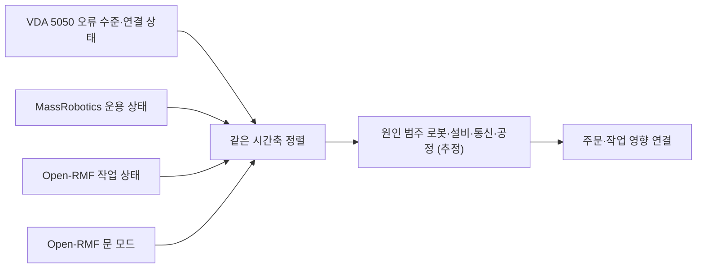

[홈](../../index.md) › [주제](../index.md) › 19. 모니터링·이상 탐지·원인 분석 — 대표 접근법과 기술

# 19. 모니터링·이상 탐지·원인 분석 — 대표 접근법과 기술

<!-- auto:page-status:start -->
<!-- auto:page-status:end -->

## 1. 세 줄 요약

- 5절의 판정 절차를 일반화하면 다음 접근들로 정리된다. 대부분 표준 필드는 확인됐지만 물류 로봇 관제에 적용한 공개 사례는 확인되지 않았다. [추정][^ref-051][^ref-502]
- 이 페이지는 [19. 모니터링·이상 탐지·원인 분석](../../categories/e-collaboration-and-field-operations/19-monitoring-anomaly-detection-and-root-cause-analysis.md) 페이지의 "대표 접근법과 기술" 절이 분량 기준을 넘어 옮겨 온 것이다. 원 페이지의 검증을 거친 내용이며 새 주장은 없다.

## 2. 배경

[19. 모니터링·이상 탐지·원인 분석](../../categories/e-collaboration-and-field-operations/19-monitoring-anomaly-detection-and-root-cause-analysis.md) 페이지를 쓰는 과정에서 "대표 접근법과 기술" 절의 분량이 세부영역 페이지 기준(4,000자)을 넘어, 내용을 줄이지 않고 이 주제 페이지로 분리했다.

## 3. 본문

5절의 판정 절차를 일반화하면 다음 접근들로 정리된다. 대부분 표준 필드는 확인됐지만 물류 로봇 관제에 적용한 공개 사례는 확인되지 않았다. [추정][^ref-051][^ref-502]

### 표준 상태·오류 어휘를 같은 시간축에 맞추기

작업 상태의 지연·차단(Open-RMF), 로봇 오류 수준과 연결 끊김(VDA 5050), 외부 사건 대기(MassRobotics), 문 모드(Open-RMF)를 같은 시간축에 맞춰 보는 방식으로 원인에 접근할 수 있어 보이나, 세 어휘가 서로 달라 ROP 자체 원인 범주로 옮기는 매핑이 필요할 것으로 보인다. [추정][^ref-051][^ref-506][^ref-230][^ref-313][^ref-111]

### 주문–작업–동작 추적 문맥 연결

OpenTelemetry 는 TraceId·SpanId 로 추적·지표·로그를 서로 연결한다. [사실][^ref-502] 주문 id·작업 id·로봇 동작 id 를 하나의 추적 문맥으로 묶으면(VDA 5050 errorReferences 의 orderId·actionId 활용) 로봇 오류를 해당 주문 지연과 연결할 수 있을 것으로 보이나, 물류 로봇 관제 적용 사례는 확인하지 못했다. [추정][^ref-502][^ref-051]

### 병목 탐지

가동률·대기 시간 기반 방법과 활성 구간 기반 이동 병목 탐지를 AGV 시스템에서 비교한 연구가 있다(2003). [사실][^ref-510] 이동로봇·작업대·승강기가 섞인 창고 흐름에 적용한 연구는 아직 확인되지 않았다(oq-018).

### 고장 탐지·진단과 근본 원인 분석

다중 로봇 FDD 설문(2019)과 다중 서비스 클라우드 응용의 이상 탐지·근본 원인 분석 설문(2022)이 방법의 지도를 준다. [사실][^ref-509][^ref-511] 로그에서 서비스 간 인과 그래프를 도출해 원인을 좁히는 접근이 후자에 포함된다는 세부는 확인되지 않았고, 로봇 분야 적용은 아니다. [추정][^ref-511]

### LLM 기반 실패 설명

REFLECT(2023)는 영상·소리·로봇 상태 같은 다중 감각 관측을 계층적 경험 요약으로 바꾼 뒤 대규모 언어 모델(LLM)에 실패 원인 설명과 수정 계획을 묻는다. [사실][^ref-512] 이는 [27. AI·학습·적응과 모델 운영](../../categories/g-safety-security-intelligence-and-governance/27-ai-learning-adaptation-and-model-operations.md)의 방법을 장애 분석에 적용한 예다.

## 4. 현장 시나리오

현장 시나리오는 원 페이지의 [5. 현장 시나리오 (물류 흐름의 어느 단계인지 명시)](../../categories/e-collaboration-and-field-operations/19-monitoring-anomaly-detection-and-root-cause-analysis.md) 절에 있다.

## 5. ROP 관점의 시사점

ROP가 직접 맡는 것과 외부와 연계하는 것은 원 페이지의 [9. ROP가 직접 맡는 것과 외부와 연계하는 것 (부록 A 9장 기준)](../../categories/e-collaboration-and-field-operations/19-monitoring-anomaly-detection-and-root-cause-analysis.md) 절에 있다.

## 6. 연결되는 연구영역

- 주 연구영역: [19. 모니터링·이상 탐지·원인 분석](../../categories/e-collaboration-and-field-operations/19-monitoring-anomaly-detection-and-root-cause-analysis.md)
- 관련 영역: [4. 성과·경제성·프로세스 개선](../../categories/a-business-supply-chain-design/04-performance-economics-and-process-improvement.md), [8. 실시간 세계 상태·데이터 일관성](../../categories/b-common-information-and-environment-model/08-real-time-world-state-and-data-consistency.md), [9. 로봇·제조사 관제 연동](../../categories/c-connectivity-and-execution-foundation/09-robot-and-vendor-fleet-manager-integration.md), [10. 설비·건물 시스템 연동](../../categories/c-connectivity-and-execution-foundation/10-facility-and-building-system-integration.md), [12. 명령·작업 실행의 신뢰성](../../categories/c-connectivity-and-execution-foundation/12-command-and-task-execution-reliability.md), [18. 사람–로봇 협업·운영 인터페이스](../../categories/e-collaboration-and-field-operations/18-human-robot-collaboration-and-operator-interface.md), [20. 예외 복구·재계획·업무 연속성](../../categories/e-collaboration-and-field-operations/20-exception-recovery-replanning-and-business-continuity.md), [27. AI·학습·적응과 모델 운영](../../categories/g-safety-security-intelligence-and-governance/27-ai-learning-adaptation-and-model-operations.md)

## 7. 열린 질문

열린 질문은 원 페이지의 [11. 열린 질문](../../categories/e-collaboration-and-field-operations/19-monitoring-anomaly-detection-and-root-cause-analysis.md) 절과 [열린 질문](../../open-questions.md) 페이지에 모은다.

## 8. 출처

[^ref-051]: VDA / VDMA (VDA5050 GitHub), VDA5050/VDA5050 — json_schemas/state.schema, 미확인, https://github.com/VDA5050/VDA5050/blob/main/json_schemas/state.schema, 접근일 2026-09-25
[^ref-502]: OpenTelemetry (CNCF), OpenTelemetry Specification — Overview, 미확인, https://github.com/open-telemetry/opentelemetry-specification/blob/main/specification/overview.md, 접근일 2026-09-25
[^ref-313]: Open Robotics (open-rmf/rmf_internal_msgs), rmf_door_msgs/msg/DoorMode.msg, 미확인, https://github.com/open-rmf/rmf_internal_msgs/blob/main/rmf_door_msgs/msg/DoorMode.msg, 접근일 2026-09-25
[^ref-111]: Open Robotics (open-rmf/rmf_api_msgs), rmf_api_msgs/schemas/task_state.json, 미확인, https://github.com/open-rmf/rmf_api_msgs/blob/main/rmf_api_msgs/schemas/task_state.json, 접근일 2026-09-25
[^ref-506]: VDA / VDMA (VDA5050 GitHub), VDA5050/VDA5050 — json_schemas/connection.schema, 미확인, https://github.com/VDA5050/VDA5050/blob/main/json_schemas/connection.schema, 접근일 2026-09-25
[^ref-230]: MassRobotics (MassRobotics-AMR/AMR_Interop_Standard), AMR_Interop_Standard.json, 미확인, https://github.com/MassRobotics-AMR/AMR_Interop_Standard/blob/main/AMR_Interop_Standard.json, 접근일 2026-09-25
[^ref-509]: Khalastchi, E., & Kalech, M., Fault Detection and Diagnosis in Multi-Robot Systems: A Survey (Sensors 19(18):4019), 2019, https://doi.org/10.3390/s19184019, 접근일 2026-09-25 (원문 미열람)
[^ref-510]: Roser, C., Nakano, M., & Tanaka, M., Comparison of bottleneck detection methods for AGV systems (WSC 2003 Proceedings, 1192–1198쪽), 2003, https://keio.elsevierpure.com/en/publications/comparison-of-bottleneck-detection-methods-for-agv-systems/, 접근일 2026-09-25 (원문 미열람)
[^ref-511]: Soldani, J., & Brogi, A., Anomaly Detection and Failure Root Cause Analysis in (Micro) Service-Based Cloud Applications: A Survey (ACM Computing Surveys 55(3)), 2022, https://dl.acm.org/doi/full/10.1145/3501297, 접근일 2026-09-25 (원문 미열람)
[^ref-512]: Liu, Z., Bahety, A., & Song, S., REFLECT: Summarizing Robot Experiences for Failure Explanation and Correction (CoRL 2023), 2023, https://arxiv.org/abs/2306.15724, 접근일 2026-09-25 (원문 미열람)

## 9. 검증 노트

원 페이지와 함께 실행 2026-09-25-48 의 1차·2차 검증을 거쳤다. 분리는 코드가 했고 내용은 바꾸지 않았다.

## 10. 이력

| 날짜 | 실행 id | 변경 |
|---|---|---|
| 2026-09-25 | 2026-09-25-48 | 19. 모니터링·이상 탐지·원인 분석 의 "대표 접근법과 기술" 절에서 분리 |
