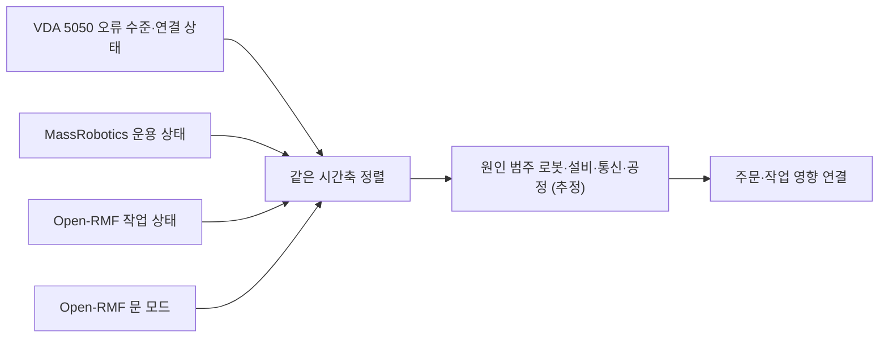

(너의 규칙은 시스템 프롬프트의 agents/shared-rules.md 와 agents/storyteller.md 이다. 아래는 이번 실행의 컨텍스트와 입력이다.)

## 실행 컨텍스트

- run_id: 2026-09-25-48
- date: 2026-09-25
- run_type: area_deep_dive (영역 심화)
- 대상: 19. 모니터링·이상 탐지·원인 분석 (E. 협업·현장 운영)
- 예산:
    - max_search_queries: 30
    - max_sources_per_run: 15
    - new_topic_pages: 1
    - page_updates: 2
    - max_retries: 2
- 환경 알림: web_fetch_available: false · fetch_mode: mirror_only (일반 웹 페이지 열람은 네트워크 정책으로 막혀 있다. raw.githubusercontent.com 은 열린다: 공식 문서가 GitHub 에 있는 출처는 입력의 config/source_mirrors.yaml 경로를 WebFetch 로 열어 원문을 읽고 sources[].fetched=true, fetched_via=github_raw, fetch_url 을 적는다. 입력에 원문 텍스트(data/source_texts)가 있는 출처는 fetched_via=inbox. 그 밖의 출처는 fetched=false 이며 코드가 신뢰도 상한(medium)을 강제한다 — 공통 규칙 0절 6항)
- 언어: ko

## 입력

### runs/2026-09-25-48/target.json

```json
{
  "run_id": "2026-09-25-48",
  "date": "2026-09-25",
  "weekday": "Fri",
  "run_number": 48,
  "run_type": "area_deep_dive",
  "forced": true,
  "target": {
    "area_no": 19,
    "area_name": "19. 모니터링·이상 탐지·원인 분석",
    "category": "E. 협업·현장 운영",
    "category_letter": "E"
  },
  "topic": null,
  "track": null,
  "corrections": [],
  "budget": {
    "max_search_queries": 30,
    "max_sources_per_run": 15,
    "new_topic_pages": 1,
    "page_updates": 2,
    "max_retries": 2
  },
  "priority_reason": null,
  "priority_questions": [],
  "excluded_areas": [],
  "lifted_areas": [],
  "deferred": {
    "monthly_recheck": false,
    "weekly_review": false
  },
  "selection_rationale": "CLI 지정 run_type=area_deep_dive, area=19"
}
```

### runs/2026-09-25-48/research.json

```json
{
  "run_id": "2026-09-25-48",
  "date": "2026-09-25",
  "run_type": "area_deep_dive",
  "target": {
    "area_no": 19,
    "area_name": "19. 모니터링·이상 탐지·원인 분석",
    "category": "E. 협업·현장 운영"
  },
  "gaps": [
    "섹션 3. 왜 중요한가 비어 있음",
    "섹션 4. 핵심 개념과 용어 비어 있음",
    "섹션 5. 현장 시나리오 비어 있음 — 지연 원인(로봇·문·앞 공정) 구분 시나리오 필요",
    "섹션 6. 대표 접근법과 기술 비어 있음",
    "섹션 7. 관련 표준·프레임워크·오픈소스 비어 있음",
    "섹션 8. 대표 연구와 자료 비어 있음",
    "섹션 9. ROP가 직접 맡는 것과 외부와 연계하는 것 비어 있음",
    "섹션 10. 다른 연구영역과의 연결 비어 있음",
    "섹션 11. 열린 질문 비어 있음 — 기존 oq-018, oq-033 관련"
  ],
  "research_questions": [
    "지연 원인이 로봇 고장인지, 문인지, 앞 공정인지 어떻게 찾을까? [분류원문]",
    "로봇–관제 인터페이스 표준(VDA 5050, MassRobotics)과 Open-RMF 는 오류·운용 상태·연결 상태·설비(문) 상태·작업 지연을 어떤 필드와 값으로 보고하는가? (섹션 6·7 겨냥)",
    "oq-033 Open-RMF 로봇 상태, VDA 5050 action 상태·오류, MassRobotics 운용 상태를 하나의 공통 상태·오류 어휘로 옮기는 표준 매핑이나 공개 구현이 있는가? (섹션 7·11 겨냥)",
    "oq-018 이동로봇·작업대·승강기가 섞인 창고 흐름에 활성 구간 기반 이동 병목 탐지나 객체 중심 프로세스 마이닝을 적용한 연구가 있는가? (섹션 6·8 겨냥)",
    "로그·지표·추적을 연결하는 관측(observability) 오픈소스와 로봇 진단 도구에는 무엇이 있는가? (섹션 4·7 겨냥)",
    "다중 로봇 고장 탐지·진단, 근본 원인 분석 연구와 LLM 기반 실패 설명(27. AI·학습·적응과 모델 운영 교차)은 무엇을 제공하는가? (섹션 6·8 겨냥)",
    "국내 물류 로봇 관제·이상 대응 연구는 무엇이 있고, ROP 직접 범위와 연계 대상(로봇 내부 진단)의 경계는 어디인가? (섹션 8·9 겨냥)"
  ],
  "findings": [
    {
      "id": "f1",
      "claim": "VDA 5050 최신판 상태(state) 스키마의 오류 객체는 errorType 과 errorLevel 을 필수로 두며, errorLevel 은 WARNING·URGENT·CRITICAL·FATAL 네 값으로 로봇이 현재 주문을 계속할 수 있는지와 새 주문을 받을 수 있는지를 구분한다.",
      "tag": "사실",
      "source_ids": [
        "ref-051"
      ],
      "cross_checked": false,
      "confidence": "medium",
      "evidence_excerpt": "CRITICAL: Immediate attention required, mobile robot is unable to continue active order, but can accept new order. FATAL 은 사용자 개입 필요·새 주문 불가 (main 브랜치 state.schema, 3.0.0 판)",
      "as_of": "2026-09-25",
      "flow_step": null,
      "flow_item": "예외·성과"
    },
    {
      "id": "f2",
      "claim": "VDA 5050 최신판 상태 스키마는 오류와 관련된 nodeId·edgeId·orderId·actionId 등을 가리키는 errorReferences, 사람이 읽는 설명(errorDescription)과 조치 힌트(errorHint)를 둘 수 있게 하고, 오류와 별도로 INFO·DEBUG 수준의 information 배열을 둔다.",
      "tag": "사실",
      "source_ids": [
        "ref-051"
      ],
      "cross_checked": false,
      "confidence": "medium",
      "evidence_excerpt": "errorReferences: 오류 관련 정보를 주는 참조 배열(예: nodeId, edgeId, orderId, actionId). information 의 infoLevel 은 INFO(시각화용)·DEBUG(디버깅용)",
      "as_of": "2026-09-25",
      "flow_step": null,
      "flow_item": "예외·성과"
    },
    {
      "id": "f3",
      "claim": "VDA 5050 3.0.0 명세는 실패한 동작(actionStatus FAILED)이 해당하는 오류 보고와 대응하도록 설명하며, 예로 집기·내려놓기 실패를 든다.",
      "tag": "사실",
      "source_ids": [
        "ref-031"
      ],
      "cross_checked": false,
      "confidence": "medium",
      "evidence_excerpt": "실패한 pick·drop 동작은 상태 메시지의 오류 항목과 대응해야 한다는 취지(요약 도구 경유 원문 열람, 명세 문구와 글자 단위 대조 미확인)",
      "as_of": "2026-09-25",
      "flow_step": null,
      "flow_item": "예외·성과"
    },
    {
      "id": "f4",
      "claim": "VDA 5050 connection 토픽은 로봇의 마지막 유언(last will) 메시지로, 정상 종료(OFFLINE)와 예기치 않은 연결 끊김(CONNECTION_BROKEN)을 구분해 관제에 알린다.",
      "tag": "사실",
      "source_ids": [
        "ref-506"
      ],
      "cross_checked": false,
      "confidence": "medium",
      "evidence_excerpt": "CONNECTION_BROKEN: The connection between mobile robot and broker has unexpectedly ended. 그 밖에 ONLINE, OFFLINE, HIBERNATING",
      "as_of": "2026-09-25",
      "flow_step": null,
      "flow_item": "예외·성과"
    },
    {
      "id": "f5",
      "claim": "MassRobotics AMR 상호운용 표준의 상태 보고는 운용 상태(operationalState)에 navigating·idle·disabled·offline·charging 외에 waitingHumanEvent·waitingExternalEvent·waitingInternalEvent·manualOverride 를 두어 대기 원인을 사람·외부·내부 사건으로 나누고, 정상 운용 때는 생략하는 errorCodes 배열을 둔다.",
      "tag": "사실",
      "source_ids": [
        "ref-230"
      ],
      "cross_checked": false,
      "confidence": "medium",
      "evidence_excerpt": "operationalState 열거값 9개. errorCodes 는 현재 오류 상태를 나타내는 문자열 식별자 배열이며 정상 운용 때 생략(공식 저장소 JSON 스키마)",
      "as_of": "2026-09-25",
      "flow_step": null,
      "flow_item": "예외·성과"
    },
    {
      "id": "f6",
      "claim": "Open-RMF 에서 문 노드는 문 상태(DoorState)를 /door_states 토픽으로 발행하고, 문 모드(DoorMode)는 closed·moving·open·offline·unknown 다섯 값이다.",
      "tag": "사실",
      "source_ids": [
        "ref-313",
        "ref-283"
      ],
      "cross_checked": false,
      "confidence": "medium",
      "evidence_excerpt": "MODE_CLOSED=0, MODE_MOVING=1, MODE_OPEN=2, MODE_OFFLINE=3, MODE_UNKNOWN=4 (rmf_door_msgs). 문 노드가 DoorState 를 /door_states 로 발행(두 출처 모두 Open-RMF 계열이라 독립 아님)",
      "as_of": "2026-09-25",
      "flow_step": "보충",
      "flow_item": "제약"
    },
    {
      "id": "f7",
      "claim": "Open-RMF 문 어댑터는 플릿 어댑터의 문 요청을 받아 진행 중인 로봇 작업을 방해하지 않을 때만 문을 움직이게 하는 상태 감독자 역할을 한다.",
      "tag": "사실",
      "source_ids": [
        "ref-283"
      ],
      "cross_checked": false,
      "confidence": "medium",
      "evidence_excerpt": "acts like a state supervisor ensuring that the doors are not acting on requests that might obstruct an ongoing mobile robot task",
      "as_of": "2026-09-25",
      "flow_step": "보충",
      "flow_item": "제약"
    },
    {
      "id": "f8",
      "claim": "Open-RMF 작업 상태(task_state) 스키마는 작업·단계·이벤트 상태 토큰으로 blocked·delayed·error·failed·underway·completed 등을 두고, 완료 예상 시간(estimate_millis), 중단 기록(interruptions), 배정 상태(failed_to_assign 등)를 함께 기록한다.",
      "tag": "사실",
      "source_ids": [
        "ref-111"
      ],
      "cross_checked": false,
      "confidence": "medium",
      "evidence_excerpt": "status: uninitialized, blocked, error, failed, queued, standby, underway, delayed, skipped, canceled, killed, completed. 값별 설명은 스키마에 없음",
      "as_of": "2026-09-25",
      "flow_step": null,
      "flow_item": "예외·성과"
    },
    {
      "id": "f9",
      "claim": "Open-RMF 경보 메시지(rmf_task_msgs Alert)는 심각도 등급(INFO·WARNING·ERROR), 운영자가 고를 수 있는 응답 목록, 관련 작업 id 를 담는다.",
      "tag": "사실",
      "source_ids": [
        "ref-503"
      ],
      "cross_checked": false,
      "confidence": "medium",
      "evidence_excerpt": "tier: TIER_INFO=0, TIER_WARNING=1, TIER_ERROR=2; responses_available; task_id (관련 작업이 없으면 비움)",
      "as_of": "2026-09-25",
      "flow_step": null,
      "flow_item": "예외·성과"
    },
    {
      "id": "f10",
      "claim": "f1~f9 에 따르면 분류 원문의 질문(지연 원인이 로봇·문·앞 공정 중 무엇인가)은 작업 상태의 지연·차단(Open-RMF), 로봇 오류 수준과 연결 끊김(VDA 5050), 외부 사건 대기(MassRobotics), 문 모드(Open-RMF)를 같은 시간축에 맞춰 보는 방식으로 접근할 수 있어 보이나, 세 어휘가 서로 달라 ROP 가 자체 원인 범주로 옮기는 매핑이 필요할 것으로 보인다.",
      "tag": "추정",
      "source_ids": [
        "ref-051",
        "ref-506",
        "ref-230",
        "ref-313",
        "ref-111"
      ],
      "cross_checked": false,
      "confidence": "low",
      "evidence_excerpt": "각 출처는 자기 필드만 정의하고 서로 간 대응표는 두지 않음(이번 실행에서 공통 매핑 표준 미발견, oq-033 유지)",
      "as_of": "2026-09-25",
      "flow_step": "보충",
      "flow_item": "예외·성과"
    },
    {
      "id": "f11",
      "claim": "ROS 2 diagnostics 는 하드웨어 드라이버가 /diagnostics 토픽에 DiagnosticArray 로 진단 정보를 발행하게 하고, diagnostic_updater(발행 도우미), diagnostic_aggregator(플러그인 규칙으로 집계), diagnostic_remote_logging(InfluxDB 등 원격 전송) 등의 패키지를 제공한다.",
      "tag": "사실",
      "source_ids": [
        "ref-500"
      ],
      "cross_checked": false,
      "confidence": "medium",
      "evidence_excerpt": "collects information about hardware drivers and robot hardware to make them available to users and operators",
      "as_of": "2026-09-25",
      "flow_step": null,
      "flow_item": null
    },
    {
      "id": "f12",
      "claim": "ros2_tracing 은 LTTng 기반으로 ROS 2 핵심 패키지에 추적 지점(tracepoint)을 넣고 실행 시 추적을 설정하는 도구를 제공하는 저오버헤드 추적 프레임워크이다.",
      "tag": "사실",
      "source_ids": [
        "ref-501"
      ],
      "cross_checked": false,
      "confidence": "medium",
      "evidence_excerpt": "README 가 Bédard·Lütkebohle·Dagenais(2022, IEEE RA-L) ros2_tracing: Multipurpose Low-Overhead Framework for Real-Time Tracing of ROS 2 를 인용",
      "as_of": "2026-09-25",
      "flow_step": null,
      "flow_item": null
    },
    {
      "id": "f13",
      "claim": "OpenTelemetry 명세는 추적(traces)·지표(metrics)·로그(logs)·배기지(baggage) 신호를 정의하고, 추적을 부모–자식 관계의 스팬(span)으로 이루어진 방향 비순환 그래프로 보며, TraceId·SpanId 로 신호를 서로 연결한다.",
      "tag": "사실",
      "source_ids": [
        "ref-502"
      ],
      "cross_checked": false,
      "confidence": "medium",
      "evidence_excerpt": "a Trace can be thought of as a directed acyclic graph (DAG) of Spans",
      "as_of": "2026-09-25",
      "flow_step": null,
      "flow_item": null
    },
    {
      "id": "f14",
      "claim": "주문 id·작업 id·로봇 동작 id 를 하나의 추적 문맥으로 묶으면(OpenTelemetry 식 추적과 VDA 5050 errorReferences 의 orderId·actionId) 로봇 오류를 해당 주문 지연과 연결할 수 있을 것으로 보이나, 물류 로봇 관제에 적용한 공개 사례는 이번 실행에서 확인하지 못했다.",
      "tag": "추정",
      "source_ids": [
        "ref-502",
        "ref-051"
      ],
      "cross_checked": false,
      "confidence": "low",
      "evidence_excerpt": "f2·f13 을 결합한 추론. 적용 사례 미확인",
      "as_of": "2026-09-25",
      "flow_step": null,
      "flow_item": "예외·성과"
    },
    {
      "id": "f15",
      "claim": "Khalastchi·Kalech(Sensors, 2019)의 설문 논문은 다중 로봇 시스템의 속성이 고장 탐지·진단(FDD)에 서로 다른 어려움을 준다고 보고 적용 가능한 FDD 접근을 정리하며, 계획 진단에서 실패한 동작을 찾는 1차 진단과 그 근본 원인(에이전트·장비)을 찾는 2차 진단을 구분한다.",
      "tag": "사실",
      "source_ids": [
        "ref-509"
      ],
      "cross_checked": false,
      "confidence": "medium",
      "evidence_excerpt": "primary plan diagnosis identifies failed execution of actions; secondary plan diagnosis identifies the root cause (검색 요약 기준)",
      "as_of": "2019",
      "flow_step": null,
      "flow_item": "예외·성과",
      "source_unopened": true
    },
    {
      "id": "f16",
      "claim": "Roser·Nakano·Tanaka(WSC 2003)는 무인운반차(AGV) 시스템에서 가동률·대기 시간 기반 병목 탐지와 자신들의 이동 병목(shifting bottleneck) 탐지 방법을 비교해, 기존 두 방법은 주 병목을 안정적으로 찾지 못할 때가 있다고 보고한다.",
      "tag": "사실",
      "source_ids": [
        "ref-510"
      ],
      "cross_checked": false,
      "confidence": "medium",
      "evidence_excerpt": "utilization, waiting time 방식과 활성 구간(active period) 기반 이동 병목 탐지 비교, AGV 시뮬레이션 (검색 요약 기준)",
      "as_of": "2003",
      "flow_step": null,
      "flow_item": "예외·성과",
      "source_unopened": true
    },
    {
      "id": "f17",
      "claim": "Soldani·Brogi(ACM Computing Surveys, 2022)는 다중 서비스 클라우드 응용의 이상 탐지와 실패 근본 원인 분석 기법을 정리하며, 로그에서 서비스 간 인과 그래프를 도출해 원인을 좁히는 접근을 포함한다.",
      "tag": "사실",
      "source_ids": [
        "ref-511"
      ],
      "cross_checked": false,
      "confidence": "medium",
      "evidence_excerpt": "로그를 처리해 causality graph(정점=서비스, 방향 간선=이상 전파 가능성)를 도출 (검색 요약 기준, 로봇 분야 적용은 아님)",
      "as_of": "2022",
      "flow_step": null,
      "flow_item": null,
      "source_unopened": true
    },
    {
      "id": "f18",
      "claim": "REFLECT(Liu 외, CoRL 2023)는 영상·소리·로봇 상태 같은 다중 감각 관측을 계층적 경험 요약으로 바꾼 뒤 LLM 에 실패 원인 설명과 수정 계획을 묻는 방법으로, 실행 실패와 계획 실패를 모두 다룬다.",
      "tag": "사실",
      "source_ids": [
        "ref-512"
      ],
      "cross_checked": false,
      "confidence": "medium",
      "evidence_excerpt": "hierarchical summary of robot past experiences generated from multisensory observations. 가정용 조작 과제 기준이며 물류 현장 평가는 없음(검색 요약 기준)",
      "as_of": "2023",
      "flow_step": null,
      "flow_item": "예외·성과",
      "source_unopened": true
    },
    {
      "id": "f19",
      "claim": "공급망 관리(SCM)에서 프로세스 마이닝의 현황·활용 사례·연구 전망을 정리한 리뷰 논문이 International Journal of Production Research(2024)에 게재되었다.",
      "tag": "사실",
      "source_ids": [
        "ref-513"
      ],
      "cross_checked": false,
      "confidence": "medium",
      "evidence_excerpt": "Process mining in supply chain management: state-of-the-art, use cases and research outlook (DOI 10.1080/00207543.2024.2412285, 검색 요약 기준, 본문 내 로봇 흐름 사례 여부 미확인)",
      "as_of": "2024",
      "flow_step": null,
      "flow_item": null,
      "source_unopened": true
    },
    {
      "id": "f20",
      "claim": "국내 연구(DBpia, 2026-07)는 다중 AMR 운영용 웹 기반 사용자 중심 관제 인터페이스를 가상 테스트베드에서 피험자 10명으로 예비 평가해, 대조군 대비 이상 대응 시간이 39.6% 단축되었다고 보고한다.",
      "tag": "사실",
      "source_ids": [
        "ref-514"
      ],
      "cross_checked": false,
      "confidence": "low",
      "evidence_excerpt": "인지시간 41.8%, 이상 대응 시간 39.6%, 전체 작업 처리 시간 20.4% 단축, 관제 정확도 95.1% (탐색적 예비 연구, 가상 테스트베드, 검색 요약 기준)",
      "as_of": "2026-07",
      "flow_step": null,
      "flow_item": "예외·성과",
      "source_unopened": true
    },
    {
      "id": "f21",
      "claim": "연계 대상: 센서·모터·드라이버 수준의 진단(ROS 2 diagnostics 같은 로봇 내부 진단)과 개별 부품 고장 진단은 로봇 제조사 영역이며, 이종 로봇을 연결하는 ROP 는 표준 인터페이스가 보고하는 오류 수준·연결 상태·설비 상태·작업 상태를 모아 원인 범주(로봇·설비·통신·공정)로 구분하고 업무 영향과 연결하는 부분을 맡는 경계가 될 것으로 보인다.",
      "tag": "추정",
      "source_ids": [
        "ref-500",
        "ref-051",
        "ref-506",
        "ref-111"
      ],
      "cross_checked": false,
      "confidence": "low",
      "evidence_excerpt": "분류 원문 9장 로봇 자체 지능·제어 경계를 f1·f4·f8·f11 에 적용한 추론",
      "as_of": "2026-09-25",
      "flow_step": null,
      "flow_item": "예외·성과"
    }
  ],
  "sources": [
    {
      "id": "ref-031",
      "org": "VDA / VDMA (VDA5050 GitHub)",
      "title": "VDA5050/VDA5050_EN.md — Official Specification document for the VDA 5050",
      "published": null,
      "url": "https://github.com/VDA5050/VDA5050/blob/main/VDA5050_EN.md",
      "type": "표준",
      "reliability": "high",
      "accessed": "2026-09-25",
      "summary": "VDA 5050 공식 저장소 main 브랜치의 명세 원문(3.0.0 판). 오류 처리와 동작 상태의 관계 확인.",
      "fetched": true,
      "fetched_via": "github_raw",
      "fetch_url": "https://raw.githubusercontent.com/VDA5050/VDA5050/main/VDA5050_EN.md",
      "source_unopened": false
    },
    {
      "id": "ref-051",
      "org": "VDA / VDMA (VDA5050 GitHub)",
      "title": "VDA5050/VDA5050 — json_schemas/state.schema",
      "published": null,
      "url": "https://github.com/VDA5050/VDA5050/blob/main/json_schemas/state.schema",
      "type": "표준",
      "reliability": "high",
      "accessed": "2026-09-25",
      "summary": "VDA 5050 상태 메시지 JSON 스키마. 오류 객체·errorLevel·information 배열 확인.",
      "fetched": true,
      "fetched_via": "github_raw",
      "fetch_url": "https://raw.githubusercontent.com/VDA5050/VDA5050/main/json_schemas/state.schema",
      "source_unopened": false
    },
    {
      "id": "ref-500",
      "org": "ROS (ros/diagnostics GitHub)",
      "title": "diagnostics — README (ros2 branch)",
      "published": null,
      "url": "https://github.com/ros/diagnostics/blob/ros2/README.md",
      "type": "오픈소스 문서",
      "reliability": "high",
      "accessed": "2026-09-25",
      "summary": "ROS 2 진단 체계(/diagnostics 토픽, updater, aggregator, 원격 로깅, self_test) 구성 설명.",
      "fetched": true,
      "fetched_via": "github_raw",
      "fetch_url": "https://raw.githubusercontent.com/ros/diagnostics/ros2/README.md",
      "source_unopened": false
    },
    {
      "id": "ref-501",
      "org": "ROS 2 (ros2/ros2_tracing GitHub)",
      "title": "ros2_tracing — README",
      "published": null,
      "url": "https://github.com/ros2/ros2_tracing",
      "type": "오픈소스 문서",
      "reliability": "high",
      "accessed": "2026-09-25",
      "summary": "LTTng 기반 ROS 2 추적 계측과 설정 도구 설명, 관련 논문(IEEE RA-L 2022) 인용.",
      "fetched": true,
      "fetched_via": "github_raw",
      "fetch_url": "https://raw.githubusercontent.com/ros2/ros2_tracing/rolling/README.md",
      "source_unopened": false
    },
    {
      "id": "ref-502",
      "org": "OpenTelemetry (CNCF)",
      "title": "OpenTelemetry Specification — Overview",
      "published": null,
      "url": "https://github.com/open-telemetry/opentelemetry-specification/blob/main/specification/overview.md",
      "type": "오픈소스 문서",
      "reliability": "high",
      "accessed": "2026-09-25",
      "summary": "추적·지표·로그·배기지 신호와 스팬·추적 정의, 문맥 전파(TraceId·SpanId) 설명.",
      "fetched": true,
      "fetched_via": "github_raw",
      "fetch_url": "https://raw.githubusercontent.com/open-telemetry/opentelemetry-specification/main/specification/overview.md",
      "source_unopened": false
    },
    {
      "id": "ref-503",
      "org": "Open Robotics (open-rmf/rmf_internal_msgs)",
      "title": "rmf_task_msgs/msg/Alert.msg",
      "published": null,
      "url": "https://github.com/open-rmf/rmf_internal_msgs/blob/main/rmf_task_msgs/msg/Alert.msg",
      "type": "오픈소스 문서",
      "reliability": "high",
      "accessed": "2026-09-25",
      "summary": "Open-RMF 경보 메시지 정의(심각도 등급, 응답 목록, 관련 작업 id).",
      "fetched": true,
      "fetched_via": "github_raw",
      "fetch_url": "https://raw.githubusercontent.com/open-rmf/rmf_internal_msgs/main/rmf_task_msgs/msg/Alert.msg",
      "source_unopened": false
    },
    {
      "id": "ref-313",
      "org": "Open Robotics (open-rmf/rmf_internal_msgs)",
      "title": "rmf_door_msgs/msg/DoorMode.msg",
      "published": null,
      "url": "https://github.com/open-rmf/rmf_internal_msgs/blob/main/rmf_door_msgs/msg/DoorMode.msg",
      "type": "오픈소스 문서",
      "reliability": "high",
      "accessed": "2026-09-25",
      "summary": "Open-RMF 문 모드 값(closed, moving, open, offline, unknown) 정의.",
      "fetched": true,
      "fetched_via": "github_raw",
      "fetch_url": "https://raw.githubusercontent.com/open-rmf/rmf_internal_msgs/main/rmf_door_msgs/msg/DoorMode.msg",
      "source_unopened": false
    },
    {
      "id": "ref-111",
      "org": "Open Robotics (open-rmf/rmf_api_msgs)",
      "title": "rmf_api_msgs/schemas/task_state.json",
      "published": null,
      "url": "https://github.com/open-rmf/rmf_api_msgs/blob/main/rmf_api_msgs/schemas/task_state.json",
      "type": "오픈소스 문서",
      "reliability": "high",
      "accessed": "2026-09-25",
      "summary": "Open-RMF 작업 상태 JSON 스키마. 상태 토큰(blocked, delayed 등), 예상 시간, 중단, 배정 상태.",
      "fetched": true,
      "fetched_via": "github_raw",
      "fetch_url": "https://raw.githubusercontent.com/open-rmf/rmf_api_msgs/main/rmf_api_msgs/schemas/task_state.json",
      "source_unopened": false
    },
    {
      "id": "ref-506",
      "org": "VDA / VDMA (VDA5050 GitHub)",
      "title": "VDA5050/VDA5050 — json_schemas/connection.schema",
      "published": null,
      "url": "https://github.com/VDA5050/VDA5050/blob/main/json_schemas/connection.schema",
      "type": "표준",
      "reliability": "high",
      "accessed": "2026-09-25",
      "summary": "VDA 5050 connection 토픽(last will) 스키마. 연결 상태 네 값 정의.",
      "fetched": true,
      "fetched_via": "github_raw",
      "fetch_url": "https://raw.githubusercontent.com/VDA5050/VDA5050/main/json_schemas/connection.schema",
      "source_unopened": false
    },
    {
      "id": "ref-230",
      "org": "MassRobotics (MassRobotics-AMR/AMR_Interop_Standard)",
      "title": "AMR_Interop_Standard.json",
      "published": null,
      "url": "https://github.com/MassRobotics-AMR/AMR_Interop_Standard/blob/main/AMR_Interop_Standard.json",
      "type": "표준",
      "reliability": "high",
      "accessed": "2026-09-25",
      "summary": "MassRobotics AMR 상호운용 표준 JSON 스키마. 운용 상태 열거값, errorCodes, 배터리·위치 필드.",
      "fetched": true,
      "fetched_via": "github_raw",
      "fetch_url": "https://raw.githubusercontent.com/MassRobotics-AMR/AMR_Interop_Standard/main/AMR_Interop_Standard.json",
      "source_unopened": false
    },
    {
      "id": "ref-283",
      "org": "Open Robotics (osrf/ros2multirobotbook)",
      "title": "Programming Multiple Robots with ROS 2 — Doors",
      "published": null,
      "url": "https://osrf.github.io/ros2multirobotbook/integration_doors.html",
      "type": "오픈소스 문서",
      "reliability": "high",
      "accessed": "2026-09-25",
      "summary": "Open-RMF 문 연동: 문 노드의 상태 발행과 문 어댑터의 감독 역할.",
      "fetched": true,
      "fetched_via": "github_raw",
      "fetch_url": "https://raw.githubusercontent.com/osrf/ros2multirobotbook/master/src/integration_doors.md",
      "source_unopened": false
    },
    {
      "id": "ref-509",
      "org": "Khalastchi, E., & Kalech, M.",
      "title": "Fault Detection and Diagnosis in Multi-Robot Systems: A Survey",
      "published": "2019",
      "url": "https://doi.org/10.3390/s19184019",
      "type": "논문",
      "reliability": "medium",
      "accessed": "2026-09-25",
      "summary": "원문 미열람. Sensors 19(18):4019. 다중 로봇 시스템의 고장 탐지·진단 과제와 접근을 정리한 설문.",
      "source_unopened": true,
      "fetched": false,
      "fetched_via": null,
      "fetch_url": null
    },
    {
      "id": "ref-510",
      "org": "Roser, C., Nakano, M., & Tanaka, M.",
      "title": "Comparison of bottleneck detection methods for AGV systems",
      "published": "2003",
      "url": "https://keio.elsevierpure.com/en/publications/comparison-of-bottleneck-detection-methods-for-agv-systems/",
      "type": "논문",
      "reliability": "medium",
      "accessed": "2026-09-25",
      "summary": "원문 미열람. Winter Simulation Conference 2003. AGV 시스템에서 가동률·대기 시간·이동 병목 탐지 방법 비교.",
      "source_unopened": true,
      "fetched": false,
      "fetched_via": null,
      "fetch_url": null
    },
    {
      "id": "ref-511",
      "org": "Soldani, J., & Brogi, A.",
      "title": "Anomaly Detection and Failure Root Cause Analysis in (Micro) Service-Based Cloud Applications: A Survey",
      "published": "2022",
      "url": "https://dl.acm.org/doi/full/10.1145/3501297",
      "type": "논문",
      "reliability": "medium",
      "accessed": "2026-09-25",
      "summary": "원문 미열람. ACM Computing Surveys 55(3). 다중 서비스 응용의 이상 탐지·근본 원인 분석 기법 설문.",
      "source_unopened": true,
      "fetched": false,
      "fetched_via": null,
      "fetch_url": null
    },
    {
      "id": "ref-512",
      "org": "Liu, Z., Bahety, A., & Song, S.",
      "title": "REFLECT: Summarizing Robot Experiences for Failure Explanation and Correction",
      "published": "2023",
      "url": "https://arxiv.org/abs/2306.15724",
      "type": "논문",
      "reliability": "medium",
      "accessed": "2026-09-25",
      "summary": "원문 미열람. CoRL 2023(PMLR v229). 다중 감각 경험 요약과 LLM 으로 로봇 실패를 설명·수정하는 방법.",
      "source_unopened": true,
      "fetched": false,
      "fetched_via": null,
      "fetch_url": null
    },
    {
      "id": "ref-513",
      "org": "Leopold, H. 외(International Journal of Production Research)",
      "title": "Process mining in supply chain management: state-of-the-art, use cases and research outlook",
      "published": "2024",
      "url": "https://www.tandfonline.com/doi/full/10.1080/00207543.2024.2412285",
      "type": "논문",
      "reliability": "medium",
      "accessed": "2026-09-25",
      "summary": "원문 미열람. SCM 분야 프로세스 마이닝 현황·활용 사례·연구 전망 리뷰. 공저자 전체 미확인.",
      "source_unopened": true,
      "fetched": false,
      "fetched_via": null,
      "fetch_url": null
    },
    {
      "id": "ref-514",
      "org": "DBpia 게재 논문(저자 미확인)",
      "title": "다중 자율이동로봇 (AMR) 운영을 위한 웹 기반 사용자 중심 관제 인터페이스 설계 연구",
      "published": "2026-07",
      "url": "https://www.dbpia.co.kr/journal/articleDetail?nodeId=NODE12892366",
      "type": "논문",
      "reliability": "medium",
      "accessed": "2026-09-25",
      "summary": "원문 미열람. 다중 AMR 관제 인터페이스를 가상 테스트베드와 피험자 10명 예비 연구로 평가한 국내 논문.",
      "source_unopened": true,
      "fetched": false,
      "fetched_via": null,
      "fetch_url": null
    }
  ],
  "page_proposals": [
    {
      "action": "update",
      "path": "docs/categories/e-collaboration-and-field-operations/19-monitoring-anomaly-detection-and-root-cause-analysis.md",
      "sections": [
        "3",
        "4",
        "5",
        "6",
        "7",
        "8",
        "9",
        "10",
        "11"
      ],
      "rationale": "3절: f10·f16·f20(지연 원인 구분과 병목 탐지의 필요) / 4절: f1(오류 수준), f4(연결 끊김), f13(추적·스팬), f15(FDD 1차·2차 진단), f16(이동 병목) / 5절: 보충 단계에서 문 대기로 AMR 이 지연되는 시나리오 f5·f6·f7·f8·f10 (제약·예외·성과) / 6절: 상태·오류 어휘의 시간축 결합 f10, 추적 문맥 연결 f14, 병목 탐지 f16, 근본 원인 분석 f15·f17, LLM 실패 설명 f18(27. AI·학습·적응과 모델 운영과 양쪽 연결) / 7절: VDA 5050 f1~f4, MassRobotics f5, Open-RMF f6~f9, ROS 2 diagnostics f11, ros2_tracing f12, OpenTelemetry f13 / 8절: f15~f20 / 9절: f21(로봇 내부 진단은 연계 대상) / 10절: 9. 로봇·제조사 관제 연동(f1~f5), 10. 설비·건물 시스템 연동(f6·f7), 12. 명령·작업 실행의 신뢰성(f3·f8), 4. 성과·경제성·프로세스 개선(f16·f19, oq-018), 18. 사람–로봇 협업·운영 인터페이스(f9·f20), 20. 예외 복구·재계획·업무 연속성(f1·f9), 8. 실시간 세계 상태·데이터 일관성(f10, 현재 상태 표현), 27. AI·학습·적응과 모델 운영(f18) / 11절: oq-018·oq-033 과 새 질문 3건"
    }
  ],
  "glossary_candidates": [
    {
      "term_ko": "근본 원인 분석",
      "term_en": "Root Cause Analysis (RCA)",
      "definition": "관측된 이상이나 실패를 일으킨 가장 근원적인 원인(구성 요소·사건)을 찾아내는 분석이다."
    },
    {
      "term_ko": "고장 탐지·진단",
      "term_en": "Fault Detection and Diagnosis (FDD)",
      "definition": "시스템에 고장이 생겼음을 알아내고(탐지) 그 종류와 위치·원인을 밝히는(진단) 기법의 총칭이다."
    },
    {
      "term_ko": "이동 병목 탐지",
      "term_en": "Shifting Bottleneck Detection (Active Period Method)",
      "definition": "각 설비·차량이 끊김 없이 활성 상태로 있는 구간의 길이로 시점마다 병목을 판정하고 병목의 이동을 추적하는 방법이다."
    },
    {
      "term_ko": "분산 추적",
      "term_en": "Distributed Tracing",
      "definition": "하나의 요청이 여러 구성 요소를 거치는 과정을 공통 추적 id 로 묶은 스팬들의 그래프로 기록하는 관측 기법이다."
    }
  ],
  "open_questions_new": [
    "VDA 5050 3.0 의 네 단계 오류 수준(WARNING·URGENT·CRITICAL·FATAL)과 2.x 의 두 단계(WARNING·FATAL)가 섞인 이종 플릿에서 오류 수준을 어떻게 맞춰 해석하는가? | 관련 영역: 19. 모니터링·이상 탐지·원인 분석, 9. 로봇·제조사 관제 연동 | 근거: f1 | 종류: 일반",
    "물류 로봇 작업 지연을 로봇·설비·통신·공정 원인으로 나누는 공개 원인 분류 체계나 현장 데이터셋이 있는가? | 관련 영역: 19. 모니터링·이상 탐지·원인 분석, 4. 성과·경제성·프로세스 개선 | 근거: f10 | 종류: 일반",
    "국내 물류센터에서 로봇 정지·지연의 원인별 발생 비율이나 이상 대응 시간을 실측해 공개한 자료가 있는가? | 관련 영역: 19. 모니터링·이상 탐지·원인 분석, 20. 예외 복구·재계획·업무 연속성 | 근거: f20 | 종류: 일반"
  ],
  "open_questions_resolved": [],
  "self_check": {
    "source_count": 17,
    "cross_checked_count": 0,
    "unverified": [
      "f3 VDA 5050 명세의 동작 실패–오류 대응 문구는 요약 도구 경유로 읽어 원문 문구와 글자 단위 대조 미확인",
      "f15~f20 논문 원문 미열람(검색 요약 기준)",
      "f20 국내 논문 저자 미확인, 수치는 피험자 10명 가상 테스트베드 예비 연구 조건",
      "ref-513 공저자 전체 미확인",
      "oq-018 미해결: AGV 병목 탐지(f16)와 SCM 프로세스 마이닝 리뷰(f19)는 찾았으나 이동로봇·작업대·승강기 혼합 흐름 적용 연구는 미발견",
      "oq-033 미해결: 세 어휘 공통 매핑 표준·공개 구현 미발견(ros_amr_interop 의 MassRobotics 송신기는 YAML 로 ROS 2 데이터를 매핑하나 오류·상태 어휘 매핑 설명 없음)",
      "모든 finding 교차 확인 없음"
    ],
    "scope_violations": [
      "f21: 센서·모터·드라이버 진단은 분류 원문 9장 로봇 자체 지능·제어 연계 영역이므로 연계 대상으로 표시",
      "f7: 문 제어 자체는 시설·설비 제어 연계 영역이며 ROP 는 문 상태 확인·요청만 다룬다는 구분 필요",
      "f20: 논문의 디지털 트윈은 실시간 상태 표시(8. 실시간 세계 상태·데이터 일관성)이며 22. 시뮬레이션·예측용 디지털 트윈과 섞지 않도록 주의"
    ],
    "budget_used": {
      "queries": 25,
      "sources": 15
    },
    "limits": "web_fetch_available: false, fetch_mode mirror_only. raw.githubusercontent.com 으로 연 출처: 재사용 ref-031·ref-051, 신규 ref-500~ref-283. 신규 ref-509~ref-514 는 원문 미열람(신뢰도 상한 medium). 검색 25회/30, 신규 출처 15건/15(상한 도달로 Spatial Process Mining arXiv 2506.06081, inorbit-ai ros_amr_interop README 는 출처로 넣지 않음, 다음 실행 후보). 참고문헌 목록이 요약본(대상 페이지 인용 0건)으로만 와서 VDA 5050 connection.schema·MassRobotics JSON·Open-RMF 문 연동 장 등이 기존 id 로 이미 있는지 확인하지 못함 — 같은 URL 이면 퍼블리셔 병합 필요. 한국어 검색 3회에서 국내 물류센터 로봇 장애 원인 분석·프로세스 마이닝 사례는 찾지 못했고 국내 자료는 f20 1건. 벤더 가동률 사례 글(oxmaint 등)은 방법이 공개되지 않아 넣지 않음. 27. AI·학습·적응과 모델 운영 관련 f18 은 27번 페이지와 양쪽 연결 제안. 정정 요청 없음."
  }
}
```

### runs/2026-09-25-48/verification.json

```json
{
  "run_id": "2026-09-25-48",
  "stage": "first",
  "verdict": "조건부 승인",
  "claim_checks": [
    {
      "finding_id": "f1",
      "source_exists": true,
      "supports_claim": true,
      "cross_checked": false,
      "tag_decision": "유지",
      "note": "확인. raw.githubusercontent.com 으로 main 브랜치 state.schema 를 열어 errorType·errorLevel 필수, WARNING·URGENT·CRITICAL·FATAL 네 값과 각 값의 설명(현재 주문 계속 가능 여부·새 주문 수락 가능 여부)을 확인했다. 입력 원문 ref-031 6.6.5.1 절과도 일치한다. 두 자료 모두 VDA/VDMA 발행이라 독립 교차 확인은 아니다. 발행일 null 이므로 기준은 '3.0.0 판(main 브랜치, 접근일 2026-09-25)'."
    },
    {
      "finding_id": "f2",
      "source_exists": true,
      "supports_claim": true,
      "cross_checked": false,
      "tag_decision": "유지",
      "note": "확인. state.schema 에서 errorReferences(referenceKey·referenceValue, 예 nodeId·edgeId), 선택 필드 errorDescription·errorHint, infoLevel INFO(시각화용)·DEBUG(디버깅용)를 확인했다. orderId·actionId 예시는 ref-031 6.6.5.2 절 본문에 있다. 같은 발행 주체의 자료다."
    },
    {
      "finding_id": "f3",
      "source_exists": true,
      "supports_claim": true,
      "cross_checked": false,
      "tag_decision": "유지",
      "note": "확인. 입력 원문 ref-031 Table 5 의 pick·drop FAILED 칸에 '실패한 pick·drop 동작은 오류와 대응해야 한다(should correspond with an error)'는 문구가 있다. 브리프가 '글자 단위 대조 미확인'으로 적었던 부분은 이번 검증에서 원문과 대조를 마쳤다."
    },
    {
      "finding_id": "f4",
      "source_exists": true,
      "supports_claim": true,
      "cross_checked": false,
      "tag_decision": "유지",
      "note": "확인. connection.schema 의 connectionState 네 값(ONLINE·OFFLINE·HIBERNATING·CONNECTION_BROKEN)과 설명을 확인했다. last will 방식은 ref-031 4.1·6.5 절에 있다. 같은 발행 주체의 자료다."
    },
    {
      "finding_id": "f5",
      "source_exists": true,
      "supports_claim": true,
      "cross_checked": false,
      "tag_decision": "유지",
      "note": "확인. 공식 저장소 JSON 스키마에서 operationalState 열거값 9개와 errorCodes 설명('정상 운용 때는 생략')을 확인했다. 표준 발행 기관의 공식 산출물(official_artifact)이며 표준 문서 본문은 아니다."
    },
    {
      "finding_id": "f6",
      "source_exists": true,
      "supports_claim": true,
      "cross_checked": false,
      "tag_decision": "유지",
      "note": "확인. DoorMode.msg 의 다섯 값과 ros2multirobotbook integration_doors.md 의 '/door_states 로 DoorState 발행' 문구를 확인했다. 두 출처 모두 Open-RMF 계열이라 독립 출처가 아니다."
    },
    {
      "finding_id": "f7",
      "source_exists": true,
      "supports_claim": true,
      "cross_checked": false,
      "tag_decision": "유지",
      "note": "확인. integration_doors.md 에서 문 어댑터가 RMF 핵심 시스템·플릿 어댑터와 문 노드 사이에서 상태 감독자 역할을 한다는 문구를 확인했다. 문 제어 자체는 분류 원문 9장의 시설·설비 제어 연계 영역이다(범위 문구는 수정 지시 참조)."
    },
    {
      "finding_id": "f8",
      "source_exists": true,
      "supports_claim": true,
      "cross_checked": false,
      "tag_decision": "유지",
      "note": "확인. task_state.json 에서 상태 토큰 12개, estimate_millis, interruptions, 배정 상태(queued·selected·dispatched·failed_to_assign·canceled_in_flight)를 확인했다. 값별 의미 설명이 스키마에 없다는 브리프 기록도 맞다."
    },
    {
      "finding_id": "f9",
      "source_exists": true,
      "supports_claim": true,
      "cross_checked": false,
      "tag_decision": "유지",
      "note": "확인. Alert.msg 에서 tier(info 0·warning 1·error 2), responses_available, task_id(선택)를 확인했다."
    },
    {
      "finding_id": "f10",
      "source_exists": true,
      "supports_claim": true,
      "cross_checked": false,
      "tag_decision": "유지",
      "note": "[추정] 유지. f1·f4·f5·f6·f8 이 확인됐으므로 그 결합 추론은 성립한다. 공통 매핑 표준이 없다는 부분은 '이번 실행에서 찾지 못함'이며 부재가 확정된 것은 아니다."
    },
    {
      "finding_id": "f11",
      "source_exists": true,
      "supports_claim": true,
      "cross_checked": false,
      "tag_decision": "유지",
      "note": "확인. diagnostics README(ros2 브랜치)에서 /diagnostics·DiagnosticArray, diagnostic_updater·aggregator·remote_logging(InfluxDB 예시)을 확인했다. 로봇 내부 진단 도구이므로 ROP 에서는 연계 대상이다."
    },
    {
      "finding_id": "f12",
      "source_exists": true,
      "supports_claim": true,
      "cross_checked": false,
      "tag_decision": "유지",
      "note": "확인. ros2_tracing README(rolling 브랜치)에서 LTTng 지원, ROS 2 핵심 패키지 계측, launch 액션·CLI 설정 도구, 2022 IEEE RA-L 논문 인용을 확인했다."
    },
    {
      "finding_id": "f13",
      "source_exists": true,
      "supports_claim": true,
      "cross_checked": false,
      "tag_decision": "유지",
      "note": "확인. OpenTelemetry 명세 overview.md 에서 네 신호, 스팬의 방향 비순환 그래프(DAG) 정의, TraceId·SpanId 문맥을 확인했다."
    },
    {
      "finding_id": "f14",
      "source_exists": true,
      "supports_claim": true,
      "cross_checked": false,
      "tag_decision": "유지",
      "note": "[추정] 유지. f2·f13 을 결합한 추론이고 적용 사례는 확인하지 못했다고 스스로 밝힌다."
    },
    {
      "finding_id": "f15",
      "source_exists": true,
      "supports_claim": false,
      "cross_checked": false,
      "tag_decision": "강등",
      "note": "사실 → 추정(일부). 원문 미열람(검색 결과 일치: Sensors 19(18):4019, PubMed·ResearchGate). 검증 검색 요약에서는 '다중 로봇 속성이 FDD 에 서로 다른 어려움을 준다'와 'FDD 접근을 정리한다'만 확인했다. 1차·2차 계획 진단 구분은 확인하지 못했다."
    },
    {
      "finding_id": "f16",
      "source_exists": true,
      "supports_claim": true,
      "cross_checked": false,
      "tag_decision": "유지",
      "note": "확인(원문 미열람, 검색 결과 일치). WSC 2003, 1192–1198쪽. 가동률·대기 시간 방법과 저자들의 이동 병목 탐지를 비교해 '기존 두 방법에 여러 한계가 있다'고 요약된다. 브리프의 '주 병목을 안정적으로 찾지 못할 때가 있다'는 요약보다 구체적이므로 문구를 조정해야 한다."
    },
    {
      "finding_id": "f17",
      "source_exists": true,
      "supports_claim": false,
      "cross_checked": false,
      "tag_decision": "강등",
      "note": "사실 → 추정(일부). 원문 미열람(검색 결과 일치: ACM CSUR 55(3), 2022-02-03). 검증 검색에서는 '다중 서비스 응용의 이상 탐지·근본 원인 분석 기법을 구조적으로 개관한다'까지만 확인했다. 로그에서 인과 그래프를 도출한다는 세부는 확인하지 못했다. 로봇 분야 논문이 아니다."
    },
    {
      "finding_id": "f18",
      "source_exists": true,
      "supports_claim": true,
      "cross_checked": false,
      "tag_decision": "유지",
      "note": "확인(원문 미열람, 검색 결과 일치: arXiv 2306.15724, OpenReview, CoRL 2023). 다중 감각 관측을 계층적 경험 요약으로 바꾸고 LLM 으로 실패를 설명·수정한다는 내용이 확인된다. 실행 실패·계획 실패의 범위는 스니펫에 직접 나오지 않았다. 27. AI·학습·적응과 모델 운영과 교차하는 내용이다."
    },
    {
      "finding_id": "f19",
      "source_exists": true,
      "supports_claim": true,
      "cross_checked": false,
      "tag_decision": "유지",
      "note": "확인(원문 미열람, 검색 결과 일치: Taylor & Francis, IJPR, DOI 10.1080/00207543.2024.2412285). 출처 기관란의 저자 'Leopold, H. 외'는 이번 검증에서 확인하지 못했다."
    },
    {
      "finding_id": "f20",
      "source_exists": true,
      "supports_claim": true,
      "cross_checked": false,
      "tag_decision": "강등",
      "note": "사실 → 추정. 원문 미열람(검색 결과 일치: DBpia NODE12892366). 수치 41.8%·39.6%·20.4%·95.1% 는 검증 스니펫에서 확인했다. 그러나 핵심 수치가 단일 예비 연구에서만 나왔다. 피험자 10명·가상 테스트베드 조건과 발행일 2026-07 은 검증 스니펫에서 재확인하지 못했다. 논문의 '네트워크 인지형 디지털 트윈'은 실시간 관제 표시이므로 8. 실시간 세계 상태·데이터 일관성에 해당한다."
    },
    {
      "finding_id": "f21",
      "source_exists": true,
      "supports_claim": true,
      "cross_checked": false,
      "tag_decision": "유지",
      "note": "[추정] 유지. '연계 대상:'이 표시돼 있고, 분류 원문 9장의 로봇 자체 지능·제어 경계를 확인된 f1·f4·f8·f11 에 적용한 추론이다."
    }
  ],
  "category_fit": {
    "ok": true,
    "reassign_to": null
  },
  "scope_boundary": {
    "ok": true,
    "issues": []
  },
  "duplication": {
    "ok": true,
    "overlaps": []
  },
  "terminology": {
    "ok": true,
    "conflicts": []
  },
  "quotation_check": {
    "ok": true
  },
  "corrections_applied": [],
  "corrections_rejected": [],
  "required_fixes": [
    "f15: 본문에서는 '다중 로봇 시스템의 속성이 FDD 에 서로 다른 어려움을 주며 적용 가능한 FDD 접근을 정리한다'까지만 [사실]로 쓴다. '1차 계획 진단(실패한 동작)과 2차 계획 진단(근본 원인)의 구분'은 [추정]으로 강등하고 '검색 요약 기준, 원문 미확인'을 병기한다 — 검증 검색 요약에서 구분 부분을 확인하지 못했다.",
    "f17: 본문에서는 '다중 서비스 클라우드 응용의 이상 탐지·근본 원인 분석 기법을 개관한 설문'까지만 [사실]로 쓴다. '로그에서 인과 그래프를 도출하는 접근'은 [추정]으로 강등하고 '로봇 분야 적용은 아님'을 유지한다 — 인과 그래프 세부는 검증에서 확인하지 못했다.",
    "f20: [사실] → [추정]으로 강등한다. 수치(인지시간 41.8%·이상 대응 시간 39.6%·전체 작업 처리 시간 20.4% 단축, 관제 정확도 95.1%)는 '단일 예비 연구의 보고'로만 적고, 피험자 10명·가상 테스트베드 조건을 같은 문장에 둔다. 3. 왜 중요한가에서 이 수치를 일반적 효과처럼 쓰지 않는다 — 핵심 수치가 단일 출처이고 교차 확인이 없다.",
    "f20: 논문이 쓴 '디지털 트윈'을 언급하면 현재 상태를 표현하는 실시간 관제 화면(8. 실시간 세계 상태·데이터 일관성)으로 적는다. 22. 시뮬레이션·예측용 디지털 트윈과 연결하지 않는다 — 원문 7장의 구분 규칙이다.",
    "f16: '기존 두 방법은 주 병목을 안정적으로 찾지 못할 때가 있다'를 '기존 두 방법(가동률·대기 시간 기반)에는 이동 병목 탐지와 비교해 여러 한계가 있다고 보고한다'로 바꾼다 — 검증 검색 요약이 뒷받침하는 범위다. 각주 발행일은 2003, 게재처는 WSC 2003 Proceedings 1192–1198쪽으로 적는다.",
    "f1·f2·f4: ref-051·ref-506 발행일이 null 이므로 본문 기준일을 'VDA 5050 3.0.0 판(GitHub main 브랜치, 접근일 2026-09-25)'으로 명시한다 — main 브랜치는 판이 바뀔 수 있다.",
    "f7: 5. 현장 시나리오와 7절에서 문 개폐 제어 자체는 '연계 대상'(분류 원문 9장 시설·설비 제어)으로 표시한다. ROP 는 문 상태(DoorMode) 확인과 요청만 다룬다고 쓴다 — 브리프 self_check.scope_violations 의 구분을 본문에 반영한다.",
    "f11·f12: 7절에서 ROS 2 diagnostics·ros2_tracing 은 로봇 내부 진단·계측 도구로서 '연계 대상'으로 짧게 다루고, 9절 f21 의 경계와 같은 표현을 쓴다 — 로봇 자체 지능·제어 연계 영역이다.",
    "f18: 10. 다른 연구영역과의 연결에 27. AI·학습·적응과 모델 운영을 번호와 이름으로 연결한다. 27. AI·학습·적응과 모델 운영 페이지에서 이 페이지로 오는 연결은 index_updates 또는 제안으로 남긴다 — 분류 원문 8장 교차 규칙('장애 분석은 19번')이다.",
    "ref-513: 각주의 기관·저자 표기를 'International Journal of Production Research(Taylor & Francis), 저자 미확인'으로 바꾼다. 'Leopold, H. 외'는 쓰지 않는다 — 검증에서 저자를 확인하지 못했다.",
    "원문 미열람 표시: ref-509·ref-510·ref-511·ref-512·ref-513·ref-514 의 각주 정의 접근일 뒤에 ' (원문 미열람)'을 붙이고, reference_updates 의 이 여섯 항목에 source_unopened: true 를 넣는다. raw.githubusercontent.com 으로 연 ref-031·ref-051·ref-500~ref-283 에는 붙이지 않는다 — 부록 R 출처별 열람 표시다.",
    "열린 질문 신규 1번(VDA 5050 오류 수준): 질문 문장의 '2.x 의 두 단계(WARNING·FATAL)'를 사실 전제로 두지 않는다. '3.0.0 판의 네 단계 오류 수준과 이전 판(2.x)의 오류 수준이 다를 때'로 고쳐 적는다 — 2.x 판 오류 수준은 이번 브리프의 finding 이 뒷받침하지 않는다.",
    "5. 현장 시나리오(보충 단계 문 대기): 수치 없이 가상임을 밝힌 설명용 시나리오로 쓰고, 각 문장의 필드·값은 f5·f6·f8·f9 가 확인한 것만 쓴다 — f10 은 [추정]이므로 원인 판정 절차는 [추정]으로 둔다.",
    "oq-018·oq-033 은 해결로 바꾸지 않고 11. 열린 질문에 열림 상태로 둔다. f16·f19 는 oq-018 의 부분 자료로만 연결한다 — 혼합 흐름 적용 연구와 공통 매핑 표준이 확인되지 않았다."
  ],
  "confidence": "low",
  "verification_note": "판정: 조건부 승인. 이번 실행은 원문 열람이 차단된 환경에서 검증됐다(fetch_mode mirror_only: GitHub 공식 저장소 원문만 열 수 있었다). 확인 19건, 미확인 2건(f15·f17의 일부 세부), 교차 확인 0건. VDA 5050 명세와 스키마, Open-RMF 두 자료는 각각 같은 발행 주체라 독립 교차 확인으로 세지 않았다. 강등: f15·f17 사실 → 추정(세부 미확인), f20 사실 → 추정(단일 예비 연구의 핵심 수치). 원문 미열람 출처: ref-509, ref-510, ref-511, ref-512, ref-513, ref-514. 주의: 표준·오픈소스의 필드 정의(VDA 5050 3.0.0 판 main 브랜치, MassRobotics, Open-RMF, ROS 2 diagnostics, OpenTelemetry)는 원문으로 확인했다. 그러나 지연 원인을 로봇·설비·통신·공정으로 나누는 방법(f10), 주문–작업–동작 추적 연결(f14), ROP 범위 경계(f21)는 추정이고 물류 로봇 관제에 적용한 공개 사례는 확인되지 않았다. 국내 자료는 가상 테스트베드 예비 연구 1건뿐이다. oq-018·oq-033 은 해결 인정하지 않고 열림으로 유지한다. 신규 참고문헌 id(ref-500~ref-514)가 기존 참고문헌 448건과 같은 URL 일 수 있는데 입력 요약본으로는 확인하지 못했다(퍼블리셔 병합 필요). 검증 검색은 5회를 써서 리서치 사용분과 합쳐 30/30 에 이르렀다. 정정 요청 없음.",
  "retry_reason": null
}
```

### docs/categories/e-collaboration-and-field-operations/19-monitoring-anomaly-detection-and-root-cause-analysis.md

```markdown
---
title: "19. 모니터링·이상 탐지·원인 분석"
type: area
category: "E. 협업·현장 운영"
area_no: 19
related_areas: []
tags: []
status: seed
created: 2026-09-24
updated: 2026-09-24
sources: []
version: 1
---

[홈](../../index.md) › [E. 협업·현장 운영](index.md) › 19. 모니터링·이상 탐지·원인 분석

# 19. 모니터링·이상 탐지·원인 분석

!!! info "소속 대분류"
    [E. 협업·현장 운영](index.md) — 핵심 질문:
    계획과 실제가 달라지는 상황에서 일을 어떻게 계속할 것인가? [분류원문]

<!-- auto:area-tracks:start -->
!!! note "관련 연구 트랙"
    이 세부영역을 가로지르는 중점 연구 트랙과 확장 아이디어다. 트랙은 분류를 바꾸지 않으며, 트랙에서 확인된 사실은 이 페이지에 반영하도록 제안된다. 전체 매핑은 [확장 아이디어 연결 구조](../../ideas/index.md)에 있다.

    - [자연어 업무 지시 챗봇](../../tracks/nl-task-chatbot/index.md) — 함께 필요한 영역(○) · 확장 아이디어: [아이디어 2. 자연어 업무 지시 챗봇](../../ideas/nl-task-chatbot.md)
<!-- auto:area-tracks:end -->

## 1. 한 줄 정의

로그·이벤트·성능 지표를 연결해 이상을 탐지하고, 로봇·설비·통신·공정 원인을 구분 [분류원문]

## 2. SCM 관점의 질문

지연 원인이 로봇 고장인지, 문인지, 앞 공정인지 어떻게 찾을까? [분류원문]

> 원문 주석: 27번의 AI는 특정 기능 하나에만 해당하지 않는다. **매뉴얼 해석은 5·21번, 도면 해석은 6번, 학습 기반 배차는 13번, 장애 분석은 19번**에 적용되는 연구 방법이다. [분류원문]

## 3. 왜 중요한가

아직 작성되지 않음

## 4. 핵심 개념과 용어

아직 작성되지 않음

## 5. 현장 시나리오 (물류 흐름의 어느 단계인지 명시)

아직 작성되지 않음

## 6. 대표 접근법과 기술

아직 작성되지 않음

## 7. 관련 표준·프레임워크·오픈소스

아직 작성되지 않음

## 8. 대표 연구와 자료

아직 작성되지 않음

## 9. ROP가 직접 맡는 것과 외부와 연계하는 것 (부록 A 9장 기준)

아직 작성되지 않음

## 10. 다른 연구영역과의 연결 (번호와 이름을 함께 표기)

아직 작성되지 않음

## 11. 열린 질문

아직 작성되지 않음

## 12. 최근 업데이트 (자동)

<!-- auto:area-recent:start -->
아직 기록된 업데이트가 없다.
<!-- auto:area-recent:end -->

## 13. 참고 자료 (각주)

(아직 각주가 없다. 본문이 작성되면 출처 각주를 여기에 둔다.)
```

### docs/categories/e-collaboration-and-field-operations/index.md

```markdown
---
title: "E. 협업·현장 운영"
type: category
status: seed
created: 2026-09-24
updated: 2026-09-24
version: 1
---

[홈](../../index.md) › E. 협업·현장 운영

# E. 협업·현장 운영

## 핵심 질문

계획과 실제가 달라지는 상황에서 일을 어떻게 계속할 것인가? [분류원문]

## 개요

**계획과 실제가 달라지는 상황에서 일을 어떻게 계속할 것인가**를 연구한다. 정상적인 시연과 실제 운영의 차이가 많이 드러나는 영역이다. [분류원문]

## 세부 연구영역

표의 세부 연구영역·무엇을 연구하는가·SCM 관점의 질문 열은 원문 그대로이고, 페이지·현재 상태 열은 위키에서 덧붙인 것이다. 현재 상태는 퍼블리셔가 자동으로 갱신한다.

<!-- auto:category-area-table:start -->
| 세부 연구영역 | 무엇을 연구하는가 | SCM 관점의 질문 | 페이지 | 현재 상태 |
|---|---|---|---|---|
| **17. 로봇 간 협업·물리적 인계** | 이동로봇–로봇팔 협업, 공동 운반, 작업 동기화, 인계 확인, 필요한 정보·인식 결과 공유 | AMR이 물건을 가져온 뒤 로봇팔이 안전하게 인수했음을 어떻게 확인할까? | [17. 로봇 간 협업·물리적 인계](17-robot-to-robot-collaboration-and-physical-handover.md) | published |
| **18. 사람–로봇 협업·운영 인터페이스** | 작업자에게 일 배정, 승인·수동 전환, 원격 조작, 설명 가능한 상태 표시, 인체공학 | 사람이 피킹하고 로봇이 운반할 때 서로 기다리지 않게 하려면? | [18. 사람–로봇 협업·운영 인터페이스](18-human-robot-collaboration-and-operator-interface.md) | published |
| **19. 모니터링·이상 탐지·원인 분석** | 로그·이벤트·성능 지표를 연결해 이상을 탐지하고, 로봇·설비·통신·공정 원인을 구분 | 지연 원인이 로봇 고장인지, 문인지, 앞 공정인지 어떻게 찾을까? | [19. 모니터링·이상 탐지·원인 분석](19-monitoring-anomaly-detection-and-root-cause-analysis.md) | seed |
| **20. 예외 복구·재계획·업무 연속성** | 고장·통신 단절·화물 누락·긴급 주문 등에 대해 재배정, 우회, 수동 처리, 제한 운영을 결정 | 운반 중 고장 난 로봇의 화물과 남은 주문은 어떻게 처리할까? | [20. 예외 복구·재계획·업무 연속성](20-exception-recovery-replanning-and-business-continuity.md) | seed |

[분류원문]
<!-- auto:category-area-table:end -->

## 이 대분류의 핵심 포인트

17번의 협업은 이동로봇끼리 길을 양보하는 문제보다 넓다. **이동·조작·검사·사람 작업을 하나의 공정으로 묶는 문제**까지 포함한다. NIST도 이종 로봇과 사람의 협업 성능을 별도 연구·평가 대상으로 다룬다. [7] [분류원문]

## 다른 대분류와의 연결

아직 작성되지 않음(에이전트가 채운다).

## 최근 업데이트

<!-- auto:category-recent:start -->
- 2026-09-25 · 갱신 · [18. 사람–로봇 협업·운영 인터페이스](18-human-robot-collaboration-and-operator-interface.md) — 영역 심화: 3~11절 신규 작성(협동 피킹 조율, VDA 5050 운용 모드·안전 상태, 관제 대시보드, 안전 표준·국내 가이드, 설명·감독, 트랙 자연어 업무 지시 챗봇 반영 제안 6건 검토 반영), 페이지 상태 자동 영역 추가. 2차: 9절 시설·설비 제어 행을 [추정]으로 낮추고 Open-RMF 데모 내용을 따로 적음 (실행 2026-09-25-46)
- 2026-09-25 · 생성 · [18. 사람–로봇 협업·운영 인터페이스 — 대표 접근법과 기술](../../topics/2026/2026-09-25-area18-s6.md) — 자동 분리: 18. 사람–로봇 협업·운영 인터페이스 의 "6. 대표 접근법과 기술" 절을 옮겼다. 27. AI·학습·적응과 모델 운영 링크를 주제 페이지 기준 경로로 고침. 2차: 운용 모드 소절 마지막 문장을 [사실]과 [추정]으로 나눔 (실행 2026-09-25-46)
- 2026-09-25 · 생성 · [18. 사람–로봇 협업·운영 인터페이스 — 관련 표준·프레임워크·오픈소스](../../topics/2026/2026-09-25-area18-s7.md) — 자동 분리: 18. 사람–로봇 협업·운영 인터페이스 의 "7. 관련 표준·프레임워크·오픈소스" 절(1,079자)을 옮겼다 (실행 2026-09-25-46)
- 2026-09-25 · 생성 · [18. 사람–로봇 협업·운영 인터페이스 — 핵심 개념과 용어](../../topics/2026/2026-09-25-area18-s4.md) — 자동 분리: 18. 사람–로봇 협업·운영 인터페이스 의 "4. 핵심 개념과 용어" 절(897자)을 옮겼다 (실행 2026-09-25-46)
- 2026-09-25 · 생성 · [18. 사람–로봇 협업·운영 인터페이스 — 대표 연구와 자료](../../topics/2026/2026-09-25-area18-s8.md) — 자동 분리: 18. 사람–로봇 협업·운영 인터페이스 의 "8. 대표 연구와 자료" 절(750자)을 옮겼다 (실행 2026-09-25-46)
<!-- auto:category-recent:end -->

## 참고 자료

원문의 [7]은 참고문헌 [ref-007](../../references/ref-007.md)에 해당한다.[^ref-007]

[^ref-007]: NIST, Performance of Collaborative Robot Systems, 미확인, https://www.nist.gov/programs-projects/performance-collaborative-robot-systems, 접근일 2026-09-24
```

### templates/area.md

```markdown
---
title: "{{area_no}}. {{area_name}}"        # 원문 명칭 그대로. 예: "7. 화물·재고·자산 식별과 추적"
type: area
category: "{{category}}"                    # 소속 대분류 원문 명칭. 예: "B. 공통 정보·환경 모델"
area_no: {{area_no}}                        # 1~28 정수
related_areas: [{{related_areas}}]          # 10절에서 연결한 세부영역 번호. 예: [8, 12, 17]. 없으면 []
tags: [{{tags}}]                            # 핵심 용어 3~6개. 예: [EPCIS, 인계 확인, 자산 추적]. 시드면 []
status: {{status}}                          # seed | draft | verified | published | needs_update | deprecated
confidence: {{confidence}}                  # high | medium | low. 내용 검증 에이전트가 부여. 시드면 이 줄을 뺀다
created: {{created}}                        # YYYY-MM-DD. 페이지를 처음 만든 날
updated: {{updated}}                        # YYYY-MM-DD. 마지막으로 내용을 바꾼 날
sources: [{{sources}}]                      # 이 페이지 각주에 쓴 참고문헌 id. 예: [ref-003, ref-021]. 없으면 []
last_run: {{last_run}}                      # 이 페이지를 마지막으로 다룬 실행 날짜 YYYY-MM-DD. 시드면 이 줄을 뺀다
version: {{version}}                        # 정수. 시드 1, 갱신마다 +1
---
<!--
[템플릿] 세부 연구영역 페이지 (type: area)
경로: docs/categories/<대분류 slug>/<두 자리 번호-slug>.md  (아래 경로 규약 표)
쓰임: 구축 시 시드 생성 → 영역 심화 실행(1주기)에서 3~11절 작성 → 갱신·월간 재검증 실행에서 부분 갱신.
시드 규칙(4.4): 1절·2절의 원문 정의·질문, 소속 대분류, 원문 주석(2절의 "> 원문 주석:" 인용 블록. 예: 7. 화물·재고·자산 식별과 추적의 EPCIS 언급, 6. 지도·공간·위치 모델의 지도 버전 관리 포함 주석, 8. 실시간 세계 상태·데이터 일관성과 22. 시뮬레이션·예측용 디지털 트윈의 구분, 27. AI·학습·적응과 모델 운영의 교차 적용 주석)만 넣고, 3~11절은 제목만 두고 "아직 작성되지 않음"으로 표시한다. status 는 seed.
분량: 3~11절의 본문 글자 수(공백 포함, 표 구분 기호·각주 정의·프런트매터 제외)를 4,000자 이내로 한다. 넘치면 주제 페이지(docs/topics/)로 분리하고 이 페이지에서는 링크한다.
갱신 규칙: 갱신 실행에서는 기존 본문 중 유지할 부분과 바꿀 부분을 정하고, 브리프에 없는 새 사실을 더하지 않는다. 조건부 승인의 수정 목록은 모두 반영한다. 변경 요약은 pages.json 의 diff_summary 와 changelog_entry 로 내고(12절 최근 업데이트는 퍼블리셔가 채운다) version 을 올린다.
절 제목: 아래 13개 H2 문자열은 사양서 5.4 문구 그대로(괄호 설명 포함)이며 pipeline/checks/protect_source.py 의 AREA_SECTIONS 와 글자 단위로 같다. 괄호까지 포함해 그대로 쓴다. 다르면 "섹션 제목·순서 불일치"로 반려된다.

[공통 규칙] 모든 템플릿에 같은 규칙이 적용된다.
1. 자리 표시: {{...}} 는 모두 실제 값으로 바꾼다. 자리 표시({{ }})가 남은 페이지는 퍼블리셔가 반려한다. 값이 없는 선택 필드는 줄 자체를 지운다.
2. 섹션 제목과 순서는 고정이다. 제목 문구를 바꾸거나, 섹션을 빼거나, 순서를 바꾸지 않는다. 채울 근거가 없는 섹션은 제목 아래에 "아직 작성되지 않음" 한 줄만 둔다. 섹션 안의 소제목(###)은 자유롭게 둘 수 있다.
3. 자동 갱신 영역: auto:<key>:start 와 auto:<key>:end 마커 사이는 퍼블리셔 스크립트가 다시 쓴다. 마커를 지우거나 옮기지 않으며, 마커 사이의 내용은 손대지 않는다(새 페이지에서는 템플릿의 안내 문구를 그대로 둔다). 마커 밖의 본문은 스크립트가 건드리지 않는다.
4. 안내 주석 처리: 이 블록을 포함한 HTML 주석과 프런트매터의 # 주석은 완성 페이지에서 지운다. auto 마커 주석만 남긴다.
5. 문체: 한국어 평서체("~이다/~한다"), 짧은 단락, 전문용어는 첫 등장 시 영문 병기, 약어는 첫 등장 시 풀어 쓴다. 마케팅 표현 금지, 근거 없는 단정 금지. 독자는 SCM·로봇·기획 실무자이며 전문가가 아니어도 이해할 수 있어야 한다.
6. 항목 호칭: 대분류·세부영역은 항상 번호와 이름을 함께 쓴다. 예: "7. 화물·재고·자산 식별과 추적", "B. 공통 정보·환경 모델". "B-7", "2-1", "7번"처럼 코드·번호만으로 부르지 않는다. 표·도식·링크 텍스트 안에서도 같다.
7. 사실 표기: 주장 문장의 끝에 [사실] / [추정] / [의견] 중 하나와 각주를 함께 붙인다. 예: "GS1 EPCIS는 제품·자산의 상태·위치·이동·인계 이벤트를 공유하는 표준이다. [사실][^ref-003]". 트랙 가설은 [가설], 사용자가 experiments/ 에 넣은 실험 결과는 [사용자 실험]으로 표기하고, 둘 다 [사실]로 올리려면 내용 검증 에이전트의 판정이 필요하다. 벤더의 기능·성능 주장은 독립 출처로 확인되기 전까지 [추정]에 "벤더 주장"을 병기한다. 출처 없는 수치·사례는 쓰지 않는다. 핵심 수치는 2개 이상 출처로 교차 확인한다. 확인하지 못한 것은 지어내지 않고 "미확인"으로 남기거나 열린 질문으로 보낸다. 모든 사실에는 기준일(발행일 또는 확인일)을 남긴다. 서로 다른 출처가 충돌하면 한쪽을 고르지 않고 둘 다 제시하고 열린 질문에 올린다. "빠짐없이", "완전", "모든 기능" 같은 표현은 측정 결과(커버리지 지표)가 있을 때만 쓴다.
8. 분류 원문: _source/ROP_SCM_연구분야_분류.md 에서 가져온 문장은 한 글자도 바꾸지 않고(굵게·기울임 같은 마크다운 표기와 원문의 [1]~[10] 번호 표기 포함) 문장(또는 표) 끝에 [분류원문] 을 붙인다. 원문의 대분류·세부영역 명칭·번호·정의·질문은 변경·축약·병합하지 않는다. 세부영역을 새로 만들거나 분류를 확장하지 않는다. 필요해 보이면 열린 질문에 "분류 확장 제안"으로만 기록한다.
9. 각주: 본문에서는 [^ref-003] 형식으로 쓴다. 각주 정의는 페이지 마지막 "참고 자료" 또는 "출처" 섹션에 "[^ref-003]: 기관, 제목, 발행일, URL, 접근일 YYYY-MM-DD" 형식으로 둔다(시드 docs/references/ref-003.md·docs/about/what-is-rop.md 와 같은 형식. 예: "[^ref-003]: GS1, EPCIS and CBV Linked Data Model, 미확인, https://ref.gs1.org/epcis/, 접근일 2026-09-24"). 발행일을 모르면 발행일 자리에 "미확인"을 쓰고, 접근일은 날짜 앞에 "접근일 "을 붙인다. 원문을 열지 못한 출처는 접근일 뒤에 " (원문 미열람)"을 붙인다. 참고문헌 id 는 ref-001 ~ ref-010 이 분류 원문 12장의 1~10번에 대응한다(ref-001 ASCM SCOR, ref-002 ISA-95, ref-003 GS1 EPCIS, ref-004 Open-RMF, ref-005 Li et al. Lifelong MAPF, ref-006 Ma et al. MAPD, ref-007 NIST 협업 로봇 성능, ref-008 NIST ARIAC, ref-009 ROS 2 DDS-Security, ref-010 ROS 2 위협 모델). 새 출처는 ref-011 부터 리서치 브리프가 준 id 를 그대로 쓴다. 같은 주장에는 기존 각주를 재사용한다. 출처 원문 직접 인용은 출처당 1회, 짧은 구절만 허용하고 나머지는 요약·재서술한다. 표·그림은 복제하지 않고 필요하면 Mermaid로 직접 그린다.
10. 링크: 이 페이지의 위치 기준 상대 경로 마크다운 링크를 쓰고 .md 확장자를 포함한다. 링크 텍스트는 원문 명칭 그대로 쓴다.
11. 도식: mermaid 코드 펜스를 쓴다. 노드 id 는 영문으로, 표시 이름은 한국어 이름으로 쓴다. 도식 안에서도 번호만 쓰지 말고 이름을 쓴다.
12. 범위 경계: 분류 원문 9장을 기준으로 한다. 외부 연계 영역(수요예측·구매·재무·전사 재고정책 / 센서 인식·SLAM·로컬 회피·파지·모터·관절 제어 / 승강기·컨베이어·PLC·설비 안전 제어 / 배차·운송계획·운임·국제물류 / 의료·식품·위험물·실외 차량·드론 등의 전문 요구사항)은 "연계 대상"으로 짧게 다루고 ROP 직접 범위처럼 서술하지 않는다.
13. 교차 규칙: 27. AI·학습·적응과 모델 운영의 AI는 매뉴얼 해석은 5. 로봇 능력·작업 온톨로지와 21. 온보딩·설정·현장 시운전, 도면 해석은 6. 지도·공간·위치 모델, 학습 기반 배차는 13. 작업 배정 — MRTA, 장애 분석은 19. 모니터링·이상 탐지·원인 분석에 적용되는 연구 방법이다. AI 관련 내용은 27. AI·학습·적응과 모델 운영 페이지와 적용 대상 영역 페이지 양쪽에 연결한다. 8. 실시간 세계 상태·데이터 일관성(현재 상태를 표현)과 22. 시뮬레이션·예측용 디지털 트윈(가정한 미래를 실험)의 구분을 지킨다.
14. 날짜는 YYYY-MM-DD(Asia/Seoul). 실행 id 는 YYYY-MM-DD-NN(예 2026-09-25-01). 열린 질문 id 는 oq-001 부터, 트랙 백로그 질문 id 는 q<단계>-<두 자리>(예 q1-01), 참고문헌 id 는 ref-NNN.

[경로 규약] 대분류 폴더와 세부영역 파일. 같은 대분류 안의 세부영역은 파일명만으로, 다른 대분류의 세부영역은 ../<대분류 slug>/<파일>로 링크한다. 홈은 ../../index.md, 열린 질문은 ../../open-questions.md, 흐름 매트릭스는 ../../flow-matrix.md, 용어집은 ../../glossary/<slug>.md, 참고문헌은 ../../references/ref-NNN.md, 표준 목록은 ../../standards/index.md, 주제 페이지는 ../../topics/YYYY/YYYY-MM-DD-slug.md, 트랙 개요는 ../../tracks/manual-capability-ontology/index.md 이다.
| 대분류 | 핵심 질문 | 폴더 (docs/categories/ 아래, index.md 가 대분류 페이지) |
|-|-|-|
| A. 업무·공급망 설계 | 무슨 일을 왜, 얼마나 해야 하는가? | a-business-supply-chain-design/ |
| B. 공통 정보·환경 모델 | 로봇·물건·공간·상태를 어떻게 같은 의미로 이해할 것인가? | b-common-information-and-environment-model/ |
| C. 연결·실행 기반 | 계획한 작업을 실제 장비가 확실하게 수행하게 하려면? | c-connectivity-and-execution-foundation/ |
| D. 계획·최적화 | 누가, 언제, 어디로, 어떤 자원을 사용해 작업할 것인가? | d-planning-and-optimization/ |
| E. 협업·현장 운영 | 계획과 실제가 달라지는 상황에서 일을 어떻게 계속할 것인가? | e-collaboration-and-field-operations/ |
| F. 도입·검증·유지관리 | 새 현장에 설치하고, 변경하면서, 오래 운영하려면? | f-deployment-verification-and-maintenance/ |
| G. 안전·보안·지능·거버넌스 | 전체 영역에 어떤 공통 제약과 관리 체계를 적용할 것인가? | g-safety-security-intelligence-and-governance/ |

| 번호 | 세부영역(원문 명칭) | 대분류 | 파일 (docs/categories/ 아래) |
|-|-|-|-|
| 1 | 1. 주문·업무 시스템 연계 | A. 업무·공급망 설계 | a-business-supply-chain-design/01-order-and-business-system-integration.md |
| 2 | 2. 공정·워크플로 모델링 | A. 업무·공급망 설계 | a-business-supply-chain-design/02-process-and-workflow-modeling.md |
| 3 | 3. 처리능력·거점·설비 계획 | A. 업무·공급망 설계 | a-business-supply-chain-design/03-capacity-site-and-facility-planning.md |
| 4 | 4. 성과·경제성·프로세스 개선 | A. 업무·공급망 설계 | a-business-supply-chain-design/04-performance-economics-and-process-improvement.md |
| 5 | 5. 로봇 능력·작업 온톨로지 | B. 공통 정보·환경 모델 | b-common-information-and-environment-model/05-robot-capability-and-task-ontology.md |
| 6 | 6. 지도·공간·위치 모델 | B. 공통 정보·환경 모델 | b-common-information-and-environment-model/06-map-space-and-location-model.md |
| 7 | 7. 화물·재고·자산 식별과 추적 | B. 공통 정보·환경 모델 | b-common-information-and-environment-model/07-cargo-inventory-and-asset-identification-and-tracking.md |
| 8 | 8. 실시간 세계 상태·데이터 일관성 | B. 공통 정보·환경 모델 | b-common-information-and-environment-model/08-real-time-world-state-and-data-consistency.md |
| 9 | 9. 로봇·제조사 관제 연동 | C. 연결·실행 기반 | c-connectivity-and-execution-foundation/09-robot-and-vendor-fleet-manager-integration.md |
| 10 | 10. 설비·건물 시스템 연동 | C. 연결·실행 기반 | c-connectivity-and-execution-foundation/10-facility-and-building-system-integration.md |
| 11 | 11. 분산 시스템·통신·컴퓨팅 구조 | C. 연결·실행 기반 | c-connectivity-and-execution-foundation/11-distributed-systems-communication-and-computing.md |
| 12 | 12. 명령·작업 실행의 신뢰성 | C. 연결·실행 기반 | c-connectivity-and-execution-foundation/12-command-and-task-execution-reliability.md |
| 13 | 13. 작업 배정 — MRTA | D. 계획·최적화 | d-planning-and-optimization/13-task-allocation-mrta.md |
| 14 | 14. 작업 순서·스케줄링 | D. 계획·최적화 | d-planning-and-optimization/14-task-sequencing-and-scheduling.md |
| 15 | 15. 다중 로봇 경로·교통 관리 — MAPF | D. 계획·최적화 | d-planning-and-optimization/15-multi-robot-path-and-traffic-management-mapf.md |
| 16 | 16. 공용 자원·충전·에너지 최적화 | D. 계획·최적화 | d-planning-and-optimization/16-shared-resource-charging-and-energy-optimization.md |
| 17 | 17. 로봇 간 협업·물리적 인계 | E. 협업·현장 운영 | e-collaboration-and-field-operations/17-robot-to-robot-collaboration-and-physical-handover.md |
| 18 | 18. 사람–로봇 협업·운영 인터페이스 | E. 협업·현장 운영 | e-collaboration-and-field-operations/18-human-robot-collaboration-and-operator-interface.md |
| 19 | 19. 모니터링·이상 탐지·원인 분석 | E. 협업·현장 운영 | e-collaboration-and-field-operations/19-monitoring-anomaly-detection-and-root-cause-analysis.md |
| 20 | 20. 예외 복구·재계획·업무 연속성 | E. 협업·현장 운영 | e-collaboration-and-field-operations/20-exception-recovery-replanning-and-business-continuity.md |
| 21 | 21. 온보딩·설정·현장 시운전 | F. 도입·검증·유지관리 | f-deployment-verification-and-maintenance/21-onboarding-configuration-and-commissioning.md |
| 22 | 22. 시뮬레이션·예측용 디지털 트윈 | F. 도입·검증·유지관리 | f-deployment-verification-and-maintenance/22-simulation-and-predictive-digital-twin.md |
| 23 | 23. 시험·형식 검증·벤치마크 | F. 도입·검증·유지관리 | f-deployment-verification-and-maintenance/23-testing-formal-verification-and-benchmarking.md |
| 24 | 24. 자산·소프트웨어 수명주기 관리 | F. 도입·검증·유지관리 | f-deployment-verification-and-maintenance/24-asset-and-software-lifecycle-management.md |
| 25 | 25. 안전·위험 관리 | G. 안전·보안·지능·거버넌스 | g-safety-security-intelligence-and-governance/25-safety-and-risk-management.md |
| 26 | 26. 사이버보안·접근권한·개인정보 | G. 안전·보안·지능·거버넌스 | g-safety-security-intelligence-and-governance/26-cybersecurity-access-control-and-privacy.md |
| 27 | 27. AI·학습·적응과 모델 운영 | G. 안전·보안·지능·거버넌스 | g-safety-security-intelligence-and-governance/27-ai-learning-adaptation-and-model-operations.md |
| 28 | 28. 표준·상호운용성·다사업자 거버넌스 | G. 안전·보안·지능·거버넌스 | g-safety-security-intelligence-and-governance/28-standards-interoperability-and-multi-vendor-governance.md |
-->
[홈](../../index.md) › [{{category}}](index.md) › {{area_no}}. {{area_name}}

# {{area_no}}. {{area_name}}

!!! info "소속 대분류"
    [{{category}}](index.md) — 핵심 질문:
    {{category_core_question}} [분류원문]
<!-- 4.8: 세부영역 페이지 상단에 소속 대분류와 핵심 질문을 노출한다. 시드 28페이지(예: docs/categories/b-common-information-and-environment-model/05-robot-capability-and-task-ontology.md)·agents/storyteller.md 4.2·agents/verifier.md 11절 항목 3·부록 C 와 같은 세 줄 admonition 블록이다.
1줄: !!! info "소속 대분류"
2줄: 공백 4칸 + 대분류 링크 + " — 핵심 질문:" (콜론에서 줄이 끝난다. 콜론 뒤에 공백을 두지 않는다)
3줄: 공백 4칸 + 분류 원문 1장 표의 핵심 질문 문장 그대로(위 경로 규약의 대분류 표 참고) + " [분류원문]"
예(B. 공통 정보·환경 모델):
!!! info "소속 대분류"
    [B. 공통 정보·환경 모델](index.md) — 핵심 질문:
    로봇·물건·공간·상태를 어떻게 같은 의미로 이해할 것인가? [분류원문]
3줄은 태그를 뗀 문자열이 분류 원문 표 셀 하나와 글자 단위로 같아야 퍼블리셔 원문 보호 검사(protect_source.py 의 check_area·check_tagged_lines)를 통과한다. 링크와 핵심 질문을 한 줄에 합치면 태그 줄이 원문 셀과 달라져 반려된다. 갱신 실행에서는 입력으로 받은 시드의 이 세 줄을 들여쓰기·줄바꿈 위치까지 한 글자도 바꾸지 않고 그대로 둔다. 2차 검증(verifier.md 항목 3·부록 C)은 이 블록을 입력 시드와 줄바꿈까지 글자 단위로 대조하며, 한 줄로 합치거나 "**소속 대분류:** …" 단락으로 바꾸면 [분류원문] 훼손으로 불통과된다. -->

<!-- auto:area-tracks:start -->
<!-- auto:area-tracks:end -->
<!-- "관련 연구 트랙" 안내. 퍼블리셔가 config/tracks/*.yaml 의 primary_area·related_areas·idea_areas 에서 만든다(연결된 트랙이 없으면 빈 영역). 시드 28페이지 모두 admonition 블록 바로 아래에 이 마커가 있다. 마커를 지우거나 옮기지 않는다. -->

<!-- auto:page-status:start -->
<!-- auto:page-status:end -->
<!-- 페이지 상태 줄은 손으로 쓰지 않는다. 상태의 단일 원천은 프런트매터(status·confidence·version·updated·last_run)이며, 퍼블리셔가 이 마커 안에 "> 페이지 상태: … · 신뢰도: … · 페이지 버전: … · 마지막 갱신: … · 마지막 실행: …" 한 줄을 만든다. 마커 밖에 "페이지 상태:" 나 "> 상태: draft …" 같은 줄을 쓰면 check_frontmatter 가 반려한다. 시드 세부영역에는 이 마커가 없으며, 영역 심화 실행에서 area-tracks 마커 아래(1절 제목 위)에 빈 마커 두 줄을 넣는다. 새 시드를 이 템플릿으로 만들 때는 이 마커를 지운다. -->

## 1. 한 줄 정의

{{definition}} [분류원문]
<!--
분류 원문 표의 "무엇을 연구하는가" 칸 문장을 한 글자도 바꾸지 않고 옮기고 끝에 " [분류원문]" 을 붙인다. 예: "제품·박스·팔레트·운반구·로봇을 식별하고, 적재 관계·위치·인계 이력을 연결 [분류원문]".
이 절의 첫 내용 줄은 정의 문장 + " [분류원문]" 과 글자 단위로 같아야 한다. 태그 뒤에 각주나 다른 글자를 붙이지 않고, 이 절에는 다른 문장을 두지 않는다. 원문 주석은 이 절이 아니라 2절의 인용 블록에 둔다.
이 절의 문장은 에이전트가 수정하지 않는다. 퍼블리셔(pipeline/checks/protect_source.py check_area)가 _source/ 원문과 글자 단위로 대조한다.
-->

## 2. SCM 관점의 질문

{{scm_question}} [분류원문]

> 원문 주석: {{source_note_paragraph}} [분류원문]

{{source_note_footnote_sentence}}
<!--
첫 내용 줄은 분류 원문 표의 "SCM 관점의 질문" 칸 문장 + " [분류원문]" 과 글자 단위로 같아야 한다. 예: "로봇은 도착했는데 실제로 어떤 팔레트가 인계됐는가? [분류원문]". 수정 금지.
원문 주석: 분류 원문에서 이 세부영역을 "N번"으로 명시해 언급하는 표 아래 문단이 있는 영역(5. 로봇 능력·작업 온톨로지, 6. 지도·공간·위치 모델, 7. 화물·재고·자산 식별과 추적, 8. 실시간 세계 상태·데이터 일관성, 13. 작업 배정 — MRTA, 17. 로봇 간 협업·물리적 인계, 19. 모니터링·이상 탐지·원인 분석, 21. 온보딩·설정·현장 시운전, 22. 시뮬레이션·예측용 디지털 트윈, 27. AI·학습·적응과 모델 운영. 예: 7. 화물·재고·자산 식별과 추적의 EPCIS 언급, 6. 지도·공간·위치 모델의 지도 버전 관리 포함 주석, 8. 실시간 세계 상태·데이터 일관성과 22. 시뮬레이션·예측용 디지털 트윈의 구분, 27. AI·학습·적응과 모델 운영의 교차 적용 주석)은 문단마다 이 절 안에 "> 원문 주석: <문단 그대로> [분류원문]" 인용 블록 하나를 둔다. 굵게 표기와 원문의 [n] 번호를 그대로 두고, 인용 블록은 " [분류원문]" 으로 끝나야 하며 그 뒤에 각주를 붙이지 않는다. 한 문단이 여러 영역을 언급하면 각 영역 페이지에 같은 인용 블록을 둔다(27. AI·학습·적응과 모델 운영의 교차 규칙 문단은 5. 로봇 능력·작업 온톨로지, 6. 지도·공간·위치 모델, 13. 작업 배정 — MRTA, 19. 모니터링·이상 탐지·원인 분석, 21. 온보딩·설정·현장 시운전, 27. AI·학습·적응과 모델 운영 페이지에 둔다). 문단이 둘인 영역(6. 지도·공간·위치 모델)은 인용 블록도 둘이다. 원문 주석이 없는 영역은 인용 블록 줄과 각주 문장 줄을 지운다.
각주: 원문의 [n] 에 대응하는 참고문헌 각주는 인용 블록 밖의 별도 문장에 둔다. 예: "원문의 [3]은 참고문헌 [ref-003](../../references/ref-003.md)에 해당한다.[^ref-003]". 각주 정의는 13절에 둔다. [n] 이 없는 주석이면 각주 문장 줄을 지운다.
퍼블리셔(pipeline/checks/protect_source.py check_area)가 이 절의 첫 줄과 "> 원문 주석:" 인용 블록 목록을 _source/ 원문과 글자 단위로 대조한다. 인용 블록이 1절에 있거나, "원문 주석: "으로 시작하지 않거나, 태그 뒤에 각주가 붙으면 "원문 주석 인용 불일치"로 반려된다.
-->

## 3. 왜 중요한가

{{why_it_matters}}
<!--
2~4개의 짧은 단락. 이 영역이 없으면 공급망 운영에서 무엇이 막히는지, 로봇 개별 성능과 공급망 전체 성과가 어떻게 갈리는지를 쓴다. 2절의 SCM 관점 질문에서 출발한다.
주장마다 태그와 각주를 붙인다. 근거가 브리프에 없으면 [의견]으로 쓰거나 쓰지 않는다. 사례·수치는 출처가 있을 때만 쓴다.
-->

## 4. 핵심 개념과 용어

{{key_concepts}}
<!--
형식: "- **용어(영문)** — 한 줄 설명. [태그][^ref]" 목록. 3~8개.
약어는 첫 등장 시 풀어 쓴다. 예: "WES(Warehouse Execution System, 창고 실행 시스템)". 용어집에 있는 용어는 ../../glossary/<slug>.md 로 링크한다. 새 용어는 pages.json 의 glossary_updates 로도 낸다.
-->

## 5. 현장 시나리오 (물류 흐름의 어느 단계인지 명시)

**물류 흐름 단계:** {{flow_steps}}
<!-- 분류 원문 11장의 흐름 "입고 → 적치 → 보충 → 피킹 → 포장 → 출하 → 반품" 중 이 시나리오가 놓이는 단계를 이름으로 명시한다. 예: "피킹 → 포장". 여러 단계에 걸치면 모두 적는다. -->

**시나리오:** {{scenario_title}}
<!-- 한 현장의 구체적 작업 하나를 제목으로 쓴다. 예: "피킹한 박스를 포장대로 운반". -->

| 항목 | 내용 |
|---|---|
| 시작 조건 | {{trigger}} |
| 작업 대상 | {{object}} |
| 수행 자원 | {{resources}} |
| 제약 | {{constraints}} |
| 완료·인계 | {{completion_handover}} |
| 예외·성과 | {{exception_performance}} |

{{scenario_narrative}}
<!--
여섯 항목은 분류 원문 11장의 정의를 따른다. 시작 조건: 어떤 주문·재고·설비 이벤트가 작업을 발생시키는가 / 작업 대상: 어떤 화물·운반구를 다루는가 / 수행 자원: 로봇·사람·설비 중 누가 어떤 부분을 맡는가 / 제약: 납기·공간·적재량·설비·권한 제약은 무엇인가 / 완료·인계: 무엇이 확인돼야 업무 완료와 재고 변경을 인정하는가 / 예외·성과: 실패하면 누가 복구하며, 처리량·시간·비용에 어떤 영향을 주는가.
표 아래에 1~3단락으로 시나리오를 서술한다. 이 영역이 여섯 항목 중 어디에 관여하는지가 드러나야 한다. 지어낸 현장 수치는 쓰지 않는다(설명용 가상 시나리오임을 첫 문장에 밝힌다. 예: "다음은 설명을 위한 가상의 시나리오이다.").
다룬 칸(단계 × 항목)은 pages.json 의 flow_matrix_updates 로 함께 낸다. 흐름 매트릭스 페이지: ../../flow-matrix.md
-->

## 6. 대표 접근법과 기술

{{approaches}}
<!--
소제목(###)별로 접근법을 2~5개 정리한다. 각 접근법: 무엇을 해결하는가, 어떻게 동작하는가, 한계는 무엇인가. 주장마다 태그·각주.
벤더 제품의 기능·성능은 [추정]에 "벤더 주장"을 병기한다. 표·그림은 복제하지 않고 필요하면 mermaid 로 직접 그린다.
-->

## 7. 관련 표준·프레임워크·오픈소스

{{standards}}
<!--
표 형식: | 이름 | 유형(표준 / 오픈소스 / 평가 프로그램 / 프레임워크) | 이 영역과의 관계 | 출처 |. 각 행의 출처 칸에 각주.
표준·규격은 발행 기관의 공식 자료를 근거로 하고, 원문을 못 열었으면 "원문 미열람"을 표기한다. 대체·개정된 표준은 현재 버전을 확인해 기준일을 쓴다. 표준 목록 페이지(../../standards/index.md)와 용어집 링크를 함께 둔다.
-->

## 8. 대표 연구와 자료

{{key_research}}
<!--
목록 형식: "- 저자 또는 기관, 제목(연도) — 한두 문장 요약과 이 영역에서의 의미. [태그][^ref]". 3~8건. 학술 논문·표준·정부·연구기관 보고서를 우선하고 기사·벤더 문서는 보조로 둔다.
-->

## 9. ROP가 직접 맡는 것과 외부와 연계하는 것 (부록 A 9장 기준)

| 경계 | ROP가 직접 맡는 것 | 외부와 연계하는 것 |
|---|---|---|
| {{boundary_row}} | {{owned}} | {{external}} |

{{boundary_note}}
<!--
분류 원문 9장의 다섯 경계(상위 업무 시스템 / 로봇 자체 지능·제어 / 시설·설비 제어 / 거점 간 운송 / 업종별 조건) 중 이 영역에 해당하는 행만 골라 채운다(최소 1행). 이 표는 위키의 열 이름과 영역에 맞게 고쳐 쓴 셀을 섞은 합성 표이므로 행 끝에 [분류원문] 을 붙이지 않는다(원문의 줄도 셀도 아닌 문장에 태그가 붙으면 태그 줄 원문 대조에 실패한다). 원문 9장 표를 열 이름·셀까지 그대로 옮길 때만 표 아래 빈 줄 다음에 [분류원문] 한 줄을 두고, 영역에 맞게 고쳐 쓴 행·문장에는 태그를 붙이지 않고 주장에 [사실]/[추정]/[의견]과 각주를 붙인다. 원문 셀 문구를 인용할 때는 문장 안에 따옴표로 인용하고 범위 경계 페이지(../../about/scope-boundary.md)로 링크한다.
표 아래 1~2단락: 경계가 제품 전략에 따라 이동할 수 있다는 점과, 이 영역에서 이종 제조사를 연결하는 ROP가 어디까지를 인터페이스와 실행 보장으로 맡는지를 쓴다. 외부 연계 영역을 ROP 직접 범위처럼 서술하지 않는다. 범위 경계 페이지: ../../about/scope-boundary.md
-->

## 10. 다른 연구영역과의 연결 (번호와 이름을 함께 표기)

{{connections}}
<!--
목록 형식: "- [8. 실시간 세계 상태·데이터 일관성](08-real-time-world-state-and-data-consistency.md) — 연결 이유 한 문장". 다른 대분류의 영역은 ../<대분류 slug>/<파일>.md 로 링크한다(경로 규약 표 참고).
반드시 번호와 이름을 함께 쓴다. 여기에 적은 번호를 프런트매터 related_areas 에 넣는다.
교차 규칙: AI를 다루면 27. AI·학습·적응과 모델 운영을 연결한다. 8. 실시간 세계 상태·데이터 일관성(현재 상태를 표현)과 22. 시뮬레이션·예측용 디지털 트윈(가정한 미래를 실험)의 구분을 지킨다. 트랙과 관련된 영역이면 트랙 개요(../../tracks/manual-capability-ontology/index.md)도 연결한다.
-->

## 11. 열린 질문

{{open_questions}}
<!--
목록 형식: "- **oq-012** (상태: 열림 | 조사 중 | 해결 | 보류 · 제기 2026-09-25 · 실행 2026-09-25-01) 질문 문장". 해결된 질문은 답이 실린 페이지 링크를 덧붙인다.
새 질문·해결된 질문은 pages.json 의 open_question_updates 로도 낸다. 전체 목록: ../../open-questions.md
트랙 전용 질문(q1-01 형식)은 여기에 두지 않고 트랙 백로그(../../tracks/manual-capability-ontology/question-backlog.md)로 링크만 둔다.
출처가 충돌한 주장, 확인하지 못한 수치, "분류 확장 제안"은 여기에 질문으로 올린다.
-->

## 12. 최근 업데이트 (자동)

<!-- auto:area-recent:start -->
퍼블리셔가 자동으로 채운다.
<!-- auto:area-recent:end -->
<!-- 퍼블리셔가 이 영역을 다룬 실행과 주제 페이지를 최신순으로 넣는다(날짜 | 실행 id | 변경 요약 | 페이지 링크). 스토리텔러는 마커 사이를 건드리지 않는다. -->

## 13. 참고 자료 (각주)

{{footnotes}}
<!--
각주 정의만 둔다. 형식: "[^ref-003]: GS1, EPCIS and CBV Linked Data Model, 미확인, https://ref.gs1.org/epcis/, 접근일 2026-09-24"(공통 규칙 9). 본문에서 쓴 각주는 모두 여기에 정의하고, 정의만 있고 본문에 없는 각주는 지운다. 프런트매터 sources 와 일치시킨다.
시드 페이지는 2절 원문 주석의 [n] 에 대응하는 각주 정의만 둔다(없으면 "아직 작성되지 않음"). 각주 정의는 이 절에만 두고 [분류원문] 이 붙은 줄에는 붙이지 않는다.
-->
```

### templates/category.md

```markdown
---
title: "{{category}}"                       # 원문 명칭 그대로. 예: "B. 공통 정보·환경 모델"
type: category
category: "{{category}}"                    # title 과 같은 값
tags: [{{tags}}]                            # 선택. 없으면 []
status: {{status}}                          # seed | published. 시드 대분류 페이지는 seed 이며, "다른 대분류와의 연결"이 채워져 게시되면 published 로 바꾼다 [가정]
created: {{created}}                        # YYYY-MM-DD
updated: {{updated}}                        # YYYY-MM-DD
sources: [{{sources}}]                      # 원문 주석의 [n] 에 대응하는 참고문헌 id. 예: [ref-003]
version: {{version}}                        # 정수
---
<!--
[템플릿] 대분류 페이지 (type: category)
경로: docs/categories/<대분류 slug>/index.md
쓰임: 구축 시 원문 부분(핵심 질문·개요·세부 연구영역·이 대분류의 핵심 포인트)을 채워 만든다. "다른 대분류와의 연결"은 에이전트(스토리텔러)가 관련 영역을 다루는 실행에서 채우고, "세부 연구영역" 표(페이지·현재 상태 열 포함)와 "최근 업데이트"는 퍼블리셔가 자동 갱신한다.
여섯 섹션(4.3): 핵심 질문 / 개요 / 세부 연구영역 / 이 대분류의 핵심 포인트 / 다른 대분류와의 연결 / 최근 업데이트. 제목·순서 고정. H2 문자열은 사양서 4.3 문구 그대로이며 번호를 붙이지 않는다(pipeline/checks/protect_source.py 의 CATEGORY_SECTIONS 와 글자 단위로 같다. "1. 핵심 질문"처럼 번호를 붙이면 "섹션 제목·순서 불일치"로 반려된다). 각주 정의를 둘 자리로 번호 없는 "참고 자료" 절을 여섯 섹션 뒤에 하나 더 두었다. 이 절은 사양서 4.3 의 여섯 섹션에 없는 구축자 추가 절이다 [가정].

[공통 규칙] 모든 템플릿에 같은 규칙이 적용된다.
1. 자리 표시: {{...}} 는 모두 실제 값으로 바꾼다. 자리 표시({{ }})가 남은 페이지는 퍼블리셔가 반려한다. 값이 없는 선택 필드는 줄 자체를 지운다.
2. 섹션 제목과 순서는 고정이다. 제목 문구를 바꾸거나, 섹션을 빼거나, 순서를 바꾸지 않는다. 채울 근거가 없는 섹션은 제목 아래에 "아직 작성되지 않음" 한 줄만 둔다. 섹션 안의 소제목(###)은 자유롭게 둘 수 있다.
3. 자동 갱신 영역: auto:<key>:start 와 auto:<key>:end 마커 사이는 퍼블리셔 스크립트가 다시 쓴다. 마커를 지우거나 옮기지 않으며, 마커 사이의 내용은 손대지 않는다(새 페이지에서는 템플릿의 안내 문구를 그대로 둔다). 마커 밖의 본문은 스크립트가 건드리지 않는다.
4. 안내 주석 처리: 이 블록을 포함한 HTML 주석과 프런트매터의 # 주석은 완성 페이지에서 지운다. auto 마커 주석만 남긴다.
5. 문체: 한국어 평서체("~이다/~한다"), 짧은 단락, 전문용어는 첫 등장 시 영문 병기, 약어는 첫 등장 시 풀어 쓴다. 마케팅 표현 금지, 근거 없는 단정 금지. 독자는 SCM·로봇·기획 실무자이며 전문가가 아니어도 이해할 수 있어야 한다.
6. 항목 호칭: 대분류·세부영역은 항상 번호와 이름을 함께 쓴다. 예: "7. 화물·재고·자산 식별과 추적", "B. 공통 정보·환경 모델". "B-7", "2-1", "7번"처럼 코드·번호만으로 부르지 않는다. 표·도식·링크 텍스트 안에서도 같다.
7. 사실 표기: 주장 문장의 끝에 [사실] / [추정] / [의견] 중 하나와 각주를 함께 붙인다. 예: "GS1 EPCIS는 제품·자산의 상태·위치·이동·인계 이벤트를 공유하는 표준이다. [사실][^ref-003]". 트랙 가설은 [가설], 사용자가 experiments/ 에 넣은 실험 결과는 [사용자 실험]으로 표기하고, 둘 다 [사실]로 올리려면 내용 검증 에이전트의 판정이 필요하다. 벤더의 기능·성능 주장은 독립 출처로 확인되기 전까지 [추정]에 "벤더 주장"을 병기한다. 출처 없는 수치·사례는 쓰지 않는다. 핵심 수치는 2개 이상 출처로 교차 확인한다. 확인하지 못한 것은 지어내지 않고 "미확인"으로 남기거나 열린 질문으로 보낸다. 모든 사실에는 기준일(발행일 또는 확인일)을 남긴다. 서로 다른 출처가 충돌하면 한쪽을 고르지 않고 둘 다 제시하고 열린 질문에 올린다. "빠짐없이", "완전", "모든 기능" 같은 표현은 측정 결과(커버리지 지표)가 있을 때만 쓴다.
8. 분류 원문: _source/ROP_SCM_연구분야_분류.md 에서 가져온 문장은 한 글자도 바꾸지 않고(굵게·기울임 같은 마크다운 표기와 원문의 [1]~[10] 번호 표기 포함) 문장(또는 표) 끝에 [분류원문] 을 붙인다. 원문의 대분류·세부영역 명칭·번호·정의·질문은 변경·축약·병합하지 않는다. 세부영역을 새로 만들거나 분류를 확장하지 않는다. 필요해 보이면 열린 질문에 "분류 확장 제안"으로만 기록한다.
9. 각주: 본문에서는 [^ref-003] 형식으로 쓴다. 각주 정의는 페이지 마지막 "참고 자료" 또는 "출처" 섹션에 "[^ref-003]: 기관, 제목, 발행일, URL, 접근일 YYYY-MM-DD" 형식으로 둔다(시드 docs/references/ref-003.md·docs/about/what-is-rop.md 와 같은 형식. 예: "[^ref-003]: GS1, EPCIS and CBV Linked Data Model, 미확인, https://ref.gs1.org/epcis/, 접근일 2026-09-24"). 발행일을 모르면 발행일 자리에 "미확인"을 쓰고, 접근일은 날짜 앞에 "접근일 "을 붙인다. 원문을 열지 못한 출처는 접근일 뒤에 " (원문 미열람)"을 붙인다. 참고문헌 id 는 ref-001 ~ ref-010 이 분류 원문 12장의 1~10번에 대응한다(ref-001 ASCM SCOR, ref-002 ISA-95, ref-003 GS1 EPCIS, ref-004 Open-RMF, ref-005 Li et al. Lifelong MAPF, ref-006 Ma et al. MAPD, ref-007 NIST 협업 로봇 성능, ref-008 NIST ARIAC, ref-009 ROS 2 DDS-Security, ref-010 ROS 2 위협 모델). 새 출처는 ref-011 부터 리서치 브리프가 준 id 를 그대로 쓴다. 같은 주장에는 기존 각주를 재사용한다. 출처 원문 직접 인용은 출처당 1회, 짧은 구절만 허용하고 나머지는 요약·재서술한다. 표·그림은 복제하지 않고 필요하면 Mermaid로 직접 그린다.
10. 링크: 이 페이지의 위치 기준 상대 경로 마크다운 링크를 쓰고 .md 확장자를 포함한다. 링크 텍스트는 원문 명칭 그대로 쓴다.
11. 도식: mermaid 코드 펜스를 쓴다. 노드 id 는 영문으로, 표시 이름은 한국어 이름으로 쓴다. 도식 안에서도 번호만 쓰지 말고 이름을 쓴다.
12. 범위 경계: 분류 원문 9장을 기준으로 한다. 외부 연계 영역(수요예측·구매·재무·전사 재고정책 / 센서 인식·SLAM·로컬 회피·파지·모터·관절 제어 / 승강기·컨베이어·PLC·설비 안전 제어 / 배차·운송계획·운임·국제물류 / 의료·식품·위험물·실외 차량·드론 등의 전문 요구사항)은 "연계 대상"으로 짧게 다루고 ROP 직접 범위처럼 서술하지 않는다.
13. 교차 규칙: 27. AI·학습·적응과 모델 운영의 AI는 매뉴얼 해석은 5. 로봇 능력·작업 온톨로지와 21. 온보딩·설정·현장 시운전, 도면 해석은 6. 지도·공간·위치 모델, 학습 기반 배차는 13. 작업 배정 — MRTA, 장애 분석은 19. 모니터링·이상 탐지·원인 분석에 적용되는 연구 방법이다. AI 관련 내용은 27. AI·학습·적응과 모델 운영 페이지와 적용 대상 영역 페이지 양쪽에 연결한다. 8. 실시간 세계 상태·데이터 일관성(현재 상태를 표현)과 22. 시뮬레이션·예측용 디지털 트윈(가정한 미래를 실험)의 구분을 지킨다.
14. 날짜는 YYYY-MM-DD(Asia/Seoul). 실행 id 는 YYYY-MM-DD-NN(예 2026-09-25-01). 열린 질문 id 는 oq-001 부터, 트랙 백로그 질문 id 는 q<단계>-<두 자리>(예 q1-01), 참고문헌 id 는 ref-NNN.

[경로 규약] 이 페이지에서 홈은 ../../index.md, 같은 대분류의 세부영역은 <파일>.md, 다른 대분류는 ../<대분류 slug>/index.md 이다.
| 대분류 | 핵심 질문 | 폴더 (docs/categories/ 아래, index.md 가 대분류 페이지) |
|-|-|-|
| A. 업무·공급망 설계 | 무슨 일을 왜, 얼마나 해야 하는가? | a-business-supply-chain-design/ |
| B. 공통 정보·환경 모델 | 로봇·물건·공간·상태를 어떻게 같은 의미로 이해할 것인가? | b-common-information-and-environment-model/ |
| C. 연결·실행 기반 | 계획한 작업을 실제 장비가 확실하게 수행하게 하려면? | c-connectivity-and-execution-foundation/ |
| D. 계획·최적화 | 누가, 언제, 어디로, 어떤 자원을 사용해 작업할 것인가? | d-planning-and-optimization/ |
| E. 협업·현장 운영 | 계획과 실제가 달라지는 상황에서 일을 어떻게 계속할 것인가? | e-collaboration-and-field-operations/ |
| F. 도입·검증·유지관리 | 새 현장에 설치하고, 변경하면서, 오래 운영하려면? | f-deployment-verification-and-maintenance/ |
| G. 안전·보안·지능·거버넌스 | 전체 영역에 어떤 공통 제약과 관리 체계를 적용할 것인가? | g-safety-security-intelligence-and-governance/ |

| 번호 | 세부영역(원문 명칭) | 대분류 | 파일 (docs/categories/ 아래) |
|-|-|-|-|
| 1 | 1. 주문·업무 시스템 연계 | A. 업무·공급망 설계 | a-business-supply-chain-design/01-order-and-business-system-integration.md |
| 2 | 2. 공정·워크플로 모델링 | A. 업무·공급망 설계 | a-business-supply-chain-design/02-process-and-workflow-modeling.md |
| 3 | 3. 처리능력·거점·설비 계획 | A. 업무·공급망 설계 | a-business-supply-chain-design/03-capacity-site-and-facility-planning.md |
| 4 | 4. 성과·경제성·프로세스 개선 | A. 업무·공급망 설계 | a-business-supply-chain-design/04-performance-economics-and-process-improvement.md |
| 5 | 5. 로봇 능력·작업 온톨로지 | B. 공통 정보·환경 모델 | b-common-information-and-environment-model/05-robot-capability-and-task-ontology.md |
| 6 | 6. 지도·공간·위치 모델 | B. 공통 정보·환경 모델 | b-common-information-and-environment-model/06-map-space-and-location-model.md |
| 7 | 7. 화물·재고·자산 식별과 추적 | B. 공통 정보·환경 모델 | b-common-information-and-environment-model/07-cargo-inventory-and-asset-identification-and-tracking.md |
| 8 | 8. 실시간 세계 상태·데이터 일관성 | B. 공통 정보·환경 모델 | b-common-information-and-environment-model/08-real-time-world-state-and-data-consistency.md |
| 9 | 9. 로봇·제조사 관제 연동 | C. 연결·실행 기반 | c-connectivity-and-execution-foundation/09-robot-and-vendor-fleet-manager-integration.md |
| 10 | 10. 설비·건물 시스템 연동 | C. 연결·실행 기반 | c-connectivity-and-execution-foundation/10-facility-and-building-system-integration.md |
| 11 | 11. 분산 시스템·통신·컴퓨팅 구조 | C. 연결·실행 기반 | c-connectivity-and-execution-foundation/11-distributed-systems-communication-and-computing.md |
| 12 | 12. 명령·작업 실행의 신뢰성 | C. 연결·실행 기반 | c-connectivity-and-execution-foundation/12-command-and-task-execution-reliability.md |
| 13 | 13. 작업 배정 — MRTA | D. 계획·최적화 | d-planning-and-optimization/13-task-allocation-mrta.md |
| 14 | 14. 작업 순서·스케줄링 | D. 계획·최적화 | d-planning-and-optimization/14-task-sequencing-and-scheduling.md |
| 15 | 15. 다중 로봇 경로·교통 관리 — MAPF | D. 계획·최적화 | d-planning-and-optimization/15-multi-robot-path-and-traffic-management-mapf.md |
| 16 | 16. 공용 자원·충전·에너지 최적화 | D. 계획·최적화 | d-planning-and-optimization/16-shared-resource-charging-and-energy-optimization.md |
| 17 | 17. 로봇 간 협업·물리적 인계 | E. 협업·현장 운영 | e-collaboration-and-field-operations/17-robot-to-robot-collaboration-and-physical-handover.md |
| 18 | 18. 사람–로봇 협업·운영 인터페이스 | E. 협업·현장 운영 | e-collaboration-and-field-operations/18-human-robot-collaboration-and-operator-interface.md |
| 19 | 19. 모니터링·이상 탐지·원인 분석 | E. 협업·현장 운영 | e-collaboration-and-field-operations/19-monitoring-anomaly-detection-and-root-cause-analysis.md |
| 20 | 20. 예외 복구·재계획·업무 연속성 | E. 협업·현장 운영 | e-collaboration-and-field-operations/20-exception-recovery-replanning-and-business-continuity.md |
| 21 | 21. 온보딩·설정·현장 시운전 | F. 도입·검증·유지관리 | f-deployment-verification-and-maintenance/21-onboarding-configuration-and-commissioning.md |
| 22 | 22. 시뮬레이션·예측용 디지털 트윈 | F. 도입·검증·유지관리 | f-deployment-verification-and-maintenance/22-simulation-and-predictive-digital-twin.md |
| 23 | 23. 시험·형식 검증·벤치마크 | F. 도입·검증·유지관리 | f-deployment-verification-and-maintenance/23-testing-formal-verification-and-benchmarking.md |
| 24 | 24. 자산·소프트웨어 수명주기 관리 | F. 도입·검증·유지관리 | f-deployment-verification-and-maintenance/24-asset-and-software-lifecycle-management.md |
| 25 | 25. 안전·위험 관리 | G. 안전·보안·지능·거버넌스 | g-safety-security-intelligence-and-governance/25-safety-and-risk-management.md |
| 26 | 26. 사이버보안·접근권한·개인정보 | G. 안전·보안·지능·거버넌스 | g-safety-security-intelligence-and-governance/26-cybersecurity-access-control-and-privacy.md |
| 27 | 27. AI·학습·적응과 모델 운영 | G. 안전·보안·지능·거버넌스 | g-safety-security-intelligence-and-governance/27-ai-learning-adaptation-and-model-operations.md |
| 28 | 28. 표준·상호운용성·다사업자 거버넌스 | G. 안전·보안·지능·거버넌스 | g-safety-security-intelligence-and-governance/28-standards-interoperability-and-multi-vendor-governance.md |
-->
[홈](../../index.md) › {{category}}

# {{category}}

## 핵심 질문

{{core_question}} [분류원문]
<!-- 분류 원문 1장 표의 "핵심 질문" 칸 문장 그대로. 예: "로봇·물건·공간·상태를 어떻게 같은 의미로 이해할 것인가? [분류원문]". 수정 금지. -->

## 개요

{{overview_paragraph}} [분류원문]
<!-- 분류 원문에서 이 대분류 장의 첫 문단(표 위의 문단)을 굵게 표기까지 그대로 옮긴다. 예: "**로봇, 물건, 공간, 상태를 어떻게 같은 의미로 이해할 것인가**를 연구한다. 매뉴얼 온톨로지와 건축 도면 기반 지도가 주로 이 영역에 들어간다. [분류원문]". G. 안전·보안·지능·거버넌스처럼 첫 문단에 굵은 표기가 없는 장도 그대로 옮긴다. -->

## 세부 연구영역

표의 세부 연구영역·무엇을 연구하는가·SCM 관점의 질문 열은 원문 그대로이고, 페이지·현재 상태 열은 위키에서 덧붙인 것이다. 현재 상태는 퍼블리셔가 자동으로 갱신한다.

<!-- auto:category-area-table:start -->
| 세부 연구영역 | 무엇을 연구하는가 | SCM 관점의 질문 | 페이지 | 현재 상태 |
|---|---|---|---|---|
| **{{area_no}}. {{area_name}}** | {{what_to_research}} | {{scm_question}} | [{{area_no}}. {{area_name}}]({{area_file}}.md) | {{area_status}} |
| **{{area_no}}. {{area_name}}** | {{what_to_research}} | {{scm_question}} | [{{area_no}}. {{area_name}}]({{area_file}}.md) | {{area_status}} |
| **{{area_no}}. {{area_name}}** | {{what_to_research}} | {{scm_question}} | [{{area_no}}. {{area_name}}]({{area_file}}.md) | {{area_status}} |
| **{{area_no}}. {{area_name}}** | {{what_to_research}} | {{scm_question}} | [{{area_no}}. {{area_name}}]({{area_file}}.md) | {{area_status}} |

[분류원문]
<!-- auto:category-area-table:end -->
<!--
원문 표 4행을 그대로 옮기고(앞 3열은 원문 셀과 글자 단위로 같게, 첫 열의 굵은 표기 유지, 첫 열에 링크를 씌우지 않음), "페이지" 열에 세부영역 페이지 링크, "현재 상태" 열에 해당 페이지 프런트매터 status(seed | draft | verified | published | needs_update | deprecated)를 둔다(4.3 의 "링크와 현재 상태 열만 추가"). 표 바로 아래 빈 줄 다음에 [분류원문] 한 줄을 둔다. 퍼블리셔(pipeline/checks/protect_source.py check_category)가 각 행의 앞 3칸과 [분류원문] 줄을 원문과 대조한다.
표 전체는 auto:category-area-table 마커 안에 있고 퍼블리셔(pipeline/lib/render.py render_category_area_table)가 원문 파서와 세부영역 페이지의 status 로 다시 쓴다. 스토리텔러는 마커 사이를 건드리지 않는다. 마커 위의 안내 문장은 마커 밖이므로 그대로 둔다. 이 key 는 사양서에 없는 구축자 추가 key 이며, 시드 대분류 페이지·agents/shared-rules.md 6절의 auto key 목록·퍼블리셔(pipeline/lib/autoregion.py AUTO_KEYS)가 같은 값을 쓴다 [가정 — 사용자 결정 항목: 표 전체를 자동 영역으로 둘지, 표는 마커 밖에 두고 현재 상태 열만 갱신할지].
-->

## 이 대분류의 핵심 포인트

{{key_point_paragraphs}}
<!--
분류 원문에서 이 대분류 장의 표 아래 설명 문단들을 순서대로 모두 옮긴다. 문단마다 끝에 " [분류원문]" 을 붙이고, 그 줄에는 태그 뒤에 아무것도(각주 포함) 붙이지 않는다. 원문의 [n] 번호 표기는 문장 안에 그대로 둔다. 예: "... 참고 표준이다. [3] [분류원문]". 대응 각주 [^ref-00n] 은 이 절이 아니라 "참고 자료" 절의 별도 문장에 둔다. 굵게·기울임 표기를 유지한다. 에이전트는 이 절의 원문 문장을 고치지 않고, 원문 문단 뒤에 자기 문장을 덧붙이지도 않는다.
퍼블리셔(pipeline/checks/protect_source.py check_category)는 이 절에서 " [분류원문]" 으로 끝나는 줄만 모아 원문 문단 목록과 글자 단위로 대조한다. 태그 뒤에 각주를 붙이면 그 줄이 빠져 "핵심 포인트 문단 불일치"로 반려된다.
-->

## 다른 대분류와의 연결

{{category_connections}}
<!--
에이전트가 채운다. 목록 형식: "- [C. 연결·실행 기반](../c-connectivity-and-execution-foundation/index.md) — 이 대분류의 어떤 영역이 저 대분류의 어떤 영역과 왜 이어지는지 한두 문장(세부영역은 번호와 이름 함께)". 주장에는 태그·각주. 구축 시에는 "아직 작성되지 않음"으로 둔다.
G. 안전·보안·지능·거버넌스는 나머지 여섯 대분류 전체에 적용된다는 원문 취지를 반영한다. 27. AI·학습·적응과 모델 운영의 교차 규칙(매뉴얼 해석은 5. 로봇 능력·작업 온톨로지와 21. 온보딩·설정·현장 시운전, 도면 해석은 6. 지도·공간·위치 모델, 학습 기반 배차는 13. 작업 배정 — MRTA, 장애 분석은 19. 모니터링·이상 탐지·원인 분석)을 여기서도 지킨다.
-->

## 최근 업데이트

<!-- auto:category-recent:start -->
퍼블리셔가 자동으로 채운다.
<!-- auto:category-recent:end -->
<!-- 퍼블리셔가 이 대분류에 속한 세부영역·주제 페이지의 최근 변경을 최신순으로 넣는다(날짜 | 실행 id | 페이지 | 변경 요약). 마커 사이는 스토리텔러가 건드리지 않는다. -->

## 참고 자료

{{source_footnote_sentences}}

{{footnotes}}
<!-- "이 대분류의 핵심 포인트" 원문 문단의 [n] 에 대응하는 각주를 별도 문장으로 두고(예: "원문의 [3]은 참고문헌 [ref-003](../../references/ref-003.md)에 해당한다.[^ref-003]"), 그 아래에 각주 정의를 둔다. 형식: "[^ref-003]: 기관, 제목, 발행일, URL, 접근일 YYYY-MM-DD". "다른 대분류와의 연결"에서 쓴 각주도 여기에 둔다. 각주가 없으면 "없음". 이 절은 사양서 4.3 의 여섯 섹션 밖의 보조 절로, 5.3 의 각주 정의 자리를 위해 구축자가 추가했으며 번호를 붙이지 않는다 [가정]. -->
```

### docs/references/index.md (요약: 이번 대상 페이지가 인용한 0건 / 전체 468건. 목록에 없는 출처는 새 id 로 적는다 — 같은 URL 이 이미 있으면 퍼블리셔가 기존 id 로 합친다)

```markdown
| id | 기관 | 제목 | 발행일 | URL | 접근일 | 원문 열람 |
|---|---|---|---|---|---|---|
```

### docs/glossary/index.md (요약: 용어 118개, slug: 한국어 (영어). 정의는 docs/glossary/<slug>.md)

```markdown
- action-dependency-graph: 행동 의존 그래프 (Action Dependency Graph (ADG))
- age-of-information: 정보 나이 (Age of Information (AoI))
- aggregation-event: 집계 이벤트 (AggregationEvent)
- ariac: 산업 자동화용 민첩 로봇 경진대회 (Agile Robotics for Industrial Automation Competition (ARIAC))
- asset-administration-shell: 자산관리셸 (Asset Administration Shell (AAS))
- association-event: 연결 이벤트 (AssociationEvent)
- b2mml: B2MML (Business To Manufacturing Markup Language (B2MML))
- battery-swapping: 배터리 교환 (Battery Swapping)
- behavior-tree: 행동 트리 (Behavior Tree)
- block-reference: 블록 참조 (Block Reference (INSERT))
- bpmn: 비즈니스 프로세스 모델 및 표기법 (Business Process Model and Notation (BPMN))
- building-information-modeling: 건물 정보 모델링 (Building Information Modeling (BIM))
- building-topology-ontology: 건물 위상 온톨로지 (Building Topology Ontology (BOT))
- business-location: 업무 위치 (Business Location (EPCIS bizLocation))
- cap-theorem: CAP 정리 (CAP Theorem)
- capabilities-skills-services: 능력·스킬·서비스 모델 (Capabilities, Skills and Services (CSS) Model)
- capability-based-task-allocation: 능력 기반 작업 배정 (Capability-based Task Allocation)
- capability-matchmaking: 능력 매칭 (Capability Matchmaking)
- cbv: 핵심 업무 어휘 (Core Business Vocabulary (CBV))
- collaborative-application: 협동 적용 (Collaborative Application)
- collaborative-perception: 협동 인지 (Collaborative Perception)
- conflict-based-search: 충돌 기반 탐색 (Conflict-Based Search (CBS))
- conformance-test: 적합성 시험 (Conformance Test)
- consensus-based-bundle-algorithm: 합의 기반 번들 알고리즘 (Consensus-Based Bundle Algorithm (CBBA))
- cooperative-object-transport: 협동 운반 (Cooperative Object Transport)
- cora: 로봇·자동화 핵심 온톨로지 (Core Ontology for Robotics and Automation (CORA))
- crdt: 무충돌 복제 데이터 타입 (Conflict-free Replicated Data Type (CRDT))
- cross-schedule-dependency: 스케줄 간 의존 (Cross-schedule Dependency (XD))
- dds-security: DDS 보안 규격 (DDS Security (DDS-Security))
- deadlock: 교착 (Deadlock)
- digital-shadow: 디지털 섀도 (Digital Shadow)
- digital-twin: 디지털 트윈 (Digital Twin)
- discrete-event-simulation: 이산 사건 시뮬레이션 (Discrete Event Simulation (DES))
- dispenser-ingestor: 디스펜서·인제스터 (Dispenser / Ingestor)
- drawing-exchange-format: 도면 교환 형식 (Drawing Exchange Format (DXF))
- eclass: ECLASS (ECLASS)
- enclave: 인클레이브 (Enclave (SROS 2))
- epcis-error-declaration: 오류 선언 (Error Declaration (EPCIS errorDeclaration))
- epcis: 전자 제품 코드 정보 서비스 (Electronic Product Code Information Services (EPCIS))
- fan-out: 팬아웃 (Fan-out (human-robot team))
- fleet-adapter: 플릿 어댑터 (Fleet Adapter)
- fleet-management-system: 플릿 관리 시스템 (Fleet Management System (FMS))
- fleet-sizing: 차량 소요대수 산정 (Fleet Sizing)
- floor-plan-recognition: 평면도 인식 (Floor Plan Recognition)
- fog-computing: 포그 컴퓨팅 (Fog Computing)
- giai: 글로벌 개별 자산 식별자 (Global Individual Asset Identifier (GIAI))
- grai: 글로벌 반환형 자산 식별자 (Global Returnable Asset Identifier (GRAI))
- hallucination: 환각 (Hallucination)
- hungarian-method: 헝가리안 방법 (Hungarian Method)
- idempotency-key: 멱등성 키 (Idempotency Key)
- iec-common-data-dictionary: IEC 공통 데이터 사전 (IEC Common Data Dictionary (IEC CDD))
- ifc: 산업 기초 클래스 (Industry Foundation Classes (IFC))
- indoor-mapping-data-format: 실내 지도 데이터 형식 (Indoor Mapping Data Format (IMDF))
- indoorgml: IndoorGML (IndoorGML)
- intent-recognition: 의도 인식 (Intent Recognition (Intent Detection))
- irdi: 국제 등록 데이터 식별자 (International Registration Data Identifier (IRDI))
- isa-95: 기업–제어 시스템 통합 표준 (ISA-95 Enterprise-Control System Integration)
- layout-interchange-format: 레이아웃 교환 형식 (Layout Interchange Format (LIF))
- lifelong-mapf: 지속형 다중 에이전트 경로 찾기 (Lifelong Multi-Agent Path Finding (Lifelong MAPF))
- lift-adapter: 승강기 어댑터 (Lift Adapter)
- linear-temporal-logic: 선형 시간 논리 (Linear Temporal Logic (LTL))
- littles-law: 리틀의 법칙 (Little's Law)
- llm-agent: LLM 에이전트 (LLM Agent)
- location-check-digit: 위치 체크 디지트 (Location Check Digit)
- managed-node: 관리형 노드 (Managed Node (ROS 2 Lifecycle Node))
- map-alignment: 지도 정합 (Map Alignment)
- mapf: 다중 에이전트 경로 찾기 (Multi-Agent Path Finding (MAPF))
- market-based-task-allocation: 시장 기반 작업 배정 (Market-based Task Allocation)
- milp: 혼합 정수 계획 (Mixed Integer Linear Programming (MILP))
- mobile-manipulator: 모바일 매니퓰레이터 (Mobile Manipulator)
- mqtt: 메시지 큐잉 원격 측정 전송 (Message Queuing Telemetry Transport (MQTT))
- mrta: 다중 로봇 작업 배정 (Multi-Robot Task Allocation (MRTA))
- multi-agent-pickup-and-delivery: 다중 에이전트 픽업·배송 (Multi-Agent Pickup and Delivery (MAPD))
- multi-fleet-orchestration: 다중 플릿 오케스트레이션 (Multi-Fleet Orchestration)
- nearest-vehicle-first-rule: 최근접 차량 우선 규칙 (Nearest Vehicle First (NVF) Rule)
- occupancy-grid-map: 점유 격자 지도 (Occupancy Grid Map (OGM))
- ocel: 객체 중심 이벤트 로그 (Object-Centric Event Log (OCEL))
- open-rmf: 오픈 RMF (Open-RMF (Open Robotics Middleware Framework))
- operating-mode: 운용 모드 (Operating Mode (VDA 5050 operatingMode))
- order-batching: 주문 배치 (Order Batching)
- overall-equipment-effectiveness: 종합설비효율 (Overall Equipment Effectiveness (OEE))
- panoptic-symbol-spotting: 파놉틱 심볼 스포팅 (Panoptic Symbol Spotting)
- pddl: 계획 도메인 정의 언어 (Planning Domain Definition Language (PDDL))
- perfect-order-fulfillment: 완전 주문 이행률 (Perfect Order Fulfillment)
- precedence-constraint: 선후 제약 (Precedence Constraint)
- priority-inheritance-with-backtracking: 우선순위 상속·되돌림 (Priority Inheritance with Backtracking (PIBT))
- private-5g-network: 5G 특화망(이음5G) (Private 5G Network (e-Um 5G))
- process-mining: 프로세스 마이닝 (Process Mining)
- put-wall: 풋월 (Put Wall)
- raster-to-vector-conversion: 래스터–벡터 변환 (Raster-to-Vector Conversion)
- read-point: 판독 지점 (Read Point (EPCIS readPoint))
- release-zone: 해제 구역 (Release Zone)
- required-and-provided-capability: 요구 능력·제공 능력 (Required Capability / Provided (Offered) Capability)
- roadmap: 경로망 (Roadmap)
- robotic-mobile-fulfillment-system: 로봇 이동형 풀필먼트 시스템 (Robotic Mobile Fulfillment System (RMFS))
- safe-interval-path-planning: 안전 구간 경로 계획 (Safe Interval Path Planning (SIPP))
- saga: 사가 (Saga)
- scor: 공급망 운영 참조 모델 (Supply Chain Operations Reference (SCOR))
- semantic-id: 의미 식별자 (Semantic ID (semanticId))
- semi-open-queueing-network: 반개방형 대기행렬 네트워크 (Semi-Open Queueing Network (SOQN))
- shacl: 형상 제약 언어 (Shapes Constraint Language (SHACL))
- situation-awareness-based-agent-transparency: 상황 인식 기반 에이전트 투명성 (Situation Awareness-based Agent Transparency (SAT))
- skill: 스킬 (Skill)
- slot-filling: 슬롯 채우기 (Slot Filling)
- space-graph: 공간 그래프 (Space Graph)
- sscc: 물류 단위 일련 코드 (Serial Shipping Container Code (SSCC))
- state-of-charge: 충전 상태 (State of Charge (SOC))
- structured-output: 구조화 출력 (Structured Output)
- task-decomposition: 작업 분해 (Task Decomposition)
- time-window: 시간창 (Time Window)
- topological-map: 위상 지도 (Topological Map)
- vda-5050-factsheet: VDA 5050 팩트시트 (VDA 5050 factsheet)
- vda-5050: VDA 5050 (VDA 5050)
- voice-picking: 음성 피킹 (Voice-Directed Picking (Voice Picking))
- waveless-order-release: 웨이브리스 출고 지시 (Waveless Order Release)
- wes-wcs-wms-mes-tms: 창고 실행·창고 제어·창고 관리·제조 실행·운송 관리 시스템 (Warehouse Execution System / Warehouse Control System / Warehouse Management System / Manufacturing Execution System / Transportation Management System)
- workflow-net: 워크플로 넷 (Workflow Net (WF-net))
- zone-set: 구역 집합 (Zone Set (VDA 5050 zoneSet))
```

### docs/open-questions.md (요약: 대상 영역 [19] 에 걸린 3건 / 전체 72건)

```markdown
- oq-018 [열림] 이동로봇·작업대·승강기가 섞인 창고 흐름에 활성 구간 기반 이동 병목 탐지나 객체 중심 프로세스 마이닝을 적용한 연구가 있는가? (영역 4, 19)
- oq-033 [열림] Open-RMF 로봇 상태, VDA 5050 action 상태·오류, MassRobotics 운용 상태를 하나의 공통 상태·오류 어휘로 옮기는 표준 매핑이나 공개 구현이 있는가? (영역 9, 12, 19)
- oq-072 [열림] 물류센터 관제 요원 한 명이 감독할 수 있는 이동로봇 수를 팬아웃이나 인지 부하 기준으로 측정한 연구나 현장 기준이 있는가? (영역 18, 19)
```

### docs/standards/index.md

```markdown
---
title: "표준·프레임워크 목록"
type: standard
subtype: index
status: published
created: 2026-09-24
updated: 2026-09-24
version: 3
---

[홈](../index.md) › 표준·프레임워크 목록

# 표준·프레임워크 목록

이 위키가 참조하는 표준·오픈소스·평가 프로그램·프레임워크를 관련 세부영역과 함께 정리한다. 시드 8건은 분류 원문 12장의 참고 자료 가운데 표준·오픈소스·평가 프로그램·프레임워크에 해당하는 항목이며(12장 참고 자료 목록의 다섯째·여섯째 항목인 Li 등 2020, Ma 등 2017 논문은 제외), 각 항목의 출처는 [참고문헌](../references/index.md)의 ref-001 ~ ref-010 에 대응한다. 시드 표는 아래 "시드 목록"에 손으로 두고, 리서치 에이전트가 제안하고 내용 검증 에이전트가 실재와 최신성을 확인한 새 항목은 퍼블리셔가 "추가 항목"의 자동 갱신 영역에 표로 넣는다. [가정]

종류는 네 가지로 나눈다. **표준**은 표준 기관이 제정·관리하는 규격, **오픈소스**는 공개 저장소로 배포되는 소프트웨어와 그 공식 문서, **평가 프로그램**은 연구기관이 운영하는 성능 평가·경진대회, **프레임워크**는 규범적 규격은 아니지만 구조·어휘·설계 관점을 제공하는 참조 모델·설계 문서다. SCOR(Supply Chain Operations Reference)의 종류는 참고문헌 ref-001 의 유형(표준)과 같게 표준으로 두었고, ROS 2(Robot Operating System 2) DDS-Security와 ROS 2 위협 모델은 규격 본문이 아니라 ROS 2 설계 문서이므로 둘 다 프레임워크로 두었다. 이 둘은 구축자의 분류이며 검증 에이전트가 바꿀 수 있다. [가정]

관련 세부영역은 번호와 이름을 함께 쓴다. "원문 12장 요약" 열은 분류 원문 12장의 요약 구절을 그대로 옮긴 것이다. 세부 내용과 근거는 이름 열의 링크(용어집 항목)와 출처 열의 참고문헌 페이지에서 본다.

## 시드 목록

| 이름 | 종류 | 발행 기관 | 관련 세부영역 | 원문 12장 요약 | 출처 |
|---|---|---|---|---|---|
| [SCOR (SCOR Digital Standard)](../glossary/scor.md) | 표준 | ASCM(Association for Supply Chain Management) | [1. 주문·업무 시스템 연계](../categories/a-business-supply-chain-design/01-order-and-business-system-integration.md) · [2. 공정·워크플로 모델링](../categories/a-business-supply-chain-design/02-process-and-workflow-modeling.md) · [4. 성과·경제성·프로세스 개선](../categories/a-business-supply-chain-design/04-performance-economics-and-process-improvement.md) | 공급망 프로세스 범위 참고. [분류원문] | [ref-001](../references/ref-001.md)[^ref-001] |
| [ISA-95 (ANSI/ISA-95)](../glossary/isa-95.md) | 표준 | ISA(International Society of Automation) | [1. 주문·업무 시스템 연계](../categories/a-business-supply-chain-design/01-order-and-business-system-integration.md) · [2. 공정·워크플로 모델링](../categories/a-business-supply-chain-design/02-process-and-workflow-modeling.md) · [28. 표준·상호운용성·다사업자 거버넌스](../categories/g-safety-security-intelligence-and-governance/28-standards-interoperability-and-multi-vendor-governance.md) | 기업 업무와 제조 운영·제어의 통합 경계 참고. [분류원문] | [ref-002](../references/ref-002.md)[^ref-002] |
| [GS1 EPCIS](../glossary/epcis.md) | 표준 | GS1 | [7. 화물·재고·자산 식별과 추적](../categories/b-common-information-and-environment-model/07-cargo-inventory-and-asset-identification-and-tracking.md) · [2. 공정·워크플로 모델링](../categories/a-business-supply-chain-design/02-process-and-workflow-modeling.md) · [17. 로봇 간 협업·물리적 인계](../categories/e-collaboration-and-field-operations/17-robot-to-robot-collaboration-and-physical-handover.md) | 제품·자산의 상태·위치·이동·인계 이벤트 모델 참고. [분류원문] | [ref-003](../references/ref-003.md)[^ref-003] |
| [Open-RMF](../glossary/open-rmf.md) | 오픈소스 | Open Robotics | [9. 로봇·제조사 관제 연동](../categories/c-connectivity-and-execution-foundation/09-robot-and-vendor-fleet-manager-integration.md) · [10. 설비·건물 시스템 연동](../categories/c-connectivity-and-execution-foundation/10-facility-and-building-system-integration.md) · [15. 다중 로봇 경로·교통 관리 — MAPF](../categories/d-planning-and-optimization/15-multi-robot-path-and-traffic-management-mapf.md) · [13. 작업 배정 — MRTA](../categories/d-planning-and-optimization/13-task-allocation-mrta.md) | 작업·교통 조율, Fleet Adapter, 설비 연동 구조 참고. [분류원문] | [ref-004](../references/ref-004.md)[^ref-004] |
| [ROS 2 DDS-Security (ROS 2 DDS-Security Integration)](../glossary/dds-security.md) | 프레임워크 | ROS 2 Design | [26. 사이버보안·접근권한·개인정보](../categories/g-safety-security-intelligence-and-governance/26-cybersecurity-access-control-and-privacy.md) · [11. 분산 시스템·통신·컴퓨팅 구조](../categories/c-connectivity-and-execution-foundation/11-distributed-systems-communication-and-computing.md) · [28. 표준·상호운용성·다사업자 거버넌스](../categories/g-safety-security-intelligence-and-governance/28-standards-interoperability-and-multi-vendor-governance.md) | 인증·암호화·접근통제 구조 참고. [분류원문] | [ref-009](../references/ref-009.md)[^ref-009] |
| ROS 2 위협 모델 (ROS 2 Robotic Systems Threat Model) | 프레임워크 | ROS 2 Design | [26. 사이버보안·접근권한·개인정보](../categories/g-safety-security-intelligence-and-governance/26-cybersecurity-access-control-and-privacy.md) · [25. 안전·위험 관리](../categories/g-safety-security-intelligence-and-governance/25-safety-and-risk-management.md) · [28. 표준·상호운용성·다사업자 거버넌스](../categories/g-safety-security-intelligence-and-governance/28-standards-interoperability-and-multi-vendor-governance.md) | 로봇 시스템의 보안 위협과 대응 설계 참고. [분류원문] | [ref-010](../references/ref-010.md)[^ref-010] |
| NIST 협업 로봇 성능 (Performance of Collaborative Robot Systems) | 평가 프로그램 | NIST(National Institute of Standards and Technology) | [17. 로봇 간 협업·물리적 인계](../categories/e-collaboration-and-field-operations/17-robot-to-robot-collaboration-and-physical-handover.md) · [18. 사람–로봇 협업·운영 인터페이스](../categories/e-collaboration-and-field-operations/18-human-robot-collaboration-and-operator-interface.md) · [23. 시험·형식 검증·벤치마크](../categories/f-deployment-verification-and-maintenance/23-testing-formal-verification-and-benchmarking.md) | 사람–로봇 및 이종 로봇 협업 성능 평가 참고. [분류원문] | [ref-007](../references/ref-007.md)[^ref-007] |
| [ARIAC](../glossary/ariac.md) | 평가 프로그램 | NIST | [23. 시험·형식 검증·벤치마크](../categories/f-deployment-verification-and-maintenance/23-testing-formal-verification-and-benchmarking.md) · [22. 시뮬레이션·예측용 디지털 트윈](../categories/f-deployment-verification-and-maintenance/22-simulation-and-predictive-digital-twin.md) · [20. 예외 복구·재계획·업무 연속성](../categories/e-collaboration-and-field-operations/20-exception-recovery-replanning-and-business-continuity.md) | 변화하는 제조 환경에서의 로봇 작업 수행·적응성 평가 참고. [분류원문] | [ref-008](../references/ref-008.md)[^ref-008] |

## 추가 항목

리서치·검증을 거쳐 새로 등록되는 항목은 퍼블리셔가 아래 자동 갱신 영역에 표로 넣는다. 그 표의 열 구성(이름 | 기관 | 종류 | 관련 영역 | 참고문헌 | URL)은 퍼블리셔 렌더러를 따르며, 위의 시드 표는 이 영역 밖에 있어 자동 갱신이 지우지 않는다. [가정]

<!-- auto:standards-table:start -->
| 이름 | 기관 | 종류 | 관련 영역 | 참고문헌 | URL |
|---|---|---|---|---|---|
| GS1 EPCIS 2.0 (ISO/IEC 19987:2024) | ISO/IEC · GS1 | 표준 | [7. 화물·재고·자산 식별과 추적](../categories/b-common-information-and-environment-model/07-cargo-inventory-and-asset-identification-and-tracking.md) | [ref-011](../references/ref-011.md) | <https://www.iso.org/standard/85557.html> |
| GS1 CBV (Core Business Vocabulary) | GS1 | 표준 | [7. 화물·재고·자산 식별과 추적](../categories/b-common-information-and-environment-model/07-cargo-inventory-and-asset-identification-and-tracking.md) | [ref-014](../references/ref-014.md) | <https://ref.gs1.org/standards/cbv/> |
| SSCC (Serial Shipping Container Code) | GS1 | 표준 | [7. 화물·재고·자산 식별과 추적](../categories/b-common-information-and-environment-model/07-cargo-inventory-and-asset-identification-and-tracking.md) | [ref-016](../references/ref-016.md) | <https://www.gs1.org/standards/id-keys/sscc> |
| GS1 Logistic Label Guideline | GS1 | 표준 | [7. 화물·재고·자산 식별과 추적](../categories/b-common-information-and-environment-model/07-cargo-inventory-and-asset-identification-and-tracking.md) | [ref-018](../references/ref-018.md) | <https://www.gs1.org/docs/tl/GS1_Logistic_Label_Guideline.pdf> |
| GRAI (Global Returnable Asset Identifier) | GS1 | 표준 | [7. 화물·재고·자산 식별과 추적](../categories/b-common-information-and-environment-model/07-cargo-inventory-and-asset-identification-and-tracking.md) | [ref-019](../references/ref-019.md) | <https://www.gs1.org/standards/id-keys/grai> |
| GIAI (Global Individual Asset Identifier) | GS1 | 표준 | [7. 화물·재고·자산 식별과 추적](../categories/b-common-information-and-environment-model/07-cargo-inventory-and-asset-identification-and-tracking.md) | [ref-020](../references/ref-020.md) | <https://support.gs1.org/support/solutions/articles/43000734294-which-gs1-identification-key-should-be-used-for-individual-assets-used-to-transport-goods-> |
| EPC Tag Data Standard (1.11판) | GS1 | 표준 | [7. 화물·재고·자산 식별과 추적](../categories/b-common-information-and-environment-model/07-cargo-inventory-and-asset-identification-and-tracking.md) | [ref-021](../references/ref-021.md) | <https://www.gs1.org/sites/default/files/docs/epc/GS1_EPC_TDS_i1_11.pdf> |
| VDA 5050 (2.0.0) | VDA(Verband der Automobilindustrie) | 표준 | [7. 화물·재고·자산 식별과 추적](../categories/b-common-information-and-environment-model/07-cargo-inventory-and-asset-identification-and-tracking.md)<br>[9. 로봇·제조사 관제 연동](../categories/c-connectivity-and-execution-foundation/09-robot-and-vendor-fleet-manager-integration.md) | [ref-022](../references/ref-022.md) | <https://www.vda.de/dam/jcr:f0c9c019-1506-4dee-998a-e92723fbf025/EN-VDA5050-V2_0_0.pdf> |
| OpenEPCIS | OpenEPCIS | 오픈소스 | [7. 화물·재고·자산 식별과 추적](../categories/b-common-information-and-environment-model/07-cargo-inventory-and-asset-identification-and-tracking.md) | [ref-013](../references/ref-013.md) | <https://openepcis.io/docs/epcis/> |
| IEEE 1872-2015 Standard Ontologies for Robotics and Automation (CORA) | IEEE | 표준 | [5. 로봇 능력·작업 온톨로지](../categories/b-common-information-and-environment-model/05-robot-capability-and-task-ontology.md)<br>[28. 표준·상호운용성·다사업자 거버넌스](../categories/g-safety-security-intelligence-and-governance/28-standards-interoperability-and-multi-vendor-governance.md) | [ref-025](../references/ref-025.md) | <https://ieeexplore.ieee.org/document/7084073/> |
| IEEE 1872.2-2021 Standard for Autonomous Robotics (AuR) Ontology | IEEE | 표준 | [5. 로봇 능력·작업 온톨로지](../categories/b-common-information-and-environment-model/05-robot-capability-and-task-ontology.md)<br>[28. 표준·상호운용성·다사업자 거버넌스](../categories/g-safety-security-intelligence-and-governance/28-standards-interoperability-and-multi-vendor-governance.md) | [ref-026](../references/ref-026.md) | <https://standards.ieee.org/standard/1872_2-2021.html> |
| W3C/OGC Semantic Sensor Network Ontology (SSN/SOSA) | W3C / OGC | 표준 | [5. 로봇 능력·작업 온톨로지](../categories/b-common-information-and-environment-model/05-robot-capability-and-task-ontology.md) | [ref-030](../references/ref-030.md) | <https://www.w3.org/TR/vocab-ssn/> |
| VDA 5050 (3.0.0) | VDA(Verband der Automobilindustrie) | 표준 | [9. 로봇·제조사 관제 연동](../categories/c-connectivity-and-execution-foundation/09-robot-and-vendor-fleet-manager-integration.md)<br>[28. 표준·상호운용성·다사업자 거버넌스](../categories/g-safety-security-intelligence-and-governance/28-standards-interoperability-and-multi-vendor-governance.md) | [ref-032](../references/ref-032.md) | <https://www.vda.de/en/press/press-releases/2026/260421_PM_VDA_5050_EN> |
| MassRobotics AMR Interoperability Standard (1.0) | MassRobotics | 표준 | [9. 로봇·제조사 관제 연동](../categories/c-connectivity-and-execution-foundation/09-robot-and-vendor-fleet-manager-integration.md)<br>[28. 표준·상호운용성·다사업자 거버넌스](../categories/g-safety-security-intelligence-and-governance/28-standards-interoperability-and-multi-vendor-governance.md) | [ref-033](../references/ref-033.md) | <https://www.massrobotics.org/autonomous-mobile-robot-standards-published-by-massrobotics/> |
| OPC UA for Robotics Part 1: Vertical Integration (OPC 40010-1) | OPC Foundation / VDMA | 표준 | [9. 로봇·제조사 관제 연동](../categories/c-connectivity-and-execution-foundation/09-robot-and-vendor-fleet-manager-integration.md)<br>[28. 표준·상호운용성·다사업자 거버넌스](../categories/g-safety-security-intelligence-and-governance/28-standards-interoperability-and-multi-vendor-governance.md) | [ref-034](../references/ref-034.md) | <https://reference.opcfoundation.org/specs/OPC-40010-1> |
| Information Model for Capabilities, Skills & Services (CSS) | Plattform Industrie 4.0 | 프레임워크 | [5. 로봇 능력·작업 온톨로지](../categories/b-common-information-and-environment-model/05-robot-capability-and-task-ontology.md)<br>[28. 표준·상호운용성·다사업자 거버넌스](../categories/g-safety-security-intelligence-and-governance/28-standards-interoperability-and-multi-vendor-governance.md) | [ref-035](../references/ref-035.md) | <https://www.plattform-i40.de/IP/Redaktion/EN/Downloads/Publikation/CapabilitiesSkillsServices.html> |
| Oliot EPCIS (GS1 EPCIS/CBV 2.0 오픈소스 구현) | Auto-ID Labs Korea(세종대학교) | 오픈소스 | [7. 화물·재고·자산 식별과 추적](../categories/b-common-information-and-environment-model/07-cargo-inventory-and-asset-identification-and-tracking.md) | [ref-050](../references/ref-050.md) | <https://github.com/JaewookByun/epcis> |
| RAWSim-O | Merschformann, M. (RAWSim-O GitHub) | 오픈소스 | [3. 처리능력·거점·설비 계획](../categories/a-business-supply-chain-design/03-capacity-site-and-facility-planning.md)<br>[22. 시뮬레이션·예측용 디지털 트윈](../categories/f-deployment-verification-and-maintenance/22-simulation-and-predictive-digital-twin.md) | [ref-101](../references/ref-101.md) | <https://github.com/merschformann/RAWSim-O> |
| 스마트물류센터 인증제 | 한국교통연구원(인증스마트물류센터) | 평가 프로그램 | [3. 처리능력·거점·설비 계획](../categories/a-business-supply-chain-design/03-capacity-site-and-facility-planning.md)<br>[4. 성과·경제성·프로세스 개선](../categories/a-business-supply-chain-design/04-performance-economics-and-process-improvement.md) | [ref-106](../references/ref-106.md) | <https://cslc.koti.re.kr/> |
| BPMN 2.0 (ISO/IEC 19510:2013) | OMG(Object Management Group) · ISO/IEC | 표준 | [2. 공정·워크플로 모델링](../categories/a-business-supply-chain-design/02-process-and-workflow-modeling.md)<br>[12. 명령·작업 실행의 신뢰성](../categories/c-connectivity-and-execution-foundation/12-command-and-task-execution-reliability.md) | [ref-112](../references/ref-112.md) | <https://www.omg.org/spec/BPMN/2.0/About-BPMN> |
| IEC 62264-3:2016 (ISA-95 Part 3) 제조 운영 관리 활동 모델 | IEC / ISO | 표준 | [1. 주문·업무 시스템 연계](../categories/a-business-supply-chain-design/01-order-and-business-system-integration.md)<br>[2. 공정·워크플로 모델링](../categories/a-business-supply-chain-design/02-process-and-workflow-modeling.md) | [ref-119](../references/ref-119.md) | <https://www.iso.org/standard/67480.html> |
| B2MML (Business To Manufacturing Markup Language, 판 0701) | MESA International | 표준 | [1. 주문·업무 시스템 연계](../categories/a-business-supply-chain-design/01-order-and-business-system-integration.md)<br>[2. 공정·워크플로 모델링](../categories/a-business-supply-chain-design/02-process-and-workflow-modeling.md)<br>[14. 작업 순서·스케줄링](../categories/d-planning-and-optimization/14-task-sequencing-and-scheduling.md) | [ref-117](../references/ref-117.md) | <https://github.com/MESAInternational/B2MML-BatchML/blob/master/Schema/B2MML-Common.xsd> |
| OCEL 2.0 (Object-Centric Event Log) | arXiv:2403.01975 저자(미확인) | 표준 | [2. 공정·워크플로 모델링](../categories/a-business-supply-chain-design/02-process-and-workflow-modeling.md)<br>[4. 성과·경제성·프로세스 개선](../categories/a-business-supply-chain-design/04-performance-economics-and-process-improvement.md)<br>[19. 모니터링·이상 탐지·원인 분석](../categories/e-collaboration-and-field-operations/19-monitoring-anomaly-detection-and-root-cause-analysis.md) | [ref-122](../references/ref-122.md) | <https://arxiv.org/abs/2403.01975> |
| ISO 22400-2:2014 제조 운영 관리 KPI 정의 | ISO | 표준 | [4. 성과·경제성·프로세스 개선](../categories/a-business-supply-chain-design/04-performance-economics-and-process-improvement.md) | [ref-139](../references/ref-139.md) | <https://www.iso.org/standard/54497.html> |
| WERC DC Measures | WERC(Warehousing Education and Research Council) | 평가 프로그램 | [4. 성과·경제성·프로세스 개선](../categories/a-business-supply-chain-design/04-performance-economics-and-process-improvement.md) | [ref-141](../references/ref-141.md) | <https://wercmetrics.werc.org/WERC-DC-Measures-Survey-2025.pdf> |
| PM4Py | Process Intelligence Solutions | 오픈소스 | [4. 성과·경제성·프로세스 개선](../categories/a-business-supply-chain-design/04-performance-economics-and-process-improvement.md)<br>[2. 공정·워크플로 모델링](../categories/a-business-supply-chain-design/02-process-and-workflow-modeling.md)<br>[19. 모니터링·이상 탐지·원인 분석](../categories/e-collaboration-and-field-operations/19-monitoring-anomaly-detection-and-root-cause-analysis.md) | [ref-147](../references/ref-147.md) | <https://github.com/process-intelligence-solutions/pm4py> |
| OPC UA for ISA-95 Part 4: Job Control (OPC 10031-4, 노드셋 2.0.0) | OPC Foundation / ISA | 표준 | [1. 주문·업무 시스템 연계](../categories/a-business-supply-chain-design/01-order-and-business-system-integration.md)<br>[2. 공정·워크플로 모델링](../categories/a-business-supply-chain-design/02-process-and-workflow-modeling.md)<br>[28. 표준·상호운용성·다사업자 거버넌스](../categories/g-safety-security-intelligence-and-governance/28-standards-interoperability-and-multi-vendor-governance.md) | [ref-130](../references/ref-130.md) | <https://github.com/OPCFoundation/UA-Nodeset/tree/latest/ISA95-JOBCONTROL> |
| osmAG-from-cad (CAD-to-osmAG 파이프라인) | Zhang, J. (jiajiezhang7 GitHub) | 오픈소스 | [6. 지도·공간·위치 모델](../categories/b-common-information-and-environment-model/06-map-space-and-location-model.md) | [ref-084](../references/ref-084.md) | <https://github.com/jiajiezhang7/osmAG-from-cad> |
| Ogm2Pgbm | Vega-Torres, M. A. (MigVega GitHub) | 오픈소스 | [6. 지도·공간·위치 모델](../categories/b-common-information-and-environment-model/06-map-space-and-location-model.md) | [ref-082](../references/ref-082.md) | <https://github.com/MigVega/Ogm2Pgbm> |
| ifc2indoorgml | Diakité, A. A. 외 | 오픈소스 | [6. 지도·공간·위치 모델](../categories/b-common-information-and-environment-model/06-map-space-and-location-model.md)<br>[28. 표준·상호운용성·다사업자 거버넌스](../categories/g-safety-security-intelligence-and-governance/28-standards-interoperability-and-multi-vendor-governance.md) | [ref-225](../references/ref-225.md) | <https://isprs-archives.copernicus.org/articles/XLIII-B4-2022/295/2022/> |
| IDTA 02020 Capability Description 1.0 | IDTA(Industrial Digital Twin Association) | 표준 | [5. 로봇 능력·작업 온톨로지](../categories/b-common-information-and-environment-model/05-robot-capability-and-task-ontology.md)<br>[28. 표준·상호운용성·다사업자 거버넌스](../categories/g-safety-security-intelligence-and-governance/28-standards-interoperability-and-multi-vendor-governance.md) | [ref-229](../references/ref-229.md) | <https://github.com/admin-shell-io/submodel-templates/tree/main/published/Capability%20Description> |
| IDTA 02047 Technical Data for Automated Guided Vehicles 1.0 | IDTA(Industrial Digital Twin Association) | 표준 | [5. 로봇 능력·작업 온톨로지](../categories/b-common-information-and-environment-model/05-robot-capability-and-task-ontology.md)<br>[28. 표준·상호운용성·다사업자 거버넌스](../categories/g-safety-security-intelligence-and-governance/28-standards-interoperability-and-multi-vendor-governance.md) | [ref-234](../references/ref-234.md) | <https://github.com/admin-shell-io/submodel-templates/tree/main/published/Technical%20Data%20for%20Automated%20Guided%20Vehicles> |
| CaSkMan | CaSkade-Automation (GitHub) | 오픈소스 | [5. 로봇 능력·작업 온톨로지](../categories/b-common-information-and-environment-model/05-robot-capability-and-task-ontology.md) | [ref-231](../references/ref-231.md) | <https://github.com/CaSkade-Automation/CaSkMan> |
| SOMA (Socio-physical Model of Activities) | EASE CRC | 오픈소스 | [5. 로봇 능력·작업 온톨로지](../categories/b-common-information-and-environment-model/05-robot-capability-and-task-ontology.md) | [ref-233](../references/ref-233.md) | <https://github.com/ease-crc/soma> |
| IEEE 1872.2 AuR 온톨로지 OWL 구현(IndustrialStandard-ODP-IEEE1872-2) | Helmut Schmidt University, Institute of Automation Technology | 오픈소스 | [5. 로봇 능력·작업 온톨로지](../categories/b-common-information-and-environment-model/05-robot-capability-and-task-ontology.md)<br>[28. 표준·상호운용성·다사업자 거버넌스](../categories/g-safety-security-intelligence-and-governance/28-standards-interoperability-and-multi-vendor-governance.md) | [ref-232](../references/ref-232.md) | <https://github.com/hsu-aut/IndustrialStandard-ODP-IEEE1872-2> |
| ISO 22166-201:2024 서비스 로봇 모듈 공통 정보 모델 | ISO | 표준 | [5. 로봇 능력·작업 온톨로지](../categories/b-common-information-and-environment-model/05-robot-capability-and-task-ontology.md)<br>[28. 표준·상호운용성·다사업자 거버넌스](../categories/g-safety-security-intelligence-and-governance/28-standards-interoperability-and-multi-vendor-governance.md) | [ref-240](../references/ref-240.md) | <https://www.iso.org/standard/82334.html> |
| KS B 7321-2 서비스 로봇 모듈용 정보 모델 — 제2부: 소프트웨어 모듈용 정보 모델 | 국가표준인증통합정보시스템(KSSN) | 표준 | [5. 로봇 능력·작업 온톨로지](../categories/b-common-information-and-environment-model/05-robot-capability-and-task-ontology.md)<br>[28. 표준·상호운용성·다사업자 거버넌스](../categories/g-safety-security-intelligence-and-governance/28-standards-interoperability-and-multi-vendor-governance.md) | [ref-138](../references/ref-138.md) | <https://www.kssn.net/search/stddetail.do?itemNo=K001010147546> |
| VDMA LIF (Layout Interchange Format) | VDMA | 표준 | [28. 표준·상호운용성·다사업자 거버넌스](../categories/g-safety-security-intelligence-and-governance/28-standards-interoperability-and-multi-vendor-governance.md)<br>[6. 지도·공간·위치 모델](../categories/b-common-information-and-environment-model/06-map-space-and-location-model.md)<br>[9. 로봇·제조사 관제 연동](../categories/c-connectivity-and-execution-foundation/09-robot-and-vendor-fleet-manager-integration.md) | [ref-046](../references/ref-046.md) | <https://github.com/Intralogistics-2X-LIF/Layout-Interchange-Format> |
| IFC 4.3 (Industry Foundation Classes, 개발 저장소 ifc4.3-main) | buildingSMART | 표준 | [6. 지도·공간·위치 모델](../categories/b-common-information-and-environment-model/06-map-space-and-location-model.md)<br>[28. 표준·상호운용성·다사업자 거버넌스](../categories/g-safety-security-intelligence-and-governance/28-standards-interoperability-and-multi-vendor-governance.md) | [ref-213](../references/ref-213.md) | <https://github.com/buildingSMART/IFC4.3.x-development/blob/ifc4.3-main/docs/schemas/core/IfcProductExtension/Entities/IfcTransportElement.md> |
| Nav2 Docking Framework (nav2_docking) | ROS Navigation (Open Navigation) | 오픈소스 | [16. 공용 자원·충전·에너지 최적화](../categories/d-planning-and-optimization/16-shared-resource-charging-and-energy-optimization.md)<br>[6. 지도·공간·위치 모델](../categories/b-common-information-and-environment-model/06-map-space-and-location-model.md) | [ref-216](../references/ref-216.md) | <https://github.com/ros-navigation/navigation2/blob/main/nav2_docking/README.md> |
| IDTA 02020 Capability Description (AAS 서브모델 1.0) | IDTA(Industrial Digital Twin Association) | 표준 | [5. 로봇 능력·작업 온톨로지](../categories/b-common-information-and-environment-model/05-robot-capability-and-task-ontology.md)<br>[28. 표준·상호운용성·다사업자 거버넌스](../categories/g-safety-security-intelligence-and-governance/28-standards-interoperability-and-multi-vendor-governance.md) | [ref-243](../references/ref-243.md) | <https://github.com/admin-shell-io/submodel-templates/blob/main/published/Capability%20Description/1/0/IDTA%2002020_Template_Capability_Description.json> |
| IDTA 02047 Technical Data for Automated Guided Vehicles (1.0) | IDTA(Industrial Digital Twin Association) | 표준 | [5. 로봇 능력·작업 온톨로지](../categories/b-common-information-and-environment-model/05-robot-capability-and-task-ontology.md)<br>[9. 로봇·제조사 관제 연동](../categories/c-connectivity-and-execution-foundation/09-robot-and-vendor-fleet-manager-integration.md) | [ref-245](../references/ref-245.md) | <https://github.com/admin-shell-io/submodel-templates/blob/main/published/Technical%20Data%20for%20Automated%20Guided%20Vehicles/1/0/IDTA%2002047-1-0%20Template_TechnicalDataForAGV.json> |
| AAS Part 3a: Data Specification – IEC 61360 (IDTA-01003-a 3.0.2) | IDTA(Industrial Digital Twin Association) | 표준 | [28. 표준·상호운용성·다사업자 거버넌스](../categories/g-safety-security-intelligence-and-governance/28-standards-interoperability-and-multi-vendor-governance.md)<br>[5. 로봇 능력·작업 온톨로지](../categories/b-common-information-and-environment-model/05-robot-capability-and-task-ontology.md) | [ref-247](../references/ref-247.md) | <https://industrialdigitaltwin.org/wp-content/uploads/2024/07/IDTA-01003-a-3-0-2_SpecificationAssetAdministrationShell_Part3a_DataSpecification_IEC613601.pdf> |
| ISO 22166-202:2025 서비스 로봇 소프트웨어 모듈 정보 모델 | ISO | 표준 | [28. 표준·상호운용성·다사업자 거버넌스](../categories/g-safety-security-intelligence-and-governance/28-standards-interoperability-and-multi-vendor-governance.md)<br>[5. 로봇 능력·작업 온톨로지](../categories/b-common-information-and-environment-model/05-robot-capability-and-task-ontology.md) | [ref-248](../references/ref-248.md) | <https://www.iso.org/standard/84589.html> |
| KS B 7321-2 로봇 — 서비스 로봇 모듈용 정보 모델 — 제2부: 소프트웨어 모듈용 정보 모델 | 국가표준인증통합정보시스템(KSSN) | 표준 | [28. 표준·상호운용성·다사업자 거버넌스](../categories/g-safety-security-intelligence-and-governance/28-standards-interoperability-and-multi-vendor-governance.md)<br>[5. 로봇 능력·작업 온톨로지](../categories/b-common-information-and-environment-model/05-robot-capability-and-task-ontology.md) | [ref-138](../references/ref-138.md) | <https://www.kssn.net/search/stddetail.do?itemNo=K001010147546> |
| SkiROS2 | RVMI lab, Aalborg University | 오픈소스 | [5. 로봇 능력·작업 온톨로지](../categories/b-common-information-and-environment-model/05-robot-capability-and-task-ontology.md) | [ref-250](../references/ref-250.md) | <https://github.com/RVMI/skiros2> |
| LIF (Layout Interchange Format) 1.0.0 | VDMA | 표준 | [6. 지도·공간·위치 모델](../categories/b-common-information-and-environment-model/06-map-space-and-location-model.md)<br>[9. 로봇·제조사 관제 연동](../categories/c-connectivity-and-execution-foundation/09-robot-and-vendor-fleet-manager-integration.md)<br>[28. 표준·상호운용성·다사업자 거버넌스](../categories/g-safety-security-intelligence-and-governance/28-standards-interoperability-and-multi-vendor-governance.md) | [ref-046](../references/ref-046.md) | <https://github.com/Intralogistics-2X-LIF/Layout-Interchange-Format> |
| ISO 21423 Industrial mobile robots — Communications and interoperability | ISO | 표준 | [6. 지도·공간·위치 모델](../categories/b-common-information-and-environment-model/06-map-space-and-location-model.md)<br>[9. 로봇·제조사 관제 연동](../categories/c-connectivity-and-execution-foundation/09-robot-and-vendor-fleet-manager-integration.md)<br>[28. 표준·상호운용성·다사업자 거버넌스](../categories/g-safety-security-intelligence-and-governance/28-standards-interoperability-and-multi-vendor-governance.md) | [ref-159](../references/ref-159.md) | <https://www.iso.org/standard/86749.html> |
| IFC 4.3 (IfcSpace) | buildingSMART International | 표준 | [6. 지도·공간·위치 모델](../categories/b-common-information-and-environment-model/06-map-space-and-location-model.md)<br>[28. 표준·상호운용성·다사업자 거버넌스](../categories/g-safety-security-intelligence-and-governance/28-standards-interoperability-and-multi-vendor-governance.md) | [ref-156](../references/ref-156.md) | <https://github.com/buildingSMART/IFC4.3.x-development/blob/ifc4.3-main/docs/schemas/core/IfcProductExtension/Entities/IfcSpace.md> |
| OGC IndoorGML 2.0 | OGC | 표준 | [6. 지도·공간·위치 모델](../categories/b-common-information-and-environment-model/06-map-space-and-location-model.md)<br>[28. 표준·상호운용성·다사업자 거버넌스](../categories/g-safety-security-intelligence-and-governance/28-standards-interoperability-and-multi-vendor-governance.md) | [ref-157](../references/ref-157.md) | <https://github.com/opengeospatial/IndoorGML-SWG> |
| ISO 19164:2024 Indoor feature model | ISO | 표준 | [6. 지도·공간·위치 모델](../categories/b-common-information-and-environment-model/06-map-space-and-location-model.md)<br>[28. 표준·상호운용성·다사업자 거버넌스](../categories/g-safety-security-intelligence-and-governance/28-standards-interoperability-and-multi-vendor-governance.md) | [ref-158](../references/ref-158.md) | <https://www.iso.org/standard/83153.html> |
| GS1 GLN (Global Location Number) | GS1 | 표준 | [6. 지도·공간·위치 모델](../categories/b-common-information-and-environment-model/06-map-space-and-location-model.md)<br>[7. 화물·재고·자산 식별과 추적](../categories/b-common-information-and-environment-model/07-cargo-inventory-and-asset-identification-and-tracking.md) | [ref-162](../references/ref-162.md) | <https://www.gs1.org/standards/id-keys/gln/physical-location> |
| REP 105 Coordinate Frames for Mobile Platforms | ROS (ros-infrastructure/rep) | 프레임워크 | [6. 지도·공간·위치 모델](../categories/b-common-information-and-environment-model/06-map-space-and-location-model.md)<br>[9. 로봇·제조사 관제 연동](../categories/c-connectivity-and-execution-foundation/09-robot-and-vendor-fleet-manager-integration.md) | [ref-155](../references/ref-155.md) | <https://www.ros.org/reps/rep-0105.html> |
| ROSA (ROS Agent) | NASA Jet Propulsion Laboratory | 오픈소스 | [27. AI·학습·적응과 모델 운영](../categories/g-safety-security-intelligence-and-governance/27-ai-learning-adaptation-and-model-operations.md)<br>[18. 사람–로봇 협업·운영 인터페이스](../categories/e-collaboration-and-field-operations/18-human-robot-collaboration-and-operator-interface.md) | [ref-171](../references/ref-171.md) | <https://github.com/nasa-jpl/rosa> |
| RAI | Robotec.ai | 오픈소스 | [27. AI·학습·적응과 모델 운영](../categories/g-safety-security-intelligence-and-governance/27-ai-learning-adaptation-and-model-operations.md)<br>[18. 사람–로봇 협업·운영 인터페이스](../categories/e-collaboration-and-field-operations/18-human-robot-collaboration-and-operator-interface.md) | [ref-175](../references/ref-175.md) | <https://github.com/RobotecAI/rai> |
| free_fleet (Open-RMF 플릿 어댑터) | Open Robotics (open-rmf) | 오픈소스 | [9. 로봇·제조사 관제 연동](../categories/c-connectivity-and-execution-foundation/09-robot-and-vendor-fleet-manager-integration.md) | [ref-256](../references/ref-256.md) | <https://github.com/open-rmf/free_fleet> |
| ros_amr_interop (VDA5050 커넥터·MassRobotics 송신 노드) | InOrbit | 오픈소스 | [9. 로봇·제조사 관제 연동](../categories/c-connectivity-and-execution-foundation/09-robot-and-vendor-fleet-manager-integration.md)<br>[28. 표준·상호운용성·다사업자 거버넌스](../categories/g-safety-security-intelligence-and-governance/28-standards-interoperability-and-multi-vendor-governance.md) | [ref-255](../references/ref-255.md) | <https://github.com/inorbit-ai/ros_amr_interop> |
| Open-RMF fleet_adapter_template | Open Robotics (open-rmf) | 오픈소스 | [9. 로봇·제조사 관제 연동](../categories/c-connectivity-and-execution-foundation/09-robot-and-vendor-fleet-manager-integration.md) | [ref-105](../references/ref-105.md) | <https://github.com/open-rmf/fleet_adapter_template/blob/main/fleet_adapter_template/config.yaml> |
| SLAM Toolbox | Macenski, S. (SteveMacenski GitHub) | 오픈소스 | [6. 지도·공간·위치 모델](../categories/b-common-information-and-environment-model/06-map-space-and-location-model.md)<br>[21. 온보딩·설정·현장 시운전](../categories/f-deployment-verification-and-maintenance/21-onboarding-configuration-and-commissioning.md) | [ref-270](../references/ref-270.md) | <https://github.com/SteveMacenski/slam_toolbox> |
| ROS 2 QoS 정책 (Deadline·Lifespan·Liveliness, Jazzy 문서) | Open Robotics (ROS 2 Documentation) | 오픈소스 | [8. 실시간 세계 상태·데이터 일관성](../categories/b-common-information-and-environment-model/08-real-time-world-state-and-data-consistency.md)<br>[11. 분산 시스템·통신·컴퓨팅 구조](../categories/c-connectivity-and-execution-foundation/11-distributed-systems-communication-and-computing.md) | [ref-282](../references/ref-282.md) | <https://docs.ros.org/en/jazzy/Concepts/Intermediate/About-Quality-of-Service-Settings.html> |
| Eclipse Sparkplug (Chapter 5 Operational Behavior) | Eclipse Foundation | 표준 | [8. 실시간 세계 상태·데이터 일관성](../categories/b-common-information-and-environment-model/08-real-time-world-state-and-data-consistency.md)<br>[11. 분산 시스템·통신·컴퓨팅 구조](../categories/c-connectivity-and-execution-foundation/11-distributed-systems-communication-and-computing.md)<br>[19. 모니터링·이상 탐지·원인 분석](../categories/e-collaboration-and-field-operations/19-monitoring-anomaly-detection-and-root-cause-analysis.md) | [ref-287](../references/ref-287.md) | <https://github.com/eclipse-sparkplug/sparkplug/blob/master/specification/src/main/asciidoc/chapters/Sparkplug_5_Operational_Behavior.adoc> |
| OPC UA Part 4: Services (7.11 DataValue) | OPC Foundation | 표준 | [8. 실시간 세계 상태·데이터 일관성](../categories/b-common-information-and-environment-model/08-real-time-world-state-and-data-consistency.md)<br>[11. 분산 시스템·통신·컴퓨팅 구조](../categories/c-connectivity-and-execution-foundation/11-distributed-systems-communication-and-computing.md) | [ref-288](../references/ref-288.md) | <https://reference.opcfoundation.org/specs/OPC-10000-4/7.11> |
| ISO 23247 제조 디지털 트윈 프레임워크 | ISO (NIST 해설 경유) | 표준 | [8. 실시간 세계 상태·데이터 일관성](../categories/b-common-information-and-environment-model/08-real-time-world-state-and-data-consistency.md)<br>[22. 시뮬레이션·예측용 디지털 트윈](../categories/f-deployment-verification-and-maintenance/22-simulation-and-predictive-digital-twin.md) | [ref-290](../references/ref-290.md) | <https://tsapps.nist.gov/publication/get_pdf.cfm?pub_id=957417> |
| ROS 2 설계 문서 — ROS on DDS · QoS 정책 | ROS 2 Design | 프레임워크 | [11. 분산 시스템·통신·컴퓨팅 구조](../categories/c-connectivity-and-execution-foundation/11-distributed-systems-communication-and-computing.md)<br>[9. 로봇·제조사 관제 연동](../categories/c-connectivity-and-execution-foundation/09-robot-and-vendor-fleet-manager-integration.md) | [ref-298](../references/ref-298.md) | <https://design.ros2.org/articles/qos.html> |
| rmw_zenoh (Zenoh 기반 ROS 2 미들웨어) | ROS 2 (ros2/rmw_zenoh) | 오픈소스 | [11. 분산 시스템·통신·컴퓨팅 구조](../categories/c-connectivity-and-execution-foundation/11-distributed-systems-communication-and-computing.md)<br>[9. 로봇·제조사 관제 연동](../categories/c-connectivity-and-execution-foundation/09-robot-and-vendor-fleet-manager-integration.md) | [ref-299](../references/ref-299.md) | <https://github.com/ros2/rmw_zenoh> |
| KubeEdge | KubeEdge (CNCF) | 오픈소스 | [11. 분산 시스템·통신·컴퓨팅 구조](../categories/c-connectivity-and-execution-foundation/11-distributed-systems-communication-and-computing.md)<br>[20. 예외 복구·재계획·업무 연속성](../categories/e-collaboration-and-field-operations/20-exception-recovery-replanning-and-business-continuity.md) | [ref-300](../references/ref-300.md) | <https://github.com/kubeedge/kubeedge> |
| Open-RMF rmf-web (대시보드·API 서버) | Open Robotics (open-rmf) | 오픈소스 | [11. 분산 시스템·통신·컴퓨팅 구조](../categories/c-connectivity-and-execution-foundation/11-distributed-systems-communication-and-computing.md)<br>[9. 로봇·제조사 관제 연동](../categories/c-connectivity-and-execution-foundation/09-robot-and-vendor-fleet-manager-integration.md) | [ref-302](../references/ref-302.md) | <https://github.com/open-rmf/rmf-web> |
| MQTT Version 5.0 | OASIS | 표준 | [11. 분산 시스템·통신·컴퓨팅 구조](../categories/c-connectivity-and-execution-foundation/11-distributed-systems-communication-and-computing.md)<br>[9. 로봇·제조사 관제 연동](../categories/c-connectivity-and-execution-foundation/09-robot-and-vendor-fleet-manager-integration.md) | [ref-306](../references/ref-306.md) | <https://docs.oasis-open.org/mqtt/mqtt/v5.0/mqtt-v5.0.html> |
| NIST SP 500-325 Fog Computing Conceptual Model | NIST | 프레임워크 | [11. 분산 시스템·통신·컴퓨팅 구조](../categories/c-connectivity-and-execution-foundation/11-distributed-systems-communication-and-computing.md) | [ref-303](../references/ref-303.md) | <https://csrc.nist.gov/pubs/sp/500/325/final> |
| KS B 7317 이동 로봇의 엘리베이터 탑승을 위한 안전 요구사항 및 평가 방법 | 산업통상자원부 국가기술표준원 | 표준 | [10. 설비·건물 시스템 연동](../categories/c-connectivity-and-execution-foundation/10-facility-and-building-system-integration.md)<br>[25. 안전·위험 관리](../categories/g-safety-security-intelligence-and-governance/25-safety-and-risk-management.md) | [ref-314](../references/ref-314.md) | <https://www.kssn.net/search/stddetail.do?itemNo=K001010135682> |
| Open-RMF 승강기·문 메시지(rmf_internal_msgs의 rmf_lift_msgs·rmf_door_msgs) | Open Robotics (open-rmf) | 오픈소스 | [10. 설비·건물 시스템 연동](../categories/c-connectivity-and-execution-foundation/10-facility-and-building-system-integration.md)<br>[12. 명령·작업 실행의 신뢰성](../categories/c-connectivity-and-execution-foundation/12-command-and-task-execution-reliability.md)<br>[16. 공용 자원·충전·에너지 최적화](../categories/d-planning-and-optimization/16-shared-resource-charging-and-energy-optimization.md) | [ref-286](../references/ref-286.md) | <https://github.com/open-rmf/rmf_internal_msgs/blob/main/rmf_lift_msgs/msg/LiftState.msg> |
| KnowRob (하이브리드 지식 베이스) | KnowRob (knowrob GitHub) | 오픈소스 | [5. 로봇 능력·작업 온톨로지](../categories/b-common-information-and-environment-model/05-robot-capability-and-task-ontology.md) | [ref-326](../references/ref-326.md) | <https://github.com/knowrob/knowrob> |
| IEEE1872-owl (CORA 공개 OWL 번역, 제3자) | srfiorini (IEEE1872-owl GitHub) | 오픈소스 | [5. 로봇 능력·작업 온톨로지](../categories/b-common-information-and-environment-model/05-robot-capability-and-task-ontology.md)<br>[28. 표준·상호운용성·다사업자 거버넌스](../categories/g-safety-security-intelligence-and-governance/28-standards-interoperability-and-multi-vendor-governance.md) | [ref-330](../references/ref-330.md) | <https://github.com/srfiorini/IEEE1872-owl/blob/master/cora-bare.owl> |
| CityGML 3.0 Part 1: Conceptual Model (OGC 20-010) | OGC | 표준 | [6. 지도·공간·위치 모델](../categories/b-common-information-and-environment-model/06-map-space-and-location-model.md)<br>[28. 표준·상호운용성·다사업자 거버넌스](../categories/g-safety-security-intelligence-and-governance/28-standards-interoperability-and-multi-vendor-governance.md) | [ref-339](../references/ref-339.md) | <https://docs.ogc.org/is/20-010/20-010.html> |
| IMDF (Indoor Mapping Data Format) 1.0.0 | OGC / Apple | 표준 | [6. 지도·공간·위치 모델](../categories/b-common-information-and-environment-model/06-map-space-and-location-model.md)<br>[28. 표준·상호운용성·다사업자 거버넌스](../categories/g-safety-security-intelligence-and-governance/28-standards-interoperability-and-multi-vendor-governance.md) | [ref-338](../references/ref-338.md) | <https://docs.ogc.org/cs/20-094/> |
| BOT (Building Topology Ontology) 0.3.2 | W3C Linked Building Data Community Group | 프레임워크 | [6. 지도·공간·위치 모델](../categories/b-common-information-and-environment-model/06-map-space-and-location-model.md)<br>[28. 표준·상호운용성·다사업자 거버넌스](../categories/g-safety-security-intelligence-and-governance/28-standards-interoperability-and-multi-vendor-governance.md) | [ref-336](../references/ref-336.md) | <https://github.com/w3c-lbd-cg/bot/blob/master/bot.ttl> |
| ifcOWL | buildingSMART | 표준 | [6. 지도·공간·위치 모델](../categories/b-common-information-and-environment-model/06-map-space-and-location-model.md)<br>[28. 표준·상호운용성·다사업자 거버넌스](../categories/g-safety-security-intelligence-and-governance/28-standards-interoperability-and-multi-vendor-governance.md) | [ref-342](../references/ref-342.md) | <https://github.com/buildingsmart-community/ifcOWL> |
| Brick Schema | Brick Consortium | 오픈소스 | [6. 지도·공간·위치 모델](../categories/b-common-information-and-environment-model/06-map-space-and-location-model.md)<br>[10. 설비·건물 시스템 연동](../categories/c-connectivity-and-execution-foundation/10-facility-and-building-system-integration.md) | [ref-341](../references/ref-341.md) | <https://docs.brickschema.org/brick/relationships.html> |
| ISO 16739-1:2024 (IFC 4.3) | ISO | 표준 | [6. 지도·공간·위치 모델](../categories/b-common-information-and-environment-model/06-map-space-and-location-model.md)<br>[28. 표준·상호운용성·다사업자 거버넌스](../categories/g-safety-security-intelligence-and-governance/28-standards-interoperability-and-multi-vendor-governance.md) | [ref-335](../references/ref-335.md) | <https://www.iso.org/standard/84123.html> |
| Rasa 폼(Forms, Rasa 3.x) | Rasa Technologies | 오픈소스 | [18. 사람–로봇 협업·운영 인터페이스](../categories/e-collaboration-and-field-operations/18-human-robot-collaboration-and-operator-interface.md)<br>[27. AI·학습·적응과 모델 운영](../categories/g-safety-security-intelligence-and-governance/27-ai-learning-adaptation-and-model-operations.md) | [ref-356](../references/ref-356.md) | <https://github.com/RasaHQ/rasa/blob/main/docs/docs/forms.mdx> |
| ROS 2 액션 설계(Actions) | ROS 2 Design | 프레임워크 | [12. 명령·작업 실행의 신뢰성](../categories/c-connectivity-and-execution-foundation/12-command-and-task-execution-reliability.md)<br>[9. 로봇·제조사 관제 연동](../categories/c-connectivity-and-execution-foundation/09-robot-and-vendor-fleet-manager-integration.md) | [ref-363](../references/ref-363.md) | <https://design.ros2.org/articles/actions.html> |
| ROS 2 관리형 노드 수명주기(Managed nodes) | ROS 2 Design | 프레임워크 | [12. 명령·작업 실행의 신뢰성](../categories/c-connectivity-and-execution-foundation/12-command-and-task-execution-reliability.md)<br>[24. 자산·소프트웨어 수명주기 관리](../categories/f-deployment-verification-and-maintenance/24-asset-and-software-lifecycle-management.md) | [ref-364](../references/ref-364.md) | <https://design.ros2.org/articles/node_lifecycle.html> |
| Open-RMF rmf_task | Open Robotics (open-rmf) | 오픈소스 | [12. 명령·작업 실행의 신뢰성](../categories/c-connectivity-and-execution-foundation/12-command-and-task-execution-reliability.md)<br>[20. 예외 복구·재계획·업무 연속성](../categories/e-collaboration-and-field-operations/20-exception-recovery-replanning-and-business-continuity.md) | [ref-366](../references/ref-366.md) | <https://github.com/open-rmf/rmf_task/blob/main/rmf_task/include/rmf_task/Task.hpp> |
| IETF Idempotency-Key HTTP 헤더 초안(draft-ietf-httpapi-idempotency-key-header) | IETF HTTPAPI Working Group | 표준 | [12. 명령·작업 실행의 신뢰성](../categories/c-connectivity-and-execution-foundation/12-command-and-task-execution-reliability.md)<br>[1. 주문·업무 시스템 연계](../categories/a-business-supply-chain-design/01-order-and-business-system-integration.md) | [ref-367](../references/ref-367.md) | <https://github.com/ietf-wg-httpapi/idempotency/blob/main/draft-ietf-httpapi-idempotency-key-header.md> |
| OPC UA Part 10: Programs (v1.04) | OPC Foundation | 표준 | [12. 명령·작업 실행의 신뢰성](../categories/c-connectivity-and-execution-foundation/12-command-and-task-execution-reliability.md) | [ref-368](../references/ref-368.md) | <https://reference.opcfoundation.org/Core/Part10/v104/docs/4.2.4> |
| ISA-TR88.00.02 Machine and Unit States (PackML) | ISA | 표준 | [12. 명령·작업 실행의 신뢰성](../categories/c-connectivity-and-execution-foundation/12-command-and-task-execution-reliability.md) | [ref-369](../references/ref-369.md) | <https://www.isa.org/products/isa-tr88-00-02-2022-machine-and-unit-states-an-imp> |
| BehaviorTree.CPP | BehaviorTree (GitHub) | 오픈소스 | [12. 명령·작업 실행의 신뢰성](../categories/c-connectivity-and-execution-foundation/12-command-and-task-execution-reliability.md) | [ref-371](../references/ref-371.md) | <https://github.com/BehaviorTree/BehaviorTree.CPP/blob/master/include/behaviortree_cpp/decorators/retry_node.h> |
| OR-Tools CP-SAT (스케줄링 레시피) | Google | 오픈소스 | [14. 작업 순서·스케줄링](../categories/d-planning-and-optimization/14-task-sequencing-and-scheduling.md) | [ref-379](../references/ref-379.md) | <https://github.com/google/or-tools/blob/stable/ortools/sat/docs/scheduling.md> |
| Open-RMF rmf_task (TaskPlanner·BinaryPriorityScheme) | Open Robotics (open-rmf) | 오픈소스 | [14. 작업 순서·스케줄링](../categories/d-planning-and-optimization/14-task-sequencing-and-scheduling.md)<br>[13. 작업 배정 — MRTA](../categories/d-planning-and-optimization/13-task-allocation-mrta.md)<br>[16. 공용 자원·충전·에너지 최적화](../categories/d-planning-and-optimization/16-shared-resource-charging-and-energy-optimization.md) | [ref-377](../references/ref-377.md) | <https://github.com/open-rmf/rmf_task/blob/main/rmf_task/include/rmf_task/TaskPlanner.hpp> |
| rmf_task (Open-RMF 작업 계획기 TaskPlanner) | Open Robotics (open-rmf) | 오픈소스 | [13. 작업 배정 — MRTA](../categories/d-planning-and-optimization/13-task-allocation-mrta.md)<br>[14. 작업 순서·스케줄링](../categories/d-planning-and-optimization/14-task-sequencing-and-scheduling.md)<br>[16. 공용 자원·충전·에너지 최적화](../categories/d-planning-and-optimization/16-shared-resource-charging-and-energy-optimization.md) | [ref-404](../references/ref-404.md) | <https://github.com/open-rmf/rmf_task> |
| ISO 13567-1:2017 CAD 레이어 구성·명명 — Part 1: 개요와 원칙 | ISO | 표준 | [6. 지도·공간·위치 모델](../categories/b-common-information-and-environment-model/06-map-space-and-location-model.md)<br>[28. 표준·상호운용성·다사업자 거버넌스](../categories/g-safety-security-intelligence-and-governance/28-standards-interoperability-and-multi-vendor-governance.md) | [ref-427](../references/ref-427.md) | <https://www.iso.org/standard/70181.html> |
| 미국 국가 CAD 표준(NCS) AIA CAD 레이어 이름 형식(V5, V6 판 있음) | National Institute of Building Sciences | 표준 | [6. 지도·공간·위치 모델](../categories/b-common-information-and-environment-model/06-map-space-and-location-model.md)<br>[28. 표준·상호운용성·다사업자 거버넌스](../categories/g-safety-security-intelligence-and-governance/28-standards-interoperability-and-multi-vendor-governance.md) | [ref-428](../references/ref-428.md) | <https://www.nationalcadstandard.org/ncs5/pdfs/ncs5_clg_lnf.pdf> |
| KS F 1542 CAD 도면 작성을 위한 레이어 원칙과 기준 | 국가표준인증통합정보시스템(KSSN) | 표준 | [6. 지도·공간·위치 모델](../categories/b-common-information-and-environment-model/06-map-space-and-location-model.md)<br>[28. 표준·상호운용성·다사업자 거버넌스](../categories/g-safety-security-intelligence-and-governance/28-standards-interoperability-and-multi-vendor-governance.md) | [ref-429](../references/ref-429.md) | <https://www.kssn.net/search/stddetail.do?itemNo=K001010129900> |
| 건설CALS/EC 전자도면 작성표준(V1.1, KCCS-0001-2006) | 한국건설기술연구원(건설CALS 체계) | 표준 | [6. 지도·공간·위치 모델](../categories/b-common-information-and-environment-model/06-map-space-and-location-model.md)<br>[28. 표준·상호운용성·다사업자 거버넌스](../categories/g-safety-security-intelligence-and-governance/28-standards-interoperability-and-multi-vendor-governance.md) | [ref-430](../references/ref-430.md) | <https://www.calspia.go.kr/portal/intro/introStandard02.do> |
| ezdxf (DXF 읽기·쓰기 라이브러리) | Moitzi, M. (mozman/ezdxf GitHub) | 오픈소스 | [6. 지도·공간·위치 모델](../categories/b-common-information-and-environment-model/06-map-space-and-location-model.md) | [ref-424](../references/ref-424.md) | <https://github.com/mozman/ezdxf/blob/master/docs/source/concepts/blocks.rst> |
| ECLASS (제품·서비스 분류·속성 사전, Release 15.0·16.0) | ECLASS e.V. | 표준 | [5. 로봇 능력·작업 온톨로지](../categories/b-common-information-and-environment-model/05-robot-capability-and-task-ontology.md)<br>[28. 표준·상호운용성·다사업자 거버넌스](../categories/g-safety-security-intelligence-and-governance/28-standards-interoperability-and-multi-vendor-governance.md) | [ref-185](../references/ref-185.md) | <https://eclass.eu/en/eclass-standard/releases> |
| IEC 공통 데이터 사전(IEC CDD) | IEC | 표준 | [28. 표준·상호운용성·다사업자 거버넌스](../categories/g-safety-security-intelligence-and-governance/28-standards-interoperability-and-multi-vendor-governance.md)<br>[5. 로봇 능력·작업 온톨로지](../categories/b-common-information-and-environment-model/05-robot-capability-and-task-ontology.md) | [ref-183](../references/ref-183.md) | <https://tc3.iec.ch/tc-activity/common-data-dictionary-cdd/> |
| rmf_traffic (Open-RMF 교통 스케줄링·협상 패키지) | Open Robotics (open-rmf) | 오픈소스 | [15. 다중 로봇 경로·교통 관리 — MAPF](../categories/d-planning-and-optimization/15-multi-robot-path-and-traffic-management-mapf.md)<br>[9. 로봇·제조사 관제 연동](../categories/c-connectivity-and-execution-foundation/09-robot-and-vendor-fleet-manager-integration.md) | [ref-197](../references/ref-197.md) | <https://github.com/open-rmf/rmf_traffic> |
| Open-RMF Traffic Editor | Open Robotics | 오픈소스 | [15. 다중 로봇 경로·교통 관리 — MAPF](../categories/d-planning-and-optimization/15-multi-robot-path-and-traffic-management-mapf.md)<br>[6. 지도·공간·위치 모델](../categories/b-common-information-and-environment-model/06-map-space-and-location-model.md)<br>[21. 온보딩·설정·현장 시운전](../categories/f-deployment-verification-and-maintenance/21-onboarding-configuration-and-commissioning.md) | [ref-079](../references/ref-079.md) | <https://osrf.github.io/ros2multirobotbook/traffic-editor.html> |
| MAPF-LRR2023 (League of Robot Runners 2023 팀 해법 WPPL) | DiligentPanda (Team Pikachu, GitHub) | 오픈소스 | [15. 다중 로봇 경로·교통 관리 — MAPF](../categories/d-planning-and-optimization/15-multi-robot-path-and-traffic-management-mapf.md)<br>[23. 시험·형식 검증·벤치마크](../categories/f-deployment-verification-and-maintenance/23-testing-formal-verification-and-benchmarking.md) | [ref-191](../references/ref-191.md) | <https://github.com/DiligentPanda/MAPF-LRR2023> |
| SEMI E84 Enhanced Carrier Handoff Parallel I/O Interface | SEMI | 표준 | [17. 로봇 간 협업·물리적 인계](../categories/e-collaboration-and-field-operations/17-robot-to-robot-collaboration-and-physical-handover.md)<br>[10. 설비·건물 시스템 연동](../categories/c-connectivity-and-execution-foundation/10-facility-and-building-system-integration.md) | [ref-202](../references/ref-202.md) | <https://store-us.semi.org/products/e08400-semi-e84-specification-for-enhanced-carrier-handoff-parallel-i-o-interface> |
| ASTM F3499-21 A-UGV 도킹 성능 시험 방법 | ASTM International | 표준 | [17. 로봇 간 협업·물리적 인계](../categories/e-collaboration-and-field-operations/17-robot-to-robot-collaboration-and-physical-handover.md)<br>[23. 시험·형식 검증·벤치마크](../categories/f-deployment-verification-and-maintenance/23-testing-formal-verification-and-benchmarking.md) | [ref-204](../references/ref-204.md) | <https://www.astm.org/f3499-21.html> |
| ANSI/A3 R15.08-2-2023 Industrial Mobile Robots — Safety Requirements — Part 2 | ANSI / A3 | 표준 | [25. 안전·위험 관리](../categories/g-safety-security-intelligence-and-governance/25-safety-and-risk-management.md)<br>[17. 로봇 간 협업·물리적 인계](../categories/e-collaboration-and-field-operations/17-robot-to-robot-collaboration-and-physical-handover.md) | [ref-210](../references/ref-210.md) | <https://webstore.ansi.org/standards/ria/ansia3r15082023> |
| KS B ISO 10218-2 산업용 로봇의 안전 — 제2부: 로봇 시스템 및 통합 | 국가표준인증통합정보시스템(KSSN) | 표준 | [25. 안전·위험 관리](../categories/g-safety-security-intelligence-and-governance/25-safety-and-risk-management.md)<br>[17. 로봇 간 협업·물리적 인계](../categories/e-collaboration-and-field-operations/17-robot-to-robot-collaboration-and-physical-handover.md) | [ref-211](../references/ref-211.md) | <https://www.kssn.net/search/stddetail.do?itemNo=K001010083660> |
| Open-RMF 디스펜서·인제스터 메시지(rmf_internal_msgs의 rmf_dispenser_msgs) | Open Robotics (open-rmf) | 오픈소스 | [17. 로봇 간 협업·물리적 인계](../categories/e-collaboration-and-field-operations/17-robot-to-robot-collaboration-and-physical-handover.md)<br>[10. 설비·건물 시스템 연동](../categories/c-connectivity-and-execution-foundation/10-facility-and-building-system-integration.md) | [ref-499](../references/ref-499.md) | <https://github.com/open-rmf/rmf_internal_msgs/blob/main/rmf_dispenser_msgs/msg/DispenserResult.msg> |
| Open-RMF rmf_traffic (교통 그래프·뮤텍스 그룹) | Open Robotics (open-rmf) | 오픈소스 | [16. 공용 자원·충전·에너지 최적화](../categories/d-planning-and-optimization/16-shared-resource-charging-and-energy-optimization.md)<br>[15. 다중 로봇 경로·교통 관리 — MAPF](../categories/d-planning-and-optimization/15-multi-robot-path-and-traffic-management-mapf.md) | [ref-536](../references/ref-536.md) | <https://github.com/open-rmf/rmf_traffic/blob/main/rmf_traffic/include/rmf_traffic/agv/Graph.hpp> |
| Open-RMF rmf_reservation (실험적 예약 라이브러리) | Open Robotics (open-rmf) | 오픈소스 | [16. 공용 자원·충전·에너지 최적화](../categories/d-planning-and-optimization/16-shared-resource-charging-and-energy-optimization.md) | [ref-538](../references/ref-538.md) | <https://github.com/open-rmf/rmf_reservation> |
| ISO 3691-4:2023 무인 산업용 트럭과 그 시스템의 안전 요구·검증 | ISO | 표준 | [18. 사람–로봇 협업·운영 인터페이스](../categories/e-collaboration-and-field-operations/18-human-robot-collaboration-and-operator-interface.md)<br>[25. 안전·위험 관리](../categories/g-safety-security-intelligence-and-governance/25-safety-and-risk-management.md) | [ref-470](../references/ref-470.md) | <https://www.iso.org/standard/83545.html> |
| ISO 10218-1·10218-2:2025 산업용 로봇 안전(협동 적용 통합) | ISO (A3 해설 경유) | 표준 | [18. 사람–로봇 협업·운영 인터페이스](../categories/e-collaboration-and-field-operations/18-human-robot-collaboration-and-operator-interface.md)<br>[25. 안전·위험 관리](../categories/g-safety-security-intelligence-and-governance/25-safety-and-risk-management.md) | [ref-471](../references/ref-471.md) | <https://www.automate.org/robotics/blogs/updated-iso-10218-faq> |
| ANSI/A3 R15.08-2 산업용 이동로봇 시스템·적용 안전 표준 | A3(Association for Advancing Automation) | 표준 | [18. 사람–로봇 협업·운영 인터페이스](../categories/e-collaboration-and-field-operations/18-human-robot-collaboration-and-operator-interface.md)<br>[25. 안전·위험 관리](../categories/g-safety-security-intelligence-and-governance/25-safety-and-risk-management.md) | [ref-472](../references/ref-472.md) | <https://www.automate.org/robotics/news/ansi-a3-r15-08-2-safety-standard-for-industrial-mobile-robot-systems-and-applications-now-available> |
| 고정식·이동식 산업용 로봇의 협동작업 안전 가이드 | 고용노동부·한국산업안전보건공단 | 프레임워크 | [18. 사람–로봇 협업·운영 인터페이스](../categories/e-collaboration-and-field-operations/18-human-robot-collaboration-and-operator-interface.md)<br>[25. 안전·위험 관리](../categories/g-safety-security-intelligence-and-governance/25-safety-and-risk-management.md) | [ref-473](../references/ref-473.md) | <https://www.moel.go.kr/policy/policydata/view.do?bbs_seq=20230700065> |
| 이동식 협동로봇 안전기준 KS(표준 번호 미확인) | 중소벤처기업부 발표(대구 이동식 협동로봇 규제자유특구) | 표준 | [18. 사람–로봇 협업·운영 인터페이스](../categories/e-collaboration-and-field-operations/18-human-robot-collaboration-and-operator-interface.md)<br>[25. 안전·위험 관리](../categories/g-safety-security-intelligence-and-governance/25-safety-and-risk-management.md) | [ref-475](../references/ref-475.md) | <https://www.korea.kr/briefing/pressReleaseView.do?newsId=156658517> |
| Open-RMF rmf_demos | Open Robotics (open-rmf) | 오픈소스 | [18. 사람–로봇 협업·운영 인터페이스](../categories/e-collaboration-and-field-operations/18-human-robot-collaboration-and-operator-interface.md)<br>[20. 예외 복구·재계획·업무 연속성](../categories/e-collaboration-and-field-operations/20-exception-recovery-replanning-and-business-continuity.md) | [ref-104](../references/ref-104.md) | <https://github.com/open-rmf/rmf_demos> |
| IEC 61360-7:2024 교차 도메인 개념 데이터 사전(General items) | IEC | 표준 | [28. 표준·상호운용성·다사업자 거버넌스](../categories/g-safety-security-intelligence-and-governance/28-standards-interoperability-and-multi-vendor-governance.md)<br>[5. 로봇 능력·작업 온톨로지](../categories/b-common-information-and-environment-model/05-robot-capability-and-task-ontology.md) | [ref-437](../references/ref-437.md) | <https://webstore.iec.ch/en/publication/72956> |
| IDTA 02003 Generic Frame for Technical Data for Industrial Equipment in Manufacturing (1.2) | IDTA(Industrial Digital Twin Association) | 표준 | [5. 로봇 능력·작업 온톨로지](../categories/b-common-information-and-environment-model/05-robot-capability-and-task-ontology.md)<br>[28. 표준·상호운용성·다사업자 거버넌스](../categories/g-safety-security-intelligence-and-governance/28-standards-interoperability-and-multi-vendor-governance.md) | [ref-438](../references/ref-438.md) | <https://industrialdigitaltwin.org/wp-content/uploads/2022/10/IDTA-02003-1-2_Submodel_TechnicalData.pdf> |
| Nav2 map_server (ROS 2 지도 서버, 점유 격자 지도 YAML 형식) | ROS Navigation (ros-navigation/navigation2) | 오픈소스 | [6. 지도·공간·위치 모델](../categories/b-common-information-and-environment-model/06-map-space-and-location-model.md)<br>[9. 로봇·제조사 관제 연동](../categories/c-connectivity-and-execution-foundation/09-robot-and-vendor-fleet-manager-integration.md) | [ref-440](../references/ref-440.md) | <https://github.com/ros-navigation/navigation2/blob/main/nav2_map_server/README.md> |
<!-- auto:standards-table:end -->

## 읽는 법

- 표의 항목 이름에 링크가 있으면 용어집 항목으로 이어진다. ROS 2 위협 모델과 NIST 협업 로봇 성능은 아직 용어집 항목이 없다.
- ROS 2 DDS-Security 행은 ROS 2 설계 문서 "ROS 2 DDS-Security Integration"을 가리킨다. 그 바탕이 되는 객체 관리 그룹(OMG, Object Management Group)의 DDS(Data Distribution Service) 보안 규격 DDS-Security(표준)는 용어집 항목 [DDS 보안 규격 (DDS-Security)](../glossary/dds-security.md)에서 다루며, 규격 자체는 검증을 거쳐 별도 행으로 등록될 수 있다.
- 관련 세부영역은 구축자가 분류 원문의 인용 위치와 각 항목의 성격을 바탕으로 배정한 것이며, 세부영역 페이지의 "7. 관련 표준·프레임워크·오픈소스" 절이 채워지면 그에 맞춰 조정한다. [가정]
- 표준의 현행 판본·발행일은 대부분 미확인이다. 이번 구축에서는 출처 원문을 열지 못했으므로 아래 각주에 "(원문 미열람)"을 표시했다. 판본이 바뀌거나 대체된 표준은 월간 재검증에서 `needs_update` 또는 `deprecated` 로 처리한다.
- 여기 실린 항목의 기능·성능에 관한 주장은 이 위키에서 확인하지 않았다. 각 항목의 근거 문장과 태그는 용어집 항목과 세부영역 페이지에서 본다.

## 출처

[^ref-001]: ASCM, SCOR Digital Standard, 미확인, https://www.ascm.org/corporate-solutions/standards-tools/scor-ds/, 접근일 2026-09-24 (원문 미열람)
[^ref-002]: ISA, Update to ISA-95 Standard Addresses Integration of Enterprise and Manufacturing Control Systems, 2025, https://www.isa.org/news-press-releases/2025/april/update-to-isa-95-standard-addresses-integration-of, 접근일 2026-09-24 (원문 미열람)
[^ref-003]: GS1, EPCIS and CBV Linked Data Model, 미확인, https://ref.gs1.org/epcis/, 접근일 2026-09-24 (원문 미열람)
[^ref-004]: Open Robotics, RMF Core Overview — Programming Multiple Robots with ROS 2, 미확인, https://osrf.github.io/ros2multirobotbook/rmf-core.html, 접근일 2026-09-24 (원문 미열람)
[^ref-007]: NIST, Performance of Collaborative Robot Systems, 미확인, https://www.nist.gov/programs-projects/performance-collaborative-robot-systems, 접근일 2026-09-24 (원문 미열람)
[^ref-008]: NIST, ARIAC Documentation, 미확인, https://pages.nist.gov/ARIAC_docs/en/latest/, 접근일 2026-09-24 (원문 미열람)
[^ref-009]: ROS 2 Design, ROS 2 DDS-Security Integration, 미확인, https://design.ros2.org/articles/ros2_dds_security.html, 접근일 2026-09-24 (원문 미열람)
[^ref-010]: ROS 2 Design, ROS 2 Robotic Systems Threat Model, 미확인, https://design.ros2.org/articles/ros2_threat_model.html, 접근일 2026-09-24 (원문 미열람)

- 참고문헌 페이지: [ref-001](../references/ref-001.md), [ref-002](../references/ref-002.md), [ref-003](../references/ref-003.md), [ref-004](../references/ref-004.md), [ref-007](../references/ref-007.md), [ref-008](../references/ref-008.md), [ref-009](../references/ref-009.md), [ref-010](../references/ref-010.md)
- [용어집](../glossary/index.md)
```

### runs/2026-09-25-48/docs_tree.txt

```text
about/agents.md
about/how-to-contribute.md
about/idea-mapping.md
about/reading-guide.md
about/research-method.md
about/scope-boundary.md
about/what-is-rop.md
categories/a-business-supply-chain-design/01-order-and-business-system-integration.md
categories/a-business-supply-chain-design/02-process-and-workflow-modeling.md
categories/a-business-supply-chain-design/03-capacity-site-and-facility-planning.md
categories/a-business-supply-chain-design/04-performance-economics-and-process-improvement.md
categories/a-business-supply-chain-design/index.md
categories/b-common-information-and-environment-model/05-robot-capability-and-task-ontology.md
categories/b-common-information-and-environment-model/06-map-space-and-location-model.md
categories/b-common-information-and-environment-model/07-cargo-inventory-and-asset-identification-and-tracking.md
categories/b-common-information-and-environment-model/08-real-time-world-state-and-data-consistency.md
categories/b-common-information-and-environment-model/index.md
categories/c-connectivity-and-execution-foundation/09-robot-and-vendor-fleet-manager-integration.md
categories/c-connectivity-and-execution-foundation/10-facility-and-building-system-integration.md
categories/c-connectivity-and-execution-foundation/11-distributed-systems-communication-and-computing.md
categories/c-connectivity-and-execution-foundation/12-command-and-task-execution-reliability.md
categories/c-connectivity-and-execution-foundation/index.md
categories/d-planning-and-optimization/13-task-allocation-mrta.md
categories/d-planning-and-optimization/14-task-sequencing-and-scheduling.md
categories/d-planning-and-optimization/15-multi-robot-path-and-traffic-management-mapf.md
categories/d-planning-and-optimization/16-shared-resource-charging-and-energy-optimization.md
categories/d-planning-and-optimization/index.md
categories/e-collaboration-and-field-operations/17-robot-to-robot-collaboration-and-physical-handover.md
categories/e-collaboration-and-field-operations/18-human-robot-collaboration-and-operator-interface.md
categories/e-collaboration-and-field-operations/19-monitoring-anomaly-detection-and-root-cause-analysis.md
categories/e-collaboration-and-field-operations/20-exception-recovery-replanning-and-business-continuity.md
categories/e-collaboration-and-field-operations/index.md
categories/f-deployment-verification-and-maintenance/21-onboarding-configuration-and-commissioning.md
categories/f-deployment-verification-and-maintenance/22-simulation-and-predictive-digital-twin.md
categories/f-deployment-verification-and-maintenance/23-testing-formal-verification-and-benchmarking.md
categories/f-deployment-verification-and-maintenance/24-asset-and-software-lifecycle-management.md
categories/f-deployment-verification-and-maintenance/index.md
categories/g-safety-security-intelligence-and-governance/25-safety-and-risk-management.md
categories/g-safety-security-intelligence-and-governance/26-cybersecurity-access-control-and-privacy.md
categories/g-safety-security-intelligence-and-governance/27-ai-learning-adaptation-and-model-operations.md
categories/g-safety-security-intelligence-and-governance/28-standards-interoperability-and-multi-vendor-governance.md
categories/g-safety-security-intelligence-and-governance/index.md
changelog.md
corrections.md
flow-matrix.md
glossary/action-dependency-graph.md
glossary/age-of-information.md
glossary/aggregation-event.md
glossary/ariac.md
glossary/asset-administration-shell.md
glossary/association-event.md
glossary/b2mml.md
glossary/behavior-tree.md
glossary/block-reference.md
glossary/bpmn.md
glossary/building-information-modeling.md
glossary/building-topology-ontology.md
glossary/business-location.md
glossary/cap-theorem.md
glossary/capabilities-skills-services.md
glossary/capability-based-task-allocation.md
glossary/capability-matchmaking.md
glossary/cbv.md
glossary/collaborative-perception.md
glossary/conflict-based-search.md
glossary/conformance-test.md
glossary/consensus-based-bundle-algorithm.md
glossary/cooperative-object-transport.md
glossary/cora.md
glossary/crdt.md
glossary/cross-schedule-dependency.md
glossary/dds-security.md
glossary/deadlock.md
glossary/digital-shadow.md
glossary/digital-twin.md
glossary/discrete-event-simulation.md
glossary/dispenser-ingestor.md
glossary/drawing-exchange-format.md
glossary/eclass.md
glossary/enclave.md
glossary/epcis-error-declaration.md
glossary/epcis.md
glossary/fleet-adapter.md
glossary/fleet-management-system.md
glossary/fleet-sizing.md
glossary/floor-plan-recognition.md
glossary/fog-computing.md
glossary/giai.md
glossary/grai.md
glossary/hallucination.md
glossary/hungarian-method.md
glossary/idempotency-key.md
glossary/iec-common-data-dictionary.md
glossary/ifc.md
glossary/index.md
glossary/indoor-mapping-data-format.md
glossary/indoorgml.md
glossary/intent-recognition.md
glossary/irdi.md
glossary/isa-95.md
glossary/layout-interchange-format.md
glossary/lifelong-mapf.md
glossary/lift-adapter.md
glossary/linear-temporal-logic.md
glossary/littles-law.md
glossary/llm-agent.md
glossary/location-check-digit.md
glossary/managed-node.md
glossary/map-alignment.md
glossary/mapf.md
glossary/market-based-task-allocation.md
glossary/milp.md
glossary/mobile-manipulator.md
glossary/mqtt.md
glossary/mrta.md
glossary/multi-agent-pickup-and-delivery.md
glossary/multi-fleet-orchestration.md
glossary/nearest-vehicle-first-rule.md
glossary/occupancy-grid-map.md
glossary/ocel.md
glossary/open-rmf.md
glossary/order-batching.md
glossary/overall-equipment-effectiveness.md
glossary/panoptic-symbol-spotting.md
glossary/pddl.md
glossary/perfect-order-fulfillment.md
glossary/precedence-constraint.md
glossary/priority-inheritance-with-backtracking.md
glossary/private-5g-network.md
glossary/process-mining.md
glossary/put-wall.md
glossary/raster-to-vector-conversion.md
glossary/read-point.md
glossary/release-zone.md
glossary/required-and-provided-capability.md
glossary/roadmap.md
glossary/robotic-mobile-fulfillment-system.md
glossary/safe-interval-path-planning.md
glossary/saga.md
glossary/scor.md
glossary/semantic-id.md
glossary/semi-open-queueing-network.md
glossary/shacl.md
glossary/skill.md
glossary/slot-filling.md
glossary/space-graph.md
glossary/sscc.md
glossary/structured-output.md
glossary/task-decomposition.md
glossary/time-window.md
glossary/topological-map.md
glossary/vda-5050-factsheet.md
glossary/vda-5050.md
glossary/voice-picking.md
glossary/waveless-order-release.md
glossary/wes-wcs-wms-mes-tms.md
glossary/workflow-net.md
ideas/floorplan-recognition.md
ideas/index.md
ideas/nl-task-chatbot.md
ideas/robot-capability-ontology.md
index.md
logs/daily/2026-09-25.md
logs/index.md
metrics.md
open-questions.md
references/index.md
references/ref-001.md
references/ref-002.md
references/ref-003.md
references/ref-004.md
references/ref-005.md
references/ref-006.md
references/ref-007.md
references/ref-008.md
references/ref-009.md
references/ref-010.md
references/ref-011.md
references/ref-012.md
references/ref-013.md
references/ref-014.md
references/ref-015.md
references/ref-016.md
references/ref-017.md
references/ref-018.md
references/ref-019.md
references/ref-020.md
references/ref-021.md
references/ref-022.md
references/ref-023.md
references/ref-024.md
references/ref-025.md
references/ref-026.md
references/ref-027.md
references/ref-028.md
references/ref-029.md
references/ref-030.md
references/ref-031.md
references/ref-032.md
references/ref-033.md
references/ref-034.md
references/ref-035.md
references/ref-036.md
references/ref-037.md
references/ref-038.md
references/ref-039.md
references/ref-040.md
references/ref-041.md
references/ref-042.md
references/ref-043.md
references/ref-044.md
references/ref-045.md
references/ref-046.md
references/ref-047.md
references/ref-048.md
references/ref-049.md
references/ref-050.md
references/ref-051.md
references/ref-052.md
references/ref-053.md
references/ref-054.md
references/ref-055.md
references/ref-056.md
references/ref-057.md
references/ref-058.md
references/ref-059.md
references/ref-060.md
references/ref-061.md
references/ref-062.md
references/ref-063.md
references/ref-064.md
references/ref-065.md
references/ref-066.md
references/ref-067.md
references/ref-068.md
references/ref-069.md
references/ref-070.md
references/ref-071.md
references/ref-072.md
references/ref-073.md
references/ref-074.md
references/ref-075.md
references/ref-076.md
references/ref-077.md
references/ref-078.md
references/ref-079.md
references/ref-080.md
references/ref-081.md
references/ref-082.md
references/ref-083.md
references/ref-084.md
references/ref-085.md
references/ref-086.md
references/ref-087.md
references/ref-088.md
references/ref-089.md
references/ref-090.md
references/ref-091.md
references/ref-092.md
references/ref-093.md
references/ref-094.md
references/ref-095.md
references/ref-096.md
references/ref-097.md
references/ref-098.md
references/ref-099.md
references/ref-100.md
references/ref-101.md
references/ref-102.md
references/ref-103.md
references/ref-104.md
references/ref-105.md
references/ref-106.md
references/ref-107.md
references/ref-108.md
references/ref-109.md
references/ref-110.md
references/ref-111.md
references/ref-112.md
references/ref-113.md
references/ref-114.md
references/ref-115.md
references/ref-116.md
references/ref-117.md
references/ref-118.md
references/ref-119.md
references/ref-120.md
references/ref-121.md
references/ref-122.md
references/ref-123.md
references/ref-124.md
references/ref-125.md
references/ref-126.md
references/ref-127.md
references/ref-128.md
references/ref-129.md
references/ref-130.md
references/ref-131.md
references/ref-132.md
references/ref-133.md
references/ref-134.md
references/ref-135.md
references/ref-136.md
references/ref-137.md
references/ref-138.md
references/ref-139.md
references/ref-140.md
references/ref-141.md
references/ref-142.md
references/ref-143.md
references/ref-144.md
references/ref-145.md
references/ref-146.md
references/ref-147.md
references/ref-148.md
references/ref-149.md
references/ref-150.md
references/ref-151.md
references/ref-152.md
references/ref-153.md
references/ref-154.md
references/ref-155.md
references/ref-156.md
references/ref-157.md
references/ref-158.md
references/ref-159.md
references/ref-160.md
references/ref-161.md
references/ref-162.md
references/ref-163.md
references/ref-164.md
references/ref-165.md
references/ref-166.md
references/ref-167.md
references/ref-168.md
references/ref-169.md
references/ref-170.md
references/ref-171.md
references/ref-172.md
references/ref-173.md
references/ref-174.md
references/ref-175.md
references/ref-176.md
references/ref-177.md
references/ref-178.md
references/ref-179.md
references/ref-180.md
references/ref-181.md
references/ref-182.md
references/ref-183.md
references/ref-184.md
references/ref-185.md
references/ref-186.md
references/ref-187.md
references/ref-188.md
references/ref-189.md
references/ref-190.md
references/ref-191.md
references/ref-192.md
references/ref-193.md
references/ref-194.md
references/ref-195.md
references/ref-196.md
references/ref-197.md
references/ref-198.md
references/ref-199.md
references/ref-200.md
references/ref-201.md
references/ref-202.md
references/ref-203.md
references/ref-204.md
references/ref-205.md
references/ref-206.md
references/ref-207.md
references/ref-208.md
references/ref-209.md
references/ref-210.md
references/ref-211.md
references/ref-212.md
references/ref-213.md
references/ref-214.md
references/ref-215.md
references/ref-216.md
references/ref-217.md
references/ref-218.md
references/ref-219.md
references/ref-220.md
references/ref-221.md
references/ref-222.md
references/ref-223.md
references/ref-224.md
references/ref-225.md
references/ref-226.md
references/ref-227.md
references/ref-228.md
references/ref-229.md
references/ref-230.md
references/ref-231.md
references/ref-232.md
references/ref-233.md
references/ref-234.md
references/ref-235.md
references/ref-236.md
references/ref-237.md
references/ref-238.md
references/ref-239.md
references/ref-240.md
references/ref-241.md
references/ref-242.md
references/ref-243.md
references/ref-244.md
references/ref-245.md
references/ref-246.md
references/ref-247.md
references/ref-248.md
references/ref-249.md
references/ref-250.md
references/ref-251.md
references/ref-252.md
references/ref-253.md
references/ref-254.md
references/ref-255.md
references/ref-256.md
references/ref-257.md
references/ref-258.md
references/ref-259.md
references/ref-260.md
references/ref-261.md
references/ref-262.md
references/ref-263.md
references/ref-264.md
references/ref-265.md
references/ref-266.md
references/ref-267.md
references/ref-268.md
references/ref-269.md
references/ref-270.md
references/ref-271.md
references/ref-272.md
references/ref-273.md
references/ref-274.md
references/ref-275.md
references/ref-276.md
references/ref-277.md
references/ref-278.md
references/ref-279.md
references/ref-280.md
references/ref-281.md
references/ref-282.md
references/ref-283.md
references/ref-284.md
references/ref-285.md
references/ref-286.md
references/ref-287.md
references/ref-288.md
references/ref-289.md
references/ref-290.md
references/ref-291.md
references/ref-292.md
references/ref-293.md
references/ref-294.md
references/ref-295.md
references/ref-296.md
references/ref-297.md
references/ref-298.md
references/ref-299.md
references/ref-300.md
references/ref-301.md
references/ref-302.md
references/ref-303.md
references/ref-304.md
references/ref-305.md
references/ref-306.md
references/ref-307.md
references/ref-308.md
references/ref-309.md
references/ref-310.md
references/ref-311.md
references/ref-312.md
references/ref-313.md
references/ref-314.md
references/ref-315.md
references/ref-316.md
references/ref-317.md
references/ref-318.md
references/ref-319.md
references/ref-320.md
references/ref-321.md
references/ref-322.md
references/ref-323.md
references/ref-324.md
references/ref-325.md
references/ref-326.md
references/ref-327.md
references/ref-328.md
references/ref-329.md
references/ref-330.md
references/ref-331.md
references/ref-332.md
references/ref-333.md
references/ref-334.md
references/ref-335.md
references/ref-336.md
references/ref-337.md
references/ref-338.md
references/ref-339.md
references/ref-340.md
references/ref-341.md
references/ref-342.md
references/ref-343.md
references/ref-344.md
references/ref-345.md
references/ref-346.md
references/ref-347.md
references/ref-348.md
references/ref-349.md
references/ref-350.md
references/ref-351.md
references/ref-352.md
references/ref-353.md
references/ref-354.md
references/ref-355.md
references/ref-356.md
references/ref-357.md
references/ref-358.md
references/ref-359.md
references/ref-360.md
references/ref-361.md
references/ref-362.md
references/ref-363.md
references/ref-364.md
references/ref-365.md
references/ref-366.md
references/ref-367.md
references/ref-368.md
references/ref-369.md
references/ref-370.md
references/ref-371.md
references/ref-372.md
references/ref-373.md
references/ref-374.md
references/ref-375.md
references/ref-376.md
references/ref-377.md
references/ref-378.md
references/ref-379.md
references/ref-380.md
references/ref-381.md
references/ref-382.md
references/ref-383.md
references/ref-384.md
references/ref-385.md
references/ref-386.md
references/ref-387.md
references/ref-388.md
references/ref-389.md
references/ref-390.md
references/ref-391.md
references/ref-392.md
references/ref-393.md
references/ref-394.md
references/ref-395.md
references/ref-396.md
references/ref-397.md
references/ref-398.md
references/ref-399.md
references/ref-400.md
references/ref-401.md
references/ref-402.md
references/ref-403.md
references/ref-404.md
references/ref-405.md
references/ref-406.md
references/ref-407.md
references/ref-408.md
references/ref-409.md
references/ref-410.md
references/ref-411.md
references/ref-412.md
references/ref-413.md
references/ref-414.md
references/ref-415.md
references/ref-416.md
references/ref-417.md
references/ref-418.md
references/ref-419.md
references/ref-420.md
references/ref-421.md
references/ref-422.md
references/ref-423.md
references/ref-424.md
references/ref-425.md
references/ref-426.md
references/ref-427.md
references/ref-428.md
references/ref-429.md
references/ref-430.md
references/ref-431.md
references/ref-432.md
references/ref-433.md
references/ref-434.md
references/ref-435.md
references/ref-436.md
references/ref-497.md
references/ref-498.md
references/ref-499.md
standards/index.md
topics/2026/2026-09-25-area01-s11.md
topics/2026/2026-09-25-area01-s3.md
topics/2026/2026-09-25-area01-s4.md
topics/2026/2026-09-25-area01-s6.md
topics/2026/2026-09-25-area01-s7.md
topics/2026/2026-09-25-area01-s8.md
topics/2026/2026-09-25-area02-s10.md
topics/2026/2026-09-25-area02-s11.md
topics/2026/2026-09-25-area02-s4.md
topics/2026/2026-09-25-area02-s6.md
topics/2026/2026-09-25-area02-s7.md
topics/2026/2026-09-25-area02-s8.md
topics/2026/2026-09-25-area03-s11.md
topics/2026/2026-09-25-area03-s6.md
topics/2026/2026-09-25-area03-s7.md
topics/2026/2026-09-25-area03-s8.md
topics/2026/2026-09-25-area04-s11.md
topics/2026/2026-09-25-area04-s4.md
topics/2026/2026-09-25-area04-s6.md
topics/2026/2026-09-25-area04-s7.md
topics/2026/2026-09-25-area04-s8.md
topics/2026/2026-09-25-area05-s4.md
topics/2026/2026-09-25-area05-s6.md
topics/2026/2026-09-25-area05-s7.md
topics/2026/2026-09-25-area05-s8.md
topics/2026/2026-09-25-area06-s10.md
topics/2026/2026-09-25-area06-s3.md
topics/2026/2026-09-25-area06-s4.md
topics/2026/2026-09-25-area06-s6.md
topics/2026/2026-09-25-area06-s7.md
topics/2026/2026-09-25-area06-s8.md
topics/2026/2026-09-25-area07-s6.md
topics/2026/2026-09-25-area07-s7.md
topics/2026/2026-09-25-area08-s10.md
topics/2026/2026-09-25-area08-s11.md
topics/2026/2026-09-25-area08-s3.md
topics/2026/2026-09-25-area08-s4.md
topics/2026/2026-09-25-area08-s6.md
topics/2026/2026-09-25-area08-s7.md
topics/2026/2026-09-25-area08-s8.md
topics/2026/2026-09-25-area09-s10.md
topics/2026/2026-09-25-area09-s11.md
topics/2026/2026-09-25-area09-s4.md
topics/2026/2026-09-25-area09-s6.md
topics/2026/2026-09-25-area09-s7.md
topics/2026/2026-09-25-area09-s8.md
topics/2026/2026-09-25-area10-s10.md
topics/2026/2026-09-25-area10-s11.md
topics/2026/2026-09-25-area10-s4.md
topics/2026/2026-09-25-area10-s7.md
topics/2026/2026-09-25-area10-s8.md
topics/2026/2026-09-25-area11-s10.md
topics/2026/2026-09-25-area11-s4.md
topics/2026/2026-09-25-area11-s6.md
topics/2026/2026-09-25-area11-s7.md
topics/2026/2026-09-25-area11-s8.md
topics/2026/2026-09-25-area12-s11.md
topics/2026/2026-09-25-area12-s4.md
topics/2026/2026-09-25-area12-s6.md
topics/2026/2026-09-25-area12-s7.md
topics/2026/2026-09-25-area12-s8.md
topics/2026/2026-09-25-area13-s11.md
topics/2026/2026-09-25-area13-s4.md
topics/2026/2026-09-25-area13-s6.md
topics/2026/2026-09-25-area13-s7.md
topics/2026/2026-09-25-area13-s8.md
topics/2026/2026-09-25-area14-s11.md
topics/2026/2026-09-25-area14-s4.md
topics/2026/2026-09-25-area14-s6.md
topics/2026/2026-09-25-area14-s8.md
topics/2026/2026-09-25-area15-s3.md
topics/2026/2026-09-25-area15-s4.md
topics/2026/2026-09-25-area15-s6.md
topics/2026/2026-09-25-area15-s7.md
topics/2026/2026-09-25-area15-s8.md
topics/2026/2026-09-25-area17-s10.md
topics/2026/2026-09-25-area17-s11.md
topics/2026/2026-09-25-area17-s4.md
topics/2026/2026-09-25-area17-s6.md
topics/2026/2026-09-25-area17-s7.md
topics/2026/2026-09-25-area17-s8.md
topics/2026/2026-09-25-epcis-event-design-for-robot-handover.md
topics/2026/2026-09-25-robot-load-reporting-handover-confirmation.md
topics/index.md
tracks/floorplan-recognition/experiments.md
tracks/floorplan-recognition/index.md
tracks/floorplan-recognition/log.md
tracks/floorplan-recognition/question-backlog.md
tracks/floorplan-recognition/space-graph-schema-draft.md
tracks/floorplan-recognition/stage-1-prior-work-and-products.md
tracks/floorplan-recognition/stage-2-data-and-standards.md
tracks/floorplan-recognition/stage-3-implementation-hypothesis.md
tracks/floorplan-recognition/stage-4-map-conversion-and-site-alignment.md
tracks/floorplan-recognition/stage-5-verification-and-hypotheses.md
tracks/manual-capability-ontology/document-type-matrix.md
tracks/manual-capability-ontology/evaluation-and-verification.md
tracks/manual-capability-ontology/experiments.md
tracks/manual-capability-ontology/index.md
tracks/manual-capability-ontology/log.md
tracks/manual-capability-ontology/model-standard-comparison.md
tracks/manual-capability-ontology/ontology-draft.md
tracks/manual-capability-ontology/question-backlog.md
tracks/manual-capability-ontology/stage-1-existing-models-and-standards.md
tracks/manual-capability-ontology/stage-2-document-types.md
tracks/manual-capability-ontology/stage-3-extraction-methods.md
tracks/manual-capability-ontology/stage-4-execution-grounding.md
tracks/manual-capability-ontology/stage-5-completeness-verification.md
tracks/manual-capability-ontology/stage-6-lifecycle-governance.md
tracks/manual-capability-ontology/stage-7-rop-scenarios-and-hypotheses.md
tracks/nl-task-chatbot/experiments.md
tracks/nl-task-chatbot/index.md
tracks/nl-task-chatbot/log.md
tracks/nl-task-chatbot/question-backlog.md
tracks/nl-task-chatbot/stage-1-prior-work-and-products.md
tracks/nl-task-chatbot/stage-2-data-and-standards.md
tracks/nl-task-chatbot/stage-3-implementation-hypothesis.md
tracks/nl-task-chatbot/stage-4-misinterpretation-safeguards.md
tracks/nl-task-chatbot/stage-5-verification-and-hypotheses.md
tracks/nl-task-chatbot/task-model-draft.md
```

### inbox/corrections.md

````markdown
# 정정 요청함 (inbox/corrections.md)

이 파일은 위키 내용에 대한 정정 요청을 모으는 곳이다. 형식, 처리 흐름, 거부되는 경우는 docs/corrections.md(정정 요청 안내)에 있다.

- 한 요청은 `## corr-NNN` 제목으로 시작하는 블록 하나다. id 는 corr-001 부터 순서대로 늘리며, 아래 "요청 목록"에 새 블록을 덧붙인다.
- 필드는 서식의 여섯 줄(페이지, 문제 문장, 근거, 요청일, 요청자, 상태)을 그대로 쓰고 값만 채운다. 각 필드는 한 줄로 쓴다. 페이지·문제 문장·근거·요청일은 빌드 사양서 7.4 의 필드이고, 요청자·상태는 구축자가 더한 것이다. [가정]
- 상태는 요청자가 `open` 으로 쓴다. `applied`(반영됨)·`rejected`(반영하지 않음)는 퍼블리셔가 바꾸고, 그때 "처리 실행"과 "처리 메모" 줄을 덧붙인다.
- 리서치 에이전트는 다음 실행에서 이 파일 전체를 읽는다. 대상 페이지에 걸린 `open` 요청은 반드시 조사 질문에 들어가고, 내용 검증 에이전트가 1차 검증 항목 11(정정 요청 반영 여부)로 확인하며, 처리 결과는 docs/changelog.md(변경 이력)에 남는다.
- 분류 원문의 명칭·번호·정의·질문은 정정 대상이 아니다. 새 주제나 우선 영역은 config/priority.yaml 에 적는다.

## 서식

아래 블록을 복사해 "요청 목록" 끝에 붙이고, 제목의 `corr-NNN` 을 실제 id 로 바꾼 뒤 값을 채운다. 코드 펜스 안의 서식은 요청으로 읽히지 않는다(정정 요청을 읽는 스크립트는 코드 펜스 안의 `## corr-` 줄을 제외해야 한다). [가정]

```markdown
## corr-NNN

- 페이지: docs/<경로>/<파일>.md
- 문제 문장: "페이지에 있는 문장을 태그까지 그대로 옮긴다"
- 근거: 출처 URL 또는 설명
- 요청일: YYYY-MM-DD
- 요청자: 이름 또는 역할
- 상태: open
```

## 요청 목록

(아직 요청이 없다.)
````

### runs/2026-09-25-48/pages.json

```json
{
  "run_id": "2026-09-25-48",
  "outline": [
    {
      "path": "docs/categories/e-collaboration-and-field-operations/19-monitoring-anomaly-detection-and-root-cause-analysis.md",
      "section": "3. 왜 중요한가",
      "budget_chars": 550,
      "summary": "이종 로봇 현장에서는 로봇 오류·연결 끊김·외부 사건 대기·작업 지연·문 모드가 서로 다른 어휘로 보고되어, 지연 원인을 가리려면 같은 시간축 정렬과 ROP 자체 원인 범주 매핑이 필요할 것으로 보인다. [추정][^ref-051][^ref-230][^ref-111]",
      "planned_findings": [
        "f10",
        "f16"
      ]
    },
    {
      "path": "docs/categories/e-collaboration-and-field-operations/19-monitoring-anomaly-detection-and-root-cause-analysis.md",
      "section": "4. 핵심 개념과 용어",
      "budget_chars": 1000,
      "summary": "오류 수준·오류 참조·연결 상태·작업 상태 토큰·분산 추적·FDD·이동 병목 탐지·근본 원인 분석이 이 영역의 기본 용어다. [사실][^ref-051][^ref-111][^ref-502]",
      "planned_findings": [
        "f1",
        "f2",
        "f4",
        "f8",
        "f13",
        "f15",
        "f16",
        "f17"
      ]
    },
    {
      "path": "docs/categories/e-collaboration-and-field-operations/19-monitoring-anomaly-detection-and-root-cause-analysis.md",
      "section": "5. 현장 시나리오 (물류 흐름의 어느 단계인지 명시)",
      "budget_chars": 1000,
      "summary": "보충 단계에서 AMR 이 문 앞에서 멈춘 가상 시나리오로, 문 모드·작업 상태·운용 상태·경보를 맞춰 원인을 가리는 절차는 추정이다. [추정][^ref-313][^ref-111]",
      "planned_findings": [
        "f5",
        "f6",
        "f7",
        "f8",
        "f9",
        "f10"
      ]
    },
    {
      "path": "docs/categories/e-collaboration-and-field-operations/19-monitoring-anomaly-detection-and-root-cause-analysis.md",
      "section": "6. 대표 접근법과 기술",
      "budget_chars": 900,
      "summary": "표준 상태 어휘의 시간축 결합, 주문–작업–동작 추적 문맥 연결, 병목 탐지, FDD·RCA, LLM 실패 설명이 대표 접근이다. [추정][^ref-502][^ref-051]",
      "planned_findings": [
        "f10",
        "f13",
        "f14",
        "f16",
        "f15",
        "f17",
        "f18"
      ]
    },
    {
      "path": "docs/categories/e-collaboration-and-field-operations/19-monitoring-anomaly-detection-and-root-cause-analysis.md",
      "section": "7. 관련 표준·프레임워크·오픈소스",
      "budget_chars": 1000,
      "summary": "VDA 5050 3.0.0 판, MassRobotics, Open-RMF 문·작업·경보 메시지, OpenTelemetry 가 관련되며 ROS 2 diagnostics·ros2_tracing 은 연계 대상이다. [사실][^ref-051][^ref-230][^ref-111]",
      "planned_findings": [
        "f1",
        "f2",
        "f3",
        "f4",
        "f5",
        "f6",
        "f7",
        "f8",
        "f9",
        "f11",
        "f12",
        "f13"
      ]
    },
    {
      "path": "docs/categories/e-collaboration-and-field-operations/19-monitoring-anomaly-detection-and-root-cause-analysis.md",
      "section": "8. 대표 연구와 자료",
      "budget_chars": 1000,
      "summary": "다중 로봇 FDD 설문, AGV 병목 탐지 비교, 다중 서비스 RCA 설문, REFLECT, SCM 프로세스 마이닝 리뷰, 국내 관제 인터페이스 예비 연구가 있다. [사실][^ref-509][^ref-510]",
      "planned_findings": [
        "f15",
        "f16",
        "f17",
        "f18",
        "f19",
        "f20"
      ]
    },
    {
      "path": "docs/categories/e-collaboration-and-field-operations/19-monitoring-anomaly-detection-and-root-cause-analysis.md",
      "section": "9. ROP가 직접 맡는 것과 외부와 연계하는 것 (부록 A 9장 기준)",
      "budget_chars": 600,
      "summary": "로봇 내부 진단과 문 개폐 제어는 연계 대상이고, ROP 는 표준 인터페이스 보고를 모아 원인 범주로 구분하고 업무 영향과 연결하는 부분을 맡는 경계가 될 것으로 보인다. [추정][^ref-500][^ref-051]",
      "planned_findings": [
        "f21",
        "f7"
      ]
    },
    {
      "path": "docs/categories/e-collaboration-and-field-operations/19-monitoring-anomaly-detection-and-root-cause-analysis.md",
      "section": "10. 다른 연구영역과의 연결 (번호와 이름을 함께 표기)",
      "budget_chars": 700,
      "summary": "4. 성과·경제성·프로세스 개선, 8. 실시간 세계 상태·데이터 일관성, 9. 로봇·제조사 관제 연동, 10. 설비·건물 시스템 연동, 12. 명령·작업 실행의 신뢰성, 18. 사람–로봇 협업·운영 인터페이스, 20. 예외 복구·재계획·업무 연속성, 27. AI·학습·적응과 모델 운영과 이어진다.",
      "planned_findings": [
        "f1",
        "f3",
        "f6",
        "f9",
        "f16",
        "f18",
        "f20"
      ]
    },
    {
      "path": "docs/categories/e-collaboration-and-field-operations/19-monitoring-anomaly-detection-and-root-cause-analysis.md",
      "section": "11. 열린 질문",
      "budget_chars": 700,
      "summary": "oq-018·oq-033 은 열림으로 유지하고 새 질문 3건(오류 수준 판 차이, 원인 분류 체계·데이터셋, 국내 실측 자료)을 올린다.",
      "planned_findings": [
        "f1",
        "f10",
        "f16",
        "f19",
        "f20"
      ]
    }
  ],
  "pages": [
    {
      "path": "docs/categories/e-collaboration-and-field-operations/19-monitoring-anomaly-detection-and-root-cause-analysis.md",
      "action": "update",
      "status": "draft",
      "diff_summary": "영역 심화: 3~11절 신규 작성, 페이지 상태 자동 표식 추가, 13절 각주 정의(1차 조건부 승인 수정 14건 반영)"
    },
    {
      "path": "docs/topics/2026/2026-09-25-area19-s4.md",
      "action": "create",
      "status": "draft",
      "diff_summary": "자동 분리: 19. 모니터링·이상 탐지·원인 분석 의 \"4. 핵심 개념과 용어\" 절(1,482자)을 옮겼다"
    },
    {
      "path": "docs/topics/2026/2026-09-25-area19-s7.md",
      "action": "create",
      "status": "draft",
      "diff_summary": "자동 분리: 19. 모니터링·이상 탐지·원인 분석 의 \"7. 관련 표준·프레임워크·오픈소스\" 절(1,413자)을 옮겼다"
    },
    {
      "path": "docs/topics/2026/2026-09-25-area19-s8.md",
      "action": "create",
      "status": "draft",
      "diff_summary": "자동 분리: 19. 모니터링·이상 탐지·원인 분석 의 \"8. 대표 연구와 자료\" 절(1,396자)을 옮겼다. 형식 재작성: 8. 실시간 세계 상태·데이터 일관성 링크를 주제 페이지 기준 경로로 고침"
    },
    {
      "path": "docs/topics/2026/2026-09-25-area19-s6.md",
      "action": "create",
      "status": "draft",
      "diff_summary": "자동 분리: 19. 모니터링·이상 탐지·원인 분석 의 \"6. 대표 접근법과 기술\" 절(861자)을 옮겼다. 형식 재작성: 27. AI·학습·적응과 모델 운영 링크를 주제 페이지 기준 경로로 고침"
    },
    {
      "path": "docs/topics/2026/2026-09-25-area19-s11.md",
      "action": "create",
      "status": "draft",
      "diff_summary": "자동 분리: 19. 모니터링·이상 탐지·원인 분석 의 \"11. 열린 질문\" 절(767자)을 옮겼다"
    }
  ],
  "changelog_entry": "2026-09-25 | 19. 모니터링·이상 탐지·원인 분석 | 영역 심화: 3~11절 신규 작성(표준 상태·오류 어휘, 원인 구분 접근, ROP 경계), 1차 조건부 승인 수정 14건 반영 | run 2026-09-25-48",
  "index_updates": {
    "home_recent": "2026-09-25 — 19. 모니터링·이상 탐지·원인 분석: 영역 심화로 3~11절 작성(VDA 5050·MassRobotics·Open-RMF 상태·오류 어휘와 지연 원인 구분 접근, 신뢰도 low)",
    "category_recent": "2026-09-25 — 19. 모니터링·이상 탐지·원인 분석: 영역 심화 3~11절 작성, 보충 단계 문 대기 시나리오와 ROP 경계 정리",
    "area_recent": "2026-09-25 — 19. 모니터링·이상 탐지·원인 분석: 3~11절 신규 작성, 페이지 상태 자동 표식 추가, 새 열린 질문 3건"
  },
  "glossary_updates": [
    {
      "action": "new",
      "slug": "root-cause-analysis",
      "term_ko": "근본 원인 분석",
      "term_en": "Root Cause Analysis (RCA)",
      "definition": "관측된 이상이나 실패를 일으킨 가장 근원적인 원인(구성 요소·사건)을 찾아내는 분석이다.",
      "related_areas": [
        19,
        20
      ],
      "sources": [
        "ref-511"
      ]
    },
    {
      "action": "new",
      "slug": "fault-detection-and-diagnosis",
      "term_ko": "고장 탐지·진단",
      "term_en": "Fault Detection and Diagnosis (FDD)",
      "definition": "시스템에 고장이 생겼음을 알아내고(탐지) 그 종류와 위치·원인을 밝히는(진단) 기법의 총칭이다.",
      "related_areas": [
        19
      ],
      "sources": [
        "ref-509"
      ]
    },
    {
      "action": "new",
      "slug": "shifting-bottleneck-detection",
      "term_ko": "이동 병목 탐지",
      "term_en": "Shifting Bottleneck Detection (Active Period Method)",
      "definition": "각 설비·차량이 끊김 없이 활성 상태로 있는 구간의 길이로 시점마다 병목을 판정하고 병목의 이동을 추적하는 방법이다.",
      "related_areas": [
        19,
        4
      ],
      "sources": [
        "ref-510"
      ]
    },
    {
      "action": "new",
      "slug": "distributed-tracing",
      "term_ko": "분산 추적",
      "term_en": "Distributed Tracing",
      "definition": "하나의 요청이 여러 구성 요소를 거치는 과정을 공통 추적 id 로 묶은 스팬들의 그래프로 기록하는 관측 기법이다.",
      "related_areas": [
        19,
        11
      ],
      "sources": [
        "ref-502"
      ]
    }
  ],
  "reference_updates": [
    {
      "id": "ref-031",
      "org": "VDA / VDMA (VDA5050 GitHub)",
      "title": "VDA5050/VDA5050_EN.md — Official Specification document for the VDA 5050",
      "published": null,
      "url": "https://github.com/VDA5050/VDA5050/blob/main/VDA5050_EN.md",
      "type": "표준",
      "reliability": "high",
      "accessed": "2026-09-25",
      "summary": "VDA 5050 공식 저장소 main 브랜치의 명세 원문(3.0.0 판). 오류 처리와 동작 상태의 관계 확인.",
      "source_unopened": false,
      "cited_by": [
        "docs/categories/e-collaboration-and-field-operations/19-monitoring-anomaly-detection-and-root-cause-analysis.md"
      ]
    },
    {
      "id": "ref-051",
      "org": "VDA / VDMA (VDA5050 GitHub)",
      "title": "VDA5050/VDA5050 — json_schemas/state.schema",
      "published": null,
      "url": "https://github.com/VDA5050/VDA5050/blob/main/json_schemas/state.schema",
      "type": "표준",
      "reliability": "high",
      "accessed": "2026-09-25",
      "summary": "VDA 5050 상태 메시지 JSON 스키마. 오류 객체·errorLevel·information 배열 확인.",
      "source_unopened": false,
      "cited_by": [
        "docs/categories/e-collaboration-and-field-operations/19-monitoring-anomaly-detection-and-root-cause-analysis.md"
      ]
    },
    {
      "id": "ref-500",
      "org": "ROS (ros/diagnostics GitHub)",
      "title": "diagnostics — README (ros2 branch)",
      "published": null,
      "url": "https://github.com/ros/diagnostics/blob/ros2/README.md",
      "type": "오픈소스 문서",
      "reliability": "high",
      "accessed": "2026-09-25",
      "summary": "ROS 2 진단 체계(/diagnostics 토픽, updater, aggregator, 원격 로깅, self_test) 구성 설명.",
      "source_unopened": false,
      "cited_by": [
        "docs/categories/e-collaboration-and-field-operations/19-monitoring-anomaly-detection-and-root-cause-analysis.md"
      ]
    },
    {
      "id": "ref-501",
      "org": "ROS 2 (ros2/ros2_tracing GitHub)",
      "title": "ros2_tracing — README",
      "published": null,
      "url": "https://github.com/ros2/ros2_tracing",
      "type": "오픈소스 문서",
      "reliability": "high",
      "accessed": "2026-09-25",
      "summary": "LTTng 기반 ROS 2 추적 계측과 설정 도구 설명, 관련 논문(IEEE RA-L 2022) 인용.",
      "source_unopened": false,
      "cited_by": [
        "docs/categories/e-collaboration-and-field-operations/19-monitoring-anomaly-detection-and-root-cause-analysis.md"
      ]
    },
    {
      "id": "ref-502",
      "org": "OpenTelemetry (CNCF)",
      "title": "OpenTelemetry Specification — Overview",
      "published": null,
      "url": "https://github.com/open-telemetry/opentelemetry-specification/blob/main/specification/overview.md",
      "type": "오픈소스 문서",
      "reliability": "high",
      "accessed": "2026-09-25",
      "summary": "추적·지표·로그·배기지 신호와 스팬·추적 정의, 문맥 전파(TraceId·SpanId) 설명.",
      "source_unopened": false,
      "cited_by": [
        "docs/categories/e-collaboration-and-field-operations/19-monitoring-anomaly-detection-and-root-cause-analysis.md"
      ]
    },
    {
      "id": "ref-503",
      "org": "Open Robotics (open-rmf/rmf_internal_msgs)",
      "title": "rmf_task_msgs/msg/Alert.msg",
      "published": null,
      "url": "https://github.com/open-rmf/rmf_internal_msgs/blob/main/rmf_task_msgs/msg/Alert.msg",
      "type": "오픈소스 문서",
      "reliability": "high",
      "accessed": "2026-09-25",
      "summary": "Open-RMF 경보 메시지 정의(심각도 등급, 응답 목록, 관련 작업 id).",
      "source_unopened": false,
      "cited_by": [
        "docs/categories/e-collaboration-and-field-operations/19-monitoring-anomaly-detection-and-root-cause-analysis.md"
      ]
    },
    {
      "id": "ref-313",
      "org": "Open Robotics (open-rmf/rmf_internal_msgs)",
      "title": "rmf_door_msgs/msg/DoorMode.msg",
      "published": null,
      "url": "https://github.com/open-rmf/rmf_internal_msgs/blob/main/rmf_door_msgs/msg/DoorMode.msg",
      "type": "오픈소스 문서",
      "reliability": "high",
      "accessed": "2026-09-25",
      "summary": "Open-RMF 문 모드 값(closed, moving, open, offline, unknown) 정의.",
      "source_unopened": false,
      "cited_by": [
        "docs/categories/e-collaboration-and-field-operations/19-monitoring-anomaly-detection-and-root-cause-analysis.md"
      ]
    },
    {
      "id": "ref-111",
      "org": "Open Robotics (open-rmf/rmf_api_msgs)",
      "title": "rmf_api_msgs/schemas/task_state.json",
      "published": null,
      "url": "https://github.com/open-rmf/rmf_api_msgs/blob/main/rmf_api_msgs/schemas/task_state.json",
      "type": "오픈소스 문서",
      "reliability": "high",
      "accessed": "2026-09-25",
      "summary": "Open-RMF 작업 상태 JSON 스키마. 상태 토큰(blocked, delayed 등), 예상 시간, 중단, 배정 상태.",
      "source_unopened": false,
      "cited_by": [
        "docs/categories/e-collaboration-and-field-operations/19-monitoring-anomaly-detection-and-root-cause-analysis.md"
      ]
    },
    {
      "id": "ref-506",
      "org": "VDA / VDMA (VDA5050 GitHub)",
      "title": "VDA5050/VDA5050 — json_schemas/connection.schema",
      "published": null,
      "url": "https://github.com/VDA5050/VDA5050/blob/main/json_schemas/connection.schema",
      "type": "표준",
      "reliability": "high",
      "accessed": "2026-09-25",
      "summary": "VDA 5050 connection 토픽(last will) 스키마. 연결 상태 네 값 정의.",
      "source_unopened": false,
      "cited_by": [
        "docs/categories/e-collaboration-and-field-operations/19-monitoring-anomaly-detection-and-root-cause-analysis.md"
      ]
    },
    {
      "id": "ref-230",
      "org": "MassRobotics (MassRobotics-AMR/AMR_Interop_Standard)",
      "title": "AMR_Interop_Standard.json",
      "published": null,
      "url": "https://github.com/MassRobotics-AMR/AMR_Interop_Standard/blob/main/AMR_Interop_Standard.json",
      "type": "표준",
      "reliability": "high",
      "accessed": "2026-09-25",
      "summary": "MassRobotics AMR 상호운용 표준 JSON 스키마. 운용 상태 열거값, errorCodes, 배터리·위치 필드.",
      "source_unopened": false,
      "cited_by": [
        "docs/categories/e-collaboration-and-field-operations/19-monitoring-anomaly-detection-and-root-cause-analysis.md"
      ]
    },
    {
      "id": "ref-283",
      "org": "Open Robotics (osrf/ros2multirobotbook)",
      "title": "Programming Multiple Robots with ROS 2 — Doors",
      "published": null,
      "url": "https://osrf.github.io/ros2multirobotbook/integration_doors.html",
      "type": "오픈소스 문서",
      "reliability": "high",
      "accessed": "2026-09-25",
      "summary": "Open-RMF 문 연동: 문 노드의 상태 발행과 문 어댑터의 감독 역할.",
      "source_unopened": false,
      "cited_by": [
        "docs/categories/e-collaboration-and-field-operations/19-monitoring-anomaly-detection-and-root-cause-analysis.md"
      ]
    },
    {
      "id": "ref-509",
      "org": "Khalastchi, E., & Kalech, M.",
      "title": "Fault Detection and Diagnosis in Multi-Robot Systems: A Survey",
      "published": "2019",
      "url": "https://doi.org/10.3390/s19184019",
      "type": "논문",
      "reliability": "medium",
      "accessed": "2026-09-25",
      "summary": "원문 미열람. Sensors 19(18):4019. 다중 로봇 시스템의 고장 탐지·진단 과제와 접근을 정리한 설문.",
      "source_unopened": true,
      "cited_by": [
        "docs/categories/e-collaboration-and-field-operations/19-monitoring-anomaly-detection-and-root-cause-analysis.md"
      ]
    },
    {
      "id": "ref-510",
      "org": "Roser, C., Nakano, M., & Tanaka, M.",
      "title": "Comparison of bottleneck detection methods for AGV systems",
      "published": "2003",
      "url": "https://keio.elsevierpure.com/en/publications/comparison-of-bottleneck-detection-methods-for-agv-systems/",
      "type": "논문",
      "reliability": "medium",
      "accessed": "2026-09-25",
      "summary": "원문 미열람. WSC 2003 Proceedings 1192–1198쪽. AGV 시스템에서 가동률·대기 시간 방법과 이동 병목 탐지를 비교.",
      "source_unopened": true,
      "cited_by": [
        "docs/categories/e-collaboration-and-field-operations/19-monitoring-anomaly-detection-and-root-cause-analysis.md"
      ]
    },
    {
      "id": "ref-511",
      "org": "Soldani, J., & Brogi, A.",
      "title": "Anomaly Detection and Failure Root Cause Analysis in (Micro) Service-Based Cloud Applications: A Survey",
      "published": "2022",
      "url": "https://dl.acm.org/doi/full/10.1145/3501297",
      "type": "논문",
      "reliability": "medium",
      "accessed": "2026-09-25",
      "summary": "원문 미열람. ACM Computing Surveys 55(3). 다중 서비스 응용의 이상 탐지·근본 원인 분석 기법 설문.",
      "source_unopened": true,
      "cited_by": [
        "docs/categories/e-collaboration-and-field-operations/19-monitoring-anomaly-detection-and-root-cause-analysis.md"
      ]
    },
    {
      "id": "ref-512",
      "org": "Liu, Z., Bahety, A., & Song, S.",
      "title": "REFLECT: Summarizing Robot Experiences for Failure Explanation and Correction",
      "published": "2023",
      "url": "https://arxiv.org/abs/2306.15724",
      "type": "논문",
      "reliability": "medium",
      "accessed": "2026-09-25",
      "summary": "원문 미열람. CoRL 2023(PMLR v229). 다중 감각 경험 요약과 LLM 으로 로봇 실패를 설명·수정하는 방법.",
      "source_unopened": true,
      "cited_by": [
        "docs/categories/e-collaboration-and-field-operations/19-monitoring-anomaly-detection-and-root-cause-analysis.md"
      ]
    },
    {
      "id": "ref-513",
      "org": "International Journal of Production Research(Taylor & Francis), 저자 미확인",
      "title": "Process mining in supply chain management: state-of-the-art, use cases and research outlook",
      "published": "2024",
      "url": "https://www.tandfonline.com/doi/full/10.1080/00207543.2024.2412285",
      "type": "논문",
      "reliability": "medium",
      "accessed": "2026-09-25",
      "summary": "원문 미열람. SCM 분야 프로세스 마이닝 현황·활용 사례·연구 전망 리뷰. 저자 미확인.",
      "source_unopened": true,
      "cited_by": [
        "docs/categories/e-collaboration-and-field-operations/19-monitoring-anomaly-detection-and-root-cause-analysis.md"
      ]
    },
    {
      "id": "ref-514",
      "org": "DBpia 게재 논문(저자 미확인)",
      "title": "다중 자율이동로봇 (AMR) 운영을 위한 웹 기반 사용자 중심 관제 인터페이스 설계 연구",
      "published": "2026-07",
      "url": "https://www.dbpia.co.kr/journal/articleDetail?nodeId=NODE12892366",
      "type": "논문",
      "reliability": "medium",
      "accessed": "2026-09-25",
      "summary": "원문 미열람. 다중 AMR 관제 인터페이스를 가상 테스트베드와 피험자 10명 예비 연구로 평가한 국내 논문.",
      "source_unopened": true,
      "cited_by": [
        "docs/categories/e-collaboration-and-field-operations/19-monitoring-anomaly-detection-and-root-cause-analysis.md"
      ]
    }
  ],
  "open_question_updates": [
    {
      "action": "new",
      "question": "VDA 5050 3.0.0 판의 네 단계 오류 수준(WARNING·URGENT·CRITICAL·FATAL)과 이전 판(2.x)의 오류 수준이 다를 때, 두 판이 섞인 이종 플릿에서 오류 수준을 어떻게 맞춰 해석하는가?",
      "areas": [
        19,
        9
      ],
      "status": "열림",
      "link": null
    },
    {
      "action": "new",
      "question": "물류 로봇 작업 지연을 로봇·설비·통신·공정 원인으로 나누는 공개 원인 분류 체계나 현장 데이터셋이 있는가?",
      "areas": [
        19,
        4
      ],
      "status": "열림",
      "link": null
    },
    {
      "action": "new",
      "question": "국내 물류센터에서 로봇 정지·지연의 원인별 발생 비율이나 이상 대응 시간을 실측해 공개한 자료가 있는가?",
      "areas": [
        19,
        20
      ],
      "status": "열림",
      "link": null
    }
  ],
  "flow_matrix_updates": [
    {
      "step": "보충",
      "item": "시작 조건",
      "link": "docs/categories/e-collaboration-and-field-operations/19-monitoring-anomaly-detection-and-root-cause-analysis.md#5-현장-시나리오-물류-흐름의-어느-단계인지-명시",
      "title": "19. 모니터링·이상 탐지·원인 분석"
    },
    {
      "step": "보충",
      "item": "작업 대상",
      "link": "docs/categories/e-collaboration-and-field-operations/19-monitoring-anomaly-detection-and-root-cause-analysis.md#5-현장-시나리오-물류-흐름의-어느-단계인지-명시",
      "title": "19. 모니터링·이상 탐지·원인 분석"
    },
    {
      "step": "보충",
      "item": "수행 자원",
      "link": "docs/categories/e-collaboration-and-field-operations/19-monitoring-anomaly-detection-and-root-cause-analysis.md#5-현장-시나리오-물류-흐름의-어느-단계인지-명시",
      "title": "19. 모니터링·이상 탐지·원인 분석"
    },
    {
      "step": "보충",
      "item": "제약",
      "link": "docs/categories/e-collaboration-and-field-operations/19-monitoring-anomaly-detection-and-root-cause-analysis.md#5-현장-시나리오-물류-흐름의-어느-단계인지-명시",
      "title": "19. 모니터링·이상 탐지·원인 분석"
    },
    {
      "step": "보충",
      "item": "완료·인계",
      "link": "docs/categories/e-collaboration-and-field-operations/19-monitoring-anomaly-detection-and-root-cause-analysis.md#5-현장-시나리오-물류-흐름의-어느-단계인지-명시",
      "title": "19. 모니터링·이상 탐지·원인 분석"
    },
    {
      "step": "보충",
      "item": "예외·성과",
      "link": "docs/categories/e-collaboration-and-field-operations/19-monitoring-anomaly-detection-and-root-cause-analysis.md#5-현장-시나리오-물류-흐름의-어느-단계인지-명시",
      "title": "19. 모니터링·이상 탐지·원인 분석"
    }
  ],
  "standards_updates": [
    {
      "name": "ROS 2 diagnostics",
      "kind": "오픈소스",
      "org": "ROS (ros/diagnostics GitHub)",
      "url": "https://github.com/ros/diagnostics/blob/ros2/README.md",
      "related_areas": [
        19
      ],
      "summary": "하드웨어 드라이버가 /diagnostics 토픽에 진단 정보를 발행하게 하고 발행 도우미·집계·원격 로깅 패키지를 제공한다. ROP 에서는 로봇 내부 진단으로 연계 대상이다.",
      "ref_id": "ref-500"
    },
    {
      "name": "ros2_tracing",
      "kind": "오픈소스",
      "org": "ROS 2 (ros2/ros2_tracing GitHub)",
      "url": "https://github.com/ros2/ros2_tracing",
      "related_areas": [
        19,
        11
      ],
      "summary": "LTTng 기반으로 ROS 2 핵심 패키지에 추적 지점을 넣는 저오버헤드 추적 프레임워크. 로봇 내부 계측 도구로 연계 대상이다.",
      "ref_id": "ref-501"
    },
    {
      "name": "OpenTelemetry Specification",
      "kind": "오픈소스",
      "org": "OpenTelemetry (CNCF)",
      "url": "https://github.com/open-telemetry/opentelemetry-specification/blob/main/specification/overview.md",
      "related_areas": [
        19,
        11
      ],
      "summary": "추적·지표·로그·배기지 신호와 스팬, TraceId·SpanId 문맥 전파를 정의한 관측 명세.",
      "ref_id": "ref-502"
    },
    {
      "name": "Open-RMF 작업 상태 스키마(rmf_api_msgs task_state)",
      "kind": "오픈소스",
      "org": "Open Robotics (open-rmf)",
      "url": "https://github.com/open-rmf/rmf_api_msgs/blob/main/rmf_api_msgs/schemas/task_state.json",
      "related_areas": [
        19,
        12,
        20
      ],
      "summary": "작업·단계·이벤트 상태 토큰(blocked·delayed·error 등), 완료 예상 시간, 중단 기록, 배정 상태를 담는 JSON 스키마.",
      "ref_id": "ref-111"
    },
    {
      "name": "Open-RMF 경보 메시지(rmf_task_msgs Alert)",
      "kind": "오픈소스",
      "org": "Open Robotics (open-rmf)",
      "url": "https://github.com/open-rmf/rmf_internal_msgs/blob/main/rmf_task_msgs/msg/Alert.msg",
      "related_areas": [
        19,
        18,
        20
      ],
      "summary": "심각도 등급(INFO·WARNING·ERROR), 운영자 응답 목록, 관련 작업 id 를 담는 경보 메시지 정의.",
      "ref_id": "ref-503"
    }
  ],
  "additional_research_requests": [
    "27. AI·학습·적응과 모델 운영 페이지의 10. 다른 연구영역과의 연결에 19. 모니터링·이상 탐지·원인 분석(장애 분석, REFLECT 예)으로 가는 연결을 다음 해당 영역 실행에서 추가하도록 제안한다 — 분류 원문 8장 교차 규칙의 양쪽 연결.",
    "11. 열린 질문(oq-033): Open-RMF·VDA 5050·MassRobotics 상태·오류 어휘 공통 매핑 — 이번 실행 후보였던 inorbit-ai ros_amr_interop README 와 Spatial Process Mining(arXiv 2506.06081)을 출처로 열어 매핑·혼합 흐름 적용 여부 확인 필요(예산 상한으로 미룸).",
    "8. 대표 연구와 자료: Khalastchi·Kalech(2019) 원문에서 1차·2차 계획 진단 구분이 실제로 있는지, Soldani·Brogi(2022) 원문에서 로그 기반 인과 그래프 접근이 있는지 확인 필요 — 현재 [추정]으로 강등됨.",
    "11. 열린 질문(신규 1): VDA 5050 2.x 판의 오류 수준 값 확인 필요 — 3.0.0 판과의 차이를 사실로 쓰려면 2.x 판 원문 근거가 필요하다.",
    "3. 왜 중요한가·8. 대표 연구와 자료: 국내 물류센터의 로봇 정지·지연 원인 비율이나 이상 대응 시간 실측 자료, 국내 논문(ref-514) 저자·피험자 조건 재확인 필요 — 현재 국내 자료는 단일 예비 연구뿐이다.",
    "ref-500~ref-514 가 기존 참고문헌 448건과 같은 URL 인지 퍼블리셔 병합 확인 필요(입력 요약본으로는 확인 불가)."
  ],
  "fixes_applied": [
    "f15 — 4절 FDD 항목과 8절에서 '다중 로봇 속성이 FDD 에 서로 다른 어려움을 주며 적용 가능한 FDD 접근을 정리한다'만 [사실]로 쓰고, 1차·2차 계획 진단 구분은 8절에 [추정]과 '검색 요약 기준이며 원문 미확인'을 병기했다.",
    "f17 — 4절·6절·8절에서 '다중 서비스 클라우드 응용의 이상 탐지·근본 원인 분석 기법을 개관한 설문'까지만 [사실]로 쓰고, 로그 기반 인과 그래프 접근은 [추정]으로 강등하고 '로봇 분야 적용은 아니다'를 유지했다.",
    "f20 — 8절에서 [추정]으로 강등하고 수치 네 가지를 피험자 10명·가상 테스트베드 조건과 같은 문장에 '단일 예비 연구의 보고'로 적었으며, 3절에서는 이 수치를 쓰지 않았다.",
    "f20 디지털 트윈 — 8절에서 논문의 디지털 트윈을 현재 상태를 보여 주는 실시간 관제 화면으로 적고 8. 실시간 세계 상태·데이터 일관성에만 연결했으며 22. 시뮬레이션·예측용 디지털 트윈과는 연결하지 않았다.",
    "f16 — 3절·8절 문구를 '기존 두 방법(가동률·대기 시간 기반)에는 이동 병목 탐지와 비교해 여러 한계가 있다고 보고한다'로 바꾸고, 각주 ref-510 에 발행일 2003과 WSC 2003 Proceedings 1192–1198쪽을 적었다.",
    "f1·f2·f4 — 4절과 7절 서두에 기준을 'VDA 5050 3.0.0 판(GitHub main 브랜치, 접근일 2026-09-25)'으로 명시하고 main 브랜치는 판이 바뀔 수 있다고 적었다.",
    "f7 — 5절 수행 자원 칸과 7절 Open-RMF 문 행, 9절 표에서 문 개폐 제어 자체를 연계 대상(시설·설비 제어)으로 표시하고 ROP 는 문 상태(DoorMode) 확인과 요청만 다룬다고 썼다.",
    "f11·f12 — 7절 ROS 2 diagnostics·ros2_tracing 행을 로봇 내부 진단·계측 도구로서 연계 대상으로 짧게 다루고 9절 f21 경계와 같은 표현(센서·모터·드라이버 수준의 로봇 내부 진단)을 썼다.",
    "f18 — 6절과 10절에 27. AI·학습·적응과 모델 운영을 번호와 이름으로 연결하고, 27. AI·학습·적응과 모델 운영 페이지에서 오는 연결은 additional_research_requests 에 다음 실행 제안으로 남겼다.",
    "ref-513 — 13절 각주와 reference_updates 의 기관 표기를 'International Journal of Production Research(Taylor & Francis), 저자 미확인'으로 바꾸고 'Leopold, H. 외'를 쓰지 않았다(8절 본문도 저자명 없이 기재).",
    "원문 미열람 표시 — ref-509~ref-514 각주 접근일 뒤에 ' (원문 미열람)'을 붙이고 reference_updates 의 여섯 항목에 source_unopened: true 를 넣었으며, ref-031·ref-051·ref-500~ref-283 에는 붙이지 않았다.",
    "열린 질문 신규 1번 — 질문 문장을 'VDA 5050 3.0.0 판의 네 단계 오류 수준과 이전 판(2.x)의 오류 수준이 다를 때'로 고쳐 2.x 두 단계를 사실 전제로 두지 않았다(11절과 open_question_updates 모두).",
    "5절 시나리오 — 첫 문장에 가상 시나리오임을 밝히고 수치를 쓰지 않았으며, 필드·값은 f5·f6·f8·f9(와 문 어댑터 역할 f7)가 확인한 것만 쓰고 원인 판정 절차는 [추정]으로 두었다.",
    "oq-018·oq-033 — 11절에 열림 상태로 두고 해결로 바꾸지 않았으며, f16·f19 는 oq-018 의 부분 자료로만 8절·11절에 연결했다(open_question_updates 에 상태 변경 없음).",
    "분량 초과 자동 분리: 19. 모니터링·이상 탐지·원인 분석 본문 8,856자 > 기준 4,000자 → 5개 절을 주제 페이지로 옮김, 남은 본문 3,601자"
  ]
}
```

### runs/2026-09-25-48/pages/categories/e-collaboration-and-field-operations/19-monitoring-anomaly-detection-and-root-cause-analysis.md

```markdown
---
title: "19. 모니터링·이상 탐지·원인 분석"
type: area
category: "E. 협업·현장 운영"
area_no: 19
related_areas: [4, 8, 9, 10, 12, 18, 20, 27]
tags: [이상 탐지, 근본 원인 분석, VDA 5050, Open-RMF, 분산 추적]
status: draft
confidence: low
created: 2026-09-24
updated: 2026-09-25
sources: [ref-031, ref-051, ref-500, ref-501, ref-502, ref-503, ref-313, ref-111, ref-506, ref-230, ref-283, ref-509, ref-510, ref-511, ref-512, ref-513, ref-514]
last_run: 2026-09-25
version: 2
---

[홈](../../index.md) › [E. 협업·현장 운영](index.md) › 19. 모니터링·이상 탐지·원인 분석

# 19. 모니터링·이상 탐지·원인 분석

!!! info "소속 대분류"
    [E. 협업·현장 운영](index.md) — 핵심 질문:
    계획과 실제가 달라지는 상황에서 일을 어떻게 계속할 것인가? [분류원문]

<!-- auto:area-tracks:start -->
!!! note "관련 연구 트랙"
    이 세부영역을 가로지르는 중점 연구 트랙과 확장 아이디어다. 트랙은 분류를 바꾸지 않으며, 트랙에서 확인된 사실은 이 페이지에 반영하도록 제안된다. 전체 매핑은 [확장 아이디어 연결 구조](../../ideas/index.md)에 있다.

    - [자연어 업무 지시 챗봇](../../tracks/nl-task-chatbot/index.md) — 함께 필요한 영역(○) · 확장 아이디어: [아이디어 2. 자연어 업무 지시 챗봇](../../ideas/nl-task-chatbot.md)
<!-- auto:area-tracks:end -->

<!-- auto:page-status:start -->
<!-- auto:page-status:end -->

## 1. 한 줄 정의

로그·이벤트·성능 지표를 연결해 이상을 탐지하고, 로봇·설비·통신·공정 원인을 구분 [분류원문]

## 2. SCM 관점의 질문

지연 원인이 로봇 고장인지, 문인지, 앞 공정인지 어떻게 찾을까? [분류원문]

> 원문 주석: 27번의 AI는 특정 기능 하나에만 해당하지 않는다. **매뉴얼 해석은 5·21번, 도면 해석은 6번, 학습 기반 배차는 13번, 장애 분석은 19번**에 적용되는 연구 방법이다. [분류원문]

## 3. 왜 중요한가

이종 로봇이 섞인 현장에서는 로봇 오류 수준·연결 끊김(VDA 5050), 외부 사건 대기(MassRobotics), 작업 지연·차단과 문 모드(Open-RMF)가 서로 다른 어휘로 보고되므로, 지연 원인을 가리려면 이들을 같은 시간축에 맞추고 ROP 자체 원인 범주로 옮기는 매핑이 필요할 것으로 보인다. [추정][^ref-051][^ref-506][^ref-230][^ref-313][^ref-111]

2절의 질문, 곧 지연 원인이 로봇 고장인지 문인지 앞 공정인지를 가리는 일은 복구 담당과 조치를 정하는 출발점이다. 그런데 각 표준은 자기 필드만 정의하고 서로 간 대응표는 두지 않으며, 이번 조사에서는 공통 매핑 표준을 찾지 못했다(열린 질문 oq-033). [추정][^ref-051][^ref-230][^ref-111]

원인 구분은 처리량 관리와도 이어진다. 무인운반차(Automated Guided Vehicle, AGV) 시스템을 다룬 2003년 연구는 기존 두 방법(가동률·대기 시간 기반)에는 이동 병목 탐지와 비교해 여러 한계가 있다고 보고한다. [사실][^ref-510] 어느 설비·로봇이 흐름을 막는지 판정하는 방식에 따라 개선 대상이 달라질 수 있다는 뜻이다.

## 4. 핵심 개념과 용어

아래 용어는 3절에서 말한 서로 다른 보고 어휘와 원인 분석 기법을 읽기 위한 기본 개념이다.

자세한 내용은 주제 페이지 [19. 모니터링·이상 탐지·원인 분석 — 핵심 개념과 용어](../../topics/2026/2026-09-25-area19-s4.md)에 있다.

## 5. 현장 시나리오 (물류 흐름의 어느 단계인지 명시)

**물류 흐름 단계:** 보충

**시나리오:** 보충용 박스를 운반하던 AMR 이 문 앞에서 멈춰 보충이 늦어진 원인 가리기

| 항목 | 내용 |
|---|---|
| 시작 조건 | 피킹 구역 재고가 보충 기준 아래로 내려가 보충 작업이 생성된다(가상 설정). |
| 작업 대상 | 예비 보관 구역에서 피킹 구역으로 옮길 보충용 박스와 이를 실은 자율이동로봇(AMR). |
| 수행 자원 | AMR 은 운반, 문 설비는 개폐, ROP 는 상태 수집과 원인 구분, 운영자는 경보 응답을 맡는다. 문 개폐 제어 자체는 연계 대상(시설·설비 제어)이며 ROP 는 문 상태 확인과 문 요청만 다룬다. |
| 제약 | 경로가 문을 지나야 한다. Open-RMF 에서 문 노드는 문 상태를 /door_states 로 발행하고 문 모드는 closed·moving·open·offline·unknown 다섯 값이다. [사실][^ref-313][^ref-283] 문 어댑터는 진행 중인 로봇 작업을 방해하지 않을 때만 문을 움직이게 하는 상태 감독자 역할을 한다. [사실][^ref-283] |
| 완료·인계 | 작업 상태가 completed 로 바뀌고 보충 위치 도착이 확인되면 보충 완료로 본다. 작업 상태 토큰 completed 는 Open-RMF 작업 상태 스키마에 있다. [사실][^ref-111] |
| 예외·성과 | 작업 상태가 delayed 또는 blocked 로 바뀌고 [사실][^ref-111], MassRobotics 운용 상태가 waitingExternalEvent 를 보고하며 [사실][^ref-230], 경보는 심각도 등급(INFO·WARNING·ERROR)·응답 목록·관련 작업 id 를 담아 운영자에게 간다. [사실][^ref-503] 이 신호들을 맞춰 원인을 문·로봇·통신 중 하나로 판정하는 절차는 추정이다. [추정][^ref-313][^ref-111][^ref-230] |

다음은 설명을 위한 가상의 시나리오이다. 보충 작업을 받은 AMR 이 문 앞에서 멈추고, ROP 에는 작업 지연과 외부 사건 대기가 함께 들어온다. 수치는 쓰지 않는다.

ROP 는 같은 시각의 문 모드를 확인한다. 문 모드가 offline 이나 unknown 이면 설비 쪽 원인일 가능성을, 문이 open 인데도 로봇이 대기 중이면 로봇 쪽 원인일 가능성을 먼저 살피는 식으로 판정 순서를 세울 수 있어 보인다. [추정][^ref-313][^ref-230] 로봇 연결이 CONNECTION_BROKEN 으로 끊겼다면 통신 원인을 따로 볼 수 있다. [추정][^ref-506]

원인 범주가 정해지면 경보의 응답 목록으로 운영자가 조치를 고르고, 복구 방식은 [20. 예외 복구·재계획·업무 연속성](20-exception-recovery-replanning-and-business-continuity.md)으로 넘어간다. 흐름 매트릭스 전체는 [흐름 매트릭스](../../flow-matrix.md)에 있다.

## 6. 대표 접근법과 기술

5절의 판정 절차를 일반화하면 다음 접근들로 정리된다. 대부분 표준 필드는 확인됐지만 물류 로봇 관제에 적용한 공개 사례는 확인되지 않았다. [추정][^ref-051][^ref-502]

자세한 내용은 주제 페이지 [19. 모니터링·이상 탐지·원인 분석 — 대표 접근법과 기술](../../topics/2026/2026-09-25-area19-s6.md)에 있다.

## 7. 관련 표준·프레임워크·오픈소스

6절의 접근은 아래 표준·오픈소스가 정의한 필드와 신호를 재료로 쓴다. VDA 5050 은 3.0.0 판(GitHub main 브랜치, 접근일 2026-09-25) 기준이며 main 브랜치는 판이 바뀔 수 있다. [사실][^ref-051]

자세한 내용은 주제 페이지 [19. 모니터링·이상 탐지·원인 분석 — 관련 표준·프레임워크·오픈소스](../../topics/2026/2026-09-25-area19-s7.md)에 있다.

## 8. 대표 연구와 자료

7절의 표준이 무엇을 보고하는지를 정한다면, 아래 연구는 그 보고로 원인과 병목을 찾는 방법을 다룬다. 논문은 모두 원문 미열람이며 검색 요약 기준이다.

자세한 내용은 주제 페이지 [19. 모니터링·이상 탐지·원인 분석 — 대표 연구와 자료](../../topics/2026/2026-09-25-area19-s8.md)에 있다.

## 9. ROP가 직접 맡는 것과 외부와 연계하는 것 (부록 A 9장 기준)

| 경계 | ROP가 직접 맡는 것 | 외부와 연계하는 것 |
|---|---|---|
| 로봇 자체 지능·제어 | 표준 인터페이스가 보고하는 오류 수준·연결 상태·작업 상태를 모아 원인 범주(로봇·설비·통신·공정)로 구분하고 업무 영향과 연결 [추정][^ref-051][^ref-506][^ref-111] | 연계 대상: 센서·모터·드라이버 수준의 진단(ROS 2 diagnostics 같은 로봇 내부 진단)과 개별 부품 고장 진단 [추정][^ref-500] |
| 시설·설비 제어 | 문 상태(DoorMode) 확인과 문 요청, 문 대기를 원인 범주에 반영 [추정][^ref-313][^ref-283] | 연계 대상: 문 개폐 제어 자체 |

센서·모터·드라이버 수준의 진단과 개별 부품 고장 진단은 로봇 제조사 영역이며, 이종 로봇을 연결하는 ROP 는 표준 인터페이스가 보고하는 오류 수준·연결 상태·설비 상태·작업 상태를 모아 원인 범주로 구분하고 업무 영향과 연결하는 부분을 맡는 경계가 될 것으로 보인다. [추정][^ref-500][^ref-051][^ref-506][^ref-111] 경계의 원문 정의는 [범위 경계](../../about/scope-boundary.md)에 있다.

이 경계는 제품 전략에 따라 이동할 수 있다. 자사 로봇까지 만드는 회사는 로컬 주행을 포함할 수 있지만, **이종 제조사를 연결하는 ROP는 그 기능을 제조사에 맡기고 인터페이스와 실행 보장을 담당할 수 있다.** [분류원문]

## 10. 다른 연구영역과의 연결 (번호와 이름을 함께 표기)

원인 구분은 상태를 모으는 영역, 결과를 쓰는 영역과 양쪽으로 이어진다.

- [4. 성과·경제성·프로세스 개선](../a-business-supply-chain-design/04-performance-economics-and-process-improvement.md) — 병목 탐지 연구와 SCM 프로세스 마이닝 리뷰가 처리량 개선과 이어지며 oq-018 을 함께 다룬다.
- [8. 실시간 세계 상태·데이터 일관성](../b-common-information-and-environment-model/08-real-time-world-state-and-data-consistency.md) — 원인 구분은 현재 상태를 표현하는 오류·연결·문·작업 상태를 같은 시간축에 맞춘 데이터를 쓴다.
- [9. 로봇·제조사 관제 연동](../c-connectivity-and-execution-foundation/09-robot-and-vendor-fleet-manager-integration.md) — VDA 5050·MassRobotics 가 보고하는 오류 수준·연결 상태·운용 상태가 여기서 들어온다.
- [10. 설비·건물 시스템 연동](../c-connectivity-and-execution-foundation/10-facility-and-building-system-integration.md) — 문 상태 발행과 문 어댑터가 설비 원인 판정의 근거가 된다.
- [12. 명령·작업 실행의 신뢰성](../c-connectivity-and-execution-foundation/12-command-and-task-execution-reliability.md) — 동작 실패와 오류 보고의 대응, 작업 상태 토큰이 실행 결과 확인과 겹친다.
- [18. 사람–로봇 협업·운영 인터페이스](18-human-robot-collaboration-and-operator-interface.md) — 경보의 응답 목록과 관제 인터페이스 연구가 운영자 대응으로 이어진다.
- [20. 예외 복구·재계획·업무 연속성](20-exception-recovery-replanning-and-business-continuity.md) — 오류 수준이 주문 계속 가능 여부를 가르고, 판정된 원인이 복구 방식 선택으로 넘어간다.
- [27. AI·학습·적응과 모델 운영](../g-safety-security-intelligence-and-governance/27-ai-learning-adaptation-and-model-operations.md) — 분류 원문 8장의 교차 규칙에 따라 장애 분석은 이 영역에 적용되는 AI 연구 방법이며, LLM 실패 설명(REFLECT)이 그 예다.

## 11. 열린 질문

위 내용 가운데 확인되지 않은 부분을 질문으로 남긴다. 전체 목록은 [열린 질문](../../open-questions.md)에 있다.

자세한 내용은 주제 페이지 [19. 모니터링·이상 탐지·원인 분석 — 열린 질문](../../topics/2026/2026-09-25-area19-s11.md)에 있다.

## 12. 최근 업데이트 (자동)

<!-- auto:area-recent:start -->
아직 기록된 업데이트가 없다.
<!-- auto:area-recent:end -->

## 13. 참고 자료 (각주)

[^ref-051]: VDA / VDMA (VDA5050 GitHub), VDA5050/VDA5050 — json_schemas/state.schema, 미확인, https://github.com/VDA5050/VDA5050/blob/main/json_schemas/state.schema, 접근일 2026-09-25
[^ref-500]: ROS (ros/diagnostics GitHub), diagnostics — README (ros2 branch), 미확인, https://github.com/ros/diagnostics/blob/ros2/README.md, 접근일 2026-09-25
[^ref-502]: OpenTelemetry (CNCF), OpenTelemetry Specification — Overview, 미확인, https://github.com/open-telemetry/opentelemetry-specification/blob/main/specification/overview.md, 접근일 2026-09-25
[^ref-503]: Open Robotics (open-rmf/rmf_internal_msgs), rmf_task_msgs/msg/Alert.msg, 미확인, https://github.com/open-rmf/rmf_internal_msgs/blob/main/rmf_task_msgs/msg/Alert.msg, 접근일 2026-09-25
[^ref-313]: Open Robotics (open-rmf/rmf_internal_msgs), rmf_door_msgs/msg/DoorMode.msg, 미확인, https://github.com/open-rmf/rmf_internal_msgs/blob/main/rmf_door_msgs/msg/DoorMode.msg, 접근일 2026-09-25
[^ref-111]: Open Robotics (open-rmf/rmf_api_msgs), rmf_api_msgs/schemas/task_state.json, 미확인, https://github.com/open-rmf/rmf_api_msgs/blob/main/rmf_api_msgs/schemas/task_state.json, 접근일 2026-09-25
[^ref-506]: VDA / VDMA (VDA5050 GitHub), VDA5050/VDA5050 — json_schemas/connection.schema, 미확인, https://github.com/VDA5050/VDA5050/blob/main/json_schemas/connection.schema, 접근일 2026-09-25
[^ref-230]: MassRobotics (MassRobotics-AMR/AMR_Interop_Standard), AMR_Interop_Standard.json, 미확인, https://github.com/MassRobotics-AMR/AMR_Interop_Standard/blob/main/AMR_Interop_Standard.json, 접근일 2026-09-25
[^ref-283]: Open Robotics (osrf/ros2multirobotbook), Programming Multiple Robots with ROS 2 — Doors, 미확인, https://osrf.github.io/ros2multirobotbook/integration_doors.html, 접근일 2026-09-25
[^ref-510]: Roser, C., Nakano, M., & Tanaka, M., Comparison of bottleneck detection methods for AGV systems (WSC 2003 Proceedings, 1192–1198쪽), 2003, https://keio.elsevierpure.com/en/publications/comparison-of-bottleneck-detection-methods-for-agv-systems/, 접근일 2026-09-25 (원문 미열람)
```

### runs/2026-09-25-48/pages/topics/2026/2026-09-25-area19-s4.md

```markdown
---
title: "19. 모니터링·이상 탐지·원인 분석 — 핵심 개념과 용어"
type: topic
category: "E. 협업·현장 운영"
primary_area_no: 19
related_areas: [4, 8, 9, 10, 12, 18, 20, 27]
tags: [분리 페이지]
status: draft
confidence: low
created: 2026-09-25
updated: 2026-09-25
sources: [ref-031, ref-051, ref-502, ref-111, ref-506, ref-509, ref-510, ref-511]
last_run: 2026-09-25
version: 1
split_from: docs/categories/e-collaboration-and-field-operations/19-monitoring-anomaly-detection-and-root-cause-analysis.md#4
---

[홈](../../index.md) › [주제](../index.md) › 19. 모니터링·이상 탐지·원인 분석 — 핵심 개념과 용어

# 19. 모니터링·이상 탐지·원인 분석 — 핵심 개념과 용어

<!-- auto:page-status:start -->
<!-- auto:page-status:end -->

## 1. 세 줄 요약

- 아래 용어는 3절에서 말한 서로 다른 보고 어휘와 원인 분석 기법을 읽기 위한 기본 개념이다.
- 이 페이지는 [19. 모니터링·이상 탐지·원인 분석](../../categories/e-collaboration-and-field-operations/19-monitoring-anomaly-detection-and-root-cause-analysis.md) 페이지의 "핵심 개념과 용어" 절이 분량 기준을 넘어 옮겨 온 것이다. 원 페이지의 검증을 거친 내용이며 새 주장은 없다.

## 2. 배경

[19. 모니터링·이상 탐지·원인 분석](../../categories/e-collaboration-and-field-operations/19-monitoring-anomaly-detection-and-root-cause-analysis.md) 페이지를 쓰는 과정에서 "핵심 개념과 용어" 절의 분량이 세부영역 페이지 기준(4,000자)을 넘어, 내용을 줄이지 않고 이 주제 페이지로 분리했다.

## 3. 본문

아래 용어는 3절에서 말한 서로 다른 보고 어휘와 원인 분석 기법을 읽기 위한 기본 개념이다.

- **오류 수준(errorLevel)** — [VDA 5050](../../glossary/vda-5050.md) 3.0.0 판(GitHub main 브랜치, 접근일 2026-09-25)의 상태 메시지 오류 객체는 errorType·errorLevel 을 필수로 두고, errorLevel 은 WARNING·URGENT·CRITICAL·FATAL 네 값으로 로봇이 현재 주문을 계속할 수 있는지와 새 주문을 받을 수 있는지를 구분한다. [사실][^ref-051]
- **오류 참조(errorReferences)** — 같은 판은 오류와 관련된 nodeId·edgeId·orderId·actionId 등을 가리키는 참조, 사람이 읽는 설명(errorDescription)과 조치 힌트(errorHint)를 둘 수 있게 하고, 오류와 별도로 INFO·DEBUG 수준의 information 배열을 둔다. [사실][^ref-051][^ref-031]
- **연결 상태(connectionState)** — VDA 5050 3.0.0 판(GitHub main 브랜치, 접근일 2026-09-25)의 connection 토픽은 로봇의 마지막 유언(last will) 메시지로 정상 종료(OFFLINE)와 예기치 않은 연결 끊김(CONNECTION_BROKEN)을 구분해 관제에 알린다. [사실][^ref-506]
- **작업 상태 토큰** — [Open-RMF](../../glossary/open-rmf.md) 작업 상태(task_state) 스키마는 blocked·delayed·error·failed·underway·completed 등의 상태 토큰과 완료 예상 시간(estimate_millis), 중단 기록(interruptions), 배정 상태(failed_to_assign 등)를 기록하며, 값별 의미 설명은 스키마에 없다. [사실][^ref-111]
- **분산 추적(Distributed Tracing)** — OpenTelemetry 명세는 추적(traces)·지표(metrics)·로그(logs)·배기지(baggage) 신호를 정의하고, 추적을 부모–자식 관계의 스팬(span)으로 이루어진 방향 비순환 그래프로 보며 TraceId·SpanId 로 신호를 연결한다. [사실][^ref-502]
- **고장 탐지·진단(Fault Detection and Diagnosis, FDD)** — 고장이 생겼음을 알아내고 그 종류와 원인을 밝히는 기법의 총칭이며, 2019년 설문은 다중 로봇 시스템의 속성이 FDD 에 서로 다른 어려움을 주며 적용 가능한 FDD 접근을 정리한다. [사실][^ref-509]
- **이동 병목 탐지(Shifting Bottleneck Detection)** — 설비·차량이 끊김 없이 활성 상태로 있는 구간(active period)으로 병목을 판정하는 방법이며, 2003년 연구가 AGV 시스템에서 가동률·대기 시간 방식과 비교했다. [사실][^ref-510]
- **근본 원인 분석(Root Cause Analysis, RCA)** — 관측된 이상이나 실패를 일으킨 가장 근원적인 원인을 찾는 분석이며, 다중 서비스 클라우드 응용 분야에는 이상 탐지·근본 원인 분석 기법을 개관한 설문(2022)이 있다. [사실][^ref-511]

## 4. 현장 시나리오

현장 시나리오는 원 페이지의 [5. 현장 시나리오 (물류 흐름의 어느 단계인지 명시)](../../categories/e-collaboration-and-field-operations/19-monitoring-anomaly-detection-and-root-cause-analysis.md) 절에 있다.

## 5. ROP 관점의 시사점

ROP가 직접 맡는 것과 외부와 연계하는 것은 원 페이지의 [9. ROP가 직접 맡는 것과 외부와 연계하는 것 (부록 A 9장 기준)](../../categories/e-collaboration-and-field-operations/19-monitoring-anomaly-detection-and-root-cause-analysis.md) 절에 있다.

## 6. 연결되는 연구영역

- 주 연구영역: [19. 모니터링·이상 탐지·원인 분석](../../categories/e-collaboration-and-field-operations/19-monitoring-anomaly-detection-and-root-cause-analysis.md)
- 관련 영역: [4. 성과·경제성·프로세스 개선](../../categories/a-business-supply-chain-design/04-performance-economics-and-process-improvement.md), [8. 실시간 세계 상태·데이터 일관성](../../categories/b-common-information-and-environment-model/08-real-time-world-state-and-data-consistency.md), [9. 로봇·제조사 관제 연동](../../categories/c-connectivity-and-execution-foundation/09-robot-and-vendor-fleet-manager-integration.md), [10. 설비·건물 시스템 연동](../../categories/c-connectivity-and-execution-foundation/10-facility-and-building-system-integration.md), [12. 명령·작업 실행의 신뢰성](../../categories/c-connectivity-and-execution-foundation/12-command-and-task-execution-reliability.md), [18. 사람–로봇 협업·운영 인터페이스](../../categories/e-collaboration-and-field-operations/18-human-robot-collaboration-and-operator-interface.md), [20. 예외 복구·재계획·업무 연속성](../../categories/e-collaboration-and-field-operations/20-exception-recovery-replanning-and-business-continuity.md), [27. AI·학습·적응과 모델 운영](../../categories/g-safety-security-intelligence-and-governance/27-ai-learning-adaptation-and-model-operations.md)

## 7. 열린 질문

열린 질문은 원 페이지의 [11. 열린 질문](../../categories/e-collaboration-and-field-operations/19-monitoring-anomaly-detection-and-root-cause-analysis.md) 절과 [열린 질문](../../open-questions.md) 페이지에 모은다.

## 8. 출처

[^ref-031]: VDA / VDMA (VDA5050 GitHub), VDA5050/VDA5050_EN.md — Official Specification document for the VDA 5050, 미확인, https://github.com/VDA5050/VDA5050/blob/main/VDA5050_EN.md, 접근일 2026-09-25
[^ref-051]: VDA / VDMA (VDA5050 GitHub), VDA5050/VDA5050 — json_schemas/state.schema, 미확인, https://github.com/VDA5050/VDA5050/blob/main/json_schemas/state.schema, 접근일 2026-09-25
[^ref-502]: OpenTelemetry (CNCF), OpenTelemetry Specification — Overview, 미확인, https://github.com/open-telemetry/opentelemetry-specification/blob/main/specification/overview.md, 접근일 2026-09-25
[^ref-111]: Open Robotics (open-rmf/rmf_api_msgs), rmf_api_msgs/schemas/task_state.json, 미확인, https://github.com/open-rmf/rmf_api_msgs/blob/main/rmf_api_msgs/schemas/task_state.json, 접근일 2026-09-25
[^ref-506]: VDA / VDMA (VDA5050 GitHub), VDA5050/VDA5050 — json_schemas/connection.schema, 미확인, https://github.com/VDA5050/VDA5050/blob/main/json_schemas/connection.schema, 접근일 2026-09-25
[^ref-509]: Khalastchi, E., & Kalech, M., Fault Detection and Diagnosis in Multi-Robot Systems: A Survey (Sensors 19(18):4019), 2019, https://doi.org/10.3390/s19184019, 접근일 2026-09-25 (원문 미열람)
[^ref-510]: Roser, C., Nakano, M., & Tanaka, M., Comparison of bottleneck detection methods for AGV systems (WSC 2003 Proceedings, 1192–1198쪽), 2003, https://keio.elsevierpure.com/en/publications/comparison-of-bottleneck-detection-methods-for-agv-systems/, 접근일 2026-09-25 (원문 미열람)
[^ref-511]: Soldani, J., & Brogi, A., Anomaly Detection and Failure Root Cause Analysis in (Micro) Service-Based Cloud Applications: A Survey (ACM Computing Surveys 55(3)), 2022, https://dl.acm.org/doi/full/10.1145/3501297, 접근일 2026-09-25 (원문 미열람)

## 9. 검증 노트

원 페이지와 함께 실행 2026-09-25-48 의 1차·2차 검증을 거쳤다. 분리는 코드가 했고 내용은 바꾸지 않았다.

## 10. 이력

| 날짜 | 실행 id | 변경 |
|---|---|---|
| 2026-09-25 | 2026-09-25-48 | 19. 모니터링·이상 탐지·원인 분석 의 "핵심 개념과 용어" 절에서 분리 |
```

### runs/2026-09-25-48/pages/topics/2026/2026-09-25-area19-s7.md

```markdown
---
title: "19. 모니터링·이상 탐지·원인 분석 — 관련 표준·프레임워크·오픈소스"
type: topic
category: "E. 협업·현장 운영"
primary_area_no: 19
related_areas: [4, 8, 9, 10, 12, 18, 20, 27]
tags: [분리 페이지]
status: draft
confidence: low
created: 2026-09-25
updated: 2026-09-25
sources: [ref-031, ref-051, ref-500, ref-501, ref-502, ref-503, ref-313, ref-111, ref-506, ref-230, ref-283]
last_run: 2026-09-25
version: 1
split_from: docs/categories/e-collaboration-and-field-operations/19-monitoring-anomaly-detection-and-root-cause-analysis.md#7
---

[홈](../../index.md) › [주제](../index.md) › 19. 모니터링·이상 탐지·원인 분석 — 관련 표준·프레임워크·오픈소스

# 19. 모니터링·이상 탐지·원인 분석 — 관련 표준·프레임워크·오픈소스

<!-- auto:page-status:start -->
<!-- auto:page-status:end -->

## 1. 세 줄 요약

- 6절의 접근은 아래 표준·오픈소스가 정의한 필드와 신호를 재료로 쓴다. VDA 5050 은 3.0.0 판(GitHub main 브랜치, 접근일 2026-09-25) 기준이며 main 브랜치는 판이 바뀔 수 있다. [사실][^ref-051]
- 이 페이지는 [19. 모니터링·이상 탐지·원인 분석](../../categories/e-collaboration-and-field-operations/19-monitoring-anomaly-detection-and-root-cause-analysis.md) 페이지의 "관련 표준·프레임워크·오픈소스" 절이 분량 기준을 넘어 옮겨 온 것이다. 원 페이지의 검증을 거친 내용이며 새 주장은 없다.

## 2. 배경

[19. 모니터링·이상 탐지·원인 분석](../../categories/e-collaboration-and-field-operations/19-monitoring-anomaly-detection-and-root-cause-analysis.md) 페이지를 쓰는 과정에서 "관련 표준·프레임워크·오픈소스" 절의 분량이 세부영역 페이지 기준(4,000자)을 넘어, 내용을 줄이지 않고 이 주제 페이지로 분리했다.

## 3. 본문

6절의 접근은 아래 표준·오픈소스가 정의한 필드와 신호를 재료로 쓴다. VDA 5050 은 3.0.0 판(GitHub main 브랜치, 접근일 2026-09-25) 기준이며 main 브랜치는 판이 바뀔 수 있다. [사실][^ref-051]

| 이름 | 유형 | 이 영역과의 관계 | 출처 |
|---|---|---|---|
| [VDA 5050](../../glossary/vda-5050.md) 3.0.0 판 | 표준 | 상태 메시지의 오류 수준·오류 참조·information 배열을 정의한다. [사실][^ref-051] 실패한 동작(actionStatus FAILED)은 해당 오류 보고와 대응해야 하며 집기·내려놓기 실패가 예로 나온다. [사실][^ref-031] connection 토픽은 OFFLINE 과 CONNECTION_BROKEN 을 구분한다. [사실][^ref-506] | ref-051, ref-031, ref-506 |
| MassRobotics AMR 상호운용 표준(공식 저장소 JSON 스키마) | 표준 | 운용 상태에 navigating·idle·disabled·offline·charging 외에 waitingHumanEvent·waitingExternalEvent·waitingInternalEvent·manualOverride 를 두어 대기 원인을 나누고, 정상 운용 때 생략하는 errorCodes 배열을 둔다. [사실][^ref-230] | ref-230 |
| Open-RMF 문 메시지·문 어댑터 | 오픈소스 | 문 상태 발행과 문 모드 다섯 값을 정의한다. [사실][^ref-313][^ref-283] 문 어댑터는 로봇 작업을 방해하지 않을 때만 문을 움직이게 하는 상태 감독자다. [사실][^ref-283] 문 개폐 제어 자체는 연계 대상(시설·설비 제어)이고 ROP 는 문 상태 확인과 요청만 다룬다. | ref-313, ref-283 |
| Open-RMF 작업 상태 스키마(rmf_api_msgs task_state) | 오픈소스 | 지연·차단·오류 등 작업 상태 토큰, 예상 시간, 중단 기록, 배정 상태를 담는다. [사실][^ref-111] | ref-111 |
| Open-RMF 경보 메시지(rmf_task_msgs Alert) | 오픈소스 | 심각도 등급(INFO·WARNING·ERROR), 운영자 응답 목록, 관련 작업 id 를 담는다. [사실][^ref-503] | ref-503 |
| ROS 2 diagnostics | 오픈소스 | 하드웨어 드라이버가 /diagnostics 토픽에 DiagnosticArray 를 발행하게 하고 발행 도우미·집계·원격 로깅 패키지를 제공한다. [사실][^ref-500] 센서·모터·드라이버 수준의 로봇 내부 진단 도구로서 연계 대상이다. | ref-500 |
| ros2_tracing | 오픈소스 | LTTng 기반으로 ROS 2 핵심 패키지에 추적 지점을 넣는 저오버헤드 추적 프레임워크다. [사실][^ref-501] 로봇 내부 계측 도구로서 연계 대상이다. | ref-501 |
| OpenTelemetry 명세 | 오픈소스 | 추적·지표·로그·배기지 신호와 스팬, TraceId·SpanId 문맥을 정의한다. [사실][^ref-502] | ref-502 |

전체 목록은 [표준·프레임워크 목록](../../standards/index.md)에 있다.

## 4. 현장 시나리오

현장 시나리오는 원 페이지의 [5. 현장 시나리오 (물류 흐름의 어느 단계인지 명시)](../../categories/e-collaboration-and-field-operations/19-monitoring-anomaly-detection-and-root-cause-analysis.md) 절에 있다.

## 5. ROP 관점의 시사점

ROP가 직접 맡는 것과 외부와 연계하는 것은 원 페이지의 [9. ROP가 직접 맡는 것과 외부와 연계하는 것 (부록 A 9장 기준)](../../categories/e-collaboration-and-field-operations/19-monitoring-anomaly-detection-and-root-cause-analysis.md) 절에 있다.

## 6. 연결되는 연구영역

- 주 연구영역: [19. 모니터링·이상 탐지·원인 분석](../../categories/e-collaboration-and-field-operations/19-monitoring-anomaly-detection-and-root-cause-analysis.md)
- 관련 영역: [4. 성과·경제성·프로세스 개선](../../categories/a-business-supply-chain-design/04-performance-economics-and-process-improvement.md), [8. 실시간 세계 상태·데이터 일관성](../../categories/b-common-information-and-environment-model/08-real-time-world-state-and-data-consistency.md), [9. 로봇·제조사 관제 연동](../../categories/c-connectivity-and-execution-foundation/09-robot-and-vendor-fleet-manager-integration.md), [10. 설비·건물 시스템 연동](../../categories/c-connectivity-and-execution-foundation/10-facility-and-building-system-integration.md), [12. 명령·작업 실행의 신뢰성](../../categories/c-connectivity-and-execution-foundation/12-command-and-task-execution-reliability.md), [18. 사람–로봇 협업·운영 인터페이스](../../categories/e-collaboration-and-field-operations/18-human-robot-collaboration-and-operator-interface.md), [20. 예외 복구·재계획·업무 연속성](../../categories/e-collaboration-and-field-operations/20-exception-recovery-replanning-and-business-continuity.md), [27. AI·학습·적응과 모델 운영](../../categories/g-safety-security-intelligence-and-governance/27-ai-learning-adaptation-and-model-operations.md)

## 7. 열린 질문

열린 질문은 원 페이지의 [11. 열린 질문](../../categories/e-collaboration-and-field-operations/19-monitoring-anomaly-detection-and-root-cause-analysis.md) 절과 [열린 질문](../../open-questions.md) 페이지에 모은다.

## 8. 출처

[^ref-031]: VDA / VDMA (VDA5050 GitHub), VDA5050/VDA5050_EN.md — Official Specification document for the VDA 5050, 미확인, https://github.com/VDA5050/VDA5050/blob/main/VDA5050_EN.md, 접근일 2026-09-25
[^ref-051]: VDA / VDMA (VDA5050 GitHub), VDA5050/VDA5050 — json_schemas/state.schema, 미확인, https://github.com/VDA5050/VDA5050/blob/main/json_schemas/state.schema, 접근일 2026-09-25
[^ref-500]: ROS (ros/diagnostics GitHub), diagnostics — README (ros2 branch), 미확인, https://github.com/ros/diagnostics/blob/ros2/README.md, 접근일 2026-09-25
[^ref-501]: ROS 2 (ros2/ros2_tracing GitHub), ros2_tracing — README, 미확인, https://github.com/ros2/ros2_tracing, 접근일 2026-09-25
[^ref-502]: OpenTelemetry (CNCF), OpenTelemetry Specification — Overview, 미확인, https://github.com/open-telemetry/opentelemetry-specification/blob/main/specification/overview.md, 접근일 2026-09-25
[^ref-503]: Open Robotics (open-rmf/rmf_internal_msgs), rmf_task_msgs/msg/Alert.msg, 미확인, https://github.com/open-rmf/rmf_internal_msgs/blob/main/rmf_task_msgs/msg/Alert.msg, 접근일 2026-09-25
[^ref-313]: Open Robotics (open-rmf/rmf_internal_msgs), rmf_door_msgs/msg/DoorMode.msg, 미확인, https://github.com/open-rmf/rmf_internal_msgs/blob/main/rmf_door_msgs/msg/DoorMode.msg, 접근일 2026-09-25
[^ref-111]: Open Robotics (open-rmf/rmf_api_msgs), rmf_api_msgs/schemas/task_state.json, 미확인, https://github.com/open-rmf/rmf_api_msgs/blob/main/rmf_api_msgs/schemas/task_state.json, 접근일 2026-09-25
[^ref-506]: VDA / VDMA (VDA5050 GitHub), VDA5050/VDA5050 — json_schemas/connection.schema, 미확인, https://github.com/VDA5050/VDA5050/blob/main/json_schemas/connection.schema, 접근일 2026-09-25
[^ref-230]: MassRobotics (MassRobotics-AMR/AMR_Interop_Standard), AMR_Interop_Standard.json, 미확인, https://github.com/MassRobotics-AMR/AMR_Interop_Standard/blob/main/AMR_Interop_Standard.json, 접근일 2026-09-25
[^ref-283]: Open Robotics (osrf/ros2multirobotbook), Programming Multiple Robots with ROS 2 — Doors, 미확인, https://osrf.github.io/ros2multirobotbook/integration_doors.html, 접근일 2026-09-25

## 9. 검증 노트

원 페이지와 함께 실행 2026-09-25-48 의 1차·2차 검증을 거쳤다. 분리는 코드가 했고 내용은 바꾸지 않았다.

## 10. 이력

| 날짜 | 실행 id | 변경 |
|---|---|---|
| 2026-09-25 | 2026-09-25-48 | 19. 모니터링·이상 탐지·원인 분석 의 "관련 표준·프레임워크·오픈소스" 절에서 분리 |
```

### runs/2026-09-25-48/pages/topics/2026/2026-09-25-area19-s8.md

```markdown
---
title: "19. 모니터링·이상 탐지·원인 분석 — 대표 연구와 자료"
type: topic
category: "E. 협업·현장 운영"
primary_area_no: 19
related_areas: [4, 8, 9, 10, 12, 18, 20, 27]
tags: [분리 페이지]
status: draft
confidence: low
created: 2026-09-25
updated: 2026-09-25
sources: [ref-509, ref-510, ref-511, ref-512, ref-513, ref-514]
last_run: 2026-09-25
version: 1
split_from: docs/categories/e-collaboration-and-field-operations/19-monitoring-anomaly-detection-and-root-cause-analysis.md#8
---

[홈](../../index.md) › [주제](../index.md) › 19. 모니터링·이상 탐지·원인 분석 — 대표 연구와 자료

# 19. 모니터링·이상 탐지·원인 분석 — 대표 연구와 자료

<!-- auto:page-status:start -->
<!-- auto:page-status:end -->

## 1. 세 줄 요약

- 7절의 표준이 무엇을 보고하는지를 정한다면, 아래 연구는 그 보고로 원인과 병목을 찾는 방법을 다룬다. 논문은 모두 원문 미열람이며 검색 요약 기준이다.
- 이 페이지는 [19. 모니터링·이상 탐지·원인 분석](../../categories/e-collaboration-and-field-operations/19-monitoring-anomaly-detection-and-root-cause-analysis.md) 페이지의 "대표 연구와 자료" 절이 분량 기준을 넘어 옮겨 온 것이다. 원 페이지의 검증을 거친 내용이며 새 주장은 없다.

## 2. 배경

[19. 모니터링·이상 탐지·원인 분석](../../categories/e-collaboration-and-field-operations/19-monitoring-anomaly-detection-and-root-cause-analysis.md) 페이지를 쓰는 과정에서 "대표 연구와 자료" 절의 분량이 세부영역 페이지 기준(4,000자)을 넘어, 내용을 줄이지 않고 이 주제 페이지로 분리했다.

## 3. 본문

7절의 표준이 무엇을 보고하는지를 정한다면, 아래 연구는 그 보고로 원인과 병목을 찾는 방법을 다룬다. 논문은 모두 원문 미열람이며 검색 요약 기준이다.

- Khalastchi·Kalech, Fault Detection and Diagnosis in Multi-Robot Systems: A Survey(2019, Sensors) — 다중 로봇 시스템의 속성이 FDD 에 서로 다른 어려움을 주며 적용 가능한 FDD 접근을 정리한다. [사실][^ref-509] 실패한 동작을 찾는 1차 계획 진단과 그 근본 원인(에이전트·장비)을 찾는 2차 계획 진단을 구분한다는 내용은 검색 요약 기준이며 원문 미확인이다. [추정][^ref-509]
- Roser·Nakano·Tanaka, Comparison of bottleneck detection methods for AGV systems(2003, WSC 2003 Proceedings 1192–1198쪽) — 기존 두 방법(가동률·대기 시간 기반)에는 이동 병목 탐지와 비교해 여러 한계가 있다고 보고한다. [사실][^ref-510] oq-018 의 부분 자료다.
- Soldani·Brogi, Anomaly Detection and Failure Root Cause Analysis in (Micro) Service-Based Cloud Applications: A Survey(2022, ACM Computing Surveys) — 다중 서비스 클라우드 응용의 이상 탐지·근본 원인 분석 기법을 개관한 설문이다. [사실][^ref-511] 로그에서 인과 그래프를 도출하는 접근을 포함한다는 세부는 확인되지 않았고, 로봇 분야 적용은 아니다. [추정][^ref-511]
- Liu·Bahety·Song, REFLECT(2023, CoRL) — 다중 감각 관측을 계층적 경험 요약으로 바꿔 LLM 으로 로봇 실패를 설명·수정하며, 가정용 조작 과제 기준이고 물류 현장 평가는 없다. [사실][^ref-512]
- International Journal of Production Research, Process mining in supply chain management: state-of-the-art, use cases and research outlook(2024) — SCM 분야 프로세스 마이닝의 현황·활용 사례·연구 전망을 정리한 리뷰다. [사실][^ref-513] 로봇 흐름 사례 포함 여부는 미확인이며 oq-018 의 부분 자료다.
- 국내 연구, 다중 자율이동로봇 (AMR) 운영을 위한 웹 기반 사용자 중심 관제 인터페이스 설계 연구(2026-07, DBpia) — 가상 테스트베드에서 피험자 10명으로 예비 평가해 대조군 대비 인지시간 41.8%·이상 대응 시간 39.6%·전체 작업 처리 시간 20.4% 단축과 관제 정확도 95.1% 를 보고했으며, 이는 단일 예비 연구의 보고다. [추정][^ref-514] 논문이 말하는 디지털 트윈은 현재 상태를 보여 주는 실시간 관제 화면으로, [8. 실시간 세계 상태·데이터 일관성](../../categories/b-common-information-and-environment-model/08-real-time-world-state-and-data-consistency.md)에 해당한다. [추정][^ref-514]

## 4. 현장 시나리오

현장 시나리오는 원 페이지의 [5. 현장 시나리오 (물류 흐름의 어느 단계인지 명시)](../../categories/e-collaboration-and-field-operations/19-monitoring-anomaly-detection-and-root-cause-analysis.md) 절에 있다.

## 5. ROP 관점의 시사점

ROP가 직접 맡는 것과 외부와 연계하는 것은 원 페이지의 [9. ROP가 직접 맡는 것과 외부와 연계하는 것 (부록 A 9장 기준)](../../categories/e-collaboration-and-field-operations/19-monitoring-anomaly-detection-and-root-cause-analysis.md) 절에 있다.

## 6. 연결되는 연구영역

- 주 연구영역: [19. 모니터링·이상 탐지·원인 분석](../../categories/e-collaboration-and-field-operations/19-monitoring-anomaly-detection-and-root-cause-analysis.md)
- 관련 영역: [4. 성과·경제성·프로세스 개선](../../categories/a-business-supply-chain-design/04-performance-economics-and-process-improvement.md), [8. 실시간 세계 상태·데이터 일관성](../../categories/b-common-information-and-environment-model/08-real-time-world-state-and-data-consistency.md), [9. 로봇·제조사 관제 연동](../../categories/c-connectivity-and-execution-foundation/09-robot-and-vendor-fleet-manager-integration.md), [10. 설비·건물 시스템 연동](../../categories/c-connectivity-and-execution-foundation/10-facility-and-building-system-integration.md), [12. 명령·작업 실행의 신뢰성](../../categories/c-connectivity-and-execution-foundation/12-command-and-task-execution-reliability.md), [18. 사람–로봇 협업·운영 인터페이스](../../categories/e-collaboration-and-field-operations/18-human-robot-collaboration-and-operator-interface.md), [20. 예외 복구·재계획·업무 연속성](../../categories/e-collaboration-and-field-operations/20-exception-recovery-replanning-and-business-continuity.md), [27. AI·학습·적응과 모델 운영](../../categories/g-safety-security-intelligence-and-governance/27-ai-learning-adaptation-and-model-operations.md)

## 7. 열린 질문

열린 질문은 원 페이지의 [11. 열린 질문](../../categories/e-collaboration-and-field-operations/19-monitoring-anomaly-detection-and-root-cause-analysis.md) 절과 [열린 질문](../../open-questions.md) 페이지에 모은다.

## 8. 출처

[^ref-509]: Khalastchi, E., & Kalech, M., Fault Detection and Diagnosis in Multi-Robot Systems: A Survey (Sensors 19(18):4019), 2019, https://doi.org/10.3390/s19184019, 접근일 2026-09-25 (원문 미열람)
[^ref-510]: Roser, C., Nakano, M., & Tanaka, M., Comparison of bottleneck detection methods for AGV systems (WSC 2003 Proceedings, 1192–1198쪽), 2003, https://keio.elsevierpure.com/en/publications/comparison-of-bottleneck-detection-methods-for-agv-systems/, 접근일 2026-09-25 (원문 미열람)
[^ref-511]: Soldani, J., & Brogi, A., Anomaly Detection and Failure Root Cause Analysis in (Micro) Service-Based Cloud Applications: A Survey (ACM Computing Surveys 55(3)), 2022, https://dl.acm.org/doi/full/10.1145/3501297, 접근일 2026-09-25 (원문 미열람)
[^ref-512]: Liu, Z., Bahety, A., & Song, S., REFLECT: Summarizing Robot Experiences for Failure Explanation and Correction (CoRL 2023), 2023, https://arxiv.org/abs/2306.15724, 접근일 2026-09-25 (원문 미열람)
[^ref-513]: International Journal of Production Research(Taylor & Francis), 저자 미확인, Process mining in supply chain management: state-of-the-art, use cases and research outlook, 2024, https://www.tandfonline.com/doi/full/10.1080/00207543.2024.2412285, 접근일 2026-09-25 (원문 미열람)
[^ref-514]: DBpia 게재 논문(저자 미확인), 다중 자율이동로봇 (AMR) 운영을 위한 웹 기반 사용자 중심 관제 인터페이스 설계 연구, 2026-07, https://www.dbpia.co.kr/journal/articleDetail?nodeId=NODE12892366, 접근일 2026-09-25 (원문 미열람)

## 9. 검증 노트

원 페이지와 함께 실행 2026-09-25-48 의 1차·2차 검증을 거쳤다. 분리는 코드가 했고 내용은 바꾸지 않았다.

## 10. 이력

| 날짜 | 실행 id | 변경 |
|---|---|---|
| 2026-09-25 | 2026-09-25-48 | 19. 모니터링·이상 탐지·원인 분석 의 "대표 연구와 자료" 절에서 분리 |
```

### runs/2026-09-25-48/pages/topics/2026/2026-09-25-area19-s6.md

````markdown
---
title: "19. 모니터링·이상 탐지·원인 분석 — 대표 접근법과 기술"
type: topic
category: "E. 협업·현장 운영"
primary_area_no: 19
related_areas: [4, 8, 9, 10, 12, 18, 20, 27]
tags: [분리 페이지]
status: draft
confidence: low
created: 2026-09-25
updated: 2026-09-25
sources: [ref-051, ref-502, ref-313, ref-111, ref-506, ref-230, ref-509, ref-510, ref-511, ref-512]
last_run: 2026-09-25
version: 1
split_from: docs/categories/e-collaboration-and-field-operations/19-monitoring-anomaly-detection-and-root-cause-analysis.md#6
---

[홈](../../index.md) › [주제](../index.md) › 19. 모니터링·이상 탐지·원인 분석 — 대표 접근법과 기술

# 19. 모니터링·이상 탐지·원인 분석 — 대표 접근법과 기술

<!-- auto:page-status:start -->
<!-- auto:page-status:end -->

## 1. 세 줄 요약

- 5절의 판정 절차를 일반화하면 다음 접근들로 정리된다. 대부분 표준 필드는 확인됐지만 물류 로봇 관제에 적용한 공개 사례는 확인되지 않았다. [추정][^ref-051][^ref-502]
- 이 페이지는 [19. 모니터링·이상 탐지·원인 분석](../../categories/e-collaboration-and-field-operations/19-monitoring-anomaly-detection-and-root-cause-analysis.md) 페이지의 "대표 접근법과 기술" 절이 분량 기준을 넘어 옮겨 온 것이다. 원 페이지의 검증을 거친 내용이며 새 주장은 없다.

## 2. 배경

[19. 모니터링·이상 탐지·원인 분석](../../categories/e-collaboration-and-field-operations/19-monitoring-anomaly-detection-and-root-cause-analysis.md) 페이지를 쓰는 과정에서 "대표 접근법과 기술" 절의 분량이 세부영역 페이지 기준(4,000자)을 넘어, 내용을 줄이지 않고 이 주제 페이지로 분리했다.

## 3. 본문

5절의 판정 절차를 일반화하면 다음 접근들로 정리된다. 대부분 표준 필드는 확인됐지만 물류 로봇 관제에 적용한 공개 사례는 확인되지 않았다. [추정][^ref-051][^ref-502]

### 표준 상태·오류 어휘를 같은 시간축에 맞추기

작업 상태의 지연·차단(Open-RMF), 로봇 오류 수준과 연결 끊김(VDA 5050), 외부 사건 대기(MassRobotics), 문 모드(Open-RMF)를 같은 시간축에 맞춰 보는 방식으로 원인에 접근할 수 있어 보이나, 세 어휘가 서로 달라 ROP 자체 원인 범주로 옮기는 매핑이 필요할 것으로 보인다. [추정][^ref-051][^ref-506][^ref-230][^ref-313][^ref-111]



### 주문–작업–동작 추적 문맥 연결

OpenTelemetry 는 TraceId·SpanId 로 추적·지표·로그를 서로 연결한다. [사실][^ref-502] 주문 id·작업 id·로봇 동작 id 를 하나의 추적 문맥으로 묶으면(VDA 5050 errorReferences 의 orderId·actionId 활용) 로봇 오류를 해당 주문 지연과 연결할 수 있을 것으로 보이나, 물류 로봇 관제 적용 사례는 확인하지 못했다. [추정][^ref-502][^ref-051]

### 병목 탐지

가동률·대기 시간 기반 방법과 활성 구간 기반 이동 병목 탐지를 AGV 시스템에서 비교한 연구가 있다(2003). [사실][^ref-510] 이동로봇·작업대·승강기가 섞인 창고 흐름에 적용한 연구는 아직 확인되지 않았다(oq-018).

### 고장 탐지·진단과 근본 원인 분석

다중 로봇 FDD 설문(2019)과 다중 서비스 클라우드 응용의 이상 탐지·근본 원인 분석 설문(2022)이 방법의 지도를 준다. [사실][^ref-509][^ref-511] 로그에서 서비스 간 인과 그래프를 도출해 원인을 좁히는 접근이 후자에 포함된다는 세부는 확인되지 않았고, 로봇 분야 적용은 아니다. [추정][^ref-511]

### LLM 기반 실패 설명

REFLECT(2023)는 영상·소리·로봇 상태 같은 다중 감각 관측을 계층적 경험 요약으로 바꾼 뒤 대규모 언어 모델(LLM)에 실패 원인 설명과 수정 계획을 묻는다. [사실][^ref-512] 이는 [27. AI·학습·적응과 모델 운영](../../categories/g-safety-security-intelligence-and-governance/27-ai-learning-adaptation-and-model-operations.md)의 방법을 장애 분석에 적용한 예다.

## 4. 현장 시나리오

현장 시나리오는 원 페이지의 [5. 현장 시나리오 (물류 흐름의 어느 단계인지 명시)](../../categories/e-collaboration-and-field-operations/19-monitoring-anomaly-detection-and-root-cause-analysis.md) 절에 있다.

## 5. ROP 관점의 시사점

ROP가 직접 맡는 것과 외부와 연계하는 것은 원 페이지의 [9. ROP가 직접 맡는 것과 외부와 연계하는 것 (부록 A 9장 기준)](../../categories/e-collaboration-and-field-operations/19-monitoring-anomaly-detection-and-root-cause-analysis.md) 절에 있다.

## 6. 연결되는 연구영역

- 주 연구영역: [19. 모니터링·이상 탐지·원인 분석](../../categories/e-collaboration-and-field-operations/19-monitoring-anomaly-detection-and-root-cause-analysis.md)
- 관련 영역: [4. 성과·경제성·프로세스 개선](../../categories/a-business-supply-chain-design/04-performance-economics-and-process-improvement.md), [8. 실시간 세계 상태·데이터 일관성](../../categories/b-common-information-and-environment-model/08-real-time-world-state-and-data-consistency.md), [9. 로봇·제조사 관제 연동](../../categories/c-connectivity-and-execution-foundation/09-robot-and-vendor-fleet-manager-integration.md), [10. 설비·건물 시스템 연동](../../categories/c-connectivity-and-execution-foundation/10-facility-and-building-system-integration.md), [12. 명령·작업 실행의 신뢰성](../../categories/c-connectivity-and-execution-foundation/12-command-and-task-execution-reliability.md), [18. 사람–로봇 협업·운영 인터페이스](../../categories/e-collaboration-and-field-operations/18-human-robot-collaboration-and-operator-interface.md), [20. 예외 복구·재계획·업무 연속성](../../categories/e-collaboration-and-field-operations/20-exception-recovery-replanning-and-business-continuity.md), [27. AI·학습·적응과 모델 운영](../../categories/g-safety-security-intelligence-and-governance/27-ai-learning-adaptation-and-model-operations.md)

## 7. 열린 질문

열린 질문은 원 페이지의 [11. 열린 질문](../../categories/e-collaboration-and-field-operations/19-monitoring-anomaly-detection-and-root-cause-analysis.md) 절과 [열린 질문](../../open-questions.md) 페이지에 모은다.

## 8. 출처

[^ref-051]: VDA / VDMA (VDA5050 GitHub), VDA5050/VDA5050 — json_schemas/state.schema, 미확인, https://github.com/VDA5050/VDA5050/blob/main/json_schemas/state.schema, 접근일 2026-09-25
[^ref-502]: OpenTelemetry (CNCF), OpenTelemetry Specification — Overview, 미확인, https://github.com/open-telemetry/opentelemetry-specification/blob/main/specification/overview.md, 접근일 2026-09-25
[^ref-313]: Open Robotics (open-rmf/rmf_internal_msgs), rmf_door_msgs/msg/DoorMode.msg, 미확인, https://github.com/open-rmf/rmf_internal_msgs/blob/main/rmf_door_msgs/msg/DoorMode.msg, 접근일 2026-09-25
[^ref-111]: Open Robotics (open-rmf/rmf_api_msgs), rmf_api_msgs/schemas/task_state.json, 미확인, https://github.com/open-rmf/rmf_api_msgs/blob/main/rmf_api_msgs/schemas/task_state.json, 접근일 2026-09-25
[^ref-506]: VDA / VDMA (VDA5050 GitHub), VDA5050/VDA5050 — json_schemas/connection.schema, 미확인, https://github.com/VDA5050/VDA5050/blob/main/json_schemas/connection.schema, 접근일 2026-09-25
[^ref-230]: MassRobotics (MassRobotics-AMR/AMR_Interop_Standard), AMR_Interop_Standard.json, 미확인, https://github.com/MassRobotics-AMR/AMR_Interop_Standard/blob/main/AMR_Interop_Standard.json, 접근일 2026-09-25
[^ref-509]: Khalastchi, E., & Kalech, M., Fault Detection and Diagnosis in Multi-Robot Systems: A Survey (Sensors 19(18):4019), 2019, https://doi.org/10.3390/s19184019, 접근일 2026-09-25 (원문 미열람)
[^ref-510]: Roser, C., Nakano, M., & Tanaka, M., Comparison of bottleneck detection methods for AGV systems (WSC 2003 Proceedings, 1192–1198쪽), 2003, https://keio.elsevierpure.com/en/publications/comparison-of-bottleneck-detection-methods-for-agv-systems/, 접근일 2026-09-25 (원문 미열람)
[^ref-511]: Soldani, J., & Brogi, A., Anomaly Detection and Failure Root Cause Analysis in (Micro) Service-Based Cloud Applications: A Survey (ACM Computing Surveys 55(3)), 2022, https://dl.acm.org/doi/full/10.1145/3501297, 접근일 2026-09-25 (원문 미열람)
[^ref-512]: Liu, Z., Bahety, A., & Song, S., REFLECT: Summarizing Robot Experiences for Failure Explanation and Correction (CoRL 2023), 2023, https://arxiv.org/abs/2306.15724, 접근일 2026-09-25 (원문 미열람)

## 9. 검증 노트

원 페이지와 함께 실행 2026-09-25-48 의 1차·2차 검증을 거쳤다. 분리는 코드가 했고 내용은 바꾸지 않았다.

## 10. 이력

| 날짜 | 실행 id | 변경 |
|---|---|---|
| 2026-09-25 | 2026-09-25-48 | 19. 모니터링·이상 탐지·원인 분석 의 "대표 접근법과 기술" 절에서 분리 |
````

### runs/2026-09-25-48/pages/topics/2026/2026-09-25-area19-s11.md

```markdown
---
title: "19. 모니터링·이상 탐지·원인 분석 — 열린 질문"
type: topic
category: "E. 협업·현장 운영"
primary_area_no: 19
related_areas: [4, 8, 9, 10, 12, 18, 20, 27]
tags: [분리 페이지]
status: draft
confidence: low
created: 2026-09-25
updated: 2026-09-25
sources: []
last_run: 2026-09-25
version: 1
split_from: docs/categories/e-collaboration-and-field-operations/19-monitoring-anomaly-detection-and-root-cause-analysis.md#11
---

[홈](../../index.md) › [주제](../index.md) › 19. 모니터링·이상 탐지·원인 분석 — 열린 질문

# 19. 모니터링·이상 탐지·원인 분석 — 열린 질문

<!-- auto:page-status:start -->
<!-- auto:page-status:end -->

## 1. 세 줄 요약

- 위 내용 가운데 확인되지 않은 부분을 질문으로 남긴다. 전체 목록은 [열린 질문](../../open-questions.md)에 있다.
- 이 페이지는 [19. 모니터링·이상 탐지·원인 분석](../../categories/e-collaboration-and-field-operations/19-monitoring-anomaly-detection-and-root-cause-analysis.md) 페이지의 "열린 질문" 절이 분량 기준을 넘어 옮겨 온 것이다. 원 페이지의 검증을 거친 내용이며 새 주장은 없다.

## 2. 배경

[19. 모니터링·이상 탐지·원인 분석](../../categories/e-collaboration-and-field-operations/19-monitoring-anomaly-detection-and-root-cause-analysis.md) 페이지를 쓰는 과정에서 "열린 질문" 절의 분량이 세부영역 페이지 기준(4,000자)을 넘어, 내용을 줄이지 않고 이 주제 페이지로 분리했다.

## 3. 본문

위 내용 가운데 확인되지 않은 부분을 질문으로 남긴다. 전체 목록은 [열린 질문](../../open-questions.md)에 있다.

- **oq-018** (상태: 열림) 이동로봇·작업대·승강기가 섞인 창고 흐름에 활성 구간 기반 이동 병목 탐지나 객체 중심 프로세스 마이닝을 적용한 연구가 있는가? 이번 실행에서 AGV 병목 탐지 비교 연구(2003)와 SCM 프로세스 마이닝 리뷰(2024)를 부분 자료로 찾았으나 혼합 흐름 적용 연구는 확인하지 못했다.
- **oq-033** (상태: 열림) Open-RMF 로봇 상태, VDA 5050 action 상태·오류, MassRobotics 운용 상태를 하나의 공통 상태·오류 어휘로 옮기는 표준 매핑이나 공개 구현이 있는가? 이번 실행에서도 찾지 못했다.
- (신규 · 상태: 열림 · 제기 2026-09-25 · 실행 2026-09-25-48) VDA 5050 3.0.0 판의 네 단계 오류 수준(WARNING·URGENT·CRITICAL·FATAL)과 이전 판(2.x)의 오류 수준이 다를 때, 두 판이 섞인 이종 플릿에서 오류 수준을 어떻게 맞춰 해석하는가?
- (신규 · 상태: 열림 · 제기 2026-09-25 · 실행 2026-09-25-48) 물류 로봇 작업 지연을 로봇·설비·통신·공정 원인으로 나누는 공개 원인 분류 체계나 현장 데이터셋이 있는가?
- (신규 · 상태: 열림 · 제기 2026-09-25 · 실행 2026-09-25-48) 국내 물류센터에서 로봇 정지·지연의 원인별 발생 비율이나 이상 대응 시간을 실측해 공개한 자료가 있는가?

## 4. 현장 시나리오

현장 시나리오는 원 페이지의 [5. 현장 시나리오 (물류 흐름의 어느 단계인지 명시)](../../categories/e-collaboration-and-field-operations/19-monitoring-anomaly-detection-and-root-cause-analysis.md) 절에 있다.

## 5. ROP 관점의 시사점

ROP가 직접 맡는 것과 외부와 연계하는 것은 원 페이지의 [9. ROP가 직접 맡는 것과 외부와 연계하는 것 (부록 A 9장 기준)](../../categories/e-collaboration-and-field-operations/19-monitoring-anomaly-detection-and-root-cause-analysis.md) 절에 있다.

## 6. 연결되는 연구영역

- 주 연구영역: [19. 모니터링·이상 탐지·원인 분석](../../categories/e-collaboration-and-field-operations/19-monitoring-anomaly-detection-and-root-cause-analysis.md)
- 관련 영역: [4. 성과·경제성·프로세스 개선](../../categories/a-business-supply-chain-design/04-performance-economics-and-process-improvement.md), [8. 실시간 세계 상태·데이터 일관성](../../categories/b-common-information-and-environment-model/08-real-time-world-state-and-data-consistency.md), [9. 로봇·제조사 관제 연동](../../categories/c-connectivity-and-execution-foundation/09-robot-and-vendor-fleet-manager-integration.md), [10. 설비·건물 시스템 연동](../../categories/c-connectivity-and-execution-foundation/10-facility-and-building-system-integration.md), [12. 명령·작업 실행의 신뢰성](../../categories/c-connectivity-and-execution-foundation/12-command-and-task-execution-reliability.md), [18. 사람–로봇 협업·운영 인터페이스](../../categories/e-collaboration-and-field-operations/18-human-robot-collaboration-and-operator-interface.md), [20. 예외 복구·재계획·업무 연속성](../../categories/e-collaboration-and-field-operations/20-exception-recovery-replanning-and-business-continuity.md), [27. AI·학습·적응과 모델 운영](../../categories/g-safety-security-intelligence-and-governance/27-ai-learning-adaptation-and-model-operations.md)

## 7. 열린 질문

열린 질문은 원 페이지의 [11. 열린 질문](../../categories/e-collaboration-and-field-operations/19-monitoring-anomaly-detection-and-root-cause-analysis.md) 절과 [열린 질문](../../open-questions.md) 페이지에 모은다.

## 8. 출처

이 절에는 각주가 없다.

## 9. 검증 노트

원 페이지와 함께 실행 2026-09-25-48 의 1차·2차 검증을 거쳤다. 분리는 코드가 했고 내용은 바꾸지 않았다.

## 10. 이력

| 날짜 | 실행 id | 변경 |
|---|---|---|
| 2026-09-25 | 2026-09-25-48 | 19. 모니터링·이상 탐지·원인 분석 의 "열린 질문" 절에서 분리 |
```


## 형식 검증 오류 (재작성)

직전 원고(runs/<run_id>/pages.json, pages/)가 코드 형식 검증(pipeline/validate_run.py)을 통과하지 못했다. 내용(주장·태그·각주·판정)은 바꾸지 말고 아래 형식 오류만 고친 전체 pages.json 을 다시 반환한다. 차등 갱신 실행이면 patches 로, 아니면 content 로 보낸다.

- 퍼블리셔 사전 검사: [publish] 원복: 4단계 링크·각주 검사 실패 — docs/data/config/tracks/mkdocs.yml/inbox/corrections.md 를 스냅숏으로 되돌렸다
- 퍼블리셔 사전 검사: [publish] 실패: 4단계 내부 링크·각주 검사 실패:
- 퍼블리셔 사전 검사: - logs/daily/2026-09-25.md: 깨진 링크 …
