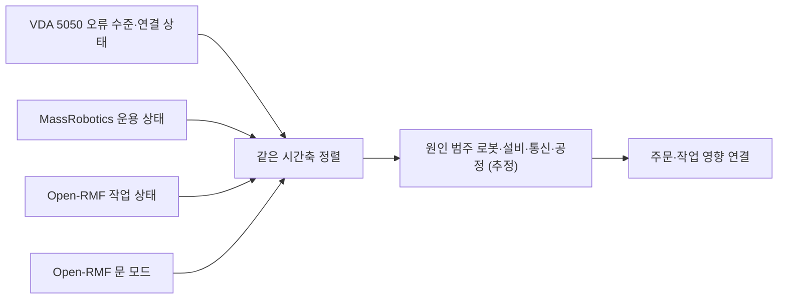

(너의 규칙은 시스템 프롬프트의 agents/shared-rules.md 와 agents/verifier.md 이다. 아래는 이번 실행의 컨텍스트와 입력이다.)

## 실행 컨텍스트

- run_id: 2026-09-25-48
- date: 2026-09-25
- run_type: area_deep_dive (영역 심화)
- 대상: 19. 모니터링·이상 탐지·원인 분석 (E. 협업·현장 운영)
- 예산:
    - max_search_queries: 30
    - max_sources_per_run: 15
    - new_topic_pages: 1
    - page_updates: 2
    - max_retries: 2
- 환경 알림: web_fetch_available: false · fetch_mode: mirror_only (일반 웹 페이지 열람은 네트워크 정책으로 막혀 있다. raw.githubusercontent.com 은 열린다: 공식 문서가 GitHub 에 있는 출처는 입력의 config/source_mirrors.yaml 경로를 WebFetch 로 열어 원문을 읽고 sources[].fetched=true, fetched_via=github_raw, fetch_url 을 적는다. 입력에 원문 텍스트(data/source_texts)가 있는 출처는 fetched_via=inbox. 그 밖의 출처는 fetched=false 이며 코드가 신뢰도 상한(medium)을 강제한다 — 공통 규칙 0절 6항)
- 언어: ko
- verification_stage: second
- verifier_budget:
    - max_search_queries: 30
    - max_sources_per_run: 15
    - new_topic_pages: 1
    - page_updates: 2
    - max_retries: 2

## 입력

### runs/2026-09-25-48/target.json

```json
{
  "run_id": "2026-09-25-48",
  "date": "2026-09-25",
  "weekday": "Fri",
  "run_number": 48,
  "run_type": "area_deep_dive",
  "forced": true,
  "target": {
    "area_no": 19,
    "area_name": "19. 모니터링·이상 탐지·원인 분석",
    "category": "E. 협업·현장 운영",
    "category_letter": "E"
  },
  "topic": null,
  "track": null,
  "corrections": [],
  "budget": {
    "max_search_queries": 30,
    "max_sources_per_run": 15,
    "new_topic_pages": 1,
    "page_updates": 2,
    "max_retries": 2
  },
  "priority_reason": null,
  "priority_questions": [],
  "excluded_areas": [],
  "lifted_areas": [],
  "deferred": {
    "monthly_recheck": false,
    "weekly_review": false
  },
  "selection_rationale": "CLI 지정 run_type=area_deep_dive, area=19"
}
```

### runs/2026-09-25-48/research.json

```json
{
  "run_id": "2026-09-25-48",
  "date": "2026-09-25",
  "run_type": "area_deep_dive",
  "target": {
    "area_no": 19,
    "area_name": "19. 모니터링·이상 탐지·원인 분석",
    "category": "E. 협업·현장 운영"
  },
  "gaps": [
    "섹션 3. 왜 중요한가 비어 있음",
    "섹션 4. 핵심 개념과 용어 비어 있음",
    "섹션 5. 현장 시나리오 비어 있음 — 지연 원인(로봇·문·앞 공정) 구분 시나리오 필요",
    "섹션 6. 대표 접근법과 기술 비어 있음",
    "섹션 7. 관련 표준·프레임워크·오픈소스 비어 있음",
    "섹션 8. 대표 연구와 자료 비어 있음",
    "섹션 9. ROP가 직접 맡는 것과 외부와 연계하는 것 비어 있음",
    "섹션 10. 다른 연구영역과의 연결 비어 있음",
    "섹션 11. 열린 질문 비어 있음 — 기존 oq-018, oq-033 관련"
  ],
  "research_questions": [
    "지연 원인이 로봇 고장인지, 문인지, 앞 공정인지 어떻게 찾을까? [분류원문]",
    "로봇–관제 인터페이스 표준(VDA 5050, MassRobotics)과 Open-RMF 는 오류·운용 상태·연결 상태·설비(문) 상태·작업 지연을 어떤 필드와 값으로 보고하는가? (섹션 6·7 겨냥)",
    "oq-033 Open-RMF 로봇 상태, VDA 5050 action 상태·오류, MassRobotics 운용 상태를 하나의 공통 상태·오류 어휘로 옮기는 표준 매핑이나 공개 구현이 있는가? (섹션 7·11 겨냥)",
    "oq-018 이동로봇·작업대·승강기가 섞인 창고 흐름에 활성 구간 기반 이동 병목 탐지나 객체 중심 프로세스 마이닝을 적용한 연구가 있는가? (섹션 6·8 겨냥)",
    "로그·지표·추적을 연결하는 관측(observability) 오픈소스와 로봇 진단 도구에는 무엇이 있는가? (섹션 4·7 겨냥)",
    "다중 로봇 고장 탐지·진단, 근본 원인 분석 연구와 LLM 기반 실패 설명(27. AI·학습·적응과 모델 운영 교차)은 무엇을 제공하는가? (섹션 6·8 겨냥)",
    "국내 물류 로봇 관제·이상 대응 연구는 무엇이 있고, ROP 직접 범위와 연계 대상(로봇 내부 진단)의 경계는 어디인가? (섹션 8·9 겨냥)"
  ],
  "findings": [
    {
      "id": "f1",
      "claim": "VDA 5050 최신판 상태(state) 스키마의 오류 객체는 errorType 과 errorLevel 을 필수로 두며, errorLevel 은 WARNING·URGENT·CRITICAL·FATAL 네 값으로 로봇이 현재 주문을 계속할 수 있는지와 새 주문을 받을 수 있는지를 구분한다.",
      "tag": "사실",
      "source_ids": [
        "ref-051"
      ],
      "cross_checked": false,
      "confidence": "medium",
      "evidence_excerpt": "CRITICAL: Immediate attention required, mobile robot is unable to continue active order, but can accept new order. FATAL 은 사용자 개입 필요·새 주문 불가 (main 브랜치 state.schema, 3.0.0 판)",
      "as_of": "2026-09-25",
      "flow_step": null,
      "flow_item": "예외·성과"
    },
    {
      "id": "f2",
      "claim": "VDA 5050 최신판 상태 스키마는 오류와 관련된 nodeId·edgeId·orderId·actionId 등을 가리키는 errorReferences, 사람이 읽는 설명(errorDescription)과 조치 힌트(errorHint)를 둘 수 있게 하고, 오류와 별도로 INFO·DEBUG 수준의 information 배열을 둔다.",
      "tag": "사실",
      "source_ids": [
        "ref-051"
      ],
      "cross_checked": false,
      "confidence": "medium",
      "evidence_excerpt": "errorReferences: 오류 관련 정보를 주는 참조 배열(예: nodeId, edgeId, orderId, actionId). information 의 infoLevel 은 INFO(시각화용)·DEBUG(디버깅용)",
      "as_of": "2026-09-25",
      "flow_step": null,
      "flow_item": "예외·성과"
    },
    {
      "id": "f3",
      "claim": "VDA 5050 3.0.0 명세는 실패한 동작(actionStatus FAILED)이 해당하는 오류 보고와 대응하도록 설명하며, 예로 집기·내려놓기 실패를 든다.",
      "tag": "사실",
      "source_ids": [
        "ref-031"
      ],
      "cross_checked": false,
      "confidence": "medium",
      "evidence_excerpt": "실패한 pick·drop 동작은 상태 메시지의 오류 항목과 대응해야 한다는 취지(요약 도구 경유 원문 열람, 명세 문구와 글자 단위 대조 미확인)",
      "as_of": "2026-09-25",
      "flow_step": null,
      "flow_item": "예외·성과"
    },
    {
      "id": "f4",
      "claim": "VDA 5050 connection 토픽은 로봇의 마지막 유언(last will) 메시지로, 정상 종료(OFFLINE)와 예기치 않은 연결 끊김(CONNECTION_BROKEN)을 구분해 관제에 알린다.",
      "tag": "사실",
      "source_ids": [
        "ref-506"
      ],
      "cross_checked": false,
      "confidence": "medium",
      "evidence_excerpt": "CONNECTION_BROKEN: The connection between mobile robot and broker has unexpectedly ended. 그 밖에 ONLINE, OFFLINE, HIBERNATING",
      "as_of": "2026-09-25",
      "flow_step": null,
      "flow_item": "예외·성과"
    },
    {
      "id": "f5",
      "claim": "MassRobotics AMR 상호운용 표준의 상태 보고는 운용 상태(operationalState)에 navigating·idle·disabled·offline·charging 외에 waitingHumanEvent·waitingExternalEvent·waitingInternalEvent·manualOverride 를 두어 대기 원인을 사람·외부·내부 사건으로 나누고, 정상 운용 때는 생략하는 errorCodes 배열을 둔다.",
      "tag": "사실",
      "source_ids": [
        "ref-230"
      ],
      "cross_checked": false,
      "confidence": "medium",
      "evidence_excerpt": "operationalState 열거값 9개. errorCodes 는 현재 오류 상태를 나타내는 문자열 식별자 배열이며 정상 운용 때 생략(공식 저장소 JSON 스키마)",
      "as_of": "2026-09-25",
      "flow_step": null,
      "flow_item": "예외·성과"
    },
    {
      "id": "f6",
      "claim": "Open-RMF 에서 문 노드는 문 상태(DoorState)를 /door_states 토픽으로 발행하고, 문 모드(DoorMode)는 closed·moving·open·offline·unknown 다섯 값이다.",
      "tag": "사실",
      "source_ids": [
        "ref-313",
        "ref-283"
      ],
      "cross_checked": false,
      "confidence": "medium",
      "evidence_excerpt": "MODE_CLOSED=0, MODE_MOVING=1, MODE_OPEN=2, MODE_OFFLINE=3, MODE_UNKNOWN=4 (rmf_door_msgs). 문 노드가 DoorState 를 /door_states 로 발행(두 출처 모두 Open-RMF 계열이라 독립 아님)",
      "as_of": "2026-09-25",
      "flow_step": "보충",
      "flow_item": "제약"
    },
    {
      "id": "f7",
      "claim": "Open-RMF 문 어댑터는 플릿 어댑터의 문 요청을 받아 진행 중인 로봇 작업을 방해하지 않을 때만 문을 움직이게 하는 상태 감독자 역할을 한다.",
      "tag": "사실",
      "source_ids": [
        "ref-283"
      ],
      "cross_checked": false,
      "confidence": "medium",
      "evidence_excerpt": "acts like a state supervisor ensuring that the doors are not acting on requests that might obstruct an ongoing mobile robot task",
      "as_of": "2026-09-25",
      "flow_step": "보충",
      "flow_item": "제약"
    },
    {
      "id": "f8",
      "claim": "Open-RMF 작업 상태(task_state) 스키마는 작업·단계·이벤트 상태 토큰으로 blocked·delayed·error·failed·underway·completed 등을 두고, 완료 예상 시간(estimate_millis), 중단 기록(interruptions), 배정 상태(failed_to_assign 등)를 함께 기록한다.",
      "tag": "사실",
      "source_ids": [
        "ref-111"
      ],
      "cross_checked": false,
      "confidence": "medium",
      "evidence_excerpt": "status: uninitialized, blocked, error, failed, queued, standby, underway, delayed, skipped, canceled, killed, completed. 값별 설명은 스키마에 없음",
      "as_of": "2026-09-25",
      "flow_step": null,
      "flow_item": "예외·성과"
    },
    {
      "id": "f9",
      "claim": "Open-RMF 경보 메시지(rmf_task_msgs Alert)는 심각도 등급(INFO·WARNING·ERROR), 운영자가 고를 수 있는 응답 목록, 관련 작업 id 를 담는다.",
      "tag": "사실",
      "source_ids": [
        "ref-503"
      ],
      "cross_checked": false,
      "confidence": "medium",
      "evidence_excerpt": "tier: TIER_INFO=0, TIER_WARNING=1, TIER_ERROR=2; responses_available; task_id (관련 작업이 없으면 비움)",
      "as_of": "2026-09-25",
      "flow_step": null,
      "flow_item": "예외·성과"
    },
    {
      "id": "f10",
      "claim": "f1~f9 에 따르면 분류 원문의 질문(지연 원인이 로봇·문·앞 공정 중 무엇인가)은 작업 상태의 지연·차단(Open-RMF), 로봇 오류 수준과 연결 끊김(VDA 5050), 외부 사건 대기(MassRobotics), 문 모드(Open-RMF)를 같은 시간축에 맞춰 보는 방식으로 접근할 수 있어 보이나, 세 어휘가 서로 달라 ROP 가 자체 원인 범주로 옮기는 매핑이 필요할 것으로 보인다.",
      "tag": "추정",
      "source_ids": [
        "ref-051",
        "ref-506",
        "ref-230",
        "ref-313",
        "ref-111"
      ],
      "cross_checked": false,
      "confidence": "low",
      "evidence_excerpt": "각 출처는 자기 필드만 정의하고 서로 간 대응표는 두지 않음(이번 실행에서 공통 매핑 표준 미발견, oq-033 유지)",
      "as_of": "2026-09-25",
      "flow_step": "보충",
      "flow_item": "예외·성과"
    },
    {
      "id": "f11",
      "claim": "ROS 2 diagnostics 는 하드웨어 드라이버가 /diagnostics 토픽에 DiagnosticArray 로 진단 정보를 발행하게 하고, diagnostic_updater(발행 도우미), diagnostic_aggregator(플러그인 규칙으로 집계), diagnostic_remote_logging(InfluxDB 등 원격 전송) 등의 패키지를 제공한다.",
      "tag": "사실",
      "source_ids": [
        "ref-500"
      ],
      "cross_checked": false,
      "confidence": "medium",
      "evidence_excerpt": "collects information about hardware drivers and robot hardware to make them available to users and operators",
      "as_of": "2026-09-25",
      "flow_step": null,
      "flow_item": null
    },
    {
      "id": "f12",
      "claim": "ros2_tracing 은 LTTng 기반으로 ROS 2 핵심 패키지에 추적 지점(tracepoint)을 넣고 실행 시 추적을 설정하는 도구를 제공하는 저오버헤드 추적 프레임워크이다.",
      "tag": "사실",
      "source_ids": [
        "ref-501"
      ],
      "cross_checked": false,
      "confidence": "medium",
      "evidence_excerpt": "README 가 Bédard·Lütkebohle·Dagenais(2022, IEEE RA-L) ros2_tracing: Multipurpose Low-Overhead Framework for Real-Time Tracing of ROS 2 를 인용",
      "as_of": "2026-09-25",
      "flow_step": null,
      "flow_item": null
    },
    {
      "id": "f13",
      "claim": "OpenTelemetry 명세는 추적(traces)·지표(metrics)·로그(logs)·배기지(baggage) 신호를 정의하고, 추적을 부모–자식 관계의 스팬(span)으로 이루어진 방향 비순환 그래프로 보며, TraceId·SpanId 로 신호를 서로 연결한다.",
      "tag": "사실",
      "source_ids": [
        "ref-502"
      ],
      "cross_checked": false,
      "confidence": "medium",
      "evidence_excerpt": "a Trace can be thought of as a directed acyclic graph (DAG) of Spans",
      "as_of": "2026-09-25",
      "flow_step": null,
      "flow_item": null
    },
    {
      "id": "f14",
      "claim": "주문 id·작업 id·로봇 동작 id 를 하나의 추적 문맥으로 묶으면(OpenTelemetry 식 추적과 VDA 5050 errorReferences 의 orderId·actionId) 로봇 오류를 해당 주문 지연과 연결할 수 있을 것으로 보이나, 물류 로봇 관제에 적용한 공개 사례는 이번 실행에서 확인하지 못했다.",
      "tag": "추정",
      "source_ids": [
        "ref-502",
        "ref-051"
      ],
      "cross_checked": false,
      "confidence": "low",
      "evidence_excerpt": "f2·f13 을 결합한 추론. 적용 사례 미확인",
      "as_of": "2026-09-25",
      "flow_step": null,
      "flow_item": "예외·성과"
    },
    {
      "id": "f15",
      "claim": "Khalastchi·Kalech(Sensors, 2019)의 설문 논문은 다중 로봇 시스템의 속성이 고장 탐지·진단(FDD)에 서로 다른 어려움을 준다고 보고 적용 가능한 FDD 접근을 정리하며, 계획 진단에서 실패한 동작을 찾는 1차 진단과 그 근본 원인(에이전트·장비)을 찾는 2차 진단을 구분한다.",
      "tag": "사실",
      "source_ids": [
        "ref-509"
      ],
      "cross_checked": false,
      "confidence": "medium",
      "evidence_excerpt": "primary plan diagnosis identifies failed execution of actions; secondary plan diagnosis identifies the root cause (검색 요약 기준)",
      "as_of": "2019",
      "flow_step": null,
      "flow_item": "예외·성과",
      "source_unopened": true
    },
    {
      "id": "f16",
      "claim": "Roser·Nakano·Tanaka(WSC 2003)는 무인운반차(AGV) 시스템에서 가동률·대기 시간 기반 병목 탐지와 자신들의 이동 병목(shifting bottleneck) 탐지 방법을 비교해, 기존 두 방법은 주 병목을 안정적으로 찾지 못할 때가 있다고 보고한다.",
      "tag": "사실",
      "source_ids": [
        "ref-510"
      ],
      "cross_checked": false,
      "confidence": "medium",
      "evidence_excerpt": "utilization, waiting time 방식과 활성 구간(active period) 기반 이동 병목 탐지 비교, AGV 시뮬레이션 (검색 요약 기준)",
      "as_of": "2003",
      "flow_step": null,
      "flow_item": "예외·성과",
      "source_unopened": true
    },
    {
      "id": "f17",
      "claim": "Soldani·Brogi(ACM Computing Surveys, 2022)는 다중 서비스 클라우드 응용의 이상 탐지와 실패 근본 원인 분석 기법을 정리하며, 로그에서 서비스 간 인과 그래프를 도출해 원인을 좁히는 접근을 포함한다.",
      "tag": "사실",
      "source_ids": [
        "ref-511"
      ],
      "cross_checked": false,
      "confidence": "medium",
      "evidence_excerpt": "로그를 처리해 causality graph(정점=서비스, 방향 간선=이상 전파 가능성)를 도출 (검색 요약 기준, 로봇 분야 적용은 아님)",
      "as_of": "2022",
      "flow_step": null,
      "flow_item": null,
      "source_unopened": true
    },
    {
      "id": "f18",
      "claim": "REFLECT(Liu 외, CoRL 2023)는 영상·소리·로봇 상태 같은 다중 감각 관측을 계층적 경험 요약으로 바꾼 뒤 LLM 에 실패 원인 설명과 수정 계획을 묻는 방법으로, 실행 실패와 계획 실패를 모두 다룬다.",
      "tag": "사실",
      "source_ids": [
        "ref-512"
      ],
      "cross_checked": false,
      "confidence": "medium",
      "evidence_excerpt": "hierarchical summary of robot past experiences generated from multisensory observations. 가정용 조작 과제 기준이며 물류 현장 평가는 없음(검색 요약 기준)",
      "as_of": "2023",
      "flow_step": null,
      "flow_item": "예외·성과",
      "source_unopened": true
    },
    {
      "id": "f19",
      "claim": "공급망 관리(SCM)에서 프로세스 마이닝의 현황·활용 사례·연구 전망을 정리한 리뷰 논문이 International Journal of Production Research(2024)에 게재되었다.",
      "tag": "사실",
      "source_ids": [
        "ref-513"
      ],
      "cross_checked": false,
      "confidence": "medium",
      "evidence_excerpt": "Process mining in supply chain management: state-of-the-art, use cases and research outlook (DOI 10.1080/00207543.2024.2412285, 검색 요약 기준, 본문 내 로봇 흐름 사례 여부 미확인)",
      "as_of": "2024",
      "flow_step": null,
      "flow_item": null,
      "source_unopened": true
    },
    {
      "id": "f20",
      "claim": "국내 연구(DBpia, 2026-07)는 다중 AMR 운영용 웹 기반 사용자 중심 관제 인터페이스를 가상 테스트베드에서 피험자 10명으로 예비 평가해, 대조군 대비 이상 대응 시간이 39.6% 단축되었다고 보고한다.",
      "tag": "사실",
      "source_ids": [
        "ref-514"
      ],
      "cross_checked": false,
      "confidence": "low",
      "evidence_excerpt": "인지시간 41.8%, 이상 대응 시간 39.6%, 전체 작업 처리 시간 20.4% 단축, 관제 정확도 95.1% (탐색적 예비 연구, 가상 테스트베드, 검색 요약 기준)",
      "as_of": "2026-07",
      "flow_step": null,
      "flow_item": "예외·성과",
      "source_unopened": true
    },
    {
      "id": "f21",
      "claim": "연계 대상: 센서·모터·드라이버 수준의 진단(ROS 2 diagnostics 같은 로봇 내부 진단)과 개별 부품 고장 진단은 로봇 제조사 영역이며, 이종 로봇을 연결하는 ROP 는 표준 인터페이스가 보고하는 오류 수준·연결 상태·설비 상태·작업 상태를 모아 원인 범주(로봇·설비·통신·공정)로 구분하고 업무 영향과 연결하는 부분을 맡는 경계가 될 것으로 보인다.",
      "tag": "추정",
      "source_ids": [
        "ref-500",
        "ref-051",
        "ref-506",
        "ref-111"
      ],
      "cross_checked": false,
      "confidence": "low",
      "evidence_excerpt": "분류 원문 9장 로봇 자체 지능·제어 경계를 f1·f4·f8·f11 에 적용한 추론",
      "as_of": "2026-09-25",
      "flow_step": null,
      "flow_item": "예외·성과"
    }
  ],
  "sources": [
    {
      "id": "ref-031",
      "org": "VDA / VDMA (VDA5050 GitHub)",
      "title": "VDA5050/VDA5050_EN.md — Official Specification document for the VDA 5050",
      "published": null,
      "url": "https://github.com/VDA5050/VDA5050/blob/main/VDA5050_EN.md",
      "type": "표준",
      "reliability": "high",
      "accessed": "2026-09-25",
      "summary": "VDA 5050 공식 저장소 main 브랜치의 명세 원문(3.0.0 판). 오류 처리와 동작 상태의 관계 확인.",
      "fetched": true,
      "fetched_via": "github_raw",
      "fetch_url": "https://raw.githubusercontent.com/VDA5050/VDA5050/main/VDA5050_EN.md",
      "source_unopened": false
    },
    {
      "id": "ref-051",
      "org": "VDA / VDMA (VDA5050 GitHub)",
      "title": "VDA5050/VDA5050 — json_schemas/state.schema",
      "published": null,
      "url": "https://github.com/VDA5050/VDA5050/blob/main/json_schemas/state.schema",
      "type": "표준",
      "reliability": "high",
      "accessed": "2026-09-25",
      "summary": "VDA 5050 상태 메시지 JSON 스키마. 오류 객체·errorLevel·information 배열 확인.",
      "fetched": true,
      "fetched_via": "github_raw",
      "fetch_url": "https://raw.githubusercontent.com/VDA5050/VDA5050/main/json_schemas/state.schema",
      "source_unopened": false
    },
    {
      "id": "ref-500",
      "org": "ROS (ros/diagnostics GitHub)",
      "title": "diagnostics — README (ros2 branch)",
      "published": null,
      "url": "https://github.com/ros/diagnostics/blob/ros2/README.md",
      "type": "오픈소스 문서",
      "reliability": "high",
      "accessed": "2026-09-25",
      "summary": "ROS 2 진단 체계(/diagnostics 토픽, updater, aggregator, 원격 로깅, self_test) 구성 설명.",
      "fetched": true,
      "fetched_via": "github_raw",
      "fetch_url": "https://raw.githubusercontent.com/ros/diagnostics/ros2/README.md",
      "source_unopened": false
    },
    {
      "id": "ref-501",
      "org": "ROS 2 (ros2/ros2_tracing GitHub)",
      "title": "ros2_tracing — README",
      "published": null,
      "url": "https://github.com/ros2/ros2_tracing",
      "type": "오픈소스 문서",
      "reliability": "high",
      "accessed": "2026-09-25",
      "summary": "LTTng 기반 ROS 2 추적 계측과 설정 도구 설명, 관련 논문(IEEE RA-L 2022) 인용.",
      "fetched": true,
      "fetched_via": "github_raw",
      "fetch_url": "https://raw.githubusercontent.com/ros2/ros2_tracing/rolling/README.md",
      "source_unopened": false
    },
    {
      "id": "ref-502",
      "org": "OpenTelemetry (CNCF)",
      "title": "OpenTelemetry Specification — Overview",
      "published": null,
      "url": "https://github.com/open-telemetry/opentelemetry-specification/blob/main/specification/overview.md",
      "type": "오픈소스 문서",
      "reliability": "high",
      "accessed": "2026-09-25",
      "summary": "추적·지표·로그·배기지 신호와 스팬·추적 정의, 문맥 전파(TraceId·SpanId) 설명.",
      "fetched": true,
      "fetched_via": "github_raw",
      "fetch_url": "https://raw.githubusercontent.com/open-telemetry/opentelemetry-specification/main/specification/overview.md",
      "source_unopened": false
    },
    {
      "id": "ref-503",
      "org": "Open Robotics (open-rmf/rmf_internal_msgs)",
      "title": "rmf_task_msgs/msg/Alert.msg",
      "published": null,
      "url": "https://github.com/open-rmf/rmf_internal_msgs/blob/main/rmf_task_msgs/msg/Alert.msg",
      "type": "오픈소스 문서",
      "reliability": "high",
      "accessed": "2026-09-25",
      "summary": "Open-RMF 경보 메시지 정의(심각도 등급, 응답 목록, 관련 작업 id).",
      "fetched": true,
      "fetched_via": "github_raw",
      "fetch_url": "https://raw.githubusercontent.com/open-rmf/rmf_internal_msgs/main/rmf_task_msgs/msg/Alert.msg",
      "source_unopened": false
    },
    {
      "id": "ref-313",
      "org": "Open Robotics (open-rmf/rmf_internal_msgs)",
      "title": "rmf_door_msgs/msg/DoorMode.msg",
      "published": null,
      "url": "https://github.com/open-rmf/rmf_internal_msgs/blob/main/rmf_door_msgs/msg/DoorMode.msg",
      "type": "오픈소스 문서",
      "reliability": "high",
      "accessed": "2026-09-25",
      "summary": "Open-RMF 문 모드 값(closed, moving, open, offline, unknown) 정의.",
      "fetched": true,
      "fetched_via": "github_raw",
      "fetch_url": "https://raw.githubusercontent.com/open-rmf/rmf_internal_msgs/main/rmf_door_msgs/msg/DoorMode.msg",
      "source_unopened": false
    },
    {
      "id": "ref-111",
      "org": "Open Robotics (open-rmf/rmf_api_msgs)",
      "title": "rmf_api_msgs/schemas/task_state.json",
      "published": null,
      "url": "https://github.com/open-rmf/rmf_api_msgs/blob/main/rmf_api_msgs/schemas/task_state.json",
      "type": "오픈소스 문서",
      "reliability": "high",
      "accessed": "2026-09-25",
      "summary": "Open-RMF 작업 상태 JSON 스키마. 상태 토큰(blocked, delayed 등), 예상 시간, 중단, 배정 상태.",
      "fetched": true,
      "fetched_via": "github_raw",
      "fetch_url": "https://raw.githubusercontent.com/open-rmf/rmf_api_msgs/main/rmf_api_msgs/schemas/task_state.json",
      "source_unopened": false
    },
    {
      "id": "ref-506",
      "org": "VDA / VDMA (VDA5050 GitHub)",
      "title": "VDA5050/VDA5050 — json_schemas/connection.schema",
      "published": null,
      "url": "https://github.com/VDA5050/VDA5050/blob/main/json_schemas/connection.schema",
      "type": "표준",
      "reliability": "high",
      "accessed": "2026-09-25",
      "summary": "VDA 5050 connection 토픽(last will) 스키마. 연결 상태 네 값 정의.",
      "fetched": true,
      "fetched_via": "github_raw",
      "fetch_url": "https://raw.githubusercontent.com/VDA5050/VDA5050/main/json_schemas/connection.schema",
      "source_unopened": false
    },
    {
      "id": "ref-230",
      "org": "MassRobotics (MassRobotics-AMR/AMR_Interop_Standard)",
      "title": "AMR_Interop_Standard.json",
      "published": null,
      "url": "https://github.com/MassRobotics-AMR/AMR_Interop_Standard/blob/main/AMR_Interop_Standard.json",
      "type": "표준",
      "reliability": "high",
      "accessed": "2026-09-25",
      "summary": "MassRobotics AMR 상호운용 표준 JSON 스키마. 운용 상태 열거값, errorCodes, 배터리·위치 필드.",
      "fetched": true,
      "fetched_via": "github_raw",
      "fetch_url": "https://raw.githubusercontent.com/MassRobotics-AMR/AMR_Interop_Standard/main/AMR_Interop_Standard.json",
      "source_unopened": false
    },
    {
      "id": "ref-283",
      "org": "Open Robotics (osrf/ros2multirobotbook)",
      "title": "Programming Multiple Robots with ROS 2 — Doors",
      "published": null,
      "url": "https://osrf.github.io/ros2multirobotbook/integration_doors.html",
      "type": "오픈소스 문서",
      "reliability": "high",
      "accessed": "2026-09-25",
      "summary": "Open-RMF 문 연동: 문 노드의 상태 발행과 문 어댑터의 감독 역할.",
      "fetched": true,
      "fetched_via": "github_raw",
      "fetch_url": "https://raw.githubusercontent.com/osrf/ros2multirobotbook/master/src/integration_doors.md",
      "source_unopened": false
    },
    {
      "id": "ref-509",
      "org": "Khalastchi, E., & Kalech, M.",
      "title": "Fault Detection and Diagnosis in Multi-Robot Systems: A Survey",
      "published": "2019",
      "url": "https://doi.org/10.3390/s19184019",
      "type": "논문",
      "reliability": "medium",
      "accessed": "2026-09-25",
      "summary": "원문 미열람. Sensors 19(18):4019. 다중 로봇 시스템의 고장 탐지·진단 과제와 접근을 정리한 설문.",
      "source_unopened": true,
      "fetched": false,
      "fetched_via": null,
      "fetch_url": null
    },
    {
      "id": "ref-510",
      "org": "Roser, C., Nakano, M., & Tanaka, M.",
      "title": "Comparison of bottleneck detection methods for AGV systems",
      "published": "2003",
      "url": "https://keio.elsevierpure.com/en/publications/comparison-of-bottleneck-detection-methods-for-agv-systems/",
      "type": "논문",
      "reliability": "medium",
      "accessed": "2026-09-25",
      "summary": "원문 미열람. Winter Simulation Conference 2003. AGV 시스템에서 가동률·대기 시간·이동 병목 탐지 방법 비교.",
      "source_unopened": true,
      "fetched": false,
      "fetched_via": null,
      "fetch_url": null
    },
    {
      "id": "ref-511",
      "org": "Soldani, J., & Brogi, A.",
      "title": "Anomaly Detection and Failure Root Cause Analysis in (Micro) Service-Based Cloud Applications: A Survey",
      "published": "2022",
      "url": "https://dl.acm.org/doi/full/10.1145/3501297",
      "type": "논문",
      "reliability": "medium",
      "accessed": "2026-09-25",
      "summary": "원문 미열람. ACM Computing Surveys 55(3). 다중 서비스 응용의 이상 탐지·근본 원인 분석 기법 설문.",
      "source_unopened": true,
      "fetched": false,
      "fetched_via": null,
      "fetch_url": null
    },
    {
      "id": "ref-512",
      "org": "Liu, Z., Bahety, A., & Song, S.",
      "title": "REFLECT: Summarizing Robot Experiences for Failure Explanation and Correction",
      "published": "2023",
      "url": "https://arxiv.org/abs/2306.15724",
      "type": "논문",
      "reliability": "medium",
      "accessed": "2026-09-25",
      "summary": "원문 미열람. CoRL 2023(PMLR v229). 다중 감각 경험 요약과 LLM 으로 로봇 실패를 설명·수정하는 방법.",
      "source_unopened": true,
      "fetched": false,
      "fetched_via": null,
      "fetch_url": null
    },
    {
      "id": "ref-513",
      "org": "Leopold, H. 외(International Journal of Production Research)",
      "title": "Process mining in supply chain management: state-of-the-art, use cases and research outlook",
      "published": "2024",
      "url": "https://www.tandfonline.com/doi/full/10.1080/00207543.2024.2412285",
      "type": "논문",
      "reliability": "medium",
      "accessed": "2026-09-25",
      "summary": "원문 미열람. SCM 분야 프로세스 마이닝 현황·활용 사례·연구 전망 리뷰. 공저자 전체 미확인.",
      "source_unopened": true,
      "fetched": false,
      "fetched_via": null,
      "fetch_url": null
    },
    {
      "id": "ref-514",
      "org": "DBpia 게재 논문(저자 미확인)",
      "title": "다중 자율이동로봇 (AMR) 운영을 위한 웹 기반 사용자 중심 관제 인터페이스 설계 연구",
      "published": "2026-07",
      "url": "https://www.dbpia.co.kr/journal/articleDetail?nodeId=NODE12892366",
      "type": "논문",
      "reliability": "medium",
      "accessed": "2026-09-25",
      "summary": "원문 미열람. 다중 AMR 관제 인터페이스를 가상 테스트베드와 피험자 10명 예비 연구로 평가한 국내 논문.",
      "source_unopened": true,
      "fetched": false,
      "fetched_via": null,
      "fetch_url": null
    }
  ],
  "page_proposals": [
    {
      "action": "update",
      "path": "docs/categories/e-collaboration-and-field-operations/19-monitoring-anomaly-detection-and-root-cause-analysis.md",
      "sections": [
        "3",
        "4",
        "5",
        "6",
        "7",
        "8",
        "9",
        "10",
        "11"
      ],
      "rationale": "3절: f10·f16·f20(지연 원인 구분과 병목 탐지의 필요) / 4절: f1(오류 수준), f4(연결 끊김), f13(추적·스팬), f15(FDD 1차·2차 진단), f16(이동 병목) / 5절: 보충 단계에서 문 대기로 AMR 이 지연되는 시나리오 f5·f6·f7·f8·f10 (제약·예외·성과) / 6절: 상태·오류 어휘의 시간축 결합 f10, 추적 문맥 연결 f14, 병목 탐지 f16, 근본 원인 분석 f15·f17, LLM 실패 설명 f18(27. AI·학습·적응과 모델 운영과 양쪽 연결) / 7절: VDA 5050 f1~f4, MassRobotics f5, Open-RMF f6~f9, ROS 2 diagnostics f11, ros2_tracing f12, OpenTelemetry f13 / 8절: f15~f20 / 9절: f21(로봇 내부 진단은 연계 대상) / 10절: 9. 로봇·제조사 관제 연동(f1~f5), 10. 설비·건물 시스템 연동(f6·f7), 12. 명령·작업 실행의 신뢰성(f3·f8), 4. 성과·경제성·프로세스 개선(f16·f19, oq-018), 18. 사람–로봇 협업·운영 인터페이스(f9·f20), 20. 예외 복구·재계획·업무 연속성(f1·f9), 8. 실시간 세계 상태·데이터 일관성(f10, 현재 상태 표현), 27. AI·학습·적응과 모델 운영(f18) / 11절: oq-018·oq-033 과 새 질문 3건"
    }
  ],
  "glossary_candidates": [
    {
      "term_ko": "근본 원인 분석",
      "term_en": "Root Cause Analysis (RCA)",
      "definition": "관측된 이상이나 실패를 일으킨 가장 근원적인 원인(구성 요소·사건)을 찾아내는 분석이다."
    },
    {
      "term_ko": "고장 탐지·진단",
      "term_en": "Fault Detection and Diagnosis (FDD)",
      "definition": "시스템에 고장이 생겼음을 알아내고(탐지) 그 종류와 위치·원인을 밝히는(진단) 기법의 총칭이다."
    },
    {
      "term_ko": "이동 병목 탐지",
      "term_en": "Shifting Bottleneck Detection (Active Period Method)",
      "definition": "각 설비·차량이 끊김 없이 활성 상태로 있는 구간의 길이로 시점마다 병목을 판정하고 병목의 이동을 추적하는 방법이다."
    },
    {
      "term_ko": "분산 추적",
      "term_en": "Distributed Tracing",
      "definition": "하나의 요청이 여러 구성 요소를 거치는 과정을 공통 추적 id 로 묶은 스팬들의 그래프로 기록하는 관측 기법이다."
    }
  ],
  "open_questions_new": [
    "VDA 5050 3.0 의 네 단계 오류 수준(WARNING·URGENT·CRITICAL·FATAL)과 2.x 의 두 단계(WARNING·FATAL)가 섞인 이종 플릿에서 오류 수준을 어떻게 맞춰 해석하는가? | 관련 영역: 19. 모니터링·이상 탐지·원인 분석, 9. 로봇·제조사 관제 연동 | 근거: f1 | 종류: 일반",
    "물류 로봇 작업 지연을 로봇·설비·통신·공정 원인으로 나누는 공개 원인 분류 체계나 현장 데이터셋이 있는가? | 관련 영역: 19. 모니터링·이상 탐지·원인 분석, 4. 성과·경제성·프로세스 개선 | 근거: f10 | 종류: 일반",
    "국내 물류센터에서 로봇 정지·지연의 원인별 발생 비율이나 이상 대응 시간을 실측해 공개한 자료가 있는가? | 관련 영역: 19. 모니터링·이상 탐지·원인 분석, 20. 예외 복구·재계획·업무 연속성 | 근거: f20 | 종류: 일반"
  ],
  "open_questions_resolved": [],
  "self_check": {
    "source_count": 17,
    "cross_checked_count": 0,
    "unverified": [
      "f3 VDA 5050 명세의 동작 실패–오류 대응 문구는 요약 도구 경유로 읽어 원문 문구와 글자 단위 대조 미확인",
      "f15~f20 논문 원문 미열람(검색 요약 기준)",
      "f20 국내 논문 저자 미확인, 수치는 피험자 10명 가상 테스트베드 예비 연구 조건",
      "ref-513 공저자 전체 미확인",
      "oq-018 미해결: AGV 병목 탐지(f16)와 SCM 프로세스 마이닝 리뷰(f19)는 찾았으나 이동로봇·작업대·승강기 혼합 흐름 적용 연구는 미발견",
      "oq-033 미해결: 세 어휘 공통 매핑 표준·공개 구현 미발견(ros_amr_interop 의 MassRobotics 송신기는 YAML 로 ROS 2 데이터를 매핑하나 오류·상태 어휘 매핑 설명 없음)",
      "모든 finding 교차 확인 없음"
    ],
    "scope_violations": [
      "f21: 센서·모터·드라이버 진단은 분류 원문 9장 로봇 자체 지능·제어 연계 영역이므로 연계 대상으로 표시",
      "f7: 문 제어 자체는 시설·설비 제어 연계 영역이며 ROP 는 문 상태 확인·요청만 다룬다는 구분 필요",
      "f20: 논문의 디지털 트윈은 실시간 상태 표시(8. 실시간 세계 상태·데이터 일관성)이며 22. 시뮬레이션·예측용 디지털 트윈과 섞지 않도록 주의"
    ],
    "budget_used": {
      "queries": 25,
      "sources": 15
    },
    "limits": "web_fetch_available: false, fetch_mode mirror_only. raw.githubusercontent.com 으로 연 출처: 재사용 ref-031·ref-051, 신규 ref-500~ref-283. 신규 ref-509~ref-514 는 원문 미열람(신뢰도 상한 medium). 검색 25회/30, 신규 출처 15건/15(상한 도달로 Spatial Process Mining arXiv 2506.06081, inorbit-ai ros_amr_interop README 는 출처로 넣지 않음, 다음 실행 후보). 참고문헌 목록이 요약본(대상 페이지 인용 0건)으로만 와서 VDA 5050 connection.schema·MassRobotics JSON·Open-RMF 문 연동 장 등이 기존 id 로 이미 있는지 확인하지 못함 — 같은 URL 이면 퍼블리셔 병합 필요. 한국어 검색 3회에서 국내 물류센터 로봇 장애 원인 분석·프로세스 마이닝 사례는 찾지 못했고 국내 자료는 f20 1건. 벤더 가동률 사례 글(oxmaint 등)은 방법이 공개되지 않아 넣지 않음. 27. AI·학습·적응과 모델 운영 관련 f18 은 27번 페이지와 양쪽 연결 제안. 정정 요청 없음."
  }
}
```

### runs/2026-09-25-48/verification.json

```json
{
  "run_id": "2026-09-25-48",
  "stage": "first",
  "verdict": "조건부 승인",
  "claim_checks": [
    {
      "finding_id": "f1",
      "source_exists": true,
      "supports_claim": true,
      "cross_checked": false,
      "tag_decision": "유지",
      "note": "확인. raw.githubusercontent.com 으로 main 브랜치 state.schema 를 열어 errorType·errorLevel 필수, WARNING·URGENT·CRITICAL·FATAL 네 값과 각 값의 설명(현재 주문 계속 가능 여부·새 주문 수락 가능 여부)을 확인했다. 입력 원문 ref-031 6.6.5.1 절과도 일치한다. 두 자료 모두 VDA/VDMA 발행이라 독립 교차 확인은 아니다. 발행일 null 이므로 기준은 '3.0.0 판(main 브랜치, 접근일 2026-09-25)'."
    },
    {
      "finding_id": "f2",
      "source_exists": true,
      "supports_claim": true,
      "cross_checked": false,
      "tag_decision": "유지",
      "note": "확인. state.schema 에서 errorReferences(referenceKey·referenceValue, 예 nodeId·edgeId), 선택 필드 errorDescription·errorHint, infoLevel INFO(시각화용)·DEBUG(디버깅용)를 확인했다. orderId·actionId 예시는 ref-031 6.6.5.2 절 본문에 있다. 같은 발행 주체의 자료다."
    },
    {
      "finding_id": "f3",
      "source_exists": true,
      "supports_claim": true,
      "cross_checked": false,
      "tag_decision": "유지",
      "note": "확인. 입력 원문 ref-031 Table 5 의 pick·drop FAILED 칸에 '실패한 pick·drop 동작은 오류와 대응해야 한다(should correspond with an error)'는 문구가 있다. 브리프가 '글자 단위 대조 미확인'으로 적었던 부분은 이번 검증에서 원문과 대조를 마쳤다."
    },
    {
      "finding_id": "f4",
      "source_exists": true,
      "supports_claim": true,
      "cross_checked": false,
      "tag_decision": "유지",
      "note": "확인. connection.schema 의 connectionState 네 값(ONLINE·OFFLINE·HIBERNATING·CONNECTION_BROKEN)과 설명을 확인했다. last will 방식은 ref-031 4.1·6.5 절에 있다. 같은 발행 주체의 자료다."
    },
    {
      "finding_id": "f5",
      "source_exists": true,
      "supports_claim": true,
      "cross_checked": false,
      "tag_decision": "유지",
      "note": "확인. 공식 저장소 JSON 스키마에서 operationalState 열거값 9개와 errorCodes 설명('정상 운용 때는 생략')을 확인했다. 표준 발행 기관의 공식 산출물(official_artifact)이며 표준 문서 본문은 아니다."
    },
    {
      "finding_id": "f6",
      "source_exists": true,
      "supports_claim": true,
      "cross_checked": false,
      "tag_decision": "유지",
      "note": "확인. DoorMode.msg 의 다섯 값과 ros2multirobotbook integration_doors.md 의 '/door_states 로 DoorState 발행' 문구를 확인했다. 두 출처 모두 Open-RMF 계열이라 독립 출처가 아니다."
    },
    {
      "finding_id": "f7",
      "source_exists": true,
      "supports_claim": true,
      "cross_checked": false,
      "tag_decision": "유지",
      "note": "확인. integration_doors.md 에서 문 어댑터가 RMF 핵심 시스템·플릿 어댑터와 문 노드 사이에서 상태 감독자 역할을 한다는 문구를 확인했다. 문 제어 자체는 분류 원문 9장의 시설·설비 제어 연계 영역이다(범위 문구는 수정 지시 참조)."
    },
    {
      "finding_id": "f8",
      "source_exists": true,
      "supports_claim": true,
      "cross_checked": false,
      "tag_decision": "유지",
      "note": "확인. task_state.json 에서 상태 토큰 12개, estimate_millis, interruptions, 배정 상태(queued·selected·dispatched·failed_to_assign·canceled_in_flight)를 확인했다. 값별 의미 설명이 스키마에 없다는 브리프 기록도 맞다."
    },
    {
      "finding_id": "f9",
      "source_exists": true,
      "supports_claim": true,
      "cross_checked": false,
      "tag_decision": "유지",
      "note": "확인. Alert.msg 에서 tier(info 0·warning 1·error 2), responses_available, task_id(선택)를 확인했다."
    },
    {
      "finding_id": "f10",
      "source_exists": true,
      "supports_claim": true,
      "cross_checked": false,
      "tag_decision": "유지",
      "note": "[추정] 유지. f1·f4·f5·f6·f8 이 확인됐으므로 그 결합 추론은 성립한다. 공통 매핑 표준이 없다는 부분은 '이번 실행에서 찾지 못함'이며 부재가 확정된 것은 아니다."
    },
    {
      "finding_id": "f11",
      "source_exists": true,
      "supports_claim": true,
      "cross_checked": false,
      "tag_decision": "유지",
      "note": "확인. diagnostics README(ros2 브랜치)에서 /diagnostics·DiagnosticArray, diagnostic_updater·aggregator·remote_logging(InfluxDB 예시)을 확인했다. 로봇 내부 진단 도구이므로 ROP 에서는 연계 대상이다."
    },
    {
      "finding_id": "f12",
      "source_exists": true,
      "supports_claim": true,
      "cross_checked": false,
      "tag_decision": "유지",
      "note": "확인. ros2_tracing README(rolling 브랜치)에서 LTTng 지원, ROS 2 핵심 패키지 계측, launch 액션·CLI 설정 도구, 2022 IEEE RA-L 논문 인용을 확인했다."
    },
    {
      "finding_id": "f13",
      "source_exists": true,
      "supports_claim": true,
      "cross_checked": false,
      "tag_decision": "유지",
      "note": "확인. OpenTelemetry 명세 overview.md 에서 네 신호, 스팬의 방향 비순환 그래프(DAG) 정의, TraceId·SpanId 문맥을 확인했다."
    },
    {
      "finding_id": "f14",
      "source_exists": true,
      "supports_claim": true,
      "cross_checked": false,
      "tag_decision": "유지",
      "note": "[추정] 유지. f2·f13 을 결합한 추론이고 적용 사례는 확인하지 못했다고 스스로 밝힌다."
    },
    {
      "finding_id": "f15",
      "source_exists": true,
      "supports_claim": false,
      "cross_checked": false,
      "tag_decision": "강등",
      "note": "사실 → 추정(일부). 원문 미열람(검색 결과 일치: Sensors 19(18):4019, PubMed·ResearchGate). 검증 검색 요약에서는 '다중 로봇 속성이 FDD 에 서로 다른 어려움을 준다'와 'FDD 접근을 정리한다'만 확인했다. 1차·2차 계획 진단 구분은 확인하지 못했다."
    },
    {
      "finding_id": "f16",
      "source_exists": true,
      "supports_claim": true,
      "cross_checked": false,
      "tag_decision": "유지",
      "note": "확인(원문 미열람, 검색 결과 일치). WSC 2003, 1192–1198쪽. 가동률·대기 시간 방법과 저자들의 이동 병목 탐지를 비교해 '기존 두 방법에 여러 한계가 있다'고 요약된다. 브리프의 '주 병목을 안정적으로 찾지 못할 때가 있다'는 요약보다 구체적이므로 문구를 조정해야 한다."
    },
    {
      "finding_id": "f17",
      "source_exists": true,
      "supports_claim": false,
      "cross_checked": false,
      "tag_decision": "강등",
      "note": "사실 → 추정(일부). 원문 미열람(검색 결과 일치: ACM CSUR 55(3), 2022-02-03). 검증 검색에서는 '다중 서비스 응용의 이상 탐지·근본 원인 분석 기법을 구조적으로 개관한다'까지만 확인했다. 로그에서 인과 그래프를 도출한다는 세부는 확인하지 못했다. 로봇 분야 논문이 아니다."
    },
    {
      "finding_id": "f18",
      "source_exists": true,
      "supports_claim": true,
      "cross_checked": false,
      "tag_decision": "유지",
      "note": "확인(원문 미열람, 검색 결과 일치: arXiv 2306.15724, OpenReview, CoRL 2023). 다중 감각 관측을 계층적 경험 요약으로 바꾸고 LLM 으로 실패를 설명·수정한다는 내용이 확인된다. 실행 실패·계획 실패의 범위는 스니펫에 직접 나오지 않았다. 27. AI·학습·적응과 모델 운영과 교차하는 내용이다."
    },
    {
      "finding_id": "f19",
      "source_exists": true,
      "supports_claim": true,
      "cross_checked": false,
      "tag_decision": "유지",
      "note": "확인(원문 미열람, 검색 결과 일치: Taylor & Francis, IJPR, DOI 10.1080/00207543.2024.2412285). 출처 기관란의 저자 'Leopold, H. 외'는 이번 검증에서 확인하지 못했다."
    },
    {
      "finding_id": "f20",
      "source_exists": true,
      "supports_claim": true,
      "cross_checked": false,
      "tag_decision": "강등",
      "note": "사실 → 추정. 원문 미열람(검색 결과 일치: DBpia NODE12892366). 수치 41.8%·39.6%·20.4%·95.1% 는 검증 스니펫에서 확인했다. 그러나 핵심 수치가 단일 예비 연구에서만 나왔다. 피험자 10명·가상 테스트베드 조건과 발행일 2026-07 은 검증 스니펫에서 재확인하지 못했다. 논문의 '네트워크 인지형 디지털 트윈'은 실시간 관제 표시이므로 8. 실시간 세계 상태·데이터 일관성에 해당한다."
    },
    {
      "finding_id": "f21",
      "source_exists": true,
      "supports_claim": true,
      "cross_checked": false,
      "tag_decision": "유지",
      "note": "[추정] 유지. '연계 대상:'이 표시돼 있고, 분류 원문 9장의 로봇 자체 지능·제어 경계를 확인된 f1·f4·f8·f11 에 적용한 추론이다."
    }
  ],
  "category_fit": {
    "ok": true,
    "reassign_to": null
  },
  "scope_boundary": {
    "ok": true,
    "issues": []
  },
  "duplication": {
    "ok": true,
    "overlaps": []
  },
  "terminology": {
    "ok": true,
    "conflicts": []
  },
  "quotation_check": {
    "ok": true
  },
  "corrections_applied": [],
  "corrections_rejected": [],
  "required_fixes": [
    "f15: 본문에서는 '다중 로봇 시스템의 속성이 FDD 에 서로 다른 어려움을 주며 적용 가능한 FDD 접근을 정리한다'까지만 [사실]로 쓴다. '1차 계획 진단(실패한 동작)과 2차 계획 진단(근본 원인)의 구분'은 [추정]으로 강등하고 '검색 요약 기준, 원문 미확인'을 병기한다 — 검증 검색 요약에서 구분 부분을 확인하지 못했다.",
    "f17: 본문에서는 '다중 서비스 클라우드 응용의 이상 탐지·근본 원인 분석 기법을 개관한 설문'까지만 [사실]로 쓴다. '로그에서 인과 그래프를 도출하는 접근'은 [추정]으로 강등하고 '로봇 분야 적용은 아님'을 유지한다 — 인과 그래프 세부는 검증에서 확인하지 못했다.",
    "f20: [사실] → [추정]으로 강등한다. 수치(인지시간 41.8%·이상 대응 시간 39.6%·전체 작업 처리 시간 20.4% 단축, 관제 정확도 95.1%)는 '단일 예비 연구의 보고'로만 적고, 피험자 10명·가상 테스트베드 조건을 같은 문장에 둔다. 3. 왜 중요한가에서 이 수치를 일반적 효과처럼 쓰지 않는다 — 핵심 수치가 단일 출처이고 교차 확인이 없다.",
    "f20: 논문이 쓴 '디지털 트윈'을 언급하면 현재 상태를 표현하는 실시간 관제 화면(8. 실시간 세계 상태·데이터 일관성)으로 적는다. 22. 시뮬레이션·예측용 디지털 트윈과 연결하지 않는다 — 원문 7장의 구분 규칙이다.",
    "f16: '기존 두 방법은 주 병목을 안정적으로 찾지 못할 때가 있다'를 '기존 두 방법(가동률·대기 시간 기반)에는 이동 병목 탐지와 비교해 여러 한계가 있다고 보고한다'로 바꾼다 — 검증 검색 요약이 뒷받침하는 범위다. 각주 발행일은 2003, 게재처는 WSC 2003 Proceedings 1192–1198쪽으로 적는다.",
    "f1·f2·f4: ref-051·ref-506 발행일이 null 이므로 본문 기준일을 'VDA 5050 3.0.0 판(GitHub main 브랜치, 접근일 2026-09-25)'으로 명시한다 — main 브랜치는 판이 바뀔 수 있다.",
    "f7: 5. 현장 시나리오와 7절에서 문 개폐 제어 자체는 '연계 대상'(분류 원문 9장 시설·설비 제어)으로 표시한다. ROP 는 문 상태(DoorMode) 확인과 요청만 다룬다고 쓴다 — 브리프 self_check.scope_violations 의 구분을 본문에 반영한다.",
    "f11·f12: 7절에서 ROS 2 diagnostics·ros2_tracing 은 로봇 내부 진단·계측 도구로서 '연계 대상'으로 짧게 다루고, 9절 f21 의 경계와 같은 표현을 쓴다 — 로봇 자체 지능·제어 연계 영역이다.",
    "f18: 10. 다른 연구영역과의 연결에 27. AI·학습·적응과 모델 운영을 번호와 이름으로 연결한다. 27. AI·학습·적응과 모델 운영 페이지에서 이 페이지로 오는 연결은 index_updates 또는 제안으로 남긴다 — 분류 원문 8장 교차 규칙('장애 분석은 19번')이다.",
    "ref-513: 각주의 기관·저자 표기를 'International Journal of Production Research(Taylor & Francis), 저자 미확인'으로 바꾼다. 'Leopold, H. 외'는 쓰지 않는다 — 검증에서 저자를 확인하지 못했다.",
    "원문 미열람 표시: ref-509·ref-510·ref-511·ref-512·ref-513·ref-514 의 각주 정의 접근일 뒤에 ' (원문 미열람)'을 붙이고, reference_updates 의 이 여섯 항목에 source_unopened: true 를 넣는다. raw.githubusercontent.com 으로 연 ref-031·ref-051·ref-500~ref-283 에는 붙이지 않는다 — 부록 R 출처별 열람 표시다.",
    "열린 질문 신규 1번(VDA 5050 오류 수준): 질문 문장의 '2.x 의 두 단계(WARNING·FATAL)'를 사실 전제로 두지 않는다. '3.0.0 판의 네 단계 오류 수준과 이전 판(2.x)의 오류 수준이 다를 때'로 고쳐 적는다 — 2.x 판 오류 수준은 이번 브리프의 finding 이 뒷받침하지 않는다.",
    "5. 현장 시나리오(보충 단계 문 대기): 수치 없이 가상임을 밝힌 설명용 시나리오로 쓰고, 각 문장의 필드·값은 f5·f6·f8·f9 가 확인한 것만 쓴다 — f10 은 [추정]이므로 원인 판정 절차는 [추정]으로 둔다.",
    "oq-018·oq-033 은 해결로 바꾸지 않고 11. 열린 질문에 열림 상태로 둔다. f16·f19 는 oq-018 의 부분 자료로만 연결한다 — 혼합 흐름 적용 연구와 공통 매핑 표준이 확인되지 않았다."
  ],
  "confidence": "low",
  "verification_note": "판정: 조건부 승인. 이번 실행은 원문 열람이 차단된 환경에서 검증됐다(fetch_mode mirror_only: GitHub 공식 저장소 원문만 열 수 있었다). 확인 19건, 미확인 2건(f15·f17의 일부 세부), 교차 확인 0건. VDA 5050 명세와 스키마, Open-RMF 두 자료는 각각 같은 발행 주체라 독립 교차 확인으로 세지 않았다. 강등: f15·f17 사실 → 추정(세부 미확인), f20 사실 → 추정(단일 예비 연구의 핵심 수치). 원문 미열람 출처: ref-509, ref-510, ref-511, ref-512, ref-513, ref-514. 주의: 표준·오픈소스의 필드 정의(VDA 5050 3.0.0 판 main 브랜치, MassRobotics, Open-RMF, ROS 2 diagnostics, OpenTelemetry)는 원문으로 확인했다. 그러나 지연 원인을 로봇·설비·통신·공정으로 나누는 방법(f10), 주문–작업–동작 추적 연결(f14), ROP 범위 경계(f21)는 추정이고 물류 로봇 관제에 적용한 공개 사례는 확인되지 않았다. 국내 자료는 가상 테스트베드 예비 연구 1건뿐이다. oq-018·oq-033 은 해결 인정하지 않고 열림으로 유지한다. 신규 참고문헌 id(ref-500~ref-514)가 기존 참고문헌 448건과 같은 URL 일 수 있는데 입력 요약본으로는 확인하지 못했다(퍼블리셔 병합 필요). 검증 검색은 5회를 써서 리서치 사용분과 합쳐 30/30 에 이르렀다. 정정 요청 없음.",
  "retry_reason": null
}
```

### runs/2026-09-25-48/pages.json

```json
{
  "run_id": "2026-09-25-48",
  "outline": [
    {
      "path": "docs/categories/e-collaboration-and-field-operations/19-monitoring-anomaly-detection-and-root-cause-analysis.md",
      "section": "3. 왜 중요한가",
      "budget_chars": 550,
      "summary": "이종 로봇 현장에서는 로봇 오류·연결 끊김·외부 사건 대기·작업 지연·문 모드가 서로 다른 어휘로 보고되어, 지연 원인을 가리려면 같은 시간축 정렬과 ROP 자체 원인 범주 매핑이 필요할 것으로 보인다. [추정][^ref-051][^ref-230][^ref-111]",
      "planned_findings": [
        "f10",
        "f16"
      ]
    },
    {
      "path": "docs/categories/e-collaboration-and-field-operations/19-monitoring-anomaly-detection-and-root-cause-analysis.md",
      "section": "4. 핵심 개념과 용어",
      "budget_chars": 1000,
      "summary": "오류 수준·오류 참조·연결 상태·작업 상태 토큰·분산 추적·FDD·이동 병목 탐지·근본 원인 분석이 이 영역의 기본 용어다. [사실][^ref-051][^ref-111][^ref-502]",
      "planned_findings": [
        "f1",
        "f2",
        "f4",
        "f8",
        "f13",
        "f15",
        "f16",
        "f17"
      ]
    },
    {
      "path": "docs/categories/e-collaboration-and-field-operations/19-monitoring-anomaly-detection-and-root-cause-analysis.md",
      "section": "5. 현장 시나리오 (물류 흐름의 어느 단계인지 명시)",
      "budget_chars": 1000,
      "summary": "보충 단계에서 AMR 이 문 앞에서 멈춘 가상 시나리오로, 문 모드·작업 상태·운용 상태·경보를 맞춰 원인을 가리는 절차는 추정이다. [추정][^ref-313][^ref-111]",
      "planned_findings": [
        "f5",
        "f6",
        "f7",
        "f8",
        "f9",
        "f10"
      ]
    },
    {
      "path": "docs/categories/e-collaboration-and-field-operations/19-monitoring-anomaly-detection-and-root-cause-analysis.md",
      "section": "6. 대표 접근법과 기술",
      "budget_chars": 900,
      "summary": "표준 상태 어휘의 시간축 결합, 주문–작업–동작 추적 문맥 연결, 병목 탐지, FDD·RCA, LLM 실패 설명이 대표 접근이다. [추정][^ref-502][^ref-051]",
      "planned_findings": [
        "f10",
        "f13",
        "f14",
        "f16",
        "f15",
        "f17",
        "f18"
      ]
    },
    {
      "path": "docs/categories/e-collaboration-and-field-operations/19-monitoring-anomaly-detection-and-root-cause-analysis.md",
      "section": "7. 관련 표준·프레임워크·오픈소스",
      "budget_chars": 1000,
      "summary": "VDA 5050 3.0.0 판, MassRobotics, Open-RMF 문·작업·경보 메시지, OpenTelemetry 가 관련되며 ROS 2 diagnostics·ros2_tracing 은 연계 대상이다. [사실][^ref-051][^ref-230][^ref-111]",
      "planned_findings": [
        "f1",
        "f2",
        "f3",
        "f4",
        "f5",
        "f6",
        "f7",
        "f8",
        "f9",
        "f11",
        "f12",
        "f13"
      ]
    },
    {
      "path": "docs/categories/e-collaboration-and-field-operations/19-monitoring-anomaly-detection-and-root-cause-analysis.md",
      "section": "8. 대표 연구와 자료",
      "budget_chars": 1000,
      "summary": "다중 로봇 FDD 설문, AGV 병목 탐지 비교, 다중 서비스 RCA 설문, REFLECT, SCM 프로세스 마이닝 리뷰, 국내 관제 인터페이스 예비 연구가 있다. [사실][^ref-509][^ref-510]",
      "planned_findings": [
        "f15",
        "f16",
        "f17",
        "f18",
        "f19",
        "f20"
      ]
    },
    {
      "path": "docs/categories/e-collaboration-and-field-operations/19-monitoring-anomaly-detection-and-root-cause-analysis.md",
      "section": "9. ROP가 직접 맡는 것과 외부와 연계하는 것 (부록 A 9장 기준)",
      "budget_chars": 600,
      "summary": "로봇 내부 진단과 문 개폐 제어는 연계 대상이고, ROP 는 표준 인터페이스 보고를 모아 원인 범주로 구분하고 업무 영향과 연결하는 부분을 맡는 경계가 될 것으로 보인다. [추정][^ref-500][^ref-051]",
      "planned_findings": [
        "f21",
        "f7"
      ]
    },
    {
      "path": "docs/categories/e-collaboration-and-field-operations/19-monitoring-anomaly-detection-and-root-cause-analysis.md",
      "section": "10. 다른 연구영역과의 연결 (번호와 이름을 함께 표기)",
      "budget_chars": 700,
      "summary": "4. 성과·경제성·프로세스 개선, 8. 실시간 세계 상태·데이터 일관성, 9. 로봇·제조사 관제 연동, 10. 설비·건물 시스템 연동, 12. 명령·작업 실행의 신뢰성, 18. 사람–로봇 협업·운영 인터페이스, 20. 예외 복구·재계획·업무 연속성, 27. AI·학습·적응과 모델 운영과 이어진다.",
      "planned_findings": [
        "f1",
        "f3",
        "f6",
        "f9",
        "f16",
        "f18",
        "f20"
      ]
    },
    {
      "path": "docs/categories/e-collaboration-and-field-operations/19-monitoring-anomaly-detection-and-root-cause-analysis.md",
      "section": "11. 열린 질문",
      "budget_chars": 700,
      "summary": "oq-018·oq-033 은 열림으로 유지하고 새 질문 3건(오류 수준 판 차이, 원인 분류 체계·데이터셋, 국내 실측 자료)을 올린다.",
      "planned_findings": [
        "f1",
        "f10",
        "f16",
        "f19",
        "f20"
      ]
    }
  ],
  "pages": [
    {
      "path": "docs/categories/e-collaboration-and-field-operations/19-monitoring-anomaly-detection-and-root-cause-analysis.md",
      "action": "update",
      "status": "draft",
      "diff_summary": "영역 심화: 3~11절 신규 작성, 페이지 상태 자동 표식 추가, 13절 각주 정의(1차 조건부 승인 수정 14건 반영). 형식 재작성: 프런트매터 sources 를 이 페이지 각주 정의와 일치시킴"
    },
    {
      "path": "docs/topics/2026/2026-09-25-area19-s4.md",
      "action": "create",
      "status": "draft",
      "diff_summary": "자동 분리: 19. 모니터링·이상 탐지·원인 분석 의 \"4. 핵심 개념과 용어\" 절(1,482자)을 옮겼다"
    },
    {
      "path": "docs/topics/2026/2026-09-25-area19-s7.md",
      "action": "create",
      "status": "draft",
      "diff_summary": "자동 분리: 19. 모니터링·이상 탐지·원인 분석 의 \"7. 관련 표준·프레임워크·오픈소스\" 절(1,413자)을 옮겼다"
    },
    {
      "path": "docs/topics/2026/2026-09-25-area19-s8.md",
      "action": "create",
      "status": "draft",
      "diff_summary": "자동 분리: 19. 모니터링·이상 탐지·원인 분석 의 \"8. 대표 연구와 자료\" 절(1,396자)을 옮겼다. 형식 재작성: 8. 실시간 세계 상태·데이터 일관성 링크를 주제 페이지 기준 경로로 고침"
    },
    {
      "path": "docs/topics/2026/2026-09-25-area19-s6.md",
      "action": "create",
      "status": "draft",
      "diff_summary": "자동 분리: 19. 모니터링·이상 탐지·원인 분석 의 \"6. 대표 접근법과 기술\" 절(861자)을 옮겼다. 형식 재작성: 27. AI·학습·적응과 모델 운영 링크를 주제 페이지 기준 경로로 고침"
    },
    {
      "path": "docs/topics/2026/2026-09-25-area19-s11.md",
      "action": "create",
      "status": "draft",
      "diff_summary": "자동 분리: 19. 모니터링·이상 탐지·원인 분석 의 \"11. 열린 질문\" 절(767자)을 옮겼다"
    }
  ],
  "changelog_entry": "2026-09-25 | 19. 모니터링·이상 탐지·원인 분석 | 영역 심화: 3~11절 신규 작성(표준 상태·오류 어휘, 원인 구분 접근, ROP 경계), 1차 조건부 승인 수정 14건 반영 | run 2026-09-25-48",
  "index_updates": {
    "home_recent": "2026-09-25 — 19. 모니터링·이상 탐지·원인 분석: 영역 심화로 3~11절 작성(VDA 5050·MassRobotics·Open-RMF 상태·오류 어휘와 지연 원인 구분 접근, 신뢰도 low)",
    "category_recent": "2026-09-25 — 19. 모니터링·이상 탐지·원인 분석: 영역 심화 3~11절 작성, 보충 단계 문 대기 시나리오와 ROP 경계 정리",
    "area_recent": "2026-09-25 — 19. 모니터링·이상 탐지·원인 분석: 3~11절 신규 작성, 페이지 상태 자동 표식 추가, 새 열린 질문 3건"
  },
  "glossary_updates": [
    {
      "action": "new",
      "term_ko": "근본 원인 분석",
      "term_en": "Root Cause Analysis (RCA)",
      "definition": "관측된 이상이나 실패를 일으킨 가장 근원적인 원인(구성 요소·사건)을 찾아내는 분석이다.",
      "related_areas": [
        19,
        20
      ],
      "sources": [
        "ref-511"
      ]
    },
    {
      "action": "new",
      "term_ko": "고장 탐지·진단",
      "term_en": "Fault Detection and Diagnosis (FDD)",
      "definition": "시스템에 고장이 생겼음을 알아내고(탐지) 그 종류와 위치·원인을 밝히는(진단) 기법의 총칭이다.",
      "related_areas": [
        19
      ],
      "sources": [
        "ref-509"
      ]
    },
    {
      "action": "new",
      "term_ko": "이동 병목 탐지",
      "term_en": "Shifting Bottleneck Detection (Active Period Method)",
      "definition": "각 설비·차량이 끊김 없이 활성 상태로 있는 구간의 길이로 시점마다 병목을 판정하고 병목의 이동을 추적하는 방법이다.",
      "related_areas": [
        19,
        4
      ],
      "sources": [
        "ref-510"
      ]
    },
    {
      "action": "new",
      "term_ko": "분산 추적",
      "term_en": "Distributed Tracing",
      "definition": "하나의 요청이 여러 구성 요소를 거치는 과정을 공통 추적 id 로 묶은 스팬들의 그래프로 기록하는 관측 기법이다.",
      "related_areas": [
        19,
        11
      ],
      "sources": [
        "ref-502"
      ]
    }
  ],
  "reference_updates": [
    {
      "id": "ref-031",
      "org": "VDA / VDMA (VDA5050 GitHub)",
      "title": "VDA5050/VDA5050_EN.md — Official Specification document for the VDA 5050",
      "published": null,
      "url": "https://github.com/VDA5050/VDA5050/blob/main/VDA5050_EN.md",
      "type": "표준",
      "reliability": "high",
      "accessed": "2026-09-25",
      "summary": "VDA 5050 공식 저장소 main 브랜치의 명세 원문(3.0.0 판). 오류 처리와 동작 상태의 관계 확인.",
      "source_unopened": false,
      "cited_by": [
        "docs/topics/2026/2026-09-25-area19-s4.md",
        "docs/topics/2026/2026-09-25-area19-s7.md"
      ]
    },
    {
      "id": "ref-051",
      "org": "VDA / VDMA (VDA5050 GitHub)",
      "title": "VDA5050/VDA5050 — json_schemas/state.schema",
      "published": null,
      "url": "https://github.com/VDA5050/VDA5050/blob/main/json_schemas/state.schema",
      "type": "표준",
      "reliability": "high",
      "accessed": "2026-09-25",
      "summary": "VDA 5050 상태 메시지 JSON 스키마. 오류 객체·errorLevel·information 배열 확인.",
      "source_unopened": false,
      "cited_by": [
        "docs/categories/e-collaboration-and-field-operations/19-monitoring-anomaly-detection-and-root-cause-analysis.md",
        "docs/topics/2026/2026-09-25-area19-s4.md",
        "docs/topics/2026/2026-09-25-area19-s6.md",
        "docs/topics/2026/2026-09-25-area19-s7.md"
      ]
    },
    {
      "id": "ref-500",
      "org": "ROS (ros/diagnostics GitHub)",
      "title": "diagnostics — README (ros2 branch)",
      "published": null,
      "url": "https://github.com/ros/diagnostics/blob/ros2/README.md",
      "type": "오픈소스 문서",
      "reliability": "high",
      "accessed": "2026-09-25",
      "summary": "ROS 2 진단 체계(/diagnostics 토픽, updater, aggregator, 원격 로깅, self_test) 구성 설명.",
      "source_unopened": false,
      "cited_by": [
        "docs/categories/e-collaboration-and-field-operations/19-monitoring-anomaly-detection-and-root-cause-analysis.md",
        "docs/topics/2026/2026-09-25-area19-s7.md"
      ]
    },
    {
      "id": "ref-501",
      "org": "ROS 2 (ros2/ros2_tracing GitHub)",
      "title": "ros2_tracing — README",
      "published": null,
      "url": "https://github.com/ros2/ros2_tracing",
      "type": "오픈소스 문서",
      "reliability": "high",
      "accessed": "2026-09-25",
      "summary": "LTTng 기반 ROS 2 추적 계측과 설정 도구 설명, 관련 논문(IEEE RA-L 2022) 인용.",
      "source_unopened": false,
      "cited_by": [
        "docs/topics/2026/2026-09-25-area19-s7.md"
      ]
    },
    {
      "id": "ref-502",
      "org": "OpenTelemetry (CNCF)",
      "title": "OpenTelemetry Specification — Overview",
      "published": null,
      "url": "https://github.com/open-telemetry/opentelemetry-specification/blob/main/specification/overview.md",
      "type": "오픈소스 문서",
      "reliability": "high",
      "accessed": "2026-09-25",
      "summary": "추적·지표·로그·배기지 신호와 스팬·추적 정의, 문맥 전파(TraceId·SpanId) 설명.",
      "source_unopened": false,
      "cited_by": [
        "docs/categories/e-collaboration-and-field-operations/19-monitoring-anomaly-detection-and-root-cause-analysis.md",
        "docs/topics/2026/2026-09-25-area19-s4.md",
        "docs/topics/2026/2026-09-25-area19-s6.md",
        "docs/topics/2026/2026-09-25-area19-s7.md"
      ]
    },
    {
      "id": "ref-503",
      "org": "Open Robotics (open-rmf/rmf_internal_msgs)",
      "title": "rmf_task_msgs/msg/Alert.msg",
      "published": null,
      "url": "https://github.com/open-rmf/rmf_internal_msgs/blob/main/rmf_task_msgs/msg/Alert.msg",
      "type": "오픈소스 문서",
      "reliability": "high",
      "accessed": "2026-09-25",
      "summary": "Open-RMF 경보 메시지 정의(심각도 등급, 응답 목록, 관련 작업 id).",
      "source_unopened": false,
      "cited_by": [
        "docs/categories/e-collaboration-and-field-operations/19-monitoring-anomaly-detection-and-root-cause-analysis.md",
        "docs/topics/2026/2026-09-25-area19-s7.md"
      ]
    },
    {
      "id": "ref-313",
      "org": "Open Robotics (open-rmf/rmf_internal_msgs)",
      "title": "rmf_door_msgs/msg/DoorMode.msg",
      "published": null,
      "url": "https://github.com/open-rmf/rmf_internal_msgs/blob/main/rmf_door_msgs/msg/DoorMode.msg",
      "type": "오픈소스 문서",
      "reliability": "high",
      "accessed": "2026-09-25",
      "summary": "Open-RMF 문 모드 값(closed, moving, open, offline, unknown) 정의.",
      "source_unopened": false,
      "cited_by": [
        "docs/categories/e-collaboration-and-field-operations/19-monitoring-anomaly-detection-and-root-cause-analysis.md",
        "docs/topics/2026/2026-09-25-area19-s6.md",
        "docs/topics/2026/2026-09-25-area19-s7.md"
      ]
    },
    {
      "id": "ref-111",
      "org": "Open Robotics (open-rmf/rmf_api_msgs)",
      "title": "rmf_api_msgs/schemas/task_state.json",
      "published": null,
      "url": "https://github.com/open-rmf/rmf_api_msgs/blob/main/rmf_api_msgs/schemas/task_state.json",
      "type": "오픈소스 문서",
      "reliability": "high",
      "accessed": "2026-09-25",
      "summary": "Open-RMF 작업 상태 JSON 스키마. 상태 토큰(blocked, delayed 등), 예상 시간, 중단, 배정 상태.",
      "source_unopened": false,
      "cited_by": [
        "docs/categories/e-collaboration-and-field-operations/19-monitoring-anomaly-detection-and-root-cause-analysis.md",
        "docs/topics/2026/2026-09-25-area19-s4.md",
        "docs/topics/2026/2026-09-25-area19-s6.md",
        "docs/topics/2026/2026-09-25-area19-s7.md"
      ]
    },
    {
      "id": "ref-506",
      "org": "VDA / VDMA (VDA5050 GitHub)",
      "title": "VDA5050/VDA5050 — json_schemas/connection.schema",
      "published": null,
      "url": "https://github.com/VDA5050/VDA5050/blob/main/json_schemas/connection.schema",
      "type": "표준",
      "reliability": "high",
      "accessed": "2026-09-25",
      "summary": "VDA 5050 connection 토픽(last will) 스키마. 연결 상태 네 값 정의.",
      "source_unopened": false,
      "cited_by": [
        "docs/categories/e-collaboration-and-field-operations/19-monitoring-anomaly-detection-and-root-cause-analysis.md",
        "docs/topics/2026/2026-09-25-area19-s4.md",
        "docs/topics/2026/2026-09-25-area19-s6.md",
        "docs/topics/2026/2026-09-25-area19-s7.md"
      ]
    },
    {
      "id": "ref-230",
      "org": "MassRobotics (MassRobotics-AMR/AMR_Interop_Standard)",
      "title": "AMR_Interop_Standard.json",
      "published": null,
      "url": "https://github.com/MassRobotics-AMR/AMR_Interop_Standard/blob/main/AMR_Interop_Standard.json",
      "type": "표준",
      "reliability": "high",
      "accessed": "2026-09-25",
      "summary": "MassRobotics AMR 상호운용 표준 JSON 스키마. 운용 상태 열거값, errorCodes, 배터리·위치 필드.",
      "source_unopened": false,
      "cited_by": [
        "docs/categories/e-collaboration-and-field-operations/19-monitoring-anomaly-detection-and-root-cause-analysis.md",
        "docs/topics/2026/2026-09-25-area19-s6.md",
        "docs/topics/2026/2026-09-25-area19-s7.md"
      ]
    },
    {
      "id": "ref-283",
      "org": "Open Robotics (osrf/ros2multirobotbook)",
      "title": "Programming Multiple Robots with ROS 2 — Doors",
      "published": null,
      "url": "https://osrf.github.io/ros2multirobotbook/integration_doors.html",
      "type": "오픈소스 문서",
      "reliability": "high",
      "accessed": "2026-09-25",
      "summary": "Open-RMF 문 연동: 문 노드의 상태 발행과 문 어댑터의 감독 역할.",
      "source_unopened": false,
      "cited_by": [
        "docs/categories/e-collaboration-and-field-operations/19-monitoring-anomaly-detection-and-root-cause-analysis.md",
        "docs/topics/2026/2026-09-25-area19-s7.md"
      ]
    },
    {
      "id": "ref-509",
      "org": "Khalastchi, E., & Kalech, M.",
      "title": "Fault Detection and Diagnosis in Multi-Robot Systems: A Survey",
      "published": "2019",
      "url": "https://doi.org/10.3390/s19184019",
      "type": "논문",
      "reliability": "medium",
      "accessed": "2026-09-25",
      "summary": "원문 미열람. Sensors 19(18):4019. 다중 로봇 시스템의 고장 탐지·진단 과제와 접근을 정리한 설문.",
      "source_unopened": true,
      "cited_by": [
        "docs/topics/2026/2026-09-25-area19-s4.md",
        "docs/topics/2026/2026-09-25-area19-s6.md",
        "docs/topics/2026/2026-09-25-area19-s8.md"
      ]
    },
    {
      "id": "ref-510",
      "org": "Roser, C., Nakano, M., & Tanaka, M.",
      "title": "Comparison of bottleneck detection methods for AGV systems",
      "published": "2003",
      "url": "https://keio.elsevierpure.com/en/publications/comparison-of-bottleneck-detection-methods-for-agv-systems/",
      "type": "논문",
      "reliability": "medium",
      "accessed": "2026-09-25",
      "summary": "원문 미열람. WSC 2003 Proceedings 1192–1198쪽. AGV 시스템에서 가동률·대기 시간 방법과 이동 병목 탐지를 비교.",
      "source_unopened": true,
      "cited_by": [
        "docs/categories/e-collaboration-and-field-operations/19-monitoring-anomaly-detection-and-root-cause-analysis.md",
        "docs/topics/2026/2026-09-25-area19-s4.md",
        "docs/topics/2026/2026-09-25-area19-s6.md",
        "docs/topics/2026/2026-09-25-area19-s8.md"
      ]
    },
    {
      "id": "ref-511",
      "org": "Soldani, J., & Brogi, A.",
      "title": "Anomaly Detection and Failure Root Cause Analysis in (Micro) Service-Based Cloud Applications: A Survey",
      "published": "2022",
      "url": "https://dl.acm.org/doi/full/10.1145/3501297",
      "type": "논문",
      "reliability": "medium",
      "accessed": "2026-09-25",
      "summary": "원문 미열람. ACM Computing Surveys 55(3). 다중 서비스 응용의 이상 탐지·근본 원인 분석 기법 설문.",
      "source_unopened": true,
      "cited_by": [
        "docs/topics/2026/2026-09-25-area19-s4.md",
        "docs/topics/2026/2026-09-25-area19-s6.md",
        "docs/topics/2026/2026-09-25-area19-s8.md"
      ]
    },
    {
      "id": "ref-512",
      "org": "Liu, Z., Bahety, A., & Song, S.",
      "title": "REFLECT: Summarizing Robot Experiences for Failure Explanation and Correction",
      "published": "2023",
      "url": "https://arxiv.org/abs/2306.15724",
      "type": "논문",
      "reliability": "medium",
      "accessed": "2026-09-25",
      "summary": "원문 미열람. CoRL 2023(PMLR v229). 다중 감각 경험 요약과 LLM 으로 로봇 실패를 설명·수정하는 방법.",
      "source_unopened": true,
      "cited_by": [
        "docs/topics/2026/2026-09-25-area19-s6.md",
        "docs/topics/2026/2026-09-25-area19-s8.md"
      ]
    },
    {
      "id": "ref-513",
      "org": "International Journal of Production Research(Taylor & Francis), 저자 미확인",
      "title": "Process mining in supply chain management: state-of-the-art, use cases and research outlook",
      "published": "2024",
      "url": "https://www.tandfonline.com/doi/full/10.1080/00207543.2024.2412285",
      "type": "논문",
      "reliability": "medium",
      "accessed": "2026-09-25",
      "summary": "원문 미열람. SCM 분야 프로세스 마이닝 현황·활용 사례·연구 전망 리뷰. 저자 미확인.",
      "source_unopened": true,
      "cited_by": [
        "docs/topics/2026/2026-09-25-area19-s8.md"
      ]
    },
    {
      "id": "ref-514",
      "org": "DBpia 게재 논문(저자 미확인)",
      "title": "다중 자율이동로봇 (AMR) 운영을 위한 웹 기반 사용자 중심 관제 인터페이스 설계 연구",
      "published": "2026-07",
      "url": "https://www.dbpia.co.kr/journal/articleDetail?nodeId=NODE12892366",
      "type": "논문",
      "reliability": "medium",
      "accessed": "2026-09-25",
      "summary": "원문 미열람. 다중 AMR 관제 인터페이스를 가상 테스트베드와 피험자 10명 예비 연구로 평가한 국내 논문.",
      "source_unopened": true,
      "cited_by": [
        "docs/topics/2026/2026-09-25-area19-s8.md"
      ]
    }
  ],
  "open_question_updates": [
    {
      "action": "new",
      "question": "VDA 5050 3.0.0 판의 네 단계 오류 수준(WARNING·URGENT·CRITICAL·FATAL)과 이전 판(2.x)의 오류 수준이 다를 때, 두 판이 섞인 이종 플릿에서 오류 수준을 어떻게 맞춰 해석하는가?",
      "areas": [
        19,
        9
      ],
      "status": "열림",
      "link": null
    },
    {
      "action": "new",
      "question": "물류 로봇 작업 지연을 로봇·설비·통신·공정 원인으로 나누는 공개 원인 분류 체계나 현장 데이터셋이 있는가?",
      "areas": [
        19,
        4
      ],
      "status": "열림",
      "link": null
    },
    {
      "action": "new",
      "question": "국내 물류센터에서 로봇 정지·지연의 원인별 발생 비율이나 이상 대응 시간을 실측해 공개한 자료가 있는가?",
      "areas": [
        19,
        20
      ],
      "status": "열림",
      "link": null
    }
  ],
  "flow_matrix_updates": [
    {
      "step": "보충",
      "item": "시작 조건",
      "link": "docs/categories/e-collaboration-and-field-operations/19-monitoring-anomaly-detection-and-root-cause-analysis.md#5-현장-시나리오-물류-흐름의-어느-단계인지-명시",
      "title": "19. 모니터링·이상 탐지·원인 분석"
    },
    {
      "step": "보충",
      "item": "작업 대상",
      "link": "docs/categories/e-collaboration-and-field-operations/19-monitoring-anomaly-detection-and-root-cause-analysis.md#5-현장-시나리오-물류-흐름의-어느-단계인지-명시",
      "title": "19. 모니터링·이상 탐지·원인 분석"
    },
    {
      "step": "보충",
      "item": "수행 자원",
      "link": "docs/categories/e-collaboration-and-field-operations/19-monitoring-anomaly-detection-and-root-cause-analysis.md#5-현장-시나리오-물류-흐름의-어느-단계인지-명시",
      "title": "19. 모니터링·이상 탐지·원인 분석"
    },
    {
      "step": "보충",
      "item": "제약",
      "link": "docs/categories/e-collaboration-and-field-operations/19-monitoring-anomaly-detection-and-root-cause-analysis.md#5-현장-시나리오-물류-흐름의-어느-단계인지-명시",
      "title": "19. 모니터링·이상 탐지·원인 분석"
    },
    {
      "step": "보충",
      "item": "완료·인계",
      "link": "docs/categories/e-collaboration-and-field-operations/19-monitoring-anomaly-detection-and-root-cause-analysis.md#5-현장-시나리오-물류-흐름의-어느-단계인지-명시",
      "title": "19. 모니터링·이상 탐지·원인 분석"
    },
    {
      "step": "보충",
      "item": "예외·성과",
      "link": "docs/categories/e-collaboration-and-field-operations/19-monitoring-anomaly-detection-and-root-cause-analysis.md#5-현장-시나리오-물류-흐름의-어느-단계인지-명시",
      "title": "19. 모니터링·이상 탐지·원인 분석"
    }
  ],
  "standards_updates": [
    {
      "name": "ROS 2 diagnostics",
      "kind": "오픈소스",
      "org": "ROS (ros/diagnostics GitHub)",
      "url": "https://github.com/ros/diagnostics/blob/ros2/README.md",
      "related_areas": [
        19
      ],
      "summary": "하드웨어 드라이버가 /diagnostics 토픽에 진단 정보를 발행하게 하고 발행 도우미·집계·원격 로깅 패키지를 제공한다. ROP 에서는 로봇 내부 진단으로 연계 대상이다.",
      "ref_id": "ref-500"
    },
    {
      "name": "ros2_tracing",
      "kind": "오픈소스",
      "org": "ROS 2 (ros2/ros2_tracing GitHub)",
      "url": "https://github.com/ros2/ros2_tracing",
      "related_areas": [
        19,
        11
      ],
      "summary": "LTTng 기반으로 ROS 2 핵심 패키지에 추적 지점을 넣는 저오버헤드 추적 프레임워크. 로봇 내부 계측 도구로 연계 대상이다.",
      "ref_id": "ref-501"
    },
    {
      "name": "OpenTelemetry Specification",
      "kind": "오픈소스",
      "org": "OpenTelemetry (CNCF)",
      "url": "https://github.com/open-telemetry/opentelemetry-specification/blob/main/specification/overview.md",
      "related_areas": [
        19,
        11
      ],
      "summary": "추적·지표·로그·배기지 신호와 스팬, TraceId·SpanId 문맥 전파를 정의한 관측 명세.",
      "ref_id": "ref-502"
    },
    {
      "name": "Open-RMF 작업 상태 스키마(rmf_api_msgs task_state)",
      "kind": "오픈소스",
      "org": "Open Robotics (open-rmf)",
      "url": "https://github.com/open-rmf/rmf_api_msgs/blob/main/rmf_api_msgs/schemas/task_state.json",
      "related_areas": [
        19,
        12,
        20
      ],
      "summary": "작업·단계·이벤트 상태 토큰(blocked·delayed·error 등), 완료 예상 시간, 중단 기록, 배정 상태를 담는 JSON 스키마.",
      "ref_id": "ref-111"
    },
    {
      "name": "Open-RMF 경보 메시지(rmf_task_msgs Alert)",
      "kind": "오픈소스",
      "org": "Open Robotics (open-rmf)",
      "url": "https://github.com/open-rmf/rmf_internal_msgs/blob/main/rmf_task_msgs/msg/Alert.msg",
      "related_areas": [
        19,
        18,
        20
      ],
      "summary": "심각도 등급(INFO·WARNING·ERROR), 운영자 응답 목록, 관련 작업 id 를 담는 경보 메시지 정의.",
      "ref_id": "ref-503"
    }
  ],
  "additional_research_requests": [
    "27. AI·학습·적응과 모델 운영 페이지의 10. 다른 연구영역과의 연결에 19. 모니터링·이상 탐지·원인 분석(장애 분석, REFLECT 예)으로 가는 연결을 다음 해당 영역 실행에서 추가하도록 제안한다 — 분류 원문 8장 교차 규칙의 양쪽 연결.",
    "11. 열린 질문(oq-033): Open-RMF·VDA 5050·MassRobotics 상태·오류 어휘 공통 매핑 — 이번 실행 후보였던 inorbit-ai ros_amr_interop README 와 Spatial Process Mining(arXiv 2506.06081)을 출처로 열어 매핑·혼합 흐름 적용 여부 확인 필요(예산 상한으로 미룸).",
    "8. 대표 연구와 자료: Khalastchi·Kalech(2019) 원문에서 1차·2차 계획 진단 구분이 실제로 있는지, Soldani·Brogi(2022) 원문에서 로그 기반 인과 그래프 접근이 있는지 확인 필요 — 현재 [추정]으로 강등됨.",
    "11. 열린 질문(신규 1): VDA 5050 2.x 판의 오류 수준 값 확인 필요 — 3.0.0 판과의 차이를 사실로 쓰려면 2.x 판 원문 근거가 필요하다.",
    "3. 왜 중요한가·8. 대표 연구와 자료: 국내 물류센터의 로봇 정지·지연 원인 비율이나 이상 대응 시간 실측 자료, 국내 논문(ref-514) 저자·피험자 조건 재확인 필요 — 현재 국내 자료는 단일 예비 연구뿐이다.",
    "ref-500~ref-514 가 기존 참고문헌 448건과 같은 URL 인지 퍼블리셔 병합 확인 필요(입력 요약본으로는 확인 불가).",
    "형식 재작성 관련(pipeline 담당): 퍼블리셔 4단계가 logs/daily/2026-09-25.md 의 깨진 링크로 실패했으나 오류 메시지가 잘려 대상 링크를 알 수 없다. 페이지 본문 링크는 docs_tree.txt 와 이번 실행이 만드는 페이지만 가리키도록 확인했고, 용어집 slug 는 퍼블리셔가 term_en 에서 만들도록 비웠다. 일일 로그가 아직 만들어지지 않은 참고문헌(ref-500~ref-514)·용어집 페이지를 먼저 링크하는지 확인이 필요하다."
  ],
  "fixes_applied": [
    "f15 — 4절 FDD 항목과 8절에서 '다중 로봇 속성이 FDD 에 서로 다른 어려움을 주며 적용 가능한 FDD 접근을 정리한다'만 [사실]로 쓰고, 1차·2차 계획 진단 구분은 8절에 [추정]과 '검색 요약 기준이며 원문 미확인'을 병기했다.",
    "f17 — 4절·6절·8절에서 '다중 서비스 클라우드 응용의 이상 탐지·근본 원인 분석 기법을 개관한 설문'까지만 [사실]로 쓰고, 로그 기반 인과 그래프 접근은 [추정]으로 강등하고 '로봇 분야 적용은 아니다'를 유지했다.",
    "f20 — 8절에서 [추정]으로 강등하고 수치 네 가지를 피험자 10명·가상 테스트베드 조건과 같은 문장에 '단일 예비 연구의 보고'로 적었으며, 3절에서는 이 수치를 쓰지 않았다.",
    "f20 디지털 트윈 — 8절에서 논문의 디지털 트윈을 현재 상태를 보여 주는 실시간 관제 화면으로 적고 8. 실시간 세계 상태·데이터 일관성에만 연결했으며 22. 시뮬레이션·예측용 디지털 트윈과는 연결하지 않았다.",
    "f16 — 3절·8절 문구를 '기존 두 방법(가동률·대기 시간 기반)에는 이동 병목 탐지와 비교해 여러 한계가 있다고 보고한다'로 바꾸고, 각주 ref-510 에 발행일 2003과 WSC 2003 Proceedings 1192–1198쪽을 적었다.",
    "f1·f2·f4 — 4절과 7절 서두에 기준을 'VDA 5050 3.0.0 판(GitHub main 브랜치, 접근일 2026-09-25)'으로 명시하고 main 브랜치는 판이 바뀔 수 있다고 적었다.",
    "f7 — 5절 수행 자원 칸과 7절 Open-RMF 문 행, 9절 표에서 문 개폐 제어 자체를 연계 대상(시설·설비 제어)으로 표시하고 ROP 는 문 상태(DoorMode) 확인과 요청만 다룬다고 썼다.",
    "f11·f12 — 7절 ROS 2 diagnostics·ros2_tracing 행을 로봇 내부 진단·계측 도구로서 연계 대상으로 짧게 다루고 9절 f21 경계와 같은 표현(센서·모터·드라이버 수준의 로봇 내부 진단)을 썼다.",
    "f18 — 6절과 10절에 27. AI·학습·적응과 모델 운영을 번호와 이름으로 연결하고, 27. AI·학습·적응과 모델 운영 페이지에서 오는 연결은 additional_research_requests 에 다음 실행 제안으로 남겼다.",
    "ref-513 — 각주와 reference_updates 의 기관 표기를 'International Journal of Production Research(Taylor & Francis), 저자 미확인'으로 바꾸고 'Leopold, H. 외'를 쓰지 않았다(8절 본문도 저자명 없이 기재).",
    "원문 미열람 표시 — ref-509~ref-514 각주 접근일 뒤에 ' (원문 미열람)'을 붙이고 reference_updates 의 여섯 항목에 source_unopened: true 를 넣었으며, ref-031·ref-051·ref-500~ref-283 에는 붙이지 않았다.",
    "열린 질문 신규 1번 — 질문 문장을 'VDA 5050 3.0.0 판의 네 단계 오류 수준과 이전 판(2.x)의 오류 수준이 다를 때'로 고쳐 2.x 두 단계를 사실 전제로 두지 않았다(11절과 open_question_updates 모두).",
    "5절 시나리오 — 첫 문장에 가상 시나리오임을 밝히고 수치를 쓰지 않았으며, 필드·값은 f5·f6·f8·f9(와 문 어댑터 역할 f7)가 확인한 것만 쓰고 원인 판정 절차는 [추정]으로 두었다.",
    "oq-018·oq-033 — 11절에 열림 상태로 두고 해결로 바꾸지 않았으며, f16·f19 는 oq-018 의 부분 자료로만 8절·11절에 연결했다(open_question_updates 에 상태 변경 없음).",
    "분량 초과 자동 분리: 19. 모니터링·이상 탐지·원인 분석 본문 8,856자 > 기준 4,000자 → 5개 절을 주제 페이지로 옮김, 남은 본문 3,601자",
    "형식 재작성 — 내용(주장·태그·각주·판정)은 바꾸지 않고, 세부영역 페이지 프런트매터 sources 를 13절 각주 정의(10건)와 일치시켰으며, reference_updates 의 cited_by 를 실제로 각주를 둔 페이지(세부영역·분리 주제 페이지)로 맞추고, glossary_updates 의 slug 를 비워 퍼블리셔가 term_en 에서 만든 경로와 일일 로그 링크가 어긋나지 않게 했다."
  ]
}
```

### runs/2026-09-25-48/format_check.md

```markdown
# 형식 검증 결과(pages)

- 판정: 통과
```

### runs/2026-09-25-48/pages/categories/e-collaboration-and-field-operations/19-monitoring-anomaly-detection-and-root-cause-analysis.md

```markdown
---
title: "19. 모니터링·이상 탐지·원인 분석"
type: area
category: "E. 협업·현장 운영"
area_no: 19
related_areas: [4, 8, 9, 10, 12, 18, 20, 27]
tags: [이상 탐지, 근본 원인 분석, VDA 5050, Open-RMF, 분산 추적]
status: draft
confidence: low
created: 2026-09-24
updated: 2026-09-25
sources: [ref-051, ref-500, ref-502, ref-503, ref-313, ref-111, ref-506, ref-230, ref-283, ref-510]
last_run: 2026-09-25
version: 2
---

[홈](../../index.md) › [E. 협업·현장 운영](index.md) › 19. 모니터링·이상 탐지·원인 분석

# 19. 모니터링·이상 탐지·원인 분석

!!! info "소속 대분류"
    [E. 협업·현장 운영](index.md) — 핵심 질문:
    계획과 실제가 달라지는 상황에서 일을 어떻게 계속할 것인가? [분류원문]

<!-- auto:area-tracks:start -->
!!! note "관련 연구 트랙"
    이 세부영역을 가로지르는 중점 연구 트랙과 확장 아이디어다. 트랙은 분류를 바꾸지 않으며, 트랙에서 확인된 사실은 이 페이지에 반영하도록 제안된다. 전체 매핑은 [확장 아이디어 연결 구조](../../ideas/index.md)에 있다.

    - [자연어 업무 지시 챗봇](../../tracks/nl-task-chatbot/index.md) — 함께 필요한 영역(○) · 확장 아이디어: [아이디어 2. 자연어 업무 지시 챗봇](../../ideas/nl-task-chatbot.md)
<!-- auto:area-tracks:end -->

<!-- auto:page-status:start -->
<!-- auto:page-status:end -->

## 1. 한 줄 정의

로그·이벤트·성능 지표를 연결해 이상을 탐지하고, 로봇·설비·통신·공정 원인을 구분 [분류원문]

## 2. SCM 관점의 질문

지연 원인이 로봇 고장인지, 문인지, 앞 공정인지 어떻게 찾을까? [분류원문]

> 원문 주석: 27번의 AI는 특정 기능 하나에만 해당하지 않는다. **매뉴얼 해석은 5·21번, 도면 해석은 6번, 학습 기반 배차는 13번, 장애 분석은 19번**에 적용되는 연구 방법이다. [분류원문]

## 3. 왜 중요한가

이종 로봇이 섞인 현장에서는 로봇 오류 수준·연결 끊김(VDA 5050), 외부 사건 대기(MassRobotics), 작업 지연·차단과 문 모드(Open-RMF)가 서로 다른 어휘로 보고되므로, 지연 원인을 가리려면 이들을 같은 시간축에 맞추고 ROP 자체 원인 범주로 옮기는 매핑이 필요할 것으로 보인다. [추정][^ref-051][^ref-506][^ref-230][^ref-313][^ref-111]

2절의 질문, 곧 지연 원인이 로봇 고장인지 문인지 앞 공정인지를 가리는 일은 복구 담당과 조치를 정하는 출발점이다. 그런데 각 표준은 자기 필드만 정의하고 서로 간 대응표는 두지 않으며, 이번 조사에서는 공통 매핑 표준을 찾지 못했다(열린 질문 oq-033). [추정][^ref-051][^ref-230][^ref-111]

원인 구분은 처리량 관리와도 이어진다. 무인운반차(Automated Guided Vehicle, AGV) 시스템을 다룬 2003년 연구는 기존 두 방법(가동률·대기 시간 기반)에는 이동 병목 탐지와 비교해 여러 한계가 있다고 보고한다. [사실][^ref-510] 어느 설비·로봇이 흐름을 막는지 판정하는 방식에 따라 개선 대상이 달라질 수 있다는 뜻이다.

## 4. 핵심 개념과 용어

아래 용어는 3절에서 말한 서로 다른 보고 어휘와 원인 분석 기법을 읽기 위한 기본 개념이다.

자세한 내용은 주제 페이지 [19. 모니터링·이상 탐지·원인 분석 — 핵심 개념과 용어](../../topics/2026/2026-09-25-area19-s4.md)에 있다.

## 5. 현장 시나리오 (물류 흐름의 어느 단계인지 명시)

**물류 흐름 단계:** 보충

**시나리오:** 보충용 박스를 운반하던 AMR 이 문 앞에서 멈춰 보충이 늦어진 원인 가리기

| 항목 | 내용 |
|---|---|
| 시작 조건 | 피킹 구역 재고가 보충 기준 아래로 내려가 보충 작업이 생성된다(가상 설정). |
| 작업 대상 | 예비 보관 구역에서 피킹 구역으로 옮길 보충용 박스와 이를 실은 자율이동로봇(AMR). |
| 수행 자원 | AMR 은 운반, 문 설비는 개폐, ROP 는 상태 수집과 원인 구분, 운영자는 경보 응답을 맡는다. 문 개폐 제어 자체는 연계 대상(시설·설비 제어)이며 ROP 는 문 상태 확인과 문 요청만 다룬다. |
| 제약 | 경로가 문을 지나야 한다. Open-RMF 에서 문 노드는 문 상태를 /door_states 로 발행하고 문 모드는 closed·moving·open·offline·unknown 다섯 값이다. [사실][^ref-313][^ref-283] 문 어댑터는 진행 중인 로봇 작업을 방해하지 않을 때만 문을 움직이게 하는 상태 감독자 역할을 한다. [사실][^ref-283] |
| 완료·인계 | 작업 상태가 completed 로 바뀌고 보충 위치 도착이 확인되면 보충 완료로 본다. 작업 상태 토큰 completed 는 Open-RMF 작업 상태 스키마에 있다. [사실][^ref-111] |
| 예외·성과 | 작업 상태가 delayed 또는 blocked 로 바뀌고 [사실][^ref-111], MassRobotics 운용 상태가 waitingExternalEvent 를 보고하며 [사실][^ref-230], 경보는 심각도 등급(INFO·WARNING·ERROR)·응답 목록·관련 작업 id 를 담아 운영자에게 간다. [사실][^ref-503] 이 신호들을 맞춰 원인을 문·로봇·통신 중 하나로 판정하는 절차는 추정이다. [추정][^ref-313][^ref-111][^ref-230] |

다음은 설명을 위한 가상의 시나리오이다. 보충 작업을 받은 AMR 이 문 앞에서 멈추고, ROP 에는 작업 지연과 외부 사건 대기가 함께 들어온다. 수치는 쓰지 않는다.

ROP 는 같은 시각의 문 모드를 확인한다. 문 모드가 offline 이나 unknown 이면 설비 쪽 원인일 가능성을, 문이 open 인데도 로봇이 대기 중이면 로봇 쪽 원인일 가능성을 먼저 살피는 식으로 판정 순서를 세울 수 있어 보인다. [추정][^ref-313][^ref-230] 로봇 연결이 CONNECTION_BROKEN 으로 끊겼다면 통신 원인을 따로 볼 수 있다. [추정][^ref-506]

원인 범주가 정해지면 경보의 응답 목록으로 운영자가 조치를 고르고, 복구 방식은 [20. 예외 복구·재계획·업무 연속성](20-exception-recovery-replanning-and-business-continuity.md)으로 넘어간다. 흐름 매트릭스 전체는 [흐름 매트릭스](../../flow-matrix.md)에 있다.

## 6. 대표 접근법과 기술

5절의 판정 절차를 일반화하면 다음 접근들로 정리된다. 대부분 표준 필드는 확인됐지만 물류 로봇 관제에 적용한 공개 사례는 확인되지 않았다. [추정][^ref-051][^ref-502]

자세한 내용은 주제 페이지 [19. 모니터링·이상 탐지·원인 분석 — 대표 접근법과 기술](../../topics/2026/2026-09-25-area19-s6.md)에 있다.

## 7. 관련 표준·프레임워크·오픈소스

6절의 접근은 아래 표준·오픈소스가 정의한 필드와 신호를 재료로 쓴다. VDA 5050 은 3.0.0 판(GitHub main 브랜치, 접근일 2026-09-25) 기준이며 main 브랜치는 판이 바뀔 수 있다. [사실][^ref-051]

자세한 내용은 주제 페이지 [19. 모니터링·이상 탐지·원인 분석 — 관련 표준·프레임워크·오픈소스](../../topics/2026/2026-09-25-area19-s7.md)에 있다.

## 8. 대표 연구와 자료

7절의 표준이 무엇을 보고하는지를 정한다면, 아래 연구는 그 보고로 원인과 병목을 찾는 방법을 다룬다. 논문은 모두 원문 미열람이며 검색 요약 기준이다.

자세한 내용은 주제 페이지 [19. 모니터링·이상 탐지·원인 분석 — 대표 연구와 자료](../../topics/2026/2026-09-25-area19-s8.md)에 있다.

## 9. ROP가 직접 맡는 것과 외부와 연계하는 것 (부록 A 9장 기준)

| 경계 | ROP가 직접 맡는 것 | 외부와 연계하는 것 |
|---|---|---|
| 로봇 자체 지능·제어 | 표준 인터페이스가 보고하는 오류 수준·연결 상태·작업 상태를 모아 원인 범주(로봇·설비·통신·공정)로 구분하고 업무 영향과 연결 [추정][^ref-051][^ref-506][^ref-111] | 연계 대상: 센서·모터·드라이버 수준의 진단(ROS 2 diagnostics 같은 로봇 내부 진단)과 개별 부품 고장 진단 [추정][^ref-500] |
| 시설·설비 제어 | 문 상태(DoorMode) 확인과 문 요청, 문 대기를 원인 범주에 반영 [추정][^ref-313][^ref-283] | 연계 대상: 문 개폐 제어 자체 |

센서·모터·드라이버 수준의 진단과 개별 부품 고장 진단은 로봇 제조사 영역이며, 이종 로봇을 연결하는 ROP 는 표준 인터페이스가 보고하는 오류 수준·연결 상태·설비 상태·작업 상태를 모아 원인 범주로 구분하고 업무 영향과 연결하는 부분을 맡는 경계가 될 것으로 보인다. [추정][^ref-500][^ref-051][^ref-506][^ref-111] 경계의 원문 정의는 [범위 경계](../../about/scope-boundary.md)에 있다.

이 경계는 제품 전략에 따라 이동할 수 있다. 자사 로봇까지 만드는 회사는 로컬 주행을 포함할 수 있지만, **이종 제조사를 연결하는 ROP는 그 기능을 제조사에 맡기고 인터페이스와 실행 보장을 담당할 수 있다.** [분류원문]

## 10. 다른 연구영역과의 연결 (번호와 이름을 함께 표기)

원인 구분은 상태를 모으는 영역, 결과를 쓰는 영역과 양쪽으로 이어진다.

- [4. 성과·경제성·프로세스 개선](../a-business-supply-chain-design/04-performance-economics-and-process-improvement.md) — 병목 탐지 연구와 SCM 프로세스 마이닝 리뷰가 처리량 개선과 이어지며 oq-018 을 함께 다룬다.
- [8. 실시간 세계 상태·데이터 일관성](../b-common-information-and-environment-model/08-real-time-world-state-and-data-consistency.md) — 원인 구분은 현재 상태를 표현하는 오류·연결·문·작업 상태를 같은 시간축에 맞춘 데이터를 쓴다.
- [9. 로봇·제조사 관제 연동](../c-connectivity-and-execution-foundation/09-robot-and-vendor-fleet-manager-integration.md) — VDA 5050·MassRobotics 가 보고하는 오류 수준·연결 상태·운용 상태가 여기서 들어온다.
- [10. 설비·건물 시스템 연동](../c-connectivity-and-execution-foundation/10-facility-and-building-system-integration.md) — 문 상태 발행과 문 어댑터가 설비 원인 판정의 근거가 된다.
- [12. 명령·작업 실행의 신뢰성](../c-connectivity-and-execution-foundation/12-command-and-task-execution-reliability.md) — 동작 실패와 오류 보고의 대응, 작업 상태 토큰이 실행 결과 확인과 겹친다.
- [18. 사람–로봇 협업·운영 인터페이스](18-human-robot-collaboration-and-operator-interface.md) — 경보의 응답 목록과 관제 인터페이스 연구가 운영자 대응으로 이어진다.
- [20. 예외 복구·재계획·업무 연속성](20-exception-recovery-replanning-and-business-continuity.md) — 오류 수준이 주문 계속 가능 여부를 가르고, 판정된 원인이 복구 방식 선택으로 넘어간다.
- [27. AI·학습·적응과 모델 운영](../g-safety-security-intelligence-and-governance/27-ai-learning-adaptation-and-model-operations.md) — 분류 원문 8장의 교차 규칙에 따라 장애 분석은 이 영역에 적용되는 AI 연구 방법이며, LLM 실패 설명(REFLECT)이 그 예다.

## 11. 열린 질문

위 내용 가운데 확인되지 않은 부분을 질문으로 남긴다. 전체 목록은 [열린 질문](../../open-questions.md)에 있다.

자세한 내용은 주제 페이지 [19. 모니터링·이상 탐지·원인 분석 — 열린 질문](../../topics/2026/2026-09-25-area19-s11.md)에 있다.

## 12. 최근 업데이트 (자동)

<!-- auto:area-recent:start -->
아직 기록된 업데이트가 없다.
<!-- auto:area-recent:end -->

## 13. 참고 자료 (각주)

[^ref-051]: VDA / VDMA (VDA5050 GitHub), VDA5050/VDA5050 — json_schemas/state.schema, 미확인, https://github.com/VDA5050/VDA5050/blob/main/json_schemas/state.schema, 접근일 2026-09-25
[^ref-500]: ROS (ros/diagnostics GitHub), diagnostics — README (ros2 branch), 미확인, https://github.com/ros/diagnostics/blob/ros2/README.md, 접근일 2026-09-25
[^ref-502]: OpenTelemetry (CNCF), OpenTelemetry Specification — Overview, 미확인, https://github.com/open-telemetry/opentelemetry-specification/blob/main/specification/overview.md, 접근일 2026-09-25
[^ref-503]: Open Robotics (open-rmf/rmf_internal_msgs), rmf_task_msgs/msg/Alert.msg, 미확인, https://github.com/open-rmf/rmf_internal_msgs/blob/main/rmf_task_msgs/msg/Alert.msg, 접근일 2026-09-25
[^ref-313]: Open Robotics (open-rmf/rmf_internal_msgs), rmf_door_msgs/msg/DoorMode.msg, 미확인, https://github.com/open-rmf/rmf_internal_msgs/blob/main/rmf_door_msgs/msg/DoorMode.msg, 접근일 2026-09-25
[^ref-111]: Open Robotics (open-rmf/rmf_api_msgs), rmf_api_msgs/schemas/task_state.json, 미확인, https://github.com/open-rmf/rmf_api_msgs/blob/main/rmf_api_msgs/schemas/task_state.json, 접근일 2026-09-25
[^ref-506]: VDA / VDMA (VDA5050 GitHub), VDA5050/VDA5050 — json_schemas/connection.schema, 미확인, https://github.com/VDA5050/VDA5050/blob/main/json_schemas/connection.schema, 접근일 2026-09-25
[^ref-230]: MassRobotics (MassRobotics-AMR/AMR_Interop_Standard), AMR_Interop_Standard.json, 미확인, https://github.com/MassRobotics-AMR/AMR_Interop_Standard/blob/main/AMR_Interop_Standard.json, 접근일 2026-09-25
[^ref-283]: Open Robotics (osrf/ros2multirobotbook), Programming Multiple Robots with ROS 2 — Doors, 미확인, https://osrf.github.io/ros2multirobotbook/integration_doors.html, 접근일 2026-09-25
[^ref-510]: Roser, C., Nakano, M., & Tanaka, M., Comparison of bottleneck detection methods for AGV systems (WSC 2003 Proceedings, 1192–1198쪽), 2003, https://keio.elsevierpure.com/en/publications/comparison-of-bottleneck-detection-methods-for-agv-systems/, 접근일 2026-09-25 (원문 미열람)
```

### docs/categories/e-collaboration-and-field-operations/19-monitoring-anomaly-detection-and-root-cause-analysis.md

```markdown
---
title: "19. 모니터링·이상 탐지·원인 분석"
type: area
category: "E. 협업·현장 운영"
area_no: 19
related_areas: []
tags: []
status: seed
created: 2026-09-24
updated: 2026-09-24
sources: []
version: 1
---

[홈](../../index.md) › [E. 협업·현장 운영](index.md) › 19. 모니터링·이상 탐지·원인 분석

# 19. 모니터링·이상 탐지·원인 분석

!!! info "소속 대분류"
    [E. 협업·현장 운영](index.md) — 핵심 질문:
    계획과 실제가 달라지는 상황에서 일을 어떻게 계속할 것인가? [분류원문]

<!-- auto:area-tracks:start -->
!!! note "관련 연구 트랙"
    이 세부영역을 가로지르는 중점 연구 트랙과 확장 아이디어다. 트랙은 분류를 바꾸지 않으며, 트랙에서 확인된 사실은 이 페이지에 반영하도록 제안된다. 전체 매핑은 [확장 아이디어 연결 구조](../../ideas/index.md)에 있다.

    - [자연어 업무 지시 챗봇](../../tracks/nl-task-chatbot/index.md) — 함께 필요한 영역(○) · 확장 아이디어: [아이디어 2. 자연어 업무 지시 챗봇](../../ideas/nl-task-chatbot.md)
<!-- auto:area-tracks:end -->

## 1. 한 줄 정의

로그·이벤트·성능 지표를 연결해 이상을 탐지하고, 로봇·설비·통신·공정 원인을 구분 [분류원문]

## 2. SCM 관점의 질문

지연 원인이 로봇 고장인지, 문인지, 앞 공정인지 어떻게 찾을까? [분류원문]

> 원문 주석: 27번의 AI는 특정 기능 하나에만 해당하지 않는다. **매뉴얼 해석은 5·21번, 도면 해석은 6번, 학습 기반 배차는 13번, 장애 분석은 19번**에 적용되는 연구 방법이다. [분류원문]

## 3. 왜 중요한가

아직 작성되지 않음

## 4. 핵심 개념과 용어

아직 작성되지 않음

## 5. 현장 시나리오 (물류 흐름의 어느 단계인지 명시)

아직 작성되지 않음

## 6. 대표 접근법과 기술

아직 작성되지 않음

## 7. 관련 표준·프레임워크·오픈소스

아직 작성되지 않음

## 8. 대표 연구와 자료

아직 작성되지 않음

## 9. ROP가 직접 맡는 것과 외부와 연계하는 것 (부록 A 9장 기준)

아직 작성되지 않음

## 10. 다른 연구영역과의 연결 (번호와 이름을 함께 표기)

아직 작성되지 않음

## 11. 열린 질문

아직 작성되지 않음

## 12. 최근 업데이트 (자동)

<!-- auto:area-recent:start -->
아직 기록된 업데이트가 없다.
<!-- auto:area-recent:end -->

## 13. 참고 자료 (각주)

(아직 각주가 없다. 본문이 작성되면 출처 각주를 여기에 둔다.)
```

### runs/2026-09-25-48/pages/topics/2026/2026-09-25-area19-s4.md

```markdown
---
title: "19. 모니터링·이상 탐지·원인 분석 — 핵심 개념과 용어"
type: topic
category: "E. 협업·현장 운영"
primary_area_no: 19
related_areas: [4, 8, 9, 10, 12, 18, 20, 27]
tags: [분리 페이지]
status: draft
confidence: low
created: 2026-09-25
updated: 2026-09-25
sources: [ref-031, ref-051, ref-502, ref-111, ref-506, ref-509, ref-510, ref-511]
last_run: 2026-09-25
version: 1
split_from: docs/categories/e-collaboration-and-field-operations/19-monitoring-anomaly-detection-and-root-cause-analysis.md#4
---

[홈](../../index.md) › [주제](../index.md) › 19. 모니터링·이상 탐지·원인 분석 — 핵심 개념과 용어

# 19. 모니터링·이상 탐지·원인 분석 — 핵심 개념과 용어

<!-- auto:page-status:start -->
<!-- auto:page-status:end -->

## 1. 세 줄 요약

- 아래 용어는 3절에서 말한 서로 다른 보고 어휘와 원인 분석 기법을 읽기 위한 기본 개념이다.
- 이 페이지는 [19. 모니터링·이상 탐지·원인 분석](../../categories/e-collaboration-and-field-operations/19-monitoring-anomaly-detection-and-root-cause-analysis.md) 페이지의 "핵심 개념과 용어" 절이 분량 기준을 넘어 옮겨 온 것이다. 원 페이지의 검증을 거친 내용이며 새 주장은 없다.

## 2. 배경

[19. 모니터링·이상 탐지·원인 분석](../../categories/e-collaboration-and-field-operations/19-monitoring-anomaly-detection-and-root-cause-analysis.md) 페이지를 쓰는 과정에서 "핵심 개념과 용어" 절의 분량이 세부영역 페이지 기준(4,000자)을 넘어, 내용을 줄이지 않고 이 주제 페이지로 분리했다.

## 3. 본문

아래 용어는 3절에서 말한 서로 다른 보고 어휘와 원인 분석 기법을 읽기 위한 기본 개념이다.

- **오류 수준(errorLevel)** — [VDA 5050](../../glossary/vda-5050.md) 3.0.0 판(GitHub main 브랜치, 접근일 2026-09-25)의 상태 메시지 오류 객체는 errorType·errorLevel 을 필수로 두고, errorLevel 은 WARNING·URGENT·CRITICAL·FATAL 네 값으로 로봇이 현재 주문을 계속할 수 있는지와 새 주문을 받을 수 있는지를 구분한다. [사실][^ref-051]
- **오류 참조(errorReferences)** — 같은 판은 오류와 관련된 nodeId·edgeId·orderId·actionId 등을 가리키는 참조, 사람이 읽는 설명(errorDescription)과 조치 힌트(errorHint)를 둘 수 있게 하고, 오류와 별도로 INFO·DEBUG 수준의 information 배열을 둔다. [사실][^ref-051][^ref-031]
- **연결 상태(connectionState)** — VDA 5050 3.0.0 판(GitHub main 브랜치, 접근일 2026-09-25)의 connection 토픽은 로봇의 마지막 유언(last will) 메시지로 정상 종료(OFFLINE)와 예기치 않은 연결 끊김(CONNECTION_BROKEN)을 구분해 관제에 알린다. [사실][^ref-506]
- **작업 상태 토큰** — [Open-RMF](../../glossary/open-rmf.md) 작업 상태(task_state) 스키마는 blocked·delayed·error·failed·underway·completed 등의 상태 토큰과 완료 예상 시간(estimate_millis), 중단 기록(interruptions), 배정 상태(failed_to_assign 등)를 기록하며, 값별 의미 설명은 스키마에 없다. [사실][^ref-111]
- **분산 추적(Distributed Tracing)** — OpenTelemetry 명세는 추적(traces)·지표(metrics)·로그(logs)·배기지(baggage) 신호를 정의하고, 추적을 부모–자식 관계의 스팬(span)으로 이루어진 방향 비순환 그래프로 보며 TraceId·SpanId 로 신호를 연결한다. [사실][^ref-502]
- **고장 탐지·진단(Fault Detection and Diagnosis, FDD)** — 고장이 생겼음을 알아내고 그 종류와 원인을 밝히는 기법의 총칭이며, 2019년 설문은 다중 로봇 시스템의 속성이 FDD 에 서로 다른 어려움을 주며 적용 가능한 FDD 접근을 정리한다. [사실][^ref-509]
- **이동 병목 탐지(Shifting Bottleneck Detection)** — 설비·차량이 끊김 없이 활성 상태로 있는 구간(active period)으로 병목을 판정하는 방법이며, 2003년 연구가 AGV 시스템에서 가동률·대기 시간 방식과 비교했다. [사실][^ref-510]
- **근본 원인 분석(Root Cause Analysis, RCA)** — 관측된 이상이나 실패를 일으킨 가장 근원적인 원인을 찾는 분석이며, 다중 서비스 클라우드 응용 분야에는 이상 탐지·근본 원인 분석 기법을 개관한 설문(2022)이 있다. [사실][^ref-511]

## 4. 현장 시나리오

현장 시나리오는 원 페이지의 [5. 현장 시나리오 (물류 흐름의 어느 단계인지 명시)](../../categories/e-collaboration-and-field-operations/19-monitoring-anomaly-detection-and-root-cause-analysis.md) 절에 있다.

## 5. ROP 관점의 시사점

ROP가 직접 맡는 것과 외부와 연계하는 것은 원 페이지의 [9. ROP가 직접 맡는 것과 외부와 연계하는 것 (부록 A 9장 기준)](../../categories/e-collaboration-and-field-operations/19-monitoring-anomaly-detection-and-root-cause-analysis.md) 절에 있다.

## 6. 연결되는 연구영역

- 주 연구영역: [19. 모니터링·이상 탐지·원인 분석](../../categories/e-collaboration-and-field-operations/19-monitoring-anomaly-detection-and-root-cause-analysis.md)
- 관련 영역: [4. 성과·경제성·프로세스 개선](../../categories/a-business-supply-chain-design/04-performance-economics-and-process-improvement.md), [8. 실시간 세계 상태·데이터 일관성](../../categories/b-common-information-and-environment-model/08-real-time-world-state-and-data-consistency.md), [9. 로봇·제조사 관제 연동](../../categories/c-connectivity-and-execution-foundation/09-robot-and-vendor-fleet-manager-integration.md), [10. 설비·건물 시스템 연동](../../categories/c-connectivity-and-execution-foundation/10-facility-and-building-system-integration.md), [12. 명령·작업 실행의 신뢰성](../../categories/c-connectivity-and-execution-foundation/12-command-and-task-execution-reliability.md), [18. 사람–로봇 협업·운영 인터페이스](../../categories/e-collaboration-and-field-operations/18-human-robot-collaboration-and-operator-interface.md), [20. 예외 복구·재계획·업무 연속성](../../categories/e-collaboration-and-field-operations/20-exception-recovery-replanning-and-business-continuity.md), [27. AI·학습·적응과 모델 운영](../../categories/g-safety-security-intelligence-and-governance/27-ai-learning-adaptation-and-model-operations.md)

## 7. 열린 질문

열린 질문은 원 페이지의 [11. 열린 질문](../../categories/e-collaboration-and-field-operations/19-monitoring-anomaly-detection-and-root-cause-analysis.md) 절과 [열린 질문](../../open-questions.md) 페이지에 모은다.

## 8. 출처

[^ref-031]: VDA / VDMA (VDA5050 GitHub), VDA5050/VDA5050_EN.md — Official Specification document for the VDA 5050, 미확인, https://github.com/VDA5050/VDA5050/blob/main/VDA5050_EN.md, 접근일 2026-09-25
[^ref-051]: VDA / VDMA (VDA5050 GitHub), VDA5050/VDA5050 — json_schemas/state.schema, 미확인, https://github.com/VDA5050/VDA5050/blob/main/json_schemas/state.schema, 접근일 2026-09-25
[^ref-502]: OpenTelemetry (CNCF), OpenTelemetry Specification — Overview, 미확인, https://github.com/open-telemetry/opentelemetry-specification/blob/main/specification/overview.md, 접근일 2026-09-25
[^ref-111]: Open Robotics (open-rmf/rmf_api_msgs), rmf_api_msgs/schemas/task_state.json, 미확인, https://github.com/open-rmf/rmf_api_msgs/blob/main/rmf_api_msgs/schemas/task_state.json, 접근일 2026-09-25
[^ref-506]: VDA / VDMA (VDA5050 GitHub), VDA5050/VDA5050 — json_schemas/connection.schema, 미확인, https://github.com/VDA5050/VDA5050/blob/main/json_schemas/connection.schema, 접근일 2026-09-25
[^ref-509]: Khalastchi, E., & Kalech, M., Fault Detection and Diagnosis in Multi-Robot Systems: A Survey (Sensors 19(18):4019), 2019, https://doi.org/10.3390/s19184019, 접근일 2026-09-25 (원문 미열람)
[^ref-510]: Roser, C., Nakano, M., & Tanaka, M., Comparison of bottleneck detection methods for AGV systems (WSC 2003 Proceedings, 1192–1198쪽), 2003, https://keio.elsevierpure.com/en/publications/comparison-of-bottleneck-detection-methods-for-agv-systems/, 접근일 2026-09-25 (원문 미열람)
[^ref-511]: Soldani, J., & Brogi, A., Anomaly Detection and Failure Root Cause Analysis in (Micro) Service-Based Cloud Applications: A Survey (ACM Computing Surveys 55(3)), 2022, https://dl.acm.org/doi/full/10.1145/3501297, 접근일 2026-09-25 (원문 미열람)

## 9. 검증 노트

원 페이지와 함께 실행 2026-09-25-48 의 1차·2차 검증을 거쳤다. 분리는 코드가 했고 내용은 바꾸지 않았다.

## 10. 이력

| 날짜 | 실행 id | 변경 |
|---|---|---|
| 2026-09-25 | 2026-09-25-48 | 19. 모니터링·이상 탐지·원인 분석 의 "핵심 개념과 용어" 절에서 분리 |
```

### runs/2026-09-25-48/pages/topics/2026/2026-09-25-area19-s7.md

```markdown
---
title: "19. 모니터링·이상 탐지·원인 분석 — 관련 표준·프레임워크·오픈소스"
type: topic
category: "E. 협업·현장 운영"
primary_area_no: 19
related_areas: [4, 8, 9, 10, 12, 18, 20, 27]
tags: [분리 페이지]
status: draft
confidence: low
created: 2026-09-25
updated: 2026-09-25
sources: [ref-031, ref-051, ref-500, ref-501, ref-502, ref-503, ref-313, ref-111, ref-506, ref-230, ref-283]
last_run: 2026-09-25
version: 1
split_from: docs/categories/e-collaboration-and-field-operations/19-monitoring-anomaly-detection-and-root-cause-analysis.md#7
---

[홈](../../index.md) › [주제](../index.md) › 19. 모니터링·이상 탐지·원인 분석 — 관련 표준·프레임워크·오픈소스

# 19. 모니터링·이상 탐지·원인 분석 — 관련 표준·프레임워크·오픈소스

<!-- auto:page-status:start -->
<!-- auto:page-status:end -->

## 1. 세 줄 요약

- 6절의 접근은 아래 표준·오픈소스가 정의한 필드와 신호를 재료로 쓴다. VDA 5050 은 3.0.0 판(GitHub main 브랜치, 접근일 2026-09-25) 기준이며 main 브랜치는 판이 바뀔 수 있다. [사실][^ref-051]
- 이 페이지는 [19. 모니터링·이상 탐지·원인 분석](../../categories/e-collaboration-and-field-operations/19-monitoring-anomaly-detection-and-root-cause-analysis.md) 페이지의 "관련 표준·프레임워크·오픈소스" 절이 분량 기준을 넘어 옮겨 온 것이다. 원 페이지의 검증을 거친 내용이며 새 주장은 없다.

## 2. 배경

[19. 모니터링·이상 탐지·원인 분석](../../categories/e-collaboration-and-field-operations/19-monitoring-anomaly-detection-and-root-cause-analysis.md) 페이지를 쓰는 과정에서 "관련 표준·프레임워크·오픈소스" 절의 분량이 세부영역 페이지 기준(4,000자)을 넘어, 내용을 줄이지 않고 이 주제 페이지로 분리했다.

## 3. 본문

6절의 접근은 아래 표준·오픈소스가 정의한 필드와 신호를 재료로 쓴다. VDA 5050 은 3.0.0 판(GitHub main 브랜치, 접근일 2026-09-25) 기준이며 main 브랜치는 판이 바뀔 수 있다. [사실][^ref-051]

| 이름 | 유형 | 이 영역과의 관계 | 출처 |
|---|---|---|---|
| [VDA 5050](../../glossary/vda-5050.md) 3.0.0 판 | 표준 | 상태 메시지의 오류 수준·오류 참조·information 배열을 정의한다. [사실][^ref-051] 실패한 동작(actionStatus FAILED)은 해당 오류 보고와 대응해야 하며 집기·내려놓기 실패가 예로 나온다. [사실][^ref-031] connection 토픽은 OFFLINE 과 CONNECTION_BROKEN 을 구분한다. [사실][^ref-506] | ref-051, ref-031, ref-506 |
| MassRobotics AMR 상호운용 표준(공식 저장소 JSON 스키마) | 표준 | 운용 상태에 navigating·idle·disabled·offline·charging 외에 waitingHumanEvent·waitingExternalEvent·waitingInternalEvent·manualOverride 를 두어 대기 원인을 나누고, 정상 운용 때 생략하는 errorCodes 배열을 둔다. [사실][^ref-230] | ref-230 |
| Open-RMF 문 메시지·문 어댑터 | 오픈소스 | 문 상태 발행과 문 모드 다섯 값을 정의한다. [사실][^ref-313][^ref-283] 문 어댑터는 로봇 작업을 방해하지 않을 때만 문을 움직이게 하는 상태 감독자다. [사실][^ref-283] 문 개폐 제어 자체는 연계 대상(시설·설비 제어)이고 ROP 는 문 상태 확인과 요청만 다룬다. | ref-313, ref-283 |
| Open-RMF 작업 상태 스키마(rmf_api_msgs task_state) | 오픈소스 | 지연·차단·오류 등 작업 상태 토큰, 예상 시간, 중단 기록, 배정 상태를 담는다. [사실][^ref-111] | ref-111 |
| Open-RMF 경보 메시지(rmf_task_msgs Alert) | 오픈소스 | 심각도 등급(INFO·WARNING·ERROR), 운영자 응답 목록, 관련 작업 id 를 담는다. [사실][^ref-503] | ref-503 |
| ROS 2 diagnostics | 오픈소스 | 하드웨어 드라이버가 /diagnostics 토픽에 DiagnosticArray 를 발행하게 하고 발행 도우미·집계·원격 로깅 패키지를 제공한다. [사실][^ref-500] 센서·모터·드라이버 수준의 로봇 내부 진단 도구로서 연계 대상이다. | ref-500 |
| ros2_tracing | 오픈소스 | LTTng 기반으로 ROS 2 핵심 패키지에 추적 지점을 넣는 저오버헤드 추적 프레임워크다. [사실][^ref-501] 로봇 내부 계측 도구로서 연계 대상이다. | ref-501 |
| OpenTelemetry 명세 | 오픈소스 | 추적·지표·로그·배기지 신호와 스팬, TraceId·SpanId 문맥을 정의한다. [사실][^ref-502] | ref-502 |

전체 목록은 [표준·프레임워크 목록](../../standards/index.md)에 있다.

## 4. 현장 시나리오

현장 시나리오는 원 페이지의 [5. 현장 시나리오 (물류 흐름의 어느 단계인지 명시)](../../categories/e-collaboration-and-field-operations/19-monitoring-anomaly-detection-and-root-cause-analysis.md) 절에 있다.

## 5. ROP 관점의 시사점

ROP가 직접 맡는 것과 외부와 연계하는 것은 원 페이지의 [9. ROP가 직접 맡는 것과 외부와 연계하는 것 (부록 A 9장 기준)](../../categories/e-collaboration-and-field-operations/19-monitoring-anomaly-detection-and-root-cause-analysis.md) 절에 있다.

## 6. 연결되는 연구영역

- 주 연구영역: [19. 모니터링·이상 탐지·원인 분석](../../categories/e-collaboration-and-field-operations/19-monitoring-anomaly-detection-and-root-cause-analysis.md)
- 관련 영역: [4. 성과·경제성·프로세스 개선](../../categories/a-business-supply-chain-design/04-performance-economics-and-process-improvement.md), [8. 실시간 세계 상태·데이터 일관성](../../categories/b-common-information-and-environment-model/08-real-time-world-state-and-data-consistency.md), [9. 로봇·제조사 관제 연동](../../categories/c-connectivity-and-execution-foundation/09-robot-and-vendor-fleet-manager-integration.md), [10. 설비·건물 시스템 연동](../../categories/c-connectivity-and-execution-foundation/10-facility-and-building-system-integration.md), [12. 명령·작업 실행의 신뢰성](../../categories/c-connectivity-and-execution-foundation/12-command-and-task-execution-reliability.md), [18. 사람–로봇 협업·운영 인터페이스](../../categories/e-collaboration-and-field-operations/18-human-robot-collaboration-and-operator-interface.md), [20. 예외 복구·재계획·업무 연속성](../../categories/e-collaboration-and-field-operations/20-exception-recovery-replanning-and-business-continuity.md), [27. AI·학습·적응과 모델 운영](../../categories/g-safety-security-intelligence-and-governance/27-ai-learning-adaptation-and-model-operations.md)

## 7. 열린 질문

열린 질문은 원 페이지의 [11. 열린 질문](../../categories/e-collaboration-and-field-operations/19-monitoring-anomaly-detection-and-root-cause-analysis.md) 절과 [열린 질문](../../open-questions.md) 페이지에 모은다.

## 8. 출처

[^ref-031]: VDA / VDMA (VDA5050 GitHub), VDA5050/VDA5050_EN.md — Official Specification document for the VDA 5050, 미확인, https://github.com/VDA5050/VDA5050/blob/main/VDA5050_EN.md, 접근일 2026-09-25
[^ref-051]: VDA / VDMA (VDA5050 GitHub), VDA5050/VDA5050 — json_schemas/state.schema, 미확인, https://github.com/VDA5050/VDA5050/blob/main/json_schemas/state.schema, 접근일 2026-09-25
[^ref-500]: ROS (ros/diagnostics GitHub), diagnostics — README (ros2 branch), 미확인, https://github.com/ros/diagnostics/blob/ros2/README.md, 접근일 2026-09-25
[^ref-501]: ROS 2 (ros2/ros2_tracing GitHub), ros2_tracing — README, 미확인, https://github.com/ros2/ros2_tracing, 접근일 2026-09-25
[^ref-502]: OpenTelemetry (CNCF), OpenTelemetry Specification — Overview, 미확인, https://github.com/open-telemetry/opentelemetry-specification/blob/main/specification/overview.md, 접근일 2026-09-25
[^ref-503]: Open Robotics (open-rmf/rmf_internal_msgs), rmf_task_msgs/msg/Alert.msg, 미확인, https://github.com/open-rmf/rmf_internal_msgs/blob/main/rmf_task_msgs/msg/Alert.msg, 접근일 2026-09-25
[^ref-313]: Open Robotics (open-rmf/rmf_internal_msgs), rmf_door_msgs/msg/DoorMode.msg, 미확인, https://github.com/open-rmf/rmf_internal_msgs/blob/main/rmf_door_msgs/msg/DoorMode.msg, 접근일 2026-09-25
[^ref-111]: Open Robotics (open-rmf/rmf_api_msgs), rmf_api_msgs/schemas/task_state.json, 미확인, https://github.com/open-rmf/rmf_api_msgs/blob/main/rmf_api_msgs/schemas/task_state.json, 접근일 2026-09-25
[^ref-506]: VDA / VDMA (VDA5050 GitHub), VDA5050/VDA5050 — json_schemas/connection.schema, 미확인, https://github.com/VDA5050/VDA5050/blob/main/json_schemas/connection.schema, 접근일 2026-09-25
[^ref-230]: MassRobotics (MassRobotics-AMR/AMR_Interop_Standard), AMR_Interop_Standard.json, 미확인, https://github.com/MassRobotics-AMR/AMR_Interop_Standard/blob/main/AMR_Interop_Standard.json, 접근일 2026-09-25
[^ref-283]: Open Robotics (osrf/ros2multirobotbook), Programming Multiple Robots with ROS 2 — Doors, 미확인, https://osrf.github.io/ros2multirobotbook/integration_doors.html, 접근일 2026-09-25

## 9. 검증 노트

원 페이지와 함께 실행 2026-09-25-48 의 1차·2차 검증을 거쳤다. 분리는 코드가 했고 내용은 바꾸지 않았다.

## 10. 이력

| 날짜 | 실행 id | 변경 |
|---|---|---|
| 2026-09-25 | 2026-09-25-48 | 19. 모니터링·이상 탐지·원인 분석 의 "관련 표준·프레임워크·오픈소스" 절에서 분리 |
```

### runs/2026-09-25-48/pages/topics/2026/2026-09-25-area19-s8.md

```markdown
---
title: "19. 모니터링·이상 탐지·원인 분석 — 대표 연구와 자료"
type: topic
category: "E. 협업·현장 운영"
primary_area_no: 19
related_areas: [4, 8, 9, 10, 12, 18, 20, 27]
tags: [분리 페이지]
status: draft
confidence: low
created: 2026-09-25
updated: 2026-09-25
sources: [ref-509, ref-510, ref-511, ref-512, ref-513, ref-514]
last_run: 2026-09-25
version: 1
split_from: docs/categories/e-collaboration-and-field-operations/19-monitoring-anomaly-detection-and-root-cause-analysis.md#8
---

[홈](../../index.md) › [주제](../index.md) › 19. 모니터링·이상 탐지·원인 분석 — 대표 연구와 자료

# 19. 모니터링·이상 탐지·원인 분석 — 대표 연구와 자료

<!-- auto:page-status:start -->
<!-- auto:page-status:end -->

## 1. 세 줄 요약

- 7절의 표준이 무엇을 보고하는지를 정한다면, 아래 연구는 그 보고로 원인과 병목을 찾는 방법을 다룬다. 논문은 모두 원문 미열람이며 검색 요약 기준이다.
- 이 페이지는 [19. 모니터링·이상 탐지·원인 분석](../../categories/e-collaboration-and-field-operations/19-monitoring-anomaly-detection-and-root-cause-analysis.md) 페이지의 "대표 연구와 자료" 절이 분량 기준을 넘어 옮겨 온 것이다. 원 페이지의 검증을 거친 내용이며 새 주장은 없다.

## 2. 배경

[19. 모니터링·이상 탐지·원인 분석](../../categories/e-collaboration-and-field-operations/19-monitoring-anomaly-detection-and-root-cause-analysis.md) 페이지를 쓰는 과정에서 "대표 연구와 자료" 절의 분량이 세부영역 페이지 기준(4,000자)을 넘어, 내용을 줄이지 않고 이 주제 페이지로 분리했다.

## 3. 본문

7절의 표준이 무엇을 보고하는지를 정한다면, 아래 연구는 그 보고로 원인과 병목을 찾는 방법을 다룬다. 논문은 모두 원문 미열람이며 검색 요약 기준이다.

- Khalastchi·Kalech, Fault Detection and Diagnosis in Multi-Robot Systems: A Survey(2019, Sensors) — 다중 로봇 시스템의 속성이 FDD 에 서로 다른 어려움을 주며 적용 가능한 FDD 접근을 정리한다. [사실][^ref-509] 실패한 동작을 찾는 1차 계획 진단과 그 근본 원인(에이전트·장비)을 찾는 2차 계획 진단을 구분한다는 내용은 검색 요약 기준이며 원문 미확인이다. [추정][^ref-509]
- Roser·Nakano·Tanaka, Comparison of bottleneck detection methods for AGV systems(2003, WSC 2003 Proceedings 1192–1198쪽) — 기존 두 방법(가동률·대기 시간 기반)에는 이동 병목 탐지와 비교해 여러 한계가 있다고 보고한다. [사실][^ref-510] oq-018 의 부분 자료다.
- Soldani·Brogi, Anomaly Detection and Failure Root Cause Analysis in (Micro) Service-Based Cloud Applications: A Survey(2022, ACM Computing Surveys) — 다중 서비스 클라우드 응용의 이상 탐지·근본 원인 분석 기법을 개관한 설문이다. [사실][^ref-511] 로그에서 인과 그래프를 도출하는 접근을 포함한다는 세부는 확인되지 않았고, 로봇 분야 적용은 아니다. [추정][^ref-511]
- Liu·Bahety·Song, REFLECT(2023, CoRL) — 다중 감각 관측을 계층적 경험 요약으로 바꿔 LLM 으로 로봇 실패를 설명·수정하며, 가정용 조작 과제 기준이고 물류 현장 평가는 없다. [사실][^ref-512]
- International Journal of Production Research, Process mining in supply chain management: state-of-the-art, use cases and research outlook(2024) — SCM 분야 프로세스 마이닝의 현황·활용 사례·연구 전망을 정리한 리뷰다. [사실][^ref-513] 로봇 흐름 사례 포함 여부는 미확인이며 oq-018 의 부분 자료다.
- 국내 연구, 다중 자율이동로봇 (AMR) 운영을 위한 웹 기반 사용자 중심 관제 인터페이스 설계 연구(2026-07, DBpia) — 가상 테스트베드에서 피험자 10명으로 예비 평가해 대조군 대비 인지시간 41.8%·이상 대응 시간 39.6%·전체 작업 처리 시간 20.4% 단축과 관제 정확도 95.1% 를 보고했으며, 이는 단일 예비 연구의 보고다. [추정][^ref-514] 논문이 말하는 디지털 트윈은 현재 상태를 보여 주는 실시간 관제 화면으로, [8. 실시간 세계 상태·데이터 일관성](../../categories/b-common-information-and-environment-model/08-real-time-world-state-and-data-consistency.md)에 해당한다. [추정][^ref-514]

## 4. 현장 시나리오

현장 시나리오는 원 페이지의 [5. 현장 시나리오 (물류 흐름의 어느 단계인지 명시)](../../categories/e-collaboration-and-field-operations/19-monitoring-anomaly-detection-and-root-cause-analysis.md) 절에 있다.

## 5. ROP 관점의 시사점

ROP가 직접 맡는 것과 외부와 연계하는 것은 원 페이지의 [9. ROP가 직접 맡는 것과 외부와 연계하는 것 (부록 A 9장 기준)](../../categories/e-collaboration-and-field-operations/19-monitoring-anomaly-detection-and-root-cause-analysis.md) 절에 있다.

## 6. 연결되는 연구영역

- 주 연구영역: [19. 모니터링·이상 탐지·원인 분석](../../categories/e-collaboration-and-field-operations/19-monitoring-anomaly-detection-and-root-cause-analysis.md)
- 관련 영역: [4. 성과·경제성·프로세스 개선](../../categories/a-business-supply-chain-design/04-performance-economics-and-process-improvement.md), [8. 실시간 세계 상태·데이터 일관성](../../categories/b-common-information-and-environment-model/08-real-time-world-state-and-data-consistency.md), [9. 로봇·제조사 관제 연동](../../categories/c-connectivity-and-execution-foundation/09-robot-and-vendor-fleet-manager-integration.md), [10. 설비·건물 시스템 연동](../../categories/c-connectivity-and-execution-foundation/10-facility-and-building-system-integration.md), [12. 명령·작업 실행의 신뢰성](../../categories/c-connectivity-and-execution-foundation/12-command-and-task-execution-reliability.md), [18. 사람–로봇 협업·운영 인터페이스](../../categories/e-collaboration-and-field-operations/18-human-robot-collaboration-and-operator-interface.md), [20. 예외 복구·재계획·업무 연속성](../../categories/e-collaboration-and-field-operations/20-exception-recovery-replanning-and-business-continuity.md), [27. AI·학습·적응과 모델 운영](../../categories/g-safety-security-intelligence-and-governance/27-ai-learning-adaptation-and-model-operations.md)

## 7. 열린 질문

열린 질문은 원 페이지의 [11. 열린 질문](../../categories/e-collaboration-and-field-operations/19-monitoring-anomaly-detection-and-root-cause-analysis.md) 절과 [열린 질문](../../open-questions.md) 페이지에 모은다.

## 8. 출처

[^ref-509]: Khalastchi, E., & Kalech, M., Fault Detection and Diagnosis in Multi-Robot Systems: A Survey (Sensors 19(18):4019), 2019, https://doi.org/10.3390/s19184019, 접근일 2026-09-25 (원문 미열람)
[^ref-510]: Roser, C., Nakano, M., & Tanaka, M., Comparison of bottleneck detection methods for AGV systems (WSC 2003 Proceedings, 1192–1198쪽), 2003, https://keio.elsevierpure.com/en/publications/comparison-of-bottleneck-detection-methods-for-agv-systems/, 접근일 2026-09-25 (원문 미열람)
[^ref-511]: Soldani, J., & Brogi, A., Anomaly Detection and Failure Root Cause Analysis in (Micro) Service-Based Cloud Applications: A Survey (ACM Computing Surveys 55(3)), 2022, https://dl.acm.org/doi/full/10.1145/3501297, 접근일 2026-09-25 (원문 미열람)
[^ref-512]: Liu, Z., Bahety, A., & Song, S., REFLECT: Summarizing Robot Experiences for Failure Explanation and Correction (CoRL 2023), 2023, https://arxiv.org/abs/2306.15724, 접근일 2026-09-25 (원문 미열람)
[^ref-513]: International Journal of Production Research(Taylor & Francis), 저자 미확인, Process mining in supply chain management: state-of-the-art, use cases and research outlook, 2024, https://www.tandfonline.com/doi/full/10.1080/00207543.2024.2412285, 접근일 2026-09-25 (원문 미열람)
[^ref-514]: DBpia 게재 논문(저자 미확인), 다중 자율이동로봇 (AMR) 운영을 위한 웹 기반 사용자 중심 관제 인터페이스 설계 연구, 2026-07, https://www.dbpia.co.kr/journal/articleDetail?nodeId=NODE12892366, 접근일 2026-09-25 (원문 미열람)

## 9. 검증 노트

원 페이지와 함께 실행 2026-09-25-48 의 1차·2차 검증을 거쳤다. 분리는 코드가 했고 내용은 바꾸지 않았다.

## 10. 이력

| 날짜 | 실행 id | 변경 |
|---|---|---|
| 2026-09-25 | 2026-09-25-48 | 19. 모니터링·이상 탐지·원인 분석 의 "대표 연구와 자료" 절에서 분리 |
```

### runs/2026-09-25-48/pages/topics/2026/2026-09-25-area19-s6.md

````markdown
---
title: "19. 모니터링·이상 탐지·원인 분석 — 대표 접근법과 기술"
type: topic
category: "E. 협업·현장 운영"
primary_area_no: 19
related_areas: [4, 8, 9, 10, 12, 18, 20, 27]
tags: [분리 페이지]
status: draft
confidence: low
created: 2026-09-25
updated: 2026-09-25
sources: [ref-051, ref-502, ref-313, ref-111, ref-506, ref-230, ref-509, ref-510, ref-511, ref-512]
last_run: 2026-09-25
version: 1
split_from: docs/categories/e-collaboration-and-field-operations/19-monitoring-anomaly-detection-and-root-cause-analysis.md#6
---

[홈](../../index.md) › [주제](../index.md) › 19. 모니터링·이상 탐지·원인 분석 — 대표 접근법과 기술

# 19. 모니터링·이상 탐지·원인 분석 — 대표 접근법과 기술

<!-- auto:page-status:start -->
<!-- auto:page-status:end -->

## 1. 세 줄 요약

- 5절의 판정 절차를 일반화하면 다음 접근들로 정리된다. 대부분 표준 필드는 확인됐지만 물류 로봇 관제에 적용한 공개 사례는 확인되지 않았다. [추정][^ref-051][^ref-502]
- 이 페이지는 [19. 모니터링·이상 탐지·원인 분석](../../categories/e-collaboration-and-field-operations/19-monitoring-anomaly-detection-and-root-cause-analysis.md) 페이지의 "대표 접근법과 기술" 절이 분량 기준을 넘어 옮겨 온 것이다. 원 페이지의 검증을 거친 내용이며 새 주장은 없다.

## 2. 배경

[19. 모니터링·이상 탐지·원인 분석](../../categories/e-collaboration-and-field-operations/19-monitoring-anomaly-detection-and-root-cause-analysis.md) 페이지를 쓰는 과정에서 "대표 접근법과 기술" 절의 분량이 세부영역 페이지 기준(4,000자)을 넘어, 내용을 줄이지 않고 이 주제 페이지로 분리했다.

## 3. 본문

5절의 판정 절차를 일반화하면 다음 접근들로 정리된다. 대부분 표준 필드는 확인됐지만 물류 로봇 관제에 적용한 공개 사례는 확인되지 않았다. [추정][^ref-051][^ref-502]

### 표준 상태·오류 어휘를 같은 시간축에 맞추기

작업 상태의 지연·차단(Open-RMF), 로봇 오류 수준과 연결 끊김(VDA 5050), 외부 사건 대기(MassRobotics), 문 모드(Open-RMF)를 같은 시간축에 맞춰 보는 방식으로 원인에 접근할 수 있어 보이나, 세 어휘가 서로 달라 ROP 자체 원인 범주로 옮기는 매핑이 필요할 것으로 보인다. [추정][^ref-051][^ref-506][^ref-230][^ref-313][^ref-111]



### 주문–작업–동작 추적 문맥 연결

OpenTelemetry 는 TraceId·SpanId 로 추적·지표·로그를 서로 연결한다. [사실][^ref-502] 주문 id·작업 id·로봇 동작 id 를 하나의 추적 문맥으로 묶으면(VDA 5050 errorReferences 의 orderId·actionId 활용) 로봇 오류를 해당 주문 지연과 연결할 수 있을 것으로 보이나, 물류 로봇 관제 적용 사례는 확인하지 못했다. [추정][^ref-502][^ref-051]

### 병목 탐지

가동률·대기 시간 기반 방법과 활성 구간 기반 이동 병목 탐지를 AGV 시스템에서 비교한 연구가 있다(2003). [사실][^ref-510] 이동로봇·작업대·승강기가 섞인 창고 흐름에 적용한 연구는 아직 확인되지 않았다(oq-018).

### 고장 탐지·진단과 근본 원인 분석

다중 로봇 FDD 설문(2019)과 다중 서비스 클라우드 응용의 이상 탐지·근본 원인 분석 설문(2022)이 방법의 지도를 준다. [사실][^ref-509][^ref-511] 로그에서 서비스 간 인과 그래프를 도출해 원인을 좁히는 접근이 후자에 포함된다는 세부는 확인되지 않았고, 로봇 분야 적용은 아니다. [추정][^ref-511]

### LLM 기반 실패 설명

REFLECT(2023)는 영상·소리·로봇 상태 같은 다중 감각 관측을 계층적 경험 요약으로 바꾼 뒤 대규모 언어 모델(LLM)에 실패 원인 설명과 수정 계획을 묻는다. [사실][^ref-512] 이는 [27. AI·학습·적응과 모델 운영](../../categories/g-safety-security-intelligence-and-governance/27-ai-learning-adaptation-and-model-operations.md)의 방법을 장애 분석에 적용한 예다.

## 4. 현장 시나리오

현장 시나리오는 원 페이지의 [5. 현장 시나리오 (물류 흐름의 어느 단계인지 명시)](../../categories/e-collaboration-and-field-operations/19-monitoring-anomaly-detection-and-root-cause-analysis.md) 절에 있다.

## 5. ROP 관점의 시사점

ROP가 직접 맡는 것과 외부와 연계하는 것은 원 페이지의 [9. ROP가 직접 맡는 것과 외부와 연계하는 것 (부록 A 9장 기준)](../../categories/e-collaboration-and-field-operations/19-monitoring-anomaly-detection-and-root-cause-analysis.md) 절에 있다.

## 6. 연결되는 연구영역

- 주 연구영역: [19. 모니터링·이상 탐지·원인 분석](../../categories/e-collaboration-and-field-operations/19-monitoring-anomaly-detection-and-root-cause-analysis.md)
- 관련 영역: [4. 성과·경제성·프로세스 개선](../../categories/a-business-supply-chain-design/04-performance-economics-and-process-improvement.md), [8. 실시간 세계 상태·데이터 일관성](../../categories/b-common-information-and-environment-model/08-real-time-world-state-and-data-consistency.md), [9. 로봇·제조사 관제 연동](../../categories/c-connectivity-and-execution-foundation/09-robot-and-vendor-fleet-manager-integration.md), [10. 설비·건물 시스템 연동](../../categories/c-connectivity-and-execution-foundation/10-facility-and-building-system-integration.md), [12. 명령·작업 실행의 신뢰성](../../categories/c-connectivity-and-execution-foundation/12-command-and-task-execution-reliability.md), [18. 사람–로봇 협업·운영 인터페이스](../../categories/e-collaboration-and-field-operations/18-human-robot-collaboration-and-operator-interface.md), [20. 예외 복구·재계획·업무 연속성](../../categories/e-collaboration-and-field-operations/20-exception-recovery-replanning-and-business-continuity.md), [27. AI·학습·적응과 모델 운영](../../categories/g-safety-security-intelligence-and-governance/27-ai-learning-adaptation-and-model-operations.md)

## 7. 열린 질문

열린 질문은 원 페이지의 [11. 열린 질문](../../categories/e-collaboration-and-field-operations/19-monitoring-anomaly-detection-and-root-cause-analysis.md) 절과 [열린 질문](../../open-questions.md) 페이지에 모은다.

## 8. 출처

[^ref-051]: VDA / VDMA (VDA5050 GitHub), VDA5050/VDA5050 — json_schemas/state.schema, 미확인, https://github.com/VDA5050/VDA5050/blob/main/json_schemas/state.schema, 접근일 2026-09-25
[^ref-502]: OpenTelemetry (CNCF), OpenTelemetry Specification — Overview, 미확인, https://github.com/open-telemetry/opentelemetry-specification/blob/main/specification/overview.md, 접근일 2026-09-25
[^ref-313]: Open Robotics (open-rmf/rmf_internal_msgs), rmf_door_msgs/msg/DoorMode.msg, 미확인, https://github.com/open-rmf/rmf_internal_msgs/blob/main/rmf_door_msgs/msg/DoorMode.msg, 접근일 2026-09-25
[^ref-111]: Open Robotics (open-rmf/rmf_api_msgs), rmf_api_msgs/schemas/task_state.json, 미확인, https://github.com/open-rmf/rmf_api_msgs/blob/main/rmf_api_msgs/schemas/task_state.json, 접근일 2026-09-25
[^ref-506]: VDA / VDMA (VDA5050 GitHub), VDA5050/VDA5050 — json_schemas/connection.schema, 미확인, https://github.com/VDA5050/VDA5050/blob/main/json_schemas/connection.schema, 접근일 2026-09-25
[^ref-230]: MassRobotics (MassRobotics-AMR/AMR_Interop_Standard), AMR_Interop_Standard.json, 미확인, https://github.com/MassRobotics-AMR/AMR_Interop_Standard/blob/main/AMR_Interop_Standard.json, 접근일 2026-09-25
[^ref-509]: Khalastchi, E., & Kalech, M., Fault Detection and Diagnosis in Multi-Robot Systems: A Survey (Sensors 19(18):4019), 2019, https://doi.org/10.3390/s19184019, 접근일 2026-09-25 (원문 미열람)
[^ref-510]: Roser, C., Nakano, M., & Tanaka, M., Comparison of bottleneck detection methods for AGV systems (WSC 2003 Proceedings, 1192–1198쪽), 2003, https://keio.elsevierpure.com/en/publications/comparison-of-bottleneck-detection-methods-for-agv-systems/, 접근일 2026-09-25 (원문 미열람)
[^ref-511]: Soldani, J., & Brogi, A., Anomaly Detection and Failure Root Cause Analysis in (Micro) Service-Based Cloud Applications: A Survey (ACM Computing Surveys 55(3)), 2022, https://dl.acm.org/doi/full/10.1145/3501297, 접근일 2026-09-25 (원문 미열람)
[^ref-512]: Liu, Z., Bahety, A., & Song, S., REFLECT: Summarizing Robot Experiences for Failure Explanation and Correction (CoRL 2023), 2023, https://arxiv.org/abs/2306.15724, 접근일 2026-09-25 (원문 미열람)

## 9. 검증 노트

원 페이지와 함께 실행 2026-09-25-48 의 1차·2차 검증을 거쳤다. 분리는 코드가 했고 내용은 바꾸지 않았다.

## 10. 이력

| 날짜 | 실행 id | 변경 |
|---|---|---|
| 2026-09-25 | 2026-09-25-48 | 19. 모니터링·이상 탐지·원인 분석 의 "대표 접근법과 기술" 절에서 분리 |
````

### runs/2026-09-25-48/pages/topics/2026/2026-09-25-area19-s11.md

```markdown
---
title: "19. 모니터링·이상 탐지·원인 분석 — 열린 질문"
type: topic
category: "E. 협업·현장 운영"
primary_area_no: 19
related_areas: [4, 8, 9, 10, 12, 18, 20, 27]
tags: [분리 페이지]
status: draft
confidence: low
created: 2026-09-25
updated: 2026-09-25
sources: []
last_run: 2026-09-25
version: 1
split_from: docs/categories/e-collaboration-and-field-operations/19-monitoring-anomaly-detection-and-root-cause-analysis.md#11
---

[홈](../../index.md) › [주제](../index.md) › 19. 모니터링·이상 탐지·원인 분석 — 열린 질문

# 19. 모니터링·이상 탐지·원인 분석 — 열린 질문

<!-- auto:page-status:start -->
<!-- auto:page-status:end -->

## 1. 세 줄 요약

- 위 내용 가운데 확인되지 않은 부분을 질문으로 남긴다. 전체 목록은 [열린 질문](../../open-questions.md)에 있다.
- 이 페이지는 [19. 모니터링·이상 탐지·원인 분석](../../categories/e-collaboration-and-field-operations/19-monitoring-anomaly-detection-and-root-cause-analysis.md) 페이지의 "열린 질문" 절이 분량 기준을 넘어 옮겨 온 것이다. 원 페이지의 검증을 거친 내용이며 새 주장은 없다.

## 2. 배경

[19. 모니터링·이상 탐지·원인 분석](../../categories/e-collaboration-and-field-operations/19-monitoring-anomaly-detection-and-root-cause-analysis.md) 페이지를 쓰는 과정에서 "열린 질문" 절의 분량이 세부영역 페이지 기준(4,000자)을 넘어, 내용을 줄이지 않고 이 주제 페이지로 분리했다.

## 3. 본문

위 내용 가운데 확인되지 않은 부분을 질문으로 남긴다. 전체 목록은 [열린 질문](../../open-questions.md)에 있다.

- **oq-018** (상태: 열림) 이동로봇·작업대·승강기가 섞인 창고 흐름에 활성 구간 기반 이동 병목 탐지나 객체 중심 프로세스 마이닝을 적용한 연구가 있는가? 이번 실행에서 AGV 병목 탐지 비교 연구(2003)와 SCM 프로세스 마이닝 리뷰(2024)를 부분 자료로 찾았으나 혼합 흐름 적용 연구는 확인하지 못했다.
- **oq-033** (상태: 열림) Open-RMF 로봇 상태, VDA 5050 action 상태·오류, MassRobotics 운용 상태를 하나의 공통 상태·오류 어휘로 옮기는 표준 매핑이나 공개 구현이 있는가? 이번 실행에서도 찾지 못했다.
- (신규 · 상태: 열림 · 제기 2026-09-25 · 실행 2026-09-25-48) VDA 5050 3.0.0 판의 네 단계 오류 수준(WARNING·URGENT·CRITICAL·FATAL)과 이전 판(2.x)의 오류 수준이 다를 때, 두 판이 섞인 이종 플릿에서 오류 수준을 어떻게 맞춰 해석하는가?
- (신규 · 상태: 열림 · 제기 2026-09-25 · 실행 2026-09-25-48) 물류 로봇 작업 지연을 로봇·설비·통신·공정 원인으로 나누는 공개 원인 분류 체계나 현장 데이터셋이 있는가?
- (신규 · 상태: 열림 · 제기 2026-09-25 · 실행 2026-09-25-48) 국내 물류센터에서 로봇 정지·지연의 원인별 발생 비율이나 이상 대응 시간을 실측해 공개한 자료가 있는가?

## 4. 현장 시나리오

현장 시나리오는 원 페이지의 [5. 현장 시나리오 (물류 흐름의 어느 단계인지 명시)](../../categories/e-collaboration-and-field-operations/19-monitoring-anomaly-detection-and-root-cause-analysis.md) 절에 있다.

## 5. ROP 관점의 시사점

ROP가 직접 맡는 것과 외부와 연계하는 것은 원 페이지의 [9. ROP가 직접 맡는 것과 외부와 연계하는 것 (부록 A 9장 기준)](../../categories/e-collaboration-and-field-operations/19-monitoring-anomaly-detection-and-root-cause-analysis.md) 절에 있다.

## 6. 연결되는 연구영역

- 주 연구영역: [19. 모니터링·이상 탐지·원인 분석](../../categories/e-collaboration-and-field-operations/19-monitoring-anomaly-detection-and-root-cause-analysis.md)
- 관련 영역: [4. 성과·경제성·프로세스 개선](../../categories/a-business-supply-chain-design/04-performance-economics-and-process-improvement.md), [8. 실시간 세계 상태·데이터 일관성](../../categories/b-common-information-and-environment-model/08-real-time-world-state-and-data-consistency.md), [9. 로봇·제조사 관제 연동](../../categories/c-connectivity-and-execution-foundation/09-robot-and-vendor-fleet-manager-integration.md), [10. 설비·건물 시스템 연동](../../categories/c-connectivity-and-execution-foundation/10-facility-and-building-system-integration.md), [12. 명령·작업 실행의 신뢰성](../../categories/c-connectivity-and-execution-foundation/12-command-and-task-execution-reliability.md), [18. 사람–로봇 협업·운영 인터페이스](../../categories/e-collaboration-and-field-operations/18-human-robot-collaboration-and-operator-interface.md), [20. 예외 복구·재계획·업무 연속성](../../categories/e-collaboration-and-field-operations/20-exception-recovery-replanning-and-business-continuity.md), [27. AI·학습·적응과 모델 운영](../../categories/g-safety-security-intelligence-and-governance/27-ai-learning-adaptation-and-model-operations.md)

## 7. 열린 질문

열린 질문은 원 페이지의 [11. 열린 질문](../../categories/e-collaboration-and-field-operations/19-monitoring-anomaly-detection-and-root-cause-analysis.md) 절과 [열린 질문](../../open-questions.md) 페이지에 모은다.

## 8. 출처

이 절에는 각주가 없다.

## 9. 검증 노트

원 페이지와 함께 실행 2026-09-25-48 의 1차·2차 검증을 거쳤다. 분리는 코드가 했고 내용은 바꾸지 않았다.

## 10. 이력

| 날짜 | 실행 id | 변경 |
|---|---|---|
| 2026-09-25 | 2026-09-25-48 | 19. 모니터링·이상 탐지·원인 분석 의 "열린 질문" 절에서 분리 |
```

### runs/2026-09-25-48/docs_tree.txt

```text
about/agents.md
about/how-to-contribute.md
about/idea-mapping.md
about/reading-guide.md
about/research-method.md
about/scope-boundary.md
about/what-is-rop.md
categories/a-business-supply-chain-design/01-order-and-business-system-integration.md
categories/a-business-supply-chain-design/02-process-and-workflow-modeling.md
categories/a-business-supply-chain-design/03-capacity-site-and-facility-planning.md
categories/a-business-supply-chain-design/04-performance-economics-and-process-improvement.md
categories/a-business-supply-chain-design/index.md
categories/b-common-information-and-environment-model/05-robot-capability-and-task-ontology.md
categories/b-common-information-and-environment-model/06-map-space-and-location-model.md
categories/b-common-information-and-environment-model/07-cargo-inventory-and-asset-identification-and-tracking.md
categories/b-common-information-and-environment-model/08-real-time-world-state-and-data-consistency.md
categories/b-common-information-and-environment-model/index.md
categories/c-connectivity-and-execution-foundation/09-robot-and-vendor-fleet-manager-integration.md
categories/c-connectivity-and-execution-foundation/10-facility-and-building-system-integration.md
categories/c-connectivity-and-execution-foundation/11-distributed-systems-communication-and-computing.md
categories/c-connectivity-and-execution-foundation/12-command-and-task-execution-reliability.md
categories/c-connectivity-and-execution-foundation/index.md
categories/d-planning-and-optimization/13-task-allocation-mrta.md
categories/d-planning-and-optimization/14-task-sequencing-and-scheduling.md
categories/d-planning-and-optimization/15-multi-robot-path-and-traffic-management-mapf.md
categories/d-planning-and-optimization/16-shared-resource-charging-and-energy-optimization.md
categories/d-planning-and-optimization/index.md
categories/e-collaboration-and-field-operations/17-robot-to-robot-collaboration-and-physical-handover.md
categories/e-collaboration-and-field-operations/18-human-robot-collaboration-and-operator-interface.md
categories/e-collaboration-and-field-operations/19-monitoring-anomaly-detection-and-root-cause-analysis.md
categories/e-collaboration-and-field-operations/20-exception-recovery-replanning-and-business-continuity.md
categories/e-collaboration-and-field-operations/index.md
categories/f-deployment-verification-and-maintenance/21-onboarding-configuration-and-commissioning.md
categories/f-deployment-verification-and-maintenance/22-simulation-and-predictive-digital-twin.md
categories/f-deployment-verification-and-maintenance/23-testing-formal-verification-and-benchmarking.md
categories/f-deployment-verification-and-maintenance/24-asset-and-software-lifecycle-management.md
categories/f-deployment-verification-and-maintenance/index.md
categories/g-safety-security-intelligence-and-governance/25-safety-and-risk-management.md
categories/g-safety-security-intelligence-and-governance/26-cybersecurity-access-control-and-privacy.md
categories/g-safety-security-intelligence-and-governance/27-ai-learning-adaptation-and-model-operations.md
categories/g-safety-security-intelligence-and-governance/28-standards-interoperability-and-multi-vendor-governance.md
categories/g-safety-security-intelligence-and-governance/index.md
changelog.md
corrections.md
flow-matrix.md
glossary/action-dependency-graph.md
glossary/age-of-information.md
glossary/aggregation-event.md
glossary/ariac.md
glossary/asset-administration-shell.md
glossary/association-event.md
glossary/b2mml.md
glossary/behavior-tree.md
glossary/block-reference.md
glossary/bpmn.md
glossary/building-information-modeling.md
glossary/building-topology-ontology.md
glossary/business-location.md
glossary/cap-theorem.md
glossary/capabilities-skills-services.md
glossary/capability-based-task-allocation.md
glossary/capability-matchmaking.md
glossary/cbv.md
glossary/collaborative-perception.md
glossary/conflict-based-search.md
glossary/conformance-test.md
glossary/consensus-based-bundle-algorithm.md
glossary/cooperative-object-transport.md
glossary/cora.md
glossary/crdt.md
glossary/cross-schedule-dependency.md
glossary/dds-security.md
glossary/deadlock.md
glossary/digital-shadow.md
glossary/digital-twin.md
glossary/discrete-event-simulation.md
glossary/dispenser-ingestor.md
glossary/drawing-exchange-format.md
glossary/eclass.md
glossary/enclave.md
glossary/epcis-error-declaration.md
glossary/epcis.md
glossary/fleet-adapter.md
glossary/fleet-management-system.md
glossary/fleet-sizing.md
glossary/floor-plan-recognition.md
glossary/fog-computing.md
glossary/giai.md
glossary/grai.md
glossary/hallucination.md
glossary/hungarian-method.md
glossary/idempotency-key.md
glossary/iec-common-data-dictionary.md
glossary/ifc.md
glossary/index.md
glossary/indoor-mapping-data-format.md
glossary/indoorgml.md
glossary/intent-recognition.md
glossary/irdi.md
glossary/isa-95.md
glossary/layout-interchange-format.md
glossary/lifelong-mapf.md
glossary/lift-adapter.md
glossary/linear-temporal-logic.md
glossary/littles-law.md
glossary/llm-agent.md
glossary/location-check-digit.md
glossary/managed-node.md
glossary/map-alignment.md
glossary/mapf.md
glossary/market-based-task-allocation.md
glossary/milp.md
glossary/mobile-manipulator.md
glossary/mqtt.md
glossary/mrta.md
glossary/multi-agent-pickup-and-delivery.md
glossary/multi-fleet-orchestration.md
glossary/nearest-vehicle-first-rule.md
glossary/occupancy-grid-map.md
glossary/ocel.md
glossary/open-rmf.md
glossary/order-batching.md
glossary/overall-equipment-effectiveness.md
glossary/panoptic-symbol-spotting.md
glossary/pddl.md
glossary/perfect-order-fulfillment.md
glossary/precedence-constraint.md
glossary/priority-inheritance-with-backtracking.md
glossary/private-5g-network.md
glossary/process-mining.md
glossary/put-wall.md
glossary/raster-to-vector-conversion.md
glossary/read-point.md
glossary/release-zone.md
glossary/required-and-provided-capability.md
glossary/roadmap.md
glossary/robotic-mobile-fulfillment-system.md
glossary/safe-interval-path-planning.md
glossary/saga.md
glossary/scor.md
glossary/semantic-id.md
glossary/semi-open-queueing-network.md
glossary/shacl.md
glossary/skill.md
glossary/slot-filling.md
glossary/space-graph.md
glossary/sscc.md
glossary/structured-output.md
glossary/task-decomposition.md
glossary/time-window.md
glossary/topological-map.md
glossary/vda-5050-factsheet.md
glossary/vda-5050.md
glossary/voice-picking.md
glossary/waveless-order-release.md
glossary/wes-wcs-wms-mes-tms.md
glossary/workflow-net.md
ideas/floorplan-recognition.md
ideas/index.md
ideas/nl-task-chatbot.md
ideas/robot-capability-ontology.md
index.md
logs/daily/2026-09-25.md
logs/index.md
metrics.md
open-questions.md
references/index.md
references/ref-001.md
references/ref-002.md
references/ref-003.md
references/ref-004.md
references/ref-005.md
references/ref-006.md
references/ref-007.md
references/ref-008.md
references/ref-009.md
references/ref-010.md
references/ref-011.md
references/ref-012.md
references/ref-013.md
references/ref-014.md
references/ref-015.md
references/ref-016.md
references/ref-017.md
references/ref-018.md
references/ref-019.md
references/ref-020.md
references/ref-021.md
references/ref-022.md
references/ref-023.md
references/ref-024.md
references/ref-025.md
references/ref-026.md
references/ref-027.md
references/ref-028.md
references/ref-029.md
references/ref-030.md
references/ref-031.md
references/ref-032.md
references/ref-033.md
references/ref-034.md
references/ref-035.md
references/ref-036.md
references/ref-037.md
references/ref-038.md
references/ref-039.md
references/ref-040.md
references/ref-041.md
references/ref-042.md
references/ref-043.md
references/ref-044.md
references/ref-045.md
references/ref-046.md
references/ref-047.md
references/ref-048.md
references/ref-049.md
references/ref-050.md
references/ref-051.md
references/ref-052.md
references/ref-053.md
references/ref-054.md
references/ref-055.md
references/ref-056.md
references/ref-057.md
references/ref-058.md
references/ref-059.md
references/ref-060.md
references/ref-061.md
references/ref-062.md
references/ref-063.md
references/ref-064.md
references/ref-065.md
references/ref-066.md
references/ref-067.md
references/ref-068.md
references/ref-069.md
references/ref-070.md
references/ref-071.md
references/ref-072.md
references/ref-073.md
references/ref-074.md
references/ref-075.md
references/ref-076.md
references/ref-077.md
references/ref-078.md
references/ref-079.md
references/ref-080.md
references/ref-081.md
references/ref-082.md
references/ref-083.md
references/ref-084.md
references/ref-085.md
references/ref-086.md
references/ref-087.md
references/ref-088.md
references/ref-089.md
references/ref-090.md
references/ref-091.md
references/ref-092.md
references/ref-093.md
references/ref-094.md
references/ref-095.md
references/ref-096.md
references/ref-097.md
references/ref-098.md
references/ref-099.md
references/ref-100.md
references/ref-101.md
references/ref-102.md
references/ref-103.md
references/ref-104.md
references/ref-105.md
references/ref-106.md
references/ref-107.md
references/ref-108.md
references/ref-109.md
references/ref-110.md
references/ref-111.md
references/ref-112.md
references/ref-113.md
references/ref-114.md
references/ref-115.md
references/ref-116.md
references/ref-117.md
references/ref-118.md
references/ref-119.md
references/ref-120.md
references/ref-121.md
references/ref-122.md
references/ref-123.md
references/ref-124.md
references/ref-125.md
references/ref-126.md
references/ref-127.md
references/ref-128.md
references/ref-129.md
references/ref-130.md
references/ref-131.md
references/ref-132.md
references/ref-133.md
references/ref-134.md
references/ref-135.md
references/ref-136.md
references/ref-137.md
references/ref-138.md
references/ref-139.md
references/ref-140.md
references/ref-141.md
references/ref-142.md
references/ref-143.md
references/ref-144.md
references/ref-145.md
references/ref-146.md
references/ref-147.md
references/ref-148.md
references/ref-149.md
references/ref-150.md
references/ref-151.md
references/ref-152.md
references/ref-153.md
references/ref-154.md
references/ref-155.md
references/ref-156.md
references/ref-157.md
references/ref-158.md
references/ref-159.md
references/ref-160.md
references/ref-161.md
references/ref-162.md
references/ref-163.md
references/ref-164.md
references/ref-165.md
references/ref-166.md
references/ref-167.md
references/ref-168.md
references/ref-169.md
references/ref-170.md
references/ref-171.md
references/ref-172.md
references/ref-173.md
references/ref-174.md
references/ref-175.md
references/ref-176.md
references/ref-177.md
references/ref-178.md
references/ref-179.md
references/ref-180.md
references/ref-181.md
references/ref-182.md
references/ref-183.md
references/ref-184.md
references/ref-185.md
references/ref-186.md
references/ref-187.md
references/ref-188.md
references/ref-189.md
references/ref-190.md
references/ref-191.md
references/ref-192.md
references/ref-193.md
references/ref-194.md
references/ref-195.md
references/ref-196.md
references/ref-197.md
references/ref-198.md
references/ref-199.md
references/ref-200.md
references/ref-201.md
references/ref-202.md
references/ref-203.md
references/ref-204.md
references/ref-205.md
references/ref-206.md
references/ref-207.md
references/ref-208.md
references/ref-209.md
references/ref-210.md
references/ref-211.md
references/ref-212.md
references/ref-213.md
references/ref-214.md
references/ref-215.md
references/ref-216.md
references/ref-217.md
references/ref-218.md
references/ref-219.md
references/ref-220.md
references/ref-221.md
references/ref-222.md
references/ref-223.md
references/ref-224.md
references/ref-225.md
references/ref-226.md
references/ref-227.md
references/ref-228.md
references/ref-229.md
references/ref-230.md
references/ref-231.md
references/ref-232.md
references/ref-233.md
references/ref-234.md
references/ref-235.md
references/ref-236.md
references/ref-237.md
references/ref-238.md
references/ref-239.md
references/ref-240.md
references/ref-241.md
references/ref-242.md
references/ref-243.md
references/ref-244.md
references/ref-245.md
references/ref-246.md
references/ref-247.md
references/ref-248.md
references/ref-249.md
references/ref-250.md
references/ref-251.md
references/ref-252.md
references/ref-253.md
references/ref-254.md
references/ref-255.md
references/ref-256.md
references/ref-257.md
references/ref-258.md
references/ref-259.md
references/ref-260.md
references/ref-261.md
references/ref-262.md
references/ref-263.md
references/ref-264.md
references/ref-265.md
references/ref-266.md
references/ref-267.md
references/ref-268.md
references/ref-269.md
references/ref-270.md
references/ref-271.md
references/ref-272.md
references/ref-273.md
references/ref-274.md
references/ref-275.md
references/ref-276.md
references/ref-277.md
references/ref-278.md
references/ref-279.md
references/ref-280.md
references/ref-281.md
references/ref-282.md
references/ref-283.md
references/ref-284.md
references/ref-285.md
references/ref-286.md
references/ref-287.md
references/ref-288.md
references/ref-289.md
references/ref-290.md
references/ref-291.md
references/ref-292.md
references/ref-293.md
references/ref-294.md
references/ref-295.md
references/ref-296.md
references/ref-297.md
references/ref-298.md
references/ref-299.md
references/ref-300.md
references/ref-301.md
references/ref-302.md
references/ref-303.md
references/ref-304.md
references/ref-305.md
references/ref-306.md
references/ref-307.md
references/ref-308.md
references/ref-309.md
references/ref-310.md
references/ref-311.md
references/ref-312.md
references/ref-313.md
references/ref-314.md
references/ref-315.md
references/ref-316.md
references/ref-317.md
references/ref-318.md
references/ref-319.md
references/ref-320.md
references/ref-321.md
references/ref-322.md
references/ref-323.md
references/ref-324.md
references/ref-325.md
references/ref-326.md
references/ref-327.md
references/ref-328.md
references/ref-329.md
references/ref-330.md
references/ref-331.md
references/ref-332.md
references/ref-333.md
references/ref-334.md
references/ref-335.md
references/ref-336.md
references/ref-337.md
references/ref-338.md
references/ref-339.md
references/ref-340.md
references/ref-341.md
references/ref-342.md
references/ref-343.md
references/ref-344.md
references/ref-345.md
references/ref-346.md
references/ref-347.md
references/ref-348.md
references/ref-349.md
references/ref-350.md
references/ref-351.md
references/ref-352.md
references/ref-353.md
references/ref-354.md
references/ref-355.md
references/ref-356.md
references/ref-357.md
references/ref-358.md
references/ref-359.md
references/ref-360.md
references/ref-361.md
references/ref-362.md
references/ref-363.md
references/ref-364.md
references/ref-365.md
references/ref-366.md
references/ref-367.md
references/ref-368.md
references/ref-369.md
references/ref-370.md
references/ref-371.md
references/ref-372.md
references/ref-373.md
references/ref-374.md
references/ref-375.md
references/ref-376.md
references/ref-377.md
references/ref-378.md
references/ref-379.md
references/ref-380.md
references/ref-381.md
references/ref-382.md
references/ref-383.md
references/ref-384.md
references/ref-385.md
references/ref-386.md
references/ref-387.md
references/ref-388.md
references/ref-389.md
references/ref-390.md
references/ref-391.md
references/ref-392.md
references/ref-393.md
references/ref-394.md
references/ref-395.md
references/ref-396.md
references/ref-397.md
references/ref-398.md
references/ref-399.md
references/ref-400.md
references/ref-401.md
references/ref-402.md
references/ref-403.md
references/ref-404.md
references/ref-405.md
references/ref-406.md
references/ref-407.md
references/ref-408.md
references/ref-409.md
references/ref-410.md
references/ref-411.md
references/ref-412.md
references/ref-413.md
references/ref-414.md
references/ref-415.md
references/ref-416.md
references/ref-417.md
references/ref-418.md
references/ref-419.md
references/ref-420.md
references/ref-421.md
references/ref-422.md
references/ref-423.md
references/ref-424.md
references/ref-425.md
references/ref-426.md
references/ref-427.md
references/ref-428.md
references/ref-429.md
references/ref-430.md
references/ref-431.md
references/ref-432.md
references/ref-433.md
references/ref-434.md
references/ref-435.md
references/ref-436.md
references/ref-497.md
references/ref-498.md
references/ref-499.md
standards/index.md
topics/2026/2026-09-25-area01-s11.md
topics/2026/2026-09-25-area01-s3.md
topics/2026/2026-09-25-area01-s4.md
topics/2026/2026-09-25-area01-s6.md
topics/2026/2026-09-25-area01-s7.md
topics/2026/2026-09-25-area01-s8.md
topics/2026/2026-09-25-area02-s10.md
topics/2026/2026-09-25-area02-s11.md
topics/2026/2026-09-25-area02-s4.md
topics/2026/2026-09-25-area02-s6.md
topics/2026/2026-09-25-area02-s7.md
topics/2026/2026-09-25-area02-s8.md
topics/2026/2026-09-25-area03-s11.md
topics/2026/2026-09-25-area03-s6.md
topics/2026/2026-09-25-area03-s7.md
topics/2026/2026-09-25-area03-s8.md
topics/2026/2026-09-25-area04-s11.md
topics/2026/2026-09-25-area04-s4.md
topics/2026/2026-09-25-area04-s6.md
topics/2026/2026-09-25-area04-s7.md
topics/2026/2026-09-25-area04-s8.md
topics/2026/2026-09-25-area05-s4.md
topics/2026/2026-09-25-area05-s6.md
topics/2026/2026-09-25-area05-s7.md
topics/2026/2026-09-25-area05-s8.md
topics/2026/2026-09-25-area06-s10.md
topics/2026/2026-09-25-area06-s3.md
topics/2026/2026-09-25-area06-s4.md
topics/2026/2026-09-25-area06-s6.md
topics/2026/2026-09-25-area06-s7.md
topics/2026/2026-09-25-area06-s8.md
topics/2026/2026-09-25-area07-s6.md
topics/2026/2026-09-25-area07-s7.md
topics/2026/2026-09-25-area08-s10.md
topics/2026/2026-09-25-area08-s11.md
topics/2026/2026-09-25-area08-s3.md
topics/2026/2026-09-25-area08-s4.md
topics/2026/2026-09-25-area08-s6.md
topics/2026/2026-09-25-area08-s7.md
topics/2026/2026-09-25-area08-s8.md
topics/2026/2026-09-25-area09-s10.md
topics/2026/2026-09-25-area09-s11.md
topics/2026/2026-09-25-area09-s4.md
topics/2026/2026-09-25-area09-s6.md
topics/2026/2026-09-25-area09-s7.md
topics/2026/2026-09-25-area09-s8.md
topics/2026/2026-09-25-area10-s10.md
topics/2026/2026-09-25-area10-s11.md
topics/2026/2026-09-25-area10-s4.md
topics/2026/2026-09-25-area10-s7.md
topics/2026/2026-09-25-area10-s8.md
topics/2026/2026-09-25-area11-s10.md
topics/2026/2026-09-25-area11-s4.md
topics/2026/2026-09-25-area11-s6.md
topics/2026/2026-09-25-area11-s7.md
topics/2026/2026-09-25-area11-s8.md
topics/2026/2026-09-25-area12-s11.md
topics/2026/2026-09-25-area12-s4.md
topics/2026/2026-09-25-area12-s6.md
topics/2026/2026-09-25-area12-s7.md
topics/2026/2026-09-25-area12-s8.md
topics/2026/2026-09-25-area13-s11.md
topics/2026/2026-09-25-area13-s4.md
topics/2026/2026-09-25-area13-s6.md
topics/2026/2026-09-25-area13-s7.md
topics/2026/2026-09-25-area13-s8.md
topics/2026/2026-09-25-area14-s11.md
topics/2026/2026-09-25-area14-s4.md
topics/2026/2026-09-25-area14-s6.md
topics/2026/2026-09-25-area14-s8.md
topics/2026/2026-09-25-area15-s3.md
topics/2026/2026-09-25-area15-s4.md
topics/2026/2026-09-25-area15-s6.md
topics/2026/2026-09-25-area15-s7.md
topics/2026/2026-09-25-area15-s8.md
topics/2026/2026-09-25-area17-s10.md
topics/2026/2026-09-25-area17-s11.md
topics/2026/2026-09-25-area17-s4.md
topics/2026/2026-09-25-area17-s6.md
topics/2026/2026-09-25-area17-s7.md
topics/2026/2026-09-25-area17-s8.md
topics/2026/2026-09-25-epcis-event-design-for-robot-handover.md
topics/2026/2026-09-25-robot-load-reporting-handover-confirmation.md
topics/index.md
tracks/floorplan-recognition/experiments.md
tracks/floorplan-recognition/index.md
tracks/floorplan-recognition/log.md
tracks/floorplan-recognition/question-backlog.md
tracks/floorplan-recognition/space-graph-schema-draft.md
tracks/floorplan-recognition/stage-1-prior-work-and-products.md
tracks/floorplan-recognition/stage-2-data-and-standards.md
tracks/floorplan-recognition/stage-3-implementation-hypothesis.md
tracks/floorplan-recognition/stage-4-map-conversion-and-site-alignment.md
tracks/floorplan-recognition/stage-5-verification-and-hypotheses.md
tracks/manual-capability-ontology/document-type-matrix.md
tracks/manual-capability-ontology/evaluation-and-verification.md
tracks/manual-capability-ontology/experiments.md
tracks/manual-capability-ontology/index.md
tracks/manual-capability-ontology/log.md
tracks/manual-capability-ontology/model-standard-comparison.md
tracks/manual-capability-ontology/ontology-draft.md
tracks/manual-capability-ontology/question-backlog.md
tracks/manual-capability-ontology/stage-1-existing-models-and-standards.md
tracks/manual-capability-ontology/stage-2-document-types.md
tracks/manual-capability-ontology/stage-3-extraction-methods.md
tracks/manual-capability-ontology/stage-4-execution-grounding.md
tracks/manual-capability-ontology/stage-5-completeness-verification.md
tracks/manual-capability-ontology/stage-6-lifecycle-governance.md
tracks/manual-capability-ontology/stage-7-rop-scenarios-and-hypotheses.md
tracks/nl-task-chatbot/experiments.md
tracks/nl-task-chatbot/index.md
tracks/nl-task-chatbot/log.md
tracks/nl-task-chatbot/question-backlog.md
tracks/nl-task-chatbot/stage-1-prior-work-and-products.md
tracks/nl-task-chatbot/stage-2-data-and-standards.md
tracks/nl-task-chatbot/stage-3-implementation-hypothesis.md
tracks/nl-task-chatbot/stage-4-misinterpretation-safeguards.md
tracks/nl-task-chatbot/stage-5-verification-and-hypotheses.md
tracks/nl-task-chatbot/task-model-draft.md
```

### docs/references/index.md (요약: 이번 대상 페이지가 인용한 0건 / 전체 468건. 목록에 없는 출처는 새 id 로 적는다 — 같은 URL 이 이미 있으면 퍼블리셔가 기존 id 로 합친다)

```markdown
| id | 기관 | 제목 | 발행일 | URL | 접근일 | 원문 열람 |
|---|---|---|---|---|---|---|
```

### docs/glossary/index.md (요약: 용어 118개, slug: 한국어 (영어). 정의는 docs/glossary/<slug>.md)

```markdown
- action-dependency-graph: 행동 의존 그래프 (Action Dependency Graph (ADG))
- age-of-information: 정보 나이 (Age of Information (AoI))
- aggregation-event: 집계 이벤트 (AggregationEvent)
- ariac: 산업 자동화용 민첩 로봇 경진대회 (Agile Robotics for Industrial Automation Competition (ARIAC))
- asset-administration-shell: 자산관리셸 (Asset Administration Shell (AAS))
- association-event: 연결 이벤트 (AssociationEvent)
- b2mml: B2MML (Business To Manufacturing Markup Language (B2MML))
- battery-swapping: 배터리 교환 (Battery Swapping)
- behavior-tree: 행동 트리 (Behavior Tree)
- block-reference: 블록 참조 (Block Reference (INSERT))
- bpmn: 비즈니스 프로세스 모델 및 표기법 (Business Process Model and Notation (BPMN))
- building-information-modeling: 건물 정보 모델링 (Building Information Modeling (BIM))
- building-topology-ontology: 건물 위상 온톨로지 (Building Topology Ontology (BOT))
- business-location: 업무 위치 (Business Location (EPCIS bizLocation))
- cap-theorem: CAP 정리 (CAP Theorem)
- capabilities-skills-services: 능력·스킬·서비스 모델 (Capabilities, Skills and Services (CSS) Model)
- capability-based-task-allocation: 능력 기반 작업 배정 (Capability-based Task Allocation)
- capability-matchmaking: 능력 매칭 (Capability Matchmaking)
- cbv: 핵심 업무 어휘 (Core Business Vocabulary (CBV))
- collaborative-application: 협동 적용 (Collaborative Application)
- collaborative-perception: 협동 인지 (Collaborative Perception)
- conflict-based-search: 충돌 기반 탐색 (Conflict-Based Search (CBS))
- conformance-test: 적합성 시험 (Conformance Test)
- consensus-based-bundle-algorithm: 합의 기반 번들 알고리즘 (Consensus-Based Bundle Algorithm (CBBA))
- cooperative-object-transport: 협동 운반 (Cooperative Object Transport)
- cora: 로봇·자동화 핵심 온톨로지 (Core Ontology for Robotics and Automation (CORA))
- crdt: 무충돌 복제 데이터 타입 (Conflict-free Replicated Data Type (CRDT))
- cross-schedule-dependency: 스케줄 간 의존 (Cross-schedule Dependency (XD))
- dds-security: DDS 보안 규격 (DDS Security (DDS-Security))
- deadlock: 교착 (Deadlock)
- digital-shadow: 디지털 섀도 (Digital Shadow)
- digital-twin: 디지털 트윈 (Digital Twin)
- discrete-event-simulation: 이산 사건 시뮬레이션 (Discrete Event Simulation (DES))
- dispenser-ingestor: 디스펜서·인제스터 (Dispenser / Ingestor)
- drawing-exchange-format: 도면 교환 형식 (Drawing Exchange Format (DXF))
- eclass: ECLASS (ECLASS)
- enclave: 인클레이브 (Enclave (SROS 2))
- epcis-error-declaration: 오류 선언 (Error Declaration (EPCIS errorDeclaration))
- epcis: 전자 제품 코드 정보 서비스 (Electronic Product Code Information Services (EPCIS))
- fan-out: 팬아웃 (Fan-out (human-robot team))
- fleet-adapter: 플릿 어댑터 (Fleet Adapter)
- fleet-management-system: 플릿 관리 시스템 (Fleet Management System (FMS))
- fleet-sizing: 차량 소요대수 산정 (Fleet Sizing)
- floor-plan-recognition: 평면도 인식 (Floor Plan Recognition)
- fog-computing: 포그 컴퓨팅 (Fog Computing)
- giai: 글로벌 개별 자산 식별자 (Global Individual Asset Identifier (GIAI))
- grai: 글로벌 반환형 자산 식별자 (Global Returnable Asset Identifier (GRAI))
- hallucination: 환각 (Hallucination)
- hungarian-method: 헝가리안 방법 (Hungarian Method)
- idempotency-key: 멱등성 키 (Idempotency Key)
- iec-common-data-dictionary: IEC 공통 데이터 사전 (IEC Common Data Dictionary (IEC CDD))
- ifc: 산업 기초 클래스 (Industry Foundation Classes (IFC))
- indoor-mapping-data-format: 실내 지도 데이터 형식 (Indoor Mapping Data Format (IMDF))
- indoorgml: IndoorGML (IndoorGML)
- intent-recognition: 의도 인식 (Intent Recognition (Intent Detection))
- irdi: 국제 등록 데이터 식별자 (International Registration Data Identifier (IRDI))
- isa-95: 기업–제어 시스템 통합 표준 (ISA-95 Enterprise-Control System Integration)
- layout-interchange-format: 레이아웃 교환 형식 (Layout Interchange Format (LIF))
- lifelong-mapf: 지속형 다중 에이전트 경로 찾기 (Lifelong Multi-Agent Path Finding (Lifelong MAPF))
- lift-adapter: 승강기 어댑터 (Lift Adapter)
- linear-temporal-logic: 선형 시간 논리 (Linear Temporal Logic (LTL))
- littles-law: 리틀의 법칙 (Little's Law)
- llm-agent: LLM 에이전트 (LLM Agent)
- location-check-digit: 위치 체크 디지트 (Location Check Digit)
- managed-node: 관리형 노드 (Managed Node (ROS 2 Lifecycle Node))
- map-alignment: 지도 정합 (Map Alignment)
- mapf: 다중 에이전트 경로 찾기 (Multi-Agent Path Finding (MAPF))
- market-based-task-allocation: 시장 기반 작업 배정 (Market-based Task Allocation)
- milp: 혼합 정수 계획 (Mixed Integer Linear Programming (MILP))
- mobile-manipulator: 모바일 매니퓰레이터 (Mobile Manipulator)
- mqtt: 메시지 큐잉 원격 측정 전송 (Message Queuing Telemetry Transport (MQTT))
- mrta: 다중 로봇 작업 배정 (Multi-Robot Task Allocation (MRTA))
- multi-agent-pickup-and-delivery: 다중 에이전트 픽업·배송 (Multi-Agent Pickup and Delivery (MAPD))
- multi-fleet-orchestration: 다중 플릿 오케스트레이션 (Multi-Fleet Orchestration)
- nearest-vehicle-first-rule: 최근접 차량 우선 규칙 (Nearest Vehicle First (NVF) Rule)
- occupancy-grid-map: 점유 격자 지도 (Occupancy Grid Map (OGM))
- ocel: 객체 중심 이벤트 로그 (Object-Centric Event Log (OCEL))
- open-rmf: 오픈 RMF (Open-RMF (Open Robotics Middleware Framework))
- operating-mode: 운용 모드 (Operating Mode (VDA 5050 operatingMode))
- order-batching: 주문 배치 (Order Batching)
- overall-equipment-effectiveness: 종합설비효율 (Overall Equipment Effectiveness (OEE))
- panoptic-symbol-spotting: 파놉틱 심볼 스포팅 (Panoptic Symbol Spotting)
- pddl: 계획 도메인 정의 언어 (Planning Domain Definition Language (PDDL))
- perfect-order-fulfillment: 완전 주문 이행률 (Perfect Order Fulfillment)
- precedence-constraint: 선후 제약 (Precedence Constraint)
- priority-inheritance-with-backtracking: 우선순위 상속·되돌림 (Priority Inheritance with Backtracking (PIBT))
- private-5g-network: 5G 특화망(이음5G) (Private 5G Network (e-Um 5G))
- process-mining: 프로세스 마이닝 (Process Mining)
- put-wall: 풋월 (Put Wall)
- raster-to-vector-conversion: 래스터–벡터 변환 (Raster-to-Vector Conversion)
- read-point: 판독 지점 (Read Point (EPCIS readPoint))
- release-zone: 해제 구역 (Release Zone)
- required-and-provided-capability: 요구 능력·제공 능력 (Required Capability / Provided (Offered) Capability)
- roadmap: 경로망 (Roadmap)
- robotic-mobile-fulfillment-system: 로봇 이동형 풀필먼트 시스템 (Robotic Mobile Fulfillment System (RMFS))
- safe-interval-path-planning: 안전 구간 경로 계획 (Safe Interval Path Planning (SIPP))
- saga: 사가 (Saga)
- scor: 공급망 운영 참조 모델 (Supply Chain Operations Reference (SCOR))
- semantic-id: 의미 식별자 (Semantic ID (semanticId))
- semi-open-queueing-network: 반개방형 대기행렬 네트워크 (Semi-Open Queueing Network (SOQN))
- shacl: 형상 제약 언어 (Shapes Constraint Language (SHACL))
- situation-awareness-based-agent-transparency: 상황 인식 기반 에이전트 투명성 (Situation Awareness-based Agent Transparency (SAT))
- skill: 스킬 (Skill)
- slot-filling: 슬롯 채우기 (Slot Filling)
- space-graph: 공간 그래프 (Space Graph)
- sscc: 물류 단위 일련 코드 (Serial Shipping Container Code (SSCC))
- state-of-charge: 충전 상태 (State of Charge (SOC))
- structured-output: 구조화 출력 (Structured Output)
- task-decomposition: 작업 분해 (Task Decomposition)
- time-window: 시간창 (Time Window)
- topological-map: 위상 지도 (Topological Map)
- vda-5050-factsheet: VDA 5050 팩트시트 (VDA 5050 factsheet)
- vda-5050: VDA 5050 (VDA 5050)
- voice-picking: 음성 피킹 (Voice-Directed Picking (Voice Picking))
- waveless-order-release: 웨이브리스 출고 지시 (Waveless Order Release)
- wes-wcs-wms-mes-tms: 창고 실행·창고 제어·창고 관리·제조 실행·운송 관리 시스템 (Warehouse Execution System / Warehouse Control System / Warehouse Management System / Manufacturing Execution System / Transportation Management System)
- workflow-net: 워크플로 넷 (Workflow Net (WF-net))
- zone-set: 구역 집합 (Zone Set (VDA 5050 zoneSet))
```

### docs/open-questions.md (요약: 대상 영역 [19] 에 걸린 3건 / 전체 72건)

```markdown
- oq-018 [열림] 이동로봇·작업대·승강기가 섞인 창고 흐름에 활성 구간 기반 이동 병목 탐지나 객체 중심 프로세스 마이닝을 적용한 연구가 있는가? (영역 4, 19)
- oq-033 [열림] Open-RMF 로봇 상태, VDA 5050 action 상태·오류, MassRobotics 운용 상태를 하나의 공통 상태·오류 어휘로 옮기는 표준 매핑이나 공개 구현이 있는가? (영역 9, 12, 19)
- oq-072 [열림] 물류센터 관제 요원 한 명이 감독할 수 있는 이동로봇 수를 팬아웃이나 인지 부하 기준으로 측정한 연구나 현장 기준이 있는가? (영역 18, 19)
```

### _source/ROP_SCM_연구분야_분류.md

```markdown
# SCM 관점의 로봇 오케스트레이션 플랫폼 연구분야

> 문서화: 2026-09-24  
> 범위: 7개 대분류·28개 세부 연구영역, ROP의 책임 경계, 기존 아이디어의 위치, SCM 기반 분석 방법  
> 이 문서는 앞선 대화의 분류 내용을 Markdown으로 정리한 자료다. 공식 단일 분류가 아니라 공급망 프레임워크·로봇 연구·실제 플랫폼 구조를 종합한 연구 범위 점검용 분류이며, 모든 항목을 직접 개발한다는 의미는 아니다.

## 1. 전체 관점

SCM 관점에서 ROP는 **주문·물류·생산 계획을 로봇과 현장 설비의 실제 행동으로 연결하고, 결과를 다시 업무 시스템에 반영하는 실행 플랫폼**으로 볼 수 있다.

연구 범위는 다음과 같이 구분한다.

| 대분류 | 핵심 질문 | 세부영역 |
|---|---|---|
| A. 업무·공급망 설계 | 무슨 일을 왜, 얼마나 해야 하는가? | 1–4 |
| B. 공통 정보·환경 모델 | 로봇·물건·공간·상태를 어떻게 같은 의미로 이해할 것인가? | 5–8 |
| C. 연결·실행 기반 | 계획한 작업을 실제 장비가 확실하게 수행하게 하려면? | 9–12 |
| D. 계획·최적화 | 누가, 언제, 어디로, 어떤 자원을 사용해 작업할 것인가? | 13–16 |
| E. 협업·현장 운영 | 계획과 실제가 달라지는 상황에서 일을 어떻게 계속할 것인가? | 17–20 |
| F. 도입·검증·유지관리 | 새 현장에 설치하고, 변경하면서, 오래 운영하려면? | 21–24 |
| G. 안전·보안·지능·거버넌스 | 전체 영역에 어떤 공통 제약과 관리 체계를 적용할 것인가? | 25–28 |

ASCM의 SCOR는 계획·주문·조달·생산/가공·이행·반품과 이를 아우르는 Orchestrate를 다룬다. **ROP는 이 중 물리적인 작업이 발생하는 부분을 연결하는 역할**로 접근할 수 있다. SCOR의 공급망 오케스트레이션과 로봇 오케스트레이션은 범위가 다르다. [1]

## 2. A — 업무·공급망 설계

**무슨 일을 왜, 얼마나 해야 하는가**를 연구한다. 로봇을 움직이기 전에 공급망의 요구를 실행 가능한 업무로 정의하는 영역이다.

| 세부 연구영역 | 무엇을 연구하는가 | SCM 관점의 질문 |
|---|---|---|
| **1. 주문·업무 시스템 연계** | ERP, WMS, MES, WES, TMS의 주문·재고·생산 요청을 받아 작업으로 변환하고, 변경·취소·완료를 다시 반영하는 방법 | 출고 우선순위가 바뀌면 이미 진행 중인 로봇 작업을 어떻게 바꿀까? |
| **2. 공정·워크플로 모델링** | 입고·검수·적치·보충·피킹·이송·생산·포장·출하·반품을 작업 단계로 분해하고, 선후관계와 완료 조건을 정의 | ‘운반 완료’와 ‘인수 확인·재고 반영 완료’를 어떻게 연결할까? |
| **3. 처리능력·거점·설비 계획** | 물동량에 필요한 로봇 수와 종류, 작업대·충전기 배치, 교대 운영, 여러 거점의 자원 배치를 결정 | 로봇을 늘려야 할까, 포장대나 엘리베이터가 병목일까? |
| **4. 성과·경제성·프로세스 개선** | 납기 준수율, 처리량, 리드타임, 재공품, 비용, 에너지 등을 측정하고 병목과 투자 효과를 분석 | 로봇 가동률 상승이 실제 출하량과 비용 개선으로 이어졌는가? |

핵심은 **로봇 개별 성능과 공급망 전체 성과를 구분하는 것**이다. 로봇이 물건을 더 빨리 가져와도 다음 공정이 막히면 대기 재고만 늘어날 수 있다.

기업 업무와 현장 운영·제어의 경계를 정리할 때는 ISA-95의 기업–제어 시스템 통합 관점이 참고가 된다. 실제 제품별로 WES·WCS·FMS·ROP의 책임은 겹칠 수 있다. [2]

## 3. B — 공통 정보·환경 모델

**로봇, 물건, 공간, 상태를 어떻게 같은 의미로 이해할 것인가**를 연구한다. 매뉴얼 온톨로지와 건축 도면 기반 지도가 주로 이 영역에 들어간다.

| 세부 연구영역 | 무엇을 연구하는가 | SCM 관점의 질문 |
|---|---|---|
| **5. 로봇 능력·작업 온톨로지** | 제조사별 기능·제약·장착 장비·실행 조건을 공통 모델로 표현하고, 작업 요구와 연결 | 같은 ‘운반 로봇’ 중 누가 이 화물을 실제로 취급할 수 있는가? |
| **6. 지도·공간·위치 모델** | BIM·CAD·센서 지도에서 이동 공간과 경로를 만들고, 로봇별 좌표계·층·목적지를 정렬 | 제조사마다 다른 지도에서 ‘3층 출하 대기장’을 어떻게 동일한 장소로 인식할까? |
| **7. 화물·재고·자산 식별과 추적** | 제품·박스·팔레트·운반구·로봇을 식별하고, 적재 관계·위치·인계 이력을 연결 | 로봇은 도착했는데 실제로 어떤 팔레트가 인계됐는가? |
| **8. 실시간 세계 상태·데이터 일관성** | 로봇·설비·공간·화물의 현재 상태를 통합하고, 시간 지연·누락·충돌·불확실성을 관리 | 문이 열려 있다는 정보가 30초 전이라면 지금도 통과 가능하다고 볼 수 있을까? |

**7번은 SCM 관점에서 특히 빠뜨리기 쉽다.** 로봇 위치를 추적하는 것과 화물의 위치·인계 책임을 추적하는 것은 다르다. GS1 EPCIS는 제품·자산의 상태, 위치, 이동, 인계에 관한 이벤트를 공유하는 참고 표준이다. [3]

6번에는 지도 생성뿐 아니라 **현장과 도면의 차이 확인, 지도 버전 관리, 위치추정 결과의 신뢰도**도 포함해야 한다.

## 4. C — 연결·실행 기반

**계획한 작업을 실제 장비가 확실하게 수행하게 하는 방법**을 연구한다. 공통 모델을 실제 명령·통신·실행으로 연결하는 영역이다.

| 세부 연구영역 | 무엇을 연구하는가 | SCM 관점의 질문 |
|---|---|---|
| **9. 로봇·제조사 관제 연동** | 제조사 API·SDK·표준 프로토콜을 연결하고 명령·상태·오류를 변환하는 어댑터 | 개별 로봇을 제어할까, 제조사 관제에 미션을 맡길까? |
| **10. 설비·건물 시스템 연동** | 컨베이어, 자동창고, 작업대, PLC, 문, 승강기, 출입통제 시스템과 작업을 연계 | 컨베이어 준비와 로봇 도착을 어떻게 맞출까? |
| **11. 분산 시스템·통신·컴퓨팅 구조** | 클라우드·현장 서버·로봇의 역할 분담, 네트워크 지연, 서비스 가용성, 데이터 전송 품질, 다거점 운영 | 인터넷이 끊겨도 현장에서 어디까지 계속 운영할 수 있을까? |
| **12. 명령·작업 실행의 신뢰성** | 접수·실행·완료·취소 상태, 제어권, 중복 요청 방지, 시간 초과, 재시작 후 상태 복원 | 응답이 끊긴 운반 요청을 다시 보내면 같은 화물을 두 번 처리하지 않을까? |

Open-RMF도 제조사별 Fleet Adapter와 건물 설비 인터페이스를 통해 로봇·문·승강기 등을 연결한다. **로봇 연결과 시설 연결을 함께 보는 것**이 필요하다. [4]

## 5. D — 계획·최적화

**누가, 언제, 어디로, 어떤 자원을 사용해 작업할 것인가**를 연구한다. 논문에서 작업 배정이나 경로 계획으로 많이 등장하는 영역이다. 네 항목은 분리해서 연구할 수 있지만 실제 운영에서는 서로 영향을 준다.

| 세부 연구영역 | 무엇을 연구하는가 | SCM 관점의 질문 |
|---|---|---|
| **13. 작업 배정 — MRTA** | 능력·위치·적재량·배터리·납기 등을 고려해 로봇 또는 로봇 팀에 작업을 배정 | 가장 가까운 로봇에 맡기는 것이 전체적으로도 유리한가? |
| **14. 작업 순서·스케줄링** | 주문 묶음, 작업 선후관계, 시간 제약, 공정 간 동기화, 긴급 작업 삽입 | 피킹·운반·포장이 서로 기다리지 않게 어떤 순서로 실행할까? |
| **15. 다중 로봇 경로·교통 관리 — MAPF** | 여러 로봇의 경로와 통과 시점을 조율하고, 혼잡·교착·우선권을 처리 | 서로 다른 제조사의 로봇이 좁은 통로에서 마주치면 누가 양보할까? |
| **16. 공용 자원·충전·에너지 최적화** | 충전기·승강기·작업대·대기 공간·버퍼의 예약과 배분, 충전 시점과 에너지 사용 계획 | 로봇들이 동시에 충전하거나 승강기를 기다리는 상황을 어떻게 줄일까? |

SCM에서는 **작업이 계속 새로 들어오는 조건**이 중요하다. 정해진 목적지까지 한 번 이동하는 문제와 지속적으로 주문이 들어오는 운영은 다르다. 이를 다루는 연구가 *Lifelong MAPF*, *Multi-Agent Pickup and Delivery*이다. [5][6]

## 6. E — 협업·현장 운영

**계획과 실제가 달라지는 상황에서 일을 어떻게 계속할 것인가**를 연구한다. 정상적인 시연과 실제 운영의 차이가 많이 드러나는 영역이다.

| 세부 연구영역 | 무엇을 연구하는가 | SCM 관점의 질문 |
|---|---|---|
| **17. 로봇 간 협업·물리적 인계** | 이동로봇–로봇팔 협업, 공동 운반, 작업 동기화, 인계 확인, 필요한 정보·인식 결과 공유 | AMR이 물건을 가져온 뒤 로봇팔이 안전하게 인수했음을 어떻게 확인할까? |
| **18. 사람–로봇 협업·운영 인터페이스** | 작업자에게 일 배정, 승인·수동 전환, 원격 조작, 설명 가능한 상태 표시, 인체공학 | 사람이 피킹하고 로봇이 운반할 때 서로 기다리지 않게 하려면? |
| **19. 모니터링·이상 탐지·원인 분석** | 로그·이벤트·성능 지표를 연결해 이상을 탐지하고, 로봇·설비·통신·공정 원인을 구분 | 지연 원인이 로봇 고장인지, 문인지, 앞 공정인지 어떻게 찾을까? |
| **20. 예외 복구·재계획·업무 연속성** | 고장·통신 단절·화물 누락·긴급 주문 등에 대해 재배정, 우회, 수동 처리, 제한 운영을 결정 | 운반 중 고장 난 로봇의 화물과 남은 주문은 어떻게 처리할까? |

17번의 협업은 이동로봇끼리 길을 양보하는 문제보다 넓다. **이동·조작·검사·사람 작업을 하나의 공정으로 묶는 문제**까지 포함한다. NIST도 이종 로봇과 사람의 협업 성능을 별도 연구·평가 대상으로 다룬다. [7]

## 7. F — 도입·검증·유지관리

**새 현장에 설치하고, 변경하면서, 오래 운영하는 방법**을 연구한다. 플랫폼 사업에서는 알고리즘 성능 못지않게 중요한 영역이다.

| 세부 연구영역 | 무엇을 연구하는가 | SCM 관점의 질문 |
|---|---|---|
| **21. 온보딩·설정·현장 시운전** | 로봇 등록, 기능 탐색, 문서 분석, 지도·설비 설정, 교정, 설치 절차 자동화 | 새 제조사나 새 물류센터를 추가할 때 반복 작업을 얼마나 줄일까? |
| **22. 시뮬레이션·예측용 디지털 트윈** | 로봇·설비·물동량을 가상 환경에서 재현하고, 배치·운영 정책·수요 변화의 효과를 예측 | 성수기 주문량이 늘면 어디가 먼저 막힐까? |
| **23. 시험·형식 검증·벤치마크** | 시뮬레이션·실기체 시험, 장애 주입, 교착·제약 위반 검증, 회귀시험, 성능 비교 | 업데이트 후 정상 상황뿐 아니라 장애 상황도 여전히 처리되는가? |
| **24. 자산·소프트웨어 수명주기 관리** | 고장 예측·정비, 배터리 열화, 펌웨어·어댑터·지도·모델 버전, 배포·복구, 장비 교체 | 제조사 펌웨어가 바뀌면 어떤 현장과 기능을 다시 검증해야 할까? |

8번의 실시간 모델이 **현재 상태를 표현**한다면, 22번은 그 모델을 이용해 **가정한 미래를 실험**한다. 구분해두면 디지털 트윈이라는 이름 아래 서로 다른 기능이 섞이지 않는다.

NIST의 ARIAC처럼 변화하는 제조 환경에서 로봇의 계획·인식·행동과 적응성을 평가하는 시험 환경도 참고할 수 있다. [8]

## 8. G — 안전·보안·지능·거버넌스

위 여섯 영역 전체에 적용되는 연구다. 마지막에 추가하는 부가기능으로 보면 누락되기 쉽다.

| 세부 연구영역 | 무엇을 연구하는가 | SCM 관점의 질문 |
|---|---|---|
| **25. 안전·위험 관리** | 로봇·사람·설비 상호작용의 위험, 안전 조건, 정지·재개 절차, 비상 상황 대응, 안전 책임 경계 | 여러 장비는 각각 안전해도 함께 움직일 때 새로운 위험이 생기지 않는가? |
| **26. 사이버보안·접근권한·개인정보** | 장비 인증, 통신 보호, 명령 권한, 원격 접속, 고객별 격리, 영상·작업자 데이터 보호 | 외부 유지보수 계정이 어느 로봇에 어떤 명령까지 내릴 수 있는가? |
| **27. AI·학습·적응과 모델 운영** | 문서·도면 해석, 수요·고장 예측, 학습 기반 계획, LLM 에이전트, 불확실성 평가, 모델 변경 관리 | AI가 만든 작업 계획이나 기능 해석을 어떤 기준으로 실행에 사용할까? |
| **28. 표준·상호운용성·다사업자 거버넌스** | 공통 규격, 적합성 시험, 제조사 간 책임, 데이터 소유권, API 변경 정책, 서비스 수준과 감사 이력 | 제조사·ROP·설비업체 중 누가 연동 오류를 수정하고 변경을 승인할까? |

ROS 2도 인증·암호화·접근권한과 보안 위협 모델을 별도로 다룬다. 기능 연동과 보안 연동은 함께 설계해야 하는 영역이다. [9][10]

27번의 AI는 특정 기능 하나에만 해당하지 않는다. **매뉴얼 해석은 5·21번, 도면 해석은 6번, 학습 기반 배차는 13번, 장애 분석은 19번**에 적용되는 연구 방법이다.

## 9. ROP가 직접 소유할 범위와 외부 연계 경계

전체를 연구하되 **ROP가 직접 소유할 범위는 별도로 정해야 한다.** 그렇지 않으면 SCM 시스템부터 로봇의 모터 제어까지 모두 만드는 프로젝트가 된다.

| 경계 | ROP에서 다룰 내용 | 주로 연계할 외부 영역 |
|---|---|---|
| **상위 업무 시스템** | 주문·납기·재고 제약을 받아 실행하고 결과 반영 | 수요예측, 구매, 재무, 전사 재고정책 |
| **로봇 자체 지능·제어** | 가능한 기능과 실행 조건, 상태·실패·완료 확인 | 센서 인식, SLAM, 로컬 회피, 파지, 모터·관절 제어 |
| **시설·설비 제어** | 작업 요청·예약·인계·상태 확인 | 승강기·컨베이어·PLC·설비 안전 제어 |
| **거점 간 운송** | 입출고 시간과 인계, 현장 작업 동기화 | 배차·운송계획·운임·국제물류 |
| **업종별 조건** | 해당 조건을 작업·경로·권한 제약으로 반영 | 의료·식품·위험물·실외 차량·드론 등의 전문 요구사항 |

이 경계는 제품 전략에 따라 이동할 수 있다. 자사 로봇까지 만드는 회사는 로컬 주행을 포함할 수 있지만, **이종 제조사를 연결하는 ROP는 그 기능을 제조사에 맡기고 인터페이스와 실행 보장을 담당할 수 있다.**

## 10. 논의한 아이디어의 연구영역 매핑

| 아이디어 | 중심 연구영역 | 함께 필요한 영역 |
|---|---|---|
| 매뉴얼 기반 로봇 온톨로지 | **5. 능력·작업 온톨로지** | 9. 어댑터, 21. 온보딩, 23. 검증, 24. 버전 관리 |
| 건축 도면 기반 이동 지도 | **6. 지도·공간 모델** | 15. 교통 관리, 21. 시운전, 22. 시뮬레이션 |
| 로봇과 건물 조건을 함께 판단 | **5+6+8. 능력·공간·현재 상태** | 13. 배정, 16. 자원, 25. 안전 |
| SCM 전체와 연결한 ROP | **1+2+4. 업무 연계·공정·성과** | C~G의 필요한 기능을 조합 |

## 11. SCM 관점의 연구 시작 방법

**기술 목록에 실제 물류 흐름을 교차해서 본다.**

첫 분석 대상으로 한 현장의 **입고 → 적치 → 보충 → 피킹 → 포장 → 출하 → 반품**을 잡고, 각 단계마다 다음 여섯 항목을 채운다.

1. **시작 조건:** 어떤 주문·재고·설비 이벤트가 작업을 발생시키는가?
2. **작업 대상:** 어떤 화물·운반구를 다루는가?
3. **수행 자원:** 로봇·사람·설비 중 누가 어떤 부분을 맡는가?
4. **제약:** 납기·공간·적재량·설비·권한 제약은 무엇인가?
5. **완료·인계:** 무엇이 확인돼야 업무 완료와 재고 변경을 인정하는가?
6. **예외·성과:** 실패하면 누가 복구하며, 처리량·시간·비용에 어떤 영향을 주는가?

예를 들어 **‘피킹한 박스를 포장대로 운반’**이라는 작업 하나에서도 로봇 배정, 경로, 포장대 수용능력, 화물 식별, 인계 확인, 고장 복구가 연결된다. 이 흐름을 먼저 정하면, 온톨로지와 지도 자동화가 **전체 공급망의 어느 비용과 병목을 줄이는 기술인지** 구체적으로 판단할 수 있다.

## 12. 참고 자료

아래는 앞선 답변에서 확인·인용한 공식 자료와 연구 논문이다. 분류표 전체를 단일 출처에서 가져온 것은 아니며, 세부 분류와 연구 질문은 이를 바탕으로 구성한 분석이다.

1. ASCM. [SCOR Digital Standard](https://www.ascm.org/corporate-solutions/standards-tools/scor-ds/). 공급망 프로세스 범위 참고.
2. ISA. [Update to ISA-95 Standard Addresses Integration of Enterprise and Manufacturing Control Systems](https://www.isa.org/news-press-releases/2025/april/update-to-isa-95-standard-addresses-integration-of), 2025. 기업 업무와 제조 운영·제어의 통합 경계 참고.
3. GS1. [EPCIS and CBV Linked Data Model](https://ref.gs1.org/epcis/). 제품·자산의 상태·위치·이동·인계 이벤트 모델 참고.
4. Open Robotics. [RMF Core Overview — Programming Multiple Robots with ROS 2](https://osrf.github.io/ros2multirobotbook/rmf-core.html). 작업·교통 조율, Fleet Adapter, 설비 연동 구조 참고.
5. Li, J., Tinka, A., Kiesel, S., Durham, J. W., Kumar, T. K. S., & Koenig, S. [Lifelong Multi-Agent Path Finding in Large-Scale Warehouses](https://arxiv.org/abs/2005.07371), 2020. 지속적으로 목표가 들어오는 다중 로봇 경로 계획 연구.
6. Ma, H., Li, J., Kumar, T. K. S., & Koenig, S. [Lifelong Multi-Agent Path Finding for Online Pickup and Delivery Tasks](https://arxiv.org/abs/1705.10868), 2017. 온라인 픽업·배송 작업의 배정과 충돌 없는 이동 연구.
7. NIST. [Performance of Collaborative Robot Systems](https://www.nist.gov/programs-projects/performance-collaborative-robot-systems). 사람–로봇 및 이종 로봇 협업 성능 평가 참고.
8. NIST. [ARIAC Documentation](https://pages.nist.gov/ARIAC_docs/en/latest/). 변화하는 제조 환경에서의 로봇 작업 수행·적응성 평가 참고.
9. ROS 2 Design. [ROS 2 DDS-Security Integration](https://design.ros2.org/articles/ros2_dds_security.html). 인증·암호화·접근통제 구조 참고.
10. ROS 2 Design. [ROS 2 Robotic Systems Threat Model](https://design.ros2.org/articles/ros2_threat_model.html). 로봇 시스템의 보안 위협과 대응 설계 참고.
```
