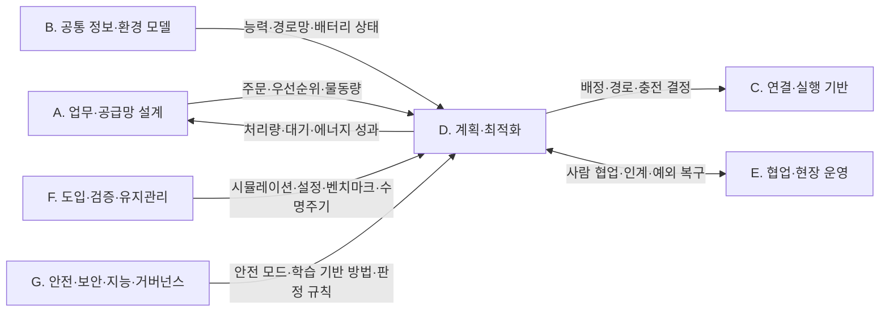

[홈](../../index.md) › D. 계획·최적화

# D. 계획·최적화

## 핵심 질문

누가, 언제, 어디로, 어떤 자원을 사용해 작업할 것인가? [분류원문]

## 개요

**누가, 언제, 어디로, 어떤 자원을 사용해 작업할 것인가**를 연구한다. 논문에서 작업 배정이나 경로 계획으로 많이 등장하는 영역이다. 네 항목은 분리해서 연구할 수 있지만 실제 운영에서는 서로 영향을 준다. [분류원문]

## 세부 연구영역

표의 세부 연구영역·무엇을 연구하는가·SCM 관점의 질문 열은 원문 그대로이고, 페이지·현재 상태 열은 위키에서 덧붙인 것이다. 현재 상태는 퍼블리셔가 자동으로 갱신한다.

<!-- auto:category-area-table:start -->
| 세부 연구영역 | 무엇을 연구하는가 | SCM 관점의 질문 | 페이지 | 현재 상태 |
|---|---|---|---|---|
| **13. 작업 배정 — MRTA** | 능력·위치·적재량·배터리·납기 등을 고려해 로봇 또는 로봇 팀에 작업을 배정 | 가장 가까운 로봇에 맡기는 것이 전체적으로도 유리한가? | [13. 작업 배정 — MRTA](13-task-allocation-mrta.md) | published |
| **14. 작업 순서·스케줄링** | 주문 묶음, 작업 선후관계, 시간 제약, 공정 간 동기화, 긴급 작업 삽입 | 피킹·운반·포장이 서로 기다리지 않게 어떤 순서로 실행할까? | [14. 작업 순서·스케줄링](14-task-sequencing-and-scheduling.md) | published |
| **15. 다중 로봇 경로·교통 관리 — MAPF** | 여러 로봇의 경로와 통과 시점을 조율하고, 혼잡·교착·우선권을 처리 | 서로 다른 제조사의 로봇이 좁은 통로에서 마주치면 누가 양보할까? | [15. 다중 로봇 경로·교통 관리 — MAPF](15-multi-robot-path-and-traffic-management-mapf.md) | published |
| **16. 공용 자원·충전·에너지 최적화** | 충전기·승강기·작업대·대기 공간·버퍼의 예약과 배분, 충전 시점과 에너지 사용 계획 | 로봇들이 동시에 충전하거나 승강기를 기다리는 상황을 어떻게 줄일까? | [16. 공용 자원·충전·에너지 최적화](16-shared-resource-charging-and-energy-optimization.md) | published |

[분류원문]
<!-- auto:category-area-table:end -->

## 이 대분류의 핵심 포인트

SCM에서는 **작업이 계속 새로 들어오는 조건**이 중요하다. 정해진 목적지까지 한 번 이동하는 문제와 지속적으로 주문이 들어오는 운영은 다르다. 이를 다루는 연구가 *Lifelong MAPF*, *Multi-Agent Pickup and Delivery*이다. [5][6] [분류원문]

## 다른 대분류와의 연결

이 절은 D. 계획·최적화의 네 세부영역 — [13. 작업 배정 — MRTA](13-task-allocation-mrta.md), [14. 작업 순서·스케줄링](14-task-sequencing-and-scheduling.md), [15. 다중 로봇 경로·교통 관리 — MAPF](15-multi-robot-path-and-traffic-management-mapf.md), [16. 공용 자원·충전·에너지 최적화](16-shared-resource-charging-and-energy-optimization.md) — 이 다른 대분류의 세부영역과 무엇으로 이어지는지 정리한다. 근거는 게시된 위 네 세부영역 페이지와 A. 업무·공급망 설계, B. 공통 정보·환경 모델, C. 연결·실행 기반 대분류 페이지의 검증된 주장이며, 같은 연결에는 그 페이지와 같은 태그·각주를 쓴다.

연결 상대 가운데 18. 사람–로봇 협업·운영 인터페이스, 20. 예외 복구·재계획·업무 연속성, 21. 온보딩·설정·현장 시운전, 22. 시뮬레이션·예측용 디지털 트윈, 23. 시험·형식 검증·벤치마크, 24. 자산·소프트웨어 수명주기 관리, 25. 안전·위험 관리, 27. AI·학습·적응과 모델 운영, 28. 표준·상호운용성·다사업자 거버넌스 페이지는 아직 본문이 작성되지 않았다. 그래서 E. 협업·현장 운영, F. 도입·검증·유지관리, G. 안전·보안·지능·거버넌스와의 연결은 D. 계획·최적화 쪽 근거에 기대어 서술한다. 아래 연결은 모두 단일 출처 또는 같은 발행 주체의 근거이며 교차 확인되지 않았다.

### A. 업무·공급망 설계

[A. 업무·공급망 설계](../a-business-supply-chain-design/index.md)는 D. 계획·최적화에 주문·시작 시각·우선순위를 넘기고, D. 계획·최적화는 처리량·대기·에너지 같은 성과를 되돌린다. 같은 연결을 A. 업무·공급망 설계 쪽에서 본 서술은 그 페이지의 [다른 대분류와의 연결](../a-business-supply-chain-design/index.md#다른-대분류와의-연결)에 있다.

- **13. 작업 배정 — MRTA ↔ [1. 주문·업무 시스템 연계](../a-business-supply-chain-design/01-order-and-business-system-integration.md)**: VDA 5050 3.0.0 명세는 이동로봇에 주문을 배정하는 일을 관제(fleet control)의 기능으로 두면서, 외부 IT 시스템과의 인터페이스는 명세 범위에서 뺀다. [사실][^ref-031] 그래서 배정의 입력인 주문·납기·출하 마감 제약은 창고 관리 시스템(Warehouse Management System, WMS) 같은 상위 업무 시스템에서 받아 ROP 가 배정 기준으로 옮겨야 할 것으로 보인다. [추정][^ref-031][^ref-125] 납기·출하 마감을 정하는 일 자체는 분류 원문 9장의 상위 업무 시스템 경계에 속하는 연계 대상이며, 결합 방법은 열린 질문 oq-054 로 남아 있다([열린 질문](../../open-questions.md)).
- **14. 작업 순서·스케줄링 ↔ 1. 주문·업무 시스템 연계**: Open-RMF 작업 요청 스키마는 시각·순서 관련 필드로 가장 이른 시작 시각과 우선순위를 두고, 마감 시각이나 다른 작업과의 선후 필드는 두지 않는다. [사실][^ref-125] 웨이브·웨이브리스 출고 지시 정책 연구(2010)와 동적으로 도착하는 주문의 피킹 재최적화 연구(2025)는 상위 시스템의 출고 지시·우선순위 변경이 작업 순서 결정 문제로 넘어가는 지점을 다루는 것으로 보인다. [추정][^ref-134][^ref-133]
- **14. 작업 순서·스케줄링 ↔ [2. 공정·워크플로 모델링](../a-business-supply-chain-design/02-process-and-workflow-modeling.md)**: B2MML 공통 스키마의 Dependency1Type 은 두 요소 사이의 실행 의존(선후, 병행 금지, 시작 후 간격 등)을 표현한다. [사실][^ref-117] 이 유형을 창고 물류 작업에 적용한 사례는 이 위키의 조사에서 아직 확인되지 않았다(열린 질문 oq-013).
- **14. 작업 순서·스케줄링 ↔ [3. 처리능력·거점·설비 계획](../a-business-supply-chain-design/03-capacity-site-and-facility-planning.md)**: 랙 이동 로봇 작업대의 주문 배치·순서와 랙 도착 순서를 함께 정한 2017년 연구는, 저자 계산 실험(독립 재현 미확인)에서 최적화된 주문 처리가 흔한 단순 규칙보다 필요한 로봇 대수를 절반 넘게 줄였다고 보고했다. [사실][^ref-381]
- **16. 공용 자원·충전·에너지 최적화 ↔ 3. 처리능력·거점·설비 계획**: 충전기 대수 결정과 창고 충전소 배치 최적화 연구가 있어, 충전 정책 결정이 충전기 수·위치 같은 설비 계획으로 이어지는 것으로 보인다. [추정][^ref-533][^ref-109]
- **14. 작업 순서·스케줄링 ↔ [4. 성과·경제성·프로세스 개선](../a-business-supply-chain-design/04-performance-economics-and-process-improvement.md)**: 풋월 주문 통합 연구(2019)는 빈 방출 순서가 맞지 않으면 포장 작업자가 유휴 대기한다고 보아, 포장 작업자 대기가 순서 결정의 성과 지표로 이어진다. [사실][^ref-385] 이 지표의 합의된 정의는 열린 질문 oq-051 로 남아 있다.
- **16. 공용 자원·충전·에너지 최적화 ↔ 4. 성과·경제성·프로세스 개선**: Omega(2024) 연구는 로봇 이동형 풀필먼트 시스템에서 동적 우선순위 규칙이 선착순보다 에너지 소비를 3.41% 줄이고 처리량을 26.07% 높였다고 보고했는데, 이 값은 모델·시뮬레이션 조건의 저자 보고값이며 현장 실측이 아니다. [사실][^ref-146]

### B. 공통 정보·환경 모델

[B. 공통 정보·환경 모델](../b-common-information-and-environment-model/index.md)은 D. 계획·최적화가 쓰는 능력 선언·경로망·배터리 상태를 공급한다. 같은 연결을 B. 공통 정보·환경 모델 쪽에서 본 서술은 그 페이지의 [다른 대분류와의 연결](../b-common-information-and-environment-model/index.md#다른-대분류와의-연결)에 있다.

- **13. 작업 배정 — MRTA ↔ [5. 로봇 능력·작업 온톨로지](../b-common-information-and-environment-model/05-robot-capability-and-task-ontology.md)**: 능력 온톨로지로 이종 로봇·자원의 작업 수행 가능성을 추론해 배정 후보를 정하는 연구가 있다(2022, 2026). [사실][^ref-236][^ref-237] 제조사가 선언한 능력과 현장에서 관측한 능력 가운데 어느 쪽을 배정 기준으로 삼는지는 열린 질문 oq-024 다.
- **16. 공용 자원·충전·에너지 최적화 ↔ 5. 로봇 능력·작업 온톨로지**: VDA 5050 팩트시트는 임계 저충전 수준(criticalLowChargingLevel)을 선언하게 하고 그 이하에서는 관제가 충전소로 가는 주문만 보내야 하며, Open-RMF 플릿 어댑터 템플릿은 운영 설정 recharge_threshold(예시값 0.10)와 충전 목표 recharge_soc(예시값 1.0)를 둔다. [사실][^ref-228][^ref-105] 두 값 가운데 무엇을 충전 하한으로 삼을지는 열린 질문 oq-068 이다.
- **15. 다중 로봇 경로·교통 관리 — MAPF ↔ [6. 지도·공간·위치 모델](../b-common-information-and-environment-model/06-map-space-and-location-model.md)**: Open-RMF traffic-editor 는 플릿별 경유점·차선(양방향·단방향) 그래프와 주차·충전·대기 지점 속성, 문·승강기·층을 주석하게 하고, 이 그래프를 building_map_generator 로 주행 그래프로 내보내 플릿 어댑터의 경로 계획에 쓰게 한다. [사실][^ref-079]
- **16. 공용 자원·충전·에너지 최적화 ↔ [8. 실시간 세계 상태·데이터 일관성](../b-common-information-and-environment-model/08-real-time-world-state-and-data-consistency.md)**: 충전 시점 계획은 로봇이 보고하는 현재 배터리 상태(충전 상태·충전 중 여부)를 입력으로 쓰며, 이 현재 상태 표현은 8. 실시간 세계 상태·데이터 일관성 쪽에 속하는 것으로 보인다. [추정][^ref-051][^ref-104] 이 연결은 현재 상태를 표현하는 쪽이며, 아래 F. 도입·검증·유지관리의 22. 시뮬레이션·예측용 디지털 트윈 연결(가정한 미래를 실험)과 구분한다.

### C. 연결·실행 기반

[C. 연결·실행 기반](../c-connectivity-and-execution-foundation/index.md)의 인터페이스는 D. 계획·최적화의 결정을 어디까지 집행하고 어디서 제한하는지를 정한다. 같은 연결을 C. 연결·실행 기반 쪽에서 본 서술은 그 페이지의 [다른 대분류와의 연결](../c-connectivity-and-execution-foundation/index.md#다른-대분류와의-연결)에 있다.

- **13. 작업 배정 — MRTA ↔ [9. 로봇·제조사 관제 연동](../c-connectivity-and-execution-foundation/09-robot-and-vendor-fleet-manager-integration.md)**: Open-RMF 디스패처는 작업 요청을 받으면 모든 플릿 어댑터에 입찰 공고(BidNotice)를 보내고, 처리 가능한 플릿이 비용을 담은 입찰(BidProposal)을 내면 가장 빨리 끝나는 것이나 가장 낮은 비용처럼 설정한 기준으로 비교해 작업을 줄 플릿을 정한다. [사실][^ref-376] 플릿 단위로 배정한 뒤 제조사 관제가 플릿 안에서 로봇을 다시 고르는 두 수준 구조의 최적성 손실은 열린 질문 oq-053 이다.
- **15. 다중 로봇 경로·교통 관리 — MAPF ↔ 9. 로봇·제조사 관제 연동**: Open-RMF 는 플릿 연동을 전체 제어·신호등(일시정지·재개)·읽기 전용으로 나누고 공유 공간마다 읽기 전용 플릿을 하나만 허용하며, 중앙 교통 스케줄에서 충돌이 나면 플릿들이 제안을 내고 시스템 통합사가 배치한 제3자 판정자가 조합을 고른다. [사실][^ref-004] VDA 5050 3.0.0 은 경로 결정·우선순위·혼잡 처리·교착 해소 같은 교통 조율 전략과 알고리즘을 명세에서 빼면서도, 교착 탐지·해소와 버퍼 경로·대기 위치를 쓰는 교통 제어를 관제 기능으로 둔다. [사실][^ref-031] 제어 수준에 따른 교통 성능 차이는 열린 질문 oq-032 다.
- **16. 공용 자원·충전·에너지 최적화 ↔ 9. 로봇·제조사 관제 연동**: VDA 5050 은 충전 주문이 운반 주문을 중단시킬 수 있음을 관제의 에너지 관리 기능으로 두고, 과충전을 막는 일은 이동로봇의 책임으로 명시한다. [사실][^ref-031] 과충전 보호는 분류 원문 9장의 로봇 자체 지능·제어 경계에 속하는 연계 대상이며, ROP 는 충전 주문과 충전 상태 확인만 맡는다.
- **16. 공용 자원·충전·에너지 최적화 ↔ [10. 설비·건물 시스템 연동](../c-connectivity-and-execution-foundation/10-facility-and-building-system-integration.md)**: Open-RMF 승강기 요청은 세션 id 로 승강기를 점유하고 세션 종료 요청(REQUEST_END_SESSION)을 보낼 때까지 제어권이 그 세션에 남으며, AGV 모드에서는 정지 시 문이 열린 채 유지된다. [사실][^ref-312][^ref-286] 승강기 운행 제어는 분류 원문 9장의 시설·설비 제어 경계에 속하는 연계 대상이며, ROP 는 세션 요청·운영 모드 확인과 작업·경로 제약 반영만 맡는다. 여러 제조사 플릿의 호출을 배분하는 규칙은 열린 질문 oq-067 이다.
- **14. 작업 순서·스케줄링 ↔ [12. 명령·작업 실행의 신뢰성](../c-connectivity-and-execution-foundation/12-command-and-task-execution-reliability.md)**: VDA 5050 에서 이미 로봇에 넘긴 기반(base) 경로는 바꿀 수 없으므로, 우선순위 변경에 따른 재정렬은 아직 해제하지 않은 호라이즌 구간과 새 주문에만 적용할 수 있을 것으로 보인다. [추정][^ref-031]

### E. 협업·현장 운영

[E. 협업·현장 운영](../e-collaboration-and-field-operations/index.md)은 D. 계획·최적화의 결정이 사람 작업자·로봇 간 인계·예외 상황과 만나는 곳이다.

- **13. 작업 배정 — MRTA ↔ [18. 사람–로봇 협업·운영 인터페이스](../e-collaboration-and-field-operations/18-human-robot-collaboration-and-operator-interface.md)**: 작업자가 피킹하고 자율이동로봇(Autonomous Mobile Robot, AMR)이 운반하는 동적 주문 피킹 연구(2025)가 있다. [사실][^ref-132] 이 연구에 비추어 로봇 배정은 사람 작업자의 배치와 맞물리는 것으로 보인다. [추정][^ref-132]
- **14. 작업 순서·스케줄링 ↔ 18. 사람–로봇 협업·운영 인터페이스**: 복수 포장대와 피킹-패킹 전환 정책(작업자가 피킹과 포장 사이를 옮겨 감)의 작업자 스케줄링을 다룬 국내 연구(2025)가 있다. [사실][^ref-388] 이 연구의 결과 수치는 미확인이다.
- **14. 작업 순서·스케줄링 ↔ [17. 로봇 간 협업·물리적 인계](../e-collaboration-and-field-operations/17-robot-to-robot-collaboration-and-physical-handover.md)**: Open-RMF 배정이 플릿 단위 입찰로 이루어지고 요청 스키마에 작업 간 선후 필드가 없으므로, 피킹 로봇 완료 뒤 운반 로봇 출발 같은 제조사 간 인계 선후는 ROP 가 작업 흐름 수준에서 관리해야 할 것으로 보인다. [추정][^ref-376][^ref-125] 이를 표현·집행하는 공개 구현은 열린 질문 oq-049 다.
- **15. 다중 로봇 경로·교통 관리 — MAPF ↔ [20. 예외 복구·재계획·업무 연속성](../e-collaboration-and-field-operations/20-exception-recovery-replanning-and-business-continuity.md)**: 창고 MAPF 실행 연구(2019)는 지연이 쌓일 때 행동 의존 그래프로 순서를 지키며 실행을 이어가는 방법을 다루어, 계획 유지와 재계획의 판단이 두 영역을 잇는다. [사실][^ref-188]

### F. 도입·검증·유지관리

[F. 도입·검증·유지관리](../f-deployment-verification-and-maintenance/index.md)는 D. 계획·최적화의 규칙을 도입 전에 실험하고, 현장에 설정하고, 성과를 재고, 오래 운영하는 쪽에서 이어진다.

- **13. 작업 배정 — MRTA ↔ [22. 시뮬레이션·예측용 디지털 트윈](../f-deployment-verification-and-maintenance/22-simulation-and-predictive-digital-twin.md)**: 로봇 이동형 풀필먼트 시스템과 국내 자동물류센터의 이산 사건 시뮬레이션 연구가 배정 규칙을 가정한 미래에서 실험하는 도구로 쓰였고, 한 연구에서는 피킹 주문 배정 규칙이 단위 처리량을 크게 바꾸었다. [사실][^ref-398][^ref-402]
- **15. 다중 로봇 경로·교통 관리 — MAPF ↔ 22. 시뮬레이션·예측용 디지털 트윈**: 다중 AGV 시스템의 경로망을 시뮬레이션으로 자동 설계하는 연구가 있어, 경로망 설계 평가는 가정한 미래를 실험하는 쪽에 속하는 것으로 보인다. [추정][^ref-267] 이 두 연결은 가정한 미래를 실험하는 것으로, 위 B. 공통 정보·환경 모델의 8. 실시간 세계 상태·데이터 일관성 연결(현재 배터리 상태 표현)과 다르다.
- **15. 다중 로봇 경로·교통 관리 — MAPF ↔ [21. 온보딩·설정·현장 시운전](../f-deployment-verification-and-maintenance/21-onboarding-configuration-and-commissioning.md)**: 현장 도입 때 플릿별 경로망과 차선 속성, 주차·충전 경유점을 traffic-editor 로 주석해 설정하는 일이 온보딩 작업이 될 것으로 보인다. [추정][^ref-079] 이 작업의 소요를 측정한 자료는 찾지 못했다.
- **15. 다중 로봇 경로·교통 관리 — MAPF ↔ [23. 시험·형식 검증·벤치마크](../f-deployment-verification-and-maintenance/23-testing-formal-verification-and-benchmarking.md)**: MAPF 연구는 정의·변형·벤치마크를 정리한 공통 틀을 가지고 있다(2019). [사실][^ref-186] 격자·단위 시간 가정의 벤치마크 성과가 실제 물류센터 처리량으로 얼마나 이어지는지는 이 위키의 조사에서 아직 확인되지 않았다(열린 질문 oq-058).
- **16. 공용 자원·충전·에너지 최적화 ↔ [24. 자산·소프트웨어 수명주기 관리](../f-deployment-verification-and-maintenance/24-asset-and-software-lifecycle-management.md)**: 플릿 수준에서 배터리 건강(열화)을 고려해 자율이동로봇의 일정을 정하는 연구(2026-03)가 있어, 충전·배정 계획이 배터리 열화 관리와 이어진다. [사실][^ref-403] 제조사가 다른 로봇이 배터리 건강 상태를 관제에 보고하는 공통 필드가 있는지는 아직 확인되지 않았다.

### G. 안전·보안·지능·거버넌스

[G. 안전·보안·지능·거버넌스](../g-safety-security-intelligence-and-governance/index.md)는 D. 계획·최적화의 결정에 안전 제약, 학습 기반 방법, 다사업자 판정 규칙을 더한다.

- **16. 공용 자원·충전·에너지 최적화 ↔ [25. 안전·위험 관리](../g-safety-security-intelligence-and-governance/25-safety-and-risk-management.md)**: Open-RMF 승강기 상태의 운영 모드에는 사람·AGV·화재·오프라인·비상이 있고, Open-RMF 데모는 비상 경보가 켜지면 로봇을 가장 가까운 주차 위치로 보낸다. [사실][^ref-286][^ref-104] 설비 안전 제어는 분류 원문 9장의 시설·설비 제어 경계에 속하는 연계 대상이며, ROP 는 운영 모드 확인과 작업·경로 제약 반영만 맡는다.
- **15. 다중 로봇 경로·교통 관리 — MAPF ↔ 25. 안전·위험 관리**: VDA 5050 3.0.0 은 진입 금지(BLOCKED)·속도 제한(SPEED_LIMIT)·해제(RELEASE) 등 구역 유형을 교통 관리 수단으로 정의하면서, 이 명세가 기능·운영·시스템 안전을 규정하지 않으므로 안전 표준으로 적용하면 안 된다고 밝힌다. [사실][^ref-031] 우선·벌점 구역 가중치를 출하 마감 같은 업무 우선순위와 잇는 방법은 아직 확인되지 않았다.
- **13. 작업 배정 — MRTA·15. 다중 로봇 경로·교통 관리 — MAPF·16. 공용 자원·충전·에너지 최적화 ↔ [27. AI·학습·적응과 모델 운영](../g-safety-security-intelligence-and-governance/27-ai-learning-adaptation-and-model-operations.md)**: 분류 원문 8장의 교차 규칙에서 학습 기반 배차는 13. 작업 배정 — MRTA 에 적용되는 27. AI·학습·적응과 모델 운영의 연구 방법이다. [13. 작업 배정 — MRTA](13-task-allocation-mrta.md) 쪽에는 학습 기반 배차(이종 그래프 어텐션 스케줄러)와 대규모 언어 모델(Large Language Model, LLM) 기반 다중 로봇 작업 배정 연구가 있다. [사실][^ref-399][^ref-090][^ref-168] LLM 배정 결과 수치는 출처 충돌(열린 질문 oq-030)이 있어 싣지 않는다. [15. 다중 로봇 경로·교통 관리 — MAPF](15-multi-robot-path-and-traffic-management-mapf.md) 쪽에는 모방 학습을 적용한 지속형 MAPF 연구(2024-10)가 있다. [사실][^ref-199] [16. 공용 자원·충전·에너지 최적화](16-shared-resource-charging-and-energy-optimization.md) 쪽에서는 자율 피킹 로봇의 충전소 선택·충전 시간 결정에 심층 강화학습을 쓰는 연구(2026-07)가 있어, 학습 기반 충전 결정이 두 영역을 잇는 것으로 보인다. [추정][^ref-531]
- **15. 다중 로봇 경로·교통 관리 — MAPF ↔ [28. 표준·상호운용성·다사업자 거버넌스](../g-safety-security-intelligence-and-governance/28-standards-interoperability-and-multi-vendor-governance.md)**: VDA 5050 은 구역·경로 해제로 교통 규칙을 정하되 조율 전략은 빼고, Open-RMF 는 여러 플릿의 교통 스케줄·협상을 구현하므로, 한 현장에서 둘을 함께 쓸 때 우선권 판정 규칙을 누가 정하고 승인하는지가 거버넌스 과제로 넘어갈 것으로 보인다. [추정][^ref-031][^ref-004] 두 방식을 함께 쓴 공개 설계는 열린 질문 oq-057 이다.

### 아직 다루지 않은 연결

다음 세부영역과 D. 계획·최적화를 잇는 검증된 근거는 아직 없어 연결을 서술하지 않는다. 근거가 확인되면 이 절에 더한다.

- [7. 화물·재고·자산 식별과 추적](../b-common-information-and-environment-model/07-cargo-inventory-and-asset-identification-and-tracking.md) (B. 공통 정보·환경 모델) — 근거 없음
- [11. 분산 시스템·통신·컴퓨팅 구조](../c-connectivity-and-execution-foundation/11-distributed-systems-communication-and-computing.md) (C. 연결·실행 기반) — 근거 없음
- [19. 모니터링·이상 탐지·원인 분석](../e-collaboration-and-field-operations/19-monitoring-anomaly-detection-and-root-cause-analysis.md) (E. 협업·현장 운영) — 근거 없음
- [26. 사이버보안·접근권한·개인정보](../g-safety-security-intelligence-and-governance/26-cybersecurity-access-control-and-privacy.md) (G. 안전·보안·지능·거버넌스) — 근거 없음

[^ref-031]: VDA / VDMA (VDA5050 GitHub), VDA5050/VDA5050_EN.md — Official Specification document for the VDA 5050, 미확인, https://github.com/VDA5050/VDA5050/blob/main/VDA5050_EN.md, 접근일 2026-09-25
[^ref-125]: Open Robotics (open-rmf), rmf_api_msgs — rmf_api_msgs/schemas/task_request.json, 미확인, https://github.com/open-rmf/rmf_api_msgs/blob/main/rmf_api_msgs/schemas/task_request.json, 접근일 2026-09-25 (원문 미열람)
[^ref-134]: Gallien, J., & Weber, T. G., To Wave or Not to Wave? Order Release Policies for Warehouses with an Automated Sorter, 2010, https://pubsonline.informs.org/doi/abs/10.1287/msom.1100.0291, 접근일 2026-09-25 (원문 미열람)
[^ref-133]: Lorenz, Otto, & Gendreau (Networks, Wiley), Picking Operations in Warehouses With Dynamically Arriving Orders: How Good is Reoptimization?, 2025, https://onlinelibrary.wiley.com/doi/full/10.1002/net.22281, 접근일 2026-09-25 (원문 미열람)
[^ref-117]: MESA International, B2MML-BatchML — Schema/B2MML-Common.xsd, 2023, https://github.com/MESAInternational/B2MML-BatchML/blob/master/Schema/B2MML-Common.xsd, 접근일 2026-09-25 (원문 미열람)
[^ref-381]: Boysen, N., Briskorn, D., & Emde, S., Parts-to-picker based order processing in a rack-moving mobile robots environment, 2017, https://www.sciencedirect.com/science/article/abs/pii/S0377221717302758, 접근일 2026-09-25 (원문 미열람)
[^ref-533]: Chen, W., Gong, Y., Chen, Q., & Wang, H., Does battery management matter? Performance evaluation and operating policies in a self-climbing robotic warehouse, 2024-01, https://www.sciencedirect.com/science/article/abs/pii/S0377221723004770, 접근일 2026-09-25 (원문 미열람)
[^ref-109]: Stark, H.-G. 외, A Page-Rank-like Approach to Optimal Placement of Charging Stations in a Warehouse, 2024-06, https://arxiv.org/abs/2406.17003, 접근일 2026-09-25 (원문 미열람)
[^ref-385]: Boysen, N., Stephan, K., & Weidinger, F., Manual order consolidation with put walls: the batched order bin sequencing problem, 2019, https://www.sciencedirect.com/science/article/pii/S2192437620300315, 접근일 2026-09-25 (원문 미열람)
[^ref-146]: Omega 게재 논문(저자 미확인), The role of energy consumption in robotic mobile fulfillment systems: Performance evaluation and operating policies with dynamic priority, 2024, https://www.sciencedirect.com/science/article/abs/pii/S0305048324001336, 접근일 2026-09-25 (원문 미열람)
[^ref-236]: Electronics(MDPI) 게재 논문(저자 미확인), Semantic Feasibility Reasoning for Heterogeneous Multi-Robot Task Allocation, 2026-08-11, https://doi.org/10.3390/electronics15163562, 접근일 2026-09-25 (원문 미열람)
[^ref-237]: Kluge-Wilkes, A. 외(RWTH Aachen WZL), Ontology-based task allocation for heterogeneous resources in Line-less Mobile Assembly Systems, 2022, https://www.techrxiv.org/users/685235/articles/679210-ontology-based-task-allocation-for-heterogeneous-resources-in-line-less-mobile-assembly-systems, 접근일 2026-09-25 (원문 미열람)
[^ref-228]: VDA / VDMA (VDA5050 GitHub), VDA5050/VDA5050 — json_schemas/factsheet.schema, 미확인, https://github.com/VDA5050/VDA5050/blob/main/json_schemas/factsheet.schema, 접근일 2026-09-25 (원문 미열람)
[^ref-105]: Open Robotics (open-rmf), fleet_adapter_template — fleet_adapter_template/config.yaml, 미확인, https://github.com/open-rmf/fleet_adapter_template/blob/main/fleet_adapter_template/config.yaml, 접근일 2026-09-25
[^ref-079]: Open Robotics, Traffic Editor - Programming Multiple Robots with ROS 2, 미확인, https://osrf.github.io/ros2multirobotbook/traffic-editor.html, 접근일 2026-09-25
[^ref-051]: VDA / VDMA (VDA5050 GitHub), VDA5050/VDA5050 — json_schemas/state.schema, 미확인, https://github.com/VDA5050/VDA5050/blob/main/json_schemas/state.schema, 접근일 2026-09-25 (원문 미열람)
[^ref-104]: Open Robotics (open-rmf), rmf_demos — Demonstrations of Open-RMF (README), 미확인, https://github.com/open-rmf/rmf_demos, 접근일 2026-09-25
[^ref-376]: Open Robotics, Tasks in RMF (task) - Programming Multiple Robots with ROS 2, 미확인, https://osrf.github.io/ros2multirobotbook/task.html, 접근일 2026-09-25
[^ref-004]: Open Robotics, RMF Core Overview — Programming Multiple Robots with ROS 2, 미확인, https://osrf.github.io/ros2multirobotbook/rmf-core.html, 접근일 2026-09-25
[^ref-312]: Open Robotics (open-rmf), rmf_internal_msgs — rmf_lift_msgs/msg/LiftRequest.msg, 미확인, https://github.com/open-rmf/rmf_internal_msgs/blob/main/rmf_lift_msgs/msg/LiftRequest.msg, 접근일 2026-09-25
[^ref-286]: Open Robotics (open-rmf), rmf_internal_msgs — rmf_lift_msgs/msg/LiftState.msg, 미확인, https://github.com/open-rmf/rmf_internal_msgs/blob/main/rmf_lift_msgs/msg/LiftState.msg, 접근일 2026-09-25
[^ref-132]: Yu, S., & Srinivas, S., Collaborative Human–Robot Teaming for Dynamic Order Picking: Interventionist strategies for improving warehouse intralogistics operations, 2025, https://www.sciencedirect.com/science/article/abs/pii/S1366554525001231, 접근일 2026-09-25 (원문 미열람)
[^ref-388]: Tran Bo Tao Huong, 이광헌, 홍순도(대한산업공학회지), 복수 포장대와 피킹-패킹 전환 정책을 운영하는 물류센터에서의 작업자 스케줄링, 2025, https://www.kci.go.kr/kciportal/ci/sereArticleSearch/ciSereArtiView.kci?sereArticleSearchBean.artiId=ART003194570, 접근일 2026-09-25 (원문 미열람)
[^ref-188]: Hönig, W., Kiesel, S. 외, Persistent and Robust Execution of MAPF Schedules in Warehouses, 2019, https://ieeexplore.ieee.org/abstract/document/8620328/, 접근일 2026-09-25 (원문 미열람)
[^ref-398]: Merschformann, M., Lamballais, T., de Koster, R., & Suhl, L., Decision rules for robotic mobile fulfillment systems, 2019, https://www.sciencedirect.com/science/article/pii/S2214716019300946, 접근일 2026-09-25 (원문 미열람)
[^ref-402]: KISTI ScienceON 수록 논문(저자 미확인), 시뮬레이션과 메타모델을 이용한 자동물류센터 설계 최적화, 미확인, https://scienceon.kisti.re.kr/srch/selectPORSrchArticle.do?cn=JAKO200634515151716, 접근일 2026-09-25 (원문 미열람)
[^ref-267]: IEEE 게재 논문 저자(미확인), Simulation-Based Approach for Automatic Roadmap Design in Multi-AGV Systems (IEEE Transactions on Automation Science and Engineering 21(4), 2024 (2023 온라인 공개)), 2024, https://ieeexplore.ieee.org/document/10287275/, 접근일 2026-09-25 (원문 미열람)
[^ref-186]: Stern, R., Sturtevant, N. R., Felner, A., Koenig, S. 외, Multi-Agent Pathfinding: Definitions, Variants, and Benchmarks, 2019-06, https://arxiv.org/abs/1906.08291, 접근일 2026-09-25 (원문 미열람)
[^ref-403]: Li, J., Li, S., Chu, J., Li, W., & Chen, D.(UT Austin), Fleet-Level Battery-Health-Aware Scheduling for Autonomous Mobile Robots, 2026-03, https://arxiv.org/abs/2603.22731, 접근일 2026-09-25 (원문 미열람)
[^ref-399]: Wang, Z., & Gombolay, M., Heterogeneous graph attention networks for scalable multi-robot scheduling with temporospatial constraints, 미확인, https://link.springer.com/article/10.1007/s10514-021-09997-2, 접근일 2026-09-25 (원문 미열람)
[^ref-090]: Kannan, S. S., Venkatesh, V. L. N., & Min, B.-C., SMART-LLM: Smart Multi-Agent Robot Task Planning using Large Language Models, 2023-09, https://arxiv.org/abs/2309.10062, 접근일 2026-09-25 (원문 미열람)
[^ref-168]: Kaitha, S., & Yu, S. 외(arXiv 2512.02810), Phase-Adaptive LLM Framework with Multi-Stage Validation for Construction Robot Task Allocation: A Systematic Benchmark Against Traditional Optimization Algorithms, 2025-12, https://arxiv.org/abs/2512.02810, 접근일 2026-09-25 (원문 미열람)
[^ref-199]: arXiv 2410.21415 저자(미확인), Deploying Ten Thousand Robots: Scalable Imitation Learning for Lifelong Multi-Agent Path Finding, 2024-10, https://arxiv.org/abs/2410.21415, 접근일 2026-09-25 (원문 미열람)
[^ref-531]: arXiv 2607.05683 저자(미확인), Deep Reinforcement Learning for Dynamic Battery Management of Autonomous Order Pickers, 2026-07, https://arxiv.org/abs/2607.05683, 접근일 2026-09-25 (원문 미열람)

## 최근 업데이트

<!-- auto:category-recent:start -->
- 2026-09-25 · 갱신 · [16. 공용 자원·충전·에너지 최적화](16-shared-resource-charging-and-energy-optimization.md) — 섹션 3~11 신규 작성(트랙 반영 제안 4건 반영, 1차 수정 지시 13건 이행), 2차 수정: 4·8절 연결 문장 태그 제거, 5절 조사 한계 문장 태그·각주 제거와 oq-010 연결, 6절 첫 문장을 출처 범위로 좁힘 (실행 2026-09-25-40)
- 2026-09-25 · 생성 · [16. 공용 자원·충전·에너지 최적화 — 대표 접근법과 기술](../../topics/2026/2026-09-25-area16-s6.md) — 자동 분리: 16. 공용 자원·충전·에너지 최적화 의 "6. 대표 접근법과 기술" 절을 옮겼다. 2차 수정: 세 줄 요약·본문 첫 문장을 출처 범위(충전 작업 삽입·뮤텍스 그룹·승강기 세션)로 좁혔다 (실행 2026-09-25-40)
- 2026-09-25 · 생성 · [16. 공용 자원·충전·에너지 최적화 — 대표 연구와 자료](../../topics/2026/2026-09-25-area16-s8.md) — 자동 분리: 16. 공용 자원·충전·에너지 최적화 의 "8. 대표 연구와 자료" 절을 옮겼다. 2차 수정: 첫 문장 태그 제거, 병원·호텔 연구 문구를 연관 관계로 고침, ref-535 제목 원문 복원 (실행 2026-09-25-40)
- 2026-09-25 · 생성 · [16. 공용 자원·충전·에너지 최적화 — 관련 표준·프레임워크·오픈소스](../../topics/2026/2026-09-25-area16-s7.md) — 자동 분리: 16. 공용 자원·충전·에너지 최적화 의 "7. 관련 표준·프레임워크·오픈소스" 절을 옮겼다(ref-536·ref-538 링크는 id 표기). 2차 수정: batteryCharging 행의 계획 입력 해석을 [추정]으로 분리 (실행 2026-09-25-40)
- 2026-09-25 · 생성 · [16. 공용 자원·충전·에너지 최적화 — 열린 질문](../../topics/2026/2026-09-25-area16-s11.md) — 자동 분리: 16. 공용 자원·충전·에너지 최적화 의 "11. 열린 질문" 절을 옮겼다 (실행 2026-09-25-40)
<!-- auto:category-recent:end -->

## 참고 자료

원문의 [5]는 참고문헌 [ref-005](../../references/ref-005.md)에 해당한다.[^ref-005] 원문의 [6]은 참고문헌 [ref-006](../../references/ref-006.md)에 해당한다.[^ref-006]

[^ref-005]: Li, J., Tinka, A., Kiesel, S., Durham, J. W., Kumar, T. K. S., & Koenig, S., Lifelong Multi-Agent Path Finding in Large-Scale Warehouses, 2020, https://arxiv.org/abs/2005.07371, 접근일 2026-09-24
[^ref-006]: Ma, H., Li, J., Kumar, T. K. S., & Koenig, S., Lifelong Multi-Agent Path Finding for Online Pickup and Delivery Tasks, 2017, https://arxiv.org/abs/1705.10868, 접근일 2026-09-24
