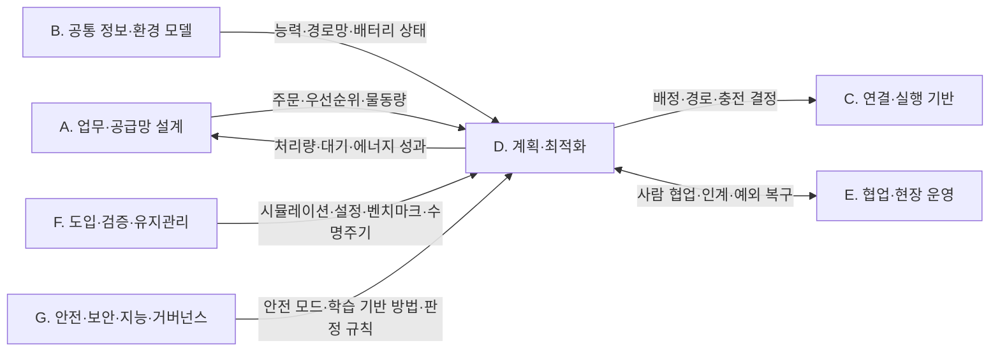

(너의 규칙은 시스템 프롬프트의 agents/shared-rules.md 와 agents/storyteller.md 이다. 아래는 이번 실행의 컨텍스트와 입력이다.)

## 실행 컨텍스트

- run_id: 2026-09-25-49
- date: 2026-09-25
- run_type: category_link (대분류 연결)
- 대상: 대분류 D. 계획·최적화 페이지의 '다른 대분류와의 연결' 절(대분류 연결 실행). 게시된 세부영역 페이지를 근거로 다른 대분류와의 연결을 조사·서술한다. 스토리텔러는 그 절만 patches 로 바꾼다
- 예산:
    - max_search_queries: 30
    - max_sources_per_run: 15
    - new_topic_pages: 1
    - page_updates: 2
    - max_retries: 2
- 환경 알림: web_fetch_available: false · fetch_mode: mirror_only (일반 웹 페이지 열람은 네트워크 정책으로 막혀 있다. raw.githubusercontent.com 은 열린다: 공식 문서가 GitHub 에 있는 출처는 입력의 config/source_mirrors.yaml 경로를 WebFetch 로 열어 원문을 읽고 sources[].fetched=true, fetched_via=github_raw, fetch_url 을 적는다. 입력에 원문 텍스트(data/source_texts)가 있는 출처는 fetched_via=inbox. 그 밖의 출처는 fetched=false 이며 코드가 신뢰도 상한(medium)을 강제한다 — 공통 규칙 0절 6항)
- 언어: ko
- retry_count: 1
- max_retries: 2

## 입력

### runs/2026-09-25-49/target.json

```json
{
  "run_id": "2026-09-25-49",
  "date": "2026-09-25",
  "weekday": "Fri",
  "run_number": 49,
  "run_type": "category_link",
  "forced": true,
  "target": {
    "area_no": null,
    "area_name": null,
    "category": "D. 계획·최적화",
    "category_letter": "D"
  },
  "topic": null,
  "track": null,
  "corrections": [],
  "budget": {
    "max_search_queries": 30,
    "max_sources_per_run": 15,
    "new_topic_pages": 1,
    "page_updates": 2,
    "max_retries": 2
  },
  "priority_reason": null,
  "priority_questions": [],
  "excluded_areas": [],
  "lifted_areas": [],
  "deferred": {
    "monthly_recheck": false,
    "weekly_review": false
  },
  "selection_rationale": "CLI 지정 run_type=category_link"
}
```

### runs/2026-09-25-49/research.json

```json
{
  "run_id": "2026-09-25-49",
  "date": "2026-09-25",
  "run_type": "category_link",
  "target": {
    "area_no": null,
    "area_name": null,
    "category": "D. 계획·최적화"
  },
  "gaps": [
    "D. 계획·최적화 페이지의 '다른 대분류와의 연결' 절 비어 있음(아직 작성되지 않음)",
    "E. 협업·현장 운영의 19. 모니터링·이상 탐지·원인 분석과 D. 계획·최적화 세부영역을 잇는 근거가 게시 페이지에 없음",
    "G. 안전·보안·지능·거버넌스의 26. 사이버보안·접근권한·개인정보와 D. 계획·최적화를 잇는 근거 없음",
    "C. 연결·실행 기반의 11. 분산 시스템·통신·컴퓨팅 구조, B. 공통 정보·환경 모델의 7. 화물·재고·자산 식별과 추적과의 직접 연결 근거 약함",
    "F. 도입·검증·유지관리의 23. 시험·형식 검증·벤치마크 연결은 MAPF 벤치마크 정의뿐이고 현장 처리량과의 관계는 열린 질문(oq-058)"
  ],
  "research_questions": [
    "가장 가까운 로봇에 맡기는 것이 전체적으로도 유리한가? [분류원문]",
    "D. 계획·최적화의 네 세부영역(13. 작업 배정 — MRTA ~ 16. 공용 자원·충전·에너지 최적화)은 A. 업무·공급망 설계에서 어떤 입력(주문·시작 시각·우선순위·물동량)을 받고 어떤 성과를 되돌리는가?",
    "B. 공통 정보·환경 모델의 능력 선언·경로망·배터리 상태가 D. 계획·최적화의 배정·교통·충전 계획에 어떤 입력으로 들어가는가?",
    "C. 연결·실행 기반의 인터페이스(Open-RMF 디스패처·제어 수준·승강기 세션, VDA 5050 관제 기능·기반 경로)는 D. 계획·최적화의 결정을 어디까지 집행하고 어디서 제한하는가?",
    "E. 협업·현장 운영과 F. 도입·검증·유지관리의 어느 세부영역(사람 협업, 예외 복구, 시뮬레이션, 시험, 수명주기)이 D. 계획·최적화의 결정과 맞물리는가?",
    "G. 안전·보안·지능·거버넌스의 25. 안전·위험 관리, 27. AI·학습·적응과 모델 운영, 28. 표준·상호운용성·다사업자 거버넌스와 D. 계획·최적화를 잇는 검증된 근거는 무엇이고, 26. 사이버보안·접근권한·개인정보와의 근거는 있는가?"
  ],
  "findings": [
    {
      "id": "f1",
      "claim": "D. 계획·최적화의 13. 작업 배정 — MRTA ↔ A. 업무·공급망 설계의 1. 주문·업무 시스템 연계: VDA 5050 3.0.0 은 이동로봇에 대한 주문 배정을 관제(fleet control)의 기능으로 두면서, 외부 IT 시스템과의 인터페이스는 명세 범위에서 제외한다.",
      "tag": "사실",
      "source_ids": [
        "ref-031"
      ],
      "cross_checked": false,
      "confidence": "medium",
      "evidence_excerpt": "관제 기능 목록에 'Assignment of orders to the mobile robots'가 있고, 범위 제외 대상으로 주변 설비·인프라·외부 IT 시스템 인터페이스를 든다(3.0.0, main 브랜치 원문).",
      "as_of": "2026-09-25",
      "flow_step": null,
      "flow_item": null
    },
    {
      "id": "f2",
      "claim": "D. 계획·최적화의 13. 작업 배정 — MRTA ↔ A. 업무·공급망 설계의 1. 주문·업무 시스템 연계: 로봇 인터페이스 표준이 상위 시스템 연동을 범위 밖에 두므로, 배정의 입력인 주문·납기·출하 마감 제약은 WMS 등 상위 업무 시스템에서 받아 ROP 가 배정 기준으로 옮겨야 할 것으로 보인다(결합 방법은 oq-054).",
      "tag": "추정",
      "source_ids": [
        "ref-031",
        "ref-125"
      ],
      "cross_checked": false,
      "confidence": "low",
      "evidence_excerpt": "f1 의 범위 제외와, Open-RMF 작업 요청 스키마에 마감 필드가 없다는 점(f3)에서 도출. 게시된 13. 작업 배정 — MRTA 9절 표와 같은 방향.",
      "as_of": "2026-09-25",
      "flow_step": "피킹",
      "flow_item": "시작 조건",
      "source_unopened": false
    },
    {
      "id": "f3",
      "claim": "D. 계획·최적화의 14. 작업 순서·스케줄링 ↔ A. 업무·공급망 설계의 1. 주문·업무 시스템 연계: Open-RMF 작업 요청 스키마(task_request.json)는 시각·순서 관련 필드로 가장 이른 시작 시각과 우선순위를 두고, 마감 시각이나 다른 작업과의 선후 필드는 두지 않는다.",
      "tag": "사실",
      "source_ids": [
        "ref-125"
      ],
      "cross_checked": false,
      "confidence": "medium",
      "evidence_excerpt": "게시된 14. 작업 순서·스케줄링 5절 시작 조건 칸의 [사실] 주장. 이번 실행에서 원문 재열람 안 함. (재인용: 2026-09-25-34)",
      "as_of": "2026-09-25",
      "flow_step": "출하",
      "flow_item": "시작 조건",
      "source_unopened": true
    },
    {
      "id": "f4",
      "claim": "D. 계획·최적화의 14. 작업 순서·스케줄링 ↔ A. 업무·공급망 설계의 1. 주문·업무 시스템 연계: 웨이브·웨이브리스 출고 지시 정책 연구(2010)와 동적으로 도착하는 주문의 피킹 재최적화 연구(2025)는 상위 시스템의 출고 지시·우선순위 변경이 작업 순서 결정 문제로 넘어가는 지점을 다루는 것으로 보인다.",
      "tag": "추정",
      "source_ids": [
        "ref-134",
        "ref-133"
      ],
      "cross_checked": false,
      "confidence": "low",
      "evidence_excerpt": "A. 업무·공급망 설계 페이지 연결 절의 [추정] 주장과 같은 각주. 원문 미열람.",
      "as_of": "2025",
      "flow_step": "피킹",
      "flow_item": "시작 조건",
      "source_unopened": true
    },
    {
      "id": "f5",
      "claim": "D. 계획·최적화의 14. 작업 순서·스케줄링 ↔ A. 업무·공급망 설계의 3. 처리능력·거점·설비 계획: 랙 이동 로봇 작업대의 주문 배치·순서와 랙 도착 순서를 함께 정한 2017년 연구는 저자 계산 실험에서 최적화된 주문 처리가 흔한 단순 규칙보다 필요한 로봇 대수를 절반 넘게 줄였다고 보고했다.",
      "tag": "사실",
      "source_ids": [
        "ref-381"
      ],
      "cross_checked": false,
      "confidence": "medium",
      "evidence_excerpt": "게시된 14. 작업 순서·스케줄링 3절·10절의 [사실] 주장(저자 계산 실험, 독립 재현 미확인). (재인용: 2026-09-25-34)",
      "as_of": "2017",
      "flow_step": "피킹",
      "flow_item": "수행 자원",
      "source_unopened": true
    },
    {
      "id": "f6",
      "claim": "D. 계획·최적화의 14. 작업 순서·스케줄링 ↔ A. 업무·공급망 설계의 4. 성과·경제성·프로세스 개선: 풋월 주문 통합 연구는 빈 방출 순서가 맞지 않으면 포장 작업자가 유휴 대기한다고 보아, 포장 작업자 대기가 순서 결정의 성과 지표로 이어진다(지표 정의는 oq-051).",
      "tag": "사실",
      "source_ids": [
        "ref-385"
      ],
      "cross_checked": false,
      "confidence": "medium",
      "evidence_excerpt": "게시된 14. 작업 순서·스케줄링 5절 예외·성과 칸과 10절의 [사실] 주장. (재인용: 2026-09-25-34)",
      "as_of": "2019",
      "flow_step": "포장",
      "flow_item": "예외·성과",
      "source_unopened": true
    },
    {
      "id": "f7",
      "claim": "D. 계획·최적화의 14. 작업 순서·스케줄링 ↔ A. 업무·공급망 설계의 2. 공정·워크플로 모델링: B2MML 공통 스키마의 Dependency1Type 은 두 요소 사이 실행 의존(선후·병행 금지·시작 후 간격 등)을 표현하며, 창고 물류 작업에 적용한 사례는 확인되지 않았다(oq-013).",
      "tag": "사실",
      "source_ids": [
        "ref-117"
      ],
      "cross_checked": false,
      "confidence": "medium",
      "evidence_excerpt": "게시된 14. 작업 순서·스케줄링 7절 표와 10절의 [사실] 주장. 이번 실행 원문 재열람 안 함. (재인용: 2026-09-25-34)",
      "as_of": "2023",
      "flow_step": null,
      "flow_item": null,
      "source_unopened": true
    },
    {
      "id": "f8",
      "claim": "D. 계획·최적화의 16. 공용 자원·충전·에너지 최적화 ↔ A. 업무·공급망 설계의 3. 처리능력·거점·설비 계획: 충전기 대수 결정과 창고 충전소 배치 최적화 연구가 있어, 충전 정책 결정이 충전기 수·위치 같은 설비 계획으로 이어지는 것으로 보인다.",
      "tag": "추정",
      "source_ids": [
        "ref-533",
        "ref-109"
      ],
      "cross_checked": false,
      "confidence": "low",
      "evidence_excerpt": "게시된 16. 공용 자원·충전·에너지 최적화 10절의 [추정] 연결(Chen 외 2024, Stark 외 2024). 원문 미열람.",
      "as_of": "2024",
      "flow_step": null,
      "flow_item": "수행 자원",
      "source_unopened": true
    },
    {
      "id": "f9",
      "claim": "D. 계획·최적화의 16. 공용 자원·충전·에너지 최적화 ↔ A. 업무·공급망 설계의 4. 성과·경제성·프로세스 개선: Omega(2024) 연구는 로봇 이동형 풀필먼트 시스템에서 동적 우선순위 규칙이 선착순보다 에너지 소비를 3.41% 줄이고 처리량을 26.07% 높였다고 보고했으며, 이는 모델·시뮬레이션 조건의 저자 보고값이다.",
      "tag": "사실",
      "source_ids": [
        "ref-146"
      ],
      "cross_checked": false,
      "confidence": "medium",
      "evidence_excerpt": "A. 업무·공급망 설계 페이지 연결 절의 [사실] 주장(현장 실측 아님). (재인용: 2026-09-25-29)",
      "as_of": "2024",
      "flow_step": null,
      "flow_item": "예외·성과",
      "source_unopened": true
    },
    {
      "id": "f10",
      "claim": "D. 계획·최적화의 13. 작업 배정 — MRTA ↔ B. 공통 정보·환경 모델의 5. 로봇 능력·작업 온톨로지: 능력 온톨로지로 이종 로봇·자원의 작업 수행 가능성을 추론해 배정 후보를 정하는 연구가 있다(2022, 2026).",
      "tag": "사실",
      "source_ids": [
        "ref-236",
        "ref-237"
      ],
      "cross_checked": false,
      "confidence": "medium",
      "evidence_excerpt": "게시된 13. 작업 배정 — MRTA 10절과 B. 공통 정보·환경 모델 연결 절의 [사실] 주장. 선언 능력과 관측 능력 중 기준 문제는 oq-024. 원문 미열람.",
      "as_of": "2026-08",
      "flow_step": null,
      "flow_item": "수행 자원",
      "source_unopened": true
    },
    {
      "id": "f11",
      "claim": "D. 계획·최적화의 16. 공용 자원·충전·에너지 최적화 ↔ B. 공통 정보·환경 모델의 5. 로봇 능력·작업 온톨로지: VDA 5050 팩트시트는 임계 저충전 수준(criticalLowChargingLevel)을 선언하게 하고 그 이하에서는 관제가 충전소로 가는 주문만 보내야 하며, Open-RMF 템플릿은 운영 설정 recharge_threshold(예시값 0.10)와 충전 목표 recharge_soc(예시값 1.0)를 둔다.",
      "tag": "사실",
      "source_ids": [
        "ref-228",
        "ref-105"
      ],
      "cross_checked": false,
      "confidence": "medium",
      "evidence_excerpt": "config.yaml 원문: recharge_threshold 0.10, recharge_soc 1.0, 로봇별 charger, finishing_request park. 팩트시트 부분은 게시된 16절 5절 제약 칸 [사실] 재인용. 두 값 중 기준은 oq-068.",
      "as_of": "2026-09-25",
      "flow_step": null,
      "flow_item": "제약",
      "source_unopened": false
    },
    {
      "id": "f12",
      "claim": "D. 계획·최적화의 15. 다중 로봇 경로·교통 관리 — MAPF ↔ B. 공통 정보·환경 모델의 6. 지도·공간·위치 모델: Open-RMF traffic-editor 는 플릿별 경유점·차선(양방향·단방향) 그래프와 주차·충전·대기 지점 속성, 문·승강기·층을 주석하게 하고, 이 그래프를 building_map_generator 로 주행 그래프로 내보내 플릿 어댑터의 경로 계획에 쓰게 한다.",
      "tag": "사실",
      "source_ids": [
        "ref-079"
      ],
      "cross_checked": false,
      "confidence": "medium",
      "evidence_excerpt": "원문: 'The annotated Graphs are eventually exported as navigation graphs using the building_map_generator' — 플릿 어댑터 경로 계획에 쓰인다.",
      "as_of": "2026-09-25",
      "flow_step": null,
      "flow_item": "제약"
    },
    {
      "id": "f13",
      "claim": "D. 계획·최적화의 16. 공용 자원·충전·에너지 최적화 ↔ B. 공통 정보·환경 모델의 8. 실시간 세계 상태·데이터 일관성: 충전 시점 계획은 로봇이 보고하는 현재 배터리 상태(충전 상태·충전 중 여부)를 입력으로 쓰며, 이 현재 상태 표현은 8. 실시간 세계 상태·데이터 일관성 쪽에 속하는 것으로 보인다.",
      "tag": "추정",
      "source_ids": [
        "ref-051",
        "ref-104"
      ],
      "cross_checked": false,
      "confidence": "low",
      "evidence_excerpt": "rmf_demos 원문: 'ChargeBattery tasks are optimally injected into a robot's schedule when the robot has insufficient charge'. VDA 5050 상태 스키마의 배터리 상태는 게시된 16절 10절 [추정] 재인용.",
      "as_of": "2026-09-25",
      "flow_step": null,
      "flow_item": "시작 조건",
      "source_unopened": false
    },
    {
      "id": "f14",
      "claim": "D. 계획·최적화의 13. 작업 배정 — MRTA ↔ C. 연결·실행 기반의 9. 로봇·제조사 관제 연동: Open-RMF 디스패처는 작업 요청을 받으면 모든 플릿 어댑터에 입찰 공고(BidNotice)를 보내고, 처리 가능한 플릿이 비용을 담은 입찰(BidProposal)을 내면 가장 빨리 끝나는 것·가장 낮은 비용 같은 설정 기준으로 비교해 작업을 줄 플릿을 정한다.",
      "tag": "사실",
      "source_ids": [
        "ref-376"
      ],
      "cross_checked": false,
      "confidence": "medium",
      "evidence_excerpt": "원문: 평가 방법으로 'fastest to finish, lowest cost, etc which can be configured'. 플릿 안에서 로봇을 고르는 일은 플릿 어댑터 쪽(두 수준 배정의 최적성 손실은 oq-053).",
      "as_of": "2026-09-25",
      "flow_step": "피킹",
      "flow_item": "수행 자원"
    },
    {
      "id": "f15",
      "claim": "D. 계획·최적화의 15. 다중 로봇 경로·교통 관리 — MAPF ↔ C. 연결·실행 기반의 9. 로봇·제조사 관제 연동: Open-RMF 는 플릿 연동을 전체 제어·신호등(일시정지·재개)·읽기 전용으로 나누고 공유 공간마다 읽기 전용 플릿을 하나만 허용하며, 중앙 교통 스케줄에서 충돌이 나면 플릿들이 제안을 내고 시스템 통합사가 배치한 제3자 판정자가 조합을 고른다.",
      "tag": "사실",
      "source_ids": [
        "ref-004"
      ],
      "cross_checked": false,
      "confidence": "medium",
      "evidence_excerpt": "원문: 'any shared space is allowed to have a maximum of just one \"Read Only\" fleet in operation.' 제어 수준별 교통 성능 차이는 oq-032.",
      "as_of": "2026-09-25",
      "flow_step": null,
      "flow_item": "수행 자원"
    },
    {
      "id": "f16",
      "claim": "D. 계획·최적화의 15. 다중 로봇 경로·교통 관리 — MAPF ↔ C. 연결·실행 기반의 9. 로봇·제조사 관제 연동: VDA 5050 3.0.0 은 경로 결정·우선순위·혼잡 처리·교착 해소 같은 교통 조율 전략과 알고리즘을 명세에서 제외하면서도, 교착 탐지·해소와 교통 제어(버퍼 경로·대기 위치)를 관제 기능으로 둔다.",
      "tag": "사실",
      "source_ids": [
        "ref-031"
      ],
      "cross_checked": false,
      "confidence": "medium",
      "evidence_excerpt": "원문 요지: 교통 조율 전략(routing, prioritization, congestion handling, deadlock resolution)은 포함하지 않으며, 관제 기능에 'Detection and resolution of blockages (\"deadlocks\")'가 있다.",
      "as_of": "2026-09-25",
      "flow_step": null,
      "flow_item": "제약"
    },
    {
      "id": "f17",
      "claim": "D. 계획·최적화의 16. 공용 자원·충전·에너지 최적화 ↔ C. 연결·실행 기반의 10. 설비·건물 시스템 연동: Open-RMF 승강기 요청은 세션 id 로 승강기를 점유하고 세션 종료 요청(REQUEST_END_SESSION)을 보낼 때까지 제어권이 그 세션에 남으며, AGV 모드에서는 정지 시 문이 열린 채 유지된다.",
      "tag": "사실",
      "source_ids": [
        "ref-312",
        "ref-286"
      ],
      "cross_checked": false,
      "confidence": "medium",
      "evidence_excerpt": "LiftState 원문: session_id 는 'has been granted control of the lift until it sends a request with a request_type of REQUEST_END_SESSION'. 여러 제조사 호출의 배분 규칙은 oq-067.",
      "as_of": "2026-09-25",
      "flow_step": "출하",
      "flow_item": "제약"
    },
    {
      "id": "f18",
      "claim": "D. 계획·최적화의 16. 공용 자원·충전·에너지 최적화 ↔ C. 연결·실행 기반의 9. 로봇·제조사 관제 연동: VDA 5050 은 충전 주문이 운반 주문을 중단시킬 수 있다는 것을 관제의 에너지 관리 기능으로 두고, 과충전 보호는 이동로봇의 책임으로 명시한다.",
      "tag": "사실",
      "source_ids": [
        "ref-031"
      ],
      "cross_checked": false,
      "confidence": "medium",
      "evidence_excerpt": "원문: 'Charging orders can interrupt transfer orders' / 'Protection against overcharging is the responsibility of the mobile robot.'",
      "as_of": "2026-09-25",
      "flow_step": null,
      "flow_item": "예외·성과"
    },
    {
      "id": "f19",
      "claim": "D. 계획·최적화의 14. 작업 순서·스케줄링 ↔ C. 연결·실행 기반의 12. 명령·작업 실행의 신뢰성: VDA 5050 에서 이미 로봇에 넘긴 기반(base) 경로는 바꿀 수 없으므로, 우선순위 변경에 따른 재정렬은 아직 해제하지 않은 호라이즌 구간과 새 주문에만 적용할 수 있을 것으로 보인다.",
      "tag": "추정",
      "source_ids": [
        "ref-031"
      ],
      "cross_checked": false,
      "confidence": "medium",
      "evidence_excerpt": "원문: 'the base cannot be changed. The fleet control shall therefore assume that the base has already been executed'. 재정렬 범위는 C. 연결·실행 기반 페이지의 [추정]과 같은 해석.",
      "as_of": "2026-09-25",
      "flow_step": null,
      "flow_item": "제약"
    },
    {
      "id": "f20",
      "claim": "D. 계획·최적화의 13. 작업 배정 — MRTA ↔ E. 협업·현장 운영의 18. 사람–로봇 협업·운영 인터페이스: 작업자가 피킹하고 자율이동로봇이 운반하는 동적 주문 피킹 연구(2025)가 있어, 로봇 배정이 사람 작업자의 배치와 맞물린다.",
      "tag": "사실",
      "source_ids": [
        "ref-132"
      ],
      "cross_checked": false,
      "confidence": "medium",
      "evidence_excerpt": "게시된 13. 작업 배정 — MRTA 5절 수행 자원 칸의 [사실] 주장. 18번 페이지는 아직 seed. (재인용: 2026-09-25-33)",
      "as_of": "2025",
      "flow_step": "피킹",
      "flow_item": "수행 자원",
      "source_unopened": true
    },
    {
      "id": "f21",
      "claim": "D. 계획·최적화의 14. 작업 순서·스케줄링 ↔ E. 협업·현장 운영의 18. 사람–로봇 협업·운영 인터페이스: 복수 포장대와 피킹-패킹 전환 정책(작업자가 피킹과 포장 사이를 옮겨 감)의 작업자 스케줄링을 다룬 국내 연구(2025)가 있다.",
      "tag": "사실",
      "source_ids": [
        "ref-388"
      ],
      "cross_checked": false,
      "confidence": "medium",
      "evidence_excerpt": "게시된 14. 작업 순서·스케줄링 5절·10절의 [사실] 주장(결과 수치 미확인). (재인용: 2026-09-25-34)",
      "as_of": "2025",
      "flow_step": "포장",
      "flow_item": "수행 자원",
      "source_unopened": true
    },
    {
      "id": "f22",
      "claim": "D. 계획·최적화의 14. 작업 순서·스케줄링 ↔ E. 협업·현장 운영의 17. 로봇 간 협업·물리적 인계: Open-RMF 배정이 플릿 단위 입찰로 이루어지고 요청 스키마에 작업 간 선후 필드가 없으므로, 피킹 로봇 완료 뒤 운반 로봇 출발 같은 제조사 간 인계 선후는 ROP 가 작업 흐름 수준에서 관리해야 할 것으로 보인다(oq-049).",
      "tag": "추정",
      "source_ids": [
        "ref-376",
        "ref-125"
      ],
      "cross_checked": false,
      "confidence": "low",
      "evidence_excerpt": "게시된 14. 작업 순서·스케줄링 5절 완료·인계 칸·9절의 [추정] 주장과 같다. 공개 구현은 찾지 못함.",
      "as_of": "2026-09-25",
      "flow_step": "피킹",
      "flow_item": "완료·인계",
      "source_unopened": false
    },
    {
      "id": "f23",
      "claim": "D. 계획·최적화의 15. 다중 로봇 경로·교통 관리 — MAPF ↔ E. 협업·현장 운영의 20. 예외 복구·재계획·업무 연속성: 창고 MAPF 실행 연구(2019)는 지연이 쌓일 때 행동 의존 그래프로 순서를 지키며 실행을 이어가는 방법을 다루어, 계획 유지와 재계획의 판단이 두 영역을 잇는다.",
      "tag": "사실",
      "source_ids": [
        "ref-188"
      ],
      "cross_checked": false,
      "confidence": "medium",
      "evidence_excerpt": "게시된 15. 다중 로봇 경로·교통 관리 — MAPF 5절 예외·성과 칸의 [사실] 주장. 20번 페이지는 seed. (재인용: 2026-09-25-39)",
      "as_of": "2019",
      "flow_step": "피킹",
      "flow_item": "예외·성과",
      "source_unopened": true
    },
    {
      "id": "f24",
      "claim": "D. 계획·최적화의 16. 공용 자원·충전·에너지 최적화 ↔ G. 안전·보안·지능·거버넌스의 25. 안전·위험 관리: Open-RMF 승강기 상태의 운영 모드에는 사람·AGV·화재·오프라인·비상이 있고, Open-RMF 데모는 비상 경보가 켜지면 로봇을 가장 가까운 주차 위치로 보낸다.",
      "tag": "사실",
      "source_ids": [
        "ref-286",
        "ref-104"
      ],
      "cross_checked": false,
      "confidence": "medium",
      "evidence_excerpt": "LiftState 원문: MODE_HUMAN, MODE_AGV, MODE_FIRE, MODE_OFFLINE, MODE_EMERGENCY. rmf_demos README: 경보 시 로봇을 가장 가까운 주차 위치로 보냄. 설비 안전 제어는 분류 원문 9장 연계 대상.",
      "as_of": "2026-09-25",
      "flow_step": null,
      "flow_item": "예외·성과"
    },
    {
      "id": "f25",
      "claim": "D. 계획·최적화의 15. 다중 로봇 경로·교통 관리 — MAPF ↔ G. 안전·보안·지능·거버넌스의 25. 안전·위험 관리: VDA 5050 3.0.0 은 진입 금지(BLOCKED)·속도 제한(SPEED_LIMIT)·해제(RELEASE) 등 구역 유형을 교통 관리 수단으로 정의하면서, 이 문서가 기능·운영·시스템 안전을 정하지 않으며 안전 표준으로 적용해서는 안 된다고 밝힌다.",
      "tag": "사실",
      "source_ids": [
        "ref-031"
      ],
      "cross_checked": false,
      "confidence": "medium",
      "evidence_excerpt": "원문: 'This document does not define functional, operational, or system safety'. 구역 유형 10종(BLOCKED, LINE_GUIDED, RELEASE, COORDINATED_REPLANNING, SPEED_LIMIT, ACTION, PRIORITY, PENALTY, DIRECTED, BIDIRECTED).",
      "as_of": "2026-09-25",
      "flow_step": null,
      "flow_item": "제약"
    },
    {
      "id": "f26",
      "claim": "D. 계획·최적화의 13. 작업 배정 — MRTA ↔ F. 도입·검증·유지관리의 22. 시뮬레이션·예측용 디지털 트윈: 로봇 이동형 풀필먼트 시스템과 국내 자동물류센터의 이산 사건 시뮬레이션 연구가 배정 규칙을 가정한 미래에서 실험하는 도구로 쓰였고, 한 연구에서는 피킹 주문 배정 규칙이 단위 처리량을 크게 바꾸었다.",
      "tag": "사실",
      "source_ids": [
        "ref-398",
        "ref-402"
      ],
      "cross_checked": false,
      "confidence": "medium",
      "evidence_excerpt": "게시된 13. 작업 배정 — MRTA 3절·10절의 [사실] 주장. 22번 페이지는 seed. (재인용: 2026-09-25-33)",
      "as_of": "2019",
      "flow_step": "피킹",
      "flow_item": "예외·성과",
      "source_unopened": true
    },
    {
      "id": "f27",
      "claim": "D. 계획·최적화의 15. 다중 로봇 경로·교통 관리 — MAPF ↔ F. 도입·검증·유지관리의 22. 시뮬레이션·예측용 디지털 트윈: 다중 AGV 시스템의 경로망을 시뮬레이션으로 자동 설계하는 연구가 있어, 경로망 설계 평가는 가정한 미래를 실험하는 쪽에 속하는 것으로 보인다.",
      "tag": "추정",
      "source_ids": [
        "ref-267"
      ],
      "cross_checked": false,
      "confidence": "low",
      "evidence_excerpt": "게시된 15. 다중 로봇 경로·교통 관리 — MAPF 10절의 [추정] 연결. 현재 상태 표현(8. 실시간 세계 상태·데이터 일관성)과 구분. 원문 미열람.",
      "as_of": "2024",
      "flow_step": null,
      "flow_item": null,
      "source_unopened": true
    },
    {
      "id": "f28",
      "claim": "D. 계획·최적화의 15. 다중 로봇 경로·교통 관리 — MAPF ↔ F. 도입·검증·유지관리의 21. 온보딩·설정·현장 시운전: 현장 도입 때 플릿별 경로망과 차선 속성, 주차·충전 경유점을 traffic-editor 로 주석해 설정하는 일이 온보딩 작업이 될 것으로 보인다.",
      "tag": "추정",
      "source_ids": [
        "ref-079"
      ],
      "cross_checked": false,
      "confidence": "low",
      "evidence_excerpt": "traffic-editor 원문의 주석 대상(차선·경유점·주차·충전·문·승강기·층)에서 도출. 게시된 15번 10절의 [추정]과 같다. 온보딩 소요 측정 자료 없음.",
      "as_of": "2026-09-25",
      "flow_step": null,
      "flow_item": null
    },
    {
      "id": "f29",
      "claim": "D. 계획·최적화의 15. 다중 로봇 경로·교통 관리 — MAPF ↔ F. 도입·검증·유지관리의 23. 시험·형식 검증·벤치마크: MAPF 연구는 정의·변형·벤치마크를 정리한 공통 틀을 가지고 있으나, 격자·단위 시간 가정의 벤치마크 성과가 실제 물류센터 처리량으로 얼마나 이어지는지는 확인되지 않았다(oq-058).",
      "tag": "사실",
      "source_ids": [
        "ref-186"
      ],
      "cross_checked": false,
      "confidence": "medium",
      "evidence_excerpt": "Stern 외(2019) 'Definitions, Variants, and Benchmarks'. 게시된 15번 3절 [사실] 주장과 11절 열린 질문. 원문 미열람.",
      "as_of": "2019-06",
      "flow_step": null,
      "flow_item": null,
      "source_unopened": true
    },
    {
      "id": "f30",
      "claim": "D. 계획·최적화의 16. 공용 자원·충전·에너지 최적화 ↔ F. 도입·검증·유지관리의 24. 자산·소프트웨어 수명주기 관리: 플릿 수준에서 배터리 건강(열화)을 고려해 자율이동로봇의 일정을 정하는 연구(2026-03)가 있어, 충전·배정 계획이 배터리 열화 관리와 이어진다.",
      "tag": "사실",
      "source_ids": [
        "ref-403"
      ],
      "cross_checked": false,
      "confidence": "medium",
      "evidence_excerpt": "제목 'Fleet-Level Battery-Health-Aware Scheduling for Autonomous Mobile Robots'. 게시된 13번 10절에 [사실]로 인용됨. 원문 미열람.",
      "as_of": "2026-03",
      "flow_step": null,
      "flow_item": "제약",
      "source_unopened": true
    },
    {
      "id": "f31",
      "claim": "D. 계획·최적화의 13. 작업 배정 — MRTA ↔ G. 안전·보안·지능·거버넌스의 27. AI·학습·적응과 모델 운영: 학습 기반 배차(이종 그래프 어텐션 스케줄러)와 LLM 기반 다중 로봇 작업 배정 연구가 있어, 분류 원문 8장의 '학습 기반 배차' 교차 규칙에 따라 두 영역이 이어진다.",
      "tag": "사실",
      "source_ids": [
        "ref-399",
        "ref-090",
        "ref-168"
      ],
      "cross_checked": false,
      "confidence": "medium",
      "evidence_excerpt": "게시된 13번 10절의 [사실] 주장. LLM 배정 결과 수치에는 출처 충돌(oq-030)이 있어 수치는 싣지 않음. 원문 미열람.",
      "as_of": "2025-12",
      "flow_step": null,
      "flow_item": null,
      "source_unopened": true
    },
    {
      "id": "f32",
      "claim": "D. 계획·최적화의 15. 다중 로봇 경로·교통 관리 — MAPF ↔ G. 안전·보안·지능·거버넌스의 27. AI·학습·적응과 모델 운영: 모방 학습을 적용한 지속형 MAPF 연구(2024-10)가 있어, 학습 기반 경로 계획이 두 영역을 잇는다.",
      "tag": "사실",
      "source_ids": [
        "ref-199"
      ],
      "cross_checked": false,
      "confidence": "medium",
      "evidence_excerpt": "게시된 15번 10절의 [사실] 주장('Scalable Imitation Learning for Lifelong Multi-Agent Path Finding'). 원문 미열람.",
      "as_of": "2024-10",
      "flow_step": null,
      "flow_item": null,
      "source_unopened": true
    },
    {
      "id": "f33",
      "claim": "D. 계획·최적화의 16. 공용 자원·충전·에너지 최적화 ↔ G. 안전·보안·지능·거버넌스의 27. AI·학습·적응과 모델 운영: 자율 피킹 로봇의 충전소 선택·충전 시간 결정에 심층 강화학습을 쓰는 연구(2026-07)가 있어, 학습 기반 충전 결정이 두 영역을 잇는 것으로 보인다.",
      "tag": "추정",
      "source_ids": [
        "ref-531"
      ],
      "cross_checked": false,
      "confidence": "low",
      "evidence_excerpt": "게시된 16번 10절의 [추정] 연결. 원문 미열람.",
      "as_of": "2026-07",
      "flow_step": null,
      "flow_item": null,
      "source_unopened": true
    },
    {
      "id": "f34",
      "claim": "D. 계획·최적화의 15. 다중 로봇 경로·교통 관리 — MAPF ↔ G. 안전·보안·지능·거버넌스의 28. 표준·상호운용성·다사업자 거버넌스: VDA 5050 은 구역·경로 해제로 교통 규칙을 정하되 조율 전략은 빼고, Open-RMF 는 여러 플릿의 교통 스케줄·협상을 구현하므로, 한 현장에서 둘을 함께 쓸 때 우선권 판정 규칙을 누가 정하고 승인하는지가 거버넌스 과제로 넘어갈 것으로 보인다(oq-057).",
      "tag": "추정",
      "source_ids": [
        "ref-031",
        "ref-004"
      ],
      "cross_checked": false,
      "confidence": "low",
      "evidence_excerpt": "f15·f16·f25 에서 도출. 제3자 판정자를 시스템 통합사가 배치한다는 Open-RMF 설명이 판정 주체 문제를 드러낸다. 공개 설계 미확인.",
      "as_of": "2026-09-25",
      "flow_step": null,
      "flow_item": null
    }
  ],
  "sources": [
    {
      "id": "ref-031",
      "org": "VDA / VDMA (VDA5050 GitHub)",
      "title": "VDA5050/VDA5050_EN.md — Official Specification document for the VDA 5050",
      "published": null,
      "url": "https://github.com/VDA5050/VDA5050/blob/main/VDA5050_EN.md",
      "type": "표준",
      "reliability": "high",
      "accessed": "2026-09-25",
      "summary": "VDA 5050 3.0.0 명세 원문. 관제 기능(주문 배정, 교착 탐지·해소, 교통 제어, 에너지 관리), 범위 제외, 기반·호라이즌, 구역 유형, 안전 비규정 문구 확인.",
      "fetched": true,
      "fetched_via": "github_raw",
      "fetch_url": "https://raw.githubusercontent.com/VDA5050/VDA5050/main/VDA5050_EN.md",
      "source_unopened": false
    },
    {
      "id": "ref-004",
      "org": "Open Robotics",
      "title": "RMF Core Overview — Programming Multiple Robots with ROS 2",
      "published": null,
      "url": "https://osrf.github.io/ros2multirobotbook/rmf-core.html",
      "type": "오픈소스 문서",
      "reliability": "high",
      "accessed": "2026-09-25",
      "summary": "플릿 제어 수준(전체 제어·신호등·읽기 전용), 중앙 교통 스케줄과 제3자 판정자 협상 설명.",
      "fetched": true,
      "fetched_via": "github_raw",
      "fetch_url": "https://raw.githubusercontent.com/osrf/ros2multirobotbook/master/src/rmf-core.md",
      "source_unopened": false
    },
    {
      "id": "ref-376",
      "org": "Open Robotics",
      "title": "Tasks in RMF (task) - Programming Multiple Robots with ROS 2",
      "published": null,
      "url": "https://osrf.github.io/ros2multirobotbook/task.html",
      "type": "오픈소스 문서",
      "reliability": "high",
      "accessed": "2026-09-25",
      "summary": "디스패처의 입찰 공고·입찰·배정 요청 흐름과 설정 가능한 평가 기준 설명.",
      "fetched": true,
      "fetched_via": "github_raw",
      "fetch_url": "https://raw.githubusercontent.com/osrf/ros2multirobotbook/master/src/task.md",
      "source_unopened": false
    },
    {
      "id": "ref-079",
      "org": "Open Robotics",
      "title": "Traffic Editor - Programming Multiple Robots with ROS 2",
      "published": null,
      "url": "https://osrf.github.io/ros2multirobotbook/traffic-editor.html",
      "type": "오픈소스 문서",
      "reliability": "high",
      "accessed": "2026-09-25",
      "summary": "경유점·차선 그래프, 주차·충전·대기 지점, 문·승강기·층 주석과 주행 그래프 내보내기 설명.",
      "fetched": true,
      "fetched_via": "github_raw",
      "fetch_url": "https://raw.githubusercontent.com/osrf/ros2multirobotbook/master/src/traffic-editor.md",
      "source_unopened": false
    },
    {
      "id": "ref-105",
      "org": "Open Robotics (open-rmf)",
      "title": "fleet_adapter_template — fleet_adapter_template/config.yaml",
      "published": null,
      "url": "https://github.com/open-rmf/fleet_adapter_template/blob/main/fleet_adapter_template/config.yaml",
      "type": "오픈소스 문서",
      "reliability": "high",
      "accessed": "2026-09-25",
      "summary": "플릿 어댑터 템플릿 설정: recharge_threshold 0.10, recharge_soc 1.0, 로봇별 충전기, finishing_request, task_capabilities.",
      "fetched": true,
      "fetched_via": "github_raw",
      "fetch_url": "https://raw.githubusercontent.com/open-rmf/fleet_adapter_template/main/fleet_adapter_template/config.yaml",
      "source_unopened": false
    },
    {
      "id": "ref-312",
      "org": "Open Robotics (open-rmf)",
      "title": "rmf_internal_msgs — rmf_lift_msgs/msg/LiftRequest.msg",
      "published": null,
      "url": "https://github.com/open-rmf/rmf_internal_msgs/blob/main/rmf_lift_msgs/msg/LiftRequest.msg",
      "type": "오픈소스 문서",
      "reliability": "high",
      "accessed": "2026-09-25",
      "summary": "승강기 요청 유형(세션 종료·AGV 모드·사람 모드), session_id, 목적층 필드 정의.",
      "fetched": true,
      "fetched_via": "github_raw",
      "fetch_url": "https://raw.githubusercontent.com/open-rmf/rmf_internal_msgs/main/rmf_lift_msgs/msg/LiftRequest.msg",
      "source_unopened": false
    },
    {
      "id": "ref-286",
      "org": "Open Robotics (open-rmf)",
      "title": "rmf_internal_msgs — rmf_lift_msgs/msg/LiftState.msg",
      "published": null,
      "url": "https://github.com/open-rmf/rmf_internal_msgs/blob/main/rmf_lift_msgs/msg/LiftState.msg",
      "type": "오픈소스 문서",
      "reliability": "high",
      "accessed": "2026-09-25",
      "summary": "승강기 상태: 운영 모드(사람·AGV·화재·오프라인·비상), 세션 점유, lift_time, 층 이름 필드.",
      "fetched": true,
      "fetched_via": "github_raw",
      "fetch_url": "https://raw.githubusercontent.com/open-rmf/rmf_internal_msgs/main/rmf_lift_msgs/msg/LiftState.msg",
      "source_unopened": false
    },
    {
      "id": "ref-104",
      "org": "Open Robotics (open-rmf)",
      "title": "rmf_demos — Demonstrations of Open-RMF (README)",
      "published": null,
      "url": "https://github.com/open-rmf/rmf_demos",
      "type": "오픈소스 문서",
      "reliability": "high",
      "accessed": "2026-09-25",
      "summary": "충전 작업 자동 삽입, 비상 경보 시 주차 위치 이동, 호텔 다층 다플릿 데모 설명.",
      "fetched": true,
      "fetched_via": "github_raw",
      "fetch_url": "https://raw.githubusercontent.com/open-rmf/rmf_demos/main/README.md",
      "source_unopened": false
    },
    {
      "id": "ref-125",
      "org": "Open Robotics (open-rmf)",
      "title": "rmf_api_msgs — rmf_api_msgs/schemas/task_request.json",
      "published": null,
      "url": "https://github.com/open-rmf/rmf_api_msgs/blob/main/rmf_api_msgs/schemas/task_request.json",
      "type": "오픈소스 문서",
      "reliability": "medium",
      "accessed": "2026-09-25",
      "summary": "원문 미열람. Open-RMF 작업 요청 스키마(가장 이른 시작 시각·우선순위, 마감·선후 필드 없음).",
      "source_unopened": true,
      "fetched": false,
      "fetched_via": null,
      "fetch_url": null
    },
    {
      "id": "ref-134",
      "org": "Gallien, J., & Weber, T. G.",
      "title": "To Wave or Not to Wave? Order Release Policies for Warehouses with an Automated Sorter",
      "published": "2010",
      "url": "https://pubsonline.informs.org/doi/abs/10.1287/msom.1100.0291",
      "type": "논문",
      "reliability": "medium",
      "accessed": "2026-09-25",
      "summary": "원문 미열람. 자동 분류기 창고의 웨이브·웨이브리스 출고 지시 정책 연구.",
      "source_unopened": true,
      "fetched": false,
      "fetched_via": null,
      "fetch_url": null
    },
    {
      "id": "ref-133",
      "org": "Lorenz, Otto, & Gendreau (Networks, Wiley)",
      "title": "Picking Operations in Warehouses With Dynamically Arriving Orders: How Good is Reoptimization?",
      "published": "2025",
      "url": "https://onlinelibrary.wiley.com/doi/full/10.1002/net.22281",
      "type": "논문",
      "reliability": "medium",
      "accessed": "2026-09-25",
      "summary": "원문 미열람. 동적으로 도착하는 주문의 피킹 재최적화 연구.",
      "source_unopened": true,
      "fetched": false,
      "fetched_via": null,
      "fetch_url": null
    },
    {
      "id": "ref-381",
      "org": "Boysen, N., Briskorn, D., & Emde, S.",
      "title": "Parts-to-picker based order processing in a rack-moving mobile robots environment",
      "published": "2017",
      "url": "https://www.sciencedirect.com/science/article/abs/pii/S0377221717302758",
      "type": "논문",
      "reliability": "medium",
      "accessed": "2026-09-25",
      "summary": "원문 미열람. 랙 이동 로봇 작업대의 주문·랙 순서 결정과 필요 로봇 대수.",
      "source_unopened": true,
      "fetched": false,
      "fetched_via": null,
      "fetch_url": null
    },
    {
      "id": "ref-385",
      "org": "Boysen, N., Stephan, K., & Weidinger, F.",
      "title": "Manual order consolidation with put walls: the batched order bin sequencing problem",
      "published": "2019",
      "url": "https://www.sciencedirect.com/science/article/pii/S2192437620300315",
      "type": "논문",
      "reliability": "medium",
      "accessed": "2026-09-25",
      "summary": "원문 미열람. 풋월 주문 통합의 빈 순서 문제와 포장 작업자 대기.",
      "source_unopened": true,
      "fetched": false,
      "fetched_via": null,
      "fetch_url": null
    },
    {
      "id": "ref-117",
      "org": "MESA International",
      "title": "B2MML-BatchML — Schema/B2MML-Common.xsd",
      "published": "2023",
      "url": "https://github.com/MESAInternational/B2MML-BatchML/blob/master/Schema/B2MML-Common.xsd",
      "type": "표준",
      "reliability": "medium",
      "accessed": "2026-09-25",
      "summary": "원문 미열람(이번 실행 재열람 안 함). B2MML 공통 스키마의 실행 의존 유형(Dependency1Type).",
      "source_unopened": true,
      "fetched": false,
      "fetched_via": null,
      "fetch_url": null
    },
    {
      "id": "ref-109",
      "org": "Stark, H.-G. 외",
      "title": "A Page-Rank-like Approach to Optimal Placement of Charging Stations in a Warehouse",
      "published": "2024-06",
      "url": "https://arxiv.org/abs/2406.17003",
      "type": "논문",
      "reliability": "medium",
      "accessed": "2026-09-25",
      "summary": "원문 미열람. 창고 충전소 배치 최적화.",
      "source_unopened": true,
      "fetched": false,
      "fetched_via": null,
      "fetch_url": null
    },
    {
      "id": "ref-533",
      "org": "Chen, W., Gong, Y., Chen, Q., & Wang, H.",
      "title": "Does battery management matter? Performance evaluation and operating policies in a self-climbing robotic warehouse",
      "published": "2024-01",
      "url": "https://www.sciencedirect.com/science/article/abs/pii/S0377221723004770",
      "type": "논문",
      "reliability": "medium",
      "accessed": "2026-09-25",
      "summary": "원문 미열람. 자가 등반 로봇 창고의 배터리 관리 정책과 충전기 수.",
      "source_unopened": true,
      "fetched": false,
      "fetched_via": null,
      "fetch_url": null
    },
    {
      "id": "ref-146",
      "org": "Omega 게재 논문(저자 미확인)",
      "title": "The role of energy consumption in robotic mobile fulfillment systems: Performance evaluation and operating policies with dynamic priority",
      "published": "2024",
      "url": "https://www.sciencedirect.com/science/article/abs/pii/S0305048324001336",
      "type": "논문",
      "reliability": "medium",
      "accessed": "2026-09-25",
      "summary": "원문 미열람. RMFS 에너지 소비와 동적 우선순위 운영 정책.",
      "source_unopened": true,
      "fetched": false,
      "fetched_via": null,
      "fetch_url": null
    },
    {
      "id": "ref-236",
      "org": "Electronics(MDPI) 게재 논문(저자 미확인)",
      "title": "Semantic Feasibility Reasoning for Heterogeneous Multi-Robot Task Allocation",
      "published": "2026-08-11",
      "url": "https://doi.org/10.3390/electronics15163562",
      "type": "논문",
      "reliability": "medium",
      "accessed": "2026-09-25",
      "summary": "원문 미열람. 온톨로지 기반 실행 가능성 판정을 배정 입력으로 쓰는 연구.",
      "source_unopened": true,
      "fetched": false,
      "fetched_via": null,
      "fetch_url": null
    },
    {
      "id": "ref-237",
      "org": "Kluge-Wilkes, A. 외(RWTH Aachen WZL)",
      "title": "Ontology-based task allocation for heterogeneous resources in Line-less Mobile Assembly Systems",
      "published": "2022",
      "url": "https://www.techrxiv.org/users/685235/articles/679210-ontology-based-task-allocation-for-heterogeneous-resources-in-line-less-mobile-assembly-systems",
      "type": "논문",
      "reliability": "medium",
      "accessed": "2026-09-25",
      "summary": "원문 미열람. 이종 자원의 온톨로지 기반 작업 배정.",
      "source_unopened": true,
      "fetched": false,
      "fetched_via": null,
      "fetch_url": null
    },
    {
      "id": "ref-228",
      "org": "VDA / VDMA (VDA5050 GitHub)",
      "title": "VDA5050/VDA5050 — json_schemas/factsheet.schema",
      "published": null,
      "url": "https://github.com/VDA5050/VDA5050/blob/main/json_schemas/factsheet.schema",
      "type": "표준",
      "reliability": "medium",
      "accessed": "2026-09-25",
      "summary": "원문 미열람(이번 실행 재열람 안 함). VDA 5050 팩트시트 스키마(충전 설정·임계 저충전 수준 등).",
      "source_unopened": true,
      "fetched": false,
      "fetched_via": null,
      "fetch_url": null
    },
    {
      "id": "ref-051",
      "org": "VDA / VDMA (VDA5050 GitHub)",
      "title": "VDA5050/VDA5050 — json_schemas/state.schema",
      "published": null,
      "url": "https://github.com/VDA5050/VDA5050/blob/main/json_schemas/state.schema",
      "type": "표준",
      "reliability": "medium",
      "accessed": "2026-09-25",
      "summary": "원문 미열람(이번 실행 재열람 안 함). VDA 5050 상태 스키마(배터리 상태 등).",
      "source_unopened": true,
      "fetched": false,
      "fetched_via": null,
      "fetch_url": null
    },
    {
      "id": "ref-132",
      "org": "Yu, S., & Srinivas, S.",
      "title": "Collaborative Human–Robot Teaming for Dynamic Order Picking: Interventionist strategies for improving warehouse intralogistics operations",
      "published": "2025",
      "url": "https://www.sciencedirect.com/science/article/abs/pii/S1366554525001231",
      "type": "논문",
      "reliability": "medium",
      "accessed": "2026-09-25",
      "summary": "원문 미열람. 작업자 피킹·AMR 운반 협업의 동적 주문 피킹.",
      "source_unopened": true,
      "fetched": false,
      "fetched_via": null,
      "fetch_url": null
    },
    {
      "id": "ref-388",
      "org": "Tran Bo Tao Huong, 이광헌, 홍순도(대한산업공학회지)",
      "title": "복수 포장대와 피킹-패킹 전환 정책을 운영하는 물류센터에서의 작업자 스케줄링",
      "published": "2025",
      "url": "https://www.kci.go.kr/kciportal/ci/sereArticleSearch/ciSereArtiView.kci?sereArticleSearchBean.artiId=ART003194570",
      "type": "논문",
      "reliability": "medium",
      "accessed": "2026-09-25",
      "summary": "원문 미열람. 국내 물류센터 피킹-포장 작업자 스케줄링 연구.",
      "source_unopened": true,
      "fetched": false,
      "fetched_via": null,
      "fetch_url": null
    },
    {
      "id": "ref-188",
      "org": "Hönig, W., Kiesel, S. 외",
      "title": "Persistent and Robust Execution of MAPF Schedules in Warehouses",
      "published": "2019",
      "url": "https://ieeexplore.ieee.org/abstract/document/8620328/",
      "type": "논문",
      "reliability": "medium",
      "accessed": "2026-09-25",
      "summary": "원문 미열람. 행동 의존 그래프로 창고 MAPF 계획을 강건하게 실행.",
      "source_unopened": true,
      "fetched": false,
      "fetched_via": null,
      "fetch_url": null
    },
    {
      "id": "ref-398",
      "org": "Merschformann, M., Lamballais, T., de Koster, R., & Suhl, L.",
      "title": "Decision rules for robotic mobile fulfillment systems",
      "published": "2019",
      "url": "https://www.sciencedirect.com/science/article/pii/S2214716019300946",
      "type": "논문",
      "reliability": "medium",
      "accessed": "2026-09-25",
      "summary": "원문 미열람. RMFS 결정 규칙의 이산 사건 시뮬레이션 평가.",
      "source_unopened": true,
      "fetched": false,
      "fetched_via": null,
      "fetch_url": null
    },
    {
      "id": "ref-402",
      "org": "KISTI ScienceON 수록 논문(저자 미확인)",
      "title": "시뮬레이션과 메타모델을 이용한 자동물류센터 설계 최적화",
      "published": null,
      "url": "https://scienceon.kisti.re.kr/srch/selectPORSrchArticle.do?cn=JAKO200634515151716",
      "type": "논문",
      "reliability": "medium",
      "accessed": "2026-09-25",
      "summary": "원문 미열람. 국내 자동물류센터 시뮬레이션 설계 최적화.",
      "source_unopened": true,
      "fetched": false,
      "fetched_via": null,
      "fetch_url": null
    },
    {
      "id": "ref-267",
      "org": "IEEE 게재 논문 저자(미확인)",
      "title": "Simulation-Based Approach for Automatic Roadmap Design in Multi-AGV Systems (IEEE Transactions on Automation Science and Engineering 21(4), 2024 (2023 온라인 공개))",
      "published": "2024",
      "url": "https://ieeexplore.ieee.org/document/10287275/",
      "type": "논문",
      "reliability": "medium",
      "accessed": "2026-09-25",
      "summary": "원문 미열람. 시뮬레이션 기반 다중 AGV 경로망 자동 설계.",
      "source_unopened": true,
      "fetched": false,
      "fetched_via": null,
      "fetch_url": null
    },
    {
      "id": "ref-186",
      "org": "Stern, R., Sturtevant, N. R., Felner, A., Koenig, S. 외",
      "title": "Multi-Agent Pathfinding: Definitions, Variants, and Benchmarks",
      "published": "2019-06",
      "url": "https://arxiv.org/abs/1906.08291",
      "type": "논문",
      "reliability": "medium",
      "accessed": "2026-09-25",
      "summary": "원문 미열람. MAPF 정의·변형·벤치마크 정리.",
      "source_unopened": true,
      "fetched": false,
      "fetched_via": null,
      "fetch_url": null
    },
    {
      "id": "ref-403",
      "org": "Li, J., Li, S., Chu, J., Li, W., & Chen, D.(UT Austin)",
      "title": "Fleet-Level Battery-Health-Aware Scheduling for Autonomous Mobile Robots",
      "published": "2026-03",
      "url": "https://arxiv.org/abs/2603.22731",
      "type": "논문",
      "reliability": "medium",
      "accessed": "2026-09-25",
      "summary": "원문 미열람. 배터리 건강을 고려한 플릿 수준 AMR 일정 계획.",
      "source_unopened": true,
      "fetched": false,
      "fetched_via": null,
      "fetch_url": null
    },
    {
      "id": "ref-399",
      "org": "Wang, Z., & Gombolay, M.",
      "title": "Heterogeneous graph attention networks for scalable multi-robot scheduling with temporospatial constraints",
      "published": null,
      "url": "https://link.springer.com/article/10.1007/s10514-021-09997-2",
      "type": "논문",
      "reliability": "medium",
      "accessed": "2026-09-25",
      "summary": "원문 미열람. 이종 그래프 어텐션 기반 학습형 다중 로봇 스케줄링.",
      "source_unopened": true,
      "fetched": false,
      "fetched_via": null,
      "fetch_url": null
    },
    {
      "id": "ref-090",
      "org": "Kannan, S. S., Venkatesh, V. L. N., & Min, B.-C.",
      "title": "SMART-LLM: Smart Multi-Agent Robot Task Planning using Large Language Models",
      "published": "2023-09",
      "url": "https://arxiv.org/abs/2309.10062",
      "type": "논문",
      "reliability": "medium",
      "accessed": "2026-09-25",
      "summary": "원문 미열람. LLM 기반 다중 로봇 작업 계획·배정.",
      "source_unopened": true,
      "fetched": false,
      "fetched_via": null,
      "fetch_url": null
    },
    {
      "id": "ref-168",
      "org": "Kaitha, S., & Yu, S. 외(arXiv 2512.02810)",
      "title": "Phase-Adaptive LLM Framework with Multi-Stage Validation for Construction Robot Task Allocation: A Systematic Benchmark Against Traditional Optimization Algorithms",
      "published": "2025-12",
      "url": "https://arxiv.org/abs/2512.02810",
      "type": "논문",
      "reliability": "medium",
      "accessed": "2026-09-25",
      "summary": "원문 미열람. 건설 로봇 LLM 배정과 전통 최적화 비교(결과 수치 출처 충돌 oq-030).",
      "source_unopened": true,
      "fetched": false,
      "fetched_via": null,
      "fetch_url": null
    },
    {
      "id": "ref-199",
      "org": "arXiv 2410.21415 저자(미확인)",
      "title": "Deploying Ten Thousand Robots: Scalable Imitation Learning for Lifelong Multi-Agent Path Finding",
      "published": "2024-10",
      "url": "https://arxiv.org/abs/2410.21415",
      "type": "논문",
      "reliability": "medium",
      "accessed": "2026-09-25",
      "summary": "원문 미열람. 모방 학습 기반 지속형 MAPF.",
      "source_unopened": true,
      "fetched": false,
      "fetched_via": null,
      "fetch_url": null
    },
    {
      "id": "ref-531",
      "org": "arXiv 2607.05683 저자(미확인)",
      "title": "Deep Reinforcement Learning for Dynamic Battery Management of Autonomous Order Pickers",
      "published": "2026-07",
      "url": "https://arxiv.org/abs/2607.05683",
      "type": "논문",
      "reliability": "medium",
      "accessed": "2026-09-25",
      "summary": "원문 미열람. 자율 피킹 로봇의 심층 강화학습 기반 배터리·충전 관리.",
      "source_unopened": true,
      "fetched": false,
      "fetched_via": null,
      "fetch_url": null
    }
  ],
  "page_proposals": [
    {
      "action": "update",
      "path": "docs/categories/d-planning-and-optimization/index.md",
      "sections": [
        "5. 다른 대분류와의 연결"
      ],
      "rationale": "대분류 연결 절 신규 작성: A. 업무·공급망 설계(f1~f9), B. 공통 정보·환경 모델(f10~f13), C. 연결·실행 기반(f14~f19), E. 협업·현장 운영(f20~f23), F. 도입·검증·유지관리(f26~f30), G. 안전·보안·지능·거버넌스(f24·f25·f31~f34). 27. AI·학습·적응과 모델 운영 연결(f31~f33)은 분류 원문 8장 '학습 기반 배차' 교차 규칙에 따라 표기. 22. 시뮬레이션·예측용 디지털 트윈 연결(f26·f27)은 가정한 미래 실험으로, 8. 실시간 세계 상태·데이터 일관성 연결(f13)은 현재 상태 표현으로 구분. '아직 다루지 않은 연결'에 19. 모니터링·이상 탐지·원인 분석, 26. 사이버보안·접근권한·개인정보, 11. 분산 시스템·통신·컴퓨팅 구조, 7. 화물·재고·자산 식별과 추적 명시. 새 각주 정의는 참고 자료 절에 추가(기존 ref-005·ref-006 유지)."
    }
  ],
  "glossary_candidates": [
    {
      "term_ko": "플릿 제어 수준",
      "term_en": "Fleet Control Level (Open-RMF: Full Control / Traffic Light / Read-Only)",
      "definition": "Open-RMF 가 제조사 플릿과 연동하는 정도를 경로 지시까지 하는 전체 제어, 일시정지·재개만 하는 신호등, 상태만 받는 읽기 전용으로 나눈 구분이다."
    },
    {
      "term_ko": "기반·호라이즌",
      "term_en": "Base / Horizon (VDA 5050)",
      "definition": "VDA 5050 주문에서 로봇이 주행하도록 해제된 경로 구간(기반, 변경 불가)과 아직 해제되지 않아 주문 갱신으로 바꿀 수 있는 예정 구간(호라이즌)을 가리킨다."
    }
  ],
  "open_questions_new": [
    "VDA 5050 의 우선(PRIORITY)·벌점(PENALTY) 구역 가중치를 출하 마감 같은 업무 우선순위와 연결해 ROP 가 설정하는 공개 설계나 사례가 있는가? | 관련 영역: 15. 다중 로봇 경로·교통 관리 — MAPF, 1. 주문·업무 시스템 연계 | 근거: f25 | 종류: 일반",
    "제조사가 다른 이동로봇이 배터리 건강(열화) 상태를 관제에 보고하는 표준 필드가 있어, 충전·배정 계획이 이를 공통으로 쓸 수 있는가? | 관련 영역: 16. 공용 자원·충전·에너지 최적화, 24. 자산·소프트웨어 수명주기 관리 | 근거: f30 | 종류: 일반"
  ],
  "open_questions_resolved": [],
  "self_check": {
    "source_count": 33,
    "cross_checked_count": 0,
    "unverified": [
      "f11 팩트시트 criticalLowChargingLevel 규칙은 이번 실행에서 factsheet.schema 를 다시 열지 않고 게시 페이지 주장을 재인용",
      "f3 task_request.json 필드 구성은 원문 재열람 안 함(게시 페이지 재인용)",
      "f26~f33 논문 근거는 모두 원문 미열람, 게시 페이지 주장 재인용",
      "19. 모니터링·이상 탐지·원인 분석, 26. 사이버보안·접근권한·개인정보와 D. 계획·최적화를 잇는 근거 미확보"
    ],
    "scope_violations": [
      "f18: 과충전 보호는 분류 원문 9장 '로봇 자체 지능·제어' 경계의 연계 대상이며 ROP 는 충전 시작·중지 요청과 상태 확인만 맡는다고 구분",
      "f24·f17: 승강기 운행·설비 안전 제어는 '시설·설비 제어' 경계의 연계 대상, ROP 는 세션 요청·모드 확인만",
      "f2·f3: 납기·출하 마감 결정은 상위 업무 시스템 쪽 연계 대상"
    ],
    "budget_used": {
      "queries": 0,
      "sources": 0
    },
    "limits": "web_fetch_available: false · fetch_mode mirror_only. 대분류 연결 실행(R-3)이므로 근거를 게시된 13. 작업 배정 — MRTA ~ 16. 공용 자원·충전·에너지 최적화 페이지와 A·B·C 대분류 페이지의 검증된 주장·각주에서 찾았고, 신규 검색·신규 출처 없이 기존 참고문헌만 재사용했다(검색 0/30, 신규 출처 0/15). raw.githubusercontent.com 으로 원문을 연 재사용 출처: ref-031(VDA 5050 명세, 두 번 열람), ref-004, ref-376, ref-079, ref-105, ref-312, ref-286, ref-104. 나머지 재사용 출처는 원문 미열람(신뢰도 상한 medium). 모든 finding 은 단일 출처이거나 같은 발행 주체라 교차 확인 0건, 신뢰도 medium 이하. E. 협업·현장 운영의 18·19·20, F. 도입·검증·유지관리, G. 안전·보안·지능·거버넌스 세부영역은 대부분 seed 라 연결 서술이 D. 계획·최적화 쪽 근거에 기댄다. 26. 사이버보안·접근권한·개인정보, 19. 모니터링·이상 탐지·원인 분석, 11. 분산 시스템·통신·컴퓨팅 구조, 7. 화물·재고·자산 식별과 추적과의 연결은 검증된 근거가 없어 finding 을 내지 않았다(스토리텔러가 '아직 다루지 않은 연결'로 표기). 실행 2026-09-25-46 의 18. 사람–로봇 협업 관련 자료(ISO 3691-4 등)는 아직 게시 전이라 쓰지 않았다. 정정 요청 없음."
  }
}
```

### runs/2026-09-25-49/verification.json

```json
{
  "run_id": "2026-09-25-49",
  "stage": "first",
  "verdict": "조건부 승인",
  "claim_checks": [
    {
      "finding_id": "f1",
      "source_exists": true,
      "supports_claim": true,
      "cross_checked": false,
      "tag_decision": "유지",
      "note": "확인: 입력 원문(data/source_texts/ref-031, 3.0.0) 5.3절 'Assignment of orders to the mobile robots'와 2절 범위 제외(주변 설비·인프라·외부 IT 시스템) 일치. 단일 발행 주체."
    },
    {
      "finding_id": "f2",
      "source_exists": true,
      "supports_claim": true,
      "cross_checked": false,
      "tag_decision": "유지",
      "note": "확인: [추정] 도출 적정(13. 작업 배정 — MRTA 9절과 같은 방향). ref-125 는 이번 실행 원문 미열람인데 finding 의 source_unopened 가 false 로 기록됨(브리프 표시 누락)."
    },
    {
      "finding_id": "f3",
      "source_exists": true,
      "supports_claim": true,
      "cross_checked": false,
      "tag_decision": "유지",
      "note": "게시된 14. 작업 순서·스케줄링 5절 [사실] 재인용. ref-125 원문 미열람(참고문헌 목록 기준 실재), 신뢰도 medium 상한."
    },
    {
      "finding_id": "f4",
      "source_exists": true,
      "supports_claim": true,
      "cross_checked": false,
      "tag_decision": "유지",
      "note": "A. 업무·공급망 설계 페이지 연결 절의 [추정]과 같은 주장·각주. 원문 미열람. as_of 는 ref-133 기준 2025, ref-134 는 2010 발행."
    },
    {
      "finding_id": "f5",
      "source_exists": true,
      "supports_claim": true,
      "cross_checked": false,
      "tag_decision": "유지",
      "note": "게시된 14. 작업 순서·스케줄링 3절 [사실] 재인용. '절반 넘게'는 단일 출처 저자 계산 실험값이며 독립 재현 미확인 — 이 한정 문구를 본문에 유지해야 한다. 원문 미열람(2017)."
    },
    {
      "finding_id": "f6",
      "source_exists": true,
      "supports_claim": true,
      "cross_checked": false,
      "tag_decision": "유지",
      "note": "게시된 14. 작업 순서·스케줄링 5절 [사실] 재인용. 원문 미열람(2019)."
    },
    {
      "finding_id": "f7",
      "source_exists": true,
      "supports_claim": true,
      "cross_checked": false,
      "tag_decision": "유지",
      "note": "Dependency1Type 정의 부분은 게시된 14. 작업 순서·스케줄링 7절 [사실] 재인용(이번 실행 원문 미열람). '창고 물류 적용 사례 미확인'은 출처의 진술이 아니라 조사 현황이므로 태그 없는 문장으로 분리해 oq-013 에 연결해야 한다."
    },
    {
      "finding_id": "f8",
      "source_exists": true,
      "supports_claim": true,
      "cross_checked": false,
      "tag_decision": "유지",
      "note": "게시된 16. 공용 자원·충전·에너지 최적화 10절 [추정] 재인용. 원문 미열람(2024)."
    },
    {
      "finding_id": "f9",
      "source_exists": true,
      "supports_claim": true,
      "cross_checked": false,
      "tag_decision": "유지",
      "note": "A. 업무·공급망 설계 페이지 [사실] 재인용. 3.41%·26.07%는 단일 출처 모델·시뮬레이션 저자 보고값 — '현장 실측 아님' 한정 문구 유지 필수. 원문 미열람, 저자 미확인."
    },
    {
      "finding_id": "f10",
      "source_exists": true,
      "supports_claim": true,
      "cross_checked": false,
      "tag_decision": "유지",
      "note": "게시된 13. 작업 배정 — MRTA 10절 [사실] 재인용(B. 공통 정보·환경 모델 연결 절과도 겹침). 원문 미열람(2022, 2026-08-11)."
    },
    {
      "finding_id": "f11",
      "source_exists": true,
      "supports_claim": true,
      "cross_checked": false,
      "tag_decision": "유지",
      "note": "ref-105 raw 원문 열람으로 recharge_threshold 0.10, recharge_soc 1.0, 로봇별 charger, finishing_request park 확인. 팩트시트 criticalLowChargingLevel 규칙은 ref-228 원문 미열람(게시된 16절 [사실] 재인용). 두 값 중 기준 문제는 oq-068."
    },
    {
      "finding_id": "f12",
      "source_exists": true,
      "supports_claim": true,
      "cross_checked": false,
      "tag_decision": "유지",
      "note": "ref-079 raw 원문 열람으로 확인: 양방향 차선, 주차·충전·대기 지점 속성, 문·승강기·층, building_map_generator 로 주행 그래프 내보내 플릿 어댑터 경로 계획에 사용. B. 공통 정보·환경 모델 페이지 6↔15 연결과 같은 주장."
    },
    {
      "finding_id": "f13",
      "source_exists": true,
      "supports_claim": true,
      "cross_checked": false,
      "tag_decision": "유지",
      "note": "ref-104 README 에서 'ChargeBattery tasks are optimally injected … insufficient charge' 확인. ref-051 은 이번 실행 원문 미열람인데 finding source_unopened 가 false(표시 누락). [추정] 적정, 8. 실시간 세계 상태·데이터 일관성(현재 상태 표현) 구분 유지."
    },
    {
      "finding_id": "f14",
      "source_exists": true,
      "supports_claim": true,
      "cross_checked": false,
      "tag_decision": "유지",
      "note": "ref-376 raw 원문 열람으로 BidNotice 발송, 비용을 담은 BidProposal, 'fastest to finish, lowest cost, etc which can be configured' 확인."
    },
    {
      "finding_id": "f15",
      "source_exists": true,
      "supports_claim": true,
      "cross_checked": false,
      "tag_decision": "유지",
      "note": "입력 원문(ref-004)으로 확인: Full Control·Traffic Light·Read Only(그 밖에 호환 불가인 No Interface), 공유 공간당 읽기 전용 플릿 1개, 시스템 통합사가 배치한 제3자 판정자. C. 연결·실행 기반 페이지 9↔15 연결과 겹침."
    },
    {
      "finding_id": "f16",
      "source_exists": true,
      "supports_claim": true,
      "cross_checked": false,
      "tag_decision": "유지",
      "note": "입력 원문(ref-031) 2절 Traffic Management Logic 제외, 5.3절 교착 탐지·해소와 'Traffic control: Buffer routes and waiting positions' 확인."
    },
    {
      "finding_id": "f17",
      "source_exists": true,
      "supports_claim": true,
      "cross_checked": false,
      "tag_decision": "유지",
      "note": "ref-312·ref-286 raw 원문 열람으로 session_id 제어권(REQUEST_END_SESSION 까지 유지), AGV 모드에서 정지 시 문 열림 유지 확인. 승강기 운행 제어는 분류 원문 9장 '시설·설비 제어' 연계 대상으로 표기 필요. C. 연결·실행 기반 페이지 10↔16 연결과 겹침."
    },
    {
      "finding_id": "f18",
      "source_exists": true,
      "supports_claim": true,
      "cross_checked": false,
      "tag_decision": "유지",
      "note": "입력 원문(ref-031) 5.3절 'Charging orders can interrupt transfer orders', startCharging 행 'Protection against overcharging is the responsibility of the mobile robot.' 확인. 과충전 보호는 연계 대상 표기 필요."
    },
    {
      "finding_id": "f19",
      "source_exists": true,
      "supports_claim": true,
      "cross_checked": false,
      "tag_decision": "유지",
      "note": "입력 원문(ref-031) 6.1.2절 'the base cannot be changed' 확인. [추정] 적정, C. 연결·실행 기반 페이지 12↔14 연결과 같은 문장."
    },
    {
      "finding_id": "f20",
      "source_exists": true,
      "supports_claim": false,
      "cross_checked": false,
      "tag_decision": "강등",
      "note": "사실 → 추정(부분): 연구 존재(작업자 피킹·AMR 운반 협업 연구, 2025)는 게시된 13. 작업 배정 — MRTA 5절 [사실]과 같아 유지 가능하나, '로봇 배정이 사람 작업자의 배치와 맞물린다'는 출처가 직접 말하지 않은 연결 해석이다. A. 업무·공급망 설계 페이지는 같은 ref-132 를 [추정]으로 인용. 원문 미열람. 18. 사람–로봇 협업·운영 인터페이스 페이지는 아직 seed."
    },
    {
      "finding_id": "f21",
      "source_exists": true,
      "supports_claim": true,
      "cross_checked": false,
      "tag_decision": "유지",
      "note": "게시된 14. 작업 순서·스케줄링 5절 [사실] 재인용(국내 연구, 결과 수치 미확인). 원문 미열람."
    },
    {
      "finding_id": "f22",
      "source_exists": true,
      "supports_claim": true,
      "cross_checked": false,
      "tag_decision": "유지",
      "note": "게시된 14. 작업 순서·스케줄링 9절 [추정]과 같다. ref-376 열람분(플릿 단위 입찰) 확인, ref-125 는 원문 미열람인데 source_unopened false 로 기록(표시 누락)."
    },
    {
      "finding_id": "f23",
      "source_exists": true,
      "supports_claim": true,
      "cross_checked": false,
      "tag_decision": "유지",
      "note": "게시된 15. 다중 로봇 경로·교통 관리 — MAPF 5절 [사실] 재인용. 원문 미열람(2019). 20. 예외 복구·재계획·업무 연속성 페이지는 seed."
    },
    {
      "finding_id": "f24",
      "source_exists": true,
      "supports_claim": true,
      "cross_checked": false,
      "tag_decision": "유지",
      "note": "ref-286 raw 원문으로 MODE_HUMAN·AGV·FIRE·OFFLINE·EMERGENCY 확인, ref-104 README 'All robots will get directed to the nearest parking spot when the emergency alarm is triggered.' 확인. 설비 안전 제어는 연계 대상 표기 필요."
    },
    {
      "finding_id": "f25",
      "source_exists": true,
      "supports_claim": true,
      "cross_checked": false,
      "tag_decision": "유지",
      "note": "입력 원문 2절 안전 비규정 문구 확인, raw 원문 열람으로 6.4.1절 구역 유형 10종(BLOCKED, RELEASE, LINE_GUIDED, COORDINATED_REPLANNING, SPEED_LIMIT, ACTION, PRIORITY, PENALTY, DIRECTED, BIDIRECTED) 확인."
    },
    {
      "finding_id": "f26",
      "source_exists": true,
      "supports_claim": true,
      "cross_checked": false,
      "tag_decision": "유지",
      "note": "게시된 13. 작업 배정 — MRTA 3절·10절 [사실] 재인용. 원문 미열람. 22. 시뮬레이션·예측용 디지털 트윈(가정한 미래 실험) 쪽 연결로 적정."
    },
    {
      "finding_id": "f27",
      "source_exists": true,
      "supports_claim": true,
      "cross_checked": false,
      "tag_decision": "유지",
      "note": "게시된 15번 10절 [추정] 재인용, 8. 실시간 세계 상태·데이터 일관성과 구분 표기 적정. 원문 미열람."
    },
    {
      "finding_id": "f28",
      "source_exists": true,
      "supports_claim": true,
      "cross_checked": false,
      "tag_decision": "유지",
      "note": "ref-079 원문 열람분(주석 대상) 기반 [추정] 적정. 온보딩 소요 측정 자료 없음."
    },
    {
      "finding_id": "f29",
      "source_exists": true,
      "supports_claim": true,
      "cross_checked": false,
      "tag_decision": "유지",
      "note": "MAPF 정의·변형·벤치마크 정리(2019-06)는 게시된 15번 3절 [사실] 재인용, 원문 미열람. '현장 처리량으로 얼마나 이어지는지 확인되지 않았다'는 출처 진술이 아니라 조사 현황이므로 태그 없이 oq-058 연결 문장으로 분리해야 한다."
    },
    {
      "finding_id": "f30",
      "source_exists": true,
      "supports_claim": true,
      "cross_checked": false,
      "tag_decision": "유지",
      "note": "게시된 13번 10절에 [사실]로 인용된 ref-403(2026-03) 재인용, 근거는 제목 수준. 원문 미열람. 24. 자산·소프트웨어 수명주기 관리 페이지는 seed."
    },
    {
      "finding_id": "f31",
      "source_exists": true,
      "supports_claim": true,
      "cross_checked": false,
      "tag_decision": "유지",
      "note": "게시된 13번 10절 [사실] 재인용, 분류 원문 8장 '학습 기반 배차' 교차 규칙 적용 적정. LLM 배정 수치는 출처 충돌(oq-030)로 싣지 않는다. 원문 미열람."
    },
    {
      "finding_id": "f32",
      "source_exists": true,
      "supports_claim": true,
      "cross_checked": false,
      "tag_decision": "유지",
      "note": "게시된 15번 10절 [사실] 재인용(2024-10). 원문 미열람."
    },
    {
      "finding_id": "f33",
      "source_exists": true,
      "supports_claim": true,
      "cross_checked": false,
      "tag_decision": "유지",
      "note": "게시된 16번 10절 [추정] 재인용(2026-07). 원문 미열람."
    },
    {
      "finding_id": "f34",
      "source_exists": true,
      "supports_claim": true,
      "cross_checked": false,
      "tag_decision": "유지",
      "note": "f15·f16·f25 에서 도출한 [추정] 적정. 판정자 배치 주체는 ref-004 원문 확인. 공개 설계 미확인(oq-057)."
    }
  ],
  "category_fit": {
    "ok": true,
    "reassign_to": null
  },
  "scope_boundary": {
    "ok": true,
    "issues": [
      "f17·f24: 승강기 운행·설비 안전 제어는 분류 원문 9장 '시설·설비 제어' 경계의 연계 대상 — ROP 는 세션 요청·운영 모드 확인과 작업·경로 제약 반영만 맡는다고 본문에 명시해야 한다(편집으로 해결 가능)",
      "f18: 과충전 보호는 '로봇 자체 지능·제어' 경계의 연계 대상 — ROP 는 충전 주문·시작·중지 요청과 상태 확인만 맡는다고 명시",
      "f2·f3: 납기·출하 마감 결정은 상위 업무 시스템의 연계 대상으로 표기"
    ]
  },
  "duplication": {
    "ok": true,
    "overlaps": [
      "f1·f2 ↔ A. 업무·공급망 설계 페이지 1↔9 연결(ref-031·ref-125) — 같은 각주 재사용",
      "f4·f9 ↔ A. 업무·공급망 설계 페이지 1↔14, 4↔16 연결 — 같은 문장·각주",
      "f20 ↔ A. 업무·공급망 설계 페이지 1↔13 연결(ref-132, [추정]) — 태그 분리로 정합",
      "f10·f12 ↔ B. 공통 정보·환경 모델 페이지 5↔13, 6↔15 연결",
      "f14·f15·f16·f17·f19 ↔ C. 연결·실행 기반 페이지 9↔13, 9↔15, 10↔16, 12↔14 연결",
      "모든 finding 이 13~16 세부영역 페이지의 검증된 주장 재인용 — 새 각주 없이 기존 ref id 재사용"
    ]
  },
  "terminology": {
    "ok": true,
    "conflicts": []
  },
  "quotation_check": {
    "ok": true,
    "issues": [
      "ref-031 에서 여러 finding(f16·f18·f19·f25)이 직접 인용 발췌를 쓴다 — 페이지에는 출처당 직접 인용 1회 이하만 허용"
    ]
  },
  "corrections_applied": [],
  "corrections_rejected": [],
  "required_fixes": [
    "page_proposals: 패치 대상 절 제목을 '5. 다른 대분류와의 연결'이 아니라 대분류 정본 H2 '다른 대분류와의 연결'(번호 없음)로 쓴다 — 대분류 페이지 H2 는 번호가 없다.",
    "f7·f29: '창고 물류 적용 사례는 확인되지 않았다'·'현장 처리량으로 얼마나 이어지는지 확인되지 않았다'는 [사실] 문장에서 떼어 태그·각주 없는 조사 현황 문장으로 쓰고 각각 oq-013·oq-058 에 연결한다 — 출처의 진술이 아니다.",
    "f20: 연구 존재(작업자 피킹·AMR 운반 협업 연구, 2025)만 [사실][^ref-132]로 쓰고 '로봇 배정이 사람 작업자 배치와 맞물린다'는 [추정][^ref-132]로 분리한다 — 연결 해석은 출처가 직접 말하지 않는다.",
    "f17·f24: 승강기 운행·설비 안전 제어는 '연계 대상'으로 짧게 표기하고 ROP 는 세션 요청·운영 모드 확인·작업/경로 제약 반영만 맡는다고 쓴다 — 분류 원문 9장 시설·설비 제어 경계.",
    "f18: 과충전 보호는 로봇의 책임(연계 대상)이며 ROP 는 충전 주문·상태 확인만 맡는다고 쓴다 — 분류 원문 9장 로봇 자체 지능·제어 경계.",
    "f5·f9: '저자 계산 실험, 독립 재현 미확인', '모델·시뮬레이션 조건의 저자 보고값이며 현장 실측이 아님' 한정 문구를 수치와 같은 문장에 남긴다 — 단일 출처 핵심 수치.",
    "ref-031: 페이지에서 원문 직접 인용은 1회 이하로 하고 나머지(f16·f18·f19·f25 발췌)는 한국어로 재서술한다 — 5.3 인용 규칙.",
    "각주: fetched=false 출처(ref-125, ref-134, ref-133, ref-381, ref-385, ref-117, ref-109, ref-533, ref-146, ref-236, ref-237, ref-228, ref-051, ref-132, ref-388, ref-188, ref-398, ref-402, ref-267, ref-186, ref-403, ref-399, ref-090, ref-168, ref-199, ref-531)의 각주 정의 접근일 뒤에 ' (원문 미열람)'을 붙이고 reference_updates 의 해당 항목에 source_unopened: true 를 넣는다 — web_fetch_available: false.",
    "27. AI·학습·적응과 모델 운영 연결(f31~f33)은 교차 규칙에 따라 27. AI·학습·적응과 모델 운영 페이지와 적용 대상 세부영역(13. 작업 배정 — MRTA, 15. 다중 로봇 경로·교통 관리 — MAPF, 16. 공용 자원·충전·에너지 최적화) 양쪽으로 링크한다.",
    "f26·f27(22. 시뮬레이션·예측용 디지털 트윈: 가정한 미래 실험)과 f13(8. 실시간 세계 상태·데이터 일관성: 현재 상태 표현)을 서로 다른 연결로 구분해 쓴다 — 분류 원문 7장 구분.",
    "'아직 다루지 않은 연결'에 7. 화물·재고·자산 식별과 추적, 11. 분산 시스템·통신·컴퓨팅 구조, 19. 모니터링·이상 탐지·원인 분석, 26. 사이버보안·접근권한·개인정보를 근거 없음으로 명시하고 연결 문장을 지어내지 않는다.",
    "연결 상대 세부영역 18·20·22·23·24·25·27·28 페이지가 아직 seed 이므로, 상대편 서술이 D. 계획·최적화 쪽 근거에 기댄다는 안내 문장을 절 첫머리에 둔다(A·B·C 대분류 페이지와 같은 방식).",
    "A·B·C 대분류 페이지와 겹치는 연결(f1·f2·f4·f9·f10·f12·f14~f17·f19)은 같은 태그·같은 각주 id 로 쓰고 해당 페이지의 연결 절을 링크한다.",
    "open_questions_new 첫 항목(PRIORITY·PENALTY 구역 가중치와 업무 우선순위)은 oq-059 와 가까우므로 질문 끝에 '(관련 기존 질문: oq-059)'를 덧붙여 등록한다.",
    "glossary_candidates '플릿 제어 수준' 정의에 Open-RMF 가 연동 불가 범주(No Interface)도 함께 구분한다는 점을 덧붙인다 — ref-004 원문은 네 범주를 둔다."
  ],
  "confidence": "medium",
  "verification_note": "판정: 조건부 승인. 이번 실행은 원문 열람이 차단된 환경에서 검증됐다(fetch_mode mirror_only; raw.githubusercontent.com 경로와 입력 원문 텍스트로 ref-031·ref-004·ref-376·ref-079·ref-105·ref-312·ref-286·ref-104 를 직접 확인, 검색 0회). 확인 33건, 미확인 1건, 교차 확인 0건. 강등: f20 사실 → 추정(연결 해석 부분). 원문 미열람 출처: ref-125, ref-134, ref-133, ref-381, ref-385, ref-117, ref-109, ref-533, ref-146, ref-236, ref-237, ref-228, ref-051, ref-132, ref-388, ref-188, ref-398, ref-402, ref-267, ref-186, ref-403, ref-399, ref-090, ref-168, ref-199, ref-531 — 이들은 게시된 13~16 세부영역 페이지의 검증된 주장 재인용이다. 브리프 출처 원문 미열람 표시 누락: f2·f22(ref-125), f13(ref-051)의 source_unopened 가 false 로 기록됨. 주의: 모든 연결이 단일 출처 또는 같은 발행 주체 근거이며, 연결 상대 세부영역 18·19·20·21·22·23·24·25·26·27·28 페이지는 아직 seed 라 상대편 서술이 D. 계획·최적화 쪽 근거에 기댄다. 7. 화물·재고·자산 식별과 추적, 11. 분산 시스템·통신·컴퓨팅 구조, 19. 모니터링·이상 탐지·원인 분석, 26. 사이버보안·접근권한·개인정보와의 연결은 근거가 없다. 수치(f5 로봇 대수 절반 이상 감소, f9 3.41%·26.07%)는 저자 실험·시뮬레이션 보고값이다. 정정 요청 없음.",
  "retry_reason": null
}
```

### templates/category.md

```markdown
---
title: "{{category}}"                       # 원문 명칭 그대로. 예: "B. 공통 정보·환경 모델"
type: category
category: "{{category}}"                    # title 과 같은 값
tags: [{{tags}}]                            # 선택. 없으면 []
status: {{status}}                          # seed | published. 시드 대분류 페이지는 seed 이며, "다른 대분류와의 연결"이 채워져 게시되면 published 로 바꾼다 [가정]
created: {{created}}                        # YYYY-MM-DD
updated: {{updated}}                        # YYYY-MM-DD
sources: [{{sources}}]                      # 원문 주석의 [n] 에 대응하는 참고문헌 id. 예: [ref-003]
version: {{version}}                        # 정수
---
<!--
[템플릿] 대분류 페이지 (type: category)
경로: docs/categories/<대분류 slug>/index.md
쓰임: 구축 시 원문 부분(핵심 질문·개요·세부 연구영역·이 대분류의 핵심 포인트)을 채워 만든다. "다른 대분류와의 연결"은 에이전트(스토리텔러)가 관련 영역을 다루는 실행에서 채우고, "세부 연구영역" 표(페이지·현재 상태 열 포함)와 "최근 업데이트"는 퍼블리셔가 자동 갱신한다.
여섯 섹션(4.3): 핵심 질문 / 개요 / 세부 연구영역 / 이 대분류의 핵심 포인트 / 다른 대분류와의 연결 / 최근 업데이트. 제목·순서 고정. H2 문자열은 사양서 4.3 문구 그대로이며 번호를 붙이지 않는다(pipeline/checks/protect_source.py 의 CATEGORY_SECTIONS 와 글자 단위로 같다. "1. 핵심 질문"처럼 번호를 붙이면 "섹션 제목·순서 불일치"로 반려된다). 각주 정의를 둘 자리로 번호 없는 "참고 자료" 절을 여섯 섹션 뒤에 하나 더 두었다. 이 절은 사양서 4.3 의 여섯 섹션에 없는 구축자 추가 절이다 [가정].

[공통 규칙] 모든 템플릿에 같은 규칙이 적용된다.
1. 자리 표시: {{...}} 는 모두 실제 값으로 바꾼다. 자리 표시({{ }})가 남은 페이지는 퍼블리셔가 반려한다. 값이 없는 선택 필드는 줄 자체를 지운다.
2. 섹션 제목과 순서는 고정이다. 제목 문구를 바꾸거나, 섹션을 빼거나, 순서를 바꾸지 않는다. 채울 근거가 없는 섹션은 제목 아래에 "아직 작성되지 않음" 한 줄만 둔다. 섹션 안의 소제목(###)은 자유롭게 둘 수 있다.
3. 자동 갱신 영역: auto:<key>:start 와 auto:<key>:end 마커 사이는 퍼블리셔 스크립트가 다시 쓴다. 마커를 지우거나 옮기지 않으며, 마커 사이의 내용은 손대지 않는다(새 페이지에서는 템플릿의 안내 문구를 그대로 둔다). 마커 밖의 본문은 스크립트가 건드리지 않는다.
4. 안내 주석 처리: 이 블록을 포함한 HTML 주석과 프런트매터의 # 주석은 완성 페이지에서 지운다. auto 마커 주석만 남긴다.
5. 문체: 한국어 평서체("~이다/~한다"), 짧은 단락, 전문용어는 첫 등장 시 영문 병기, 약어는 첫 등장 시 풀어 쓴다. 마케팅 표현 금지, 근거 없는 단정 금지. 독자는 SCM·로봇·기획 실무자이며 전문가가 아니어도 이해할 수 있어야 한다.
6. 항목 호칭: 대분류·세부영역은 항상 번호와 이름을 함께 쓴다. 예: "7. 화물·재고·자산 식별과 추적", "B. 공통 정보·환경 모델". "B-7", "2-1", "7번"처럼 코드·번호만으로 부르지 않는다. 표·도식·링크 텍스트 안에서도 같다.
7. 사실 표기: 주장 문장의 끝에 [사실] / [추정] / [의견] 중 하나와 각주를 함께 붙인다. 예: "GS1 EPCIS는 제품·자산의 상태·위치·이동·인계 이벤트를 공유하는 표준이다. [사실][^ref-003]". 트랙 가설은 [가설], 사용자가 experiments/ 에 넣은 실험 결과는 [사용자 실험]으로 표기하고, 둘 다 [사실]로 올리려면 내용 검증 에이전트의 판정이 필요하다. 벤더의 기능·성능 주장은 독립 출처로 확인되기 전까지 [추정]에 "벤더 주장"을 병기한다. 출처 없는 수치·사례는 쓰지 않는다. 핵심 수치는 2개 이상 출처로 교차 확인한다. 확인하지 못한 것은 지어내지 않고 "미확인"으로 남기거나 열린 질문으로 보낸다. 모든 사실에는 기준일(발행일 또는 확인일)을 남긴다. 서로 다른 출처가 충돌하면 한쪽을 고르지 않고 둘 다 제시하고 열린 질문에 올린다. "빠짐없이", "완전", "모든 기능" 같은 표현은 측정 결과(커버리지 지표)가 있을 때만 쓴다.
8. 분류 원문: _source/ROP_SCM_연구분야_분류.md 에서 가져온 문장은 한 글자도 바꾸지 않고(굵게·기울임 같은 마크다운 표기와 원문의 [1]~[10] 번호 표기 포함) 문장(또는 표) 끝에 [분류원문] 을 붙인다. 원문의 대분류·세부영역 명칭·번호·정의·질문은 변경·축약·병합하지 않는다. 세부영역을 새로 만들거나 분류를 확장하지 않는다. 필요해 보이면 열린 질문에 "분류 확장 제안"으로만 기록한다.
9. 각주: 본문에서는 [^ref-003] 형식으로 쓴다. 각주 정의는 페이지 마지막 "참고 자료" 또는 "출처" 섹션에 "[^ref-003]: 기관, 제목, 발행일, URL, 접근일 YYYY-MM-DD" 형식으로 둔다(시드 docs/references/ref-003.md·docs/about/what-is-rop.md 와 같은 형식. 예: "[^ref-003]: GS1, EPCIS and CBV Linked Data Model, 미확인, https://ref.gs1.org/epcis/, 접근일 2026-09-24"). 발행일을 모르면 발행일 자리에 "미확인"을 쓰고, 접근일은 날짜 앞에 "접근일 "을 붙인다. 원문을 열지 못한 출처는 접근일 뒤에 " (원문 미열람)"을 붙인다. 참고문헌 id 는 ref-001 ~ ref-010 이 분류 원문 12장의 1~10번에 대응한다(ref-001 ASCM SCOR, ref-002 ISA-95, ref-003 GS1 EPCIS, ref-004 Open-RMF, ref-005 Li et al. Lifelong MAPF, ref-006 Ma et al. MAPD, ref-007 NIST 협업 로봇 성능, ref-008 NIST ARIAC, ref-009 ROS 2 DDS-Security, ref-010 ROS 2 위협 모델). 새 출처는 ref-011 부터 리서치 브리프가 준 id 를 그대로 쓴다. 같은 주장에는 기존 각주를 재사용한다. 출처 원문 직접 인용은 출처당 1회, 짧은 구절만 허용하고 나머지는 요약·재서술한다. 표·그림은 복제하지 않고 필요하면 Mermaid로 직접 그린다.
10. 링크: 이 페이지의 위치 기준 상대 경로 마크다운 링크를 쓰고 .md 확장자를 포함한다. 링크 텍스트는 원문 명칭 그대로 쓴다.
11. 도식: mermaid 코드 펜스를 쓴다. 노드 id 는 영문으로, 표시 이름은 한국어 이름으로 쓴다. 도식 안에서도 번호만 쓰지 말고 이름을 쓴다.
12. 범위 경계: 분류 원문 9장을 기준으로 한다. 외부 연계 영역(수요예측·구매·재무·전사 재고정책 / 센서 인식·SLAM·로컬 회피·파지·모터·관절 제어 / 승강기·컨베이어·PLC·설비 안전 제어 / 배차·운송계획·운임·국제물류 / 의료·식품·위험물·실외 차량·드론 등의 전문 요구사항)은 "연계 대상"으로 짧게 다루고 ROP 직접 범위처럼 서술하지 않는다.
13. 교차 규칙: 27. AI·학습·적응과 모델 운영의 AI는 매뉴얼 해석은 5. 로봇 능력·작업 온톨로지와 21. 온보딩·설정·현장 시운전, 도면 해석은 6. 지도·공간·위치 모델, 학습 기반 배차는 13. 작업 배정 — MRTA, 장애 분석은 19. 모니터링·이상 탐지·원인 분석에 적용되는 연구 방법이다. AI 관련 내용은 27. AI·학습·적응과 모델 운영 페이지와 적용 대상 영역 페이지 양쪽에 연결한다. 8. 실시간 세계 상태·데이터 일관성(현재 상태를 표현)과 22. 시뮬레이션·예측용 디지털 트윈(가정한 미래를 실험)의 구분을 지킨다.
14. 날짜는 YYYY-MM-DD(Asia/Seoul). 실행 id 는 YYYY-MM-DD-NN(예 2026-09-25-01). 열린 질문 id 는 oq-001 부터, 트랙 백로그 질문 id 는 q<단계>-<두 자리>(예 q1-01), 참고문헌 id 는 ref-NNN.

[경로 규약] 이 페이지에서 홈은 ../../index.md, 같은 대분류의 세부영역은 <파일>.md, 다른 대분류는 ../<대분류 slug>/index.md 이다.
| 대분류 | 핵심 질문 | 폴더 (docs/categories/ 아래, index.md 가 대분류 페이지) |
|-|-|-|
| A. 업무·공급망 설계 | 무슨 일을 왜, 얼마나 해야 하는가? | a-business-supply-chain-design/ |
| B. 공통 정보·환경 모델 | 로봇·물건·공간·상태를 어떻게 같은 의미로 이해할 것인가? | b-common-information-and-environment-model/ |
| C. 연결·실행 기반 | 계획한 작업을 실제 장비가 확실하게 수행하게 하려면? | c-connectivity-and-execution-foundation/ |
| D. 계획·최적화 | 누가, 언제, 어디로, 어떤 자원을 사용해 작업할 것인가? | d-planning-and-optimization/ |
| E. 협업·현장 운영 | 계획과 실제가 달라지는 상황에서 일을 어떻게 계속할 것인가? | e-collaboration-and-field-operations/ |
| F. 도입·검증·유지관리 | 새 현장에 설치하고, 변경하면서, 오래 운영하려면? | f-deployment-verification-and-maintenance/ |
| G. 안전·보안·지능·거버넌스 | 전체 영역에 어떤 공통 제약과 관리 체계를 적용할 것인가? | g-safety-security-intelligence-and-governance/ |

| 번호 | 세부영역(원문 명칭) | 대분류 | 파일 (docs/categories/ 아래) |
|-|-|-|-|
| 1 | 1. 주문·업무 시스템 연계 | A. 업무·공급망 설계 | a-business-supply-chain-design/01-order-and-business-system-integration.md |
| 2 | 2. 공정·워크플로 모델링 | A. 업무·공급망 설계 | a-business-supply-chain-design/02-process-and-workflow-modeling.md |
| 3 | 3. 처리능력·거점·설비 계획 | A. 업무·공급망 설계 | a-business-supply-chain-design/03-capacity-site-and-facility-planning.md |
| 4 | 4. 성과·경제성·프로세스 개선 | A. 업무·공급망 설계 | a-business-supply-chain-design/04-performance-economics-and-process-improvement.md |
| 5 | 5. 로봇 능력·작업 온톨로지 | B. 공통 정보·환경 모델 | b-common-information-and-environment-model/05-robot-capability-and-task-ontology.md |
| 6 | 6. 지도·공간·위치 모델 | B. 공통 정보·환경 모델 | b-common-information-and-environment-model/06-map-space-and-location-model.md |
| 7 | 7. 화물·재고·자산 식별과 추적 | B. 공통 정보·환경 모델 | b-common-information-and-environment-model/07-cargo-inventory-and-asset-identification-and-tracking.md |
| 8 | 8. 실시간 세계 상태·데이터 일관성 | B. 공통 정보·환경 모델 | b-common-information-and-environment-model/08-real-time-world-state-and-data-consistency.md |
| 9 | 9. 로봇·제조사 관제 연동 | C. 연결·실행 기반 | c-connectivity-and-execution-foundation/09-robot-and-vendor-fleet-manager-integration.md |
| 10 | 10. 설비·건물 시스템 연동 | C. 연결·실행 기반 | c-connectivity-and-execution-foundation/10-facility-and-building-system-integration.md |
| 11 | 11. 분산 시스템·통신·컴퓨팅 구조 | C. 연결·실행 기반 | c-connectivity-and-execution-foundation/11-distributed-systems-communication-and-computing.md |
| 12 | 12. 명령·작업 실행의 신뢰성 | C. 연결·실행 기반 | c-connectivity-and-execution-foundation/12-command-and-task-execution-reliability.md |
| 13 | 13. 작업 배정 — MRTA | D. 계획·최적화 | d-planning-and-optimization/13-task-allocation-mrta.md |
| 14 | 14. 작업 순서·스케줄링 | D. 계획·최적화 | d-planning-and-optimization/14-task-sequencing-and-scheduling.md |
| 15 | 15. 다중 로봇 경로·교통 관리 — MAPF | D. 계획·최적화 | d-planning-and-optimization/15-multi-robot-path-and-traffic-management-mapf.md |
| 16 | 16. 공용 자원·충전·에너지 최적화 | D. 계획·최적화 | d-planning-and-optimization/16-shared-resource-charging-and-energy-optimization.md |
| 17 | 17. 로봇 간 협업·물리적 인계 | E. 협업·현장 운영 | e-collaboration-and-field-operations/17-robot-to-robot-collaboration-and-physical-handover.md |
| 18 | 18. 사람–로봇 협업·운영 인터페이스 | E. 협업·현장 운영 | e-collaboration-and-field-operations/18-human-robot-collaboration-and-operator-interface.md |
| 19 | 19. 모니터링·이상 탐지·원인 분석 | E. 협업·현장 운영 | e-collaboration-and-field-operations/19-monitoring-anomaly-detection-and-root-cause-analysis.md |
| 20 | 20. 예외 복구·재계획·업무 연속성 | E. 협업·현장 운영 | e-collaboration-and-field-operations/20-exception-recovery-replanning-and-business-continuity.md |
| 21 | 21. 온보딩·설정·현장 시운전 | F. 도입·검증·유지관리 | f-deployment-verification-and-maintenance/21-onboarding-configuration-and-commissioning.md |
| 22 | 22. 시뮬레이션·예측용 디지털 트윈 | F. 도입·검증·유지관리 | f-deployment-verification-and-maintenance/22-simulation-and-predictive-digital-twin.md |
| 23 | 23. 시험·형식 검증·벤치마크 | F. 도입·검증·유지관리 | f-deployment-verification-and-maintenance/23-testing-formal-verification-and-benchmarking.md |
| 24 | 24. 자산·소프트웨어 수명주기 관리 | F. 도입·검증·유지관리 | f-deployment-verification-and-maintenance/24-asset-and-software-lifecycle-management.md |
| 25 | 25. 안전·위험 관리 | G. 안전·보안·지능·거버넌스 | g-safety-security-intelligence-and-governance/25-safety-and-risk-management.md |
| 26 | 26. 사이버보안·접근권한·개인정보 | G. 안전·보안·지능·거버넌스 | g-safety-security-intelligence-and-governance/26-cybersecurity-access-control-and-privacy.md |
| 27 | 27. AI·학습·적응과 모델 운영 | G. 안전·보안·지능·거버넌스 | g-safety-security-intelligence-and-governance/27-ai-learning-adaptation-and-model-operations.md |
| 28 | 28. 표준·상호운용성·다사업자 거버넌스 | G. 안전·보안·지능·거버넌스 | g-safety-security-intelligence-and-governance/28-standards-interoperability-and-multi-vendor-governance.md |
-->
[홈](../../index.md) › {{category}}

# {{category}}

## 핵심 질문

{{core_question}} [분류원문]
<!-- 분류 원문 1장 표의 "핵심 질문" 칸 문장 그대로. 예: "로봇·물건·공간·상태를 어떻게 같은 의미로 이해할 것인가? [분류원문]". 수정 금지. -->

## 개요

{{overview_paragraph}} [분류원문]
<!-- 분류 원문에서 이 대분류 장의 첫 문단(표 위의 문단)을 굵게 표기까지 그대로 옮긴다. 예: "**로봇, 물건, 공간, 상태를 어떻게 같은 의미로 이해할 것인가**를 연구한다. 매뉴얼 온톨로지와 건축 도면 기반 지도가 주로 이 영역에 들어간다. [분류원문]". G. 안전·보안·지능·거버넌스처럼 첫 문단에 굵은 표기가 없는 장도 그대로 옮긴다. -->

## 세부 연구영역

표의 세부 연구영역·무엇을 연구하는가·SCM 관점의 질문 열은 원문 그대로이고, 페이지·현재 상태 열은 위키에서 덧붙인 것이다. 현재 상태는 퍼블리셔가 자동으로 갱신한다.

<!-- auto:category-area-table:start -->
| 세부 연구영역 | 무엇을 연구하는가 | SCM 관점의 질문 | 페이지 | 현재 상태 |
|---|---|---|---|---|
| **{{area_no}}. {{area_name}}** | {{what_to_research}} | {{scm_question}} | [{{area_no}}. {{area_name}}]({{area_file}}.md) | {{area_status}} |
| **{{area_no}}. {{area_name}}** | {{what_to_research}} | {{scm_question}} | [{{area_no}}. {{area_name}}]({{area_file}}.md) | {{area_status}} |
| **{{area_no}}. {{area_name}}** | {{what_to_research}} | {{scm_question}} | [{{area_no}}. {{area_name}}]({{area_file}}.md) | {{area_status}} |
| **{{area_no}}. {{area_name}}** | {{what_to_research}} | {{scm_question}} | [{{area_no}}. {{area_name}}]({{area_file}}.md) | {{area_status}} |

[분류원문]
<!-- auto:category-area-table:end -->
<!--
원문 표 4행을 그대로 옮기고(앞 3열은 원문 셀과 글자 단위로 같게, 첫 열의 굵은 표기 유지, 첫 열에 링크를 씌우지 않음), "페이지" 열에 세부영역 페이지 링크, "현재 상태" 열에 해당 페이지 프런트매터 status(seed | draft | verified | published | needs_update | deprecated)를 둔다(4.3 의 "링크와 현재 상태 열만 추가"). 표 바로 아래 빈 줄 다음에 [분류원문] 한 줄을 둔다. 퍼블리셔(pipeline/checks/protect_source.py check_category)가 각 행의 앞 3칸과 [분류원문] 줄을 원문과 대조한다.
표 전체는 auto:category-area-table 마커 안에 있고 퍼블리셔(pipeline/lib/render.py render_category_area_table)가 원문 파서와 세부영역 페이지의 status 로 다시 쓴다. 스토리텔러는 마커 사이를 건드리지 않는다. 마커 위의 안내 문장은 마커 밖이므로 그대로 둔다. 이 key 는 사양서에 없는 구축자 추가 key 이며, 시드 대분류 페이지·agents/shared-rules.md 6절의 auto key 목록·퍼블리셔(pipeline/lib/autoregion.py AUTO_KEYS)가 같은 값을 쓴다 [가정 — 사용자 결정 항목: 표 전체를 자동 영역으로 둘지, 표는 마커 밖에 두고 현재 상태 열만 갱신할지].
-->

## 이 대분류의 핵심 포인트

{{key_point_paragraphs}}
<!--
분류 원문에서 이 대분류 장의 표 아래 설명 문단들을 순서대로 모두 옮긴다. 문단마다 끝에 " [분류원문]" 을 붙이고, 그 줄에는 태그 뒤에 아무것도(각주 포함) 붙이지 않는다. 원문의 [n] 번호 표기는 문장 안에 그대로 둔다. 예: "... 참고 표준이다. [3] [분류원문]". 대응 각주 [^ref-00n] 은 이 절이 아니라 "참고 자료" 절의 별도 문장에 둔다. 굵게·기울임 표기를 유지한다. 에이전트는 이 절의 원문 문장을 고치지 않고, 원문 문단 뒤에 자기 문장을 덧붙이지도 않는다.
퍼블리셔(pipeline/checks/protect_source.py check_category)는 이 절에서 " [분류원문]" 으로 끝나는 줄만 모아 원문 문단 목록과 글자 단위로 대조한다. 태그 뒤에 각주를 붙이면 그 줄이 빠져 "핵심 포인트 문단 불일치"로 반려된다.
-->

## 다른 대분류와의 연결

{{category_connections}}
<!--
에이전트가 채운다. 목록 형식: "- [C. 연결·실행 기반](../c-connectivity-and-execution-foundation/index.md) — 이 대분류의 어떤 영역이 저 대분류의 어떤 영역과 왜 이어지는지 한두 문장(세부영역은 번호와 이름 함께)". 주장에는 태그·각주. 구축 시에는 "아직 작성되지 않음"으로 둔다.
G. 안전·보안·지능·거버넌스는 나머지 여섯 대분류 전체에 적용된다는 원문 취지를 반영한다. 27. AI·학습·적응과 모델 운영의 교차 규칙(매뉴얼 해석은 5. 로봇 능력·작업 온톨로지와 21. 온보딩·설정·현장 시운전, 도면 해석은 6. 지도·공간·위치 모델, 학습 기반 배차는 13. 작업 배정 — MRTA, 장애 분석은 19. 모니터링·이상 탐지·원인 분석)을 여기서도 지킨다.
-->

## 최근 업데이트

<!-- auto:category-recent:start -->
퍼블리셔가 자동으로 채운다.
<!-- auto:category-recent:end -->
<!-- 퍼블리셔가 이 대분류에 속한 세부영역·주제 페이지의 최근 변경을 최신순으로 넣는다(날짜 | 실행 id | 페이지 | 변경 요약). 마커 사이는 스토리텔러가 건드리지 않는다. -->

## 참고 자료

{{source_footnote_sentences}}

{{footnotes}}
<!-- "이 대분류의 핵심 포인트" 원문 문단의 [n] 에 대응하는 각주를 별도 문장으로 두고(예: "원문의 [3]은 참고문헌 [ref-003](../../references/ref-003.md)에 해당한다.[^ref-003]"), 그 아래에 각주 정의를 둔다. 형식: "[^ref-003]: 기관, 제목, 발행일, URL, 접근일 YYYY-MM-DD". "다른 대분류와의 연결"에서 쓴 각주도 여기에 둔다. 각주가 없으면 "없음". 이 절은 사양서 4.3 의 여섯 섹션 밖의 보조 절로, 5.3 의 각주 정의 자리를 위해 구축자가 추가했으며 번호를 붙이지 않는다 [가정]. -->
```

### docs/categories/d-planning-and-optimization/index.md

```markdown
---
title: "D. 계획·최적화"
type: category
status: seed
created: 2026-09-24
updated: 2026-09-24
version: 1
---

[홈](../../index.md) › D. 계획·최적화

# D. 계획·최적화

## 핵심 질문

누가, 언제, 어디로, 어떤 자원을 사용해 작업할 것인가? [분류원문]

## 개요

**누가, 언제, 어디로, 어떤 자원을 사용해 작업할 것인가**를 연구한다. 논문에서 작업 배정이나 경로 계획으로 많이 등장하는 영역이다. 네 항목은 분리해서 연구할 수 있지만 실제 운영에서는 서로 영향을 준다. [분류원문]

## 세부 연구영역

표의 세부 연구영역·무엇을 연구하는가·SCM 관점의 질문 열은 원문 그대로이고, 페이지·현재 상태 열은 위키에서 덧붙인 것이다. 현재 상태는 퍼블리셔가 자동으로 갱신한다.

<!-- auto:category-area-table:start -->
| 세부 연구영역 | 무엇을 연구하는가 | SCM 관점의 질문 | 페이지 | 현재 상태 |
|---|---|---|---|---|
| **13. 작업 배정 — MRTA** | 능력·위치·적재량·배터리·납기 등을 고려해 로봇 또는 로봇 팀에 작업을 배정 | 가장 가까운 로봇에 맡기는 것이 전체적으로도 유리한가? | [13. 작업 배정 — MRTA](13-task-allocation-mrta.md) | published |
| **14. 작업 순서·스케줄링** | 주문 묶음, 작업 선후관계, 시간 제약, 공정 간 동기화, 긴급 작업 삽입 | 피킹·운반·포장이 서로 기다리지 않게 어떤 순서로 실행할까? | [14. 작업 순서·스케줄링](14-task-sequencing-and-scheduling.md) | published |
| **15. 다중 로봇 경로·교통 관리 — MAPF** | 여러 로봇의 경로와 통과 시점을 조율하고, 혼잡·교착·우선권을 처리 | 서로 다른 제조사의 로봇이 좁은 통로에서 마주치면 누가 양보할까? | [15. 다중 로봇 경로·교통 관리 — MAPF](15-multi-robot-path-and-traffic-management-mapf.md) | published |
| **16. 공용 자원·충전·에너지 최적화** | 충전기·승강기·작업대·대기 공간·버퍼의 예약과 배분, 충전 시점과 에너지 사용 계획 | 로봇들이 동시에 충전하거나 승강기를 기다리는 상황을 어떻게 줄일까? | [16. 공용 자원·충전·에너지 최적화](16-shared-resource-charging-and-energy-optimization.md) | published |

[분류원문]
<!-- auto:category-area-table:end -->

## 이 대분류의 핵심 포인트

SCM에서는 **작업이 계속 새로 들어오는 조건**이 중요하다. 정해진 목적지까지 한 번 이동하는 문제와 지속적으로 주문이 들어오는 운영은 다르다. 이를 다루는 연구가 *Lifelong MAPF*, *Multi-Agent Pickup and Delivery*이다. [5][6] [분류원문]

## 다른 대분류와의 연결

아직 작성되지 않음(에이전트가 채운다).

## 최근 업데이트

<!-- auto:category-recent:start -->
- 2026-09-25 · 갱신 · [16. 공용 자원·충전·에너지 최적화](16-shared-resource-charging-and-energy-optimization.md) — 섹션 3~11 신규 작성(트랙 반영 제안 4건 반영, 1차 수정 지시 13건 이행), 2차 수정: 4·8절 연결 문장 태그 제거, 5절 조사 한계 문장 태그·각주 제거와 oq-010 연결, 6절 첫 문장을 출처 범위로 좁힘 (실행 2026-09-25-40)
- 2026-09-25 · 생성 · [16. 공용 자원·충전·에너지 최적화 — 대표 접근법과 기술](../../topics/2026/2026-09-25-area16-s6.md) — 자동 분리: 16. 공용 자원·충전·에너지 최적화 의 "6. 대표 접근법과 기술" 절을 옮겼다. 2차 수정: 세 줄 요약·본문 첫 문장을 출처 범위(충전 작업 삽입·뮤텍스 그룹·승강기 세션)로 좁혔다 (실행 2026-09-25-40)
- 2026-09-25 · 생성 · [16. 공용 자원·충전·에너지 최적화 — 대표 연구와 자료](../../topics/2026/2026-09-25-area16-s8.md) — 자동 분리: 16. 공용 자원·충전·에너지 최적화 의 "8. 대표 연구와 자료" 절을 옮겼다. 2차 수정: 첫 문장 태그 제거, 병원·호텔 연구 문구를 연관 관계로 고침, ref-535 제목 원문 복원 (실행 2026-09-25-40)
- 2026-09-25 · 생성 · [16. 공용 자원·충전·에너지 최적화 — 관련 표준·프레임워크·오픈소스](../../topics/2026/2026-09-25-area16-s7.md) — 자동 분리: 16. 공용 자원·충전·에너지 최적화 의 "7. 관련 표준·프레임워크·오픈소스" 절을 옮겼다(ref-536·ref-538 링크는 id 표기). 2차 수정: batteryCharging 행의 계획 입력 해석을 [추정]으로 분리 (실행 2026-09-25-40)
- 2026-09-25 · 생성 · [16. 공용 자원·충전·에너지 최적화 — 열린 질문](../../topics/2026/2026-09-25-area16-s11.md) — 자동 분리: 16. 공용 자원·충전·에너지 최적화 의 "11. 열린 질문" 절을 옮겼다 (실행 2026-09-25-40)
<!-- auto:category-recent:end -->

## 참고 자료

원문의 [5]는 참고문헌 [ref-005](../../references/ref-005.md)에 해당한다.[^ref-005] 원문의 [6]은 참고문헌 [ref-006](../../references/ref-006.md)에 해당한다.[^ref-006]

[^ref-005]: Li, J., Tinka, A., Kiesel, S., Durham, J. W., Kumar, T. K. S., & Koenig, S., Lifelong Multi-Agent Path Finding in Large-Scale Warehouses, 2020, https://arxiv.org/abs/2005.07371, 접근일 2026-09-24
[^ref-006]: Ma, H., Li, J., Kumar, T. K. S., & Koenig, S., Lifelong Multi-Agent Path Finding for Online Pickup and Delivery Tasks, 2017, https://arxiv.org/abs/1705.10868, 접근일 2026-09-24
```

### docs/references/index.md (요약: 이번 대상 페이지가 인용한 91건 / 전체 448건. 목록에 없는 출처는 새 id 로 적는다 — 같은 URL 이 이미 있으면 퍼블리셔가 기존 id 로 합친다)

```markdown
| id | 기관 | 제목 | 발행일 | URL | 접근일 | 원문 열람 |
|---|---|---|---|---|---|---|
| ref-004 | Open Robotics | RMF Core Overview — Programming Multiple Robots with ROS 2 | 미확인 | https://osrf.github.io/ros2multirobotbook/rmf-core.html | 2026-09-25 | 예 |
| ref-005 | Li, J., Tinka, A., Kiesel, S., Durham, J. W., Kumar, T. K. S., & Koenig, S. | Lifelong Multi-Agent Path Finding in Large-Scale Warehouses | 2020 | https://arxiv.org/abs/2005.07371 | 2026-09-24 | 아니오 |
| ref-006 | Ma, H., Li, J., Kumar, T. K. S., & Koenig, S. | Lifelong Multi-Agent Path Finding for Online Pickup and Delivery Tasks | 2017 | https://arxiv.org/abs/1705.10868 | 2026-09-24 | 아니오 |
| ref-031 | VDA / VDMA (VDA5050 GitHub) | VDA5050/VDA5050_EN.md — Official Specification document for the VDA 5050 | 미확인 | https://github.com/VDA5050/VDA5050/blob/main/VDA5050_EN.md | 2026-09-25 | 예 |
| ref-039 | Open Robotics | Currently supported Tasks - Programming Multiple Robots with ROS 2 | 미확인 | https://osrf.github.io/ros2multirobotbook/task_types.html | 2026-09-25 | 예 |
| ref-051 | VDA / VDMA (VDA5050 GitHub) | VDA5050/VDA5050 — json_schemas/state.schema | 미확인 | https://github.com/VDA5050/VDA5050/blob/main/json_schemas/state.schema | 2026-09-25 | 예 |
| ref-059 | Wang, Y. 외(DART-LLM 저자) | DART-LLM: Dependency-Aware Multi-Robot Task Decomposition and Execution using Large Language Models | 2024-11 | https://arxiv.org/abs/2411.09022 | 2026-09-25 | 아니오 |
| ref-060 | Lee, Y. 외(Digital Health) | Feasibility of autonomous medication delivery robots considering elevator utilization in high-traffic hospital environments | 2026 | https://doi.org/10.1177/20552076261437181 | 2026-09-25 | 아니오 |
| ref-079 | Open Robotics | Traffic Editor - Programming Multiple Robots with ROS 2 | 미확인 | https://osrf.github.io/ros2multirobotbook/traffic-editor.html | 2026-09-25 | 예 |
| ref-089 | SMARTlab-Purdue (Purdue University) | SMART-LLM: Smart Multi-Agent Robot Task Planning using Large Language Models (GitHub README) | 미확인 | https://github.com/SMARTlab-Purdue/SMART-LLM | 2026-09-25 | 아니오 |
| ref-090 | Kannan, S. S., Venkatesh, V. L. N., & Min, B.-C. | SMART-LLM: Smart Multi-Agent Robot Task Planning using Large Language Models | 2023-09 | https://arxiv.org/abs/2309.10062 | 2026-09-25 | 아니오 |
| ref-098 | Zou, B., Gong, Y., de Koster, R., & Xu, X. | Evaluating battery charging and swapping strategies in a robotic mobile fulfillment system | 2018 | https://www.sciencedirect.com/science/article/abs/pii/S0377221717310901 | 2026-09-25 | 아니오 |
| ref-101 | Merschformann, M. (RAWSim-O GitHub) | RAWSim-O: A simulation framework for Robotic Mobile Fulfillment Systems (README) | 미확인 | https://github.com/merschformann/RAWSim-O | 2026-09-25 | 예 |
| ref-103 | PMC 게재 논문(저자 미확인) | The Path Planning Problem of Robotic Delivery in Multi-Floor Hotel Environments | 미확인 | https://pmc.ncbi.nlm.nih.gov/articles/PMC11946681/ | 2026-09-25 | 아니오 |
| ref-104 | Open Robotics (open-rmf) | rmf_demos — Demonstrations of Open-RMF (README) | 미확인 | https://github.com/open-rmf/rmf_demos | 2026-09-25 | 예 |
| ref-105 | Open Robotics (open-rmf) | fleet_adapter_template — fleet_adapter_template/config.yaml | 미확인 | https://github.com/open-rmf/fleet_adapter_template/blob/main/fleet_adapter_template/config.yaml | 2026-09-25 | 예 |
| ref-109 | Stark, H.-G. 외 | A Page-Rank-like Approach to Optimal Placement of Charging Stations in a Warehouse | 2024-06 | https://arxiv.org/abs/2406.17003 | 2026-09-25 | 아니오 |
| ref-110 | Open Robotics | Tasks in RMF (task_new) - Programming Multiple Robots with ROS 2 | 미확인 | https://osrf.github.io/ros2multirobotbook/task_new.html | 2026-09-25 | 예 |
| ref-117 | MESA International | B2MML-BatchML — Schema/B2MML-Common.xsd | 2023 | https://github.com/MESAInternational/B2MML-BatchML/blob/master/Schema/B2MML-Common.xsd | 2026-09-25 | 예 |
| ref-125 | Open Robotics (open-rmf) | rmf_api_msgs — rmf_api_msgs/schemas/task_request.json | 미확인 | https://github.com/open-rmf/rmf_api_msgs/blob/main/rmf_api_msgs/schemas/task_request.json | 2026-09-25 | 아니오 |
| ref-132 | Yu, S., & Srinivas, S. | Collaborative Human–Robot Teaming for Dynamic Order Picking: Interventionist strategies for improving warehouse intralogistics operations | 2025 | https://www.sciencedirect.com/science/article/abs/pii/S1366554525001231 | 2026-09-25 | 아니오 |
| ref-133 | Lorenz, Otto, & Gendreau (Networks, Wiley) | Picking Operations in Warehouses With Dynamically Arriving Orders: How Good is Reoptimization? | 2025 | https://onlinelibrary.wiley.com/doi/full/10.1002/net.22281 | 2026-09-25 | 아니오 |
| ref-134 | Gallien, J., & Weber, T. G. | To Wave or Not to Wave? Order Release Policies for Warehouses with an Automated Sorter | 2010 | https://pubsonline.informs.org/doi/abs/10.1287/msom.1100.0291 | 2026-09-25 | 아니오 |
| ref-146 | Omega 게재 논문(저자 미확인) | The role of energy consumption in robotic mobile fulfillment systems: Performance evaluation and operating policies with dynamic priority | 2024 | https://www.sciencedirect.com/science/article/abs/pii/S0305048324001336 | 2026-09-25 | 아니오 |
| ref-152 | Meseguer Valenzuela, A., & Blanes Noguera, F. | Task Allocation in Mobile Robot Fleets: A review | 2025-01 | https://arxiv.org/abs/2501.08726 | 2026-09-25 | 아니오 |
| ref-166 | Obata, K., Aoki, T., Horii, T., Taniguchi, T., & Nagai, T. | LiP-LLM: Integrating Linear Programming and dependency graph with Large Language Models for multi-robot task planning | 2024-10 | https://arxiv.org/abs/2410.21040 | 2026-09-25 | 아니오 |
| ref-167 | Peng, M., Chen, Z., Yang, J., Huang, J., Shi, Z., Liu, Q., Li, X., & Gao, L. | Automatic MILP Model Construction for Multi-Robot Task Allocation and Scheduling Based on Large Language Models | 2025-03 | https://arxiv.org/abs/2503.13813 | 2026-09-25 | 아니오 |
| ref-168 | Kaitha, S., & Yu, S. 외(arXiv 2512.02810) | Phase-Adaptive LLM Framework with Multi-Stage Validation for Construction Robot Task Allocation: A Systematic Benchmark Against Traditional Optimization Algorithms | 2025-12 | https://arxiv.org/abs/2512.02810 | 2026-09-25 | 아니오 |
| ref-181 | Shi, G., Wu, Y., Kumar, V., & Sukhatme, G. S. | PIP-LLM: Integrating PDDL-Integer Programming with LLMs for Coordinating Multi-Robot Teams Using Natural Language | 2025-10 | https://arxiv.org/abs/2510.22784 | 2026-09-25 | 아니오 |
| ref-186 | Stern, R., Sturtevant, N. R., Felner, A., Koenig, S. 외 | Multi-Agent Pathfinding: Definitions, Variants, and Benchmarks | 2019-06 | https://arxiv.org/abs/1906.08291 | 2026-09-25 | 아니오 |
| ref-187 | Sharon, G., Stern, R., Felner, A., & Sturtevant, N. R. | Conflict-based search for optimal multi-agent pathfinding | 2015 | https://dl.acm.org/doi/10.1016/j.artint.2014.11.006 | 2026-09-25 | 아니오 |
| ref-188 | Hönig, W., Kiesel, S. 외 | Persistent and Robust Execution of MAPF Schedules in Warehouses | 2019 | https://ieeexplore.ieee.org/abstract/document/8620328/ | 2026-09-25 | 아니오 |
| ref-189 | Okumura, K., Machida, M., Défago, X., & Tamura, Y. | Priority Inheritance with Backtracking for Iterative Multi-agent Path Finding | 2019-01 | https://arxiv.org/abs/1901.11282 | 2026-09-25 | 아니오 |
| ref-190 | Yu, J., & LaValle, S. M. | Optimal Multi-Robot Path Planning on Graphs: Structure and Computational Complexity | 2015-07 | https://arxiv.org/abs/1507.03289 | 2026-09-25 | 아니오 |
| ref-191 | DiligentPanda (Team Pikachu, GitHub) | MAPF-LRR2023 — README (Team Pikachu's solution in the League of Robot Runners Competition 2023) | 미확인 | https://github.com/DiligentPanda/MAPF-LRR2023 | 2026-09-25 | 예 |
| ref-192 | Bonetti, A., Proia, S., Guidetti, S., & Sabattini, L. | A traffic management system for large and heterogeneous vehicles in narrow industrial environments | 2026-09 | https://arxiv.org/abs/2609.10400 | 2026-09-25 | 아니오 |
| ref-193 | IEEE 게재 논문 저자(미확인) | Hierarchical Traffic Management of Multi-AGV Systems With Deadlock Prevention Applied to Industrial Environments | 2023 | https://ieeexplore.ieee.org/document/10132864/ | 2026-09-25 | 아니오 |
| ref-194 | 전진표, 강재호, 류광렬, 김갑환, 윤항묵(한국항해항만학회지) | 자동화 컨테이너 터미널에서 AGV 교착 방지와 회귀 분석을 이용한 경로 선정 방안 | 2005 | https://www.kci.go.kr/kciportal/ci/sereArticleSearch/ciSereArtiView.kci?sereArticleSearchBean.artiId=ART001130155 | 2026-09-25 | 아니오 |
| ref-195 | Phillips, M., & Likhachev, M. | SIPP: Safe interval path planning for dynamic environments | 2011 | https://www.researchgate.net/publication/224252713_SIPP_Safe_interval_path_planning_for_dynamic_environments | 2026-09-25 | 아니오 |
| ref-196 | Ma, H., Koenig, S. 외 | Overview: Generalizations of Multi-Agent Path Finding to Real-World Scenarios | 2017-02 | https://arxiv.org/abs/1702.05515 | 2026-09-25 | 아니오 |
| ref-197 | Open Robotics (open-rmf) | rmf_traffic — README | 미확인 | https://github.com/open-rmf/rmf_traffic | 2026-09-25 | 예 |
| ref-199 | arXiv 2410.21415 저자(미확인) | Deploying Ten Thousand Robots: Scalable Imitation Learning for Lifelong Multi-Agent Path Finding | 2024-10 | https://arxiv.org/abs/2410.21415 | 2026-09-25 | 아니오 |
| ref-216 | ROS Navigation (ros-navigation/navigation2 GitHub) | nav2_docking — README (Open Navigation's Nav2 Docking Framework) | 미확인 | https://github.com/ros-navigation/navigation2/blob/main/nav2_docking/README.md | 2026-09-25 | 아니오 |
| ref-219 | Mobile Industrial Robots(MiR) (ManualsLib 게재본) | MiR Charge 24V Operating Manual — Setting charging station markers on the map (제조사 공식 사이트가 아닌 매뉴얼 게재 사이트 사본) | 미확인 | https://www.manualslib.com/manual/1941068/Mir-Mir-Charge-24v.html?page=23 | 2026-09-25 | 아니오 |
| ref-228 | VDA / VDMA (VDA5050 GitHub) | VDA5050/VDA5050 — json_schemas/factsheet.schema | 미확인 | https://github.com/VDA5050/VDA5050/blob/main/json_schemas/factsheet.schema | 2026-09-25 | 예 |
| ref-236 | Electronics(MDPI) 게재 논문(저자 미확인) | Semantic Feasibility Reasoning for Heterogeneous Multi-Robot Task Allocation | 2026-08-11 | https://doi.org/10.3390/electronics15163562 | 2026-09-25 | 아니오 |
| ref-237 | Kluge-Wilkes, A. 외(RWTH Aachen WZL) | Ontology-based task allocation for heterogeneous resources in Line-less Mobile Assembly Systems | 2022 | https://www.techrxiv.org/users/685235/articles/679210-ontology-based-task-allocation-for-heterogeneous-resources-in-line-less-mobile-assembly-systems | 2026-09-25 | 아니오 |
| ref-242 | Rivera, C., Byrd, G., Booker, M., Kemp, B., Gaines, A., Holmes, E., Uplinger, J., de Melo, C. M., & Handelman, D.(JHU APL·JHU·DEVCOM ARL) | FLEET: Formal Language-Grounded Scheduling for Heterogeneous Robot Teams | 2025-10 | https://arxiv.org/abs/2510.07417 | 2026-09-25 | 아니오 |
| ref-253 | MassRobotics | MassRobotics-AMR/AMR_Interop_Standard — README | 미확인 | https://github.com/MassRobotics-AMR/AMR_Interop_Standard | 2026-09-25 | 아니오 |
| ref-267 | IEEE 게재 논문 저자(미확인) | Simulation-Based Approach for Automatic Roadmap Design in Multi-AGV Systems (IEEE Transactions on Automation Science and Engineering 21(4), 2024 (2023 온라인 공개)) | 2024 | https://ieeexplore.ieee.org/document/10287275/ | 2026-09-25 | 아니오 |
| ref-268 | Rüdt, M., Enke, C., & Furmans, K. (KIT) | Automated Generation of Continuous-Space Roadmaps for Routing Mobile Robot Fleets (v2 제목: Continuous-Space Roadmap Generation for Mobile Robot Fleets with Distance Constraints and Geometry-Aware Discretization) | 2025-11 | https://arxiv.org/abs/2511.07175 | 2026-09-25 | 아니오 |
| ref-284 | Open Robotics | Lifts (integration_lifts) - Programming Multiple Robots with ROS 2 | 미확인 | https://osrf.github.io/ros2multirobotbook/integration_lifts.html | 2026-09-25 | 예 |
| ref-286 | Open Robotics (open-rmf) | rmf_internal_msgs — rmf_lift_msgs/msg/LiftState.msg | 미확인 | https://github.com/open-rmf/rmf_internal_msgs/blob/main/rmf_lift_msgs/msg/LiftState.msg | 2026-09-25 | 예 |
| ref-312 | Open Robotics (open-rmf) | rmf_internal_msgs — rmf_lift_msgs/msg/LiftRequest.msg | 미확인 | https://github.com/open-rmf/rmf_internal_msgs/blob/main/rmf_lift_msgs/msg/LiftRequest.msg | 2026-09-25 | 예 |
| ref-321 | Electronics(MDPI) 게재 논문(저자 미확인) | Efficient Graph-Based Multi-Story Path Planning with Optimized Elevator Selection for Indoor Delivery Robots | 2025 | https://doi.org/10.3390/electronics14050982 | 2026-09-25 | 아니오 |
| ref-376 | Open Robotics | Tasks in RMF (task) - Programming Multiple Robots with ROS 2 | 미확인 | https://osrf.github.io/ros2multirobotbook/task.html | 2026-09-25 | 예 |
| ref-377 | Open Robotics (open-rmf) | rmf_task — rmf_task/include/rmf_task/TaskPlanner.hpp | 미확인 | https://github.com/open-rmf/rmf_task/blob/main/rmf_task/include/rmf_task/TaskPlanner.hpp | 2026-09-25 | 예 |
| ref-378 | Open Robotics (open-rmf) | rmf_ros2 — rmf_task_ros2/include/rmf_task_ros2/Dispatcher.hpp | 미확인 | https://github.com/open-rmf/rmf_ros2/blob/main/rmf_task_ros2/include/rmf_task_ros2/Dispatcher.hpp | 2026-09-25 | 예 |
| ref-379 | Google (google/or-tools GitHub) | OR-Tools — ortools/sat/docs/scheduling.md (Scheduling recipes for the CP-SAT solver) | 미확인 | https://github.com/google/or-tools/blob/stable/ortools/sat/docs/scheduling.md | 2026-09-25 | 예 |
| ref-380 | de Koster, R., Le-Duc, T., & Roodbergen, K. J. | Design and control of warehouse order picking: A literature review | 2007 | https://pure.eur.nl/en/publications/design-and-control-of-warehouse-order-picking-a-literature-review/ | 2026-09-25 | 아니오 |
| ref-381 | Boysen, N., Briskorn, D., & Emde, S. | Parts-to-picker based order processing in a rack-moving mobile robots environment | 2017 | https://www.sciencedirect.com/science/article/abs/pii/S0377221717302758 | 2026-09-25 | 아니오 |
| ref-382 | Boysen, N., de Koster, R., & Weidinger, F. | Warehousing in the e-commerce era: A survey | 2019 | https://pure.eur.nl/en/publications/warehousing-in-the-e-commerce-era-a-survey/ | 2026-09-25 | 아니오 |
| ref-383 | Nunes, E., Manner, M., Mitiche, H., & Gini, M. | A taxonomy for task allocation problems with temporal and ordering constraints | 2017 | https://www.sciencedirect.com/science/article/abs/pii/S0921889016306157 | 2026-09-25 | 아니오 |
| ref-384 | Yang, X., Hua, G., Zhang, L., Cheng, T. C. E., & Choi, T. M. | Joint order assignment and picking station scheduling in KIVA warehouses with multiple stations | 2021-08 | https://arxiv.org/abs/2108.09056 | 2026-09-25 | 아니오 |
| ref-385 | Boysen, N., Stephan, K., & Weidinger, F. | Manual order consolidation with put walls: the batched order bin sequencing problem | 2019 | https://www.sciencedirect.com/science/article/pii/S2192437620300315 | 2026-09-25 | 아니오 |
| ref-386 | Jiang, M., & Huang, G. Q. | Intralogistics synchronization in robotic forward-reserve warehouses for e-commerce last-mile delivery | 2022 | https://www.sciencedirect.com/science/article/abs/pii/S1366554522000175 | 2026-09-25 | 아니오 |
| ref-387 | 신희철, 이강현, 방선호, 신광섭(한국빅데이터학회 학회지) | 물류센터 생산성 향상을 위한 피킹스케줄링 문제에 관한 연구 | 2024 | https://www.kci.go.kr/kciportal/ci/sereArticleSearch/ciSereArtiView.kci?sereArticleSearchBean.artiId=ART003163116 | 2026-09-25 | 아니오 |
| ref-388 | Tran Bo Tao Huong, 이광헌, 홍순도(대한산업공학회지) | 복수 포장대와 피킹-패킹 전환 정책을 운영하는 물류센터에서의 작업자 스케줄링 | 2025 | https://www.kci.go.kr/kciportal/ci/sereArticleSearch/ciSereArtiView.kci?sereArticleSearchBean.artiId=ART003194570 | 2026-09-25 | 아니오 |
| ref-389 | Kedia, K., Jenamani, R. K., Hazra, A., & Chakrabarti, P. P. | Optimal Multi-Agent Path Finding for Precedence Constrained Planning Tasks | 2022-02 | https://arxiv.org/abs/2202.10449 | 2026-09-25 | 아니오 |
| ref-390 | Open Robotics (open-rmf) | rmf_task — rmf_task/include/rmf_task/BinaryPriorityScheme.hpp | 미확인 | https://github.com/open-rmf/rmf_task/blob/main/rmf_task/include/rmf_task/BinaryPriorityScheme.hpp | 2026-09-25 | 예 |
| ref-393 | Gerkey, B. P., & Matarić, M. J. | A Formal Analysis and Taxonomy of Task Allocation in Multi-Robot Systems | 2004-09 | https://journals.sagepub.com/doi/10.1177/0278364904045564 | 2026-09-25 | 아니오 |
| ref-394 | Korsah, G. A., Stentz, A., & Dias, M. B. | A comprehensive taxonomy for multi-robot task allocation | 2013 | https://journals.sagepub.com/doi/10.1177/0278364913496484 | 2026-09-25 | 아니오 |
| ref-395 | Choi, H.-L., Brunet, L., & How, J. P. | Consensus-Based Decentralized Auctions for Robust Task Allocation | 2009 | https://dl.acm.org/doi/10.1109/tro.2009.2022423 | 2026-09-25 | 아니오 |
| ref-396 | Dias, M. B., Zlot, R., Kalra, N., & Stentz, A. | Market-Based Multirobot Coordination: A Survey and Analysis | 2006-07 | https://www.ri.cmu.edu/pub_files/2006/7/01677943-1.pdf | 2026-09-25 | 아니오 |
| ref-397 | Aziz, H., Chan, H., Cseh, Á., Li, B., Ramezani, F., & Wang, C. | Multi-Robot Task Allocation—Complexity and Approximation | 2021-05 | https://arxiv.org/abs/2103.12370 | 2026-09-25 | 아니오 |
| ref-398 | Merschformann, M., Lamballais, T., de Koster, R., & Suhl, L. | Decision rules for robotic mobile fulfillment systems | 2019 | https://www.sciencedirect.com/science/article/pii/S2214716019300946 | 2026-09-25 | 아니오 |
| ref-399 | Wang, Z., & Gombolay, M. | Heterogeneous graph attention networks for scalable multi-robot scheduling with temporospatial constraints | 미확인 | https://link.springer.com/article/10.1007/s10514-021-09997-2 | 2026-09-25 | 아니오 |
| ref-400 | International Journal of Planning and Scheduling 게재 논문(저자 미확인) | Automated guided vehicle dispatching based on combinatorial optimisation to minimise job waiting time on shop floors | 2019 | https://www.inderscience.com/info/inarticle.php?artid=103016 | 2026-09-25 | 아니오 |
| ref-401 | KISTI ScienceON 수록 국가R&D 과제 보고서(수행기관 미확인) | 클라우드에 연결된 개별 로봇 및 로봇그룹의 작업 계획 기술 개발 | 미확인 | https://scienceon.kisti.re.kr/srch/selectPORSrchReport.do?cn=TRKO202400003952 | 2026-09-25 | 아니오 |
| ref-402 | KISTI ScienceON 수록 논문(저자 미확인) | 시뮬레이션과 메타모델을 이용한 자동물류센터 설계 최적화 | 미확인 | https://scienceon.kisti.re.kr/srch/selectPORSrchArticle.do?cn=JAKO200634515151716 | 2026-09-25 | 아니오 |
| ref-403 | Li, J., Li, S., Chu, J., Li, W., & Chen, D.(UT Austin) | Fleet-Level Battery-Health-Aware Scheduling for Autonomous Mobile Robots | 2026-03 | https://arxiv.org/abs/2603.22731 | 2026-09-25 | 아니오 |
| ref-404 | Open Robotics (open-rmf) | rmf_task — README | 미확인 | https://github.com/open-rmf/rmf_task | 2026-09-25 | 예 |
| ref-530 | Computers & Industrial Engineering 게재 논문(저자 미확인) | Optimal recharge sequencing in multi-AGV systems: A mixed ILP approach | 2024-08 | https://www.sciencedirect.com/science/article/pii/S0360835224006314 | 2026-09-25 | 아니오 |
| ref-531 | arXiv 2607.05683 저자(미확인) | Deep Reinforcement Learning for Dynamic Battery Management of Autonomous Order Pickers | 2026-07 | https://arxiv.org/abs/2607.05683 | 2026-09-25 | 아니오 |
| ref-532 | Ma, N., Zhou, C., & Stephen, A. | Simulation model and performance evaluation of battery-powered AGV systems in automated container terminals | 2020 | https://www.sciencedirect.com/science/article/abs/pii/S1569190X2030085X | 2026-09-25 | 아니오 |
| ref-533 | Chen, W., Gong, Y., Chen, Q., & Wang, H. | Does battery management matter? Performance evaluation and operating policies in a self-climbing robotic warehouse | 2024-01 | https://www.sciencedirect.com/science/article/abs/pii/S0377221723004770 | 2026-09-25 | 아니오 |
| ref-534 | Dang, Q.-V., Singh, N., Adan, I., Martagan, T., & van de Sande, D. | Scheduling heterogeneous multi-load AGVs with battery constraints | 2021-12 | https://www.sciencedirect.com/science/article/pii/S0305054821002586 | 2026-09-25 | 아니오 |
| ref-535 | 박재범, 조성준, 김준식, 유범재(전자공학회논문지 61(8)) | 배송 로봇의 다층, 다중 배송을 위한 효율적인 경로 계획 및 엘리베이터 층간 이동 시스템 | 2024 | https://www.kci.go.kr/kciportal/ci/sereArticleSearch/ciSereArtiView.kci?sereArticleSearchBean.artiId=ART003107904 | 2026-09-25 | 아니오 |
| ref-536 | Open Robotics (open-rmf) | rmf_traffic — rmf_traffic/include/rmf_traffic/agv/Graph.hpp | 미확인 | https://github.com/open-rmf/rmf_traffic/blob/main/rmf_traffic/include/rmf_traffic/agv/Graph.hpp | 2026-09-25 | 예 |
| ref-537 | Open Robotics (open-rmf) | rmf_ros2 — rmf_fleet_adapter/include/rmf_fleet_adapter/agv/RobotUpdateHandle.hpp | 미확인 | https://github.com/open-rmf/rmf_ros2/blob/main/rmf_fleet_adapter/include/rmf_fleet_adapter/agv/RobotUpdateHandle.hpp | 2026-09-25 | 예 |
| ref-538 | Open Robotics (open-rmf) | rmf_reservation — Experimental reservation library in rust (GitHub) | 미확인 | https://github.com/open-rmf/rmf_reservation | 2026-09-25 | 아니오 |
```

### docs/glossary/index.md (요약: 용어 113개, slug: 한국어 (영어). 정의는 docs/glossary/<slug>.md)

```markdown
- action-dependency-graph: 행동 의존 그래프 (Action Dependency Graph (ADG))
- age-of-information: 정보 나이 (Age of Information (AoI))
- aggregation-event: 집계 이벤트 (AggregationEvent)
- ariac: 산업 자동화용 민첩 로봇 경진대회 (Agile Robotics for Industrial Automation Competition (ARIAC))
- asset-administration-shell: 자산관리셸 (Asset Administration Shell (AAS))
- association-event: 연결 이벤트 (AssociationEvent)
- b2mml: B2MML (Business To Manufacturing Markup Language (B2MML))
- battery-swapping: 배터리 교환 (Battery Swapping)
- behavior-tree: 행동 트리 (Behavior Tree)
- block-reference: 블록 참조 (Block Reference (INSERT))
- bpmn: 비즈니스 프로세스 모델 및 표기법 (Business Process Model and Notation (BPMN))
- building-information-modeling: 건물 정보 모델링 (Building Information Modeling (BIM))
- building-topology-ontology: 건물 위상 온톨로지 (Building Topology Ontology (BOT))
- business-location: 업무 위치 (Business Location (EPCIS bizLocation))
- cap-theorem: CAP 정리 (CAP Theorem)
- capabilities-skills-services: 능력·스킬·서비스 모델 (Capabilities, Skills and Services (CSS) Model)
- capability-based-task-allocation: 능력 기반 작업 배정 (Capability-based Task Allocation)
- capability-matchmaking: 능력 매칭 (Capability Matchmaking)
- cbv: 핵심 업무 어휘 (Core Business Vocabulary (CBV))
- collaborative-perception: 협동 인지 (Collaborative Perception)
- conflict-based-search: 충돌 기반 탐색 (Conflict-Based Search (CBS))
- conformance-test: 적합성 시험 (Conformance Test)
- consensus-based-bundle-algorithm: 합의 기반 번들 알고리즘 (Consensus-Based Bundle Algorithm (CBBA))
- cooperative-object-transport: 협동 운반 (Cooperative Object Transport)
- cora: 로봇·자동화 핵심 온톨로지 (Core Ontology for Robotics and Automation (CORA))
- crdt: 무충돌 복제 데이터 타입 (Conflict-free Replicated Data Type (CRDT))
- cross-schedule-dependency: 스케줄 간 의존 (Cross-schedule Dependency (XD))
- dds-security: DDS 보안 규격 (DDS Security (DDS-Security))
- deadlock: 교착 (Deadlock)
- digital-shadow: 디지털 섀도 (Digital Shadow)
- digital-twin: 디지털 트윈 (Digital Twin)
- discrete-event-simulation: 이산 사건 시뮬레이션 (Discrete Event Simulation (DES))
- dispenser-ingestor: 디스펜서·인제스터 (Dispenser / Ingestor)
- drawing-exchange-format: 도면 교환 형식 (Drawing Exchange Format (DXF))
- eclass: ECLASS (ECLASS)
- enclave: 인클레이브 (Enclave (SROS 2))
- epcis-error-declaration: 오류 선언 (Error Declaration (EPCIS errorDeclaration))
- epcis: 전자 제품 코드 정보 서비스 (Electronic Product Code Information Services (EPCIS))
- fleet-adapter: 플릿 어댑터 (Fleet Adapter)
- fleet-management-system: 플릿 관리 시스템 (Fleet Management System (FMS))
- fleet-sizing: 차량 소요대수 산정 (Fleet Sizing)
- floor-plan-recognition: 평면도 인식 (Floor Plan Recognition)
- fog-computing: 포그 컴퓨팅 (Fog Computing)
- giai: 글로벌 개별 자산 식별자 (Global Individual Asset Identifier (GIAI))
- grai: 글로벌 반환형 자산 식별자 (Global Returnable Asset Identifier (GRAI))
- hallucination: 환각 (Hallucination)
- hungarian-method: 헝가리안 방법 (Hungarian Method)
- idempotency-key: 멱등성 키 (Idempotency Key)
- iec-common-data-dictionary: IEC 공통 데이터 사전 (IEC Common Data Dictionary (IEC CDD))
- ifc: 산업 기초 클래스 (Industry Foundation Classes (IFC))
- indoor-mapping-data-format: 실내 지도 데이터 형식 (Indoor Mapping Data Format (IMDF))
- indoorgml: IndoorGML (IndoorGML)
- intent-recognition: 의도 인식 (Intent Recognition (Intent Detection))
- irdi: 국제 등록 데이터 식별자 (International Registration Data Identifier (IRDI))
- isa-95: 기업–제어 시스템 통합 표준 (ISA-95 Enterprise-Control System Integration)
- layout-interchange-format: 레이아웃 교환 형식 (Layout Interchange Format (LIF))
- lifelong-mapf: 지속형 다중 에이전트 경로 찾기 (Lifelong Multi-Agent Path Finding (Lifelong MAPF))
- lift-adapter: 승강기 어댑터 (Lift Adapter)
- linear-temporal-logic: 선형 시간 논리 (Linear Temporal Logic (LTL))
- littles-law: 리틀의 법칙 (Little's Law)
- llm-agent: LLM 에이전트 (LLM Agent)
- location-check-digit: 위치 체크 디지트 (Location Check Digit)
- managed-node: 관리형 노드 (Managed Node (ROS 2 Lifecycle Node))
- map-alignment: 지도 정합 (Map Alignment)
- mapf: 다중 에이전트 경로 찾기 (Multi-Agent Path Finding (MAPF))
- market-based-task-allocation: 시장 기반 작업 배정 (Market-based Task Allocation)
- milp: 혼합 정수 계획 (Mixed Integer Linear Programming (MILP))
- mobile-manipulator: 모바일 매니퓰레이터 (Mobile Manipulator)
- mqtt: 메시지 큐잉 원격 측정 전송 (Message Queuing Telemetry Transport (MQTT))
- mrta: 다중 로봇 작업 배정 (Multi-Robot Task Allocation (MRTA))
- multi-agent-pickup-and-delivery: 다중 에이전트 픽업·배송 (Multi-Agent Pickup and Delivery (MAPD))
- multi-fleet-orchestration: 다중 플릿 오케스트레이션 (Multi-Fleet Orchestration)
- nearest-vehicle-first-rule: 최근접 차량 우선 규칙 (Nearest Vehicle First (NVF) Rule)
- occupancy-grid-map: 점유 격자 지도 (Occupancy Grid Map (OGM))
- ocel: 객체 중심 이벤트 로그 (Object-Centric Event Log (OCEL))
- open-rmf: 오픈 RMF (Open-RMF (Open Robotics Middleware Framework))
- order-batching: 주문 배치 (Order Batching)
- overall-equipment-effectiveness: 종합설비효율 (Overall Equipment Effectiveness (OEE))
- panoptic-symbol-spotting: 파놉틱 심볼 스포팅 (Panoptic Symbol Spotting)
- pddl: 계획 도메인 정의 언어 (Planning Domain Definition Language (PDDL))
- perfect-order-fulfillment: 완전 주문 이행률 (Perfect Order Fulfillment)
- precedence-constraint: 선후 제약 (Precedence Constraint)
- priority-inheritance-with-backtracking: 우선순위 상속·되돌림 (Priority Inheritance with Backtracking (PIBT))
- private-5g-network: 5G 특화망(이음5G) (Private 5G Network (e-Um 5G))
- process-mining: 프로세스 마이닝 (Process Mining)
- put-wall: 풋월 (Put Wall)
- raster-to-vector-conversion: 래스터–벡터 변환 (Raster-to-Vector Conversion)
- read-point: 판독 지점 (Read Point (EPCIS readPoint))
- release-zone: 해제 구역 (Release Zone)
- required-and-provided-capability: 요구 능력·제공 능력 (Required Capability / Provided (Offered) Capability)
- roadmap: 경로망 (Roadmap)
- robotic-mobile-fulfillment-system: 로봇 이동형 풀필먼트 시스템 (Robotic Mobile Fulfillment System (RMFS))
- safe-interval-path-planning: 안전 구간 경로 계획 (Safe Interval Path Planning (SIPP))
- saga: 사가 (Saga)
- scor: 공급망 운영 참조 모델 (Supply Chain Operations Reference (SCOR))
- semantic-id: 의미 식별자 (Semantic ID (semanticId))
- semi-open-queueing-network: 반개방형 대기행렬 네트워크 (Semi-Open Queueing Network (SOQN))
- shacl: 형상 제약 언어 (Shapes Constraint Language (SHACL))
- skill: 스킬 (Skill)
- slot-filling: 슬롯 채우기 (Slot Filling)
- space-graph: 공간 그래프 (Space Graph)
- sscc: 물류 단위 일련 코드 (Serial Shipping Container Code (SSCC))
- state-of-charge: 충전 상태 (State of Charge (SOC))
- structured-output: 구조화 출력 (Structured Output)
- task-decomposition: 작업 분해 (Task Decomposition)
- time-window: 시간창 (Time Window)
- topological-map: 위상 지도 (Topological Map)
- vda-5050-factsheet: VDA 5050 팩트시트 (VDA 5050 factsheet)
- vda-5050: VDA 5050 (VDA 5050)
- voice-picking: 음성 피킹 (Voice-Directed Picking (Voice Picking))
- waveless-order-release: 웨이브리스 출고 지시 (Waveless Order Release)
- wes-wcs-wms-mes-tms: 창고 실행·창고 제어·창고 관리·제조 실행·운송 관리 시스템 (Warehouse Execution System / Warehouse Control System / Warehouse Management System / Manufacturing Execution System / Transportation Management System)
- workflow-net: 워크플로 넷 (Workflow Net (WF-net))
```

### docs/open-questions.md (요약: 대상 영역 [13, 14, 15, 16] 에 걸린 21건 / 전체 69건)

```markdown
- oq-013 [열림] ISA-95 세그먼트 의존 유형(B2MML DependencyType)을 입고·적치·피킹·출하 같은 창고 물류 작업의 선후관계 표현에 적용한 사례나 확장이 있는가? (영역 2, 14)
- oq-016 [열림] 창고 이동로봇 플릿에 ISO 22400식 OEE(가용성·성능·품질)를 적용하는 합의된 정의가 있는가, 충전·대기·교통 정체 시간은 어느 손실로 분류해야 하는가? (영역 4, 16)
- oq-019 [열림] 상위 시스템의 출고 우선순위(납기·운송 마감)를 Open-RMF 우선순위 스키마나 ROP 작업 대기열 규칙으로 옮겨 진행 중 작업을 재정렬하는 공개 설계나 사례가 있는가? (영역 1, 14)
- oq-024 [열림] 제조사가 문서로 선언한 능력(팩트시트·매뉴얼)과 현장에서 관측한 운용 능력(적재 후 속도, 배터리 저하 등)이 다를 때 작업 배정은 어느 값을 기준으로 삼고 능력 모델을 어떻게 갱신하는가? (영역 5, 8, 13)
- oq-030 [열림] 출처 충돌: LTAA(arXiv 2512.02810) 초록 요약은 로봇 전문화가 강한 설정에서 LLM 배정이 작업 완료율 77%로 전통 기법을 모두 앞섰다고 하지만, 다른 2차 요약은 동적 계획법의 완료율이 더 높다고 적는다. 어느 쪽이 원문 결과인가? (영역 13, 27)
- oq-032 [열림] 제조사 관제가 일시정지·재개나 상태 보고만 허용할 때 공용 통로·승강기·문에서 다른 플릿과의 교착을 어떻게 막는가, 제어 수준에 따른 교통 성능 차이를 측정한 연구가 있는가? (영역 9, 15)
- oq-049 [열림] 제조사가 다른 로봇 플릿 사이의 작업 선후(예: 피킹 로봇 완료 뒤 운반 로봇 출발)를 작업 요청 수준에서 표현·집행하는 표준 필드나 공개 구현이 있는가? (영역 14, 13, 9)
- oq-050 [열림] 로봇 작업대의 주문·랙 순서 최적화 연구가 보고한 로봇 대수·랙 방문 절감 효과를 이종 로봇과 사람 포장대가 섞인 국내 물류센터에서 검증한 자료가 있는가? (영역 14, 3)
- oq-051 [열림] 피킹–포장 동기화의 성과를 포장 작업자 대기시간이나 주문 완료 시간 분산 같은 지표로 재는 합의된 정의가 있는가, ROP 가 순서 결정의 목적함수로 쓸 수 있는가? (영역 14, 4)
- oq-052 [열림] 국내외 물류센터에서 최근접 배정 규칙과 전역 최적화(또는 LLM 기반) 배정을 같은 조건에서 비교해 총 이동거리·처리량·납기 준수를 실측한 자료가 있는가? (영역 13, 4)
- oq-053 [열림] ROP 가 플릿 단위로 작업을 입찰·배정하고 제조사 관제가 플릿 안에서 다시 로봇을 고르는 두 수준 배정에서 전체 최적성이 얼마나 손실되며, 이를 줄이려면 제조사 관제가 어떤 비용·상태 정보를 내야 하는가? (관련 기존 질문: oq-031) (영역 13, 9)
- oq-054 [열림] 출하 마감·납기 같은 상위 업무 제약을 배정 목적함수(완료 시각 최소화, 비용 최소화)와 어떻게 결합하는지 정한 공개 설계나 창고 사례가 있는가? (관련 기존 질문: oq-019) (영역 13, 14, 1)
- oq-057 [열림] VDA 5050 3.0.0 의 해제 구역·협조 재계획 구역과 Open-RMF 교통 스케줄·협상을 한 현장에서 함께 쓰는 공개 설계나 구현이 있는가? (영역 15, 9)
- oq-058 [열림] 격자·단위 시간 가정의 MAPF 벤치마크 성과(대회 결과 포함)가 실제 물류센터 로봇의 처리량으로 얼마나 이어지는지 측정한 공개 자료나 국내 사례가 있는가? (영역 15, 23)
- oq-059 [열림] 주문 납기·출하 마감 같은 업무 우선순위를 교통 협상·통로 양보의 우선권으로 옮기는 규칙을 정한 연구나 현장 기준이 있는가? (영역 15, 14)
- oq-060 [열림] 출처 충돌: IDTA 02047 1.0 에 충전 관련 요소(ChargingTimeAsSpecified, ChargingDeviceRequirements, BatteryInformation)가 있는가? 명세 PDF 검색 요약은 있다고 전하지만, 공식 저장소 템플릿 JSON 의 잘린 열람 응답에서는 확인되지 않았다. (영역 5, 16)
- oq-065 [열림] 제조사가 다른 이동로봇이 같은 충전기를 함께 쓸 수 있게 하는 충전 커넥터·충전 통신의 공통 규격이나 공개 사례가 있는가? (영역 16, 28)
- oq-066 [열림] 물류센터 로봇의 충전 시점을 시간대별 전기 요금이나 최대 수요 전력 기준으로 계획한 연구나 국내 사례가 있는가? (영역 16, 4)
- oq-067 [열림] 여러 제조사 플릿이 한 승강기를 함께 쓸 때 세션 순서·최대 점유 시간·목적층 묶음을 정하는 배분 규칙을 공개한 표준이나 구현이 있는가? (영역 16, 10)
- oq-068 [열림] 충전 하한을 제조사가 팩트시트로 선언한 값(criticalLowChargingLevel)과 ROP 운영 설정(recharge_threshold) 가운데 어느 것으로 삼고, 둘이 다르면 어떻게 조정하는가? (영역 16, 5)
- oq-069 [열림] 출처 충돌: Open-RMF 문서는 충전소 지정을 is_parking_spot(지원 작업 문서)과 is_charger(교통 편집기 문서·데모 README) 가운데 어느 속성으로 하는가? (영역 16, 6)
```

### docs/standards/index.md

```markdown
---
title: "표준·프레임워크 목록"
type: standard
subtype: index
status: published
created: 2026-09-24
updated: 2026-09-24
version: 3
---

[홈](../index.md) › 표준·프레임워크 목록

# 표준·프레임워크 목록

이 위키가 참조하는 표준·오픈소스·평가 프로그램·프레임워크를 관련 세부영역과 함께 정리한다. 시드 8건은 분류 원문 12장의 참고 자료 가운데 표준·오픈소스·평가 프로그램·프레임워크에 해당하는 항목이며(12장 참고 자료 목록의 다섯째·여섯째 항목인 Li 등 2020, Ma 등 2017 논문은 제외), 각 항목의 출처는 [참고문헌](../references/index.md)의 ref-001 ~ ref-010 에 대응한다. 시드 표는 아래 "시드 목록"에 손으로 두고, 리서치 에이전트가 제안하고 내용 검증 에이전트가 실재와 최신성을 확인한 새 항목은 퍼블리셔가 "추가 항목"의 자동 갱신 영역에 표로 넣는다. [가정]

종류는 네 가지로 나눈다. **표준**은 표준 기관이 제정·관리하는 규격, **오픈소스**는 공개 저장소로 배포되는 소프트웨어와 그 공식 문서, **평가 프로그램**은 연구기관이 운영하는 성능 평가·경진대회, **프레임워크**는 규범적 규격은 아니지만 구조·어휘·설계 관점을 제공하는 참조 모델·설계 문서다. SCOR(Supply Chain Operations Reference)의 종류는 참고문헌 ref-001 의 유형(표준)과 같게 표준으로 두었고, ROS 2(Robot Operating System 2) DDS-Security와 ROS 2 위협 모델은 규격 본문이 아니라 ROS 2 설계 문서이므로 둘 다 프레임워크로 두었다. 이 둘은 구축자의 분류이며 검증 에이전트가 바꿀 수 있다. [가정]

관련 세부영역은 번호와 이름을 함께 쓴다. "원문 12장 요약" 열은 분류 원문 12장의 요약 구절을 그대로 옮긴 것이다. 세부 내용과 근거는 이름 열의 링크(용어집 항목)와 출처 열의 참고문헌 페이지에서 본다.

## 시드 목록

| 이름 | 종류 | 발행 기관 | 관련 세부영역 | 원문 12장 요약 | 출처 |
|---|---|---|---|---|---|
| [SCOR (SCOR Digital Standard)](../glossary/scor.md) | 표준 | ASCM(Association for Supply Chain Management) | [1. 주문·업무 시스템 연계](../categories/a-business-supply-chain-design/01-order-and-business-system-integration.md) · [2. 공정·워크플로 모델링](../categories/a-business-supply-chain-design/02-process-and-workflow-modeling.md) · [4. 성과·경제성·프로세스 개선](../categories/a-business-supply-chain-design/04-performance-economics-and-process-improvement.md) | 공급망 프로세스 범위 참고. [분류원문] | [ref-001](../references/ref-001.md)[^ref-001] |
| [ISA-95 (ANSI/ISA-95)](../glossary/isa-95.md) | 표준 | ISA(International Society of Automation) | [1. 주문·업무 시스템 연계](../categories/a-business-supply-chain-design/01-order-and-business-system-integration.md) · [2. 공정·워크플로 모델링](../categories/a-business-supply-chain-design/02-process-and-workflow-modeling.md) · [28. 표준·상호운용성·다사업자 거버넌스](../categories/g-safety-security-intelligence-and-governance/28-standards-interoperability-and-multi-vendor-governance.md) | 기업 업무와 제조 운영·제어의 통합 경계 참고. [분류원문] | [ref-002](../references/ref-002.md)[^ref-002] |
| [GS1 EPCIS](../glossary/epcis.md) | 표준 | GS1 | [7. 화물·재고·자산 식별과 추적](../categories/b-common-information-and-environment-model/07-cargo-inventory-and-asset-identification-and-tracking.md) · [2. 공정·워크플로 모델링](../categories/a-business-supply-chain-design/02-process-and-workflow-modeling.md) · [17. 로봇 간 협업·물리적 인계](../categories/e-collaboration-and-field-operations/17-robot-to-robot-collaboration-and-physical-handover.md) | 제품·자산의 상태·위치·이동·인계 이벤트 모델 참고. [분류원문] | [ref-003](../references/ref-003.md)[^ref-003] |
| [Open-RMF](../glossary/open-rmf.md) | 오픈소스 | Open Robotics | [9. 로봇·제조사 관제 연동](../categories/c-connectivity-and-execution-foundation/09-robot-and-vendor-fleet-manager-integration.md) · [10. 설비·건물 시스템 연동](../categories/c-connectivity-and-execution-foundation/10-facility-and-building-system-integration.md) · [15. 다중 로봇 경로·교통 관리 — MAPF](../categories/d-planning-and-optimization/15-multi-robot-path-and-traffic-management-mapf.md) · [13. 작업 배정 — MRTA](../categories/d-planning-and-optimization/13-task-allocation-mrta.md) | 작업·교통 조율, Fleet Adapter, 설비 연동 구조 참고. [분류원문] | [ref-004](../references/ref-004.md)[^ref-004] |
| [ROS 2 DDS-Security (ROS 2 DDS-Security Integration)](../glossary/dds-security.md) | 프레임워크 | ROS 2 Design | [26. 사이버보안·접근권한·개인정보](../categories/g-safety-security-intelligence-and-governance/26-cybersecurity-access-control-and-privacy.md) · [11. 분산 시스템·통신·컴퓨팅 구조](../categories/c-connectivity-and-execution-foundation/11-distributed-systems-communication-and-computing.md) · [28. 표준·상호운용성·다사업자 거버넌스](../categories/g-safety-security-intelligence-and-governance/28-standards-interoperability-and-multi-vendor-governance.md) | 인증·암호화·접근통제 구조 참고. [분류원문] | [ref-009](../references/ref-009.md)[^ref-009] |
| ROS 2 위협 모델 (ROS 2 Robotic Systems Threat Model) | 프레임워크 | ROS 2 Design | [26. 사이버보안·접근권한·개인정보](../categories/g-safety-security-intelligence-and-governance/26-cybersecurity-access-control-and-privacy.md) · [25. 안전·위험 관리](../categories/g-safety-security-intelligence-and-governance/25-safety-and-risk-management.md) · [28. 표준·상호운용성·다사업자 거버넌스](../categories/g-safety-security-intelligence-and-governance/28-standards-interoperability-and-multi-vendor-governance.md) | 로봇 시스템의 보안 위협과 대응 설계 참고. [분류원문] | [ref-010](../references/ref-010.md)[^ref-010] |
| NIST 협업 로봇 성능 (Performance of Collaborative Robot Systems) | 평가 프로그램 | NIST(National Institute of Standards and Technology) | [17. 로봇 간 협업·물리적 인계](../categories/e-collaboration-and-field-operations/17-robot-to-robot-collaboration-and-physical-handover.md) · [18. 사람–로봇 협업·운영 인터페이스](../categories/e-collaboration-and-field-operations/18-human-robot-collaboration-and-operator-interface.md) · [23. 시험·형식 검증·벤치마크](../categories/f-deployment-verification-and-maintenance/23-testing-formal-verification-and-benchmarking.md) | 사람–로봇 및 이종 로봇 협업 성능 평가 참고. [분류원문] | [ref-007](../references/ref-007.md)[^ref-007] |
| [ARIAC](../glossary/ariac.md) | 평가 프로그램 | NIST | [23. 시험·형식 검증·벤치마크](../categories/f-deployment-verification-and-maintenance/23-testing-formal-verification-and-benchmarking.md) · [22. 시뮬레이션·예측용 디지털 트윈](../categories/f-deployment-verification-and-maintenance/22-simulation-and-predictive-digital-twin.md) · [20. 예외 복구·재계획·업무 연속성](../categories/e-collaboration-and-field-operations/20-exception-recovery-replanning-and-business-continuity.md) | 변화하는 제조 환경에서의 로봇 작업 수행·적응성 평가 참고. [분류원문] | [ref-008](../references/ref-008.md)[^ref-008] |

## 추가 항목

리서치·검증을 거쳐 새로 등록되는 항목은 퍼블리셔가 아래 자동 갱신 영역에 표로 넣는다. 그 표의 열 구성(이름 | 기관 | 종류 | 관련 영역 | 참고문헌 | URL)은 퍼블리셔 렌더러를 따르며, 위의 시드 표는 이 영역 밖에 있어 자동 갱신이 지우지 않는다. [가정]

<!-- auto:standards-table:start -->
| 이름 | 기관 | 종류 | 관련 영역 | 참고문헌 | URL |
|---|---|---|---|---|---|
| GS1 EPCIS 2.0 (ISO/IEC 19987:2024) | ISO/IEC · GS1 | 표준 | [7. 화물·재고·자산 식별과 추적](../categories/b-common-information-and-environment-model/07-cargo-inventory-and-asset-identification-and-tracking.md) | [ref-011](../references/ref-011.md) | <https://www.iso.org/standard/85557.html> |
| GS1 CBV (Core Business Vocabulary) | GS1 | 표준 | [7. 화물·재고·자산 식별과 추적](../categories/b-common-information-and-environment-model/07-cargo-inventory-and-asset-identification-and-tracking.md) | [ref-014](../references/ref-014.md) | <https://ref.gs1.org/standards/cbv/> |
| SSCC (Serial Shipping Container Code) | GS1 | 표준 | [7. 화물·재고·자산 식별과 추적](../categories/b-common-information-and-environment-model/07-cargo-inventory-and-asset-identification-and-tracking.md) | [ref-016](../references/ref-016.md) | <https://www.gs1.org/standards/id-keys/sscc> |
| GS1 Logistic Label Guideline | GS1 | 표준 | [7. 화물·재고·자산 식별과 추적](../categories/b-common-information-and-environment-model/07-cargo-inventory-and-asset-identification-and-tracking.md) | [ref-018](../references/ref-018.md) | <https://www.gs1.org/docs/tl/GS1_Logistic_Label_Guideline.pdf> |
| GRAI (Global Returnable Asset Identifier) | GS1 | 표준 | [7. 화물·재고·자산 식별과 추적](../categories/b-common-information-and-environment-model/07-cargo-inventory-and-asset-identification-and-tracking.md) | [ref-019](../references/ref-019.md) | <https://www.gs1.org/standards/id-keys/grai> |
| GIAI (Global Individual Asset Identifier) | GS1 | 표준 | [7. 화물·재고·자산 식별과 추적](../categories/b-common-information-and-environment-model/07-cargo-inventory-and-asset-identification-and-tracking.md) | [ref-020](../references/ref-020.md) | <https://support.gs1.org/support/solutions/articles/43000734294-which-gs1-identification-key-should-be-used-for-individual-assets-used-to-transport-goods-> |
| EPC Tag Data Standard (1.11판) | GS1 | 표준 | [7. 화물·재고·자산 식별과 추적](../categories/b-common-information-and-environment-model/07-cargo-inventory-and-asset-identification-and-tracking.md) | [ref-021](../references/ref-021.md) | <https://www.gs1.org/sites/default/files/docs/epc/GS1_EPC_TDS_i1_11.pdf> |
| VDA 5050 (2.0.0) | VDA(Verband der Automobilindustrie) | 표준 | [7. 화물·재고·자산 식별과 추적](../categories/b-common-information-and-environment-model/07-cargo-inventory-and-asset-identification-and-tracking.md)<br>[9. 로봇·제조사 관제 연동](../categories/c-connectivity-and-execution-foundation/09-robot-and-vendor-fleet-manager-integration.md) | [ref-022](../references/ref-022.md) | <https://www.vda.de/dam/jcr:f0c9c019-1506-4dee-998a-e92723fbf025/EN-VDA5050-V2_0_0.pdf> |
| OpenEPCIS | OpenEPCIS | 오픈소스 | [7. 화물·재고·자산 식별과 추적](../categories/b-common-information-and-environment-model/07-cargo-inventory-and-asset-identification-and-tracking.md) | [ref-013](../references/ref-013.md) | <https://openepcis.io/docs/epcis/> |
| IEEE 1872-2015 Standard Ontologies for Robotics and Automation (CORA) | IEEE | 표준 | [5. 로봇 능력·작업 온톨로지](../categories/b-common-information-and-environment-model/05-robot-capability-and-task-ontology.md)<br>[28. 표준·상호운용성·다사업자 거버넌스](../categories/g-safety-security-intelligence-and-governance/28-standards-interoperability-and-multi-vendor-governance.md) | [ref-025](../references/ref-025.md) | <https://ieeexplore.ieee.org/document/7084073/> |
| IEEE 1872.2-2021 Standard for Autonomous Robotics (AuR) Ontology | IEEE | 표준 | [5. 로봇 능력·작업 온톨로지](../categories/b-common-information-and-environment-model/05-robot-capability-and-task-ontology.md)<br>[28. 표준·상호운용성·다사업자 거버넌스](../categories/g-safety-security-intelligence-and-governance/28-standards-interoperability-and-multi-vendor-governance.md) | [ref-026](../references/ref-026.md) | <https://standards.ieee.org/standard/1872_2-2021.html> |
| W3C/OGC Semantic Sensor Network Ontology (SSN/SOSA) | W3C / OGC | 표준 | [5. 로봇 능력·작업 온톨로지](../categories/b-common-information-and-environment-model/05-robot-capability-and-task-ontology.md) | [ref-030](../references/ref-030.md) | <https://www.w3.org/TR/vocab-ssn/> |
| VDA 5050 (3.0.0) | VDA(Verband der Automobilindustrie) | 표준 | [9. 로봇·제조사 관제 연동](../categories/c-connectivity-and-execution-foundation/09-robot-and-vendor-fleet-manager-integration.md)<br>[28. 표준·상호운용성·다사업자 거버넌스](../categories/g-safety-security-intelligence-and-governance/28-standards-interoperability-and-multi-vendor-governance.md) | [ref-032](../references/ref-032.md) | <https://www.vda.de/en/press/press-releases/2026/260421_PM_VDA_5050_EN> |
| MassRobotics AMR Interoperability Standard (1.0) | MassRobotics | 표준 | [9. 로봇·제조사 관제 연동](../categories/c-connectivity-and-execution-foundation/09-robot-and-vendor-fleet-manager-integration.md)<br>[28. 표준·상호운용성·다사업자 거버넌스](../categories/g-safety-security-intelligence-and-governance/28-standards-interoperability-and-multi-vendor-governance.md) | [ref-033](../references/ref-033.md) | <https://www.massrobotics.org/autonomous-mobile-robot-standards-published-by-massrobotics/> |
| OPC UA for Robotics Part 1: Vertical Integration (OPC 40010-1) | OPC Foundation / VDMA | 표준 | [9. 로봇·제조사 관제 연동](../categories/c-connectivity-and-execution-foundation/09-robot-and-vendor-fleet-manager-integration.md)<br>[28. 표준·상호운용성·다사업자 거버넌스](../categories/g-safety-security-intelligence-and-governance/28-standards-interoperability-and-multi-vendor-governance.md) | [ref-034](../references/ref-034.md) | <https://reference.opcfoundation.org/specs/OPC-40010-1> |
| Information Model for Capabilities, Skills & Services (CSS) | Plattform Industrie 4.0 | 프레임워크 | [5. 로봇 능력·작업 온톨로지](../categories/b-common-information-and-environment-model/05-robot-capability-and-task-ontology.md)<br>[28. 표준·상호운용성·다사업자 거버넌스](../categories/g-safety-security-intelligence-and-governance/28-standards-interoperability-and-multi-vendor-governance.md) | [ref-035](../references/ref-035.md) | <https://www.plattform-i40.de/IP/Redaktion/EN/Downloads/Publikation/CapabilitiesSkillsServices.html> |
| Oliot EPCIS (GS1 EPCIS/CBV 2.0 오픈소스 구현) | Auto-ID Labs Korea(세종대학교) | 오픈소스 | [7. 화물·재고·자산 식별과 추적](../categories/b-common-information-and-environment-model/07-cargo-inventory-and-asset-identification-and-tracking.md) | [ref-050](../references/ref-050.md) | <https://github.com/JaewookByun/epcis> |
| RAWSim-O | Merschformann, M. (RAWSim-O GitHub) | 오픈소스 | [3. 처리능력·거점·설비 계획](../categories/a-business-supply-chain-design/03-capacity-site-and-facility-planning.md)<br>[22. 시뮬레이션·예측용 디지털 트윈](../categories/f-deployment-verification-and-maintenance/22-simulation-and-predictive-digital-twin.md) | [ref-101](../references/ref-101.md) | <https://github.com/merschformann/RAWSim-O> |
| 스마트물류센터 인증제 | 한국교통연구원(인증스마트물류센터) | 평가 프로그램 | [3. 처리능력·거점·설비 계획](../categories/a-business-supply-chain-design/03-capacity-site-and-facility-planning.md)<br>[4. 성과·경제성·프로세스 개선](../categories/a-business-supply-chain-design/04-performance-economics-and-process-improvement.md) | [ref-106](../references/ref-106.md) | <https://cslc.koti.re.kr/> |
| BPMN 2.0 (ISO/IEC 19510:2013) | OMG(Object Management Group) · ISO/IEC | 표준 | [2. 공정·워크플로 모델링](../categories/a-business-supply-chain-design/02-process-and-workflow-modeling.md)<br>[12. 명령·작업 실행의 신뢰성](../categories/c-connectivity-and-execution-foundation/12-command-and-task-execution-reliability.md) | [ref-112](../references/ref-112.md) | <https://www.omg.org/spec/BPMN/2.0/About-BPMN> |
| IEC 62264-3:2016 (ISA-95 Part 3) 제조 운영 관리 활동 모델 | IEC / ISO | 표준 | [1. 주문·업무 시스템 연계](../categories/a-business-supply-chain-design/01-order-and-business-system-integration.md)<br>[2. 공정·워크플로 모델링](../categories/a-business-supply-chain-design/02-process-and-workflow-modeling.md) | [ref-119](../references/ref-119.md) | <https://www.iso.org/standard/67480.html> |
| B2MML (Business To Manufacturing Markup Language, 판 0701) | MESA International | 표준 | [1. 주문·업무 시스템 연계](../categories/a-business-supply-chain-design/01-order-and-business-system-integration.md)<br>[2. 공정·워크플로 모델링](../categories/a-business-supply-chain-design/02-process-and-workflow-modeling.md)<br>[14. 작업 순서·스케줄링](../categories/d-planning-and-optimization/14-task-sequencing-and-scheduling.md) | [ref-117](../references/ref-117.md) | <https://github.com/MESAInternational/B2MML-BatchML/blob/master/Schema/B2MML-Common.xsd> |
| OCEL 2.0 (Object-Centric Event Log) | arXiv:2403.01975 저자(미확인) | 표준 | [2. 공정·워크플로 모델링](../categories/a-business-supply-chain-design/02-process-and-workflow-modeling.md)<br>[4. 성과·경제성·프로세스 개선](../categories/a-business-supply-chain-design/04-performance-economics-and-process-improvement.md)<br>[19. 모니터링·이상 탐지·원인 분석](../categories/e-collaboration-and-field-operations/19-monitoring-anomaly-detection-and-root-cause-analysis.md) | [ref-122](../references/ref-122.md) | <https://arxiv.org/abs/2403.01975> |
| ISO 22400-2:2014 제조 운영 관리 KPI 정의 | ISO | 표준 | [4. 성과·경제성·프로세스 개선](../categories/a-business-supply-chain-design/04-performance-economics-and-process-improvement.md) | [ref-139](../references/ref-139.md) | <https://www.iso.org/standard/54497.html> |
| WERC DC Measures | WERC(Warehousing Education and Research Council) | 평가 프로그램 | [4. 성과·경제성·프로세스 개선](../categories/a-business-supply-chain-design/04-performance-economics-and-process-improvement.md) | [ref-141](../references/ref-141.md) | <https://wercmetrics.werc.org/WERC-DC-Measures-Survey-2025.pdf> |
| PM4Py | Process Intelligence Solutions | 오픈소스 | [4. 성과·경제성·프로세스 개선](../categories/a-business-supply-chain-design/04-performance-economics-and-process-improvement.md)<br>[2. 공정·워크플로 모델링](../categories/a-business-supply-chain-design/02-process-and-workflow-modeling.md)<br>[19. 모니터링·이상 탐지·원인 분석](../categories/e-collaboration-and-field-operations/19-monitoring-anomaly-detection-and-root-cause-analysis.md) | [ref-147](../references/ref-147.md) | <https://github.com/process-intelligence-solutions/pm4py> |
| OPC UA for ISA-95 Part 4: Job Control (OPC 10031-4, 노드셋 2.0.0) | OPC Foundation / ISA | 표준 | [1. 주문·업무 시스템 연계](../categories/a-business-supply-chain-design/01-order-and-business-system-integration.md)<br>[2. 공정·워크플로 모델링](../categories/a-business-supply-chain-design/02-process-and-workflow-modeling.md)<br>[28. 표준·상호운용성·다사업자 거버넌스](../categories/g-safety-security-intelligence-and-governance/28-standards-interoperability-and-multi-vendor-governance.md) | [ref-130](../references/ref-130.md) | <https://github.com/OPCFoundation/UA-Nodeset/tree/latest/ISA95-JOBCONTROL> |
| osmAG-from-cad (CAD-to-osmAG 파이프라인) | Zhang, J. (jiajiezhang7 GitHub) | 오픈소스 | [6. 지도·공간·위치 모델](../categories/b-common-information-and-environment-model/06-map-space-and-location-model.md) | [ref-084](../references/ref-084.md) | <https://github.com/jiajiezhang7/osmAG-from-cad> |
| Ogm2Pgbm | Vega-Torres, M. A. (MigVega GitHub) | 오픈소스 | [6. 지도·공간·위치 모델](../categories/b-common-information-and-environment-model/06-map-space-and-location-model.md) | [ref-082](../references/ref-082.md) | <https://github.com/MigVega/Ogm2Pgbm> |
| ifc2indoorgml | Diakité, A. A. 외 | 오픈소스 | [6. 지도·공간·위치 모델](../categories/b-common-information-and-environment-model/06-map-space-and-location-model.md)<br>[28. 표준·상호운용성·다사업자 거버넌스](../categories/g-safety-security-intelligence-and-governance/28-standards-interoperability-and-multi-vendor-governance.md) | [ref-225](../references/ref-225.md) | <https://isprs-archives.copernicus.org/articles/XLIII-B4-2022/295/2022/> |
| IDTA 02020 Capability Description 1.0 | IDTA(Industrial Digital Twin Association) | 표준 | [5. 로봇 능력·작업 온톨로지](../categories/b-common-information-and-environment-model/05-robot-capability-and-task-ontology.md)<br>[28. 표준·상호운용성·다사업자 거버넌스](../categories/g-safety-security-intelligence-and-governance/28-standards-interoperability-and-multi-vendor-governance.md) | [ref-229](../references/ref-229.md) | <https://github.com/admin-shell-io/submodel-templates/tree/main/published/Capability%20Description> |
| IDTA 02047 Technical Data for Automated Guided Vehicles 1.0 | IDTA(Industrial Digital Twin Association) | 표준 | [5. 로봇 능력·작업 온톨로지](../categories/b-common-information-and-environment-model/05-robot-capability-and-task-ontology.md)<br>[28. 표준·상호운용성·다사업자 거버넌스](../categories/g-safety-security-intelligence-and-governance/28-standards-interoperability-and-multi-vendor-governance.md) | [ref-234](../references/ref-234.md) | <https://github.com/admin-shell-io/submodel-templates/tree/main/published/Technical%20Data%20for%20Automated%20Guided%20Vehicles> |
| CaSkMan | CaSkade-Automation (GitHub) | 오픈소스 | [5. 로봇 능력·작업 온톨로지](../categories/b-common-information-and-environment-model/05-robot-capability-and-task-ontology.md) | [ref-231](../references/ref-231.md) | <https://github.com/CaSkade-Automation/CaSkMan> |
| SOMA (Socio-physical Model of Activities) | EASE CRC | 오픈소스 | [5. 로봇 능력·작업 온톨로지](../categories/b-common-information-and-environment-model/05-robot-capability-and-task-ontology.md) | [ref-233](../references/ref-233.md) | <https://github.com/ease-crc/soma> |
| IEEE 1872.2 AuR 온톨로지 OWL 구현(IndustrialStandard-ODP-IEEE1872-2) | Helmut Schmidt University, Institute of Automation Technology | 오픈소스 | [5. 로봇 능력·작업 온톨로지](../categories/b-common-information-and-environment-model/05-robot-capability-and-task-ontology.md)<br>[28. 표준·상호운용성·다사업자 거버넌스](../categories/g-safety-security-intelligence-and-governance/28-standards-interoperability-and-multi-vendor-governance.md) | [ref-232](../references/ref-232.md) | <https://github.com/hsu-aut/IndustrialStandard-ODP-IEEE1872-2> |
| ISO 22166-201:2024 서비스 로봇 모듈 공통 정보 모델 | ISO | 표준 | [5. 로봇 능력·작업 온톨로지](../categories/b-common-information-and-environment-model/05-robot-capability-and-task-ontology.md)<br>[28. 표준·상호운용성·다사업자 거버넌스](../categories/g-safety-security-intelligence-and-governance/28-standards-interoperability-and-multi-vendor-governance.md) | [ref-240](../references/ref-240.md) | <https://www.iso.org/standard/82334.html> |
| KS B 7321-2 서비스 로봇 모듈용 정보 모델 — 제2부: 소프트웨어 모듈용 정보 모델 | 국가표준인증통합정보시스템(KSSN) | 표준 | [5. 로봇 능력·작업 온톨로지](../categories/b-common-information-and-environment-model/05-robot-capability-and-task-ontology.md)<br>[28. 표준·상호운용성·다사업자 거버넌스](../categories/g-safety-security-intelligence-and-governance/28-standards-interoperability-and-multi-vendor-governance.md) | [ref-138](../references/ref-138.md) | <https://www.kssn.net/search/stddetail.do?itemNo=K001010147546> |
| VDMA LIF (Layout Interchange Format) | VDMA | 표준 | [28. 표준·상호운용성·다사업자 거버넌스](../categories/g-safety-security-intelligence-and-governance/28-standards-interoperability-and-multi-vendor-governance.md)<br>[6. 지도·공간·위치 모델](../categories/b-common-information-and-environment-model/06-map-space-and-location-model.md)<br>[9. 로봇·제조사 관제 연동](../categories/c-connectivity-and-execution-foundation/09-robot-and-vendor-fleet-manager-integration.md) | [ref-046](../references/ref-046.md) | <https://github.com/Intralogistics-2X-LIF/Layout-Interchange-Format> |
| IFC 4.3 (Industry Foundation Classes, 개발 저장소 ifc4.3-main) | buildingSMART | 표준 | [6. 지도·공간·위치 모델](../categories/b-common-information-and-environment-model/06-map-space-and-location-model.md)<br>[28. 표준·상호운용성·다사업자 거버넌스](../categories/g-safety-security-intelligence-and-governance/28-standards-interoperability-and-multi-vendor-governance.md) | [ref-213](../references/ref-213.md) | <https://github.com/buildingSMART/IFC4.3.x-development/blob/ifc4.3-main/docs/schemas/core/IfcProductExtension/Entities/IfcTransportElement.md> |
| Nav2 Docking Framework (nav2_docking) | ROS Navigation (Open Navigation) | 오픈소스 | [16. 공용 자원·충전·에너지 최적화](../categories/d-planning-and-optimization/16-shared-resource-charging-and-energy-optimization.md)<br>[6. 지도·공간·위치 모델](../categories/b-common-information-and-environment-model/06-map-space-and-location-model.md) | [ref-216](../references/ref-216.md) | <https://github.com/ros-navigation/navigation2/blob/main/nav2_docking/README.md> |
| IDTA 02020 Capability Description (AAS 서브모델 1.0) | IDTA(Industrial Digital Twin Association) | 표준 | [5. 로봇 능력·작업 온톨로지](../categories/b-common-information-and-environment-model/05-robot-capability-and-task-ontology.md)<br>[28. 표준·상호운용성·다사업자 거버넌스](../categories/g-safety-security-intelligence-and-governance/28-standards-interoperability-and-multi-vendor-governance.md) | [ref-243](../references/ref-243.md) | <https://github.com/admin-shell-io/submodel-templates/blob/main/published/Capability%20Description/1/0/IDTA%2002020_Template_Capability_Description.json> |
| IDTA 02047 Technical Data for Automated Guided Vehicles (1.0) | IDTA(Industrial Digital Twin Association) | 표준 | [5. 로봇 능력·작업 온톨로지](../categories/b-common-information-and-environment-model/05-robot-capability-and-task-ontology.md)<br>[9. 로봇·제조사 관제 연동](../categories/c-connectivity-and-execution-foundation/09-robot-and-vendor-fleet-manager-integration.md) | [ref-245](../references/ref-245.md) | <https://github.com/admin-shell-io/submodel-templates/blob/main/published/Technical%20Data%20for%20Automated%20Guided%20Vehicles/1/0/IDTA%2002047-1-0%20Template_TechnicalDataForAGV.json> |
| AAS Part 3a: Data Specification – IEC 61360 (IDTA-01003-a 3.0.2) | IDTA(Industrial Digital Twin Association) | 표준 | [28. 표준·상호운용성·다사업자 거버넌스](../categories/g-safety-security-intelligence-and-governance/28-standards-interoperability-and-multi-vendor-governance.md)<br>[5. 로봇 능력·작업 온톨로지](../categories/b-common-information-and-environment-model/05-robot-capability-and-task-ontology.md) | [ref-247](../references/ref-247.md) | <https://industrialdigitaltwin.org/wp-content/uploads/2024/07/IDTA-01003-a-3-0-2_SpecificationAssetAdministrationShell_Part3a_DataSpecification_IEC613601.pdf> |
| ISO 22166-202:2025 서비스 로봇 소프트웨어 모듈 정보 모델 | ISO | 표준 | [28. 표준·상호운용성·다사업자 거버넌스](../categories/g-safety-security-intelligence-and-governance/28-standards-interoperability-and-multi-vendor-governance.md)<br>[5. 로봇 능력·작업 온톨로지](../categories/b-common-information-and-environment-model/05-robot-capability-and-task-ontology.md) | [ref-248](../references/ref-248.md) | <https://www.iso.org/standard/84589.html> |
| KS B 7321-2 로봇 — 서비스 로봇 모듈용 정보 모델 — 제2부: 소프트웨어 모듈용 정보 모델 | 국가표준인증통합정보시스템(KSSN) | 표준 | [28. 표준·상호운용성·다사업자 거버넌스](../categories/g-safety-security-intelligence-and-governance/28-standards-interoperability-and-multi-vendor-governance.md)<br>[5. 로봇 능력·작업 온톨로지](../categories/b-common-information-and-environment-model/05-robot-capability-and-task-ontology.md) | [ref-138](../references/ref-138.md) | <https://www.kssn.net/search/stddetail.do?itemNo=K001010147546> |
| SkiROS2 | RVMI lab, Aalborg University | 오픈소스 | [5. 로봇 능력·작업 온톨로지](../categories/b-common-information-and-environment-model/05-robot-capability-and-task-ontology.md) | [ref-250](../references/ref-250.md) | <https://github.com/RVMI/skiros2> |
| LIF (Layout Interchange Format) 1.0.0 | VDMA | 표준 | [6. 지도·공간·위치 모델](../categories/b-common-information-and-environment-model/06-map-space-and-location-model.md)<br>[9. 로봇·제조사 관제 연동](../categories/c-connectivity-and-execution-foundation/09-robot-and-vendor-fleet-manager-integration.md)<br>[28. 표준·상호운용성·다사업자 거버넌스](../categories/g-safety-security-intelligence-and-governance/28-standards-interoperability-and-multi-vendor-governance.md) | [ref-046](../references/ref-046.md) | <https://github.com/Intralogistics-2X-LIF/Layout-Interchange-Format> |
| ISO 21423 Industrial mobile robots — Communications and interoperability | ISO | 표준 | [6. 지도·공간·위치 모델](../categories/b-common-information-and-environment-model/06-map-space-and-location-model.md)<br>[9. 로봇·제조사 관제 연동](../categories/c-connectivity-and-execution-foundation/09-robot-and-vendor-fleet-manager-integration.md)<br>[28. 표준·상호운용성·다사업자 거버넌스](../categories/g-safety-security-intelligence-and-governance/28-standards-interoperability-and-multi-vendor-governance.md) | [ref-159](../references/ref-159.md) | <https://www.iso.org/standard/86749.html> |
| IFC 4.3 (IfcSpace) | buildingSMART International | 표준 | [6. 지도·공간·위치 모델](../categories/b-common-information-and-environment-model/06-map-space-and-location-model.md)<br>[28. 표준·상호운용성·다사업자 거버넌스](../categories/g-safety-security-intelligence-and-governance/28-standards-interoperability-and-multi-vendor-governance.md) | [ref-156](../references/ref-156.md) | <https://github.com/buildingSMART/IFC4.3.x-development/blob/ifc4.3-main/docs/schemas/core/IfcProductExtension/Entities/IfcSpace.md> |
| OGC IndoorGML 2.0 | OGC | 표준 | [6. 지도·공간·위치 모델](../categories/b-common-information-and-environment-model/06-map-space-and-location-model.md)<br>[28. 표준·상호운용성·다사업자 거버넌스](../categories/g-safety-security-intelligence-and-governance/28-standards-interoperability-and-multi-vendor-governance.md) | [ref-157](../references/ref-157.md) | <https://github.com/opengeospatial/IndoorGML-SWG> |
| ISO 19164:2024 Indoor feature model | ISO | 표준 | [6. 지도·공간·위치 모델](../categories/b-common-information-and-environment-model/06-map-space-and-location-model.md)<br>[28. 표준·상호운용성·다사업자 거버넌스](../categories/g-safety-security-intelligence-and-governance/28-standards-interoperability-and-multi-vendor-governance.md) | [ref-158](../references/ref-158.md) | <https://www.iso.org/standard/83153.html> |
| GS1 GLN (Global Location Number) | GS1 | 표준 | [6. 지도·공간·위치 모델](../categories/b-common-information-and-environment-model/06-map-space-and-location-model.md)<br>[7. 화물·재고·자산 식별과 추적](../categories/b-common-information-and-environment-model/07-cargo-inventory-and-asset-identification-and-tracking.md) | [ref-162](../references/ref-162.md) | <https://www.gs1.org/standards/id-keys/gln/physical-location> |
| REP 105 Coordinate Frames for Mobile Platforms | ROS (ros-infrastructure/rep) | 프레임워크 | [6. 지도·공간·위치 모델](../categories/b-common-information-and-environment-model/06-map-space-and-location-model.md)<br>[9. 로봇·제조사 관제 연동](../categories/c-connectivity-and-execution-foundation/09-robot-and-vendor-fleet-manager-integration.md) | [ref-155](../references/ref-155.md) | <https://www.ros.org/reps/rep-0105.html> |
| ROSA (ROS Agent) | NASA Jet Propulsion Laboratory | 오픈소스 | [27. AI·학습·적응과 모델 운영](../categories/g-safety-security-intelligence-and-governance/27-ai-learning-adaptation-and-model-operations.md)<br>[18. 사람–로봇 협업·운영 인터페이스](../categories/e-collaboration-and-field-operations/18-human-robot-collaboration-and-operator-interface.md) | [ref-171](../references/ref-171.md) | <https://github.com/nasa-jpl/rosa> |
| RAI | Robotec.ai | 오픈소스 | [27. AI·학습·적응과 모델 운영](../categories/g-safety-security-intelligence-and-governance/27-ai-learning-adaptation-and-model-operations.md)<br>[18. 사람–로봇 협업·운영 인터페이스](../categories/e-collaboration-and-field-operations/18-human-robot-collaboration-and-operator-interface.md) | [ref-175](../references/ref-175.md) | <https://github.com/RobotecAI/rai> |
| free_fleet (Open-RMF 플릿 어댑터) | Open Robotics (open-rmf) | 오픈소스 | [9. 로봇·제조사 관제 연동](../categories/c-connectivity-and-execution-foundation/09-robot-and-vendor-fleet-manager-integration.md) | [ref-256](../references/ref-256.md) | <https://github.com/open-rmf/free_fleet> |
| ros_amr_interop (VDA5050 커넥터·MassRobotics 송신 노드) | InOrbit | 오픈소스 | [9. 로봇·제조사 관제 연동](../categories/c-connectivity-and-execution-foundation/09-robot-and-vendor-fleet-manager-integration.md)<br>[28. 표준·상호운용성·다사업자 거버넌스](../categories/g-safety-security-intelligence-and-governance/28-standards-interoperability-and-multi-vendor-governance.md) | [ref-255](../references/ref-255.md) | <https://github.com/inorbit-ai/ros_amr_interop> |
| Open-RMF fleet_adapter_template | Open Robotics (open-rmf) | 오픈소스 | [9. 로봇·제조사 관제 연동](../categories/c-connectivity-and-execution-foundation/09-robot-and-vendor-fleet-manager-integration.md) | [ref-105](../references/ref-105.md) | <https://github.com/open-rmf/fleet_adapter_template/blob/main/fleet_adapter_template/config.yaml> |
| SLAM Toolbox | Macenski, S. (SteveMacenski GitHub) | 오픈소스 | [6. 지도·공간·위치 모델](../categories/b-common-information-and-environment-model/06-map-space-and-location-model.md)<br>[21. 온보딩·설정·현장 시운전](../categories/f-deployment-verification-and-maintenance/21-onboarding-configuration-and-commissioning.md) | [ref-270](../references/ref-270.md) | <https://github.com/SteveMacenski/slam_toolbox> |
| ROS 2 QoS 정책 (Deadline·Lifespan·Liveliness, Jazzy 문서) | Open Robotics (ROS 2 Documentation) | 오픈소스 | [8. 실시간 세계 상태·데이터 일관성](../categories/b-common-information-and-environment-model/08-real-time-world-state-and-data-consistency.md)<br>[11. 분산 시스템·통신·컴퓨팅 구조](../categories/c-connectivity-and-execution-foundation/11-distributed-systems-communication-and-computing.md) | [ref-282](../references/ref-282.md) | <https://docs.ros.org/en/jazzy/Concepts/Intermediate/About-Quality-of-Service-Settings.html> |
| Eclipse Sparkplug (Chapter 5 Operational Behavior) | Eclipse Foundation | 표준 | [8. 실시간 세계 상태·데이터 일관성](../categories/b-common-information-and-environment-model/08-real-time-world-state-and-data-consistency.md)<br>[11. 분산 시스템·통신·컴퓨팅 구조](../categories/c-connectivity-and-execution-foundation/11-distributed-systems-communication-and-computing.md)<br>[19. 모니터링·이상 탐지·원인 분석](../categories/e-collaboration-and-field-operations/19-monitoring-anomaly-detection-and-root-cause-analysis.md) | [ref-287](../references/ref-287.md) | <https://github.com/eclipse-sparkplug/sparkplug/blob/master/specification/src/main/asciidoc/chapters/Sparkplug_5_Operational_Behavior.adoc> |
| OPC UA Part 4: Services (7.11 DataValue) | OPC Foundation | 표준 | [8. 실시간 세계 상태·데이터 일관성](../categories/b-common-information-and-environment-model/08-real-time-world-state-and-data-consistency.md)<br>[11. 분산 시스템·통신·컴퓨팅 구조](../categories/c-connectivity-and-execution-foundation/11-distributed-systems-communication-and-computing.md) | [ref-288](../references/ref-288.md) | <https://reference.opcfoundation.org/specs/OPC-10000-4/7.11> |
| ISO 23247 제조 디지털 트윈 프레임워크 | ISO (NIST 해설 경유) | 표준 | [8. 실시간 세계 상태·데이터 일관성](../categories/b-common-information-and-environment-model/08-real-time-world-state-and-data-consistency.md)<br>[22. 시뮬레이션·예측용 디지털 트윈](../categories/f-deployment-verification-and-maintenance/22-simulation-and-predictive-digital-twin.md) | [ref-290](../references/ref-290.md) | <https://tsapps.nist.gov/publication/get_pdf.cfm?pub_id=957417> |
| ROS 2 설계 문서 — ROS on DDS · QoS 정책 | ROS 2 Design | 프레임워크 | [11. 분산 시스템·통신·컴퓨팅 구조](../categories/c-connectivity-and-execution-foundation/11-distributed-systems-communication-and-computing.md)<br>[9. 로봇·제조사 관제 연동](../categories/c-connectivity-and-execution-foundation/09-robot-and-vendor-fleet-manager-integration.md) | [ref-298](../references/ref-298.md) | <https://design.ros2.org/articles/qos.html> |
| rmw_zenoh (Zenoh 기반 ROS 2 미들웨어) | ROS 2 (ros2/rmw_zenoh) | 오픈소스 | [11. 분산 시스템·통신·컴퓨팅 구조](../categories/c-connectivity-and-execution-foundation/11-distributed-systems-communication-and-computing.md)<br>[9. 로봇·제조사 관제 연동](../categories/c-connectivity-and-execution-foundation/09-robot-and-vendor-fleet-manager-integration.md) | [ref-299](../references/ref-299.md) | <https://github.com/ros2/rmw_zenoh> |
| KubeEdge | KubeEdge (CNCF) | 오픈소스 | [11. 분산 시스템·통신·컴퓨팅 구조](../categories/c-connectivity-and-execution-foundation/11-distributed-systems-communication-and-computing.md)<br>[20. 예외 복구·재계획·업무 연속성](../categories/e-collaboration-and-field-operations/20-exception-recovery-replanning-and-business-continuity.md) | [ref-300](../references/ref-300.md) | <https://github.com/kubeedge/kubeedge> |
| Open-RMF rmf-web (대시보드·API 서버) | Open Robotics (open-rmf) | 오픈소스 | [11. 분산 시스템·통신·컴퓨팅 구조](../categories/c-connectivity-and-execution-foundation/11-distributed-systems-communication-and-computing.md)<br>[9. 로봇·제조사 관제 연동](../categories/c-connectivity-and-execution-foundation/09-robot-and-vendor-fleet-manager-integration.md) | [ref-302](../references/ref-302.md) | <https://github.com/open-rmf/rmf-web> |
| MQTT Version 5.0 | OASIS | 표준 | [11. 분산 시스템·통신·컴퓨팅 구조](../categories/c-connectivity-and-execution-foundation/11-distributed-systems-communication-and-computing.md)<br>[9. 로봇·제조사 관제 연동](../categories/c-connectivity-and-execution-foundation/09-robot-and-vendor-fleet-manager-integration.md) | [ref-306](../references/ref-306.md) | <https://docs.oasis-open.org/mqtt/mqtt/v5.0/mqtt-v5.0.html> |
| NIST SP 500-325 Fog Computing Conceptual Model | NIST | 프레임워크 | [11. 분산 시스템·통신·컴퓨팅 구조](../categories/c-connectivity-and-execution-foundation/11-distributed-systems-communication-and-computing.md) | [ref-303](../references/ref-303.md) | <https://csrc.nist.gov/pubs/sp/500/325/final> |
| KS B 7317 이동 로봇의 엘리베이터 탑승을 위한 안전 요구사항 및 평가 방법 | 산업통상자원부 국가기술표준원 | 표준 | [10. 설비·건물 시스템 연동](../categories/c-connectivity-and-execution-foundation/10-facility-and-building-system-integration.md)<br>[25. 안전·위험 관리](../categories/g-safety-security-intelligence-and-governance/25-safety-and-risk-management.md) | [ref-314](../references/ref-314.md) | <https://www.kssn.net/search/stddetail.do?itemNo=K001010135682> |
| Open-RMF 승강기·문 메시지(rmf_internal_msgs의 rmf_lift_msgs·rmf_door_msgs) | Open Robotics (open-rmf) | 오픈소스 | [10. 설비·건물 시스템 연동](../categories/c-connectivity-and-execution-foundation/10-facility-and-building-system-integration.md)<br>[12. 명령·작업 실행의 신뢰성](../categories/c-connectivity-and-execution-foundation/12-command-and-task-execution-reliability.md)<br>[16. 공용 자원·충전·에너지 최적화](../categories/d-planning-and-optimization/16-shared-resource-charging-and-energy-optimization.md) | [ref-286](../references/ref-286.md) | <https://github.com/open-rmf/rmf_internal_msgs/blob/main/rmf_lift_msgs/msg/LiftState.msg> |
| KnowRob (하이브리드 지식 베이스) | KnowRob (knowrob GitHub) | 오픈소스 | [5. 로봇 능력·작업 온톨로지](../categories/b-common-information-and-environment-model/05-robot-capability-and-task-ontology.md) | [ref-326](../references/ref-326.md) | <https://github.com/knowrob/knowrob> |
| IEEE1872-owl (CORA 공개 OWL 번역, 제3자) | srfiorini (IEEE1872-owl GitHub) | 오픈소스 | [5. 로봇 능력·작업 온톨로지](../categories/b-common-information-and-environment-model/05-robot-capability-and-task-ontology.md)<br>[28. 표준·상호운용성·다사업자 거버넌스](../categories/g-safety-security-intelligence-and-governance/28-standards-interoperability-and-multi-vendor-governance.md) | [ref-330](../references/ref-330.md) | <https://github.com/srfiorini/IEEE1872-owl/blob/master/cora-bare.owl> |
| CityGML 3.0 Part 1: Conceptual Model (OGC 20-010) | OGC | 표준 | [6. 지도·공간·위치 모델](../categories/b-common-information-and-environment-model/06-map-space-and-location-model.md)<br>[28. 표준·상호운용성·다사업자 거버넌스](../categories/g-safety-security-intelligence-and-governance/28-standards-interoperability-and-multi-vendor-governance.md) | [ref-339](../references/ref-339.md) | <https://docs.ogc.org/is/20-010/20-010.html> |
| IMDF (Indoor Mapping Data Format) 1.0.0 | OGC / Apple | 표준 | [6. 지도·공간·위치 모델](../categories/b-common-information-and-environment-model/06-map-space-and-location-model.md)<br>[28. 표준·상호운용성·다사업자 거버넌스](../categories/g-safety-security-intelligence-and-governance/28-standards-interoperability-and-multi-vendor-governance.md) | [ref-338](../references/ref-338.md) | <https://docs.ogc.org/cs/20-094/> |
| BOT (Building Topology Ontology) 0.3.2 | W3C Linked Building Data Community Group | 프레임워크 | [6. 지도·공간·위치 모델](../categories/b-common-information-and-environment-model/06-map-space-and-location-model.md)<br>[28. 표준·상호운용성·다사업자 거버넌스](../categories/g-safety-security-intelligence-and-governance/28-standards-interoperability-and-multi-vendor-governance.md) | [ref-336](../references/ref-336.md) | <https://github.com/w3c-lbd-cg/bot/blob/master/bot.ttl> |
| ifcOWL | buildingSMART | 표준 | [6. 지도·공간·위치 모델](../categories/b-common-information-and-environment-model/06-map-space-and-location-model.md)<br>[28. 표준·상호운용성·다사업자 거버넌스](../categories/g-safety-security-intelligence-and-governance/28-standards-interoperability-and-multi-vendor-governance.md) | [ref-342](../references/ref-342.md) | <https://github.com/buildingsmart-community/ifcOWL> |
| Brick Schema | Brick Consortium | 오픈소스 | [6. 지도·공간·위치 모델](../categories/b-common-information-and-environment-model/06-map-space-and-location-model.md)<br>[10. 설비·건물 시스템 연동](../categories/c-connectivity-and-execution-foundation/10-facility-and-building-system-integration.md) | [ref-341](../references/ref-341.md) | <https://docs.brickschema.org/brick/relationships.html> |
| ISO 16739-1:2024 (IFC 4.3) | ISO | 표준 | [6. 지도·공간·위치 모델](../categories/b-common-information-and-environment-model/06-map-space-and-location-model.md)<br>[28. 표준·상호운용성·다사업자 거버넌스](../categories/g-safety-security-intelligence-and-governance/28-standards-interoperability-and-multi-vendor-governance.md) | [ref-335](../references/ref-335.md) | <https://www.iso.org/standard/84123.html> |
| Rasa 폼(Forms, Rasa 3.x) | Rasa Technologies | 오픈소스 | [18. 사람–로봇 협업·운영 인터페이스](../categories/e-collaboration-and-field-operations/18-human-robot-collaboration-and-operator-interface.md)<br>[27. AI·학습·적응과 모델 운영](../categories/g-safety-security-intelligence-and-governance/27-ai-learning-adaptation-and-model-operations.md) | [ref-356](../references/ref-356.md) | <https://github.com/RasaHQ/rasa/blob/main/docs/docs/forms.mdx> |
| ROS 2 액션 설계(Actions) | ROS 2 Design | 프레임워크 | [12. 명령·작업 실행의 신뢰성](../categories/c-connectivity-and-execution-foundation/12-command-and-task-execution-reliability.md)<br>[9. 로봇·제조사 관제 연동](../categories/c-connectivity-and-execution-foundation/09-robot-and-vendor-fleet-manager-integration.md) | [ref-363](../references/ref-363.md) | <https://design.ros2.org/articles/actions.html> |
| ROS 2 관리형 노드 수명주기(Managed nodes) | ROS 2 Design | 프레임워크 | [12. 명령·작업 실행의 신뢰성](../categories/c-connectivity-and-execution-foundation/12-command-and-task-execution-reliability.md)<br>[24. 자산·소프트웨어 수명주기 관리](../categories/f-deployment-verification-and-maintenance/24-asset-and-software-lifecycle-management.md) | [ref-364](../references/ref-364.md) | <https://design.ros2.org/articles/node_lifecycle.html> |
| Open-RMF rmf_task | Open Robotics (open-rmf) | 오픈소스 | [12. 명령·작업 실행의 신뢰성](../categories/c-connectivity-and-execution-foundation/12-command-and-task-execution-reliability.md)<br>[20. 예외 복구·재계획·업무 연속성](../categories/e-collaboration-and-field-operations/20-exception-recovery-replanning-and-business-continuity.md) | [ref-366](../references/ref-366.md) | <https://github.com/open-rmf/rmf_task/blob/main/rmf_task/include/rmf_task/Task.hpp> |
| IETF Idempotency-Key HTTP 헤더 초안(draft-ietf-httpapi-idempotency-key-header) | IETF HTTPAPI Working Group | 표준 | [12. 명령·작업 실행의 신뢰성](../categories/c-connectivity-and-execution-foundation/12-command-and-task-execution-reliability.md)<br>[1. 주문·업무 시스템 연계](../categories/a-business-supply-chain-design/01-order-and-business-system-integration.md) | [ref-367](../references/ref-367.md) | <https://github.com/ietf-wg-httpapi/idempotency/blob/main/draft-ietf-httpapi-idempotency-key-header.md> |
| OPC UA Part 10: Programs (v1.04) | OPC Foundation | 표준 | [12. 명령·작업 실행의 신뢰성](../categories/c-connectivity-and-execution-foundation/12-command-and-task-execution-reliability.md) | [ref-368](../references/ref-368.md) | <https://reference.opcfoundation.org/Core/Part10/v104/docs/4.2.4> |
| ISA-TR88.00.02 Machine and Unit States (PackML) | ISA | 표준 | [12. 명령·작업 실행의 신뢰성](../categories/c-connectivity-and-execution-foundation/12-command-and-task-execution-reliability.md) | [ref-369](../references/ref-369.md) | <https://www.isa.org/products/isa-tr88-00-02-2022-machine-and-unit-states-an-imp> |
| BehaviorTree.CPP | BehaviorTree (GitHub) | 오픈소스 | [12. 명령·작업 실행의 신뢰성](../categories/c-connectivity-and-execution-foundation/12-command-and-task-execution-reliability.md) | [ref-371](../references/ref-371.md) | <https://github.com/BehaviorTree/BehaviorTree.CPP/blob/master/include/behaviortree_cpp/decorators/retry_node.h> |
| OR-Tools CP-SAT (스케줄링 레시피) | Google | 오픈소스 | [14. 작업 순서·스케줄링](../categories/d-planning-and-optimization/14-task-sequencing-and-scheduling.md) | [ref-379](../references/ref-379.md) | <https://github.com/google/or-tools/blob/stable/ortools/sat/docs/scheduling.md> |
| Open-RMF rmf_task (TaskPlanner·BinaryPriorityScheme) | Open Robotics (open-rmf) | 오픈소스 | [14. 작업 순서·스케줄링](../categories/d-planning-and-optimization/14-task-sequencing-and-scheduling.md)<br>[13. 작업 배정 — MRTA](../categories/d-planning-and-optimization/13-task-allocation-mrta.md)<br>[16. 공용 자원·충전·에너지 최적화](../categories/d-planning-and-optimization/16-shared-resource-charging-and-energy-optimization.md) | [ref-377](../references/ref-377.md) | <https://github.com/open-rmf/rmf_task/blob/main/rmf_task/include/rmf_task/TaskPlanner.hpp> |
| rmf_task (Open-RMF 작업 계획기 TaskPlanner) | Open Robotics (open-rmf) | 오픈소스 | [13. 작업 배정 — MRTA](../categories/d-planning-and-optimization/13-task-allocation-mrta.md)<br>[14. 작업 순서·스케줄링](../categories/d-planning-and-optimization/14-task-sequencing-and-scheduling.md)<br>[16. 공용 자원·충전·에너지 최적화](../categories/d-planning-and-optimization/16-shared-resource-charging-and-energy-optimization.md) | [ref-404](../references/ref-404.md) | <https://github.com/open-rmf/rmf_task> |
| ISO 13567-1:2017 CAD 레이어 구성·명명 — Part 1: 개요와 원칙 | ISO | 표준 | [6. 지도·공간·위치 모델](../categories/b-common-information-and-environment-model/06-map-space-and-location-model.md)<br>[28. 표준·상호운용성·다사업자 거버넌스](../categories/g-safety-security-intelligence-and-governance/28-standards-interoperability-and-multi-vendor-governance.md) | [ref-427](../references/ref-427.md) | <https://www.iso.org/standard/70181.html> |
| 미국 국가 CAD 표준(NCS) AIA CAD 레이어 이름 형식(V5, V6 판 있음) | National Institute of Building Sciences | 표준 | [6. 지도·공간·위치 모델](../categories/b-common-information-and-environment-model/06-map-space-and-location-model.md)<br>[28. 표준·상호운용성·다사업자 거버넌스](../categories/g-safety-security-intelligence-and-governance/28-standards-interoperability-and-multi-vendor-governance.md) | [ref-428](../references/ref-428.md) | <https://www.nationalcadstandard.org/ncs5/pdfs/ncs5_clg_lnf.pdf> |
| KS F 1542 CAD 도면 작성을 위한 레이어 원칙과 기준 | 국가표준인증통합정보시스템(KSSN) | 표준 | [6. 지도·공간·위치 모델](../categories/b-common-information-and-environment-model/06-map-space-and-location-model.md)<br>[28. 표준·상호운용성·다사업자 거버넌스](../categories/g-safety-security-intelligence-and-governance/28-standards-interoperability-and-multi-vendor-governance.md) | [ref-429](../references/ref-429.md) | <https://www.kssn.net/search/stddetail.do?itemNo=K001010129900> |
| 건설CALS/EC 전자도면 작성표준(V1.1, KCCS-0001-2006) | 한국건설기술연구원(건설CALS 체계) | 표준 | [6. 지도·공간·위치 모델](../categories/b-common-information-and-environment-model/06-map-space-and-location-model.md)<br>[28. 표준·상호운용성·다사업자 거버넌스](../categories/g-safety-security-intelligence-and-governance/28-standards-interoperability-and-multi-vendor-governance.md) | [ref-430](../references/ref-430.md) | <https://www.calspia.go.kr/portal/intro/introStandard02.do> |
| ezdxf (DXF 읽기·쓰기 라이브러리) | Moitzi, M. (mozman/ezdxf GitHub) | 오픈소스 | [6. 지도·공간·위치 모델](../categories/b-common-information-and-environment-model/06-map-space-and-location-model.md) | [ref-424](../references/ref-424.md) | <https://github.com/mozman/ezdxf/blob/master/docs/source/concepts/blocks.rst> |
| ECLASS (제품·서비스 분류·속성 사전, Release 15.0·16.0) | ECLASS e.V. | 표준 | [5. 로봇 능력·작업 온톨로지](../categories/b-common-information-and-environment-model/05-robot-capability-and-task-ontology.md)<br>[28. 표준·상호운용성·다사업자 거버넌스](../categories/g-safety-security-intelligence-and-governance/28-standards-interoperability-and-multi-vendor-governance.md) | [ref-185](../references/ref-185.md) | <https://eclass.eu/en/eclass-standard/releases> |
| IEC 공통 데이터 사전(IEC CDD) | IEC | 표준 | [28. 표준·상호운용성·다사업자 거버넌스](../categories/g-safety-security-intelligence-and-governance/28-standards-interoperability-and-multi-vendor-governance.md)<br>[5. 로봇 능력·작업 온톨로지](../categories/b-common-information-and-environment-model/05-robot-capability-and-task-ontology.md) | [ref-183](../references/ref-183.md) | <https://tc3.iec.ch/tc-activity/common-data-dictionary-cdd/> |
| rmf_traffic (Open-RMF 교통 스케줄링·협상 패키지) | Open Robotics (open-rmf) | 오픈소스 | [15. 다중 로봇 경로·교통 관리 — MAPF](../categories/d-planning-and-optimization/15-multi-robot-path-and-traffic-management-mapf.md)<br>[9. 로봇·제조사 관제 연동](../categories/c-connectivity-and-execution-foundation/09-robot-and-vendor-fleet-manager-integration.md) | [ref-197](../references/ref-197.md) | <https://github.com/open-rmf/rmf_traffic> |
| Open-RMF Traffic Editor | Open Robotics | 오픈소스 | [15. 다중 로봇 경로·교통 관리 — MAPF](../categories/d-planning-and-optimization/15-multi-robot-path-and-traffic-management-mapf.md)<br>[6. 지도·공간·위치 모델](../categories/b-common-information-and-environment-model/06-map-space-and-location-model.md)<br>[21. 온보딩·설정·현장 시운전](../categories/f-deployment-verification-and-maintenance/21-onboarding-configuration-and-commissioning.md) | [ref-079](../references/ref-079.md) | <https://osrf.github.io/ros2multirobotbook/traffic-editor.html> |
| MAPF-LRR2023 (League of Robot Runners 2023 팀 해법 WPPL) | DiligentPanda (Team Pikachu, GitHub) | 오픈소스 | [15. 다중 로봇 경로·교통 관리 — MAPF](../categories/d-planning-and-optimization/15-multi-robot-path-and-traffic-management-mapf.md)<br>[23. 시험·형식 검증·벤치마크](../categories/f-deployment-verification-and-maintenance/23-testing-formal-verification-and-benchmarking.md) | [ref-191](../references/ref-191.md) | <https://github.com/DiligentPanda/MAPF-LRR2023> |
| SEMI E84 Enhanced Carrier Handoff Parallel I/O Interface | SEMI | 표준 | [17. 로봇 간 협업·물리적 인계](../categories/e-collaboration-and-field-operations/17-robot-to-robot-collaboration-and-physical-handover.md)<br>[10. 설비·건물 시스템 연동](../categories/c-connectivity-and-execution-foundation/10-facility-and-building-system-integration.md) | [ref-202](../references/ref-202.md) | <https://store-us.semi.org/products/e08400-semi-e84-specification-for-enhanced-carrier-handoff-parallel-i-o-interface> |
| ASTM F3499-21 A-UGV 도킹 성능 시험 방법 | ASTM International | 표준 | [17. 로봇 간 협업·물리적 인계](../categories/e-collaboration-and-field-operations/17-robot-to-robot-collaboration-and-physical-handover.md)<br>[23. 시험·형식 검증·벤치마크](../categories/f-deployment-verification-and-maintenance/23-testing-formal-verification-and-benchmarking.md) | [ref-204](../references/ref-204.md) | <https://www.astm.org/f3499-21.html> |
| ANSI/A3 R15.08-2-2023 Industrial Mobile Robots — Safety Requirements — Part 2 | ANSI / A3 | 표준 | [25. 안전·위험 관리](../categories/g-safety-security-intelligence-and-governance/25-safety-and-risk-management.md)<br>[17. 로봇 간 협업·물리적 인계](../categories/e-collaboration-and-field-operations/17-robot-to-robot-collaboration-and-physical-handover.md) | [ref-210](../references/ref-210.md) | <https://webstore.ansi.org/standards/ria/ansia3r15082023> |
| KS B ISO 10218-2 산업용 로봇의 안전 — 제2부: 로봇 시스템 및 통합 | 국가표준인증통합정보시스템(KSSN) | 표준 | [25. 안전·위험 관리](../categories/g-safety-security-intelligence-and-governance/25-safety-and-risk-management.md)<br>[17. 로봇 간 협업·물리적 인계](../categories/e-collaboration-and-field-operations/17-robot-to-robot-collaboration-and-physical-handover.md) | [ref-211](../references/ref-211.md) | <https://www.kssn.net/search/stddetail.do?itemNo=K001010083660> |
| Open-RMF 디스펜서·인제스터 메시지(rmf_internal_msgs의 rmf_dispenser_msgs) | Open Robotics (open-rmf) | 오픈소스 | [17. 로봇 간 협업·물리적 인계](../categories/e-collaboration-and-field-operations/17-robot-to-robot-collaboration-and-physical-handover.md)<br>[10. 설비·건물 시스템 연동](../categories/c-connectivity-and-execution-foundation/10-facility-and-building-system-integration.md) | [ref-499](../references/ref-499.md) | <https://github.com/open-rmf/rmf_internal_msgs/blob/main/rmf_dispenser_msgs/msg/DispenserResult.msg> |
| Open-RMF rmf_traffic (교통 그래프·뮤텍스 그룹) | Open Robotics (open-rmf) | 오픈소스 | [16. 공용 자원·충전·에너지 최적화](../categories/d-planning-and-optimization/16-shared-resource-charging-and-energy-optimization.md)<br>[15. 다중 로봇 경로·교통 관리 — MAPF](../categories/d-planning-and-optimization/15-multi-robot-path-and-traffic-management-mapf.md) | [ref-536](../references/ref-536.md) | <https://github.com/open-rmf/rmf_traffic/blob/main/rmf_traffic/include/rmf_traffic/agv/Graph.hpp> |
| Open-RMF rmf_reservation (실험적 예약 라이브러리) | Open Robotics (open-rmf) | 오픈소스 | [16. 공용 자원·충전·에너지 최적화](../categories/d-planning-and-optimization/16-shared-resource-charging-and-energy-optimization.md) | [ref-538](../references/ref-538.md) | <https://github.com/open-rmf/rmf_reservation> |
<!-- auto:standards-table:end -->

## 읽는 법

- 표의 항목 이름에 링크가 있으면 용어집 항목으로 이어진다. ROS 2 위협 모델과 NIST 협업 로봇 성능은 아직 용어집 항목이 없다.
- ROS 2 DDS-Security 행은 ROS 2 설계 문서 "ROS 2 DDS-Security Integration"을 가리킨다. 그 바탕이 되는 객체 관리 그룹(OMG, Object Management Group)의 DDS(Data Distribution Service) 보안 규격 DDS-Security(표준)는 용어집 항목 [DDS 보안 규격 (DDS-Security)](../glossary/dds-security.md)에서 다루며, 규격 자체는 검증을 거쳐 별도 행으로 등록될 수 있다.
- 관련 세부영역은 구축자가 분류 원문의 인용 위치와 각 항목의 성격을 바탕으로 배정한 것이며, 세부영역 페이지의 "7. 관련 표준·프레임워크·오픈소스" 절이 채워지면 그에 맞춰 조정한다. [가정]
- 표준의 현행 판본·발행일은 대부분 미확인이다. 이번 구축에서는 출처 원문을 열지 못했으므로 아래 각주에 "(원문 미열람)"을 표시했다. 판본이 바뀌거나 대체된 표준은 월간 재검증에서 `needs_update` 또는 `deprecated` 로 처리한다.
- 여기 실린 항목의 기능·성능에 관한 주장은 이 위키에서 확인하지 않았다. 각 항목의 근거 문장과 태그는 용어집 항목과 세부영역 페이지에서 본다.

## 출처

[^ref-001]: ASCM, SCOR Digital Standard, 미확인, https://www.ascm.org/corporate-solutions/standards-tools/scor-ds/, 접근일 2026-09-24 (원문 미열람)
[^ref-002]: ISA, Update to ISA-95 Standard Addresses Integration of Enterprise and Manufacturing Control Systems, 2025, https://www.isa.org/news-press-releases/2025/april/update-to-isa-95-standard-addresses-integration-of, 접근일 2026-09-24 (원문 미열람)
[^ref-003]: GS1, EPCIS and CBV Linked Data Model, 미확인, https://ref.gs1.org/epcis/, 접근일 2026-09-24 (원문 미열람)
[^ref-004]: Open Robotics, RMF Core Overview — Programming Multiple Robots with ROS 2, 미확인, https://osrf.github.io/ros2multirobotbook/rmf-core.html, 접근일 2026-09-24 (원문 미열람)
[^ref-007]: NIST, Performance of Collaborative Robot Systems, 미확인, https://www.nist.gov/programs-projects/performance-collaborative-robot-systems, 접근일 2026-09-24 (원문 미열람)
[^ref-008]: NIST, ARIAC Documentation, 미확인, https://pages.nist.gov/ARIAC_docs/en/latest/, 접근일 2026-09-24 (원문 미열람)
[^ref-009]: ROS 2 Design, ROS 2 DDS-Security Integration, 미확인, https://design.ros2.org/articles/ros2_dds_security.html, 접근일 2026-09-24 (원문 미열람)
[^ref-010]: ROS 2 Design, ROS 2 Robotic Systems Threat Model, 미확인, https://design.ros2.org/articles/ros2_threat_model.html, 접근일 2026-09-24 (원문 미열람)

- 참고문헌 페이지: [ref-001](../references/ref-001.md), [ref-002](../references/ref-002.md), [ref-003](../references/ref-003.md), [ref-004](../references/ref-004.md), [ref-007](../references/ref-007.md), [ref-008](../references/ref-008.md), [ref-009](../references/ref-009.md), [ref-010](../references/ref-010.md)
- [용어집](../glossary/index.md)
```

### runs/2026-09-25-49/docs_tree.txt

```text
about/agents.md
about/how-to-contribute.md
about/idea-mapping.md
about/reading-guide.md
about/research-method.md
about/scope-boundary.md
about/what-is-rop.md
categories/a-business-supply-chain-design/01-order-and-business-system-integration.md
categories/a-business-supply-chain-design/02-process-and-workflow-modeling.md
categories/a-business-supply-chain-design/03-capacity-site-and-facility-planning.md
categories/a-business-supply-chain-design/04-performance-economics-and-process-improvement.md
categories/a-business-supply-chain-design/index.md
categories/b-common-information-and-environment-model/05-robot-capability-and-task-ontology.md
categories/b-common-information-and-environment-model/06-map-space-and-location-model.md
categories/b-common-information-and-environment-model/07-cargo-inventory-and-asset-identification-and-tracking.md
categories/b-common-information-and-environment-model/08-real-time-world-state-and-data-consistency.md
categories/b-common-information-and-environment-model/index.md
categories/c-connectivity-and-execution-foundation/09-robot-and-vendor-fleet-manager-integration.md
categories/c-connectivity-and-execution-foundation/10-facility-and-building-system-integration.md
categories/c-connectivity-and-execution-foundation/11-distributed-systems-communication-and-computing.md
categories/c-connectivity-and-execution-foundation/12-command-and-task-execution-reliability.md
categories/c-connectivity-and-execution-foundation/index.md
categories/d-planning-and-optimization/13-task-allocation-mrta.md
categories/d-planning-and-optimization/14-task-sequencing-and-scheduling.md
categories/d-planning-and-optimization/15-multi-robot-path-and-traffic-management-mapf.md
categories/d-planning-and-optimization/16-shared-resource-charging-and-energy-optimization.md
categories/d-planning-and-optimization/index.md
categories/e-collaboration-and-field-operations/17-robot-to-robot-collaboration-and-physical-handover.md
categories/e-collaboration-and-field-operations/18-human-robot-collaboration-and-operator-interface.md
categories/e-collaboration-and-field-operations/19-monitoring-anomaly-detection-and-root-cause-analysis.md
categories/e-collaboration-and-field-operations/20-exception-recovery-replanning-and-business-continuity.md
categories/e-collaboration-and-field-operations/index.md
categories/f-deployment-verification-and-maintenance/21-onboarding-configuration-and-commissioning.md
categories/f-deployment-verification-and-maintenance/22-simulation-and-predictive-digital-twin.md
categories/f-deployment-verification-and-maintenance/23-testing-formal-verification-and-benchmarking.md
categories/f-deployment-verification-and-maintenance/24-asset-and-software-lifecycle-management.md
categories/f-deployment-verification-and-maintenance/index.md
categories/g-safety-security-intelligence-and-governance/25-safety-and-risk-management.md
categories/g-safety-security-intelligence-and-governance/26-cybersecurity-access-control-and-privacy.md
categories/g-safety-security-intelligence-and-governance/27-ai-learning-adaptation-and-model-operations.md
categories/g-safety-security-intelligence-and-governance/28-standards-interoperability-and-multi-vendor-governance.md
categories/g-safety-security-intelligence-and-governance/index.md
changelog.md
corrections.md
flow-matrix.md
glossary/action-dependency-graph.md
glossary/age-of-information.md
glossary/aggregation-event.md
glossary/ariac.md
glossary/asset-administration-shell.md
glossary/association-event.md
glossary/b2mml.md
glossary/battery-swapping.md
glossary/behavior-tree.md
glossary/block-reference.md
glossary/bpmn.md
glossary/building-information-modeling.md
glossary/building-topology-ontology.md
glossary/business-location.md
glossary/cap-theorem.md
glossary/capabilities-skills-services.md
glossary/capability-based-task-allocation.md
glossary/capability-matchmaking.md
glossary/cbv.md
glossary/collaborative-perception.md
glossary/conflict-based-search.md
glossary/conformance-test.md
glossary/consensus-based-bundle-algorithm.md
glossary/cooperative-object-transport.md
glossary/cora.md
glossary/crdt.md
glossary/cross-schedule-dependency.md
glossary/dds-security.md
glossary/deadlock.md
glossary/digital-shadow.md
glossary/digital-twin.md
glossary/discrete-event-simulation.md
glossary/dispenser-ingestor.md
glossary/drawing-exchange-format.md
glossary/eclass.md
glossary/enclave.md
glossary/epcis-error-declaration.md
glossary/epcis.md
glossary/fleet-adapter.md
glossary/fleet-management-system.md
glossary/fleet-sizing.md
glossary/floor-plan-recognition.md
glossary/fog-computing.md
glossary/giai.md
glossary/grai.md
glossary/hallucination.md
glossary/hungarian-method.md
glossary/idempotency-key.md
glossary/iec-common-data-dictionary.md
glossary/ifc.md
glossary/index.md
glossary/indoor-mapping-data-format.md
glossary/indoorgml.md
glossary/intent-recognition.md
glossary/irdi.md
glossary/isa-95.md
glossary/layout-interchange-format.md
glossary/lifelong-mapf.md
glossary/lift-adapter.md
glossary/linear-temporal-logic.md
glossary/littles-law.md
glossary/llm-agent.md
glossary/location-check-digit.md
glossary/managed-node.md
glossary/map-alignment.md
glossary/mapf.md
glossary/market-based-task-allocation.md
glossary/milp.md
glossary/mobile-manipulator.md
glossary/mqtt.md
glossary/mrta.md
glossary/multi-agent-pickup-and-delivery.md
glossary/multi-fleet-orchestration.md
glossary/nearest-vehicle-first-rule.md
glossary/occupancy-grid-map.md
glossary/ocel.md
glossary/open-rmf.md
glossary/order-batching.md
glossary/overall-equipment-effectiveness.md
glossary/panoptic-symbol-spotting.md
glossary/pddl.md
glossary/perfect-order-fulfillment.md
glossary/precedence-constraint.md
glossary/priority-inheritance-with-backtracking.md
glossary/private-5g-network.md
glossary/process-mining.md
glossary/put-wall.md
glossary/raster-to-vector-conversion.md
glossary/read-point.md
glossary/release-zone.md
glossary/required-and-provided-capability.md
glossary/roadmap.md
glossary/robotic-mobile-fulfillment-system.md
glossary/safe-interval-path-planning.md
glossary/saga.md
glossary/scor.md
glossary/semantic-id.md
glossary/semi-open-queueing-network.md
glossary/shacl.md
glossary/skill.md
glossary/slot-filling.md
glossary/space-graph.md
glossary/sscc.md
glossary/state-of-charge.md
glossary/structured-output.md
glossary/task-decomposition.md
glossary/time-window.md
glossary/topological-map.md
glossary/vda-5050-factsheet.md
glossary/vda-5050.md
glossary/voice-picking.md
glossary/waveless-order-release.md
glossary/wes-wcs-wms-mes-tms.md
glossary/workflow-net.md
ideas/floorplan-recognition.md
ideas/index.md
ideas/nl-task-chatbot.md
ideas/robot-capability-ontology.md
index.md
logs/daily/2026-09-25.md
logs/index.md
metrics.md
open-questions.md
references/index.md
references/ref-001.md
references/ref-002.md
references/ref-003.md
references/ref-004.md
references/ref-005.md
references/ref-006.md
references/ref-007.md
references/ref-008.md
references/ref-009.md
references/ref-010.md
references/ref-011.md
references/ref-012.md
references/ref-013.md
references/ref-014.md
references/ref-015.md
references/ref-016.md
references/ref-017.md
references/ref-018.md
references/ref-019.md
references/ref-020.md
references/ref-021.md
references/ref-022.md
references/ref-023.md
references/ref-024.md
references/ref-025.md
references/ref-026.md
references/ref-027.md
references/ref-028.md
references/ref-029.md
references/ref-030.md
references/ref-031.md
references/ref-032.md
references/ref-033.md
references/ref-034.md
references/ref-035.md
references/ref-036.md
references/ref-037.md
references/ref-038.md
references/ref-039.md
references/ref-040.md
references/ref-041.md
references/ref-042.md
references/ref-043.md
references/ref-044.md
references/ref-045.md
references/ref-046.md
references/ref-047.md
references/ref-048.md
references/ref-049.md
references/ref-050.md
references/ref-051.md
references/ref-052.md
references/ref-053.md
references/ref-054.md
references/ref-055.md
references/ref-056.md
references/ref-057.md
references/ref-058.md
references/ref-059.md
references/ref-060.md
references/ref-061.md
references/ref-062.md
references/ref-063.md
references/ref-064.md
references/ref-065.md
references/ref-066.md
references/ref-067.md
references/ref-068.md
references/ref-069.md
references/ref-070.md
references/ref-071.md
references/ref-072.md
references/ref-073.md
references/ref-074.md
references/ref-075.md
references/ref-076.md
references/ref-077.md
references/ref-078.md
references/ref-079.md
references/ref-080.md
references/ref-081.md
references/ref-082.md
references/ref-083.md
references/ref-084.md
references/ref-085.md
references/ref-086.md
references/ref-087.md
references/ref-088.md
references/ref-089.md
references/ref-090.md
references/ref-091.md
references/ref-092.md
references/ref-093.md
references/ref-094.md
references/ref-095.md
references/ref-096.md
references/ref-097.md
references/ref-098.md
references/ref-099.md
references/ref-100.md
references/ref-101.md
references/ref-102.md
references/ref-103.md
references/ref-104.md
references/ref-105.md
references/ref-106.md
references/ref-107.md
references/ref-108.md
references/ref-109.md
references/ref-110.md
references/ref-111.md
references/ref-112.md
references/ref-113.md
references/ref-114.md
references/ref-115.md
references/ref-116.md
references/ref-117.md
references/ref-118.md
references/ref-119.md
references/ref-120.md
references/ref-121.md
references/ref-122.md
references/ref-123.md
references/ref-124.md
references/ref-125.md
references/ref-126.md
references/ref-127.md
references/ref-128.md
references/ref-129.md
references/ref-130.md
references/ref-131.md
references/ref-132.md
references/ref-133.md
references/ref-134.md
references/ref-135.md
references/ref-136.md
references/ref-137.md
references/ref-138.md
references/ref-139.md
references/ref-140.md
references/ref-141.md
references/ref-142.md
references/ref-143.md
references/ref-144.md
references/ref-145.md
references/ref-146.md
references/ref-147.md
references/ref-148.md
references/ref-149.md
references/ref-150.md
references/ref-151.md
references/ref-152.md
references/ref-153.md
references/ref-154.md
references/ref-155.md
references/ref-156.md
references/ref-157.md
references/ref-158.md
references/ref-159.md
references/ref-160.md
references/ref-161.md
references/ref-162.md
references/ref-163.md
references/ref-164.md
references/ref-165.md
references/ref-166.md
references/ref-167.md
references/ref-168.md
references/ref-169.md
references/ref-170.md
references/ref-171.md
references/ref-172.md
references/ref-173.md
references/ref-174.md
references/ref-175.md
references/ref-176.md
references/ref-177.md
references/ref-178.md
references/ref-179.md
references/ref-180.md
references/ref-181.md
references/ref-182.md
references/ref-183.md
references/ref-184.md
references/ref-185.md
references/ref-186.md
references/ref-187.md
references/ref-188.md
references/ref-189.md
references/ref-190.md
references/ref-191.md
references/ref-192.md
references/ref-193.md
references/ref-194.md
references/ref-195.md
references/ref-196.md
references/ref-197.md
references/ref-198.md
references/ref-199.md
references/ref-200.md
references/ref-201.md
references/ref-202.md
references/ref-203.md
references/ref-204.md
references/ref-205.md
references/ref-206.md
references/ref-207.md
references/ref-208.md
references/ref-209.md
references/ref-210.md
references/ref-211.md
references/ref-212.md
references/ref-213.md
references/ref-214.md
references/ref-215.md
references/ref-216.md
references/ref-217.md
references/ref-218.md
references/ref-219.md
references/ref-220.md
references/ref-221.md
references/ref-222.md
references/ref-223.md
references/ref-224.md
references/ref-225.md
references/ref-226.md
references/ref-227.md
references/ref-228.md
references/ref-229.md
references/ref-230.md
references/ref-231.md
references/ref-232.md
references/ref-233.md
references/ref-234.md
references/ref-235.md
references/ref-236.md
references/ref-237.md
references/ref-238.md
references/ref-239.md
references/ref-240.md
references/ref-241.md
references/ref-242.md
references/ref-243.md
references/ref-244.md
references/ref-245.md
references/ref-246.md
references/ref-247.md
references/ref-248.md
references/ref-249.md
references/ref-250.md
references/ref-251.md
references/ref-252.md
references/ref-253.md
references/ref-254.md
references/ref-255.md
references/ref-256.md
references/ref-257.md
references/ref-258.md
references/ref-259.md
references/ref-260.md
references/ref-261.md
references/ref-262.md
references/ref-263.md
references/ref-264.md
references/ref-265.md
references/ref-266.md
references/ref-267.md
references/ref-268.md
references/ref-269.md
references/ref-270.md
references/ref-271.md
references/ref-272.md
references/ref-273.md
references/ref-274.md
references/ref-275.md
references/ref-276.md
references/ref-277.md
references/ref-278.md
references/ref-279.md
references/ref-280.md
references/ref-281.md
references/ref-282.md
references/ref-283.md
references/ref-284.md
references/ref-285.md
references/ref-286.md
references/ref-287.md
references/ref-288.md
references/ref-289.md
references/ref-290.md
references/ref-291.md
references/ref-292.md
references/ref-293.md
references/ref-294.md
references/ref-295.md
references/ref-296.md
references/ref-297.md
references/ref-298.md
references/ref-299.md
references/ref-300.md
references/ref-301.md
references/ref-302.md
references/ref-303.md
references/ref-304.md
references/ref-305.md
references/ref-306.md
references/ref-307.md
references/ref-308.md
references/ref-309.md
references/ref-310.md
references/ref-311.md
references/ref-312.md
references/ref-313.md
references/ref-314.md
references/ref-315.md
references/ref-316.md
references/ref-317.md
references/ref-318.md
references/ref-319.md
references/ref-320.md
references/ref-321.md
references/ref-322.md
references/ref-323.md
references/ref-324.md
references/ref-325.md
references/ref-326.md
references/ref-327.md
references/ref-328.md
references/ref-329.md
references/ref-330.md
references/ref-331.md
references/ref-332.md
references/ref-333.md
references/ref-334.md
references/ref-335.md
references/ref-336.md
references/ref-337.md
references/ref-338.md
references/ref-339.md
references/ref-340.md
references/ref-341.md
references/ref-342.md
references/ref-343.md
references/ref-344.md
references/ref-345.md
references/ref-346.md
references/ref-347.md
references/ref-348.md
references/ref-349.md
references/ref-350.md
references/ref-351.md
references/ref-352.md
references/ref-353.md
references/ref-354.md
references/ref-355.md
references/ref-356.md
references/ref-357.md
references/ref-358.md
references/ref-359.md
references/ref-360.md
references/ref-361.md
references/ref-362.md
references/ref-363.md
references/ref-364.md
references/ref-365.md
references/ref-366.md
references/ref-367.md
references/ref-368.md
references/ref-369.md
references/ref-370.md
references/ref-371.md
references/ref-372.md
references/ref-373.md
references/ref-374.md
references/ref-375.md
references/ref-376.md
references/ref-377.md
references/ref-378.md
references/ref-379.md
references/ref-380.md
references/ref-381.md
references/ref-382.md
references/ref-383.md
references/ref-384.md
references/ref-385.md
references/ref-386.md
references/ref-387.md
references/ref-388.md
references/ref-389.md
references/ref-390.md
references/ref-391.md
references/ref-392.md
references/ref-393.md
references/ref-394.md
references/ref-395.md
references/ref-396.md
references/ref-397.md
references/ref-398.md
references/ref-399.md
references/ref-400.md
references/ref-401.md
references/ref-402.md
references/ref-403.md
references/ref-404.md
references/ref-405.md
references/ref-406.md
references/ref-407.md
references/ref-408.md
references/ref-409.md
references/ref-410.md
references/ref-411.md
references/ref-412.md
references/ref-413.md
references/ref-414.md
references/ref-415.md
references/ref-416.md
references/ref-417.md
references/ref-418.md
references/ref-419.md
references/ref-420.md
references/ref-421.md
references/ref-422.md
references/ref-423.md
references/ref-424.md
references/ref-425.md
references/ref-426.md
references/ref-427.md
references/ref-428.md
references/ref-429.md
references/ref-430.md
references/ref-431.md
references/ref-432.md
references/ref-433.md
references/ref-434.md
references/ref-435.md
references/ref-436.md
references/ref-497.md
references/ref-498.md
references/ref-499.md
references/ref-530.md
references/ref-531.md
references/ref-532.md
references/ref-533.md
references/ref-534.md
references/ref-535.md
references/ref-536.md
references/ref-537.md
references/ref-538.md
standards/index.md
topics/2026/2026-09-25-area01-s11.md
topics/2026/2026-09-25-area01-s3.md
topics/2026/2026-09-25-area01-s4.md
topics/2026/2026-09-25-area01-s6.md
topics/2026/2026-09-25-area01-s7.md
topics/2026/2026-09-25-area01-s8.md
topics/2026/2026-09-25-area02-s10.md
topics/2026/2026-09-25-area02-s11.md
topics/2026/2026-09-25-area02-s4.md
topics/2026/2026-09-25-area02-s6.md
topics/2026/2026-09-25-area02-s7.md
topics/2026/2026-09-25-area02-s8.md
topics/2026/2026-09-25-area03-s11.md
topics/2026/2026-09-25-area03-s6.md
topics/2026/2026-09-25-area03-s7.md
topics/2026/2026-09-25-area03-s8.md
topics/2026/2026-09-25-area04-s11.md
topics/2026/2026-09-25-area04-s4.md
topics/2026/2026-09-25-area04-s6.md
topics/2026/2026-09-25-area04-s7.md
topics/2026/2026-09-25-area04-s8.md
topics/2026/2026-09-25-area05-s4.md
topics/2026/2026-09-25-area05-s6.md
topics/2026/2026-09-25-area05-s7.md
topics/2026/2026-09-25-area05-s8.md
topics/2026/2026-09-25-area06-s10.md
topics/2026/2026-09-25-area06-s3.md
topics/2026/2026-09-25-area06-s4.md
topics/2026/2026-09-25-area06-s6.md
topics/2026/2026-09-25-area06-s7.md
topics/2026/2026-09-25-area06-s8.md
topics/2026/2026-09-25-area07-s6.md
topics/2026/2026-09-25-area07-s7.md
topics/2026/2026-09-25-area08-s10.md
topics/2026/2026-09-25-area08-s11.md
topics/2026/2026-09-25-area08-s3.md
topics/2026/2026-09-25-area08-s4.md
topics/2026/2026-09-25-area08-s6.md
topics/2026/2026-09-25-area08-s7.md
topics/2026/2026-09-25-area08-s8.md
topics/2026/2026-09-25-area09-s10.md
topics/2026/2026-09-25-area09-s11.md
topics/2026/2026-09-25-area09-s4.md
topics/2026/2026-09-25-area09-s6.md
topics/2026/2026-09-25-area09-s7.md
topics/2026/2026-09-25-area09-s8.md
topics/2026/2026-09-25-area10-s10.md
topics/2026/2026-09-25-area10-s11.md
topics/2026/2026-09-25-area10-s4.md
topics/2026/2026-09-25-area10-s7.md
topics/2026/2026-09-25-area10-s8.md
topics/2026/2026-09-25-area11-s10.md
topics/2026/2026-09-25-area11-s4.md
topics/2026/2026-09-25-area11-s6.md
topics/2026/2026-09-25-area11-s7.md
topics/2026/2026-09-25-area11-s8.md
topics/2026/2026-09-25-area12-s11.md
topics/2026/2026-09-25-area12-s4.md
topics/2026/2026-09-25-area12-s6.md
topics/2026/2026-09-25-area12-s7.md
topics/2026/2026-09-25-area12-s8.md
topics/2026/2026-09-25-area13-s11.md
topics/2026/2026-09-25-area13-s4.md
topics/2026/2026-09-25-area13-s6.md
topics/2026/2026-09-25-area13-s7.md
topics/2026/2026-09-25-area13-s8.md
topics/2026/2026-09-25-area14-s11.md
topics/2026/2026-09-25-area14-s4.md
topics/2026/2026-09-25-area14-s6.md
topics/2026/2026-09-25-area14-s8.md
topics/2026/2026-09-25-area15-s3.md
topics/2026/2026-09-25-area15-s4.md
topics/2026/2026-09-25-area15-s6.md
topics/2026/2026-09-25-area15-s7.md
topics/2026/2026-09-25-area15-s8.md
topics/2026/2026-09-25-area16-s11.md
topics/2026/2026-09-25-area16-s4.md
topics/2026/2026-09-25-area16-s6.md
topics/2026/2026-09-25-area16-s7.md
topics/2026/2026-09-25-area16-s8.md
topics/2026/2026-09-25-area17-s10.md
topics/2026/2026-09-25-area17-s11.md
topics/2026/2026-09-25-area17-s4.md
topics/2026/2026-09-25-area17-s6.md
topics/2026/2026-09-25-area17-s7.md
topics/2026/2026-09-25-area17-s8.md
topics/2026/2026-09-25-epcis-event-design-for-robot-handover.md
topics/2026/2026-09-25-robot-load-reporting-handover-confirmation.md
topics/index.md
tracks/floorplan-recognition/experiments.md
tracks/floorplan-recognition/index.md
tracks/floorplan-recognition/log.md
tracks/floorplan-recognition/question-backlog.md
tracks/floorplan-recognition/space-graph-schema-draft.md
tracks/floorplan-recognition/stage-1-prior-work-and-products.md
tracks/floorplan-recognition/stage-2-data-and-standards.md
tracks/floorplan-recognition/stage-3-implementation-hypothesis.md
tracks/floorplan-recognition/stage-4-map-conversion-and-site-alignment.md
tracks/floorplan-recognition/stage-5-verification-and-hypotheses.md
tracks/manual-capability-ontology/document-type-matrix.md
tracks/manual-capability-ontology/evaluation-and-verification.md
tracks/manual-capability-ontology/experiments.md
tracks/manual-capability-ontology/index.md
tracks/manual-capability-ontology/log.md
tracks/manual-capability-ontology/model-standard-comparison.md
tracks/manual-capability-ontology/ontology-draft.md
tracks/manual-capability-ontology/question-backlog.md
tracks/manual-capability-ontology/stage-1-existing-models-and-standards.md
tracks/manual-capability-ontology/stage-2-document-types.md
tracks/manual-capability-ontology/stage-3-extraction-methods.md
tracks/manual-capability-ontology/stage-4-execution-grounding.md
tracks/manual-capability-ontology/stage-5-completeness-verification.md
tracks/manual-capability-ontology/stage-6-lifecycle-governance.md
tracks/manual-capability-ontology/stage-7-rop-scenarios-and-hypotheses.md
tracks/nl-task-chatbot/experiments.md
tracks/nl-task-chatbot/index.md
tracks/nl-task-chatbot/log.md
tracks/nl-task-chatbot/question-backlog.md
tracks/nl-task-chatbot/stage-1-prior-work-and-products.md
tracks/nl-task-chatbot/stage-2-data-and-standards.md
tracks/nl-task-chatbot/stage-3-implementation-hypothesis.md
tracks/nl-task-chatbot/stage-4-misinterpretation-safeguards.md
tracks/nl-task-chatbot/stage-5-verification-and-hypotheses.md
tracks/nl-task-chatbot/task-model-draft.md
```

### inbox/corrections.md

````markdown
# 정정 요청함 (inbox/corrections.md)

이 파일은 위키 내용에 대한 정정 요청을 모으는 곳이다. 형식, 처리 흐름, 거부되는 경우는 docs/corrections.md(정정 요청 안내)에 있다.

- 한 요청은 `## corr-NNN` 제목으로 시작하는 블록 하나다. id 는 corr-001 부터 순서대로 늘리며, 아래 "요청 목록"에 새 블록을 덧붙인다.
- 필드는 서식의 여섯 줄(페이지, 문제 문장, 근거, 요청일, 요청자, 상태)을 그대로 쓰고 값만 채운다. 각 필드는 한 줄로 쓴다. 페이지·문제 문장·근거·요청일은 빌드 사양서 7.4 의 필드이고, 요청자·상태는 구축자가 더한 것이다. [가정]
- 상태는 요청자가 `open` 으로 쓴다. `applied`(반영됨)·`rejected`(반영하지 않음)는 퍼블리셔가 바꾸고, 그때 "처리 실행"과 "처리 메모" 줄을 덧붙인다.
- 리서치 에이전트는 다음 실행에서 이 파일 전체를 읽는다. 대상 페이지에 걸린 `open` 요청은 반드시 조사 질문에 들어가고, 내용 검증 에이전트가 1차 검증 항목 11(정정 요청 반영 여부)로 확인하며, 처리 결과는 docs/changelog.md(변경 이력)에 남는다.
- 분류 원문의 명칭·번호·정의·질문은 정정 대상이 아니다. 새 주제나 우선 영역은 config/priority.yaml 에 적는다.

## 서식

아래 블록을 복사해 "요청 목록" 끝에 붙이고, 제목의 `corr-NNN` 을 실제 id 로 바꾼 뒤 값을 채운다. 코드 펜스 안의 서식은 요청으로 읽히지 않는다(정정 요청을 읽는 스크립트는 코드 펜스 안의 `## corr-` 줄을 제외해야 한다). [가정]

```markdown
## corr-NNN

- 페이지: docs/<경로>/<파일>.md
- 문제 문장: "페이지에 있는 문장을 태그까지 그대로 옮긴다"
- 근거: 출처 URL 또는 설명
- 요청일: YYYY-MM-DD
- 요청자: 이름 또는 역할
- 상태: open
```

## 요청 목록

(아직 요청이 없다.)
````

### runs/2026-09-25-49/pages.json

````json
{
  "run_id": "2026-09-25-49",
  "outline": [
    {
      "path": "docs/categories/d-planning-and-optimization/index.md",
      "section": "다른 대분류와의 연결",
      "budget_chars": 6500,
      "summary": "D. 계획·최적화의 네 세부영역은 A. 업무·공급망 설계에서 주문·우선순위 입력을 받고, B. 공통 정보·환경 모델의 능력·경로망·배터리 상태를 입력으로 쓰며, C. 연결·실행 기반의 인터페이스가 결정을 어디까지 집행하는지에 묶인다. 예: VDA 5050 은 주문 배정을 관제의 기능으로 두지만 외부 IT 시스템 인터페이스는 범위에서 뺀다. [사실][^ref-031]",
      "planned_findings": [
        "f1",
        "f2",
        "f3",
        "f4",
        "f5",
        "f6",
        "f7",
        "f8",
        "f9",
        "f10",
        "f11",
        "f12",
        "f13",
        "f14",
        "f15",
        "f16",
        "f17",
        "f18",
        "f19",
        "f20",
        "f21",
        "f22",
        "f23",
        "f24",
        "f25",
        "f26",
        "f27",
        "f28",
        "f29",
        "f30",
        "f31",
        "f32",
        "f33",
        "f34"
      ]
    }
  ],
  "pages": [
    {
      "path": "docs/categories/d-planning-and-optimization/index.md",
      "action": "update",
      "status": "draft",
      "diff_summary": "'다른 대분류와의 연결' 절 신규 작성: A·B·C·E·F·G 대분류와의 연결 34건(태그·각주), 근거 없는 연결 4건 명시, 절 끝 각주 정의 34건",
      "patches": [
        {
          "section": "다른 대분류와의 연결",
          "action": "replace",
          "content": "이 절은 D. 계획·최적화의 네 세부영역 — [13. 작업 배정 — MRTA](13-task-allocation-mrta.md), [14. 작업 순서·스케줄링](14-task-sequencing-and-scheduling.md), [15. 다중 로봇 경로·교통 관리 — MAPF](15-multi-robot-path-and-traffic-management-mapf.md), [16. 공용 자원·충전·에너지 최적화](16-shared-resource-charging-and-energy-optimization.md) — 이 다른 대분류의 세부영역과 무엇으로 이어지는지 정리한다. 근거는 게시된 13~16 세부영역 페이지와 A. 업무·공급망 설계, B. 공통 정보·환경 모델, C. 연결·실행 기반 대분류 페이지의 검증된 주장이며, 같은 연결에는 그 페이지와 같은 태그·각주를 쓴다.\n\n연결 상대 가운데 18. 사람–로봇 협업·운영 인터페이스, 20. 예외 복구·재계획·업무 연속성, 21. 온보딩·설정·현장 시운전, 22. 시뮬레이션·예측용 디지털 트윈, 23. 시험·형식 검증·벤치마크, 24. 자산·소프트웨어 수명주기 관리, 25. 안전·위험 관리, 27. AI·학습·적응과 모델 운영, 28. 표준·상호운용성·다사업자 거버넌스 페이지는 아직 본문이 작성되지 않았다. 그래서 E. 협업·현장 운영, F. 도입·검증·유지관리, G. 안전·보안·지능·거버넌스와의 연결은 D. 계획·최적화 쪽 근거에 기대어 서술한다. 아래 연결은 모두 단일 출처 또는 같은 발행 주체의 근거이며 교차 확인되지 않았다.\n\n```mermaid\nflowchart LR\n  A[\"A. 업무·공급망 설계\"] -->|주문·우선순위·물동량| D[\"D. 계획·최적화\"]\n  D -->|처리량·대기·에너지 성과| A\n  B[\"B. 공통 정보·환경 모델\"] -->|능력·경로망·배터리 상태| D\n  D -->|배정·경로·충전 결정| C[\"C. 연결·실행 기반\"]\n  D <-->|사람 협업·인계·예외 복구| E[\"E. 협업·현장 운영\"]\n  F[\"F. 도입·검증·유지관리\"] -->|시뮬레이션·설정·벤치마크·수명주기| D\n  G[\"G. 안전·보안·지능·거버넌스\"] -->|안전 모드·학습 기반 방법·판정 규칙| D\n```\n\n### A. 업무·공급망 설계\n\n[A. 업무·공급망 설계](../a-business-supply-chain-design/index.md)는 D. 계획·최적화에 주문·시작 시각·우선순위를 넘기고, D. 계획·최적화는 처리량·대기·에너지 같은 성과를 되돌린다. 같은 연결을 A. 업무·공급망 설계 쪽에서 본 서술은 그 페이지의 [다른 대분류와의 연결](../a-business-supply-chain-design/index.md#다른-대분류와의-연결)에 있다.\n\n- **13. 작업 배정 — MRTA ↔ [1. 주문·업무 시스템 연계](../a-business-supply-chain-design/01-order-and-business-system-integration.md)**: VDA 5050 3.0.0 명세는 이동로봇에 주문을 배정하는 일을 관제(fleet control)의 기능으로 두면서, 외부 IT 시스템과의 인터페이스는 명세 범위에서 뺀다. [사실][^ref-031] 그래서 배정의 입력인 주문·납기·출하 마감 제약은 창고 관리 시스템(Warehouse Management System, WMS) 같은 상위 업무 시스템에서 받아 ROP 가 배정 기준으로 옮겨야 할 것으로 보인다. [추정][^ref-031][^ref-125] 납기·출하 마감을 정하는 일 자체는 분류 원문 9장의 상위 업무 시스템 경계에 속하는 연계 대상이며, 결합 방법은 열린 질문 oq-054 로 남아 있다([열린 질문](../../open-questions.md)).\n- **14. 작업 순서·스케줄링 ↔ 1. 주문·업무 시스템 연계**: Open-RMF 작업 요청 스키마는 시각·순서 관련 필드로 가장 이른 시작 시각과 우선순위를 두고, 마감 시각이나 다른 작업과의 선후 필드는 두지 않는다. [사실][^ref-125] 웨이브·웨이브리스 출고 지시 정책 연구(2010)와 동적으로 도착하는 주문의 피킹 재최적화 연구(2025)는 상위 시스템의 출고 지시·우선순위 변경이 작업 순서 결정 문제로 넘어가는 지점을 다루는 것으로 보인다. [추정][^ref-134][^ref-133]\n- **14. 작업 순서·스케줄링 ↔ [2. 공정·워크플로 모델링](../a-business-supply-chain-design/02-process-and-workflow-modeling.md)**: B2MML 공통 스키마의 Dependency1Type 은 두 요소 사이의 실행 의존(선후, 병행 금지, 시작 후 간격 등)을 표현한다. [사실][^ref-117] 이 유형을 창고 물류 작업에 적용한 사례는 이 위키의 조사에서 아직 확인되지 않았다(열린 질문 oq-013).\n- **14. 작업 순서·스케줄링 ↔ [3. 처리능력·거점·설비 계획](../a-business-supply-chain-design/03-capacity-site-and-facility-planning.md)**: 랙 이동 로봇 작업대의 주문 배치·순서와 랙 도착 순서를 함께 정한 2017년 연구는, 저자 계산 실험(독립 재현 미확인)에서 최적화된 주문 처리가 흔한 단순 규칙보다 필요한 로봇 대수를 절반 넘게 줄였다고 보고했다. [사실][^ref-381]\n- **16. 공용 자원·충전·에너지 최적화 ↔ 3. 처리능력·거점·설비 계획**: 충전기 대수 결정과 창고 충전소 배치 최적화 연구가 있어, 충전 정책 결정이 충전기 수·위치 같은 설비 계획으로 이어지는 것으로 보인다. [추정][^ref-533][^ref-109]\n- **14. 작업 순서·스케줄링 ↔ [4. 성과·경제성·프로세스 개선](../a-business-supply-chain-design/04-performance-economics-and-process-improvement.md)**: 풋월 주문 통합 연구(2019)는 빈 방출 순서가 맞지 않으면 포장 작업자가 유휴 대기한다고 보아, 포장 작업자 대기가 순서 결정의 성과 지표로 이어진다. [사실][^ref-385] 이 지표의 합의된 정의는 열린 질문 oq-051 로 남아 있다.\n- **16. 공용 자원·충전·에너지 최적화 ↔ 4. 성과·경제성·프로세스 개선**: Omega(2024) 연구는 로봇 이동형 풀필먼트 시스템에서 동적 우선순위 규칙이 선착순보다 에너지 소비를 3.41% 줄이고 처리량을 26.07% 높였다고 보고했는데, 이 값은 모델·시뮬레이션 조건의 저자 보고값이며 현장 실측이 아니다. [사실][^ref-146]\n\n### B. 공통 정보·환경 모델\n\n[B. 공통 정보·환경 모델](../b-common-information-and-environment-model/index.md)은 D. 계획·최적화가 쓰는 능력 선언·경로망·배터리 상태를 공급한다. 같은 연결을 B. 공통 정보·환경 모델 쪽에서 본 서술은 그 페이지의 [다른 대분류와의 연결](../b-common-information-and-environment-model/index.md#다른-대분류와의-연결)에 있다.\n\n- **13. 작업 배정 — MRTA ↔ [5. 로봇 능력·작업 온톨로지](../b-common-information-and-environment-model/05-robot-capability-and-task-ontology.md)**: 능력 온톨로지로 이종 로봇·자원의 작업 수행 가능성을 추론해 배정 후보를 정하는 연구가 있다(2022, 2026). [사실][^ref-236][^ref-237] 제조사가 선언한 능력과 현장에서 관측한 능력 가운데 어느 쪽을 배정 기준으로 삼는지는 열린 질문 oq-024 다.\n- **16. 공용 자원·충전·에너지 최적화 ↔ 5. 로봇 능력·작업 온톨로지**: VDA 5050 팩트시트는 임계 저충전 수준(criticalLowChargingLevel)을 선언하게 하고 그 이하에서는 관제가 충전소로 가는 주문만 보내야 하며, Open-RMF 플릿 어댑터 템플릿은 운영 설정 recharge_threshold(예시값 0.10)와 충전 목표 recharge_soc(예시값 1.0)를 둔다. [사실][^ref-228][^ref-105] 두 값 가운데 무엇을 충전 하한으로 삼을지는 열린 질문 oq-068 이다.\n- **15. 다중 로봇 경로·교통 관리 — MAPF ↔ [6. 지도·공간·위치 모델](../b-common-information-and-environment-model/06-map-space-and-location-model.md)**: Open-RMF traffic-editor 는 플릿별 경유점·차선(양방향·단방향) 그래프와 주차·충전·대기 지점 속성, 문·승강기·층을 주석하게 하고, 이 그래프를 building_map_generator 로 주행 그래프로 내보내 플릿 어댑터의 경로 계획에 쓰게 한다. [사실][^ref-079]\n- **16. 공용 자원·충전·에너지 최적화 ↔ [8. 실시간 세계 상태·데이터 일관성](../b-common-information-and-environment-model/08-real-time-world-state-and-data-consistency.md)**: 충전 시점 계획은 로봇이 보고하는 현재 배터리 상태(충전 상태·충전 중 여부)를 입력으로 쓰며, 이 현재 상태 표현은 8. 실시간 세계 상태·데이터 일관성 쪽에 속하는 것으로 보인다. [추정][^ref-051][^ref-104] 이 연결은 현재 상태를 표현하는 쪽이며, 아래 F. 도입·검증·유지관리의 22. 시뮬레이션·예측용 디지털 트윈 연결(가정한 미래를 실험)과 구분한다.\n\n### C. 연결·실행 기반\n\n[C. 연결·실행 기반](../c-connectivity-and-execution-foundation/index.md)의 인터페이스는 D. 계획·최적화의 결정을 어디까지 집행하고 어디서 제한하는지를 정한다. 같은 연결을 C. 연결·실행 기반 쪽에서 본 서술은 그 페이지의 [다른 대분류와의 연결](../c-connectivity-and-execution-foundation/index.md#다른-대분류와의-연결)에 있다.\n\n- **13. 작업 배정 — MRTA ↔ [9. 로봇·제조사 관제 연동](../c-connectivity-and-execution-foundation/09-robot-and-vendor-fleet-manager-integration.md)**: Open-RMF 디스패처는 작업 요청을 받으면 모든 플릿 어댑터에 입찰 공고(BidNotice)를 보내고, 처리 가능한 플릿이 비용을 담은 입찰(BidProposal)을 내면 가장 빨리 끝나는 것이나 가장 낮은 비용처럼 설정한 기준으로 비교해 작업을 줄 플릿을 정한다. [사실][^ref-376] 플릿 단위로 배정한 뒤 제조사 관제가 플릿 안에서 로봇을 다시 고르는 두 수준 구조의 최적성 손실은 열린 질문 oq-053 이다.\n- **15. 다중 로봇 경로·교통 관리 — MAPF ↔ 9. 로봇·제조사 관제 연동**: Open-RMF 는 플릿 연동을 전체 제어·신호등(일시정지·재개)·읽기 전용으로 나누고 공유 공간마다 읽기 전용 플릿을 하나만 허용하며, 중앙 교통 스케줄에서 충돌이 나면 플릿들이 제안을 내고 시스템 통합사가 배치한 제3자 판정자가 조합을 고른다. [사실][^ref-004] VDA 5050 3.0.0 은 경로 결정·우선순위·혼잡 처리·교착 해소 같은 교통 조율 전략과 알고리즘을 명세에서 빼면서도, 교착 탐지·해소와 버퍼 경로·대기 위치를 쓰는 교통 제어를 관제 기능으로 둔다. [사실][^ref-031] 제어 수준에 따른 교통 성능 차이는 열린 질문 oq-032 다.\n- **16. 공용 자원·충전·에너지 최적화 ↔ 9. 로봇·제조사 관제 연동**: VDA 5050 은 충전 주문이 운반 주문을 중단시킬 수 있음을 관제의 에너지 관리 기능으로 두고, 과충전을 막는 일은 이동로봇의 책임으로 명시한다. [사실][^ref-031] 과충전 보호는 분류 원문 9장의 로봇 자체 지능·제어 경계에 속하는 연계 대상이며, ROP 는 충전 주문과 충전 상태 확인만 맡는다.\n- **16. 공용 자원·충전·에너지 최적화 ↔ [10. 설비·건물 시스템 연동](../c-connectivity-and-execution-foundation/10-facility-and-building-system-integration.md)**: Open-RMF 승강기 요청은 세션 id 로 승강기를 점유하고 세션 종료 요청(REQUEST_END_SESSION)을 보낼 때까지 제어권이 그 세션에 남으며, AGV 모드에서는 정지 시 문이 열린 채 유지된다. [사실][^ref-312][^ref-286] 승강기 운행 제어는 분류 원문 9장의 시설·설비 제어 경계에 속하는 연계 대상이며, ROP 는 세션 요청·운영 모드 확인과 작업·경로 제약 반영만 맡는다. 여러 제조사 플릿의 호출을 배분하는 규칙은 열린 질문 oq-067 이다.\n- **14. 작업 순서·스케줄링 ↔ [12. 명령·작업 실행의 신뢰성](../c-connectivity-and-execution-foundation/12-command-and-task-execution-reliability.md)**: VDA 5050 에서 이미 로봇에 넘긴 기반(base) 경로는 바꿀 수 없으므로, 우선순위 변경에 따른 재정렬은 아직 해제하지 않은 호라이즌 구간과 새 주문에만 적용할 수 있을 것으로 보인다. [추정][^ref-031]\n\n### E. 협업·현장 운영\n\n[E. 협업·현장 운영](../e-collaboration-and-field-operations/index.md)은 D. 계획·최적화의 결정이 사람 작업자·로봇 간 인계·예외 상황과 만나는 곳이다.\n\n- **13. 작업 배정 — MRTA ↔ [18. 사람–로봇 협업·운영 인터페이스](../e-collaboration-and-field-operations/18-human-robot-collaboration-and-operator-interface.md)**: 작업자가 피킹하고 자율이동로봇(Autonomous Mobile Robot, AMR)이 운반하는 동적 주문 피킹 연구(2025)가 있다. [사실][^ref-132] 이 연구에 비추어 로봇 배정은 사람 작업자의 배치와 맞물리는 것으로 보인다. [추정][^ref-132]\n- **14. 작업 순서·스케줄링 ↔ 18. 사람–로봇 협업·운영 인터페이스**: 복수 포장대와 피킹-패킹 전환 정책(작업자가 피킹과 포장 사이를 옮겨 감)의 작업자 스케줄링을 다룬 국내 연구(2025)가 있다. [사실][^ref-388] 이 연구의 결과 수치는 미확인이다.\n- **14. 작업 순서·스케줄링 ↔ [17. 로봇 간 협업·물리적 인계](../e-collaboration-and-field-operations/17-robot-to-robot-collaboration-and-physical-handover.md)**: Open-RMF 배정이 플릿 단위 입찰로 이루어지고 요청 스키마에 작업 간 선후 필드가 없으므로, 피킹 로봇 완료 뒤 운반 로봇 출발 같은 제조사 간 인계 선후는 ROP 가 작업 흐름 수준에서 관리해야 할 것으로 보인다. [추정][^ref-376][^ref-125] 이를 표현·집행하는 공개 구현은 열린 질문 oq-049 다.\n- **15. 다중 로봇 경로·교통 관리 — MAPF ↔ [20. 예외 복구·재계획·업무 연속성](../e-collaboration-and-field-operations/20-exception-recovery-replanning-and-business-continuity.md)**: 창고 MAPF 실행 연구(2019)는 지연이 쌓일 때 행동 의존 그래프로 순서를 지키며 실행을 이어가는 방법을 다루어, 계획 유지와 재계획의 판단이 두 영역을 잇는다. [사실][^ref-188]\n\n### F. 도입·검증·유지관리\n\n[F. 도입·검증·유지관리](../f-deployment-verification-and-maintenance/index.md)는 D. 계획·최적화의 규칙을 도입 전에 실험하고, 현장에 설정하고, 성과를 재고, 오래 운영하는 쪽에서 이어진다.\n\n- **13. 작업 배정 — MRTA ↔ [22. 시뮬레이션·예측용 디지털 트윈](../f-deployment-verification-and-maintenance/22-simulation-and-predictive-digital-twin.md)**: 로봇 이동형 풀필먼트 시스템과 국내 자동물류센터의 이산 사건 시뮬레이션 연구가 배정 규칙을 가정한 미래에서 실험하는 도구로 쓰였고, 한 연구에서는 피킹 주문 배정 규칙이 단위 처리량을 크게 바꾸었다. [사실][^ref-398][^ref-402]\n- **15. 다중 로봇 경로·교통 관리 — MAPF ↔ 22. 시뮬레이션·예측용 디지털 트윈**: 다중 AGV 시스템의 경로망을 시뮬레이션으로 자동 설계하는 연구가 있어, 경로망 설계 평가는 가정한 미래를 실험하는 쪽에 속하는 것으로 보인다. [추정][^ref-267] 이 두 연결은 가정한 미래를 실험하는 것으로, 위 B. 공통 정보·환경 모델의 8. 실시간 세계 상태·데이터 일관성 연결(현재 배터리 상태 표현)과 다르다.\n- **15. 다중 로봇 경로·교통 관리 — MAPF ↔ [21. 온보딩·설정·현장 시운전](../f-deployment-verification-and-maintenance/21-onboarding-configuration-and-commissioning.md)**: 현장 도입 때 플릿별 경로망과 차선 속성, 주차·충전 경유점을 traffic-editor 로 주석해 설정하는 일이 온보딩 작업이 될 것으로 보인다. [추정][^ref-079] 이 작업의 소요를 측정한 자료는 찾지 못했다.\n- **15. 다중 로봇 경로·교통 관리 — MAPF ↔ [23. 시험·형식 검증·벤치마크](../f-deployment-verification-and-maintenance/23-testing-formal-verification-and-benchmarking.md)**: MAPF 연구는 정의·변형·벤치마크를 정리한 공통 틀을 가지고 있다(2019). [사실][^ref-186] 격자·단위 시간 가정의 벤치마크 성과가 실제 물류센터 처리량으로 얼마나 이어지는지는 이 위키의 조사에서 아직 확인되지 않았다(열린 질문 oq-058).\n- **16. 공용 자원·충전·에너지 최적화 ↔ [24. 자산·소프트웨어 수명주기 관리](../f-deployment-verification-and-maintenance/24-asset-and-software-lifecycle-management.md)**: 플릿 수준에서 배터리 건강(열화)을 고려해 자율이동로봇의 일정을 정하는 연구(2026-03)가 있어, 충전·배정 계획이 배터리 열화 관리와 이어진다. [사실][^ref-403] 제조사가 다른 로봇이 배터리 건강 상태를 관제에 보고하는 공통 필드가 있는지는 아직 확인되지 않았다.\n\n### G. 안전·보안·지능·거버넌스\n\n[G. 안전·보안·지능·거버넌스](../g-safety-security-intelligence-and-governance/index.md)는 D. 계획·최적화의 결정에 안전 제약, 학습 기반 방법, 다사업자 판정 규칙을 더한다.\n\n- **16. 공용 자원·충전·에너지 최적화 ↔ [25. 안전·위험 관리](../g-safety-security-intelligence-and-governance/25-safety-and-risk-management.md)**: Open-RMF 승강기 상태의 운영 모드에는 사람·AGV·화재·오프라인·비상이 있고, Open-RMF 데모는 비상 경보가 켜지면 로봇을 가장 가까운 주차 위치로 보낸다. [사실][^ref-286][^ref-104] 설비 안전 제어는 분류 원문 9장의 시설·설비 제어 경계에 속하는 연계 대상이며, ROP 는 운영 모드 확인과 작업·경로 제약 반영만 맡는다.\n- **15. 다중 로봇 경로·교통 관리 — MAPF ↔ 25. 안전·위험 관리**: VDA 5050 3.0.0 은 진입 금지(BLOCKED)·속도 제한(SPEED_LIMIT)·해제(RELEASE) 등 구역 유형을 교통 관리 수단으로 정의하면서, 이 명세가 기능·운영·시스템 안전을 규정하지 않으므로 안전 표준으로 적용하면 안 된다고 밝힌다. [사실][^ref-031] 우선·벌점 구역 가중치를 출하 마감 같은 업무 우선순위와 잇는 방법은 아직 확인되지 않았다.\n- **13·15·16 세부영역 ↔ [27. AI·학습·적응과 모델 운영](../g-safety-security-intelligence-and-governance/27-ai-learning-adaptation-and-model-operations.md)**: 분류 원문 8장의 교차 규칙에서 학습 기반 배차는 13. 작업 배정 — MRTA 에 적용되는 27. AI·학습·적응과 모델 운영의 연구 방법이다. [13. 작업 배정 — MRTA](13-task-allocation-mrta.md) 쪽에는 학습 기반 배차(이종 그래프 어텐션 스케줄러)와 대규모 언어 모델(Large Language Model, LLM) 기반 다중 로봇 작업 배정 연구가 있다. [사실][^ref-399][^ref-090][^ref-168] LLM 배정 결과 수치는 출처 충돌(열린 질문 oq-030)이 있어 싣지 않는다. [15. 다중 로봇 경로·교통 관리 — MAPF](15-multi-robot-path-and-traffic-management-mapf.md) 쪽에는 모방 학습을 적용한 지속형 MAPF 연구(2024-10)가 있다. [사실][^ref-199] [16. 공용 자원·충전·에너지 최적화](16-shared-resource-charging-and-energy-optimization.md) 쪽에서는 자율 피킹 로봇의 충전소 선택·충전 시간 결정에 심층 강화학습을 쓰는 연구(2026-07)가 있어, 학습 기반 충전 결정이 두 영역을 잇는 것으로 보인다. [추정][^ref-531]\n- **15. 다중 로봇 경로·교통 관리 — MAPF ↔ [28. 표준·상호운용성·다사업자 거버넌스](../g-safety-security-intelligence-and-governance/28-standards-interoperability-and-multi-vendor-governance.md)**: VDA 5050 은 구역·경로 해제로 교통 규칙을 정하되 조율 전략은 빼고, Open-RMF 는 여러 플릿의 교통 스케줄·협상을 구현하므로, 한 현장에서 둘을 함께 쓸 때 우선권 판정 규칙을 누가 정하고 승인하는지가 거버넌스 과제로 넘어갈 것으로 보인다. [추정][^ref-031][^ref-004] 두 방식을 함께 쓴 공개 설계는 열린 질문 oq-057 이다.\n\n### 아직 다루지 않은 연결\n\n다음 세부영역과 D. 계획·최적화를 잇는 검증된 근거는 아직 없어 연결을 서술하지 않는다. 근거가 확인되면 이 절에 더한다.\n\n- [7. 화물·재고·자산 식별과 추적](../b-common-information-and-environment-model/07-cargo-inventory-and-asset-identification-and-tracking.md) (B. 공통 정보·환경 모델) — 근거 없음\n- [11. 분산 시스템·통신·컴퓨팅 구조](../c-connectivity-and-execution-foundation/11-distributed-systems-communication-and-computing.md) (C. 연결·실행 기반) — 근거 없음\n- [19. 모니터링·이상 탐지·원인 분석](../e-collaboration-and-field-operations/19-monitoring-anomaly-detection-and-root-cause-analysis.md) (E. 협업·현장 운영) — 근거 없음\n- [26. 사이버보안·접근권한·개인정보](../g-safety-security-intelligence-and-governance/26-cybersecurity-access-control-and-privacy.md) (G. 안전·보안·지능·거버넌스) — 근거 없음\n\n[^ref-031]: VDA / VDMA (VDA5050 GitHub), VDA5050/VDA5050_EN.md — Official Specification document for the VDA 5050, 미확인, https://github.com/VDA5050/VDA5050/blob/main/VDA5050_EN.md, 접근일 2026-09-25\n[^ref-125]: Open Robotics (open-rmf), rmf_api_msgs — rmf_api_msgs/schemas/task_request.json, 미확인, https://github.com/open-rmf/rmf_api_msgs/blob/main/rmf_api_msgs/schemas/task_request.json, 접근일 2026-09-25 (원문 미열람)\n[^ref-134]: Gallien, J., & Weber, T. G., To Wave or Not to Wave? Order Release Policies for Warehouses with an Automated Sorter, 2010, https://pubsonline.informs.org/doi/abs/10.1287/msom.1100.0291, 접근일 2026-09-25 (원문 미열람)\n[^ref-133]: Lorenz, Otto, & Gendreau (Networks, Wiley), Picking Operations in Warehouses With Dynamically Arriving Orders: How Good is Reoptimization?, 2025, https://onlinelibrary.wiley.com/doi/full/10.1002/net.22281, 접근일 2026-09-25 (원문 미열람)\n[^ref-117]: MESA International, B2MML-BatchML — Schema/B2MML-Common.xsd, 2023, https://github.com/MESAInternational/B2MML-BatchML/blob/master/Schema/B2MML-Common.xsd, 접근일 2026-09-25 (원문 미열람)\n[^ref-381]: Boysen, N., Briskorn, D., & Emde, S., Parts-to-picker based order processing in a rack-moving mobile robots environment, 2017, https://www.sciencedirect.com/science/article/abs/pii/S0377221717302758, 접근일 2026-09-25 (원문 미열람)\n[^ref-533]: Chen, W., Gong, Y., Chen, Q., & Wang, H., Does battery management matter? Performance evaluation and operating policies in a self-climbing robotic warehouse, 2024-01, https://www.sciencedirect.com/science/article/abs/pii/S0377221723004770, 접근일 2026-09-25 (원문 미열람)\n[^ref-109]: Stark, H.-G. 외, A Page-Rank-like Approach to Optimal Placement of Charging Stations in a Warehouse, 2024-06, https://arxiv.org/abs/2406.17003, 접근일 2026-09-25 (원문 미열람)\n[^ref-385]: Boysen, N., Stephan, K., & Weidinger, F., Manual order consolidation with put walls: the batched order bin sequencing problem, 2019, https://www.sciencedirect.com/science/article/pii/S2192437620300315, 접근일 2026-09-25 (원문 미열람)\n[^ref-146]: Omega 게재 논문(저자 미확인), The role of energy consumption in robotic mobile fulfillment systems: Performance evaluation and operating policies with dynamic priority, 2024, https://www.sciencedirect.com/science/article/abs/pii/S0305048324001336, 접근일 2026-09-25 (원문 미열람)\n[^ref-236]: Electronics(MDPI) 게재 논문(저자 미확인), Semantic Feasibility Reasoning for Heterogeneous Multi-Robot Task Allocation, 2026-08-11, https://doi.org/10.3390/electronics15163562, 접근일 2026-09-25 (원문 미열람)\n[^ref-237]: Kluge-Wilkes, A. 외(RWTH Aachen WZL), Ontology-based task allocation for heterogeneous resources in Line-less Mobile Assembly Systems, 2022, https://www.techrxiv.org/users/685235/articles/679210-ontology-based-task-allocation-for-heterogeneous-resources-in-line-less-mobile-assembly-systems, 접근일 2026-09-25 (원문 미열람)\n[^ref-228]: VDA / VDMA (VDA5050 GitHub), VDA5050/VDA5050 — json_schemas/factsheet.schema, 미확인, https://github.com/VDA5050/VDA5050/blob/main/json_schemas/factsheet.schema, 접근일 2026-09-25 (원문 미열람)\n[^ref-105]: Open Robotics (open-rmf), fleet_adapter_template — fleet_adapter_template/config.yaml, 미확인, https://github.com/open-rmf/fleet_adapter_template/blob/main/fleet_adapter_template/config.yaml, 접근일 2026-09-25\n[^ref-079]: Open Robotics, Traffic Editor - Programming Multiple Robots with ROS 2, 미확인, https://osrf.github.io/ros2multirobotbook/traffic-editor.html, 접근일 2026-09-25\n[^ref-051]: VDA / VDMA (VDA5050 GitHub), VDA5050/VDA5050 — json_schemas/state.schema, 미확인, https://github.com/VDA5050/VDA5050/blob/main/json_schemas/state.schema, 접근일 2026-09-25 (원문 미열람)\n[^ref-104]: Open Robotics (open-rmf), rmf_demos — Demonstrations of Open-RMF (README), 미확인, https://github.com/open-rmf/rmf_demos, 접근일 2026-09-25\n[^ref-376]: Open Robotics, Tasks in RMF (task) - Programming Multiple Robots with ROS 2, 미확인, https://osrf.github.io/ros2multirobotbook/task.html, 접근일 2026-09-25\n[^ref-004]: Open Robotics, RMF Core Overview — Programming Multiple Robots with ROS 2, 미확인, https://osrf.github.io/ros2multirobotbook/rmf-core.html, 접근일 2026-09-25\n[^ref-312]: Open Robotics (open-rmf), rmf_internal_msgs — rmf_lift_msgs/msg/LiftRequest.msg, 미확인, https://github.com/open-rmf/rmf_internal_msgs/blob/main/rmf_lift_msgs/msg/LiftRequest.msg, 접근일 2026-09-25\n[^ref-286]: Open Robotics (open-rmf), rmf_internal_msgs — rmf_lift_msgs/msg/LiftState.msg, 미확인, https://github.com/open-rmf/rmf_internal_msgs/blob/main/rmf_lift_msgs/msg/LiftState.msg, 접근일 2026-09-25\n[^ref-132]: Yu, S., & Srinivas, S., Collaborative Human–Robot Teaming for Dynamic Order Picking: Interventionist strategies for improving warehouse intralogistics operations, 2025, https://www.sciencedirect.com/science/article/abs/pii/S1366554525001231, 접근일 2026-09-25 (원문 미열람)\n[^ref-388]: Tran Bo Tao Huong, 이광헌, 홍순도(대한산업공학회지), 복수 포장대와 피킹-패킹 전환 정책을 운영하는 물류센터에서의 작업자 스케줄링, 2025, https://www.kci.go.kr/kciportal/ci/sereArticleSearch/ciSereArtiView.kci?sereArticleSearchBean.artiId=ART003194570, 접근일 2026-09-25 (원문 미열람)\n[^ref-188]: Hönig, W., Kiesel, S. 외, Persistent and Robust Execution of MAPF Schedules in Warehouses, 2019, https://ieeexplore.ieee.org/abstract/document/8620328/, 접근일 2026-09-25 (원문 미열람)\n[^ref-398]: Merschformann, M., Lamballais, T., de Koster, R., & Suhl, L., Decision rules for robotic mobile fulfillment systems, 2019, https://www.sciencedirect.com/science/article/pii/S2214716019300946, 접근일 2026-09-25 (원문 미열람)\n[^ref-402]: KISTI ScienceON 수록 논문(저자 미확인), 시뮬레이션과 메타모델을 이용한 자동물류센터 설계 최적화, 미확인, https://scienceon.kisti.re.kr/srch/selectPORSrchArticle.do?cn=JAKO200634515151716, 접근일 2026-09-25 (원문 미열람)\n[^ref-267]: IEEE 게재 논문 저자(미확인), Simulation-Based Approach for Automatic Roadmap Design in Multi-AGV Systems (IEEE Transactions on Automation Science and Engineering 21(4), 2024 (2023 온라인 공개)), 2024, https://ieeexplore.ieee.org/document/10287275/, 접근일 2026-09-25 (원문 미열람)\n[^ref-186]: Stern, R., Sturtevant, N. R., Felner, A., Koenig, S. 외, Multi-Agent Pathfinding: Definitions, Variants, and Benchmarks, 2019-06, https://arxiv.org/abs/1906.08291, 접근일 2026-09-25 (원문 미열람)\n[^ref-403]: Li, J., Li, S., Chu, J., Li, W., & Chen, D.(UT Austin), Fleet-Level Battery-Health-Aware Scheduling for Autonomous Mobile Robots, 2026-03, https://arxiv.org/abs/2603.22731, 접근일 2026-09-25 (원문 미열람)\n[^ref-399]: Wang, Z., & Gombolay, M., Heterogeneous graph attention networks for scalable multi-robot scheduling with temporospatial constraints, 미확인, https://link.springer.com/article/10.1007/s10514-021-09997-2, 접근일 2026-09-25 (원문 미열람)\n[^ref-090]: Kannan, S. S., Venkatesh, V. L. N., & Min, B.-C., SMART-LLM: Smart Multi-Agent Robot Task Planning using Large Language Models, 2023-09, https://arxiv.org/abs/2309.10062, 접근일 2026-09-25 (원문 미열람)\n[^ref-168]: Kaitha, S., & Yu, S. 외(arXiv 2512.02810), Phase-Adaptive LLM Framework with Multi-Stage Validation for Construction Robot Task Allocation: A Systematic Benchmark Against Traditional Optimization Algorithms, 2025-12, https://arxiv.org/abs/2512.02810, 접근일 2026-09-25 (원문 미열람)\n[^ref-199]: arXiv 2410.21415 저자(미확인), Deploying Ten Thousand Robots: Scalable Imitation Learning for Lifelong Multi-Agent Path Finding, 2024-10, https://arxiv.org/abs/2410.21415, 접근일 2026-09-25 (원문 미열람)\n[^ref-531]: arXiv 2607.05683 저자(미확인), Deep Reinforcement Learning for Dynamic Battery Management of Autonomous Order Pickers, 2026-07, https://arxiv.org/abs/2607.05683, 접근일 2026-09-25 (원문 미열람)"
        }
      ]
    }
  ],
  "changelog_entry": "2026-09-25 | D. 계획·최적화 | 다른 대분류와의 연결 절 신규 작성(A·B·C·E·F·G 대분류 연결, 근거 없는 연결 4건 명시, 1차 수정 지시 15건 이행) | run 2026-09-25-49",
  "index_updates": {
    "home_recent": "2026-09-25 — D. 계획·최적화: 다른 대분류와의 연결 절 신규 작성(A. 업무·공급망 설계~G. 안전·보안·지능·거버넌스와의 연결, 근거 없는 연결 4건 명시)",
    "category_recent": "2026-09-25 — D. 계획·최적화: 다른 대분류와의 연결 절 신규 작성(13. 작업 배정 — MRTA~16. 공용 자원·충전·에너지 최적화와 다른 대분류 세부영역의 연결, 27. AI·학습·적응과 모델 운영 교차 규칙 반영)"
  },
  "glossary_updates": [
    {
      "action": "new",
      "slug": "fleet-control-level",
      "term_ko": "플릿 제어 수준",
      "term_en": "Fleet Control Level (Open-RMF: Full Control / Traffic Light / Read-Only / No Interface)",
      "definition": "Open-RMF 가 제조사 플릿과 연동하는 정도를 경로 지시까지 하는 전체 제어, 일시정지·재개만 하는 신호등, 상태만 받는 읽기 전용으로 나누고, 이 셋과 달리 연동할 수 없는 범주(No Interface)를 따로 구분한 것이다.",
      "description": "Open-RMF 는 공유 공간마다 읽기 전용 플릿을 하나만 허용하며, 제어 수준에 따라 교통 조율에서 할 수 있는 일이 달라진다.",
      "related_areas": [
        9,
        15
      ],
      "sources": [
        "ref-004"
      ]
    },
    {
      "action": "new",
      "slug": "base-and-horizon",
      "term_ko": "기반·호라이즌",
      "term_en": "Base / Horizon (VDA 5050)",
      "definition": "VDA 5050 주문에서 로봇이 주행하도록 해제된 경로 구간(기반, 변경 불가)과 아직 해제되지 않아 주문 갱신으로 바꿀 수 있는 예정 구간(호라이즌)을 가리킨다.",
      "description": "이미 넘긴 기반 경로는 바꿀 수 없으므로 우선순위 변경에 따른 재정렬은 호라이즌 구간과 새 주문에만 적용할 수 있을 것으로 보인다(추정).",
      "related_areas": [
        9,
        12,
        14
      ],
      "sources": [
        "ref-031"
      ]
    }
  ],
  "reference_updates": [
    {
      "id": "ref-031",
      "org": "VDA / VDMA (VDA5050 GitHub)",
      "title": "VDA5050/VDA5050_EN.md — Official Specification document for the VDA 5050",
      "published": null,
      "url": "https://github.com/VDA5050/VDA5050/blob/main/VDA5050_EN.md",
      "type": "표준",
      "reliability": "high",
      "accessed": "2026-09-25",
      "summary": "VDA 5050 3.0.0 명세 원문. 관제 기능(주문 배정, 교착 탐지·해소, 교통 제어, 에너지 관리), 범위 제외, 기반·호라이즌, 구역 유형, 안전 비규정 문구 확인.",
      "source_unopened": false,
      "cited_by": [
        "docs/categories/d-planning-and-optimization/index.md"
      ]
    },
    {
      "id": "ref-004",
      "org": "Open Robotics",
      "title": "RMF Core Overview — Programming Multiple Robots with ROS 2",
      "published": null,
      "url": "https://osrf.github.io/ros2multirobotbook/rmf-core.html",
      "type": "오픈소스 문서",
      "reliability": "high",
      "accessed": "2026-09-25",
      "summary": "플릿 제어 수준(전체 제어·신호등·읽기 전용), 중앙 교통 스케줄과 제3자 판정자 협상 설명.",
      "source_unopened": false,
      "cited_by": [
        "docs/categories/d-planning-and-optimization/index.md"
      ]
    },
    {
      "id": "ref-376",
      "org": "Open Robotics",
      "title": "Tasks in RMF (task) - Programming Multiple Robots with ROS 2",
      "published": null,
      "url": "https://osrf.github.io/ros2multirobotbook/task.html",
      "type": "오픈소스 문서",
      "reliability": "high",
      "accessed": "2026-09-25",
      "summary": "디스패처의 입찰 공고·입찰·배정 요청 흐름과 설정 가능한 평가 기준 설명.",
      "source_unopened": false,
      "cited_by": [
        "docs/categories/d-planning-and-optimization/index.md"
      ]
    },
    {
      "id": "ref-079",
      "org": "Open Robotics",
      "title": "Traffic Editor - Programming Multiple Robots with ROS 2",
      "published": null,
      "url": "https://osrf.github.io/ros2multirobotbook/traffic-editor.html",
      "type": "오픈소스 문서",
      "reliability": "high",
      "accessed": "2026-09-25",
      "summary": "경유점·차선 그래프, 주차·충전·대기 지점, 문·승강기·층 주석과 주행 그래프 내보내기 설명.",
      "source_unopened": false,
      "cited_by": [
        "docs/categories/d-planning-and-optimization/index.md"
      ]
    },
    {
      "id": "ref-105",
      "org": "Open Robotics (open-rmf)",
      "title": "fleet_adapter_template — fleet_adapter_template/config.yaml",
      "published": null,
      "url": "https://github.com/open-rmf/fleet_adapter_template/blob/main/fleet_adapter_template/config.yaml",
      "type": "오픈소스 문서",
      "reliability": "high",
      "accessed": "2026-09-25",
      "summary": "플릿 어댑터 템플릿 설정: recharge_threshold 0.10, recharge_soc 1.0, 로봇별 충전기, finishing_request, task_capabilities.",
      "source_unopened": false,
      "cited_by": [
        "docs/categories/d-planning-and-optimization/index.md"
      ]
    },
    {
      "id": "ref-312",
      "org": "Open Robotics (open-rmf)",
      "title": "rmf_internal_msgs — rmf_lift_msgs/msg/LiftRequest.msg",
      "published": null,
      "url": "https://github.com/open-rmf/rmf_internal_msgs/blob/main/rmf_lift_msgs/msg/LiftRequest.msg",
      "type": "오픈소스 문서",
      "reliability": "high",
      "accessed": "2026-09-25",
      "summary": "승강기 요청 유형(세션 종료·AGV 모드·사람 모드), session_id, 목적층 필드 정의.",
      "source_unopened": false,
      "cited_by": [
        "docs/categories/d-planning-and-optimization/index.md"
      ]
    },
    {
      "id": "ref-286",
      "org": "Open Robotics (open-rmf)",
      "title": "rmf_internal_msgs — rmf_lift_msgs/msg/LiftState.msg",
      "published": null,
      "url": "https://github.com/open-rmf/rmf_internal_msgs/blob/main/rmf_lift_msgs/msg/LiftState.msg",
      "type": "오픈소스 문서",
      "reliability": "high",
      "accessed": "2026-09-25",
      "summary": "승강기 상태: 운영 모드(사람·AGV·화재·오프라인·비상), 세션 점유, lift_time, 층 이름 필드.",
      "source_unopened": false,
      "cited_by": [
        "docs/categories/d-planning-and-optimization/index.md"
      ]
    },
    {
      "id": "ref-104",
      "org": "Open Robotics (open-rmf)",
      "title": "rmf_demos — Demonstrations of Open-RMF (README)",
      "published": null,
      "url": "https://github.com/open-rmf/rmf_demos",
      "type": "오픈소스 문서",
      "reliability": "high",
      "accessed": "2026-09-25",
      "summary": "충전 작업 자동 삽입, 비상 경보 시 주차 위치 이동, 호텔 다층 다플릿 데모 설명.",
      "source_unopened": false,
      "cited_by": [
        "docs/categories/d-planning-and-optimization/index.md"
      ]
    },
    {
      "id": "ref-125",
      "org": "Open Robotics (open-rmf)",
      "title": "rmf_api_msgs — rmf_api_msgs/schemas/task_request.json",
      "published": null,
      "url": "https://github.com/open-rmf/rmf_api_msgs/blob/main/rmf_api_msgs/schemas/task_request.json",
      "type": "오픈소스 문서",
      "reliability": "medium",
      "accessed": "2026-09-25",
      "summary": "원문 미열람. Open-RMF 작업 요청 스키마(가장 이른 시작 시각·우선순위, 마감·선후 필드 없음).",
      "source_unopened": true,
      "cited_by": [
        "docs/categories/d-planning-and-optimization/index.md"
      ]
    },
    {
      "id": "ref-134",
      "org": "Gallien, J., & Weber, T. G.",
      "title": "To Wave or Not to Wave? Order Release Policies for Warehouses with an Automated Sorter",
      "published": "2010",
      "url": "https://pubsonline.informs.org/doi/abs/10.1287/msom.1100.0291",
      "type": "논문",
      "reliability": "medium",
      "accessed": "2026-09-25",
      "summary": "원문 미열람. 자동 분류기 창고의 웨이브·웨이브리스 출고 지시 정책 연구.",
      "source_unopened": true,
      "cited_by": [
        "docs/categories/d-planning-and-optimization/index.md"
      ]
    },
    {
      "id": "ref-133",
      "org": "Lorenz, Otto, & Gendreau (Networks, Wiley)",
      "title": "Picking Operations in Warehouses With Dynamically Arriving Orders: How Good is Reoptimization?",
      "published": "2025",
      "url": "https://onlinelibrary.wiley.com/doi/full/10.1002/net.22281",
      "type": "논문",
      "reliability": "medium",
      "accessed": "2026-09-25",
      "summary": "원문 미열람. 동적으로 도착하는 주문의 피킹 재최적화 연구.",
      "source_unopened": true,
      "cited_by": [
        "docs/categories/d-planning-and-optimization/index.md"
      ]
    },
    {
      "id": "ref-381",
      "org": "Boysen, N., Briskorn, D., & Emde, S.",
      "title": "Parts-to-picker based order processing in a rack-moving mobile robots environment",
      "published": "2017",
      "url": "https://www.sciencedirect.com/science/article/abs/pii/S0377221717302758",
      "type": "논문",
      "reliability": "medium",
      "accessed": "2026-09-25",
      "summary": "원문 미열람. 랙 이동 로봇 작업대의 주문·랙 순서 결정과 필요 로봇 대수.",
      "source_unopened": true,
      "cited_by": [
        "docs/categories/d-planning-and-optimization/index.md"
      ]
    },
    {
      "id": "ref-385",
      "org": "Boysen, N., Stephan, K., & Weidinger, F.",
      "title": "Manual order consolidation with put walls: the batched order bin sequencing problem",
      "published": "2019",
      "url": "https://www.sciencedirect.com/science/article/pii/S2192437620300315",
      "type": "논문",
      "reliability": "medium",
      "accessed": "2026-09-25",
      "summary": "원문 미열람. 풋월 주문 통합의 빈 순서 문제와 포장 작업자 대기.",
      "source_unopened": true,
      "cited_by": [
        "docs/categories/d-planning-and-optimization/index.md"
      ]
    },
    {
      "id": "ref-117",
      "org": "MESA International",
      "title": "B2MML-BatchML — Schema/B2MML-Common.xsd",
      "published": "2023",
      "url": "https://github.com/MESAInternational/B2MML-BatchML/blob/master/Schema/B2MML-Common.xsd",
      "type": "표준",
      "reliability": "medium",
      "accessed": "2026-09-25",
      "summary": "원문 미열람(이번 실행 재열람 안 함). B2MML 공통 스키마의 실행 의존 유형(Dependency1Type).",
      "source_unopened": true,
      "cited_by": [
        "docs/categories/d-planning-and-optimization/index.md"
      ]
    },
    {
      "id": "ref-109",
      "org": "Stark, H.-G. 외",
      "title": "A Page-Rank-like Approach to Optimal Placement of Charging Stations in a Warehouse",
      "published": "2024-06",
      "url": "https://arxiv.org/abs/2406.17003",
      "type": "논문",
      "reliability": "medium",
      "accessed": "2026-09-25",
      "summary": "원문 미열람. 창고 충전소 배치 최적화.",
      "source_unopened": true,
      "cited_by": [
        "docs/categories/d-planning-and-optimization/index.md"
      ]
    },
    {
      "id": "ref-533",
      "org": "Chen, W., Gong, Y., Chen, Q., & Wang, H.",
      "title": "Does battery management matter? Performance evaluation and operating policies in a self-climbing robotic warehouse",
      "published": "2024-01",
      "url": "https://www.sciencedirect.com/science/article/abs/pii/S0377221723004770",
      "type": "논문",
      "reliability": "medium",
      "accessed": "2026-09-25",
      "summary": "원문 미열람. 자가 등반 로봇 창고의 배터리 관리 정책과 충전기 수.",
      "source_unopened": true,
      "cited_by": [
        "docs/categories/d-planning-and-optimization/index.md"
      ]
    },
    {
      "id": "ref-146",
      "org": "Omega 게재 논문(저자 미확인)",
      "title": "The role of energy consumption in robotic mobile fulfillment systems: Performance evaluation and operating policies with dynamic priority",
      "published": "2024",
      "url": "https://www.sciencedirect.com/science/article/abs/pii/S0305048324001336",
      "type": "논문",
      "reliability": "medium",
      "accessed": "2026-09-25",
      "summary": "원문 미열람. RMFS 에너지 소비와 동적 우선순위 운영 정책.",
      "source_unopened": true,
      "cited_by": [
        "docs/categories/d-planning-and-optimization/index.md"
      ]
    },
    {
      "id": "ref-236",
      "org": "Electronics(MDPI) 게재 논문(저자 미확인)",
      "title": "Semantic Feasibility Reasoning for Heterogeneous Multi-Robot Task Allocation",
      "published": "2026-08-11",
      "url": "https://doi.org/10.3390/electronics15163562",
      "type": "논문",
      "reliability": "medium",
      "accessed": "2026-09-25",
      "summary": "원문 미열람. 온톨로지 기반 실행 가능성 판정을 배정 입력으로 쓰는 연구.",
      "source_unopened": true,
      "cited_by": [
        "docs/categories/d-planning-and-optimization/index.md"
      ]
    },
    {
      "id": "ref-237",
      "org": "Kluge-Wilkes, A. 외(RWTH Aachen WZL)",
      "title": "Ontology-based task allocation for heterogeneous resources in Line-less Mobile Assembly Systems",
      "published": "2022",
      "url": "https://www.techrxiv.org/users/685235/articles/679210-ontology-based-task-allocation-for-heterogeneous-resources-in-line-less-mobile-assembly-systems",
      "type": "논문",
      "reliability": "medium",
      "accessed": "2026-09-25",
      "summary": "원문 미열람. 이종 자원의 온톨로지 기반 작업 배정.",
      "source_unopened": true,
      "cited_by": [
        "docs/categories/d-planning-and-optimization/index.md"
      ]
    },
    {
      "id": "ref-228",
      "org": "VDA / VDMA (VDA5050 GitHub)",
      "title": "VDA5050/VDA5050 — json_schemas/factsheet.schema",
      "published": null,
      "url": "https://github.com/VDA5050/VDA5050/blob/main/json_schemas/factsheet.schema",
      "type": "표준",
      "reliability": "medium",
      "accessed": "2026-09-25",
      "summary": "원문 미열람(이번 실행 재열람 안 함). VDA 5050 팩트시트 스키마(충전 설정·임계 저충전 수준 등).",
      "source_unopened": true,
      "cited_by": [
        "docs/categories/d-planning-and-optimization/index.md"
      ]
    },
    {
      "id": "ref-051",
      "org": "VDA / VDMA (VDA5050 GitHub)",
      "title": "VDA5050/VDA5050 — json_schemas/state.schema",
      "published": null,
      "url": "https://github.com/VDA5050/VDA5050/blob/main/json_schemas/state.schema",
      "type": "표준",
      "reliability": "medium",
      "accessed": "2026-09-25",
      "summary": "원문 미열람(이번 실행 재열람 안 함). VDA 5050 상태 스키마(배터리 상태 등).",
      "source_unopened": true,
      "cited_by": [
        "docs/categories/d-planning-and-optimization/index.md"
      ]
    },
    {
      "id": "ref-132",
      "org": "Yu, S., & Srinivas, S.",
      "title": "Collaborative Human–Robot Teaming for Dynamic Order Picking: Interventionist strategies for improving warehouse intralogistics operations",
      "published": "2025",
      "url": "https://www.sciencedirect.com/science/article/abs/pii/S1366554525001231",
      "type": "논문",
      "reliability": "medium",
      "accessed": "2026-09-25",
      "summary": "원문 미열람. 작업자 피킹·AMR 운반 협업의 동적 주문 피킹.",
      "source_unopened": true,
      "cited_by": [
        "docs/categories/d-planning-and-optimization/index.md"
      ]
    },
    {
      "id": "ref-388",
      "org": "Tran Bo Tao Huong, 이광헌, 홍순도(대한산업공학회지)",
      "title": "복수 포장대와 피킹-패킹 전환 정책을 운영하는 물류센터에서의 작업자 스케줄링",
      "published": "2025",
      "url": "https://www.kci.go.kr/kciportal/ci/sereArticleSearch/ciSereArtiView.kci?sereArticleSearchBean.artiId=ART003194570",
      "type": "논문",
      "reliability": "medium",
      "accessed": "2026-09-25",
      "summary": "원문 미열람. 국내 물류센터 피킹-포장 작업자 스케줄링 연구.",
      "source_unopened": true,
      "cited_by": [
        "docs/categories/d-planning-and-optimization/index.md"
      ]
    },
    {
      "id": "ref-188",
      "org": "Hönig, W., Kiesel, S. 외",
      "title": "Persistent and Robust Execution of MAPF Schedules in Warehouses",
      "published": "2019",
      "url": "https://ieeexplore.ieee.org/abstract/document/8620328/",
      "type": "논문",
      "reliability": "medium",
      "accessed": "2026-09-25",
      "summary": "원문 미열람. 행동 의존 그래프로 창고 MAPF 계획을 강건하게 실행.",
      "source_unopened": true,
      "cited_by": [
        "docs/categories/d-planning-and-optimization/index.md"
      ]
    },
    {
      "id": "ref-398",
      "org": "Merschformann, M., Lamballais, T., de Koster, R., & Suhl, L.",
      "title": "Decision rules for robotic mobile fulfillment systems",
      "published": "2019",
      "url": "https://www.sciencedirect.com/science/article/pii/S2214716019300946",
      "type": "논문",
      "reliability": "medium",
      "accessed": "2026-09-25",
      "summary": "원문 미열람. RMFS 결정 규칙의 이산 사건 시뮬레이션 평가.",
      "source_unopened": true,
      "cited_by": [
        "docs/categories/d-planning-and-optimization/index.md"
      ]
    },
    {
      "id": "ref-402",
      "org": "KISTI ScienceON 수록 논문(저자 미확인)",
      "title": "시뮬레이션과 메타모델을 이용한 자동물류센터 설계 최적화",
      "published": null,
      "url": "https://scienceon.kisti.re.kr/srch/selectPORSrchArticle.do?cn=JAKO200634515151716",
      "type": "논문",
      "reliability": "medium",
      "accessed": "2026-09-25",
      "summary": "원문 미열람. 국내 자동물류센터 시뮬레이션 설계 최적화.",
      "source_unopened": true,
      "cited_by": [
        "docs/categories/d-planning-and-optimization/index.md"
      ]
    },
    {
      "id": "ref-267",
      "org": "IEEE 게재 논문 저자(미확인)",
      "title": "Simulation-Based Approach for Automatic Roadmap Design in Multi-AGV Systems (IEEE Transactions on Automation Science and Engineering 21(4), 2024 (2023 온라인 공개))",
      "published": "2024",
      "url": "https://ieeexplore.ieee.org/document/10287275/",
      "type": "논문",
      "reliability": "medium",
      "accessed": "2026-09-25",
      "summary": "원문 미열람. 시뮬레이션 기반 다중 AGV 경로망 자동 설계.",
      "source_unopened": true,
      "cited_by": [
        "docs/categories/d-planning-and-optimization/index.md"
      ]
    },
    {
      "id": "ref-186",
      "org": "Stern, R., Sturtevant, N. R., Felner, A., Koenig, S. 외",
      "title": "Multi-Agent Pathfinding: Definitions, Variants, and Benchmarks",
      "published": "2019-06",
      "url": "https://arxiv.org/abs/1906.08291",
      "type": "논문",
      "reliability": "medium",
      "accessed": "2026-09-25",
      "summary": "원문 미열람. MAPF 정의·변형·벤치마크 정리.",
      "source_unopened": true,
      "cited_by": [
        "docs/categories/d-planning-and-optimization/index.md"
      ]
    },
    {
      "id": "ref-403",
      "org": "Li, J., Li, S., Chu, J., Li, W., & Chen, D.(UT Austin)",
      "title": "Fleet-Level Battery-Health-Aware Scheduling for Autonomous Mobile Robots",
      "published": "2026-03",
      "url": "https://arxiv.org/abs/2603.22731",
      "type": "논문",
      "reliability": "medium",
      "accessed": "2026-09-25",
      "summary": "원문 미열람. 배터리 건강을 고려한 플릿 수준 AMR 일정 계획.",
      "source_unopened": true,
      "cited_by": [
        "docs/categories/d-planning-and-optimization/index.md"
      ]
    },
    {
      "id": "ref-399",
      "org": "Wang, Z., & Gombolay, M.",
      "title": "Heterogeneous graph attention networks for scalable multi-robot scheduling with temporospatial constraints",
      "published": null,
      "url": "https://link.springer.com/article/10.1007/s10514-021-09997-2",
      "type": "논문",
      "reliability": "medium",
      "accessed": "2026-09-25",
      "summary": "원문 미열람. 이종 그래프 어텐션 기반 학습형 다중 로봇 스케줄링.",
      "source_unopened": true,
      "cited_by": [
        "docs/categories/d-planning-and-optimization/index.md"
      ]
    },
    {
      "id": "ref-090",
      "org": "Kannan, S. S., Venkatesh, V. L. N., & Min, B.-C.",
      "title": "SMART-LLM: Smart Multi-Agent Robot Task Planning using Large Language Models",
      "published": "2023-09",
      "url": "https://arxiv.org/abs/2309.10062",
      "type": "논문",
      "reliability": "medium",
      "accessed": "2026-09-25",
      "summary": "원문 미열람. LLM 기반 다중 로봇 작업 계획·배정.",
      "source_unopened": true,
      "cited_by": [
        "docs/categories/d-planning-and-optimization/index.md"
      ]
    },
    {
      "id": "ref-168",
      "org": "Kaitha, S., & Yu, S. 외(arXiv 2512.02810)",
      "title": "Phase-Adaptive LLM Framework with Multi-Stage Validation for Construction Robot Task Allocation: A Systematic Benchmark Against Traditional Optimization Algorithms",
      "published": "2025-12",
      "url": "https://arxiv.org/abs/2512.02810",
      "type": "논문",
      "reliability": "medium",
      "accessed": "2026-09-25",
      "summary": "원문 미열람. 건설 로봇 LLM 배정과 전통 최적화 비교(결과 수치 출처 충돌 oq-030).",
      "source_unopened": true,
      "cited_by": [
        "docs/categories/d-planning-and-optimization/index.md"
      ]
    },
    {
      "id": "ref-199",
      "org": "arXiv 2410.21415 저자(미확인)",
      "title": "Deploying Ten Thousand Robots: Scalable Imitation Learning for Lifelong Multi-Agent Path Finding",
      "published": "2024-10",
      "url": "https://arxiv.org/abs/2410.21415",
      "type": "논문",
      "reliability": "medium",
      "accessed": "2026-09-25",
      "summary": "원문 미열람. 모방 학습 기반 지속형 MAPF.",
      "source_unopened": true,
      "cited_by": [
        "docs/categories/d-planning-and-optimization/index.md"
      ]
    },
    {
      "id": "ref-531",
      "org": "arXiv 2607.05683 저자(미확인)",
      "title": "Deep Reinforcement Learning for Dynamic Battery Management of Autonomous Order Pickers",
      "published": "2026-07",
      "url": "https://arxiv.org/abs/2607.05683",
      "type": "논문",
      "reliability": "medium",
      "accessed": "2026-09-25",
      "summary": "원문 미열람. 자율 피킹 로봇의 심층 강화학습 기반 배터리·충전 관리.",
      "source_unopened": true,
      "cited_by": [
        "docs/categories/d-planning-and-optimization/index.md"
      ]
    }
  ],
  "open_question_updates": [
    {
      "action": "new",
      "question": "VDA 5050 의 우선(PRIORITY)·벌점(PENALTY) 구역 가중치를 출하 마감 같은 업무 우선순위와 연결해 ROP 가 설정하는 공개 설계나 사례가 있는가? (관련 기존 질문: oq-059)",
      "areas": [
        15,
        1
      ],
      "status": "열림",
      "link": null
    },
    {
      "action": "new",
      "question": "제조사가 다른 이동로봇이 배터리 건강(열화) 상태를 관제에 보고하는 표준 필드가 있어, 충전·배정 계획이 이를 공통으로 쓸 수 있는가?",
      "areas": [
        16,
        24
      ],
      "status": "열림",
      "link": null
    }
  ],
  "flow_matrix_updates": [],
  "additional_research_requests": [
    "다른 대분류와의 연결 절: 19. 모니터링·이상 탐지·원인 분석과 D. 계획·최적화 세부영역(예: 교착·지연 탐지가 재배정·재계획으로 이어지는 지점)을 잇는 검증된 근거가 없어 '아직 다루지 않은 연결'로 두었다.",
    "다른 대분류와의 연결 절: 26. 사이버보안·접근권한·개인정보와 D. 계획·최적화(예: 배정·교통 협상 메시지의 인증·권한)를 잇는 근거가 없다.",
    "다른 대분류와의 연결 절: 11. 분산 시스템·통신·컴퓨팅 구조(계획 계산 위치·지연)와 7. 화물·재고·자산 식별과 추적(배정 입력으로서의 화물 식별)과의 직접 연결 근거가 필요하다.",
    "연결 전반: 모든 연결이 단일 출처·같은 발행 주체 근거라 교차 확인이 0건이다. 18·20·22~25·27·28 세부영역 페이지가 작성되면 상대편 근거로 교차 확인이 필요하다."
  ],
  "fixes_applied": [
    "패치 대상 절 제목 — patches[].section 을 번호 없는 정본 H2 '다른 대분류와의 연결'로 썼다.",
    "f7·f29 조사 현황 분리 — B2MML Dependency1Type 정의와 MAPF 벤치마크 틀은 [사실] 문장으로, '창고 물류 적용 사례 미확인'·'현장 처리량으로 이어지는지 미확인'은 태그·각주 없는 별도 문장으로 쓰고 각각 oq-013·oq-058 에 연결했다.",
    "f20 분리 — E. 협업·현장 운영 18번 연결에서 연구 존재는 [사실][^ref-132], 로봇 배정이 작업자 배치와 맞물린다는 해석은 [추정][^ref-132]로 나눴다.",
    "f17·f24 범위 — 승강기 운행 제어·설비 안전 제어를 분류 원문 9장 시설·설비 제어 경계의 연계 대상으로 표기하고 ROP 는 세션 요청·운영 모드 확인과 작업·경로 제약 반영만 맡는다고 썼다.",
    "f18 범위 — 과충전 보호를 로봇 자체 지능·제어 경계의 연계 대상(로봇 책임)으로 쓰고 ROP 는 충전 주문과 충전 상태 확인만 맡는다고 썼다.",
    "f5·f9 한정 문구 — '저자 계산 실험(독립 재현 미확인)'과 '모델·시뮬레이션 조건의 저자 보고값이며 현장 실측이 아니다'를 수치와 같은 문장에 넣었다.",
    "ref-031 인용 — 페이지에 ref-031 원문 직접 인용을 두지 않고 f16·f18·f19·f25 내용을 모두 한국어로 재서술했다(다른 출처의 영어 발췌도 재서술).",
    "원문 미열람 표시 — 지시된 26개 출처의 각주 정의 접근일 뒤에 ' (원문 미열람)'을 붙이고 reference_updates 해당 항목에 source_unopened: true 를 넣었다.",
    "27. AI·학습·적응과 모델 운영 교차 규칙 — f31~f33 항목에서 27. AI·학습·적응과 모델 운영 페이지와 13. 작업 배정 — MRTA, 15. 다중 로봇 경로·교통 관리 — MAPF, 16. 공용 자원·충전·에너지 최적화 페이지를 모두 링크했다.",
    "8·22 구분 — f13 은 B. 공통 정보·환경 모델의 8. 실시간 세계 상태·데이터 일관성 연결(현재 상태 표현)로, f26·f27 은 F. 도입·검증·유지관리의 22. 시뮬레이션·예측용 디지털 트윈 연결(가정한 미래 실험)로 따로 쓰고 양쪽에 구분 문장을 두었다.",
    "아직 다루지 않은 연결 — 7. 화물·재고·자산 식별과 추적, 11. 분산 시스템·통신·컴퓨팅 구조, 19. 모니터링·이상 탐지·원인 분석, 26. 사이버보안·접근권한·개인정보를 '근거 없음'으로만 나열하고 연결 문장을 쓰지 않았다.",
    "seed 안내 — 절 첫머리에 연결 상대 18·20·21·22·23·24·25·27·28 세부영역 페이지가 아직 작성되지 않아 E·F·G 대분류와의 연결이 D. 계획·최적화 쪽 근거에 기댄다는 문장을 두었다.",
    "A·B·C 겹침 — f1·f2·f4·f9·f10·f12·f14~f17·f19 를 해당 페이지와 같은 태그·같은 각주 id 로 쓰고, A·B·C 소제목마다 그 대분류 페이지의 '다른 대분류와의 연결' 절을 링크했다.",
    "열린 질문 — PRIORITY·PENALTY 구역 가중치 질문 끝에 '(관련 기존 질문: oq-059)'를 덧붙여 open_question_updates 에 등록했다.",
    "용어집 — '플릿 제어 수준' 정의에 Open-RMF 가 연동 불가 범주(No Interface)도 따로 구분한다는 점을 더했다."
  ]
}
````

### runs/2026-09-25-49/pages/categories/d-planning-and-optimization/index.md

````markdown
---
title: "D. 계획·최적화"
type: category
status: draft
created: 2026-09-24
updated: 2026-09-25
version: 2
---

[홈](../../index.md) › D. 계획·최적화

# D. 계획·최적화

## 핵심 질문

누가, 언제, 어디로, 어떤 자원을 사용해 작업할 것인가? [분류원문]

## 개요

**누가, 언제, 어디로, 어떤 자원을 사용해 작업할 것인가**를 연구한다. 논문에서 작업 배정이나 경로 계획으로 많이 등장하는 영역이다. 네 항목은 분리해서 연구할 수 있지만 실제 운영에서는 서로 영향을 준다. [분류원문]

## 세부 연구영역

표의 세부 연구영역·무엇을 연구하는가·SCM 관점의 질문 열은 원문 그대로이고, 페이지·현재 상태 열은 위키에서 덧붙인 것이다. 현재 상태는 퍼블리셔가 자동으로 갱신한다.

<!-- auto:category-area-table:start -->
| 세부 연구영역 | 무엇을 연구하는가 | SCM 관점의 질문 | 페이지 | 현재 상태 |
|---|---|---|---|---|
| **13. 작업 배정 — MRTA** | 능력·위치·적재량·배터리·납기 등을 고려해 로봇 또는 로봇 팀에 작업을 배정 | 가장 가까운 로봇에 맡기는 것이 전체적으로도 유리한가? | [13. 작업 배정 — MRTA](13-task-allocation-mrta.md) | published |
| **14. 작업 순서·스케줄링** | 주문 묶음, 작업 선후관계, 시간 제약, 공정 간 동기화, 긴급 작업 삽입 | 피킹·운반·포장이 서로 기다리지 않게 어떤 순서로 실행할까? | [14. 작업 순서·스케줄링](14-task-sequencing-and-scheduling.md) | published |
| **15. 다중 로봇 경로·교통 관리 — MAPF** | 여러 로봇의 경로와 통과 시점을 조율하고, 혼잡·교착·우선권을 처리 | 서로 다른 제조사의 로봇이 좁은 통로에서 마주치면 누가 양보할까? | [15. 다중 로봇 경로·교통 관리 — MAPF](15-multi-robot-path-and-traffic-management-mapf.md) | published |
| **16. 공용 자원·충전·에너지 최적화** | 충전기·승강기·작업대·대기 공간·버퍼의 예약과 배분, 충전 시점과 에너지 사용 계획 | 로봇들이 동시에 충전하거나 승강기를 기다리는 상황을 어떻게 줄일까? | [16. 공용 자원·충전·에너지 최적화](16-shared-resource-charging-and-energy-optimization.md) | published |

[분류원문]
<!-- auto:category-area-table:end -->

## 이 대분류의 핵심 포인트

SCM에서는 **작업이 계속 새로 들어오는 조건**이 중요하다. 정해진 목적지까지 한 번 이동하는 문제와 지속적으로 주문이 들어오는 운영은 다르다. 이를 다루는 연구가 *Lifelong MAPF*, *Multi-Agent Pickup and Delivery*이다. [5][6] [분류원문]

## 다른 대분류와의 연결

이 절은 D. 계획·최적화의 네 세부영역 — [13. 작업 배정 — MRTA](13-task-allocation-mrta.md), [14. 작업 순서·스케줄링](14-task-sequencing-and-scheduling.md), [15. 다중 로봇 경로·교통 관리 — MAPF](15-multi-robot-path-and-traffic-management-mapf.md), [16. 공용 자원·충전·에너지 최적화](16-shared-resource-charging-and-energy-optimization.md) — 이 다른 대분류의 세부영역과 무엇으로 이어지는지 정리한다. 근거는 게시된 13~16 세부영역 페이지와 A. 업무·공급망 설계, B. 공통 정보·환경 모델, C. 연결·실행 기반 대분류 페이지의 검증된 주장이며, 같은 연결에는 그 페이지와 같은 태그·각주를 쓴다.

연결 상대 가운데 18. 사람–로봇 협업·운영 인터페이스, 20. 예외 복구·재계획·업무 연속성, 21. 온보딩·설정·현장 시운전, 22. 시뮬레이션·예측용 디지털 트윈, 23. 시험·형식 검증·벤치마크, 24. 자산·소프트웨어 수명주기 관리, 25. 안전·위험 관리, 27. AI·학습·적응과 모델 운영, 28. 표준·상호운용성·다사업자 거버넌스 페이지는 아직 본문이 작성되지 않았다. 그래서 E. 협업·현장 운영, F. 도입·검증·유지관리, G. 안전·보안·지능·거버넌스와의 연결은 D. 계획·최적화 쪽 근거에 기대어 서술한다. 아래 연결은 모두 단일 출처 또는 같은 발행 주체의 근거이며 교차 확인되지 않았다.



### A. 업무·공급망 설계

[A. 업무·공급망 설계](../a-business-supply-chain-design/index.md)는 D. 계획·최적화에 주문·시작 시각·우선순위를 넘기고, D. 계획·최적화는 처리량·대기·에너지 같은 성과를 되돌린다. 같은 연결을 A. 업무·공급망 설계 쪽에서 본 서술은 그 페이지의 [다른 대분류와의 연결](../a-business-supply-chain-design/index.md#다른-대분류와의-연결)에 있다.

- **13. 작업 배정 — MRTA ↔ [1. 주문·업무 시스템 연계](../a-business-supply-chain-design/01-order-and-business-system-integration.md)**: VDA 5050 3.0.0 명세는 이동로봇에 주문을 배정하는 일을 관제(fleet control)의 기능으로 두면서, 외부 IT 시스템과의 인터페이스는 명세 범위에서 뺀다. [사실][^ref-031] 그래서 배정의 입력인 주문·납기·출하 마감 제약은 창고 관리 시스템(Warehouse Management System, WMS) 같은 상위 업무 시스템에서 받아 ROP 가 배정 기준으로 옮겨야 할 것으로 보인다. [추정][^ref-031][^ref-125] 납기·출하 마감을 정하는 일 자체는 분류 원문 9장의 상위 업무 시스템 경계에 속하는 연계 대상이며, 결합 방법은 열린 질문 oq-054 로 남아 있다([열린 질문](../../open-questions.md)).
- **14. 작업 순서·스케줄링 ↔ 1. 주문·업무 시스템 연계**: Open-RMF 작업 요청 스키마는 시각·순서 관련 필드로 가장 이른 시작 시각과 우선순위를 두고, 마감 시각이나 다른 작업과의 선후 필드는 두지 않는다. [사실][^ref-125] 웨이브·웨이브리스 출고 지시 정책 연구(2010)와 동적으로 도착하는 주문의 피킹 재최적화 연구(2025)는 상위 시스템의 출고 지시·우선순위 변경이 작업 순서 결정 문제로 넘어가는 지점을 다루는 것으로 보인다. [추정][^ref-134][^ref-133]
- **14. 작업 순서·스케줄링 ↔ [2. 공정·워크플로 모델링](../a-business-supply-chain-design/02-process-and-workflow-modeling.md)**: B2MML 공통 스키마의 Dependency1Type 은 두 요소 사이의 실행 의존(선후, 병행 금지, 시작 후 간격 등)을 표현한다. [사실][^ref-117] 이 유형을 창고 물류 작업에 적용한 사례는 이 위키의 조사에서 아직 확인되지 않았다(열린 질문 oq-013).
- **14. 작업 순서·스케줄링 ↔ [3. 처리능력·거점·설비 계획](../a-business-supply-chain-design/03-capacity-site-and-facility-planning.md)**: 랙 이동 로봇 작업대의 주문 배치·순서와 랙 도착 순서를 함께 정한 2017년 연구는, 저자 계산 실험(독립 재현 미확인)에서 최적화된 주문 처리가 흔한 단순 규칙보다 필요한 로봇 대수를 절반 넘게 줄였다고 보고했다. [사실][^ref-381]
- **16. 공용 자원·충전·에너지 최적화 ↔ 3. 처리능력·거점·설비 계획**: 충전기 대수 결정과 창고 충전소 배치 최적화 연구가 있어, 충전 정책 결정이 충전기 수·위치 같은 설비 계획으로 이어지는 것으로 보인다. [추정][^ref-533][^ref-109]
- **14. 작업 순서·스케줄링 ↔ [4. 성과·경제성·프로세스 개선](../a-business-supply-chain-design/04-performance-economics-and-process-improvement.md)**: 풋월 주문 통합 연구(2019)는 빈 방출 순서가 맞지 않으면 포장 작업자가 유휴 대기한다고 보아, 포장 작업자 대기가 순서 결정의 성과 지표로 이어진다. [사실][^ref-385] 이 지표의 합의된 정의는 열린 질문 oq-051 로 남아 있다.
- **16. 공용 자원·충전·에너지 최적화 ↔ 4. 성과·경제성·프로세스 개선**: Omega(2024) 연구는 로봇 이동형 풀필먼트 시스템에서 동적 우선순위 규칙이 선착순보다 에너지 소비를 3.41% 줄이고 처리량을 26.07% 높였다고 보고했는데, 이 값은 모델·시뮬레이션 조건의 저자 보고값이며 현장 실측이 아니다. [사실][^ref-146]

### B. 공통 정보·환경 모델

[B. 공통 정보·환경 모델](../b-common-information-and-environment-model/index.md)은 D. 계획·최적화가 쓰는 능력 선언·경로망·배터리 상태를 공급한다. 같은 연결을 B. 공통 정보·환경 모델 쪽에서 본 서술은 그 페이지의 [다른 대분류와의 연결](../b-common-information-and-environment-model/index.md#다른-대분류와의-연결)에 있다.

- **13. 작업 배정 — MRTA ↔ [5. 로봇 능력·작업 온톨로지](../b-common-information-and-environment-model/05-robot-capability-and-task-ontology.md)**: 능력 온톨로지로 이종 로봇·자원의 작업 수행 가능성을 추론해 배정 후보를 정하는 연구가 있다(2022, 2026). [사실][^ref-236][^ref-237] 제조사가 선언한 능력과 현장에서 관측한 능력 가운데 어느 쪽을 배정 기준으로 삼는지는 열린 질문 oq-024 다.
- **16. 공용 자원·충전·에너지 최적화 ↔ 5. 로봇 능력·작업 온톨로지**: VDA 5050 팩트시트는 임계 저충전 수준(criticalLowChargingLevel)을 선언하게 하고 그 이하에서는 관제가 충전소로 가는 주문만 보내야 하며, Open-RMF 플릿 어댑터 템플릿은 운영 설정 recharge_threshold(예시값 0.10)와 충전 목표 recharge_soc(예시값 1.0)를 둔다. [사실][^ref-228][^ref-105] 두 값 가운데 무엇을 충전 하한으로 삼을지는 열린 질문 oq-068 이다.
- **15. 다중 로봇 경로·교통 관리 — MAPF ↔ [6. 지도·공간·위치 모델](../b-common-information-and-environment-model/06-map-space-and-location-model.md)**: Open-RMF traffic-editor 는 플릿별 경유점·차선(양방향·단방향) 그래프와 주차·충전·대기 지점 속성, 문·승강기·층을 주석하게 하고, 이 그래프를 building_map_generator 로 주행 그래프로 내보내 플릿 어댑터의 경로 계획에 쓰게 한다. [사실][^ref-079]
- **16. 공용 자원·충전·에너지 최적화 ↔ [8. 실시간 세계 상태·데이터 일관성](../b-common-information-and-environment-model/08-real-time-world-state-and-data-consistency.md)**: 충전 시점 계획은 로봇이 보고하는 현재 배터리 상태(충전 상태·충전 중 여부)를 입력으로 쓰며, 이 현재 상태 표현은 8. 실시간 세계 상태·데이터 일관성 쪽에 속하는 것으로 보인다. [추정][^ref-051][^ref-104] 이 연결은 현재 상태를 표현하는 쪽이며, 아래 F. 도입·검증·유지관리의 22. 시뮬레이션·예측용 디지털 트윈 연결(가정한 미래를 실험)과 구분한다.

### C. 연결·실행 기반

[C. 연결·실행 기반](../c-connectivity-and-execution-foundation/index.md)의 인터페이스는 D. 계획·최적화의 결정을 어디까지 집행하고 어디서 제한하는지를 정한다. 같은 연결을 C. 연결·실행 기반 쪽에서 본 서술은 그 페이지의 [다른 대분류와의 연결](../c-connectivity-and-execution-foundation/index.md#다른-대분류와의-연결)에 있다.

- **13. 작업 배정 — MRTA ↔ [9. 로봇·제조사 관제 연동](../c-connectivity-and-execution-foundation/09-robot-and-vendor-fleet-manager-integration.md)**: Open-RMF 디스패처는 작업 요청을 받으면 모든 플릿 어댑터에 입찰 공고(BidNotice)를 보내고, 처리 가능한 플릿이 비용을 담은 입찰(BidProposal)을 내면 가장 빨리 끝나는 것이나 가장 낮은 비용처럼 설정한 기준으로 비교해 작업을 줄 플릿을 정한다. [사실][^ref-376] 플릿 단위로 배정한 뒤 제조사 관제가 플릿 안에서 로봇을 다시 고르는 두 수준 구조의 최적성 손실은 열린 질문 oq-053 이다.
- **15. 다중 로봇 경로·교통 관리 — MAPF ↔ 9. 로봇·제조사 관제 연동**: Open-RMF 는 플릿 연동을 전체 제어·신호등(일시정지·재개)·읽기 전용으로 나누고 공유 공간마다 읽기 전용 플릿을 하나만 허용하며, 중앙 교통 스케줄에서 충돌이 나면 플릿들이 제안을 내고 시스템 통합사가 배치한 제3자 판정자가 조합을 고른다. [사실][^ref-004] VDA 5050 3.0.0 은 경로 결정·우선순위·혼잡 처리·교착 해소 같은 교통 조율 전략과 알고리즘을 명세에서 빼면서도, 교착 탐지·해소와 버퍼 경로·대기 위치를 쓰는 교통 제어를 관제 기능으로 둔다. [사실][^ref-031] 제어 수준에 따른 교통 성능 차이는 열린 질문 oq-032 다.
- **16. 공용 자원·충전·에너지 최적화 ↔ 9. 로봇·제조사 관제 연동**: VDA 5050 은 충전 주문이 운반 주문을 중단시킬 수 있음을 관제의 에너지 관리 기능으로 두고, 과충전을 막는 일은 이동로봇의 책임으로 명시한다. [사실][^ref-031] 과충전 보호는 분류 원문 9장의 로봇 자체 지능·제어 경계에 속하는 연계 대상이며, ROP 는 충전 주문과 충전 상태 확인만 맡는다.
- **16. 공용 자원·충전·에너지 최적화 ↔ [10. 설비·건물 시스템 연동](../c-connectivity-and-execution-foundation/10-facility-and-building-system-integration.md)**: Open-RMF 승강기 요청은 세션 id 로 승강기를 점유하고 세션 종료 요청(REQUEST_END_SESSION)을 보낼 때까지 제어권이 그 세션에 남으며, AGV 모드에서는 정지 시 문이 열린 채 유지된다. [사실][^ref-312][^ref-286] 승강기 운행 제어는 분류 원문 9장의 시설·설비 제어 경계에 속하는 연계 대상이며, ROP 는 세션 요청·운영 모드 확인과 작업·경로 제약 반영만 맡는다. 여러 제조사 플릿의 호출을 배분하는 규칙은 열린 질문 oq-067 이다.
- **14. 작업 순서·스케줄링 ↔ [12. 명령·작업 실행의 신뢰성](../c-connectivity-and-execution-foundation/12-command-and-task-execution-reliability.md)**: VDA 5050 에서 이미 로봇에 넘긴 기반(base) 경로는 바꿀 수 없으므로, 우선순위 변경에 따른 재정렬은 아직 해제하지 않은 호라이즌 구간과 새 주문에만 적용할 수 있을 것으로 보인다. [추정][^ref-031]

### E. 협업·현장 운영

[E. 협업·현장 운영](../e-collaboration-and-field-operations/index.md)은 D. 계획·최적화의 결정이 사람 작업자·로봇 간 인계·예외 상황과 만나는 곳이다.

- **13. 작업 배정 — MRTA ↔ [18. 사람–로봇 협업·운영 인터페이스](../e-collaboration-and-field-operations/18-human-robot-collaboration-and-operator-interface.md)**: 작업자가 피킹하고 자율이동로봇(Autonomous Mobile Robot, AMR)이 운반하는 동적 주문 피킹 연구(2025)가 있다. [사실][^ref-132] 이 연구에 비추어 로봇 배정은 사람 작업자의 배치와 맞물리는 것으로 보인다. [추정][^ref-132]
- **14. 작업 순서·스케줄링 ↔ 18. 사람–로봇 협업·운영 인터페이스**: 복수 포장대와 피킹-패킹 전환 정책(작업자가 피킹과 포장 사이를 옮겨 감)의 작업자 스케줄링을 다룬 국내 연구(2025)가 있다. [사실][^ref-388] 이 연구의 결과 수치는 미확인이다.
- **14. 작업 순서·스케줄링 ↔ [17. 로봇 간 협업·물리적 인계](../e-collaboration-and-field-operations/17-robot-to-robot-collaboration-and-physical-handover.md)**: Open-RMF 배정이 플릿 단위 입찰로 이루어지고 요청 스키마에 작업 간 선후 필드가 없으므로, 피킹 로봇 완료 뒤 운반 로봇 출발 같은 제조사 간 인계 선후는 ROP 가 작업 흐름 수준에서 관리해야 할 것으로 보인다. [추정][^ref-376][^ref-125] 이를 표현·집행하는 공개 구현은 열린 질문 oq-049 다.
- **15. 다중 로봇 경로·교통 관리 — MAPF ↔ [20. 예외 복구·재계획·업무 연속성](../e-collaboration-and-field-operations/20-exception-recovery-replanning-and-business-continuity.md)**: 창고 MAPF 실행 연구(2019)는 지연이 쌓일 때 행동 의존 그래프로 순서를 지키며 실행을 이어가는 방법을 다루어, 계획 유지와 재계획의 판단이 두 영역을 잇는다. [사실][^ref-188]

### F. 도입·검증·유지관리

[F. 도입·검증·유지관리](../f-deployment-verification-and-maintenance/index.md)는 D. 계획·최적화의 규칙을 도입 전에 실험하고, 현장에 설정하고, 성과를 재고, 오래 운영하는 쪽에서 이어진다.

- **13. 작업 배정 — MRTA ↔ [22. 시뮬레이션·예측용 디지털 트윈](../f-deployment-verification-and-maintenance/22-simulation-and-predictive-digital-twin.md)**: 로봇 이동형 풀필먼트 시스템과 국내 자동물류센터의 이산 사건 시뮬레이션 연구가 배정 규칙을 가정한 미래에서 실험하는 도구로 쓰였고, 한 연구에서는 피킹 주문 배정 규칙이 단위 처리량을 크게 바꾸었다. [사실][^ref-398][^ref-402]
- **15. 다중 로봇 경로·교통 관리 — MAPF ↔ 22. 시뮬레이션·예측용 디지털 트윈**: 다중 AGV 시스템의 경로망을 시뮬레이션으로 자동 설계하는 연구가 있어, 경로망 설계 평가는 가정한 미래를 실험하는 쪽에 속하는 것으로 보인다. [추정][^ref-267] 이 두 연결은 가정한 미래를 실험하는 것으로, 위 B. 공통 정보·환경 모델의 8. 실시간 세계 상태·데이터 일관성 연결(현재 배터리 상태 표현)과 다르다.
- **15. 다중 로봇 경로·교통 관리 — MAPF ↔ [21. 온보딩·설정·현장 시운전](../f-deployment-verification-and-maintenance/21-onboarding-configuration-and-commissioning.md)**: 현장 도입 때 플릿별 경로망과 차선 속성, 주차·충전 경유점을 traffic-editor 로 주석해 설정하는 일이 온보딩 작업이 될 것으로 보인다. [추정][^ref-079] 이 작업의 소요를 측정한 자료는 찾지 못했다.
- **15. 다중 로봇 경로·교통 관리 — MAPF ↔ [23. 시험·형식 검증·벤치마크](../f-deployment-verification-and-maintenance/23-testing-formal-verification-and-benchmarking.md)**: MAPF 연구는 정의·변형·벤치마크를 정리한 공통 틀을 가지고 있다(2019). [사실][^ref-186] 격자·단위 시간 가정의 벤치마크 성과가 실제 물류센터 처리량으로 얼마나 이어지는지는 이 위키의 조사에서 아직 확인되지 않았다(열린 질문 oq-058).
- **16. 공용 자원·충전·에너지 최적화 ↔ [24. 자산·소프트웨어 수명주기 관리](../f-deployment-verification-and-maintenance/24-asset-and-software-lifecycle-management.md)**: 플릿 수준에서 배터리 건강(열화)을 고려해 자율이동로봇의 일정을 정하는 연구(2026-03)가 있어, 충전·배정 계획이 배터리 열화 관리와 이어진다. [사실][^ref-403] 제조사가 다른 로봇이 배터리 건강 상태를 관제에 보고하는 공통 필드가 있는지는 아직 확인되지 않았다.

### G. 안전·보안·지능·거버넌스

[G. 안전·보안·지능·거버넌스](../g-safety-security-intelligence-and-governance/index.md)는 D. 계획·최적화의 결정에 안전 제약, 학습 기반 방법, 다사업자 판정 규칙을 더한다.

- **16. 공용 자원·충전·에너지 최적화 ↔ [25. 안전·위험 관리](../g-safety-security-intelligence-and-governance/25-safety-and-risk-management.md)**: Open-RMF 승강기 상태의 운영 모드에는 사람·AGV·화재·오프라인·비상이 있고, Open-RMF 데모는 비상 경보가 켜지면 로봇을 가장 가까운 주차 위치로 보낸다. [사실][^ref-286][^ref-104] 설비 안전 제어는 분류 원문 9장의 시설·설비 제어 경계에 속하는 연계 대상이며, ROP 는 운영 모드 확인과 작업·경로 제약 반영만 맡는다.
- **15. 다중 로봇 경로·교통 관리 — MAPF ↔ 25. 안전·위험 관리**: VDA 5050 3.0.0 은 진입 금지(BLOCKED)·속도 제한(SPEED_LIMIT)·해제(RELEASE) 등 구역 유형을 교통 관리 수단으로 정의하면서, 이 명세가 기능·운영·시스템 안전을 규정하지 않으므로 안전 표준으로 적용하면 안 된다고 밝힌다. [사실][^ref-031] 우선·벌점 구역 가중치를 출하 마감 같은 업무 우선순위와 잇는 방법은 아직 확인되지 않았다.
- **13·15·16 세부영역 ↔ [27. AI·학습·적응과 모델 운영](../g-safety-security-intelligence-and-governance/27-ai-learning-adaptation-and-model-operations.md)**: 분류 원문 8장의 교차 규칙에서 학습 기반 배차는 13. 작업 배정 — MRTA 에 적용되는 27. AI·학습·적응과 모델 운영의 연구 방법이다. [13. 작업 배정 — MRTA](13-task-allocation-mrta.md) 쪽에는 학습 기반 배차(이종 그래프 어텐션 스케줄러)와 대규모 언어 모델(Large Language Model, LLM) 기반 다중 로봇 작업 배정 연구가 있다. [사실][^ref-399][^ref-090][^ref-168] LLM 배정 결과 수치는 출처 충돌(열린 질문 oq-030)이 있어 싣지 않는다. [15. 다중 로봇 경로·교통 관리 — MAPF](15-multi-robot-path-and-traffic-management-mapf.md) 쪽에는 모방 학습을 적용한 지속형 MAPF 연구(2024-10)가 있다. [사실][^ref-199] [16. 공용 자원·충전·에너지 최적화](16-shared-resource-charging-and-energy-optimization.md) 쪽에서는 자율 피킹 로봇의 충전소 선택·충전 시간 결정에 심층 강화학습을 쓰는 연구(2026-07)가 있어, 학습 기반 충전 결정이 두 영역을 잇는 것으로 보인다. [추정][^ref-531]
- **15. 다중 로봇 경로·교통 관리 — MAPF ↔ [28. 표준·상호운용성·다사업자 거버넌스](../g-safety-security-intelligence-and-governance/28-standards-interoperability-and-multi-vendor-governance.md)**: VDA 5050 은 구역·경로 해제로 교통 규칙을 정하되 조율 전략은 빼고, Open-RMF 는 여러 플릿의 교통 스케줄·협상을 구현하므로, 한 현장에서 둘을 함께 쓸 때 우선권 판정 규칙을 누가 정하고 승인하는지가 거버넌스 과제로 넘어갈 것으로 보인다. [추정][^ref-031][^ref-004] 두 방식을 함께 쓴 공개 설계는 열린 질문 oq-057 이다.

### 아직 다루지 않은 연결

다음 세부영역과 D. 계획·최적화를 잇는 검증된 근거는 아직 없어 연결을 서술하지 않는다. 근거가 확인되면 이 절에 더한다.

- [7. 화물·재고·자산 식별과 추적](../b-common-information-and-environment-model/07-cargo-inventory-and-asset-identification-and-tracking.md) (B. 공통 정보·환경 모델) — 근거 없음
- [11. 분산 시스템·통신·컴퓨팅 구조](../c-connectivity-and-execution-foundation/11-distributed-systems-communication-and-computing.md) (C. 연결·실행 기반) — 근거 없음
- [19. 모니터링·이상 탐지·원인 분석](../e-collaboration-and-field-operations/19-monitoring-anomaly-detection-and-root-cause-analysis.md) (E. 협업·현장 운영) — 근거 없음
- [26. 사이버보안·접근권한·개인정보](../g-safety-security-intelligence-and-governance/26-cybersecurity-access-control-and-privacy.md) (G. 안전·보안·지능·거버넌스) — 근거 없음

[^ref-031]: VDA / VDMA (VDA5050 GitHub), VDA5050/VDA5050_EN.md — Official Specification document for the VDA 5050, 미확인, https://github.com/VDA5050/VDA5050/blob/main/VDA5050_EN.md, 접근일 2026-09-25
[^ref-125]: Open Robotics (open-rmf), rmf_api_msgs — rmf_api_msgs/schemas/task_request.json, 미확인, https://github.com/open-rmf/rmf_api_msgs/blob/main/rmf_api_msgs/schemas/task_request.json, 접근일 2026-09-25 (원문 미열람)
[^ref-134]: Gallien, J., & Weber, T. G., To Wave or Not to Wave? Order Release Policies for Warehouses with an Automated Sorter, 2010, https://pubsonline.informs.org/doi/abs/10.1287/msom.1100.0291, 접근일 2026-09-25 (원문 미열람)
[^ref-133]: Lorenz, Otto, & Gendreau (Networks, Wiley), Picking Operations in Warehouses With Dynamically Arriving Orders: How Good is Reoptimization?, 2025, https://onlinelibrary.wiley.com/doi/full/10.1002/net.22281, 접근일 2026-09-25 (원문 미열람)
[^ref-117]: MESA International, B2MML-BatchML — Schema/B2MML-Common.xsd, 2023, https://github.com/MESAInternational/B2MML-BatchML/blob/master/Schema/B2MML-Common.xsd, 접근일 2026-09-25 (원문 미열람)
[^ref-381]: Boysen, N., Briskorn, D., & Emde, S., Parts-to-picker based order processing in a rack-moving mobile robots environment, 2017, https://www.sciencedirect.com/science/article/abs/pii/S0377221717302758, 접근일 2026-09-25 (원문 미열람)
[^ref-533]: Chen, W., Gong, Y., Chen, Q., & Wang, H., Does battery management matter? Performance evaluation and operating policies in a self-climbing robotic warehouse, 2024-01, https://www.sciencedirect.com/science/article/abs/pii/S0377221723004770, 접근일 2026-09-25 (원문 미열람)
[^ref-109]: Stark, H.-G. 외, A Page-Rank-like Approach to Optimal Placement of Charging Stations in a Warehouse, 2024-06, https://arxiv.org/abs/2406.17003, 접근일 2026-09-25 (원문 미열람)
[^ref-385]: Boysen, N., Stephan, K., & Weidinger, F., Manual order consolidation with put walls: the batched order bin sequencing problem, 2019, https://www.sciencedirect.com/science/article/pii/S2192437620300315, 접근일 2026-09-25 (원문 미열람)
[^ref-146]: Omega 게재 논문(저자 미확인), The role of energy consumption in robotic mobile fulfillment systems: Performance evaluation and operating policies with dynamic priority, 2024, https://www.sciencedirect.com/science/article/abs/pii/S0305048324001336, 접근일 2026-09-25 (원문 미열람)
[^ref-236]: Electronics(MDPI) 게재 논문(저자 미확인), Semantic Feasibility Reasoning for Heterogeneous Multi-Robot Task Allocation, 2026-08-11, https://doi.org/10.3390/electronics15163562, 접근일 2026-09-25 (원문 미열람)
[^ref-237]: Kluge-Wilkes, A. 외(RWTH Aachen WZL), Ontology-based task allocation for heterogeneous resources in Line-less Mobile Assembly Systems, 2022, https://www.techrxiv.org/users/685235/articles/679210-ontology-based-task-allocation-for-heterogeneous-resources-in-line-less-mobile-assembly-systems, 접근일 2026-09-25 (원문 미열람)
[^ref-228]: VDA / VDMA (VDA5050 GitHub), VDA5050/VDA5050 — json_schemas/factsheet.schema, 미확인, https://github.com/VDA5050/VDA5050/blob/main/json_schemas/factsheet.schema, 접근일 2026-09-25 (원문 미열람)
[^ref-105]: Open Robotics (open-rmf), fleet_adapter_template — fleet_adapter_template/config.yaml, 미확인, https://github.com/open-rmf/fleet_adapter_template/blob/main/fleet_adapter_template/config.yaml, 접근일 2026-09-25
[^ref-079]: Open Robotics, Traffic Editor - Programming Multiple Robots with ROS 2, 미확인, https://osrf.github.io/ros2multirobotbook/traffic-editor.html, 접근일 2026-09-25
[^ref-051]: VDA / VDMA (VDA5050 GitHub), VDA5050/VDA5050 — json_schemas/state.schema, 미확인, https://github.com/VDA5050/VDA5050/blob/main/json_schemas/state.schema, 접근일 2026-09-25 (원문 미열람)
[^ref-104]: Open Robotics (open-rmf), rmf_demos — Demonstrations of Open-RMF (README), 미확인, https://github.com/open-rmf/rmf_demos, 접근일 2026-09-25
[^ref-376]: Open Robotics, Tasks in RMF (task) - Programming Multiple Robots with ROS 2, 미확인, https://osrf.github.io/ros2multirobotbook/task.html, 접근일 2026-09-25
[^ref-004]: Open Robotics, RMF Core Overview — Programming Multiple Robots with ROS 2, 미확인, https://osrf.github.io/ros2multirobotbook/rmf-core.html, 접근일 2026-09-25
[^ref-312]: Open Robotics (open-rmf), rmf_internal_msgs — rmf_lift_msgs/msg/LiftRequest.msg, 미확인, https://github.com/open-rmf/rmf_internal_msgs/blob/main/rmf_lift_msgs/msg/LiftRequest.msg, 접근일 2026-09-25
[^ref-286]: Open Robotics (open-rmf), rmf_internal_msgs — rmf_lift_msgs/msg/LiftState.msg, 미확인, https://github.com/open-rmf/rmf_internal_msgs/blob/main/rmf_lift_msgs/msg/LiftState.msg, 접근일 2026-09-25
[^ref-132]: Yu, S., & Srinivas, S., Collaborative Human–Robot Teaming for Dynamic Order Picking: Interventionist strategies for improving warehouse intralogistics operations, 2025, https://www.sciencedirect.com/science/article/abs/pii/S1366554525001231, 접근일 2026-09-25 (원문 미열람)
[^ref-388]: Tran Bo Tao Huong, 이광헌, 홍순도(대한산업공학회지), 복수 포장대와 피킹-패킹 전환 정책을 운영하는 물류센터에서의 작업자 스케줄링, 2025, https://www.kci.go.kr/kciportal/ci/sereArticleSearch/ciSereArtiView.kci?sereArticleSearchBean.artiId=ART003194570, 접근일 2026-09-25 (원문 미열람)
[^ref-188]: Hönig, W., Kiesel, S. 외, Persistent and Robust Execution of MAPF Schedules in Warehouses, 2019, https://ieeexplore.ieee.org/abstract/document/8620328/, 접근일 2026-09-25 (원문 미열람)
[^ref-398]: Merschformann, M., Lamballais, T., de Koster, R., & Suhl, L., Decision rules for robotic mobile fulfillment systems, 2019, https://www.sciencedirect.com/science/article/pii/S2214716019300946, 접근일 2026-09-25 (원문 미열람)
[^ref-402]: KISTI ScienceON 수록 논문(저자 미확인), 시뮬레이션과 메타모델을 이용한 자동물류센터 설계 최적화, 미확인, https://scienceon.kisti.re.kr/srch/selectPORSrchArticle.do?cn=JAKO200634515151716, 접근일 2026-09-25 (원문 미열람)
[^ref-267]: IEEE 게재 논문 저자(미확인), Simulation-Based Approach for Automatic Roadmap Design in Multi-AGV Systems (IEEE Transactions on Automation Science and Engineering 21(4), 2024 (2023 온라인 공개)), 2024, https://ieeexplore.ieee.org/document/10287275/, 접근일 2026-09-25 (원문 미열람)
[^ref-186]: Stern, R., Sturtevant, N. R., Felner, A., Koenig, S. 외, Multi-Agent Pathfinding: Definitions, Variants, and Benchmarks, 2019-06, https://arxiv.org/abs/1906.08291, 접근일 2026-09-25 (원문 미열람)
[^ref-403]: Li, J., Li, S., Chu, J., Li, W., & Chen, D.(UT Austin), Fleet-Level Battery-Health-Aware Scheduling for Autonomous Mobile Robots, 2026-03, https://arxiv.org/abs/2603.22731, 접근일 2026-09-25 (원문 미열람)
[^ref-399]: Wang, Z., & Gombolay, M., Heterogeneous graph attention networks for scalable multi-robot scheduling with temporospatial constraints, 미확인, https://link.springer.com/article/10.1007/s10514-021-09997-2, 접근일 2026-09-25 (원문 미열람)
[^ref-090]: Kannan, S. S., Venkatesh, V. L. N., & Min, B.-C., SMART-LLM: Smart Multi-Agent Robot Task Planning using Large Language Models, 2023-09, https://arxiv.org/abs/2309.10062, 접근일 2026-09-25 (원문 미열람)
[^ref-168]: Kaitha, S., & Yu, S. 외(arXiv 2512.02810), Phase-Adaptive LLM Framework with Multi-Stage Validation for Construction Robot Task Allocation: A Systematic Benchmark Against Traditional Optimization Algorithms, 2025-12, https://arxiv.org/abs/2512.02810, 접근일 2026-09-25 (원문 미열람)
[^ref-199]: arXiv 2410.21415 저자(미확인), Deploying Ten Thousand Robots: Scalable Imitation Learning for Lifelong Multi-Agent Path Finding, 2024-10, https://arxiv.org/abs/2410.21415, 접근일 2026-09-25 (원문 미열람)
[^ref-531]: arXiv 2607.05683 저자(미확인), Deep Reinforcement Learning for Dynamic Battery Management of Autonomous Order Pickers, 2026-07, https://arxiv.org/abs/2607.05683, 접근일 2026-09-25 (원문 미열람)

## 최근 업데이트

<!-- auto:category-recent:start -->
- 2026-09-25 · 갱신 · [16. 공용 자원·충전·에너지 최적화](16-shared-resource-charging-and-energy-optimization.md) — 섹션 3~11 신규 작성(트랙 반영 제안 4건 반영, 1차 수정 지시 13건 이행), 2차 수정: 4·8절 연결 문장 태그 제거, 5절 조사 한계 문장 태그·각주 제거와 oq-010 연결, 6절 첫 문장을 출처 범위로 좁힘 (실행 2026-09-25-40)
- 2026-09-25 · 생성 · [16. 공용 자원·충전·에너지 최적화 — 대표 접근법과 기술](../../topics/2026/2026-09-25-area16-s6.md) — 자동 분리: 16. 공용 자원·충전·에너지 최적화 의 "6. 대표 접근법과 기술" 절을 옮겼다. 2차 수정: 세 줄 요약·본문 첫 문장을 출처 범위(충전 작업 삽입·뮤텍스 그룹·승강기 세션)로 좁혔다 (실행 2026-09-25-40)
- 2026-09-25 · 생성 · [16. 공용 자원·충전·에너지 최적화 — 대표 연구와 자료](../../topics/2026/2026-09-25-area16-s8.md) — 자동 분리: 16. 공용 자원·충전·에너지 최적화 의 "8. 대표 연구와 자료" 절을 옮겼다. 2차 수정: 첫 문장 태그 제거, 병원·호텔 연구 문구를 연관 관계로 고침, ref-535 제목 원문 복원 (실행 2026-09-25-40)
- 2026-09-25 · 생성 · [16. 공용 자원·충전·에너지 최적화 — 관련 표준·프레임워크·오픈소스](../../topics/2026/2026-09-25-area16-s7.md) — 자동 분리: 16. 공용 자원·충전·에너지 최적화 의 "7. 관련 표준·프레임워크·오픈소스" 절을 옮겼다(ref-536·ref-538 링크는 id 표기). 2차 수정: batteryCharging 행의 계획 입력 해석을 [추정]으로 분리 (실행 2026-09-25-40)
- 2026-09-25 · 생성 · [16. 공용 자원·충전·에너지 최적화 — 열린 질문](../../topics/2026/2026-09-25-area16-s11.md) — 자동 분리: 16. 공용 자원·충전·에너지 최적화 의 "11. 열린 질문" 절을 옮겼다 (실행 2026-09-25-40)
<!-- auto:category-recent:end -->

## 참고 자료

원문의 [5]는 참고문헌 [ref-005](../../references/ref-005.md)에 해당한다.[^ref-005] 원문의 [6]은 참고문헌 [ref-006](../../references/ref-006.md)에 해당한다.[^ref-006]

[^ref-005]: Li, J., Tinka, A., Kiesel, S., Durham, J. W., Kumar, T. K. S., & Koenig, S., Lifelong Multi-Agent Path Finding in Large-Scale Warehouses, 2020, https://arxiv.org/abs/2005.07371, 접근일 2026-09-24
[^ref-006]: Ma, H., Li, J., Kumar, T. K. S., & Koenig, S., Lifelong Multi-Agent Path Finding for Online Pickup and Delivery Tasks, 2017, https://arxiv.org/abs/1705.10868, 접근일 2026-09-24
````

### runs/2026-09-25-49/verification2.json

```json
{
  "run_id": "2026-09-25-49",
  "stage": "second",
  "verdict": "수정 후 재검증",
  "claim_checks": [],
  "category_fit": {
    "ok": true,
    "reassign_to": null
  },
  "scope_boundary": {
    "ok": true,
    "issues": []
  },
  "duplication": {
    "ok": true,
    "overlaps": [
      "A. 업무·공급망 설계, B. 공통 정보·환경 모델, C. 연결·실행 기반 대분류 페이지의 연결 절과 겹치는 연결(f1·f2·f4·f9·f10·f12·f14~f17·f19)은 같은 태그와 같은 각주 id로 썼고, 각 소제목에서 해당 페이지의 '다른 대분류와의 연결' 절을 링크했다. 정합하다."
    ]
  },
  "terminology": {
    "ok": true,
    "conflicts": []
  },
  "quotation_check": {
    "ok": true
  },
  "corrections_applied": [],
  "corrections_rejected": [],
  "required_fixes": [
    "'다른 대분류와의 연결' 절 → G. 안전·보안·지능·거버넌스 소제목의 셋째 항목: 굵은 머리 '**13·15·16 세부영역 ↔ [27. AI·학습·적응과 모델 운영](…)**'를 '**13. 작업 배정 — MRTA·15. 다중 로봇 경로·교통 관리 — MAPF·16. 공용 자원·충전·에너지 최적화 ↔ [27. AI·학습·적응과 모델 운영](…)**'로 고친다. 이유: 세부영역을 번호만으로 부르고 있어 공통 표기 규약(번호와 이름을 함께 쓴다)과 '하지 말 것'의 번호만 쓰는 호칭 금지에 어긋난다.",
    "'다른 대분류와의 연결' 절 → 첫 단락 둘째 문장: '근거는 게시된 13~16 세부영역 페이지와'를 '근거는 게시된 위 네 세부영역 페이지와'로 고친다. 이유: 번호 범위만으로 세부영역을 부르고 있다. 같은 문장의 태그·각주와 나머지 내용은 그대로 둔다."
  ],
  "confidence": "medium",
  "verification_note": "판정: 조건부 승인. 이번 실행은 원문 열람이 차단된 환경에서 검증됐다(fetch_mode mirror_only; raw.githubusercontent.com 경로와 입력 원문 텍스트로 ref-031·ref-004·ref-376·ref-079·ref-105·ref-312·ref-286·ref-104 를 직접 확인, 검색 0회). 확인 33건, 미확인 1건, 교차 확인 0건. 강등: f20 사실 → 추정(연결 해석 부분). 원문 미열람 출처: ref-125, ref-134, ref-133, ref-381, ref-385, ref-117, ref-109, ref-533, ref-146, ref-236, ref-237, ref-228, ref-051, ref-132, ref-388, ref-188, ref-398, ref-402, ref-267, ref-186, ref-403, ref-399, ref-090, ref-168, ref-199, ref-531 — 이들은 게시된 13~16 세부영역 페이지의 검증된 주장 재인용이다. 브리프 출처 원문 미열람 표시 누락: f2·f22(ref-125), f13(ref-051)의 source_unopened 가 false 로 기록됨. 주의: 모든 연결이 단일 출처 또는 같은 발행 주체 근거이며, 연결 상대 세부영역 18·19·20·21·22·23·24·25·26·27·28 페이지는 아직 seed 라 상대편 서술이 D. 계획·최적화 쪽 근거에 기댄다. 7. 화물·재고·자산 식별과 추적, 11. 분산 시스템·통신·컴퓨팅 구조, 19. 모니터링·이상 탐지·원인 분석, 26. 사이버보안·접근권한·개인정보와의 연결은 근거가 없다. 수치(f5 로봇 대수 절반 이상 감소, f9 3.41%·26.07%)는 저자 실험·시뮬레이션 보고값이다. 정정 요청 없음. / 2차 수정 후 재검증. 드리프트 없음(34개 finding 모두 1차 처분대로 반영, 조사 현황 문장은 태그 없이 열린 질문 oq-013·oq-024·oq-049·oq-051·oq-053·oq-054·oq-058·oq-067·oq-068 에 연결), [분류원문] 보존, 섹션 순서 준수, 링크 유효. 1차 수정 지시 15건 이행 확인. 남은 지적: 세부영역을 번호만으로 부른 표기 2곳. 참고: ref-117·ref-228·ref-051 은 참고문헌 목록에 '원문 열람: 예'로 기록돼 있으나 이번 실행에서는 열지 않아 source_unopened: true 로 보고됐다. 퍼블리셔가 이전 실행의 열람 기록을 덮어쓰지 않는지 확인이 필요하다.",
  "retry_reason": null
}
```


## 수정 지시

- 판정(verdict): 수정 후 재검증
- 재작업 사유(retry_reason): —
- 수정 지시(required_fixes):
    - '다른 대분류와의 연결' 절 → G. 안전·보안·지능·거버넌스 소제목의 셋째 항목: 굵은 머리 '**13·15·16 세부영역 ↔ [27. AI·학습·적응과 모델 운영](…)**'를 '**13. 작업 배정 — MRTA·15. 다중 로봇 경로·교통 관리 — MAPF·16. 공용 자원·충전·에너지 최적화 ↔ [27. AI·학습·적응과 모델 운영](…)**'로 고친다. 이유: 세부영역을 번호만으로 부르고 있어 공통 표기 규약(번호와 이름을 함께 쓴다)과 '하지 말 것'의 번호만 쓰는 호칭 금지에 어긋난다.
    - '다른 대분류와의 연결' 절 → 첫 단락 둘째 문장: '근거는 게시된 13~16 세부영역 페이지와'를 '근거는 게시된 위 네 세부영역 페이지와'로 고친다. 이유: 번호 범위만으로 세부영역을 부르고 있다. 같은 문장의 태그·각주와 나머지 내용은 그대로 둔다.
- 검증 노트: 판정: 조건부 승인. 이번 실행은 원문 열람이 차단된 환경에서 검증됐다(fetch_mode mirror_only; raw.githubusercontent.com 경로와 입력 원문 텍스트로 ref-031·ref-004·ref-376·ref-079·ref-105·ref-312·ref-286·ref-104 를 직접 확인, 검색 0회). 확인 33건, 미확인 1건, 교차 확인 0건. 강등: f20 사실 → 추정(연결 해석 부분). 원문 미열람 출처: ref-125, ref-134, ref-133, ref-381, ref-385, ref-117, ref-109, ref-533, ref-146, ref-236, ref-237, ref-228, ref-051, ref-132, ref-388, ref-188, ref-398, ref-402, ref-267, ref-186, ref-403, ref-399, ref-090, ref-168, ref-199, ref-531 — 이들은 게시된 13~16 세부영역 페이지의 검증된 주장 재인용이다. 브리프 출처 원문 미열람 표시 누락: f2·f22(ref-125), f13(ref-051)의 source_unopened 가 false 로 기록됨. 주의: 모든 연결이 단일 출처 또는 같은 발행 주체 근거이며, 연결 상대 세부영역 18·19·20·21·22·23·24·25·26·27·28 페이지는 아직 seed 라 상대편 서술이 D. 계획·최적화 쪽 근거에 기댄다. 7. 화물·재고·자산 식별과 추적, 11. 분산 시스템·통신·컴퓨팅 구조, 19. 모니터링·이상 탐지·원인 분석, 26. 사이버보안·접근권한·개인정보와의 연결은 근거가 없다. 수치(f5 로봇 대수 절반 이상 감소, f9 3.41%·26.07%)는 저자 실험·시뮬레이션 보고값이다. 정정 요청 없음. / 2차 수정 후 재검증. 드리프트 없음(34개 finding 모두 1차 처분대로 반영, 조사 현황 문장은 태그 없이 열린 질문 oq-013·oq-024·oq-049·oq-051·oq-053·oq-054·oq-058·oq-067·oq-068 에 연결), [분류원문] 보존, 섹션 순서 준수, 링크 유효. 1차 수정 지시 15건 이행 확인. 남은 지적: 세부영역을 번호만으로 부른 표기 2곳. 참고: ref-117·ref-228·ref-051 은 참고문헌 목록에 '원문 열람: 예'로 기록돼 있으나 이번 실행에서는 열지 않아 source_unopened: true 로 보고됐다. 퍼블리셔가 이전 실행의 열람 기록을 덮어쓰지 않는지 확인이 필요하다.

이전 초안(runs/<run_id>/pages.json, pages/)과 2차 판정(verification2.json)은 입력에 있다. storyteller.md 9절대로 이행하고 모든 페이지의 content 를 포함한 전체 pages.json 을 다시 반환한다.
