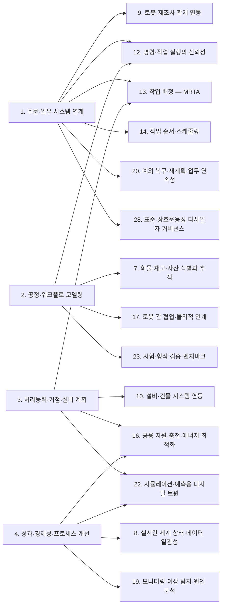
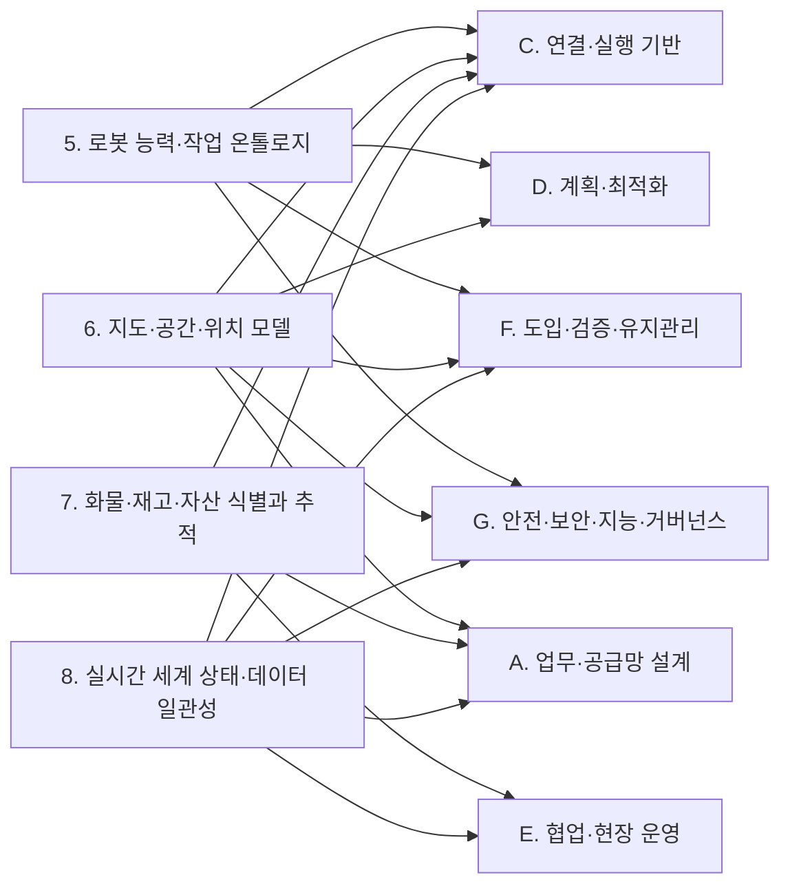
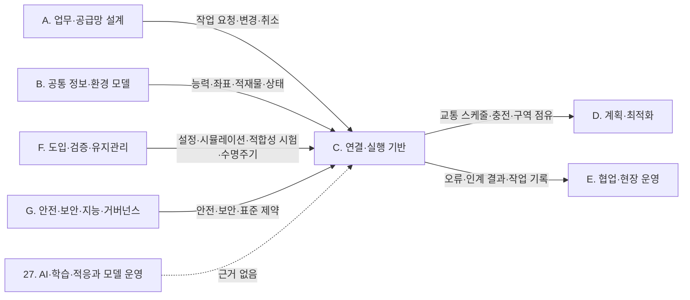
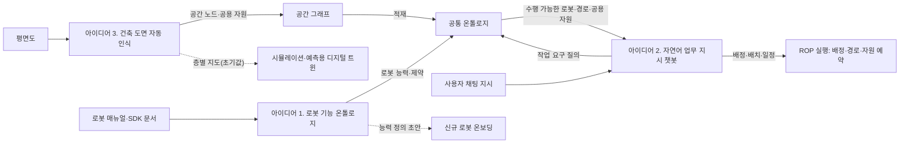

(너의 규칙은 시스템 프롬프트의 agents/shared-rules.md 와 agents/verifier.md 이다. 아래는 이번 실행의 컨텍스트와 입력이다.)

## 실행 컨텍스트

- run_id: 2026-09-25-49
- date: 2026-09-25
- run_type: category_link (대분류 연결)
- 대상: 대분류 D. 계획·최적화 페이지의 '다른 대분류와의 연결' 절(대분류 연결 실행). 게시된 세부영역 페이지를 근거로 다른 대분류와의 연결을 조사·서술한다. 스토리텔러는 그 절만 patches 로 바꾼다
- 예산:
    - max_search_queries: 30
    - max_sources_per_run: 15
    - new_topic_pages: 1
    - page_updates: 2
    - max_retries: 2
- 환경 알림: web_fetch_available: false · fetch_mode: mirror_only (일반 웹 페이지 열람은 네트워크 정책으로 막혀 있다. raw.githubusercontent.com 은 열린다: 공식 문서가 GitHub 에 있는 출처는 입력의 config/source_mirrors.yaml 경로를 WebFetch 로 열어 원문을 읽고 sources[].fetched=true, fetched_via=github_raw, fetch_url 을 적는다. 입력에 원문 텍스트(data/source_texts)가 있는 출처는 fetched_via=inbox. 그 밖의 출처는 fetched=false 이며 코드가 신뢰도 상한(medium)을 강제한다 — 공통 규칙 0절 6항)
- 언어: ko
- verification_stage: first
- verifier_budget:
    - max_search_queries: 30
    - max_sources_per_run: 15
    - new_topic_pages: 1
    - page_updates: 2
    - max_retries: 2

## 입력

### runs/2026-09-25-49/target.json

```json
{
  "run_id": "2026-09-25-49",
  "date": "2026-09-25",
  "weekday": "Fri",
  "run_number": 49,
  "run_type": "category_link",
  "forced": true,
  "target": {
    "area_no": null,
    "area_name": null,
    "category": "D. 계획·최적화",
    "category_letter": "D"
  },
  "topic": null,
  "track": null,
  "corrections": [],
  "budget": {
    "max_search_queries": 30,
    "max_sources_per_run": 15,
    "new_topic_pages": 1,
    "page_updates": 2,
    "max_retries": 2
  },
  "priority_reason": null,
  "priority_questions": [],
  "excluded_areas": [],
  "lifted_areas": [],
  "deferred": {
    "monthly_recheck": false,
    "weekly_review": false
  },
  "selection_rationale": "CLI 지정 run_type=category_link"
}
```

### runs/2026-09-25-49/research.json

```json
{
  "run_id": "2026-09-25-49",
  "date": "2026-09-25",
  "run_type": "category_link",
  "target": {
    "area_no": null,
    "area_name": null,
    "category": "D. 계획·최적화"
  },
  "gaps": [
    "D. 계획·최적화 페이지의 '다른 대분류와의 연결' 절 비어 있음(아직 작성되지 않음)",
    "E. 협업·현장 운영의 19. 모니터링·이상 탐지·원인 분석과 D. 계획·최적화 세부영역을 잇는 근거가 게시 페이지에 없음",
    "G. 안전·보안·지능·거버넌스의 26. 사이버보안·접근권한·개인정보와 D. 계획·최적화를 잇는 근거 없음",
    "C. 연결·실행 기반의 11. 분산 시스템·통신·컴퓨팅 구조, B. 공통 정보·환경 모델의 7. 화물·재고·자산 식별과 추적과의 직접 연결 근거 약함",
    "F. 도입·검증·유지관리의 23. 시험·형식 검증·벤치마크 연결은 MAPF 벤치마크 정의뿐이고 현장 처리량과의 관계는 열린 질문(oq-058)"
  ],
  "research_questions": [
    "가장 가까운 로봇에 맡기는 것이 전체적으로도 유리한가? [분류원문]",
    "D. 계획·최적화의 네 세부영역(13. 작업 배정 — MRTA ~ 16. 공용 자원·충전·에너지 최적화)은 A. 업무·공급망 설계에서 어떤 입력(주문·시작 시각·우선순위·물동량)을 받고 어떤 성과를 되돌리는가?",
    "B. 공통 정보·환경 모델의 능력 선언·경로망·배터리 상태가 D. 계획·최적화의 배정·교통·충전 계획에 어떤 입력으로 들어가는가?",
    "C. 연결·실행 기반의 인터페이스(Open-RMF 디스패처·제어 수준·승강기 세션, VDA 5050 관제 기능·기반 경로)는 D. 계획·최적화의 결정을 어디까지 집행하고 어디서 제한하는가?",
    "E. 협업·현장 운영과 F. 도입·검증·유지관리의 어느 세부영역(사람 협업, 예외 복구, 시뮬레이션, 시험, 수명주기)이 D. 계획·최적화의 결정과 맞물리는가?",
    "G. 안전·보안·지능·거버넌스의 25. 안전·위험 관리, 27. AI·학습·적응과 모델 운영, 28. 표준·상호운용성·다사업자 거버넌스와 D. 계획·최적화를 잇는 검증된 근거는 무엇이고, 26. 사이버보안·접근권한·개인정보와의 근거는 있는가?"
  ],
  "findings": [
    {
      "id": "f1",
      "claim": "D. 계획·최적화의 13. 작업 배정 — MRTA ↔ A. 업무·공급망 설계의 1. 주문·업무 시스템 연계: VDA 5050 3.0.0 은 이동로봇에 대한 주문 배정을 관제(fleet control)의 기능으로 두면서, 외부 IT 시스템과의 인터페이스는 명세 범위에서 제외한다.",
      "tag": "사실",
      "source_ids": [
        "ref-031"
      ],
      "cross_checked": false,
      "confidence": "medium",
      "evidence_excerpt": "관제 기능 목록에 'Assignment of orders to the mobile robots'가 있고, 범위 제외 대상으로 주변 설비·인프라·외부 IT 시스템 인터페이스를 든다(3.0.0, main 브랜치 원문).",
      "as_of": "2026-09-25",
      "flow_step": null,
      "flow_item": null
    },
    {
      "id": "f2",
      "claim": "D. 계획·최적화의 13. 작업 배정 — MRTA ↔ A. 업무·공급망 설계의 1. 주문·업무 시스템 연계: 로봇 인터페이스 표준이 상위 시스템 연동을 범위 밖에 두므로, 배정의 입력인 주문·납기·출하 마감 제약은 WMS 등 상위 업무 시스템에서 받아 ROP 가 배정 기준으로 옮겨야 할 것으로 보인다(결합 방법은 oq-054).",
      "tag": "추정",
      "source_ids": [
        "ref-031",
        "ref-125"
      ],
      "cross_checked": false,
      "confidence": "low",
      "evidence_excerpt": "f1 의 범위 제외와, Open-RMF 작업 요청 스키마에 마감 필드가 없다는 점(f3)에서 도출. 게시된 13. 작업 배정 — MRTA 9절 표와 같은 방향.",
      "as_of": "2026-09-25",
      "flow_step": "피킹",
      "flow_item": "시작 조건",
      "source_unopened": false
    },
    {
      "id": "f3",
      "claim": "D. 계획·최적화의 14. 작업 순서·스케줄링 ↔ A. 업무·공급망 설계의 1. 주문·업무 시스템 연계: Open-RMF 작업 요청 스키마(task_request.json)는 시각·순서 관련 필드로 가장 이른 시작 시각과 우선순위를 두고, 마감 시각이나 다른 작업과의 선후 필드는 두지 않는다.",
      "tag": "사실",
      "source_ids": [
        "ref-125"
      ],
      "cross_checked": false,
      "confidence": "medium",
      "evidence_excerpt": "게시된 14. 작업 순서·스케줄링 5절 시작 조건 칸의 [사실] 주장. 이번 실행에서 원문 재열람 안 함. (재인용: 2026-09-25-34)",
      "as_of": "2026-09-25",
      "flow_step": "출하",
      "flow_item": "시작 조건",
      "source_unopened": true
    },
    {
      "id": "f4",
      "claim": "D. 계획·최적화의 14. 작업 순서·스케줄링 ↔ A. 업무·공급망 설계의 1. 주문·업무 시스템 연계: 웨이브·웨이브리스 출고 지시 정책 연구(2010)와 동적으로 도착하는 주문의 피킹 재최적화 연구(2025)는 상위 시스템의 출고 지시·우선순위 변경이 작업 순서 결정 문제로 넘어가는 지점을 다루는 것으로 보인다.",
      "tag": "추정",
      "source_ids": [
        "ref-134",
        "ref-133"
      ],
      "cross_checked": false,
      "confidence": "low",
      "evidence_excerpt": "A. 업무·공급망 설계 페이지 연결 절의 [추정] 주장과 같은 각주. 원문 미열람.",
      "as_of": "2025",
      "flow_step": "피킹",
      "flow_item": "시작 조건",
      "source_unopened": true
    },
    {
      "id": "f5",
      "claim": "D. 계획·최적화의 14. 작업 순서·스케줄링 ↔ A. 업무·공급망 설계의 3. 처리능력·거점·설비 계획: 랙 이동 로봇 작업대의 주문 배치·순서와 랙 도착 순서를 함께 정한 2017년 연구는 저자 계산 실험에서 최적화된 주문 처리가 흔한 단순 규칙보다 필요한 로봇 대수를 절반 넘게 줄였다고 보고했다.",
      "tag": "사실",
      "source_ids": [
        "ref-381"
      ],
      "cross_checked": false,
      "confidence": "medium",
      "evidence_excerpt": "게시된 14. 작업 순서·스케줄링 3절·10절의 [사실] 주장(저자 계산 실험, 독립 재현 미확인). (재인용: 2026-09-25-34)",
      "as_of": "2017",
      "flow_step": "피킹",
      "flow_item": "수행 자원",
      "source_unopened": true
    },
    {
      "id": "f6",
      "claim": "D. 계획·최적화의 14. 작업 순서·스케줄링 ↔ A. 업무·공급망 설계의 4. 성과·경제성·프로세스 개선: 풋월 주문 통합 연구는 빈 방출 순서가 맞지 않으면 포장 작업자가 유휴 대기한다고 보아, 포장 작업자 대기가 순서 결정의 성과 지표로 이어진다(지표 정의는 oq-051).",
      "tag": "사실",
      "source_ids": [
        "ref-385"
      ],
      "cross_checked": false,
      "confidence": "medium",
      "evidence_excerpt": "게시된 14. 작업 순서·스케줄링 5절 예외·성과 칸과 10절의 [사실] 주장. (재인용: 2026-09-25-34)",
      "as_of": "2019",
      "flow_step": "포장",
      "flow_item": "예외·성과",
      "source_unopened": true
    },
    {
      "id": "f7",
      "claim": "D. 계획·최적화의 14. 작업 순서·스케줄링 ↔ A. 업무·공급망 설계의 2. 공정·워크플로 모델링: B2MML 공통 스키마의 Dependency1Type 은 두 요소 사이 실행 의존(선후·병행 금지·시작 후 간격 등)을 표현하며, 창고 물류 작업에 적용한 사례는 확인되지 않았다(oq-013).",
      "tag": "사실",
      "source_ids": [
        "ref-117"
      ],
      "cross_checked": false,
      "confidence": "medium",
      "evidence_excerpt": "게시된 14. 작업 순서·스케줄링 7절 표와 10절의 [사실] 주장. 이번 실행 원문 재열람 안 함. (재인용: 2026-09-25-34)",
      "as_of": "2023",
      "flow_step": null,
      "flow_item": null,
      "source_unopened": true
    },
    {
      "id": "f8",
      "claim": "D. 계획·최적화의 16. 공용 자원·충전·에너지 최적화 ↔ A. 업무·공급망 설계의 3. 처리능력·거점·설비 계획: 충전기 대수 결정과 창고 충전소 배치 최적화 연구가 있어, 충전 정책 결정이 충전기 수·위치 같은 설비 계획으로 이어지는 것으로 보인다.",
      "tag": "추정",
      "source_ids": [
        "ref-533",
        "ref-109"
      ],
      "cross_checked": false,
      "confidence": "low",
      "evidence_excerpt": "게시된 16. 공용 자원·충전·에너지 최적화 10절의 [추정] 연결(Chen 외 2024, Stark 외 2024). 원문 미열람.",
      "as_of": "2024",
      "flow_step": null,
      "flow_item": "수행 자원",
      "source_unopened": true
    },
    {
      "id": "f9",
      "claim": "D. 계획·최적화의 16. 공용 자원·충전·에너지 최적화 ↔ A. 업무·공급망 설계의 4. 성과·경제성·프로세스 개선: Omega(2024) 연구는 로봇 이동형 풀필먼트 시스템에서 동적 우선순위 규칙이 선착순보다 에너지 소비를 3.41% 줄이고 처리량을 26.07% 높였다고 보고했으며, 이는 모델·시뮬레이션 조건의 저자 보고값이다.",
      "tag": "사실",
      "source_ids": [
        "ref-146"
      ],
      "cross_checked": false,
      "confidence": "medium",
      "evidence_excerpt": "A. 업무·공급망 설계 페이지 연결 절의 [사실] 주장(현장 실측 아님). (재인용: 2026-09-25-29)",
      "as_of": "2024",
      "flow_step": null,
      "flow_item": "예외·성과",
      "source_unopened": true
    },
    {
      "id": "f10",
      "claim": "D. 계획·최적화의 13. 작업 배정 — MRTA ↔ B. 공통 정보·환경 모델의 5. 로봇 능력·작업 온톨로지: 능력 온톨로지로 이종 로봇·자원의 작업 수행 가능성을 추론해 배정 후보를 정하는 연구가 있다(2022, 2026).",
      "tag": "사실",
      "source_ids": [
        "ref-236",
        "ref-237"
      ],
      "cross_checked": false,
      "confidence": "medium",
      "evidence_excerpt": "게시된 13. 작업 배정 — MRTA 10절과 B. 공통 정보·환경 모델 연결 절의 [사실] 주장. 선언 능력과 관측 능력 중 기준 문제는 oq-024. 원문 미열람.",
      "as_of": "2026-08",
      "flow_step": null,
      "flow_item": "수행 자원",
      "source_unopened": true
    },
    {
      "id": "f11",
      "claim": "D. 계획·최적화의 16. 공용 자원·충전·에너지 최적화 ↔ B. 공통 정보·환경 모델의 5. 로봇 능력·작업 온톨로지: VDA 5050 팩트시트는 임계 저충전 수준(criticalLowChargingLevel)을 선언하게 하고 그 이하에서는 관제가 충전소로 가는 주문만 보내야 하며, Open-RMF 템플릿은 운영 설정 recharge_threshold(예시값 0.10)와 충전 목표 recharge_soc(예시값 1.0)를 둔다.",
      "tag": "사실",
      "source_ids": [
        "ref-228",
        "ref-105"
      ],
      "cross_checked": false,
      "confidence": "medium",
      "evidence_excerpt": "config.yaml 원문: recharge_threshold 0.10, recharge_soc 1.0, 로봇별 charger, finishing_request park. 팩트시트 부분은 게시된 16절 5절 제약 칸 [사실] 재인용. 두 값 중 기준은 oq-068.",
      "as_of": "2026-09-25",
      "flow_step": null,
      "flow_item": "제약",
      "source_unopened": false
    },
    {
      "id": "f12",
      "claim": "D. 계획·최적화의 15. 다중 로봇 경로·교통 관리 — MAPF ↔ B. 공통 정보·환경 모델의 6. 지도·공간·위치 모델: Open-RMF traffic-editor 는 플릿별 경유점·차선(양방향·단방향) 그래프와 주차·충전·대기 지점 속성, 문·승강기·층을 주석하게 하고, 이 그래프를 building_map_generator 로 주행 그래프로 내보내 플릿 어댑터의 경로 계획에 쓰게 한다.",
      "tag": "사실",
      "source_ids": [
        "ref-079"
      ],
      "cross_checked": false,
      "confidence": "medium",
      "evidence_excerpt": "원문: 'The annotated Graphs are eventually exported as navigation graphs using the building_map_generator' — 플릿 어댑터 경로 계획에 쓰인다.",
      "as_of": "2026-09-25",
      "flow_step": null,
      "flow_item": "제약"
    },
    {
      "id": "f13",
      "claim": "D. 계획·최적화의 16. 공용 자원·충전·에너지 최적화 ↔ B. 공통 정보·환경 모델의 8. 실시간 세계 상태·데이터 일관성: 충전 시점 계획은 로봇이 보고하는 현재 배터리 상태(충전 상태·충전 중 여부)를 입력으로 쓰며, 이 현재 상태 표현은 8. 실시간 세계 상태·데이터 일관성 쪽에 속하는 것으로 보인다.",
      "tag": "추정",
      "source_ids": [
        "ref-051",
        "ref-104"
      ],
      "cross_checked": false,
      "confidence": "low",
      "evidence_excerpt": "rmf_demos 원문: 'ChargeBattery tasks are optimally injected into a robot's schedule when the robot has insufficient charge'. VDA 5050 상태 스키마의 배터리 상태는 게시된 16절 10절 [추정] 재인용.",
      "as_of": "2026-09-25",
      "flow_step": null,
      "flow_item": "시작 조건",
      "source_unopened": false
    },
    {
      "id": "f14",
      "claim": "D. 계획·최적화의 13. 작업 배정 — MRTA ↔ C. 연결·실행 기반의 9. 로봇·제조사 관제 연동: Open-RMF 디스패처는 작업 요청을 받으면 모든 플릿 어댑터에 입찰 공고(BidNotice)를 보내고, 처리 가능한 플릿이 비용을 담은 입찰(BidProposal)을 내면 가장 빨리 끝나는 것·가장 낮은 비용 같은 설정 기준으로 비교해 작업을 줄 플릿을 정한다.",
      "tag": "사실",
      "source_ids": [
        "ref-376"
      ],
      "cross_checked": false,
      "confidence": "medium",
      "evidence_excerpt": "원문: 평가 방법으로 'fastest to finish, lowest cost, etc which can be configured'. 플릿 안에서 로봇을 고르는 일은 플릿 어댑터 쪽(두 수준 배정의 최적성 손실은 oq-053).",
      "as_of": "2026-09-25",
      "flow_step": "피킹",
      "flow_item": "수행 자원"
    },
    {
      "id": "f15",
      "claim": "D. 계획·최적화의 15. 다중 로봇 경로·교통 관리 — MAPF ↔ C. 연결·실행 기반의 9. 로봇·제조사 관제 연동: Open-RMF 는 플릿 연동을 전체 제어·신호등(일시정지·재개)·읽기 전용으로 나누고 공유 공간마다 읽기 전용 플릿을 하나만 허용하며, 중앙 교통 스케줄에서 충돌이 나면 플릿들이 제안을 내고 시스템 통합사가 배치한 제3자 판정자가 조합을 고른다.",
      "tag": "사실",
      "source_ids": [
        "ref-004"
      ],
      "cross_checked": false,
      "confidence": "medium",
      "evidence_excerpt": "원문: 'any shared space is allowed to have a maximum of just one \"Read Only\" fleet in operation.' 제어 수준별 교통 성능 차이는 oq-032.",
      "as_of": "2026-09-25",
      "flow_step": null,
      "flow_item": "수행 자원"
    },
    {
      "id": "f16",
      "claim": "D. 계획·최적화의 15. 다중 로봇 경로·교통 관리 — MAPF ↔ C. 연결·실행 기반의 9. 로봇·제조사 관제 연동: VDA 5050 3.0.0 은 경로 결정·우선순위·혼잡 처리·교착 해소 같은 교통 조율 전략과 알고리즘을 명세에서 제외하면서도, 교착 탐지·해소와 교통 제어(버퍼 경로·대기 위치)를 관제 기능으로 둔다.",
      "tag": "사실",
      "source_ids": [
        "ref-031"
      ],
      "cross_checked": false,
      "confidence": "medium",
      "evidence_excerpt": "원문 요지: 교통 조율 전략(routing, prioritization, congestion handling, deadlock resolution)은 포함하지 않으며, 관제 기능에 'Detection and resolution of blockages (\"deadlocks\")'가 있다.",
      "as_of": "2026-09-25",
      "flow_step": null,
      "flow_item": "제약"
    },
    {
      "id": "f17",
      "claim": "D. 계획·최적화의 16. 공용 자원·충전·에너지 최적화 ↔ C. 연결·실행 기반의 10. 설비·건물 시스템 연동: Open-RMF 승강기 요청은 세션 id 로 승강기를 점유하고 세션 종료 요청(REQUEST_END_SESSION)을 보낼 때까지 제어권이 그 세션에 남으며, AGV 모드에서는 정지 시 문이 열린 채 유지된다.",
      "tag": "사실",
      "source_ids": [
        "ref-312",
        "ref-286"
      ],
      "cross_checked": false,
      "confidence": "medium",
      "evidence_excerpt": "LiftState 원문: session_id 는 'has been granted control of the lift until it sends a request with a request_type of REQUEST_END_SESSION'. 여러 제조사 호출의 배분 규칙은 oq-067.",
      "as_of": "2026-09-25",
      "flow_step": "출하",
      "flow_item": "제약"
    },
    {
      "id": "f18",
      "claim": "D. 계획·최적화의 16. 공용 자원·충전·에너지 최적화 ↔ C. 연결·실행 기반의 9. 로봇·제조사 관제 연동: VDA 5050 은 충전 주문이 운반 주문을 중단시킬 수 있다는 것을 관제의 에너지 관리 기능으로 두고, 과충전 보호는 이동로봇의 책임으로 명시한다.",
      "tag": "사실",
      "source_ids": [
        "ref-031"
      ],
      "cross_checked": false,
      "confidence": "medium",
      "evidence_excerpt": "원문: 'Charging orders can interrupt transfer orders' / 'Protection against overcharging is the responsibility of the mobile robot.'",
      "as_of": "2026-09-25",
      "flow_step": null,
      "flow_item": "예외·성과"
    },
    {
      "id": "f19",
      "claim": "D. 계획·최적화의 14. 작업 순서·스케줄링 ↔ C. 연결·실행 기반의 12. 명령·작업 실행의 신뢰성: VDA 5050 에서 이미 로봇에 넘긴 기반(base) 경로는 바꿀 수 없으므로, 우선순위 변경에 따른 재정렬은 아직 해제하지 않은 호라이즌 구간과 새 주문에만 적용할 수 있을 것으로 보인다.",
      "tag": "추정",
      "source_ids": [
        "ref-031"
      ],
      "cross_checked": false,
      "confidence": "medium",
      "evidence_excerpt": "원문: 'the base cannot be changed. The fleet control shall therefore assume that the base has already been executed'. 재정렬 범위는 C. 연결·실행 기반 페이지의 [추정]과 같은 해석.",
      "as_of": "2026-09-25",
      "flow_step": null,
      "flow_item": "제약"
    },
    {
      "id": "f20",
      "claim": "D. 계획·최적화의 13. 작업 배정 — MRTA ↔ E. 협업·현장 운영의 18. 사람–로봇 협업·운영 인터페이스: 작업자가 피킹하고 자율이동로봇이 운반하는 동적 주문 피킹 연구(2025)가 있어, 로봇 배정이 사람 작업자의 배치와 맞물린다.",
      "tag": "사실",
      "source_ids": [
        "ref-132"
      ],
      "cross_checked": false,
      "confidence": "medium",
      "evidence_excerpt": "게시된 13. 작업 배정 — MRTA 5절 수행 자원 칸의 [사실] 주장. 18번 페이지는 아직 seed. (재인용: 2026-09-25-33)",
      "as_of": "2025",
      "flow_step": "피킹",
      "flow_item": "수행 자원",
      "source_unopened": true
    },
    {
      "id": "f21",
      "claim": "D. 계획·최적화의 14. 작업 순서·스케줄링 ↔ E. 협업·현장 운영의 18. 사람–로봇 협업·운영 인터페이스: 복수 포장대와 피킹-패킹 전환 정책(작업자가 피킹과 포장 사이를 옮겨 감)의 작업자 스케줄링을 다룬 국내 연구(2025)가 있다.",
      "tag": "사실",
      "source_ids": [
        "ref-388"
      ],
      "cross_checked": false,
      "confidence": "medium",
      "evidence_excerpt": "게시된 14. 작업 순서·스케줄링 5절·10절의 [사실] 주장(결과 수치 미확인). (재인용: 2026-09-25-34)",
      "as_of": "2025",
      "flow_step": "포장",
      "flow_item": "수행 자원",
      "source_unopened": true
    },
    {
      "id": "f22",
      "claim": "D. 계획·최적화의 14. 작업 순서·스케줄링 ↔ E. 협업·현장 운영의 17. 로봇 간 협업·물리적 인계: Open-RMF 배정이 플릿 단위 입찰로 이루어지고 요청 스키마에 작업 간 선후 필드가 없으므로, 피킹 로봇 완료 뒤 운반 로봇 출발 같은 제조사 간 인계 선후는 ROP 가 작업 흐름 수준에서 관리해야 할 것으로 보인다(oq-049).",
      "tag": "추정",
      "source_ids": [
        "ref-376",
        "ref-125"
      ],
      "cross_checked": false,
      "confidence": "low",
      "evidence_excerpt": "게시된 14. 작업 순서·스케줄링 5절 완료·인계 칸·9절의 [추정] 주장과 같다. 공개 구현은 찾지 못함.",
      "as_of": "2026-09-25",
      "flow_step": "피킹",
      "flow_item": "완료·인계",
      "source_unopened": false
    },
    {
      "id": "f23",
      "claim": "D. 계획·최적화의 15. 다중 로봇 경로·교통 관리 — MAPF ↔ E. 협업·현장 운영의 20. 예외 복구·재계획·업무 연속성: 창고 MAPF 실행 연구(2019)는 지연이 쌓일 때 행동 의존 그래프로 순서를 지키며 실행을 이어가는 방법을 다루어, 계획 유지와 재계획의 판단이 두 영역을 잇는다.",
      "tag": "사실",
      "source_ids": [
        "ref-188"
      ],
      "cross_checked": false,
      "confidence": "medium",
      "evidence_excerpt": "게시된 15. 다중 로봇 경로·교통 관리 — MAPF 5절 예외·성과 칸의 [사실] 주장. 20번 페이지는 seed. (재인용: 2026-09-25-39)",
      "as_of": "2019",
      "flow_step": "피킹",
      "flow_item": "예외·성과",
      "source_unopened": true
    },
    {
      "id": "f24",
      "claim": "D. 계획·최적화의 16. 공용 자원·충전·에너지 최적화 ↔ G. 안전·보안·지능·거버넌스의 25. 안전·위험 관리: Open-RMF 승강기 상태의 운영 모드에는 사람·AGV·화재·오프라인·비상이 있고, Open-RMF 데모는 비상 경보가 켜지면 로봇을 가장 가까운 주차 위치로 보낸다.",
      "tag": "사실",
      "source_ids": [
        "ref-286",
        "ref-104"
      ],
      "cross_checked": false,
      "confidence": "medium",
      "evidence_excerpt": "LiftState 원문: MODE_HUMAN, MODE_AGV, MODE_FIRE, MODE_OFFLINE, MODE_EMERGENCY. rmf_demos README: 경보 시 로봇을 가장 가까운 주차 위치로 보냄. 설비 안전 제어는 분류 원문 9장 연계 대상.",
      "as_of": "2026-09-25",
      "flow_step": null,
      "flow_item": "예외·성과"
    },
    {
      "id": "f25",
      "claim": "D. 계획·최적화의 15. 다중 로봇 경로·교통 관리 — MAPF ↔ G. 안전·보안·지능·거버넌스의 25. 안전·위험 관리: VDA 5050 3.0.0 은 진입 금지(BLOCKED)·속도 제한(SPEED_LIMIT)·해제(RELEASE) 등 구역 유형을 교통 관리 수단으로 정의하면서, 이 문서가 기능·운영·시스템 안전을 정하지 않으며 안전 표준으로 적용해서는 안 된다고 밝힌다.",
      "tag": "사실",
      "source_ids": [
        "ref-031"
      ],
      "cross_checked": false,
      "confidence": "medium",
      "evidence_excerpt": "원문: 'This document does not define functional, operational, or system safety'. 구역 유형 10종(BLOCKED, LINE_GUIDED, RELEASE, COORDINATED_REPLANNING, SPEED_LIMIT, ACTION, PRIORITY, PENALTY, DIRECTED, BIDIRECTED).",
      "as_of": "2026-09-25",
      "flow_step": null,
      "flow_item": "제약"
    },
    {
      "id": "f26",
      "claim": "D. 계획·최적화의 13. 작업 배정 — MRTA ↔ F. 도입·검증·유지관리의 22. 시뮬레이션·예측용 디지털 트윈: 로봇 이동형 풀필먼트 시스템과 국내 자동물류센터의 이산 사건 시뮬레이션 연구가 배정 규칙을 가정한 미래에서 실험하는 도구로 쓰였고, 한 연구에서는 피킹 주문 배정 규칙이 단위 처리량을 크게 바꾸었다.",
      "tag": "사실",
      "source_ids": [
        "ref-398",
        "ref-402"
      ],
      "cross_checked": false,
      "confidence": "medium",
      "evidence_excerpt": "게시된 13. 작업 배정 — MRTA 3절·10절의 [사실] 주장. 22번 페이지는 seed. (재인용: 2026-09-25-33)",
      "as_of": "2019",
      "flow_step": "피킹",
      "flow_item": "예외·성과",
      "source_unopened": true
    },
    {
      "id": "f27",
      "claim": "D. 계획·최적화의 15. 다중 로봇 경로·교통 관리 — MAPF ↔ F. 도입·검증·유지관리의 22. 시뮬레이션·예측용 디지털 트윈: 다중 AGV 시스템의 경로망을 시뮬레이션으로 자동 설계하는 연구가 있어, 경로망 설계 평가는 가정한 미래를 실험하는 쪽에 속하는 것으로 보인다.",
      "tag": "추정",
      "source_ids": [
        "ref-267"
      ],
      "cross_checked": false,
      "confidence": "low",
      "evidence_excerpt": "게시된 15. 다중 로봇 경로·교통 관리 — MAPF 10절의 [추정] 연결. 현재 상태 표현(8. 실시간 세계 상태·데이터 일관성)과 구분. 원문 미열람.",
      "as_of": "2024",
      "flow_step": null,
      "flow_item": null,
      "source_unopened": true
    },
    {
      "id": "f28",
      "claim": "D. 계획·최적화의 15. 다중 로봇 경로·교통 관리 — MAPF ↔ F. 도입·검증·유지관리의 21. 온보딩·설정·현장 시운전: 현장 도입 때 플릿별 경로망과 차선 속성, 주차·충전 경유점을 traffic-editor 로 주석해 설정하는 일이 온보딩 작업이 될 것으로 보인다.",
      "tag": "추정",
      "source_ids": [
        "ref-079"
      ],
      "cross_checked": false,
      "confidence": "low",
      "evidence_excerpt": "traffic-editor 원문의 주석 대상(차선·경유점·주차·충전·문·승강기·층)에서 도출. 게시된 15번 10절의 [추정]과 같다. 온보딩 소요 측정 자료 없음.",
      "as_of": "2026-09-25",
      "flow_step": null,
      "flow_item": null
    },
    {
      "id": "f29",
      "claim": "D. 계획·최적화의 15. 다중 로봇 경로·교통 관리 — MAPF ↔ F. 도입·검증·유지관리의 23. 시험·형식 검증·벤치마크: MAPF 연구는 정의·변형·벤치마크를 정리한 공통 틀을 가지고 있으나, 격자·단위 시간 가정의 벤치마크 성과가 실제 물류센터 처리량으로 얼마나 이어지는지는 확인되지 않았다(oq-058).",
      "tag": "사실",
      "source_ids": [
        "ref-186"
      ],
      "cross_checked": false,
      "confidence": "medium",
      "evidence_excerpt": "Stern 외(2019) 'Definitions, Variants, and Benchmarks'. 게시된 15번 3절 [사실] 주장과 11절 열린 질문. 원문 미열람.",
      "as_of": "2019-06",
      "flow_step": null,
      "flow_item": null,
      "source_unopened": true
    },
    {
      "id": "f30",
      "claim": "D. 계획·최적화의 16. 공용 자원·충전·에너지 최적화 ↔ F. 도입·검증·유지관리의 24. 자산·소프트웨어 수명주기 관리: 플릿 수준에서 배터리 건강(열화)을 고려해 자율이동로봇의 일정을 정하는 연구(2026-03)가 있어, 충전·배정 계획이 배터리 열화 관리와 이어진다.",
      "tag": "사실",
      "source_ids": [
        "ref-403"
      ],
      "cross_checked": false,
      "confidence": "medium",
      "evidence_excerpt": "제목 'Fleet-Level Battery-Health-Aware Scheduling for Autonomous Mobile Robots'. 게시된 13번 10절에 [사실]로 인용됨. 원문 미열람.",
      "as_of": "2026-03",
      "flow_step": null,
      "flow_item": "제약",
      "source_unopened": true
    },
    {
      "id": "f31",
      "claim": "D. 계획·최적화의 13. 작업 배정 — MRTA ↔ G. 안전·보안·지능·거버넌스의 27. AI·학습·적응과 모델 운영: 학습 기반 배차(이종 그래프 어텐션 스케줄러)와 LLM 기반 다중 로봇 작업 배정 연구가 있어, 분류 원문 8장의 '학습 기반 배차' 교차 규칙에 따라 두 영역이 이어진다.",
      "tag": "사실",
      "source_ids": [
        "ref-399",
        "ref-090",
        "ref-168"
      ],
      "cross_checked": false,
      "confidence": "medium",
      "evidence_excerpt": "게시된 13번 10절의 [사실] 주장. LLM 배정 결과 수치에는 출처 충돌(oq-030)이 있어 수치는 싣지 않음. 원문 미열람.",
      "as_of": "2025-12",
      "flow_step": null,
      "flow_item": null,
      "source_unopened": true
    },
    {
      "id": "f32",
      "claim": "D. 계획·최적화의 15. 다중 로봇 경로·교통 관리 — MAPF ↔ G. 안전·보안·지능·거버넌스의 27. AI·학습·적응과 모델 운영: 모방 학습을 적용한 지속형 MAPF 연구(2024-10)가 있어, 학습 기반 경로 계획이 두 영역을 잇는다.",
      "tag": "사실",
      "source_ids": [
        "ref-199"
      ],
      "cross_checked": false,
      "confidence": "medium",
      "evidence_excerpt": "게시된 15번 10절의 [사실] 주장('Scalable Imitation Learning for Lifelong Multi-Agent Path Finding'). 원문 미열람.",
      "as_of": "2024-10",
      "flow_step": null,
      "flow_item": null,
      "source_unopened": true
    },
    {
      "id": "f33",
      "claim": "D. 계획·최적화의 16. 공용 자원·충전·에너지 최적화 ↔ G. 안전·보안·지능·거버넌스의 27. AI·학습·적응과 모델 운영: 자율 피킹 로봇의 충전소 선택·충전 시간 결정에 심층 강화학습을 쓰는 연구(2026-07)가 있어, 학습 기반 충전 결정이 두 영역을 잇는 것으로 보인다.",
      "tag": "추정",
      "source_ids": [
        "ref-531"
      ],
      "cross_checked": false,
      "confidence": "low",
      "evidence_excerpt": "게시된 16번 10절의 [추정] 연결. 원문 미열람.",
      "as_of": "2026-07",
      "flow_step": null,
      "flow_item": null,
      "source_unopened": true
    },
    {
      "id": "f34",
      "claim": "D. 계획·최적화의 15. 다중 로봇 경로·교통 관리 — MAPF ↔ G. 안전·보안·지능·거버넌스의 28. 표준·상호운용성·다사업자 거버넌스: VDA 5050 은 구역·경로 해제로 교통 규칙을 정하되 조율 전략은 빼고, Open-RMF 는 여러 플릿의 교통 스케줄·협상을 구현하므로, 한 현장에서 둘을 함께 쓸 때 우선권 판정 규칙을 누가 정하고 승인하는지가 거버넌스 과제로 넘어갈 것으로 보인다(oq-057).",
      "tag": "추정",
      "source_ids": [
        "ref-031",
        "ref-004"
      ],
      "cross_checked": false,
      "confidence": "low",
      "evidence_excerpt": "f15·f16·f25 에서 도출. 제3자 판정자를 시스템 통합사가 배치한다는 Open-RMF 설명이 판정 주체 문제를 드러낸다. 공개 설계 미확인.",
      "as_of": "2026-09-25",
      "flow_step": null,
      "flow_item": null
    }
  ],
  "sources": [
    {
      "id": "ref-031",
      "org": "VDA / VDMA (VDA5050 GitHub)",
      "title": "VDA5050/VDA5050_EN.md — Official Specification document for the VDA 5050",
      "published": null,
      "url": "https://github.com/VDA5050/VDA5050/blob/main/VDA5050_EN.md",
      "type": "표준",
      "reliability": "high",
      "accessed": "2026-09-25",
      "summary": "VDA 5050 3.0.0 명세 원문. 관제 기능(주문 배정, 교착 탐지·해소, 교통 제어, 에너지 관리), 범위 제외, 기반·호라이즌, 구역 유형, 안전 비규정 문구 확인.",
      "fetched": true,
      "fetched_via": "github_raw",
      "fetch_url": "https://raw.githubusercontent.com/VDA5050/VDA5050/main/VDA5050_EN.md",
      "source_unopened": false
    },
    {
      "id": "ref-004",
      "org": "Open Robotics",
      "title": "RMF Core Overview — Programming Multiple Robots with ROS 2",
      "published": null,
      "url": "https://osrf.github.io/ros2multirobotbook/rmf-core.html",
      "type": "오픈소스 문서",
      "reliability": "high",
      "accessed": "2026-09-25",
      "summary": "플릿 제어 수준(전체 제어·신호등·읽기 전용), 중앙 교통 스케줄과 제3자 판정자 협상 설명.",
      "fetched": true,
      "fetched_via": "github_raw",
      "fetch_url": "https://raw.githubusercontent.com/osrf/ros2multirobotbook/master/src/rmf-core.md",
      "source_unopened": false
    },
    {
      "id": "ref-376",
      "org": "Open Robotics",
      "title": "Tasks in RMF (task) - Programming Multiple Robots with ROS 2",
      "published": null,
      "url": "https://osrf.github.io/ros2multirobotbook/task.html",
      "type": "오픈소스 문서",
      "reliability": "high",
      "accessed": "2026-09-25",
      "summary": "디스패처의 입찰 공고·입찰·배정 요청 흐름과 설정 가능한 평가 기준 설명.",
      "fetched": true,
      "fetched_via": "github_raw",
      "fetch_url": "https://raw.githubusercontent.com/osrf/ros2multirobotbook/master/src/task.md",
      "source_unopened": false
    },
    {
      "id": "ref-079",
      "org": "Open Robotics",
      "title": "Traffic Editor - Programming Multiple Robots with ROS 2",
      "published": null,
      "url": "https://osrf.github.io/ros2multirobotbook/traffic-editor.html",
      "type": "오픈소스 문서",
      "reliability": "high",
      "accessed": "2026-09-25",
      "summary": "경유점·차선 그래프, 주차·충전·대기 지점, 문·승강기·층 주석과 주행 그래프 내보내기 설명.",
      "fetched": true,
      "fetched_via": "github_raw",
      "fetch_url": "https://raw.githubusercontent.com/osrf/ros2multirobotbook/master/src/traffic-editor.md",
      "source_unopened": false
    },
    {
      "id": "ref-105",
      "org": "Open Robotics (open-rmf)",
      "title": "fleet_adapter_template — fleet_adapter_template/config.yaml",
      "published": null,
      "url": "https://github.com/open-rmf/fleet_adapter_template/blob/main/fleet_adapter_template/config.yaml",
      "type": "오픈소스 문서",
      "reliability": "high",
      "accessed": "2026-09-25",
      "summary": "플릿 어댑터 템플릿 설정: recharge_threshold 0.10, recharge_soc 1.0, 로봇별 충전기, finishing_request, task_capabilities.",
      "fetched": true,
      "fetched_via": "github_raw",
      "fetch_url": "https://raw.githubusercontent.com/open-rmf/fleet_adapter_template/main/fleet_adapter_template/config.yaml",
      "source_unopened": false
    },
    {
      "id": "ref-312",
      "org": "Open Robotics (open-rmf)",
      "title": "rmf_internal_msgs — rmf_lift_msgs/msg/LiftRequest.msg",
      "published": null,
      "url": "https://github.com/open-rmf/rmf_internal_msgs/blob/main/rmf_lift_msgs/msg/LiftRequest.msg",
      "type": "오픈소스 문서",
      "reliability": "high",
      "accessed": "2026-09-25",
      "summary": "승강기 요청 유형(세션 종료·AGV 모드·사람 모드), session_id, 목적층 필드 정의.",
      "fetched": true,
      "fetched_via": "github_raw",
      "fetch_url": "https://raw.githubusercontent.com/open-rmf/rmf_internal_msgs/main/rmf_lift_msgs/msg/LiftRequest.msg",
      "source_unopened": false
    },
    {
      "id": "ref-286",
      "org": "Open Robotics (open-rmf)",
      "title": "rmf_internal_msgs — rmf_lift_msgs/msg/LiftState.msg",
      "published": null,
      "url": "https://github.com/open-rmf/rmf_internal_msgs/blob/main/rmf_lift_msgs/msg/LiftState.msg",
      "type": "오픈소스 문서",
      "reliability": "high",
      "accessed": "2026-09-25",
      "summary": "승강기 상태: 운영 모드(사람·AGV·화재·오프라인·비상), 세션 점유, lift_time, 층 이름 필드.",
      "fetched": true,
      "fetched_via": "github_raw",
      "fetch_url": "https://raw.githubusercontent.com/open-rmf/rmf_internal_msgs/main/rmf_lift_msgs/msg/LiftState.msg",
      "source_unopened": false
    },
    {
      "id": "ref-104",
      "org": "Open Robotics (open-rmf)",
      "title": "rmf_demos — Demonstrations of Open-RMF (README)",
      "published": null,
      "url": "https://github.com/open-rmf/rmf_demos",
      "type": "오픈소스 문서",
      "reliability": "high",
      "accessed": "2026-09-25",
      "summary": "충전 작업 자동 삽입, 비상 경보 시 주차 위치 이동, 호텔 다층 다플릿 데모 설명.",
      "fetched": true,
      "fetched_via": "github_raw",
      "fetch_url": "https://raw.githubusercontent.com/open-rmf/rmf_demos/main/README.md",
      "source_unopened": false
    },
    {
      "id": "ref-125",
      "org": "Open Robotics (open-rmf)",
      "title": "rmf_api_msgs — rmf_api_msgs/schemas/task_request.json",
      "published": null,
      "url": "https://github.com/open-rmf/rmf_api_msgs/blob/main/rmf_api_msgs/schemas/task_request.json",
      "type": "오픈소스 문서",
      "reliability": "medium",
      "accessed": "2026-09-25",
      "summary": "원문 미열람. Open-RMF 작업 요청 스키마(가장 이른 시작 시각·우선순위, 마감·선후 필드 없음).",
      "source_unopened": true,
      "fetched": false,
      "fetched_via": null,
      "fetch_url": null
    },
    {
      "id": "ref-134",
      "org": "Gallien, J., & Weber, T. G.",
      "title": "To Wave or Not to Wave? Order Release Policies for Warehouses with an Automated Sorter",
      "published": "2010",
      "url": "https://pubsonline.informs.org/doi/abs/10.1287/msom.1100.0291",
      "type": "논문",
      "reliability": "medium",
      "accessed": "2026-09-25",
      "summary": "원문 미열람. 자동 분류기 창고의 웨이브·웨이브리스 출고 지시 정책 연구.",
      "source_unopened": true,
      "fetched": false,
      "fetched_via": null,
      "fetch_url": null
    },
    {
      "id": "ref-133",
      "org": "Lorenz, Otto, & Gendreau (Networks, Wiley)",
      "title": "Picking Operations in Warehouses With Dynamically Arriving Orders: How Good is Reoptimization?",
      "published": "2025",
      "url": "https://onlinelibrary.wiley.com/doi/full/10.1002/net.22281",
      "type": "논문",
      "reliability": "medium",
      "accessed": "2026-09-25",
      "summary": "원문 미열람. 동적으로 도착하는 주문의 피킹 재최적화 연구.",
      "source_unopened": true,
      "fetched": false,
      "fetched_via": null,
      "fetch_url": null
    },
    {
      "id": "ref-381",
      "org": "Boysen, N., Briskorn, D., & Emde, S.",
      "title": "Parts-to-picker based order processing in a rack-moving mobile robots environment",
      "published": "2017",
      "url": "https://www.sciencedirect.com/science/article/abs/pii/S0377221717302758",
      "type": "논문",
      "reliability": "medium",
      "accessed": "2026-09-25",
      "summary": "원문 미열람. 랙 이동 로봇 작업대의 주문·랙 순서 결정과 필요 로봇 대수.",
      "source_unopened": true,
      "fetched": false,
      "fetched_via": null,
      "fetch_url": null
    },
    {
      "id": "ref-385",
      "org": "Boysen, N., Stephan, K., & Weidinger, F.",
      "title": "Manual order consolidation with put walls: the batched order bin sequencing problem",
      "published": "2019",
      "url": "https://www.sciencedirect.com/science/article/pii/S2192437620300315",
      "type": "논문",
      "reliability": "medium",
      "accessed": "2026-09-25",
      "summary": "원문 미열람. 풋월 주문 통합의 빈 순서 문제와 포장 작업자 대기.",
      "source_unopened": true,
      "fetched": false,
      "fetched_via": null,
      "fetch_url": null
    },
    {
      "id": "ref-117",
      "org": "MESA International",
      "title": "B2MML-BatchML — Schema/B2MML-Common.xsd",
      "published": "2023",
      "url": "https://github.com/MESAInternational/B2MML-BatchML/blob/master/Schema/B2MML-Common.xsd",
      "type": "표준",
      "reliability": "medium",
      "accessed": "2026-09-25",
      "summary": "원문 미열람(이번 실행 재열람 안 함). B2MML 공통 스키마의 실행 의존 유형(Dependency1Type).",
      "source_unopened": true,
      "fetched": false,
      "fetched_via": null,
      "fetch_url": null
    },
    {
      "id": "ref-109",
      "org": "Stark, H.-G. 외",
      "title": "A Page-Rank-like Approach to Optimal Placement of Charging Stations in a Warehouse",
      "published": "2024-06",
      "url": "https://arxiv.org/abs/2406.17003",
      "type": "논문",
      "reliability": "medium",
      "accessed": "2026-09-25",
      "summary": "원문 미열람. 창고 충전소 배치 최적화.",
      "source_unopened": true,
      "fetched": false,
      "fetched_via": null,
      "fetch_url": null
    },
    {
      "id": "ref-533",
      "org": "Chen, W., Gong, Y., Chen, Q., & Wang, H.",
      "title": "Does battery management matter? Performance evaluation and operating policies in a self-climbing robotic warehouse",
      "published": "2024-01",
      "url": "https://www.sciencedirect.com/science/article/abs/pii/S0377221723004770",
      "type": "논문",
      "reliability": "medium",
      "accessed": "2026-09-25",
      "summary": "원문 미열람. 자가 등반 로봇 창고의 배터리 관리 정책과 충전기 수.",
      "source_unopened": true,
      "fetched": false,
      "fetched_via": null,
      "fetch_url": null
    },
    {
      "id": "ref-146",
      "org": "Omega 게재 논문(저자 미확인)",
      "title": "The role of energy consumption in robotic mobile fulfillment systems: Performance evaluation and operating policies with dynamic priority",
      "published": "2024",
      "url": "https://www.sciencedirect.com/science/article/abs/pii/S0305048324001336",
      "type": "논문",
      "reliability": "medium",
      "accessed": "2026-09-25",
      "summary": "원문 미열람. RMFS 에너지 소비와 동적 우선순위 운영 정책.",
      "source_unopened": true,
      "fetched": false,
      "fetched_via": null,
      "fetch_url": null
    },
    {
      "id": "ref-236",
      "org": "Electronics(MDPI) 게재 논문(저자 미확인)",
      "title": "Semantic Feasibility Reasoning for Heterogeneous Multi-Robot Task Allocation",
      "published": "2026-08-11",
      "url": "https://doi.org/10.3390/electronics15163562",
      "type": "논문",
      "reliability": "medium",
      "accessed": "2026-09-25",
      "summary": "원문 미열람. 온톨로지 기반 실행 가능성 판정을 배정 입력으로 쓰는 연구.",
      "source_unopened": true,
      "fetched": false,
      "fetched_via": null,
      "fetch_url": null
    },
    {
      "id": "ref-237",
      "org": "Kluge-Wilkes, A. 외(RWTH Aachen WZL)",
      "title": "Ontology-based task allocation for heterogeneous resources in Line-less Mobile Assembly Systems",
      "published": "2022",
      "url": "https://www.techrxiv.org/users/685235/articles/679210-ontology-based-task-allocation-for-heterogeneous-resources-in-line-less-mobile-assembly-systems",
      "type": "논문",
      "reliability": "medium",
      "accessed": "2026-09-25",
      "summary": "원문 미열람. 이종 자원의 온톨로지 기반 작업 배정.",
      "source_unopened": true,
      "fetched": false,
      "fetched_via": null,
      "fetch_url": null
    },
    {
      "id": "ref-228",
      "org": "VDA / VDMA (VDA5050 GitHub)",
      "title": "VDA5050/VDA5050 — json_schemas/factsheet.schema",
      "published": null,
      "url": "https://github.com/VDA5050/VDA5050/blob/main/json_schemas/factsheet.schema",
      "type": "표준",
      "reliability": "medium",
      "accessed": "2026-09-25",
      "summary": "원문 미열람(이번 실행 재열람 안 함). VDA 5050 팩트시트 스키마(충전 설정·임계 저충전 수준 등).",
      "source_unopened": true,
      "fetched": false,
      "fetched_via": null,
      "fetch_url": null
    },
    {
      "id": "ref-051",
      "org": "VDA / VDMA (VDA5050 GitHub)",
      "title": "VDA5050/VDA5050 — json_schemas/state.schema",
      "published": null,
      "url": "https://github.com/VDA5050/VDA5050/blob/main/json_schemas/state.schema",
      "type": "표준",
      "reliability": "medium",
      "accessed": "2026-09-25",
      "summary": "원문 미열람(이번 실행 재열람 안 함). VDA 5050 상태 스키마(배터리 상태 등).",
      "source_unopened": true,
      "fetched": false,
      "fetched_via": null,
      "fetch_url": null
    },
    {
      "id": "ref-132",
      "org": "Yu, S., & Srinivas, S.",
      "title": "Collaborative Human–Robot Teaming for Dynamic Order Picking: Interventionist strategies for improving warehouse intralogistics operations",
      "published": "2025",
      "url": "https://www.sciencedirect.com/science/article/abs/pii/S1366554525001231",
      "type": "논문",
      "reliability": "medium",
      "accessed": "2026-09-25",
      "summary": "원문 미열람. 작업자 피킹·AMR 운반 협업의 동적 주문 피킹.",
      "source_unopened": true,
      "fetched": false,
      "fetched_via": null,
      "fetch_url": null
    },
    {
      "id": "ref-388",
      "org": "Tran Bo Tao Huong, 이광헌, 홍순도(대한산업공학회지)",
      "title": "복수 포장대와 피킹-패킹 전환 정책을 운영하는 물류센터에서의 작업자 스케줄링",
      "published": "2025",
      "url": "https://www.kci.go.kr/kciportal/ci/sereArticleSearch/ciSereArtiView.kci?sereArticleSearchBean.artiId=ART003194570",
      "type": "논문",
      "reliability": "medium",
      "accessed": "2026-09-25",
      "summary": "원문 미열람. 국내 물류센터 피킹-포장 작업자 스케줄링 연구.",
      "source_unopened": true,
      "fetched": false,
      "fetched_via": null,
      "fetch_url": null
    },
    {
      "id": "ref-188",
      "org": "Hönig, W., Kiesel, S. 외",
      "title": "Persistent and Robust Execution of MAPF Schedules in Warehouses",
      "published": "2019",
      "url": "https://ieeexplore.ieee.org/abstract/document/8620328/",
      "type": "논문",
      "reliability": "medium",
      "accessed": "2026-09-25",
      "summary": "원문 미열람. 행동 의존 그래프로 창고 MAPF 계획을 강건하게 실행.",
      "source_unopened": true,
      "fetched": false,
      "fetched_via": null,
      "fetch_url": null
    },
    {
      "id": "ref-398",
      "org": "Merschformann, M., Lamballais, T., de Koster, R., & Suhl, L.",
      "title": "Decision rules for robotic mobile fulfillment systems",
      "published": "2019",
      "url": "https://www.sciencedirect.com/science/article/pii/S2214716019300946",
      "type": "논문",
      "reliability": "medium",
      "accessed": "2026-09-25",
      "summary": "원문 미열람. RMFS 결정 규칙의 이산 사건 시뮬레이션 평가.",
      "source_unopened": true,
      "fetched": false,
      "fetched_via": null,
      "fetch_url": null
    },
    {
      "id": "ref-402",
      "org": "KISTI ScienceON 수록 논문(저자 미확인)",
      "title": "시뮬레이션과 메타모델을 이용한 자동물류센터 설계 최적화",
      "published": null,
      "url": "https://scienceon.kisti.re.kr/srch/selectPORSrchArticle.do?cn=JAKO200634515151716",
      "type": "논문",
      "reliability": "medium",
      "accessed": "2026-09-25",
      "summary": "원문 미열람. 국내 자동물류센터 시뮬레이션 설계 최적화.",
      "source_unopened": true,
      "fetched": false,
      "fetched_via": null,
      "fetch_url": null
    },
    {
      "id": "ref-267",
      "org": "IEEE 게재 논문 저자(미확인)",
      "title": "Simulation-Based Approach for Automatic Roadmap Design in Multi-AGV Systems (IEEE Transactions on Automation Science and Engineering 21(4), 2024 (2023 온라인 공개))",
      "published": "2024",
      "url": "https://ieeexplore.ieee.org/document/10287275/",
      "type": "논문",
      "reliability": "medium",
      "accessed": "2026-09-25",
      "summary": "원문 미열람. 시뮬레이션 기반 다중 AGV 경로망 자동 설계.",
      "source_unopened": true,
      "fetched": false,
      "fetched_via": null,
      "fetch_url": null
    },
    {
      "id": "ref-186",
      "org": "Stern, R., Sturtevant, N. R., Felner, A., Koenig, S. 외",
      "title": "Multi-Agent Pathfinding: Definitions, Variants, and Benchmarks",
      "published": "2019-06",
      "url": "https://arxiv.org/abs/1906.08291",
      "type": "논문",
      "reliability": "medium",
      "accessed": "2026-09-25",
      "summary": "원문 미열람. MAPF 정의·변형·벤치마크 정리.",
      "source_unopened": true,
      "fetched": false,
      "fetched_via": null,
      "fetch_url": null
    },
    {
      "id": "ref-403",
      "org": "Li, J., Li, S., Chu, J., Li, W., & Chen, D.(UT Austin)",
      "title": "Fleet-Level Battery-Health-Aware Scheduling for Autonomous Mobile Robots",
      "published": "2026-03",
      "url": "https://arxiv.org/abs/2603.22731",
      "type": "논문",
      "reliability": "medium",
      "accessed": "2026-09-25",
      "summary": "원문 미열람. 배터리 건강을 고려한 플릿 수준 AMR 일정 계획.",
      "source_unopened": true,
      "fetched": false,
      "fetched_via": null,
      "fetch_url": null
    },
    {
      "id": "ref-399",
      "org": "Wang, Z., & Gombolay, M.",
      "title": "Heterogeneous graph attention networks for scalable multi-robot scheduling with temporospatial constraints",
      "published": null,
      "url": "https://link.springer.com/article/10.1007/s10514-021-09997-2",
      "type": "논문",
      "reliability": "medium",
      "accessed": "2026-09-25",
      "summary": "원문 미열람. 이종 그래프 어텐션 기반 학습형 다중 로봇 스케줄링.",
      "source_unopened": true,
      "fetched": false,
      "fetched_via": null,
      "fetch_url": null
    },
    {
      "id": "ref-090",
      "org": "Kannan, S. S., Venkatesh, V. L. N., & Min, B.-C.",
      "title": "SMART-LLM: Smart Multi-Agent Robot Task Planning using Large Language Models",
      "published": "2023-09",
      "url": "https://arxiv.org/abs/2309.10062",
      "type": "논문",
      "reliability": "medium",
      "accessed": "2026-09-25",
      "summary": "원문 미열람. LLM 기반 다중 로봇 작업 계획·배정.",
      "source_unopened": true,
      "fetched": false,
      "fetched_via": null,
      "fetch_url": null
    },
    {
      "id": "ref-168",
      "org": "Kaitha, S., & Yu, S. 외(arXiv 2512.02810)",
      "title": "Phase-Adaptive LLM Framework with Multi-Stage Validation for Construction Robot Task Allocation: A Systematic Benchmark Against Traditional Optimization Algorithms",
      "published": "2025-12",
      "url": "https://arxiv.org/abs/2512.02810",
      "type": "논문",
      "reliability": "medium",
      "accessed": "2026-09-25",
      "summary": "원문 미열람. 건설 로봇 LLM 배정과 전통 최적화 비교(결과 수치 출처 충돌 oq-030).",
      "source_unopened": true,
      "fetched": false,
      "fetched_via": null,
      "fetch_url": null
    },
    {
      "id": "ref-199",
      "org": "arXiv 2410.21415 저자(미확인)",
      "title": "Deploying Ten Thousand Robots: Scalable Imitation Learning for Lifelong Multi-Agent Path Finding",
      "published": "2024-10",
      "url": "https://arxiv.org/abs/2410.21415",
      "type": "논문",
      "reliability": "medium",
      "accessed": "2026-09-25",
      "summary": "원문 미열람. 모방 학습 기반 지속형 MAPF.",
      "source_unopened": true,
      "fetched": false,
      "fetched_via": null,
      "fetch_url": null
    },
    {
      "id": "ref-531",
      "org": "arXiv 2607.05683 저자(미확인)",
      "title": "Deep Reinforcement Learning for Dynamic Battery Management of Autonomous Order Pickers",
      "published": "2026-07",
      "url": "https://arxiv.org/abs/2607.05683",
      "type": "논문",
      "reliability": "medium",
      "accessed": "2026-09-25",
      "summary": "원문 미열람. 자율 피킹 로봇의 심층 강화학습 기반 배터리·충전 관리.",
      "source_unopened": true,
      "fetched": false,
      "fetched_via": null,
      "fetch_url": null
    }
  ],
  "page_proposals": [
    {
      "action": "update",
      "path": "docs/categories/d-planning-and-optimization/index.md",
      "sections": [
        "5. 다른 대분류와의 연결"
      ],
      "rationale": "대분류 연결 절 신규 작성: A. 업무·공급망 설계(f1~f9), B. 공통 정보·환경 모델(f10~f13), C. 연결·실행 기반(f14~f19), E. 협업·현장 운영(f20~f23), F. 도입·검증·유지관리(f26~f30), G. 안전·보안·지능·거버넌스(f24·f25·f31~f34). 27. AI·학습·적응과 모델 운영 연결(f31~f33)은 분류 원문 8장 '학습 기반 배차' 교차 규칙에 따라 표기. 22. 시뮬레이션·예측용 디지털 트윈 연결(f26·f27)은 가정한 미래 실험으로, 8. 실시간 세계 상태·데이터 일관성 연결(f13)은 현재 상태 표현으로 구분. '아직 다루지 않은 연결'에 19. 모니터링·이상 탐지·원인 분석, 26. 사이버보안·접근권한·개인정보, 11. 분산 시스템·통신·컴퓨팅 구조, 7. 화물·재고·자산 식별과 추적 명시. 새 각주 정의는 참고 자료 절에 추가(기존 ref-005·ref-006 유지)."
    }
  ],
  "glossary_candidates": [
    {
      "term_ko": "플릿 제어 수준",
      "term_en": "Fleet Control Level (Open-RMF: Full Control / Traffic Light / Read-Only)",
      "definition": "Open-RMF 가 제조사 플릿과 연동하는 정도를 경로 지시까지 하는 전체 제어, 일시정지·재개만 하는 신호등, 상태만 받는 읽기 전용으로 나눈 구분이다."
    },
    {
      "term_ko": "기반·호라이즌",
      "term_en": "Base / Horizon (VDA 5050)",
      "definition": "VDA 5050 주문에서 로봇이 주행하도록 해제된 경로 구간(기반, 변경 불가)과 아직 해제되지 않아 주문 갱신으로 바꿀 수 있는 예정 구간(호라이즌)을 가리킨다."
    }
  ],
  "open_questions_new": [
    "VDA 5050 의 우선(PRIORITY)·벌점(PENALTY) 구역 가중치를 출하 마감 같은 업무 우선순위와 연결해 ROP 가 설정하는 공개 설계나 사례가 있는가? | 관련 영역: 15. 다중 로봇 경로·교통 관리 — MAPF, 1. 주문·업무 시스템 연계 | 근거: f25 | 종류: 일반",
    "제조사가 다른 이동로봇이 배터리 건강(열화) 상태를 관제에 보고하는 표준 필드가 있어, 충전·배정 계획이 이를 공통으로 쓸 수 있는가? | 관련 영역: 16. 공용 자원·충전·에너지 최적화, 24. 자산·소프트웨어 수명주기 관리 | 근거: f30 | 종류: 일반"
  ],
  "open_questions_resolved": [],
  "self_check": {
    "source_count": 33,
    "cross_checked_count": 0,
    "unverified": [
      "f11 팩트시트 criticalLowChargingLevel 규칙은 이번 실행에서 factsheet.schema 를 다시 열지 않고 게시 페이지 주장을 재인용",
      "f3 task_request.json 필드 구성은 원문 재열람 안 함(게시 페이지 재인용)",
      "f26~f33 논문 근거는 모두 원문 미열람, 게시 페이지 주장 재인용",
      "19. 모니터링·이상 탐지·원인 분석, 26. 사이버보안·접근권한·개인정보와 D. 계획·최적화를 잇는 근거 미확보"
    ],
    "scope_violations": [
      "f18: 과충전 보호는 분류 원문 9장 '로봇 자체 지능·제어' 경계의 연계 대상이며 ROP 는 충전 시작·중지 요청과 상태 확인만 맡는다고 구분",
      "f24·f17: 승강기 운행·설비 안전 제어는 '시설·설비 제어' 경계의 연계 대상, ROP 는 세션 요청·모드 확인만",
      "f2·f3: 납기·출하 마감 결정은 상위 업무 시스템 쪽 연계 대상"
    ],
    "budget_used": {
      "queries": 0,
      "sources": 0
    },
    "limits": "web_fetch_available: false · fetch_mode mirror_only. 대분류 연결 실행(R-3)이므로 근거를 게시된 13. 작업 배정 — MRTA ~ 16. 공용 자원·충전·에너지 최적화 페이지와 A·B·C 대분류 페이지의 검증된 주장·각주에서 찾았고, 신규 검색·신규 출처 없이 기존 참고문헌만 재사용했다(검색 0/30, 신규 출처 0/15). raw.githubusercontent.com 으로 원문을 연 재사용 출처: ref-031(VDA 5050 명세, 두 번 열람), ref-004, ref-376, ref-079, ref-105, ref-312, ref-286, ref-104. 나머지 재사용 출처는 원문 미열람(신뢰도 상한 medium). 모든 finding 은 단일 출처이거나 같은 발행 주체라 교차 확인 0건, 신뢰도 medium 이하. E. 협업·현장 운영의 18·19·20, F. 도입·검증·유지관리, G. 안전·보안·지능·거버넌스 세부영역은 대부분 seed 라 연결 서술이 D. 계획·최적화 쪽 근거에 기댄다. 26. 사이버보안·접근권한·개인정보, 19. 모니터링·이상 탐지·원인 분석, 11. 분산 시스템·통신·컴퓨팅 구조, 7. 화물·재고·자산 식별과 추적과의 연결은 검증된 근거가 없어 finding 을 내지 않았다(스토리텔러가 '아직 다루지 않은 연결'로 표기). 실행 2026-09-25-46 의 18. 사람–로봇 협업 관련 자료(ISO 3691-4 등)는 아직 게시 전이라 쓰지 않았다. 정정 요청 없음."
  }
}
```

### docs/references/index.md (요약: 이번 대상 페이지가 인용한 91건 / 전체 448건. 목록에 없는 출처는 새 id 로 적는다 — 같은 URL 이 이미 있으면 퍼블리셔가 기존 id 로 합친다)

```markdown
| id | 기관 | 제목 | 발행일 | URL | 접근일 | 원문 열람 |
|---|---|---|---|---|---|---|
| ref-004 | Open Robotics | RMF Core Overview — Programming Multiple Robots with ROS 2 | 미확인 | https://osrf.github.io/ros2multirobotbook/rmf-core.html | 2026-09-25 | 예 |
| ref-005 | Li, J., Tinka, A., Kiesel, S., Durham, J. W., Kumar, T. K. S., & Koenig, S. | Lifelong Multi-Agent Path Finding in Large-Scale Warehouses | 2020 | https://arxiv.org/abs/2005.07371 | 2026-09-24 | 아니오 |
| ref-006 | Ma, H., Li, J., Kumar, T. K. S., & Koenig, S. | Lifelong Multi-Agent Path Finding for Online Pickup and Delivery Tasks | 2017 | https://arxiv.org/abs/1705.10868 | 2026-09-24 | 아니오 |
| ref-031 | VDA / VDMA (VDA5050 GitHub) | VDA5050/VDA5050_EN.md — Official Specification document for the VDA 5050 | 미확인 | https://github.com/VDA5050/VDA5050/blob/main/VDA5050_EN.md | 2026-09-25 | 예 |
| ref-039 | Open Robotics | Currently supported Tasks - Programming Multiple Robots with ROS 2 | 미확인 | https://osrf.github.io/ros2multirobotbook/task_types.html | 2026-09-25 | 예 |
| ref-051 | VDA / VDMA (VDA5050 GitHub) | VDA5050/VDA5050 — json_schemas/state.schema | 미확인 | https://github.com/VDA5050/VDA5050/blob/main/json_schemas/state.schema | 2026-09-25 | 예 |
| ref-059 | Wang, Y. 외(DART-LLM 저자) | DART-LLM: Dependency-Aware Multi-Robot Task Decomposition and Execution using Large Language Models | 2024-11 | https://arxiv.org/abs/2411.09022 | 2026-09-25 | 아니오 |
| ref-060 | Lee, Y. 외(Digital Health) | Feasibility of autonomous medication delivery robots considering elevator utilization in high-traffic hospital environments | 2026 | https://doi.org/10.1177/20552076261437181 | 2026-09-25 | 아니오 |
| ref-079 | Open Robotics | Traffic Editor - Programming Multiple Robots with ROS 2 | 미확인 | https://osrf.github.io/ros2multirobotbook/traffic-editor.html | 2026-09-25 | 예 |
| ref-089 | SMARTlab-Purdue (Purdue University) | SMART-LLM: Smart Multi-Agent Robot Task Planning using Large Language Models (GitHub README) | 미확인 | https://github.com/SMARTlab-Purdue/SMART-LLM | 2026-09-25 | 아니오 |
| ref-090 | Kannan, S. S., Venkatesh, V. L. N., & Min, B.-C. | SMART-LLM: Smart Multi-Agent Robot Task Planning using Large Language Models | 2023-09 | https://arxiv.org/abs/2309.10062 | 2026-09-25 | 아니오 |
| ref-098 | Zou, B., Gong, Y., de Koster, R., & Xu, X. | Evaluating battery charging and swapping strategies in a robotic mobile fulfillment system | 2018 | https://www.sciencedirect.com/science/article/abs/pii/S0377221717310901 | 2026-09-25 | 아니오 |
| ref-101 | Merschformann, M. (RAWSim-O GitHub) | RAWSim-O: A simulation framework for Robotic Mobile Fulfillment Systems (README) | 미확인 | https://github.com/merschformann/RAWSim-O | 2026-09-25 | 예 |
| ref-103 | PMC 게재 논문(저자 미확인) | The Path Planning Problem of Robotic Delivery in Multi-Floor Hotel Environments | 미확인 | https://pmc.ncbi.nlm.nih.gov/articles/PMC11946681/ | 2026-09-25 | 아니오 |
| ref-104 | Open Robotics (open-rmf) | rmf_demos — Demonstrations of Open-RMF (README) | 미확인 | https://github.com/open-rmf/rmf_demos | 2026-09-25 | 예 |
| ref-105 | Open Robotics (open-rmf) | fleet_adapter_template — fleet_adapter_template/config.yaml | 미확인 | https://github.com/open-rmf/fleet_adapter_template/blob/main/fleet_adapter_template/config.yaml | 2026-09-25 | 예 |
| ref-109 | Stark, H.-G. 외 | A Page-Rank-like Approach to Optimal Placement of Charging Stations in a Warehouse | 2024-06 | https://arxiv.org/abs/2406.17003 | 2026-09-25 | 아니오 |
| ref-110 | Open Robotics | Tasks in RMF (task_new) - Programming Multiple Robots with ROS 2 | 미확인 | https://osrf.github.io/ros2multirobotbook/task_new.html | 2026-09-25 | 예 |
| ref-117 | MESA International | B2MML-BatchML — Schema/B2MML-Common.xsd | 2023 | https://github.com/MESAInternational/B2MML-BatchML/blob/master/Schema/B2MML-Common.xsd | 2026-09-25 | 예 |
| ref-125 | Open Robotics (open-rmf) | rmf_api_msgs — rmf_api_msgs/schemas/task_request.json | 미확인 | https://github.com/open-rmf/rmf_api_msgs/blob/main/rmf_api_msgs/schemas/task_request.json | 2026-09-25 | 아니오 |
| ref-132 | Yu, S., & Srinivas, S. | Collaborative Human–Robot Teaming for Dynamic Order Picking: Interventionist strategies for improving warehouse intralogistics operations | 2025 | https://www.sciencedirect.com/science/article/abs/pii/S1366554525001231 | 2026-09-25 | 아니오 |
| ref-133 | Lorenz, Otto, & Gendreau (Networks, Wiley) | Picking Operations in Warehouses With Dynamically Arriving Orders: How Good is Reoptimization? | 2025 | https://onlinelibrary.wiley.com/doi/full/10.1002/net.22281 | 2026-09-25 | 아니오 |
| ref-134 | Gallien, J., & Weber, T. G. | To Wave or Not to Wave? Order Release Policies for Warehouses with an Automated Sorter | 2010 | https://pubsonline.informs.org/doi/abs/10.1287/msom.1100.0291 | 2026-09-25 | 아니오 |
| ref-146 | Omega 게재 논문(저자 미확인) | The role of energy consumption in robotic mobile fulfillment systems: Performance evaluation and operating policies with dynamic priority | 2024 | https://www.sciencedirect.com/science/article/abs/pii/S0305048324001336 | 2026-09-25 | 아니오 |
| ref-152 | Meseguer Valenzuela, A., & Blanes Noguera, F. | Task Allocation in Mobile Robot Fleets: A review | 2025-01 | https://arxiv.org/abs/2501.08726 | 2026-09-25 | 아니오 |
| ref-166 | Obata, K., Aoki, T., Horii, T., Taniguchi, T., & Nagai, T. | LiP-LLM: Integrating Linear Programming and dependency graph with Large Language Models for multi-robot task planning | 2024-10 | https://arxiv.org/abs/2410.21040 | 2026-09-25 | 아니오 |
| ref-167 | Peng, M., Chen, Z., Yang, J., Huang, J., Shi, Z., Liu, Q., Li, X., & Gao, L. | Automatic MILP Model Construction for Multi-Robot Task Allocation and Scheduling Based on Large Language Models | 2025-03 | https://arxiv.org/abs/2503.13813 | 2026-09-25 | 아니오 |
| ref-168 | Kaitha, S., & Yu, S. 외(arXiv 2512.02810) | Phase-Adaptive LLM Framework with Multi-Stage Validation for Construction Robot Task Allocation: A Systematic Benchmark Against Traditional Optimization Algorithms | 2025-12 | https://arxiv.org/abs/2512.02810 | 2026-09-25 | 아니오 |
| ref-181 | Shi, G., Wu, Y., Kumar, V., & Sukhatme, G. S. | PIP-LLM: Integrating PDDL-Integer Programming with LLMs for Coordinating Multi-Robot Teams Using Natural Language | 2025-10 | https://arxiv.org/abs/2510.22784 | 2026-09-25 | 아니오 |
| ref-186 | Stern, R., Sturtevant, N. R., Felner, A., Koenig, S. 외 | Multi-Agent Pathfinding: Definitions, Variants, and Benchmarks | 2019-06 | https://arxiv.org/abs/1906.08291 | 2026-09-25 | 아니오 |
| ref-187 | Sharon, G., Stern, R., Felner, A., & Sturtevant, N. R. | Conflict-based search for optimal multi-agent pathfinding | 2015 | https://dl.acm.org/doi/10.1016/j.artint.2014.11.006 | 2026-09-25 | 아니오 |
| ref-188 | Hönig, W., Kiesel, S. 외 | Persistent and Robust Execution of MAPF Schedules in Warehouses | 2019 | https://ieeexplore.ieee.org/abstract/document/8620328/ | 2026-09-25 | 아니오 |
| ref-189 | Okumura, K., Machida, M., Défago, X., & Tamura, Y. | Priority Inheritance with Backtracking for Iterative Multi-agent Path Finding | 2019-01 | https://arxiv.org/abs/1901.11282 | 2026-09-25 | 아니오 |
| ref-190 | Yu, J., & LaValle, S. M. | Optimal Multi-Robot Path Planning on Graphs: Structure and Computational Complexity | 2015-07 | https://arxiv.org/abs/1507.03289 | 2026-09-25 | 아니오 |
| ref-191 | DiligentPanda (Team Pikachu, GitHub) | MAPF-LRR2023 — README (Team Pikachu's solution in the League of Robot Runners Competition 2023) | 미확인 | https://github.com/DiligentPanda/MAPF-LRR2023 | 2026-09-25 | 예 |
| ref-192 | Bonetti, A., Proia, S., Guidetti, S., & Sabattini, L. | A traffic management system for large and heterogeneous vehicles in narrow industrial environments | 2026-09 | https://arxiv.org/abs/2609.10400 | 2026-09-25 | 아니오 |
| ref-193 | IEEE 게재 논문 저자(미확인) | Hierarchical Traffic Management of Multi-AGV Systems With Deadlock Prevention Applied to Industrial Environments | 2023 | https://ieeexplore.ieee.org/document/10132864/ | 2026-09-25 | 아니오 |
| ref-194 | 전진표, 강재호, 류광렬, 김갑환, 윤항묵(한국항해항만학회지) | 자동화 컨테이너 터미널에서 AGV 교착 방지와 회귀 분석을 이용한 경로 선정 방안 | 2005 | https://www.kci.go.kr/kciportal/ci/sereArticleSearch/ciSereArtiView.kci?sereArticleSearchBean.artiId=ART001130155 | 2026-09-25 | 아니오 |
| ref-195 | Phillips, M., & Likhachev, M. | SIPP: Safe interval path planning for dynamic environments | 2011 | https://www.researchgate.net/publication/224252713_SIPP_Safe_interval_path_planning_for_dynamic_environments | 2026-09-25 | 아니오 |
| ref-196 | Ma, H., Koenig, S. 외 | Overview: Generalizations of Multi-Agent Path Finding to Real-World Scenarios | 2017-02 | https://arxiv.org/abs/1702.05515 | 2026-09-25 | 아니오 |
| ref-197 | Open Robotics (open-rmf) | rmf_traffic — README | 미확인 | https://github.com/open-rmf/rmf_traffic | 2026-09-25 | 예 |
| ref-199 | arXiv 2410.21415 저자(미확인) | Deploying Ten Thousand Robots: Scalable Imitation Learning for Lifelong Multi-Agent Path Finding | 2024-10 | https://arxiv.org/abs/2410.21415 | 2026-09-25 | 아니오 |
| ref-216 | ROS Navigation (ros-navigation/navigation2 GitHub) | nav2_docking — README (Open Navigation's Nav2 Docking Framework) | 미확인 | https://github.com/ros-navigation/navigation2/blob/main/nav2_docking/README.md | 2026-09-25 | 아니오 |
| ref-219 | Mobile Industrial Robots(MiR) (ManualsLib 게재본) | MiR Charge 24V Operating Manual — Setting charging station markers on the map (제조사 공식 사이트가 아닌 매뉴얼 게재 사이트 사본) | 미확인 | https://www.manualslib.com/manual/1941068/Mir-Mir-Charge-24v.html?page=23 | 2026-09-25 | 아니오 |
| ref-228 | VDA / VDMA (VDA5050 GitHub) | VDA5050/VDA5050 — json_schemas/factsheet.schema | 미확인 | https://github.com/VDA5050/VDA5050/blob/main/json_schemas/factsheet.schema | 2026-09-25 | 예 |
| ref-236 | Electronics(MDPI) 게재 논문(저자 미확인) | Semantic Feasibility Reasoning for Heterogeneous Multi-Robot Task Allocation | 2026-08-11 | https://doi.org/10.3390/electronics15163562 | 2026-09-25 | 아니오 |
| ref-237 | Kluge-Wilkes, A. 외(RWTH Aachen WZL) | Ontology-based task allocation for heterogeneous resources in Line-less Mobile Assembly Systems | 2022 | https://www.techrxiv.org/users/685235/articles/679210-ontology-based-task-allocation-for-heterogeneous-resources-in-line-less-mobile-assembly-systems | 2026-09-25 | 아니오 |
| ref-242 | Rivera, C., Byrd, G., Booker, M., Kemp, B., Gaines, A., Holmes, E., Uplinger, J., de Melo, C. M., & Handelman, D.(JHU APL·JHU·DEVCOM ARL) | FLEET: Formal Language-Grounded Scheduling for Heterogeneous Robot Teams | 2025-10 | https://arxiv.org/abs/2510.07417 | 2026-09-25 | 아니오 |
| ref-253 | MassRobotics | MassRobotics-AMR/AMR_Interop_Standard — README | 미확인 | https://github.com/MassRobotics-AMR/AMR_Interop_Standard | 2026-09-25 | 아니오 |
| ref-267 | IEEE 게재 논문 저자(미확인) | Simulation-Based Approach for Automatic Roadmap Design in Multi-AGV Systems (IEEE Transactions on Automation Science and Engineering 21(4), 2024 (2023 온라인 공개)) | 2024 | https://ieeexplore.ieee.org/document/10287275/ | 2026-09-25 | 아니오 |
| ref-268 | Rüdt, M., Enke, C., & Furmans, K. (KIT) | Automated Generation of Continuous-Space Roadmaps for Routing Mobile Robot Fleets (v2 제목: Continuous-Space Roadmap Generation for Mobile Robot Fleets with Distance Constraints and Geometry-Aware Discretization) | 2025-11 | https://arxiv.org/abs/2511.07175 | 2026-09-25 | 아니오 |
| ref-284 | Open Robotics | Lifts (integration_lifts) - Programming Multiple Robots with ROS 2 | 미확인 | https://osrf.github.io/ros2multirobotbook/integration_lifts.html | 2026-09-25 | 예 |
| ref-286 | Open Robotics (open-rmf) | rmf_internal_msgs — rmf_lift_msgs/msg/LiftState.msg | 미확인 | https://github.com/open-rmf/rmf_internal_msgs/blob/main/rmf_lift_msgs/msg/LiftState.msg | 2026-09-25 | 예 |
| ref-312 | Open Robotics (open-rmf) | rmf_internal_msgs — rmf_lift_msgs/msg/LiftRequest.msg | 미확인 | https://github.com/open-rmf/rmf_internal_msgs/blob/main/rmf_lift_msgs/msg/LiftRequest.msg | 2026-09-25 | 예 |
| ref-321 | Electronics(MDPI) 게재 논문(저자 미확인) | Efficient Graph-Based Multi-Story Path Planning with Optimized Elevator Selection for Indoor Delivery Robots | 2025 | https://doi.org/10.3390/electronics14050982 | 2026-09-25 | 아니오 |
| ref-376 | Open Robotics | Tasks in RMF (task) - Programming Multiple Robots with ROS 2 | 미확인 | https://osrf.github.io/ros2multirobotbook/task.html | 2026-09-25 | 예 |
| ref-377 | Open Robotics (open-rmf) | rmf_task — rmf_task/include/rmf_task/TaskPlanner.hpp | 미확인 | https://github.com/open-rmf/rmf_task/blob/main/rmf_task/include/rmf_task/TaskPlanner.hpp | 2026-09-25 | 예 |
| ref-378 | Open Robotics (open-rmf) | rmf_ros2 — rmf_task_ros2/include/rmf_task_ros2/Dispatcher.hpp | 미확인 | https://github.com/open-rmf/rmf_ros2/blob/main/rmf_task_ros2/include/rmf_task_ros2/Dispatcher.hpp | 2026-09-25 | 예 |
| ref-379 | Google (google/or-tools GitHub) | OR-Tools — ortools/sat/docs/scheduling.md (Scheduling recipes for the CP-SAT solver) | 미확인 | https://github.com/google/or-tools/blob/stable/ortools/sat/docs/scheduling.md | 2026-09-25 | 예 |
| ref-380 | de Koster, R., Le-Duc, T., & Roodbergen, K. J. | Design and control of warehouse order picking: A literature review | 2007 | https://pure.eur.nl/en/publications/design-and-control-of-warehouse-order-picking-a-literature-review/ | 2026-09-25 | 아니오 |
| ref-381 | Boysen, N., Briskorn, D., & Emde, S. | Parts-to-picker based order processing in a rack-moving mobile robots environment | 2017 | https://www.sciencedirect.com/science/article/abs/pii/S0377221717302758 | 2026-09-25 | 아니오 |
| ref-382 | Boysen, N., de Koster, R., & Weidinger, F. | Warehousing in the e-commerce era: A survey | 2019 | https://pure.eur.nl/en/publications/warehousing-in-the-e-commerce-era-a-survey/ | 2026-09-25 | 아니오 |
| ref-383 | Nunes, E., Manner, M., Mitiche, H., & Gini, M. | A taxonomy for task allocation problems with temporal and ordering constraints | 2017 | https://www.sciencedirect.com/science/article/abs/pii/S0921889016306157 | 2026-09-25 | 아니오 |
| ref-384 | Yang, X., Hua, G., Zhang, L., Cheng, T. C. E., & Choi, T. M. | Joint order assignment and picking station scheduling in KIVA warehouses with multiple stations | 2021-08 | https://arxiv.org/abs/2108.09056 | 2026-09-25 | 아니오 |
| ref-385 | Boysen, N., Stephan, K., & Weidinger, F. | Manual order consolidation with put walls: the batched order bin sequencing problem | 2019 | https://www.sciencedirect.com/science/article/pii/S2192437620300315 | 2026-09-25 | 아니오 |
| ref-386 | Jiang, M., & Huang, G. Q. | Intralogistics synchronization in robotic forward-reserve warehouses for e-commerce last-mile delivery | 2022 | https://www.sciencedirect.com/science/article/abs/pii/S1366554522000175 | 2026-09-25 | 아니오 |
| ref-387 | 신희철, 이강현, 방선호, 신광섭(한국빅데이터학회 학회지) | 물류센터 생산성 향상을 위한 피킹스케줄링 문제에 관한 연구 | 2024 | https://www.kci.go.kr/kciportal/ci/sereArticleSearch/ciSereArtiView.kci?sereArticleSearchBean.artiId=ART003163116 | 2026-09-25 | 아니오 |
| ref-388 | Tran Bo Tao Huong, 이광헌, 홍순도(대한산업공학회지) | 복수 포장대와 피킹-패킹 전환 정책을 운영하는 물류센터에서의 작업자 스케줄링 | 2025 | https://www.kci.go.kr/kciportal/ci/sereArticleSearch/ciSereArtiView.kci?sereArticleSearchBean.artiId=ART003194570 | 2026-09-25 | 아니오 |
| ref-389 | Kedia, K., Jenamani, R. K., Hazra, A., & Chakrabarti, P. P. | Optimal Multi-Agent Path Finding for Precedence Constrained Planning Tasks | 2022-02 | https://arxiv.org/abs/2202.10449 | 2026-09-25 | 아니오 |
| ref-390 | Open Robotics (open-rmf) | rmf_task — rmf_task/include/rmf_task/BinaryPriorityScheme.hpp | 미확인 | https://github.com/open-rmf/rmf_task/blob/main/rmf_task/include/rmf_task/BinaryPriorityScheme.hpp | 2026-09-25 | 예 |
| ref-393 | Gerkey, B. P., & Matarić, M. J. | A Formal Analysis and Taxonomy of Task Allocation in Multi-Robot Systems | 2004-09 | https://journals.sagepub.com/doi/10.1177/0278364904045564 | 2026-09-25 | 아니오 |
| ref-394 | Korsah, G. A., Stentz, A., & Dias, M. B. | A comprehensive taxonomy for multi-robot task allocation | 2013 | https://journals.sagepub.com/doi/10.1177/0278364913496484 | 2026-09-25 | 아니오 |
| ref-395 | Choi, H.-L., Brunet, L., & How, J. P. | Consensus-Based Decentralized Auctions for Robust Task Allocation | 2009 | https://dl.acm.org/doi/10.1109/tro.2009.2022423 | 2026-09-25 | 아니오 |
| ref-396 | Dias, M. B., Zlot, R., Kalra, N., & Stentz, A. | Market-Based Multirobot Coordination: A Survey and Analysis | 2006-07 | https://www.ri.cmu.edu/pub_files/2006/7/01677943-1.pdf | 2026-09-25 | 아니오 |
| ref-397 | Aziz, H., Chan, H., Cseh, Á., Li, B., Ramezani, F., & Wang, C. | Multi-Robot Task Allocation—Complexity and Approximation | 2021-05 | https://arxiv.org/abs/2103.12370 | 2026-09-25 | 아니오 |
| ref-398 | Merschformann, M., Lamballais, T., de Koster, R., & Suhl, L. | Decision rules for robotic mobile fulfillment systems | 2019 | https://www.sciencedirect.com/science/article/pii/S2214716019300946 | 2026-09-25 | 아니오 |
| ref-399 | Wang, Z., & Gombolay, M. | Heterogeneous graph attention networks for scalable multi-robot scheduling with temporospatial constraints | 미확인 | https://link.springer.com/article/10.1007/s10514-021-09997-2 | 2026-09-25 | 아니오 |
| ref-400 | International Journal of Planning and Scheduling 게재 논문(저자 미확인) | Automated guided vehicle dispatching based on combinatorial optimisation to minimise job waiting time on shop floors | 2019 | https://www.inderscience.com/info/inarticle.php?artid=103016 | 2026-09-25 | 아니오 |
| ref-401 | KISTI ScienceON 수록 국가R&D 과제 보고서(수행기관 미확인) | 클라우드에 연결된 개별 로봇 및 로봇그룹의 작업 계획 기술 개발 | 미확인 | https://scienceon.kisti.re.kr/srch/selectPORSrchReport.do?cn=TRKO202400003952 | 2026-09-25 | 아니오 |
| ref-402 | KISTI ScienceON 수록 논문(저자 미확인) | 시뮬레이션과 메타모델을 이용한 자동물류센터 설계 최적화 | 미확인 | https://scienceon.kisti.re.kr/srch/selectPORSrchArticle.do?cn=JAKO200634515151716 | 2026-09-25 | 아니오 |
| ref-403 | Li, J., Li, S., Chu, J., Li, W., & Chen, D.(UT Austin) | Fleet-Level Battery-Health-Aware Scheduling for Autonomous Mobile Robots | 2026-03 | https://arxiv.org/abs/2603.22731 | 2026-09-25 | 아니오 |
| ref-404 | Open Robotics (open-rmf) | rmf_task — README | 미확인 | https://github.com/open-rmf/rmf_task | 2026-09-25 | 예 |
| ref-530 | Computers & Industrial Engineering 게재 논문(저자 미확인) | Optimal recharge sequencing in multi-AGV systems: A mixed ILP approach | 2024-08 | https://www.sciencedirect.com/science/article/pii/S0360835224006314 | 2026-09-25 | 아니오 |
| ref-531 | arXiv 2607.05683 저자(미확인) | Deep Reinforcement Learning for Dynamic Battery Management of Autonomous Order Pickers | 2026-07 | https://arxiv.org/abs/2607.05683 | 2026-09-25 | 아니오 |
| ref-532 | Ma, N., Zhou, C., & Stephen, A. | Simulation model and performance evaluation of battery-powered AGV systems in automated container terminals | 2020 | https://www.sciencedirect.com/science/article/abs/pii/S1569190X2030085X | 2026-09-25 | 아니오 |
| ref-533 | Chen, W., Gong, Y., Chen, Q., & Wang, H. | Does battery management matter? Performance evaluation and operating policies in a self-climbing robotic warehouse | 2024-01 | https://www.sciencedirect.com/science/article/abs/pii/S0377221723004770 | 2026-09-25 | 아니오 |
| ref-534 | Dang, Q.-V., Singh, N., Adan, I., Martagan, T., & van de Sande, D. | Scheduling heterogeneous multi-load AGVs with battery constraints | 2021-12 | https://www.sciencedirect.com/science/article/pii/S0305054821002586 | 2026-09-25 | 아니오 |
| ref-535 | 박재범, 조성준, 김준식, 유범재(전자공학회논문지 61(8)) | 배송 로봇의 다층, 다중 배송을 위한 효율적인 경로 계획 및 엘리베이터 층간 이동 시스템 | 2024 | https://www.kci.go.kr/kciportal/ci/sereArticleSearch/ciSereArtiView.kci?sereArticleSearchBean.artiId=ART003107904 | 2026-09-25 | 아니오 |
| ref-536 | Open Robotics (open-rmf) | rmf_traffic — rmf_traffic/include/rmf_traffic/agv/Graph.hpp | 미확인 | https://github.com/open-rmf/rmf_traffic/blob/main/rmf_traffic/include/rmf_traffic/agv/Graph.hpp | 2026-09-25 | 예 |
| ref-537 | Open Robotics (open-rmf) | rmf_ros2 — rmf_fleet_adapter/include/rmf_fleet_adapter/agv/RobotUpdateHandle.hpp | 미확인 | https://github.com/open-rmf/rmf_ros2/blob/main/rmf_fleet_adapter/include/rmf_fleet_adapter/agv/RobotUpdateHandle.hpp | 2026-09-25 | 예 |
| ref-538 | Open Robotics (open-rmf) | rmf_reservation — Experimental reservation library in rust (GitHub) | 미확인 | https://github.com/open-rmf/rmf_reservation | 2026-09-25 | 아니오 |
```

### docs/glossary/index.md (요약: 용어 113개, slug: 한국어 (영어). 정의는 docs/glossary/<slug>.md)

```markdown
- action-dependency-graph: 행동 의존 그래프 (Action Dependency Graph (ADG))
- age-of-information: 정보 나이 (Age of Information (AoI))
- aggregation-event: 집계 이벤트 (AggregationEvent)
- ariac: 산업 자동화용 민첩 로봇 경진대회 (Agile Robotics for Industrial Automation Competition (ARIAC))
- asset-administration-shell: 자산관리셸 (Asset Administration Shell (AAS))
- association-event: 연결 이벤트 (AssociationEvent)
- b2mml: B2MML (Business To Manufacturing Markup Language (B2MML))
- battery-swapping: 배터리 교환 (Battery Swapping)
- behavior-tree: 행동 트리 (Behavior Tree)
- block-reference: 블록 참조 (Block Reference (INSERT))
- bpmn: 비즈니스 프로세스 모델 및 표기법 (Business Process Model and Notation (BPMN))
- building-information-modeling: 건물 정보 모델링 (Building Information Modeling (BIM))
- building-topology-ontology: 건물 위상 온톨로지 (Building Topology Ontology (BOT))
- business-location: 업무 위치 (Business Location (EPCIS bizLocation))
- cap-theorem: CAP 정리 (CAP Theorem)
- capabilities-skills-services: 능력·스킬·서비스 모델 (Capabilities, Skills and Services (CSS) Model)
- capability-based-task-allocation: 능력 기반 작업 배정 (Capability-based Task Allocation)
- capability-matchmaking: 능력 매칭 (Capability Matchmaking)
- cbv: 핵심 업무 어휘 (Core Business Vocabulary (CBV))
- collaborative-perception: 협동 인지 (Collaborative Perception)
- conflict-based-search: 충돌 기반 탐색 (Conflict-Based Search (CBS))
- conformance-test: 적합성 시험 (Conformance Test)
- consensus-based-bundle-algorithm: 합의 기반 번들 알고리즘 (Consensus-Based Bundle Algorithm (CBBA))
- cooperative-object-transport: 협동 운반 (Cooperative Object Transport)
- cora: 로봇·자동화 핵심 온톨로지 (Core Ontology for Robotics and Automation (CORA))
- crdt: 무충돌 복제 데이터 타입 (Conflict-free Replicated Data Type (CRDT))
- cross-schedule-dependency: 스케줄 간 의존 (Cross-schedule Dependency (XD))
- dds-security: DDS 보안 규격 (DDS Security (DDS-Security))
- deadlock: 교착 (Deadlock)
- digital-shadow: 디지털 섀도 (Digital Shadow)
- digital-twin: 디지털 트윈 (Digital Twin)
- discrete-event-simulation: 이산 사건 시뮬레이션 (Discrete Event Simulation (DES))
- dispenser-ingestor: 디스펜서·인제스터 (Dispenser / Ingestor)
- drawing-exchange-format: 도면 교환 형식 (Drawing Exchange Format (DXF))
- eclass: ECLASS (ECLASS)
- enclave: 인클레이브 (Enclave (SROS 2))
- epcis-error-declaration: 오류 선언 (Error Declaration (EPCIS errorDeclaration))
- epcis: 전자 제품 코드 정보 서비스 (Electronic Product Code Information Services (EPCIS))
- fleet-adapter: 플릿 어댑터 (Fleet Adapter)
- fleet-management-system: 플릿 관리 시스템 (Fleet Management System (FMS))
- fleet-sizing: 차량 소요대수 산정 (Fleet Sizing)
- floor-plan-recognition: 평면도 인식 (Floor Plan Recognition)
- fog-computing: 포그 컴퓨팅 (Fog Computing)
- giai: 글로벌 개별 자산 식별자 (Global Individual Asset Identifier (GIAI))
- grai: 글로벌 반환형 자산 식별자 (Global Returnable Asset Identifier (GRAI))
- hallucination: 환각 (Hallucination)
- hungarian-method: 헝가리안 방법 (Hungarian Method)
- idempotency-key: 멱등성 키 (Idempotency Key)
- iec-common-data-dictionary: IEC 공통 데이터 사전 (IEC Common Data Dictionary (IEC CDD))
- ifc: 산업 기초 클래스 (Industry Foundation Classes (IFC))
- indoor-mapping-data-format: 실내 지도 데이터 형식 (Indoor Mapping Data Format (IMDF))
- indoorgml: IndoorGML (IndoorGML)
- intent-recognition: 의도 인식 (Intent Recognition (Intent Detection))
- irdi: 국제 등록 데이터 식별자 (International Registration Data Identifier (IRDI))
- isa-95: 기업–제어 시스템 통합 표준 (ISA-95 Enterprise-Control System Integration)
- layout-interchange-format: 레이아웃 교환 형식 (Layout Interchange Format (LIF))
- lifelong-mapf: 지속형 다중 에이전트 경로 찾기 (Lifelong Multi-Agent Path Finding (Lifelong MAPF))
- lift-adapter: 승강기 어댑터 (Lift Adapter)
- linear-temporal-logic: 선형 시간 논리 (Linear Temporal Logic (LTL))
- littles-law: 리틀의 법칙 (Little's Law)
- llm-agent: LLM 에이전트 (LLM Agent)
- location-check-digit: 위치 체크 디지트 (Location Check Digit)
- managed-node: 관리형 노드 (Managed Node (ROS 2 Lifecycle Node))
- map-alignment: 지도 정합 (Map Alignment)
- mapf: 다중 에이전트 경로 찾기 (Multi-Agent Path Finding (MAPF))
- market-based-task-allocation: 시장 기반 작업 배정 (Market-based Task Allocation)
- milp: 혼합 정수 계획 (Mixed Integer Linear Programming (MILP))
- mobile-manipulator: 모바일 매니퓰레이터 (Mobile Manipulator)
- mqtt: 메시지 큐잉 원격 측정 전송 (Message Queuing Telemetry Transport (MQTT))
- mrta: 다중 로봇 작업 배정 (Multi-Robot Task Allocation (MRTA))
- multi-agent-pickup-and-delivery: 다중 에이전트 픽업·배송 (Multi-Agent Pickup and Delivery (MAPD))
- multi-fleet-orchestration: 다중 플릿 오케스트레이션 (Multi-Fleet Orchestration)
- nearest-vehicle-first-rule: 최근접 차량 우선 규칙 (Nearest Vehicle First (NVF) Rule)
- occupancy-grid-map: 점유 격자 지도 (Occupancy Grid Map (OGM))
- ocel: 객체 중심 이벤트 로그 (Object-Centric Event Log (OCEL))
- open-rmf: 오픈 RMF (Open-RMF (Open Robotics Middleware Framework))
- order-batching: 주문 배치 (Order Batching)
- overall-equipment-effectiveness: 종합설비효율 (Overall Equipment Effectiveness (OEE))
- panoptic-symbol-spotting: 파놉틱 심볼 스포팅 (Panoptic Symbol Spotting)
- pddl: 계획 도메인 정의 언어 (Planning Domain Definition Language (PDDL))
- perfect-order-fulfillment: 완전 주문 이행률 (Perfect Order Fulfillment)
- precedence-constraint: 선후 제약 (Precedence Constraint)
- priority-inheritance-with-backtracking: 우선순위 상속·되돌림 (Priority Inheritance with Backtracking (PIBT))
- private-5g-network: 5G 특화망(이음5G) (Private 5G Network (e-Um 5G))
- process-mining: 프로세스 마이닝 (Process Mining)
- put-wall: 풋월 (Put Wall)
- raster-to-vector-conversion: 래스터–벡터 변환 (Raster-to-Vector Conversion)
- read-point: 판독 지점 (Read Point (EPCIS readPoint))
- release-zone: 해제 구역 (Release Zone)
- required-and-provided-capability: 요구 능력·제공 능력 (Required Capability / Provided (Offered) Capability)
- roadmap: 경로망 (Roadmap)
- robotic-mobile-fulfillment-system: 로봇 이동형 풀필먼트 시스템 (Robotic Mobile Fulfillment System (RMFS))
- safe-interval-path-planning: 안전 구간 경로 계획 (Safe Interval Path Planning (SIPP))
- saga: 사가 (Saga)
- scor: 공급망 운영 참조 모델 (Supply Chain Operations Reference (SCOR))
- semantic-id: 의미 식별자 (Semantic ID (semanticId))
- semi-open-queueing-network: 반개방형 대기행렬 네트워크 (Semi-Open Queueing Network (SOQN))
- shacl: 형상 제약 언어 (Shapes Constraint Language (SHACL))
- skill: 스킬 (Skill)
- slot-filling: 슬롯 채우기 (Slot Filling)
- space-graph: 공간 그래프 (Space Graph)
- sscc: 물류 단위 일련 코드 (Serial Shipping Container Code (SSCC))
- state-of-charge: 충전 상태 (State of Charge (SOC))
- structured-output: 구조화 출력 (Structured Output)
- task-decomposition: 작업 분해 (Task Decomposition)
- time-window: 시간창 (Time Window)
- topological-map: 위상 지도 (Topological Map)
- vda-5050-factsheet: VDA 5050 팩트시트 (VDA 5050 factsheet)
- vda-5050: VDA 5050 (VDA 5050)
- voice-picking: 음성 피킹 (Voice-Directed Picking (Voice Picking))
- waveless-order-release: 웨이브리스 출고 지시 (Waveless Order Release)
- wes-wcs-wms-mes-tms: 창고 실행·창고 제어·창고 관리·제조 실행·운송 관리 시스템 (Warehouse Execution System / Warehouse Control System / Warehouse Management System / Manufacturing Execution System / Transportation Management System)
- workflow-net: 워크플로 넷 (Workflow Net (WF-net))
```

### docs/open-questions.md (요약: 대상 영역 [13, 14, 15, 16] 에 걸린 21건 / 전체 69건)

```markdown
- oq-013 [열림] ISA-95 세그먼트 의존 유형(B2MML DependencyType)을 입고·적치·피킹·출하 같은 창고 물류 작업의 선후관계 표현에 적용한 사례나 확장이 있는가? (영역 2, 14)
- oq-016 [열림] 창고 이동로봇 플릿에 ISO 22400식 OEE(가용성·성능·품질)를 적용하는 합의된 정의가 있는가, 충전·대기·교통 정체 시간은 어느 손실로 분류해야 하는가? (영역 4, 16)
- oq-019 [열림] 상위 시스템의 출고 우선순위(납기·운송 마감)를 Open-RMF 우선순위 스키마나 ROP 작업 대기열 규칙으로 옮겨 진행 중 작업을 재정렬하는 공개 설계나 사례가 있는가? (영역 1, 14)
- oq-024 [열림] 제조사가 문서로 선언한 능력(팩트시트·매뉴얼)과 현장에서 관측한 운용 능력(적재 후 속도, 배터리 저하 등)이 다를 때 작업 배정은 어느 값을 기준으로 삼고 능력 모델을 어떻게 갱신하는가? (영역 5, 8, 13)
- oq-030 [열림] 출처 충돌: LTAA(arXiv 2512.02810) 초록 요약은 로봇 전문화가 강한 설정에서 LLM 배정이 작업 완료율 77%로 전통 기법을 모두 앞섰다고 하지만, 다른 2차 요약은 동적 계획법의 완료율이 더 높다고 적는다. 어느 쪽이 원문 결과인가? (영역 13, 27)
- oq-032 [열림] 제조사 관제가 일시정지·재개나 상태 보고만 허용할 때 공용 통로·승강기·문에서 다른 플릿과의 교착을 어떻게 막는가, 제어 수준에 따른 교통 성능 차이를 측정한 연구가 있는가? (영역 9, 15)
- oq-049 [열림] 제조사가 다른 로봇 플릿 사이의 작업 선후(예: 피킹 로봇 완료 뒤 운반 로봇 출발)를 작업 요청 수준에서 표현·집행하는 표준 필드나 공개 구현이 있는가? (영역 14, 13, 9)
- oq-050 [열림] 로봇 작업대의 주문·랙 순서 최적화 연구가 보고한 로봇 대수·랙 방문 절감 효과를 이종 로봇과 사람 포장대가 섞인 국내 물류센터에서 검증한 자료가 있는가? (영역 14, 3)
- oq-051 [열림] 피킹–포장 동기화의 성과를 포장 작업자 대기시간이나 주문 완료 시간 분산 같은 지표로 재는 합의된 정의가 있는가, ROP 가 순서 결정의 목적함수로 쓸 수 있는가? (영역 14, 4)
- oq-052 [열림] 국내외 물류센터에서 최근접 배정 규칙과 전역 최적화(또는 LLM 기반) 배정을 같은 조건에서 비교해 총 이동거리·처리량·납기 준수를 실측한 자료가 있는가? (영역 13, 4)
- oq-053 [열림] ROP 가 플릿 단위로 작업을 입찰·배정하고 제조사 관제가 플릿 안에서 다시 로봇을 고르는 두 수준 배정에서 전체 최적성이 얼마나 손실되며, 이를 줄이려면 제조사 관제가 어떤 비용·상태 정보를 내야 하는가? (관련 기존 질문: oq-031) (영역 13, 9)
- oq-054 [열림] 출하 마감·납기 같은 상위 업무 제약을 배정 목적함수(완료 시각 최소화, 비용 최소화)와 어떻게 결합하는지 정한 공개 설계나 창고 사례가 있는가? (관련 기존 질문: oq-019) (영역 13, 14, 1)
- oq-057 [열림] VDA 5050 3.0.0 의 해제 구역·협조 재계획 구역과 Open-RMF 교통 스케줄·협상을 한 현장에서 함께 쓰는 공개 설계나 구현이 있는가? (영역 15, 9)
- oq-058 [열림] 격자·단위 시간 가정의 MAPF 벤치마크 성과(대회 결과 포함)가 실제 물류센터 로봇의 처리량으로 얼마나 이어지는지 측정한 공개 자료나 국내 사례가 있는가? (영역 15, 23)
- oq-059 [열림] 주문 납기·출하 마감 같은 업무 우선순위를 교통 협상·통로 양보의 우선권으로 옮기는 규칙을 정한 연구나 현장 기준이 있는가? (영역 15, 14)
- oq-060 [열림] 출처 충돌: IDTA 02047 1.0 에 충전 관련 요소(ChargingTimeAsSpecified, ChargingDeviceRequirements, BatteryInformation)가 있는가? 명세 PDF 검색 요약은 있다고 전하지만, 공식 저장소 템플릿 JSON 의 잘린 열람 응답에서는 확인되지 않았다. (영역 5, 16)
- oq-065 [열림] 제조사가 다른 이동로봇이 같은 충전기를 함께 쓸 수 있게 하는 충전 커넥터·충전 통신의 공통 규격이나 공개 사례가 있는가? (영역 16, 28)
- oq-066 [열림] 물류센터 로봇의 충전 시점을 시간대별 전기 요금이나 최대 수요 전력 기준으로 계획한 연구나 국내 사례가 있는가? (영역 16, 4)
- oq-067 [열림] 여러 제조사 플릿이 한 승강기를 함께 쓸 때 세션 순서·최대 점유 시간·목적층 묶음을 정하는 배분 규칙을 공개한 표준이나 구현이 있는가? (영역 16, 10)
- oq-068 [열림] 충전 하한을 제조사가 팩트시트로 선언한 값(criticalLowChargingLevel)과 ROP 운영 설정(recharge_threshold) 가운데 어느 것으로 삼고, 둘이 다르면 어떻게 조정하는가? (영역 16, 5)
- oq-069 [열림] 출처 충돌: Open-RMF 문서는 충전소 지정을 is_parking_spot(지원 작업 문서)과 is_charger(교통 편집기 문서·데모 README) 가운데 어느 속성으로 하는가? (영역 16, 6)
```

### inbox/corrections.md

````markdown
# 정정 요청함 (inbox/corrections.md)

이 파일은 위키 내용에 대한 정정 요청을 모으는 곳이다. 형식, 처리 흐름, 거부되는 경우는 docs/corrections.md(정정 요청 안내)에 있다.

- 한 요청은 `## corr-NNN` 제목으로 시작하는 블록 하나다. id 는 corr-001 부터 순서대로 늘리며, 아래 "요청 목록"에 새 블록을 덧붙인다.
- 필드는 서식의 여섯 줄(페이지, 문제 문장, 근거, 요청일, 요청자, 상태)을 그대로 쓰고 값만 채운다. 각 필드는 한 줄로 쓴다. 페이지·문제 문장·근거·요청일은 빌드 사양서 7.4 의 필드이고, 요청자·상태는 구축자가 더한 것이다. [가정]
- 상태는 요청자가 `open` 으로 쓴다. `applied`(반영됨)·`rejected`(반영하지 않음)는 퍼블리셔가 바꾸고, 그때 "처리 실행"과 "처리 메모" 줄을 덧붙인다.
- 리서치 에이전트는 다음 실행에서 이 파일 전체를 읽는다. 대상 페이지에 걸린 `open` 요청은 반드시 조사 질문에 들어가고, 내용 검증 에이전트가 1차 검증 항목 11(정정 요청 반영 여부)로 확인하며, 처리 결과는 docs/changelog.md(변경 이력)에 남는다.
- 분류 원문의 명칭·번호·정의·질문은 정정 대상이 아니다. 새 주제나 우선 영역은 config/priority.yaml 에 적는다.

## 서식

아래 블록을 복사해 "요청 목록" 끝에 붙이고, 제목의 `corr-NNN` 을 실제 id 로 바꾼 뒤 값을 채운다. 코드 펜스 안의 서식은 요청으로 읽히지 않는다(정정 요청을 읽는 스크립트는 코드 펜스 안의 `## corr-` 줄을 제외해야 한다). [가정]

```markdown
## corr-NNN

- 페이지: docs/<경로>/<파일>.md
- 문제 문장: "페이지에 있는 문장을 태그까지 그대로 옮긴다"
- 근거: 출처 URL 또는 설명
- 요청일: YYYY-MM-DD
- 요청자: 이름 또는 역할
- 상태: open
```

## 요청 목록

(아직 요청이 없다.)
````

### config/priority.yaml

```yaml
# config/priority.yaml — 사용자가 지정하는 우선 영역·주제·질문 (빌드 사양서 7.1, 7.4, 8.2)
#
# 비어 있으면 순환 규칙(config/rotation.yaml)만 따른다. 항목이 없는 키는 빈 목록([])으로 둔다.
# 네 키(areas, topics, questions, track_questions)는 빈 목록이라도 모두 있어야 하고, 항목의 필드 이름은 아래 예시와 같아야 한다.
# 항목의 뜻과 반영 시점은 config/README.md 와 docs/about/how-to-contribute.md 에 있다.
#
# 읽는 주체:
#   - pipeline/select_target.*  : areas·topics·questions 로 그날의 대상을 정한다(순환보다 우선, 7.1). questions 는 area_no 영역을 대상으로 올리고, 2주기에는 그 영역의 점수에도 더한다
#   - 리서치·검증 에이전트       : 이 파일 전문이 프롬프트의 "## 입력"에 들어간다. 대상 영역의 questions 는 조사 질문에 포함된다
#   - pipeline/select_target.*  : 트랙 실행의 대상 선정에서 track_questions 를 트랙 백로그(data/tracks/<slug>/backlog.json)에 제기 근거 "사용자"로 먼저 등록하고 그 실행의 질문으로 고른다
#   - 퍼블리셔                   : 대상 선정 뒤에 더해진 track_questions 를 같은 방식으로 등록한다(보완)
#
# area_no 는 1~28 의 세부영역 번호다. 사람이 읽기 쉽도록 주석에 영역 이름을 함께 적는다(예: 7. 화물·재고·자산 식별과 추적).
# 지정한 항목이 처리되면 목록에서 지워도 된다. 지우지 않으면 rotation.yaml 의 priority.skip_if_targeted_within_days 가 지난 뒤 다시 우선된다.
# 우선 지정은 조사 대상을 정할 뿐 검증 규칙과 하루 예산(daily_budget)을 바꾸지 않는다.

# 세부영역을 먼저 다루게 한다. weight 는 대상 선정 점수에 더하는 가중치, reason 은 로그(target.json·일일 로그)에 남는 지정 사유다.
areas: []
# 작성 예시:
# areas:
#   - area_no: 7            # 7. 화물·재고·자산 식별과 추적
#     weight: 10            # 대상 선정 점수에 더하는 가중치
#     reason: "인계 확인 사례가 부족하다"

# 특정 주제로 주제 조사(run_type topic)를 실행하게 한다. area_no 는 주 연구영역이다.
topics: []
# 작성 예시:
# topics:
#   - title: "팔레트 인계 확인에 EPCIS 이벤트를 쓰는 방법"
#     area_no: 7            # 주 연구영역: 7. 화물·재고·자산 식별과 추적
#     weight: 8

# 답을 찾게 할 질문이다. area_no 영역을 areas 와 같이 순환보다 먼저 대상으로 올리고(가중치는 rotation.yaml 의 priority.question_weight), 그 영역이 대상이 되면 리서치 에이전트의 조사 질문에 포함된다.
questions: []
# 작성 예시:
# questions:
#   - question: "로봇 도착과 실제 팔레트 인계를 어떤 이벤트로 구분해 기록하는가?"
#     area_no: 7            # 7. 화물·재고·자산 식별과 추적

# 트랙 백로그에 넣을 질문이다(8.2). 다음 트랙 실행의 대상 선정이 제기 근거 "사용자"로 백로그에 등록해 우선순위를 올린다(8.2).
# 처리 순서: 리서치 에이전트는 트랙 실행마다 현재 단계의 열린 질문 가운데 사용자 지정 → 앞 단계로 되돌아온 질문 → 오래된 순으로 1~3개를 고르므로(6.1),
# 현재 단계에 넣은 사용자 질문이 가장 앞에 온다. 사용자 질문이 여럿이면 priority(high → normal → low), 같으면 파일에 적힌 순이다 [가정].
# stage 가 현재 단계보다 앞이면 되돌아온 질문과 같이 다음 트랙 실행에서 우선 처리하고(8.2), 뒤이면 그 단계가 현재 단계가 될 때 다룬다 [가정].
track_questions: []
# 작성 예시:
# track_questions:
#   - track: manual-capability-ontology   # config/tracks/<slug>.yaml 의 slug
#     stage: 1              # 질문을 넣을 단계 번호(1~7). 예: 단계 1. 기존 능력 표현 모델과 표준 조사
#     question: "산업 상호운용 규격의 팩트시트는 적재 제약을 어떤 필드로 기술하는가?"
#     priority: high        # high / normal / low. 사용자 지정 질문이 여럿일 때 고르는 순서에만 쓴다 [가정]
```

### runs/2026-09-25-47/research.md

```markdown
# 리서치 브리프 2026-09-25-47

| 항목 | 값 |
|---|---|
| 실행 id | 2026-09-25-47 |
| 날짜 | 2026-09-25 |
| 실행 유형 | track (트랙 실행) |
| 대상 영역 | 5. 로봇 능력·작업 온톨로지 |
| 대분류 | B. 공통 정보·환경 모델 |

트랙 실행: 트랙 `manual-capability-ontology` · 단계 1 · 답한 질문 —

## 갭(비어 있거나 약한 섹션)

- 단계 1 질문 q1-09 조사 중(실행 2026-09-25-35·41·45 부분 답) — target.json 지정(사용자 지정 0건, 되돌아온 질문 0건, 현재 단계 열린 질문 1건 중 오래된 순)
- q1-09 핵심 미확인: ECLASS 콘텐츠 데이터베이스·IEC CDD 트리에 이동로봇 분류 클래스와 범위 능력(이동·계단·적재·도어 조작·충전) 항목이 있는지
- oq-060 출처 충돌: IDTA 02047 템플릿 JSON 열람 응답 절단과 명세 PDF 검색 요약의 충전 요소 — 템플릿 구조(묶음 순서)로 설명할 근거 필요
- IDTA 02047 충전·배터리 요소의 의미 식별자가 ECLASS IRDI 인지 IDTA 자체 식별자인지 미확인(두 층 의미 식별자 추정의 근거 보강 필요)
- 완료 조건: ROP용 능력 개념 요구 목록 가운데 구성 버전·운용 구역·환경 조건·충전 조건이 온톨로지 초안 6절 질문으로 남아 있음
- 섹션 6. 완료 조건 — 모델·표준 비교표 IDTA 02047 행의 전제조건·완료 확인·오류 칸 미조사

## 조사 질문

1. 같은 ‘운반 로봇’ 중 누가 이 화물을 실제로 취급할 수 있는가? [분류원문]
2. q1-09 ECLASS·IEC CDD 에 이동로봇의 범위 능력(이동·계단·적재·도어 조작·충전)과 그 속성을 기술하는 항목이 있는가, 있으면 능력 온톨로지의 의미 식별자로 쓸 수 있는가?
3. IDTA 02047 템플릿은 어떤 서브모델 요소 묶음으로 구성되며, 충전·배터리 요소는 어느 묶음에 있고 어떤 의미 식별자(ECLASS IRDI 또는 IDTA 자체 식별자)를 갖는가? (oq-060 출처 충돌 해소 시도, 단계 1 페이지 3절 q1-09 겨냥)
4. ECLASS 에 무인운반차(FTF)·자율이동로봇 분류 클래스가 있는가(한·영·독 검색, Release 16.0)? (q1-09 ECLASS 부분)
5. IEC CDD 에 로봇 도메인이나 ISO 22166 계열 속성 사전, 교차 도메인 사전(IEC 61360-7)이 있는가? (q1-09 IEC CDD 부분)
6. AAS 에서 로봇 제품 자체의 분류(ECLASS·IEC CDD 클래스)를 가리키는 방법은 무엇이며, 능력·속성 단위 식별자와 어떻게 구분되는가? (온톨로지 초안 6절 의미 식별자 질문 겨냥)
7. 국내 자료에 ECLASS 기반 물류로봇 분류·속성 사전이나 AAS 의미 식별자 적용을 다룬 것이 있는가? (한국 자료 우선 규칙)

## 발견 사항

| id | 태그 | 주장 | 출처 | 교차 확인 | 신뢰도 | 기준일 | 흐름 단계 / 항목 | 표시 |
|---|---|---|---|---|---|---|---|---|
| f1 | [사실] | IDTA 02047 무인운반차 기술 데이터 1.0 명세는 정보를 TypeAndApplicationInformation, TechnicalParameters, VDA5050Factsheet, EnergyAndCommunication(하위 Battery), Safety, TemporaryTechnicalData 서브모델 요소 묶음으로 구조화한다. | ref-198 | 아니오 | medium | 2025-03 | — | 원문 미열람 |
| f2 | [사실] | IDTA 02047 명세에서 충전 장치 요구(ChargingDeviceRequirements)와 배터리 정보(BatteryInformation) 요소는 ECLASS IRDI 가 아니라 IDTA 자체 식별자(https://admin-shell.io/idta/technicaldataagv/chargingdevicerequirements/1/0, …/batteryinformation/1/0)를 의미 식별자로 가진다. | ref-198 | 아니오 | medium | 2025-03 | — | 원문 미열람 |
| f3 | [추정] | 이번에도 공식 저장소 템플릿 JSON 열람 응답은 TechnicalParameters 의 DecelerationMax 에서 잘렸고, 명세상 충전·배터리 요소가 속한 EnergyAndCommunication 묶음은 TechnicalParameters 뒤에 나열되므로, 이전 실행들의 '템플릿에 충전 속성 없음' 관찰은 열람 절단에서 생긴 것일 가능성이 높아 보이지만 템플릿 원문으로 확인된 것은 아니다. | ref-245, ref-198 | 아니오 | low | 2026-09-25 | — | — |
| f4 | [사실] | IDTA 02047 1.0 README 는 이 서브모델 템플릿을 공장 자재 흐름의 무인 차량을 대상으로 여러 제조사의 혼합 플릿 통합을 지원하는 AAS 서브모델 템플릿 명세로 소개하며, AASX 파일을 AAS 메타모델 3.0 호환으로 갱신했다고 적고, 충전·배터리·에너지나 서브모델 요소 묶음은 언급하지 않는다. | ref-234 | 아니오 | medium | 2026-09-25 | — | 원문 미열람 |
| f5 | [사실] | IDTA 공식 서브모델 템플릿 저장소 README 기준으로 게시된 판은 Capability Description 1.0 과 Technical Data for Automated Guided Vehicles 1.0 하나씩이고, 기술 데이터 일반 틀(IDTA 02003)은 1.1 과 2.0.1 이 있다. | ref-439 | 아니오 | medium | 2026-09-25 | — | 원문 미열람 |
| f6 | [사실] | IEC 61360-7:2024 는 IEC CDD 에 게시된 교차 도메인 데이터 사전 'IEC 61360-7 – General items'를 정하며, 국가·언어 코드, 외함 보호 등급(IP 코드) 같은 모든 데이터 사전에서 쓸 일반 항목과 선택된 AAS 에 대한 참조를 제공한다. | ref-437 | 아니오 | medium | 2024 | — | 원문 미열람 |
| f7 | [추정] | IEC TC 3 안내 페이지의 CDD 도메인(공정 자동화, 저압 개폐장치, 측정 장비, 단위)과 교차 도메인 사전 IEC 61360-7(일반 항목)을 합쳐도 확인된 도메인에 로봇 도메인은 없고, ISO 22166 계열 속성이 CDD 에 등록됐다는 자료도 이번 검색에서 나오지 않아, IEC CDD 에서 이동로봇 범위 능력 항목을 가져올 가능성은 낮아 보인다(CDD 트리 미조회, 부재 확정 아님). | ref-183, ref-437 | 아니오 | low | 2026-09-25 | — | 원문 미열람 |
| f8 | [사실] | IDTA 02003 기술 데이터 일반 틀은 제품 분류 항목(ProductClassificationItem) 묶음으로 제품을 특정 분류 체계·속성 사전의 제품 클래스와 연결하게 하고, 분류 체계 이름(ProductClassificationSystem)의 예로 'ECLASS'와 'IEC CDD'를 든다. | ref-438 | 아니오 | medium | 2026-09-25 | — | 원문 미열람 |
| f9 | [추정] | AAS 에서 의미 식별자는 제품 분류(IDTA 02003 제품 분류 항목의 ECLASS·IEC CDD 클래스), 능력(IDTA 02020 의 IDTA 일반 식별자), 속성(IDTA 02047 의 ECLASS IRDI 또는 IDTA 자체 식별자)의 서로 다른 층에 붙는 것으로 보여, ROP 가 범위 능력을 식별할 때 로봇 제품 클래스와 능력 식별자를 구분해 두어야 할 것으로 보인다. | ref-438, ref-243, ref-245, ref-198 | 아니오 | low | 2026-09-25 | 적치 / 수행 자원 | — |
| f10 | [추정] | 이번 실행의 영·독·한 검색(무인운반차·Fahrerloses Transportfahrzeug·AMR, ECLASS 16.0 로봇 내용)에서도 ECLASS 에 무인운반차·자율이동로봇을 가리키는 분류 클래스 코드는 나오지 않았고, 드러난 로봇 관련 작업은 여전히 산업용 로봇 그룹 27-38-01 에 한정된 것으로 보인다(데이터베이스 미조회, 부재 확정 아님). | ref-182, ref-184, ref-185 | 아니오 | low | 2026-09-25 | — | 원문 미열람 |

### 근거 발췌

(이전 브리프 요약: 이 소절은 생략했다)
## 출처

| id | 기관 | 제목 | 발행일 | 유형 | 신뢰도 | 접근일 | URL | 원문 미열람 |
|---|---|---|---|---|---|---|---|---|
| ref-198 | IDTA(Industrial Digital Twin Association) | IDTA 02047-1-0 Technical Data for AGV in Intralogistics | 2025-03 | 표준 | medium | 2026-09-25 | https://industrialdigitaltwin.org/wp-content/uploads/2025/03/IDTA-02047-1-0-Submodel_Technical-Data-for-AGV.pdf | 예 |
| ref-245 | IDTA (admin-shell-io/submodel-templates) | IDTA 02047-1-0 Template_TechnicalDataForAGV.json | 미확인 | 표준 | medium | 2026-09-25 | https://github.com/admin-shell-io/submodel-templates/blob/main/published/Technical%20Data%20for%20Automated%20Guided%20Vehicles/1/0/IDTA%2002047-1-0%20Template_TechnicalDataForAGV.json | 아니오 |
| ref-234 | IDTA(Industrial Digital Twin Association) | IDTA 02047 Technical Data for Automated Guided Vehicles 1.0 — README (admin-shell-io/submodel-templates) | 미확인 | 표준 | medium | 2026-09-25 | https://github.com/admin-shell-io/submodel-templates/tree/main/published/Technical%20Data%20for%20Automated%20Guided%20Vehicles | 예 |
| ref-243 | IDTA (admin-shell-io/submodel-templates) | IDTA 02020_Template_Capability_Description.json | 미확인 | 표준 | medium | 2026-09-25 | https://github.com/admin-shell-io/submodel-templates/blob/main/published/Capability%20Description/1/0/IDTA%2002020_Template_Capability_Description.json | 예 |
| ref-183 | IEC TC 3 | Common Data Dictionary – CDD – TC 3 | 미확인 | 표준 | medium | 2026-09-25 | https://tc3.iec.ch/tc-activity/common-data-dictionary-cdd/ | 예 |
| ref-182 | ECLASS e.V. | Neuer Content für ECLASS Release 15.0 | 미확인 | 표준 | medium | 2026-09-25 | https://eclass.eu/aktuelles/news/neuer-content-fuer-eclass-release-150 | 예 |
| ref-184 | ECLASS e.V. | Classification Class - ECLASS Technischer Support | 미확인 | 표준 | medium | 2026-09-25 | https://eclass.eu/support/technical-specification/structure-and-elements/classification-class | 예 |
| ref-185 | ECLASS e.V. | The latest ECLASS Release | 미확인 | 표준 | medium | 2026-09-25 | https://eclass.eu/en/eclass-standard/releases | 예 |
| ref-437 | IEC | IEC 61360-7:2024 — Standard data element types with associated classification scheme — Part 7: Data dictionary of cross-domain concepts | 2024 | 표준 | medium | 2026-09-25 | https://webstore.iec.ch/en/publication/72956 | 예 |
| ref-438 | IDTA(Industrial Digital Twin Association) | IDTA 02003-1-2 Generic Frame for Technical Data for Industrial Equipment in Manufacturing | 미확인 | 표준 | medium | 2026-09-25 | https://industrialdigitaltwin.org/wp-content/uploads/2022/10/IDTA-02003-1-2_Submodel_TechnicalData.pdf | 예 |
| ref-439 | IDTA (admin-shell-io/submodel-templates) | admin-shell-io/submodel-templates — README (published Submodel Templates list) | 미확인 | 표준 | medium | 2026-09-25 | https://github.com/admin-shell-io/submodel-templates | 예 |

### 출처 요약

(이전 브리프 요약: 이 소절은 생략했다)
## 페이지 제안

| 동작 | 경로 | 섹션 | 이유 |
|---|---|---|---|
| update | docs/tracks/manual-capability-ontology/stage-1-existing-models-and-standards.md | 3, 4, 5, 8, 9 | q1-09 부분 답: f1·f2·f3·f4·f5·f6·f7·f8·f9·f10 — 3절 q1-09 '(부분 답)'에 '실행 2026-09-25-47 보강' 소절 추가: IDTA 02047 서브모델 요소 묶음 구성(f1)과 충전·배터리 요소의 IDTA 자체 의미 식별자(f2), 템플릿 열람 절단이 이전 부재 관찰의 원인일 가능성(f3, 출처 충돌 oq-060 에 병기하되 해소로 쓰지 않음), IDTA 02047 README(f4)·게시 판 목록(f5), IEC 61360-7 교차 도메인 사전(f6)과 CDD 로봇 도메인 부재 추정(f7), IDTA 02003 제품 분류 항목(f8)과 제품 분류·능력·속성 세 층 식별자 추정(f9), ECLASS 무인운반차 클래스 미검출(f10) / 4절 불확실성(ECLASS·CDD 데이터베이스는 네 번째 실행에서도 미조회) / 5절 후속 질문 / 8절 출처 / 9절 이력. q1-09 는 열림 유지 |
| update | docs/tracks/manual-capability-ontology/model-standard-comparison.md | 4, 7, 8 | 트랙 산출물 갱신: IDTA 02047 행 종류 칸에 서브모델 요소 묶음 구성(VDA5050Factsheet·EnergyAndCommunication/Battery·Safety 포함, f1)과 충전 장치 요구·배터리 정보의 IDTA 자체 식별자(f2) 메모, 출처에 ref-198 추가 |
| update | docs/ideas/robot-capability-ontology.md | 4 | 아이디어 페이지 4절: 범위 능력 '충전'의 요소가 EnergyAndCommunication/Battery 묶음에 있고 IDTA 자체 식별자를 쓴다는 점(f1·f2), 템플릿 열람 절단 설명(f3), 의미 식별자 세 층 추정(f8·f9)으로 '범위 능력의 의미 식별자' 소절 보강 |
| update | docs/categories/b-common-information-and-environment-model/05-robot-capability-and-task-ontology.md | 7 | 트랙 manual-capability-ontology 단계 1 반영 제안 (f1, f2, f8): IDTA 02047 의 서브모델 요소 묶음(VDA5050Factsheet 포함)과 충전·배터리 요소의 IDTA 자체 식별자, IDTA 02003 제품 분류 항목으로 ECLASS·IEC CDD 제품 클래스를 가리키는 방법 |
| update | docs/categories/d-planning-and-optimization/16-shared-resource-charging-and-energy-optimization.md | 7 | 트랙 manual-capability-ontology 단계 1 반영 제안 (f1, f2): IDTA 02047 의 EnergyAndCommunication/Battery 묶음과 충전 장치 요구(전압 범위·최대 전류)·배터리 정보(종류·용량·최대 충전 횟수) 요소가 충전기 배분·충전 시점 계획의 입력 후보 |
| update | docs/categories/g-safety-security-intelligence-and-governance/28-standards-interoperability-and-multi-vendor-governance.md | 7 | 트랙 manual-capability-ontology 단계 1 반영 제안 (f6, f7, f8): IEC 61360-7 교차 도메인 사전, IEC CDD 에 로봇 도메인이 확인되지 않음(추정), IDTA 02003 제품 분류 항목의 ECLASS·IEC CDD 참조 |

## 용어 후보

- 없음

## 열린 질문

새로 생긴 질문:

- 없음

해결 제안(판정은 검증 에이전트):

- 없음

## 자체 점검

- 출처 수: 10 · 교차 확인: 0
- 예산 사용량: 검색 15회 · 신규 출처 3건
- 미확인 항목:
    - q1-09 부분 답: ECLASS 콘텐츠 데이터베이스(15.0·16.0)와 IEC CDD 트리를 네트워크 정책(mirror_only)으로 열지 못해 이동로봇 분류 클래스·범위 능력 항목의 존재 여부를 직접 확인하지 못함(네 번째 실행)
    - f1·f2: IDTA 02047 명세 PDF 원문 미열람(검색 요약 기준), raw 미러 PDF 는 이미지·압축 스트림이라 읽지 못함
    - f3: 템플릿 JSON 열람 응답이 다시 DecelerationMax 에서 잘려 EnergyAndCommunication 묶음과 충전 요소를 원문으로 확인하지 못함 — oq-060 은 해소 제안하지 않음
    - ChargingTimeAsSpecified 의 ECLASS IRDI(0173-1#02-AAF391#006, 실행 2026-09-25-45 검색 요약)는 이번 검색에서 확인되지 않음
    - f8: IDTA 02003 제품 분류 항목은 검색 요약 기준이며 어느 판(1.2 또는 2.0.1)의 기술인지 미확인, ref-438 발행일 미확인
    - ref-437 IEC 61360-7 제목의 부제는 검색 결과 표기 기준
    - 모든 finding 교차 확인 없음(발행 주체 한 곳의 자료)
- 범위 경계 위반 의심:
    - 없음
- 한계: 답한 질문 없음: q1-09 의 핵심(ECLASS·IEC CDD 에 이동로봇 범위 능력 항목이 있는가)은 ECLASS·CDD 데이터베이스가 네트워크 정책(fetch_mode mirror_only)으로 열리지 않고 영·독·한 검색 15회에서도 이동로봇 클래스 코드가 나오지 않아 확정하지 못함 — 부분 답 f1~f10 만 냄. 네 번의 실행이 같은 벽에 막혔으므로, 사용자가 ECLASS 콘텐츠 검색(eclass.eu)과 cdd.iec.ch 에서 'AGV·FTF·autonomous mobile robot' 조회 결과를 inbox/sources 로 넣어 주거나 q1-09 를 '보류'로 돌리는 판단이 필요해 보인다(판단은 검증·사용자 몫). web_fetch_available: false · fetch_mode mirror_only. raw.githubusercontent.com 으로 연 출처: 재사용 ref-245(템플릿 JSON, 절단)·ref-234(IDTA 02047 README), 신규 ref-439(저장소 README). IDTA 02003 README 경로(Technical_Data/1/2)는 404, 2.0.1 README 는 변경 이력뿐이었다. 신규 ref-437·ref-438 과 재사용 ref-198·ref-243·ref-183·ref-182·ref-184·ref-185 는 원문 미열람(신뢰도 상한 medium). 실행 2026-09-25-45 가 같은 IDTA 02047 PDF URL 에 ref-437 을 부여했으나 참고문헌 목록에는 ref-198 로 있어 ref-198 을 재사용했고, 이번 ref-437 은 다른 출처(IEC 61360-7)다 — 퍼블리셔 id 확인 필요. 검색 15회/40, 신규 출처 3건/20(ref-437~ref-439, 예약 구간 안). 한국어 검색 1회는 대학 e-class 사이트·개인 블로그만 나와 출처로 넣지 않음. 온톨로지 변경 없음: 의미 식별자 세 층(f9)은 추정이고 능력 단위 사전 항목 근거가 여전히 없으며 충전 요소는 출처 충돌(oq-060) 상태라 초안 6절 '기능의 의미 식별자 속성'·충전 조건 질문을 유지함. 용어 후보 없음: 트랙 glossary_targets 가운데 미등록 용어(로봇 능력 온톨로지, 역량 질문, SPARQL, 온톨로지 학습)에 대한 이번 근거 출처가 없음. 후속 질문 1건. 27. AI·학습·적응과 모델 운영, 8. 실시간 세계 상태·데이터 일관성, 22. 시뮬레이션·예측용 디지털 트윈 관련 주장 없음. 정정 요청 없음.

## 트랙 블록

- 트랙: manual-capability-ontology · 단계: 1
- 답한 질문 id: —

### 새 질문

| 제안 id | 질문 | 보낼 단계 | 근거 finding |
|---|---|---|---|
| — | IDTA 02047 이 서브모델 안에 VDA5050Factsheet 묶음을 둘 때 VDA 5050 팩트시트의 어느 판·필드를 담으며, 팩트시트와 AAS 서브모델이 같은 능력 값(적재·충전 등)을 이중으로 가질 때 능력 온톨로지는 어느 쪽을 근거 문서로 삼고 불일치를 어떻게 처리하는가? (q1-09 에서 파생) | 4 | f1 |

### 온톨로지 초안 변경 제안

- 없음

### 단계 완료 조건 자체 평가

- 충족 여부(자체 평가): 미충족
- 못 채운 조건:
    - q1-09 부분 답: ECLASS·IEC CDD 직접 조회 필요, IDTA 02047 충전 요소 출처 충돌(oq-060) 미해소
    - ROP용 능력 개념 요구 목록 가운데 구성 버전·운용 구역·환경 조건·충전 조건이 온톨로지 초안에 미반영(6절 질문)
    - 모델·표준 비교표의 PDDL·OPC UA Robotics·MassRobotics·AAS·Open-RMF 행과 후보 밖 행의 '미조사' 칸 잔존
```

### runs/2026-09-25-46/research.md

```markdown
# 리서치 브리프 2026-09-25-46

| 항목 | 값 |
|---|---|
| 실행 id | 2026-09-25-46 |
| 날짜 | 2026-09-25 |
| 실행 유형 | area_deep_dive (영역 심화) |
| 대상 영역 | 18. 사람–로봇 협업·운영 인터페이스 |
| 대분류 | E. 협업·현장 운영 |

## 갭(비어 있거나 약한 섹션)

- 섹션 3. 왜 중요한가 비어 있음
- 섹션 4. 핵심 개념과 용어 비어 있음
- 섹션 5. 현장 시나리오 비어 있음 — 피킹 단계의 사람 피커–운반 로봇 대기 시나리오 필요
- 섹션 6. 대표 접근법과 기술 비어 있음 — 트랙 nl-task-chatbot 반영 제안 4건(지시·확인·되묻기·실행 전 확인) 대기
- 섹션 7. 관련 표준·프레임워크·오픈소스 비어 있음
- 섹션 8. 대표 연구와 자료 비어 있음 — 트랙 반영 제안 2건 대기
- 섹션 9. ROP가 직접 맡는 것과 외부와 연계하는 것 비어 있음
- 섹션 10. 다른 연구영역과의 연결 비어 있음
- 섹션 11. 열린 질문 비어 있음 — 기존 oq-009(교대조별 작업자 수와 로봇 수)가 이 영역과 관련

## 조사 질문

1. 사람이 피킹하고 로봇이 운반할 때 서로 기다리지 않게 하려면? [분류원문]
2. 사람 피커와 AMR(Autonomous Mobile Robot, 자율이동로봇)이 함께 피킹할 때 대기·배치(batch)·속도·인원 구성을 어떻게 정하는가, 교대조별 작업자 수와 로봇 수를 함께 정하는 모델이 있는가? (oq-009 관련, 섹션 5·6·8 겨냥)
3. 승인·수동 전환·일시정지·비상정지 같은 사람 개입을 로봇–관제 인터페이스 표준(VDA 5050)과 오픈소스 관제(Open-RMF)는 어떤 필드·기능으로 다루는가? (섹션 6·7 겨냥)
4. 사람과 이동로봇이 같은 공간에서 일할 때 적용되는 안전 표준과 국내 규제·지침은 무엇이며, ROP 인터페이스가 맡을 부분은 어디까지인가? (섹션 7·9 겨냥)
5. 운영자에게 로봇 상태와 실패를 설명 가능하게 보여 주는 방법과 한 운영자가 감독할 수 있는 로봇 수에 관한 연구는 무엇이 있는가? (섹션 4·6·8 겨냥)
6. 트랙 nl-task-chatbot 이 제안한 반영 내용 6건(자연어 지시 제품, 음성 피킹 확인, 되묻기 방식, 실행 전 확인)은 이 영역 6·8절에 어떻게 넣을 수 있는가? (섹션 6·8, 27. AI·학습·적응과 모델 운영 연결)
7. 사람–로봇 협업 인터페이스에서 ROP 직접 범위와 연계 대상(로봇 본체 안전 기능, WMS 화면)의 경계는 어디인가? (섹션 9·10 겨냥)

## 발견 사항

| id | 태그 | 주장 | 출처 | 교차 확인 | 신뢰도 | 기준일 | 흐름 단계 / 항목 | 표시 |
|---|---|---|---|---|---|---|---|---|
| f1 | [사실] | Žulj 외(2022)는 창고를 구역으로 나눠 구역마다 피커 1명을 두고, 피커가 통로에서 배치를 채운 뒤 교차 통로에서 기다리는 AMR에 넘기면 AMR이 출하 거점까지 운반하는 AMR 보조 피커–부품(picker-to-parts) 시스템을 다루며, AMR 보조로 피커의 비생산적 보행 시간을 줄일 수 있다고 본다. | ref-467 | 아니오 | medium | 2022 | 피킹 / 수행 자원 | 원문 미열람 |
| f2 | [사실] | Löffler·Boysen·Schneider(2023)는 AMR이 주문 용기를 싣고 선반 앞에서 기다리고 피커가 물품을 넣은 뒤 다른 대기 AMR로 옮겨 가며 출발점으로 돌아가지 않는 로봇 보조 피킹에서, 여러 AMR과 여러 피커의 조율을 작업 완료 시각(makespan) 최소화 문제로 다룬다. | ref-468 | 아니오 | medium | 2023 | 피킹 / 수행 자원 | 원문 미열람 |
| f3 | [사실] | Löffler 외(2023)는 확률적 피킹 시간이 일으키는 연쇄 지연(ripple effect)을 작업자를 작은 하위 집단으로 나누어 줄일 수 있고, 피커와 AMR의 이동 속도가 비슷해야 하며 AMR이 더 느리면 시스템 성과가 나빠진다고 보고한다. | ref-468 | 아니오 | medium | 2023 | 피킹 / 예외·성과 | 원문 미열람 |
| f4 | [사실] | Yang 외(IISE Transactions, 2026)는 협동 피킹을 로봇1–피커1, 로봇1–피커 다수, 피커1–로봇 다수, 피커 다수–로봇 다수의 네 모드로 나누고, 모드마다 포크–조인 대기행렬 네트워크(fork-join queueing network)와 피로–회복 모델로 투입할 피커 수와 로봇 수를 분석한다. | ref-469 | 아니오 | medium | 2026-03 | 피킹 / 수행 자원 | 원문 미열람 |
| f5 | [추정] | f1~f4 에 따르면 분류 원문의 질문(사람이 피킹하고 로봇이 운반할 때 서로 기다리지 않게 하기)은 인터페이스 단독이 아니라 구역·배치 구성, 피커와 로봇의 수 비율, 로봇 속도, 다음 작업 안내의 결합으로 풀리는 것으로 보이며, ROP 운영 인터페이스는 그 결정 결과(다음 대기 로봇 위치, 넘겨줄 배치)를 작업자에게 전달하는 접점이 될 것으로 보인다. | ref-467, ref-468, ref-469 | 아니오 | low | 2026-09-25 | 피킹 / 완료·인계 | 원문 미열람 |
| f6 | [사실] | VDA 5050 최신판 상태(state) 메시지 스키마는 이동로봇의 운용 모드(operatingMode)를 STARTUP·AUTOMATIC·SEMIAUTOMATIC·INTERVENED·MANUAL·SERVICE·TEACH_IN 일곱 값으로 보고하게 한다. | ref-051 | 아니오 | medium | 2026-09-25 | 수행 자원 | — |
| f7 | [사실] | VDA 5050 최신판 명세는 SEMIAUTOMATIC 모드에서 로봇이 관제 주문을 받되 운영자가 로봇 HMI(Human-Machine Interface)로 실행을 확인해야 하고, INTERVENED 모드에서는 운영자가 HMI로 제어를 넘겨받아 새 주문을 받지 않으며, MANUAL 모드에서는 관제가 주문을 보낼 수 없다고 설명한다. | ref-031 | 아니오 | medium | 2026-09-25 | 수행 자원 | — |
| f8 | [사실] | VDA 5050 최신판 상태 스키마는 안전 상태(safetyState)로 비상정지 종류(activeEmergencyStop: 로봇에서 수동 확인하는 MANUAL, 시설 비상정지를 원격 확인하는 REMOTE, NONE)와 보호 필드 침범(fieldViolation)을 필수로 두고, 물리 버튼이나 즉시 동작으로 일시정지된 상태(paused)를 보고하게 한다. | ref-051 | 아니오 | medium | 2026-09-25 | 예외·성과 | — |
| f9 | [사실] | Open-RMF Web(rmf-web)은 Open-RMF 배치를 웹에서 시각화하고 제어하기 위한 패키지 모음으로, API 서버·API 클라이언트·대시보드 프레임워크로 구성된다. | ref-302 | 아니오 | medium | 2026-09-25 | — | — |
| f10 | [사실] | Open-RMF 데모(rmf_demos)는 웹 대시보드에서 작업을 제출하고 로봇·작업 상태를 볼 수 있게 하며, 비상 경보(/fire_alarm_trigger 토픽)를 켜면 모든 로봇을 가장 가까운 주차 위치로 보낸다. | ref-104 | 아니오 | medium | 2026-09-25 | 예외·성과 | — |
| f11 | [사실] | ISO 3691-4:2023(제2판, 2020판 대체)은 무인 산업용 트럭과 그 시스템(차량, 제어 시스템, 하역 장치, 배터리 충전소, 적재물 인계 스테이션)의 안전 요구사항을 정하며, 사람 감지 설정·운전 모드·제동 같은 안전 기능 요구를 포함한다. | ref-470 | 아니오 | medium | 2023-06 | 제약 | 원문 미열람 |
| f12 | [사실] | ISO 10218-1:2025·ISO 10218-2:2025 개정판은 협동 적용(collaborative application) 안전 요구를 본문에 넣어 ISO/TS 15066 의 내용을 흡수하고, 기능 안전 요구를 명확히 하며 사이버보안 요구를 더했고, '협동로봇' 대신 '협동 적용'이라는 용어를 쓴다. | ref-471 | 아니오 | medium | 2025 | 제약 | 원문 미열람 |
| f13 | [사실] | ANSI/A3 R15.08 계열은 산업용 이동로봇(IMR)의 안전을 제조사 요구(1부), 현장 통합·적용 요구(2부, 2023), 사용자 책임(3부)으로 나누고, 2부는 IMR 또는 IMR 플릿을 현장에 통합·설정하는 요구를 정하며 조작기를 단 이동로봇(유형 C)까지 다룬다. | ref-472 | 아니오 | medium | 2023-10 | 제약 | 원문 미열람 |
| f14 | [사실] | 고용노동부·한국산업안전보건공단은 2023-07 '고정식·이동식 산업용 로봇의 협동작업 안전 가이드'를 배포해 감지기를 활용한 충돌방지 조치, 작업자의 안전한 이동·작업 방법, 충돌방지조치 점검표, 이동식 로봇 예시(완제품 이송 공정)를 제시했다. | ref-473, ref-474 | 아니오 | medium | 2023-07 | 제약 | 원문 미열람 |
| f15 | [사실] | 로봇신문 보도에 따르면 이 가이드는 로봇 이동 플랫폼이 비정상 작동할 때 긴급 정지할 수 있도록 작업자가 접근 가능한 위치에 비상정지장치를 두도록 한다. | ref-474 | 아니오 | low | 2026-09-25 | 제약 | 원문 미열람 |
| f16 | [사실] | 중소벤처기업부·대구광역시 발표에 따르면 대구 이동식 협동로봇 규제자유특구 실증을 거쳐 이동식 협동로봇 안전기준 한국산업표준(KS)이 제정되었으며, 그 전에는 명확한 안전기준이 없어 작업공간 분리나 안전 울타리 설치가 필요했다. | ref-475 | 아니오 | medium | 2024-11 | 제약 | 원문 미열람 |
| f17 | [사실] | Das·Banerjee·Chernova(HRI 2021)는 계획 실행 중 예기치 않은 실패의 원인을 비전문가에게 설명하는 방식을 비교해, 실패의 맥락과 지난 행동 이력을 담은 설명이 비전문가의 실패·해결책 파악에 가장 효과적이었다고 보고한다. | ref-476 | 아니오 | medium | 2021-01 | 예외·성과 | 원문 미열람 |
| f18 | [사실] | 상황 인식 기반 에이전트 투명성(SAT) 모델은 에이전트의 현재 행동·계획(1수준), 추론(2수준), 미래 결과 예측(3수준)을 운영자에게 보여 주는 틀이며, 관련 연구에서 높은 수준의 투명성 화면이 운영자의 상황 인식과 신뢰를 높였다고 보고된다. | ref-477 | 아니오 | medium | 2026-09-25 | — | 원문 미열람 |
| f19 | [사실] | 한 사람이 동시에 효과적으로 다룰 수 있는 로봇 수(팬아웃, fan-out)는 운영자가 방치해도 로봇 성과가 유지되는 정도(neglect tolerance)와 로봇 하나를 다루는 데 드는 상호작용 시간에 따라 정해진다는 척도가 제안되어 있다. | ref-478 | 아니오 | medium | 2004 | 수행 자원 | 원문 미열람 |
| f20 | [사실] | 독일 연방산업안전보건연구소(BAuA) 연구자의 문헌 고찰(Rey-Becerra·Wischniewski, Ergonomics, 2025)은 한 사람이 여러 로봇을 감독하는 시스템 연구 44건을 분석해 효율·유연성의 이점과 함께 주의·인지 부하 관리의 어려움을 지적하고, 설계·평가용 점검표를 제시했다. | ref-479 | 아니오 | medium | 2025-07-11 | 수행 자원 | 원문 미열람 |
| f21 | [추정] | 국내 물류 로봇 업체 플로틱스는 100평 규모 물류센터 환경에서 작업자 2명이 로봇 6대와 존피킹을 수행하는 구성을 시연했다고 보도되었다. | ref-480 | 아니오 | low | 2023-12-22 | 피킹 / 수행 자원 | 원문 미열람, 벤더 주장 |
| f22 | [사실] | 음성 피킹은 시스템이 위치와 수량을 음성으로 지시하고 작업자가 위치 체크 디지트·수량 같은 짧은 음성 응답으로 동작마다 확인하는 방식이다. | ref-272, ref-275 | 예 | medium | 2026-09-25 | 피킹 / 완료·인계 | 원문 미열람 |
| f23 | [추정] | Locus Robotics 는 협동 피킹 로봇 화면에 품목·위치·수량을 보여 주고 선택 기능으로 위치·용기 바코드 스캔 뒤 화면 확인을 받는다고 설명한다. | ref-279 | 아니오 | low | 2026-09-25 | 피킹 / 완료·인계 | 원문 미열람, 벤더 주장 |
| f24 | [추정] | InOrbit 는 RobOps Copilot 을 2024년에 로봇 운영 데이터에 대한 자연어 질의·설명 기능으로 발표했다. | ref-176, ref-278 | 아니오 | low | 2024-05 | — | 원문 미열람, 벤더 주장 |
| f25 | [사실] | Rasa 3.x 의 폼(Forms)은 필요한 슬롯 목록을 정해 두고 비어 있는 필수 슬롯을 사용자에게 차례로 묻는 방식으로 작업 지향 대화의 되묻기를 구현한다. | ref-356 | 아니오 | medium | 2026-09-25 | 시작 조건 | 원문 미열람 |
| f26 | [사실] | KnowNo(CoRL 2023)는 LLM 계획기의 선택지 불확실성을 등각 예측(conformal prediction)으로 재어 불확실할 때 사람에게 도움을 요청하게 하는 방법이다. | ref-351 | 아니오 | medium | 2023-07 | 시작 조건 | 원문 미열람 |
| f27 | [사실] | CLARA(IEEE RA-L 2024, 고려대 등)는 사용자 명령을 명확·모호·수행 불가로 분류하고 모호한 명령에는 되묻는 질문을 생성하는 방법이다. | ref-353 | 아니오 | medium | 2024 | 시작 조건 | 원문 미열람 |
| f28 | [사실] | SafeGate(Purdue, 2026)는 LLM 이 해석한 자연어 명령에서 안전 속성을 추출해 실행 전에 결정적 규칙으로 승인·거부하는 게이트를 제안하며, ISO 13482(개인 돌봄 로봇) 기반이고 물류 현장 평가는 없다. | ref-417 | 아니오 | medium | 2026-04 | 제약 | 원문 미열람 |
| f29 | [추정] | 연계 대상: Mecalux 는 WMS(Easy WMS)의 생성형 AI 비서가 채팅 지시를 실행하기 전에 수행할 동작과 영향을 요약해 보여 주고 채팅으로 확인을 받는다고 설명한다. | ref-418 | 아니오 | low | 2026-09-25 | 완료·인계 | 원문 미열람, 벤더 주장 |
| f30 | [추정] | f7·f22·f25~f29 를 나란히 놓으면 운영 인터페이스의 확인은 대상과 시점에 따라 로봇 동작 실행 전 운영자 확인(VDA 5050 SEMIAUTOMATIC), 작업자 동작마다의 확인(음성 체크 디지트), 자연어 지시의 해석 확인(되묻기·실행 전 게이트)으로 구분되는 것으로 보인다. | ref-031, ref-272, ref-275, ref-356, ref-417 | 아니오 | low | 2026-09-25 | 완료·인계 | — |
| f31 | [추정] | 연계 대상: 사람 감지·보호 필드·비상정지 회로·속도와 거리 감시 같은 안전 기능은 로봇 제조사와 현장 통합사가 ISO 3691-4·ISO 10218·R15.08 에 따라 갖추는 것이므로, 이종 로봇을 연결하는 ROP 는 운용 모드·안전 상태의 표시, 작업 재개·수동 전환의 승인 흐름, 구역·권한 설정 반영을 맡는 경계가 될 것으로 보인다. | ref-470, ref-472, ref-051 | 아니오 | low | 2026-09-25 | 제약 | — |

### 근거 발췌

(이전 브리프 요약: 이 소절은 생략했다)
## 출처

| id | 기관 | 제목 | 발행일 | 유형 | 신뢰도 | 접근일 | URL | 원문 미열람 |
|---|---|---|---|---|---|---|---|---|
| ref-467 | Žulj, I., Salewski, H., Goeke, D., & Schneider, M. | Order batching and batch sequencing in an AMR-assisted picker-to-parts system | 2022 | 논문 | medium | 2026-09-25 | https://www.sciencedirect.com/science/article/abs/pii/S0377221721004616 | 예 |
| ref-468 | Löffler, M., Boysen, N., & Schneider, M. | Human-Robot Cooperation: Coordinating Autonomous Mobile Robots and Human Order Pickers | 2023 | 논문 | medium | 2026-09-25 | https://pubsonline.informs.org/doi/10.1287/trsc.2023.1207 | 예 |
| ref-469 | Yang, P., Song, S., Huang, L., Gong, Y., & Shen, Z.-J. M. | Deploying pickers and robots in cobot-based collaborative order picking systems | 2026-03 | 논문 | medium | 2026-09-25 | https://www.tandfonline.com/doi/full/10.1080/24725854.2025.2501036 | 예 |
| ref-470 | ISO | ISO 3691-4:2023 - Industrial trucks — Safety requirements and verification — Part 4: Driverless industrial trucks and their systems | 2023-06 | 표준 | medium | 2026-09-25 | https://www.iso.org/standard/83545.html | 예 |
| ref-471 | A3(Association for Advancing Automation) | Updated ISO 10218 \| Answers to Frequently Asked Questions (FAQs) | 미확인 | 업계 보고서 | medium | 2026-09-25 | https://www.automate.org/robotics/blogs/updated-iso-10218-faq | 예 |
| ref-472 | A3(Association for Advancing Automation) | ANSI/A3 R15.08-2 Safety Standard for Industrial Mobile Robot Systems and Applications Now Available | 2023-10 | 표준 | medium | 2026-09-25 | https://www.automate.org/robotics/news/ansi-a3-r15-08-2-safety-standard-for-industrial-mobile-robot-systems-and-applications-now-available | 예 |
| ref-473 | 고용노동부 | 고정식 이동식 산업용 로봇의 협동작업 안전 가이드 배포 | 2023-07 | 정부·연구기관 | medium | 2026-09-25 | https://www.moel.go.kr/policy/policydata/view.do?bbs_seq=20230700065 | 예 |
| ref-474 | 로봇신문 | '이동식 산업용 로봇' 안전 가이드 어떤 내용 담고 있나? | 미확인 | 기사 | low | 2026-09-25 | https://www.irobotnews.com/news/articleView.html?idxno=32130 | 예 |
| ref-475 | 중소벤처기업부(대한민국 정책브리핑) | ｢대구 이동식 협동로봇 규제자유특구｣ 산업표준 제정으로, 이동식 협동로봇 상용화 길 열렸다! | 2024-11 | 정부·연구기관 | medium | 2026-09-25 | https://www.korea.kr/briefing/pressReleaseView.do?newsId=156658517 | 예 |
| ref-476 | Das, D., Banerjee, S., & Chernova, S. | Explainable AI for Robot Failures: Generating Explanations that Improve User Assistance in Fault Recovery | 2021-01 | 논문 | medium | 2026-09-25 | https://arxiv.org/abs/2101.01625 | 예 |
| ref-477 | Chen, J. Y. C. 외(Theoretical Issues in Ergonomics Science) | Situation awareness-based agent transparency and human-autonomy teaming effectiveness | 미확인 | 논문 | medium | 2026-09-25 | https://www.tandfonline.com/doi/full/10.1080/1463922X.2017.1315750 | 예 |
| ref-478 | Olsen, D. R. 외(CHI 2004) | Fan-out: measuring human control of multiple robots | 2004 | 논문 | medium | 2026-09-25 | https://dl.acm.org/doi/10.1145/985692.985722 | 예 |
| ref-479 | Rey-Becerra, E., & Wischniewski, S. | Mastering a robot workforce: review of single human multiple robots systems and their impact on occupational safety and health and system performance | 2025-07-11 | 논문 | medium | 2026-09-25 | https://www.tandfonline.com/doi/full/10.1080/00140139.2025.2529316 | 예 |
| ref-480 | ZDNet Korea | "대형 물류센터 집품 작업, 로봇 6대로 효율화" | 2023-12-22 | 기사 | low | 2026-09-25 | https://zdnet.co.kr/view/?no=20231222165139 | 예 |
| ref-031 | VDA / VDMA (VDA5050 GitHub) | VDA5050/VDA5050_EN.md — Official Specification document for the VDA 5050 | 미확인 | 표준 | high | 2026-09-25 | https://github.com/VDA5050/VDA5050/blob/main/VDA5050_EN.md | 아니오 |
| ref-051 | VDA / VDMA (VDA5050 GitHub) | VDA5050/VDA5050 — json_schemas/state.schema | 미확인 | 표준 | high | 2026-09-25 | https://github.com/VDA5050/VDA5050/blob/main/json_schemas/state.schema | 아니오 |
| ref-302 | Open Robotics (open-rmf) | rmf-web — README | 미확인 | 오픈소스 문서 | high | 2026-09-25 | https://github.com/open-rmf/rmf-web | 아니오 |
| ref-104 | Open Robotics (open-rmf) | rmf_demos — Demonstrations of Open-RMF (README) | 미확인 | 오픈소스 문서 | high | 2026-09-25 | https://github.com/open-rmf/rmf_demos | 아니오 |
| ref-272 | Lucas Systems | Voice-Directed Warehousing - Solutions \| Lucas Systems | 미확인 | 벤더 문서 | low | 2026-09-25 | https://www.lucasware.com/voice-directed-warehousing/ | 예 |
| ref-275 | USPTO(미국 특허 공보, 양수인 VOCOLLECT, INC.) | System and method for generating and updating location check digits (US 8868519) | 미확인 | 정부·연구기관 | medium | 2026-09-25 | https://image-ppubs.uspto.gov/dirsearch-public/print/downloadPdf/8868519 | 예 |
| ref-279 | Locus Robotics | Efficient Robot Interface for Seamless Human-Robot Collaboration (LocusONE user interface) | 미확인 | 벤더 문서 | low | 2026-09-25 | https://locusrobotics.com/locusone/automated-warehouse-software/user-interface | 예 |
| ref-176 | InOrbit.AI | InOrbit Unveils RobOps Copilot for AI-Powered Robot Optimization at Automate 2024 | 2024-05 | 벤더 문서 | low | 2026-09-25 | https://www.inorbit.ai/press/inorbit-robops-copilot | 예 |
| ref-278 | InOrbit.AI | InOrbit RobOps Copilot - Bring AI power to robot operations | 미확인 | 벤더 문서 | low | 2026-09-25 | https://www.inorbit.ai/robopscopilot | 예 |
| ref-351 | Ren, A. Z. 외 | Robots That Ask For Help: Uncertainty Alignment for Large Language Model Planners | 2023-07 | 논문 | medium | 2026-09-25 | https://arxiv.org/abs/2307.01928 | 예 |
| ref-353 | Park, J., Lim, S., Lee, J., Park, S., Chang, M., Yu, Y., & Choi, S. | CLARA: Classifying and Disambiguating User Commands for Reliable Interactive Robotic Agents | 2024 | 논문 | medium | 2026-09-25 | https://arxiv.org/abs/2306.10376 | 예 |
| ref-356 | Rasa Technologies (RasaHQ/rasa GitHub) | Forms — Rasa documentation (docs/docs/forms.mdx) | 미확인 | 오픈소스 문서 | medium | 2026-09-25 | https://github.com/RasaHQ/rasa/blob/main/docs/docs/forms.mdx | 예 |
| ref-417 | Obi, I., Venkatesh, V. L. N., Wang, W., Wang, R., Suh, D., Amosa, T. I., Jo, W., & Min, B.-C.(Purdue University SMART Lab) | Pre-Execution Safety Gate & Task Safety Contracts for LLM-Controlled Robot Systems | 2026-04 | 논문 | medium | 2026-09-25 | https://arxiv.org/abs/2604.05427 | 예 |
| ref-418 | Mecalux | Mecalux integrates generative AI into Easy WMS | 미확인 | 벤더 문서 | low | 2026-09-25 | https://www.mecalux.com/news/generative-ai-easy-wms-mecalux | 예 |

### 출처 요약

(이전 브리프 요약: 이 소절은 생략했다)
## 페이지 제안

| 동작 | 경로 | 섹션 | 이유 |
|---|---|---|---|
| update | docs/categories/e-collaboration-and-field-operations/18-human-robot-collaboration-and-operator-interface.md | 3, 4, 5, 6, 7, 8, 9, 10, 11 | 3절 왜 중요한가: f1·f2·f3·f5(사람 피커–로봇 대기 문제), f20(감독 인지 부하) / 4절 용어: f6·f7(운용 모드), f18(SAT), f19(팬아웃), f12(협동 적용) / 5절 시나리오: 피킹 단계 f1·f2·f3·f5·f22 (시작 조건·수행 자원·완료·인계·예외·성과), f21 은 벤더 주장 병기 / 6절 접근법: 협동 피킹 조율 f1~f4, 운용 모드·일시정지·비상정지 f6~f8, 관제 대시보드 f9·f10, 설명·투명성 f17·f18, 트랙 nl-task-chatbot 반영 제안 6건 검토 결과 f22~f30(음성 확인, 벤더 자연어 제품 f23·f24 벤더 주장, 되묻기 f25~f27, 실행 전 게이트 f28, WMS 연계 사례 f29, 확인 유형 정리 f30) — 27. AI·학습·적응과 모델 운영과 양쪽 연결 / 7절 표준·오픈소스: f6~f8(VDA 5050), f9·f10(Open-RMF), f11(ISO 3691-4), f12(ISO 10218:2025), f13(R15.08), f14~f16(국내 가이드·KS) / 8절 연구·자료: f1~f4, f17~f20, 트랙 제안 자료 f25~f28 / 9절 범위: f31(안전 기능은 연계 대상, ROP 는 모드 표시·승인 흐름), f29(WMS 는 연계 대상) / 10절 연결: 13. 작업 배정 — MRTA·14. 작업 순서·스케줄링(f1~f4), 3. 처리능력·거점·설비 계획(f4, oq-009), 9. 로봇·제조사 관제 연동(f6~f8), 20. 예외 복구·재계획·업무 연속성(f10·f17), 19. 모니터링·이상 탐지·원인 분석(f17·f18), 25. 안전·위험 관리(f11~f16), 27. AI·학습·적응과 모델 운영(f24~f28) / 11절 열린 질문: oq-009 와 새 질문 4건 |

## 용어 후보

| 용어(한글) | 용어(영문) | 한 줄 정의 |
|---|---|---|
| 팬아웃 | Fan-out (human-robot team) | 한 사람이 동시에 효과적으로 다룰 수 있는 로봇 수로, 로봇의 방치 허용도와 로봇 하나를 다루는 상호작용 시간으로 추정한다. |
| 운용 모드 | Operating Mode (VDA 5050 operatingMode) | VDA 5050 에서 이동로봇이 관제 주문을 자동 실행하는지, 운영자 확인이 필요한지, 운영자가 제어를 넘겨받았는지 등을 알리는 상태 값이다. |
| 상황 인식 기반 에이전트 투명성 | Situation Awareness-based Agent Transparency (SAT) | 자율 에이전트의 현재 행동·계획, 추론, 미래 결과 예측을 세 수준으로 운영자에게 보여 주어 상황 인식과 신뢰를 돕는 인터페이스 설계 모델이다. |
| 협동 적용 | Collaborative Application | ISO 10218:2025 에서 로봇 자체가 아니라 사람과 로봇이 함께 일하도록 설계된 적용 방식을 기준으로 안전을 판단하기 위해 '협동로봇' 대신 쓰는 용어이다. |

## 열린 질문

새로 생긴 질문:

- 2024-11 제정된 이동식 협동로봇 안전기준 KS 의 표준 번호와 내용은 무엇이며, ISO 10218-2:2025·ISO 3691-4:2023 과 어떻게 대응하는가? | 관련 영역: 18. 사람–로봇 협업·운영 인터페이스, 25. 안전·위험 관리 | 근거: f16 | 종류: 일반
- 국내 물류센터에서 사람 피커와 운반 로봇이 서로 기다리는 시간(피커 유휴·로봇 대기)을 실측해 공개한 자료가 있는가? | 관련 영역: 18. 사람–로봇 협업·운영 인터페이스, 4. 성과·경제성·프로세스 개선 | 근거: f5 | 종류: 일반
- VDA 5050 SEMIAUTOMATIC 모드의 실행 확인을 로봇 HMI 가 아닌 관제·ROP 화면에서 원격으로 할 수 있는지, 원격 확인에 필요한 안전 조건을 정한 규정이나 사례가 있는가? | 관련 영역: 18. 사람–로봇 협업·운영 인터페이스, 9. 로봇·제조사 관제 연동 | 근거: f7 | 종류: 일반
- 물류센터 관제 요원 한 명이 감독할 수 있는 이동로봇 수를 팬아웃이나 인지 부하 기준으로 측정한 연구나 현장 기준이 있는가? | 관련 영역: 18. 사람–로봇 협업·운영 인터페이스, 19. 모니터링·이상 탐지·원인 분석 | 근거: f19 | 종류: 일반

해결 제안(판정은 검증 에이전트):

- 없음

## 자체 점검

- 출처 수: 28 · 교차 확인: 1
- 예산 사용량: 검색 28회 · 신규 출처 14건
- 미확인 항목:
    - 이동식 협동로봇 안전기준 KS 번호와 본문 미확인(f16)
    - f7 운용 모드 설명은 요약 도구 경유 원문 열람이라 명세 표 문구와 글자 단위 대조 미확인
    - f11~f13 표준 원문(유료) 미열람, 검색 요약·발행 기관 소개 기준
    - f12 ISO 10218:2025 는 ISO 공식 페이지가 아닌 A3 자료 기준
    - ref-477 발행 연도 미확인(TIES 게재, 2017 온라인 공개 추정)
    - ref-478 공저자 전체 미확인
    - f21 플로틱스 시연 수치 벤더 주장, 독립 확인 없음
    - oq-009 부분 관련: f4 가 피커·로봇 수 결정 모델을 주지만 교대조 단위 결정 여부 미확인 — 해결 제안하지 않음
    - 특구 참여기업 생산성 9.3% 증가(검색 요약)는 단일 발표·방법 미공개라 finding 으로 내지 않음
- 범위 경계 위반 의심:
    - f31: 사람 감지·보호 필드·비상정지 회로는 분류 원문 9장 '로봇 자체 지능·제어' 연계 영역이므로 '연계 대상: '으로 표시하고 ROP 는 표시·승인 흐름만 맡는다고 구분
    - f29: WMS 화면 기능은 상위 업무 시스템 쪽 연계 대상으로 표시
- 한계: web_fetch_available: false · fetch_mode mirror_only. raw.githubusercontent.com 으로 연 출처: 재사용 ref-031(VDA 5050 명세)·ref-051(state.schema)·ref-302(rmf-web README)·ref-104(rmf_demos README). 신규 ref-467~ref-480(예약 구간 안)과 그 밖의 재사용 출처는 원문 미열람(신뢰도 상한 medium). 검색 28회/30, 신규 출처 14건/15. 트랙 반영 제안 6건 처리: 제안 1(InOrbit 등)→f24, 제안 2(음성·Locus 확인)→f22·f23·f30, 제안 3(자료)→f22~f24 출처 재사용(Amazon Proteus·Formant·다임리서치는 이번 브리프에 다시 넣지 않음, 다음 실행 후보), 제안 4·5(되묻기 방식·자료)→f25~f27, 제안 6(실행 전 확인)→f28·f29. 한국 자료: 고용노동부 가이드(f14·f15), 중기부 KS 제정(f16), 국내 업체 시연 기사(f21). 27. AI·학습·적응과 모델 운영 관련 finding(f24~f28)은 27번 영역과 양쪽 연결하도록 10절 제안에 적음. 8. 실시간 세계 상태·데이터 일관성, 22. 시뮬레이션·예측용 디지털 트윈 관련 주장 없음. 정정 요청 없음. 원격 조작(teleoperation) 관련 공개 자료는 벤더 블로그 위주라 finding 으로 내지 못함 — 원격 조작은 섹션 6에서 약한 부분으로 남음.
```

### _source/ROP_SCM_연구분야_분류.md

```markdown
# SCM 관점의 로봇 오케스트레이션 플랫폼 연구분야

> 문서화: 2026-09-24  
> 범위: 7개 대분류·28개 세부 연구영역, ROP의 책임 경계, 기존 아이디어의 위치, SCM 기반 분석 방법  
> 이 문서는 앞선 대화의 분류 내용을 Markdown으로 정리한 자료다. 공식 단일 분류가 아니라 공급망 프레임워크·로봇 연구·실제 플랫폼 구조를 종합한 연구 범위 점검용 분류이며, 모든 항목을 직접 개발한다는 의미는 아니다.

## 1. 전체 관점

SCM 관점에서 ROP는 **주문·물류·생산 계획을 로봇과 현장 설비의 실제 행동으로 연결하고, 결과를 다시 업무 시스템에 반영하는 실행 플랫폼**으로 볼 수 있다.

연구 범위는 다음과 같이 구분한다.

| 대분류 | 핵심 질문 | 세부영역 |
|---|---|---|
| A. 업무·공급망 설계 | 무슨 일을 왜, 얼마나 해야 하는가? | 1–4 |
| B. 공통 정보·환경 모델 | 로봇·물건·공간·상태를 어떻게 같은 의미로 이해할 것인가? | 5–8 |
| C. 연결·실행 기반 | 계획한 작업을 실제 장비가 확실하게 수행하게 하려면? | 9–12 |
| D. 계획·최적화 | 누가, 언제, 어디로, 어떤 자원을 사용해 작업할 것인가? | 13–16 |
| E. 협업·현장 운영 | 계획과 실제가 달라지는 상황에서 일을 어떻게 계속할 것인가? | 17–20 |
| F. 도입·검증·유지관리 | 새 현장에 설치하고, 변경하면서, 오래 운영하려면? | 21–24 |
| G. 안전·보안·지능·거버넌스 | 전체 영역에 어떤 공통 제약과 관리 체계를 적용할 것인가? | 25–28 |

ASCM의 SCOR는 계획·주문·조달·생산/가공·이행·반품과 이를 아우르는 Orchestrate를 다룬다. **ROP는 이 중 물리적인 작업이 발생하는 부분을 연결하는 역할**로 접근할 수 있다. SCOR의 공급망 오케스트레이션과 로봇 오케스트레이션은 범위가 다르다. [1]

## 2. A — 업무·공급망 설계

**무슨 일을 왜, 얼마나 해야 하는가**를 연구한다. 로봇을 움직이기 전에 공급망의 요구를 실행 가능한 업무로 정의하는 영역이다.

| 세부 연구영역 | 무엇을 연구하는가 | SCM 관점의 질문 |
|---|---|---|
| **1. 주문·업무 시스템 연계** | ERP, WMS, MES, WES, TMS의 주문·재고·생산 요청을 받아 작업으로 변환하고, 변경·취소·완료를 다시 반영하는 방법 | 출고 우선순위가 바뀌면 이미 진행 중인 로봇 작업을 어떻게 바꿀까? |
| **2. 공정·워크플로 모델링** | 입고·검수·적치·보충·피킹·이송·생산·포장·출하·반품을 작업 단계로 분해하고, 선후관계와 완료 조건을 정의 | ‘운반 완료’와 ‘인수 확인·재고 반영 완료’를 어떻게 연결할까? |
| **3. 처리능력·거점·설비 계획** | 물동량에 필요한 로봇 수와 종류, 작업대·충전기 배치, 교대 운영, 여러 거점의 자원 배치를 결정 | 로봇을 늘려야 할까, 포장대나 엘리베이터가 병목일까? |
| **4. 성과·경제성·프로세스 개선** | 납기 준수율, 처리량, 리드타임, 재공품, 비용, 에너지 등을 측정하고 병목과 투자 효과를 분석 | 로봇 가동률 상승이 실제 출하량과 비용 개선으로 이어졌는가? |

핵심은 **로봇 개별 성능과 공급망 전체 성과를 구분하는 것**이다. 로봇이 물건을 더 빨리 가져와도 다음 공정이 막히면 대기 재고만 늘어날 수 있다.

기업 업무와 현장 운영·제어의 경계를 정리할 때는 ISA-95의 기업–제어 시스템 통합 관점이 참고가 된다. 실제 제품별로 WES·WCS·FMS·ROP의 책임은 겹칠 수 있다. [2]

## 3. B — 공통 정보·환경 모델

**로봇, 물건, 공간, 상태를 어떻게 같은 의미로 이해할 것인가**를 연구한다. 매뉴얼 온톨로지와 건축 도면 기반 지도가 주로 이 영역에 들어간다.

| 세부 연구영역 | 무엇을 연구하는가 | SCM 관점의 질문 |
|---|---|---|
| **5. 로봇 능력·작업 온톨로지** | 제조사별 기능·제약·장착 장비·실행 조건을 공통 모델로 표현하고, 작업 요구와 연결 | 같은 ‘운반 로봇’ 중 누가 이 화물을 실제로 취급할 수 있는가? |
| **6. 지도·공간·위치 모델** | BIM·CAD·센서 지도에서 이동 공간과 경로를 만들고, 로봇별 좌표계·층·목적지를 정렬 | 제조사마다 다른 지도에서 ‘3층 출하 대기장’을 어떻게 동일한 장소로 인식할까? |
| **7. 화물·재고·자산 식별과 추적** | 제품·박스·팔레트·운반구·로봇을 식별하고, 적재 관계·위치·인계 이력을 연결 | 로봇은 도착했는데 실제로 어떤 팔레트가 인계됐는가? |
| **8. 실시간 세계 상태·데이터 일관성** | 로봇·설비·공간·화물의 현재 상태를 통합하고, 시간 지연·누락·충돌·불확실성을 관리 | 문이 열려 있다는 정보가 30초 전이라면 지금도 통과 가능하다고 볼 수 있을까? |

**7번은 SCM 관점에서 특히 빠뜨리기 쉽다.** 로봇 위치를 추적하는 것과 화물의 위치·인계 책임을 추적하는 것은 다르다. GS1 EPCIS는 제품·자산의 상태, 위치, 이동, 인계에 관한 이벤트를 공유하는 참고 표준이다. [3]

6번에는 지도 생성뿐 아니라 **현장과 도면의 차이 확인, 지도 버전 관리, 위치추정 결과의 신뢰도**도 포함해야 한다.

## 4. C — 연결·실행 기반

**계획한 작업을 실제 장비가 확실하게 수행하게 하는 방법**을 연구한다. 공통 모델을 실제 명령·통신·실행으로 연결하는 영역이다.

| 세부 연구영역 | 무엇을 연구하는가 | SCM 관점의 질문 |
|---|---|---|
| **9. 로봇·제조사 관제 연동** | 제조사 API·SDK·표준 프로토콜을 연결하고 명령·상태·오류를 변환하는 어댑터 | 개별 로봇을 제어할까, 제조사 관제에 미션을 맡길까? |
| **10. 설비·건물 시스템 연동** | 컨베이어, 자동창고, 작업대, PLC, 문, 승강기, 출입통제 시스템과 작업을 연계 | 컨베이어 준비와 로봇 도착을 어떻게 맞출까? |
| **11. 분산 시스템·통신·컴퓨팅 구조** | 클라우드·현장 서버·로봇의 역할 분담, 네트워크 지연, 서비스 가용성, 데이터 전송 품질, 다거점 운영 | 인터넷이 끊겨도 현장에서 어디까지 계속 운영할 수 있을까? |
| **12. 명령·작업 실행의 신뢰성** | 접수·실행·완료·취소 상태, 제어권, 중복 요청 방지, 시간 초과, 재시작 후 상태 복원 | 응답이 끊긴 운반 요청을 다시 보내면 같은 화물을 두 번 처리하지 않을까? |

Open-RMF도 제조사별 Fleet Adapter와 건물 설비 인터페이스를 통해 로봇·문·승강기 등을 연결한다. **로봇 연결과 시설 연결을 함께 보는 것**이 필요하다. [4]

## 5. D — 계획·최적화

**누가, 언제, 어디로, 어떤 자원을 사용해 작업할 것인가**를 연구한다. 논문에서 작업 배정이나 경로 계획으로 많이 등장하는 영역이다. 네 항목은 분리해서 연구할 수 있지만 실제 운영에서는 서로 영향을 준다.

| 세부 연구영역 | 무엇을 연구하는가 | SCM 관점의 질문 |
|---|---|---|
| **13. 작업 배정 — MRTA** | 능력·위치·적재량·배터리·납기 등을 고려해 로봇 또는 로봇 팀에 작업을 배정 | 가장 가까운 로봇에 맡기는 것이 전체적으로도 유리한가? |
| **14. 작업 순서·스케줄링** | 주문 묶음, 작업 선후관계, 시간 제약, 공정 간 동기화, 긴급 작업 삽입 | 피킹·운반·포장이 서로 기다리지 않게 어떤 순서로 실행할까? |
| **15. 다중 로봇 경로·교통 관리 — MAPF** | 여러 로봇의 경로와 통과 시점을 조율하고, 혼잡·교착·우선권을 처리 | 서로 다른 제조사의 로봇이 좁은 통로에서 마주치면 누가 양보할까? |
| **16. 공용 자원·충전·에너지 최적화** | 충전기·승강기·작업대·대기 공간·버퍼의 예약과 배분, 충전 시점과 에너지 사용 계획 | 로봇들이 동시에 충전하거나 승강기를 기다리는 상황을 어떻게 줄일까? |

SCM에서는 **작업이 계속 새로 들어오는 조건**이 중요하다. 정해진 목적지까지 한 번 이동하는 문제와 지속적으로 주문이 들어오는 운영은 다르다. 이를 다루는 연구가 *Lifelong MAPF*, *Multi-Agent Pickup and Delivery*이다. [5][6]

## 6. E — 협업·현장 운영

**계획과 실제가 달라지는 상황에서 일을 어떻게 계속할 것인가**를 연구한다. 정상적인 시연과 실제 운영의 차이가 많이 드러나는 영역이다.

| 세부 연구영역 | 무엇을 연구하는가 | SCM 관점의 질문 |
|---|---|---|
| **17. 로봇 간 협업·물리적 인계** | 이동로봇–로봇팔 협업, 공동 운반, 작업 동기화, 인계 확인, 필요한 정보·인식 결과 공유 | AMR이 물건을 가져온 뒤 로봇팔이 안전하게 인수했음을 어떻게 확인할까? |
| **18. 사람–로봇 협업·운영 인터페이스** | 작업자에게 일 배정, 승인·수동 전환, 원격 조작, 설명 가능한 상태 표시, 인체공학 | 사람이 피킹하고 로봇이 운반할 때 서로 기다리지 않게 하려면? |
| **19. 모니터링·이상 탐지·원인 분석** | 로그·이벤트·성능 지표를 연결해 이상을 탐지하고, 로봇·설비·통신·공정 원인을 구분 | 지연 원인이 로봇 고장인지, 문인지, 앞 공정인지 어떻게 찾을까? |
| **20. 예외 복구·재계획·업무 연속성** | 고장·통신 단절·화물 누락·긴급 주문 등에 대해 재배정, 우회, 수동 처리, 제한 운영을 결정 | 운반 중 고장 난 로봇의 화물과 남은 주문은 어떻게 처리할까? |

17번의 협업은 이동로봇끼리 길을 양보하는 문제보다 넓다. **이동·조작·검사·사람 작업을 하나의 공정으로 묶는 문제**까지 포함한다. NIST도 이종 로봇과 사람의 협업 성능을 별도 연구·평가 대상으로 다룬다. [7]

## 7. F — 도입·검증·유지관리

**새 현장에 설치하고, 변경하면서, 오래 운영하는 방법**을 연구한다. 플랫폼 사업에서는 알고리즘 성능 못지않게 중요한 영역이다.

| 세부 연구영역 | 무엇을 연구하는가 | SCM 관점의 질문 |
|---|---|---|
| **21. 온보딩·설정·현장 시운전** | 로봇 등록, 기능 탐색, 문서 분석, 지도·설비 설정, 교정, 설치 절차 자동화 | 새 제조사나 새 물류센터를 추가할 때 반복 작업을 얼마나 줄일까? |
| **22. 시뮬레이션·예측용 디지털 트윈** | 로봇·설비·물동량을 가상 환경에서 재현하고, 배치·운영 정책·수요 변화의 효과를 예측 | 성수기 주문량이 늘면 어디가 먼저 막힐까? |
| **23. 시험·형식 검증·벤치마크** | 시뮬레이션·실기체 시험, 장애 주입, 교착·제약 위반 검증, 회귀시험, 성능 비교 | 업데이트 후 정상 상황뿐 아니라 장애 상황도 여전히 처리되는가? |
| **24. 자산·소프트웨어 수명주기 관리** | 고장 예측·정비, 배터리 열화, 펌웨어·어댑터·지도·모델 버전, 배포·복구, 장비 교체 | 제조사 펌웨어가 바뀌면 어떤 현장과 기능을 다시 검증해야 할까? |

8번의 실시간 모델이 **현재 상태를 표현**한다면, 22번은 그 모델을 이용해 **가정한 미래를 실험**한다. 구분해두면 디지털 트윈이라는 이름 아래 서로 다른 기능이 섞이지 않는다.

NIST의 ARIAC처럼 변화하는 제조 환경에서 로봇의 계획·인식·행동과 적응성을 평가하는 시험 환경도 참고할 수 있다. [8]

## 8. G — 안전·보안·지능·거버넌스

위 여섯 영역 전체에 적용되는 연구다. 마지막에 추가하는 부가기능으로 보면 누락되기 쉽다.

| 세부 연구영역 | 무엇을 연구하는가 | SCM 관점의 질문 |
|---|---|---|
| **25. 안전·위험 관리** | 로봇·사람·설비 상호작용의 위험, 안전 조건, 정지·재개 절차, 비상 상황 대응, 안전 책임 경계 | 여러 장비는 각각 안전해도 함께 움직일 때 새로운 위험이 생기지 않는가? |
| **26. 사이버보안·접근권한·개인정보** | 장비 인증, 통신 보호, 명령 권한, 원격 접속, 고객별 격리, 영상·작업자 데이터 보호 | 외부 유지보수 계정이 어느 로봇에 어떤 명령까지 내릴 수 있는가? |
| **27. AI·학습·적응과 모델 운영** | 문서·도면 해석, 수요·고장 예측, 학습 기반 계획, LLM 에이전트, 불확실성 평가, 모델 변경 관리 | AI가 만든 작업 계획이나 기능 해석을 어떤 기준으로 실행에 사용할까? |
| **28. 표준·상호운용성·다사업자 거버넌스** | 공통 규격, 적합성 시험, 제조사 간 책임, 데이터 소유권, API 변경 정책, 서비스 수준과 감사 이력 | 제조사·ROP·설비업체 중 누가 연동 오류를 수정하고 변경을 승인할까? |

ROS 2도 인증·암호화·접근권한과 보안 위협 모델을 별도로 다룬다. 기능 연동과 보안 연동은 함께 설계해야 하는 영역이다. [9][10]

27번의 AI는 특정 기능 하나에만 해당하지 않는다. **매뉴얼 해석은 5·21번, 도면 해석은 6번, 학습 기반 배차는 13번, 장애 분석은 19번**에 적용되는 연구 방법이다.

## 9. ROP가 직접 소유할 범위와 외부 연계 경계

전체를 연구하되 **ROP가 직접 소유할 범위는 별도로 정해야 한다.** 그렇지 않으면 SCM 시스템부터 로봇의 모터 제어까지 모두 만드는 프로젝트가 된다.

| 경계 | ROP에서 다룰 내용 | 주로 연계할 외부 영역 |
|---|---|---|
| **상위 업무 시스템** | 주문·납기·재고 제약을 받아 실행하고 결과 반영 | 수요예측, 구매, 재무, 전사 재고정책 |
| **로봇 자체 지능·제어** | 가능한 기능과 실행 조건, 상태·실패·완료 확인 | 센서 인식, SLAM, 로컬 회피, 파지, 모터·관절 제어 |
| **시설·설비 제어** | 작업 요청·예약·인계·상태 확인 | 승강기·컨베이어·PLC·설비 안전 제어 |
| **거점 간 운송** | 입출고 시간과 인계, 현장 작업 동기화 | 배차·운송계획·운임·국제물류 |
| **업종별 조건** | 해당 조건을 작업·경로·권한 제약으로 반영 | 의료·식품·위험물·실외 차량·드론 등의 전문 요구사항 |

이 경계는 제품 전략에 따라 이동할 수 있다. 자사 로봇까지 만드는 회사는 로컬 주행을 포함할 수 있지만, **이종 제조사를 연결하는 ROP는 그 기능을 제조사에 맡기고 인터페이스와 실행 보장을 담당할 수 있다.**

## 10. 논의한 아이디어의 연구영역 매핑

| 아이디어 | 중심 연구영역 | 함께 필요한 영역 |
|---|---|---|
| 매뉴얼 기반 로봇 온톨로지 | **5. 능력·작업 온톨로지** | 9. 어댑터, 21. 온보딩, 23. 검증, 24. 버전 관리 |
| 건축 도면 기반 이동 지도 | **6. 지도·공간 모델** | 15. 교통 관리, 21. 시운전, 22. 시뮬레이션 |
| 로봇과 건물 조건을 함께 판단 | **5+6+8. 능력·공간·현재 상태** | 13. 배정, 16. 자원, 25. 안전 |
| SCM 전체와 연결한 ROP | **1+2+4. 업무 연계·공정·성과** | C~G의 필요한 기능을 조합 |

## 11. SCM 관점의 연구 시작 방법

**기술 목록에 실제 물류 흐름을 교차해서 본다.**

첫 분석 대상으로 한 현장의 **입고 → 적치 → 보충 → 피킹 → 포장 → 출하 → 반품**을 잡고, 각 단계마다 다음 여섯 항목을 채운다.

1. **시작 조건:** 어떤 주문·재고·설비 이벤트가 작업을 발생시키는가?
2. **작업 대상:** 어떤 화물·운반구를 다루는가?
3. **수행 자원:** 로봇·사람·설비 중 누가 어떤 부분을 맡는가?
4. **제약:** 납기·공간·적재량·설비·권한 제약은 무엇인가?
5. **완료·인계:** 무엇이 확인돼야 업무 완료와 재고 변경을 인정하는가?
6. **예외·성과:** 실패하면 누가 복구하며, 처리량·시간·비용에 어떤 영향을 주는가?

예를 들어 **‘피킹한 박스를 포장대로 운반’**이라는 작업 하나에서도 로봇 배정, 경로, 포장대 수용능력, 화물 식별, 인계 확인, 고장 복구가 연결된다. 이 흐름을 먼저 정하면, 온톨로지와 지도 자동화가 **전체 공급망의 어느 비용과 병목을 줄이는 기술인지** 구체적으로 판단할 수 있다.

## 12. 참고 자료

아래는 앞선 답변에서 확인·인용한 공식 자료와 연구 논문이다. 분류표 전체를 단일 출처에서 가져온 것은 아니며, 세부 분류와 연구 질문은 이를 바탕으로 구성한 분석이다.

1. ASCM. [SCOR Digital Standard](https://www.ascm.org/corporate-solutions/standards-tools/scor-ds/). 공급망 프로세스 범위 참고.
2. ISA. [Update to ISA-95 Standard Addresses Integration of Enterprise and Manufacturing Control Systems](https://www.isa.org/news-press-releases/2025/april/update-to-isa-95-standard-addresses-integration-of), 2025. 기업 업무와 제조 운영·제어의 통합 경계 참고.
3. GS1. [EPCIS and CBV Linked Data Model](https://ref.gs1.org/epcis/). 제품·자산의 상태·위치·이동·인계 이벤트 모델 참고.
4. Open Robotics. [RMF Core Overview — Programming Multiple Robots with ROS 2](https://osrf.github.io/ros2multirobotbook/rmf-core.html). 작업·교통 조율, Fleet Adapter, 설비 연동 구조 참고.
5. Li, J., Tinka, A., Kiesel, S., Durham, J. W., Kumar, T. K. S., & Koenig, S. [Lifelong Multi-Agent Path Finding in Large-Scale Warehouses](https://arxiv.org/abs/2005.07371), 2020. 지속적으로 목표가 들어오는 다중 로봇 경로 계획 연구.
6. Ma, H., Li, J., Kumar, T. K. S., & Koenig, S. [Lifelong Multi-Agent Path Finding for Online Pickup and Delivery Tasks](https://arxiv.org/abs/1705.10868), 2017. 온라인 픽업·배송 작업의 배정과 충돌 없는 이동 연구.
7. NIST. [Performance of Collaborative Robot Systems](https://www.nist.gov/programs-projects/performance-collaborative-robot-systems). 사람–로봇 및 이종 로봇 협업 성능 평가 참고.
8. NIST. [ARIAC Documentation](https://pages.nist.gov/ARIAC_docs/en/latest/). 변화하는 제조 환경에서의 로봇 작업 수행·적응성 평가 참고.
9. ROS 2 Design. [ROS 2 DDS-Security Integration](https://design.ros2.org/articles/ros2_dds_security.html). 인증·암호화·접근통제 구조 참고.
10. ROS 2 Design. [ROS 2 Robotic Systems Threat Model](https://design.ros2.org/articles/ros2_threat_model.html). 로봇 시스템의 보안 위협과 대응 설계 참고.
```

### data/source_texts/ref-031.txt (원문 텍스트, fetched_via=inbox 또는 github_raw)

````text


# Interface for the Communication between Mobile Robots and a Fleet Control

## VDA 5050

## Version 3.0.0


# Disclaimer
The following explanations are intended to provide guidance for implementing an interface that enables communication between mobile robots and a fleet management system. They are intended to be freely accessible to all users and are non-binding. Any party choosing to apply these guidelines is responsible for ensuring their correct and appropriate use in each specific case.
Users must consider the applicable state of the art at the time the guidelines are applied. The use of these proposals does not relieve any party of responsibility for its own actions. These statements do not claim to be exhaustive, nor do they constitute an authoritative interpretation of existing laws. They do not replace the need to review and comply with relevant policies, legislation, or regulations.
In addition, the specific characteristics of the respective products and their various potential applications must be considered. All users act at their own risk. Any liability on the part of the VDA and VDMA or any individuals involved in the development or application of these proposals is excluded.
If you identify any inaccuracies in the application of these proposals or potential risks of misinterpretation, please notify the VDA immediately so that any necessary corrections can be made.

**Publisher**
Verband der Automobilindustrie e. V. (VDA)
Behrenstraße 35, 10117 Berlin,
Germany
www.vda.de

**Copyright**
Association of the Automotive Industry (VDA)
Reproduction and any other form of reproduction is only permitted with specification of the source.

Version 3.0.0

## Table of contents
[0 Foreword](#0-foreword)<br>
[1 Introduction](#1-introduction)<br>
[2 Scope](#2-scope)<br>
[3 Definitions](#3-definitions)<br>
  [3.1 Mobile Robot](#31-mobile-robot)<br>
  [3.2 Moving](#32-moving)<br>
  [3.3 Driving](#33-driving)<br>
  [3.4 Automatic driving](#34-automatic-driving)<br>
  [3.5 Manual driving](#35-manual-driving)<br>
  [3.6 Line-guided mobile robot](#36-line-guided-mobile-robot)<br>
  [3.7 Freely navigating mobile robot](#37-freely-navigating-mobile-robot)<br>
[4 Transport protocol](#4-transport-protocol)<br>
  [4.1 Connection handling, security and QoS](#41-connection-handling-security-and-qos)<br>
  [4.2 Topic levels](#42-topic-levels)<br>
  [4.3 Topics for communication](#43-topics-for-communication)<br>
[5 Process and content of communication](#5-process-and-content-of-communication)<br>
  [5.1 General](#51-general)<br>
  [5.2 Implementation Phase](#52-implementation-phase)<br>
  [5.3 Functions of the fleet control](#53-functions-of-the-fleet-control)<br>
  [5.4 Functions of the mobile robots](#54-functions-of-the-mobile-robots)<br>
[6 Protocol specification](#6-protocol-specification)<br>
  [6.1 Order](#61-order)<br>
    [6.1.1 Concept and logic](#611-concept-and-logic)<br>
    [6.1.2 Orders and order updates](#612-orders-and-order-update)<br>
    [6.1.3 Order cancellation](#613-order-cancellation)<br>
    [6.1.4 Order rejection](#614-order-rejection)<br>
    [6.1.5 Corridors](#615-corridors)<br>
  [6.2 Actions](#62-actions)<br>
    [6.2.1 Instant actions](#621-instant-actions)<br>
    [6.2.2 Action blocking types and sequence](#622-action-blocking-types-and-sequence)<br>
    [6.2.3 Predefined actions](#623-predefined-actions)<br>
  [6.3 Maps](#63-maps)<br>
    [6.3.1 Map distribution](#631-map-distribution)<br>
    [6.3.2 Maps in mobile robot state](#632-maps-in-the-mobile-robot-state)<br>
    [6.3.3 Map download](#633-map-download)<br>
    [6.3.4 Enable downloaded maps](#634-enable-downloaded-maps)<br>
    [6.3.5 Delete maps on the mobile robot](#635-delete-maps-on-the-mobile-robot)<br>
  [6.4 Zones](#64-zones)<br>
    [6.4.1 Zone types](#641-zone-types)<br>
    [6.4.2 Zone set transfer](#642-zone-set-transfer)<br>
    [6.4.3 Communication for interactive zones](#643-communication-for-interactive-zones)<br>
    [6.4.4 Interaction between zones](#644-interactions-between-zones)<br>
    [6.4.5 Error handling within zones](#645-error-handling-within-zones)<br>
  [6.5 Connection](#65-connection)<br>
  [6.6 State](#66-state)<br>
    [6.6.1 Concept and logic](#661-concept-and-logic)<br>
    [6.6.2 Traversal of nodes and edges](#662-traversal-of-nodes-and-edges)<br>
    [6.6.3 Base request](#663-base-request)<br>
    [6.6.4 Information](#664-information)<br>
    [6.6.5 Errors](#665-errors)<br>
    [6.6.6 Operating Mode](#666-operating-mode)<br>
    [6.6.7 Clearing the order on the mobile robot](#667-clearing-the-order-on-the-mobile-robot)<br>
    [6.6.8 Idle state of the mobile robot](#668-idle-state-of-the-mobile-robot)<br>
    [6.6.9 Action states](#669-action-states)<br>
    [6.6.10 Request use of Corridors](#6610-request-use-of-corridors)<br>
  [6.7 Visualization](#67-visualization)<br>
  [6.8 Sharing of planned paths for freely navigating mobile robots](#68-sharing-of-planned-paths-for-freely-navigating-mobile-robots)<br>
  [6.9 Request/response mechanism](#69-requestresponse-mechanism)<br>
  [6.10 Factsheet](#610-factsheet)<br>
[7 Message specification](#7-message-specification)<br>
  [7.1 Symbols of the tables and meaning of formatting](#71-symbols-of-the-tables-and-meaning-of-formatting)<br>
    [7.1.1 Optional fields](#711-optional-fields)<br>
    [7.1.2 Permitted characters and field lengths](#712-permitted-characters-and-field-lengths)<br>
    [7.1.3 Notation of fields, topics and enumerations](#713-notation-of-fields-topics-and-enumerations)<br>
    [7.1.4 JSON data types](#714-json-data-types)<br>
  [7.2 Protocol header](#72-protocol-header)<br>
  [7.3 Implementation of the order message](#73-implementation-of-the-order-message)<br>
    [7.3.1 Format of action parameters](#731-format-of-action-parameters)<br>
  [7.4 Implementation of the instantAction message](#74-implementation-of-the-instantaction-message)<br>
  [7.5 Implementation of the response message](#75-implementation-of-the-response-message)<br>
  [7.6 Implementation of the zoneSet message](#76-implementation-of-the-zoneset-message)<br>
  [7.7 Implementation of the connection message](#77-implementation-of-the-connection-message)<br>
  [7.8 Implementation of the state message](#78-implementation-of-the-state-message)<br>
  [7.9 Implementation of the visualization message](#79-implementation-of-the-visualization-message)<br>
  [7.10 Implementation of the factsheet message](#710-implementation-of-the-factsheet-message)<br>

# 0 Foreword

The specification for this interface has been jointly developed by the Verband der Automobilindustrie e. V. (VDA) and the VDMA e. V. (Mechanical Engineering Industry Association).
The VDA represents the German automotive sector, including OEMs and Tier‑1/Tier‑n suppliers, and contributes its expertise in vehicle architectures, system integration, and safety‑critical communication.
The VDMA represents companies across the European mechanical and plant engineering industry and brings extensive knowledge in automation technology, machinery interoperability, and production system standardization.
Both organizations collaborate to ensure that the interface specification reflects current engineering requirements, supports robust and scalable system integration, and enables consistent data exchange across heterogeneous environments. Their joint development process emphasizes harmonized communication models, compatibility with established industrial standards, and long‑term maintainability of cross‑domain interfaces. This cooperation ensures that the resulting specification can be reliably implemented in automotive, machinery, and mixed‑industry applications, supporting high interoperability, operational safety, and future-proof system architectures.
The Institute for Material Handling and Logistics (IFL) at Karlsruhe Institute of Technology (KIT) is part of the department of mechanical engineering and focuses on combining research, teaching, and industrial application. Its interdisciplinary team works on future logistics challenges, including material flow analysis, automation, robotics, digitalization, AI, sustainability, and system design.
The Institute has been commissioned by the VDA and the VDMA to oversee the development of the VDA 5050. It contributes to this process by taking the lead in development, supporting issue review, and managing the official GitHub repository.

# 1 Introduction
This recommendation describes the communication interface for exchanging information between central fleet control and mobile robots.
The objective of this recommendation is to support the integration and efficient operation of mobile robot fleets under the supervision of a centralized fleet control system. This is achieved through the implementation of a standardized, vendor neutral communication interface that ensures interoperability between the fleet control system and individual mobile robots.
Various national technical guidelines and legal frameworks may offer general orientation in this context. They could provide indicative information on aspects such as planning, operation, safety, or coordination of automated systems. In addition, national standards and regulatory provisions may help ensure that technical processes and terminology are considered within a consistent overall framework.
The recommendation uses a semantic versioning schema. Major version changes (x.0.0) typically involve breaking changes, such as the introduction of new non optional fields. Minor version changes (3.x.0) generally introduce new features, for example the addition of an optional parameter for visualization. Patch version changes (3.0.x) usually address smaller corrections, such as fixing typographical errors in the documentation.
Stakeholders are invited to submit proposals for modifications or enhancements to the interface. Such proposals shall be submitted via the GitHub repository at: <https://github.com/vda5050/vda5050>.

# 2 Scope

This document describes a standardized and vendor-neutral communication interface between a fleet control system and mobile robots. Its purpose is to provide a common reference that supports interoperability in environments where multiple mobile robots operate under the coordination of a fleet control system. The use of this specification is optional and non-binding, and its application is at the discretion of the respective stakeholders.

The objectives of this specification are:

- to reduce complexity when connecting mobile robots to a fleet control system.
- to enable the coordinated operation of heterogeneous mobile robot fleets from different manufacturers within a shared physical environment.
- to provide a generic and domain independent set of interface definitions applicable to mobile robots with varying navigation principles, physical dimensions, load handling or manipulation capabilities, and autonomy levels.

This specification does not address the following topics:

- Safety Requirements: This document does not define functional, operational, or system safety requirements and shall not be regarded or applied as a safety standard.
- Traffic Management Logic: Strategies, algorithms, or decision making processes for traffic coordination (e.g., routing, prioritization, congestion handling, or deadlock resolution) are not included.
- Other Communication Interfaces: Interfaces unrelated to the communication between a fleet control system and mobile robots are excluded, such as interfaces to peripheral equipment, infrastructure components, or external IT systems.
- Project Coordination and Implementation Procedures: Project management activities, integration methodologies, commissioning workflows, validation and acceptance procedures, and similar organizational processes are not covered.
- Operational Responsibilities: This document does not allocate responsibilities among operators, system integrators, vehicle manufacturers, or fleet control providers with respect to planning, operation, maintenance, or safety.
- Cybersecurity Measures: Mechanisms, technologies, or processes for secure communication or data protection are not specified.

# 3 Definitions
The following terms and definitions apply for the purposes of this document. Terms that are not officially defined by standardization organizations may be interpreted differently in other contexts.

## 3.1 Mobile Robot
A driverless system for material transport primarily in operational settings, controlled by automation independently of their level of autonomy [Source ISO 3691-4]

## 3.2 Moving
State in which a mobile robot or any of its components undergoes a change in spatial position or orientation, including movement of wheels, load handling devices, or the robot body.

## 3.3 Driving
Operating state in which the mobile robot has a non zero translational and/or rotational velocity.

## 3.4 Automatic driving
Driving state in which the mobile robot operates without human intervention.

## 3.5 Manual driving
Driving state in which the mobile robot operates under direct human control.

## 3.6 Line-guided mobile robot
Mobile robots that follow predefined trajectories. Predefined trajectories are sent by fleet control as part of the order or defined on the robot, either explicitly or implicitly as the direct connection between nodes.

## 3.7 Freely navigating mobile robot
Mobile robots that plan their own trajectories. If fleet control sends a trajectory within the order, the robot shall follow this trajectory.

# 4 Transport protocol

Communication is expected to be done via wireless networks, considering the effects of connection failures and potential loss of messages.

The message protocol is Message Queuing Telemetry Transport (MQTT), which is to be used in combination with a JSON format.
MQTT 3.1.1 is the minimum required version for compatibility.
MQTT allows the distribution of messages to subchannels, which are called "topics".
Participants in the MQTT network subscribe to these topics and receive information that concerns them.

The JSON format allows for future extensions of the protocol with additional parameters as well as validation against schemas.

### 4.1 Connection handling, security and QoS

The MQTT protocol provides the option of setting a last will message for a client.
If the client disconnects unexpectedly for any reason, the last will is distributed by the broker to other subscribed clients.
The use of this feature is described in Section [6.5 Connection](#65-connection).

If the mobile robot disconnects from the broker, it keeps all the order information and fulfills the order up to the last released node.

To reduce the communication overhead, the MQTT QoS level 0 (Best Effort) shall be used for the topics `order`, `instantActions`, `state`, `factsheet`, `zoneSet`, `responses` and `visualization`. QoS level 1 (At Least Once) shall be used for the topic `connection`.

Protocol security needs to be taken into account by broker configuration, but is not addressed within this guideline.

### 4.2 Topic levels

The MQTT topic structure is not strictly defined due to the mandatory topic structure of cloud providers.
For a cloud-based MQTT broker the topic structure might have to be adapted individually, but it should roughly follow the proposed structure.
The topic names defined in the following sections are mandatory.

For a local broker the MQTT topic levels are suggested as followed:

**interfaceName/majorVersion/manufacturer/serialNumber/topic**

Example:
```
vda5050/v3/KIT/0001/order
```

MQTT Topic Level | Data type | Description
---|---|---
interfaceName | string | Name of the used interface
majorVersion | string | Major version number of the VDA 5050 recommendation, preceded by "v"
manufacturer | string | Manufacturer of the mobile robot.
serialNumber | string | Unique mobile robot serial number consisting of the following characters: <br>A-Z <br>a-z <br>0-9 <br>_ <br>. <br>: <br>-
topic | string | Topic (e.g., order or state) see Section [4.4 Topics for Communication](#43-topics-for-communication)

>Table 1 Explanation of suggested MQTT topic levels

Since the `/` character is used to define topic hierarchies, it shall not be used in any of the aforementioned fields.
Wildcard characters `+` and `#` as well as the character `$` that is reserved for broker internal topics should not be used either.

### 4.3 Topics for communication

The protocol uses the following topics for information exchange between fleet control and mobile robots.

Topic name | Published by | Subscribed by | Used for | Implementation | Schema
---|---|---|---|---|---
order | fleet control | mobile robot | Communication of orders | mandatory | order.schema
instantActions | fleet control | mobile robot | Communication of the actions that are to be executed immediately | mandatory | instantActions.schema
state | mobile robot | fleet control | Communication of the mobile robot state | mandatory | state.schema
visualization | mobile robot | visualization systems | High frequency communication of position and planned path | optional | visualization.schema
connection | broker / mobile robot | fleet control | Indicates when mobile robot connection is lost. Not to be used by fleet control for checking the mobile robot health, added for an MQTT protocol level check of connection | mandatory | connection.schema
factsheet | mobile robot | fleet control | Parameters or vendor-specific information to assist set-up of the mobile robot in fleet control | mandatory | factsheet.schema
zoneSet | fleet control | mobile robot | Transfer of zone sets from fleet control to the mobile robot | optional | zoneSet.schema
responses | fleet control | mobile robot | Fleet control's responses to requests from within the mobile robot's state | optional | responses.schema

>Table 2 Topics for communication between fleet control and mobile robot

# 5 Process and content of communication

## 5.1 General

There are at least the following participants for the operation of driverless transport system:

- The operator of the DTS provides basic information
- The fleet control organizes and manages the operation
- The mobile robot carries out the orders

Figure 1 describes the communication content during the operational phase.
During implementation or modification, the mobile robot and the fleet control are manually configured.


>Figure 1 - Structure of the information flow

## 5.2 Implementation Phase

During the implementation phase, the DTS consisting of fleet control and mobile robots is set up.
The necessary framework conditions are defined by the operator and the required information is either entered manually by them or stored in the fleet control by importing from other systems.
Essentially, this concerns the following content:

- Definition of routes:
Using the Layout Interchange Format (LIF), routes can be imported to the fleet control. The LIF is a file format of track layouts for exchange between the integrator of the driverless transport mobile robots and a (third-party) fleet control system (LIF – Layout Interchange Format, VDMA 2024-03).
Alternatively, routes can also be implemented manually in the fleet control by the operator.
Routes can be one-way streets, restricted for certain mobile robot groups (based on the size ratios), etc.
- Route network configuration:
Within the routes, stations for loading and unloading, battery charging stations, peripheral environments (gates, elevators, barriers), waiting positions, buffer stations, etc. are defined.
- Mobile robot configuration: The physical properties of a mobile robot (size, available load carrier mounts, etc.) are stored by the operator.
The mobile robot shall communicate this information via the topic `factsheet` in a specific way that is defined in Section [7.10 Implementation of the factsheet message](#710-implementation-of-the-factsheet-message) of this document.

The configuration of routes and the route network described above are not part of this document.
They form the basis for enabling order control and driving course assignment by the fleet control based on this information and the transport requirements to be completed.
The resulting orders to be executed by the robotic fleet are transferred to the individual mobile robots via MQTT.
The mobile robot then continuously reports its status to the fleet control in parallel with the execution of the order, also using MQTT.

## 5.3 Functions of the fleet control

The fleet control system performs, at minimum, the following functions:

- Assignment of orders to the mobile robots
- Route calculation and guidance of line-guided mobile robots (taking into account the limitations of the individual physical properties of each mobile robot, e.g., size, maneuverability, etc.)
- Detection and resolution of blockages ("deadlocks")
- Energy management: Charging orders can interrupt transfer orders
- Traffic control: Buffer routes and waiting positions
- (Temporary) changes in the environment, such as freeing certain areas or changing the maximum speed
- Communication with peripheral systems such as doors, gates, elevators, etc.
- Detection and resolution of communication errors

## 5.4 Functions of the mobile robots

Each mobile robot shall perform the following functions:

- Localization
- Execution of associated routes (line-guided or freely navigating)
- Execution of actions
- Continuous transmission of its status

# 6 Protocol specification

The following section describes the details of the communication protocol.
The protocol specifies the communication between the fleet control and the mobile robot.

## 6.1 Order

The topic `order` is the MQTT topic via which the mobile robot receives an order, containing instructions for the robot to move or execute actions.

### 6.1.1 Concept and logic

The core of a transport order is a node-edge-graph segment defining the route to be travelled.
The mobile robot is expected to traverse the nodes and edges to fulfill the order.
The full graph of all connected nodes and edges is held by fleet control. It may contain restrictions, e.g., which mobile robot is allowed to traverse which edge.
These restrictions will not be communicated to the mobile robot.
The fleet control only includes edges in an order which the concerning mobile robot is allowed to traverse.


>Figure 2 - Graph representation in fleet control and graph transmitted in orders

The nodes and edges are passed as two lists in the order message.
The order of the nodes and edges within those lists also governs the sequence in which the nodes and edges shall be traversed. The 'sequenceId' is shared between nodes and edges and defines the sequence of traversal. The first node has a `sequenceId` of 0, the first edge has a `sequenceId` of 1, the second node has a `sequenceId` of 2, etc. An edge with `sequenceId` n connects the nodes with `sequenceId` n-1 and n+1. The `sequenceId` shall be continuous within an order.

For a valid order, there shall be at least one node and the number of edges shall be equal to the number of nodes minus one.

The first node of an order (`sequenceId` = 0) shall be trivially reachable for the mobile robot and always be released.
This means either that the mobile robot is already standing on the node, or that the mobile robot is in the node's deviation range. As such, the first node shall not be reported in the `nodeStates`.

Nodes and edges both have a boolean attribute `released`.
If a node or edge is released, the mobile robot is expected to traverse it.
If a node or edge is not released, the mobile robot shall not traverse it.

An edge can be released only if both the start and the end node of the edge are released.

After an unreleased edge, no released nodes or edges can follow in the sequence.

The set of released nodes and edges are called the "base".
The set of unreleased nodes and edges are called the "horizon".

It is valid to send an order without a horizon.

An order message does not necessarily describe the full transport order.
For traffic control and to accommodate resource constrained mobile robots, the full transport order (which might consist of many nodes and edges) can be split up into many sub-orders, which are connected via their `orderId` and `orderUpdateId`.
The process of updating an order is described in the next section.

### 6.1.2 Orders and order update

To support traffic management, fleet control can split the path communicated via order into two parts:

- *"Base"*: This is the defined route that the mobile robot is allowed to travel. All nodes and edges of the base route have already been released by the fleet control for the mobile robot. The last node of the base is called decision point.
- *"Horizon"*: This is the route currently planned by fleet control for the mobile robot to travel after the decision point. The horizon route has not yet been released by the fleet control.

The mobile robot shall stop at the decision point if no further nodes and edges are added to the base. In order to ensure a fluent movement, the fleet control should extend the base before the mobile robot reaches the decision point, if the traffic situation allows for it.

Since MQTT is an asynchronous protocol and transmission via wireless networks is not reliable, the base cannot be changed. The fleet control shall therefore assume that the base has already been executed by the mobile robot. A later section describes a procedure to cancel an order, but this is also considered unreliable due to the communication limitations mentioned above.

The fleet control can change the horizon by sending an updated route to the mobile robot which includes the changed list of nodes and edges. The procedure for changing the horizon route is shown in Figure 3.


>Figure 3 - Procedure for expanding the driving route "Horizon"

In Figure 3, an initial order is first sent by the fleet control at time t = 0.
Figure 4 shows the pseudocode of a possible order.
For the sake of readability, a complete JSON example has been omitted here.

```
{
	orderId: "1234",
	orderUpdateId:0,
	nodes: [
	 	 f {released: true},
	 	 d {released: true},
	 	 g {released: true},
	 	 b {released: false},
	 	 h {released: false}
	],
	edges: [
		e1 {released: true},
		e3 {released: true},
		e8 {released: false},
		e9 {released: false}
	]
}
```
>Figure 4 Pseudocode of an order.

At a later point in time, the order is extended by sending an order update (see pseudocode in Figure 5).
Note that the `orderUpdateId` is incremented and that the first node of the order update corresponds to the last base node of the previous order message, the stitching node. The other nodes and edges from the previous base are not resent.

This ensures that the mobile robot can also perform the order update, i.e., that the first node of the order update is reachable by executing the edges already known to the mobile robot.

```
{
	orderId: "1234",
	orderUpdateId: 1,
	nodes: [
		g {released: true},
		b {released: true},
		h {released: true},
		i {released: false}
	],
	edges: [
		e8 {released: true},
		e9 {released: true},
		e10 {released: false}
	]
}
```
>Figure 5 Pseudocode of an order update. Note the change of the `orderUpdateId`.

This also aids in the event that an order update is lost (e.g., due to an unreliable wireless network).
The mobile robot can always check that the last known base node has the same `nodeId` (and `sequenceId`) as the first node of a new order update.

Also note that node g is the only base node that is sent again.
Since the base cannot be changed, a retransmission of nodes f and d is not valid.


>Figure 6 - Regular update process - order extension.

Figure 6 describes how an order should be extended.
It shows the information that is currently available on the mobile robot.
The `orderId` stays the same and the `orderUpdateId` is incremented.

It is important that the contents of the decision point (node g in Figure 6) are not changed. This means actions, deviation range, etc., shall be resent (see Figure 7, `orderUpdateId` 1).
In order to release actions for the mobile robot to execute on a node it is already positioned on through an order update, the fleet control shall re-send this node once with all meta-data (including potentially already 'FINISHED'/'RUNNING' actions) from the previous order update, which will not be executed again by the mobile robot, and then add a node with the now newly released actions to be executed with this order update. This node can have the same `nodeId` as the decision node or a different `nodeId` but the same position as the decision node. The `sequenceId` of the new node is always the `sequenceId` of the decision node plus 2.


>Figure 7 - Order update with additional stitching node (e.g., to execute new actions on decision point)

The horizon may be modified or deleted entirely with any order update, or the base may be extended in a way different from the previous horizon.

Once a `sequenceId` is assigned and the node is released, it does not change with order updates (see Figure 6).

Figure 8 describes the process of accepting an order or order update.


>Figure 8 - The process of accepting an order or order update.

1) **Is received order valid?**:
All formatting and JSON data types are correct?

2) **Is received order new or an update of the current order?**:
Is `orderId` of the received order different to `orderId` of order the mobile robot currently holds?

3) **Is mobile robot idle and not waiting for an update?**:
Is the mobile robot in an idle state according to [6.6.8 Idle state of the mobile robot](#668-idle-state-of-the-mobile-robot) and not waiting for an update? Since nodes and edges and the corresponding action states of the order horizon are also included inside the state, the mobile robot might still have a horizon and therefore is waiting for an update and executing an order.

4) **Is OrderUpdateId 0?**: Is the `orderUpdateId` of the new order 0?

5) **Is start of new order close enough to current position?**:	Is the mobile robot already standing on the node, or is it in the node's deviation range ([6.1.1 Concept and logic](#611-concept-and-logic))?

6) **Is received order update deprecated?**: Is `orderUpdateId` less than or equal to one currently on the mobile robot?

7) **Is order update following cancelOrder?**: No further order updates to the cancelled order shall be sent by the fleet control or accepted by the mobile robot.

8) **Is received order update currently on mobile robot?**: Is `orderUpdateId` equal to the one currently on the mobile robot?

9) **Is the received update a valid continuation of the currently still running order?**:	Is the first node of the received order the current decision point according to the order update chapter? The mobile robot is still moving or executing actions related to the base released in previous order updates or still has a horizon and is therefore waiting for a continuation of the order. In this case, the order update is only accepted if the first node of the new base is equal to the last node of the previous base.

10) **Is the received update a valid continuation of the previously completed order?**: Is the first node of the received order the current decision point according to the order update chapter? The mobile robot is not executing any actions anymore neither is it waiting for a continuation of the order (meaning that it has completed its base with all related actions and does not have a horizon). In this case, the order update is only accepted if the first node of the new base is equal to the last node of the previous base.

11) **Populate/append** new states to the `actionStates`/`nodeStates`/`edgeStates`.

#### 6.1.2.1 Finishing an order

After the mobile robot has traversed the last node of an order and has finished all order related movement and actions, it is idle and shall be ready to receive a new order (see [6.6.8 Idle state of the mobile robot](#668-idle-state-of-the-mobile-robot)).

### 6.1.3 Order cancellation

Fleet control can cancel an active order using the instantAction `cancelOrder`.

Fleet control can optionally pass an `orderId` to reference which order shall be canceled.
After receiving the instantAction `cancelOrder`, the mobile robot shall attempt to stop as soon as possible.
For line-guided mobile robots, this could be the next feasible node. A freely navigating mobile robot shall stop as soon as possible, not merely at the next node.

If there are actions in the `actionStates` scheduled, these actions shall be cancelled and report 'FAILED' in their `actionState`.
If there are actions in the `actionStates` running, those actions should be cancelled and also be reported as 'FAILED'.
If the action cannot be cancelled, the `actionState` of that action should reflect that by reporting 'RUNNING' while it is running, and after that the respective state ('FINISHED', if successful and 'FAILED', if not).
While there are running actions in the `actionStates`, the cancelOrder action shall report 'RUNNING' until all actions are cancelled/finished. Actions that cannot be cancelled (cancelAllowed = false) shall be finished.
After all movement of the mobile robot and all of the actions in the `actionStates` are stopped, the `cancelOrder` action status shall report 'FINISHED'.
The mobile robot shall then be idle and ready to receive new orders.

The `orderId` and `orderUpdateId` are kept.

Figure 9 shows the expected behavior for different mobile robot capabilities.


>Figure 9 - Expected behavior after a `cancelOrder`.

#### 6.1.3.1 Receiving a new order after cancellation

After the cancellation of an order, the mobile robot is idle and shall be ready to receive a new order. No further order updates to the cancelled order shall be sent by the fleet control. If the mobile robot receives an order update it shall report an error of type 'ORDER_UPDATE_FOLLOWING_CANCEL' and level 'WARNING'.

In the case of a mobile robot that can only localize itself on a node, the new order shall begin on the node the mobile robot is now standing on (see also Figure 4).

In case of a mobile robot that can stop in between nodes, fleet control can decide how to start the next order.
The mobile robot shall accept both methods.

There are two options:

- The first node of the new order is a temporary node that is positioned at the mobile robot's current position. The mobile robot shall then recognize that this node is trivially reachable and accept the order.
- The first node of the new order is the last traversed node of the previous order. The allowed deviation of this node is set large enough to ensure that the mobile robot is within this range. Thus, the mobile robot shall immediately treat this node as traversed and accept the order.

#### 6.1.3.2 Receiving a cancelOrder action when mobile robot is idle

If the mobile robot receives a `cancelOrder` instant action but the mobile robot is currently idle, or the `orderId` specified in the action does not match the `orderId` of the mobile robot’s currently active order, the `cancelOrder` action shall be reported as 'FAILED'.

The mobile robot shall report an error of type 'NO_ORDER_TO_CANCEL' with the level set to 'WARNING'. The `actionId` of the `instantAction` shall be passed as an `errorReference`.

### 6.1.4 Order rejection

There are several scenarios, when an order shall be rejected.
These scenarios are shown in Figure 8 and described below.

#### 6.1.4.1 Mobile robot receives a malformed order

Resolution:

1. The mobile robot shall not take over the new order in its internal buffer.
2. The mobile robot shall report an error of type 'VALIDATION_FAILURE' and level 'WARNING‘
3. The warning shall be reported until the mobile robot has accepted a new order.

#### 6.1.4.2 Mobile robot receives an order with optional fields it cannot use

Resolution:

1. The mobile robot shall not take over the new order in its internal buffer
2. The mobile robot shall report an error of type 'UNSUPPORTED_PARAMETER' with level 'CRITICAL' and the erroneous fields as errorReferences
3. The error shall be reported until the mobile robot has accepted a new order.

#### 6.1.4.3 Mobile robot receives an order with actions it cannot perform

Example:

- lifting height higher than maximum lifting height
- lifting actions although no stroke is installed, etc.

Resolution:

1. The mobile robot shall not take over the new order in its internal buffer
2. The mobile robot shall report an error of type 'INVALID_ORDER_ACTION' with level 'WARNING' and the erroneous fields as errorReferences
3. The warning shall be reported until the mobile robot has accepted a new order.

#### 6.1.4.4 Mobile robot receives an order with the same orderId, but a lower orderUpdateId than the current orderUpdateId

Resolution:

1. The mobile robot shall not take over the new order in its internal buffer.
2. The mobile robot shall keep the previous order in its buffer.
3. The mobile robot shall report an error of type 'OUTDATED_ORDER_UPDATE' and level 'WARNING'.
4. The mobile robot shall continue with executing the previous order.
5. The warning shall be reported until the mobile robot has accepted a new order.

#### 6.1.4.5 Mobile robot receives an order with the same orderId and same orderUpdateId as the current orderUpdateId

Example:

- Fleet control resends the order because it did not yet receive any state message with the respective `orderUpdateId`.

Resolution:

1. The mobile robot shall not take over the new order in its internal buffer.
2. The mobile robot shall keep the previous order in its buffer.
3. Reporting depends on the content of the message:
	- If the content of the new order is the same as the content of the previous one, the mobile robot shall ignore the new order.
	- If the content of the new order differs, the mobile robot shall report an error of type 'SAME_ORDER_UPDATE_ID' and level 'WARNING'.
4. The mobile robot shall continue with executing the previous order.
5. The warning shall be reported until the mobile robot has accepted a new order.

#### 6.1.4.6 Mobile robot receives an order with orderId different to the orderId of an active order

Resolution:

1. The mobile robot shall not take over the new order in its internal buffer.
2. The mobile robot keeps the previous order in its buffer.
3. The mobile robot shall report an error of type 'OTHER_ORDER_ACTIVE' and level 'WARNING'.
4. The mobile robot shall continue with executing the previous order.
5. The warning shall be reported until the mobile robot has accepted a new order.

#### 6.1.4.7 Mobile robot receives an order with the start node being out of range

Resolution:

1. The mobile robot shall not take over the new order in its internal buffer.
2. The mobile robot shall report an error of type 'START_NODE_OUT_OF_RANGE' and level 'WARNING'.
3. The warning shall be reported until the mobile robot has accepted a new order.

#### 6.1.4.8 Mobile robot receives an order with at least one node not being reachable

Resolution:

1. The mobile robot shall not take over the new order in its internal buffer.
2. The mobile robot shall report an error of type 'NO_ROUTE_TO_TARGET' and level 'WARNING'.
3. The warning shall be reported until the mobile robot has accepted a new order.

#### 6.1.4.9 Mobile robot receives an order while in an operating mode that does not allow new orders

Resolution:

1. The mobile robot shall not take over the new order in its internal buffer.
2. The mobile robot shall report an error of type 'MOBILE_ROBOT_NOT_AVAILABLE' and level 'WARNING'.
3. The warning shall be reported until the mobile robot is in an order mode that allows for new orders.

#### 6.1.4.10 Mobile robot receives an order containing nodes with unknown mapId

Resolution:

1. The mobile robot shall not take over the new order in its internal buffer.
2. The mobile robot shall report an error of type 'UNKNOWN_MAP_ID' and level 'WARNING'.
3. The warning shall be reported until the mobile robot has accepted a new order.

### 6.1.5 Corridors

The optional `corridor` edge attribute allows the mobile robot to deviate from the edge trajectory for obstacle avoidance and defines the boundaries within which the mobile robot is allowed to operate.
To use the `corridor` attribute, a predefined trajectory is required that the mobile robot would follow if no `corridor` attribute was defined. This can be either the trajectory defined on the mobile robot known to the fleet control or the trajectory sent in an order. The behavior of a mobile robot using the `corridor` attribute is still the behavior of a line-guided mobile robot, except that it is allowed to temporarily deviate from a trajectory to avoid obstacles.
Note that a corridor communicated within an order is released for the mobile robot by default. If the `releaseRequired` flag is set to true, the mobile robot shall request approval from fleet control before using the corridor as described in chapter [6.6.10 Request use of Corridors](#6610-request-use-of-corridors).

*Remark:
An edge inside an order defines a logical connection between two nodes and not necessarily the (real) trajectory that a mobile robot follows when driving from the start node to the end node.
Depending on the mobile robot type, the trajectory that a mobile robot takes between the start and end nodes is either defined by fleet control via the trajectory edge attribute or assigned to the mobile robot as a predefined trajectory.
Depending on the internal state of the mobile robot, the selected trajectory may vary.*


>Figure 10 - Edges with a `corridor` attribute that defines the left and right boundaries within which a mobile robot is allowed to deviate from its predefined trajectory to avoid obstacles. On the left, the kinematic center defines the allowed deviation, while on the right, the contour of the mobile robot, possibly extended by the load, defines the allowed deviation. This is defined by the `corridorReferencePoint` parameter.
The area in which the mobile robot is allowed to navigate independently (and deviate from the original edge trajectory) is defined by a left and a right boundary.
The optional `corridorReferencePoint` field specifies whether the mobile robot control point or the mobile robot contour should be inside the defined boundary.
The boundaries of the edges shall be defined in such a way that the mobile robot is inside the boundaries of the new and now current edge as soon as it passes a node.
Instead of setting the corridor boundaries to zero, fleet control shall not use the `corridor` attribute if the mobile robot shall not deviate from the trajectory.

The mobile robot's motion control software shall constantly check that the mobile robot is within the defined boundaries.
If not, the mobile robot shall stop because it is out of the allowed navigation space and report an error of type 'OUTSIDE_OF_CORRIDOR' with level 'CRITICAL'.
The fleet control can decide if user interaction is required or if the mobile robot can continue by canceling the current order and sending a new order to the mobile robot with corridor information that allows the mobile robot to move again.

*Remark: Allowing the mobile robot to deviate from the trajectory increases the possible footprint of the mobile robot during driving. This circumstance shall be considered during initial operation, and when the fleet control makes a traffic control decision based on the mobile robot's footprint.*
See also Section [6.6.2 Traversal of nodes and edges](#662-traversal-of-nodes-and-edges) for further information.

## 6.2 Actions

If the mobile robot supports actions other than driving, these actions are instructed via the `actions` array that is attached to a node or an edge, sent via the separate topic `instantActions` (see section [6.2.1 Instant actions](#621-instant-actions)) or configured via action zones (see section [6.4.1 Zone types](#641-zone-types)).
Actions that are to be executed on an edge shall only run while the mobile robot is on the edge (see Section [6.6.2 Traversal of nodes and entering/leaving edges, triggering of actions](#662-traversal-of-nodes-and-enteringleaving-edges-triggering-of-actions)).

Actions that are triggered on nodes can run as long as they need to run and should be self-terminating (e.g., an audio signal that lasts for five seconds or a pick action, that is finished after picking up a load) or formulated pairwise (e.g., "activateWarningLights" and "deactivateWarningLights").

### 6.2.1 Instant Actions

In certain cases, it is necessary to send actions to the mobile robot that need to be performed immediately.
This is possible by publishing an `instantAction` message to the topic `instantActions`.
These actions shall not conflict with the content of the mobile robot's current order (e.g., `instantAction` to lower fork, while order says to raise fork).

Some examples for which instant actions could be relevant are:

- pause the mobile robot without changing anything in the current order
- resume order after pause
- activate signal (optical, audio, etc.)

When a mobile robot receives an `instantAction`, an appropriate `actionStatus` shall be added to the `instantActionStates` array of the mobile robot's state.
The `actionStatus` shall be updated according to the progress of the action.
See also Figure 11 for the different transitions of an `actionStatus`.
The `blockingType` of an instant action is always 'NONE'.

When the mobile robot receives an `instantAction` it cannot execute, it shall report an 'INVALID_INSTANT_ACTION' error with level 'WARNING' and the `actionId` of the `instantAction` as `errorReference`.

### 6.2.2 Action blocking types and sequence

The order of multiple actions in a list defines the sequence in which the mobile robot shall execute them.

The parallel execution of actions is governed by their respective `blockingType`.
Actions can have four distinct blocking types, described in Table 3.

-| Parallel execution allowed | Parallel execution not allowed
---|---|---
Automatic driving allowed | NONE | SINGLE
Automatic driving not allowed | SOFT | HARD

>Table 3 Definition of action blocking types dependent on driving and parallel execution

Figure 11 describes how the mobile robot shall handle the blocking type of actions. Whenever the mobile robot arrives at a point where new actions are to be executed (i.e., when it reaches a node, edge, or action zone), the actions are enqueued in the same sequence as the actions array. This queue is continually processed as shown in Figure 11. If the blocking type of any action in the queue is 'SOFT' or 'HARD', the mobile robot shall stop automatic driving. Actions are collected for parallel execution if the action's blocking type is 'NONE' or 'SOFT'. If an action with blocking type 'SINGLE' or 'HARD' is to be executed, all collected parallel actions shall be 'FINISHED' or 'FAILED' before starting the action. If there are no more actions with blocking type 'SOFT' or 'HARD' in the queue, the mobile robot can resume automatic driving. 'FINISHED' or 'FAILED' actions shall be removed from the queue.


>Figure 11 - Handling multiple actions

### 6.2.3 Predefined Actions

This section presents predefined actions that shall be used by the mobile robot, if the mobile robot's capabilities map to the action description.
If there is a sensible way to use the defined parameters, they shall be used.
Additional parameters can be defined, if they are needed to execute an action successfully.
The actions `cancelOrder`, `startPause` and `stopPause` shall be supported by every mobile robot.

If there is no way to map some action to one of the actions of the following section, the mobile robot manufacturer can define additional actions that shall be used by fleet control.

#### 6.2.3.1 Definition, parameters, effects and scope

action type | counter action | description | idempotent | parameters | linked state | instant | node | edge | zone
---|---|---|---|---|---|---|---|---|---
startPause | stopPause | Activates the pause mode. <br>A linked state is required, because many mobile robots can be paused by using a hardware switch. <br>No more automatic driving - reaching next node is not necessary. Actions that can be paused (`pauseAllowed`=`true`), shall be paused, other actions continue. Order execution is resumed after stopPause. | yes | - | paused | yes | no | no | no
stopPause | startPause | Deactivates the pause mode. <br>Movement and all other actions will be resumed (if any). <br>A linked state is required because many mobile robots can be paused by using a hardware switch. <br>stopPause can also restart mobile robots that were stopped with a hardware button that triggered startPause (if configured). | yes | - | paused | yes | no | no | no
startHibernation | stopHibernation | Initiates hibernate mode, in which the mobile robot shall remain connected to the MQTT broker but no longer needs to send state messages. The mobile robot shall report this action as 'FINISHED' before discontinuing publishing state messages and publish a connection state of 'HIBERNATING'. If the mobile robot has an active order, it shall clear it. Reaching the next node is not required.<br>While in 'HIBERNATING' connection state, mobile robot shall not be moving. The mobile robot shall only receive and respond to the instant action 'stopHibernation' and shall not respond to any other commands, such as orders or additional instant actions. <br>If the mobile robot's battery becomes critically low while in this mode, the mobile robot may stop 'HIBERNATING' autonomously to report an error. In case a wake‑up time is set, the mobile robot is able to autonomously exit the 'HIBERNATING' connection state at the specified time and will publish the corresponding connection state transition before resuming normal operation. | yes | wakeUpTime (string, optional) | - | yes | no | no
stopHibernation | startHibernation | Ends hibernate mode. To initiate wake‑up while the mobile robot is in the 'HIBERNATING' state, a control device (onboard or external) shall subscribe to the `instantAction` topic and remain connected to the MQTT broker. Because the mobile robots standard control device may be partially shut down during hibernation, the wake‑up may be triggered by a distinct MQTT client (separate from the mobile robots usual communication client).<br>Upon success, the mobile robot shall publish the connection state ONLINE.| yes | - | - | yes | no | no
shutdown | - | Initiates a coordinated shutdown of the mobile robot, where it disconnects from the MQTT broker. The execution of the shutdown action requires the mobile robot to be in an idle state. There is no way using the VDA 5050 protocol to automatically restart due to the connection being terminated.<br>If a mobile robot is in hibernate mode but should be shut down, it shall first exit hibernation (via stopHibernation) before executing shutdown.| yes | - | - | yes | no | no | no
startCharging | stopCharging | Activates the charging process. <br>Charging can be done on a charging spot (mobile robot stopped) or on a charging lane (while driving). <br>Protection against overcharging is the responsibility of the mobile robot. | yes | - | powerSupply.charging | yes | yes | no | no
stopCharging | startCharging | Discontinues the charging process. <br>The charging process can also be interrupted by the mobile robot or the charging station, e.g., if the battery is full. | yes | - | powerSupply.charging | yes | yes | no | no
initializePosition | - | Resets (overrides) the pose of the mobile robot with the given parameters. | yes | x (float64)<br>y (float64)<br>theta (float64)<br>mapId (string)<br>lastNodeId (string) | mobileRobotPosition.x<br>mobileRobotPosition.y<br>mobileRobotPosition.theta<br>mobileRobotPosition.mapId<br>lastNodeId<br> maps | yes | yes<br>(Elevator) | no | no
enableMap | - | Enable a previously downloaded map explicitly to be used in orders without initializing a new position. | yes | mapId (string)<br>mapVersion (string) | maps | yes | yes | no | no
downloadMap | - | Trigger the download of a new map. Active during the download. Errors reported in mobile robot state. Finished after verifying the successful download, preparing the map for use and setting the map in the state. | yes | mapId (string)<br>mapVersion (string)<br>mapDownloadLink (string)<br>mapHash (string, optional) | maps | yes | no | no | no
deleteMap | - | Trigger the removal of a map from the mobile robot's memory. | yes | mapId (string)<br>mapVersion (string) | maps | yes | no | no | no
downloadZoneSet | - | Trigger the download of a zone set. Active during the download. Errors reported in mobile robot state. Finished after verifying the successful download, preparing the zone set for use and setting the zone set in the state. | yes | zoneSetId (string)<br>zoneSetDownloadLink (string)<br>zoneSetHash (string, optional) | zoneSets | yes | no | no | no
enableZoneSet | - | Enable a previously downloaded zone set explicitly to be used in orders. | yes | zoneSetId (string)<br> | zoneSets | yes | yes | no | no
deleteZoneSet | - | Trigger the removal of a zone set from the mobile robot's memory. | yes | zoneSetId (string) | zoneSets | yes | no | no | no
clearInstantActions | - | Removes all finished or failed instant actions from the mobile robot state. | yes | - | instantActionStates | yes | yes | no | no
clearZoneActions | - | Removes all finished or failed zone actions from the mobile robot's state. | yes | - | zoneActionStates | yes | yes | no | no
stateRequest | - | Requests the mobile robot to send a new state message. | yes | - | - | yes | no | no | no
logReport | - | Requests the mobile robot to generate and store a log report. | yes | reason<br>(string) | - | yes | no | no | no
pick | drop<br><br>(if automated) | Request the mobile robot to pick a load. <br>Mobile robots with multiple load handling devices can process multiple pick operations in parallel. <br>In this case, the parameter lhd needs to be present (e.g., LHD1). <br>The parameter stationType informs how the pick operation is handled in detail (e.g., floor location, rack location, passive conveyor, active conveyor, etc.). <br>The load type informs about the load unit and can be used to switch field for example (e.g., EPAL, INDU, etc). <br>For preparing the load handling device (e.g., pre-lift operations based on the height parameter), the action could be announced in the horizon in advance. <br>But, pre-Lift operations, etc., are not reported as 'RUNNING' in the mobile robot state, because the associated node is not released yet.<br>If on an edge, the mobile robot can use its sensing device to detect the position for picking the node. | no |lhd (string, optional)<br>stationType (string, optional)<br>stationName (string, optional)<br>loadType (string, optional) <br>loadId (string, optional)<br>height (float64, optional)<br>defines bottom of the load related to the floor<br>depth (float64, optional) for forklifts<br>side (string, optional) e.g., conveyor | .load | no | yes | yes | no
drop | pick<br><br>(if automated) | Request the mobile robot to drop a load. <br>See action pick for more details. | no | lhd (string, optional)<br>stationType (string, optional)<br>stationName (string, optional)<br>loadType (string, optional)<br>loadId (string, optional)<br>height (float64, optional)<br>depth (float64, optional) <br>… | .load | no | yes | yes | no
detectObject | - | Mobile robot detects object (e.g., load, charging spot, free parking position). | yes | objectType (string, optional) | - | no | yes | yes | yes
finePositioning | - | On a node, mobile robot will position exactly on a target.<br>The mobile robot is allowed to deviate from its node position.<br>On an edge, the mobile robot will e.g., align on stationary equipment while traversing an edge. | yes | stationType (string, optional)<br>stationName (string, optional) | - | no | yes | yes | yes
waitForTrigger | - | Mobile robot shall wait for a trigger of the type defined specified in the triggerType parameter, which is an array of strings. Two predefined values shall be used when semantically appropriate: 'FLEET_CONTROL' if the trigger originates from the fleet control, and 'LOCAL' if the trigger comes from an input on the mobile robot (e.g., button press, manual loading). If none of the predefined values meet the specific requirements, custom values can be defined. <br>Fleet control is responsible for handling the timeout and shall cancel the order if necessary. | yes | triggerType [string] (array) | - | no | yes | no | yes
trigger | - | Fleet control system notifies the mobile robot that a waitForTrigger action has been released. Typically, this occurs when the fleet control system receives information from a third-party system indicating that the process the mobile robot was waiting for has completed. | yes | - | - | yes | no | no | no
retry | - | Mobile robot retries action defined via actionId that is currently in state RETRIABLE. | yes | actionId (string) | - | yes | no | no | no
skipRetry | - | Mobile robot shall skip the action defined via actionId that is currently in state RETRIABLE, setting action to FAILED. | yes | actionId (string) | - | yes | no | no | no
cancelOrder | - | Mobile robot stops as soon as possible. This could be immediately or on the next node. See Chapter 6.1.3 Order cancellation. | yes | orderId (string, optional) | - | yes | no | no | no
factsheetRequest | - | Requests the mobile robot to send a factsheet | yes | - | - | yes | no | no | no
updateCertificate | - | Request the mobile robot to download and activate a new certificate set, the service parameter is an extensible enum with the predefined parameter 'MQTT' to be used for mqtt connection. | yes | service (string)<br>keyDownloadLink (string)<br>certificateDownloadLink (string)<br>certificateAuthorityDownloadLink (string, optional) | - | yes | no | no | no

>Table 4 - Predefined actions and their scope (instant, node, edge, zone)

#### 6.2.3.2 Action states
…(발췌: 전체 207,642자 중 앞 59,038자)
````

### data/source_texts/ref-004.txt (원문 텍스트, fetched_via=inbox 또는 github_raw)

```text
# RMF Core Overview

This chapter describes RMF, an umbrella term for a wide range of open specifications and software
tools that aim to ease the integration and interoperability of robotic systems,
building infrastructure, and user interfaces. `rmf_core` consists of:
 - [rmf_traffic](https://github.com/open-rmf/rmf_traffic): Core scheduling and traffic management systems
 - [rmf_traffic_ros2](https://github.com/open-rmf/rmf_ros2/tree/main/rmf_traffic_ros2): rmf_traffic for ros2
 - [rmf_task](https://github.com/open-rmf/rmf_task): Task planner for rmf
 - [rmf_battery](https://github.com/open-rmf/rmf_battery): rmf battery estimation
 - [rmf_ros2](https://github.com/open-rmf/rmf_ros2): ros2 adapters and nodes and python bindings for rmf_core
 - [rmf_utils](https://github.com/open-rmf/rmf_utils): utility for rmf

## Traffic deconfliction

Avoiding mobile robot traffic conflicts is a key functionality of `rmf_core`.
There are two levels to traffic deconfliction: (1) prevention, and (2)
resolution.

### Prevention

Preventing traffic conflicts whenever possible is the best-case scenario.
To facilitate traffic conflict prevention, we have implemented a
platform-agnostic Traffic Schedule Database. The traffic schedule is a living
database whose contents will change over time to reflect delays, cancellations,
or route changes. All fleet managers that are integrated into an RMF deployment must
report the expected itineraries of their vehicles to the traffic schedule. With
the information available on the schedule, compliant fleet managers can plan
routes for their vehicles that avoid conflicts with any other vehicles, no
matter which fleet they belong to. `rmf_traffic` provides a
[`Planner`](https://github.com/open-rmf/rmf_traffic/blob/main/rmf_traffic/include/rmf_traffic/agv/Planner.hpp)
class to help facilitate this for vehicles that behave like standard AGVs (Automated Guided Vehicles),
rigidly following routes along a pre-determined grid. In the future
we intend to provide a similar utility for AMRs (Autonomous Mobile Robots) that can perform ad hoc motion
planning around unanticipated obstacles.

### Negotiation

It is not always possible to perfectly prevent traffic conflicts.
Mobile robots may experience delays because of unanticipated obstacles in their
environment, or the predicted schedule may be flawed for any number of reasons.
In cases where a conflict does arise, `rmf_traffic` has a Negotiation scheme.
When the Traffic Schedule Database detects an upcoming conflict between two or
more schedule participants, it will send a conflict notice out to the relevant
fleet managers, and a negotiation between the fleet managers will begin. Each
fleet manager will submit its preferred itineraries, and each will respond with
itineraries that can accommodate the others. A third-party judge (deployed by
the system integrator) will choose the set of proposals that is considered
preferable and notify the fleet managers about which itineraries they should
follow.

There may be situations where a sudden, urgent task needs to take place
(for example, a response to an emergency), and the current traffic schedule does not
accommodate it in a timely manner. In such a situation, a traffic participant
may intentionally post a traffic conflict onto the schedule and force a
negotiation to take place. The negotiation can be forced to choose an itinerary
arrangement that favors the emergency task by implementing the third-party
judge to always favor the high-priority participant.

## Traffic Schedule

The traffic schedule is a centralized database of all the intended robot traffic
trajectories in a facility. Note that it contains the intended trajectories; it is
looking into the future. The job of the schedule is to identify conflicts in
the intentions of the different robot fleets and notify the fleets when a
conflict is identified. Upon receiving the notification, the fleets will begin
a traffic negotiation, as described above.


## Fleet Adapters

Each robot fleet that participates in an RMF deployment is expected to have a
fleet adapter that connects its fleet-specific API to the interfaces
of the core RMF traffic scheduling and negotiation system. The fleet adapter is
also responsible for handling communication between the fleet and the various
standardized smart infrastructure interfaces, e.g. to open doors, summon lifts,
and wake up dispensers.

Different robot fleets have different features and capabilities, dependent on
how they were designed and developed. The traffic scheduling and negotiation system
does not postulate assumptions about what the capabilities of the fleets will be.
However, to minimize the duplication of integration effort, we have identified 4
different broad categories of control that we expect to encounter among various
real-world fleet managers.

**Fleet adapter type** | **Robot/Fleetmanager API feature set**  | **Remarks**
--- | --- | ---
`Full Control` | <ul><li>Read the current location of the robot [x, y, yaw]</li><li>Request robot to move to [x, y, yaw] coordinate</li><li>Pause a robot while it is navigating to [x, y, yaw]</li><li>Resume a paused robot</li><li>Get route/path taken by robot to destination</li><li>ETA to destination</li><li>Read battery status of the robot</li><li>Infer when robot is done navigating to [x, y, yaw]</li><li>Send robot to docking/charging station</li><li>Switch on board map and re-localize robot.</li><li>Start a process (such as clean Zone_A)</li><li>Pause/resume/stop process</li><li>Infer when process is complete (specific to use case)</li></ul> | RMF is provided with live status updates and full control over the paths that each individual mobile robot uses when navigating through the environment. This control level provides the highest overall efficiency and compliance with RMF, which allows RMF to minimize stoppages and deal with unexpected scenarios gracefully. *(API available)*
`Traffic Light` | <ul><li>Read the current location of the robot [x, y, yaw]</li><li>Pause a robot while it is navigating to [x, y, yaw]</li><li>Resume a paused robot</li><li>Read battery status of the robot</li><li>Send robot to docking/charging station</li><li>Start a process (such as clean Zone_A)</li><li>Pause/resume/stop process</li><li>Infer when process is complete (specific to use case)</li></ul> | RMF is given the status as well as pause/resume control over each mobile robot, which is useful for deconflicting traffic schedules especially when sharing resources like corridors, lifts and doors. *(API available)
`Read Only` | <ul><li>Read the current location of the robot [x, y, yaw]</li><li>Read or infer the path that the robot will take to its current destination</li><li>Read average speed of the robot or ETA to destination</li><li>Read battery status of the robot</li><li>Infer when process is complete (specific to use case)</li></ul> | RMF is not given any control over the mobile robots but is provided with regular status updates. This will allow other mobile robot fleets with higher control levels to avoid conflicts with this fleet. _Note that any shared space is allowed to have a maximum of just one "Read Only" fleet in operation. Having none is ideal._ *(Preliminary API available)*
`No Interface` | | Without any interface to the fleet, other fleets cannot coordinate with it through RMF, and will likely result in deadlocks when sharing the same navigable environment or resource. This level will not function with an RMF-enabled environment. *(Not compatible)*

In short, the more collaborative a fleet is with RMF, the more harmoniously all of the fleets and systems are able to operate together.
Note again that there can only ever be one "Read Only" fleet in a shared space, as any two or more of such fleets will make avoiding deadlock or resource conflict nearly impossible.

Currently we provide a reusable C++ API (as well as Python bindings) for integrating the **Full Control** category of fleet management.
A preliminary ROS 2 message API is available for the **Read Only** category, but that API will be deprecated in favor of a C++ API
(with [Python bindings](https://github.com/open-rmf/rmf_ros2/tree/main/rmf_fleet_adapter_python/) available) in a future release.
The **Traffic Light** control category is compatible with the core RMF scheduling system, but we have not yet implemented a reusable API for it.
To implement a **Traffic Light** fleet adapter, a system integrator would have to use the core traffic schedule and negotiation APIs directly, as well as implement the integration with the various infrastructure APIs (e.g. doors, lifts, and dispensers).

The API for the **Full Control** category is described in the [Mobile Robot Fleets](./integration_fleets.md) section of the Integration chapter, and the **Read Only** category is described in the [Read Only Fleets](./integration_read-only.md) section of the Integration chapter.
```

### docs/categories/d-planning-and-optimization/index.md

```markdown
---
title: "D. 계획·최적화"
type: category
status: seed
created: 2026-09-24
updated: 2026-09-24
version: 1
---

[홈](../../index.md) › D. 계획·최적화

# D. 계획·최적화

## 핵심 질문

누가, 언제, 어디로, 어떤 자원을 사용해 작업할 것인가? [분류원문]

## 개요

**누가, 언제, 어디로, 어떤 자원을 사용해 작업할 것인가**를 연구한다. 논문에서 작업 배정이나 경로 계획으로 많이 등장하는 영역이다. 네 항목은 분리해서 연구할 수 있지만 실제 운영에서는 서로 영향을 준다. [분류원문]

## 세부 연구영역

표의 세부 연구영역·무엇을 연구하는가·SCM 관점의 질문 열은 원문 그대로이고, 페이지·현재 상태 열은 위키에서 덧붙인 것이다. 현재 상태는 퍼블리셔가 자동으로 갱신한다.

<!-- auto:category-area-table:start -->
| 세부 연구영역 | 무엇을 연구하는가 | SCM 관점의 질문 | 페이지 | 현재 상태 |
|---|---|---|---|---|
| **13. 작업 배정 — MRTA** | 능력·위치·적재량·배터리·납기 등을 고려해 로봇 또는 로봇 팀에 작업을 배정 | 가장 가까운 로봇에 맡기는 것이 전체적으로도 유리한가? | [13. 작업 배정 — MRTA](13-task-allocation-mrta.md) | published |
| **14. 작업 순서·스케줄링** | 주문 묶음, 작업 선후관계, 시간 제약, 공정 간 동기화, 긴급 작업 삽입 | 피킹·운반·포장이 서로 기다리지 않게 어떤 순서로 실행할까? | [14. 작업 순서·스케줄링](14-task-sequencing-and-scheduling.md) | published |
| **15. 다중 로봇 경로·교통 관리 — MAPF** | 여러 로봇의 경로와 통과 시점을 조율하고, 혼잡·교착·우선권을 처리 | 서로 다른 제조사의 로봇이 좁은 통로에서 마주치면 누가 양보할까? | [15. 다중 로봇 경로·교통 관리 — MAPF](15-multi-robot-path-and-traffic-management-mapf.md) | published |
| **16. 공용 자원·충전·에너지 최적화** | 충전기·승강기·작업대·대기 공간·버퍼의 예약과 배분, 충전 시점과 에너지 사용 계획 | 로봇들이 동시에 충전하거나 승강기를 기다리는 상황을 어떻게 줄일까? | [16. 공용 자원·충전·에너지 최적화](16-shared-resource-charging-and-energy-optimization.md) | published |

[분류원문]
<!-- auto:category-area-table:end -->

## 이 대분류의 핵심 포인트

SCM에서는 **작업이 계속 새로 들어오는 조건**이 중요하다. 정해진 목적지까지 한 번 이동하는 문제와 지속적으로 주문이 들어오는 운영은 다르다. 이를 다루는 연구가 *Lifelong MAPF*, *Multi-Agent Pickup and Delivery*이다. [5][6] [분류원문]

## 다른 대분류와의 연결

아직 작성되지 않음(에이전트가 채운다).

## 최근 업데이트

<!-- auto:category-recent:start -->
- 2026-09-25 · 갱신 · [16. 공용 자원·충전·에너지 최적화](16-shared-resource-charging-and-energy-optimization.md) — 섹션 3~11 신규 작성(트랙 반영 제안 4건 반영, 1차 수정 지시 13건 이행), 2차 수정: 4·8절 연결 문장 태그 제거, 5절 조사 한계 문장 태그·각주 제거와 oq-010 연결, 6절 첫 문장을 출처 범위로 좁힘 (실행 2026-09-25-40)
- 2026-09-25 · 생성 · [16. 공용 자원·충전·에너지 최적화 — 대표 접근법과 기술](../../topics/2026/2026-09-25-area16-s6.md) — 자동 분리: 16. 공용 자원·충전·에너지 최적화 의 "6. 대표 접근법과 기술" 절을 옮겼다. 2차 수정: 세 줄 요약·본문 첫 문장을 출처 범위(충전 작업 삽입·뮤텍스 그룹·승강기 세션)로 좁혔다 (실행 2026-09-25-40)
- 2026-09-25 · 생성 · [16. 공용 자원·충전·에너지 최적화 — 대표 연구와 자료](../../topics/2026/2026-09-25-area16-s8.md) — 자동 분리: 16. 공용 자원·충전·에너지 최적화 의 "8. 대표 연구와 자료" 절을 옮겼다. 2차 수정: 첫 문장 태그 제거, 병원·호텔 연구 문구를 연관 관계로 고침, ref-535 제목 원문 복원 (실행 2026-09-25-40)
- 2026-09-25 · 생성 · [16. 공용 자원·충전·에너지 최적화 — 관련 표준·프레임워크·오픈소스](../../topics/2026/2026-09-25-area16-s7.md) — 자동 분리: 16. 공용 자원·충전·에너지 최적화 의 "7. 관련 표준·프레임워크·오픈소스" 절을 옮겼다(ref-536·ref-538 링크는 id 표기). 2차 수정: batteryCharging 행의 계획 입력 해석을 [추정]으로 분리 (실행 2026-09-25-40)
- 2026-09-25 · 생성 · [16. 공용 자원·충전·에너지 최적화 — 열린 질문](../../topics/2026/2026-09-25-area16-s11.md) — 자동 분리: 16. 공용 자원·충전·에너지 최적화 의 "11. 열린 질문" 절을 옮겼다 (실행 2026-09-25-40)
<!-- auto:category-recent:end -->

## 참고 자료

원문의 [5]는 참고문헌 [ref-005](../../references/ref-005.md)에 해당한다.[^ref-005] 원문의 [6]은 참고문헌 [ref-006](../../references/ref-006.md)에 해당한다.[^ref-006]

[^ref-005]: Li, J., Tinka, A., Kiesel, S., Durham, J. W., Kumar, T. K. S., & Koenig, S., Lifelong Multi-Agent Path Finding in Large-Scale Warehouses, 2020, https://arxiv.org/abs/2005.07371, 접근일 2026-09-24
[^ref-006]: Ma, H., Li, J., Kumar, T. K. S., & Koenig, S., Lifelong Multi-Agent Path Finding for Online Pickup and Delivery Tasks, 2017, https://arxiv.org/abs/1705.10868, 접근일 2026-09-24
```

### docs/categories/d-planning-and-optimization/13-task-allocation-mrta.md

```markdown
---
title: "13. 작업 배정 — MRTA"
type: area
category: "D. 계획·최적화"
area_no: 13
related_areas: [1, 5, 9, 14, 15, 16, 22, 27]
tags: [MRTA, 작업 배정, 시장 기반 배정, 최근접 배정, Open-RMF, LLM 기반 배정]
status: published
confidence: medium
created: 2026-09-24
updated: 2026-09-25
sources: [ref-006, ref-031, ref-059, ref-089, ref-090, ref-101, ref-105, ref-132, ref-152, ref-166, ref-167, ref-168, ref-181, ref-236, ref-237, ref-242, ref-393, ref-394, ref-395, ref-396, ref-397, ref-398, ref-399, ref-400, ref-376, ref-401, ref-402, ref-403, ref-404]
last_run: 2026-09-25
version: 2
---

[홈](../../index.md) › [D. 계획·최적화](index.md) › 13. 작업 배정 — MRTA

# 13. 작업 배정 — MRTA

!!! info "소속 대분류"
    [D. 계획·최적화](index.md) — 핵심 질문:
    누가, 언제, 어디로, 어떤 자원을 사용해 작업할 것인가? [분류원문]

<!-- auto:area-tracks:start -->
!!! note "관련 연구 트랙"
    이 세부영역을 가로지르는 중점 연구 트랙과 확장 아이디어다. 트랙은 분류를 바꾸지 않으며, 트랙에서 확인된 사실은 이 페이지에 반영하도록 제안된다. 전체 매핑은 [확장 아이디어 연결 구조](../../ideas/index.md)에 있다.

    - [매뉴얼 기반 로봇 기능 온톨로지](../../tracks/manual-capability-ontology/index.md) — 함께 필요한 영역(○) · 확장 아이디어: [아이디어 1. 로봇 기능 온톨로지](../../ideas/robot-capability-ontology.md)
    - [자연어 업무 지시 챗봇](../../tracks/nl-task-chatbot/index.md) — 중심 영역(●) · 확장 아이디어: [아이디어 2. 자연어 업무 지시 챗봇](../../ideas/nl-task-chatbot.md)
<!-- auto:area-tracks:end -->

<!-- auto:page-status:start -->
> 페이지 상태: published · 신뢰도: medium · 페이지 버전: 2 · 마지막 갱신: 2026-09-25 · 마지막 실행: 2026-09-25
<!-- auto:page-status:end -->

## 1. 한 줄 정의

능력·위치·적재량·배터리·납기 등을 고려해 로봇 또는 로봇 팀에 작업을 배정 [분류원문]

## 2. SCM 관점의 질문

가장 가까운 로봇에 맡기는 것이 전체적으로도 유리한가? [분류원문]

> 원문 주석: 27번의 AI는 특정 기능 하나에만 해당하지 않는다. **매뉴얼 해석은 5·21번, 도면 해석은 6번, 학습 기반 배차는 13번, 장애 분석은 19번**에 적용되는 연구 방법이다. [분류원문]

## 3. 왜 중요한가

[로봇 이동형 풀필먼트 시스템(RMFS)](../../glossary/robotic-mobile-fulfillment-system.md)의 이산 사건 시뮬레이션에서 피킹 주문을 작업대에 배정하는 규칙은 단위 처리량을 크게 바꾸었다고 보고됐다. [사실][^ref-398] 배정은 개별 로봇의 문제가 아니라 창고 전체 처리량의 문제가 될 수 있다. [추정][^ref-398]

2절의 질문처럼 가장 가까운 로봇에 맡기는 최근접 배정은 단순해서 다중 에이전트 픽업·배송 알고리즘과 국내 자동물류센터 시뮬레이션에서 기본 규칙으로 쓰였다. [사실][^ref-006][^ref-402] 그러나 작업장(shop floor) 사례 연구에서 앞으로의 운반 요청을 고려한 조합 최적화 배차가 무작위·최근접 규칙보다 작업 대기 시간을 더 잘 통제했다고 저자가 보고했다(2019). [사실][^ref-400]

두 결과를 함께 보면 최근접 배정이 전체 최적이라는 보장은 없다. 다만 근거는 작업장 사례 연구(지표: 작업 대기 시간)와 시뮬레이션뿐이며, 창고 현장에서 둘을 직접 비교한 실측 자료는 이번 조사에서 찾지 못했다. [추정][^ref-006][^ref-400][^ref-402][^ref-398]

## 4. 핵심 개념과 용어

**MRTA 분류 체계(Gerkey–Matarić taxonomy)** — [다중 로봇 작업 배정(MRTA)](../../glossary/mrta.md)을 단일 작업 로봇(ST)/다중 작업 로봇(MT), 단일 로봇 작업(SR)/다중 로봇 작업(MR), 즉시 배정(IA)/시간 확장 배정(TA)의 세 축으로 나누는 도메인 독립 분류다(2004). [사실][^ref-393]
- **최적 배정 문제(Optimal Assignment Problem)** — ST-SR-IA 유형은 이 문제의 한 사례로, 헝가리안 방법(Hungarian Method) 같은 다항 시간 해법으로 최적해를 구할 수 있다. [사실][^ref-393]

자세한 내용은 주제 페이지 [13. 작업 배정 — MRTA — 핵심 개념과 용어](../../topics/2026/2026-09-25-area13-s4.md)에 있다.

## 5. 현장 시나리오 (물류 흐름의 어느 단계인지 명시)

**물류 흐름 단계:** 피킹

**시나리오:** 피킹한 토트의 운반 작업을 여러 제조사 로봇 가운데 누구에게 맡길지 정하기

| 항목 | 내용 |
|---|---|
| 시작 조건 | 상위 업무 시스템(WMS 등)이 피킹 주문을 내려 운반 작업이 생긴다. 주문·납기·재고 정책 자체는 ROP 밖의 연계 대상이다. [추정][^ref-031] |
| 작업 대상 | 피킹한 상품을 담은 토트(설명용 가정) |
| 수행 자원 | 작업자가 피킹하고 AMR(Autonomous Mobile Robot, 자율이동로봇)이 운반하는 협업 설정이 연구되어 있다. [사실][^ref-132] ROP 는 플릿별 입찰을 비교해 작업을 줄 플릿을 고르는 역할을 맡을 수 있다. [추정][^ref-376][^ref-031] |
| 제약 | 배터리가 설정 임계값(Open-RMF 템플릿 예시값 0.10) 아래인 로봇은 작업하지 않도록 해 배정 후보에서 빠진다. [사실][^ref-105] 출하 마감을 배정 목적함수에 넣는 방법은 미확인이다. |
| 완료·인계 | 해당 없음 |
| 예외·성과 | RMFS 이산 사건 시뮬레이션에서 피킹 주문 배정 규칙이 단위 처리량을 크게 바꾸었다. [사실][^ref-398] 최근접 배정이 전체 최적이라는 보장은 없다. [추정][^ref-400] |

다음은 설명을 위한 가상의 시나리오이다. 두 제조사의 AMR 플릿이 같은 피킹 구역을 쓰고, 작업자가 피킹한 토트를 다음 공정으로 옮길 운반 작업이 계속 들어온다. 이 영역이 관여하는 칸은 수행 자원(누구에게 맡길지), 제약(배터리·능력으로 후보 거르기), 예외·성과(배정 규칙이 처리량에 주는 영향)다.

Open-RMF 방식이라면 디스패처가 각 플릿 어댑터에 입찰 공고를 보내고, 처리할 수 있는 플릿이 비용을 담아 입찰하면 가장 빨리 끝나는 것 같은 설정 기준으로 비교해 작업을 준다. [사실][^ref-376] 가장 가까운 로봇을 고르는 규칙은 계산이 가볍지만 뒤이어 들어올 요청을 고려하지 않으므로 전체 이동이나 대기가 늘 수 있다. [추정][^ref-400]

## 6. 대표 접근법과 기술

이동로봇 플릿 작업 배정 연구를 알고리즘 계열별로 정리한 문헌 검토가 있으나(2025-01), 검토 편수·계열 구분·실험 플릿 규모에 관한 수치는 이 위키에서 확인하지 못했다(미확인). [추정][^ref-152] 주제 페이지에 여섯 갈래(중앙 최적화, 시장 기반 경매·분산 합의, 최근접 규칙, 학습 기반 배차, LLM 기반 배정, 배터리·충전 결합)로 정리했다.

자세한 내용은 주제 페이지 [13. 작업 배정 — MRTA — 대표 접근법과 기술](../../topics/2026/2026-09-25-area13-s6.md)에 있다.

## 7. 관련 표준·프레임워크·오픈소스

표준과 오픈소스는 배정을 어느 구성요소의 책임으로 두는지 보여 주며, Open-RMF 는 입찰 기반 배정을 구현하고 VDA 5050 은 배정을 관제의 기능으로만 규정한다. [사실][^ref-376][^ref-031]

자세한 내용은 주제 페이지 [13. 작업 배정 — MRTA — 관련 표준·프레임워크·오픈소스](../../topics/2026/2026-09-25-area13-s7.md)에 있다.

## 8. 대표 연구와 자료

분류 체계와 시장 기반 방법의 고전 연구, 창고 결정 규칙의 시뮬레이션 연구, 국내 자료를 이 영역의 대표 자료로 골랐다(이 위키의 선정).

자세한 내용은 주제 페이지 [13. 작업 배정 — MRTA — 대표 연구와 자료](../../topics/2026/2026-09-25-area13-s8.md)에 있다.

## 9. ROP가 직접 맡는 것과 외부와 연계하는 것 (부록 A 9장 기준)

이종 제조사를 잇는 ROP 는 어느 플릿·로봇에 작업을 줄지의 배정 결정과 기준을 맡고, 플릿 내부 경로·주행은 제조사 관제나 로봇에 맡기는 분담이 가능할 것으로 보인다. [추정][^ref-376][^ref-031]

| 경계 | ROP가 직접 맡는 것 | 외부와 연계하는 것 |
|---|---|---|
| 상위 업무 시스템 | 주문·납기·재고 제약을 배정의 입력으로 받아 쓰고 결과를 되돌린다. [추정][^ref-031] | 수요예측·전사 재고정책(연계 대상) |
| 로봇 자체 지능·제어 | 플릿·로봇 사이 배정 결정과 기준(비용·완료 시각). [추정][^ref-376][^ref-031] | 플릿 내부 경로·주행, 로컬 회피(제조사 관제·로봇) |

VDA 5050 은 주문 배정을 관제의 기능으로 두지만 배정 알고리즘 자체는 규정하지 않는다. [사실][^ref-031] 두 수준으로 나눈 배정이 전체 최적성을 얼마나 잃는지는 확인하지 못해 11절에 질문으로 둔다.

연계 대상: VDA 5050 은 관제–이동로봇 통신과 무관한 외부 IT 시스템 인터페이스를 범위에서 제외하므로, 배정 입력이 되는 주문·납기·재고 제약은 WMS 등 상위 업무 시스템에서 오고 그 정책은 ROP 밖에 있다. [추정][^ref-031] 이 경계는 제품 전략에 따라 이동할 수 있다([범위 경계](../../about/scope-boundary.md)).

## 10. 다른 연구영역과의 연결 (번호와 이름을 함께 표기)

배정은 로봇 능력 정보를 입력으로 받고 순서·경로·충전 결정과 맞물린다. 교차 규칙(분류 원문 8장)에 따라 학습·LLM 기반 배차는 27. AI·학습·적응과 모델 운영과 이 영역 양쪽에 연결한다.

- [5. 로봇 능력·작업 온톨로지](../b-common-information-and-environment-model/05-robot-capability-and-task-ontology.md) — 능력 온톨로지로 이종 로봇·자원의 작업 수행 가능성을 추론해 배정 후보를 정하는 연구가 있다(2022, 2026). [사실][^ref-236][^ref-237]
- [9. 로봇·제조사 관제 연동](../c-connectivity-and-execution-foundation/09-robot-and-vendor-fleet-manager-integration.md) — Open-RMF 플릿 어댑터 입찰과 VDA 5050 관제 기능이 배정의 인터페이스가 된다. [사실][^ref-376][^ref-031]
- [14. 작업 순서·스케줄링](14-task-sequencing-and-scheduling.md) — 작업 간 의존(ID·XD)과 rmf_task 의 배정·순서 동시 결정이 두 영역을 잇는다. [사실][^ref-394][^ref-404]
- [15. 다중 로봇 경로·교통 관리 — MAPF](15-multi-robot-path-and-traffic-management-mapf.md) — MAPD 토큰 패싱은 작업 선택과 충돌 없는 경로 계획을 함께 다룬다. [사실][^ref-006]
- [16. 공용 자원·충전·에너지 최적화](16-shared-resource-charging-and-energy-optimization.md) — 배터리 임계값·충전 작업 삽입·충전기 조율이 배정 후보와 일정에 들어간다. [사실][^ref-105][^ref-404][^ref-403]
- [22. 시뮬레이션·예측용 디지털 트윈](../f-deployment-verification-and-maintenance/22-simulation-and-predictive-digital-twin.md) — RMFS·자동물류센터 시뮬레이션은 배정 규칙을 가정한 미래에서 실험하는 도구다. [사실][^ref-398][^ref-402]
- [27. AI·학습·적응과 모델 운영](../g-safety-security-intelligence-and-governance/27-ai-learning-adaptation-and-model-operations.md) — 학습 기반 배차(ScheduleNet)와 LLM 기반 배정은 27. AI·학습·적응과 모델 운영의 연구 방법이 이 영역에 적용된 것이다. [사실][^ref-399][^ref-090][^ref-168]
- [1. 주문·업무 시스템 연계](../a-business-supply-chain-design/01-order-and-business-system-integration.md) — 배정 입력인 주문·납기 제약이 상위 업무 시스템에서 온다. [추정][^ref-031]

## 11. 열린 질문

이 위키의 열린 질문 현황이다. LLM 배정 결과의 출처 충돌과 선언·관측 능력 차이가 아직 풀리지 않았고, 창고 비교 실측·두 수준 배정·납기 결합에 관한 질문을 새로 올렸다.

자세한 내용은 주제 페이지 [13. 작업 배정 — MRTA — 열린 질문](../../topics/2026/2026-09-25-area13-s11.md)에 있다.

## 12. 최근 업데이트 (자동)

<!-- auto:area-recent:start -->
- 2026-09-25 · 갱신 · [13. 작업 배정 — MRTA](13-task-allocation-mrta.md) — 섹션 3~11 신규 작성(분류 체계·배정 방식·Open-RMF 입찰·LLM 기반 배정·열린 질문), 트랙 반영 제안 반영, 페이지 상태 마커 추가. 2차 수정: 6·8·10·11절 첫 문장의 표기·태그 정리 (실행 2026-09-25-33)
- 2026-09-25 · 생성 · [13. 작업 배정 — MRTA — 대표 접근법과 기술](../../topics/2026/2026-09-25-area13-s6.md) — 자동 분리: 13. 작업 배정 — MRTA 의 "6. 대표 접근법과 기술" 절을 옮겼다. 2차 수정: 내부 용어 '브리프' 삭제, 원 페이지 3절 참조를 링크로 명시 (실행 2026-09-25-33)
- 2026-09-25 · 생성 · [13. 작업 배정 — MRTA — 대표 연구와 자료](../../topics/2026/2026-09-25-area13-s8.md) — 자동 분리: 13. 작업 배정 — MRTA 의 "8. 대표 연구와 자료" 절을 옮겼다. 2차 수정: '대표 자료' 선정 문장을 이 위키의 선정으로 밝힌 안내 문장으로 고침 (실행 2026-09-25-33)
- 2026-09-25 · 생성 · [13. 작업 배정 — MRTA — 열린 질문](../../topics/2026/2026-09-25-area13-s11.md) — 자동 분리: 13. 작업 배정 — MRTA 의 "11. 열린 질문" 절을 옮겼다. 2차 수정: 안내 문장의 태그·각주 제거, oq-024 항목의 단정을 [추정] 문장으로 고침 (실행 2026-09-25-33)
- 2026-09-25 · 생성 · [13. 작업 배정 — MRTA — 관련 표준·프레임워크·오픈소스](../../topics/2026/2026-09-25-area13-s7.md) — 자동 분리: 13. 작업 배정 — MRTA 의 "7. 관련 표준·프레임워크·오픈소스" 절을 옮겼다(2차 수정 대상 아님, 변경 없음) (실행 2026-09-25-33)
<!-- auto:area-recent:end -->

## 13. 참고 자료 (각주)

[^ref-006]: Ma, H., Li, J., Kumar, T. K. S., & Koenig, S., Lifelong Multi-Agent Path Finding for Online Pickup and Delivery Tasks, 2017, https://arxiv.org/abs/1705.10868, 접근일 2026-09-24 (원문 미열람)
[^ref-031]: VDA / VDMA (VDA5050 GitHub), VDA5050/VDA5050_EN.md — Official Specification document for the VDA 5050, 미확인, https://github.com/VDA5050/VDA5050/blob/main/VDA5050_EN.md, 접근일 2026-09-25
[^ref-090]: Kannan, S. S., Venkatesh, V. L. N., & Min, B.-C., SMART-LLM: Smart Multi-Agent Robot Task Planning using Large Language Models, 2023-09, https://arxiv.org/abs/2309.10062, 접근일 2026-09-25 (원문 미열람)
[^ref-105]: Open Robotics (open-rmf), fleet_adapter_template — fleet_adapter_template/config.yaml, 미확인, https://github.com/open-rmf/fleet_adapter_template/blob/main/fleet_adapter_template/config.yaml, 접근일 2026-09-25 (원문 미열람)
[^ref-132]: Yu, S., & Srinivas, S., Collaborative Human–Robot Teaming for Dynamic Order Picking: Interventionist strategies for improving warehouse intralogistics operations, 2025, https://www.sciencedirect.com/science/article/abs/pii/S1366554525001231, 접근일 2026-09-25 (원문 미열람)
[^ref-152]: Meseguer Valenzuela, A., & Blanes Noguera, F., Task Allocation in Mobile Robot Fleets: A review, 2025-01, https://arxiv.org/abs/2501.08726, 접근일 2026-09-25 (원문 미열람)
[^ref-168]: Kaitha, S., & Yu, S. 외(arXiv 2512.02810), Phase-Adaptive LLM Framework with Multi-Stage Validation for Construction Robot Task Allocation: A Systematic Benchmark Against Traditional Optimization Algorithms, 2025-12, https://arxiv.org/abs/2512.02810, 접근일 2026-09-25 (원문 미열람)
[^ref-236]: Electronics(MDPI) 게재 논문(저자 미확인), Semantic Feasibility Reasoning for Heterogeneous Multi-Robot Task Allocation, 2026-08-11, https://doi.org/10.3390/electronics15163562, 접근일 2026-09-25 (원문 미열람)
[^ref-237]: Kluge-Wilkes, A. 외(RWTH Aachen WZL), Ontology-based task allocation for heterogeneous resources in Line-less Mobile Assembly Systems, 2022, https://www.techrxiv.org/users/685235/articles/679210-ontology-based-task-allocation-for-heterogeneous-resources-in-line-less-mobile-assembly-systems, 접근일 2026-09-25 (원문 미열람)
[^ref-393]: Gerkey, B. P., & Matarić, M. J., A Formal Analysis and Taxonomy of Task Allocation in Multi-Robot Systems, 2004-09, https://journals.sagepub.com/doi/10.1177/0278364904045564, 접근일 2026-09-25 (원문 미열람)
[^ref-394]: Korsah, G. A., Stentz, A., & Dias, M. B., A comprehensive taxonomy for multi-robot task allocation, 2013, https://journals.sagepub.com/doi/10.1177/0278364913496484, 접근일 2026-09-25 (원문 미열람)
[^ref-398]: Merschformann, M., Lamballais, T., de Koster, R., & Suhl, L., Decision rules for robotic mobile fulfillment systems (arXiv 2018-01 공개, Operations Research Perspectives 2019 게재, 이산 사건 시뮬레이션 조건), 2019, https://www.sciencedirect.com/science/article/pii/S2214716019300946, 접근일 2026-09-25 (원문 미열람)
[^ref-399]: Wang, Z., & Gombolay, M., Heterogeneous graph attention networks for scalable multi-robot scheduling with temporospatial constraints, 미확인, https://link.springer.com/article/10.1007/s10514-021-09997-2, 접근일 2026-09-25 (원문 미열람)
[^ref-400]: International Journal of Planning and Scheduling 게재 논문(저자 미확인), Automated guided vehicle dispatching based on combinatorial optimisation to minimise job waiting time on shop floors, 2019, https://www.inderscience.com/info/inarticle.php?artid=103016, 접근일 2026-09-25 (원문 미열람)
[^ref-376]: Open Robotics, Tasks in RMF (task) - Programming Multiple Robots with ROS 2, 미확인, https://osrf.github.io/ros2multirobotbook/task.html, 접근일 2026-09-25
[^ref-402]: KISTI ScienceON 수록 논문(저자 미확인), 시뮬레이션과 메타모델을 이용한 자동물류센터 설계 최적화, 미확인, https://scienceon.kisti.re.kr/srch/selectPORSrchArticle.do?cn=JAKO200634515151716, 접근일 2026-09-25 (원문 미열람)
[^ref-403]: Li, J., Li, S., Chu, J., Li, W., & Chen, D.(UT Austin), Fleet-Level Battery-Health-Aware Scheduling for Autonomous Mobile Robots, 2026-03, https://arxiv.org/abs/2603.22731, 접근일 2026-09-25 (원문 미열람)
[^ref-404]: Open Robotics (open-rmf), rmf_task — README, 미확인, https://github.com/open-rmf/rmf_task, 접근일 2026-09-25
```

### docs/categories/d-planning-and-optimization/14-task-sequencing-and-scheduling.md

```markdown
---
title: "14. 작업 순서·스케줄링"
type: area
category: "D. 계획·최적화"
area_no: 14
related_areas: [13, 15, 16, 1, 2, 3, 4, 9, 18]
tags: [작업 순서, 스케줄링, 주문 배치, 선후 제약, 시간창, Open-RMF]
status: published
confidence: medium
created: 2026-09-24
updated: 2026-09-25
sources: [ref-006, ref-110, ref-117, ref-125, ref-133, ref-134, ref-376, ref-377, ref-378, ref-379, ref-380, ref-381, ref-382, ref-383, ref-384, ref-385, ref-386, ref-387, ref-388, ref-389, ref-390]
last_run: 2026-09-25
version: 2
---

[홈](../../index.md) › [D. 계획·최적화](index.md) › 14. 작업 순서·스케줄링

# 14. 작업 순서·스케줄링

!!! info "소속 대분류"
    [D. 계획·최적화](index.md) — 핵심 질문:
    누가, 언제, 어디로, 어떤 자원을 사용해 작업할 것인가? [분류원문]

<!-- auto:area-tracks:start -->
!!! note "관련 연구 트랙"
    이 세부영역을 가로지르는 중점 연구 트랙과 확장 아이디어다. 트랙은 분류를 바꾸지 않으며, 트랙에서 확인된 사실은 이 페이지에 반영하도록 제안된다. 전체 매핑은 [확장 아이디어 연결 구조](../../ideas/index.md)에 있다.

    - [자연어 업무 지시 챗봇](../../tracks/nl-task-chatbot/index.md) — 중심 영역(●) · 확장 아이디어: [아이디어 2. 자연어 업무 지시 챗봇](../../ideas/nl-task-chatbot.md)
<!-- auto:area-tracks:end -->

<!-- auto:page-status:start -->
> 페이지 상태: published · 신뢰도: medium · 페이지 버전: 2 · 마지막 갱신: 2026-09-25 · 마지막 실행: 2026-09-25
<!-- auto:page-status:end -->

## 1. 한 줄 정의

주문 묶음, 작업 선후관계, 시간 제약, 공정 간 동기화, 긴급 작업 삽입 [분류원문]

## 2. SCM 관점의 질문

피킹·운반·포장이 서로 기다리지 않게 어떤 순서로 실행할까? [분류원문]

## 3. 왜 중요한가

주문 피킹은 대부분 창고에서 가장 노동집약적이고 비용이 큰 활동으로 알려져 있으며, 2007년 문헌 검토는 그 비용을 창고 운영비의 최대 55%로 추정했다(그 문헌 검토가 제시한 단일 출처 추정치이며 독립 교차 확인은 없다). [사실][^ref-380] 같은 검토는 배치·구역화·경로·보관 배정을 피킹의 주요 설계·통제 결정 문제로 다룬다. [사실][^ref-380]

이커머스 창고는 주문 줄이 몇 개뿐인 시간 임박 주문을 대량으로 처리해야 하며, 로봇·자동 피킹 작업대 같은 자동화와 함께 동적 주문 처리·배치·구역화·분류 같은 운영 적응이 쓰인다고 2019년 조사 논문이 정리한다. [사실][^ref-382]

순서 결정만으로 필요한 자원이 달라질 수 있다는 보고도 있다. 랙 이동 로봇 창고에서 작업대의 주문 배치·순서와 랙 도착 순서를 함께 정한 2017년 연구는, 저자 계산 실험(원문 미열람, 독립 재현 미확인)에서 최적화된 주문 처리가 현장에서 흔한 단순 규칙보다 필요한 로봇 대수를 절반 넘게 줄였다고 보고했다. [사실][^ref-381]

분류 원문의 질문에 비추어 보면, 연구들은 피킹 작업대의 순서를 정할 때 뒤 공정(통합·포장)의 주문 완료 시간과 작업자 대기를 목적에 넣는 방식으로 대기를 줄이려 하므로, ROP 의 순서 결정도 포장대 도착 순서를 기준 제약으로 삼는 형태가 될 것으로 보인다. 다만 국내 연구는 총 주문 처리 시간을 피킹 시간이 결정했다고 보고하므로 포장 쪽 동기화만으로 전체 시간이 줄어든다고 볼 수는 없고, 로봇 운반을 포함한 국내 현장 검증도 없다. [추정][^ref-385][^ref-381][^ref-387]

## 4. 핵심 개념과 용어

작업 순서를 다루려면 무엇을 묶고, 무엇이 먼저이며, 언제까지 해야 하는지를 표현하는 말이 필요하다.

자세한 내용은 주제 페이지 [14. 작업 순서·스케줄링 — 핵심 개념과 용어](../../topics/2026/2026-09-25-area14-s4.md)에 있다.

## 5. 현장 시나리오 (물류 흐름의 어느 단계인지 명시)

**물류 흐름 단계:** 피킹 → 포장 → 출하

**시나리오:** 랙 이동 로봇 작업대의 피킹 순서를 포장대 도착에 맞추고 출하 마감이 임박한 주문을 끼워 넣기

| 항목 | 내용 |
|---|---|
| 시작 조건 | 상위 시스템이 주문 줄이 적은 시간 임박 주문을 연속으로 내린다. [사실][^ref-382] 긴급 주문을 Open-RMF 요청으로 보낼 때 시각·순서 관련 필드로는 가장 이른 시작 시각과 우선순위를 두고, 마감 시각이나 다른 작업과의 선후 필드는 없다. [사실][^ref-125] |
| 작업 대상 | 로봇이 작업대로 옮기는 랙과 주문별 빈, 풋월의 주문 칸 [사실][^ref-381][^ref-385] |
| 수행 자원 | 랙 이동 로봇, 작업대 피커, 포장 작업자. 복수 포장대와 피킹-패킹 전환 정책(작업자가 피킹과 포장 사이를 옮겨 감)의 작업자 스케줄링을 다룬 국내 연구가 있다(2025, 결과 수치 미확인). [사실][^ref-388] |
| 제약 | 랙 도착 → 피킹 → 주문별 통합 → 포장의 선후가 있고, 배치·구역 피킹 뒤에는 주문별 통합이 필요하다. [사실][^ref-381][^ref-385] 마감 필드가 없으므로 긴급 작업을 끼워 넣고 대기 작업을 재정렬하는 규칙은 ROP 쪽에서 따로 정해야 할 것으로 보인다. [추정][^ref-125][^ref-390] |
| 완료·인계 | 한 주문의 물품이 풋월 칸에 모두 모여야 포장으로 넘어간다. [사실][^ref-385] 피킹 로봇 완료 뒤 운반 로봇 출발처럼 제조사가 다른 플릿 사이 인계는 ROP 가 작업 흐름 수준에서 관리해야 할 것으로 보인다. [추정][^ref-376][^ref-125] |
| 예외·성과 | 빈 방출 순서가 맞지 않으면 포장 작업자가 유휴 대기한다. [사실][^ref-385] 편의점 물류센터 레이아웃 기준 국내 연구는 배치 피킹이 분배·포장 시간을 줄였지만 총 주문 처리 시간은 피킹 시간이 결정했다고 보고했다(2024). [사실][^ref-387] |

다음은 설명을 위한 가상의 시나리오이다. 이 영역이 관여하는 칸은 주로 제약과 완료·인계다. 작업대 앞의 랙 순서는 뒤쪽 풋월과 포장대가 기다리지 않도록 정해져야 하고, 긴급 주문이 들어오면 이미 대기 중인 작업을 어디까지 밀어낼지 정해야 한다.

출하 단계까지 넓히면 피킹과 분류를 배송 요구에 맞춰 동기화하는 문제가 된다. 피킹·분류가 어긋나면 긴급 품목이 빠져 추가 피킹이 생긴다는 문제 제기가 있다. [사실][^ref-386]

## 6. 대표 접근법과 기술

앞의 시나리오에서 순서를 정하는 방법은 크게 여섯 갈래로 연구되어 있다.

자세한 내용은 주제 페이지 [14. 작업 순서·스케줄링 — 대표 접근법과 기술](../../topics/2026/2026-09-25-area14-s6.md)에 있다.

## 7. 관련 표준·프레임워크·오픈소스

위 접근법을 현장 시스템에 옮길 때 참조하는 표현 형식과 도구는 다음과 같다. 전체 목록은 [표준·프레임워크 목록](../../standards/index.md)에 있다.

| 이름 | 유형 | 이 영역과의 관계 | 출처 |
|---|---|---|---|
| B2MML 공통 스키마 Dependency1Type | 표준 | 두 요소 사이 실행 의존(선후·병행 금지·시작 후 간격 등) 표현. 창고 물류 적용 사례는 미확인 [사실] | [^ref-117] |
| Open-RMF 작업 요청 스키마(task_request.json) | 오픈소스 | 가장 이른 시작 시각·우선순위 필드, 마감·선후 필드 없음 [사실] | [^ref-125] |
| Open-RMF 작업 V2 | 오픈소스 | 작업을 단계의 연쇄·조합으로 구성 [사실] | [^ref-110] |
| Open-RMF 디스패처 | 오픈소스 | 입찰로 플릿 선정, 평가기 설정 가능 [사실] | [^ref-376][^ref-378] |
| Open-RMF rmf_task TaskPlanner | 오픈소스 | 플릿 안 일정 계획, 충전 작업 삽입, 탐욕·A* 선택 [사실] | [^ref-377] |
| Open-RMF BinaryPriorityScheme | 오픈소스 | 높음·낮음 두 단계 우선순위, 낮음은 현재 nullptr 반환. 비용 반영 방식은 미확인 [사실] | [^ref-390] |
| OR-Tools CP-SAT | 오픈소스 | 구간 변수·겹침 금지·선택 구간·선후 부등식으로 스케줄링 표현 [사실] | [^ref-379] |

## 8. 대표 연구와 자료

6절의 접근법을 뒷받침하는 연구다. 성능 수치는 모두 저자 실험 결과이며 이 위키가 원문을 열지 못했다.

자세한 내용은 주제 페이지 [14. 작업 순서·스케줄링 — 대표 연구와 자료](../../topics/2026/2026-09-25-area14-s8.md)에 있다.

## 9. ROP가 직접 맡는 것과 외부와 연계하는 것 (부록 A 9장 기준)

작업 순서에서 ROP 의 몫은 마감과 운송 계획을 정하는 일이 아니라, 받은 제약을 현장 작업의 순서로 바꾸고 플릿 사이를 맞추는 일에 가까울 것으로 보인다. [추정][^ref-125][^ref-386]

| 경계 | ROP가 직접 맡는 것 | 외부와 연계하는 것 |
|---|---|---|
| 상위 업무 시스템 | 가장 이른 시작 시각·우선순위·배송 요구를 작업 제약으로 받아 현장 작업 순서에 반영 [추정][^ref-125][^ref-386] | 연계 대상: 출하 마감 시각의 결정(WMS 등) [추정][^ref-125] |
| 거점 간 운송 | 운송 마감에 맞춘 긴급 작업 삽입·대기 작업 재정렬 규칙 [추정][^ref-125][^ref-390] | 연계 대상: 배송 배차·운송 계획(TMS 등) [추정][^ref-386] |
| 로봇 자체 지능·제어 | 제조사가 다른 플릿 사이의 선후·동기화(예: 피킹 로봇 완료 뒤 운반 로봇 출발) [추정][^ref-376][^ref-125][^ref-117] | 연계 대상: 로봇의 주행·로컬 회피(분류 원문 9장 기준) |

Open-RMF 의 배정은 플릿 단위 입찰과 플릿 안 일정 계획으로 이루어지고 요청 스키마에 작업 간 선후 필드가 없으므로, 플릿 사이 선후는 ROP 가 작업 흐름 수준에서 관리해야 할 것으로 보인다(공개 구현은 찾지 못했다). [추정][^ref-376][^ref-125][^ref-117] 이 경계는 제품 전략에 따라 이동할 수 있으며 자세한 기준은 [범위 경계](../../about/scope-boundary.md)에 있다.

## 10. 다른 연구영역과의 연결 (번호와 이름을 함께 표기)

작업 순서는 배정·경로·자원 계획과 얽혀 있어 다음 영역과 함께 읽어야 한다.

- [13. 작업 배정 — MRTA](13-task-allocation-mrta.md) — 시간·순서 제약이 있는 배정 분류와 Open-RMF 입찰 기반 배정을 다룬다. [사실][^ref-383][^ref-376]
- [15. 다중 로봇 경로·교통 관리 — MAPF](15-multi-robot-path-and-traffic-management-mapf.md) — 선후 제약 MAPF 와 온라인 픽업·배송처럼 순서와 경로가 함께 풀린다. [사실][^ref-389][^ref-006]
- [16. 공용 자원·충전·에너지 최적화](16-shared-resource-charging-and-energy-optimization.md) — 플릿 일정에 충전 작업을 끼워 넣는 결정이 순서에 영향을 준다. [사실][^ref-377]
- [1. 주문·업무 시스템 연계](../a-business-supply-chain-design/01-order-and-business-system-integration.md) — 출고 우선순위·시작 시각을 상위 시스템에서 받는 쪽에 가까울 것으로 보인다(oq-019). [추정][^ref-125][^ref-386]
- [2. 공정·워크플로 모델링](../a-business-supply-chain-design/02-process-and-workflow-modeling.md) — B2MML 의존 유형으로 공정 선후를 표현한다(oq-013). [사실][^ref-117]
- [3. 처리능력·거점·설비 계획](../a-business-supply-chain-design/03-capacity-site-and-facility-planning.md) — 순서 최적화가 필요한 로봇 대수를 바꾼다는 저자 실험이 있다. [사실][^ref-381]
- [4. 성과·경제성·프로세스 개선](../a-business-supply-chain-design/04-performance-economics-and-process-improvement.md) — 포장 작업자 대기·주문 완료 시간을 성과 지표로 쓰는 문제와 이어진다. [사실][^ref-385]
- [9. 로봇·제조사 관제 연동](../c-connectivity-and-execution-foundation/09-robot-and-vendor-fleet-manager-integration.md) — 제조사가 다른 플릿 사이 선후를 요청 수준에서 표현할 수단이 필요하다. [추정][^ref-125]
- [18. 사람–로봇 협업·운영 인터페이스](../e-collaboration-and-field-operations/18-human-robot-collaboration-and-operator-interface.md) — 피킹·포장 작업자 배치와 대기가 순서 결정과 맞물린다. [사실][^ref-388]

## 11. 열린 질문

아래 질문은 이번 조사로 근거가 늘었지만 답을 확인하지 못한 것이다. 전체 목록은 [열린 질문](../../open-questions.md)에 있다.

자세한 내용은 주제 페이지 [14. 작업 순서·스케줄링 — 열린 질문](../../topics/2026/2026-09-25-area14-s11.md)에 있다.

## 12. 최근 업데이트 (자동)

<!-- auto:area-recent:start -->
- 2026-09-25 · 갱신 · [14. 작업 순서·스케줄링](14-task-sequencing-and-scheduling.md) — 영역 심화: 섹션 3~11 신규 작성(4·6·8·11절은 주제 페이지로 분리), 2차 수정 지시 4건 반영(9절 경계 칸, 10절 태그, 5절 시작 조건·제약 칸) (실행 2026-09-25-34)
- 2026-09-25 · 생성 · [14. 작업 순서·스케줄링 — 대표 접근법과 기술](../../topics/2026/2026-09-25-area14-s6.md) — 자동 분리: 14. 작업 순서·스케줄링 의 "6. 대표 접근법과 기술" 절(1,504자)을 옮겼다 (실행 2026-09-25-34)
- 2026-09-25 · 생성 · [14. 작업 순서·스케줄링 — 핵심 개념과 용어](../../topics/2026/2026-09-25-area14-s4.md) — 자동 분리: 14. 작업 순서·스케줄링 의 "4. 핵심 개념과 용어" 절(985자)을 옮겼다 (실행 2026-09-25-34)
- 2026-09-25 · 생성 · [14. 작업 순서·스케줄링 — 대표 연구와 자료](../../topics/2026/2026-09-25-area14-s8.md) — 자동 분리: 14. 작업 순서·스케줄링 의 "8. 대표 연구와 자료" 절(904자)을 옮겼다 (실행 2026-09-25-34)
- 2026-09-25 · 생성 · [14. 작업 순서·스케줄링 — 열린 질문](../../topics/2026/2026-09-25-area14-s11.md) — 자동 분리: 14. 작업 순서·스케줄링 의 "11. 열린 질문" 절(865자)을 옮겼다 (실행 2026-09-25-34)
<!-- auto:area-recent:end -->

## 13. 참고 자료 (각주)

[^ref-006]: Ma, H., Li, J., Kumar, T. K. S., & Koenig, S., Lifelong Multi-Agent Path Finding for Online Pickup and Delivery Tasks, 2017, https://arxiv.org/abs/1705.10868, 접근일 2026-09-25 (원문 미열람)
[^ref-110]: Open Robotics, Tasks in RMF (task_new) - Programming Multiple Robots with ROS 2, 미확인, https://osrf.github.io/ros2multirobotbook/task_new.html, 접근일 2026-09-25
[^ref-117]: MESA International, B2MML-BatchML — Schema/B2MML-Common.xsd, 2023, https://github.com/MESAInternational/B2MML-BatchML/blob/master/Schema/B2MML-Common.xsd, 접근일 2026-09-25
[^ref-125]: Open Robotics (open-rmf), rmf_api_msgs — rmf_api_msgs/schemas/task_request.json, 미확인, https://github.com/open-rmf/rmf_api_msgs/blob/main/rmf_api_msgs/schemas/task_request.json, 접근일 2026-09-25
[^ref-376]: Open Robotics, Tasks in RMF (task) - Programming Multiple Robots with ROS 2, 미확인, https://osrf.github.io/ros2multirobotbook/task.html, 접근일 2026-09-25
[^ref-377]: Open Robotics (open-rmf), rmf_task — rmf_task/include/rmf_task/TaskPlanner.hpp, 미확인, https://github.com/open-rmf/rmf_task/blob/main/rmf_task/include/rmf_task/TaskPlanner.hpp, 접근일 2026-09-25
[^ref-378]: Open Robotics (open-rmf), rmf_ros2 — rmf_task_ros2/include/rmf_task_ros2/Dispatcher.hpp, 미확인, https://github.com/open-rmf/rmf_ros2/blob/main/rmf_task_ros2/include/rmf_task_ros2/Dispatcher.hpp, 접근일 2026-09-25
[^ref-379]: Google (google/or-tools GitHub), OR-Tools — ortools/sat/docs/scheduling.md (Scheduling recipes for the CP-SAT solver), 미확인, https://github.com/google/or-tools/blob/stable/ortools/sat/docs/scheduling.md, 접근일 2026-09-25
[^ref-380]: de Koster, R., Le-Duc, T., & Roodbergen, K. J., Design and control of warehouse order picking: A literature review, 2007, https://pure.eur.nl/en/publications/design-and-control-of-warehouse-order-picking-a-literature-review/, 접근일 2026-09-25 (원문 미열람)
[^ref-381]: Boysen, N., Briskorn, D., & Emde, S., Parts-to-picker based order processing in a rack-moving mobile robots environment, 2017, https://www.sciencedirect.com/science/article/abs/pii/S0377221717302758, 접근일 2026-09-25 (원문 미열람)
[^ref-382]: Boysen, N., de Koster, R., & Weidinger, F., Warehousing in the e-commerce era: A survey, 2019, https://pure.eur.nl/en/publications/warehousing-in-the-e-commerce-era-a-survey/, 접근일 2026-09-25 (원문 미열람)
[^ref-383]: Nunes, E., Manner, M., Mitiche, H., & Gini, M., A taxonomy for task allocation problems with temporal and ordering constraints, 2017, https://www.sciencedirect.com/science/article/abs/pii/S0921889016306157, 접근일 2026-09-25 (원문 미열람)
[^ref-385]: Boysen, N., Stephan, K., & Weidinger, F., Manual order consolidation with put walls: the batched order bin sequencing problem, 2019, https://www.sciencedirect.com/science/article/pii/S2192437620300315, 접근일 2026-09-25 (원문 미열람)
[^ref-386]: Jiang, M., & Huang, G. Q., Intralogistics synchronization in robotic forward-reserve warehouses for e-commerce last-mile delivery, 2022, https://www.sciencedirect.com/science/article/abs/pii/S1366554522000175, 접근일 2026-09-25 (원문 미열람)
[^ref-387]: 신희철, 이강현, 방선호, 신광섭(한국빅데이터학회 학회지), 물류센터 생산성 향상을 위한 피킹스케줄링 문제에 관한 연구, 2024, https://www.kci.go.kr/kciportal/ci/sereArticleSearch/ciSereArtiView.kci?sereArticleSearchBean.artiId=ART003163116, 접근일 2026-09-25 (원문 미열람)
[^ref-388]: Tran Bo Tao Huong, 이광헌, 홍순도(대한산업공학회지), 복수 포장대와 피킹-패킹 전환 정책을 운영하는 물류센터에서의 작업자 스케줄링, 2025, https://www.kci.go.kr/kciportal/ci/sereArticleSearch/ciSereArtiView.kci?sereArticleSearchBean.artiId=ART003194570, 접근일 2026-09-25 (원문 미열람)
[^ref-389]: Kedia, K., Jenamani, R. K., Hazra, A., & Chakrabarti, P. P., Optimal Multi-Agent Path Finding for Precedence Constrained Planning Tasks, 2022-02, https://arxiv.org/abs/2202.10449, 접근일 2026-09-25 (원문 미열람)
[^ref-390]: Open Robotics (open-rmf), rmf_task — rmf_task/include/rmf_task/BinaryPriorityScheme.hpp, 미확인, https://github.com/open-rmf/rmf_task/blob/main/rmf_task/include/rmf_task/BinaryPriorityScheme.hpp, 접근일 2026-09-25
```

### docs/categories/d-planning-and-optimization/15-multi-robot-path-and-traffic-management-mapf.md

```markdown
---
title: "15. 다중 로봇 경로·교통 관리 — MAPF"
type: area
category: "D. 계획·최적화"
area_no: 15
related_areas: [6, 9, 13, 16, 21, 22, 27]
tags: [MAPF, 교통 관리, 교착, Open-RMF, VDA 5050]
status: published
confidence: medium
created: 2026-09-24
updated: 2026-09-25
sources: [ref-004, ref-005, ref-006, ref-031, ref-079, ref-253, ref-267, ref-268, ref-186, ref-187, ref-188, ref-189, ref-190, ref-191, ref-192, ref-193, ref-194, ref-195, ref-196, ref-197, ref-199]
last_run: 2026-09-25
version: 2
---

[홈](../../index.md) › [D. 계획·최적화](index.md) › 15. 다중 로봇 경로·교통 관리 — MAPF

# 15. 다중 로봇 경로·교통 관리 — MAPF

!!! info "소속 대분류"
    [D. 계획·최적화](index.md) — 핵심 질문:
    누가, 언제, 어디로, 어떤 자원을 사용해 작업할 것인가? [분류원문]

<!-- auto:area-tracks:start -->
!!! note "관련 연구 트랙"
    이 세부영역을 가로지르는 중점 연구 트랙과 확장 아이디어다. 트랙은 분류를 바꾸지 않으며, 트랙에서 확인된 사실은 이 페이지에 반영하도록 제안된다. 전체 매핑은 [확장 아이디어 연결 구조](../../ideas/index.md)에 있다.

    - [건축 도면 자동 인식](../../tracks/floorplan-recognition/index.md) — 함께 필요한 영역(○) · 확장 아이디어: [아이디어 3. 건축 도면 자동 인식](../../ideas/floorplan-recognition.md)
<!-- auto:area-tracks:end -->

<!-- auto:page-status:start -->
> 페이지 상태: published · 신뢰도: medium · 페이지 버전: 2 · 마지막 갱신: 2026-09-25 · 마지막 실행: 2026-09-25
<!-- auto:page-status:end -->

## 1. 한 줄 정의

여러 로봇의 경로와 통과 시점을 조율하고, 혼잡·교착·우선권을 처리 [분류원문]

## 2. SCM 관점의 질문

서로 다른 제조사의 로봇이 좁은 통로에서 마주치면 누가 양보할까? [분류원문]

## 3. 왜 중요한가

여러 로봇이 같은 공간에서 서로 부딪히지 않는 경로와 통과 시점을 정하는 일은 다중 에이전트 경로 찾기(Multi-Agent Path Finding, MAPF)로 연구되며, 목적마다 최적해를 계산하기 어려운 문제로 알려져 있다. [사실][^ref-186][^ref-190]

자세한 내용은 주제 페이지 [15. 다중 로봇 경로·교통 관리 — MAPF — 왜 중요한가](../../topics/2026/2026-09-25-area15-s3.md)에 있다.

## 4. 핵심 개념과 용어

이 영역의 기본 개념은 충돌 없는 경로 집합을 찾는 MAPF와, 현장에서 로봇이 달리는 경로망과 그 위의 교통 규칙을 표현하는 개념들이다. [사실][^ref-186][^ref-079]

자세한 내용은 주제 페이지 [15. 다중 로봇 경로·교통 관리 — MAPF — 핵심 개념과 용어](../../topics/2026/2026-09-25-area15-s4.md)에 있다.

## 5. 현장 시나리오 (물류 흐름의 어느 단계인지 명시)

**물류 흐름 단계:** 피킹

**시나리오:** 피킹 구역의 좁은 통로에서 서로 다른 제조사의 보충 로봇과 피킹 운반 로봇이 마주침

| 항목 | 내용 |
|---|---|
| 시작 조건 | 피킹 운반 작업과 보충 작업이 비슷한 시각에 배정되어 두 로봇의 경로가 같은 좁은 통로를 지나게 된다(설명용 가정). |
| 작업 대상 | 해당 없음(이 영역은 화물보다 로봇의 이동과 통과 시점을 다룬다). |
| 수행 자원 | 제조사가 다른 두 로봇과 각 제조사 관제, 여러 플릿을 조율하는 ROP(설명용 가정). Open-RMF 기준으로 플릿은 제어 수준에 따라 경로 지시, 일시정지·재개, 상태 수신만 가능할 수 있고, 읽기 전용 플릿은 공유 공간마다 하나만 허용된다. [사실][^ref-004] |
| 제약 | 차선의 양방향 여부·방향 제약과 대기 지점 같은 경로망 속성 [사실][^ref-079], 해제된 노드·간선만 주행할 수 있다는 규칙과 해제 구역의 진입 요청·응답 [사실][^ref-031] |
| 완료·인계 | 해당 없음 |
| 예외·성과 | 지연이 쌓이면 행동 의존 그래프로 순서를 지키며 실행을 이어갈지 재계획할지를 판단해야 하며 [사실][^ref-188], 재계획 여부와 교착 해소 주체가 처리량을 좌우할 것으로 보인다. [추정][^ref-188][^ref-031][^ref-192] |

다음은 설명을 위한 가상의 시나리오이며, 확인된 현장 사례가 아니다. 이 영역은 여섯 항목 가운데 수행 자원·제약·예외·성과에 주로 관여한다.

두 로봇이 마주치는 상황은 대기 지점·차선 방향 같은 경로망 제약과 구역 진입 허가로 먼저 막고, 그래도 생기면 협상이나 일시정지로 한쪽을 대기시키는 순서로 다룰 수 있을 것으로 이 위키는 추정한다. [추정][^ref-079][^ref-031][^ref-004] Open-RMF에서는 충돌이 감지되면 관련 플릿이 선호 경로와 상대를 수용하는 경로를 내고 제3자 판정자가 조합을 고르는 협상을 한다. [사실][^ref-004]

## 6. 대표 접근법과 기술

MAPF 해법은 최적해를 보장하는 탐색(CBS·SIPP)부터 대규모 반복 상황을 겨냥한 방법(PIBT)까지 폭이 넓고, 계획을 실제 로봇 실행에 맞추는 후처리 연구가 함께 있다. [사실][^ref-187][^ref-195][^ref-189][^ref-196]

자세한 내용은 주제 페이지 [15. 다중 로봇 경로·교통 관리 — MAPF — 대표 접근법과 기술](../../topics/2026/2026-09-25-area15-s6.md)에 있다.

## 7. 관련 표준·프레임워크·오픈소스

Open-RMF는 여러 플릿의 교통 스케줄과 협상을 구현하고, VDA 5050은 경로 해제와 구역 규칙을 정하되 경로 결정·우선순위 같은 교통 조율 전략은 규격 범위에서 뺀다. [사실][^ref-004][^ref-031]

자세한 내용은 주제 페이지 [15. 다중 로봇 경로·교통 관리 — MAPF — 관련 표준·프레임워크·오픈소스](../../topics/2026/2026-09-25-area15-s7.md)에 있다.

## 8. 대표 연구와 자료

분류 원문이 참고 자료로 든 Li 외(2020)와 Ma 외(2017)는 각각 대규모 창고의 지속형 MAPF와 픽업·배송 작업이 온라인으로 들어오는 MAPD의 경로 계획을 다룬다. [사실][^ref-005][^ref-006] 아래 연구의 성능·순위 수치는 모두 단일 출처의 저자·팀 보고이며 이 위키가 확인한 성능이 아니다.

자세한 내용은 주제 페이지 [15. 다중 로봇 경로·교통 관리 — MAPF — 대표 연구와 자료](../../topics/2026/2026-09-25-area15-s8.md)에 있다.

## 9. ROP가 직접 맡는 것과 외부와 연계하는 것 (부록 A 9장 기준)

이 위키는 ROP가 직접 맡을 교통 관리 범위를 여러 제조사 플릿에 걸친 공유 공간의 경로망·구역 단위 조율로 추정한다. [추정][^ref-031][^ref-004]

| 경계 | ROP가 직접 맡는 것 | 외부와 연계하는 것 |
|---|---|---|
| 로봇 자체 지능·제어 | 여러 제조사 플릿에 걸친 공유 공간의 경로 예약·해제(베이스 확장), 구역 진입 허가, 우선권과 교착 탐지·해소 [추정][^ref-031][^ref-004] | 연계 대상: 개별 로봇의 로컬 장애물 회피·주행 제어, 제조사 플릿 내부의 경로 계획 [추정][^ref-004][^ref-031] |

이 직접 범위는 VDA 5050이 관제 기능으로 두는 교착 탐지·해소·교통 제어와, Open-RMF가 교통 스케줄·협상으로 다루는 층위에 해당하는 것으로 보인다. [추정][^ref-031][^ref-004]

연계 대상으로 보는 로컬 회피와 플릿 내부 경로 계획은 로봇·제조사 관제가 맡고, ROP는 제어 수준(Full Control·신호등·읽기 전용)에 따라 경로 지시·일시정지·상태 수신만 할 수 있는 것으로 이 위키는 추정한다(로컬 회피 책임을 명시한 문구는 이번에 확인한 문서 범위에서 찾지 못했다). [추정][^ref-004][^ref-031] 분류 원문 9장은 이종 제조사를 연결하는 ROP가 로컬 주행 기능을 「제조사에 맡기고 인터페이스와 실행 보장을 담당할 수 있다」고 보며, 경계는 제품 전략에 따라 이동할 수 있다([범위 경계](../../about/scope-boundary.md)).

## 10. 다른 연구영역과의 연결 (번호와 이름을 함께 표기)

이 영역은 작업 배정, 공유 자원, 경로망과 지도, 제조사 관제 연동, 시뮬레이션, AI 영역과 이어지는 것으로 이 위키는 정리한다. [추정][^ref-006][^ref-079][^ref-267][^ref-004]

- [13. 작업 배정 — MRTA](13-task-allocation-mrta.md) — MAPD는 작업 배정과 충돌 없는 경로 계획을 함께 다루므로 두 영역이 맞물린다. [추정][^ref-006]
- [16. 공용 자원·충전·에너지 최적화](16-shared-resource-charging-and-energy-optimization.md) — 충전소·대기 지점 같은 공유 자원이 경로망의 경유점 속성으로 표현된다. [추정][^ref-079]
- [6. 지도·공간·위치 모델](../b-common-information-and-environment-model/06-map-space-and-location-model.md) — 경로망·차선 그래프가 교통 관리의 공간 기반이다. [추정][^ref-079]
- [21. 온보딩·설정·현장 시운전](../f-deployment-verification-and-maintenance/21-onboarding-configuration-and-commissioning.md) — 현장 도입 때 플릿별 경로망과 차선 속성을 설정한다. [추정][^ref-079]
- [9. 로봇·제조사 관제 연동](../c-connectivity-and-execution-foundation/09-robot-and-vendor-fleet-manager-integration.md) — 플릿의 제어 수준이 ROP가 교통에 개입할 수 있는 범위를 정한다. [추정][^ref-004]
- [22. 시뮬레이션·예측용 디지털 트윈](../f-deployment-verification-and-maintenance/22-simulation-and-predictive-digital-twin.md) — 경로망 설계를 평가하는 MAPF 시뮬레이션은 가정한 미래를 실험하므로 이 영역에 속하며, 현재 상태를 표현하는 8. 실시간 세계 상태·데이터 일관성과는 구분한다. [추정][^ref-267]
- [27. AI·학습·적응과 모델 운영](../g-safety-security-intelligence-and-governance/27-ai-learning-adaptation-and-model-operations.md) — 모방 학습을 적용한 지속형 MAPF 연구가 있어, 학습 기반 경로 계획은 이 영역과 27. AI·학습·적응과 모델 운영 양쪽에 연결한다. [사실][^ref-199]

## 11. 열린 질문

- **oq-032** (상태: 열림 · 제기 2026-09-25 · 실행 2026-09-25-20) 제조사 관제가 일시정지·재개나 상태 보고만 허용할 때 공용 통로·승강기·문에서 다른 플릿과의 교착을 어떻게 막는가, 제어 수준에 따른 교통 성능 차이를 측정한 연구가 있는가? — 부분 근거로 Open-RMF 문서는 신호등 수준 플릿은 일시정지·재개만 가능하고 공유 공간마다 읽기 전용 플릿을 하나만 허용한다고 적지만, 제어 수준별 교통 성능을 측정한 연구는 찾지 못해 열린 채로 둔다. [사실][^ref-004]
- (신규 · 상태: 열림 · 제기 2026-09-25 · 실행 2026-09-25-39) VDA 5050 3.0.0 의 해제 구역·협조 재계획 구역과 Open-RMF 교통 스케줄·협상을 한 현장에서 함께 쓰는 공개 설계나 구현이 있는가?
- (신규 · 상태: 열림 · 제기 2026-09-25 · 실행 2026-09-25-39) 격자·단위 시간 가정의 MAPF 벤치마크 성과(대회 결과 포함)가 실제 물류센터 로봇의 처리량으로 얼마나 이어지는지 측정한 공개 자료나 국내 사례가 있는가?
- (신규 · 상태: 열림 · 제기 2026-09-25 · 실행 2026-09-25-39) 주문 납기·출하 마감 같은 업무 우선순위를 교통 협상·통로 양보의 우선권으로 옮기는 규칙을 정한 연구나 현장 기준이 있는가?

전체 목록은 [열린 질문](../../open-questions.md)에 있다.

## 12. 최근 업데이트 (자동)

<!-- auto:area-recent:start -->
- 2026-09-25 · 갱신 · [15. 다중 로봇 경로·교통 관리 — MAPF](15-multi-robot-path-and-traffic-management-mapf.md) — 영역 심화: 섹션 3~11 신규 작성, 페이지 상태 자동 영역 표식 추가, 트랙 반영 제안 2건(경로망 자동 설계)을 6·8절에 반영 (실행 2026-09-25-39)
- 2026-09-25 · 생성 · [15. 다중 로봇 경로·교통 관리 — MAPF — 대표 접근법과 기술](../../topics/2026/2026-09-25-area15-s6.md) — 자동 분리: 15. 다중 로봇 경로·교통 관리 — MAPF 의 "6. 대표 접근법과 기술" 절(2,051자)을 옮겼다. 2차 수정: SIPP 가정 한계 문장을 [추정]으로 고쳐 썼다 (실행 2026-09-25-39)
- 2026-09-25 · 생성 · [15. 다중 로봇 경로·교통 관리 — MAPF — 대표 연구와 자료](../../topics/2026/2026-09-25-area15-s8.md) — 자동 분리: 15. 다중 로봇 경로·교통 관리 — MAPF 의 "8. 대표 연구와 자료" 절(1,679자)을 옮겼다 (실행 2026-09-25-39)
- 2026-09-25 · 생성 · [15. 다중 로봇 경로·교통 관리 — MAPF — 관련 표준·프레임워크·오픈소스](../../topics/2026/2026-09-25-area15-s7.md) — 자동 분리: 15. 다중 로봇 경로·교통 관리 — MAPF 의 "7. 관련 표준·프레임워크·오픈소스" 절(1,155자)을 옮겼다. 형식 수정: 아직 참고문헌 페이지가 없는 ref-197·ref-191 링크를 텍스트 id 로 바꿨다 (실행 2026-09-25-39)
- 2026-09-25 · 생성 · [15. 다중 로봇 경로·교통 관리 — MAPF — 핵심 개념과 용어](../../topics/2026/2026-09-25-area15-s4.md) — 자동 분리: 15. 다중 로봇 경로·교통 관리 — MAPF 의 "4. 핵심 개념과 용어" 절(969자)을 옮겼다 (실행 2026-09-25-39)
<!-- auto:area-recent:end -->

## 13. 참고 자료 (각주)

[^ref-004]: Open Robotics, RMF Core Overview — Programming Multiple Robots with ROS 2, 미확인, https://osrf.github.io/ros2multirobotbook/rmf-core.html, 접근일 2026-09-25
[^ref-005]: Li, J., Tinka, A., Kiesel, S., Durham, J. W., Kumar, T. K. S., & Koenig, S., Lifelong Multi-Agent Path Finding in Large-Scale Warehouses, 2020, https://arxiv.org/abs/2005.07371, 접근일 2026-09-25 (원문 미열람)
[^ref-006]: Ma, H., Li, J., Kumar, T. K. S., & Koenig, S., Lifelong Multi-Agent Path Finding for Online Pickup and Delivery Tasks, 2017, https://arxiv.org/abs/1705.10868, 접근일 2026-09-25 (원문 미열람)
[^ref-031]: VDA / VDMA (VDA5050 GitHub), VDA5050/VDA5050_EN.md — Official Specification document for the VDA 5050, 미확인, https://github.com/VDA5050/VDA5050/blob/main/VDA5050_EN.md, 접근일 2026-09-25
[^ref-079]: Open Robotics, Traffic Editor - Programming Multiple Robots with ROS 2, 미확인, https://osrf.github.io/ros2multirobotbook/traffic-editor.html, 접근일 2026-09-25
[^ref-267]: IEEE 게재 논문 저자(미확인), Simulation-Based Approach for Automatic Roadmap Design in Multi-AGV Systems (IEEE Transactions on Automation Science and Engineering 21(4), 2024 (2023 온라인 공개)), 2024, https://ieeexplore.ieee.org/document/10287275/, 접근일 2026-09-25 (원문 미열람)
[^ref-186]: Stern, R., Sturtevant, N. R., Felner, A., Koenig, S. 외, Multi-Agent Pathfinding: Definitions, Variants, and Benchmarks, 2019-06, https://arxiv.org/abs/1906.08291, 접근일 2026-09-25 (원문 미열람)
[^ref-187]: Sharon, G., Stern, R., Felner, A., & Sturtevant, N. R., Conflict-based search for optimal multi-agent pathfinding, 2015, https://dl.acm.org/doi/10.1016/j.artint.2014.11.006, 접근일 2026-09-25 (원문 미열람)
[^ref-188]: Hönig, W., Kiesel, S. 외, Persistent and Robust Execution of MAPF Schedules in Warehouses, 2019, https://ieeexplore.ieee.org/abstract/document/8620328/, 접근일 2026-09-25 (원문 미열람)
[^ref-189]: Okumura, K., Machida, M., Défago, X., & Tamura, Y., Priority Inheritance with Backtracking for Iterative Multi-agent Path Finding, 2019-01, https://arxiv.org/abs/1901.11282, 접근일 2026-09-25 (원문 미열람)
[^ref-190]: Yu, J., & LaValle, S. M., Optimal Multi-Robot Path Planning on Graphs: Structure and Computational Complexity, 2015-07, https://arxiv.org/abs/1507.03289, 접근일 2026-09-25 (원문 미열람)
[^ref-192]: Bonetti, A., Proia, S., Guidetti, S., & Sabattini, L., A traffic management system for large and heterogeneous vehicles in narrow industrial environments, 2026-09, https://arxiv.org/abs/2609.10400, 접근일 2026-09-25 (원문 미열람)
[^ref-195]: Phillips, M., & Likhachev, M. (ICRA 2011), SIPP: Safe interval path planning for dynamic environments, 2011, https://www.researchgate.net/publication/224252713_SIPP_Safe_interval_path_planning_for_dynamic_environments, 접근일 2026-09-25 (원문 미열람)
[^ref-196]: Ma, H., Koenig, S. 외, Overview: Generalizations of Multi-Agent Path Finding to Real-World Scenarios, 2017-02, https://arxiv.org/abs/1702.05515, 접근일 2026-09-25 (원문 미열람)
[^ref-199]: arXiv 2410.21415 저자(미확인), Deploying Ten Thousand Robots: Scalable Imitation Learning for Lifelong Multi-Agent Path Finding, 2024-10, https://arxiv.org/abs/2410.21415, 접근일 2026-09-25 (원문 미열람)
```

### docs/categories/d-planning-and-optimization/16-shared-resource-charging-and-energy-optimization.md

```markdown
---
title: "16. 공용 자원·충전·에너지 최적화"
type: area
category: "D. 계획·최적화"
area_no: 16
related_areas: [3, 5, 8, 10, 13, 15, 22, 27]
tags: [충전 상태, 충전 임계값, 뮤텍스 그룹, 승강기 세션, VDA 5050, Open-RMF]
status: published
confidence: medium
created: 2026-09-24
updated: 2026-09-25
sources: [ref-031, ref-039, ref-051, ref-060, ref-079, ref-098, ref-103, ref-104, ref-105, ref-109, ref-146, ref-216, ref-219, ref-228, ref-284, ref-286, ref-312, ref-321, ref-377, ref-530, ref-531, ref-532, ref-533, ref-534, ref-535, ref-536, ref-537, ref-538]
last_run: 2026-09-25
version: 2
---

[홈](../../index.md) › [D. 계획·최적화](index.md) › 16. 공용 자원·충전·에너지 최적화

# 16. 공용 자원·충전·에너지 최적화

!!! info "소속 대분류"
    [D. 계획·최적화](index.md) — 핵심 질문:
    누가, 언제, 어디로, 어떤 자원을 사용해 작업할 것인가? [분류원문]

<!-- auto:area-tracks:start -->
!!! note "관련 연구 트랙"
    이 세부영역을 가로지르는 중점 연구 트랙과 확장 아이디어다. 트랙은 분류를 바꾸지 않으며, 트랙에서 확인된 사실은 이 페이지에 반영하도록 제안된다. 전체 매핑은 [확장 아이디어 연결 구조](../../ideas/index.md)에 있다.

    - [매뉴얼 기반 로봇 기능 온톨로지](../../tracks/manual-capability-ontology/index.md) — 함께 필요한 영역(○) · 확장 아이디어: [아이디어 1. 로봇 기능 온톨로지](../../ideas/robot-capability-ontology.md)
    - [자연어 업무 지시 챗봇](../../tracks/nl-task-chatbot/index.md) — 함께 필요한 영역(○) · 확장 아이디어: [아이디어 2. 자연어 업무 지시 챗봇](../../ideas/nl-task-chatbot.md)
    - [건축 도면 자동 인식](../../tracks/floorplan-recognition/index.md) — 함께 필요한 영역(○) · 확장 아이디어: [아이디어 3. 건축 도면 자동 인식](../../ideas/floorplan-recognition.md)
<!-- auto:area-tracks:end -->

<!-- auto:page-status:start -->
> 페이지 상태: published · 신뢰도: medium · 페이지 버전: 2 · 마지막 갱신: 2026-09-25 · 마지막 실행: 2026-09-25
<!-- auto:page-status:end -->

## 1. 한 줄 정의

충전기·승강기·작업대·대기 공간·버퍼의 예약과 배분, 충전 시점과 에너지 사용 계획 [분류원문]

## 2. SCM 관점의 질문

로봇들이 동시에 충전하거나 승강기를 기다리는 상황을 어떻게 줄일까? [분류원문]

## 3. 왜 중요한가

로봇마다 같은 충전 임계값(VDA 5050 의 criticalLowChargingLevel, Open-RMF 의 recharge_threshold)으로만 충전을 시작하면 충전 수요가 겹칠 수 있으므로, 충전소 대기를 반영한 충전 시점·충전기 선택, 공유 충전기의 우선 충전 정책, 충전기·승강기 점유의 예약·세션 관리를 조율 계층이 함께 맡아야 할 것으로 보인다. [추정][^ref-228][^ref-105][^ref-530][^ref-531][^ref-533][^ref-312]

공용 자원의 대기는 곧 처리 시간 손실로 나타난다. 고밀도 병원 환경의 약품 배송 로봇 연구는 승강기 가동률이 높을수록 배송 실패가 많고 배송 시간이 길었다고 보고했다(병원 사례이며 물류센터 적용은 미확인). [사실][^ref-060] 다층 호텔 배송 경로 계획 연구는 고객 노드 60개 시나리오에서 승강기 운행 시간을 40초에서 100초로 늘리면 총 이동 시간이 약 225초에서 500초로 거의 두 배가 된다고 보고했다(호텔 사례이며 물류센터 적용은 미확인). [사실][^ref-103]

충전 방식과 정책도 처리량과 비용을 바꾼다. Zou 외(2018)는 로봇 이동형 풀필먼트 시스템에서 유도 충전이 회수 처리 시간에서 가장 좋았고, 배터리 비용이 낮으면 배터리 교환이 플러그인 충전보다 싸다고 보고했다. [사실][^ref-098] Chen 외(2024)는 자가 등반 로봇 창고에서 우선 충전 정책이 전용 충전 정책보다 비용 효율적이라고 보고했다. [사실][^ref-533]

## 4. 핵심 개념과 용어

앞 절의 문제를 다루려면 배터리 상태와 공용 자원 점유를 표현하는 용어가 먼저 필요하다.

자세한 내용은 주제 페이지 [16. 공용 자원·충전·에너지 최적화 — 핵심 개념과 용어](../../topics/2026/2026-09-25-area16-s4.md)에 있다.

## 5. 현장 시나리오 (물류 흐름의 어느 단계인지 명시)

**물류 흐름 단계:** 피킹 → 출하

**시나리오:** 피킹 성수기에 충전 요청과 층간 출하 운반이 겹칠 때

다음은 설명을 위한 가상의 시나리오이다. 여러 제조사 로봇이 한 다층 물류센터에서 피킹 화물을 다른 층 출하 구역으로 옮기는 중에 충전 수요와 승강기 호출이 몰리는 상황을 가정한다.

| 항목 | 내용 |
|---|---|
| 시작 조건 | 로봇이 일련의 작업을 마칠 충전량이 부족하면 Open-RMF 작업 계획기가 충전 작업을 일정에 끼워 넣는다. [사실][^ref-104] 같은 시간대에 피킹을 마친 화물의 층간 운반 요청이 이어진다(가정). |
| 작업 대상 | 피킹을 마친 출하 대상 화물과 이를 실은 로봇이며, 충전기·승강기·대기 위치는 여러 로봇이 나눠 쓰는 공용 자원이다(가정). |
| 수행 자원 | 과충전 보호, 충전기와의 통신·정밀 도킹, 승강기 운행·설비 안전 제어는 로봇·충전 설비·승강기 쪽이 맡고, ROP 는 충전 시작·중지 요청, 상태 확인, 승강기 세션 요청과 모드 확인을 담당하는 것으로 보인다. [추정][^ref-031][^ref-216][^ref-284] |
| 제약 | 팩트시트의 임계 저충전 수준 이하에서는 관제가 충전소로 가는 주문만 보내야 한다. [사실][^ref-228] 승강기가 세션 단위로 한 요청자에게 점유되므로, 여러 제조사 로봇의 호출을 세션 순서·목적층 묶음으로 배분하지 않으면 층간 대기가 출하 마감을 위협할 수 있을 것으로 보인다. [추정][^ref-312][^ref-286][^ref-103] |
| 완료·인계 | 로봇 쪽 도킹 프레임워크(연계 대상)는 도킹 뒤 충전 시작 여부(isCharging)를 확인하는 함수를 둔다. [사실][^ref-216] 승강기 이용이 끝나면 세션 종료 요청을 보낼 때까지 제어권이 그 세션에 남는다. [사실][^ref-286] |
| 예외·성과 | VDA 5050 은 충전 주문이 운반 주문을 중단시킬 수 있다고 적는다. [사실][^ref-031] 여러 로봇이 비슷한 시각에 충전 하한에 닿아 충전기 대기열이 생기면 가용 로봇 수가 줄 수 있으므로, 주문이 적은 시간대의 기회 충전이나 충전 요청을 작업 배정과 함께 계획하는 방식이 처리량 손실을 줄이는 수단이 될 것으로 보인다. [추정][^ref-534][^ref-531][^ref-031] |

이 시나리오에서 이 영역이 관여하는 곳은 시작 조건(충전 작업을 언제 넣을지), 제약(충전 하한과 승강기 점유), 예외·성과(충전으로 빠지는 가용 로봇과 층간 대기)다. 화물의 인계 확인 자체는 다른 영역이 다룬다(가정).

실제 물류센터에서 충전 대기와 승강기 대기가 처리량을 얼마나 줄이는지는 이번 조사에서 확인되지 않았으며, [열린 질문](../../open-questions.md)의 oq-010 으로 남겨 둔다.

## 6. 대표 접근법과 기술

Open-RMF 는 충전량이 부족한 로봇의 일정에 충전 작업을 끼워 넣고, 통로 구간은 뮤텍스 그룹으로, 승강기는 세션으로 점유를 제한한다. [사실][^ref-104][^ref-536][^ref-312]

자세한 내용은 주제 페이지 [16. 공용 자원·충전·에너지 최적화 — 대표 접근법과 기술](../../topics/2026/2026-09-25-area16-s6.md)에 있다.

## 7. 관련 표준·프레임워크·오픈소스

VDA 5050 은 충전을 동작과 배터리 선언·상태 필드로 표현하고, Open-RMF 는 충전 설정·작업 계획기·교통 그래프·승강기 메시지로 공용 자원을 다룬다. [사실][^ref-031][^ref-105] 전체 목록은 [표준·프레임워크 목록](../../standards/index.md)에 있다.

자세한 내용은 주제 페이지 [16. 공용 자원·충전·에너지 최적화 — 관련 표준·프레임워크·오픈소스](../../topics/2026/2026-09-25-area16-s7.md)에 있다.

## 8. 대표 연구와 자료

이 절은 충전 방식·정책의 처리량·비용 효과를 대기행렬로 분석한 창고 연구, 충전을 작업 배정·순서와 함께 푸는 최적화 연구, 승강기를 층간 병목으로 다룬 배송 로봇 연구로 나누어 정리한다.

자세한 내용은 주제 페이지 [16. 공용 자원·충전·에너지 최적화 — 대표 연구와 자료](../../topics/2026/2026-09-25-area16-s8.md)에 있다.

## 9. ROP가 직접 맡는 것과 외부와 연계하는 것 (부록 A 9장 기준)

ROP 가 직접 맡을 범위는 여러 제조사 로봇에 걸친 충전기·승강기·통로 구간·대기 위치의 예약과 배분, 충전 시점과 충전 목표 결정, 배터리 상태를 반영한 작업 배정 입력인 것으로 보인다. [추정][^ref-031][^ref-104][^ref-536][^ref-312]

| 경계 | ROP가 직접 맡는 것 | 외부와 연계하는 것 |
|---|---|---|
| 로봇 자체 지능·제어 | 충전 시점·충전 목표 결정, 충전 시작·중지 요청, 배터리 상태 확인과 작업 배정 반영 | 과충전 보호, 충전기와의 통신·정밀 도킹, 배터리 관리 장치 |
| 시설·설비 제어 | 충전기·승강기·통로 구간·대기 위치의 예약과 배분, 승강기 세션 요청과 모드 확인 | 승강기 운행·설비 안전 제어 |

이 직접 범위는 VDA 5050 이 관제의 에너지 관리로 두고 Open-RMF 가 충전 작업 삽입·뮤텍스 그룹·승강기 세션으로 다루는 층위에 해당하는 것으로 보인다. [추정][^ref-031][^ref-104][^ref-536][^ref-312] 과충전 보호는 VDA 5050 이 이동로봇의 책임으로 명시한다. [사실][^ref-031] 정밀 도킹·충전 확인은 로봇 쪽 프레임워크가, 승강기 동작을 방해하는 요청의 차단은 승강기 어댑터가 맡으므로, ROP 는 요청과 상태 확인까지를 담당하는 연계 구조로 보인다. [추정][^ref-216][^ref-284] 경계의 기준은 [범위 경계](../../about/scope-boundary.md)에 있다.

## 10. 다른 연구영역과의 연결 (번호와 이름을 함께 표기)

이 영역은 충전과 공용 자원 점유를 매개로 배정·교통·설비 연동·설비 계획·능력 모델·상태 모델·시뮬레이션·학습 영역과 이어지는 것으로 보인다. [추정][^ref-534][^ref-536][^ref-312]

- [13. 작업 배정 — MRTA](13-task-allocation-mrta.md) — 운반 요청과 충전 요청을 함께 배정·순서화하는 연구가 두 영역을 잇는다. [추정][^ref-534]
- [15. 다중 로봇 경로·교통 관리 — MAPF](15-multi-robot-path-and-traffic-management-mapf.md) — 뮤텍스 그룹·대기 지점이 통로 구간 점유와 교통 조율을 공유한다. [추정][^ref-536]
- [10. 설비·건물 시스템 연동](../c-connectivity-and-execution-foundation/10-facility-and-building-system-integration.md) — 승강기 세션 요청·상태 확인이 설비 연동 인터페이스 위에서 이루어진다. [추정][^ref-312]
- [3. 처리능력·거점·설비 계획](../a-business-supply-chain-design/03-capacity-site-and-facility-planning.md) — 충전기 대수 결정과 창고 충전소 배치 최적화(Stark 외 2024)가 설비 계획으로 이어진다. [추정][^ref-533][^ref-109]
- [5. 로봇 능력·작업 온톨로지](../b-common-information-and-environment-model/05-robot-capability-and-task-ontology.md) — 팩트시트의 충전 설정(batteryCharging)이 로봇 선언의 일부다. [추정][^ref-228]
- [8. 실시간 세계 상태·데이터 일관성](../b-common-information-and-environment-model/08-real-time-world-state-and-data-consistency.md) — 현재 배터리 상태(충전 상태·충전 중 여부)를 표현한다. [추정][^ref-051]
- [22. 시뮬레이션·예측용 디지털 트윈](../f-deployment-verification-and-maintenance/22-simulation-and-predictive-digital-twin.md) — 충전소 배치·충전 정책을 가정해 미래를 실험하는 시뮬레이션이 이어진다(현재 상태 표현과 구분). [추정][^ref-532]
- [27. AI·학습·적응과 모델 운영](../g-safety-security-intelligence-and-governance/27-ai-learning-adaptation-and-model-operations.md) — 강화학습 기반 충전소 선택·충전 시간 결정이 이 영역에 적용되는 연구 방법이다. [추정][^ref-531]

## 11. 열린 질문

충전·대기 시간을 성과 지표에서 어떻게 분류할지, 물류센터에서 충전·승강기 병목이 얼마나 되는지, 제조사가 다른 로봇이 충전기·승강기를 어떤 규칙으로 나눠 쓸지가 아직 확인되지 않았다. 전체 목록은 [열린 질문](../../open-questions.md)에 있다.

자세한 내용은 주제 페이지 [16. 공용 자원·충전·에너지 최적화 — 열린 질문](../../topics/2026/2026-09-25-area16-s11.md)에 있다.

## 12. 최근 업데이트 (자동)

<!-- auto:area-recent:start -->
- 2026-09-25 · 갱신 · [16. 공용 자원·충전·에너지 최적화](16-shared-resource-charging-and-energy-optimization.md) — 섹션 3~11 신규 작성(트랙 반영 제안 4건 반영, 1차 수정 지시 13건 이행), 2차 수정: 4·8절 연결 문장 태그 제거, 5절 조사 한계 문장 태그·각주 제거와 oq-010 연결, 6절 첫 문장을 출처 범위로 좁힘 (실행 2026-09-25-40)
- 2026-09-25 · 생성 · [16. 공용 자원·충전·에너지 최적화 — 대표 접근법과 기술](../../topics/2026/2026-09-25-area16-s6.md) — 자동 분리: 16. 공용 자원·충전·에너지 최적화 의 "6. 대표 접근법과 기술" 절을 옮겼다. 2차 수정: 세 줄 요약·본문 첫 문장을 출처 범위(충전 작업 삽입·뮤텍스 그룹·승강기 세션)로 좁혔다 (실행 2026-09-25-40)
- 2026-09-25 · 생성 · [16. 공용 자원·충전·에너지 최적화 — 대표 연구와 자료](../../topics/2026/2026-09-25-area16-s8.md) — 자동 분리: 16. 공용 자원·충전·에너지 최적화 의 "8. 대표 연구와 자료" 절을 옮겼다. 2차 수정: 첫 문장 태그 제거, 병원·호텔 연구 문구를 연관 관계로 고침, ref-535 제목 원문 복원 (실행 2026-09-25-40)
- 2026-09-25 · 생성 · [16. 공용 자원·충전·에너지 최적화 — 관련 표준·프레임워크·오픈소스](../../topics/2026/2026-09-25-area16-s7.md) — 자동 분리: 16. 공용 자원·충전·에너지 최적화 의 "7. 관련 표준·프레임워크·오픈소스" 절을 옮겼다(ref-536·ref-538 링크는 id 표기). 2차 수정: batteryCharging 행의 계획 입력 해석을 [추정]으로 분리 (실행 2026-09-25-40)
- 2026-09-25 · 생성 · [16. 공용 자원·충전·에너지 최적화 — 열린 질문](../../topics/2026/2026-09-25-area16-s11.md) — 자동 분리: 16. 공용 자원·충전·에너지 최적화 의 "11. 열린 질문" 절을 옮겼다 (실행 2026-09-25-40)
<!-- auto:area-recent:end -->

## 13. 참고 자료 (각주)

[^ref-031]: VDA / VDMA (VDA5050 GitHub), VDA5050/VDA5050_EN.md — Official Specification document for the VDA 5050, 미확인, https://github.com/VDA5050/VDA5050/blob/main/VDA5050_EN.md, 접근일 2026-09-25
[^ref-051]: VDA / VDMA (VDA5050 GitHub), VDA5050/VDA5050 — json_schemas/state.schema, 미확인, https://github.com/VDA5050/VDA5050/blob/main/json_schemas/state.schema, 접근일 2026-09-25
[^ref-060]: Lee, Y. 외(Digital Health), Feasibility of autonomous medication delivery robots considering elevator utilization in high-traffic hospital environments, 2026, https://doi.org/10.1177/20552076261437181, 접근일 2026-09-25 (원문 미열람)
[^ref-098]: Zou, B., Gong, Y., de Koster, R., & Xu, X., Evaluating battery charging and swapping strategies in a robotic mobile fulfillment system, 2018, https://www.sciencedirect.com/science/article/abs/pii/S0377221717310901, 접근일 2026-09-25 (원문 미열람)
[^ref-103]: PMC 게재 논문(저자 미확인), The Path Planning Problem of Robotic Delivery in Multi-Floor Hotel Environments, 2025-03, https://pmc.ncbi.nlm.nih.gov/articles/PMC11946681/, 접근일 2026-09-25 (원문 미열람)
[^ref-104]: Open Robotics (open-rmf), rmf_demos — Demonstrations of Open-RMF (README), 미확인, https://github.com/open-rmf/rmf_demos, 접근일 2026-09-25
[^ref-105]: Open Robotics (open-rmf), fleet_adapter_template — fleet_adapter_template/config.yaml, 미확인, https://github.com/open-rmf/fleet_adapter_template/blob/main/fleet_adapter_template/config.yaml, 접근일 2026-09-25
[^ref-109]: Stark, H.-G. 외, A Page-Rank-like Approach to Optimal Placement of Charging Stations in a Warehouse, 2024-06, https://arxiv.org/abs/2406.17003, 접근일 2026-09-25 (원문 미열람)
[^ref-216]: ROS Navigation (ros-navigation/navigation2 GitHub), nav2_docking — README (Open Navigation's Nav2 Docking Framework), 미확인, https://github.com/ros-navigation/navigation2/blob/main/nav2_docking/README.md, 접근일 2026-09-25
[^ref-228]: VDA / VDMA (VDA5050 GitHub), VDA5050/VDA5050 — json_schemas/factsheet.schema, 미확인, https://github.com/VDA5050/VDA5050/blob/main/json_schemas/factsheet.schema, 접근일 2026-09-25
[^ref-284]: Open Robotics, Lifts (integration_lifts) - Programming Multiple Robots with ROS 2, 미확인, https://osrf.github.io/ros2multirobotbook/integration_lifts.html, 접근일 2026-09-25
[^ref-286]: Open Robotics (open-rmf), rmf_internal_msgs — rmf_lift_msgs/msg/LiftState.msg, 미확인, https://github.com/open-rmf/rmf_internal_msgs/blob/main/rmf_lift_msgs/msg/LiftState.msg, 접근일 2026-09-25
[^ref-312]: Open Robotics (open-rmf), rmf_internal_msgs — rmf_lift_msgs/msg/LiftRequest.msg, 미확인, https://github.com/open-rmf/rmf_internal_msgs/blob/main/rmf_lift_msgs/msg/LiftRequest.msg, 접근일 2026-09-25
[^ref-530]: Computers & Industrial Engineering 게재 논문(저자 미확인), Optimal recharge sequencing in multi-AGV systems: A mixed ILP approach, 2024-08, https://www.sciencedirect.com/science/article/pii/S0360835224006314, 접근일 2026-09-25 (원문 미열람)
[^ref-531]: arXiv 2607.05683 저자(미확인), Deep Reinforcement Learning for Dynamic Battery Management of Autonomous Order Pickers, 2026-07, https://arxiv.org/abs/2607.05683, 접근일 2026-09-25 (원문 미열람)
[^ref-532]: Ma, N., Zhou, C., & Stephen, A., Simulation model and performance evaluation of battery-powered AGV systems in automated container terminals, 2020, https://www.sciencedirect.com/science/article/abs/pii/S1569190X2030085X, 접근일 2026-09-25 (원문 미열람)
[^ref-533]: Chen, W., Gong, Y., Chen, Q., & Wang, H., Does battery management matter? Performance evaluation and operating policies in a self-climbing robotic warehouse, 2024-01, https://www.sciencedirect.com/science/article/abs/pii/S0377221723004770, 접근일 2026-09-25 (원문 미열람)
[^ref-534]: Dang, Q.-V., Singh, N., Adan, I., Martagan, T., & van de Sande, D., Scheduling heterogeneous multi-load AGVs with battery constraints, 2021-12, https://www.sciencedirect.com/science/article/pii/S0305054821002586, 접근일 2026-09-25 (원문 미열람)
[^ref-536]: Open Robotics (open-rmf), rmf_traffic — rmf_traffic/include/rmf_traffic/agv/Graph.hpp, 미확인, https://github.com/open-rmf/rmf_traffic/blob/main/rmf_traffic/include/rmf_traffic/agv/Graph.hpp, 접근일 2026-09-25
```

### docs/categories/a-business-supply-chain-design/index.md

````markdown
---
title: "A. 업무·공급망 설계"
type: category
status: published
created: 2026-09-24
updated: 2026-09-25
version: 2
sources: [ref-002, ref-023, ref-031, ref-044, ref-049, ref-060, ref-098, ref-101, ref-102, ref-103, ref-104, ref-105, ref-111, ref-115, ref-121, ref-125, ref-129, ref-130, ref-132, ref-133, ref-134, ref-146, ref-148, ref-149]
---

[홈](../../index.md) › A. 업무·공급망 설계

# A. 업무·공급망 설계

## 핵심 질문

무슨 일을 왜, 얼마나 해야 하는가? [분류원문]

## 개요

**무슨 일을 왜, 얼마나 해야 하는가**를 연구한다. 로봇을 움직이기 전에 공급망의 요구를 실행 가능한 업무로 정의하는 영역이다. [분류원문]

## 세부 연구영역

표의 세부 연구영역·무엇을 연구하는가·SCM 관점의 질문 열은 원문 그대로이고, 페이지·현재 상태 열은 위키에서 덧붙인 것이다. 현재 상태는 퍼블리셔가 자동으로 갱신한다.

<!-- auto:category-area-table:start -->
| 세부 연구영역 | 무엇을 연구하는가 | SCM 관점의 질문 | 페이지 | 현재 상태 |
|---|---|---|---|---|
| **1. 주문·업무 시스템 연계** | ERP, WMS, MES, WES, TMS의 주문·재고·생산 요청을 받아 작업으로 변환하고, 변경·취소·완료를 다시 반영하는 방법 | 출고 우선순위가 바뀌면 이미 진행 중인 로봇 작업을 어떻게 바꿀까? | [1. 주문·업무 시스템 연계](01-order-and-business-system-integration.md) | published |
| **2. 공정·워크플로 모델링** | 입고·검수·적치·보충·피킹·이송·생산·포장·출하·반품을 작업 단계로 분해하고, 선후관계와 완료 조건을 정의 | ‘운반 완료’와 ‘인수 확인·재고 반영 완료’를 어떻게 연결할까? | [2. 공정·워크플로 모델링](02-process-and-workflow-modeling.md) | published |
| **3. 처리능력·거점·설비 계획** | 물동량에 필요한 로봇 수와 종류, 작업대·충전기 배치, 교대 운영, 여러 거점의 자원 배치를 결정 | 로봇을 늘려야 할까, 포장대나 엘리베이터가 병목일까? | [3. 처리능력·거점·설비 계획](03-capacity-site-and-facility-planning.md) | published |
| **4. 성과·경제성·프로세스 개선** | 납기 준수율, 처리량, 리드타임, 재공품, 비용, 에너지 등을 측정하고 병목과 투자 효과를 분석 | 로봇 가동률 상승이 실제 출하량과 비용 개선으로 이어졌는가? | [4. 성과·경제성·프로세스 개선](04-performance-economics-and-process-improvement.md) | published |

[분류원문]
<!-- auto:category-area-table:end -->

## 이 대분류의 핵심 포인트

핵심은 **로봇 개별 성능과 공급망 전체 성과를 구분하는 것**이다. 로봇이 물건을 더 빨리 가져와도 다음 공정이 막히면 대기 재고만 늘어날 수 있다. [분류원문]

기업 업무와 현장 운영·제어의 경계를 정리할 때는 ISA-95의 기업–제어 시스템 통합 관점이 참고가 된다. 실제 제품별로 WES·WCS·FMS·ROP의 책임은 겹칠 수 있다. [2] [분류원문]

## 다른 대분류와의 연결

A. 업무·공급망 설계가 정한 업무는 다른 여섯 대분류의 세부영역으로 넘어가 실행되고 측정된다. 예를 들어 VDA 5050 은 외부 IT 시스템과의 인터페이스를 범위에서 제외하므로, 상위 주문을 로봇 작업 요청으로 번역하는 계층이 넘겨받는 지점이 될 것으로 보인다. [추정][^ref-031][^ref-125]

아래 연결은 게시된 1. 주문·업무 시스템 연계 ~ 4. 성과·경제성·프로세스 개선 페이지에서 검증된 주장을 근거로 한다. 연결 상대 세부영역은 대부분 아직 심화 조사 전이라, 상대편에 관한 서술도 A. 업무·공급망 설계 쪽 근거에 기댄다. 확인일은 2026-09-25이고, 출처별 발행일은 참고 자료 절의 각주에 있다.



### [B. 공통 정보·환경 모델](../b-common-information-and-environment-model/index.md)

- **[2. 공정·워크플로 모델링](02-process-and-workflow-modeling.md) ↔ [7. 화물·재고·자산 식별과 추적](../b-common-information-and-environment-model/07-cargo-inventory-and-asset-identification-and-tracking.md)** — '운반 완료'와 '인수 확인·재고 반영 완료'를 잇는 신호가 여기서 나온다. GS1 핵심 업무 어휘(Core Business Vocabulary, CBV)는 객체가 위치에 도착하는 arriving, 수령자 재고에 추가되는 receiving, 점유·소유가 바뀌는 accepting 을 서로 다른 업무 단계로 정의한다. [사실][^ref-044] VDA 5050 은 drop 동작의 완료를 적재물이 로봇을 떠나고 로봇이 새 적재 상태를 보고한 때로 정의한다. [사실][^ref-031] 로봇 완료 신호는 arriving 수준의 물리적 인도에 가까우므로, 공정 모델의 '인수 확인·재고 반영 완료' 조건은 7. 화물·재고·자산 식별과 추적이 다루는 식별자와 receiving·accepting 이벤트에 기대야 할 것으로 보인다. [추정][^ref-044][^ref-031][^ref-049] 이 구성을 적용한 표준·사례는 확인하지 못했다([열린 질문](../../open-questions.md) oq-001, oq-012).
- **[4. 성과·경제성·프로세스 개선](04-performance-economics-and-process-improvement.md) ↔ [8. 실시간 세계 상태·데이터 일관성](../b-common-information-and-environment-model/08-real-time-world-state-and-data-consistency.md)** — Open-RMF 로봇 상태 스키마는 상태 값(idle·charging·working·error 등), 0~1 범위의 배터리, 현재 작업 id, 운영자가 대응할 문제 목록, 위치, 기록 시각을 담는다. [사실][^ref-148] 이 필드들은 가동률·충전 시간·오류 시간 같은 성과 지표를 계산하는 원천이 될 것으로 보이며, 이 연결은 현재 상태를 표현하는 8. 실시간 세계 상태·데이터 일관성 쪽에 속한다. [추정][^ref-148]

### [C. 연결·실행 기반](../c-connectivity-and-execution-foundation/index.md)

- **[1. 주문·업무 시스템 연계](01-order-and-business-system-integration.md) ↔ [9. 로봇·제조사 관제 연동](../c-connectivity-and-execution-foundation/09-robot-and-vendor-fleet-manager-integration.md)** — VDA 5050 3.0.0 명세는 관제 시스템과 이동로봇 사이 통신에 해당하지 않는 인터페이스, 곧 주변 설비·인프라·외부 IT 시스템과의 인터페이스를 범위에서 뺀다. [사실][^ref-031] 이처럼 로봇 인터페이스가 상위 시스템 연동을 범위 밖에 두므로, 상위 주문을 로봇 작업 요청(Open-RMF 작업 요청 등)으로 번역하는 계층이 두 대분류가 넘겨받는 지점이 될 것으로 보인다. [추정][^ref-031][^ref-125] 이 번역 계층을 규정한 표준은 확인하지 못했다.
- **[1. 주문·업무 시스템 연계](01-order-and-business-system-integration.md)·[2. 공정·워크플로 모델링](02-process-and-workflow-modeling.md) ↔ [12. 명령·작업 실행의 신뢰성](../c-connectivity-and-execution-foundation/12-command-and-task-execution-reliability.md)** — 상위 쪽 변경·취소 명령이 로봇 쪽 실행 상태와 만나는 지점이다. B2MML 거래 프로파일은 CHANGE·CANCEL 등의 거래 동사를 정의한다. [사실][^ref-129] OPC UA for ISA-95 Job Control 은 Update·Pause·Resume·Abort·Cancel 등의 작업 지시 메서드를 정의한다. [사실][^ref-130] 로봇 쪽 VDA 5050 은 주문을 수행하는 중에 다른 주문을 받으면 로봇이 OTHER_ORDER_ACTIVE 오류를 경고(WARNING) 수준으로 보고하게 한다. [사실][^ref-031] 취소할 수 없는 동작은 주문 취소(cancelOrder) 뒤에도 실행 중(RUNNING)을 거쳐 완료(FINISHED) 또는 실패(FAILED)로 보고하게 한다. [사실][^ref-031] Open-RMF 작업 상태 스키마는 queued·underway·completed·canceled·killed·failed 등의 상태 값, 시작·종료 시각, 소요 시간 추정, 취소·강제 종료·중단 요청 기록을 담는다. [사실][^ref-111] 이 기록은 두 세부영역이 상위 시스템에 되돌려 줄 결과의 원천이 될 것으로 보인다. [추정][^ref-111]
- **[3. 처리능력·거점·설비 계획](03-capacity-site-and-facility-planning.md) ↔ [10. 설비·건물 시스템 연동](../c-connectivity-and-execution-foundation/10-facility-and-building-system-integration.md)** — Open-RMF 데모의 호텔 환경은 승강기 2대, 여러 문, 3개 플릿(로봇 4대)이 다층 건물에서 함께 일하는 구성을 보이고, 공간과 승강기·문 같은 건물 설비를 공유하는 로봇의 교통 관리를 설명한다. [사실][^ref-104] 병원 약품 배송 로봇 사례에서는 승강기 가동률이 높을수록 배송 실패가 많고 배송 시간이 길었다. [사실][^ref-060] 다층 호텔의 배송 로봇 연구는 승강기를 경로 계획 안의 대기·운행 시간으로 모델링했다. [사실][^ref-103] 두 사례는 병원·호텔이며 물류센터 적용 여부는 미확인이다([열린 질문](../../open-questions.md) oq-010). 3. 처리능력·거점·설비 계획은 승강기를 처리능력의 제약 입력으로만 받는다. 승강기 제어 자체는 분류 원문 9장의 시설·설비 제어 경계에 따라 연계 대상이며, ROP 는 10. 설비·건물 시스템 연동을 통해 작업 요청·예약·상태 확인을 맡는다.

### [D. 계획·최적화](../d-planning-and-optimization/index.md)

- **[1. 주문·업무 시스템 연계](01-order-and-business-system-integration.md) ↔ [14. 작업 순서·스케줄링](../d-planning-and-optimization/14-task-sequencing-and-scheduling.md)** — 웨이브·웨이브리스 출고 지시 정책 연구(Gallien·Weber, 2010)와 동적으로 도착하는 주문의 피킹 재최적화 연구(Lorenz 외, 2025)는 상위 시스템의 출고 지시·우선순위 변경이 작업 순서 결정 문제로 넘어가는 지점을 다루는 것으로 보인다. [추정][^ref-134][^ref-133]
- **[1. 주문·업무 시스템 연계](01-order-and-business-system-integration.md) ↔ [13. 작업 배정 — MRTA](../d-planning-and-optimization/13-task-allocation-mrta.md)** — 작업자가 피킹하고 자율이동로봇(Autonomous Mobile Robot, AMR)이 운반하는 동적 주문 피킹 연구(2025)는 AMR 가용성에 따른 개입 전략을 다룬다. [추정][^ref-132] 이 연구는 주문 변경과 로봇 배정이 맞물리는 사례가 될 것으로 보인다. [추정][^ref-132]
- **[3. 처리능력·거점·설비 계획](03-capacity-site-and-facility-planning.md) ↔ [13. 작업 배정 — MRTA](../d-planning-and-optimization/13-task-allocation-mrta.md)** — Open-RMF 플릿 어댑터 템플릿 설정은 배터리가 recharge_threshold(예시값 0.10) 아래로 내려간 로봇에게 작업을 맡기지 않게 한다. [사실][^ref-105] 또 충전 목표(recharge_soc), 로봇별 충전기, 작업 종료 후 동작(park·charge·nothing)을 둔다. [사실][^ref-105]
- **[3. 처리능력·거점·설비 계획](03-capacity-site-and-facility-planning.md) ↔ [16. 공용 자원·충전·에너지 최적화](../d-planning-and-optimization/16-shared-resource-charging-and-energy-optimization.md)** — AMR 물류센터 시뮬레이션 연구(2025)에서는 충전기가 부족하면 큰 지연이, 남으면 불필요한 비용이 생겼다. [사실][^ref-102] 로봇 이동형 풀필먼트 시스템(Robotic Mobile Fulfillment System, RMFS)의 충전·배터리 교환 전략을 비교한 연구(2018)도 있다. [사실][^ref-098]
- **[4. 성과·경제성·프로세스 개선](04-performance-economics-and-process-improvement.md) ↔ [16. 공용 자원·충전·에너지 최적화](../d-planning-and-optimization/16-shared-resource-charging-and-energy-optimization.md)** — Omega(2024)에 실린 연구는 RMFS 에서 동적 우선순위 규칙이 선착순보다 에너지 소비를 3.41% 줄이고 처리량을 26.07% 높였다고 보고했다. [사실][^ref-146] 이 수치는 모델·시뮬레이션 조건의 저자 보고값이며 현장 실측이 아니다. [사실][^ref-146]

### [E. 협업·현장 운영](../e-collaboration-and-field-operations/index.md)

- **[1. 주문·업무 시스템 연계](01-order-and-business-system-integration.md) ↔ [20. 예외 복구·재계획·업무 연속성](../e-collaboration-and-field-operations/20-exception-recovery-replanning-and-business-continuity.md)** — 상위 시스템의 취소(CANCEL)가 로봇이 화물을 이미 실은 뒤에 오거나, 취소할 수 없는 동작이 끝까지 수행될 수 있다. [추정][^ref-031][^ref-129] 이 경우 되돌림 작업과 재고 반영이 복구·재계획 과제로 넘어갈 것으로 보인다. [추정][^ref-031][^ref-129] 되돌림 규칙을 정한 표준·사례는 확인하지 못했다([열린 질문](../../open-questions.md) oq-021).
- **[2. 공정·워크플로 모델링](02-process-and-workflow-modeling.md) ↔ [17. 로봇 간 협업·물리적 인계](../e-collaboration-and-field-operations/17-robot-to-robot-collaboration-and-physical-handover.md)** — 공정 모델이 완료 조건으로 삼을 수 있는 인계 확인 신호가 여기에 있다. Open-RMF 배송 작업에서 로봇은 하역 지점의 워크셀(workcell)에 IngestorRequest 를 보내고, IngestorResult 를 받을 때까지 이를 반복한다. [사실][^ref-023] IngestorResult 는 시각, 요청 id, 워크셀 id, 상태(ACKNOWLEDGED·SUCCESS·FAILED)를 담는다. [사실][^ref-049]
- **[4. 성과·경제성·프로세스 개선](04-performance-economics-and-process-improvement.md) ↔ [19. 모니터링·이상 탐지·원인 분석](../e-collaboration-and-field-operations/19-monitoring-anomaly-detection-and-root-cause-analysis.md)** — 제조 처리량의 병목 탐지 방법을 검토한 문헌(2023)과 창고 이벤트 로그에 프로세스 마이닝을 적용한 사례(2015)가 있다. [추정][^ref-115][^ref-149] 이를 로봇 상태 기록에 적용하면 성과 분석과 이상·원인 분석이 같은 로그를 공유할 것으로 보인다. [추정][^ref-115][^ref-149][^ref-148] 이런 적용 연구는 확인하지 못했다([열린 질문](../../open-questions.md) oq-018).

### [F. 도입·검증·유지관리](../f-deployment-verification-and-maintenance/index.md)

- **[2. 공정·워크플로 모델링](02-process-and-workflow-modeling.md) ↔ [23. 시험·형식 검증·벤치마크](../f-deployment-verification-and-maintenance/23-testing-formal-verification-and-benchmarking.md)** — 워크플로 넷의 건전성(soundness) 판정 복잡도를 다룬 연구(2022)가 있다. [추정][^ref-121] 따라서 공정 모델의 형식적 설계 점검은 형식 검증과 이어질 것으로 보인다. [추정][^ref-121] 물류 로봇 공정에 적용한 사례는 확인하지 못했다.
- **[3. 처리능력·거점·설비 계획](03-capacity-site-and-facility-planning.md) ↔ [22. 시뮬레이션·예측용 디지털 트윈](../f-deployment-verification-and-maintenance/22-simulation-and-predictive-digital-twin.md)** — RAWSim-O 는 RMFS 운영의 여러 결정 문제가 미치는 효과를 연구하기 위한 이산 사건 시뮬레이션이다. [사실][^ref-101] 이런 도구는 증차·증설처럼 가정한 미래를 실험하는 데 쓰일 것으로 보인다. [추정][^ref-101]
- **[4. 성과·경제성·프로세스 개선](04-performance-economics-and-process-improvement.md) ↔ [22. 시뮬레이션·예측용 디지털 트윈](../f-deployment-verification-and-maintenance/22-simulation-and-predictive-digital-twin.md)** — 우선순위 정책이나 충전 대안을 운영 전에 비교하는 일은 가정한 미래를 실험하는 22. 시뮬레이션·예측용 디지털 트윈 쪽 일이다. 이 일은 현재 상태를 표현하는 8. 실시간 세계 상태·데이터 일관성과 역할을 나눠 연결될 것으로 보인다. [추정][^ref-146][^ref-102]

### [G. 안전·보안·지능·거버넌스](../g-safety-security-intelligence-and-governance/index.md)

- **[1. 주문·업무 시스템 연계](01-order-and-business-system-integration.md) ↔ [28. 표준·상호운용성·다사업자 거버넌스](../g-safety-security-intelligence-and-governance/28-standards-interoperability-and-multi-vendor-governance.md)** — ISA-95 계열의 작업 지시 동사·메서드와 VDA 5050·Open-RMF 의 주문·작업 요청을 잇는 표준 매핑은 이번 조사 범위에서 확인되지 않았다. 그래서 번역 규칙을 누가 소유하고 누가 변경을 승인하는지가 상호운용성 거버넌스 과제로 넘어갈 것으로 보인다. [추정][^ref-129][^ref-130][^ref-031][^ref-125] 관련 질문은 [열린 질문](../../open-questions.md) oq-020 이다.

### 아직 다루지 않은 연결

11. 분산 시스템·통신·컴퓨팅 구조, 21. 온보딩·설정·현장 시운전, 24. 자산·소프트웨어 수명주기 관리, 25. 안전·위험 관리, 26. 사이버보안·접근권한·개인정보, 27. AI·학습·적응과 모델 운영과의 연결은 검증된 근거가 아직 없어 싣지 않았다. 해당 세부영역의 조사가 게시되면 보강한다.

## 최근 업데이트

<!-- auto:category-recent:start -->
- 2026-09-25 · 갱신 · [A. 업무·공급망 설계](index.md) — '다른 대분류와의 연결' 절 신규 작성(B~G 6개 대분류, 세부영역 연결 18쌍·근거 finding 22건, Mermaid 도식), '참고 자료' 절 끝에 각주 정의 23건 추가. 2차: 번호만 쓴 호칭 수정, 첫 문장 태그·각주 보강 (실행 2026-09-25-29)
- 2026-09-25 · 요약 · [A. 업무·공급망 설계](index.md) — A. 업무·공급망 설계: 다른 대분류와의 연결 절 작성(B~G 여섯 대분류, 세부영역 연결 18쌍, 근거 finding 22건 중 추정 9건) (실행 2026-09-25-29)
- 2026-09-25 · 갱신 · [4. 성과·경제성·프로세스 개선](04-performance-economics-and-process-improvement.md) — 영역 심화: 3~11절 신규 작성(성과 지표 표준, 흐름 법칙·병목 탐지·프로세스 마이닝, 가상 시나리오, ROP 경계, 연결 7개 영역, 열린 질문 4건+기존 2건), task_state.json 은 기존 ref-111 재사용 (실행 2026-09-25-14)
- 2026-09-25 · 생성 · [4. 성과·경제성·프로세스 개선 — 대표 연구와 자료](../../topics/2026/2026-09-25-area04-s8.md) — 자동 분리: 4. 성과·경제성·프로세스 개선 의 "8. 대표 연구와 자료" 절(1,579자)을 옮겼다. 2차 수정: 각주 id 를 브리프 id 로 원복 (실행 2026-09-25-14)
- 2026-09-25 · 생성 · [4. 성과·경제성·프로세스 개선 — 핵심 개념과 용어](../../topics/2026/2026-09-25-area04-s4.md) — 자동 분리: 4. 성과·경제성·프로세스 개선 의 "4. 핵심 개념과 용어" 절(1,517자)을 옮겼다. 2차 수정: 각주 id 를 브리프 id 로 원복 (실행 2026-09-25-14)
<!-- auto:category-recent:end -->

## 참고 자료

원문의 [2]는 참고문헌 [ref-002](../../references/ref-002.md)에 해당한다.[^ref-002]

[^ref-002]: ISA, Update to ISA-95 Standard Addresses Integration of Enterprise and Manufacturing Control Systems, 2025, https://www.isa.org/news-press-releases/2025/april/update-to-isa-95-standard-addresses-integration-of, 접근일 2026-09-24

[^ref-023]: Open Robotics, Workcells - Programming Multiple Robots with ROS 2, 미확인, https://osrf.github.io/ros2multirobotbook/integration_workcells.html, 접근일 2026-09-25
[^ref-031]: VDA / VDMA (VDA5050 GitHub), VDA5050/VDA5050_EN.md — Official Specification document for the VDA 5050, 미확인, https://github.com/VDA5050/VDA5050/blob/main/VDA5050_EN.md, 접근일 2026-09-25
[^ref-044]: GS1, gs1/EPCIS — Ontology/CBV.ttl (Core Business Vocabulary ontology 2.0), 2021-09-30, https://github.com/gs1/EPCIS/blob/master/Ontology/CBV.ttl, 접근일 2026-09-25
[^ref-049]: Open Robotics (open-rmf), rmf_internal_msgs — rmf_ingestor_msgs/msg/IngestorResult.msg, 미확인, https://github.com/open-rmf/rmf_internal_msgs/blob/main/rmf_ingestor_msgs/msg/IngestorResult.msg, 접근일 2026-09-25
[^ref-060]: Lee, Y. 외(Digital Health), Feasibility of autonomous medication delivery robots considering elevator utilization in high-traffic hospital environments, 2026, https://doi.org/10.1177/20552076261437181, 접근일 2026-09-25 (원문 미열람)
[^ref-098]: Zou, B., Gong, Y., de Koster, R., & Xu, X., Evaluating battery charging and swapping strategies in a robotic mobile fulfillment system, 2018, https://www.sciencedirect.com/science/article/abs/pii/S0377221717310901, 접근일 2026-09-25 (원문 미열람)
[^ref-101]: Merschformann, M. (RAWSim-O GitHub), RAWSim-O: A simulation framework for Robotic Mobile Fulfillment Systems (README), 미확인, https://github.com/merschformann/RAWSim-O, 접근일 2026-09-25
[^ref-102]: Springer(FAIM 2025 발표 논문, 저자 미확인), Simulation-Driven Approach for Dimensioning AMR Fleets in Distribution Centre Logistics, 2025, https://link.springer.com/chapter/10.1007/978-3-032-07675-5_69, 접근일 2026-09-25 (원문 미열람)
[^ref-103]: PMC 게재 논문(저자 미확인), The Path Planning Problem of Robotic Delivery in Multi-Floor Hotel Environments, 미확인, https://pmc.ncbi.nlm.nih.gov/articles/PMC11946681/, 접근일 2026-09-25 (원문 미열람)
[^ref-104]: Open Robotics (open-rmf), rmf_demos — Demonstrations of Open-RMF (README), 미확인, https://github.com/open-rmf/rmf_demos, 접근일 2026-09-25
[^ref-105]: Open Robotics (open-rmf), fleet_adapter_template — fleet_adapter_template/config.yaml, 미확인, https://github.com/open-rmf/fleet_adapter_template/blob/main/fleet_adapter_template/config.yaml, 접근일 2026-09-25
[^ref-111]: Open Robotics (open-rmf), rmf_api_msgs — rmf_api_msgs/schemas/task_state.json, 미확인, https://github.com/open-rmf/rmf_api_msgs/blob/main/rmf_api_msgs/schemas/task_state.json, 접근일 2026-09-25
[^ref-115]: Production & Manufacturing Research 게재 논문(저자 미확인, Chalmers 공개본), Throughput bottleneck detection in manufacturing: a systematic review of the literature on methods and operationalization modes, 2023, https://www.tandfonline.com/doi/full/10.1080/21693277.2023.2283031, 접근일 2026-09-25 (원문 미열람)
[^ref-121]: Blondin, M., Mazowiecki, F., & Offtermatt, P. (LICS 2022), The complexity of soundness in workflow nets, 2022, https://arxiv.org/abs/2201.05588, 접근일 2026-09-25 (원문 미열람)
[^ref-125]: Open Robotics (open-rmf), rmf_api_msgs — rmf_api_msgs/schemas/task_request.json, 미확인, https://github.com/open-rmf/rmf_api_msgs/blob/main/rmf_api_msgs/schemas/task_request.json, 접근일 2026-09-25 (원문 미열람)
[^ref-129]: MESA International, B2MML-BatchML/Schema/B2MML-TransactionProfile.xsd, 2023, https://github.com/MESAInternational/B2MML-BatchML/blob/master/Schema/B2MML-TransactionProfile.xsd, 접근일 2026-09-25
[^ref-130]: OPC Foundation, UA-Nodeset ISA95-JOBCONTROL — opc.ua.isa95-jobcontrol.nodeset2 (NodeSet2.xml·documentation.csv), 2024-01-31, https://github.com/OPCFoundation/UA-Nodeset/tree/latest/ISA95-JOBCONTROL, 접근일 2026-09-25
[^ref-132]: Yu, S., & Srinivas, S., Collaborative Human–Robot Teaming for Dynamic Order Picking: Interventionist strategies for improving warehouse intralogistics operations, 2025, https://www.sciencedirect.com/science/article/abs/pii/S1366554525001231, 접근일 2026-09-25 (원문 미열람)
[^ref-133]: Lorenz, Otto, & Gendreau (Networks, Wiley), Picking Operations in Warehouses With Dynamically Arriving Orders: How Good is Reoptimization?, 2025, https://onlinelibrary.wiley.com/doi/full/10.1002/net.22281, 접근일 2026-09-25 (원문 미열람)
[^ref-134]: Gallien, J., & Weber, T. G., To Wave or Not to Wave? Order Release Policies for Warehouses with an Automated Sorter, 2010, https://pubsonline.informs.org/doi/abs/10.1287/msom.1100.0291, 접근일 2026-09-25 (원문 미열람)
[^ref-146]: Omega 게재 논문(저자 미확인), The role of energy consumption in robotic mobile fulfillment systems: Performance evaluation and operating policies with dynamic priority, 2024, https://www.sciencedirect.com/science/article/abs/pii/S0305048324001336, 접근일 2026-09-25 (원문 미열람)
[^ref-148]: Open Robotics (open-rmf), rmf_api_msgs — rmf_api_msgs/schemas/robot_state.json, 미확인, https://github.com/open-rmf/rmf_api_msgs/blob/main/rmf_api_msgs/schemas/robot_state.json, 접근일 2026-09-25
[^ref-149]: Springer(학술대회 발표 논문, 저자 미확인), Material Movement Analysis for Warehouse Business Process Improvement with Process Mining: A Case Study, 2015, https://link.springer.com/chapter/10.1007/978-3-319-19509-4_9, 접근일 2026-09-25 (원문 미열람)
````

### docs/categories/a-business-supply-chain-design/01-order-and-business-system-integration.md (요약)

```markdown
# 1. 주문·업무 시스템 연계

소속 대분류: A. 업무·공급망 설계 · 상태: published · 신뢰도: medium · 마지막 갱신: 2026-09-25 · 버전: 2

## 1. 한 줄 정의

ERP, WMS, MES, WES, TMS의 주문·재고·생산 요청을 받아 작업으로 변환하고, 변경·취소·완료를 다시 반영하는 방법 [분류원문]

## 2. SCM 관점의 질문

출고 우선순위가 바뀌면 이미 진행 중인 로봇 작업을 어떻게 바꿀까? [분류원문]
```

### docs/categories/a-business-supply-chain-design/02-process-and-workflow-modeling.md (요약)

```markdown
# 2. 공정·워크플로 모델링

소속 대분류: A. 업무·공급망 설계 · 상태: published · 신뢰도: medium · 마지막 갱신: 2026-09-25 · 버전: 2

## 1. 한 줄 정의

입고·검수·적치·보충·피킹·이송·생산·포장·출하·반품을 작업 단계로 분해하고, 선후관계와 완료 조건을 정의 [분류원문]

## 2. SCM 관점의 질문

‘운반 완료’와 ‘인수 확인·재고 반영 완료’를 어떻게 연결할까? [분류원문]
```

### docs/categories/a-business-supply-chain-design/03-capacity-site-and-facility-planning.md (요약)

```markdown
# 3. 처리능력·거점·설비 계획

소속 대분류: A. 업무·공급망 설계 · 상태: published · 신뢰도: medium · 마지막 갱신: 2026-09-25 · 버전: 2

## 1. 한 줄 정의

물동량에 필요한 로봇 수와 종류, 작업대·충전기 배치, 교대 운영, 여러 거점의 자원 배치를 결정 [분류원문]

## 2. SCM 관점의 질문

로봇을 늘려야 할까, 포장대나 엘리베이터가 병목일까? [분류원문]
```

### docs/categories/a-business-supply-chain-design/04-performance-economics-and-process-improvement.md (요약)

```markdown
# 4. 성과·경제성·프로세스 개선

소속 대분류: A. 업무·공급망 설계 · 상태: published · 신뢰도: medium · 마지막 갱신: 2026-09-25 · 버전: 2

## 1. 한 줄 정의

납기 준수율, 처리량, 리드타임, 재공품, 비용, 에너지 등을 측정하고 병목과 투자 효과를 분석 [분류원문]

## 2. SCM 관점의 질문

로봇 가동률 상승이 실제 출하량과 비용 개선으로 이어졌는가? [분류원문]
```

### docs/categories/b-common-information-and-environment-model/index.md

````markdown
---
title: "B. 공통 정보·환경 모델"
type: category
status: published
created: 2026-09-24
updated: 2026-09-25
version: 2
sources: [ref-003, ref-162, ref-031, ref-044, ref-148, ref-228, ref-105, ref-040, ref-153, ref-051, ref-286, ref-079, ref-023, ref-049, ref-285, ref-284, ref-282, ref-287, ref-236, ref-041, ref-014, ref-015, ref-024, ref-238, ref-239, ref-080, ref-224, ref-291, ref-290, ref-076, ref-234, ref-240, ref-138, ref-159]
---

[홈](../../index.md) › B. 공통 정보·환경 모델

# B. 공통 정보·환경 모델

## 핵심 질문

로봇·물건·공간·상태를 어떻게 같은 의미로 이해할 것인가? [분류원문]

## 개요

**로봇, 물건, 공간, 상태를 어떻게 같은 의미로 이해할 것인가**를 연구한다. 매뉴얼 온톨로지와 건축 도면 기반 지도가 주로 이 영역에 들어간다. [분류원문]

## 세부 연구영역

표의 세부 연구영역·무엇을 연구하는가·SCM 관점의 질문 열은 원문 그대로이고, 페이지·현재 상태 열은 위키에서 덧붙인 것이다. 현재 상태는 퍼블리셔가 자동으로 갱신한다.

<!-- auto:category-area-table:start -->
| 세부 연구영역 | 무엇을 연구하는가 | SCM 관점의 질문 | 페이지 | 현재 상태 |
|---|---|---|---|---|
| **5. 로봇 능력·작업 온톨로지** | 제조사별 기능·제약·장착 장비·실행 조건을 공통 모델로 표현하고, 작업 요구와 연결 | 같은 ‘운반 로봇’ 중 누가 이 화물을 실제로 취급할 수 있는가? | [5. 로봇 능력·작업 온톨로지](05-robot-capability-and-task-ontology.md) | published |
| **6. 지도·공간·위치 모델** | BIM·CAD·센서 지도에서 이동 공간과 경로를 만들고, 로봇별 좌표계·층·목적지를 정렬 | 제조사마다 다른 지도에서 ‘3층 출하 대기장’을 어떻게 동일한 장소로 인식할까? | [6. 지도·공간·위치 모델](06-map-space-and-location-model.md) | published |
| **7. 화물·재고·자산 식별과 추적** | 제품·박스·팔레트·운반구·로봇을 식별하고, 적재 관계·위치·인계 이력을 연결 | 로봇은 도착했는데 실제로 어떤 팔레트가 인계됐는가? | [7. 화물·재고·자산 식별과 추적](07-cargo-inventory-and-asset-identification-and-tracking.md) | published |
| **8. 실시간 세계 상태·데이터 일관성** | 로봇·설비·공간·화물의 현재 상태를 통합하고, 시간 지연·누락·충돌·불확실성을 관리 | 문이 열려 있다는 정보가 30초 전이라면 지금도 통과 가능하다고 볼 수 있을까? | [8. 실시간 세계 상태·데이터 일관성](08-real-time-world-state-and-data-consistency.md) | published |

[분류원문]
<!-- auto:category-area-table:end -->

## 이 대분류의 핵심 포인트

**7번은 SCM 관점에서 특히 빠뜨리기 쉽다.** 로봇 위치를 추적하는 것과 화물의 위치·인계 책임을 추적하는 것은 다르다. GS1 EPCIS는 제품·자산의 상태, 위치, 이동, 인계에 관한 이벤트를 공유하는 참고 표준이다. [3] [분류원문]

6번에는 지도 생성뿐 아니라 **현장과 도면의 차이 확인, 지도 버전 관리, 위치추정 결과의 신뢰도**도 포함해야 한다. [분류원문]

## 다른 대분류와의 연결

이 절은 B. 공통 정보·환경 모델의 게시된 세부영역 페이지(5. 로봇 능력·작업 온톨로지, 6. 지도·공간·위치 모델, 7. 화물·재고·자산 식별과 추적, 8. 실시간 세계 상태·데이터 일관성)의 검증된 주장과 각주를 근거로, 이 대분류의 모델이 다른 대분류의 어느 세부영역과 무엇으로 이어지는지 정리한다. 연결 상대 세부영역 가운데 상당수는 아직 본문이 없으므로, 연결의 근거는 이 대분류 쪽 자료에 기댄다.



### [A. 업무·공급망 설계](../a-business-supply-chain-design/index.md)

- [6. 지도·공간·위치 모델](06-map-space-and-location-model.md) ↔ [1. 주문·업무 시스템 연계](../a-business-supply-chain-design/01-order-and-business-system-integration.md): GS1 GLN 은 도크 문·보관 위치 같은 하위 위치를 식별할 수 있고 GLN 확장 요소는 조직 내부나 거래 당사자 간 합의로만 쓰므로, 업무 위치와 로봇 지도 장소의 대응은 ROP 쪽 대응 계층이 맡게 될 것으로 보인다. [추정][^ref-162][^ref-031] 국내 사례는 [열린 질문](../../open-questions.md) oq-029 에서 다룬다.
- [7. 화물·재고·자산 식별과 추적](07-cargo-inventory-and-asset-identification-and-tracking.md) ↔ [2. 공정·워크플로 모델링](../a-business-supply-chain-design/02-process-and-workflow-modeling.md): GS1 CBV 는 도착(arriving)·입고(receiving)·인수(accepting)를 서로 다른 업무 단계로 정의하고, VDA 5050 은 하역(drop) 완료를 적재물이 로봇을 떠나 로봇이 새 적재 상태를 보고한 때로 정의한다. [사실][^ref-044][^ref-031] 같은 연결은 [A. 업무·공급망 설계](../a-business-supply-chain-design/index.md) 페이지의 다른 대분류와의 연결 절에도 같은 각주로 실려 있다.
- [8. 실시간 세계 상태·데이터 일관성](08-real-time-world-state-and-data-consistency.md) ↔ [4. 성과·경제성·프로세스 개선](../a-business-supply-chain-design/04-performance-economics-and-process-improvement.md): Open-RMF 로봇 상태 스키마는 상태(idle·charging·working·error 등), 배터리, 현재 작업 id, 문제 목록, 위치, 기록 시각을 담는다. [사실][^ref-148] 이 필드들은 가동률·충전·오류 시간 지표의 원천이 될 것으로 보인다. [추정][^ref-148] 이 연결도 [A. 업무·공급망 설계](../a-business-supply-chain-design/index.md) 페이지와 같은 각주를 쓴다.

### [C. 연결·실행 기반](../c-connectivity-and-execution-foundation/index.md)

- [5. 로봇 능력·작업 온톨로지](05-robot-capability-and-task-ontology.md) ↔ [9. 로봇·제조사 관제 연동](../c-connectivity-and-execution-foundation/09-robot-and-vendor-fleet-manager-integration.md): VDA 5050 팩트시트는 적재 명세(loadSets: 적재 유형·최대 중량·처리 높이·픽·드롭 소요 시간)와 지원 동작(mobileRobotActions)을 선언하고, Open-RMF 플릿 어댑터 템플릿 설정은 수행 가능한 작업 유형(task_capabilities)과 동작 이름(actions)을 선언한다. [사실][^ref-228][^ref-105] 두 자료는 서로 다른 인터페이스의 사례다.
- [5. 로봇 능력·작업 온톨로지](05-robot-capability-and-task-ontology.md) ↔ [12. 명령·작업 실행의 신뢰성](../c-connectivity-and-execution-foundation/12-command-and-task-execution-reliability.md): 팩트시트에서 선언한 동작 이름(actionType)이 명령과 완료 보고에 그대로 쓰이고 Open-RMF 어댑터가 로봇 API 의 완료 확인 뒤 완료를 알리므로, 능력 선언이 실행 확인의 기준 어휘가 될 것으로 보인다. [추정][^ref-228][^ref-040]
- [6. 지도·공간·위치 모델](06-map-space-and-location-model.md) ↔ [9. 로봇·제조사 관제 연동](../c-connectivity-and-execution-foundation/09-robot-and-vendor-fleet-manager-integration.md): Open-RMF 플릿 어댑터는 로봇 좌표계가 RMF 와 다르면 같은 위치를 가리키는 좌표 쌍으로 회전·축척·이동 변환을 추정하며(대응점 4개 이상 권장), 템플릿 설정은 층별 reference_coordinates 로 이 좌표 쌍을 둔다. [사실][^ref-153][^ref-105] 이 작업은 용어집의 [지도 정합](../../glossary/map-alignment.md)에 해당한다. VDA 5050 상태 스키마는 위치추정 품질(localizationScore), 편차 범위(deviationRange), 지도 식별자(mapId)를 두며, 편차를 추정할 수 없는 로봇은 편차 범위를 생략할 수 있다. [사실][^ref-051] 그래서 위치 신뢰도 보고가 제조사 구현에 따라 달라질 수 있다. [추정][^ref-051] 수용 기준은 열린 질문 oq-028 에서 다룬다.
- [6. 지도·공간·위치 모델](06-map-space-and-location-model.md) ↔ [10. 설비·건물 시스템 연동](../c-connectivity-and-execution-foundation/10-facility-and-building-system-integration.md): Open-RMF 승강기 상태는 층을 층 이름 문자열(available_floors, current_floor, destination_floor)로 나타내므로, 지도의 층 이름과 승강기의 층 이름을 맞추는 대응이 두 대분류 사이에 필요할 것으로 보인다. [추정][^ref-286][^ref-079] 이 대응 규칙은 새 열린 질문으로 올렸고, 공통 좌표계 대응(oq-027)·업무 위치 대응(oq-029)과 함께 본다.
- [7. 화물·재고·자산 식별과 추적](07-cargo-inventory-and-asset-identification-and-tracking.md) ↔ [9. 로봇·제조사 관제 연동](../c-connectivity-and-execution-foundation/09-robot-and-vendor-fleet-manager-integration.md): VDA 5050 상태 스키마의 적재물 목록(loads)은 로봇이 취급 중인 적재물을 담되 적재 상태를 판단할 수 없는 로봇은 생략할 수 있고, 적재물 식별 번호(loadId)는 바코드·RFID 같은 식별 값이며 아직 식별하지 않았으면 비워 둔다. [사실][^ref-051]
- [7. 화물·재고·자산 식별과 추적](07-cargo-inventory-and-asset-identification-and-tracking.md) ↔ [10. 설비·건물 시스템 연동](../c-connectivity-and-execution-foundation/10-facility-and-building-system-integration.md): Open-RMF 배송 작업에서 로봇은 픽업 지점 워크셀에서 DispenserResult 를, 하역 지점 워크셀에서 IngestorResult 를 받을 때까지 요청을 되풀이한다. [사실][^ref-023] IngestorResult 는 시각, 요청 id, 워크셀 id, 상태(ACKNOWLEDGED·SUCCESS·FAILED)를 담는다. [사실][^ref-049]
- [8. 실시간 세계 상태·데이터 일관성](08-real-time-world-state-and-data-consistency.md) ↔ [10. 설비·건물 시스템 연동](../c-connectivity-and-execution-foundation/10-facility-and-building-system-integration.md): Open-RMF 문·승강기 상태 메시지는 시각 필드(door_time, lift_time)를 담고, 승강기 어댑터는 적절하다고 판단한 요청만 승강기에 전달한다. [사실][^ref-285][^ref-286][^ref-284] 상태 발행 주기나 오래됨 판정 규칙은 이번에 연 승강기 연동 문서 범위에서는 찾지 못했다. [추정][^ref-284]
- [8. 실시간 세계 상태·데이터 일관성](08-real-time-world-state-and-data-consistency.md) ↔ [11. 분산 시스템·통신·컴퓨팅 구조](../c-connectivity-and-execution-foundation/11-distributed-systems-communication-and-computing.md): ROS 2 QoS 의 기한·생존성 정책, Sparkplug 의 노드 종료(NDEATH) 뒤 지표 STALE 표시, VDA 5050 의 MQTT 유언을 통한 연결 끊김 통지처럼 통신 계층에도 상태의 오래됨을 알리는 장치가 있다. [사실][^ref-282][^ref-287][^ref-031] 세 출처는 각각 한 장치만 다룬다.

### [D. 계획·최적화](../d-planning-and-optimization/index.md)

- [5. 로봇 능력·작업 온톨로지](05-robot-capability-and-task-ontology.md) ↔ [13. 작업 배정 — MRTA](../d-planning-and-optimization/13-task-allocation-mrta.md): 이종 다중 로봇 작업 배정에서 온톨로지 기반 실행 가능성 판정 결과를 배정기와 독립된 입력으로 넘기는 연구가 있다(2026-08 발행). [사실][^ref-236] 제조사가 광고한 능력과 운용 중 관측된 능력을 온톨로지로 구분해 통합하는 연구도 있어, 배정 기준을 어느 값으로 둘지가 두 대분류 사이의 쟁점이 될 것으로 보인다(열린 질문 oq-024). [추정][^ref-041]
- [6. 지도·공간·위치 모델](06-map-space-and-location-model.md) ↔ [15. 다중 로봇 경로·교통 관리 — MAPF](../d-planning-and-optimization/15-multi-robot-path-and-traffic-management-mapf.md): Open-RMF traffic-editor 로 주석한 차선·경유점 그래프는 building_map_generator 로 주행 그래프(navigation graph)로 내보내져 플릿 어댑터의 경로 계획에 쓰인다. [사실][^ref-079]
- [6. 지도·공간·위치 모델](06-map-space-and-location-model.md) ↔ [16. 공용 자원·충전·에너지 최적화](../d-planning-and-optimization/16-shared-resource-charging-and-energy-optimization.md): traffic-editor 는 주차 위치·충전기 위치·승강기·문·층을 지도에 주석하게 하므로, 공용 자원의 위치 정보가 지도 모델에서 나온다. [사실][^ref-079]

### [E. 협업·현장 운영](../e-collaboration-and-field-operations/index.md)

- [7. 화물·재고·자산 식별과 추적](07-cargo-inventory-and-asset-identification-and-tracking.md) ↔ [17. 로봇 간 협업·물리적 인계](../e-collaboration-and-field-operations/17-robot-to-robot-collaboration-and-physical-handover.md): 설비의 인수 결과에는 화물 식별자·인계 당사자가 없고 EPCIS 는 소유·점유·위치 이전을 출발지·도착지(source/destination)로 표현하므로, 물리적 인계 확인은 7. 화물·재고·자산 식별과 추적의 식별·인계 기록과 결합해야 할 것으로 보인다(열린 질문 oq-001). [추정][^ref-049][^ref-014][^ref-015]
- [7. 화물·재고·자산 식별과 추적](07-cargo-inventory-and-asset-identification-and-tracking.md) ↔ [20. 예외 복구·재계획·업무 연속성](../e-collaboration-and-field-operations/20-exception-recovery-replanning-and-business-continuity.md): 팔레트 RFID 태그 판독성이 제품·포장·태그 위치·적재 패턴에 따라 달라진다는 2009년 실험 보고가 있어, 판독 실패 때 인계 보류·재스캔·사람 확인 규칙이 복구 과제로 넘어갈 것으로 보인다(열린 질문 oq-003). [추정][^ref-024]
- [8. 실시간 세계 상태·데이터 일관성](08-real-time-world-state-and-data-consistency.md) ↔ [19. 모니터링·이상 탐지·원인 분석](../e-collaboration-and-field-operations/19-monitoring-anomaly-detection-and-root-cause-analysis.md): 로봇 상태의 문제 목록·오류 상태와 설비 상태의 시각 정보를 한 세계 상태에 모으면, 지연 원인이 로봇인지 문인지 구분하는 분석이 같은 상태 기록을 쓰게 될 것으로 보인다. [추정][^ref-148][^ref-285]

### [F. 도입·검증·유지관리](../f-deployment-verification-and-maintenance/index.md)

- [5. 로봇 능력·작업 온톨로지](05-robot-capability-and-task-ontology.md) ↔ [21. 온보딩·설정·현장 시운전](../f-deployment-verification-and-maintenance/21-onboarding-configuration-and-commissioning.md): 매뉴얼·로봇 기술 파일을 해석해 능력 모델 초안을 만드는 일은 새 로봇 등록 때 필요한 작업이 될 것으로 보이며, 이는 분류 원문 8장의 매뉴얼 해석 교차 규칙과 같은 방향이다. [추정][^ref-238][^ref-239] 온보딩 현장에 적용한 사례는 아직 확인하지 못했다.
- [6. 지도·공간·위치 모델](06-map-space-and-location-model.md) ↔ [21. 온보딩·설정·현장 시운전](../f-deployment-verification-and-maintenance/21-onboarding-configuration-and-commissioning.md): 도면에서 만든 지도에는 대기 위치 같은 운영 요소와 도면–현장 편차가 자동으로 담기지 않아, 시운전 때 사람의 주석·정렬 단계가 남는 것으로 보인다(열린 질문 oq-022). [추정][^ref-079][^ref-080][^ref-224]
- [8. 실시간 세계 상태·데이터 일관성](08-real-time-world-state-and-data-consistency.md) ↔ [22. 시뮬레이션·예측용 디지털 트윈](../f-deployment-verification-and-maintenance/22-simulation-and-predictive-digital-twin.md): 제조 분야를 대상으로 한 분류 자료는 현장 상태가 한 방향으로 자동 반영되는 [디지털 섀도](../../glossary/digital-shadow.md)와 디지털 트윈을 구분하므로, 8. 실시간 세계 상태·데이터 일관성은 현재 상태 표현을, 22. 시뮬레이션·예측용 디지털 트윈은 그 표현을 복제해 가정한 미래를 실험하는 쪽을 맡는 것이 분류 원문의 구분과 맞을 것으로 보인다. [추정][^ref-291][^ref-290] 근거 자료가 물류가 아닌 제조 대상이라는 한계가 있다.

### [G. 안전·보안·지능·거버넌스](../g-safety-security-intelligence-and-governance/index.md)

- [5. 로봇 능력·작업 온톨로지](05-robot-capability-and-task-ontology.md) ↔ [27. AI·학습·적응과 모델 운영](../g-safety-security-intelligence-and-governance/27-ai-learning-adaptation-and-model-operations.md): 대규모 언어 모델(Large Language Model, LLM)로 능력 온톨로지를 생성하는 연구(2024-04)와 로봇 기술 파일(URDF)에서 로봇 온톨로지를 LLM 으로 채우는 연구(2026-06)가 있다. [사실][^ref-238][^ref-239] 매뉴얼 해석의 적용 대상은 위 21. 온보딩·설정·현장 시운전 연결과 함께 본다.
- [6. 지도·공간·위치 모델](06-map-space-and-location-model.md) ↔ [27. AI·학습·적응과 모델 운영](../g-safety-security-intelligence-and-governance/27-ai-learning-adaptation-and-model-operations.md): 비전 언어 모델로 평면도 지도를 해석하는 연구(2024-09)가 있어, 분류 원문 8장 교차 규칙의 도면 해석이 두 대분류를 잇는다. [사실][^ref-076]
- [5. 로봇 능력·작업 온톨로지](05-robot-capability-and-task-ontology.md) ↔ [28. 표준·상호운용성·다사업자 거버넌스](../g-safety-security-intelligence-and-governance/28-standards-interoperability-and-multi-vendor-governance.md): 무인운반차 기술 데이터 서브모델 IDTA 02047, 서비스 로봇 모듈 공통 정보 모델 ISO 22166-201(2024-02), 국내 KS B 7321-2 같은 제조사 독립 정보 모델 표준이 있다. [사실][^ref-234][^ref-240][^ref-138] KS 부합화 여부는 열린 질문 oq-004·oq-026 에서 다룬다.
- [6. 지도·공간·위치 모델](06-map-space-and-location-model.md) ↔ [28. 표준·상호운용성·다사업자 거버넌스](../g-safety-security-intelligence-and-governance/28-standards-interoperability-and-multi-vendor-governance.md): ISO 21423 은 산업용 이동로봇의 통신·상호운용성을 다루는 표준이다. [사실][^ref-159] 그 공통 좌표계가 제조사 지도 식별자와 어떻게 대응하는지는 아직 확인되지 않았다(열린 질문 oq-027).
- [8. 실시간 세계 상태·데이터 일관성](08-real-time-world-state-and-data-consistency.md) ↔ [25. 안전·위험 관리](../g-safety-security-intelligence-and-governance/25-safety-and-risk-management.md): Open-RMF 승강기 상태의 운영 모드에 사람·AGV·화재·오프라인·비상이 있으므로, 탑승 확정 전에 최신 모드를 확인하는 규칙이 안전 조건과 맞물릴 것으로 보인다. [추정][^ref-286] 여기서 ROP 는 상태를 확인하는 범위만 맡고, 설비 안전 제어 자체는 분류 원문 9장 시설·설비 제어 경계의 연계 대상이다.

### 아직 다루지 않은 연결

14. 작업 순서·스케줄링, 18. 사람–로봇 협업·운영 인터페이스, 23. 시험·형식 검증·벤치마크, 24. 자산·소프트웨어 수명주기 관리, 26. 사이버보안·접근권한·개인정보 와 이 대분류 세부영역 사이의 연결은 게시 페이지에 검증된 근거가 없어 싣지 않았다. 이 연결은 해당 세부영역 조사가 진행되면 보강한다.

## 최근 업데이트

<!-- auto:category-recent:start -->
- 2026-09-25 · 갱신 · [B. 공통 정보·환경 모델](index.md) — 다른 대분류와의 연결 절 신규 작성(A·C·D·E·F·G 대분류와의 연결 27건, Mermaid 도식 포함), 참고 자료 절에 새 각주 33건 정의 추가, 프런트매터 sources 추가 (실행 2026-09-25-32)
- 2026-09-25 · 요약 · [B. 공통 정보·환경 모델](index.md) — B. 공통 정보·환경 모델: 다른 대분류와의 연결 절 신규 작성(A·C·D·E·F·G 대분류와의 연결 27건, 1차 조건부 승인 수정 14건 이행) (실행 2026-09-25-32)
- 2026-09-25 · 갱신 · [8. 실시간 세계 상태·데이터 일관성](08-real-time-world-state-and-data-consistency.md) — 영역 심화: 섹션 3~11 신규 작성, 페이지 상태 자동 영역 표식 추가, 1차 조건부 승인 수정 14건 이행, 2차 수정: 5절 승강기 추론 문장에 [추정] 태그·각주 추가, 완료·인계 칸 EPCIS 문장을 사실 부분만 남김 (실행 2026-09-25-24)
- 2026-09-25 · 생성 · [8. 실시간 세계 상태·데이터 일관성 — 관련 표준·프레임워크·오픈소스](../../topics/2026/2026-09-25-area08-s7.md) — 자동 분리: 8. 실시간 세계 상태·데이터 일관성 의 "7. 관련 표준·프레임워크·오픈소스" 절(1,454자)을 옮겼다(2차 재실행에서 변경 없음) (실행 2026-09-25-24)
- 2026-09-25 · 생성 · [8. 실시간 세계 상태·데이터 일관성 — 핵심 개념과 용어](../../topics/2026/2026-09-25-area08-s4.md) — 자동 분리: 8. 실시간 세계 상태·데이터 일관성 의 "4. 핵심 개념과 용어" 절(1,436자)을 옮겼다(2차 재실행에서 변경 없음) (실행 2026-09-25-24)
<!-- auto:category-recent:end -->

## 참고 자료

원문의 [3]은 참고문헌 [ref-003](../../references/ref-003.md)에 해당한다.[^ref-003]

[^ref-003]: GS1, EPCIS and CBV Linked Data Model, 미확인, https://ref.gs1.org/epcis/, 접근일 2026-09-24

[^ref-162]: GS1, Identifying a physical location - GLN, 미확인, https://www.gs1.org/standards/id-keys/gln/physical-location, 접근일 2026-09-25 (원문 미열람)
[^ref-031]: VDA / VDMA (VDA5050 GitHub), VDA5050/VDA5050_EN.md — Official Specification document for the VDA 5050, 미확인, https://github.com/VDA5050/VDA5050/blob/main/VDA5050_EN.md, 접근일 2026-09-25
[^ref-044]: GS1, gs1/EPCIS — Ontology/CBV.ttl (Core Business Vocabulary ontology 2.0), 2021-09-30, https://github.com/gs1/EPCIS/blob/master/Ontology/CBV.ttl, 접근일 2026-09-25 (원문 미열람)
[^ref-148]: Open Robotics (open-rmf), rmf_api_msgs — rmf_api_msgs/schemas/robot_state.json, 미확인, https://github.com/open-rmf/rmf_api_msgs/blob/main/rmf_api_msgs/schemas/robot_state.json, 접근일 2026-09-25 (원문 미열람)
[^ref-228]: VDA / VDMA (VDA5050 GitHub), VDA5050/VDA5050 — json_schemas/factsheet.schema, 미확인, https://github.com/VDA5050/VDA5050/blob/main/json_schemas/factsheet.schema, 접근일 2026-09-25
[^ref-105]: Open Robotics (open-rmf), fleet_adapter_template — fleet_adapter_template/config.yaml, 미확인, https://github.com/open-rmf/fleet_adapter_template/blob/main/fleet_adapter_template/config.yaml, 접근일 2026-09-25
[^ref-040]: Open Robotics, PerformAction Tutorial - Programming Multiple Robots with ROS 2, 미확인, https://osrf.github.io/ros2multirobotbook/integration_fleets_action_tutorial.html, 접근일 2026-09-25
[^ref-153]: Open Robotics, Fleet Adapter Tutorial - Programming Multiple Robots with ROS 2, 미확인, https://osrf.github.io/ros2multirobotbook/integration_fleets_adapter_tutorial.html, 접근일 2026-09-25
[^ref-051]: VDA / VDMA (VDA5050 GitHub), VDA5050/VDA5050 — json_schemas/state.schema, 미확인, https://github.com/VDA5050/VDA5050/blob/main/json_schemas/state.schema, 접근일 2026-09-25
[^ref-286]: Open Robotics (open-rmf), rmf_internal_msgs — rmf_lift_msgs/msg/LiftState.msg, 미확인, https://github.com/open-rmf/rmf_internal_msgs/blob/main/rmf_lift_msgs/msg/LiftState.msg, 접근일 2026-09-25
[^ref-079]: Open Robotics, Traffic Editor - Programming Multiple Robots with ROS 2, 미확인, https://osrf.github.io/ros2multirobotbook/traffic-editor.html, 접근일 2026-09-25
[^ref-023]: Open Robotics, Workcells - Programming Multiple Robots with ROS 2, 미확인, https://osrf.github.io/ros2multirobotbook/integration_workcells.html, 접근일 2026-09-25
[^ref-049]: Open Robotics (open-rmf), rmf_internal_msgs — rmf_ingestor_msgs/msg/IngestorResult.msg, 미확인, https://github.com/open-rmf/rmf_internal_msgs/blob/main/rmf_ingestor_msgs/msg/IngestorResult.msg, 접근일 2026-09-25
[^ref-285]: Open Robotics (open-rmf), rmf_internal_msgs — rmf_door_msgs/msg/DoorState.msg, 미확인, https://github.com/open-rmf/rmf_internal_msgs/blob/main/rmf_door_msgs/msg/DoorState.msg, 접근일 2026-09-25
[^ref-284]: Open Robotics, Lifts (integration_lifts) - Programming Multiple Robots with ROS 2, 미확인, https://osrf.github.io/ros2multirobotbook/integration_lifts.html, 접근일 2026-09-25
[^ref-282]: Open Robotics (ROS 2 Documentation), Quality of Service settings — ROS 2 Documentation: Jazzy, 미확인, https://docs.ros.org/en/jazzy/Concepts/Intermediate/About-Quality-of-Service-Settings.html, 접근일 2026-09-25 (원문 미열람)
[^ref-287]: Eclipse Foundation (eclipse-sparkplug GitHub), Sparkplug Specification — Chapter 5 Operational Behavior (Sparkplug_5_Operational_Behavior.adoc), 미확인, https://github.com/eclipse-sparkplug/sparkplug/blob/master/specification/src/main/asciidoc/chapters/Sparkplug_5_Operational_Behavior.adoc, 접근일 2026-09-25
[^ref-236]: Electronics(MDPI) 게재 논문(저자 미확인), Semantic Feasibility Reasoning for Heterogeneous Multi-Robot Task Allocation, 2026-08-11, https://doi.org/10.3390/electronics15163562, 접근일 2026-09-25 (원문 미열람)
[^ref-041]: Naqvi, M. R. 외(Scientific Reports), Ontology-driven integration of advertised and operational capabilities in robots, 2025-10-02, https://www.nature.com/articles/s41598-025-16649-3, 접근일 2026-09-25 (원문 미열람)
[^ref-014]: GS1, Core Business Vocabulary (CBV) Standard, 미확인, https://ref.gs1.org/standards/cbv/, 접근일 2026-09-25 (원문 미열람)
[^ref-015]: GS1, EPCIS and CBV Implementation Guideline, 미확인, https://www.gs1.org/docs/epc/EPCIS_Guideline.pdf, 접근일 2026-09-25 (원문 미열람)
[^ref-024]: Singh, J. 외, RFID tag readability issues with palletized loads of consumer goods, 2009, https://onlinelibrary.wiley.com/doi/abs/10.1002/pts.864, 접근일 2026-09-25 (원문 미열람)
[^ref-238]: Vieira da Silva, L. M., Köcher, A., Gehlhoff, F., & Fay, A., On the Use of Large Language Models to Generate Capability Ontologies, 2024-04, https://arxiv.org/abs/2404.17524, 접근일 2026-09-25 (원문 미열람)
[^ref-239]: Dussard, B., & Sarthou, G. (LAAS-CNRS), Extracting Semantics: LLM-Guided Automatic Population of Robot Ontology from URDF, 2026-06, https://arxiv.org/abs/2606.17073, 접근일 2026-09-25 (원문 미열람)
[^ref-080]: Open Robotics, Navigation Maps (integration_nav-maps) - Programming Multiple Robots with ROS 2, 미확인, https://osrf.github.io/ros2multirobotbook/integration_nav-maps.html, 접근일 2026-09-25 (원문 미열람)
[^ref-224]: Shaheer, M., Millan-Romera, J. A., Bavle, H., Giberna, M., Sanchez-Lopez, J. L., Civera, J., & Voos, H., Tightly Coupled SLAM with Imprecise Architectural Plans, 2024-08, https://arxiv.org/abs/2408.01737, 접근일 2026-09-25 (원문 미열람)
[^ref-291]: Kritzinger, W., Karner, M., Traar, G., Henjes, J., & Sihn, W., Digital Twin in manufacturing: A categorical literature review and classification, 2018, https://www.sciencedirect.com/science/article/pii/S2405896318316021, 접근일 2026-09-25 (원문 미열람)
[^ref-290]: NIST, DIGITAL TWINS FOR ADVANCED MANUFACTURING: THE STANDARDIZED APPROACH, 미확인, https://tsapps.nist.gov/publication/get_pdf.cfm?pub_id=957417, 접근일 2026-09-25 (원문 미열람)
[^ref-076]: DeFazio, D., Mehta, H., Wang, M., Yang, P., Blackburn, J., & Zhang, S., Vision Language Models Can Parse Floor Plan Maps, 2024-09, https://arxiv.org/abs/2409.12842, 접근일 2026-09-25 (원문 미열람)
[^ref-234]: IDTA(Industrial Digital Twin Association), IDTA 02047 Technical Data for Automated Guided Vehicles 1.0 — README (admin-shell-io/submodel-templates), 미확인, https://github.com/admin-shell-io/submodel-templates/tree/main/published/Technical%20Data%20for%20Automated%20Guided%20Vehicles, 접근일 2026-09-25 (원문 미열람)
[^ref-240]: ISO, ISO 22166-201:2024 - Robotics — Modularity for service robots — Part 201: Common information model for modules, 2024-02, https://www.iso.org/standard/82334.html, 접근일 2026-09-25 (원문 미열람)
[^ref-138]: 국가표준인증통합정보시스템(KSSN), KS B 7321-2 로봇 — 서비스 로봇 모듈용 정보 모델 — 제2부: 소프트웨어 모듈용 정보 모델, 미확인, https://www.kssn.net/search/stddetail.do?itemNo=K001010147546, 접근일 2026-09-25 (원문 미열람)
[^ref-159]: ISO, ISO 21423 - Robotics — Industrial mobile robots — Communications and interoperability, 미확인, https://www.iso.org/standard/86749.html, 접근일 2026-09-25 (원문 미열람)
````

### docs/categories/b-common-information-and-environment-model/05-robot-capability-and-task-ontology.md (요약)

```markdown
# 5. 로봇 능력·작업 온톨로지

소속 대분류: B. 공통 정보·환경 모델 · 상태: published · 신뢰도: medium · 마지막 갱신: 2026-09-25 · 버전: 2

## 1. 한 줄 정의

제조사별 기능·제약·장착 장비·실행 조건을 공통 모델로 표현하고, 작업 요구와 연결 [분류원문]

## 2. SCM 관점의 질문

같은 ‘운반 로봇’ 중 누가 이 화물을 실제로 취급할 수 있는가? [분류원문]

> 원문 주석: 27번의 AI는 특정 기능 하나에만 해당하지 않는다. **매뉴얼 해석은 5·21번, 도면 해석은 6번, 학습 기반 배차는 13번, 장애 분석은 19번**에 적용되는 연구 방법이다. [분류원문]
```

### docs/categories/b-common-information-and-environment-model/06-map-space-and-location-model.md (요약)

```markdown
# 6. 지도·공간·위치 모델

소속 대분류: B. 공통 정보·환경 모델 · 상태: published · 신뢰도: medium · 마지막 갱신: 2026-09-25 · 버전: 2

## 1. 한 줄 정의

BIM·CAD·센서 지도에서 이동 공간과 경로를 만들고, 로봇별 좌표계·층·목적지를 정렬 [분류원문]

## 2. SCM 관점의 질문

제조사마다 다른 지도에서 ‘3층 출하 대기장’을 어떻게 동일한 장소로 인식할까? [분류원문]

> 원문 주석: 6번에는 지도 생성뿐 아니라 **현장과 도면의 차이 확인, 지도 버전 관리, 위치추정 결과의 신뢰도**도 포함해야 한다. [분류원문]

> 원문 주석: 27번의 AI는 특정 기능 하나에만 해당하지 않는다. **매뉴얼 해석은 5·21번, 도면 해석은 6번, 학습 기반 배차는 13번, 장애 분석은 19번**에 적용되는 연구 방법이다. [분류원문]
```

### docs/categories/b-common-information-and-environment-model/07-cargo-inventory-and-asset-identification-and-tracking.md (요약)

```markdown
# 7. 화물·재고·자산 식별과 추적

소속 대분류: B. 공통 정보·환경 모델 · 상태: published · 신뢰도: medium · 마지막 갱신: 2026-09-25 · 버전: 4

## 1. 한 줄 정의

제품·박스·팔레트·운반구·로봇을 식별하고, 적재 관계·위치·인계 이력을 연결 [분류원문]

## 2. SCM 관점의 질문

로봇은 도착했는데 실제로 어떤 팔레트가 인계됐는가? [분류원문]

> 원문 주석: **7번은 SCM 관점에서 특히 빠뜨리기 쉽다.** 로봇 위치를 추적하는 것과 화물의 위치·인계 책임을 추적하는 것은 다르다. GS1 EPCIS는 제품·자산의 상태, 위치, 이동, 인계에 관한 이벤트를 공유하는 참고 표준이다. [3] [분류원문]

원문의 [3]은 참고문헌 [ref-003](../../references/ref-003.md)에 해당한다.[^ref-003]
```

### docs/categories/b-common-information-and-environment-model/08-real-time-world-state-and-data-consistency.md (요약)

```markdown
# 8. 실시간 세계 상태·데이터 일관성

소속 대분류: B. 공통 정보·환경 모델 · 상태: published · 신뢰도: low · 마지막 갱신: 2026-09-25 · 버전: 2

## 1. 한 줄 정의

로봇·설비·공간·화물의 현재 상태를 통합하고, 시간 지연·누락·충돌·불확실성을 관리 [분류원문]

## 2. SCM 관점의 질문

문이 열려 있다는 정보가 30초 전이라면 지금도 통과 가능하다고 볼 수 있을까? [분류원문]

> 원문 주석: 8번의 실시간 모델이 **현재 상태를 표현**한다면, 22번은 그 모델을 이용해 **가정한 미래를 실험**한다. 구분해두면 디지털 트윈이라는 이름 아래 서로 다른 기능이 섞이지 않는다. [분류원문]
```

### docs/categories/c-connectivity-and-execution-foundation/index.md

````markdown
---
title: "C. 연결·실행 기반"
type: category
status: published
created: 2026-09-24
updated: 2026-09-25
version: 2
sources: [ref-004, ref-009, ref-023, ref-031, ref-049, ref-051, ref-060, ref-079, ref-103, ref-105, ref-111, ref-125, ref-129, ref-130, ref-148, ref-153, ref-159, ref-228, ref-251, ref-253, ref-282, ref-283, ref-284, ref-285, ref-286, ref-287, ref-300, ref-310, ref-312, ref-314, ref-315, ref-316, ref-317, ref-364, ref-365, ref-367, ref-374, ref-405, ref-406, ref-407, ref-408, ref-409]
---

[홈](../../index.md) › C. 연결·실행 기반

# C. 연결·실행 기반

## 핵심 질문

계획한 작업을 실제 장비가 확실하게 수행하게 하려면? [분류원문]

## 개요

**계획한 작업을 실제 장비가 확실하게 수행하게 하는 방법**을 연구한다. 공통 모델을 실제 명령·통신·실행으로 연결하는 영역이다. [분류원문]

## 세부 연구영역

표의 세부 연구영역·무엇을 연구하는가·SCM 관점의 질문 열은 원문 그대로이고, 페이지·현재 상태 열은 위키에서 덧붙인 것이다. 현재 상태는 퍼블리셔가 자동으로 갱신한다.

<!-- auto:category-area-table:start -->
| 세부 연구영역 | 무엇을 연구하는가 | SCM 관점의 질문 | 페이지 | 현재 상태 |
|---|---|---|---|---|
| **9. 로봇·제조사 관제 연동** | 제조사 API·SDK·표준 프로토콜을 연결하고 명령·상태·오류를 변환하는 어댑터 | 개별 로봇을 제어할까, 제조사 관제에 미션을 맡길까? | [9. 로봇·제조사 관제 연동](09-robot-and-vendor-fleet-manager-integration.md) | published |
| **10. 설비·건물 시스템 연동** | 컨베이어, 자동창고, 작업대, PLC, 문, 승강기, 출입통제 시스템과 작업을 연계 | 컨베이어 준비와 로봇 도착을 어떻게 맞출까? | [10. 설비·건물 시스템 연동](10-facility-and-building-system-integration.md) | published |
| **11. 분산 시스템·통신·컴퓨팅 구조** | 클라우드·현장 서버·로봇의 역할 분담, 네트워크 지연, 서비스 가용성, 데이터 전송 품질, 다거점 운영 | 인터넷이 끊겨도 현장에서 어디까지 계속 운영할 수 있을까? | [11. 분산 시스템·통신·컴퓨팅 구조](11-distributed-systems-communication-and-computing.md) | published |
| **12. 명령·작업 실행의 신뢰성** | 접수·실행·완료·취소 상태, 제어권, 중복 요청 방지, 시간 초과, 재시작 후 상태 복원 | 응답이 끊긴 운반 요청을 다시 보내면 같은 화물을 두 번 처리하지 않을까? | [12. 명령·작업 실행의 신뢰성](12-command-and-task-execution-reliability.md) | published |

[분류원문]
<!-- auto:category-area-table:end -->

## 이 대분류의 핵심 포인트

Open-RMF도 제조사별 Fleet Adapter와 건물 설비 인터페이스를 통해 로봇·문·승강기 등을 연결한다. **로봇 연결과 시설 연결을 함께 보는 것**이 필요하다. [4] [분류원문]

## 다른 대분류와의 연결

C. 연결·실행 기반은 다른 대분류가 정한 업무·모델·계획을 로봇과 설비가 실제로 받는 명령과 상태로 옮기는 자리이므로, 다른 대분류와의 연결은 대부분 "무엇을 넘겨받고 무엇을 되돌려 주는가"의 문제로 나타난다. [의견] 이 절의 연결은 게시된 [9. 로봇·제조사 관제 연동](09-robot-and-vendor-fleet-manager-integration.md), [10. 설비·건물 시스템 연동](10-facility-and-building-system-integration.md), [11. 분산 시스템·통신·컴퓨팅 구조](11-distributed-systems-communication-and-computing.md), [12. 명령·작업 실행의 신뢰성](12-command-and-task-execution-reliability.md) 페이지와 A. 업무·공급망 설계·B. 공통 정보·환경 모델 대분류 페이지의 검증된 주장을 다시 쓴 것이 많다. D. 계획·최적화부터 G. 안전·보안·지능·거버넌스까지의 세부영역은 대부분 아직 본문이 없어서, 상대편 쪽 서술도 C. 연결·실행 기반 쪽 근거에 기댄다.



### A. 업무·공급망 설계

[A. 업무·공급망 설계](../a-business-supply-chain-design/index.md) 쪽에서 본 같은 연결은 그 페이지의 [다른 대분류와의 연결](../a-business-supply-chain-design/index.md#다른-대분류와의-연결) 절에 같은 태그와 각주로 실려 있다.

- **9. 로봇·제조사 관제 연동 ↔ [1. 주문·업무 시스템 연계](../a-business-supply-chain-design/01-order-and-business-system-integration.md)**: VDA 5050 3.0.0 은 외부 IT 시스템과의 인터페이스를 범위에서 제외한다. 그래서 상위 주문을 Open-RMF 작업 요청 같은 로봇 작업 요청으로 번역하는 계층이 두 대분류가 일을 넘겨받는 지점이 될 것으로 보인다. [추정][^ref-031][^ref-125]
- **12. 명령·작업 실행의 신뢰성 ↔ 1. 주문·업무 시스템 연계·[2. 공정·워크플로 모델링](../a-business-supply-chain-design/02-process-and-workflow-modeling.md)**: 상위 쪽은 B2MML 거래 동사(CHANGE·CANCEL 등)와 OPC UA for ISA-95 Job Control 메서드(Update·Pause·Resume·Abort·Cancel 등)로 변경·취소를 표현한다. 로봇 쪽 Open-RMF 작업 상태는 queued·underway·completed·canceled·killed·failed 같은 상태 값과 취소·강제 종료 요청 기록을 담는다. [사실][^ref-129][^ref-130][^ref-111] 세 자료는 서로 다른 계층의 사례이며 같은 내용을 교차 확인한 것은 아니다.
- **12. 명령·작업 실행의 신뢰성 ↔ 1. 주문·업무 시스템 연계**: Open-RMF 작업 요청·파견 요청 스키마에는 요청자가 정하는 요청 식별자 필드가 없다. 따라서 상위 요청 id 와 작업 id 의 대응을 ROP 쪽에서 보존해 중복을 걸러야 할 것으로 보인다. [추정][^ref-365][^ref-125][^ref-367] 그 대응을 얼마 동안 보존할지는 [열린 질문](../../open-questions.md) oq-046 으로 남아 있다.
- **10. 설비·건물 시스템 연동 ↔ [3. 처리능력·거점·설비 계획](../a-business-supply-chain-design/03-capacity-site-and-facility-planning.md)**: 병원 약품 배송 로봇 사례에서 승강기 가동률이 높을수록 배송 실패가 많고 시간이 길었으며, 다층 호텔 배송 연구는 승강기를 경로 계획의 대기·운행 시간으로 모델링했다. [사실][^ref-060][^ref-103] 두 사례는 병원·호텔이며 물류센터 적용은 미확인이다(oq-010). 승강기 제어 자체는 분류 원문 9장 '시설·설비 제어' 경계의 연계 대상이며, 3. 처리능력·거점·설비 계획은 이를 제약 입력으로만 받는다. [의견]
- **10. 설비·건물 시스템 연동·11. 분산 시스템·통신·컴퓨팅 구조 ↔ 3. 처리능력·거점·설비 계획**: 국내에서 업무용 건축물 대상 로봇 친화형 건축물 인증을 아파트 단지로 확장한 인증 모델은 건축·시설 설계, 네트워크·시스템, 건축 운영 관리, 로봇 지원 4개 분야의 28개 항목(총점 176점)으로 구성된다(2023년 발행). [사실][^ref-409] 이 모델의 대상은 공동주택(아파트 단지)이며 물류센터가 아니다. 건물 설비와 통신 기반을 로봇 운영 조건으로 평가하는 이런 틀이 거점·설비 계획과 설비·통신 연동을 잇는 근거가 될 수 있다. [추정][^ref-409]
- **11. 분산 시스템·통신·컴퓨팅 구조 ↔ 1. 주문·업무 시스템 연계**: 외부망이 끊긴 동안 현장 관제는 이미 받은 주문을 이어 갈 수 있으나 클라우드 WMS 의 새 주문 수신과 재고 확정은 멈추고, CAP 제약에 따라 재연결 뒤 현장 완료 기록과 WMS 기록을 맞추는 절차가 필요할 것으로 보인다. [추정][^ref-031][^ref-300][^ref-310] 물류센터 운영 기준은 미확인이다(oq-038).

### B. 공통 정보·환경 모델

[B. 공통 정보·환경 모델](../b-common-information-and-environment-model/index.md) 페이지의 [다른 대분류와의 연결](../b-common-information-and-environment-model/index.md#다른-대분류와의-연결) 절에 같은 연결이 같은 각주로 있다.

- **9. 로봇·제조사 관제 연동 ↔ [5. 로봇 능력·작업 온톨로지](../b-common-information-and-environment-model/05-robot-capability-and-task-ontology.md)**: VDA 5050 팩트시트는 적재 명세(loadSets)와 지원 동작(mobileRobotActions)을, Open-RMF [플릿 어댑터](../../glossary/fleet-adapter.md) 템플릿 설정은 수행 가능한 작업 유형(task_capabilities)과 동작 이름(actions)을 선언한다. [사실][^ref-228][^ref-105]
- **9. 로봇·제조사 관제 연동 ↔ [6. 지도·공간·위치 모델](../b-common-information-and-environment-model/06-map-space-and-location-model.md)**: 플릿 어댑터는 로봇 좌표계가 RMF 와 다르면 같은 위치를 가리키는 좌표 쌍으로 회전·축척·이동 변환을 추정하고, 템플릿 설정은 층별 reference_coordinates 로 이 좌표 쌍을 둔다. [사실][^ref-153][^ref-105] 이 작업이 용어집의 [지도 정합](../../glossary/map-alignment.md)이다.
- **10. 설비·건물 시스템 연동 ↔ 6. 지도·공간·위치 모델**: Open-RMF 승강기 상태는 층을 층 이름 문자열(available_floors, current_floor, destination_floor)로 나타내므로, 지도의 층 이름과 승강기 층 이름을 맞추는 대응이 필요할 것으로 보인다. [추정][^ref-286][^ref-079] 대응 규칙을 정한 표준은 미확인이다(oq-045).
- **9. 로봇·제조사 관제 연동 ↔ [7. 화물·재고·자산 식별과 추적](../b-common-information-and-environment-model/07-cargo-inventory-and-asset-identification-and-tracking.md)**: VDA 5050 상태 스키마의 적재물 목록(loads)은 적재 상태를 판단할 수 없는 로봇이 생략할 수 있고, 적재물 식별 번호(loadId)는 바코드·RFID 같은 식별 값이며 아직 식별하지 않았으면 비워 둔다. [사실][^ref-051]
- **10. 설비·건물 시스템 연동 ↔ [8. 실시간 세계 상태·데이터 일관성](../b-common-information-and-environment-model/08-real-time-world-state-and-data-consistency.md)**: Open-RMF 문·승강기 상태 메시지는 시각 필드(door_time, lift_time)를 담고, [승강기 어댑터](../../glossary/lift-adapter.md)는 적절하다고 판단한 요청만 승강기에 전달한다. [사실][^ref-285][^ref-286][^ref-284] 상태를 몇 초까지 믿을지 정한 규칙은 미확인이다(oq-034).
- **11. 분산 시스템·통신·컴퓨팅 구조 ↔ 8. 실시간 세계 상태·데이터 일관성**: ROS 2 QoS 의 기한·생존성 정책, Sparkplug 의 노드 종료 뒤 지표 STALE 표시, VDA 5050 의 MQTT 유언을 통한 연결 끊김 통지처럼 통신 계층에 상태의 오래됨을 알리는 장치가 있다. [사실][^ref-282][^ref-287][^ref-031] 이 연결은 현재 상태를 표현하는 쪽이며, 가정한 미래를 실험하는 22. 시뮬레이션·예측용 디지털 트윈과는 아래 F. 도입·검증·유지관리 항목에서 따로 다룬다.

### D. 계획·최적화

- **9. 로봇·제조사 관제 연동 ↔ [15. 다중 로봇 경로·교통 관리 — MAPF](../d-planning-and-optimization/15-multi-robot-path-and-traffic-management-mapf.md)**: [D. 계획·최적화](../d-planning-and-optimization/index.md)의 교통 관리와 관련해, Open-RMF 플릿 어댑터는 로봇의 예상 이동 경로를 시설 전체의 중앙 교통 스케줄에 보고해 플릿 사이 충돌을 찾아 협상하게 하며, 제조사 관제가 허용하는 제어 수준에 따라 전체 제어·신호등·읽기 전용 가운데 하나로 붙는다. [사실][^ref-004][^ref-251] 제어 수준별 교통 성능 차이는 미확인이다(oq-032).
- **9. 로봇·제조사 관제 연동 ↔ [13. 작업 배정 — MRTA](../d-planning-and-optimization/13-task-allocation-mrta.md)**: 플릿 어댑터 템플릿 설정은 배터리가 recharge_threshold 아래로 내려간 로봇에게 작업을 맡기지 않게 하고, 충전 목표·로봇별 충전기·작업 종료 후 동작(park·charge·nothing)을 둔다. [사실][^ref-105]
- **10. 설비·건물 시스템 연동 ↔ [16. 공용 자원·충전·에너지 최적화](../d-planning-and-optimization/16-shared-resource-charging-and-energy-optimization.md)**: Open-RMF 승강기 요청은 세션 단위로 승강기를 점유하고 AGV 모드에서는 정지 시 문이 열려 있으며, VDA 5050 3.0.0 은 [해제 구역](../../glossary/release-zone.md) 진입 요청에 관제가 허가·대기·철회·거절로 답하게 한다. [사실][^ref-312][^ref-031] 이런 점유·허가 정보가 승강기와 구역을 공용 자원으로 예약·배분하는 입력이 될 것으로 보인다. [추정][^ref-312][^ref-031]
- **12. 명령·작업 실행의 신뢰성 ↔ [14. 작업 순서·스케줄링](../d-planning-and-optimization/14-task-sequencing-and-scheduling.md)**: VDA 5050 에서 이미 로봇에 넘긴 기반(base) 경로는 바꿀 수 없으므로, 우선순위 변경에 따른 재정렬은 아직 해제하지 않은 호라이즌 구간과 새 주문에만 적용할 수 있을 것으로 보인다. [추정][^ref-031]

### E. 협업·현장 운영

- **10. 설비·건물 시스템 연동 ↔ [17. 로봇 간 협업·물리적 인계](../e-collaboration-and-field-operations/17-robot-to-robot-collaboration-and-physical-handover.md)**: [E. 협업·현장 운영](../e-collaboration-and-field-operations/index.md)의 물리적 인계와 관련해, Open-RMF 배송 작업에서 로봇은 하역 지점 워크셀([디스펜서·인제스터](../../glossary/dispenser-ingestor.md))에 IngestorRequest 를 보내고 IngestorResult 를 받을 때까지 반복하며, IngestorResult 는 시각·요청 id·워크셀 id·상태(ACKNOWLEDGED·SUCCESS·FAILED)를 담는다. [사실][^ref-023][^ref-049] 인수 결과를 화물 식별·인계 기록과 잇는 방법은 열린 질문으로 남아 있다(oq-001, oq-042).
- **9. 로봇·제조사 관제 연동 ↔ [20. 예외 복구·재계획·업무 연속성](../e-collaboration-and-field-operations/20-exception-recovery-replanning-and-business-continuity.md)**: VDA 5050 의 주문 거절 오류(NO_ROUTE_TO_TARGET 등)·연결 단절(CONNECTION_BROKEN)과 Open-RMF 로봇 상태 error 를 공통 예외로 옮긴 뒤 재배정이나 사람 확인으로 넘기는 것이 두 대분류의 인계 지점이 될 것으로 보인다. [추정][^ref-031][^ref-148] 공통 상태·오류 어휘 매핑은 미확인이다(oq-033).
- **12. 명령·작업 실행의 신뢰성 ↔ 20. 예외 복구·재계획·업무 연속성**: Open-RMF 저장소 이슈 #224 는 플릿 어댑터가 재시작되면 배정된 작업이 사라진다고 지적하고, 작업 로그·백업을 SQLite 에 저장해 복구하는 기능이 별도 풀 리퀘스트로 제안되었다고 적는다. [사실][^ref-374] 현재 배포판 반영 여부는 미확인이다(oq-048).
- **11. 분산 시스템·통신·컴퓨팅 구조 ↔ 20. 예외 복구·재계획·업무 연속성**: VDA 5050 3.0.0 에서 로봇은 브로커와 연결이 끊겨도 받은 주문 정보를 유지하고, 명세 표현으로 "fulfills the order up to the last released node", 곧 마지막으로 해제된 노드까지 주문을 수행한다. [사실][^ref-031]
- **12. 명령·작업 실행의 신뢰성 ↔ [19. 모니터링·이상 탐지·원인 분석](../e-collaboration-and-field-operations/19-monitoring-anomaly-detection-and-root-cause-analysis.md)**: Open-RMF 작업 상태 기록(취소·강제 종료·중단 요청, 시작·종료 시각)이 이상 탐지와 원인 분석의 입력이 될 것으로 보인다. [추정][^ref-111]

### F. 도입·검증·유지관리

- **9. 로봇·제조사 관제 연동 ↔ [21. 온보딩·설정·현장 시운전](../f-deployment-verification-and-maintenance/21-onboarding-configuration-and-commissioning.md)**: [F. 도입·검증·유지관리](../f-deployment-verification-and-maintenance/index.md)의 온보딩과 관련해, 새 플릿을 붙일 때 플릿 어댑터 설정에 층별 기준 좌표 쌍·충전기·지원 작업·동작을 채우는 일이 로봇 등록·지도 설정의 반복 작업이 될 것으로 보인다. [추정][^ref-105][^ref-153] 온보딩 소요를 측정한 자료는 확인하지 못했다.
- **10. 설비·건물 시스템 연동 ↔ [22. 시뮬레이션·예측용 디지털 트윈](../f-deployment-verification-and-maintenance/22-simulation-and-predictive-digital-twin.md)**: Open-RMF 문서는 traffic-editor 로 주석한 지도에서 문·승강기·워크셀(TeleportDispenser·TeleportIngestor)을 포함한 시뮬레이션 세계를 생성하고, 여러 플릿의 승강기 요청을 조율하는 lift_supervisor 까지 재현하는 흐름을 제시한다. [사실][^ref-406] 이는 가정한 운영 상황을 가상으로 실험하는 쪽이며, 현재 상태를 표현하는 8. 실시간 세계 상태·데이터 일관성의 문·승강기 상태 메시지와는 구분한다.
- **10. 설비·건물 시스템 연동 ↔ [23. 시험·형식 검증·벤치마크](../f-deployment-verification-and-maintenance/23-testing-formal-verification-and-benchmarking.md)**: 같은 문서는 이렇게 만든 시뮬레이션으로 배치 전에 설비 연동을 시험해 시간과 자원을 아낄 수 있다고 설명한다. [사실][^ref-406]
- **9. 로봇·제조사 관제 연동·12. 명령·작업 실행의 신뢰성 ↔ 23. 시험·형식 검증·벤치마크**: 공개 오픈소스 가운데 VDA 5050 3.0.0 로봇 플릿 시뮬레이터(vda5050-sim)는 주문 수명주기·사전 정의 동작·교통 제어 의미를 명세와 대조하는 적합성 시험 묶음과 고장 주입을 둔다고, MQTT 기록 진단 도구(vda5050-lab)는 반복된 주문·갱신 id, 기반·호라이즌 연결, 재연결 뒤 연결 상태, 취소·동작 수명주기 불일치를 진단한다고 각각 README 에 적는다. [사실][^ref-407][^ref-408] 두 도구는 개인 프로젝트의 자기 기술이며 VDA·VDMA 공식 적합성 시험이 아니다.
- **12. 명령·작업 실행의 신뢰성 ↔ [24. 자산·소프트웨어 수명주기 관리](../f-deployment-verification-and-maintenance/24-asset-and-software-lifecycle-management.md)**: ROS 2 [관리형 노드](../../glossary/managed-node.md)는 Unconfigured·Inactive·Active·Finalized 상태와 configure·activate·deactivate·cleanup·shutdown 같은 전이를 두어, 감독 도구가 모든 구성요소가 올바르게 준비됐는지 확인한 뒤 실행을 허용하게 한다. [사실][^ref-364]

### G. 안전·보안·지능·거버넌스

- **10. 설비·건물 시스템 연동 ↔ [25. 안전·위험 관리](../g-safety-security-intelligence-and-governance/25-safety-and-risk-management.md)**: [G. 안전·보안·지능·거버넌스](../g-safety-security-intelligence-and-governance/index.md)의 안전 관리와 관련해, 국가기술표준원은 2021년 11월 이동 로봇의 엘리베이터 탑승 안전 요구사항과 평가 방법을 정한 KS B 7317 을 제정했고, Open-RMF 승강기 상태의 운영 모드에는 사람·AGV·화재·오프라인·비상이 있다. [사실][^ref-314][^ref-315][^ref-286] ROP 는 운영 모드 확인과 작업·경로 제약 반영만 맡고, 승강기 탑승 안전과 설비 안전 제어 자체는 분류 원문 9장 '시설·설비 제어' 경계의 연계 대상이다. [의견]
- **11. 분산 시스템·통신·컴퓨팅 구조·9. 로봇·제조사 관제 연동 ↔ [26. 사이버보안·접근권한·개인정보](../g-safety-security-intelligence-and-governance/26-cybersecurity-access-control-and-privacy.md)**: ROS 2 는 [DDS 보안 규격](../../glossary/dds-security.md)의 인증(PKI)·접근통제(거버넌스·권한 파일)·암호화 플러그인을 쓴다. Open-RMF 문서는 같은 신원과 접근통제 규칙을 공유하는 프로세스 묶음인 SROS 2 인클레이브로 RMF 구성요소의 권한을 나누고, 웹 대시보드에는 TLS·OIDC 인증을 더한다고 설명한다. [사실][^ref-009][^ref-405]
- **10. 설비·건물 시스템 연동 ↔ 26. 사이버보안·접근권한·개인정보**: 로봇 관제가 문·승강기 어댑터에 요청을 보내는 구조에서는 어느 관제 구성요소가 어떤 설비 명령을 낼 수 있는지를 인클레이브·권한 파일 같은 접근통제 단위로 정해야 할 것으로 보인다. [추정][^ref-405][^ref-283][^ref-284] 출입통제 시스템 연동 사례는 미확인이다(oq-043).
- **9. 로봇·제조사 관제 연동 ↔ [28. 표준·상호운용성·다사업자 거버넌스](../g-safety-security-intelligence-and-governance/28-standards-interoperability-and-multi-vendor-governance.md)**: 제조사 중립 연동의 기준으로 VDA 5050(관제–이동로봇 통신), MassRobotics AMR 상호운용 표준(상태 보고), 그리고 개발 중인 국제표준 ISO 21423(산업용 이동로봇의 통신·상호운용성, 검색 결과상 FDIS 단계, 발행 여부 미확인)이 있다. [사실][^ref-031][^ref-253][^ref-159]
- **9. 로봇·제조사 관제 연동 ↔ 28. 표준·상호운용성·다사업자 거버넌스**: 이번에 확인한 VDA 5050 적합성 시험 도구가 제3자 오픈소스뿐이라, 어느 시험 결과를 연동 승인 기준으로 삼고 누가 연동 오류를 판정할지가 거버넌스 과제로 넘어갈 것으로 보인다. [추정][^ref-407][^ref-408][^ref-031] VDA 공식 적합성 인증 절차가 없다는 것은 확정된 사실이 아니다.
- **10. 설비·건물 시스템 연동 ↔ 28. 표준·상호운용성·다사업자 거버넌스**: 국내에서는 대한승강기협회가 엘리베이터와 로봇의 연동을 위한 단체표준을 제정했다고 전해진다(기사 보도 기준, 단체표준 원문·발행일 미확인). [추정][^ref-316][^ref-317] 표준이 정하는 메시지 내용은 oq-041 로 남아 있다.

### 아직 다루지 않은 연결

- **[27. AI·학습·적응과 모델 운영](../g-safety-security-intelligence-and-governance/27-ai-learning-adaptation-and-model-operations.md)**: 이번 조사에서 C. 연결·실행 기반의 네 세부영역과 27. AI·학습·적응과 모델 운영을 잇는 검증된 근거를 찾지 못했다. 위의 12. 명령·작업 실행의 신뢰성 ↔ 19. 모니터링·이상 탐지·원인 분석 연결도 AI 기반 장애 분석이 아니라 작업 기록을 입력으로 쓰는 일반 연결로만 적었다.
- **[18. 사람–로봇 협업·운영 인터페이스](../e-collaboration-and-field-operations/18-human-robot-collaboration-and-operator-interface.md)**, **[4. 성과·경제성·프로세스 개선](../a-business-supply-chain-design/04-performance-economics-and-process-improvement.md)**: 이번 실행에서는 C. 연결·실행 기반과 잇는 근거를 조사하지 않았다.
- 새로 올린 열린 질문: VDA 5050 공식 적합성 시험·인증 절차의 유무와 제3자 시험 결과의 승인 기준 활용, 그리고 로봇 관제·플릿 어댑터·승강기·문 어댑터에 SROS 2 인클레이브와 권한 파일을 나누는 공개 구성 사례. 두 질문은 [열린 질문](../../open-questions.md) 목록에 등록된다.

## 최근 업데이트

<!-- auto:category-recent:start -->
- 2026-09-25 · 갱신 · [C. 연결·실행 기반](index.md) — '다른 대분류와의 연결' 절 신규 작성(A·B·D·E·F·G 대분류 연결 31건, 아직 다루지 않은 연결), 참고 자료 절에 각주 정의 41건 덧붙임 (실행 2026-09-25-38)
- 2026-09-25 · 요약 · [C. 연결·실행 기반](index.md) — C. 연결·실행 기반: 다른 대분류와의 연결 절 신규 작성(A·B·D·E·F·G 대분류 연결 31건, 27. AI·학습·적응과 모델 운영은 근거 없음), 조건부 승인 수정 15건 이행 (실행 2026-09-25-38)
- 2026-09-25 · 갱신 · [12. 명령·작업 실행의 신뢰성](12-command-and-task-execution-reliability.md) — 섹션 3~11 신규 작성(명령 식별자·중복 무시, 멱등성 키, 상태 기계, 시간 초과, 재시도·취소·보상, 재시작 복원, 적치 재전송 시나리오), 페이지 상태 표식 추가, 조건부 승인 수정 11건 이행. 형식 재작성: 6절의 11. 분산 시스템·통신·컴퓨팅 구조 링크를 분리 뒤에도 깨지지 않는 경로(../../categories/…)로 바꿈 (실행 2026-09-25-31)
- 2026-09-25 · 생성 · [12. 명령·작업 실행의 신뢰성 — 대표 접근법과 기술](../../topics/2026/2026-09-25-area12-s6.md) — 자동 분리: 12. 명령·작업 실행의 신뢰성 의 "6. 대표 접근법과 기술" 절(3,046자)을 옮겼다 (실행 2026-09-25-31)
- 2026-09-25 · 생성 · [12. 명령·작업 실행의 신뢰성 — 관련 표준·프레임워크·오픈소스](../../topics/2026/2026-09-25-area12-s7.md) — 자동 분리: 12. 명령·작업 실행의 신뢰성 의 "7. 관련 표준·프레임워크·오픈소스" 절(1,355자)을 옮겼다 (실행 2026-09-25-31)
<!-- auto:category-recent:end -->

## 참고 자료

원문의 [4]는 참고문헌 [ref-004](../../references/ref-004.md)에 해당한다.[^ref-004]

[^ref-004]: Open Robotics, RMF Core Overview — Programming Multiple Robots with ROS 2, 미확인, https://osrf.github.io/ros2multirobotbook/rmf-core.html, 접근일 2026-09-24

[^ref-009]: ROS 2 Design, ROS 2 DDS-Security Integration, 미확인, https://design.ros2.org/articles/ros2_dds_security.html, 접근일 2026-09-25
[^ref-023]: Open Robotics, Workcells - Programming Multiple Robots with ROS 2, 미확인, https://osrf.github.io/ros2multirobotbook/integration_workcells.html, 접근일 2026-09-25
[^ref-031]: VDA / VDMA (VDA5050 GitHub), VDA5050/VDA5050_EN.md — Official Specification document for the VDA 5050, 미확인, https://github.com/VDA5050/VDA5050/blob/main/VDA5050_EN.md, 접근일 2026-09-25
[^ref-049]: Open Robotics (open-rmf), rmf_internal_msgs — rmf_ingestor_msgs/msg/IngestorResult.msg, 미확인, https://github.com/open-rmf/rmf_internal_msgs/blob/main/rmf_ingestor_msgs/msg/IngestorResult.msg, 접근일 2026-09-25 (원문 미열람)
[^ref-051]: VDA / VDMA (VDA5050 GitHub), VDA5050/VDA5050 — json_schemas/state.schema, 미확인, https://github.com/VDA5050/VDA5050/blob/main/json_schemas/state.schema, 접근일 2026-09-25 (원문 미열람)
[^ref-060]: Lee, Y. 외(Digital Health), Feasibility of autonomous medication delivery robots considering elevator utilization in high-traffic hospital environments, 2026, https://doi.org/10.1177/20552076261437181, 접근일 2026-09-25 (원문 미열람)
[^ref-079]: Open Robotics, Traffic Editor - Programming Multiple Robots with ROS 2, 미확인, https://osrf.github.io/ros2multirobotbook/traffic-editor.html, 접근일 2026-09-25 (원문 미열람)
[^ref-103]: PMC 게재 논문(저자 미확인), The Path Planning Problem of Robotic Delivery in Multi-Floor Hotel Environments, 미확인, https://pmc.ncbi.nlm.nih.gov/articles/PMC11946681/, 접근일 2026-09-25 (원문 미열람)
[^ref-105]: Open Robotics (open-rmf), fleet_adapter_template — fleet_adapter_template/config.yaml, 미확인, https://github.com/open-rmf/fleet_adapter_template/blob/main/fleet_adapter_template/config.yaml, 접근일 2026-09-25 (원문 미열람)
[^ref-111]: Open Robotics (open-rmf), rmf_api_msgs — rmf_api_msgs/schemas/task_state.json, 미확인, https://github.com/open-rmf/rmf_api_msgs/blob/main/rmf_api_msgs/schemas/task_state.json, 접근일 2026-09-25 (원문 미열람)
[^ref-125]: Open Robotics (open-rmf), rmf_api_msgs — rmf_api_msgs/schemas/task_request.json, 미확인, https://github.com/open-rmf/rmf_api_msgs/blob/main/rmf_api_msgs/schemas/task_request.json, 접근일 2026-09-25 (원문 미열람)
[^ref-129]: MESA International, B2MML-BatchML/Schema/B2MML-TransactionProfile.xsd, 2023, https://github.com/MESAInternational/B2MML-BatchML/blob/master/Schema/B2MML-TransactionProfile.xsd, 접근일 2026-09-25 (원문 미열람)
[^ref-130]: OPC Foundation, UA-Nodeset ISA95-JOBCONTROL — opc.ua.isa95-jobcontrol.nodeset2 (NodeSet2.xml·documentation.csv), 2024-01-31, https://github.com/OPCFoundation/UA-Nodeset/tree/latest/ISA95-JOBCONTROL, 접근일 2026-09-25 (원문 미열람)
[^ref-148]: Open Robotics (open-rmf), rmf_api_msgs — rmf_api_msgs/schemas/robot_state.json, 미확인, https://github.com/open-rmf/rmf_api_msgs/blob/main/rmf_api_msgs/schemas/robot_state.json, 접근일 2026-09-25 (원문 미열람)
[^ref-153]: Open Robotics, Fleet Adapter Tutorial - Programming Multiple Robots with ROS 2, 미확인, https://osrf.github.io/ros2multirobotbook/integration_fleets_adapter_tutorial.html, 접근일 2026-09-25 (원문 미열람)
[^ref-159]: ISO, ISO 21423 - Robotics — Industrial mobile robots — Communications and interoperability, 미확인, https://www.iso.org/standard/86749.html, 접근일 2026-09-25 (원문 미열람)
[^ref-228]: VDA / VDMA (VDA5050 GitHub), VDA5050/VDA5050 — json_schemas/factsheet.schema, 미확인, https://github.com/VDA5050/VDA5050/blob/main/json_schemas/factsheet.schema, 접근일 2026-09-25 (원문 미열람)
[^ref-251]: Open Robotics, Mobile Robot Fleets (integration_fleets) - Programming Multiple Robots with ROS 2, 미확인, https://osrf.github.io/ros2multirobotbook/integration_fleets.html, 접근일 2026-09-25 (원문 미열람)
[^ref-253]: MassRobotics, MassRobotics-AMR/AMR_Interop_Standard — README, 미확인, https://github.com/MassRobotics-AMR/AMR_Interop_Standard, 접근일 2026-09-25 (원문 미열람)
[^ref-282]: Open Robotics (ROS 2 Documentation), Quality of Service settings — ROS 2 Documentation: Jazzy, 미확인, https://docs.ros.org/en/jazzy/Concepts/Intermediate/About-Quality-of-Service-Settings.html, 접근일 2026-09-25 (원문 미열람)
[^ref-283]: Open Robotics, Doors (integration_doors) - Programming Multiple Robots with ROS 2, 미확인, https://osrf.github.io/ros2multirobotbook/integration_doors.html, 접근일 2026-09-25 (원문 미열람)
[^ref-284]: Open Robotics, Lifts (integration_lifts) - Programming Multiple Robots with ROS 2, 미확인, https://osrf.github.io/ros2multirobotbook/integration_lifts.html, 접근일 2026-09-25 (원문 미열람)
[^ref-285]: Open Robotics (open-rmf), rmf_internal_msgs — rmf_door_msgs/msg/DoorState.msg, 미확인, https://github.com/open-rmf/rmf_internal_msgs/blob/main/rmf_door_msgs/msg/DoorState.msg, 접근일 2026-09-25 (원문 미열람)
[^ref-286]: Open Robotics (open-rmf), rmf_internal_msgs — rmf_lift_msgs/msg/LiftState.msg, 미확인, https://github.com/open-rmf/rmf_internal_msgs/blob/main/rmf_lift_msgs/msg/LiftState.msg, 접근일 2026-09-25 (원문 미열람)
[^ref-287]: Eclipse Foundation (eclipse-sparkplug GitHub), Sparkplug Specification — Chapter 5 Operational Behavior (Sparkplug_5_Operational_Behavior.adoc), 미확인, https://github.com/eclipse-sparkplug/sparkplug/blob/master/specification/src/main/asciidoc/chapters/Sparkplug_5_Operational_Behavior.adoc, 접근일 2026-09-25 (원문 미열람)
[^ref-300]: KubeEdge (CNCF, kubeedge GitHub), KubeEdge — README, 미확인, https://github.com/kubeedge/kubeedge, 접근일 2026-09-25 (원문 미열람)
[^ref-310]: Gilbert, S., & Lynch, N., Brewer's conjecture and the feasibility of consistent, available, partition-tolerant web services, 2002-06, https://dl.acm.org/doi/10.1145/564585.564601, 접근일 2026-09-25 (원문 미열람)
[^ref-312]: Open Robotics (open-rmf), rmf_internal_msgs — rmf_lift_msgs/msg/LiftRequest.msg, 미확인, https://github.com/open-rmf/rmf_internal_msgs/blob/main/rmf_lift_msgs/msg/LiftRequest.msg, 접근일 2026-09-25 (원문 미열람)
[^ref-314]: 국가표준인증통합정보시스템(KSSN), KS B 7317 이동 로봇의 엘리베이터 탑승을 위한 안전 요구사항 및 평가 방법, 2021-11, https://www.kssn.net/search/stddetail.do?itemNo=K001010135682, 접근일 2026-09-25 (원문 미열람)
[^ref-315]: 산업통상자원부 국가기술표준원(대한민국 정책브리핑), 국가표준(KS) 제정으로 로봇의 엘리베이터 탑승 돕는다, 2021-11, https://www.korea.kr/briefing/pressReleaseView.do?newsId=156480155, 접근일 2026-09-25 (원문 미열람)
[^ref-316]: 건설기술신문, 승강기협, 엘리베이터-로봇 연동 단체표준 제정, 미확인, https://www.ctman.kr/35296, 접근일 2026-09-25 (원문 미열람)
[^ref-317]: 전기신문, 승강기협회 '로봇-승강기 연동 표준개발'로 승강기 4차산업 견인, 미확인, https://www.electimes.com/news/articleView.html?idxno=320147, 접근일 2026-09-25 (원문 미열람)
[^ref-364]: ROS 2 Design, Managed nodes (ROS 2 Design: node_lifecycle), 미확인, https://design.ros2.org/articles/node_lifecycle.html, 접근일 2026-09-25
[^ref-365]: Open Robotics (open-rmf), rmf_api_msgs — rmf_api_msgs/schemas/dispatch_task_request.json, 미확인, https://github.com/open-rmf/rmf_api_msgs/blob/main/rmf_api_msgs/schemas/dispatch_task_request.json, 접근일 2026-09-25 (원문 미열람)
[^ref-367]: IETF HTTPAPI Working Group (Jena, J., & Dalal, S.), The Idempotency-Key HTTP Header Field (draft-ietf-httpapi-idempotency-key-header), 미확인, https://github.com/ietf-wg-httpapi/idempotency/blob/main/draft-ietf-httpapi-idempotency-key-header.md, 접근일 2026-09-25 (원문 미열람)
[^ref-374]: Open Robotics (open-rmf/rmf_ros2 GitHub), Task recovery when fleet adapter get restarted · Issue #224 · open-rmf/rmf_ros2, 미확인, https://github.com/open-rmf/rmf_ros2/issues/224, 접근일 2026-09-25 (원문 미열람)
[^ref-405]: Open Robotics, Security - Programming Multiple Robots with ROS 2, 미확인, https://osrf.github.io/ros2multirobotbook/security.html, 접근일 2026-09-25
[^ref-406]: Open Robotics, Simulation - Programming Multiple Robots with ROS 2, 미확인, https://osrf.github.io/ros2multirobotbook/simulation.html, 접근일 2026-09-25
[^ref-407]: gpue (GitHub), vda5050-sim — README (Standards-compliant VDA5050 (v3.0.0) robot fleet simulator — MQTT or NATS), 미확인, https://github.com/gpue/vda5050-sim, 접근일 2026-09-25
[^ref-408]: ekusiadadus (GitHub), vda5050-lab — README (Diagnose VDA 5050 order, reconnect, and cancel failures from MQTT traces), 미확인, https://github.com/ekusiadadus/vda5050-lab, 접근일 2026-09-25
[^ref-409]: 한국 학술지 게재 논문(지적과 국토정보 53(1), 83-105, 저자 미확인), 아파트 단지의 로봇 친화형 환경 인증 모델 개발 (지적과 국토정보 53(1), 83-105), 2023, https://www.kci.go.kr/kciportal/landing/article.kci?arti_id=ART002978381, 접근일 2026-09-25 (원문 미열람)
````

### docs/categories/c-connectivity-and-execution-foundation/09-robot-and-vendor-fleet-manager-integration.md (요약)

```markdown
# 9. 로봇·제조사 관제 연동

소속 대분류: C. 연결·실행 기반 · 상태: published · 신뢰도: medium · 마지막 갱신: 2026-09-25 · 버전: 2

## 1. 한 줄 정의

제조사 API·SDK·표준 프로토콜을 연결하고 명령·상태·오류를 변환하는 어댑터 [분류원문]

## 2. SCM 관점의 질문

개별 로봇을 제어할까, 제조사 관제에 미션을 맡길까? [분류원문]
```

### docs/categories/c-connectivity-and-execution-foundation/10-facility-and-building-system-integration.md (요약)

```markdown
# 10. 설비·건물 시스템 연동

소속 대분류: C. 연결·실행 기반 · 상태: published · 신뢰도: medium · 마지막 갱신: 2026-09-25 · 버전: 2

## 1. 한 줄 정의

컨베이어, 자동창고, 작업대, PLC, 문, 승강기, 출입통제 시스템과 작업을 연계 [분류원문]

## 2. SCM 관점의 질문

컨베이어 준비와 로봇 도착을 어떻게 맞출까? [분류원문]
```

### docs/categories/c-connectivity-and-execution-foundation/11-distributed-systems-communication-and-computing.md (요약)

```markdown
# 11. 분산 시스템·통신·컴퓨팅 구조

소속 대분류: C. 연결·실행 기반 · 상태: published · 신뢰도: low · 마지막 갱신: 2026-09-25 · 버전: 2

## 1. 한 줄 정의

클라우드·현장 서버·로봇의 역할 분담, 네트워크 지연, 서비스 가용성, 데이터 전송 품질, 다거점 운영 [분류원문]

## 2. SCM 관점의 질문

인터넷이 끊겨도 현장에서 어디까지 계속 운영할 수 있을까? [분류원문]
```

### docs/categories/c-connectivity-and-execution-foundation/12-command-and-task-execution-reliability.md (요약)

```markdown
# 12. 명령·작업 실행의 신뢰성

소속 대분류: C. 연결·실행 기반 · 상태: published · 신뢰도: medium · 마지막 갱신: 2026-09-25 · 버전: 2

## 1. 한 줄 정의

접수·실행·완료·취소 상태, 제어권, 중복 요청 방지, 시간 초과, 재시작 후 상태 복원 [분류원문]

## 2. SCM 관점의 질문

응답이 끊긴 운반 요청을 다시 보내면 같은 화물을 두 번 처리하지 않을까? [분류원문]
```

### docs/categories/e-collaboration-and-field-operations/index.md

```markdown
---
title: "E. 협업·현장 운영"
type: category
status: seed
created: 2026-09-24
updated: 2026-09-24
version: 1
---

[홈](../../index.md) › E. 협업·현장 운영

# E. 협업·현장 운영

## 핵심 질문

계획과 실제가 달라지는 상황에서 일을 어떻게 계속할 것인가? [분류원문]

## 개요

**계획과 실제가 달라지는 상황에서 일을 어떻게 계속할 것인가**를 연구한다. 정상적인 시연과 실제 운영의 차이가 많이 드러나는 영역이다. [분류원문]

## 세부 연구영역

표의 세부 연구영역·무엇을 연구하는가·SCM 관점의 질문 열은 원문 그대로이고, 페이지·현재 상태 열은 위키에서 덧붙인 것이다. 현재 상태는 퍼블리셔가 자동으로 갱신한다.

<!-- auto:category-area-table:start -->
| 세부 연구영역 | 무엇을 연구하는가 | SCM 관점의 질문 | 페이지 | 현재 상태 |
|---|---|---|---|---|
| **17. 로봇 간 협업·물리적 인계** | 이동로봇–로봇팔 협업, 공동 운반, 작업 동기화, 인계 확인, 필요한 정보·인식 결과 공유 | AMR이 물건을 가져온 뒤 로봇팔이 안전하게 인수했음을 어떻게 확인할까? | [17. 로봇 간 협업·물리적 인계](17-robot-to-robot-collaboration-and-physical-handover.md) | published |
| **18. 사람–로봇 협업·운영 인터페이스** | 작업자에게 일 배정, 승인·수동 전환, 원격 조작, 설명 가능한 상태 표시, 인체공학 | 사람이 피킹하고 로봇이 운반할 때 서로 기다리지 않게 하려면? | [18. 사람–로봇 협업·운영 인터페이스](18-human-robot-collaboration-and-operator-interface.md) | seed |
| **19. 모니터링·이상 탐지·원인 분석** | 로그·이벤트·성능 지표를 연결해 이상을 탐지하고, 로봇·설비·통신·공정 원인을 구분 | 지연 원인이 로봇 고장인지, 문인지, 앞 공정인지 어떻게 찾을까? | [19. 모니터링·이상 탐지·원인 분석](19-monitoring-anomaly-detection-and-root-cause-analysis.md) | seed |
| **20. 예외 복구·재계획·업무 연속성** | 고장·통신 단절·화물 누락·긴급 주문 등에 대해 재배정, 우회, 수동 처리, 제한 운영을 결정 | 운반 중 고장 난 로봇의 화물과 남은 주문은 어떻게 처리할까? | [20. 예외 복구·재계획·업무 연속성](20-exception-recovery-replanning-and-business-continuity.md) | seed |

[분류원문]
<!-- auto:category-area-table:end -->

## 이 대분류의 핵심 포인트

17번의 협업은 이동로봇끼리 길을 양보하는 문제보다 넓다. **이동·조작·검사·사람 작업을 하나의 공정으로 묶는 문제**까지 포함한다. NIST도 이종 로봇과 사람의 협업 성능을 별도 연구·평가 대상으로 다룬다. [7] [분류원문]

## 다른 대분류와의 연결

아직 작성되지 않음(에이전트가 채운다).

## 최근 업데이트

<!-- auto:category-recent:start -->
- 2026-09-25 · 갱신 · [17. 로봇 간 협업·물리적 인계](17-robot-to-robot-collaboration-and-physical-handover.md) — 영역 심화: 3~11절 신규 작성, 페이지 상태 자동 표식 추가, 10절 첫 항목 목록 기호 보정. 2차: 5절 제약 칸의 ASTM F3499-21 서술을 시험 방법의 존재로 고침 (실행 2026-09-25-42)
- 2026-09-25 · 생성 · [17. 로봇 간 협업·물리적 인계 — 열린 질문](../../topics/2026/2026-09-25-area17-s11.md) — 자동 분리: 17. 로봇 간 협업·물리적 인계 의 "11. 열린 질문" 절(1,494자)을 옮겼다 (실행 2026-09-25-42)
- 2026-09-25 · 생성 · [17. 로봇 간 협업·물리적 인계 — 대표 연구와 자료](../../topics/2026/2026-09-25-area17-s8.md) — 자동 분리: 17. 로봇 간 협업·물리적 인계 의 "8. 대표 연구와 자료" 절(1,462자)을 옮겼다 (실행 2026-09-25-42)
- 2026-09-25 · 생성 · [17. 로봇 간 협업·물리적 인계 — 관련 표준·프레임워크·오픈소스](../../topics/2026/2026-09-25-area17-s7.md) — 자동 분리: 17. 로봇 간 협업·물리적 인계 의 "7. 관련 표준·프레임워크·오픈소스" 절을 옮겼다. 25. 안전·위험 관리 링크를 주제 페이지 기준 경로로 고침. 2차: GS1 CBV 행을 어휘 정의만 [사실]로 쓰고 인계 이벤트 값은 미정(oq-006)으로 고침 (실행 2026-09-25-42)
- 2026-09-25 · 생성 · [17. 로봇 간 협업·물리적 인계 — 핵심 개념과 용어](../../topics/2026/2026-09-25-area17-s4.md) — 자동 분리: 17. 로봇 간 협업·물리적 인계 의 "4. 핵심 개념과 용어" 절(1,232자)을 옮겼다 (실행 2026-09-25-42)
<!-- auto:category-recent:end -->

## 참고 자료

원문의 [7]은 참고문헌 [ref-007](../../references/ref-007.md)에 해당한다.[^ref-007]

[^ref-007]: NIST, Performance of Collaborative Robot Systems, 미확인, https://www.nist.gov/programs-projects/performance-collaborative-robot-systems, 접근일 2026-09-24
```

### docs/categories/e-collaboration-and-field-operations/17-robot-to-robot-collaboration-and-physical-handover.md (요약)

```markdown
# 17. 로봇 간 협업·물리적 인계

소속 대분류: E. 협업·현장 운영 · 상태: published · 신뢰도: medium · 마지막 갱신: 2026-09-25 · 버전: 2

## 1. 한 줄 정의

이동로봇–로봇팔 협업, 공동 운반, 작업 동기화, 인계 확인, 필요한 정보·인식 결과 공유 [분류원문]

## 2. SCM 관점의 질문

AMR이 물건을 가져온 뒤 로봇팔이 안전하게 인수했음을 어떻게 확인할까? [분류원문]

> 원문 주석: 17번의 협업은 이동로봇끼리 길을 양보하는 문제보다 넓다. **이동·조작·검사·사람 작업을 하나의 공정으로 묶는 문제**까지 포함한다. NIST도 이종 로봇과 사람의 협업 성능을 별도 연구·평가 대상으로 다룬다. [7] [분류원문]

원문의 [7]은 참고문헌 [ref-007](../../references/ref-007.md)에 해당한다.[^ref-007]
```

### docs/categories/e-collaboration-and-field-operations/18-human-robot-collaboration-and-operator-interface.md (요약)

```markdown
# 18. 사람–로봇 협업·운영 인터페이스

소속 대분류: E. 협업·현장 운영 · 상태: seed · 신뢰도: — · 마지막 갱신: 2026-09-24 · 버전: 1

## 1. 한 줄 정의

작업자에게 일 배정, 승인·수동 전환, 원격 조작, 설명 가능한 상태 표시, 인체공학 [분류원문]

## 2. SCM 관점의 질문

사람이 피킹하고 로봇이 운반할 때 서로 기다리지 않게 하려면? [분류원문]
```

### docs/categories/e-collaboration-and-field-operations/19-monitoring-anomaly-detection-and-root-cause-analysis.md (요약)

```markdown
# 19. 모니터링·이상 탐지·원인 분석

소속 대분류: E. 협업·현장 운영 · 상태: seed · 신뢰도: — · 마지막 갱신: 2026-09-24 · 버전: 1

## 1. 한 줄 정의

로그·이벤트·성능 지표를 연결해 이상을 탐지하고, 로봇·설비·통신·공정 원인을 구분 [분류원문]

## 2. SCM 관점의 질문

지연 원인이 로봇 고장인지, 문인지, 앞 공정인지 어떻게 찾을까? [분류원문]

> 원문 주석: 27번의 AI는 특정 기능 하나에만 해당하지 않는다. **매뉴얼 해석은 5·21번, 도면 해석은 6번, 학습 기반 배차는 13번, 장애 분석은 19번**에 적용되는 연구 방법이다. [분류원문]
```

### docs/categories/e-collaboration-and-field-operations/20-exception-recovery-replanning-and-business-continuity.md (요약)

```markdown
# 20. 예외 복구·재계획·업무 연속성

소속 대분류: E. 협업·현장 운영 · 상태: seed · 신뢰도: — · 마지막 갱신: 2026-09-24 · 버전: 1

## 1. 한 줄 정의

고장·통신 단절·화물 누락·긴급 주문 등에 대해 재배정, 우회, 수동 처리, 제한 운영을 결정 [분류원문]

## 2. SCM 관점의 질문

운반 중 고장 난 로봇의 화물과 남은 주문은 어떻게 처리할까? [분류원문]
```

### docs/categories/f-deployment-verification-and-maintenance/index.md

```markdown
---
title: "F. 도입·검증·유지관리"
type: category
status: seed
created: 2026-09-24
updated: 2026-09-24
version: 1
---

[홈](../../index.md) › F. 도입·검증·유지관리

# F. 도입·검증·유지관리

## 핵심 질문

새 현장에 설치하고, 변경하면서, 오래 운영하려면? [분류원문]

## 개요

**새 현장에 설치하고, 변경하면서, 오래 운영하는 방법**을 연구한다. 플랫폼 사업에서는 알고리즘 성능 못지않게 중요한 영역이다. [분류원문]

## 세부 연구영역

표의 세부 연구영역·무엇을 연구하는가·SCM 관점의 질문 열은 원문 그대로이고, 페이지·현재 상태 열은 위키에서 덧붙인 것이다. 현재 상태는 퍼블리셔가 자동으로 갱신한다.

<!-- auto:category-area-table:start -->
| 세부 연구영역 | 무엇을 연구하는가 | SCM 관점의 질문 | 페이지 | 현재 상태 |
|---|---|---|---|---|
| **21. 온보딩·설정·현장 시운전** | 로봇 등록, 기능 탐색, 문서 분석, 지도·설비 설정, 교정, 설치 절차 자동화 | 새 제조사나 새 물류센터를 추가할 때 반복 작업을 얼마나 줄일까? | [21. 온보딩·설정·현장 시운전](21-onboarding-configuration-and-commissioning.md) | seed |
| **22. 시뮬레이션·예측용 디지털 트윈** | 로봇·설비·물동량을 가상 환경에서 재현하고, 배치·운영 정책·수요 변화의 효과를 예측 | 성수기 주문량이 늘면 어디가 먼저 막힐까? | [22. 시뮬레이션·예측용 디지털 트윈](22-simulation-and-predictive-digital-twin.md) | seed |
| **23. 시험·형식 검증·벤치마크** | 시뮬레이션·실기체 시험, 장애 주입, 교착·제약 위반 검증, 회귀시험, 성능 비교 | 업데이트 후 정상 상황뿐 아니라 장애 상황도 여전히 처리되는가? | [23. 시험·형식 검증·벤치마크](23-testing-formal-verification-and-benchmarking.md) | seed |
| **24. 자산·소프트웨어 수명주기 관리** | 고장 예측·정비, 배터리 열화, 펌웨어·어댑터·지도·모델 버전, 배포·복구, 장비 교체 | 제조사 펌웨어가 바뀌면 어떤 현장과 기능을 다시 검증해야 할까? | [24. 자산·소프트웨어 수명주기 관리](24-asset-and-software-lifecycle-management.md) | seed |

[분류원문]
<!-- auto:category-area-table:end -->

## 이 대분류의 핵심 포인트

8번의 실시간 모델이 **현재 상태를 표현**한다면, 22번은 그 모델을 이용해 **가정한 미래를 실험**한다. 구분해두면 디지털 트윈이라는 이름 아래 서로 다른 기능이 섞이지 않는다. [분류원문]

NIST의 ARIAC처럼 변화하는 제조 환경에서 로봇의 계획·인식·행동과 적응성을 평가하는 시험 환경도 참고할 수 있다. [8] [분류원문]

## 다른 대분류와의 연결

아직 작성되지 않음(에이전트가 채운다).

## 최근 업데이트

<!-- auto:category-recent:start -->
아직 기록된 업데이트가 없다.
<!-- auto:category-recent:end -->

## 참고 자료

원문의 [8]은 참고문헌 [ref-008](../../references/ref-008.md)에 해당한다.[^ref-008]

[^ref-008]: NIST, ARIAC Documentation, 미확인, https://pages.nist.gov/ARIAC_docs/en/latest/, 접근일 2026-09-24
```

### docs/categories/f-deployment-verification-and-maintenance/21-onboarding-configuration-and-commissioning.md (요약)

```markdown
# 21. 온보딩·설정·현장 시운전

소속 대분류: F. 도입·검증·유지관리 · 상태: seed · 신뢰도: — · 마지막 갱신: 2026-09-24 · 버전: 1

## 1. 한 줄 정의

로봇 등록, 기능 탐색, 문서 분석, 지도·설비 설정, 교정, 설치 절차 자동화 [분류원문]

## 2. SCM 관점의 질문

새 제조사나 새 물류센터를 추가할 때 반복 작업을 얼마나 줄일까? [분류원문]

> 원문 주석: 27번의 AI는 특정 기능 하나에만 해당하지 않는다. **매뉴얼 해석은 5·21번, 도면 해석은 6번, 학습 기반 배차는 13번, 장애 분석은 19번**에 적용되는 연구 방법이다. [분류원문]
```

### docs/categories/f-deployment-verification-and-maintenance/22-simulation-and-predictive-digital-twin.md (요약)

```markdown
# 22. 시뮬레이션·예측용 디지털 트윈

소속 대분류: F. 도입·검증·유지관리 · 상태: seed · 신뢰도: — · 마지막 갱신: 2026-09-24 · 버전: 1

## 1. 한 줄 정의

로봇·설비·물동량을 가상 환경에서 재현하고, 배치·운영 정책·수요 변화의 효과를 예측 [분류원문]

## 2. SCM 관점의 질문

성수기 주문량이 늘면 어디가 먼저 막힐까? [분류원문]

> 원문 주석: 8번의 실시간 모델이 **현재 상태를 표현**한다면, 22번은 그 모델을 이용해 **가정한 미래를 실험**한다. 구분해두면 디지털 트윈이라는 이름 아래 서로 다른 기능이 섞이지 않는다. [분류원문]
```

### docs/categories/f-deployment-verification-and-maintenance/23-testing-formal-verification-and-benchmarking.md (요약)

```markdown
# 23. 시험·형식 검증·벤치마크

소속 대분류: F. 도입·검증·유지관리 · 상태: seed · 신뢰도: — · 마지막 갱신: 2026-09-24 · 버전: 1

## 1. 한 줄 정의

시뮬레이션·실기체 시험, 장애 주입, 교착·제약 위반 검증, 회귀시험, 성능 비교 [분류원문]

## 2. SCM 관점의 질문

업데이트 후 정상 상황뿐 아니라 장애 상황도 여전히 처리되는가? [분류원문]
```

### docs/categories/f-deployment-verification-and-maintenance/24-asset-and-software-lifecycle-management.md (요약)

```markdown
# 24. 자산·소프트웨어 수명주기 관리

소속 대분류: F. 도입·검증·유지관리 · 상태: seed · 신뢰도: — · 마지막 갱신: 2026-09-24 · 버전: 1

## 1. 한 줄 정의

고장 예측·정비, 배터리 열화, 펌웨어·어댑터·지도·모델 버전, 배포·복구, 장비 교체 [분류원문]

## 2. SCM 관점의 질문

제조사 펌웨어가 바뀌면 어떤 현장과 기능을 다시 검증해야 할까? [분류원문]
```

### docs/categories/g-safety-security-intelligence-and-governance/index.md

```markdown
---
title: "G. 안전·보안·지능·거버넌스"
type: category
status: seed
created: 2026-09-24
updated: 2026-09-24
version: 1
---

[홈](../../index.md) › G. 안전·보안·지능·거버넌스

# G. 안전·보안·지능·거버넌스

## 핵심 질문

전체 영역에 어떤 공통 제약과 관리 체계를 적용할 것인가? [분류원문]

## 개요

위 여섯 영역 전체에 적용되는 연구다. 마지막에 추가하는 부가기능으로 보면 누락되기 쉽다. [분류원문]

## 세부 연구영역

표의 세부 연구영역·무엇을 연구하는가·SCM 관점의 질문 열은 원문 그대로이고, 페이지·현재 상태 열은 위키에서 덧붙인 것이다. 현재 상태는 퍼블리셔가 자동으로 갱신한다.

<!-- auto:category-area-table:start -->
| 세부 연구영역 | 무엇을 연구하는가 | SCM 관점의 질문 | 페이지 | 현재 상태 |
|---|---|---|---|---|
| **25. 안전·위험 관리** | 로봇·사람·설비 상호작용의 위험, 안전 조건, 정지·재개 절차, 비상 상황 대응, 안전 책임 경계 | 여러 장비는 각각 안전해도 함께 움직일 때 새로운 위험이 생기지 않는가? | [25. 안전·위험 관리](25-safety-and-risk-management.md) | seed |
| **26. 사이버보안·접근권한·개인정보** | 장비 인증, 통신 보호, 명령 권한, 원격 접속, 고객별 격리, 영상·작업자 데이터 보호 | 외부 유지보수 계정이 어느 로봇에 어떤 명령까지 내릴 수 있는가? | [26. 사이버보안·접근권한·개인정보](26-cybersecurity-access-control-and-privacy.md) | seed |
| **27. AI·학습·적응과 모델 운영** | 문서·도면 해석, 수요·고장 예측, 학습 기반 계획, LLM 에이전트, 불확실성 평가, 모델 변경 관리 | AI가 만든 작업 계획이나 기능 해석을 어떤 기준으로 실행에 사용할까? | [27. AI·학습·적응과 모델 운영](27-ai-learning-adaptation-and-model-operations.md) | seed |
| **28. 표준·상호운용성·다사업자 거버넌스** | 공통 규격, 적합성 시험, 제조사 간 책임, 데이터 소유권, API 변경 정책, 서비스 수준과 감사 이력 | 제조사·ROP·설비업체 중 누가 연동 오류를 수정하고 변경을 승인할까? | [28. 표준·상호운용성·다사업자 거버넌스](28-standards-interoperability-and-multi-vendor-governance.md) | seed |

[분류원문]
<!-- auto:category-area-table:end -->

## 이 대분류의 핵심 포인트

ROS 2도 인증·암호화·접근권한과 보안 위협 모델을 별도로 다룬다. 기능 연동과 보안 연동은 함께 설계해야 하는 영역이다. [9][10] [분류원문]

27번의 AI는 특정 기능 하나에만 해당하지 않는다. **매뉴얼 해석은 5·21번, 도면 해석은 6번, 학습 기반 배차는 13번, 장애 분석은 19번**에 적용되는 연구 방법이다. [분류원문]

## 다른 대분류와의 연결

아직 작성되지 않음(에이전트가 채운다).

## 최근 업데이트

<!-- auto:category-recent:start -->
아직 기록된 업데이트가 없다.
<!-- auto:category-recent:end -->

## 참고 자료

원문의 [9]는 참고문헌 [ref-009](../../references/ref-009.md)에 해당한다.[^ref-009] 원문의 [10]은 참고문헌 [ref-010](../../references/ref-010.md)에 해당한다.[^ref-010]

[^ref-009]: ROS 2 Design, ROS 2 DDS-Security Integration, 미확인, https://design.ros2.org/articles/ros2_dds_security.html, 접근일 2026-09-24
[^ref-010]: ROS 2 Design, ROS 2 Robotic Systems Threat Model, 미확인, https://design.ros2.org/articles/ros2_threat_model.html, 접근일 2026-09-24
```

### docs/categories/g-safety-security-intelligence-and-governance/25-safety-and-risk-management.md (요약)

```markdown
# 25. 안전·위험 관리

소속 대분류: G. 안전·보안·지능·거버넌스 · 상태: seed · 신뢰도: — · 마지막 갱신: 2026-09-24 · 버전: 1

## 1. 한 줄 정의

로봇·사람·설비 상호작용의 위험, 안전 조건, 정지·재개 절차, 비상 상황 대응, 안전 책임 경계 [분류원문]

## 2. SCM 관점의 질문

여러 장비는 각각 안전해도 함께 움직일 때 새로운 위험이 생기지 않는가? [분류원문]
```

### docs/categories/g-safety-security-intelligence-and-governance/26-cybersecurity-access-control-and-privacy.md (요약)

```markdown
# 26. 사이버보안·접근권한·개인정보

소속 대분류: G. 안전·보안·지능·거버넌스 · 상태: seed · 신뢰도: — · 마지막 갱신: 2026-09-24 · 버전: 1

## 1. 한 줄 정의

장비 인증, 통신 보호, 명령 권한, 원격 접속, 고객별 격리, 영상·작업자 데이터 보호 [분류원문]

## 2. SCM 관점의 질문

외부 유지보수 계정이 어느 로봇에 어떤 명령까지 내릴 수 있는가? [분류원문]
```

### docs/categories/g-safety-security-intelligence-and-governance/27-ai-learning-adaptation-and-model-operations.md (요약)

```markdown
# 27. AI·학습·적응과 모델 운영

소속 대분류: G. 안전·보안·지능·거버넌스 · 상태: seed · 신뢰도: — · 마지막 갱신: 2026-09-24 · 버전: 1

## 1. 한 줄 정의

문서·도면 해석, 수요·고장 예측, 학습 기반 계획, LLM 에이전트, 불확실성 평가, 모델 변경 관리 [분류원문]

## 2. SCM 관점의 질문

AI가 만든 작업 계획이나 기능 해석을 어떤 기준으로 실행에 사용할까? [분류원문]

> 원문 주석: 27번의 AI는 특정 기능 하나에만 해당하지 않는다. **매뉴얼 해석은 5·21번, 도면 해석은 6번, 학습 기반 배차는 13번, 장애 분석은 19번**에 적용되는 연구 방법이다. [분류원문]
```

### docs/categories/g-safety-security-intelligence-and-governance/28-standards-interoperability-and-multi-vendor-governance.md (요약)

```markdown
# 28. 표준·상호운용성·다사업자 거버넌스

소속 대분류: G. 안전·보안·지능·거버넌스 · 상태: seed · 신뢰도: — · 마지막 갱신: 2026-09-24 · 버전: 1

## 1. 한 줄 정의

공통 규격, 적합성 시험, 제조사 간 책임, 데이터 소유권, API 변경 정책, 서비스 수준과 감사 이력 [분류원문]

## 2. SCM 관점의 질문

제조사·ROP·설비업체 중 누가 연동 오류를 수정하고 변경을 승인할까? [분류원문]
```

### docs/ideas/index.md

````markdown
---
title: "확장 아이디어 연결 구조"
type: idea
subtype: index
related_areas: [1, 2, 3, 5, 6, 8, 9, 10, 12, 13, 14, 15, 16, 18, 19, 20, 21, 22, 23, 24, 25, 26, 27, 28]
tags: [확장 아이디어, 공통 데이터 모델, 연구영역 매핑]
status: published
created: 2026-09-25
updated: 2026-09-25
version: 1
---

[홈](../index.md) › 확장 아이디어 연결 구조

# 확장 아이디어 연결 구조

이 페이지는 사용자가 제안한 세 확장 아이디어가 서로 어떻게 이어지는지, 무엇을 공통 데이터로 주고받는지, 28개 세부 연구영역과 어떻게 대응하는지를 한곳에 모은다. 아이디어는 분류를 바꾸지 않는다. 7개 대분류·28개 세부 연구영역의 이름·순서·번호·정의는 그대로이고, 아이디어는 세부영역에 연결을 더할 뿐이다. 각 아이디어의 연구는 중점 연구 트랙이 단계적으로 진행하며, 이 페이지의 구조와 데이터 모델은 구축자 제안이다. [가정]

## 세 아이디어

| 아이디어 | 정의(사용자 문구 그대로) | 연구하는 트랙 |
|---|---|---|
| [아이디어 1. 로봇 기능 온톨로지](robot-capability-ontology.md) | 로봇 매뉴얼·SDK 문서에서 로봇별 능력(이동·계단·적재·도어 조작·충전)과 제약을 추출해 온톨로지로 정리. 작업 할당 시 수행 가능한 로봇을 질의로 찾고, 신규 로봇 온보딩 시 능력 정의 초안을 자동 생성 | [매뉴얼 기반 로봇 기능 온톨로지](../tracks/manual-capability-ontology/index.md)(기존 트랙 확장) |
| [아이디어 2. 자연어 업무 지시 챗봇](nl-task-chatbot.md) | 사용자가 채팅으로 상황과 처리할 일을 입력하면 AI가 업무를 파악·분해하고, 온톨로지로 적합한 로봇을 찾아 배정·배치한 뒤 작업 진행과 스케줄링을 자동으로 관리 | [자연어 업무 지시 챗봇](../tracks/nl-task-chatbot/index.md)(새 트랙) |
| [아이디어 3. 건축 도면 자동 인식](floorplan-recognition.md) | 평면도에서 벽·문·엘리베이터·계단·충전 위치를 인식해 층별 지도와 공용 자원 목록을 자동 생성하고, 공간 그래프로 온톨로지에 적재. 현장 모델링 시간을 줄이고 시뮬레이션 초기값으로 사용 | [건축 도면 자동 인식](../tracks/floorplan-recognition/index.md)(새 트랙) |

## 이어지는 구조

세 아이디어는 하나의 흐름으로 이어진다. 도면 인식(아이디어 3)이 평면도에서 공간과 시설(공간 노드, 공용 자원)을 뽑아 공간 그래프로 온톨로지에 적재하고, 로봇 기능 온톨로지(아이디어 1)가 로봇의 능력과 제약을 같은 온톨로지에 담는다. 챗봇(아이디어 2)은 사용자의 지시를 작업으로 분해한 뒤 그 온톨로지를 질의해 작업을 할 수 있는 로봇과 경로·자원을 고른다. [가정]

이 흐름은 분류 원문 10장의 "로봇과 건물 조건을 함께 판단" 아이디어가 가리키는 지점과 겹친다. 원문은 그 중심 연구영역을 [5. 로봇 능력·작업 온톨로지](../categories/b-common-information-and-environment-model/05-robot-capability-and-task-ontology.md), [6. 지도·공간·위치 모델](../categories/b-common-information-and-environment-model/06-map-space-and-location-model.md), [8. 실시간 세계 상태·데이터 일관성](../categories/b-common-information-and-environment-model/08-real-time-world-state-and-data-consistency.md)으로, 함께 필요한 영역을 [13. 작업 배정 — MRTA](../categories/d-planning-and-optimization/13-task-allocation-mrta.md), [16. 공용 자원·충전·에너지 최적화](../categories/d-planning-and-optimization/16-shared-resource-charging-and-energy-optimization.md), [25. 안전·위험 관리](../categories/g-safety-security-intelligence-and-governance/25-safety-and-risk-management.md)로 둔다(원문 표는 [논의한 아이디어의 연구영역 매핑](../about/idea-mapping.md)에 있다).



## 공통 데이터 모델

세 아이디어가 함께 쓰는 네 요소다. 정의와 속성은 아이디어 정의 문구에서 구축자가 도출한 출발점이며, 각 트랙의 초안([능력 온톨로지 초안](../tracks/manual-capability-ontology/ontology-draft.md), [업무 분해·배정 설계 초안](../tracks/nl-task-chatbot/task-model-draft.md), [공간 그래프 스키마 초안](../tracks/floorplan-recognition/space-graph-schema-draft.md))이 근거와 함께 고친다. [가정]

| 요소 | 정의 | 주요 속성 | 생산하는 아이디어 | 소비하는 아이디어 |
|---|---|---|---|---|
| 공간 노드 | 로봇이 머물거나 지나가는 공간 단위(층·구역·통로)와 그 사이를 잇는 문·엘리베이터·계단 | 층, 종류, 연결된 노드, 통과 조건, 이름·별칭, 근거 도면 | 아이디어 3 | 아이디어 1(계단·도어 조작 능력과 통과 조건 대조), 아이디어 2(지시 속 장소 해석, 배치 경로) |
| 공용 자원 | 여러 로봇이 나눠 쓰는 시설(엘리베이터, 충전 위치 등) | 종류, 위치(공간 노드), 수용량, 예약·사용 조건, 설비 연동 여부 | 아이디어 3(공용 자원 목록) | 아이디어 1(충전·도어 조작 능력과 대응), 아이디어 2(배치·일정의 자원 예약) |
| 로봇 능력 | 로봇이 수행할 수 있는 기능과 그 제약(범위 능력: 이동·계단·적재·도어 조작·충전) | 기능, 제약, 장착 장비, 실행 조건, 근거 문서 | 아이디어 1 | 아이디어 2(작업 할당 질의), 아이디어 3(로봇별 통과 가능 경로 판단) |
| 작업 | 지시에서 분해된 실행 단위와 그 요구 | 작업 종류, 장소(공간 노드), 대상, 기한·우선순위, 작업 요구(필요 능력·제약), 배정 로봇, 진행 상태 | 아이디어 2 | 아이디어 1(작업 요구와 기능의 대응 질의) |

## 아이디어 사이의 입출력

| 보내는 아이디어 | 받는 아이디어 | 전달하는 것 | 받는 쪽의 쓰임 |
|---|---|---|---|
| 아이디어 3. 건축 도면 자동 인식 | 아이디어 1. 로봇 기능 온톨로지 | 공간 그래프(공간 노드·공용 자원) | 온톨로지에 적재해 로봇 능력(계단·도어 조작·충전)과 공간 조건을 같은 기준으로 대조 |
| 아이디어 3. 건축 도면 자동 인식 | 아이디어 2. 자연어 업무 지시 챗봇 | 층·구역 이름과 별칭, 경로, 공용 자원 목록 | 지시 속 장소 해석, 배치 경로와 자원 예약 |
| 아이디어 1. 로봇 기능 온톨로지 | 아이디어 2. 자연어 업무 지시 챗봇 | 작업 할당 질의 결과(수행 가능한 로봇 후보와 근거) | 배정 후보 선택과 배정 근거 설명 |
| 아이디어 2. 자연어 업무 지시 챗봇 | 아이디어 1. 로봇 기능 온톨로지 | 작업 요구(필요 능력·제약), 질의가 실패한 사례 | 질의 입력, 온톨로지 보강 질문 |
| 아이디어 2. 자연어 업무 지시 챗봇 | 아이디어 3. 건축 도면 자동 인식 | 해석하지 못한 장소 표현 | 공간 노드 이름·별칭 보강 |

표의 입출력은 구축자가 아이디어 정의에서 도출한 설계 가설이며, 각 트랙의 단계 3(구현 가설 설계)이 근거와 함께 확정하거나 고친다. [가정]

## 28개 세부 연구영역 매핑표

각 칸의 ●는 그 아이디어의 중심 영역, ○는 함께 필요한 영역, 빈칸은 직접 연결이 없음을 뜻한다. 원천은 각 트랙 정의(`config/tracks/*.yaml`)의 `idea_areas`이며, 퍼블리셔가 이 표와 세부영역 페이지 머리의 "관련 연구 트랙" 안내를 같은 원천에서 다시 만든다. 매핑 근거는 각 아이디어 페이지의 "2. 관련 세부 연구영역"과 결정 기록에 있다. 분류 원문 10장이 정한 매핑(아이디어 1의 5·9·21·23·24, 아이디어 3의 6·15·21·22)과 8장의 교차 규칙(27. AI·학습·적응과 모델 운영의 문서·도면 해석)은 그대로 따랐고, 나머지는 구축자 제안이다. [가정]

<!-- auto:idea-area-map:start -->
| 대분류 | 세부 연구영역 | [아이디어 1. 로봇 기능 온톨로지](robot-capability-ontology.md) | [아이디어 2. 자연어 업무 지시 챗봇](nl-task-chatbot.md) | [아이디어 3. 건축 도면 자동 인식](floorplan-recognition.md) |
|---|---|---|---|---|
| [A. 업무·공급망 설계](../categories/a-business-supply-chain-design/index.md) | [1. 주문·업무 시스템 연계](../categories/a-business-supply-chain-design/01-order-and-business-system-integration.md) |  | ○ |  |
| [A. 업무·공급망 설계](../categories/a-business-supply-chain-design/index.md) | [2. 공정·워크플로 모델링](../categories/a-business-supply-chain-design/02-process-and-workflow-modeling.md) |  | ○ |  |
| [A. 업무·공급망 설계](../categories/a-business-supply-chain-design/index.md) | [3. 처리능력·거점·설비 계획](../categories/a-business-supply-chain-design/03-capacity-site-and-facility-planning.md) |  |  | ○ |
| [A. 업무·공급망 설계](../categories/a-business-supply-chain-design/index.md) | [4. 성과·경제성·프로세스 개선](../categories/a-business-supply-chain-design/04-performance-economics-and-process-improvement.md) |  |  |  |
| [B. 공통 정보·환경 모델](../categories/b-common-information-and-environment-model/index.md) | [5. 로봇 능력·작업 온톨로지](../categories/b-common-information-and-environment-model/05-robot-capability-and-task-ontology.md) | ● | ○ | ○ |
| [B. 공통 정보·환경 모델](../categories/b-common-information-and-environment-model/index.md) | [6. 지도·공간·위치 모델](../categories/b-common-information-and-environment-model/06-map-space-and-location-model.md) |  | ○ | ● |
| [B. 공통 정보·환경 모델](../categories/b-common-information-and-environment-model/index.md) | [7. 화물·재고·자산 식별과 추적](../categories/b-common-information-and-environment-model/07-cargo-inventory-and-asset-identification-and-tracking.md) |  |  |  |
| [B. 공통 정보·환경 모델](../categories/b-common-information-and-environment-model/index.md) | [8. 실시간 세계 상태·데이터 일관성](../categories/b-common-information-and-environment-model/08-real-time-world-state-and-data-consistency.md) | ○ | ○ | ○ |
| [C. 연결·실행 기반](../categories/c-connectivity-and-execution-foundation/index.md) | [9. 로봇·제조사 관제 연동](../categories/c-connectivity-and-execution-foundation/09-robot-and-vendor-fleet-manager-integration.md) | ○ |  |  |
| [C. 연결·실행 기반](../categories/c-connectivity-and-execution-foundation/index.md) | [10. 설비·건물 시스템 연동](../categories/c-connectivity-and-execution-foundation/10-facility-and-building-system-integration.md) | ○ |  | ○ |
| [C. 연결·실행 기반](../categories/c-connectivity-and-execution-foundation/index.md) | [11. 분산 시스템·통신·컴퓨팅 구조](../categories/c-connectivity-and-execution-foundation/11-distributed-systems-communication-and-computing.md) |  |  |  |
| [C. 연결·실행 기반](../categories/c-connectivity-and-execution-foundation/index.md) | [12. 명령·작업 실행의 신뢰성](../categories/c-connectivity-and-execution-foundation/12-command-and-task-execution-reliability.md) | ○ | ○ |  |
| [D. 계획·최적화](../categories/d-planning-and-optimization/index.md) | [13. 작업 배정 — MRTA](../categories/d-planning-and-optimization/13-task-allocation-mrta.md) | ○ | ● |  |
| [D. 계획·최적화](../categories/d-planning-and-optimization/index.md) | [14. 작업 순서·스케줄링](../categories/d-planning-and-optimization/14-task-sequencing-and-scheduling.md) |  | ● |  |
| [D. 계획·최적화](../categories/d-planning-and-optimization/index.md) | [15. 다중 로봇 경로·교통 관리 — MAPF](../categories/d-planning-and-optimization/15-multi-robot-path-and-traffic-management-mapf.md) |  |  | ○ |
| [D. 계획·최적화](../categories/d-planning-and-optimization/index.md) | [16. 공용 자원·충전·에너지 최적화](../categories/d-planning-and-optimization/16-shared-resource-charging-and-energy-optimization.md) | ○ | ○ | ○ |
| [E. 협업·현장 운영](../categories/e-collaboration-and-field-operations/index.md) | [17. 로봇 간 협업·물리적 인계](../categories/e-collaboration-and-field-operations/17-robot-to-robot-collaboration-and-physical-handover.md) |  |  |  |
| [E. 협업·현장 운영](../categories/e-collaboration-and-field-operations/index.md) | [18. 사람–로봇 협업·운영 인터페이스](../categories/e-collaboration-and-field-operations/18-human-robot-collaboration-and-operator-interface.md) |  | ● |  |
| [E. 협업·현장 운영](../categories/e-collaboration-and-field-operations/index.md) | [19. 모니터링·이상 탐지·원인 분석](../categories/e-collaboration-and-field-operations/19-monitoring-anomaly-detection-and-root-cause-analysis.md) |  | ○ |  |
| [E. 협업·현장 운영](../categories/e-collaboration-and-field-operations/index.md) | [20. 예외 복구·재계획·업무 연속성](../categories/e-collaboration-and-field-operations/20-exception-recovery-replanning-and-business-continuity.md) |  | ○ |  |
| [F. 도입·검증·유지관리](../categories/f-deployment-verification-and-maintenance/index.md) | [21. 온보딩·설정·현장 시운전](../categories/f-deployment-verification-and-maintenance/21-onboarding-configuration-and-commissioning.md) | ○ |  | ○ |
| [F. 도입·검증·유지관리](../categories/f-deployment-verification-and-maintenance/index.md) | [22. 시뮬레이션·예측용 디지털 트윈](../categories/f-deployment-verification-and-maintenance/22-simulation-and-predictive-digital-twin.md) |  |  | ○ |
| [F. 도입·검증·유지관리](../categories/f-deployment-verification-and-maintenance/index.md) | [23. 시험·형식 검증·벤치마크](../categories/f-deployment-verification-and-maintenance/23-testing-formal-verification-and-benchmarking.md) | ○ | ○ | ○ |
| [F. 도입·검증·유지관리](../categories/f-deployment-verification-and-maintenance/index.md) | [24. 자산·소프트웨어 수명주기 관리](../categories/f-deployment-verification-and-maintenance/24-asset-and-software-lifecycle-management.md) | ○ |  | ○ |
| [G. 안전·보안·지능·거버넌스](../categories/g-safety-security-intelligence-and-governance/index.md) | [25. 안전·위험 관리](../categories/g-safety-security-intelligence-and-governance/25-safety-and-risk-management.md) | ○ | ○ |  |
| [G. 안전·보안·지능·거버넌스](../categories/g-safety-security-intelligence-and-governance/index.md) | [26. 사이버보안·접근권한·개인정보](../categories/g-safety-security-intelligence-and-governance/26-cybersecurity-access-control-and-privacy.md) |  | ○ |  |
| [G. 안전·보안·지능·거버넌스](../categories/g-safety-security-intelligence-and-governance/index.md) | [27. AI·학습·적응과 모델 운영](../categories/g-safety-security-intelligence-and-governance/27-ai-learning-adaptation-and-model-operations.md) | ○ | ● | ○ |
| [G. 안전·보안·지능·거버넌스](../categories/g-safety-security-intelligence-and-governance/index.md) | [28. 표준·상호운용성·다사업자 거버넌스](../categories/g-safety-security-intelligence-and-governance/28-standards-interoperability-and-multi-vendor-governance.md) | ○ |  | ○ |

● 중심 영역 · ○ 함께 필요한 영역 · 빈칸은 직접 연결 없음. 영역 수:

- 아이디어 1. 로봇 기능 온톨로지: ● 1개 · ○ 12개 · 합계 13개 영역 ([트랙 개요](../tracks/manual-capability-ontology/index.md))
- 아이디어 2. 자연어 업무 지시 챗봇: ● 4개 · ○ 12개 · 합계 16개 영역 ([트랙 개요](../tracks/nl-task-chatbot/index.md))
- 아이디어 3. 건축 도면 자동 인식: ● 1개 · ○ 12개 · 합계 13개 영역 ([트랙 개요](../tracks/floorplan-recognition/index.md))
<!-- auto:idea-area-map:end -->

## 관련 페이지

- [논의한 아이디어의 연구영역 매핑](../about/idea-mapping.md) — 분류 원문 10장의 표 원문
- [매뉴얼 기반 로봇 기능 온톨로지](../tracks/manual-capability-ontology/index.md), [자연어 업무 지시 챗봇](../tracks/nl-task-chatbot/index.md), [건축 도면 자동 인식](../tracks/floorplan-recognition/index.md) — 세 아이디어를 연구하는 중점 연구 트랙
- [에이전트 소개](../about/agents.md) — 트랙 실행과 트랙 조사 비중 설정
````
