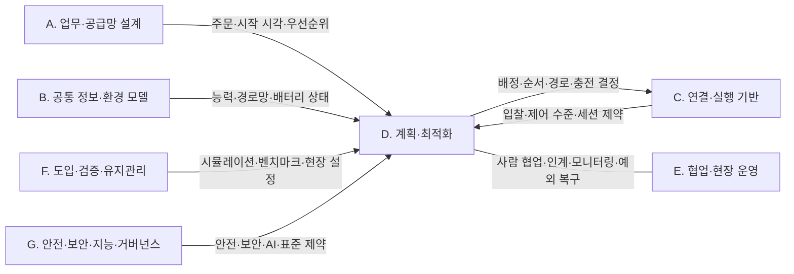

[홈](../../index.md) › D. 계획·최적화

# D. 계획·최적화

## 핵심 질문

누가, 언제, 어디로, 어떤 자원을 사용해 작업할 것인가? [분류원문]

## 개요

**누가, 언제, 어디로, 어떤 자원을 사용해 작업할 것인가**를 연구한다. 논문에서 작업 배정이나 경로 계획으로 많이 등장하는 영역이다. 네 항목은 분리해서 연구할 수 있지만 실제 운영에서는 서로 영향을 준다. [분류원문]

## 세부 연구영역

표의 세부 연구영역·무엇을 연구하는가·SCM 관점의 질문 열은 원문 그대로이고, 페이지·현재 상태 열은 위키에서 덧붙인 것이다. 현재 상태는 퍼블리셔가 자동으로 갱신한다.

<!-- auto:category-area-table:start -->
| 세부 연구영역 | 무엇을 연구하는가 | SCM 관점의 질문 | 페이지 | 현재 상태 |
|---|---|---|---|---|
| **13. 작업 배정 — MRTA** | 능력·위치·적재량·배터리·납기 등을 고려해 로봇 또는 로봇 팀에 작업을 배정 | 가장 가까운 로봇에 맡기는 것이 전체적으로도 유리한가? | [13. 작업 배정 — MRTA](13-task-allocation-mrta.md) | published |
| **14. 작업 순서·스케줄링** | 주문 묶음, 작업 선후관계, 시간 제약, 공정 간 동기화, 긴급 작업 삽입 | 피킹·운반·포장이 서로 기다리지 않게 어떤 순서로 실행할까? | [14. 작업 순서·스케줄링](14-task-sequencing-and-scheduling.md) | published |
| **15. 다중 로봇 경로·교통 관리 — MAPF** | 여러 로봇의 경로와 통과 시점을 조율하고, 혼잡·교착·우선권을 처리 | 서로 다른 제조사의 로봇이 좁은 통로에서 마주치면 누가 양보할까? | [15. 다중 로봇 경로·교통 관리 — MAPF](15-multi-robot-path-and-traffic-management-mapf.md) | published |
| **16. 공용 자원·충전·에너지 최적화** | 충전기·승강기·작업대·대기 공간·버퍼의 예약과 배분, 충전 시점과 에너지 사용 계획 | 로봇들이 동시에 충전하거나 승강기를 기다리는 상황을 어떻게 줄일까? | [16. 공용 자원·충전·에너지 최적화](16-shared-resource-charging-and-energy-optimization.md) | published |

[분류원문]
<!-- auto:category-area-table:end -->

## 이 대분류의 핵심 포인트

SCM에서는 **작업이 계속 새로 들어오는 조건**이 중요하다. 정해진 목적지까지 한 번 이동하는 문제와 지속적으로 주문이 들어오는 운영은 다르다. 이를 다루는 연구가 *Lifelong MAPF*, *Multi-Agent Pickup and Delivery*이다. [5][6] [분류원문]

## 다른 대분류와의 연결

D. 계획·최적화의 네 세부영역은 다른 대분류에서 주문·능력·지도·상태를 입력으로 받고, 결정한 배정·순서·경로·충전 계획을 실행 기반에 넘긴다. 아래 연결은 게시된 세부영역 페이지의 검증된 주장과, 이번 실행에서 공식 저장소 원문을 다시 연 자료(확인일 2026-09-25)에 기댄다. 연결 대부분은 단일 출처에 기대고 교차 확인되지 않았다. E. 협업·현장 운영, F. 도입·검증·유지관리, G. 안전·보안·지능·거버넌스의 세부영역 다수가 아직 심화되지 않아 그쪽 연결은 D. 계획·최적화 쪽 근거에 기댄다.

### [A. 업무·공급망 설계](../a-business-supply-chain-design/index.md)

- **[13. 작업 배정 — MRTA](13-task-allocation-mrta.md) ↔ [1. 주문·업무 시스템 연계](../a-business-supply-chain-design/01-order-and-business-system-integration.md)**: VDA 5050 명세(3.0.0 판)는 이동로봇에 대한 주문 배정을 관제(fleet control)의 기능으로 두면서, 주변 설비·인프라·외부 IT 시스템과의 인터페이스는 명세 범위에서 뺀다. [사실][^ref-031] 로봇 인터페이스 표준이 상위 시스템 연동을 범위 밖에 두고 Open-RMF 작업 요청에도 마감 필드가 없으므로, 배정의 입력인 주문·납기·출하 마감 제약은 창고 관리 시스템(Warehouse Management System, WMS) 같은 상위 업무 시스템에서 받아 ROP가 배정 기준으로 옮겨야 할 것으로 보인다. [추정][^ref-031][^ref-125] 납기·출하 마감을 정하는 일 자체는 분류 원문 9장의 상위 업무 시스템 경계에 속하는 연계 대상이며, 결합 방법은 [열린 질문](../../open-questions.md) oq-054 로 남아 있다.
- **[14. 작업 순서·스케줄링](14-task-sequencing-and-scheduling.md) ↔ 1. 주문·업무 시스템 연계**: Open-RMF 작업 요청 스키마는 시각·순서 관련 필드로 가장 이른 시작 시각과 우선순위를 두고, 마감 시각이나 다른 작업과의 선후를 지정하는 필드는 두지 않는다(2026-09-25 확인). [사실][^ref-125] 웨이브·웨이브리스 출고 지시 정책 연구(2010)와 동적으로 도착하는 주문의 피킹 재최적화 연구(2025)는 상위 시스템의 출고 지시·우선순위 변경이 작업 순서 결정 문제로 넘어가는 지점을 다루는 것으로 보인다. [추정][^ref-134][^ref-133]
- **14. 작업 순서·스케줄링 ↔ [2. 공정·워크플로 모델링](../a-business-supply-chain-design/02-process-and-workflow-modeling.md)**: B2MML 공통 스키마의 Dependency1Type 은 두 요소 사이 실행 의존(선후·병행 금지·시작 후 간격 등)을 표현하며, 창고 물류 작업에 적용한 사례는 확인되지 않았다(oq-013). [사실][^ref-117]
- **14. 작업 순서·스케줄링 ↔ [3. 처리능력·거점·설비 계획](../a-business-supply-chain-design/03-capacity-site-and-facility-planning.md)**: 랙 이동 로봇 작업대의 주문 배치·순서와 랙 도착 순서를 함께 정한 2017년 연구는, 최적화된 주문 처리가 흔한 단순 규칙보다 필요한 로봇 대수를 절반 넘게 줄였다고 보고했다. 이는 저자 계산 실험 조건의 보고값이며 독립 재현은 확인되지 않았다. [사실][^ref-381]
- **14. 작업 순서·스케줄링 ↔ [4. 성과·경제성·프로세스 개선](../a-business-supply-chain-design/04-performance-economics-and-process-improvement.md)**: 풋월 주문 통합 연구(2019)는 빈 방출 순서가 맞지 않으면 포장 작업자가 유휴 대기한다고 보아, 포장 작업자 대기가 순서 결정의 성과 지표로 이어진다(지표 정의는 oq-051). [사실][^ref-385]
- **[16. 공용 자원·충전·에너지 최적화](16-shared-resource-charging-and-energy-optimization.md) ↔ 3. 처리능력·거점·설비 계획**: 충전 정책 연구(2024)와 창고 충전소 배치 최적화 연구(2024)가 있어, 충전 정책 결정이 충전기 수·위치 같은 설비 계획으로 이어지는 것으로 보인다. [추정][^ref-533][^ref-109]
- **16. 공용 자원·충전·에너지 최적화 ↔ 4. 성과·경제성·프로세스 개선**: Omega 게재 연구(2024)는 로봇 이동형 풀필먼트 시스템에서 동적 우선순위 규칙이 선착순보다 에너지 소비를 3.41% 줄이고 처리량을 26.07% 높였다고 보고했다. 이 값은 모델·시뮬레이션 조건의 저자 보고값으로 현장 실측이 아니며 독립 재현은 확인되지 않았다. [사실][^ref-146]

### [B. 공통 정보·환경 모델](../b-common-information-and-environment-model/index.md)

- **13. 작업 배정 — MRTA ↔ [5. 로봇 능력·작업 온톨로지](../b-common-information-and-environment-model/05-robot-capability-and-task-ontology.md)**: 능력 온톨로지로 이종 로봇·자원의 작업 수행 가능성을 추론해 배정 후보를 정하는 연구가 있다(2022, 2026-08). [사실][^ref-236][^ref-237]
- **16. 공용 자원·충전·에너지 최적화 ↔ 5. 로봇 능력·작업 온톨로지**: VDA 5050 팩트시트는 임계 저충전 수준(criticalLowChargingLevel)과 최소·최대 희망 충전 수준·최소 충전 시간을 로봇 선언으로 두고, Open-RMF 플릿 어댑터 템플릿은 운영 설정 recharge_threshold(예시값 0.10)와 충전 목표 recharge_soc(예시값 1.0)를 둔다(2026-09-25 확인). [사실][^ref-228][^ref-105] 두 값 가운데 무엇을 충전 하한으로 삼을지는 oq-068 로 남아 있다.
- **[15. 다중 로봇 경로·교통 관리 — MAPF](15-multi-robot-path-and-traffic-management-mapf.md) ↔ [6. 지도·공간·위치 모델](../b-common-information-and-environment-model/06-map-space-and-location-model.md)**: Open-RMF traffic-editor 는 차선의 양방향 여부와 대기 지점·충전소·주차 지점 같은 경유점 속성, 문·승강기를 주석하게 하고, 이 그래프를 building_map_generator 로 주행 그래프로 내보내 플릿 어댑터의 경로 계획에 쓰게 한다. [사실][^ref-079]
- **16. 공용 자원·충전·에너지 최적화 ↔ [8. 실시간 세계 상태·데이터 일관성](../b-common-information-and-environment-model/08-real-time-world-state-and-data-consistency.md)**: Open-RMF 는 로봇이 작업을 끝낼 충전량이 부족하면 충전 작업을 일정에 끼워 넣으므로, 충전 시점 계획은 로봇이 보고하는 현재 배터리 상태를 입력으로 쓰며, 이 현재 상태 표현은 8. 실시간 세계 상태·데이터 일관성 쪽에 속하는 것으로 보인다. [추정][^ref-104][^ref-051] 이 연결은 현재 상태를 표현하는 쪽이며, 가정한 미래를 실험하는 22. 시뮬레이션·예측용 디지털 트윈 연결(아래 F. 도입·검증·유지관리)과 구분한다.

### [C. 연결·실행 기반](../c-connectivity-and-execution-foundation/index.md)

- **13. 작업 배정 — MRTA ↔ [9. 로봇·제조사 관제 연동](../c-connectivity-and-execution-foundation/09-robot-and-vendor-fleet-manager-integration.md)**: Open-RMF 디스패처는 작업 요청을 받으면 모든 플릿 어댑터에 입찰 공고(BidNotice)를 보내고, 처리 가능한 플릿이 비용을 담은 입찰(BidProposal)을 내면 가장 빨리 끝나는 것·가장 낮은 비용 같은 설정 기준으로 비교해 작업을 줄 플릿을 정한다. [사실][^ref-376] 작업 요청 스키마의 fleet_name 필드는 작업을 수행할 수 있는 플릿 이름(하나 또는 목록)을 지정해, 요청 단계에서 배정 후보 플릿을 제한할 수 있게 한다. [사실][^ref-125]
- **15. 다중 로봇 경로·교통 관리 — MAPF ↔ 9. 로봇·제조사 관제 연동**: Open-RMF 는 플릿 연동을 전체 제어·신호등(일시정지·재개)·읽기 전용으로 나누고 공유 공간마다 읽기 전용 플릿을 최대 하나만 허용하며, 충돌이 나면 플릿들이 선호 경로와 상대를 수용하는 경로를 내고 시스템 통합사가 배치한 제3자 판정자가 조합을 고른다. [사실][^ref-004] VDA 5050 은 경로 결정·우선순위·혼잡 처리·교착 해소 같은 교통 조율 전략과 알고리즘을 명세에서 빼면서도, 막힘 탐지·해소와 교통 제어(버퍼 경로·대기 위치)를 관제 기능으로 둔다. [사실][^ref-031]
- **16. 공용 자원·충전·에너지 최적화 ↔ 9. 로봇·제조사 관제 연동**: VDA 5050 은 충전 주문이 운반 주문을 중단시킬 수 있다는 것을 관제의 에너지 관리 기능으로 두고, 과충전 보호는 이동로봇의 책임으로 명시한다. [사실][^ref-031] 과충전 보호는 분류 원문 9장의 로봇 자체 지능·제어 경계에 속하는 연계 대상이며, ROP는 충전 시작·중지 요청과 상태 확인만 맡는다.
- **16. 공용 자원·충전·에너지 최적화 ↔ [10. 설비·건물 시스템 연동](../c-connectivity-and-execution-foundation/10-facility-and-building-system-integration.md)**: Open-RMF 승강기 요청은 요청자 사이에서 유일한 세션 id 로 승강기를 점유하고 세션 종료 요청을 보낼 때까지 제어권이 그 세션에 남으며, AGV 모드에서는 승강기가 정지해 있는 동안 문이 열린 채 유지된다. [사실][^ref-312][^ref-286] 승강기 운행과 설비 안전 제어는 분류 원문 9장의 시설·설비 제어 경계에 속하는 연계 대상이며, ROP는 승강기 세션 요청과 운영 모드 확인만 맡는다.
- **14. 작업 순서·스케줄링 ↔ [12. 명령·작업 실행의 신뢰성](../c-connectivity-and-execution-foundation/12-command-and-task-execution-reliability.md)**: VDA 5050 에서 이미 로봇에 넘긴 기반(base) 경로는 바꿀 수 없으므로, 우선순위 변경에 따른 재정렬은 아직 해제하지 않은 호라이즌 구간과 새 주문에만 적용할 수 있을 것으로 보인다. [추정][^ref-031]
- **13. 작업 배정 — MRTA ↔ [11. 분산 시스템·통신·컴퓨팅 구조](../c-connectivity-and-execution-foundation/11-distributed-systems-communication-and-computing.md)**: Lott·Honary(2026-09, 프리프린트, 원문 미열람)는 분산 작업 배정기 6종(CBAA, ACBBA, PI, HIPC, DMCHBA, DGA)을 패킷 손실·페이딩 등 통신 저하 조건에서 비교했다. [사실][^ref-493] 이 비교와 클라우드에 연결된 로봇·로봇그룹의 작업 계획을 다룬 국내 과제 보고서가 있어, 배정 계산을 클라우드·현장 서버·로봇 가운데 어디에 둘지가 두 영역을 잇는 설계 쟁점이 될 것으로 보이나, 물류센터 적용 근거는 없다. [추정][^ref-493][^ref-401]

### [E. 협업·현장 운영](../e-collaboration-and-field-operations/index.md)

- **13. 작업 배정 — MRTA ↔ [18. 사람–로봇 협업·운영 인터페이스](../e-collaboration-and-field-operations/18-human-robot-collaboration-and-operator-interface.md)**: 작업자가 피킹하고 자율이동로봇이 운반하는 동적 주문 피킹 연구(2025)가 있어, 로봇 배정이 사람 작업자의 배치와 맞물린다. [사실][^ref-132]
- **14. 작업 순서·스케줄링 ↔ 18. 사람–로봇 협업·운영 인터페이스**: 복수 포장대와 피킹-패킹 전환 정책(작업자가 피킹과 포장 사이를 옮겨 감)의 작업자 스케줄링을 다룬 국내 연구(2025)가 있다(결과 수치는 미확인). [사실][^ref-388]
- **14. 작업 순서·스케줄링 ↔ [17. 로봇 간 협업·물리적 인계](../e-collaboration-and-field-operations/17-robot-to-robot-collaboration-and-physical-handover.md)**: Open-RMF 배정이 플릿 단위 입찰로 이루어지고 작업 요청 스키마에 작업 간 선후 필드가 없으므로, 피킹 로봇 완료 뒤 운반 로봇 출발 같은 제조사 간 인계 선후는 ROP가 작업 흐름 수준에서 관리해야 할 것으로 보인다(oq-049). [추정][^ref-376][^ref-125]
- **15. 다중 로봇 경로·교통 관리 — MAPF ↔ [20. 예외 복구·재계획·업무 연속성](../e-collaboration-and-field-operations/20-exception-recovery-replanning-and-business-continuity.md)**: 창고 MAPF 실행 연구(2019)는 지연이 쌓일 때 행동 의존 그래프로 순서를 지키며 실행을 이어가는 방법을 다루어, 계획 유지와 재계획의 판단이 두 영역을 잇는다. [사실][^ref-188]
- **13. 작업 배정 — MRTA ↔ 20. 예외 복구·재계획·업무 연속성**: VDA 5050 에서 브로커 연결이 끊긴 로봇은 받은 주문 정보를 유지한 채 마지막으로 해제된 노드까지 주문을 수행하므로, 통신 단절 때 ROP가 다시 배정할 수 있는 몫은 아직 해제하지 않은 구간과 새 작업으로 한정될 것으로 보인다. [추정][^ref-031]
- **13. 작업 배정 — MRTA ↔ [19. 모니터링·이상 탐지·원인 분석](../e-collaboration-and-field-operations/19-monitoring-anomaly-detection-and-root-cause-analysis.md)**: 위치 스푸핑을 다룬 2026-08 프리프린트의 신뢰 인지 모니터는 위치 신뢰도와 작업 실행 행동 증거를 결합해 에이전트를 분류하므로, 실행 기록으로 이상 로봇을 가려 배정 입력에서 빼는 일이 모니터링과 배정을 잇는 지점이 될 것으로 보인다. 이 연구는 GPS 스푸핑 데이터와 택시 수요로 실험했으며 물류센터 적용은 확인되지 않았다. [추정][^ref-494]

### [F. 도입·검증·유지관리](../f-deployment-verification-and-maintenance/index.md)

- **13. 작업 배정 — MRTA ↔ [22. 시뮬레이션·예측용 디지털 트윈](../f-deployment-verification-and-maintenance/22-simulation-and-predictive-digital-twin.md)**: 로봇 이동형 풀필먼트 시스템(2019)과 국내 자동물류센터의 이산 사건 시뮬레이션 연구가 배정 규칙을 가정한 미래에서 실험하는 도구로 쓰였고, 한 연구에서는 피킹 주문 배정 규칙이 단위 처리량을 크게 바꾸었다. [사실][^ref-398][^ref-402]
- **15. 다중 로봇 경로·교통 관리 — MAPF ↔ 22. 시뮬레이션·예측용 디지털 트윈**: 다중 AGV 시스템의 경로망을 시뮬레이션으로 자동 설계하는 연구(2024)가 있어, 경로망 설계 평가는 가정한 미래를 실험하는 쪽에 속하는 것으로 보인다. [추정][^ref-267]
- **15. 다중 로봇 경로·교통 관리 — MAPF ↔ [21. 온보딩·설정·현장 시운전](../f-deployment-verification-and-maintenance/21-onboarding-configuration-and-commissioning.md)**: 현장 도입 때 플릿별 경로망과 차선 방향, 대기·충전·주차 경유점을 traffic-editor 로 주석해 설정하는 일이 온보딩 작업이 될 것으로 보인다. [추정][^ref-079]
- **15. 다중 로봇 경로·교통 관리 — MAPF ↔ [23. 시험·형식 검증·벤치마크](../f-deployment-verification-and-maintenance/23-testing-formal-verification-and-benchmarking.md)**: MAPF 연구는 정의·변형·벤치마크를 정리한 공통 틀(2019)을 가지고 있으나, 격자·단위 시간 가정의 벤치마크 성과가 실제 물류센터 처리량으로 얼마나 이어지는지는 확인되지 않았다(oq-058). [사실][^ref-186]
- **13. 작업 배정 — MRTA ↔ 23. 시험·형식 검증·벤치마크**: 분산 배정기를 같은 사례 묶음과 통신 조건에서 이동 거리·안정성·계산 부담으로 비교하는 벤치마크(2026-09, 프리프린트)가 있어, 배정 방식 선택을 시험 조건과 함께 평가하는 틀이 된다. [사실][^ref-493]
- **16. 공용 자원·충전·에너지 최적화 ↔ [24. 자산·소프트웨어 수명주기 관리](../f-deployment-verification-and-maintenance/24-asset-and-software-lifecycle-management.md)**: 플릿 수준에서 배터리 건강(열화)을 고려해 자율이동로봇의 일정을 정하는 연구(2026-03)가 있어, 충전·배정 계획이 배터리 열화 관리와 이어진다. [사실][^ref-403]

### [G. 안전·보안·지능·거버넌스](../g-safety-security-intelligence-and-governance/index.md)

- **16. 공용 자원·충전·에너지 최적화 ↔ [25. 안전·위험 관리](../g-safety-security-intelligence-and-governance/25-safety-and-risk-management.md)**: Open-RMF 승강기 상태의 운영 모드에는 사람·AGV·화재·오프라인·비상이 있고(설정은 사람·AGV 모드만 가능), Open-RMF 데모는 비상 경보가 켜지면 모든 로봇을 가장 가까운 주차 위치로 보낸다. [사실][^ref-286][^ref-104] 설비 안전 제어는 분류 원문 9장의 시설·설비 제어 경계에 속하는 연계 대상이며, ROP는 운영 모드를 확인해 계획에 반영하는 쪽을 맡는다.
- **15. 다중 로봇 경로·교통 관리 — MAPF ↔ 25. 안전·위험 관리**: VDA 5050 은 진입 금지·속도 제한·해제·우선·벌점 등 구역 유형을 교통 관리 수단으로 정의하면서, 이 문서가 기능·운영·시스템 안전 요구를 정하지 않으며 안전 표준으로 적용해서는 안 된다고 밝힌다. [사실][^ref-031] 따라서 이 연결은 교통 관리 수단과 안전 기능을 구분하는 지점으로만 다룬다.
- **13. 작업 배정 — MRTA ↔ [26. 사이버보안·접근권한·개인정보](../g-safety-security-intelligence-and-governance/26-cybersecurity-access-control-and-privacy.md)**: 2026-08 프리프린트는 위치 스푸핑으로 오염된 에이전트가 계획 정보와 실행을 어긋나게 하면 롤아웃 기반 다중 로봇 배정·경로 계획의 비용 개선이 사라질 수 있다고 보고, 스푸핑 공격 모델과 탐지된 적대 에이전트를 이후 계획에서 빼는 방법을 제안한다. 실험은 GPS 스푸핑 데이터와 택시 수요로 했으며 물류센터 적용은 확인되지 않았다. [사실][^ref-494] Open-RMF 문서는 같은 신원과 접근통제 규칙을 공유하는 프로세스 묶음인 SROS 2 인클레이브로 구성요소의 권한을 나누고, 웹 대시보드는 TLS 로 제공하며 OIDC 로 사용자 역할을 담은 서명 토큰을 API 서버에 보내 역할에 따라 접근을 허용한다고 설명한다. [사실][^ref-405] 작업 요청이 대시보드·API 서버를 거쳐 디스패처로 들어가고 배정이 플릿의 입찰 비용과 위치 보고에 기대므로, 누가 작업을 요청·우선 지정할 수 있는지와 입찰·위치 보고를 얼마나 믿을지가 배정의 보안 경계가 될 것으로 보인다. 창고 배정의 보안 사례는 찾지 못했다. [추정][^ref-405][^ref-376][^ref-494]
- **13. 작업 배정 — MRTA ↔ [27. AI·학습·적응과 모델 운영](../g-safety-security-intelligence-and-governance/27-ai-learning-adaptation-and-model-operations.md)**: 분류 원문 8장의 교차 규칙은 학습 기반 배차를 13. 작업 배정 — MRTA에 적용되는 27. AI·학습·적응과 모델 운영의 연구 방법으로 둔다. 학습 기반 배차(이종 그래프 어텐션 스케줄러)와 대규모 언어 모델(Large Language Model, LLM) 기반 다중 로봇 작업 배정 연구가 있어 이 교차 규칙에 따라 두 영역이 이어진다. [사실][^ref-399][^ref-090][^ref-168] LLM 배정의 결과 수치는 출처가 충돌해(oq-030) 여기서 쓰지 않는다.
- **15. 다중 로봇 경로·교통 관리 — MAPF ↔ 27. AI·학습·적응과 모델 운영**: 모방 학습을 적용한 지속형 MAPF 연구(2024-10)가 있어, 학습 기반 경로 계획이 두 영역을 잇는다. [사실][^ref-199]
- **16. 공용 자원·충전·에너지 최적화 ↔ 27. AI·학습·적응과 모델 운영**: 자율 피킹 로봇의 충전소 선택·충전 시간 결정에 심층 강화학습을 쓰는 연구(2026-07)가 있어, 학습 기반 충전 결정이 두 영역을 잇는 것으로 보인다. [추정][^ref-531]
- **15. 다중 로봇 경로·교통 관리 — MAPF ↔ [28. 표준·상호운용성·다사업자 거버넌스](../g-safety-security-intelligence-and-governance/28-standards-interoperability-and-multi-vendor-governance.md)**: VDA 5050 은 구역·경로 해제로 교통 규칙을 정하되 조율 전략은 빼고, Open-RMF 는 여러 플릿의 교통 협상에서 시스템 통합사가 배치한 판정자가 조합을 고르게 하므로, 한 현장에서 우선권 판정 규칙을 누가 정하고 승인하는지가 거버넌스 과제로 넘어갈 것으로 보인다(oq-057). [추정][^ref-031][^ref-004]

### 아직 다루지 않은 연결

- [7. 화물·재고·자산 식별과 추적](../b-common-information-and-environment-model/07-cargo-inventory-and-asset-identification-and-tracking.md)과 D. 계획·최적화를 잇는 근거는 이번 조사에서 확보하지 못했다.
- 11. 분산 시스템·통신·컴퓨팅 구조, 19. 모니터링·이상 탐지·원인 분석, 26. 사이버보안·접근권한·개인정보와의 연결은 물류센터 조건이 아닌 2026년 프리프린트 두 편에 기대므로, 물류 현장 근거가 나오면 다시 확인한다.

## 최근 업데이트

<!-- auto:category-recent:start -->
- 2026-09-25 · 갱신 · [16. 공용 자원·충전·에너지 최적화](16-shared-resource-charging-and-energy-optimization.md) — 섹션 3~11 신규 작성(트랙 반영 제안 4건 반영, 1차 수정 지시 13건 이행), 2차 수정: 4·8절 연결 문장 태그 제거, 5절 조사 한계 문장 태그·각주 제거와 oq-010 연결, 6절 첫 문장을 출처 범위로 좁힘 (실행 2026-09-25-40)
- 2026-09-25 · 생성 · [16. 공용 자원·충전·에너지 최적화 — 대표 접근법과 기술](../../topics/2026/2026-09-25-area16-s6.md) — 자동 분리: 16. 공용 자원·충전·에너지 최적화 의 "6. 대표 접근법과 기술" 절을 옮겼다. 2차 수정: 세 줄 요약·본문 첫 문장을 출처 범위(충전 작업 삽입·뮤텍스 그룹·승강기 세션)로 좁혔다 (실행 2026-09-25-40)
- 2026-09-25 · 생성 · [16. 공용 자원·충전·에너지 최적화 — 대표 연구와 자료](../../topics/2026/2026-09-25-area16-s8.md) — 자동 분리: 16. 공용 자원·충전·에너지 최적화 의 "8. 대표 연구와 자료" 절을 옮겼다. 2차 수정: 첫 문장 태그 제거, 병원·호텔 연구 문구를 연관 관계로 고침, ref-535 제목 원문 복원 (실행 2026-09-25-40)
- 2026-09-25 · 생성 · [16. 공용 자원·충전·에너지 최적화 — 관련 표준·프레임워크·오픈소스](../../topics/2026/2026-09-25-area16-s7.md) — 자동 분리: 16. 공용 자원·충전·에너지 최적화 의 "7. 관련 표준·프레임워크·오픈소스" 절을 옮겼다(ref-536·ref-538 링크는 id 표기). 2차 수정: batteryCharging 행의 계획 입력 해석을 [추정]으로 분리 (실행 2026-09-25-40)
- 2026-09-25 · 생성 · [16. 공용 자원·충전·에너지 최적화 — 열린 질문](../../topics/2026/2026-09-25-area16-s11.md) — 자동 분리: 16. 공용 자원·충전·에너지 최적화 의 "11. 열린 질문" 절을 옮겼다 (실행 2026-09-25-40)
<!-- auto:category-recent:end -->

## 참고 자료

원문의 [5]는 참고문헌 [ref-005](../../references/ref-005.md)에 해당한다.[^ref-005] 원문의 [6]은 참고문헌 [ref-006](../../references/ref-006.md)에 해당한다.[^ref-006]

[^ref-005]: Li, J., Tinka, A., Kiesel, S., Durham, J. W., Kumar, T. K. S., & Koenig, S., Lifelong Multi-Agent Path Finding in Large-Scale Warehouses, 2020, https://arxiv.org/abs/2005.07371, 접근일 2026-09-24
[^ref-006]: Ma, H., Li, J., Kumar, T. K. S., & Koenig, S., Lifelong Multi-Agent Path Finding for Online Pickup and Delivery Tasks, 2017, https://arxiv.org/abs/1705.10868, 접근일 2026-09-24

[^ref-004]: Open Robotics, RMF Core Overview — Programming Multiple Robots with ROS 2, 미확인, https://osrf.github.io/ros2multirobotbook/rmf-core.html, 접근일 2026-09-25
[^ref-031]: VDA / VDMA (VDA5050 GitHub), VDA5050/VDA5050_EN.md — Official Specification document for the VDA 5050, 미확인, https://github.com/VDA5050/VDA5050/blob/main/VDA5050_EN.md, 접근일 2026-09-25
[^ref-051]: VDA / VDMA (VDA5050 GitHub), VDA5050/VDA5050 — json_schemas/state.schema, 미확인, https://github.com/VDA5050/VDA5050/blob/main/json_schemas/state.schema, 접근일 2026-09-25 (원문 미열람)
[^ref-079]: Open Robotics, Traffic Editor - Programming Multiple Robots with ROS 2, 미확인, https://osrf.github.io/ros2multirobotbook/traffic-editor.html, 접근일 2026-09-25
[^ref-090]: Kannan, S. S., Venkatesh, V. L. N., & Min, B.-C., SMART-LLM: Smart Multi-Agent Robot Task Planning using Large Language Models, 2023-09, https://arxiv.org/abs/2309.10062, 접근일 2026-09-25 (원문 미열람)
[^ref-104]: Open Robotics (open-rmf), rmf_demos — Demonstrations of Open-RMF (README), 미확인, https://github.com/open-rmf/rmf_demos, 접근일 2026-09-25
[^ref-105]: Open Robotics (open-rmf), fleet_adapter_template — fleet_adapter_template/config.yaml, 미확인, https://github.com/open-rmf/fleet_adapter_template/blob/main/fleet_adapter_template/config.yaml, 접근일 2026-09-25
[^ref-109]: Stark, H.-G. 외, A Page-Rank-like Approach to Optimal Placement of Charging Stations in a Warehouse, 2024-06, https://arxiv.org/abs/2406.17003, 접근일 2026-09-25 (원문 미열람)
[^ref-117]: MESA International, B2MML-BatchML — Schema/B2MML-Common.xsd, 2023, https://github.com/MESAInternational/B2MML-BatchML/blob/master/Schema/B2MML-Common.xsd, 접근일 2026-09-25 (원문 미열람)
[^ref-125]: Open Robotics (open-rmf), rmf_api_msgs — rmf_api_msgs/schemas/task_request.json, 미확인, https://github.com/open-rmf/rmf_api_msgs/blob/main/rmf_api_msgs/schemas/task_request.json, 접근일 2026-09-25
[^ref-132]: Yu, S., & Srinivas, S., Collaborative Human–Robot Teaming for Dynamic Order Picking: Interventionist strategies for improving warehouse intralogistics operations, 2025, https://www.sciencedirect.com/science/article/abs/pii/S1366554525001231, 접근일 2026-09-25 (원문 미열람)
[^ref-133]: Lorenz, Otto, & Gendreau (Networks, Wiley), Picking Operations in Warehouses With Dynamically Arriving Orders: How Good is Reoptimization?, 2025, https://onlinelibrary.wiley.com/doi/full/10.1002/net.22281, 접근일 2026-09-25 (원문 미열람)
[^ref-134]: Gallien, J., & Weber, T. G., To Wave or Not to Wave? Order Release Policies for Warehouses with an Automated Sorter, 2010, https://pubsonline.informs.org/doi/abs/10.1287/msom.1100.0291, 접근일 2026-09-25 (원문 미열람)
[^ref-146]: Omega 게재 논문(저자 미확인), The role of energy consumption in robotic mobile fulfillment systems: Performance evaluation and operating policies with dynamic priority, 2024, https://www.sciencedirect.com/science/article/abs/pii/S0305048324001336, 접근일 2026-09-25 (원문 미열람)
[^ref-168]: Kaitha, S., & Yu, S. 외(arXiv 2512.02810), Phase-Adaptive LLM Framework with Multi-Stage Validation for Construction Robot Task Allocation: A Systematic Benchmark Against Traditional Optimization Algorithms, 2025-12, https://arxiv.org/abs/2512.02810, 접근일 2026-09-25 (원문 미열람)
[^ref-186]: Stern, R., Sturtevant, N. R., Felner, A., Koenig, S. 외, Multi-Agent Pathfinding: Definitions, Variants, and Benchmarks, 2019-06, https://arxiv.org/abs/1906.08291, 접근일 2026-09-25 (원문 미열람)
[^ref-188]: Hönig, W., Kiesel, S. 외, Persistent and Robust Execution of MAPF Schedules in Warehouses, 2019, https://ieeexplore.ieee.org/abstract/document/8620328/, 접근일 2026-09-25 (원문 미열람)
[^ref-199]: arXiv 2410.21415 저자(미확인), Deploying Ten Thousand Robots: Scalable Imitation Learning for Lifelong Multi-Agent Path Finding, 2024-10, https://arxiv.org/abs/2410.21415, 접근일 2026-09-25 (원문 미열람)
[^ref-228]: VDA / VDMA (VDA5050 GitHub), VDA5050/VDA5050 — json_schemas/factsheet.schema, 미확인, https://github.com/VDA5050/VDA5050/blob/main/json_schemas/factsheet.schema, 접근일 2026-09-25
[^ref-236]: Electronics(MDPI) 게재 논문(저자 미확인), Semantic Feasibility Reasoning for Heterogeneous Multi-Robot Task Allocation, 2026-08-11, https://doi.org/10.3390/electronics15163562, 접근일 2026-09-25 (원문 미열람)
[^ref-237]: Kluge-Wilkes, A. 외(RWTH Aachen WZL), Ontology-based task allocation for heterogeneous resources in Line-less Mobile Assembly Systems, 2022, https://www.techrxiv.org/users/685235/articles/679210-ontology-based-task-allocation-for-heterogeneous-resources-in-line-less-mobile-assembly-systems, 접근일 2026-09-25 (원문 미열람)
[^ref-267]: IEEE 게재 논문 저자(미확인), Simulation-Based Approach for Automatic Roadmap Design in Multi-AGV Systems (IEEE Transactions on Automation Science and Engineering 21(4), 2024 (2023 온라인 공개)), 2024, https://ieeexplore.ieee.org/document/10287275/, 접근일 2026-09-25 (원문 미열람)
[^ref-286]: Open Robotics (open-rmf), rmf_internal_msgs — rmf_lift_msgs/msg/LiftState.msg, 미확인, https://github.com/open-rmf/rmf_internal_msgs/blob/main/rmf_lift_msgs/msg/LiftState.msg, 접근일 2026-09-25
[^ref-312]: Open Robotics (open-rmf), rmf_internal_msgs — rmf_lift_msgs/msg/LiftRequest.msg, 미확인, https://github.com/open-rmf/rmf_internal_msgs/blob/main/rmf_lift_msgs/msg/LiftRequest.msg, 접근일 2026-09-25
[^ref-376]: Open Robotics, Tasks in RMF (task) - Programming Multiple Robots with ROS 2, 미확인, https://osrf.github.io/ros2multirobotbook/task.html, 접근일 2026-09-25
[^ref-381]: Boysen, N., Briskorn, D., & Emde, S., Parts-to-picker based order processing in a rack-moving mobile robots environment, 2017, https://www.sciencedirect.com/science/article/abs/pii/S0377221717302758, 접근일 2026-09-25 (원문 미열람)
[^ref-385]: Boysen, N., Stephan, K., & Weidinger, F., Manual order consolidation with put walls: the batched order bin sequencing problem, 2019, https://www.sciencedirect.com/science/article/pii/S2192437620300315, 접근일 2026-09-25 (원문 미열람)
[^ref-388]: Tran Bo Tao Huong, 이광헌, 홍순도(대한산업공학회지), 복수 포장대와 피킹-패킹 전환 정책을 운영하는 물류센터에서의 작업자 스케줄링, 2025, https://www.kci.go.kr/kciportal/ci/sereArticleSearch/ciSereArtiView.kci?sereArticleSearchBean.artiId=ART003194570, 접근일 2026-09-25 (원문 미열람)
[^ref-398]: Merschformann, M., Lamballais, T., de Koster, R., & Suhl, L., Decision rules for robotic mobile fulfillment systems, 2019, https://www.sciencedirect.com/science/article/pii/S2214716019300946, 접근일 2026-09-25 (원문 미열람)
[^ref-399]: Wang, Z., & Gombolay, M., Heterogeneous graph attention networks for scalable multi-robot scheduling with temporospatial constraints, 미확인, https://link.springer.com/article/10.1007/s10514-021-09997-2, 접근일 2026-09-25 (원문 미열람)
[^ref-401]: KISTI ScienceON 수록 국가R&D 과제 보고서(수행기관 미확인), 클라우드에 연결된 개별 로봇 및 로봇그룹의 작업 계획 기술 개발, 미확인, https://scienceon.kisti.re.kr/srch/selectPORSrchReport.do?cn=TRKO202400003952, 접근일 2026-09-25 (원문 미열람)
[^ref-402]: KISTI ScienceON 수록 논문(저자 미확인), 시뮬레이션과 메타모델을 이용한 자동물류센터 설계 최적화, 미확인, https://scienceon.kisti.re.kr/srch/selectPORSrchArticle.do?cn=JAKO200634515151716, 접근일 2026-09-25 (원문 미열람)
[^ref-403]: Li, J., Li, S., Chu, J., Li, W., & Chen, D.(UT Austin), Fleet-Level Battery-Health-Aware Scheduling for Autonomous Mobile Robots, 2026-03, https://arxiv.org/abs/2603.22731, 접근일 2026-09-25 (원문 미열람)
[^ref-405]: Open Robotics, Security - Programming Multiple Robots with ROS 2, 미확인, https://osrf.github.io/ros2multirobotbook/security.html, 접근일 2026-09-25
[^ref-531]: arXiv 2607.05683 저자(미확인), Deep Reinforcement Learning for Dynamic Battery Management of Autonomous Order Pickers, 2026-07, https://arxiv.org/abs/2607.05683, 접근일 2026-09-25 (원문 미열람)
[^ref-533]: Chen, W., Gong, Y., Chen, Q., & Wang, H., Does battery management matter? Performance evaluation and operating policies in a self-climbing robotic warehouse, 2024-01, https://www.sciencedirect.com/science/article/abs/pii/S0377221723004770, 접근일 2026-09-25 (원문 미열람)
[^ref-493]: Lott, J., & Honary, V.(University of San Diego), Decentralized Multi-Robot Task Allocation Under Degraded Communication: A Benchmark of Performance, Reliability, and Computation, 2026-09, https://arxiv.org/abs/2609.13711, 접근일 2026-09-25 (원문 미열람)
[^ref-494]: Francos, R. M., Garces, D., Akgün, O. E., Bastian, N. D., & Gil, S.(Harvard·JHU), Trust-Aware Sequential Decision Making and Rollout Planning for Resilient Multi-Robot Systems, 2026-08, https://arxiv.org/abs/2608.25690, 접근일 2026-09-25 (원문 미열람)
