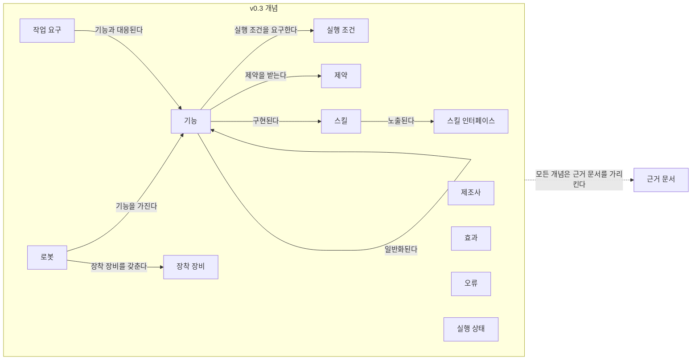
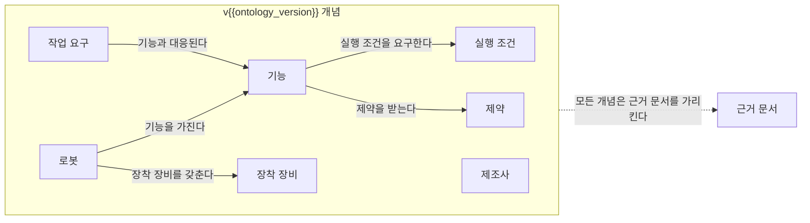

(너의 규칙은 시스템 프롬프트의 agents/shared-rules.md 와 agents/researcher.md 이다. 아래는 이번 실행의 컨텍스트와 입력이다.)

## 실행 컨텍스트

- run_id: 2026-09-25-57
- date: 2026-09-25
- run_type: track (트랙 실행)
- 대상: 트랙 manual-capability-ontology (매뉴얼 기반 로봇 기능 온톨로지) · 현재 단계: 단계 2. 로봇 문서 유형과 정보 구조 조사 · 이번에 다룰 백로그 질문 id: q2-01, q2-02, q2-03 · 중심 세부영역: 5. 로봇 능력·작업 온톨로지 (B. 공통 정보·환경 모델)
- 예산:
    - max_search_queries: 40
    - max_sources_per_run: 20
    - new_topic_pages: 1
    - page_updates: 2
    - max_retries: 2
- 환경 알림: web_fetch_available: false · fetch_mode: mirror_only (일반 웹 페이지 열람은 네트워크 정책으로 막혀 있다. raw.githubusercontent.com 은 열린다: 공식 문서가 GitHub 에 있는 출처는 입력의 config/source_mirrors.yaml 경로를 WebFetch 로 열어 원문을 읽고 sources[].fetched=true, fetched_via=github_raw, fetch_url 을 적는다. 입력에 원문 텍스트(data/source_texts)가 있는 출처는 fetched_via=inbox. 그 밖의 출처는 fetched=false 이며 코드가 신뢰도 상한(medium)을 강제한다 — 공통 규칙 0절 6항)
- 언어: ko
- next_ref_id: ref-719
- 새 출처 id 구간: ref-719 ~ ref-748 — 이 실행 전용으로 예약한 번호다(동시에 도는 다른 실행과 겹치지 않는다). 새 출처는 ref-719 부터 순서대로 쓰고 ref-748 를 넘기지 않는다. 기존 출처는 참고문헌 목록의 id 를 그대로 쓴다

## 입력

### runs/2026-09-25-57/target.json

```json
{
  "run_id": "2026-09-25-57",
  "date": "2026-09-25",
  "weekday": "Fri",
  "run_number": 57,
  "run_type": "track",
  "forced": true,
  "target": {
    "area_no": 5,
    "area_name": "5. 로봇 능력·작업 온톨로지",
    "category": "B. 공통 정보·환경 모델",
    "category_letter": "B"
  },
  "topic": null,
  "track": {
    "slug": "manual-capability-ontology",
    "name": "매뉴얼 기반 로봇 기능 온톨로지",
    "stage": 2,
    "stages": 7,
    "stage_name": "로봇 문서 유형과 정보 구조 조사",
    "question_ids": [
      "q2-01",
      "q2-02",
      "q2-03"
    ],
    "user_questions": [],
    "runs_per_week": 3,
    "question_rationale": "CLI 지정 질문 id"
  },
  "corrections": [],
  "budget": {
    "max_search_queries": 40,
    "max_sources_per_run": 20,
    "new_topic_pages": 1,
    "page_updates": 2,
    "max_retries": 2
  },
  "priority_reason": null,
  "priority_questions": [],
  "excluded_areas": [],
  "lifted_areas": [],
  "deferred": {
    "monthly_recheck": false,
    "weekly_review": true
  },
  "selection_rationale": "CLI 지정 run_type=track, area=5; 트랙 실행일(Fri, track_days 앞 3개) → 트랙 manual-capability-ontology 단계 2, 질문 q2-01, q2-02, q2-03 (CLI 지정 질문 id)"
}
```

### docs/categories/b-common-information-and-environment-model/05-robot-capability-and-task-ontology.md

```markdown
---
title: "5. 로봇 능력·작업 온톨로지"
type: area
category: "B. 공통 정보·환경 모델"
area_no: 5
related_areas: [7, 8, 9, 12, 13, 21, 27, 28]
tags: [능력 모델, 스킬, VDA 5050 팩트시트, 능력 온톨로지, 실행 가능성 판정]
status: published
confidence: medium
created: 2026-09-24
updated: 2026-09-25
sources: [ref-025, ref-026, ref-027, ref-028, ref-029, ref-035, ref-038, ref-040, ref-041, ref-042, ref-043, ref-105, ref-228, ref-229, ref-230, ref-231, ref-232, ref-233, ref-234, ref-235, ref-236, ref-237, ref-238, ref-239, ref-240, ref-138, ref-152]
last_run: 2026-09-25
version: 2
---

[홈](../../index.md) › [B. 공통 정보·환경 모델](index.md) › 5. 로봇 능력·작업 온톨로지

# 5. 로봇 능력·작업 온톨로지

!!! info "소속 대분류"
    [B. 공통 정보·환경 모델](index.md) — 핵심 질문:
    로봇·물건·공간·상태를 어떻게 같은 의미로 이해할 것인가? [분류원문]

<!-- auto:area-tracks:start -->
!!! note "관련 연구 트랙"
    이 세부영역을 가로지르는 중점 연구 트랙과 확장 아이디어다. 트랙은 분류를 바꾸지 않으며, 트랙에서 확인된 사실은 이 페이지에 반영하도록 제안된다. 전체 매핑은 [확장 아이디어 연결 구조](../../ideas/index.md)에 있다.

    - [매뉴얼 기반 로봇 기능 온톨로지](../../tracks/manual-capability-ontology/index.md) — 중심 영역(●) · 확장 아이디어: [아이디어 1. 로봇 기능 온톨로지](../../ideas/robot-capability-ontology.md)
    - [자연어 업무 지시 챗봇](../../tracks/nl-task-chatbot/index.md) — 함께 필요한 영역(○) · 확장 아이디어: [아이디어 2. 자연어 업무 지시 챗봇](../../ideas/nl-task-chatbot.md)
    - [건축 도면 자동 인식](../../tracks/floorplan-recognition/index.md) — 함께 필요한 영역(○) · 확장 아이디어: [아이디어 3. 건축 도면 자동 인식](../../ideas/floorplan-recognition.md)
<!-- auto:area-tracks:end -->

<!-- auto:page-status:start -->
> 페이지 상태: published · 신뢰도: medium · 페이지 버전: 2 · 마지막 갱신: 2026-09-25 · 마지막 실행: 2026-09-25
<!-- auto:page-status:end -->

## 1. 한 줄 정의

제조사별 기능·제약·장착 장비·실행 조건을 공통 모델로 표현하고, 작업 요구와 연결 [분류원문]

## 2. SCM 관점의 질문

같은 ‘운반 로봇’ 중 누가 이 화물을 실제로 취급할 수 있는가? [분류원문]

> 원문 주석: 27번의 AI는 특정 기능 하나에만 해당하지 않는다. **매뉴얼 해석은 5·21번, 도면 해석은 6번, 학습 기반 배차는 13번, 장애 분석은 19번**에 적용되는 연구 방법이다. [분류원문]

## 3. 왜 중요한가

같은 운반 로봇 가운데 어느 로봇이 특정 화물을 실제로 취급할 수 있는지는 적재 명세(적재 유형·최대 중량·처리 높이), 지원 동작, 현재 상태(남은 적재 용량·운영 상태), 적재 상태에서의 경로 통과 가능성을 함께 대조해야 판단할 수 있어, 한 규격의 필드만으로는 정해지지 않을 것으로 보인다. [추정][^ref-228][^ref-230][^ref-236]

제조사마다 능력을 적는 방식도 맞춰져 있지 않다. VDA 5050 팩트시트의 적재 유형(loadType)과 MassRobotics 표준의 화물 설명(cargoType)은 모두 문자열로 적게 할 뿐 공통 어휘를 지정하지 않으므로, 제조사 사이에서 화물 취급 가능 여부를 맞추려면 적재물 유형 사전이 따로 필요할 것으로 보인다. [추정][^ref-228][^ref-230]

문서에 선언된 능력과 현장에서 관측되는 능력이 다를 수 있다는 점도 연구 대상이다. Naqvi 외(2025)는 제조사가 광고한 능력(advertised capabilities)과 운용 중 관측된 능력(operational capabilities)을 온톨로지로 구분해 통합하는 방법을 제시했다. [사실][^ref-041] 따라서 구축자 의견으로는 이 영역을 흩어진 선언을 한 모델로 모아 작업 요구와 연결하는, 배정·실행 판단의 공통 기반으로 볼 수 있다. [의견]

## 4. 핵심 개념과 용어

이 영역의 중심 개념은 구현과 무관한 기능 명세인 능력과, 그 능력을 실제로 실행하는 구현인 스킬의 구분이며, 여기에 능력의 조건을 적는 제약·범위 개념이 더해진다. [사실][^ref-229][^ref-231]

자세한 내용은 주제 페이지 [5. 로봇 능력·작업 온톨로지 — 핵심 개념과 용어](../../topics/2026/2026-09-25-area05-s4.md)에 있다.

## 5. 현장 시나리오 (물류 흐름의 어느 단계인지 명시)

**물류 흐름 단계:** 적치

**시나리오:** 입고된 팔레트를 적치 위치로 옮길 운반 로봇 고르기

| 항목 | 내용 |
|---|---|
| 시작 조건 | 입고가 확정된 팔레트에 적치 작업이 생긴다(가상 설정). |
| 작업 대상 | 팔레트 한 개. 적재 유형을 VDA 5050 팩트시트는 loadType(예: EPAL)으로, MassRobotics 표준은 cargoType 문자열로 적지만 공통 어휘는 정하지 않은 것으로 보인다. [추정][^ref-228][^ref-230] |
| 수행 자원 | 제조사가 다른 운반 로봇 두 대(가상 설정). 어느 쪽이 취급할 수 있는지는 적재 명세·지원 동작·남은 적재 용량·운영 상태를 함께 대조해야 할 것으로 보인다. [추정][^ref-228][^ref-230][^ref-236] |
| 제약 | 팩트시트의 적재 명세(loadSets)는 최대 중량, 최소·최대 적재 처리 높이, 대략의 픽·드롭 소요 시간을 적는다. [사실][^ref-228] 적재 상태에 따라 달라지는 장소 도달 가능성을 판정하는 연구도 있다. [사실][^ref-236] |
| 완료·인계 | Open-RMF에서는 어댑터가 로봇 API의 완료를 확인한 뒤 execution.finished()를 호출해 완료를 알린다. [사실][^ref-040] |
| 예외·성과 | 선언된 능력과 운용 중 관측된 능력이 다를 수 있다. [사실][^ref-041] 어느 값을 배정 기준으로 삼을지는 열린 질문이다. |

다음은 설명을 위한 가상의 시나리오이다. 적치 작업이 생기면 ROP는 두 로봇의 팩트시트에서 팔레트 유형·중량·처리 높이를 비교하고, 상태 보고에서 남은 적재 용량과 운영 상태를 확인한다. 적재 유형 문자열이 제조사마다 다르면 이 비교 자체가 막힐 수 있다. [추정][^ref-228][^ref-230]

작업이 끝나면 완료 보고는 인터페이스 안에서 선언한 동작 이름을 그대로 쓰는 방식으로 돌아오는 것으로 보인다. [추정][^ref-228][^ref-040] 적재 후 속도처럼 선언과 다른 운용 값이 쌓이면 능력 모델을 어떻게 갱신할지가 다음 과제로 남는다.

## 6. 대표 접근법과 기술

능력 기술과 실행의 연결은 같은 인터페이스 안에서 선언한 동작 이름을 명령·완료 보고에 그대로 쓰는 방식과, 별도 능력 모델을 상태 기계를 가진 스킬 인터페이스로 잇는 방식으로 나뉘는 것으로 보인다. [추정][^ref-228][^ref-040][^ref-229][^ref-231]

자세한 내용은 주제 페이지 [5. 로봇 능력·작업 온톨로지 — 대표 접근법과 기술](../../topics/2026/2026-09-25-area05-s6.md)에 있다.

## 7. 관련 표준·프레임워크·오픈소스

물류 이동로봇 인터페이스는 적재·동작 능력을 필드로 선언하게 하고, 능력 모델 표준·온톨로지는 능력·스킬·조건을 구조화한다. [사실][^ref-228][^ref-229] 전체 목록은 [표준·프레임워크 목록](../../standards/index.md)에 있다.

자세한 내용은 주제 페이지 [5. 로봇 능력·작업 온톨로지 — 관련 표준·프레임워크·오픈소스](../../topics/2026/2026-09-25-area05-s7.md)에 있다.

## 8. 대표 연구와 자료

대표 자료는 로봇 지식 처리·활동 온톨로지, 능력·스킬 모델, 광고·운용 능력 통합, 온톨로지 기반 배정, LLM 기반 능력 온톨로지 생성 연구로 나뉜다. [사실][^ref-233][^ref-038][^ref-041]

자세한 내용은 주제 페이지 [5. 로봇 능력·작업 온톨로지 — 대표 연구와 자료](../../topics/2026/2026-09-25-area05-s8.md)에 있다.

## 9. ROP가 직접 맡는 것과 외부와 연계하는 것 (부록 A 9장 기준)

| 경계 | ROP가 직접 맡는 것 | 외부와 연계하는 것 |
|---|---|---|
| 로봇 자체 지능·제어 | 제조사가 선언한 능력·제약(팩트시트·능력 서브모델)을 공통 모델로 모아 작업 요구와 대조하고, 실행 결과로 선언과 실제의 차이를 기록한다. [추정][^ref-228][^ref-229][^ref-041] | 연계 대상: 파지·센서 인식·로컬 회피 같은 능력의 실제 구현과 성능 보장은 제조사 쪽에 둔다. [추정][^ref-228][^ref-229][^ref-041] |

이 경계는 제품 전략에 따라 옮겨질 수 있다. 분류 원문은 "이종 제조사를 연결하는 ROP는 그 기능을 제조사에 맡기고 인터페이스와 실행 보장을 담당할 수 있다"고 적는다([범위 경계](../../about/scope-boundary.md)). 구축자 의견으로는 이 영역에서 ROP가 맡는 인터페이스는 제조사 선언을 읽는 공통 능력 모델과 요구–능력 대조이며, 능력 자체를 구현하는 일은 포함하지 않는다고 본다. [의견]

## 10. 다른 연구영역과의 연결 (번호와 이름을 함께 표기)

이 영역의 능력 모델은 화물 식별, 현재 상태, 관제 연동, 실행 신뢰성, 배정, 온보딩, AI 방법, 표준 거버넌스 영역과 맞물린다. [추정][^ref-228][^ref-236]

- [7. 화물·재고·자산 식별과 추적](07-cargo-inventory-and-asset-identification-and-tracking.md) — 팩트시트 적재 유형과 MassRobotics 화물 설명을 맞추려면 적재물 유형 어휘가 필요할 것으로 보인다. [추정][^ref-228][^ref-230]
- [8. 실시간 세계 상태·데이터 일관성](08-real-time-world-state-and-data-consistency.md) — 상태 보고의 운영 상태·남은 적재 용량과 운용 중 관측된 능력은 현재 상태 표현으로서 배정 판단에 들어갈 것으로 보인다. [추정][^ref-230][^ref-041]
- [9. 로봇·제조사 관제 연동](../c-connectivity-and-execution-foundation/09-robot-and-vendor-fleet-manager-integration.md) — 팩트시트는 지원 동작·적재 명세를, 플릿 어댑터 설정은 수행 가능한 작업 유형·동작 이름을 선언한다. [사실][^ref-228][^ref-105]
- [12. 명령·작업 실행의 신뢰성](../c-connectivity-and-execution-foundation/12-command-and-task-execution-reliability.md) — 선언한 동작 이름이 명령·완료 보고로 이어지는 방식이 실행 확인과 맞닿는다. [추정][^ref-040][^ref-228]
- [13. 작업 배정 — MRTA](../d-planning-and-optimization/13-task-allocation-mrta.md) — 실행 가능성 판정 결과를 배정기 독립 입력으로 넘기는 연구가 두 영역을 잇는다. [사실][^ref-236] 이동로봇 플릿의 작업 배정 문제를 에너지 소비와 필요 로봇 수 최소화 관점에서 검토한 리뷰도 있다. [사실][^ref-152]
- [21. 온보딩·설정·현장 시운전](../f-deployment-verification-and-maintenance/21-onboarding-configuration-and-commissioning.md) — 매뉴얼·로봇 기술 파일 해석으로 능력 모델을 만드는 일은 온보딩 때 필요하다. [추정][^ref-238][^ref-239]
- [27. AI·학습·적응과 모델 운영](../g-safety-security-intelligence-and-governance/27-ai-learning-adaptation-and-model-operations.md) — LLM 기반 능력 온톨로지 생성과 형식 검증은 이 영역에 적용되는 AI 방법이다. [사실][^ref-238][^ref-239]
- [28. 표준·상호운용성·다사업자 거버넌스](../g-safety-security-intelligence-and-governance/28-standards-interoperability-and-multi-vendor-governance.md) — IDTA 02047, ISO 22166-201, KS B 7321-2 같은 제조사 독립 정보 모델 표준이 걸려 있다. [사실][^ref-234][^ref-240][^ref-138]
- [매뉴얼 기반 로봇 기능 온톨로지 트랙](../../tracks/manual-capability-ontology/index.md) — 이 영역을 중심으로 한 중점 연구 트랙이다.

## 11. 열린 질문

국내 표준 부합화, 적재물 유형 공통 어휘, 선언 능력과 운용 능력 가운데 배정 기준이 아직 풀리지 않았다. 전체 목록은 [열린 질문](../../open-questions.md)에 있다.

- **oq-004** (상태: 열림 · 제기 2026-09-25 · 실행 2026-09-25-02) IEEE 1872 계열 로봇 온톨로지 표준이나 AAS 능력 서브모델을 KS로 부합화했거나 국내 로봇 관제 사업에 적용한 사례가 있는가? 부분 근거로 서비스 로봇 모듈 정보 모델 국제표준과 국내 KS가 확인됐으나, 로봇 온톨로지·능력 서브모델의 부합화는 확인되지 않았다.[^ref-240][^ref-138]
- (신규, 상태: 열림 · 제기 2026-09-25 · 실행 2026-09-25-15) VDA 5050 팩트시트의 loadType과 MassRobotics의 cargoType이 자유 문자열일 때 팔레트·용기 같은 적재물 유형을 제조사 사이에 같은 의미로 맞출 공통 어휘나 코드 체계가 있는가?[^ref-228][^ref-230]
- (신규, 상태: 열림 · 제기 2026-09-25 · 실행 2026-09-25-15) 제조사가 문서로 선언한 능력(팩트시트·매뉴얼)과 현장에서 관측한 운용 능력(적재 후 속도, 배터리 저하 등)이 다를 때 작업 배정은 어느 값을 기준으로 삼고 능력 모델을 어떻게 갱신하는가?[^ref-041]

트랙 전용 질문은 [질문 백로그](../../tracks/manual-capability-ontology/question-backlog.md)에 있다.

## 12. 최근 업데이트 (자동)

<!-- auto:area-recent:start -->
- 2026-09-25 · 갱신 · [5. 로봇 능력·작업 온톨로지](05-robot-capability-and-task-ontology.md) — 영역 심화: 섹션 3~11 신규 작성, 페이지 상태 자동 영역 표식 추가, 트랙 반영 제안 3건(4·7·8절) 반영. 2차 수정: 10절 태그 2건 조정·ref-152 문장 분리, 3·9절 의견 주체 명시 (실행 2026-09-25-15)
- 2026-09-25 · 생성 · [5. 로봇 능력·작업 온톨로지 — 관련 표준·프레임워크·오픈소스](../../topics/2026/2026-09-25-area05-s7.md) — 자동 분리: 5. 로봇 능력·작업 온톨로지 의 "7. 관련 표준·프레임워크·오픈소스" 절(1,658자)을 옮겼다 (실행 2026-09-25-15)
- 2026-09-25 · 생성 · [5. 로봇 능력·작업 온톨로지 — 대표 접근법과 기술](../../topics/2026/2026-09-25-area05-s6.md) — 자동 분리: 5. 로봇 능력·작업 온톨로지 의 "6. 대표 접근법과 기술" 절(1,396자)을 옮겼다 (실행 2026-09-25-15)
- 2026-09-25 · 생성 · [5. 로봇 능력·작업 온톨로지 — 핵심 개념과 용어](../../topics/2026/2026-09-25-area05-s4.md) — 자동 분리: 5. 로봇 능력·작업 온톨로지 의 "4. 핵심 개념과 용어" 절(1,115자)을 옮겼다 (실행 2026-09-25-15)
- 2026-09-25 · 생성 · [5. 로봇 능력·작업 온톨로지 — 대표 연구와 자료](../../topics/2026/2026-09-25-area05-s8.md) — 자동 분리: 5. 로봇 능력·작업 온톨로지 의 "8. 대표 연구와 자료" 절(1,010자)을 옮겼다 (실행 2026-09-25-15)
<!-- auto:area-recent:end -->

## 13. 참고 자료 (각주)

[^ref-038]: Vieira da Silva, L. M., Köcher, A., & Fay, A., A Capability and Skill Model for Heterogeneous Autonomous Robots, 2022-09, https://arxiv.org/abs/2209.10900, 접근일 2026-09-25 (원문 미열람)
[^ref-040]: Open Robotics, PerformAction Tutorial - Programming Multiple Robots with ROS 2, 미확인, https://osrf.github.io/ros2multirobotbook/integration_fleets_action_tutorial.html, 접근일 2026-09-25
[^ref-041]: Naqvi, M. R. 외(Scientific Reports), Ontology-driven integration of advertised and operational capabilities in robots, 2025-10-02, https://www.nature.com/articles/s41598-025-16649-3, 접근일 2026-09-25 (원문 미열람)
[^ref-105]: Open Robotics (open-rmf), fleet_adapter_template — fleet_adapter_template/config.yaml, 미확인, https://github.com/open-rmf/fleet_adapter_template/blob/main/fleet_adapter_template/config.yaml, 접근일 2026-09-25
[^ref-228]: VDA / VDMA (VDA5050 GitHub), VDA5050/VDA5050 — json_schemas/factsheet.schema, 미확인, https://github.com/VDA5050/VDA5050/blob/main/json_schemas/factsheet.schema, 접근일 2026-09-25
[^ref-229]: IDTA(Industrial Digital Twin Association), IDTA 02020 Capability Description 1.0 — README (admin-shell-io/submodel-templates), 미확인, https://github.com/admin-shell-io/submodel-templates/tree/main/published/Capability%20Description, 접근일 2026-09-25 (원문 미열람)
[^ref-230]: MassRobotics, MassRobotics-AMR/AMR_Interop_Standard — AMR_Interop_Standard.json, 미확인, https://github.com/MassRobotics-AMR/AMR_Interop_Standard/blob/main/AMR_Interop_Standard.json, 접근일 2026-09-25
[^ref-231]: CaSkade-Automation (GitHub), CaSkMan - An OWL ontology to model capabilities and skills in manufacturing (README), 미확인, https://github.com/CaSkade-Automation/CaSkMan, 접근일 2026-09-25
[^ref-233]: EASE CRC (ease-crc/soma), SOMA — README (Socio-physical Model of Activities), 미확인, https://github.com/ease-crc/soma, 접근일 2026-09-25
[^ref-234]: IDTA(Industrial Digital Twin Association), IDTA 02047 Technical Data for Automated Guided Vehicles 1.0 — README (admin-shell-io/submodel-templates), 미확인, https://github.com/admin-shell-io/submodel-templates/tree/main/published/Technical%20Data%20for%20Automated%20Guided%20Vehicles, 접근일 2026-09-25 (원문 미열람)
[^ref-236]: Electronics(MDPI) 게재 논문(저자 미확인), Semantic Feasibility Reasoning for Heterogeneous Multi-Robot Task Allocation, 2026-08-11, https://doi.org/10.3390/electronics15163562, 접근일 2026-09-25 (원문 미열람)
[^ref-238]: Vieira da Silva, L. M., Köcher, A., Gehlhoff, F., & Fay, A., On the Use of Large Language Models to Generate Capability Ontologies, 2024-04, https://arxiv.org/abs/2404.17524, 접근일 2026-09-25 (원문 미열람)
[^ref-239]: Dussard, B., & Sarthou, G. (LAAS-CNRS), Extracting Semantics: LLM-Guided Automatic Population of Robot Ontology from URDF, 2026-06, https://arxiv.org/abs/2606.17073, 접근일 2026-09-25 (원문 미열람)
[^ref-240]: ISO, ISO 22166-201:2024 - Robotics — Modularity for service robots — Part 201: Common information model for modules, 2024-02, https://www.iso.org/standard/82334.html, 접근일 2026-09-25 (원문 미열람)
[^ref-138]: 국가표준인증통합정보시스템(KSSN), KS B 7321-2 로봇 — 서비스 로봇 모듈용 정보 모델 — 제2부: 소프트웨어 모듈용 정보 모델, 미확인, https://www.kssn.net/search/stddetail.do?itemNo=K001010147546, 접근일 2026-09-25 (원문 미열람)
[^ref-152]: Meseguer Valenzuela, A., & Blanes Noguera, F., Task Allocation in Mobile Robot Fleets: A review, 2025-01, https://arxiv.org/abs/2501.08726, 접근일 2026-09-25 (원문 미열람)
```

### docs/categories/c-connectivity-and-execution-foundation/09-robot-and-vendor-fleet-manager-integration.md (요약)

```markdown
# 9. 로봇·제조사 관제 연동

소속 대분류: C. 연결·실행 기반 · 상태: published · 신뢰도: medium · 마지막 갱신: 2026-09-25 · 버전: 2

## 1. 한 줄 정의

제조사 API·SDK·표준 프로토콜을 연결하고 명령·상태·오류를 변환하는 어댑터 [분류원문]

## 2. SCM 관점의 질문

개별 로봇을 제어할까, 제조사 관제에 미션을 맡길까? [분류원문]
```

### docs/categories/f-deployment-verification-and-maintenance/21-onboarding-configuration-and-commissioning.md (요약)

```markdown
# 21. 온보딩·설정·현장 시운전

소속 대분류: F. 도입·검증·유지관리 · 상태: seed · 신뢰도: — · 마지막 갱신: 2026-09-24 · 버전: 1

## 1. 한 줄 정의

로봇 등록, 기능 탐색, 문서 분석, 지도·설비 설정, 교정, 설치 절차 자동화 [분류원문]

## 2. SCM 관점의 질문

새 제조사나 새 물류센터를 추가할 때 반복 작업을 얼마나 줄일까? [분류원문]

> 원문 주석: 27번의 AI는 특정 기능 하나에만 해당하지 않는다. **매뉴얼 해석은 5·21번, 도면 해석은 6번, 학습 기반 배차는 13번, 장애 분석은 19번**에 적용되는 연구 방법이다. [분류원문]
```

### docs/categories/f-deployment-verification-and-maintenance/23-testing-formal-verification-and-benchmarking.md (요약)

```markdown
# 23. 시험·형식 검증·벤치마크

소속 대분류: F. 도입·검증·유지관리 · 상태: seed · 신뢰도: — · 마지막 갱신: 2026-09-24 · 버전: 1

## 1. 한 줄 정의

시뮬레이션·실기체 시험, 장애 주입, 교착·제약 위반 검증, 회귀시험, 성능 비교 [분류원문]

## 2. SCM 관점의 질문

업데이트 후 정상 상황뿐 아니라 장애 상황도 여전히 처리되는가? [분류원문]
```

### docs/categories/f-deployment-verification-and-maintenance/24-asset-and-software-lifecycle-management.md (요약)

```markdown
# 24. 자산·소프트웨어 수명주기 관리

소속 대분류: F. 도입·검증·유지관리 · 상태: seed · 신뢰도: — · 마지막 갱신: 2026-09-24 · 버전: 1

## 1. 한 줄 정의

고장 예측·정비, 배터리 열화, 펌웨어·어댑터·지도·모델 버전, 배포·복구, 장비 교체 [분류원문]

## 2. SCM 관점의 질문

제조사 펌웨어가 바뀌면 어떤 현장과 기능을 다시 검증해야 할까? [분류원문]
```

### docs/categories/g-safety-security-intelligence-and-governance/27-ai-learning-adaptation-and-model-operations.md (요약)

```markdown
# 27. AI·학습·적응과 모델 운영

소속 대분류: G. 안전·보안·지능·거버넌스 · 상태: seed · 신뢰도: — · 마지막 갱신: 2026-09-24 · 버전: 1

## 1. 한 줄 정의

문서·도면 해석, 수요·고장 예측, 학습 기반 계획, LLM 에이전트, 불확실성 평가, 모델 변경 관리 [분류원문]

## 2. SCM 관점의 질문

AI가 만든 작업 계획이나 기능 해석을 어떤 기준으로 실행에 사용할까? [분류원문]

> 원문 주석: 27번의 AI는 특정 기능 하나에만 해당하지 않는다. **매뉴얼 해석은 5·21번, 도면 해석은 6번, 학습 기반 배차는 13번, 장애 분석은 19번**에 적용되는 연구 방법이다. [분류원문]
```

### docs/categories/b-common-information-and-environment-model/08-real-time-world-state-and-data-consistency.md (요약)

```markdown
# 8. 실시간 세계 상태·데이터 일관성

소속 대분류: B. 공통 정보·환경 모델 · 상태: published · 신뢰도: low · 마지막 갱신: 2026-09-25 · 버전: 2

## 1. 한 줄 정의

로봇·설비·공간·화물의 현재 상태를 통합하고, 시간 지연·누락·충돌·불확실성을 관리 [분류원문]

## 2. SCM 관점의 질문

문이 열려 있다는 정보가 30초 전이라면 지금도 통과 가능하다고 볼 수 있을까? [분류원문]

> 원문 주석: 8번의 실시간 모델이 **현재 상태를 표현**한다면, 22번은 그 모델을 이용해 **가정한 미래를 실험**한다. 구분해두면 디지털 트윈이라는 이름 아래 서로 다른 기능이 섞이지 않는다. [분류원문]
```

### docs/categories/c-connectivity-and-execution-foundation/12-command-and-task-execution-reliability.md (요약)

```markdown
# 12. 명령·작업 실행의 신뢰성

소속 대분류: C. 연결·실행 기반 · 상태: published · 신뢰도: medium · 마지막 갱신: 2026-09-25 · 버전: 2

## 1. 한 줄 정의

접수·실행·완료·취소 상태, 제어권, 중복 요청 방지, 시간 초과, 재시작 후 상태 복원 [분류원문]

## 2. SCM 관점의 질문

응답이 끊긴 운반 요청을 다시 보내면 같은 화물을 두 번 처리하지 않을까? [분류원문]
```

### docs/categories/d-planning-and-optimization/13-task-allocation-mrta.md (요약)

```markdown
# 13. 작업 배정 — MRTA

소속 대분류: D. 계획·최적화 · 상태: published · 신뢰도: medium · 마지막 갱신: 2026-09-25 · 버전: 2

## 1. 한 줄 정의

능력·위치·적재량·배터리·납기 등을 고려해 로봇 또는 로봇 팀에 작업을 배정 [분류원문]

## 2. SCM 관점의 질문

가장 가까운 로봇에 맡기는 것이 전체적으로도 유리한가? [분류원문]

> 원문 주석: 27번의 AI는 특정 기능 하나에만 해당하지 않는다. **매뉴얼 해석은 5·21번, 도면 해석은 6번, 학습 기반 배차는 13번, 장애 분석은 19번**에 적용되는 연구 방법이다. [분류원문]
```

### docs/categories/g-safety-security-intelligence-and-governance/25-safety-and-risk-management.md (요약)

```markdown
# 25. 안전·위험 관리

소속 대분류: G. 안전·보안·지능·거버넌스 · 상태: seed · 신뢰도: — · 마지막 갱신: 2026-09-24 · 버전: 1

## 1. 한 줄 정의

로봇·사람·설비 상호작용의 위험, 안전 조건, 정지·재개 절차, 비상 상황 대응, 안전 책임 경계 [분류원문]

## 2. SCM 관점의 질문

여러 장비는 각각 안전해도 함께 움직일 때 새로운 위험이 생기지 않는가? [분류원문]
```

### docs/categories/g-safety-security-intelligence-and-governance/28-standards-interoperability-and-multi-vendor-governance.md (요약)

```markdown
# 28. 표준·상호운용성·다사업자 거버넌스

소속 대분류: G. 안전·보안·지능·거버넌스 · 상태: seed · 신뢰도: — · 마지막 갱신: 2026-09-24 · 버전: 1

## 1. 한 줄 정의

공통 규격, 적합성 시험, 제조사 간 책임, 데이터 소유권, API 변경 정책, 서비스 수준과 감사 이력 [분류원문]

## 2. SCM 관점의 질문

제조사·ROP·설비업체 중 누가 연동 오류를 수정하고 변경을 승인할까? [분류원문]
```

### docs/categories/c-connectivity-and-execution-foundation/10-facility-and-building-system-integration.md (요약)

```markdown
# 10. 설비·건물 시스템 연동

소속 대분류: C. 연결·실행 기반 · 상태: published · 신뢰도: medium · 마지막 갱신: 2026-09-25 · 버전: 2

## 1. 한 줄 정의

컨베이어, 자동창고, 작업대, PLC, 문, 승강기, 출입통제 시스템과 작업을 연계 [분류원문]

## 2. SCM 관점의 질문

컨베이어 준비와 로봇 도착을 어떻게 맞출까? [분류원문]
```

### docs/categories/d-planning-and-optimization/16-shared-resource-charging-and-energy-optimization.md (요약)

```markdown
# 16. 공용 자원·충전·에너지 최적화

소속 대분류: D. 계획·최적화 · 상태: published · 신뢰도: medium · 마지막 갱신: 2026-09-25 · 버전: 2

## 1. 한 줄 정의

충전기·승강기·작업대·대기 공간·버퍼의 예약과 배분, 충전 시점과 에너지 사용 계획 [분류원문]

## 2. SCM 관점의 질문

로봇들이 동시에 충전하거나 승강기를 기다리는 상황을 어떻게 줄일까? [분류원문]
```

### docs/categories/b-common-information-and-environment-model/06-map-space-and-location-model.md (요약)

```markdown
# 6. 지도·공간·위치 모델

소속 대분류: B. 공통 정보·환경 모델 · 상태: published · 신뢰도: medium · 마지막 갱신: 2026-09-25 · 버전: 2

## 1. 한 줄 정의

BIM·CAD·센서 지도에서 이동 공간과 경로를 만들고, 로봇별 좌표계·층·목적지를 정렬 [분류원문]

## 2. SCM 관점의 질문

제조사마다 다른 지도에서 ‘3층 출하 대기장’을 어떻게 동일한 장소로 인식할까? [분류원문]

> 원문 주석: 6번에는 지도 생성뿐 아니라 **현장과 도면의 차이 확인, 지도 버전 관리, 위치추정 결과의 신뢰도**도 포함해야 한다. [분류원문]

> 원문 주석: 27번의 AI는 특정 기능 하나에만 해당하지 않는다. **매뉴얼 해석은 5·21번, 도면 해석은 6번, 학습 기반 배차는 13번, 장애 분석은 19번**에 적용되는 연구 방법이다. [분류원문]
```

### docs/categories/b-common-information-and-environment-model/07-cargo-inventory-and-asset-identification-and-tracking.md (요약)

```markdown
# 7. 화물·재고·자산 식별과 추적

소속 대분류: B. 공통 정보·환경 모델 · 상태: published · 신뢰도: medium · 마지막 갱신: 2026-09-25 · 버전: 4

## 1. 한 줄 정의

제품·박스·팔레트·운반구·로봇을 식별하고, 적재 관계·위치·인계 이력을 연결 [분류원문]

## 2. SCM 관점의 질문

로봇은 도착했는데 실제로 어떤 팔레트가 인계됐는가? [분류원문]

> 원문 주석: **7번은 SCM 관점에서 특히 빠뜨리기 쉽다.** 로봇 위치를 추적하는 것과 화물의 위치·인계 책임을 추적하는 것은 다르다. GS1 EPCIS는 제품·자산의 상태, 위치, 이동, 인계에 관한 이벤트를 공유하는 참고 표준이다. [3] [분류원문]

원문의 [3]은 참고문헌 [ref-003](../../references/ref-003.md)에 해당한다.[^ref-003]
```

### docs/references/index.md (요약: 이번 대상 페이지가 인용한 72건 / 전체 481건. 목록에 없는 출처는 새 id 로 적는다 — 같은 URL 이 이미 있으면 퍼블리셔가 기존 id 로 합친다)

```markdown
| id | 기관 | 제목 | 발행일 | URL | 접근일 | 원문 열람 |
|---|---|---|---|---|---|---|
| ref-001 | ASCM | SCOR Digital Standard | 미확인 | https://www.ascm.org/corporate-solutions/standards-tools/scor-ds/ | 2026-09-24 | 아니오 |
| ref-004 | Open Robotics | RMF Core Overview — Programming Multiple Robots with ROS 2 | 미확인 | https://osrf.github.io/ros2multirobotbook/rmf-core.html | 2026-09-25 | 예 |
| ref-010 | ROS 2 Design | ROS 2 Robotic Systems Threat Model | 미확인 | https://design.ros2.org/articles/ros2_threat_model.html | 2026-09-25 | 예 |
| ref-011 | ISO/IEC | ISO/IEC 19987:2024 - Information technology — EPC Information Services (EPCIS) | 2024-03 | https://www.iso.org/standard/85557.html | 2026-09-25 | 아니오 |
| ref-022 | VDA(Verband der Automobilindustrie) | VDA 5050 Version 2.0.0 — Interface for the communication between automated guided vehicles (AGV) and a master control | 2022-01 | https://www.vda.de/dam/jcr:f0c9c019-1506-4dee-998a-e92723fbf025/EN-VDA5050-V2_0_0.pdf | 2026-09-25 | 아니오 |
| ref-025 | IEEE | 1872-2015 - IEEE Standard Ontologies for Robotics and Automation | 2015 | https://ieeexplore.ieee.org/document/7084073/ | 2026-09-25 | 아니오 |
| ref-026 | IEEE | IEEE 1872.2-2021 - IEEE Standard for Autonomous Robotics (AuR) Ontology | 2022 | https://standards.ieee.org/standard/1872_2-2021.html | 2026-09-25 | 아니오 |
| ref-027 | Beetz, M., Beßler, D., Haidu, A., Pomarlan, M., Bozcuoglu, A. K., & Bartels, G. | KnowRob 2.0 — A 2nd Generation Knowledge Processing Framework for Cognition-Enabled Robotic Agents | 2018 | https://ai.uni-bremen.de/papers/beetz18knowrob.pdf | 2026-09-25 | 아니오 |
| ref-028 | Beßler, D. 외 | Foundations of the Socio-physical Model of Activities (SOMA) for Autonomous Robotic Agents | 2021 | https://arxiv.org/pdf/2011.11972 | 2026-09-25 | 아니오 |
| ref-029 | McDermott, D. 외 | PDDL - The Planning Domain Definition Language | 1998 | https://www.researchgate.net/publication/2278933_PDDL_-_The_Planning_Domain_Definition_Language | 2026-09-25 | 아니오 |
| ref-030 | W3C / OGC | Semantic Sensor Network Ontology | 2017-10-19 | https://www.w3.org/TR/vocab-ssn/ | 2026-09-25 | 아니오 |
| ref-031 | VDA / VDMA (VDA5050 GitHub) | VDA5050/VDA5050_EN.md — Official Specification document for the VDA 5050 | 미확인 | https://github.com/VDA5050/VDA5050/blob/main/VDA5050_EN.md | 2026-09-25 | 예 |
| ref-032 | VDA(Verband der Automobilindustrie) | Version 3.0 of VDA 5050 released | 2026-04 | https://www.vda.de/en/press/press-releases/2026/260421_PM_VDA_5050_EN | 2026-09-25 | 아니오 |
| ref-033 | MassRobotics | Autonomous Mobile Robot Standards Published by MassRobotics | 2021-05 | https://www.massrobotics.org/autonomous-mobile-robot-standards-published-by-massrobotics/ | 2026-09-25 | 아니오 |
| ref-034 | OPC Foundation / VDMA | OPC-40010-1 – OPC UA for Robotics - Part 1: Vertical Integration | 미확인 | https://reference.opcfoundation.org/specs/OPC-40010-1 | 2026-09-25 | 아니오 |
| ref-035 | Plattform Industrie 4.0 | Information Model for Capabilities, Skills & Services | 2022-11 | https://www.plattform-i40.de/IP/Redaktion/EN/Downloads/Publikation/CapabilitiesSkillsServices.html | 2026-09-25 | 아니오 |
| ref-036 | Köcher, A. 외 | A Reference Model for Common Understanding of Capabilities and Skills in Manufacturing | 2022 | https://arxiv.org/abs/2209.09632 | 2026-09-25 | 아니오 |
| ref-037 | Vieira da Silva, L. M., Köcher, A., Gill, M. S., Weiss, M., & Fay, A. | Toward a Mapping of Capability and Skill Models using Asset Administration Shells and Ontologies | 2023-07 | https://arxiv.org/abs/2307.00827 | 2026-09-25 | 아니오 |
| ref-038 | Vieira da Silva, L. M., Köcher, A., & Fay, A. | A Capability and Skill Model for Heterogeneous Autonomous Robots | 2022-09 | https://arxiv.org/abs/2209.10900 | 2026-09-25 | 아니오 |
| ref-039 | Open Robotics | Currently supported Tasks - Programming Multiple Robots with ROS 2 | 미확인 | https://osrf.github.io/ros2multirobotbook/task_types.html | 2026-09-25 | 예 |
| ref-040 | Open Robotics | PerformAction Tutorial - Programming Multiple Robots with ROS 2 | 미확인 | https://osrf.github.io/ros2multirobotbook/integration_fleets_action_tutorial.html | 2026-09-25 | 예 |
| ref-041 | Naqvi, M. R. 외(Scientific Reports) | Ontology-driven integration of advertised and operational capabilities in robots | 2025-10-02 | https://www.nature.com/articles/s41598-025-16649-3 | 2026-09-25 | 아니오 |
| ref-042 | Aguado, E., Gomez, V., Hernando, M., Rossi, C., & Sanz, R. | A survey of ontology-enabled processes for dependable robot autonomy | 2024-07 | https://www.frontiersin.org/journals/robotics-and-ai/articles/10.3389/frobt.2024.1377897/full | 2026-09-25 | 아니오 |
| ref-043 | 신민종, 한영석, 정재윤 | 자산관리쉘 표준을 이용한 자율이동로봇 모니터링 시스템 설계 | 2024 | https://www.kci.go.kr/kciportal/ci/sereArticleSearch/ciSereArtiView.kci?sereArticleSearchBean.artiId=ART003140560 | 2026-09-25 | 아니오 |
| ref-051 | VDA / VDMA (VDA5050 GitHub) | VDA5050/VDA5050 — json_schemas/state.schema | 미확인 | https://github.com/VDA5050/VDA5050/blob/main/json_schemas/state.schema | 2026-09-25 | 예 |
| ref-105 | Open Robotics (open-rmf) | fleet_adapter_template — fleet_adapter_template/config.yaml | 미확인 | https://github.com/open-rmf/fleet_adapter_template/blob/main/fleet_adapter_template/config.yaml | 2026-09-25 | 예 |
| ref-138 | 국가표준인증통합정보시스템(KSSN) | KS B 7321-2 로봇 — 서비스 로봇 모듈용 정보 모델 — 제2부: 소프트웨어 모듈용 정보 모델 | 미확인 | https://www.kssn.net/search/stddetail.do?itemNo=K001010147546 | 2026-09-25 | 아니오 |
| ref-152 | Meseguer Valenzuela, A., & Blanes Noguera, F. | Task Allocation in Mobile Robot Fleets: A review | 2025-01 | https://arxiv.org/abs/2501.08726 | 2026-09-25 | 아니오 |
| ref-182 | ECLASS e.V. | Neuer Content für ECLASS Release 15.0 | 미확인 | https://eclass.eu/aktuelles/news/neuer-content-fuer-eclass-release-150 | 2026-09-25 | 아니오 |
| ref-183 | IEC TC 3 | Common Data Dictionary – CDD – TC 3 | 미확인 | https://tc3.iec.ch/tc-activity/common-data-dictionary-cdd/ | 2026-09-25 | 아니오 |
| ref-184 | ECLASS e.V. | Classification Class - ECLASS Technischer Support | 미확인 | https://eclass.eu/support/technical-specification/structure-and-elements/classification-class | 2026-09-25 | 아니오 |
| ref-185 | ECLASS e.V. | The latest ECLASS Release | 미확인 | https://eclass.eu/en/eclass-standard/releases | 2026-09-25 | 아니오 |
| ref-198 | IDTA(Industrial Digital Twin Association) | IDTA 02047-1-0 Technical Data for AGV in Intralogistics | 2025-03 | https://industrialdigitaltwin.org/wp-content/uploads/2025/03/IDTA-02047-1-0-Submodel_Technical-Data-for-AGV.pdf | 2026-09-25 | 아니오 |
| ref-200 | IDTA / ECLASS e.V. | GUIDELINE How to transport ECLASS in the Asset Administration Shell (IDTA ECLASS Semantic Transport, 1.0) | 2024-10 | https://industrialdigitaltwin.org/wp-content/uploads/2024/10/2024-10_IDTA_ECLASS_Semantic_Transport_ECLASS_in_AAS_1.0.pdf | 2026-09-25 | 아니오 |
| ref-201 | Nabizada, H., Wirt, T., Vieira da Silva, L. M., Gehlhoff, F., & Fay, A. | From Capability Models to Automated Planning: An AAS-Native Approach for Automatic PDDL Generation | 2026-06 | https://arxiv.org/abs/2606.02167 | 2026-09-25 | 아니오 |
| ref-228 | VDA / VDMA (VDA5050 GitHub) | VDA5050/VDA5050 — json_schemas/factsheet.schema | 미확인 | https://github.com/VDA5050/VDA5050/blob/main/json_schemas/factsheet.schema | 2026-09-25 | 예 |
| ref-229 | IDTA(Industrial Digital Twin Association) | IDTA 02020 Capability Description 1.0 — README (admin-shell-io/submodel-templates) | 미확인 | https://github.com/admin-shell-io/submodel-templates/tree/main/published/Capability%20Description | 2026-09-25 | 아니오 |
| ref-230 | MassRobotics | MassRobotics-AMR/AMR_Interop_Standard — AMR_Interop_Standard.json | 미확인 | https://github.com/MassRobotics-AMR/AMR_Interop_Standard/blob/main/AMR_Interop_Standard.json | 2026-09-25 | 예 |
| ref-231 | CaSkade-Automation (GitHub) | CaSkMan - An OWL ontology to model capabilities and skills in manufacturing (README) | 미확인 | https://github.com/CaSkade-Automation/CaSkMan | 2026-09-25 | 예 |
| ref-232 | Helmut Schmidt University, Institute of Automation Technology (hsu-aut GitHub) | IndustrialStandard-ODP-IEEE1872-2 — README (IEEE 1872.2 AuR ontology OWL implementation) | 미확인 | https://github.com/hsu-aut/IndustrialStandard-ODP-IEEE1872-2 | 2026-09-25 | 예 |
| ref-233 | EASE CRC (ease-crc/soma) | SOMA — README (Socio-physical Model of Activities) | 미확인 | https://github.com/ease-crc/soma | 2026-09-25 | 예 |
| ref-234 | IDTA(Industrial Digital Twin Association) | IDTA 02047 Technical Data for Automated Guided Vehicles 1.0 — README (admin-shell-io/submodel-templates) | 미확인 | https://github.com/admin-shell-io/submodel-templates/tree/main/published/Technical%20Data%20for%20Automated%20Guided%20Vehicles | 2026-09-25 | 아니오 |
| ref-235 | W3C / OGC Spatial Data on the Web WG (w3c/sdw GitHub) | ssn/integrated/ssn-system.ttl (SSN System Capabilities module) | 미확인 | https://github.com/w3c/sdw/blob/gh-pages/ssn/integrated/ssn-system.ttl | 2026-09-25 | 예 |
| ref-236 | Electronics(MDPI) 게재 논문(저자 미확인) | Semantic Feasibility Reasoning for Heterogeneous Multi-Robot Task Allocation | 2026-08-11 | https://doi.org/10.3390/electronics15163562 | 2026-09-25 | 아니오 |
| ref-237 | Kluge-Wilkes, A. 외(RWTH Aachen WZL) | Ontology-based task allocation for heterogeneous resources in Line-less Mobile Assembly Systems | 2022 | https://www.techrxiv.org/users/685235/articles/679210-ontology-based-task-allocation-for-heterogeneous-resources-in-line-less-mobile-assembly-systems | 2026-09-25 | 아니오 |
| ref-238 | Vieira da Silva, L. M., Köcher, A., Gehlhoff, F., & Fay, A. | On the Use of Large Language Models to Generate Capability Ontologies | 2024-04 | https://arxiv.org/abs/2404.17524 | 2026-09-25 | 아니오 |
| ref-239 | Dussard, B., & Sarthou, G. (LAAS-CNRS) | Extracting Semantics: LLM-Guided Automatic Population of Robot Ontology from URDF | 2026-06 | https://arxiv.org/abs/2606.17073 | 2026-09-25 | 아니오 |
| ref-240 | ISO | ISO 22166-201:2024 - Robotics — Modularity for service robots — Part 201: Common information model for modules | 2024-02 | https://www.iso.org/standard/82334.html | 2026-09-25 | 아니오 |
| ref-243 | IDTA (admin-shell-io/submodel-templates) | IDTA 02020_Template_Capability_Description.json | 미확인 | https://github.com/admin-shell-io/submodel-templates/blob/main/published/Capability%20Description/1/0/IDTA%2002020_Template_Capability_Description.json | 2026-09-25 | 예 |
| ref-244 | OPC Foundation (UA-Nodeset GitHub) | UA-Nodeset Robotics — Opc.Ua.Robotics.Nodeset2.documentation.csv | 미확인 | https://github.com/OPCFoundation/UA-Nodeset/blob/latest/Robotics/Opc.Ua.Robotics.Nodeset2.documentation.csv | 2026-09-25 | 예 |
| ref-245 | IDTA (admin-shell-io/submodel-templates) | IDTA 02047-1-0 Template_TechnicalDataForAGV.json | 미확인 | https://github.com/admin-shell-io/submodel-templates/blob/main/published/Technical%20Data%20for%20Automated%20Guided%20Vehicles/1/0/IDTA%2002047-1-0%20Template_TechnicalDataForAGV.json | 2026-09-25 | 예 |
| ref-246 | Sidorenko, A., Volkmann, M., Motsch, W., Wagner, A., & Ruskowski, M. | An OPC UA Model of the Skill Execution Interaction Protocol for the Active Asset Administration Shell | 2021 | https://www.sciencedirect.com/science/article/pii/S2351978921002249 | 2026-09-25 | 아니오 |
| ref-247 | IDTA(Industrial Digital Twin Association) | Specification of the Asset Administration Shell Part 3a: Data Specification – IEC 61360 (IDTA-01003-a-3-0-2) | 2024-07 | https://industrialdigitaltwin.org/wp-content/uploads/2024/07/IDTA-01003-a-3-0-2_SpecificationAssetAdministrationShell_Part3a_DataSpecification_IEC613601.pdf | 2026-09-25 | 아니오 |
| ref-248 | ISO | ISO 22166-202:2025 - Robotics — Modularity for service robots — Part 202: Information model for software modules | 2025 | https://www.iso.org/standard/84589.html | 2026-09-25 | 아니오 |
| ref-249 | Dussard, B. 외 | Ontological Component-based Description of Robot Capabilities | 2023-06 | https://arxiv.org/abs/2306.07569 | 2026-09-25 | 아니오 |
| ref-250 | RVMI lab, Aalborg University (SkiROS2 GitHub) | SkiROS2 — README (skill-based robot control platform) | 미확인 | https://github.com/RVMI/skiros2 | 2026-09-25 | 예 |
| ref-323 | VDA / VDMA (VDA5050 GitHub) | VDA5050/VDA5050 (tag 2.1.0) — json_schemas/factsheet.schema | 미확인 | https://github.com/VDA5050/VDA5050/blob/2.1.0/json_schemas/factsheet.schema | 2026-09-25 | 예 |
| ref-324 | EASE CRC (ease-crc/soma) | SOMA — owl/SOMA-ACT.owl | 미확인 | https://github.com/ease-crc/soma/blob/master/owl/SOMA-ACT.owl | 2026-09-25 | 예 |
| ref-325 | Helmut Schmidt University, Institute of Automation Technology (hsu-aut GitHub) | IndustrialStandard-ODP-IEEE1872-2 — AuR_IEEE1872-2.ttl | 미확인 | https://github.com/hsu-aut/IndustrialStandard-ODP-IEEE1872-2/blob/main/AuR_IEEE1872-2.ttl | 2026-09-25 | 예 |
| ref-326 | KnowRob (knowrob GitHub) | knowrob — README (dev branch) | 미확인 | https://github.com/knowrob/knowrob | 2026-09-25 | 예 |
| ref-327 | Järvenpää, E., Siltala, N., Hylli, O., Nylund, H., & Lanz, M. | Semantic rules for capability matchmaking in the context of manufacturing system design and reconfiguration | 2023 | https://www.tandfonline.com/doi/full/10.1080/0951192X.2022.2081361 | 2026-09-25 | 아니오 |
| ref-328 | Köcher, A., Vieira da Silva, L. M., & Fay, A. | Automated Process Planning Based on a Semantic Capability Model and SMT | 2023-12 | https://arxiv.org/abs/2312.08801 | 2026-09-25 | 아니오 |
| ref-329 | VDA / VDMA (VDA5050 GitHub) | VDA5050/VDA5050 (tag 2.0.0) — VDA5050_EN_V1.md | 미확인 | https://github.com/VDA5050/VDA5050/blob/2.0.0/VDA5050_EN_V1.md | 2026-09-25 | 예 |
| ref-330 | srfiorini (IEEE1872-owl GitHub) | IEEE1872-owl — cora-bare.owl (OWL specification of CORA) | 미확인 | https://github.com/srfiorini/IEEE1872-owl/blob/master/cora-bare.owl | 2026-09-25 | 예 |
| ref-355 | Ivanova, A. 외(AmbiK 저자, dblp 기록 기준) | AmbiK: Dataset of Ambiguous Tasks in Kitchen Environment | 2025 | https://aclanthology.org/2025.acl-long.1593/ | 2026-09-25 | 아니오 |
| ref-391 | MassRobotics | What Is the MassRobotics AMR Interoperability Standard? | 미확인 | https://www.massrobotics.org/what-is-the-massrobotics-amr-interoperability-standard/ | 2026-09-25 | 아니오 |
| ref-392 | ECLASS e.V. | IRDI - ECLASS Technischer Support | 미확인 | https://eclass.eu/support/technical-specification/structure-and-elements/irdi | 2026-09-25 | 아니오 |
| ref-437 | IEC | IEC 61360-7:2024 — Standard data element types with associated classification scheme — Part 7: Data dictionary of cross-domain concepts | 2024 | https://webstore.iec.ch/en/publication/72956 | 2026-09-25 | 아니오 |
| ref-438 | IDTA(Industrial Digital Twin Association) | IDTA 02003-1-2 Generic Frame for Technical Data for Industrial Equipment in Manufacturing | 미확인 | https://industrialdigitaltwin.org/wp-content/uploads/2022/10/IDTA-02003-1-2_Submodel_TechnicalData.pdf | 2026-09-25 | 아니오 |
| ref-439 | IDTA (admin-shell-io/submodel-templates) | admin-shell-io/submodel-templates — README (published Submodel Templates list) | 미확인 | https://github.com/admin-shell-io/submodel-templates | 2026-09-25 | 아니오 |
| ref-443 | IDTA (admin-shell-io/submodel-templates) | Generic Frame for Technical Data for Industrial Equipment in Manufacturing 2.0.1 — README (published/Technical_Data/2/0/1) | 미확인 | https://github.com/admin-shell-io/submodel-templates/blob/main/published/Technical_Data/2/0/1/README.md | 2026-09-25 | 예 |
| ref-444 | ZVEI / Plattform Industrie 4.0 | Submodel Templates of the Asset Administration Shell — Generic Frame for Technical Data for Industrial Equipment in Manufacturing (Version 1.1) | 2020-11 | https://www.zvei.org/fileadmin/user_upload/Presse_und_Medien/Publikationen/2020/Dezember/Submodel_Templates_of_the_Asset_Administration_Shell/201117_I40_ZVEI_SG2_Submodel_Spec_ZVEI_Technical_Data_Version_1_1.pdf | 2026-09-25 | 아니오 |
```

### docs/glossary/index.md (요약: 용어 122개, slug: 한국어 (영어). 정의는 docs/glossary/<slug>.md)

```markdown
- action-dependency-graph: 행동 의존 그래프 (Action Dependency Graph (ADG))
- age-of-information: 정보 나이 (Age of Information (AoI))
- aggregation-event: 집계 이벤트 (AggregationEvent)
- ariac: 산업 자동화용 민첩 로봇 경진대회 (Agile Robotics for Industrial Automation Competition (ARIAC))
- asset-administration-shell: 자산관리셸 (Asset Administration Shell (AAS))
- association-event: 연결 이벤트 (AssociationEvent)
- b2mml: B2MML (Business To Manufacturing Markup Language (B2MML))
- battery-swapping: 배터리 교환 (Battery Swapping)
- behavior-tree: 행동 트리 (Behavior Tree)
- block-reference: 블록 참조 (Block Reference (INSERT))
- bpmn: 비즈니스 프로세스 모델 및 표기법 (Business Process Model and Notation (BPMN))
- building-information-modeling: 건물 정보 모델링 (Building Information Modeling (BIM))
- building-topology-ontology: 건물 위상 온톨로지 (Building Topology Ontology (BOT))
- business-location: 업무 위치 (Business Location (EPCIS bizLocation))
- cap-theorem: CAP 정리 (CAP Theorem)
- capabilities-skills-services: 능력·스킬·서비스 모델 (Capabilities, Skills and Services (CSS) Model)
- capability-based-task-allocation: 능력 기반 작업 배정 (Capability-based Task Allocation)
- capability-matchmaking: 능력 매칭 (Capability Matchmaking)
- cbv: 핵심 업무 어휘 (Core Business Vocabulary (CBV))
- collaborative-application: 협동 적용 (Collaborative Application)
- collaborative-perception: 협동 인지 (Collaborative Perception)
- conflict-based-search: 충돌 기반 탐색 (Conflict-Based Search (CBS))
- conformance-test: 적합성 시험 (Conformance Test)
- consensus-based-bundle-algorithm: 합의 기반 번들 알고리즘 (Consensus-Based Bundle Algorithm (CBBA))
- cooperative-object-transport: 협동 운반 (Cooperative Object Transport)
- cora: 로봇·자동화 핵심 온톨로지 (Core Ontology for Robotics and Automation (CORA))
- crdt: 무충돌 복제 데이터 타입 (Conflict-free Replicated Data Type (CRDT))
- cross-schedule-dependency: 스케줄 간 의존 (Cross-schedule Dependency (XD))
- dds-security: DDS 보안 규격 (DDS Security (DDS-Security))
- deadlock: 교착 (Deadlock)
- digital-shadow: 디지털 섀도 (Digital Shadow)
- digital-twin: 디지털 트윈 (Digital Twin)
- discrete-event-simulation: 이산 사건 시뮬레이션 (Discrete Event Simulation (DES))
- dispenser-ingestor: 디스펜서·인제스터 (Dispenser / Ingestor)
- distributed-tracing: 분산 추적 (Distributed Tracing)
- drawing-exchange-format: 도면 교환 형식 (Drawing Exchange Format (DXF))
- eclass: ECLASS (ECLASS)
- enclave: 인클레이브 (Enclave (SROS 2))
- epcis-error-declaration: 오류 선언 (Error Declaration (EPCIS errorDeclaration))
- epcis: 전자 제품 코드 정보 서비스 (Electronic Product Code Information Services (EPCIS))
- fan-out: 팬아웃 (Fan-out (human-robot team))
- fault-detection-and-diagnosis-fdd: 고장 탐지·진단 (Fault Detection and Diagnosis (FDD))
- fleet-adapter: 플릿 어댑터 (Fleet Adapter)
- fleet-management-system: 플릿 관리 시스템 (Fleet Management System (FMS))
- fleet-sizing: 차량 소요대수 산정 (Fleet Sizing)
- floor-plan-recognition: 평면도 인식 (Floor Plan Recognition)
- fog-computing: 포그 컴퓨팅 (Fog Computing)
- giai: 글로벌 개별 자산 식별자 (Global Individual Asset Identifier (GIAI))
- grai: 글로벌 반환형 자산 식별자 (Global Returnable Asset Identifier (GRAI))
- hallucination: 환각 (Hallucination)
- hungarian-method: 헝가리안 방법 (Hungarian Method)
- idempotency-key: 멱등성 키 (Idempotency Key)
- iec-common-data-dictionary: IEC 공통 데이터 사전 (IEC Common Data Dictionary (IEC CDD))
- ifc: 산업 기초 클래스 (Industry Foundation Classes (IFC))
- indoor-mapping-data-format: 실내 지도 데이터 형식 (Indoor Mapping Data Format (IMDF))
- indoorgml: IndoorGML (IndoorGML)
- intent-recognition: 의도 인식 (Intent Recognition (Intent Detection))
- irdi: 국제 등록 데이터 식별자 (International Registration Data Identifier (IRDI))
- isa-95: 기업–제어 시스템 통합 표준 (ISA-95 Enterprise-Control System Integration)
- layout-interchange-format: 레이아웃 교환 형식 (Layout Interchange Format (LIF))
- lifelong-mapf: 지속형 다중 에이전트 경로 찾기 (Lifelong Multi-Agent Path Finding (Lifelong MAPF))
- lift-adapter: 승강기 어댑터 (Lift Adapter)
- linear-temporal-logic: 선형 시간 논리 (Linear Temporal Logic (LTL))
- littles-law: 리틀의 법칙 (Little's Law)
- llm-agent: LLM 에이전트 (LLM Agent)
- location-check-digit: 위치 체크 디지트 (Location Check Digit)
- managed-node: 관리형 노드 (Managed Node (ROS 2 Lifecycle Node))
- map-alignment: 지도 정합 (Map Alignment)
- mapf: 다중 에이전트 경로 찾기 (Multi-Agent Path Finding (MAPF))
- market-based-task-allocation: 시장 기반 작업 배정 (Market-based Task Allocation)
- milp: 혼합 정수 계획 (Mixed Integer Linear Programming (MILP))
- mobile-manipulator: 모바일 매니퓰레이터 (Mobile Manipulator)
- mqtt: 메시지 큐잉 원격 측정 전송 (Message Queuing Telemetry Transport (MQTT))
- mrta: 다중 로봇 작업 배정 (Multi-Robot Task Allocation (MRTA))
- multi-agent-pickup-and-delivery: 다중 에이전트 픽업·배송 (Multi-Agent Pickup and Delivery (MAPD))
- multi-fleet-orchestration: 다중 플릿 오케스트레이션 (Multi-Fleet Orchestration)
- nearest-vehicle-first-rule: 최근접 차량 우선 규칙 (Nearest Vehicle First (NVF) Rule)
- occupancy-grid-map: 점유 격자 지도 (Occupancy Grid Map (OGM))
- ocel: 객체 중심 이벤트 로그 (Object-Centric Event Log (OCEL))
- open-rmf: 오픈 RMF (Open-RMF (Open Robotics Middleware Framework))
- operating-mode: 운용 모드 (Operating Mode (VDA 5050 operatingMode))
- order-batching: 주문 배치 (Order Batching)
- overall-equipment-effectiveness: 종합설비효율 (Overall Equipment Effectiveness (OEE))
- panoptic-symbol-spotting: 파놉틱 심볼 스포팅 (Panoptic Symbol Spotting)
- pddl: 계획 도메인 정의 언어 (Planning Domain Definition Language (PDDL))
- perfect-order-fulfillment: 완전 주문 이행률 (Perfect Order Fulfillment)
- precedence-constraint: 선후 제약 (Precedence Constraint)
- priority-inheritance-with-backtracking: 우선순위 상속·되돌림 (Priority Inheritance with Backtracking (PIBT))
- private-5g-network: 5G 특화망(이음5G) (Private 5G Network (e-Um 5G))
- process-mining: 프로세스 마이닝 (Process Mining)
- put-wall: 풋월 (Put Wall)
- raster-to-vector-conversion: 래스터–벡터 변환 (Raster-to-Vector Conversion)
- read-point: 판독 지점 (Read Point (EPCIS readPoint))
- release-zone: 해제 구역 (Release Zone)
- required-and-provided-capability: 요구 능력·제공 능력 (Required Capability / Provided (Offered) Capability)
- roadmap: 경로망 (Roadmap)
- robotic-mobile-fulfillment-system: 로봇 이동형 풀필먼트 시스템 (Robotic Mobile Fulfillment System (RMFS))
- root-cause-analysis-rca: 근본 원인 분석 (Root Cause Analysis (RCA))
- safe-interval-path-planning: 안전 구간 경로 계획 (Safe Interval Path Planning (SIPP))
- saga: 사가 (Saga)
- scor: 공급망 운영 참조 모델 (Supply Chain Operations Reference (SCOR))
- semantic-id: 의미 식별자 (Semantic ID (semanticId))
- semi-open-queueing-network: 반개방형 대기행렬 네트워크 (Semi-Open Queueing Network (SOQN))
- shacl: 형상 제약 언어 (Shapes Constraint Language (SHACL))
- shifting-bottleneck-detection-active-period-method: 이동 병목 탐지 (Shifting Bottleneck Detection (Active Period Method))
- situation-awareness-based-agent-transparency: 상황 인식 기반 에이전트 투명성 (Situation Awareness-based Agent Transparency (SAT))
- skill: 스킬 (Skill)
- slot-filling: 슬롯 채우기 (Slot Filling)
- space-graph: 공간 그래프 (Space Graph)
- sscc: 물류 단위 일련 코드 (Serial Shipping Container Code (SSCC))
- state-of-charge: 충전 상태 (State of Charge (SOC))
- structured-output: 구조화 출력 (Structured Output)
- task-decomposition: 작업 분해 (Task Decomposition)
- time-window: 시간창 (Time Window)
- topological-map: 위상 지도 (Topological Map)
- vda-5050-factsheet: VDA 5050 팩트시트 (VDA 5050 factsheet)
- vda-5050: VDA 5050 (VDA 5050)
- voice-picking: 음성 피킹 (Voice-Directed Picking (Voice Picking))
- waveless-order-release: 웨이브리스 출고 지시 (Waveless Order Release)
- wes-wcs-wms-mes-tms: 창고 실행·창고 제어·창고 관리·제조 실행·운송 관리 시스템 (Warehouse Execution System / Warehouse Control System / Warehouse Management System / Manufacturing Execution System / Transportation Management System)
- workflow-net: 워크플로 넷 (Workflow Net (WF-net))
- zone-set: 구역 집합 (Zone Set (VDA 5050 zoneSet))
```

### docs/open-questions.md (요약: 대상 영역 [5, 8, 9, 10, 12, 13, 16, 21, 23, 24, 25, 27, 28] 에 걸린 52건 / 전체 75건)

```markdown
- oq-001 [열림] 로봇의 적재·하역 완료 신호(VDA 5050 drop 동작 완료, Open-RMF IngestorResult)를 EPCIS 인계 이벤트로 옮기는 표준 매핑이나 공개 구현 사례가 있는가? (영역 7, 17, 9)
- oq-004 [열림] IEEE 1872 계열 로봇 온톨로지 표준이나 AAS 능력 서브모델을 KS로 부합화했거나 국내 로봇 관제 사업에 적용한 사례가 있는가? (영역 28, 5)
- oq-005 [열림] 출처 충돌: VDA 5050 3.0.0의 정확한 발행일은 언제인가? 검색 요약은 3.0 발행을 2026-03-19, 보도자료를 2026-04-20로 전하지만 보도자료 URL은 2026-04-21 계열이다. (영역 9, 28)
- oq-007 [열림] VDA 5050 3.0.0에서 관제가 loadId를 정할 때 SSCC 같은 GS1 키를 그대로 쓰도록 권고하거나 제약하는 규정이 있는가, 로봇이 판독한 식별자와 다르면 어떻게 보고하는가? (영역 7, 9)
- oq-010 [열림] 국내 다층 물류센터에서 화물용 승강기나 층간 반송 설비가 로봇 처리량의 병목이 된다는 정량 자료가 있는가, 병원·호텔 사례의 승강기 혼잡 결과를 물류센터에 옮길 수 있는가? (영역 3, 10)
- oq-014 [열림] 업무 프로세스 모델(BPMN 등)의 단계 상태와 로봇 작업 상태(Open-RMF 작업 상태, VDA 5050 동작 상태)를 동기화하는 표준 매핑이나 공개 구현이 있는가? (영역 2, 9, 12)
- oq-016 [열림] 창고 이동로봇 플릿에 ISO 22400식 OEE(가용성·성능·품질)를 적용하는 합의된 정의가 있는가, 충전·대기·교통 정체 시간은 어느 손실로 분류해야 하는가? (영역 4, 16)
- oq-020 [열림] ISA-95 작업 지시·작업 응답(B2MML, OPC UA for ISA-95 Job Control)을 VDA 5050 주문·상태나 Open-RMF 작업 요청·상태로 옮기는 표준 매핑이나 공개 구현이 있는가? (영역 1, 9, 28)
- oq-022 [열림] 국내 물류센터에서 설계 도면(CAD·BIM)을 로봇 지도 작성이나 시운전에 실제로 활용한 사례가 있는가, 있다면 도면–현장 차이를 어떻게 확인했는가? (영역 6, 21)
- oq-023 [열림] VDA 5050 팩트시트의 loadType 과 MassRobotics 의 cargoType 이 자유 문자열일 때 팔레트·용기 같은 적재물 유형을 제조사 사이에 같은 의미로 맞출 공통 어휘나 코드 체계가 있는가? (영역 5, 7)
- oq-024 [열림] 제조사가 문서로 선언한 능력(팩트시트·매뉴얼)과 현장에서 관측한 운용 능력(적재 후 속도, 배터리 저하 등)이 다를 때 작업 배정은 어느 값을 기준으로 삼고 능력 모델을 어떻게 갱신하는가? (영역 5, 8, 13)
- oq-025 [열림] 출처 충돌: VDMA LIF 의 판과 발행일은 무엇인가(VDA 5050 3.0.0 은 VDMA 2024-03 으로 인용하고, LIF 공식 저장소 README 는 1.0.0 판을 2023-09 로 적는다)? (영역 28, 6)
- oq-026 [열림] KS B 7321-2(서비스 로봇 모듈용 정보 모델 — 소프트웨어 모듈)가 ISO 22166-202와 부합화된 표준인지, 국내 물류 로봇·관제 사업에 적용한 사례가 있는가? (IEEE 1872 계열·AAS 능력 서브모델의 KS 부합화를 묻는 oq-004와 연결된다) (영역 28, 5)
- oq-027 [열림] ISO 21423 의 공통 좌표계(CCS)는 발행판에서 어떻게 정의되며, VDA 5050 mapId·Open-RMF 지도·층 이름·MassRobotics planarDatum 과 어떻게 대응하는가? (영역 6, 28)
- oq-028 [열림] 제조사마다 계산 방식이 다른 위치추정 신뢰도(VDA 5050 localizationScore 등)나 신뢰도 필드가 없는 로봇의 위치 보고를 ROP 가 같은 기준으로 수용·거부하는 방법이 있는가? (영역 6, 8)
- oq-030 [열림] 출처 충돌: LTAA(arXiv 2512.02810) 초록 요약은 로봇 전문화가 강한 설정에서 LLM 배정이 작업 완료율 77%로 전통 기법을 모두 앞섰다고 하지만, 다른 2차 요약은 동적 계획법의 완료율이 더 높다고 적는다. 어느 쪽이 원문 결과인가? (영역 13, 27)
- oq-031 [열림] 국내 물류센터에서 로봇을 직접 제어하는 방식과 제조사 관제에 작업을 넘기는 방식 가운데 어느 쪽이 쓰이는지, 선택 기준이나 처리량·연동 비용을 비교한 공개 자료가 있는가? (영역 9, 3)
- oq-032 [열림] 제조사 관제가 일시정지·재개나 상태 보고만 허용할 때 공용 통로·승강기·문에서 다른 플릿과의 교착을 어떻게 막는가, 제어 수준에 따른 교통 성능 차이를 측정한 연구가 있는가? (영역 9, 15)
- oq-033 [열림] Open-RMF 로봇 상태, VDA 5050 action 상태·오류, MassRobotics 운용 상태를 하나의 공통 상태·오류 어휘로 옮기는 표준 매핑이나 공개 구현이 있는가? (영역 9, 12, 19)
- oq-034 [열림] 문·승강기·충전기 같은 설비 상태 정보를 몇 초까지 믿고 통과·배정을 확정할지 정한 표준이나 국내 현장 기준이 있는가, 없으면 대상별 허용 경과 시간을 어떤 근거로 정할 것인가? (영역 8, 10)
- oq-035 [열림] 상태 보고 주기와 시각 체계가 다른 로봇(VDA 5050 최소 30초 주기의 ISO 8601 시각, Open-RMF 밀리초 시각)이 섞일 때 공통 세계 상태의 시각 동기화 방식과 허용 시계 오차를 규정한 자료나 사례가 있는가? (영역 8, 9, 11)
- oq-036 [열림] 로봇이 보고한 적재물 식별·판독 결과와 WMS 재고 기록이 어긋날 때 어느 쪽을 기준으로 삼고 정정 기록을 누가 발행하는가(국내 물류센터 사례 포함)? (영역 8, 7)
- oq-037 [열림] 출처 충돌: 김지형(2023) 'OPC UA를 활용한 이기종 로봇의 실시간 디지털 트윈 설계 및 구현'의 게재 학술지를 한 검색 요약은 지능정보논문지로, KoreaScience 는 한국인터넷방송통신학회논문지(DOI 10.7236/JIIBC.2023.23.4.189)로 적는다. 어느 쪽이 맞는가? (영역 8)
- oq-039 [열림] 물류센터 로봇 관제 통신(와이파이·5G 특화망)에서 명령·상태 메시지의 허용 지연·손실률·로밍 중단 시간을 정한 표준이나 공개 측정 자료가 있는가? (영역 11, 9)
- oq-041 [열림] 대한승강기협회 '엘리베이터와 로봇의 상호 연동을 위한 가이드라인' 단체표준은 어떤 메시지·상태(호출·탑승·하차·세션 해제 등)를 정하며, Open-RMF 승강기 요청·상태 메시지와 어떻게 대응하는가? (영역 10, 28)
- oq-042 [열림] 컨베이어·작업대와 이동로봇 사이 적재물 인계 신호(준비·허가·이송·완료)를 제조사 중립으로 정한 공개 표준이나 규격이 있는가? (영역 10, 17)
- oq-043 [열림] 로봇 관제가 출입통제·건물 자동화 시스템(BACnet 등)을 통해 보안문을 여닫는 공개 설계나 국내 사례가 있고, 권한 확인은 누가 하는가? (영역 10, 26)
- oq-044 [열림] 국내에서 ISO 19164 나 IndoorGML 2.0 을 KS 로 부합화했거나, CityGML 2.0 과 IndoorGML 공간 개념을 원칙으로 둔 실내공간정보 구축 작업규정을 새 판 표준에 맞춰 개정한 사례가 있는가? (영역 6, 28)
- oq-045 [열림] 로봇 지도의 층(level) 이름과 승강기 상태의 층 이름(Open-RMF available_floors 등)을 서로 대응시키는 규칙을 정한 표준이나 공개 구현이 있는가? (영역 6, 10)
- oq-046 [열림] 상위 시스템 요청의 중복을 판별하는 키(멱등성 키나 상위 요청 id)를 ROP 가 얼마 동안 보존해야 하는가, 운반 작업의 재전송 가능 기간에 맞춘 만료 기준을 정한 표준이나 사례가 있는가? (영역 12, 1)
- oq-047 [열림] VDA 5050 로봇이 재부팅되면 받아 둔 주문을 유지하는지에 대한 규정이 명세에서 확인되지 않는데, 제조사 구현이나 공개 사례는 재부팅 뒤 주문·동작 상태를 어떻게 복원하거나 폐기하는가? (영역 12, 9)
- oq-048 [열림] Open-RMF 플릿 어댑터 재시작 시 작업 유실을 막는 작업 백업·복원 기능(SQLite 저장 제안)이 현재 배포판에 반영되었는가, 반영되었다면 복원 뒤 로봇의 실제 위치·적재 상태와 어떻게 대조하는가? (영역 12, 20)
- oq-049 [열림] 제조사가 다른 로봇 플릿 사이의 작업 선후(예: 피킹 로봇 완료 뒤 운반 로봇 출발)를 작업 요청 수준에서 표현·집행하는 표준 필드나 공개 구현이 있는가? (영역 14, 13, 9)
- oq-052 [열림] 국내외 물류센터에서 최근접 배정 규칙과 전역 최적화(또는 LLM 기반) 배정을 같은 조건에서 비교해 총 이동거리·처리량·납기 준수를 실측한 자료가 있는가? (영역 13, 4)
- oq-053 [열림] ROP 가 플릿 단위로 작업을 입찰·배정하고 제조사 관제가 플릿 안에서 다시 로봇을 고르는 두 수준 배정에서 전체 최적성이 얼마나 손실되며, 이를 줄이려면 제조사 관제가 어떤 비용·상태 정보를 내야 하는가? (관련 기존 질문: oq-031) (영역 13, 9)
- oq-054 [열림] 출하 마감·납기 같은 상위 업무 제약을 배정 목적함수(완료 시각 최소화, 비용 최소화)와 어떻게 결합하는지 정한 공개 설계나 창고 사례가 있는가? (관련 기존 질문: oq-019) (영역 13, 14, 1)
- oq-055 [열림] VDA 5050 에 공식 적합성 시험·인증 절차가 있는가, 없다면 제3자 오픈소스 적합성 시험 도구의 결과를 새 로봇 연동 승인 기준으로 쓸 수 있는가? (영역 9, 23, 28)
- oq-056 [열림] 로봇 관제·플릿 어댑터·승강기·문 어댑터에 SROS 2 인클레이브와 권한 파일을 어떤 단위로 나눠 설비 명령 권한을 제한하는지 공개한 구성이나 사례가 있는가? (영역 10, 26)
- oq-057 [열림] VDA 5050 3.0.0 의 해제 구역·협조 재계획 구역과 Open-RMF 교통 스케줄·협상을 한 현장에서 함께 쓰는 공개 설계나 구현이 있는가? (영역 15, 9)
- oq-058 [열림] 격자·단위 시간 가정의 MAPF 벤치마크 성과(대회 결과 포함)가 실제 물류센터 로봇의 처리량으로 얼마나 이어지는지 측정한 공개 자료나 국내 사례가 있는가? (영역 15, 23)
- oq-060 [열림] 출처 충돌: IDTA 02047 1.0 에 충전 관련 요소(ChargingTimeAsSpecified, ChargingDeviceRequirements, BatteryInformation)가 있는가? 명세 PDF 검색 요약은 있다고 전하지만, 공식 저장소 템플릿 JSON 의 잘린 열람 응답에서는 확인되지 않았다. (영역 5, 16)
- oq-061 [열림] 로봇팔·워크셀의 인수 결과와 이동로봇의 적재 상태 보고가 어긋날 때(한쪽은 성공, 다른 쪽은 적재 유지) 어느 신호를 기준으로 인계 완료를 판정하는지 정한 표준이나 현장 사례가 있는가? (영역 17, 8)
- oq-062 [열림] 반도체 업종의 SEMI E84 같은 단계별 인계 신호를 물류센터의 이동로봇–컨베이어·작업대 인계에 적용하거나 옮긴 사례가 있는가? (영역 17, 10)
- oq-063 [열림] ASTM F3499·NIST RMMA 같은 도킹·위치 정밀도 시험 결과를 로봇팔 파지 허용 오차와 연결해 인계 가능 여부를 정하는 기준이 있는가? (영역 17, 23)
- oq-064 [열림] 국내에 ANSI/A3 R15.08-2 의 유형 C(모바일 매니퓰레이터) 통합 안전 요구에 대응하는 KS 표준이나 인증 기준이 있는가? (영역 17, 25)
- oq-065 [열림] 제조사가 다른 이동로봇이 같은 충전기를 함께 쓸 수 있게 하는 충전 커넥터·충전 통신의 공통 규격이나 공개 사례가 있는가? (영역 16, 28)
- oq-066 [열림] 물류센터 로봇의 충전 시점을 시간대별 전기 요금이나 최대 수요 전력 기준으로 계획한 연구나 국내 사례가 있는가? (영역 16, 4)
- oq-067 [열림] 여러 제조사 플릿이 한 승강기를 함께 쓸 때 세션 순서·최대 점유 시간·목적층 묶음을 정하는 배분 규칙을 공개한 표준이나 구현이 있는가? (영역 16, 10)
- oq-068 [열림] 충전 하한을 제조사가 팩트시트로 선언한 값(criticalLowChargingLevel)과 ROP 운영 설정(recharge_threshold) 가운데 어느 것으로 삼고, 둘이 다르면 어떻게 조정하는가? (영역 16, 5)
- oq-069 [열림] 출처 충돌: Open-RMF 문서는 충전소 지정을 is_parking_spot(지원 작업 문서)과 is_charger(교통 편집기 문서·데모 README) 가운데 어느 속성으로 하는가? (영역 16, 6)
- oq-070 [열림] 2024-11 제정된 이동식 협동로봇 안전기준 KS 의 표준 번호와 내용은 무엇이며, ISO 10218-2:2025·ISO 3691-4:2023 과 어떻게 대응하는가? (영역 18, 25)
- oq-073 [열림] VDA 5050 3.0.0 판의 네 단계 오류 수준(WARNING·URGENT·CRITICAL·FATAL)과 이전 판(2.x)의 오류 수준이 다를 때, 두 판이 섞인 이종 플릿에서 오류 수준을 어떻게 맞춰 해석하는가? (영역 19, 9)
```

### config/priority.yaml

```yaml
# config/priority.yaml — 사용자가 지정하는 우선 영역·주제·질문 (빌드 사양서 7.1, 7.4, 8.2)
#
# 비어 있으면 순환 규칙(config/rotation.yaml)만 따른다. 항목이 없는 키는 빈 목록([])으로 둔다.
# 네 키(areas, topics, questions, track_questions)는 빈 목록이라도 모두 있어야 하고, 항목의 필드 이름은 아래 예시와 같아야 한다.
# 항목의 뜻과 반영 시점은 config/README.md 와 docs/about/how-to-contribute.md 에 있다.
#
# 읽는 주체:
#   - pipeline/select_target.*  : areas·topics·questions 로 그날의 대상을 정한다(순환보다 우선, 7.1). questions 는 area_no 영역을 대상으로 올리고, 2주기에는 그 영역의 점수에도 더한다
#   - 리서치·검증 에이전트       : 이 파일 전문이 프롬프트의 "## 입력"에 들어간다. 대상 영역의 questions 는 조사 질문에 포함된다
#   - pipeline/select_target.*  : 트랙 실행의 대상 선정에서 track_questions 를 트랙 백로그(data/tracks/<slug>/backlog.json)에 제기 근거 "사용자"로 먼저 등록하고 그 실행의 질문으로 고른다
#   - 퍼블리셔                   : 대상 선정 뒤에 더해진 track_questions 를 같은 방식으로 등록한다(보완)
#
# area_no 는 1~28 의 세부영역 번호다. 사람이 읽기 쉽도록 주석에 영역 이름을 함께 적는다(예: 7. 화물·재고·자산 식별과 추적).
# 지정한 항목이 처리되면 목록에서 지워도 된다. 지우지 않으면 rotation.yaml 의 priority.skip_if_targeted_within_days 가 지난 뒤 다시 우선된다.
# 우선 지정은 조사 대상을 정할 뿐 검증 규칙과 하루 예산(daily_budget)을 바꾸지 않는다.

# 세부영역을 먼저 다루게 한다. weight 는 대상 선정 점수에 더하는 가중치, reason 은 로그(target.json·일일 로그)에 남는 지정 사유다.
areas: []
# 작성 예시:
# areas:
#   - area_no: 7            # 7. 화물·재고·자산 식별과 추적
#     weight: 10            # 대상 선정 점수에 더하는 가중치
#     reason: "인계 확인 사례가 부족하다"

# 특정 주제로 주제 조사(run_type topic)를 실행하게 한다. area_no 는 주 연구영역이다.
topics: []
# 작성 예시:
# topics:
#   - title: "팔레트 인계 확인에 EPCIS 이벤트를 쓰는 방법"
#     area_no: 7            # 주 연구영역: 7. 화물·재고·자산 식별과 추적
#     weight: 8

# 답을 찾게 할 질문이다. area_no 영역을 areas 와 같이 순환보다 먼저 대상으로 올리고(가중치는 rotation.yaml 의 priority.question_weight), 그 영역이 대상이 되면 리서치 에이전트의 조사 질문에 포함된다.
questions: []
# 작성 예시:
# questions:
#   - question: "로봇 도착과 실제 팔레트 인계를 어떤 이벤트로 구분해 기록하는가?"
#     area_no: 7            # 7. 화물·재고·자산 식별과 추적

# 트랙 백로그에 넣을 질문이다(8.2). 다음 트랙 실행의 대상 선정이 제기 근거 "사용자"로 백로그에 등록해 우선순위를 올린다(8.2).
# 처리 순서: 리서치 에이전트는 트랙 실행마다 현재 단계의 열린 질문 가운데 사용자 지정 → 앞 단계로 되돌아온 질문 → 오래된 순으로 1~3개를 고르므로(6.1),
# 현재 단계에 넣은 사용자 질문이 가장 앞에 온다. 사용자 질문이 여럿이면 priority(high → normal → low), 같으면 파일에 적힌 순이다 [가정].
# stage 가 현재 단계보다 앞이면 되돌아온 질문과 같이 다음 트랙 실행에서 우선 처리하고(8.2), 뒤이면 그 단계가 현재 단계가 될 때 다룬다 [가정].
track_questions: []
# 작성 예시:
# track_questions:
#   - track: manual-capability-ontology   # config/tracks/<slug>.yaml 의 slug
#     stage: 1              # 질문을 넣을 단계 번호(1~7). 예: 단계 1. 기존 능력 표현 모델과 표준 조사
#     question: "산업 상호운용 규격의 팩트시트는 적재 제약을 어떤 필드로 기술하는가?"
#     priority: high        # high / normal / low. 사용자 지정 질문이 여럿일 때 고르는 순서에만 쓴다 [가정]
```

### inbox/corrections.md

````markdown
# 정정 요청함 (inbox/corrections.md)

이 파일은 위키 내용에 대한 정정 요청을 모으는 곳이다. 형식, 처리 흐름, 거부되는 경우는 docs/corrections.md(정정 요청 안내)에 있다.

- 한 요청은 `## corr-NNN` 제목으로 시작하는 블록 하나다. id 는 corr-001 부터 순서대로 늘리며, 아래 "요청 목록"에 새 블록을 덧붙인다.
- 필드는 서식의 여섯 줄(페이지, 문제 문장, 근거, 요청일, 요청자, 상태)을 그대로 쓰고 값만 채운다. 각 필드는 한 줄로 쓴다. 페이지·문제 문장·근거·요청일은 빌드 사양서 7.4 의 필드이고, 요청자·상태는 구축자가 더한 것이다. [가정]
- 상태는 요청자가 `open` 으로 쓴다. `applied`(반영됨)·`rejected`(반영하지 않음)는 퍼블리셔가 바꾸고, 그때 "처리 실행"과 "처리 메모" 줄을 덧붙인다.
- 리서치 에이전트는 다음 실행에서 이 파일 전체를 읽는다. 대상 페이지에 걸린 `open` 요청은 반드시 조사 질문에 들어가고, 내용 검증 에이전트가 1차 검증 항목 11(정정 요청 반영 여부)로 확인하며, 처리 결과는 docs/changelog.md(변경 이력)에 남는다.
- 분류 원문의 명칭·번호·정의·질문은 정정 대상이 아니다. 새 주제나 우선 영역은 config/priority.yaml 에 적는다.

## 서식

아래 블록을 복사해 "요청 목록" 끝에 붙이고, 제목의 `corr-NNN` 을 실제 id 로 바꾼 뒤 값을 채운다. 코드 펜스 안의 서식은 요청으로 읽히지 않는다(정정 요청을 읽는 스크립트는 코드 펜스 안의 `## corr-` 줄을 제외해야 한다). [가정]

```markdown
## corr-NNN

- 페이지: docs/<경로>/<파일>.md
- 문제 문장: "페이지에 있는 문장을 태그까지 그대로 옮긴다"
- 근거: 출처 URL 또는 설명
- 요청일: YYYY-MM-DD
- 요청자: 이름 또는 역할
- 상태: open
```

## 요청 목록

(아직 요청이 없다.)
````

### runs/2026-09-25-55/research.md

```markdown
# 리서치 브리프 2026-09-25-55

| 항목 | 값 |
|---|---|
| 실행 id | 2026-09-25-55 |
| 날짜 | 2026-09-25 |
| 실행 유형 | category_link (대분류 연결) |
| 대상 영역 | 해당 없음 |
| 대분류 | D. 계획·최적화 |

## 갭(비어 있거나 약한 섹션)

- D. 계획·최적화 페이지의 '다른 대분류와의 연결' 절 비어 있음(아직 작성되지 않음). 같은 대상의 이전 실행 2026-09-25-49 브리프가 있으나 게시되지 않았다
- E. 협업·현장 운영의 19. 모니터링·이상 탐지·원인 분석과 D. 계획·최적화를 잇는 근거가 게시 페이지에 없음
- G. 안전·보안·지능·거버넌스의 26. 사이버보안·접근권한·개인정보와 D. 계획·최적화를 잇는 근거 없음
- C. 연결·실행 기반의 11. 분산 시스템·통신·컴퓨팅 구조와의 직접 연결 근거 약함
- B. 공통 정보·환경 모델의 7. 화물·재고·자산 식별과 추적과 D. 계획·최적화를 잇는 근거 없음
- 이전 브리프 2026-09-25-49 의 VDA 5050·Open-RMF 근거 가운데 일부(ref-125, ref-228)는 원문 미열람 상태였음

## 조사 질문

1. 가장 가까운 로봇에 맡기는 것이 전체적으로도 유리한가? [분류원문]
2. D. 계획·최적화의 네 세부영역(13. 작업 배정 — MRTA ~ 16. 공용 자원·충전·에너지 최적화)은 A. 업무·공급망 설계에서 어떤 입력(주문·시작 시각·우선순위·물동량)을 받고 어떤 성과를 되돌리는가?
3. B. 공통 정보·환경 모델의 능력 선언·경로망·배터리 상태는 D. 계획·최적화의 배정·교통·충전 계획에 어떤 입력으로 들어가는가?
4. C. 연결·실행 기반의 인터페이스(Open-RMF 디스패처·제어 수준·승강기 세션·작업 요청 스키마, VDA 5050 관제 기능·기반 경로)는 D. 계획·최적화의 결정을 어디까지 집행하고 어디서 제한하며, 통신 저하(11. 분산 시스템·통신·컴퓨팅 구조)는 배정 방식에 어떤 영향을 주는가?
5. E. 협업·현장 운영과 F. 도입·검증·유지관리의 어느 세부영역(사람 협업, 인계, 모니터링, 예외 복구, 시뮬레이션, 시험, 수명주기)이 D. 계획·최적화의 결정과 맞물리는가?
6. G. 안전·보안·지능·거버넌스의 25. 안전·위험 관리, 26. 사이버보안·접근권한·개인정보, 27. AI·학습·적응과 모델 운영, 28. 표준·상호운용성·다사업자 거버넌스와 D. 계획·최적화를 잇는 근거는 무엇인가?

## 발견 사항

| id | 태그 | 주장 | 출처 | 교차 확인 | 신뢰도 | 기준일 | 흐름 단계 / 항목 | 표시 |
|---|---|---|---|---|---|---|---|---|
| f1 | [사실] | D. 계획·최적화의 13. 작업 배정 — MRTA ↔ A. 업무·공급망 설계의 1. 주문·업무 시스템 연계: VDA 5050 명세는 이동로봇에 대한 주문 배정을 관제(fleet control)의 기능으로 두면서, 주변 설비·인프라·외부 IT 시스템과의 인터페이스는 명세 범위에서 제외한다. | ref-031 | 아니오 | medium | 2026-09-25 | — | — |
| f2 | [추정] | D. 계획·최적화의 13. 작업 배정 — MRTA ↔ A. 업무·공급망 설계의 1. 주문·업무 시스템 연계: 로봇 인터페이스 표준이 상위 시스템 연동을 범위 밖에 두고 Open-RMF 작업 요청에도 마감 필드가 없으므로, 배정의 입력인 주문·납기·출하 마감 제약은 WMS 등 상위 업무 시스템에서 받아 ROP 가 배정 기준으로 옮겨야 할 것으로 보인다(결합 방법은 oq-054). | ref-031, ref-125 | 아니오 | low | 2026-09-25 | 피킹 / 시작 조건 | — |
| f3 | [사실] | D. 계획·최적화의 14. 작업 순서·스케줄링 ↔ A. 업무·공급망 설계의 1. 주문·업무 시스템 연계: Open-RMF 작업 요청 스키마(task_request.json)는 시각·순서 관련 필드로 가장 이른 시작 시각(unix_millis_earliest_start_time)과 우선순위(priority)를 두고, 마감 시각이나 다른 작업과의 선후를 지정하는 필드는 두지 않는다. | ref-125 | 아니오 | medium | 2026-09-25 | 출하 / 시작 조건 | — |
| f4 | [추정] | D. 계획·최적화의 14. 작업 순서·스케줄링 ↔ A. 업무·공급망 설계의 1. 주문·업무 시스템 연계: 웨이브·웨이브리스 출고 지시 정책 연구(2010)와 동적으로 도착하는 주문의 피킹 재최적화 연구(2025)는 상위 시스템의 출고 지시·우선순위 변경이 작업 순서 결정 문제로 넘어가는 지점을 다루는 것으로 보인다. | ref-134, ref-133 | 아니오 | low | 2025 | 피킹 / 시작 조건 | 원문 미열람 |
| f5 | [사실] | D. 계획·최적화의 14. 작업 순서·스케줄링 ↔ A. 업무·공급망 설계의 3. 처리능력·거점·설비 계획: 랙 이동 로봇 작업대의 주문 배치·순서와 랙 도착 순서를 함께 정한 2017년 연구는 저자 계산 실험에서 최적화된 주문 처리가 흔한 단순 규칙보다 필요한 로봇 대수를 절반 넘게 줄였다고 보고했다. | ref-381 | 아니오 | medium | 2017 | 피킹 / 수행 자원 | 원문 미열람 |
| f6 | [사실] | D. 계획·최적화의 14. 작업 순서·스케줄링 ↔ A. 업무·공급망 설계의 4. 성과·경제성·프로세스 개선: 풋월 주문 통합 연구는 빈 방출 순서가 맞지 않으면 포장 작업자가 유휴 대기한다고 보아, 포장 작업자 대기가 순서 결정의 성과 지표로 이어진다(지표 정의는 oq-051). | ref-385 | 아니오 | medium | 2019 | 포장 / 예외·성과 | 원문 미열람 |
| f7 | [사실] | D. 계획·최적화의 14. 작업 순서·스케줄링 ↔ A. 업무·공급망 설계의 2. 공정·워크플로 모델링: B2MML 공통 스키마의 Dependency1Type 은 두 요소 사이 실행 의존(선후·병행 금지·시작 후 간격 등)을 표현하며, 창고 물류 작업에 적용한 사례는 확인되지 않았다(oq-013). | ref-117 | 아니오 | medium | 2023 | — | 원문 미열람 |
| f8 | [추정] | D. 계획·최적화의 16. 공용 자원·충전·에너지 최적화 ↔ A. 업무·공급망 설계의 3. 처리능력·거점·설비 계획: 충전 정책 연구(2024)와 창고 충전소 배치 최적화 연구(2024)가 있어, 충전 정책 결정이 충전기 수·위치 같은 설비 계획으로 이어지는 것으로 보인다. | ref-533, ref-109 | 아니오 | low | 2024 | 수행 자원 | 원문 미열람 |
| f9 | [사실] | D. 계획·최적화의 16. 공용 자원·충전·에너지 최적화 ↔ A. 업무·공급망 설계의 4. 성과·경제성·프로세스 개선: Omega(2024) 연구는 로봇 이동형 풀필먼트 시스템에서 동적 우선순위 규칙이 선착순보다 에너지 소비를 3.41% 줄이고 처리량을 26.07% 높였다고 보고했으며, 이는 모델·시뮬레이션 조건의 저자 보고값이다. | ref-146 | 아니오 | medium | 2024 | 예외·성과 | 원문 미열람 |
| f10 | [사실] | D. 계획·최적화의 13. 작업 배정 — MRTA ↔ B. 공통 정보·환경 모델의 5. 로봇 능력·작업 온톨로지: 능력 온톨로지로 이종 로봇·자원의 작업 수행 가능성을 추론해 배정 후보를 정하는 연구가 있다(2022, 2026-08). | ref-236, ref-237 | 아니오 | medium | 2026-08 | 수행 자원 | 원문 미열람 |
| f11 | [사실] | D. 계획·최적화의 16. 공용 자원·충전·에너지 최적화 ↔ B. 공통 정보·환경 모델의 5. 로봇 능력·작업 온톨로지: VDA 5050 팩트시트는 임계 저충전 수준(criticalLowChargingLevel)과 최소·최대 희망 충전 수준·최소 충전 시간을 로봇 선언으로 두고, Open-RMF 플릿 어댑터 템플릿은 운영 설정 recharge_threshold(예시값 0.10)와 충전 목표 recharge_soc(예시값 1.0)를 둔다. | ref-228, ref-105 | 아니오 | medium | 2026-09-25 | 제약 | — |
| f12 | [사실] | D. 계획·최적화의 15. 다중 로봇 경로·교통 관리 — MAPF ↔ B. 공통 정보·환경 모델의 6. 지도·공간·위치 모델: Open-RMF traffic-editor 는 차선의 양방향 여부와 대기 지점(holding point)·충전소·주차 지점 같은 경유점 속성, 문·승강기를 주석하게 하고, 이 그래프를 building_map_generator 로 주행 그래프로 내보내 플릿 어댑터의 경로 계획에 쓰게 한다. | ref-079 | 아니오 | medium | 2026-09-25 | 제약 | — |
| f13 | [추정] | D. 계획·최적화의 16. 공용 자원·충전·에너지 최적화 ↔ B. 공통 정보·환경 모델의 8. 실시간 세계 상태·데이터 일관성: Open-RMF 는 로봇이 작업을 끝낼 충전량이 부족하면 충전 작업을 일정에 끼워 넣으므로, 충전 시점 계획은 로봇이 보고하는 현재 배터리 상태를 입력으로 쓰며 이 현재 상태 표현은 8. 실시간 세계 상태·데이터 일관성 쪽에 속하는 것으로 보인다. | ref-104, ref-051 | 아니오 | low | 2026-09-25 | 시작 조건 | — |
| f14 | [사실] | D. 계획·최적화의 13. 작업 배정 — MRTA ↔ C. 연결·실행 기반의 9. 로봇·제조사 관제 연동: Open-RMF 디스패처는 작업 요청을 받으면 모든 플릿 어댑터에 입찰 공고(BidNotice)를 보내고, 처리 가능한 플릿이 비용을 담은 입찰(BidProposal)을 내면 가장 빨리 끝나는 것·가장 낮은 비용 같은 설정 기준으로 비교해 작업을 줄 플릿을 정한다. | ref-376 | 아니오 | medium | 2026-09-25 | 피킹 / 수행 자원 | — |
| f15 | [사실] | D. 계획·최적화의 13. 작업 배정 — MRTA ↔ C. 연결·실행 기반의 9. 로봇·제조사 관제 연동: Open-RMF 작업 요청 스키마의 fleet_name 필드는 작업을 수행할 수 있는 플릿 이름(하나 또는 목록)을 지정해, 요청 단계에서 배정 후보 플릿을 제한할 수 있게 한다. | ref-125 | 아니오 | medium | 2026-09-25 | 수행 자원 | — |
| f16 | [사실] | D. 계획·최적화의 15. 다중 로봇 경로·교통 관리 — MAPF ↔ C. 연결·실행 기반의 9. 로봇·제조사 관제 연동: Open-RMF 는 플릿 연동을 전체 제어·신호등(일시정지·재개)·읽기 전용으로 나누고 공유 공간마다 읽기 전용 플릿을 최대 하나만 허용하며, 충돌이 나면 플릿들이 선호 경로와 상대를 수용하는 경로를 내고 시스템 통합사가 배치한 제3자 판정자가 조합을 고른다. | ref-004 | 아니오 | medium | 2026-09-25 | 수행 자원 | — |
| f17 | [사실] | D. 계획·최적화의 15. 다중 로봇 경로·교통 관리 — MAPF ↔ C. 연결·실행 기반의 9. 로봇·제조사 관제 연동: VDA 5050 은 경로 결정·우선순위·혼잡 처리·교착 해소 같은 교통 조율 전략과 알고리즘을 명세에서 제외하면서도, 막힘 탐지·해소와 교통 제어(버퍼 경로·대기 위치)를 관제 기능으로 둔다. | ref-031 | 아니오 | medium | 2026-09-25 | 제약 | — |
| f18 | [사실] | D. 계획·최적화의 16. 공용 자원·충전·에너지 최적화 ↔ C. 연결·실행 기반의 10. 설비·건물 시스템 연동: Open-RMF 승강기 요청은 요청자 사이에서 유일한 세션 id 로 승강기를 점유하고 세션 종료 요청(REQUEST_END_SESSION)을 보낼 때까지 제어권이 그 세션에 남으며, AGV 모드에서는 승강기가 정지해 있는 동안 문이 열린 채 유지된다. | ref-312, ref-286 | 아니오 | medium | 2026-09-25 | 출하 / 제약 | — |
| f19 | [사실] | D. 계획·최적화의 16. 공용 자원·충전·에너지 최적화 ↔ C. 연결·실행 기반의 9. 로봇·제조사 관제 연동: VDA 5050 은 충전 주문이 운반 주문을 중단시킬 수 있다는 것을 관제의 에너지 관리 기능으로 두고, 과충전 보호는 이동로봇의 책임으로 명시한다. | ref-031 | 아니오 | medium | 2026-09-25 | 예외·성과 | — |
| f20 | [추정] | D. 계획·최적화의 14. 작업 순서·스케줄링 ↔ C. 연결·실행 기반의 12. 명령·작업 실행의 신뢰성: VDA 5050 에서 이미 로봇에 넘긴 기반(base) 경로는 바꿀 수 없으므로, 우선순위 변경에 따른 재정렬은 아직 해제하지 않은 호라이즌 구간과 새 주문에만 적용할 수 있을 것으로 보인다. | ref-031 | 아니오 | medium | 2026-09-25 | 제약 | — |
| f21 | [사실] | D. 계획·최적화의 13. 작업 배정 — MRTA ↔ C. 연결·실행 기반의 11. 분산 시스템·통신·컴퓨팅 구조: Lott·Honary(arXiv 2609.13711, 2026-09)는 분산 작업 배정기 6종(CBAA, ACBBA, PI, HIPC, DMCHBA, DGA)을 패킷 손실·페이딩 등 통신 저하 조건에서 비교해, 통신이 나빠지면 일부 배정기(ACBBA·PI·DGA)가 안정성이나 실행 가능성을 잃었다고 보고했다. | ref-539 | 아니오 | medium | 2026-09 | 제약 | 원문 미열람 |
| f22 | [추정] | D. 계획·최적화의 13. 작업 배정 — MRTA ↔ C. 연결·실행 기반의 11. 분산 시스템·통신·컴퓨팅 구조: 통신 조건에 따라 분산 배정기의 안정성이 달라진다는 보고와 클라우드에 연결된 로봇·로봇그룹의 작업 계획을 다룬 국내 과제 보고서가 있어, 배정 계산을 클라우드·현장 서버·로봇 가운데 어디에 둘지가 두 영역을 잇는 설계 쟁점이 될 것으로 보인다. | ref-539, ref-401 | 아니오 | low | 2026-09 | — | 원문 미열람 |
| f23 | [사실] | D. 계획·최적화의 13. 작업 배정 — MRTA ↔ E. 협업·현장 운영의 18. 사람–로봇 협업·운영 인터페이스: 작업자가 피킹하고 자율이동로봇이 운반하는 동적 주문 피킹 연구(2025)가 있어, 로봇 배정이 사람 작업자의 배치와 맞물린다. | ref-132 | 아니오 | medium | 2025 | 피킹 / 수행 자원 | 원문 미열람 |
| f24 | [사실] | D. 계획·최적화의 14. 작업 순서·스케줄링 ↔ E. 협업·현장 운영의 18. 사람–로봇 협업·운영 인터페이스: 복수 포장대와 피킹-패킹 전환 정책(작업자가 피킹과 포장 사이를 옮겨 감)의 작업자 스케줄링을 다룬 국내 연구(2025)가 있다. | ref-388 | 아니오 | medium | 2025 | 포장 / 수행 자원 | 원문 미열람 |
| f25 | [추정] | D. 계획·최적화의 14. 작업 순서·스케줄링 ↔ E. 협업·현장 운영의 17. 로봇 간 협업·물리적 인계: Open-RMF 배정이 플릿 단위 입찰로 이루어지고 작업 요청 스키마에 작업 간 선후 필드가 없으므로, 피킹 로봇 완료 뒤 운반 로봇 출발 같은 제조사 간 인계 선후는 ROP 가 작업 흐름 수준에서 관리해야 할 것으로 보인다(oq-049). | ref-376, ref-125 | 아니오 | low | 2026-09-25 | 피킹 / 완료·인계 | — |
| f26 | [사실] | D. 계획·최적화의 15. 다중 로봇 경로·교통 관리 — MAPF ↔ E. 협업·현장 운영의 20. 예외 복구·재계획·업무 연속성: 창고 MAPF 실행 연구(2019)는 지연이 쌓일 때 행동 의존 그래프로 순서를 지키며 실행을 이어가는 방법을 다루어, 계획 유지와 재계획의 판단이 두 영역을 잇는다. | ref-188 | 아니오 | medium | 2019 | 피킹 / 예외·성과 | 원문 미열람 |
| f27 | [추정] | D. 계획·최적화의 13. 작업 배정 — MRTA ↔ E. 협업·현장 운영의 20. 예외 복구·재계획·업무 연속성: VDA 5050 에서 브로커 연결이 끊긴 로봇은 받은 주문 정보를 유지하고 마지막으로 해제된 노드까지 주문을 수행하므로, 통신 단절 때 ROP 가 다시 배정할 수 있는 몫은 아직 해제하지 않은 구간과 새 작업으로 한정될 것으로 보인다. | ref-031 | 아니오 | low | 2026-09-25 | 예외·성과 | — |
| f28 | [사실] | D. 계획·최적화의 13. 작업 배정 — MRTA ↔ G. 안전·보안·지능·거버넌스의 26. 사이버보안·접근권한·개인정보: arXiv 2608.25690(2026-08)은 위치 스푸핑으로 오염된 에이전트가 계획 정보와 실행을 어긋나게 하면 롤아웃 기반 다중 로봇 배정·경로 계획의 비용 개선이 사라질 수 있다고 보고, 스푸핑 공격 모델과 탐지된 적대 에이전트를 이후 계획에서 제외하는 방법을 제안한다. | ref-540 | 아니오 | medium | 2026-08 | 예외·성과 | 원문 미열람 |
| f29 | [추정] | D. 계획·최적화의 13. 작업 배정 — MRTA ↔ E. 협업·현장 운영의 19. 모니터링·이상 탐지·원인 분석: 같은 연구의 신뢰 인지 모니터는 위치 신뢰도와 작업 실행 행동 증거를 결합해 에이전트를 분류하므로, 실행 기록으로 이상 로봇을 가려 배정 입력에서 빼는 일이 모니터링과 배정을 잇는 지점이 될 것으로 보인다. | ref-540 | 아니오 | low | 2026-08 | 예외·성과 | 원문 미열람 |
| f30 | [사실] | D. 계획·최적화의 13. 작업 배정 — MRTA ↔ G. 안전·보안·지능·거버넌스의 26. 사이버보안·접근권한·개인정보: Open-RMF 문서는 같은 신원과 접근통제 규칙을 공유하는 프로세스 묶음인 SROS 2 인클레이브로 RMF 구성요소의 권한을 나누고, 웹 대시보드는 TLS 로 제공하며 OIDC 로 사용자 역할을 담은 서명 토큰을 API 서버에 보내 역할에 따라 접근을 허용한다고 설명한다. | ref-405 | 아니오 | medium | 2026-09-25 | — | — |
| f31 | [추정] | D. 계획·최적화의 13. 작업 배정 — MRTA ↔ G. 안전·보안·지능·거버넌스의 26. 사이버보안·접근권한·개인정보: 작업 요청이 대시보드·API 서버를 거쳐 디스패처로 들어가고 배정이 플릿의 입찰 비용과 위치 보고에 기대므로, 누가 작업을 요청·우선 지정할 수 있는지와 입찰·위치 보고를 얼마나 믿을지가 배정의 보안 경계가 될 것으로 보인다. | ref-405, ref-376, ref-540 | 아니오 | low | 2026-09-25 | 제약 | — |
| f32 | [사실] | D. 계획·최적화의 13. 작업 배정 — MRTA ↔ F. 도입·검증·유지관리의 22. 시뮬레이션·예측용 디지털 트윈: 로봇 이동형 풀필먼트 시스템과 국내 자동물류센터의 이산 사건 시뮬레이션 연구가 배정 규칙을 가정한 미래에서 실험하는 도구로 쓰였고, 한 연구에서는 피킹 주문 배정 규칙이 단위 처리량을 크게 바꾸었다. | ref-398, ref-402 | 아니오 | medium | 2019 | 피킹 / 예외·성과 | 원문 미열람 |
| f33 | [추정] | D. 계획·최적화의 15. 다중 로봇 경로·교통 관리 — MAPF ↔ F. 도입·검증·유지관리의 22. 시뮬레이션·예측용 디지털 트윈: 다중 AGV 시스템의 경로망을 시뮬레이션으로 자동 설계하는 연구가 있어, 경로망 설계 평가는 가정한 미래를 실험하는 쪽에 속하는 것으로 보인다. | ref-267 | 아니오 | low | 2024 | — | 원문 미열람 |
| f34 | [추정] | D. 계획·최적화의 15. 다중 로봇 경로·교통 관리 — MAPF ↔ F. 도입·검증·유지관리의 21. 온보딩·설정·현장 시운전: 현장 도입 때 플릿별 경로망과 차선 방향, 대기·충전·주차 경유점을 traffic-editor 로 주석해 설정하는 일이 온보딩 작업이 될 것으로 보인다. | ref-079 | 아니오 | low | 2026-09-25 | — | — |
| f35 | [사실] | D. 계획·최적화의 15. 다중 로봇 경로·교통 관리 — MAPF ↔ F. 도입·검증·유지관리의 23. 시험·형식 검증·벤치마크: MAPF 연구는 정의·변형·벤치마크를 정리한 공통 틀을 가지고 있으나, 격자·단위 시간 가정의 벤치마크 성과가 실제 물류센터 처리량으로 얼마나 이어지는지는 확인되지 않았다(oq-058). | ref-186 | 아니오 | medium | 2019-06 | — | 원문 미열람 |
| f36 | [사실] | D. 계획·최적화의 13. 작업 배정 — MRTA ↔ F. 도입·검증·유지관리의 23. 시험·형식 검증·벤치마크: 분산 배정기를 같은 사례 묶음과 통신 조건에서 이동 거리·안정성·계산 시간으로 비교하는 벤치마크(2026-09)가 있어, 배정 방식 선택을 시험 조건과 함께 평가하는 틀이 된다. | ref-539 | 아니오 | medium | 2026-09 | — | 원문 미열람 |
| f37 | [사실] | D. 계획·최적화의 16. 공용 자원·충전·에너지 최적화 ↔ F. 도입·검증·유지관리의 24. 자산·소프트웨어 수명주기 관리: 플릿 수준에서 배터리 건강(열화)을 고려해 자율이동로봇의 일정을 정하는 연구(2026-03)가 있어, 충전·배정 계획이 배터리 열화 관리와 이어진다. | ref-403 | 아니오 | medium | 2026-03 | 제약 | 원문 미열람 |
| f38 | [사실] | D. 계획·최적화의 16. 공용 자원·충전·에너지 최적화 ↔ G. 안전·보안·지능·거버넌스의 25. 안전·위험 관리: Open-RMF 승강기 상태의 운영 모드에는 사람·AGV·화재·오프라인·비상이 있고(설정은 사람·AGV 모드만 가능), Open-RMF 데모는 비상 경보가 켜지면 모든 로봇을 가장 가까운 주차 위치로 보낸다. | ref-286, ref-104 | 아니오 | medium | 2026-09-25 | 예외·성과 | — |
| f39 | [사실] | D. 계획·최적화의 15. 다중 로봇 경로·교통 관리 — MAPF ↔ G. 안전·보안·지능·거버넌스의 25. 안전·위험 관리: VDA 5050 은 진입 금지(BLOCKED)·속도 제한(SPEED_LIMIT)·해제(RELEASE)·우선(PRIORITY)·벌점(PENALTY) 등 구역 유형을 교통 관리 수단으로 정의하면서, 이 문서가 기능·운영·시스템 안전 요구를 정하지 않으며 안전 표준으로 적용해서는 안 된다고 밝힌다. | ref-031 | 아니오 | medium | 2026-09-25 | 제약 | — |
| f40 | [사실] | D. 계획·최적화의 13. 작업 배정 — MRTA ↔ G. 안전·보안·지능·거버넌스의 27. AI·학습·적응과 모델 운영: 학습 기반 배차(이종 그래프 어텐션 스케줄러)와 LLM 기반 다중 로봇 작업 배정 연구가 있어, 분류 원문 8장의 '학습 기반 배차' 교차 규칙에 따라 두 영역이 이어진다. | ref-399, ref-090, ref-168 | 아니오 | medium | 2025-12 | — | 원문 미열람 |
| f41 | [사실] | D. 계획·최적화의 15. 다중 로봇 경로·교통 관리 — MAPF ↔ G. 안전·보안·지능·거버넌스의 27. AI·학습·적응과 모델 운영: 모방 학습을 적용한 지속형 MAPF 연구(2024-10)가 있어, 학습 기반 경로 계획이 두 영역을 잇는다. | ref-199 | 아니오 | medium | 2024-10 | — | 원문 미열람 |
| f42 | [추정] | D. 계획·최적화의 16. 공용 자원·충전·에너지 최적화 ↔ G. 안전·보안·지능·거버넌스의 27. AI·학습·적응과 모델 운영: 자율 피킹 로봇의 충전소 선택·충전 시간 결정에 심층 강화학습을 쓰는 연구(2026-07)가 있어, 학습 기반 충전 결정이 두 영역을 잇는 것으로 보인다. | ref-531 | 아니오 | low | 2026-07 | — | 원문 미열람 |
| f43 | [추정] | D. 계획·최적화의 15. 다중 로봇 경로·교통 관리 — MAPF ↔ G. 안전·보안·지능·거버넌스의 28. 표준·상호운용성·다사업자 거버넌스: VDA 5050 은 구역·경로 해제로 교통 규칙을 정하되 조율 전략은 빼고, Open-RMF 는 여러 플릿의 교통 협상에서 시스템 통합사가 배치한 판정자가 조합을 고르게 하므로, 한 현장에서 우선권 판정 규칙을 누가 정하고 승인하는지가 거버넌스 과제로 넘어갈 것으로 보인다(oq-057). | ref-031, ref-004 | 아니오 | low | 2026-09-25 | — | — |

### 근거 발췌

(이전 브리프 요약: 이 소절은 생략했다)
## 출처

| id | 기관 | 제목 | 발행일 | 유형 | 신뢰도 | 접근일 | URL | 원문 미열람 |
|---|---|---|---|---|---|---|---|---|
| ref-031 | VDA / VDMA (VDA5050 GitHub) | VDA5050/VDA5050_EN.md — Official Specification document for the VDA 5050 | 미확인 | 표준 | high | 2026-09-25 | https://github.com/VDA5050/VDA5050/blob/main/VDA5050_EN.md | 아니오 |
| ref-004 | Open Robotics | RMF Core Overview — Programming Multiple Robots with ROS 2 | 미확인 | 오픈소스 문서 | high | 2026-09-25 | https://osrf.github.io/ros2multirobotbook/rmf-core.html | 아니오 |
| ref-376 | Open Robotics | Tasks in RMF (task) - Programming Multiple Robots with ROS 2 | 미확인 | 오픈소스 문서 | high | 2026-09-25 | https://osrf.github.io/ros2multirobotbook/task.html | 아니오 |
| ref-079 | Open Robotics | Traffic Editor - Programming Multiple Robots with ROS 2 | 미확인 | 오픈소스 문서 | high | 2026-09-25 | https://osrf.github.io/ros2multirobotbook/traffic-editor.html | 아니오 |
| ref-105 | Open Robotics (open-rmf) | fleet_adapter_template — fleet_adapter_template/config.yaml | 미확인 | 오픈소스 문서 | high | 2026-09-25 | https://github.com/open-rmf/fleet_adapter_template/blob/main/fleet_adapter_template/config.yaml | 아니오 |
| ref-125 | Open Robotics (open-rmf) | rmf_api_msgs — rmf_api_msgs/schemas/task_request.json | 미확인 | 오픈소스 문서 | high | 2026-09-25 | https://github.com/open-rmf/rmf_api_msgs/blob/main/rmf_api_msgs/schemas/task_request.json | 아니오 |
| ref-228 | VDA / VDMA (VDA5050 GitHub) | VDA5050/VDA5050 — json_schemas/factsheet.schema | 미확인 | 표준 | high | 2026-09-25 | https://github.com/VDA5050/VDA5050/blob/main/json_schemas/factsheet.schema | 아니오 |
| ref-312 | Open Robotics (open-rmf) | rmf_internal_msgs — rmf_lift_msgs/msg/LiftRequest.msg | 미확인 | 오픈소스 문서 | high | 2026-09-25 | https://github.com/open-rmf/rmf_internal_msgs/blob/main/rmf_lift_msgs/msg/LiftRequest.msg | 아니오 |
| ref-286 | Open Robotics (open-rmf) | rmf_internal_msgs — rmf_lift_msgs/msg/LiftState.msg | 미확인 | 오픈소스 문서 | high | 2026-09-25 | https://github.com/open-rmf/rmf_internal_msgs/blob/main/rmf_lift_msgs/msg/LiftState.msg | 아니오 |
| ref-104 | Open Robotics (open-rmf) | rmf_demos — Demonstrations of Open-RMF (README) | 미확인 | 오픈소스 문서 | high | 2026-09-25 | https://github.com/open-rmf/rmf_demos | 아니오 |
| ref-405 | Open Robotics | Security - Programming Multiple Robots with ROS 2 | 미확인 | 오픈소스 문서 | high | 2026-09-25 | https://osrf.github.io/ros2multirobotbook/security.html | 아니오 |
| ref-051 | VDA / VDMA (VDA5050 GitHub) | VDA5050/VDA5050 — json_schemas/state.schema | 미확인 | 표준 | medium | 2026-09-25 | https://github.com/VDA5050/VDA5050/blob/main/json_schemas/state.schema | 예 |
| ref-134 | Gallien, J., & Weber, T. G. | To Wave or Not to Wave? Order Release Policies for Warehouses with an Automated Sorter | 2010 | 논문 | medium | 2026-09-25 | https://pubsonline.informs.org/doi/abs/10.1287/msom.1100.0291 | 예 |
| ref-133 | Lorenz, Otto, & Gendreau (Networks, Wiley) | Picking Operations in Warehouses With Dynamically Arriving Orders: How Good is Reoptimization? | 2025 | 논문 | medium | 2026-09-25 | https://onlinelibrary.wiley.com/doi/full/10.1002/net.22281 | 예 |
| ref-381 | Boysen, N., Briskorn, D., & Emde, S. | Parts-to-picker based order processing in a rack-moving mobile robots environment | 2017 | 논문 | medium | 2026-09-25 | https://www.sciencedirect.com/science/article/abs/pii/S0377221717302758 | 예 |
| ref-385 | Boysen, N., Stephan, K., & Weidinger, F. | Manual order consolidation with put walls: the batched order bin sequencing problem | 2019 | 논문 | medium | 2026-09-25 | https://www.sciencedirect.com/science/article/pii/S2192437620300315 | 예 |
| ref-117 | MESA International | B2MML-BatchML — Schema/B2MML-Common.xsd | 2023 | 표준 | medium | 2026-09-25 | https://github.com/MESAInternational/B2MML-BatchML/blob/master/Schema/B2MML-Common.xsd | 예 |
| ref-533 | Chen, W., Gong, Y., Chen, Q., & Wang, H. | Does battery management matter? Performance evaluation and operating policies in a self-climbing robotic warehouse | 2024-01 | 논문 | medium | 2026-09-25 | https://www.sciencedirect.com/science/article/abs/pii/S0377221723004770 | 예 |
| ref-109 | Stark, H.-G. 외 | A Page-Rank-like Approach to Optimal Placement of Charging Stations in a Warehouse | 2024-06 | 논문 | medium | 2026-09-25 | https://arxiv.org/abs/2406.17003 | 예 |
| ref-146 | Omega 게재 논문(저자 미확인) | The role of energy consumption in robotic mobile fulfillment systems: Performance evaluation and operating policies with dynamic priority | 2024 | 논문 | medium | 2026-09-25 | https://www.sciencedirect.com/science/article/abs/pii/S0305048324001336 | 예 |
| ref-236 | Electronics(MDPI) 게재 논문(저자 미확인) | Semantic Feasibility Reasoning for Heterogeneous Multi-Robot Task Allocation | 2026-08-11 | 논문 | medium | 2026-09-25 | https://doi.org/10.3390/electronics15163562 | 예 |
| ref-237 | Kluge-Wilkes, A. 외(RWTH Aachen WZL) | Ontology-based task allocation for heterogeneous resources in Line-less Mobile Assembly Systems | 2022 | 논문 | medium | 2026-09-25 | https://www.techrxiv.org/users/685235/articles/679210-ontology-based-task-allocation-for-heterogeneous-resources-in-line-less-mobile-assembly-systems | 예 |
| ref-132 | Yu, S., & Srinivas, S. | Collaborative Human–Robot Teaming for Dynamic Order Picking: Interventionist strategies for improving warehouse intralogistics operations | 2025 | 논문 | medium | 2026-09-25 | https://www.sciencedirect.com/science/article/abs/pii/S1366554525001231 | 예 |
| ref-388 | Tran Bo Tao Huong, 이광헌, 홍순도(대한산업공학회지) | 복수 포장대와 피킹-패킹 전환 정책을 운영하는 물류센터에서의 작업자 스케줄링 | 2025 | 논문 | medium | 2026-09-25 | https://www.kci.go.kr/kciportal/ci/sereArticleSearch/ciSereArtiView.kci?sereArticleSearchBean.artiId=ART003194570 | 예 |
| ref-188 | Hönig, W., Kiesel, S. 외 | Persistent and Robust Execution of MAPF Schedules in Warehouses | 2019 | 논문 | medium | 2026-09-25 | https://ieeexplore.ieee.org/abstract/document/8620328/ | 예 |
| ref-398 | Merschformann, M., Lamballais, T., de Koster, R., & Suhl, L. | Decision rules for robotic mobile fulfillment systems | 2019 | 논문 | medium | 2026-09-25 | https://www.sciencedirect.com/science/article/pii/S2214716019300946 | 예 |
| ref-402 | KISTI ScienceON 수록 논문(저자 미확인) | 시뮬레이션과 메타모델을 이용한 자동물류센터 설계 최적화 | 미확인 | 논문 | medium | 2026-09-25 | https://scienceon.kisti.re.kr/srch/selectPORSrchArticle.do?cn=JAKO200634515151716 | 예 |
| ref-401 | KISTI ScienceON 수록 국가R&D 과제 보고서(수행기관 미확인) | 클라우드에 연결된 개별 로봇 및 로봇그룹의 작업 계획 기술 개발 | 미확인 | 정부·연구기관 | medium | 2026-09-25 | https://scienceon.kisti.re.kr/srch/selectPORSrchReport.do?cn=TRKO202400003952 | 예 |
| ref-267 | IEEE 게재 논문 저자(미확인) | Simulation-Based Approach for Automatic Roadmap Design in Multi-AGV Systems (IEEE Transactions on Automation Science and Engineering 21(4), 2024 (2023 온라인 공개)) | 2024 | 논문 | medium | 2026-09-25 | https://ieeexplore.ieee.org/document/10287275/ | 예 |
| ref-186 | Stern, R., Sturtevant, N. R., Felner, A., Koenig, S. 외 | Multi-Agent Pathfinding: Definitions, Variants, and Benchmarks | 2019-06 | 논문 | medium | 2026-09-25 | https://arxiv.org/abs/1906.08291 | 예 |
| ref-403 | Li, J., Li, S., Chu, J., Li, W., & Chen, D.(UT Austin) | Fleet-Level Battery-Health-Aware Scheduling for Autonomous Mobile Robots | 2026-03 | 논문 | medium | 2026-09-25 | https://arxiv.org/abs/2603.22731 | 예 |
| ref-399 | Wang, Z., & Gombolay, M. | Heterogeneous graph attention networks for scalable multi-robot scheduling with temporospatial constraints | 미확인 | 논문 | medium | 2026-09-25 | https://link.springer.com/article/10.1007/s10514-021-09997-2 | 예 |
| ref-090 | Kannan, S. S., Venkatesh, V. L. N., & Min, B.-C. | SMART-LLM: Smart Multi-Agent Robot Task Planning using Large Language Models | 2023-09 | 논문 | medium | 2026-09-25 | https://arxiv.org/abs/2309.10062 | 예 |
| ref-168 | Kaitha, S., & Yu, S. 외(arXiv 2512.02810) | Phase-Adaptive LLM Framework with Multi-Stage Validation for Construction Robot Task Allocation: A Systematic Benchmark Against Traditional Optimization Algorithms | 2025-12 | 논문 | medium | 2026-09-25 | https://arxiv.org/abs/2512.02810 | 예 |
| ref-199 | arXiv 2410.21415 저자(미확인) | Deploying Ten Thousand Robots: Scalable Imitation Learning for Lifelong Multi-Agent Path Finding | 2024-10 | 논문 | medium | 2026-09-25 | https://arxiv.org/abs/2410.21415 | 예 |
| ref-531 | arXiv 2607.05683 저자(미확인) | Deep Reinforcement Learning for Dynamic Battery Management of Autonomous Order Pickers | 2026-07 | 논문 | medium | 2026-09-25 | https://arxiv.org/abs/2607.05683 | 예 |
| ref-539 | Lott, J., & Honary, V. | Decentralized Multi-Robot Task Allocation Under Degraded Communication: A Benchmark of Performance, Reliability, and Computation | 2026-09 | 논문 | medium | 2026-09-25 | https://arxiv.org/abs/2609.13711 | 예 |
| ref-540 | arXiv 2608.25690 저자(미확인) | Trust-Aware Sequential Decision Making and Rollout Planning for Resilient Multi-Robot Systems | 2026-08 | 논문 | medium | 2026-09-25 | https://arxiv.org/abs/2608.25690 | 예 |

### 출처 요약

(이전 브리프 요약: 이 소절은 생략했다)
## 페이지 제안

| 동작 | 경로 | 섹션 | 이유 |
|---|---|---|---|
| update | docs/categories/d-planning-and-optimization/index.md | 5. 다른 대분류와의 연결 | 대분류 연결 절 신규 작성(patches 로 이 절만 교체): A. 업무·공급망 설계(f1~f9), B. 공통 정보·환경 모델(f10~f13), C. 연결·실행 기반(f14~f22, 11. 분산 시스템·통신·컴퓨팅 구조 연결 f21·f22 신규), E. 협업·현장 운영(f23~f27, f29 — 19. 모니터링·이상 탐지·원인 분석 연결 신규), F. 도입·검증·유지관리(f32~f37), G. 안전·보안·지능·거버넌스(f28·f30·f31 — 26. 사이버보안·접근권한·개인정보 연결 신규, f38·f39 25. 안전·위험 관리, f40~f42 27. AI·학습·적응과 모델 운영, f43 28. 표준·상호운용성·다사업자 거버넌스). 27. AI·학습·적응과 모델 운영 연결은 분류 원문 8장 '학습 기반 배차' 교차 규칙으로 표기. 22. 시뮬레이션·예측용 디지털 트윈 연결(f32·f33)은 가정한 미래 실험, 8. 실시간 세계 상태·데이터 일관성 연결(f13)은 현재 상태 표현으로 구분. f28·f29 는 택시 수요 데이터 기반 프리프린트라 물류 적용이 확인되지 않았음을 함께 적는다. '아직 다루지 않은 연결'에 7. 화물·재고·자산 식별과 추적 명시. 새 각주 정의는 참고 자료 절에 추가(기존 ref-005·ref-006 유지). 같은 연결이 A·B·C 대분류 페이지에도 실려 있으면 같은 각주를 쓴다. |

## 용어 후보

| 용어(한글) | 용어(영문) | 한 줄 정의 |
|---|---|---|
| 플릿 제어 수준 | Fleet Control Level (Open-RMF: Full Control / Traffic Light / Read Only) | Open-RMF 가 제조사 플릿과 연동하는 정도를 경로 지시까지 하는 전체 제어, 일시정지·재개만 하는 신호등, 상태만 받는 읽기 전용으로 나눈 구분이다. |
| 기반·호라이즌 | Base / Horizon (VDA 5050) | VDA 5050 주문에서 로봇이 주행하도록 해제되어 바꿀 수 없는 경로 구간(기반)과 아직 해제되지 않아 주문 갱신으로 바꿀 수 있는 예정 구간(호라이즌)을 가리킨다. |

## 열린 질문

새로 생긴 질문:

- 로봇·제조사 관제가 보고하는 위치·배터리·입찰 비용이 오염되거나 위조되었을 때 ROP 는 배정 전에 이를 어떻게 검증하고, 의심 로봇을 배정 후보에서 뺄 기준은 무엇인가? | 관련 영역: 13. 작업 배정 — MRTA, 26. 사이버보안·접근권한·개인정보, 19. 모니터링·이상 탐지·원인 분석 | 근거: f28 | 종류: 일반
- 현장 서버·클라우드·로봇 사이 통신이 나빠질 때 물류센터의 작업 배정을 중앙 방식으로 유지할지 분산 방식으로 전환할지 정한 기준이나 실측 자료가 있는가? | 관련 영역: 13. 작업 배정 — MRTA, 11. 분산 시스템·통신·컴퓨팅 구조 | 근거: f21 | 종류: 일반

해결 제안(판정은 검증 에이전트):

- 없음

## 자체 점검

- 출처 수: 38 · 교차 확인: 0
- 예산 사용량: 검색 7회 · 신규 출처 2건
- 미확인 항목:
    - f21·f36: ref-539 원문 미열람, 수치는 검색 요약 범위
    - f28·f29: ref-540 원문 미열람, 택시 수요 기반 실험이라 물류센터 적용 미확인
    - f22: ref-401 은 제목만 확인, 본문·수행기관 미확인
    - 재인용 finding(f4~f10, f23·f24·f26, f32·f33·f35·f37, f40~f42)은 게시 페이지 주장 재인용이며 원문 미열람
    - 7. 화물·재고·자산 식별과 추적과 D. 계획·최적화를 잇는 근거 미확보
    - 모든 finding 교차 확인 없음(단일 출처이거나 같은 발행 주체)
- 범위 경계 위반 의심:
    - f19: 과충전 보호는 분류 원문 9장 '로봇 자체 지능·제어' 경계의 연계 대상이며 ROP 는 충전 시작·중지 요청과 상태 확인만 맡는다고 구분
    - f18·f38: 승강기 운행·설비 안전 제어는 '시설·설비 제어' 경계의 연계 대상, ROP 는 세션 요청·모드 확인만
    - f2·f3: 납기·출하 마감 결정은 상위 업무 시스템 쪽 연계 대상
    - f39: VDA 5050 구역은 안전 표준이 아니라고 명세가 밝히므로 25. 안전·위험 관리 연결은 교통 관리 수단과 안전 기능의 구분으로만 서술해야 함
- 한계: web_fetch_available: false · fetch_mode mirror_only. 대분류 연결 실행(R-3). 같은 대상의 이전 브리프 2026-09-25-49 가 있으나 D. 계획·최적화 페이지가 여전히 비어 있어 이번에 전체 브리프를 다시 냈다. 그 finding 을 재인용하되, raw.githubusercontent.com 으로 원문을 다시 연 재사용 출처 11건(ref-031, ref-004, ref-376, ref-079, ref-105, ref-125, ref-228, ref-312, ref-286, ref-104, ref-405)으로 f1·f3·f11·f12·f14~f20·f27·f30·f38·f39 를 원문 문구 기준으로 보강했다(ref-125·ref-228 은 이전 실행에서 미열람이었음; fleet_adapter_template·rmf_api_msgs·rmf_internal_msgs·rmf_demos 는 미러 목록에 없어 github blob→raw 경로로 열었다). 새로 f15(fleet_name), f21·f22·f36(11. 분산 시스템·통신·컴퓨팅 구조, 23. 시험·형식 검증·벤치마크), f28~f31(26. 사이버보안·접근권한·개인정보, 19. 모니터링·이상 탐지·원인 분석) 연결을 추가했다. 검색 7회/30, 신규 출처 2건/15(ref-539·ref-540, 예약 구간 안), 둘 다 원문 미열람 프리프린트(신뢰도 상한 medium). PMC 논문(Multi-Robot Preemptive Task Scheduling with Fault Recovery) 열람은 프록시 거절로 실패해 넣지 않았다. 한국어 검색 1회는 업체 블로그뿐이라 출처로 쓰지 않았다. E·F·G 세부영역 다수가 seed 이거나(19·20·21·22·23·24·25·26·27·28) 요약만 입력되어, 연결 서술이 D. 계획·최적화 쪽 근거에 기댄다. 실행 2026-09-25-52(21. 온보딩·설정·현장 시운전)의 자료는 아직 게시 전이라 쓰지 않았다. 7. 화물·재고·자산 식별과 추적과의 연결은 근거가 없어 finding 을 내지 않았다(스토리텔러가 '아직 다루지 않은 연결'로 표기). 정정 요청 없음. 해결된 열린 질문 없음.
```

### runs/2026-09-25-54/research.md

```markdown
# 리서치 브리프 2026-09-25-54

| 항목 | 값 |
|---|---|
| 실행 id | 2026-09-25-54 |
| 날짜 | 2026-09-25 |
| 실행 유형 | track (트랙 실행) |
| 대상 영역 | 6. 지도·공간·위치 모델 |
| 대분류 | B. 공통 정보·환경 모델 |

트랙 실행: 트랙 `floorplan-recognition` · 단계 3 · 답한 질문 q3-01

## 갭(비어 있거나 약한 섹션)

- 단계 3 질문 q3-01 열림(target.json 지정, CLI 지정 질문 id). 단계 3 페이지는 seed 상태로 3절 조사 결과·4절 결론·5절 후속 질문이 비어 있음
- 완료 조건: 아이디어 3. 건축 도면 자동 인식 5절(구현 가설)이 '아직 조사되지 않음' — 처리 흐름·핵심 구성 요소 근거 없음
- 완료 조건: 공간 그래프 스키마 초안(v0.6)의 단계 3 근거 갱신 없음, 실험 페이지에 제안된 실험 계획 없음
- 이전 실행들은 입력 형식·표준·수용 형식(단계 2)을 다뤘지만 인식 → 벡터화 → 공간 그래프 생성 → 온톨로지 적재의 단계별 입출력과 사람 검토 지점을 묶어 본 근거가 없음
- 6. 지도·공간·위치 모델 6절(주제 페이지 분리)에 도면 처리 흐름의 단계 구분과 사람 검토 지점이 없음

## 조사 질문

1. 제조사마다 다른 지도에서 ‘3층 출하 대기장’을 어떻게 동일한 장소로 인식할까? [분류원문]
2. q3-01 인식 → 벡터화 → 공간 그래프 생성 → 온톨로지 적재의 흐름에서 단계마다 입력·출력은 무엇이고 사람 검토는 어디에 두는가?
3. 공개 도구·연구(osmAG-from-cad, Raster-to-Graph, FloorplanVLM, Open-RMF traffic-editor, ifc2indoorgml)는 도면 처리 흐름을 어떤 단계와 중간 산출물 형식으로 나누는가? (단계 3 페이지 3절, 아이디어 페이지 5절 겨냥)
4. 평면도 인식·주석 흐름에서 사람 검토는 어디에 두는가(불확실성 기반 검토, 벡터 공간 전문가 보정, 반복 피드백)? (단계 3 페이지 3절 겨냥)
5. BIM·공간 그래프를 RDF 온톨로지로 적재하는 도구와 적재 전 검증 수단(IFCtoLBD, SHACL, IDS)은 무엇인가? (공간 그래프 스키마 초안 6절, 28. 표준·상호운용성·다사업자 거버넌스 연결)
6. 로봇 쪽 온톨로지·지식 그래프에 건물·장면 정보를 적재한 연구(OBRNIT, 장면 그래프–로봇 온톨로지 결합)는 어떤 단계와 사람 주석을 두는가? (5. 로봇 능력·작업 온톨로지 연결)
7. 국내에 평면도를 벡터화해 BIM·3D 모델로 바꾸는 처리 흐름을 다룬 연구가 있는가? (한국 자료 우선 규칙)

## 발견 사항

| id | 태그 | 주장 | 출처 | 교차 확인 | 신뢰도 | 기준일 | 흐름 단계 / 항목 | 표시 |
|---|---|---|---|---|---|---|---|---|
| f1 | [사실] | osmAG-from-cad 공식 저장소 README 는 처리 흐름을 DXF → SVG·bounds.json → PNG → AreaGraph 분할 → osmAG.osm(OSM XML) → 선택적 문자 기반 방 이름 붙이기로 나누고, 사용자가 해상도(미터/픽셀)·문 폭·복도 폭·좌표 기준점(위도·경도·픽셀 좌표) 같은 파라미터를 설정하게 하며, 실행 입력·명령을 적은 실행 기록(manifest)을 함께 남긴다. | ref-084 | 아니오 | medium | 2026-09-25 | — | — |
| f2 | [사실] | Raster-to-Graph 공식 README 는 입력을 가운데 정렬한 512×512 래스터 평면도로, 출력을 벽 교차점(노드)과 벽 선분(엣지)에 평면도 의미를 붙인 구조 그래프로 두며, 다른 이미지 전처리를 쓰면 모델을 다시 학습해야 할 수 있다고 적는다. | ref-070 | 아니오 | medium | 2024 | — | — |
| f3 | [사실] | FloorplanVLM(arXiv 2602.06507)은 래스터 평면도에서 벽·문·창문·방을 구조화된 JSON 시퀀스로 바로 출력하는 시각-언어 모델 방식의 벡터화를 제안하고, 외벽 IoU 92.52% 를 보고했다(저자 보고 단일 출처). | ref-696 | 아니오 | medium | 2026-02 | — | 원문 미열람 |
| f4 | [사실] | ArchCAD-400K 프로젝트 페이지는 주석 과정을 레이어·블록 구조가 일관된 도면 선별, 레이어·블록 계층을 이용한 자동 라벨링, 전문가가 래스터로 바꾸지 않고 벡터 공간에서 직접 보정하는 단계로 나누고, 자동 라벨링으로 비용을 50배 넘게 줄였다고 적는다(저자 측 수치). | ref-434 | 아니오 | medium | 2026-09-25 | — | — |
| f5 | [사실] | Jakubik 외(AAAI 2022)는 평면도 기호 검출 시스템이 검출한 기호마다 불확실성 척도를 계산해 분류하기 어려운 기호에만 전문가 판단을 받는 사람 참여 루프(human-in-the-loop) 설계를 제안했다. | ref-691 | 아니오 | medium | 2022 | — | 원문 미열람 |
| f6 | [사실] | Sketch2BIM(arXiv 2510.20838)은 손으로 그린 축척 없는 평면도를 다중 모달 LLM 다중 에이전트가 사람 피드백과 스키마 검증을 거쳐 벽·문·창문의 구조화 JSON 레이아웃으로 반복 보정한 뒤 BIM 생성 스크립트로 바꾸는 흐름을 제안했고, 평면도 10장 실험에서 벽 검출은 첫 회 약 83% 에서 몇 번의 피드백 뒤 거의 완전히 맞았다고 보고했다. | ref-690 | 아니오 | medium | 2025-10 | — | 원문 미열람 |
| f7 | [사실] | DoorDet(2025)은 객체 검출기로 문을 찾고 대규모 언어 모델(LLM)이 문 유형을 분류한 뒤 사람이 검수하는 반자동 데이터 구축 절차를 제안했다. | ref-077 | 아니오 | medium | 2025-08 | — | 원문 미열람 |
| f8 | [사실] | Open-RMF rmf_traffic_editor README 는 사람이 평면도 위에 주석한 결과를 .building.yaml 로 저장하고, building_map_generator 가 이 파일에서 nav 인자로 주행 그래프를, gazebo·ignition 인자로 시뮬레이터 월드(.world)를 만든다고 적어, 하나의 주석 파일에서 경로용 그래프와 시뮬레이션 초기값이 함께 나온다. | ref-441, ref-079 | 아니오 | medium | 2026-09-25 | — | — |
| f9 | [사실] | ifc2indoorgml(ISPRS Archives 2022)은 IFC 데이터에서 IndoorGML 모델을 자동 생성하는 오픈소스 도구로, BIM 입력은 이미지 인식·벡터화 단계를 거치지 않고 공간 그래프 표현으로 바로 변환하는 경로가 있다. | ref-225 | 아니오 | medium | 2022 | — | 원문 미열람 |
| f10 | [사실] | IFCtoLBD 공식 저장소 README 는 IFC STEP·IFC/XML·IFC/JSON 을 입력으로 받아 건물 위상 온톨로지(BOT) 등 링크드 빌딩 데이터 RDF 로 바꾸고 Turtle·JSON-LD·ICDD 패키지로 저장하며, 변환 결과를 SHACL 로 검증할 수 있다고 적는다(판 2.54.0, Apache 2.0). | ref-689 | 아니오 | medium | 2026-09-25 | — | — |
| f11 | [사실] | W3C SHACL 은 RDF 데이터 그래프를 형상(shapes) 그래프의 조건에 대해 검증하는 언어이며, 검증 결과로 sh:conforms(참·거짓)와 위반별 결과를 담은 검증 보고서를 낸다(2017 W3C 권고안). | ref-692 | 아니오 | medium | 2017 | — | — |
| f12 | [사실] | buildingSMART 의 IDS(Information Delivery Specification)는 IFC 기반 정보 요구사항을 컴퓨터가 해석할 수 있게 정의하는 XML 기반 표준으로, XSD 스키마와 XML 예시로 제공된다. | ref-697 | 아니오 | medium | 2026-09-25 | — | — |
| f13 | [사실] | arXiv 2507.11770(IROS 2025)은 서로 다른 장면 기술 형식(MJCF·URDF·SDF)을 USD 장면 그래프로 통일하고, 웹 기반 도구에서 사람이 온톨로지 개념 클래스로 의미 라벨을 붙인 뒤 지식 그래프로 옮겨 역량 질문(competency question)에 답하게 하는 흐름을 제안했다. | ref-695 | 아니오 | medium | 2025-07 | — | 원문 미열람 |
| f14 | [사실] | OBRNIT(Buildings 14(8), 2024)은 BIM 기반 로봇 주행·점검 작업을 위해 로봇, 건물, 주행 작업, 점검 작업의 네 개념 묶음을 두고 가구·HVAC 같은 건물 개념을 ifcOWL 에서 가져온 온톨로지다. | ref-694 | 아니오 | medium | 2024 | — | 원문 미열람 |
| f15 | [사실] | 대한건축학회 논문집 40(1)(2024)의 국내 연구는 기존 주택 평면도를 BIM 기반 3D 모델로 바꾸기 위해 인스턴스 정규화·화이트닝 기반 딥러닝 분할 뒤 경로 계획 기반 벡터 생성 알고리즘으로 벽선을 만드는 2단계 방법을 제안했다. | ref-693 | 아니오 | medium | 2024 | — | 원문 미열람 |
| f16 | [추정] | q3-01 에 대해 확인한 도구·연구를 이 위키가 묶으면 흐름은 (1) 입력 정리(래스터는 크기·여백 정규화와 축척, CAD 는 DXF 와 레이어, BIM 은 IFC) → (2) 인식·벡터화(요소 목록 JSON 이나 벽 구조 그래프) → (3) 공간 그래프 생성(방·구역 분할과 연결: osmAG, IndoorGML, building.yaml) → (4) 온톨로지 적재(BOT 등 RDF 와 SHACL 검증)로 나뉘고, BIM 입력은 (2)를 건너뛸 수 있으며, 충전소·스테이션 같은 운영 요소는 확인한 흐름 어디에서도 자동으로 채워지지 않는 것으로 보인다. | ref-084, ref-070, ref-696, ref-441, ref-225, ref-689, ref-692, ref-079 | 아니오 | low | 2026-09-25 | — | — |
| f17 | [추정] | 확인한 사례를 종합하면 사람 검토는 (a) 처리 전 입력 파라미터 확정(축척·좌표 기준점·레이어 대응), (b) 인식 뒤 불확실한 요소만 골라 벡터 공간에서 보정, (c) 공간 그래프에 운영 요소(충전소·스테이션·대기 지점)와 장소 이름을 주석, (d) 온톨로지 적재 전 검증 보고서 위반 확인의 네 지점에 둘 수 있을 것으로 보인다. | ref-084, ref-691, ref-434, ref-690, ref-077, ref-079, ref-692, ref-695 | 아니오 | low | 2026-09-25 | — | — |
| f18 | [추정] | 분류 원문 질문(‘3층 출하 대기장’을 같은 장소로 인식)과 관련해, 확인한 흐름에서 방 이름은 CAD 문자 추출이 기본으로 꺼져 있거나 래스터 문자 인식에 기대므로 업무 장소 이름과 공간 노드를 잇는 일은 공간 그래프 생성 뒤 사람 확인 단계에 두어야 할 것으로 보인다. | ref-084, ref-079, ref-695 | 아니오 | low | 2026-09-25 | 출하 / 완료·인계 | — |

### 근거 발췌

(이전 브리프 요약: 이 소절은 생략했다)
## 출처

| id | 기관 | 제목 | 발행일 | 유형 | 신뢰도 | 접근일 | URL | 원문 미열람 |
|---|---|---|---|---|---|---|---|---|
| ref-689 | Oraskari, J. (jyrkioraskari GitHub) | IFCtoLBD — README (IFCtoLBD converts IFC (Industry Foundation Classes STEP formatted files into the Linked Building Data ontologies) | 미확인 | 오픈소스 문서 | high | 2026-09-25 | https://github.com/jyrkioraskari/IFCtoLBD | 아니오 |
| ref-690 | Ratul, A. K., Acharjee, S., Park, S., & Sakib, M. N. | Sketch2BIM: A Multi-Agent Human-AI Collaborative Pipeline to Convert Hand-Drawn Floor Plans to 3D BIM | 2025-10 | 논문 | medium | 2026-09-25 | https://arxiv.org/abs/2510.20838 | 예 |
| ref-691 | Jakubik, J., Hemmer, P., Vössing, M., Blumenstiel, B., Bartos, A., & Mohr, K. | Designing a Human-in-the-Loop System for Object Detection in Floor Plans | 2022 | 논문 | medium | 2026-09-25 | https://ojs.aaai.org/index.php/AAAI/article/view/21522 | 예 |
| ref-692 | W3C RDF Data Shapes Working Group | Shapes Constraint Language (SHACL) | 2017 | 표준 | high | 2026-09-25 | https://www.w3.org/TR/shacl/ | 아니오 |
| ref-693 | 대한건축학회 논문집 게재 논문 저자(미확인) | 딥러닝과 경로계획 기반의 주택 평면도 3D 모델링 방법 | 2024 | 논문 | medium | 2026-09-25 | https://www.kci.go.kr/kciportal/ci/sereArticleSearch/ciSereArtiView.kci?sereArticleSearchBean.artiId=ART003047128 | 예 |
| ref-694 | Buildings(MDPI) 게재 논문 저자(Concordia University, 목록 미확인) | Ontology for BIM-Based Robotic Navigation and Inspection Tasks | 2024 | 논문 | medium | 2026-09-25 | https://www.mdpi.com/2075-5309/14/8/2274 | 예 |
| ref-695 | arXiv 2507.11770 저자(미확인) | Generating Actionable Robot Knowledge Bases by Combining 3D Scene Graphs with Robot Ontologies | 2025-07 | 논문 | medium | 2026-09-25 | https://arxiv.org/abs/2507.11770 | 예 |
| ref-696 | arXiv 2602.06507 저자(미확인) | FloorplanVLM: A Vision-Language Model for Floorplan Vectorization | 2026-02 | 논문 | medium | 2026-09-25 | https://arxiv.org/abs/2602.06507 | 예 |
| ref-697 | buildingSMART (buildingSMART/IDS GitHub) | IDS — README (Information Delivery Specification) | 미확인 | 표준 | medium | 2026-09-25 | https://github.com/buildingSMART/IDS | 아니오 |
| ref-084 | Zhang, J. (jiajiezhang7 GitHub) | osmAG-from-cad — README (CAD-to-osmAG pipeline) | 미확인 | 오픈소스 문서 | high | 2026-09-25 | https://github.com/jiajiezhang7/osmAG-from-cad | 아니오 |
| ref-070 | Hu, S. 외 | Raster-to-Graph — README (Raster-to-Graph: Floorplan Recognition via Autoregressive Graph Prediction with an Attention Transformer) | 2024 | 오픈소스 문서 | high | 2026-09-25 | https://github.com/SizheHu/Raster-to-Graph | 아니오 |
| ref-434 | ArchiAI Lab (ArchCAD-400K 프로젝트) | ArchCAD-400k: A Large-Scale CAD drawings Dataset and New Baseline for Panoptic Symbol Spotting — project page | 미확인 | 오픈소스 문서 | medium | 2026-09-25 | https://archiai-lab.github.io/ArchCAD.github.io/ | 아니오 |
| ref-441 | Open Robotics (open-rmf) | rmf_traffic_editor — README | 미확인 | 오픈소스 문서 | high | 2026-09-25 | https://github.com/open-rmf/rmf_traffic_editor | 아니오 |
| ref-079 | Open Robotics | Traffic Editor - Programming Multiple Robots with ROS 2 | 미확인 | 오픈소스 문서 | medium | 2026-09-25 | https://osrf.github.io/ros2multirobotbook/traffic-editor.html | 예 |
| ref-225 | Diakité, A. A., Díaz-Vilariño, L., Biljecki, F., Isikdag, Ü., Simmons, S., Li, K., & Zlatanova, S. | IFC2INDOORGML: An Open-Source Tool for Generating IndoorGML from IFC | 2022 | 논문 | medium | 2026-09-25 | https://isprs-archives.copernicus.org/articles/XLIII-B4-2022/295/2022/ | 예 |
| ref-077 | DoorDet 저자(arXiv 2508.07714) | DoorDet: Semi-Automated Multi-Class Door Detection Dataset via Object Detection and Large Language Models | 2025-08 | 논문 | medium | 2026-09-25 | https://arxiv.org/abs/2508.07714 | 예 |

### 출처 요약

(이전 브리프 요약: 이 소절은 생략했다)
## 페이지 제안

| 동작 | 경로 | 섹션 | 이유 |
|---|---|---|---|
| update | docs/tracks/floorplan-recognition/stage-3-implementation-hypothesis.md | 2, 3, 4, 5, 6, 8, 9 | q3-01 답: f1·f2·f3·f4·f5·f6·f7·f8·f9·f10·f11·f12·f13·f14·f15·f16·f17·f18 (신뢰도 low) — 2절 q3-01 상태 답함, 3절 q3-01 소제목 신설({#q3-01}): 입력 정리·인식·벡터화 도구의 입출력(f1 osmAG, f2 Raster-to-Graph, f3 FloorplanVLM, f15 국내 연구), 공간 그래프 생성(f8 building.yaml, f9 IFC→IndoorGML), 온톨로지 적재와 검증(f10 IFCtoLBD, f11 SHACL, f12 IDS, f13 장면 그래프–온톨로지, f14 OBRNIT), 사람 검토 사례(f4·f5·f6·f7), 단계 종합(f16)·검토 지점 종합(f17)·분류 원문 질문(f18)은 추정으로 / 4절 결론·불확실성(검토 지점 효과 측정 자료 없음, 운영 요소 자동화 근거 없음) / 5절 후속 질문 / 6절 완료 조건 현황 / 8절 출처 / 9절 이력 |
| update | docs/ideas/floorplan-recognition.md | 5 | 아이디어 페이지 5절(트랙 산출물): '처리 흐름과 사람 검토 지점' 소절 신설 — 단계별 입력·출력 표(f1·f2·f3·f8·f9·f10, 종합 f16 추정), 사람 검토 네 지점(f17 추정, 근거 f4·f5·f6·f7·f11), 장소 이름 확인(f18). 공간 그래프 단위(q3-02)·능력 대조(q3-03)·시뮬레이션 초기값(q3-04)은 아직 없음을 명시 |
| update | docs/categories/b-common-information-and-environment-model/06-map-space-and-location-model.md | 6 | 트랙 floorplan-recognition 단계 3 반영 제안 (f1, f8, f9, f16, f17, f18): 6절(주제 페이지 area06-s6)에 도면 처리 흐름의 단계 구분과 장소 이름·운영 요소를 사람이 확인하는 지점 |
| update | docs/categories/g-safety-security-intelligence-and-governance/27-ai-learning-adaptation-and-model-operations.md | 6, 8 | 트랙 floorplan-recognition 단계 3 반영 제안 (f3, f5, f6, f7): 교차 규칙(도면 해석은 6. 지도·공간·위치 모델에 적용)에 따라 시각-언어 모델 벡터화, 불확실성 기반 사람 참여 루프, LLM 다중 에이전트와 사람 피드백을 6. 지도·공간·위치 모델 페이지와 양쪽 연결 |
| update | docs/categories/g-safety-security-intelligence-and-governance/28-standards-interoperability-and-multi-vendor-governance.md | 7 | 트랙 floorplan-recognition 단계 3 반영 제안 (f10, f11, f12): IFC→링크드 빌딩 데이터 변환(IFCtoLBD), 적재 전 검증 표준 SHACL, IFC 정보 요구 명세 IDS |
| update | docs/categories/f-deployment-verification-and-maintenance/21-onboarding-configuration-and-commissioning.md | 6 | 트랙 floorplan-recognition 단계 3 반영 제안 (f1, f8, f17): 시운전 전 도면 처리에서 사람이 입력·확인하는 항목(축척·좌표 기준점, 운영 요소 주석, 검증 보고서 확인) |

## 용어 후보

| 용어(한글) | 용어(영문) | 한 줄 정의 |
|---|---|---|
| 사람 참여 루프 | Human-in-the-Loop (HITL) | 자동 처리 결과 가운데 불확실하거나 중요한 부분을 사람이 확인·보정하고 그 판단을 다시 처리 흐름에 넣는 설계 방식이다. |
| 정보 전달 명세 | Information Delivery Specification (IDS) | buildingSMART 가 정한, IFC 모델이 갖춰야 할 정보 요구사항을 컴퓨터가 해석할 수 있게 적는 XML 기반 표준이다. |

## 열린 질문

새로 생긴 질문:

- 없음

해결 제안(판정은 검증 에이전트):

- 없음

## 자체 점검

- 출처 수: 16 · 교차 확인: 0
- 예산 사용량: 검색 12회 · 신규 출처 9건
- 미확인 항목:
    - 모든 finding 교차 확인 없음: 도구·연구마다 발행 주체 한 곳의 자료만 있음(f8 의 두 출처는 같은 Open Robotics)
    - f3·f5·f6·f13·f14·f15 원문 미열람(검색 요약 범위), 성능 수치는 저자 보고 단일 출처
    - f11 은 SHACL 권고안이 아닌 w3c/data-shapes 편집자 초안 원본으로 확인
    - f12 IDS 의 판 번호·검사 범위(엔터티·속성·분류)는 README 에 없어 미확인
    - ref-693·ref-694·ref-695·ref-696 저자 목록 미확인, ref-689·ref-697 발행일 미확인
    - f16·f17 단계·검토 지점 구분은 이 위키의 종합이며 검토 지점별 효과를 측정한 자료는 찾지 못함
    - OBRNIT 공개 저장소와 ifc2indoorgml 저장소는 열지 못함
- 범위 경계 위반 의심:
    - 없음
- 한계: web_fetch_available: false · fetch_mode mirror_only. raw.githubusercontent.com 으로 연 출처: 신규 ref-689(IFCtoLBD README)·ref-692(SHACL 편집자 초안)·ref-697(IDS README), 재사용 ref-084·ref-070·ref-434·ref-441. arXiv·AAAI·MDPI·KCI 원문은 정책으로 열리지 않아(arXiv 열람 시도 거부) 검색 요약 기준이며 신뢰도 상한 medium. 검색 12회/40, 신규 출처 9건/20(ref-689~ref-697, 예약 구간 안), 재사용 7건. 질문 선택: target.json 지정 q3-01 1건. q3-01 은 단계별 입력·출력과 사람 검토 네 지점으로 답했으나 핵심 종합(f16·f17)이 이 위키의 추정이라 종합 신뢰도 low. 한국 자료: 대한건축학회 논문집 2024 연구 1건(ref-693), 물류 현장 도면 처리 흐름 사례는 찾지 못함(oq-022 미해결). 교차 규칙: 도면 인식 AI(f3·f5·f6·f7)는 27. AI·학습·적응과 모델 운영과 6. 지도·공간·위치 모델 양쪽 반영을 제안했다. 22. 시뮬레이션·예측용 디지털 트윈 연결은 f8 의 시뮬레이터 월드 생성을 형식 설명으로만 썼고 8. 실시간 세계 상태·데이터 일관성과 섞지 않았다. 온톨로지 변경 없음: q3-01 은 처리 흐름에 관한 질문이며 공간 그래프 개념·관계를 새로 뒷받침하는 finding 이 없다(공간 노드에 이름 출처·검토 상태 속성을 둘지는 근거 없는 설계 선택이라 후속 질문으로 올림). 일반 열린 질문 신규 없음(새 질문은 모두 트랙 전용). 후속 질문 3건. 정정 요청 없음. 페이지 제안: 트랙 산출물 2건, 세부영역 반영 제안 4건(갱신 상한과 별도).

## 트랙 블록

- 트랙: floorplan-recognition · 단계: 3
- 답한 질문 id: q3-01

### 새 질문

| 제안 id | 질문 | 보낼 단계 | 근거 finding |
|---|---|---|---|
| — | 공간 그래프를 온톨로지에 적재하기 전 검증 관문으로 쓸 SHACL 형상(예: 모든 문은 두 공간 노드를 잇는다, 모든 공간 노드는 한 층에 속한다, 충전 위치는 접근 지점을 가진다)은 무엇이며, 위반 보고서를 누가 어떻게 처리하는가? (q3-01 에서 파생) | 3 | f11 |
| — | 여러 인식 방법(구조 그래프 예측, 시각-언어 모델 JSON 출력, CAD 레이어 기반 분할, IFC 직접 변환)을 바꿔 끼울 수 있게 하려면 인식·벡터화 단계의 중간 산출물 형식을 무엇으로 정해야 하는가? (q3-01 에서 파생) | 3 | f16 |
| — | 처리 단계마다 사람이 고친 요소 수와 검토 시간을 기록해 가설 1(인식만으로 대부분 추출)과 가설 3(현장 모델링 시간 단축)을 판정하는 지표로 쓸 수 있는가? (q3-01 에서 파생) | 5 | f17 |

### 온톨로지 초안 변경 제안

- 없음

### 단계 완료 조건 자체 평가

- 충족 여부(자체 평가): 미충족
- 못 채운 조건:
    - 처리 흐름·핵심 구성 요소·다른 아이디어와의 연결이 아이디어 3. 건축 도면 자동 인식 5절에 아직 실리지 않음(이번 제안 반영 전, 다른 아이디어와의 연결 근거 없음)
    - 공간 그래프 스키마 초안의 단계 3 근거 갱신 없음(이번 실행 온톨로지 변경 제안 없음)
    - 실험 페이지에 사용자에게 제안하는 실험 계획 없음
    - 열린 질문 q3-02·q3-03·q3-04·q3-05·q3-06
```

### runs/2026-09-25-53/research.md

```markdown
# 리서치 브리프 2026-09-25-53

| 항목 | 값 |
|---|---|
| 실행 id | 2026-09-25-53 |
| 날짜 | 2026-09-25 |
| 실행 유형 | track (트랙 실행) |
| 대상 영역 | 5. 로봇 능력·작업 온톨로지 |
| 대분류 | B. 공통 정보·환경 모델 |

트랙 실행: 트랙 `manual-capability-ontology` · 단계 1 · 답한 질문 —

## 갭(비어 있거나 약한 섹션)

- 단계 1 질문 q1-09 조사 중(실행 2026-09-25-35·41·45·47 부분 답) — target.json 지정(사용자 지정 0건, 되돌아온 질문 0건, 현재 단계 열린 질문 1건 중 오래된 순)
- q1-09 핵심 미확인: ECLASS 콘텐츠 데이터베이스·IEC CDD 트리에 이동로봇 분류 클래스와 범위 능력(이동·계단·적재·도어 조작·충전) 항목이 있는지
- oq-060 출처 충돌: IDTA 02047 템플릿 JSON 열람 절단과 명세 PDF 검색 요약의 충전 요소 — 템플릿 원문 근거 없음
- IDTA 02047 템플릿의 ECLASS 분류 클래스 코드(0173-1#01-…)가 어느 블록에 쓰이는지 원문 인용 기준으로 정리되지 않음
- IDTA 02003 제품 분류 항목의 의미 식별자와 최신판(2.0.1) 반영 여부 미확인
- 완료 조건: ROP용 능력 개념 요구 목록 가운데 구성 버전·운용 구역·환경 조건·충전 조건이 온톨로지 초안 6절 질문으로 남아 있음, 모델·표준 비교표 미조사 칸 잔존

## 조사 질문

1. 같은 ‘운반 로봇’ 중 누가 이 화물을 실제로 취급할 수 있는가? [분류원문]
2. q1-09 ECLASS·IEC CDD 에 이동로봇의 범위 능력(이동·계단·적재·도어 조작·충전)과 그 속성을 기술하는 항목이 있는가, 있으면 능력 온톨로지의 의미 식별자로 쓸 수 있는가?
3. IDTA 02047 템플릿 JSON 원문에서 ECLASS 분류 클래스 코드(0173-1#01-…)는 어느 요소에 붙으며, 무인운반차·이동로봇 자체를 가리키는 클래스가 있는가? (단계 1 페이지 3절 q1-09 겨냥)
4. IDTA 공식 저장소에 이동로봇·스킬·충전을 다루는 다른 게시 서브모델 템플릿이 있는가? (q1-09 의미 식별자 원천 후보, 16. 공용 자원·충전·에너지 최적화 연결)
5. AAS 기술 데이터 틀(IDTA 02003·ZVEI Technical Data)의 제품 분류 항목은 어떤 의미 식별자를 쓰며 최신판 2.0.1 에서 바뀌었는가? (제품 분류 층 식별자 추정 보강)
6. ECLASS·IEC CDD 에 무인운반차(FTF)·자율이동로봇 클래스나 ISO 22166 계열 속성이 등록되었다는 공개 자료가 있는가(영·독 검색)?
7. 국내 자료에 ECLASS 기반 물류로봇 분류·속성 사전이나 AAS 의미 식별자 적용을 다룬 것이 있는가? (한국 자료 우선 규칙)

## 발견 사항

| id | 태그 | 주장 | 출처 | 교차 확인 | 신뢰도 | 기준일 | 흐름 단계 / 항목 | 표시 |
|---|---|---|---|---|---|---|---|---|
| f1 | [사실] | IDTA 02047 무인운반차 기술 데이터 1.0 템플릿 JSON 에서 ECLASS 분류 클래스 코드(0173-1#01-…)는 GeneralInformation(0173-1#02-ABK161#002/0173-1#01-AHX838#002), 제품 이미지(0173-1#02-ABM220#001/0173-1#01-AHY911#001), SpecificDescriptions(0173-1#02-ABM221#001/0173-1#01-AHY912#001) 같은 일반 블록의 복합 의미 식별자에만 나타나고, 무인운반차·이동로봇 자체를 가리키는 클래스 코드로 쓰인 곳은 열람 범위에서 확인되지 않았다. | ref-245 | 아니오 | medium | 2026-09-25 | — | — |
| f2 | [추정] | 다섯 번째 실행에서도 IDTA 02047 템플릿 JSON 열람 응답은 최상위 GeneralInformation·SpecificDescriptions 뒤 TechnicalParameters 의 DecelerationMax 에서 잘려 Charg·Battery·Energy·VDA5050 문자열이 보이지 않았으므로, 템플릿 원문으로는 충전 요소 유무를 판정할 수 없고 oq-060 출처 충돌은 이번에도 해소되지 않는 것으로 보인다. | ref-245, ref-198 | 아니오 | low | 2026-09-25 | — | — |
| f3 | [사실] | IDTA 공식 서브모델 템플릿 저장소 README 의 게시 목록에서 기술 데이터·능력·AGV·배터리 관련 게시 템플릿은 Technical Data 1.1·2.0.1, Capability Description 1.0, Technical Data for Automated Guided Vehicles 1.0 과 Digital Battery Passport Part 1~7 이며, 로봇·스킬·충전·모바일을 이름에 둔 게시 템플릿은 목록에서 확인되지 않았다. | ref-439 | 아니오 | medium | 2026-09-25 | — | 원문 미열람 |
| f4 | [추정] | IDTA 공식 저장소에 배터리 관련 템플릿이 Digital Battery Passport 계열로 게시되어 있지만, 그것이 이동로봇의 범위 능력 '충전'(충전 장치 요구·충전 조건)을 기술하는지는 확인하지 않았으므로, 충전 속성의 의미 식별자 원천 후보일 뿐인 것으로 보인다. | ref-439 | 아니오 | low | 2026-09-25 | — | 원문 미열람 |
| f5 | [사실] | IDTA 02003 기술 데이터 일반 틀 2.0.1 README 는 2.0 의 GitHub 이슈 6건을 고친 버그 수정판으로 예시값 한정자·ProductImages→ProductImage 이름 변경·TechnicalPropertyAreas 카디널리티·의미 식별자 구분을 다루며, 제품 분류 항목·ECLASS·IEC CDD 에 관한 변경은 적지 않는다. | ref-659 | 아니오 | medium | 2026-09-25 | — | — |
| f6 | [사실] | ZVEI 기술 데이터 서브모델 1.1 명세에서 제품 분류 항목(ProductClassificationItem)은 https://admin-shell.io/ZVEI/TechnicalData/ProductClassificationItem/1/1 의미 식별자를 가진 요소 모음으로 제품을 특정 분류 체계·속성 사전의 제품 클래스와 연결하며, 분류 체계 이름(ProductClassificationSystem)은 …/ProductClassificationSystem/1/1 식별자를 가진다. | ref-660, ref-438 | 아니오 | medium | 2020-11 | — | 원문 미열람 |
| f7 | [추정] | 다섯 번째 실행의 영·독·한 검색에서도 ECLASS 에 무인운반차(FTF)·자율이동로봇을 가리키는 분류 클래스 코드나 IEC CDD 에 로봇 도메인·ISO 22166 계열 속성이 등록됐다는 공개 자료는 나오지 않아, 웹 검색만으로는 q1-09 의 항목 존재 여부를 판정할 수 없는 것으로 보인다(데이터베이스 미조회, 부재 확정 아님). | ref-184, ref-185, ref-183 | 아니오 | low | 2026-09-25 | — | 원문 미열람 |
| f8 | [추정] | IDTA 02047 템플릿의 ECLASS 분류 클래스 코드가 일반 블록에만 붙고(f1) 제품 분류 항목이 분류 체계·클래스를 값으로 지정하게 하는 구조(f6)를 보면, 분류 원문 질문(누가 이 화물을 취급할 수 있는가)에 쓰일 로봇 제품 클래스는 템플릿이 고정하지 않고 제조사가 인스턴스 값으로 채우는 것이어서, ROP 는 제품 클래스 값이 없거나 제조사마다 다를 때를 대비한 자체 분류를 가져야 할 것으로 보인다. | ref-245, ref-660 | 아니오 | low | 2026-09-25 | 적치 / 수행 자원 | — |

### 근거 발췌

(이전 브리프 요약: 이 소절은 생략했다)
## 출처

| id | 기관 | 제목 | 발행일 | 유형 | 신뢰도 | 접근일 | URL | 원문 미열람 |
|---|---|---|---|---|---|---|---|---|
| ref-245 | IDTA (admin-shell-io/submodel-templates) | IDTA 02047-1-0 Template_TechnicalDataForAGV.json | 미확인 | 표준 | medium | 2026-09-25 | https://github.com/admin-shell-io/submodel-templates/blob/main/published/Technical%20Data%20for%20Automated%20Guided%20Vehicles/1/0/IDTA%2002047-1-0%20Template_TechnicalDataForAGV.json | 아니오 |
| ref-439 | IDTA (admin-shell-io/submodel-templates) | admin-shell-io/submodel-templates — README (published Submodel Templates list) | 미확인 | 표준 | medium | 2026-09-25 | https://github.com/admin-shell-io/submodel-templates | 예 |
| ref-659 | IDTA (admin-shell-io/submodel-templates) | Generic Frame for Technical Data for Industrial Equipment in Manufacturing 2.0.1 — README (published/Technical_Data/2/0/1) | 미확인 | 표준 | medium | 2026-09-25 | https://github.com/admin-shell-io/submodel-templates/blob/main/published/Technical_Data/2/0/1/README.md | 아니오 |
| ref-660 | ZVEI / Plattform Industrie 4.0 | Submodel Templates of the Asset Administration Shell — ZVEI Technical Data Version 1.1 | 2020-11 | 표준 | medium | 2026-09-25 | https://www.zvei.org/fileadmin/user_upload/Presse_und_Medien/Publikationen/2020/Dezember/Submodel_Templates_of_the_Asset_Administration_Shell/201117_I40_ZVEI_SG2_Submodel_Spec_ZVEI_Technical_Data_Version_1_1.pdf | 예 |
| ref-438 | IDTA(Industrial Digital Twin Association) | IDTA 02003-1-2 Generic Frame for Technical Data for Industrial Equipment in Manufacturing | 미확인 | 표준 | medium | 2026-09-25 | https://industrialdigitaltwin.org/wp-content/uploads/2022/10/IDTA-02003-1-2_Submodel_TechnicalData.pdf | 예 |
| ref-198 | IDTA(Industrial Digital Twin Association) | IDTA 02047-1-0 Technical Data for AGV in Intralogistics | 2025-03 | 표준 | medium | 2026-09-25 | https://industrialdigitaltwin.org/wp-content/uploads/2025/03/IDTA-02047-1-0-Submodel_Technical-Data-for-AGV.pdf | 예 |
| ref-183 | IEC TC 3 | Common Data Dictionary – CDD – TC 3 | 미확인 | 표준 | medium | 2026-09-25 | https://tc3.iec.ch/tc-activity/common-data-dictionary-cdd/ | 예 |
| ref-184 | ECLASS e.V. | Classification Class - ECLASS Technischer Support | 미확인 | 표준 | medium | 2026-09-25 | https://eclass.eu/support/technical-specification/structure-and-elements/classification-class | 예 |
| ref-185 | ECLASS e.V. | The latest ECLASS Release | 미확인 | 표준 | medium | 2026-09-25 | https://eclass.eu/en/eclass-standard/releases | 예 |

### 출처 요약

(이전 브리프 요약: 이 소절은 생략했다)
## 페이지 제안

| 동작 | 경로 | 섹션 | 이유 |
|---|---|---|---|
| update | docs/tracks/manual-capability-ontology/stage-1-existing-models-and-standards.md | 3, 4, 5, 8, 9 | q1-09 부분 답: f1·f2·f3·f4·f5·f6·f7·f8 — 3절 q1-09 '(부분 답)'에 '실행 2026-09-25-53 보강' 소절 추가: IDTA 02047 템플릿의 ECLASS 분류 클래스 코드가 일반 블록 복합 식별자에만 쓰임(f1, 원문 인용), 템플릿 열람 다섯 번째 절단(f2, oq-060 해소 아님), IDTA 게시 템플릿 목록에 로봇·스킬·충전 템플릿 없음과 Digital Battery Passport 존재(f3·f4), IDTA 02003 2.0.1 변경 범위(f5), 제품 분류 항목 의미 식별자(f6), 웹 검색으로 판정 불가(f7), 제품 클래스는 인스턴스 값이라 ROP 자체 분류 필요(f8) / 4절 불확실성: 다섯 실행이 같은 벽에 막혔음을 적고, 사용자 결정(ECLASS·CDD 조회 결과를 inbox/sources 로 제공하거나 q1-09 를 재개 조건과 함께 보류) 필요 / 5절 후속 질문 / 8절 출처(ref-659·ref-660) / 9절 이력. q1-09 는 조사 중 유지 |
| update | docs/tracks/manual-capability-ontology/model-standard-comparison.md | 4, 8 | 트랙 산출물 갱신: IDTA 02047 행 종류 칸의 ECLASS 분류 클래스 코드 메모에 AHY911(제품 이미지)·AHY912(SpecificDescriptions) 복합 식별자 추가(f1), 상태 칸에 실행 2026-09-25-53 재열람도 절단(f2) |
| update | docs/categories/g-safety-security-intelligence-and-governance/28-standards-interoperability-and-multi-vendor-governance.md | 7 | 트랙 manual-capability-ontology 단계 1 반영 제안 (f3, f6): IDTA 게시 템플릿 목록에 이동로봇 능력·충전 전용 템플릿이 없고 Digital Battery Passport 계열이 있음, 기술 데이터 제품 분류 항목의 의미 식별자 |
| update | docs/categories/d-planning-and-optimization/16-shared-resource-charging-and-energy-optimization.md | 7 | 트랙 manual-capability-ontology 단계 1 반영 제안 (f3, f4): IDTA Digital Battery Passport 계열 템플릿이 배터리 속성의 의미 식별자 원천 후보(본문 미열람, 추정) |

## 용어 후보

- 없음

## 열린 질문

새로 생긴 질문:

- 없음

해결 제안(판정은 검증 에이전트):

- 없음

## 자체 점검

- 출처 수: 9 · 교차 확인: 0
- 예산 사용량: 검색 8회 · 신규 출처 2건
- 미확인 항목:
    - q1-09 부분 답: ECLASS 콘텐츠 데이터베이스(15.0·16.0)와 IEC CDD 트리를 네트워크 정책(mirror_only)으로 열지 못해 이동로봇 분류 클래스·범위 능력 항목 존재 여부 미확인(다섯 번째 실행)
    - f1: 열람 도구가 인용한 JSON 줄 기준이며 절단 뒤 요소(EnergyAndCommunication 등)의 식별자는 대상 밖. AHX838·AHY911·AHY912 클래스의 ECLASS 명칭 미확인
    - f2: oq-060 출처 충돌 미해소 — 템플릿 원문으로 충전 요소 확인 불가
    - f4: Digital Battery Passport 템플릿 본문 미열람, 충전 능력과의 관련성 미확인
    - f6: ZVEI 1.1 명세 원문 미열람(검색 요약 기준), IDTA 02003 2.0.1 템플릿의 해당 식별자는 미확인
    - ref-659 발행일 미확인
    - 모든 finding 교차 확인 없음
- 범위 경계 위반 의심:
    - 없음
- 한계: 답한 질문 없음: q1-09 의 핵심(ECLASS·IEC CDD 에 이동로봇 범위 능력 항목이 있는가)은 ECLASS·CDD 데이터베이스가 네트워크 정책(fetch_mode mirror_only)으로 열리지 않고 영·독·한 검색 8회에서도 해당 클래스·항목이 나오지 않아 판정 불가 — 부분 답 f1~f8 만 냄. 다섯 실행(2026-09-25-35·41·45·47·53)이 같은 벽에 막혔으므로 추가 트랙 실행으로 풀리지 않을 가능성이 높다: 사용자가 eclass.eu 콘텐츠 검색과 cdd.iec.ch 에서 'AGV·FTF·autonomous mobile robot' 조회 결과를 inbox/sources 로 넣어 주거나, q1-09 를 사유와 재개 조건(원문 조회 가능 시)을 적어 '보류'로 돌리는 판단이 필요해 보인다(판단은 검증·사용자 몫). web_fetch_available: false · fetch_mode mirror_only. raw.githubusercontent.com 으로 연 출처: 재사용 ref-245(템플릿 JSON, 다시 DecelerationMax 에서 절단)·ref-439(저장소 README), 신규 ref-659(IDTA 02003 2.0.1 README). 신규 ref-660 과 재사용 ref-438·ref-198·ref-183·ref-184·ref-185 는 원문 미열람(신뢰도 상한 medium). 검색 8회/40, 신규 출처 2건/20(ref-659·ref-660, 예약 구간 안). 한국어 검색 1회는 인증기관 소개·대학 e-class 사이트뿐이라 출처로 넣지 않음. 온톨로지 변경 없음: 능력 단위 의미 식별자를 뒷받침할 사전 항목이 여전히 없고 충전 요소는 출처 충돌(oq-060) 상태라 초안 6절 '기능의 의미 식별자 속성'·충전 조건 질문을 유지함. 후속 질문 1건(f4 근거, 단계 4). 용어 후보 없음: 트랙 glossary_targets 가운데 미등록 용어(로봇 능력 온톨로지, 역량 질문, SPARQL, 온톨로지 학습)에 대한 이번 근거 없음. 27. AI·학습·적응과 모델 운영, 8. 실시간 세계 상태·데이터 일관성, 22. 시뮬레이션·예측용 디지털 트윈 관련 주장 없음. 정정 요청 없음. 새 일반 열린 질문 없음(충전 요소 충돌은 기존 oq-060).

## 트랙 블록

- 트랙: manual-capability-ontology · 단계: 1
- 답한 질문 id: —

### 새 질문

| 제안 id | 질문 | 보낼 단계 | 근거 finding |
|---|---|---|---|
| — | IDTA Digital Battery Passport 계열 템플릿(특히 Part 4 기술 데이터)의 배터리 요소를 IDTA 02047 배터리 정보·VDA 5050 batteryCharging 과 대응시켜 범위 능력 '충전'의 배터리 속성 의미 식별자로 재사용할 수 있는가? (q1-09 에서 파생) | 4 | f4 |

### 온톨로지 초안 변경 제안

- 없음

### 단계 완료 조건 자체 평가

- 충족 여부(자체 평가): 미충족
- 못 채운 조건:
    - q1-09 부분 답: ECLASS·IEC CDD 직접 조회 필요(다섯 번째 실행에서도 불가), IDTA 02047 충전 요소 출처 충돌(oq-060) 미해소
    - ROP용 능력 개념 요구 목록 가운데 구성 버전·운용 구역·환경 조건·충전 조건이 온톨로지 초안에 미반영(6절 질문)
    - 모델·표준 비교표의 PDDL·OPC UA Robotics·MassRobotics·AAS·Open-RMF 행과 후보 밖 행의 '미조사' 칸 잔존
```

### runs/2026-09-25-47/research.md

```markdown
# 리서치 브리프 2026-09-25-47

| 항목 | 값 |
|---|---|
| 실행 id | 2026-09-25-47 |
| 날짜 | 2026-09-25 |
| 실행 유형 | track (트랙 실행) |
| 대상 영역 | 5. 로봇 능력·작업 온톨로지 |
| 대분류 | B. 공통 정보·환경 모델 |

트랙 실행: 트랙 `manual-capability-ontology` · 단계 1 · 답한 질문 —

## 갭(비어 있거나 약한 섹션)

- 단계 1 질문 q1-09 조사 중(실행 2026-09-25-35·41·45 부분 답) — target.json 지정(사용자 지정 0건, 되돌아온 질문 0건, 현재 단계 열린 질문 1건 중 오래된 순)
- q1-09 핵심 미확인: ECLASS 콘텐츠 데이터베이스·IEC CDD 트리에 이동로봇 분류 클래스와 범위 능력(이동·계단·적재·도어 조작·충전) 항목이 있는지
- oq-060 출처 충돌: IDTA 02047 템플릿 JSON 열람 응답 절단과 명세 PDF 검색 요약의 충전 요소 — 템플릿 구조(묶음 순서)로 설명할 근거 필요
- IDTA 02047 충전·배터리 요소의 의미 식별자가 ECLASS IRDI 인지 IDTA 자체 식별자인지 미확인(두 층 의미 식별자 추정의 근거 보강 필요)
- 완료 조건: ROP용 능력 개념 요구 목록 가운데 구성 버전·운용 구역·환경 조건·충전 조건이 온톨로지 초안 6절 질문으로 남아 있음
- 섹션 6. 완료 조건 — 모델·표준 비교표 IDTA 02047 행의 전제조건·완료 확인·오류 칸 미조사

## 조사 질문

1. 같은 ‘운반 로봇’ 중 누가 이 화물을 실제로 취급할 수 있는가? [분류원문]
2. q1-09 ECLASS·IEC CDD 에 이동로봇의 범위 능력(이동·계단·적재·도어 조작·충전)과 그 속성을 기술하는 항목이 있는가, 있으면 능력 온톨로지의 의미 식별자로 쓸 수 있는가?
3. IDTA 02047 템플릿은 어떤 서브모델 요소 묶음으로 구성되며, 충전·배터리 요소는 어느 묶음에 있고 어떤 의미 식별자(ECLASS IRDI 또는 IDTA 자체 식별자)를 갖는가? (oq-060 출처 충돌 해소 시도, 단계 1 페이지 3절 q1-09 겨냥)
4. ECLASS 에 무인운반차(FTF)·자율이동로봇 분류 클래스가 있는가(한·영·독 검색, Release 16.0)? (q1-09 ECLASS 부분)
5. IEC CDD 에 로봇 도메인이나 ISO 22166 계열 속성 사전, 교차 도메인 사전(IEC 61360-7)이 있는가? (q1-09 IEC CDD 부분)
6. AAS 에서 로봇 제품 자체의 분류(ECLASS·IEC CDD 클래스)를 가리키는 방법은 무엇이며, 능력·속성 단위 식별자와 어떻게 구분되는가? (온톨로지 초안 6절 의미 식별자 질문 겨냥)
7. 국내 자료에 ECLASS 기반 물류로봇 분류·속성 사전이나 AAS 의미 식별자 적용을 다룬 것이 있는가? (한국 자료 우선 규칙)

## 발견 사항

| id | 태그 | 주장 | 출처 | 교차 확인 | 신뢰도 | 기준일 | 흐름 단계 / 항목 | 표시 |
|---|---|---|---|---|---|---|---|---|
| f1 | [사실] | IDTA 02047 무인운반차 기술 데이터 1.0 명세는 정보를 TypeAndApplicationInformation, TechnicalParameters, VDA5050Factsheet, EnergyAndCommunication(하위 Battery), Safety, TemporaryTechnicalData 서브모델 요소 묶음으로 구조화한다. | ref-198 | 아니오 | medium | 2025-03 | — | 원문 미열람 |
| f2 | [사실] | IDTA 02047 명세에서 충전 장치 요구(ChargingDeviceRequirements)와 배터리 정보(BatteryInformation) 요소는 ECLASS IRDI 가 아니라 IDTA 자체 식별자(https://admin-shell.io/idta/technicaldataagv/chargingdevicerequirements/1/0, …/batteryinformation/1/0)를 의미 식별자로 가진다. | ref-198 | 아니오 | medium | 2025-03 | — | 원문 미열람 |
| f3 | [추정] | 이번에도 공식 저장소 템플릿 JSON 열람 응답은 TechnicalParameters 의 DecelerationMax 에서 잘렸고, 명세상 충전·배터리 요소가 속한 EnergyAndCommunication 묶음은 TechnicalParameters 뒤에 나열되므로, 이전 실행들의 '템플릿에 충전 속성 없음' 관찰은 열람 절단에서 생긴 것일 가능성이 높아 보이지만 템플릿 원문으로 확인된 것은 아니다. | ref-245, ref-198 | 아니오 | low | 2026-09-25 | — | — |
| f4 | [사실] | IDTA 02047 1.0 README 는 이 서브모델 템플릿을 공장 자재 흐름의 무인 차량을 대상으로 여러 제조사의 혼합 플릿 통합을 지원하는 AAS 서브모델 템플릿 명세로 소개하며, AASX 파일을 AAS 메타모델 3.0 호환으로 갱신했다고 적고, 충전·배터리·에너지나 서브모델 요소 묶음은 언급하지 않는다. | ref-234 | 아니오 | medium | 2026-09-25 | — | 원문 미열람 |
| f5 | [사실] | IDTA 공식 서브모델 템플릿 저장소 README 기준으로 게시된 판은 Capability Description 1.0 과 Technical Data for Automated Guided Vehicles 1.0 하나씩이고, 기술 데이터 일반 틀(IDTA 02003)은 1.1 과 2.0.1 이 있다. | ref-439 | 아니오 | medium | 2026-09-25 | — | 원문 미열람 |
| f6 | [사실] | IEC 61360-7:2024 는 IEC CDD 에 게시된 교차 도메인 데이터 사전 'IEC 61360-7 – General items'를 정하며, 국가·언어 코드, 외함 보호 등급(IP 코드) 같은 모든 데이터 사전에서 쓸 일반 항목과 선택된 AAS 에 대한 참조를 제공한다. | ref-437 | 아니오 | medium | 2024 | — | 원문 미열람 |
| f7 | [추정] | IEC TC 3 안내 페이지의 CDD 도메인(공정 자동화, 저압 개폐장치, 측정 장비, 단위)과 교차 도메인 사전 IEC 61360-7(일반 항목)을 합쳐도 확인된 도메인에 로봇 도메인은 없고, ISO 22166 계열 속성이 CDD 에 등록됐다는 자료도 이번 검색에서 나오지 않아, IEC CDD 에서 이동로봇 범위 능력 항목을 가져올 가능성은 낮아 보인다(CDD 트리 미조회, 부재 확정 아님). | ref-183, ref-437 | 아니오 | low | 2026-09-25 | — | 원문 미열람 |
| f8 | [사실] | IDTA 02003 기술 데이터 일반 틀은 제품 분류 항목(ProductClassificationItem) 묶음으로 제품을 특정 분류 체계·속성 사전의 제품 클래스와 연결하게 하고, 분류 체계 이름(ProductClassificationSystem)의 예로 'ECLASS'와 'IEC CDD'를 든다. | ref-438 | 아니오 | medium | 2026-09-25 | — | 원문 미열람 |
| f9 | [추정] | AAS 에서 의미 식별자는 제품 분류(IDTA 02003 제품 분류 항목의 ECLASS·IEC CDD 클래스), 능력(IDTA 02020 의 IDTA 일반 식별자), 속성(IDTA 02047 의 ECLASS IRDI 또는 IDTA 자체 식별자)의 서로 다른 층에 붙는 것으로 보여, ROP 가 범위 능력을 식별할 때 로봇 제품 클래스와 능력 식별자를 구분해 두어야 할 것으로 보인다. | ref-438, ref-243, ref-245, ref-198 | 아니오 | low | 2026-09-25 | 적치 / 수행 자원 | — |
| f10 | [추정] | 이번 실행의 영·독·한 검색(무인운반차·Fahrerloses Transportfahrzeug·AMR, ECLASS 16.0 로봇 내용)에서도 ECLASS 에 무인운반차·자율이동로봇을 가리키는 분류 클래스 코드는 나오지 않았고, 드러난 로봇 관련 작업은 여전히 산업용 로봇 그룹 27-38-01 에 한정된 것으로 보인다(데이터베이스 미조회, 부재 확정 아님). | ref-182, ref-184, ref-185 | 아니오 | low | 2026-09-25 | — | 원문 미열람 |

### 근거 발췌

(이전 브리프 요약: 이 소절은 생략했다)
## 출처

| id | 기관 | 제목 | 발행일 | 유형 | 신뢰도 | 접근일 | URL | 원문 미열람 |
|---|---|---|---|---|---|---|---|---|
| ref-198 | IDTA(Industrial Digital Twin Association) | IDTA 02047-1-0 Technical Data for AGV in Intralogistics | 2025-03 | 표준 | medium | 2026-09-25 | https://industrialdigitaltwin.org/wp-content/uploads/2025/03/IDTA-02047-1-0-Submodel_Technical-Data-for-AGV.pdf | 예 |
| ref-245 | IDTA (admin-shell-io/submodel-templates) | IDTA 02047-1-0 Template_TechnicalDataForAGV.json | 미확인 | 표준 | medium | 2026-09-25 | https://github.com/admin-shell-io/submodel-templates/blob/main/published/Technical%20Data%20for%20Automated%20Guided%20Vehicles/1/0/IDTA%2002047-1-0%20Template_TechnicalDataForAGV.json | 아니오 |
| ref-234 | IDTA(Industrial Digital Twin Association) | IDTA 02047 Technical Data for Automated Guided Vehicles 1.0 — README (admin-shell-io/submodel-templates) | 미확인 | 표준 | medium | 2026-09-25 | https://github.com/admin-shell-io/submodel-templates/tree/main/published/Technical%20Data%20for%20Automated%20Guided%20Vehicles | 예 |
| ref-243 | IDTA (admin-shell-io/submodel-templates) | IDTA 02020_Template_Capability_Description.json | 미확인 | 표준 | medium | 2026-09-25 | https://github.com/admin-shell-io/submodel-templates/blob/main/published/Capability%20Description/1/0/IDTA%2002020_Template_Capability_Description.json | 예 |
| ref-183 | IEC TC 3 | Common Data Dictionary – CDD – TC 3 | 미확인 | 표준 | medium | 2026-09-25 | https://tc3.iec.ch/tc-activity/common-data-dictionary-cdd/ | 예 |
| ref-182 | ECLASS e.V. | Neuer Content für ECLASS Release 15.0 | 미확인 | 표준 | medium | 2026-09-25 | https://eclass.eu/aktuelles/news/neuer-content-fuer-eclass-release-150 | 예 |
| ref-184 | ECLASS e.V. | Classification Class - ECLASS Technischer Support | 미확인 | 표준 | medium | 2026-09-25 | https://eclass.eu/support/technical-specification/structure-and-elements/classification-class | 예 |
| ref-185 | ECLASS e.V. | The latest ECLASS Release | 미확인 | 표준 | medium | 2026-09-25 | https://eclass.eu/en/eclass-standard/releases | 예 |
| ref-437 | IEC | IEC 61360-7:2024 — Standard data element types with associated classification scheme — Part 7: Data dictionary of cross-domain concepts | 2024 | 표준 | medium | 2026-09-25 | https://webstore.iec.ch/en/publication/72956 | 예 |
| ref-438 | IDTA(Industrial Digital Twin Association) | IDTA 02003-1-2 Generic Frame for Technical Data for Industrial Equipment in Manufacturing | 미확인 | 표준 | medium | 2026-09-25 | https://industrialdigitaltwin.org/wp-content/uploads/2022/10/IDTA-02003-1-2_Submodel_TechnicalData.pdf | 예 |
| ref-439 | IDTA (admin-shell-io/submodel-templates) | admin-shell-io/submodel-templates — README (published Submodel Templates list) | 미확인 | 표준 | medium | 2026-09-25 | https://github.com/admin-shell-io/submodel-templates | 예 |

### 출처 요약

(이전 브리프 요약: 이 소절은 생략했다)
## 페이지 제안

| 동작 | 경로 | 섹션 | 이유 |
|---|---|---|---|
| update | docs/tracks/manual-capability-ontology/stage-1-existing-models-and-standards.md | 3, 4, 5, 8, 9 | q1-09 부분 답: f1·f2·f3·f4·f5·f6·f7·f8·f9·f10 — 3절 q1-09 '(부분 답)'에 '실행 2026-09-25-47 보강' 소절 추가: IDTA 02047 서브모델 요소 묶음 구성(f1)과 충전·배터리 요소의 IDTA 자체 의미 식별자(f2), 템플릿 열람 절단이 이전 부재 관찰의 원인일 가능성(f3, 출처 충돌 oq-060 에 병기하되 해소로 쓰지 않음), IDTA 02047 README(f4)·게시 판 목록(f5), IEC 61360-7 교차 도메인 사전(f6)과 CDD 로봇 도메인 부재 추정(f7), IDTA 02003 제품 분류 항목(f8)과 제품 분류·능력·속성 세 층 식별자 추정(f9), ECLASS 무인운반차 클래스 미검출(f10) / 4절 불확실성(ECLASS·CDD 데이터베이스는 네 번째 실행에서도 미조회) / 5절 후속 질문 / 8절 출처 / 9절 이력. q1-09 는 열림 유지 |
| update | docs/tracks/manual-capability-ontology/model-standard-comparison.md | 4, 7, 8 | 트랙 산출물 갱신: IDTA 02047 행 종류 칸에 서브모델 요소 묶음 구성(VDA5050Factsheet·EnergyAndCommunication/Battery·Safety 포함, f1)과 충전 장치 요구·배터리 정보의 IDTA 자체 식별자(f2) 메모, 출처에 ref-198 추가 |
| update | docs/ideas/robot-capability-ontology.md | 4 | 아이디어 페이지 4절: 범위 능력 '충전'의 요소가 EnergyAndCommunication/Battery 묶음에 있고 IDTA 자체 식별자를 쓴다는 점(f1·f2), 템플릿 열람 절단 설명(f3), 의미 식별자 세 층 추정(f8·f9)으로 '범위 능력의 의미 식별자' 소절 보강 |
| update | docs/categories/b-common-information-and-environment-model/05-robot-capability-and-task-ontology.md | 7 | 트랙 manual-capability-ontology 단계 1 반영 제안 (f1, f2, f8): IDTA 02047 의 서브모델 요소 묶음(VDA5050Factsheet 포함)과 충전·배터리 요소의 IDTA 자체 식별자, IDTA 02003 제품 분류 항목으로 ECLASS·IEC CDD 제품 클래스를 가리키는 방법 |
| update | docs/categories/d-planning-and-optimization/16-shared-resource-charging-and-energy-optimization.md | 7 | 트랙 manual-capability-ontology 단계 1 반영 제안 (f1, f2): IDTA 02047 의 EnergyAndCommunication/Battery 묶음과 충전 장치 요구(전압 범위·최대 전류)·배터리 정보(종류·용량·최대 충전 횟수) 요소가 충전기 배분·충전 시점 계획의 입력 후보 |
| update | docs/categories/g-safety-security-intelligence-and-governance/28-standards-interoperability-and-multi-vendor-governance.md | 7 | 트랙 manual-capability-ontology 단계 1 반영 제안 (f6, f7, f8): IEC 61360-7 교차 도메인 사전, IEC CDD 에 로봇 도메인이 확인되지 않음(추정), IDTA 02003 제품 분류 항목의 ECLASS·IEC CDD 참조 |

## 용어 후보

- 없음

## 열린 질문

새로 생긴 질문:

- 없음

해결 제안(판정은 검증 에이전트):

- 없음

## 자체 점검

- 출처 수: 10 · 교차 확인: 0
- 예산 사용량: 검색 15회 · 신규 출처 3건
- 미확인 항목:
    - q1-09 부분 답: ECLASS 콘텐츠 데이터베이스(15.0·16.0)와 IEC CDD 트리를 네트워크 정책(mirror_only)으로 열지 못해 이동로봇 분류 클래스·범위 능력 항목의 존재 여부를 직접 확인하지 못함(네 번째 실행)
    - f1·f2: IDTA 02047 명세 PDF 원문 미열람(검색 요약 기준), raw 미러 PDF 는 이미지·압축 스트림이라 읽지 못함
    - f3: 템플릿 JSON 열람 응답이 다시 DecelerationMax 에서 잘려 EnergyAndCommunication 묶음과 충전 요소를 원문으로 확인하지 못함 — oq-060 은 해소 제안하지 않음
    - ChargingTimeAsSpecified 의 ECLASS IRDI(0173-1#02-AAF391#006, 실행 2026-09-25-45 검색 요약)는 이번 검색에서 확인되지 않음
    - f8: IDTA 02003 제품 분류 항목은 검색 요약 기준이며 어느 판(1.2 또는 2.0.1)의 기술인지 미확인, ref-438 발행일 미확인
    - ref-437 IEC 61360-7 제목의 부제는 검색 결과 표기 기준
    - 모든 finding 교차 확인 없음(발행 주체 한 곳의 자료)
- 범위 경계 위반 의심:
    - 없음
- 한계: 답한 질문 없음: q1-09 의 핵심(ECLASS·IEC CDD 에 이동로봇 범위 능력 항목이 있는가)은 ECLASS·CDD 데이터베이스가 네트워크 정책(fetch_mode mirror_only)으로 열리지 않고 영·독·한 검색 15회에서도 이동로봇 클래스 코드가 나오지 않아 확정하지 못함 — 부분 답 f1~f10 만 냄. 네 번의 실행이 같은 벽에 막혔으므로, 사용자가 ECLASS 콘텐츠 검색(eclass.eu)과 cdd.iec.ch 에서 'AGV·FTF·autonomous mobile robot' 조회 결과를 inbox/sources 로 넣어 주거나 q1-09 를 '보류'로 돌리는 판단이 필요해 보인다(판단은 검증·사용자 몫). web_fetch_available: false · fetch_mode mirror_only. raw.githubusercontent.com 으로 연 출처: 재사용 ref-245(템플릿 JSON, 절단)·ref-234(IDTA 02047 README), 신규 ref-439(저장소 README). IDTA 02003 README 경로(Technical_Data/1/2)는 404, 2.0.1 README 는 변경 이력뿐이었다. 신규 ref-437·ref-438 과 재사용 ref-198·ref-243·ref-183·ref-182·ref-184·ref-185 는 원문 미열람(신뢰도 상한 medium). 실행 2026-09-25-45 가 같은 IDTA 02047 PDF URL 에 ref-437 을 부여했으나 참고문헌 목록에는 ref-198 로 있어 ref-198 을 재사용했고, 이번 ref-437 은 다른 출처(IEC 61360-7)다 — 퍼블리셔 id 확인 필요. 검색 15회/40, 신규 출처 3건/20(ref-437~ref-439, 예약 구간 안). 한국어 검색 1회는 대학 e-class 사이트·개인 블로그만 나와 출처로 넣지 않음. 온톨로지 변경 없음: 의미 식별자 세 층(f9)은 추정이고 능력 단위 사전 항목 근거가 여전히 없으며 충전 요소는 출처 충돌(oq-060) 상태라 초안 6절 '기능의 의미 식별자 속성'·충전 조건 질문을 유지함. 용어 후보 없음: 트랙 glossary_targets 가운데 미등록 용어(로봇 능력 온톨로지, 역량 질문, SPARQL, 온톨로지 학습)에 대한 이번 근거 출처가 없음. 후속 질문 1건. 27. AI·학습·적응과 모델 운영, 8. 실시간 세계 상태·데이터 일관성, 22. 시뮬레이션·예측용 디지털 트윈 관련 주장 없음. 정정 요청 없음.

## 트랙 블록

- 트랙: manual-capability-ontology · 단계: 1
- 답한 질문 id: —

### 새 질문

| 제안 id | 질문 | 보낼 단계 | 근거 finding |
|---|---|---|---|
| — | IDTA 02047 이 서브모델 안에 VDA5050Factsheet 묶음을 둘 때 VDA 5050 팩트시트의 어느 판·필드를 담으며, 팩트시트와 AAS 서브모델이 같은 능력 값(적재·충전 등)을 이중으로 가질 때 능력 온톨로지는 어느 쪽을 근거 문서로 삼고 불일치를 어떻게 처리하는가? (q1-09 에서 파생) | 4 | f1 |

### 온톨로지 초안 변경 제안

- 없음

### 단계 완료 조건 자체 평가

- 충족 여부(자체 평가): 미충족
- 못 채운 조건:
    - q1-09 부분 답: ECLASS·IEC CDD 직접 조회 필요, IDTA 02047 충전 요소 출처 충돌(oq-060) 미해소
    - ROP용 능력 개념 요구 목록 가운데 구성 버전·운용 구역·환경 조건·충전 조건이 온톨로지 초안에 미반영(6절 질문)
    - 모델·표준 비교표의 PDDL·OPC UA Robotics·MassRobotics·AAS·Open-RMF 행과 후보 밖 행의 '미조사' 칸 잔존
```

### runs/2026-09-25-45/research.md

```markdown
# 리서치 브리프 2026-09-25-45

| 항목 | 값 |
|---|---|
| 실행 id | 2026-09-25-45 |
| 날짜 | 2026-09-25 |
| 실행 유형 | track (트랙 실행) |
| 대상 영역 | 5. 로봇 능력·작업 온톨로지 |
| 대분류 | B. 공통 정보·환경 모델 |

트랙 실행: 트랙 `manual-capability-ontology` · 단계 1 · 답한 질문 —

## 갭(비어 있거나 약한 섹션)

- 단계 1 질문 q1-09 조사 중(실행 2026-09-25-35·2026-09-25-41 부분 답) — target.json 지정(사용자 지정 0건, 되돌아온 질문 0건, 현재 단계 열린 질문 1건 중 오래된 순)
- q1-09 핵심 미확인: ECLASS 데이터베이스·IEC CDD 에 이동로봇 분류 클래스와 범위 능력(이동·계단·적재·도어 조작·충전) 항목이 있는지
- 단계 1 페이지 3절 q1-09 부분 답과 아이디어 1 페이지 4절의 '충전 속성은 IDTA 02047 템플릿에 없는 것으로 보인다' 관찰이 잘린 원문 열람에 기댔을 가능성 — 재확인 필요
- 완료 조건: ROP용 능력 개념 요구 목록 가운데 구성 버전·운용 구역·환경 조건·충전 조건이 온톨로지 초안 6절 질문으로 남아 있음
- 온톨로지 초안 6절: 기능의 의미 식별자 속성 질문 보류 상태

## 조사 질문

1. 같은 ‘운반 로봇’ 중 누가 이 화물을 실제로 취급할 수 있는가? [분류원문]
2. q1-09 ECLASS·IEC CDD 에 이동로봇의 범위 능력(이동·계단·적재·도어 조작·충전)과 그 속성을 기술하는 항목이 있는가, 있으면 능력 온톨로지의 의미 식별자로 쓸 수 있는가?
3. IDTA 02047 무인운반차 기술 데이터 명세는 충전·배터리 같은 범위 능력 관련 속성을 두는가, 그 속성에 ECLASS IRDI 가 붙는가? (단계 1 페이지 3절 q1-09 부분 답의 부재 관찰 재확인)
4. ECLASS 에 무인운반차·자율이동로봇 분류 클래스가 있는가(Release 15.0·16.0, 한·영·독 검색)? (q1-09 ECLASS 부분)
5. IEC CDD 에 로봇 도메인이나 ISO 22166 계열 모듈 정보 모델의 속성 사전이 등록되어 있는가? (q1-09 IEC CDD 부분)
6. AAS 능력 모델 연구와 IDTA·ECLASS 지침은 능력·속성의 의미 식별자를 어떤 사전·표준으로 가리키게 하는가? (온톨로지 초안 6절 의미 식별자 질문)
7. 국내 자료에 ECLASS 기반 물류로봇 분류·속성 사전이나 AAS 의미 식별자 적용을 다룬 것이 있는가? (한국 자료 우선 규칙)

## 발견 사항

| id | 태그 | 주장 | 출처 | 교차 확인 | 신뢰도 | 기준일 | 흐름 단계 / 항목 | 표시 |
|---|---|---|---|---|---|---|---|---|
| f1 | [사실] | IDTA 02047 무인운반차 기술 데이터 1.0 명세(2025-03)는 제조사가 명시한 완전 방전에서 완전 충전까지의 충전 시간 속성 ChargingTimeAsSpecified 에 ECLASS 속성 IRDI 0173-1#02-AAF391#006 을 붙이고, 충전 스테이션·인프라에 대한 무인운반차의 요구(전압 범위·최대 전류 등)를 담는 ChargingDeviceRequirements 와 배터리 종류·용량·최대 충전 횟수를 담는 BatteryInformation 요소를 둔다. | ref-437 | 아니오 | medium | 2025-03 | — | 원문 미열람 |
| f2 | [사실] | IDTA 02047 명세는 AGV 를 인트라로지스틱스의 모든 무인 차량·로봇을 가리키는 총칭으로 쓰며, AMR 이나 유도식 무인 지게차 같은 여러 무인 차량을 대상으로 한다. | ref-437 | 아니오 | medium | 2025-03 | — | 원문 미열람 |
| f3 | [추정] | 이번 실행에서 연 IDTA 02047 템플릿 JSON 원문은 열람 도구 응답에서 TechnicalParameters 의 DecelerationMax 요소에서 잘려 Charg·Battery 문자열이 보이지 않았으므로, 실행 2026-09-25-35 가 같은 방식으로 적은 '충전·계단·도어 조작 속성은 템플릿에 없는 것으로 보인다'는 관찰은 f1 의 명세 요소(ChargingTimeAsSpecified 등)와 충돌하며 적어도 충전에 대해서는 신뢰할 수 없는 것으로 보인다. | ref-245, ref-437 | 아니오 | low | 2026-09-25 | — | — |
| f4 | [사실] | ECLASS Release 16.0(2025-11-28 발행)은 약 50,000개 클래스·23,000개 속성·140,000개 키워드를 담는다. | ref-185 | 아니오 | medium | 2025-11-28 | — | 원문 미열람 |
| f5 | [사실] | IDTA·ECLASS 공동 지침 'How to transport ECLASS in the Asset Administration Shell'(1.0, 2024-10)은 ECLASS 를 AAS 의 의미로 쓸 때 ECLASS 요소를 AAS 안에서 교환하는 방법을 범위로 하며, AAS 요소의 semanticId 가 로컬 개념 기술이나 ECLASS·IEC CDD 같은 전역 사전을 가리킬 수 있다고 설명하고 예시는 ECLASS 14.0 기준이다. | ref-438 | 아니오 | medium | 2024-10 | — | 원문 미열람 |
| f6 | [사실] | Nabizada 외(arXiv 2606.02167, 2026-06)는 VDI 3682 공정 기술, IEC 61360-1 의미 속성 한정, IDTA 02011 유형 계층, IDTA 02016 인스턴스 기술로 구조화한 AAS 능력 모델이 PDDL 계획 문제를 자동 생성하는 데 충분한 정보를 담는다고 보이고, PDDL 전용 서브모델 없이 자원 기능(능력)의 도메인 수준 기술에서 계획 요소를 도출했다. | ref-439 | 아니오 | medium | 2026-06 | — | 원문 미열람 |
| f7 | [추정] | f1 에 따르면 범위 능력 '충전'은 IDTA 02047 에서 충전 시간 같은 속성 단위로는 ECLASS IRDI 를 가질 수 있으나 능력 단위 식별자는 여전히 확인되지 않아, ROP 의 의미 식별자는 능력 단위(자체 네임스페이스 또는 미확인 사전 항목)와 속성 단위(ECLASS IRDI·IDTA 식별자)의 두 층으로 나뉠 것으로 보인다. | ref-437, ref-243, ref-438 | 아니오 | low | 2026-09-25 | 적치 / 수행 자원 | 원문 미열람 |

### 근거 발췌

(이전 브리프 요약: 이 소절은 생략했다)
## 출처

| id | 기관 | 제목 | 발행일 | 유형 | 신뢰도 | 접근일 | URL | 원문 미열람 |
|---|---|---|---|---|---|---|---|---|
| ref-437 | IDTA(Industrial Digital Twin Association) | IDTA 02047-1-0 Technical Data for AGV in Intralogistics | 2025-03 | 표준 | medium | 2026-09-25 | https://industrialdigitaltwin.org/wp-content/uploads/2025/03/IDTA-02047-1-0-Submodel_Technical-Data-for-AGV.pdf | 예 |
| ref-438 | IDTA / ECLASS e.V. | GUIDELINE How to transport ECLASS in the Asset Administration Shell (IDTA ECLASS Semantic Transport, 1.0) | 2024-10 | 표준 | medium | 2026-09-25 | https://industrialdigitaltwin.org/wp-content/uploads/2024/10/2024-10_IDTA_ECLASS_Semantic_Transport_ECLASS_in_AAS_1.0.pdf | 예 |
| ref-439 | Nabizada, H., Wirt, T., Vieira da Silva, L. M., Gehlhoff, F., & Fay, A. | From Capability Models to Automated Planning: An AAS-Native Approach for Automatic PDDL Generation | 2026-06 | 논문 | medium | 2026-09-25 | https://arxiv.org/abs/2606.02167 | 예 |
| ref-245 | IDTA (admin-shell-io/submodel-templates) | IDTA 02047-1-0 Template_TechnicalDataForAGV.json | 미확인 | 표준 | high | 2026-09-25 | https://github.com/admin-shell-io/submodel-templates/blob/main/published/Technical%20Data%20for%20Automated%20Guided%20Vehicles/1/0/IDTA%2002047-1-0%20Template_TechnicalDataForAGV.json | 아니오 |
| ref-243 | IDTA (admin-shell-io/submodel-templates) | IDTA 02020_Template_Capability_Description.json | 미확인 | 표준 | medium | 2026-09-25 | https://github.com/admin-shell-io/submodel-templates/blob/main/published/Capability%20Description/1/0/IDTA%2002020_Template_Capability_Description.json | 예 |
| ref-185 | ECLASS e.V. | The latest ECLASS Release | 미확인 | 표준 | medium | 2026-09-25 | https://eclass.eu/en/eclass-standard/releases | 예 |

### 출처 요약

(이전 브리프 요약: 이 소절은 생략했다)
## 페이지 제안

| 동작 | 경로 | 섹션 | 이유 |
|---|---|---|---|
| update | docs/tracks/manual-capability-ontology/stage-1-existing-models-and-standards.md | 3, 4, 5, 8, 9 | q1-09 부분 답: f1·f2·f3·f4·f5·f6·f7 — 3절 q1-09 '(부분 답)'에 '실행 2026-09-25-45 보강' 소절 추가: IDTA 02047 명세의 충전 시간(ECLASS IRDI)·충전 장치 요구·배터리 정보 요소(f1)와 AGV 총칭 범위(f2), 템플릿 JSON 열람 응답이 잘려 이전 '충전 속성 없음' 관찰과 충돌한다는 점(f3, 기존 [추정] 문장에 충돌 병기, 한쪽을 고르지 않음), ECLASS 16.0 규모(f4), IDTA·ECLASS 지침(f5), AAS 능력 모델→PDDL 연구(f6, 제조 대상 방법 선례), 의미 식별자 두 층 추정(f7) / 4절 불확실성(템플릿 전체 미확인, ECLASS·CDD 미조회 지속) / 5절 후속 질문 / 8절 출처 / 9절 이력. q1-09 는 열림 유지 |
| update | docs/ideas/robot-capability-ontology.md | 4 | 아이디어 페이지 4절: 범위 능력의 의미 식별자 소절의 '충전 속성은 템플릿에 없는 것으로 보인다' [추정] 옆에 f1·f3(명세의 충전 시간·충전 장치 요구·배터리 정보, 잘린 열람과의 충돌)을 병기하고 f7(능력 단위·속성 단위 두 층) 보강 |
| update | docs/categories/b-common-information-and-environment-model/05-robot-capability-and-task-ontology.md | 7 | 트랙 manual-capability-ontology 단계 1 반영 제안 (f1, f2, f5): IDTA 02047 의 AGV 총칭 범위와 충전 관련 요소(ECLASS IRDI), IDTA·ECLASS 의 ECLASS-in-AAS 지침 |
| update | docs/categories/d-planning-and-optimization/16-shared-resource-charging-and-energy-optimization.md | 7 | 트랙 manual-capability-ontology 단계 1 반영 제안 (f1): IDTA 02047 의 충전 시간·충전 장치 요구·배터리 정보 요소가 충전기 배분·충전 시점 계획의 입력 후보가 됨 |

## 용어 후보

- 없음

## 열린 질문

새로 생긴 질문:

- 출처 충돌: IDTA 02047 1.0 에 충전 관련 요소(ChargingTimeAsSpecified 0173-1#02-AAF391#006, ChargingDeviceRequirements, BatteryInformation)가 있는가? 명세 PDF 검색 요약은 있다고 전하지만, 공식 저장소 템플릿 JSON 의 잘린 열람 응답에서는 확인되지 않았다 | 관련 영역: 5. 로봇 능력·작업 온톨로지, 16. 공용 자원·충전·에너지 최적화 | 근거: f3 | 종류: 출처 충돌

해결 제안(판정은 검증 에이전트):

- 없음

## 자체 점검

- 출처 수: 6 · 교차 확인: 0
- 예산 사용량: 검색 12회 · 신규 출처 3건
- 미확인 항목:
    - q1-09 부분 답: ECLASS 콘텐츠 데이터베이스(15.0·16.0)와 IEC CDD 트리를 여전히 조회하지 못해 이동로봇 분류 클래스·범위 능력 항목 존재 여부 미확인
    - f1·f2: IDTA 02047 명세 PDF 원문 미열람(검색 요약 기준), raw 미러 PDF 는 압축 바이너리로 읽지 못함
    - f3: 템플릿 JSON 열람 응답이 DecelerationMax 에서 잘려 전체 요소 목록 미확인 — 실행 2026-09-25-35·41 의 템플릿 부재 관찰도 같은 한계일 수 있음
    - IEC CDD 에 ISO 22166 계열 속성이 등록되었는지 미확인
    - 모든 finding 교차 확인 실패(발행 주체 한 곳의 자료)
- 범위 경계 위반 의심:
    - 없음
- 한계: 답한 질문 없음: q1-09 의 핵심(ECLASS·IEC CDD 에 이동로봇 범위 능력 항목이 있는가)은 ECLASS·CDD 데이터베이스가 네트워크 정책(fetch_mode mirror_only)으로 열리지 않고 한·영·독 검색 12회에서도 이동로봇 클래스 코드가 나오지 않아 확정하지 못함 — 부분 답 f1~f7 만 냄. web_fetch_available: false · fetch_mode mirror_only. raw.githubusercontent.com 으로 연 출처는 재사용 ref-245(IDTA 02047 템플릿 JSON)뿐이며 열람 응답이 잘렸다. IDTA 02047 PDF 미러는 바이너리라 읽지 못함. 신규 ref-437~ref-439(예약 구간 안)와 재사용 ref-243·ref-185 는 원문 미열람(신뢰도 상한 medium). 검색 12회/40, 신규 출처 3건/20. 중요 발견: 명세 PDF 검색 요약상 IDTA 02047 에 충전 관련 요소가 있어, 이전 실행의 '충전 속성 템플릿에 없음' 관찰과 충돌 — 한쪽을 고르지 않고 출처 충돌 열린 질문으로 올림. 한국어 검색 1회에서 ECLASS 기반 물류로봇 사전 국내 자료 없음(TÜV SÜD 소개·무관 결과만). 온톨로지 변경 없음: 능력 단위 의미 식별자 근거가 여전히 없고 충전 속성은 출처 충돌 상태라 초안 6절 '기능의 의미 식별자 속성'·'충전 조건' 질문을 유지함. 후속 질문 1건. 용어 후보 없음(트랙 glossary_targets 중 미등록 용어에 대한 이번 근거 없음). 27. AI·학습·적응과 모델 운영, 8. 실시간 세계 상태·데이터 일관성, 22. 시뮬레이션·예측용 디지털 트윈 관련 주장 없음. 정정 요청 없음.

## 트랙 블록

- 트랙: manual-capability-ontology · 단계: 1
- 답한 질문 id: —

### 새 질문

| 제안 id | 질문 | 보낼 단계 | 근거 finding |
|---|---|---|---|
| — | IDTA 02047 의 충전 관련 요소(충전 시간, 충전 장치 요구, 배터리 정보)를 VDA 5050 3.0.0 팩트시트의 batteryCharging(임계 저충전 수준·희망 최소·최대 충전 수준·최소 충전 시간)과 대응시켜 범위 능력 '충전'의 판 무관 속성으로 정규화할 수 있는가? (q1-09 에서 파생) | 4 | f1 |

### 온톨로지 초안 변경 제안

- 없음

### 단계 완료 조건 자체 평가

- 충족 여부(자체 평가): 미충족
- 못 채운 조건:
    - q1-09 부분 답: ECLASS·IEC CDD 직접 조회 필요, IDTA 02047 충전 요소 출처 충돌 미해소
    - ROP용 능력 개념 요구 목록 가운데 구성 버전·운용 구역·환경 조건·충전 조건이 온톨로지 초안에 미반영(6절 질문)
    - 모델·표준 비교표의 PDDL·OPC UA Robotics·MassRobotics·AAS·Open-RMF 행과 후보 밖 행의 '미조사' 칸 잔존
```

### runs/2026-09-25-41/research.md

```markdown
# 리서치 브리프 2026-09-25-41

| 항목 | 값 |
|---|---|
| 실행 id | 2026-09-25-41 |
| 날짜 | 2026-09-25 |
| 실행 유형 | track (트랙 실행) |
| 대상 영역 | 5. 로봇 능력·작업 온톨로지 |
| 대분류 | B. 공통 정보·환경 모델 |

트랙 실행: 트랙 `manual-capability-ontology` · 단계 1 · 답한 질문 —

## 갭(비어 있거나 약한 섹션)

- 단계 1 질문 q1-09 조사 중(실행 2026-09-25-35 부분 답) — target.json 지정(사용자 지정 0건, 되돌아온 질문 0건, 현재 단계 열린 질문 1건 중 오래된 순)
- q1-09 핵심 미확인: ECLASS 데이터베이스·IEC CDD 에 이동로봇 분류 클래스와 범위 능력(이동·계단·적재·도어 조작·충전) 항목이 있는지
- 완료 조건: ROP용 능력 개념 요구 목록 가운데 구성 버전·운용 구역·환경 조건·충전 조건이 온톨로지 초안 6절 질문으로 남아 있음(미반영)
- 온톨로지 초안 6절: 기능의 의미 식별자 속성 제안 보류 상태

## 조사 질문

1. 같은 ‘운반 로봇’ 중 누가 이 화물을 실제로 취급할 수 있는가? [분류원문]
2. q1-09 ECLASS·IEC CDD 에 이동로봇의 범위 능력(이동·계단·적재·도어 조작·충전)과 그 속성을 기술하는 항목이 있는가, 있으면 능력 온톨로지의 의미 식별자로 쓸 수 있는가?
3. ECLASS 최근 판(15.0·16.0)의 로봇 관련 분류 구조(27-38-01 등)와 전문가 그룹 활동은 이동로봇·무인운반차를 다루는가? (섹션 3 q1-09 소제목 겨냥)
4. IEC CDD 는 어떤 제품 도메인을 제공하며 로봇 도메인이 있는가? (q1-09 IEC CDD 부분 겨냥)
5. AAS 능력 모델 연구는 능력의 의미 식별자를 ECLASS 분류 클래스로 가리키는 방법을 어떻게 제시하는가? (온톨로지 초안 6절 의미 식별자 질문 겨냥)
6. 국내 자료에 ECLASS 기반 물류로봇 분류·속성 사전을 다룬 것이 있는가? (한국 자료 우선 규칙)

## 발견 사항

| id | 태그 | 주장 | 출처 | 교차 확인 | 신뢰도 | 기준일 | 흐름 단계 / 항목 | 표시 |
|---|---|---|---|---|---|---|---|---|
| f1 | [사실] | ECLASS e.V. 는 Release 15.0 에서 그룹 27-38-01 '로봇(Roboter)'의 클래스를 재구성하고 산업용 로봇 구조에 속성을 추가했으며, 새로 만든 전문가 그룹 'Robotic'이 2024-04-30 첫 회의를 열었다고 알렸다. | ref-888 | 아니오 | medium | 2026-09-25 | — | 원문 미열람 |
| f2 | [사실] | ECLASS 는 4단계 계층의 8자리 코드로 제품 클래스를 분류하며, 각 분류 클래스는 고유 식별자(IRDI)·우선 명칭·코드를 갖고 IRDI 의 코드 공간 01 이 분류 클래스를 뜻한다. | ref-890, ref-392 | 아니오 | medium | 2026-09-25 | — | 원문 미열람 |
| f3 | [추정] | 이번 한·영 검색 범위에서는 ECLASS 에 무인운반차·자율이동로봇 자체를 가리키는 분류 클래스나 범위 능력(이동·계단·적재·도어 조작·충전)을 능력 단위로 가리키는 항목을 확인하지 못했고, 최근 판 공지에 드러난 로봇 관련 작업은 산업용 로봇 그룹 27-38-01 에 한정된 것으로 보인다. | ref-888, ref-890 | 아니오 | low | 2026-09-25 | — | 원문 미열람 |
| f4 | [사실] | IEC TC 3 의 공통 데이터 사전(CDD) 안내 페이지는 제품 온톨로지 도메인으로 IEC 61987(공정 자동화), IEC 62683(저압 개폐장치·제어장치), IEC 63213(전기·전자기량 측정 장비)과 단위 도메인 IEC 62720 을 든다. | ref-889 | 아니오 | medium | 2026-09-25 | — | 원문 미열람 |
| f5 | [추정] | IEC CDD 안내에 든 도메인에 로봇 도메인이 없어, IEC CDD 에서 이동로봇 범위 능력을 가리키는 항목을 가져올 수 있을 가능성은 낮아 보인다(CDD 데이터베이스 자체는 조회하지 못함). | ref-889 | 아니오 | low | 2026-09-25 | — | 원문 미열람 |
| f6 | [사실] | Vieira da Silva 외(2023) 프리프린트는 DIN 8580·VDI 2860 공정 유형을 능력의 semanticId 로 해당 ECLASS 분류를 써서 나타낼 수 있다고 적어, 능력 단위 의미 식별자를 ECLASS 분류 클래스로 가리키는 방법을 제시한다. | ref-037 | 아니오 | low | 2023-07 | — | 원문 미열람 |
| f7 | [사실] | IDTA 02047 무인운반차 기술 데이터 1.0 README 는 이 서브모델을 IDTA 가 처음 공식 발행한 1.0 판(AAS 메타모델 3.0 호환)으로 소개하며, ECLASS 분류 클래스·IEC CDD 나 충전·계단·도어·리프트 같은 능력을 언급하지 않는다. | ref-234 | 아니오 | medium | 2026-09-25 | — | 원문 미열람 |
| f8 | [추정] | IDTA 02020·02047 이 능력 단위 사전을 지정하지 않고 ECLASS·IEC CDD 에서도 이동로봇 범위 능력 항목이 확인되지 않았으므로, ROP 는 당분간 범위 능력의 의미 식별자를 자체 네임스페이스로 정하고 ECLASS 클래스가 생기면 대응시키는 방식을 택해야 할 것으로 보인다. | ref-243, ref-245, ref-888, ref-889, ref-037 | 아니오 | low | 2026-09-25 | — | 원문 미열람 |
| f9 | [사실] | ECLASS Release 16.0 은 2025-11-28 발행되었고 새 분류 클래스 137개를 포함한다. | ref-891 | 아니오 | medium | 2025-11-28 | — | 원문 미열람 |

### 근거 발췌

(이전 브리프 요약: 이 소절은 생략했다)
## 출처

| id | 기관 | 제목 | 발행일 | 유형 | 신뢰도 | 접근일 | URL | 원문 미열람 |
|---|---|---|---|---|---|---|---|---|
| ref-888 | ECLASS e.V. | Neuer Content für ECLASS Release 15.0 | 미확인 | 표준 | medium | 2026-09-25 | https://eclass.eu/aktuelles/news/neuer-content-fuer-eclass-release-150 | 예 |
| ref-889 | IEC TC 3 | Common Data Dictionary – CDD – TC 3 | 미확인 | 표준 | medium | 2026-09-25 | https://tc3.iec.ch/tc-activity/common-data-dictionary-cdd/ | 예 |
| ref-890 | ECLASS e.V. | Classification Class - ECLASS Technischer Support | 미확인 | 표준 | medium | 2026-09-25 | https://eclass.eu/support/technical-specification/structure-and-elements/classification-class | 예 |
| ref-891 | ECLASS e.V. | The latest ECLASS Release | 미확인 | 표준 | medium | 2026-09-25 | https://eclass.eu/en/eclass-standard/releases | 예 |
| ref-037 | Vieira da Silva, L. M., Köcher, A., Gill, M. S., Weiss, M., & Fay, A. | Toward a Mapping of Capability and Skill Models using Asset Administration Shells and Ontologies | 2023-07 | 논문 | low | 2026-09-25 | https://arxiv.org/abs/2307.00827 | 예 |
| ref-234 | IDTA(Industrial Digital Twin Association) | IDTA 02047 Technical Data for Automated Guided Vehicles 1.0 — README (admin-shell-io/submodel-templates) | 미확인 | 표준 | medium | 2026-09-25 | https://github.com/admin-shell-io/submodel-templates/tree/main/published/Technical%20Data%20for%20Automated%20Guided%20Vehicles | 예 |
| ref-243 | IDTA (admin-shell-io/submodel-templates) | IDTA 02020_Template_Capability_Description.json | 미확인 | 표준 | medium | 2026-09-25 | https://github.com/admin-shell-io/submodel-templates/blob/main/published/Capability%20Description/1/0/IDTA%2002020_Template_Capability_Description.json | 예 |
| ref-245 | IDTA (admin-shell-io/submodel-templates) | IDTA 02047-1-0 Template_TechnicalDataForAGV.json | 미확인 | 표준 | medium | 2026-09-25 | https://github.com/admin-shell-io/submodel-templates/blob/main/published/Technical%20Data%20for%20Automated%20Guided%20Vehicles/1/0/IDTA%2002047-1-0%20Template_TechnicalDataForAGV.json | 예 |
| ref-392 | ECLASS e.V. | IRDI - ECLASS Technischer Support | 미확인 | 표준 | medium | 2026-09-25 | https://eclass.eu/support/technical-specification/structure-and-elements/irdi | 예 |

### 출처 요약

(이전 브리프 요약: 이 소절은 생략했다)
## 페이지 제안

| 동작 | 경로 | 섹션 | 이유 |
|---|---|---|---|
| update | docs/tracks/manual-capability-ontology/stage-1-existing-models-and-standards.md | 2, 3, 4, 5, 6, 8, 9 | q1-09 부분 답: f1·f2·f3·f4·f5·f6·f7·f8·f9 — 2절 q1-09 열림 유지(백로그 조사 중), 3절 q1-09 '(부분 답)' 소제목에 ECLASS 로봇 그룹 27-38-01·전문가 그룹(f1·f9), ECLASS 분류 구조(f2), 이동로봇 클래스 미확인(f3), IEC CDD 도메인(f4·f5), 능력 semanticId 의 ECLASS 분류 참조 방법(f6), IDTA 02047 README(f7), 자체 네임스페이스 시사점(f8) 추가, 4절 불확실성(ECLASS·CDD 데이터베이스 미조회), 5절 후속 질문, 6절 완료 조건 현황, 8절 출처, 9절 이력 |
| update | docs/categories/g-safety-security-intelligence-and-governance/28-standards-interoperability-and-multi-vendor-governance.md | 7 | 트랙 manual-capability-ontology 단계 1 반영 제안 (f1, f4, f9): ECLASS 로봇 그룹 27-38-01 재구성과 전문가 그룹 'Robotic', IEC CDD 도메인에 로봇 도메인이 없음 |
| update | docs/ideas/robot-capability-ontology.md | 4 | 아이디어 페이지 4절: 범위 능력의 의미 식별자 소절에 ECLASS·IEC CDD 에서 이동로봇 범위 능력 항목 미확인(f3·f5), 능력 semanticId 로 ECLASS 분류를 가리키는 방법(f6), 자체 네임스페이스 시사점(f8) 보강 |

## 용어 후보

| 용어(한글) | 용어(영문) | 한 줄 정의 |
|---|---|---|
| ECLASS | ECLASS | ECLASS e.V. 가 관리하는 제품·서비스 분류·속성 사전 표준으로, 4단계 계층의 8자리 코드와 IRDI 로 분류 클래스와 속성을 식별한다. |
| IEC 공통 데이터 사전 | IEC Common Data Dictionary (IEC CDD) | IEC TC 3 이 운영하는 IEC 61360 기반 온라인 데이터 사전으로, 공정 자동화·저압 개폐장치·측정 장비 등 도메인별 제품 분류와 속성을 제공한다. |

## 열린 질문

새로 생긴 질문:

- 없음

해결 제안(판정은 검증 에이전트):

- 없음

## 자체 점검

- 출처 수: 9 · 교차 확인: 0
- 예산 사용량: 검색 21회 · 신규 출처 4건
- 미확인 항목:
    - q1-09 부분 답: ECLASS 콘텐츠 데이터베이스(15.0·16.0)와 IEC CDD 트리를 열 수 없어 이동로봇 분류 클래스·범위 능력 항목의 존재 여부를 직접 확인하지 못함
    - f3·f5·f7 은 검색 결과·README 기준의 부재 관찰이며 부재 확정 아님
    - IDTA 02020 명세 PDF 는 raw 경로로 받았으나 압축 바이너리라 ECLASS 참조 규정을 읽지 못함
    - ref-888~ref-891 원문 미열람, 발행일 미확인
    - 모든 finding 교차 확인 실패
- 범위 경계 위반 의심:
    - 없음
- 한계: 답한 질문 없음: q1-09 는 ECLASS·IEC CDD 원 데이터베이스가 네트워크 정책(mirror_only)으로 열리지 않고 검색 결과에도 이동로봇 클래스 목록이 나오지 않아 핵심(항목 존재 여부)을 확정하지 못함 — 부분 답 f1~f9 만 냄. web_fetch_available: false · fetch_mode mirror_only. raw.githubusercontent.com 으로 연 출처는 재사용 ref-234(IDTA 02047 README)뿐이며, IDTA 02020 PDF 는 바이너리라 읽지 못함. 신규 ref-888~ref-891(예약 구간 안)과 재사용 ref-037·ref-243·ref-245·ref-392 는 원문 미열람(신뢰도 상한 medium). 검색 21회/40, 신규 출처 4건/20. 한국어 검색 1회에서는 ECLASS 기반 물류로봇 분류를 다룬 국내 자료를 찾지 못함(블로그·기사만). 온톨로지 변경 없음: 능력 단위 의미 식별자를 뒷받침할 사전 항목을 확인하지 못해 초안 6절 '기능의 의미 식별자 속성' 질문을 유지함(f6·f8 은 근거 보강). 후속 질문 1건. 27. AI·학습·적응과 모델 운영, 8. 실시간 세계 상태·데이터 일관성, 22. 시뮬레이션·예측용 디지털 트윈 관련 주장 없음. 정정 요청 없음.

## 트랙 블록

- 트랙: manual-capability-ontology · 단계: 1
- 답한 질문 id: —

### 새 질문

| 제안 id | 질문 | 보낼 단계 | 근거 finding |
|---|---|---|---|
| — | ECLASS 에 이동로봇 범위 능력(이동·계단·적재·도어 조작·충전) 클래스·속성이 없을 때 ROP 는 자체 의미 식별자를 어떤 네임스페이스·버전 규칙으로 두고, ECLASS 변경 요청(전문가 그룹 'Robotic' 등)으로 등록을 제안하는 책임은 누가 지는가? (q1-09 에서 파생) | 6 | f8 |

### 온톨로지 초안 변경 제안

- 없음

### 단계 완료 조건 자체 평가

- 충족 여부(자체 평가): 미충족
- 못 채운 조건:
    - q1-09 부분 답: ECLASS·IEC CDD 직접 조회 필요
    - ROP용 능력 개념 요구 목록 가운데 구성 버전·운용 구역·환경 조건·충전 조건이 온톨로지 초안에 미반영(6절 질문)
    - 모델·표준 비교표의 PDDL·OPC UA Robotics·MassRobotics·AAS·Open-RMF 행과 후보 밖 행의 '미조사' 칸 잔존
```

### runs/2026-09-25-35/research.md

```markdown
# 리서치 브리프 2026-09-25-35

| 항목 | 값 |
|---|---|
| 실행 id | 2026-09-25-35 |
| 날짜 | 2026-09-25 |
| 실행 유형 | track (트랙 실행) |
| 대상 영역 | 5. 로봇 능력·작업 온톨로지 |
| 대분류 | B. 공통 정보·환경 모델 |

트랙 실행: 트랙 `manual-capability-ontology` · 단계 1 · 답한 질문 q1-08

## 갭(비어 있거나 약한 섹션)

- 단계 1 질문 q1-08, q1-09 열림 — target.json 지정(사용자 지정 0건, 되돌아온 질문 0건, 현재 단계 열린 질문 2건 중 오래된 순)
- 완료 조건: 모델·표준 비교표의 MassRobotics 행 전제조건·파라미터 범위·완료 확인 방법 칸 '미조사', 지원 작업·부착 장비 필드 유무 미판정
- 완료 조건: ROP용 능력 개념 요구 목록 초안 가운데 구성 버전·운용 구역·환경 조건·충전 조건이 온톨로지 초안 6절 질문으로 남아 있음(미반영)
- 온톨로지 초안 6절: 기능의 의미 식별자 속성 제안이 '속성 단위 식별자뿐'이라는 이유로 보류됨 — 능력 단위 사전 항목 유무 미확인(q1-09)
- 5. 로봇 능력·작업 온톨로지 페이지 섹션 11. 열린 질문의 적재물 유형 공통 어휘(oq-023) 미해결

## 조사 질문

1. 같은 ‘운반 로봇’ 중 누가 이 화물을 실제로 취급할 수 있는가? [분류원문]
2. q1-08 MassRobotics AMR 상호운용 표준의 setup·status 메시지 스키마에는 로봇 능력(적재량, 지원 작업, 부착 장비)을 기술하는 필드가 있는가?
3. q1-09 ECLASS·IEC CDD 에 이동로봇의 범위 능력(이동·계단·적재·도어 조작·충전)과 그 속성을 기술하는 항목이 있는가, 있으면 능력 온톨로지의 의미 식별자로 쓸 수 있는가?
4. MassRobotics 식별 보고의 능력 필드는 VDA 5050 팩트시트의 적재 세트·지원 action, IDTA 02047 속성과 비교해 무엇이 빠지는가? (비교표 MassRobotics 행 겨냥)
5. IDTA 02047·02020 템플릿은 어느 요소에 ECLASS IRDI 를 쓰고 어느 요소에 IDTA 자체 식별자를 쓰는가, 능력 단위의 의미 식별자는 어디서 오는가? (온톨로지 초안 6절 의미 식별자 질문 겨냥)
6. 국내 자료에 MassRobotics 표준 필드나 ECLASS 기반 이동로봇 속성 사전을 다룬 것이 있는가? (한국 자료 우선 규칙)

## 발견 사항

| id | 태그 | 주장 | 출처 | 교차 확인 | 신뢰도 | 기준일 | 흐름 단계 / 항목 | 표시 |
|---|---|---|---|---|---|---|---|---|
| f1 | [사실] | MassRobotics AMR 상호운용 표준 공식 JSON 스키마의 식별 보고(identityReport)는 uuid·timestamp·manufacturerName·robotModel·robotSerialNumber·baseRobotEnvelope 를 필수로 두고, 최대 속도(maxSpeed, m/s)·예상 가동 시간(maxRunTime, 시간)·충전기 유형(chargerType)·화물 설명(cargoType)·화물 최대 부피(cargoMaxVolume)·화물 최대 중량(cargoMaxWeight, kg)·제품 문서 링크(productDocumentation)를 선택 필드로 둔다. | ref-230 | 아니오 | medium | 2026-09-25 | 수행 자원 | — |
| f2 | [사실] | 같은 스키마의 상태 보고(statusReport)는 uuid·timestamp·operationalState·location 을 필수로 두고, 운용 상태 9종(navigating·idle·disabled·offline·charging·waitingHumanEvent·waitingExternalEvent·waitingInternalEvent·manualOverride), 배터리 비율, 남은 가동 시간, 남은 적재 여유 비율(loadPercentageStillAvailable), 오류 코드 배열, 목적지, 약 10초 단기 경로를 둔다. | ref-230 | 아니오 | medium | 2026-09-25 | 예외·성과 | — |
| f3 | [추정] | MassRobotics 스키마의 식별·상태 보고 필드 목록에는 로봇이 수행할 수 있는 작업·동작(지원 작업)이나 부착 장비를 기술하는 필드가 없고, 적재 관련 능력은 화물 최대 부피·최대 중량과 자유 서술 화물 설명, 상태 보고의 적재 여유 비율에 그치는 것으로 보인다. | ref-230 | 아니오 | low | 2026-09-25 | 수행 자원 | — |
| f4 | [사실] | MassRobotics 의 표준 설명 페이지는 이 표준이 로봇이 누구인지·어디에 있는지·무엇을 하고 있는지를 알리는(broadcast) 방식이며 운용 상태로 주행·유휴·충전·다른 사건 대기 등을 공유한다고 설명한다. | ref-708 | 아니오 | medium | 2026-09-25 | — | 원문 미열람 |
| f5 | [추정] | VDA 5050 팩트시트가 적재 세트별 치수·최대 중량·취급 높이와 지원 action 을, IDTA 02047 이 부착 장비 인터페이스를 두는 것과 달리 MassRobotics 식별 보고는 로봇 전체 수준의 최대값(화물 최대 중량·부피, 최대 속도, 가동 시간, 충전기 유형)만 두므로, 분류 원문 질문(누가 이 화물을 실제로 취급할 수 있는가)에 답하려면 ROP 는 적재 취급 방식·지원 동작·장착 장비 정보를 팩트시트·서브모델·매뉴얼 같은 다른 출처에서 보완해야 할 것으로 보인다. | ref-230, ref-228, ref-245 | 아니오 | low | 2026-09-25 | 적치 / 수행 자원 | — |
| f6 | [추정] | MassRobotics 스키마는 화물 최대 중량을 문자열(string)로, 화물 최대 부피를 객체(object)로 정의하므로, ROP 가 이 값을 화물 중량·치수와 수치 비교하려면 어댑터에서 형식·단위를 정규화하는 규칙이 필요할 것으로 보인다. | ref-230 | 아니오 | low | 2026-09-25 | 적치 / 제약 | — |
| f7 | [사실] | IDTA 02047 무인운반차 기술 데이터 1.0 템플릿은 제조사명(0173-1#02-AAO677#004)·보호 등급 IP(0173-1#02-AAV695#003)·실외 사용 적합(0173-1#02-BAD676#009)·최대 적재 질량(0173-1#02-ABJ258#001)·가동 시간 명세값(0173-1#02-AAJ479#004)·최대 가속도(0173-1#02-ABG746#002) 같은 속성에 ECLASS 속성 IRDI 를 붙이고, 측경사 각·주행 방식·기구학 유형 같은 무인운반차 고유 속성에는 IDTA 자체 식별자(admin-shell.io)를 쓴다. | ref-245 | 아니오 | medium | 2026-09-25 | 제약 | — |
| f8 | [사실] | IDTA 02047 템플릿의 특수 능력(SpecialCapabilities) 요소는 IDTA 자체 식별자를 가진 다국어 자유 텍스트 속성(MultiLanguageProperty)으로, 무인운반차의 특수 능력·기능을 구조 없이 서술하게 한다. | ref-245 | 아니오 | medium | 2026-09-25 | — | — |
| f9 | [사실] | IDTA 02047 템플릿에서 ECLASS 분류 클래스 코드 공간(0173-1#01-…) 식별자는 일반 정보(GeneralInformation)·제품 이미지·용도별 설명 같은 일반 블록의 복합 semanticId(예: 0173-1#02-ABK161#002/0173-1#01-AHX838#002)에만 나타나고, 무인운반차·이동로봇 자체를 가리키는 클래스로 쓰인 곳은 확인되지 않았다. | ref-245, ref-709 | 아니오 | medium | 2026-09-25 | — | — |
| f10 | [추정] | 이번에 연 IDTA 02047 템플릿 범위에서 범위 능력(이동·계단·적재·도어 조작·충전)을 능력 단위로 가리키는 ECLASS 식별자는 확인되지 않았고, ECLASS 는 최대 적재 질량·실외 사용 적합 같은 속성 단위에만 쓰이며 충전·계단·도어 조작 속성은 템플릿에 없는 것으로 보인다. | ref-245 | 아니오 | low | 2026-09-25 | — | — |
| f11 | [사실] | IDTA 02020 능력 기술 1.0 템플릿의 능력(Capability) 요소와 속성 요소는 IDTA 일반 템플릿 식별자(admin-shell.io/idta/CapabilityDescription/…)만 두고 특정 능력 사전을 가리키지 않으며, 속성 설명은 값의 의미를 valueId 로 정하게 하고, README 도 표준 능력 사전·분류 체계를 지정하지 않는다. | ref-243, ref-229 | 아니오 | medium | 2026-09-25 | — | — |
| f12 | [추정] | AAS 는 요소의 의미를 ECLASS·IEC CDD 같은 외부 사전으로 가리킬 수 있지만 능력 서브모델은 능력 단위 사전을 지정하지 않으므로, 범위 능력의 의미 식별자는 구현자가 정해야 하며 ECLASS·IEC CDD 에 이동로봇 능력 항목이 있어야만 그것을 쓸 수 있을 것으로 보인다(항목 존재 여부는 이번 실행에서 확인하지 못함). | ref-247, ref-243, ref-245 | 아니오 | low | 2026-09-25 | — | — |

### 근거 발췌

(이전 브리프 요약: 이 소절은 생략했다)
## 출처

| id | 기관 | 제목 | 발행일 | 유형 | 신뢰도 | 접근일 | URL | 원문 미열람 |
|---|---|---|---|---|---|---|---|---|
| ref-230 | MassRobotics | MassRobotics-AMR/AMR_Interop_Standard — AMR_Interop_Standard.json | 미확인 | 표준 | high | 2026-09-25 | https://github.com/MassRobotics-AMR/AMR_Interop_Standard/blob/main/AMR_Interop_Standard.json | 아니오 |
| ref-228 | VDA / VDMA (VDA5050 GitHub) | VDA5050/VDA5050 — json_schemas/factsheet.schema | 미확인 | 표준 | medium | 2026-09-25 | https://github.com/VDA5050/VDA5050/blob/main/json_schemas/factsheet.schema | 예 |
| ref-245 | IDTA (admin-shell-io/submodel-templates) | IDTA 02047-1-0 Template_TechnicalDataForAGV.json | 미확인 | 표준 | high | 2026-09-25 | https://github.com/admin-shell-io/submodel-templates/blob/main/published/Technical%20Data%20for%20Automated%20Guided%20Vehicles/1/0/IDTA%2002047-1-0%20Template_TechnicalDataForAGV.json | 아니오 |
| ref-243 | IDTA (admin-shell-io/submodel-templates) | IDTA 02020_Template_Capability_Description.json | 미확인 | 표준 | high | 2026-09-25 | https://github.com/admin-shell-io/submodel-templates/blob/main/published/Capability%20Description/1/0/IDTA%2002020_Template_Capability_Description.json | 아니오 |
| ref-229 | IDTA(Industrial Digital Twin Association) | IDTA 02020 Capability Description 1.0 — README (admin-shell-io/submodel-templates) | 미확인 | 표준 | medium | 2026-09-25 | https://github.com/admin-shell-io/submodel-templates/tree/main/published/Capability%20Description | 예 |
| ref-247 | IDTA(Industrial Digital Twin Association) | Specification of the Asset Administration Shell Part 3a: Data Specification – IEC 61360 (IDTA-01003-a-3-0-2) | 2024-07 | 표준 | medium | 2026-09-25 | https://industrialdigitaltwin.org/wp-content/uploads/2024/07/IDTA-01003-a-3-0-2_SpecificationAssetAdministrationShell_Part3a_DataSpecification_IEC613601.pdf | 예 |
| ref-708 | MassRobotics | What Is the MassRobotics AMR Interoperability Standard? | 미확인 | 표준 | medium | 2026-09-25 | https://www.massrobotics.org/what-is-the-massrobotics-amr-interoperability-standard/ | 예 |
| ref-709 | ECLASS e.V. | IRDI - ECLASS Technischer Support | 미확인 | 표준 | medium | 2026-09-25 | https://eclass.eu/support/technical-specification/structure-and-elements/irdi | 예 |

### 출처 요약

(이전 브리프 요약: 이 소절은 생략했다)
## 페이지 제안

| 동작 | 경로 | 섹션 | 이유 |
|---|---|---|---|
| update | docs/tracks/manual-capability-ontology/stage-1-existing-models-and-standards.md | 2, 3, 4, 5, 6, 8, 9 | q1-08 답: f1·f2·f3·f4·f5·f6 (신뢰도 medium) / q1-09 부분 답: f7·f8·f9·f10·f11·f12 — 2절 q1-08 답함·q1-09 열림 유지, 3절 q1-08 소제목 신설({#q1-08}, 식별·상태 보고 필드와 지원 작업·부착 장비 필드 부재, 팩트시트·IDTA 02047 대비 f5, 형식 정규화 f6), q1-09 는 '(부분 답)' 소제목으로 IDTA 02047·02020 의 식별자 사용 현황(f7~f12)만 기술, 4절 결론·불확실성(ECLASS 데이터베이스·IEC CDD 미조회), 5절 후속 질문, 6절 완료 조건 현황, 8절 출처, 9절 이력 |
| update | docs/tracks/manual-capability-ontology/model-standard-comparison.md | 4, 5, 8 | 트랙 산출물 갱신: MassRobotics 행의 적재·환경 제약(f1·f6), 오류의 의미(f2), 지원 작업·부착 장비 필드 부재(f3) 보강, 종류 칸에 보고 전용 구조(f4). IDTA 02047 행에 특수 능력 자유 텍스트(f8)와 ECLASS 속성 IRDI 사용 범위(f7·f9) 메모. 5절 빠진 정보 요약에 f5 반영 |
| update | docs/categories/b-common-information-and-environment-model/05-robot-capability-and-task-ontology.md | 7 | 트랙 manual-capability-ontology 단계 1 반영 제안 (f1, f3, f5, f11): MassRobotics 식별 보고의 능력 필드 범위와 지원 작업·부착 장비 부재, IDTA 02020 이 능력 단위 사전을 지정하지 않음 |
| update | docs/categories/c-connectivity-and-execution-foundation/09-robot-and-vendor-fleet-manager-integration.md | 7 | 트랙 manual-capability-ontology 단계 1 반영 제안 (f1, f2, f6): MassRobotics 식별·상태 보고 필드와 화물 최대 중량(문자열)·부피(객체) 값의 어댑터 정규화 필요 |
| update | docs/categories/g-safety-security-intelligence-and-governance/28-standards-interoperability-and-multi-vendor-governance.md | 7 | 트랙 manual-capability-ontology 단계 1 반영 제안 (f7, f9, f12): IDTA 02047 의 ECLASS 속성 IRDI 사용 범위와 무인운반차 고유 속성의 IDTA 자체 식별자, 능력 단위 의미 식별자의 공백 |
| update | docs/ideas/robot-capability-ontology.md | 4 | 아이디어 페이지 4절: 의미 식별자 소절에 IDTA 02047 특수 능력 자유 텍스트(f8)와 범위 능력의 ECLASS 식별자 미확인(f10·f12), 범위 능력 '적재'·'충전'에 MassRobotics 화물 최대 중량·충전기 유형(f1) 보강 |

## 용어 후보

| 용어(한글) | 용어(영문) | 한 줄 정의 |
|---|---|---|
| 국제 등록 데이터 식별자 | International Registration Data Identifier (IRDI) | ECLASS·IEC CDD 같은 데이터 사전이 속성·분류 클래스를 기관 식별자와 코드 공간·항목 코드·버전으로 고유하게 가리키는 식별자 형식이다(예: ECLASS 속성 0173-1#02-ABJ258#001). |

## 열린 질문

새로 생긴 질문:

- 없음

해결 제안(판정은 검증 에이전트):

- 없음

## 자체 점검

- 출처 수: 8 · 교차 확인: 0
- 예산 사용량: 검색 9회 · 신규 출처 2건
- 미확인 항목:
    - q1-09 부분 답: ECLASS 데이터베이스(eclass.eu 검색)와 IEC CDD(cdd.iec.ch)를 열 수 없어 무인운반차·이동로봇 분류 클래스와 범위 능력(이동·계단·적재·도어 조작·충전) 속성의 존재 여부를 직접 확인하지 못함
    - 모든 finding 교차 확인 실패: MassRobotics 필드는 발행 기관의 스키마·설명 페이지(같은 기관)에만 기대고, IDTA 식별자 관찰은 같은 저장소의 템플릿·README
    - f3·f10 은 열람 도구가 나열한 필드·요소 기준의 부재 관찰이며 부재 확정 아님
    - MassRobotics 표준 본문 PDF 는 raw 경로로 받았으나 압축된 본문을 읽지 못해 판 번호·메시지 의미 설명을 확인하지 못함
    - f7: 첫 열람 응답은 MaxLateralInclination 을 ECLASS IRDI 로, 두 번째 인용 응답은 IDTA 자체 식별자로 적어 두 번째(인용 응답) 값을 채택함
    - ref-708·ref-709 원문 미열람, 발행일 미확인
- 범위 경계 위반 의심:
    - 없음
- 한계: web_fetch_available: false · fetch_mode mirror_only. raw.githubusercontent.com 으로 원문을 연 출처: 재사용 ref-230(MassRobotics 스키마)·ref-245(IDTA 02047 템플릿)·ref-243(IDTA 02020 템플릿)·ref-229(IDTA 02020 README). 재사용 ref-228·ref-247 과 신규 ref-708·ref-709 는 원문 미열람(신뢰도 상한 medium). finding 신뢰도는 모두 medium 이하, 교차 확인 0건. 검색 9회/40, 신규 출처 2건/20(ref-708·ref-709, 예약 구간 안), 재사용 6건. 질문 선택: target.json 지정 q1-08·q1-09. q1-08 은 공식 스키마 원문으로 답했다(실행 2026-09-25-16 의 f8 을 이번에 원문으로 다시 확인). q1-09 는 ECLASS·IEC CDD 원 데이터베이스를 조회할 수 없어 IDTA 템플릿이 ECLASS 를 어디에 쓰는지만 확인한 부분 답이다. IEC CDD 는 검색 결과가 위키백과·요약뿐이라 finding 으로 내지 않았다. 한국어 검색 2회(ECLASS 이동로봇 분류, MassRobotics 적재 중량)에서는 인증기관 소개·기사·개인 블로그만 나와 출처로 넣지 않았다. 온톨로지 변경 없음: q1-09 가 부분 답이고 능력 단위 의미 식별자를 뒷받침할 사전 항목을 확인하지 못해, 초안 6절의 '기능의 의미 식별자 속성' 질문을 유지하는 편이 맞다고 판단했다(f12 는 그 질문의 근거 보강으로만 쓴다). 후속 질문 2건. 27. AI·학습·적응과 모델 운영 관련 finding 없음. 8. 실시간 세계 상태·데이터 일관성과 22. 시뮬레이션·예측용 디지털 트윈 관련 주장 없음. 정정 요청 없음.

## 트랙 블록

- 트랙: manual-capability-ontology · 단계: 1
- 답한 질문 id: q1-08

### 새 질문

| 제안 id | 질문 | 보낼 단계 | 근거 finding |
|---|---|---|---|
| — | MassRobotics 식별 보고의 화물 최대 중량(문자열)·최대 부피(객체) 값을 VDA 5050 팩트시트 적재 세트의 수치 필드와 같은 단위·형식으로 정규화해 화물 요구와 비교하는 어댑터 규칙을 어떻게 둘 것인가? (q1-08 에서 파생) | 4 | f6 |
| — | 제조사는 IDTA 02047 의 특수 능력(SpecialCapabilities) 같은 자유 텍스트 항목이나 매뉴얼에 계단·도어 조작·충전 같은 범위 능력을 실제로 어떻게 적는가? (q1-09 에서 파생) | 2 | f8 |

### 온톨로지 초안 변경 제안

- 없음

### 단계 완료 조건 자체 평가

- 충족 여부(자체 평가): 미충족
- 못 채운 조건:
    - ROP용 능력 개념 요구 목록 초안 가운데 구성 버전·운용 구역·환경 조건·충전 조건이 온톨로지 초안에 미반영(6절 질문)
    - q1-09 부분 답: ECLASS·IEC CDD 직접 조회 필요
    - 모델·표준 비교표의 PDDL·OPC UA Robotics·AAS·Open-RMF 행과 후보 밖 행의 '미조사' 칸 잔존
```

### runs/2026-09-25-23/research.md

```markdown
# 리서치 브리프 2026-09-25-23

| 항목 | 값 |
|---|---|
| 실행 id | 2026-09-25-23 |
| 날짜 | 2026-09-25 |
| 실행 유형 | track (트랙 실행) |
| 대상 영역 | 5. 로봇 능력·작업 온톨로지 |
| 대분류 | B. 공통 정보·환경 모델 |

트랙 실행: 트랙 `manual-capability-ontology` · 단계 1 · 답한 질문 q1-03, q1-06, q1-07

## 갭(비어 있거나 약한 섹션)

- 단계 1 질문 q1-03(조사 중, 2026-09-25-02·16 부분 답), q1-06, q1-07 열림 — target.json 지정(사용자 지정 0건, 되돌아온 질문 0건, 현재 단계 열린 질문 6건 중 오래된 순)
- 완료 조건: 모델·표준 비교표의 IEEE 1872 CORA·IEEE 1872.2·KnowRob·SOMA·SSN/SOSA 행의 다섯 정보 항목 열 미조사
- 완료 조건: ROP용 능력 개념 요구 목록 초안이 온톨로지 초안에 미반영(q1-06 미조사)
- 단계 1 페이지 3절 q1-02 소제목의 VDA 5050 팩트시트 블록 서술이 2.0.0 기준 [추정](판 미확인)으로 남아 있고, 2.x 대비 3.0.0 필드 변화 미확인(q1-07)
- 5. 로봇 능력·작업 온톨로지 페이지 섹션 11. 열린 질문의 적재물 유형 공통 어휘(oq-023)와 선언 능력·운용 능력 배정 기준(oq-024) 미해결

## 조사 질문

1. 같은 ‘운반 로봇’ 중 누가 이 화물을 실제로 취급할 수 있는가? [분류원문]
2. q1-03 이 모델들은 ROP가 배정·실행·검증에 필요로 하는 정보 — 전제조건, 파라미터 범위, 적재·환경 제약, 완료 확인 방법, 오류의 의미 — 를 얼마나 담는가? 빠진 것은 무엇인가? (이번 실행은 남은 학술 온톨로지 행 IEEE 1872 CORA·IEEE 1872.2·KnowRob·SOMA·SSN/SOSA 를 공식·공개 저장소 원문으로 대조)
3. q1-06 부록 A 5번 정의의 요소(제조사별 기능·제약·장착 장비·실행 조건, 작업 요구)를 기준으로 ROP용 능력 개념에 무엇을 더 추가해야 하는가?
4. q1-07 VDA 5050 3.0에서 팩트시트(유형 명세·적재 명세·지원 action)의 필드가 2.0 대비 어떻게 바뀌었으며, 적재 제약을 어떤 필드로 기술하는가?
5. 요구 능력과 제공 능력을 속성 단위로 비교(능력 매칭)하는 기존 연구는 ROP용 능력 개념 요구 목록에 무엇을 더하는가? (단계 1 완료 조건 둘째 항목, 온톨로지 초안 2절 겨냥)
6. 국내 자료에 로봇 능력 온톨로지나 능력 기반 작업 할당을 다룬 연구가 있는가? (한국 자료 우선 규칙)

## 발견 사항

| id | 태그 | 주장 | 출처 | 교차 확인 | 신뢰도 | 기준일 | 흐름 단계 / 항목 | 표시 |
|---|---|---|---|---|---|---|---|---|
| f1 | [사실] | VDA 5050 공식 저장소 2.1.0 태그의 팩트시트 JSON 스키마(제목 'AGV Factsheet')는 version·manufacturer·serialNumber 와 typeSpecification·physicalParameters·protocolLimits·protocolFeatures·agvGeometry·loadSpecification 블록을 필수로 두고, 버전·네트워크 정보를 담는 vehicleConfig 블록을 둔다. | ref-348 | 아니오 | medium | 2026-09-25 | — | — |
| f2 | [사실] | VDA 5050 공식 저장소 main(3.0.0 판)의 팩트시트 JSON 스키마는 headerId·timestamp·version·manufacturer·serialNumber 와 typeSpecification·physicalParameters·protocolLimits·protocolFeatures·mobileRobotGeometry·loadSpecification 블록을 필수로, mobileRobotConfiguration 블록을 선택으로 둔다. | ref-228 | 아니오 | medium | 2026-09-25 | — | — |
| f3 | [사실] | 2.1.0 태그와 main(3.0.0) 팩트시트 스키마를 대조하면 agvGeometry→mobileRobotGeometry, vehicleConfig→mobileRobotConfiguration, agvActions→mobileRobotActions, resultDescription→actionResult, agvKinematic·agvClass·maxLoadMass→mobileRobotKinematics·mobileRobotClass·maximumLoadMass, speedMin·speedMax·accelerationMax·decelerationMax·heightMin·heightMax→minimumSpeed·maximumSpeed·maximumAcceleration·maximumDeceleration·minimumHeight·maximumHeight 로 이름이 바뀌었다. | ref-348, ref-228 | 아니오 | medium | 2026-09-25 | — | — |
| f4 | [사실] | main(3.0.0) 팩트시트 스키마는 2.1.0 태그 스키마에 없던 action 적용 범위 ZONE, action 필수 필드 pauseAllowed·cancelAllowed, 유형 명세의 supportedZones, 구성 블록의 batteryCharging(임계 저충전 수준·희망 최소·최대 충전 수준·최소 충전 시간)을 더했고, 지원·필수 선택 파라미터 목록(optionalParameters: parameter·support SUPPORTED/REQUIRED·description)은 두 판 모두 둔다. | ref-348, ref-228 | 아니오 | medium | 2026-09-25 | — | — |
| f5 | [사실] | 적재 제약은 두 판 모두 적재 명세(loadSpecification)의 적재 세트(loadSets)에 기술되며, 2.1.0 태그는 maxWeight, min/maxLoadhandlingHeight·Depth·Tilt, agvSpeedLimit·agvAccelerationLimit·agvDecelerationLimit, pickTime·dropTime 을, main(3.0.0)은 maximumWeight, minimum/maximumLoadhandlingHeight·Depth·Tilt, maximumSpeed·maximumAcceleration·maximumDeceleration, pickTime·dropTime 을 두고, 로봇 전체 최대 적재 질량은 유형 명세(maxLoadMass→maximumLoadMass)에 둔다. | ref-348, ref-228 | 아니오 | medium | 2026-09-25 | 적치 / 제약 | — |
| f6 | [추정] | 2.x 와 3.0.0 팩트시트의 적재 제약은 적재 세트 단위(치수·최대 중량·취급 높이·깊이·기울기·적재 시 속도 한계·적재·하역 시간)라는 구조가 같고 필드 이름만 바뀐 것으로 보여, ROP 가 두 판을 함께 받으려면 필드 이름 대응표로 판 무관 속성에 정규화할 수 있을 것으로 보인다. | ref-348, ref-228 | 아니오 | low | 2026-09-25 | — | — |
| f7 | [추정] | VDA 5050 공식 저장소 2.0.0 태그의 명세 마크다운(머리말 'RELEASE CANDIDATE' 표기)은 팩트시트 블록으로 localizationParameters 를 적지만, 2.1.0 태그와 main 스키마에서는 이 블록이 확인되지 않아 2.0.0 게시판의 블록 구성은 확정할 수 없는 것으로 보인다. | ref-354, ref-348, ref-228 | 아니오 | low | 2026-09-25 | — | — |
| f8 | [사실] | W3C SSN 의 System Capabilities 모듈(ssn-system.ttl)은 조건 아래 시스템 성질을 기술하는 SystemCapability·OperatingRange·SurvivalRange·Condition 클래스와, 하위 성질 MeasurementRange·ActuationRange·Accuracy·Latency·ResponseTime 등, 운용 성질 MaintenanceSchedule·OperatingPowerRange, 생존 성질 SystemLifetime·BatteryLifetime 을 두고 hasSystemCapability·hasOperatingRange·inCondition 속성으로 잇는다. | ref-235 | 아니오 | medium | 2026-09-25 | 제약 | — |
| f9 | [추정] | SSN System Capabilities 모듈은 다섯 정보 항목 가운데 파라미터 범위(ActuationRange·조건 아래 성능)와 환경 제약(Condition·OperatingRange·SurvivalRange)을 담지만, 이번 열람 범위에서 전제조건·완료 확인 방법·오류 의미·적재 제약을 기술하는 클래스는 확인되지 않았다. | ref-235 | 아니오 | low | 2026-09-25 | — | — |
| f10 | [사실] | SOMA 공식 저장소의 SOMA-ACT 온톨로지는 작업 실행 상태 영역(ExecutionStateRegion)에 Active·Cancelled·Failed·Paused·Pending·Succeeded 여섯 상태를 두고, 전제 상황(hasRequiredInitialSituation)과 기대 종료 상황(hasExpectedTerminalSituation) 관계, 충족되지 않은 사후조건 같은 기대 불일치를 나타내는 NonmanifestedSituation 클래스를 둔다. | ref-349 | 아니오 | medium | 2026-09-25 | 완료·인계 | — |
| f11 | [추정] | SOMA 는 다섯 정보 항목 가운데 전제조건(요구 초기 상황), 완료 확인(기대 종료 상황과 Succeeded 상태), 오류 의미(Failed 상태와 기대 불일치 상황)를 담지만, 이번에 연 SOMA-ACT 파일에서 파라미터 허용 범위와 적재 제약은 확인되지 않았다. | ref-349 | 아니오 | low | 2026-09-25 | — | — |
| f12 | [사실] | 헬무트 슈미트 대학이 공개한 IEEE 1872.2 AuR 온톨로지 OWL 구현은 기능(Function)·기능 실행(FunctionExecution), 행동 분류(ArchitecturalBehavior·ManifestedBehavior·EmergentBehavior 등), 물리·정보 상호작용, 객체 중심 환경 기술 클래스를 두고 기능을 행동에 잇는 isPlayedBy 속성을 둔다. | ref-350 | 아니오 | medium | 2026-09-25 | — | — |
| f13 | [추정] | 이 IEEE 1872.2 OWL 구현에서는 능력·전제조건·사후조건·파라미터 범위·실패·작업 완료 상태를 명시하는 클래스·속성이 확인되지 않아, 다섯 정보 항목을 구조로 담지 않는 것으로 보인다. | ref-350 | 아니오 | low | 2026-09-25 | — | — |
| f14 | [사실] | IEEE 1872-2015 CORA 의 공개 OWL 번역(cora-bare.owl)은 Robot·RobotGroup·RobotInterface·RoboticEnvironment·RoboticSystem·SingleRoboticSystem·CollectiveRoboticSystem 클래스와 equippedWith·robotPart 및 자율성 수준(자율·반자율·원격 조종·원격 조작) 속성을 둔다. | ref-355 | 아니오 | medium | 2026-09-25 | 수행 자원 | — |
| f15 | [추정] | CORA 는 로봇·로봇 시스템의 분류와 부품·장착 관계를 표현할 뿐 다섯 정보 항목(전제조건·파라미터 범위·적재·환경 제약·완료 확인·오류 의미)과 능력·작업 개념은 담지 않는 것으로 보인다. | ref-355 | 아니오 | low | 2026-09-25 | — | — |
| f16 | [사실] | KnowRob 공식 저장소 README 는 KnowRob 을 RDF·RDFS·OWL 어휘의 맥락화된 트리플로 지식을 표현하고 여러 추론기의 결과를 결합하는 하이브리드 지식 베이스로 설명하며, 저장 백엔드로 Prolog 기반 저장소·MongoDB·Redland 를 들고, 로봇 제어 구조에 묻힌 암묵 지식을 온톨로지 기반 데이터 접근으로 명시화한다고 적는다. | ref-351 | 아니오 | medium | 2026-09-25 | — | — |
| f17 | [추정] | KnowRob README 는 전제조건·파라미터 범위·실패 같은 항목을 직접 다루지 않아, KnowRob 행의 다섯 정보 항목은 README 만으로 판정할 수 없고 KnowRob 이 쓰는 도메인 온톨로지(SOMA 등) 쪽 판정에 기대야 할 것으로 보인다. | ref-351, ref-349 | 아니오 | low | 2026-09-25 | — | — |
| f18 | [추정] | 원문을 연 학술 온톨로지 기준으로 전제조건·완료 확인·오류 의미는 SOMA 가, 파라미터 범위·환경 제약은 SSN System Capabilities 가 일부 담고, CORA·IEEE 1872.2 구현은 다섯 항목을 담지 않으며, 적재 제약은 어떤 학술 온톨로지에서도 확인되지 않고 VDA 5050 적재 세트 같은 산업 규격에만 있어, ROP 는 적재 제약과 오류의 조치 의미(등급·재시도)를 산업 규격 쪽에서 가져와야 할 것으로 보인다. | ref-349, ref-235, ref-355, ref-350, ref-228 | 아니오 | low | 2026-09-25 | 제약 | — |
| f19 | [사실] | IDTA 02020 능력 기술 1.0 README 는 이 서브모델이 공정·제품 쪽 요구 능력과 자원 쪽 제공 능력을 비교해 생산 계획·오케스트레이션을 돕는다고 설명한다. | ref-229 | 아니오 | medium | 2026-09-25 | 수행 자원 | 원문 미열람 |
| f20 | [사실] | Järvenpää 외(IJCIM 36(1), 2023)는 제품과 자원의 온톨로지 기술과 SPIN 규칙으로 결합 자원의 결합 능력 파라미터를 추론하고 제품 특성을 자원(조합)의 능력 파라미터와 비교해 가능한 자원 조합을 찾는 능력 매칭 소프트웨어를 제시했다. | ref-352 | 아니오 | medium | 2023 | 수행 자원 | 원문 미열람 |
| f21 | [사실] | Köcher·Vieira da Silva·Fay(arXiv 2312.08801, AAAI 2024 CAIPI 워크숍)는 의미 능력 모델과 SMT 로 제품 생산이나 자율 로봇 임무 수행에 필요한 개별 능력의 순서를 자동으로 찾는 공정 계획 방법을 제안했다. | ref-353 | 아니오 | medium | 2023-12 | — | 원문 미열람 |
| f22 | [사실] | VDA 5050 main(3.0.0) 팩트시트는 적재 취급 장치 식별자 목록(loadPositions), 위치추정·주행 방식(localizationTypes·navigationTypes), 지원 구역 유형(supportedZones), 하드웨어·소프트웨어 버전 키-값(mobileRobotConfiguration.versions), 충전 설정(batteryCharging)을 기술하게 해, 장착 장비·운용 구역·버전·충전 조건을 로봇 선언의 일부로 둔다. | ref-228 | 아니오 | medium | 2026-09-25 | 수행 자원 | — |
| f23 | [사실] | IDTA 02047 무인운반차 기술 데이터 1.0 템플릿은 부착 장비 인터페이스(InterfacesForAttachments)와 속도·가동 시간의 명세값(AsSpecified)·운용값(AsOperated) 쌍을 속성으로 둔다. | ref-245 | 아니오 | medium | 2026-09-25 | 수행 자원 | 원문 미열람 |
| f24 | [추정] | 분류 원문 5. 로봇 능력·작업 온톨로지 정의 요소를 기준으로 온톨로지 초안 v0.2 에 더할 ROP용 능력 개념 요구 후보는 (1) 기능의 요구·제공 구분과 속성 단위 비교, (2) 기능 속성의 값·범위, (3) 전제·사후조건, (4) 실행 상태, (5) 로봇의 하드웨어·소프트웨어 구성 버전, (6) 장착 장비의 부착 인터페이스·적재 취급 장치 위치, (7) 운용 구역·환경 조건, (8) 충전 조건, (9) 결합 자원의 결합 능력인 것으로 보인다. | ref-229, ref-352, ref-349, ref-235, ref-228, ref-245, ref-355 | 아니오 | low | 2026-09-25 | — | — |
| f25 | [추정] | 분류 원문의 질문(같은 운반 로봇 중 누가 이 화물을 실제로 취급할 수 있는가)에 답하려면 작업 요구를 화물 치수·중량 같은 요구 능력 속성으로 표현하고 로봇의 적재 세트 같은 제공 능력 속성과 비교하는 규칙이 필요할 것으로 보이며, 제조 분야의 능력 매칭 연구가 이 비교를 의미 규칙으로 구현한 선례가 된다. | ref-229, ref-352, ref-228, ref-236 | 아니오 | low | 2026-09-25 | 적치 / 수행 자원 | — |

### 근거 발췌

(이전 브리프 요약: 이 소절은 생략했다)
## 출처

| id | 기관 | 제목 | 발행일 | 유형 | 신뢰도 | 접근일 | URL | 원문 미열람 |
|---|---|---|---|---|---|---|---|---|
| ref-228 | VDA / VDMA (VDA5050 GitHub) | VDA5050/VDA5050 — json_schemas/factsheet.schema | 미확인 | 표준 | high | 2026-09-25 | https://github.com/VDA5050/VDA5050/blob/main/json_schemas/factsheet.schema | 아니오 |
| ref-348 | VDA / VDMA (VDA5050 GitHub) | VDA5050/VDA5050 (tag 2.1.0) — json_schemas/factsheet.schema | 미확인 | 표준 | high | 2026-09-25 | https://github.com/VDA5050/VDA5050/blob/2.1.0/json_schemas/factsheet.schema | 아니오 |
| ref-354 | VDA / VDMA (VDA5050 GitHub) | VDA5050/VDA5050 (tag 2.0.0) — VDA5050_EN_V1.md | 미확인 | 표준 | medium | 2026-09-25 | https://github.com/VDA5050/VDA5050/blob/2.0.0/VDA5050_EN_V1.md | 아니오 |
| ref-235 | W3C / OGC Spatial Data on the Web WG (w3c/sdw GitHub) | ssn/integrated/ssn-system.ttl (SSN System Capabilities module) | 미확인 | 표준 | medium | 2026-09-25 | https://github.com/w3c/sdw/blob/gh-pages/ssn/integrated/ssn-system.ttl | 아니오 |
| ref-349 | EASE CRC (ease-crc/soma) | SOMA — owl/SOMA-ACT.owl | 미확인 | 오픈소스 문서 | high | 2026-09-25 | https://github.com/ease-crc/soma/blob/master/owl/SOMA-ACT.owl | 아니오 |
| ref-350 | Helmut Schmidt University, Institute of Automation Technology (hsu-aut GitHub) | IndustrialStandard-ODP-IEEE1872-2 — AuR_IEEE1872-2.ttl | 미확인 | 오픈소스 문서 | medium | 2026-09-25 | https://github.com/hsu-aut/IndustrialStandard-ODP-IEEE1872-2/blob/main/AuR_IEEE1872-2.ttl | 아니오 |
| ref-355 | srfiorini (IEEE1872-owl GitHub) | IEEE1872-owl — cora-bare.owl (OWL specification of CORA) | 미확인 | 오픈소스 문서 | medium | 2026-09-25 | https://github.com/srfiorini/IEEE1872-owl/blob/master/cora-bare.owl | 아니오 |
| ref-351 | KnowRob (knowrob GitHub) | knowrob — README (dev branch) | 미확인 | 오픈소스 문서 | high | 2026-09-25 | https://github.com/knowrob/knowrob | 아니오 |
| ref-229 | IDTA(Industrial Digital Twin Association) | IDTA 02020 Capability Description 1.0 — README (admin-shell-io/submodel-templates) | 미확인 | 표준 | medium | 2026-09-25 | https://github.com/admin-shell-io/submodel-templates/tree/main/published/Capability%20Description | 예 |
| ref-245 | IDTA (admin-shell-io/submodel-templates) | IDTA 02047-1-0 Template_TechnicalDataForAGV.json | 미확인 | 표준 | medium | 2026-09-25 | https://github.com/admin-shell-io/submodel-templates/blob/main/published/Technical%20Data%20for%20Automated%20Guided%20Vehicles/1/0/IDTA%2002047-1-0%20Template_TechnicalDataForAGV.json | 예 |
| ref-236 | Electronics(MDPI) 게재 논문(저자 미확인) | Semantic Feasibility Reasoning for Heterogeneous Multi-Robot Task Allocation | 2026-08-11 | 논문 | medium | 2026-09-25 | https://doi.org/10.3390/electronics15163562 | 예 |
| ref-352 | Järvenpää, E., Siltala, N., Hylli, O., Nylund, H., & Lanz, M. | Semantic rules for capability matchmaking in the context of manufacturing system design and reconfiguration | 2023 | 논문 | medium | 2026-09-25 | https://www.tandfonline.com/doi/full/10.1080/0951192X.2022.2081361 | 예 |
| ref-353 | Köcher, A., Vieira da Silva, L. M., & Fay, A. | Automated Process Planning Based on a Semantic Capability Model and SMT | 2023-12 | 논문 | medium | 2026-09-25 | https://arxiv.org/abs/2312.08801 | 예 |

### 출처 요약

(이전 브리프 요약: 이 소절은 생략했다)
## 페이지 제안

| 동작 | 경로 | 섹션 | 이유 |
|---|---|---|---|
| update | docs/tracks/manual-capability-ontology/stage-1-existing-models-and-standards.md | 2, 3, 4, 5, 6, 8, 9 | q1-03 답: f8·f9·f10·f11·f12·f13·f14·f15·f16·f17·f18 (신뢰도 medium) / q1-06 답: f19·f20·f21·f22·f23·f24·f25 (신뢰도 low) / q1-07 답: f1·f2·f3·f4·f5·f6·f7 (신뢰도 medium) — 2절 q1-03·q1-06·q1-07 상태 답함, 3절 q1-03 소제목을 '(부분 답)'에서 학술 온톨로지 행 원문 대조(f8~f18)를 더한 답으로 갱신하고 {#q1-03} 앵커 부여, q1-06·q1-07 소제목 신설(q1-07 은 2.1.0 태그 대 main 필드 대조 f3~f5, q1-02 절의 2.0.0 기준 [추정] 팩트시트 블록 문장은 f1·f3 근거로 판 표기를 붙여 정리), 4절 결론·불확실성(2.0.0 게시판 블록 구성 f7, KnowRob 판정 한계 f17), 5절 후속 질문, 6절 완료 조건 현황, 8절 출처, 9절 이력 |
| update | docs/tracks/manual-capability-ontology/model-standard-comparison.md | 4, 5, 8 | 트랙 산출물 갱신: IEEE 1872 CORA 행(f14·f15, 제3자 OWL 번역 원문), IEEE 1872.2 행(f12·f13, 제3자 OWL 구현), KnowRob·SOMA 행(f10·f11·f16·f17), W3C SSN/SOSA 행(f8·f9)의 다섯 정보 항목 열 채움. VDA 5050 행 종류 칸에 2.x→3.0.0 필드 이름 변화와 추가 필드(f3·f4·f5) 반영. 5절 빠진 정보 요약을 f18 로 갱신(적재 제약은 산업 규격에만 있음) |
| update | docs/tracks/manual-capability-ontology/ontology-draft.md | 2, 3, 4, 6 | 트랙 산출물 갱신: track.ontology_changes 가 검증 승인되면 ROP용 능력 개념 요구 목록 초안(f24)을 반영 — 기능 한정자(요구·제공, f19·f20), 개념 실행 상태(f10), 로봇 구성 버전(f22), 장착 장비 부착 인터페이스·적재 취급 장치 위치(f14·f22·f23), 제약 종류 값(운용 구역·환경 조건·충전 조건, f8·f22). 제약 값 추가는 6절 '실행 조건과 제약의 경계' 질문과 충돌할 수 있어 미승인 시 6절 질문으로 |
| update | docs/ideas/robot-capability-ontology.md | 3, 4 | 아이디어 페이지 3절: 능력 매칭 선행 연구(f20·f21)와 요구·제공 능력 비교(f19), 분류 원문 질문 연결(f25) / 아이디어 페이지 4절: 범위 능력 '충전'에 팩트시트 batteryCharging(f4·f22), '적재'에 적재 세트 판별 필드 이름(f5), 장착 장비 표현(f14·f22·f23) |
| update | docs/categories/b-common-information-and-environment-model/05-robot-capability-and-task-ontology.md | 4, 7, 8 | 트랙 manual-capability-ontology 단계 1 반영 제안 (f14, f18, f19, f20, f24, f25): 섹션 4 요구 능력·제공 능력, 섹션 7 CORA·SSN·SOMA 가 다섯 정보 항목을 담는 정도, 섹션 8 능력 매칭 연구(Järvenpää 외, Köcher 외). 분류 원문 SCM 질문과 요구–제공 능력 비교 규칙 연결 |
| update | docs/categories/c-connectivity-and-execution-foundation/09-robot-and-vendor-fleet-manager-integration.md | 7 | 트랙 manual-capability-ontology 단계 1 반영 제안 (f3, f4, f5, f6): VDA 5050 2.x 와 3.0.0 팩트시트의 필드 이름 변화와 추가 필드(ZONE 범위, pauseAllowed·cancelAllowed, supportedZones, batteryCharging) — 어댑터가 두 판을 함께 받을 때의 정규화 필요 |
| update | docs/categories/d-planning-and-optimization/16-shared-resource-charging-and-energy-optimization.md | 7 | 트랙 manual-capability-ontology 단계 1 반영 제안 (f4, f22): VDA 5050 3.0.0 팩트시트의 충전 설정(임계 저충전 수준·희망 최소·최대 충전 수준·최소 충전 시간)이 충전 시점 계획의 입력이 될 수 있음 |

## 용어 후보

| 용어(한글) | 용어(영문) | 한 줄 정의 |
|---|---|---|
| 능력 매칭 | Capability Matchmaking | 제품·작업이 요구하는 특성을 자원(로봇·설비)이 제공하는 능력의 파라미터와 비교해 수행 가능한 자원이나 자원 조합을 찾는 일이다. |
| 요구 능력·제공 능력 | Required Capability / Provided (Offered) Capability | 공정·작업 쪽이 필요로 하는 능력과 자원 쪽이 내놓는 능력을 구분한 표현으로, 둘을 비교해 작업을 맡을 자원을 정한다. |
| 능력 기반 작업 배정 | Capability-based Task Allocation | 로봇이 선언하거나 관측된 능력·제약과 작업의 요구 조건을 대조해 수행 가능한 로봇에게 작업을 배정하는 방식이다. |

## 열린 질문

새로 생긴 질문:

- 없음

해결 제안(판정은 검증 에이전트):

- 없음

## 자체 점검

- 출처 수: 13 · 교차 확인: 0
- 예산 사용량: 검색 6회 · 신규 출처 8건
- 미확인 항목:
    - 모든 finding 교차 확인 실패: 표준·모델마다 발행 주체 한 곳의 자료이거나 같은 저장소의 서로 다른 판
    - f6: 2.1.0 태그가 2.0.0 게시판(PDF)과 필드 단위로 같은지 미확인(2.0.0 태그의 json_schemas/factsheet.schema 경로는 404)
    - f7: 2.0.0 태그 명세의 localizationParameters 블록이 2.0.0 게시판에 있는지 미확인(RC 표기 문서)
    - f9·f11·f13·f15: 열람 도구 응답 기준의 부재 관찰이며 부재 확정 아님
    - f12·f14: IEEE 1872.2·1872-2015 는 제3자 OWL 구현·번역만 열었고 IEEE 표준 원문(유료)은 미열람
    - f17: KnowRob 자체의 다섯 정보 항목은 README 범위에서 판정 불가
    - f20·f21: 논문 원문 미열람(검색 요약 범위)
    - f24: 요구 목록 초안은 이 위키의 종합이며 단일 출처 없음
    - ref-348·ref-349·ref-350·ref-351·ref-354·ref-355 발행일 미확인
- 범위 경계 위반 의심:
    - f14: CORA 의 자율성 수준·부품 관계는 로봇 분류 설명이며 로봇 제어를 ROP 직접 범위로 서술하지 않음
    - f20·f21: 제조 공정 계획 연구이므로 물류 현장 적용 사례처럼 서술하지 않도록 방법 선례로만 제안
- 한계: web_fetch_available: false · fetch_mode mirror_only. raw.githubusercontent.com 으로 원문을 열었다: 신규 ref-348(VDA 5050 2.1.0 태그 팩트시트 스키마)·ref-354(2.0.0 태그 명세 마크다운)·ref-349(SOMA-ACT.owl)·ref-350(IEEE 1872.2 제3자 OWL)·ref-351(KnowRob README)·ref-355(CORA 제3자 OWL 번역), 재사용 ref-228(main 팩트시트 스키마)·ref-235(SSN 시스템 능력 모듈)·ref-229(IDTA 02020 README). 논문 2건(ref-352·ref-353)과 재사용 ref-245·ref-236 은 원문 미열람(신뢰도 상한 medium). finding 신뢰도는 모두 medium 이하. 검색 6회/40, 신규 출처 8건/20(ref-348~ref-355, 예약 구간 안), 재사용 5건. 교차 확인 0건. 질문 선택: target.json 지정 q1-03·q1-06·q1-07 세 건 모두 답했다. q1-03 은 앞 실행들의 산업 규격 대조에 이번 학술 온톨로지 행 대조를 더해 답으로 올리되, KnowRob 은 README 만 열어 SOMA 판정에 기댄다는 한계가 있어 신뢰도 medium 으로 본다. q1-06 은 여러 출처를 대응시킨 추정 목록(f24)이라 신뢰도 low. q1-07 의 2.x 기준은 2.0.0 태그 스키마 경로가 404 라 2.1.0 태그 스키마로 대신했다. 한국 자료: 로봇 능력 온톨로지·능력 기반 할당 한국어 검색 결과는 해외 논문 번역 페이지뿐이라 넣지 않았다. 참고: 2026-09-25-16 의 f8(MassRobotics 식별 보고 필드)은 q1-08 의 답 근거가 되므로 다음 실행에서 q1-08 을 처리하면 된다. 백로그 정리 필요: q1-10·q4-11·q5-08 은 q1-09·q4-09·q5-07 과 같은 질문이 중복 등록된 것으로 보인다. 27. AI·학습·적응과 모델 운영 관련 finding 없음. 8. 실시간 세계 상태·데이터 일관성과 22. 시뮬레이션·예측용 디지털 트윈 관련 주장 없음. 새 일반 열린 질문 없음. 후속 질문 2건, 온톨로지 변경 제안 5건.

## 트랙 블록

- 트랙: manual-capability-ontology · 단계: 1
- 답한 질문 id: q1-03, q1-06, q1-07

### 새 질문

| 제안 id | 질문 | 보낼 단계 | 근거 finding |
|---|---|---|---|
| — | VDA 5050 2.x 와 3.0.0 팩트시트를 함께 받는 현장에서 판마다 다른 필드 이름(maxWeight→maximumWeight 등)을 능력 온톨로지의 판 무관 속성으로 정규화하고, 판이 바뀔 때 능력 정의를 어떻게 재검증하는가? (q1-07 에서 파생) | 6 | f6 |
| — | 작업 요구를 화물 치수·중량 같은 요구 능력 속성으로 표현하고 로봇 적재 세트(제공 능력)와 비교하는 규칙을 어떤 질의·규칙 형식(SPARQL·SHACL·SPIN 등)으로 표현할 수 있는가, 결합 자원(로봇+장착 장비)의 결합 능력은 어떻게 추론하는가? (q1-06 에서 파생) | 4 | f25 |

### 온톨로지 초안 변경 제안

| 동작 | 종류 | 이름 | 근거 finding | 설명 |
|---|---|---|---|---|
| modify | concept | 기능 (Capability) | f19, f20 | 속성 '한정자(요구 능력 / 제공 능력)'를 더한다(IDTA 02020 의 요구·제공 비교, 능력 매칭 연구의 제품 요구 대 자원 능력 비교). 작업 요구는 요구 능력 속성 값으로 표현되어 제공 능력 속성과 비교된다는 메모를 둔다. 기존 관계 '작업 요구 / 기능과 대응된다 / 기능'과 충돌하지 않고 그 판정 방식을 구체화한다. |
| add | concept | 실행 상태 (Execution State) | f10 | 기능·스킬 실행의 진행 단계(대기·진행·일시정지·취소·실패·성공 등). SOMA 실행 상태 영역 6상태에 대응하며 완료 확인 방법의 판정 대상이다. 스킬 인터페이스·오류와의 관계는 근거가 더 필요해 이번에는 개념만 제안한다. |
| modify | concept | 로봇 (Robot) | f22 | v0 의 '펌웨어 버전(단계 6에서 확정)' 속성을 '구성 버전(하드웨어·소프트웨어 버전 키-값)'으로 구체화한다(VDA 5050 3.0.0 mobileRobotConfiguration.versions). |
| modify | concept | 장착 장비 (Mounted Equipment) | f14, f22, f23 | 속성 '부착 인터페이스'(IDTA 02047 InterfacesForAttachments)와 '적재 취급 장치 위치'(VDA 5050 loadPositions)를 더한다. 관계 '로봇 / 장착 장비를 갖춘다'는 CORA equippedWith 속성과 대응한다는 근거 메모를 붙인다. |
| modify | concept | 제약 (Constraint) | f8, f22 | 속성 '종류'의 값 후보에 '운용 구역(VDA 5050 supportedZones)', '환경 조건(SSN Condition·OperatingRange)', '충전 조건(VDA 5050 batteryCharging)'을 더한다. 충전 수준은 실행 시점에 확인하는 실행 조건일 수도 있어 초안 6절 '실행 조건과 제약의 경계' 질문과 충돌할 수 있다. |

### 단계 완료 조건 자체 평가

- 충족 여부(자체 평가): 미충족
- 못 채운 조건:
    - 모델·표준 비교표: 모든 후보 행을 채울 근거는 모였으나 스토리텔러 반영과 검증 판정 전이며, KnowRob 행은 README 범위의 판정 한계가 남음
    - ROP용 능력 개념 요구 목록 초안(f24)이 온톨로지 초안에 반영되려면 검증 승인이 필요함
    - 열린 질문 q1-08, q1-09, q1-10(q1-09 중복 등록)
```

### runs/2026-09-25-16/research.md

```markdown
# 리서치 브리프 2026-09-25-16

| 항목 | 값 |
|---|---|
| 실행 id | 2026-09-25-16 |
| 날짜 | 2026-09-25 |
| 실행 유형 | track (트랙 실행) |
| 대상 영역 | 5. 로봇 능력·작업 온톨로지 |
| 대분류 | B. 공통 정보·환경 모델 |

트랙 실행: 트랙 `manual-capability-ontology` · 단계 1 · 답한 질문 q1-03, q1-04, q1-05

## 갭(비어 있거나 약한 섹션)

- 단계 1 질문 q1-03(조사 중, 2026-09-25-02 부분 답), q1-04, q1-05 열림(target.json 지정: 사용자 지정 0건, 되돌아온 질문 0건, 현재 단계 열린 질문 6건 중 오래된 순)
- 완료 조건: 모델·표준 비교표의 다섯 정보 항목 열(전제조건·파라미터 범위·적재·환경 제약·완료 확인 방법·오류의 의미)과 '실행 인터페이스 연결' 열 대부분 미조사, 모든 행 원문 미열람
- 완료 조건: ROP용 능력 개념 요구 목록 초안이 온톨로지 초안에 미반영(q1-06 미조사)
- 온톨로지 초안 6절: 스킬의 상태 기계·실행 인터페이스 설명 출처 미확정, 오류 개념에 VDA 5050 3.0 등급 제외, 제조사와 기능 사이 관계 없음
- 5. 로봇 능력·작업 온톨로지 페이지 섹션 4·6·7 비어 있음
- 용어집에 트랙 glossary_targets 중 자산 관리 셸, VDA 5050 팩트시트 없음

## 조사 질문

1. 같은 ‘운반 로봇’ 중 누가 이 화물을 실제로 취급할 수 있는가? [분류원문]
2. q1-03 이 모델들은 ROP가 배정·실행·검증에 필요로 하는 정보 — 전제조건, 파라미터 범위, 적재·환경 제약, 완료 확인 방법, 오류의 의미 — 를 얼마나 담는가? 빠진 것은 무엇인가?
3. q1-04 능력 기술과 실행 인터페이스(명령·상태)는 기존 표준에서 어떻게 연결되는가?
4. q1-05 제조사마다 같은 이름의 기능('운반', '도킹', '리프트')이 다른 의미를 갖는 문제를 기존 모델은 어떻게 다루는가?
5. VDA 5050 3.0.0 원문(공식 저장소 main)의 팩트시트·상태 스키마는 적재 명세·action 정의·오류 등급을 어떻게 두며, 2.0.0 기준 서술과 무엇이 다른가? (단계 1 페이지 3절, 비교표 VDA 5050 행, 온톨로지 초안 오류 개념 겨냥)
6. 국내 표준(KS)·연구에 로봇 기능·모듈을 기술하는 정보 모델이 있는가? (한국 자료 우선 규칙, 28. 표준·상호운용성·다사업자 거버넌스 연결)

## 발견 사항

| id | 태그 | 주장 | 출처 | 교차 확인 | 신뢰도 | 기준일 | 흐름 단계 / 항목 | 표시 |
|---|---|---|---|---|---|---|---|---|
| f1 | [사실] | VDA 5050 공식 저장소 main 브랜치의 팩트시트 스키마는 적재 명세(loadSpecification)를 적재 위치 목록(loadPositions)과 적재 세트(loadSets)로 두고, 적재 세트마다 적재 유형, 적재 치수(길이·너비·높이), 최대 중량(maximumWeight), 적재 취급 높이·깊이·기울기의 최소·최대, 적재 시 최대 속도·가감속, 적재·하역 소요 시간(pickTime·dropTime)을 기술하게 한다. | ref-228 | 아니오 | medium | 2026-09-25 | 제약 | — |
| f2 | [사실] | 같은 팩트시트 스키마는 지원 기능(protocolFeatures)의 로봇 action 목록(mobileRobotActions)에 action 유형·설명, 적용 범위(INSTANT·NODE·EDGE·ZONE), 파라미터(키·데이터형·설명·선택 여부), 결과 설명(actionResult), 차단 유형(NONE·SOFT·SINGLE·HARD), 일시정지·취소 허용 여부를 둔다. | ref-228 | 아니오 | medium | 2026-09-25 | — | — |
| f3 | [추정] | 이번에 연 VDA 5050 팩트시트 스키마에서 action 파라미터는 데이터형만 두고 허용 값 범위를 두지 않으며, 전제조건이나 오류 의미를 기술하는 블록은 확인되지 않았다(오류는 상태 메시지 쪽 배열 길이 한계로만 언급). | ref-228 | 아니오 | low | 2026-09-25 | — | — |
| f4 | [사실] | VDA 5050 3.0.0 명세는 사전 정의 action pick·drop 에 적재 장치(lhd)·스테이션 유형·스테이션 이름·적재 유형·적재 id·높이·깊이·측면을 선택 파라미터로 두고, 완료(FINISHED)를 적재물이 로봇에 들어왔거나(pick) 떠났고(drop) 로봇이 새 적재 상태를 보고한 때로 정의한다. | ref-031 | 아니오 | medium | 2026-09-25 | 피킹 / 완료·인계 | — |
| f5 | [사실] | VDA 5050 공식 저장소 main 의 상태 스키마는 오류 등급을 WARNING(계속 가능, 즉시 조치 불필요)·URGENT(계속 가능, 즉시 조치 필요)·CRITICAL(현재 주문 계속 불가)·FATAL(새 주문 수락 불가, 사용자 개입 필요) 넷으로 두고, 오류에 설명(errorDescription)·해결 힌트(errorHint)와 번역을, action 상태에 WAITING·INITIALIZING·RUNNING·RETRIABLE·PAUSED·FINISHED·FAILED 를 둔다. | ref-051 | 아니오 | medium | 2026-09-25 | 예외·성과 | — |
| f6 | [사실] | IDTA 02020 능력 기술(Capability Description) 1.0 서브모델은 능력을 물리·가상 세계에 효과를 내는 기능의 구현 독립 명세로 정의하고, 속성(최대 속도·공차·온도 범위 등)과 두 종류의 제약 — 속성 제약(전제조건·불변조건·사후조건)과 능력 사이 순서·병행을 정하는 전이 제약 — 을 두며, 능력은 스킬로 구현된다고 설명한다. | ref-318, ref-319 | 아니오 | medium | 2026-09-25 | 제약 | — |
| f7 | [사실] | IDTA 02020 템플릿 JSON 은 CapabilitySet → CapabilityContainer 아래에 Capability(한정자 Required·Offered·NotAssigned), PropertySet(Property·Range 등), CapabilityRelations(CapabilityRealizedBy, ComposedOfSet, GeneralizedBySet), ConstraintSet(BasicConstraint·CustomConstraint·OCLConstraint·OperationConstraint, 전이 제약 컨테이너)을 두고 요소마다 semanticId 를 붙인다. | ref-319 | 아니오 | medium | 2026-09-25 | — | — |
| f8 | [사실] | MassRobotics AMR 상호운용 표준의 공식 JSON 스키마는 식별 보고(identityReport)에 최대 속도·예상 가동 시간·충전기 유형·화물 최대 부피·화물 최대 중량(kg)과 자유 서술 화물 유형(cargoType)을, 상태 보고(statusReport)에 운용 상태 9종·배터리 비율·남은 적재 여유 비율·문자열 오류 코드 배열을 둔다. | ref-230 | 아니오 | medium | 2026-09-25 | 수행 자원 | — |
| f9 | [사실] | IDTA 02047 무인운반차(AGV) 기술 데이터 1.0 템플릿은 최대 적재 질량, 적재·무적재 시 최대 등판·측경사 각, 최대 속도의 명세값(AsSpecified)과 운용값(AsOperated), 가동 시간 명세·운용값, 위치추정·정위치 정확도, 실외 사용 적합 여부와 요구 환경 조건, 부착 장비 인터페이스를 속성으로 두고 다수 속성에 ECLASS IRDI 를 semanticId 로 붙인다. | ref-321 | 아니오 | medium | 2026-09-25 | 제약 | — |
| f10 | [사실] | SkiROS2 는 스킬을 행동 트리로 조합하는 ROS 기반 플랫폼으로, 스킬마다 실행 전 전제조건(pre-condition)·실행 중 유지조건(hold-condition)·실행 후 사후조건(post-condition)을 두고, 의미 데이터베이스 형태의 세계 모델로 스킬 파라미터를 자동 추론한다. | ref-326 | 아니오 | medium | 2026-09-25 | — | — |
| f11 | [사실] | OPC UA for Robotics 공식 노드셋 문서는 모션 장치 시스템·컨트롤러·모션 장치·축·동력 전달계·부하(LoadType)·안전 상태(비상정지·보호정지) 유형과, 프로그램을 이름·노드로 적재하고 시작·정지하는 작업 제어(TaskControlType)와 운영 상태 기계를 정의하며, 목록에서 능력·스킬 유형은 확인되지 않았다. | ref-320 | 아니오 | medium | 2026-09-25 | — | — |
| f12 | [사실] | Electronics(2026) 게재 연구는 이종 다중 로봇 작업 배정에서 수행 가능성 판단이 기존에는 특정 최적화기·계획기 안에 묻혀 있고 공간 통행 가능성이 적재 상태에 따른 변화를 반영하지 못한다고 지적하고, 로봇·작업·장소의 의미 모델과 선언적·절차적 혼합 추론으로 다축 능력 조건과 적재 상태별 장소 도달 가능성을 판정하는 방법을 제안했다. | ref-236 | 아니오 | medium | 2026-08-11 | 제약 | 원문 미열람 |
| f13 | [추정] | 원문을 연 모델 기준으로 다섯 정보 항목은 흩어져 담긴다: 전제조건은 IDTA 02020 속성 제약·SkiROS2 스킬 조건이, 파라미터 범위는 IDTA 02020 Range 속성이(VDA 5050 팩트시트는 데이터형만), 적재·환경 제약은 VDA 5050 적재 세트·IDTA 02047·MassRobotics 화물 최대값이, 완료 확인은 VDA 5050 pick·drop 완료 정의·IDTA 02020 사후조건·SkiROS2 사후조건이, 오류 의미는 VDA 5050 오류 등급·힌트가 담으며, 다섯을 한 모델이 모두 담는 경우는 확인되지 않았다. | ref-228, ref-031, ref-051, ref-319, ref-321, ref-230, ref-326 | 아니오 | low | 2026-09-25 | 예외·성과 | — |
| f14 | [추정] | IDTA 02047 이 속도·가동 시간을 명세값(AsSpecified)과 운용값(AsOperated)으로 나눠 두는 것은 RCO 가 구분한 광고 능력과 운용 능력에 대응하는 표현으로 보여, 능력 온톨로지의 '능력 출처 구분' 속성을 산업 서브모델의 값 쌍으로 채울 수 있을 것으로 보인다. | ref-321, ref-041 | 아니오 | low | 2026-09-25 | — | — |
| f15 | [추정] | 분류 원문의 질문(같은 운반 로봇 중 누가 이 화물을 실제로 취급할 수 있는가)에 답하려면 화물의 치수·중량·적재 높이를 로봇의 적재 명세(VDA 5050 적재 세트, MassRobotics 화물 최대값, IDTA 02047 최대 적재 질량)와 대조하고, 적재 상태에서의 경로·장소 도달 가능성까지 판정해야 할 것으로 보이며, 어느 표준도 이 대조 규칙 자체는 정하지 않는다. | ref-228, ref-230, ref-321, ref-236 | 아니오 | low | 2026-09-25 | 피킹 / 수행 자원 | — |
| f16 | [사실] | VDA 5050 3.0.0 명세는 로봇의 능력을 팩트시트 토픽으로 관제에 알리게 하고(지원 구역 이름은 팩트시트 유형 명세의 supportedZones 에 추가), 사전 정의 action 으로 옮길 수 없는 동작은 제조사가 추가 action 을 정의해 관제가 쓰도록 한다. | ref-031 | 아니오 | medium | 2026-09-25 | — | — |
| f17 | [추정] | VDA 5050 에서 능력 기술과 명령의 연결은 팩트시트의 action 정의(actionType·파라미터 키·적용 범위·차단 유형)와 주문·즉시 action 의 actionType·파라미터가 같은 이름으로 맞물리는 방식이며, 관제가 보내기 전에 팩트시트로 검증해야 한다는 규정은 이번 열람 범위에서 확인되지 않았다. | ref-228, ref-031 | 아니오 | low | 2026-09-25 | — | — |
| f18 | [사실] | Open-RMF 문서는 플릿이 수행할 수 있는 사용자 정의 동작을 config.yaml 의 actions 목록(예: clean)으로 선언하고, 작업 요청의 category(동작 이름)와 description(동작별 내용)을 어댑터의 execute_action 이 받아 처리한 뒤 execution.finished() 로 완료를 알리게 하며, 파라미터 스키마·전제조건·구조화된 실패 보고는 설명하지 않는다. | ref-040 | 아니오 | medium | 2026-09-25 | 완료·인계 | — |
| f19 | [사실] | Plattform Industrie 4.0 작업반의 능력·스킬 참조 모델은 스킬을 능력이 명세한 기능의 실행 가능한 구현으로 정의하고, 모든 스킬이 조화된 상태 기계를 따르고 그 상태 기계를 스킬 인터페이스로 노출해 현재 상태 감시와 전이 호출을 하게 하며, OPC UA 구현에서는 SkillType 객체가 실현하는 능력을 ontologyURL 로 가리킨다. | ref-036 | 아니오 | medium | 2022 | — | 원문 미열람 |
| f20 | [사실] | CaSkMan 온톨로지는 기계가 능력을 제공하고(providesCapability) 능력이 스킬로 실현되며(isRealizedBy) 스킬이 ISA 88 상태 기계와 REST 또는 OPC UA 스킬 인터페이스로 실행되는 구조를 두고, 능력 분류에 VDI 2860(핸들링)·DIN 8580(제조 공정) 분류 체계와 VDI 3682 공정 모델을 쓴다. | ref-231 | 아니오 | medium | 2026-09-25 | — | — |
| f21 | [사실] | Sidorenko 외(Procedia Manufacturing 55, 2021)는 스킬을 유한 상태 기계로 모델링해 OPC UA 로 노출하고, I4.0 언어의 '스킬 실행' 상호작용 프로토콜 메시지와 상호작용 상태 기계를 자산관리셸(AAS)에 표현하는 방법을 제시했다. | ref-322 | 아니오 | medium | 2021 | — | 원문 미열람 |
| f22 | [사실] | IDTA 02020 1.0 은 능력과 스킬 구현 사이를 CapabilityRealizedBy 관계 요소로만 잇고, README 는 스킬의 실행 인터페이스(명령·상태)를 이 서브모델에서 정하지 않는다. | ref-319, ref-318 | 아니오 | medium | 2026-09-25 | — | — |
| f23 | [사실] | MassRobotics AMR 상호운용 표준의 공식 JSON 스키마는 식별 보고와 상태 보고 두 메시지 유형만 정의해, 로봇에 명령을 보내는 메시지를 두지 않는다. | ref-230 | 아니오 | medium | 2026-09-25 | — | — |
| f24 | [사실] | ISO 22166-202:2025 는 서비스 로봇 소프트웨어 모듈의 정보 모델 요구사항을 정하며, 설계·개발과 실행 시점에 쓰이는 인터페이스·속성·구성·실행 관련 정보를 구조화해 기술하게 한다. | ref-324 | 아니오 | medium | 2025 | — | 원문 미열람 |
| f25 | [추정] | 한국산업표준 KS B 7321-2 '로봇 — 서비스 로봇 모듈용 정보 모델 — 제2부: 소프트웨어 모듈용 정보 모델'이 국가표준 목록에 있으며, ISO 22166-202 와 같은 주제를 다루는 대응 표준으로 보인다. | ref-138, ref-324 | 아니오 | low | 2026-09-25 | — | 원문 미열람 |
| f26 | [추정] | 확인한 표준에서 능력 기술과 실행 인터페이스의 연결은 (1) 같은 프로토콜 안에서 action 이름으로 맞물리는 방식(VDA 5050 팩트시트–주문 action, Open-RMF 선언 동작–execute_action), (2) 능력–스킬–스킬 인터페이스(상태 기계, OPC UA·REST)를 모델 안에서 잇는 방식(CSS 참조 모델, CaSkMan, AAS 스킬 실행 프로토콜), (3) 연결이 없는 방식(보고 전용 MassRobotics, 프로그램 단위 제어만 있는 OPC UA Robotics, 관계만 둔 IDTA 02020)으로 나뉘어, ROP 는 능력 온톨로지와 제조사 프로토콜의 action 이름·파라미터를 잇는 매핑 계층을 따로 가져야 할 것으로 보인다. | ref-228, ref-031, ref-040, ref-036, ref-231, ref-322, ref-230, ref-320, ref-319 | 아니오 | low | 2026-09-25 | — | — |
| f27 | [사실] | IEEE 1872-2015 는 로봇·자동화 분야의 지식 표현·추론과 로봇–사람 사이 소통의 공식 참조 어휘로 쓰이도록, 개념을 더 정확히 정의하고 공동체의 공통 이해를 높이며 로봇 시스템 사이 데이터 통합과 정보 전달을 돕는 것을 목적으로 한다. | ref-025 | 아니오 | medium | 2015 | — | 원문 미열람 |
| f28 | [사실] | VDA 5050 3.0.0 명세는 사전 정의 action 29종(startPause, startCharging, stopCharging, initializePosition, pick, drop, detectObject, finePositioning, waitForTrigger, cancelOrder, factsheetRequest 등)의 이름·파라미터·상태별 의미를 표로 고정하고 쓸 수 있으면 정의된 파라미터를 쓰도록 하며, 이 목록에 dock·lift 라는 이름의 action 은 없다. | ref-031 | 아니오 | medium | 2026-09-25 | — | — |
| f29 | [사실] | IDTA 의 AAS 명세 Part 3a 는 IEC 61360 데이터 명세를 두어, 속성의 의미를 ECLASS·IEC 공통 데이터 사전(CDD) 같은 IEC 61360 기반 사전의 개념 기술을 가리키는 semanticId 로 정하게 한다. | ref-323 | 아니오 | medium | 2024-07 | — | 원문 미열람 |
| f30 | [사실] | IDTA 02047 템플릿은 제조사명·최대 적재 질량·속도 같은 속성에 ECLASS IRDI(0173-1#02-…)를 semanticId 로 붙여, 제조사가 쓰는 속성 이름과 무관하게 속성의 의미를 외부 사전 항목으로 고정한다. | ref-321 | 아니오 | medium | 2026-09-25 | — | — |
| f31 | [사실] | IDTA 02020 템플릿은 능력 사이에 일반화(CapabilityGeneralizedBy, 구체 능력→일반 능력)·구성(CapabilityComposedOf) 관계와 속성 사이 동일성(SameProperty) 관계를 두어, 제조사별 구체 능력을 공통 상위 능력에 연결할 수 있게 한다. | ref-319 | 아니오 | medium | 2026-09-25 | — | — |
| f32 | [사실] | Dussard 외(2023)는 로봇의 구성 요소와 저수준 능력으로부터 에이전트의 능력을 추론하는 온톨로지 방법을 제안해, 로봇이 할 수 있는 일을 구성 요소 기반으로 일반화해 판단하게 했다. | ref-325 | 아니오 | medium | 2023-06 | — | 원문 미열람 |
| f33 | [의견] | RCO 논문은 참조 능력 온톨로지가 표준 어휘와 추론 규칙을 제공해 서로 다른 제조사·구성의 로봇을 같은 기준으로 비교(벤치마크)할 수 있게 한다고 주장한다. | ref-041 | 아니오 | medium | 2025-10-02 | — | 원문 미열람 |
| f34 | [추정] | Open-RMF 의 사용자 정의 동작은 플릿 설정에 선언한 자유 문자열 이름이고 그 의미는 어댑터 코드의 분기 구현이 정하므로, 서로 다른 플릿이 같은 이름('clean', 'dock' 등)으로 다른 동작을 수행할 수 있을 것으로 보인다. | ref-040 | 아니오 | low | 2026-09-25 | — | — |
| f35 | [추정] | 같은 이름 기능의 의미 차이를 기존 모델은 (1) 공통 참조 어휘·상위 온톨로지(IEEE 1872, RCO), (2) 표준이 이름·파라미터·완료 의미를 고정한 사전 정의 동작과 제조사 확장의 분리(VDA 5050), (3) 외부 사전을 가리키는 의미 식별자(AAS semanticId, ECLASS·IEC CDD), (4) 분류 체계·일반화 관계·구성 요소 기반 추론(IDTA 02020, CaSkMan, Dussard 외)으로 다루는 것으로 보이나, 두 제조사의 '도킹'·'리프트'가 실제로 같은 동작인지를 판정하는 방법은 확인되지 않았고 MassRobotics·Open-RMF 는 자유 서술·자유 이름에 맡긴다. | ref-025, ref-041, ref-031, ref-323, ref-321, ref-319, ref-231, ref-325, ref-230, ref-040 | 아니오 | low | 2026-09-25 | — | — |

### 근거 발췌

(이전 브리프 요약: 이 소절은 생략했다)
## 출처

| id | 기관 | 제목 | 발행일 | 유형 | 신뢰도 | 접근일 | URL | 원문 미열람 |
|---|---|---|---|---|---|---|---|---|
| ref-025 | IEEE | 1872-2015 - IEEE Standard Ontologies for Robotics and Automation | 2015 | 표준 | medium | 2026-09-25 | https://ieeexplore.ieee.org/document/7084073/ | 예 |
| ref-031 | VDA / VDMA (VDA5050 GitHub) | VDA5050/VDA5050_EN.md — Official Specification document for the VDA 5050 | 미확인 | 표준 | high | 2026-09-25 | https://github.com/VDA5050/VDA5050/blob/main/VDA5050_EN.md | 아니오 |
| ref-036 | Köcher, A. 외 | A Reference Model for Common Understanding of Capabilities and Skills in Manufacturing | 2022 | 논문 | medium | 2026-09-25 | https://arxiv.org/abs/2209.09632 | 예 |
| ref-040 | Open Robotics | PerformAction Tutorial - Programming Multiple Robots with ROS 2 | 미확인 | 오픈소스 문서 | high | 2026-09-25 | https://osrf.github.io/ros2multirobotbook/integration_fleets_action_tutorial.html | 아니오 |
| ref-041 | Naqvi, M. R. 외(Scientific Reports) | Ontology-driven integration of advertised and operational capabilities in robots | 2025-10-02 | 논문 | medium | 2026-09-25 | https://www.nature.com/articles/s41598-025-16649-3 | 예 |
| ref-051 | VDA / VDMA (VDA5050 GitHub) | VDA5050/VDA5050 — json_schemas/state.schema | 미확인 | 표준 | high | 2026-09-25 | https://github.com/VDA5050/VDA5050/blob/main/json_schemas/state.schema | 아니오 |
| ref-228 | VDA / VDMA (VDA5050 GitHub) | VDA5050/VDA5050 — json_schemas/factsheet.schema | 미확인 | 표준 | high | 2026-09-25 | https://github.com/VDA5050/VDA5050/blob/main/json_schemas/factsheet.schema | 아니오 |
| ref-318 | IDTA (admin-shell-io/submodel-templates) | Capability Description 1.0 — README (IDTA 02020 Submodel Capability Description) | 미확인 | 표준 | high | 2026-09-25 | https://github.com/admin-shell-io/submodel-templates/blob/main/published/Capability%20Description/1/0/README.md | 아니오 |
| ref-319 | IDTA (admin-shell-io/submodel-templates) | IDTA 02020_Template_Capability_Description.json | 미확인 | 표준 | high | 2026-09-25 | https://github.com/admin-shell-io/submodel-templates/blob/main/published/Capability%20Description/1/0/IDTA%2002020_Template_Capability_Description.json | 아니오 |
| ref-231 | CaSkade-Automation (Köcher, A. 외) | CaSkMan — An OWL ontology to model capabilities and skills in manufacturing (GitHub README) | 미확인 | 오픈소스 문서 | high | 2026-09-25 | https://github.com/CaSkade-Automation/CaSkMan | 아니오 |
| ref-230 | MassRobotics (MassRobotics-AMR GitHub) | AMR_Interop_Standard — AMR_Interop_Standard.json | 미확인 | 표준 | high | 2026-09-25 | https://github.com/MassRobotics-AMR/AMR_Interop_Standard/blob/main/AMR_Interop_Standard.json | 아니오 |
| ref-320 | OPC Foundation (UA-Nodeset GitHub) | UA-Nodeset Robotics — Opc.Ua.Robotics.Nodeset2.documentation.csv | 미확인 | 표준 | high | 2026-09-25 | https://github.com/OPCFoundation/UA-Nodeset/blob/latest/Robotics/Opc.Ua.Robotics.Nodeset2.documentation.csv | 아니오 |
| ref-321 | IDTA (admin-shell-io/submodel-templates) | IDTA 02047-1-0 Template_TechnicalDataForAGV.json | 미확인 | 표준 | high | 2026-09-25 | https://github.com/admin-shell-io/submodel-templates/blob/main/published/Technical%20Data%20for%20Automated%20Guided%20Vehicles/1/0/IDTA%2002047-1-0%20Template_TechnicalDataForAGV.json | 아니오 |
| ref-322 | Sidorenko, A., Volkmann, M., Motsch, W., Wagner, A., & Ruskowski, M. | An OPC UA Model of the Skill Execution Interaction Protocol for the Active Asset Administration Shell | 2021 | 논문 | medium | 2026-09-25 | https://www.sciencedirect.com/science/article/pii/S2351978921002249 | 예 |
| ref-236 | Electronics(MDPI) 게재 논문 저자(미확인) | Semantic Feasibility Reasoning for Heterogeneous Multi-Robot Task Allocation | 2026-08-11 | 논문 | medium | 2026-09-25 | https://doi.org/10.3390/electronics15163562 | 예 |
| ref-323 | IDTA(Industrial Digital Twin Association) | Specification of the Asset Administration Shell Part 3a: Data Specification – IEC 61360 (IDTA-01003-a-3-0-2) | 2024-07 | 표준 | medium | 2026-09-25 | https://industrialdigitaltwin.org/wp-content/uploads/2024/07/IDTA-01003-a-3-0-2_SpecificationAssetAdministrationShell_Part3a_DataSpecification_IEC613601.pdf | 예 |
| ref-324 | ISO | ISO 22166-202:2025 - Robotics — Modularity for service robots — Part 202: Information model for software modules | 2025 | 표준 | medium | 2026-09-25 | https://www.iso.org/standard/84589.html | 예 |
| ref-138 | 국가표준인증 종합정보센터(KSSN) | KS B 7321-2 로봇 — 서비스 로봇 모듈용 정보 모델 — 제2부: 소프트웨어 모듈용 정보 모델 | 미확인 | 표준 | medium | 2026-09-25 | https://www.kssn.net/search/stddetail.do?itemNo=K001010147546 | 예 |
| ref-325 | Dussard, B. 외 | Ontological Component-based Description of Robot Capabilities | 2023-06 | 논문 | medium | 2026-09-25 | https://arxiv.org/abs/2306.07569 | 예 |
| ref-326 | RVMI lab, Aalborg University (SkiROS2 GitHub) | SkiROS2 — README (skill-based robot control platform) | 미확인 | 오픈소스 문서 | high | 2026-09-25 | https://github.com/RVMI/skiros2 | 아니오 |

### 출처 요약

(이전 브리프 요약: 이 소절은 생략했다)
## 페이지 제안

| 동작 | 경로 | 섹션 | 이유 |
|---|---|---|---|
| update | docs/tracks/manual-capability-ontology/stage-1-existing-models-and-standards.md | 2, 3, 4, 5, 6, 8, 9 | q1-03 답: f1·f2·f3·f4·f5·f6·f7·f8·f9·f10·f11·f12·f13·f14·f15 (신뢰도 medium) / q1-04 답: f16·f17·f18·f19·f20·f21·f22·f23·f24·f25·f26 (신뢰도 medium) / q1-05 답: f27·f28·f29·f30·f31·f32·f33·f34·f35 (신뢰도 medium) — 2절 q1-03·q1-04·q1-05 상태 답함, 3절 q1-03 소제목을 부분 답에서 원문 열람 근거 기반 답으로 교체(다섯 항목 대응 f13, SCM 질문 f15), q1-04·q1-05 소제목 신설(연결 방식 3분류 f26, 의미 차이 대응 4방식 f35), 4절 결론 갱신(VDA 5050 3.0.0 오류 등급 4종 f5 로 기존 '3.0.0 기능 목록 미확인' 일부 해소), 5절 후속 질문, 6절 완료 조건 현황, 8절 출처, 9절 이력 |
| update | docs/tracks/manual-capability-ontology/model-standard-comparison.md | 4, 5, 8 | 트랙 산출물 갱신: VDA 5050 행(f1·f2·f3·f4·f5·f16·f17, 3.0.0 main 원문 열람), MassRobotics 행(f8·f23), OPC UA Robotics 행(f11), AAS 능력·스킬·서비스 행(f6·f7·f22·f31), Open-RMF 행(f18·f34), 실행 인터페이스 연결 열(f19·f20·f21·f26) 채움. 후보 밖 행 추가 제안: IDTA 02047 AGV 기술 데이터(f9·f30), SkiROS2(f10), CaSkMan(f20). 5절 빠진 정보 요약을 f13 으로 갱신 |
| update | docs/tracks/manual-capability-ontology/ontology-draft.md | 2, 3, 4, 6 | 트랙 산출물 갱신: track.ontology_changes 가 검증 승인되면 오류 등급 값(f5), 제약 종류(f6·f10), 스킬 인터페이스 개념과 관계(f19·f20·f21), 기능의 의미 식별자·일반화 관계(f29·f30·f31), 능력 출처 값 예(f14) 반영. 6절의 '스킬 상태 기계·실행 인터페이스 출처 미확정' 질문은 f20(원문 열람)으로 근거 보강 |
| update | docs/ideas/robot-capability-ontology.md | 3, 4 | 아이디어 페이지 3절: 능력–스킬–실행 인터페이스 모델 사례(f19·f20·f21, SkiROS2 f10), 수행 가능성 판정 연구(f12) / 아이디어 페이지 4절: 필요한 표준(VDA 5050 팩트시트 f1·f2, IDTA 02020 f6·f7, IDTA 02047 f9, MassRobotics f8, ECLASS semanticId f29·f30). 범위 능력 '충전'은 VDA 5050 startCharging·stopCharging(f28), '적재'는 적재 명세(f1)로 연결 |
| update | docs/categories/b-common-information-and-environment-model/05-robot-capability-and-task-ontology.md | 4, 6, 7 | 트랙 manual-capability-ontology 단계 1 반영 제안 (f6, f13, f15, f19, f26, f35): 섹션 4 능력·스킬·스킬 인터페이스, 속성 제약(전제·불변·사후조건), 의미 식별자 / 섹션 6 능력–명령 연결 방식 3분류와 이름 의미 차이 대응 4방식 / 섹션 7 VDA 5050 팩트시트, IDTA 02020·02047, MassRobotics 스키마, CaSkMan, SkiROS2 |
| update | docs/categories/c-connectivity-and-execution-foundation/09-robot-and-vendor-fleet-manager-integration.md | 6, 7 | 트랙 manual-capability-ontology 단계 1 반영 제안 (f5, f16, f17, f18, f23, f28, f34): 어댑터가 능력 선언을 명령으로 옮기는 방식(VDA 5050 팩트시트–action, Open-RMF 선언 동작–execute_action), VDA 5050 3.0.0 오류 등급·action 상태, MassRobotics 보고 전용 구조 |
| update | docs/categories/g-safety-security-intelligence-and-governance/28-standards-interoperability-and-multi-vendor-governance.md | 7 | 트랙 manual-capability-ontology 단계 1 반영 제안 (f24, f25, f27, f29, f30, f35): 공통 어휘(IEEE 1872), 의미 식별자(AAS IEC 61360·ECLASS), 서비스 로봇 모듈 정보 모델(ISO 22166-202, KS B 7321-2) |

## 용어 후보

| 용어(한글) | 용어(영문) | 한 줄 정의 |
|---|---|---|
| 자산 관리 셸 | Asset Administration Shell (AAS) | 산업 자산의 정보를 서브모델 단위로 표준화해 교환하는 디지털 트윈 표현 체계로, IDTA 가 능력 기술(02020)·AGV 기술 데이터(02047) 같은 서브모델 템플릿을 공개한다. |
| VDA 5050 팩트시트 | VDA 5050 factsheet | VDA 5050 에서 이동로봇이 관제에 자신의 유형·물리 파라미터·적재 명세·지원 action 을 알리는 메시지이다. |
| 의미 식별자 | Semantic ID (semanticId) | AAS 요소가 가리키는 외부 사전(ECLASS·IEC CDD 등)의 개념 식별자로, 요소 이름과 무관하게 속성·능력의 의미를 고정하는 데 쓴다. |

## 열린 질문

새로 생긴 질문:

- KS B 7321-2(서비스 로봇 모듈용 정보 모델 — 소프트웨어 모듈)가 ISO 22166-202와 부합화된 표준인지, 국내 물류 로봇·관제 사업에 적용한 사례가 있는가? | 관련 영역: 28. 표준·상호운용성·다사업자 거버넌스, 5. 로봇 능력·작업 온톨로지 | 근거: f25 | 종류: 일반

해결 제안(판정은 검증 에이전트):

- 없음

## 자체 점검

- 출처 수: 20 · 교차 확인: 0
- 예산 사용량: 검색 15회 · 신규 출처 14건
- 미확인 항목:
    - 모든 finding 교차 확인 실패: 표준·모델마다 발행 주체 한 곳의 자료만 있음(IDTA README·템플릿, VDA 명세·스키마는 같은 발행 주체)
    - f3·f17·f34 는 열람 도구 응답 기준의 부재 관찰이며 스키마·문서 전체를 글자 단위로 대조하지 않음
    - f11 OPC UA Robotics 노드셋 판(v100 링크 표기)과 명세 본문 미확인
    - f12·f19·f21·f24·f27·f29·f32·f33 원문 미열람(검색 요약 범위)
    - f25 KS B 7321-2 와 ISO 22166-202 의 부합화 여부·제정일 미확인
    - q1-03: IEEE 1872 계열·KnowRob·SOMA·SSN/SOSA 의 다섯 정보 항목별 충족 정도는 이번에도 원문 대조 못 함(SOMA README 는 열었으나 하위 온톨로지 설명 없음)
    - ref-236 저자 미확인, ref-228~ref-321·ref-138·ref-326 발행일 미확인
    - oq-005(VDA 5050 3.0.0 정확한 발행일) 미해결
- 범위 경계 위반 의심:
    - f10 SkiROS2 는 로봇 내부 행동 트리 실행 플랫폼으로 분류 원문 9장 '로봇 자체 지능·제어' 쪽이므로 스킬 조건 표현 사례로만 쓰고 ROP 직접 범위로 서술하지 않음
    - f11 OPC UA Robotics 의 모션 장치·축·안전 정지 유형은 로봇 제어 쪽이며 능력 기술 유무 판단에만 사용
- 한계: web_fetch_available: false · fetch_mode mirror_only. GitHub 공식 저장소 원문 11건을 raw.githubusercontent.com 으로 열었다(재사용 ref-031 VDA 5050 명세, ref-051 state.schema, ref-040 PerformAction 원본 / 신규 ref-228 factsheet.schema, ref-318·ref-319 IDTA 02020 README·템플릿, ref-231 CaSkMan, ref-230 MassRobotics 스키마, ref-320 OPC UA Robotics 노드셋 CSV, ref-321 IDTA 02047 템플릿, ref-326 SkiROS2). 논문·ISO·KS·IDTA PDF 등 9건은 검색 요약만 봐서 원문 미열람(신뢰도 상한 medium). 교차 확인 0건. 검색 15회/40, 신규 출처 14건/20(ref-228~ref-326, next_ref_id 기준), 재사용 6건(ref-025, ref-031, ref-036, ref-040, ref-041, ref-051). 질문 선택: target.json 지정 q1-03·q1-04·q1-05. q1-03 은 원문을 연 산업 규격·서브모델·오픈소스 기준으로 다섯 항목 대응을 답했으나 학술 온톨로지(CORA·KnowRob·SSN)는 항목별 대조를 못 해 종합 신뢰도 medium 으로 봄. 참고: f8(MassRobotics 식별 보고의 cargoMaxWeight·cargoMaxVolume·maxSpeed 등)은 이번 대상이 아닌 q1-08 의 답 근거가 되므로 다음 트랙 실행에서 q1-08 답으로 쓰도록 제안한다. f5 는 온톨로지 초안 오류 개념의 '3.0 등급 제외' 메모와 단계 1 페이지의 '3.0.0 새 오류 등급 CRITICAL·URGENT(검색 요약)' 서술을 main 스키마 원문으로 보강한다(3.0.0 은 WARNING·URGENT·CRITICAL·FATAL 넷). 한국 자료: KS B 7321-2(ref-138) 존재만 확인, VDA 5050 국내 적용은 벤더 뉴스뿐이라 넣지 않음. 교차 규칙: 27. AI·학습·적응과 모델 운영 관련 finding 없음. 8. 실시간 세계 상태·데이터 일관성·22. 시뮬레이션·예측용 디지털 트윈 관련 주장 없음. 후속 질문 4건, 온톨로지 변경 제안 6건, 일반 열린 질문 1건.

## 트랙 블록

- 트랙: manual-capability-ontology · 단계: 1
- 답한 질문 id: q1-03, q1-04, q1-05

### 새 질문

| 제안 id | 질문 | 보낼 단계 | 근거 finding |
|---|---|---|---|
| — | VDA 5050 팩트시트의 action 파라미터는 데이터형만 두고 허용 범위를 두지 않는데, 파라미터 범위를 IDTA 02020 PropertyRange 같은 능력 모델 쪽 속성으로 보완해 action 파라미터와 맞출 수 있는가? (q1-03 에서 파생) | 4 | f3 |
| — | CSS 참조 모델의 스킬 상태 기계(SkillType·SkillStateMachine)와 VDA 5050 action 상태(WAITING~FAILED·RETRIABLE), Open-RMF execute_action 완료 신호를 하나의 스킬 실행 상태 모델로 대응시킬 수 있는가? (q1-04 에서 파생) | 4 | f26 |
| — | ECLASS·IEC CDD 에 이동로봇의 범위 능력(이동·계단·적재·도어 조작·충전)과 그 속성을 기술하는 항목이 있는가, 있으면 능력 온톨로지의 의미 식별자로 쓸 수 있는가? (q1-05 에서 파생) | 1 | f30 |
| — | 서로 다른 제조사가 정의한 사용자 정의 action(예: 도킹·리프트)이 같은 동작인지를 파라미터·완료 정의·효과 비교로 판정하는 시험 절차를 어떻게 둘 것인가? (q1-05 에서 파생) | 5 | f35 |

### 온톨로지 초안 변경 제안

| 동작 | 종류 | 이름 | 근거 finding | 설명 |
|---|---|---|---|---|
| modify | concept | 오류 (Error) | f5 | 속성 '등급'의 값을 VDA 5050 3.0.0(main 상태 스키마) 기준 WARNING·URGENT·CRITICAL·FATAL 로 갱신하고, 속성 '해결 힌트(errorHint)'와 '재시도 가능 여부(action 상태 RETRIABLE)'를 더한다. v0.1 의 '복구 가능성(미확인)'을 이 두 속성으로 구체화한다. 2.0.0 의 WARNING·FATAL 값과는 판 표기로 구분. |
| modify | concept | 제약 (Constraint) | f6, f10 | 속성 '종류'에 적용 시점 구분(전제조건·유지(불변)조건·사후조건)을 더한다(IDTA 02020 속성 제약, SkiROS2 스킬 조건). 기존 실행 조건과의 경계 질문(6절)과 충돌할 수 있어, 실행 조건을 '실행 시점에 확인하는 전제·유지 조건'으로 한정할지 검증 판단 필요. |
| add | concept | 스킬 인터페이스 (Skill Interface) | f19, f20, f21 | 스킬을 호출하고 실행 상태를 드러내는 접점. 속성: 프로토콜(OPC UA·REST·VDA 5050 action·Open-RMF 동작 등), 상태 기계, 호출 방법. 온톨로지 초안 6절의 '스킬 상태 기계·실행 인터페이스 출처 미확정' 질문을 f20(원문 열람) 근거로 해소하는 제안. 관계 '스킬 / 노출된다 / 스킬 인터페이스'와 함께 둔다. |
| add | relation | 스킬 / 노출된다 / 스킬 인터페이스 | f19, f20 | CSS 참조 모델(스킬 상태 기계를 스킬 인터페이스로 노출)과 CaSkMan(REST·OPC UA 스킬 인터페이스) 근거. 스킬 인터페이스 개념 추가가 승인될 때만 반영. |
| add | relation | 기능 / 일반화된다 / 기능 | f31, f35 | 제조사별 구체 기능을 공통 상위 기능에 잇는 관계(IDTA 02020 CapabilityGeneralizedBy). 같은 이름 기능의 의미 차이(q1-05)와 6절의 '제조사와 기능 관계' 질문에 대한 부분 대응. |
| modify | concept | 기능 (Capability) | f29, f30, f14 | 속성 '의미 식별자(외부 사전·분류 체계 참조: ECLASS·IEC CDD IRDI 등)'를 더하고, 기존 속성 '능력 출처 구분'의 값 예로 IDTA 02047 의 명세값(AsSpecified)·운용값(AsOperated) 쌍을 메모한다(f14 는 추정). |

### 단계 완료 조건 자체 평가

- 충족 여부(자체 평가): 미충족
- 못 채운 조건:
    - 모델·표준 비교표: 산업 규격 행은 이번 근거로 채울 수 있으나 IEEE 1872 계열·KnowRob·SOMA·SSN/SOSA 행의 다섯 정보 항목은 여전히 미조사
    - ROP용 능력 개념 요구 목록 초안이 온톨로지 초안에 미반영(q1-06 미조사)
    - q1-06, q1-07, q1-08 열림
```

### data/source_texts/ref-040.txt (원문 텍스트, fetched_via=inbox 또는 github_raw)

````text
# PerformAction Tutorial (Python)

This tutorial is an extension of the Fleet Adapter Tutorial and will guide you to write custom actions in your fleet adapter. While RMF offers a few standard tasks, we understand that different robots may be equipped and programmed to perform different types of actions, such as cleaning, object-picking, teleoperation, and so on. By supporting custom tasks, users can trigger a custom action specified in the fleet adapter's `config.yaml` beforehand, and RMF would relinquish control of the robot until it is signalled that the robot has completed the custom action. You may explore the [Supporting a new Task in RMF](./task_new.md) section to read more about supporting custom tasks and how you can create your own task JSON to be sent to RMF.

In this tutorial, we will refer to a simplified version of the `rmf_demos_fleet_adapter` to implement a `Clean` PerformAction capability in our fleet adapter.

## 1. Define the PerformAction in the fleet `config.yaml`

We will need to define the name of the action in the fleet configuration, so that RMF recognizes this action as performable when a task is submitted and is able to dispatch it to a fleet that can fulfil it. In our `config.yaml` under the `rmf_fleet` section, we can provide a list of performable actions for our fleet. For example, let's define `clean` as an action supported by this fleet:

```yaml
rmf_fleet:
  actions: ["clean"]
```

## 2. Apply action execution logic inside our fleet adapter

After RMF receives a task consisting of this action and dispatches it to the right fleet, the fleet adapter's `execute_action(~)` callback will be triggered. The `category` parsed to this callback corresponds to the action name that we have previously defined, and the `description` consists of any details about the action that we might be interested in.

Assume that this is the task JSON submitted to RMF:
```json
{
  "type": "dispatch_task_request",
  "request": {
    "unix_millis_earliest_start_time": start_time,
    "category": "clean",
    "description": {
      "zone": "clean_lobby"
    }
  }
}
```

In our example, the `category` provided would be `clean`, and the `description` would contain which cleaning zone this task is directing our robot to, which is `clean_lobby`. Hence, we will need to implement the logic in our `execute_action(~)`:

```python
    def execute_action(self, category: str, description: dict, execution):
        self.execution = execution

        if category == 'clean':
            self.perform_clean(description['zone'])

    def perform_clean(self, zone):
        if self.api.start_activity(self.name, 'clean', zone):
            self.node.get_logger().info(
                f'Commanding [{self.name}] to clean zone [{zone}]'
            )
        else:
            self.node.get_logger().error(
                f'Fleet manager for [{self.name}] does not know how to '
                f'clean zone [{zone}]. We will terminate the activity.'
            )
            self.execution.finished()
            self.execution = None
```

Since our fleet may be capable of performing multiple custom actions, we will need to conduct a check to ensure that the `category` received matches the robot API that we are targeting. Upon receiving a `clean` action, we can trigger the robot's API accordingly.

## 3. Implement the robot API for the custom action

This is where the `start_activity(~)` method inside `RobotClientAPI.py` comes into play. We would require it to implement the API call to the robot to start the cleaning activity. As an example, if the robot API uses REST to make calls to the robot, the implemented method may look like this:

```python
    def start_activity(
        self,
        robot_name: str,
        activity: str,
        label: str
    ):
        ''' Request the robot to begin a process. This is specific to the robot
            and the use case. For example, load/unload a cart for Deliverybot
            or begin cleaning a zone for a cleaning robot.'''
        url = (
            self.prefix +
            f"/open-rmf/rmf_demos_fm/start_activity?robot_name={robot_name}"
        )
        # data fields: task, map_name, destination{}, data{}
        data = {'activity': activity, 'label': label}
        try:
            response = requests.post(url, timeout=self.timeout, json=data)
            response.raise_for_status()
            if self.debug:
                print(f'Response: {response.json()}')

            if response.json()['success']:
                return True

            # If we get a response with success=False, then
            return False
        except HTTPError as http_err:
            print(f'HTTP error for {robot_name} in start_activity: {http_err}')
        except Exception as err:
            print(f'Other error {robot_name} in start_activity: {err}')
        return False
```

## 4. Complete the action

Since we stored a `self.execution` object in our `RobotAdapter`, we will be notified when any execution (navigation, stop, or action) is completed as the update loop continually calls `is_command_completed` to check on its status.

```python
    def update(self, state):
        activity_identifier = None
        if self.execution:
            if self.api.is_command_completed():
                self.execution.finished()
                self.execution = None
            else:
                activity_identifier = self.execution.identifier
```

If your implementation requires a separate callback to mark the execution as finished, you can create a new function to conduct this check and call `self.execution.finished()` when the action is completed.
````

### config/tracks/manual-capability-ontology.yaml

```yaml
# 중점 연구 트랙 정의 — 매뉴얼 기반 로봇 기능 온톨로지 (빌드 사양서 8.1 · 8.2)
# 형식은 8.2 "트랙 정의 파일 형식" 그대로다. 트랙은 분류를 바꾸지 않으며, 이 파일은 세부영역을 추가·병합하지 않는다.
# 퍼블리셔(pipeline/lib/render.py)는 slug, name, status, current_stage, stages 를 읽어 홈의 트랙 현황과
# 트랙 개요의 단계 진행 현황을 만든다. 대상 선정 스크립트는 runs_per_week 와 budget 을 읽는다.
slug: manual-capability-ontology
name: "매뉴얼 기반 로봇 기능 온톨로지"
status: active                     # active | paused | done
primary_area: 5                    # 5. 로봇 능력·작업 온톨로지
related_areas: [9, 21, 23, 24, 27, 8, 12, 13, 25, 28, 10, 16]
# 9. 로봇·제조사 관제 연동, 21. 온보딩·설정·현장 시운전, 23. 시험·형식 검증·벤치마크, 24. 자산·소프트웨어 수명주기 관리(분류 원문 10장 매핑),
# 27. AI·학습·적응과 모델 운영(분류 원문 8장 교차 규칙),
# 8. 실시간 세계 상태·데이터 일관성, 12. 명령·작업 실행의 신뢰성, 13. 작업 배정 — MRTA, 25. 안전·위험 관리, 28. 표준·상호운용성·다사업자 거버넌스(활용처 추가 연결, 구축자 제안),
# 10. 설비·건물 시스템 연동, 16. 공용 자원·충전·에너지 최적화(확장 아이디어 1의 범위 능력 "도어 조작"·"충전"으로 추가 연결, 2026-09-25 [가정])
current_stage: 1
stages: 7
runs_per_week: null                # 비우면 settings.track_runs_per_week(트랙 전체의 주당 횟수)를 따르고, 트랙 사이 배분은 settings.track_weights 가 정한다
budget: {max_sources_per_run: 20, max_search_queries: 40}

# --- 아래는 구축자가 추가한 필드 [가정] ------------------------------------------------------
# stage_names: 단계 번호 → 단계 이름(사양서 8.1 의 "단계 n. <이름>" 제목에서 이름 부분). 표시할 때는 "단계 1. 기존 능력 표현 모델과 표준 조사"처럼 번호와 이름을 함께 쓴다.
stage_names:
  1: "기존 능력 표현 모델과 표준 조사"
  2: "로봇 문서 유형과 정보 구조 조사"
  3: "비정형 문서에서 온톨로지를 추출하는 방법 조사"
  4: "온톨로지를 실행에 연결하는 방법 조사"
  5: "완전성과 정확성을 검증하는 방법 조사"
  6: "변경 관리·운영·거버넌스 조사"
  7: "ROP 활용 시나리오 종합과 가설 판정"
# stage_pages: 단계 번호 → 단계 페이지 파일명(docs/tracks/manual-capability-ontology/ 아래, 사양서 3장 경로 규약)
stage_pages:
  1: stage-1-existing-models-and-standards.md
  2: stage-2-document-types.md
  3: stage-3-extraction-methods.md
  4: stage-4-execution-grounding.md
  5: stage-5-completeness-verification.md
  6: stage-6-lifecycle-governance.md
  7: stage-7-rop-scenarios-and-hypotheses.md
# 퍼블리셔가 단계 상태·완료 조건 판정을 기록하려면 render.py 가 읽는 선택 키를 쓴다 [가정]:
#   stage_status: {1: "진행 중"}        # 대기 | 진행 중 | 완료 | 재개. 없으면 current_stage 기준으로 계산한다
#   stage_completion: {1: false}       # 내용 검증 에이전트의 stage_complete 판정. 없으면 current_stage 앞 단계만 충족으로 본다

# --- 다중 트랙·확장 아이디어 편입 때 더한 필드 (2026-09-25) [가정] ------------------------------------
order: 1                           # 트랙 표시 순서(홈 트랙 현황·내비게이션·아이디어 매핑표). 첫 트랙이 맨 앞
research_goals:                    # 트랙 개요 "2. 연구 목표"와 같은 문장. 1~3은 사양서 8.1, 4~5는 확장 아이디어 1 편입으로 추가
  - "비정형 문서에서 로봇의 기능·실행 조건·제약·인터페이스 정보를 온톨로지로 구조화하는 방법을 밝힌다."
  - "그 온톨로지를 ROP의 온보딩·작업 배정·실행·검증에 연결하는 방법을 밝힌다."
  - "\"빠짐없이\"를 측정하고 검증하는 방법을 정한다."
  - "작업 할당 질의: 작업을 할당할 때 수행 가능한 로봇을 온톨로지 질의로 찾는 방법과 질의 형식을 밝힌다."
  - "신규 로봇 온보딩 시 능력 정의 초안 자동 생성: 새 로봇의 매뉴얼·SDK 문서에서 능력 정의 초안을 자동으로 만드는 방법과 사람 검토 지점을 밝힌다."
scope_capabilities: [이동, 계단, 적재, 도어 조작, 충전]   # 확장 아이디어 1이 우선 다루는 능력(아이디어 정의 문구 그대로)
# 살아있는 초안 문서. 트랙마다 자기 초안을 선언한다(pipeline/lib/paths.py track_draft_page·track_draft_versions, agent_runner 입력)
draft_page: ontology-draft.md
draft_title: "능력 온톨로지 초안"
draft_template: ontology-draft.md          # templates/ 아래 파일명
draft_versions: ontology_versions.json     # data/tracks/<slug>/ 아래 버전 이력 원천(auto:ontology-version-history)
draft_version_label: "온톨로지 버전"         # auto:page-status 줄의 초안 버전 라벨
# 단계가 만드는 산출물 페이지(docs/tracks/<slug>/ 아래). 트랙 실행의 입력에 더해진다
stage_artifacts:
  1: [model-standard-comparison.md]
  2: [document-type-matrix.md]
  3: [experiments.md]
  5: [evaluation-and-verification.md, experiments.md]
  7: [experiments.md]
# 확장 아이디어 1 (docs/ideas/). 정의 문구는 사용자 요청 원문 그대로다
idea_no: 1
idea_name: "로봇 기능 온톨로지"
idea_definition: "로봇 매뉴얼·SDK 문서에서 로봇별 능력(이동·계단·적재·도어 조작·충전)과 제약을 추출해 온톨로지로 정리. 작업 할당 시 수행 가능한 로봇을 질의로 찾고, 신규 로봇 온보딩 시 능력 정의 초안을 자동 생성"
idea_page: docs/ideas/robot-capability-ontology.md
# 28개 세부영역 × 아이디어 매핑(docs/ideas/index.md 매핑표·세부영역 페이지 "관련 연구 트랙"의 원천). primary = ● 중심 영역, related = ○ 함께 필요한 영역.
# 매핑 근거는 idea_area_notes 와 결정 기록에 있다. 매핑은 연결을 더할 뿐 분류를 바꾸지 않는다
idea_areas:
  primary: [5]
  related: [8, 9, 10, 12, 13, 16, 21, 23, 24, 25, 27, 28]
idea_area_notes:
  5: "분류 원문 10장이 매뉴얼 기반 로봇 온톨로지의 중심 연구영역으로 둔다. 능력·제약을 공통 모델로 표현하는 일 자체다"
  8: "능력의 실행 조건(배터리·적재량·문 상태)을 실행 시점에 판단하는 쪽이다(기존 트랙의 활용처 연결)"
  9: "분류 원문 10장의 함께 필요한 영역(어댑터). SDK 문서의 능력 기술을 실제 명령·상태로 잇는다"
  10: "범위 능력 '도어 조작'. 로봇이 문·승강기를 직접 다루는지 설비 연동으로 여는지의 경계가 능력 정의에 들어간다"
  12: "능력과 명령의 연결. 할당한 작업이 실행 단계에서 확실히 수행되는지와 이어진다(기존 트랙의 활용처 연결)"
  13: "연구 목표 4 '작업 할당 질의'. 수행 가능한 로봇을 질의로 찾는 결과가 배정의 입력이다"
  16: "범위 능력 '충전'. 충전 능력·조건이 충전기 배분과 충전 시점 계획의 입력이 된다"
  21: "분류 원문 10장의 함께 필요한 영역(온보딩)이며 연구 목표 5 '능력 정의 초안 자동 생성'의 적용처다"
  23: "분류 원문 10장의 함께 필요한 영역(검증). 추출한 능력과 질의 결과를 시험으로 확인한다"
  24: "분류 원문 10장의 함께 필요한 영역(버전 관리). 문서·펌웨어 개정에 따라 능력 정의가 바뀐다"
  25: "문서에 적힌 안전 제약을 능력의 제약으로 담는다(기존 트랙의 활용처 연결)"
  27: "분류 원문 8장의 교차 규칙: 매뉴얼 해석은 이 영역의 방법이 5. 로봇 능력·작업 온톨로지와 21. 온보딩·설정·현장 시운전에 적용되는 것이다"
  28: "능력 기술 표준과 제조사·ROP 사이의 책임(기존 트랙의 활용처 연결)"
# 용어집에 더할 핵심 용어(리서치·스토리텔러가 근거와 함께 용어집 항목을 제안한다) [가정]
glossary_targets:
  - "로봇 능력 온톨로지(robot capability ontology)"
  - "능력·스킬·서비스 모델(Capabilities, Skills and Services, CSS)"
  - "역량 질문(competency question)"
  - "SPARQL"
  - "능력 기반 작업 배정(capability-based task allocation)"
  - "온톨로지 학습(ontology learning)"
  - "자산 관리 셸(Asset Administration Shell)"
  - "VDA 5050 팩트시트(factsheet)"
```

### docs/tracks/manual-capability-ontology/index.md

```markdown
---
title: "매뉴얼 기반 로봇 기능 온톨로지"
type: track
track: manual-capability-ontology
related_areas: [5, 9, 21, 23, 24, 27, 8, 12, 13, 25, 28, 10, 16]
tags: [온톨로지, 매뉴얼, 로봇 능력, 중점 연구 트랙, 확장 아이디어]
status: published
created: 2026-09-24
updated: 2026-09-25
sources: [ref-004]
last_run: 2026-09-25
version: 5
---

[홈](../../index.md) › 중점 연구 트랙 › 매뉴얼 기반 로봇 기능 온톨로지

# 매뉴얼 기반 로봇 기능 온톨로지

> 트랙 상태: active · 현재 단계: 단계 1. 기존 능력 표현 모델과 표준 조사 · 마지막 트랙 실행: 2026-09-25

이 페이지는 중점 연구 트랙 "매뉴얼 기반 로봇 기능 온톨로지"의 개요다. 트랙(track)은 분류 원문의 7개 대분류·28개 세부 연구영역을 바꾸지 않고, 여러 세부영역을 가로지르는 하나의 연구 주제를 단계적으로 파고드는 집중 연구 프로그램이다. 이 트랙은 로봇 매뉴얼 같은 비정형 문서에서 로봇의 기능을 구조화한 온톨로지(ontology)를 만들고, 그것을 로봇 오케스트레이션 플랫폼(Robot Orchestration Platform, ROP)의 온보딩·작업 배정·실행·검증에 잇는 방법을 일곱 단계로 조사한다.

트랙의 모든 페이지는 관련 세부영역에 연결되며, 트랙을 이유로 세부영역을 추가·병합하지 않는다. 트랙에서 확인된 사실은 해당 세부영역 페이지에 반영하도록 제안만 하고, 반영은 그 영역을 다루는 실행에서 한다. 트랙 정의 파일은 `config/tracks/manual-capability-ontology.yaml`이다. 트랙 공통 운영 규칙(주 7회 실행 중 2회 배정, 트랙 실행 1회가 반드시 내는 결과 여섯 가지, 단계 전환, 트랙 추가)은 [에이전트 소개](../../about/agents.md)의 "트랙 실행이 일반 실행과 다른 점" 절에, 백로그 항목 형식과 질문 선정 순서는 [질문 백로그](question-backlog.md)에, 실험 규칙은 [실험](experiments.md)에 있다. 트랙 출처 규칙(표준·규격은 발행 기관의 공식 자료 우선, 원문을 못 열면 "원문 미열람" 표시, 제조사 문서의 기능·성능은 `[추정]`에 "벤더 주장" 병기, 온톨로지 초안 변경에는 근거 finding id 필수)도 같은 절과 [읽기 가이드](../../about/reading-guide.md)에 있다.

## 1. 컨셉

> 로봇 매뉴얼과 기타 기술 설명서 같은 비정형 문서를 온톨로지로 구현해, ROP에서 로봇 기능을 빠짐없이 활용한다.

위 문장은 사용자가 정의한 트랙 컨셉을 그대로 옮긴 것이다. 문장 안의 "빠짐없이"는 사용자 정의의 인용이며, 이 트랙의 페이지에서 에이전트가 자신의 문장으로 쓸 때는 커버리지 측정 결과가 있을 때만 그 표현을 쓴다. 그 전까지는 목표로만 서술한다.

컨셉은 [5. 로봇 능력·작업 온톨로지](../../categories/b-common-information-and-environment-model/05-robot-capability-and-task-ontology.md)에서 출발한다. 이 영역은 제조사별 기능·제약·장착 장비·실행 조건을 공통 모델로 표현하고 작업 요구와 연결하는 일을 다루는데, 이 트랙은 그 공통 모델을 제조사 문서에서 시작해 어디까지 만들 수 있는지, 그리고 무엇이 문서 밖에 남는지를 묻는다.

**확장 아이디어 1과의 관계.** 2026-09-25에 사용자가 제안한 확장 아이디어 1([아이디어 1. 로봇 기능 온톨로지](../../ideas/robot-capability-ontology.md))은 새 트랙을 만들지 않고 이 트랙을 넓혀 연구한다. 아이디어의 정의 문구는 다음과 같다.

> 로봇 매뉴얼·SDK 문서에서 로봇별 능력(이동·계단·적재·도어 조작·충전)과 제약을 추출해 온톨로지로 정리. 작업 할당 시 수행 가능한 로봇을 질의로 찾고, 신규 로봇 온보딩 시 능력 정의 초안을 자동 생성

이에 따라 연구 목표 4 "작업 할당 질의"와 목표 5 "신규 로봇 온보딩 시 능력 정의 초안 자동 생성"을 더했고, 괄호 안 다섯 능력(이동·계단·적재·도어 조작·충전)을 이 트랙이 먼저 다루는 범위 능력으로 둔다(트랙 정의의 `scope_capabilities`). 범위 능력은 조사 순서를 정할 뿐이며, 근거 finding 없이 [능력 온톨로지 초안](ontology-draft.md)에 개념으로 넣지 않는다. 세 확장 아이디어의 연결은 [확장 아이디어 연결 구조](../../ideas/index.md)에 있다.

## 2. 연구 목표

1. 비정형 문서에서 로봇의 기능·실행 조건·제약·인터페이스 정보를 온톨로지로 구조화하는 방법을 밝힌다.
2. 그 온톨로지를 ROP의 온보딩·작업 배정·실행·검증에 연결하는 방법을 밝힌다.
3. "빠짐없이"를 측정하고 검증하는 방법을 정한다.
4. 작업 할당 질의: 작업을 할당할 때 수행 가능한 로봇을 온톨로지 질의로 찾는 방법과 질의 형식을 밝힌다.
5. 신규 로봇 온보딩 시 능력 정의 초안 자동 생성: 새 로봇의 매뉴얼·SDK 문서에서 능력 정의 초안을 자동으로 만드는 방법과 사람 검토 지점을 밝힌다.

목표 1~3은 트랙 정의(사양서 8.1)의 목표이고, 목표 4·5는 확장 아이디어 1 편입(2026-09-25)으로 더한 목표다. 목표는 단계 1~3(목표 1), 단계 4·6·7(목표 2), 단계 5(목표 3), 단계 4·5·7(목표 4), 단계 3·7(목표 5)에 주로 대응한다. 목표 4·5의 시작 질문은 q3-07·q3-08·q4-07·q4-08·q5-06·q7-02다([질문 백로그](question-backlog.md)). [가정]

## 3. 가설과 판정 상태

| 가설 | 내용 | 판정 | 근거(단계·실행 id) |
|---|---|---|---|
| 가설 1 | 매뉴얼·기술 설명서만으로 실행에 필요한 기능 정보의 대부분을 구조화할 수 있다. 어디까지 가능하고 무엇이 빠지는지가 핵심 질문이다. [가설] | 미판정 | 단계 7에서 판정 |
| 가설 2 | 공통 능력 온톨로지가 있으면 제조사·기종이 달라도 작업 요구와 기능을 같은 기준으로 맞출 수 있다. [가설] | 미판정 | 단계 7에서 판정 |
| 가설 3 | 문서 기반 온톨로지는 새 로봇 온보딩의 반복 작업과 기능 누락을 줄인다. [가설] | 미판정 | 단계 7에서 판정 |

판정 값은 지지 / 부분 지지 / 기각 / 미판정 네 가지다. 구축 시점에는 셋 다 미판정이며, 판정은 [단계 7. ROP 활용 시나리오 종합과 가설 판정](stage-7-rop-scenarios-and-hypotheses.md)에서 내용 검증 에이전트의 승인을 받은 결과만 적는다. 가설은 `[사실]`로 승격되기 전까지 `[가설]` 태그를 유지하며, 사용자가 `experiments/`에 넣은 실험 결과는 `[사용자 실험]`으로 표기되어 판정 근거가 될 수 있다. 판정이 바뀌면 이 표 아래에 날짜·실행 id·바뀐 이유를 한 줄씩 남긴다.

## 4. 관련 세부영역

이 트랙은 분류를 바꾸지 않는다. 아래 세 묶음 중 앞의 둘은 분류 원문에 있는 매핑과 교차 규칙이고, 마지막 묶음은 구축자가 활용처로 덧붙인 연결이다. 마지막 묶음은 구축자 제안이며 분류 변경이 아니다. 프런트매터 `related_areas`는 이 목록과 같다.

**중심 영역**

- [5. 로봇 능력·작업 온톨로지](../../categories/b-common-information-and-environment-model/05-robot-capability-and-task-ontology.md) — 트랙이 출발하는 영역이다. [능력 온톨로지 초안](ontology-draft.md) v0의 개념은 이 영역의 원문 정의에서만 가져왔다. 트랙에서 확인된 사실은 이 영역 페이지의 "4. 핵심 개념과 용어"와 "7. 관련 표준·프레임워크·오픈소스" 절에 반영을 제안한다.

**함께 필요한 영역** (분류 원문 10장의 매핑 그대로. 표 원문은 [논의한 아이디어의 연구영역 매핑](../../about/idea-mapping.md)에 있다)

- [9. 로봇·제조사 관제 연동](../../categories/c-connectivity-and-execution-foundation/09-robot-and-vendor-fleet-manager-integration.md) — 능력을 실제 명령·상태로 잇는 어댑터. 단계 1(능력 기술과 실행 인터페이스의 연결)과 단계 4(능력→명령 매핑)에서 다룬다.
- [21. 온보딩·설정·현장 시운전](../../categories/f-deployment-verification-and-maintenance/21-onboarding-configuration-and-commissioning.md) — 로봇 등록·기능 탐색·문서 분석이 온보딩 절차의 일부다. 단계 2(문서 유형)와 단계 7(온보딩 시나리오)에서 다루며, 가설 3의 판정 근거가 된다.
- [23. 시험·형식 검증·벤치마크](../../categories/f-deployment-verification-and-maintenance/23-testing-formal-verification-and-benchmarking.md) — 추출된 능력 모델을 시뮬레이션·실기체 시험으로 검증하는 방법. 단계 5에서 다룬다.
- [24. 자산·소프트웨어 수명주기 관리](../../categories/f-deployment-verification-and-maintenance/24-asset-and-software-lifecycle-management.md) — 문서·펌웨어·어댑터 버전이 바뀔 때 온톨로지를 어떻게 따라가게 할지. 단계 6에서 다룬다.

9. 로봇·제조사 관제 연동에 관해 분류 원문 4장은 다음 참고 사례를 든다. 단계 1의 시작 질문에 나오는 Open-RMF Fleet Adapter가 여기에 해당한다.

> Open-RMF도 제조사별 Fleet Adapter와 건물 설비 인터페이스를 통해 로봇·문·승강기 등을 연결한다. **로봇 연결과 시설 연결을 함께 보는 것**이 필요하다. [4] [분류원문][^ref-004]

**교차 규칙으로 연결되는 영역** (분류 원문 8장)

- [27. AI·학습·적응과 모델 운영](../../categories/g-safety-security-intelligence-and-governance/27-ai-learning-adaptation-and-model-operations.md) — 매뉴얼 해석은 이 영역의 방법이 5. 로봇 능력·작업 온톨로지와 21. 온보딩·설정·현장 시운전에 적용되는 것으로 다룬다. 단계 3(LLM 기반 추출)과 단계 6(AI가 해석한 기능 정보를 실행에 쓰는 기준)에서 다루며, AI 관련 내용은 이 영역 페이지와 적용 대상 영역 페이지 양쪽에 연결한다.

> 27번의 AI는 특정 기능 하나에만 해당하지 않는다. **매뉴얼 해석은 5·21번, 도면 해석은 6번, 학습 기반 배차는 13번, 장애 분석은 19번**에 적용되는 연구 방법이다. [분류원문]

**활용처로 추가 연결하는 영역** (구축자 제안이며 분류 변경이 아님)

- [8. 실시간 세계 상태·데이터 일관성](../../categories/b-common-information-and-environment-model/08-real-time-world-state-and-data-consistency.md) — 실행 조건의 실시간 판단. 온톨로지가 정의한 실행 조건을 실행 시점에 판단하는 쪽이다. 단계 4에서 다룬다.
- [12. 명령·작업 실행의 신뢰성](../../categories/c-connectivity-and-execution-foundation/12-command-and-task-execution-reliability.md) — 능력과 명령의 연결. 단계 4에서 다룬다.
- [13. 작업 배정 — MRTA](../../categories/d-planning-and-optimization/13-task-allocation-mrta.md) — 능력 기반 배정. 단계 4와 단계 7에서 다룬다.
- [25. 안전·위험 관리](../../categories/g-safety-security-intelligence-and-governance/25-safety-and-risk-management.md) — 문서에 적힌 안전 제약. 단계 7에서 다룬다.
- [28. 표준·상호운용성·다사업자 거버넌스](../../categories/g-safety-security-intelligence-and-governance/28-standards-interoperability-and-multi-vendor-governance.md) — 능력 기술 표준과 책임. 단계 1과 단계 6에서 다룬다.

**확장 아이디어 1의 범위 능력으로 추가 연결하는 영역** (2026-09-25, 구축자 제안이며 분류 변경이 아님)

- [10. 설비·건물 시스템 연동](../../categories/c-connectivity-and-execution-foundation/10-facility-and-building-system-integration.md) — 범위 능력 "도어 조작". 로봇이 문·승강기를 직접 다루는지 설비 연동으로 여는지의 경계가 능력 정의에 들어간다. 단계 1과 단계 4에서 다룬다.
- [16. 공용 자원·충전·에너지 최적화](../../categories/d-planning-and-optimization/16-shared-resource-charging-and-energy-optimization.md) — 범위 능력 "충전". 충전 능력과 조건이 충전기 배분과 충전 시점 계획의 입력이 된다. 단계 4와 단계 7에서 다룬다.

세 확장 아이디어와 28개 세부 연구영역의 매핑표(● 중심 영역, ○ 함께 필요한 영역)는 [확장 아이디어 연결 구조](../../ideas/index.md)에 있고, 이 트랙의 매핑은 위 네 묶음과 같다.

## 5. 단계 진행 현황 표

일곱 단계는 각각 시작 질문에 답하고, 답하는 과정에서 생긴 후속 질문을 [질문 백로그](question-backlog.md)에 쌓고, 완료 조건을 채우면 다음 단계로 넘어간다. 뒤 단계에서 생긴 질문이 앞 단계를 다시 열 수 있다. 단계별로 밝힐 것과 완료 조건은 다음과 같다. 문장은 트랙 정의를 옮긴 것이되, 트랙 정의가 "부록 A 9·12번"처럼 번호로만 부른 세부영역은 항목 호칭 규칙에 따라 번호와 이름을 함께 적었고, 산출물 이름에는 페이지 링크를 붙였다. 시작 질문은 각 단계 페이지와 [질문 백로그](question-backlog.md)에 있다.

| 단계 | 밝힐 것 | 완료 조건 | 시작 질문 수 |
|---|---|---|---|
| [단계 1. 기존 능력 표현 모델과 표준 조사](stage-1-existing-models-and-standards.md) | 로봇의 능력·스킬·작업을 표현하는 기존 온톨로지와 표준이 무엇을 담고 무엇을 못 담는가. | [모델·표준 비교표](model-standard-comparison.md) 작성, ROP용 능력 개념 요구 목록 초안이 [온톨로지 초안](ontology-draft.md)에 반영됨 | 6 |
| [단계 2. 로봇 문서 유형과 정보 구조 조사](stage-2-document-types.md) | 로봇 제조사 문서에 기능 정보가 어떤 유형·형태로 흩어져 있는가. | [문서 유형 × 정보 항목 매트릭스](document-type-matrix.md), 공개 문서 샘플 목록 | 5 |
| [단계 3. 비정형 문서에서 온톨로지를 추출하는 방법 조사](stage-3-extraction-methods.md) | 문서를 구조로 바꾸는 방법의 현재 수준·정확도·한계. | 추출 방법 비교표, 추출 파이프라인 후보안 2~3개와 비교 기준 | 6 |
| [단계 4. 온톨로지를 실행에 연결하는 방법 조사](stage-4-execution-grounding.md) | 구조화된 능력을 실제 명령·조건·확인으로 잇는 방법. 9. 로봇·제조사 관제 연동, 12. 명령·작업 실행의 신뢰성과 연결한다. | 능력→명령 매핑 규칙 초안이 [온톨로지 초안](ontology-draft.md)에 반영됨 | 5 |
| [단계 5. 완전성과 정확성을 검증하는 방법 조사](stage-5-completeness-verification.md) | "빠짐없이"를 어떻게 측정하고 오류를 어떻게 잡는가. 23. 시험·형식 검증·벤치마크와 연결한다. | [평가 지표 정의와 검증 절차 초안](evaluation-and-verification.md) | 4 |
| [단계 6. 변경 관리·운영·거버넌스 조사](stage-6-lifecycle-governance.md) | 문서와 펌웨어가 바뀌는 동안 온톨로지를 어떻게 유지하는가. 24. 자산·소프트웨어 수명주기 관리, 27. AI·학습·적응과 모델 운영, 28. 표준·상호운용성·다사업자 거버넌스와 연결한다. | 온톨로지 수명주기 절차 초안 | 4 |
| [단계 7. ROP 활용 시나리오 종합과 가설 판정](stage-7-rop-scenarios-and-hypotheses.md) | 온톨로지가 ROP 운영에서 실제로 무엇을 바꾸는가. | 시나리오 4종, 가설 판정표, 사용자에게 제안하는 [실험 계획](experiments.md) | 1 |

아래 표는 퍼블리셔가 트랙 정의와 질문 백로그에서 자동으로 만든다(단계 / 상태 / 열린 질문 수 / 완료 조건 충족 여부). 상태 값은 대기 / 진행 중 / 완료 / 재개(뒤 단계에서 되돌아온 질문이 있음)이고, 완료 조건 충족 여부는 내용 검증 에이전트의 판정을 따른다.

<!-- auto:track-progress:start -->
| 단계 | 상태 | 열린 질문 수 | 완료 조건 충족 여부 |
|---|---|---|---|
| [단계 1. 기존 능력 표현 모델과 표준 조사](stage-1-existing-models-and-standards.md) | 진행 중 | 1 | 미충족 |
| [단계 2. 로봇 문서 유형과 정보 구조 조사](stage-2-document-types.md) | 대기 | 6 | 미충족 |
| [단계 3. 비정형 문서에서 온톨로지를 추출하는 방법 조사](stage-3-extraction-methods.md) | 대기 | 8 | 미충족 |
| [단계 4. 온톨로지를 실행에 연결하는 방법 조사](stage-4-execution-grounding.md) | 대기 | 15 | 미충족 |
| [단계 5. 완전성과 정확성을 검증하는 방법 조사](stage-5-completeness-verification.md) | 대기 | 7 | 미충족 |
| [단계 6. 변경 관리·운영·거버넌스 조사](stage-6-lifecycle-governance.md) | 대기 | 6 | 미충족 |
| [단계 7. ROP 활용 시나리오 종합과 가설 판정](stage-7-rop-scenarios-and-hypotheses.md) | 대기 | 2 | 미충족 |

현재 단계: 단계 1. 기존 능력 표현 모델과 표준 조사 (1 / 7) · 트랙 상태: active
<!-- auto:track-progress:end -->

## 6. 살아있는 산출물 링크

- [능력 온톨로지 초안](ontology-draft.md) — 현재 버전 v0.3. v0 시드(개념 8개·관계 6개)에 단계 1 실행 2026-09-25-02(v0.1: 개념 효과·스킬·오류, 관계 기능 / 구현된다 / 스킬, 기능의 능력 출처 구분 속성), 실행 2026-09-25-16(v0.2: 오류 수정, 개념 스킬 인터페이스, 관계 스킬 / 노출된다 / 스킬 인터페이스·기능 / 일반화된다 / 기능), 실행 2026-09-25-23(v0.3: 기능 속성 한정자(요구 / 제공), 개념 실행 상태, 장착 장비 속성 부착 인터페이스·적재 취급 장치 위치와 장착 장비 확정, ROP용 능력 개념 요구 목록 초안 수록)에서 검증 승인된 변경을 반영했다.
- [모델·표준 비교표](model-standard-comparison.md) — 단계 1 산출물. 실행 2026-09-25-02에서 초안 작성, 실행 2026-09-25-16에서 산업 규격·서브모델·오픈소스 행을 공식 저장소 원문으로 보강하고 후보 밖 3행을 더했으며, 실행 2026-09-25-23에서 학술 온톨로지 행의 다섯 정보 항목을 제3자 구현·작업반 편집본·공식 저장소 원문으로 채웠다(KnowRob 칸은 README 범위에서 판정 불가, PDDL 행은 검색 요약 수준).
- [문서 유형 매트릭스](document-type-matrix.md) — 단계 2 산출물. 빈 틀(단계 2 실행에서 채운다).
- [평가 지표와 검증 절차](evaluation-and-verification.md) — 단계 5 산출물. 빈 틀(단계 5 실행에서 채운다).
- [질문 백로그](question-backlog.md) — 열림 39건 · 답한 질문 7건 · 폐기 3건(실행 2026-09-25-23 반영 기준. 최신 수치는 백로그 페이지의 자동 표를 따른다)
- [트랙 로그](log.md) — 실행별 기록
- [실험](experiments.md) — 제안된 실험 계획과 사용자 실험 결과 요약(선택). 현재 제안된 실험은 없다.
- [아이디어 1. 로봇 기능 온톨로지](../../ideas/robot-capability-ontology.md) — 확장 아이디어 페이지(문제 정의, 관련 세부 연구영역, 선행 연구·제품 사례, 필요한 데이터와 표준, 구현 가설, 검증 방법, 미해결 질문 백로그). 3~6절은 이 트랙의 실행이 채우며, 실행 2026-09-25-16에서 3·4절을 채우고 실행 2026-09-25-23에서 능력 매칭 연구와 충전·적재·장착 장비 표현을 더했다.

## 7. 최근 실행

<!-- auto:track-recent-runs:start -->
| 실행 id | 날짜 | 단계 | 판정(1차 / 2차) | 생성 / 갱신 | 일일 로그 |
|---|---|---|---|---|---|
| 2026-09-25-53 | 2026-09-25 | 단계 1. 기존 능력 표현 모델과 표준 조사 | 조건부 승인 / 통과 | 0 / 3 | [로그](../../logs/daily/2026-09-25.md) |
| 2026-09-25-47 | 2026-09-25 | 단계 1. 기존 능력 표현 모델과 표준 조사 | 조건부 승인 / 통과 | 0 / 3 | [로그](../../logs/daily/2026-09-25.md) |
| 2026-09-25-45 | 2026-09-25 | 단계 1. 기존 능력 표현 모델과 표준 조사 | 조건부 승인 / 통과 | 0 / 2 | [로그](../../logs/daily/2026-09-25.md) |
| 2026-09-25-41 | 2026-09-25 | 단계 1. 기존 능력 표현 모델과 표준 조사 | 조건부 승인 / 통과 | 0 / 2 | [로그](../../logs/daily/2026-09-25.md) |
| 2026-09-25-35 | 2026-09-25 | 단계 1. 기존 능력 표현 모델과 표준 조사 | 조건부 승인 / 통과 | 0 / 3 | [로그](../../logs/daily/2026-09-25.md) |
<!-- auto:track-recent-runs:end -->

## 8. 참고 자료

[^ref-004]: Open Robotics, RMF Core Overview — Programming Multiple Robots with ROS 2, 미확인, https://osrf.github.io/ros2multirobotbook/rmf-core.html, 접근일 2026-09-24 (원문 미열람)
```

### docs/tracks/manual-capability-ontology/stage-2-document-types.md

```markdown
---
title: "단계 2. 로봇 문서 유형과 정보 구조 조사"
type: track-stage
track: manual-capability-ontology
stage: 2
related_areas: [5, 27, 21]
tags: [제조사 문서, 문서 유형, 정보 형태, 공개 문서 샘플, 벤더 주장]
status: seed
created: 2026-09-24
updated: 2026-09-24
sources: []
version: 1
---

[홈](../../index.md) › 중점 연구 트랙 › [매뉴얼 기반 로봇 기능 온톨로지](index.md) › 단계 2. 로봇 문서 유형과 정보 구조 조사

# 단계 2. 로봇 문서 유형과 정보 구조 조사

> 단계 상태: 대기 · 열린 질문: 5건 · 답한 질문: 0건 · 완료 조건: 미충족 · 마지막 실행: 없음

## 1. 이 단계에서 밝힐 것

> 로봇 제조사 문서에 기능 정보가 어떤 유형·형태로 흩어져 있는가.

위 문장은 트랙 정의의 "밝힐 것"을 그대로 옮긴 것이다(트랙 정의의 단계별 밝힐 것과 완료 조건은 [트랙 개요](index.md)의 단계 진행 현황에 정리되어 있다). 이 단계는 [5. 로봇 능력·작업 온톨로지](../../categories/b-common-information-and-environment-model/05-robot-capability-and-task-ontology.md)의 정의에 나오는 제조사별 기능·제약·장착 장비·실행 조건이 실제 문서의 어느 유형·어떤 형태에 있는지를 묻는다. 문서 분석은 [21. 온보딩·설정·현장 시운전](../../categories/f-deployment-verification-and-maintenance/21-onboarding-configuration-and-commissioning.md)의 온보딩 절차 일부이기도 하다. 조사 결과는 [문서 유형 매트릭스](document-type-matrix.md)와 공개 문서 샘플 목록으로 이어진다.

## 2. 질문 목록

이 단계의 시작 질문 5개다. 질문 문장은 괄호 안의 내용까지 트랙 정의 그대로다. 상태와 답 위치는 [질문 백로그](question-backlog.md)와 일치시키며, 백로그의 "조사 중"은 이 표에서 "열림"으로 표시하고 "폐기"는 표에서 빼고 백로그에만 남긴다. [가정] 답은 3절의 질문 id로 시작하는 소제목에 실리고, 답 위치 칸에는 그 앵커(예: `#q2-01`) 또는 주제 페이지 링크를 적는다. 뒤 단계에서 되돌아온 질문은 이 단계 태그로 이 표에 추가하고 다음 트랙 실행에서 우선 처리한다. 제기 근거 칸의 값은 [질문 백로그](question-backlog.md)의 항목 형식과 같이 finding id(제안한 실행의 발견 사항 id) 또는 "사용자" 가운데 하나만 쓴다. 시드 질문은 사용자가 정의한 트랙 정의의 시작 질문이므로 백로그와 같게 "사용자"로 적는다.

페이지 상단의 단계 상태 줄(단계 상태 · 열린 질문 · 답한 질문 · 완료 조건 · 마지막 실행)은 퍼블리셔가 다시 쓰는 자동 갱신 영역이 아니라, 스토리텔러 에이전트가 이 페이지를 갱신할 때 [질문 백로그](question-backlog.md)와 맞추는 값이다. 기준값은 [트랙 개요](index.md)의 단계 진행 현황 자동 표(상태·열린 질문 수·완료 조건 충족 여부)와 최근 실행 자동 표(마지막 실행)이며, 이 줄과 그 표가 다르면 그 표를 따른다. [가정]

| id | 질문 | 상태 | 제기 근거 | 답한 실행 id | 답 위치 |
|---|---|---|---|---|---|
| q2-01 | 제조사가 제공하는 문서 유형(사용자 매뉴얼, 통합·API 가이드, 사양서·데이터시트, 안전 매뉴얼, 오류 코드표, 릴리스 노트, 치수도·도면)은 무엇이며 각각 어떤 기능 정보를 담는가? | 열림 | 사용자 | | |
| q2-02 | 기능 정보는 어떤 형태(문장, 표, 그림·다이어그램, 코드 예제, 파라미터 표)로 존재하며 형태별 추출 난이도는 어떠한가? | 열림 | 사용자 | | |
| q2-03 | 공개적으로 접근할 수 있는 대표 문서 샘플(AMR, 협동로봇, 로봇팔 등)은 무엇이고 이용 조건은 어떠한가? | 열림 | 사용자 | | |
| q2-04 | 문서에 없지만 실행에 필요한 정보(암묵지)는 무엇이고 어디서 보완하는가(제조사 문의, 시험, 커뮤니티)? | 열림 | 사용자 | | |
| q2-05 | 언어·문서 버전·옵션 장비에 따라 같은 기종의 정보가 어떻게 달라지는가? | 열림 | 사용자 | | |

표의 질문 문장은 트랙 정의 그대로 두었다. 다음은 구축자 보충이다. 질문 문장 속 약어는 다음과 같다. AMR은 자율이동로봇(Autonomous Mobile Robot, AMR), API는 응용 프로그램 인터페이스(Application Programming Interface, API)이다.

## 3. 조사 결과

아직 없음. 이 단계를 다룬 트랙 실행이 아직 없다.

트랙 실행에서 답한 질문마다 질문 id로 시작하는 소제목(예: `### q2-01 …`)을 두고 그 아래에 답(2~5단락)을 쓴다. 주장마다 `[사실]`/`[추정]`/`[의견]` 태그와 각주를 붙이고, 표준 이름에는 발행 기관과 현재 버전·기준일을 밝히며, 원문을 열지 못한 표준은 "원문 미열람"을 표시한다. 근거 finding id는 문장에 쓰지 않고 각주와 [트랙 로그](log.md)에만 남긴다.

이 단계의 산출물인 [문서 유형 매트릭스](document-type-matrix.md)와 공개 문서 샘플 목록은 별도 페이지에 있다. 제조사 문서는 문서 구조와 정보 형태의 사례로만 인용하고, 문서에 적힌 기능·성능은 `[추정]`에 "벤더 주장"을 병기한다. 문서에 없어서 채우지 못한 정보는 지어내지 않고 "미확인(문서에 없음)"으로 남겨 가설 1의 근거로 쓴다.

## 4. 결론과 남은 불확실성

**결론**

- 아직 없음. 답한 질문이 없다.

**남은 불확실성**

- 아직 없음. 조사가 시작되면 미확인 항목, 출처 충돌, 원문 미열람 표준, 벤더 주장에 기댄 부분을 적고, [능력 온톨로지 초안](ontology-draft.md)에 반영한 변경(버전)과 반영하지 않은 이유를 한 줄로 쓴다.

## 5. 이 단계가 낳은 후속 질문

아직 없음. 이 단계를 다룬 트랙 실행이 아직 없다. 후속 질문이 생기면 새 질문 id / 질문 / 보낼 단계(번호와 이름) / 근거 finding id / 상태 열의 표로 적고, 같은 내용을 [질문 백로그](question-backlog.md)에 올린다(백로그 반영은 퍼블리셔가 한다). 앞 단계로 보내는 질문은 그 단계 태그로 백로그에 들어가 다음 트랙 실행에서 우선 처리된다. 백로그와 중복되는 질문은 만들지 않는다. 후속 질문이 없으면 "없음"과 이유를 남긴다.

## 6. 완료 조건 충족 현황

완료 조건은 트랙 정의의 문장을 옮기되 파일명은 페이지 링크로 바꾸고, 조건이 여러 항목이면 행을 나눴다. 트랙 정의의 문장은 아래 인용 블록에 그대로 두었고, [트랙 개요](index.md)의 단계 진행 현황 표에도 같은 조건이 링크를 붙인 형태로 있다. 충족 여부는 리서치 에이전트의 자체 평가(research.json 의 track 블록)를 스토리텔러 에이전트가 옮겨 적은 값이고, 최종 판정은 내용 검증 에이전트가 한다. 둘이 다르면 검증 판정을 따른다.

> 완료 조건: 문서 유형 × 정보 항목 매트릭스(`document-type-matrix.md`), 공개 문서 샘플 목록.

| 완료 조건 | 충족 여부 | 근거 | 검증 판정 |
|---|---|---|---|
| 문서 유형 × 정보 항목 매트릭스([document-type-matrix.md](document-type-matrix.md)) | 미충족 | [문서 유형 매트릭스](document-type-matrix.md)가 빈 틀 상태다(문서 유형 7행 × 정보 항목 8열, 모든 칸 미조사) | 없음(구축 시점, 판정 전) |
| 공개 문서 샘플 목록 | 미충족 | [문서 유형 매트릭스](document-type-matrix.md)의 공개 문서 샘플 목록 표가 비어 있다 | 없음(구축 시점, 판정 전) |

다음 단계로 전환: 아니오(이 단계를 다룬 트랙 실행이 아직 없다)

## 7. 관련 세부영역

이 트랙은 분류를 바꾸지 않는다. 각 항목 뒤에는 이 단계에서 확인된 사실을 그 영역 페이지의 어느 절에 반영하자고 제안할지를 적었다. 반영 제안은 세부영역 페이지를 직접 고치지 않고 [트랙 로그](log.md)의 "세부영역 반영 제안" 항목으로 남기며, 반영은 다음 해당 영역 실행에서 한다. 프런트매터 `related_areas`는 아래 목록과 같다.

**중심 영역**

- [5. 로봇 능력·작업 온톨로지](../../categories/b-common-information-and-environment-model/05-robot-capability-and-task-ontology.md) — 제조사별 기능·제약·장착 장비·실행 조건이 문서 어디에 어떤 형태로 있는지가 이 영역의 공통 모델을 어떻게 채울 수 있는지를 정한다. 확인된 사실은 "4. 핵심 개념과 용어"와 "6. 대표 접근법과 기술" 절에 반영을 제안한다.

**연구 방법으로 연결되는 영역(분류 원문 8장의 교차 규칙)**

- [27. AI·학습·적응과 모델 운영](../../categories/g-safety-security-intelligence-and-governance/27-ai-learning-adaptation-and-model-operations.md) — 문서 유형과 정보 형태(문장, 표, 그림·다이어그램, 코드 예제, 파라미터 표)에 따른 추출 난이도는 이 영역의 문서 해석 방법이 단계 3에서 무엇을 다뤄야 하는지를 정한다.

**이 단계의 질문이 언급하는 영역(트랙 개요의 배정에 따른 추가 연결, [가정])**

- [21. 온보딩·설정·현장 시운전](../../categories/f-deployment-verification-and-maintenance/21-onboarding-configuration-and-commissioning.md) — 문서 분석과 기능 탐색은 이 영역의 온보딩 절차 일부다. 공개 문서 샘플 목록과 문서에 없는 정보(암묵지)의 보완 경로는 "6. 대표 접근법과 기술" 절에 반영을 제안한다.

## 8. 출처

아직 없음. 이 단계의 조사 결과가 생기면 각주 정의(`[^ref-NNN]: 기관, 제목, 발행일, URL, 접근일`)를 여기에 두고 프런트매터 `sources`와 맞춘다. 원문을 열지 못한 출처는 접근일 뒤에 "(원문 미열람)"을 붙인다. 참고문헌 id는 `ref-001`~`ref-010`이 분류 원문 12장의 1~10번에 대응하고, 새 출처는 `ref-011`부터 순서대로 매기고 [참고문헌](../../references/index.md)의 id와 같게 쓴다.

## 9. 이력

실행 id는 트랙 실행의 id(YYYY-MM-DD-NN)이며, 구축 시드 항목은 [트랙 로그](log.md)와 같은 표기 `build-2026-09-24`를 쓴다. 이 값은 실행 id가 아니라 위키 구축 시점을 나타내며, 파이프라인 실행이 아니므로 일일 로그가 없다.

| 날짜 | 실행 id | 답한 질문 | 새 질문 | 온톨로지 변경 | 버전 |
|---|---|---|---|---|---|
| 2026-09-24 | build-2026-09-24(구축 시드, 파이프라인 실행 아님) | 없음 | 시드 q2-01~q2-05(5건, 구축 시 [질문 백로그](question-backlog.md)에 등록) | 없음(v0 시드는 [능력 온톨로지 초안](ontology-draft.md)에서 생성) | 1 |
```

### data/tracks/manual-capability-ontology/backlog.json

```json
{
  "items": [
    {
      "id": "q1-01",
      "question": "로봇 능력·작업을 표현하는 온톨로지·지식 모델에는 무엇이 있고 각각 무엇을 표현하는가? (후보: IEEE 1872 CORA, IEEE 1872.2 자율 로봇 온톨로지, KnowRob·SOMA, PDDL 계열 행동 모델, W3C SSN/SOSA)",
      "stage": 1,
      "origin": "사용자",
      "status": "답함",
      "answered_run_id": "2026-09-25-02",
      "answer_link": "docs/tracks/manual-capability-ontology/stage-1-existing-models-and-standards.md#q1-01",
      "created": "2026-09-24"
    },
    {
      "id": "q1-02",
      "question": "산업 상호운용 규격은 로봇 기능을 어떤 형식으로 기술하는가? (후보: VDA 5050의 팩트시트, MassRobotics AMR 상호운용 표준, OPC UA Robotics, Asset Administration Shell의 능력·스킬·서비스 모델, Open-RMF Fleet Adapter의 기능 기술)",
      "stage": 1,
      "origin": "사용자",
      "status": "답함",
      "answered_run_id": "2026-09-25-02",
      "answer_link": "docs/tracks/manual-capability-ontology/stage-1-existing-models-and-standards.md#q1-02",
      "created": "2026-09-24"
    },
    {
      "id": "q1-03",
      "question": "이 모델들은 ROP가 배정·실행·검증에 필요로 하는 정보 — 전제조건, 파라미터 범위, 적재·환경 제약, 완료 확인 방법, 오류의 의미 — 를 얼마나 담는가? 빠진 것은 무엇인가?",
      "stage": 1,
      "origin": "사용자",
      "status": "답함",
      "answered_run_id": "2026-09-25-23",
      "answer_link": "docs/tracks/manual-capability-ontology/stage-1-existing-models-and-standards.md#q1-03",
      "created": "2026-09-24"
    },
    {
      "id": "q1-04",
      "question": "능력 기술과 실행 인터페이스(명령·상태)는 기존 표준에서 어떻게 연결되는가?",
      "stage": 1,
      "origin": "사용자",
      "status": "답함",
      "answered_run_id": "2026-09-25-16",
      "answer_link": "docs/tracks/manual-capability-ontology/stage-1-existing-models-and-standards.md#q1-04",
      "created": "2026-09-24"
    },
    {
      "id": "q1-05",
      "question": "제조사마다 같은 이름의 기능('운반', '도킹', '리프트')이 다른 의미를 갖는 문제를 기존 모델은 어떻게 다루는가?",
      "stage": 1,
      "origin": "사용자",
      "status": "답함",
      "answered_run_id": "2026-09-25-16",
      "answer_link": "docs/tracks/manual-capability-ontology/stage-1-existing-models-and-standards.md#q1-05",
      "created": "2026-09-24"
    },
    {
      "id": "q1-06",
      "question": "부록 A 5번 정의의 요소(제조사별 기능·제약·장착 장비·실행 조건, 작업 요구)를 기준으로 ROP용 능력 개념에 무엇을 더 추가해야 하는가?",
      "stage": 1,
      "origin": "사용자",
      "status": "답함",
      "answered_run_id": "2026-09-25-23",
      "answer_link": "docs/tracks/manual-capability-ontology/stage-1-existing-models-and-standards.md#q1-06",
      "created": "2026-09-24"
    },
    {
      "id": "q2-01",
      "question": "제조사가 제공하는 문서 유형(사용자 매뉴얼, 통합·API 가이드, 사양서·데이터시트, 안전 매뉴얼, 오류 코드표, 릴리스 노트, 치수도·도면)은 무엇이며 각각 어떤 기능 정보를 담는가?",
      "stage": 2,
      "origin": "사용자",
      "status": "열림",
      "answered_run_id": null,
      "answer_link": null,
      "created": "2026-09-24"
    },
    {
      "id": "q2-02",
      "question": "기능 정보는 어떤 형태(문장, 표, 그림·다이어그램, 코드 예제, 파라미터 표)로 존재하며 형태별 추출 난이도는 어떠한가?",
      "stage": 2,
      "origin": "사용자",
      "status": "열림",
      "answered_run_id": null,
      "answer_link": null,
      "created": "2026-09-24"
    },
    {
      "id": "q2-03",
      "question": "공개적으로 접근할 수 있는 대표 문서 샘플(AMR, 협동로봇, 로봇팔 등)은 무엇이고 이용 조건은 어떠한가?",
      "stage": 2,
      "origin": "사용자",
      "status": "열림",
      "answered_run_id": null,
      "answer_link": null,
      "created": "2026-09-24"
    },
    {
      "id": "q2-04",
      "question": "문서에 없지만 실행에 필요한 정보(암묵지)는 무엇이고 어디서 보완하는가(제조사 문의, 시험, 커뮤니티)?",
      "stage": 2,
      "origin": "사용자",
      "status": "열림",
      "answered_run_id": null,
      "answer_link": null,
      "created": "2026-09-24"
    },
    {
      "id": "q2-05",
      "question": "언어·문서 버전·옵션 장비에 따라 같은 기종의 정보가 어떻게 달라지는가?",
      "stage": 2,
      "origin": "사용자",
      "status": "열림",
      "answered_run_id": null,
      "answer_link": null,
      "created": "2026-09-24"
    },
    {
      "id": "q3-01",
      "question": "PDF·HTML의 레이아웃·표·그림을 보존해 파싱하는 방법과 도구는 무엇이고, 로봇 문서에서 어떤 결과를 내는가?",
      "stage": 3,
      "origin": "사용자",
      "status": "열림",
      "answered_run_id": null,
      "answer_link": null,
      "created": "2026-09-24"
    },
    {
      "id": "q3-02",
      "question": "텍스트에서 온톨로지를 만드는 연구(온톨로지 학습, 정보 추출, 지식그래프 구축)의 현재 수준과 한계는?",
      "stage": 3,
      "origin": "사용자",
      "status": "열림",
      "answered_run_id": null,
      "answer_link": null,
      "created": "2026-09-24"
    },
    {
      "id": "q3-03",
      "question": "LLM 기반 추출(스키마 유도, 온톨로지 기반 추출, 그래프 기반 검색 증강)은 정확도·재현성·환각 측면에서 어떤 결과를 보이는가?",
      "stage": 3,
      "origin": "사용자",
      "status": "열림",
      "answered_run_id": null,
      "answer_link": null,
      "created": "2026-09-24"
    },
    {
      "id": "q3-04",
      "question": "추출 결과에 출처(문서·페이지·문장)를 붙여 추적하는 방법은?",
      "stage": 3,
      "origin": "사용자",
      "status": "열림",
      "answered_run_id": null,
      "answer_link": null,
      "created": "2026-09-24"
    },
    {
      "id": "q3-05",
      "question": "사람 검토 루프를 어디에 두어야 비용 대비 효과가 큰가?",
      "stage": 3,
      "origin": "사용자",
      "status": "열림",
      "answered_run_id": null,
      "answer_link": null,
      "created": "2026-09-24"
    },
    {
      "id": "q3-06",
      "question": "기존 온톨로지(단계 1)에 맞추어 추출하는 방식과 문서에서 새 개념을 유도하는 방식은 어떻게 다르고 무엇을 섞어야 하는가?",
      "stage": 3,
      "origin": "사용자",
      "status": "열림",
      "answered_run_id": null,
      "answer_link": null,
      "created": "2026-09-24"
    },
    {
      "id": "q4-01",
      "question": "추출된 능력을 명령(API 호출·미션 파라미터), 전제조건, 완료 확인으로 연결하는 방법은?",
      "stage": 4,
      "origin": "사용자",
      "status": "열림",
      "answered_run_id": null,
      "answer_link": null,
      "created": "2026-09-24"
    },
    {
      "id": "q4-02",
      "question": "문서의 기능 기술과 실제 API 동작이 다를 때 어떻게 발견하고 처리하는가?",
      "stage": 4,
      "origin": "사용자",
      "status": "열림",
      "answered_run_id": null,
      "answer_link": null,
      "created": "2026-09-24"
    },
    {
      "id": "q4-03",
      "question": "능력의 단위 크기(원자 동작 vs 복합 작업)를 어떻게 정해야 배정(13번)과 실행(12번)에 모두 쓰이는가?",
      "stage": 4,
      "origin": "사용자",
      "status": "열림",
      "answered_run_id": null,
      "answer_link": null,
      "created": "2026-09-24"
    },
    {
      "id": "q4-04",
      "question": "실행 조건(배터리, 적재량, 환경, 안전 상태)을 온톨로지에서 실행 시점 판단(8번)으로 어떻게 넘기는가?",
      "stage": 4,
      "origin": "사용자",
      "status": "열림",
      "answered_run_id": null,
      "answer_link": null,
      "created": "2026-09-24"
    },
    {
      "id": "q4-05",
      "question": "제조사 관제에 미션을 맡기는 구조와 개별 로봇을 직접 제어하는 구조에서 능력 모델은 어떻게 달라지는가?",
      "stage": 4,
      "origin": "사용자",
      "status": "열림",
      "answered_run_id": null,
      "answer_link": null,
      "created": "2026-09-24"
    },
    {
      "id": "q5-01",
      "question": "문서 대비 커버리지, 기준 정답(gold) 구축, 역량 질문(competency questions), 전문가 검토 합의 중 무엇을 어떤 조합으로 쓰는가?",
      "stage": 5,
      "origin": "사용자",
      "status": "열림",
      "answered_run_id": null,
      "answer_link": null,
      "created": "2026-09-24"
    },
    {
      "id": "q5-02",
      "question": "추출 오류(없는 기능, 잘못된 제약, 누락된 조건)의 비용은 각각 어떻게 다르고 어떻게 탐지하는가?",
      "stage": 5,
      "origin": "사용자",
      "status": "열림",
      "answered_run_id": null,
      "answer_link": null,
      "created": "2026-09-24"
    },
    {
      "id": "q5-03",
      "question": "온톨로지 품질 평가 방법론(일관성·완전성·정확성)에는 무엇이 있는가?",
      "stage": 5,
      "origin": "사용자",
      "status": "열림",
      "answered_run_id": null,
      "answer_link": null,
      "created": "2026-09-24"
    },
    {
      "id": "q5-04",
      "question": "시뮬레이션·실기체 시험으로 능력 모델을 검증하는 방법과 한계는?",
      "stage": 5,
      "origin": "사용자",
      "status": "열림",
      "answered_run_id": null,
      "answer_link": null,
      "created": "2026-09-24"
    },
    {
      "id": "q6-01",
      "question": "펌웨어·문서 개정 시 재추출, 차이 검출, 재검증 절차는 어떻게 두는가?",
      "stage": 6,
      "origin": "사용자",
      "status": "열림",
      "answered_run_id": null,
      "answer_link": null,
      "created": "2026-09-24"
    },
    {
      "id": "q6-02",
      "question": "온톨로지 버전과 로봇 기종·펌웨어·어댑터 버전은 어떻게 대응시키는가?",
      "stage": 6,
      "origin": "사용자",
      "status": "열림",
      "answered_run_id": null,
      "answer_link": null,
      "created": "2026-09-24"
    },
    {
      "id": "q6-03",
      "question": "제조사·ROP·설비업체 사이에서 기능 기술의 정확성 책임과 데이터 소유권은 어떻게 나누는가?",
      "stage": 6,
      "origin": "사용자",
      "status": "열림",
      "answered_run_id": null,
      "answer_link": null,
      "created": "2026-09-24"
    },
    {
      "id": "q6-04",
      "question": "AI가 해석한 기능 정보를 실행에 사용하는 기준(신뢰도 문턱, 사람 승인, 제한 운영)은 무엇인가?",
      "stage": 6,
      "origin": "사용자",
      "status": "열림",
      "answered_run_id": null,
      "answer_link": null,
      "created": "2026-09-24"
    },
    {
      "id": "q7-01",
      "question": "온보딩(21번), 능력 기반 배정(13번), 안전 제약 반영(25번), 이종 제조사 통합(9번) 각각을 부록 A 11장의 여섯 항목(시작 조건, 작업 대상, 수행 자원, 제약, 완료·인계, 예외·성과)으로 시나리오화하면 온톨로지가 어느 항목을 바꾸는가? 가설 1~3은 단계 1~6의 결과로 어떻게 판정되는가?",
      "stage": 7,
      "origin": "사용자",
      "status": "열림",
      "answered_run_id": null,
      "answer_link": null,
      "created": "2026-09-24"
    },
    {
      "id": "q1-07",
      "question": "VDA 5050 3.0에서 팩트시트(유형 명세·적재 명세·지원 action)의 필드가 2.0 대비 어떻게 바뀌었으며, 적재 제약을 어떤 필드로 기술하는가?",
      "stage": 1,
      "origin": "f12",
      "status": "답함",
      "answered_run_id": "2026-09-25-23",
      "answer_link": "docs/tracks/manual-capability-ontology/stage-1-existing-models-and-standards.md#q1-07",
      "created": "2026-09-25",
      "origin_run_id": "2026-09-25-02"
    },
    {
      "id": "q1-08",
      "question": "MassRobotics AMR 상호운용 표준의 setup·status 메시지 스키마에는 로봇 능력(적재량, 지원 작업, 부착 장비)을 기술하는 필드가 있는가?",
      "stage": 1,
      "origin": "f13",
      "status": "답함",
      "answered_run_id": "2026-09-25-35",
      "answer_link": "docs/tracks/manual-capability-ontology/stage-1-existing-models-and-standards.md#q1-08",
      "created": "2026-09-25",
      "origin_run_id": "2026-09-25-02"
    },
    {
      "id": "q4-06",
      "question": "IDTA 02020 능력 서브모델의 속성·제약(ConditionContainer)과 VDA 5050 팩트시트의 적재 명세·지원 action 을 서로 매핑할 수 있는가, 매핑하면 무엇이 남는가?",
      "stage": 4,
      "origin": "f17",
      "status": "열림",
      "answered_run_id": null,
      "answer_link": null,
      "created": "2026-09-25",
      "origin_run_id": "2026-09-25-02"
    },
    {
      "id": "q5-05",
      "question": "제조사 매뉴얼에서 추출한 광고 능력과 현장 시험으로 확인한 운용 능력의 차이를 어떤 지표로 측정하고 온톨로지에 함께 기록할 것인가?",
      "stage": 5,
      "origin": "f27",
      "status": "열림",
      "answered_run_id": null,
      "answer_link": null,
      "created": "2026-09-25",
      "origin_run_id": "2026-09-25-02"
    },
    {
      "id": "q3-07",
      "question": "매뉴얼에서 능력과 제약을 추출할 때 가장 자주 틀리는 유형은 무엇인가?",
      "stage": 3,
      "origin": "사용자",
      "status": "열림",
      "answered_run_id": null,
      "answer_link": null,
      "created": "2026-09-25"
    },
    {
      "id": "q3-08",
      "question": "신규 로봇의 매뉴얼·SDK 문서에서 능력 정의 초안을 자동 생성할 때, 초안을 어떤 형식(능력 목록·제약·장착 장비·근거 문서 위치)으로 내고 사람이 검토할 항목(추출 신뢰도가 낮은 값, 문서에 없는 값)을 어떻게 표시하는가? (범위 능력: 이동·계단·적재·도어 조작·충전)",
      "stage": 3,
      "origin": "사용자",
      "status": "열림",
      "answered_run_id": null,
      "answer_link": null,
      "created": "2026-09-25"
    },
    {
      "id": "q4-07",
      "question": "\"이 작업을 할 수 있는 로봇\" 질의를 어떤 형식으로 표현하는가?",
      "stage": 4,
      "origin": "사용자",
      "status": "열림",
      "answered_run_id": null,
      "answer_link": null,
      "created": "2026-09-25"
    },
    {
      "id": "q4-08",
      "question": "작업 할당 질의에서 온톨로지의 정적 능력·제약과 실행 시점의 동적 상태(위치·배터리·적재 상태)를 어느 단계에서 합치고, 질의 결과(수행 가능한 로봇 후보)를 작업 배정에 어떤 형태로 넘기는가?",
      "stage": 4,
      "origin": "사용자",
      "status": "열림",
      "answered_run_id": null,
      "answer_link": null,
      "created": "2026-09-25"
    },
    {
      "id": "q5-06",
      "question": "작업 할당 질의가 수행할 수 없는 로봇을 후보로 내거나 수행할 수 있는 로봇을 빠뜨리는 오류를 어떤 역량 질문(competency questions) 세트와 정답 기준으로 시험하는가?",
      "stage": 5,
      "origin": "사용자",
      "status": "열림",
      "answered_run_id": null,
      "answer_link": null,
      "created": "2026-09-25"
    },
    {
      "id": "q7-02",
      "question": "신규 로봇 온보딩에서 자동 생성한 능력 정의 초안은 수작업 정의와 비교해 소요 시간과 기능 누락을 얼마나 줄이는가? 이를 어떤 실험으로 측정하고 가설 3 판정에 쓰는가?",
      "stage": 7,
      "origin": "사용자",
      "status": "열림",
      "answered_run_id": null,
      "answer_link": null,
      "created": "2026-09-25"
    },
    {
      "id": "q1-09",
      "question": "ECLASS·IEC CDD 에 이동로봇의 범위 능력(이동·계단·적재·도어 조작·충전)과 그 속성을 기술하는 항목이 있는가, 있으면 능력 온톨로지의 의미 식별자로 쓸 수 있는가?",
      "stage": 1,
      "origin": "f30",
      "status": "보류",
      "answered_run_id": null,
      "answer_link": null,
      "created": "2026-09-25",
      "origin_run_id": "2026-09-25-16",
      "hold_reason": "ECLASS·IEC CDD 원문을 이 환경에서 열 수 없다(네트워크 정책: 일반 웹 페이지 차단). 실행 35·41·45·53 이 연달아 '조사 중'으로 남겼다",
      "resume_condition": "ECLASS·IEC CDD 의 해당 항목 원문을 inbox/sources/ 로 넣거나 일반 웹 열람이 되는 환경에서 실행"
    },
    {
      "id": "q4-09",
      "question": "CSS 참조 모델의 스킬 상태 기계(SkillType·SkillStateMachine)와 VDA 5050 action 상태(WAITING~FAILED·RETRIABLE), Open-RMF execute_action 완료 신호를 하나의 스킬 실행 상태 모델로 대응시킬 수 있는가?",
      "stage": 4,
      "origin": "f26",
      "status": "열림",
      "answered_run_id": null,
      "answer_link": null,
      "created": "2026-09-25",
      "origin_run_id": "2026-09-25-16"
    },
    {
      "id": "q5-07",
      "question": "서로 다른 제조사가 정의한 사용자 정의 action(예: 도킹·리프트)이 같은 동작인지를 파라미터·완료 정의·효과 비교로 판정하는 시험 절차를 어떻게 둘 것인가?",
      "stage": 5,
      "origin": "f35",
      "status": "열림",
      "answered_run_id": null,
      "answer_link": null,
      "created": "2026-09-25",
      "origin_run_id": "2026-09-25-16"
    },
    {
      "id": "q4-10",
      "question": "VDA 5050 팩트시트의 action 파라미터는 데이터형만 두고 허용 범위를 두지 않는데, 파라미터 범위를 IDTA 02020 PropertyRange 같은 능력 모델 쪽 속성으로 보완해 action 파라미터와 맞출 수 있는가? (q1-03 에서 파생)",
      "stage": 4,
      "origin": "f3",
      "status": "열림",
      "answered_run_id": null,
      "answer_link": null,
      "created": "2026-09-25",
      "origin_run_id": "2026-09-25-16"
    },
    {
      "id": "q4-11",
      "question": "CSS 참조 모델의 스킬 상태 기계(SkillType·SkillStateMachine)와 VDA 5050 action 상태(WAITING~FAILED·RETRIABLE), Open-RMF execute_action 완료 신호를 하나의 스킬 실행 상태 모델로 대응시킬 수 있는가? (q1-04 에서 파생)",
      "stage": 4,
      "origin": "f26",
      "status": "폐기",
      "answered_run_id": null,
      "answer_link": null,
      "created": "2026-09-25",
      "origin_run_id": "2026-09-25-16"
    },
    {
      "id": "q1-10",
      "question": "ECLASS·IEC CDD 에 이동로봇의 범위 능력(이동·계단·적재·도어 조작·충전)과 그 속성을 기술하는 항목이 있는가, 있으면 능력 온톨로지의 의미 식별자로 쓸 수 있는가? (q1-05 에서 파생)",
      "stage": 1,
      "origin": "f30",
      "status": "폐기",
      "answered_run_id": null,
      "answer_link": null,
      "created": "2026-09-25",
      "origin_run_id": "2026-09-25-16"
    },
    {
      "id": "q5-08",
      "question": "서로 다른 제조사가 정의한 사용자 정의 action(예: 도킹·리프트)이 같은 동작인지를 파라미터·완료 정의·효과 비교로 판정하는 시험 절차를 어떻게 둘 것인가? (q1-05 에서 파생)",
      "stage": 5,
      "origin": "f35",
      "status": "폐기",
      "answered_run_id": null,
      "answer_link": null,
      "created": "2026-09-25",
      "origin_run_id": "2026-09-25-16"
    },
    {
      "id": "q6-05",
      "question": "VDA 5050 2.x 와 3.0.0 팩트시트를 함께 받는 현장에서 판마다 다른 필드 이름(maxWeight→maximumWeight 등)을 능력 온톨로지의 판 무관 속성으로 정규화하고, 판이 바뀔 때 능력 정의를 어떻게 재검증하는가? (q1-07 에서 파생)",
      "stage": 6,
      "origin": "f6",
      "status": "열림",
      "answered_run_id": null,
      "answer_link": null,
      "created": "2026-09-25",
      "origin_run_id": "2026-09-25-23"
    },
    {
      "id": "q4-12",
      "question": "작업 요구를 화물 치수·중량 같은 요구 능력 속성으로 표현하고 로봇 적재 세트(제공 능력)와 비교하는 규칙을 어떤 질의·규칙 형식(SPARQL·SHACL·SPIN 등)으로 표현할 수 있는가, 결합 자원(로봇+장착 장비)의 결합 능력은 어떻게 추론하는가? (q1-06 에서 파생)",
      "stage": 4,
      "origin": "f25",
      "status": "열림",
      "answered_run_id": null,
      "answer_link": null,
      "created": "2026-09-25",
      "origin_run_id": "2026-09-25-23"
    },
    {
      "id": "q4-13",
      "question": "MassRobotics 식별 보고의 화물 최대 중량(문자열)·최대 부피(객체) 값을 VDA 5050 팩트시트 적재 세트의 수치 필드와 같은 단위·형식으로 정규화해 화물 요구와 비교하는 어댑터 규칙을 어떻게 둘 것인가? (q1-08 에서 파생)",
      "stage": 4,
      "origin": "f6",
      "status": "열림",
      "answered_run_id": null,
      "answer_link": null,
      "created": "2026-09-25",
      "origin_run_id": "2026-09-25-35"
    },
    {
      "id": "q2-06",
      "question": "제조사는 IDTA 02047 의 특수 능력(SpecialCapabilities) 같은 자유 텍스트 항목이나 매뉴얼에 계단·도어 조작·충전 같은 범위 능력을 실제로 어떻게 적는가? (q1-09 에서 파생)",
      "stage": 2,
      "origin": "f8",
      "status": "열림",
      "answered_run_id": null,
      "answer_link": null,
      "created": "2026-09-25",
      "origin_run_id": "2026-09-25-35"
    },
    {
      "id": "q6-06",
      "question": "ECLASS 에 이동로봇 범위 능력(이동·계단·적재·도어 조작·충전) 클래스·속성이 없을 때 ROP 는 자체 의미 식별자를 어떤 네임스페이스·버전 규칙으로 두고, ECLASS 변경 요청(전문가 그룹 'Robotic' 등)으로 등록을 제안하는 책임은 누가 지는가? (q1-09 에서 파생)",
      "stage": 6,
      "origin": "f8",
      "status": "열림",
      "answered_run_id": null,
      "answer_link": null,
      "created": "2026-09-25",
      "origin_run_id": "2026-09-25-41"
    },
    {
      "id": "q4-14",
      "question": "IDTA 02047 의 충전 관련 요소(충전 시간, 충전 장치 요구, 배터리 정보)를 VDA 5050 3.0.0 팩트시트의 batteryCharging(임계 저충전 수준·희망 최소·최대 충전 수준·최소 충전 시간)과 대응시켜 범위 능력 '충전'의 판 무관 속성으로 정규화할 수 있는가? (q1-09 에서 파생)",
      "stage": 4,
      "origin": "f1",
      "status": "열림",
      "answered_run_id": null,
      "answer_link": null,
      "created": "2026-09-25",
      "origin_run_id": "2026-09-25-45"
    },
    {
      "id": "q4-15",
      "question": "IDTA 02047 이 서브모델 안에 VDA5050Factsheet 묶음을 둘 때 VDA 5050 팩트시트의 어느 판·필드를 담으며, 팩트시트와 AAS 서브모델이 같은 능력 값(적재·충전 등)을 이중으로 가질 때 능력 온톨로지는 어느 쪽을 근거 문서로 삼고 불일치를 어떻게 처리하는가? (q1-09 에서 파생)",
      "stage": 4,
      "origin": "f1",
      "status": "열림",
      "answered_run_id": null,
      "answer_link": null,
      "created": "2026-09-25",
      "origin_run_id": "2026-09-25-47"
    },
    {
      "id": "q4-16",
      "question": "IDTA Digital Battery Passport 계열 템플릿(특히 Part 4 기술 데이터)의 배터리 요소를 IDTA 02047 배터리 정보·VDA 5050 batteryCharging 과 대응시켜 범위 능력 '충전'의 배터리 속성 의미 식별자로 재사용할 수 있는가? (q1-09 에서 파생)",
      "stage": 4,
      "origin": "f4",
      "status": "열림",
      "answered_run_id": null,
      "answer_link": null,
      "created": "2026-09-25",
      "origin_run_id": "2026-09-25-53"
    }
  ]
}
```

### docs/tracks/manual-capability-ontology/ontology-draft.md

````markdown
---
title: "능력 온톨로지 초안"
type: ontology-draft
track: manual-capability-ontology
ontology_version: '0.3'
related_areas: [5, 8, 9, 12, 13, 21, 23, 24, 25, 27, 28]
tags: [온톨로지, 로봇 능력, 실행 조건, 제약, 근거 문서, 스킬]
status: published
confidence: medium
created: 2026-09-24
updated: 2026-09-25
sources: [ref-022, ref-028, ref-029, ref-035, ref-036, ref-037, ref-041, ref-051, ref-229, ref-243, ref-231, ref-245, ref-246, ref-247, ref-250, ref-327, ref-324, ref-330, ref-228, ref-235]
last_run: 2026-09-25
version: 4
---

[홈](../../index.md) › 중점 연구 트랙 › [매뉴얼 기반 로봇 기능 온톨로지](index.md) › 능력 온톨로지 초안

# 능력 온톨로지 초안 (v0.3)

<!-- auto:page-status:start -->
> 온톨로지 버전: v0.3 · 페이지 상태: published · 신뢰도: medium · 페이지 버전: 4 · 마지막 갱신: 2026-09-25 · 마지막 실행: 2026-09-25
<!-- auto:page-status:end -->

v0.3은 [단계 1. 기존 능력 표현 모델과 표준 조사](stage-1-existing-models-and-standards.md)의 트랙 실행 2026-09-25-23에서 내용 검증 에이전트가 승인한 변경(기능 속성 한정자(요구 / 제공) 추가, 개념 실행 상태 추가, 장착 장비 속성 부착 인터페이스·적재 취급 장치 위치 추가와 장착 장비 확정)을 반영한 버전이다. 함께 제안된 로봇의 구성 버전 수정, 제약 종류 값 추가, 장착 관계와 CORA equippedWith 의 대응 메모는 반영하지 않고 6절 질문으로 두었다. 같은 실행의 ROP용 능력 개념 요구 목록 초안도 6절에 실었다. v0.2(실행 2026-09-25-16)는 개념 오류 수정, 개념 스킬 인터페이스, 관계 "스킬 / 노출된다 / 스킬 인터페이스"·"기능 / 일반화된다 / 기능"을 더했고, v0.1(실행 2026-09-25-02)은 개념 효과·스킬·오류, 관계 "기능 / 구현된다 / 스킬", 기능의 능력 출처 구분 속성을 더했다.

## 1. 목적과 범위

이 페이지는 중점 연구 트랙 [매뉴얼 기반 로봇 기능 온톨로지](index.md)의 살아있는 산출물이다. 로봇의 기능(capability), 그 기능을 실행하기 위한 실행 조건과 제약, 기능을 가능하게 하는 장착 장비, 업무 쪽에서 요구하는 작업 요구, 그리고 이 모든 정보의 근거가 되는 문서를, 로봇 오케스트레이션 플랫폼(Robot Orchestration Platform, ROP)이 온보딩·배정·실행·검증에 쓸 수 있는 하나의 공통 모델로 표현하는 것이 목적이다. 온톨로지(ontology)는 여기서 개념과 개념 사이의 관계를 명시적으로 정한 구조화된 어휘를 뜻한다.

출발점은 분류 원문 [5. 로봇 능력·작업 온톨로지](../../categories/b-common-information-and-environment-model/05-robot-capability-and-task-ontology.md)의 정의와 질문이다.

> 제조사별 기능·제약·장착 장비·실행 조건을 공통 모델로 표현하고, 작업 요구와 연결 [분류원문]

> 같은 ‘운반 로봇’ 중 누가 이 화물을 실제로 취급할 수 있는가? [분류원문]

버전 0(v0)은 이 정의에 나오는 요소(제조사별 기능·제약·장착 장비·실행 조건, 작업 요구)와 트랙 정의(빌드 사양서 8.1)가 더한 근거 문서(출처 문서·페이지)만으로 시드했다. 트랙 정의는 v0의 개념 8개와 관계 6개를 모두 "[분류원문] 기반 [가정]"으로 표기하라고 하므로, 2절과 3절의 v0 행을 그렇게 표기했다. 개념 7개(로봇, 제조사, 기능, 제약, 장착 장비, 실행 조건, 작업 요구)와 관계 5개의 정의 문장은 원문 정의에서 구축자가 도출한 것이다. 근거 문서 개념과 "모든 개념은 근거 문서를 가리킨다" 관계는 분류 원문 5. 로봇 능력·작업 온톨로지의 정의에 직접 나오지 않고 트랙 정의가 더한 것이므로, 표기는 같게 하되 근거 열에 그 사실을 병기해 구분했다. [가정] 출처 finding이 없는 개념·관계는 넣지 않았고, 앞으로도 넣지 않는다. 이후 트랙 실행에서 리서치 에이전트가 근거 finding id와 함께 변경을 제안하고, 내용 검증 에이전트가 승인한 변경만 스토리텔러 에이전트가 반영하며 그때 온톨로지 버전을 올린다. v0.1부터는 트랙 실행의 finding을 근거로 한 행이 더해졌다. 주로 단계 1(기존 모델·표준 대비 ROP용 능력 개념 요구 목록), 단계 3(추출 방식), 단계 4(능력→명령 매핑 규칙)의 결과로 갱신된다.

이 온톨로지가 목표로 하는 ROP 활용처는 새 로봇의 온보딩([21. 온보딩·설정·현장 시운전](../../categories/f-deployment-verification-and-maintenance/21-onboarding-configuration-and-commissioning.md)), 능력 기반 배정([13. 작업 배정 — MRTA](../../categories/d-planning-and-optimization/13-task-allocation-mrta.md)), 명령 실행([9. 로봇·제조사 관제 연동](../../categories/c-connectivity-and-execution-foundation/09-robot-and-vendor-fleet-manager-integration.md), [12. 명령·작업 실행의 신뢰성](../../categories/c-connectivity-and-execution-foundation/12-command-and-task-execution-reliability.md)), 검증([23. 시험·형식 검증·벤치마크](../../categories/f-deployment-verification-and-maintenance/23-testing-formal-verification-and-benchmarking.md))이다. 이는 목표이며, 어느 활용처에서 실제로 쓰일 수 있는지는 단계 4·7의 결과로 판단한다.

범위 밖도 정해 둔다. 분류 원문 9장의 "로봇 자체 지능·제어" 경계에 따라, 센서 인식·SLAM·로컬 회피·파지·모터·관절 제어는 제조사에 맡기는 연계 대상이며 이 온톨로지는 그 내부 동작을 표현하지 않는다. 온톨로지가 표현하는 것은 ROP가 다루는 "가능한 기능과 실행 조건, 상태·실패·완료 확인" 쪽이다. 경계의 원문은 [ROP가 직접 소유할 범위와 외부 연계 경계](../../about/scope-boundary.md)에 있다. [가정]

페이지 상태와 온톨로지 버전은 별개다. 구축 시점의 v0 시드는 같은 트랙의 개요·백로그·로그 페이지와 같이 게시 상태(`published`)로 두었고, 내용 검증 에이전트가 승인한 첫 변경을 반영한 v0.1(실행 2026-09-25-02)부터 일반 페이지와 같은 상태 흐름(스토리텔러 에이전트의 `draft` → 2차 검증 → 퍼블리셔의 `published`)을 따른다. [가정]

## 2. 개념 목록 표

| 개념 | 정의 | 주요 속성 | 근거 출처 | 상태 |
|---|---|---|---|---|
| 로봇(Robot) | 제조사가 만든 특정 기종의 개체로, 기능을 가지고 장착 장비를 갖춘다. [분류원문] 기반 [가정] | 기종, 제조사, 식별자, 펌웨어 버전(단계 6에서 확정) | 분류 원문 5. 로봇 능력·작업 온톨로지 정의 | 초안 |
| 제조사(Manufacturer) | 로봇과 그 문서를 만들어 제공하는 주체. 정의의 "제조사별"이 뜻하듯 같은 이름의 기능이 제조사마다 다른 의미를 가질 수 있어 기능 해석의 기준점이 된다. [분류원문] 기반 [가정] | 이름, 제공 문서 목록 | 분류 원문 5. 로봇 능력·작업 온톨로지 정의 | 초안 |
| 기능(Capability) | 로봇이 수행할 수 있는 동작 또는 작업의 단위. 실행 조건을 요구하고 제약을 받으며, 작업 요구와 대응된다. [분류원문] 기반 [가정] | 이름, 제조사별 명칭, 파라미터(단계 1·4에서 확정), 단위 크기(단계 4 질문), 능력 출처 구분(광고 능력 / 운용 능력), 한정자(요구 / 제공) | 분류 원문 5. 로봇 능력·작업 온톨로지 정의. 속성 "능력 출처 구분"은 finding f8 (실행 2026-09-25-02)[^ref-041]. 매뉴얼 등 근거 문서에서 온 값은 제조사가 명시한 광고 능력에 해당한다는 해석은 [추정] (finding f27, 실행 2026-09-25-02)[^ref-041]. 속성 "한정자(요구 / 제공)"는 finding f19·f20 (실행 2026-09-25-23)[^ref-229][^ref-327]. 작업 요구를 요구 쪽 기능의 속성 값으로 표현해 제공 쪽 속성과 비교한다는 메모는 [추정] (finding f19·f20, 실행 2026-09-25-23)[^ref-229][^ref-327] | 확정 |
| 제약(Constraint) | 기능의 수행 범위를 제한하는 조건. 분류 원문 11장이 드는 납기·공간·적재량·설비·권한 제약이 후보 종류다. [분류원문] 기반 [가정] | 종류, 값 또는 범위, 적용 대상 기능 | 분류 원문 5. 로봇 능력·작업 온톨로지 정의 | 초안 |
| 장착 장비(Mounted Equipment) | 로봇에 부착되어 기능을 가능하게 하거나 바꾸는 장비. 옵션 장비에 따라 같은 기종의 기능이 달라질 수 있다(단계 2 질문). [분류원문] 기반 [가정] | 이름, 장착 여부, 관련 기능, 부착 인터페이스, 적재 취급 장치 위치 | 분류 원문 5. 로봇 능력·작업 온톨로지 정의. 속성 "부착 인터페이스"는 finding f23 (실행 2026-09-25-23, IDTA 02047 InterfacesForAttachments)[^ref-245], "적재 취급 장치 위치"는 finding f22 (실행 2026-09-25-23, VDA 5050 3.0.0 loadPositions)[^ref-228] | 확정 |
| 실행 조건(Execution Condition) | 기능을 실제로 실행하려면 실행 시점에 충족돼야 하는 조건. 실행 시점의 판단은 8. 실시간 세계 상태·데이터 일관성으로 넘긴다(단계 4 질문). [분류원문] 기반 [가정] | 조건 항목, 확인 방법, 확인 시점 | 분류 원문 5. 로봇 능력·작업 온톨로지 정의 | 초안 |
| 작업 요구(Task Requirement) | 업무 쪽에서 요구하는 작업의 내용과 조건. 기능과 대응되어 "누가 이 화물을 실제로 취급할 수 있는가"에 답하는 기준이 된다. [분류원문] 기반 [가정] | 작업 종류, 대상 화물·운반구, 요구 조건 | 분류 원문 5. 로봇 능력·작업 온톨로지 정의 | 초안 |
| 근거 문서(Evidence Document) | 개념 인스턴스의 출처가 되는 문서와 그 안의 위치(출처 문서·페이지). 문서에서 가져온 기능·성능 값은 독립 출처로 확인되기 전까지 벤더 주장이다. [분류원문] 기반 [가정] | 문서 이름, 발행 주체, 버전, 페이지·절, 접근일 | 트랙 정의(빌드 사양서 8.1)가 더한 개념 — 온톨로지 초안 v0의 "근거 문서(출처 문서·페이지)"와 트랙 출처 규칙. 분류 원문 5. 로봇 능력·작업 온톨로지 정의에는 직접 나오지 않음 | 초안 |
| 효과(Effect) | 기능 수행 뒤 세계 상태에 생기는 변화. PDDL 행동의 효과와 CSS 모델의 능력 정의(효과를 내는 기능)에 대응한다. | 변화 내용, 대상 상태 | finding f5·f15 (실행 2026-09-25-02)[^ref-029][^ref-035] | 확정 |
| 스킬(Skill) | 기능(능력)의 실행 가능한 구현. | 이름, 구현하는 기능 | finding f15·f17 (실행 2026-09-25-02)[^ref-035][^ref-037] | 확정 |
| 오류(Error) | 기능·스킬 실행 중 보고되는 실패·이상. | 유형, 등급(VDA 5050 3.0.0 main 상태 스키마: WARNING·URGENT·CRITICAL·FATAL / 2.0.0: WARNING·FATAL), 설명, 해결 힌트(errorHint), 재시도 가능 여부(VDA 5050 action 상태 RETRIABLE에서 온 값), 복구 가능성(미확인) | finding f22·f26 (실행 2026-09-25-02)[^ref-022][^ref-028]. 3.0.0 등급 값·해결 힌트·재시도 가능 여부는 finding f5 (실행 2026-09-25-16)[^ref-051] | 확정 |
| 스킬 인터페이스(Skill Interface) | 스킬을 호출하고 실행 상태를 드러내는 접점. | 프로토콜(OPC UA·REST), 상태 기계, 호출 방법 | finding f19·f20·f21 (실행 2026-09-25-16)[^ref-036][^ref-231][^ref-246] | 확정 |
| 실행 상태(Execution State) | 기능·스킬 실행의 진행 단계(대기·진행·일시정지·취소·실패·성공 등)로, 완료 확인 방법의 판정 대상이다. SOMA 실행 상태 영역의 여섯 상태(Pending·Active·Paused·Cancelled·Failed·Succeeded)에 대응한다. | 상태 값 | finding f10 (실행 2026-09-25-23)[^ref-324] | 확정 |

개념은 번호나 코드로 부르지 않고 이름으로 부른다. 상태 값은 초안(시드) / 제안(검증 승인 전) / 확정(검증 승인) / 폐기(이유 병기)이며, 폐기한 개념은 표에서 지우지 않고 상태만 바꾼다. 이 표의 기능(Capability)은 능력·스킬·서비스(Capabilities, Skills and Services, CSS) 모델의 능력(capability), 곧 구현과 무관한 기능 명세에 대응시켜 부른다. 기능의 한정자 값 요구·제공은 이 위키가 capability 를 기능으로 부르는 규약에 따라 요구 능력·제공 능력을 가리키는 이름이며, IDTA 02020 템플릿의 Capability 한정자(Required·Offered)와 같은 구분이다. 스킬 인터페이스의 프로토콜 값은 근거가 확인된 OPC UA·REST로 한정했고, VDA 5050 action·Open-RMF 동작을 여기에 넣을지는 6절 질문으로 둔다. 실행 상태는 v0.3에서 개념만 더했고 다른 개념과의 관계는 근거가 더 필요해 넣지 않았다.

## 3. 관계 목록 표

| 주어 | 관계 | 목적어 | 근거 |
|---|---|---|---|
| 로봇 | 기능을 가진다 | 기능 | 분류 원문 5. 로봇 능력·작업 온톨로지 정의 — [분류원문] 기반 [가정] |
| 로봇 | 장착 장비를 갖춘다 | 장착 장비 | 분류 원문 5. 로봇 능력·작업 온톨로지 정의 — [분류원문] 기반 [가정] |
| 기능 | 실행 조건을 요구한다 | 실행 조건 | 분류 원문 5. 로봇 능력·작업 온톨로지 정의 — [분류원문] 기반 [가정] |
| 기능 | 제약을 받는다 | 제약 | 분류 원문 5. 로봇 능력·작업 온톨로지 정의 — [분류원문] 기반 [가정] |
| 작업 요구 | 기능과 대응된다 | 기능 | 분류 원문 5. 로봇 능력·작업 온톨로지 정의 — [분류원문] 기반 [가정] |
| 모든 개념 | 근거 문서를 가리킨다 | 근거 문서 | 트랙 정의(빌드 사양서 8.1)가 더한 관계 — 온톨로지 초안 v0과 트랙 출처 규칙. 분류 원문 5. 로봇 능력·작업 온톨로지 정의에는 직접 나오지 않음 — [분류원문] 기반 [가정] |
| 기능 | 구현된다 (1:N, 하나 이상의 스킬로) | 스킬 | finding f15·f17 (실행 2026-09-25-02)[^ref-035][^ref-037] — ref-037은 원문 미열람, IDTA 원문 아님 (확정) |
| 스킬 | 노출된다 | 스킬 인터페이스 | finding f19·f20 (실행 2026-09-25-16)[^ref-036][^ref-231] — CSS 참조 모델(스킬 상태 기계를 스킬 인터페이스로 노출)과 CaSkMan(REST·OPC UA 스킬 인터페이스) (확정) |
| 기능 | 일반화된다 (구체 기능 → 일반 기능) | 기능 | finding f31 (실행 2026-09-25-16)[^ref-243] — IDTA 02020 템플릿의 CapabilityGeneralizedBy (확정) |

v0의 여섯 관계는 트랙 정의(빌드 사양서 8.1)의 v0 관계를 그대로 옮긴 것이고, v0.1에서 "기능 / 구현된다 / 스킬", v0.2에서 "스킬 / 노출된다 / 스킬 인터페이스"와 "기능 / 일반화된다 / 기능" 관계가 더해졌다. v0.3에서는 관계 변경이 없다. "로봇 / 장착 장비를 갖춘다" 관계를 CORA 의 equippedWith 속성과 대응시키자는 메모는 원문의 정의역·치역과 맞지 않아 넣지 않았다(6절). 관계의 방향은 주어에서 목적어로 읽는다. v0 관계의 카디널리티(한 로봇이 몇 개의 기능을 가지는지 등)는 정하지 않았으며 6절의 미해결 질문으로 둔다. 제조사는 아직 관계에 등장하지 않고, 효과·오류·실행 상태도 다른 개념과의 관계가 승인되지 않았다(6절 참고).

## 4. 다이어그램



도식은 2절의 개념 13개와 3절의 관계 9개만 그렸다. "모든 개념은 근거 문서를 가리킨다"는 개념마다 선을 긋는 대신 개념 묶음에서 근거 문서로 가는 점선 하나로 나타냈고, "기능 / 일반화된다 / 기능"은 기능에서 기능으로 돌아오는 선으로 나타냈다. 제조사·효과·오류·실행 상태는 승인된 관계가 없어 선 없이 놓여 있다. 기능의 한정자(요구 / 제공)와 장착 장비의 새 속성은 속성이므로 도식에 노드로 그리지 않았다.

## 5. 적용 예시

아직 없음(단계 2 이후 공개 문서 한 기종에 적용).

단계 2에서 공개적으로 접근할 수 있는 문서 샘플이 정해지면, 한 기종에 이 온톨로지를 적용한 인스턴스 예를 여기에 둔다. 문서에서 가져온 기능·성능 값은 모두 `[추정]`에 "벤더 주장"을 병기하고 문서·페이지를 근거로 적는다. 문서에 없어서 채우지 못한 개념은 "미확인(문서에 없음)"으로 남겨 가설 1(문서만으로 어디까지 구조화할 수 있는가)의 근거로 쓴다.

## 6. 미해결 모델링 질문

v0를 정의에서 도출하는 과정에서 생긴 질문과, v0.1·v0.2·v0.3에서 내용 검증 에이전트가 반영하지 않은 제안이다. 구축자가 적은 항목은 [가정]이며, 답은 트랙 실행에서 근거와 함께 나와야 한다. 관련 백로그 질문 id는 [질문 백로그](question-backlog.md)의 질문이다.

### ROP용 능력 개념 요구 목록 초안

[추정] ROP용 능력 개념 요구 목록 초안(실행 2026-09-25-23, f24). 분류 원문 5. 로봇 능력·작업 온톨로지 정의 요소(기능·제약·장착 장비·실행 조건·작업 요구)를 기준으로 이 온톨로지에 더할 요구 후보는 아래 아홉 가지인 것으로 보인다. [추정][^ref-229][^ref-327][^ref-324][^ref-235][^ref-228][^ref-245][^ref-330] 이 목록은 이 위키가 여러 출처를 원문 정의 요소에 대응시킨 종합이며, 이 목록을 제시한 단일 출처는 없다. 근거 설명은 [단계 1의 q1-06 답](stage-1-existing-models-and-standards.md#q1-06)에 있다.

| 요구 후보 | 반영 상태 |
|---|---|
| (1) 기능의 요구·제공 구분과 속성 단위 비교 | v0.3 반영 — 기능 속성 한정자(요구 / 제공) |
| (2) 기능 속성의 값·범위 | 변경 제안 없음 |
| (3) 전제·사후조건 | 변경 제안 없음 — 아래 "실행 조건과 제약의 경계" 질문과 얽힌다 |
| (4) 실행 상태 | v0.3 반영 — 개념 실행 상태 |
| (5) 로봇의 하드웨어·소프트웨어 구성 버전 | 미반영 — 6절 질문 |
| (6) 장착 장비의 부착 인터페이스·적재 취급 장치 위치 | v0.3 반영 — 장착 장비 속성 |
| (7) 운용 구역·환경 조건 | 미반영 — 6절 질문 |
| (8) 충전 조건 | 미반영 — 6절 질문 |
| (9) 결합 자원의 결합 능력 | 변경 제안 없음 |

### 질문 목록

- 로봇의 속성 "펌웨어 버전(단계 6에서 확정)"을 "구성 버전(하드웨어·소프트웨어 버전 키-값)"으로 바꿀지 정해지지 않았다. 실행 2026-09-25-23의 제안은 VDA 5050 3.0.0 의 mobileRobotConfiguration.versions 한 규격 필드에만 기대고(f22)[^ref-228], 온톨로지 버전과 기종·펌웨어·어댑터 버전의 대응은 단계 6 질문의 몫이라 반영하지 않았다. — 관련: q6-02(단계 6. 변경 관리·운영·거버넌스 조사) [가정]
- 제약의 종류 값에 운용 구역(VDA 5050 supportedZones), 환경 조건(SSN Condition·OperatingRange), 충전 조건(VDA 5050 batteryCharging)을 더할지 정해지지 않았다(f8·f22, 실행 2026-09-25-23)[^ref-235][^ref-228]. 충전 수준처럼 실행 시점에 확인하는 값은 실행 조건일 수도 있어 아래 "실행 조건과 제약의 경계" 질문과 충돌하므로 반영하지 않았다. — 관련: q4-04(단계 4. 온톨로지를 실행에 연결하는 방법 조사) [가정]
- "로봇 / 장착 장비를 갖춘다" 관계를 CORA 의 equippedWith 속성과 대응시킬 수 있는가. CORA 공개 OWL 번역(제3자)에서 equippedWith 는 정의역이 로봇 환경(RoboticEnvironment), 치역이 로봇 시스템(RoboticSystem)인 관계라 로봇–장착 장비 관계와 맞지 않는다(f14, 실행 2026-09-25-23)[^ref-330]. 장착 장비에 대응하는 표준 관계는 아직 확인되지 않았다. — 관련: q1-06(단계 1. 기존 능력 표현 모델과 표준 조사) [가정]
- 실행 상태를 기능·스킬·스킬 인터페이스·오류 가운데 무엇과 어떤 관계로 이을지 정해지지 않았다. v0.3에서는 SOMA 실행 상태 영역에 대응하는 개념만 더했다[^ref-324]. — 관련: q4-09(단계 4) [가정]
- 제조사와 로봇·기능 사이의 관계가 없다. 정의의 "제조사별"을 어떤 관계로 표현할지(로봇이 제조사에 속하는지, 기능 이름이 제조사에 종속되는지)가 정해지지 않았다. v0.2의 "기능 / 일반화된다 / 기능" 관계는 제조사별 구체 기능을 공통 상위 기능에 잇는 데 쓸 수 있을 것으로 보이나[^ref-243], 제조사 자체의 관계는 여전히 없다. — 관련: q1-05, q1-06(단계 1. 기존 능력 표현 모델과 표준 조사) [가정]
- 실행 조건과 제약의 경계가 정해지지 않았다. 배터리 잔량이나 적재량은 실행 시점에 확인하는 실행 조건인지, 기능의 범위를 제한하는 제약인지, 둘 다인지 구분 기준이 필요하다. 또한 전제조건(PDDL 행동 전제조건, f5)을 실행 조건과 별도 개념으로 둘지 정해지지 않았다(실행 2026-09-25-02의 전제조건 개념 제안은 기존 실행 조건과 정의가 겹쳐 반영하지 않았다)[^ref-029]. 실행 2026-09-25-16에서 제안된 제약의 적용 시점 구분(전제조건·유지(불변)조건·사후조건 — IDTA 02020 속성 제약과 SkiROS2 스킬 조건, f6·f10)도 이 경계 문제와 얽혀 반영하지 않고 이 질문에 합쳤다[^ref-229][^ref-250]. 실행 조건을 "실행 시점에 확인하는 전제·유지 조건"으로 한정할지가 쟁점이다. — 관련: q1-03(단계 1), q4-04(단계 4. 온톨로지를 실행에 연결하는 방법 조사) [가정]
- (해소) 스킬이 상태 기계로 실행 상태를 드러내고 OPC UA·REST 같은 실행 인터페이스로 호출된다는 설명의 출처가 실행 2026-09-25-02에서는 확정되지 않았으나, 실행 2026-09-25-16의 근거(f19·f20·f21)로 v0.2에서 개념 스킬 인터페이스와 관계 "스킬 / 노출된다 / 스킬 인터페이스"로 반영했다. — 관련: q1-04(단계 1)
- 스킬 인터페이스의 프로토콜에 VDA 5050 action·Open-RMF 동작을 넣을지, CSS 참조 모델의 스킬 상태 기계와 VDA 5050 action 상태·Open-RMF 완료 신호를 하나의 실행 상태 모델로 대응시킬 수 있는지 정해지지 않았다. — 관련: q4-09(단계 4) [가정]
- 기능에 의미 식별자 속성(외부 사전·분류 체계 참조: ECLASS·IEC CDD IRDI 등)을 둘지, 기능의 능력 출처 구분 값의 예로 IDTA 02047의 명세값(AsSpecified)·운용값(AsOperated) 쌍을 쓸지 정해지지 않았다. 실행 2026-09-25-16의 제안(f29·f30·f14)은 근거가 속성 단위의 식별자와 추정뿐이라 반영하지 않았다[^ref-247][^ref-245]. — 관련: q1-09(단계 1), q1-05(단계 1), q5-05(단계 5. 완전성과 정확성을 검증하는 방법 조사) [가정]
- 효과와 오류를 기능·스킬 가운데 무엇에 연결할지, 효과를 완료 확인 방법의 기준으로 쓸 수 있는지 정해지지 않았다. — 관련: q1-03(단계 1), q4-01(단계 4) [가정]
- 기능의 능력 출처 구분(광고 능력 / 운용 능력)의 차이를 어떤 지표로 측정하고 함께 기록할지 정해지지 않았다. — 관련: q5-05(단계 5. 완전성과 정확성을 검증하는 방법 조사) [가정]
- 기능의 단위 크기(원자 동작인지 복합 작업인지)와 그에 따른 관계의 카디널리티가 정해지지 않았다. 단위 크기가 정해져야 배정과 실행에 모두 쓰이는 관계를 정할 수 있다. — 관련: q4-03(단계 4) [가정]
- 작업 요구와 기능의 대응을 무엇으로 판정하는가. "같은 ‘운반 로봇’ 중 누가 이 화물을 실제로 취급할 수 있는가"에 답하려면 작업 요구가 다루는 화물·운반구의 정보([7. 화물·재고·자산 식별과 추적](../../categories/b-common-information-and-environment-model/07-cargo-inventory-and-asset-identification-and-tracking.md))와 기능의 제약을 맞추는 규칙이 필요하다. v0.3에서 기능에 한정자(요구 / 제공)를 두었으나, 비교 규칙의 질의·규칙 형식과 결합 자원(로봇과 장착 장비)의 결합 능력 추론은 정해지지 않았다. — 관련: q1-03, q1-06(단계 1), q4-07(단계 4) [가정]
- 근거 문서의 단위(문서·페이지·문장)와 버전을 어떻게 둘지 정해지지 않았다. 같은 기종이라도 언어·문서 버전·옵션 장비에 따라 정보가 달라질 수 있어 근거 문서에 버전이 필요할 수 있다. — 관련: q2-05(단계 2. 로봇 문서 유형과 정보 구조 조사), q3-04(단계 3. 비정형 문서에서 온톨로지를 추출하는 방법 조사), q6-02(단계 6. 변경 관리·운영·거버넌스 조사) [가정]

내용 검증 에이전트가 승인하지 않은 개념·관계 제안이 생기면 이 절에 질문으로 둔다.

## 7. 버전 이력

아래 표는 퍼블리셔가 원천 데이터 `data/tracks/manual-capability-ontology/ontology_versions.json`에서 만든다. v0 시드 행도 그 파일에 들어 있어 다시 만들어도 사라지지 않는다. [가정]

<!-- auto:ontology-version-history:start -->
| 버전 | 날짜 | 변경 내용 | 근거 실행 id |
|---|---|---|---|
| 0 | 2026-09-24 | v0 시드: 분류 원문 5. 로봇 능력·작업 온톨로지 정의에서 도출한 개념 7개·관계 5개와 트랙 정의가 더한 근거 문서 개념 1개·관계 1개(개념 8개·관계 6개) | build-2026-09-24 |
| 0.1 | 2026-09-25 | v0 → v0.1: 개념 '효과' 추가(f5·f15), 개념 '스킬' 추가(f15·f17, 정의 축소), 개념 '오류' 추가(f22·f26, 3.0 등급 제외), 관계 '기능 | 2026-09-25-02 |
| 0.2 | 2026-09-25 | v0.1 → v0.2 (2026-09-25, 근거 실행 2026-09-25-16): 개념 '오류' 수정(3.0.0 등급 WARNING·URGENT·CRITICAL·FATAL, 2.0.0 값 병기, 해결 힌트·재시도 가능 여부 추가, f5), 개념 '스킬 인터페이스' 추가(f19·f20·f21), 관계 '스킬 | 2026-09-25-16 |
| 0.3 | 2026-09-25 | v0.2 → v0.3: 기능 속성 '한정자(요구 | 2026-09-25-23 |
<!-- auto:ontology-version-history:end -->

[^ref-022]: VDA(Verband der Automobilindustrie), VDA 5050 Version 2.0.0 — Interface for the communication between automated guided vehicles (AGV) and a master control, 2022-01, https://www.vda.de/dam/jcr:f0c9c019-1506-4dee-998a-e92723fbf025/EN-VDA5050-V2_0_0.pdf, 접근일 2026-09-25 (원문 미열람)
[^ref-028]: Beßler, D. 외, Foundations of the Socio-physical Model of Activities (SOMA) for Autonomous Robotic Agents, 2021, https://arxiv.org/pdf/2011.11972, 접근일 2026-09-25 (원문 미열람)
[^ref-029]: McDermott, D. 외, PDDL - The Planning Domain Definition Language, 1998, https://www.researchgate.net/publication/2278933_PDDL_-_The_Planning_Domain_Definition_Language, 접근일 2026-09-25 (원문 미열람)
[^ref-035]: Plattform Industrie 4.0, Information Model for Capabilities, Skills & Services, 2022-11, https://www.plattform-i40.de/IP/Redaktion/EN/Downloads/Publikation/CapabilitiesSkillsServices.html, 접근일 2026-09-25 (원문 미열람)
[^ref-036]: Köcher, A. 외, A Reference Model for Common Understanding of Capabilities and Skills in Manufacturing, 2022, https://arxiv.org/abs/2209.09632, 접근일 2026-09-25 (원문 미열람)
[^ref-037]: Vieira da Silva, L. M., Köcher, A., Gill, M. S., Weiss, M., & Fay, A., Toward a Mapping of Capability and Skill Models using Asset Administration Shells and Ontologies, 2023-07, https://arxiv.org/abs/2307.00827, 접근일 2026-09-25 (원문 미열람)
[^ref-041]: Naqvi, M. R. 외(Scientific Reports), Ontology-driven integration of advertised and operational capabilities in robots, 2025-10-02, https://www.nature.com/articles/s41598-025-16649-3, 접근일 2026-09-25 (원문 미열람)
[^ref-051]: VDA / VDMA (VDA5050 GitHub), VDA5050/VDA5050 — json_schemas/state.schema, 미확인, https://github.com/VDA5050/VDA5050/blob/main/json_schemas/state.schema, 접근일 2026-09-25
[^ref-229]: IDTA(Industrial Digital Twin Association), IDTA 02020 Capability Description 1.0 — README (admin-shell-io/submodel-templates), 미확인, https://github.com/admin-shell-io/submodel-templates/tree/main/published/Capability%20Description, 접근일 2026-09-25
[^ref-243]: IDTA (admin-shell-io/submodel-templates), IDTA 02020_Template_Capability_Description.json, 미확인, https://github.com/admin-shell-io/submodel-templates/blob/main/published/Capability%20Description/1/0/IDTA%2002020_Template_Capability_Description.json, 접근일 2026-09-25
[^ref-231]: CaSkade-Automation (GitHub), CaSkMan - An OWL ontology to model capabilities and skills in manufacturing (README), 미확인, https://github.com/CaSkade-Automation/CaSkMan, 접근일 2026-09-25
[^ref-245]: IDTA (admin-shell-io/submodel-templates), IDTA 02047-1-0 Template_TechnicalDataForAGV.json, 미확인, https://github.com/admin-shell-io/submodel-templates/blob/main/published/Technical%20Data%20for%20Automated%20Guided%20Vehicles/1/0/IDTA%2002047-1-0%20Template_TechnicalDataForAGV.json, 접근일 2026-09-25 (원문 미열람)
[^ref-246]: Sidorenko, A., Volkmann, M., Motsch, W., Wagner, A., & Ruskowski, M., An OPC UA Model of the Skill Execution Interaction Protocol for the Active Asset Administration Shell, 2021, https://www.sciencedirect.com/science/article/pii/S2351978921002249, 접근일 2026-09-25 (원문 미열람)
[^ref-247]: IDTA(Industrial Digital Twin Association), Specification of the Asset Administration Shell Part 3a: Data Specification – IEC 61360 (IDTA-01003-a-3-0-2), 2024-07, https://industrialdigitaltwin.org/wp-content/uploads/2024/07/IDTA-01003-a-3-0-2_SpecificationAssetAdministrationShell_Part3a_DataSpecification_IEC613601.pdf, 접근일 2026-09-25 (원문 미열람)
[^ref-250]: RVMI lab, Aalborg University (SkiROS2 GitHub), SkiROS2 — README (skill-based robot control platform), 미확인, https://github.com/RVMI/skiros2, 접근일 2026-09-25
[^ref-327]: Järvenpää, E., Siltala, N., Hylli, O., Nylund, H., & Lanz, M., Semantic rules for capability matchmaking in the context of manufacturing system design and reconfiguration, 2023, https://www.tandfonline.com/doi/full/10.1080/0951192X.2022.2081361, 접근일 2026-09-25 (원문 미열람)
[^ref-324]: EASE CRC (ease-crc/soma), SOMA — owl/SOMA-ACT.owl, 미확인, https://github.com/ease-crc/soma/blob/master/owl/SOMA-ACT.owl, 접근일 2026-09-25
[^ref-330]: srfiorini (IEEE1872-owl GitHub), IEEE1872-owl — cora-bare.owl (OWL specification of CORA), 미확인, https://github.com/srfiorini/IEEE1872-owl/blob/master/cora-bare.owl, 접근일 2026-09-25
[^ref-228]: VDA / VDMA (VDA5050 GitHub), VDA5050/VDA5050 — json_schemas/factsheet.schema, 미확인, https://github.com/VDA5050/VDA5050/blob/main/json_schemas/factsheet.schema, 접근일 2026-09-25
[^ref-235]: W3C / OGC Spatial Data on the Web WG (w3c/sdw GitHub), ssn/integrated/ssn-system.ttl (SSN System Capabilities module), 미확인, https://github.com/w3c/sdw/blob/gh-pages/ssn/integrated/ssn-system.ttl, 접근일 2026-09-25
````

### docs/ideas/robot-capability-ontology.md

```markdown
---
title: "아이디어 1. 로봇 기능 온톨로지"
type: idea
track: manual-capability-ontology
related_areas: [5, 8, 9, 10, 12, 13, 16, 21, 23, 24, 25, 27, 28]
tags: [확장 아이디어, 로봇 능력, 온톨로지, 작업 할당 질의, 온보딩]
status: published
created: 2026-09-25
updated: 2026-09-25
version: 8
---

[홈](../index.md) › [확장 아이디어](index.md) › 아이디어 1. 로봇 기능 온톨로지

# 아이디어 1. 로봇 기능 온톨로지

<!-- auto:page-status:start -->
> 페이지 상태: published · 신뢰도: 미부여 · 페이지 버전: 8 · 마지막 갱신: 2026-09-25 · 마지막 실행: 없음
<!-- auto:page-status:end -->

이 페이지는 확장 아이디어 1의 정리 페이지다. 이 아이디어는 새 트랙을 만들지 않고 기존 중점 연구 트랙 [매뉴얼 기반 로봇 기능 온톨로지](../tracks/manual-capability-ontology/index.md)를 넓혀 연구한다. 그 트랙에 연구 목표 4 "작업 할당 질의"와 목표 5 "신규 로봇 온보딩 시 능력 정의 초안 자동 생성"을 더했고, 관련 질문을 [질문 백로그](../tracks/manual-capability-ontology/question-backlog.md)에 보강했다. 세 아이디어의 연결은 [확장 아이디어 연결 구조](index.md)에 있다. 3~6절은 트랙 실행이 출처와 함께 채우며, 그 전까지 조사하지 않은 내용은 쓰지 않는다.

## 1. 문제 정의

> 로봇 매뉴얼·SDK 문서에서 로봇별 능력(이동·계단·적재·도어 조작·충전)과 제약을 추출해 온톨로지로 정리. 작업 할당 시 수행 가능한 로봇을 질의로 찾고, 신규 로봇 온보딩 시 능력 정의 초안을 자동 생성

위 문장은 사용자가 정의한 아이디어 문구를 그대로 옮긴 것이다. 괄호 안 다섯 능력(이동·계단·적재·도어 조작·충전)은 이 아이디어가 먼저 다루는 범위 능력이다.

**풀려는 현장 문제.** 분류 원문은 이 문제를 [5. 로봇 능력·작업 온톨로지](../categories/b-common-information-and-environment-model/05-robot-capability-and-task-ontology.md)와 [21. 온보딩·설정·현장 시운전](../categories/f-deployment-verification-and-maintenance/21-onboarding-configuration-and-commissioning.md)의 SCM 관점 질문으로 묻는다.

> 같은 ‘운반 로봇’ 중 누가 이 화물을 실제로 취급할 수 있는가? [분류원문]

> 새 제조사나 새 물류센터를 추가할 때 반복 작업을 얼마나 줄일까? [분류원문]

로봇의 능력과 제약은 제조사 문서에 제각각의 형식으로 적혀 있어, 작업을 맡길 로봇을 고를 때마다 사람이 문서를 다시 찾아 판단하고, 새 로봇을 들일 때마다 능력 정의를 처음부터 손으로 쓰게 된다는 것이 이 아이디어가 전제하는 현장 문제다. 이 아이디어는 능력·제약을 하나의 모델로 모아 배정할 때는 질의로 후보 로봇을 찾고, 온보딩할 때는 문서에서 능력 정의 초안을 만들어 사람이 검토만 하게 하려는 것이다. [가정]

## 2. 관련 세부 연구영역

매핑표 기준이다(● 중심 영역, ○ 함께 필요한 영역). 매핑은 연결을 더할 뿐 분류를 바꾸지 않으며, 원천은 트랙 정의 `config/tracks/manual-capability-ontology.yaml`의 `idea_areas`·`idea_area_notes`다.

<!-- auto:idea-areas:start -->
**중심 영역(●)**

- [5. 로봇 능력·작업 온톨로지](../categories/b-common-information-and-environment-model/05-robot-capability-and-task-ontology.md) — 분류 원문 10장이 매뉴얼 기반 로봇 온톨로지의 중심 연구영역으로 둔다. 능력·제약을 공통 모델로 표현하는 일 자체다

**함께 필요한 영역(○)**

- [8. 실시간 세계 상태·데이터 일관성](../categories/b-common-information-and-environment-model/08-real-time-world-state-and-data-consistency.md) — 능력의 실행 조건(배터리·적재량·문 상태)을 실행 시점에 판단하는 쪽이다(기존 트랙의 활용처 연결)
- [9. 로봇·제조사 관제 연동](../categories/c-connectivity-and-execution-foundation/09-robot-and-vendor-fleet-manager-integration.md) — 분류 원문 10장의 함께 필요한 영역(어댑터). SDK 문서의 능력 기술을 실제 명령·상태로 잇는다
- [10. 설비·건물 시스템 연동](../categories/c-connectivity-and-execution-foundation/10-facility-and-building-system-integration.md) — 범위 능력 '도어 조작'. 로봇이 문·승강기를 직접 다루는지 설비 연동으로 여는지의 경계가 능력 정의에 들어간다
- [12. 명령·작업 실행의 신뢰성](../categories/c-connectivity-and-execution-foundation/12-command-and-task-execution-reliability.md) — 능력과 명령의 연결. 할당한 작업이 실행 단계에서 확실히 수행되는지와 이어진다(기존 트랙의 활용처 연결)
- [13. 작업 배정 — MRTA](../categories/d-planning-and-optimization/13-task-allocation-mrta.md) — 연구 목표 4 '작업 할당 질의'. 수행 가능한 로봇을 질의로 찾는 결과가 배정의 입력이다
- [16. 공용 자원·충전·에너지 최적화](../categories/d-planning-and-optimization/16-shared-resource-charging-and-energy-optimization.md) — 범위 능력 '충전'. 충전 능력·조건이 충전기 배분과 충전 시점 계획의 입력이 된다
- [21. 온보딩·설정·현장 시운전](../categories/f-deployment-verification-and-maintenance/21-onboarding-configuration-and-commissioning.md) — 분류 원문 10장의 함께 필요한 영역(온보딩)이며 연구 목표 5 '능력 정의 초안 자동 생성'의 적용처다
- [23. 시험·형식 검증·벤치마크](../categories/f-deployment-verification-and-maintenance/23-testing-formal-verification-and-benchmarking.md) — 분류 원문 10장의 함께 필요한 영역(검증). 추출한 능력과 질의 결과를 시험으로 확인한다
- [24. 자산·소프트웨어 수명주기 관리](../categories/f-deployment-verification-and-maintenance/24-asset-and-software-lifecycle-management.md) — 분류 원문 10장의 함께 필요한 영역(버전 관리). 문서·펌웨어 개정에 따라 능력 정의가 바뀐다
- [25. 안전·위험 관리](../categories/g-safety-security-intelligence-and-governance/25-safety-and-risk-management.md) — 문서에 적힌 안전 제약을 능력의 제약으로 담는다(기존 트랙의 활용처 연결)
- [27. AI·학습·적응과 모델 운영](../categories/g-safety-security-intelligence-and-governance/27-ai-learning-adaptation-and-model-operations.md) — 분류 원문 8장의 교차 규칙: 매뉴얼 해석은 이 영역의 방법이 5. 로봇 능력·작업 온톨로지와 21. 온보딩·설정·현장 시운전에 적용되는 것이다
- [28. 표준·상호운용성·다사업자 거버넌스](../categories/g-safety-security-intelligence-and-governance/28-standards-interoperability-and-multi-vendor-governance.md) — 능력 기술 표준과 제조사·ROP 사이의 책임(기존 트랙의 활용처 연결)

매핑 전체와 다른 아이디어와의 비교는 [확장 아이디어 연결 구조](index.md)의 매핑표에 있다.
<!-- auto:idea-areas:end -->

## 3. 선행 연구·제품 사례

이 절은 [매뉴얼 기반 로봇 기능 온톨로지](../tracks/manual-capability-ontology/index.md) 트랙 단계 1 실행 2026-09-25-16의 검증된 발견 사항으로 채웠다. 근거 문장 전체는 [단계 1. 기존 능력 표현 모델과 표준 조사](../tracks/manual-capability-ontology/stage-1-existing-models-and-standards.md)의 [q1-04](../tracks/manual-capability-ontology/stage-1-existing-models-and-standards.md#q1-04)·[q1-05](../tracks/manual-capability-ontology/stage-1-existing-models-and-standards.md#q1-05) 답과 [모델·표준 비교표](../tracks/manual-capability-ontology/model-standard-comparison.md)에 있다.

**능력–스킬–실행 인터페이스 모델.** Plattform Industrie 4.0 작업반의 능력·스킬 참조 모델(Köcher 외, 2022년 arXiv, 저널판 Automatisierungstechnik 71(2), 2023)은 스킬을 능력이 명세한 기능의 실행 가능한 구현으로 정의하고, 스킬의 상태 기계를 스킬 인터페이스로 노출해 상태 감시와 전이 호출을 하게 한다. [사실][^ref-036] CaSkMan 온톨로지는 능력이 스킬로 실현되고 스킬이 ISA 88 상태 기계와 REST 또는 OPC UA 스킬 인터페이스로 실행되는 구조를 두며, 제조 기계를 대상으로 한다. [사실][^ref-231] Sidorenko 외(2021)는 스킬을 유한 상태 기계로 OPC UA 에 노출하고 스킬 실행 상호작용 프로토콜을 자산 관리 셸에 표현했다. [사실][^ref-246] SkiROS2는 스킬마다 전제·유지·사후조건을 두고 행동 트리로 조합하는 ROS 기반 플랫폼이다. [사실][^ref-250] SkiROS2는 로봇 내부 실행 플랫폼이라 이 아이디어에서는 스킬 조건을 표현하는 사례로만 참고한다.

**수행 가능성 판정 연구.** Electronics(2026-08-11 게재) 연구는 로봇·작업·장소의 의미 모델과 선언적·절차적 혼합 추론으로 이종 로봇의 다축 능력 조건과 적재 상태별 장소 도달 가능성을 판정하는 방법을 제안했다. [사실][^ref-236] 작업 할당 질의가 "이 화물을 취급할 수 있는 로봇"을 찾으려면 화물의 치수·중량·적재 높이를 로봇의 적재 명세와 대조하고 적재 상태의 도달 가능성까지 판정해야 할 것으로 보이며, 어느 표준도 이 대조 규칙 자체는 정하지 않는다. [추정][^ref-228][^ref-236]

**능력 매칭 연구(실행 2026-09-25-23).** 근거 문장 전체는 [단계 1의 q1-06 답](../tracks/manual-capability-ontology/stage-1-existing-models-and-standards.md#q1-06)에 있다. IDTA 02020 능력 기술 1.0 README 는 이 서브모델이 공정·제품 쪽 요구 능력과 자원 쪽 제공 능력을 비교해 생산 계획·오케스트레이션을 돕는다고 설명한다. [사실][^ref-229] Järvenpää 외(IJCIM 36(1), 2023, 온라인 2022-06-07)는 제품과 자원의 온톨로지 기술과 SPIN 규칙으로 결합 자원의 결합 능력 파라미터를 추론하고 제품 특성을 자원(조합)의 능력 파라미터와 비교해 가능한 자원 조합을 찾는, 능력 매칭을 위한 의미 규칙(SPIN)을 제시했다. [사실][^ref-327] Köcher·Vieira da Silva·Fay(arXiv 2312.08801, 2023-12, AAAI 2024 CAIPI 워크숍)는 의미 능력 모델과 SMT 로 제품 생산이나 자율 로봇 임무 수행에 필요한 개별 능력의 순서를 자동으로 찾는 공정 계획 방법을 제안했다. [사실][^ref-328] 두 연구는 제조 공정 계획 연구이므로 물류 현장 적용 사례가 아니라 방법의 선례로만 참고한다.

작업 할당 질의가 분류 원문 질문(같은 운반 로봇 중 누가 이 화물을 실제로 취급할 수 있는가)에 답하려면 작업 요구를 화물 치수·중량 같은 요구 능력 속성으로 표현하고 로봇의 적재 세트 같은 제공 능력 속성과 비교하는 규칙이 필요할 것으로 보이며, 제조 분야의 능력 매칭 연구가 이 비교를 의미 규칙으로 구현한 선례가 된다. [추정][^ref-229][^ref-327][^ref-228][^ref-236] 물류 이동로봇 대상의 능력 매칭 규칙은 찾지 못했고, 질의 형식은 트랙 질문 q4-07 로 남아 있다.

## 4. 필요한 데이터와 표준

이 절은 [매뉴얼 기반 로봇 기능 온톨로지](../tracks/manual-capability-ontology/index.md) 트랙 단계 1 실행 2026-09-25-16의 검증된 발견 사항으로 채웠고, 실행 2026-09-25-23·2026-09-25-35의 발견 사항을 뒤에 더했다. 문서 유형과 정보 구조는 [단계 2. 로봇 문서 유형과 정보 구조 조사](../tracks/manual-capability-ontology/stage-2-document-types.md)와 [문서 유형 매트릭스](../tracks/manual-capability-ontology/document-type-matrix.md)에서 다룬다.

**능력·제약을 담는 표준·서브모델.** VDA 5050 공식 저장소 main 브랜치의 팩트시트 스키마는 적재 명세(적재 세트별 적재 유형·치수·최대 중량·취급 높이·깊이·기울기, 적재 시 속도·가감속, 적재·하역 시간)와 지원 action 정의(파라미터·적용 범위·차단 유형·일시정지·취소 허용)를 둔다. [사실][^ref-228] IDTA 02020 능력 기술 1.0 서브모델은 능력·속성과 속성 제약(전제·불변·사후조건)·전이 제약을 두고, 능력을 스킬로 구현된다고 설명한다. [사실][^ref-229][^ref-243] IDTA 02047 무인운반차 기술 데이터 1.0 템플릿은 최대 적재 질량, 등판·측경사 각, 속도·가동 시간의 명세값·운용값, 실외 사용 적합 여부와 요구 환경 조건을 속성으로 둔다. [사실][^ref-245] MassRobotics AMR 상호운용 표준의 공식 스키마는 식별 보고에 최대 속도·충전기 유형·화물 최대 부피·중량을 둔다. [사실][^ref-230]

**의미 식별자.** AAS 명세 Part 3a(인용한 판 IDTA-01003-a 3.0.2, 2024-07, 최신판 3.1.1 있음)는 속성의 의미를 ECLASS·IEC 공통 데이터 사전 같은 IEC 61360 기반 사전의 개념 기술을 가리키는 의미 식별자로 정하게 한다. [사실][^ref-247] IDTA 02047 템플릿은 제조사명·최대 적재 질량 같은 일부 속성에 ECLASS IRDI 를 붙이고, 속도 속성에는 IDTA 자체 식별자를 쓴다. [추정][^ref-245] 범위 능력 자체를 가리키는 사전 항목이 있는지는 트랙 질문 q1-09로 남아 있다.

**범위 능력과의 연결.** VDA 5050 3.0.0의 사전 정의 action 에는 startCharging·stopCharging 이 있다. [사실][^ref-031] 범위 능력 '충전'은 이 action 에 대응하는 것으로 보인다. [추정][^ref-031] 범위 능력 '적재'는 팩트시트의 적재 명세로 기술되는 것으로 보인다. [추정][^ref-228] 이동·계단·도어 조작에 대응하는 표준 항목은 이번 실행에서 확인하지 못했다.

[^ref-031]: VDA / VDMA (VDA5050 GitHub), VDA5050/VDA5050_EN.md — Official Specification document for the VDA 5050, 미확인, https://github.com/VDA5050/VDA5050/blob/main/VDA5050_EN.md, 접근일 2026-09-25
[^ref-036]: Köcher, A. 외, A Reference Model for Common Understanding of Capabilities and Skills in Manufacturing, 2022, https://arxiv.org/abs/2209.09632, 접근일 2026-09-25 (원문 미열람)
[^ref-228]: VDA / VDMA (VDA5050 GitHub), VDA5050/VDA5050 — json_schemas/factsheet.schema, 미확인, https://github.com/VDA5050/VDA5050/blob/main/json_schemas/factsheet.schema, 접근일 2026-09-25
[^ref-229]: IDTA(Industrial Digital Twin Association), IDTA 02020 Capability Description 1.0 — README (admin-shell-io/submodel-templates), 미확인, https://github.com/admin-shell-io/submodel-templates/tree/main/published/Capability%20Description, 접근일 2026-09-25
[^ref-243]: IDTA (admin-shell-io/submodel-templates), IDTA 02020_Template_Capability_Description.json, 미확인, https://github.com/admin-shell-io/submodel-templates/blob/main/published/Capability%20Description/1/0/IDTA%2002020_Template_Capability_Description.json, 접근일 2026-09-25
[^ref-231]: CaSkade-Automation (GitHub), CaSkMan - An OWL ontology to model capabilities and skills in manufacturing (README), 미확인, https://github.com/CaSkade-Automation/CaSkMan, 접근일 2026-09-25
[^ref-230]: MassRobotics, MassRobotics-AMR/AMR_Interop_Standard — AMR_Interop_Standard.json, 미확인, https://github.com/MassRobotics-AMR/AMR_Interop_Standard/blob/main/AMR_Interop_Standard.json, 접근일 2026-09-25
[^ref-245]: IDTA (admin-shell-io/submodel-templates), IDTA 02047-1-0 Template_TechnicalDataForAGV.json, 미확인, https://github.com/admin-shell-io/submodel-templates/blob/main/published/Technical%20Data%20for%20Automated%20Guided%20Vehicles/1/0/IDTA%2002047-1-0%20Template_TechnicalDataForAGV.json, 접근일 2026-09-25
[^ref-246]: Sidorenko, A., Volkmann, M., Motsch, W., Wagner, A., & Ruskowski, M., An OPC UA Model of the Skill Execution Interaction Protocol for the Active Asset Administration Shell, 2021, https://www.sciencedirect.com/science/article/pii/S2351978921002249, 접근일 2026-09-25 (원문 미열람)
[^ref-236]: Electronics(MDPI) 게재 논문(저자 미확인), Semantic Feasibility Reasoning for Heterogeneous Multi-Robot Task Allocation, 2026-08-11, https://doi.org/10.3390/electronics15163562, 접근일 2026-09-25 (원문 미열람)
[^ref-247]: IDTA(Industrial Digital Twin Association), Specification of the Asset Administration Shell Part 3a: Data Specification – IEC 61360 (IDTA-01003-a-3-0-2), 2024-07, https://industrialdigitaltwin.org/wp-content/uploads/2024/07/IDTA-01003-a-3-0-2_SpecificationAssetAdministrationShell_Part3a_DataSpecification_IEC613601.pdf, 접근일 2026-09-25 (원문 미열람)
[^ref-250]: RVMI lab, Aalborg University (SkiROS2 GitHub), SkiROS2 — README (skill-based robot control platform), 미확인, https://github.com/RVMI/skiros2, 접근일 2026-09-25

**범위 능력 '충전'·'적재'와 장착 장비(실행 2026-09-25-23).** 근거 문장 전체는 [단계 1의 q1-07 답](../tracks/manual-capability-ontology/stage-1-existing-models-and-standards.md#q1-07)과 [q1-06 답](../tracks/manual-capability-ontology/stage-1-existing-models-and-standards.md#q1-06)에 있다. VDA 5050 main(3.0.0) 팩트시트 스키마는 공식 저장소 2.1.0 태그 스키마에 없던 구성 블록의 충전 설정 batteryCharging(임계 저충전 수준·희망 최소·최대 충전 수준·최소 충전 시간)을 더했다. [사실][^ref-323][^ref-228] 범위 능력 '적재'를 판별하는 필드는 적재 명세의 적재 세트에 있으며, 3.0.0 은 maximumWeight, minimum/maximumLoadhandlingHeight·Depth·Tilt, 적재 시 maximumSpeed·maximumAcceleration·maximumDeceleration, pickTime·dropTime 을, 2.1.0 태그는 같은 구조를 maxWeight·agvSpeedLimit 같은 2.x 이름으로 두고, 로봇 전체 최대 적재 질량은 유형 명세(maxLoadMass→maximumLoadMass)에 둔다. [사실][^ref-323][^ref-228] 3.0.0 팩트시트는 적재 취급 장치 식별자 목록(loadPositions), 지원 구역 유형(supportedZones), 하드웨어·소프트웨어 버전 키-값을 로봇 선언의 일부로 두고, IDTA 02047 템플릿은 부착 장비 인터페이스(InterfacesForAttachments)를 속성으로 둔다. [사실][^ref-228][^ref-245] 이 가운데 적재 취급 장치 위치와 부착 인터페이스는 [능력 온톨로지 초안](../tracks/manual-capability-ontology/ontology-draft.md) v0.3의 장착 장비 속성으로 반영됐고, 충전 조건·운용 구역은 초안 6절 질문으로 남았다.

**MassRobotics 의 '적재'·'충전' 필드(실행 2026-09-25-35).** 근거 문장 전체는 [단계 1의 q1-08 답](../tracks/manual-capability-ontology/stage-1-existing-models-and-standards.md#q1-08)에 있다. MassRobotics AMR 상호운용 표준의 공식 JSON 스키마는 식별 보고의 선택 필드로 최대 속도(m/s)·예상 가동 시간·충전기 유형(chargerType)·화물 설명·화물 최대 부피·화물 최대 중량(kg)·제품 문서 링크를 둔다(확인일 2026-09-25). [사실][^ref-230] 범위 능력 '적재'와 '충전'에 대응하는 값은 이 화물 최대 중량·부피와 충전기 유형에 그치며, 적재 취급 방식·지원 동작·장착 장비 정보는 팩트시트·서브모델·매뉴얼에서 보완해야 할 것으로 보인다. [추정][^ref-230][^ref-228][^ref-245]

**범위 능력의 의미 식별자(실행 2026-09-25-35).** 근거 문장 전체는 [단계 1의 q1-09 부분 답](../tracks/manual-capability-ontology/stage-1-existing-models-and-standards.md#3-조사-결과)에 있다. IDTA 02047 템플릿의 특수 능력(SpecialCapabilities) 요소는 IDTA 자체 식별자를 가진 다국어 자유 텍스트 속성으로, 무인운반차의 특수 능력·기능을 구조 없이 서술하게 한다. [사실][^ref-245] 이번에 연 템플릿 범위에서 범위 능력(이동·계단·적재·도어 조작·충전)을 능력 단위로 가리키는 ECLASS 식별자는 확인되지 않았고, 충전·계단·도어 조작 속성은 템플릿에 없는 것으로 보인다. [추정][^ref-245] 템플릿 JSON 열람 응답이 DecelerationMax 에서 잘려 충전 요소 유무는 미확인이며, 명세 PDF 검색 요약은 ChargingTimeAsSpecified·ChargingDeviceRequirements·BatteryInformation 요소를 전한다(실행 2026-09-25-45 병기, 두 출처가 충돌하며 한쪽을 고르지 않는다). [추정][^ref-245][^ref-198] 능력 서브모델은 능력 단위 사전을 지정하지 않으므로, 범위 능력의 의미 식별자는 구현자가 정해야 하며 ECLASS·IEC CDD 에 이동로봇 능력 항목이 있어야만 그것을 쓸 수 있을 것으로 보인다(항목 존재 여부는 미확인, 트랙 질문 q1-09). [추정][^ref-247][^ref-243][^ref-245]

**범위 능력의 의미 식별자 보강(실행 2026-09-25-41).** 근거 문장 전체는 [단계 1의 q1-09 부분 답](../tracks/manual-capability-ontology/stage-1-existing-models-and-standards.md#3-조사-결과)의 "실행 2026-09-25-41 보강"에 있다. 이번 한·영 검색 범위에서는 ECLASS 에 무인운반차·자율이동로봇 자체를 가리키는 분류 클래스나 범위 능력(이동·계단·적재·도어 조작·충전)을 능력 단위로 가리키는 항목을 확인하지 못했고, 최근 판 공지에 드러난 로봇 관련 작업은 산업용 로봇 그룹 27-38-01 에 한정된 것으로 보인다(검색 결과 기준, 부재 확정 아님). [추정][^ref-182][^ref-184] IEC CDD 안내에 든 도메인에 로봇 도메인이 없어 IEC CDD 에서 이동로봇 범위 능력 항목을 가져올 가능성은 낮아 보이지만, 이는 IEC TC 3 안내 페이지에 든 도메인 기준이며 CDD 데이터베이스는 조회하지 못했다. [추정][^ref-183] Vieira da Silva 외(2023-07 프리프린트)는 DIN 8580·VDI 2860 공정 유형을 능력의 의미 식별자로 해당 ECLASS 분류를 써서 나타낼 수 있다고 적으며, 그 대상은 제조 공정 유형이고 이동로봇 범위 능력 사례는 아니다. [사실][^ref-037] 구축자 의견으로는 ROP 가 당분간 범위 능력의 의미 식별자를 자체 네임스페이스로 정하고 ECLASS 클래스가 생기면 대응시키는 방식이 현실적이라고 보며, 다만 근거가 된 ECLASS·IEC CDD 항목 부재는 검색 결과·안내 페이지 기준의 관찰이고 부재가 확정된 것은 아니다. [의견][^ref-182][^ref-183][^ref-037] 네임스페이스·버전 규칙과 등록 제안 책임은 트랙 질문 q6-06 으로 남아 있다.

[^ref-182]: ECLASS e.V., Neuer Content für ECLASS Release 15.0, 미확인, https://eclass.eu/aktuelles/news/neuer-content-fuer-eclass-release-150, 접근일 2026-09-25 (원문 미열람)
[^ref-183]: IEC TC 3, Common Data Dictionary – CDD – TC 3, 미확인, https://tc3.iec.ch/tc-activity/common-data-dictionary-cdd/, 접근일 2026-09-25 (원문 미열람)
[^ref-184]: ECLASS e.V., Classification Class - ECLASS Technischer Support, 미확인, https://eclass.eu/support/technical-specification/structure-and-elements/classification-class, 접근일 2026-09-25 (원문 미열람)
[^ref-037]: Vieira da Silva, L. M., Köcher, A., Gill, M. S., Weiss, M., & Fay, A., Toward a Mapping of Capability and Skill Models using Asset Administration Shells and Ontologies, 2023-07, https://arxiv.org/abs/2307.00827, 접근일 2026-09-25 (원문 미열람)

**범위 능력 '충전'의 요소와 두 층 의미 식별자(실행 2026-09-25-45).** 근거 문장 전체는 [단계 1의 q1-09 부분 답](../tracks/manual-capability-ontology/stage-1-existing-models-and-standards.md#3-조사-결과)의 "실행 2026-09-25-45 보강"에 있다. IDTA 02047 명세(2025-03)는 AGV 를 인트라로지스틱스의 무인 차량·로봇 전체를 가리키는 총칭으로 쓰며, 자율이동로봇이나 유도식 무인 지게차 같은 여러 무인 차량을 대상으로 한다(검색 요약 기준). [사실][^ref-198] 같은 명세는 충전 시간(ChargingTimeAsSpecified), 충전 장치 요구(ChargingDeviceRequirements, 전압 범위·최대 전류 등), 배터리 정보(BatteryInformation, 종류·용량·최대 충전 횟수) 요소를 두는 것으로 보이며, 충전 시간 속성의 ECLASS IRDI 는 미확인이다(IDTA 명세 PDF 검색 요약 기준, 원문 미열람). [추정][^ref-198] 이 요소가 확인되면 범위 능력 '충전'의 속성 후보가 되며, VDA 5050 batteryCharging 과의 대응은 트랙 질문 q4-14 로 남아 있다. 실행 2026-09-25-35 에서 원문 확인한 IDTA 02047 의 속성 단위 ECLASS IRDI 사용(최대 적재 질량 등)과 IDTA 02020 능력 요소가 IDTA 일반 식별자만 둔다는 관찰을, semanticId 가 ECLASS·IEC CDD·로컬 개념 기술을 가리킬 수 있다는 IDTA·ECLASS 지침 설명(검색 요약 기준)과 대응시키면, ROP 의 의미 식별자는 능력 단위(자체 네임스페이스 또는 아직 확인되지 않은 사전 항목)와 속성 단위(ECLASS IRDI·IDTA 식별자)의 두 층으로 나뉠 것으로 보인다(이 위키의 추론). [추정][^ref-245][^ref-243][^ref-200]

[^ref-198]: IDTA(Industrial Digital Twin Association), IDTA 02047-1-0 Technical Data for AGV in Intralogistics, 2025-03, https://industrialdigitaltwin.org/wp-content/uploads/2025/03/IDTA-02047-1-0-Submodel_Technical-Data-for-AGV.pdf, 접근일 2026-09-25 (원문 미열람)
[^ref-200]: IDTA / ECLASS e.V., GUIDELINE How to transport ECLASS in the Asset Administration Shell (IDTA ECLASS Semantic Transport, 1.0), 2024-10, https://industrialdigitaltwin.org/wp-content/uploads/2024/10/2024-10_IDTA_ECLASS_Semantic_Transport_ECLASS_in_AAS_1.0.pdf, 접근일 2026-09-25 (원문 미열람)

**범위 능력 '충전' 요소의 묶음 위치와 세 층 의미 식별자(실행 2026-09-25-47).** 근거 문장 전체는 [단계 1의 q1-09 부분 답](../tracks/manual-capability-ontology/stage-1-existing-models-and-standards.md#3-조사-결과)의 "실행 2026-09-25-47 보강"에 있다. 명세 PDF 검색 요약 기준으로 IDTA 02047 명세(2025-03)는 정보를 TypeAndApplicationInformation·TechnicalParameters·VDA5050Factsheet·EnergyAndCommunication(하위 Battery)·Safety·TemporaryTechnicalData 묶음으로 구조화한다. [사실][^ref-198] 같은 요약 기준으로 충전 장치 요구·배터리 정보 요소는 ECLASS IRDI 가 아니라 IDTA 자체 식별자를 의미 식별자로 가지는 것으로 보이며, 식별자 문자열은 검증 검색에서 다시 확인되지 않았다. [추정][^ref-198] 공식 템플릿 JSON 열람 응답은 다시 DecelerationMax 에서 잘렸고 EnergyAndCommunication 묶음이 TechnicalParameters 뒤에 나열되므로, 이전의 '템플릿에 충전 속성 없음' 관찰은 열람 절단 때문일 가능성이 높아 보이지만 원문으로 확인된 것은 아니어서 출처 충돌(oq-060)은 열린 상태다. [추정][^ref-245][^ref-198] IDTA 02003 1.2 판은 제품 분류 항목으로 제품을 ECLASS·IEC CDD 같은 분류 체계의 제품 클래스에 연결하게 한다(원문 미열람, 더 새 판은 미확인). [사실][^ref-438] 이를 기존 두 층 추정에 대응시키면 의미 식별자는 제품 분류·능력·속성의 세 층으로 나뉘는 것으로 보여, 범위 능력을 식별할 때 로봇 제품 클래스와 능력 식별자를 구분해 두어야 할 것으로 보인다(이 위키의 추론). [추정][^ref-438][^ref-243][^ref-245]

[^ref-438]: IDTA(Industrial Digital Twin Association), IDTA 02003-1-2 Generic Frame for Technical Data for Industrial Equipment in Manufacturing, 미확인, https://industrialdigitaltwin.org/wp-content/uploads/2022/10/IDTA-02003-1-2_Submodel_TechnicalData.pdf, 접근일 2026-09-25 (원문 미열람)

**게시 템플릿 목록과 제품 분류 항목(실행 2026-09-25-53).** 근거 문장 전체는 [단계 1의 q1-09 부분 답](../tracks/manual-capability-ontology/stage-1-existing-models-and-standards.md#3-조사-결과)의 "실행 2026-09-25-53 보강"에 있다. IDTA 공식 서브모델 템플릿 저장소 README 의 게시 목록에서 기술 데이터·능력·AGV·배터리 관련 게시 템플릿은 Technical Data 1.1·2.0.1, Capability Description 1.0, Technical Data for Automated Guided Vehicles 1.0 과 Digital Battery Passport Part 1~7 이며, 로봇·스킬·충전·모바일을 이름에 둔 게시 템플릿은 목록에서 확인되지 않았다(목록 이름 기준의 부재 관찰, 확인일 2026-09-25). [사실][^ref-439] Digital Battery Passport 계열이 범위 능력 '충전'(충전 장치 요구·충전 조건)을 기술하는지는 확인하지 않았으므로, 충전 속성의 의미 식별자 원천 후보일 뿐인 것으로 보인다. [추정][^ref-439] 이 재사용 가능성은 트랙 질문 q4-16 으로 남아 있다. ZVEI 기술 데이터 서브모델 1.1 명세(2020-11)에서 제품 분류 항목(ProductClassificationItem)은 https://admin-shell.io/ZVEI/TechnicalData/ProductClassificationItem/1/1 의미 식별자를 가진 요소 모음으로 제품을 특정 분류 체계·속성 사전의 제품 클래스와 연결한다(원문 미열람, 검색 요약 기준). [사실][^ref-444] 이를 IDTA 02047 템플릿의 ECLASS 분류 클래스 코드가 일반 블록에만 붙는다는 관찰과 대응시키면, 작업 할당 질의에 쓰일 로봇 제품 클래스는 템플릿이 고정하지 않고 제조사가 인스턴스 값으로 채우는 것이어서 ROP 는 자체 분류를 가져야 할 것으로 보인다(이 위키의 추론). [추정][^ref-245][^ref-444]

[^ref-439]: IDTA (admin-shell-io/submodel-templates), admin-shell-io/submodel-templates — README (published Submodel Templates list), 미확인, https://github.com/admin-shell-io/submodel-templates, 접근일 2026-09-25
[^ref-444]: ZVEI / Plattform Industrie 4.0, Submodel Templates of the Asset Administration Shell — Generic Frame for Technical Data for Industrial Equipment in Manufacturing (Version 1.1), 2020-11, https://www.zvei.org/fileadmin/user_upload/Presse_und_Medien/Publikationen/2020/Dezember/Submodel_Templates_of_the_Asset_Administration_Shell/201117_I40_ZVEI_SG2_Submodel_Spec_ZVEI_Technical_Data_Version_1_1.pdf, 접근일 2026-09-25 (원문 미열람)

## 5. 구현 가설

아직 조사되지 않음 — [매뉴얼 기반 로봇 기능 온톨로지](../tracks/manual-capability-ontology/index.md) 트랙 실행이 채운다. 처리 흐름(문서 → 추출 → 온톨로지 → 질의·초안 생성)은 [단계 3. 비정형 문서에서 온톨로지를 추출하는 방법 조사](../tracks/manual-capability-ontology/stage-3-extraction-methods.md)와 [단계 4. 온톨로지를 실행에 연결하는 방법 조사](../tracks/manual-capability-ontology/stage-4-execution-grounding.md)에서, 핵심 구성 요소는 [능력 온톨로지 초안](../tracks/manual-capability-ontology/ontology-draft.md)에서 다룬다. 다른 아이디어와의 연결 구조(구축자 제안)는 [확장 아이디어 연결 구조](index.md)에 있다.

## 6. 검증 방법

아직 조사되지 않음 — [매뉴얼 기반 로봇 기능 온톨로지](../tracks/manual-capability-ontology/index.md) 트랙 실행이 채운다. 검증 방법은 [단계 5. 완전성과 정확성을 검증하는 방법 조사](../tracks/manual-capability-ontology/stage-5-completeness-verification.md)와 [평가 지표와 검증 절차](../tracks/manual-capability-ontology/evaluation-and-verification.md)에서 다룬다.

## 7. 미해결 질문 백로그

아래 표는 퍼블리셔가 트랙 [질문 백로그](../tracks/manual-capability-ontology/question-backlog.md)의 원천 데이터에서 상태순(열림 → 조사 중 → 답함 → 보류 → 폐기)으로 자동으로 만든다.

<!-- auto:idea-backlog:start -->
원천: [질문 백로그](../tracks/manual-capability-ontology/question-backlog.md)([매뉴얼 기반 로봇 기능 온톨로지](../tracks/manual-capability-ontology/index.md) 트랙) · 열림 44건 · 조사 중 1건 · 답함 8건 · 폐기 3건

| 상태 | id | 질문 | 단계 | 제기 근거 | 답 |
|---|---|---|---|---|---|
| 열림 | q2-01 | 제조사가 제공하는 문서 유형(사용자 매뉴얼, 통합·API 가이드, 사양서·데이터시트, 안전 매뉴얼, 오류 코드표, 릴리스 노트, 치수도·도면)은 무엇이며 각각 어떤 기능 정보를 담는가? | [단계 2. 로봇 문서 유형과 정보 구조 조사](../tracks/manual-capability-ontology/stage-2-document-types.md) | 사용자 | — |
| 열림 | q2-02 | 기능 정보는 어떤 형태(문장, 표, 그림·다이어그램, 코드 예제, 파라미터 표)로 존재하며 형태별 추출 난이도는 어떠한가? | [단계 2. 로봇 문서 유형과 정보 구조 조사](../tracks/manual-capability-ontology/stage-2-document-types.md) | 사용자 | — |
| 열림 | q2-03 | 공개적으로 접근할 수 있는 대표 문서 샘플(AMR, 협동로봇, 로봇팔 등)은 무엇이고 이용 조건은 어떠한가? | [단계 2. 로봇 문서 유형과 정보 구조 조사](../tracks/manual-capability-ontology/stage-2-document-types.md) | 사용자 | — |
| 열림 | q2-04 | 문서에 없지만 실행에 필요한 정보(암묵지)는 무엇이고 어디서 보완하는가(제조사 문의, 시험, 커뮤니티)? | [단계 2. 로봇 문서 유형과 정보 구조 조사](../tracks/manual-capability-ontology/stage-2-document-types.md) | 사용자 | — |
| 열림 | q2-05 | 언어·문서 버전·옵션 장비에 따라 같은 기종의 정보가 어떻게 달라지는가? | [단계 2. 로봇 문서 유형과 정보 구조 조사](../tracks/manual-capability-ontology/stage-2-document-types.md) | 사용자 | — |
| 열림 | q2-06 | 제조사는 IDTA 02047 의 특수 능력(SpecialCapabilities) 같은 자유 텍스트 항목이나 매뉴얼에 계단·도어 조작·충전 같은 범위 능력을 실제로 어떻게 적는가? (q1-09 에서 파생) | [단계 2. 로봇 문서 유형과 정보 구조 조사](../tracks/manual-capability-ontology/stage-2-document-types.md) | f8 | — |
| 열림 | q3-01 | PDF·HTML의 레이아웃·표·그림을 보존해 파싱하는 방법과 도구는 무엇이고, 로봇 문서에서 어떤 결과를 내는가? | [단계 3. 비정형 문서에서 온톨로지를 추출하는 방법 조사](../tracks/manual-capability-ontology/stage-3-extraction-methods.md) | 사용자 | — |
| 열림 | q3-02 | 텍스트에서 온톨로지를 만드는 연구(온톨로지 학습, 정보 추출, 지식그래프 구축)의 현재 수준과 한계는? | [단계 3. 비정형 문서에서 온톨로지를 추출하는 방법 조사](../tracks/manual-capability-ontology/stage-3-extraction-methods.md) | 사용자 | — |
| 열림 | q3-03 | LLM 기반 추출(스키마 유도, 온톨로지 기반 추출, 그래프 기반 검색 증강)은 정확도·재현성·환각 측면에서 어떤 결과를 보이는가? | [단계 3. 비정형 문서에서 온톨로지를 추출하는 방법 조사](../tracks/manual-capability-ontology/stage-3-extraction-methods.md) | 사용자 | — |
| 열림 | q3-04 | 추출 결과에 출처(문서·페이지·문장)를 붙여 추적하는 방법은? | [단계 3. 비정형 문서에서 온톨로지를 추출하는 방법 조사](../tracks/manual-capability-ontology/stage-3-extraction-methods.md) | 사용자 | — |
| 열림 | q3-05 | 사람 검토 루프를 어디에 두어야 비용 대비 효과가 큰가? | [단계 3. 비정형 문서에서 온톨로지를 추출하는 방법 조사](../tracks/manual-capability-ontology/stage-3-extraction-methods.md) | 사용자 | — |
| 열림 | q3-06 | 기존 온톨로지(단계 1)에 맞추어 추출하는 방식과 문서에서 새 개념을 유도하는 방식은 어떻게 다르고 무엇을 섞어야 하는가? | [단계 3. 비정형 문서에서 온톨로지를 추출하는 방법 조사](../tracks/manual-capability-ontology/stage-3-extraction-methods.md) | 사용자 | — |
| 열림 | q3-07 | 매뉴얼에서 능력과 제약을 추출할 때 가장 자주 틀리는 유형은 무엇인가? | [단계 3. 비정형 문서에서 온톨로지를 추출하는 방법 조사](../tracks/manual-capability-ontology/stage-3-extraction-methods.md) | 사용자 | — |
| 열림 | q3-08 | 신규 로봇의 매뉴얼·SDK 문서에서 능력 정의 초안을 자동 생성할 때, 초안을 어떤 형식(능력 목록·제약·장착 장비·근거 문서 위치)으로 내고 사람이 검토할 항목(추출 신뢰도가 낮은 값, 문서에 없는 값)을 어떻게 표시하는가? (범위 능력: 이동·계단·적재·도어 조작·충전) | [단계 3. 비정형 문서에서 온톨로지를 추출하는 방법 조사](../tracks/manual-capability-ontology/stage-3-extraction-methods.md) | 사용자 | — |
| 열림 | q4-01 | 추출된 능력을 명령(API 호출·미션 파라미터), 전제조건, 완료 확인으로 연결하는 방법은? | [단계 4. 온톨로지를 실행에 연결하는 방법 조사](../tracks/manual-capability-ontology/stage-4-execution-grounding.md) | 사용자 | — |
| 열림 | q4-02 | 문서의 기능 기술과 실제 API 동작이 다를 때 어떻게 발견하고 처리하는가? | [단계 4. 온톨로지를 실행에 연결하는 방법 조사](../tracks/manual-capability-ontology/stage-4-execution-grounding.md) | 사용자 | — |
| 열림 | q4-03 | 능력의 단위 크기(원자 동작 vs 복합 작업)를 어떻게 정해야 배정(13번)과 실행(12번)에 모두 쓰이는가? | [단계 4. 온톨로지를 실행에 연결하는 방법 조사](../tracks/manual-capability-ontology/stage-4-execution-grounding.md) | 사용자 | — |
| 열림 | q4-04 | 실행 조건(배터리, 적재량, 환경, 안전 상태)을 온톨로지에서 실행 시점 판단(8번)으로 어떻게 넘기는가? | [단계 4. 온톨로지를 실행에 연결하는 방법 조사](../tracks/manual-capability-ontology/stage-4-execution-grounding.md) | 사용자 | — |
| 열림 | q4-05 | 제조사 관제에 미션을 맡기는 구조와 개별 로봇을 직접 제어하는 구조에서 능력 모델은 어떻게 달라지는가? | [단계 4. 온톨로지를 실행에 연결하는 방법 조사](../tracks/manual-capability-ontology/stage-4-execution-grounding.md) | 사용자 | — |
| 열림 | q4-06 | IDTA 02020 능력 서브모델의 속성·제약(ConditionContainer)과 VDA 5050 팩트시트의 적재 명세·지원 action 을 서로 매핑할 수 있는가, 매핑하면 무엇이 남는가? | [단계 4. 온톨로지를 실행에 연결하는 방법 조사](../tracks/manual-capability-ontology/stage-4-execution-grounding.md) | f17 | — |
| 열림 | q4-07 | "이 작업을 할 수 있는 로봇" 질의를 어떤 형식으로 표현하는가? | [단계 4. 온톨로지를 실행에 연결하는 방법 조사](../tracks/manual-capability-ontology/stage-4-execution-grounding.md) | 사용자 | — |
| 열림 | q4-08 | 작업 할당 질의에서 온톨로지의 정적 능력·제약과 실행 시점의 동적 상태(위치·배터리·적재 상태)를 어느 단계에서 합치고, 질의 결과(수행 가능한 로봇 후보)를 작업 배정에 어떤 형태로 넘기는가? | [단계 4. 온톨로지를 실행에 연결하는 방법 조사](../tracks/manual-capability-ontology/stage-4-execution-grounding.md) | 사용자 | — |
| 열림 | q4-09 | CSS 참조 모델의 스킬 상태 기계(SkillType·SkillStateMachine)와 VDA 5050 action 상태(WAITING~FAILED·RETRIABLE), Open-RMF execute_action 완료 신호를 하나의 스킬 실행 상태 모델로 대응시킬 수 있는가? | [단계 4. 온톨로지를 실행에 연결하는 방법 조사](../tracks/manual-capability-ontology/stage-4-execution-grounding.md) | f26 | — |
| 열림 | q4-10 | VDA 5050 팩트시트의 action 파라미터는 데이터형만 두고 허용 범위를 두지 않는데, 파라미터 범위를 IDTA 02020 PropertyRange 같은 능력 모델 쪽 속성으로 보완해 action 파라미터와 맞출 수 있는가? (q1-03 에서 파생) | [단계 4. 온톨로지를 실행에 연결하는 방법 조사](../tracks/manual-capability-ontology/stage-4-execution-grounding.md) | f3 | — |
| 열림 | q4-12 | 작업 요구를 화물 치수·중량 같은 요구 능력 속성으로 표현하고 로봇 적재 세트(제공 능력)와 비교하는 규칙을 어떤 질의·규칙 형식(SPARQL·SHACL·SPIN 등)으로 표현할 수 있는가, 결합 자원(로봇+장착 장비)의 결합 능력은 어떻게 추론하는가? (q1-06 에서 파생) | [단계 4. 온톨로지를 실행에 연결하는 방법 조사](../tracks/manual-capability-ontology/stage-4-execution-grounding.md) | f25 | — |
| 열림 | q4-13 | MassRobotics 식별 보고의 화물 최대 중량(문자열)·최대 부피(객체) 값을 VDA 5050 팩트시트 적재 세트의 수치 필드와 같은 단위·형식으로 정규화해 화물 요구와 비교하는 어댑터 규칙을 어떻게 둘 것인가? (q1-08 에서 파생) | [단계 4. 온톨로지를 실행에 연결하는 방법 조사](../tracks/manual-capability-ontology/stage-4-execution-grounding.md) | f6 | — |
| 열림 | q4-14 | IDTA 02047 의 충전 관련 요소(충전 시간, 충전 장치 요구, 배터리 정보)를 VDA 5050 3.0.0 팩트시트의 batteryCharging(임계 저충전 수준·희망 최소·최대 충전 수준·최소 충전 시간)과 대응시켜 범위 능력 '충전'의 판 무관 속성으로 정규화할 수 있는가? (q1-09 에서 파생) | [단계 4. 온톨로지를 실행에 연결하는 방법 조사](../tracks/manual-capability-ontology/stage-4-execution-grounding.md) | f1 | — |
| 열림 | q4-15 | IDTA 02047 이 서브모델 안에 VDA5050Factsheet 묶음을 둘 때 VDA 5050 팩트시트의 어느 판·필드를 담으며, 팩트시트와 AAS 서브모델이 같은 능력 값(적재·충전 등)을 이중으로 가질 때 능력 온톨로지는 어느 쪽을 근거 문서로 삼고 불일치를 어떻게 처리하는가? (q1-09 에서 파생) | [단계 4. 온톨로지를 실행에 연결하는 방법 조사](../tracks/manual-capability-ontology/stage-4-execution-grounding.md) | f1 | — |
| 열림 | q4-16 | IDTA Digital Battery Passport 계열 템플릿(특히 Part 4 기술 데이터)의 배터리 요소를 IDTA 02047 배터리 정보·VDA 5050 batteryCharging 과 대응시켜 범위 능력 '충전'의 배터리 속성 의미 식별자로 재사용할 수 있는가? (q1-09 에서 파생) | [단계 4. 온톨로지를 실행에 연결하는 방법 조사](../tracks/manual-capability-ontology/stage-4-execution-grounding.md) | f4 | — |
| 열림 | q5-01 | 문서 대비 커버리지, 기준 정답(gold) 구축, 역량 질문(competency questions), 전문가 검토 합의 중 무엇을 어떤 조합으로 쓰는가? | [단계 5. 완전성과 정확성을 검증하는 방법 조사](../tracks/manual-capability-ontology/stage-5-completeness-verification.md) | 사용자 | — |
| 열림 | q5-02 | 추출 오류(없는 기능, 잘못된 제약, 누락된 조건)의 비용은 각각 어떻게 다르고 어떻게 탐지하는가? | [단계 5. 완전성과 정확성을 검증하는 방법 조사](../tracks/manual-capability-ontology/stage-5-completeness-verification.md) | 사용자 | — |
| 열림 | q5-03 | 온톨로지 품질 평가 방법론(일관성·완전성·정확성)에는 무엇이 있는가? | [단계 5. 완전성과 정확성을 검증하는 방법 조사](../tracks/manual-capability-ontology/stage-5-completeness-verification.md) | 사용자 | — |
| 열림 | q5-04 | 시뮬레이션·실기체 시험으로 능력 모델을 검증하는 방법과 한계는? | [단계 5. 완전성과 정확성을 검증하는 방법 조사](../tracks/manual-capability-ontology/stage-5-completeness-verification.md) | 사용자 | — |
| 열림 | q5-05 | 제조사 매뉴얼에서 추출한 광고 능력과 현장 시험으로 확인한 운용 능력의 차이를 어떤 지표로 측정하고 온톨로지에 함께 기록할 것인가? | [단계 5. 완전성과 정확성을 검증하는 방법 조사](../tracks/manual-capability-ontology/stage-5-completeness-verification.md) | f27 | — |
| 열림 | q5-06 | 작업 할당 질의가 수행할 수 없는 로봇을 후보로 내거나 수행할 수 있는 로봇을 빠뜨리는 오류를 어떤 역량 질문(competency questions) 세트와 정답 기준으로 시험하는가? | [단계 5. 완전성과 정확성을 검증하는 방법 조사](../tracks/manual-capability-ontology/stage-5-completeness-verification.md) | 사용자 | — |
| 열림 | q5-07 | 서로 다른 제조사가 정의한 사용자 정의 action(예: 도킹·리프트)이 같은 동작인지를 파라미터·완료 정의·효과 비교로 판정하는 시험 절차를 어떻게 둘 것인가? | [단계 5. 완전성과 정확성을 검증하는 방법 조사](../tracks/manual-capability-ontology/stage-5-completeness-verification.md) | f35 | — |
| 열림 | q6-01 | 펌웨어·문서 개정 시 재추출, 차이 검출, 재검증 절차는 어떻게 두는가? | [단계 6. 변경 관리·운영·거버넌스 조사](../tracks/manual-capability-ontology/stage-6-lifecycle-governance.md) | 사용자 | — |
| 열림 | q6-02 | 온톨로지 버전과 로봇 기종·펌웨어·어댑터 버전은 어떻게 대응시키는가? | [단계 6. 변경 관리·운영·거버넌스 조사](../tracks/manual-capability-ontology/stage-6-lifecycle-governance.md) | 사용자 | — |
| 열림 | q6-03 | 제조사·ROP·설비업체 사이에서 기능 기술의 정확성 책임과 데이터 소유권은 어떻게 나누는가? | [단계 6. 변경 관리·운영·거버넌스 조사](../tracks/manual-capability-ontology/stage-6-lifecycle-governance.md) | 사용자 | — |
| 열림 | q6-04 | AI가 해석한 기능 정보를 실행에 사용하는 기준(신뢰도 문턱, 사람 승인, 제한 운영)은 무엇인가? | [단계 6. 변경 관리·운영·거버넌스 조사](../tracks/manual-capability-ontology/stage-6-lifecycle-governance.md) | 사용자 | — |
| 열림 | q6-05 | VDA 5050 2.x 와 3.0.0 팩트시트를 함께 받는 현장에서 판마다 다른 필드 이름(maxWeight→maximumWeight 등)을 능력 온톨로지의 판 무관 속성으로 정규화하고, 판이 바뀔 때 능력 정의를 어떻게 재검증하는가? (q1-07 에서 파생) | [단계 6. 변경 관리·운영·거버넌스 조사](../tracks/manual-capability-ontology/stage-6-lifecycle-governance.md) | f6 | — |
| 열림 | q6-06 | ECLASS 에 이동로봇 범위 능력(이동·계단·적재·도어 조작·충전) 클래스·속성이 없을 때 ROP 는 자체 의미 식별자를 어떤 네임스페이스·버전 규칙으로 두고, ECLASS 변경 요청(전문가 그룹 'Robotic' 등)으로 등록을 제안하는 책임은 누가 지는가? (q1-09 에서 파생) | [단계 6. 변경 관리·운영·거버넌스 조사](../tracks/manual-capability-ontology/stage-6-lifecycle-governance.md) | f8 | — |
| 열림 | q7-01 | 온보딩(21번), 능력 기반 배정(13번), 안전 제약 반영(25번), 이종 제조사 통합(9번) 각각을 부록 A 11장의 여섯 항목(시작 조건, 작업 대상, 수행 자원, 제약, 완료·인계, 예외·성과)으로 시나리오화하면 온톨로지가 어느 항목을 바꾸는가? 가설 1~3은 단계 1~6의 결과로 어떻게 판정되는가? | [단계 7. ROP 활용 시나리오 종합과 가설 판정](../tracks/manual-capability-ontology/stage-7-rop-scenarios-and-hypotheses.md) | 사용자 | — |
| 열림 | q7-02 | 신규 로봇 온보딩에서 자동 생성한 능력 정의 초안은 수작업 정의와 비교해 소요 시간과 기능 누락을 얼마나 줄이는가? 이를 어떤 실험으로 측정하고 가설 3 판정에 쓰는가? | [단계 7. ROP 활용 시나리오 종합과 가설 판정](../tracks/manual-capability-ontology/stage-7-rop-scenarios-and-hypotheses.md) | 사용자 | — |
| 조사 중 | q1-09 | ECLASS·IEC CDD 에 이동로봇의 범위 능력(이동·계단·적재·도어 조작·충전)과 그 속성을 기술하는 항목이 있는가, 있으면 능력 온톨로지의 의미 식별자로 쓸 수 있는가? | [단계 1. 기존 능력 표현 모델과 표준 조사](../tracks/manual-capability-ontology/stage-1-existing-models-and-standards.md) | f30 | — |
| 답함 | q1-01 | 로봇 능력·작업을 표현하는 온톨로지·지식 모델에는 무엇이 있고 각각 무엇을 표현하는가? (후보: IEEE 1872 CORA, IEEE 1872.2 자율 로봇 온톨로지, KnowRob·SOMA, PDDL 계열 행동 모델, W3C SSN/SOSA) | [단계 1. 기존 능력 표현 모델과 표준 조사](../tracks/manual-capability-ontology/stage-1-existing-models-and-standards.md) | 사용자 | [답](../tracks/manual-capability-ontology/stage-1-existing-models-and-standards.md#q1-01) |
| 답함 | q1-02 | 산업 상호운용 규격은 로봇 기능을 어떤 형식으로 기술하는가? (후보: VDA 5050의 팩트시트, MassRobotics AMR 상호운용 표준, OPC UA Robotics, Asset Administration Shell의 능력·스킬·서비스 모델, Open-RMF Fleet Adapter의 기능 기술) | [단계 1. 기존 능력 표현 모델과 표준 조사](../tracks/manual-capability-ontology/stage-1-existing-models-and-standards.md) | 사용자 | [답](../tracks/manual-capability-ontology/stage-1-existing-models-and-standards.md#q1-02) |
| 답함 | q1-03 | 이 모델들은 ROP가 배정·실행·검증에 필요로 하는 정보 — 전제조건, 파라미터 범위, 적재·환경 제약, 완료 확인 방법, 오류의 의미 — 를 얼마나 담는가? 빠진 것은 무엇인가? | [단계 1. 기존 능력 표현 모델과 표준 조사](../tracks/manual-capability-ontology/stage-1-existing-models-and-standards.md) | 사용자 | [답](../tracks/manual-capability-ontology/stage-1-existing-models-and-standards.md#q1-03) |
| 답함 | q1-04 | 능력 기술과 실행 인터페이스(명령·상태)는 기존 표준에서 어떻게 연결되는가? | [단계 1. 기존 능력 표현 모델과 표준 조사](../tracks/manual-capability-ontology/stage-1-existing-models-and-standards.md) | 사용자 | [답](../tracks/manual-capability-ontology/stage-1-existing-models-and-standards.md#q1-04) |
| 답함 | q1-05 | 제조사마다 같은 이름의 기능('운반', '도킹', '리프트')이 다른 의미를 갖는 문제를 기존 모델은 어떻게 다루는가? | [단계 1. 기존 능력 표현 모델과 표준 조사](../tracks/manual-capability-ontology/stage-1-existing-models-and-standards.md) | 사용자 | [답](../tracks/manual-capability-ontology/stage-1-existing-models-and-standards.md#q1-05) |
| 답함 | q1-06 | 부록 A 5번 정의의 요소(제조사별 기능·제약·장착 장비·실행 조건, 작업 요구)를 기준으로 ROP용 능력 개념에 무엇을 더 추가해야 하는가? | [단계 1. 기존 능력 표현 모델과 표준 조사](../tracks/manual-capability-ontology/stage-1-existing-models-and-standards.md) | 사용자 | [답](../tracks/manual-capability-ontology/stage-1-existing-models-and-standards.md#q1-06) |
| 답함 | q1-07 | VDA 5050 3.0에서 팩트시트(유형 명세·적재 명세·지원 action)의 필드가 2.0 대비 어떻게 바뀌었으며, 적재 제약을 어떤 필드로 기술하는가? | [단계 1. 기존 능력 표현 모델과 표준 조사](../tracks/manual-capability-ontology/stage-1-existing-models-and-standards.md) | f12 | [답](../tracks/manual-capability-ontology/stage-1-existing-models-and-standards.md#q1-07) |
| 답함 | q1-08 | MassRobotics AMR 상호운용 표준의 setup·status 메시지 스키마에는 로봇 능력(적재량, 지원 작업, 부착 장비)을 기술하는 필드가 있는가? | [단계 1. 기존 능력 표현 모델과 표준 조사](../tracks/manual-capability-ontology/stage-1-existing-models-and-standards.md) | f13 | [답](../tracks/manual-capability-ontology/stage-1-existing-models-and-standards.md#q1-08) |
| 폐기 | q1-10 | ECLASS·IEC CDD 에 이동로봇의 범위 능력(이동·계단·적재·도어 조작·충전)과 그 속성을 기술하는 항목이 있는가, 있으면 능력 온톨로지의 의미 식별자로 쓸 수 있는가? (q1-05 에서 파생) | [단계 1. 기존 능력 표현 모델과 표준 조사](../tracks/manual-capability-ontology/stage-1-existing-models-and-standards.md) | f30 | — |
| 폐기 | q4-11 | CSS 참조 모델의 스킬 상태 기계(SkillType·SkillStateMachine)와 VDA 5050 action 상태(WAITING~FAILED·RETRIABLE), Open-RMF execute_action 완료 신호를 하나의 스킬 실행 상태 모델로 대응시킬 수 있는가? (q1-04 에서 파생) | [단계 4. 온톨로지를 실행에 연결하는 방법 조사](../tracks/manual-capability-ontology/stage-4-execution-grounding.md) | f26 | — |
| 폐기 | q5-08 | 서로 다른 제조사가 정의한 사용자 정의 action(예: 도킹·리프트)이 같은 동작인지를 파라미터·완료 정의·효과 비교로 판정하는 시험 절차를 어떻게 둘 것인가? (q1-05 에서 파생) | [단계 5. 완전성과 정확성을 검증하는 방법 조사](../tracks/manual-capability-ontology/stage-5-completeness-verification.md) | f35 | — |
<!-- auto:idea-backlog:end -->

[^ref-323]: VDA / VDMA (VDA5050 GitHub), VDA5050/VDA5050 (tag 2.1.0) — json_schemas/factsheet.schema, 미확인, https://github.com/VDA5050/VDA5050/blob/2.1.0/json_schemas/factsheet.schema, 접근일 2026-09-25
[^ref-327]: Järvenpää, E., Siltala, N., Hylli, O., Nylund, H., & Lanz, M., Semantic rules for capability matchmaking in the context of manufacturing system design and reconfiguration, 2023, https://www.tandfonline.com/doi/full/10.1080/0951192X.2022.2081361, 접근일 2026-09-25 (원문 미열람)
[^ref-328]: Köcher, A., Vieira da Silva, L. M., & Fay, A., Automated Process Planning Based on a Semantic Capability Model and SMT, 2023-12, https://arxiv.org/abs/2312.08801, 접근일 2026-09-25 (원문 미열람)
```

### docs/tracks/manual-capability-ontology/document-type-matrix.md

```markdown
---
title: "문서 유형 매트릭스"
type: track
subtype: matrix
track: manual-capability-ontology
related_areas: [5, 21, 27]
tags: [문서 유형 매트릭스, 제조사 문서, 정보 항목, 공개 문서 샘플, 단계 2 산출물]
status: seed
created: 2026-09-24
updated: 2026-09-24
sources: []
version: 1
---

[홈](../../index.md) › 중점 연구 트랙 › [매뉴얼 기반 로봇 기능 온톨로지](index.md) › 문서 유형 매트릭스

# 문서 유형 매트릭스

> 산출 단계: [단계 2. 로봇 문서 유형과 정보 구조 조사](stage-2-document-types.md) · 상태: 빈 틀 · 채운 칸: 0 / 56 · 공개 문서 샘플: 0건 · 마지막 실행: 없음

## 1. 목적과 쓰임

이 페이지는 중점 연구 트랙 [매뉴얼 기반 로봇 기능 온톨로지](index.md)의 단계 2 산출물이다. 로봇 제조사가 제공하는 문서 유형마다 어떤 정보 항목이 어떤 형태로 들어 있는지를 한 표(문서 유형 × 정보 항목)로 정리하고, 조사에 쓸 수 있는 공개 문서 샘플을 목록으로 둔다. 이 페이지에서 API는 응용 프로그램 인터페이스(Application Programming Interface, API), AMR은 자율이동로봇(Autonomous Mobile Robot, AMR)을 뜻한다. 단계 2의 완료 조건 두 항목("문서 유형 × 정보 항목 매트릭스", "공개 문서 샘플 목록")이 이 페이지의 3절과 4절이다.

매트릭스는 뒤 단계의 입력이다. 정보가 어느 문서 유형에 어떤 형태(문장, 표, 그림·다이어그램, 코드 예제, 파라미터 표)로 있는지에 따라 단계 3(비정형 문서에서 온톨로지를 추출하는 방법 조사)이 다룰 추출 방법이 달라지고, 어느 정보가 문서에 없는지가 가설 1(문서만으로 어디까지 구조화할 수 있는가)의 근거가 된다.

구축 시점에는 빈 틀이다. 단계 2 트랙 실행에서 스토리텔러 에이전트가 내용 검증 에이전트의 승인을 받은 발견 사항만으로 채운다.

## 2. 축의 뜻

**행(문서 유형 7종)** 은 시작 질문 q2-01이 괄호 안에 든 문서 유형을 그대로 옮긴 것이다: 사용자 매뉴얼, 통합·API 가이드, 사양서·데이터시트, 안전 매뉴얼, 오류 코드표, 릴리스 노트, 치수도·도면. 조사에서 이 밖의 유형이 나오면 근거 finding id와 함께 행을 추가할 수 있다. [가정]

**열(정보 항목 8종)** 은 [능력 온톨로지 초안](ontology-draft.md) v0의 개념(기능, 실행 조건, 제약, 장착 장비)과 [모델·표준 비교표](model-standard-comparison.md)의 비교 열(파라미터 범위, 오류의 의미), 그리고 실행 연결과 안전에 필요한 항목(인터페이스(명령·상태), 안전 제약)을 합친 것이다. 열의 구성은 구축자가 정했다. [가정]

| 정보 항목 | 뜻 | 대응하는 온톨로지 초안 개념 또는 비교 열 |
|---|---|---|
| 기능 | 로봇이 수행할 수 있는 동작·작업의 이름과 설명 | 기능(Capability) |
| 실행 조건 | 기능을 실행하려면 실행 시점에 충족돼야 하는 조건 | 실행 조건(Execution Condition) |
| 제약 | 기능의 수행 범위를 제한하는 조건(적재량, 공간, 권한 등) | 제약(Constraint), 적재·환경 제약 |
| 인터페이스(명령·상태) | 기능을 호출하는 명령과 돌려받는 상태의 형식(API, 프로토콜, 메시지) | 실행 인터페이스 연결 |
| 안전 제약 | 사람·설비와의 상호작용에서 지켜야 할 안전 조건과 정지·재개 절차 | 제약(Constraint)의 하위, 25. 안전·위험 관리 |
| 오류 의미 | 오류 코드·실패 상태와 그 원인·복구 방법 | 오류의 의미 |
| 파라미터 범위 | 기능 파라미터의 허용 값·단위·범위 | 파라미터 범위 |
| 장착 장비 | 옵션·장착 장비와 그에 따라 달라지는 기능 | 장착 장비(Mounted Equipment) |

**칸의 값**은 다음 중 하나다. 미조사(구축 시점) / 있음(형태) — 형태는 문장, 표, 그림·다이어그램, 코드 예제, 파라미터 표 중 하나 이상 / 부분(무엇이 빠지는지) / 없음. 값은 조사한 공개 문서 샘플(4절)에 근거하며, 샘플마다 다르면 칸에 샘플을 병기한다. 값의 근거 문장과 태그는 [단계 2. 로봇 문서 유형과 정보 구조 조사](stage-2-document-types.md)의 3절에 있다.

## 3. 매트릭스

| 문서 유형 | 기능 | 실행 조건 | 제약 | 인터페이스(명령·상태) | 안전 제약 | 오류 의미 | 파라미터 범위 | 장착 장비 |
|---|---|---|---|---|---|---|---|---|
| 사용자 매뉴얼 | 미조사 | 미조사 | 미조사 | 미조사 | 미조사 | 미조사 | 미조사 | 미조사 |
| 통합·API 가이드 | 미조사 | 미조사 | 미조사 | 미조사 | 미조사 | 미조사 | 미조사 | 미조사 |
| 사양서·데이터시트 | 미조사 | 미조사 | 미조사 | 미조사 | 미조사 | 미조사 | 미조사 | 미조사 |
| 안전 매뉴얼 | 미조사 | 미조사 | 미조사 | 미조사 | 미조사 | 미조사 | 미조사 | 미조사 |
| 오류 코드표 | 미조사 | 미조사 | 미조사 | 미조사 | 미조사 | 미조사 | 미조사 | 미조사 |
| 릴리스 노트 | 미조사 | 미조사 | 미조사 | 미조사 | 미조사 | 미조사 | 미조사 | 미조사 |
| 치수도·도면 | 미조사 | 미조사 | 미조사 | 미조사 | 미조사 | 미조사 | 미조사 | 미조사 |

모든 칸이 "미조사"인 것은 구축 시점에 조사를 하지 않았기 때문이다. 문서 유형별로 어떤 정보가 있는지는 제조사·기종·문서 버전에 따라 다를 수 있으므로(q2-05), 칸을 채울 때는 어느 샘플에서 확인했는지를 함께 적는다.

## 4. 공개 문서 샘플 목록

시작 질문 q2-03(공개적으로 접근할 수 있는 대표 문서 샘플과 이용 조건)의 답이 여기에 쌓인다. 샘플은 문서 구조와 정보 형태의 사례로만 인용한다. 문서에 적힌 기능·성능은 독립 출처로 확인되기 전까지 `[추정]`에 "벤더 주장"을 병기하며, "벤더 주장 표기" 열은 그 샘플에서 가져온 값이 어디에 어떤 태그로 실렸는지를 적는다. 제조사 문서 원문을 통째로 옮기지 않는다.

| 기종 | 제조사 | 문서 유형 | URL | 이용 조건 | 벤더 주장 표기 |
|---|---|---|---|---|---|

아직 없음. 열의 뜻은 다음과 같다. 기종은 문서가 다루는 로봇 기종(AMR, 협동로봇, 로봇팔 등 종류를 병기), 제조사는 문서 발행 주체, 문서 유형은 3절의 행 이름 중 하나, URL은 접근한 주소(접근일 병기), 이용 조건은 공개 열람 가능 / 로그인·등록 필요 / 라이선스 조건 등 확인한 내용, 벤더 주장 표기는 그 문서에서 가져온 기능·성능 값을 실은 페이지와 태그다. [가정]

## 5. 문서에 없는 정보

아직 없음. 시작 질문 q2-04(문서에 없지만 실행에 필요한 정보(암묵지)는 무엇이고 어디서 보완하는가)의 답을 정보 항목별로 여기에 요약한다. 문서에 없어서 채우지 못한 정보는 지어내지 않고 "미확인(문서에 없음)"으로 남기며, 보완 경로(제조사 문의, 시험, 커뮤니티)는 확인된 것만 적는다. 이 요약은 가설 1의 판정 근거 중 하나가 된다.

## 6. 갱신 규칙

- 갱신 주체는 스토리텔러 에이전트이며, 내용 검증 에이전트가 승인한 발견 사항만 반영한다(갱신 주체 규칙은 [에이전트 소개](../../about/agents.md)의 "트랙 실행이 일반 실행과 다른 점" 절에 있다).
- 행·열은 지우지 않는다. 조사에서 새 문서 유형이나 정보 항목이 필요해지면 근거 finding id와 함께 추가하고, 열을 추가하면 [모델·표준 비교표](model-standard-comparison.md)·[능력 온톨로지 초안](ontology-draft.md)과의 대응(2절 표)도 함께 고친다. [가정]
- 제조사 문서는 문서 구조와 정보 형태의 사례로만 인용한다. 기능·성능은 `[추정]`에 "벤더 주장"을 병기한다.
- 이 페이지에는 퍼블리셔가 다시 쓰는 자동 갱신 영역(auto 마커)이 없다. 상단 상태 줄의 숫자는 갱신할 때 스토리텔러가 이 페이지의 표와 맞춘다. 상태 줄의 "마지막 실행"은 [트랙 개요](index.md)의 최근 실행 자동 표를, 산출 단계의 완료 조건 충족 여부는 같은 페이지의 단계 진행 현황 자동 표를 기준값으로 삼고, 이 줄과 그 표가 다르면 그 표를 따른다. [가정]
- 변경 요약은 8절 이력과 [트랙 로그](log.md)에 남긴다.

## 7. 출처

아직 없음. 표를 채울 때 각주 정의(`[^ref-NNN]: 기관, 제목, 발행일, URL, 접근일`)를 여기에 두고 프런트매터 `sources`와 맞춘다. 제조사 문서도 출처로 등록하되 유형은 "벤더 문서"로 둔다.

## 8. 이력

실행 id는 트랙 실행의 id(YYYY-MM-DD-NN)이며, 구축 시드 항목은 [트랙 로그](log.md)와 같은 표기 `build-2026-09-24`를 쓴다. 이 값은 실행 id가 아니라 위키 구축 시점을 나타내며, 파이프라인 실행이 아니므로 일일 로그가 없다.

| 날짜 | 실행 id | 변경 | 버전 |
|---|---|---|---|
| 2026-09-24 | build-2026-09-24(구축 시드, 파이프라인 실행 아님) | 빈 틀 생성: 문서 유형 7행 × 정보 항목 8열(모든 칸 미조사), 공개 문서 샘플 목록 표(비어 있음) | 1 |
```

### templates/ontology-draft.md

````markdown
---
title: "{{ontology_title}}"                 # 트랙의 살아있는 온톨로지 산출물 이름. 트랙 정의에서 정한다. 첫 트랙(manual-capability-ontology)의 값은 "능력 온톨로지 초안". H1·이동 경로의 마지막 항목과 같은 문자열 [가정]
type: ontology-draft
track: {{track_slug}}                       # 예: manual-capability-ontology
ontology_version: "{{ontology_version}}"    # 온톨로지 자체 버전(문자열). v0 시드는 "0", 이후 검증이 승인한 변경을 반영할 때마다 "0.1", "0.2", … 로 올린다(pages.json 의 track_updates.ontology_draft_version 과 같은 값). 제목·상태 줄에는 "v" 를 붙여 v0, v0.1 로 쓴다 [가정]
related_areas: [{{related_areas}}]          # 예: [5, 9, 12, 13, 21, 23, 24, 25, 27, 28]
tags: [{{tags}}]                            # 예: [온톨로지, 로봇 능력, 실행 조건]
status: {{status}}                          # seed(v0) | draft | verified | published | needs_update | deprecated
confidence: {{confidence}}                  # high | medium | low. v0 시드는 이 줄을 뺀다
created: {{created}}                        # YYYY-MM-DD
updated: {{updated}}                        # YYYY-MM-DD
sources: [{{sources}}]                      # 개념·관계의 근거 참고문헌 id
last_run: {{last_run}}                      # 마지막으로 이 페이지를 바꾼 트랙 실행 날짜. 없으면 이 줄을 뺀다
version: {{version}}                        # 페이지 버전(정수). 온톨로지 버전(ontology_version)과 별개
---
<!--
[템플릿] 온톨로지 초안 페이지 (type: ontology-draft)
경로: docs/tracks/<트랙 slug>/ontology-draft.md
쓰임: 구축 시 v0 시드(분류 원문 5. 로봇 능력·작업 온톨로지의 정의에서 가져온 개념만. 개념: 로봇, 제조사, 기능, 제약, 장착 장비, 실행 조건, 작업 요구, 근거 문서(출처 문서·페이지) / 관계: 로봇은 기능을 가진다, 로봇은 장착 장비를 갖춘다, 기능은 실행 조건을 요구한다, 기능은 제약을 받는다, 작업 요구는 기능과 대응된다, 모든 개념은 근거 문서를 가리킨다. 근거 칸은 "[분류원문] 기반 [가정]"). 이후 트랙 실행에서 스토리텔러가 내용 검증 에이전트가 승인한 변경(verification.json 의 ontology_changes_grounded 가 true 인 research.json 의 track.ontology_changes)만 반영하고 ontology_version 을 올린다. 단계 1·3·4의 결과로 주로 갱신된다.
일곱 섹션(5.4): 목적과 범위 / 개념 목록 표 / 관계 목록 표 / 다이어그램 / 적용 예시 / 미해결 모델링 질문 / 버전 이력. 제목·순서 고정. H2 는 아래 문자열 그대로이며 시드 docs/tracks/manual-capability-ontology/ontology-draft.md 의 H2 와 같다(2·3절 제목의 "표"는 사양서 5.4 제목 본문이므로 뺄 수 없다. 괄호 안 열 목록은 제목에 넣지 않는다). 7절은 퍼블리셔가 자동 갱신한다.
자리 표시 {{ontology_title}}: 이 트랙의 온톨로지 산출물 이름. 첫 트랙은 "능력 온톨로지 초안"(프런트매터 title, 이동 경로 마지막 항목, H1 의 버전 앞부분이 모두 같은 값). 새 트랙은 그 트랙 정의에 맞는 이름을 정한다.
규칙: 개념·관계의 추가·변경·삭제에는 근거 finding id 와 출처 각주가 있어야 한다. 근거 없는 개념·관계를 넣지 않는다. 기존 개념·관계와 충돌하는 변경은 검증이 승인하기 전에는 6절의 질문으로만 둔다. 삭제한 개념은 표에서 지우지 않고 상태를 "폐기"로 바꾸고 이유를 적는다. "빠짐없이·완전"은 커버리지 측정 결과가 있을 때만 쓴다.

[공통 규칙] 모든 템플릿에 같은 규칙이 적용된다.
1. 자리 표시: {{...}} 는 모두 실제 값으로 바꾼다. 자리 표시({{ }})가 남은 페이지는 퍼블리셔가 반려한다. 값이 없는 선택 필드는 줄 자체를 지운다.
2. 섹션 제목과 순서는 고정이다. 제목 문구를 바꾸거나, 섹션을 빼거나, 순서를 바꾸지 않는다. 채울 근거가 없는 섹션은 제목 아래에 "아직 작성되지 않음" 한 줄만 둔다. 섹션 안의 소제목(###)은 자유롭게 둘 수 있다.
3. 자동 갱신 영역: auto:<key>:start 와 auto:<key>:end 마커 사이는 퍼블리셔 스크립트가 다시 쓴다. 마커를 지우거나 옮기지 않으며, 마커 사이의 내용은 손대지 않는다(새 페이지에서는 템플릿의 안내 문구를 그대로 둔다). 마커 밖의 본문은 스크립트가 건드리지 않는다.
4. 안내 주석 처리: 이 블록을 포함한 HTML 주석과 프런트매터의 # 주석은 완성 페이지에서 지운다. auto 마커 주석만 남긴다.
5. 문체: 한국어 평서체("~이다/~한다"), 짧은 단락, 전문용어는 첫 등장 시 영문 병기, 약어는 첫 등장 시 풀어 쓴다. 마케팅 표현 금지, 근거 없는 단정 금지. 독자는 SCM·로봇·기획 실무자이며 전문가가 아니어도 이해할 수 있어야 한다.
6. 항목 호칭: 대분류·세부영역은 항상 번호와 이름을 함께 쓴다. 예: "7. 화물·재고·자산 식별과 추적", "B. 공통 정보·환경 모델". "B-7", "2-1", "7번"처럼 코드·번호만으로 부르지 않는다. 표·도식·링크 텍스트 안에서도 같다.
7. 사실 표기: 주장 문장의 끝에 [사실] / [추정] / [의견] 중 하나와 각주를 함께 붙인다. 예: "GS1 EPCIS는 제품·자산의 상태·위치·이동·인계 이벤트를 공유하는 표준이다. [사실][^ref-003]". 트랙 가설은 [가설], 사용자가 experiments/ 에 넣은 실험 결과는 [사용자 실험]으로 표기하고, 둘 다 [사실]로 올리려면 내용 검증 에이전트의 판정이 필요하다. 벤더의 기능·성능 주장은 독립 출처로 확인되기 전까지 [추정]에 "벤더 주장"을 병기한다. 출처 없는 수치·사례는 쓰지 않는다. 핵심 수치는 2개 이상 출처로 교차 확인한다. 확인하지 못한 것은 지어내지 않고 "미확인"으로 남기거나 열린 질문으로 보낸다. 모든 사실에는 기준일(발행일 또는 확인일)을 남긴다. 서로 다른 출처가 충돌하면 한쪽을 고르지 않고 둘 다 제시하고 열린 질문에 올린다. "빠짐없이", "완전", "모든 기능" 같은 표현은 측정 결과(커버리지 지표)가 있을 때만 쓴다.
8. 분류 원문: _source/ROP_SCM_연구분야_분류.md 에서 가져온 문장은 한 글자도 바꾸지 않고(굵게·기울임 같은 마크다운 표기와 원문의 [1]~[10] 번호 표기 포함) 문장(또는 표) 끝에 [분류원문] 을 붙인다. 원문의 대분류·세부영역 명칭·번호·정의·질문은 변경·축약·병합하지 않는다. 세부영역을 새로 만들거나 분류를 확장하지 않는다. 필요해 보이면 열린 질문에 "분류 확장 제안"으로만 기록한다.
9. 각주: 본문에서는 [^ref-003] 형식으로 쓴다. 각주 정의는 페이지 마지막 "참고 자료" 또는 "출처" 섹션에 "[^ref-003]: 기관, 제목, 발행일, URL, 접근일 YYYY-MM-DD" 형식으로 둔다(시드 docs/references/ref-003.md·docs/about/what-is-rop.md 와 같은 형식. 예: "[^ref-003]: GS1, EPCIS and CBV Linked Data Model, 미확인, https://ref.gs1.org/epcis/, 접근일 2026-09-24"). 발행일을 모르면 발행일 자리에 "미확인"을 쓰고, 접근일은 날짜 앞에 "접근일 "을 붙인다. 원문을 열지 못한 출처는 접근일 뒤에 " (원문 미열람)"을 붙인다. 참고문헌 id 는 ref-001 ~ ref-010 이 분류 원문 12장의 1~10번에 대응한다(ref-001 ASCM SCOR, ref-002 ISA-95, ref-003 GS1 EPCIS, ref-004 Open-RMF, ref-005 Li et al. Lifelong MAPF, ref-006 Ma et al. MAPD, ref-007 NIST 협업 로봇 성능, ref-008 NIST ARIAC, ref-009 ROS 2 DDS-Security, ref-010 ROS 2 위협 모델). 새 출처는 ref-011 부터 리서치 브리프가 준 id 를 그대로 쓴다. 같은 주장에는 기존 각주를 재사용한다. 출처 원문 직접 인용은 출처당 1회, 짧은 구절만 허용하고 나머지는 요약·재서술한다. 표·그림은 복제하지 않고 필요하면 Mermaid로 직접 그린다.
10. 링크: 이 페이지의 위치 기준 상대 경로 마크다운 링크를 쓰고 .md 확장자를 포함한다. 링크 텍스트는 원문 명칭 그대로 쓴다.
11. 도식: mermaid 코드 펜스를 쓴다. 노드 id 는 영문으로, 표시 이름은 한국어 이름으로 쓴다. 도식 안에서도 번호만 쓰지 말고 이름을 쓴다.
12. 범위 경계: 분류 원문 9장을 기준으로 한다. 외부 연계 영역(수요예측·구매·재무·전사 재고정책 / 센서 인식·SLAM·로컬 회피·파지·모터·관절 제어 / 승강기·컨베이어·PLC·설비 안전 제어 / 배차·운송계획·운임·국제물류 / 의료·식품·위험물·실외 차량·드론 등의 전문 요구사항)은 "연계 대상"으로 짧게 다루고 ROP 직접 범위처럼 서술하지 않는다.
13. 교차 규칙: 27. AI·학습·적응과 모델 운영의 AI는 매뉴얼 해석은 5. 로봇 능력·작업 온톨로지와 21. 온보딩·설정·현장 시운전, 도면 해석은 6. 지도·공간·위치 모델, 학습 기반 배차는 13. 작업 배정 — MRTA, 장애 분석은 19. 모니터링·이상 탐지·원인 분석에 적용되는 연구 방법이다. AI 관련 내용은 27. AI·학습·적응과 모델 운영 페이지와 적용 대상 영역 페이지 양쪽에 연결한다. 8. 실시간 세계 상태·데이터 일관성(현재 상태를 표현)과 22. 시뮬레이션·예측용 디지털 트윈(가정한 미래를 실험)의 구분을 지킨다.
14. 날짜는 YYYY-MM-DD(Asia/Seoul). 실행 id 는 YYYY-MM-DD-NN(예 2026-09-25-01). 열린 질문 id 는 oq-001 부터, 트랙 백로그 질문 id 는 q<단계>-<두 자리>(예 q1-01), 참고문헌 id 는 ref-NNN.

[경로 규약] 이 페이지에서 홈은 ../../index.md, 트랙 개요는 index.md, 단계 페이지·산출물은 <파일>.md, 세부영역은 ../../categories/<대분류 slug>/<파일>.md, 용어집은 ../../glossary/<slug>.md 이다.
| 번호 | 세부영역(원문 명칭) | 대분류 | 파일 (docs/categories/ 아래) |
|-|-|-|-|
| 1 | 1. 주문·업무 시스템 연계 | A. 업무·공급망 설계 | a-business-supply-chain-design/01-order-and-business-system-integration.md |
| 2 | 2. 공정·워크플로 모델링 | A. 업무·공급망 설계 | a-business-supply-chain-design/02-process-and-workflow-modeling.md |
| 3 | 3. 처리능력·거점·설비 계획 | A. 업무·공급망 설계 | a-business-supply-chain-design/03-capacity-site-and-facility-planning.md |
| 4 | 4. 성과·경제성·프로세스 개선 | A. 업무·공급망 설계 | a-business-supply-chain-design/04-performance-economics-and-process-improvement.md |
| 5 | 5. 로봇 능력·작업 온톨로지 | B. 공통 정보·환경 모델 | b-common-information-and-environment-model/05-robot-capability-and-task-ontology.md |
| 6 | 6. 지도·공간·위치 모델 | B. 공통 정보·환경 모델 | b-common-information-and-environment-model/06-map-space-and-location-model.md |
| 7 | 7. 화물·재고·자산 식별과 추적 | B. 공통 정보·환경 모델 | b-common-information-and-environment-model/07-cargo-inventory-and-asset-identification-and-tracking.md |
| 8 | 8. 실시간 세계 상태·데이터 일관성 | B. 공통 정보·환경 모델 | b-common-information-and-environment-model/08-real-time-world-state-and-data-consistency.md |
| 9 | 9. 로봇·제조사 관제 연동 | C. 연결·실행 기반 | c-connectivity-and-execution-foundation/09-robot-and-vendor-fleet-manager-integration.md |
| 10 | 10. 설비·건물 시스템 연동 | C. 연결·실행 기반 | c-connectivity-and-execution-foundation/10-facility-and-building-system-integration.md |
| 11 | 11. 분산 시스템·통신·컴퓨팅 구조 | C. 연결·실행 기반 | c-connectivity-and-execution-foundation/11-distributed-systems-communication-and-computing.md |
| 12 | 12. 명령·작업 실행의 신뢰성 | C. 연결·실행 기반 | c-connectivity-and-execution-foundation/12-command-and-task-execution-reliability.md |
| 13 | 13. 작업 배정 — MRTA | D. 계획·최적화 | d-planning-and-optimization/13-task-allocation-mrta.md |
| 14 | 14. 작업 순서·스케줄링 | D. 계획·최적화 | d-planning-and-optimization/14-task-sequencing-and-scheduling.md |
| 15 | 15. 다중 로봇 경로·교통 관리 — MAPF | D. 계획·최적화 | d-planning-and-optimization/15-multi-robot-path-and-traffic-management-mapf.md |
| 16 | 16. 공용 자원·충전·에너지 최적화 | D. 계획·최적화 | d-planning-and-optimization/16-shared-resource-charging-and-energy-optimization.md |
| 17 | 17. 로봇 간 협업·물리적 인계 | E. 협업·현장 운영 | e-collaboration-and-field-operations/17-robot-to-robot-collaboration-and-physical-handover.md |
| 18 | 18. 사람–로봇 협업·운영 인터페이스 | E. 협업·현장 운영 | e-collaboration-and-field-operations/18-human-robot-collaboration-and-operator-interface.md |
| 19 | 19. 모니터링·이상 탐지·원인 분석 | E. 협업·현장 운영 | e-collaboration-and-field-operations/19-monitoring-anomaly-detection-and-root-cause-analysis.md |
| 20 | 20. 예외 복구·재계획·업무 연속성 | E. 협업·현장 운영 | e-collaboration-and-field-operations/20-exception-recovery-replanning-and-business-continuity.md |
| 21 | 21. 온보딩·설정·현장 시운전 | F. 도입·검증·유지관리 | f-deployment-verification-and-maintenance/21-onboarding-configuration-and-commissioning.md |
| 22 | 22. 시뮬레이션·예측용 디지털 트윈 | F. 도입·검증·유지관리 | f-deployment-verification-and-maintenance/22-simulation-and-predictive-digital-twin.md |
| 23 | 23. 시험·형식 검증·벤치마크 | F. 도입·검증·유지관리 | f-deployment-verification-and-maintenance/23-testing-formal-verification-and-benchmarking.md |
| 24 | 24. 자산·소프트웨어 수명주기 관리 | F. 도입·검증·유지관리 | f-deployment-verification-and-maintenance/24-asset-and-software-lifecycle-management.md |
| 25 | 25. 안전·위험 관리 | G. 안전·보안·지능·거버넌스 | g-safety-security-intelligence-and-governance/25-safety-and-risk-management.md |
| 26 | 26. 사이버보안·접근권한·개인정보 | G. 안전·보안·지능·거버넌스 | g-safety-security-intelligence-and-governance/26-cybersecurity-access-control-and-privacy.md |
| 27 | 27. AI·학습·적응과 모델 운영 | G. 안전·보안·지능·거버넌스 | g-safety-security-intelligence-and-governance/27-ai-learning-adaptation-and-model-operations.md |
| 28 | 28. 표준·상호운용성·다사업자 거버넌스 | G. 안전·보안·지능·거버넌스 | g-safety-security-intelligence-and-governance/28-standards-interoperability-and-multi-vendor-governance.md |
-->
[홈](../../index.md) › 중점 연구 트랙 › [{{track_name}}](index.md) › {{ontology_title}}

# {{ontology_title}} (v{{ontology_version}})

<!-- auto:page-status:start -->
<!-- auto:page-status:end -->
<!-- 상태 줄은 손으로 쓰지 않는다. 퍼블리셔가 프런트매터에서 "> 온톨로지 버전: v… · 페이지 상태: … · 신뢰도: … · 페이지 버전: … · 마지막 갱신: … · 마지막 실행: …" 한 줄을 만든다(초안 버전 라벨은 트랙 정의의 draft_version_label). 온톨로지 버전은 프런트매터 ontology_version 만 올린다. 마커 밖에 "페이지 상태:" 줄을 쓰면 check_frontmatter 가 반려한다. 마지막 변경 실행 id 는 7절 버전 이력에 남는다. -->

## 1. 목적과 범위

{{purpose_and_scope}}
<!--
2~4단락. 이 온톨로지가 무엇을 표현하려 하는지(로봇의 기능·실행 조건·제약·장착 장비·작업 요구와 그 근거 문서), ROP의 어느 활용처(온보딩, 능력 기반 배정, 실행, 검증)를 목표로 하는지, 무엇을 범위 밖에 두는지(예: 로봇 내부 제어, 센서 인식 알고리즘)를 쓴다. 분류 원문 5. 로봇 능력·작업 온톨로지의 정의 문장을 인용하면 그대로 옮기고 [분류원문] 을 붙인다. 목표는 목표로만 서술하고 달성했다고 쓰지 않는다.
-->

## 2. 개념 목록 표

| 개념 | 정의 | 주요 속성 | 근거 출처 | 상태 |
|---|---|---|---|---|
| {{concept_name}} | {{definition}} | {{attributes}} | {{evidence}} | {{concept_status}} |
<!--
개념 이름은 한국어 이름(영문 병기 가능. 예: "기능(Capability)"). 정의는 한 문장. 주요 속성은 쉼표 구분(예: "이름, 파라미터 범위, 전제조건, 완료 확인 방법"). 근거 출처: v0 시드는 "[분류원문] 기반 [가정]", 이후 변경은 "finding f3 (실행 2026-09-26-01)[^ref-012]" 처럼 finding id·실행 id·각주. 상태 값: 초안(v0 시드의 값) | 제안(검증 승인 전) | 확정(검증 승인) | 폐기(이유 병기) [가정 — 사양서에 없는 구축자 정의 값. 시드 페이지 docs/tracks/manual-capability-ontology/ontology-draft.md 와 같다].
표를 다이어그램·관계 목록과 일치시킨다. 개념을 번호나 코드로 부르지 않는다.
-->

## 3. 관계 목록 표

| 주어 | 관계 | 목적어 | 근거 |
|---|---|---|---|
| {{subject}} | {{predicate}} | {{object}} | {{evidence}} |
<!-- 주어·목적어는 2절의 개념 이름 그대로. 관계는 동사구(예: "기능을 가진다", "실행 조건을 요구한다", "근거 문서를 가리킨다"). 근거 칸은 2절과 같은 형식. 관계에도 상태가 필요하면 근거 칸 끝에 "(제안)" 또는 "(확정)"을 붙인다. 카디널리티나 방향이 중요하면 관계 칸에 괄호로 적는다(예: "기능을 가진다 (1:N)"). -->

## 4. 다이어그램



{{diagram_note}}
<!--
2·3절과 같은 개념·관계만 그린다. 노드 id 는 영문, 표시 이름은 한국어 개념 이름. 번호·코드로 노드를 부르지 않는다. 개념이 15개를 넘으면 하위 그룹(subgraph)으로 나눈다.
위 도식은 v0 시드이며 2절의 개념 8개(제조사 포함)와 3절의 관계 6개를 모두 담는다. "모든 개념은 근거 문서를 가리킨다"는 개념마다 선을 긋는 대신 개념 묶음(subgraph)에서 근거 문서로 가는 점선 하나로 나타내고, 제조사는 v0 관계에 없으므로 선 없이 둔다(제조사와 로봇·기능의 관계는 6절의 미해결 질문). 근거 없는 관계를 도식에만 더하지 않는다.
도식 아래 한 줄({{diagram_note}})로 무엇을 묶어 그렸는지 밝힌다. v0 기본값: "도식은 2절의 개념 8개와 3절의 관계 6개만 그렸다. "모든 개념은 근거 문서를 가리킨다"는 개념마다 선을 긋는 대신 개념 묶음에서 근거 문서로 가는 점선 하나로 나타냈다. 제조사는 v0에 관계가 없어 선 없이 놓여 있다." 버전이 오르면 도식과 이 문장을 2·3절에 맞게 함께 고친다.
-->

## 5. 적용 예시

**대상 기종:** {{robot_model}} ({{vendor}}) · **근거 문서:** {{document_title_and_pages}}[^{{ref_id}}]

| 인스턴스 | 개념 | 값 | 근거(문서·페이지) | 태그 |
|---|---|---|---|---|
| {{instance}} | {{concept}} | {{value}} | {{doc_page}} | [추정] 벤더 주장 |

{{example_notes}}
<!--
공개 문서(제조사 매뉴얼·사양서·통합 가이드)를 확인할 수 있는 한 기종에 온톨로지를 적용한 인스턴스 예. 문서에서 가져온 기능·성능 값은 모두 "[추정] 벤더 주장"으로 표기하고 문서·페이지를 근거로 적는다. 문서에 없어서 채우지 못한 개념은 값 칸에 "미확인(문서에 없음)" 으로 남겨 가설 1의 근거로 쓴다. 표 아래에 무엇이 채워졌고 무엇이 빠졌는지 한두 단락. 아직 예시가 없으면 "아직 작성되지 않음".
-->

## 6. 미해결 모델링 질문

{{modeling_questions}}
<!-- 목록 형식: "- **q1-07** (단계 1. 기존 능력 표현 모델과 표준 조사 · 상태: 열림) 질문 문장 — 왜 미해결인지 한 줄". 예: 능력의 단위 크기(원자 동작 대 복합 작업), 같은 이름의 기능이 제조사마다 다른 의미를 갖는 문제, 실행 조건과 제약의 경계. 백로그(question-backlog.md)의 id 를 쓰고 상태를 일치시킨다. 검증이 승인하지 않은 개념·관계 제안도 여기에 질문으로 둔다. 없으면 "없음". -->

## 7. 버전 이력

<!-- auto:ontology-version-history:start -->
퍼블리셔가 자동으로 채운다.
<!-- auto:ontology-version-history:end -->
<!-- 퍼블리셔가 표를 만든다: | 버전 | 날짜 | 변경 내용 | 근거 실행 id |. 변경 내용은 pages.json 의 track_updates.log_entry 와 research.json 의 track.ontology_changes(op·kind·name)에서 요약한다. v0 행은 "시드: 분류 원문 5. 로봇 능력·작업 온톨로지 정의의 개념 8개·관계 6개 · 근거 실행 id: 구축". 마커 사이는 스토리텔러가 건드리지 않는다. 스토리텔러는 프런트매터 ontology_version 과 제목의 버전만 올린다. -->

{{footnotes}}
<!-- 각주 정의만 둔다. 형식: "[^ref-012]: 기관, 제목, 발행일, URL, 접근일 YYYY-MM-DD". 5.4 의 온톨로지 초안 일곱 절에는 출처 절이 없으므로 2·5절에서 쓴 [^ref-NNN] 의 정의는 7절 auto 마커 아래(페이지 끝)에 둔다 [가정]. 정의가 없는 참조는 check_links 가 반려한다. 프런트매터 sources 와 일치시킨다. v0 시드처럼 각주가 없으면 이 줄을 지운다. -->
````


## 스키마 불일치 (재실행)

직전 반환값이 JSON 스키마(schemas/research.schema.json)와 맞지 않아 퍼블리셔가 반려했다. 아래 오류를 모두 고친, 스키마에 맞는 JSON 객체 하나만 다시 반환한다. 내용을 새로 조사하지 말고 형식만 고친다.

- finding f5: 벤더 문서만 근거로 한 [사실] 인데 vendor_claim 표시가 없다(6.2 항목 13)
- finding f6: 벤더 문서만 근거로 한 [사실] 인데 vendor_claim 표시가 없다(6.2 항목 13)
- finding f7: 벤더 문서만 근거로 한 [사실] 인데 vendor_claim 표시가 없다(6.2 항목 13)
- finding f8: 벤더 문서만 근거로 한 [사실] 인데 vendor_claim 표시가 없다(6.2 항목 13)
- finding f9: 벤더 문서만 근거로 한 [사실] 인데 vendor_claim 표시가 없다(6.2 항목 13)
- finding f10: 벤더 문서만 근거로 한 [사실] 인데 vendor_claim 표시가 없다(6.2 항목 13)
- finding f13: 벤더 문서만 근거로 한 [사실] 인데 vendor_claim 표시가 없다(6.2 항목 13)
- finding f14: 벤더 문서만 근거로 한 [사실] 인데 vendor_claim 표시가 없다(6.2 항목 13)
- finding f23: 벤더 문서만 근거로 한 [사실] 인데 vendor_claim 표시가 없다(6.2 항목 13)
- finding f24: 벤더 문서만 근거로 한 [사실] 인데 vendor_claim 표시가 없다(6.2 항목 13)
- finding f25: 벤더 문서만 근거로 한 [사실] 인데 vendor_claim 표시가 없다(6.2 항목 13)
- finding f26: 벤더 문서만 근거로 한 [사실] 인데 vendor_claim 표시가 없다(6.2 항목 13)
- finding f27: 벤더 문서만 근거로 한 [사실] 인데 vendor_claim 표시가 없다(6.2 항목 13)
