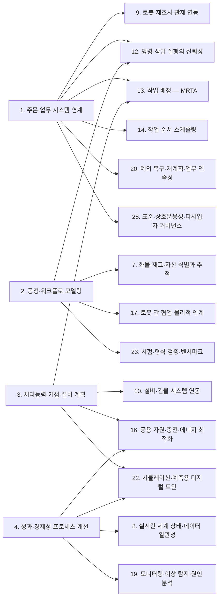
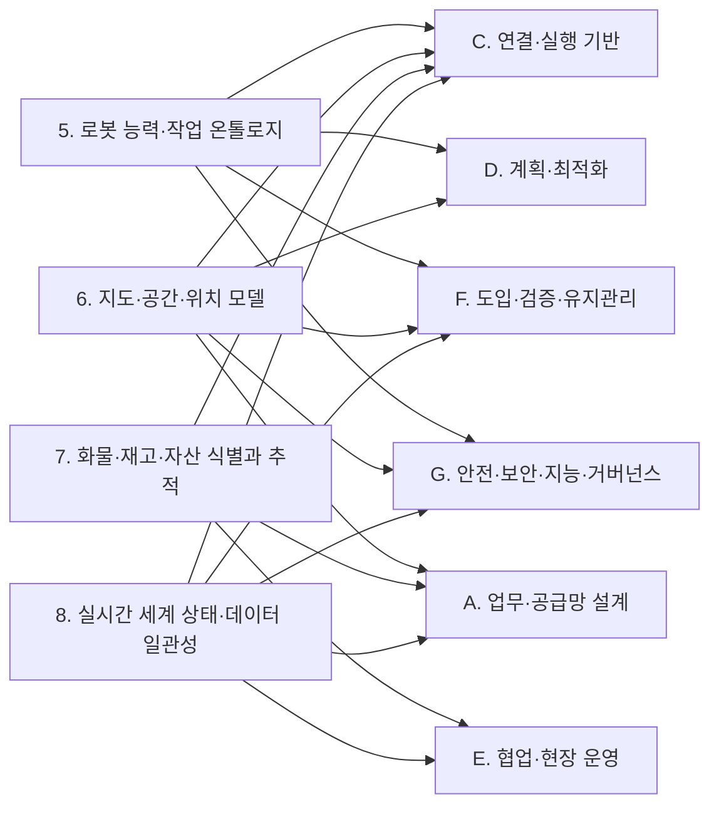
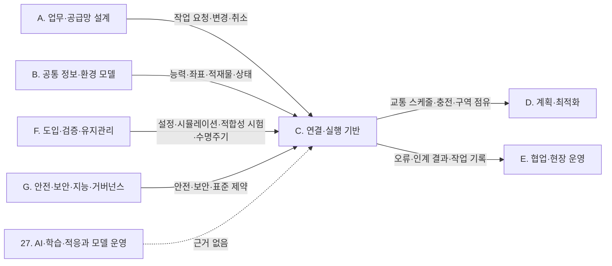
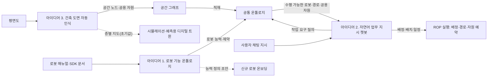

(너의 규칙은 시스템 프롬프트의 agents/shared-rules.md 와 agents/researcher.md 이다. 아래는 이번 실행의 컨텍스트와 입력이다.)

## 실행 컨텍스트

- run_id: 2026-09-25-60
- date: 2026-09-25
- run_type: category_link (대분류 연결)
- 대상: 대분류 E. 협업·현장 운영 페이지의 '다른 대분류와의 연결' 절(대분류 연결 실행). 게시된 세부영역 페이지를 근거로 다른 대분류와의 연결을 조사·서술한다. 스토리텔러는 그 절만 patches 로 바꾼다
- 예산:
    - max_search_queries: 30
    - max_sources_per_run: 15
    - new_topic_pages: 1
    - page_updates: 2
    - max_retries: 2
- 환경 알림: web_fetch_available: false · fetch_mode: mirror_only (일반 웹 페이지 열람은 네트워크 정책으로 막혀 있다. raw.githubusercontent.com 은 열린다: 공식 문서가 GitHub 에 있는 출처는 입력의 config/source_mirrors.yaml 경로를 WebFetch 로 열어 원문을 읽고 sources[].fetched=true, fetched_via=github_raw, fetch_url 을 적는다. 입력에 원문 텍스트(data/source_texts)가 있는 출처는 fetched_via=inbox. 그 밖의 출처는 fetched=false 이며 코드가 신뢰도 상한(medium)을 강제한다 — 공통 규칙 0절 6항)
- 언어: ko
- next_ref_id: ref-569
- 새 출처 id 구간: ref-569 ~ ref-598 — 이 실행 전용으로 예약한 번호다(동시에 도는 다른 실행과 겹치지 않는다). 새 출처는 ref-569 부터 순서대로 쓰고 ref-598 를 넘기지 않는다. 기존 출처는 참고문헌 목록의 id 를 그대로 쓴다

## 입력

### runs/2026-09-25-60/target.json

```json
{
  "run_id": "2026-09-25-60",
  "date": "2026-09-25",
  "weekday": "Fri",
  "run_number": 60,
  "run_type": "category_link",
  "forced": true,
  "target": {
    "area_no": null,
    "area_name": null,
    "category": "E. 협업·현장 운영",
    "category_letter": "E"
  },
  "topic": null,
  "track": null,
  "corrections": [],
  "budget": {
    "max_search_queries": 30,
    "max_sources_per_run": 15,
    "new_topic_pages": 1,
    "page_updates": 2,
    "max_retries": 2
  },
  "priority_reason": null,
  "priority_questions": [],
  "excluded_areas": [],
  "lifted_areas": [],
  "deferred": {
    "monthly_recheck": false,
    "weekly_review": false
  },
  "selection_rationale": "CLI 지정 run_type=category_link"
}
```

### docs/references/index.md (요약: 이번 대상 페이지가 인용한 71건 / 전체 504건. 목록에 없는 출처는 새 id 로 적는다 — 같은 URL 이 이미 있으면 퍼블리셔가 기존 id 로 합친다)

```markdown
| id | 기관 | 제목 | 발행일 | URL | 접근일 | 원문 열람 |
|---|---|---|---|---|---|---|
| ref-004 | Open Robotics | RMF Core Overview — Programming Multiple Robots with ROS 2 | 미확인 | https://osrf.github.io/ros2multirobotbook/rmf-core.html | 2026-09-25 | 예 |
| ref-007 | NIST | Performance of Collaborative Robot Systems | 미확인 | https://www.nist.gov/programs-projects/performance-collaborative-robot-systems | 2026-09-24 | 아니오 |
| ref-008 | NIST | ARIAC Documentation | 미확인 | https://pages.nist.gov/ARIAC_docs/en/latest/ | 2026-09-25 | 예 |
| ref-023 | Open Robotics | Workcells - Programming Multiple Robots with ROS 2 | 미확인 | https://osrf.github.io/ros2multirobotbook/integration_workcells.html | 2026-09-25 | 예 |
| ref-031 | VDA / VDMA (VDA5050 GitHub) | VDA5050/VDA5050_EN.md — Official Specification document for the VDA 5050 | 미확인 | https://github.com/VDA5050/VDA5050/blob/main/VDA5050_EN.md | 2026-09-25 | 예 |
| ref-044 | GS1 | gs1/EPCIS — Ontology/CBV.ttl (Core Business Vocabulary ontology 2.0) | 2021-09-30 | https://github.com/gs1/EPCIS/blob/master/Ontology/CBV.ttl | 2026-09-25 | 예 |
| ref-047 | Open Robotics (open-rmf) | rmf_internal_msgs — rmf_dispenser_msgs/msg/DispenserRequest.msg | 미확인 | https://github.com/open-rmf/rmf_internal_msgs/blob/main/rmf_dispenser_msgs/msg/DispenserRequest.msg | 2026-09-25 | 예 |
| ref-048 | Open Robotics (open-rmf) | rmf_internal_msgs — rmf_dispenser_msgs/msg/DispenserRequestItem.msg | 미확인 | https://github.com/open-rmf/rmf_internal_msgs/blob/main/rmf_dispenser_msgs/msg/DispenserRequestItem.msg | 2026-09-25 | 예 |
| ref-051 | VDA / VDMA (VDA5050 GitHub) | VDA5050/VDA5050 — json_schemas/state.schema | 미확인 | https://github.com/VDA5050/VDA5050/blob/main/json_schemas/state.schema | 2026-09-25 | 예 |
| ref-104 | Open Robotics (open-rmf) | rmf_demos — Demonstrations of Open-RMF (README) | 미확인 | https://github.com/open-rmf/rmf_demos | 2026-09-25 | 예 |
| ref-111 | Open Robotics (open-rmf) | rmf_api_msgs — rmf_api_msgs/schemas/task_state.json | 미확인 | https://github.com/open-rmf/rmf_api_msgs/blob/main/rmf_api_msgs/schemas/task_state.json | 2026-09-25 | 예 |
| ref-176 | InOrbit.AI | InOrbit Unveils RobOps Copilot for AI-Powered Robot Optimization at Automate 2024 | 2024-05 | https://www.inorbit.ai/press/inorbit-robops-copilot | 2026-09-25 | 아니오 |
| ref-188 | Hönig, W., Kiesel, S. 외 | Persistent and Robust Execution of MAPF Schedules in Warehouses | 2019 | https://ieeexplore.ieee.org/abstract/document/8620328/ | 2026-09-25 | 아니오 |
| ref-202 | SEMI | E08400 - SEMI E84 - Specification for Enhanced Carrier Handoff Parallel I/O Interface | 미확인 | https://store-us.semi.org/products/e08400-semi-e84-specification-for-enhanced-carrier-handoff-parallel-i-o-interface | 2026-09-25 | 아니오 |
| ref-203 | PEER Group | SEMI E84: Carrier Handoff | 미확인 | https://www.peergroup.com/definition-of-standard/semi-e84/ | 2026-09-25 | 아니오 |
| ref-204 | ASTM International | Standard Test Method for Confirming the Docking Performance of A-UGVs (ASTM F3499-21) | 2021 | https://www.astm.org/f3499-21.html | 2026-09-25 | 아니오 |
| ref-205 | NIST | Design and Application of the Reconfigurable Mobile Manipulator Artifact (RMMA) | 미확인 | https://www.nist.gov/publications/design-and-application-reconfigurable-mobile-manipulator-artifact-rmma | 2026-09-25 | 아니오 |
| ref-206 | Bostelman, R. 외(NIST) | Mobile Robot and Mobile Manipulator Research Towards ASTM Standards Development | 미확인 | https://pubmed.ncbi.nlm.nih.gov/28690359/ | 2026-09-25 | 아니오 |
| ref-207 | Tuci, E., Alkilabi, M. H. M., & Akanyeti, O. | Cooperative Object Transport in Multi-Robot Systems: A Review of the State-of-the-Art | 2018 | https://www.frontiersin.org/journals/robotics-and-ai/articles/10.3389/frobt.2018.00059/full | 2026-09-25 | 아니오 |
| ref-208 | Coltin, B., & Veloso, M. | Online pickup and delivery planning with transfers for mobile robots | 2014 | https://www.researchgate.net/publication/289338501_Online_pickup_and_delivery_planning_with_transfers_for_mobile_robots | 2026-09-25 | 아니오 |
| ref-209 | Zang, C. 외 | Lifelong Multi-Subsystem Pickup and Delivery with Buffer-Limited Handover Stations | 2026-07 | https://arxiv.org/abs/2607.17724 | 2026-09-25 | 아니오 |
| ref-210 | ANSI / A3(Association for Advancing Automation) | ANSI/A3 R15.08-2-2023 - Industrial Mobile Robots - Safety Requirements - Part 2: Requirements for IMR system(s) and IMR application(s) | 2023 | https://webstore.ansi.org/standards/ria/ansia3r15082023 | 2026-09-25 | 아니오 |
| ref-211 | 국가표준인증통합정보시스템(KSSN) | KS B ISO 10218-2 로봇 및 로봇 장치 - 산업용 로봇의 안전에 관한 요구사항 - 제2부: 로봇 시스템 및 통합 | 미확인 | https://www.kssn.net/search/stddetail.do?itemNo=K001010083660 | 2026-09-25 | 아니오 |
| ref-216 | ROS Navigation (ros-navigation/navigation2 GitHub) | nav2_docking — README (Open Navigation's Nav2 Docking Framework) | 미확인 | https://github.com/ros-navigation/navigation2/blob/main/nav2_docking/README.md | 2026-09-25 | 아니오 |
| ref-230 | MassRobotics | MassRobotics-AMR/AMR_Interop_Standard — AMR_Interop_Standard.json | 미확인 | https://github.com/MassRobotics-AMR/AMR_Interop_Standard/blob/main/AMR_Interop_Standard.json | 2026-09-25 | 예 |
| ref-272 | Lucas Systems | Voice-Directed Warehousing - Solutions | Lucas Systems | 미확인 | https://www.lucasware.com/voice-directed-warehousing/ | 2026-09-25 | 아니오 |
| ref-275 | USPTO(미국 특허 공보, 양수인 VOCOLLECT, INC.) | System and method for generating and updating location check digits (US 8868519) | 미확인 | https://image-ppubs.uspto.gov/dirsearch-public/print/downloadPdf/8868519 | 2026-09-25 | 아니오 |
| ref-278 | InOrbit.AI | InOrbit RobOps Copilot - Bring AI power to robot operations | 미확인 | https://www.inorbit.ai/robopscopilot | 2026-09-25 | 아니오 |
| ref-279 | Locus Robotics | Efficient Robot Interface for Seamless Human-Robot Collaboration (LocusONE user interface) | 미확인 | https://locusrobotics.com/locusone/automated-warehouse-software/user-interface | 2026-09-25 | 아니오 |
| ref-283 | Open Robotics | Doors (integration_doors) - Programming Multiple Robots with ROS 2 | 미확인 | https://osrf.github.io/ros2multirobotbook/integration_doors.html | 2026-09-25 | 예 |
| ref-302 | Open Robotics (open-rmf) | rmf-web — README | 미확인 | https://github.com/open-rmf/rmf-web | 2026-09-25 | 예 |
| ref-313 | Open Robotics (open-rmf) | rmf_internal_msgs — rmf_door_msgs/msg/DoorMode.msg | 미확인 | https://github.com/open-rmf/rmf_internal_msgs/blob/main/rmf_door_msgs/msg/DoorMode.msg | 2026-09-25 | 예 |
| ref-351 | Ren, A. Z. 외 | Robots That Ask For Help: Uncertainty Alignment for Large Language Model Planners | 2023-07 | https://arxiv.org/abs/2307.01928 | 2026-09-25 | 아니오 |
| ref-353 | Park, J., Lim, S., Lee, J., Park, S., Chang, M., Yu, Y., & Choi, S. | CLARA: Classifying and Disambiguating User Commands for Reliable Interactive Robotic Agents | 2024 | https://arxiv.org/abs/2306.10376 | 2026-09-25 | 아니오 |
| ref-356 | Rasa Technologies (RasaHQ/rasa GitHub) | Forms — Rasa documentation (docs/docs/forms.mdx) | 미확인 | https://github.com/RasaHQ/rasa/blob/main/docs/docs/forms.mdx | 2026-09-25 | 예 |
| ref-360 | arXiv 2508.19114 저자(미확인) | DELIVER: A System for LLM-Guided Coordinated Multi-Robot Pickup and Delivery using Voronoi-Based Relay Planning | 2025-08 | https://arxiv.org/abs/2508.19114 | 2026-09-25 | 아니오 |
| ref-394 | Korsah, G. A., Stentz, A., & Dias, M. B. | A comprehensive taxonomy for multi-robot task allocation | 2013 | https://journals.sagepub.com/doi/10.1177/0278364913496484 | 2026-09-25 | 아니오 |
| ref-417 | Obi, I., Venkatesh, V. L. N., Wang, W., Wang, R., Suh, D., Amosa, T. I., Jo, W., & Min, B.-C.(Purdue University SMART Lab) | Pre-Execution Safety Gate & Task Safety Contracts for LLM-Controlled Robot Systems | 2026-04 | https://arxiv.org/abs/2604.05427 | 2026-09-25 | 아니오 |
| ref-418 | Mecalux | Mecalux integrates generative AI into Easy WMS | 미확인 | https://www.mecalux.com/news/generative-ai-easy-wms-mecalux | 2026-09-25 | 아니오 |
| ref-445 | ROS (ros/diagnostics GitHub) | diagnostics — README (ros2 branch) | 미확인 | https://github.com/ros/diagnostics/blob/ros2/README.md | 2026-09-25 | 예 |
| ref-447 | OpenTelemetry (CNCF) | OpenTelemetry Specification — Overview | 미확인 | https://github.com/open-telemetry/opentelemetry-specification/blob/main/specification/overview.md | 2026-09-25 | 예 |
| ref-448 | Open Robotics (open-rmf/rmf_internal_msgs) | rmf_task_msgs/msg/Alert.msg | 미확인 | https://github.com/open-rmf/rmf_internal_msgs/blob/main/rmf_task_msgs/msg/Alert.msg | 2026-09-25 | 예 |
| ref-449 | VDA / VDMA (VDA5050 GitHub) | VDA5050/VDA5050 — json_schemas/connection.schema | 미확인 | https://github.com/VDA5050/VDA5050/blob/main/json_schemas/connection.schema | 2026-09-25 | 예 |
| ref-451 | Roser, C., Nakano, M., & Tanaka, M. | Comparison of bottleneck detection methods for AGV systems | 2003 | https://keio.elsevierpure.com/en/publications/comparison-of-bottleneck-detection-methods-for-agv-systems/ | 2026-09-25 | 아니오 |
| ref-467 | Žulj, I., Salewski, H., Goeke, D., & Schneider, M. | Order batching and batch sequencing in an AMR-assisted picker-to-parts system | 2022 | https://www.sciencedirect.com/science/article/abs/pii/S0377221721004616 | 2026-09-25 | 아니오 |
| ref-468 | Löffler, M., Boysen, N., & Schneider, M. | Human-Robot Cooperation: Coordinating Autonomous Mobile Robots and Human Order Pickers | 2023 | https://pubsonline.informs.org/doi/10.1287/trsc.2023.1207 | 2026-09-25 | 아니오 |
| ref-469 | Yang, P., Song, S., Huang, L., Gong, Y., & Shen, Z.-J. M. | Deploying pickers and robots in cobot-based collaborative order picking systems | 2026-03 | https://www.tandfonline.com/doi/full/10.1080/24725854.2025.2501036 | 2026-09-25 | 아니오 |
| ref-470 | ISO | ISO 3691-4:2023 - Industrial trucks — Safety requirements and verification — Part 4: Driverless industrial trucks and their systems | 2023-06 | https://www.iso.org/standard/83545.html | 2026-09-25 | 아니오 |
| ref-471 | A3(Association for Advancing Automation) | Updated ISO 10218 | Answers to Frequently Asked Questions (FAQs) | 미확인 | https://www.automate.org/robotics/blogs/updated-iso-10218-faq | 2026-09-25 | 아니오 |
| ref-472 | A3(Association for Advancing Automation) | ANSI/A3 R15.08-2 Safety Standard for Industrial Mobile Robot Systems and Applications Now Available | 2023-10 | https://www.automate.org/robotics/news/ansi-a3-r15-08-2-safety-standard-for-industrial-mobile-robot-systems-and-applications-now-available | 2026-09-25 | 아니오 |
| ref-473 | 고용노동부 | 고정식 이동식 산업용 로봇의 협동작업 안전 가이드 배포 | 2023-07 | https://www.moel.go.kr/policy/policydata/view.do?bbs_seq=20230700065 | 2026-09-25 | 아니오 |
| ref-474 | 로봇신문 | '이동식 산업용 로봇' 안전 가이드 어떤 내용 담고 있나? | 미확인 | https://www.irobotnews.com/news/articleView.html?idxno=32130 | 2026-09-25 | 아니오 |
| ref-475 | 중소벤처기업부(대한민국 정책브리핑) | ｢대구 이동식 협동로봇 규제자유특구｣ 산업표준 제정으로, 이동식 협동로봇 상용화 길 열렸다! | 2024-11 | https://www.korea.kr/briefing/pressReleaseView.do?newsId=156658517 | 2026-09-25 | 아니오 |
| ref-476 | Das, D., Banerjee, S., & Chernova, S. | Explainable AI for Robot Failures: Generating Explanations that Improve User Assistance in Fault Recovery | 2021-01 | https://arxiv.org/abs/2101.01625 | 2026-09-25 | 아니오 |
| ref-477 | Chen, J. Y. C. 외(Theoretical Issues in Ergonomics Science) | Situation awareness-based agent transparency and human-autonomy teaming effectiveness | 미확인 | https://www.tandfonline.com/doi/full/10.1080/1463922X.2017.1315750 | 2026-09-25 | 아니오 |
| ref-478 | Olsen, D. R. 외(CHI 2004) | Fan-out: measuring human control of multiple robots | 2004 | https://dl.acm.org/doi/10.1145/985692.985722 | 2026-09-25 | 아니오 |
| ref-479 | Rey-Becerra, E., & Wischniewski, S. | Mastering a robot workforce: review of single human multiple robots systems and their impact on occupational safety and health and system performance | 2025-07-11 | https://www.tandfonline.com/doi/full/10.1080/00140139.2025.2529316 | 2026-09-25 | 아니오 |
| ref-480 | ZDNet Korea | "대형 물류센터 집품 작업, 로봇 6대로 효율화" | 2023-12-22 | https://zdnet.co.kr/view/?no=20231222165139 | 2026-09-25 | 아니오 |
| ref-483 | Feng, Y., Paul, A., Chen, Z., & Li, J. | A Real-Time Rescheduling Algorithm for Multi-robot Plan Execution | 2024 | https://arxiv.org/abs/2403.18145 | 2026-09-25 | 아니오 |
| ref-484 | Kalempa, V. C., Piardi, L., Limeira, M., & de Oliveira, A. S. | Multi-Robot Preemptive Task Scheduling with Fault Recovery: A Novel Approach to Automatic Logistics of Smart Factories | 2021-09-30 | https://www.mdpi.com/1424-8220/21/19/6536 | 2026-09-25 | 아니오 |
| ref-485 | Emanuelsson, W., Penacho Riveiros, A., Li, Y., Johansson, K. H., & Mårtensson, J. (KTH) | Multiagent Rollout with Reshuffling for Warehouse Robots Path Planning | 2023 | https://arxiv.org/abs/2211.08201 | 2026-09-25 | 아니오 |
| ref-486 | ISO | ISO 22301:2019 - Security and resilience — Business continuity management systems — Requirements | 2019 | https://www.iso.org/standard/75106.html | 2026-09-25 | 아니오 |
| ref-487 | 행정안전부 | 재해경감 우수기업 인증제도 | 미확인 | https://www.mois.go.kr/frt/sub/a06/b10/disasterMitigationCompanies/screen.do | 2026-09-25 | 아니오 |
| ref-489 | Microsoft (MicrosoftDocs/architecture-center) | Compensating Transaction pattern | 2026-04-16 | https://learn.microsoft.com/en-us/azure/architecture/patterns/compensating-transaction | 2026-09-25 | 예 |
| ref-490 | Element Logic | FAQ - Element Logic (AutoStore) | 미확인 | https://www.elementlogic.net/solutions-and-services/autostore/faq/ | 2026-09-25 | 아니오 |
| ref-491 | Swisslog | The benefits of using AutoStore for high-throughput retail fulfillment | 2025-07 | https://www.swisslog.com/en-us/blog/2025/07/benefits-of-autostore-htp | 2026-09-25 | 아니오 |
| ref-492 | GS1 | EPC Information Services (EPCIS) Standard 1.2 | 2016-09-29 | https://www.gs1.org/sites/default/files/docs/epc/EPCIS-Standard-1.2-r-2016-09-29.pdf | 2026-09-25 | 아니오 |
| ref-497 | Singh, A., Raut, G., & Choudhary, A. | Multi-agent Collaborative Perception for Robotic Fleet: A Systematic Review | 2024-03 | https://arxiv.org/abs/2405.15777 | 2026-09-25 | 아니오 |
| ref-498 | 다음뉴스 게재 기사(원 언론사 미확인) | 유진로봇, 지능형 제조 물류시스템 공개 | 2025-11-04 | https://v.daum.net/v/20251104092138920 | 2026-09-25 | 아니오 |
| ref-499 | Open Robotics (open-rmf) | rmf_internal_msgs — rmf_dispenser_msgs/msg/DispenserResult.msg | 미확인 | https://github.com/open-rmf/rmf_internal_msgs/blob/main/rmf_dispenser_msgs/msg/DispenserResult.msg | 2026-09-25 | 예 |
| ref-537 | Open Robotics (open-rmf) | rmf_ros2 — rmf_fleet_adapter/include/rmf_fleet_adapter/agv/RobotUpdateHandle.hpp | 미확인 | https://github.com/open-rmf/rmf_ros2/blob/main/rmf_fleet_adapter/include/rmf_fleet_adapter/agv/RobotUpdateHandle.hpp | 2026-09-25 | 예 |
```

### docs/glossary/index.md (요약: 용어 130개, slug: 한국어 (영어). 정의는 docs/glossary/<slug>.md)

```markdown
- action-dependency-graph: 행동 의존 그래프 (Action Dependency Graph (ADG))
- age-of-information: 정보 나이 (Age of Information (AoI))
- aggregation-event: 집계 이벤트 (AggregationEvent)
- ariac: 산업 자동화용 민첩 로봇 경진대회 (Agile Robotics for Industrial Automation Competition (ARIAC))
- asset-administration-shell: 자산관리셸 (Asset Administration Shell (AAS))
- association-event: 연결 이벤트 (AssociationEvent)
- b2mml: B2MML (Business To Manufacturing Markup Language (B2MML))
- battery-swapping: 배터리 교환 (Battery Swapping)
- behavior-tree: 행동 트리 (Behavior Tree)
- block-reference: 블록 참조 (Block Reference (INSERT))
- bpmn: 비즈니스 프로세스 모델 및 표기법 (Business Process Model and Notation (BPMN))
- building-information-modeling: 건물 정보 모델링 (Building Information Modeling (BIM))
- building-topology-ontology: 건물 위상 온톨로지 (Building Topology Ontology (BOT))
- business-continuity-management-system: 업무 연속성 관리 시스템 (Business Continuity Management System (BCMS))
- business-location: 업무 위치 (Business Location (EPCIS bizLocation))
- cap-theorem: CAP 정리 (CAP Theorem)
- capabilities-skills-services: 능력·스킬·서비스 모델 (Capabilities, Skills and Services (CSS) Model)
- capability-based-task-allocation: 능력 기반 작업 배정 (Capability-based Task Allocation)
- capability-matchmaking: 능력 매칭 (Capability Matchmaking)
- cbv: 핵심 업무 어휘 (Core Business Vocabulary (CBV))
- collaborative-application: 협동 적용 (Collaborative Application)
- collaborative-perception: 협동 인지 (Collaborative Perception)
- compensating-transaction: 보상 트랜잭션 (Compensating Transaction)
- conflict-based-search: 충돌 기반 탐색 (Conflict-Based Search (CBS))
- conformance-test: 적합성 시험 (Conformance Test)
- consensus-based-bundle-algorithm: 합의 기반 번들 알고리즘 (Consensus-Based Bundle Algorithm (CBBA))
- cooperative-object-transport: 협동 운반 (Cooperative Object Transport)
- cora: 로봇·자동화 핵심 온톨로지 (Core Ontology for Robotics and Automation (CORA))
- crdt: 무충돌 복제 데이터 타입 (Conflict-free Replicated Data Type (CRDT))
- cross-schedule-dependency: 스케줄 간 의존 (Cross-schedule Dependency (XD))
- dds-security: DDS 보안 규격 (DDS Security (DDS-Security))
- deadlock: 교착 (Deadlock)
- digital-shadow: 디지털 섀도 (Digital Shadow)
- digital-twin: 디지털 트윈 (Digital Twin)
- discrete-event-simulation: 이산 사건 시뮬레이션 (Discrete Event Simulation (DES))
- dispenser-ingestor: 디스펜서·인제스터 (Dispenser / Ingestor)
- distributed-tracing: 분산 추적 (Distributed Tracing)
- drawing-exchange-format: 도면 교환 형식 (Drawing Exchange Format (DXF))
- eclass: ECLASS (ECLASS)
- enclave: 인클레이브 (Enclave (SROS 2))
- epcis-error-declaration: 오류 선언 (Error Declaration (EPCIS errorDeclaration))
- epcis: 전자 제품 코드 정보 서비스 (Electronic Product Code Information Services (EPCIS))
- fan-out: 팬아웃 (Fan-out (human-robot team))
- fault-detection-and-diagnosis-fdd: 고장 탐지·진단 (Fault Detection and Diagnosis (FDD))
- fleet-adapter: 플릿 어댑터 (Fleet Adapter)
- fleet-management-system: 플릿 관리 시스템 (Fleet Management System (FMS))
- fleet-sizing: 차량 소요대수 산정 (Fleet Sizing)
- floor-plan-recognition: 평면도 인식 (Floor Plan Recognition)
- fog-computing: 포그 컴퓨팅 (Fog Computing)
- giai: 글로벌 개별 자산 식별자 (Global Individual Asset Identifier (GIAI))
- grai: 글로벌 반환형 자산 식별자 (Global Returnable Asset Identifier (GRAI))
- hallucination: 환각 (Hallucination)
- human-in-the-loop: 사람 참여 루프 (Human-in-the-Loop (HITL))
- hungarian-method: 헝가리안 방법 (Hungarian Method)
- idempotency-key: 멱등성 키 (Idempotency Key)
- identity-report: 신원 보고 (Identity Report (MassRobotics identityReport))
- iec-common-data-dictionary: IEC 공통 데이터 사전 (IEC Common Data Dictionary (IEC CDD))
- ifc: 산업 기초 클래스 (Industry Foundation Classes (IFC))
- indoor-mapping-data-format: 실내 지도 데이터 형식 (Indoor Mapping Data Format (IMDF))
- indoorgml: IndoorGML (IndoorGML)
- information-delivery-specification: 정보 전달 명세 (Information Delivery Specification (IDS))
- intent-recognition: 의도 인식 (Intent Recognition (Intent Detection))
- irdi: 국제 등록 데이터 식별자 (International Registration Data Identifier (IRDI))
- isa-95: 기업–제어 시스템 통합 표준 (ISA-95 Enterprise-Control System Integration)
- layout-interchange-format: 레이아웃 교환 형식 (Layout Interchange Format (LIF))
- lifelong-mapf: 지속형 다중 에이전트 경로 찾기 (Lifelong Multi-Agent Path Finding (Lifelong MAPF))
- lift-adapter: 승강기 어댑터 (Lift Adapter)
- linear-temporal-logic: 선형 시간 논리 (Linear Temporal Logic (LTL))
- littles-law: 리틀의 법칙 (Little's Law)
- llm-agent: LLM 에이전트 (LLM Agent)
- location-check-digit: 위치 체크 디지트 (Location Check Digit)
- managed-node: 관리형 노드 (Managed Node (ROS 2 Lifecycle Node))
- map-alignment: 지도 정합 (Map Alignment)
- mapf: 다중 에이전트 경로 찾기 (Multi-Agent Path Finding (MAPF))
- market-based-task-allocation: 시장 기반 작업 배정 (Market-based Task Allocation)
- milp: 혼합 정수 계획 (Mixed Integer Linear Programming (MILP))
- mobile-manipulator: 모바일 매니퓰레이터 (Mobile Manipulator)
- mqtt: 메시지 큐잉 원격 측정 전송 (Message Queuing Telemetry Transport (MQTT))
- mrta: 다중 로봇 작업 배정 (Multi-Robot Task Allocation (MRTA))
- multi-agent-pickup-and-delivery: 다중 에이전트 픽업·배송 (Multi-Agent Pickup and Delivery (MAPD))
- multi-fleet-orchestration: 다중 플릿 오케스트레이션 (Multi-Fleet Orchestration)
- nearest-vehicle-first-rule: 최근접 차량 우선 규칙 (Nearest Vehicle First (NVF) Rule)
- occupancy-grid-map: 점유 격자 지도 (Occupancy Grid Map (OGM))
- ocel: 객체 중심 이벤트 로그 (Object-Centric Event Log (OCEL))
- open-rmf: 오픈 RMF (Open-RMF (Open Robotics Middleware Framework))
- operating-mode: 운용 모드 (Operating Mode (VDA 5050 operatingMode))
- order-batching: 주문 배치 (Order Batching)
- overall-equipment-effectiveness: 종합설비효율 (Overall Equipment Effectiveness (OEE))
- panoptic-symbol-spotting: 파놉틱 심볼 스포팅 (Panoptic Symbol Spotting)
- pddl: 계획 도메인 정의 언어 (Planning Domain Definition Language (PDDL))
- perfect-order-fulfillment: 완전 주문 이행률 (Perfect Order Fulfillment)
- plug-and-produce: 플러그 앤 프로듀스 (Plug and Produce)
- precedence-constraint: 선후 제약 (Precedence Constraint)
- priority-inheritance-with-backtracking: 우선순위 상속·되돌림 (Priority Inheritance with Backtracking (PIBT))
- private-5g-network: 5G 특화망(이음5G) (Private 5G Network (e-Um 5G))
- process-mining: 프로세스 마이닝 (Process Mining)
- put-wall: 풋월 (Put Wall)
- raster-to-vector-conversion: 래스터–벡터 변환 (Raster-to-Vector Conversion)
- read-point: 판독 지점 (Read Point (EPCIS readPoint))
- release-zone: 해제 구역 (Release Zone)
- required-and-provided-capability: 요구 능력·제공 능력 (Required Capability / Provided (Offered) Capability)
- roadmap: 경로망 (Roadmap)
- robotic-mobile-fulfillment-system: 로봇 이동형 풀필먼트 시스템 (Robotic Mobile Fulfillment System (RMFS))
- root-cause-analysis-rca: 근본 원인 분석 (Root Cause Analysis (RCA))
- safe-interval-path-planning: 안전 구간 경로 계획 (Safe Interval Path Planning (SIPP))
- saga: 사가 (Saga)
- scor: 공급망 운영 참조 모델 (Supply Chain Operations Reference (SCOR))
- semantic-id: 의미 식별자 (Semantic ID (semanticId))
- semi-open-queueing-network: 반개방형 대기행렬 네트워크 (Semi-Open Queueing Network (SOQN))
- shacl: 형상 제약 언어 (Shapes Constraint Language (SHACL))
- shifting-bottleneck-detection-active-period-method: 이동 병목 탐지 (Shifting Bottleneck Detection (Active Period Method))
- situation-awareness-based-agent-transparency: 상황 인식 기반 에이전트 투명성 (Situation Awareness-based Agent Transparency (SAT))
- skill: 스킬 (Skill)
- slot-filling: 슬롯 채우기 (Slot Filling)
- space-graph: 공간 그래프 (Space Graph)
- sscc: 물류 단위 일련 코드 (Serial Shipping Container Code (SSCC))
- state-of-charge: 충전 상태 (State of Charge (SOC))
- structured-output: 구조화 출력 (Structured Output)
- task-decomposition: 작업 분해 (Task Decomposition)
- time-window: 시간창 (Time Window)
- topological-map: 위상 지도 (Topological Map)
- vda-5050-cancel-order: 주문 취소 즉시 동작 (cancelOrder (VDA 5050 instant action))
- vda-5050-factsheet: VDA 5050 팩트시트 (VDA 5050 factsheet)
- vda-5050: VDA 5050 (VDA 5050)
- virtual-commissioning: 가상 시운전 (Virtual Commissioning)
- voice-picking: 음성 피킹 (Voice-Directed Picking (Voice Picking))
- waveless-order-release: 웨이브리스 출고 지시 (Waveless Order Release)
- wes-wcs-wms-mes-tms: 창고 실행·창고 제어·창고 관리·제조 실행·운송 관리 시스템 (Warehouse Execution System / Warehouse Control System / Warehouse Management System / Manufacturing Execution System / Transportation Management System)
- workflow-net: 워크플로 넷 (Workflow Net (WF-net))
- zone-set: 구역 집합 (Zone Set (VDA 5050 zoneSet))
```

### docs/open-questions.md (요약: 대상 영역 [17, 18, 19, 20] 에 걸린 23건 / 전체 81건)

```markdown
- oq-001 [열림] 로봇의 적재·하역 완료 신호(VDA 5050 drop 동작 완료, Open-RMF IngestorResult)를 EPCIS 인계 이벤트로 옮기는 표준 매핑이나 공개 구현 사례가 있는가? (영역 7, 17, 9)
- oq-003 [열림] 로봇·게이트의 바코드·RFID 판독 실패나 오판독이 생기면 인계 확정을 보류·재스캔·사람 확인 중 어떤 기준으로 처리해야 하는가? (영역 7, 20)
- oq-006 [열림] CBV의 loading·unloading이 운송 수단 적재로 정의되어 있을 때 시설 안 로봇의 적재·운반·하역은 어떤 업무 단계(bizStep) 값이나 사용자 정의 어휘로 기록해야 하는가? (영역 7, 17)
- oq-009 [열림] 교대조별 작업자 수와 로봇·작업대 수를 함께 정하는 처리능력 계획 모델이나 사례가 있는가? (영역 3, 18)
- oq-018 [열림] 이동로봇·작업대·승강기가 섞인 창고 흐름에 활성 구간 기반 이동 병목 탐지나 객체 중심 프로세스 마이닝을 적용한 연구가 있는가? (영역 4, 19)
- oq-021 [열림] 로봇이 이미 화물을 싣거나 옮긴 뒤 상위 시스템이 주문을 취소·변경하면 되돌림 작업과 재고 반영을 누가 어떤 규칙으로 정하는가(국내 물류센터 사례 포함)? (영역 1, 20)
- oq-033 [열림] Open-RMF 로봇 상태, VDA 5050 action 상태·오류, MassRobotics 운용 상태를 하나의 공통 상태·오류 어휘로 옮기는 표준 매핑이나 공개 구현이 있는가? (영역 9, 12, 19)
- oq-038 [열림] 외부망이 끊겨 클라우드 WMS 와 단절된 동안 현장 ROP 가 이미 받은 주문·작업을 어디까지 계속 실행하고, 재연결 뒤 재고·완료 기록을 어떻게 맞추는지 정한 국내 물류센터 운영 기준이나 사례가 있는가? (영역 11, 1, 20)
- oq-042 [열림] 컨베이어·작업대와 이동로봇 사이 적재물 인계 신호(준비·허가·이송·완료)를 제조사 중립으로 정한 공개 표준이나 규격이 있는가? (영역 10, 17)
- oq-048 [열림] Open-RMF 플릿 어댑터 재시작 시 작업 유실을 막는 작업 백업·복원 기능(SQLite 저장 제안)이 현재 배포판에 반영되었는가, 반영되었다면 복원 뒤 로봇의 실제 위치·적재 상태와 어떻게 대조하는가? (영역 12, 20)
- oq-061 [열림] 로봇팔·워크셀의 인수 결과와 이동로봇의 적재 상태 보고가 어긋날 때(한쪽은 성공, 다른 쪽은 적재 유지) 어느 신호를 기준으로 인계 완료를 판정하는지 정한 표준이나 현장 사례가 있는가? (영역 17, 8)
- oq-062 [열림] 반도체 업종의 SEMI E84 같은 단계별 인계 신호를 물류센터의 이동로봇–컨베이어·작업대 인계에 적용하거나 옮긴 사례가 있는가? (영역 17, 10)
- oq-063 [열림] ASTM F3499·NIST RMMA 같은 도킹·위치 정밀도 시험 결과를 로봇팔 파지 허용 오차와 연결해 인계 가능 여부를 정하는 기준이 있는가? (영역 17, 23)
- oq-064 [열림] 국내에 ANSI/A3 R15.08-2 의 유형 C(모바일 매니퓰레이터) 통합 안전 요구에 대응하는 KS 표준이나 인증 기준이 있는가? (영역 17, 25)
- oq-070 [열림] 2024-11 제정된 이동식 협동로봇 안전기준 KS 의 표준 번호와 내용은 무엇이며, ISO 10218-2:2025·ISO 3691-4:2023 과 어떻게 대응하는가? (영역 18, 25)
- oq-071 [열림] 국내 물류센터에서 사람 피커와 운반 로봇이 서로 기다리는 시간(피커 유휴·로봇 대기)을 실측해 공개한 자료가 있는가? (영역 18, 4)
- oq-072 [열림] 물류센터 관제 요원 한 명이 감독할 수 있는 이동로봇 수를 팬아웃이나 인지 부하 기준으로 측정한 연구나 현장 기준이 있는가? (영역 18, 19)
- oq-073 [열림] VDA 5050 3.0.0 판의 네 단계 오류 수준(WARNING·URGENT·CRITICAL·FATAL)과 이전 판(2.x)의 오류 수준이 다를 때, 두 판이 섞인 이종 플릿에서 오류 수준을 어떻게 맞춰 해석하는가? (영역 19, 9)
- oq-074 [열림] 물류 로봇 작업 지연을 로봇·설비·통신·공정 원인으로 나누는 공개 원인 분류 체계나 현장 데이터셋이 있는가? (영역 19, 4)
- oq-075 [열림] 국내 물류센터에서 로봇 정지·지연의 원인별 발생 비율이나 이상 대응 시간을 실측해 공개한 자료가 있는가? (영역 19, 20)
- oq-079 [열림] 운반 중 고장 난 로봇에 실린 화물을 사람이나 다른 로봇이 회수할 때 어떤 확인(스캔·무게·위치)으로 재고 위치를 바로잡는지 정한 운영 기준이나 국내 사례가 있는가? (영역 20, 7)
- oq-080 [열림] 국내 물류센터가 로봇·관제 장애 때 수동 운영이나 제한 운영으로 전환하는 기준(허용 중단 시간, 전환·복귀 절차)을 BCP 에 정한 사례가 있는가? (영역 20, 18)
- oq-081 [열림] 로봇 일부가 멈춘 제한 운영 상태의 처리량 저하를 미리 추정해 전환 결정에 쓰는 방법이나 사례가 있는가? (영역 20, 22)
```

### config/priority.yaml

```yaml
# config/priority.yaml — 사용자가 지정하는 우선 영역·주제·질문 (빌드 사양서 7.1, 7.4, 8.2)
#
# 비어 있으면 순환 규칙(config/rotation.yaml)만 따른다. 항목이 없는 키는 빈 목록([])으로 둔다.
# 네 키(areas, topics, questions, track_questions)는 빈 목록이라도 모두 있어야 하고, 항목의 필드 이름은 아래 예시와 같아야 한다.
# 항목의 뜻과 반영 시점은 config/README.md 와 docs/about/how-to-contribute.md 에 있다.
#
# 읽는 주체:
#   - pipeline/select_target.*  : areas·topics·questions 로 그날의 대상을 정한다(순환보다 우선, 7.1). questions 는 area_no 영역을 대상으로 올리고, 2주기에는 그 영역의 점수에도 더한다
#   - 리서치·검증 에이전트       : 이 파일 전문이 프롬프트의 "## 입력"에 들어간다. 대상 영역의 questions 는 조사 질문에 포함된다
#   - pipeline/select_target.*  : 트랙 실행의 대상 선정에서 track_questions 를 트랙 백로그(data/tracks/<slug>/backlog.json)에 제기 근거 "사용자"로 먼저 등록하고 그 실행의 질문으로 고른다
#   - 퍼블리셔                   : 대상 선정 뒤에 더해진 track_questions 를 같은 방식으로 등록한다(보완)
#
# area_no 는 1~28 의 세부영역 번호다. 사람이 읽기 쉽도록 주석에 영역 이름을 함께 적는다(예: 7. 화물·재고·자산 식별과 추적).
# 지정한 항목이 처리되면 목록에서 지워도 된다. 지우지 않으면 rotation.yaml 의 priority.skip_if_targeted_within_days 가 지난 뒤 다시 우선된다.
# 우선 지정은 조사 대상을 정할 뿐 검증 규칙과 하루 예산(daily_budget)을 바꾸지 않는다.

# 세부영역을 먼저 다루게 한다. weight 는 대상 선정 점수에 더하는 가중치, reason 은 로그(target.json·일일 로그)에 남는 지정 사유다.
areas: []
# 작성 예시:
# areas:
#   - area_no: 7            # 7. 화물·재고·자산 식별과 추적
#     weight: 10            # 대상 선정 점수에 더하는 가중치
#     reason: "인계 확인 사례가 부족하다"

# 특정 주제로 주제 조사(run_type topic)를 실행하게 한다. area_no 는 주 연구영역이다.
topics: []
# 작성 예시:
# topics:
#   - title: "팔레트 인계 확인에 EPCIS 이벤트를 쓰는 방법"
#     area_no: 7            # 주 연구영역: 7. 화물·재고·자산 식별과 추적
#     weight: 8

# 답을 찾게 할 질문이다. area_no 영역을 areas 와 같이 순환보다 먼저 대상으로 올리고(가중치는 rotation.yaml 의 priority.question_weight), 그 영역이 대상이 되면 리서치 에이전트의 조사 질문에 포함된다.
questions: []
# 작성 예시:
# questions:
#   - question: "로봇 도착과 실제 팔레트 인계를 어떤 이벤트로 구분해 기록하는가?"
#     area_no: 7            # 7. 화물·재고·자산 식별과 추적

# 트랙 백로그에 넣을 질문이다(8.2). 다음 트랙 실행의 대상 선정이 제기 근거 "사용자"로 백로그에 등록해 우선순위를 올린다(8.2).
# 처리 순서: 리서치 에이전트는 트랙 실행마다 현재 단계의 열린 질문 가운데 사용자 지정 → 앞 단계로 되돌아온 질문 → 오래된 순으로 1~3개를 고르므로(6.1),
# 현재 단계에 넣은 사용자 질문이 가장 앞에 온다. 사용자 질문이 여럿이면 priority(high → normal → low), 같으면 파일에 적힌 순이다 [가정].
# stage 가 현재 단계보다 앞이면 되돌아온 질문과 같이 다음 트랙 실행에서 우선 처리하고(8.2), 뒤이면 그 단계가 현재 단계가 될 때 다룬다 [가정].
track_questions: []
# 작성 예시:
# track_questions:
#   - track: manual-capability-ontology   # config/tracks/<slug>.yaml 의 slug
#     stage: 1              # 질문을 넣을 단계 번호(1~7). 예: 단계 1. 기존 능력 표현 모델과 표준 조사
#     question: "산업 상호운용 규격의 팩트시트는 적재 제약을 어떤 필드로 기술하는가?"
#     priority: high        # high / normal / low. 사용자 지정 질문이 여럿일 때 고르는 순서에만 쓴다 [가정]
```

### inbox/corrections.md

````markdown
# 정정 요청함 (inbox/corrections.md)

이 파일은 위키 내용에 대한 정정 요청을 모으는 곳이다. 형식, 처리 흐름, 거부되는 경우는 docs/corrections.md(정정 요청 안내)에 있다.

- 한 요청은 `## corr-NNN` 제목으로 시작하는 블록 하나다. id 는 corr-001 부터 순서대로 늘리며, 아래 "요청 목록"에 새 블록을 덧붙인다.
- 필드는 서식의 여섯 줄(페이지, 문제 문장, 근거, 요청일, 요청자, 상태)을 그대로 쓰고 값만 채운다. 각 필드는 한 줄로 쓴다. 페이지·문제 문장·근거·요청일은 빌드 사양서 7.4 의 필드이고, 요청자·상태는 구축자가 더한 것이다. [가정]
- 상태는 요청자가 `open` 으로 쓴다. `applied`(반영됨)·`rejected`(반영하지 않음)는 퍼블리셔가 바꾸고, 그때 "처리 실행"과 "처리 메모" 줄을 덧붙인다.
- 리서치 에이전트는 다음 실행에서 이 파일 전체를 읽는다. 대상 페이지에 걸린 `open` 요청은 반드시 조사 질문에 들어가고, 내용 검증 에이전트가 1차 검증 항목 11(정정 요청 반영 여부)로 확인하며, 처리 결과는 docs/changelog.md(변경 이력)에 남는다.
- 분류 원문의 명칭·번호·정의·질문은 정정 대상이 아니다. 새 주제나 우선 영역은 config/priority.yaml 에 적는다.

## 서식

아래 블록을 복사해 "요청 목록" 끝에 붙이고, 제목의 `corr-NNN` 을 실제 id 로 바꾼 뒤 값을 채운다. 코드 펜스 안의 서식은 요청으로 읽히지 않는다(정정 요청을 읽는 스크립트는 코드 펜스 안의 `## corr-` 줄을 제외해야 한다). [가정]

```markdown
## corr-NNN

- 페이지: docs/<경로>/<파일>.md
- 문제 문장: "페이지에 있는 문장을 태그까지 그대로 옮긴다"
- 근거: 출처 URL 또는 설명
- 요청일: YYYY-MM-DD
- 요청자: 이름 또는 역할
- 상태: open
```

## 요청 목록

(아직 요청이 없다.)
````

### runs/2026-09-25-57/research.md

```markdown
# 리서치 브리프 2026-09-25-57

| 항목 | 값 |
|---|---|
| 실행 id | 2026-09-25-57 |
| 날짜 | 2026-09-25 |
| 실행 유형 | track (트랙 실행) |
| 대상 영역 | 5. 로봇 능력·작업 온톨로지 |
| 대분류 | B. 공통 정보·환경 모델 |

트랙 실행: 트랙 `manual-capability-ontology` · 단계 2 · 답한 질문 q2-01

## 갭(비어 있거나 약한 섹션)

- 단계 2 질문 q2-01, q2-02, q2-03 열림(target.json 지정, CLI 지정 질문 id). 단계 2 페이지는 seed 상태로 3절 조사 결과·4절 결론·5절 후속 질문이 비어 있음
- 완료 조건: 문서 유형 매트릭스(document-type-matrix.md) 7행 × 8열 모든 칸 미조사
- 완료 조건: 공개 문서 샘플 목록 비어 있음
- 능력 온톨로지 초안의 근거 문서 개념에 문서 유형·정보 형태·이용 조건 속성이 없음(6절 '근거 문서의 단위와 버전' 질문)
- 아이디어 1. 로봇 기능 온톨로지 4절에 제조사 문서 유형·형태 근거 없음

## 조사 질문

1. 같은 ‘운반 로봇’ 중 누가 이 화물을 실제로 취급할 수 있는가? [분류원문]
2. q2-01 제조사가 제공하는 문서 유형(사용자 매뉴얼, 통합·API 가이드, 사양서·데이터시트, 안전 매뉴얼, 오류 코드표, 릴리스 노트, 치수도·도면)은 무엇이며 각각 어떤 기능 정보를 담는가?
3. q2-02 기능 정보는 어떤 형태(문장, 표, 그림·다이어그램, 코드 예제, 파라미터 표)로 존재하며 형태별 추출 난이도는 어떠한가?
4. q2-03 공개적으로 접근할 수 있는 대표 문서 샘플(AMR, 협동로봇, 로봇팔 등)은 무엇이고 이용 조건은 어떠한가?
5. 사용 정보(설명서)의 구성과 내용을 정하는 표준(ISO 20607, IEC/IEEE 82079-1)은 제조사 문서 유형을 어떻게 규정하는가? (단계 2 페이지 3절 q2-01 겨냥)
6. 국내 협동로봇 제조사(두산로보틱스·레인보우로보틱스)는 어떤 문서를 어떤 경로·조건으로 공개하는가? (한국 자료 우선 규칙, q2-03 겨냥)

## 발견 사항

| id | 태그 | 주장 | 출처 | 교차 확인 | 신뢰도 | 기준일 | 흐름 단계 / 항목 | 표시 |
|---|---|---|---|---|---|---|---|---|
| f1 | [사실] | ISO 20607:2019 는 기계 제조사가 설명서(instruction handbook)의 안전 관련 부분을 작성할 때의 요구사항을 정하며, 기계 수명주기 전 단계를 고려한 안전 관련 내용·구조·표현을 다루고 ISO 12100:2010 6.4.5 의 사용 정보 일반 요구를 구체화한다. | ref-723 | 아니오 | medium | 2019 | — | 원문 미열람 |
| f2 | [사실] | IEC/IEEE 82079-1:2019 는 조립·설치·운전·유지보수·폐기에 필요한 모든 유형의 사용 정보(instructions for use)의 설계·작성 원칙과 요구사항을 정하고, 정보 품질·정보 관리 과정과 사용 정보의 실증적 평가 방법을 규범 부분에 둔다. | ref-724 | 아니오 | medium | 2019 | — | 원문 미열람 |
| f3 | [추정] | Boston Dynamics Spot SDK 공식 저장소 README 는 문서를 개념 설명, 파이썬 클라이언트 라이브러리(예제·빠른 시작), 페이로드 개발자 문서(기계·전기·소프트웨어 인터페이스), API 프로토콜 참조, 릴리스 노트, 라이선스로 나눈다. | ref-719 | 아니오 | medium | 2026-09-25 | — | 벤더 주장 |
| f4 | [추정] | Kinova Kortex API 공식 저장소 README 는 C++·Python API 메커니즘과 예제, Modbus 인터페이스, 언어별 오류 처리 문서, 펌웨어·API 판별 다운로드(Gen3 2.8.0, Gen3 lite 2.3.4)를 안내한다. | ref-720 | 아니오 | medium | 2026-09-25 | — | 벤더 주장 |
| f5 | [추정] | 두산로보틱스는 로봇랩 포털에서 설치 매뉴얼(설치 방법·인터페이스·수동/자동 모드·안전 관련 기능)과 기타 매뉴얼(액세서리·퀵 가이드·ROS·API 사용 방법)을 제공한다. | ref-725 | 아니오 | low | 2026-09-25 | — | 원문 미열람, 벤더 주장 |
| f6 | [추정] | 두산로보틱스 doosan-robot2 공식 저장소 README 는 튜토리얼 등 자세한 내용을 공식 ROS2 매뉴얼 포털로 안내하며 ROS2 Humble 에서 전 기종 지원을 밝히고 Apache 2.0·BSD 3-Clause 로 배포한다. | ref-721 | 아니오 | medium | 2026-09-25 | — | 벤더 주장 |
| f7 | [추정] | 레인보우로보틱스는 다운로드 페이지(도면·카탈로그·기술자료)와 GitHub Pages 기술자료(rb_cobot_docs)를 두고, 공식 클라이언트 라이브러리 rbpodo 는 제어 박스와 5000번 포트로 명령·응답을, 5001번 포트로 상태 데이터를 주고받는다고 적는다. | ref-722, ref-726 | 아니오 | medium | 2026-09-25 | — | 벤더 주장 |
| f8 | [사실] | VDA 5050 팩트시트 JSON 스키마는 유형 명세·물리 파라미터·프로토콜 한계·지원 기능·기하·적재 명세 블록을 기계가독 형식으로 두어, 이동로봇 쪽 사양서·데이터시트 정보의 표준화된 대응물이 된다. | ref-228 | 아니오 | medium | 2026-09-25 | — | 원문 미열람 |
| f9 | [추정] | 확인한 사례를 문서 유형에 대응시키면 통합·API 가이드는 기능·인터페이스(명령·상태)·오류 처리를, 설치·안전 매뉴얼은 운전 모드·안전 제약을, 릴리스 노트는 판별 변경을, 페이로드·액세서리 문서는 장착 장비 인터페이스를, 사양서·데이터시트는 파라미터 범위를 주로 담는 것으로 보인다. | ref-719, ref-720, ref-725, ref-723, ref-228 | 아니오 | low | 2026-09-25 | — | — |
| f10 | [사실] | Open-RMF PerformAction 튜토리얼은 플릿이 수행할 수 있는 동작을 config.yaml 의 actions 목록으로 선언하고, 작업 요청을 JSON 으로, 동작 실행 논리를 파이썬 코드 예제로 보여 주어 기능 정보가 설정 파일·JSON·코드 예제 형태로 존재하는 사례가 된다. | ref-040 | 아니오 | medium | 2026-09-25 | — | — |
| f11 | [추정] | Kinova Kortex 는 Google Protocol Buffers 문서를 참조하고 Spot SDK 는 API 프로토콜 참조를 두어, 두 제조사 모두 API 를 기계가독 프로토콜 정의와 코드 예제 형태로 제공하는 것으로 보인다. | ref-719, ref-720 | 아니오 | low | 2026-09-25 | — | 벤더 주장 |
| f12 | [사실] | OmniDocBench 공식 저장소 README 는 PDF 문서 파싱을 텍스트 문단·표·수식·읽기 순서로 나눠 편집 거리·TEDS 등으로 평가하며, 문서 유형으로 논문·재무 보고서·신문·교과서·손글씨 노트 등을 들고 매뉴얼은 명시하지 않는다. | ref-727 | 아니오 | medium | 2026-09-25 | — | — |
| f13 | [추정] | 범용 문서 파싱 벤치마크가 요소 형태별로 따로 평가하고 매뉴얼을 문서 유형에 두지 않으므로, 로봇 매뉴얼의 형태별(문장·표·그림·코드) 추출 난이도는 공개 측정 자료로 확인되지 않은 것으로 보인다. | ref-727, ref-728 | 아니오 | low | 2026-09-25 | — | — |
| f14 | [사실] | Springer 게재 장 'Conversational Knowledge Extraction from Technical Manuals'는 매뉴얼 전처리·색인, 온톨로지 제약을 건 검색 증강 생성(RAG) 기반 개체·관계 추출, 대화형 절차 안내를 결합한 LLM 프레임워크를 제안했다. | ref-728 | 아니오 | medium | 2026-09-25 | — | 원문 미열람 |
| f15 | [사실] | ManuExtract 는 제조 분야 문서에서 항목–속성–값 삼중항을 추출하는 벤치마크 데이터셋으로, LLM 생성 주석을 도메인 전문가가 다듬어 구축했다. | ref-729 | 아니오 | medium | 2026-09-25 | — | 원문 미열람 |
| f16 | [추정] | 확인한 사례로 보면 기능 정보의 형태는 기계가독 스키마·설정(VDA 5050 팩트시트, Open-RMF config.yaml, 프로토콜 정의) → 파라미터 표 → 문장 → 그림·다이어그램 순으로 구조화 추출이 쉬워질 것으로 보이나, 로봇 문서에서 이를 측정한 자료는 찾지 못했다. | ref-228, ref-040, ref-727, ref-728 | 아니오 | low | 2026-09-25 | — | — |
| f17 | [추정] | Spot SDK 는 GitHub 에 공개되어 있으나 사용·복제·배포가 Boston Dynamics SDK 라이선스(20191101-BDSDK-SL) 조건을 따른다. | ref-719 | 아니오 | medium | 2026-09-25 | — | 벤더 주장 |
| f18 | [추정] | Kinova Kortex API 저장소는 BSD 3-Clause 라이선스로 공개되어 있다. | ref-720 | 아니오 | medium | 2026-09-25 | — | 벤더 주장 |
| f19 | [추정] | 국내 협동로봇 제조사의 공개 저장소(두산 doosan-robot2: Apache 2.0·BSD 3-Clause, 레인보우 rbpodo: Apache 2.0)는 코드에 개방 라이선스를 달지만, 포털에서 내려받는 매뉴얼 문서 자체의 이용 조건은 이번에 확인하지 못했다. | ref-721, ref-722, ref-725 | 아니오 | low | 2026-09-25 | — | 벤더 주장 |
| f20 | [추정] | 이번에 확인한 공개 문서 샘플은 로봇팔·협동로봇(Kinova, 두산로보틱스, 레인보우로보틱스)과 4족 보행 로봇(Spot)이며, AMR 제조사의 공개 매뉴얼 샘플은 찾지 못해 AMR 쪽은 VDA 5050 팩트시트·MassRobotics 스키마 같은 표준 스키마로만 대신되는 것으로 보인다. | ref-719, ref-720, ref-721, ref-722, ref-228, ref-230 | 아니오 | low | 2026-09-25 | — | — |

### 근거 발췌

(이전 브리프 요약: 이 소절은 생략했다)
## 출처

| id | 기관 | 제목 | 발행일 | 유형 | 신뢰도 | 접근일 | URL | 원문 미열람 |
|---|---|---|---|---|---|---|---|---|
| ref-719 | Boston Dynamics (boston-dynamics/spot-sdk GitHub) | spot-sdk — README | 미확인 | 벤더 문서 | medium | 2026-09-25 | https://github.com/boston-dynamics/spot-sdk | 아니오 |
| ref-720 | Kinova (Kinovarobotics/kortex GitHub) | kortex — readme | 미확인 | 벤더 문서 | medium | 2026-09-25 | https://github.com/Kinovarobotics/kortex | 아니오 |
| ref-721 | Doosan Robotics (doosan-robotics/doosan-robot2 GitHub) | doosan-robot2 — README (humble) | 미확인 | 벤더 문서 | medium | 2026-09-25 | https://github.com/doosan-robotics/doosan-robot2 | 아니오 |
| ref-722 | Rainbow Robotics (RainbowRobotics/rbpodo GitHub) | rbpodo — README | 미확인 | 벤더 문서 | medium | 2026-09-25 | https://github.com/RainbowRobotics/rbpodo | 아니오 |
| ref-723 | ISO | ISO 20607:2019 - Safety of machinery — Instruction handbook — General drafting principles | 2019 | 표준 | medium | 2026-09-25 | https://www.iso.org/standard/68519.html | 예 |
| ref-724 | IEC / IEEE / ISO | IEC/IEEE 82079-1:2019 - Preparation of information for use (instructions for use) of products — Part 1: Principles and general requirements | 2019 | 표준 | medium | 2026-09-25 | https://www.iso.org/standard/71620.html | 예 |
| ref-725 | 두산로보틱스 | 매뉴얼 : Doosan Robotics Training & Service | 미확인 | 벤더 문서 | low | 2026-09-25 | https://robotlab.doosanrobotics.com/ko/board/Resources/Manual | 예 |
| ref-726 | Rainbow Robotics | Rainbow Robotics 협동로봇 기술자료 (rb_cobot_docs) | 미확인 | 벤더 문서 | low | 2026-09-25 | https://rainbowrobotics.github.io/rb_cobot_docs/ko/ | 예 |
| ref-727 | OpenDataLab (opendatalab/OmniDocBench GitHub) | OmniDocBench — README | 미확인 | 오픈소스 문서 | high | 2026-09-25 | https://github.com/opendatalab/OmniDocBench | 아니오 |
| ref-728 | Springer Nature (게재 장 저자 미확인) | Conversational Knowledge Extraction from Technical Manuals: An LLM-Based Framework with Ontological Guidance | 미확인 | 논문 | medium | 2026-09-25 | https://link.springer.com/chapter/10.1007/978-3-032-19096-3_30 | 예 |
| ref-729 | Springer Nature (게재 장 저자 미확인) | Enhancing LLMs for Manufacturing Information Extraction | 미확인 | 논문 | medium | 2026-09-25 | https://link.springer.com/chapter/10.1007/978-981-92-1468-6_21 | 예 |
| ref-040 | Open Robotics | PerformAction Tutorial - Programming Multiple Robots with ROS 2 | 미확인 | 오픈소스 문서 | high | 2026-09-25 | https://osrf.github.io/ros2multirobotbook/integration_fleets_action_tutorial.html | 아니오 |
| ref-228 | VDA / VDMA (VDA5050 GitHub) | VDA5050/VDA5050 — json_schemas/factsheet.schema | 미확인 | 표준 | medium | 2026-09-25 | https://github.com/VDA5050/VDA5050/blob/main/json_schemas/factsheet.schema | 예 |
| ref-230 | MassRobotics | MassRobotics-AMR/AMR_Interop_Standard — AMR_Interop_Standard.json | 미확인 | 표준 | medium | 2026-09-25 | https://github.com/MassRobotics-AMR/AMR_Interop_Standard/blob/main/AMR_Interop_Standard.json | 예 |

### 출처 요약

(이전 브리프 요약: 이 소절은 생략했다)
## 페이지 제안

| 동작 | 경로 | 섹션 | 이유 |
|---|---|---|---|
| update | docs/tracks/manual-capability-ontology/stage-2-document-types.md | 2, 3, 4, 5, 6, 8, 9 | q2-01 답: f1·f2·f3·f4·f5·f6·f7·f8·f9 (신뢰도 low) / q2-02 부분 답: f10·f11·f12·f13·f14·f15·f16 / q2-03 부분 답: f17·f18·f19·f20 — 2절 q2-01 답함, q2-02·q2-03 조사 중, 3절 질문별 소제목 신설(제조사 문서는 벤더 주장 병기), 4절 결론·불확실성(형태별 추출 난이도 측정 자료 없음, AMR 공개 매뉴얼 미확인), 5절 후속 질문, 6절 완료 조건 현황, 8절 출처, 9절 이력 |
| update | docs/tracks/manual-capability-ontology/document-type-matrix.md | 3, 4, 5, 7, 8 | 트랙 산출물 갱신: 통합·API 가이드 행(기능·인터페이스·오류 의미, f3·f4·f11), 안전 매뉴얼 행(안전 제약, f1·f5), 릴리스 노트 행(f3), 사양서·데이터시트 행(파라미터 범위·제약, f8) 일부 칸 채움(모두 샘플 병기, 벤더 주장), 4절 공개 문서 샘플 목록에 Spot SDK·Kinova Kortex·두산 doosan-robot2·레인보우 rbpodo 추가(이용 조건 f17~f19), AMR 샘플 없음(f20) |
| update | docs/categories/b-common-information-and-environment-model/05-robot-capability-and-task-ontology.md | 6 | 트랙 manual-capability-ontology 단계 2 반영 제안 (f9, f16): 능력 정보가 문서 유형·형태별로 흩어져 있고 기계가독 스키마가 가장 구조화된 원천이라는 점 |
| update | docs/categories/f-deployment-verification-and-maintenance/21-onboarding-configuration-and-commissioning.md | 6 | 트랙 manual-capability-ontology 단계 2 반영 제안 (f5, f7, f19, f20): 온보딩 때 모을 제조사 문서 유형과 공개 경로·이용 조건, 국내 제조사 사례 |
| update | docs/categories/g-safety-security-intelligence-and-governance/27-ai-learning-adaptation-and-model-operations.md | 6, 8 | 트랙 manual-capability-ontology 단계 2 반영 제안 (f12, f13, f14, f15): 교차 규칙(매뉴얼 해석은 5. 로봇 능력·작업 온톨로지와 21. 온보딩·설정·현장 시운전에 적용)에 따라 문서 파싱 벤치마크와 매뉴얼 대상 LLM 추출 연구를 양쪽 연결 |

## 용어 후보

| 용어(한글) | 용어(영문) | 한 줄 정의 |
|---|---|---|
| 사용 정보 | Information for Use (Instructions for Use) | 제품을 조립·설치·운전·유지보수·폐기하는 사람에게 제조사가 제공하는 설명 정보로, IEC/IEEE 82079-1 이 작성 원칙과 요구사항을 정한다. |

## 열린 질문

새로 생긴 질문:

- 없음

해결 제안(판정은 검증 에이전트):

- 없음

## 자체 점검

- 출처 수: 14 · 교차 확인: 0
- 예산 사용량: 검색 5회 · 신규 출처 11건
- 미확인 항목:
    - q2-02 부분 답: 로봇 매뉴얼의 형태별(문장·표·그림·코드) 추출 정확도 측정 자료 없음
    - q2-03 부분 답: AMR 제조사 공개 매뉴얼 샘플 미확인, 포털 매뉴얼 문서의 이용 약관 미확인
    - f5·f7(rb_cobot_docs)·f14·f15 원문 미열람(검색 요약 범위)
    - 오류 코드표·치수도 문서 유형은 샘플에서 따로 확인하지 못함
    - ref-728·ref-729 저자·발행일 미확인
    - 모든 finding 교차 확인 없음
- 범위 경계 위반 의심:
    - f4: Kortex 의 서보 모드 등 저수준 제어 문서는 분류 원문 9장 '로봇 자체 지능·제어' 쪽 연계 대상이므로 문서 유형 사례로만 쓰고 ROP 직접 범위로 서술하지 않음
- 한계: 스키마 불일치 재실행: 직전 반환 JSON 이 이번 프롬프트 입력에 포함되지 않아 형식만 고칠 수 없었으므로, 같은 질문(q2-01·q2-02·q2-03)으로 브리프를 다시 만들었다. 벤더 문서만 근거로 한 finding(f3~f7, f11, f17~f19)은 모두 태그 추정, vendor_claim true, evidence_excerpt 첫머리 '벤더 주장: '으로 냈고, 사실 태그는 표준·오픈소스·논문 출처 finding 에만 두었다. 답한 질문: q2-01. q2-02·q2-03 은 부분 답. web_fetch_available: false · fetch_mode mirror_only. raw.githubusercontent.com 으로 연 출처: ref-719·ref-720·ref-721·ref-722·ref-727, inbox 원문 ref-040. MiR 저장소 raw 경로는 404. 검색 5회/40, 신규 출처 11건/20(ref-719~ref-729, 예약 구간 안), 재사용 3건. 한국 자료: 두산로보틱스·레인보우로보틱스 문서 경로 포함. 온톨로지 변경 1건 제안(근거 문서 속성). 후속 질문 3건. 정정 요청 없음. 27. AI·학습·적응과 모델 운영 관련 finding(f13~f15)은 적용 대상 5·21 영역과 함께 반영 제안. 8·22 관련 주장 없음.

## 트랙 블록

- 트랙: manual-capability-ontology · 단계: 2
- 답한 질문 id: q2-01

### 새 질문

| 제안 id | 질문 | 보낼 단계 | 근거 finding |
|---|---|---|---|
| — | AMR 제조사(MiR·OTTO·국내 물류로봇 업체 등)가 공개하는 매뉴얼·REST API 문서는 무엇이며, 공개되지 않을 때 표준 스키마(VDA 5050 팩트시트·MassRobotics)로 대신할 수 있는 정보와 없는 정보는 무엇인가? (q2-03 에서 파생) | 2 | f20 |
| — | 로봇 매뉴얼의 형태별(문장·파라미터 표·그림·코드 예제) 추출 정확도를 범용 문서 파싱 벤치마크와 비교해 측정할 수 있는 공개 데이터셋이나 평가 방법이 있는가? (q2-02 에서 파생) | 3 | f13 |
| — | SDK 코드 라이선스와 별개로 제조사 매뉴얼 문서를 자동 추출·재가공해 능력 온톨로지에 쓰는 것이 이용 조건상 허용되는가, 이를 누가 확인하고 기록하는가? (q2-03 에서 파생) | 6 | f19 |

### 온톨로지 초안 변경 제안

| 동작 | 종류 | 이름 | 근거 finding | 설명 |
|---|---|---|---|---|
| modify | concept | 근거 문서 (Evidence Document) | f3, f9, f16, f17 | 속성 '문서 유형(사용자 매뉴얼·통합·API 가이드·사양서·안전 매뉴얼·릴리스 노트 등)', '정보 형태(문장·표·그림·코드·기계가독 스키마)', '이용 조건(라이선스)'을 더하는 제안. 초안 6절 '근거 문서의 단위와 버전' 질문과 함께 검토 필요. |

### 단계 완료 조건 자체 평가

- 충족 여부(자체 평가): 미충족
- 못 채운 조건:
    - 문서 유형 매트릭스: 일부 칸만 채울 근거가 있고 오류 코드표·치수도 행 미조사
    - 공개 문서 샘플 목록: AMR 샘플 없음, 매뉴얼 이용 조건 미확인
    - q2-02·q2-03 부분 답, q2-04·q2-05·q2-06 열림
```

### runs/2026-09-25-56/research.md

```markdown
# 리서치 브리프 2026-09-25-56

| 항목 | 값 |
|---|---|
| 실행 id | 2026-09-25-56 |
| 날짜 | 2026-09-25 |
| 실행 유형 | area_deep_dive (영역 심화) |
| 대상 영역 | 22. 시뮬레이션·예측용 디지털 트윈 |
| 대분류 | F. 도입·검증·유지관리 |

## 갭(비어 있거나 약한 섹션)

- 섹션 3. 왜 중요한가 비어 있음
- 섹션 4. 핵심 개념과 용어 비어 있음(디지털 모델·섀도·트윈 구분, 8. 실시간 세계 상태·데이터 일관성과의 경계)
- 섹션 5. 현장 시나리오 비어 있음(물류 흐름 단계 명시 필요)
- 섹션 6. 대표 접근법과 기술 비어 있음
- 섹션 7. 관련 표준·프레임워크·오픈소스 비어 있음
- 섹션 8. 대표 연구와 자료 비어 있음(트랙 floorplan-recognition 반영 제안 1건: Sommer 외 2023, ref-241)
- 섹션 9. ROP가 직접 맡는 것과 외부와 연계하는 것 비어 있음
- 섹션 10. 다른 연구영역과의 연결 비어 있음
- 섹션 11. 열린 질문 비어 있음(대상 영역에 걸린 열린 질문 0건)

## 조사 질문

1. 성수기 주문량이 늘면 어디가 먼저 막힐까? [분류원문]
2. 디지털 트윈·시뮬레이션의 정의와 표준(ISO 23247, KS X ISO 23247)은 무엇이며, 디지털 모델·디지털 섀도·디지털 트윈 구분으로 8. 실시간 세계 상태·데이터 일관성과 어떻게 경계를 긋는가? (섹션 3·4·7 겨냥)
3. 물류센터 로봇 운영 정책·배치·수요 변화의 효과를 예측하는 대표 접근법(이산 사건 시뮬레이션, 물리 기반 로봇 시뮬레이터, 데이터 기반 모델 생성)은 무엇인가? (섹션 6 겨냥)
4. 오픈소스 도구(Open-RMF 시뮬레이션, RAWSim-O, OFacT)는 무엇을 재현하고 어떤 결정을 실험하게 하는가? (섹션 7 겨냥)
5. 시뮬레이션 모델의 검증·타당성 확인 방법과 실데이터 검증 부족 문제는 연구에서 어떻게 다뤄지는가? (섹션 8·11 겨냥)
6. ROP 가 직접 맡을 시뮬레이션 범위와 외부에 맡길 범위(센서·물리 시뮬레이션, 로봇 로컬 주행, 수요예측)는 어떻게 나뉘는가? (섹션 9·10 겨냥)
7. 국내 물류센터 디지털 트윈 사례와 트랙 floorplan-recognition 반영 제안(스캔·객체 인식 기반 계획용 트윈, Sommer 외 2023)은 무엇을 보여 주는가? (섹션 5·8 겨냥)

## 발견 사항

| id | 태그 | 주장 | 출처 | 교차 확인 | 신뢰도 | 기준일 | 흐름 단계 / 항목 | 표시 |
|---|---|---|---|---|---|---|---|---|
| f1 | [사실] | ISO 23247(제조를 위한 디지털 트윈 프레임워크)은 국내에 KS X ISO 23247 로 부합화되어 있으며 제1부 개요 및 일반 원리, 제2부 참조 구조, 제4부 정보 교환 등 부로 나뉜다. | ref-659 | 아니오 | medium | 2026-09-25 | — | 원문 미열람 |
| f2 | [사실] | ISO 는 2026년에 ISO 23247-5(디지털 트윈을 위한 디지털 스레드)와 ISO 23247-6(디지털 트윈 결합)을 발간했고, 국가기술표준원은 2026-07-28 이 두 표준이 한국(ETRI) 제안으로 발간되었다고 알렸다. | ref-661, ref-662 | 예 | medium | 2026-07-28 | — | 원문 미열람 |
| f3 | [사실] | ISO 23247-6 은 목적에 따라 여러 디지털 트윈을 골라 결합하는 방법을 정해, 제품·설비·공정의 개별 트윈을 묶어 생산 라인·공장 전체의 복합 트윈을 구성하게 한다. | ref-661, ref-662 | 아니오 | medium | 2026-07-28 | — | 원문 미열람 |
| f4 | [사실] | NIST 의 제조용 디지털 트윈 과제는 디지털 트윈을 신뢰할 수 있고 상호운용 가능하게 만드는 측정 과학과 표준 개발을 목표로 둔다. | ref-660 | 아니오 | medium | 2026-09-25 | — | 원문 미열람 |
| f5 | [사실] | Kritzinger 외(2018)는 제조 분야 문헌을 디지털 모델·디지털 섀도·디지털 트윈으로 구분해 분류했고, 가장 높은 단계인 디지털 트윈을 다룬 문헌은 드물고 모델·섀도 문헌이 더 많다고 보고했다. | ref-663 | 아니오 | medium | 2018 | — | 원문 미열람 |
| f6 | [의견] | 분류 원문의 구분(8. 실시간 세계 상태·데이터 일관성은 현재 상태 표현, 22. 시뮬레이션·예측용 디지털 트윈은 가정한 미래 실험)에 문헌의 모델·섀도·트윈 구분을 맞추면, '디지털 트윈'이라는 이름이 실시간 동기화 수준을 가리키는 경우와 시나리오 실험 기능을 가리키는 경우가 섞여 쓰이므로 이 위키는 용도(현재 표현/미래 실험)로 나눠 적는 것이 맞아 보인다. | ref-663, ref-664 | 아니오 | low | 2020 | — | 원문 미열람 |
| f7 | [사실] | Agalianos 외(2020)는 물류 4.0 에서 이산 사건 시뮬레이션(DES)이 사물인터넷 장치의 실시간 데이터를 질의하며 디지털 트윈의 한 부분으로 진화하고, 이를 통해 창고 계획·관리·의사결정을 지원한다고 정리했다. | ref-664 | 아니오 | medium | 2020 | — | 원문 미열람 |
| f8 | [사실] | Le·Fan(2024)의 물류·공급망 디지털 트윈 문헌 검토는 실제 데이터로 검증한 논문은 소수이고 대다수가 생성 데이터를 쓴다고 보고해, 실무 적용의 부족을 지적했다. | ref-665 | 아니오 | medium | 2024 | 예외·성과 | 원문 미열람 |
| f9 | [사실] | Le·Fan(2024)은 COVID-19 이후 공급망 위험·교란 관리에서 디지털 트윈의 이점이 뚜렷해졌다고 보고, 물류·공급망 디지털 트윈 개념 틀을 제안했다. | ref-665 | 아니오 | medium | 2024 | — | 원문 미열람 |
| f10 | [사실] | Coelho 외(2021)는 Simio 로 만든 사내 물류 시뮬레이션 의사결정 지원 도구를 제안하고, 이 모델이 현실을 대표하여 실제 운영을 방해하지 않고 개선안을 시험하는 디지털 트윈화 도구로 쓰일 수 있다고 보고했다. | ref-666 | 아니오 | medium | 2021 | — | 원문 미열람 |
| f11 | [사실] | Open-RMF 문서는 Gazebo·Ignition 물리 시뮬레이터를 ROS 2 와 연결해 시뮬레이션에 쓴 코드를 수정 없이 실제 시스템에서도 실행하고, 시나리오 반복·예외 상황 탐색·장시간 검증을 현장 배치 전에 할 수 있다고 설명한다. | ref-667 | 아니오 | medium | 2026-09-25 | — | — |
| f12 | [사실] | Open-RMF 의 building_map_generator 는 traffic_editor 로 주석한 .building.yaml 에서 Gazebo·Ignition 월드(바닥·벽 메시)와 플릿 어댑터용 주행 그래프를 함께 생성하므로, 레이아웃이 바뀌면 주석을 고쳐 시뮬레이션 월드를 다시 만들 수 있다. | ref-667 | 아니오 | medium | 2026-09-25 | — | — |
| f13 | [사실] | Open-RMF 시뮬레이션은 로봇용 slotcar 플러그인(레일식 주행과 가감속), 문·승강기 플러그인, 작업셀 적재·하역을 흉내 내는 TeleportDispenser·TeleportIngestor, Menge 기반 보행자 군중 시뮬레이션(CrowdSim), 배터리·충전기 동작 전환 도구를 제공한다. | ref-667, ref-668 | 아니오 | medium | 2026-09-25 | 수행 자원 | — |
| f14 | [추정] | 연계 대상: Open-RMF 시뮬레이션의 로봇 모델은 레일식 주행을 흉내 내는 단순화 모델이므로, 센서 인식·로컬 회피 같은 로봇 자체 거동의 충실도는 제조사·물리 시뮬레이터 쪽에 맡기고 ROP 시뮬레이션은 플릿 조율·설비 상호작용을 실험하는 데 초점이 맞는 것으로 보인다. | ref-667, ref-668 | 아니오 | low | 2026-09-25 | — | — |
| f15 | [사실] | rmf_simulation 저장소는 Gazebo Classic 11(지원 2025년 1월 종료)과 Gazebo Fortress 를 지원 대상으로 적어, 시뮬레이션 환경도 시뮬레이터 판 교체에 따른 수명주기 관리가 필요하다. | ref-668 | 아니오 | medium | 2026-09-25 | — | — |
| f16 | [사실] | RAWSim-O 는 로봇 이동형 풀필먼트 시스템(RMFS)의 이산 사건 시뮬레이션 프레임워크로, 운영 중 생기는 여러 결정 문제의 효과를 연구하고 새 결정 방법을 끼워 넣을 수 있게 하며 2D·3D 화면과 로봇 위치 히트맵을 제공한다(C#, GPL v3). | ref-669 | 아니오 | medium | 2026-09-25 | 피킹 | — |
| f17 | [사실] | Merschformann 외(2019)의 RMFS 결정 규칙 연구는 이산 사건 시뮬레이션으로 배정 규칙을 가정한 미래에서 실험했고, 피킹 주문 배정 규칙이 단위 처리량을 크게 바꾸었다. | ref-398 | 아니오 | medium | 2019 | 피킹 / 예외·성과 | 원문 미열람 |
| f18 | [사실] | 국내 연구로 시뮬레이션과 메타모델을 결합해 자동물류센터 설계를 최적화한 연구가 있다. | ref-402 | 아니오 | medium | 2006 | — | 원문 미열람 |
| f19 | [사실] | 다중 AGV 시스템의 경로망을 시뮬레이션 기반으로 자동 설계하는 연구(IEEE T-ASE 2024)가 있어, 경로망 배치안 평가가 시뮬레이션으로 이루어진다. | ref-267 | 아니오 | medium | 2024 | 제약 | 원문 미열람 |
| f20 | [사실] | OFacT(Open Factory Twin)는 Fraunhofer ISST 등이 개발한 생산·물류용 오픈소스 디지털 트윈 프레임워크로, 주문·자원·부품·공정으로 공장 상태를 기술하는 상태 모델, 주문·자원 에이전트 제어, 일관성 검사를 포함한 데이터 통합, 시나리오 평가·예측용 시뮬레이션, KPI 비교 계획 서비스를 갖춘다(Apache 2.0). | ref-670 | 아니오 | medium | 2026-09-25 | — | — |
| f21 | [추정] | OFacT 가 현재 상태를 담는 상태 모델·데이터 통합과 시나리오를 돌리는 시뮬레이션·계획 서비스를 별도 구성요소로 두는 것은, 8. 실시간 세계 상태·데이터 일관성(현재 표현)과 22. 시뮬레이션·예측용 디지털 트윈(미래 실험)을 나누는 분류 원문의 구분과 같은 방향의 설계로 보인다. | ref-670 | 아니오 | low | 2026-09-25 | — | — |
| f22 | [사실] | Sargent 의 시뮬레이션 모델 검증·타당성 확인(V&V) 틀은 개념 모델 타당성, 모델 검증, 운영 타당성, 데이터 타당성을 나누어 확인하고 결과 문서화와 모델 인가(accreditation)를 다룬다. | ref-671 | 아니오 | medium | 2008 | — | 원문 미열람 |
| f23 | [추정] | CJ대한통운은 2021년 11월 현실 물류센터와 같은 가상 물류센터를 구축해 작업 동선·재고 배치·설비 효율을 최적화하고 장비 고장·피킹 오류·상품 파손 원인을 사전에 파악하며, AI 가 시나리오를 학습해 몇 시간 걸릴 일을 수초~수분에 해결한다고 발표했다. | ref-672 | 아니오 | low | 2021-11 | 피킹 / 예외·성과 | 원문 미열람, 벤더 주장 |
| f24 | [추정] | NVIDIA 는 'Mega' Omniverse 블루프린트를 공장·창고 디지털 트윈에서 로봇 플릿과 물리 AI 를 배치 전에 개발·시험·최적화하는 참조 작업 흐름(센서 시뮬레이션·합성 데이터 생성 결합)으로 소개하고, KION·Accenture 가 창고·유통 공정 최적화에 쓴다고 밝혔다. | ref-673 | 아니오 | low | 2026-09-25 | — | 원문 미열람, 벤더 주장 |
| f25 | [추정] | 분류 원문 질문 '성수기 주문량이 늘면 어디가 먼저 막힐까?'에 대해, 확인한 DES 연구·도구는 주문 도착량과 배정 규칙·자원 수(로봇·작업대)를 바꿔 처리량과 대기를 비교하는 방식으로 답하며, ROP 오케스트레이션 정책 자체를 성수기 시나리오로 시험한 공개 물류센터 사례는 이번 조사에서 찾지 못했다. | ref-398, ref-669, ref-666, ref-664 | 아니오 | low | 2026-09-25 | 피킹 / 제약 | — |
| f26 | [사실] | Sommer 외(2023)는 레이저 스캔과 객체 인식으로 공장의 건조 환경(built environment) 디지털 트윈을 자동 생성해 생산 계획의 입력으로 쓰는 방법을 제안했다. | ref-241 | 아니오 | medium | 2023 | — | 원문 미열람 |
| f27 | [추정] | Sommer 외(2023)의 트윈은 생산 계획을 위한 배치·공간 모델이므로 22. 시뮬레이션·예측용 디지털 트윈의 초기 모델 생성(계획용)에 해당하고, 운영 중 현재 상태를 동기화하는 8. 실시간 세계 상태·데이터 일관성과는 구분되는 것으로 보인다. | ref-241, ref-667 | 아니오 | low | 2023 | — | — |
| f28 | [추정] | ROP 가 직접 맡을 시뮬레이션 몫은 자신의 작업 배정·교통·충전 정책과 설비 요청(문·승강기)을 시뮬레이션된 플릿·설비에 대해 그대로 실행해 보는 것으로 보이며, Open-RMF 처럼 같은 코드를 시뮬레이션과 실제에 쓰는 구조가 그 근거가 된다. | ref-667, ref-668 | 아니오 | low | 2026-09-25 | 수행 자원 | — |
| f29 | [추정] | 연계 대상: 센서 시뮬레이션·합성 데이터 생성·물리 기반 로봇 거동 재현은 시뮬레이터 제공자와 로봇 제조사 영역이고, 시나리오의 주문·물동량 전망은 상위 업무 시스템의 수요예측에서 받는 입력으로 보인다. | ref-673, ref-665 | 아니오 | low | 2026-09-25 | 시작 조건 | 원문 미열람 |
| f30 | [의견] | Open-RMF 시뮬레이션이 강조하는 시나리오 반복·예외 상황 탐색은 23. 시험·형식 검증·벤치마크의 회귀·장애 시험과 환경을 공유하므로, 22. 시뮬레이션·예측용 디지털 트윈은 운영 정책·수요 변화의 효과 예측, 23. 시험·형식 검증·벤치마크는 변경 후 동작 확인이라는 목적으로 나누는 것이 분류 원문 정의에 맞아 보인다. | ref-667 | 아니오 | low | 2026-09-25 | — | — |

### 근거 발췌

(이전 브리프 요약: 이 소절은 생략했다)
## 출처

| id | 기관 | 제목 | 발행일 | 유형 | 신뢰도 | 접근일 | URL | 원문 미열람 |
|---|---|---|---|---|---|---|---|---|
| ref-659 | 한국표준협회 KSSN(국가표준인증종합정보센터) | KS X ISO 23247-1 자동화 시스템 및 통합 — 제조를 위한 디지털 트윈 프레임워크 — 제1부: 개요 및 일반 원리 | 미확인 | 표준 | medium | 2026-09-25 | https://www.kssn.net/search/stddetail.do?itemNo=K001010140724 | 예 |
| ref-660 | NIST | Digital Twins for Advanced Manufacturing | 미확인 | 정부·연구기관 | medium | 2026-09-25 | https://www.nist.gov/programs-projects/digital-twins-advanced-manufacturing | 예 |
| ref-661 | ISO | ISO 23247-6:2026 — Automation systems and integration — Digital twin framework for manufacturing — Part 6: Digital twin composition | 2026 | 표준 | medium | 2026-09-25 | https://www.iso.org/standard/87426.html | 예 |
| ref-662 | 머니투데이 | 설계부터 생산까지 데이터 연결…제조 디지털 트윈 국제표준 발간 | 2026-07-28 | 기사 | medium | 2026-09-25 | https://www.mt.co.kr/economy/2026/07/28/2026072809211448284 | 예 |
| ref-663 | Kritzinger, W., Karner, M., Traar, G., Henjes, J., & Sihn, W. | Digital Twin in manufacturing: A categorical literature review and classification | 2018 | 논문 | medium | 2026-09-25 | https://www.sciencedirect.com/science/article/pii/S2405896318316021 | 예 |
| ref-664 | Agalianos, K., Ponis, S. T., Aretoulaki, E., & Plakas, G. | Discrete Event Simulation and Digital Twins: Review and Challenges for Logistics | 2020 | 논문 | medium | 2026-09-25 | https://www.sciencedirect.com/science/article/pii/S2351978920320990 | 예 |
| ref-665 | Le, T. V., & Fan, R. | Digital twins for logistics and supply chain systems: Literature review, conceptual framework, research potential, and practical challenges | 2024 | 논문 | medium | 2026-09-25 | https://www.sciencedirect.com/science/article/abs/pii/S0360835223007921 | 예 |
| ref-666 | Coelho, F., Relvas, S., & Barbosa-Póvoa, A. P. | Simulation-based decision support tool for in-house logistics: the basis for a digital twin | 2021 | 논문 | medium | 2026-09-25 | https://www.sciencedirect.com/science/article/abs/pii/S0360835220307646 | 예 |
| ref-667 | Open Robotics | Simulation - Programming Multiple Robots with ROS 2 | 미확인 | 오픈소스 문서 | high | 2026-09-25 | https://osrf.github.io/ros2multirobotbook/simulation.html | 아니오 |
| ref-668 | Open Robotics (open-rmf) | rmf_simulation — README | 미확인 | 오픈소스 문서 | high | 2026-09-25 | https://github.com/open-rmf/rmf_simulation | 아니오 |
| ref-669 | Merschformann, M. (merschformann GitHub) | RAWSim-O — A simulation framework for Robotic Mobile Fulfillment Systems (README) | 미확인 | 오픈소스 문서 | high | 2026-09-25 | https://github.com/merschformann/RAWSim-O | 아니오 |
| ref-670 | OpenFactoryTwin (Fraunhofer ISST, HSBI, FH Dortmund) | ofact — Simulation-based Digital Twin for Production and Logistics Material Flows (README) | 미확인 | 오픈소스 문서 | high | 2026-09-25 | https://github.com/OpenFactoryTwin/ofact | 아니오 |
| ref-671 | Sargent, R. G. | Verification and validation of simulation models (Proceedings of the 40th Conference on Winter Simulation) | 2008 | 논문 | medium | 2026-09-25 | https://dl.acm.org/doi/abs/10.5555/1516744.1516780 | 예 |
| ref-672 | CJ대한통운 | 가상세계 쌍둥이 창고로 물류 예측... CJ대한통운, 디지털 트윈 구축 (보도자료) | 2021-11 | 벤더 문서 | low | 2026-09-25 | https://www.cjlogistics.com/ko/newsroom/news/NR_00000905 | 예 |
| ref-673 | NVIDIA | NVIDIA Unveils 'Mega' Omniverse Blueprint for Building Industrial Robot Fleet Digital Twins | 미확인 | 벤더 문서 | low | 2026-09-25 | https://blogs.nvidia.com/blog/mega-omniverse-blueprint | 예 |
| ref-241 | Sommer, M., Stjepandić, J., Stobrawa, S., & von Soden, M. | Automated generation of digital twin for a built environment using scan and object detection as input for production planning | 2023 | 논문 | medium | 2026-09-25 | https://www.sciencedirect.com/science/article/abs/pii/S2452414X23000353 | 예 |
| ref-398 | Merschformann, M., Lamballais, T., de Koster, R., & Suhl, L. | Decision rules for robotic mobile fulfillment systems | 2019 | 논문 | medium | 2026-09-25 | https://www.sciencedirect.com/science/article/pii/S2214716019300946 | 예 |
| ref-402 | KISTI ScienceON 수록 논문(저자 미확인) | 시뮬레이션과 메타모델을 이용한 자동물류센터 설계 최적화 | 미확인 | 논문 | medium | 2026-09-25 | https://scienceon.kisti.re.kr/srch/selectPORSrchArticle.do?cn=JAKO200634515151716 | 예 |
| ref-267 | IEEE 게재 논문 저자(미확인) | Simulation-Based Approach for Automatic Roadmap Design in Multi-AGV Systems (IEEE Transactions on Automation Science and Engineering 21(4), 2024 (2023 온라인 공개)) | 2024 | 논문 | medium | 2026-09-25 | https://ieeexplore.ieee.org/document/10287275/ | 예 |

### 출처 요약

(이전 브리프 요약: 이 소절은 생략했다)
## 페이지 제안

| 동작 | 경로 | 섹션 | 이유 |
|---|---|---|---|
| update | docs/categories/f-deployment-verification-and-maintenance/22-simulation-and-predictive-digital-twin.md | 3, 4, 5, 6, 7, 8, 9, 10, 11 | seed 페이지 3~11절 첫 작성. 3절 왜 중요한가: f7·f9·f10·f11(배치 전 반복 시험·운영 방해 없는 개선안 시험), f8(실데이터 검증 부족) / 4절 핵심 개념: f5(디지털 모델·섀도·트윈), f6 의견·f21 추정(8. 실시간 세계 상태·데이터 일관성과의 구분: 현재 표현 vs 가정한 미래 실험), f3(디지털 트윈 결합) / 5절 현장 시나리오: f25(피킹·제약, 분류 원문 질문 — 추정), f17(피킹·예외·성과), f23(국내 사례, 벤더 주장 병기) / 6절 대표 접근법: f7(DES 와 실시간 데이터), f10(DES 의사결정 지원), f11·f13(물리 시뮬레이터·플러그인), f12·f26·f27(평면도·스캔에서 초기 모델 생성), f24(벤더 주장) / 7절 표준·오픈소스: f1·f2·f3·f4(ISO 23247·KS X ISO 23247·NIST), f11~f13·f15(Open-RMF 시뮬레이션), f16(RAWSim-O), f20(OFacT) / 8절 대표 연구: f5·f7·f8·f9·f10·f17·f18·f19·f22, 트랙 floorplan-recognition 단계 1 반영 제안(2026-09-25-19) 검토 결과 f26(사실)·f27(추정, 계획용 트윈이므로 8. 실시간 세계 상태·데이터 일관성과 구분) / 9절 경계: f28(ROP 직접: 자기 정책을 시뮬레이션된 플릿·설비에 실행), f14·f29('연계 대상': 로봇 자체 거동·센서 시뮬레이션·수요예측) / 10절 연결: 8. 실시간 세계 상태·데이터 일관성(f6·f21), 23. 시험·형식 검증·벤치마크(f30), 24. 자산·소프트웨어 수명주기 관리(f15), 21. 온보딩·설정·현장 시운전과 6. 지도·공간·위치 모델(f12·f26), 13. 작업 배정 — MRTA·15. 다중 로봇 경로·교통 관리 — MAPF(f17·f19), 27. AI·학습·적응과 모델 운영(f23·f24 벤더 주장, 학습 환경으로서 트윈), 28. 표준·상호운용성·다사업자 거버넌스(f1~f3), 20. 예외 복구·재계획·업무 연속성(f9) / 11절 열린 질문: open_questions_new 3건과 f25 의 미확인 사항. 벤더 주장 f23·f24 는 [추정]+'벤더 주장' 병기. |

## 용어 후보

| 용어(한글) | 용어(영문) | 한 줄 정의 |
|---|---|---|
| 디지털 스레드 | Digital Thread | 제품 수명주기 전반의 설계·생산·운영 데이터를 연결해 디지털 트윈을 만들고 유지하게 하는 데이터 연결 체계로, ISO 23247-5 가 제조 디지털 트윈용 틀을 정한다. |
| 디지털 트윈 결합 | Digital Twin Composition | 제품·설비·공정의 개별 디지털 트윈을 목적에 맞게 골라 묶어 라인·공장 단위의 복합 트윈을 만드는 방법으로, ISO 23247-6 이 다룬다. |
| 시뮬레이션 모델 검증·타당성 확인 | Verification and Validation (V&V) of Simulation Models | 시뮬레이션 모델이 설계대로 구현되었는지(검증)와 목적에 비추어 현실을 충분히 대표하는지(타당성 확인)를 개념 모델·운영·데이터 측면에서 확인하는 절차다. |

## 열린 질문

새로 생긴 질문:

- 물류센터에서 로봇 오케스트레이션 정책을 디지털 트윈으로 미리 시험한 뒤 실제 처리량과 비교해 예측 오차를 공개한 사례(특히 국내 사례)가 있는가? | 관련 영역: 22. 시뮬레이션·예측용 디지털 트윈, 4. 성과·경제성·프로세스 개선 | 근거: f8 | 종류: 일반
- 제조용 ISO 23247 디지털 트윈 프레임워크(참조 구조·디지털 트윈 결합)를 물류센터의 이종 로봇·설비에 그대로 적용할 수 있는가, 물류용 확장이 필요한가? | 관련 영역: 22. 시뮬레이션·예측용 디지털 트윈, 28. 표준·상호운용성·다사업자 거버넌스 | 근거: f3 | 종류: 일반
- 제조사 로봇을 단순화 모델(레일식 주행 등)로 시뮬레이션할 때 실제 거동과의 차이가 처리량·병목 예측에 주는 오차를 어떤 데이터로 보정하는가? | 관련 영역: 22. 시뮬레이션·예측용 디지털 트윈, 9. 로봇·제조사 관제 연동 | 근거: f14 | 종류: 일반

해결 제안(판정은 검증 에이전트):

- 없음

## 자체 점검

- 출처 수: 19 · 교차 확인: 1
- 예산 사용량: 검색 23회 · 신규 출처 15건
- 미확인 항목:
    - f1: KS X ISO 23247 제3부 목록과 각 부의 KS 제정일 미확인
    - f2·f3: ISO 23247-6 본문 미열람, 결합 방법 설명은 기사 요약 중심
    - f4: NIST 과제 페이지 원문 미열람, 발행일 미확인
    - f22: Sargent 논문의 정확한 판(2008 WSC 외 여러 판 존재) 원문 미확인
    - f23·f24: 벤더 주장, 독립 출처로 효과 수치 확인 못 함
    - f25: ROP 정책을 성수기 시나리오로 시험한 공개 물류센터 사례 찾지 못함
    - ref-241: 참고문헌 목록의 기존 값을 입력으로 받지 못해 검색 결과로 기관·제목·URL 을 채움(퍼블리셔 대조 필요)
    - ref-673 발행일 미확인
- 범위 경계 위반 의심:
    - f14·f29: 센서 인식·로컬 주행·센서 시뮬레이션과 수요예측은 분류 원문 9장 외부 연계 영역이므로 '연계 대상:'으로 표시
    - f24: 물리 AI 학습·센서 시뮬레이션은 ROP 직접 범위가 아님(벤더 주장으로만 서술)
- 한계: web_fetch_available: false · fetch_mode mirror_only. raw.githubusercontent.com 으로 연 출처는 ref-667(Open-RMF 시뮬레이션 장, 미러 목록 경로), ref-668(rmf_simulation), ref-669(RAWSim-O), ref-670(OFacT) 4건이며 나머지는 검색 요약 기준(신뢰도 상한 medium). 검색 23회/30, 신규 출처 15건/15(ref-659~ref-673, 예약 구간 안) — 신규 출처 예산에 도달해 ISO 23247-1 정의 원문, 물류 디지털 트윈 대규모 사례(Ashrafian·Pedersen 2023), 데이터 기반 시뮬레이션 모델 자동 생성 검토 논문은 출처로 넣지 않음. 재사용 4건: ref-398·ref-402·ref-267(2026-09-25-55 브리프 값 사용), ref-241(입력에 참고문헌 목록 값이 없어 검색으로 확인한 값으로 기재). 트랙 반영 제안 1건(2026-09-25-19, floorplan-recognition 단계 1, 8절)은 f26(사실)·f27(추정)으로 조사해 반영을 제안. 교차 확인은 f2 1건뿐. 한국 자료: KS X ISO 23247(ref-659), 국표원 발표 기사(ref-662), 국내 연구(ref-402), CJ대한통운 보도자료(ref-672, 벤더 주장). 한국어 검색에서 나온 업체 블로그는 출처로 쓰지 않음. 27. AI·학습·적응과 모델 운영 연결은 f23·f24 벤더 주장뿐이라 교차 규칙 대상(5·21·6·13·19)에 직접 해당하는 근거는 없음. 정정 요청 없음, 대상 영역 열린 질문 0건, 해결 제안 없음.
```

### docs/categories/e-collaboration-and-field-operations/index.md

```markdown
---
title: "E. 협업·현장 운영"
type: category
status: seed
created: 2026-09-24
updated: 2026-09-24
version: 1
---

[홈](../../index.md) › E. 협업·현장 운영

# E. 협업·현장 운영

## 핵심 질문

계획과 실제가 달라지는 상황에서 일을 어떻게 계속할 것인가? [분류원문]

## 개요

**계획과 실제가 달라지는 상황에서 일을 어떻게 계속할 것인가**를 연구한다. 정상적인 시연과 실제 운영의 차이가 많이 드러나는 영역이다. [분류원문]

## 세부 연구영역

표의 세부 연구영역·무엇을 연구하는가·SCM 관점의 질문 열은 원문 그대로이고, 페이지·현재 상태 열은 위키에서 덧붙인 것이다. 현재 상태는 퍼블리셔가 자동으로 갱신한다.

<!-- auto:category-area-table:start -->
| 세부 연구영역 | 무엇을 연구하는가 | SCM 관점의 질문 | 페이지 | 현재 상태 |
|---|---|---|---|---|
| **17. 로봇 간 협업·물리적 인계** | 이동로봇–로봇팔 협업, 공동 운반, 작업 동기화, 인계 확인, 필요한 정보·인식 결과 공유 | AMR이 물건을 가져온 뒤 로봇팔이 안전하게 인수했음을 어떻게 확인할까? | [17. 로봇 간 협업·물리적 인계](17-robot-to-robot-collaboration-and-physical-handover.md) | published |
| **18. 사람–로봇 협업·운영 인터페이스** | 작업자에게 일 배정, 승인·수동 전환, 원격 조작, 설명 가능한 상태 표시, 인체공학 | 사람이 피킹하고 로봇이 운반할 때 서로 기다리지 않게 하려면? | [18. 사람–로봇 협업·운영 인터페이스](18-human-robot-collaboration-and-operator-interface.md) | published |
| **19. 모니터링·이상 탐지·원인 분석** | 로그·이벤트·성능 지표를 연결해 이상을 탐지하고, 로봇·설비·통신·공정 원인을 구분 | 지연 원인이 로봇 고장인지, 문인지, 앞 공정인지 어떻게 찾을까? | [19. 모니터링·이상 탐지·원인 분석](19-monitoring-anomaly-detection-and-root-cause-analysis.md) | published |
| **20. 예외 복구·재계획·업무 연속성** | 고장·통신 단절·화물 누락·긴급 주문 등에 대해 재배정, 우회, 수동 처리, 제한 운영을 결정 | 운반 중 고장 난 로봇의 화물과 남은 주문은 어떻게 처리할까? | [20. 예외 복구·재계획·업무 연속성](20-exception-recovery-replanning-and-business-continuity.md) | published |

[분류원문]
<!-- auto:category-area-table:end -->

## 이 대분류의 핵심 포인트

17번의 협업은 이동로봇끼리 길을 양보하는 문제보다 넓다. **이동·조작·검사·사람 작업을 하나의 공정으로 묶는 문제**까지 포함한다. NIST도 이종 로봇과 사람의 협업 성능을 별도 연구·평가 대상으로 다룬다. [7] [분류원문]

## 다른 대분류와의 연결

아직 작성되지 않음(에이전트가 채운다).

## 최근 업데이트

<!-- auto:category-recent:start -->
- 2026-09-25 · 갱신 · [20. 예외 복구·재계획·업무 연속성](20-exception-recovery-replanning-and-business-continuity.md) — 영역 심화: 3~11절 신규 작성, 페이지 상태 자동 영역 추가. 2차 수정: 4·6·8절 정리 문장을 [의견]으로, 5절 완료·인계 칸 첫 문장을 [추정]으로 분리 (실행 2026-09-25-50)
- 2026-09-25 · 생성 · [20. 예외 복구·재계획·업무 연속성 — 대표 접근법과 기술](../../topics/2026/2026-09-25-area20-s6.md) — 자동 분리: 20. 예외 복구·재계획·업무 연속성 의 "6. 대표 접근법과 기술" 절을 옮겼다. 2차 수정: 세 줄 요약과 3절 첫 문장을 [의견]으로 바꿈 (실행 2026-09-25-50)
- 2026-09-25 · 생성 · [20. 예외 복구·재계획·업무 연속성 — 핵심 개념과 용어](../../topics/2026/2026-09-25-area20-s4.md) — 자동 분리: 20. 예외 복구·재계획·업무 연속성 의 "4. 핵심 개념과 용어" 절을 옮겼다. 2차 수정: 요약 문장을 [의견]으로, BCMS 항목에 ISO 22301:2019 기준(개정 1:2024 별도) 명시 (실행 2026-09-25-50)
- 2026-09-25 · 생성 · [20. 예외 복구·재계획·업무 연속성 — 열린 질문](../../topics/2026/2026-09-25-area20-s11.md) — 자동 분리: 20. 예외 복구·재계획·업무 연속성 의 "11. 열린 질문" 절을 옮겼다(2차 수정 대상 아님, 변경 없음) (실행 2026-09-25-50)
- 2026-09-25 · 생성 · [20. 예외 복구·재계획·업무 연속성 — 관련 표준·프레임워크·오픈소스](../../topics/2026/2026-09-25-area20-s7.md) — 자동 분리: 20. 예외 복구·재계획·업무 연속성 의 "7. 관련 표준·프레임워크·오픈소스" 절을 옮겼다. 2차 수정: ISO 22301 행의 '현장에는 참조 틀이다'를 [추정]으로 분리 (실행 2026-09-25-50)
<!-- auto:category-recent:end -->

## 참고 자료

원문의 [7]은 참고문헌 [ref-007](../../references/ref-007.md)에 해당한다.[^ref-007]

[^ref-007]: NIST, Performance of Collaborative Robot Systems, 미확인, https://www.nist.gov/programs-projects/performance-collaborative-robot-systems, 접근일 2026-09-24
```

### docs/categories/e-collaboration-and-field-operations/17-robot-to-robot-collaboration-and-physical-handover.md

```markdown
---
title: "17. 로봇 간 협업·물리적 인계"
type: area
category: "E. 협업·현장 운영"
area_no: 17
related_areas: [5, 7, 10, 13, 14, 16, 20, 23, 25]
tags: [인계 확인, 모바일 매니퓰레이터, 디스펜서·인제스터, VDA 5050, 스케줄 간 의존, 도킹]
status: published
confidence: medium
created: 2026-09-24
updated: 2026-09-25
sources: [ref-007, ref-008, ref-023, ref-031, ref-044, ref-047, ref-048, ref-216, ref-360, ref-394, ref-202, ref-203, ref-204, ref-205, ref-206, ref-207, ref-208, ref-209, ref-210, ref-211, ref-497, ref-498, ref-499]
last_run: 2026-09-25
version: 2
---

[홈](../../index.md) › [E. 협업·현장 운영](index.md) › 17. 로봇 간 협업·물리적 인계

# 17. 로봇 간 협업·물리적 인계

!!! info "소속 대분류"
    [E. 협업·현장 운영](index.md) — 핵심 질문:
    계획과 실제가 달라지는 상황에서 일을 어떻게 계속할 것인가? [분류원문]

<!-- auto:area-tracks:start -->
<!-- auto:area-tracks:end -->

<!-- auto:page-status:start -->
> 페이지 상태: published · 신뢰도: medium · 페이지 버전: 2 · 마지막 갱신: 2026-09-25 · 마지막 실행: 2026-09-25
<!-- auto:page-status:end -->

## 1. 한 줄 정의

이동로봇–로봇팔 협업, 공동 운반, 작업 동기화, 인계 확인, 필요한 정보·인식 결과 공유 [분류원문]

## 2. SCM 관점의 질문

AMR이 물건을 가져온 뒤 로봇팔이 안전하게 인수했음을 어떻게 확인할까? [분류원문]

> 원문 주석: 17번의 협업은 이동로봇끼리 길을 양보하는 문제보다 넓다. **이동·조작·검사·사람 작업을 하나의 공정으로 묶는 문제**까지 포함한다. NIST도 이종 로봇과 사람의 협업 성능을 별도 연구·평가 대상으로 다룬다. [7] [분류원문]

원문의 [7]은 참고문헌 [ref-007](../../references/ref-007.md)에 해당한다.[^ref-007]

## 3. 왜 중요한가

NIST 의 협업 로봇 시스템 성능 프로젝트는 사람–로봇·로봇–로봇 협업 팀의 안전성과 효과를 평가하는 방법·지표를 목표로 하며, 제조사·기종이 다른 로봇이 함께 일하는 이종 로봇 워크셀과 로봇 간 협업 통신 프로토콜 개발을 과제로 둔다(확인일 2026-09-25). [사실][^ref-007]

그런데 이동로봇 관제 규격인 VDA 5050 은 관제–이동로봇 통신과 관계없는 주변 설비·인프라·외부 IT 시스템 인터페이스를 범위에서 제외하며, 최신판 3.0.0 에도 로봇과 컨베이어·스테이션 사이 인계 신호 절차는 없다. [사실][^ref-031]

반도체 업종의 SEMI E84 처럼 준비–진행–완료를 양쪽이 단계별로 확인하는 인계 신호 구조는 ROP 가 이동로봇–작업대·로봇팔 인계의 상태 모델을 정할 때 참고할 수 있을 것으로 보이나, 이는 반도체 업종(AMHS–생산 장비 로드포트) 규격이며 물류센터 적용 근거는 아니고, 물류 업종에서 같은 역할을 하는 제조사 중립 공개 규격은 이번 조사에서 확인하지 못했다. [추정][^ref-202][^ref-203][^ref-031]

2절의 질문에 대해서는 도킹·정지 위치 확인, 로봇팔·워크셀의 인수 결과, 이동로봇의 적재 상태 변경 보고라는 서로 독립된 신호가 모두 일치할 때 인계 완료로 인정하는 방식이 가능할 것으로 보인다(6절). [추정][^ref-216][^ref-499][^ref-031][^ref-204]

## 4. 핵심 개념과 용어

**모바일 매니퓰레이터(Mobile Manipulator)** — AMR(Autonomous Mobile Robot, 자율이동로봇)·AGV(Automated Guided Vehicle, 무인운반차) 같은 이동 플랫폼에 로봇팔을 단 로봇으로, ANSI/A3 R15.08-2-2023 은 이를 산업용 이동로봇(Industrial Mobile Robot, IMR) 유형 C 로 다룬다. [사실][^ref-210]

자세한 내용은 주제 페이지 [17. 로봇 간 협업·물리적 인계 — 핵심 개념과 용어](../../topics/2026/2026-09-25-area17-s4.md)에 있다.

## 5. 현장 시나리오 (물류 흐름의 어느 단계인지 명시)

다음은 설명을 위한 가상의 시나리오이다.

**물류 흐름 단계:** 보충 → 피킹

**시나리오:** 이동로봇이 가져온 상자를 작업대 로봇팔이 인수

| 항목 | 내용 |
|---|---|
| 시작 조건 | 이동로봇이 작업대 앞 하역 지점에 도착한다(가상 설정). Open-RMF 배송 작업이라면 이 시점부터 로봇이 결과 메시지를 받을 때까지 인제스터 요청을 반복해 보낸다. [사실][^ref-023] |
| 작업 대상 | 상자 단위 화물. 인계 요청이 담는 화물 정보는 규격마다 달라, Open-RMF 디스펜서 요청은 품목 유형 id·수량·칸 이름을, VDA 5050 pick·drop 은 적재물 유형·식별 번호(loadType, loadId)를 담는다. [사실][^ref-047][^ref-048][^ref-031] |
| 수행 자원 | 이동로봇은 운반·도킹을, 로봇팔은 파지·적재를 맡고, ROP 는 인계 순서·시점 동기화와 요청·결과 신호 중계, 인계 완료 판정을 맡으며 파지·도킹 주행 제어는 제조사가 맡는 것으로 보인다. [추정][^ref-023][^ref-031][^ref-044][^ref-216] |
| 제약 | 보충 단계에서 이동로봇 운반과 로봇팔 적치가 선후로 이어지면 스케줄 간 의존이 생기고 인계 스테이션의 도크·버퍼가 공용 자원 제약이 되어, 인계 시점을 두 로봇 일정에 함께 맞춰야 할 것으로 보인다. [추정][^ref-394][^ref-209] 도킹 정지 위치의 반복성을 확인하는 시험 방법으로 ASTM F3499-21(2021)이 있다. [사실][^ref-204] |
| 완료·인계 | 이동로봇의 도킹·정지 위치 확인, 로봇팔·워크셀의 인수 결과(SUCCESS), 이동로봇의 적재 상태 변경 보고가 모두 일치할 때 인계 완료로 인정하는 방식이 가능할 것으로 보인다. [추정][^ref-216][^ref-499][^ref-031][^ref-204] |
| 예외·성과 | 워크셀 결과 FAILED, 도킹 재시도 한도 초과, 동작 FAILED 가 나오면 인계 재시도·다른 작업대로 재배정·사람 확인 가운데 하나로 넘겨야 하며, 대기 동안 이동로봇과 작업대가 함께 묶여 처리량 손실이 생길 것으로 보인다(현장 사례 미확인). [추정][^ref-499][^ref-216][^ref-031][^ref-209] |

가상 흐름은 다음과 같다. 이동로봇이 도착해 도킹을 마치면 로봇팔이 상자를 집어 작업대에 올리고, 이동로봇은 적재 상태 변화를 보고한다. ROP 는 이 신호들을 모아 인계 완료를 판정한 뒤 재고 이동을 업무 시스템에 기록한다. 어느 신호라도 어긋나면 예외·성과 칸의 처리로 넘어간다.

## 6. 대표 접근법과 기술

Open-RMF 배송 작업에서 로봇은 픽업 지점에서 DispenserResult 를 받을 때까지 DispenserRequest 를, 하역 지점에서 IngestorResult 를 받을 때까지 IngestorRequest 를 반복해 보내며, 워크셀은 상태(DispenserState·IngestorState)를 주기적으로 발행한다. [사실][^ref-023] 이 흐름은 플릿 어댑터의 perform_deliveries 설정을 켜야 동작한다. [사실][^ref-023]

자세한 내용은 주제 페이지 [17. 로봇 간 협업·물리적 인계 — 대표 접근법과 기술](../../topics/2026/2026-09-25-area17-s6.md)에 있다.

## 7. 관련 표준·프레임워크·오픈소스

안전 표준 두 건(ANSI/A3 R15.08-2-2023, KS B ISO 10218-2)은 [25. 안전·위험 관리](../g-safety-security-intelligence-and-governance/25-safety-and-risk-management.md)의 내용이며, 이 영역에서는 인계 작업에 걸리는 제약으로만 연결한다. 전체 목록은 [표준·프레임워크 목록](../../standards/index.md)에 있다.

자세한 내용은 주제 페이지 [17. 로봇 간 협업·물리적 인계 — 관련 표준·프레임워크·오픈소스](../../topics/2026/2026-09-25-area17-s7.md)에 있다.

## 8. 대표 연구와 자료

NIST, ARIAC 2025 시나리오 — AGV 가 검사·조립·출하·재활용 스테이션 사이로 셀 트레이를 옮기고 검사 로봇팔이 합격 셀을 AGV 트레이에 올리며, 완성 키트를 실은 AGV 를 움직이기 전에 키트 품질 확인 서비스를 호출해야 하고 트레이에 놓인 셀은 고정되어 검사 스테이션에서 다시 옮길 수 없다. 이동 전 확인을 요구하는 인계 평가 사례다. [사실][^ref-008]

자세한 내용은 주제 페이지 [17. 로봇 간 협업·물리적 인계 — 대표 연구와 자료](../../topics/2026/2026-09-25-area17-s8.md)에 있다.

## 9. ROP가 직접 맡는 것과 외부와 연계하는 것 (부록 A 9장 기준)

| 경계 | ROP가 직접 맡는 것 | 외부와 연계하는 것 |
|---|---|---|
| 상위 업무 시스템 | 여러 확인 신호를 모은 인계 완료 판정과 그 결과의 재고·업무 시스템 반영 [추정][^ref-023][^ref-031][^ref-044] | 연계 대상: 재고를 기록하는 업무 시스템. 인계 이벤트의 업무 단계 값은 미정이다(oq-006). |
| 로봇 자체 지능·제어 | 인계 작업의 순서·시점 동기화, 도킹·동작 결과 상태와 실패 신호 수신 [추정][^ref-023][^ref-031][^ref-044] | 연계 대상: 로봇팔의 파지·동작 제어, 이동로봇의 도킹 주행 제어와 센서 인식 [추정][^ref-216][^ref-031][^ref-210] |
| 시설·설비 제어 | 인계 요청·결과 신호의 중계 [추정][^ref-023][^ref-031][^ref-044] | 연계 대상: 컨베이어 PLC 와 설비 안전 제어 [추정][^ref-216][^ref-031][^ref-210] |
| 업종별 조건 | 업종 인계 규격을 인계 상태 모델의 참고 사례로 검토 [추정][^ref-202][^ref-203][^ref-031] | 연계 대상: SEMI E84 같은 업종별 인계 규격. 반도체 업종(AMHS–생산 장비 로드포트) 규격이며 물류센터 적용 근거는 아니다. |

ROP 는 제조사가 맡는 파지·도킹 주행·설비 제어의 결과 상태와 실패 신호를 받는 쪽에 서고, 그 신호를 묶어 인계 완료를 판정해 업무 시스템에 반영하는 것을 직접 범위로 삼을 것으로 보인다. [추정][^ref-216][^ref-031][^ref-210] 모바일 매니퓰레이터의 현장 통합 안전 요구(ANSI/A3 R15.08-2-2023, KS B ISO 10218-2)는 25. 안전·위험 관리와 연결되는 제약이며, ROP 가 이 안전 요구를 이행하는 주체는 아닌 것으로 보인다. [추정][^ref-210][^ref-211]

범위 경계의 기준과 제품 전략에 따른 경계 이동은 [범위 경계](../../about/scope-boundary.md) 페이지에 있다.

## 10. 다른 연구영역과의 연결 (번호와 이름을 함께 표기)

- [7. 화물·재고·자산 식별과 추적](../b-common-information-and-environment-model/07-cargo-inventory-and-asset-identification-and-tracking.md) — 시설 안 로봇 사이·로봇과 작업대 사이의 물리적 인계는 CBV 의 accepting 이나 receiving 에 가깝고 운송 수단 기준의 loading·unloading 과는 맞지 않아, 인계 이벤트의 업무 단계 값은 ROP 가 정해야 할 것으로 보인다(oq-006). [추정][^ref-044]
- [10. 설비·건물 시스템 연동](../c-connectivity-and-execution-foundation/10-facility-and-building-system-integration.md) — 워크셀·컨베이어와의 인계 신호로 이어질 것으로 보인다. [추정][^ref-023]

자세한 내용은 주제 페이지 [17. 로봇 간 협업·물리적 인계 — 다른 연구영역과의 연결](../../topics/2026/2026-09-25-area17-s10.md)에 있다.

## 11. 열린 질문

**oq-001** (상태: 열림 · 제기 2026-09-25 · 실행 2026-09-25-01) 로봇의 적재·하역 완료 신호(VDA 5050 drop 동작 완료, Open-RMF IngestorResult)를 EPCIS 인계 이벤트로 옮기는 표준 매핑이나 공개 구현 사례가 있는가? 이번 실행에서 Open-RMF 디스펜서 결과 메시지에 화물의 개별 식별자·실측 수량 필드가 없음을 확인했으므로, 매핑에는 별도 화물 식별 확인이 필요할 것으로 보인다. [추정][^ref-499]

자세한 내용은 주제 페이지 [17. 로봇 간 협업·물리적 인계 — 열린 질문](../../topics/2026/2026-09-25-area17-s11.md)에 있다.

## 12. 최근 업데이트 (자동)

<!-- auto:area-recent:start -->
- 2026-09-25 · 갱신 · [17. 로봇 간 협업·물리적 인계](17-robot-to-robot-collaboration-and-physical-handover.md) — 영역 심화: 3~11절 신규 작성, 페이지 상태 자동 표식 추가, 10절 첫 항목 목록 기호 보정. 2차: 5절 제약 칸의 ASTM F3499-21 서술을 시험 방법의 존재로 고침 (실행 2026-09-25-42)
- 2026-09-25 · 생성 · [17. 로봇 간 협업·물리적 인계 — 열린 질문](../../topics/2026/2026-09-25-area17-s11.md) — 자동 분리: 17. 로봇 간 협업·물리적 인계 의 "11. 열린 질문" 절(1,494자)을 옮겼다 (실행 2026-09-25-42)
- 2026-09-25 · 생성 · [17. 로봇 간 협업·물리적 인계 — 대표 연구와 자료](../../topics/2026/2026-09-25-area17-s8.md) — 자동 분리: 17. 로봇 간 협업·물리적 인계 의 "8. 대표 연구와 자료" 절(1,462자)을 옮겼다 (실행 2026-09-25-42)
- 2026-09-25 · 생성 · [17. 로봇 간 협업·물리적 인계 — 관련 표준·프레임워크·오픈소스](../../topics/2026/2026-09-25-area17-s7.md) — 자동 분리: 17. 로봇 간 협업·물리적 인계 의 "7. 관련 표준·프레임워크·오픈소스" 절을 옮겼다. 25. 안전·위험 관리 링크를 주제 페이지 기준 경로로 고침. 2차: GS1 CBV 행을 어휘 정의만 [사실]로 쓰고 인계 이벤트 값은 미정(oq-006)으로 고침 (실행 2026-09-25-42)
- 2026-09-25 · 생성 · [17. 로봇 간 협업·물리적 인계 — 핵심 개념과 용어](../../topics/2026/2026-09-25-area17-s4.md) — 자동 분리: 17. 로봇 간 협업·물리적 인계 의 "4. 핵심 개념과 용어" 절(1,232자)을 옮겼다 (실행 2026-09-25-42)
<!-- auto:area-recent:end -->

## 13. 참고 자료 (각주)

[^ref-007]: NIST, Performance of Collaborative Robot Systems, 미확인, https://www.nist.gov/programs-projects/performance-collaborative-robot-systems, 접근일 2026-09-24 (원문 미열람)
[^ref-008]: NIST, ARIAC Documentation, 미확인, https://pages.nist.gov/ARIAC_docs/en/latest/, 접근일 2026-09-25
[^ref-023]: Open Robotics, Workcells - Programming Multiple Robots with ROS 2, 미확인, https://osrf.github.io/ros2multirobotbook/integration_workcells.html, 접근일 2026-09-25
[^ref-031]: VDA / VDMA (VDA5050 GitHub), VDA5050/VDA5050_EN.md — Official Specification document for the VDA 5050, 미확인, https://github.com/VDA5050/VDA5050/blob/main/VDA5050_EN.md, 접근일 2026-09-25
[^ref-044]: GS1, gs1/EPCIS — Ontology/CBV.ttl (Core Business Vocabulary ontology 2.0), 2021-09-30, https://github.com/gs1/EPCIS/blob/master/Ontology/CBV.ttl, 접근일 2026-09-25
[^ref-047]: Open Robotics (open-rmf), rmf_internal_msgs — rmf_dispenser_msgs/msg/DispenserRequest.msg, 미확인, https://github.com/open-rmf/rmf_internal_msgs/blob/main/rmf_dispenser_msgs/msg/DispenserRequest.msg, 접근일 2026-09-25
[^ref-048]: Open Robotics (open-rmf), rmf_internal_msgs — rmf_dispenser_msgs/msg/DispenserRequestItem.msg, 미확인, https://github.com/open-rmf/rmf_internal_msgs/blob/main/rmf_dispenser_msgs/msg/DispenserRequestItem.msg, 접근일 2026-09-25
[^ref-216]: ROS Navigation (ros-navigation/navigation2 GitHub), nav2_docking — README (Open Navigation's Nav2 Docking Framework), 미확인, https://github.com/ros-navigation/navigation2/blob/main/nav2_docking/README.md, 접근일 2026-09-25
[^ref-394]: Korsah, G. A., Stentz, A., & Dias, M. B., A comprehensive taxonomy for multi-robot task allocation, 2013, https://journals.sagepub.com/doi/10.1177/0278364913496484, 접근일 2026-09-25 (원문 미열람)
[^ref-202]: SEMI, E08400 - SEMI E84 - Specification for Enhanced Carrier Handoff Parallel I/O Interface, 미확인, https://store-us.semi.org/products/e08400-semi-e84-specification-for-enhanced-carrier-handoff-parallel-i-o-interface, 접근일 2026-09-25 (원문 미열람)
[^ref-203]: PEER Group, SEMI E84: Carrier Handoff, 미확인, https://www.peergroup.com/definition-of-standard/semi-e84/, 접근일 2026-09-25 (원문 미열람)
[^ref-204]: ASTM International, Standard Test Method for Confirming the Docking Performance of A-UGVs (ASTM F3499-21), 2021, https://www.astm.org/f3499-21.html, 접근일 2026-09-25 (원문 미열람)
[^ref-209]: Zang, C. 외, Lifelong Multi-Subsystem Pickup and Delivery with Buffer-Limited Handover Stations, 2026-07, https://arxiv.org/abs/2607.17724, 접근일 2026-09-25 (원문 미열람)
[^ref-210]: ANSI / A3(Association for Advancing Automation), ANSI/A3 R15.08-2-2023 - Industrial Mobile Robots - Safety Requirements - Part 2: Requirements for IMR system(s) and IMR application(s), 2023, https://webstore.ansi.org/standards/ria/ansia3r15082023, 접근일 2026-09-25 (원문 미열람)
[^ref-211]: 국가표준인증통합정보시스템(KSSN), KS B ISO 10218-2 로봇 및 로봇 장치 - 산업용 로봇의 안전에 관한 요구사항 - 제2부: 로봇 시스템 및 통합, 미확인, https://www.kssn.net/search/stddetail.do?itemNo=K001010083660, 접근일 2026-09-25 (원문 미열람)
[^ref-499]: Open Robotics (open-rmf), rmf_internal_msgs — rmf_dispenser_msgs/msg/DispenserResult.msg, 미확인, https://github.com/open-rmf/rmf_internal_msgs/blob/main/rmf_dispenser_msgs/msg/DispenserResult.msg, 접근일 2026-09-25
```

### docs/categories/e-collaboration-and-field-operations/18-human-robot-collaboration-and-operator-interface.md

```markdown
---
title: "18. 사람–로봇 협업·운영 인터페이스"
type: area
category: "E. 협업·현장 운영"
area_no: 18
related_areas: [1, 3, 4, 9, 13, 14, 19, 20, 25, 27]
tags: [협동 피킹, VDA 5050 운용 모드, 안전 상태 표시, 운영자 감독, 작업자 확인]
status: published
confidence: medium
created: 2026-09-24
updated: 2026-09-25
sources: [ref-467, ref-468, ref-469, ref-470, ref-471, ref-472, ref-473, ref-474, ref-475, ref-476, ref-477, ref-478, ref-479, ref-480, ref-031, ref-051, ref-302, ref-104, ref-272, ref-275, ref-279, ref-176, ref-278, ref-351, ref-353, ref-356, ref-417, ref-418]
last_run: 2026-09-25
version: 2
---

[홈](../../index.md) › [E. 협업·현장 운영](index.md) › 18. 사람–로봇 협업·운영 인터페이스

# 18. 사람–로봇 협업·운영 인터페이스

!!! info "소속 대분류"
    [E. 협업·현장 운영](index.md) — 핵심 질문:
    계획과 실제가 달라지는 상황에서 일을 어떻게 계속할 것인가? [분류원문]

<!-- auto:area-tracks:start -->
!!! note "관련 연구 트랙"
    이 세부영역을 가로지르는 중점 연구 트랙과 확장 아이디어다. 트랙은 분류를 바꾸지 않으며, 트랙에서 확인된 사실은 이 페이지에 반영하도록 제안된다. 전체 매핑은 [확장 아이디어 연결 구조](../../ideas/index.md)에 있다.

    - [자연어 업무 지시 챗봇](../../tracks/nl-task-chatbot/index.md) — 중심 영역(●) · 확장 아이디어: [아이디어 2. 자연어 업무 지시 챗봇](../../ideas/nl-task-chatbot.md)
<!-- auto:area-tracks:end -->

<!-- auto:page-status:start -->
> 페이지 상태: published · 신뢰도: medium · 페이지 버전: 2 · 마지막 갱신: 2026-09-25 · 마지막 실행: 2026-09-25
<!-- auto:page-status:end -->

## 1. 한 줄 정의

작업자에게 일 배정, 승인·수동 전환, 원격 조작, 설명 가능한 상태 표시, 인체공학 [분류원문]

## 2. SCM 관점의 질문

사람이 피킹하고 로봇이 운반할 때 서로 기다리지 않게 하려면? [분류원문]

## 3. 왜 중요한가

사람 피커와 자율이동로봇(Autonomous Mobile Robot, AMR)이 함께 피킹하는 방식은 AMR이 운반을 맡아 피커의 비생산적 보행 시간을 줄이려는 구성이며, 연구들은 두 자원의 조율을 배치 구성·순서와 작업 완료 시각(makespan) 최소화 문제로 다룬다. [사실][^ref-467][^ref-468]

이 연구들을 분류 원문의 질문에 대응시키면, 서로 기다리지 않게 하는 일은 인터페이스 하나로 풀리지 않고 구역·배치 구성, 피커와 로봇의 수 비율, 로봇 속도, 다음 작업 안내가 함께 맞아야 하는 것으로 보인다. 이 대응은 이 위키의 정리다. [추정][^ref-467][^ref-468][^ref-469]

운영 인터페이스는 사람의 개입 상태를 관제와 주고받는 접점이기도 하다. VDA 5050 상태 메시지는 로봇의 운용 모드와 비상정지·보호 필드 침범 같은 안전 상태를 보고하게 한다(2026-09-25 확인). [사실][^ref-051] 한 사람이 여러 로봇을 감독하는 시스템에 대한 문헌 고찰은 효율·유연성의 이점과 함께 주의·인지 부하 관리의 어려움을 지적했다. [추정][^ref-479]

## 4. 핵심 개념과 용어

- **운용 모드(operating mode)** — [VDA 5050](../../glossary/vda-5050.md) 상태 메시지의 operatingMode 로, STARTUP·AUTOMATIC·SEMIAUTOMATIC·INTERVENED·MANUAL·SERVICE·TEACH_IN 일곱 값 가운데 하나를 보고한다(2026-09-25 확인). [사실][^ref-051]
- **안전 상태(safetyState)·일시정지(paused)** — 비상정지 종류(로봇에서 수동 확인하는 MANUAL, 시설 비상정지를 원격 확인하는 REMOTE, NONE)와 보호 필드 침범을 필수로 보고하고, 물리 버튼이나 즉시 동작(instantAction)으로 멈춘 상태를 따로 보고한다. [사실][^ref-051]

자세한 내용은 주제 페이지 [18. 사람–로봇 협업·운영 인터페이스 — 핵심 개념과 용어](../../topics/2026/2026-09-25-area18-s4.md)에 있다.

## 5. 현장 시나리오 (물류 흐름의 어느 단계인지 명시)

**물류 흐름 단계:** 피킹

**시나리오:** 구역 피커가 채운 배치를 교차 통로에서 기다리는 AMR에 넘겨 출하 거점으로 보낸다

| 항목 | 내용 |
|---|---|
| 시작 조건 | 출고 주문이 배치로 묶여 피킹 구역에 내려온다(가상). 배치 구성과 배치 순서는 피커–AMR 조율에서 함께 정하는 결정 변수로 다뤄진다. [사실][^ref-467] |
| 작업 대상 | 주문 용기에 담기는 피킹 품목과 완성된 배치(가상) |
| 수행 자원 | 구역마다 피커 1명이 통로에서 배치를 채워 교차 통로에서 기다리는 AMR에 넘기고, AMR이 출하 거점까지 운반한다. [사실][^ref-467] ROP 운영 인터페이스는 다음 대기 로봇 위치와 넘길 배치를 작업자에게 전달하는 접점이 될 것으로 보인다. [추정][^ref-468][^ref-469] |
| 제약 | 사람과 로봇이 통로를 함께 쓰므로 사람 감지·비상정지 같은 안전 기능이 필요하며, 이는 로봇 제조사·현장 통합사가 갖추는 연계 대상으로 보인다. [추정][^ref-470][^ref-472] |
| 완료·인계 | 음성 피킹이라면 작업자가 위치 체크 디지트·수량을 짧게 응답해 동작마다 확인한다. [사실][^ref-272][^ref-275] 배치를 AMR에 넘긴 시점을 인계로 본다(가상). |
| 예외·성과 | 피킹 시간이 들쭉날쭉하면 대기가 연쇄로 번지는데, 작업자를 작은 하위 집단으로 나누면 줄일 수 있고 AMR이 피커보다 느리면 성과가 나빠진다는 결과가 있다(저자 계산 실험 기준). [사실][^ref-468] 로봇이 비상정지되거나 일시정지되면 그 상태를 안전 상태로 보고한다. [사실][^ref-051] |

다음은 설명을 위한 가상의 시나리오이다. 피커는 자기 구역에서만 움직이고, 운반은 AMR이 맡는다. 이 영역이 관여하는 칸은 수행 자원(누가 어디서 기다리는가), 완료·인계(무엇으로 확인하는가), 예외·성과(멈춘 로봇을 사람이 어떻게 알아보는가)이다.

국내에서는 한 물류 로봇 업체가 100평 규모 환경에서 작업자 2명이 로봇 6대와 존피킹하는 구성을 시연했다고 보도되었다(2023-12). [추정] 벤더 주장[^ref-480] 국내 현장에서 피커 유휴·로봇 대기를 실측한 공개 자료는 이번 조사에서 찾지 못했다(11절).

## 6. 대표 접근법과 기술

접근법은 협동 피킹 조율 모델, 로봇이 보고하는 운용 모드·안전 상태, 관제 대시보드, 실패 설명·투명성, 작업자 확인과 자연어 지시의 되묻기로 나뉜다. [사실][^ref-468][^ref-051]

자세한 내용은 주제 페이지 [18. 사람–로봇 협업·운영 인터페이스 — 대표 접근법과 기술](../../topics/2026/2026-09-25-area18-s6.md)에 있다.

## 7. 관련 표준·프레임워크·오픈소스

로봇–관제 인터페이스 VDA 5050, 관제 대시보드 Open-RMF, 사람과 이동로봇이 함께 일하는 현장의 안전 표준과 국내 가이드·KS가 이 영역과 이어진다. [사실][^ref-051][^ref-470]

자세한 내용은 주제 페이지 [18. 사람–로봇 협업·운영 인터페이스 — 관련 표준·프레임워크·오픈소스](../../topics/2026/2026-09-25-area18-s7.md)에 있다.

## 8. 대표 연구와 자료

협동 피킹 조율 논문과 운영자 감독·실패 설명 연구, 자연어 지시의 되묻기·실행 전 게이트 연구가 이 영역의 대표 자료다. [사실][^ref-469][^ref-478]

자세한 내용은 주제 페이지 [18. 사람–로봇 협업·운영 인터페이스 — 대표 연구와 자료](../../topics/2026/2026-09-25-area18-s8.md)에 있다.

## 9. ROP가 직접 맡는 것과 외부와 연계하는 것 (부록 A 9장 기준)

| 경계 | ROP가 직접 맡는 것 | 외부와 연계하는 것 |
|---|---|---|
| 로봇 자체 지능·제어 | 로봇이 보고하는 운용 모드·안전 상태·일시정지의 표시, 작업 재개·수동 전환의 승인 흐름, 구역·권한 설정 반영 [추정][^ref-051] | 사람 감지·보호 필드·비상정지 회로·속도와 거리 감시(로봇 제조사·현장 통합사) [추정][^ref-470][^ref-472] |
| 시설·설비 제어 | 시설 비상 경보 상태를 받아 작업 흐름에 반영하는 것으로 보인다. [추정][^ref-104] (Open-RMF 데모는 경보 시 로봇을 가장 가까운 주차 위치로 보낸다) [사실][^ref-104] | 시설 비상정지와 설비 안전 제어(연계 대상) |
| 상위 업무 시스템 | 조율 결과(다음 대기 로봇 위치, 넘길 배치)를 작업자에게 전달 [추정][^ref-467][^ref-468] | 연계 대상: WMS 화면과 대화형 비서 [추정] 벤더 주장[^ref-418] |

이종 제조사를 연결하는 ROP는 안전 기능 자체를 만들지 않고, 로봇이 보고한 상태를 사람에게 보여 주고 사람의 승인·전환을 작업 흐름에 반영하는 경계가 될 것으로 보인다. [추정][^ref-051][^ref-470] 이 경계는 제품 전략에 따라 이동할 수 있다([범위 경계](../../about/scope-boundary.md)).

## 10. 다른 연구영역과의 연결 (번호와 이름을 함께 표기)

- [1. 주문·업무 시스템 연계](../a-business-supply-chain-design/01-order-and-business-system-integration.md) — WMS 화면·대화형 비서는 상위 업무 시스템 쪽 연계 대상이다.
- [3. 처리능력·거점·설비 계획](../a-business-supply-chain-design/03-capacity-site-and-facility-planning.md) — 피커·로봇 투입 수 분석이 교대조별 인원·로봇 계획(oq-009)과 이어진다.
- [4. 성과·경제성·프로세스 개선](../a-business-supply-chain-design/04-performance-economics-and-process-improvement.md) — 피커 유휴·로봇 대기 실측이 성과 지표와 이어진다.
- [9. 로봇·제조사 관제 연동](../c-connectivity-and-execution-foundation/09-robot-and-vendor-fleet-manager-integration.md) — 운용 모드·안전 상태는 VDA 5050 상태 메시지로 들어온다.
- [13. 작업 배정 — MRTA](../d-planning-and-optimization/13-task-allocation-mrta.md) — 피커와 AMR의 짝짓기는 배정 문제다.
- [14. 작업 순서·스케줄링](../d-planning-and-optimization/14-task-sequencing-and-scheduling.md) — 배치 순서와 작업 완료 시각 최소화가 스케줄링 문제다.
- [19. 모니터링·이상 탐지·원인 분석](19-monitoring-anomaly-detection-and-root-cause-analysis.md) — 실패 설명과 투명성 화면이 원인 분석 결과를 사람에게 전달한다.
- [20. 예외 복구·재계획·업무 연속성](20-exception-recovery-replanning-and-business-continuity.md) — 비상 경보 대응과 수동 전환 뒤 재개가 복구 절차와 이어진다.
- [25. 안전·위험 관리](../g-safety-security-intelligence-and-governance/25-safety-and-risk-management.md) — ISO 3691-4·ISO 10218·R15.08·국내 가이드·KS의 안전 요구를 다룬다.
- [27. AI·학습·적응과 모델 운영](../g-safety-security-intelligence-and-governance/27-ai-learning-adaptation-and-model-operations.md) — 자연어 질의, 되묻기(KnowNo·CLARA), 실행 전 게이트(SafeGate)는 AI 연구 방법을 이 영역에 적용한 것이다.

## 11. 열린 질문

- **oq-009** (열림) 교대조별 작업자 수와 로봇·작업대 수를 함께 정하는 처리능력 계획 모델이나 사례가 있는가? 협동 피킹의 인원·로봇 투입 모델은 찾았으나 교대조 단위 결정 여부는 미확인이다.[^ref-469]
- (새 질문, 열림) 2024-11 제정된 이동식 협동로봇 안전기준 KS 의 표준 번호와 내용은 무엇이며, ISO 10218-2:2025·ISO 3691-4:2023 과 어떻게 대응하는가?[^ref-475]
- (새 질문, 열림) 국내 물류센터에서 사람 피커와 운반 로봇이 서로 기다리는 시간(피커 유휴·로봇 대기)을 실측해 공개한 자료가 있는가?
- (새 질문, 열림) 물류센터 관제 요원 한 명이 감독할 수 있는 이동로봇 수를 팬아웃이나 인지 부하 기준으로 측정한 연구나 현장 기준이 있는가?[^ref-478]

전체 목록은 [열린 질문](../../open-questions.md)에 있다.

## 12. 최근 업데이트 (자동)

<!-- auto:area-recent:start -->
- 2026-09-25 · 갱신 · [18. 사람–로봇 협업·운영 인터페이스](18-human-robot-collaboration-and-operator-interface.md) — 영역 심화: 3~11절 신규 작성(협동 피킹 조율, VDA 5050 운용 모드·안전 상태, 관제 대시보드, 안전 표준·국내 가이드, 설명·감독, 트랙 자연어 업무 지시 챗봇 반영 제안 6건 검토 반영), 페이지 상태 자동 영역 추가. 2차: 9절 시설·설비 제어 행을 [추정]으로 낮추고 Open-RMF 데모 내용을 따로 적음 (실행 2026-09-25-46)
- 2026-09-25 · 생성 · [18. 사람–로봇 협업·운영 인터페이스 — 대표 접근법과 기술](../../topics/2026/2026-09-25-area18-s6.md) — 자동 분리: 18. 사람–로봇 협업·운영 인터페이스 의 "6. 대표 접근법과 기술" 절을 옮겼다. 27. AI·학습·적응과 모델 운영 링크를 주제 페이지 기준 경로로 고침. 2차: 운용 모드 소절 마지막 문장을 [사실]과 [추정]으로 나눔 (실행 2026-09-25-46)
- 2026-09-25 · 생성 · [18. 사람–로봇 협업·운영 인터페이스 — 관련 표준·프레임워크·오픈소스](../../topics/2026/2026-09-25-area18-s7.md) — 자동 분리: 18. 사람–로봇 협업·운영 인터페이스 의 "7. 관련 표준·프레임워크·오픈소스" 절(1,079자)을 옮겼다 (실행 2026-09-25-46)
- 2026-09-25 · 생성 · [18. 사람–로봇 협업·운영 인터페이스 — 핵심 개념과 용어](../../topics/2026/2026-09-25-area18-s4.md) — 자동 분리: 18. 사람–로봇 협업·운영 인터페이스 의 "4. 핵심 개념과 용어" 절(897자)을 옮겼다 (실행 2026-09-25-46)
- 2026-09-25 · 생성 · [18. 사람–로봇 협업·운영 인터페이스 — 대표 연구와 자료](../../topics/2026/2026-09-25-area18-s8.md) — 자동 분리: 18. 사람–로봇 협업·운영 인터페이스 의 "8. 대표 연구와 자료" 절(750자)을 옮겼다 (실행 2026-09-25-46)
<!-- auto:area-recent:end -->

## 13. 참고 자료 (각주)

[^ref-467]: Žulj, I., Salewski, H., Goeke, D., & Schneider, M., Order batching and batch sequencing in an AMR-assisted picker-to-parts system, 2022, https://www.sciencedirect.com/science/article/abs/pii/S0377221721004616, 접근일 2026-09-25 (원문 미열람)
[^ref-468]: Löffler, M., Boysen, N., & Schneider, M., Human-Robot Cooperation: Coordinating Autonomous Mobile Robots and Human Order Pickers, 2023, https://pubsonline.informs.org/doi/10.1287/trsc.2023.1207, 접근일 2026-09-25 (원문 미열람)
[^ref-469]: Yang, P., Song, S., Huang, L., Gong, Y., & Shen, Z.-J. M., Deploying pickers and robots in cobot-based collaborative order picking systems, 2026-03, https://www.tandfonline.com/doi/full/10.1080/24725854.2025.2501036, 접근일 2026-09-25 (원문 미열람)
[^ref-470]: ISO, ISO 3691-4:2023 - Industrial trucks — Safety requirements and verification — Part 4: Driverless industrial trucks and their systems, 2023-06, https://www.iso.org/standard/83545.html, 접근일 2026-09-25 (원문 미열람)
[^ref-472]: A3(Association for Advancing Automation), ANSI/A3 R15.08-2 Safety Standard for Industrial Mobile Robot Systems and Applications Now Available, 2023-10, https://www.automate.org/robotics/news/ansi-a3-r15-08-2-safety-standard-for-industrial-mobile-robot-systems-and-applications-now-available, 접근일 2026-09-25 (원문 미열람)
[^ref-475]: 중소벤처기업부(대한민국 정책브리핑), ｢대구 이동식 협동로봇 규제자유특구｣ 산업표준 제정으로, 이동식 협동로봇 상용화 길 열렸다!, 2024-11, https://www.korea.kr/briefing/pressReleaseView.do?newsId=156658517, 접근일 2026-09-25 (원문 미열람)
[^ref-478]: Olsen, D. R. 외(CHI 2004), Fan-out: measuring human control of multiple robots, 2004, https://dl.acm.org/doi/10.1145/985692.985722, 접근일 2026-09-25 (원문 미열람)
[^ref-479]: Rey-Becerra, E., & Wischniewski, S., Mastering a robot workforce: review of single human multiple robots systems and their impact on occupational safety and health and system performance, 2025-07-11, https://www.tandfonline.com/doi/full/10.1080/00140139.2025.2529316, 접근일 2026-09-25 (원문 미열람)
[^ref-480]: ZDNet Korea, "대형 물류센터 집품 작업, 로봇 6대로 효율화", 2023-12-22, https://zdnet.co.kr/view/?no=20231222165139, 접근일 2026-09-25 (원문 미열람)
[^ref-051]: VDA / VDMA (VDA5050 GitHub), VDA5050/VDA5050 — json_schemas/state.schema, 미확인, https://github.com/VDA5050/VDA5050/blob/main/json_schemas/state.schema, 접근일 2026-09-25
[^ref-104]: Open Robotics (open-rmf), rmf_demos — Demonstrations of Open-RMF (README), 미확인, https://github.com/open-rmf/rmf_demos, 접근일 2026-09-25
[^ref-272]: Lucas Systems, Voice-Directed Warehousing - Solutions - Lucas Systems, 미확인, https://www.lucasware.com/voice-directed-warehousing/, 접근일 2026-09-25 (원문 미열람)
[^ref-275]: USPTO(미국 특허 공보, 양수인 VOCOLLECT, INC.), System and method for generating and updating location check digits (US 8868519), 미확인, https://image-ppubs.uspto.gov/dirsearch-public/print/downloadPdf/8868519, 접근일 2026-09-25 (원문 미열람)
[^ref-418]: Mecalux, Mecalux integrates generative AI into Easy WMS, 미확인, https://www.mecalux.com/news/generative-ai-easy-wms-mecalux, 접근일 2026-09-25 (원문 미열람)
```

### docs/categories/e-collaboration-and-field-operations/19-monitoring-anomaly-detection-and-root-cause-analysis.md

```markdown
---
title: "19. 모니터링·이상 탐지·원인 분석"
type: area
category: "E. 협업·현장 운영"
area_no: 19
related_areas: [4, 8, 9, 10, 12, 18, 20, 27]
tags: [이상 탐지, 근본 원인 분석, VDA 5050, Open-RMF, 분산 추적]
status: published
confidence: low
created: 2026-09-24
updated: 2026-09-25
sources: [ref-051, ref-445, ref-447, ref-448, ref-313, ref-111, ref-449, ref-230, ref-283, ref-451]
last_run: 2026-09-25
version: 2
---

[홈](../../index.md) › [E. 협업·현장 운영](index.md) › 19. 모니터링·이상 탐지·원인 분석

# 19. 모니터링·이상 탐지·원인 분석

!!! info "소속 대분류"
    [E. 협업·현장 운영](index.md) — 핵심 질문:
    계획과 실제가 달라지는 상황에서 일을 어떻게 계속할 것인가? [분류원문]

<!-- auto:area-tracks:start -->
!!! note "관련 연구 트랙"
    이 세부영역을 가로지르는 중점 연구 트랙과 확장 아이디어다. 트랙은 분류를 바꾸지 않으며, 트랙에서 확인된 사실은 이 페이지에 반영하도록 제안된다. 전체 매핑은 [확장 아이디어 연결 구조](../../ideas/index.md)에 있다.

    - [자연어 업무 지시 챗봇](../../tracks/nl-task-chatbot/index.md) — 함께 필요한 영역(○) · 확장 아이디어: [아이디어 2. 자연어 업무 지시 챗봇](../../ideas/nl-task-chatbot.md)
<!-- auto:area-tracks:end -->

<!-- auto:page-status:start -->
> 페이지 상태: published · 신뢰도: low · 페이지 버전: 2 · 마지막 갱신: 2026-09-25 · 마지막 실행: 2026-09-25
<!-- auto:page-status:end -->

## 1. 한 줄 정의

로그·이벤트·성능 지표를 연결해 이상을 탐지하고, 로봇·설비·통신·공정 원인을 구분 [분류원문]

## 2. SCM 관점의 질문

지연 원인이 로봇 고장인지, 문인지, 앞 공정인지 어떻게 찾을까? [분류원문]

> 원문 주석: 27번의 AI는 특정 기능 하나에만 해당하지 않는다. **매뉴얼 해석은 5·21번, 도면 해석은 6번, 학습 기반 배차는 13번, 장애 분석은 19번**에 적용되는 연구 방법이다. [분류원문]

## 3. 왜 중요한가

이종 로봇이 섞인 현장에서는 로봇 오류 수준·연결 끊김(VDA 5050), 외부 사건 대기(MassRobotics), 작업 지연·차단과 문 모드(Open-RMF)가 서로 다른 어휘로 보고되므로, 지연 원인을 가리려면 이들을 같은 시간축에 맞추고 ROP 자체 원인 범주로 옮기는 매핑이 필요할 것으로 보인다. [추정][^ref-051][^ref-449][^ref-230][^ref-313][^ref-111]

2절의 질문, 곧 지연 원인이 로봇 고장인지 문인지 앞 공정인지를 가리는 일은 복구 담당과 조치를 정하는 출발점이다. 그런데 각 표준은 자기 필드만 정의하고 서로 간 대응표는 두지 않으며, 이번 조사에서는 공통 매핑 표준을 찾지 못했다(열린 질문 oq-033). [추정][^ref-051][^ref-230][^ref-111]

원인 구분은 처리량 관리와도 이어진다. 무인운반차(Automated Guided Vehicle, AGV) 시스템을 다룬 2003년 연구는 기존 두 방법(가동률·대기 시간 기반)에는 이동 병목 탐지와 비교해 여러 한계가 있다고 보고한다. [사실][^ref-451] 어느 설비·로봇이 흐름을 막는지 판정하는 방식에 따라 개선 대상이 달라질 수 있다는 뜻이다.

## 4. 핵심 개념과 용어

아래 용어는 3절에서 말한 서로 다른 보고 어휘와 원인 분석 기법을 읽기 위한 기본 개념이다.

자세한 내용은 주제 페이지 [19. 모니터링·이상 탐지·원인 분석 — 핵심 개념과 용어](../../topics/2026/2026-09-25-area19-s4.md)에 있다.

## 5. 현장 시나리오 (물류 흐름의 어느 단계인지 명시)

**물류 흐름 단계:** 보충

**시나리오:** 보충용 박스를 운반하던 AMR 이 문 앞에서 멈춰 보충이 늦어진 원인 가리기

| 항목 | 내용 |
|---|---|
| 시작 조건 | 피킹 구역 재고가 보충 기준 아래로 내려가 보충 작업이 생성된다(가상 설정). |
| 작업 대상 | 예비 보관 구역에서 피킹 구역으로 옮길 보충용 박스와 이를 실은 자율이동로봇(AMR). |
| 수행 자원 | AMR 은 운반, 문 설비는 개폐, ROP 는 상태 수집과 원인 구분, 운영자는 경보 응답을 맡는다. 문 개폐 제어 자체는 연계 대상(시설·설비 제어)이며 ROP 는 문 상태 확인과 문 요청만 다룬다. |
| 제약 | 경로가 문을 지나야 한다. Open-RMF 에서 문 노드는 문 상태를 /door_states 로 발행하고 문 모드는 closed·moving·open·offline·unknown 다섯 값이다. [사실][^ref-313][^ref-283] 문 어댑터는 진행 중인 로봇 작업을 방해하지 않을 때만 문을 움직이게 하는 상태 감독자 역할을 한다. [사실][^ref-283] |
| 완료·인계 | 작업 상태가 completed 로 바뀌고 보충 위치 도착이 확인되면 보충 완료로 본다. 작업 상태 토큰 completed 는 Open-RMF 작업 상태 스키마에 있다. [사실][^ref-111] |
| 예외·성과 | 작업 상태가 delayed 또는 blocked 로 바뀌고 [사실][^ref-111], MassRobotics 운용 상태가 waitingExternalEvent 를 보고하며 [사실][^ref-230], 경보는 심각도 등급(INFO·WARNING·ERROR)·응답 목록·관련 작업 id 를 담아 운영자에게 간다. [사실][^ref-448] 이 신호들을 맞춰 원인을 문·로봇·통신 중 하나로 판정하는 절차는 추정이다. [추정][^ref-313][^ref-111][^ref-230] |

다음은 설명을 위한 가상의 시나리오이다. 보충 작업을 받은 AMR 이 문 앞에서 멈추고, ROP 에는 작업 지연과 외부 사건 대기가 함께 들어온다. 수치는 쓰지 않는다.

ROP 는 같은 시각의 문 모드를 확인한다. 문 모드가 offline 이나 unknown 이면 설비 쪽 원인일 가능성을, 문이 open 인데도 로봇이 대기 중이면 로봇 쪽 원인일 가능성을 먼저 살피는 식으로 판정 순서를 세울 수 있어 보인다. [추정][^ref-313][^ref-230] 로봇 연결이 CONNECTION_BROKEN 으로 끊겼다면 통신 원인을 따로 볼 수 있다. [추정][^ref-449]

원인 범주가 정해지면 경보의 응답 목록으로 운영자가 조치를 고르고, 복구 방식은 [20. 예외 복구·재계획·업무 연속성](20-exception-recovery-replanning-and-business-continuity.md)으로 넘어간다. 흐름 매트릭스 전체는 [흐름 매트릭스](../../flow-matrix.md)에 있다.

## 6. 대표 접근법과 기술

5절의 판정 절차를 일반화하면 다음 접근들로 정리된다. 대부분 표준 필드는 확인됐지만 물류 로봇 관제에 적용한 공개 사례는 확인되지 않았다. [추정][^ref-051][^ref-447]

자세한 내용은 주제 페이지 [19. 모니터링·이상 탐지·원인 분석 — 대표 접근법과 기술](../../topics/2026/2026-09-25-area19-s6.md)에 있다.

## 7. 관련 표준·프레임워크·오픈소스

6절의 접근은 아래 표준·오픈소스가 정의한 필드와 신호를 재료로 쓴다. VDA 5050 은 3.0.0 판(GitHub main 브랜치, 접근일 2026-09-25) 기준이며 main 브랜치는 판이 바뀔 수 있다. [사실][^ref-051]

자세한 내용은 주제 페이지 [19. 모니터링·이상 탐지·원인 분석 — 관련 표준·프레임워크·오픈소스](../../topics/2026/2026-09-25-area19-s7.md)에 있다.

## 8. 대표 연구와 자료

7절의 표준이 무엇을 보고하는지를 정한다면, 아래 연구는 그 보고로 원인과 병목을 찾는 방법을 다룬다. 논문은 모두 원문 미열람이며 검색 요약 기준이다.

자세한 내용은 주제 페이지 [19. 모니터링·이상 탐지·원인 분석 — 대표 연구와 자료](../../topics/2026/2026-09-25-area19-s8.md)에 있다.

## 9. ROP가 직접 맡는 것과 외부와 연계하는 것 (부록 A 9장 기준)

| 경계 | ROP가 직접 맡는 것 | 외부와 연계하는 것 |
|---|---|---|
| 로봇 자체 지능·제어 | 표준 인터페이스가 보고하는 오류 수준·연결 상태·작업 상태를 모아 원인 범주(로봇·설비·통신·공정)로 구분하고 업무 영향과 연결 [추정][^ref-051][^ref-449][^ref-111] | 연계 대상: 센서·모터·드라이버 수준의 진단(ROS 2 diagnostics 같은 로봇 내부 진단)과 개별 부품 고장 진단 [추정][^ref-445] |
| 시설·설비 제어 | 문 상태(DoorMode) 확인과 문 요청, 문 대기를 원인 범주에 반영 [추정][^ref-313][^ref-283] | 연계 대상: 문 개폐 제어 자체 |

센서·모터·드라이버 수준의 진단과 개별 부품 고장 진단은 로봇 제조사 영역이며, 이종 로봇을 연결하는 ROP 는 표준 인터페이스가 보고하는 오류 수준·연결 상태·설비 상태·작업 상태를 모아 원인 범주로 구분하고 업무 영향과 연결하는 부분을 맡는 경계가 될 것으로 보인다. [추정][^ref-445][^ref-051][^ref-449][^ref-111] 경계의 원문 정의는 [범위 경계](../../about/scope-boundary.md)에 있다.

이 경계는 제품 전략에 따라 이동할 수 있다. 자사 로봇까지 만드는 회사는 로컬 주행을 포함할 수 있지만, **이종 제조사를 연결하는 ROP는 그 기능을 제조사에 맡기고 인터페이스와 실행 보장을 담당할 수 있다.** [분류원문]

## 10. 다른 연구영역과의 연결 (번호와 이름을 함께 표기)

원인 구분은 상태를 모으는 영역, 결과를 쓰는 영역과 양쪽으로 이어진다.

- [4. 성과·경제성·프로세스 개선](../a-business-supply-chain-design/04-performance-economics-and-process-improvement.md) — 병목 탐지 연구와 SCM 프로세스 마이닝 리뷰가 처리량 개선과 이어지며 oq-018 을 함께 다룬다.
- [8. 실시간 세계 상태·데이터 일관성](../b-common-information-and-environment-model/08-real-time-world-state-and-data-consistency.md) — 원인 구분은 현재 상태를 표현하는 오류·연결·문·작업 상태를 같은 시간축에 맞춘 데이터를 쓴다.
- [9. 로봇·제조사 관제 연동](../c-connectivity-and-execution-foundation/09-robot-and-vendor-fleet-manager-integration.md) — VDA 5050·MassRobotics 가 보고하는 오류 수준·연결 상태·운용 상태가 여기서 들어온다.
- [10. 설비·건물 시스템 연동](../c-connectivity-and-execution-foundation/10-facility-and-building-system-integration.md) — 문 상태 발행과 문 어댑터가 설비 원인 판정의 근거가 된다.
- [12. 명령·작업 실행의 신뢰성](../c-connectivity-and-execution-foundation/12-command-and-task-execution-reliability.md) — 동작 실패와 오류 보고의 대응, 작업 상태 토큰이 실행 결과 확인과 겹친다.
- [18. 사람–로봇 협업·운영 인터페이스](18-human-robot-collaboration-and-operator-interface.md) — 경보의 응답 목록과 관제 인터페이스 연구가 운영자 대응으로 이어진다.
- [20. 예외 복구·재계획·업무 연속성](20-exception-recovery-replanning-and-business-continuity.md) — 오류 수준이 주문 계속 가능 여부를 가르고, 판정된 원인이 복구 방식 선택으로 넘어간다.
- [27. AI·학습·적응과 모델 운영](../g-safety-security-intelligence-and-governance/27-ai-learning-adaptation-and-model-operations.md) — 분류 원문 8장의 교차 규칙에 따라 장애 분석은 이 영역에 적용되는 AI 연구 방법이며, LLM 실패 설명(REFLECT)이 그 예다.

## 11. 열린 질문

위 내용 가운데 확인되지 않은 부분을 질문으로 남긴다. 전체 목록은 [열린 질문](../../open-questions.md)에 있다.

자세한 내용은 주제 페이지 [19. 모니터링·이상 탐지·원인 분석 — 열린 질문](../../topics/2026/2026-09-25-area19-s11.md)에 있다.

## 12. 최근 업데이트 (자동)

<!-- auto:area-recent:start -->
- 2026-09-25 · 갱신 · [19. 모니터링·이상 탐지·원인 분석](19-monitoring-anomaly-detection-and-root-cause-analysis.md) — 영역 심화: 3~11절 신규 작성, 페이지 상태 자동 표식 추가, 13절 각주 정의(1차 조건부 승인 수정 14건 반영). 형식 재작성: 프런트매터 sources 를 이 페이지 각주 정의와 일치시킴 (실행 2026-09-25-48)
- 2026-09-25 · 생성 · [19. 모니터링·이상 탐지·원인 분석 — 핵심 개념과 용어](../../topics/2026/2026-09-25-area19-s4.md) — 자동 분리: 19. 모니터링·이상 탐지·원인 분석 의 "4. 핵심 개념과 용어" 절(1,482자)을 옮겼다 (실행 2026-09-25-48)
- 2026-09-25 · 생성 · [19. 모니터링·이상 탐지·원인 분석 — 관련 표준·프레임워크·오픈소스](../../topics/2026/2026-09-25-area19-s7.md) — 자동 분리: 19. 모니터링·이상 탐지·원인 분석 의 "7. 관련 표준·프레임워크·오픈소스" 절(1,413자)을 옮겼다 (실행 2026-09-25-48)
- 2026-09-25 · 생성 · [19. 모니터링·이상 탐지·원인 분석 — 대표 연구와 자료](../../topics/2026/2026-09-25-area19-s8.md) — 자동 분리: 19. 모니터링·이상 탐지·원인 분석 의 "8. 대표 연구와 자료" 절(1,396자)을 옮겼다. 형식 재작성: 8. 실시간 세계 상태·데이터 일관성 링크를 주제 페이지 기준 경로로 고침 (실행 2026-09-25-48)
- 2026-09-25 · 생성 · [19. 모니터링·이상 탐지·원인 분석 — 대표 접근법과 기술](../../topics/2026/2026-09-25-area19-s6.md) — 자동 분리: 19. 모니터링·이상 탐지·원인 분석 의 "6. 대표 접근법과 기술" 절(861자)을 옮겼다. 형식 재작성: 27. AI·학습·적응과 모델 운영 링크를 주제 페이지 기준 경로로 고침 (실행 2026-09-25-48)
<!-- auto:area-recent:end -->

## 13. 참고 자료 (각주)

[^ref-051]: VDA / VDMA (VDA5050 GitHub), VDA5050/VDA5050 — json_schemas/state.schema, 미확인, https://github.com/VDA5050/VDA5050/blob/main/json_schemas/state.schema, 접근일 2026-09-25
[^ref-445]: ROS (ros/diagnostics GitHub), diagnostics — README (ros2 branch), 미확인, https://github.com/ros/diagnostics/blob/ros2/README.md, 접근일 2026-09-25
[^ref-447]: OpenTelemetry (CNCF), OpenTelemetry Specification — Overview, 미확인, https://github.com/open-telemetry/opentelemetry-specification/blob/main/specification/overview.md, 접근일 2026-09-25
[^ref-448]: Open Robotics (open-rmf/rmf_internal_msgs), rmf_task_msgs/msg/Alert.msg, 미확인, https://github.com/open-rmf/rmf_internal_msgs/blob/main/rmf_task_msgs/msg/Alert.msg, 접근일 2026-09-25
[^ref-313]: Open Robotics (open-rmf/rmf_internal_msgs), rmf_door_msgs/msg/DoorMode.msg, 미확인, https://github.com/open-rmf/rmf_internal_msgs/blob/main/rmf_door_msgs/msg/DoorMode.msg, 접근일 2026-09-25
[^ref-111]: Open Robotics (open-rmf/rmf_api_msgs), rmf_api_msgs/schemas/task_state.json, 미확인, https://github.com/open-rmf/rmf_api_msgs/blob/main/rmf_api_msgs/schemas/task_state.json, 접근일 2026-09-25
[^ref-449]: VDA / VDMA (VDA5050 GitHub), VDA5050/VDA5050 — json_schemas/connection.schema, 미확인, https://github.com/VDA5050/VDA5050/blob/main/json_schemas/connection.schema, 접근일 2026-09-25
[^ref-230]: MassRobotics (MassRobotics-AMR/AMR_Interop_Standard), AMR_Interop_Standard.json, 미확인, https://github.com/MassRobotics-AMR/AMR_Interop_Standard/blob/main/AMR_Interop_Standard.json, 접근일 2026-09-25
[^ref-283]: Open Robotics (osrf/ros2multirobotbook), Programming Multiple Robots with ROS 2 — Doors, 미확인, https://osrf.github.io/ros2multirobotbook/integration_doors.html, 접근일 2026-09-25
[^ref-451]: Roser, C., Nakano, M., & Tanaka, M., Comparison of bottleneck detection methods for AGV systems (WSC 2003 Proceedings, 1192–1198쪽), 2003, https://keio.elsevierpure.com/en/publications/comparison-of-bottleneck-detection-methods-for-agv-systems/, 접근일 2026-09-25 (원문 미열람)
```

### docs/categories/e-collaboration-and-field-operations/20-exception-recovery-replanning-and-business-continuity.md

````markdown
---
title: "20. 예외 복구·재계획·업무 연속성"
type: area
category: "E. 협업·현장 운영"
area_no: 20
related_areas: [1, 7, 9, 11, 12, 13, 15, 18, 19, 22]
tags: [예외 복구, VDA 5050, Open-RMF, 재계획, 업무 연속성, 보상 트랜잭션]
status: published
confidence: medium
created: 2026-09-24
updated: 2026-09-25
sources: [ref-004, ref-031, ref-051, ref-188, ref-537, ref-483, ref-484, ref-485, ref-486, ref-487, ref-489, ref-490, ref-491, ref-492]
last_run: 2026-09-25
version: 2
---

[홈](../../index.md) › [E. 협업·현장 운영](index.md) › 20. 예외 복구·재계획·업무 연속성

# 20. 예외 복구·재계획·업무 연속성

!!! info "소속 대분류"
    [E. 협업·현장 운영](index.md) — 핵심 질문:
    계획과 실제가 달라지는 상황에서 일을 어떻게 계속할 것인가? [분류원문]

<!-- auto:area-tracks:start -->
!!! note "관련 연구 트랙"
    이 세부영역을 가로지르는 중점 연구 트랙과 확장 아이디어다. 트랙은 분류를 바꾸지 않으며, 트랙에서 확인된 사실은 이 페이지에 반영하도록 제안된다. 전체 매핑은 [확장 아이디어 연결 구조](../../ideas/index.md)에 있다.

    - [자연어 업무 지시 챗봇](../../tracks/nl-task-chatbot/index.md) — 함께 필요한 영역(○) · 확장 아이디어: [아이디어 2. 자연어 업무 지시 챗봇](../../ideas/nl-task-chatbot.md)
<!-- auto:area-tracks:end -->

<!-- auto:page-status:start -->
> 페이지 상태: published · 신뢰도: medium · 페이지 버전: 2 · 마지막 갱신: 2026-09-25 · 마지막 실행: 2026-09-25
<!-- auto:page-status:end -->

## 1. 한 줄 정의

고장·통신 단절·화물 누락·긴급 주문 등에 대해 재배정, 우회, 수동 처리, 제한 운영을 결정 [분류원문]

## 2. SCM 관점의 질문

운반 중 고장 난 로봇의 화물과 남은 주문은 어떻게 처리할까? [분류원문]

## 3. 왜 중요한가

로봇 인터페이스 표준 VDA 5050 은 교착(deadlock)과 통신 오류의 탐지·해소를 개별 로봇이 아니라 관제(fleet control)의 역할로 두므로, 고장 한 건의 처리는 현장 전체를 보는 층에서 정해야 하는 문제가 된다. [추정][^ref-031]

한 로봇의 지연·취소는 주변 로봇의 계획에도 번진다. Open-RMF 의 교통 스케줄은 지연·취소·경로 변경을 반영해 계속 바뀌는 데이터베이스이고, 충돌이 예상되면 관련 플릿 관리자 사이의 협상이 시작된다. [사실][^ref-004]

고장 로봇 하나가 전체를 멈추지 않게 하는 설계는 제품 차원에서도 다뤄진다. Element Logic 은 AutoStore 제어 소프트웨어의 XHandler 모듈이 고장 난 로봇을 넘겨받아 시스템을 멈추지 않고 오류를 처리하며, 자동 처리가 불가능하거나 충돌 위험이 있을 때만 시스템이 정지한다고 설명한다. [추정] 벤더 주장[^ref-490] Swisslog 은 로봇이 멈추면 자사 소프트웨어 SynQ 가 멈춘 로봇 아래 보관함의 재고를 다른 보관함으로 재할당해, 로봇을 정기 휴식이나 저수요 시간에 꺼낼 때까지 주문 처리를 계속한다고 설명한다(2025년 7월 기준). [추정] 벤더 주장[^ref-491]

기업 차원에서는 업무 연속성 관리가 같은 질문을 더 넓게 다룬다. 다만 기업 업무 연속성 계획(Business Continuity Plan, BCP) 체계는 ROP 직접 범위가 아니라 현장의 제한 운영·수동 전환 계획을 세울 때 참조하는 연계 대상이다(7절). [추정][^ref-486]

## 4. 핵심 개념과 용어

이 영역의 용어는 로봇 인터페이스의 중단·취소 동작과, 이미 일어난 일을 기록에서 보상·정정하는 개념으로 나뉜다. [의견]

자세한 내용은 주제 페이지 [20. 예외 복구·재계획·업무 연속성 — 핵심 개념과 용어](../../topics/2026/2026-09-25-area20-s4.md)에 있다.

## 5. 현장 시나리오 (물류 흐름의 어느 단계인지 명시)

**물류 흐름 단계:** 피킹 → 포장

**시나리오:** 피킹한 주문 토트를 포장대로 운반하던 로봇이 도중에 멈춤

| 항목 | 내용 |
|---|---|
| 시작 조건 | 운반 중인 로봇이 오류 수준(WARNING·URGENT·CRITICAL·FATAL)을 보고하거나 연결 상태가 CONNECTION_BROKEN 으로 바뀐다. [사실][^ref-051][^ref-031] |
| 작업 대상 | 로봇에 실린 토트. 로봇이 loads 를 보고한다면 적재물 식별번호(loadId)·종류·적재 위치·치수·무게로 어떤 화물이 실렸는지 관제가 알 수 있다(선택 필드). [사실][^ref-051] |
| 수행 자원 | 멈춘 로봇, 남은 작업을 넘겨받을 대체 로봇, 화물을 회수할 작업자, 결정을 내리는 관제. 작업 의존성·우선순위 선점·고장 복구를 함께 다루는 배정 방법이 연구돼 있다. [사실][^ref-484] |
| 제약 | 연결이 끊긴 로봇은 마지막으로 해제된 노드까지만 주문을 수행하므로, 관제가 한 번에 해제하는 범위(base)의 길이가 단절 동안 작업이 얼마나 계속되는지를 정하는 설계 변수가 될 것으로 보인다. [추정][^ref-031] |
| 완료·인계 | 회수한 화물의 위치를 다시 확인한 뒤 재고·이벤트 기록을 정정해야 완료로 인정할 수 있다. [추정][^ref-489][^ref-492] EPCIS 1.2 기준으로는 오류 선언 이벤트로 기존 기록을 정정한다. [사실][^ref-492] 회수 때 어떤 확인(스캔·무게·위치)을 요구할지는 미확인이다(11절). |
| 예외·성과 | 관제가 cancelOrder 를 보내면 로봇은 정지하고 남은 동작을 FAILED 로 보고한다. [사실][^ref-031] 멈춘 로봇의 영향을 줄이는 재고 재할당·자동 복구는 AutoStore 계열 제품의 기능으로 설명된다. [추정] 벤더 주장[^ref-490][^ref-491] 처리량·시간·비용 영향 수치는 미확인이다. |

다음은 설명을 위한 가상의 시나리오이다. 피킹을 마친 토트를 싣고 포장대로 가던 로봇이 통로에서 멈추면, 관제는 먼저 오류·연결 상태로 무엇이 일어났는지 확인하고 주문을 일시정지하거나 취소한다. 이어 로봇이 보고한 적재물 정보로 어떤 주문의 화물이 묶였는지 파악하고, 남은 작업을 다른 로봇에 넘기며, 사람이 화물을 회수한 뒤 재고 기록을 바로잡는다.

이렇게 감지 → 일시정지·취소 → 실린 화물 식별 → 남은 작업 재배정 → 물리적 회수 → 재고·이벤트 기록의 보상·정정으로 이어지는 결정 흐름으로 볼 수 있을 것으로 보인다. 다만 이 흐름을 한 절차로 정한 출처는 이번 조사에서 찾지 못했다. [추정][^ref-031][^ref-051][^ref-484][^ref-489][^ref-492]


## 6. 대표 접근법과 기술

대표 접근법은 관제 인터페이스의 중단·취소·재계획 기능, 통신 단절 동안의 계속 운행 규칙, 실행 중 재계획 연구, 고장 허용 재배정, 기록의 보상·정정으로 나뉜다. [의견]

자세한 내용은 주제 페이지 [20. 예외 복구·재계획·업무 연속성 — 대표 접근법과 기술](../../topics/2026/2026-09-25-area20-s6.md)에 있다.

## 7. 관련 표준·프레임워크·오픈소스

예외 동작 자체는 VDA 5050·Open-RMF 가 정의하고, 업무 연속성 표준과 국내 제도는 현장 제한 운영·수동 전환 계획의 참조 틀(연계 대상)로 쓴다. [추정][^ref-031][^ref-486]

자세한 내용은 주제 페이지 [20. 예외 복구·재계획·업무 연속성 — 관련 표준·프레임워크·오픈소스](../../topics/2026/2026-09-25-area20-s7.md)에 있다.

## 8. 대표 연구와 자료

대표 연구는 지연에 강건한 계획 실행, 통과 순서 재스케줄, 고장 복구를 포함한 작업 배정, 온라인 재계획 네 갈래다. [의견]

- Hönig 외, Persistent and Robust Execution of MAPF Schedules in Warehouses(IEEE RA-L, 2019) — 행동 의존 그래프로 창고 다중 로봇 계획을 감속·장애물·지연에도 충돌 없이 실행하는 틀이다. [사실][^ref-188]
- Feng 외, A Real-Time Rescheduling Algorithm for Multi-robot Plan Execution(ICAPS 2024) — 지연된 로봇의 통과 순서를 SES 로 재스케줄한다. 속도 수치는 저자 보고값이다. [사실][^ref-483]
- Kalempa 외, Multi-Robot Preemptive Task Scheduling with Fault Recovery(Sensors, 2021) — 선점 스케줄링과 고장 복구를 결합한 MRPF. [사실][^ref-484]
- Emanuelsson 외, Multiagent Rollout with Reshuffling for Warehouse Robots Path Planning(IFAC 게재, 2023) — 온라인 재계획으로 로봇 고장에 적응하는 예제를 보인다. [사실][^ref-485]

## 9. ROP가 직접 맡는 것과 외부와 연계하는 것 (부록 A 9장 기준)

로봇 자체 복구·안전 제어는 제조사 몫인 연계 대상이고, 이종 로봇을 잇는 ROP 는 주문 취소·재배정·수동 전환 결정과 기록 정정을 맡는 경계가 될 것으로 보인다. [추정][^ref-031][^ref-537]

| 경계 | ROP가 직접 맡는 것 | 외부와 연계하는 것 |
|---|---|---|
| 로봇 자체 지능·제어 | 오류·연결 상태 수신, 주문 일시정지·취소, 재계획 요청·작업 수락 중지, 사용자 개입·수동 전환 결정 [추정][^ref-031][^ref-537] | 연계 대상: 장애물 회피·재위치 추정·비상정지 회로 같은 로봇 자체 복구·안전 제어 [추정][^ref-031] |
| 상위 업무 시스템 | 취소·회수 결과를 보상 원칙에 따라 기록하고 재고·이벤트 정정을 반영 [추정][^ref-489][^ref-492] | 연계 대상: 전사 BCP·BCMS 와 재해경감 체계(현장 제한 운영 계획의 참조 틀) [추정][^ref-486][^ref-487] |

이 경계는 제품 전략에 따라 이동할 수 있다. 자사 로봇까지 만드는 회사는 로컬 주행을 포함할 수 있지만, **이종 제조사를 연결하는 ROP는 그 기능을 제조사에 맡기고 인터페이스와 실행 보장을 담당할 수 있다.** [분류원문]

경계 전체는 [범위 경계](../../about/scope-boundary.md) 페이지에 있다.

## 10. 다른 연구영역과의 연결 (번호와 이름을 함께 표기)

예외 복구는 명령 실행 보장, 재배정·재계획, 모니터링, 사람 개입, 재고 정정을 맡는 영역과 맞물린다. [추정][^ref-031]

자세한 내용은 주제 페이지 [20. 예외 복구·재계획·업무 연속성 — 다른 연구영역과의 연결](../../topics/2026/2026-09-25-area20-s10.md)에 있다.

## 11. 열린 질문

화물 회수 뒤 재고 확인 기준, 국내 수동·제한 운영 전환 기준, 제한 운영 처리량 추정이 새로 열렸고, 기존 네 질문은 부분 근거만 있어 열림 상태를 유지한다. [의견]

자세한 내용은 주제 페이지 [20. 예외 복구·재계획·업무 연속성 — 열린 질문](../../topics/2026/2026-09-25-area20-s11.md)에 있다.

## 12. 최근 업데이트 (자동)

<!-- auto:area-recent:start -->
- 2026-09-25 · 갱신 · [20. 예외 복구·재계획·업무 연속성](20-exception-recovery-replanning-and-business-continuity.md) — 영역 심화: 3~11절 신규 작성, 페이지 상태 자동 영역 추가. 2차 수정: 4·6·8절 정리 문장을 [의견]으로, 5절 완료·인계 칸 첫 문장을 [추정]으로 분리 (실행 2026-09-25-50)
- 2026-09-25 · 생성 · [20. 예외 복구·재계획·업무 연속성 — 대표 접근법과 기술](../../topics/2026/2026-09-25-area20-s6.md) — 자동 분리: 20. 예외 복구·재계획·업무 연속성 의 "6. 대표 접근법과 기술" 절을 옮겼다. 2차 수정: 세 줄 요약과 3절 첫 문장을 [의견]으로 바꿈 (실행 2026-09-25-50)
- 2026-09-25 · 생성 · [20. 예외 복구·재계획·업무 연속성 — 핵심 개념과 용어](../../topics/2026/2026-09-25-area20-s4.md) — 자동 분리: 20. 예외 복구·재계획·업무 연속성 의 "4. 핵심 개념과 용어" 절을 옮겼다. 2차 수정: 요약 문장을 [의견]으로, BCMS 항목에 ISO 22301:2019 기준(개정 1:2024 별도) 명시 (실행 2026-09-25-50)
- 2026-09-25 · 생성 · [20. 예외 복구·재계획·업무 연속성 — 열린 질문](../../topics/2026/2026-09-25-area20-s11.md) — 자동 분리: 20. 예외 복구·재계획·업무 연속성 의 "11. 열린 질문" 절을 옮겼다(2차 수정 대상 아님, 변경 없음) (실행 2026-09-25-50)
- 2026-09-25 · 생성 · [20. 예외 복구·재계획·업무 연속성 — 관련 표준·프레임워크·오픈소스](../../topics/2026/2026-09-25-area20-s7.md) — 자동 분리: 20. 예외 복구·재계획·업무 연속성 의 "7. 관련 표준·프레임워크·오픈소스" 절을 옮겼다. 2차 수정: ISO 22301 행의 '현장에는 참조 틀이다'를 [추정]으로 분리 (실행 2026-09-25-50)
<!-- auto:area-recent:end -->

## 13. 참고 자료 (각주)

[^ref-004]: Open Robotics, RMF Core Overview — Programming Multiple Robots with ROS 2, 미확인, https://osrf.github.io/ros2multirobotbook/rmf-core.html, 접근일 2026-09-25
[^ref-031]: VDA / VDMA (VDA5050 GitHub), VDA5050/VDA5050_EN.md — Official Specification document for the VDA 5050, 미확인, https://github.com/VDA5050/VDA5050/blob/main/VDA5050_EN.md, 접근일 2026-09-25
[^ref-051]: VDA / VDMA (VDA5050 GitHub), VDA5050/VDA5050 — json_schemas/state.schema, 미확인, https://github.com/VDA5050/VDA5050/blob/main/json_schemas/state.schema, 접근일 2026-09-25
[^ref-188]: Hönig, W., Kiesel, S., Tinka, A., Durham, J. W., & Ayanian, N., Persistent and Robust Execution of MAPF Schedules in Warehouses, 2019-04, https://ieeexplore.ieee.org/abstract/document/8620328/, 접근일 2026-09-25 (원문 미열람)
[^ref-537]: Open Robotics (open-rmf/rmf_ros2), rmf_fleet_adapter/include/rmf_fleet_adapter/agv/RobotUpdateHandle.hpp, 미확인, https://github.com/open-rmf/rmf_ros2/blob/main/rmf_fleet_adapter/include/rmf_fleet_adapter/agv/RobotUpdateHandle.hpp, 접근일 2026-09-25
[^ref-483]: Feng, Y., Paul, A., Chen, Z., & Li, J., A Real-Time Rescheduling Algorithm for Multi-robot Plan Execution, 2024, https://arxiv.org/abs/2403.18145, 접근일 2026-09-25 (원문 미열람)
[^ref-484]: Kalempa, V. C., Piardi, L., Limeira, M., & de Oliveira, A. S., Multi-Robot Preemptive Task Scheduling with Fault Recovery: A Novel Approach to Automatic Logistics of Smart Factories, 2021-09-30, https://www.mdpi.com/1424-8220/21/19/6536, 접근일 2026-09-25 (원문 미열람)
[^ref-485]: Emanuelsson, W., Penacho Riveiros, A., Li, Y., Johansson, K. H., & Mårtensson, J. (KTH), Multiagent Rollout with Reshuffling for Warehouse Robots Path Planning, 2023, https://arxiv.org/abs/2211.08201, 접근일 2026-09-25 (원문 미열람)
[^ref-486]: ISO, ISO 22301:2019 - Security and resilience — Business continuity management systems — Requirements, 2019, https://www.iso.org/standard/75106.html, 접근일 2026-09-25 (원문 미열람)
[^ref-487]: 행정안전부, 재해경감 우수기업 인증제도, 미확인, https://www.mois.go.kr/frt/sub/a06/b10/disasterMitigationCompanies/screen.do, 접근일 2026-09-25 (원문 미열람)
[^ref-489]: Microsoft (MicrosoftDocs/architecture-center), Compensating Transaction pattern, 2026-04-16, https://learn.microsoft.com/en-us/azure/architecture/patterns/compensating-transaction, 접근일 2026-09-25
[^ref-490]: Element Logic, FAQ - Element Logic (AutoStore), 미확인, https://www.elementlogic.net/solutions-and-services/autostore/faq/, 접근일 2026-09-25 (원문 미열람)
[^ref-491]: Swisslog, The benefits of using AutoStore for high-throughput retail fulfillment, 2025-07, https://www.swisslog.com/en-us/blog/2025/07/benefits-of-autostore-htp, 접근일 2026-09-25 (원문 미열람)
[^ref-492]: GS1, EPC Information Services (EPCIS) Standard 1.2, 2016-09-29, https://www.gs1.org/sites/default/files/docs/epc/EPCIS-Standard-1.2-r-2016-09-29.pdf, 접근일 2026-09-25 (원문 미열람)
````

### docs/categories/a-business-supply-chain-design/index.md

````markdown
---
title: "A. 업무·공급망 설계"
type: category
status: published
created: 2026-09-24
updated: 2026-09-25
version: 2
sources: [ref-002, ref-023, ref-031, ref-044, ref-049, ref-060, ref-098, ref-101, ref-102, ref-103, ref-104, ref-105, ref-111, ref-115, ref-121, ref-125, ref-129, ref-130, ref-132, ref-133, ref-134, ref-146, ref-148, ref-149]
---

[홈](../../index.md) › A. 업무·공급망 설계

# A. 업무·공급망 설계

## 핵심 질문

무슨 일을 왜, 얼마나 해야 하는가? [분류원문]

## 개요

**무슨 일을 왜, 얼마나 해야 하는가**를 연구한다. 로봇을 움직이기 전에 공급망의 요구를 실행 가능한 업무로 정의하는 영역이다. [분류원문]

## 세부 연구영역

표의 세부 연구영역·무엇을 연구하는가·SCM 관점의 질문 열은 원문 그대로이고, 페이지·현재 상태 열은 위키에서 덧붙인 것이다. 현재 상태는 퍼블리셔가 자동으로 갱신한다.

<!-- auto:category-area-table:start -->
| 세부 연구영역 | 무엇을 연구하는가 | SCM 관점의 질문 | 페이지 | 현재 상태 |
|---|---|---|---|---|
| **1. 주문·업무 시스템 연계** | ERP, WMS, MES, WES, TMS의 주문·재고·생산 요청을 받아 작업으로 변환하고, 변경·취소·완료를 다시 반영하는 방법 | 출고 우선순위가 바뀌면 이미 진행 중인 로봇 작업을 어떻게 바꿀까? | [1. 주문·업무 시스템 연계](01-order-and-business-system-integration.md) | published |
| **2. 공정·워크플로 모델링** | 입고·검수·적치·보충·피킹·이송·생산·포장·출하·반품을 작업 단계로 분해하고, 선후관계와 완료 조건을 정의 | ‘운반 완료’와 ‘인수 확인·재고 반영 완료’를 어떻게 연결할까? | [2. 공정·워크플로 모델링](02-process-and-workflow-modeling.md) | published |
| **3. 처리능력·거점·설비 계획** | 물동량에 필요한 로봇 수와 종류, 작업대·충전기 배치, 교대 운영, 여러 거점의 자원 배치를 결정 | 로봇을 늘려야 할까, 포장대나 엘리베이터가 병목일까? | [3. 처리능력·거점·설비 계획](03-capacity-site-and-facility-planning.md) | published |
| **4. 성과·경제성·프로세스 개선** | 납기 준수율, 처리량, 리드타임, 재공품, 비용, 에너지 등을 측정하고 병목과 투자 효과를 분석 | 로봇 가동률 상승이 실제 출하량과 비용 개선으로 이어졌는가? | [4. 성과·경제성·프로세스 개선](04-performance-economics-and-process-improvement.md) | published |

[분류원문]
<!-- auto:category-area-table:end -->

## 이 대분류의 핵심 포인트

핵심은 **로봇 개별 성능과 공급망 전체 성과를 구분하는 것**이다. 로봇이 물건을 더 빨리 가져와도 다음 공정이 막히면 대기 재고만 늘어날 수 있다. [분류원문]

기업 업무와 현장 운영·제어의 경계를 정리할 때는 ISA-95의 기업–제어 시스템 통합 관점이 참고가 된다. 실제 제품별로 WES·WCS·FMS·ROP의 책임은 겹칠 수 있다. [2] [분류원문]

## 다른 대분류와의 연결

A. 업무·공급망 설계가 정한 업무는 다른 여섯 대분류의 세부영역으로 넘어가 실행되고 측정된다. 예를 들어 VDA 5050 은 외부 IT 시스템과의 인터페이스를 범위에서 제외하므로, 상위 주문을 로봇 작업 요청으로 번역하는 계층이 넘겨받는 지점이 될 것으로 보인다. [추정][^ref-031][^ref-125]

아래 연결은 게시된 1. 주문·업무 시스템 연계 ~ 4. 성과·경제성·프로세스 개선 페이지에서 검증된 주장을 근거로 한다. 연결 상대 세부영역은 대부분 아직 심화 조사 전이라, 상대편에 관한 서술도 A. 업무·공급망 설계 쪽 근거에 기댄다. 확인일은 2026-09-25이고, 출처별 발행일은 참고 자료 절의 각주에 있다.



### [B. 공통 정보·환경 모델](../b-common-information-and-environment-model/index.md)

- **[2. 공정·워크플로 모델링](02-process-and-workflow-modeling.md) ↔ [7. 화물·재고·자산 식별과 추적](../b-common-information-and-environment-model/07-cargo-inventory-and-asset-identification-and-tracking.md)** — '운반 완료'와 '인수 확인·재고 반영 완료'를 잇는 신호가 여기서 나온다. GS1 핵심 업무 어휘(Core Business Vocabulary, CBV)는 객체가 위치에 도착하는 arriving, 수령자 재고에 추가되는 receiving, 점유·소유가 바뀌는 accepting 을 서로 다른 업무 단계로 정의한다. [사실][^ref-044] VDA 5050 은 drop 동작의 완료를 적재물이 로봇을 떠나고 로봇이 새 적재 상태를 보고한 때로 정의한다. [사실][^ref-031] 로봇 완료 신호는 arriving 수준의 물리적 인도에 가까우므로, 공정 모델의 '인수 확인·재고 반영 완료' 조건은 7. 화물·재고·자산 식별과 추적이 다루는 식별자와 receiving·accepting 이벤트에 기대야 할 것으로 보인다. [추정][^ref-044][^ref-031][^ref-049] 이 구성을 적용한 표준·사례는 확인하지 못했다([열린 질문](../../open-questions.md) oq-001, oq-012).
- **[4. 성과·경제성·프로세스 개선](04-performance-economics-and-process-improvement.md) ↔ [8. 실시간 세계 상태·데이터 일관성](../b-common-information-and-environment-model/08-real-time-world-state-and-data-consistency.md)** — Open-RMF 로봇 상태 스키마는 상태 값(idle·charging·working·error 등), 0~1 범위의 배터리, 현재 작업 id, 운영자가 대응할 문제 목록, 위치, 기록 시각을 담는다. [사실][^ref-148] 이 필드들은 가동률·충전 시간·오류 시간 같은 성과 지표를 계산하는 원천이 될 것으로 보이며, 이 연결은 현재 상태를 표현하는 8. 실시간 세계 상태·데이터 일관성 쪽에 속한다. [추정][^ref-148]

### [C. 연결·실행 기반](../c-connectivity-and-execution-foundation/index.md)

- **[1. 주문·업무 시스템 연계](01-order-and-business-system-integration.md) ↔ [9. 로봇·제조사 관제 연동](../c-connectivity-and-execution-foundation/09-robot-and-vendor-fleet-manager-integration.md)** — VDA 5050 3.0.0 명세는 관제 시스템과 이동로봇 사이 통신에 해당하지 않는 인터페이스, 곧 주변 설비·인프라·외부 IT 시스템과의 인터페이스를 범위에서 뺀다. [사실][^ref-031] 이처럼 로봇 인터페이스가 상위 시스템 연동을 범위 밖에 두므로, 상위 주문을 로봇 작업 요청(Open-RMF 작업 요청 등)으로 번역하는 계층이 두 대분류가 넘겨받는 지점이 될 것으로 보인다. [추정][^ref-031][^ref-125] 이 번역 계층을 규정한 표준은 확인하지 못했다.
- **[1. 주문·업무 시스템 연계](01-order-and-business-system-integration.md)·[2. 공정·워크플로 모델링](02-process-and-workflow-modeling.md) ↔ [12. 명령·작업 실행의 신뢰성](../c-connectivity-and-execution-foundation/12-command-and-task-execution-reliability.md)** — 상위 쪽 변경·취소 명령이 로봇 쪽 실행 상태와 만나는 지점이다. B2MML 거래 프로파일은 CHANGE·CANCEL 등의 거래 동사를 정의한다. [사실][^ref-129] OPC UA for ISA-95 Job Control 은 Update·Pause·Resume·Abort·Cancel 등의 작업 지시 메서드를 정의한다. [사실][^ref-130] 로봇 쪽 VDA 5050 은 주문을 수행하는 중에 다른 주문을 받으면 로봇이 OTHER_ORDER_ACTIVE 오류를 경고(WARNING) 수준으로 보고하게 한다. [사실][^ref-031] 취소할 수 없는 동작은 주문 취소(cancelOrder) 뒤에도 실행 중(RUNNING)을 거쳐 완료(FINISHED) 또는 실패(FAILED)로 보고하게 한다. [사실][^ref-031] Open-RMF 작업 상태 스키마는 queued·underway·completed·canceled·killed·failed 등의 상태 값, 시작·종료 시각, 소요 시간 추정, 취소·강제 종료·중단 요청 기록을 담는다. [사실][^ref-111] 이 기록은 두 세부영역이 상위 시스템에 되돌려 줄 결과의 원천이 될 것으로 보인다. [추정][^ref-111]
- **[3. 처리능력·거점·설비 계획](03-capacity-site-and-facility-planning.md) ↔ [10. 설비·건물 시스템 연동](../c-connectivity-and-execution-foundation/10-facility-and-building-system-integration.md)** — Open-RMF 데모의 호텔 환경은 승강기 2대, 여러 문, 3개 플릿(로봇 4대)이 다층 건물에서 함께 일하는 구성을 보이고, 공간과 승강기·문 같은 건물 설비를 공유하는 로봇의 교통 관리를 설명한다. [사실][^ref-104] 병원 약품 배송 로봇 사례에서는 승강기 가동률이 높을수록 배송 실패가 많고 배송 시간이 길었다. [사실][^ref-060] 다층 호텔의 배송 로봇 연구는 승강기를 경로 계획 안의 대기·운행 시간으로 모델링했다. [사실][^ref-103] 두 사례는 병원·호텔이며 물류센터 적용 여부는 미확인이다([열린 질문](../../open-questions.md) oq-010). 3. 처리능력·거점·설비 계획은 승강기를 처리능력의 제약 입력으로만 받는다. 승강기 제어 자체는 분류 원문 9장의 시설·설비 제어 경계에 따라 연계 대상이며, ROP 는 10. 설비·건물 시스템 연동을 통해 작업 요청·예약·상태 확인을 맡는다.

### [D. 계획·최적화](../d-planning-and-optimization/index.md)

- **[1. 주문·업무 시스템 연계](01-order-and-business-system-integration.md) ↔ [14. 작업 순서·스케줄링](../d-planning-and-optimization/14-task-sequencing-and-scheduling.md)** — 웨이브·웨이브리스 출고 지시 정책 연구(Gallien·Weber, 2010)와 동적으로 도착하는 주문의 피킹 재최적화 연구(Lorenz 외, 2025)는 상위 시스템의 출고 지시·우선순위 변경이 작업 순서 결정 문제로 넘어가는 지점을 다루는 것으로 보인다. [추정][^ref-134][^ref-133]
- **[1. 주문·업무 시스템 연계](01-order-and-business-system-integration.md) ↔ [13. 작업 배정 — MRTA](../d-planning-and-optimization/13-task-allocation-mrta.md)** — 작업자가 피킹하고 자율이동로봇(Autonomous Mobile Robot, AMR)이 운반하는 동적 주문 피킹 연구(2025)는 AMR 가용성에 따른 개입 전략을 다룬다. [추정][^ref-132] 이 연구는 주문 변경과 로봇 배정이 맞물리는 사례가 될 것으로 보인다. [추정][^ref-132]
- **[3. 처리능력·거점·설비 계획](03-capacity-site-and-facility-planning.md) ↔ [13. 작업 배정 — MRTA](../d-planning-and-optimization/13-task-allocation-mrta.md)** — Open-RMF 플릿 어댑터 템플릿 설정은 배터리가 recharge_threshold(예시값 0.10) 아래로 내려간 로봇에게 작업을 맡기지 않게 한다. [사실][^ref-105] 또 충전 목표(recharge_soc), 로봇별 충전기, 작업 종료 후 동작(park·charge·nothing)을 둔다. [사실][^ref-105]
- **[3. 처리능력·거점·설비 계획](03-capacity-site-and-facility-planning.md) ↔ [16. 공용 자원·충전·에너지 최적화](../d-planning-and-optimization/16-shared-resource-charging-and-energy-optimization.md)** — AMR 물류센터 시뮬레이션 연구(2025)에서는 충전기가 부족하면 큰 지연이, 남으면 불필요한 비용이 생겼다. [사실][^ref-102] 로봇 이동형 풀필먼트 시스템(Robotic Mobile Fulfillment System, RMFS)의 충전·배터리 교환 전략을 비교한 연구(2018)도 있다. [사실][^ref-098]
- **[4. 성과·경제성·프로세스 개선](04-performance-economics-and-process-improvement.md) ↔ [16. 공용 자원·충전·에너지 최적화](../d-planning-and-optimization/16-shared-resource-charging-and-energy-optimization.md)** — Omega(2024)에 실린 연구는 RMFS 에서 동적 우선순위 규칙이 선착순보다 에너지 소비를 3.41% 줄이고 처리량을 26.07% 높였다고 보고했다. [사실][^ref-146] 이 수치는 모델·시뮬레이션 조건의 저자 보고값이며 현장 실측이 아니다. [사실][^ref-146]

### [E. 협업·현장 운영](../e-collaboration-and-field-operations/index.md)

- **[1. 주문·업무 시스템 연계](01-order-and-business-system-integration.md) ↔ [20. 예외 복구·재계획·업무 연속성](../e-collaboration-and-field-operations/20-exception-recovery-replanning-and-business-continuity.md)** — 상위 시스템의 취소(CANCEL)가 로봇이 화물을 이미 실은 뒤에 오거나, 취소할 수 없는 동작이 끝까지 수행될 수 있다. [추정][^ref-031][^ref-129] 이 경우 되돌림 작업과 재고 반영이 복구·재계획 과제로 넘어갈 것으로 보인다. [추정][^ref-031][^ref-129] 되돌림 규칙을 정한 표준·사례는 확인하지 못했다([열린 질문](../../open-questions.md) oq-021).
- **[2. 공정·워크플로 모델링](02-process-and-workflow-modeling.md) ↔ [17. 로봇 간 협업·물리적 인계](../e-collaboration-and-field-operations/17-robot-to-robot-collaboration-and-physical-handover.md)** — 공정 모델이 완료 조건으로 삼을 수 있는 인계 확인 신호가 여기에 있다. Open-RMF 배송 작업에서 로봇은 하역 지점의 워크셀(workcell)에 IngestorRequest 를 보내고, IngestorResult 를 받을 때까지 이를 반복한다. [사실][^ref-023] IngestorResult 는 시각, 요청 id, 워크셀 id, 상태(ACKNOWLEDGED·SUCCESS·FAILED)를 담는다. [사실][^ref-049]
- **[4. 성과·경제성·프로세스 개선](04-performance-economics-and-process-improvement.md) ↔ [19. 모니터링·이상 탐지·원인 분석](../e-collaboration-and-field-operations/19-monitoring-anomaly-detection-and-root-cause-analysis.md)** — 제조 처리량의 병목 탐지 방법을 검토한 문헌(2023)과 창고 이벤트 로그에 프로세스 마이닝을 적용한 사례(2015)가 있다. [추정][^ref-115][^ref-149] 이를 로봇 상태 기록에 적용하면 성과 분석과 이상·원인 분석이 같은 로그를 공유할 것으로 보인다. [추정][^ref-115][^ref-149][^ref-148] 이런 적용 연구는 확인하지 못했다([열린 질문](../../open-questions.md) oq-018).

### [F. 도입·검증·유지관리](../f-deployment-verification-and-maintenance/index.md)

- **[2. 공정·워크플로 모델링](02-process-and-workflow-modeling.md) ↔ [23. 시험·형식 검증·벤치마크](../f-deployment-verification-and-maintenance/23-testing-formal-verification-and-benchmarking.md)** — 워크플로 넷의 건전성(soundness) 판정 복잡도를 다룬 연구(2022)가 있다. [추정][^ref-121] 따라서 공정 모델의 형식적 설계 점검은 형식 검증과 이어질 것으로 보인다. [추정][^ref-121] 물류 로봇 공정에 적용한 사례는 확인하지 못했다.
- **[3. 처리능력·거점·설비 계획](03-capacity-site-and-facility-planning.md) ↔ [22. 시뮬레이션·예측용 디지털 트윈](../f-deployment-verification-and-maintenance/22-simulation-and-predictive-digital-twin.md)** — RAWSim-O 는 RMFS 운영의 여러 결정 문제가 미치는 효과를 연구하기 위한 이산 사건 시뮬레이션이다. [사실][^ref-101] 이런 도구는 증차·증설처럼 가정한 미래를 실험하는 데 쓰일 것으로 보인다. [추정][^ref-101]
- **[4. 성과·경제성·프로세스 개선](04-performance-economics-and-process-improvement.md) ↔ [22. 시뮬레이션·예측용 디지털 트윈](../f-deployment-verification-and-maintenance/22-simulation-and-predictive-digital-twin.md)** — 우선순위 정책이나 충전 대안을 운영 전에 비교하는 일은 가정한 미래를 실험하는 22. 시뮬레이션·예측용 디지털 트윈 쪽 일이다. 이 일은 현재 상태를 표현하는 8. 실시간 세계 상태·데이터 일관성과 역할을 나눠 연결될 것으로 보인다. [추정][^ref-146][^ref-102]

### [G. 안전·보안·지능·거버넌스](../g-safety-security-intelligence-and-governance/index.md)

- **[1. 주문·업무 시스템 연계](01-order-and-business-system-integration.md) ↔ [28. 표준·상호운용성·다사업자 거버넌스](../g-safety-security-intelligence-and-governance/28-standards-interoperability-and-multi-vendor-governance.md)** — ISA-95 계열의 작업 지시 동사·메서드와 VDA 5050·Open-RMF 의 주문·작업 요청을 잇는 표준 매핑은 이번 조사 범위에서 확인되지 않았다. 그래서 번역 규칙을 누가 소유하고 누가 변경을 승인하는지가 상호운용성 거버넌스 과제로 넘어갈 것으로 보인다. [추정][^ref-129][^ref-130][^ref-031][^ref-125] 관련 질문은 [열린 질문](../../open-questions.md) oq-020 이다.

### 아직 다루지 않은 연결

11. 분산 시스템·통신·컴퓨팅 구조, 21. 온보딩·설정·현장 시운전, 24. 자산·소프트웨어 수명주기 관리, 25. 안전·위험 관리, 26. 사이버보안·접근권한·개인정보, 27. AI·학습·적응과 모델 운영과의 연결은 검증된 근거가 아직 없어 싣지 않았다. 해당 세부영역의 조사가 게시되면 보강한다.

## 최근 업데이트

<!-- auto:category-recent:start -->
- 2026-09-25 · 갱신 · [A. 업무·공급망 설계](index.md) — '다른 대분류와의 연결' 절 신규 작성(B~G 6개 대분류, 세부영역 연결 18쌍·근거 finding 22건, Mermaid 도식), '참고 자료' 절 끝에 각주 정의 23건 추가. 2차: 번호만 쓴 호칭 수정, 첫 문장 태그·각주 보강 (실행 2026-09-25-29)
- 2026-09-25 · 요약 · [A. 업무·공급망 설계](index.md) — A. 업무·공급망 설계: 다른 대분류와의 연결 절 작성(B~G 여섯 대분류, 세부영역 연결 18쌍, 근거 finding 22건 중 추정 9건) (실행 2026-09-25-29)
- 2026-09-25 · 갱신 · [4. 성과·경제성·프로세스 개선](04-performance-economics-and-process-improvement.md) — 영역 심화: 3~11절 신규 작성(성과 지표 표준, 흐름 법칙·병목 탐지·프로세스 마이닝, 가상 시나리오, ROP 경계, 연결 7개 영역, 열린 질문 4건+기존 2건), task_state.json 은 기존 ref-111 재사용 (실행 2026-09-25-14)
- 2026-09-25 · 생성 · [4. 성과·경제성·프로세스 개선 — 대표 연구와 자료](../../topics/2026/2026-09-25-area04-s8.md) — 자동 분리: 4. 성과·경제성·프로세스 개선 의 "8. 대표 연구와 자료" 절(1,579자)을 옮겼다. 2차 수정: 각주 id 를 브리프 id 로 원복 (실행 2026-09-25-14)
- 2026-09-25 · 생성 · [4. 성과·경제성·프로세스 개선 — 핵심 개념과 용어](../../topics/2026/2026-09-25-area04-s4.md) — 자동 분리: 4. 성과·경제성·프로세스 개선 의 "4. 핵심 개념과 용어" 절(1,517자)을 옮겼다. 2차 수정: 각주 id 를 브리프 id 로 원복 (실행 2026-09-25-14)
<!-- auto:category-recent:end -->

## 참고 자료

원문의 [2]는 참고문헌 [ref-002](../../references/ref-002.md)에 해당한다.[^ref-002]

[^ref-002]: ISA, Update to ISA-95 Standard Addresses Integration of Enterprise and Manufacturing Control Systems, 2025, https://www.isa.org/news-press-releases/2025/april/update-to-isa-95-standard-addresses-integration-of, 접근일 2026-09-24

[^ref-023]: Open Robotics, Workcells - Programming Multiple Robots with ROS 2, 미확인, https://osrf.github.io/ros2multirobotbook/integration_workcells.html, 접근일 2026-09-25
[^ref-031]: VDA / VDMA (VDA5050 GitHub), VDA5050/VDA5050_EN.md — Official Specification document for the VDA 5050, 미확인, https://github.com/VDA5050/VDA5050/blob/main/VDA5050_EN.md, 접근일 2026-09-25
[^ref-044]: GS1, gs1/EPCIS — Ontology/CBV.ttl (Core Business Vocabulary ontology 2.0), 2021-09-30, https://github.com/gs1/EPCIS/blob/master/Ontology/CBV.ttl, 접근일 2026-09-25
[^ref-049]: Open Robotics (open-rmf), rmf_internal_msgs — rmf_ingestor_msgs/msg/IngestorResult.msg, 미확인, https://github.com/open-rmf/rmf_internal_msgs/blob/main/rmf_ingestor_msgs/msg/IngestorResult.msg, 접근일 2026-09-25
[^ref-060]: Lee, Y. 외(Digital Health), Feasibility of autonomous medication delivery robots considering elevator utilization in high-traffic hospital environments, 2026, https://doi.org/10.1177/20552076261437181, 접근일 2026-09-25 (원문 미열람)
[^ref-098]: Zou, B., Gong, Y., de Koster, R., & Xu, X., Evaluating battery charging and swapping strategies in a robotic mobile fulfillment system, 2018, https://www.sciencedirect.com/science/article/abs/pii/S0377221717310901, 접근일 2026-09-25 (원문 미열람)
[^ref-101]: Merschformann, M. (RAWSim-O GitHub), RAWSim-O: A simulation framework for Robotic Mobile Fulfillment Systems (README), 미확인, https://github.com/merschformann/RAWSim-O, 접근일 2026-09-25
[^ref-102]: Springer(FAIM 2025 발표 논문, 저자 미확인), Simulation-Driven Approach for Dimensioning AMR Fleets in Distribution Centre Logistics, 2025, https://link.springer.com/chapter/10.1007/978-3-032-07675-5_69, 접근일 2026-09-25 (원문 미열람)
[^ref-103]: PMC 게재 논문(저자 미확인), The Path Planning Problem of Robotic Delivery in Multi-Floor Hotel Environments, 미확인, https://pmc.ncbi.nlm.nih.gov/articles/PMC11946681/, 접근일 2026-09-25 (원문 미열람)
[^ref-104]: Open Robotics (open-rmf), rmf_demos — Demonstrations of Open-RMF (README), 미확인, https://github.com/open-rmf/rmf_demos, 접근일 2026-09-25
[^ref-105]: Open Robotics (open-rmf), fleet_adapter_template — fleet_adapter_template/config.yaml, 미확인, https://github.com/open-rmf/fleet_adapter_template/blob/main/fleet_adapter_template/config.yaml, 접근일 2026-09-25
[^ref-111]: Open Robotics (open-rmf), rmf_api_msgs — rmf_api_msgs/schemas/task_state.json, 미확인, https://github.com/open-rmf/rmf_api_msgs/blob/main/rmf_api_msgs/schemas/task_state.json, 접근일 2026-09-25
[^ref-115]: Production & Manufacturing Research 게재 논문(저자 미확인, Chalmers 공개본), Throughput bottleneck detection in manufacturing: a systematic review of the literature on methods and operationalization modes, 2023, https://www.tandfonline.com/doi/full/10.1080/21693277.2023.2283031, 접근일 2026-09-25 (원문 미열람)
[^ref-121]: Blondin, M., Mazowiecki, F., & Offtermatt, P. (LICS 2022), The complexity of soundness in workflow nets, 2022, https://arxiv.org/abs/2201.05588, 접근일 2026-09-25 (원문 미열람)
[^ref-125]: Open Robotics (open-rmf), rmf_api_msgs — rmf_api_msgs/schemas/task_request.json, 미확인, https://github.com/open-rmf/rmf_api_msgs/blob/main/rmf_api_msgs/schemas/task_request.json, 접근일 2026-09-25 (원문 미열람)
[^ref-129]: MESA International, B2MML-BatchML/Schema/B2MML-TransactionProfile.xsd, 2023, https://github.com/MESAInternational/B2MML-BatchML/blob/master/Schema/B2MML-TransactionProfile.xsd, 접근일 2026-09-25
[^ref-130]: OPC Foundation, UA-Nodeset ISA95-JOBCONTROL — opc.ua.isa95-jobcontrol.nodeset2 (NodeSet2.xml·documentation.csv), 2024-01-31, https://github.com/OPCFoundation/UA-Nodeset/tree/latest/ISA95-JOBCONTROL, 접근일 2026-09-25
[^ref-132]: Yu, S., & Srinivas, S., Collaborative Human–Robot Teaming for Dynamic Order Picking: Interventionist strategies for improving warehouse intralogistics operations, 2025, https://www.sciencedirect.com/science/article/abs/pii/S1366554525001231, 접근일 2026-09-25 (원문 미열람)
[^ref-133]: Lorenz, Otto, & Gendreau (Networks, Wiley), Picking Operations in Warehouses With Dynamically Arriving Orders: How Good is Reoptimization?, 2025, https://onlinelibrary.wiley.com/doi/full/10.1002/net.22281, 접근일 2026-09-25 (원문 미열람)
[^ref-134]: Gallien, J., & Weber, T. G., To Wave or Not to Wave? Order Release Policies for Warehouses with an Automated Sorter, 2010, https://pubsonline.informs.org/doi/abs/10.1287/msom.1100.0291, 접근일 2026-09-25 (원문 미열람)
[^ref-146]: Omega 게재 논문(저자 미확인), The role of energy consumption in robotic mobile fulfillment systems: Performance evaluation and operating policies with dynamic priority, 2024, https://www.sciencedirect.com/science/article/abs/pii/S0305048324001336, 접근일 2026-09-25 (원문 미열람)
[^ref-148]: Open Robotics (open-rmf), rmf_api_msgs — rmf_api_msgs/schemas/robot_state.json, 미확인, https://github.com/open-rmf/rmf_api_msgs/blob/main/rmf_api_msgs/schemas/robot_state.json, 접근일 2026-09-25
[^ref-149]: Springer(학술대회 발표 논문, 저자 미확인), Material Movement Analysis for Warehouse Business Process Improvement with Process Mining: A Case Study, 2015, https://link.springer.com/chapter/10.1007/978-3-319-19509-4_9, 접근일 2026-09-25 (원문 미열람)
````

### docs/categories/a-business-supply-chain-design/01-order-and-business-system-integration.md (요약)

```markdown
# 1. 주문·업무 시스템 연계

소속 대분류: A. 업무·공급망 설계 · 상태: published · 신뢰도: medium · 마지막 갱신: 2026-09-25 · 버전: 2

## 1. 한 줄 정의

ERP, WMS, MES, WES, TMS의 주문·재고·생산 요청을 받아 작업으로 변환하고, 변경·취소·완료를 다시 반영하는 방법 [분류원문]

## 2. SCM 관점의 질문

출고 우선순위가 바뀌면 이미 진행 중인 로봇 작업을 어떻게 바꿀까? [분류원문]
```

### docs/categories/a-business-supply-chain-design/02-process-and-workflow-modeling.md (요약)

```markdown
# 2. 공정·워크플로 모델링

소속 대분류: A. 업무·공급망 설계 · 상태: published · 신뢰도: medium · 마지막 갱신: 2026-09-25 · 버전: 2

## 1. 한 줄 정의

입고·검수·적치·보충·피킹·이송·생산·포장·출하·반품을 작업 단계로 분해하고, 선후관계와 완료 조건을 정의 [분류원문]

## 2. SCM 관점의 질문

‘운반 완료’와 ‘인수 확인·재고 반영 완료’를 어떻게 연결할까? [분류원문]
```

### docs/categories/a-business-supply-chain-design/03-capacity-site-and-facility-planning.md (요약)

```markdown
# 3. 처리능력·거점·설비 계획

소속 대분류: A. 업무·공급망 설계 · 상태: published · 신뢰도: medium · 마지막 갱신: 2026-09-25 · 버전: 2

## 1. 한 줄 정의

물동량에 필요한 로봇 수와 종류, 작업대·충전기 배치, 교대 운영, 여러 거점의 자원 배치를 결정 [분류원문]

## 2. SCM 관점의 질문

로봇을 늘려야 할까, 포장대나 엘리베이터가 병목일까? [분류원문]
```

### docs/categories/a-business-supply-chain-design/04-performance-economics-and-process-improvement.md (요약)

```markdown
# 4. 성과·경제성·프로세스 개선

소속 대분류: A. 업무·공급망 설계 · 상태: published · 신뢰도: medium · 마지막 갱신: 2026-09-25 · 버전: 2

## 1. 한 줄 정의

납기 준수율, 처리량, 리드타임, 재공품, 비용, 에너지 등을 측정하고 병목과 투자 효과를 분석 [분류원문]

## 2. SCM 관점의 질문

로봇 가동률 상승이 실제 출하량과 비용 개선으로 이어졌는가? [분류원문]
```

### docs/categories/b-common-information-and-environment-model/index.md

````markdown
---
title: "B. 공통 정보·환경 모델"
type: category
status: published
created: 2026-09-24
updated: 2026-09-25
version: 2
sources: [ref-003, ref-162, ref-031, ref-044, ref-148, ref-228, ref-105, ref-040, ref-153, ref-051, ref-286, ref-079, ref-023, ref-049, ref-285, ref-284, ref-282, ref-287, ref-236, ref-041, ref-014, ref-015, ref-024, ref-238, ref-239, ref-080, ref-224, ref-291, ref-290, ref-076, ref-234, ref-240, ref-138, ref-159]
---

[홈](../../index.md) › B. 공통 정보·환경 모델

# B. 공통 정보·환경 모델

## 핵심 질문

로봇·물건·공간·상태를 어떻게 같은 의미로 이해할 것인가? [분류원문]

## 개요

**로봇, 물건, 공간, 상태를 어떻게 같은 의미로 이해할 것인가**를 연구한다. 매뉴얼 온톨로지와 건축 도면 기반 지도가 주로 이 영역에 들어간다. [분류원문]

## 세부 연구영역

표의 세부 연구영역·무엇을 연구하는가·SCM 관점의 질문 열은 원문 그대로이고, 페이지·현재 상태 열은 위키에서 덧붙인 것이다. 현재 상태는 퍼블리셔가 자동으로 갱신한다.

<!-- auto:category-area-table:start -->
| 세부 연구영역 | 무엇을 연구하는가 | SCM 관점의 질문 | 페이지 | 현재 상태 |
|---|---|---|---|---|
| **5. 로봇 능력·작업 온톨로지** | 제조사별 기능·제약·장착 장비·실행 조건을 공통 모델로 표현하고, 작업 요구와 연결 | 같은 ‘운반 로봇’ 중 누가 이 화물을 실제로 취급할 수 있는가? | [5. 로봇 능력·작업 온톨로지](05-robot-capability-and-task-ontology.md) | published |
| **6. 지도·공간·위치 모델** | BIM·CAD·센서 지도에서 이동 공간과 경로를 만들고, 로봇별 좌표계·층·목적지를 정렬 | 제조사마다 다른 지도에서 ‘3층 출하 대기장’을 어떻게 동일한 장소로 인식할까? | [6. 지도·공간·위치 모델](06-map-space-and-location-model.md) | published |
| **7. 화물·재고·자산 식별과 추적** | 제품·박스·팔레트·운반구·로봇을 식별하고, 적재 관계·위치·인계 이력을 연결 | 로봇은 도착했는데 실제로 어떤 팔레트가 인계됐는가? | [7. 화물·재고·자산 식별과 추적](07-cargo-inventory-and-asset-identification-and-tracking.md) | published |
| **8. 실시간 세계 상태·데이터 일관성** | 로봇·설비·공간·화물의 현재 상태를 통합하고, 시간 지연·누락·충돌·불확실성을 관리 | 문이 열려 있다는 정보가 30초 전이라면 지금도 통과 가능하다고 볼 수 있을까? | [8. 실시간 세계 상태·데이터 일관성](08-real-time-world-state-and-data-consistency.md) | published |

[분류원문]
<!-- auto:category-area-table:end -->

## 이 대분류의 핵심 포인트

**7번은 SCM 관점에서 특히 빠뜨리기 쉽다.** 로봇 위치를 추적하는 것과 화물의 위치·인계 책임을 추적하는 것은 다르다. GS1 EPCIS는 제품·자산의 상태, 위치, 이동, 인계에 관한 이벤트를 공유하는 참고 표준이다. [3] [분류원문]

6번에는 지도 생성뿐 아니라 **현장과 도면의 차이 확인, 지도 버전 관리, 위치추정 결과의 신뢰도**도 포함해야 한다. [분류원문]

## 다른 대분류와의 연결

이 절은 B. 공통 정보·환경 모델의 게시된 세부영역 페이지(5. 로봇 능력·작업 온톨로지, 6. 지도·공간·위치 모델, 7. 화물·재고·자산 식별과 추적, 8. 실시간 세계 상태·데이터 일관성)의 검증된 주장과 각주를 근거로, 이 대분류의 모델이 다른 대분류의 어느 세부영역과 무엇으로 이어지는지 정리한다. 연결 상대 세부영역 가운데 상당수는 아직 본문이 없으므로, 연결의 근거는 이 대분류 쪽 자료에 기댄다.



### [A. 업무·공급망 설계](../a-business-supply-chain-design/index.md)

- [6. 지도·공간·위치 모델](06-map-space-and-location-model.md) ↔ [1. 주문·업무 시스템 연계](../a-business-supply-chain-design/01-order-and-business-system-integration.md): GS1 GLN 은 도크 문·보관 위치 같은 하위 위치를 식별할 수 있고 GLN 확장 요소는 조직 내부나 거래 당사자 간 합의로만 쓰므로, 업무 위치와 로봇 지도 장소의 대응은 ROP 쪽 대응 계층이 맡게 될 것으로 보인다. [추정][^ref-162][^ref-031] 국내 사례는 [열린 질문](../../open-questions.md) oq-029 에서 다룬다.
- [7. 화물·재고·자산 식별과 추적](07-cargo-inventory-and-asset-identification-and-tracking.md) ↔ [2. 공정·워크플로 모델링](../a-business-supply-chain-design/02-process-and-workflow-modeling.md): GS1 CBV 는 도착(arriving)·입고(receiving)·인수(accepting)를 서로 다른 업무 단계로 정의하고, VDA 5050 은 하역(drop) 완료를 적재물이 로봇을 떠나 로봇이 새 적재 상태를 보고한 때로 정의한다. [사실][^ref-044][^ref-031] 같은 연결은 [A. 업무·공급망 설계](../a-business-supply-chain-design/index.md) 페이지의 다른 대분류와의 연결 절에도 같은 각주로 실려 있다.
- [8. 실시간 세계 상태·데이터 일관성](08-real-time-world-state-and-data-consistency.md) ↔ [4. 성과·경제성·프로세스 개선](../a-business-supply-chain-design/04-performance-economics-and-process-improvement.md): Open-RMF 로봇 상태 스키마는 상태(idle·charging·working·error 등), 배터리, 현재 작업 id, 문제 목록, 위치, 기록 시각을 담는다. [사실][^ref-148] 이 필드들은 가동률·충전·오류 시간 지표의 원천이 될 것으로 보인다. [추정][^ref-148] 이 연결도 [A. 업무·공급망 설계](../a-business-supply-chain-design/index.md) 페이지와 같은 각주를 쓴다.

### [C. 연결·실행 기반](../c-connectivity-and-execution-foundation/index.md)

- [5. 로봇 능력·작업 온톨로지](05-robot-capability-and-task-ontology.md) ↔ [9. 로봇·제조사 관제 연동](../c-connectivity-and-execution-foundation/09-robot-and-vendor-fleet-manager-integration.md): VDA 5050 팩트시트는 적재 명세(loadSets: 적재 유형·최대 중량·처리 높이·픽·드롭 소요 시간)와 지원 동작(mobileRobotActions)을 선언하고, Open-RMF 플릿 어댑터 템플릿 설정은 수행 가능한 작업 유형(task_capabilities)과 동작 이름(actions)을 선언한다. [사실][^ref-228][^ref-105] 두 자료는 서로 다른 인터페이스의 사례다.
- [5. 로봇 능력·작업 온톨로지](05-robot-capability-and-task-ontology.md) ↔ [12. 명령·작업 실행의 신뢰성](../c-connectivity-and-execution-foundation/12-command-and-task-execution-reliability.md): 팩트시트에서 선언한 동작 이름(actionType)이 명령과 완료 보고에 그대로 쓰이고 Open-RMF 어댑터가 로봇 API 의 완료 확인 뒤 완료를 알리므로, 능력 선언이 실행 확인의 기준 어휘가 될 것으로 보인다. [추정][^ref-228][^ref-040]
- [6. 지도·공간·위치 모델](06-map-space-and-location-model.md) ↔ [9. 로봇·제조사 관제 연동](../c-connectivity-and-execution-foundation/09-robot-and-vendor-fleet-manager-integration.md): Open-RMF 플릿 어댑터는 로봇 좌표계가 RMF 와 다르면 같은 위치를 가리키는 좌표 쌍으로 회전·축척·이동 변환을 추정하며(대응점 4개 이상 권장), 템플릿 설정은 층별 reference_coordinates 로 이 좌표 쌍을 둔다. [사실][^ref-153][^ref-105] 이 작업은 용어집의 [지도 정합](../../glossary/map-alignment.md)에 해당한다. VDA 5050 상태 스키마는 위치추정 품질(localizationScore), 편차 범위(deviationRange), 지도 식별자(mapId)를 두며, 편차를 추정할 수 없는 로봇은 편차 범위를 생략할 수 있다. [사실][^ref-051] 그래서 위치 신뢰도 보고가 제조사 구현에 따라 달라질 수 있다. [추정][^ref-051] 수용 기준은 열린 질문 oq-028 에서 다룬다.
- [6. 지도·공간·위치 모델](06-map-space-and-location-model.md) ↔ [10. 설비·건물 시스템 연동](../c-connectivity-and-execution-foundation/10-facility-and-building-system-integration.md): Open-RMF 승강기 상태는 층을 층 이름 문자열(available_floors, current_floor, destination_floor)로 나타내므로, 지도의 층 이름과 승강기의 층 이름을 맞추는 대응이 두 대분류 사이에 필요할 것으로 보인다. [추정][^ref-286][^ref-079] 이 대응 규칙은 새 열린 질문으로 올렸고, 공통 좌표계 대응(oq-027)·업무 위치 대응(oq-029)과 함께 본다.
- [7. 화물·재고·자산 식별과 추적](07-cargo-inventory-and-asset-identification-and-tracking.md) ↔ [9. 로봇·제조사 관제 연동](../c-connectivity-and-execution-foundation/09-robot-and-vendor-fleet-manager-integration.md): VDA 5050 상태 스키마의 적재물 목록(loads)은 로봇이 취급 중인 적재물을 담되 적재 상태를 판단할 수 없는 로봇은 생략할 수 있고, 적재물 식별 번호(loadId)는 바코드·RFID 같은 식별 값이며 아직 식별하지 않았으면 비워 둔다. [사실][^ref-051]
- [7. 화물·재고·자산 식별과 추적](07-cargo-inventory-and-asset-identification-and-tracking.md) ↔ [10. 설비·건물 시스템 연동](../c-connectivity-and-execution-foundation/10-facility-and-building-system-integration.md): Open-RMF 배송 작업에서 로봇은 픽업 지점 워크셀에서 DispenserResult 를, 하역 지점 워크셀에서 IngestorResult 를 받을 때까지 요청을 되풀이한다. [사실][^ref-023] IngestorResult 는 시각, 요청 id, 워크셀 id, 상태(ACKNOWLEDGED·SUCCESS·FAILED)를 담는다. [사실][^ref-049]
- [8. 실시간 세계 상태·데이터 일관성](08-real-time-world-state-and-data-consistency.md) ↔ [10. 설비·건물 시스템 연동](../c-connectivity-and-execution-foundation/10-facility-and-building-system-integration.md): Open-RMF 문·승강기 상태 메시지는 시각 필드(door_time, lift_time)를 담고, 승강기 어댑터는 적절하다고 판단한 요청만 승강기에 전달한다. [사실][^ref-285][^ref-286][^ref-284] 상태 발행 주기나 오래됨 판정 규칙은 이번에 연 승강기 연동 문서 범위에서는 찾지 못했다. [추정][^ref-284]
- [8. 실시간 세계 상태·데이터 일관성](08-real-time-world-state-and-data-consistency.md) ↔ [11. 분산 시스템·통신·컴퓨팅 구조](../c-connectivity-and-execution-foundation/11-distributed-systems-communication-and-computing.md): ROS 2 QoS 의 기한·생존성 정책, Sparkplug 의 노드 종료(NDEATH) 뒤 지표 STALE 표시, VDA 5050 의 MQTT 유언을 통한 연결 끊김 통지처럼 통신 계층에도 상태의 오래됨을 알리는 장치가 있다. [사실][^ref-282][^ref-287][^ref-031] 세 출처는 각각 한 장치만 다룬다.

### [D. 계획·최적화](../d-planning-and-optimization/index.md)

- [5. 로봇 능력·작업 온톨로지](05-robot-capability-and-task-ontology.md) ↔ [13. 작업 배정 — MRTA](../d-planning-and-optimization/13-task-allocation-mrta.md): 이종 다중 로봇 작업 배정에서 온톨로지 기반 실행 가능성 판정 결과를 배정기와 독립된 입력으로 넘기는 연구가 있다(2026-08 발행). [사실][^ref-236] 제조사가 광고한 능력과 운용 중 관측된 능력을 온톨로지로 구분해 통합하는 연구도 있어, 배정 기준을 어느 값으로 둘지가 두 대분류 사이의 쟁점이 될 것으로 보인다(열린 질문 oq-024). [추정][^ref-041]
- [6. 지도·공간·위치 모델](06-map-space-and-location-model.md) ↔ [15. 다중 로봇 경로·교통 관리 — MAPF](../d-planning-and-optimization/15-multi-robot-path-and-traffic-management-mapf.md): Open-RMF traffic-editor 로 주석한 차선·경유점 그래프는 building_map_generator 로 주행 그래프(navigation graph)로 내보내져 플릿 어댑터의 경로 계획에 쓰인다. [사실][^ref-079]
- [6. 지도·공간·위치 모델](06-map-space-and-location-model.md) ↔ [16. 공용 자원·충전·에너지 최적화](../d-planning-and-optimization/16-shared-resource-charging-and-energy-optimization.md): traffic-editor 는 주차 위치·충전기 위치·승강기·문·층을 지도에 주석하게 하므로, 공용 자원의 위치 정보가 지도 모델에서 나온다. [사실][^ref-079]

### [E. 협업·현장 운영](../e-collaboration-and-field-operations/index.md)

- [7. 화물·재고·자산 식별과 추적](07-cargo-inventory-and-asset-identification-and-tracking.md) ↔ [17. 로봇 간 협업·물리적 인계](../e-collaboration-and-field-operations/17-robot-to-robot-collaboration-and-physical-handover.md): 설비의 인수 결과에는 화물 식별자·인계 당사자가 없고 EPCIS 는 소유·점유·위치 이전을 출발지·도착지(source/destination)로 표현하므로, 물리적 인계 확인은 7. 화물·재고·자산 식별과 추적의 식별·인계 기록과 결합해야 할 것으로 보인다(열린 질문 oq-001). [추정][^ref-049][^ref-014][^ref-015]
- [7. 화물·재고·자산 식별과 추적](07-cargo-inventory-and-asset-identification-and-tracking.md) ↔ [20. 예외 복구·재계획·업무 연속성](../e-collaboration-and-field-operations/20-exception-recovery-replanning-and-business-continuity.md): 팔레트 RFID 태그 판독성이 제품·포장·태그 위치·적재 패턴에 따라 달라진다는 2009년 실험 보고가 있어, 판독 실패 때 인계 보류·재스캔·사람 확인 규칙이 복구 과제로 넘어갈 것으로 보인다(열린 질문 oq-003). [추정][^ref-024]
- [8. 실시간 세계 상태·데이터 일관성](08-real-time-world-state-and-data-consistency.md) ↔ [19. 모니터링·이상 탐지·원인 분석](../e-collaboration-and-field-operations/19-monitoring-anomaly-detection-and-root-cause-analysis.md): 로봇 상태의 문제 목록·오류 상태와 설비 상태의 시각 정보를 한 세계 상태에 모으면, 지연 원인이 로봇인지 문인지 구분하는 분석이 같은 상태 기록을 쓰게 될 것으로 보인다. [추정][^ref-148][^ref-285]

### [F. 도입·검증·유지관리](../f-deployment-verification-and-maintenance/index.md)

- [5. 로봇 능력·작업 온톨로지](05-robot-capability-and-task-ontology.md) ↔ [21. 온보딩·설정·현장 시운전](../f-deployment-verification-and-maintenance/21-onboarding-configuration-and-commissioning.md): 매뉴얼·로봇 기술 파일을 해석해 능력 모델 초안을 만드는 일은 새 로봇 등록 때 필요한 작업이 될 것으로 보이며, 이는 분류 원문 8장의 매뉴얼 해석 교차 규칙과 같은 방향이다. [추정][^ref-238][^ref-239] 온보딩 현장에 적용한 사례는 아직 확인하지 못했다.
- [6. 지도·공간·위치 모델](06-map-space-and-location-model.md) ↔ [21. 온보딩·설정·현장 시운전](../f-deployment-verification-and-maintenance/21-onboarding-configuration-and-commissioning.md): 도면에서 만든 지도에는 대기 위치 같은 운영 요소와 도면–현장 편차가 자동으로 담기지 않아, 시운전 때 사람의 주석·정렬 단계가 남는 것으로 보인다(열린 질문 oq-022). [추정][^ref-079][^ref-080][^ref-224]
- [8. 실시간 세계 상태·데이터 일관성](08-real-time-world-state-and-data-consistency.md) ↔ [22. 시뮬레이션·예측용 디지털 트윈](../f-deployment-verification-and-maintenance/22-simulation-and-predictive-digital-twin.md): 제조 분야를 대상으로 한 분류 자료는 현장 상태가 한 방향으로 자동 반영되는 [디지털 섀도](../../glossary/digital-shadow.md)와 디지털 트윈을 구분하므로, 8. 실시간 세계 상태·데이터 일관성은 현재 상태 표현을, 22. 시뮬레이션·예측용 디지털 트윈은 그 표현을 복제해 가정한 미래를 실험하는 쪽을 맡는 것이 분류 원문의 구분과 맞을 것으로 보인다. [추정][^ref-291][^ref-290] 근거 자료가 물류가 아닌 제조 대상이라는 한계가 있다.

### [G. 안전·보안·지능·거버넌스](../g-safety-security-intelligence-and-governance/index.md)

- [5. 로봇 능력·작업 온톨로지](05-robot-capability-and-task-ontology.md) ↔ [27. AI·학습·적응과 모델 운영](../g-safety-security-intelligence-and-governance/27-ai-learning-adaptation-and-model-operations.md): 대규모 언어 모델(Large Language Model, LLM)로 능력 온톨로지를 생성하는 연구(2024-04)와 로봇 기술 파일(URDF)에서 로봇 온톨로지를 LLM 으로 채우는 연구(2026-06)가 있다. [사실][^ref-238][^ref-239] 매뉴얼 해석의 적용 대상은 위 21. 온보딩·설정·현장 시운전 연결과 함께 본다.
- [6. 지도·공간·위치 모델](06-map-space-and-location-model.md) ↔ [27. AI·학습·적응과 모델 운영](../g-safety-security-intelligence-and-governance/27-ai-learning-adaptation-and-model-operations.md): 비전 언어 모델로 평면도 지도를 해석하는 연구(2024-09)가 있어, 분류 원문 8장 교차 규칙의 도면 해석이 두 대분류를 잇는다. [사실][^ref-076]
- [5. 로봇 능력·작업 온톨로지](05-robot-capability-and-task-ontology.md) ↔ [28. 표준·상호운용성·다사업자 거버넌스](../g-safety-security-intelligence-and-governance/28-standards-interoperability-and-multi-vendor-governance.md): 무인운반차 기술 데이터 서브모델 IDTA 02047, 서비스 로봇 모듈 공통 정보 모델 ISO 22166-201(2024-02), 국내 KS B 7321-2 같은 제조사 독립 정보 모델 표준이 있다. [사실][^ref-234][^ref-240][^ref-138] KS 부합화 여부는 열린 질문 oq-004·oq-026 에서 다룬다.
- [6. 지도·공간·위치 모델](06-map-space-and-location-model.md) ↔ [28. 표준·상호운용성·다사업자 거버넌스](../g-safety-security-intelligence-and-governance/28-standards-interoperability-and-multi-vendor-governance.md): ISO 21423 은 산업용 이동로봇의 통신·상호운용성을 다루는 표준이다. [사실][^ref-159] 그 공통 좌표계가 제조사 지도 식별자와 어떻게 대응하는지는 아직 확인되지 않았다(열린 질문 oq-027).
- [8. 실시간 세계 상태·데이터 일관성](08-real-time-world-state-and-data-consistency.md) ↔ [25. 안전·위험 관리](../g-safety-security-intelligence-and-governance/25-safety-and-risk-management.md): Open-RMF 승강기 상태의 운영 모드에 사람·AGV·화재·오프라인·비상이 있으므로, 탑승 확정 전에 최신 모드를 확인하는 규칙이 안전 조건과 맞물릴 것으로 보인다. [추정][^ref-286] 여기서 ROP 는 상태를 확인하는 범위만 맡고, 설비 안전 제어 자체는 분류 원문 9장 시설·설비 제어 경계의 연계 대상이다.

### 아직 다루지 않은 연결

14. 작업 순서·스케줄링, 18. 사람–로봇 협업·운영 인터페이스, 23. 시험·형식 검증·벤치마크, 24. 자산·소프트웨어 수명주기 관리, 26. 사이버보안·접근권한·개인정보 와 이 대분류 세부영역 사이의 연결은 게시 페이지에 검증된 근거가 없어 싣지 않았다. 이 연결은 해당 세부영역 조사가 진행되면 보강한다.

## 최근 업데이트

<!-- auto:category-recent:start -->
- 2026-09-25 · 갱신 · [B. 공통 정보·환경 모델](index.md) — 다른 대분류와의 연결 절 신규 작성(A·C·D·E·F·G 대분류와의 연결 27건, Mermaid 도식 포함), 참고 자료 절에 새 각주 33건 정의 추가, 프런트매터 sources 추가 (실행 2026-09-25-32)
- 2026-09-25 · 요약 · [B. 공통 정보·환경 모델](index.md) — B. 공통 정보·환경 모델: 다른 대분류와의 연결 절 신규 작성(A·C·D·E·F·G 대분류와의 연결 27건, 1차 조건부 승인 수정 14건 이행) (실행 2026-09-25-32)
- 2026-09-25 · 갱신 · [8. 실시간 세계 상태·데이터 일관성](08-real-time-world-state-and-data-consistency.md) — 영역 심화: 섹션 3~11 신규 작성, 페이지 상태 자동 영역 표식 추가, 1차 조건부 승인 수정 14건 이행, 2차 수정: 5절 승강기 추론 문장에 [추정] 태그·각주 추가, 완료·인계 칸 EPCIS 문장을 사실 부분만 남김 (실행 2026-09-25-24)
- 2026-09-25 · 생성 · [8. 실시간 세계 상태·데이터 일관성 — 관련 표준·프레임워크·오픈소스](../../topics/2026/2026-09-25-area08-s7.md) — 자동 분리: 8. 실시간 세계 상태·데이터 일관성 의 "7. 관련 표준·프레임워크·오픈소스" 절(1,454자)을 옮겼다(2차 재실행에서 변경 없음) (실행 2026-09-25-24)
- 2026-09-25 · 생성 · [8. 실시간 세계 상태·데이터 일관성 — 핵심 개념과 용어](../../topics/2026/2026-09-25-area08-s4.md) — 자동 분리: 8. 실시간 세계 상태·데이터 일관성 의 "4. 핵심 개념과 용어" 절(1,436자)을 옮겼다(2차 재실행에서 변경 없음) (실행 2026-09-25-24)
<!-- auto:category-recent:end -->

## 참고 자료

원문의 [3]은 참고문헌 [ref-003](../../references/ref-003.md)에 해당한다.[^ref-003]

[^ref-003]: GS1, EPCIS and CBV Linked Data Model, 미확인, https://ref.gs1.org/epcis/, 접근일 2026-09-24

[^ref-162]: GS1, Identifying a physical location - GLN, 미확인, https://www.gs1.org/standards/id-keys/gln/physical-location, 접근일 2026-09-25 (원문 미열람)
[^ref-031]: VDA / VDMA (VDA5050 GitHub), VDA5050/VDA5050_EN.md — Official Specification document for the VDA 5050, 미확인, https://github.com/VDA5050/VDA5050/blob/main/VDA5050_EN.md, 접근일 2026-09-25
[^ref-044]: GS1, gs1/EPCIS — Ontology/CBV.ttl (Core Business Vocabulary ontology 2.0), 2021-09-30, https://github.com/gs1/EPCIS/blob/master/Ontology/CBV.ttl, 접근일 2026-09-25 (원문 미열람)
[^ref-148]: Open Robotics (open-rmf), rmf_api_msgs — rmf_api_msgs/schemas/robot_state.json, 미확인, https://github.com/open-rmf/rmf_api_msgs/blob/main/rmf_api_msgs/schemas/robot_state.json, 접근일 2026-09-25 (원문 미열람)
[^ref-228]: VDA / VDMA (VDA5050 GitHub), VDA5050/VDA5050 — json_schemas/factsheet.schema, 미확인, https://github.com/VDA5050/VDA5050/blob/main/json_schemas/factsheet.schema, 접근일 2026-09-25
[^ref-105]: Open Robotics (open-rmf), fleet_adapter_template — fleet_adapter_template/config.yaml, 미확인, https://github.com/open-rmf/fleet_adapter_template/blob/main/fleet_adapter_template/config.yaml, 접근일 2026-09-25
[^ref-040]: Open Robotics, PerformAction Tutorial - Programming Multiple Robots with ROS 2, 미확인, https://osrf.github.io/ros2multirobotbook/integration_fleets_action_tutorial.html, 접근일 2026-09-25
[^ref-153]: Open Robotics, Fleet Adapter Tutorial - Programming Multiple Robots with ROS 2, 미확인, https://osrf.github.io/ros2multirobotbook/integration_fleets_adapter_tutorial.html, 접근일 2026-09-25
[^ref-051]: VDA / VDMA (VDA5050 GitHub), VDA5050/VDA5050 — json_schemas/state.schema, 미확인, https://github.com/VDA5050/VDA5050/blob/main/json_schemas/state.schema, 접근일 2026-09-25
[^ref-286]: Open Robotics (open-rmf), rmf_internal_msgs — rmf_lift_msgs/msg/LiftState.msg, 미확인, https://github.com/open-rmf/rmf_internal_msgs/blob/main/rmf_lift_msgs/msg/LiftState.msg, 접근일 2026-09-25
[^ref-079]: Open Robotics, Traffic Editor - Programming Multiple Robots with ROS 2, 미확인, https://osrf.github.io/ros2multirobotbook/traffic-editor.html, 접근일 2026-09-25
[^ref-023]: Open Robotics, Workcells - Programming Multiple Robots with ROS 2, 미확인, https://osrf.github.io/ros2multirobotbook/integration_workcells.html, 접근일 2026-09-25
[^ref-049]: Open Robotics (open-rmf), rmf_internal_msgs — rmf_ingestor_msgs/msg/IngestorResult.msg, 미확인, https://github.com/open-rmf/rmf_internal_msgs/blob/main/rmf_ingestor_msgs/msg/IngestorResult.msg, 접근일 2026-09-25
[^ref-285]: Open Robotics (open-rmf), rmf_internal_msgs — rmf_door_msgs/msg/DoorState.msg, 미확인, https://github.com/open-rmf/rmf_internal_msgs/blob/main/rmf_door_msgs/msg/DoorState.msg, 접근일 2026-09-25
[^ref-284]: Open Robotics, Lifts (integration_lifts) - Programming Multiple Robots with ROS 2, 미확인, https://osrf.github.io/ros2multirobotbook/integration_lifts.html, 접근일 2026-09-25
[^ref-282]: Open Robotics (ROS 2 Documentation), Quality of Service settings — ROS 2 Documentation: Jazzy, 미확인, https://docs.ros.org/en/jazzy/Concepts/Intermediate/About-Quality-of-Service-Settings.html, 접근일 2026-09-25 (원문 미열람)
[^ref-287]: Eclipse Foundation (eclipse-sparkplug GitHub), Sparkplug Specification — Chapter 5 Operational Behavior (Sparkplug_5_Operational_Behavior.adoc), 미확인, https://github.com/eclipse-sparkplug/sparkplug/blob/master/specification/src/main/asciidoc/chapters/Sparkplug_5_Operational_Behavior.adoc, 접근일 2026-09-25
[^ref-236]: Electronics(MDPI) 게재 논문(저자 미확인), Semantic Feasibility Reasoning for Heterogeneous Multi-Robot Task Allocation, 2026-08-11, https://doi.org/10.3390/electronics15163562, 접근일 2026-09-25 (원문 미열람)
[^ref-041]: Naqvi, M. R. 외(Scientific Reports), Ontology-driven integration of advertised and operational capabilities in robots, 2025-10-02, https://www.nature.com/articles/s41598-025-16649-3, 접근일 2026-09-25 (원문 미열람)
[^ref-014]: GS1, Core Business Vocabulary (CBV) Standard, 미확인, https://ref.gs1.org/standards/cbv/, 접근일 2026-09-25 (원문 미열람)
[^ref-015]: GS1, EPCIS and CBV Implementation Guideline, 미확인, https://www.gs1.org/docs/epc/EPCIS_Guideline.pdf, 접근일 2026-09-25 (원문 미열람)
[^ref-024]: Singh, J. 외, RFID tag readability issues with palletized loads of consumer goods, 2009, https://onlinelibrary.wiley.com/doi/abs/10.1002/pts.864, 접근일 2026-09-25 (원문 미열람)
[^ref-238]: Vieira da Silva, L. M., Köcher, A., Gehlhoff, F., & Fay, A., On the Use of Large Language Models to Generate Capability Ontologies, 2024-04, https://arxiv.org/abs/2404.17524, 접근일 2026-09-25 (원문 미열람)
[^ref-239]: Dussard, B., & Sarthou, G. (LAAS-CNRS), Extracting Semantics: LLM-Guided Automatic Population of Robot Ontology from URDF, 2026-06, https://arxiv.org/abs/2606.17073, 접근일 2026-09-25 (원문 미열람)
[^ref-080]: Open Robotics, Navigation Maps (integration_nav-maps) - Programming Multiple Robots with ROS 2, 미확인, https://osrf.github.io/ros2multirobotbook/integration_nav-maps.html, 접근일 2026-09-25 (원문 미열람)
[^ref-224]: Shaheer, M., Millan-Romera, J. A., Bavle, H., Giberna, M., Sanchez-Lopez, J. L., Civera, J., & Voos, H., Tightly Coupled SLAM with Imprecise Architectural Plans, 2024-08, https://arxiv.org/abs/2408.01737, 접근일 2026-09-25 (원문 미열람)
[^ref-291]: Kritzinger, W., Karner, M., Traar, G., Henjes, J., & Sihn, W., Digital Twin in manufacturing: A categorical literature review and classification, 2018, https://www.sciencedirect.com/science/article/pii/S2405896318316021, 접근일 2026-09-25 (원문 미열람)
[^ref-290]: NIST, DIGITAL TWINS FOR ADVANCED MANUFACTURING: THE STANDARDIZED APPROACH, 미확인, https://tsapps.nist.gov/publication/get_pdf.cfm?pub_id=957417, 접근일 2026-09-25 (원문 미열람)
[^ref-076]: DeFazio, D., Mehta, H., Wang, M., Yang, P., Blackburn, J., & Zhang, S., Vision Language Models Can Parse Floor Plan Maps, 2024-09, https://arxiv.org/abs/2409.12842, 접근일 2026-09-25 (원문 미열람)
[^ref-234]: IDTA(Industrial Digital Twin Association), IDTA 02047 Technical Data for Automated Guided Vehicles 1.0 — README (admin-shell-io/submodel-templates), 미확인, https://github.com/admin-shell-io/submodel-templates/tree/main/published/Technical%20Data%20for%20Automated%20Guided%20Vehicles, 접근일 2026-09-25 (원문 미열람)
[^ref-240]: ISO, ISO 22166-201:2024 - Robotics — Modularity for service robots — Part 201: Common information model for modules, 2024-02, https://www.iso.org/standard/82334.html, 접근일 2026-09-25 (원문 미열람)
[^ref-138]: 국가표준인증통합정보시스템(KSSN), KS B 7321-2 로봇 — 서비스 로봇 모듈용 정보 모델 — 제2부: 소프트웨어 모듈용 정보 모델, 미확인, https://www.kssn.net/search/stddetail.do?itemNo=K001010147546, 접근일 2026-09-25 (원문 미열람)
[^ref-159]: ISO, ISO 21423 - Robotics — Industrial mobile robots — Communications and interoperability, 미확인, https://www.iso.org/standard/86749.html, 접근일 2026-09-25 (원문 미열람)
````

### docs/categories/b-common-information-and-environment-model/05-robot-capability-and-task-ontology.md (요약)

```markdown
# 5. 로봇 능력·작업 온톨로지

소속 대분류: B. 공통 정보·환경 모델 · 상태: published · 신뢰도: medium · 마지막 갱신: 2026-09-25 · 버전: 2

## 1. 한 줄 정의

제조사별 기능·제약·장착 장비·실행 조건을 공통 모델로 표현하고, 작업 요구와 연결 [분류원문]

## 2. SCM 관점의 질문

같은 ‘운반 로봇’ 중 누가 이 화물을 실제로 취급할 수 있는가? [분류원문]

> 원문 주석: 27번의 AI는 특정 기능 하나에만 해당하지 않는다. **매뉴얼 해석은 5·21번, 도면 해석은 6번, 학습 기반 배차는 13번, 장애 분석은 19번**에 적용되는 연구 방법이다. [분류원문]
```

### docs/categories/b-common-information-and-environment-model/06-map-space-and-location-model.md (요약)

```markdown
# 6. 지도·공간·위치 모델

소속 대분류: B. 공통 정보·환경 모델 · 상태: published · 신뢰도: medium · 마지막 갱신: 2026-09-25 · 버전: 2

## 1. 한 줄 정의

BIM·CAD·센서 지도에서 이동 공간과 경로를 만들고, 로봇별 좌표계·층·목적지를 정렬 [분류원문]

## 2. SCM 관점의 질문

제조사마다 다른 지도에서 ‘3층 출하 대기장’을 어떻게 동일한 장소로 인식할까? [분류원문]

> 원문 주석: 6번에는 지도 생성뿐 아니라 **현장과 도면의 차이 확인, 지도 버전 관리, 위치추정 결과의 신뢰도**도 포함해야 한다. [분류원문]

> 원문 주석: 27번의 AI는 특정 기능 하나에만 해당하지 않는다. **매뉴얼 해석은 5·21번, 도면 해석은 6번, 학습 기반 배차는 13번, 장애 분석은 19번**에 적용되는 연구 방법이다. [분류원문]
```

### docs/categories/b-common-information-and-environment-model/07-cargo-inventory-and-asset-identification-and-tracking.md (요약)

```markdown
# 7. 화물·재고·자산 식별과 추적

소속 대분류: B. 공통 정보·환경 모델 · 상태: published · 신뢰도: medium · 마지막 갱신: 2026-09-25 · 버전: 4

## 1. 한 줄 정의

제품·박스·팔레트·운반구·로봇을 식별하고, 적재 관계·위치·인계 이력을 연결 [분류원문]

## 2. SCM 관점의 질문

로봇은 도착했는데 실제로 어떤 팔레트가 인계됐는가? [분류원문]

> 원문 주석: **7번은 SCM 관점에서 특히 빠뜨리기 쉽다.** 로봇 위치를 추적하는 것과 화물의 위치·인계 책임을 추적하는 것은 다르다. GS1 EPCIS는 제품·자산의 상태, 위치, 이동, 인계에 관한 이벤트를 공유하는 참고 표준이다. [3] [분류원문]

원문의 [3]은 참고문헌 [ref-003](../../references/ref-003.md)에 해당한다.[^ref-003]
```

### docs/categories/b-common-information-and-environment-model/08-real-time-world-state-and-data-consistency.md (요약)

```markdown
# 8. 실시간 세계 상태·데이터 일관성

소속 대분류: B. 공통 정보·환경 모델 · 상태: published · 신뢰도: low · 마지막 갱신: 2026-09-25 · 버전: 2

## 1. 한 줄 정의

로봇·설비·공간·화물의 현재 상태를 통합하고, 시간 지연·누락·충돌·불확실성을 관리 [분류원문]

## 2. SCM 관점의 질문

문이 열려 있다는 정보가 30초 전이라면 지금도 통과 가능하다고 볼 수 있을까? [분류원문]

> 원문 주석: 8번의 실시간 모델이 **현재 상태를 표현**한다면, 22번은 그 모델을 이용해 **가정한 미래를 실험**한다. 구분해두면 디지털 트윈이라는 이름 아래 서로 다른 기능이 섞이지 않는다. [분류원문]
```

### docs/categories/c-connectivity-and-execution-foundation/index.md

````markdown
---
title: "C. 연결·실행 기반"
type: category
status: published
created: 2026-09-24
updated: 2026-09-25
version: 2
sources: [ref-004, ref-009, ref-023, ref-031, ref-049, ref-051, ref-060, ref-079, ref-103, ref-105, ref-111, ref-125, ref-129, ref-130, ref-148, ref-153, ref-159, ref-228, ref-251, ref-253, ref-282, ref-283, ref-284, ref-285, ref-286, ref-287, ref-300, ref-310, ref-312, ref-314, ref-315, ref-316, ref-317, ref-364, ref-365, ref-367, ref-374, ref-405, ref-406, ref-407, ref-408, ref-409]
---

[홈](../../index.md) › C. 연결·실행 기반

# C. 연결·실행 기반

## 핵심 질문

계획한 작업을 실제 장비가 확실하게 수행하게 하려면? [분류원문]

## 개요

**계획한 작업을 실제 장비가 확실하게 수행하게 하는 방법**을 연구한다. 공통 모델을 실제 명령·통신·실행으로 연결하는 영역이다. [분류원문]

## 세부 연구영역

표의 세부 연구영역·무엇을 연구하는가·SCM 관점의 질문 열은 원문 그대로이고, 페이지·현재 상태 열은 위키에서 덧붙인 것이다. 현재 상태는 퍼블리셔가 자동으로 갱신한다.

<!-- auto:category-area-table:start -->
| 세부 연구영역 | 무엇을 연구하는가 | SCM 관점의 질문 | 페이지 | 현재 상태 |
|---|---|---|---|---|
| **9. 로봇·제조사 관제 연동** | 제조사 API·SDK·표준 프로토콜을 연결하고 명령·상태·오류를 변환하는 어댑터 | 개별 로봇을 제어할까, 제조사 관제에 미션을 맡길까? | [9. 로봇·제조사 관제 연동](09-robot-and-vendor-fleet-manager-integration.md) | published |
| **10. 설비·건물 시스템 연동** | 컨베이어, 자동창고, 작업대, PLC, 문, 승강기, 출입통제 시스템과 작업을 연계 | 컨베이어 준비와 로봇 도착을 어떻게 맞출까? | [10. 설비·건물 시스템 연동](10-facility-and-building-system-integration.md) | published |
| **11. 분산 시스템·통신·컴퓨팅 구조** | 클라우드·현장 서버·로봇의 역할 분담, 네트워크 지연, 서비스 가용성, 데이터 전송 품질, 다거점 운영 | 인터넷이 끊겨도 현장에서 어디까지 계속 운영할 수 있을까? | [11. 분산 시스템·통신·컴퓨팅 구조](11-distributed-systems-communication-and-computing.md) | published |
| **12. 명령·작업 실행의 신뢰성** | 접수·실행·완료·취소 상태, 제어권, 중복 요청 방지, 시간 초과, 재시작 후 상태 복원 | 응답이 끊긴 운반 요청을 다시 보내면 같은 화물을 두 번 처리하지 않을까? | [12. 명령·작업 실행의 신뢰성](12-command-and-task-execution-reliability.md) | published |

[분류원문]
<!-- auto:category-area-table:end -->

## 이 대분류의 핵심 포인트

Open-RMF도 제조사별 Fleet Adapter와 건물 설비 인터페이스를 통해 로봇·문·승강기 등을 연결한다. **로봇 연결과 시설 연결을 함께 보는 것**이 필요하다. [4] [분류원문]

## 다른 대분류와의 연결

C. 연결·실행 기반은 다른 대분류가 정한 업무·모델·계획을 로봇과 설비가 실제로 받는 명령과 상태로 옮기는 자리이므로, 다른 대분류와의 연결은 대부분 "무엇을 넘겨받고 무엇을 되돌려 주는가"의 문제로 나타난다. [의견] 이 절의 연결은 게시된 [9. 로봇·제조사 관제 연동](09-robot-and-vendor-fleet-manager-integration.md), [10. 설비·건물 시스템 연동](10-facility-and-building-system-integration.md), [11. 분산 시스템·통신·컴퓨팅 구조](11-distributed-systems-communication-and-computing.md), [12. 명령·작업 실행의 신뢰성](12-command-and-task-execution-reliability.md) 페이지와 A. 업무·공급망 설계·B. 공통 정보·환경 모델 대분류 페이지의 검증된 주장을 다시 쓴 것이 많다. D. 계획·최적화부터 G. 안전·보안·지능·거버넌스까지의 세부영역은 대부분 아직 본문이 없어서, 상대편 쪽 서술도 C. 연결·실행 기반 쪽 근거에 기댄다.



### A. 업무·공급망 설계

[A. 업무·공급망 설계](../a-business-supply-chain-design/index.md) 쪽에서 본 같은 연결은 그 페이지의 [다른 대분류와의 연결](../a-business-supply-chain-design/index.md#다른-대분류와의-연결) 절에 같은 태그와 각주로 실려 있다.

- **9. 로봇·제조사 관제 연동 ↔ [1. 주문·업무 시스템 연계](../a-business-supply-chain-design/01-order-and-business-system-integration.md)**: VDA 5050 3.0.0 은 외부 IT 시스템과의 인터페이스를 범위에서 제외한다. 그래서 상위 주문을 Open-RMF 작업 요청 같은 로봇 작업 요청으로 번역하는 계층이 두 대분류가 일을 넘겨받는 지점이 될 것으로 보인다. [추정][^ref-031][^ref-125]
- **12. 명령·작업 실행의 신뢰성 ↔ 1. 주문·업무 시스템 연계·[2. 공정·워크플로 모델링](../a-business-supply-chain-design/02-process-and-workflow-modeling.md)**: 상위 쪽은 B2MML 거래 동사(CHANGE·CANCEL 등)와 OPC UA for ISA-95 Job Control 메서드(Update·Pause·Resume·Abort·Cancel 등)로 변경·취소를 표현한다. 로봇 쪽 Open-RMF 작업 상태는 queued·underway·completed·canceled·killed·failed 같은 상태 값과 취소·강제 종료 요청 기록을 담는다. [사실][^ref-129][^ref-130][^ref-111] 세 자료는 서로 다른 계층의 사례이며 같은 내용을 교차 확인한 것은 아니다.
- **12. 명령·작업 실행의 신뢰성 ↔ 1. 주문·업무 시스템 연계**: Open-RMF 작업 요청·파견 요청 스키마에는 요청자가 정하는 요청 식별자 필드가 없다. 따라서 상위 요청 id 와 작업 id 의 대응을 ROP 쪽에서 보존해 중복을 걸러야 할 것으로 보인다. [추정][^ref-365][^ref-125][^ref-367] 그 대응을 얼마 동안 보존할지는 [열린 질문](../../open-questions.md) oq-046 으로 남아 있다.
- **10. 설비·건물 시스템 연동 ↔ [3. 처리능력·거점·설비 계획](../a-business-supply-chain-design/03-capacity-site-and-facility-planning.md)**: 병원 약품 배송 로봇 사례에서 승강기 가동률이 높을수록 배송 실패가 많고 시간이 길었으며, 다층 호텔 배송 연구는 승강기를 경로 계획의 대기·운행 시간으로 모델링했다. [사실][^ref-060][^ref-103] 두 사례는 병원·호텔이며 물류센터 적용은 미확인이다(oq-010). 승강기 제어 자체는 분류 원문 9장 '시설·설비 제어' 경계의 연계 대상이며, 3. 처리능력·거점·설비 계획은 이를 제약 입력으로만 받는다. [의견]
- **10. 설비·건물 시스템 연동·11. 분산 시스템·통신·컴퓨팅 구조 ↔ 3. 처리능력·거점·설비 계획**: 국내에서 업무용 건축물 대상 로봇 친화형 건축물 인증을 아파트 단지로 확장한 인증 모델은 건축·시설 설계, 네트워크·시스템, 건축 운영 관리, 로봇 지원 4개 분야의 28개 항목(총점 176점)으로 구성된다(2023년 발행). [사실][^ref-409] 이 모델의 대상은 공동주택(아파트 단지)이며 물류센터가 아니다. 건물 설비와 통신 기반을 로봇 운영 조건으로 평가하는 이런 틀이 거점·설비 계획과 설비·통신 연동을 잇는 근거가 될 수 있다. [추정][^ref-409]
- **11. 분산 시스템·통신·컴퓨팅 구조 ↔ 1. 주문·업무 시스템 연계**: 외부망이 끊긴 동안 현장 관제는 이미 받은 주문을 이어 갈 수 있으나 클라우드 WMS 의 새 주문 수신과 재고 확정은 멈추고, CAP 제약에 따라 재연결 뒤 현장 완료 기록과 WMS 기록을 맞추는 절차가 필요할 것으로 보인다. [추정][^ref-031][^ref-300][^ref-310] 물류센터 운영 기준은 미확인이다(oq-038).

### B. 공통 정보·환경 모델

[B. 공통 정보·환경 모델](../b-common-information-and-environment-model/index.md) 페이지의 [다른 대분류와의 연결](../b-common-information-and-environment-model/index.md#다른-대분류와의-연결) 절에 같은 연결이 같은 각주로 있다.

- **9. 로봇·제조사 관제 연동 ↔ [5. 로봇 능력·작업 온톨로지](../b-common-information-and-environment-model/05-robot-capability-and-task-ontology.md)**: VDA 5050 팩트시트는 적재 명세(loadSets)와 지원 동작(mobileRobotActions)을, Open-RMF [플릿 어댑터](../../glossary/fleet-adapter.md) 템플릿 설정은 수행 가능한 작업 유형(task_capabilities)과 동작 이름(actions)을 선언한다. [사실][^ref-228][^ref-105]
- **9. 로봇·제조사 관제 연동 ↔ [6. 지도·공간·위치 모델](../b-common-information-and-environment-model/06-map-space-and-location-model.md)**: 플릿 어댑터는 로봇 좌표계가 RMF 와 다르면 같은 위치를 가리키는 좌표 쌍으로 회전·축척·이동 변환을 추정하고, 템플릿 설정은 층별 reference_coordinates 로 이 좌표 쌍을 둔다. [사실][^ref-153][^ref-105] 이 작업이 용어집의 [지도 정합](../../glossary/map-alignment.md)이다.
- **10. 설비·건물 시스템 연동 ↔ 6. 지도·공간·위치 모델**: Open-RMF 승강기 상태는 층을 층 이름 문자열(available_floors, current_floor, destination_floor)로 나타내므로, 지도의 층 이름과 승강기 층 이름을 맞추는 대응이 필요할 것으로 보인다. [추정][^ref-286][^ref-079] 대응 규칙을 정한 표준은 미확인이다(oq-045).
- **9. 로봇·제조사 관제 연동 ↔ [7. 화물·재고·자산 식별과 추적](../b-common-information-and-environment-model/07-cargo-inventory-and-asset-identification-and-tracking.md)**: VDA 5050 상태 스키마의 적재물 목록(loads)은 적재 상태를 판단할 수 없는 로봇이 생략할 수 있고, 적재물 식별 번호(loadId)는 바코드·RFID 같은 식별 값이며 아직 식별하지 않았으면 비워 둔다. [사실][^ref-051]
- **10. 설비·건물 시스템 연동 ↔ [8. 실시간 세계 상태·데이터 일관성](../b-common-information-and-environment-model/08-real-time-world-state-and-data-consistency.md)**: Open-RMF 문·승강기 상태 메시지는 시각 필드(door_time, lift_time)를 담고, [승강기 어댑터](../../glossary/lift-adapter.md)는 적절하다고 판단한 요청만 승강기에 전달한다. [사실][^ref-285][^ref-286][^ref-284] 상태를 몇 초까지 믿을지 정한 규칙은 미확인이다(oq-034).
- **11. 분산 시스템·통신·컴퓨팅 구조 ↔ 8. 실시간 세계 상태·데이터 일관성**: ROS 2 QoS 의 기한·생존성 정책, Sparkplug 의 노드 종료 뒤 지표 STALE 표시, VDA 5050 의 MQTT 유언을 통한 연결 끊김 통지처럼 통신 계층에 상태의 오래됨을 알리는 장치가 있다. [사실][^ref-282][^ref-287][^ref-031] 이 연결은 현재 상태를 표현하는 쪽이며, 가정한 미래를 실험하는 22. 시뮬레이션·예측용 디지털 트윈과는 아래 F. 도입·검증·유지관리 항목에서 따로 다룬다.

### D. 계획·최적화

- **9. 로봇·제조사 관제 연동 ↔ [15. 다중 로봇 경로·교통 관리 — MAPF](../d-planning-and-optimization/15-multi-robot-path-and-traffic-management-mapf.md)**: [D. 계획·최적화](../d-planning-and-optimization/index.md)의 교통 관리와 관련해, Open-RMF 플릿 어댑터는 로봇의 예상 이동 경로를 시설 전체의 중앙 교통 스케줄에 보고해 플릿 사이 충돌을 찾아 협상하게 하며, 제조사 관제가 허용하는 제어 수준에 따라 전체 제어·신호등·읽기 전용 가운데 하나로 붙는다. [사실][^ref-004][^ref-251] 제어 수준별 교통 성능 차이는 미확인이다(oq-032).
- **9. 로봇·제조사 관제 연동 ↔ [13. 작업 배정 — MRTA](../d-planning-and-optimization/13-task-allocation-mrta.md)**: 플릿 어댑터 템플릿 설정은 배터리가 recharge_threshold 아래로 내려간 로봇에게 작업을 맡기지 않게 하고, 충전 목표·로봇별 충전기·작업 종료 후 동작(park·charge·nothing)을 둔다. [사실][^ref-105]
- **10. 설비·건물 시스템 연동 ↔ [16. 공용 자원·충전·에너지 최적화](../d-planning-and-optimization/16-shared-resource-charging-and-energy-optimization.md)**: Open-RMF 승강기 요청은 세션 단위로 승강기를 점유하고 AGV 모드에서는 정지 시 문이 열려 있으며, VDA 5050 3.0.0 은 [해제 구역](../../glossary/release-zone.md) 진입 요청에 관제가 허가·대기·철회·거절로 답하게 한다. [사실][^ref-312][^ref-031] 이런 점유·허가 정보가 승강기와 구역을 공용 자원으로 예약·배분하는 입력이 될 것으로 보인다. [추정][^ref-312][^ref-031]
- **12. 명령·작업 실행의 신뢰성 ↔ [14. 작업 순서·스케줄링](../d-planning-and-optimization/14-task-sequencing-and-scheduling.md)**: VDA 5050 에서 이미 로봇에 넘긴 기반(base) 경로는 바꿀 수 없으므로, 우선순위 변경에 따른 재정렬은 아직 해제하지 않은 호라이즌 구간과 새 주문에만 적용할 수 있을 것으로 보인다. [추정][^ref-031]

### E. 협업·현장 운영

- **10. 설비·건물 시스템 연동 ↔ [17. 로봇 간 협업·물리적 인계](../e-collaboration-and-field-operations/17-robot-to-robot-collaboration-and-physical-handover.md)**: [E. 협업·현장 운영](../e-collaboration-and-field-operations/index.md)의 물리적 인계와 관련해, Open-RMF 배송 작업에서 로봇은 하역 지점 워크셀([디스펜서·인제스터](../../glossary/dispenser-ingestor.md))에 IngestorRequest 를 보내고 IngestorResult 를 받을 때까지 반복하며, IngestorResult 는 시각·요청 id·워크셀 id·상태(ACKNOWLEDGED·SUCCESS·FAILED)를 담는다. [사실][^ref-023][^ref-049] 인수 결과를 화물 식별·인계 기록과 잇는 방법은 열린 질문으로 남아 있다(oq-001, oq-042).
- **9. 로봇·제조사 관제 연동 ↔ [20. 예외 복구·재계획·업무 연속성](../e-collaboration-and-field-operations/20-exception-recovery-replanning-and-business-continuity.md)**: VDA 5050 의 주문 거절 오류(NO_ROUTE_TO_TARGET 등)·연결 단절(CONNECTION_BROKEN)과 Open-RMF 로봇 상태 error 를 공통 예외로 옮긴 뒤 재배정이나 사람 확인으로 넘기는 것이 두 대분류의 인계 지점이 될 것으로 보인다. [추정][^ref-031][^ref-148] 공통 상태·오류 어휘 매핑은 미확인이다(oq-033).
- **12. 명령·작업 실행의 신뢰성 ↔ 20. 예외 복구·재계획·업무 연속성**: Open-RMF 저장소 이슈 #224 는 플릿 어댑터가 재시작되면 배정된 작업이 사라진다고 지적하고, 작업 로그·백업을 SQLite 에 저장해 복구하는 기능이 별도 풀 리퀘스트로 제안되었다고 적는다. [사실][^ref-374] 현재 배포판 반영 여부는 미확인이다(oq-048).
- **11. 분산 시스템·통신·컴퓨팅 구조 ↔ 20. 예외 복구·재계획·업무 연속성**: VDA 5050 3.0.0 에서 로봇은 브로커와 연결이 끊겨도 받은 주문 정보를 유지하고, 명세 표현으로 "fulfills the order up to the last released node", 곧 마지막으로 해제된 노드까지 주문을 수행한다. [사실][^ref-031]
- **12. 명령·작업 실행의 신뢰성 ↔ [19. 모니터링·이상 탐지·원인 분석](../e-collaboration-and-field-operations/19-monitoring-anomaly-detection-and-root-cause-analysis.md)**: Open-RMF 작업 상태 기록(취소·강제 종료·중단 요청, 시작·종료 시각)이 이상 탐지와 원인 분석의 입력이 될 것으로 보인다. [추정][^ref-111]

### F. 도입·검증·유지관리

- **9. 로봇·제조사 관제 연동 ↔ [21. 온보딩·설정·현장 시운전](../f-deployment-verification-and-maintenance/21-onboarding-configuration-and-commissioning.md)**: [F. 도입·검증·유지관리](../f-deployment-verification-and-maintenance/index.md)의 온보딩과 관련해, 새 플릿을 붙일 때 플릿 어댑터 설정에 층별 기준 좌표 쌍·충전기·지원 작업·동작을 채우는 일이 로봇 등록·지도 설정의 반복 작업이 될 것으로 보인다. [추정][^ref-105][^ref-153] 온보딩 소요를 측정한 자료는 확인하지 못했다.
- **10. 설비·건물 시스템 연동 ↔ [22. 시뮬레이션·예측용 디지털 트윈](../f-deployment-verification-and-maintenance/22-simulation-and-predictive-digital-twin.md)**: Open-RMF 문서는 traffic-editor 로 주석한 지도에서 문·승강기·워크셀(TeleportDispenser·TeleportIngestor)을 포함한 시뮬레이션 세계를 생성하고, 여러 플릿의 승강기 요청을 조율하는 lift_supervisor 까지 재현하는 흐름을 제시한다. [사실][^ref-406] 이는 가정한 운영 상황을 가상으로 실험하는 쪽이며, 현재 상태를 표현하는 8. 실시간 세계 상태·데이터 일관성의 문·승강기 상태 메시지와는 구분한다.
- **10. 설비·건물 시스템 연동 ↔ [23. 시험·형식 검증·벤치마크](../f-deployment-verification-and-maintenance/23-testing-formal-verification-and-benchmarking.md)**: 같은 문서는 이렇게 만든 시뮬레이션으로 배치 전에 설비 연동을 시험해 시간과 자원을 아낄 수 있다고 설명한다. [사실][^ref-406]
- **9. 로봇·제조사 관제 연동·12. 명령·작업 실행의 신뢰성 ↔ 23. 시험·형식 검증·벤치마크**: 공개 오픈소스 가운데 VDA 5050 3.0.0 로봇 플릿 시뮬레이터(vda5050-sim)는 주문 수명주기·사전 정의 동작·교통 제어 의미를 명세와 대조하는 적합성 시험 묶음과 고장 주입을 둔다고, MQTT 기록 진단 도구(vda5050-lab)는 반복된 주문·갱신 id, 기반·호라이즌 연결, 재연결 뒤 연결 상태, 취소·동작 수명주기 불일치를 진단한다고 각각 README 에 적는다. [사실][^ref-407][^ref-408] 두 도구는 개인 프로젝트의 자기 기술이며 VDA·VDMA 공식 적합성 시험이 아니다.
- **12. 명령·작업 실행의 신뢰성 ↔ [24. 자산·소프트웨어 수명주기 관리](../f-deployment-verification-and-maintenance/24-asset-and-software-lifecycle-management.md)**: ROS 2 [관리형 노드](../../glossary/managed-node.md)는 Unconfigured·Inactive·Active·Finalized 상태와 configure·activate·deactivate·cleanup·shutdown 같은 전이를 두어, 감독 도구가 모든 구성요소가 올바르게 준비됐는지 확인한 뒤 실행을 허용하게 한다. [사실][^ref-364]

### G. 안전·보안·지능·거버넌스

- **10. 설비·건물 시스템 연동 ↔ [25. 안전·위험 관리](../g-safety-security-intelligence-and-governance/25-safety-and-risk-management.md)**: [G. 안전·보안·지능·거버넌스](../g-safety-security-intelligence-and-governance/index.md)의 안전 관리와 관련해, 국가기술표준원은 2021년 11월 이동 로봇의 엘리베이터 탑승 안전 요구사항과 평가 방법을 정한 KS B 7317 을 제정했고, Open-RMF 승강기 상태의 운영 모드에는 사람·AGV·화재·오프라인·비상이 있다. [사실][^ref-314][^ref-315][^ref-286] ROP 는 운영 모드 확인과 작업·경로 제약 반영만 맡고, 승강기 탑승 안전과 설비 안전 제어 자체는 분류 원문 9장 '시설·설비 제어' 경계의 연계 대상이다. [의견]
- **11. 분산 시스템·통신·컴퓨팅 구조·9. 로봇·제조사 관제 연동 ↔ [26. 사이버보안·접근권한·개인정보](../g-safety-security-intelligence-and-governance/26-cybersecurity-access-control-and-privacy.md)**: ROS 2 는 [DDS 보안 규격](../../glossary/dds-security.md)의 인증(PKI)·접근통제(거버넌스·권한 파일)·암호화 플러그인을 쓴다. Open-RMF 문서는 같은 신원과 접근통제 규칙을 공유하는 프로세스 묶음인 SROS 2 인클레이브로 RMF 구성요소의 권한을 나누고, 웹 대시보드에는 TLS·OIDC 인증을 더한다고 설명한다. [사실][^ref-009][^ref-405]
- **10. 설비·건물 시스템 연동 ↔ 26. 사이버보안·접근권한·개인정보**: 로봇 관제가 문·승강기 어댑터에 요청을 보내는 구조에서는 어느 관제 구성요소가 어떤 설비 명령을 낼 수 있는지를 인클레이브·권한 파일 같은 접근통제 단위로 정해야 할 것으로 보인다. [추정][^ref-405][^ref-283][^ref-284] 출입통제 시스템 연동 사례는 미확인이다(oq-043).
- **9. 로봇·제조사 관제 연동 ↔ [28. 표준·상호운용성·다사업자 거버넌스](../g-safety-security-intelligence-and-governance/28-standards-interoperability-and-multi-vendor-governance.md)**: 제조사 중립 연동의 기준으로 VDA 5050(관제–이동로봇 통신), MassRobotics AMR 상호운용 표준(상태 보고), 그리고 개발 중인 국제표준 ISO 21423(산업용 이동로봇의 통신·상호운용성, 검색 결과상 FDIS 단계, 발행 여부 미확인)이 있다. [사실][^ref-031][^ref-253][^ref-159]
- **9. 로봇·제조사 관제 연동 ↔ 28. 표준·상호운용성·다사업자 거버넌스**: 이번에 확인한 VDA 5050 적합성 시험 도구가 제3자 오픈소스뿐이라, 어느 시험 결과를 연동 승인 기준으로 삼고 누가 연동 오류를 판정할지가 거버넌스 과제로 넘어갈 것으로 보인다. [추정][^ref-407][^ref-408][^ref-031] VDA 공식 적합성 인증 절차가 없다는 것은 확정된 사실이 아니다.
- **10. 설비·건물 시스템 연동 ↔ 28. 표준·상호운용성·다사업자 거버넌스**: 국내에서는 대한승강기협회가 엘리베이터와 로봇의 연동을 위한 단체표준을 제정했다고 전해진다(기사 보도 기준, 단체표준 원문·발행일 미확인). [추정][^ref-316][^ref-317] 표준이 정하는 메시지 내용은 oq-041 로 남아 있다.

### 아직 다루지 않은 연결

- **[27. AI·학습·적응과 모델 운영](../g-safety-security-intelligence-and-governance/27-ai-learning-adaptation-and-model-operations.md)**: 이번 조사에서 C. 연결·실행 기반의 네 세부영역과 27. AI·학습·적응과 모델 운영을 잇는 검증된 근거를 찾지 못했다. 위의 12. 명령·작업 실행의 신뢰성 ↔ 19. 모니터링·이상 탐지·원인 분석 연결도 AI 기반 장애 분석이 아니라 작업 기록을 입력으로 쓰는 일반 연결로만 적었다.
- **[18. 사람–로봇 협업·운영 인터페이스](../e-collaboration-and-field-operations/18-human-robot-collaboration-and-operator-interface.md)**, **[4. 성과·경제성·프로세스 개선](../a-business-supply-chain-design/04-performance-economics-and-process-improvement.md)**: 이번 실행에서는 C. 연결·실행 기반과 잇는 근거를 조사하지 않았다.
- 새로 올린 열린 질문: VDA 5050 공식 적합성 시험·인증 절차의 유무와 제3자 시험 결과의 승인 기준 활용, 그리고 로봇 관제·플릿 어댑터·승강기·문 어댑터에 SROS 2 인클레이브와 권한 파일을 나누는 공개 구성 사례. 두 질문은 [열린 질문](../../open-questions.md) 목록에 등록된다.

## 최근 업데이트

<!-- auto:category-recent:start -->
- 2026-09-25 · 갱신 · [C. 연결·실행 기반](index.md) — '다른 대분류와의 연결' 절 신규 작성(A·B·D·E·F·G 대분류 연결 31건, 아직 다루지 않은 연결), 참고 자료 절에 각주 정의 41건 덧붙임 (실행 2026-09-25-38)
- 2026-09-25 · 요약 · [C. 연결·실행 기반](index.md) — C. 연결·실행 기반: 다른 대분류와의 연결 절 신규 작성(A·B·D·E·F·G 대분류 연결 31건, 27. AI·학습·적응과 모델 운영은 근거 없음), 조건부 승인 수정 15건 이행 (실행 2026-09-25-38)
- 2026-09-25 · 갱신 · [12. 명령·작업 실행의 신뢰성](12-command-and-task-execution-reliability.md) — 섹션 3~11 신규 작성(명령 식별자·중복 무시, 멱등성 키, 상태 기계, 시간 초과, 재시도·취소·보상, 재시작 복원, 적치 재전송 시나리오), 페이지 상태 표식 추가, 조건부 승인 수정 11건 이행. 형식 재작성: 6절의 11. 분산 시스템·통신·컴퓨팅 구조 링크를 분리 뒤에도 깨지지 않는 경로(../../categories/…)로 바꿈 (실행 2026-09-25-31)
- 2026-09-25 · 생성 · [12. 명령·작업 실행의 신뢰성 — 대표 접근법과 기술](../../topics/2026/2026-09-25-area12-s6.md) — 자동 분리: 12. 명령·작업 실행의 신뢰성 의 "6. 대표 접근법과 기술" 절(3,046자)을 옮겼다 (실행 2026-09-25-31)
- 2026-09-25 · 생성 · [12. 명령·작업 실행의 신뢰성 — 관련 표준·프레임워크·오픈소스](../../topics/2026/2026-09-25-area12-s7.md) — 자동 분리: 12. 명령·작업 실행의 신뢰성 의 "7. 관련 표준·프레임워크·오픈소스" 절(1,355자)을 옮겼다 (실행 2026-09-25-31)
<!-- auto:category-recent:end -->

## 참고 자료

원문의 [4]는 참고문헌 [ref-004](../../references/ref-004.md)에 해당한다.[^ref-004]

[^ref-004]: Open Robotics, RMF Core Overview — Programming Multiple Robots with ROS 2, 미확인, https://osrf.github.io/ros2multirobotbook/rmf-core.html, 접근일 2026-09-24

[^ref-009]: ROS 2 Design, ROS 2 DDS-Security Integration, 미확인, https://design.ros2.org/articles/ros2_dds_security.html, 접근일 2026-09-25
[^ref-023]: Open Robotics, Workcells - Programming Multiple Robots with ROS 2, 미확인, https://osrf.github.io/ros2multirobotbook/integration_workcells.html, 접근일 2026-09-25
[^ref-031]: VDA / VDMA (VDA5050 GitHub), VDA5050/VDA5050_EN.md — Official Specification document for the VDA 5050, 미확인, https://github.com/VDA5050/VDA5050/blob/main/VDA5050_EN.md, 접근일 2026-09-25
[^ref-049]: Open Robotics (open-rmf), rmf_internal_msgs — rmf_ingestor_msgs/msg/IngestorResult.msg, 미확인, https://github.com/open-rmf/rmf_internal_msgs/blob/main/rmf_ingestor_msgs/msg/IngestorResult.msg, 접근일 2026-09-25 (원문 미열람)
[^ref-051]: VDA / VDMA (VDA5050 GitHub), VDA5050/VDA5050 — json_schemas/state.schema, 미확인, https://github.com/VDA5050/VDA5050/blob/main/json_schemas/state.schema, 접근일 2026-09-25 (원문 미열람)
[^ref-060]: Lee, Y. 외(Digital Health), Feasibility of autonomous medication delivery robots considering elevator utilization in high-traffic hospital environments, 2026, https://doi.org/10.1177/20552076261437181, 접근일 2026-09-25 (원문 미열람)
[^ref-079]: Open Robotics, Traffic Editor - Programming Multiple Robots with ROS 2, 미확인, https://osrf.github.io/ros2multirobotbook/traffic-editor.html, 접근일 2026-09-25 (원문 미열람)
[^ref-103]: PMC 게재 논문(저자 미확인), The Path Planning Problem of Robotic Delivery in Multi-Floor Hotel Environments, 미확인, https://pmc.ncbi.nlm.nih.gov/articles/PMC11946681/, 접근일 2026-09-25 (원문 미열람)
[^ref-105]: Open Robotics (open-rmf), fleet_adapter_template — fleet_adapter_template/config.yaml, 미확인, https://github.com/open-rmf/fleet_adapter_template/blob/main/fleet_adapter_template/config.yaml, 접근일 2026-09-25 (원문 미열람)
[^ref-111]: Open Robotics (open-rmf), rmf_api_msgs — rmf_api_msgs/schemas/task_state.json, 미확인, https://github.com/open-rmf/rmf_api_msgs/blob/main/rmf_api_msgs/schemas/task_state.json, 접근일 2026-09-25 (원문 미열람)
[^ref-125]: Open Robotics (open-rmf), rmf_api_msgs — rmf_api_msgs/schemas/task_request.json, 미확인, https://github.com/open-rmf/rmf_api_msgs/blob/main/rmf_api_msgs/schemas/task_request.json, 접근일 2026-09-25 (원문 미열람)
[^ref-129]: MESA International, B2MML-BatchML/Schema/B2MML-TransactionProfile.xsd, 2023, https://github.com/MESAInternational/B2MML-BatchML/blob/master/Schema/B2MML-TransactionProfile.xsd, 접근일 2026-09-25 (원문 미열람)
[^ref-130]: OPC Foundation, UA-Nodeset ISA95-JOBCONTROL — opc.ua.isa95-jobcontrol.nodeset2 (NodeSet2.xml·documentation.csv), 2024-01-31, https://github.com/OPCFoundation/UA-Nodeset/tree/latest/ISA95-JOBCONTROL, 접근일 2026-09-25 (원문 미열람)
[^ref-148]: Open Robotics (open-rmf), rmf_api_msgs — rmf_api_msgs/schemas/robot_state.json, 미확인, https://github.com/open-rmf/rmf_api_msgs/blob/main/rmf_api_msgs/schemas/robot_state.json, 접근일 2026-09-25 (원문 미열람)
[^ref-153]: Open Robotics, Fleet Adapter Tutorial - Programming Multiple Robots with ROS 2, 미확인, https://osrf.github.io/ros2multirobotbook/integration_fleets_adapter_tutorial.html, 접근일 2026-09-25 (원문 미열람)
[^ref-159]: ISO, ISO 21423 - Robotics — Industrial mobile robots — Communications and interoperability, 미확인, https://www.iso.org/standard/86749.html, 접근일 2026-09-25 (원문 미열람)
[^ref-228]: VDA / VDMA (VDA5050 GitHub), VDA5050/VDA5050 — json_schemas/factsheet.schema, 미확인, https://github.com/VDA5050/VDA5050/blob/main/json_schemas/factsheet.schema, 접근일 2026-09-25 (원문 미열람)
[^ref-251]: Open Robotics, Mobile Robot Fleets (integration_fleets) - Programming Multiple Robots with ROS 2, 미확인, https://osrf.github.io/ros2multirobotbook/integration_fleets.html, 접근일 2026-09-25 (원문 미열람)
[^ref-253]: MassRobotics, MassRobotics-AMR/AMR_Interop_Standard — README, 미확인, https://github.com/MassRobotics-AMR/AMR_Interop_Standard, 접근일 2026-09-25 (원문 미열람)
[^ref-282]: Open Robotics (ROS 2 Documentation), Quality of Service settings — ROS 2 Documentation: Jazzy, 미확인, https://docs.ros.org/en/jazzy/Concepts/Intermediate/About-Quality-of-Service-Settings.html, 접근일 2026-09-25 (원문 미열람)
[^ref-283]: Open Robotics, Doors (integration_doors) - Programming Multiple Robots with ROS 2, 미확인, https://osrf.github.io/ros2multirobotbook/integration_doors.html, 접근일 2026-09-25 (원문 미열람)
[^ref-284]: Open Robotics, Lifts (integration_lifts) - Programming Multiple Robots with ROS 2, 미확인, https://osrf.github.io/ros2multirobotbook/integration_lifts.html, 접근일 2026-09-25 (원문 미열람)
[^ref-285]: Open Robotics (open-rmf), rmf_internal_msgs — rmf_door_msgs/msg/DoorState.msg, 미확인, https://github.com/open-rmf/rmf_internal_msgs/blob/main/rmf_door_msgs/msg/DoorState.msg, 접근일 2026-09-25 (원문 미열람)
[^ref-286]: Open Robotics (open-rmf), rmf_internal_msgs — rmf_lift_msgs/msg/LiftState.msg, 미확인, https://github.com/open-rmf/rmf_internal_msgs/blob/main/rmf_lift_msgs/msg/LiftState.msg, 접근일 2026-09-25 (원문 미열람)
[^ref-287]: Eclipse Foundation (eclipse-sparkplug GitHub), Sparkplug Specification — Chapter 5 Operational Behavior (Sparkplug_5_Operational_Behavior.adoc), 미확인, https://github.com/eclipse-sparkplug/sparkplug/blob/master/specification/src/main/asciidoc/chapters/Sparkplug_5_Operational_Behavior.adoc, 접근일 2026-09-25 (원문 미열람)
[^ref-300]: KubeEdge (CNCF, kubeedge GitHub), KubeEdge — README, 미확인, https://github.com/kubeedge/kubeedge, 접근일 2026-09-25 (원문 미열람)
[^ref-310]: Gilbert, S., & Lynch, N., Brewer's conjecture and the feasibility of consistent, available, partition-tolerant web services, 2002-06, https://dl.acm.org/doi/10.1145/564585.564601, 접근일 2026-09-25 (원문 미열람)
[^ref-312]: Open Robotics (open-rmf), rmf_internal_msgs — rmf_lift_msgs/msg/LiftRequest.msg, 미확인, https://github.com/open-rmf/rmf_internal_msgs/blob/main/rmf_lift_msgs/msg/LiftRequest.msg, 접근일 2026-09-25 (원문 미열람)
[^ref-314]: 국가표준인증통합정보시스템(KSSN), KS B 7317 이동 로봇의 엘리베이터 탑승을 위한 안전 요구사항 및 평가 방법, 2021-11, https://www.kssn.net/search/stddetail.do?itemNo=K001010135682, 접근일 2026-09-25 (원문 미열람)
[^ref-315]: 산업통상자원부 국가기술표준원(대한민국 정책브리핑), 국가표준(KS) 제정으로 로봇의 엘리베이터 탑승 돕는다, 2021-11, https://www.korea.kr/briefing/pressReleaseView.do?newsId=156480155, 접근일 2026-09-25 (원문 미열람)
[^ref-316]: 건설기술신문, 승강기협, 엘리베이터-로봇 연동 단체표준 제정, 미확인, https://www.ctman.kr/35296, 접근일 2026-09-25 (원문 미열람)
[^ref-317]: 전기신문, 승강기협회 '로봇-승강기 연동 표준개발'로 승강기 4차산업 견인, 미확인, https://www.electimes.com/news/articleView.html?idxno=320147, 접근일 2026-09-25 (원문 미열람)
[^ref-364]: ROS 2 Design, Managed nodes (ROS 2 Design: node_lifecycle), 미확인, https://design.ros2.org/articles/node_lifecycle.html, 접근일 2026-09-25
[^ref-365]: Open Robotics (open-rmf), rmf_api_msgs — rmf_api_msgs/schemas/dispatch_task_request.json, 미확인, https://github.com/open-rmf/rmf_api_msgs/blob/main/rmf_api_msgs/schemas/dispatch_task_request.json, 접근일 2026-09-25 (원문 미열람)
[^ref-367]: IETF HTTPAPI Working Group (Jena, J., & Dalal, S.), The Idempotency-Key HTTP Header Field (draft-ietf-httpapi-idempotency-key-header), 미확인, https://github.com/ietf-wg-httpapi/idempotency/blob/main/draft-ietf-httpapi-idempotency-key-header.md, 접근일 2026-09-25 (원문 미열람)
[^ref-374]: Open Robotics (open-rmf/rmf_ros2 GitHub), Task recovery when fleet adapter get restarted · Issue #224 · open-rmf/rmf_ros2, 미확인, https://github.com/open-rmf/rmf_ros2/issues/224, 접근일 2026-09-25 (원문 미열람)
[^ref-405]: Open Robotics, Security - Programming Multiple Robots with ROS 2, 미확인, https://osrf.github.io/ros2multirobotbook/security.html, 접근일 2026-09-25
[^ref-406]: Open Robotics, Simulation - Programming Multiple Robots with ROS 2, 미확인, https://osrf.github.io/ros2multirobotbook/simulation.html, 접근일 2026-09-25
[^ref-407]: gpue (GitHub), vda5050-sim — README (Standards-compliant VDA5050 (v3.0.0) robot fleet simulator — MQTT or NATS), 미확인, https://github.com/gpue/vda5050-sim, 접근일 2026-09-25
[^ref-408]: ekusiadadus (GitHub), vda5050-lab — README (Diagnose VDA 5050 order, reconnect, and cancel failures from MQTT traces), 미확인, https://github.com/ekusiadadus/vda5050-lab, 접근일 2026-09-25
[^ref-409]: 한국 학술지 게재 논문(지적과 국토정보 53(1), 83-105, 저자 미확인), 아파트 단지의 로봇 친화형 환경 인증 모델 개발 (지적과 국토정보 53(1), 83-105), 2023, https://www.kci.go.kr/kciportal/landing/article.kci?arti_id=ART002978381, 접근일 2026-09-25 (원문 미열람)
````

### docs/categories/c-connectivity-and-execution-foundation/09-robot-and-vendor-fleet-manager-integration.md (요약)

```markdown
# 9. 로봇·제조사 관제 연동

소속 대분류: C. 연결·실행 기반 · 상태: published · 신뢰도: medium · 마지막 갱신: 2026-09-25 · 버전: 2

## 1. 한 줄 정의

제조사 API·SDK·표준 프로토콜을 연결하고 명령·상태·오류를 변환하는 어댑터 [분류원문]

## 2. SCM 관점의 질문

개별 로봇을 제어할까, 제조사 관제에 미션을 맡길까? [분류원문]
```

### docs/categories/c-connectivity-and-execution-foundation/10-facility-and-building-system-integration.md (요약)

```markdown
# 10. 설비·건물 시스템 연동

소속 대분류: C. 연결·실행 기반 · 상태: published · 신뢰도: medium · 마지막 갱신: 2026-09-25 · 버전: 2

## 1. 한 줄 정의

컨베이어, 자동창고, 작업대, PLC, 문, 승강기, 출입통제 시스템과 작업을 연계 [분류원문]

## 2. SCM 관점의 질문

컨베이어 준비와 로봇 도착을 어떻게 맞출까? [분류원문]
```

### docs/categories/c-connectivity-and-execution-foundation/11-distributed-systems-communication-and-computing.md (요약)

```markdown
# 11. 분산 시스템·통신·컴퓨팅 구조

소속 대분류: C. 연결·실행 기반 · 상태: published · 신뢰도: low · 마지막 갱신: 2026-09-25 · 버전: 2

## 1. 한 줄 정의

클라우드·현장 서버·로봇의 역할 분담, 네트워크 지연, 서비스 가용성, 데이터 전송 품질, 다거점 운영 [분류원문]

## 2. SCM 관점의 질문

인터넷이 끊겨도 현장에서 어디까지 계속 운영할 수 있을까? [분류원문]
```

### docs/categories/c-connectivity-and-execution-foundation/12-command-and-task-execution-reliability.md (요약)

```markdown
# 12. 명령·작업 실행의 신뢰성

소속 대분류: C. 연결·실행 기반 · 상태: published · 신뢰도: medium · 마지막 갱신: 2026-09-25 · 버전: 2

## 1. 한 줄 정의

접수·실행·완료·취소 상태, 제어권, 중복 요청 방지, 시간 초과, 재시작 후 상태 복원 [분류원문]

## 2. SCM 관점의 질문

응답이 끊긴 운반 요청을 다시 보내면 같은 화물을 두 번 처리하지 않을까? [분류원문]
```

### docs/categories/d-planning-and-optimization/index.md

```markdown
---
title: "D. 계획·최적화"
type: category
status: seed
created: 2026-09-24
updated: 2026-09-24
version: 1
---

[홈](../../index.md) › D. 계획·최적화

# D. 계획·최적화

## 핵심 질문

누가, 언제, 어디로, 어떤 자원을 사용해 작업할 것인가? [분류원문]

## 개요

**누가, 언제, 어디로, 어떤 자원을 사용해 작업할 것인가**를 연구한다. 논문에서 작업 배정이나 경로 계획으로 많이 등장하는 영역이다. 네 항목은 분리해서 연구할 수 있지만 실제 운영에서는 서로 영향을 준다. [분류원문]

## 세부 연구영역

표의 세부 연구영역·무엇을 연구하는가·SCM 관점의 질문 열은 원문 그대로이고, 페이지·현재 상태 열은 위키에서 덧붙인 것이다. 현재 상태는 퍼블리셔가 자동으로 갱신한다.

<!-- auto:category-area-table:start -->
| 세부 연구영역 | 무엇을 연구하는가 | SCM 관점의 질문 | 페이지 | 현재 상태 |
|---|---|---|---|---|
| **13. 작업 배정 — MRTA** | 능력·위치·적재량·배터리·납기 등을 고려해 로봇 또는 로봇 팀에 작업을 배정 | 가장 가까운 로봇에 맡기는 것이 전체적으로도 유리한가? | [13. 작업 배정 — MRTA](13-task-allocation-mrta.md) | published |
| **14. 작업 순서·스케줄링** | 주문 묶음, 작업 선후관계, 시간 제약, 공정 간 동기화, 긴급 작업 삽입 | 피킹·운반·포장이 서로 기다리지 않게 어떤 순서로 실행할까? | [14. 작업 순서·스케줄링](14-task-sequencing-and-scheduling.md) | published |
| **15. 다중 로봇 경로·교통 관리 — MAPF** | 여러 로봇의 경로와 통과 시점을 조율하고, 혼잡·교착·우선권을 처리 | 서로 다른 제조사의 로봇이 좁은 통로에서 마주치면 누가 양보할까? | [15. 다중 로봇 경로·교통 관리 — MAPF](15-multi-robot-path-and-traffic-management-mapf.md) | published |
| **16. 공용 자원·충전·에너지 최적화** | 충전기·승강기·작업대·대기 공간·버퍼의 예약과 배분, 충전 시점과 에너지 사용 계획 | 로봇들이 동시에 충전하거나 승강기를 기다리는 상황을 어떻게 줄일까? | [16. 공용 자원·충전·에너지 최적화](16-shared-resource-charging-and-energy-optimization.md) | published |

[분류원문]
<!-- auto:category-area-table:end -->

## 이 대분류의 핵심 포인트

SCM에서는 **작업이 계속 새로 들어오는 조건**이 중요하다. 정해진 목적지까지 한 번 이동하는 문제와 지속적으로 주문이 들어오는 운영은 다르다. 이를 다루는 연구가 *Lifelong MAPF*, *Multi-Agent Pickup and Delivery*이다. [5][6] [분류원문]

## 다른 대분류와의 연결

아직 작성되지 않음(에이전트가 채운다).

## 최근 업데이트

<!-- auto:category-recent:start -->
- 2026-09-25 · 갱신 · [16. 공용 자원·충전·에너지 최적화](16-shared-resource-charging-and-energy-optimization.md) — 섹션 3~11 신규 작성(트랙 반영 제안 4건 반영, 1차 수정 지시 13건 이행), 2차 수정: 4·8절 연결 문장 태그 제거, 5절 조사 한계 문장 태그·각주 제거와 oq-010 연결, 6절 첫 문장을 출처 범위로 좁힘 (실행 2026-09-25-40)
- 2026-09-25 · 생성 · [16. 공용 자원·충전·에너지 최적화 — 대표 접근법과 기술](../../topics/2026/2026-09-25-area16-s6.md) — 자동 분리: 16. 공용 자원·충전·에너지 최적화 의 "6. 대표 접근법과 기술" 절을 옮겼다. 2차 수정: 세 줄 요약·본문 첫 문장을 출처 범위(충전 작업 삽입·뮤텍스 그룹·승강기 세션)로 좁혔다 (실행 2026-09-25-40)
- 2026-09-25 · 생성 · [16. 공용 자원·충전·에너지 최적화 — 대표 연구와 자료](../../topics/2026/2026-09-25-area16-s8.md) — 자동 분리: 16. 공용 자원·충전·에너지 최적화 의 "8. 대표 연구와 자료" 절을 옮겼다. 2차 수정: 첫 문장 태그 제거, 병원·호텔 연구 문구를 연관 관계로 고침, ref-535 제목 원문 복원 (실행 2026-09-25-40)
- 2026-09-25 · 생성 · [16. 공용 자원·충전·에너지 최적화 — 관련 표준·프레임워크·오픈소스](../../topics/2026/2026-09-25-area16-s7.md) — 자동 분리: 16. 공용 자원·충전·에너지 최적화 의 "7. 관련 표준·프레임워크·오픈소스" 절을 옮겼다(ref-536·ref-538 링크는 id 표기). 2차 수정: batteryCharging 행의 계획 입력 해석을 [추정]으로 분리 (실행 2026-09-25-40)
- 2026-09-25 · 생성 · [16. 공용 자원·충전·에너지 최적화 — 열린 질문](../../topics/2026/2026-09-25-area16-s11.md) — 자동 분리: 16. 공용 자원·충전·에너지 최적화 의 "11. 열린 질문" 절을 옮겼다 (실행 2026-09-25-40)
<!-- auto:category-recent:end -->

## 참고 자료

원문의 [5]는 참고문헌 [ref-005](../../references/ref-005.md)에 해당한다.[^ref-005] 원문의 [6]은 참고문헌 [ref-006](../../references/ref-006.md)에 해당한다.[^ref-006]

[^ref-005]: Li, J., Tinka, A., Kiesel, S., Durham, J. W., Kumar, T. K. S., & Koenig, S., Lifelong Multi-Agent Path Finding in Large-Scale Warehouses, 2020, https://arxiv.org/abs/2005.07371, 접근일 2026-09-24
[^ref-006]: Ma, H., Li, J., Kumar, T. K. S., & Koenig, S., Lifelong Multi-Agent Path Finding for Online Pickup and Delivery Tasks, 2017, https://arxiv.org/abs/1705.10868, 접근일 2026-09-24
```

### docs/categories/d-planning-and-optimization/13-task-allocation-mrta.md (요약)

```markdown
# 13. 작업 배정 — MRTA

소속 대분류: D. 계획·최적화 · 상태: published · 신뢰도: medium · 마지막 갱신: 2026-09-25 · 버전: 2

## 1. 한 줄 정의

능력·위치·적재량·배터리·납기 등을 고려해 로봇 또는 로봇 팀에 작업을 배정 [분류원문]

## 2. SCM 관점의 질문

가장 가까운 로봇에 맡기는 것이 전체적으로도 유리한가? [분류원문]

> 원문 주석: 27번의 AI는 특정 기능 하나에만 해당하지 않는다. **매뉴얼 해석은 5·21번, 도면 해석은 6번, 학습 기반 배차는 13번, 장애 분석은 19번**에 적용되는 연구 방법이다. [분류원문]
```

### docs/categories/d-planning-and-optimization/14-task-sequencing-and-scheduling.md (요약)

```markdown
# 14. 작업 순서·스케줄링

소속 대분류: D. 계획·최적화 · 상태: published · 신뢰도: medium · 마지막 갱신: 2026-09-25 · 버전: 2

## 1. 한 줄 정의

주문 묶음, 작업 선후관계, 시간 제약, 공정 간 동기화, 긴급 작업 삽입 [분류원문]

## 2. SCM 관점의 질문

피킹·운반·포장이 서로 기다리지 않게 어떤 순서로 실행할까? [분류원문]
```

### docs/categories/d-planning-and-optimization/15-multi-robot-path-and-traffic-management-mapf.md (요약)

```markdown
# 15. 다중 로봇 경로·교통 관리 — MAPF

소속 대분류: D. 계획·최적화 · 상태: published · 신뢰도: medium · 마지막 갱신: 2026-09-25 · 버전: 2

## 1. 한 줄 정의

여러 로봇의 경로와 통과 시점을 조율하고, 혼잡·교착·우선권을 처리 [분류원문]

## 2. SCM 관점의 질문

서로 다른 제조사의 로봇이 좁은 통로에서 마주치면 누가 양보할까? [분류원문]
```

### docs/categories/d-planning-and-optimization/16-shared-resource-charging-and-energy-optimization.md (요약)

```markdown
# 16. 공용 자원·충전·에너지 최적화

소속 대분류: D. 계획·최적화 · 상태: published · 신뢰도: medium · 마지막 갱신: 2026-09-25 · 버전: 2

## 1. 한 줄 정의

충전기·승강기·작업대·대기 공간·버퍼의 예약과 배분, 충전 시점과 에너지 사용 계획 [분류원문]

## 2. SCM 관점의 질문

로봇들이 동시에 충전하거나 승강기를 기다리는 상황을 어떻게 줄일까? [분류원문]
```

### docs/categories/f-deployment-verification-and-maintenance/index.md

```markdown
---
title: "F. 도입·검증·유지관리"
type: category
status: seed
created: 2026-09-24
updated: 2026-09-24
version: 1
---

[홈](../../index.md) › F. 도입·검증·유지관리

# F. 도입·검증·유지관리

## 핵심 질문

새 현장에 설치하고, 변경하면서, 오래 운영하려면? [분류원문]

## 개요

**새 현장에 설치하고, 변경하면서, 오래 운영하는 방법**을 연구한다. 플랫폼 사업에서는 알고리즘 성능 못지않게 중요한 영역이다. [분류원문]

## 세부 연구영역

표의 세부 연구영역·무엇을 연구하는가·SCM 관점의 질문 열은 원문 그대로이고, 페이지·현재 상태 열은 위키에서 덧붙인 것이다. 현재 상태는 퍼블리셔가 자동으로 갱신한다.

<!-- auto:category-area-table:start -->
| 세부 연구영역 | 무엇을 연구하는가 | SCM 관점의 질문 | 페이지 | 현재 상태 |
|---|---|---|---|---|
| **21. 온보딩·설정·현장 시운전** | 로봇 등록, 기능 탐색, 문서 분석, 지도·설비 설정, 교정, 설치 절차 자동화 | 새 제조사나 새 물류센터를 추가할 때 반복 작업을 얼마나 줄일까? | [21. 온보딩·설정·현장 시운전](21-onboarding-configuration-and-commissioning.md) | published |
| **22. 시뮬레이션·예측용 디지털 트윈** | 로봇·설비·물동량을 가상 환경에서 재현하고, 배치·운영 정책·수요 변화의 효과를 예측 | 성수기 주문량이 늘면 어디가 먼저 막힐까? | [22. 시뮬레이션·예측용 디지털 트윈](22-simulation-and-predictive-digital-twin.md) | seed |
| **23. 시험·형식 검증·벤치마크** | 시뮬레이션·실기체 시험, 장애 주입, 교착·제약 위반 검증, 회귀시험, 성능 비교 | 업데이트 후 정상 상황뿐 아니라 장애 상황도 여전히 처리되는가? | [23. 시험·형식 검증·벤치마크](23-testing-formal-verification-and-benchmarking.md) | seed |
| **24. 자산·소프트웨어 수명주기 관리** | 고장 예측·정비, 배터리 열화, 펌웨어·어댑터·지도·모델 버전, 배포·복구, 장비 교체 | 제조사 펌웨어가 바뀌면 어떤 현장과 기능을 다시 검증해야 할까? | [24. 자산·소프트웨어 수명주기 관리](24-asset-and-software-lifecycle-management.md) | seed |

[분류원문]
<!-- auto:category-area-table:end -->

## 이 대분류의 핵심 포인트

8번의 실시간 모델이 **현재 상태를 표현**한다면, 22번은 그 모델을 이용해 **가정한 미래를 실험**한다. 구분해두면 디지털 트윈이라는 이름 아래 서로 다른 기능이 섞이지 않는다. [분류원문]

NIST의 ARIAC처럼 변화하는 제조 환경에서 로봇의 계획·인식·행동과 적응성을 평가하는 시험 환경도 참고할 수 있다. [8] [분류원문]

## 다른 대분류와의 연결

아직 작성되지 않음(에이전트가 채운다).

## 최근 업데이트

<!-- auto:category-recent:start -->
- 2026-09-25 · 갱신 · [21. 온보딩·설정·현장 시운전](21-onboarding-configuration-and-commissioning.md) — 영역 심화: 3~11절 신규 작성(4·6·7·8절은 주제 페이지로 분리), 2차 수정: 10절 연결 문장 5건 태그·표현 정정, 7절 요약 강등, 9절 표 범위 정정, sources 정리 (실행 2026-09-25-52)
- 2026-09-25 · 생성 · [21. 온보딩·설정·현장 시운전 — 대표 접근법과 기술](../../topics/2026/2026-09-25-area21-s6.md) — 자동 분리: 21. 온보딩·설정·현장 시운전 의 "6. 대표 접근법과 기술" 절을 옮겼다. 2차 수정: 문서 해석 AI 문장을 자연어 능력 설명 기준 [추정]으로 정정 (실행 2026-09-25-52)
- 2026-09-25 · 생성 · [21. 온보딩·설정·현장 시운전 — 관련 표준·프레임워크·오픈소스](../../topics/2026/2026-09-25-area21-s7.md) — 자동 분리: 21. 온보딩·설정·현장 시운전 의 "7. 관련 표준·프레임워크·오픈소스" 절을 옮겼다. 2차 수정: 요약 문장 [추정]으로 강등 (실행 2026-09-25-52)
- 2026-09-25 · 생성 · [21. 온보딩·설정·현장 시운전 — 핵심 개념과 용어](../../topics/2026/2026-09-25-area21-s4.md) — 자동 분리: 21. 온보딩·설정·현장 시운전 의 "4. 핵심 개념과 용어" 절을 옮겼다 (실행 2026-09-25-52)
- 2026-09-25 · 생성 · [21. 온보딩·설정·현장 시운전 — 대표 연구와 자료](../../topics/2026/2026-09-25-area21-s8.md) — 자동 분리: 21. 온보딩·설정·현장 시운전 의 "8. 대표 연구와 자료" 절을 옮겼다. 2차 수정: Beinschob 외 항목의 평가 문장 삭제 (실행 2026-09-25-52)
<!-- auto:category-recent:end -->

## 참고 자료

원문의 [8]은 참고문헌 [ref-008](../../references/ref-008.md)에 해당한다.[^ref-008]

[^ref-008]: NIST, ARIAC Documentation, 미확인, https://pages.nist.gov/ARIAC_docs/en/latest/, 접근일 2026-09-24
```

### docs/categories/f-deployment-verification-and-maintenance/21-onboarding-configuration-and-commissioning.md (요약)

```markdown
# 21. 온보딩·설정·현장 시운전

소속 대분류: F. 도입·검증·유지관리 · 상태: published · 신뢰도: medium · 마지막 갱신: 2026-09-25 · 버전: 2

## 1. 한 줄 정의

로봇 등록, 기능 탐색, 문서 분석, 지도·설비 설정, 교정, 설치 절차 자동화 [분류원문]

## 2. SCM 관점의 질문

새 제조사나 새 물류센터를 추가할 때 반복 작업을 얼마나 줄일까? [분류원문]

> 원문 주석: 27번의 AI는 특정 기능 하나에만 해당하지 않는다. **매뉴얼 해석은 5·21번, 도면 해석은 6번, 학습 기반 배차는 13번, 장애 분석은 19번**에 적용되는 연구 방법이다. [분류원문]
```

### docs/categories/f-deployment-verification-and-maintenance/22-simulation-and-predictive-digital-twin.md (요약)

```markdown
# 22. 시뮬레이션·예측용 디지털 트윈

소속 대분류: F. 도입·검증·유지관리 · 상태: seed · 신뢰도: — · 마지막 갱신: 2026-09-24 · 버전: 1

## 1. 한 줄 정의

로봇·설비·물동량을 가상 환경에서 재현하고, 배치·운영 정책·수요 변화의 효과를 예측 [분류원문]

## 2. SCM 관점의 질문

성수기 주문량이 늘면 어디가 먼저 막힐까? [분류원문]

> 원문 주석: 8번의 실시간 모델이 **현재 상태를 표현**한다면, 22번은 그 모델을 이용해 **가정한 미래를 실험**한다. 구분해두면 디지털 트윈이라는 이름 아래 서로 다른 기능이 섞이지 않는다. [분류원문]
```

### docs/categories/f-deployment-verification-and-maintenance/23-testing-formal-verification-and-benchmarking.md (요약)

```markdown
# 23. 시험·형식 검증·벤치마크

소속 대분류: F. 도입·검증·유지관리 · 상태: seed · 신뢰도: — · 마지막 갱신: 2026-09-24 · 버전: 1

## 1. 한 줄 정의

시뮬레이션·실기체 시험, 장애 주입, 교착·제약 위반 검증, 회귀시험, 성능 비교 [분류원문]

## 2. SCM 관점의 질문

업데이트 후 정상 상황뿐 아니라 장애 상황도 여전히 처리되는가? [분류원문]
```

### docs/categories/f-deployment-verification-and-maintenance/24-asset-and-software-lifecycle-management.md (요약)

```markdown
# 24. 자산·소프트웨어 수명주기 관리

소속 대분류: F. 도입·검증·유지관리 · 상태: seed · 신뢰도: — · 마지막 갱신: 2026-09-24 · 버전: 1

## 1. 한 줄 정의

고장 예측·정비, 배터리 열화, 펌웨어·어댑터·지도·모델 버전, 배포·복구, 장비 교체 [분류원문]

## 2. SCM 관점의 질문

제조사 펌웨어가 바뀌면 어떤 현장과 기능을 다시 검증해야 할까? [분류원문]
```

### docs/categories/g-safety-security-intelligence-and-governance/index.md

```markdown
---
title: "G. 안전·보안·지능·거버넌스"
type: category
status: seed
created: 2026-09-24
updated: 2026-09-24
version: 1
---

[홈](../../index.md) › G. 안전·보안·지능·거버넌스

# G. 안전·보안·지능·거버넌스

## 핵심 질문

전체 영역에 어떤 공통 제약과 관리 체계를 적용할 것인가? [분류원문]

## 개요

위 여섯 영역 전체에 적용되는 연구다. 마지막에 추가하는 부가기능으로 보면 누락되기 쉽다. [분류원문]

## 세부 연구영역

표의 세부 연구영역·무엇을 연구하는가·SCM 관점의 질문 열은 원문 그대로이고, 페이지·현재 상태 열은 위키에서 덧붙인 것이다. 현재 상태는 퍼블리셔가 자동으로 갱신한다.

<!-- auto:category-area-table:start -->
| 세부 연구영역 | 무엇을 연구하는가 | SCM 관점의 질문 | 페이지 | 현재 상태 |
|---|---|---|---|---|
| **25. 안전·위험 관리** | 로봇·사람·설비 상호작용의 위험, 안전 조건, 정지·재개 절차, 비상 상황 대응, 안전 책임 경계 | 여러 장비는 각각 안전해도 함께 움직일 때 새로운 위험이 생기지 않는가? | [25. 안전·위험 관리](25-safety-and-risk-management.md) | seed |
| **26. 사이버보안·접근권한·개인정보** | 장비 인증, 통신 보호, 명령 권한, 원격 접속, 고객별 격리, 영상·작업자 데이터 보호 | 외부 유지보수 계정이 어느 로봇에 어떤 명령까지 내릴 수 있는가? | [26. 사이버보안·접근권한·개인정보](26-cybersecurity-access-control-and-privacy.md) | seed |
| **27. AI·학습·적응과 모델 운영** | 문서·도면 해석, 수요·고장 예측, 학습 기반 계획, LLM 에이전트, 불확실성 평가, 모델 변경 관리 | AI가 만든 작업 계획이나 기능 해석을 어떤 기준으로 실행에 사용할까? | [27. AI·학습·적응과 모델 운영](27-ai-learning-adaptation-and-model-operations.md) | seed |
| **28. 표준·상호운용성·다사업자 거버넌스** | 공통 규격, 적합성 시험, 제조사 간 책임, 데이터 소유권, API 변경 정책, 서비스 수준과 감사 이력 | 제조사·ROP·설비업체 중 누가 연동 오류를 수정하고 변경을 승인할까? | [28. 표준·상호운용성·다사업자 거버넌스](28-standards-interoperability-and-multi-vendor-governance.md) | seed |

[분류원문]
<!-- auto:category-area-table:end -->

## 이 대분류의 핵심 포인트

ROS 2도 인증·암호화·접근권한과 보안 위협 모델을 별도로 다룬다. 기능 연동과 보안 연동은 함께 설계해야 하는 영역이다. [9][10] [분류원문]

27번의 AI는 특정 기능 하나에만 해당하지 않는다. **매뉴얼 해석은 5·21번, 도면 해석은 6번, 학습 기반 배차는 13번, 장애 분석은 19번**에 적용되는 연구 방법이다. [분류원문]

## 다른 대분류와의 연결

아직 작성되지 않음(에이전트가 채운다).

## 최근 업데이트

<!-- auto:category-recent:start -->
아직 기록된 업데이트가 없다.
<!-- auto:category-recent:end -->

## 참고 자료

원문의 [9]는 참고문헌 [ref-009](../../references/ref-009.md)에 해당한다.[^ref-009] 원문의 [10]은 참고문헌 [ref-010](../../references/ref-010.md)에 해당한다.[^ref-010]

[^ref-009]: ROS 2 Design, ROS 2 DDS-Security Integration, 미확인, https://design.ros2.org/articles/ros2_dds_security.html, 접근일 2026-09-24
[^ref-010]: ROS 2 Design, ROS 2 Robotic Systems Threat Model, 미확인, https://design.ros2.org/articles/ros2_threat_model.html, 접근일 2026-09-24
```

### docs/categories/g-safety-security-intelligence-and-governance/25-safety-and-risk-management.md (요약)

```markdown
# 25. 안전·위험 관리

소속 대분류: G. 안전·보안·지능·거버넌스 · 상태: seed · 신뢰도: — · 마지막 갱신: 2026-09-24 · 버전: 1

## 1. 한 줄 정의

로봇·사람·설비 상호작용의 위험, 안전 조건, 정지·재개 절차, 비상 상황 대응, 안전 책임 경계 [분류원문]

## 2. SCM 관점의 질문

여러 장비는 각각 안전해도 함께 움직일 때 새로운 위험이 생기지 않는가? [분류원문]
```

### docs/categories/g-safety-security-intelligence-and-governance/26-cybersecurity-access-control-and-privacy.md (요약)

```markdown
# 26. 사이버보안·접근권한·개인정보

소속 대분류: G. 안전·보안·지능·거버넌스 · 상태: seed · 신뢰도: — · 마지막 갱신: 2026-09-24 · 버전: 1

## 1. 한 줄 정의

장비 인증, 통신 보호, 명령 권한, 원격 접속, 고객별 격리, 영상·작업자 데이터 보호 [분류원문]

## 2. SCM 관점의 질문

외부 유지보수 계정이 어느 로봇에 어떤 명령까지 내릴 수 있는가? [분류원문]
```

### docs/categories/g-safety-security-intelligence-and-governance/27-ai-learning-adaptation-and-model-operations.md (요약)

```markdown
# 27. AI·학습·적응과 모델 운영

소속 대분류: G. 안전·보안·지능·거버넌스 · 상태: seed · 신뢰도: — · 마지막 갱신: 2026-09-24 · 버전: 1

## 1. 한 줄 정의

문서·도면 해석, 수요·고장 예측, 학습 기반 계획, LLM 에이전트, 불확실성 평가, 모델 변경 관리 [분류원문]

## 2. SCM 관점의 질문

AI가 만든 작업 계획이나 기능 해석을 어떤 기준으로 실행에 사용할까? [분류원문]

> 원문 주석: 27번의 AI는 특정 기능 하나에만 해당하지 않는다. **매뉴얼 해석은 5·21번, 도면 해석은 6번, 학습 기반 배차는 13번, 장애 분석은 19번**에 적용되는 연구 방법이다. [분류원문]
```

### docs/categories/g-safety-security-intelligence-and-governance/28-standards-interoperability-and-multi-vendor-governance.md (요약)

```markdown
# 28. 표준·상호운용성·다사업자 거버넌스

소속 대분류: G. 안전·보안·지능·거버넌스 · 상태: seed · 신뢰도: — · 마지막 갱신: 2026-09-24 · 버전: 1

## 1. 한 줄 정의

공통 규격, 적합성 시험, 제조사 간 책임, 데이터 소유권, API 변경 정책, 서비스 수준과 감사 이력 [분류원문]

## 2. SCM 관점의 질문

제조사·ROP·설비업체 중 누가 연동 오류를 수정하고 변경을 승인할까? [분류원문]
```

### docs/ideas/index.md

````markdown
---
title: "확장 아이디어 연결 구조"
type: idea
subtype: index
related_areas: [1, 2, 3, 5, 6, 8, 9, 10, 12, 13, 14, 15, 16, 18, 19, 20, 21, 22, 23, 24, 25, 26, 27, 28]
tags: [확장 아이디어, 공통 데이터 모델, 연구영역 매핑]
status: published
created: 2026-09-25
updated: 2026-09-25
version: 1
---

[홈](../index.md) › 확장 아이디어 연결 구조

# 확장 아이디어 연결 구조

이 페이지는 사용자가 제안한 세 확장 아이디어가 서로 어떻게 이어지는지, 무엇을 공통 데이터로 주고받는지, 28개 세부 연구영역과 어떻게 대응하는지를 한곳에 모은다. 아이디어는 분류를 바꾸지 않는다. 7개 대분류·28개 세부 연구영역의 이름·순서·번호·정의는 그대로이고, 아이디어는 세부영역에 연결을 더할 뿐이다. 각 아이디어의 연구는 중점 연구 트랙이 단계적으로 진행하며, 이 페이지의 구조와 데이터 모델은 구축자 제안이다. [가정]

## 세 아이디어

| 아이디어 | 정의(사용자 문구 그대로) | 연구하는 트랙 |
|---|---|---|
| [아이디어 1. 로봇 기능 온톨로지](robot-capability-ontology.md) | 로봇 매뉴얼·SDK 문서에서 로봇별 능력(이동·계단·적재·도어 조작·충전)과 제약을 추출해 온톨로지로 정리. 작업 할당 시 수행 가능한 로봇을 질의로 찾고, 신규 로봇 온보딩 시 능력 정의 초안을 자동 생성 | [매뉴얼 기반 로봇 기능 온톨로지](../tracks/manual-capability-ontology/index.md)(기존 트랙 확장) |
| [아이디어 2. 자연어 업무 지시 챗봇](nl-task-chatbot.md) | 사용자가 채팅으로 상황과 처리할 일을 입력하면 AI가 업무를 파악·분해하고, 온톨로지로 적합한 로봇을 찾아 배정·배치한 뒤 작업 진행과 스케줄링을 자동으로 관리 | [자연어 업무 지시 챗봇](../tracks/nl-task-chatbot/index.md)(새 트랙) |
| [아이디어 3. 건축 도면 자동 인식](floorplan-recognition.md) | 평면도에서 벽·문·엘리베이터·계단·충전 위치를 인식해 층별 지도와 공용 자원 목록을 자동 생성하고, 공간 그래프로 온톨로지에 적재. 현장 모델링 시간을 줄이고 시뮬레이션 초기값으로 사용 | [건축 도면 자동 인식](../tracks/floorplan-recognition/index.md)(새 트랙) |

## 이어지는 구조

세 아이디어는 하나의 흐름으로 이어진다. 도면 인식(아이디어 3)이 평면도에서 공간과 시설(공간 노드, 공용 자원)을 뽑아 공간 그래프로 온톨로지에 적재하고, 로봇 기능 온톨로지(아이디어 1)가 로봇의 능력과 제약을 같은 온톨로지에 담는다. 챗봇(아이디어 2)은 사용자의 지시를 작업으로 분해한 뒤 그 온톨로지를 질의해 작업을 할 수 있는 로봇과 경로·자원을 고른다. [가정]

이 흐름은 분류 원문 10장의 "로봇과 건물 조건을 함께 판단" 아이디어가 가리키는 지점과 겹친다. 원문은 그 중심 연구영역을 [5. 로봇 능력·작업 온톨로지](../categories/b-common-information-and-environment-model/05-robot-capability-and-task-ontology.md), [6. 지도·공간·위치 모델](../categories/b-common-information-and-environment-model/06-map-space-and-location-model.md), [8. 실시간 세계 상태·데이터 일관성](../categories/b-common-information-and-environment-model/08-real-time-world-state-and-data-consistency.md)으로, 함께 필요한 영역을 [13. 작업 배정 — MRTA](../categories/d-planning-and-optimization/13-task-allocation-mrta.md), [16. 공용 자원·충전·에너지 최적화](../categories/d-planning-and-optimization/16-shared-resource-charging-and-energy-optimization.md), [25. 안전·위험 관리](../categories/g-safety-security-intelligence-and-governance/25-safety-and-risk-management.md)로 둔다(원문 표는 [논의한 아이디어의 연구영역 매핑](../about/idea-mapping.md)에 있다).



## 공통 데이터 모델

세 아이디어가 함께 쓰는 네 요소다. 정의와 속성은 아이디어 정의 문구에서 구축자가 도출한 출발점이며, 각 트랙의 초안([능력 온톨로지 초안](../tracks/manual-capability-ontology/ontology-draft.md), [업무 분해·배정 설계 초안](../tracks/nl-task-chatbot/task-model-draft.md), [공간 그래프 스키마 초안](../tracks/floorplan-recognition/space-graph-schema-draft.md))이 근거와 함께 고친다. [가정]

| 요소 | 정의 | 주요 속성 | 생산하는 아이디어 | 소비하는 아이디어 |
|---|---|---|---|---|
| 공간 노드 | 로봇이 머물거나 지나가는 공간 단위(층·구역·통로)와 그 사이를 잇는 문·엘리베이터·계단 | 층, 종류, 연결된 노드, 통과 조건, 이름·별칭, 근거 도면 | 아이디어 3 | 아이디어 1(계단·도어 조작 능력과 통과 조건 대조), 아이디어 2(지시 속 장소 해석, 배치 경로) |
| 공용 자원 | 여러 로봇이 나눠 쓰는 시설(엘리베이터, 충전 위치 등) | 종류, 위치(공간 노드), 수용량, 예약·사용 조건, 설비 연동 여부 | 아이디어 3(공용 자원 목록) | 아이디어 1(충전·도어 조작 능력과 대응), 아이디어 2(배치·일정의 자원 예약) |
| 로봇 능력 | 로봇이 수행할 수 있는 기능과 그 제약(범위 능력: 이동·계단·적재·도어 조작·충전) | 기능, 제약, 장착 장비, 실행 조건, 근거 문서 | 아이디어 1 | 아이디어 2(작업 할당 질의), 아이디어 3(로봇별 통과 가능 경로 판단) |
| 작업 | 지시에서 분해된 실행 단위와 그 요구 | 작업 종류, 장소(공간 노드), 대상, 기한·우선순위, 작업 요구(필요 능력·제약), 배정 로봇, 진행 상태 | 아이디어 2 | 아이디어 1(작업 요구와 기능의 대응 질의) |

## 아이디어 사이의 입출력

| 보내는 아이디어 | 받는 아이디어 | 전달하는 것 | 받는 쪽의 쓰임 |
|---|---|---|---|
| 아이디어 3. 건축 도면 자동 인식 | 아이디어 1. 로봇 기능 온톨로지 | 공간 그래프(공간 노드·공용 자원) | 온톨로지에 적재해 로봇 능력(계단·도어 조작·충전)과 공간 조건을 같은 기준으로 대조 |
| 아이디어 3. 건축 도면 자동 인식 | 아이디어 2. 자연어 업무 지시 챗봇 | 층·구역 이름과 별칭, 경로, 공용 자원 목록 | 지시 속 장소 해석, 배치 경로와 자원 예약 |
| 아이디어 1. 로봇 기능 온톨로지 | 아이디어 2. 자연어 업무 지시 챗봇 | 작업 할당 질의 결과(수행 가능한 로봇 후보와 근거) | 배정 후보 선택과 배정 근거 설명 |
| 아이디어 2. 자연어 업무 지시 챗봇 | 아이디어 1. 로봇 기능 온톨로지 | 작업 요구(필요 능력·제약), 질의가 실패한 사례 | 질의 입력, 온톨로지 보강 질문 |
| 아이디어 2. 자연어 업무 지시 챗봇 | 아이디어 3. 건축 도면 자동 인식 | 해석하지 못한 장소 표현 | 공간 노드 이름·별칭 보강 |

표의 입출력은 구축자가 아이디어 정의에서 도출한 설계 가설이며, 각 트랙의 단계 3(구현 가설 설계)이 근거와 함께 확정하거나 고친다. [가정]

## 28개 세부 연구영역 매핑표

각 칸의 ●는 그 아이디어의 중심 영역, ○는 함께 필요한 영역, 빈칸은 직접 연결이 없음을 뜻한다. 원천은 각 트랙 정의(`config/tracks/*.yaml`)의 `idea_areas`이며, 퍼블리셔가 이 표와 세부영역 페이지 머리의 "관련 연구 트랙" 안내를 같은 원천에서 다시 만든다. 매핑 근거는 각 아이디어 페이지의 "2. 관련 세부 연구영역"과 결정 기록에 있다. 분류 원문 10장이 정한 매핑(아이디어 1의 5·9·21·23·24, 아이디어 3의 6·15·21·22)과 8장의 교차 규칙(27. AI·학습·적응과 모델 운영의 문서·도면 해석)은 그대로 따랐고, 나머지는 구축자 제안이다. [가정]

<!-- auto:idea-area-map:start -->
| 대분류 | 세부 연구영역 | [아이디어 1. 로봇 기능 온톨로지](robot-capability-ontology.md) | [아이디어 2. 자연어 업무 지시 챗봇](nl-task-chatbot.md) | [아이디어 3. 건축 도면 자동 인식](floorplan-recognition.md) |
|---|---|---|---|---|
| [A. 업무·공급망 설계](../categories/a-business-supply-chain-design/index.md) | [1. 주문·업무 시스템 연계](../categories/a-business-supply-chain-design/01-order-and-business-system-integration.md) |  | ○ |  |
| [A. 업무·공급망 설계](../categories/a-business-supply-chain-design/index.md) | [2. 공정·워크플로 모델링](../categories/a-business-supply-chain-design/02-process-and-workflow-modeling.md) |  | ○ |  |
| [A. 업무·공급망 설계](../categories/a-business-supply-chain-design/index.md) | [3. 처리능력·거점·설비 계획](../categories/a-business-supply-chain-design/03-capacity-site-and-facility-planning.md) |  |  | ○ |
| [A. 업무·공급망 설계](../categories/a-business-supply-chain-design/index.md) | [4. 성과·경제성·프로세스 개선](../categories/a-business-supply-chain-design/04-performance-economics-and-process-improvement.md) |  |  |  |
| [B. 공통 정보·환경 모델](../categories/b-common-information-and-environment-model/index.md) | [5. 로봇 능력·작업 온톨로지](../categories/b-common-information-and-environment-model/05-robot-capability-and-task-ontology.md) | ● | ○ | ○ |
| [B. 공통 정보·환경 모델](../categories/b-common-information-and-environment-model/index.md) | [6. 지도·공간·위치 모델](../categories/b-common-information-and-environment-model/06-map-space-and-location-model.md) |  | ○ | ● |
| [B. 공통 정보·환경 모델](../categories/b-common-information-and-environment-model/index.md) | [7. 화물·재고·자산 식별과 추적](../categories/b-common-information-and-environment-model/07-cargo-inventory-and-asset-identification-and-tracking.md) |  |  |  |
| [B. 공통 정보·환경 모델](../categories/b-common-information-and-environment-model/index.md) | [8. 실시간 세계 상태·데이터 일관성](../categories/b-common-information-and-environment-model/08-real-time-world-state-and-data-consistency.md) | ○ | ○ | ○ |
| [C. 연결·실행 기반](../categories/c-connectivity-and-execution-foundation/index.md) | [9. 로봇·제조사 관제 연동](../categories/c-connectivity-and-execution-foundation/09-robot-and-vendor-fleet-manager-integration.md) | ○ |  |  |
| [C. 연결·실행 기반](../categories/c-connectivity-and-execution-foundation/index.md) | [10. 설비·건물 시스템 연동](../categories/c-connectivity-and-execution-foundation/10-facility-and-building-system-integration.md) | ○ |  | ○ |
| [C. 연결·실행 기반](../categories/c-connectivity-and-execution-foundation/index.md) | [11. 분산 시스템·통신·컴퓨팅 구조](../categories/c-connectivity-and-execution-foundation/11-distributed-systems-communication-and-computing.md) |  |  |  |
| [C. 연결·실행 기반](../categories/c-connectivity-and-execution-foundation/index.md) | [12. 명령·작업 실행의 신뢰성](../categories/c-connectivity-and-execution-foundation/12-command-and-task-execution-reliability.md) | ○ | ○ |  |
| [D. 계획·최적화](../categories/d-planning-and-optimization/index.md) | [13. 작업 배정 — MRTA](../categories/d-planning-and-optimization/13-task-allocation-mrta.md) | ○ | ● |  |
| [D. 계획·최적화](../categories/d-planning-and-optimization/index.md) | [14. 작업 순서·스케줄링](../categories/d-planning-and-optimization/14-task-sequencing-and-scheduling.md) |  | ● |  |
| [D. 계획·최적화](../categories/d-planning-and-optimization/index.md) | [15. 다중 로봇 경로·교통 관리 — MAPF](../categories/d-planning-and-optimization/15-multi-robot-path-and-traffic-management-mapf.md) |  |  | ○ |
| [D. 계획·최적화](../categories/d-planning-and-optimization/index.md) | [16. 공용 자원·충전·에너지 최적화](../categories/d-planning-and-optimization/16-shared-resource-charging-and-energy-optimization.md) | ○ | ○ | ○ |
| [E. 협업·현장 운영](../categories/e-collaboration-and-field-operations/index.md) | [17. 로봇 간 협업·물리적 인계](../categories/e-collaboration-and-field-operations/17-robot-to-robot-collaboration-and-physical-handover.md) |  |  |  |
| [E. 협업·현장 운영](../categories/e-collaboration-and-field-operations/index.md) | [18. 사람–로봇 협업·운영 인터페이스](../categories/e-collaboration-and-field-operations/18-human-robot-collaboration-and-operator-interface.md) |  | ● |  |
| [E. 협업·현장 운영](../categories/e-collaboration-and-field-operations/index.md) | [19. 모니터링·이상 탐지·원인 분석](../categories/e-collaboration-and-field-operations/19-monitoring-anomaly-detection-and-root-cause-analysis.md) |  | ○ |  |
| [E. 협업·현장 운영](../categories/e-collaboration-and-field-operations/index.md) | [20. 예외 복구·재계획·업무 연속성](../categories/e-collaboration-and-field-operations/20-exception-recovery-replanning-and-business-continuity.md) |  | ○ |  |
| [F. 도입·검증·유지관리](../categories/f-deployment-verification-and-maintenance/index.md) | [21. 온보딩·설정·현장 시운전](../categories/f-deployment-verification-and-maintenance/21-onboarding-configuration-and-commissioning.md) | ○ |  | ○ |
| [F. 도입·검증·유지관리](../categories/f-deployment-verification-and-maintenance/index.md) | [22. 시뮬레이션·예측용 디지털 트윈](../categories/f-deployment-verification-and-maintenance/22-simulation-and-predictive-digital-twin.md) |  |  | ○ |
| [F. 도입·검증·유지관리](../categories/f-deployment-verification-and-maintenance/index.md) | [23. 시험·형식 검증·벤치마크](../categories/f-deployment-verification-and-maintenance/23-testing-formal-verification-and-benchmarking.md) | ○ | ○ | ○ |
| [F. 도입·검증·유지관리](../categories/f-deployment-verification-and-maintenance/index.md) | [24. 자산·소프트웨어 수명주기 관리](../categories/f-deployment-verification-and-maintenance/24-asset-and-software-lifecycle-management.md) | ○ |  | ○ |
| [G. 안전·보안·지능·거버넌스](../categories/g-safety-security-intelligence-and-governance/index.md) | [25. 안전·위험 관리](../categories/g-safety-security-intelligence-and-governance/25-safety-and-risk-management.md) | ○ | ○ |  |
| [G. 안전·보안·지능·거버넌스](../categories/g-safety-security-intelligence-and-governance/index.md) | [26. 사이버보안·접근권한·개인정보](../categories/g-safety-security-intelligence-and-governance/26-cybersecurity-access-control-and-privacy.md) |  | ○ |  |
| [G. 안전·보안·지능·거버넌스](../categories/g-safety-security-intelligence-and-governance/index.md) | [27. AI·학습·적응과 모델 운영](../categories/g-safety-security-intelligence-and-governance/27-ai-learning-adaptation-and-model-operations.md) | ○ | ● | ○ |
| [G. 안전·보안·지능·거버넌스](../categories/g-safety-security-intelligence-and-governance/index.md) | [28. 표준·상호운용성·다사업자 거버넌스](../categories/g-safety-security-intelligence-and-governance/28-standards-interoperability-and-multi-vendor-governance.md) | ○ |  | ○ |

● 중심 영역 · ○ 함께 필요한 영역 · 빈칸은 직접 연결 없음. 영역 수:

- 아이디어 1. 로봇 기능 온톨로지: ● 1개 · ○ 12개 · 합계 13개 영역 ([트랙 개요](../tracks/manual-capability-ontology/index.md))
- 아이디어 2. 자연어 업무 지시 챗봇: ● 4개 · ○ 12개 · 합계 16개 영역 ([트랙 개요](../tracks/nl-task-chatbot/index.md))
- 아이디어 3. 건축 도면 자동 인식: ● 1개 · ○ 12개 · 합계 13개 영역 ([트랙 개요](../tracks/floorplan-recognition/index.md))
<!-- auto:idea-area-map:end -->

## 관련 페이지

- [논의한 아이디어의 연구영역 매핑](../about/idea-mapping.md) — 분류 원문 10장의 표 원문
- [매뉴얼 기반 로봇 기능 온톨로지](../tracks/manual-capability-ontology/index.md), [자연어 업무 지시 챗봇](../tracks/nl-task-chatbot/index.md), [건축 도면 자동 인식](../tracks/floorplan-recognition/index.md) — 세 아이디어를 연구하는 중점 연구 트랙
- [에이전트 소개](../about/agents.md) — 트랙 실행과 트랙 조사 비중 설정
````
