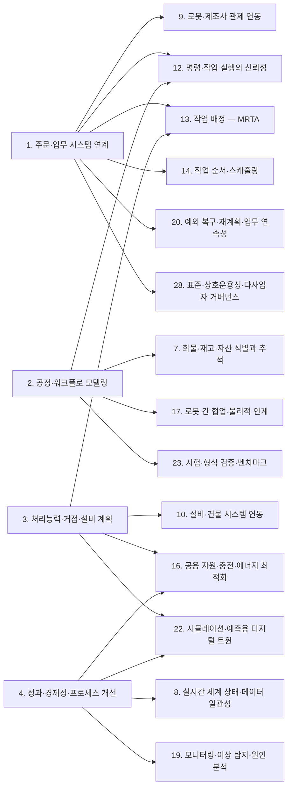
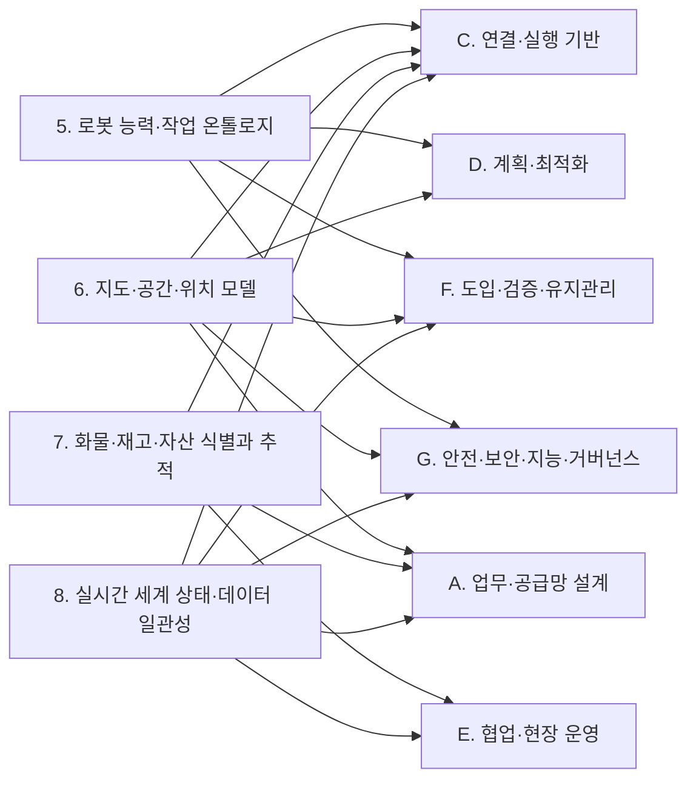
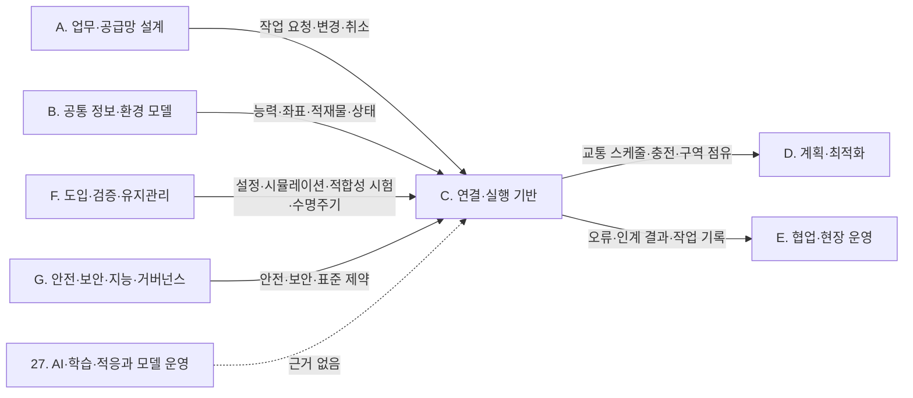
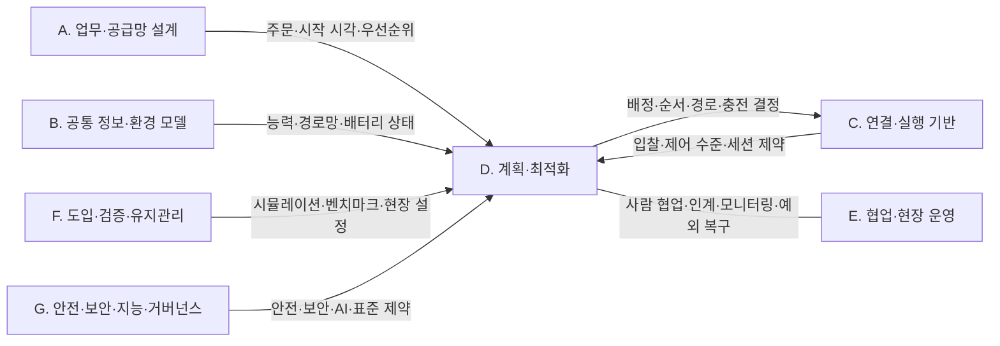
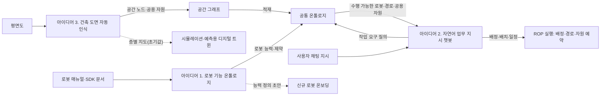

(너의 규칙은 시스템 프롬프트의 agents/shared-rules.md 와 agents/verifier.md 이다. 아래는 이번 실행의 컨텍스트와 입력이다.)

## 실행 컨텍스트

- run_id: 2026-09-25-60
- date: 2026-09-25
- run_type: category_link (대분류 연결)
- 대상: 대분류 E. 협업·현장 운영 페이지의 '다른 대분류와의 연결' 절(대분류 연결 실행). 게시된 세부영역 페이지를 근거로 다른 대분류와의 연결을 조사·서술한다. 스토리텔러는 그 절만 patches 로 바꾼다
- 예산:
    - max_search_queries: 30
    - max_sources_per_run: 15
    - new_topic_pages: 1
    - page_updates: 2
    - max_retries: 2
- 환경 알림: web_fetch_available: false · fetch_mode: mirror_only (일반 웹 페이지 열람은 네트워크 정책으로 막혀 있다. raw.githubusercontent.com 은 열린다: 공식 문서가 GitHub 에 있는 출처는 입력의 config/source_mirrors.yaml 경로를 WebFetch 로 열어 원문을 읽고 sources[].fetched=true, fetched_via=github_raw, fetch_url 을 적는다. 입력에 원문 텍스트(data/source_texts)가 있는 출처는 fetched_via=inbox. 그 밖의 출처는 fetched=false 이며 코드가 신뢰도 상한(medium)을 강제한다 — 공통 규칙 0절 6항)
- 언어: ko
- verification_stage: first
- verifier_budget:
    - max_search_queries: 30
    - max_sources_per_run: 15
    - new_topic_pages: 1
    - page_updates: 2
    - max_retries: 2

## 입력

### runs/2026-09-25-60/target.json

```json
{
  "run_id": "2026-09-25-60",
  "date": "2026-09-25",
  "weekday": "Fri",
  "run_number": 60,
  "run_type": "category_link",
  "forced": true,
  "target": {
    "area_no": null,
    "area_name": null,
    "category": "E. 협업·현장 운영",
    "category_letter": "E"
  },
  "topic": null,
  "track": null,
  "corrections": [],
  "budget": {
    "max_search_queries": 30,
    "max_sources_per_run": 15,
    "new_topic_pages": 1,
    "page_updates": 2,
    "max_retries": 2
  },
  "priority_reason": null,
  "priority_questions": [],
  "excluded_areas": [],
  "lifted_areas": [],
  "deferred": {
    "monthly_recheck": false,
    "weekly_review": false
  },
  "selection_rationale": "CLI 지정 run_type=category_link"
}
```

### runs/2026-09-25-60/research.json

```json
{
  "run_id": "2026-09-25-60",
  "date": "2026-09-25",
  "run_type": "category_link",
  "target": {
    "area_no": null,
    "area_name": null,
    "category": "E. 협업·현장 운영"
  },
  "gaps": [
    "E. 협업·현장 운영 대분류 페이지의 '다른 대분류와의 연결' 절 비어 있음(아직 작성되지 않음)",
    "20. 예외 복구·재계획·업무 연속성 ↔ 22. 시뮬레이션·예측용 디지털 트윈(제한 운영 처리량 추정, oq-081): 22. 시뮬레이션·예측용 디지털 트윈 페이지가 seed 상태라 게시된 근거 없음",
    "17. 로봇 간 협업·물리적 인계·18. 사람–로봇 협업·운영 인터페이스 ↔ 26. 사이버보안·접근권한·개인정보, 24. 자산·소프트웨어 수명주기 관리, 21. 온보딩·설정·현장 시운전: 게시된 E. 협업·현장 운영 세부영역 페이지에 검증된 근거 없음",
    "5. 로봇 능력·작업 온톨로지·6. 지도·공간·위치 모델 ↔ E. 협업·현장 운영 세부영역: E 쪽 게시 페이지에 직접 근거 없음"
  ],
  "research_questions": [
    "계획과 실제가 달라지는 상황에서 일을 어떻게 계속할 것인가? [분류원문]",
    "운반 중 고장 난 로봇의 화물과 남은 주문은 어떻게 처리할까? [분류원문] — 20. 예외 복구·재계획·업무 연속성이 A. 업무·공급망 설계, B. 공통 정보·환경 모델, C. 연결·실행 기반, D. 계획·최적화와 넘겨받는 지점은 무엇인가? (oq-021, oq-038, oq-048, oq-079 관련)",
    "17. 로봇 간 협업·물리적 인계의 인계 확인 신호는 7. 화물·재고·자산 식별과 추적, 10. 설비·건물 시스템 연동, 14. 작업 순서·스케줄링, 23. 시험·형식 검증·벤치마크, 25. 안전·위험 관리와 어떻게 이어지는가? (oq-001, oq-006, oq-042, oq-062, oq-063, oq-064)",
    "18. 사람–로봇 협업·운영 인터페이스는 3. 처리능력·거점·설비 계획, 9. 로봇·제조사 관제 연동, 13. 작업 배정 — MRTA, 25. 안전·위험 관리, 27. AI·학습·적응과 모델 운영과 무엇을 주고받는가? (oq-009, oq-070, oq-072)",
    "19. 모니터링·이상 탐지·원인 분석은 4. 성과·경제성·프로세스 개선, 8. 실시간 세계 상태·데이터 일관성, 9. 로봇·제조사 관제 연동, 10. 설비·건물 시스템 연동, 27. AI·학습·적응과 모델 운영, 28. 표준·상호운용성·다사업자 거버넌스와 어떻게 연결되는가? (oq-018, oq-033, oq-073)",
    "E. 협업·현장 운영과 다른 대분류의 연결 가운데 근거가 아직 없는 쌍은 무엇인가? (다루지 않은 연결 목록)"
  ],
  "findings": [
    {
      "id": "f1",
      "claim": "E. 협업·현장 운영의 20. 예외 복구·재계획·업무 연속성 ↔ A. 업무·공급망 설계의 1. 주문·업무 시스템 연계: VDA 5050 3.0.0 에서 관제가 주문 취소(cancelOrder)를 보내면 예정된 동작은 취소되어 동작 상태를 FAILED 로 보고한다.",
      "tag": "사실",
      "source_ids": [
        "ref-031"
      ],
      "cross_checked": false,
      "confidence": "medium",
      "evidence_excerpt": "명세 원문: 예정된 동작이 있으면 \"these actions shall be cancelled and report 'FAILED' in their actionState\". (VDA 5050 3.0.0, GitHub main)",
      "as_of": "2026-09-25",
      "flow_step": null,
      "flow_item": "예외·성과"
    },
    {
      "id": "f2",
      "claim": "E. 협업·현장 운영의 20. 예외 복구·재계획·업무 연속성 ↔ A. 업무·공급망 설계의 1. 주문·업무 시스템 연계: 상위 시스템의 취소가 로봇이 화물을 실은 뒤에 오면 로봇 쪽 동작 실패 보고만으로는 화물 위치가 정해지지 않으므로, 되돌림 작업과 재고 반영 규칙을 정하는 일이 두 대분류가 넘겨받는 지점이 될 것으로 보이며 이를 정한 표준·사례는 확인되지 않았다(oq-021).",
      "tag": "추정",
      "source_ids": [
        "ref-031",
        "ref-489"
      ],
      "cross_checked": false,
      "confidence": "low",
      "evidence_excerpt": "cancelOrder 뒤 남은 동작은 FAILED 로 보고(ref-031). 보상 트랜잭션 패턴은 이미 완료된 단계의 효과를 되돌리는 별도 작업을 정의(ref-489). 20. 예외 복구·재계획·업무 연속성 페이지 9절 서술 기반.",
      "as_of": "2026-09-25",
      "flow_step": null,
      "flow_item": "예외·성과",
      "source_unopened": false
    },
    {
      "id": "f3",
      "claim": "E. 협업·현장 운영의 17. 로봇 간 협업·물리적 인계 ↔ B. 공통 정보·환경 모델의 7. 화물·재고·자산 식별과 추적: 시설 안 로봇 사이·로봇과 작업대 사이의 물리적 인계는 CBV 의 accepting·receiving 에 가깝고 운송 수단 기준의 loading·unloading 과 맞지 않아, 인계 이벤트의 업무 단계 값을 ROP 쪽에서 정해야 할 것으로 보인다(oq-006).",
      "tag": "추정",
      "source_ids": [
        "ref-044"
      ],
      "cross_checked": false,
      "confidence": "low",
      "evidence_excerpt": "CBV 2.0 온톨로지는 arriving·receiving·accepting 과 운송 수단 적재 기준의 loading·unloading 을 별도 업무 단계로 정의. 17. 로봇 간 협업·물리적 인계 페이지 10절의 [추정] 서술 재인용.",
      "as_of": "2021-09-30",
      "flow_step": null,
      "flow_item": "완료·인계",
      "source_unopened": true
    },
    {
      "id": "f4",
      "claim": "E. 협업·현장 운영의 20. 예외 복구·재계획·업무 연속성 ↔ B. 공통 정보·환경 모델의 7. 화물·재고·자산 식별과 추적: VDA 5050 상태 스키마의 선택 필드 loads 의 loadId 는 바코드·RFID 같은 적재물 식별 번호로, 멈춘 로봇에 어떤 화물이 실렸는지 관제가 알 수 있게 하지만 적재물을 식별할 수 없는 로봇은 생략할 수 있다.",
      "tag": "사실",
      "source_ids": [
        "ref-051"
      ],
      "cross_checked": false,
      "confidence": "medium",
      "evidence_excerpt": "state.schema: loadId 설명 \"Unique identification number of the load (e.g., barcode or RFID)\"; 식별 전이면 비우고, 식별할 수 없는 로봇은 생략 가능.",
      "as_of": "2026-09-25",
      "flow_step": "피킹",
      "flow_item": "작업 대상"
    },
    {
      "id": "f5",
      "claim": "E. 협업·현장 운영의 20. 예외 복구·재계획·업무 연속성 ↔ B. 공통 정보·환경 모델의 7. 화물·재고·자산 식별과 추적: EPCIS 1.2 는 이미 기록된 이벤트를 오류 선언(errorDeclaration)으로 정정하게 하므로, 회수한 화물의 재고·이벤트 기록 정정이 식별·추적 쪽 기록 규칙에 기대게 된다.",
      "tag": "사실",
      "source_ids": [
        "ref-492"
      ],
      "cross_checked": false,
      "confidence": "medium",
      "evidence_excerpt": "EPCIS 1.2(2016-09-29)의 오류 선언으로 기존 이벤트를 정정. 회수 때 어떤 확인(스캔·무게·위치)을 요구할지는 미확인(oq-079). 20. 예외 복구·재계획·업무 연속성 페이지 5절 재인용.",
      "as_of": "2016-09-29",
      "flow_step": null,
      "flow_item": "완료·인계",
      "source_unopened": true
    },
    {
      "id": "f6",
      "claim": "E. 협업·현장 운영의 19. 모니터링·이상 탐지·원인 분석 ↔ B. 공통 정보·환경 모델의 8. 실시간 세계 상태·데이터 일관성: 지연 원인을 문·로봇·통신으로 가르려면 같은 시각의 문 모드(closed·moving·open·offline·unknown)와 작업 상태(delayed·blocked 등)를 한 시간축에 맞춘 현재 상태 기록이 필요할 것으로 보이며, 이는 현재 상태를 표현하는 쪽이지 가정한 미래를 실험하는 22. 시뮬레이션·예측용 디지털 트윈의 일이 아니다.",
      "tag": "추정",
      "source_ids": [
        "ref-313",
        "ref-111"
      ],
      "cross_checked": false,
      "confidence": "low",
      "evidence_excerpt": "DoorMode.msg 다섯 모드 값, task_state.json 의 상태 토큰(delayed·blocked·completed 등). 19. 모니터링·이상 탐지·원인 분석 페이지 5·10절 서술 기반.",
      "as_of": "2026-09-25",
      "flow_step": "보충",
      "flow_item": "예외·성과",
      "source_unopened": true
    },
    {
      "id": "f7",
      "claim": "E. 협업·현장 운영의 19. 모니터링·이상 탐지·원인 분석·20. 예외 복구·재계획·업무 연속성 ↔ C. 연결·실행 기반의 9. 로봇·제조사 관제 연동: VDA 5050 상태 스키마의 오류 수준은 WARNING·URGENT·CRITICAL·FATAL 네 값이고, 연결 스키마는 연결 끊김을 CONNECTION_BROKEN 으로 보고한다.",
      "tag": "사실",
      "source_ids": [
        "ref-051",
        "ref-449"
      ],
      "cross_checked": false,
      "confidence": "medium",
      "evidence_excerpt": "state.schema errorLevel 열거값 WARNING, URGENT, CRITICAL, FATAL(\"No immediate attention required\"~\"User intervention is required\"). connection.schema 의 CONNECTION_BROKEN. 판 간 해석 차이는 oq-073.",
      "as_of": "2026-09-25",
      "flow_step": null,
      "flow_item": "시작 조건",
      "source_unopened": false
    },
    {
      "id": "f8",
      "claim": "E. 협업·현장 운영의 19. 모니터링·이상 탐지·원인 분석 ↔ C. 연결·실행 기반의 9. 로봇·제조사 관제 연동: Open-RMF 작업 상태·VDA 5050 오류·MassRobotics 운용 상태(waitingExternalEvent 등)가 서로 다른 어휘로 보고되어, 이를 ROP 의 공통 원인 범주로 옮기는 매핑이 두 대분류 사이에 필요할 것으로 보이며 공통 매핑 표준은 확인되지 않았다(oq-033).",
      "tag": "추정",
      "source_ids": [
        "ref-051",
        "ref-230",
        "ref-111"
      ],
      "cross_checked": false,
      "confidence": "low",
      "evidence_excerpt": "각 스키마는 자기 필드만 정의하고 서로 간 대응표를 두지 않음. 19. 모니터링·이상 탐지·원인 분석 페이지 3절 [추정] 재인용.",
      "as_of": "2026-09-25",
      "flow_step": null,
      "flow_item": "예외·성과",
      "source_unopened": false
    },
    {
      "id": "f9",
      "claim": "E. 협업·현장 운영의 19. 모니터링·이상 탐지·원인 분석 ↔ C. 연결·실행 기반의 10. 설비·건물 시스템 연동: Open-RMF 문 노드는 문 상태를 /door_states 로 발행하고 문 어댑터는 진행 중인 로봇 작업을 방해하지 않을 때만 문을 움직이게 하는 상태 감독자 역할을 해, 설비 원인 판정의 근거가 된다.",
      "tag": "사실",
      "source_ids": [
        "ref-313",
        "ref-283"
      ],
      "cross_checked": false,
      "confidence": "medium",
      "evidence_excerpt": "DoorMode 값 closed·moving·open·offline·unknown(ref-313), 문 어댑터의 상태 감독 역할(ref-283). 19. 모니터링·이상 탐지·원인 분석 페이지 5절 [사실] 재인용.",
      "as_of": "2026-09-25",
      "flow_step": "보충",
      "flow_item": "제약",
      "source_unopened": true
    },
    {
      "id": "f10",
      "claim": "E. 협업·현장 운영의 17. 로봇 간 협업·물리적 인계 ↔ C. 연결·실행 기반의 10. 설비·건물 시스템 연동: Open-RMF 배송 작업에서 로봇은 픽업 지점에서 DispenserResult 를, 하역 지점에서 IngestorResult 를 받을 때까지 요청을 반복해 보내고 워크셀은 /dispenser_states·/ingestor_states 로 상태를 주기적으로 발행하며, 이 흐름은 플릿 어댑터의 perform_deliveries 설정이 켜져야 동작한다.",
      "tag": "사실",
      "source_ids": [
        "ref-023"
      ],
      "cross_checked": false,
      "confidence": "medium",
      "evidence_excerpt": "mdBook 원본 integration_workcells.md: 로봇은 \"will first move to the pickup_waypoint\" 한 뒤 요청–결과 주기를 거쳐 하역 지점으로 이동. perform_deliveries 필요.",
      "as_of": "2026-09-25",
      "flow_step": "보충",
      "flow_item": "완료·인계"
    },
    {
      "id": "f11",
      "claim": "E. 협업·현장 운영의 17. 로봇 간 협업·물리적 인계 ↔ C. 연결·실행 기반의 10. 설비·건물 시스템 연동: 반도체 업종 SEMI E84 처럼 준비–진행–완료를 양쪽이 단계별로 확인하는 인계 신호 구조는 이동로봇–작업대 인계 상태 모델의 참고가 될 수 있으나, VDA 5050 은 주변 설비 인터페이스를 범위에서 제외하고 물류 업종의 제조사 중립 인계 신호 규격은 확인되지 않았다(oq-042, oq-062).",
      "tag": "추정",
      "source_ids": [
        "ref-202",
        "ref-203",
        "ref-031"
      ],
      "cross_checked": false,
      "confidence": "low",
      "evidence_excerpt": "VDA 5050 원문: 범위 제외 \"interfaces to peripheral equipment, infrastructure components, or external IT systems\". SEMI E84 는 반도체 AMHS–로드포트 규격(원문 미열람).",
      "as_of": "2026-09-25",
      "flow_step": null,
      "flow_item": "완료·인계",
      "source_unopened": false
    },
    {
      "id": "f12",
      "claim": "E. 협업·현장 운영의 20. 예외 복구·재계획·업무 연속성 ↔ C. 연결·실행 기반의 11. 분산 시스템·통신·컴퓨팅 구조: VDA 5050 3.0.0 에서 로봇은 브로커와 연결이 끊겨도 주문 정보를 유지하고 마지막으로 해제된 노드까지 주문을 수행한다.",
      "tag": "사실",
      "source_ids": [
        "ref-031"
      ],
      "cross_checked": false,
      "confidence": "medium",
      "evidence_excerpt": "명세 원문: \"it keeps all the order information and fulfills the order up to the last released node\". 외부망 단절 시 운영 기준은 oq-038.",
      "as_of": "2026-09-25",
      "flow_step": null,
      "flow_item": "제약"
    },
    {
      "id": "f13",
      "claim": "E. 협업·현장 운영의 20. 예외 복구·재계획·업무 연속성 ↔ C. 연결·실행 기반의 12. 명령·작업 실행의 신뢰성: VDA 5050 은 교착(deadlock)과 통신 오류의 탐지·해소를 관제(fleet control)의 기능으로 둔다.",
      "tag": "사실",
      "source_ids": [
        "ref-031"
      ],
      "cross_checked": false,
      "confidence": "medium",
      "evidence_excerpt": "명세 원문의 관제 기능 목록: \"Detection and resolution of blockages ('deadlocks')\", 통신 오류의 탐지·해소.",
      "as_of": "2026-09-25",
      "flow_step": null,
      "flow_item": "예외·성과"
    },
    {
      "id": "f14",
      "claim": "E. 협업·현장 운영의 20. 예외 복구·재계획·업무 연속성 ↔ C. 연결·실행 기반의 12. 명령·작업 실행의 신뢰성: 오류·연결 상태 수신, 주문 일시정지·취소, Open-RMF 로봇 갱신 핸들을 통한 재계획 요청·작업 수락 중지가 실행 신뢰성 계층과 복구 결정이 맞물리는 지점이 될 것으로 보인다.",
      "tag": "추정",
      "source_ids": [
        "ref-031",
        "ref-537"
      ],
      "cross_checked": false,
      "confidence": "low",
      "evidence_excerpt": "20. 예외 복구·재계획·업무 연속성 페이지 9절 [추정] 재인용(RobotUpdateHandle.hpp 의 재계획·작업 수락 관련 인터페이스). 어댑터 재시작 시 작업 복원 여부는 oq-048.",
      "as_of": "2026-09-25",
      "flow_step": null,
      "flow_item": "예외·성과",
      "source_unopened": false
    },
    {
      "id": "f15",
      "claim": "E. 협업·현장 운영의 20. 예외 복구·재계획·업무 연속성 ↔ D. 계획·최적화의 15. 다중 로봇 경로·교통 관리 — MAPF: Open-RMF 교통 스케줄은 지연·취소·경로 변경을 반영해 계속 바뀌는 데이터베이스이고, 충돌이 예상되면 관련 플릿 관리자가 서로를 수용하는 경로로 협상한다.",
      "tag": "사실",
      "source_ids": [
        "ref-004"
      ],
      "cross_checked": false,
      "confidence": "medium",
      "evidence_excerpt": "rmf-core 원문: 스케줄은 \"living database whose contents will change over time to reflect delays, cancellations, or route changes\"; 협상 결과는 제3자 판정자가 고름.",
      "as_of": "2026-09-25",
      "flow_step": null,
      "flow_item": "예외·성과"
    },
    {
      "id": "f16",
      "claim": "E. 협업·현장 운영의 20. 예외 복구·재계획·업무 연속성 ↔ D. 계획·최적화의 15. 다중 로봇 경로·교통 관리 — MAPF: 지연에 강건한 계획 실행(행동 의존 그래프, Hönig 외 2019)과 지연된 로봇의 통과 순서 재스케줄(Feng 외 2024)이 연구되어, 실행 중 지연 복구가 경로 계획 연구와 이어진다.",
      "tag": "사실",
      "source_ids": [
        "ref-188",
        "ref-483"
      ],
      "cross_checked": false,
      "confidence": "medium",
      "evidence_excerpt": "20. 예외 복구·재계획·업무 연속성 페이지 8절 [사실] 재인용. 두 논문 모두 원문 미열람, 속도 수치는 저자 보고값.",
      "as_of": "2024",
      "flow_step": null,
      "flow_item": "예외·성과",
      "source_unopened": true
    },
    {
      "id": "f17",
      "claim": "E. 협업·현장 운영의 20. 예외 복구·재계획·업무 연속성 ↔ D. 계획·최적화의 13. 작업 배정 — MRTA: 작업 의존성·우선순위 선점·고장 복구를 함께 다루는 다중 로봇 작업 배정 방법(Kalempa 외 2021)이 있어, 고장 로봇의 남은 작업 재배정이 배정 문제로 넘어간다.",
      "tag": "사실",
      "source_ids": [
        "ref-484"
      ],
      "cross_checked": false,
      "confidence": "medium",
      "evidence_excerpt": "Sensors 2021, MRPF(선점 스케줄링+고장 복구). 20. 예외 복구·재계획·업무 연속성 페이지 5·8절 재인용.",
      "as_of": "2021-09-30",
      "flow_step": null,
      "flow_item": "수행 자원",
      "source_unopened": true
    },
    {
      "id": "f18",
      "claim": "E. 협업·현장 운영의 18. 사람–로봇 협업·운영 인터페이스 ↔ D. 계획·최적화의 13. 작업 배정 — MRTA·14. 작업 순서·스케줄링: 사람 피커와 AMR 의 협동 피킹 연구는 두 자원의 조율을 배치 구성·배치 순서와 작업 완료 시각(makespan) 최소화 문제로 다룬다.",
      "tag": "사실",
      "source_ids": [
        "ref-467",
        "ref-468"
      ],
      "cross_checked": false,
      "confidence": "medium",
      "evidence_excerpt": "Žulj 외 2022(배치 구성·순서), Löffler 외 2023(AMR·피커 조율). 18. 사람–로봇 협업·운영 인터페이스 페이지 3절 [사실] 재인용. 원문 미열람.",
      "as_of": "2023",
      "flow_step": "피킹",
      "flow_item": "수행 자원",
      "source_unopened": true
    },
    {
      "id": "f19",
      "claim": "E. 협업·현장 운영의 17. 로봇 간 협업·물리적 인계 ↔ D. 계획·최적화의 14. 작업 순서·스케줄링·16. 공용 자원·충전·에너지 최적화: 이동로봇 운반과 로봇팔 적치가 선후로 이어지면 스케줄 간 의존이 생기고 인계 스테이션의 도크·버퍼가 공용 자원 제약이 되어 인계 시점을 두 로봇 일정에 함께 맞춰야 할 것으로 보인다.",
      "tag": "추정",
      "source_ids": [
        "ref-394",
        "ref-209"
      ],
      "cross_checked": false,
      "confidence": "low",
      "evidence_excerpt": "Korsah 외 2013 분류의 스케줄 간 의존(XD), Zang 외 2026-07 버퍼 제한 인계 스테이션 연구. 17. 로봇 간 협업·물리적 인계 페이지 5절 제약 칸 [추정] 재인용.",
      "as_of": "2026-07",
      "flow_step": "보충",
      "flow_item": "제약",
      "source_unopened": true
    },
    {
      "id": "f20",
      "claim": "E. 협업·현장 운영의 18. 사람–로봇 협업·운영 인터페이스 ↔ A. 업무·공급망 설계의 3. 처리능력·거점·설비 계획: 협동 피킹 시스템에서 피커와 로봇의 투입 수를 정하는 연구(Yang 외 2026-03)가 있어 인원·로봇 비율 결정이 처리능력 계획과 이어지나, 교대조 단위 결정 여부는 미확인이다(oq-009).",
      "tag": "사실",
      "source_ids": [
        "ref-469"
      ],
      "cross_checked": false,
      "confidence": "medium",
      "evidence_excerpt": "IISE Transactions 게재 'Deploying pickers and robots in cobot-based collaborative order picking systems'. 18. 사람–로봇 협업·운영 인터페이스 페이지 10·11절 기반. 원문 미열람.",
      "as_of": "2026-03",
      "flow_step": "피킹",
      "flow_item": "수행 자원",
      "source_unopened": true
    },
    {
      "id": "f21",
      "claim": "E. 협업·현장 운영의 19. 모니터링·이상 탐지·원인 분석 ↔ A. 업무·공급망 설계의 4. 성과·경제성·프로세스 개선: AGV 시스템 병목 탐지 방법 비교 연구(Roser 외 2003)는 가동률·대기 시간 기반 방법에 이동 병목 탐지 대비 한계가 있다고 보고해, 원인·병목 판정 방식이 개선 대상 선정과 이어진다(oq-018).",
      "tag": "사실",
      "source_ids": [
        "ref-451"
      ],
      "cross_checked": false,
      "confidence": "medium",
      "evidence_excerpt": "WSC 2003 Proceedings 1192–1198쪽. 19. 모니터링·이상 탐지·원인 분석 페이지 3절 [사실] 재인용. 원문 미열람.",
      "as_of": "2003",
      "flow_step": null,
      "flow_item": "예외·성과",
      "source_unopened": true
    },
    {
      "id": "f22",
      "claim": "E. 협업·현장 운영의 18. 사람–로봇 협업·운영 인터페이스 ↔ C. 연결·실행 기반의 9. 로봇·제조사 관제 연동: VDA 5050 상태 메시지는 운용 모드(STARTUP·AUTOMATIC·SEMIAUTOMATIC·INTERVENED·MANUAL·SERVICE·TEACH_IN)와 비상정지 종류(MANUAL·REMOTE·NONE)를 보고해, 사람 개입 상태가 관제 연동을 통해 운영 인터페이스로 들어온다.",
      "tag": "사실",
      "source_ids": [
        "ref-051"
      ],
      "cross_checked": false,
      "confidence": "medium",
      "evidence_excerpt": "state.schema operatingMode 7개 값, safetyState 비상정지: 로봇에서 수동 확인(MANUAL)과 원격 확인(REMOTE) 구분.",
      "as_of": "2026-09-25",
      "flow_step": null,
      "flow_item": "수행 자원"
    },
    {
      "id": "f23",
      "claim": "E. 협업·현장 운영의 18. 사람–로봇 협업·운영 인터페이스 ↔ C. 연결·실행 기반의 10. 설비·건물 시스템 연동: Open-RMF 데모는 시설 비상 경보 때 로봇을 가장 가까운 주차 위치로 보내는 흐름을 보인다.",
      "tag": "사실",
      "source_ids": [
        "ref-104"
      ],
      "cross_checked": false,
      "confidence": "medium",
      "evidence_excerpt": "rmf_demos README 의 비상 경보 데모. 18. 사람–로봇 협업·운영 인터페이스 페이지 9절 [사실] 재인용. 이번 실행에서 원문 재열람 안 함.",
      "as_of": "2026-09-25",
      "flow_step": null,
      "flow_item": "예외·성과",
      "source_unopened": true
    },
    {
      "id": "f24",
      "claim": "E. 협업·현장 운영의 17. 로봇 간 협업·물리적 인계 ↔ F. 도입·검증·유지관리의 23. 시험·형식 검증·벤치마크: 도킹 정지 위치의 반복성을 확인하는 시험 방법 ASTM F3499-21 이 있고, NIST ARIAC 2025 는 완성 키트를 실은 AGV 를 움직이기 전에 품질 확인 서비스를 호출하게 해 이동 전 인계 확인을 평가한다.",
      "tag": "사실",
      "source_ids": [
        "ref-204",
        "ref-008"
      ],
      "cross_checked": false,
      "confidence": "medium",
      "evidence_excerpt": "17. 로봇 간 협업·물리적 인계 페이지 5·8절 [사실] 재인용. 시험 결과와 파지 허용 오차를 잇는 기준은 oq-063.",
      "as_of": "2021",
      "flow_step": null,
      "flow_item": "완료·인계",
      "source_unopened": false
    },
    {
      "id": "f25",
      "claim": "E. 협업·현장 운영의 17. 로봇 간 협업·물리적 인계 ↔ F. 도입·검증·유지관리의 23. 시험·형식 검증·벤치마크: NIST 협업 로봇 시스템 성능 프로젝트는 사람–로봇·로봇–로봇 협업 팀의 안전성과 효과를 평가하는 방법·지표 개발을 목표로 한다.",
      "tag": "사실",
      "source_ids": [
        "ref-007"
      ],
      "cross_checked": false,
      "confidence": "medium",
      "evidence_excerpt": "17. 로봇 간 협업·물리적 인계 페이지 3절 [사실] 재인용(확인일 2026-09-25). 원문 미열람. (발행일 미확인, 확인일 기준)",
      "as_of": "2026-09-25",
      "flow_step": null,
      "flow_item": null,
      "source_unopened": true
    },
    {
      "id": "f26",
      "claim": "E. 협업·현장 운영의 17. 로봇 간 협업·물리적 인계 ↔ G. 안전·보안·지능·거버넌스의 25. 안전·위험 관리: ANSI/A3 R15.08-2-2023 은 이동 플랫폼에 로봇팔을 단 모바일 매니퓰레이터를 산업용 이동로봇 유형 C 로 다루며 시스템·적용 단위 안전 요구를 정한다.",
      "tag": "사실",
      "source_ids": [
        "ref-210"
      ],
      "cross_checked": false,
      "confidence": "medium",
      "evidence_excerpt": "17. 로봇 간 협업·물리적 인계 페이지 4절 [사실] 재인용. 국내 대응 KS 여부는 oq-064. 원문 미열람.",
      "as_of": "2023",
      "flow_step": null,
      "flow_item": "제약",
      "source_unopened": true
    },
    {
      "id": "f27",
      "claim": "E. 협업·현장 운영의 17. 로봇 간 협업·물리적 인계·18. 사람–로봇 협업·운영 인터페이스 ↔ G. 안전·보안·지능·거버넌스의 25. 안전·위험 관리: 사람 감지·보호 필드·비상정지 같은 안전 기능은 로봇 제조사·현장 통합사가 갖추고, ROP 는 로봇이 보고한 안전 상태를 표시하고 재개·수동 전환 승인을 작업 흐름에 반영하는 경계가 될 것으로 보인다.",
      "tag": "추정",
      "source_ids": [
        "ref-470",
        "ref-051",
        "ref-210"
      ],
      "cross_checked": false,
      "confidence": "low",
      "evidence_excerpt": "18. 사람–로봇 협업·운영 인터페이스 페이지 9절, 17. 로봇 간 협업·물리적 인계 페이지 9절의 [추정] 재인용. ISO 3691-4:2023(원문 미열람).",
      "as_of": "2026-09-25",
      "flow_step": null,
      "flow_item": "제약",
      "source_unopened": false
    },
    {
      "id": "f28",
      "claim": "E. 협업·현장 운영의 18. 사람–로봇 협업·운영 인터페이스 ↔ G. 안전·보안·지능·거버넌스의 25. 안전·위험 관리: 국내에서는 고용노동부가 2023-07 고정식·이동식 산업용 로봇의 협동작업 안전 가이드를 배포했고, 중소벤처기업부는 2024-11 대구 규제자유특구 실증을 거쳐 이동식 협동로봇 산업표준이 제정되었다고 발표했다.",
      "tag": "사실",
      "source_ids": [
        "ref-473",
        "ref-475"
      ],
      "cross_checked": false,
      "confidence": "medium",
      "evidence_excerpt": "두 기관 게시물 제목 기준(원문 미열람). 제정된 KS 의 번호·내용은 미확인(oq-070).",
      "as_of": "2024-11",
      "flow_step": null,
      "flow_item": "제약",
      "source_unopened": true
    },
    {
      "id": "f29",
      "claim": "E. 협업·현장 운영의 18. 사람–로봇 협업·운영 인터페이스 ↔ G. 안전·보안·지능·거버넌스의 27. AI·학습·적응과 모델 운영: LLM 계획기가 불확실할 때 사람에게 되묻는 연구(KnowNo, Ren 외 2023)와 사용자 명령을 분류·모호성 해소하는 연구(CLARA, Park 외 2024), 실행 전 안전 게이트 연구(Obi 외 2026-04)가 있어 자연어 지시 인터페이스가 AI 연구 방법과 이어진다.",
      "tag": "사실",
      "source_ids": [
        "ref-351",
        "ref-353",
        "ref-417"
      ],
      "cross_checked": false,
      "confidence": "medium",
      "evidence_excerpt": "18. 사람–로봇 협업·운영 인터페이스 페이지 10절(27. AI·학습·적응과 모델 운영 연결) 근거 논문. 모두 arXiv, 원문 미열람.",
      "as_of": "2026-04",
      "flow_step": null,
      "flow_item": null,
      "source_unopened": true
    },
    {
      "id": "f30",
      "claim": "E. 협업·현장 운영의 19. 모니터링·이상 탐지·원인 분석·18. 사람–로봇 협업·운영 인터페이스 ↔ G. 안전·보안·지능·거버넌스의 27. AI·학습·적응과 모델 운영: 로봇 실패에 대한 설명을 생성해 사용자의 고장 복구 지원을 개선하는 연구(Das 외 2021)가 있어, 분류 원문 8장 교차 규칙의 장애 분석이 원인 분석 결과를 사람에게 전달하는 인터페이스까지 이어진다.",
      "tag": "사실",
      "source_ids": [
        "ref-476"
      ],
      "cross_checked": false,
      "confidence": "medium",
      "evidence_excerpt": "arXiv 2101.01625 'Explainable AI for Robot Failures: Generating Explanations that Improve User Assistance in Fault Recovery'. 원문 미열람.",
      "as_of": "2021-01",
      "flow_step": null,
      "flow_item": "예외·성과",
      "source_unopened": true
    },
    {
      "id": "f31",
      "claim": "E. 협업·현장 운영의 19. 모니터링·이상 탐지·원인 분석 ↔ G. 안전·보안·지능·거버넌스의 28. 표준·상호운용성·다사업자 거버넌스: 표준마다 상태·오류 어휘가 다르고 공통 매핑 표준이 확인되지 않으므로, 이종 플릿의 오류 수준·원인 범주 해석 규칙을 누가 정하고 바꾸는지가 거버넌스 과제로 넘어갈 것으로 보인다(oq-033, oq-073).",
      "tag": "추정",
      "source_ids": [
        "ref-051",
        "ref-230",
        "ref-111"
      ],
      "cross_checked": false,
      "confidence": "low",
      "evidence_excerpt": "VDA 5050 errorLevel 4값, MassRobotics 운용 상태, Open-RMF 작업 상태 토큰이 서로 대응표 없이 정의됨.",
      "as_of": "2026-09-25",
      "flow_step": null,
      "flow_item": null,
      "source_unopened": false
    }
  ],
  "sources": [
    {
      "id": "ref-004",
      "org": "Open Robotics",
      "title": "RMF Core Overview — Programming Multiple Robots with ROS 2",
      "published": null,
      "url": "https://osrf.github.io/ros2multirobotbook/rmf-core.html",
      "type": "오픈소스 문서",
      "reliability": "high",
      "accessed": "2026-09-25",
      "summary": "Open-RMF 핵심 구조. 교통 스케줄이 지연·취소·경로 변경을 반영하는 데이터베이스이며 충돌 시 플릿 관리자 간 협상을 한다고 설명.",
      "fetched": true,
      "fetched_via": "github_raw",
      "fetch_url": "https://raw.githubusercontent.com/osrf/ros2multirobotbook/master/src/rmf-core.md",
      "source_unopened": false
    },
    {
      "id": "ref-007",
      "org": "NIST",
      "title": "Performance of Collaborative Robot Systems",
      "published": null,
      "url": "https://www.nist.gov/programs-projects/performance-collaborative-robot-systems",
      "type": "정부·연구기관",
      "reliability": "medium",
      "accessed": "2026-09-25",
      "summary": "원문 미열람. 사람–로봇·로봇–로봇 협업 팀의 성능 평가 방법·지표 개발 프로젝트.",
      "fetched": false,
      "fetched_via": null,
      "fetch_url": null,
      "source_unopened": true
    },
    {
      "id": "ref-008",
      "org": "NIST",
      "title": "ARIAC Documentation",
      "published": null,
      "url": "https://pages.nist.gov/ARIAC_docs/en/latest/",
      "type": "정부·연구기관",
      "reliability": "medium",
      "accessed": "2026-09-25",
      "summary": "원문 미열람. ARIAC 2025 시나리오·평가 문서(이동 전 키트 품질 확인 등). 이번 실행에서 재열람하지 않음.",
      "fetched": true,
      "fetched_via": "github_raw",
      "fetch_url": null,
      "source_unopened": false
    },
    {
      "id": "ref-023",
      "org": "Open Robotics",
      "title": "Workcells - Programming Multiple Robots with ROS 2",
      "published": null,
      "url": "https://osrf.github.io/ros2multirobotbook/integration_workcells.html",
      "type": "오픈소스 문서",
      "reliability": "high",
      "accessed": "2026-09-25",
      "summary": "디스펜서·인제스터 워크셀과 배송 작업의 요청–결과 반복, 상태 토픽, perform_deliveries 설정을 설명.",
      "fetched": true,
      "fetched_via": "github_raw",
      "fetch_url": "https://raw.githubusercontent.com/osrf/ros2multirobotbook/master/src/integration_workcells.md",
      "source_unopened": false
    },
    {
      "id": "ref-031",
      "org": "VDA / VDMA (VDA5050 GitHub)",
      "title": "VDA5050/VDA5050_EN.md — Official Specification document for the VDA 5050",
      "published": null,
      "url": "https://github.com/VDA5050/VDA5050/blob/main/VDA5050_EN.md",
      "type": "표준",
      "reliability": "high",
      "accessed": "2026-09-25",
      "summary": "VDA 5050 3.0.0 명세. 범위 제외(주변 설비·외부 IT), 관제의 교착·통신 오류 해소 기능, 연결 끊김 시 마지막 해제 노드까지 수행, cancelOrder 시 동작 FAILED 보고를 확인.",
      "fetched": true,
      "fetched_via": "github_raw",
      "fetch_url": "https://raw.githubusercontent.com/VDA5050/VDA5050/main/VDA5050_EN.md",
      "source_unopened": false
    },
    {
      "id": "ref-044",
      "org": "GS1",
      "title": "gs1/EPCIS — Ontology/CBV.ttl (Core Business Vocabulary ontology 2.0)",
      "published": "2021-09-30",
      "url": "https://github.com/gs1/EPCIS/blob/master/Ontology/CBV.ttl",
      "type": "표준",
      "reliability": "medium",
      "accessed": "2026-09-25",
      "summary": "원문 미열람. CBV 업무 단계 어휘(arriving·receiving·accepting·loading·unloading 등) 온톨로지. 이번 실행에서 재열람하지 않음.",
      "fetched": false,
      "fetched_via": null,
      "fetch_url": null,
      "source_unopened": true
    },
    {
      "id": "ref-051",
      "org": "VDA / VDMA (VDA5050 GitHub)",
      "title": "VDA5050/VDA5050 — json_schemas/state.schema",
      "published": null,
      "url": "https://github.com/VDA5050/VDA5050/blob/main/json_schemas/state.schema",
      "type": "표준",
      "reliability": "high",
      "accessed": "2026-09-25",
      "summary": "VDA 5050 상태 메시지 스키마. errorLevel(WARNING·URGENT·CRITICAL·FATAL), operatingMode 7값, 비상정지 종류, 선택 필드 loads·loadId 를 정의.",
      "fetched": true,
      "fetched_via": "github_raw",
      "fetch_url": "https://raw.githubusercontent.com/VDA5050/VDA5050/main/json_schemas/state.schema",
      "source_unopened": false
    },
    {
      "id": "ref-104",
      "org": "Open Robotics (open-rmf)",
      "title": "rmf_demos — Demonstrations of Open-RMF (README)",
      "published": null,
      "url": "https://github.com/open-rmf/rmf_demos",
      "type": "오픈소스 문서",
      "reliability": "medium",
      "accessed": "2026-09-25",
      "summary": "원문 미열람. Open-RMF 데모 환경과 비상 경보 시 로봇 주차 흐름. 이번 실행에서 재열람하지 않음.",
      "fetched": false,
      "fetched_via": null,
      "fetch_url": null,
      "source_unopened": true
    },
    {
      "id": "ref-111",
      "org": "Open Robotics (open-rmf)",
      "title": "rmf_api_msgs — rmf_api_msgs/schemas/task_state.json",
      "published": null,
      "url": "https://github.com/open-rmf/rmf_api_msgs/blob/main/rmf_api_msgs/schemas/task_state.json",
      "type": "오픈소스 문서",
      "reliability": "medium",
      "accessed": "2026-09-25",
      "summary": "원문 미열람. Open-RMF 작업 상태 스키마(상태 토큰, 시각, 취소·중단 요청 기록). 이번 실행에서 재열람하지 않음.",
      "fetched": false,
      "fetched_via": null,
      "fetch_url": null,
      "source_unopened": true
    },
    {
      "id": "ref-188",
      "org": "Hönig, W., Kiesel, S. 외",
      "title": "Persistent and Robust Execution of MAPF Schedules in Warehouses",
      "published": "2019",
      "url": "https://ieeexplore.ieee.org/abstract/document/8620328/",
      "type": "논문",
      "reliability": "medium",
      "accessed": "2026-09-25",
      "summary": "원문 미열람. 행동 의존 그래프로 창고 다중 로봇 계획을 지연에도 충돌 없이 실행하는 틀.",
      "fetched": false,
      "fetched_via": null,
      "fetch_url": null,
      "source_unopened": true
    },
    {
      "id": "ref-202",
      "org": "SEMI",
      "title": "E08400 - SEMI E84 - Specification for Enhanced Carrier Handoff Parallel I/O Interface",
      "published": null,
      "url": "https://store-us.semi.org/products/e08400-semi-e84-specification-for-enhanced-carrier-handoff-parallel-i-o-interface",
      "type": "표준",
      "reliability": "medium",
      "accessed": "2026-09-25",
      "summary": "원문 미열람. 반도체 AMHS–장비 로드포트 간 캐리어 인계 병렬 I/O 인터페이스 규격.",
      "fetched": false,
      "fetched_via": null,
      "fetch_url": null,
      "source_unopened": true
    },
    {
      "id": "ref-203",
      "org": "PEER Group",
      "title": "SEMI E84: Carrier Handoff",
      "published": null,
      "url": "https://www.peergroup.com/definition-of-standard/semi-e84/",
      "type": "벤더 문서",
      "reliability": "low",
      "accessed": "2026-09-25",
      "summary": "원문 미열람. SEMI E84 단계별 인계 신호 구조 설명.",
      "fetched": false,
      "fetched_via": null,
      "fetch_url": null,
      "source_unopened": true
    },
    {
      "id": "ref-204",
      "org": "ASTM International",
      "title": "Standard Test Method for Confirming the Docking Performance of A-UGVs (ASTM F3499-21)",
      "published": "2021",
      "url": "https://www.astm.org/f3499-21.html",
      "type": "표준",
      "reliability": "medium",
      "accessed": "2026-09-25",
      "summary": "원문 미열람. 무인 지상 이동로봇의 도킹 성능 확인 시험 방법.",
      "fetched": false,
      "fetched_via": null,
      "fetch_url": null,
      "source_unopened": true
    },
    {
      "id": "ref-209",
      "org": "Zang, C. 외",
      "title": "Lifelong Multi-Subsystem Pickup and Delivery with Buffer-Limited Handover Stations",
      "published": "2026-07",
      "url": "https://arxiv.org/abs/2607.17724",
      "type": "논문",
      "reliability": "medium",
      "accessed": "2026-09-25",
      "summary": "원문 미열람. 버퍼 제한 인계 스테이션을 둔 다중 하위 시스템 지속형 픽업·배송 연구.",
      "fetched": false,
      "fetched_via": null,
      "fetch_url": null,
      "source_unopened": true
    },
    {
      "id": "ref-210",
      "org": "ANSI / A3(Association for Advancing Automation)",
      "title": "ANSI/A3 R15.08-2-2023 - Industrial Mobile Robots - Safety Requirements - Part 2: Requirements for IMR system(s) and IMR application(s)",
      "published": "2023",
      "url": "https://webstore.ansi.org/standards/ria/ansia3r15082023",
      "type": "표준",
      "reliability": "medium",
      "accessed": "2026-09-25",
      "summary": "원문 미열람. 산업용 이동로봇 시스템·적용의 안전 요구(유형 C 모바일 매니퓰레이터 포함).",
      "fetched": false,
      "fetched_via": null,
      "fetch_url": null,
      "source_unopened": true
    },
    {
      "id": "ref-230",
      "org": "MassRobotics",
      "title": "MassRobotics-AMR/AMR_Interop_Standard — AMR_Interop_Standard.json",
      "published": null,
      "url": "https://github.com/MassRobotics-AMR/AMR_Interop_Standard/blob/main/AMR_Interop_Standard.json",
      "type": "표준",
      "reliability": "medium",
      "accessed": "2026-09-25",
      "summary": "원문 미열람. MassRobotics AMR 상호운용 표준 JSON 스키마(운용 상태 등). 이번 실행에서 재열람하지 않음.",
      "fetched": false,
      "fetched_via": null,
      "fetch_url": null,
      "source_unopened": true
    },
    {
      "id": "ref-283",
      "org": "Open Robotics",
      "title": "Doors (integration_doors) - Programming Multiple Robots with ROS 2",
      "published": null,
      "url": "https://osrf.github.io/ros2multirobotbook/integration_doors.html",
      "type": "오픈소스 문서",
      "reliability": "medium",
      "accessed": "2026-09-25",
      "summary": "원문 미열람. 문 노드·문 어댑터(상태 감독자) 연동 설명. 이번 실행에서 재열람하지 않음.",
      "fetched": false,
      "fetched_via": null,
      "fetch_url": null,
      "source_unopened": true
    },
    {
      "id": "ref-313",
      "org": "Open Robotics (open-rmf)",
      "title": "rmf_internal_msgs — rmf_door_msgs/msg/DoorMode.msg",
      "published": null,
      "url": "https://github.com/open-rmf/rmf_internal_msgs/blob/main/rmf_door_msgs/msg/DoorMode.msg",
      "type": "오픈소스 문서",
      "reliability": "medium",
      "accessed": "2026-09-25",
      "summary": "원문 미열람. 문 모드 다섯 값(closed·moving·open·offline·unknown) 정의. 이번 실행에서 재열람하지 않음.",
      "fetched": false,
      "fetched_via": null,
      "fetch_url": null,
      "source_unopened": true
    },
    {
      "id": "ref-351",
      "org": "Ren, A. Z. 외",
      "title": "Robots That Ask For Help: Uncertainty Alignment for Large Language Model Planners",
      "published": "2023-07",
      "url": "https://arxiv.org/abs/2307.01928",
      "type": "논문",
      "reliability": "medium",
      "accessed": "2026-09-25",
      "summary": "원문 미열람. LLM 계획기의 불확실성 정렬로 필요할 때 사람에게 도움을 요청하는 방법(KnowNo).",
      "fetched": false,
      "fetched_via": null,
      "fetch_url": null,
      "source_unopened": true
    },
    {
      "id": "ref-353",
      "org": "Park, J., Lim, S., Lee, J., Park, S., Chang, M., Yu, Y., & Choi, S.",
      "title": "CLARA: Classifying and Disambiguating User Commands for Reliable Interactive Robotic Agents",
      "published": "2024",
      "url": "https://arxiv.org/abs/2306.10376",
      "type": "논문",
      "reliability": "medium",
      "accessed": "2026-09-25",
      "summary": "원문 미열람. 로봇 에이전트가 사용자 명령을 분류하고 모호성을 해소하는 방법.",
      "fetched": false,
      "fetched_via": null,
      "fetch_url": null,
      "source_unopened": true
    },
    {
      "id": "ref-394",
      "org": "Korsah, G. A., Stentz, A., & Dias, M. B.",
      "title": "A comprehensive taxonomy for multi-robot task allocation",
      "published": "2013",
      "url": "https://journals.sagepub.com/doi/10.1177/0278364913496484",
      "type": "논문",
      "reliability": "medium",
      "accessed": "2026-09-25",
      "summary": "원문 미열람. 스케줄 간 의존을 포함한 다중 로봇 작업 배정 분류 체계.",
      "fetched": false,
      "fetched_via": null,
      "fetch_url": null,
      "source_unopened": true
    },
    {
      "id": "ref-417",
      "org": "Obi, I., Venkatesh, V. L. N., Wang, W., Wang, R., Suh, D., Amosa, T. I., Jo, W., & Min, B.-C.(Purdue University SMART Lab)",
      "title": "Pre-Execution Safety Gate & Task Safety Contracts for LLM-Controlled Robot Systems",
      "published": "2026-04",
      "url": "https://arxiv.org/abs/2604.05427",
      "type": "논문",
      "reliability": "medium",
      "accessed": "2026-09-25",
      "summary": "원문 미열람. LLM 제어 로봇 시스템의 실행 전 안전 게이트와 작업 안전 계약.",
      "fetched": false,
      "fetched_via": null,
      "fetch_url": null,
      "source_unopened": true
    },
    {
      "id": "ref-449",
      "org": "VDA / VDMA (VDA5050 GitHub)",
      "title": "VDA5050/VDA5050 — json_schemas/connection.schema",
      "published": null,
      "url": "https://github.com/VDA5050/VDA5050/blob/main/json_schemas/connection.schema",
      "type": "표준",
      "reliability": "medium",
      "accessed": "2026-09-25",
      "summary": "원문 미열람. 연결 상태(ONLINE·OFFLINE·CONNECTION_BROKEN) 스키마. 이번 실행에서 재열람하지 않음.",
      "fetched": false,
      "fetched_via": null,
      "fetch_url": null,
      "source_unopened": true
    },
    {
      "id": "ref-451",
      "org": "Roser, C., Nakano, M., & Tanaka, M.",
      "title": "Comparison of bottleneck detection methods for AGV systems",
      "published": "2003",
      "url": "https://keio.elsevierpure.com/en/publications/comparison-of-bottleneck-detection-methods-for-agv-systems/",
      "type": "논문",
      "reliability": "medium",
      "accessed": "2026-09-25",
      "summary": "원문 미열람. AGV 시스템 병목 탐지 방법 비교(이동 병목 탐지 대 가동률·대기 시간 방법).",
      "fetched": false,
      "fetched_via": null,
      "fetch_url": null,
      "source_unopened": true
    },
    {
      "id": "ref-467",
      "org": "Žulj, I., Salewski, H., Goeke, D., & Schneider, M.",
      "title": "Order batching and batch sequencing in an AMR-assisted picker-to-parts system",
      "published": "2022",
      "url": "https://www.sciencedirect.com/science/article/abs/pii/S0377221721004616",
      "type": "논문",
      "reliability": "medium",
      "accessed": "2026-09-25",
      "summary": "원문 미열람. AMR 보조 피커–부품 시스템의 배치 구성·배치 순서 결정.",
      "fetched": false,
      "fetched_via": null,
      "fetch_url": null,
      "source_unopened": true
    },
    {
      "id": "ref-468",
      "org": "Löffler, M., Boysen, N., & Schneider, M.",
      "title": "Human-Robot Cooperation: Coordinating Autonomous Mobile Robots and Human Order Pickers",
      "published": "2023",
      "url": "https://pubsonline.informs.org/doi/10.1287/trsc.2023.1207",
      "type": "논문",
      "reliability": "medium",
      "accessed": "2026-09-25",
      "summary": "원문 미열람. AMR 과 사람 피커의 조율 문제와 작업 완료 시각 최소화.",
      "fetched": false,
      "fetched_via": null,
      "fetch_url": null,
      "source_unopened": true
    },
    {
      "id": "ref-469",
      "org": "Yang, P., Song, S., Huang, L., Gong, Y., & Shen, Z.-J. M.",
      "title": "Deploying pickers and robots in cobot-based collaborative order picking systems",
      "published": "2026-03",
      "url": "https://www.tandfonline.com/doi/full/10.1080/24725854.2025.2501036",
      "type": "논문",
      "reliability": "medium",
      "accessed": "2026-09-25",
      "summary": "원문 미열람. 협동 피킹 시스템의 피커·로봇 투입 결정.",
      "fetched": false,
      "fetched_via": null,
      "fetch_url": null,
      "source_unopened": true
    },
    {
      "id": "ref-470",
      "org": "ISO",
      "title": "ISO 3691-4:2023 - Industrial trucks — Safety requirements and verification — Part 4: Driverless industrial trucks and their systems",
      "published": "2023-06",
      "url": "https://www.iso.org/standard/83545.html",
      "type": "표준",
      "reliability": "medium",
      "accessed": "2026-09-25",
      "summary": "원문 미열람. 무인 산업용 트럭과 그 시스템의 안전 요구·검증.",
      "fetched": false,
      "fetched_via": null,
      "fetch_url": null,
      "source_unopened": true
    },
    {
      "id": "ref-473",
      "org": "고용노동부",
      "title": "고정식 이동식 산업용 로봇의 협동작업 안전 가이드 배포",
      "published": "2023-07",
      "url": "https://www.moel.go.kr/policy/policydata/view.do?bbs_seq=20230700065",
      "type": "정부·연구기관",
      "reliability": "medium",
      "accessed": "2026-09-25",
      "summary": "원문 미열람. 고정식·이동식 산업용 로봇 협동작업 안전 가이드 배포 게시물.",
      "fetched": false,
      "fetched_via": null,
      "fetch_url": null,
      "source_unopened": true
    },
    {
      "id": "ref-475",
      "org": "중소벤처기업부(대한민국 정책브리핑)",
      "title": "｢대구 이동식 협동로봇 규제자유특구｣ 산업표준 제정으로, 이동식 협동로봇 상용화 길 열렸다!",
      "published": "2024-11",
      "url": "https://www.korea.kr/briefing/pressReleaseView.do?newsId=156658517",
      "type": "정부·연구기관",
      "reliability": "medium",
      "accessed": "2026-09-25",
      "summary": "원문 미열람. 이동식 협동로봇 산업표준 제정 보도자료.",
      "fetched": false,
      "fetched_via": null,
      "fetch_url": null,
      "source_unopened": true
    },
    {
      "id": "ref-476",
      "org": "Das, D., Banerjee, S., & Chernova, S.",
      "title": "Explainable AI for Robot Failures: Generating Explanations that Improve User Assistance in Fault Recovery",
      "published": "2021-01",
      "url": "https://arxiv.org/abs/2101.01625",
      "type": "논문",
      "reliability": "medium",
      "accessed": "2026-09-25",
      "summary": "원문 미열람. 로봇 실패 설명 생성으로 사용자의 고장 복구 지원을 개선하는 연구.",
      "fetched": false,
      "fetched_via": null,
      "fetch_url": null,
      "source_unopened": true
    },
    {
      "id": "ref-483",
      "org": "Feng, Y., Paul, A., Chen, Z., & Li, J.",
      "title": "A Real-Time Rescheduling Algorithm for Multi-robot Plan Execution",
      "published": "2024",
      "url": "https://arxiv.org/abs/2403.18145",
      "type": "논문",
      "reliability": "medium",
      "accessed": "2026-09-25",
      "summary": "원문 미열람. 지연된 로봇의 통과 순서를 실시간 재스케줄하는 알고리즘(SES).",
      "fetched": false,
      "fetched_via": null,
      "fetch_url": null,
      "source_unopened": true
    },
    {
      "id": "ref-484",
      "org": "Kalempa, V. C., Piardi, L., Limeira, M., & de Oliveira, A. S.",
      "title": "Multi-Robot Preemptive Task Scheduling with Fault Recovery: A Novel Approach to Automatic Logistics of Smart Factories",
      "published": "2021-09-30",
      "url": "https://www.mdpi.com/1424-8220/21/19/6536",
      "type": "논문",
      "reliability": "medium",
      "accessed": "2026-09-25",
      "summary": "원문 미열람. 선점 스케줄링과 고장 복구를 결합한 다중 로봇 작업 배정.",
      "fetched": false,
      "fetched_via": null,
      "fetch_url": null,
      "source_unopened": true
    },
    {
      "id": "ref-489",
      "org": "Microsoft (MicrosoftDocs/architecture-center)",
      "title": "Compensating Transaction pattern",
      "published": "2026-04-16",
      "url": "https://learn.microsoft.com/en-us/azure/architecture/patterns/compensating-transaction",
      "type": "벤더 문서",
      "reliability": "medium",
      "accessed": "2026-09-25",
      "summary": "원문 미열람. 완료된 단계의 효과를 되돌리는 보상 트랜잭션 설계 패턴. 이번 실행에서 재열람하지 않음.",
      "fetched": false,
      "fetched_via": null,
      "fetch_url": null,
      "source_unopened": true
    },
    {
      "id": "ref-492",
      "org": "GS1",
      "title": "EPC Information Services (EPCIS) Standard 1.2",
      "published": "2016-09-29",
      "url": "https://www.gs1.org/sites/default/files/docs/epc/EPCIS-Standard-1.2-r-2016-09-29.pdf",
      "type": "표준",
      "reliability": "medium",
      "accessed": "2026-09-25",
      "summary": "원문 미열람. EPCIS 1.2 표준(오류 선언을 통한 이벤트 정정 포함).",
      "fetched": false,
      "fetched_via": null,
      "fetch_url": null,
      "source_unopened": true
    },
    {
      "id": "ref-537",
      "org": "Open Robotics (open-rmf)",
      "title": "rmf_ros2 — rmf_fleet_adapter/include/rmf_fleet_adapter/agv/RobotUpdateHandle.hpp",
      "published": null,
      "url": "https://github.com/open-rmf/rmf_ros2/blob/main/rmf_fleet_adapter/include/rmf_fleet_adapter/agv/RobotUpdateHandle.hpp",
      "type": "오픈소스 문서",
      "reliability": "medium",
      "accessed": "2026-09-25",
      "summary": "원문 미열람. 플릿 어댑터 로봇 갱신 핸들 헤더(재계획 요청·작업 수락 관련 인터페이스). 이번 실행에서 재열람하지 않음.",
      "fetched": false,
      "fetched_via": null,
      "fetch_url": null,
      "source_unopened": true
    }
  ],
  "page_proposals": [
    {
      "action": "update",
      "path": "docs/categories/e-collaboration-and-field-operations/index.md",
      "sections": [
        "5. 다른 대분류와의 연결"
      ],
      "rationale": "대분류 연결 실행: '다른 대분류와의 연결' 절만 patches 로 채움. A. 업무·공급망 설계: f1·f2(20↔1), f20(18↔3), f21(19↔4) / B. 공통 정보·환경 모델: f3(17↔7), f4·f5(20↔7), f6(19↔8, 8·22 구분 유지) / C. 연결·실행 기반: f7·f8(19·20↔9), f22(18↔9), f9(19↔10), f10·f11(17↔10), f23(18↔10), f12(20↔11), f13·f14(20↔12) / D. 계획·최적화: f15·f16(20↔15), f17(20↔13), f18(18↔13·14), f19(17↔14·16) / F. 도입·검증·유지관리: f24·f25(17↔23) / G. 안전·보안·지능·거버넌스: f26·f27·f28(17·18↔25), f29·f30(18·19↔27, 분류 원문 8장 교차 규칙), f31(19↔28). 아직 다루지 않은 연결: 20↔22(oq-081, 22 페이지 seed), 21·24·26 과의 연결, 5·6 과의 연결. 추정 태그 finding 은 추정 그대로, 관련 열린 질문 id 병기."
    }
  ],
  "glossary_candidates": [],
  "open_questions_new": [],
  "open_questions_resolved": [],
  "self_check": {
    "source_count": 35,
    "cross_checked_count": 0,
    "unverified": [
      "모든 finding 교차 확인 없음(연결 서술은 게시된 세부영역 페이지의 단일 출처 주장 재인용 중심)",
      "20. 예외 복구·재계획·업무 연속성 ↔ 22. 시뮬레이션·예측용 디지털 트윈 연결 근거 미확보(oq-081)",
      "f28: 2024-11 제정 KS 의 번호·내용 미확인(oq-070)",
      "ref-007·ref-008·ref-104 등 재사용 출처 원문 이번 실행에서 재열람 안 함"
    ],
    "scope_violations": [
      "f11: SEMI E84 는 업종별 인계 규격(분류 원문 9장 업종별 조건)이므로 참고 사례로만 서술",
      "f26·f27·f28: 설비 안전 기능·안전 표준 이행은 로봇 제조사·현장 통합사 몫(연계 대상), ROP 는 상태 표시·승인 흐름만 맡는 것으로 서술",
      "f23: 시설 비상정지·설비 안전 제어는 연계 대상, ROP 는 경보 상태 반영만"
    ],
    "budget_used": {
      "queries": 0,
      "sources": 0
    },
    "limits": "대분류 연결 실행으로 근거를 게시된 17. 로봇 간 협업·물리적 인계, 18. 사람–로봇 협업·운영 인터페이스, 19. 모니터링·이상 탐지·원인 분석, 20. 예외 복구·재계획·업무 연속성 페이지의 검증된 주장과 각주(기존 참고문헌 재사용)에서 찾았고, 새 출처는 필요하지 않아 WebSearch 0회·신규 출처 0건이다(한국어·영어 신규 검색 없음; 국내 자료는 ref-473·ref-475 재사용). web_fetch_available: false · fetch_mode mirror_only. raw.githubusercontent.com 으로 원문을 다시 연 출처: ref-004(rmf-core), ref-023(workcells), ref-031(VDA 5050 3.0.0 명세), ref-051(state.schema). 나머지 재사용 출처는 원문 미열람 표시, 신뢰도 상한 medium. ref-031 원문 요약 도구는 본문에서 WARNING·CRITICAL 만 언급했으나 state.schema(ref-051) 원문의 errorLevel 열거값이 WARNING·URGENT·CRITICAL·FATAL 이므로 f7 은 ref-051 기준으로 적음. 22. 시뮬레이션·예측용 디지털 트윈·23·24·25·26·27·28 페이지는 seed 상태라 상대편 서술도 E. 협업·현장 운영 쪽 근거에 기댐. 27. AI·학습·적응과 모델 운영 연결(f29·f30)은 교차 규칙에 따라 18·19 적용 대상과 함께 제안. 8. 실시간 세계 상태·데이터 일관성과 22. 시뮬레이션·예측용 디지털 트윈은 f6 에서 구분. 새 열린 질문 없음(관련 질문은 기존 oq-001·006·009·018·021·033·038·042·048·062~064·070·073·079·081 로 이미 등록됨). 정정 요청 없음."
  }
}
```

### docs/references/index.md (요약: 이번 대상 페이지가 인용한 71건 / 전체 513건. 목록에 없는 출처는 새 id 로 적는다 — 같은 URL 이 이미 있으면 퍼블리셔가 기존 id 로 합친다)

```markdown
| id | 기관 | 제목 | 발행일 | URL | 접근일 | 원문 열람 |
|---|---|---|---|---|---|---|
| ref-004 | Open Robotics | RMF Core Overview — Programming Multiple Robots with ROS 2 | 미확인 | https://osrf.github.io/ros2multirobotbook/rmf-core.html | 2026-09-25 | 예 |
| ref-007 | NIST | Performance of Collaborative Robot Systems | 미확인 | https://www.nist.gov/programs-projects/performance-collaborative-robot-systems | 2026-09-24 | 아니오 |
| ref-008 | NIST | ARIAC Documentation | 미확인 | https://pages.nist.gov/ARIAC_docs/en/latest/ | 2026-09-25 | 예 |
| ref-023 | Open Robotics | Workcells - Programming Multiple Robots with ROS 2 | 미확인 | https://osrf.github.io/ros2multirobotbook/integration_workcells.html | 2026-09-25 | 예 |
| ref-031 | VDA / VDMA (VDA5050 GitHub) | VDA5050/VDA5050_EN.md — Official Specification document for the VDA 5050 | 미확인 | https://github.com/VDA5050/VDA5050/blob/main/VDA5050_EN.md | 2026-09-25 | 예 |
| ref-044 | GS1 | gs1/EPCIS — Ontology/CBV.ttl (Core Business Vocabulary ontology 2.0) | 2021-09-30 | https://github.com/gs1/EPCIS/blob/master/Ontology/CBV.ttl | 2026-09-25 | 예 |
| ref-047 | Open Robotics (open-rmf) | rmf_internal_msgs — rmf_dispenser_msgs/msg/DispenserRequest.msg | 미확인 | https://github.com/open-rmf/rmf_internal_msgs/blob/main/rmf_dispenser_msgs/msg/DispenserRequest.msg | 2026-09-25 | 예 |
| ref-048 | Open Robotics (open-rmf) | rmf_internal_msgs — rmf_dispenser_msgs/msg/DispenserRequestItem.msg | 미확인 | https://github.com/open-rmf/rmf_internal_msgs/blob/main/rmf_dispenser_msgs/msg/DispenserRequestItem.msg | 2026-09-25 | 예 |
| ref-051 | VDA / VDMA (VDA5050 GitHub) | VDA5050/VDA5050 — json_schemas/state.schema | 미확인 | https://github.com/VDA5050/VDA5050/blob/main/json_schemas/state.schema | 2026-09-25 | 예 |
| ref-104 | Open Robotics (open-rmf) | rmf_demos — Demonstrations of Open-RMF (README) | 미확인 | https://github.com/open-rmf/rmf_demos | 2026-09-25 | 예 |
| ref-111 | Open Robotics (open-rmf) | rmf_api_msgs — rmf_api_msgs/schemas/task_state.json | 미확인 | https://github.com/open-rmf/rmf_api_msgs/blob/main/rmf_api_msgs/schemas/task_state.json | 2026-09-25 | 예 |
| ref-176 | InOrbit.AI | InOrbit Unveils RobOps Copilot for AI-Powered Robot Optimization at Automate 2024 | 2024-05 | https://www.inorbit.ai/press/inorbit-robops-copilot | 2026-09-25 | 아니오 |
| ref-188 | Hönig, W., Kiesel, S. 외 | Persistent and Robust Execution of MAPF Schedules in Warehouses | 2019 | https://ieeexplore.ieee.org/abstract/document/8620328/ | 2026-09-25 | 아니오 |
| ref-202 | SEMI | E08400 - SEMI E84 - Specification for Enhanced Carrier Handoff Parallel I/O Interface | 미확인 | https://store-us.semi.org/products/e08400-semi-e84-specification-for-enhanced-carrier-handoff-parallel-i-o-interface | 2026-09-25 | 아니오 |
| ref-203 | PEER Group | SEMI E84: Carrier Handoff | 미확인 | https://www.peergroup.com/definition-of-standard/semi-e84/ | 2026-09-25 | 아니오 |
| ref-204 | ASTM International | Standard Test Method for Confirming the Docking Performance of A-UGVs (ASTM F3499-21) | 2021 | https://www.astm.org/f3499-21.html | 2026-09-25 | 아니오 |
| ref-205 | NIST | Design and Application of the Reconfigurable Mobile Manipulator Artifact (RMMA) | 미확인 | https://www.nist.gov/publications/design-and-application-reconfigurable-mobile-manipulator-artifact-rmma | 2026-09-25 | 아니오 |
| ref-206 | Bostelman, R. 외(NIST) | Mobile Robot and Mobile Manipulator Research Towards ASTM Standards Development | 미확인 | https://pubmed.ncbi.nlm.nih.gov/28690359/ | 2026-09-25 | 아니오 |
| ref-207 | Tuci, E., Alkilabi, M. H. M., & Akanyeti, O. | Cooperative Object Transport in Multi-Robot Systems: A Review of the State-of-the-Art | 2018 | https://www.frontiersin.org/journals/robotics-and-ai/articles/10.3389/frobt.2018.00059/full | 2026-09-25 | 아니오 |
| ref-208 | Coltin, B., & Veloso, M. | Online pickup and delivery planning with transfers for mobile robots | 2014 | https://www.researchgate.net/publication/289338501_Online_pickup_and_delivery_planning_with_transfers_for_mobile_robots | 2026-09-25 | 아니오 |
| ref-209 | Zang, C. 외 | Lifelong Multi-Subsystem Pickup and Delivery with Buffer-Limited Handover Stations | 2026-07 | https://arxiv.org/abs/2607.17724 | 2026-09-25 | 아니오 |
| ref-210 | ANSI / A3(Association for Advancing Automation) | ANSI/A3 R15.08-2-2023 - Industrial Mobile Robots - Safety Requirements - Part 2: Requirements for IMR system(s) and IMR application(s) | 2023 | https://webstore.ansi.org/standards/ria/ansia3r15082023 | 2026-09-25 | 아니오 |
| ref-211 | 국가표준인증통합정보시스템(KSSN) | KS B ISO 10218-2 로봇 및 로봇 장치 - 산업용 로봇의 안전에 관한 요구사항 - 제2부: 로봇 시스템 및 통합 | 미확인 | https://www.kssn.net/search/stddetail.do?itemNo=K001010083660 | 2026-09-25 | 아니오 |
| ref-216 | ROS Navigation (ros-navigation/navigation2 GitHub) | nav2_docking — README (Open Navigation's Nav2 Docking Framework) | 미확인 | https://github.com/ros-navigation/navigation2/blob/main/nav2_docking/README.md | 2026-09-25 | 아니오 |
| ref-230 | MassRobotics | MassRobotics-AMR/AMR_Interop_Standard — AMR_Interop_Standard.json | 미확인 | https://github.com/MassRobotics-AMR/AMR_Interop_Standard/blob/main/AMR_Interop_Standard.json | 2026-09-25 | 예 |
| ref-272 | Lucas Systems | Voice-Directed Warehousing - Solutions | Lucas Systems | 미확인 | https://www.lucasware.com/voice-directed-warehousing/ | 2026-09-25 | 아니오 |
| ref-275 | USPTO(미국 특허 공보, 양수인 VOCOLLECT, INC.) | System and method for generating and updating location check digits (US 8868519) | 미확인 | https://image-ppubs.uspto.gov/dirsearch-public/print/downloadPdf/8868519 | 2026-09-25 | 아니오 |
| ref-278 | InOrbit.AI | InOrbit RobOps Copilot - Bring AI power to robot operations | 미확인 | https://www.inorbit.ai/robopscopilot | 2026-09-25 | 아니오 |
| ref-279 | Locus Robotics | Efficient Robot Interface for Seamless Human-Robot Collaboration (LocusONE user interface) | 미확인 | https://locusrobotics.com/locusone/automated-warehouse-software/user-interface | 2026-09-25 | 아니오 |
| ref-283 | Open Robotics | Doors (integration_doors) - Programming Multiple Robots with ROS 2 | 미확인 | https://osrf.github.io/ros2multirobotbook/integration_doors.html | 2026-09-25 | 예 |
| ref-302 | Open Robotics (open-rmf) | rmf-web — README | 미확인 | https://github.com/open-rmf/rmf-web | 2026-09-25 | 예 |
| ref-313 | Open Robotics (open-rmf) | rmf_internal_msgs — rmf_door_msgs/msg/DoorMode.msg | 미확인 | https://github.com/open-rmf/rmf_internal_msgs/blob/main/rmf_door_msgs/msg/DoorMode.msg | 2026-09-25 | 예 |
| ref-351 | Ren, A. Z. 외 | Robots That Ask For Help: Uncertainty Alignment for Large Language Model Planners | 2023-07 | https://arxiv.org/abs/2307.01928 | 2026-09-25 | 아니오 |
| ref-353 | Park, J., Lim, S., Lee, J., Park, S., Chang, M., Yu, Y., & Choi, S. | CLARA: Classifying and Disambiguating User Commands for Reliable Interactive Robotic Agents | 2024 | https://arxiv.org/abs/2306.10376 | 2026-09-25 | 아니오 |
| ref-356 | Rasa Technologies (RasaHQ/rasa GitHub) | Forms — Rasa documentation (docs/docs/forms.mdx) | 미확인 | https://github.com/RasaHQ/rasa/blob/main/docs/docs/forms.mdx | 2026-09-25 | 예 |
| ref-360 | arXiv 2508.19114 저자(미확인) | DELIVER: A System for LLM-Guided Coordinated Multi-Robot Pickup and Delivery using Voronoi-Based Relay Planning | 2025-08 | https://arxiv.org/abs/2508.19114 | 2026-09-25 | 아니오 |
| ref-394 | Korsah, G. A., Stentz, A., & Dias, M. B. | A comprehensive taxonomy for multi-robot task allocation | 2013 | https://journals.sagepub.com/doi/10.1177/0278364913496484 | 2026-09-25 | 아니오 |
| ref-417 | Obi, I., Venkatesh, V. L. N., Wang, W., Wang, R., Suh, D., Amosa, T. I., Jo, W., & Min, B.-C.(Purdue University SMART Lab) | Pre-Execution Safety Gate & Task Safety Contracts for LLM-Controlled Robot Systems | 2026-04 | https://arxiv.org/abs/2604.05427 | 2026-09-25 | 아니오 |
| ref-418 | Mecalux | Mecalux integrates generative AI into Easy WMS | 미확인 | https://www.mecalux.com/news/generative-ai-easy-wms-mecalux | 2026-09-25 | 아니오 |
| ref-445 | ROS (ros/diagnostics GitHub) | diagnostics — README (ros2 branch) | 미확인 | https://github.com/ros/diagnostics/blob/ros2/README.md | 2026-09-25 | 예 |
| ref-447 | OpenTelemetry (CNCF) | OpenTelemetry Specification — Overview | 미확인 | https://github.com/open-telemetry/opentelemetry-specification/blob/main/specification/overview.md | 2026-09-25 | 예 |
| ref-448 | Open Robotics (open-rmf/rmf_internal_msgs) | rmf_task_msgs/msg/Alert.msg | 미확인 | https://github.com/open-rmf/rmf_internal_msgs/blob/main/rmf_task_msgs/msg/Alert.msg | 2026-09-25 | 예 |
| ref-449 | VDA / VDMA (VDA5050 GitHub) | VDA5050/VDA5050 — json_schemas/connection.schema | 미확인 | https://github.com/VDA5050/VDA5050/blob/main/json_schemas/connection.schema | 2026-09-25 | 예 |
| ref-451 | Roser, C., Nakano, M., & Tanaka, M. | Comparison of bottleneck detection methods for AGV systems | 2003 | https://keio.elsevierpure.com/en/publications/comparison-of-bottleneck-detection-methods-for-agv-systems/ | 2026-09-25 | 아니오 |
| ref-467 | Žulj, I., Salewski, H., Goeke, D., & Schneider, M. | Order batching and batch sequencing in an AMR-assisted picker-to-parts system | 2022 | https://www.sciencedirect.com/science/article/abs/pii/S0377221721004616 | 2026-09-25 | 아니오 |
| ref-468 | Löffler, M., Boysen, N., & Schneider, M. | Human-Robot Cooperation: Coordinating Autonomous Mobile Robots and Human Order Pickers | 2023 | https://pubsonline.informs.org/doi/10.1287/trsc.2023.1207 | 2026-09-25 | 아니오 |
| ref-469 | Yang, P., Song, S., Huang, L., Gong, Y., & Shen, Z.-J. M. | Deploying pickers and robots in cobot-based collaborative order picking systems | 2026-03 | https://www.tandfonline.com/doi/full/10.1080/24725854.2025.2501036 | 2026-09-25 | 아니오 |
| ref-470 | ISO | ISO 3691-4:2023 - Industrial trucks — Safety requirements and verification — Part 4: Driverless industrial trucks and their systems | 2023-06 | https://www.iso.org/standard/83545.html | 2026-09-25 | 아니오 |
| ref-471 | A3(Association for Advancing Automation) | Updated ISO 10218 | Answers to Frequently Asked Questions (FAQs) | 미확인 | https://www.automate.org/robotics/blogs/updated-iso-10218-faq | 2026-09-25 | 아니오 |
| ref-472 | A3(Association for Advancing Automation) | ANSI/A3 R15.08-2 Safety Standard for Industrial Mobile Robot Systems and Applications Now Available | 2023-10 | https://www.automate.org/robotics/news/ansi-a3-r15-08-2-safety-standard-for-industrial-mobile-robot-systems-and-applications-now-available | 2026-09-25 | 아니오 |
| ref-473 | 고용노동부 | 고정식 이동식 산업용 로봇의 협동작업 안전 가이드 배포 | 2023-07 | https://www.moel.go.kr/policy/policydata/view.do?bbs_seq=20230700065 | 2026-09-25 | 아니오 |
| ref-474 | 로봇신문 | '이동식 산업용 로봇' 안전 가이드 어떤 내용 담고 있나? | 미확인 | https://www.irobotnews.com/news/articleView.html?idxno=32130 | 2026-09-25 | 아니오 |
| ref-475 | 중소벤처기업부(대한민국 정책브리핑) | ｢대구 이동식 협동로봇 규제자유특구｣ 산업표준 제정으로, 이동식 협동로봇 상용화 길 열렸다! | 2024-11 | https://www.korea.kr/briefing/pressReleaseView.do?newsId=156658517 | 2026-09-25 | 아니오 |
| ref-476 | Das, D., Banerjee, S., & Chernova, S. | Explainable AI for Robot Failures: Generating Explanations that Improve User Assistance in Fault Recovery | 2021-01 | https://arxiv.org/abs/2101.01625 | 2026-09-25 | 아니오 |
| ref-477 | Chen, J. Y. C. 외(Theoretical Issues in Ergonomics Science) | Situation awareness-based agent transparency and human-autonomy teaming effectiveness | 미확인 | https://www.tandfonline.com/doi/full/10.1080/1463922X.2017.1315750 | 2026-09-25 | 아니오 |
| ref-478 | Olsen, D. R. 외(CHI 2004) | Fan-out: measuring human control of multiple robots | 2004 | https://dl.acm.org/doi/10.1145/985692.985722 | 2026-09-25 | 아니오 |
| ref-479 | Rey-Becerra, E., & Wischniewski, S. | Mastering a robot workforce: review of single human multiple robots systems and their impact on occupational safety and health and system performance | 2025-07-11 | https://www.tandfonline.com/doi/full/10.1080/00140139.2025.2529316 | 2026-09-25 | 아니오 |
| ref-480 | ZDNet Korea | "대형 물류센터 집품 작업, 로봇 6대로 효율화" | 2023-12-22 | https://zdnet.co.kr/view/?no=20231222165139 | 2026-09-25 | 아니오 |
| ref-483 | Feng, Y., Paul, A., Chen, Z., & Li, J. | A Real-Time Rescheduling Algorithm for Multi-robot Plan Execution | 2024 | https://arxiv.org/abs/2403.18145 | 2026-09-25 | 아니오 |
| ref-484 | Kalempa, V. C., Piardi, L., Limeira, M., & de Oliveira, A. S. | Multi-Robot Preemptive Task Scheduling with Fault Recovery: A Novel Approach to Automatic Logistics of Smart Factories | 2021-09-30 | https://www.mdpi.com/1424-8220/21/19/6536 | 2026-09-25 | 아니오 |
| ref-485 | Emanuelsson, W., Penacho Riveiros, A., Li, Y., Johansson, K. H., & Mårtensson, J. (KTH) | Multiagent Rollout with Reshuffling for Warehouse Robots Path Planning | 2023 | https://arxiv.org/abs/2211.08201 | 2026-09-25 | 아니오 |
| ref-486 | ISO | ISO 22301:2019 - Security and resilience — Business continuity management systems — Requirements | 2019 | https://www.iso.org/standard/75106.html | 2026-09-25 | 아니오 |
| ref-487 | 행정안전부 | 재해경감 우수기업 인증제도 | 미확인 | https://www.mois.go.kr/frt/sub/a06/b10/disasterMitigationCompanies/screen.do | 2026-09-25 | 아니오 |
| ref-489 | Microsoft (MicrosoftDocs/architecture-center) | Compensating Transaction pattern | 2026-04-16 | https://learn.microsoft.com/en-us/azure/architecture/patterns/compensating-transaction | 2026-09-25 | 예 |
| ref-490 | Element Logic | FAQ - Element Logic (AutoStore) | 미확인 | https://www.elementlogic.net/solutions-and-services/autostore/faq/ | 2026-09-25 | 아니오 |
| ref-491 | Swisslog | The benefits of using AutoStore for high-throughput retail fulfillment | 2025-07 | https://www.swisslog.com/en-us/blog/2025/07/benefits-of-autostore-htp | 2026-09-25 | 아니오 |
| ref-492 | GS1 | EPC Information Services (EPCIS) Standard 1.2 | 2016-09-29 | https://www.gs1.org/sites/default/files/docs/epc/EPCIS-Standard-1.2-r-2016-09-29.pdf | 2026-09-25 | 아니오 |
| ref-497 | Singh, A., Raut, G., & Choudhary, A. | Multi-agent Collaborative Perception for Robotic Fleet: A Systematic Review | 2024-03 | https://arxiv.org/abs/2405.15777 | 2026-09-25 | 아니오 |
| ref-498 | 다음뉴스 게재 기사(원 언론사 미확인) | 유진로봇, 지능형 제조 물류시스템 공개 | 2025-11-04 | https://v.daum.net/v/20251104092138920 | 2026-09-25 | 아니오 |
| ref-499 | Open Robotics (open-rmf) | rmf_internal_msgs — rmf_dispenser_msgs/msg/DispenserResult.msg | 미확인 | https://github.com/open-rmf/rmf_internal_msgs/blob/main/rmf_dispenser_msgs/msg/DispenserResult.msg | 2026-09-25 | 예 |
| ref-537 | Open Robotics (open-rmf) | rmf_ros2 — rmf_fleet_adapter/include/rmf_fleet_adapter/agv/RobotUpdateHandle.hpp | 미확인 | https://github.com/open-rmf/rmf_ros2/blob/main/rmf_fleet_adapter/include/rmf_fleet_adapter/agv/RobotUpdateHandle.hpp | 2026-09-25 | 예 |
```

### docs/glossary/index.md (요약: 용어 133개, slug: 한국어 (영어). 정의는 docs/glossary/<slug>.md)

```markdown
- action-dependency-graph: 행동 의존 그래프 (Action Dependency Graph (ADG))
- age-of-information: 정보 나이 (Age of Information (AoI))
- aggregation-event: 집계 이벤트 (AggregationEvent)
- ariac: 산업 자동화용 민첩 로봇 경진대회 (Agile Robotics for Industrial Automation Competition (ARIAC))
- asset-administration-shell: 자산관리셸 (Asset Administration Shell (AAS))
- association-event: 연결 이벤트 (AssociationEvent)
- b2mml: B2MML (Business To Manufacturing Markup Language (B2MML))
- battery-swapping: 배터리 교환 (Battery Swapping)
- behavior-tree: 행동 트리 (Behavior Tree)
- block-reference: 블록 참조 (Block Reference (INSERT))
- bpmn: 비즈니스 프로세스 모델 및 표기법 (Business Process Model and Notation (BPMN))
- building-information-modeling: 건물 정보 모델링 (Building Information Modeling (BIM))
- building-topology-ontology: 건물 위상 온톨로지 (Building Topology Ontology (BOT))
- business-continuity-management-system: 업무 연속성 관리 시스템 (Business Continuity Management System (BCMS))
- business-location: 업무 위치 (Business Location (EPCIS bizLocation))
- cap-theorem: CAP 정리 (CAP Theorem)
- capabilities-skills-services: 능력·스킬·서비스 모델 (Capabilities, Skills and Services (CSS) Model)
- capability-based-task-allocation: 능력 기반 작업 배정 (Capability-based Task Allocation)
- capability-matchmaking: 능력 매칭 (Capability Matchmaking)
- cbv: 핵심 업무 어휘 (Core Business Vocabulary (CBV))
- collaborative-application: 협동 적용 (Collaborative Application)
- collaborative-perception: 협동 인지 (Collaborative Perception)
- compensating-transaction: 보상 트랜잭션 (Compensating Transaction)
- conflict-based-search: 충돌 기반 탐색 (Conflict-Based Search (CBS))
- conformance-test: 적합성 시험 (Conformance Test)
- consensus-based-bundle-algorithm: 합의 기반 번들 알고리즘 (Consensus-Based Bundle Algorithm (CBBA))
- cooperative-object-transport: 협동 운반 (Cooperative Object Transport)
- cora: 로봇·자동화 핵심 온톨로지 (Core Ontology for Robotics and Automation (CORA))
- crdt: 무충돌 복제 데이터 타입 (Conflict-free Replicated Data Type (CRDT))
- cross-schedule-dependency: 스케줄 간 의존 (Cross-schedule Dependency (XD))
- dds-security: DDS 보안 규격 (DDS Security (DDS-Security))
- deadlock: 교착 (Deadlock)
- digital-shadow: 디지털 섀도 (Digital Shadow)
- digital-twin: 디지털 트윈 (Digital Twin)
- discrete-event-simulation: 이산 사건 시뮬레이션 (Discrete Event Simulation (DES))
- dispenser-ingestor: 디스펜서·인제스터 (Dispenser / Ingestor)
- distributed-tracing: 분산 추적 (Distributed Tracing)
- drawing-exchange-format: 도면 교환 형식 (Drawing Exchange Format (DXF))
- eclass: ECLASS (ECLASS)
- enclave: 인클레이브 (Enclave (SROS 2))
- epcis-error-declaration: 오류 선언 (Error Declaration (EPCIS errorDeclaration))
- epcis: 전자 제품 코드 정보 서비스 (Electronic Product Code Information Services (EPCIS))
- fan-out: 팬아웃 (Fan-out (human-robot team))
- fault-detection-and-diagnosis-fdd: 고장 탐지·진단 (Fault Detection and Diagnosis (FDD))
- fleet-adapter: 플릿 어댑터 (Fleet Adapter)
- fleet-control-level: 플릿 제어 수준 (Fleet Control Level (Open-RMF: Full Control / Traffic Light / Read Only))
- fleet-management-system: 플릿 관리 시스템 (Fleet Management System (FMS))
- fleet-sizing: 차량 소요대수 산정 (Fleet Sizing)
- floor-plan-recognition: 평면도 인식 (Floor Plan Recognition)
- fog-computing: 포그 컴퓨팅 (Fog Computing)
- giai: 글로벌 개별 자산 식별자 (Global Individual Asset Identifier (GIAI))
- grai: 글로벌 반환형 자산 식별자 (Global Returnable Asset Identifier (GRAI))
- hallucination: 환각 (Hallucination)
- hddl: 계층 도메인 정의 언어 (Hierarchical Domain Definition Language (HDDL))
- hierarchical-task-network: 계층적 작업 네트워크 (Hierarchical Task Network (HTN))
- human-in-the-loop: 사람 참여 루프 (Human-in-the-Loop (HITL))
- hungarian-method: 헝가리안 방법 (Hungarian Method)
- idempotency-key: 멱등성 키 (Idempotency Key)
- identity-report: 신원 보고 (Identity Report (MassRobotics identityReport))
- iec-common-data-dictionary: IEC 공통 데이터 사전 (IEC Common Data Dictionary (IEC CDD))
- ifc: 산업 기초 클래스 (Industry Foundation Classes (IFC))
- indoor-mapping-data-format: 실내 지도 데이터 형식 (Indoor Mapping Data Format (IMDF))
- indoorgml: IndoorGML (IndoorGML)
- information-delivery-specification: 정보 전달 명세 (Information Delivery Specification (IDS))
- intent-recognition: 의도 인식 (Intent Recognition (Intent Detection))
- irdi: 국제 등록 데이터 식별자 (International Registration Data Identifier (IRDI))
- isa-95: 기업–제어 시스템 통합 표준 (ISA-95 Enterprise-Control System Integration)
- layout-interchange-format: 레이아웃 교환 형식 (Layout Interchange Format (LIF))
- lifelong-mapf: 지속형 다중 에이전트 경로 찾기 (Lifelong Multi-Agent Path Finding (Lifelong MAPF))
- lift-adapter: 승강기 어댑터 (Lift Adapter)
- linear-temporal-logic: 선형 시간 논리 (Linear Temporal Logic (LTL))
- littles-law: 리틀의 법칙 (Little's Law)
- llm-agent: LLM 에이전트 (LLM Agent)
- location-check-digit: 위치 체크 디지트 (Location Check Digit)
- managed-node: 관리형 노드 (Managed Node (ROS 2 Lifecycle Node))
- map-alignment: 지도 정합 (Map Alignment)
- mapf: 다중 에이전트 경로 찾기 (Multi-Agent Path Finding (MAPF))
- market-based-task-allocation: 시장 기반 작업 배정 (Market-based Task Allocation)
- milp: 혼합 정수 계획 (Mixed Integer Linear Programming (MILP))
- mobile-manipulator: 모바일 매니퓰레이터 (Mobile Manipulator)
- mqtt: 메시지 큐잉 원격 측정 전송 (Message Queuing Telemetry Transport (MQTT))
- mrta: 다중 로봇 작업 배정 (Multi-Robot Task Allocation (MRTA))
- multi-agent-pickup-and-delivery: 다중 에이전트 픽업·배송 (Multi-Agent Pickup and Delivery (MAPD))
- multi-fleet-orchestration: 다중 플릿 오케스트레이션 (Multi-Fleet Orchestration)
- nearest-vehicle-first-rule: 최근접 차량 우선 규칙 (Nearest Vehicle First (NVF) Rule)
- occupancy-grid-map: 점유 격자 지도 (Occupancy Grid Map (OGM))
- ocel: 객체 중심 이벤트 로그 (Object-Centric Event Log (OCEL))
- open-rmf: 오픈 RMF (Open-RMF (Open Robotics Middleware Framework))
- operating-mode: 운용 모드 (Operating Mode (VDA 5050 operatingMode))
- order-batching: 주문 배치 (Order Batching)
- overall-equipment-effectiveness: 종합설비효율 (Overall Equipment Effectiveness (OEE))
- panoptic-symbol-spotting: 파놉틱 심볼 스포팅 (Panoptic Symbol Spotting)
- pddl: 계획 도메인 정의 언어 (Planning Domain Definition Language (PDDL))
- perfect-order-fulfillment: 완전 주문 이행률 (Perfect Order Fulfillment)
- plug-and-produce: 플러그 앤 프로듀스 (Plug and Produce)
- precedence-constraint: 선후 제약 (Precedence Constraint)
- priority-inheritance-with-backtracking: 우선순위 상속·되돌림 (Priority Inheritance with Backtracking (PIBT))
- private-5g-network: 5G 특화망(이음5G) (Private 5G Network (e-Um 5G))
- process-mining: 프로세스 마이닝 (Process Mining)
- put-wall: 풋월 (Put Wall)
- raster-to-vector-conversion: 래스터–벡터 변환 (Raster-to-Vector Conversion)
- read-point: 판독 지점 (Read Point (EPCIS readPoint))
- release-zone: 해제 구역 (Release Zone)
- required-and-provided-capability: 요구 능력·제공 능력 (Required Capability / Provided (Offered) Capability)
- roadmap: 경로망 (Roadmap)
- robotic-mobile-fulfillment-system: 로봇 이동형 풀필먼트 시스템 (Robotic Mobile Fulfillment System (RMFS))
- root-cause-analysis-rca: 근본 원인 분석 (Root Cause Analysis (RCA))
- safe-interval-path-planning: 안전 구간 경로 계획 (Safe Interval Path Planning (SIPP))
- saga: 사가 (Saga)
- scor: 공급망 운영 참조 모델 (Supply Chain Operations Reference (SCOR))
- semantic-id: 의미 식별자 (Semantic ID (semanticId))
- semi-open-queueing-network: 반개방형 대기행렬 네트워크 (Semi-Open Queueing Network (SOQN))
- shacl: 형상 제약 언어 (Shapes Constraint Language (SHACL))
- shifting-bottleneck-detection-active-period-method: 이동 병목 탐지 (Shifting Bottleneck Detection (Active Period Method))
- situation-awareness-based-agent-transparency: 상황 인식 기반 에이전트 투명성 (Situation Awareness-based Agent Transparency (SAT))
- skill: 스킬 (Skill)
- slot-filling: 슬롯 채우기 (Slot Filling)
- space-graph: 공간 그래프 (Space Graph)
- sscc: 물류 단위 일련 코드 (Serial Shipping Container Code (SSCC))
- state-of-charge: 충전 상태 (State of Charge (SOC))
- structured-output: 구조화 출력 (Structured Output)
- task-decomposition: 작업 분해 (Task Decomposition)
- time-window: 시간창 (Time Window)
- topological-map: 위상 지도 (Topological Map)
- vda-5050-cancel-order: 주문 취소 즉시 동작 (cancelOrder (VDA 5050 instant action))
- vda-5050-factsheet: VDA 5050 팩트시트 (VDA 5050 factsheet)
- vda-5050: VDA 5050 (VDA 5050)
- virtual-commissioning: 가상 시운전 (Virtual Commissioning)
- voice-picking: 음성 피킹 (Voice-Directed Picking (Voice Picking))
- waveless-order-release: 웨이브리스 출고 지시 (Waveless Order Release)
- wes-wcs-wms-mes-tms: 창고 실행·창고 제어·창고 관리·제조 실행·운송 관리 시스템 (Warehouse Execution System / Warehouse Control System / Warehouse Management System / Manufacturing Execution System / Transportation Management System)
- workflow-net: 워크플로 넷 (Workflow Net (WF-net))
- zone-set: 구역 집합 (Zone Set (VDA 5050 zoneSet))
```

### docs/open-questions.md (요약: 대상 영역 [17, 18, 19, 20] 에 걸린 24건 / 전체 83건)

```markdown
- oq-001 [열림] 로봇의 적재·하역 완료 신호(VDA 5050 drop 동작 완료, Open-RMF IngestorResult)를 EPCIS 인계 이벤트로 옮기는 표준 매핑이나 공개 구현 사례가 있는가? (영역 7, 17, 9)
- oq-003 [열림] 로봇·게이트의 바코드·RFID 판독 실패나 오판독이 생기면 인계 확정을 보류·재스캔·사람 확인 중 어떤 기준으로 처리해야 하는가? (영역 7, 20)
- oq-006 [열림] CBV의 loading·unloading이 운송 수단 적재로 정의되어 있을 때 시설 안 로봇의 적재·운반·하역은 어떤 업무 단계(bizStep) 값이나 사용자 정의 어휘로 기록해야 하는가? (영역 7, 17)
- oq-009 [열림] 교대조별 작업자 수와 로봇·작업대 수를 함께 정하는 처리능력 계획 모델이나 사례가 있는가? (영역 3, 18)
- oq-018 [열림] 이동로봇·작업대·승강기가 섞인 창고 흐름에 활성 구간 기반 이동 병목 탐지나 객체 중심 프로세스 마이닝을 적용한 연구가 있는가? (영역 4, 19)
- oq-021 [열림] 로봇이 이미 화물을 싣거나 옮긴 뒤 상위 시스템이 주문을 취소·변경하면 되돌림 작업과 재고 반영을 누가 어떤 규칙으로 정하는가(국내 물류센터 사례 포함)? (영역 1, 20)
- oq-033 [열림] Open-RMF 로봇 상태, VDA 5050 action 상태·오류, MassRobotics 운용 상태를 하나의 공통 상태·오류 어휘로 옮기는 표준 매핑이나 공개 구현이 있는가? (영역 9, 12, 19)
- oq-038 [열림] 외부망이 끊겨 클라우드 WMS 와 단절된 동안 현장 ROP 가 이미 받은 주문·작업을 어디까지 계속 실행하고, 재연결 뒤 재고·완료 기록을 어떻게 맞추는지 정한 국내 물류센터 운영 기준이나 사례가 있는가? (영역 11, 1, 20)
- oq-042 [열림] 컨베이어·작업대와 이동로봇 사이 적재물 인계 신호(준비·허가·이송·완료)를 제조사 중립으로 정한 공개 표준이나 규격이 있는가? (영역 10, 17)
- oq-048 [열림] Open-RMF 플릿 어댑터 재시작 시 작업 유실을 막는 작업 백업·복원 기능(SQLite 저장 제안)이 현재 배포판에 반영되었는가, 반영되었다면 복원 뒤 로봇의 실제 위치·적재 상태와 어떻게 대조하는가? (영역 12, 20)
- oq-061 [열림] 로봇팔·워크셀의 인수 결과와 이동로봇의 적재 상태 보고가 어긋날 때(한쪽은 성공, 다른 쪽은 적재 유지) 어느 신호를 기준으로 인계 완료를 판정하는지 정한 표준이나 현장 사례가 있는가? (영역 17, 8)
- oq-062 [열림] 반도체 업종의 SEMI E84 같은 단계별 인계 신호를 물류센터의 이동로봇–컨베이어·작업대 인계에 적용하거나 옮긴 사례가 있는가? (영역 17, 10)
- oq-063 [열림] ASTM F3499·NIST RMMA 같은 도킹·위치 정밀도 시험 결과를 로봇팔 파지 허용 오차와 연결해 인계 가능 여부를 정하는 기준이 있는가? (영역 17, 23)
- oq-064 [열림] 국내에 ANSI/A3 R15.08-2 의 유형 C(모바일 매니퓰레이터) 통합 안전 요구에 대응하는 KS 표준이나 인증 기준이 있는가? (영역 17, 25)
- oq-070 [열림] 2024-11 제정된 이동식 협동로봇 안전기준 KS 의 표준 번호와 내용은 무엇이며, ISO 10218-2:2025·ISO 3691-4:2023 과 어떻게 대응하는가? (영역 18, 25)
- oq-071 [열림] 국내 물류센터에서 사람 피커와 운반 로봇이 서로 기다리는 시간(피커 유휴·로봇 대기)을 실측해 공개한 자료가 있는가? (영역 18, 4)
- oq-072 [열림] 물류센터 관제 요원 한 명이 감독할 수 있는 이동로봇 수를 팬아웃이나 인지 부하 기준으로 측정한 연구나 현장 기준이 있는가? (영역 18, 19)
- oq-073 [열림] VDA 5050 3.0.0 판의 네 단계 오류 수준(WARNING·URGENT·CRITICAL·FATAL)과 이전 판(2.x)의 오류 수준이 다를 때, 두 판이 섞인 이종 플릿에서 오류 수준을 어떻게 맞춰 해석하는가? (영역 19, 9)
- oq-074 [열림] 물류 로봇 작업 지연을 로봇·설비·통신·공정 원인으로 나누는 공개 원인 분류 체계나 현장 데이터셋이 있는가? (영역 19, 4)
- oq-075 [열림] 국내 물류센터에서 로봇 정지·지연의 원인별 발생 비율이나 이상 대응 시간을 실측해 공개한 자료가 있는가? (영역 19, 20)
- oq-079 [열림] 운반 중 고장 난 로봇에 실린 화물을 사람이나 다른 로봇이 회수할 때 어떤 확인(스캔·무게·위치)으로 재고 위치를 바로잡는지 정한 운영 기준이나 국내 사례가 있는가? (영역 20, 7)
- oq-080 [열림] 국내 물류센터가 로봇·관제 장애 때 수동 운영이나 제한 운영으로 전환하는 기준(허용 중단 시간, 전환·복귀 절차)을 BCP 에 정한 사례가 있는가? (영역 20, 18)
- oq-081 [열림] 로봇 일부가 멈춘 제한 운영 상태의 처리량 저하를 미리 추정해 전환 결정에 쓰는 방법이나 사례가 있는가? (영역 20, 22)
- oq-082 [열림] 로봇·제조사 관제가 보고하는 위치·배터리·입찰 비용이 오염되거나 위조되었을 때 ROP 는 배정 전에 이를 어떻게 검증하고, 의심 로봇을 배정 후보에서 뺄 기준은 무엇인가? (영역 13, 26, 19)
```

### inbox/corrections.md

````markdown
# 정정 요청함 (inbox/corrections.md)

이 파일은 위키 내용에 대한 정정 요청을 모으는 곳이다. 형식, 처리 흐름, 거부되는 경우는 docs/corrections.md(정정 요청 안내)에 있다.

- 한 요청은 `## corr-NNN` 제목으로 시작하는 블록 하나다. id 는 corr-001 부터 순서대로 늘리며, 아래 "요청 목록"에 새 블록을 덧붙인다.
- 필드는 서식의 여섯 줄(페이지, 문제 문장, 근거, 요청일, 요청자, 상태)을 그대로 쓰고 값만 채운다. 각 필드는 한 줄로 쓴다. 페이지·문제 문장·근거·요청일은 빌드 사양서 7.4 의 필드이고, 요청자·상태는 구축자가 더한 것이다. [가정]
- 상태는 요청자가 `open` 으로 쓴다. `applied`(반영됨)·`rejected`(반영하지 않음)는 퍼블리셔가 바꾸고, 그때 "처리 실행"과 "처리 메모" 줄을 덧붙인다.
- 리서치 에이전트는 다음 실행에서 이 파일 전체를 읽는다. 대상 페이지에 걸린 `open` 요청은 반드시 조사 질문에 들어가고, 내용 검증 에이전트가 1차 검증 항목 11(정정 요청 반영 여부)로 확인하며, 처리 결과는 docs/changelog.md(변경 이력)에 남는다.
- 분류 원문의 명칭·번호·정의·질문은 정정 대상이 아니다. 새 주제나 우선 영역은 config/priority.yaml 에 적는다.

## 서식

아래 블록을 복사해 "요청 목록" 끝에 붙이고, 제목의 `corr-NNN` 을 실제 id 로 바꾼 뒤 값을 채운다. 코드 펜스 안의 서식은 요청으로 읽히지 않는다(정정 요청을 읽는 스크립트는 코드 펜스 안의 `## corr-` 줄을 제외해야 한다). [가정]

```markdown
## corr-NNN

- 페이지: docs/<경로>/<파일>.md
- 문제 문장: "페이지에 있는 문장을 태그까지 그대로 옮긴다"
- 근거: 출처 URL 또는 설명
- 요청일: YYYY-MM-DD
- 요청자: 이름 또는 역할
- 상태: open
```

## 요청 목록

(아직 요청이 없다.)
````

### config/priority.yaml

```yaml
# config/priority.yaml — 사용자가 지정하는 우선 영역·주제·질문 (빌드 사양서 7.1, 7.4, 8.2)
#
# 비어 있으면 순환 규칙(config/rotation.yaml)만 따른다. 항목이 없는 키는 빈 목록([])으로 둔다.
# 네 키(areas, topics, questions, track_questions)는 빈 목록이라도 모두 있어야 하고, 항목의 필드 이름은 아래 예시와 같아야 한다.
# 항목의 뜻과 반영 시점은 config/README.md 와 docs/about/how-to-contribute.md 에 있다.
#
# 읽는 주체:
#   - pipeline/select_target.*  : areas·topics·questions 로 그날의 대상을 정한다(순환보다 우선, 7.1). questions 는 area_no 영역을 대상으로 올리고, 2주기에는 그 영역의 점수에도 더한다
#   - 리서치·검증 에이전트       : 이 파일 전문이 프롬프트의 "## 입력"에 들어간다. 대상 영역의 questions 는 조사 질문에 포함된다
#   - pipeline/select_target.*  : 트랙 실행의 대상 선정에서 track_questions 를 트랙 백로그(data/tracks/<slug>/backlog.json)에 제기 근거 "사용자"로 먼저 등록하고 그 실행의 질문으로 고른다
#   - 퍼블리셔                   : 대상 선정 뒤에 더해진 track_questions 를 같은 방식으로 등록한다(보완)
#
# area_no 는 1~28 의 세부영역 번호다. 사람이 읽기 쉽도록 주석에 영역 이름을 함께 적는다(예: 7. 화물·재고·자산 식별과 추적).
# 지정한 항목이 처리되면 목록에서 지워도 된다. 지우지 않으면 rotation.yaml 의 priority.skip_if_targeted_within_days 가 지난 뒤 다시 우선된다.
# 우선 지정은 조사 대상을 정할 뿐 검증 규칙과 하루 예산(daily_budget)을 바꾸지 않는다.

# 세부영역을 먼저 다루게 한다. weight 는 대상 선정 점수에 더하는 가중치, reason 은 로그(target.json·일일 로그)에 남는 지정 사유다.
areas: []
# 작성 예시:
# areas:
#   - area_no: 7            # 7. 화물·재고·자산 식별과 추적
#     weight: 10            # 대상 선정 점수에 더하는 가중치
#     reason: "인계 확인 사례가 부족하다"

# 특정 주제로 주제 조사(run_type topic)를 실행하게 한다. area_no 는 주 연구영역이다.
topics: []
# 작성 예시:
# topics:
#   - title: "팔레트 인계 확인에 EPCIS 이벤트를 쓰는 방법"
#     area_no: 7            # 주 연구영역: 7. 화물·재고·자산 식별과 추적
#     weight: 8

# 답을 찾게 할 질문이다. area_no 영역을 areas 와 같이 순환보다 먼저 대상으로 올리고(가중치는 rotation.yaml 의 priority.question_weight), 그 영역이 대상이 되면 리서치 에이전트의 조사 질문에 포함된다.
questions: []
# 작성 예시:
# questions:
#   - question: "로봇 도착과 실제 팔레트 인계를 어떤 이벤트로 구분해 기록하는가?"
#     area_no: 7            # 7. 화물·재고·자산 식별과 추적

# 트랙 백로그에 넣을 질문이다(8.2). 다음 트랙 실행의 대상 선정이 제기 근거 "사용자"로 백로그에 등록해 우선순위를 올린다(8.2).
# 처리 순서: 리서치 에이전트는 트랙 실행마다 현재 단계의 열린 질문 가운데 사용자 지정 → 앞 단계로 되돌아온 질문 → 오래된 순으로 1~3개를 고르므로(6.1),
# 현재 단계에 넣은 사용자 질문이 가장 앞에 온다. 사용자 질문이 여럿이면 priority(high → normal → low), 같으면 파일에 적힌 순이다 [가정].
# stage 가 현재 단계보다 앞이면 되돌아온 질문과 같이 다음 트랙 실행에서 우선 처리하고(8.2), 뒤이면 그 단계가 현재 단계가 될 때 다룬다 [가정].
track_questions: []
# 작성 예시:
# track_questions:
#   - track: manual-capability-ontology   # config/tracks/<slug>.yaml 의 slug
#     stage: 1              # 질문을 넣을 단계 번호(1~7). 예: 단계 1. 기존 능력 표현 모델과 표준 조사
#     question: "산업 상호운용 규격의 팩트시트는 적재 제약을 어떤 필드로 기술하는가?"
#     priority: high        # high / normal / low. 사용자 지정 질문이 여럿일 때 고르는 순서에만 쓴다 [가정]
```

### runs/2026-09-25-58/research.md

```markdown
# 리서치 브리프 2026-09-25-58

| 항목 | 값 |
|---|---|
| 실행 id | 2026-09-25-58 |
| 날짜 | 2026-09-25 |
| 실행 유형 | track (트랙 실행) |
| 대상 영역 | 6. 지도·공간·위치 모델 |
| 대분류 | B. 공통 정보·환경 모델 |

트랙 실행: 트랙 `floorplan-recognition` · 단계 3 · 답한 질문 q3-02

## 갭(비어 있거나 약한 섹션)

- 단계 3 질문 q3-02 열림(target.json 지정, CLI 지정 질문 id). 단계 3 페이지 3절에 q3-02 소제목 없음
- 완료 조건: 아이디어 3. 건축 도면 자동 인식 5절 '핵심 구성 요소' 소절이 '아직 조사되지 않음'(공간 그래프 단위 q3-02 미답)
- 완료 조건: 공간 그래프 스키마 초안 v0.6 에 단계 3 근거 갱신 없음 — 공간 노드와 주행 경유점·차선의 구분, 엣지 통과 조건, 공용 자원 예약 단위가 6절 미해결 질문으로만 남아 있음
- 6. 지도·공간·위치 모델 6절(주제 페이지 분리)에 공간 그래프의 노드·엣지 단위와 층위(구역 수준·차선 수준) 구분이 없음
- 16. 공용 자원·충전·에너지 최적화 쪽에 문·승강기·충전 위치를 그래프에서 예약 단위로 표현하는 근거 없음

## 조사 질문

1. 제조사마다 다른 지도에서 ‘3층 출하 대기장’을 어떻게 동일한 장소로 인식할까? [분류원문]
2. q3-02 공간 그래프의 노드(방·구역·문·엘리베이터·계단·충전 위치)와 엣지(연결·통과 조건)를 어떤 단위로 정해야 배정·경로·자원 예약에 모두 쓰이는가?
3. 오픈소스 관제(Open-RMF rmf_traffic·traffic-editor·건물 지도 메시지)는 경유점·차선을 어떤 속성으로 두고 문·승강기·충전소·상호 배제를 그래프 어디에 표현하는가? (단계 3 페이지 3절, 스키마 초안 2·3절 겨냥)
4. VDA 5050 3.0.0 주문의 노드·엣지는 어떤 통과 조건 속성을 갖고, 로봇별 통행 제한과 구역 단위 접근 허가(RELEASE 구역)는 어디에 두는가? (16. 공용 자원·충전·에너지 최적화 연결)
5. 실내 공간 표준·연구는 공간 노드의 세분화 수준과 층위 사이 포함 관계를 어떻게 다루는가? (국내 연구 포함, 한국 자료 우선 규칙)
6. 경로망의 노드 배치·엣지 방향은 다중 로봇 교통 성능에 어떤 영향을 주며, 도면에서 만든 차선 그래프를 그대로 써도 되는가? (15. 다중 로봇 경로·교통 관리 — MAPF 연결)

## 발견 사항

| id | 태그 | 주장 | 출처 | 교차 확인 | 신뢰도 | 기준일 | 흐름 단계 / 항목 | 표시 |
|---|---|---|---|---|---|---|---|---|
| f1 | [사실] | Open-RMF rmf_traffic 의 그래프 API 에서 경유점(Waypoint)은 지도 이름·위치와 함께 대기 지점·통과 전용 지점·주차 위치·충전소 여부, 상호 배제 그룹, 승강기 안 위치 여부(LiftProperties)를 속성으로 갖는다. | ref-689 | 아니오 | medium | 2026-09-25 | — | — |
| f2 | [사실] | rmf_traffic 의 차선(Lane)은 진입·진출 노드와 그 노드에 걸리는 이벤트(문 열기·닫기, 승강기 세션 시작·이동·문 열기·종료, 도킹, 대기), 선택적 속도 제한, 상호 배제 그룹으로 이루어져 문·승강기를 그래프 노드가 아니라 차선 이벤트로 표현한다. | ref-689 | 아니오 | medium | 2026-09-25 | — | — |
| f3 | [사실] | rmf_traffic 에서 상호 배제 그룹에 속한 경유점·차선은 한 번에 로봇 한 대만 점유할 수 있어, 좁은 구역·공용 자원의 점유 예약을 그래프 요소 묶음 단위로 표현한다. | ref-689 | 아니오 | medium | 2026-09-25 | 제약 | — |
| f4 | [사실] | Open-RMF traffic-editor 문서는 차선에 양방향 여부·그래프 번호(graph_idx)·주행 방향 제약을 두고 플릿마다 자기 그래프로 허용 동작을 전달하며, 승강기는 층마다 칸 안에 경유점을 만들어 차선으로 잇고 문은 정점 사이에 따로 추가해 차선이 문을 지나게 한다. | ref-079 | 아니오 | medium | 2026-09-25 | 수행 자원 | — |
| f5 | [사실] | Open-RMF 건물 지도 메시지에서 그래프 노드(GraphNode)는 x·y·이름·파라미터 목록만, 그래프 간선(GraphEdge)은 두 꼭짓점 번호·파라미터 목록·양방향/단방향 유형만 가져 통과 조건은 일반 파라미터로 붙는다. | ref-690, ref-691 | 아니오 | medium | 2026-09-25 | — | — |
| f6 | [사실] | Open-RMF 주행 지도 통합 문서는 경유점마다 층 이름과 미터 좌표, 적재·하역 주차 지점이나 충전소 같은 특수 속성을 요구하고, 차선은 양방향·단방향과 구간 속도 제한을 가질 수 있다고 적는다. | ref-080 | 아니오 | medium | 2026-09-25 | — | — |
| f7 | [사실] | VDA 5050 주문 JSON 스키마에서 노드는 위치(x·y·방향, 허용 편차 타원·각도, mapId)와 동작 목록을, 엣지는 최대 속도·로봇 최대 높이·적재장치 최소 높이·방향과 방향 유형·주행 방향·회전 조건·궤적(NURBS)·길이·통로(corridor)·동작 목록을 통과 조건으로 갖는다. | ref-692 | 아니오 | medium | 2026-09-25 | 제약 | — |
| f8 | [사실] | VDA 5050 3.0.0 에서 전체 노드·엣지 그래프와 어느 로봇이 어느 엣지를 지날 수 있는지의 제한은 관제가 보유하며 로봇에 전달하지 않고, 관제는 그 로봇이 지날 수 있는 엣지만 주문에 넣는다. | ref-031 | 아니오 | medium | 2026-09-25 | 제약 | — |
| f9 | [사실] | VDA 5050 3.0.0 은 지도(mapId)에 붙는 다각형 구역 가운데 RELEASE 구역에 대해 로봇이 상태 메시지로 접근을 요청하고 관제가 응답(GRANTED·QUEUED·REVOKED·REJECTED, 선택적 임대 만료 시각)으로 허가하게 해, 구역 단위 점유 허가를 그래프 밖 다각형으로 표현한다. | ref-031 | 아니오 | medium | 2026-09-25 | 제약 | — |
| f10 | [사실] | VDA 5050 3.0.0 에서 충전은 노드나 즉시 동작으로 쓰는 startCharging 으로 표현되며 정지한 충전 지점뿐 아니라 주행 중 충전 차선에서도 할 수 있다고 적는다. | ref-031 | 아니오 | medium | 2026-09-25 | 수행 자원 | — |
| f11 | [사실] | Claridades·Choi·Lee(ISPRS IJGI 11, 2022)는 실내 공간의 위계를 여러 수준의 노드–관계 구조(NRS)로 표현하는 세분화(subspacing) 틀을 IndoorGML 핵심 모델 확장으로 제안하고, 표본 자료에서 서로 다른 상세 수준의 네트워크를 생성해 보였다. | ref-694 | 아니오 | medium | 2022 | — | 원문 미열람 |
| f12 | [사실] | Henkel·Toussaint(SAC 2020)는 경로망 정점 위치와 엣지 방향을 확률적 경사하강으로 최적화한 방향 경로망(ODRM)이 벽에 나란한 엣지, 양방향 두 차선 도로·회전교차로 같은 패턴을 만들어 다중 로봇 충돌 회피에 유리하다고 보고했다. | ref-693 | 아니오 | medium | 2020 | — | 원문 미열람 |
| f13 | [사실] | 연계 대상: 로봇 인식으로 만드는 계층형 3D 장면 그래프는 메시·객체·장소(주행 가능 영역)·방 층을 두고 층 안 엣지는 공간 제약, 층 사이 엣지는 포함 관계로 두며, 이 계층을 이용해 대규모 환경의 작업·동작 계획 문제를 희소하게 구성하는 연구가 있다. | ref-695 | 아니오 | medium | 2024-03 | — | 원문 미열람 |
| f14 | [추정] | 확인한 표현을 종합하면 공간 그래프는 배정·장소 이름 해석에 쓰는 구역 수준 노드(방·구역·업무 장소)와 경로 계획·교통에 쓰는 차선 수준 경유점·차선을 서로 다른 층위로 두고 포함 관계로 잇는 구조여야 세 용도에 함께 쓰일 것으로 보인다. | ref-689, ref-079, ref-692, ref-694, ref-695 | 아니오 | low | 2026-09-25 | — | — |
| f15 | [추정] | 확인한 관제 형식에서 문·승강기는 차선 이벤트와 승강기 칸 경유점, 좁은 구역은 상호 배제 그룹이나 RELEASE 구역 다각형, 충전은 노드 동작으로 흩어져 표현되므로, 자원 예약의 단위는 그래프 노드 하나가 아니라 공용 자원 개체가 자신이 걸친 경유점·차선·구역을 가리키는 형태로 두어야 할 것으로 보인다. | ref-689, ref-079, ref-031 | 아니오 | low | 2026-09-25 | 제약 | — |
| f16 | [추정] | 확인한 엣지 속성은 속도·높이·방향·통로·이벤트 같은 운동·설비 조건이고 계단 주행·문 조작 같은 로봇 능력 조건은 엣지 속성이 아니라 플릿별 그래프(Open-RMF)나 관제가 보유한 로봇별 통행 제한(VDA 5050)으로 처리되므로, 공간 그래프는 플릿 중립의 기본 그래프와 로봇별 통행 가능 여부를 분리해 두는 것이 맞아 보인다. | ref-692, ref-031, ref-079 | 아니오 | low | 2026-09-25 | 제약 | — |
| f17 | [추정] | 분류 원문 질문의 ‘3층 출하 대기장’은 구역 수준 노드 하나로 두고 이름·층을 붙인 뒤, 제조사 플릿마다 그 구역에 포함되는 경유점·스테이션을 대응시키는 방식이면 제조사별 지도 차이를 흡수할 수 있을 것으로 보인다. | ref-079, ref-692, ref-212 | 아니오 | low | 2026-09-25 | 출하 / 완료·인계 | — |
| f18 | [추정] | 경로망의 정점 배치와 엣지 방향이 다중 로봇 충돌 회피와 경로망 품질을 좌우한다는 연구를 보면, 도면 인식으로 얻은 차선 수준 그래프는 최종 경로망이 아니라 경로망 자동 생성·최적화의 입력 초안으로 두는 것이 맞아 보인다. | ref-693, ref-268 | 아니오 | low | 2026-09-25 | — | 원문 미열람 |

### 근거 발췌

(이전 브리프 요약: 이 소절은 생략했다)
## 출처

| id | 기관 | 제목 | 발행일 | 유형 | 신뢰도 | 접근일 | URL | 원문 미열람 |
|---|---|---|---|---|---|---|---|---|
| ref-689 | Open Robotics (open-rmf) | rmf_traffic — rmf_traffic/include/rmf_traffic/agv/Graph.hpp | 미확인 | 오픈소스 문서 | high | 2026-09-25 | https://github.com/open-rmf/rmf_traffic/blob/main/rmf_traffic/include/rmf_traffic/agv/Graph.hpp | 아니오 |
| ref-690 | Open Robotics (open-rmf) | rmf_building_map_msgs — rmf_building_map_msgs/msg/GraphEdge.msg | 미확인 | 오픈소스 문서 | high | 2026-09-25 | https://github.com/open-rmf/rmf_building_map_msgs/blob/main/rmf_building_map_msgs/msg/GraphEdge.msg | 아니오 |
| ref-691 | Open Robotics (open-rmf) | rmf_building_map_msgs — rmf_building_map_msgs/msg/GraphNode.msg | 미확인 | 오픈소스 문서 | high | 2026-09-25 | https://github.com/open-rmf/rmf_building_map_msgs/blob/main/rmf_building_map_msgs/msg/GraphNode.msg | 아니오 |
| ref-692 | VDA / VDMA (VDA5050 GitHub) | VDA5050/VDA5050 — json_schemas/order.schema | 미확인 | 표준 | high | 2026-09-25 | https://github.com/VDA5050/VDA5050/blob/main/json_schemas/order.schema | 아니오 |
| ref-693 | Henkel, C., & Toussaint, M. | Optimized Directed Roadmap Graph for Multi-Agent Path Finding Using Stochastic Gradient Descent | 2020-03 | 논문 | medium | 2026-09-25 | https://arxiv.org/abs/2003.12924 | 예 |
| ref-694 | Claridades, A. R. C., Choi, H.-S., & Lee, J. | An Indoor Space Subspacing Framework for Implementing a 3D Hierarchical Network-Based Topological Data Model | 2022 | 논문 | medium | 2026-09-25 | https://doi.org/10.3390/ijgi11020076 | 예 |
| ref-695 | arXiv 2403.08094 저자(미확인) | Task and Motion Planning in Hierarchical 3D Scene Graphs | 2024-03 | 논문 | medium | 2026-09-25 | https://arxiv.org/abs/2403.08094 | 예 |
| ref-031 | VDA / VDMA (VDA5050 GitHub) | VDA5050/VDA5050_EN.md — Official Specification document for the VDA 5050 | 미확인 | 표준 | high | 2026-09-25 | https://github.com/VDA5050/VDA5050/blob/main/VDA5050_EN.md | 아니오 |
| ref-079 | Open Robotics | Traffic Editor - Programming Multiple Robots with ROS 2 | 미확인 | 오픈소스 문서 | high | 2026-09-25 | https://osrf.github.io/ros2multirobotbook/traffic-editor.html | 아니오 |
| ref-080 | Open Robotics | Navigation Maps (integration_nav-maps) - Programming Multiple Robots with ROS 2 | 미확인 | 오픈소스 문서 | high | 2026-09-25 | https://osrf.github.io/ros2multirobotbook/integration_nav-maps.html | 아니오 |
| ref-212 | continua-systems (GitHub) | vdma-lif — schema/lif-schema.json (JSON parsers and models for the VDMA LIF, VDMA 공식 산출물이 아닌 제3자 스키마) | 미확인 | 오픈소스 문서 | medium | 2026-09-25 | https://github.com/continua-systems/vdma-lif/blob/main/schema/lif-schema.json | 예 |
| ref-268 | Rüdt, M., Enke, C., & Furmans, K. (KIT) | Automated Generation of Continuous-Space Roadmaps for Routing Mobile Robot Fleets (v2 제목: Continuous-Space Roadmap Generation for Mobile Robot Fleets with Distance Constraints and Geometry-Aware Discretization) | 2025-11 | 논문 | medium | 2026-09-25 | https://arxiv.org/abs/2511.07175 | 예 |

### 출처 요약

(이전 브리프 요약: 이 소절은 생략했다)
## 페이지 제안

| 동작 | 경로 | 섹션 | 이유 |
|---|---|---|---|
| update | docs/tracks/floorplan-recognition/stage-3-implementation-hypothesis.md | 2, 3, 4, 5, 6, 8, 9 | q3-02 답: f1·f2·f3·f4·f5·f6·f7·f8·f9·f10·f11·f12·f13·f14·f15·f16·f17·f18 (신뢰도 low) — 2절 q3-02 상태 답함, 3절 q3-02 소제목 신설({#q3-02}): 관제 그래프의 경유점·차선 속성(f1·f2·f5·f6·f7), 상호 배제·구역 허가·충전 동작(f3·f9·f10), 플릿별 그래프와 관제 보유 통행 제한(f4·f8), 공간 세분화·계층 연구(f11·f13 연계 대상), 경로망 최적화(f12), 종합: 구역 수준·차선 수준 두 층위(f14), 자원 예약 단위(f15), 통과 조건 분리(f16), 분류 원문 질문(f17), 도면 차선 그래프는 초안(f18) / 4절 결론·불확실성(두 층위 구조는 이 위키의 종합, 단일 출처 없음) / 5절 후속 질문 / 6절 완료 조건 현황 / 8절 출처 / 9절 이력 |
| update | docs/ideas/floorplan-recognition.md | 5 | 아이디어 페이지 5절 '핵심 구성 요소' 소절 첫 작성(트랙 산출물): 공간 그래프의 두 층위(f14 추정)와 근거 형식(f1·f2·f4·f7·f8), 공용 자원 예약 단위(f15 추정, 근거 f3·f9·f10), 통과 조건 분리(f16). 능력 대조(q3-03)·시뮬레이션 초기값(q3-04)은 아직 없음을 명시 |
| update | docs/tracks/floorplan-recognition/space-graph-schema-draft.md | 2, 3, 4, 6 | 트랙 산출물 갱신: track.ontology_changes 가 검증 승인되면 개념 '경유점'·'주행 차선' 추가(f1·f2·f4·f5·f6·f7), 관계 '공간 노드 / 포함한다 / 경유점'(f11·f13, 승인 시), 공용 자원 속성 '상호 배제 그룹·점유 요소'(f3·f15). 미승인 제안과 f14·f16 은 6절 질문(q3-02 항목 근거 보강)으로 |
| update | docs/categories/b-common-information-and-environment-model/06-map-space-and-location-model.md | 6 | 트랙 floorplan-recognition 단계 3 반영 제안 (f11, f14, f17): 6절(주제 페이지 area06-s6)에 공간 그래프를 구역 수준과 차선 수준 층위로 두고 업무 장소 이름을 구역 노드에 붙이는 접근(추정)과 IndoorGML 세분화 연구 |
| update | docs/categories/d-planning-and-optimization/16-shared-resource-charging-and-energy-optimization.md | 6 | 트랙 floorplan-recognition 단계 3 반영 제안 (f2, f3, f9, f10, f15): 문·승강기의 차선 이벤트 표현, 상호 배제 그룹, VDA 5050 RELEASE 구역 접근 허가, 충전 동작의 위치, 공용 자원 예약 단위 |
| update | docs/categories/d-planning-and-optimization/15-multi-robot-path-and-traffic-management-mapf.md | 6 | 트랙 floorplan-recognition 단계 3 반영 제안 (f4, f7, f12, f18): 플릿별 주행 그래프와 엣지 통과 조건, 방향 경로망 최적화(ODRM), 도면 차선 그래프를 경로망 초안으로 두는 관점 |

## 용어 후보

| 용어(한글) | 용어(영문) | 한 줄 정의 |
|---|---|---|
| 상호 배제 그룹 | Mutex Group (Open-RMF) | Open-RMF 주행 그래프에서 한 번에 로봇 한 대만 점유할 수 있도록 묶은 경유점·차선의 집합이다. |
| 공간 세분화 | Subspacing (Indoor Space Subdivision) | 실내 공간을 목적에 맞는 상세 수준의 하위 공간으로 나누고 수준 사이 포함 관계를 유지해 여러 상세 수준의 연결 네트워크를 만드는 방법이다. |

## 열린 질문

새로 생긴 질문:

- 없음

해결 제안(판정은 검증 에이전트):

- 없음

## 자체 점검

- 출처 수: 12 · 교차 확인: 0
- 예산 사용량: 검색 7회 · 신규 출처 7건
- 미확인 항목:
    - 모든 finding 교차 확인 없음: 형식·연구마다 발행 주체 한 곳의 자료만 있음(f5 의 두 출처는 같은 Open Robotics)
    - f11·f12·f13 원문 미열람(검색 요약 범위), ref-695 저자 미확인
    - f13 의 층 구조 설명은 arXiv 2403.08094 검색 요약이 Hydra 를 설명한 문장 기준
    - IndoorGML 2.0 JSON 인코딩 초안(26-043)의 Node·Edge·InterLayerConnection 속성은 미러 HTML 이 머리말 위주로 읽혀 확인하지 못함(첫 열람 응답의 클래스 목록은 재확인 결과 본문에 없어 버림)
    - osmAG 의 영역·통로 태그 구조는 README 에 없어 확인하지 못함
    - f14~f18 은 이 위키의 종합이며 두 층위 구조를 제시한 단일 출처는 찾지 못함
    - rmf_traffic Graph.hpp 의 인용 문구는 WebFetch 요약 모델이 전한 문장이며 docs.ros.org 검색 요약과 일치
- 범위 경계 위반 의심:
    - f13: 3D 장면 그래프는 로봇 센서 인식으로 만드는 표현이라 분류 원문 9장 '로봇 자체 지능·제어' 연계 영역이므로 '연계 대상: '으로 표시하고 계층 구조 사례로만 제안함
- 한계: web_fetch_available: false · fetch_mode mirror_only. raw.githubusercontent.com 으로 연 출처: 신규 ref-689(rmf_traffic Graph.hpp)·ref-690(GraphEdge.msg)·ref-691(GraphNode.msg)·ref-692(VDA 5050 order.schema), 재사용 ref-079(traffic-editor.md)·ref-080(integration_nav-maps.md). ref-031 은 입력 원문 텍스트(inbox). arXiv 는 프록시가 거부해 ref-693~ref-695 는 검색 요약 기준(신뢰도 상한 medium). 재사용 ref-212·ref-268 은 다시 열지 않음. 검색 7회/40, 신규 출처 7건/20(ref-689~ref-695, 예약 구간 안), 재사용 5건. 질문 선택: target.json 지정 q3-02 1건. q3-02 는 확인 사실(관제 그래프의 노드·엣지 속성, 자원 표현 위치, 공간 세분화 연구)을 근거로 '구역 수준·차선 수준 두 층위 + 공용 자원 개체가 점유 요소를 가리킴 + 로봇별 통행 가능 여부 분리'로 답했으나 핵심 종합(f14~f18)이 추정이라 종합 신뢰도 low. 한국 자료: 서울시립대 연구진의 IndoorGML 세분화 연구(ref-694). 한국어 검색 1회에서 물류 현장 사례는 찾지 못함. 교차 규칙: 27. AI·학습·적응과 모델 운영 관련 finding 없음. 8. 실시간 세계 상태·데이터 일관성과 22. 시뮬레이션·예측용 디지털 트윈 관련 주장 없음. 일반 열린 질문 신규 없음(새 질문은 트랙 전용). 후속 질문 2건, 온톨로지 변경 제안 3건. 정정 요청 없음.

## 트랙 블록

- 트랙: floorplan-recognition · 단계: 3
- 답한 질문 id: q3-02

### 새 질문

| 제안 id | 질문 | 보낼 단계 | 근거 finding |
|---|---|---|---|
| — | 도면 인식은 방·구역 같은 구역 수준 노드를 주지만 주행 경유점·차선은 주지 않을 때, 구역 수준 노드와 제조사 플릿별 차선 수준 경유점·스테이션 사이의 포함 관계를 자동으로 만들거나 사람이 확인하는 규칙은 무엇인가? (q3-02 에서 파생) | 3 | f14 |
| — | 플릿 중립의 기본 공간 그래프에서 제조사 플릿별 주행 그래프(Open-RMF graph_idx)나 VDA 5050 관제 보유 통행 제한을 파생·동기화할 때, 로봇별 통행 가능 여부를 어디에 저장하고 도면·지도 판이 바뀌면 어떻게 다시 맞추는가? (q3-02 에서 파생) | 4 | f16 |

### 온톨로지 초안 변경 제안

| 동작 | 종류 | 이름 | 근거 finding | 설명 |
|---|---|---|---|---|
| add | concept | 경유점 (Waypoint) | f1, f5, f6, f7 | 로봇이 지나거나 머무는 좌표 지점(층·지도 식별자·미터 좌표). 속성 후보: 대기 가능·통과 전용·주차·충전 여부, 허용 편차, 승강기 안 여부. 공간 노드(구역 단위)와 구분되는 차선 수준 개념이며, 공간 노드와 같은 개념으로 볼지에 대해서는 기존 정의와 충돌 가능성이 있어 검토 필요. |
| add | concept | 주행 차선 (Lane) | f2, f4, f5, f7 | 두 경유점을 잇는 주행 엣지. 속성 후보: 방향(양방향·단방향), 속도 제한, 높이 제한, 주행 방향 제약, 이벤트(문 열기·승강기 세션·도킹), 플릿 그래프 번호. 기존 관계 '문 / 두 공간 노드를 잇는다'(구역 수준)와 층위가 다르다. |
| modify | concept | 공용 자원 (Shared Resource) | f3, f9, f10 | 속성 후보 '점유 요소(자원이 걸친 경유점·차선·구역)'와 '상호 배제 여부'를 더하는 제안. 근거: rmf_traffic 상호 배제 그룹, VDA 5050 RELEASE 구역 접근 허가, 노드 동작으로서의 충전. 종합 판단(f15)은 추정이므로 속성 값은 후보로 둔다. |

### 단계 완료 조건 자체 평가

- 충족 여부(자체 평가): 미충족
- 못 채운 조건:
    - 아이디어 3. 건축 도면 자동 인식 5절 핵심 구성 요소는 이번 제안(q3-02)의 검증 승인 전이며 능력 대조(q3-03)·시뮬레이션 초기값(q3-04) 미답
    - 다른 아이디어와의 연결 근거 없음
    - 공간 그래프 스키마 초안의 단계 3 근거 갱신은 이번 온톨로지 변경 제안의 검증 승인 전
    - 실험 페이지에 제안된 실험 계획 없음
    - 열린 질문 q3-03·q3-04·q3-05·q3-06·q3-07·q3-08
```

### runs/2026-09-25-57/research.md

```markdown
# 리서치 브리프 2026-09-25-57

| 항목 | 값 |
|---|---|
| 실행 id | 2026-09-25-57 |
| 날짜 | 2026-09-25 |
| 실행 유형 | track (트랙 실행) |
| 대상 영역 | 5. 로봇 능력·작업 온톨로지 |
| 대분류 | B. 공통 정보·환경 모델 |

트랙 실행: 트랙 `manual-capability-ontology` · 단계 2 · 답한 질문 q2-01

## 갭(비어 있거나 약한 섹션)

- 단계 2 질문 q2-01, q2-02, q2-03 열림(target.json 지정, CLI 지정 질문 id). 단계 2 페이지는 seed 상태로 3절 조사 결과·4절 결론·5절 후속 질문이 비어 있음
- 완료 조건: 문서 유형 매트릭스(document-type-matrix.md) 7행 × 8열 모든 칸 미조사
- 완료 조건: 공개 문서 샘플 목록 비어 있음
- 능력 온톨로지 초안의 근거 문서 개념에 문서 유형·정보 형태·이용 조건 속성이 없음(6절 '근거 문서의 단위와 버전' 질문)
- 아이디어 1. 로봇 기능 온톨로지 4절에 제조사 문서 유형·형태 근거 없음

## 조사 질문

1. 같은 ‘운반 로봇’ 중 누가 이 화물을 실제로 취급할 수 있는가? [분류원문]
2. q2-01 제조사가 제공하는 문서 유형(사용자 매뉴얼, 통합·API 가이드, 사양서·데이터시트, 안전 매뉴얼, 오류 코드표, 릴리스 노트, 치수도·도면)은 무엇이며 각각 어떤 기능 정보를 담는가?
3. q2-02 기능 정보는 어떤 형태(문장, 표, 그림·다이어그램, 코드 예제, 파라미터 표)로 존재하며 형태별 추출 난이도는 어떠한가?
4. q2-03 공개적으로 접근할 수 있는 대표 문서 샘플(AMR, 협동로봇, 로봇팔 등)은 무엇이고 이용 조건은 어떠한가?
5. 사용 정보(설명서)의 구성과 내용을 정하는 표준(ISO 20607, IEC/IEEE 82079-1)은 제조사 문서 유형을 어떻게 규정하는가? (단계 2 페이지 3절 q2-01 겨냥)
6. 국내 협동로봇 제조사(두산로보틱스·레인보우로보틱스)는 어떤 문서를 어떤 경로·조건으로 공개하는가? (한국 자료 우선 규칙, q2-03 겨냥)

## 발견 사항

| id | 태그 | 주장 | 출처 | 교차 확인 | 신뢰도 | 기준일 | 흐름 단계 / 항목 | 표시 |
|---|---|---|---|---|---|---|---|---|
| f1 | [사실] | ISO 20607:2019 는 기계 제조사가 설명서(instruction handbook)의 안전 관련 부분을 작성할 때의 요구사항을 정하며, 기계 수명주기 전 단계를 고려한 안전 관련 내용·구조·표현을 다루고 ISO 12100:2010 6.4.5 의 사용 정보 일반 요구를 구체화한다. | ref-723 | 아니오 | medium | 2019 | — | 원문 미열람 |
| f2 | [사실] | IEC/IEEE 82079-1:2019 는 조립·설치·운전·유지보수·폐기에 필요한 모든 유형의 사용 정보(instructions for use)의 설계·작성 원칙과 요구사항을 정하고, 정보 품질·정보 관리 과정과 사용 정보의 실증적 평가 방법을 규범 부분에 둔다. | ref-724 | 아니오 | medium | 2019 | — | 원문 미열람 |
| f3 | [추정] | Boston Dynamics Spot SDK 공식 저장소 README 는 문서를 개념 설명, 파이썬 클라이언트 라이브러리(예제·빠른 시작), 페이로드 개발자 문서(기계·전기·소프트웨어 인터페이스), API 프로토콜 참조, 릴리스 노트, 라이선스로 나눈다. | ref-719 | 아니오 | medium | 2026-09-25 | — | 벤더 주장 |
| f4 | [추정] | Kinova Kortex API 공식 저장소 README 는 C++·Python API 메커니즘과 예제, Modbus 인터페이스, 언어별 오류 처리 문서, 펌웨어·API 판별 다운로드(Gen3 2.8.0, Gen3 lite 2.3.4)를 안내한다. | ref-720 | 아니오 | medium | 2026-09-25 | — | 벤더 주장 |
| f5 | [추정] | 두산로보틱스는 로봇랩 포털에서 설치 매뉴얼(설치 방법·인터페이스·수동/자동 모드·안전 관련 기능)과 기타 매뉴얼(액세서리·퀵 가이드·ROS·API 사용 방법)을 제공한다. | ref-725 | 아니오 | low | 2026-09-25 | — | 원문 미열람, 벤더 주장 |
| f6 | [추정] | 두산로보틱스 doosan-robot2 공식 저장소 README 는 튜토리얼 등 자세한 내용을 공식 ROS2 매뉴얼 포털로 안내하며 ROS2 Humble 에서 전 기종 지원을 밝히고 Apache 2.0·BSD 3-Clause 로 배포한다. | ref-721 | 아니오 | medium | 2026-09-25 | — | 벤더 주장 |
| f7 | [추정] | 레인보우로보틱스는 다운로드 페이지(도면·카탈로그·기술자료)와 GitHub Pages 기술자료(rb_cobot_docs)를 두고, 공식 클라이언트 라이브러리 rbpodo 는 제어 박스와 5000번 포트로 명령·응답을, 5001번 포트로 상태 데이터를 주고받는다고 적는다. | ref-722, ref-726 | 아니오 | medium | 2026-09-25 | — | 벤더 주장 |
| f8 | [사실] | VDA 5050 팩트시트 JSON 스키마는 유형 명세·물리 파라미터·프로토콜 한계·지원 기능·기하·적재 명세 블록을 기계가독 형식으로 두어, 이동로봇 쪽 사양서·데이터시트 정보의 표준화된 대응물이 된다. | ref-228 | 아니오 | medium | 2026-09-25 | — | 원문 미열람 |
| f9 | [추정] | 확인한 사례를 문서 유형에 대응시키면 통합·API 가이드는 기능·인터페이스(명령·상태)·오류 처리를, 설치·안전 매뉴얼은 운전 모드·안전 제약을, 릴리스 노트는 판별 변경을, 페이로드·액세서리 문서는 장착 장비 인터페이스를, 사양서·데이터시트는 파라미터 범위를 주로 담는 것으로 보인다. | ref-719, ref-720, ref-725, ref-723, ref-228 | 아니오 | low | 2026-09-25 | — | — |
| f10 | [사실] | Open-RMF PerformAction 튜토리얼은 플릿이 수행할 수 있는 동작을 config.yaml 의 actions 목록으로 선언하고, 작업 요청을 JSON 으로, 동작 실행 논리를 파이썬 코드 예제로 보여 주어 기능 정보가 설정 파일·JSON·코드 예제 형태로 존재하는 사례가 된다. | ref-040 | 아니오 | medium | 2026-09-25 | — | — |
| f11 | [추정] | Kinova Kortex 는 Google Protocol Buffers 문서를 참조하고 Spot SDK 는 API 프로토콜 참조를 두어, 두 제조사 모두 API 를 기계가독 프로토콜 정의와 코드 예제 형태로 제공하는 것으로 보인다. | ref-719, ref-720 | 아니오 | low | 2026-09-25 | — | 벤더 주장 |
| f12 | [사실] | OmniDocBench 공식 저장소 README 는 PDF 문서 파싱을 텍스트 문단·표·수식·읽기 순서로 나눠 편집 거리·TEDS 등으로 평가하며, 문서 유형으로 논문·재무 보고서·신문·교과서·손글씨 노트 등을 들고 매뉴얼은 명시하지 않는다. | ref-727 | 아니오 | medium | 2026-09-25 | — | — |
| f13 | [추정] | 범용 문서 파싱 벤치마크가 요소 형태별로 따로 평가하고 매뉴얼을 문서 유형에 두지 않으므로, 로봇 매뉴얼의 형태별(문장·표·그림·코드) 추출 난이도는 공개 측정 자료로 확인되지 않은 것으로 보인다. | ref-727, ref-728 | 아니오 | low | 2026-09-25 | — | — |
| f14 | [사실] | Springer 게재 장 'Conversational Knowledge Extraction from Technical Manuals'는 매뉴얼 전처리·색인, 온톨로지 제약을 건 검색 증강 생성(RAG) 기반 개체·관계 추출, 대화형 절차 안내를 결합한 LLM 프레임워크를 제안했다. | ref-728 | 아니오 | medium | 2026-09-25 | — | 원문 미열람 |
| f15 | [사실] | ManuExtract 는 제조 분야 문서에서 항목–속성–값 삼중항을 추출하는 벤치마크 데이터셋으로, LLM 생성 주석을 도메인 전문가가 다듬어 구축했다. | ref-729 | 아니오 | medium | 2026-09-25 | — | 원문 미열람 |
| f16 | [추정] | 확인한 사례로 보면 기능 정보의 형태는 기계가독 스키마·설정(VDA 5050 팩트시트, Open-RMF config.yaml, 프로토콜 정의) → 파라미터 표 → 문장 → 그림·다이어그램 순으로 구조화 추출이 쉬워질 것으로 보이나, 로봇 문서에서 이를 측정한 자료는 찾지 못했다. | ref-228, ref-040, ref-727, ref-728 | 아니오 | low | 2026-09-25 | — | — |
| f17 | [추정] | Spot SDK 는 GitHub 에 공개되어 있으나 사용·복제·배포가 Boston Dynamics SDK 라이선스(20191101-BDSDK-SL) 조건을 따른다. | ref-719 | 아니오 | medium | 2026-09-25 | — | 벤더 주장 |
| f18 | [추정] | Kinova Kortex API 저장소는 BSD 3-Clause 라이선스로 공개되어 있다. | ref-720 | 아니오 | medium | 2026-09-25 | — | 벤더 주장 |
| f19 | [추정] | 국내 협동로봇 제조사의 공개 저장소(두산 doosan-robot2: Apache 2.0·BSD 3-Clause, 레인보우 rbpodo: Apache 2.0)는 코드에 개방 라이선스를 달지만, 포털에서 내려받는 매뉴얼 문서 자체의 이용 조건은 이번에 확인하지 못했다. | ref-721, ref-722, ref-725 | 아니오 | low | 2026-09-25 | — | 벤더 주장 |
| f20 | [추정] | 이번에 확인한 공개 문서 샘플은 로봇팔·협동로봇(Kinova, 두산로보틱스, 레인보우로보틱스)과 4족 보행 로봇(Spot)이며, AMR 제조사의 공개 매뉴얼 샘플은 찾지 못해 AMR 쪽은 VDA 5050 팩트시트·MassRobotics 스키마 같은 표준 스키마로만 대신되는 것으로 보인다. | ref-719, ref-720, ref-721, ref-722, ref-228, ref-230 | 아니오 | low | 2026-09-25 | — | — |

### 근거 발췌

(이전 브리프 요약: 이 소절은 생략했다)
## 출처

| id | 기관 | 제목 | 발행일 | 유형 | 신뢰도 | 접근일 | URL | 원문 미열람 |
|---|---|---|---|---|---|---|---|---|
| ref-719 | Boston Dynamics (boston-dynamics/spot-sdk GitHub) | spot-sdk — README | 미확인 | 벤더 문서 | medium | 2026-09-25 | https://github.com/boston-dynamics/spot-sdk | 아니오 |
| ref-720 | Kinova (Kinovarobotics/kortex GitHub) | kortex — readme | 미확인 | 벤더 문서 | medium | 2026-09-25 | https://github.com/Kinovarobotics/kortex | 아니오 |
| ref-721 | Doosan Robotics (doosan-robotics/doosan-robot2 GitHub) | doosan-robot2 — README (humble) | 미확인 | 벤더 문서 | medium | 2026-09-25 | https://github.com/doosan-robotics/doosan-robot2 | 아니오 |
| ref-722 | Rainbow Robotics (RainbowRobotics/rbpodo GitHub) | rbpodo — README | 미확인 | 벤더 문서 | medium | 2026-09-25 | https://github.com/RainbowRobotics/rbpodo | 아니오 |
| ref-723 | ISO | ISO 20607:2019 - Safety of machinery — Instruction handbook — General drafting principles | 2019 | 표준 | medium | 2026-09-25 | https://www.iso.org/standard/68519.html | 예 |
| ref-724 | IEC / IEEE / ISO | IEC/IEEE 82079-1:2019 - Preparation of information for use (instructions for use) of products — Part 1: Principles and general requirements | 2019 | 표준 | medium | 2026-09-25 | https://www.iso.org/standard/71620.html | 예 |
| ref-725 | 두산로보틱스 | 매뉴얼 : Doosan Robotics Training & Service | 미확인 | 벤더 문서 | low | 2026-09-25 | https://robotlab.doosanrobotics.com/ko/board/Resources/Manual | 예 |
| ref-726 | Rainbow Robotics | Rainbow Robotics 협동로봇 기술자료 (rb_cobot_docs) | 미확인 | 벤더 문서 | low | 2026-09-25 | https://rainbowrobotics.github.io/rb_cobot_docs/ko/ | 예 |
| ref-727 | OpenDataLab (opendatalab/OmniDocBench GitHub) | OmniDocBench — README | 미확인 | 오픈소스 문서 | high | 2026-09-25 | https://github.com/opendatalab/OmniDocBench | 아니오 |
| ref-728 | Springer Nature (게재 장 저자 미확인) | Conversational Knowledge Extraction from Technical Manuals: An LLM-Based Framework with Ontological Guidance | 미확인 | 논문 | medium | 2026-09-25 | https://link.springer.com/chapter/10.1007/978-3-032-19096-3_30 | 예 |
| ref-729 | Springer Nature (게재 장 저자 미확인) | Enhancing LLMs for Manufacturing Information Extraction | 미확인 | 논문 | medium | 2026-09-25 | https://link.springer.com/chapter/10.1007/978-981-92-1468-6_21 | 예 |
| ref-040 | Open Robotics | PerformAction Tutorial - Programming Multiple Robots with ROS 2 | 미확인 | 오픈소스 문서 | high | 2026-09-25 | https://osrf.github.io/ros2multirobotbook/integration_fleets_action_tutorial.html | 아니오 |
| ref-228 | VDA / VDMA (VDA5050 GitHub) | VDA5050/VDA5050 — json_schemas/factsheet.schema | 미확인 | 표준 | medium | 2026-09-25 | https://github.com/VDA5050/VDA5050/blob/main/json_schemas/factsheet.schema | 예 |
| ref-230 | MassRobotics | MassRobotics-AMR/AMR_Interop_Standard — AMR_Interop_Standard.json | 미확인 | 표준 | medium | 2026-09-25 | https://github.com/MassRobotics-AMR/AMR_Interop_Standard/blob/main/AMR_Interop_Standard.json | 예 |

### 출처 요약

(이전 브리프 요약: 이 소절은 생략했다)
## 페이지 제안

| 동작 | 경로 | 섹션 | 이유 |
|---|---|---|---|
| update | docs/tracks/manual-capability-ontology/stage-2-document-types.md | 2, 3, 4, 5, 6, 8, 9 | q2-01 답: f1·f2·f3·f4·f5·f6·f7·f8·f9 (신뢰도 low) / q2-02 부분 답: f10·f11·f12·f13·f14·f15·f16 / q2-03 부분 답: f17·f18·f19·f20 — 2절 q2-01 답함, q2-02·q2-03 조사 중, 3절 질문별 소제목 신설(제조사 문서는 벤더 주장 병기), 4절 결론·불확실성(형태별 추출 난이도 측정 자료 없음, AMR 공개 매뉴얼 미확인), 5절 후속 질문, 6절 완료 조건 현황, 8절 출처, 9절 이력 |
| update | docs/tracks/manual-capability-ontology/document-type-matrix.md | 3, 4, 5, 7, 8 | 트랙 산출물 갱신: 통합·API 가이드 행(기능·인터페이스·오류 의미, f3·f4·f11), 안전 매뉴얼 행(안전 제약, f1·f5), 릴리스 노트 행(f3), 사양서·데이터시트 행(파라미터 범위·제약, f8) 일부 칸 채움(모두 샘플 병기, 벤더 주장), 4절 공개 문서 샘플 목록에 Spot SDK·Kinova Kortex·두산 doosan-robot2·레인보우 rbpodo 추가(이용 조건 f17~f19), AMR 샘플 없음(f20) |
| update | docs/categories/b-common-information-and-environment-model/05-robot-capability-and-task-ontology.md | 6 | 트랙 manual-capability-ontology 단계 2 반영 제안 (f9, f16): 능력 정보가 문서 유형·형태별로 흩어져 있고 기계가독 스키마가 가장 구조화된 원천이라는 점 |
| update | docs/categories/f-deployment-verification-and-maintenance/21-onboarding-configuration-and-commissioning.md | 6 | 트랙 manual-capability-ontology 단계 2 반영 제안 (f5, f7, f19, f20): 온보딩 때 모을 제조사 문서 유형과 공개 경로·이용 조건, 국내 제조사 사례 |
| update | docs/categories/g-safety-security-intelligence-and-governance/27-ai-learning-adaptation-and-model-operations.md | 6, 8 | 트랙 manual-capability-ontology 단계 2 반영 제안 (f12, f13, f14, f15): 교차 규칙(매뉴얼 해석은 5. 로봇 능력·작업 온톨로지와 21. 온보딩·설정·현장 시운전에 적용)에 따라 문서 파싱 벤치마크와 매뉴얼 대상 LLM 추출 연구를 양쪽 연결 |

## 용어 후보

| 용어(한글) | 용어(영문) | 한 줄 정의 |
|---|---|---|
| 사용 정보 | Information for Use (Instructions for Use) | 제품을 조립·설치·운전·유지보수·폐기하는 사람에게 제조사가 제공하는 설명 정보로, IEC/IEEE 82079-1 이 작성 원칙과 요구사항을 정한다. |

## 열린 질문

새로 생긴 질문:

- 없음

해결 제안(판정은 검증 에이전트):

- 없음

## 자체 점검

- 출처 수: 14 · 교차 확인: 0
- 예산 사용량: 검색 5회 · 신규 출처 11건
- 미확인 항목:
    - q2-02 부분 답: 로봇 매뉴얼의 형태별(문장·표·그림·코드) 추출 정확도 측정 자료 없음
    - q2-03 부분 답: AMR 제조사 공개 매뉴얼 샘플 미확인, 포털 매뉴얼 문서의 이용 약관 미확인
    - f5·f7(rb_cobot_docs)·f14·f15 원문 미열람(검색 요약 범위)
    - 오류 코드표·치수도 문서 유형은 샘플에서 따로 확인하지 못함
    - ref-728·ref-729 저자·발행일 미확인
    - 모든 finding 교차 확인 없음
- 범위 경계 위반 의심:
    - f4: Kortex 의 서보 모드 등 저수준 제어 문서는 분류 원문 9장 '로봇 자체 지능·제어' 쪽 연계 대상이므로 문서 유형 사례로만 쓰고 ROP 직접 범위로 서술하지 않음
- 한계: 스키마 불일치 재실행: 직전 반환 JSON 이 이번 프롬프트 입력에 포함되지 않아 형식만 고칠 수 없었으므로, 같은 질문(q2-01·q2-02·q2-03)으로 브리프를 다시 만들었다. 벤더 문서만 근거로 한 finding(f3~f7, f11, f17~f19)은 모두 태그 추정, vendor_claim true, evidence_excerpt 첫머리 '벤더 주장: '으로 냈고, 사실 태그는 표준·오픈소스·논문 출처 finding 에만 두었다. 답한 질문: q2-01. q2-02·q2-03 은 부분 답. web_fetch_available: false · fetch_mode mirror_only. raw.githubusercontent.com 으로 연 출처: ref-719·ref-720·ref-721·ref-722·ref-727, inbox 원문 ref-040. MiR 저장소 raw 경로는 404. 검색 5회/40, 신규 출처 11건/20(ref-719~ref-729, 예약 구간 안), 재사용 3건. 한국 자료: 두산로보틱스·레인보우로보틱스 문서 경로 포함. 온톨로지 변경 1건 제안(근거 문서 속성). 후속 질문 3건. 정정 요청 없음. 27. AI·학습·적응과 모델 운영 관련 finding(f13~f15)은 적용 대상 5·21 영역과 함께 반영 제안. 8·22 관련 주장 없음.

## 트랙 블록

- 트랙: manual-capability-ontology · 단계: 2
- 답한 질문 id: q2-01

### 새 질문

| 제안 id | 질문 | 보낼 단계 | 근거 finding |
|---|---|---|---|
| — | AMR 제조사(MiR·OTTO·국내 물류로봇 업체 등)가 공개하는 매뉴얼·REST API 문서는 무엇이며, 공개되지 않을 때 표준 스키마(VDA 5050 팩트시트·MassRobotics)로 대신할 수 있는 정보와 없는 정보는 무엇인가? (q2-03 에서 파생) | 2 | f20 |
| — | 로봇 매뉴얼의 형태별(문장·파라미터 표·그림·코드 예제) 추출 정확도를 범용 문서 파싱 벤치마크와 비교해 측정할 수 있는 공개 데이터셋이나 평가 방법이 있는가? (q2-02 에서 파생) | 3 | f13 |
| — | SDK 코드 라이선스와 별개로 제조사 매뉴얼 문서를 자동 추출·재가공해 능력 온톨로지에 쓰는 것이 이용 조건상 허용되는가, 이를 누가 확인하고 기록하는가? (q2-03 에서 파생) | 6 | f19 |

### 온톨로지 초안 변경 제안

| 동작 | 종류 | 이름 | 근거 finding | 설명 |
|---|---|---|---|---|
| modify | concept | 근거 문서 (Evidence Document) | f3, f9, f16, f17 | 속성 '문서 유형(사용자 매뉴얼·통합·API 가이드·사양서·안전 매뉴얼·릴리스 노트 등)', '정보 형태(문장·표·그림·코드·기계가독 스키마)', '이용 조건(라이선스)'을 더하는 제안. 초안 6절 '근거 문서의 단위와 버전' 질문과 함께 검토 필요. |

### 단계 완료 조건 자체 평가

- 충족 여부(자체 평가): 미충족
- 못 채운 조건:
    - 문서 유형 매트릭스: 일부 칸만 채울 근거가 있고 오류 코드표·치수도 행 미조사
    - 공개 문서 샘플 목록: AMR 샘플 없음, 매뉴얼 이용 조건 미확인
    - q2-02·q2-03 부분 답, q2-04·q2-05·q2-06 열림
```

### _source/ROP_SCM_연구분야_분류.md

```markdown
# SCM 관점의 로봇 오케스트레이션 플랫폼 연구분야

> 문서화: 2026-09-24  
> 범위: 7개 대분류·28개 세부 연구영역, ROP의 책임 경계, 기존 아이디어의 위치, SCM 기반 분석 방법  
> 이 문서는 앞선 대화의 분류 내용을 Markdown으로 정리한 자료다. 공식 단일 분류가 아니라 공급망 프레임워크·로봇 연구·실제 플랫폼 구조를 종합한 연구 범위 점검용 분류이며, 모든 항목을 직접 개발한다는 의미는 아니다.

## 1. 전체 관점

SCM 관점에서 ROP는 **주문·물류·생산 계획을 로봇과 현장 설비의 실제 행동으로 연결하고, 결과를 다시 업무 시스템에 반영하는 실행 플랫폼**으로 볼 수 있다.

연구 범위는 다음과 같이 구분한다.

| 대분류 | 핵심 질문 | 세부영역 |
|---|---|---|
| A. 업무·공급망 설계 | 무슨 일을 왜, 얼마나 해야 하는가? | 1–4 |
| B. 공통 정보·환경 모델 | 로봇·물건·공간·상태를 어떻게 같은 의미로 이해할 것인가? | 5–8 |
| C. 연결·실행 기반 | 계획한 작업을 실제 장비가 확실하게 수행하게 하려면? | 9–12 |
| D. 계획·최적화 | 누가, 언제, 어디로, 어떤 자원을 사용해 작업할 것인가? | 13–16 |
| E. 협업·현장 운영 | 계획과 실제가 달라지는 상황에서 일을 어떻게 계속할 것인가? | 17–20 |
| F. 도입·검증·유지관리 | 새 현장에 설치하고, 변경하면서, 오래 운영하려면? | 21–24 |
| G. 안전·보안·지능·거버넌스 | 전체 영역에 어떤 공통 제약과 관리 체계를 적용할 것인가? | 25–28 |

ASCM의 SCOR는 계획·주문·조달·생산/가공·이행·반품과 이를 아우르는 Orchestrate를 다룬다. **ROP는 이 중 물리적인 작업이 발생하는 부분을 연결하는 역할**로 접근할 수 있다. SCOR의 공급망 오케스트레이션과 로봇 오케스트레이션은 범위가 다르다. [1]

## 2. A — 업무·공급망 설계

**무슨 일을 왜, 얼마나 해야 하는가**를 연구한다. 로봇을 움직이기 전에 공급망의 요구를 실행 가능한 업무로 정의하는 영역이다.

| 세부 연구영역 | 무엇을 연구하는가 | SCM 관점의 질문 |
|---|---|---|
| **1. 주문·업무 시스템 연계** | ERP, WMS, MES, WES, TMS의 주문·재고·생산 요청을 받아 작업으로 변환하고, 변경·취소·완료를 다시 반영하는 방법 | 출고 우선순위가 바뀌면 이미 진행 중인 로봇 작업을 어떻게 바꿀까? |
| **2. 공정·워크플로 모델링** | 입고·검수·적치·보충·피킹·이송·생산·포장·출하·반품을 작업 단계로 분해하고, 선후관계와 완료 조건을 정의 | ‘운반 완료’와 ‘인수 확인·재고 반영 완료’를 어떻게 연결할까? |
| **3. 처리능력·거점·설비 계획** | 물동량에 필요한 로봇 수와 종류, 작업대·충전기 배치, 교대 운영, 여러 거점의 자원 배치를 결정 | 로봇을 늘려야 할까, 포장대나 엘리베이터가 병목일까? |
| **4. 성과·경제성·프로세스 개선** | 납기 준수율, 처리량, 리드타임, 재공품, 비용, 에너지 등을 측정하고 병목과 투자 효과를 분석 | 로봇 가동률 상승이 실제 출하량과 비용 개선으로 이어졌는가? |

핵심은 **로봇 개별 성능과 공급망 전체 성과를 구분하는 것**이다. 로봇이 물건을 더 빨리 가져와도 다음 공정이 막히면 대기 재고만 늘어날 수 있다.

기업 업무와 현장 운영·제어의 경계를 정리할 때는 ISA-95의 기업–제어 시스템 통합 관점이 참고가 된다. 실제 제품별로 WES·WCS·FMS·ROP의 책임은 겹칠 수 있다. [2]

## 3. B — 공통 정보·환경 모델

**로봇, 물건, 공간, 상태를 어떻게 같은 의미로 이해할 것인가**를 연구한다. 매뉴얼 온톨로지와 건축 도면 기반 지도가 주로 이 영역에 들어간다.

| 세부 연구영역 | 무엇을 연구하는가 | SCM 관점의 질문 |
|---|---|---|
| **5. 로봇 능력·작업 온톨로지** | 제조사별 기능·제약·장착 장비·실행 조건을 공통 모델로 표현하고, 작업 요구와 연결 | 같은 ‘운반 로봇’ 중 누가 이 화물을 실제로 취급할 수 있는가? |
| **6. 지도·공간·위치 모델** | BIM·CAD·센서 지도에서 이동 공간과 경로를 만들고, 로봇별 좌표계·층·목적지를 정렬 | 제조사마다 다른 지도에서 ‘3층 출하 대기장’을 어떻게 동일한 장소로 인식할까? |
| **7. 화물·재고·자산 식별과 추적** | 제품·박스·팔레트·운반구·로봇을 식별하고, 적재 관계·위치·인계 이력을 연결 | 로봇은 도착했는데 실제로 어떤 팔레트가 인계됐는가? |
| **8. 실시간 세계 상태·데이터 일관성** | 로봇·설비·공간·화물의 현재 상태를 통합하고, 시간 지연·누락·충돌·불확실성을 관리 | 문이 열려 있다는 정보가 30초 전이라면 지금도 통과 가능하다고 볼 수 있을까? |

**7번은 SCM 관점에서 특히 빠뜨리기 쉽다.** 로봇 위치를 추적하는 것과 화물의 위치·인계 책임을 추적하는 것은 다르다. GS1 EPCIS는 제품·자산의 상태, 위치, 이동, 인계에 관한 이벤트를 공유하는 참고 표준이다. [3]

6번에는 지도 생성뿐 아니라 **현장과 도면의 차이 확인, 지도 버전 관리, 위치추정 결과의 신뢰도**도 포함해야 한다.

## 4. C — 연결·실행 기반

**계획한 작업을 실제 장비가 확실하게 수행하게 하는 방법**을 연구한다. 공통 모델을 실제 명령·통신·실행으로 연결하는 영역이다.

| 세부 연구영역 | 무엇을 연구하는가 | SCM 관점의 질문 |
|---|---|---|
| **9. 로봇·제조사 관제 연동** | 제조사 API·SDK·표준 프로토콜을 연결하고 명령·상태·오류를 변환하는 어댑터 | 개별 로봇을 제어할까, 제조사 관제에 미션을 맡길까? |
| **10. 설비·건물 시스템 연동** | 컨베이어, 자동창고, 작업대, PLC, 문, 승강기, 출입통제 시스템과 작업을 연계 | 컨베이어 준비와 로봇 도착을 어떻게 맞출까? |
| **11. 분산 시스템·통신·컴퓨팅 구조** | 클라우드·현장 서버·로봇의 역할 분담, 네트워크 지연, 서비스 가용성, 데이터 전송 품질, 다거점 운영 | 인터넷이 끊겨도 현장에서 어디까지 계속 운영할 수 있을까? |
| **12. 명령·작업 실행의 신뢰성** | 접수·실행·완료·취소 상태, 제어권, 중복 요청 방지, 시간 초과, 재시작 후 상태 복원 | 응답이 끊긴 운반 요청을 다시 보내면 같은 화물을 두 번 처리하지 않을까? |

Open-RMF도 제조사별 Fleet Adapter와 건물 설비 인터페이스를 통해 로봇·문·승강기 등을 연결한다. **로봇 연결과 시설 연결을 함께 보는 것**이 필요하다. [4]

## 5. D — 계획·최적화

**누가, 언제, 어디로, 어떤 자원을 사용해 작업할 것인가**를 연구한다. 논문에서 작업 배정이나 경로 계획으로 많이 등장하는 영역이다. 네 항목은 분리해서 연구할 수 있지만 실제 운영에서는 서로 영향을 준다.

| 세부 연구영역 | 무엇을 연구하는가 | SCM 관점의 질문 |
|---|---|---|
| **13. 작업 배정 — MRTA** | 능력·위치·적재량·배터리·납기 등을 고려해 로봇 또는 로봇 팀에 작업을 배정 | 가장 가까운 로봇에 맡기는 것이 전체적으로도 유리한가? |
| **14. 작업 순서·스케줄링** | 주문 묶음, 작업 선후관계, 시간 제약, 공정 간 동기화, 긴급 작업 삽입 | 피킹·운반·포장이 서로 기다리지 않게 어떤 순서로 실행할까? |
| **15. 다중 로봇 경로·교통 관리 — MAPF** | 여러 로봇의 경로와 통과 시점을 조율하고, 혼잡·교착·우선권을 처리 | 서로 다른 제조사의 로봇이 좁은 통로에서 마주치면 누가 양보할까? |
| **16. 공용 자원·충전·에너지 최적화** | 충전기·승강기·작업대·대기 공간·버퍼의 예약과 배분, 충전 시점과 에너지 사용 계획 | 로봇들이 동시에 충전하거나 승강기를 기다리는 상황을 어떻게 줄일까? |

SCM에서는 **작업이 계속 새로 들어오는 조건**이 중요하다. 정해진 목적지까지 한 번 이동하는 문제와 지속적으로 주문이 들어오는 운영은 다르다. 이를 다루는 연구가 *Lifelong MAPF*, *Multi-Agent Pickup and Delivery*이다. [5][6]

## 6. E — 협업·현장 운영

**계획과 실제가 달라지는 상황에서 일을 어떻게 계속할 것인가**를 연구한다. 정상적인 시연과 실제 운영의 차이가 많이 드러나는 영역이다.

| 세부 연구영역 | 무엇을 연구하는가 | SCM 관점의 질문 |
|---|---|---|
| **17. 로봇 간 협업·물리적 인계** | 이동로봇–로봇팔 협업, 공동 운반, 작업 동기화, 인계 확인, 필요한 정보·인식 결과 공유 | AMR이 물건을 가져온 뒤 로봇팔이 안전하게 인수했음을 어떻게 확인할까? |
| **18. 사람–로봇 협업·운영 인터페이스** | 작업자에게 일 배정, 승인·수동 전환, 원격 조작, 설명 가능한 상태 표시, 인체공학 | 사람이 피킹하고 로봇이 운반할 때 서로 기다리지 않게 하려면? |
| **19. 모니터링·이상 탐지·원인 분석** | 로그·이벤트·성능 지표를 연결해 이상을 탐지하고, 로봇·설비·통신·공정 원인을 구분 | 지연 원인이 로봇 고장인지, 문인지, 앞 공정인지 어떻게 찾을까? |
| **20. 예외 복구·재계획·업무 연속성** | 고장·통신 단절·화물 누락·긴급 주문 등에 대해 재배정, 우회, 수동 처리, 제한 운영을 결정 | 운반 중 고장 난 로봇의 화물과 남은 주문은 어떻게 처리할까? |

17번의 협업은 이동로봇끼리 길을 양보하는 문제보다 넓다. **이동·조작·검사·사람 작업을 하나의 공정으로 묶는 문제**까지 포함한다. NIST도 이종 로봇과 사람의 협업 성능을 별도 연구·평가 대상으로 다룬다. [7]

## 7. F — 도입·검증·유지관리

**새 현장에 설치하고, 변경하면서, 오래 운영하는 방법**을 연구한다. 플랫폼 사업에서는 알고리즘 성능 못지않게 중요한 영역이다.

| 세부 연구영역 | 무엇을 연구하는가 | SCM 관점의 질문 |
|---|---|---|
| **21. 온보딩·설정·현장 시운전** | 로봇 등록, 기능 탐색, 문서 분석, 지도·설비 설정, 교정, 설치 절차 자동화 | 새 제조사나 새 물류센터를 추가할 때 반복 작업을 얼마나 줄일까? |
| **22. 시뮬레이션·예측용 디지털 트윈** | 로봇·설비·물동량을 가상 환경에서 재현하고, 배치·운영 정책·수요 변화의 효과를 예측 | 성수기 주문량이 늘면 어디가 먼저 막힐까? |
| **23. 시험·형식 검증·벤치마크** | 시뮬레이션·실기체 시험, 장애 주입, 교착·제약 위반 검증, 회귀시험, 성능 비교 | 업데이트 후 정상 상황뿐 아니라 장애 상황도 여전히 처리되는가? |
| **24. 자산·소프트웨어 수명주기 관리** | 고장 예측·정비, 배터리 열화, 펌웨어·어댑터·지도·모델 버전, 배포·복구, 장비 교체 | 제조사 펌웨어가 바뀌면 어떤 현장과 기능을 다시 검증해야 할까? |

8번의 실시간 모델이 **현재 상태를 표현**한다면, 22번은 그 모델을 이용해 **가정한 미래를 실험**한다. 구분해두면 디지털 트윈이라는 이름 아래 서로 다른 기능이 섞이지 않는다.

NIST의 ARIAC처럼 변화하는 제조 환경에서 로봇의 계획·인식·행동과 적응성을 평가하는 시험 환경도 참고할 수 있다. [8]

## 8. G — 안전·보안·지능·거버넌스

위 여섯 영역 전체에 적용되는 연구다. 마지막에 추가하는 부가기능으로 보면 누락되기 쉽다.

| 세부 연구영역 | 무엇을 연구하는가 | SCM 관점의 질문 |
|---|---|---|
| **25. 안전·위험 관리** | 로봇·사람·설비 상호작용의 위험, 안전 조건, 정지·재개 절차, 비상 상황 대응, 안전 책임 경계 | 여러 장비는 각각 안전해도 함께 움직일 때 새로운 위험이 생기지 않는가? |
| **26. 사이버보안·접근권한·개인정보** | 장비 인증, 통신 보호, 명령 권한, 원격 접속, 고객별 격리, 영상·작업자 데이터 보호 | 외부 유지보수 계정이 어느 로봇에 어떤 명령까지 내릴 수 있는가? |
| **27. AI·학습·적응과 모델 운영** | 문서·도면 해석, 수요·고장 예측, 학습 기반 계획, LLM 에이전트, 불확실성 평가, 모델 변경 관리 | AI가 만든 작업 계획이나 기능 해석을 어떤 기준으로 실행에 사용할까? |
| **28. 표준·상호운용성·다사업자 거버넌스** | 공통 규격, 적합성 시험, 제조사 간 책임, 데이터 소유권, API 변경 정책, 서비스 수준과 감사 이력 | 제조사·ROP·설비업체 중 누가 연동 오류를 수정하고 변경을 승인할까? |

ROS 2도 인증·암호화·접근권한과 보안 위협 모델을 별도로 다룬다. 기능 연동과 보안 연동은 함께 설계해야 하는 영역이다. [9][10]

27번의 AI는 특정 기능 하나에만 해당하지 않는다. **매뉴얼 해석은 5·21번, 도면 해석은 6번, 학습 기반 배차는 13번, 장애 분석은 19번**에 적용되는 연구 방법이다.

## 9. ROP가 직접 소유할 범위와 외부 연계 경계

전체를 연구하되 **ROP가 직접 소유할 범위는 별도로 정해야 한다.** 그렇지 않으면 SCM 시스템부터 로봇의 모터 제어까지 모두 만드는 프로젝트가 된다.

| 경계 | ROP에서 다룰 내용 | 주로 연계할 외부 영역 |
|---|---|---|
| **상위 업무 시스템** | 주문·납기·재고 제약을 받아 실행하고 결과 반영 | 수요예측, 구매, 재무, 전사 재고정책 |
| **로봇 자체 지능·제어** | 가능한 기능과 실행 조건, 상태·실패·완료 확인 | 센서 인식, SLAM, 로컬 회피, 파지, 모터·관절 제어 |
| **시설·설비 제어** | 작업 요청·예약·인계·상태 확인 | 승강기·컨베이어·PLC·설비 안전 제어 |
| **거점 간 운송** | 입출고 시간과 인계, 현장 작업 동기화 | 배차·운송계획·운임·국제물류 |
| **업종별 조건** | 해당 조건을 작업·경로·권한 제약으로 반영 | 의료·식품·위험물·실외 차량·드론 등의 전문 요구사항 |

이 경계는 제품 전략에 따라 이동할 수 있다. 자사 로봇까지 만드는 회사는 로컬 주행을 포함할 수 있지만, **이종 제조사를 연결하는 ROP는 그 기능을 제조사에 맡기고 인터페이스와 실행 보장을 담당할 수 있다.**

## 10. 논의한 아이디어의 연구영역 매핑

| 아이디어 | 중심 연구영역 | 함께 필요한 영역 |
|---|---|---|
| 매뉴얼 기반 로봇 온톨로지 | **5. 능력·작업 온톨로지** | 9. 어댑터, 21. 온보딩, 23. 검증, 24. 버전 관리 |
| 건축 도면 기반 이동 지도 | **6. 지도·공간 모델** | 15. 교통 관리, 21. 시운전, 22. 시뮬레이션 |
| 로봇과 건물 조건을 함께 판단 | **5+6+8. 능력·공간·현재 상태** | 13. 배정, 16. 자원, 25. 안전 |
| SCM 전체와 연결한 ROP | **1+2+4. 업무 연계·공정·성과** | C~G의 필요한 기능을 조합 |

## 11. SCM 관점의 연구 시작 방법

**기술 목록에 실제 물류 흐름을 교차해서 본다.**

첫 분석 대상으로 한 현장의 **입고 → 적치 → 보충 → 피킹 → 포장 → 출하 → 반품**을 잡고, 각 단계마다 다음 여섯 항목을 채운다.

1. **시작 조건:** 어떤 주문·재고·설비 이벤트가 작업을 발생시키는가?
2. **작업 대상:** 어떤 화물·운반구를 다루는가?
3. **수행 자원:** 로봇·사람·설비 중 누가 어떤 부분을 맡는가?
4. **제약:** 납기·공간·적재량·설비·권한 제약은 무엇인가?
5. **완료·인계:** 무엇이 확인돼야 업무 완료와 재고 변경을 인정하는가?
6. **예외·성과:** 실패하면 누가 복구하며, 처리량·시간·비용에 어떤 영향을 주는가?

예를 들어 **‘피킹한 박스를 포장대로 운반’**이라는 작업 하나에서도 로봇 배정, 경로, 포장대 수용능력, 화물 식별, 인계 확인, 고장 복구가 연결된다. 이 흐름을 먼저 정하면, 온톨로지와 지도 자동화가 **전체 공급망의 어느 비용과 병목을 줄이는 기술인지** 구체적으로 판단할 수 있다.

## 12. 참고 자료

아래는 앞선 답변에서 확인·인용한 공식 자료와 연구 논문이다. 분류표 전체를 단일 출처에서 가져온 것은 아니며, 세부 분류와 연구 질문은 이를 바탕으로 구성한 분석이다.

1. ASCM. [SCOR Digital Standard](https://www.ascm.org/corporate-solutions/standards-tools/scor-ds/). 공급망 프로세스 범위 참고.
2. ISA. [Update to ISA-95 Standard Addresses Integration of Enterprise and Manufacturing Control Systems](https://www.isa.org/news-press-releases/2025/april/update-to-isa-95-standard-addresses-integration-of), 2025. 기업 업무와 제조 운영·제어의 통합 경계 참고.
3. GS1. [EPCIS and CBV Linked Data Model](https://ref.gs1.org/epcis/). 제품·자산의 상태·위치·이동·인계 이벤트 모델 참고.
4. Open Robotics. [RMF Core Overview — Programming Multiple Robots with ROS 2](https://osrf.github.io/ros2multirobotbook/rmf-core.html). 작업·교통 조율, Fleet Adapter, 설비 연동 구조 참고.
5. Li, J., Tinka, A., Kiesel, S., Durham, J. W., Kumar, T. K. S., & Koenig, S. [Lifelong Multi-Agent Path Finding in Large-Scale Warehouses](https://arxiv.org/abs/2005.07371), 2020. 지속적으로 목표가 들어오는 다중 로봇 경로 계획 연구.
6. Ma, H., Li, J., Kumar, T. K. S., & Koenig, S. [Lifelong Multi-Agent Path Finding for Online Pickup and Delivery Tasks](https://arxiv.org/abs/1705.10868), 2017. 온라인 픽업·배송 작업의 배정과 충돌 없는 이동 연구.
7. NIST. [Performance of Collaborative Robot Systems](https://www.nist.gov/programs-projects/performance-collaborative-robot-systems). 사람–로봇 및 이종 로봇 협업 성능 평가 참고.
8. NIST. [ARIAC Documentation](https://pages.nist.gov/ARIAC_docs/en/latest/). 변화하는 제조 환경에서의 로봇 작업 수행·적응성 평가 참고.
9. ROS 2 Design. [ROS 2 DDS-Security Integration](https://design.ros2.org/articles/ros2_dds_security.html). 인증·암호화·접근통제 구조 참고.
10. ROS 2 Design. [ROS 2 Robotic Systems Threat Model](https://design.ros2.org/articles/ros2_threat_model.html). 로봇 시스템의 보안 위협과 대응 설계 참고.
```

### data/source_texts/ref-004.txt (원문 텍스트, fetched_via=inbox 또는 github_raw)

```text
# RMF Core Overview

This chapter describes RMF, an umbrella term for a wide range of open specifications and software
tools that aim to ease the integration and interoperability of robotic systems,
building infrastructure, and user interfaces. `rmf_core` consists of:
 - [rmf_traffic](https://github.com/open-rmf/rmf_traffic): Core scheduling and traffic management systems
 - [rmf_traffic_ros2](https://github.com/open-rmf/rmf_ros2/tree/main/rmf_traffic_ros2): rmf_traffic for ros2
 - [rmf_task](https://github.com/open-rmf/rmf_task): Task planner for rmf
 - [rmf_battery](https://github.com/open-rmf/rmf_battery): rmf battery estimation
 - [rmf_ros2](https://github.com/open-rmf/rmf_ros2): ros2 adapters and nodes and python bindings for rmf_core
 - [rmf_utils](https://github.com/open-rmf/rmf_utils): utility for rmf

## Traffic deconfliction

Avoiding mobile robot traffic conflicts is a key functionality of `rmf_core`.
There are two levels to traffic deconfliction: (1) prevention, and (2)
resolution.

### Prevention

Preventing traffic conflicts whenever possible is the best-case scenario.
To facilitate traffic conflict prevention, we have implemented a
platform-agnostic Traffic Schedule Database. The traffic schedule is a living
database whose contents will change over time to reflect delays, cancellations,
or route changes. All fleet managers that are integrated into an RMF deployment must
report the expected itineraries of their vehicles to the traffic schedule. With
the information available on the schedule, compliant fleet managers can plan
routes for their vehicles that avoid conflicts with any other vehicles, no
matter which fleet they belong to. `rmf_traffic` provides a
[`Planner`](https://github.com/open-rmf/rmf_traffic/blob/main/rmf_traffic/include/rmf_traffic/agv/Planner.hpp)
class to help facilitate this for vehicles that behave like standard AGVs (Automated Guided Vehicles),
rigidly following routes along a pre-determined grid. In the future
we intend to provide a similar utility for AMRs (Autonomous Mobile Robots) that can perform ad hoc motion
planning around unanticipated obstacles.

### Negotiation

It is not always possible to perfectly prevent traffic conflicts.
Mobile robots may experience delays because of unanticipated obstacles in their
environment, or the predicted schedule may be flawed for any number of reasons.
In cases where a conflict does arise, `rmf_traffic` has a Negotiation scheme.
When the Traffic Schedule Database detects an upcoming conflict between two or
more schedule participants, it will send a conflict notice out to the relevant
fleet managers, and a negotiation between the fleet managers will begin. Each
fleet manager will submit its preferred itineraries, and each will respond with
itineraries that can accommodate the others. A third-party judge (deployed by
the system integrator) will choose the set of proposals that is considered
preferable and notify the fleet managers about which itineraries they should
follow.

There may be situations where a sudden, urgent task needs to take place
(for example, a response to an emergency), and the current traffic schedule does not
accommodate it in a timely manner. In such a situation, a traffic participant
may intentionally post a traffic conflict onto the schedule and force a
negotiation to take place. The negotiation can be forced to choose an itinerary
arrangement that favors the emergency task by implementing the third-party
judge to always favor the high-priority participant.

## Traffic Schedule

The traffic schedule is a centralized database of all the intended robot traffic
trajectories in a facility. Note that it contains the intended trajectories; it is
looking into the future. The job of the schedule is to identify conflicts in
the intentions of the different robot fleets and notify the fleets when a
conflict is identified. Upon receiving the notification, the fleets will begin
a traffic negotiation, as described above.


## Fleet Adapters

Each robot fleet that participates in an RMF deployment is expected to have a
fleet adapter that connects its fleet-specific API to the interfaces
of the core RMF traffic scheduling and negotiation system. The fleet adapter is
also responsible for handling communication between the fleet and the various
standardized smart infrastructure interfaces, e.g. to open doors, summon lifts,
and wake up dispensers.

Different robot fleets have different features and capabilities, dependent on
how they were designed and developed. The traffic scheduling and negotiation system
does not postulate assumptions about what the capabilities of the fleets will be.
However, to minimize the duplication of integration effort, we have identified 4
different broad categories of control that we expect to encounter among various
real-world fleet managers.

**Fleet adapter type** | **Robot/Fleetmanager API feature set**  | **Remarks**
--- | --- | ---
`Full Control` | <ul><li>Read the current location of the robot [x, y, yaw]</li><li>Request robot to move to [x, y, yaw] coordinate</li><li>Pause a robot while it is navigating to [x, y, yaw]</li><li>Resume a paused robot</li><li>Get route/path taken by robot to destination</li><li>ETA to destination</li><li>Read battery status of the robot</li><li>Infer when robot is done navigating to [x, y, yaw]</li><li>Send robot to docking/charging station</li><li>Switch on board map and re-localize robot.</li><li>Start a process (such as clean Zone_A)</li><li>Pause/resume/stop process</li><li>Infer when process is complete (specific to use case)</li></ul> | RMF is provided with live status updates and full control over the paths that each individual mobile robot uses when navigating through the environment. This control level provides the highest overall efficiency and compliance with RMF, which allows RMF to minimize stoppages and deal with unexpected scenarios gracefully. *(API available)*
`Traffic Light` | <ul><li>Read the current location of the robot [x, y, yaw]</li><li>Pause a robot while it is navigating to [x, y, yaw]</li><li>Resume a paused robot</li><li>Read battery status of the robot</li><li>Send robot to docking/charging station</li><li>Start a process (such as clean Zone_A)</li><li>Pause/resume/stop process</li><li>Infer when process is complete (specific to use case)</li></ul> | RMF is given the status as well as pause/resume control over each mobile robot, which is useful for deconflicting traffic schedules especially when sharing resources like corridors, lifts and doors. *(API available)
`Read Only` | <ul><li>Read the current location of the robot [x, y, yaw]</li><li>Read or infer the path that the robot will take to its current destination</li><li>Read average speed of the robot or ETA to destination</li><li>Read battery status of the robot</li><li>Infer when process is complete (specific to use case)</li></ul> | RMF is not given any control over the mobile robots but is provided with regular status updates. This will allow other mobile robot fleets with higher control levels to avoid conflicts with this fleet. _Note that any shared space is allowed to have a maximum of just one "Read Only" fleet in operation. Having none is ideal._ *(Preliminary API available)*
`No Interface` | | Without any interface to the fleet, other fleets cannot coordinate with it through RMF, and will likely result in deadlocks when sharing the same navigable environment or resource. This level will not function with an RMF-enabled environment. *(Not compatible)*

In short, the more collaborative a fleet is with RMF, the more harmoniously all of the fleets and systems are able to operate together.
Note again that there can only ever be one "Read Only" fleet in a shared space, as any two or more of such fleets will make avoiding deadlock or resource conflict nearly impossible.

Currently we provide a reusable C++ API (as well as Python bindings) for integrating the **Full Control** category of fleet management.
A preliminary ROS 2 message API is available for the **Read Only** category, but that API will be deprecated in favor of a C++ API
(with [Python bindings](https://github.com/open-rmf/rmf_ros2/tree/main/rmf_fleet_adapter_python/) available) in a future release.
The **Traffic Light** control category is compatible with the core RMF scheduling system, but we have not yet implemented a reusable API for it.
To implement a **Traffic Light** fleet adapter, a system integrator would have to use the core traffic schedule and negotiation APIs directly, as well as implement the integration with the various infrastructure APIs (e.g. doors, lifts, and dispensers).

The API for the **Full Control** category is described in the [Mobile Robot Fleets](./integration_fleets.md) section of the Integration chapter, and the **Read Only** category is described in the [Read Only Fleets](./integration_read-only.md) section of the Integration chapter.
```

### data/source_texts/ref-008.txt (원문 텍스트, fetched_via=inbox 또는 github_raw)

```text
=======
Welcome
=======

The Agile Robotics for Industrial Automation Competition (ARIAC), put on by the National Institute of Standards and Technology (NIST), is an annual robotics competition that tests the ability of robots to perform complex manufacturing tasks in a dynamic environment. ARIAC 2025 focuses specifically on agility in manufacturing through tasks involving perception, task planning, motion planning, and reasoning with emphasis on adaptability, autonomy, and efficiency.

The competition serves as a testbed for developing algorithms that can be applied in real-world manufacturing settings, with results guiding standards efforts in robot agility. NIST uses the insights gained from the contest to shape standard metrics and test methods for future robotic agility in manufacturing.

.. figure:: /_static/images/environment.png
   :width: 100%
   :alt: View of the 2025 environment

   ARIAC environment

Key Resources
=============

* **Competition Information**: The official `ARIAC competition page <https://www.nist.gov/el/intelligent-systems-division-73500/agile-robotics-industrial-automation-competition>`_ provides competition history, previous results, and cash prize eligibility requirements. Teams from universities and research institutions worldwide participate in developing agile robotic systems for industrial automation.

* **Team Registration**: `Register for ARIAC 2025 <https://bit.ly/ariac2025>`_ to receive competition updates and access team resources. Registration is open to both cash prize eligible and non-eligible teams.

* **ARIAC GitHub Repo**: The `full source code <https://www.github.com/usnistgov/ARIAC/>`_ is available on GitHub, including simulation environments and ROS interfaces.

* **Installation**: See the :ref:`startup page <STARTUP>` for detailed installation instructions using Docker or local setup.

* **Example Implementation and Demos**: The `example team repository <https://github.com/usnistgov/ariac_example_team>`_ provides reference implementations and configuration examples. Visit the :ref:`demos page <DEMOS>` for step-by-step instructions on running these examples and testing your setup.

* **Technical Support**: For technical issues and questions, visit the `ARIAC GitHub issues page <https://github.com/usnistgov/ARIAC/issues>`_.

.. note::

   Official competition rules will be available on challenge.gov at a later date.

.. toctree::
   :caption: Competition
   :maxdepth: 3
   :hidden:

   pages/scenario
   pages/sensors
   pages/challenges
   pages/schedule
   pages/api

.. toctree::
   :caption: Getting Started
   :maxdepth: 3
   :hidden:

   pages/startup
   pages/config_files
   pages/demos

.. toctree::
   :caption: Evaluation
   :maxdepth: 3
   :hidden:

   pages/submission
   pages/scoring

.. toctree::
   :caption: ROS Interfaces
   :maxdepth: 3
   :hidden:

   interfaces/message_definitions
   interfaces/service_definitions
   interfaces/action_definitions
```

### data/source_texts/ref-023.txt (원문 텍스트, fetched_via=inbox 또는 github_raw)

```text
## Workcells

Currently RMF has 2 types of sample workcells, namely: `Dispenser` and `Ingestor`.

| Message Types | ROS2 Topic | Description |
|---------------|------------|-------------|
| `rmf_dispenser_msgs/DispenserRequest` | `/dispenser_reqeusts` | Direct requests subscribed by the dispenser node |
| `rmf_dispenser_msgs/DispenserResult` | `/dispenser_results` |  Result of a dispenser request, published by the dispenser  |
| `rmf_dispenser_msgs/DispenserState` | `/dispenser_states` |  State of the dispenser published by the dispenser periodically |
| `rmf_ingestor_msgs/IngestorRequest` | `/ingestor_requests` |  Direct requests subscribed by the ingestor node |
| `rmf_ingestor_msgs/IngestorResult` | `/ingestor_results` |  Result of a ingestor request, published by the ingestor |
| `rmf_ingestor_msgs/IngestorState` | `/ingestor_states` |  State of the dispenser published by the ingestor periodically |

In `rmf_demos` world, both `TeleportDispenser` and `TeleportIngestor`
[plugins](https://github.com/open-rmf/rmf_simulation/tree/main/rmf_robot_sim_gz_plugins/src) act as workcell adapter nodes.

Workcells currently work alongside with Delivery Task. In `fleet_adapter.lauch.xml`,
`perform_deliveries` needs to be `true` for the robot to accept a delivery task.

A Full Delivery:
1) The robot will first move to the `pickup_waypoint`
2) Requests a `DispenserRequest` till receives a `DispenserResult`. (Done Dispensing)
3) Continue delivery and moves to `dropoff_waypoint`
4) Requests a `IngestorRequest` till receives a `IngestorResult`. (Done Ingesting)
```

### data/source_texts/ref-031.txt (원문 텍스트, fetched_via=inbox 또는 github_raw)

````text


# Interface for the Communication between Mobile Robots and a Fleet Control

## VDA 5050

## Version 3.0.0


# Disclaimer
The following explanations are intended to provide guidance for implementing an interface that enables communication between mobile robots and a fleet management system. They are intended to be freely accessible to all users and are non-binding. Any party choosing to apply these guidelines is responsible for ensuring their correct and appropriate use in each specific case.
Users must consider the applicable state of the art at the time the guidelines are applied. The use of these proposals does not relieve any party of responsibility for its own actions. These statements do not claim to be exhaustive, nor do they constitute an authoritative interpretation of existing laws. They do not replace the need to review and comply with relevant policies, legislation, or regulations.
In addition, the specific characteristics of the respective products and their various potential applications must be considered. All users act at their own risk. Any liability on the part of the VDA and VDMA or any individuals involved in the development or application of these proposals is excluded.
If you identify any inaccuracies in the application of these proposals or potential risks of misinterpretation, please notify the VDA immediately so that any necessary corrections can be made.

**Publisher**
Verband der Automobilindustrie e. V. (VDA)
Behrenstraße 35, 10117 Berlin,
Germany
www.vda.de

**Copyright**
Association of the Automotive Industry (VDA)
Reproduction and any other form of reproduction is only permitted with specification of the source.

Version 3.0.0

## Table of contents
[0 Foreword](#0-foreword)<br>
[1 Introduction](#1-introduction)<br>
[2 Scope](#2-scope)<br>
[3 Definitions](#3-definitions)<br>
  [3.1 Mobile Robot](#31-mobile-robot)<br>
  [3.2 Moving](#32-moving)<br>
  [3.3 Driving](#33-driving)<br>
  [3.4 Automatic driving](#34-automatic-driving)<br>
  [3.5 Manual driving](#35-manual-driving)<br>
  [3.6 Line-guided mobile robot](#36-line-guided-mobile-robot)<br>
  [3.7 Freely navigating mobile robot](#37-freely-navigating-mobile-robot)<br>
[4 Transport protocol](#4-transport-protocol)<br>
  [4.1 Connection handling, security and QoS](#41-connection-handling-security-and-qos)<br>
  [4.2 Topic levels](#42-topic-levels)<br>
  [4.3 Topics for communication](#43-topics-for-communication)<br>
[5 Process and content of communication](#5-process-and-content-of-communication)<br>
  [5.1 General](#51-general)<br>
  [5.2 Implementation Phase](#52-implementation-phase)<br>
  [5.3 Functions of the fleet control](#53-functions-of-the-fleet-control)<br>
  [5.4 Functions of the mobile robots](#54-functions-of-the-mobile-robots)<br>
[6 Protocol specification](#6-protocol-specification)<br>
  [6.1 Order](#61-order)<br>
    [6.1.1 Concept and logic](#611-concept-and-logic)<br>
    [6.1.2 Orders and order updates](#612-orders-and-order-update)<br>
    [6.1.3 Order cancellation](#613-order-cancellation)<br>
    [6.1.4 Order rejection](#614-order-rejection)<br>
    [6.1.5 Corridors](#615-corridors)<br>
  [6.2 Actions](#62-actions)<br>
    [6.2.1 Instant actions](#621-instant-actions)<br>
    [6.2.2 Action blocking types and sequence](#622-action-blocking-types-and-sequence)<br>
    [6.2.3 Predefined actions](#623-predefined-actions)<br>
  [6.3 Maps](#63-maps)<br>
    [6.3.1 Map distribution](#631-map-distribution)<br>
    [6.3.2 Maps in mobile robot state](#632-maps-in-the-mobile-robot-state)<br>
    [6.3.3 Map download](#633-map-download)<br>
    [6.3.4 Enable downloaded maps](#634-enable-downloaded-maps)<br>
    [6.3.5 Delete maps on the mobile robot](#635-delete-maps-on-the-mobile-robot)<br>
  [6.4 Zones](#64-zones)<br>
    [6.4.1 Zone types](#641-zone-types)<br>
    [6.4.2 Zone set transfer](#642-zone-set-transfer)<br>
    [6.4.3 Communication for interactive zones](#643-communication-for-interactive-zones)<br>
    [6.4.4 Interaction between zones](#644-interactions-between-zones)<br>
    [6.4.5 Error handling within zones](#645-error-handling-within-zones)<br>
  [6.5 Connection](#65-connection)<br>
  [6.6 State](#66-state)<br>
    [6.6.1 Concept and logic](#661-concept-and-logic)<br>
    [6.6.2 Traversal of nodes and edges](#662-traversal-of-nodes-and-edges)<br>
    [6.6.3 Base request](#663-base-request)<br>
    [6.6.4 Information](#664-information)<br>
    [6.6.5 Errors](#665-errors)<br>
    [6.6.6 Operating Mode](#666-operating-mode)<br>
    [6.6.7 Clearing the order on the mobile robot](#667-clearing-the-order-on-the-mobile-robot)<br>
    [6.6.8 Idle state of the mobile robot](#668-idle-state-of-the-mobile-robot)<br>
    [6.6.9 Action states](#669-action-states)<br>
    [6.6.10 Request use of Corridors](#6610-request-use-of-corridors)<br>
  [6.7 Visualization](#67-visualization)<br>
  [6.8 Sharing of planned paths for freely navigating mobile robots](#68-sharing-of-planned-paths-for-freely-navigating-mobile-robots)<br>
  [6.9 Request/response mechanism](#69-requestresponse-mechanism)<br>
  [6.10 Factsheet](#610-factsheet)<br>
[7 Message specification](#7-message-specification)<br>
  [7.1 Symbols of the tables and meaning of formatting](#71-symbols-of-the-tables-and-meaning-of-formatting)<br>
    [7.1.1 Optional fields](#711-optional-fields)<br>
    [7.1.2 Permitted characters and field lengths](#712-permitted-characters-and-field-lengths)<br>
    [7.1.3 Notation of fields, topics and enumerations](#713-notation-of-fields-topics-and-enumerations)<br>
    [7.1.4 JSON data types](#714-json-data-types)<br>
  [7.2 Protocol header](#72-protocol-header)<br>
  [7.3 Implementation of the order message](#73-implementation-of-the-order-message)<br>
    [7.3.1 Format of action parameters](#731-format-of-action-parameters)<br>
  [7.4 Implementation of the instantAction message](#74-implementation-of-the-instantaction-message)<br>
  [7.5 Implementation of the response message](#75-implementation-of-the-response-message)<br>
  [7.6 Implementation of the zoneSet message](#76-implementation-of-the-zoneset-message)<br>
  [7.7 Implementation of the connection message](#77-implementation-of-the-connection-message)<br>
  [7.8 Implementation of the state message](#78-implementation-of-the-state-message)<br>
  [7.9 Implementation of the visualization message](#79-implementation-of-the-visualization-message)<br>
  [7.10 Implementation of the factsheet message](#710-implementation-of-the-factsheet-message)<br>

# 0 Foreword

The specification for this interface has been jointly developed by the Verband der Automobilindustrie e. V. (VDA) and the VDMA e. V. (Mechanical Engineering Industry Association).
The VDA represents the German automotive sector, including OEMs and Tier‑1/Tier‑n suppliers, and contributes its expertise in vehicle architectures, system integration, and safety‑critical communication.
The VDMA represents companies across the European mechanical and plant engineering industry and brings extensive knowledge in automation technology, machinery interoperability, and production system standardization.
Both organizations collaborate to ensure that the interface specification reflects current engineering requirements, supports robust and scalable system integration, and enables consistent data exchange across heterogeneous environments. Their joint development process emphasizes harmonized communication models, compatibility with established industrial standards, and long‑term maintainability of cross‑domain interfaces. This cooperation ensures that the resulting specification can be reliably implemented in automotive, machinery, and mixed‑industry applications, supporting high interoperability, operational safety, and future-proof system architectures.
The Institute for Material Handling and Logistics (IFL) at Karlsruhe Institute of Technology (KIT) is part of the department of mechanical engineering and focuses on combining research, teaching, and industrial application. Its interdisciplinary team works on future logistics challenges, including material flow analysis, automation, robotics, digitalization, AI, sustainability, and system design.
The Institute has been commissioned by the VDA and the VDMA to oversee the development of the VDA 5050. It contributes to this process by taking the lead in development, supporting issue review, and managing the official GitHub repository.

# 1 Introduction
This recommendation describes the communication interface for exchanging information between central fleet control and mobile robots.
The objective of this recommendation is to support the integration and efficient operation of mobile robot fleets under the supervision of a centralized fleet control system. This is achieved through the implementation of a standardized, vendor neutral communication interface that ensures interoperability between the fleet control system and individual mobile robots.
Various national technical guidelines and legal frameworks may offer general orientation in this context. They could provide indicative information on aspects such as planning, operation, safety, or coordination of automated systems. In addition, national standards and regulatory provisions may help ensure that technical processes and terminology are considered within a consistent overall framework.
The recommendation uses a semantic versioning schema. Major version changes (x.0.0) typically involve breaking changes, such as the introduction of new non optional fields. Minor version changes (3.x.0) generally introduce new features, for example the addition of an optional parameter for visualization. Patch version changes (3.0.x) usually address smaller corrections, such as fixing typographical errors in the documentation.
Stakeholders are invited to submit proposals for modifications or enhancements to the interface. Such proposals shall be submitted via the GitHub repository at: <https://github.com/vda5050/vda5050>.

# 2 Scope

This document describes a standardized and vendor-neutral communication interface between a fleet control system and mobile robots. Its purpose is to provide a common reference that supports interoperability in environments where multiple mobile robots operate under the coordination of a fleet control system. The use of this specification is optional and non-binding, and its application is at the discretion of the respective stakeholders.

The objectives of this specification are:

- to reduce complexity when connecting mobile robots to a fleet control system.
- to enable the coordinated operation of heterogeneous mobile robot fleets from different manufacturers within a shared physical environment.
- to provide a generic and domain independent set of interface definitions applicable to mobile robots with varying navigation principles, physical dimensions, load handling or manipulation capabilities, and autonomy levels.

This specification does not address the following topics:

- Safety Requirements: This document does not define functional, operational, or system safety requirements and shall not be regarded or applied as a safety standard.
- Traffic Management Logic: Strategies, algorithms, or decision making processes for traffic coordination (e.g., routing, prioritization, congestion handling, or deadlock resolution) are not included.
- Other Communication Interfaces: Interfaces unrelated to the communication between a fleet control system and mobile robots are excluded, such as interfaces to peripheral equipment, infrastructure components, or external IT systems.
- Project Coordination and Implementation Procedures: Project management activities, integration methodologies, commissioning workflows, validation and acceptance procedures, and similar organizational processes are not covered.
- Operational Responsibilities: This document does not allocate responsibilities among operators, system integrators, vehicle manufacturers, or fleet control providers with respect to planning, operation, maintenance, or safety.
- Cybersecurity Measures: Mechanisms, technologies, or processes for secure communication or data protection are not specified.

# 3 Definitions
The following terms and definitions apply for the purposes of this document. Terms that are not officially defined by standardization organizations may be interpreted differently in other contexts.

## 3.1 Mobile Robot
A driverless system for material transport primarily in operational settings, controlled by automation independently of their level of autonomy [Source ISO 3691-4]

## 3.2 Moving
State in which a mobile robot or any of its components undergoes a change in spatial position or orientation, including movement of wheels, load handling devices, or the robot body.

## 3.3 Driving
Operating state in which the mobile robot has a non zero translational and/or rotational velocity.

## 3.4 Automatic driving
Driving state in which the mobile robot operates without human intervention.

## 3.5 Manual driving
Driving state in which the mobile robot operates under direct human control.

## 3.6 Line-guided mobile robot
Mobile robots that follow predefined trajectories. Predefined trajectories are sent by fleet control as part of the order or defined on the robot, either explicitly or implicitly as the direct connection between nodes.

## 3.7 Freely navigating mobile robot
Mobile robots that plan their own trajectories. If fleet control sends a trajectory within the order, the robot shall follow this trajectory.

# 4 Transport protocol

Communication is expected to be done via wireless networks, considering the effects of connection failures and potential loss of messages.

The message protocol is Message Queuing Telemetry Transport (MQTT), which is to be used in combination with a JSON format.
MQTT 3.1.1 is the minimum required version for compatibility.
MQTT allows the distribution of messages to subchannels, which are called "topics".
Participants in the MQTT network subscribe to these topics and receive information that concerns them.

The JSON format allows for future extensions of the protocol with additional parameters as well as validation against schemas.

### 4.1 Connection handling, security and QoS

The MQTT protocol provides the option of setting a last will message for a client.
If the client disconnects unexpectedly for any reason, the last will is distributed by the broker to other subscribed clients.
The use of this feature is described in Section [6.5 Connection](#65-connection).

If the mobile robot disconnects from the broker, it keeps all the order information and fulfills the order up to the last released node.

To reduce the communication overhead, the MQTT QoS level 0 (Best Effort) shall be used for the topics `order`, `instantActions`, `state`, `factsheet`, `zoneSet`, `responses` and `visualization`. QoS level 1 (At Least Once) shall be used for the topic `connection`.

Protocol security needs to be taken into account by broker configuration, but is not addressed within this guideline.

### 4.2 Topic levels

The MQTT topic structure is not strictly defined due to the mandatory topic structure of cloud providers.
For a cloud-based MQTT broker the topic structure might have to be adapted individually, but it should roughly follow the proposed structure.
The topic names defined in the following sections are mandatory.

For a local broker the MQTT topic levels are suggested as followed:

**interfaceName/majorVersion/manufacturer/serialNumber/topic**

Example:
```
vda5050/v3/KIT/0001/order
```

MQTT Topic Level | Data type | Description
---|---|---
interfaceName | string | Name of the used interface
majorVersion | string | Major version number of the VDA 5050 recommendation, preceded by "v"
manufacturer | string | Manufacturer of the mobile robot.
serialNumber | string | Unique mobile robot serial number consisting of the following characters: <br>A-Z <br>a-z <br>0-9 <br>_ <br>. <br>: <br>-
topic | string | Topic (e.g., order or state) see Section [4.4 Topics for Communication](#43-topics-for-communication)

>Table 1 Explanation of suggested MQTT topic levels

Since the `/` character is used to define topic hierarchies, it shall not be used in any of the aforementioned fields.
Wildcard characters `+` and `#` as well as the character `$` that is reserved for broker internal topics should not be used either.

### 4.3 Topics for communication

The protocol uses the following topics for information exchange between fleet control and mobile robots.

Topic name | Published by | Subscribed by | Used for | Implementation | Schema
---|---|---|---|---|---
order | fleet control | mobile robot | Communication of orders | mandatory | order.schema
instantActions | fleet control | mobile robot | Communication of the actions that are to be executed immediately | mandatory | instantActions.schema
state | mobile robot | fleet control | Communication of the mobile robot state | mandatory | state.schema
visualization | mobile robot | visualization systems | High frequency communication of position and planned path | optional | visualization.schema
connection | broker / mobile robot | fleet control | Indicates when mobile robot connection is lost. Not to be used by fleet control for checking the mobile robot health, added for an MQTT protocol level check of connection | mandatory | connection.schema
factsheet | mobile robot | fleet control | Parameters or vendor-specific information to assist set-up of the mobile robot in fleet control | mandatory | factsheet.schema
zoneSet | fleet control | mobile robot | Transfer of zone sets from fleet control to the mobile robot | optional | zoneSet.schema
responses | fleet control | mobile robot | Fleet control's responses to requests from within the mobile robot's state | optional | responses.schema

>Table 2 Topics for communication between fleet control and mobile robot

# 5 Process and content of communication

## 5.1 General

There are at least the following participants for the operation of driverless transport system:

- The operator of the DTS provides basic information
- The fleet control organizes and manages the operation
- The mobile robot carries out the orders

Figure 1 describes the communication content during the operational phase.
During implementation or modification, the mobile robot and the fleet control are manually configured.


>Figure 1 - Structure of the information flow

## 5.2 Implementation Phase

During the implementation phase, the DTS consisting of fleet control and mobile robots is set up.
The necessary framework conditions are defined by the operator and the required information is either entered manually by them or stored in the fleet control by importing from other systems.
Essentially, this concerns the following content:

- Definition of routes:
Using the Layout Interchange Format (LIF), routes can be imported to the fleet control. The LIF is a file format of track layouts for exchange between the integrator of the driverless transport mobile robots and a (third-party) fleet control system (LIF – Layout Interchange Format, VDMA 2024-03).
Alternatively, routes can also be implemented manually in the fleet control by the operator.
Routes can be one-way streets, restricted for certain mobile robot groups (based on the size ratios), etc.
- Route network configuration:
Within the routes, stations for loading and unloading, battery charging stations, peripheral environments (gates, elevators, barriers), waiting positions, buffer stations, etc. are defined.
- Mobile robot configuration: The physical properties of a mobile robot (size, available load carrier mounts, etc.) are stored by the operator.
The mobile robot shall communicate this information via the topic `factsheet` in a specific way that is defined in Section [7.10 Implementation of the factsheet message](#710-implementation-of-the-factsheet-message) of this document.

The configuration of routes and the route network described above are not part of this document.
They form the basis for enabling order control and driving course assignment by the fleet control based on this information and the transport requirements to be completed.
The resulting orders to be executed by the robotic fleet are transferred to the individual mobile robots via MQTT.
The mobile robot then continuously reports its status to the fleet control in parallel with the execution of the order, also using MQTT.

## 5.3 Functions of the fleet control

The fleet control system performs, at minimum, the following functions:

- Assignment of orders to the mobile robots
- Route calculation and guidance of line-guided mobile robots (taking into account the limitations of the individual physical properties of each mobile robot, e.g., size, maneuverability, etc.)
- Detection and resolution of blockages ("deadlocks")
- Energy management: Charging orders can interrupt transfer orders
- Traffic control: Buffer routes and waiting positions
- (Temporary) changes in the environment, such as freeing certain areas or changing the maximum speed
- Communication with peripheral systems such as doors, gates, elevators, etc.
- Detection and resolution of communication errors

## 5.4 Functions of the mobile robots

Each mobile robot shall perform the following functions:

- Localization
- Execution of associated routes (line-guided or freely navigating)
- Execution of actions
- Continuous transmission of its status

# 6 Protocol specification

The following section describes the details of the communication protocol.
The protocol specifies the communication between the fleet control and the mobile robot.

## 6.1 Order

The topic `order` is the MQTT topic via which the mobile robot receives an order, containing instructions for the robot to move or execute actions.

### 6.1.1 Concept and logic

The core of a transport order is a node-edge-graph segment defining the route to be travelled.
The mobile robot is expected to traverse the nodes and edges to fulfill the order.
The full graph of all connected nodes and edges is held by fleet control. It may contain restrictions, e.g., which mobile robot is allowed to traverse which edge.
These restrictions will not be communicated to the mobile robot.
The fleet control only includes edges in an order which the concerning mobile robot is allowed to traverse.


>Figure 2 - Graph representation in fleet control and graph transmitted in orders

The nodes and edges are passed as two lists in the order message.
The order of the nodes and edges within those lists also governs the sequence in which the nodes and edges shall be traversed. The 'sequenceId' is shared between nodes and edges and defines the sequence of traversal. The first node has a `sequenceId` of 0, the first edge has a `sequenceId` of 1, the second node has a `sequenceId` of 2, etc. An edge with `sequenceId` n connects the nodes with `sequenceId` n-1 and n+1. The `sequenceId` shall be continuous within an order.

For a valid order, there shall be at least one node and the number of edges shall be equal to the number of nodes minus one.

The first node of an order (`sequenceId` = 0) shall be trivially reachable for the mobile robot and always be released.
This means either that the mobile robot is already standing on the node, or that the mobile robot is in the node's deviation range. As such, the first node shall not be reported in the `nodeStates`.

Nodes and edges both have a boolean attribute `released`.
If a node or edge is released, the mobile robot is expected to traverse it.
If a node or edge is not released, the mobile robot shall not traverse it.

An edge can be released only if both the start and the end node of the edge are released.

After an unreleased edge, no released nodes or edges can follow in the sequence.

The set of released nodes and edges are called the "base".
The set of unreleased nodes and edges are called the "horizon".

It is valid to send an order without a horizon.

An order message does not necessarily describe the full transport order.
For traffic control and to accommodate resource constrained mobile robots, the full transport order (which might consist of many nodes and edges) can be split up into many sub-orders, which are connected via their `orderId` and `orderUpdateId`.
The process of updating an order is described in the next section.

### 6.1.2 Orders and order update

To support traffic management, fleet control can split the path communicated via order into two parts:

- *"Base"*: This is the defined route that the mobile robot is allowed to travel. All nodes and edges of the base route have already been released by the fleet control for the mobile robot. The last node of the base is called decision point.
- *"Horizon"*: This is the route currently planned by fleet control for the mobile robot to travel after the decision point. The horizon route has not yet been released by the fleet control.

The mobile robot shall stop at the decision point if no further nodes and edges are added to the base. In order to ensure a fluent movement, the fleet control should extend the base before the mobile robot reaches the decision point, if the traffic situation allows for it.

Since MQTT is an asynchronous protocol and transmission via wireless networks is not reliable, the base cannot be changed. The fleet control shall therefore assume that the base has already been executed by the mobile robot. A later section describes a procedure to cancel an order, but this is also considered unreliable due to the communication limitations mentioned above.

The fleet control can change the horizon by sending an updated route to the mobile robot which includes the changed list of nodes and edges. The procedure for changing the horizon route is shown in Figure 3.


>Figure 3 - Procedure for expanding the driving route "Horizon"

In Figure 3, an initial order is first sent by the fleet control at time t = 0.
Figure 4 shows the pseudocode of a possible order.
For the sake of readability, a complete JSON example has been omitted here.

```
{
	orderId: "1234",
	orderUpdateId:0,
	nodes: [
	 	 f {released: true},
	 	 d {released: true},
	 	 g {released: true},
	 	 b {released: false},
	 	 h {released: false}
	],
	edges: [
		e1 {released: true},
		e3 {released: true},
		e8 {released: false},
		e9 {released: false}
	]
}
```
>Figure 4 Pseudocode of an order.

At a later point in time, the order is extended by sending an order update (see pseudocode in Figure 5).
Note that the `orderUpdateId` is incremented and that the first node of the order update corresponds to the last base node of the previous order message, the stitching node. The other nodes and edges from the previous base are not resent.

This ensures that the mobile robot can also perform the order update, i.e., that the first node of the order update is reachable by executing the edges already known to the mobile robot.

```
{
	orderId: "1234",
	orderUpdateId: 1,
	nodes: [
		g {released: true},
		b {released: true},
		h {released: true},
		i {released: false}
	],
	edges: [
		e8 {released: true},
		e9 {released: true},
		e10 {released: false}
	]
}
```
>Figure 5 Pseudocode of an order update. Note the change of the `orderUpdateId`.

This also aids in the event that an order update is lost (e.g., due to an unreliable wireless network).
The mobile robot can always check that the last known base node has the same `nodeId` (and `sequenceId`) as the first node of a new order update.

Also note that node g is the only base node that is sent again.
Since the base cannot be changed, a retransmission of nodes f and d is not valid.


>Figure 6 - Regular update process - order extension.

Figure 6 describes how an order should be extended.
It shows the information that is currently available on the mobile robot.
The `orderId` stays the same and the `orderUpdateId` is incremented.

It is important that the contents of the decision point (node g in Figure 6) are not changed. This means actions, deviation range, etc., shall be resent (see Figure 7, `orderUpdateId` 1).
In order to release actions for the mobile robot to execute on a node it is already positioned on through an order update, the fleet control shall re-send this node once with all meta-data (including potentially already 'FINISHED'/'RUNNING' actions) from the previous order update, which will not be executed again by the mobile robot, and then add a node with the now newly released actions to be executed with this order update. This node can have the same `nodeId` as the decision node or a different `nodeId` but the same position as the decision node. The `sequenceId` of the new node is always the `sequenceId` of the decision node plus 2.


>Figure 7 - Order update with additional stitching node (e.g., to execute new actions on decision point)

The horizon may be modified or deleted entirely with any order update, or the base may be extended in a way different from the previous horizon.

Once a `sequenceId` is assigned and the node is released, it does not change with order updates (see Figure 6).

Figure 8 describes the process of accepting an order or order update.


>Figure 8 - The process of accepting an order or order update.

1) **Is received order valid?**:
All formatting and JSON data types are correct?

2) **Is received order new or an update of the current order?**:
Is `orderId` of the received order different to `orderId` of order the mobile robot currently holds?

3) **Is mobile robot idle and not waiting for an update?**:
Is the mobile robot in an idle state according to [6.6.8 Idle state of the mobile robot](#668-idle-state-of-the-mobile-robot) and not waiting for an update? Since nodes and edges and the corresponding action states of the order horizon are also included inside the state, the mobile robot might still have a horizon and therefore is waiting for an update and executing an order.

4) **Is OrderUpdateId 0?**: Is the `orderUpdateId` of the new order 0?

5) **Is start of new order close enough to current position?**:	Is the mobile robot already standing on the node, or is it in the node's deviation range ([6.1.1 Concept and logic](#611-concept-and-logic))?

6) **Is received order update deprecated?**: Is `orderUpdateId` less than or equal to one currently on the mobile robot?

7) **Is order update following cancelOrder?**: No further order updates to the cancelled order shall be sent by the fleet control or accepted by the mobile robot.

8) **Is received order update currently on mobile robot?**: Is `orderUpdateId` equal to the one currently on the mobile robot?

9) **Is the received update a valid continuation of the currently still running order?**:	Is the first node of the received order the current decision point according to the order update chapter? The mobile robot is still moving or executing actions related to the base released in previous order updates or still has a horizon and is therefore waiting for a continuation of the order. In this case, the order update is only accepted if the first node of the new base is equal to the last node of the previous base.

10) **Is the received update a valid continuation of the previously completed order?**: Is the first node of the received order the current decision point according to the order update chapter? The mobile robot is not executing any actions anymore neither is it waiting for a continuation of the order (meaning that it has completed its base with all related actions and does not have a horizon). In this case, the order update is only accepted if the first node of the new base is equal to the last node of the previous base.

11) **Populate/append** new states to the `actionStates`/`nodeStates`/`edgeStates`.

#### 6.1.2.1 Finishing an order

After the mobile robot has traversed the last node of an order and has finished all order related movement and actions, it is idle and shall be ready to receive a new order (see [6.6.8 Idle state of the mobile robot](#668-idle-state-of-the-mobile-robot)).

### 6.1.3 Order cancellation

Fleet control can cancel an active order using the instantAction `cancelOrder`.

Fleet control can optionally pass an `orderId` to reference which order shall be canceled.
After receiving the instantAction `cancelOrder`, the mobile robot shall attempt to stop as soon as possible.
For line-guided mobile robots, this could be the next feasible node. A freely navigating mobile robot shall stop as soon as possible, not merely at the next node.

If there are actions in the `actionStates` scheduled, these actions shall be cancelled and report 'FAILED' in their `actionState`.
If there are actions in the `actionStates` running, those actions should be cancelled and also be reported as 'FAILED'.
If the action cannot be cancelled, the `actionState` of that action should reflect that by reporting 'RUNNING' while it is running, and after that the respective state ('FINISHED', if successful and 'FAILED', if not).
While there are running actions in the `actionStates`, the cancelOrder action shall report 'RUNNING' until all actions are cancelled/finished. Actions that cannot be cancelled (cancelAllowed = false) shall be finished.
After all movement of the mobile robot and all of the actions in the `actionStates` are stopped, the `cancelOrder` action status shall report 'FINISHED'.
The mobile robot shall then be idle and ready to receive new orders.

The `orderId` and `orderUpdateId` are kept.

Figure 9 shows the expected behavior for different mobile robot capabilities.


>Figure 9 - Expected behavior after a `cancelOrder`.

#### 6.1.3.1 Receiving a new order after cancellation

After the cancellation of an order, the mobile robot is idle and shall be ready to receive a new order. No further order updates to the cancelled order shall be sent by the fleet control. If the mobile robot receives an order update it shall report an error of type 'ORDER_UPDATE_FOLLOWING_CANCEL' and level 'WARNING'.

In the case of a mobile robot that can only localize itself on a node, the new order shall begin on the node the mobile robot is now standing on (see also Figure 4).

In case of a mobile robot that can stop in between nodes, fleet control can decide how to start the next order.
The mobile robot shall accept both methods.

There are two options:

- The first node of the new order is a temporary node that is positioned at the mobile robot's current position. The mobile robot shall then recognize that this node is trivially reachable and accept the order.
- The first node of the new order is the last traversed node of the previous order. The allowed deviation of this node is set large enough to ensure that the mobile robot is within this range. Thus, the mobile robot shall immediately treat this node as traversed and accept the order.

#### 6.1.3.2 Receiving a cancelOrder action when mobile robot is idle

If the mobile robot receives a `cancelOrder` instant action but the mobile robot is currently idle, or the `orderId` specified in the action does not match the `orderId` of the mobile robot’s currently active order, the `cancelOrder` action shall be reported as 'FAILED'.

The mobile robot shall report an error of type 'NO_ORDER_TO_CANCEL' with the level set to 'WARNING'. The `actionId` of the `instantAction` shall be passed as an `errorReference`.

### 6.1.4 Order rejection

There are several scenarios, when an order shall be rejected.
These scenarios are shown in Figure 8 and described below.

#### 6.1.4.1 Mobile robot receives a malformed order

Resolution:

1. The mobile robot shall not take over the new order in its internal buffer.
2. The mobile robot shall report an error of type 'VALIDATION_FAILURE' and level 'WARNING‘
3. The warning shall be reported until the mobile robot has accepted a new order.

#### 6.1.4.2 Mobile robot receives an order with optional fields it cannot use

Resolution:

1. The mobile robot shall not take over the new order in its internal buffer
2. The mobile robot shall report an error of type 'UNSUPPORTED_PARAMETER' with level 'CRITICAL' and the erroneous fields as errorReferences
3. The error shall be reported until the mobile robot has accepted a new order.

#### 6.1.4.3 Mobile robot receives an order with actions it cannot perform

Example:

- lifting height higher than maximum lifting height
- lifting actions although no stroke is installed, etc.

Resolution:

1. The mobile robot shall not take over the new order in its internal buffer
2. The mobile robot shall report an error of type 'INVALID_ORDER_ACTION' with level 'WARNING' and the erroneous fields as errorReferences
3. The warning shall be reported until the mobile robot has accepted a new order.

#### 6.1.4.4 Mobile robot receives an order with the same orderId, but a lower orderUpdateId than the current orderUpdateId

Resolution:

1. The mobile robot shall not take over the new order in its internal buffer.
2. The mobile robot shall keep the previous order in its buffer.
3. The mobile robot shall report an error of type 'OUTDATED_ORDER_UPDATE' and level 'WARNING'.
4. The mobile robot shall continue with executing the previous order.
5. The warning shall be reported until the mobile robot has accepted a new order.

#### 6.1.4.5 Mobile robot receives an order with the same orderId and same orderUpdateId as the current orderUpdateId

Example:

- Fleet control resends the order because it did not yet receive any state message with the respective `orderUpdateId`.

Resolution:

1. The mobile robot shall not take over the new order in its internal buffer.
2. The mobile robot shall keep the previous order in its buffer.
3. Reporting depends on the content of the message:
	- If the content of the new order is the same as the content of the previous one, the mobile robot shall ignore the new order.
	- If the content of the new order differs, the mobile robot shall report an error of type 'SAME_ORDER_UPDATE_ID' and level 'WARNING'.
4. The mobile robot shall continue with executing the previous order.
5. The warning shall be reported until the mobile robot has accepted a new order.

#### 6.1.4.6 Mobile robot receives an order with orderId different to the orderId of an active order

Resolution:

1. The mobile robot shall not take over the new order in its internal buffer.
2. The mobile robot keeps the previous order in its buffer.
3. The mobile robot shall report an error of type 'OTHER_ORDER_ACTIVE' and level 'WARNING'.
4. The mobile robot shall continue with executing the previous order.
5. The warning shall be reported until the mobile robot has accepted a new order.

#### 6.1.4.7 Mobile robot receives an order with the start node being out of range

Resolution:

1. The mobile robot shall not take over the new order in its internal buffer.
2. The mobile robot shall report an error of type 'START_NODE_OUT_OF_RANGE' and level 'WARNING'.
3. The warning shall be reported until the mobile robot has accepted a new order.

#### 6.1.4.8 Mobile robot receives an order with at least one node not being reachable

Resolution:

1. The mobile robot shall not take over the new order in its internal buffer.
2. The mobile robot shall report an error of type 'NO_ROUTE_TO_TARGET' and level 'WARNING'.
3. The warning shall be reported until the mobile robot has accepted a new order.

#### 6.1.4.9 Mobile robot receives an order while in an operating mode that does not allow new orders

Resolution:

1. The mobile robot shall not take over the new order in its internal buffer.
2. The mobile robot shall report an error of type 'MOBILE_ROBOT_NOT_AVAILABLE' and level 'WARNING'.
3. The warning shall be reported until the mobile robot is in an order mode that allows for new orders.

#### 6.1.4.10 Mobile robot receives an order containing nodes with unknown mapId

Resolution:

1. The mobile robot shall not take over the new order in its internal buffer.
2. The mobile robot shall report an error of type 'UNKNOWN_MAP_ID' and level 'WARNING'.
3. The warning shall be reported until the mobile robot has accepted a new order.

### 6.1.5 Corridors

The optional `corridor` edge attribute allows the mobile robot to deviate from the edge trajectory for obstacle avoidance and defines the boundaries within which the mobile robot is allowed to operate.
To use the `corridor` attribute, a predefined trajectory is required that the mobile robot would follow if no `corridor` attribute was defined. This can be either the trajectory defined on the mobile robot known to the fleet control or the trajectory sent in an order. The behavior of a mobile robot using the `corridor` attribute is still the behavior of a line-guided mobile robot, except that it is allowed to temporarily deviate from a trajectory to avoid obstacles.
Note that a corridor communicated within an order is released for the mobile robot by default. If the `releaseRequired` flag is set to true, the mobile robot shall request approval from fleet control before using the corridor as described in chapter [6.6.10 Request use of Corridors](#6610-request-use-of-corridors).

*Remark:
An edge inside an order defines a logical connection between two nodes and not necessarily the (real) trajectory that a mobile robot follows when driving from the start node to the end node.
Depending on the mobile robot type, the trajectory that a mobile robot takes between the start and end nodes is either defined by fleet control via the trajectory edge attribute or assigned to the mobile robot as a predefined trajectory.
Depending on the internal state of the mobile robot, the selected trajectory may vary.*


>Figure 10 - Edges with a `corridor` attribute that defines the left and right boundaries within which a mobile robot is allowed to deviate from its predefined trajectory to avoid obstacles. On the left, the kinematic center defines the allowed deviation, while on the right, the contour of the mobile robot, possibly extended by the load, defines the allowed deviation. This is defined by the `corridorReferencePoint` parameter.
The area in which the mobile robot is allowed to navigate independently (and deviate from the original edge trajectory) is defined by a left and a right boundary.
The optional `corridorReferencePoint` field specifies whether the mobile robot control point or the mobile robot contour should be inside the defined boundary.
The boundaries of the edges shall be defined in such a way that the mobile robot is inside the boundaries of the new and now current edge as soon as it passes a node.
Instead of setting the corridor boundaries to zero, fleet control shall not use the `corridor` attribute if the mobile robot shall not deviate from the trajectory.

The mobile robot's motion control software shall constantly check that the mobile robot is within the defined boundaries.
If not, the mobile robot shall stop because it is out of the allowed navigation space and report an error of type 'OUTSIDE_OF_CORRIDOR' with level 'CRITICAL'.
The fleet control can decide if user interaction is required or if the mobile robot can continue by canceling the current order and sending a new order to the mobile robot with corridor information that allows the mobile robot to move again.

*Remark: Allowing the mobile robot to deviate from the trajectory increases the possible footprint of the mobile robot during driving. This circumstance shall be considered during initial operation, and when the fleet control makes a traffic control decision based on the mobile robot's footprint.*
See also Section [6.6.2 Traversal of nodes and edges](#662-traversal-of-nodes-and-edges) for further information.

## 6.2 Actions

If the mobile robot supports actions other than driving, these actions are instructed via the `actions` array that is attached to a node or an edge, sent via the separate topic `instantActions` (see section [6.2.1 Instant actions](#621-instant-actions)) or configured via action zones (see section [6.4.1 Zone types](#641-zone-types)).
Actions that are to be executed on an edge shall only run while the mobile robot is on the edge (see Section [6.6.2 Traversal of nodes and entering/leaving edges, triggering of actions](#662-traversal-of-nodes-and-enteringleaving-edges-triggering-of-actions)).

Actions that are triggered on nodes can run as long as they need to run and should be self-terminating (e.g., an audio signal that lasts for five seconds or a pick action, that is finished after picking up a load) or formulated pairwise (e.g., "activateWarningLights" and "deactivateWarningLights").

### 6.2.1 Instant Actions

In certain cases, it is necessary to send actions to the mobile robot that need to be performed immediately.
This is possible by publishing an `instantAction` message to the topic `instantActions`.
These actions shall not conflict with the content of the mobile robot's current order (e.g., `instantAction` to lower fork, while order says to raise fork).

Some examples for which instant actions could be relevant are:

- pause the mobile robot without changing anything in the current order
- resume order after pause
- activate signal (optical, audio, etc.)

When a mobile robot receives an `instantAction`, an appropriate `actionStatus` shall be added to the `instantActionStates` array of the mobile robot's state.
The `actionStatus` shall be updated according to the progress of the action.
See also Figure 11 for the different transitions of an `actionStatus`.
The `blockingType` of an instant action is always 'NONE'.

When the mobile robot receives an `instantAction` it cannot execute, it shall report an 'INVALID_INSTANT_ACTION' error with level 'WARNING' and the `actionId` of the `instantAction` as `errorReference`.

### 6.2.2 Action blocking types and sequence

The order of multiple actions in a list defines the sequence in which the mobile robot shall execute them.

The parallel execution of actions is governed by their respective `blockingType`.
Actions can have four distinct blocking types, described in Table 3.

-| Parallel execution allowed | Parallel execution not allowed
---|---|---
Automatic driving allowed | NONE | SINGLE
Automatic driving not allowed | SOFT | HARD

>Table 3 Definition of action blocking types dependent on driving and parallel execution

Figure 11 describes how the mobile robot shall handle the blocking type of actions. Whenever the mobile robot arrives at a point where new actions are to be executed (i.e., when it reaches a node, edge, or action zone), the actions are enqueued in the same sequence as the actions array. This queue is continually processed as shown in Figure 11. If the blocking type of any action in the queue is 'SOFT' or 'HARD', the mobile robot shall stop automatic driving. Actions are collected for parallel execution if the action's blocking type is 'NONE' or 'SOFT'. If an action with blocking type 'SINGLE' or 'HARD' is to be executed, all collected parallel actions shall be 'FINISHED' or 'FAILED' before starting the action. If there are no more actions with blocking type 'SOFT' or 'HARD' in the queue, the mobile robot can resume automatic driving. 'FINISHED' or 'FAILED' actions shall be removed from the queue.


>Figure 11 - Handling multiple actions

### 6.2.3 Predefined Actions

This section presents predefined actions that shall be used by the mobile robot, if the mobile robot's capabilities map to the action description.
If there is a sensible way to use the defined parameters, they shall be used.
Additional parameters can be defined, if they are needed to execute an action successfully.
The actions `cancelOrder`, `startPause` and `stopPause` shall be supported by every mobile robot.

If there is no way to map some action to one of the actions of the following section, the mobile robot manufacturer can define additional actions that shall be used by fleet control.

#### 6.2.3.1 Definition, parameters, effects and scope

action type | counter action | description | idempotent | parameters | linked state | instant | node | edge | zone
---|---|---|---|---|---|---|---|---|---
startPause | stopPause | Activates the pause mode. <br>A linked state is required, because many mobile robots can be paused by using a hardware switch. <br>No more automatic driving - reaching next node is not necessary. Actions that can be paused (`pauseAllowed`=`true`), shall be paused, other actions continue. Order execution is resumed after stopPause. | yes | - | paused | yes | no | no | no
stopPause | startPause | Deactivates the pause mode. <br>Movement and all other actions will be resumed (if any). <br>A linked state is required because many mobile robots can be paused by using a hardware switch. <br>stopPause can also restart mobile robots that were stopped with a hardware button that triggered startPause (if configured). | yes | - | paused | yes | no | no | no
startHibernation | stopHibernation | Initiates hibernate mode, in which the mobile robot shall remain connected to the MQTT broker but no longer needs to send state messages. The mobile robot shall report this action as 'FINISHED' before discontinuing publishing state messages and publish a connection state of 'HIBERNATING'. If the mobile robot has an active order, it shall clear it. Reaching the next node is not required.<br>While in 'HIBERNATING' connection state, mobile robot shall not be moving. The mobile robot shall only receive and respond to the instant action 'stopHibernation' and shall not respond to any other commands, such as orders or additional instant actions. <br>If the mobile robot's battery becomes critically low while in this mode, the mobile robot may stop 'HIBERNATING' autonomously to report an error. In case a wake‑up time is set, the mobile robot is able to autonomously exit the 'HIBERNATING' connection state at the specified time and will publish the corresponding connection state transition before resuming normal operation. | yes | wakeUpTime (string, optional) | - | yes | no | no
stopHibernation | startHibernation | Ends hibernate mode. To initiate wake‑up while the mobile robot is in the 'HIBERNATING' state, a control device (onboard or external) shall subscribe to the `instantAction` topic and remain connected to the MQTT broker. Because the mobile robots standard control device may be partially shut down during hibernation, the wake‑up may be triggered by a distinct MQTT client (separate from the mobile robots usual communication client).<br>Upon success, the mobile robot shall publish the connection state ONLINE.| yes | - | - | yes | no | no
shutdown | - | Initiates a coordinated shutdown of the mobile robot, where it disconnects from the MQTT broker. The execution of the shutdown action requires the mobile robot to be in an idle state. There is no way using the VDA 5050 protocol to automatically restart due to the connection being terminated.<br>If a mobile robot is in hibernate mode but should be shut down, it shall first exit hibernation (via stopHibernation) before executing shutdown.| yes | - | - | yes | no | no | no
startCharging | stopCharging | Activates the charging process. <br>Charging can be done on a charging spot (mobile robot stopped) or on a charging lane (while driving). <br>Protection against overcharging is the responsibility of the mobile robot. | yes | - | powerSupply.charging | yes | yes | no | no
stopCharging | startCharging | Discontinues the charging process. <br>The charging process can also be interrupted by the mobile robot or the charging station, e.g., if the battery is full. | yes | - | powerSupply.charging | yes | yes | no | no
initializePosition | - | Resets (overrides) the pose of the mobile robot with the given parameters. | yes | x (float64)<br>y (float64)<br>theta (float64)<br>mapId (string)<br>lastNodeId (string) | mobileRobotPosition.x<br>mobileRobotPosition.y<br>mobileRobotPosition.theta<br>mobileRobotPosition.mapId<br>lastNodeId<br> maps | yes | yes<br>(Elevator) | no | no
enableMap | - | Enable a previously downloaded map explicitly to be used in orders without initializing a new position. | yes | mapId (string)<br>mapVersion (string) | maps | yes | yes | no | no
downloadMap | - | Trigger the download of a new map. Active during the download. Errors reported in mobile robot state. Finished after verifying the successful download, preparing the map for use and setting the map in the state. | yes | mapId (string)<br>mapVersion (string)<br>mapDownloadLink (string)<br>mapHash (string, optional) | maps | yes | no | no | no
deleteMap | - | Trigger the removal of a map from the mobile robot's memory. | yes | mapId (string)<br>mapVersion (string) | maps | yes | no | no | no
downloadZoneSet | - | Trigger the download of a zone set. Active during the download. Errors reported in mobile robot state. Finished after verifying the successful download, preparing the zone set for use and setting the zone set in the state. | yes | zoneSetId (string)<br>zoneSetDownloadLink (string)<br>zoneSetHash (string, optional) | zoneSets | yes | no | no | no
enableZoneSet | - | Enable a previously downloaded zone set explicitly to be used in orders. | yes | zoneSetId (string)<br> | zoneSets | yes | yes | no | no
deleteZoneSet | - | Trigger the removal of a zone set from the mobile robot's memory. | yes | zoneSetId (string) | zoneSets | yes | no | no | no
clearInstantActions | - | Removes all finished or failed instant actions from the mobile robot state. | yes | - | instantActionStates | yes | yes | no | no
clearZoneActions | - | Removes all finished or failed zone actions from the mobile robot's state. | yes | - | zoneActionStates | yes | yes | no | no
stateRequest | - | Requests the mobile robot to send a new state message. | yes | - | - | yes | no | no | no
logReport | - | Requests the mobile robot to generate and store a log report. | yes | reason<br>(string) | - | yes | no | no | no
pick | drop<br><br>(if automated) | Request the mobile robot to pick a load. <br>Mobile robots with multiple load handling devices can process multiple pick operations in parallel. <br>In this case, the parameter lhd needs to be present (e.g., LHD1). <br>The parameter stationType informs how the pick operation is handled in detail (e.g., floor location, rack location, passive conveyor, active conveyor, etc.). <br>The load type informs about the load unit and can be used to switch field for example (e.g., EPAL, INDU, etc). <br>For preparing the load handling device (e.g., pre-lift operations based on the height parameter), the action could be announced in the horizon in advance. <br>But, pre-Lift operations, etc., are not reported as 'RUNNING' in the mobile robot state, because the associated node is not released yet.<br>If on an edge, the mobile robot can use its sensing device to detect the position for picking the node. | no |lhd (string, optional)<br>stationType (string, optional)<br>stationName (string, optional)<br>loadType (string, optional) <br>loadId (string, optional)<br>height (float64, optional)<br>defines bottom of the load related to the floor<br>depth (float64, optional) for forklifts<br>side (string, optional) e.g., conveyor | .load | no | yes | yes | no
drop | pick<br><br>(if automated) | Request the mobile robot to drop a load. <br>See action pick for more details. | no | lhd (string, optional)<br>stationType (string, optional)<br>stationName (string, optional)<br>loadType (string, optional)<br>loadId (string, optional)<br>height (float64, optional)<br>depth (float64, optional) <br>… | .load | no | yes | yes | no
detectObject | - | Mobile robot detects object (e.g., load, charging spot, free parking position). | yes | objectType (string, optional) | - | no | yes | yes | yes
finePositioning | - | On a node, mobile robot will position exactly on a target.<br>The mobile robot is allowed to deviate from its node position.<br>On an edge, the mobile robot will e.g., align on stationary equipment while traversing an edge. | yes | stationType (string, optional)<br>stationName (string, optional) | - | no | yes | yes | yes
waitForTrigger | - | Mobile robot shall wait for a trigger of the type defined specified in the triggerType parameter, which is an array of strings. Two predefined values shall be used when semantically appropriate: 'FLEET_CONTROL' if the trigger originates from the fleet control, and 'LOCAL' if the trigger comes from an input on the mobile robot (e.g., button press, manual loading). If none of the predefined values meet the specific requirements, custom values can be defined. <br>Fleet control is responsible for handling the timeout and shall cancel the order if necessary. | yes | triggerType [string] (array) | - | no | yes | no | yes
trigger | - | Fleet control system notifies the mobile robot that a waitForTrigger action has been released. Typically, this occurs when the fleet control system receives information from a third-party system indicating that the process the mobile robot was waiting for has completed. | yes | - | - | yes | no | no | no
retry | - | Mobile robot retries action defined via actionId that is currently in state RETRIABLE. | yes | actionId (string) | - | yes | no | no | no
skipRetry | - | Mobile robot shall skip the action defined via actionId that is currently in state RETRIABLE, setting action to FAILED. | yes | actionId (string) | - | yes | no | no | no
cancelOrder | - | Mobile robot stops as soon as possible. This could be immediately or on the next node. See Chapter 6.1.3 Order cancellation. | yes | orderId (string, optional) | - | yes | no | no | no
factsheetRequest | - | Requests the mobile robot to send a factsheet | yes | - | - | yes | no | no | no
updateCertificate | - | Request the mobile robot to download and activate a new certificate set, the service parameter is an extensible enum with the predefined parameter 'MQTT' to be used for mqtt connection. | yes | service (string)<br>keyDownloadLink (string)<br>certificateDownloadLink (string)<br>certificateAuthorityDownloadLink (string, optional) | - | yes | no | no | no

>Table 4 - Predefined actions and their scope (instant, node, edge, zone)

#### 6.2.3.2 Action states

action type | 'INITIALIZING' | 'RUNNING' | 'PAUSED' | 'FINISHED' | 'FAILED' | 'RETRIABLE'
---|---|---|---|---|---|---
startPause | - | Activation of the mode is in preparation.<br>If the mobile robot supports an instant transition, this state can be omitted. | - | Mobile robot is not moving. <br>All pauseable actions are paused. <br> The pause mode has been activated. <br>The mobile robot reports paused: "true". | The pause mode cannot be activated for some reason (e.g., overridden by hardware switch).
stopPause | - | Deactivation of the mode is in preparation. <br>If the mobile robot supports an instant transition, this state can be omitted. | - | The pause mode has been deactivated. <br>All paused actions are resumed. <br>The mobile robot reports paused: "false". | The pause mode cannot be deactivated for some reason (e.g., overridden by hardware switch). | -
startHibernation | - | Activation of the hibernate mode is in preparation. If the mobile robot supports an instant transition, this state can be omitted.| - | Mobile robot is not moving. The active order has been cleared, if any. No state messages are sent by the mobile robot. <br>Hibernate mode has been activated. The mobile robot reports connection state "HIBERNATING".| The HIBERNATING connection state could not be published (e.g., overridden by a hardware switch).| -
stopHibernation | - | Deactivation of the hibernate mode is in preparation. If the mobile robot supports an instant transition, this state can be omitted.| - | Hibernate mode has been deactivated.<br>The mobile robot reports connectionState "ONLINE".| The hibernate mode could not be deactivated (e.g., overridden by a hardware switch).| -
shutdown | - | Activation of the OFFLINE connection state is in preparation. If the mobile robot supports an instant transition, this state can be omitted.| - | Mobile robot is not moving. The connection between mobile robot and broker is terminated in a coordinated way.<br>The mobile robot reports connection state "OFFLINE".| The shutdown cannot be executed for some reason (e.g., mobile robot is not in idle state, overridden by a hardware switch).| -
startCharging | - | Activation of the charging process is in progress (communication with charger is running). <br>If the mobile robot supports an instant transition, this state can be omitted. | - | The charging process has been started. <br>The mobile robot reports powerSupply.charging: "true". | The charging process could not be started for some reason (e.g., not aligned to charger). Charging problems should correspond with an error. | The charging process could not be initiated. The mobile robot is waiting for intervention from fleet control or an operator.
stopCharging | - | Deactivation of the charging process is in progress (communication with charger is running). <br>If the mobile robot supports an instant transition, this state can be omitted. | - | The charging process has been stopped. <br>The mobile robot reports powerSupply.charging: "false" | The charging process could not be stopped for some reason (e.g., not aligned to charger).<br> Charging problems should correspond with an error. | -
initializePosition | - | Initializing of the new pose in progress (confidence checks, etc.). <br>If the mobile robot supports an instant transition, this state can be omitted. | - | The pose has been reset. <br>The mobile robot reports <br>mobileRobotPosition.x = x, <br>mobileRobotPosition.y = y, <br>mobileRobotPosition.theta = theta <br>mobileRobotPosition.mapId = mapId <br>mobileRobotPosition.lastNodeId = lastNodeId | The pose is not valid or cannot be reset. <br>General localization problems should correspond with an error. | -
downloadMap | Initialize the connection to the map server. | Mobile robot is downloading the map. | - | The download has finished. Mobile robot updates its state by setting the mapId/mapVersion and the corresponding mapStatus to 'DISABLED'. | The download failed, updated in mobile robot state (e.g., connection lost, Map server unreachable, mapId/mapVersion not existing on map server). | Download failed or was interrupted. The mobile robot is waiting for intervention from fleet control.
enableMap | - | The mobile robot enables the map with the requested mapId and mapVersion and disables any other map with the same mapId. | - | The map has been enabled. The mobile robot updates the corresponding mapStatus of the requested map to 'ENABLED' and the other versions with same mapId to 'DISABLED'. | The requested combination of mapId/mapVersion does not exist.| -
deleteMap | - | Mobile robot deletes map with requested mapId and mapVersion from its internal memory. | - | The map has been deleted. The mobile robot removes mapId/mapVersion from its state. | The map could not be deleted, e.g., because map is currently in use or requested combination of mapId/mapVersion has already been deleted before. | -
downloadZoneSet | Initialize the connection to the zone set server. | Mobile robot is downloading the zone set. | - | The download has finished. The mobile robot updates its state by setting a corresponding zoneSet object in its state with zoneSetStatus 'DISABLED'. | The download failed, updated in mobile robot state (e.g., connection lost, server unreachable, zone set not existing, zone set with same zoneSetId already on mobile robot). | Download failed or was interrupted. The mobile robot is waiting for intervention from fleet control.
enableZoneSet | - | Mobile robot enables the zone set with the requested zoneSetId and disables any other zone set for the same mapId. | - | The zone set has been enabled. The mobile robot updates the corresponding zoneSetStatus of the requested zoneSet to 'ENABLED' and the other zone sets for the same mapId to 'DISABLED'. | The requested zone set does not exist.| -
deleteZoneSet | - | Mobile robot deletes the zone set with requested zoneSetId from its internal memory. | - | The zone set has been deleted. The mobile robot removes zoneSet object from its state. | The zone set could not be deleted, deleted, e.g., because zone set is currently in use or the requested zone set has already been deleted before. | -
clearInstantActions | - | | - | The instant actions array has been cleaned from all FINISHED or FAILED instantActions. | - | -
clearZoneActions | - | | - | The zone actions array has been cleaned from all FINISHED or FAILED instantActions. | - | -
stateRequest | - | - | - | The state has been communicated | - | -
logReport | - | The report is being generated. <br>If the mobile robot supports an instant generation, this state can be omitted. | - | The report has been stored. <br>The name of the log is reported as part of the action state. | The report can not be stored (e.g., no space).| -
pick | Initializing of the pick process, e.g., outstanding lift operations. | The pick process is running (mobile robot is moving into station, load handling device is busy, communication with station is running, etc.). | The pick process is being paused, e.g., if a safety field is violated. <br>After removing the violation, the pick process continues. | Pick has been done. <br>Load has entered the mobile robot and mobile robot reports new load state. | Pick failed, e.g., station is unexpected empty. <br> Failed pick operations should correspond with an error. | Pick failed, but is retriable. The mobile robot is waiting for intervention from fleet control or an operator.
drop | Initializing of the drop process, e.g., outstanding lift operations. | The drop process is running (mobile robot is moving into station, load handling device is busy, communication with station is running, etc.). | The drop process is being paused, e.g., if a safety field is violated. <br>After removing the violation the drop process continues. | Drop has been done. <br>Load has left the mobile robot and mobile robot reports new load state. | Drop failed, e.g., station is unexpected occupied. <br>Failed drop operations should correspond with an error. | Drop failed, but is retriable. The mobile robot is waiting for intervention from fleet control or an operator.
detectObject | - | Object detection is running. | - | Object has been detected. | Could not detect the object. | Object detection failed, but is retriable. The mobile robot is waiting for intervention from fleet control or an operator.
finePositioning | - | Mobile robot positions itself exactly on a target. | The fine positioning process is being paused, e.g., if a safety field is violated. <br> The fine positioning continues after e.g. the violation had been resolved. | Goal position in reference to the station has been reached. | Goal position in reference to the station could not be reached. | Fine positioning failed but is retriable. The mobile robot is waiting for intervention from fleet control or an operator.
waitForTrigger | - | Mobile robot is waiting for the trigger | - | Trigger has been triggered. | waitForTrigger fails, if order has been canceled. | -
cancelOrder | - | Mobile robot is stopping or driving, until it reaches the next node. | - | Mobile robot is not moving. Mobile robot has canceled executing the order and is in idle state. | <br>Mobile robot has no active order<br>The previous order has already been canceled.<br>Passed orderId does not match the currently active orderId. | -
factsheetRequest | - | - | - | The factsheet has been communicated | - | -
updateCertificate | - | Mobile robot is downloading and installing certificates | - | Certificates have been downloaded, installed and are active. | Download or installation failed. | -

>Table 5 - Expected behavior in action states of predefined actions

#### 6.2.3.3 Update mobile robot certificate

For security reasons, mobile robot communication (at least for fleet management) should be secured. Typically, communication to the MQTT broker is secured via TLS, which requires one or more root certificates and a mobile robot-specific key pair. The parameter `service` specifies the service (e.g., 'MQTT') for which the certificates are to be used. The parameter `certificateAuthorityDownloadLink` specifies the URL for the root certificate(s). The parameters `certificateDownloadLink` and `keyDownloadLink` specify the URLs for the mobile robot-specific public and private keys.

The download shall be secured via TLS as well, since the sender of the instantAction cannot be verified. It is also advisable to validate the certificate chain before it is activated.

## 6.3 Maps

To ensure consistent navigation among different types of mobile robots, the position is always specified in reference to the project-specific coordinate system (see Figure 12). The project-specific coordinate system is referring to the coordinate system that is defined for the interaction between fleet control and the mobile robot.
For the differentiation between different levels of a site or location, a unique `mapId` is used.
The map coordinate system is to be specified as a right-handed coordinate system with the z-axis pointing skywards.
A positive rotation therefore is to be understood as a counterclockwise rotation.
The mobile robot coordinate system is also specified as a right-handed coordinate system (ISO 9787 4.1) with the x-axis pointing in the forward direction of the mobile robot and the z-axis pointing upward (ISO 9787 5.5). The mobile robot reference point is defined as (0,0,0) in the mobile robot reference frame, unless specified otherwise.


>Figure 12 - Coordinate system with sample mobile robot and orientation

The X, Y, and Z coordinates shall be given in meters.
The orientation shall be in radians and shall be within -Pi and +Pi.

### 6.3.1 Map distribution

To enable an automatic map distribution and intelligent management of restarting the mobile robots if necessary, fleet control can manage the maps on the mobile robot.

The map files to be distributed are stored on a dedicated map server that is accessible by the mobile robots. To ensure efficient transmission, each transmission should consist of a single file. If multiple maps or files are required, they should be bundled or packed into a single file. The process of transferring a map from the map server to a mobile robot is a pull operation, initiated by the fleet control triggering a download command using an `instantAction`.

Each map is uniquely identified by a combination of a map identifier (field `mapId`) and a map version (field `mapVersion`). The map identifier describes a specific area of the mobile robot's physical workspace, and the map version indicates updates to previous versions. Before accepting a new order, the mobile robot shall check that there is a map on the mobile robot for each map identifier in the requested order. If a corresponding `mapId` is missing in the list of available maps, the mobile robot shall report an error of type 'UNKNOWN_MAP_ID' and level 'WARNING'. It is the responsibility of the fleet control to ensure that the correct maps are enabled to operate the mobile robot.

In order to minimize downtime and make it easier for the fleet control to synchronize the process of enabling of new maps, maps shall be pre-loaded or buffered on the mobile robots. The status of the maps on the mobile robot is reflected in the mobile robot's state. Transferring a map to a mobile robot and enabling the map are different processes. To enable a pre-loaded map on a mobile robot, the fleet control shall send an instant action. As a result, any other map with the same map identifier but a different map version shall be disabled by the mobile robot.

Deletion of maps can also be done by the fleet control via an instant action.

The map distribution process is shown in Figure 13.


>Figure 13 - Communication required between fleet control, mobile robot and map server to download, enable, and delete a map.

### 6.3.2 Maps in the mobile robot state

The `mapId` field in the `mobileRobotPosition` of the state represents the currently active map.

Information about the maps available on a mobile robot is presented in the `maps` array, which is a component of the state message. Each entry in this array is a JSON object consisting of the mandatory fields `mapId`, `mapVersion`, and `mapStatus`, which can be either 'ENABLED' or 'DISABLED'. An 'ENABLED' map can be used by the mobile robot if necessary. A 'DISABLED' map shall not be used. The status of the download process is indicated by the current action not being completed. Errors are also reported in the state.
Note that multiple maps with different `mapId` can be enabled at the same time. There shall only be one version of maps with the same `mapId` enabled at a time. If the `maps` array is empty, no maps are currently available on the mobile robot.

### 6.3.3 Map download

The map download shall be triggered by the `downloadMap` instant action from the fleet control. It shall contain the mandatory parameters `mapId` and `mapDownloadLink` under which the map is stored on the map server and which can be accessed by the mobile robot.

The mobile robot sets the `actionStatus` to 'RUNNING' as soon as it starts downloading the map file. If the download is successful, the `actionStatus` is updated to 'FINISHED'. If the download is unsuccessful, the status is set to 'FAILED'. Once the download has been successfully completed, the map shall be added to the array of `maps` in the state. Maps shall not be reported in the state until they are ready to be enabled.

The process of downloading a map shall not modify, delete, enable, or disable any existing maps on the mobile robot.
The mobile robot shall reject the download of a map with a `mapId` and `mapVersion` that is already on the mobile robot. An error of type 'DUPLICATE_MAP' and level 'WARNING' shall be reported, and the status of the instant action shall be set to 'FAILED'. The fleet control shall first delete the map on the mobile robot and then restart the download.

### 6.3.4 Enable downloaded maps

There are two ways to enable a map on a mobile robot:

1. **Fleet control enables map**: Use the `enableMap` instant action to set a map to 'ENABLED' on the mobile robot. Other Versions of the same `mapId` with different `mapVersion` are set to 'DISABLED'.
2. **Manually enable a map on the mobile robot**: In some cases, it might be necessary to enable the maps on the mobile robot directly. The result shall be reported in the mobile robot state.

Fleet control shall ensure that the correct maps are activated on the mobile robot when sending the corresponding `mapId` as part of a `nodePosition` in an order.
If the mobile robot is to be set to a specific position on a new map, the `initializePosition` instant action shall be used.

### 6.3.5 Delete maps on the mobile robot

The fleet control can request the deletion of a specific map from a mobile robot. This shall be done by using the instant action `deleteMap`. When a mobile robot runs out of memory, it should report this to the fleet control, which can then initiate the deletion of maps. The mobile robot itself shall not delete maps.
After successfully deleting a map, the mobile robot shall remove the corresponding entry from its `maps` array in the state message.

## 6.4 Zones

Zones are used to define rules for specific areas of the mobile robot workspace. In this way, zones allow mobile robots to navigate freely between nodes while giving the fleet control the ability to manage traffic. Zones can be used to locally deny mobile robots access to areas or to link access to conditions (zone types: 'BLOCKED' and 'RELEASE'). It is also possible to enforce specific behavior while within the zone (zone types: 'LINE_GUIDED', 'SPEED_LIMIT', 'COORDINATED_REPLANNING', and 'ACTION') or influence the driving behavior by incentivizing or penalizing certain areas (zone types: 'PRIORITY' and 'PENALTY') or giving a predefined driving direction (zone types: 'DIRECTED', 'BIDIRECTED'). The zone types are defined in the following sections.

Potential conflicts in orders due to overlapping of zones or combination of zone and edge properties and how to resolve them are addressed in section [6.4.4 Interaction between zones](#644-interactions-between-zones). For released nodes that are part of the order but are restricted due to zones (e.g., node located within a 'BLOCKED' or 'RELEASE' zone), the robot is expected to act according to the zones (e.g., not enter or wait for 'GRANTED' state of the request).
Some mobile robots cannot process zones at all, while other mobile robots might only be able to work with a certain subset of zone types, such as 'BLOCKED'. All mobile robots shall therefore report to fleet control which zones they are able to understand by adding the according zone names to the `supportedZones` array under `typeSpecifications` in their factsheet.
Also (virtually) line-guided mobile robots can choose to support zone-based navigation if they can implement the logic of the corresponding zone types defined in the following.
A zone set shall only be changed and distributed by fleet control to keep consistency in the system.

### 6.4.1 Zone types

Two categories of zones are distinguished: contour-based zones and kinematic center-based zones. This distinction is based on the different conditions for when the mobile robot is considered to be entering and exiting zones.

#### 6.4.1.1 Contour-based zones

For contour-based zones, the contour of the mobile robot (including its load) determines zone entry and exit. Any part of the contour entering the zone is a zone entry. As soon as no part of the mobile robot's contour remains within the zone, it is a zone exit.


>Figure 14 - Depiction of a mobile robot entering a zone based on its contour (left) and a loaded mobile robot with corresponding extended bounding box exiting a zone (right)

The following contour-based zones are defined:

| **Zone Type**| **Zone Parameters** | **Data type** | **Description** |
| --- | --- | --- | --- |
| BLOCKED | none | | Mobile robots shall not enter this zone. If a mobile robot has entered the zone or finds itself within one, it shall stop and throw an 'BLOCKED_ZONE_VIOLATION' error with level set to 'CRITICAL'.|
| LINE_GUIDED | none | | No free navigation is allowed in this zone, mobile robots shall follow the predefined trajectories on edges. Mobile robots may only enter this zone if the route is explicitly specified by the fleet control in the form of a node-edge graph. Any movement of the mobile robot that requires it to enter this zone shall follow a predefined trajectory. When entering the zone, the mobile robot shall be on the trajectory of the edge that crosses the zone. The edges that enter and are inside the line-guided zone require a trajectory sent from the fleet control or a predefined trajectory on the mobile robot. A corridor can be sent to allow the mobile robot to deviate from the trajectory. |
| RELEASE | | - | Mobile robots are only allowed entering this zone once they have been granted access through fleet control. |
| | releaseLossBehavior | string | Enum {'STOP', 'CONTINUE', 'EVACUATE'}<br>When the access to this zone is revoked or expired, the mobile robot can either 'STOP', 'CONTINUE', or 'EVACUATE' the zone. This action is only executed, when the mobile robot is already in the zone and the release expires or is revoked. If not defined, the mobile robot is expected to STOP and report an error.<br>'STOP': Mobile robot stops and sends a 'RELEASE_LOST' error with level 'CRITICAL'.<br>'EVACUATE': Execute the evacuation behavior of the mobile robot to leave the zone, keeping the `zoneRequest` object granting release in its state until the zone is left.<br>'CONTINUE': If the release is revoked or expires after the mobile robot has already entered the zone, the mobile robot continues its path, keeping the `zoneRequest` object granting the zone release in its state. If the order ends inside the zone, the mobile robot waits for a new order.|
| COORDINATED_REPLANNING | none | | No autonomous replanning is allowed within this zone. Mobile robots are only allowed adjusting their path if granted permission by fleet control. |
| SPEED_LIMIT | | | Mobile robots shall not drive faster than the defined maximum speed within this zone. |
| | maximumSpeed | float64 | Maximum permitted speed for mobile robot within the zone in m/s. The speed limit shall already be reached upon entering the zone.|
| ACTION | | | The mobile robot shall perform predefined actions when entering, traversing, or exiting the zone. The factsheet defines which actions can be executed when. |
| | entryActions[action] | array | Actions to be triggered when entering the zone. Empty array, if no actions required. |
| | duringActions[action] | array | Actions to be executed while crossing the zone. Empty array, if no actions required. |
| | exitActions[action] | array | Actions to be triggered when leaving the zone. Empty array, if no actions required. |

>Table 6 - Contour-based zone types and their parameters

#### 6.4.1.2 Kinematic center-based zones

In kinematic center-based zones, the mobile robot's kinematic center determines its entry and exit of the zones. When the mobile robot's kinematic center is inside a zone, the mobile robot shall follow the defined behavior.
'PRIORITY' and 'PENALTY' zones are zones which only influence the path planning of mobile robots.
'DIRECTED' zones define a preferred direction of travel within the zone. 'BIDIRECTED' zones define a travel direction and its opposite direction to be used. Other directions shall be avoided. The `directedLimitation` and `bidirectedLimitation` enums specify the limits within which the mobile robot may deviate from its direction of travel. The direction of travel is the velocity vector in the project-specific coordinate system.


>Figure 15 - Depiction of a mobile robot entering a zone based on its kinematic center (left) and a loaded mobile robot exiting a zone based on its kinematic center (right)

| **Zone Type**| **Zone Parameters** | **Data type** | **Description** |
| --- | --- | --- | --- |
| PRIORITY | | | The workspace encompassed by this zone is associated with an incentive for the mobile robot to plan its route through this zone compared to an otherwise equivalent area without such a zone on the map.|
| | priorityFactor | float64 | [0.0...1.0]<br>Relative factor that determines the preference of the zone over a workspace without a zone. 0.0 means no preference, as if there was no zone, 1.0 is maximum preference.|
| PENALTY | | | The workspace encompassed by this zone is associated with a disincentive for the mobile robot to plan its route through this zone compared to an otherwise equivalent area without such a zone on the map.|
| | penaltyFactor | float64 | [0.0...1.0]<br> Relative factor that determines the penalty of the zone compared to a workspace without that zone. 0.0 means no penalty, as if there was no zone, 1.0 is the maximum penalty, causing the mobile robot to take this path only if it cannot find any other feasible route. |
| DIRECTED | | | Mobile robots shall traverse this zone in a specific direction of travel. |
| | direction | float64 | Preferred direction of travel within the zone in radians. The direction of travel is the angular orientation of the mobile robot's velocity vector in the project-specific coordinate system. |
| | directedLimitation | string | Enum {'SOFT','RESTRICTED','STRICT'}<br>SOFT: Mobile robots may deviate from the defined direction of travel, but should avoid it, RESTRICTED: The mobile robot may deviate from the defined direction of travel, e.g., to avoid an obstacle, but shall never traverse opposite to the defined direction of travel, STRICT: The mobile robot shall maintain the defined direction of travel as precisely as its technical capabilities allow. |
| BIDIRECTED | | | While in this zone, mobile robots shall only move in the defined direction of travel and its direct opposite (+ Pi), mobile robots should not cross this zone in any other direction. |
 | direction | float64 | Preferred direction of travel within the zone in radians. The direction of travel is the angular orientation of the mobile robot's velocity vector in the project-specific coordinate system.|
| | bidirectedLimitation | string | Enum {'SOFT', 'RESTRICTED'}<\br>SOFT: Mobile robots may deviate from the defined directions of travel, but should avoid it, RESTRICTED: The mobile robot shall not traverse in any other direction than the directions of travel, except for obstacle avoidance. |

>Table 7 - Kinematic center-based zone types and their parameters

### 6.4.2 Zone set transfer

Zone sets shall only be changed and distributed by fleet control to keep consistency in the system. The preferred way to distribute zone sets is via the `zoneSet` topic. If the mobile robot supports zones, the update via the `zoneSet` topic shall be supported. Larger zone sets can also be shared through the `downloadZoneSet` instant action, following the map distribution concept in figure 13.

A `zoneSet` is an array of `zone` objects with a globally unique identifier, `zoneSetId`. It is associated with a single map referenced through the `mapId`. The `mapVersion` shall not be referenced, as the same zone set might be intended to be used for several versions of one map. In general, several zone sets can be defined in addition to a single map and it is upon fleet control to ensure that the right zone set is enabled for each map on the mobile robot. As with maps, the `zoneSetStatus` indicates which zone set is currently used by the mobile robot. Only a single zone set can be active at once for each `mapId` on the mobile robot. Zones shall not extend beyond the spatial boundaries of a map.
The content of a zone set with a unique `zoneSetId` shall not change. If changes are required within a zone set, it shall be referenced with a new `zoneSetId`.

The `zoneSetStatus` of a newly added zone set shall always be set to 'DISABLED' and shall be enabled through the `enableZoneSet` instant action before use.

If the mobile robot receives a new zone set via the `zoneSet` topic or `downloadZoneSet` instant action with the same `zoneSetId` as an existing one, it shall not take over the zone set in its internal memory and report an error of type 'DUPLICATE_ZONE_SET' and level 'WARNING' for a reasonable amount of time for the fleet control to notice that the zone update failed.

## 6.4.3 Communication for interactive zones

For communicating requests for the interactive zones 'RELEASE' and 'COORDINATED_REPLANNING', the field `zoneRequests` in the state message is used. The separate topic `responses` is used by fleet control to respond to these requests.

Before entering an interactive zone, the mobile robot shall state a request.
A request before entry of an interactive zone is necessary, even if the order contains released nodes within the zone.
The mobile robot decides at which point before entering the zone to make its requests.
If the response is not received in time, the mobile robot shall not enter the zone.

Requests shall only be made for zones of enabled zone sets. Zone requests can also be made for zone sets belonging to maps that the mobile robot is not currently on.

The `requestId` allows fleet control to distinguish between different requests and allows the mobile robot to issue several alternative requests for the same zone at the same time.
Each request attempt shall use a unique identifier per mobile robot. Ids can be reused after a mobile robot restart.

For requests to enter a 'RELEASE' zone, a `zoneRequest` object of `requestType` 'ACCESS' shall be added to the state message.
For permission to enter a 'COORINATED_REPLANNING' zone with a planned path or for replanning its path within the zone, the `requestType` shall be set to 'REPLANNING'.
For a 'REPLANNING' request, the planned path shall be added as NURBS to the `trajectory` field of the `zoneRequest`. Multiple requests with different trajectories for the same zone can be made. Each path shall be requested with its own `zoneRequest` object.
If a mobile robot requires access to a workspace covered by two or more 'RELEASE' zones, it shall request access and receive approval for all necessary zones before entering the area.
If a mobile robot navigates through a workspace on the map that is covered by two or more 'COORDINATED REPLANNING' zones, it shall request its path within this area individually for each zone and receive approval from the fleet control before entering or changing paths.

The parameter `requestStatus` shall be initially set to 'REQUESTED' by the mobile robot when stating its request.

Fleet control responds to zone requests via the `responses` topic.
The response message contains an array of `response` objects. Each `response` shall only respond to a single request referenced by the `requestId`.
Each response has a `responseType` that is either 'GRANTED', 'QUEUED', 'REVOKED', or 'REJECTED'.
If the `responseType` is 'GRANTED', the mobile robot is allowed to enter the zone or use the requested trajectory.
Fleet control can set the `responseType` to 'QUEUED' to acknowledge the mobile robot's request without giving permission, informing the mobile robot that its request is being processed.
If the `responseType` is 'REJECTED', the mobile robot shall not enter the zone or use the requested trajectory.
The `responseType` 'REVOKED' indicates that the permission is no longer valid. The fleet control shall assume a 'REVOKED' request as still being 'GRANTED', until the `requestStatus` of the mobile robot is set to 'REVOKED'.
The `response` object can include a `leaseExpiry` which specifies until when a 'GRANTED' request is valid. To extend the `leaseExpiry` fleet control can resend a response message with an updated `leaseExpiry` time.

The mobile robot shall acknowledge the fleet controls response by setting the `requestStatus` accordingly and keep the request for as long as it considers the information relevant. See also Section [6.9 Request/response mechanism](#69-requestresponse-mechanism).

The interaction between the mobile robot and the fleet control for 'RELEASE' zones shall be according to Figure 16.

While the mobile robot remains in the 'RELEASE' zone, it keeps the `zoneRequest` object in its state and continues to report `requestStatus` as 'GRANTED' to inform fleet control that it is still inside the zone. After mobile robot has exited the zone, it shall remove the corresponding `zoneRequest` entry from its state message.
When receiving a response with `responseType` 'REVOKED', the mobile robot shall remove the request from its state. When the `leaseExpiry` has passed, the requestStatus shall be set to 'EXPIRED' and the zone shall not be entered. If the mobile robot is already inside the 'RELEASE' zone when the `leaseExpiry` has passed or the request is 'REVOKED', it shall report a warning and react according to the `releaseLossBehavior` defined in the zone definition.


>Figure 16 - Zone request behavior for a RELEASE zone.

The interaction between the mobile robot and the fleet control for 'COORDINATED_REPLANNING' zones shall be according to Figure 17.

The mobile robot shall choose one of the trajectories of all 'GRANTED' requests to the zone and set the corresponding `requestStatus`to 'GRANTED' while removing all other requests from its state.
When receiving a response with `responseType` 'REVOKED', the mobile robot shall remove the request from its state and not enter the 'COORDINATED_REPLANNING' zone. When the `leaseExpiry` has passed, the `requestStatus` shall be set to 'EXPIRED' and the zone shall not be entered. If the mobile robot is already inside the 'RELEASE' zone when the `leaseExpiry` has passed or the request is 'REVOKED', it shall stop driving and report a warning. To continue, the mobile robot shall state a new request.


>Figure 17 - Zone request behavior for a COORDINATED_REPLANNING zone.

### 6.4.4 Interactions between zones

In the following matrix possible interactions between zones are described. The matrix is symmetric, as the interaction between two zones is the same, regardless of the order in which they are considered. For each combination, there is either a zone behavior that is overrulling the other (e.g., a 'BLOCKED' zone overrules a 'LINE_GUIDED' zone) or there is no conflict (e.g., a 'LINE_GUIDED' zone and a 'COORDINATED_REPLANNING' zone). 'DIRECTED' and 'BIDIRECTED' zones shall not overlap, since this might lead to an undefined behavior. The column No Zone defines the behavior for contour-based zones, where mobile robots can be inside a defined zone type and an area without a zone at the same time. For kinematic center-based zones the mobile robot can only be completely within or outside the zone, so there is no possible interaction.

| |**BLOCKED**|**RELEASE**|**LINE_GUIDED**|**COORDINATED_REPLANNING**|**SPEED_LIMIT**|**ACTION**|**PRIORITY**|**PENALTY**|**DIRECTED**|**BIDIRECTED**|**No Zone**|**EDGE-PROPERTIES**
---|---|---|---|---|---|---|---|---|---|---|---|---
**BLOCKED**|BLOCKED|BLOCKED|BLOCKED|BLOCKED|BLOCKED|BLOCKED|BLOCKED|BLOCKED|BLOCKED|BLOCKED|BLOCKED|BLOCKED|
**RELEASE**||No Conflict|No Conflict|No Conflict|No Conflict|No Conflict|No Conflict|No Conflict|No Conflict|No Conflict|No Conflict|No Conflict
**LINE_GUIDED**|||No conflict|LINE_GUIDED|No Conflict| (1) |LINE_GUIDED|LINE_GUIDED|LINE_GUIDED|No conflict|LINE_GUIDED|No conflict
**COORDINATED_REPLANNING**||||(2)|No conflict|(1)|No conflict|No conflict|No conflict|No conflict|COORDINATED_REPLANNING|(3)
**SPEED_LIMIT** |||||(4)|No conflict|No conflict|No conflict|No conflict|No conflict|SPEED_LIMIT|(4)
**ACTION** ||||||(5)|No conflict|No conflict|No conflict|No conflict|ACTION|(5)
**PRIORITY** |||||||(6)|(6)|No conflict|No conflict|(7)|No conflict
**PENALTY** ||||||||(6)|No conflict|No conflict|(7)|No conflict
**DIRECTED** |||||||||(8)|(8)|(7)|(9)
**BIDIRECTED** ||||||||||(8)|(7)|(9)

>Table 8 - Interaction matrix for zones

1) If actions would conflict with other zones' behavior, report a 'ZONE_ACTION_CONFLICT' error with level 'CRITICAL' (order error) and stop the mobile robot.
2) Planned trajectory required to be granted for all 'COORDINATED_REPLANNING' zones.
3) If a trajectory is predefined for the edge, it shall be sent in the zone request.
4) The lowest of the competing `maximumSpeed` values applies.
5) Execute all actions.
6) The most restrictive one is always selected here; for PRIORITY zones, the lowest `priorityFactor` is used; for overlapping PRIORITY and PENALTY zones, the highest `penaltyFactor` is used; for overlapping PENALTY zones, the highest `penaltyFactor` is used.
7) For kinematic center-based zones the mobile robot can only be completely within or outside the zone, so this overlap is not possible.
8) Zones shall not overlap, since the behavior is not defined.
9) A `trajectory` as part of the edge properties shall override the directed and bidirected zones.

### 6.4.5 Error handling within zones

If at any point of the order execution, a mobile robot realizes, that it can not reach a node in its order, it shall report a 'NODE_UNREACHABLE' error with level 'CRITICAL' to the fleet control. The fleet control shall then decide how to proceed. The mobile robot shall not try to reach the node again, but wait for further instructions from the fleet control.

## 6.5 Connection

During the connection of a mobile robot client to the broker, a last will topic and message shall be set, which is published by the broker upon disconnection of the mobile robot client from the broker.
Thus, the fleet control can detect a disconnection event by subscribing the connection topics of all mobile robots.
The disconnection is detected via a heartbeat that is exchanged between the broker and the client.
Thus, the fleet control can detect a disconnection event by subscribing to the `connection` topic of each mobile robot.

As a result, the timestamp and headerId fields will always be outdated.

Mobile robot wants to disconnect gracefully:

1. Mobile robot sends "vda5050/v3/manufacturer/serialNumber/connection" with `connectionState` set to `OFFLINE`.
2. Disconnect the MQTT connection with a disconnect command.

Mobile robot comes online:

1. Set the last will to "vda5050/v3/manufacturer/serialNumber/connection" with the field `connectionState` set to 'CONNECTION_BROKEN', when the MQTT connection is created.
2. Send the topic "vda5050/v3/manufacturer/serialNumber/connection" with `connectionState` set to 'ONLINE'.

All messages on this topic shall be sent with a `retained` flag.

When connection between the mobile robot and the broker stops unexpectedly, the broker will send the last will to the topic: "vda5050/v3/manufacturer/serialNumber/connection" with the field `connectionState` set to 'CONNECTION_BROKEN'.

## 6.6 State

The mobile robot state shall be published on a single topic.
Compared to separate messages (e.g., for current order progress, battery state and errors), using a single topic reduces the workload of both the broker and the fleet control system when handling messages, while also keeping the mobile robot state information synchronized.

The mobile robot state message shall be published when relevant events occur or at least every 30 seconds.

The following events shall trigger a transmission of the state message:

- Receiving an order
- Receiving an order update
- Changes in the `load` object
- Change in the `errors` array
- Change in the `operatingMode` field
- Change in the `driving` field
- Change in the `paused` field
- Change in the `safetyState` object
- Change in the `newBaseRequest` field
- Change in the `lastNodeId` or `lastNodeSequenceId` field
- Change in the `edgeRequests` or `zoneRequests` arrays
- Change in the `powerSupply.charging` field
- Change in the `nodeStates` or `edgeStates` arrays
- Change in the `actionStates`, `instantActionStates` or `zoneActionStates` arrays
- Change in the `zoneSets` array
- Change in the `maps` array

*Remark: For above mentioned arrays, changes in the individual items of the array as well as adding or removing entries shall trigger a state message transmission.*

There should be an effort to curb the amount of communication.
If two events correlate with each other (e.g., the receiving of a new order usually forces an update of the `nodeStates` and `edgeStates`; as does the driving over a node), it is sensible to trigger one state update instead of multiple. The minimum time between two consecutive state messages is defined by the factsheet ([7.10 Implementation of the factsheet message](#710-implementation-of-the-factsheet-message) `protocolLimits.timing.minimumStateInterval`) .

### 6.6.1 Concept and logic

The order progress is tracked by the `nodeStates` and `edgeStates`.
Additionally, if the mobile robot is capable of determining its current position, it shall publish it via the `mobileRobotPosition` field.

The `nodeStates` and `edgeStates` include all upcoming nodes and edges for the mobile robot to traverse.


>Figure 18 - Order information provided by the state topic. Only the ID of the last node and the remaining nodes and edges are transmitted

### 6.6.2 Traversal of nodes and edges

The mobile robot decides on its own when a node should count as traversed.
A requirement for the traversal is that the mobile robot's control point shall be within the node's `allowedDeviationXY` and its orientation within `allowedDeviationTheta`.
The `allowedDeviationXY` defines at what point a line-guided mobile robot can deviate from its predefined trajectory, to cut the corner along a smoother path rather than reaching the node's exact position. When leaving the `allowedDeviationXY` the mobile robot shall be back on its predefined trajectory of the subsequent edge.
If the edge attribute `corridor` of the subsequent edge is set, these boundaries should be met additionally.

In case the mobile robot is located too far away from the first node of an order, the fleet control can add an extended `allowedDeviationXY` to this node to include the mobile robot's current position.

The mobile robot shall report the traversal of a node by removing its `nodeState` from the `nodeStates` array and setting the `lastNodeId` and `lastNodeSequenceId` to the traversed node's values.

As soon as the mobile robot reports the node as traversed, the mobile robot shall trigger the actions associated with the node, if any.
The traversal of a node also necessarily implies leaving the edge that is leading up to the node.
The edge shall then also be removed from the `edgeStates` and the actions that were active on the edge shall be finished.

The traversal of the node also marks the moment when the mobile robot enters the following edge, if there is one.
The edge's actions shall be triggered, if any.
An exception to this rule is if the mobile robot shall stop on the node (because of a soft or hard blocking action) – then the mobile robot only enters the following edge once it begins driving again.

When an active order exists, the fields `lastNodeId` and `lastNodeSequenceId` shall be updated only when the mobile robot traverses a released node that is part of this order. For example if a physically line‑guided mobile robot detects a physical marker/tag that is not part of the active order’s `nodes`, this detection shall not lead to a change of `lastNodeId` or `lastNodeSequenceId`.


>Figure 19 - Depiction of `nodeStates`, `edgeStates`, and `actionStates` during order handling

#### 6.6.2.1 Definition of allowedDeviationXY as an ellipse

The allowedDeviationXY is defined as an ellipse around the node position to allow more flexible approaches to the node.


>Figure 20 - allowedDeviation ellipse

### 6.6.3 Base request

If the mobile robot detects that its base is running short, it can set the `newBaseRequest` flag to "true" to attempt to prevent unnecessary braking.

### 6.6.4 Information

The mobile robot can submit arbitrary additional information to the fleet control via the `information` array.
It is up to the mobile robot to decide how long it reports information via an information message.

The fleet control shall not use the information for logic; they shall only be used for visualization and debugging purposes.

### 6.6.5 Errors

The mobile robot reports any issues via the `errors` array.

#### 6.6.5.1 Error levels

The issues can have four levels: 'WARNING', 'URGENT', 'CRITICAL', and 'FATAL'.

- A 'WARNING' level issue does not require immediate attention. The mobile robot can continue its current order and is able to take new orders. The error might be self-resolving, e.g., a dirty LiDar-scanner.
- An 'URGENT' level issue, e.g., a low battery level, requires immediate attention. The mobile robot can continue its current order and is able to take new orders.
- A 'CRITICAL' level issue requires immediate attention, e.g., trying to pick an object, that is not there. The mobile robot shall not continue driving since it can not continue its current order but is able to take new orders.
- A 'FATAL' level issue requires user intervention, e.g., losing localization. The mobile robot shall not continue driving since it can neither continue its currently active order nor take any new orders.

The mobile robot can add references that help with finding the cause of the error via the `errorReferences` array.
The fields `errorDescription` and `errorHint` may provide human-readable text explaining the error or suggesting a possible resolution.

Regardless of the level of the issue, the mobile robot shall never clear its order due to it.

#### 6.6.5.2 Error references

If an error occurs due to an erroneous order or execution failure, the mobile robot can return meaningful error references in the field `errorReferences` to support finding the cause of the error.
This can include the following information:

- `headerId`
- Topic (`order` or `instantAction`)
- `orderId` and `orderUpdateId` if error was caused by an order update
- `actionId` if error was caused by an action
- List of parameters if error was caused by erroneous action parameters

#### 6.6.5.3 Error translations
…(발췌: 전체 207,642자 중 앞 106,445자)
````

### docs/categories/e-collaboration-and-field-operations/index.md

```markdown
---
title: "E. 협업·현장 운영"
type: category
status: seed
created: 2026-09-24
updated: 2026-09-24
version: 1
---

[홈](../../index.md) › E. 협업·현장 운영

# E. 협업·현장 운영

## 핵심 질문

계획과 실제가 달라지는 상황에서 일을 어떻게 계속할 것인가? [분류원문]

## 개요

**계획과 실제가 달라지는 상황에서 일을 어떻게 계속할 것인가**를 연구한다. 정상적인 시연과 실제 운영의 차이가 많이 드러나는 영역이다. [분류원문]

## 세부 연구영역

표의 세부 연구영역·무엇을 연구하는가·SCM 관점의 질문 열은 원문 그대로이고, 페이지·현재 상태 열은 위키에서 덧붙인 것이다. 현재 상태는 퍼블리셔가 자동으로 갱신한다.

<!-- auto:category-area-table:start -->
| 세부 연구영역 | 무엇을 연구하는가 | SCM 관점의 질문 | 페이지 | 현재 상태 |
|---|---|---|---|---|
| **17. 로봇 간 협업·물리적 인계** | 이동로봇–로봇팔 협업, 공동 운반, 작업 동기화, 인계 확인, 필요한 정보·인식 결과 공유 | AMR이 물건을 가져온 뒤 로봇팔이 안전하게 인수했음을 어떻게 확인할까? | [17. 로봇 간 협업·물리적 인계](17-robot-to-robot-collaboration-and-physical-handover.md) | published |
| **18. 사람–로봇 협업·운영 인터페이스** | 작업자에게 일 배정, 승인·수동 전환, 원격 조작, 설명 가능한 상태 표시, 인체공학 | 사람이 피킹하고 로봇이 운반할 때 서로 기다리지 않게 하려면? | [18. 사람–로봇 협업·운영 인터페이스](18-human-robot-collaboration-and-operator-interface.md) | published |
| **19. 모니터링·이상 탐지·원인 분석** | 로그·이벤트·성능 지표를 연결해 이상을 탐지하고, 로봇·설비·통신·공정 원인을 구분 | 지연 원인이 로봇 고장인지, 문인지, 앞 공정인지 어떻게 찾을까? | [19. 모니터링·이상 탐지·원인 분석](19-monitoring-anomaly-detection-and-root-cause-analysis.md) | published |
| **20. 예외 복구·재계획·업무 연속성** | 고장·통신 단절·화물 누락·긴급 주문 등에 대해 재배정, 우회, 수동 처리, 제한 운영을 결정 | 운반 중 고장 난 로봇의 화물과 남은 주문은 어떻게 처리할까? | [20. 예외 복구·재계획·업무 연속성](20-exception-recovery-replanning-and-business-continuity.md) | published |

[분류원문]
<!-- auto:category-area-table:end -->

## 이 대분류의 핵심 포인트

17번의 협업은 이동로봇끼리 길을 양보하는 문제보다 넓다. **이동·조작·검사·사람 작업을 하나의 공정으로 묶는 문제**까지 포함한다. NIST도 이종 로봇과 사람의 협업 성능을 별도 연구·평가 대상으로 다룬다. [7] [분류원문]

## 다른 대분류와의 연결

아직 작성되지 않음(에이전트가 채운다).

## 최근 업데이트

<!-- auto:category-recent:start -->
- 2026-09-25 · 갱신 · [20. 예외 복구·재계획·업무 연속성](20-exception-recovery-replanning-and-business-continuity.md) — 영역 심화: 3~11절 신규 작성, 페이지 상태 자동 영역 추가. 2차 수정: 4·6·8절 정리 문장을 [의견]으로, 5절 완료·인계 칸 첫 문장을 [추정]으로 분리 (실행 2026-09-25-50)
- 2026-09-25 · 생성 · [20. 예외 복구·재계획·업무 연속성 — 대표 접근법과 기술](../../topics/2026/2026-09-25-area20-s6.md) — 자동 분리: 20. 예외 복구·재계획·업무 연속성 의 "6. 대표 접근법과 기술" 절을 옮겼다. 2차 수정: 세 줄 요약과 3절 첫 문장을 [의견]으로 바꿈 (실행 2026-09-25-50)
- 2026-09-25 · 생성 · [20. 예외 복구·재계획·업무 연속성 — 핵심 개념과 용어](../../topics/2026/2026-09-25-area20-s4.md) — 자동 분리: 20. 예외 복구·재계획·업무 연속성 의 "4. 핵심 개념과 용어" 절을 옮겼다. 2차 수정: 요약 문장을 [의견]으로, BCMS 항목에 ISO 22301:2019 기준(개정 1:2024 별도) 명시 (실행 2026-09-25-50)
- 2026-09-25 · 생성 · [20. 예외 복구·재계획·업무 연속성 — 열린 질문](../../topics/2026/2026-09-25-area20-s11.md) — 자동 분리: 20. 예외 복구·재계획·업무 연속성 의 "11. 열린 질문" 절을 옮겼다(2차 수정 대상 아님, 변경 없음) (실행 2026-09-25-50)
- 2026-09-25 · 생성 · [20. 예외 복구·재계획·업무 연속성 — 관련 표준·프레임워크·오픈소스](../../topics/2026/2026-09-25-area20-s7.md) — 자동 분리: 20. 예외 복구·재계획·업무 연속성 의 "7. 관련 표준·프레임워크·오픈소스" 절을 옮겼다. 2차 수정: ISO 22301 행의 '현장에는 참조 틀이다'를 [추정]으로 분리 (실행 2026-09-25-50)
<!-- auto:category-recent:end -->

## 참고 자료

원문의 [7]은 참고문헌 [ref-007](../../references/ref-007.md)에 해당한다.[^ref-007]

[^ref-007]: NIST, Performance of Collaborative Robot Systems, 미확인, https://www.nist.gov/programs-projects/performance-collaborative-robot-systems, 접근일 2026-09-24
```

### docs/categories/e-collaboration-and-field-operations/17-robot-to-robot-collaboration-and-physical-handover.md

```markdown
---
title: "17. 로봇 간 협업·물리적 인계"
type: area
category: "E. 협업·현장 운영"
area_no: 17
related_areas: [5, 7, 10, 13, 14, 16, 20, 23, 25]
tags: [인계 확인, 모바일 매니퓰레이터, 디스펜서·인제스터, VDA 5050, 스케줄 간 의존, 도킹]
status: published
confidence: medium
created: 2026-09-24
updated: 2026-09-25
sources: [ref-007, ref-008, ref-023, ref-031, ref-044, ref-047, ref-048, ref-216, ref-360, ref-394, ref-202, ref-203, ref-204, ref-205, ref-206, ref-207, ref-208, ref-209, ref-210, ref-211, ref-497, ref-498, ref-499]
last_run: 2026-09-25
version: 2
---

[홈](../../index.md) › [E. 협업·현장 운영](index.md) › 17. 로봇 간 협업·물리적 인계

# 17. 로봇 간 협업·물리적 인계

!!! info "소속 대분류"
    [E. 협업·현장 운영](index.md) — 핵심 질문:
    계획과 실제가 달라지는 상황에서 일을 어떻게 계속할 것인가? [분류원문]

<!-- auto:area-tracks:start -->
<!-- auto:area-tracks:end -->

<!-- auto:page-status:start -->
> 페이지 상태: published · 신뢰도: medium · 페이지 버전: 2 · 마지막 갱신: 2026-09-25 · 마지막 실행: 2026-09-25
<!-- auto:page-status:end -->

## 1. 한 줄 정의

이동로봇–로봇팔 협업, 공동 운반, 작업 동기화, 인계 확인, 필요한 정보·인식 결과 공유 [분류원문]

## 2. SCM 관점의 질문

AMR이 물건을 가져온 뒤 로봇팔이 안전하게 인수했음을 어떻게 확인할까? [분류원문]

> 원문 주석: 17번의 협업은 이동로봇끼리 길을 양보하는 문제보다 넓다. **이동·조작·검사·사람 작업을 하나의 공정으로 묶는 문제**까지 포함한다. NIST도 이종 로봇과 사람의 협업 성능을 별도 연구·평가 대상으로 다룬다. [7] [분류원문]

원문의 [7]은 참고문헌 [ref-007](../../references/ref-007.md)에 해당한다.[^ref-007]

## 3. 왜 중요한가

NIST 의 협업 로봇 시스템 성능 프로젝트는 사람–로봇·로봇–로봇 협업 팀의 안전성과 효과를 평가하는 방법·지표를 목표로 하며, 제조사·기종이 다른 로봇이 함께 일하는 이종 로봇 워크셀과 로봇 간 협업 통신 프로토콜 개발을 과제로 둔다(확인일 2026-09-25). [사실][^ref-007]

그런데 이동로봇 관제 규격인 VDA 5050 은 관제–이동로봇 통신과 관계없는 주변 설비·인프라·외부 IT 시스템 인터페이스를 범위에서 제외하며, 최신판 3.0.0 에도 로봇과 컨베이어·스테이션 사이 인계 신호 절차는 없다. [사실][^ref-031]

반도체 업종의 SEMI E84 처럼 준비–진행–완료를 양쪽이 단계별로 확인하는 인계 신호 구조는 ROP 가 이동로봇–작업대·로봇팔 인계의 상태 모델을 정할 때 참고할 수 있을 것으로 보이나, 이는 반도체 업종(AMHS–생산 장비 로드포트) 규격이며 물류센터 적용 근거는 아니고, 물류 업종에서 같은 역할을 하는 제조사 중립 공개 규격은 이번 조사에서 확인하지 못했다. [추정][^ref-202][^ref-203][^ref-031]

2절의 질문에 대해서는 도킹·정지 위치 확인, 로봇팔·워크셀의 인수 결과, 이동로봇의 적재 상태 변경 보고라는 서로 독립된 신호가 모두 일치할 때 인계 완료로 인정하는 방식이 가능할 것으로 보인다(6절). [추정][^ref-216][^ref-499][^ref-031][^ref-204]

## 4. 핵심 개념과 용어

**모바일 매니퓰레이터(Mobile Manipulator)** — AMR(Autonomous Mobile Robot, 자율이동로봇)·AGV(Automated Guided Vehicle, 무인운반차) 같은 이동 플랫폼에 로봇팔을 단 로봇으로, ANSI/A3 R15.08-2-2023 은 이를 산업용 이동로봇(Industrial Mobile Robot, IMR) 유형 C 로 다룬다. [사실][^ref-210]

자세한 내용은 주제 페이지 [17. 로봇 간 협업·물리적 인계 — 핵심 개념과 용어](../../topics/2026/2026-09-25-area17-s4.md)에 있다.

## 5. 현장 시나리오 (물류 흐름의 어느 단계인지 명시)

다음은 설명을 위한 가상의 시나리오이다.

**물류 흐름 단계:** 보충 → 피킹

**시나리오:** 이동로봇이 가져온 상자를 작업대 로봇팔이 인수

| 항목 | 내용 |
|---|---|
| 시작 조건 | 이동로봇이 작업대 앞 하역 지점에 도착한다(가상 설정). Open-RMF 배송 작업이라면 이 시점부터 로봇이 결과 메시지를 받을 때까지 인제스터 요청을 반복해 보낸다. [사실][^ref-023] |
| 작업 대상 | 상자 단위 화물. 인계 요청이 담는 화물 정보는 규격마다 달라, Open-RMF 디스펜서 요청은 품목 유형 id·수량·칸 이름을, VDA 5050 pick·drop 은 적재물 유형·식별 번호(loadType, loadId)를 담는다. [사실][^ref-047][^ref-048][^ref-031] |
| 수행 자원 | 이동로봇은 운반·도킹을, 로봇팔은 파지·적재를 맡고, ROP 는 인계 순서·시점 동기화와 요청·결과 신호 중계, 인계 완료 판정을 맡으며 파지·도킹 주행 제어는 제조사가 맡는 것으로 보인다. [추정][^ref-023][^ref-031][^ref-044][^ref-216] |
| 제약 | 보충 단계에서 이동로봇 운반과 로봇팔 적치가 선후로 이어지면 스케줄 간 의존이 생기고 인계 스테이션의 도크·버퍼가 공용 자원 제약이 되어, 인계 시점을 두 로봇 일정에 함께 맞춰야 할 것으로 보인다. [추정][^ref-394][^ref-209] 도킹 정지 위치의 반복성을 확인하는 시험 방법으로 ASTM F3499-21(2021)이 있다. [사실][^ref-204] |
| 완료·인계 | 이동로봇의 도킹·정지 위치 확인, 로봇팔·워크셀의 인수 결과(SUCCESS), 이동로봇의 적재 상태 변경 보고가 모두 일치할 때 인계 완료로 인정하는 방식이 가능할 것으로 보인다. [추정][^ref-216][^ref-499][^ref-031][^ref-204] |
| 예외·성과 | 워크셀 결과 FAILED, 도킹 재시도 한도 초과, 동작 FAILED 가 나오면 인계 재시도·다른 작업대로 재배정·사람 확인 가운데 하나로 넘겨야 하며, 대기 동안 이동로봇과 작업대가 함께 묶여 처리량 손실이 생길 것으로 보인다(현장 사례 미확인). [추정][^ref-499][^ref-216][^ref-031][^ref-209] |

가상 흐름은 다음과 같다. 이동로봇이 도착해 도킹을 마치면 로봇팔이 상자를 집어 작업대에 올리고, 이동로봇은 적재 상태 변화를 보고한다. ROP 는 이 신호들을 모아 인계 완료를 판정한 뒤 재고 이동을 업무 시스템에 기록한다. 어느 신호라도 어긋나면 예외·성과 칸의 처리로 넘어간다.

## 6. 대표 접근법과 기술

Open-RMF 배송 작업에서 로봇은 픽업 지점에서 DispenserResult 를 받을 때까지 DispenserRequest 를, 하역 지점에서 IngestorResult 를 받을 때까지 IngestorRequest 를 반복해 보내며, 워크셀은 상태(DispenserState·IngestorState)를 주기적으로 발행한다. [사실][^ref-023] 이 흐름은 플릿 어댑터의 perform_deliveries 설정을 켜야 동작한다. [사실][^ref-023]

자세한 내용은 주제 페이지 [17. 로봇 간 협업·물리적 인계 — 대표 접근법과 기술](../../topics/2026/2026-09-25-area17-s6.md)에 있다.

## 7. 관련 표준·프레임워크·오픈소스

안전 표준 두 건(ANSI/A3 R15.08-2-2023, KS B ISO 10218-2)은 [25. 안전·위험 관리](../g-safety-security-intelligence-and-governance/25-safety-and-risk-management.md)의 내용이며, 이 영역에서는 인계 작업에 걸리는 제약으로만 연결한다. 전체 목록은 [표준·프레임워크 목록](../../standards/index.md)에 있다.

자세한 내용은 주제 페이지 [17. 로봇 간 협업·물리적 인계 — 관련 표준·프레임워크·오픈소스](../../topics/2026/2026-09-25-area17-s7.md)에 있다.

## 8. 대표 연구와 자료

NIST, ARIAC 2025 시나리오 — AGV 가 검사·조립·출하·재활용 스테이션 사이로 셀 트레이를 옮기고 검사 로봇팔이 합격 셀을 AGV 트레이에 올리며, 완성 키트를 실은 AGV 를 움직이기 전에 키트 품질 확인 서비스를 호출해야 하고 트레이에 놓인 셀은 고정되어 검사 스테이션에서 다시 옮길 수 없다. 이동 전 확인을 요구하는 인계 평가 사례다. [사실][^ref-008]

자세한 내용은 주제 페이지 [17. 로봇 간 협업·물리적 인계 — 대표 연구와 자료](../../topics/2026/2026-09-25-area17-s8.md)에 있다.

## 9. ROP가 직접 맡는 것과 외부와 연계하는 것 (부록 A 9장 기준)

| 경계 | ROP가 직접 맡는 것 | 외부와 연계하는 것 |
|---|---|---|
| 상위 업무 시스템 | 여러 확인 신호를 모은 인계 완료 판정과 그 결과의 재고·업무 시스템 반영 [추정][^ref-023][^ref-031][^ref-044] | 연계 대상: 재고를 기록하는 업무 시스템. 인계 이벤트의 업무 단계 값은 미정이다(oq-006). |
| 로봇 자체 지능·제어 | 인계 작업의 순서·시점 동기화, 도킹·동작 결과 상태와 실패 신호 수신 [추정][^ref-023][^ref-031][^ref-044] | 연계 대상: 로봇팔의 파지·동작 제어, 이동로봇의 도킹 주행 제어와 센서 인식 [추정][^ref-216][^ref-031][^ref-210] |
| 시설·설비 제어 | 인계 요청·결과 신호의 중계 [추정][^ref-023][^ref-031][^ref-044] | 연계 대상: 컨베이어 PLC 와 설비 안전 제어 [추정][^ref-216][^ref-031][^ref-210] |
| 업종별 조건 | 업종 인계 규격을 인계 상태 모델의 참고 사례로 검토 [추정][^ref-202][^ref-203][^ref-031] | 연계 대상: SEMI E84 같은 업종별 인계 규격. 반도체 업종(AMHS–생산 장비 로드포트) 규격이며 물류센터 적용 근거는 아니다. |

ROP 는 제조사가 맡는 파지·도킹 주행·설비 제어의 결과 상태와 실패 신호를 받는 쪽에 서고, 그 신호를 묶어 인계 완료를 판정해 업무 시스템에 반영하는 것을 직접 범위로 삼을 것으로 보인다. [추정][^ref-216][^ref-031][^ref-210] 모바일 매니퓰레이터의 현장 통합 안전 요구(ANSI/A3 R15.08-2-2023, KS B ISO 10218-2)는 25. 안전·위험 관리와 연결되는 제약이며, ROP 가 이 안전 요구를 이행하는 주체는 아닌 것으로 보인다. [추정][^ref-210][^ref-211]

범위 경계의 기준과 제품 전략에 따른 경계 이동은 [범위 경계](../../about/scope-boundary.md) 페이지에 있다.

## 10. 다른 연구영역과의 연결 (번호와 이름을 함께 표기)

- [7. 화물·재고·자산 식별과 추적](../b-common-information-and-environment-model/07-cargo-inventory-and-asset-identification-and-tracking.md) — 시설 안 로봇 사이·로봇과 작업대 사이의 물리적 인계는 CBV 의 accepting 이나 receiving 에 가깝고 운송 수단 기준의 loading·unloading 과는 맞지 않아, 인계 이벤트의 업무 단계 값은 ROP 가 정해야 할 것으로 보인다(oq-006). [추정][^ref-044]
- [10. 설비·건물 시스템 연동](../c-connectivity-and-execution-foundation/10-facility-and-building-system-integration.md) — 워크셀·컨베이어와의 인계 신호로 이어질 것으로 보인다. [추정][^ref-023]

자세한 내용은 주제 페이지 [17. 로봇 간 협업·물리적 인계 — 다른 연구영역과의 연결](../../topics/2026/2026-09-25-area17-s10.md)에 있다.

## 11. 열린 질문

**oq-001** (상태: 열림 · 제기 2026-09-25 · 실행 2026-09-25-01) 로봇의 적재·하역 완료 신호(VDA 5050 drop 동작 완료, Open-RMF IngestorResult)를 EPCIS 인계 이벤트로 옮기는 표준 매핑이나 공개 구현 사례가 있는가? 이번 실행에서 Open-RMF 디스펜서 결과 메시지에 화물의 개별 식별자·실측 수량 필드가 없음을 확인했으므로, 매핑에는 별도 화물 식별 확인이 필요할 것으로 보인다. [추정][^ref-499]

자세한 내용은 주제 페이지 [17. 로봇 간 협업·물리적 인계 — 열린 질문](../../topics/2026/2026-09-25-area17-s11.md)에 있다.

## 12. 최근 업데이트 (자동)

<!-- auto:area-recent:start -->
- 2026-09-25 · 갱신 · [17. 로봇 간 협업·물리적 인계](17-robot-to-robot-collaboration-and-physical-handover.md) — 영역 심화: 3~11절 신규 작성, 페이지 상태 자동 표식 추가, 10절 첫 항목 목록 기호 보정. 2차: 5절 제약 칸의 ASTM F3499-21 서술을 시험 방법의 존재로 고침 (실행 2026-09-25-42)
- 2026-09-25 · 생성 · [17. 로봇 간 협업·물리적 인계 — 열린 질문](../../topics/2026/2026-09-25-area17-s11.md) — 자동 분리: 17. 로봇 간 협업·물리적 인계 의 "11. 열린 질문" 절(1,494자)을 옮겼다 (실행 2026-09-25-42)
- 2026-09-25 · 생성 · [17. 로봇 간 협업·물리적 인계 — 대표 연구와 자료](../../topics/2026/2026-09-25-area17-s8.md) — 자동 분리: 17. 로봇 간 협업·물리적 인계 의 "8. 대표 연구와 자료" 절(1,462자)을 옮겼다 (실행 2026-09-25-42)
- 2026-09-25 · 생성 · [17. 로봇 간 협업·물리적 인계 — 관련 표준·프레임워크·오픈소스](../../topics/2026/2026-09-25-area17-s7.md) — 자동 분리: 17. 로봇 간 협업·물리적 인계 의 "7. 관련 표준·프레임워크·오픈소스" 절을 옮겼다. 25. 안전·위험 관리 링크를 주제 페이지 기준 경로로 고침. 2차: GS1 CBV 행을 어휘 정의만 [사실]로 쓰고 인계 이벤트 값은 미정(oq-006)으로 고침 (실행 2026-09-25-42)
- 2026-09-25 · 생성 · [17. 로봇 간 협업·물리적 인계 — 핵심 개념과 용어](../../topics/2026/2026-09-25-area17-s4.md) — 자동 분리: 17. 로봇 간 협업·물리적 인계 의 "4. 핵심 개념과 용어" 절(1,232자)을 옮겼다 (실행 2026-09-25-42)
<!-- auto:area-recent:end -->

## 13. 참고 자료 (각주)

[^ref-007]: NIST, Performance of Collaborative Robot Systems, 미확인, https://www.nist.gov/programs-projects/performance-collaborative-robot-systems, 접근일 2026-09-24 (원문 미열람)
[^ref-008]: NIST, ARIAC Documentation, 미확인, https://pages.nist.gov/ARIAC_docs/en/latest/, 접근일 2026-09-25
[^ref-023]: Open Robotics, Workcells - Programming Multiple Robots with ROS 2, 미확인, https://osrf.github.io/ros2multirobotbook/integration_workcells.html, 접근일 2026-09-25
[^ref-031]: VDA / VDMA (VDA5050 GitHub), VDA5050/VDA5050_EN.md — Official Specification document for the VDA 5050, 미확인, https://github.com/VDA5050/VDA5050/blob/main/VDA5050_EN.md, 접근일 2026-09-25
[^ref-044]: GS1, gs1/EPCIS — Ontology/CBV.ttl (Core Business Vocabulary ontology 2.0), 2021-09-30, https://github.com/gs1/EPCIS/blob/master/Ontology/CBV.ttl, 접근일 2026-09-25
[^ref-047]: Open Robotics (open-rmf), rmf_internal_msgs — rmf_dispenser_msgs/msg/DispenserRequest.msg, 미확인, https://github.com/open-rmf/rmf_internal_msgs/blob/main/rmf_dispenser_msgs/msg/DispenserRequest.msg, 접근일 2026-09-25
[^ref-048]: Open Robotics (open-rmf), rmf_internal_msgs — rmf_dispenser_msgs/msg/DispenserRequestItem.msg, 미확인, https://github.com/open-rmf/rmf_internal_msgs/blob/main/rmf_dispenser_msgs/msg/DispenserRequestItem.msg, 접근일 2026-09-25
[^ref-216]: ROS Navigation (ros-navigation/navigation2 GitHub), nav2_docking — README (Open Navigation's Nav2 Docking Framework), 미확인, https://github.com/ros-navigation/navigation2/blob/main/nav2_docking/README.md, 접근일 2026-09-25
[^ref-394]: Korsah, G. A., Stentz, A., & Dias, M. B., A comprehensive taxonomy for multi-robot task allocation, 2013, https://journals.sagepub.com/doi/10.1177/0278364913496484, 접근일 2026-09-25 (원문 미열람)
[^ref-202]: SEMI, E08400 - SEMI E84 - Specification for Enhanced Carrier Handoff Parallel I/O Interface, 미확인, https://store-us.semi.org/products/e08400-semi-e84-specification-for-enhanced-carrier-handoff-parallel-i-o-interface, 접근일 2026-09-25 (원문 미열람)
[^ref-203]: PEER Group, SEMI E84: Carrier Handoff, 미확인, https://www.peergroup.com/definition-of-standard/semi-e84/, 접근일 2026-09-25 (원문 미열람)
[^ref-204]: ASTM International, Standard Test Method for Confirming the Docking Performance of A-UGVs (ASTM F3499-21), 2021, https://www.astm.org/f3499-21.html, 접근일 2026-09-25 (원문 미열람)
[^ref-209]: Zang, C. 외, Lifelong Multi-Subsystem Pickup and Delivery with Buffer-Limited Handover Stations, 2026-07, https://arxiv.org/abs/2607.17724, 접근일 2026-09-25 (원문 미열람)
[^ref-210]: ANSI / A3(Association for Advancing Automation), ANSI/A3 R15.08-2-2023 - Industrial Mobile Robots - Safety Requirements - Part 2: Requirements for IMR system(s) and IMR application(s), 2023, https://webstore.ansi.org/standards/ria/ansia3r15082023, 접근일 2026-09-25 (원문 미열람)
[^ref-211]: 국가표준인증통합정보시스템(KSSN), KS B ISO 10218-2 로봇 및 로봇 장치 - 산업용 로봇의 안전에 관한 요구사항 - 제2부: 로봇 시스템 및 통합, 미확인, https://www.kssn.net/search/stddetail.do?itemNo=K001010083660, 접근일 2026-09-25 (원문 미열람)
[^ref-499]: Open Robotics (open-rmf), rmf_internal_msgs — rmf_dispenser_msgs/msg/DispenserResult.msg, 미확인, https://github.com/open-rmf/rmf_internal_msgs/blob/main/rmf_dispenser_msgs/msg/DispenserResult.msg, 접근일 2026-09-25
```

### docs/categories/e-collaboration-and-field-operations/18-human-robot-collaboration-and-operator-interface.md

```markdown
---
title: "18. 사람–로봇 협업·운영 인터페이스"
type: area
category: "E. 협업·현장 운영"
area_no: 18
related_areas: [1, 3, 4, 9, 13, 14, 19, 20, 25, 27]
tags: [협동 피킹, VDA 5050 운용 모드, 안전 상태 표시, 운영자 감독, 작업자 확인]
status: published
confidence: medium
created: 2026-09-24
updated: 2026-09-25
sources: [ref-467, ref-468, ref-469, ref-470, ref-471, ref-472, ref-473, ref-474, ref-475, ref-476, ref-477, ref-478, ref-479, ref-480, ref-031, ref-051, ref-302, ref-104, ref-272, ref-275, ref-279, ref-176, ref-278, ref-351, ref-353, ref-356, ref-417, ref-418]
last_run: 2026-09-25
version: 2
---

[홈](../../index.md) › [E. 협업·현장 운영](index.md) › 18. 사람–로봇 협업·운영 인터페이스

# 18. 사람–로봇 협업·운영 인터페이스

!!! info "소속 대분류"
    [E. 협업·현장 운영](index.md) — 핵심 질문:
    계획과 실제가 달라지는 상황에서 일을 어떻게 계속할 것인가? [분류원문]

<!-- auto:area-tracks:start -->
!!! note "관련 연구 트랙"
    이 세부영역을 가로지르는 중점 연구 트랙과 확장 아이디어다. 트랙은 분류를 바꾸지 않으며, 트랙에서 확인된 사실은 이 페이지에 반영하도록 제안된다. 전체 매핑은 [확장 아이디어 연결 구조](../../ideas/index.md)에 있다.

    - [자연어 업무 지시 챗봇](../../tracks/nl-task-chatbot/index.md) — 중심 영역(●) · 확장 아이디어: [아이디어 2. 자연어 업무 지시 챗봇](../../ideas/nl-task-chatbot.md)
<!-- auto:area-tracks:end -->

<!-- auto:page-status:start -->
> 페이지 상태: published · 신뢰도: medium · 페이지 버전: 2 · 마지막 갱신: 2026-09-25 · 마지막 실행: 2026-09-25
<!-- auto:page-status:end -->

## 1. 한 줄 정의

작업자에게 일 배정, 승인·수동 전환, 원격 조작, 설명 가능한 상태 표시, 인체공학 [분류원문]

## 2. SCM 관점의 질문

사람이 피킹하고 로봇이 운반할 때 서로 기다리지 않게 하려면? [분류원문]

## 3. 왜 중요한가

사람 피커와 자율이동로봇(Autonomous Mobile Robot, AMR)이 함께 피킹하는 방식은 AMR이 운반을 맡아 피커의 비생산적 보행 시간을 줄이려는 구성이며, 연구들은 두 자원의 조율을 배치 구성·순서와 작업 완료 시각(makespan) 최소화 문제로 다룬다. [사실][^ref-467][^ref-468]

이 연구들을 분류 원문의 질문에 대응시키면, 서로 기다리지 않게 하는 일은 인터페이스 하나로 풀리지 않고 구역·배치 구성, 피커와 로봇의 수 비율, 로봇 속도, 다음 작업 안내가 함께 맞아야 하는 것으로 보인다. 이 대응은 이 위키의 정리다. [추정][^ref-467][^ref-468][^ref-469]

운영 인터페이스는 사람의 개입 상태를 관제와 주고받는 접점이기도 하다. VDA 5050 상태 메시지는 로봇의 운용 모드와 비상정지·보호 필드 침범 같은 안전 상태를 보고하게 한다(2026-09-25 확인). [사실][^ref-051] 한 사람이 여러 로봇을 감독하는 시스템에 대한 문헌 고찰은 효율·유연성의 이점과 함께 주의·인지 부하 관리의 어려움을 지적했다. [추정][^ref-479]

## 4. 핵심 개념과 용어

- **운용 모드(operating mode)** — [VDA 5050](../../glossary/vda-5050.md) 상태 메시지의 operatingMode 로, STARTUP·AUTOMATIC·SEMIAUTOMATIC·INTERVENED·MANUAL·SERVICE·TEACH_IN 일곱 값 가운데 하나를 보고한다(2026-09-25 확인). [사실][^ref-051]
- **안전 상태(safetyState)·일시정지(paused)** — 비상정지 종류(로봇에서 수동 확인하는 MANUAL, 시설 비상정지를 원격 확인하는 REMOTE, NONE)와 보호 필드 침범을 필수로 보고하고, 물리 버튼이나 즉시 동작(instantAction)으로 멈춘 상태를 따로 보고한다. [사실][^ref-051]

자세한 내용은 주제 페이지 [18. 사람–로봇 협업·운영 인터페이스 — 핵심 개념과 용어](../../topics/2026/2026-09-25-area18-s4.md)에 있다.

## 5. 현장 시나리오 (물류 흐름의 어느 단계인지 명시)

**물류 흐름 단계:** 피킹

**시나리오:** 구역 피커가 채운 배치를 교차 통로에서 기다리는 AMR에 넘겨 출하 거점으로 보낸다

| 항목 | 내용 |
|---|---|
| 시작 조건 | 출고 주문이 배치로 묶여 피킹 구역에 내려온다(가상). 배치 구성과 배치 순서는 피커–AMR 조율에서 함께 정하는 결정 변수로 다뤄진다. [사실][^ref-467] |
| 작업 대상 | 주문 용기에 담기는 피킹 품목과 완성된 배치(가상) |
| 수행 자원 | 구역마다 피커 1명이 통로에서 배치를 채워 교차 통로에서 기다리는 AMR에 넘기고, AMR이 출하 거점까지 운반한다. [사실][^ref-467] ROP 운영 인터페이스는 다음 대기 로봇 위치와 넘길 배치를 작업자에게 전달하는 접점이 될 것으로 보인다. [추정][^ref-468][^ref-469] |
| 제약 | 사람과 로봇이 통로를 함께 쓰므로 사람 감지·비상정지 같은 안전 기능이 필요하며, 이는 로봇 제조사·현장 통합사가 갖추는 연계 대상으로 보인다. [추정][^ref-470][^ref-472] |
| 완료·인계 | 음성 피킹이라면 작업자가 위치 체크 디지트·수량을 짧게 응답해 동작마다 확인한다. [사실][^ref-272][^ref-275] 배치를 AMR에 넘긴 시점을 인계로 본다(가상). |
| 예외·성과 | 피킹 시간이 들쭉날쭉하면 대기가 연쇄로 번지는데, 작업자를 작은 하위 집단으로 나누면 줄일 수 있고 AMR이 피커보다 느리면 성과가 나빠진다는 결과가 있다(저자 계산 실험 기준). [사실][^ref-468] 로봇이 비상정지되거나 일시정지되면 그 상태를 안전 상태로 보고한다. [사실][^ref-051] |

다음은 설명을 위한 가상의 시나리오이다. 피커는 자기 구역에서만 움직이고, 운반은 AMR이 맡는다. 이 영역이 관여하는 칸은 수행 자원(누가 어디서 기다리는가), 완료·인계(무엇으로 확인하는가), 예외·성과(멈춘 로봇을 사람이 어떻게 알아보는가)이다.

국내에서는 한 물류 로봇 업체가 100평 규모 환경에서 작업자 2명이 로봇 6대와 존피킹하는 구성을 시연했다고 보도되었다(2023-12). [추정] 벤더 주장[^ref-480] 국내 현장에서 피커 유휴·로봇 대기를 실측한 공개 자료는 이번 조사에서 찾지 못했다(11절).

## 6. 대표 접근법과 기술

접근법은 협동 피킹 조율 모델, 로봇이 보고하는 운용 모드·안전 상태, 관제 대시보드, 실패 설명·투명성, 작업자 확인과 자연어 지시의 되묻기로 나뉜다. [사실][^ref-468][^ref-051]

자세한 내용은 주제 페이지 [18. 사람–로봇 협업·운영 인터페이스 — 대표 접근법과 기술](../../topics/2026/2026-09-25-area18-s6.md)에 있다.

## 7. 관련 표준·프레임워크·오픈소스

로봇–관제 인터페이스 VDA 5050, 관제 대시보드 Open-RMF, 사람과 이동로봇이 함께 일하는 현장의 안전 표준과 국내 가이드·KS가 이 영역과 이어진다. [사실][^ref-051][^ref-470]

자세한 내용은 주제 페이지 [18. 사람–로봇 협업·운영 인터페이스 — 관련 표준·프레임워크·오픈소스](../../topics/2026/2026-09-25-area18-s7.md)에 있다.

## 8. 대표 연구와 자료

협동 피킹 조율 논문과 운영자 감독·실패 설명 연구, 자연어 지시의 되묻기·실행 전 게이트 연구가 이 영역의 대표 자료다. [사실][^ref-469][^ref-478]

자세한 내용은 주제 페이지 [18. 사람–로봇 협업·운영 인터페이스 — 대표 연구와 자료](../../topics/2026/2026-09-25-area18-s8.md)에 있다.

## 9. ROP가 직접 맡는 것과 외부와 연계하는 것 (부록 A 9장 기준)

| 경계 | ROP가 직접 맡는 것 | 외부와 연계하는 것 |
|---|---|---|
| 로봇 자체 지능·제어 | 로봇이 보고하는 운용 모드·안전 상태·일시정지의 표시, 작업 재개·수동 전환의 승인 흐름, 구역·권한 설정 반영 [추정][^ref-051] | 사람 감지·보호 필드·비상정지 회로·속도와 거리 감시(로봇 제조사·현장 통합사) [추정][^ref-470][^ref-472] |
| 시설·설비 제어 | 시설 비상 경보 상태를 받아 작업 흐름에 반영하는 것으로 보인다. [추정][^ref-104] (Open-RMF 데모는 경보 시 로봇을 가장 가까운 주차 위치로 보낸다) [사실][^ref-104] | 시설 비상정지와 설비 안전 제어(연계 대상) |
| 상위 업무 시스템 | 조율 결과(다음 대기 로봇 위치, 넘길 배치)를 작업자에게 전달 [추정][^ref-467][^ref-468] | 연계 대상: WMS 화면과 대화형 비서 [추정] 벤더 주장[^ref-418] |

이종 제조사를 연결하는 ROP는 안전 기능 자체를 만들지 않고, 로봇이 보고한 상태를 사람에게 보여 주고 사람의 승인·전환을 작업 흐름에 반영하는 경계가 될 것으로 보인다. [추정][^ref-051][^ref-470] 이 경계는 제품 전략에 따라 이동할 수 있다([범위 경계](../../about/scope-boundary.md)).

## 10. 다른 연구영역과의 연결 (번호와 이름을 함께 표기)

- [1. 주문·업무 시스템 연계](../a-business-supply-chain-design/01-order-and-business-system-integration.md) — WMS 화면·대화형 비서는 상위 업무 시스템 쪽 연계 대상이다.
- [3. 처리능력·거점·설비 계획](../a-business-supply-chain-design/03-capacity-site-and-facility-planning.md) — 피커·로봇 투입 수 분석이 교대조별 인원·로봇 계획(oq-009)과 이어진다.
- [4. 성과·경제성·프로세스 개선](../a-business-supply-chain-design/04-performance-economics-and-process-improvement.md) — 피커 유휴·로봇 대기 실측이 성과 지표와 이어진다.
- [9. 로봇·제조사 관제 연동](../c-connectivity-and-execution-foundation/09-robot-and-vendor-fleet-manager-integration.md) — 운용 모드·안전 상태는 VDA 5050 상태 메시지로 들어온다.
- [13. 작업 배정 — MRTA](../d-planning-and-optimization/13-task-allocation-mrta.md) — 피커와 AMR의 짝짓기는 배정 문제다.
- [14. 작업 순서·스케줄링](../d-planning-and-optimization/14-task-sequencing-and-scheduling.md) — 배치 순서와 작업 완료 시각 최소화가 스케줄링 문제다.
- [19. 모니터링·이상 탐지·원인 분석](19-monitoring-anomaly-detection-and-root-cause-analysis.md) — 실패 설명과 투명성 화면이 원인 분석 결과를 사람에게 전달한다.
- [20. 예외 복구·재계획·업무 연속성](20-exception-recovery-replanning-and-business-continuity.md) — 비상 경보 대응과 수동 전환 뒤 재개가 복구 절차와 이어진다.
- [25. 안전·위험 관리](../g-safety-security-intelligence-and-governance/25-safety-and-risk-management.md) — ISO 3691-4·ISO 10218·R15.08·국내 가이드·KS의 안전 요구를 다룬다.
- [27. AI·학습·적응과 모델 운영](../g-safety-security-intelligence-and-governance/27-ai-learning-adaptation-and-model-operations.md) — 자연어 질의, 되묻기(KnowNo·CLARA), 실행 전 게이트(SafeGate)는 AI 연구 방법을 이 영역에 적용한 것이다.

## 11. 열린 질문

- **oq-009** (열림) 교대조별 작업자 수와 로봇·작업대 수를 함께 정하는 처리능력 계획 모델이나 사례가 있는가? 협동 피킹의 인원·로봇 투입 모델은 찾았으나 교대조 단위 결정 여부는 미확인이다.[^ref-469]
- (새 질문, 열림) 2024-11 제정된 이동식 협동로봇 안전기준 KS 의 표준 번호와 내용은 무엇이며, ISO 10218-2:2025·ISO 3691-4:2023 과 어떻게 대응하는가?[^ref-475]
- (새 질문, 열림) 국내 물류센터에서 사람 피커와 운반 로봇이 서로 기다리는 시간(피커 유휴·로봇 대기)을 실측해 공개한 자료가 있는가?
- (새 질문, 열림) 물류센터 관제 요원 한 명이 감독할 수 있는 이동로봇 수를 팬아웃이나 인지 부하 기준으로 측정한 연구나 현장 기준이 있는가?[^ref-478]

전체 목록은 [열린 질문](../../open-questions.md)에 있다.

## 12. 최근 업데이트 (자동)

<!-- auto:area-recent:start -->
- 2026-09-25 · 갱신 · [18. 사람–로봇 협업·운영 인터페이스](18-human-robot-collaboration-and-operator-interface.md) — 영역 심화: 3~11절 신규 작성(협동 피킹 조율, VDA 5050 운용 모드·안전 상태, 관제 대시보드, 안전 표준·국내 가이드, 설명·감독, 트랙 자연어 업무 지시 챗봇 반영 제안 6건 검토 반영), 페이지 상태 자동 영역 추가. 2차: 9절 시설·설비 제어 행을 [추정]으로 낮추고 Open-RMF 데모 내용을 따로 적음 (실행 2026-09-25-46)
- 2026-09-25 · 생성 · [18. 사람–로봇 협업·운영 인터페이스 — 대표 접근법과 기술](../../topics/2026/2026-09-25-area18-s6.md) — 자동 분리: 18. 사람–로봇 협업·운영 인터페이스 의 "6. 대표 접근법과 기술" 절을 옮겼다. 27. AI·학습·적응과 모델 운영 링크를 주제 페이지 기준 경로로 고침. 2차: 운용 모드 소절 마지막 문장을 [사실]과 [추정]으로 나눔 (실행 2026-09-25-46)
- 2026-09-25 · 생성 · [18. 사람–로봇 협업·운영 인터페이스 — 관련 표준·프레임워크·오픈소스](../../topics/2026/2026-09-25-area18-s7.md) — 자동 분리: 18. 사람–로봇 협업·운영 인터페이스 의 "7. 관련 표준·프레임워크·오픈소스" 절(1,079자)을 옮겼다 (실행 2026-09-25-46)
- 2026-09-25 · 생성 · [18. 사람–로봇 협업·운영 인터페이스 — 핵심 개념과 용어](../../topics/2026/2026-09-25-area18-s4.md) — 자동 분리: 18. 사람–로봇 협업·운영 인터페이스 의 "4. 핵심 개념과 용어" 절(897자)을 옮겼다 (실행 2026-09-25-46)
- 2026-09-25 · 생성 · [18. 사람–로봇 협업·운영 인터페이스 — 대표 연구와 자료](../../topics/2026/2026-09-25-area18-s8.md) — 자동 분리: 18. 사람–로봇 협업·운영 인터페이스 의 "8. 대표 연구와 자료" 절(750자)을 옮겼다 (실행 2026-09-25-46)
<!-- auto:area-recent:end -->

## 13. 참고 자료 (각주)

[^ref-467]: Žulj, I., Salewski, H., Goeke, D., & Schneider, M., Order batching and batch sequencing in an AMR-assisted picker-to-parts system, 2022, https://www.sciencedirect.com/science/article/abs/pii/S0377221721004616, 접근일 2026-09-25 (원문 미열람)
[^ref-468]: Löffler, M., Boysen, N., & Schneider, M., Human-Robot Cooperation: Coordinating Autonomous Mobile Robots and Human Order Pickers, 2023, https://pubsonline.informs.org/doi/10.1287/trsc.2023.1207, 접근일 2026-09-25 (원문 미열람)
[^ref-469]: Yang, P., Song, S., Huang, L., Gong, Y., & Shen, Z.-J. M., Deploying pickers and robots in cobot-based collaborative order picking systems, 2026-03, https://www.tandfonline.com/doi/full/10.1080/24725854.2025.2501036, 접근일 2026-09-25 (원문 미열람)
[^ref-470]: ISO, ISO 3691-4:2023 - Industrial trucks — Safety requirements and verification — Part 4: Driverless industrial trucks and their systems, 2023-06, https://www.iso.org/standard/83545.html, 접근일 2026-09-25 (원문 미열람)
[^ref-472]: A3(Association for Advancing Automation), ANSI/A3 R15.08-2 Safety Standard for Industrial Mobile Robot Systems and Applications Now Available, 2023-10, https://www.automate.org/robotics/news/ansi-a3-r15-08-2-safety-standard-for-industrial-mobile-robot-systems-and-applications-now-available, 접근일 2026-09-25 (원문 미열람)
[^ref-475]: 중소벤처기업부(대한민국 정책브리핑), ｢대구 이동식 협동로봇 규제자유특구｣ 산업표준 제정으로, 이동식 협동로봇 상용화 길 열렸다!, 2024-11, https://www.korea.kr/briefing/pressReleaseView.do?newsId=156658517, 접근일 2026-09-25 (원문 미열람)
[^ref-478]: Olsen, D. R. 외(CHI 2004), Fan-out: measuring human control of multiple robots, 2004, https://dl.acm.org/doi/10.1145/985692.985722, 접근일 2026-09-25 (원문 미열람)
[^ref-479]: Rey-Becerra, E., & Wischniewski, S., Mastering a robot workforce: review of single human multiple robots systems and their impact on occupational safety and health and system performance, 2025-07-11, https://www.tandfonline.com/doi/full/10.1080/00140139.2025.2529316, 접근일 2026-09-25 (원문 미열람)
[^ref-480]: ZDNet Korea, "대형 물류센터 집품 작업, 로봇 6대로 효율화", 2023-12-22, https://zdnet.co.kr/view/?no=20231222165139, 접근일 2026-09-25 (원문 미열람)
[^ref-051]: VDA / VDMA (VDA5050 GitHub), VDA5050/VDA5050 — json_schemas/state.schema, 미확인, https://github.com/VDA5050/VDA5050/blob/main/json_schemas/state.schema, 접근일 2026-09-25
[^ref-104]: Open Robotics (open-rmf), rmf_demos — Demonstrations of Open-RMF (README), 미확인, https://github.com/open-rmf/rmf_demos, 접근일 2026-09-25
[^ref-272]: Lucas Systems, Voice-Directed Warehousing - Solutions - Lucas Systems, 미확인, https://www.lucasware.com/voice-directed-warehousing/, 접근일 2026-09-25 (원문 미열람)
[^ref-275]: USPTO(미국 특허 공보, 양수인 VOCOLLECT, INC.), System and method for generating and updating location check digits (US 8868519), 미확인, https://image-ppubs.uspto.gov/dirsearch-public/print/downloadPdf/8868519, 접근일 2026-09-25 (원문 미열람)
[^ref-418]: Mecalux, Mecalux integrates generative AI into Easy WMS, 미확인, https://www.mecalux.com/news/generative-ai-easy-wms-mecalux, 접근일 2026-09-25 (원문 미열람)
```

### docs/categories/e-collaboration-and-field-operations/19-monitoring-anomaly-detection-and-root-cause-analysis.md

```markdown
---
title: "19. 모니터링·이상 탐지·원인 분석"
type: area
category: "E. 협업·현장 운영"
area_no: 19
related_areas: [4, 8, 9, 10, 12, 18, 20, 27]
tags: [이상 탐지, 근본 원인 분석, VDA 5050, Open-RMF, 분산 추적]
status: published
confidence: low
created: 2026-09-24
updated: 2026-09-25
sources: [ref-051, ref-445, ref-447, ref-448, ref-313, ref-111, ref-449, ref-230, ref-283, ref-451]
last_run: 2026-09-25
version: 2
---

[홈](../../index.md) › [E. 협업·현장 운영](index.md) › 19. 모니터링·이상 탐지·원인 분석

# 19. 모니터링·이상 탐지·원인 분석

!!! info "소속 대분류"
    [E. 협업·현장 운영](index.md) — 핵심 질문:
    계획과 실제가 달라지는 상황에서 일을 어떻게 계속할 것인가? [분류원문]

<!-- auto:area-tracks:start -->
!!! note "관련 연구 트랙"
    이 세부영역을 가로지르는 중점 연구 트랙과 확장 아이디어다. 트랙은 분류를 바꾸지 않으며, 트랙에서 확인된 사실은 이 페이지에 반영하도록 제안된다. 전체 매핑은 [확장 아이디어 연결 구조](../../ideas/index.md)에 있다.

    - [자연어 업무 지시 챗봇](../../tracks/nl-task-chatbot/index.md) — 함께 필요한 영역(○) · 확장 아이디어: [아이디어 2. 자연어 업무 지시 챗봇](../../ideas/nl-task-chatbot.md)
<!-- auto:area-tracks:end -->

<!-- auto:page-status:start -->
> 페이지 상태: published · 신뢰도: low · 페이지 버전: 2 · 마지막 갱신: 2026-09-25 · 마지막 실행: 2026-09-25
<!-- auto:page-status:end -->

## 1. 한 줄 정의

로그·이벤트·성능 지표를 연결해 이상을 탐지하고, 로봇·설비·통신·공정 원인을 구분 [분류원문]

## 2. SCM 관점의 질문

지연 원인이 로봇 고장인지, 문인지, 앞 공정인지 어떻게 찾을까? [분류원문]

> 원문 주석: 27번의 AI는 특정 기능 하나에만 해당하지 않는다. **매뉴얼 해석은 5·21번, 도면 해석은 6번, 학습 기반 배차는 13번, 장애 분석은 19번**에 적용되는 연구 방법이다. [분류원문]

## 3. 왜 중요한가

이종 로봇이 섞인 현장에서는 로봇 오류 수준·연결 끊김(VDA 5050), 외부 사건 대기(MassRobotics), 작업 지연·차단과 문 모드(Open-RMF)가 서로 다른 어휘로 보고되므로, 지연 원인을 가리려면 이들을 같은 시간축에 맞추고 ROP 자체 원인 범주로 옮기는 매핑이 필요할 것으로 보인다. [추정][^ref-051][^ref-449][^ref-230][^ref-313][^ref-111]

2절의 질문, 곧 지연 원인이 로봇 고장인지 문인지 앞 공정인지를 가리는 일은 복구 담당과 조치를 정하는 출발점이다. 그런데 각 표준은 자기 필드만 정의하고 서로 간 대응표는 두지 않으며, 이번 조사에서는 공통 매핑 표준을 찾지 못했다(열린 질문 oq-033). [추정][^ref-051][^ref-230][^ref-111]

원인 구분은 처리량 관리와도 이어진다. 무인운반차(Automated Guided Vehicle, AGV) 시스템을 다룬 2003년 연구는 기존 두 방법(가동률·대기 시간 기반)에는 이동 병목 탐지와 비교해 여러 한계가 있다고 보고한다. [사실][^ref-451] 어느 설비·로봇이 흐름을 막는지 판정하는 방식에 따라 개선 대상이 달라질 수 있다는 뜻이다.

## 4. 핵심 개념과 용어

아래 용어는 3절에서 말한 서로 다른 보고 어휘와 원인 분석 기법을 읽기 위한 기본 개념이다.

자세한 내용은 주제 페이지 [19. 모니터링·이상 탐지·원인 분석 — 핵심 개념과 용어](../../topics/2026/2026-09-25-area19-s4.md)에 있다.

## 5. 현장 시나리오 (물류 흐름의 어느 단계인지 명시)

**물류 흐름 단계:** 보충

**시나리오:** 보충용 박스를 운반하던 AMR 이 문 앞에서 멈춰 보충이 늦어진 원인 가리기

| 항목 | 내용 |
|---|---|
| 시작 조건 | 피킹 구역 재고가 보충 기준 아래로 내려가 보충 작업이 생성된다(가상 설정). |
| 작업 대상 | 예비 보관 구역에서 피킹 구역으로 옮길 보충용 박스와 이를 실은 자율이동로봇(AMR). |
| 수행 자원 | AMR 은 운반, 문 설비는 개폐, ROP 는 상태 수집과 원인 구분, 운영자는 경보 응답을 맡는다. 문 개폐 제어 자체는 연계 대상(시설·설비 제어)이며 ROP 는 문 상태 확인과 문 요청만 다룬다. |
| 제약 | 경로가 문을 지나야 한다. Open-RMF 에서 문 노드는 문 상태를 /door_states 로 발행하고 문 모드는 closed·moving·open·offline·unknown 다섯 값이다. [사실][^ref-313][^ref-283] 문 어댑터는 진행 중인 로봇 작업을 방해하지 않을 때만 문을 움직이게 하는 상태 감독자 역할을 한다. [사실][^ref-283] |
| 완료·인계 | 작업 상태가 completed 로 바뀌고 보충 위치 도착이 확인되면 보충 완료로 본다. 작업 상태 토큰 completed 는 Open-RMF 작업 상태 스키마에 있다. [사실][^ref-111] |
| 예외·성과 | 작업 상태가 delayed 또는 blocked 로 바뀌고 [사실][^ref-111], MassRobotics 운용 상태가 waitingExternalEvent 를 보고하며 [사실][^ref-230], 경보는 심각도 등급(INFO·WARNING·ERROR)·응답 목록·관련 작업 id 를 담아 운영자에게 간다. [사실][^ref-448] 이 신호들을 맞춰 원인을 문·로봇·통신 중 하나로 판정하는 절차는 추정이다. [추정][^ref-313][^ref-111][^ref-230] |

다음은 설명을 위한 가상의 시나리오이다. 보충 작업을 받은 AMR 이 문 앞에서 멈추고, ROP 에는 작업 지연과 외부 사건 대기가 함께 들어온다. 수치는 쓰지 않는다.

ROP 는 같은 시각의 문 모드를 확인한다. 문 모드가 offline 이나 unknown 이면 설비 쪽 원인일 가능성을, 문이 open 인데도 로봇이 대기 중이면 로봇 쪽 원인일 가능성을 먼저 살피는 식으로 판정 순서를 세울 수 있어 보인다. [추정][^ref-313][^ref-230] 로봇 연결이 CONNECTION_BROKEN 으로 끊겼다면 통신 원인을 따로 볼 수 있다. [추정][^ref-449]

원인 범주가 정해지면 경보의 응답 목록으로 운영자가 조치를 고르고, 복구 방식은 [20. 예외 복구·재계획·업무 연속성](20-exception-recovery-replanning-and-business-continuity.md)으로 넘어간다. 흐름 매트릭스 전체는 [흐름 매트릭스](../../flow-matrix.md)에 있다.

## 6. 대표 접근법과 기술

5절의 판정 절차를 일반화하면 다음 접근들로 정리된다. 대부분 표준 필드는 확인됐지만 물류 로봇 관제에 적용한 공개 사례는 확인되지 않았다. [추정][^ref-051][^ref-447]

자세한 내용은 주제 페이지 [19. 모니터링·이상 탐지·원인 분석 — 대표 접근법과 기술](../../topics/2026/2026-09-25-area19-s6.md)에 있다.

## 7. 관련 표준·프레임워크·오픈소스

6절의 접근은 아래 표준·오픈소스가 정의한 필드와 신호를 재료로 쓴다. VDA 5050 은 3.0.0 판(GitHub main 브랜치, 접근일 2026-09-25) 기준이며 main 브랜치는 판이 바뀔 수 있다. [사실][^ref-051]

자세한 내용은 주제 페이지 [19. 모니터링·이상 탐지·원인 분석 — 관련 표준·프레임워크·오픈소스](../../topics/2026/2026-09-25-area19-s7.md)에 있다.

## 8. 대표 연구와 자료

7절의 표준이 무엇을 보고하는지를 정한다면, 아래 연구는 그 보고로 원인과 병목을 찾는 방법을 다룬다. 논문은 모두 원문 미열람이며 검색 요약 기준이다.

자세한 내용은 주제 페이지 [19. 모니터링·이상 탐지·원인 분석 — 대표 연구와 자료](../../topics/2026/2026-09-25-area19-s8.md)에 있다.

## 9. ROP가 직접 맡는 것과 외부와 연계하는 것 (부록 A 9장 기준)

| 경계 | ROP가 직접 맡는 것 | 외부와 연계하는 것 |
|---|---|---|
| 로봇 자체 지능·제어 | 표준 인터페이스가 보고하는 오류 수준·연결 상태·작업 상태를 모아 원인 범주(로봇·설비·통신·공정)로 구분하고 업무 영향과 연결 [추정][^ref-051][^ref-449][^ref-111] | 연계 대상: 센서·모터·드라이버 수준의 진단(ROS 2 diagnostics 같은 로봇 내부 진단)과 개별 부품 고장 진단 [추정][^ref-445] |
| 시설·설비 제어 | 문 상태(DoorMode) 확인과 문 요청, 문 대기를 원인 범주에 반영 [추정][^ref-313][^ref-283] | 연계 대상: 문 개폐 제어 자체 |

센서·모터·드라이버 수준의 진단과 개별 부품 고장 진단은 로봇 제조사 영역이며, 이종 로봇을 연결하는 ROP 는 표준 인터페이스가 보고하는 오류 수준·연결 상태·설비 상태·작업 상태를 모아 원인 범주로 구분하고 업무 영향과 연결하는 부분을 맡는 경계가 될 것으로 보인다. [추정][^ref-445][^ref-051][^ref-449][^ref-111] 경계의 원문 정의는 [범위 경계](../../about/scope-boundary.md)에 있다.

이 경계는 제품 전략에 따라 이동할 수 있다. 자사 로봇까지 만드는 회사는 로컬 주행을 포함할 수 있지만, **이종 제조사를 연결하는 ROP는 그 기능을 제조사에 맡기고 인터페이스와 실행 보장을 담당할 수 있다.** [분류원문]

## 10. 다른 연구영역과의 연결 (번호와 이름을 함께 표기)

원인 구분은 상태를 모으는 영역, 결과를 쓰는 영역과 양쪽으로 이어진다.

- [4. 성과·경제성·프로세스 개선](../a-business-supply-chain-design/04-performance-economics-and-process-improvement.md) — 병목 탐지 연구와 SCM 프로세스 마이닝 리뷰가 처리량 개선과 이어지며 oq-018 을 함께 다룬다.
- [8. 실시간 세계 상태·데이터 일관성](../b-common-information-and-environment-model/08-real-time-world-state-and-data-consistency.md) — 원인 구분은 현재 상태를 표현하는 오류·연결·문·작업 상태를 같은 시간축에 맞춘 데이터를 쓴다.
- [9. 로봇·제조사 관제 연동](../c-connectivity-and-execution-foundation/09-robot-and-vendor-fleet-manager-integration.md) — VDA 5050·MassRobotics 가 보고하는 오류 수준·연결 상태·운용 상태가 여기서 들어온다.
- [10. 설비·건물 시스템 연동](../c-connectivity-and-execution-foundation/10-facility-and-building-system-integration.md) — 문 상태 발행과 문 어댑터가 설비 원인 판정의 근거가 된다.
- [12. 명령·작업 실행의 신뢰성](../c-connectivity-and-execution-foundation/12-command-and-task-execution-reliability.md) — 동작 실패와 오류 보고의 대응, 작업 상태 토큰이 실행 결과 확인과 겹친다.
- [18. 사람–로봇 협업·운영 인터페이스](18-human-robot-collaboration-and-operator-interface.md) — 경보의 응답 목록과 관제 인터페이스 연구가 운영자 대응으로 이어진다.
- [20. 예외 복구·재계획·업무 연속성](20-exception-recovery-replanning-and-business-continuity.md) — 오류 수준이 주문 계속 가능 여부를 가르고, 판정된 원인이 복구 방식 선택으로 넘어간다.
- [27. AI·학습·적응과 모델 운영](../g-safety-security-intelligence-and-governance/27-ai-learning-adaptation-and-model-operations.md) — 분류 원문 8장의 교차 규칙에 따라 장애 분석은 이 영역에 적용되는 AI 연구 방법이며, LLM 실패 설명(REFLECT)이 그 예다.

## 11. 열린 질문

위 내용 가운데 확인되지 않은 부분을 질문으로 남긴다. 전체 목록은 [열린 질문](../../open-questions.md)에 있다.

자세한 내용은 주제 페이지 [19. 모니터링·이상 탐지·원인 분석 — 열린 질문](../../topics/2026/2026-09-25-area19-s11.md)에 있다.

## 12. 최근 업데이트 (자동)

<!-- auto:area-recent:start -->
- 2026-09-25 · 갱신 · [19. 모니터링·이상 탐지·원인 분석](19-monitoring-anomaly-detection-and-root-cause-analysis.md) — 영역 심화: 3~11절 신규 작성, 페이지 상태 자동 표식 추가, 13절 각주 정의(1차 조건부 승인 수정 14건 반영). 형식 재작성: 프런트매터 sources 를 이 페이지 각주 정의와 일치시킴 (실행 2026-09-25-48)
- 2026-09-25 · 생성 · [19. 모니터링·이상 탐지·원인 분석 — 핵심 개념과 용어](../../topics/2026/2026-09-25-area19-s4.md) — 자동 분리: 19. 모니터링·이상 탐지·원인 분석 의 "4. 핵심 개념과 용어" 절(1,482자)을 옮겼다 (실행 2026-09-25-48)
- 2026-09-25 · 생성 · [19. 모니터링·이상 탐지·원인 분석 — 관련 표준·프레임워크·오픈소스](../../topics/2026/2026-09-25-area19-s7.md) — 자동 분리: 19. 모니터링·이상 탐지·원인 분석 의 "7. 관련 표준·프레임워크·오픈소스" 절(1,413자)을 옮겼다 (실행 2026-09-25-48)
- 2026-09-25 · 생성 · [19. 모니터링·이상 탐지·원인 분석 — 대표 연구와 자료](../../topics/2026/2026-09-25-area19-s8.md) — 자동 분리: 19. 모니터링·이상 탐지·원인 분석 의 "8. 대표 연구와 자료" 절(1,396자)을 옮겼다. 형식 재작성: 8. 실시간 세계 상태·데이터 일관성 링크를 주제 페이지 기준 경로로 고침 (실행 2026-09-25-48)
- 2026-09-25 · 생성 · [19. 모니터링·이상 탐지·원인 분석 — 대표 접근법과 기술](../../topics/2026/2026-09-25-area19-s6.md) — 자동 분리: 19. 모니터링·이상 탐지·원인 분석 의 "6. 대표 접근법과 기술" 절(861자)을 옮겼다. 형식 재작성: 27. AI·학습·적응과 모델 운영 링크를 주제 페이지 기준 경로로 고침 (실행 2026-09-25-48)
<!-- auto:area-recent:end -->

## 13. 참고 자료 (각주)

[^ref-051]: VDA / VDMA (VDA5050 GitHub), VDA5050/VDA5050 — json_schemas/state.schema, 미확인, https://github.com/VDA5050/VDA5050/blob/main/json_schemas/state.schema, 접근일 2026-09-25
[^ref-445]: ROS (ros/diagnostics GitHub), diagnostics — README (ros2 branch), 미확인, https://github.com/ros/diagnostics/blob/ros2/README.md, 접근일 2026-09-25
[^ref-447]: OpenTelemetry (CNCF), OpenTelemetry Specification — Overview, 미확인, https://github.com/open-telemetry/opentelemetry-specification/blob/main/specification/overview.md, 접근일 2026-09-25
[^ref-448]: Open Robotics (open-rmf/rmf_internal_msgs), rmf_task_msgs/msg/Alert.msg, 미확인, https://github.com/open-rmf/rmf_internal_msgs/blob/main/rmf_task_msgs/msg/Alert.msg, 접근일 2026-09-25
[^ref-313]: Open Robotics (open-rmf/rmf_internal_msgs), rmf_door_msgs/msg/DoorMode.msg, 미확인, https://github.com/open-rmf/rmf_internal_msgs/blob/main/rmf_door_msgs/msg/DoorMode.msg, 접근일 2026-09-25
[^ref-111]: Open Robotics (open-rmf/rmf_api_msgs), rmf_api_msgs/schemas/task_state.json, 미확인, https://github.com/open-rmf/rmf_api_msgs/blob/main/rmf_api_msgs/schemas/task_state.json, 접근일 2026-09-25
[^ref-449]: VDA / VDMA (VDA5050 GitHub), VDA5050/VDA5050 — json_schemas/connection.schema, 미확인, https://github.com/VDA5050/VDA5050/blob/main/json_schemas/connection.schema, 접근일 2026-09-25
[^ref-230]: MassRobotics (MassRobotics-AMR/AMR_Interop_Standard), AMR_Interop_Standard.json, 미확인, https://github.com/MassRobotics-AMR/AMR_Interop_Standard/blob/main/AMR_Interop_Standard.json, 접근일 2026-09-25
[^ref-283]: Open Robotics (osrf/ros2multirobotbook), Programming Multiple Robots with ROS 2 — Doors, 미확인, https://osrf.github.io/ros2multirobotbook/integration_doors.html, 접근일 2026-09-25
[^ref-451]: Roser, C., Nakano, M., & Tanaka, M., Comparison of bottleneck detection methods for AGV systems (WSC 2003 Proceedings, 1192–1198쪽), 2003, https://keio.elsevierpure.com/en/publications/comparison-of-bottleneck-detection-methods-for-agv-systems/, 접근일 2026-09-25 (원문 미열람)
```

### docs/categories/e-collaboration-and-field-operations/20-exception-recovery-replanning-and-business-continuity.md

````markdown
---
title: "20. 예외 복구·재계획·업무 연속성"
type: area
category: "E. 협업·현장 운영"
area_no: 20
related_areas: [1, 7, 9, 11, 12, 13, 15, 18, 19, 22]
tags: [예외 복구, VDA 5050, Open-RMF, 재계획, 업무 연속성, 보상 트랜잭션]
status: published
confidence: medium
created: 2026-09-24
updated: 2026-09-25
sources: [ref-004, ref-031, ref-051, ref-188, ref-537, ref-483, ref-484, ref-485, ref-486, ref-487, ref-489, ref-490, ref-491, ref-492]
last_run: 2026-09-25
version: 2
---

[홈](../../index.md) › [E. 협업·현장 운영](index.md) › 20. 예외 복구·재계획·업무 연속성

# 20. 예외 복구·재계획·업무 연속성

!!! info "소속 대분류"
    [E. 협업·현장 운영](index.md) — 핵심 질문:
    계획과 실제가 달라지는 상황에서 일을 어떻게 계속할 것인가? [분류원문]

<!-- auto:area-tracks:start -->
!!! note "관련 연구 트랙"
    이 세부영역을 가로지르는 중점 연구 트랙과 확장 아이디어다. 트랙은 분류를 바꾸지 않으며, 트랙에서 확인된 사실은 이 페이지에 반영하도록 제안된다. 전체 매핑은 [확장 아이디어 연결 구조](../../ideas/index.md)에 있다.

    - [자연어 업무 지시 챗봇](../../tracks/nl-task-chatbot/index.md) — 함께 필요한 영역(○) · 확장 아이디어: [아이디어 2. 자연어 업무 지시 챗봇](../../ideas/nl-task-chatbot.md)
<!-- auto:area-tracks:end -->

<!-- auto:page-status:start -->
> 페이지 상태: published · 신뢰도: medium · 페이지 버전: 2 · 마지막 갱신: 2026-09-25 · 마지막 실행: 2026-09-25
<!-- auto:page-status:end -->

## 1. 한 줄 정의

고장·통신 단절·화물 누락·긴급 주문 등에 대해 재배정, 우회, 수동 처리, 제한 운영을 결정 [분류원문]

## 2. SCM 관점의 질문

운반 중 고장 난 로봇의 화물과 남은 주문은 어떻게 처리할까? [분류원문]

## 3. 왜 중요한가

로봇 인터페이스 표준 VDA 5050 은 교착(deadlock)과 통신 오류의 탐지·해소를 개별 로봇이 아니라 관제(fleet control)의 역할로 두므로, 고장 한 건의 처리는 현장 전체를 보는 층에서 정해야 하는 문제가 된다. [추정][^ref-031]

한 로봇의 지연·취소는 주변 로봇의 계획에도 번진다. Open-RMF 의 교통 스케줄은 지연·취소·경로 변경을 반영해 계속 바뀌는 데이터베이스이고, 충돌이 예상되면 관련 플릿 관리자 사이의 협상이 시작된다. [사실][^ref-004]

고장 로봇 하나가 전체를 멈추지 않게 하는 설계는 제품 차원에서도 다뤄진다. Element Logic 은 AutoStore 제어 소프트웨어의 XHandler 모듈이 고장 난 로봇을 넘겨받아 시스템을 멈추지 않고 오류를 처리하며, 자동 처리가 불가능하거나 충돌 위험이 있을 때만 시스템이 정지한다고 설명한다. [추정] 벤더 주장[^ref-490] Swisslog 은 로봇이 멈추면 자사 소프트웨어 SynQ 가 멈춘 로봇 아래 보관함의 재고를 다른 보관함으로 재할당해, 로봇을 정기 휴식이나 저수요 시간에 꺼낼 때까지 주문 처리를 계속한다고 설명한다(2025년 7월 기준). [추정] 벤더 주장[^ref-491]

기업 차원에서는 업무 연속성 관리가 같은 질문을 더 넓게 다룬다. 다만 기업 업무 연속성 계획(Business Continuity Plan, BCP) 체계는 ROP 직접 범위가 아니라 현장의 제한 운영·수동 전환 계획을 세울 때 참조하는 연계 대상이다(7절). [추정][^ref-486]

## 4. 핵심 개념과 용어

이 영역의 용어는 로봇 인터페이스의 중단·취소 동작과, 이미 일어난 일을 기록에서 보상·정정하는 개념으로 나뉜다. [의견]

자세한 내용은 주제 페이지 [20. 예외 복구·재계획·업무 연속성 — 핵심 개념과 용어](../../topics/2026/2026-09-25-area20-s4.md)에 있다.

## 5. 현장 시나리오 (물류 흐름의 어느 단계인지 명시)

**물류 흐름 단계:** 피킹 → 포장

**시나리오:** 피킹한 주문 토트를 포장대로 운반하던 로봇이 도중에 멈춤

| 항목 | 내용 |
|---|---|
| 시작 조건 | 운반 중인 로봇이 오류 수준(WARNING·URGENT·CRITICAL·FATAL)을 보고하거나 연결 상태가 CONNECTION_BROKEN 으로 바뀐다. [사실][^ref-051][^ref-031] |
| 작업 대상 | 로봇에 실린 토트. 로봇이 loads 를 보고한다면 적재물 식별번호(loadId)·종류·적재 위치·치수·무게로 어떤 화물이 실렸는지 관제가 알 수 있다(선택 필드). [사실][^ref-051] |
| 수행 자원 | 멈춘 로봇, 남은 작업을 넘겨받을 대체 로봇, 화물을 회수할 작업자, 결정을 내리는 관제. 작업 의존성·우선순위 선점·고장 복구를 함께 다루는 배정 방법이 연구돼 있다. [사실][^ref-484] |
| 제약 | 연결이 끊긴 로봇은 마지막으로 해제된 노드까지만 주문을 수행하므로, 관제가 한 번에 해제하는 범위(base)의 길이가 단절 동안 작업이 얼마나 계속되는지를 정하는 설계 변수가 될 것으로 보인다. [추정][^ref-031] |
| 완료·인계 | 회수한 화물의 위치를 다시 확인한 뒤 재고·이벤트 기록을 정정해야 완료로 인정할 수 있다. [추정][^ref-489][^ref-492] EPCIS 1.2 기준으로는 오류 선언 이벤트로 기존 기록을 정정한다. [사실][^ref-492] 회수 때 어떤 확인(스캔·무게·위치)을 요구할지는 미확인이다(11절). |
| 예외·성과 | 관제가 cancelOrder 를 보내면 로봇은 정지하고 남은 동작을 FAILED 로 보고한다. [사실][^ref-031] 멈춘 로봇의 영향을 줄이는 재고 재할당·자동 복구는 AutoStore 계열 제품의 기능으로 설명된다. [추정] 벤더 주장[^ref-490][^ref-491] 처리량·시간·비용 영향 수치는 미확인이다. |

다음은 설명을 위한 가상의 시나리오이다. 피킹을 마친 토트를 싣고 포장대로 가던 로봇이 통로에서 멈추면, 관제는 먼저 오류·연결 상태로 무엇이 일어났는지 확인하고 주문을 일시정지하거나 취소한다. 이어 로봇이 보고한 적재물 정보로 어떤 주문의 화물이 묶였는지 파악하고, 남은 작업을 다른 로봇에 넘기며, 사람이 화물을 회수한 뒤 재고 기록을 바로잡는다.

이렇게 감지 → 일시정지·취소 → 실린 화물 식별 → 남은 작업 재배정 → 물리적 회수 → 재고·이벤트 기록의 보상·정정으로 이어지는 결정 흐름으로 볼 수 있을 것으로 보인다. 다만 이 흐름을 한 절차로 정한 출처는 이번 조사에서 찾지 못했다. [추정][^ref-031][^ref-051][^ref-484][^ref-489][^ref-492]


## 6. 대표 접근법과 기술

대표 접근법은 관제 인터페이스의 중단·취소·재계획 기능, 통신 단절 동안의 계속 운행 규칙, 실행 중 재계획 연구, 고장 허용 재배정, 기록의 보상·정정으로 나뉜다. [의견]

자세한 내용은 주제 페이지 [20. 예외 복구·재계획·업무 연속성 — 대표 접근법과 기술](../../topics/2026/2026-09-25-area20-s6.md)에 있다.

## 7. 관련 표준·프레임워크·오픈소스

예외 동작 자체는 VDA 5050·Open-RMF 가 정의하고, 업무 연속성 표준과 국내 제도는 현장 제한 운영·수동 전환 계획의 참조 틀(연계 대상)로 쓴다. [추정][^ref-031][^ref-486]

자세한 내용은 주제 페이지 [20. 예외 복구·재계획·업무 연속성 — 관련 표준·프레임워크·오픈소스](../../topics/2026/2026-09-25-area20-s7.md)에 있다.

## 8. 대표 연구와 자료

대표 연구는 지연에 강건한 계획 실행, 통과 순서 재스케줄, 고장 복구를 포함한 작업 배정, 온라인 재계획 네 갈래다. [의견]

- Hönig 외, Persistent and Robust Execution of MAPF Schedules in Warehouses(IEEE RA-L, 2019) — 행동 의존 그래프로 창고 다중 로봇 계획을 감속·장애물·지연에도 충돌 없이 실행하는 틀이다. [사실][^ref-188]
- Feng 외, A Real-Time Rescheduling Algorithm for Multi-robot Plan Execution(ICAPS 2024) — 지연된 로봇의 통과 순서를 SES 로 재스케줄한다. 속도 수치는 저자 보고값이다. [사실][^ref-483]
- Kalempa 외, Multi-Robot Preemptive Task Scheduling with Fault Recovery(Sensors, 2021) — 선점 스케줄링과 고장 복구를 결합한 MRPF. [사실][^ref-484]
- Emanuelsson 외, Multiagent Rollout with Reshuffling for Warehouse Robots Path Planning(IFAC 게재, 2023) — 온라인 재계획으로 로봇 고장에 적응하는 예제를 보인다. [사실][^ref-485]

## 9. ROP가 직접 맡는 것과 외부와 연계하는 것 (부록 A 9장 기준)

로봇 자체 복구·안전 제어는 제조사 몫인 연계 대상이고, 이종 로봇을 잇는 ROP 는 주문 취소·재배정·수동 전환 결정과 기록 정정을 맡는 경계가 될 것으로 보인다. [추정][^ref-031][^ref-537]

| 경계 | ROP가 직접 맡는 것 | 외부와 연계하는 것 |
|---|---|---|
| 로봇 자체 지능·제어 | 오류·연결 상태 수신, 주문 일시정지·취소, 재계획 요청·작업 수락 중지, 사용자 개입·수동 전환 결정 [추정][^ref-031][^ref-537] | 연계 대상: 장애물 회피·재위치 추정·비상정지 회로 같은 로봇 자체 복구·안전 제어 [추정][^ref-031] |
| 상위 업무 시스템 | 취소·회수 결과를 보상 원칙에 따라 기록하고 재고·이벤트 정정을 반영 [추정][^ref-489][^ref-492] | 연계 대상: 전사 BCP·BCMS 와 재해경감 체계(현장 제한 운영 계획의 참조 틀) [추정][^ref-486][^ref-487] |

이 경계는 제품 전략에 따라 이동할 수 있다. 자사 로봇까지 만드는 회사는 로컬 주행을 포함할 수 있지만, **이종 제조사를 연결하는 ROP는 그 기능을 제조사에 맡기고 인터페이스와 실행 보장을 담당할 수 있다.** [분류원문]

경계 전체는 [범위 경계](../../about/scope-boundary.md) 페이지에 있다.

## 10. 다른 연구영역과의 연결 (번호와 이름을 함께 표기)

예외 복구는 명령 실행 보장, 재배정·재계획, 모니터링, 사람 개입, 재고 정정을 맡는 영역과 맞물린다. [추정][^ref-031]

자세한 내용은 주제 페이지 [20. 예외 복구·재계획·업무 연속성 — 다른 연구영역과의 연결](../../topics/2026/2026-09-25-area20-s10.md)에 있다.

## 11. 열린 질문

화물 회수 뒤 재고 확인 기준, 국내 수동·제한 운영 전환 기준, 제한 운영 처리량 추정이 새로 열렸고, 기존 네 질문은 부분 근거만 있어 열림 상태를 유지한다. [의견]

자세한 내용은 주제 페이지 [20. 예외 복구·재계획·업무 연속성 — 열린 질문](../../topics/2026/2026-09-25-area20-s11.md)에 있다.

## 12. 최근 업데이트 (자동)

<!-- auto:area-recent:start -->
- 2026-09-25 · 갱신 · [20. 예외 복구·재계획·업무 연속성](20-exception-recovery-replanning-and-business-continuity.md) — 영역 심화: 3~11절 신규 작성, 페이지 상태 자동 영역 추가. 2차 수정: 4·6·8절 정리 문장을 [의견]으로, 5절 완료·인계 칸 첫 문장을 [추정]으로 분리 (실행 2026-09-25-50)
- 2026-09-25 · 생성 · [20. 예외 복구·재계획·업무 연속성 — 대표 접근법과 기술](../../topics/2026/2026-09-25-area20-s6.md) — 자동 분리: 20. 예외 복구·재계획·업무 연속성 의 "6. 대표 접근법과 기술" 절을 옮겼다. 2차 수정: 세 줄 요약과 3절 첫 문장을 [의견]으로 바꿈 (실행 2026-09-25-50)
- 2026-09-25 · 생성 · [20. 예외 복구·재계획·업무 연속성 — 핵심 개념과 용어](../../topics/2026/2026-09-25-area20-s4.md) — 자동 분리: 20. 예외 복구·재계획·업무 연속성 의 "4. 핵심 개념과 용어" 절을 옮겼다. 2차 수정: 요약 문장을 [의견]으로, BCMS 항목에 ISO 22301:2019 기준(개정 1:2024 별도) 명시 (실행 2026-09-25-50)
- 2026-09-25 · 생성 · [20. 예외 복구·재계획·업무 연속성 — 열린 질문](../../topics/2026/2026-09-25-area20-s11.md) — 자동 분리: 20. 예외 복구·재계획·업무 연속성 의 "11. 열린 질문" 절을 옮겼다(2차 수정 대상 아님, 변경 없음) (실행 2026-09-25-50)
- 2026-09-25 · 생성 · [20. 예외 복구·재계획·업무 연속성 — 관련 표준·프레임워크·오픈소스](../../topics/2026/2026-09-25-area20-s7.md) — 자동 분리: 20. 예외 복구·재계획·업무 연속성 의 "7. 관련 표준·프레임워크·오픈소스" 절을 옮겼다. 2차 수정: ISO 22301 행의 '현장에는 참조 틀이다'를 [추정]으로 분리 (실행 2026-09-25-50)
<!-- auto:area-recent:end -->

## 13. 참고 자료 (각주)

[^ref-004]: Open Robotics, RMF Core Overview — Programming Multiple Robots with ROS 2, 미확인, https://osrf.github.io/ros2multirobotbook/rmf-core.html, 접근일 2026-09-25
[^ref-031]: VDA / VDMA (VDA5050 GitHub), VDA5050/VDA5050_EN.md — Official Specification document for the VDA 5050, 미확인, https://github.com/VDA5050/VDA5050/blob/main/VDA5050_EN.md, 접근일 2026-09-25
[^ref-051]: VDA / VDMA (VDA5050 GitHub), VDA5050/VDA5050 — json_schemas/state.schema, 미확인, https://github.com/VDA5050/VDA5050/blob/main/json_schemas/state.schema, 접근일 2026-09-25
[^ref-188]: Hönig, W., Kiesel, S., Tinka, A., Durham, J. W., & Ayanian, N., Persistent and Robust Execution of MAPF Schedules in Warehouses, 2019-04, https://ieeexplore.ieee.org/abstract/document/8620328/, 접근일 2026-09-25 (원문 미열람)
[^ref-537]: Open Robotics (open-rmf/rmf_ros2), rmf_fleet_adapter/include/rmf_fleet_adapter/agv/RobotUpdateHandle.hpp, 미확인, https://github.com/open-rmf/rmf_ros2/blob/main/rmf_fleet_adapter/include/rmf_fleet_adapter/agv/RobotUpdateHandle.hpp, 접근일 2026-09-25
[^ref-483]: Feng, Y., Paul, A., Chen, Z., & Li, J., A Real-Time Rescheduling Algorithm for Multi-robot Plan Execution, 2024, https://arxiv.org/abs/2403.18145, 접근일 2026-09-25 (원문 미열람)
[^ref-484]: Kalempa, V. C., Piardi, L., Limeira, M., & de Oliveira, A. S., Multi-Robot Preemptive Task Scheduling with Fault Recovery: A Novel Approach to Automatic Logistics of Smart Factories, 2021-09-30, https://www.mdpi.com/1424-8220/21/19/6536, 접근일 2026-09-25 (원문 미열람)
[^ref-485]: Emanuelsson, W., Penacho Riveiros, A., Li, Y., Johansson, K. H., & Mårtensson, J. (KTH), Multiagent Rollout with Reshuffling for Warehouse Robots Path Planning, 2023, https://arxiv.org/abs/2211.08201, 접근일 2026-09-25 (원문 미열람)
[^ref-486]: ISO, ISO 22301:2019 - Security and resilience — Business continuity management systems — Requirements, 2019, https://www.iso.org/standard/75106.html, 접근일 2026-09-25 (원문 미열람)
[^ref-487]: 행정안전부, 재해경감 우수기업 인증제도, 미확인, https://www.mois.go.kr/frt/sub/a06/b10/disasterMitigationCompanies/screen.do, 접근일 2026-09-25 (원문 미열람)
[^ref-489]: Microsoft (MicrosoftDocs/architecture-center), Compensating Transaction pattern, 2026-04-16, https://learn.microsoft.com/en-us/azure/architecture/patterns/compensating-transaction, 접근일 2026-09-25
[^ref-490]: Element Logic, FAQ - Element Logic (AutoStore), 미확인, https://www.elementlogic.net/solutions-and-services/autostore/faq/, 접근일 2026-09-25 (원문 미열람)
[^ref-491]: Swisslog, The benefits of using AutoStore for high-throughput retail fulfillment, 2025-07, https://www.swisslog.com/en-us/blog/2025/07/benefits-of-autostore-htp, 접근일 2026-09-25 (원문 미열람)
[^ref-492]: GS1, EPC Information Services (EPCIS) Standard 1.2, 2016-09-29, https://www.gs1.org/sites/default/files/docs/epc/EPCIS-Standard-1.2-r-2016-09-29.pdf, 접근일 2026-09-25 (원문 미열람)
````

### docs/categories/a-business-supply-chain-design/index.md

````markdown
---
title: "A. 업무·공급망 설계"
type: category
status: published
created: 2026-09-24
updated: 2026-09-25
version: 2
sources: [ref-002, ref-023, ref-031, ref-044, ref-049, ref-060, ref-098, ref-101, ref-102, ref-103, ref-104, ref-105, ref-111, ref-115, ref-121, ref-125, ref-129, ref-130, ref-132, ref-133, ref-134, ref-146, ref-148, ref-149]
---

[홈](../../index.md) › A. 업무·공급망 설계

# A. 업무·공급망 설계

## 핵심 질문

무슨 일을 왜, 얼마나 해야 하는가? [분류원문]

## 개요

**무슨 일을 왜, 얼마나 해야 하는가**를 연구한다. 로봇을 움직이기 전에 공급망의 요구를 실행 가능한 업무로 정의하는 영역이다. [분류원문]

## 세부 연구영역

표의 세부 연구영역·무엇을 연구하는가·SCM 관점의 질문 열은 원문 그대로이고, 페이지·현재 상태 열은 위키에서 덧붙인 것이다. 현재 상태는 퍼블리셔가 자동으로 갱신한다.

<!-- auto:category-area-table:start -->
| 세부 연구영역 | 무엇을 연구하는가 | SCM 관점의 질문 | 페이지 | 현재 상태 |
|---|---|---|---|---|
| **1. 주문·업무 시스템 연계** | ERP, WMS, MES, WES, TMS의 주문·재고·생산 요청을 받아 작업으로 변환하고, 변경·취소·완료를 다시 반영하는 방법 | 출고 우선순위가 바뀌면 이미 진행 중인 로봇 작업을 어떻게 바꿀까? | [1. 주문·업무 시스템 연계](01-order-and-business-system-integration.md) | published |
| **2. 공정·워크플로 모델링** | 입고·검수·적치·보충·피킹·이송·생산·포장·출하·반품을 작업 단계로 분해하고, 선후관계와 완료 조건을 정의 | ‘운반 완료’와 ‘인수 확인·재고 반영 완료’를 어떻게 연결할까? | [2. 공정·워크플로 모델링](02-process-and-workflow-modeling.md) | published |
| **3. 처리능력·거점·설비 계획** | 물동량에 필요한 로봇 수와 종류, 작업대·충전기 배치, 교대 운영, 여러 거점의 자원 배치를 결정 | 로봇을 늘려야 할까, 포장대나 엘리베이터가 병목일까? | [3. 처리능력·거점·설비 계획](03-capacity-site-and-facility-planning.md) | published |
| **4. 성과·경제성·프로세스 개선** | 납기 준수율, 처리량, 리드타임, 재공품, 비용, 에너지 등을 측정하고 병목과 투자 효과를 분석 | 로봇 가동률 상승이 실제 출하량과 비용 개선으로 이어졌는가? | [4. 성과·경제성·프로세스 개선](04-performance-economics-and-process-improvement.md) | published |

[분류원문]
<!-- auto:category-area-table:end -->

## 이 대분류의 핵심 포인트

핵심은 **로봇 개별 성능과 공급망 전체 성과를 구분하는 것**이다. 로봇이 물건을 더 빨리 가져와도 다음 공정이 막히면 대기 재고만 늘어날 수 있다. [분류원문]

기업 업무와 현장 운영·제어의 경계를 정리할 때는 ISA-95의 기업–제어 시스템 통합 관점이 참고가 된다. 실제 제품별로 WES·WCS·FMS·ROP의 책임은 겹칠 수 있다. [2] [분류원문]

## 다른 대분류와의 연결

A. 업무·공급망 설계가 정한 업무는 다른 여섯 대분류의 세부영역으로 넘어가 실행되고 측정된다. 예를 들어 VDA 5050 은 외부 IT 시스템과의 인터페이스를 범위에서 제외하므로, 상위 주문을 로봇 작업 요청으로 번역하는 계층이 넘겨받는 지점이 될 것으로 보인다. [추정][^ref-031][^ref-125]

아래 연결은 게시된 1. 주문·업무 시스템 연계 ~ 4. 성과·경제성·프로세스 개선 페이지에서 검증된 주장을 근거로 한다. 연결 상대 세부영역은 대부분 아직 심화 조사 전이라, 상대편에 관한 서술도 A. 업무·공급망 설계 쪽 근거에 기댄다. 확인일은 2026-09-25이고, 출처별 발행일은 참고 자료 절의 각주에 있다.



### [B. 공통 정보·환경 모델](../b-common-information-and-environment-model/index.md)

- **[2. 공정·워크플로 모델링](02-process-and-workflow-modeling.md) ↔ [7. 화물·재고·자산 식별과 추적](../b-common-information-and-environment-model/07-cargo-inventory-and-asset-identification-and-tracking.md)** — '운반 완료'와 '인수 확인·재고 반영 완료'를 잇는 신호가 여기서 나온다. GS1 핵심 업무 어휘(Core Business Vocabulary, CBV)는 객체가 위치에 도착하는 arriving, 수령자 재고에 추가되는 receiving, 점유·소유가 바뀌는 accepting 을 서로 다른 업무 단계로 정의한다. [사실][^ref-044] VDA 5050 은 drop 동작의 완료를 적재물이 로봇을 떠나고 로봇이 새 적재 상태를 보고한 때로 정의한다. [사실][^ref-031] 로봇 완료 신호는 arriving 수준의 물리적 인도에 가까우므로, 공정 모델의 '인수 확인·재고 반영 완료' 조건은 7. 화물·재고·자산 식별과 추적이 다루는 식별자와 receiving·accepting 이벤트에 기대야 할 것으로 보인다. [추정][^ref-044][^ref-031][^ref-049] 이 구성을 적용한 표준·사례는 확인하지 못했다([열린 질문](../../open-questions.md) oq-001, oq-012).
- **[4. 성과·경제성·프로세스 개선](04-performance-economics-and-process-improvement.md) ↔ [8. 실시간 세계 상태·데이터 일관성](../b-common-information-and-environment-model/08-real-time-world-state-and-data-consistency.md)** — Open-RMF 로봇 상태 스키마는 상태 값(idle·charging·working·error 등), 0~1 범위의 배터리, 현재 작업 id, 운영자가 대응할 문제 목록, 위치, 기록 시각을 담는다. [사실][^ref-148] 이 필드들은 가동률·충전 시간·오류 시간 같은 성과 지표를 계산하는 원천이 될 것으로 보이며, 이 연결은 현재 상태를 표현하는 8. 실시간 세계 상태·데이터 일관성 쪽에 속한다. [추정][^ref-148]

### [C. 연결·실행 기반](../c-connectivity-and-execution-foundation/index.md)

- **[1. 주문·업무 시스템 연계](01-order-and-business-system-integration.md) ↔ [9. 로봇·제조사 관제 연동](../c-connectivity-and-execution-foundation/09-robot-and-vendor-fleet-manager-integration.md)** — VDA 5050 3.0.0 명세는 관제 시스템과 이동로봇 사이 통신에 해당하지 않는 인터페이스, 곧 주변 설비·인프라·외부 IT 시스템과의 인터페이스를 범위에서 뺀다. [사실][^ref-031] 이처럼 로봇 인터페이스가 상위 시스템 연동을 범위 밖에 두므로, 상위 주문을 로봇 작업 요청(Open-RMF 작업 요청 등)으로 번역하는 계층이 두 대분류가 넘겨받는 지점이 될 것으로 보인다. [추정][^ref-031][^ref-125] 이 번역 계층을 규정한 표준은 확인하지 못했다.
- **[1. 주문·업무 시스템 연계](01-order-and-business-system-integration.md)·[2. 공정·워크플로 모델링](02-process-and-workflow-modeling.md) ↔ [12. 명령·작업 실행의 신뢰성](../c-connectivity-and-execution-foundation/12-command-and-task-execution-reliability.md)** — 상위 쪽 변경·취소 명령이 로봇 쪽 실행 상태와 만나는 지점이다. B2MML 거래 프로파일은 CHANGE·CANCEL 등의 거래 동사를 정의한다. [사실][^ref-129] OPC UA for ISA-95 Job Control 은 Update·Pause·Resume·Abort·Cancel 등의 작업 지시 메서드를 정의한다. [사실][^ref-130] 로봇 쪽 VDA 5050 은 주문을 수행하는 중에 다른 주문을 받으면 로봇이 OTHER_ORDER_ACTIVE 오류를 경고(WARNING) 수준으로 보고하게 한다. [사실][^ref-031] 취소할 수 없는 동작은 주문 취소(cancelOrder) 뒤에도 실행 중(RUNNING)을 거쳐 완료(FINISHED) 또는 실패(FAILED)로 보고하게 한다. [사실][^ref-031] Open-RMF 작업 상태 스키마는 queued·underway·completed·canceled·killed·failed 등의 상태 값, 시작·종료 시각, 소요 시간 추정, 취소·강제 종료·중단 요청 기록을 담는다. [사실][^ref-111] 이 기록은 두 세부영역이 상위 시스템에 되돌려 줄 결과의 원천이 될 것으로 보인다. [추정][^ref-111]
- **[3. 처리능력·거점·설비 계획](03-capacity-site-and-facility-planning.md) ↔ [10. 설비·건물 시스템 연동](../c-connectivity-and-execution-foundation/10-facility-and-building-system-integration.md)** — Open-RMF 데모의 호텔 환경은 승강기 2대, 여러 문, 3개 플릿(로봇 4대)이 다층 건물에서 함께 일하는 구성을 보이고, 공간과 승강기·문 같은 건물 설비를 공유하는 로봇의 교통 관리를 설명한다. [사실][^ref-104] 병원 약품 배송 로봇 사례에서는 승강기 가동률이 높을수록 배송 실패가 많고 배송 시간이 길었다. [사실][^ref-060] 다층 호텔의 배송 로봇 연구는 승강기를 경로 계획 안의 대기·운행 시간으로 모델링했다. [사실][^ref-103] 두 사례는 병원·호텔이며 물류센터 적용 여부는 미확인이다([열린 질문](../../open-questions.md) oq-010). 3. 처리능력·거점·설비 계획은 승강기를 처리능력의 제약 입력으로만 받는다. 승강기 제어 자체는 분류 원문 9장의 시설·설비 제어 경계에 따라 연계 대상이며, ROP 는 10. 설비·건물 시스템 연동을 통해 작업 요청·예약·상태 확인을 맡는다.

### [D. 계획·최적화](../d-planning-and-optimization/index.md)

- **[1. 주문·업무 시스템 연계](01-order-and-business-system-integration.md) ↔ [14. 작업 순서·스케줄링](../d-planning-and-optimization/14-task-sequencing-and-scheduling.md)** — 웨이브·웨이브리스 출고 지시 정책 연구(Gallien·Weber, 2010)와 동적으로 도착하는 주문의 피킹 재최적화 연구(Lorenz 외, 2025)는 상위 시스템의 출고 지시·우선순위 변경이 작업 순서 결정 문제로 넘어가는 지점을 다루는 것으로 보인다. [추정][^ref-134][^ref-133]
- **[1. 주문·업무 시스템 연계](01-order-and-business-system-integration.md) ↔ [13. 작업 배정 — MRTA](../d-planning-and-optimization/13-task-allocation-mrta.md)** — 작업자가 피킹하고 자율이동로봇(Autonomous Mobile Robot, AMR)이 운반하는 동적 주문 피킹 연구(2025)는 AMR 가용성에 따른 개입 전략을 다룬다. [추정][^ref-132] 이 연구는 주문 변경과 로봇 배정이 맞물리는 사례가 될 것으로 보인다. [추정][^ref-132]
- **[3. 처리능력·거점·설비 계획](03-capacity-site-and-facility-planning.md) ↔ [13. 작업 배정 — MRTA](../d-planning-and-optimization/13-task-allocation-mrta.md)** — Open-RMF 플릿 어댑터 템플릿 설정은 배터리가 recharge_threshold(예시값 0.10) 아래로 내려간 로봇에게 작업을 맡기지 않게 한다. [사실][^ref-105] 또 충전 목표(recharge_soc), 로봇별 충전기, 작업 종료 후 동작(park·charge·nothing)을 둔다. [사실][^ref-105]
- **[3. 처리능력·거점·설비 계획](03-capacity-site-and-facility-planning.md) ↔ [16. 공용 자원·충전·에너지 최적화](../d-planning-and-optimization/16-shared-resource-charging-and-energy-optimization.md)** — AMR 물류센터 시뮬레이션 연구(2025)에서는 충전기가 부족하면 큰 지연이, 남으면 불필요한 비용이 생겼다. [사실][^ref-102] 로봇 이동형 풀필먼트 시스템(Robotic Mobile Fulfillment System, RMFS)의 충전·배터리 교환 전략을 비교한 연구(2018)도 있다. [사실][^ref-098]
- **[4. 성과·경제성·프로세스 개선](04-performance-economics-and-process-improvement.md) ↔ [16. 공용 자원·충전·에너지 최적화](../d-planning-and-optimization/16-shared-resource-charging-and-energy-optimization.md)** — Omega(2024)에 실린 연구는 RMFS 에서 동적 우선순위 규칙이 선착순보다 에너지 소비를 3.41% 줄이고 처리량을 26.07% 높였다고 보고했다. [사실][^ref-146] 이 수치는 모델·시뮬레이션 조건의 저자 보고값이며 현장 실측이 아니다. [사실][^ref-146]

### [E. 협업·현장 운영](../e-collaboration-and-field-operations/index.md)

- **[1. 주문·업무 시스템 연계](01-order-and-business-system-integration.md) ↔ [20. 예외 복구·재계획·업무 연속성](../e-collaboration-and-field-operations/20-exception-recovery-replanning-and-business-continuity.md)** — 상위 시스템의 취소(CANCEL)가 로봇이 화물을 이미 실은 뒤에 오거나, 취소할 수 없는 동작이 끝까지 수행될 수 있다. [추정][^ref-031][^ref-129] 이 경우 되돌림 작업과 재고 반영이 복구·재계획 과제로 넘어갈 것으로 보인다. [추정][^ref-031][^ref-129] 되돌림 규칙을 정한 표준·사례는 확인하지 못했다([열린 질문](../../open-questions.md) oq-021).
- **[2. 공정·워크플로 모델링](02-process-and-workflow-modeling.md) ↔ [17. 로봇 간 협업·물리적 인계](../e-collaboration-and-field-operations/17-robot-to-robot-collaboration-and-physical-handover.md)** — 공정 모델이 완료 조건으로 삼을 수 있는 인계 확인 신호가 여기에 있다. Open-RMF 배송 작업에서 로봇은 하역 지점의 워크셀(workcell)에 IngestorRequest 를 보내고, IngestorResult 를 받을 때까지 이를 반복한다. [사실][^ref-023] IngestorResult 는 시각, 요청 id, 워크셀 id, 상태(ACKNOWLEDGED·SUCCESS·FAILED)를 담는다. [사실][^ref-049]
- **[4. 성과·경제성·프로세스 개선](04-performance-economics-and-process-improvement.md) ↔ [19. 모니터링·이상 탐지·원인 분석](../e-collaboration-and-field-operations/19-monitoring-anomaly-detection-and-root-cause-analysis.md)** — 제조 처리량의 병목 탐지 방법을 검토한 문헌(2023)과 창고 이벤트 로그에 프로세스 마이닝을 적용한 사례(2015)가 있다. [추정][^ref-115][^ref-149] 이를 로봇 상태 기록에 적용하면 성과 분석과 이상·원인 분석이 같은 로그를 공유할 것으로 보인다. [추정][^ref-115][^ref-149][^ref-148] 이런 적용 연구는 확인하지 못했다([열린 질문](../../open-questions.md) oq-018).

### [F. 도입·검증·유지관리](../f-deployment-verification-and-maintenance/index.md)

- **[2. 공정·워크플로 모델링](02-process-and-workflow-modeling.md) ↔ [23. 시험·형식 검증·벤치마크](../f-deployment-verification-and-maintenance/23-testing-formal-verification-and-benchmarking.md)** — 워크플로 넷의 건전성(soundness) 판정 복잡도를 다룬 연구(2022)가 있다. [추정][^ref-121] 따라서 공정 모델의 형식적 설계 점검은 형식 검증과 이어질 것으로 보인다. [추정][^ref-121] 물류 로봇 공정에 적용한 사례는 확인하지 못했다.
- **[3. 처리능력·거점·설비 계획](03-capacity-site-and-facility-planning.md) ↔ [22. 시뮬레이션·예측용 디지털 트윈](../f-deployment-verification-and-maintenance/22-simulation-and-predictive-digital-twin.md)** — RAWSim-O 는 RMFS 운영의 여러 결정 문제가 미치는 효과를 연구하기 위한 이산 사건 시뮬레이션이다. [사실][^ref-101] 이런 도구는 증차·증설처럼 가정한 미래를 실험하는 데 쓰일 것으로 보인다. [추정][^ref-101]
- **[4. 성과·경제성·프로세스 개선](04-performance-economics-and-process-improvement.md) ↔ [22. 시뮬레이션·예측용 디지털 트윈](../f-deployment-verification-and-maintenance/22-simulation-and-predictive-digital-twin.md)** — 우선순위 정책이나 충전 대안을 운영 전에 비교하는 일은 가정한 미래를 실험하는 22. 시뮬레이션·예측용 디지털 트윈 쪽 일이다. 이 일은 현재 상태를 표현하는 8. 실시간 세계 상태·데이터 일관성과 역할을 나눠 연결될 것으로 보인다. [추정][^ref-146][^ref-102]

### [G. 안전·보안·지능·거버넌스](../g-safety-security-intelligence-and-governance/index.md)

- **[1. 주문·업무 시스템 연계](01-order-and-business-system-integration.md) ↔ [28. 표준·상호운용성·다사업자 거버넌스](../g-safety-security-intelligence-and-governance/28-standards-interoperability-and-multi-vendor-governance.md)** — ISA-95 계열의 작업 지시 동사·메서드와 VDA 5050·Open-RMF 의 주문·작업 요청을 잇는 표준 매핑은 이번 조사 범위에서 확인되지 않았다. 그래서 번역 규칙을 누가 소유하고 누가 변경을 승인하는지가 상호운용성 거버넌스 과제로 넘어갈 것으로 보인다. [추정][^ref-129][^ref-130][^ref-031][^ref-125] 관련 질문은 [열린 질문](../../open-questions.md) oq-020 이다.

### 아직 다루지 않은 연결

11. 분산 시스템·통신·컴퓨팅 구조, 21. 온보딩·설정·현장 시운전, 24. 자산·소프트웨어 수명주기 관리, 25. 안전·위험 관리, 26. 사이버보안·접근권한·개인정보, 27. AI·학습·적응과 모델 운영과의 연결은 검증된 근거가 아직 없어 싣지 않았다. 해당 세부영역의 조사가 게시되면 보강한다.

## 최근 업데이트

<!-- auto:category-recent:start -->
- 2026-09-25 · 갱신 · [A. 업무·공급망 설계](index.md) — '다른 대분류와의 연결' 절 신규 작성(B~G 6개 대분류, 세부영역 연결 18쌍·근거 finding 22건, Mermaid 도식), '참고 자료' 절 끝에 각주 정의 23건 추가. 2차: 번호만 쓴 호칭 수정, 첫 문장 태그·각주 보강 (실행 2026-09-25-29)
- 2026-09-25 · 요약 · [A. 업무·공급망 설계](index.md) — A. 업무·공급망 설계: 다른 대분류와의 연결 절 작성(B~G 여섯 대분류, 세부영역 연결 18쌍, 근거 finding 22건 중 추정 9건) (실행 2026-09-25-29)
- 2026-09-25 · 갱신 · [4. 성과·경제성·프로세스 개선](04-performance-economics-and-process-improvement.md) — 영역 심화: 3~11절 신규 작성(성과 지표 표준, 흐름 법칙·병목 탐지·프로세스 마이닝, 가상 시나리오, ROP 경계, 연결 7개 영역, 열린 질문 4건+기존 2건), task_state.json 은 기존 ref-111 재사용 (실행 2026-09-25-14)
- 2026-09-25 · 생성 · [4. 성과·경제성·프로세스 개선 — 대표 연구와 자료](../../topics/2026/2026-09-25-area04-s8.md) — 자동 분리: 4. 성과·경제성·프로세스 개선 의 "8. 대표 연구와 자료" 절(1,579자)을 옮겼다. 2차 수정: 각주 id 를 브리프 id 로 원복 (실행 2026-09-25-14)
- 2026-09-25 · 생성 · [4. 성과·경제성·프로세스 개선 — 핵심 개념과 용어](../../topics/2026/2026-09-25-area04-s4.md) — 자동 분리: 4. 성과·경제성·프로세스 개선 의 "4. 핵심 개념과 용어" 절(1,517자)을 옮겼다. 2차 수정: 각주 id 를 브리프 id 로 원복 (실행 2026-09-25-14)
<!-- auto:category-recent:end -->

## 참고 자료

원문의 [2]는 참고문헌 [ref-002](../../references/ref-002.md)에 해당한다.[^ref-002]

[^ref-002]: ISA, Update to ISA-95 Standard Addresses Integration of Enterprise and Manufacturing Control Systems, 2025, https://www.isa.org/news-press-releases/2025/april/update-to-isa-95-standard-addresses-integration-of, 접근일 2026-09-24

[^ref-023]: Open Robotics, Workcells - Programming Multiple Robots with ROS 2, 미확인, https://osrf.github.io/ros2multirobotbook/integration_workcells.html, 접근일 2026-09-25
[^ref-031]: VDA / VDMA (VDA5050 GitHub), VDA5050/VDA5050_EN.md — Official Specification document for the VDA 5050, 미확인, https://github.com/VDA5050/VDA5050/blob/main/VDA5050_EN.md, 접근일 2026-09-25
[^ref-044]: GS1, gs1/EPCIS — Ontology/CBV.ttl (Core Business Vocabulary ontology 2.0), 2021-09-30, https://github.com/gs1/EPCIS/blob/master/Ontology/CBV.ttl, 접근일 2026-09-25
[^ref-049]: Open Robotics (open-rmf), rmf_internal_msgs — rmf_ingestor_msgs/msg/IngestorResult.msg, 미확인, https://github.com/open-rmf/rmf_internal_msgs/blob/main/rmf_ingestor_msgs/msg/IngestorResult.msg, 접근일 2026-09-25
[^ref-060]: Lee, Y. 외(Digital Health), Feasibility of autonomous medication delivery robots considering elevator utilization in high-traffic hospital environments, 2026, https://doi.org/10.1177/20552076261437181, 접근일 2026-09-25 (원문 미열람)
[^ref-098]: Zou, B., Gong, Y., de Koster, R., & Xu, X., Evaluating battery charging and swapping strategies in a robotic mobile fulfillment system, 2018, https://www.sciencedirect.com/science/article/abs/pii/S0377221717310901, 접근일 2026-09-25 (원문 미열람)
[^ref-101]: Merschformann, M. (RAWSim-O GitHub), RAWSim-O: A simulation framework for Robotic Mobile Fulfillment Systems (README), 미확인, https://github.com/merschformann/RAWSim-O, 접근일 2026-09-25
[^ref-102]: Springer(FAIM 2025 발표 논문, 저자 미확인), Simulation-Driven Approach for Dimensioning AMR Fleets in Distribution Centre Logistics, 2025, https://link.springer.com/chapter/10.1007/978-3-032-07675-5_69, 접근일 2026-09-25 (원문 미열람)
[^ref-103]: PMC 게재 논문(저자 미확인), The Path Planning Problem of Robotic Delivery in Multi-Floor Hotel Environments, 미확인, https://pmc.ncbi.nlm.nih.gov/articles/PMC11946681/, 접근일 2026-09-25 (원문 미열람)
[^ref-104]: Open Robotics (open-rmf), rmf_demos — Demonstrations of Open-RMF (README), 미확인, https://github.com/open-rmf/rmf_demos, 접근일 2026-09-25
[^ref-105]: Open Robotics (open-rmf), fleet_adapter_template — fleet_adapter_template/config.yaml, 미확인, https://github.com/open-rmf/fleet_adapter_template/blob/main/fleet_adapter_template/config.yaml, 접근일 2026-09-25
[^ref-111]: Open Robotics (open-rmf), rmf_api_msgs — rmf_api_msgs/schemas/task_state.json, 미확인, https://github.com/open-rmf/rmf_api_msgs/blob/main/rmf_api_msgs/schemas/task_state.json, 접근일 2026-09-25
[^ref-115]: Production & Manufacturing Research 게재 논문(저자 미확인, Chalmers 공개본), Throughput bottleneck detection in manufacturing: a systematic review of the literature on methods and operationalization modes, 2023, https://www.tandfonline.com/doi/full/10.1080/21693277.2023.2283031, 접근일 2026-09-25 (원문 미열람)
[^ref-121]: Blondin, M., Mazowiecki, F., & Offtermatt, P. (LICS 2022), The complexity of soundness in workflow nets, 2022, https://arxiv.org/abs/2201.05588, 접근일 2026-09-25 (원문 미열람)
[^ref-125]: Open Robotics (open-rmf), rmf_api_msgs — rmf_api_msgs/schemas/task_request.json, 미확인, https://github.com/open-rmf/rmf_api_msgs/blob/main/rmf_api_msgs/schemas/task_request.json, 접근일 2026-09-25 (원문 미열람)
[^ref-129]: MESA International, B2MML-BatchML/Schema/B2MML-TransactionProfile.xsd, 2023, https://github.com/MESAInternational/B2MML-BatchML/blob/master/Schema/B2MML-TransactionProfile.xsd, 접근일 2026-09-25
[^ref-130]: OPC Foundation, UA-Nodeset ISA95-JOBCONTROL — opc.ua.isa95-jobcontrol.nodeset2 (NodeSet2.xml·documentation.csv), 2024-01-31, https://github.com/OPCFoundation/UA-Nodeset/tree/latest/ISA95-JOBCONTROL, 접근일 2026-09-25
[^ref-132]: Yu, S., & Srinivas, S., Collaborative Human–Robot Teaming for Dynamic Order Picking: Interventionist strategies for improving warehouse intralogistics operations, 2025, https://www.sciencedirect.com/science/article/abs/pii/S1366554525001231, 접근일 2026-09-25 (원문 미열람)
[^ref-133]: Lorenz, Otto, & Gendreau (Networks, Wiley), Picking Operations in Warehouses With Dynamically Arriving Orders: How Good is Reoptimization?, 2025, https://onlinelibrary.wiley.com/doi/full/10.1002/net.22281, 접근일 2026-09-25 (원문 미열람)
[^ref-134]: Gallien, J., & Weber, T. G., To Wave or Not to Wave? Order Release Policies for Warehouses with an Automated Sorter, 2010, https://pubsonline.informs.org/doi/abs/10.1287/msom.1100.0291, 접근일 2026-09-25 (원문 미열람)
[^ref-146]: Omega 게재 논문(저자 미확인), The role of energy consumption in robotic mobile fulfillment systems: Performance evaluation and operating policies with dynamic priority, 2024, https://www.sciencedirect.com/science/article/abs/pii/S0305048324001336, 접근일 2026-09-25 (원문 미열람)
[^ref-148]: Open Robotics (open-rmf), rmf_api_msgs — rmf_api_msgs/schemas/robot_state.json, 미확인, https://github.com/open-rmf/rmf_api_msgs/blob/main/rmf_api_msgs/schemas/robot_state.json, 접근일 2026-09-25
[^ref-149]: Springer(학술대회 발표 논문, 저자 미확인), Material Movement Analysis for Warehouse Business Process Improvement with Process Mining: A Case Study, 2015, https://link.springer.com/chapter/10.1007/978-3-319-19509-4_9, 접근일 2026-09-25 (원문 미열람)
````

### docs/categories/a-business-supply-chain-design/01-order-and-business-system-integration.md (요약)

```markdown
# 1. 주문·업무 시스템 연계

소속 대분류: A. 업무·공급망 설계 · 상태: published · 신뢰도: medium · 마지막 갱신: 2026-09-25 · 버전: 2

## 1. 한 줄 정의

ERP, WMS, MES, WES, TMS의 주문·재고·생산 요청을 받아 작업으로 변환하고, 변경·취소·완료를 다시 반영하는 방법 [분류원문]

## 2. SCM 관점의 질문

출고 우선순위가 바뀌면 이미 진행 중인 로봇 작업을 어떻게 바꿀까? [분류원문]
```

### docs/categories/a-business-supply-chain-design/02-process-and-workflow-modeling.md (요약)

```markdown
# 2. 공정·워크플로 모델링

소속 대분류: A. 업무·공급망 설계 · 상태: published · 신뢰도: medium · 마지막 갱신: 2026-09-25 · 버전: 2

## 1. 한 줄 정의

입고·검수·적치·보충·피킹·이송·생산·포장·출하·반품을 작업 단계로 분해하고, 선후관계와 완료 조건을 정의 [분류원문]

## 2. SCM 관점의 질문

‘운반 완료’와 ‘인수 확인·재고 반영 완료’를 어떻게 연결할까? [분류원문]
```

### docs/categories/a-business-supply-chain-design/03-capacity-site-and-facility-planning.md (요약)

```markdown
# 3. 처리능력·거점·설비 계획

소속 대분류: A. 업무·공급망 설계 · 상태: published · 신뢰도: medium · 마지막 갱신: 2026-09-25 · 버전: 2

## 1. 한 줄 정의

물동량에 필요한 로봇 수와 종류, 작업대·충전기 배치, 교대 운영, 여러 거점의 자원 배치를 결정 [분류원문]

## 2. SCM 관점의 질문

로봇을 늘려야 할까, 포장대나 엘리베이터가 병목일까? [분류원문]
```

### docs/categories/a-business-supply-chain-design/04-performance-economics-and-process-improvement.md (요약)

```markdown
# 4. 성과·경제성·프로세스 개선

소속 대분류: A. 업무·공급망 설계 · 상태: published · 신뢰도: medium · 마지막 갱신: 2026-09-25 · 버전: 2

## 1. 한 줄 정의

납기 준수율, 처리량, 리드타임, 재공품, 비용, 에너지 등을 측정하고 병목과 투자 효과를 분석 [분류원문]

## 2. SCM 관점의 질문

로봇 가동률 상승이 실제 출하량과 비용 개선으로 이어졌는가? [분류원문]
```

### docs/categories/b-common-information-and-environment-model/index.md

````markdown
---
title: "B. 공통 정보·환경 모델"
type: category
status: published
created: 2026-09-24
updated: 2026-09-25
version: 2
sources: [ref-003, ref-162, ref-031, ref-044, ref-148, ref-228, ref-105, ref-040, ref-153, ref-051, ref-286, ref-079, ref-023, ref-049, ref-285, ref-284, ref-282, ref-287, ref-236, ref-041, ref-014, ref-015, ref-024, ref-238, ref-239, ref-080, ref-224, ref-291, ref-290, ref-076, ref-234, ref-240, ref-138, ref-159]
---

[홈](../../index.md) › B. 공통 정보·환경 모델

# B. 공통 정보·환경 모델

## 핵심 질문

로봇·물건·공간·상태를 어떻게 같은 의미로 이해할 것인가? [분류원문]

## 개요

**로봇, 물건, 공간, 상태를 어떻게 같은 의미로 이해할 것인가**를 연구한다. 매뉴얼 온톨로지와 건축 도면 기반 지도가 주로 이 영역에 들어간다. [분류원문]

## 세부 연구영역

표의 세부 연구영역·무엇을 연구하는가·SCM 관점의 질문 열은 원문 그대로이고, 페이지·현재 상태 열은 위키에서 덧붙인 것이다. 현재 상태는 퍼블리셔가 자동으로 갱신한다.

<!-- auto:category-area-table:start -->
| 세부 연구영역 | 무엇을 연구하는가 | SCM 관점의 질문 | 페이지 | 현재 상태 |
|---|---|---|---|---|
| **5. 로봇 능력·작업 온톨로지** | 제조사별 기능·제약·장착 장비·실행 조건을 공통 모델로 표현하고, 작업 요구와 연결 | 같은 ‘운반 로봇’ 중 누가 이 화물을 실제로 취급할 수 있는가? | [5. 로봇 능력·작업 온톨로지](05-robot-capability-and-task-ontology.md) | published |
| **6. 지도·공간·위치 모델** | BIM·CAD·센서 지도에서 이동 공간과 경로를 만들고, 로봇별 좌표계·층·목적지를 정렬 | 제조사마다 다른 지도에서 ‘3층 출하 대기장’을 어떻게 동일한 장소로 인식할까? | [6. 지도·공간·위치 모델](06-map-space-and-location-model.md) | published |
| **7. 화물·재고·자산 식별과 추적** | 제품·박스·팔레트·운반구·로봇을 식별하고, 적재 관계·위치·인계 이력을 연결 | 로봇은 도착했는데 실제로 어떤 팔레트가 인계됐는가? | [7. 화물·재고·자산 식별과 추적](07-cargo-inventory-and-asset-identification-and-tracking.md) | published |
| **8. 실시간 세계 상태·데이터 일관성** | 로봇·설비·공간·화물의 현재 상태를 통합하고, 시간 지연·누락·충돌·불확실성을 관리 | 문이 열려 있다는 정보가 30초 전이라면 지금도 통과 가능하다고 볼 수 있을까? | [8. 실시간 세계 상태·데이터 일관성](08-real-time-world-state-and-data-consistency.md) | published |

[분류원문]
<!-- auto:category-area-table:end -->

## 이 대분류의 핵심 포인트

**7번은 SCM 관점에서 특히 빠뜨리기 쉽다.** 로봇 위치를 추적하는 것과 화물의 위치·인계 책임을 추적하는 것은 다르다. GS1 EPCIS는 제품·자산의 상태, 위치, 이동, 인계에 관한 이벤트를 공유하는 참고 표준이다. [3] [분류원문]

6번에는 지도 생성뿐 아니라 **현장과 도면의 차이 확인, 지도 버전 관리, 위치추정 결과의 신뢰도**도 포함해야 한다. [분류원문]

## 다른 대분류와의 연결

이 절은 B. 공통 정보·환경 모델의 게시된 세부영역 페이지(5. 로봇 능력·작업 온톨로지, 6. 지도·공간·위치 모델, 7. 화물·재고·자산 식별과 추적, 8. 실시간 세계 상태·데이터 일관성)의 검증된 주장과 각주를 근거로, 이 대분류의 모델이 다른 대분류의 어느 세부영역과 무엇으로 이어지는지 정리한다. 연결 상대 세부영역 가운데 상당수는 아직 본문이 없으므로, 연결의 근거는 이 대분류 쪽 자료에 기댄다.



### [A. 업무·공급망 설계](../a-business-supply-chain-design/index.md)

- [6. 지도·공간·위치 모델](06-map-space-and-location-model.md) ↔ [1. 주문·업무 시스템 연계](../a-business-supply-chain-design/01-order-and-business-system-integration.md): GS1 GLN 은 도크 문·보관 위치 같은 하위 위치를 식별할 수 있고 GLN 확장 요소는 조직 내부나 거래 당사자 간 합의로만 쓰므로, 업무 위치와 로봇 지도 장소의 대응은 ROP 쪽 대응 계층이 맡게 될 것으로 보인다. [추정][^ref-162][^ref-031] 국내 사례는 [열린 질문](../../open-questions.md) oq-029 에서 다룬다.
- [7. 화물·재고·자산 식별과 추적](07-cargo-inventory-and-asset-identification-and-tracking.md) ↔ [2. 공정·워크플로 모델링](../a-business-supply-chain-design/02-process-and-workflow-modeling.md): GS1 CBV 는 도착(arriving)·입고(receiving)·인수(accepting)를 서로 다른 업무 단계로 정의하고, VDA 5050 은 하역(drop) 완료를 적재물이 로봇을 떠나 로봇이 새 적재 상태를 보고한 때로 정의한다. [사실][^ref-044][^ref-031] 같은 연결은 [A. 업무·공급망 설계](../a-business-supply-chain-design/index.md) 페이지의 다른 대분류와의 연결 절에도 같은 각주로 실려 있다.
- [8. 실시간 세계 상태·데이터 일관성](08-real-time-world-state-and-data-consistency.md) ↔ [4. 성과·경제성·프로세스 개선](../a-business-supply-chain-design/04-performance-economics-and-process-improvement.md): Open-RMF 로봇 상태 스키마는 상태(idle·charging·working·error 등), 배터리, 현재 작업 id, 문제 목록, 위치, 기록 시각을 담는다. [사실][^ref-148] 이 필드들은 가동률·충전·오류 시간 지표의 원천이 될 것으로 보인다. [추정][^ref-148] 이 연결도 [A. 업무·공급망 설계](../a-business-supply-chain-design/index.md) 페이지와 같은 각주를 쓴다.

### [C. 연결·실행 기반](../c-connectivity-and-execution-foundation/index.md)

- [5. 로봇 능력·작업 온톨로지](05-robot-capability-and-task-ontology.md) ↔ [9. 로봇·제조사 관제 연동](../c-connectivity-and-execution-foundation/09-robot-and-vendor-fleet-manager-integration.md): VDA 5050 팩트시트는 적재 명세(loadSets: 적재 유형·최대 중량·처리 높이·픽·드롭 소요 시간)와 지원 동작(mobileRobotActions)을 선언하고, Open-RMF 플릿 어댑터 템플릿 설정은 수행 가능한 작업 유형(task_capabilities)과 동작 이름(actions)을 선언한다. [사실][^ref-228][^ref-105] 두 자료는 서로 다른 인터페이스의 사례다.
- [5. 로봇 능력·작업 온톨로지](05-robot-capability-and-task-ontology.md) ↔ [12. 명령·작업 실행의 신뢰성](../c-connectivity-and-execution-foundation/12-command-and-task-execution-reliability.md): 팩트시트에서 선언한 동작 이름(actionType)이 명령과 완료 보고에 그대로 쓰이고 Open-RMF 어댑터가 로봇 API 의 완료 확인 뒤 완료를 알리므로, 능력 선언이 실행 확인의 기준 어휘가 될 것으로 보인다. [추정][^ref-228][^ref-040]
- [6. 지도·공간·위치 모델](06-map-space-and-location-model.md) ↔ [9. 로봇·제조사 관제 연동](../c-connectivity-and-execution-foundation/09-robot-and-vendor-fleet-manager-integration.md): Open-RMF 플릿 어댑터는 로봇 좌표계가 RMF 와 다르면 같은 위치를 가리키는 좌표 쌍으로 회전·축척·이동 변환을 추정하며(대응점 4개 이상 권장), 템플릿 설정은 층별 reference_coordinates 로 이 좌표 쌍을 둔다. [사실][^ref-153][^ref-105] 이 작업은 용어집의 [지도 정합](../../glossary/map-alignment.md)에 해당한다. VDA 5050 상태 스키마는 위치추정 품질(localizationScore), 편차 범위(deviationRange), 지도 식별자(mapId)를 두며, 편차를 추정할 수 없는 로봇은 편차 범위를 생략할 수 있다. [사실][^ref-051] 그래서 위치 신뢰도 보고가 제조사 구현에 따라 달라질 수 있다. [추정][^ref-051] 수용 기준은 열린 질문 oq-028 에서 다룬다.
- [6. 지도·공간·위치 모델](06-map-space-and-location-model.md) ↔ [10. 설비·건물 시스템 연동](../c-connectivity-and-execution-foundation/10-facility-and-building-system-integration.md): Open-RMF 승강기 상태는 층을 층 이름 문자열(available_floors, current_floor, destination_floor)로 나타내므로, 지도의 층 이름과 승강기의 층 이름을 맞추는 대응이 두 대분류 사이에 필요할 것으로 보인다. [추정][^ref-286][^ref-079] 이 대응 규칙은 새 열린 질문으로 올렸고, 공통 좌표계 대응(oq-027)·업무 위치 대응(oq-029)과 함께 본다.
- [7. 화물·재고·자산 식별과 추적](07-cargo-inventory-and-asset-identification-and-tracking.md) ↔ [9. 로봇·제조사 관제 연동](../c-connectivity-and-execution-foundation/09-robot-and-vendor-fleet-manager-integration.md): VDA 5050 상태 스키마의 적재물 목록(loads)은 로봇이 취급 중인 적재물을 담되 적재 상태를 판단할 수 없는 로봇은 생략할 수 있고, 적재물 식별 번호(loadId)는 바코드·RFID 같은 식별 값이며 아직 식별하지 않았으면 비워 둔다. [사실][^ref-051]
- [7. 화물·재고·자산 식별과 추적](07-cargo-inventory-and-asset-identification-and-tracking.md) ↔ [10. 설비·건물 시스템 연동](../c-connectivity-and-execution-foundation/10-facility-and-building-system-integration.md): Open-RMF 배송 작업에서 로봇은 픽업 지점 워크셀에서 DispenserResult 를, 하역 지점 워크셀에서 IngestorResult 를 받을 때까지 요청을 되풀이한다. [사실][^ref-023] IngestorResult 는 시각, 요청 id, 워크셀 id, 상태(ACKNOWLEDGED·SUCCESS·FAILED)를 담는다. [사실][^ref-049]
- [8. 실시간 세계 상태·데이터 일관성](08-real-time-world-state-and-data-consistency.md) ↔ [10. 설비·건물 시스템 연동](../c-connectivity-and-execution-foundation/10-facility-and-building-system-integration.md): Open-RMF 문·승강기 상태 메시지는 시각 필드(door_time, lift_time)를 담고, 승강기 어댑터는 적절하다고 판단한 요청만 승강기에 전달한다. [사실][^ref-285][^ref-286][^ref-284] 상태 발행 주기나 오래됨 판정 규칙은 이번에 연 승강기 연동 문서 범위에서는 찾지 못했다. [추정][^ref-284]
- [8. 실시간 세계 상태·데이터 일관성](08-real-time-world-state-and-data-consistency.md) ↔ [11. 분산 시스템·통신·컴퓨팅 구조](../c-connectivity-and-execution-foundation/11-distributed-systems-communication-and-computing.md): ROS 2 QoS 의 기한·생존성 정책, Sparkplug 의 노드 종료(NDEATH) 뒤 지표 STALE 표시, VDA 5050 의 MQTT 유언을 통한 연결 끊김 통지처럼 통신 계층에도 상태의 오래됨을 알리는 장치가 있다. [사실][^ref-282][^ref-287][^ref-031] 세 출처는 각각 한 장치만 다룬다.

### [D. 계획·최적화](../d-planning-and-optimization/index.md)

- [5. 로봇 능력·작업 온톨로지](05-robot-capability-and-task-ontology.md) ↔ [13. 작업 배정 — MRTA](../d-planning-and-optimization/13-task-allocation-mrta.md): 이종 다중 로봇 작업 배정에서 온톨로지 기반 실행 가능성 판정 결과를 배정기와 독립된 입력으로 넘기는 연구가 있다(2026-08 발행). [사실][^ref-236] 제조사가 광고한 능력과 운용 중 관측된 능력을 온톨로지로 구분해 통합하는 연구도 있어, 배정 기준을 어느 값으로 둘지가 두 대분류 사이의 쟁점이 될 것으로 보인다(열린 질문 oq-024). [추정][^ref-041]
- [6. 지도·공간·위치 모델](06-map-space-and-location-model.md) ↔ [15. 다중 로봇 경로·교통 관리 — MAPF](../d-planning-and-optimization/15-multi-robot-path-and-traffic-management-mapf.md): Open-RMF traffic-editor 로 주석한 차선·경유점 그래프는 building_map_generator 로 주행 그래프(navigation graph)로 내보내져 플릿 어댑터의 경로 계획에 쓰인다. [사실][^ref-079]
- [6. 지도·공간·위치 모델](06-map-space-and-location-model.md) ↔ [16. 공용 자원·충전·에너지 최적화](../d-planning-and-optimization/16-shared-resource-charging-and-energy-optimization.md): traffic-editor 는 주차 위치·충전기 위치·승강기·문·층을 지도에 주석하게 하므로, 공용 자원의 위치 정보가 지도 모델에서 나온다. [사실][^ref-079]

### [E. 협업·현장 운영](../e-collaboration-and-field-operations/index.md)

- [7. 화물·재고·자산 식별과 추적](07-cargo-inventory-and-asset-identification-and-tracking.md) ↔ [17. 로봇 간 협업·물리적 인계](../e-collaboration-and-field-operations/17-robot-to-robot-collaboration-and-physical-handover.md): 설비의 인수 결과에는 화물 식별자·인계 당사자가 없고 EPCIS 는 소유·점유·위치 이전을 출발지·도착지(source/destination)로 표현하므로, 물리적 인계 확인은 7. 화물·재고·자산 식별과 추적의 식별·인계 기록과 결합해야 할 것으로 보인다(열린 질문 oq-001). [추정][^ref-049][^ref-014][^ref-015]
- [7. 화물·재고·자산 식별과 추적](07-cargo-inventory-and-asset-identification-and-tracking.md) ↔ [20. 예외 복구·재계획·업무 연속성](../e-collaboration-and-field-operations/20-exception-recovery-replanning-and-business-continuity.md): 팔레트 RFID 태그 판독성이 제품·포장·태그 위치·적재 패턴에 따라 달라진다는 2009년 실험 보고가 있어, 판독 실패 때 인계 보류·재스캔·사람 확인 규칙이 복구 과제로 넘어갈 것으로 보인다(열린 질문 oq-003). [추정][^ref-024]
- [8. 실시간 세계 상태·데이터 일관성](08-real-time-world-state-and-data-consistency.md) ↔ [19. 모니터링·이상 탐지·원인 분석](../e-collaboration-and-field-operations/19-monitoring-anomaly-detection-and-root-cause-analysis.md): 로봇 상태의 문제 목록·오류 상태와 설비 상태의 시각 정보를 한 세계 상태에 모으면, 지연 원인이 로봇인지 문인지 구분하는 분석이 같은 상태 기록을 쓰게 될 것으로 보인다. [추정][^ref-148][^ref-285]

### [F. 도입·검증·유지관리](../f-deployment-verification-and-maintenance/index.md)

- [5. 로봇 능력·작업 온톨로지](05-robot-capability-and-task-ontology.md) ↔ [21. 온보딩·설정·현장 시운전](../f-deployment-verification-and-maintenance/21-onboarding-configuration-and-commissioning.md): 매뉴얼·로봇 기술 파일을 해석해 능력 모델 초안을 만드는 일은 새 로봇 등록 때 필요한 작업이 될 것으로 보이며, 이는 분류 원문 8장의 매뉴얼 해석 교차 규칙과 같은 방향이다. [추정][^ref-238][^ref-239] 온보딩 현장에 적용한 사례는 아직 확인하지 못했다.
- [6. 지도·공간·위치 모델](06-map-space-and-location-model.md) ↔ [21. 온보딩·설정·현장 시운전](../f-deployment-verification-and-maintenance/21-onboarding-configuration-and-commissioning.md): 도면에서 만든 지도에는 대기 위치 같은 운영 요소와 도면–현장 편차가 자동으로 담기지 않아, 시운전 때 사람의 주석·정렬 단계가 남는 것으로 보인다(열린 질문 oq-022). [추정][^ref-079][^ref-080][^ref-224]
- [8. 실시간 세계 상태·데이터 일관성](08-real-time-world-state-and-data-consistency.md) ↔ [22. 시뮬레이션·예측용 디지털 트윈](../f-deployment-verification-and-maintenance/22-simulation-and-predictive-digital-twin.md): 제조 분야를 대상으로 한 분류 자료는 현장 상태가 한 방향으로 자동 반영되는 [디지털 섀도](../../glossary/digital-shadow.md)와 디지털 트윈을 구분하므로, 8. 실시간 세계 상태·데이터 일관성은 현재 상태 표현을, 22. 시뮬레이션·예측용 디지털 트윈은 그 표현을 복제해 가정한 미래를 실험하는 쪽을 맡는 것이 분류 원문의 구분과 맞을 것으로 보인다. [추정][^ref-291][^ref-290] 근거 자료가 물류가 아닌 제조 대상이라는 한계가 있다.

### [G. 안전·보안·지능·거버넌스](../g-safety-security-intelligence-and-governance/index.md)

- [5. 로봇 능력·작업 온톨로지](05-robot-capability-and-task-ontology.md) ↔ [27. AI·학습·적응과 모델 운영](../g-safety-security-intelligence-and-governance/27-ai-learning-adaptation-and-model-operations.md): 대규모 언어 모델(Large Language Model, LLM)로 능력 온톨로지를 생성하는 연구(2024-04)와 로봇 기술 파일(URDF)에서 로봇 온톨로지를 LLM 으로 채우는 연구(2026-06)가 있다. [사실][^ref-238][^ref-239] 매뉴얼 해석의 적용 대상은 위 21. 온보딩·설정·현장 시운전 연결과 함께 본다.
- [6. 지도·공간·위치 모델](06-map-space-and-location-model.md) ↔ [27. AI·학습·적응과 모델 운영](../g-safety-security-intelligence-and-governance/27-ai-learning-adaptation-and-model-operations.md): 비전 언어 모델로 평면도 지도를 해석하는 연구(2024-09)가 있어, 분류 원문 8장 교차 규칙의 도면 해석이 두 대분류를 잇는다. [사실][^ref-076]
- [5. 로봇 능력·작업 온톨로지](05-robot-capability-and-task-ontology.md) ↔ [28. 표준·상호운용성·다사업자 거버넌스](../g-safety-security-intelligence-and-governance/28-standards-interoperability-and-multi-vendor-governance.md): 무인운반차 기술 데이터 서브모델 IDTA 02047, 서비스 로봇 모듈 공통 정보 모델 ISO 22166-201(2024-02), 국내 KS B 7321-2 같은 제조사 독립 정보 모델 표준이 있다. [사실][^ref-234][^ref-240][^ref-138] KS 부합화 여부는 열린 질문 oq-004·oq-026 에서 다룬다.
- [6. 지도·공간·위치 모델](06-map-space-and-location-model.md) ↔ [28. 표준·상호운용성·다사업자 거버넌스](../g-safety-security-intelligence-and-governance/28-standards-interoperability-and-multi-vendor-governance.md): ISO 21423 은 산업용 이동로봇의 통신·상호운용성을 다루는 표준이다. [사실][^ref-159] 그 공통 좌표계가 제조사 지도 식별자와 어떻게 대응하는지는 아직 확인되지 않았다(열린 질문 oq-027).
- [8. 실시간 세계 상태·데이터 일관성](08-real-time-world-state-and-data-consistency.md) ↔ [25. 안전·위험 관리](../g-safety-security-intelligence-and-governance/25-safety-and-risk-management.md): Open-RMF 승강기 상태의 운영 모드에 사람·AGV·화재·오프라인·비상이 있으므로, 탑승 확정 전에 최신 모드를 확인하는 규칙이 안전 조건과 맞물릴 것으로 보인다. [추정][^ref-286] 여기서 ROP 는 상태를 확인하는 범위만 맡고, 설비 안전 제어 자체는 분류 원문 9장 시설·설비 제어 경계의 연계 대상이다.

### 아직 다루지 않은 연결

14. 작업 순서·스케줄링, 18. 사람–로봇 협업·운영 인터페이스, 23. 시험·형식 검증·벤치마크, 24. 자산·소프트웨어 수명주기 관리, 26. 사이버보안·접근권한·개인정보 와 이 대분류 세부영역 사이의 연결은 게시 페이지에 검증된 근거가 없어 싣지 않았다. 이 연결은 해당 세부영역 조사가 진행되면 보강한다.

## 최근 업데이트

<!-- auto:category-recent:start -->
- 2026-09-25 · 갱신 · [B. 공통 정보·환경 모델](index.md) — 다른 대분류와의 연결 절 신규 작성(A·C·D·E·F·G 대분류와의 연결 27건, Mermaid 도식 포함), 참고 자료 절에 새 각주 33건 정의 추가, 프런트매터 sources 추가 (실행 2026-09-25-32)
- 2026-09-25 · 요약 · [B. 공통 정보·환경 모델](index.md) — B. 공통 정보·환경 모델: 다른 대분류와의 연결 절 신규 작성(A·C·D·E·F·G 대분류와의 연결 27건, 1차 조건부 승인 수정 14건 이행) (실행 2026-09-25-32)
- 2026-09-25 · 갱신 · [8. 실시간 세계 상태·데이터 일관성](08-real-time-world-state-and-data-consistency.md) — 영역 심화: 섹션 3~11 신규 작성, 페이지 상태 자동 영역 표식 추가, 1차 조건부 승인 수정 14건 이행, 2차 수정: 5절 승강기 추론 문장에 [추정] 태그·각주 추가, 완료·인계 칸 EPCIS 문장을 사실 부분만 남김 (실행 2026-09-25-24)
- 2026-09-25 · 생성 · [8. 실시간 세계 상태·데이터 일관성 — 관련 표준·프레임워크·오픈소스](../../topics/2026/2026-09-25-area08-s7.md) — 자동 분리: 8. 실시간 세계 상태·데이터 일관성 의 "7. 관련 표준·프레임워크·오픈소스" 절(1,454자)을 옮겼다(2차 재실행에서 변경 없음) (실행 2026-09-25-24)
- 2026-09-25 · 생성 · [8. 실시간 세계 상태·데이터 일관성 — 핵심 개념과 용어](../../topics/2026/2026-09-25-area08-s4.md) — 자동 분리: 8. 실시간 세계 상태·데이터 일관성 의 "4. 핵심 개념과 용어" 절(1,436자)을 옮겼다(2차 재실행에서 변경 없음) (실행 2026-09-25-24)
<!-- auto:category-recent:end -->

## 참고 자료

원문의 [3]은 참고문헌 [ref-003](../../references/ref-003.md)에 해당한다.[^ref-003]

[^ref-003]: GS1, EPCIS and CBV Linked Data Model, 미확인, https://ref.gs1.org/epcis/, 접근일 2026-09-24

[^ref-162]: GS1, Identifying a physical location - GLN, 미확인, https://www.gs1.org/standards/id-keys/gln/physical-location, 접근일 2026-09-25 (원문 미열람)
[^ref-031]: VDA / VDMA (VDA5050 GitHub), VDA5050/VDA5050_EN.md — Official Specification document for the VDA 5050, 미확인, https://github.com/VDA5050/VDA5050/blob/main/VDA5050_EN.md, 접근일 2026-09-25
[^ref-044]: GS1, gs1/EPCIS — Ontology/CBV.ttl (Core Business Vocabulary ontology 2.0), 2021-09-30, https://github.com/gs1/EPCIS/blob/master/Ontology/CBV.ttl, 접근일 2026-09-25 (원문 미열람)
[^ref-148]: Open Robotics (open-rmf), rmf_api_msgs — rmf_api_msgs/schemas/robot_state.json, 미확인, https://github.com/open-rmf/rmf_api_msgs/blob/main/rmf_api_msgs/schemas/robot_state.json, 접근일 2026-09-25 (원문 미열람)
[^ref-228]: VDA / VDMA (VDA5050 GitHub), VDA5050/VDA5050 — json_schemas/factsheet.schema, 미확인, https://github.com/VDA5050/VDA5050/blob/main/json_schemas/factsheet.schema, 접근일 2026-09-25
[^ref-105]: Open Robotics (open-rmf), fleet_adapter_template — fleet_adapter_template/config.yaml, 미확인, https://github.com/open-rmf/fleet_adapter_template/blob/main/fleet_adapter_template/config.yaml, 접근일 2026-09-25
[^ref-040]: Open Robotics, PerformAction Tutorial - Programming Multiple Robots with ROS 2, 미확인, https://osrf.github.io/ros2multirobotbook/integration_fleets_action_tutorial.html, 접근일 2026-09-25
[^ref-153]: Open Robotics, Fleet Adapter Tutorial - Programming Multiple Robots with ROS 2, 미확인, https://osrf.github.io/ros2multirobotbook/integration_fleets_adapter_tutorial.html, 접근일 2026-09-25
[^ref-051]: VDA / VDMA (VDA5050 GitHub), VDA5050/VDA5050 — json_schemas/state.schema, 미확인, https://github.com/VDA5050/VDA5050/blob/main/json_schemas/state.schema, 접근일 2026-09-25
[^ref-286]: Open Robotics (open-rmf), rmf_internal_msgs — rmf_lift_msgs/msg/LiftState.msg, 미확인, https://github.com/open-rmf/rmf_internal_msgs/blob/main/rmf_lift_msgs/msg/LiftState.msg, 접근일 2026-09-25
[^ref-079]: Open Robotics, Traffic Editor - Programming Multiple Robots with ROS 2, 미확인, https://osrf.github.io/ros2multirobotbook/traffic-editor.html, 접근일 2026-09-25
[^ref-023]: Open Robotics, Workcells - Programming Multiple Robots with ROS 2, 미확인, https://osrf.github.io/ros2multirobotbook/integration_workcells.html, 접근일 2026-09-25
[^ref-049]: Open Robotics (open-rmf), rmf_internal_msgs — rmf_ingestor_msgs/msg/IngestorResult.msg, 미확인, https://github.com/open-rmf/rmf_internal_msgs/blob/main/rmf_ingestor_msgs/msg/IngestorResult.msg, 접근일 2026-09-25
[^ref-285]: Open Robotics (open-rmf), rmf_internal_msgs — rmf_door_msgs/msg/DoorState.msg, 미확인, https://github.com/open-rmf/rmf_internal_msgs/blob/main/rmf_door_msgs/msg/DoorState.msg, 접근일 2026-09-25
[^ref-284]: Open Robotics, Lifts (integration_lifts) - Programming Multiple Robots with ROS 2, 미확인, https://osrf.github.io/ros2multirobotbook/integration_lifts.html, 접근일 2026-09-25
[^ref-282]: Open Robotics (ROS 2 Documentation), Quality of Service settings — ROS 2 Documentation: Jazzy, 미확인, https://docs.ros.org/en/jazzy/Concepts/Intermediate/About-Quality-of-Service-Settings.html, 접근일 2026-09-25 (원문 미열람)
[^ref-287]: Eclipse Foundation (eclipse-sparkplug GitHub), Sparkplug Specification — Chapter 5 Operational Behavior (Sparkplug_5_Operational_Behavior.adoc), 미확인, https://github.com/eclipse-sparkplug/sparkplug/blob/master/specification/src/main/asciidoc/chapters/Sparkplug_5_Operational_Behavior.adoc, 접근일 2026-09-25
[^ref-236]: Electronics(MDPI) 게재 논문(저자 미확인), Semantic Feasibility Reasoning for Heterogeneous Multi-Robot Task Allocation, 2026-08-11, https://doi.org/10.3390/electronics15163562, 접근일 2026-09-25 (원문 미열람)
[^ref-041]: Naqvi, M. R. 외(Scientific Reports), Ontology-driven integration of advertised and operational capabilities in robots, 2025-10-02, https://www.nature.com/articles/s41598-025-16649-3, 접근일 2026-09-25 (원문 미열람)
[^ref-014]: GS1, Core Business Vocabulary (CBV) Standard, 미확인, https://ref.gs1.org/standards/cbv/, 접근일 2026-09-25 (원문 미열람)
[^ref-015]: GS1, EPCIS and CBV Implementation Guideline, 미확인, https://www.gs1.org/docs/epc/EPCIS_Guideline.pdf, 접근일 2026-09-25 (원문 미열람)
[^ref-024]: Singh, J. 외, RFID tag readability issues with palletized loads of consumer goods, 2009, https://onlinelibrary.wiley.com/doi/abs/10.1002/pts.864, 접근일 2026-09-25 (원문 미열람)
[^ref-238]: Vieira da Silva, L. M., Köcher, A., Gehlhoff, F., & Fay, A., On the Use of Large Language Models to Generate Capability Ontologies, 2024-04, https://arxiv.org/abs/2404.17524, 접근일 2026-09-25 (원문 미열람)
[^ref-239]: Dussard, B., & Sarthou, G. (LAAS-CNRS), Extracting Semantics: LLM-Guided Automatic Population of Robot Ontology from URDF, 2026-06, https://arxiv.org/abs/2606.17073, 접근일 2026-09-25 (원문 미열람)
[^ref-080]: Open Robotics, Navigation Maps (integration_nav-maps) - Programming Multiple Robots with ROS 2, 미확인, https://osrf.github.io/ros2multirobotbook/integration_nav-maps.html, 접근일 2026-09-25 (원문 미열람)
[^ref-224]: Shaheer, M., Millan-Romera, J. A., Bavle, H., Giberna, M., Sanchez-Lopez, J. L., Civera, J., & Voos, H., Tightly Coupled SLAM with Imprecise Architectural Plans, 2024-08, https://arxiv.org/abs/2408.01737, 접근일 2026-09-25 (원문 미열람)
[^ref-291]: Kritzinger, W., Karner, M., Traar, G., Henjes, J., & Sihn, W., Digital Twin in manufacturing: A categorical literature review and classification, 2018, https://www.sciencedirect.com/science/article/pii/S2405896318316021, 접근일 2026-09-25 (원문 미열람)
[^ref-290]: NIST, DIGITAL TWINS FOR ADVANCED MANUFACTURING: THE STANDARDIZED APPROACH, 미확인, https://tsapps.nist.gov/publication/get_pdf.cfm?pub_id=957417, 접근일 2026-09-25 (원문 미열람)
[^ref-076]: DeFazio, D., Mehta, H., Wang, M., Yang, P., Blackburn, J., & Zhang, S., Vision Language Models Can Parse Floor Plan Maps, 2024-09, https://arxiv.org/abs/2409.12842, 접근일 2026-09-25 (원문 미열람)
[^ref-234]: IDTA(Industrial Digital Twin Association), IDTA 02047 Technical Data for Automated Guided Vehicles 1.0 — README (admin-shell-io/submodel-templates), 미확인, https://github.com/admin-shell-io/submodel-templates/tree/main/published/Technical%20Data%20for%20Automated%20Guided%20Vehicles, 접근일 2026-09-25 (원문 미열람)
[^ref-240]: ISO, ISO 22166-201:2024 - Robotics — Modularity for service robots — Part 201: Common information model for modules, 2024-02, https://www.iso.org/standard/82334.html, 접근일 2026-09-25 (원문 미열람)
[^ref-138]: 국가표준인증통합정보시스템(KSSN), KS B 7321-2 로봇 — 서비스 로봇 모듈용 정보 모델 — 제2부: 소프트웨어 모듈용 정보 모델, 미확인, https://www.kssn.net/search/stddetail.do?itemNo=K001010147546, 접근일 2026-09-25 (원문 미열람)
[^ref-159]: ISO, ISO 21423 - Robotics — Industrial mobile robots — Communications and interoperability, 미확인, https://www.iso.org/standard/86749.html, 접근일 2026-09-25 (원문 미열람)
````

### docs/categories/b-common-information-and-environment-model/05-robot-capability-and-task-ontology.md (요약)

```markdown
# 5. 로봇 능력·작업 온톨로지

소속 대분류: B. 공통 정보·환경 모델 · 상태: published · 신뢰도: medium · 마지막 갱신: 2026-09-25 · 버전: 2

## 1. 한 줄 정의

제조사별 기능·제약·장착 장비·실행 조건을 공통 모델로 표현하고, 작업 요구와 연결 [분류원문]

## 2. SCM 관점의 질문

같은 ‘운반 로봇’ 중 누가 이 화물을 실제로 취급할 수 있는가? [분류원문]

> 원문 주석: 27번의 AI는 특정 기능 하나에만 해당하지 않는다. **매뉴얼 해석은 5·21번, 도면 해석은 6번, 학습 기반 배차는 13번, 장애 분석은 19번**에 적용되는 연구 방법이다. [분류원문]
```

### docs/categories/b-common-information-and-environment-model/06-map-space-and-location-model.md (요약)

```markdown
# 6. 지도·공간·위치 모델

소속 대분류: B. 공통 정보·환경 모델 · 상태: published · 신뢰도: medium · 마지막 갱신: 2026-09-25 · 버전: 2

## 1. 한 줄 정의

BIM·CAD·센서 지도에서 이동 공간과 경로를 만들고, 로봇별 좌표계·층·목적지를 정렬 [분류원문]

## 2. SCM 관점의 질문

제조사마다 다른 지도에서 ‘3층 출하 대기장’을 어떻게 동일한 장소로 인식할까? [분류원문]

> 원문 주석: 6번에는 지도 생성뿐 아니라 **현장과 도면의 차이 확인, 지도 버전 관리, 위치추정 결과의 신뢰도**도 포함해야 한다. [분류원문]

> 원문 주석: 27번의 AI는 특정 기능 하나에만 해당하지 않는다. **매뉴얼 해석은 5·21번, 도면 해석은 6번, 학습 기반 배차는 13번, 장애 분석은 19번**에 적용되는 연구 방법이다. [분류원문]
```

### docs/categories/b-common-information-and-environment-model/07-cargo-inventory-and-asset-identification-and-tracking.md (요약)

```markdown
# 7. 화물·재고·자산 식별과 추적

소속 대분류: B. 공통 정보·환경 모델 · 상태: published · 신뢰도: medium · 마지막 갱신: 2026-09-25 · 버전: 4

## 1. 한 줄 정의

제품·박스·팔레트·운반구·로봇을 식별하고, 적재 관계·위치·인계 이력을 연결 [분류원문]

## 2. SCM 관점의 질문

로봇은 도착했는데 실제로 어떤 팔레트가 인계됐는가? [분류원문]

> 원문 주석: **7번은 SCM 관점에서 특히 빠뜨리기 쉽다.** 로봇 위치를 추적하는 것과 화물의 위치·인계 책임을 추적하는 것은 다르다. GS1 EPCIS는 제품·자산의 상태, 위치, 이동, 인계에 관한 이벤트를 공유하는 참고 표준이다. [3] [분류원문]

원문의 [3]은 참고문헌 [ref-003](../../references/ref-003.md)에 해당한다.[^ref-003]
```

### docs/categories/b-common-information-and-environment-model/08-real-time-world-state-and-data-consistency.md (요약)

```markdown
# 8. 실시간 세계 상태·데이터 일관성

소속 대분류: B. 공통 정보·환경 모델 · 상태: published · 신뢰도: low · 마지막 갱신: 2026-09-25 · 버전: 2

## 1. 한 줄 정의

로봇·설비·공간·화물의 현재 상태를 통합하고, 시간 지연·누락·충돌·불확실성을 관리 [분류원문]

## 2. SCM 관점의 질문

문이 열려 있다는 정보가 30초 전이라면 지금도 통과 가능하다고 볼 수 있을까? [분류원문]

> 원문 주석: 8번의 실시간 모델이 **현재 상태를 표현**한다면, 22번은 그 모델을 이용해 **가정한 미래를 실험**한다. 구분해두면 디지털 트윈이라는 이름 아래 서로 다른 기능이 섞이지 않는다. [분류원문]
```

### docs/categories/c-connectivity-and-execution-foundation/index.md

````markdown
---
title: "C. 연결·실행 기반"
type: category
status: published
created: 2026-09-24
updated: 2026-09-25
version: 2
sources: [ref-004, ref-009, ref-023, ref-031, ref-049, ref-051, ref-060, ref-079, ref-103, ref-105, ref-111, ref-125, ref-129, ref-130, ref-148, ref-153, ref-159, ref-228, ref-251, ref-253, ref-282, ref-283, ref-284, ref-285, ref-286, ref-287, ref-300, ref-310, ref-312, ref-314, ref-315, ref-316, ref-317, ref-364, ref-365, ref-367, ref-374, ref-405, ref-406, ref-407, ref-408, ref-409]
---

[홈](../../index.md) › C. 연결·실행 기반

# C. 연결·실행 기반

## 핵심 질문

계획한 작업을 실제 장비가 확실하게 수행하게 하려면? [분류원문]

## 개요

**계획한 작업을 실제 장비가 확실하게 수행하게 하는 방법**을 연구한다. 공통 모델을 실제 명령·통신·실행으로 연결하는 영역이다. [분류원문]

## 세부 연구영역

표의 세부 연구영역·무엇을 연구하는가·SCM 관점의 질문 열은 원문 그대로이고, 페이지·현재 상태 열은 위키에서 덧붙인 것이다. 현재 상태는 퍼블리셔가 자동으로 갱신한다.

<!-- auto:category-area-table:start -->
| 세부 연구영역 | 무엇을 연구하는가 | SCM 관점의 질문 | 페이지 | 현재 상태 |
|---|---|---|---|---|
| **9. 로봇·제조사 관제 연동** | 제조사 API·SDK·표준 프로토콜을 연결하고 명령·상태·오류를 변환하는 어댑터 | 개별 로봇을 제어할까, 제조사 관제에 미션을 맡길까? | [9. 로봇·제조사 관제 연동](09-robot-and-vendor-fleet-manager-integration.md) | published |
| **10. 설비·건물 시스템 연동** | 컨베이어, 자동창고, 작업대, PLC, 문, 승강기, 출입통제 시스템과 작업을 연계 | 컨베이어 준비와 로봇 도착을 어떻게 맞출까? | [10. 설비·건물 시스템 연동](10-facility-and-building-system-integration.md) | published |
| **11. 분산 시스템·통신·컴퓨팅 구조** | 클라우드·현장 서버·로봇의 역할 분담, 네트워크 지연, 서비스 가용성, 데이터 전송 품질, 다거점 운영 | 인터넷이 끊겨도 현장에서 어디까지 계속 운영할 수 있을까? | [11. 분산 시스템·통신·컴퓨팅 구조](11-distributed-systems-communication-and-computing.md) | published |
| **12. 명령·작업 실행의 신뢰성** | 접수·실행·완료·취소 상태, 제어권, 중복 요청 방지, 시간 초과, 재시작 후 상태 복원 | 응답이 끊긴 운반 요청을 다시 보내면 같은 화물을 두 번 처리하지 않을까? | [12. 명령·작업 실행의 신뢰성](12-command-and-task-execution-reliability.md) | published |

[분류원문]
<!-- auto:category-area-table:end -->

## 이 대분류의 핵심 포인트

Open-RMF도 제조사별 Fleet Adapter와 건물 설비 인터페이스를 통해 로봇·문·승강기 등을 연결한다. **로봇 연결과 시설 연결을 함께 보는 것**이 필요하다. [4] [분류원문]

## 다른 대분류와의 연결

C. 연결·실행 기반은 다른 대분류가 정한 업무·모델·계획을 로봇과 설비가 실제로 받는 명령과 상태로 옮기는 자리이므로, 다른 대분류와의 연결은 대부분 "무엇을 넘겨받고 무엇을 되돌려 주는가"의 문제로 나타난다. [의견] 이 절의 연결은 게시된 [9. 로봇·제조사 관제 연동](09-robot-and-vendor-fleet-manager-integration.md), [10. 설비·건물 시스템 연동](10-facility-and-building-system-integration.md), [11. 분산 시스템·통신·컴퓨팅 구조](11-distributed-systems-communication-and-computing.md), [12. 명령·작업 실행의 신뢰성](12-command-and-task-execution-reliability.md) 페이지와 A. 업무·공급망 설계·B. 공통 정보·환경 모델 대분류 페이지의 검증된 주장을 다시 쓴 것이 많다. D. 계획·최적화부터 G. 안전·보안·지능·거버넌스까지의 세부영역은 대부분 아직 본문이 없어서, 상대편 쪽 서술도 C. 연결·실행 기반 쪽 근거에 기댄다.



### A. 업무·공급망 설계

[A. 업무·공급망 설계](../a-business-supply-chain-design/index.md) 쪽에서 본 같은 연결은 그 페이지의 [다른 대분류와의 연결](../a-business-supply-chain-design/index.md#다른-대분류와의-연결) 절에 같은 태그와 각주로 실려 있다.

- **9. 로봇·제조사 관제 연동 ↔ [1. 주문·업무 시스템 연계](../a-business-supply-chain-design/01-order-and-business-system-integration.md)**: VDA 5050 3.0.0 은 외부 IT 시스템과의 인터페이스를 범위에서 제외한다. 그래서 상위 주문을 Open-RMF 작업 요청 같은 로봇 작업 요청으로 번역하는 계층이 두 대분류가 일을 넘겨받는 지점이 될 것으로 보인다. [추정][^ref-031][^ref-125]
- **12. 명령·작업 실행의 신뢰성 ↔ 1. 주문·업무 시스템 연계·[2. 공정·워크플로 모델링](../a-business-supply-chain-design/02-process-and-workflow-modeling.md)**: 상위 쪽은 B2MML 거래 동사(CHANGE·CANCEL 등)와 OPC UA for ISA-95 Job Control 메서드(Update·Pause·Resume·Abort·Cancel 등)로 변경·취소를 표현한다. 로봇 쪽 Open-RMF 작업 상태는 queued·underway·completed·canceled·killed·failed 같은 상태 값과 취소·강제 종료 요청 기록을 담는다. [사실][^ref-129][^ref-130][^ref-111] 세 자료는 서로 다른 계층의 사례이며 같은 내용을 교차 확인한 것은 아니다.
- **12. 명령·작업 실행의 신뢰성 ↔ 1. 주문·업무 시스템 연계**: Open-RMF 작업 요청·파견 요청 스키마에는 요청자가 정하는 요청 식별자 필드가 없다. 따라서 상위 요청 id 와 작업 id 의 대응을 ROP 쪽에서 보존해 중복을 걸러야 할 것으로 보인다. [추정][^ref-365][^ref-125][^ref-367] 그 대응을 얼마 동안 보존할지는 [열린 질문](../../open-questions.md) oq-046 으로 남아 있다.
- **10. 설비·건물 시스템 연동 ↔ [3. 처리능력·거점·설비 계획](../a-business-supply-chain-design/03-capacity-site-and-facility-planning.md)**: 병원 약품 배송 로봇 사례에서 승강기 가동률이 높을수록 배송 실패가 많고 시간이 길었으며, 다층 호텔 배송 연구는 승강기를 경로 계획의 대기·운행 시간으로 모델링했다. [사실][^ref-060][^ref-103] 두 사례는 병원·호텔이며 물류센터 적용은 미확인이다(oq-010). 승강기 제어 자체는 분류 원문 9장 '시설·설비 제어' 경계의 연계 대상이며, 3. 처리능력·거점·설비 계획은 이를 제약 입력으로만 받는다. [의견]
- **10. 설비·건물 시스템 연동·11. 분산 시스템·통신·컴퓨팅 구조 ↔ 3. 처리능력·거점·설비 계획**: 국내에서 업무용 건축물 대상 로봇 친화형 건축물 인증을 아파트 단지로 확장한 인증 모델은 건축·시설 설계, 네트워크·시스템, 건축 운영 관리, 로봇 지원 4개 분야의 28개 항목(총점 176점)으로 구성된다(2023년 발행). [사실][^ref-409] 이 모델의 대상은 공동주택(아파트 단지)이며 물류센터가 아니다. 건물 설비와 통신 기반을 로봇 운영 조건으로 평가하는 이런 틀이 거점·설비 계획과 설비·통신 연동을 잇는 근거가 될 수 있다. [추정][^ref-409]
- **11. 분산 시스템·통신·컴퓨팅 구조 ↔ 1. 주문·업무 시스템 연계**: 외부망이 끊긴 동안 현장 관제는 이미 받은 주문을 이어 갈 수 있으나 클라우드 WMS 의 새 주문 수신과 재고 확정은 멈추고, CAP 제약에 따라 재연결 뒤 현장 완료 기록과 WMS 기록을 맞추는 절차가 필요할 것으로 보인다. [추정][^ref-031][^ref-300][^ref-310] 물류센터 운영 기준은 미확인이다(oq-038).

### B. 공통 정보·환경 모델

[B. 공통 정보·환경 모델](../b-common-information-and-environment-model/index.md) 페이지의 [다른 대분류와의 연결](../b-common-information-and-environment-model/index.md#다른-대분류와의-연결) 절에 같은 연결이 같은 각주로 있다.

- **9. 로봇·제조사 관제 연동 ↔ [5. 로봇 능력·작업 온톨로지](../b-common-information-and-environment-model/05-robot-capability-and-task-ontology.md)**: VDA 5050 팩트시트는 적재 명세(loadSets)와 지원 동작(mobileRobotActions)을, Open-RMF [플릿 어댑터](../../glossary/fleet-adapter.md) 템플릿 설정은 수행 가능한 작업 유형(task_capabilities)과 동작 이름(actions)을 선언한다. [사실][^ref-228][^ref-105]
- **9. 로봇·제조사 관제 연동 ↔ [6. 지도·공간·위치 모델](../b-common-information-and-environment-model/06-map-space-and-location-model.md)**: 플릿 어댑터는 로봇 좌표계가 RMF 와 다르면 같은 위치를 가리키는 좌표 쌍으로 회전·축척·이동 변환을 추정하고, 템플릿 설정은 층별 reference_coordinates 로 이 좌표 쌍을 둔다. [사실][^ref-153][^ref-105] 이 작업이 용어집의 [지도 정합](../../glossary/map-alignment.md)이다.
- **10. 설비·건물 시스템 연동 ↔ 6. 지도·공간·위치 모델**: Open-RMF 승강기 상태는 층을 층 이름 문자열(available_floors, current_floor, destination_floor)로 나타내므로, 지도의 층 이름과 승강기 층 이름을 맞추는 대응이 필요할 것으로 보인다. [추정][^ref-286][^ref-079] 대응 규칙을 정한 표준은 미확인이다(oq-045).
- **9. 로봇·제조사 관제 연동 ↔ [7. 화물·재고·자산 식별과 추적](../b-common-information-and-environment-model/07-cargo-inventory-and-asset-identification-and-tracking.md)**: VDA 5050 상태 스키마의 적재물 목록(loads)은 적재 상태를 판단할 수 없는 로봇이 생략할 수 있고, 적재물 식별 번호(loadId)는 바코드·RFID 같은 식별 값이며 아직 식별하지 않았으면 비워 둔다. [사실][^ref-051]
- **10. 설비·건물 시스템 연동 ↔ [8. 실시간 세계 상태·데이터 일관성](../b-common-information-and-environment-model/08-real-time-world-state-and-data-consistency.md)**: Open-RMF 문·승강기 상태 메시지는 시각 필드(door_time, lift_time)를 담고, [승강기 어댑터](../../glossary/lift-adapter.md)는 적절하다고 판단한 요청만 승강기에 전달한다. [사실][^ref-285][^ref-286][^ref-284] 상태를 몇 초까지 믿을지 정한 규칙은 미확인이다(oq-034).
- **11. 분산 시스템·통신·컴퓨팅 구조 ↔ 8. 실시간 세계 상태·데이터 일관성**: ROS 2 QoS 의 기한·생존성 정책, Sparkplug 의 노드 종료 뒤 지표 STALE 표시, VDA 5050 의 MQTT 유언을 통한 연결 끊김 통지처럼 통신 계층에 상태의 오래됨을 알리는 장치가 있다. [사실][^ref-282][^ref-287][^ref-031] 이 연결은 현재 상태를 표현하는 쪽이며, 가정한 미래를 실험하는 22. 시뮬레이션·예측용 디지털 트윈과는 아래 F. 도입·검증·유지관리 항목에서 따로 다룬다.

### D. 계획·최적화

- **9. 로봇·제조사 관제 연동 ↔ [15. 다중 로봇 경로·교통 관리 — MAPF](../d-planning-and-optimization/15-multi-robot-path-and-traffic-management-mapf.md)**: [D. 계획·최적화](../d-planning-and-optimization/index.md)의 교통 관리와 관련해, Open-RMF 플릿 어댑터는 로봇의 예상 이동 경로를 시설 전체의 중앙 교통 스케줄에 보고해 플릿 사이 충돌을 찾아 협상하게 하며, 제조사 관제가 허용하는 제어 수준에 따라 전체 제어·신호등·읽기 전용 가운데 하나로 붙는다. [사실][^ref-004][^ref-251] 제어 수준별 교통 성능 차이는 미확인이다(oq-032).
- **9. 로봇·제조사 관제 연동 ↔ [13. 작업 배정 — MRTA](../d-planning-and-optimization/13-task-allocation-mrta.md)**: 플릿 어댑터 템플릿 설정은 배터리가 recharge_threshold 아래로 내려간 로봇에게 작업을 맡기지 않게 하고, 충전 목표·로봇별 충전기·작업 종료 후 동작(park·charge·nothing)을 둔다. [사실][^ref-105]
- **10. 설비·건물 시스템 연동 ↔ [16. 공용 자원·충전·에너지 최적화](../d-planning-and-optimization/16-shared-resource-charging-and-energy-optimization.md)**: Open-RMF 승강기 요청은 세션 단위로 승강기를 점유하고 AGV 모드에서는 정지 시 문이 열려 있으며, VDA 5050 3.0.0 은 [해제 구역](../../glossary/release-zone.md) 진입 요청에 관제가 허가·대기·철회·거절로 답하게 한다. [사실][^ref-312][^ref-031] 이런 점유·허가 정보가 승강기와 구역을 공용 자원으로 예약·배분하는 입력이 될 것으로 보인다. [추정][^ref-312][^ref-031]
- **12. 명령·작업 실행의 신뢰성 ↔ [14. 작업 순서·스케줄링](../d-planning-and-optimization/14-task-sequencing-and-scheduling.md)**: VDA 5050 에서 이미 로봇에 넘긴 기반(base) 경로는 바꿀 수 없으므로, 우선순위 변경에 따른 재정렬은 아직 해제하지 않은 호라이즌 구간과 새 주문에만 적용할 수 있을 것으로 보인다. [추정][^ref-031]

### E. 협업·현장 운영

- **10. 설비·건물 시스템 연동 ↔ [17. 로봇 간 협업·물리적 인계](../e-collaboration-and-field-operations/17-robot-to-robot-collaboration-and-physical-handover.md)**: [E. 협업·현장 운영](../e-collaboration-and-field-operations/index.md)의 물리적 인계와 관련해, Open-RMF 배송 작업에서 로봇은 하역 지점 워크셀([디스펜서·인제스터](../../glossary/dispenser-ingestor.md))에 IngestorRequest 를 보내고 IngestorResult 를 받을 때까지 반복하며, IngestorResult 는 시각·요청 id·워크셀 id·상태(ACKNOWLEDGED·SUCCESS·FAILED)를 담는다. [사실][^ref-023][^ref-049] 인수 결과를 화물 식별·인계 기록과 잇는 방법은 열린 질문으로 남아 있다(oq-001, oq-042).
- **9. 로봇·제조사 관제 연동 ↔ [20. 예외 복구·재계획·업무 연속성](../e-collaboration-and-field-operations/20-exception-recovery-replanning-and-business-continuity.md)**: VDA 5050 의 주문 거절 오류(NO_ROUTE_TO_TARGET 등)·연결 단절(CONNECTION_BROKEN)과 Open-RMF 로봇 상태 error 를 공통 예외로 옮긴 뒤 재배정이나 사람 확인으로 넘기는 것이 두 대분류의 인계 지점이 될 것으로 보인다. [추정][^ref-031][^ref-148] 공통 상태·오류 어휘 매핑은 미확인이다(oq-033).
- **12. 명령·작업 실행의 신뢰성 ↔ 20. 예외 복구·재계획·업무 연속성**: Open-RMF 저장소 이슈 #224 는 플릿 어댑터가 재시작되면 배정된 작업이 사라진다고 지적하고, 작업 로그·백업을 SQLite 에 저장해 복구하는 기능이 별도 풀 리퀘스트로 제안되었다고 적는다. [사실][^ref-374] 현재 배포판 반영 여부는 미확인이다(oq-048).
- **11. 분산 시스템·통신·컴퓨팅 구조 ↔ 20. 예외 복구·재계획·업무 연속성**: VDA 5050 3.0.0 에서 로봇은 브로커와 연결이 끊겨도 받은 주문 정보를 유지하고, 명세 표현으로 "fulfills the order up to the last released node", 곧 마지막으로 해제된 노드까지 주문을 수행한다. [사실][^ref-031]
- **12. 명령·작업 실행의 신뢰성 ↔ [19. 모니터링·이상 탐지·원인 분석](../e-collaboration-and-field-operations/19-monitoring-anomaly-detection-and-root-cause-analysis.md)**: Open-RMF 작업 상태 기록(취소·강제 종료·중단 요청, 시작·종료 시각)이 이상 탐지와 원인 분석의 입력이 될 것으로 보인다. [추정][^ref-111]

### F. 도입·검증·유지관리

- **9. 로봇·제조사 관제 연동 ↔ [21. 온보딩·설정·현장 시운전](../f-deployment-verification-and-maintenance/21-onboarding-configuration-and-commissioning.md)**: [F. 도입·검증·유지관리](../f-deployment-verification-and-maintenance/index.md)의 온보딩과 관련해, 새 플릿을 붙일 때 플릿 어댑터 설정에 층별 기준 좌표 쌍·충전기·지원 작업·동작을 채우는 일이 로봇 등록·지도 설정의 반복 작업이 될 것으로 보인다. [추정][^ref-105][^ref-153] 온보딩 소요를 측정한 자료는 확인하지 못했다.
- **10. 설비·건물 시스템 연동 ↔ [22. 시뮬레이션·예측용 디지털 트윈](../f-deployment-verification-and-maintenance/22-simulation-and-predictive-digital-twin.md)**: Open-RMF 문서는 traffic-editor 로 주석한 지도에서 문·승강기·워크셀(TeleportDispenser·TeleportIngestor)을 포함한 시뮬레이션 세계를 생성하고, 여러 플릿의 승강기 요청을 조율하는 lift_supervisor 까지 재현하는 흐름을 제시한다. [사실][^ref-406] 이는 가정한 운영 상황을 가상으로 실험하는 쪽이며, 현재 상태를 표현하는 8. 실시간 세계 상태·데이터 일관성의 문·승강기 상태 메시지와는 구분한다.
- **10. 설비·건물 시스템 연동 ↔ [23. 시험·형식 검증·벤치마크](../f-deployment-verification-and-maintenance/23-testing-formal-verification-and-benchmarking.md)**: 같은 문서는 이렇게 만든 시뮬레이션으로 배치 전에 설비 연동을 시험해 시간과 자원을 아낄 수 있다고 설명한다. [사실][^ref-406]
- **9. 로봇·제조사 관제 연동·12. 명령·작업 실행의 신뢰성 ↔ 23. 시험·형식 검증·벤치마크**: 공개 오픈소스 가운데 VDA 5050 3.0.0 로봇 플릿 시뮬레이터(vda5050-sim)는 주문 수명주기·사전 정의 동작·교통 제어 의미를 명세와 대조하는 적합성 시험 묶음과 고장 주입을 둔다고, MQTT 기록 진단 도구(vda5050-lab)는 반복된 주문·갱신 id, 기반·호라이즌 연결, 재연결 뒤 연결 상태, 취소·동작 수명주기 불일치를 진단한다고 각각 README 에 적는다. [사실][^ref-407][^ref-408] 두 도구는 개인 프로젝트의 자기 기술이며 VDA·VDMA 공식 적합성 시험이 아니다.
- **12. 명령·작업 실행의 신뢰성 ↔ [24. 자산·소프트웨어 수명주기 관리](../f-deployment-verification-and-maintenance/24-asset-and-software-lifecycle-management.md)**: ROS 2 [관리형 노드](../../glossary/managed-node.md)는 Unconfigured·Inactive·Active·Finalized 상태와 configure·activate·deactivate·cleanup·shutdown 같은 전이를 두어, 감독 도구가 모든 구성요소가 올바르게 준비됐는지 확인한 뒤 실행을 허용하게 한다. [사실][^ref-364]

### G. 안전·보안·지능·거버넌스

- **10. 설비·건물 시스템 연동 ↔ [25. 안전·위험 관리](../g-safety-security-intelligence-and-governance/25-safety-and-risk-management.md)**: [G. 안전·보안·지능·거버넌스](../g-safety-security-intelligence-and-governance/index.md)의 안전 관리와 관련해, 국가기술표준원은 2021년 11월 이동 로봇의 엘리베이터 탑승 안전 요구사항과 평가 방법을 정한 KS B 7317 을 제정했고, Open-RMF 승강기 상태의 운영 모드에는 사람·AGV·화재·오프라인·비상이 있다. [사실][^ref-314][^ref-315][^ref-286] ROP 는 운영 모드 확인과 작업·경로 제약 반영만 맡고, 승강기 탑승 안전과 설비 안전 제어 자체는 분류 원문 9장 '시설·설비 제어' 경계의 연계 대상이다. [의견]
- **11. 분산 시스템·통신·컴퓨팅 구조·9. 로봇·제조사 관제 연동 ↔ [26. 사이버보안·접근권한·개인정보](../g-safety-security-intelligence-and-governance/26-cybersecurity-access-control-and-privacy.md)**: ROS 2 는 [DDS 보안 규격](../../glossary/dds-security.md)의 인증(PKI)·접근통제(거버넌스·권한 파일)·암호화 플러그인을 쓴다. Open-RMF 문서는 같은 신원과 접근통제 규칙을 공유하는 프로세스 묶음인 SROS 2 인클레이브로 RMF 구성요소의 권한을 나누고, 웹 대시보드에는 TLS·OIDC 인증을 더한다고 설명한다. [사실][^ref-009][^ref-405]
- **10. 설비·건물 시스템 연동 ↔ 26. 사이버보안·접근권한·개인정보**: 로봇 관제가 문·승강기 어댑터에 요청을 보내는 구조에서는 어느 관제 구성요소가 어떤 설비 명령을 낼 수 있는지를 인클레이브·권한 파일 같은 접근통제 단위로 정해야 할 것으로 보인다. [추정][^ref-405][^ref-283][^ref-284] 출입통제 시스템 연동 사례는 미확인이다(oq-043).
- **9. 로봇·제조사 관제 연동 ↔ [28. 표준·상호운용성·다사업자 거버넌스](../g-safety-security-intelligence-and-governance/28-standards-interoperability-and-multi-vendor-governance.md)**: 제조사 중립 연동의 기준으로 VDA 5050(관제–이동로봇 통신), MassRobotics AMR 상호운용 표준(상태 보고), 그리고 개발 중인 국제표준 ISO 21423(산업용 이동로봇의 통신·상호운용성, 검색 결과상 FDIS 단계, 발행 여부 미확인)이 있다. [사실][^ref-031][^ref-253][^ref-159]
- **9. 로봇·제조사 관제 연동 ↔ 28. 표준·상호운용성·다사업자 거버넌스**: 이번에 확인한 VDA 5050 적합성 시험 도구가 제3자 오픈소스뿐이라, 어느 시험 결과를 연동 승인 기준으로 삼고 누가 연동 오류를 판정할지가 거버넌스 과제로 넘어갈 것으로 보인다. [추정][^ref-407][^ref-408][^ref-031] VDA 공식 적합성 인증 절차가 없다는 것은 확정된 사실이 아니다.
- **10. 설비·건물 시스템 연동 ↔ 28. 표준·상호운용성·다사업자 거버넌스**: 국내에서는 대한승강기협회가 엘리베이터와 로봇의 연동을 위한 단체표준을 제정했다고 전해진다(기사 보도 기준, 단체표준 원문·발행일 미확인). [추정][^ref-316][^ref-317] 표준이 정하는 메시지 내용은 oq-041 로 남아 있다.

### 아직 다루지 않은 연결

- **[27. AI·학습·적응과 모델 운영](../g-safety-security-intelligence-and-governance/27-ai-learning-adaptation-and-model-operations.md)**: 이번 조사에서 C. 연결·실행 기반의 네 세부영역과 27. AI·학습·적응과 모델 운영을 잇는 검증된 근거를 찾지 못했다. 위의 12. 명령·작업 실행의 신뢰성 ↔ 19. 모니터링·이상 탐지·원인 분석 연결도 AI 기반 장애 분석이 아니라 작업 기록을 입력으로 쓰는 일반 연결로만 적었다.
- **[18. 사람–로봇 협업·운영 인터페이스](../e-collaboration-and-field-operations/18-human-robot-collaboration-and-operator-interface.md)**, **[4. 성과·경제성·프로세스 개선](../a-business-supply-chain-design/04-performance-economics-and-process-improvement.md)**: 이번 실행에서는 C. 연결·실행 기반과 잇는 근거를 조사하지 않았다.
- 새로 올린 열린 질문: VDA 5050 공식 적합성 시험·인증 절차의 유무와 제3자 시험 결과의 승인 기준 활용, 그리고 로봇 관제·플릿 어댑터·승강기·문 어댑터에 SROS 2 인클레이브와 권한 파일을 나누는 공개 구성 사례. 두 질문은 [열린 질문](../../open-questions.md) 목록에 등록된다.

## 최근 업데이트

<!-- auto:category-recent:start -->
- 2026-09-25 · 갱신 · [C. 연결·실행 기반](index.md) — '다른 대분류와의 연결' 절 신규 작성(A·B·D·E·F·G 대분류 연결 31건, 아직 다루지 않은 연결), 참고 자료 절에 각주 정의 41건 덧붙임 (실행 2026-09-25-38)
- 2026-09-25 · 요약 · [C. 연결·실행 기반](index.md) — C. 연결·실행 기반: 다른 대분류와의 연결 절 신규 작성(A·B·D·E·F·G 대분류 연결 31건, 27. AI·학습·적응과 모델 운영은 근거 없음), 조건부 승인 수정 15건 이행 (실행 2026-09-25-38)
- 2026-09-25 · 갱신 · [12. 명령·작업 실행의 신뢰성](12-command-and-task-execution-reliability.md) — 섹션 3~11 신규 작성(명령 식별자·중복 무시, 멱등성 키, 상태 기계, 시간 초과, 재시도·취소·보상, 재시작 복원, 적치 재전송 시나리오), 페이지 상태 표식 추가, 조건부 승인 수정 11건 이행. 형식 재작성: 6절의 11. 분산 시스템·통신·컴퓨팅 구조 링크를 분리 뒤에도 깨지지 않는 경로(../../categories/…)로 바꿈 (실행 2026-09-25-31)
- 2026-09-25 · 생성 · [12. 명령·작업 실행의 신뢰성 — 대표 접근법과 기술](../../topics/2026/2026-09-25-area12-s6.md) — 자동 분리: 12. 명령·작업 실행의 신뢰성 의 "6. 대표 접근법과 기술" 절(3,046자)을 옮겼다 (실행 2026-09-25-31)
- 2026-09-25 · 생성 · [12. 명령·작업 실행의 신뢰성 — 관련 표준·프레임워크·오픈소스](../../topics/2026/2026-09-25-area12-s7.md) — 자동 분리: 12. 명령·작업 실행의 신뢰성 의 "7. 관련 표준·프레임워크·오픈소스" 절(1,355자)을 옮겼다 (실행 2026-09-25-31)
<!-- auto:category-recent:end -->

## 참고 자료

원문의 [4]는 참고문헌 [ref-004](../../references/ref-004.md)에 해당한다.[^ref-004]

[^ref-004]: Open Robotics, RMF Core Overview — Programming Multiple Robots with ROS 2, 미확인, https://osrf.github.io/ros2multirobotbook/rmf-core.html, 접근일 2026-09-24

[^ref-009]: ROS 2 Design, ROS 2 DDS-Security Integration, 미확인, https://design.ros2.org/articles/ros2_dds_security.html, 접근일 2026-09-25
[^ref-023]: Open Robotics, Workcells - Programming Multiple Robots with ROS 2, 미확인, https://osrf.github.io/ros2multirobotbook/integration_workcells.html, 접근일 2026-09-25
[^ref-031]: VDA / VDMA (VDA5050 GitHub), VDA5050/VDA5050_EN.md — Official Specification document for the VDA 5050, 미확인, https://github.com/VDA5050/VDA5050/blob/main/VDA5050_EN.md, 접근일 2026-09-25
[^ref-049]: Open Robotics (open-rmf), rmf_internal_msgs — rmf_ingestor_msgs/msg/IngestorResult.msg, 미확인, https://github.com/open-rmf/rmf_internal_msgs/blob/main/rmf_ingestor_msgs/msg/IngestorResult.msg, 접근일 2026-09-25 (원문 미열람)
[^ref-051]: VDA / VDMA (VDA5050 GitHub), VDA5050/VDA5050 — json_schemas/state.schema, 미확인, https://github.com/VDA5050/VDA5050/blob/main/json_schemas/state.schema, 접근일 2026-09-25 (원문 미열람)
[^ref-060]: Lee, Y. 외(Digital Health), Feasibility of autonomous medication delivery robots considering elevator utilization in high-traffic hospital environments, 2026, https://doi.org/10.1177/20552076261437181, 접근일 2026-09-25 (원문 미열람)
[^ref-079]: Open Robotics, Traffic Editor - Programming Multiple Robots with ROS 2, 미확인, https://osrf.github.io/ros2multirobotbook/traffic-editor.html, 접근일 2026-09-25 (원문 미열람)
[^ref-103]: PMC 게재 논문(저자 미확인), The Path Planning Problem of Robotic Delivery in Multi-Floor Hotel Environments, 미확인, https://pmc.ncbi.nlm.nih.gov/articles/PMC11946681/, 접근일 2026-09-25 (원문 미열람)
[^ref-105]: Open Robotics (open-rmf), fleet_adapter_template — fleet_adapter_template/config.yaml, 미확인, https://github.com/open-rmf/fleet_adapter_template/blob/main/fleet_adapter_template/config.yaml, 접근일 2026-09-25 (원문 미열람)
[^ref-111]: Open Robotics (open-rmf), rmf_api_msgs — rmf_api_msgs/schemas/task_state.json, 미확인, https://github.com/open-rmf/rmf_api_msgs/blob/main/rmf_api_msgs/schemas/task_state.json, 접근일 2026-09-25 (원문 미열람)
[^ref-125]: Open Robotics (open-rmf), rmf_api_msgs — rmf_api_msgs/schemas/task_request.json, 미확인, https://github.com/open-rmf/rmf_api_msgs/blob/main/rmf_api_msgs/schemas/task_request.json, 접근일 2026-09-25 (원문 미열람)
[^ref-129]: MESA International, B2MML-BatchML/Schema/B2MML-TransactionProfile.xsd, 2023, https://github.com/MESAInternational/B2MML-BatchML/blob/master/Schema/B2MML-TransactionProfile.xsd, 접근일 2026-09-25 (원문 미열람)
[^ref-130]: OPC Foundation, UA-Nodeset ISA95-JOBCONTROL — opc.ua.isa95-jobcontrol.nodeset2 (NodeSet2.xml·documentation.csv), 2024-01-31, https://github.com/OPCFoundation/UA-Nodeset/tree/latest/ISA95-JOBCONTROL, 접근일 2026-09-25 (원문 미열람)
[^ref-148]: Open Robotics (open-rmf), rmf_api_msgs — rmf_api_msgs/schemas/robot_state.json, 미확인, https://github.com/open-rmf/rmf_api_msgs/blob/main/rmf_api_msgs/schemas/robot_state.json, 접근일 2026-09-25 (원문 미열람)
[^ref-153]: Open Robotics, Fleet Adapter Tutorial - Programming Multiple Robots with ROS 2, 미확인, https://osrf.github.io/ros2multirobotbook/integration_fleets_adapter_tutorial.html, 접근일 2026-09-25 (원문 미열람)
[^ref-159]: ISO, ISO 21423 - Robotics — Industrial mobile robots — Communications and interoperability, 미확인, https://www.iso.org/standard/86749.html, 접근일 2026-09-25 (원문 미열람)
[^ref-228]: VDA / VDMA (VDA5050 GitHub), VDA5050/VDA5050 — json_schemas/factsheet.schema, 미확인, https://github.com/VDA5050/VDA5050/blob/main/json_schemas/factsheet.schema, 접근일 2026-09-25 (원문 미열람)
[^ref-251]: Open Robotics, Mobile Robot Fleets (integration_fleets) - Programming Multiple Robots with ROS 2, 미확인, https://osrf.github.io/ros2multirobotbook/integration_fleets.html, 접근일 2026-09-25 (원문 미열람)
[^ref-253]: MassRobotics, MassRobotics-AMR/AMR_Interop_Standard — README, 미확인, https://github.com/MassRobotics-AMR/AMR_Interop_Standard, 접근일 2026-09-25 (원문 미열람)
[^ref-282]: Open Robotics (ROS 2 Documentation), Quality of Service settings — ROS 2 Documentation: Jazzy, 미확인, https://docs.ros.org/en/jazzy/Concepts/Intermediate/About-Quality-of-Service-Settings.html, 접근일 2026-09-25 (원문 미열람)
[^ref-283]: Open Robotics, Doors (integration_doors) - Programming Multiple Robots with ROS 2, 미확인, https://osrf.github.io/ros2multirobotbook/integration_doors.html, 접근일 2026-09-25 (원문 미열람)
[^ref-284]: Open Robotics, Lifts (integration_lifts) - Programming Multiple Robots with ROS 2, 미확인, https://osrf.github.io/ros2multirobotbook/integration_lifts.html, 접근일 2026-09-25 (원문 미열람)
[^ref-285]: Open Robotics (open-rmf), rmf_internal_msgs — rmf_door_msgs/msg/DoorState.msg, 미확인, https://github.com/open-rmf/rmf_internal_msgs/blob/main/rmf_door_msgs/msg/DoorState.msg, 접근일 2026-09-25 (원문 미열람)
[^ref-286]: Open Robotics (open-rmf), rmf_internal_msgs — rmf_lift_msgs/msg/LiftState.msg, 미확인, https://github.com/open-rmf/rmf_internal_msgs/blob/main/rmf_lift_msgs/msg/LiftState.msg, 접근일 2026-09-25 (원문 미열람)
[^ref-287]: Eclipse Foundation (eclipse-sparkplug GitHub), Sparkplug Specification — Chapter 5 Operational Behavior (Sparkplug_5_Operational_Behavior.adoc), 미확인, https://github.com/eclipse-sparkplug/sparkplug/blob/master/specification/src/main/asciidoc/chapters/Sparkplug_5_Operational_Behavior.adoc, 접근일 2026-09-25 (원문 미열람)
[^ref-300]: KubeEdge (CNCF, kubeedge GitHub), KubeEdge — README, 미확인, https://github.com/kubeedge/kubeedge, 접근일 2026-09-25 (원문 미열람)
[^ref-310]: Gilbert, S., & Lynch, N., Brewer's conjecture and the feasibility of consistent, available, partition-tolerant web services, 2002-06, https://dl.acm.org/doi/10.1145/564585.564601, 접근일 2026-09-25 (원문 미열람)
[^ref-312]: Open Robotics (open-rmf), rmf_internal_msgs — rmf_lift_msgs/msg/LiftRequest.msg, 미확인, https://github.com/open-rmf/rmf_internal_msgs/blob/main/rmf_lift_msgs/msg/LiftRequest.msg, 접근일 2026-09-25 (원문 미열람)
[^ref-314]: 국가표준인증통합정보시스템(KSSN), KS B 7317 이동 로봇의 엘리베이터 탑승을 위한 안전 요구사항 및 평가 방법, 2021-11, https://www.kssn.net/search/stddetail.do?itemNo=K001010135682, 접근일 2026-09-25 (원문 미열람)
[^ref-315]: 산업통상자원부 국가기술표준원(대한민국 정책브리핑), 국가표준(KS) 제정으로 로봇의 엘리베이터 탑승 돕는다, 2021-11, https://www.korea.kr/briefing/pressReleaseView.do?newsId=156480155, 접근일 2026-09-25 (원문 미열람)
[^ref-316]: 건설기술신문, 승강기협, 엘리베이터-로봇 연동 단체표준 제정, 미확인, https://www.ctman.kr/35296, 접근일 2026-09-25 (원문 미열람)
[^ref-317]: 전기신문, 승강기협회 '로봇-승강기 연동 표준개발'로 승강기 4차산업 견인, 미확인, https://www.electimes.com/news/articleView.html?idxno=320147, 접근일 2026-09-25 (원문 미열람)
[^ref-364]: ROS 2 Design, Managed nodes (ROS 2 Design: node_lifecycle), 미확인, https://design.ros2.org/articles/node_lifecycle.html, 접근일 2026-09-25
[^ref-365]: Open Robotics (open-rmf), rmf_api_msgs — rmf_api_msgs/schemas/dispatch_task_request.json, 미확인, https://github.com/open-rmf/rmf_api_msgs/blob/main/rmf_api_msgs/schemas/dispatch_task_request.json, 접근일 2026-09-25 (원문 미열람)
[^ref-367]: IETF HTTPAPI Working Group (Jena, J., & Dalal, S.), The Idempotency-Key HTTP Header Field (draft-ietf-httpapi-idempotency-key-header), 미확인, https://github.com/ietf-wg-httpapi/idempotency/blob/main/draft-ietf-httpapi-idempotency-key-header.md, 접근일 2026-09-25 (원문 미열람)
[^ref-374]: Open Robotics (open-rmf/rmf_ros2 GitHub), Task recovery when fleet adapter get restarted · Issue #224 · open-rmf/rmf_ros2, 미확인, https://github.com/open-rmf/rmf_ros2/issues/224, 접근일 2026-09-25 (원문 미열람)
[^ref-405]: Open Robotics, Security - Programming Multiple Robots with ROS 2, 미확인, https://osrf.github.io/ros2multirobotbook/security.html, 접근일 2026-09-25
[^ref-406]: Open Robotics, Simulation - Programming Multiple Robots with ROS 2, 미확인, https://osrf.github.io/ros2multirobotbook/simulation.html, 접근일 2026-09-25
[^ref-407]: gpue (GitHub), vda5050-sim — README (Standards-compliant VDA5050 (v3.0.0) robot fleet simulator — MQTT or NATS), 미확인, https://github.com/gpue/vda5050-sim, 접근일 2026-09-25
[^ref-408]: ekusiadadus (GitHub), vda5050-lab — README (Diagnose VDA 5050 order, reconnect, and cancel failures from MQTT traces), 미확인, https://github.com/ekusiadadus/vda5050-lab, 접근일 2026-09-25
[^ref-409]: 한국 학술지 게재 논문(지적과 국토정보 53(1), 83-105, 저자 미확인), 아파트 단지의 로봇 친화형 환경 인증 모델 개발 (지적과 국토정보 53(1), 83-105), 2023, https://www.kci.go.kr/kciportal/landing/article.kci?arti_id=ART002978381, 접근일 2026-09-25 (원문 미열람)
````

### docs/categories/c-connectivity-and-execution-foundation/09-robot-and-vendor-fleet-manager-integration.md (요약)

```markdown
# 9. 로봇·제조사 관제 연동

소속 대분류: C. 연결·실행 기반 · 상태: published · 신뢰도: medium · 마지막 갱신: 2026-09-25 · 버전: 2

## 1. 한 줄 정의

제조사 API·SDK·표준 프로토콜을 연결하고 명령·상태·오류를 변환하는 어댑터 [분류원문]

## 2. SCM 관점의 질문

개별 로봇을 제어할까, 제조사 관제에 미션을 맡길까? [분류원문]
```

### docs/categories/c-connectivity-and-execution-foundation/10-facility-and-building-system-integration.md (요약)

```markdown
# 10. 설비·건물 시스템 연동

소속 대분류: C. 연결·실행 기반 · 상태: published · 신뢰도: medium · 마지막 갱신: 2026-09-25 · 버전: 2

## 1. 한 줄 정의

컨베이어, 자동창고, 작업대, PLC, 문, 승강기, 출입통제 시스템과 작업을 연계 [분류원문]

## 2. SCM 관점의 질문

컨베이어 준비와 로봇 도착을 어떻게 맞출까? [분류원문]
```

### docs/categories/c-connectivity-and-execution-foundation/11-distributed-systems-communication-and-computing.md (요약)

```markdown
# 11. 분산 시스템·통신·컴퓨팅 구조

소속 대분류: C. 연결·실행 기반 · 상태: published · 신뢰도: low · 마지막 갱신: 2026-09-25 · 버전: 2

## 1. 한 줄 정의

클라우드·현장 서버·로봇의 역할 분담, 네트워크 지연, 서비스 가용성, 데이터 전송 품질, 다거점 운영 [분류원문]

## 2. SCM 관점의 질문

인터넷이 끊겨도 현장에서 어디까지 계속 운영할 수 있을까? [분류원문]
```

### docs/categories/c-connectivity-and-execution-foundation/12-command-and-task-execution-reliability.md (요약)

```markdown
# 12. 명령·작업 실행의 신뢰성

소속 대분류: C. 연결·실행 기반 · 상태: published · 신뢰도: medium · 마지막 갱신: 2026-09-25 · 버전: 2

## 1. 한 줄 정의

접수·실행·완료·취소 상태, 제어권, 중복 요청 방지, 시간 초과, 재시작 후 상태 복원 [분류원문]

## 2. SCM 관점의 질문

응답이 끊긴 운반 요청을 다시 보내면 같은 화물을 두 번 처리하지 않을까? [분류원문]
```

### docs/categories/d-planning-and-optimization/index.md

````markdown
---
title: "D. 계획·최적화"
type: category
status: published
created: 2026-09-24
updated: 2026-09-25
version: 2
sources: [ref-005, ref-006, ref-004, ref-031, ref-051, ref-079, ref-090, ref-104, ref-105, ref-109, ref-117, ref-125, ref-132, ref-133, ref-134, ref-146, ref-168, ref-186, ref-188, ref-199, ref-228, ref-236, ref-237, ref-267, ref-286, ref-312, ref-376, ref-381, ref-385, ref-388, ref-398, ref-399, ref-401, ref-402, ref-403, ref-405, ref-531, ref-533, ref-493, ref-494]
---

[홈](../../index.md) › D. 계획·최적화

# D. 계획·최적화

## 핵심 질문

누가, 언제, 어디로, 어떤 자원을 사용해 작업할 것인가? [분류원문]

## 개요

**누가, 언제, 어디로, 어떤 자원을 사용해 작업할 것인가**를 연구한다. 논문에서 작업 배정이나 경로 계획으로 많이 등장하는 영역이다. 네 항목은 분리해서 연구할 수 있지만 실제 운영에서는 서로 영향을 준다. [분류원문]

## 세부 연구영역

표의 세부 연구영역·무엇을 연구하는가·SCM 관점의 질문 열은 원문 그대로이고, 페이지·현재 상태 열은 위키에서 덧붙인 것이다. 현재 상태는 퍼블리셔가 자동으로 갱신한다.

<!-- auto:category-area-table:start -->
| 세부 연구영역 | 무엇을 연구하는가 | SCM 관점의 질문 | 페이지 | 현재 상태 |
|---|---|---|---|---|
| **13. 작업 배정 — MRTA** | 능력·위치·적재량·배터리·납기 등을 고려해 로봇 또는 로봇 팀에 작업을 배정 | 가장 가까운 로봇에 맡기는 것이 전체적으로도 유리한가? | [13. 작업 배정 — MRTA](13-task-allocation-mrta.md) | published |
| **14. 작업 순서·스케줄링** | 주문 묶음, 작업 선후관계, 시간 제약, 공정 간 동기화, 긴급 작업 삽입 | 피킹·운반·포장이 서로 기다리지 않게 어떤 순서로 실행할까? | [14. 작업 순서·스케줄링](14-task-sequencing-and-scheduling.md) | published |
| **15. 다중 로봇 경로·교통 관리 — MAPF** | 여러 로봇의 경로와 통과 시점을 조율하고, 혼잡·교착·우선권을 처리 | 서로 다른 제조사의 로봇이 좁은 통로에서 마주치면 누가 양보할까? | [15. 다중 로봇 경로·교통 관리 — MAPF](15-multi-robot-path-and-traffic-management-mapf.md) | published |
| **16. 공용 자원·충전·에너지 최적화** | 충전기·승강기·작업대·대기 공간·버퍼의 예약과 배분, 충전 시점과 에너지 사용 계획 | 로봇들이 동시에 충전하거나 승강기를 기다리는 상황을 어떻게 줄일까? | [16. 공용 자원·충전·에너지 최적화](16-shared-resource-charging-and-energy-optimization.md) | published |

[분류원문]
<!-- auto:category-area-table:end -->

## 이 대분류의 핵심 포인트

SCM에서는 **작업이 계속 새로 들어오는 조건**이 중요하다. 정해진 목적지까지 한 번 이동하는 문제와 지속적으로 주문이 들어오는 운영은 다르다. 이를 다루는 연구가 *Lifelong MAPF*, *Multi-Agent Pickup and Delivery*이다. [5][6] [분류원문]

## 다른 대분류와의 연결

D. 계획·최적화의 네 세부영역은 다른 대분류에서 주문·능력·지도·상태를 입력으로 받고, 결정한 배정·순서·경로·충전 계획을 실행 기반에 넘긴다. 아래 연결은 게시된 세부영역 페이지의 검증된 주장과, 이번 실행에서 공식 저장소 원문을 다시 연 자료(확인일 2026-09-25)에 기댄다. 연결 대부분은 단일 출처에 기대고 교차 확인되지 않았다. E. 협업·현장 운영, F. 도입·검증·유지관리, G. 안전·보안·지능·거버넌스의 세부영역 다수가 아직 심화되지 않아 그쪽 연결은 D. 계획·최적화 쪽 근거에 기댄다.



### [A. 업무·공급망 설계](../a-business-supply-chain-design/index.md)

- **[13. 작업 배정 — MRTA](13-task-allocation-mrta.md) ↔ [1. 주문·업무 시스템 연계](../a-business-supply-chain-design/01-order-and-business-system-integration.md)**: VDA 5050 명세(3.0.0 판)는 이동로봇에 대한 주문 배정을 관제(fleet control)의 기능으로 두면서, 주변 설비·인프라·외부 IT 시스템과의 인터페이스는 명세 범위에서 뺀다. [사실][^ref-031] 로봇 인터페이스 표준이 상위 시스템 연동을 범위 밖에 두고 Open-RMF 작업 요청에도 마감 필드가 없으므로, 배정의 입력인 주문·납기·출하 마감 제약은 창고 관리 시스템(Warehouse Management System, WMS) 같은 상위 업무 시스템에서 받아 ROP가 배정 기준으로 옮겨야 할 것으로 보인다. [추정][^ref-031][^ref-125] 납기·출하 마감을 정하는 일 자체는 분류 원문 9장의 상위 업무 시스템 경계에 속하는 연계 대상이며, 결합 방법은 [열린 질문](../../open-questions.md) oq-054 로 남아 있다.
- **[14. 작업 순서·스케줄링](14-task-sequencing-and-scheduling.md) ↔ 1. 주문·업무 시스템 연계**: Open-RMF 작업 요청 스키마는 시각·순서 관련 필드로 가장 이른 시작 시각과 우선순위를 두고, 마감 시각이나 다른 작업과의 선후를 지정하는 필드는 두지 않는다(2026-09-25 확인). [사실][^ref-125] 웨이브·웨이브리스 출고 지시 정책 연구(2010)와 동적으로 도착하는 주문의 피킹 재최적화 연구(2025)는 상위 시스템의 출고 지시·우선순위 변경이 작업 순서 결정 문제로 넘어가는 지점을 다루는 것으로 보인다. [추정][^ref-134][^ref-133]
- **14. 작업 순서·스케줄링 ↔ [2. 공정·워크플로 모델링](../a-business-supply-chain-design/02-process-and-workflow-modeling.md)**: B2MML 공통 스키마의 Dependency1Type 은 두 요소 사이 실행 의존(선후·병행 금지·시작 후 간격 등)을 표현하며, 창고 물류 작업에 적용한 사례는 확인되지 않았다(oq-013). [사실][^ref-117]
- **14. 작업 순서·스케줄링 ↔ [3. 처리능력·거점·설비 계획](../a-business-supply-chain-design/03-capacity-site-and-facility-planning.md)**: 랙 이동 로봇 작업대의 주문 배치·순서와 랙 도착 순서를 함께 정한 2017년 연구는, 최적화된 주문 처리가 흔한 단순 규칙보다 필요한 로봇 대수를 절반 넘게 줄였다고 보고했다. 이는 저자 계산 실험 조건의 보고값이며 독립 재현은 확인되지 않았다. [사실][^ref-381]
- **14. 작업 순서·스케줄링 ↔ [4. 성과·경제성·프로세스 개선](../a-business-supply-chain-design/04-performance-economics-and-process-improvement.md)**: 풋월 주문 통합 연구(2019)는 빈 방출 순서가 맞지 않으면 포장 작업자가 유휴 대기한다고 보아, 포장 작업자 대기가 순서 결정의 성과 지표로 이어진다(지표 정의는 oq-051). [사실][^ref-385]
- **[16. 공용 자원·충전·에너지 최적화](16-shared-resource-charging-and-energy-optimization.md) ↔ 3. 처리능력·거점·설비 계획**: 충전 정책 연구(2024)와 창고 충전소 배치 최적화 연구(2024)가 있어, 충전 정책 결정이 충전기 수·위치 같은 설비 계획으로 이어지는 것으로 보인다. [추정][^ref-533][^ref-109]
- **16. 공용 자원·충전·에너지 최적화 ↔ 4. 성과·경제성·프로세스 개선**: Omega 게재 연구(2024)는 로봇 이동형 풀필먼트 시스템에서 동적 우선순위 규칙이 선착순보다 에너지 소비를 3.41% 줄이고 처리량을 26.07% 높였다고 보고했다. 이 값은 모델·시뮬레이션 조건의 저자 보고값으로 현장 실측이 아니며 독립 재현은 확인되지 않았다. [사실][^ref-146]

### [B. 공통 정보·환경 모델](../b-common-information-and-environment-model/index.md)

- **13. 작업 배정 — MRTA ↔ [5. 로봇 능력·작업 온톨로지](../b-common-information-and-environment-model/05-robot-capability-and-task-ontology.md)**: 능력 온톨로지로 이종 로봇·자원의 작업 수행 가능성을 추론해 배정 후보를 정하는 연구가 있다(2022, 2026-08). [사실][^ref-236][^ref-237]
- **16. 공용 자원·충전·에너지 최적화 ↔ 5. 로봇 능력·작업 온톨로지**: VDA 5050 팩트시트는 임계 저충전 수준(criticalLowChargingLevel)과 최소·최대 희망 충전 수준·최소 충전 시간을 로봇 선언으로 두고, Open-RMF 플릿 어댑터 템플릿은 운영 설정 recharge_threshold(예시값 0.10)와 충전 목표 recharge_soc(예시값 1.0)를 둔다(2026-09-25 확인). [사실][^ref-228][^ref-105] 두 값 가운데 무엇을 충전 하한으로 삼을지는 oq-068 로 남아 있다.
- **[15. 다중 로봇 경로·교통 관리 — MAPF](15-multi-robot-path-and-traffic-management-mapf.md) ↔ [6. 지도·공간·위치 모델](../b-common-information-and-environment-model/06-map-space-and-location-model.md)**: Open-RMF traffic-editor 는 차선의 양방향 여부와 대기 지점·충전소·주차 지점 같은 경유점 속성, 문·승강기를 주석하게 하고, 이 그래프를 building_map_generator 로 주행 그래프로 내보내 플릿 어댑터의 경로 계획에 쓰게 한다. [사실][^ref-079]
- **16. 공용 자원·충전·에너지 최적화 ↔ [8. 실시간 세계 상태·데이터 일관성](../b-common-information-and-environment-model/08-real-time-world-state-and-data-consistency.md)**: Open-RMF 는 로봇이 작업을 끝낼 충전량이 부족하면 충전 작업을 일정에 끼워 넣으므로, 충전 시점 계획은 로봇이 보고하는 현재 배터리 상태를 입력으로 쓰며, 이 현재 상태 표현은 8. 실시간 세계 상태·데이터 일관성 쪽에 속하는 것으로 보인다. [추정][^ref-104][^ref-051] 이 연결은 현재 상태를 표현하는 쪽이며, 가정한 미래를 실험하는 22. 시뮬레이션·예측용 디지털 트윈 연결(아래 F. 도입·검증·유지관리)과 구분한다.

### [C. 연결·실행 기반](../c-connectivity-and-execution-foundation/index.md)

- **13. 작업 배정 — MRTA ↔ [9. 로봇·제조사 관제 연동](../c-connectivity-and-execution-foundation/09-robot-and-vendor-fleet-manager-integration.md)**: Open-RMF 디스패처는 작업 요청을 받으면 모든 플릿 어댑터에 입찰 공고(BidNotice)를 보내고, 처리 가능한 플릿이 비용을 담은 입찰(BidProposal)을 내면 가장 빨리 끝나는 것·가장 낮은 비용 같은 설정 기준으로 비교해 작업을 줄 플릿을 정한다. [사실][^ref-376] 작업 요청 스키마의 fleet_name 필드는 작업을 수행할 수 있는 플릿 이름(하나 또는 목록)을 지정해, 요청 단계에서 배정 후보 플릿을 제한할 수 있게 한다. [사실][^ref-125]
- **15. 다중 로봇 경로·교통 관리 — MAPF ↔ 9. 로봇·제조사 관제 연동**: Open-RMF 는 플릿 연동을 전체 제어·신호등(일시정지·재개)·읽기 전용으로 나누고 공유 공간마다 읽기 전용 플릿을 최대 하나만 허용하며, 충돌이 나면 플릿들이 선호 경로와 상대를 수용하는 경로를 내고 시스템 통합사가 배치한 제3자 판정자가 조합을 고른다. [사실][^ref-004] VDA 5050 은 경로 결정·우선순위·혼잡 처리·교착 해소 같은 교통 조율 전략과 알고리즘을 명세에서 빼면서도, 막힘 탐지·해소와 교통 제어(버퍼 경로·대기 위치)를 관제 기능으로 둔다. [사실][^ref-031]
- **16. 공용 자원·충전·에너지 최적화 ↔ 9. 로봇·제조사 관제 연동**: VDA 5050 은 충전 주문이 운반 주문을 중단시킬 수 있다는 것을 관제의 에너지 관리 기능으로 두고, 과충전 보호는 이동로봇의 책임으로 명시한다. [사실][^ref-031] 과충전 보호는 분류 원문 9장의 로봇 자체 지능·제어 경계에 속하는 연계 대상이며, ROP는 충전 시작·중지 요청과 상태 확인만 맡는다.
- **16. 공용 자원·충전·에너지 최적화 ↔ [10. 설비·건물 시스템 연동](../c-connectivity-and-execution-foundation/10-facility-and-building-system-integration.md)**: Open-RMF 승강기 요청은 요청자 사이에서 유일한 세션 id 로 승강기를 점유하고 세션 종료 요청을 보낼 때까지 제어권이 그 세션에 남으며, AGV 모드에서는 승강기가 정지해 있는 동안 문이 열린 채 유지된다. [사실][^ref-312][^ref-286] 승강기 운행과 설비 안전 제어는 분류 원문 9장의 시설·설비 제어 경계에 속하는 연계 대상이며, ROP는 승강기 세션 요청과 운영 모드 확인만 맡는다.
- **14. 작업 순서·스케줄링 ↔ [12. 명령·작업 실행의 신뢰성](../c-connectivity-and-execution-foundation/12-command-and-task-execution-reliability.md)**: VDA 5050 에서 이미 로봇에 넘긴 기반(base) 경로는 바꿀 수 없으므로, 우선순위 변경에 따른 재정렬은 아직 해제하지 않은 호라이즌 구간과 새 주문에만 적용할 수 있을 것으로 보인다. [추정][^ref-031]
- **13. 작업 배정 — MRTA ↔ [11. 분산 시스템·통신·컴퓨팅 구조](../c-connectivity-and-execution-foundation/11-distributed-systems-communication-and-computing.md)**: Lott·Honary(2026-09, 프리프린트, 원문 미열람)는 분산 작업 배정기 6종(CBAA, ACBBA, PI, HIPC, DMCHBA, DGA)을 패킷 손실·페이딩 등 통신 저하 조건에서 비교했다. [사실][^ref-493] 이 비교와 클라우드에 연결된 로봇·로봇그룹의 작업 계획을 다룬 국내 과제 보고서가 있어, 배정 계산을 클라우드·현장 서버·로봇 가운데 어디에 둘지가 두 영역을 잇는 설계 쟁점이 될 것으로 보이나, 물류센터 적용 근거는 없다. [추정][^ref-493][^ref-401]

### [E. 협업·현장 운영](../e-collaboration-and-field-operations/index.md)

- **13. 작업 배정 — MRTA ↔ [18. 사람–로봇 협업·운영 인터페이스](../e-collaboration-and-field-operations/18-human-robot-collaboration-and-operator-interface.md)**: 작업자가 피킹하고 자율이동로봇이 운반하는 동적 주문 피킹 연구(2025)가 있어, 로봇 배정이 사람 작업자의 배치와 맞물린다. [사실][^ref-132]
- **14. 작업 순서·스케줄링 ↔ 18. 사람–로봇 협업·운영 인터페이스**: 복수 포장대와 피킹-패킹 전환 정책(작업자가 피킹과 포장 사이를 옮겨 감)의 작업자 스케줄링을 다룬 국내 연구(2025)가 있다(결과 수치는 미확인). [사실][^ref-388]
- **14. 작업 순서·스케줄링 ↔ [17. 로봇 간 협업·물리적 인계](../e-collaboration-and-field-operations/17-robot-to-robot-collaboration-and-physical-handover.md)**: Open-RMF 배정이 플릿 단위 입찰로 이루어지고 작업 요청 스키마에 작업 간 선후 필드가 없으므로, 피킹 로봇 완료 뒤 운반 로봇 출발 같은 제조사 간 인계 선후는 ROP가 작업 흐름 수준에서 관리해야 할 것으로 보인다(oq-049). [추정][^ref-376][^ref-125]
- **15. 다중 로봇 경로·교통 관리 — MAPF ↔ [20. 예외 복구·재계획·업무 연속성](../e-collaboration-and-field-operations/20-exception-recovery-replanning-and-business-continuity.md)**: 창고 MAPF 실행 연구(2019)는 지연이 쌓일 때 행동 의존 그래프로 순서를 지키며 실행을 이어가는 방법을 다루어, 계획 유지와 재계획의 판단이 두 영역을 잇는다. [사실][^ref-188]
- **13. 작업 배정 — MRTA ↔ 20. 예외 복구·재계획·업무 연속성**: VDA 5050 에서 브로커 연결이 끊긴 로봇은 받은 주문 정보를 유지한 채 마지막으로 해제된 노드까지 주문을 수행하므로, 통신 단절 때 ROP가 다시 배정할 수 있는 몫은 아직 해제하지 않은 구간과 새 작업으로 한정될 것으로 보인다. [추정][^ref-031]
- **13. 작업 배정 — MRTA ↔ [19. 모니터링·이상 탐지·원인 분석](../e-collaboration-and-field-operations/19-monitoring-anomaly-detection-and-root-cause-analysis.md)**: 위치 스푸핑을 다룬 2026-08 프리프린트의 신뢰 인지 모니터는 위치 신뢰도와 작업 실행 행동 증거를 결합해 에이전트를 분류하므로, 실행 기록으로 이상 로봇을 가려 배정 입력에서 빼는 일이 모니터링과 배정을 잇는 지점이 될 것으로 보인다. 이 연구는 GPS 스푸핑 데이터와 택시 수요로 실험했으며 물류센터 적용은 확인되지 않았다. [추정][^ref-494]

### [F. 도입·검증·유지관리](../f-deployment-verification-and-maintenance/index.md)

- **13. 작업 배정 — MRTA ↔ [22. 시뮬레이션·예측용 디지털 트윈](../f-deployment-verification-and-maintenance/22-simulation-and-predictive-digital-twin.md)**: 로봇 이동형 풀필먼트 시스템(2019)과 국내 자동물류센터의 이산 사건 시뮬레이션 연구가 배정 규칙을 가정한 미래에서 실험하는 도구로 쓰였고, 한 연구에서는 피킹 주문 배정 규칙이 단위 처리량을 크게 바꾸었다. [사실][^ref-398][^ref-402]
- **15. 다중 로봇 경로·교통 관리 — MAPF ↔ 22. 시뮬레이션·예측용 디지털 트윈**: 다중 AGV 시스템의 경로망을 시뮬레이션으로 자동 설계하는 연구(2024)가 있어, 경로망 설계 평가는 가정한 미래를 실험하는 쪽에 속하는 것으로 보인다. [추정][^ref-267]
- **15. 다중 로봇 경로·교통 관리 — MAPF ↔ [21. 온보딩·설정·현장 시운전](../f-deployment-verification-and-maintenance/21-onboarding-configuration-and-commissioning.md)**: 현장 도입 때 플릿별 경로망과 차선 방향, 대기·충전·주차 경유점을 traffic-editor 로 주석해 설정하는 일이 온보딩 작업이 될 것으로 보인다. [추정][^ref-079]
- **15. 다중 로봇 경로·교통 관리 — MAPF ↔ [23. 시험·형식 검증·벤치마크](../f-deployment-verification-and-maintenance/23-testing-formal-verification-and-benchmarking.md)**: MAPF 연구는 정의·변형·벤치마크를 정리한 공통 틀(2019)을 가지고 있으나, 격자·단위 시간 가정의 벤치마크 성과가 실제 물류센터 처리량으로 얼마나 이어지는지는 확인되지 않았다(oq-058). [사실][^ref-186]
- **13. 작업 배정 — MRTA ↔ 23. 시험·형식 검증·벤치마크**: 분산 배정기를 같은 사례 묶음과 통신 조건에서 이동 거리·안정성·계산 부담으로 비교하는 벤치마크(2026-09, 프리프린트)가 있어, 배정 방식 선택을 시험 조건과 함께 평가하는 틀이 된다. [사실][^ref-493]
- **16. 공용 자원·충전·에너지 최적화 ↔ [24. 자산·소프트웨어 수명주기 관리](../f-deployment-verification-and-maintenance/24-asset-and-software-lifecycle-management.md)**: 플릿 수준에서 배터리 건강(열화)을 고려해 자율이동로봇의 일정을 정하는 연구(2026-03)가 있어, 충전·배정 계획이 배터리 열화 관리와 이어진다. [사실][^ref-403]

### [G. 안전·보안·지능·거버넌스](../g-safety-security-intelligence-and-governance/index.md)

- **16. 공용 자원·충전·에너지 최적화 ↔ [25. 안전·위험 관리](../g-safety-security-intelligence-and-governance/25-safety-and-risk-management.md)**: Open-RMF 승강기 상태의 운영 모드에는 사람·AGV·화재·오프라인·비상이 있고(설정은 사람·AGV 모드만 가능), Open-RMF 데모는 비상 경보가 켜지면 모든 로봇을 가장 가까운 주차 위치로 보낸다. [사실][^ref-286][^ref-104] 설비 안전 제어는 분류 원문 9장의 시설·설비 제어 경계에 속하는 연계 대상이며, ROP는 운영 모드를 확인해 계획에 반영하는 쪽을 맡는다.
- **15. 다중 로봇 경로·교통 관리 — MAPF ↔ 25. 안전·위험 관리**: VDA 5050 은 진입 금지·속도 제한·해제·우선·벌점 등 구역 유형을 교통 관리 수단으로 정의하면서, 이 문서가 기능·운영·시스템 안전 요구를 정하지 않으며 안전 표준으로 적용해서는 안 된다고 밝힌다. [사실][^ref-031] 따라서 이 연결은 교통 관리 수단과 안전 기능을 구분하는 지점으로만 다룬다.
- **13. 작업 배정 — MRTA ↔ [26. 사이버보안·접근권한·개인정보](../g-safety-security-intelligence-and-governance/26-cybersecurity-access-control-and-privacy.md)**: 2026-08 프리프린트는 위치 스푸핑으로 오염된 에이전트가 계획 정보와 실행을 어긋나게 하면 롤아웃 기반 다중 로봇 배정·경로 계획의 비용 개선이 사라질 수 있다고 보고, 스푸핑 공격 모델과 탐지된 적대 에이전트를 이후 계획에서 빼는 방법을 제안한다. 실험은 GPS 스푸핑 데이터와 택시 수요로 했으며 물류센터 적용은 확인되지 않았다. [사실][^ref-494] Open-RMF 문서는 같은 신원과 접근통제 규칙을 공유하는 프로세스 묶음인 SROS 2 인클레이브로 구성요소의 권한을 나누고, 웹 대시보드는 TLS 로 제공하며 OIDC 로 사용자 역할을 담은 서명 토큰을 API 서버에 보내 역할에 따라 접근을 허용한다고 설명한다. [사실][^ref-405] 작업 요청이 대시보드·API 서버를 거쳐 디스패처로 들어가고 배정이 플릿의 입찰 비용과 위치 보고에 기대므로, 누가 작업을 요청·우선 지정할 수 있는지와 입찰·위치 보고를 얼마나 믿을지가 배정의 보안 경계가 될 것으로 보인다. 창고 배정의 보안 사례는 찾지 못했다. [추정][^ref-405][^ref-376][^ref-494]
- **13. 작업 배정 — MRTA ↔ [27. AI·학습·적응과 모델 운영](../g-safety-security-intelligence-and-governance/27-ai-learning-adaptation-and-model-operations.md)**: 분류 원문 8장의 교차 규칙은 학습 기반 배차를 13. 작업 배정 — MRTA에 적용되는 27. AI·학습·적응과 모델 운영의 연구 방법으로 둔다. 학습 기반 배차(이종 그래프 어텐션 스케줄러)와 대규모 언어 모델(Large Language Model, LLM) 기반 다중 로봇 작업 배정 연구가 있어 이 교차 규칙에 따라 두 영역이 이어진다. [사실][^ref-399][^ref-090][^ref-168] LLM 배정의 결과 수치는 출처가 충돌해(oq-030) 여기서 쓰지 않는다.
- **15. 다중 로봇 경로·교통 관리 — MAPF ↔ 27. AI·학습·적응과 모델 운영**: 모방 학습을 적용한 지속형 MAPF 연구(2024-10)가 있어, 학습 기반 경로 계획이 두 영역을 잇는다. [사실][^ref-199]
- **16. 공용 자원·충전·에너지 최적화 ↔ 27. AI·학습·적응과 모델 운영**: 자율 피킹 로봇의 충전소 선택·충전 시간 결정에 심층 강화학습을 쓰는 연구(2026-07)가 있어, 학습 기반 충전 결정이 두 영역을 잇는 것으로 보인다. [추정][^ref-531]
- **15. 다중 로봇 경로·교통 관리 — MAPF ↔ [28. 표준·상호운용성·다사업자 거버넌스](../g-safety-security-intelligence-and-governance/28-standards-interoperability-and-multi-vendor-governance.md)**: VDA 5050 은 구역·경로 해제로 교통 규칙을 정하되 조율 전략은 빼고, Open-RMF 는 여러 플릿의 교통 협상에서 시스템 통합사가 배치한 판정자가 조합을 고르게 하므로, 한 현장에서 우선권 판정 규칙을 누가 정하고 승인하는지가 거버넌스 과제로 넘어갈 것으로 보인다(oq-057). [추정][^ref-031][^ref-004]

### 아직 다루지 않은 연결

- [7. 화물·재고·자산 식별과 추적](../b-common-information-and-environment-model/07-cargo-inventory-and-asset-identification-and-tracking.md)과 D. 계획·최적화를 잇는 근거는 이번 조사에서 확보하지 못했다.
- 11. 분산 시스템·통신·컴퓨팅 구조, 19. 모니터링·이상 탐지·원인 분석, 26. 사이버보안·접근권한·개인정보와의 연결은 물류센터 조건이 아닌 2026년 프리프린트 두 편에 기대므로, 물류 현장 근거가 나오면 다시 확인한다.

## 최근 업데이트

<!-- auto:category-recent:start -->
- 2026-09-25 · 갱신 · [D. 계획·최적화](index.md) — '다른 대분류와의 연결' 절 신규 작성(A·B·C·E·F·G 여섯 대분류, 아직 다루지 않은 연결에 7. 화물·재고·자산 식별과 추적 명시), '참고 자료' 끝에 새 각주 정의 38건 추가 (실행 2026-09-25-55)
- 2026-09-25 · 요약 · [D. 계획·최적화](index.md) — D. 계획·최적화: '다른 대분류와의 연결' 절 신규 작성(A·B·C·E·F·G 여섯 대분류, 1차 수정 지시 14건 이행) (실행 2026-09-25-55)
- 2026-09-25 · 갱신 · [16. 공용 자원·충전·에너지 최적화](16-shared-resource-charging-and-energy-optimization.md) — 섹션 3~11 신규 작성(트랙 반영 제안 4건 반영, 1차 수정 지시 13건 이행), 2차 수정: 4·8절 연결 문장 태그 제거, 5절 조사 한계 문장 태그·각주 제거와 oq-010 연결, 6절 첫 문장을 출처 범위로 좁힘 (실행 2026-09-25-40)
- 2026-09-25 · 생성 · [16. 공용 자원·충전·에너지 최적화 — 대표 접근법과 기술](../../topics/2026/2026-09-25-area16-s6.md) — 자동 분리: 16. 공용 자원·충전·에너지 최적화 의 "6. 대표 접근법과 기술" 절을 옮겼다. 2차 수정: 세 줄 요약·본문 첫 문장을 출처 범위(충전 작업 삽입·뮤텍스 그룹·승강기 세션)로 좁혔다 (실행 2026-09-25-40)
- 2026-09-25 · 생성 · [16. 공용 자원·충전·에너지 최적화 — 대표 연구와 자료](../../topics/2026/2026-09-25-area16-s8.md) — 자동 분리: 16. 공용 자원·충전·에너지 최적화 의 "8. 대표 연구와 자료" 절을 옮겼다. 2차 수정: 첫 문장 태그 제거, 병원·호텔 연구 문구를 연관 관계로 고침, ref-535 제목 원문 복원 (실행 2026-09-25-40)
<!-- auto:category-recent:end -->

## 참고 자료

원문의 [5]는 참고문헌 [ref-005](../../references/ref-005.md)에 해당한다.[^ref-005] 원문의 [6]은 참고문헌 [ref-006](../../references/ref-006.md)에 해당한다.[^ref-006]

[^ref-005]: Li, J., Tinka, A., Kiesel, S., Durham, J. W., Kumar, T. K. S., & Koenig, S., Lifelong Multi-Agent Path Finding in Large-Scale Warehouses, 2020, https://arxiv.org/abs/2005.07371, 접근일 2026-09-24
[^ref-006]: Ma, H., Li, J., Kumar, T. K. S., & Koenig, S., Lifelong Multi-Agent Path Finding for Online Pickup and Delivery Tasks, 2017, https://arxiv.org/abs/1705.10868, 접근일 2026-09-24

[^ref-004]: Open Robotics, RMF Core Overview — Programming Multiple Robots with ROS 2, 미확인, https://osrf.github.io/ros2multirobotbook/rmf-core.html, 접근일 2026-09-25
[^ref-031]: VDA / VDMA (VDA5050 GitHub), VDA5050/VDA5050_EN.md — Official Specification document for the VDA 5050, 미확인, https://github.com/VDA5050/VDA5050/blob/main/VDA5050_EN.md, 접근일 2026-09-25
[^ref-051]: VDA / VDMA (VDA5050 GitHub), VDA5050/VDA5050 — json_schemas/state.schema, 미확인, https://github.com/VDA5050/VDA5050/blob/main/json_schemas/state.schema, 접근일 2026-09-25 (원문 미열람)
[^ref-079]: Open Robotics, Traffic Editor - Programming Multiple Robots with ROS 2, 미확인, https://osrf.github.io/ros2multirobotbook/traffic-editor.html, 접근일 2026-09-25
[^ref-090]: Kannan, S. S., Venkatesh, V. L. N., & Min, B.-C., SMART-LLM: Smart Multi-Agent Robot Task Planning using Large Language Models, 2023-09, https://arxiv.org/abs/2309.10062, 접근일 2026-09-25 (원문 미열람)
[^ref-104]: Open Robotics (open-rmf), rmf_demos — Demonstrations of Open-RMF (README), 미확인, https://github.com/open-rmf/rmf_demos, 접근일 2026-09-25
[^ref-105]: Open Robotics (open-rmf), fleet_adapter_template — fleet_adapter_template/config.yaml, 미확인, https://github.com/open-rmf/fleet_adapter_template/blob/main/fleet_adapter_template/config.yaml, 접근일 2026-09-25
[^ref-109]: Stark, H.-G. 외, A Page-Rank-like Approach to Optimal Placement of Charging Stations in a Warehouse, 2024-06, https://arxiv.org/abs/2406.17003, 접근일 2026-09-25 (원문 미열람)
[^ref-117]: MESA International, B2MML-BatchML — Schema/B2MML-Common.xsd, 2023, https://github.com/MESAInternational/B2MML-BatchML/blob/master/Schema/B2MML-Common.xsd, 접근일 2026-09-25 (원문 미열람)
[^ref-125]: Open Robotics (open-rmf), rmf_api_msgs — rmf_api_msgs/schemas/task_request.json, 미확인, https://github.com/open-rmf/rmf_api_msgs/blob/main/rmf_api_msgs/schemas/task_request.json, 접근일 2026-09-25
[^ref-132]: Yu, S., & Srinivas, S., Collaborative Human–Robot Teaming for Dynamic Order Picking: Interventionist strategies for improving warehouse intralogistics operations, 2025, https://www.sciencedirect.com/science/article/abs/pii/S1366554525001231, 접근일 2026-09-25 (원문 미열람)
[^ref-133]: Lorenz, Otto, & Gendreau (Networks, Wiley), Picking Operations in Warehouses With Dynamically Arriving Orders: How Good is Reoptimization?, 2025, https://onlinelibrary.wiley.com/doi/full/10.1002/net.22281, 접근일 2026-09-25 (원문 미열람)
[^ref-134]: Gallien, J., & Weber, T. G., To Wave or Not to Wave? Order Release Policies for Warehouses with an Automated Sorter, 2010, https://pubsonline.informs.org/doi/abs/10.1287/msom.1100.0291, 접근일 2026-09-25 (원문 미열람)
[^ref-146]: Omega 게재 논문(저자 미확인), The role of energy consumption in robotic mobile fulfillment systems: Performance evaluation and operating policies with dynamic priority, 2024, https://www.sciencedirect.com/science/article/abs/pii/S0305048324001336, 접근일 2026-09-25 (원문 미열람)
[^ref-168]: Kaitha, S., & Yu, S. 외(arXiv 2512.02810), Phase-Adaptive LLM Framework with Multi-Stage Validation for Construction Robot Task Allocation: A Systematic Benchmark Against Traditional Optimization Algorithms, 2025-12, https://arxiv.org/abs/2512.02810, 접근일 2026-09-25 (원문 미열람)
[^ref-186]: Stern, R., Sturtevant, N. R., Felner, A., Koenig, S. 외, Multi-Agent Pathfinding: Definitions, Variants, and Benchmarks, 2019-06, https://arxiv.org/abs/1906.08291, 접근일 2026-09-25 (원문 미열람)
[^ref-188]: Hönig, W., Kiesel, S. 외, Persistent and Robust Execution of MAPF Schedules in Warehouses, 2019, https://ieeexplore.ieee.org/abstract/document/8620328/, 접근일 2026-09-25 (원문 미열람)
[^ref-199]: arXiv 2410.21415 저자(미확인), Deploying Ten Thousand Robots: Scalable Imitation Learning for Lifelong Multi-Agent Path Finding, 2024-10, https://arxiv.org/abs/2410.21415, 접근일 2026-09-25 (원문 미열람)
[^ref-228]: VDA / VDMA (VDA5050 GitHub), VDA5050/VDA5050 — json_schemas/factsheet.schema, 미확인, https://github.com/VDA5050/VDA5050/blob/main/json_schemas/factsheet.schema, 접근일 2026-09-25
[^ref-236]: Electronics(MDPI) 게재 논문(저자 미확인), Semantic Feasibility Reasoning for Heterogeneous Multi-Robot Task Allocation, 2026-08-11, https://doi.org/10.3390/electronics15163562, 접근일 2026-09-25 (원문 미열람)
[^ref-237]: Kluge-Wilkes, A. 외(RWTH Aachen WZL), Ontology-based task allocation for heterogeneous resources in Line-less Mobile Assembly Systems, 2022, https://www.techrxiv.org/users/685235/articles/679210-ontology-based-task-allocation-for-heterogeneous-resources-in-line-less-mobile-assembly-systems, 접근일 2026-09-25 (원문 미열람)
[^ref-267]: IEEE 게재 논문 저자(미확인), Simulation-Based Approach for Automatic Roadmap Design in Multi-AGV Systems (IEEE Transactions on Automation Science and Engineering 21(4), 2024 (2023 온라인 공개)), 2024, https://ieeexplore.ieee.org/document/10287275/, 접근일 2026-09-25 (원문 미열람)
[^ref-286]: Open Robotics (open-rmf), rmf_internal_msgs — rmf_lift_msgs/msg/LiftState.msg, 미확인, https://github.com/open-rmf/rmf_internal_msgs/blob/main/rmf_lift_msgs/msg/LiftState.msg, 접근일 2026-09-25
[^ref-312]: Open Robotics (open-rmf), rmf_internal_msgs — rmf_lift_msgs/msg/LiftRequest.msg, 미확인, https://github.com/open-rmf/rmf_internal_msgs/blob/main/rmf_lift_msgs/msg/LiftRequest.msg, 접근일 2026-09-25
[^ref-376]: Open Robotics, Tasks in RMF (task) - Programming Multiple Robots with ROS 2, 미확인, https://osrf.github.io/ros2multirobotbook/task.html, 접근일 2026-09-25
[^ref-381]: Boysen, N., Briskorn, D., & Emde, S., Parts-to-picker based order processing in a rack-moving mobile robots environment, 2017, https://www.sciencedirect.com/science/article/abs/pii/S0377221717302758, 접근일 2026-09-25 (원문 미열람)
[^ref-385]: Boysen, N., Stephan, K., & Weidinger, F., Manual order consolidation with put walls: the batched order bin sequencing problem, 2019, https://www.sciencedirect.com/science/article/pii/S2192437620300315, 접근일 2026-09-25 (원문 미열람)
[^ref-388]: Tran Bo Tao Huong, 이광헌, 홍순도(대한산업공학회지), 복수 포장대와 피킹-패킹 전환 정책을 운영하는 물류센터에서의 작업자 스케줄링, 2025, https://www.kci.go.kr/kciportal/ci/sereArticleSearch/ciSereArtiView.kci?sereArticleSearchBean.artiId=ART003194570, 접근일 2026-09-25 (원문 미열람)
[^ref-398]: Merschformann, M., Lamballais, T., de Koster, R., & Suhl, L., Decision rules for robotic mobile fulfillment systems, 2019, https://www.sciencedirect.com/science/article/pii/S2214716019300946, 접근일 2026-09-25 (원문 미열람)
[^ref-399]: Wang, Z., & Gombolay, M., Heterogeneous graph attention networks for scalable multi-robot scheduling with temporospatial constraints, 미확인, https://link.springer.com/article/10.1007/s10514-021-09997-2, 접근일 2026-09-25 (원문 미열람)
[^ref-401]: KISTI ScienceON 수록 국가R&D 과제 보고서(수행기관 미확인), 클라우드에 연결된 개별 로봇 및 로봇그룹의 작업 계획 기술 개발, 미확인, https://scienceon.kisti.re.kr/srch/selectPORSrchReport.do?cn=TRKO202400003952, 접근일 2026-09-25 (원문 미열람)
[^ref-402]: KISTI ScienceON 수록 논문(저자 미확인), 시뮬레이션과 메타모델을 이용한 자동물류센터 설계 최적화, 미확인, https://scienceon.kisti.re.kr/srch/selectPORSrchArticle.do?cn=JAKO200634515151716, 접근일 2026-09-25 (원문 미열람)
[^ref-403]: Li, J., Li, S., Chu, J., Li, W., & Chen, D.(UT Austin), Fleet-Level Battery-Health-Aware Scheduling for Autonomous Mobile Robots, 2026-03, https://arxiv.org/abs/2603.22731, 접근일 2026-09-25 (원문 미열람)
[^ref-405]: Open Robotics, Security - Programming Multiple Robots with ROS 2, 미확인, https://osrf.github.io/ros2multirobotbook/security.html, 접근일 2026-09-25
[^ref-531]: arXiv 2607.05683 저자(미확인), Deep Reinforcement Learning for Dynamic Battery Management of Autonomous Order Pickers, 2026-07, https://arxiv.org/abs/2607.05683, 접근일 2026-09-25 (원문 미열람)
[^ref-533]: Chen, W., Gong, Y., Chen, Q., & Wang, H., Does battery management matter? Performance evaluation and operating policies in a self-climbing robotic warehouse, 2024-01, https://www.sciencedirect.com/science/article/abs/pii/S0377221723004770, 접근일 2026-09-25 (원문 미열람)
[^ref-493]: Lott, J., & Honary, V.(University of San Diego), Decentralized Multi-Robot Task Allocation Under Degraded Communication: A Benchmark of Performance, Reliability, and Computation, 2026-09, https://arxiv.org/abs/2609.13711, 접근일 2026-09-25 (원문 미열람)
[^ref-494]: Francos, R. M., Garces, D., Akgün, O. E., Bastian, N. D., & Gil, S.(Harvard·JHU), Trust-Aware Sequential Decision Making and Rollout Planning for Resilient Multi-Robot Systems, 2026-08, https://arxiv.org/abs/2608.25690, 접근일 2026-09-25 (원문 미열람)
````

### docs/categories/d-planning-and-optimization/13-task-allocation-mrta.md (요약)

```markdown
# 13. 작업 배정 — MRTA

소속 대분류: D. 계획·최적화 · 상태: published · 신뢰도: medium · 마지막 갱신: 2026-09-25 · 버전: 2

## 1. 한 줄 정의

능력·위치·적재량·배터리·납기 등을 고려해 로봇 또는 로봇 팀에 작업을 배정 [분류원문]

## 2. SCM 관점의 질문

가장 가까운 로봇에 맡기는 것이 전체적으로도 유리한가? [분류원문]

> 원문 주석: 27번의 AI는 특정 기능 하나에만 해당하지 않는다. **매뉴얼 해석은 5·21번, 도면 해석은 6번, 학습 기반 배차는 13번, 장애 분석은 19번**에 적용되는 연구 방법이다. [분류원문]
```

### docs/categories/d-planning-and-optimization/14-task-sequencing-and-scheduling.md (요약)

```markdown
# 14. 작업 순서·스케줄링

소속 대분류: D. 계획·최적화 · 상태: published · 신뢰도: medium · 마지막 갱신: 2026-09-25 · 버전: 2

## 1. 한 줄 정의

주문 묶음, 작업 선후관계, 시간 제약, 공정 간 동기화, 긴급 작업 삽입 [분류원문]

## 2. SCM 관점의 질문

피킹·운반·포장이 서로 기다리지 않게 어떤 순서로 실행할까? [분류원문]
```

### docs/categories/d-planning-and-optimization/15-multi-robot-path-and-traffic-management-mapf.md (요약)

```markdown
# 15. 다중 로봇 경로·교통 관리 — MAPF

소속 대분류: D. 계획·최적화 · 상태: published · 신뢰도: medium · 마지막 갱신: 2026-09-25 · 버전: 2

## 1. 한 줄 정의

여러 로봇의 경로와 통과 시점을 조율하고, 혼잡·교착·우선권을 처리 [분류원문]

## 2. SCM 관점의 질문

서로 다른 제조사의 로봇이 좁은 통로에서 마주치면 누가 양보할까? [분류원문]
```

### docs/categories/d-planning-and-optimization/16-shared-resource-charging-and-energy-optimization.md (요약)

```markdown
# 16. 공용 자원·충전·에너지 최적화

소속 대분류: D. 계획·최적화 · 상태: published · 신뢰도: medium · 마지막 갱신: 2026-09-25 · 버전: 2

## 1. 한 줄 정의

충전기·승강기·작업대·대기 공간·버퍼의 예약과 배분, 충전 시점과 에너지 사용 계획 [분류원문]

## 2. SCM 관점의 질문

로봇들이 동시에 충전하거나 승강기를 기다리는 상황을 어떻게 줄일까? [분류원문]
```

### docs/categories/f-deployment-verification-and-maintenance/index.md

```markdown
---
title: "F. 도입·검증·유지관리"
type: category
status: seed
created: 2026-09-24
updated: 2026-09-24
version: 1
---

[홈](../../index.md) › F. 도입·검증·유지관리

# F. 도입·검증·유지관리

## 핵심 질문

새 현장에 설치하고, 변경하면서, 오래 운영하려면? [분류원문]

## 개요

**새 현장에 설치하고, 변경하면서, 오래 운영하는 방법**을 연구한다. 플랫폼 사업에서는 알고리즘 성능 못지않게 중요한 영역이다. [분류원문]

## 세부 연구영역

표의 세부 연구영역·무엇을 연구하는가·SCM 관점의 질문 열은 원문 그대로이고, 페이지·현재 상태 열은 위키에서 덧붙인 것이다. 현재 상태는 퍼블리셔가 자동으로 갱신한다.

<!-- auto:category-area-table:start -->
| 세부 연구영역 | 무엇을 연구하는가 | SCM 관점의 질문 | 페이지 | 현재 상태 |
|---|---|---|---|---|
| **21. 온보딩·설정·현장 시운전** | 로봇 등록, 기능 탐색, 문서 분석, 지도·설비 설정, 교정, 설치 절차 자동화 | 새 제조사나 새 물류센터를 추가할 때 반복 작업을 얼마나 줄일까? | [21. 온보딩·설정·현장 시운전](21-onboarding-configuration-and-commissioning.md) | published |
| **22. 시뮬레이션·예측용 디지털 트윈** | 로봇·설비·물동량을 가상 환경에서 재현하고, 배치·운영 정책·수요 변화의 효과를 예측 | 성수기 주문량이 늘면 어디가 먼저 막힐까? | [22. 시뮬레이션·예측용 디지털 트윈](22-simulation-and-predictive-digital-twin.md) | seed |
| **23. 시험·형식 검증·벤치마크** | 시뮬레이션·실기체 시험, 장애 주입, 교착·제약 위반 검증, 회귀시험, 성능 비교 | 업데이트 후 정상 상황뿐 아니라 장애 상황도 여전히 처리되는가? | [23. 시험·형식 검증·벤치마크](23-testing-formal-verification-and-benchmarking.md) | seed |
| **24. 자산·소프트웨어 수명주기 관리** | 고장 예측·정비, 배터리 열화, 펌웨어·어댑터·지도·모델 버전, 배포·복구, 장비 교체 | 제조사 펌웨어가 바뀌면 어떤 현장과 기능을 다시 검증해야 할까? | [24. 자산·소프트웨어 수명주기 관리](24-asset-and-software-lifecycle-management.md) | seed |

[분류원문]
<!-- auto:category-area-table:end -->

## 이 대분류의 핵심 포인트

8번의 실시간 모델이 **현재 상태를 표현**한다면, 22번은 그 모델을 이용해 **가정한 미래를 실험**한다. 구분해두면 디지털 트윈이라는 이름 아래 서로 다른 기능이 섞이지 않는다. [분류원문]

NIST의 ARIAC처럼 변화하는 제조 환경에서 로봇의 계획·인식·행동과 적응성을 평가하는 시험 환경도 참고할 수 있다. [8] [분류원문]

## 다른 대분류와의 연결

아직 작성되지 않음(에이전트가 채운다).

## 최근 업데이트

<!-- auto:category-recent:start -->
- 2026-09-25 · 갱신 · [21. 온보딩·설정·현장 시운전](21-onboarding-configuration-and-commissioning.md) — 영역 심화: 3~11절 신규 작성(4·6·7·8절은 주제 페이지로 분리), 2차 수정: 10절 연결 문장 5건 태그·표현 정정, 7절 요약 강등, 9절 표 범위 정정, sources 정리 (실행 2026-09-25-52)
- 2026-09-25 · 생성 · [21. 온보딩·설정·현장 시운전 — 대표 접근법과 기술](../../topics/2026/2026-09-25-area21-s6.md) — 자동 분리: 21. 온보딩·설정·현장 시운전 의 "6. 대표 접근법과 기술" 절을 옮겼다. 2차 수정: 문서 해석 AI 문장을 자연어 능력 설명 기준 [추정]으로 정정 (실행 2026-09-25-52)
- 2026-09-25 · 생성 · [21. 온보딩·설정·현장 시운전 — 관련 표준·프레임워크·오픈소스](../../topics/2026/2026-09-25-area21-s7.md) — 자동 분리: 21. 온보딩·설정·현장 시운전 의 "7. 관련 표준·프레임워크·오픈소스" 절을 옮겼다. 2차 수정: 요약 문장 [추정]으로 강등 (실행 2026-09-25-52)
- 2026-09-25 · 생성 · [21. 온보딩·설정·현장 시운전 — 핵심 개념과 용어](../../topics/2026/2026-09-25-area21-s4.md) — 자동 분리: 21. 온보딩·설정·현장 시운전 의 "4. 핵심 개념과 용어" 절을 옮겼다 (실행 2026-09-25-52)
- 2026-09-25 · 생성 · [21. 온보딩·설정·현장 시운전 — 대표 연구와 자료](../../topics/2026/2026-09-25-area21-s8.md) — 자동 분리: 21. 온보딩·설정·현장 시운전 의 "8. 대표 연구와 자료" 절을 옮겼다. 2차 수정: Beinschob 외 항목의 평가 문장 삭제 (실행 2026-09-25-52)
<!-- auto:category-recent:end -->

## 참고 자료

원문의 [8]은 참고문헌 [ref-008](../../references/ref-008.md)에 해당한다.[^ref-008]

[^ref-008]: NIST, ARIAC Documentation, 미확인, https://pages.nist.gov/ARIAC_docs/en/latest/, 접근일 2026-09-24
```

### docs/categories/f-deployment-verification-and-maintenance/21-onboarding-configuration-and-commissioning.md (요약)

```markdown
# 21. 온보딩·설정·현장 시운전

소속 대분류: F. 도입·검증·유지관리 · 상태: published · 신뢰도: medium · 마지막 갱신: 2026-09-25 · 버전: 2

## 1. 한 줄 정의

로봇 등록, 기능 탐색, 문서 분석, 지도·설비 설정, 교정, 설치 절차 자동화 [분류원문]

## 2. SCM 관점의 질문

새 제조사나 새 물류센터를 추가할 때 반복 작업을 얼마나 줄일까? [분류원문]

> 원문 주석: 27번의 AI는 특정 기능 하나에만 해당하지 않는다. **매뉴얼 해석은 5·21번, 도면 해석은 6번, 학습 기반 배차는 13번, 장애 분석은 19번**에 적용되는 연구 방법이다. [분류원문]
```

### docs/categories/f-deployment-verification-and-maintenance/22-simulation-and-predictive-digital-twin.md (요약)

```markdown
# 22. 시뮬레이션·예측용 디지털 트윈

소속 대분류: F. 도입·검증·유지관리 · 상태: seed · 신뢰도: — · 마지막 갱신: 2026-09-24 · 버전: 1

## 1. 한 줄 정의

로봇·설비·물동량을 가상 환경에서 재현하고, 배치·운영 정책·수요 변화의 효과를 예측 [분류원문]

## 2. SCM 관점의 질문

성수기 주문량이 늘면 어디가 먼저 막힐까? [분류원문]

> 원문 주석: 8번의 실시간 모델이 **현재 상태를 표현**한다면, 22번은 그 모델을 이용해 **가정한 미래를 실험**한다. 구분해두면 디지털 트윈이라는 이름 아래 서로 다른 기능이 섞이지 않는다. [분류원문]
```

### docs/categories/f-deployment-verification-and-maintenance/23-testing-formal-verification-and-benchmarking.md (요약)

```markdown
# 23. 시험·형식 검증·벤치마크

소속 대분류: F. 도입·검증·유지관리 · 상태: seed · 신뢰도: — · 마지막 갱신: 2026-09-24 · 버전: 1

## 1. 한 줄 정의

시뮬레이션·실기체 시험, 장애 주입, 교착·제약 위반 검증, 회귀시험, 성능 비교 [분류원문]

## 2. SCM 관점의 질문

업데이트 후 정상 상황뿐 아니라 장애 상황도 여전히 처리되는가? [분류원문]
```

### docs/categories/f-deployment-verification-and-maintenance/24-asset-and-software-lifecycle-management.md (요약)

```markdown
# 24. 자산·소프트웨어 수명주기 관리

소속 대분류: F. 도입·검증·유지관리 · 상태: seed · 신뢰도: — · 마지막 갱신: 2026-09-24 · 버전: 1

## 1. 한 줄 정의

고장 예측·정비, 배터리 열화, 펌웨어·어댑터·지도·모델 버전, 배포·복구, 장비 교체 [분류원문]

## 2. SCM 관점의 질문

제조사 펌웨어가 바뀌면 어떤 현장과 기능을 다시 검증해야 할까? [분류원문]
```

### docs/categories/g-safety-security-intelligence-and-governance/index.md

```markdown
---
title: "G. 안전·보안·지능·거버넌스"
type: category
status: seed
created: 2026-09-24
updated: 2026-09-24
version: 1
---

[홈](../../index.md) › G. 안전·보안·지능·거버넌스

# G. 안전·보안·지능·거버넌스

## 핵심 질문

전체 영역에 어떤 공통 제약과 관리 체계를 적용할 것인가? [분류원문]

## 개요

위 여섯 영역 전체에 적용되는 연구다. 마지막에 추가하는 부가기능으로 보면 누락되기 쉽다. [분류원문]

## 세부 연구영역

표의 세부 연구영역·무엇을 연구하는가·SCM 관점의 질문 열은 원문 그대로이고, 페이지·현재 상태 열은 위키에서 덧붙인 것이다. 현재 상태는 퍼블리셔가 자동으로 갱신한다.

<!-- auto:category-area-table:start -->
| 세부 연구영역 | 무엇을 연구하는가 | SCM 관점의 질문 | 페이지 | 현재 상태 |
|---|---|---|---|---|
| **25. 안전·위험 관리** | 로봇·사람·설비 상호작용의 위험, 안전 조건, 정지·재개 절차, 비상 상황 대응, 안전 책임 경계 | 여러 장비는 각각 안전해도 함께 움직일 때 새로운 위험이 생기지 않는가? | [25. 안전·위험 관리](25-safety-and-risk-management.md) | seed |
| **26. 사이버보안·접근권한·개인정보** | 장비 인증, 통신 보호, 명령 권한, 원격 접속, 고객별 격리, 영상·작업자 데이터 보호 | 외부 유지보수 계정이 어느 로봇에 어떤 명령까지 내릴 수 있는가? | [26. 사이버보안·접근권한·개인정보](26-cybersecurity-access-control-and-privacy.md) | seed |
| **27. AI·학습·적응과 모델 운영** | 문서·도면 해석, 수요·고장 예측, 학습 기반 계획, LLM 에이전트, 불확실성 평가, 모델 변경 관리 | AI가 만든 작업 계획이나 기능 해석을 어떤 기준으로 실행에 사용할까? | [27. AI·학습·적응과 모델 운영](27-ai-learning-adaptation-and-model-operations.md) | seed |
| **28. 표준·상호운용성·다사업자 거버넌스** | 공통 규격, 적합성 시험, 제조사 간 책임, 데이터 소유권, API 변경 정책, 서비스 수준과 감사 이력 | 제조사·ROP·설비업체 중 누가 연동 오류를 수정하고 변경을 승인할까? | [28. 표준·상호운용성·다사업자 거버넌스](28-standards-interoperability-and-multi-vendor-governance.md) | seed |

[분류원문]
<!-- auto:category-area-table:end -->

## 이 대분류의 핵심 포인트

ROS 2도 인증·암호화·접근권한과 보안 위협 모델을 별도로 다룬다. 기능 연동과 보안 연동은 함께 설계해야 하는 영역이다. [9][10] [분류원문]

27번의 AI는 특정 기능 하나에만 해당하지 않는다. **매뉴얼 해석은 5·21번, 도면 해석은 6번, 학습 기반 배차는 13번, 장애 분석은 19번**에 적용되는 연구 방법이다. [분류원문]

## 다른 대분류와의 연결

아직 작성되지 않음(에이전트가 채운다).

## 최근 업데이트

<!-- auto:category-recent:start -->
아직 기록된 업데이트가 없다.
<!-- auto:category-recent:end -->

## 참고 자료

원문의 [9]는 참고문헌 [ref-009](../../references/ref-009.md)에 해당한다.[^ref-009] 원문의 [10]은 참고문헌 [ref-010](../../references/ref-010.md)에 해당한다.[^ref-010]

[^ref-009]: ROS 2 Design, ROS 2 DDS-Security Integration, 미확인, https://design.ros2.org/articles/ros2_dds_security.html, 접근일 2026-09-24
[^ref-010]: ROS 2 Design, ROS 2 Robotic Systems Threat Model, 미확인, https://design.ros2.org/articles/ros2_threat_model.html, 접근일 2026-09-24
```

### docs/categories/g-safety-security-intelligence-and-governance/25-safety-and-risk-management.md (요약)

```markdown
# 25. 안전·위험 관리

소속 대분류: G. 안전·보안·지능·거버넌스 · 상태: seed · 신뢰도: — · 마지막 갱신: 2026-09-24 · 버전: 1

## 1. 한 줄 정의

로봇·사람·설비 상호작용의 위험, 안전 조건, 정지·재개 절차, 비상 상황 대응, 안전 책임 경계 [분류원문]

## 2. SCM 관점의 질문

여러 장비는 각각 안전해도 함께 움직일 때 새로운 위험이 생기지 않는가? [분류원문]
```

### docs/categories/g-safety-security-intelligence-and-governance/26-cybersecurity-access-control-and-privacy.md (요약)

```markdown
# 26. 사이버보안·접근권한·개인정보

소속 대분류: G. 안전·보안·지능·거버넌스 · 상태: seed · 신뢰도: — · 마지막 갱신: 2026-09-24 · 버전: 1

## 1. 한 줄 정의

장비 인증, 통신 보호, 명령 권한, 원격 접속, 고객별 격리, 영상·작업자 데이터 보호 [분류원문]

## 2. SCM 관점의 질문

외부 유지보수 계정이 어느 로봇에 어떤 명령까지 내릴 수 있는가? [분류원문]
```

### docs/categories/g-safety-security-intelligence-and-governance/27-ai-learning-adaptation-and-model-operations.md (요약)

```markdown
# 27. AI·학습·적응과 모델 운영

소속 대분류: G. 안전·보안·지능·거버넌스 · 상태: seed · 신뢰도: — · 마지막 갱신: 2026-09-24 · 버전: 1

## 1. 한 줄 정의

문서·도면 해석, 수요·고장 예측, 학습 기반 계획, LLM 에이전트, 불확실성 평가, 모델 변경 관리 [분류원문]

## 2. SCM 관점의 질문

AI가 만든 작업 계획이나 기능 해석을 어떤 기준으로 실행에 사용할까? [분류원문]

> 원문 주석: 27번의 AI는 특정 기능 하나에만 해당하지 않는다. **매뉴얼 해석은 5·21번, 도면 해석은 6번, 학습 기반 배차는 13번, 장애 분석은 19번**에 적용되는 연구 방법이다. [분류원문]
```

### docs/categories/g-safety-security-intelligence-and-governance/28-standards-interoperability-and-multi-vendor-governance.md (요약)

```markdown
# 28. 표준·상호운용성·다사업자 거버넌스

소속 대분류: G. 안전·보안·지능·거버넌스 · 상태: seed · 신뢰도: — · 마지막 갱신: 2026-09-24 · 버전: 1

## 1. 한 줄 정의

공통 규격, 적합성 시험, 제조사 간 책임, 데이터 소유권, API 변경 정책, 서비스 수준과 감사 이력 [분류원문]

## 2. SCM 관점의 질문

제조사·ROP·설비업체 중 누가 연동 오류를 수정하고 변경을 승인할까? [분류원문]
```

### docs/ideas/index.md

````markdown
---
title: "확장 아이디어 연결 구조"
type: idea
subtype: index
related_areas: [1, 2, 3, 5, 6, 8, 9, 10, 12, 13, 14, 15, 16, 18, 19, 20, 21, 22, 23, 24, 25, 26, 27, 28]
tags: [확장 아이디어, 공통 데이터 모델, 연구영역 매핑]
status: published
created: 2026-09-25
updated: 2026-09-25
version: 1
---

[홈](../index.md) › 확장 아이디어 연결 구조

# 확장 아이디어 연결 구조

이 페이지는 사용자가 제안한 세 확장 아이디어가 서로 어떻게 이어지는지, 무엇을 공통 데이터로 주고받는지, 28개 세부 연구영역과 어떻게 대응하는지를 한곳에 모은다. 아이디어는 분류를 바꾸지 않는다. 7개 대분류·28개 세부 연구영역의 이름·순서·번호·정의는 그대로이고, 아이디어는 세부영역에 연결을 더할 뿐이다. 각 아이디어의 연구는 중점 연구 트랙이 단계적으로 진행하며, 이 페이지의 구조와 데이터 모델은 구축자 제안이다. [가정]

## 세 아이디어

| 아이디어 | 정의(사용자 문구 그대로) | 연구하는 트랙 |
|---|---|---|
| [아이디어 1. 로봇 기능 온톨로지](robot-capability-ontology.md) | 로봇 매뉴얼·SDK 문서에서 로봇별 능력(이동·계단·적재·도어 조작·충전)과 제약을 추출해 온톨로지로 정리. 작업 할당 시 수행 가능한 로봇을 질의로 찾고, 신규 로봇 온보딩 시 능력 정의 초안을 자동 생성 | [매뉴얼 기반 로봇 기능 온톨로지](../tracks/manual-capability-ontology/index.md)(기존 트랙 확장) |
| [아이디어 2. 자연어 업무 지시 챗봇](nl-task-chatbot.md) | 사용자가 채팅으로 상황과 처리할 일을 입력하면 AI가 업무를 파악·분해하고, 온톨로지로 적합한 로봇을 찾아 배정·배치한 뒤 작업 진행과 스케줄링을 자동으로 관리 | [자연어 업무 지시 챗봇](../tracks/nl-task-chatbot/index.md)(새 트랙) |
| [아이디어 3. 건축 도면 자동 인식](floorplan-recognition.md) | 평면도에서 벽·문·엘리베이터·계단·충전 위치를 인식해 층별 지도와 공용 자원 목록을 자동 생성하고, 공간 그래프로 온톨로지에 적재. 현장 모델링 시간을 줄이고 시뮬레이션 초기값으로 사용 | [건축 도면 자동 인식](../tracks/floorplan-recognition/index.md)(새 트랙) |

## 이어지는 구조

세 아이디어는 하나의 흐름으로 이어진다. 도면 인식(아이디어 3)이 평면도에서 공간과 시설(공간 노드, 공용 자원)을 뽑아 공간 그래프로 온톨로지에 적재하고, 로봇 기능 온톨로지(아이디어 1)가 로봇의 능력과 제약을 같은 온톨로지에 담는다. 챗봇(아이디어 2)은 사용자의 지시를 작업으로 분해한 뒤 그 온톨로지를 질의해 작업을 할 수 있는 로봇과 경로·자원을 고른다. [가정]

이 흐름은 분류 원문 10장의 "로봇과 건물 조건을 함께 판단" 아이디어가 가리키는 지점과 겹친다. 원문은 그 중심 연구영역을 [5. 로봇 능력·작업 온톨로지](../categories/b-common-information-and-environment-model/05-robot-capability-and-task-ontology.md), [6. 지도·공간·위치 모델](../categories/b-common-information-and-environment-model/06-map-space-and-location-model.md), [8. 실시간 세계 상태·데이터 일관성](../categories/b-common-information-and-environment-model/08-real-time-world-state-and-data-consistency.md)으로, 함께 필요한 영역을 [13. 작업 배정 — MRTA](../categories/d-planning-and-optimization/13-task-allocation-mrta.md), [16. 공용 자원·충전·에너지 최적화](../categories/d-planning-and-optimization/16-shared-resource-charging-and-energy-optimization.md), [25. 안전·위험 관리](../categories/g-safety-security-intelligence-and-governance/25-safety-and-risk-management.md)로 둔다(원문 표는 [논의한 아이디어의 연구영역 매핑](../about/idea-mapping.md)에 있다).



## 공통 데이터 모델

세 아이디어가 함께 쓰는 네 요소다. 정의와 속성은 아이디어 정의 문구에서 구축자가 도출한 출발점이며, 각 트랙의 초안([능력 온톨로지 초안](../tracks/manual-capability-ontology/ontology-draft.md), [업무 분해·배정 설계 초안](../tracks/nl-task-chatbot/task-model-draft.md), [공간 그래프 스키마 초안](../tracks/floorplan-recognition/space-graph-schema-draft.md))이 근거와 함께 고친다. [가정]

| 요소 | 정의 | 주요 속성 | 생산하는 아이디어 | 소비하는 아이디어 |
|---|---|---|---|---|
| 공간 노드 | 로봇이 머물거나 지나가는 공간 단위(층·구역·통로)와 그 사이를 잇는 문·엘리베이터·계단 | 층, 종류, 연결된 노드, 통과 조건, 이름·별칭, 근거 도면 | 아이디어 3 | 아이디어 1(계단·도어 조작 능력과 통과 조건 대조), 아이디어 2(지시 속 장소 해석, 배치 경로) |
| 공용 자원 | 여러 로봇이 나눠 쓰는 시설(엘리베이터, 충전 위치 등) | 종류, 위치(공간 노드), 수용량, 예약·사용 조건, 설비 연동 여부 | 아이디어 3(공용 자원 목록) | 아이디어 1(충전·도어 조작 능력과 대응), 아이디어 2(배치·일정의 자원 예약) |
| 로봇 능력 | 로봇이 수행할 수 있는 기능과 그 제약(범위 능력: 이동·계단·적재·도어 조작·충전) | 기능, 제약, 장착 장비, 실행 조건, 근거 문서 | 아이디어 1 | 아이디어 2(작업 할당 질의), 아이디어 3(로봇별 통과 가능 경로 판단) |
| 작업 | 지시에서 분해된 실행 단위와 그 요구 | 작업 종류, 장소(공간 노드), 대상, 기한·우선순위, 작업 요구(필요 능력·제약), 배정 로봇, 진행 상태 | 아이디어 2 | 아이디어 1(작업 요구와 기능의 대응 질의) |

## 아이디어 사이의 입출력

| 보내는 아이디어 | 받는 아이디어 | 전달하는 것 | 받는 쪽의 쓰임 |
|---|---|---|---|
| 아이디어 3. 건축 도면 자동 인식 | 아이디어 1. 로봇 기능 온톨로지 | 공간 그래프(공간 노드·공용 자원) | 온톨로지에 적재해 로봇 능력(계단·도어 조작·충전)과 공간 조건을 같은 기준으로 대조 |
| 아이디어 3. 건축 도면 자동 인식 | 아이디어 2. 자연어 업무 지시 챗봇 | 층·구역 이름과 별칭, 경로, 공용 자원 목록 | 지시 속 장소 해석, 배치 경로와 자원 예약 |
| 아이디어 1. 로봇 기능 온톨로지 | 아이디어 2. 자연어 업무 지시 챗봇 | 작업 할당 질의 결과(수행 가능한 로봇 후보와 근거) | 배정 후보 선택과 배정 근거 설명 |
| 아이디어 2. 자연어 업무 지시 챗봇 | 아이디어 1. 로봇 기능 온톨로지 | 작업 요구(필요 능력·제약), 질의가 실패한 사례 | 질의 입력, 온톨로지 보강 질문 |
| 아이디어 2. 자연어 업무 지시 챗봇 | 아이디어 3. 건축 도면 자동 인식 | 해석하지 못한 장소 표현 | 공간 노드 이름·별칭 보강 |

표의 입출력은 구축자가 아이디어 정의에서 도출한 설계 가설이며, 각 트랙의 단계 3(구현 가설 설계)이 근거와 함께 확정하거나 고친다. [가정]

## 28개 세부 연구영역 매핑표

각 칸의 ●는 그 아이디어의 중심 영역, ○는 함께 필요한 영역, 빈칸은 직접 연결이 없음을 뜻한다. 원천은 각 트랙 정의(`config/tracks/*.yaml`)의 `idea_areas`이며, 퍼블리셔가 이 표와 세부영역 페이지 머리의 "관련 연구 트랙" 안내를 같은 원천에서 다시 만든다. 매핑 근거는 각 아이디어 페이지의 "2. 관련 세부 연구영역"과 결정 기록에 있다. 분류 원문 10장이 정한 매핑(아이디어 1의 5·9·21·23·24, 아이디어 3의 6·15·21·22)과 8장의 교차 규칙(27. AI·학습·적응과 모델 운영의 문서·도면 해석)은 그대로 따랐고, 나머지는 구축자 제안이다. [가정]

<!-- auto:idea-area-map:start -->
| 대분류 | 세부 연구영역 | [아이디어 1. 로봇 기능 온톨로지](robot-capability-ontology.md) | [아이디어 2. 자연어 업무 지시 챗봇](nl-task-chatbot.md) | [아이디어 3. 건축 도면 자동 인식](floorplan-recognition.md) |
|---|---|---|---|---|
| [A. 업무·공급망 설계](../categories/a-business-supply-chain-design/index.md) | [1. 주문·업무 시스템 연계](../categories/a-business-supply-chain-design/01-order-and-business-system-integration.md) |  | ○ |  |
| [A. 업무·공급망 설계](../categories/a-business-supply-chain-design/index.md) | [2. 공정·워크플로 모델링](../categories/a-business-supply-chain-design/02-process-and-workflow-modeling.md) |  | ○ |  |
| [A. 업무·공급망 설계](../categories/a-business-supply-chain-design/index.md) | [3. 처리능력·거점·설비 계획](../categories/a-business-supply-chain-design/03-capacity-site-and-facility-planning.md) |  |  | ○ |
| [A. 업무·공급망 설계](../categories/a-business-supply-chain-design/index.md) | [4. 성과·경제성·프로세스 개선](../categories/a-business-supply-chain-design/04-performance-economics-and-process-improvement.md) |  |  |  |
| [B. 공통 정보·환경 모델](../categories/b-common-information-and-environment-model/index.md) | [5. 로봇 능력·작업 온톨로지](../categories/b-common-information-and-environment-model/05-robot-capability-and-task-ontology.md) | ● | ○ | ○ |
| [B. 공통 정보·환경 모델](../categories/b-common-information-and-environment-model/index.md) | [6. 지도·공간·위치 모델](../categories/b-common-information-and-environment-model/06-map-space-and-location-model.md) |  | ○ | ● |
| [B. 공통 정보·환경 모델](../categories/b-common-information-and-environment-model/index.md) | [7. 화물·재고·자산 식별과 추적](../categories/b-common-information-and-environment-model/07-cargo-inventory-and-asset-identification-and-tracking.md) |  |  |  |
| [B. 공통 정보·환경 모델](../categories/b-common-information-and-environment-model/index.md) | [8. 실시간 세계 상태·데이터 일관성](../categories/b-common-information-and-environment-model/08-real-time-world-state-and-data-consistency.md) | ○ | ○ | ○ |
| [C. 연결·실행 기반](../categories/c-connectivity-and-execution-foundation/index.md) | [9. 로봇·제조사 관제 연동](../categories/c-connectivity-and-execution-foundation/09-robot-and-vendor-fleet-manager-integration.md) | ○ |  |  |
| [C. 연결·실행 기반](../categories/c-connectivity-and-execution-foundation/index.md) | [10. 설비·건물 시스템 연동](../categories/c-connectivity-and-execution-foundation/10-facility-and-building-system-integration.md) | ○ |  | ○ |
| [C. 연결·실행 기반](../categories/c-connectivity-and-execution-foundation/index.md) | [11. 분산 시스템·통신·컴퓨팅 구조](../categories/c-connectivity-and-execution-foundation/11-distributed-systems-communication-and-computing.md) |  |  |  |
| [C. 연결·실행 기반](../categories/c-connectivity-and-execution-foundation/index.md) | [12. 명령·작업 실행의 신뢰성](../categories/c-connectivity-and-execution-foundation/12-command-and-task-execution-reliability.md) | ○ | ○ |  |
| [D. 계획·최적화](../categories/d-planning-and-optimization/index.md) | [13. 작업 배정 — MRTA](../categories/d-planning-and-optimization/13-task-allocation-mrta.md) | ○ | ● |  |
| [D. 계획·최적화](../categories/d-planning-and-optimization/index.md) | [14. 작업 순서·스케줄링](../categories/d-planning-and-optimization/14-task-sequencing-and-scheduling.md) |  | ● |  |
| [D. 계획·최적화](../categories/d-planning-and-optimization/index.md) | [15. 다중 로봇 경로·교통 관리 — MAPF](../categories/d-planning-and-optimization/15-multi-robot-path-and-traffic-management-mapf.md) |  |  | ○ |
| [D. 계획·최적화](../categories/d-planning-and-optimization/index.md) | [16. 공용 자원·충전·에너지 최적화](../categories/d-planning-and-optimization/16-shared-resource-charging-and-energy-optimization.md) | ○ | ○ | ○ |
| [E. 협업·현장 운영](../categories/e-collaboration-and-field-operations/index.md) | [17. 로봇 간 협업·물리적 인계](../categories/e-collaboration-and-field-operations/17-robot-to-robot-collaboration-and-physical-handover.md) |  |  |  |
| [E. 협업·현장 운영](../categories/e-collaboration-and-field-operations/index.md) | [18. 사람–로봇 협업·운영 인터페이스](../categories/e-collaboration-and-field-operations/18-human-robot-collaboration-and-operator-interface.md) |  | ● |  |
| [E. 협업·현장 운영](../categories/e-collaboration-and-field-operations/index.md) | [19. 모니터링·이상 탐지·원인 분석](../categories/e-collaboration-and-field-operations/19-monitoring-anomaly-detection-and-root-cause-analysis.md) |  | ○ |  |
| [E. 협업·현장 운영](../categories/e-collaboration-and-field-operations/index.md) | [20. 예외 복구·재계획·업무 연속성](../categories/e-collaboration-and-field-operations/20-exception-recovery-replanning-and-business-continuity.md) |  | ○ |  |
| [F. 도입·검증·유지관리](../categories/f-deployment-verification-and-maintenance/index.md) | [21. 온보딩·설정·현장 시운전](../categories/f-deployment-verification-and-maintenance/21-onboarding-configuration-and-commissioning.md) | ○ |  | ○ |
| [F. 도입·검증·유지관리](../categories/f-deployment-verification-and-maintenance/index.md) | [22. 시뮬레이션·예측용 디지털 트윈](../categories/f-deployment-verification-and-maintenance/22-simulation-and-predictive-digital-twin.md) |  |  | ○ |
| [F. 도입·검증·유지관리](../categories/f-deployment-verification-and-maintenance/index.md) | [23. 시험·형식 검증·벤치마크](../categories/f-deployment-verification-and-maintenance/23-testing-formal-verification-and-benchmarking.md) | ○ | ○ | ○ |
| [F. 도입·검증·유지관리](../categories/f-deployment-verification-and-maintenance/index.md) | [24. 자산·소프트웨어 수명주기 관리](../categories/f-deployment-verification-and-maintenance/24-asset-and-software-lifecycle-management.md) | ○ |  | ○ |
| [G. 안전·보안·지능·거버넌스](../categories/g-safety-security-intelligence-and-governance/index.md) | [25. 안전·위험 관리](../categories/g-safety-security-intelligence-and-governance/25-safety-and-risk-management.md) | ○ | ○ |  |
| [G. 안전·보안·지능·거버넌스](../categories/g-safety-security-intelligence-and-governance/index.md) | [26. 사이버보안·접근권한·개인정보](../categories/g-safety-security-intelligence-and-governance/26-cybersecurity-access-control-and-privacy.md) |  | ○ |  |
| [G. 안전·보안·지능·거버넌스](../categories/g-safety-security-intelligence-and-governance/index.md) | [27. AI·학습·적응과 모델 운영](../categories/g-safety-security-intelligence-and-governance/27-ai-learning-adaptation-and-model-operations.md) | ○ | ● | ○ |
| [G. 안전·보안·지능·거버넌스](../categories/g-safety-security-intelligence-and-governance/index.md) | [28. 표준·상호운용성·다사업자 거버넌스](../categories/g-safety-security-intelligence-and-governance/28-standards-interoperability-and-multi-vendor-governance.md) | ○ |  | ○ |

● 중심 영역 · ○ 함께 필요한 영역 · 빈칸은 직접 연결 없음. 영역 수:

- 아이디어 1. 로봇 기능 온톨로지: ● 1개 · ○ 12개 · 합계 13개 영역 ([트랙 개요](../tracks/manual-capability-ontology/index.md))
- 아이디어 2. 자연어 업무 지시 챗봇: ● 4개 · ○ 12개 · 합계 16개 영역 ([트랙 개요](../tracks/nl-task-chatbot/index.md))
- 아이디어 3. 건축 도면 자동 인식: ● 1개 · ○ 12개 · 합계 13개 영역 ([트랙 개요](../tracks/floorplan-recognition/index.md))
<!-- auto:idea-area-map:end -->

## 관련 페이지

- [논의한 아이디어의 연구영역 매핑](../about/idea-mapping.md) — 분류 원문 10장의 표 원문
- [매뉴얼 기반 로봇 기능 온톨로지](../tracks/manual-capability-ontology/index.md), [자연어 업무 지시 챗봇](../tracks/nl-task-chatbot/index.md), [건축 도면 자동 인식](../tracks/floorplan-recognition/index.md) — 세 아이디어를 연구하는 중점 연구 트랙
- [에이전트 소개](../about/agents.md) — 트랙 실행과 트랙 조사 비중 설정
````
