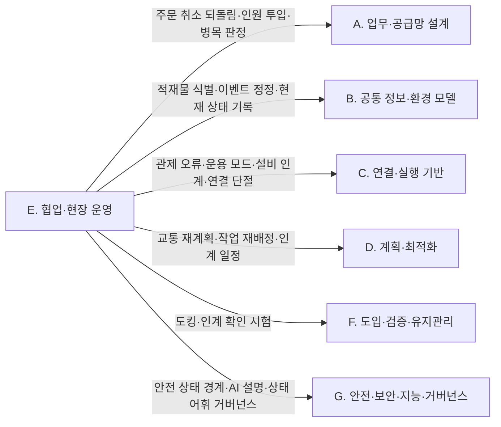

(너의 규칙은 시스템 프롬프트의 agents/shared-rules.md 와 agents/verifier.md 이다. 아래는 이번 실행의 컨텍스트와 입력이다.)

## 실행 컨텍스트

- run_id: 2026-09-25-60
- date: 2026-09-25
- run_type: category_link (대분류 연결)
- 대상: 대분류 E. 협업·현장 운영 페이지의 '다른 대분류와의 연결' 절(대분류 연결 실행). 게시된 세부영역 페이지를 근거로 다른 대분류와의 연결을 조사·서술한다. 스토리텔러는 그 절만 patches 로 바꾼다
- 예산:
    - max_search_queries: 30
    - max_sources_per_run: 15
    - new_topic_pages: 1
    - page_updates: 2
    - max_retries: 2
- 환경 알림: web_fetch_available: false · fetch_mode: mirror_only (일반 웹 페이지 열람은 네트워크 정책으로 막혀 있다. raw.githubusercontent.com 은 열린다: 공식 문서가 GitHub 에 있는 출처는 입력의 config/source_mirrors.yaml 경로를 WebFetch 로 열어 원문을 읽고 sources[].fetched=true, fetched_via=github_raw, fetch_url 을 적는다. 입력에 원문 텍스트(data/source_texts)가 있는 출처는 fetched_via=inbox. 그 밖의 출처는 fetched=false 이며 코드가 신뢰도 상한(medium)을 강제한다 — 공통 규칙 0절 6항)
- 언어: ko
- verification_stage: second
- verifier_budget:
    - max_search_queries: 30
    - max_sources_per_run: 15
    - new_topic_pages: 1
    - page_updates: 2
    - max_retries: 2

## 입력

### runs/2026-09-25-60/target.json

```json
{
  "run_id": "2026-09-25-60",
  "date": "2026-09-25",
  "weekday": "Fri",
  "run_number": 60,
  "run_type": "category_link",
  "forced": true,
  "target": {
    "area_no": null,
    "area_name": null,
    "category": "E. 협업·현장 운영",
    "category_letter": "E"
  },
  "topic": null,
  "track": null,
  "corrections": [],
  "budget": {
    "max_search_queries": 30,
    "max_sources_per_run": 15,
    "new_topic_pages": 1,
    "page_updates": 2,
    "max_retries": 2
  },
  "priority_reason": null,
  "priority_questions": [],
  "excluded_areas": [],
  "lifted_areas": [],
  "deferred": {
    "monthly_recheck": false,
    "weekly_review": false
  },
  "selection_rationale": "CLI 지정 run_type=category_link"
}
```

### runs/2026-09-25-60/research.json

```json
{
  "run_id": "2026-09-25-60",
  "date": "2026-09-25",
  "run_type": "category_link",
  "target": {
    "area_no": null,
    "area_name": null,
    "category": "E. 협업·현장 운영"
  },
  "gaps": [
    "E. 협업·현장 운영 대분류 페이지의 '다른 대분류와의 연결' 절 비어 있음(아직 작성되지 않음)",
    "20. 예외 복구·재계획·업무 연속성 ↔ 22. 시뮬레이션·예측용 디지털 트윈(제한 운영 처리량 추정, oq-081): 22. 시뮬레이션·예측용 디지털 트윈 페이지가 seed 상태라 게시된 근거 없음",
    "17. 로봇 간 협업·물리적 인계·18. 사람–로봇 협업·운영 인터페이스 ↔ 26. 사이버보안·접근권한·개인정보, 24. 자산·소프트웨어 수명주기 관리, 21. 온보딩·설정·현장 시운전: 게시된 E. 협업·현장 운영 세부영역 페이지에 검증된 근거 없음",
    "5. 로봇 능력·작업 온톨로지·6. 지도·공간·위치 모델 ↔ E. 협업·현장 운영 세부영역: E 쪽 게시 페이지에 직접 근거 없음"
  ],
  "research_questions": [
    "계획과 실제가 달라지는 상황에서 일을 어떻게 계속할 것인가? [분류원문]",
    "운반 중 고장 난 로봇의 화물과 남은 주문은 어떻게 처리할까? [분류원문] — 20. 예외 복구·재계획·업무 연속성이 A. 업무·공급망 설계, B. 공통 정보·환경 모델, C. 연결·실행 기반, D. 계획·최적화와 넘겨받는 지점은 무엇인가? (oq-021, oq-038, oq-048, oq-079 관련)",
    "17. 로봇 간 협업·물리적 인계의 인계 확인 신호는 7. 화물·재고·자산 식별과 추적, 10. 설비·건물 시스템 연동, 14. 작업 순서·스케줄링, 23. 시험·형식 검증·벤치마크, 25. 안전·위험 관리와 어떻게 이어지는가? (oq-001, oq-006, oq-042, oq-062, oq-063, oq-064)",
    "18. 사람–로봇 협업·운영 인터페이스는 3. 처리능력·거점·설비 계획, 9. 로봇·제조사 관제 연동, 13. 작업 배정 — MRTA, 25. 안전·위험 관리, 27. AI·학습·적응과 모델 운영과 무엇을 주고받는가? (oq-009, oq-070, oq-072)",
    "19. 모니터링·이상 탐지·원인 분석은 4. 성과·경제성·프로세스 개선, 8. 실시간 세계 상태·데이터 일관성, 9. 로봇·제조사 관제 연동, 10. 설비·건물 시스템 연동, 27. AI·학습·적응과 모델 운영, 28. 표준·상호운용성·다사업자 거버넌스와 어떻게 연결되는가? (oq-018, oq-033, oq-073)",
    "E. 협업·현장 운영과 다른 대분류의 연결 가운데 근거가 아직 없는 쌍은 무엇인가? (다루지 않은 연결 목록)"
  ],
  "findings": [
    {
      "id": "f1",
      "claim": "E. 협업·현장 운영의 20. 예외 복구·재계획·업무 연속성 ↔ A. 업무·공급망 설계의 1. 주문·업무 시스템 연계: VDA 5050 3.0.0 에서 관제가 주문 취소(cancelOrder)를 보내면 예정된 동작은 취소되어 동작 상태를 FAILED 로 보고한다.",
      "tag": "사실",
      "source_ids": [
        "ref-031"
      ],
      "cross_checked": false,
      "confidence": "medium",
      "evidence_excerpt": "명세 원문: 예정된 동작이 있으면 \"these actions shall be cancelled and report 'FAILED' in their actionState\". (VDA 5050 3.0.0, GitHub main)",
      "as_of": "2026-09-25",
      "flow_step": null,
      "flow_item": "예외·성과"
    },
    {
      "id": "f2",
      "claim": "E. 협업·현장 운영의 20. 예외 복구·재계획·업무 연속성 ↔ A. 업무·공급망 설계의 1. 주문·업무 시스템 연계: 상위 시스템의 취소가 로봇이 화물을 실은 뒤에 오면 로봇 쪽 동작 실패 보고만으로는 화물 위치가 정해지지 않으므로, 되돌림 작업과 재고 반영 규칙을 정하는 일이 두 대분류가 넘겨받는 지점이 될 것으로 보이며 이를 정한 표준·사례는 확인되지 않았다(oq-021).",
      "tag": "추정",
      "source_ids": [
        "ref-031",
        "ref-489"
      ],
      "cross_checked": false,
      "confidence": "low",
      "evidence_excerpt": "cancelOrder 뒤 남은 동작은 FAILED 로 보고(ref-031). 보상 트랜잭션 패턴은 이미 완료된 단계의 효과를 되돌리는 별도 작업을 정의(ref-489). 20. 예외 복구·재계획·업무 연속성 페이지 9절 서술 기반.",
      "as_of": "2026-09-25",
      "flow_step": null,
      "flow_item": "예외·성과",
      "source_unopened": false
    },
    {
      "id": "f3",
      "claim": "E. 협업·현장 운영의 17. 로봇 간 협업·물리적 인계 ↔ B. 공통 정보·환경 모델의 7. 화물·재고·자산 식별과 추적: 시설 안 로봇 사이·로봇과 작업대 사이의 물리적 인계는 CBV 의 accepting·receiving 에 가깝고 운송 수단 기준의 loading·unloading 과 맞지 않아, 인계 이벤트의 업무 단계 값을 ROP 쪽에서 정해야 할 것으로 보인다(oq-006).",
      "tag": "추정",
      "source_ids": [
        "ref-044"
      ],
      "cross_checked": false,
      "confidence": "low",
      "evidence_excerpt": "CBV 2.0 온톨로지는 arriving·receiving·accepting 과 운송 수단 적재 기준의 loading·unloading 을 별도 업무 단계로 정의. 17. 로봇 간 협업·물리적 인계 페이지 10절의 [추정] 서술 재인용.",
      "as_of": "2021-09-30",
      "flow_step": null,
      "flow_item": "완료·인계",
      "source_unopened": true
    },
    {
      "id": "f4",
      "claim": "E. 협업·현장 운영의 20. 예외 복구·재계획·업무 연속성 ↔ B. 공통 정보·환경 모델의 7. 화물·재고·자산 식별과 추적: VDA 5050 상태 스키마의 선택 필드 loads 의 loadId 는 바코드·RFID 같은 적재물 식별 번호로, 멈춘 로봇에 어떤 화물이 실렸는지 관제가 알 수 있게 하지만 적재물을 식별할 수 없는 로봇은 생략할 수 있다.",
      "tag": "사실",
      "source_ids": [
        "ref-051"
      ],
      "cross_checked": false,
      "confidence": "medium",
      "evidence_excerpt": "state.schema: loadId 설명 \"Unique identification number of the load (e.g., barcode or RFID)\"; 식별 전이면 비우고, 식별할 수 없는 로봇은 생략 가능.",
      "as_of": "2026-09-25",
      "flow_step": "피킹",
      "flow_item": "작업 대상"
    },
    {
      "id": "f5",
      "claim": "E. 협업·현장 운영의 20. 예외 복구·재계획·업무 연속성 ↔ B. 공통 정보·환경 모델의 7. 화물·재고·자산 식별과 추적: EPCIS 1.2 는 이미 기록된 이벤트를 오류 선언(errorDeclaration)으로 정정하게 하므로, 회수한 화물의 재고·이벤트 기록 정정이 식별·추적 쪽 기록 규칙에 기대게 된다.",
      "tag": "사실",
      "source_ids": [
        "ref-492"
      ],
      "cross_checked": false,
      "confidence": "medium",
      "evidence_excerpt": "EPCIS 1.2(2016-09-29)의 오류 선언으로 기존 이벤트를 정정. 회수 때 어떤 확인(스캔·무게·위치)을 요구할지는 미확인(oq-079). 20. 예외 복구·재계획·업무 연속성 페이지 5절 재인용.",
      "as_of": "2016-09-29",
      "flow_step": null,
      "flow_item": "완료·인계",
      "source_unopened": true
    },
    {
      "id": "f6",
      "claim": "E. 협업·현장 운영의 19. 모니터링·이상 탐지·원인 분석 ↔ B. 공통 정보·환경 모델의 8. 실시간 세계 상태·데이터 일관성: 지연 원인을 문·로봇·통신으로 가르려면 같은 시각의 문 모드(closed·moving·open·offline·unknown)와 작업 상태(delayed·blocked 등)를 한 시간축에 맞춘 현재 상태 기록이 필요할 것으로 보이며, 이는 현재 상태를 표현하는 쪽이지 가정한 미래를 실험하는 22. 시뮬레이션·예측용 디지털 트윈의 일이 아니다.",
      "tag": "추정",
      "source_ids": [
        "ref-313",
        "ref-111"
      ],
      "cross_checked": false,
      "confidence": "low",
      "evidence_excerpt": "DoorMode.msg 다섯 모드 값, task_state.json 의 상태 토큰(delayed·blocked·completed 등). 19. 모니터링·이상 탐지·원인 분석 페이지 5·10절 서술 기반.",
      "as_of": "2026-09-25",
      "flow_step": "보충",
      "flow_item": "예외·성과",
      "source_unopened": true
    },
    {
      "id": "f7",
      "claim": "E. 협업·현장 운영의 19. 모니터링·이상 탐지·원인 분석·20. 예외 복구·재계획·업무 연속성 ↔ C. 연결·실행 기반의 9. 로봇·제조사 관제 연동: VDA 5050 상태 스키마의 오류 수준은 WARNING·URGENT·CRITICAL·FATAL 네 값이고, 연결 스키마는 연결 끊김을 CONNECTION_BROKEN 으로 보고한다.",
      "tag": "사실",
      "source_ids": [
        "ref-051",
        "ref-449"
      ],
      "cross_checked": false,
      "confidence": "medium",
      "evidence_excerpt": "state.schema errorLevel 열거값 WARNING, URGENT, CRITICAL, FATAL(\"No immediate attention required\"~\"User intervention is required\"). connection.schema 의 CONNECTION_BROKEN. 판 간 해석 차이는 oq-073.",
      "as_of": "2026-09-25",
      "flow_step": null,
      "flow_item": "시작 조건",
      "source_unopened": false
    },
    {
      "id": "f8",
      "claim": "E. 협업·현장 운영의 19. 모니터링·이상 탐지·원인 분석 ↔ C. 연결·실행 기반의 9. 로봇·제조사 관제 연동: Open-RMF 작업 상태·VDA 5050 오류·MassRobotics 운용 상태(waitingExternalEvent 등)가 서로 다른 어휘로 보고되어, 이를 ROP 의 공통 원인 범주로 옮기는 매핑이 두 대분류 사이에 필요할 것으로 보이며 공통 매핑 표준은 확인되지 않았다(oq-033).",
      "tag": "추정",
      "source_ids": [
        "ref-051",
        "ref-230",
        "ref-111"
      ],
      "cross_checked": false,
      "confidence": "low",
      "evidence_excerpt": "각 스키마는 자기 필드만 정의하고 서로 간 대응표를 두지 않음. 19. 모니터링·이상 탐지·원인 분석 페이지 3절 [추정] 재인용.",
      "as_of": "2026-09-25",
      "flow_step": null,
      "flow_item": "예외·성과",
      "source_unopened": false
    },
    {
      "id": "f9",
      "claim": "E. 협업·현장 운영의 19. 모니터링·이상 탐지·원인 분석 ↔ C. 연결·실행 기반의 10. 설비·건물 시스템 연동: Open-RMF 문 노드는 문 상태를 /door_states 로 발행하고 문 어댑터는 진행 중인 로봇 작업을 방해하지 않을 때만 문을 움직이게 하는 상태 감독자 역할을 해, 설비 원인 판정의 근거가 된다.",
      "tag": "사실",
      "source_ids": [
        "ref-313",
        "ref-283"
      ],
      "cross_checked": false,
      "confidence": "medium",
      "evidence_excerpt": "DoorMode 값 closed·moving·open·offline·unknown(ref-313), 문 어댑터의 상태 감독 역할(ref-283). 19. 모니터링·이상 탐지·원인 분석 페이지 5절 [사실] 재인용.",
      "as_of": "2026-09-25",
      "flow_step": "보충",
      "flow_item": "제약",
      "source_unopened": true
    },
    {
      "id": "f10",
      "claim": "E. 협업·현장 운영의 17. 로봇 간 협업·물리적 인계 ↔ C. 연결·실행 기반의 10. 설비·건물 시스템 연동: Open-RMF 배송 작업에서 로봇은 픽업 지점에서 DispenserResult 를, 하역 지점에서 IngestorResult 를 받을 때까지 요청을 반복해 보내고 워크셀은 /dispenser_states·/ingestor_states 로 상태를 주기적으로 발행하며, 이 흐름은 플릿 어댑터의 perform_deliveries 설정이 켜져야 동작한다.",
      "tag": "사실",
      "source_ids": [
        "ref-023"
      ],
      "cross_checked": false,
      "confidence": "medium",
      "evidence_excerpt": "mdBook 원본 integration_workcells.md: 로봇은 \"will first move to the pickup_waypoint\" 한 뒤 요청–결과 주기를 거쳐 하역 지점으로 이동. perform_deliveries 필요.",
      "as_of": "2026-09-25",
      "flow_step": "보충",
      "flow_item": "완료·인계"
    },
    {
      "id": "f11",
      "claim": "E. 협업·현장 운영의 17. 로봇 간 협업·물리적 인계 ↔ C. 연결·실행 기반의 10. 설비·건물 시스템 연동: 반도체 업종 SEMI E84 처럼 준비–진행–완료를 양쪽이 단계별로 확인하는 인계 신호 구조는 이동로봇–작업대 인계 상태 모델의 참고가 될 수 있으나, VDA 5050 은 주변 설비 인터페이스를 범위에서 제외하고 물류 업종의 제조사 중립 인계 신호 규격은 확인되지 않았다(oq-042, oq-062).",
      "tag": "추정",
      "source_ids": [
        "ref-202",
        "ref-203",
        "ref-031"
      ],
      "cross_checked": false,
      "confidence": "low",
      "evidence_excerpt": "VDA 5050 원문: 범위 제외 \"interfaces to peripheral equipment, infrastructure components, or external IT systems\". SEMI E84 는 반도체 AMHS–로드포트 규격(원문 미열람).",
      "as_of": "2026-09-25",
      "flow_step": null,
      "flow_item": "완료·인계",
      "source_unopened": false
    },
    {
      "id": "f12",
      "claim": "E. 협업·현장 운영의 20. 예외 복구·재계획·업무 연속성 ↔ C. 연결·실행 기반의 11. 분산 시스템·통신·컴퓨팅 구조: VDA 5050 3.0.0 에서 로봇은 브로커와 연결이 끊겨도 주문 정보를 유지하고 마지막으로 해제된 노드까지 주문을 수행한다.",
      "tag": "사실",
      "source_ids": [
        "ref-031"
      ],
      "cross_checked": false,
      "confidence": "medium",
      "evidence_excerpt": "명세 원문: \"it keeps all the order information and fulfills the order up to the last released node\". 외부망 단절 시 운영 기준은 oq-038.",
      "as_of": "2026-09-25",
      "flow_step": null,
      "flow_item": "제약"
    },
    {
      "id": "f13",
      "claim": "E. 협업·현장 운영의 20. 예외 복구·재계획·업무 연속성 ↔ C. 연결·실행 기반의 12. 명령·작업 실행의 신뢰성: VDA 5050 은 교착(deadlock)과 통신 오류의 탐지·해소를 관제(fleet control)의 기능으로 둔다.",
      "tag": "사실",
      "source_ids": [
        "ref-031"
      ],
      "cross_checked": false,
      "confidence": "medium",
      "evidence_excerpt": "명세 원문의 관제 기능 목록: \"Detection and resolution of blockages ('deadlocks')\", 통신 오류의 탐지·해소.",
      "as_of": "2026-09-25",
      "flow_step": null,
      "flow_item": "예외·성과"
    },
    {
      "id": "f14",
      "claim": "E. 협업·현장 운영의 20. 예외 복구·재계획·업무 연속성 ↔ C. 연결·실행 기반의 12. 명령·작업 실행의 신뢰성: 오류·연결 상태 수신, 주문 일시정지·취소, Open-RMF 로봇 갱신 핸들을 통한 재계획 요청·작업 수락 중지가 실행 신뢰성 계층과 복구 결정이 맞물리는 지점이 될 것으로 보인다.",
      "tag": "추정",
      "source_ids": [
        "ref-031",
        "ref-537"
      ],
      "cross_checked": false,
      "confidence": "low",
      "evidence_excerpt": "20. 예외 복구·재계획·업무 연속성 페이지 9절 [추정] 재인용(RobotUpdateHandle.hpp 의 재계획·작업 수락 관련 인터페이스). 어댑터 재시작 시 작업 복원 여부는 oq-048.",
      "as_of": "2026-09-25",
      "flow_step": null,
      "flow_item": "예외·성과",
      "source_unopened": false
    },
    {
      "id": "f15",
      "claim": "E. 협업·현장 운영의 20. 예외 복구·재계획·업무 연속성 ↔ D. 계획·최적화의 15. 다중 로봇 경로·교통 관리 — MAPF: Open-RMF 교통 스케줄은 지연·취소·경로 변경을 반영해 계속 바뀌는 데이터베이스이고, 충돌이 예상되면 관련 플릿 관리자가 서로를 수용하는 경로로 협상한다.",
      "tag": "사실",
      "source_ids": [
        "ref-004"
      ],
      "cross_checked": false,
      "confidence": "medium",
      "evidence_excerpt": "rmf-core 원문: 스케줄은 \"living database whose contents will change over time to reflect delays, cancellations, or route changes\"; 협상 결과는 제3자 판정자가 고름.",
      "as_of": "2026-09-25",
      "flow_step": null,
      "flow_item": "예외·성과"
    },
    {
      "id": "f16",
      "claim": "E. 협업·현장 운영의 20. 예외 복구·재계획·업무 연속성 ↔ D. 계획·최적화의 15. 다중 로봇 경로·교통 관리 — MAPF: 지연에 강건한 계획 실행(행동 의존 그래프, Hönig 외 2019)과 지연된 로봇의 통과 순서 재스케줄(Feng 외 2024)이 연구되어, 실행 중 지연 복구가 경로 계획 연구와 이어진다.",
      "tag": "사실",
      "source_ids": [
        "ref-188",
        "ref-483"
      ],
      "cross_checked": false,
      "confidence": "medium",
      "evidence_excerpt": "20. 예외 복구·재계획·업무 연속성 페이지 8절 [사실] 재인용. 두 논문 모두 원문 미열람, 속도 수치는 저자 보고값.",
      "as_of": "2024",
      "flow_step": null,
      "flow_item": "예외·성과",
      "source_unopened": true
    },
    {
      "id": "f17",
      "claim": "E. 협업·현장 운영의 20. 예외 복구·재계획·업무 연속성 ↔ D. 계획·최적화의 13. 작업 배정 — MRTA: 작업 의존성·우선순위 선점·고장 복구를 함께 다루는 다중 로봇 작업 배정 방법(Kalempa 외 2021)이 있어, 고장 로봇의 남은 작업 재배정이 배정 문제로 넘어간다.",
      "tag": "사실",
      "source_ids": [
        "ref-484"
      ],
      "cross_checked": false,
      "confidence": "medium",
      "evidence_excerpt": "Sensors 2021, MRPF(선점 스케줄링+고장 복구). 20. 예외 복구·재계획·업무 연속성 페이지 5·8절 재인용.",
      "as_of": "2021-09-30",
      "flow_step": null,
      "flow_item": "수행 자원",
      "source_unopened": true
    },
    {
      "id": "f18",
      "claim": "E. 협업·현장 운영의 18. 사람–로봇 협업·운영 인터페이스 ↔ D. 계획·최적화의 13. 작업 배정 — MRTA·14. 작업 순서·스케줄링: 사람 피커와 AMR 의 협동 피킹 연구는 두 자원의 조율을 배치 구성·배치 순서와 작업 완료 시각(makespan) 최소화 문제로 다룬다.",
      "tag": "사실",
      "source_ids": [
        "ref-467",
        "ref-468"
      ],
      "cross_checked": false,
      "confidence": "medium",
      "evidence_excerpt": "Žulj 외 2022(배치 구성·순서), Löffler 외 2023(AMR·피커 조율). 18. 사람–로봇 협업·운영 인터페이스 페이지 3절 [사실] 재인용. 원문 미열람.",
      "as_of": "2023",
      "flow_step": "피킹",
      "flow_item": "수행 자원",
      "source_unopened": true
    },
    {
      "id": "f19",
      "claim": "E. 협업·현장 운영의 17. 로봇 간 협업·물리적 인계 ↔ D. 계획·최적화의 14. 작업 순서·스케줄링·16. 공용 자원·충전·에너지 최적화: 이동로봇 운반과 로봇팔 적치가 선후로 이어지면 스케줄 간 의존이 생기고 인계 스테이션의 도크·버퍼가 공용 자원 제약이 되어 인계 시점을 두 로봇 일정에 함께 맞춰야 할 것으로 보인다.",
      "tag": "추정",
      "source_ids": [
        "ref-394",
        "ref-209"
      ],
      "cross_checked": false,
      "confidence": "low",
      "evidence_excerpt": "Korsah 외 2013 분류의 스케줄 간 의존(XD), Zang 외 2026-07 버퍼 제한 인계 스테이션 연구. 17. 로봇 간 협업·물리적 인계 페이지 5절 제약 칸 [추정] 재인용.",
      "as_of": "2026-07",
      "flow_step": "보충",
      "flow_item": "제약",
      "source_unopened": true
    },
    {
      "id": "f20",
      "claim": "E. 협업·현장 운영의 18. 사람–로봇 협업·운영 인터페이스 ↔ A. 업무·공급망 설계의 3. 처리능력·거점·설비 계획: 협동 피킹 시스템에서 피커와 로봇의 투입 수를 정하는 연구(Yang 외 2026-03)가 있어 인원·로봇 비율 결정이 처리능력 계획과 이어지나, 교대조 단위 결정 여부는 미확인이다(oq-009).",
      "tag": "사실",
      "source_ids": [
        "ref-469"
      ],
      "cross_checked": false,
      "confidence": "medium",
      "evidence_excerpt": "IISE Transactions 게재 'Deploying pickers and robots in cobot-based collaborative order picking systems'. 18. 사람–로봇 협업·운영 인터페이스 페이지 10·11절 기반. 원문 미열람.",
      "as_of": "2026-03",
      "flow_step": "피킹",
      "flow_item": "수행 자원",
      "source_unopened": true
    },
    {
      "id": "f21",
      "claim": "E. 협업·현장 운영의 19. 모니터링·이상 탐지·원인 분석 ↔ A. 업무·공급망 설계의 4. 성과·경제성·프로세스 개선: AGV 시스템 병목 탐지 방법 비교 연구(Roser 외 2003)는 가동률·대기 시간 기반 방법에 이동 병목 탐지 대비 한계가 있다고 보고해, 원인·병목 판정 방식이 개선 대상 선정과 이어진다(oq-018).",
      "tag": "사실",
      "source_ids": [
        "ref-451"
      ],
      "cross_checked": false,
      "confidence": "medium",
      "evidence_excerpt": "WSC 2003 Proceedings 1192–1198쪽. 19. 모니터링·이상 탐지·원인 분석 페이지 3절 [사실] 재인용. 원문 미열람.",
      "as_of": "2003",
      "flow_step": null,
      "flow_item": "예외·성과",
      "source_unopened": true
    },
    {
      "id": "f22",
      "claim": "E. 협업·현장 운영의 18. 사람–로봇 협업·운영 인터페이스 ↔ C. 연결·실행 기반의 9. 로봇·제조사 관제 연동: VDA 5050 상태 메시지는 운용 모드(STARTUP·AUTOMATIC·SEMIAUTOMATIC·INTERVENED·MANUAL·SERVICE·TEACH_IN)와 비상정지 종류(MANUAL·REMOTE·NONE)를 보고해, 사람 개입 상태가 관제 연동을 통해 운영 인터페이스로 들어온다.",
      "tag": "사실",
      "source_ids": [
        "ref-051"
      ],
      "cross_checked": false,
      "confidence": "medium",
      "evidence_excerpt": "state.schema operatingMode 7개 값, safetyState 비상정지: 로봇에서 수동 확인(MANUAL)과 원격 확인(REMOTE) 구분.",
      "as_of": "2026-09-25",
      "flow_step": null,
      "flow_item": "수행 자원"
    },
    {
      "id": "f23",
      "claim": "E. 협업·현장 운영의 18. 사람–로봇 협업·운영 인터페이스 ↔ C. 연결·실행 기반의 10. 설비·건물 시스템 연동: Open-RMF 데모는 시설 비상 경보 때 로봇을 가장 가까운 주차 위치로 보내는 흐름을 보인다.",
      "tag": "사실",
      "source_ids": [
        "ref-104"
      ],
      "cross_checked": false,
      "confidence": "medium",
      "evidence_excerpt": "rmf_demos README 의 비상 경보 데모. 18. 사람–로봇 협업·운영 인터페이스 페이지 9절 [사실] 재인용. 이번 실행에서 원문 재열람 안 함.",
      "as_of": "2026-09-25",
      "flow_step": null,
      "flow_item": "예외·성과",
      "source_unopened": true
    },
    {
      "id": "f24",
      "claim": "E. 협업·현장 운영의 17. 로봇 간 협업·물리적 인계 ↔ F. 도입·검증·유지관리의 23. 시험·형식 검증·벤치마크: 도킹 정지 위치의 반복성을 확인하는 시험 방법 ASTM F3499-21 이 있고, NIST ARIAC 2025 는 완성 키트를 실은 AGV 를 움직이기 전에 품질 확인 서비스를 호출하게 해 이동 전 인계 확인을 평가한다.",
      "tag": "사실",
      "source_ids": [
        "ref-204",
        "ref-008"
      ],
      "cross_checked": false,
      "confidence": "medium",
      "evidence_excerpt": "17. 로봇 간 협업·물리적 인계 페이지 5·8절 [사실] 재인용. 시험 결과와 파지 허용 오차를 잇는 기준은 oq-063.",
      "as_of": "2021",
      "flow_step": null,
      "flow_item": "완료·인계",
      "source_unopened": false
    },
    {
      "id": "f25",
      "claim": "E. 협업·현장 운영의 17. 로봇 간 협업·물리적 인계 ↔ F. 도입·검증·유지관리의 23. 시험·형식 검증·벤치마크: NIST 협업 로봇 시스템 성능 프로젝트는 사람–로봇·로봇–로봇 협업 팀의 안전성과 효과를 평가하는 방법·지표 개발을 목표로 한다.",
      "tag": "사실",
      "source_ids": [
        "ref-007"
      ],
      "cross_checked": false,
      "confidence": "medium",
      "evidence_excerpt": "17. 로봇 간 협업·물리적 인계 페이지 3절 [사실] 재인용(확인일 2026-09-25). 원문 미열람. (발행일 미확인, 확인일 기준)",
      "as_of": "2026-09-25",
      "flow_step": null,
      "flow_item": null,
      "source_unopened": true
    },
    {
      "id": "f26",
      "claim": "E. 협업·현장 운영의 17. 로봇 간 협업·물리적 인계 ↔ G. 안전·보안·지능·거버넌스의 25. 안전·위험 관리: ANSI/A3 R15.08-2-2023 은 이동 플랫폼에 로봇팔을 단 모바일 매니퓰레이터를 산업용 이동로봇 유형 C 로 다루며 시스템·적용 단위 안전 요구를 정한다.",
      "tag": "사실",
      "source_ids": [
        "ref-210"
      ],
      "cross_checked": false,
      "confidence": "medium",
      "evidence_excerpt": "17. 로봇 간 협업·물리적 인계 페이지 4절 [사실] 재인용. 국내 대응 KS 여부는 oq-064. 원문 미열람.",
      "as_of": "2023",
      "flow_step": null,
      "flow_item": "제약",
      "source_unopened": true
    },
    {
      "id": "f27",
      "claim": "E. 협업·현장 운영의 17. 로봇 간 협업·물리적 인계·18. 사람–로봇 협업·운영 인터페이스 ↔ G. 안전·보안·지능·거버넌스의 25. 안전·위험 관리: 사람 감지·보호 필드·비상정지 같은 안전 기능은 로봇 제조사·현장 통합사가 갖추고, ROP 는 로봇이 보고한 안전 상태를 표시하고 재개·수동 전환 승인을 작업 흐름에 반영하는 경계가 될 것으로 보인다.",
      "tag": "추정",
      "source_ids": [
        "ref-470",
        "ref-051",
        "ref-210"
      ],
      "cross_checked": false,
      "confidence": "low",
      "evidence_excerpt": "18. 사람–로봇 협업·운영 인터페이스 페이지 9절, 17. 로봇 간 협업·물리적 인계 페이지 9절의 [추정] 재인용. ISO 3691-4:2023(원문 미열람).",
      "as_of": "2026-09-25",
      "flow_step": null,
      "flow_item": "제약",
      "source_unopened": false
    },
    {
      "id": "f28",
      "claim": "E. 협업·현장 운영의 18. 사람–로봇 협업·운영 인터페이스 ↔ G. 안전·보안·지능·거버넌스의 25. 안전·위험 관리: 국내에서는 고용노동부가 2023-07 고정식·이동식 산업용 로봇의 협동작업 안전 가이드를 배포했고, 중소벤처기업부는 2024-11 대구 규제자유특구 실증을 거쳐 이동식 협동로봇 산업표준이 제정되었다고 발표했다.",
      "tag": "사실",
      "source_ids": [
        "ref-473",
        "ref-475"
      ],
      "cross_checked": false,
      "confidence": "medium",
      "evidence_excerpt": "두 기관 게시물 제목 기준(원문 미열람). 제정된 KS 의 번호·내용은 미확인(oq-070).",
      "as_of": "2024-11",
      "flow_step": null,
      "flow_item": "제약",
      "source_unopened": true
    },
    {
      "id": "f29",
      "claim": "E. 협업·현장 운영의 18. 사람–로봇 협업·운영 인터페이스 ↔ G. 안전·보안·지능·거버넌스의 27. AI·학습·적응과 모델 운영: LLM 계획기가 불확실할 때 사람에게 되묻는 연구(KnowNo, Ren 외 2023)와 사용자 명령을 분류·모호성 해소하는 연구(CLARA, Park 외 2024), 실행 전 안전 게이트 연구(Obi 외 2026-04)가 있어 자연어 지시 인터페이스가 AI 연구 방법과 이어진다.",
      "tag": "사실",
      "source_ids": [
        "ref-351",
        "ref-353",
        "ref-417"
      ],
      "cross_checked": false,
      "confidence": "medium",
      "evidence_excerpt": "18. 사람–로봇 협업·운영 인터페이스 페이지 10절(27. AI·학습·적응과 모델 운영 연결) 근거 논문. 모두 arXiv, 원문 미열람.",
      "as_of": "2026-04",
      "flow_step": null,
      "flow_item": null,
      "source_unopened": true
    },
    {
      "id": "f30",
      "claim": "E. 협업·현장 운영의 19. 모니터링·이상 탐지·원인 분석·18. 사람–로봇 협업·운영 인터페이스 ↔ G. 안전·보안·지능·거버넌스의 27. AI·학습·적응과 모델 운영: 로봇 실패에 대한 설명을 생성해 사용자의 고장 복구 지원을 개선하는 연구(Das 외 2021)가 있어, 분류 원문 8장 교차 규칙의 장애 분석이 원인 분석 결과를 사람에게 전달하는 인터페이스까지 이어진다.",
      "tag": "사실",
      "source_ids": [
        "ref-476"
      ],
      "cross_checked": false,
      "confidence": "medium",
      "evidence_excerpt": "arXiv 2101.01625 'Explainable AI for Robot Failures: Generating Explanations that Improve User Assistance in Fault Recovery'. 원문 미열람.",
      "as_of": "2021-01",
      "flow_step": null,
      "flow_item": "예외·성과",
      "source_unopened": true
    },
    {
      "id": "f31",
      "claim": "E. 협업·현장 운영의 19. 모니터링·이상 탐지·원인 분석 ↔ G. 안전·보안·지능·거버넌스의 28. 표준·상호운용성·다사업자 거버넌스: 표준마다 상태·오류 어휘가 다르고 공통 매핑 표준이 확인되지 않으므로, 이종 플릿의 오류 수준·원인 범주 해석 규칙을 누가 정하고 바꾸는지가 거버넌스 과제로 넘어갈 것으로 보인다(oq-033, oq-073).",
      "tag": "추정",
      "source_ids": [
        "ref-051",
        "ref-230",
        "ref-111"
      ],
      "cross_checked": false,
      "confidence": "low",
      "evidence_excerpt": "VDA 5050 errorLevel 4값, MassRobotics 운용 상태, Open-RMF 작업 상태 토큰이 서로 대응표 없이 정의됨.",
      "as_of": "2026-09-25",
      "flow_step": null,
      "flow_item": null,
      "source_unopened": false
    }
  ],
  "sources": [
    {
      "id": "ref-004",
      "org": "Open Robotics",
      "title": "RMF Core Overview — Programming Multiple Robots with ROS 2",
      "published": null,
      "url": "https://osrf.github.io/ros2multirobotbook/rmf-core.html",
      "type": "오픈소스 문서",
      "reliability": "high",
      "accessed": "2026-09-25",
      "summary": "Open-RMF 핵심 구조. 교통 스케줄이 지연·취소·경로 변경을 반영하는 데이터베이스이며 충돌 시 플릿 관리자 간 협상을 한다고 설명.",
      "fetched": true,
      "fetched_via": "github_raw",
      "fetch_url": "https://raw.githubusercontent.com/osrf/ros2multirobotbook/master/src/rmf-core.md",
      "source_unopened": false
    },
    {
      "id": "ref-007",
      "org": "NIST",
      "title": "Performance of Collaborative Robot Systems",
      "published": null,
      "url": "https://www.nist.gov/programs-projects/performance-collaborative-robot-systems",
      "type": "정부·연구기관",
      "reliability": "medium",
      "accessed": "2026-09-25",
      "summary": "원문 미열람. 사람–로봇·로봇–로봇 협업 팀의 성능 평가 방법·지표 개발 프로젝트.",
      "fetched": false,
      "fetched_via": null,
      "fetch_url": null,
      "source_unopened": true
    },
    {
      "id": "ref-008",
      "org": "NIST",
      "title": "ARIAC Documentation",
      "published": null,
      "url": "https://pages.nist.gov/ARIAC_docs/en/latest/",
      "type": "정부·연구기관",
      "reliability": "medium",
      "accessed": "2026-09-25",
      "summary": "원문 미열람. ARIAC 2025 시나리오·평가 문서(이동 전 키트 품질 확인 등). 이번 실행에서 재열람하지 않음.",
      "fetched": true,
      "fetched_via": "github_raw",
      "fetch_url": null,
      "source_unopened": false
    },
    {
      "id": "ref-023",
      "org": "Open Robotics",
      "title": "Workcells - Programming Multiple Robots with ROS 2",
      "published": null,
      "url": "https://osrf.github.io/ros2multirobotbook/integration_workcells.html",
      "type": "오픈소스 문서",
      "reliability": "high",
      "accessed": "2026-09-25",
      "summary": "디스펜서·인제스터 워크셀과 배송 작업의 요청–결과 반복, 상태 토픽, perform_deliveries 설정을 설명.",
      "fetched": true,
      "fetched_via": "github_raw",
      "fetch_url": "https://raw.githubusercontent.com/osrf/ros2multirobotbook/master/src/integration_workcells.md",
      "source_unopened": false
    },
    {
      "id": "ref-031",
      "org": "VDA / VDMA (VDA5050 GitHub)",
      "title": "VDA5050/VDA5050_EN.md — Official Specification document for the VDA 5050",
      "published": null,
      "url": "https://github.com/VDA5050/VDA5050/blob/main/VDA5050_EN.md",
      "type": "표준",
      "reliability": "high",
      "accessed": "2026-09-25",
      "summary": "VDA 5050 3.0.0 명세. 범위 제외(주변 설비·외부 IT), 관제의 교착·통신 오류 해소 기능, 연결 끊김 시 마지막 해제 노드까지 수행, cancelOrder 시 동작 FAILED 보고를 확인.",
      "fetched": true,
      "fetched_via": "github_raw",
      "fetch_url": "https://raw.githubusercontent.com/VDA5050/VDA5050/main/VDA5050_EN.md",
      "source_unopened": false
    },
    {
      "id": "ref-044",
      "org": "GS1",
      "title": "gs1/EPCIS — Ontology/CBV.ttl (Core Business Vocabulary ontology 2.0)",
      "published": "2021-09-30",
      "url": "https://github.com/gs1/EPCIS/blob/master/Ontology/CBV.ttl",
      "type": "표준",
      "reliability": "medium",
      "accessed": "2026-09-25",
      "summary": "원문 미열람. CBV 업무 단계 어휘(arriving·receiving·accepting·loading·unloading 등) 온톨로지. 이번 실행에서 재열람하지 않음.",
      "fetched": false,
      "fetched_via": null,
      "fetch_url": null,
      "source_unopened": true
    },
    {
      "id": "ref-051",
      "org": "VDA / VDMA (VDA5050 GitHub)",
      "title": "VDA5050/VDA5050 — json_schemas/state.schema",
      "published": null,
      "url": "https://github.com/VDA5050/VDA5050/blob/main/json_schemas/state.schema",
      "type": "표준",
      "reliability": "high",
      "accessed": "2026-09-25",
      "summary": "VDA 5050 상태 메시지 스키마. errorLevel(WARNING·URGENT·CRITICAL·FATAL), operatingMode 7값, 비상정지 종류, 선택 필드 loads·loadId 를 정의.",
      "fetched": true,
      "fetched_via": "github_raw",
      "fetch_url": "https://raw.githubusercontent.com/VDA5050/VDA5050/main/json_schemas/state.schema",
      "source_unopened": false
    },
    {
      "id": "ref-104",
      "org": "Open Robotics (open-rmf)",
      "title": "rmf_demos — Demonstrations of Open-RMF (README)",
      "published": null,
      "url": "https://github.com/open-rmf/rmf_demos",
      "type": "오픈소스 문서",
      "reliability": "medium",
      "accessed": "2026-09-25",
      "summary": "원문 미열람. Open-RMF 데모 환경과 비상 경보 시 로봇 주차 흐름. 이번 실행에서 재열람하지 않음.",
      "fetched": false,
      "fetched_via": null,
      "fetch_url": null,
      "source_unopened": true
    },
    {
      "id": "ref-111",
      "org": "Open Robotics (open-rmf)",
      "title": "rmf_api_msgs — rmf_api_msgs/schemas/task_state.json",
      "published": null,
      "url": "https://github.com/open-rmf/rmf_api_msgs/blob/main/rmf_api_msgs/schemas/task_state.json",
      "type": "오픈소스 문서",
      "reliability": "medium",
      "accessed": "2026-09-25",
      "summary": "원문 미열람. Open-RMF 작업 상태 스키마(상태 토큰, 시각, 취소·중단 요청 기록). 이번 실행에서 재열람하지 않음.",
      "fetched": false,
      "fetched_via": null,
      "fetch_url": null,
      "source_unopened": true
    },
    {
      "id": "ref-188",
      "org": "Hönig, W., Kiesel, S. 외",
      "title": "Persistent and Robust Execution of MAPF Schedules in Warehouses",
      "published": "2019",
      "url": "https://ieeexplore.ieee.org/abstract/document/8620328/",
      "type": "논문",
      "reliability": "medium",
      "accessed": "2026-09-25",
      "summary": "원문 미열람. 행동 의존 그래프로 창고 다중 로봇 계획을 지연에도 충돌 없이 실행하는 틀.",
      "fetched": false,
      "fetched_via": null,
      "fetch_url": null,
      "source_unopened": true
    },
    {
      "id": "ref-202",
      "org": "SEMI",
      "title": "E08400 - SEMI E84 - Specification for Enhanced Carrier Handoff Parallel I/O Interface",
      "published": null,
      "url": "https://store-us.semi.org/products/e08400-semi-e84-specification-for-enhanced-carrier-handoff-parallel-i-o-interface",
      "type": "표준",
      "reliability": "medium",
      "accessed": "2026-09-25",
      "summary": "원문 미열람. 반도체 AMHS–장비 로드포트 간 캐리어 인계 병렬 I/O 인터페이스 규격.",
      "fetched": false,
      "fetched_via": null,
      "fetch_url": null,
      "source_unopened": true
    },
    {
      "id": "ref-203",
      "org": "PEER Group",
      "title": "SEMI E84: Carrier Handoff",
      "published": null,
      "url": "https://www.peergroup.com/definition-of-standard/semi-e84/",
      "type": "벤더 문서",
      "reliability": "low",
      "accessed": "2026-09-25",
      "summary": "원문 미열람. SEMI E84 단계별 인계 신호 구조 설명.",
      "fetched": false,
      "fetched_via": null,
      "fetch_url": null,
      "source_unopened": true
    },
    {
      "id": "ref-204",
      "org": "ASTM International",
      "title": "Standard Test Method for Confirming the Docking Performance of A-UGVs (ASTM F3499-21)",
      "published": "2021",
      "url": "https://www.astm.org/f3499-21.html",
      "type": "표준",
      "reliability": "medium",
      "accessed": "2026-09-25",
      "summary": "원문 미열람. 무인 지상 이동로봇의 도킹 성능 확인 시험 방법.",
      "fetched": false,
      "fetched_via": null,
      "fetch_url": null,
      "source_unopened": true
    },
    {
      "id": "ref-209",
      "org": "Zang, C. 외",
      "title": "Lifelong Multi-Subsystem Pickup and Delivery with Buffer-Limited Handover Stations",
      "published": "2026-07",
      "url": "https://arxiv.org/abs/2607.17724",
      "type": "논문",
      "reliability": "medium",
      "accessed": "2026-09-25",
      "summary": "원문 미열람. 버퍼 제한 인계 스테이션을 둔 다중 하위 시스템 지속형 픽업·배송 연구.",
      "fetched": false,
      "fetched_via": null,
      "fetch_url": null,
      "source_unopened": true
    },
    {
      "id": "ref-210",
      "org": "ANSI / A3(Association for Advancing Automation)",
      "title": "ANSI/A3 R15.08-2-2023 - Industrial Mobile Robots - Safety Requirements - Part 2: Requirements for IMR system(s) and IMR application(s)",
      "published": "2023",
      "url": "https://webstore.ansi.org/standards/ria/ansia3r15082023",
      "type": "표준",
      "reliability": "medium",
      "accessed": "2026-09-25",
      "summary": "원문 미열람. 산업용 이동로봇 시스템·적용의 안전 요구(유형 C 모바일 매니퓰레이터 포함).",
      "fetched": false,
      "fetched_via": null,
      "fetch_url": null,
      "source_unopened": true
    },
    {
      "id": "ref-230",
      "org": "MassRobotics",
      "title": "MassRobotics-AMR/AMR_Interop_Standard — AMR_Interop_Standard.json",
      "published": null,
      "url": "https://github.com/MassRobotics-AMR/AMR_Interop_Standard/blob/main/AMR_Interop_Standard.json",
      "type": "표준",
      "reliability": "medium",
      "accessed": "2026-09-25",
      "summary": "원문 미열람. MassRobotics AMR 상호운용 표준 JSON 스키마(운용 상태 등). 이번 실행에서 재열람하지 않음.",
      "fetched": false,
      "fetched_via": null,
      "fetch_url": null,
      "source_unopened": true
    },
    {
      "id": "ref-283",
      "org": "Open Robotics",
      "title": "Doors (integration_doors) - Programming Multiple Robots with ROS 2",
      "published": null,
      "url": "https://osrf.github.io/ros2multirobotbook/integration_doors.html",
      "type": "오픈소스 문서",
      "reliability": "medium",
      "accessed": "2026-09-25",
      "summary": "원문 미열람. 문 노드·문 어댑터(상태 감독자) 연동 설명. 이번 실행에서 재열람하지 않음.",
      "fetched": false,
      "fetched_via": null,
      "fetch_url": null,
      "source_unopened": true
    },
    {
      "id": "ref-313",
      "org": "Open Robotics (open-rmf)",
      "title": "rmf_internal_msgs — rmf_door_msgs/msg/DoorMode.msg",
      "published": null,
      "url": "https://github.com/open-rmf/rmf_internal_msgs/blob/main/rmf_door_msgs/msg/DoorMode.msg",
      "type": "오픈소스 문서",
      "reliability": "medium",
      "accessed": "2026-09-25",
      "summary": "원문 미열람. 문 모드 다섯 값(closed·moving·open·offline·unknown) 정의. 이번 실행에서 재열람하지 않음.",
      "fetched": false,
      "fetched_via": null,
      "fetch_url": null,
      "source_unopened": true
    },
    {
      "id": "ref-351",
      "org": "Ren, A. Z. 외",
      "title": "Robots That Ask For Help: Uncertainty Alignment for Large Language Model Planners",
      "published": "2023-07",
      "url": "https://arxiv.org/abs/2307.01928",
      "type": "논문",
      "reliability": "medium",
      "accessed": "2026-09-25",
      "summary": "원문 미열람. LLM 계획기의 불확실성 정렬로 필요할 때 사람에게 도움을 요청하는 방법(KnowNo).",
      "fetched": false,
      "fetched_via": null,
      "fetch_url": null,
      "source_unopened": true
    },
    {
      "id": "ref-353",
      "org": "Park, J., Lim, S., Lee, J., Park, S., Chang, M., Yu, Y., & Choi, S.",
      "title": "CLARA: Classifying and Disambiguating User Commands for Reliable Interactive Robotic Agents",
      "published": "2024",
      "url": "https://arxiv.org/abs/2306.10376",
      "type": "논문",
      "reliability": "medium",
      "accessed": "2026-09-25",
      "summary": "원문 미열람. 로봇 에이전트가 사용자 명령을 분류하고 모호성을 해소하는 방법.",
      "fetched": false,
      "fetched_via": null,
      "fetch_url": null,
      "source_unopened": true
    },
    {
      "id": "ref-394",
      "org": "Korsah, G. A., Stentz, A., & Dias, M. B.",
      "title": "A comprehensive taxonomy for multi-robot task allocation",
      "published": "2013",
      "url": "https://journals.sagepub.com/doi/10.1177/0278364913496484",
      "type": "논문",
      "reliability": "medium",
      "accessed": "2026-09-25",
      "summary": "원문 미열람. 스케줄 간 의존을 포함한 다중 로봇 작업 배정 분류 체계.",
      "fetched": false,
      "fetched_via": null,
      "fetch_url": null,
      "source_unopened": true
    },
    {
      "id": "ref-417",
      "org": "Obi, I., Venkatesh, V. L. N., Wang, W., Wang, R., Suh, D., Amosa, T. I., Jo, W., & Min, B.-C.(Purdue University SMART Lab)",
      "title": "Pre-Execution Safety Gate & Task Safety Contracts for LLM-Controlled Robot Systems",
      "published": "2026-04",
      "url": "https://arxiv.org/abs/2604.05427",
      "type": "논문",
      "reliability": "medium",
      "accessed": "2026-09-25",
      "summary": "원문 미열람. LLM 제어 로봇 시스템의 실행 전 안전 게이트와 작업 안전 계약.",
      "fetched": false,
      "fetched_via": null,
      "fetch_url": null,
      "source_unopened": true
    },
    {
      "id": "ref-449",
      "org": "VDA / VDMA (VDA5050 GitHub)",
      "title": "VDA5050/VDA5050 — json_schemas/connection.schema",
      "published": null,
      "url": "https://github.com/VDA5050/VDA5050/blob/main/json_schemas/connection.schema",
      "type": "표준",
      "reliability": "medium",
      "accessed": "2026-09-25",
      "summary": "원문 미열람. 연결 상태(ONLINE·OFFLINE·CONNECTION_BROKEN) 스키마. 이번 실행에서 재열람하지 않음.",
      "fetched": false,
      "fetched_via": null,
      "fetch_url": null,
      "source_unopened": true
    },
    {
      "id": "ref-451",
      "org": "Roser, C., Nakano, M., & Tanaka, M.",
      "title": "Comparison of bottleneck detection methods for AGV systems",
      "published": "2003",
      "url": "https://keio.elsevierpure.com/en/publications/comparison-of-bottleneck-detection-methods-for-agv-systems/",
      "type": "논문",
      "reliability": "medium",
      "accessed": "2026-09-25",
      "summary": "원문 미열람. AGV 시스템 병목 탐지 방법 비교(이동 병목 탐지 대 가동률·대기 시간 방법).",
      "fetched": false,
      "fetched_via": null,
      "fetch_url": null,
      "source_unopened": true
    },
    {
      "id": "ref-467",
      "org": "Žulj, I., Salewski, H., Goeke, D., & Schneider, M.",
      "title": "Order batching and batch sequencing in an AMR-assisted picker-to-parts system",
      "published": "2022",
      "url": "https://www.sciencedirect.com/science/article/abs/pii/S0377221721004616",
      "type": "논문",
      "reliability": "medium",
      "accessed": "2026-09-25",
      "summary": "원문 미열람. AMR 보조 피커–부품 시스템의 배치 구성·배치 순서 결정.",
      "fetched": false,
      "fetched_via": null,
      "fetch_url": null,
      "source_unopened": true
    },
    {
      "id": "ref-468",
      "org": "Löffler, M., Boysen, N., & Schneider, M.",
      "title": "Human-Robot Cooperation: Coordinating Autonomous Mobile Robots and Human Order Pickers",
      "published": "2023",
      "url": "https://pubsonline.informs.org/doi/10.1287/trsc.2023.1207",
      "type": "논문",
      "reliability": "medium",
      "accessed": "2026-09-25",
      "summary": "원문 미열람. AMR 과 사람 피커의 조율 문제와 작업 완료 시각 최소화.",
      "fetched": false,
      "fetched_via": null,
      "fetch_url": null,
      "source_unopened": true
    },
    {
      "id": "ref-469",
      "org": "Yang, P., Song, S., Huang, L., Gong, Y., & Shen, Z.-J. M.",
      "title": "Deploying pickers and robots in cobot-based collaborative order picking systems",
      "published": "2026-03",
      "url": "https://www.tandfonline.com/doi/full/10.1080/24725854.2025.2501036",
      "type": "논문",
      "reliability": "medium",
      "accessed": "2026-09-25",
      "summary": "원문 미열람. 협동 피킹 시스템의 피커·로봇 투입 결정.",
      "fetched": false,
      "fetched_via": null,
      "fetch_url": null,
      "source_unopened": true
    },
    {
      "id": "ref-470",
      "org": "ISO",
      "title": "ISO 3691-4:2023 - Industrial trucks — Safety requirements and verification — Part 4: Driverless industrial trucks and their systems",
      "published": "2023-06",
      "url": "https://www.iso.org/standard/83545.html",
      "type": "표준",
      "reliability": "medium",
      "accessed": "2026-09-25",
      "summary": "원문 미열람. 무인 산업용 트럭과 그 시스템의 안전 요구·검증.",
      "fetched": false,
      "fetched_via": null,
      "fetch_url": null,
      "source_unopened": true
    },
    {
      "id": "ref-473",
      "org": "고용노동부",
      "title": "고정식 이동식 산업용 로봇의 협동작업 안전 가이드 배포",
      "published": "2023-07",
      "url": "https://www.moel.go.kr/policy/policydata/view.do?bbs_seq=20230700065",
      "type": "정부·연구기관",
      "reliability": "medium",
      "accessed": "2026-09-25",
      "summary": "원문 미열람. 고정식·이동식 산업용 로봇 협동작업 안전 가이드 배포 게시물.",
      "fetched": false,
      "fetched_via": null,
      "fetch_url": null,
      "source_unopened": true
    },
    {
      "id": "ref-475",
      "org": "중소벤처기업부(대한민국 정책브리핑)",
      "title": "｢대구 이동식 협동로봇 규제자유특구｣ 산업표준 제정으로, 이동식 협동로봇 상용화 길 열렸다!",
      "published": "2024-11",
      "url": "https://www.korea.kr/briefing/pressReleaseView.do?newsId=156658517",
      "type": "정부·연구기관",
      "reliability": "medium",
      "accessed": "2026-09-25",
      "summary": "원문 미열람. 이동식 협동로봇 산업표준 제정 보도자료.",
      "fetched": false,
      "fetched_via": null,
      "fetch_url": null,
      "source_unopened": true
    },
    {
      "id": "ref-476",
      "org": "Das, D., Banerjee, S., & Chernova, S.",
      "title": "Explainable AI for Robot Failures: Generating Explanations that Improve User Assistance in Fault Recovery",
      "published": "2021-01",
      "url": "https://arxiv.org/abs/2101.01625",
      "type": "논문",
      "reliability": "medium",
      "accessed": "2026-09-25",
      "summary": "원문 미열람. 로봇 실패 설명 생성으로 사용자의 고장 복구 지원을 개선하는 연구.",
      "fetched": false,
      "fetched_via": null,
      "fetch_url": null,
      "source_unopened": true
    },
    {
      "id": "ref-483",
      "org": "Feng, Y., Paul, A., Chen, Z., & Li, J.",
      "title": "A Real-Time Rescheduling Algorithm for Multi-robot Plan Execution",
      "published": "2024",
      "url": "https://arxiv.org/abs/2403.18145",
      "type": "논문",
      "reliability": "medium",
      "accessed": "2026-09-25",
      "summary": "원문 미열람. 지연된 로봇의 통과 순서를 실시간 재스케줄하는 알고리즘(SES).",
      "fetched": false,
      "fetched_via": null,
      "fetch_url": null,
      "source_unopened": true
    },
    {
      "id": "ref-484",
      "org": "Kalempa, V. C., Piardi, L., Limeira, M., & de Oliveira, A. S.",
      "title": "Multi-Robot Preemptive Task Scheduling with Fault Recovery: A Novel Approach to Automatic Logistics of Smart Factories",
      "published": "2021-09-30",
      "url": "https://www.mdpi.com/1424-8220/21/19/6536",
      "type": "논문",
      "reliability": "medium",
      "accessed": "2026-09-25",
      "summary": "원문 미열람. 선점 스케줄링과 고장 복구를 결합한 다중 로봇 작업 배정.",
      "fetched": false,
      "fetched_via": null,
      "fetch_url": null,
      "source_unopened": true
    },
    {
      "id": "ref-489",
      "org": "Microsoft (MicrosoftDocs/architecture-center)",
      "title": "Compensating Transaction pattern",
      "published": "2026-04-16",
      "url": "https://learn.microsoft.com/en-us/azure/architecture/patterns/compensating-transaction",
      "type": "벤더 문서",
      "reliability": "medium",
      "accessed": "2026-09-25",
      "summary": "원문 미열람. 완료된 단계의 효과를 되돌리는 보상 트랜잭션 설계 패턴. 이번 실행에서 재열람하지 않음.",
      "fetched": false,
      "fetched_via": null,
      "fetch_url": null,
      "source_unopened": true
    },
    {
      "id": "ref-492",
      "org": "GS1",
      "title": "EPC Information Services (EPCIS) Standard 1.2",
      "published": "2016-09-29",
      "url": "https://www.gs1.org/sites/default/files/docs/epc/EPCIS-Standard-1.2-r-2016-09-29.pdf",
      "type": "표준",
      "reliability": "medium",
      "accessed": "2026-09-25",
      "summary": "원문 미열람. EPCIS 1.2 표준(오류 선언을 통한 이벤트 정정 포함).",
      "fetched": false,
      "fetched_via": null,
      "fetch_url": null,
      "source_unopened": true
    },
    {
      "id": "ref-537",
      "org": "Open Robotics (open-rmf)",
      "title": "rmf_ros2 — rmf_fleet_adapter/include/rmf_fleet_adapter/agv/RobotUpdateHandle.hpp",
      "published": null,
      "url": "https://github.com/open-rmf/rmf_ros2/blob/main/rmf_fleet_adapter/include/rmf_fleet_adapter/agv/RobotUpdateHandle.hpp",
      "type": "오픈소스 문서",
      "reliability": "medium",
      "accessed": "2026-09-25",
      "summary": "원문 미열람. 플릿 어댑터 로봇 갱신 핸들 헤더(재계획 요청·작업 수락 관련 인터페이스). 이번 실행에서 재열람하지 않음.",
      "fetched": false,
      "fetched_via": null,
      "fetch_url": null,
      "source_unopened": true
    }
  ],
  "page_proposals": [
    {
      "action": "update",
      "path": "docs/categories/e-collaboration-and-field-operations/index.md",
      "sections": [
        "5. 다른 대분류와의 연결"
      ],
      "rationale": "대분류 연결 실행: '다른 대분류와의 연결' 절만 patches 로 채움. A. 업무·공급망 설계: f1·f2(20↔1), f20(18↔3), f21(19↔4) / B. 공통 정보·환경 모델: f3(17↔7), f4·f5(20↔7), f6(19↔8, 8·22 구분 유지) / C. 연결·실행 기반: f7·f8(19·20↔9), f22(18↔9), f9(19↔10), f10·f11(17↔10), f23(18↔10), f12(20↔11), f13·f14(20↔12) / D. 계획·최적화: f15·f16(20↔15), f17(20↔13), f18(18↔13·14), f19(17↔14·16) / F. 도입·검증·유지관리: f24·f25(17↔23) / G. 안전·보안·지능·거버넌스: f26·f27·f28(17·18↔25), f29·f30(18·19↔27, 분류 원문 8장 교차 규칙), f31(19↔28). 아직 다루지 않은 연결: 20↔22(oq-081, 22 페이지 seed), 21·24·26 과의 연결, 5·6 과의 연결. 추정 태그 finding 은 추정 그대로, 관련 열린 질문 id 병기."
    }
  ],
  "glossary_candidates": [],
  "open_questions_new": [],
  "open_questions_resolved": [],
  "self_check": {
    "source_count": 35,
    "cross_checked_count": 0,
    "unverified": [
      "모든 finding 교차 확인 없음(연결 서술은 게시된 세부영역 페이지의 단일 출처 주장 재인용 중심)",
      "20. 예외 복구·재계획·업무 연속성 ↔ 22. 시뮬레이션·예측용 디지털 트윈 연결 근거 미확보(oq-081)",
      "f28: 2024-11 제정 KS 의 번호·내용 미확인(oq-070)",
      "ref-007·ref-008·ref-104 등 재사용 출처 원문 이번 실행에서 재열람 안 함"
    ],
    "scope_violations": [
      "f11: SEMI E84 는 업종별 인계 규격(분류 원문 9장 업종별 조건)이므로 참고 사례로만 서술",
      "f26·f27·f28: 설비 안전 기능·안전 표준 이행은 로봇 제조사·현장 통합사 몫(연계 대상), ROP 는 상태 표시·승인 흐름만 맡는 것으로 서술",
      "f23: 시설 비상정지·설비 안전 제어는 연계 대상, ROP 는 경보 상태 반영만"
    ],
    "budget_used": {
      "queries": 0,
      "sources": 0
    },
    "limits": "대분류 연결 실행으로 근거를 게시된 17. 로봇 간 협업·물리적 인계, 18. 사람–로봇 협업·운영 인터페이스, 19. 모니터링·이상 탐지·원인 분석, 20. 예외 복구·재계획·업무 연속성 페이지의 검증된 주장과 각주(기존 참고문헌 재사용)에서 찾았고, 새 출처는 필요하지 않아 WebSearch 0회·신규 출처 0건이다(한국어·영어 신규 검색 없음; 국내 자료는 ref-473·ref-475 재사용). web_fetch_available: false · fetch_mode mirror_only. raw.githubusercontent.com 으로 원문을 다시 연 출처: ref-004(rmf-core), ref-023(workcells), ref-031(VDA 5050 3.0.0 명세), ref-051(state.schema). 나머지 재사용 출처는 원문 미열람 표시, 신뢰도 상한 medium. ref-031 원문 요약 도구는 본문에서 WARNING·CRITICAL 만 언급했으나 state.schema(ref-051) 원문의 errorLevel 열거값이 WARNING·URGENT·CRITICAL·FATAL 이므로 f7 은 ref-051 기준으로 적음. 22. 시뮬레이션·예측용 디지털 트윈·23·24·25·26·27·28 페이지는 seed 상태라 상대편 서술도 E. 협업·현장 운영 쪽 근거에 기댐. 27. AI·학습·적응과 모델 운영 연결(f29·f30)은 교차 규칙에 따라 18·19 적용 대상과 함께 제안. 8. 실시간 세계 상태·데이터 일관성과 22. 시뮬레이션·예측용 디지털 트윈은 f6 에서 구분. 새 열린 질문 없음(관련 질문은 기존 oq-001·006·009·018·021·033·038·042·048·062~064·070·073·079·081 로 이미 등록됨). 정정 요청 없음."
  }
}
```

### runs/2026-09-25-60/verification.json

```json
{
  "run_id": "2026-09-25-60",
  "stage": "first",
  "verdict": "조건부 승인",
  "claim_checks": [
    {
      "finding_id": "f1",
      "source_exists": true,
      "supports_claim": true,
      "cross_checked": false,
      "tag_decision": "유지",
      "note": "확인: ref-031 원문(VDA 5050 3.0.0, 6.1.3 Order cancellation)에서 예정된 동작은 취소되어 FAILED 로 보고됨을 확인. 단일 발행 주체."
    },
    {
      "finding_id": "f2",
      "source_exists": true,
      "supports_claim": true,
      "cross_checked": false,
      "tag_decision": "유지",
      "note": "확인: [추정] 유지. cancelOrder 뒤 FAILED 보고는 ref-031 원문으로 확인, ref-489 는 벤더 문서(원문 미열람, 검색·기존 페이지 기준). 되돌림 규칙 표준 미확인은 oq-021 과 일치."
    },
    {
      "finding_id": "f3",
      "source_exists": true,
      "supports_claim": true,
      "cross_checked": false,
      "tag_decision": "유지",
      "note": "확인: [추정] 유지. ref-044 는 이번 실행 원문 미열람, 17. 로봇 간 협업·물리적 인계 페이지 10절 [추정] 재인용과 일치."
    },
    {
      "finding_id": "f4",
      "source_exists": true,
      "supports_claim": true,
      "cross_checked": false,
      "tag_decision": "유지",
      "note": "확인: 검증자가 state.schema 원문(raw.githubusercontent.com)을 열어 loadId 설명(바코드·RFID, 미식별 시 빈 값, 식별 불가 로봇은 선택)을 확인."
    },
    {
      "finding_id": "f5",
      "source_exists": true,
      "supports_claim": true,
      "cross_checked": false,
      "tag_decision": "강등",
      "note": "부분 강등: EPCIS 1.2 의 오류 선언 정정은 [사실](ref-492 원문 미열람, 20. 예외 복구·재계획·업무 연속성 페이지 5절 [사실] 재인용), '정정이 식별·추적 쪽 기록 규칙에 기대게 된다'는 해석은 [추정]으로 분리."
    },
    {
      "finding_id": "f6",
      "source_exists": true,
      "supports_claim": true,
      "cross_checked": false,
      "tag_decision": "유지",
      "note": "확인: [추정] 유지. ref-313·ref-111 원문 미열람(기존 페이지 재인용). 8. 실시간 세계 상태·데이터 일관성과 22. 시뮬레이션·예측용 디지털 트윈의 구분이 원문과 맞음."
    },
    {
      "finding_id": "f7",
      "source_exists": true,
      "supports_claim": true,
      "cross_checked": false,
      "tag_decision": "유지",
      "note": "확인: 검증자가 state.schema(errorLevel 네 값과 설명)와 connection.schema(CONNECTION_BROKEN) 원문을 열어 확인. ref-449 는 브리프상 미열람이나 검증자가 확인. ref-031·ref-051·ref-449 는 같은 발행 주체라 독립 교차 확인 아님."
    },
    {
      "finding_id": "f8",
      "source_exists": true,
      "supports_claim": true,
      "cross_checked": false,
      "tag_decision": "유지",
      "note": "확인: [추정] 유지. ref-230·ref-111 원문 미열람. 공통 매핑 표준 미확인은 oq-033 과 일치. f31 과 근거가 같으므로 본문에서 중복 서술 피함."
    },
    {
      "finding_id": "f9",
      "source_exists": true,
      "supports_claim": true,
      "cross_checked": false,
      "tag_decision": "유지",
      "note": "확인: 19. 모니터링·이상 탐지·원인 분석 페이지 5절 [사실] 재인용. ref-313·ref-283 이번 실행 원문 미열람."
    },
    {
      "finding_id": "f10",
      "source_exists": true,
      "supports_claim": true,
      "cross_checked": false,
      "tag_decision": "유지",
      "note": "확인: ref-023 원문(integration_workcells.md)에서 요청–결과 반복, /dispenser_states·/ingestor_states 주기 발행, perform_deliveries 설정을 확인."
    },
    {
      "finding_id": "f11",
      "source_exists": true,
      "supports_claim": true,
      "cross_checked": false,
      "tag_decision": "유지",
      "note": "확인: [추정] 유지. VDA 5050 범위 제외 문구는 ref-031 원문으로 확인. ref-202·ref-203(벤더 문서) 원문 미열람. SEMI E84 는 업종별 규격 참고 사례로만 서술."
    },
    {
      "finding_id": "f12",
      "source_exists": true,
      "supports_claim": true,
      "cross_checked": false,
      "tag_decision": "유지",
      "note": "확인: ref-031 원문 4.1절 문장과 일치."
    },
    {
      "finding_id": "f13",
      "source_exists": true,
      "supports_claim": true,
      "cross_checked": false,
      "tag_decision": "유지",
      "note": "확인: ref-031 원문 5.3절 관제 기능 목록에서 확인. 단 같은 명세 2절이 교착 해소 전략·알고리즘을 범위에서 제외하므로 맥락 병기 필요(수정 지시)."
    },
    {
      "finding_id": "f14",
      "source_exists": true,
      "supports_claim": true,
      "cross_checked": false,
      "tag_decision": "유지",
      "note": "확인: [추정] 유지. ref-537 원문 미열람(20. 예외 복구·재계획·업무 연속성 페이지 9절 재인용). oq-048 연결 타당."
    },
    {
      "finding_id": "f15",
      "source_exists": true,
      "supports_claim": true,
      "cross_checked": false,
      "tag_decision": "유지",
      "note": "확인: ref-004 원문(rmf-core.md)의 living database·협상·제3자 판정자 서술과 일치."
    },
    {
      "finding_id": "f16",
      "source_exists": true,
      "supports_claim": true,
      "cross_checked": false,
      "tag_decision": "강등",
      "note": "부분 강등: 두 연구의 존재·내용은 [사실](ref-188·ref-483 원문 미열람, 기존 페이지 재인용), '지연 복구가 경로 계획 연구와 이어진다'는 연결 해석은 [추정]으로 분리."
    },
    {
      "finding_id": "f17",
      "source_exists": true,
      "supports_claim": true,
      "cross_checked": false,
      "tag_decision": "강등",
      "note": "부분 강등: Kalempa 외 2021 연구 내용은 [사실](원문 미열람), '재배정이 배정 문제로 넘어간다'는 해석은 [추정]으로 분리."
    },
    {
      "finding_id": "f18",
      "source_exists": true,
      "supports_claim": true,
      "cross_checked": false,
      "tag_decision": "유지",
      "note": "확인: 18. 사람–로봇 협업·운영 인터페이스 페이지 3절 [사실] 재인용. ref-467·ref-468 원문 미열람. 두 논문은 독립 발행이지만 같은 주장을 교차 확인한 것은 아님."
    },
    {
      "finding_id": "f19",
      "source_exists": true,
      "supports_claim": true,
      "cross_checked": false,
      "tag_decision": "유지",
      "note": "확인: [추정] 유지. 17. 로봇 간 협업·물리적 인계 페이지 5절 제약 칸 재인용. ref-394·ref-209 원문 미열람."
    },
    {
      "finding_id": "f20",
      "source_exists": true,
      "supports_claim": true,
      "cross_checked": false,
      "tag_decision": "강등",
      "note": "부분 강등: Yang 외 2026-03 연구의 존재는 [사실](원문 미열람, 제목 기준), '인원·로봇 비율 결정이 처리능력 계획과 이어진다'는 해석은 [추정]으로 분리. 교대조 단위 여부 미확인(oq-009)."
    },
    {
      "finding_id": "f21",
      "source_exists": true,
      "supports_claim": true,
      "cross_checked": false,
      "tag_decision": "강등",
      "note": "부분 강등: Roser 외 2003 의 비교 결과는 [사실](원문 미열람, 19. 모니터링·이상 탐지·원인 분석 페이지 3절 재인용), '판정 방식이 개선 대상 선정과 이어진다'는 해석은 [추정]으로 분리."
    },
    {
      "finding_id": "f22",
      "source_exists": true,
      "supports_claim": true,
      "cross_checked": false,
      "tag_decision": "유지",
      "note": "확인: 검증자가 state.schema 원문에서 operatingMode 7값과 eStop MANUAL·REMOTE·NONE 을 확인."
    },
    {
      "finding_id": "f23",
      "source_exists": true,
      "supports_claim": true,
      "cross_checked": false,
      "tag_decision": "유지",
      "note": "확인: 18. 사람–로봇 협업·운영 인터페이스 페이지 9절 [사실] 재인용. ref-104 이번 실행 원문 미열람. 시설 비상정지·설비 안전 제어는 연계 대상으로만 서술."
    },
    {
      "finding_id": "f24",
      "source_exists": true,
      "supports_claim": true,
      "cross_checked": false,
      "tag_decision": "유지",
      "note": "확인: ARIAC 부분은 검증자가 공식 저장소 scenario.rst 원문에서 'Before moving the AGV, call the check kit quality service' 문장을 확인. ASTM F3499-21(ref-204)은 원문 미열람. 브리프의 ref-008 fetched:true 는 fetch_url 이 없고 요약이 '원문 미열람'이라 근거 없음(입력 원문 텍스트 index.rst 에는 해당 내용 없음). as_of 2021 은 ASTM 기준이며 ARIAC 은 2025 판 기준."
    },
    {
      "finding_id": "f25",
      "source_exists": true,
      "supports_claim": true,
      "cross_checked": false,
      "tag_decision": "유지",
      "note": "확인: 17. 로봇 간 협업·물리적 인계 페이지 3절 [사실] 재인용, ref-007 원문 미열람(발행일 미확인, 확인일 기준). 분류 원문 6장 [7] 문장과도 방향 일치."
    },
    {
      "finding_id": "f26",
      "source_exists": true,
      "supports_claim": true,
      "cross_checked": false,
      "tag_decision": "유지",
      "note": "확인: 17. 로봇 간 협업·물리적 인계 페이지 4절 [사실] 재인용. ref-210 원문 미열람. 안전 요구 이행 주체는 ROP 가 아님(연계 대상)."
    },
    {
      "finding_id": "f27",
      "source_exists": true,
      "supports_claim": true,
      "cross_checked": false,
      "tag_decision": "유지",
      "note": "확인: [추정] 유지. 17·18 페이지 9절 [추정] 재인용. ref-470·ref-210 원문 미열람, ref-051 은 원문 확인. 범위 경계 서술(ROP 는 상태 표시·승인 흐름) 적절."
    },
    {
      "finding_id": "f28",
      "source_exists": true,
      "supports_claim": true,
      "cross_checked": false,
      "tag_decision": "유지",
      "note": "확인: 두 정부 게시물 제목 기준(원문 미열람). 제정 KS 번호·내용 미확인(oq-070) 병기 필요."
    },
    {
      "finding_id": "f29",
      "source_exists": true,
      "supports_claim": true,
      "cross_checked": false,
      "tag_decision": "강등",
      "note": "부분 강등: KnowNo·CLARA·SafeGate 연구의 존재·내용은 [사실](모두 arXiv, 원문 미열람), '자연어 지시 인터페이스가 AI 연구 방법과 이어진다'는 해석은 [추정]으로 분리."
    },
    {
      "finding_id": "f30",
      "source_exists": true,
      "supports_claim": true,
      "cross_checked": false,
      "tag_decision": "강등",
      "note": "부분 강등: Das 외 2021 연구 내용은 [사실](원문 미열람), '교차 규칙의 장애 분석이 사람에게 전달하는 인터페이스까지 이어진다'는 해석은 [추정]으로 분리."
    },
    {
      "finding_id": "f31",
      "source_exists": true,
      "supports_claim": true,
      "cross_checked": false,
      "tag_decision": "유지",
      "note": "확인: [추정] 유지. errorLevel 4값은 ref-051 원문 확인, ref-230·ref-111 원문 미열람. oq-033·oq-073 과 일치."
    }
  ],
  "category_fit": {
    "ok": true,
    "reassign_to": null
  },
  "scope_boundary": {
    "ok": true,
    "issues": []
  },
  "duplication": {
    "ok": true,
    "overlaps": [
      "f1·f2(20↔1) ↔ A. 업무·공급망 설계 페이지의 1. 주문·업무 시스템 연계 ↔ 20. 예외 복구·재계획·업무 연속성 연결(oq-021, ref-031·ref-129): 모순 없음, 같은 연결로 상호 참조",
      "f3(17↔7) ↔ B. 공통 정보·환경 모델 페이지의 7 ↔ 17 연결(ref-049·ref-014·ref-015, oq-001): 근거가 다르지만 모순 없음",
      "f6(19↔8) ↔ B. 공통 정보·환경 모델 페이지의 8 ↔ 19 연결(ref-148·ref-285)",
      "f7·f8(19·20↔9) ↔ C. 연결·실행 기반 페이지의 9 ↔ 20 연결(CONNECTION_BROKEN, oq-033)",
      "f10(17↔10) ↔ C. 연결·실행 기반 페이지의 10 ↔ 17 연결(ref-023·ref-049)",
      "f12(20↔11) ↔ C. 연결·실행 기반 페이지의 11 ↔ 20 연결과 같은 문장·같은 각주(ref-031)",
      "f15·f16(20↔15) ↔ D. 계획·최적화 페이지의 15 ↔ 20 연결(ref-188)",
      "f18(18↔13·14) ↔ D. 계획·최적화 페이지의 13 ↔ 18(ref-132)·14 ↔ 18(ref-388) 연결: 근거가 다르며 모순 없음",
      "f13 ↔ D. 계획·최적화 페이지의 15 ↔ 9 연결: VDA 5050 이 교통 조율 전략(교착 해소 포함)은 범위에서 빼면서 탐지·해소를 관제 기능으로 둔다는 서술 — f13 도 이 맥락을 함께 적어야 모순이 생기지 않음"
    ]
  },
  "terminology": {
    "ok": true,
    "conflicts": []
  },
  "quotation_check": {
    "ok": false,
    "issues": [
      "ref-031 에서 직접 인용 발췌가 f1·f11·f12·f13 네 건으로, 페이지에 옮기면 출처당 1회 규칙을 넘는다",
      "ref-051 에서 직접 인용 발췌가 f4·f7 두 건이다"
    ]
  },
  "corrections_applied": [],
  "corrections_rejected": [],
  "required_fixes": [
    "page_proposals 의 절 이름: patches 의 section 을 대분류 정본 H2 인 '다른 대분류와의 연결'로 쓴다('5. 다른 대분류와의 연결' 아님) — 대분류 절 제목에는 번호가 없고 다른 표기는 퍼블리셔가 반려한다.",
    "f5·f16·f17·f20·f21·f29·f30: 연구·표준의 존재와 내용 문장은 [사실]로 두고, '…와 이어진다/넘어간다/기대게 된다' 같은 연결 해석 문장은 따로 떼어 [추정]으로 쓴다 — 출처는 연구 내용만 말하고 ROP 연결 해석은 이 위키의 추론이다.",
    "f13: VDA 5050 이 교착·통신 오류의 탐지·해소를 관제 기능으로 둔다는 문장 옆에, 같은 명세가 교착 해소 같은 교통 조율 전략·알고리즘은 범위에서 뺀다는 점을 같은 각주 [^ref-031]로 함께 적는다 — D. 계획·최적화 페이지 서술과 어긋나지 않게 하기 위함.",
    "인용: ref-031 과 ref-051 은 각각 직접 인용을 최대 1회만 쓰고, 나머지 발췌(f1·f11·f12·f13 가운데 셋, f4·f7 가운데 하나)는 한국어로 재서술한다 — 출처당 인용 1회 규칙.",
    "원문 미열람 표시: ref-007, ref-044, ref-104, ref-111, ref-188, ref-202, ref-203, ref-204, ref-209, ref-210, ref-230, ref-283, ref-313, ref-351, ref-353, ref-394, ref-417, ref-449, ref-451, ref-467, ref-468, ref-469, ref-470, ref-473, ref-475, ref-476, ref-483, ref-484, ref-489, ref-492, ref-537 의 각주 정의 접근일 뒤에 ' (원문 미열람)'을 붙이고 reference_updates 에 이들 항목을 넣을 때 source_unopened: true 로 한다 — web_fetch_available: false 이며 이번 실행에서 원문을 연 출처는 ref-004·ref-023·ref-031·ref-051 뿐이다.",
    "ref-008: 브리프의 fetched:true 는 fetch_url 이 없고 요약이 '원문 미열람'이라 근거가 없으므로 이번 실행의 열람 출처로 올리지 않는다. 각주는 참고문헌 페이지의 기존 줄을 그대로 쓰고, f24 의 ARIAC 문장에는 'ARIAC 2025 기준'을 명시한다(검증자가 공식 저장소 scenario.rst 로 내용을 확인함).",
    "ref-007: E. 협업·현장 운영 페이지 참고 자료 절에 이미 [^ref-007] 정의가 있으므로 새로 정의하지 않고 기존 정의를 재사용한다 — 각주 정의 중복 방지.",
    "f24: 기준일을 둘로 나눠 적는다 — ASTM F3499-21 은 2021, ARIAC 은 2025 판(확인일 2026-09-25).",
    "f28: '제정된 KS 의 번호·내용은 미확인(oq-070)'과 '두 기관 게시물 제목 기준'을 본문에 병기한다.",
    "f11·f23·f26·f27·f28 범위: SEMI E84 는 업종별 인계 규격의 참고 사례이며 물류센터 적용 근거가 아님을, 사람 감지·비상정지·설비 안전 제어·안전 표준 이행은 로봇 제조사·현장 통합사·설비 쪽 연계 대상이고 ROP 는 상태 표시·승인·경보 반영만 맡음을 문장에 명시한다(분류 원문 9장).",
    "f6: 이 연결은 현재 상태를 표현하는 8. 실시간 세계 상태·데이터 일관성 쪽임을 유지하고, 20. 예외 복구·재계획·업무 연속성 ↔ 22. 시뮬레이션·예측용 디지털 트윈 연결은 근거가 없으므로 본문 연결로 쓰지 않고 '아직 다루지 않은 연결'에 oq-081 과 함께 적는다.",
    "중복 연결: f1·f2, f3, f6, f7·f8, f10, f12, f15·f16, f18 은 A·B·C·D 대분류 페이지의 '다른 대분류와의 연결' 절에도 있으므로, 해당 대분류 절로 상호 참조 링크를 달고 같은 주장에는 같은 각주 id 를 쓴다.",
    "'아직 다루지 않은 연결' 절에는 22. 시뮬레이션·예측용 디지털 트윈, 21. 온보딩·설정·현장 시운전, 24. 자산·소프트웨어 수명주기 관리, 26. 사이버보안·접근권한·개인정보, 5. 로봇 능력·작업 온톨로지, 6. 지도·공간·위치 모델을 근거 없음으로만 적고 새 사실 주장을 넣지 않는다.",
    "모든 세부영역·대분류는 번호와 이름을 함께 쓴다(Mermaid 노드 표시 이름 포함) — 브리프 rationale 의 '20↔1' 같은 번호만 쓴 표기를 본문에 옮기지 않는다."
  ],
  "confidence": "medium",
  "verification_note": "판정: 조건부 승인. 이번 실행은 원문 열람이 차단된 환경(mirror_only)에서 검증됐다. 확인 31건, 미확인 0건, 교차 확인 0건. 강등: f5·f16·f17·f20·f21·f29·f30 사실 → 연구 내용 [사실] + 연결 해석 [추정] 분리. 원문 미열람 출처: ref-007, ref-044, ref-104, ref-111, ref-188, ref-202, ref-203, ref-204, ref-209, ref-210, ref-230, ref-283, ref-313, ref-351, ref-353, ref-394, ref-417, ref-449(검증자가 공식 저장소 원문 확인), ref-451, ref-467, ref-468, ref-469, ref-470, ref-473, ref-475, ref-476, ref-483, ref-484, ref-489, ref-492, ref-537; ref-008 은 브리프 fetched 표시에 근거가 없으나 검증자가 공식 저장소 scenario.rst 로 내용 확인. 검증자가 raw.githubusercontent.com 으로 state.schema·connection.schema·ARIAC scenario.rst 를 열어 f4·f7·f22·f24 를 확인했다. 주의: 연결 서술 대부분이 게시된 17~20 세부영역 페이지의 단일 출처 주장을 다시 쓴 것이고, 22~28 세부영역은 seed 상태라 상대편 서술도 E. 협업·현장 운영 쪽 근거에 기댄다. 20. 예외 복구·재계획·업무 연속성 ↔ 22. 시뮬레이션·예측용 디지털 트윈(oq-081), 21·24·26 및 5·6 과의 연결은 근거가 없다. 신규 검색 0회·신규 출처 0건(재사용만)이며 브리프 source_count 35 는 실제 출처 36건과 다르다. 정정 요청 없음.",
  "retry_reason": null
}
```

### runs/2026-09-25-60/pages.json

```json
{
  "run_id": "2026-09-25-60",
  "outline": [
    {
      "path": "docs/categories/e-collaboration-and-field-operations/index.md",
      "section": "다른 대분류와의 연결",
      "budget_chars": 6500,
      "summary": "E. 협업·현장 운영의 17~20 세부영역은 A·B·C·D·F·G 대분류와 주문 취소·화물 식별·관제 상태·교통 재계획·인계 시험·안전 경계에서 이어진다. 연결마다 연구·표준 내용은 [사실]로, ROP 연결 해석은 [추정]으로 나누어 적었다[^ref-031]. 22. 시뮬레이션·예측용 디지털 트윈 등과의 연결은 근거가 아직 없다.",
      "planned_findings": [
        "f1",
        "f2",
        "f3",
        "f4",
        "f5",
        "f6",
        "f7",
        "f8",
        "f9",
        "f10",
        "f11",
        "f12",
        "f13",
        "f14",
        "f15",
        "f16",
        "f17",
        "f18",
        "f19",
        "f20",
        "f21",
        "f22",
        "f23",
        "f24",
        "f25",
        "f26",
        "f27",
        "f28",
        "f29",
        "f30",
        "f31"
      ]
    }
  ],
  "pages": [
    {
      "path": "docs/categories/e-collaboration-and-field-operations/index.md",
      "action": "update",
      "status": "draft",
      "diff_summary": "'다른 대분류와의 연결' 절 신규 작성: A·B·C·D·F·G 대분류와의 연결, 상호 참조 링크, 아직 다루지 않은 연결 목록, 절 끝 각주 정의",
      "patches": [
        {
          "section": "다른 대분류와의 연결",
          "action": "replace",
          "frontmatter": {
            "sources": [
              "ref-004",
              "ref-007",
              "ref-008",
              "ref-023",
              "ref-031",
              "ref-044",
              "ref-051",
              "ref-104",
              "ref-111",
              "ref-188",
              "ref-202",
              "ref-203",
              "ref-204",
              "ref-209",
              "ref-210",
              "ref-230",
              "ref-283",
              "ref-313",
              "ref-351",
              "ref-353",
              "ref-394",
              "ref-417",
              "ref-449",
              "ref-451",
              "ref-467",
              "ref-468",
              "ref-469",
              "ref-470",
              "ref-473",
              "ref-475",
              "ref-476",
              "ref-483",
              "ref-484",
              "ref-489",
              "ref-492",
              "ref-537"
            ]
          },
          "content": "(절 본문 생략 — runs/2026-09-25-60/pages/categories/e-collaboration-and-field-operations/index.md 의 해당 절을 본다)"
        }
      ]
    }
  ],
  "changelog_entry": "2026-09-25 | E. 협업·현장 운영 | 다른 대분류와의 연결 절 신규 작성(A·B·C·D·F·G 연결, 아직 다루지 않은 연결 목록) | run 2026-09-25-60",
  "index_updates": {
    "home_recent": "2026-09-25 — E. 협업·현장 운영: 다른 대분류와의 연결 절 작성(주문 취소 되돌림, 적재물 식별, 관제 오류 어휘, 교통 재계획, 인계 시험, 안전 상태 경계)",
    "category_recent": "2026-09-25 — E. 협업·현장 운영: 다른 대분류와의 연결 절 작성. 17~20 세부영역과 A·B·C·D·F·G 대분류의 연결, 22. 시뮬레이션·예측용 디지털 트윈 등 근거 없는 연결 목록"
  },
  "glossary_updates": [],
  "reference_updates": [
    {
      "id": "ref-004",
      "org": "Open Robotics",
      "title": "RMF Core Overview — Programming Multiple Robots with ROS 2",
      "published": null,
      "url": "https://osrf.github.io/ros2multirobotbook/rmf-core.html",
      "type": "오픈소스 문서",
      "reliability": "high",
      "accessed": "2026-09-25",
      "summary": "Open-RMF 핵심 구조. 교통 스케줄이 지연·취소·경로 변경을 반영하는 데이터베이스이며 충돌 시 플릿 관리자 간 협상을 한다고 설명.",
      "source_unopened": false,
      "cited_by": [
        "docs/categories/e-collaboration-and-field-operations/index.md"
      ]
    },
    {
      "id": "ref-007",
      "org": "NIST",
      "title": "Performance of Collaborative Robot Systems",
      "published": null,
      "url": "https://www.nist.gov/programs-projects/performance-collaborative-robot-systems",
      "type": "정부·연구기관",
      "reliability": "medium",
      "accessed": "2026-09-25",
      "summary": "원문 미열람. 사람–로봇·로봇–로봇 협업 팀의 성능 평가 방법·지표 개발 프로젝트.",
      "source_unopened": true,
      "cited_by": [
        "docs/categories/e-collaboration-and-field-operations/index.md"
      ]
    },
    {
      "id": "ref-008",
      "org": "NIST",
      "title": "ARIAC Documentation",
      "published": null,
      "url": "https://pages.nist.gov/ARIAC_docs/en/latest/",
      "type": "정부·연구기관",
      "reliability": "medium",
      "accessed": "2026-09-25",
      "summary": "ARIAC 시나리오·평가 문서. 2025 판은 완성 키트 AGV 이동 전 품질 확인 서비스 호출을 요구(검증자가 공식 저장소 scenario.rst 로 확인, 이번 실행의 원문 열람 출처로는 올리지 않음).",
      "cited_by": [
        "docs/categories/e-collaboration-and-field-operations/index.md"
      ]
    },
    {
      "id": "ref-023",
      "org": "Open Robotics",
      "title": "Workcells - Programming Multiple Robots with ROS 2",
      "published": null,
      "url": "https://osrf.github.io/ros2multirobotbook/integration_workcells.html",
      "type": "오픈소스 문서",
      "reliability": "high",
      "accessed": "2026-09-25",
      "summary": "디스펜서·인제스터 워크셀과 배송 작업의 요청–결과 반복, 상태 토픽, perform_deliveries 설정을 설명.",
      "source_unopened": false,
      "cited_by": [
        "docs/categories/e-collaboration-and-field-operations/index.md"
      ]
    },
    {
      "id": "ref-031",
      "org": "VDA / VDMA (VDA5050 GitHub)",
      "title": "VDA5050/VDA5050_EN.md — Official Specification document for the VDA 5050",
      "published": null,
      "url": "https://github.com/VDA5050/VDA5050/blob/main/VDA5050_EN.md",
      "type": "표준",
      "reliability": "high",
      "accessed": "2026-09-25",
      "summary": "VDA 5050 3.0.0 명세. 범위 제외(주변 설비·외부 IT, 교통 조율 전략), 관제의 교착·통신 오류 해소 기능, 연결 끊김 시 마지막 해제 노드까지 수행, cancelOrder 시 동작 FAILED 보고를 확인.",
      "source_unopened": false,
      "cited_by": [
        "docs/categories/e-collaboration-and-field-operations/index.md"
      ]
    },
    {
      "id": "ref-044",
      "org": "GS1",
      "title": "gs1/EPCIS — Ontology/CBV.ttl (Core Business Vocabulary ontology 2.0)",
      "published": "2021-09-30",
      "url": "https://github.com/gs1/EPCIS/blob/master/Ontology/CBV.ttl",
      "type": "표준",
      "reliability": "medium",
      "accessed": "2026-09-25",
      "summary": "원문 미열람. CBV 업무 단계 어휘(arriving·receiving·accepting·loading·unloading 등) 온톨로지.",
      "source_unopened": true,
      "cited_by": [
        "docs/categories/e-collaboration-and-field-operations/index.md"
      ]
    },
    {
      "id": "ref-051",
      "org": "VDA / VDMA (VDA5050 GitHub)",
      "title": "VDA5050/VDA5050 — json_schemas/state.schema",
      "published": null,
      "url": "https://github.com/VDA5050/VDA5050/blob/main/json_schemas/state.schema",
      "type": "표준",
      "reliability": "high",
      "accessed": "2026-09-25",
      "summary": "VDA 5050 상태 메시지 스키마. errorLevel(WARNING·URGENT·CRITICAL·FATAL), operatingMode 7값, 비상정지 종류, 선택 필드 loads·loadId 를 정의.",
      "source_unopened": false,
      "cited_by": [
        "docs/categories/e-collaboration-and-field-operations/index.md"
      ]
    },
    {
      "id": "ref-104",
      "org": "Open Robotics (open-rmf)",
      "title": "rmf_demos — Demonstrations of Open-RMF (README)",
      "published": null,
      "url": "https://github.com/open-rmf/rmf_demos",
      "type": "오픈소스 문서",
      "reliability": "medium",
      "accessed": "2026-09-25",
      "summary": "원문 미열람. Open-RMF 데모 환경과 비상 경보 시 로봇 주차 흐름.",
      "source_unopened": true,
      "cited_by": [
        "docs/categories/e-collaboration-and-field-operations/index.md"
      ]
    },
    {
      "id": "ref-111",
      "org": "Open Robotics (open-rmf)",
      "title": "rmf_api_msgs — rmf_api_msgs/schemas/task_state.json",
      "published": null,
      "url": "https://github.com/open-rmf/rmf_api_msgs/blob/main/rmf_api_msgs/schemas/task_state.json",
      "type": "오픈소스 문서",
      "reliability": "medium",
      "accessed": "2026-09-25",
      "summary": "원문 미열람. Open-RMF 작업 상태 스키마(상태 토큰, 시각, 취소·중단 요청 기록).",
      "source_unopened": true,
      "cited_by": [
        "docs/categories/e-collaboration-and-field-operations/index.md"
      ]
    },
    {
      "id": "ref-188",
      "org": "Hönig, W., Kiesel, S. 외",
      "title": "Persistent and Robust Execution of MAPF Schedules in Warehouses",
      "published": "2019",
      "url": "https://ieeexplore.ieee.org/abstract/document/8620328/",
      "type": "논문",
      "reliability": "medium",
      "accessed": "2026-09-25",
      "summary": "원문 미열람. 행동 의존 그래프로 창고 다중 로봇 계획을 지연에도 충돌 없이 실행하는 틀.",
      "source_unopened": true,
      "cited_by": [
        "docs/categories/e-collaboration-and-field-operations/index.md"
      ]
    },
    {
      "id": "ref-202",
      "org": "SEMI",
      "title": "E08400 - SEMI E84 - Specification for Enhanced Carrier Handoff Parallel I/O Interface",
      "published": null,
      "url": "https://store-us.semi.org/products/e08400-semi-e84-specification-for-enhanced-carrier-handoff-parallel-i-o-interface",
      "type": "표준",
      "reliability": "medium",
      "accessed": "2026-09-25",
      "summary": "원문 미열람. 반도체 AMHS–장비 로드포트 간 캐리어 인계 병렬 I/O 인터페이스 규격.",
      "source_unopened": true,
      "cited_by": [
        "docs/categories/e-collaboration-and-field-operations/index.md"
      ]
    },
    {
      "id": "ref-203",
      "org": "PEER Group",
      "title": "SEMI E84: Carrier Handoff",
      "published": null,
      "url": "https://www.peergroup.com/definition-of-standard/semi-e84/",
      "type": "벤더 문서",
      "reliability": "low",
      "accessed": "2026-09-25",
      "summary": "원문 미열람. SEMI E84 단계별 인계 신호 구조 설명.",
      "source_unopened": true,
      "cited_by": [
        "docs/categories/e-collaboration-and-field-operations/index.md"
      ]
    },
    {
      "id": "ref-204",
      "org": "ASTM International",
      "title": "Standard Test Method for Confirming the Docking Performance of A-UGVs (ASTM F3499-21)",
      "published": "2021",
      "url": "https://www.astm.org/f3499-21.html",
      "type": "표준",
      "reliability": "medium",
      "accessed": "2026-09-25",
      "summary": "원문 미열람. 무인 지상 이동로봇의 도킹 성능 확인 시험 방법.",
      "source_unopened": true,
      "cited_by": [
        "docs/categories/e-collaboration-and-field-operations/index.md"
      ]
    },
    {
      "id": "ref-209",
      "org": "Zang, C. 외",
      "title": "Lifelong Multi-Subsystem Pickup and Delivery with Buffer-Limited Handover Stations",
      "published": "2026-07",
      "url": "https://arxiv.org/abs/2607.17724",
      "type": "논문",
      "reliability": "medium",
      "accessed": "2026-09-25",
      "summary": "원문 미열람. 버퍼 제한 인계 스테이션을 둔 다중 하위 시스템 지속형 픽업·배송 연구.",
      "source_unopened": true,
      "cited_by": [
        "docs/categories/e-collaboration-and-field-operations/index.md"
      ]
    },
    {
      "id": "ref-210",
      "org": "ANSI / A3(Association for Advancing Automation)",
      "title": "ANSI/A3 R15.08-2-2023 - Industrial Mobile Robots - Safety Requirements - Part 2: Requirements for IMR system(s) and IMR application(s)",
      "published": "2023",
      "url": "https://webstore.ansi.org/standards/ria/ansia3r15082023",
      "type": "표준",
      "reliability": "medium",
      "accessed": "2026-09-25",
      "summary": "원문 미열람. 산업용 이동로봇 시스템·적용의 안전 요구(유형 C 모바일 매니퓰레이터 포함).",
      "source_unopened": true,
      "cited_by": [
        "docs/categories/e-collaboration-and-field-operations/index.md"
      ]
    },
    {
      "id": "ref-230",
      "org": "MassRobotics",
      "title": "MassRobotics-AMR/AMR_Interop_Standard — AMR_Interop_Standard.json",
      "published": null,
      "url": "https://github.com/MassRobotics-AMR/AMR_Interop_Standard/blob/main/AMR_Interop_Standard.json",
      "type": "표준",
      "reliability": "medium",
      "accessed": "2026-09-25",
      "summary": "원문 미열람. MassRobotics AMR 상호운용 표준 JSON 스키마(운용 상태 등).",
      "source_unopened": true,
      "cited_by": [
        "docs/categories/e-collaboration-and-field-operations/index.md"
      ]
    },
    {
      "id": "ref-283",
      "org": "Open Robotics",
      "title": "Doors (integration_doors) - Programming Multiple Robots with ROS 2",
      "published": null,
      "url": "https://osrf.github.io/ros2multirobotbook/integration_doors.html",
      "type": "오픈소스 문서",
      "reliability": "medium",
      "accessed": "2026-09-25",
      "summary": "원문 미열람. 문 노드·문 어댑터(상태 감독자) 연동 설명.",
      "source_unopened": true,
      "cited_by": [
        "docs/categories/e-collaboration-and-field-operations/index.md"
      ]
    },
    {
      "id": "ref-313",
      "org": "Open Robotics (open-rmf)",
      "title": "rmf_internal_msgs — rmf_door_msgs/msg/DoorMode.msg",
      "published": null,
      "url": "https://github.com/open-rmf/rmf_internal_msgs/blob/main/rmf_door_msgs/msg/DoorMode.msg",
      "type": "오픈소스 문서",
      "reliability": "medium",
      "accessed": "2026-09-25",
      "summary": "원문 미열람. 문 모드 다섯 값(closed·moving·open·offline·unknown) 정의.",
      "source_unopened": true,
      "cited_by": [
        "docs/categories/e-collaboration-and-field-operations/index.md"
      ]
    },
    {
      "id": "ref-351",
      "org": "Ren, A. Z. 외",
      "title": "Robots That Ask For Help: Uncertainty Alignment for Large Language Model Planners",
      "published": "2023-07",
      "url": "https://arxiv.org/abs/2307.01928",
      "type": "논문",
      "reliability": "medium",
      "accessed": "2026-09-25",
      "summary": "원문 미열람. LLM 계획기의 불확실성 정렬로 필요할 때 사람에게 도움을 요청하는 방법(KnowNo).",
      "source_unopened": true,
      "cited_by": [
        "docs/categories/e-collaboration-and-field-operations/index.md"
      ]
    },
    {
      "id": "ref-353",
      "org": "Park, J., Lim, S., Lee, J., Park, S., Chang, M., Yu, Y., & Choi, S.",
      "title": "CLARA: Classifying and Disambiguating User Commands for Reliable Interactive Robotic Agents",
      "published": "2024",
      "url": "https://arxiv.org/abs/2306.10376",
      "type": "논문",
      "reliability": "medium",
      "accessed": "2026-09-25",
      "summary": "원문 미열람. 로봇 에이전트가 사용자 명령을 분류하고 모호성을 해소하는 방법.",
      "source_unopened": true,
      "cited_by": [
        "docs/categories/e-collaboration-and-field-operations/index.md"
      ]
    },
    {
      "id": "ref-394",
      "org": "Korsah, G. A., Stentz, A., & Dias, M. B.",
      "title": "A comprehensive taxonomy for multi-robot task allocation",
      "published": "2013",
      "url": "https://journals.sagepub.com/doi/10.1177/0278364913496484",
      "type": "논문",
      "reliability": "medium",
      "accessed": "2026-09-25",
      "summary": "원문 미열람. 스케줄 간 의존을 포함한 다중 로봇 작업 배정 분류 체계.",
      "source_unopened": true,
      "cited_by": [
        "docs/categories/e-collaboration-and-field-operations/index.md"
      ]
    },
    {
      "id": "ref-417",
      "org": "Obi, I., Venkatesh, V. L. N., Wang, W., Wang, R., Suh, D., Amosa, T. I., Jo, W., & Min, B.-C.(Purdue University SMART Lab)",
      "title": "Pre-Execution Safety Gate & Task Safety Contracts for LLM-Controlled Robot Systems",
      "published": "2026-04",
      "url": "https://arxiv.org/abs/2604.05427",
      "type": "논문",
      "reliability": "medium",
      "accessed": "2026-09-25",
      "summary": "원문 미열람. LLM 제어 로봇 시스템의 실행 전 안전 게이트와 작업 안전 계약.",
      "source_unopened": true,
      "cited_by": [
        "docs/categories/e-collaboration-and-field-operations/index.md"
      ]
    },
    {
      "id": "ref-449",
      "org": "VDA / VDMA (VDA5050 GitHub)",
      "title": "VDA5050/VDA5050 — json_schemas/connection.schema",
      "published": null,
      "url": "https://github.com/VDA5050/VDA5050/blob/main/json_schemas/connection.schema",
      "type": "표준",
      "reliability": "medium",
      "accessed": "2026-09-25",
      "summary": "원문 미열람. 연결 상태(ONLINE·OFFLINE·CONNECTION_BROKEN) 스키마.",
      "source_unopened": true,
      "cited_by": [
        "docs/categories/e-collaboration-and-field-operations/index.md"
      ]
    },
    {
      "id": "ref-451",
      "org": "Roser, C., Nakano, M., & Tanaka, M.",
      "title": "Comparison of bottleneck detection methods for AGV systems",
      "published": "2003",
      "url": "https://keio.elsevierpure.com/en/publications/comparison-of-bottleneck-detection-methods-for-agv-systems/",
      "type": "논문",
      "reliability": "medium",
      "accessed": "2026-09-25",
      "summary": "원문 미열람. AGV 시스템 병목 탐지 방법 비교(이동 병목 탐지 대 가동률·대기 시간 방법).",
      "source_unopened": true,
      "cited_by": [
        "docs/categories/e-collaboration-and-field-operations/index.md"
      ]
    },
    {
      "id": "ref-467",
      "org": "Žulj, I., Salewski, H., Goeke, D., & Schneider, M.",
      "title": "Order batching and batch sequencing in an AMR-assisted picker-to-parts system",
      "published": "2022",
      "url": "https://www.sciencedirect.com/science/article/abs/pii/S0377221721004616",
      "type": "논문",
      "reliability": "medium",
      "accessed": "2026-09-25",
      "summary": "원문 미열람. AMR 보조 피커–부품 시스템의 배치 구성·배치 순서 결정.",
      "source_unopened": true,
      "cited_by": [
        "docs/categories/e-collaboration-and-field-operations/index.md"
      ]
    },
    {
      "id": "ref-468",
      "org": "Löffler, M., Boysen, N., & Schneider, M.",
      "title": "Human-Robot Cooperation: Coordinating Autonomous Mobile Robots and Human Order Pickers",
      "published": "2023",
      "url": "https://pubsonline.informs.org/doi/10.1287/trsc.2023.1207",
      "type": "논문",
      "reliability": "medium",
      "accessed": "2026-09-25",
      "summary": "원문 미열람. AMR 과 사람 피커의 조율 문제와 작업 완료 시각 최소화.",
      "source_unopened": true,
      "cited_by": [
        "docs/categories/e-collaboration-and-field-operations/index.md"
      ]
    },
    {
      "id": "ref-469",
      "org": "Yang, P., Song, S., Huang, L., Gong, Y., & Shen, Z.-J. M.",
      "title": "Deploying pickers and robots in cobot-based collaborative order picking systems",
      "published": "2026-03",
      "url": "https://www.tandfonline.com/doi/full/10.1080/24725854.2025.2501036",
      "type": "논문",
      "reliability": "medium",
      "accessed": "2026-09-25",
      "summary": "원문 미열람. 협동 피킹 시스템의 피커·로봇 투입 결정.",
      "source_unopened": true,
      "cited_by": [
        "docs/categories/e-collaboration-and-field-operations/index.md"
      ]
    },
    {
      "id": "ref-470",
      "org": "ISO",
      "title": "ISO 3691-4:2023 - Industrial trucks — Safety requirements and verification — Part 4: Driverless industrial trucks and their systems",
      "published": "2023-06",
      "url": "https://www.iso.org/standard/83545.html",
      "type": "표준",
      "reliability": "medium",
      "accessed": "2026-09-25",
      "summary": "원문 미열람. 무인 산업용 트럭과 그 시스템의 안전 요구·검증.",
      "source_unopened": true,
      "cited_by": [
        "docs/categories/e-collaboration-and-field-operations/index.md"
      ]
    },
    {
      "id": "ref-473",
      "org": "고용노동부",
      "title": "고정식 이동식 산업용 로봇의 협동작업 안전 가이드 배포",
      "published": "2023-07",
      "url": "https://www.moel.go.kr/policy/policydata/view.do?bbs_seq=20230700065",
      "type": "정부·연구기관",
      "reliability": "medium",
      "accessed": "2026-09-25",
      "summary": "원문 미열람. 고정식·이동식 산업용 로봇 협동작업 안전 가이드 배포 게시물.",
      "source_unopened": true,
      "cited_by": [
        "docs/categories/e-collaboration-and-field-operations/index.md"
      ]
    },
    {
      "id": "ref-475",
      "org": "중소벤처기업부(대한민국 정책브리핑)",
      "title": "｢대구 이동식 협동로봇 규제자유특구｣ 산업표준 제정으로, 이동식 협동로봇 상용화 길 열렸다!",
      "published": "2024-11",
      "url": "https://www.korea.kr/briefing/pressReleaseView.do?newsId=156658517",
      "type": "정부·연구기관",
      "reliability": "medium",
      "accessed": "2026-09-25",
      "summary": "원문 미열람. 이동식 협동로봇 산업표준 제정 보도자료.",
      "source_unopened": true,
      "cited_by": [
        "docs/categories/e-collaboration-and-field-operations/index.md"
      ]
    },
    {
      "id": "ref-476",
      "org": "Das, D., Banerjee, S., & Chernova, S.",
      "title": "Explainable AI for Robot Failures: Generating Explanations that Improve User Assistance in Fault Recovery",
      "published": "2021-01",
      "url": "https://arxiv.org/abs/2101.01625",
      "type": "논문",
      "reliability": "medium",
      "accessed": "2026-09-25",
      "summary": "원문 미열람. 로봇 실패 설명 생성으로 사용자의 고장 복구 지원을 개선하는 연구.",
      "source_unopened": true,
      "cited_by": [
        "docs/categories/e-collaboration-and-field-operations/index.md"
      ]
    },
    {
      "id": "ref-483",
      "org": "Feng, Y., Paul, A., Chen, Z., & Li, J.",
      "title": "A Real-Time Rescheduling Algorithm for Multi-robot Plan Execution",
      "published": "2024",
      "url": "https://arxiv.org/abs/2403.18145",
      "type": "논문",
      "reliability": "medium",
      "accessed": "2026-09-25",
      "summary": "원문 미열람. 지연된 로봇의 통과 순서를 실시간 재스케줄하는 알고리즘(SES).",
      "source_unopened": true,
      "cited_by": [
        "docs/categories/e-collaboration-and-field-operations/index.md"
      ]
    },
    {
      "id": "ref-484",
      "org": "Kalempa, V. C., Piardi, L., Limeira, M., & de Oliveira, A. S.",
      "title": "Multi-Robot Preemptive Task Scheduling with Fault Recovery: A Novel Approach to Automatic Logistics of Smart Factories",
      "published": "2021-09-30",
      "url": "https://www.mdpi.com/1424-8220/21/19/6536",
      "type": "논문",
      "reliability": "medium",
      "accessed": "2026-09-25",
      "summary": "원문 미열람. 선점 스케줄링과 고장 복구를 결합한 다중 로봇 작업 배정.",
      "source_unopened": true,
      "cited_by": [
        "docs/categories/e-collaboration-and-field-operations/index.md"
      ]
    },
    {
      "id": "ref-489",
      "org": "Microsoft (MicrosoftDocs/architecture-center)",
      "title": "Compensating Transaction pattern",
      "published": "2026-04-16",
      "url": "https://learn.microsoft.com/en-us/azure/architecture/patterns/compensating-transaction",
      "type": "벤더 문서",
      "reliability": "medium",
      "accessed": "2026-09-25",
      "summary": "원문 미열람. 완료된 단계의 효과를 되돌리는 보상 트랜잭션 설계 패턴.",
      "source_unopened": true,
      "cited_by": [
        "docs/categories/e-collaboration-and-field-operations/index.md"
      ]
    },
    {
      "id": "ref-492",
      "org": "GS1",
      "title": "EPC Information Services (EPCIS) Standard 1.2",
      "published": "2016-09-29",
      "url": "https://www.gs1.org/sites/default/files/docs/epc/EPCIS-Standard-1.2-r-2016-09-29.pdf",
      "type": "표준",
      "reliability": "medium",
      "accessed": "2026-09-25",
      "summary": "원문 미열람. EPCIS 1.2 표준(오류 선언을 통한 이벤트 정정 포함).",
      "source_unopened": true,
      "cited_by": [
        "docs/categories/e-collaboration-and-field-operations/index.md"
      ]
    },
    {
      "id": "ref-537",
      "org": "Open Robotics (open-rmf)",
      "title": "rmf_ros2 — rmf_fleet_adapter/include/rmf_fleet_adapter/agv/RobotUpdateHandle.hpp",
      "published": null,
      "url": "https://github.com/open-rmf/rmf_ros2/blob/main/rmf_fleet_adapter/include/rmf_fleet_adapter/agv/RobotUpdateHandle.hpp",
      "type": "오픈소스 문서",
      "reliability": "medium",
      "accessed": "2026-09-25",
      "summary": "원문 미열람. 플릿 어댑터 로봇 갱신 핸들 헤더(재계획 요청·작업 수락 관련 인터페이스).",
      "source_unopened": true,
      "cited_by": [
        "docs/categories/e-collaboration-and-field-operations/index.md"
      ]
    }
  ],
  "open_question_updates": [],
  "flow_matrix_updates": [],
  "additional_research_requests": [
    "E. 협업·현장 운영 '다른 대분류와의 연결' 절: 20. 예외 복구·재계획·업무 연속성 ↔ 22. 시뮬레이션·예측용 디지털 트윈 연결 근거(제한 운영 처리량 추정 방법·사례, oq-081) — 22. 시뮬레이션·예측용 디지털 트윈 페이지가 작성되면 필요",
    "같은 절: 17. 로봇 간 협업·물리적 인계·18. 사람–로봇 협업·운영 인터페이스와 21. 온보딩·설정·현장 시운전, 24. 자산·소프트웨어 수명주기 관리, 26. 사이버보안·접근권한·개인정보 사이의 연결 근거 — 게시된 페이지에 검증된 근거가 없어 '아직 다루지 않은 연결'로만 적었다",
    "같은 절: 5. 로봇 능력·작업 온톨로지·6. 지도·공간·위치 모델과 E. 협업·현장 운영 세부영역 사이의 연결 근거 — 이 대분류 쪽 게시 페이지에 직접 근거가 없다",
    "같은 절 전체: 연결 서술이 모두 단일 출처 재인용이며 교차 확인 0건이다. 핵심 연결(주문 취소 되돌림, 상태·오류 어휘 매핑)에 독립 출처 교차 확인이 필요하다"
  ],
  "fixes_applied": [
    "절 이름 — patches 의 section 을 대분류 정본 H2 '다른 대분류와의 연결'(번호 없음)로 썼다.",
    "f5·f16·f17·f20·f21·f29·f30 분리 — 각 연구·표준의 존재·내용 문장은 [사실]로, '이어질 것으로 보인다/넘어갈 것으로 보인다/기대게 될 것으로 보인다' 연결 해석 문장은 별도 문장 [추정]으로 나눠 썼다.",
    "f13 맥락 병기 — 교착·통신 오류 탐지·해소를 관제 기능으로 둔다는 [사실] 문장 바로 뒤에 같은 명세가 교통 조율 전략·알고리즘은 범위에서 뺀다는 [사실] 문장을 같은 각주 [^ref-031]로 덧붙였다.",
    "인용 — ref-031·ref-051 발췌를 포함해 모든 출처를 직접 인용 없이 한국어로 재서술했다(출처당 인용 0회).",
    "원문 미열람 표시 — 지정된 31개 출처의 각주 정의 접근일 뒤에 ' (원문 미열람)'을 붙이고 reference_updates 에 source_unopened: true 로 넣었다. ref-004·ref-023·ref-031·ref-051 만 열람 출처로 두었다.",
    "ref-008 — 열람 출처로 올리지 않고(reference_updates 에 source_unopened 미표시·요약에 검증자 확인 경위 기재) 참고문헌 색인의 기관·제목·URL 그대로 각주를 두었으며, ARIAC 문장에 '2025 판 기준(확인일 2026-09-25)'을 명시했다.",
    "ref-007 — 절 끝에 새로 정의하지 않고 페이지 '참고 자료' 절의 기존 [^ref-007] 정의를 재사용했다.",
    "f24 기준일 — ASTM F3499-21 은 2021, ARIAC 은 2025 판(확인일 2026-09-25)으로 문장을 나눠 적었다.",
    "f28 — '두 기관 게시물 제목 기준으로' 를 문장 앞에, '제정된 KS 의 번호·내용은 미확인이다(oq-070)' 를 뒤에 병기했다.",
    "범위 명시 — SEMI E84 는 업종별 인계 규격의 참고 사례이며 물류센터 적용 근거가 아님을(f11), 시설 비상정지·설비 안전 제어는 설비 쪽 연계 대상이고 ROP 는 경보 반영만 맡음을(f23), 안전 기능·안전 표준 이행은 제조사·통합사·설비 쪽 연계 대상이고 ROP 는 상태 표시·재개·수동 전환 승인 반영만 맡음을(f26·f27·f28 문맥) 문장에 적었다.",
    "f6 — 19. 모니터링·이상 탐지·원인 분석 ↔ 8. 실시간 세계 상태·데이터 일관성 연결로 두고 22. 시뮬레이션·예측용 디지털 트윈의 일이 아님을 명시했으며, 20. 예외 복구·재계획·업무 연속성 ↔ 22. 시뮬레이션·예측용 디지털 트윈은 '아직 다루지 않은 연결'에 oq-081 과 함께만 적었다.",
    "중복 연결 상호 참조 — A·B·C·D 소제목마다 해당 대분류 페이지 '다른 대분류와의 연결' 절 앵커 링크를 달고, 같은 주장에는 브리프와 같은 각주 id(ref-031·ref-044·ref-313·ref-051·ref-023·ref-004·ref-188·ref-467·ref-468)를 썼다.",
    "'아직 다루지 않은 연결' — 22. 시뮬레이션·예측용 디지털 트윈, 21. 온보딩·설정·현장 시운전, 24. 자산·소프트웨어 수명주기 관리, 26. 사이버보안·접근권한·개인정보, 5. 로봇 능력·작업 온톨로지, 6. 지도·공간·위치 모델을 '근거 없음'으로만 적고 사실 주장을 넣지 않았다.",
    "호칭 — 본문·소제목·Mermaid 노드 표시 이름 모두 대분류는 문자와 이름, 세부영역은 번호와 이름을 함께 썼고 '20↔1' 같은 번호만 쓴 표기를 옮기지 않았다."
  ]
}
```

### runs/2026-09-25-60/format_check.md

```markdown
# 형식 검증 결과(pages)

- 판정: 통과
- 차등 갱신 패치 적용:
    - docs/categories/e-collaboration-and-field-operations/index.md (1개 절)
```

### runs/2026-09-25-60/pages/categories/e-collaboration-and-field-operations/index.md

````markdown
---
title: "E. 협업·현장 운영"
type: category
status: draft
created: 2026-09-24
updated: 2026-09-25
version: 2
sources: [ref-004, ref-007, ref-008, ref-023, ref-031, ref-044, ref-051, ref-104, ref-111, ref-188, ref-202, ref-203, ref-204, ref-209, ref-210, ref-230, ref-283, ref-313, ref-351, ref-353, ref-394, ref-417, ref-449, ref-451, ref-467, ref-468, ref-469, ref-470, ref-473, ref-475, ref-476, ref-483, ref-484, ref-489, ref-492, ref-537]
---

[홈](../../index.md) › E. 협업·현장 운영

# E. 협업·현장 운영

## 핵심 질문

계획과 실제가 달라지는 상황에서 일을 어떻게 계속할 것인가? [분류원문]

## 개요

**계획과 실제가 달라지는 상황에서 일을 어떻게 계속할 것인가**를 연구한다. 정상적인 시연과 실제 운영의 차이가 많이 드러나는 영역이다. [분류원문]

## 세부 연구영역

표의 세부 연구영역·무엇을 연구하는가·SCM 관점의 질문 열은 원문 그대로이고, 페이지·현재 상태 열은 위키에서 덧붙인 것이다. 현재 상태는 퍼블리셔가 자동으로 갱신한다.

<!-- auto:category-area-table:start -->
| 세부 연구영역 | 무엇을 연구하는가 | SCM 관점의 질문 | 페이지 | 현재 상태 |
|---|---|---|---|---|
| **17. 로봇 간 협업·물리적 인계** | 이동로봇–로봇팔 협업, 공동 운반, 작업 동기화, 인계 확인, 필요한 정보·인식 결과 공유 | AMR이 물건을 가져온 뒤 로봇팔이 안전하게 인수했음을 어떻게 확인할까? | [17. 로봇 간 협업·물리적 인계](17-robot-to-robot-collaboration-and-physical-handover.md) | published |
| **18. 사람–로봇 협업·운영 인터페이스** | 작업자에게 일 배정, 승인·수동 전환, 원격 조작, 설명 가능한 상태 표시, 인체공학 | 사람이 피킹하고 로봇이 운반할 때 서로 기다리지 않게 하려면? | [18. 사람–로봇 협업·운영 인터페이스](18-human-robot-collaboration-and-operator-interface.md) | published |
| **19. 모니터링·이상 탐지·원인 분석** | 로그·이벤트·성능 지표를 연결해 이상을 탐지하고, 로봇·설비·통신·공정 원인을 구분 | 지연 원인이 로봇 고장인지, 문인지, 앞 공정인지 어떻게 찾을까? | [19. 모니터링·이상 탐지·원인 분석](19-monitoring-anomaly-detection-and-root-cause-analysis.md) | published |
| **20. 예외 복구·재계획·업무 연속성** | 고장·통신 단절·화물 누락·긴급 주문 등에 대해 재배정, 우회, 수동 처리, 제한 운영을 결정 | 운반 중 고장 난 로봇의 화물과 남은 주문은 어떻게 처리할까? | [20. 예외 복구·재계획·업무 연속성](20-exception-recovery-replanning-and-business-continuity.md) | published |

[분류원문]
<!-- auto:category-area-table:end -->

## 이 대분류의 핵심 포인트

17번의 협업은 이동로봇끼리 길을 양보하는 문제보다 넓다. **이동·조작·검사·사람 작업을 하나의 공정으로 묶는 문제**까지 포함한다. NIST도 이종 로봇과 사람의 협업 성능을 별도 연구·평가 대상으로 다룬다. [7] [분류원문]

## 다른 대분류와의 연결

이 절은 게시된 [17. 로봇 간 협업·물리적 인계](17-robot-to-robot-collaboration-and-physical-handover.md), [18. 사람–로봇 협업·운영 인터페이스](18-human-robot-collaboration-and-operator-interface.md), [19. 모니터링·이상 탐지·원인 분석](19-monitoring-anomaly-detection-and-root-cause-analysis.md), [20. 예외 복구·재계획·업무 연속성](20-exception-recovery-replanning-and-business-continuity.md) 페이지의 검증된 주장을 근거로, 이 대분류가 다른 대분류와 무엇을 주고받는지 정리한다. 상대편 세부영역 가운데 F. 도입·검증·유지관리와 G. 안전·보안·지능·거버넌스 쪽은 아직 본문이 없는 페이지가 많아, 연결 서술도 이 대분류 쪽 근거에 기댄다. 연구·표준의 내용은 [사실]로, 그것이 ROP 운영에서 어떻게 이어지는지에 대한 해석은 [추정]으로 나누어 적는다.



### A. 업무·공급망 설계

[A. 업무·공급망 설계](../a-business-supply-chain-design/index.md) — 같은 연결을 상대편에서 본 서술은 [A. 업무·공급망 설계의 다른 대분류와의 연결](../a-business-supply-chain-design/index.md#다른-대분류와의-연결)에 있다.

- **20. 예외 복구·재계획·업무 연속성 ↔ 1. 주문·업무 시스템 연계**: VDA 5050 3.0.0 에서 관제가 주문 취소(cancelOrder)를 보내면 아직 남아 있던 예정 동작은 취소되고, 그 동작의 상태는 실패(FAILED)로 보고된다. [사실][^ref-031] 취소가 로봇이 화물을 실은 뒤에 오면 이 실패 보고만으로는 화물 위치가 정해지지 않으므로, 되돌림 작업과 재고 반영 규칙을 정하는 일이 두 대분류가 넘겨받는 지점이 될 것으로 보이며, 이를 정한 표준·사례는 확인되지 않았다([열린 질문](../../open-questions.md) oq-021). [추정][^ref-031][^ref-489]
- **18. 사람–로봇 협업·운영 인터페이스 ↔ 3. 처리능력·거점·설비 계획**: Yang 외(2026-03)는 협동 피킹 시스템에서 피커와 로봇을 각각 몇 명·몇 대 투입할지 정하는 문제를 다룬다. [사실][^ref-469] 이 인원·로봇 비율 결정은 처리능력 계획과 이어질 것으로 보이나, 교대조 단위로 정하는지는 미확인이다(oq-009). [추정][^ref-469]
- **19. 모니터링·이상 탐지·원인 분석 ↔ 4. 성과·경제성·프로세스 개선**: Roser 외(2003)는 AGV 시스템의 병목 탐지 방법을 비교해, 가동률·대기 시간 기반 방법이 이동 병목 탐지 방법보다 한계가 있다고 보고했다. [사실][^ref-451] 따라서 원인·병목을 어떤 방식으로 판정하느냐가 개선 대상 선정과 이어질 것으로 보인다(oq-018). [추정][^ref-451]

### B. 공통 정보·환경 모델

[B. 공통 정보·환경 모델](../b-common-information-and-environment-model/index.md) — 상호 참조: [B. 공통 정보·환경 모델의 다른 대분류와의 연결](../b-common-information-and-environment-model/index.md#다른-대분류와의-연결).

- **17. 로봇 간 협업·물리적 인계 ↔ 7. 화물·재고·자산 식별과 추적**: 시설 안 로봇 사이, 로봇과 작업대 사이의 물리적 인계는 핵심 업무 어휘(Core Business Vocabulary, CBV)의 accepting·receiving 에 가깝고 운송 수단 기준의 loading·unloading 과는 맞지 않아, 인계 이벤트의 업무 단계 값을 ROP 쪽에서 정해야 할 것으로 보인다(oq-006). [추정][^ref-044]
- **20. 예외 복구·재계획·업무 연속성 ↔ 7. 화물·재고·자산 식별과 추적**: VDA 5050 상태 스키마의 선택 필드 loads 에 담기는 적재물 식별 번호(loadId)는 바코드·RFID 같은 번호로, 멈춘 로봇에 어떤 화물이 실렸는지 관제가 알 수 있게 한다. 다만 적재물을 식별할 수 없는 로봇은 이 필드를 생략할 수 있다. [사실][^ref-051] GS1 EPCIS 1.2(2016-09-29)는 이미 기록된 이벤트를 오류 선언(errorDeclaration)으로 정정할 수 있게 한다. [사실][^ref-492] 그래서 고장 로봇에서 회수한 화물의 재고·이벤트 기록 정정은 식별·추적 쪽 기록 규칙에 기대게 될 것으로 보이며, 회수 때 어떤 확인(스캔·무게·위치)을 요구할지는 미확인이다(oq-079). [추정][^ref-492]
- **19. 모니터링·이상 탐지·원인 분석 ↔ 8. 실시간 세계 상태·데이터 일관성**: 지연 원인을 문·로봇·통신으로 가르려면 같은 시각의 문 모드(closed·moving·open·offline·unknown)와 작업 상태(delayed·blocked 등)를 한 시간축에 맞춘 현재 상태 기록이 필요할 것으로 보인다. 이는 현재 상태를 표현하는 8. 실시간 세계 상태·데이터 일관성의 일이며, 가정한 미래를 실험하는 22. 시뮬레이션·예측용 디지털 트윈의 일이 아니다. [추정][^ref-313][^ref-111]

### C. 연결·실행 기반

[C. 연결·실행 기반](../c-connectivity-and-execution-foundation/index.md) — 상호 참조: [C. 연결·실행 기반의 다른 대분류와의 연결](../c-connectivity-and-execution-foundation/index.md#다른-대분류와의-연결).

- **19. 모니터링·이상 탐지·원인 분석·20. 예외 복구·재계획·업무 연속성 ↔ 9. 로봇·제조사 관제 연동**: VDA 5050 상태 스키마의 오류 수준은 WARNING·URGENT·CRITICAL·FATAL 네 값이고, 연결 스키마는 연결 끊김을 CONNECTION_BROKEN 으로 보고한다. [사실][^ref-051][^ref-449] 이전 판과 오류 수준 해석이 다를 때 어떻게 맞추는지는 열린 질문 oq-073 으로 남아 있다. Open-RMF 작업 상태, VDA 5050 오류, MassRobotics 운용 상태(waitingExternalEvent 등)가 서로 다른 어휘로 보고되므로, 이를 ROP 의 공통 원인 범주로 옮기는 매핑이 두 대분류 사이에 필요할 것으로 보이며 공통 매핑 표준은 확인되지 않았다(oq-033). [추정][^ref-051][^ref-230][^ref-111]
- **18. 사람–로봇 협업·운영 인터페이스 ↔ 9. 로봇·제조사 관제 연동**: VDA 5050 상태 메시지는 운용 모드 일곱 값(STARTUP·AUTOMATIC·SEMIAUTOMATIC·INTERVENED·MANUAL·SERVICE·TEACH_IN)과 비상정지 종류(로봇에서 수동 확인하는 MANUAL, 원격 확인하는 REMOTE, 없음 NONE)를 보고하므로, 사람의 개입 상태가 관제 연동을 거쳐 운영 인터페이스로 들어온다. [사실][^ref-051]
- **19. 모니터링·이상 탐지·원인 분석 ↔ 10. 설비·건물 시스템 연동**: Open-RMF 문 노드는 문 상태를 /door_states 로 발행하고, 문 어댑터는 진행 중인 로봇 작업을 방해하지 않을 때만 문을 움직이게 하는 상태 감독자 역할을 한다. 이 상태가 설비 원인 판정의 근거가 된다. [사실][^ref-313][^ref-283]
- **17. 로봇 간 협업·물리적 인계 ↔ 10. 설비·건물 시스템 연동**: Open-RMF 배송 작업에서 로봇은 픽업 지점에서 디스펜서 결과(DispenserResult)를, 하역 지점에서 인제스터 결과(IngestorResult)를 받을 때까지 요청을 되풀이하고, 워크셀은 /dispenser_states·/ingestor_states 로 상태를 주기적으로 발행한다. 이 흐름은 플릿 어댑터의 perform_deliveries 설정이 켜져야 동작한다. [사실][^ref-023] 반도체 업종의 SEMI E84 처럼 준비–진행–완료를 양쪽이 단계별로 확인하는 인계 신호 구조는 이동로봇–작업대 인계 상태 모델의 참고가 될 수 있으나, 이는 업종별 인계 규격의 참고 사례일 뿐 물류센터 적용 근거는 아니며, VDA 5050 은 주변 설비·인프라·외부 IT 시스템과의 인터페이스를 범위에서 빼고 있어 물류 업종의 제조사 중립 인계 신호 규격은 확인되지 않았다(oq-042, oq-062). [추정][^ref-202][^ref-203][^ref-031]
- **18. 사람–로봇 협업·운영 인터페이스 ↔ 10. 설비·건물 시스템 연동**: Open-RMF 데모는 시설 비상 경보가 울리면 로봇을 가장 가까운 주차 위치로 보내는 흐름을 보인다. [사실][^ref-104] 시설 비상정지와 설비 안전 제어는 분류 원문 9장의 시설·설비 제어 경계에 따라 설비 쪽 연계 대상이고, ROP 는 경보 상태를 작업 흐름에 반영하는 역할에 머물 것으로 보인다. [추정][^ref-104]
- **20. 예외 복구·재계획·업무 연속성 ↔ 11. 분산 시스템·통신·컴퓨팅 구조**: VDA 5050 3.0.0 에서 로봇은 브로커와 연결이 끊겨도 받은 주문 정보를 그대로 갖고, 마지막으로 해제된 노드까지 주문을 계속 수행한다. [사실][^ref-031] 외부망 단절 동안의 운영 기준은 oq-038 로 남아 있다.
- **20. 예외 복구·재계획·업무 연속성 ↔ 12. 명령·작업 실행의 신뢰성**: VDA 5050 은 교착(deadlock)과 통신 오류를 탐지하고 해소하는 일을 관제(fleet control)의 기능으로 둔다. [사실][^ref-031] 같은 명세는 교착 해소 같은 교통 조율 전략·알고리즘 자체는 명세 범위에서 뺀다. [사실][^ref-031] 오류·연결 상태 수신, 주문 일시정지·취소, Open-RMF 로봇 갱신 핸들을 통한 재계획 요청·작업 수락 중지가 실행 신뢰성 계층과 복구 결정이 맞물리는 지점이 될 것으로 보인다(어댑터 재시작 시 작업 복원 여부는 oq-048). [추정][^ref-031][^ref-537]

### D. 계획·최적화

[D. 계획·최적화](../d-planning-and-optimization/index.md) — 상호 참조: [D. 계획·최적화의 다른 대분류와의 연결](../d-planning-and-optimization/index.md#다른-대분류와의-연결).

- **20. 예외 복구·재계획·업무 연속성 ↔ 15. 다중 로봇 경로·교통 관리 — MAPF**: Open-RMF 교통 스케줄은 지연·취소·경로 변경을 반영해 계속 바뀌는 데이터베이스이고, 충돌이 예상되면 관련 플릿 관리자들이 서로를 수용하는 경로로 협상하며 그 결과는 제3자 판정자가 고른다. [사실][^ref-004] 연구 쪽에서는 행동 의존 그래프로 창고 다중 로봇 계획을 지연에도 충돌 없이 실행하는 틀(Hönig 외 2019)과 지연된 로봇의 통과 순서를 실시간으로 다시 정하는 알고리즘(Feng 외 2024)이 발표되었다. [사실][^ref-188][^ref-483] 이 연구들로 보아 실행 중 지연 복구는 경로 계획 연구와 이어질 것으로 보인다. [추정][^ref-188][^ref-483]
- **20. 예외 복구·재계획·업무 연속성 ↔ 13. 작업 배정 — MRTA**: Kalempa 외(2021-09-30)는 작업 의존성·우선순위 선점·고장 복구를 함께 다루는 다중 로봇 작업 배정 방법을 제안했다. [사실][^ref-484] 이에 비추어 고장 로봇에 남은 작업의 재배정은 배정 문제로 넘어갈 것으로 보인다. [추정][^ref-484]
- **18. 사람–로봇 협업·운영 인터페이스 ↔ 13. 작업 배정 — MRTA·14. 작업 순서·스케줄링**: 사람 피커와 자율이동로봇(Autonomous Mobile Robot, AMR)의 협동 피킹 연구(Žulj 외 2022, Löffler 외 2023)는 두 자원의 조율을 배치 구성·배치 순서와 작업 완료 시각(makespan) 최소화 문제로 다룬다. [사실][^ref-467][^ref-468]
- **17. 로봇 간 협업·물리적 인계 ↔ 14. 작업 순서·스케줄링·16. 공용 자원·충전·에너지 최적화**: 이동로봇 운반과 로봇팔 적치가 앞뒤로 이어지면 스케줄 간 의존이 생기고, 인계 스테이션의 도크·버퍼가 공용 자원 제약이 되어 인계 시점을 두 로봇 일정에 함께 맞춰야 할 것으로 보인다. [추정][^ref-394][^ref-209]

### F. 도입·검증·유지관리

[F. 도입·검증·유지관리](../f-deployment-verification-and-maintenance/index.md)

- **17. 로봇 간 협업·물리적 인계 ↔ 23. 시험·형식 검증·벤치마크**: 도킹 정지 위치의 반복성을 확인하는 시험 방법으로 ASTM F3499-21(2021)이 있다. [사실][^ref-204] NIST ARIAC 은 2025 판 기준(확인일 2026-09-25)으로 완성 키트를 실은 AGV 를 움직이기 전에 품질 확인 서비스를 호출하게 해, 이동 전 인계 확인을 평가한다. [사실][^ref-008] 시험 결과를 파지 허용 오차와 잇는 기준은 oq-063 으로 남아 있다. 또 NIST 협업 로봇 시스템 성능 프로젝트는 사람–로봇·로봇–로봇 협업 팀의 안전성과 효과를 평가하는 방법·지표 개발을 목표로 한다(발행일 미확인, 확인일 2026-09-25 기준). [사실][^ref-007]

### G. 안전·보안·지능·거버넌스

[G. 안전·보안·지능·거버넌스](../g-safety-security-intelligence-and-governance/index.md)

- **17. 로봇 간 협업·물리적 인계 ↔ 25. 안전·위험 관리**: ANSI/A3 R15.08-2-2023 은 이동 플랫폼에 로봇팔을 단 모바일 매니퓰레이터를 산업용 이동로봇 유형 C 로 다루며 시스템·적용 단위의 안전 요구를 정한다. [사실][^ref-210] 국내 대응 KS 여부는 oq-064 로 남아 있다.
- **17. 로봇 간 협업·물리적 인계·18. 사람–로봇 협업·운영 인터페이스 ↔ 25. 안전·위험 관리**: 사람 감지·보호 필드·비상정지 같은 안전 기능과 안전 표준 이행은 로봇 제조사·현장 통합사·설비 쪽 연계 대상이고, ROP 는 로봇이 보고한 안전 상태를 표시하고 재개·수동 전환 승인을 작업 흐름에 반영하는 경계가 될 것으로 보인다. [추정][^ref-470][^ref-051][^ref-210]
- **18. 사람–로봇 협업·운영 인터페이스 ↔ 25. 안전·위험 관리(국내)**: 두 기관 게시물 제목 기준으로, 고용노동부는 2023-07 고정식·이동식 산업용 로봇의 협동작업 안전 가이드를 배포했고, 중소벤처기업부는 2024-11 대구 규제자유특구 실증을 거쳐 이동식 협동로봇 산업표준이 제정되었다고 발표했다. [사실][^ref-473][^ref-475] 제정된 KS 의 번호·내용은 미확인이다(oq-070).
- **18. 사람–로봇 협업·운영 인터페이스 ↔ 27. AI·학습·적응과 모델 운영**: 대규모 언어 모델(Large Language Model, LLM) 계획기가 불확실할 때 사람에게 되묻는 연구(KnowNo, Ren 외 2023-07), 사용자 명령을 분류하고 모호성을 해소하는 연구(CLARA, Park 외 2024), 실행 전 안전 게이트 연구(Obi 외 2026-04)가 발표되었다. [사실][^ref-351][^ref-353][^ref-417] 이 연구들로 보아 자연어 지시 인터페이스는 AI 연구 방법과 이어질 것으로 보인다. [추정][^ref-351][^ref-353][^ref-417]
- **19. 모니터링·이상 탐지·원인 분석·18. 사람–로봇 협업·운영 인터페이스 ↔ 27. AI·학습·적응과 모델 운영**: Das 외(2021-01)는 로봇 실패에 대한 설명을 생성해 사용자의 고장 복구 지원을 개선하는 연구를 발표했다. [사실][^ref-476] 분류 원문 8장 교차 규칙에서 장애 분석은 19. 모니터링·이상 탐지·원인 분석에 적용되는 AI 연구 방법인데, 이 연구에 비추어 그 적용이 원인 분석 결과를 사람에게 전달하는 인터페이스까지 이어질 것으로 보인다. [추정][^ref-476]
- **19. 모니터링·이상 탐지·원인 분석 ↔ 28. 표준·상호운용성·다사업자 거버넌스**: 앞의 C. 연결·실행 기반 항목에서 본 것처럼 표준마다 상태·오류 어휘가 다르고 공통 매핑 표준이 확인되지 않았으므로, 이종 플릿의 오류 수준·원인 범주 해석 규칙을 누가 정하고 바꾸는지가 거버넌스 과제로 넘어갈 것으로 보인다(oq-033, oq-073). [추정][^ref-051][^ref-230][^ref-111]

### 아직 다루지 않은 연결

다음 연결은 이번 실행에서 게시된 근거를 찾지 못해 본문 연결로 쓰지 않았다.

- 20. 예외 복구·재계획·업무 연속성 ↔ 22. 시뮬레이션·예측용 디지털 트윈: 근거 없음(22. 시뮬레이션·예측용 디지털 트윈 페이지 미작성). 관련 질문 oq-081.
- E. 협업·현장 운영 ↔ 21. 온보딩·설정·현장 시운전: 근거 없음.
- E. 협업·현장 운영 ↔ 24. 자산·소프트웨어 수명주기 관리: 근거 없음.
- E. 협업·현장 운영 ↔ 26. 사이버보안·접근권한·개인정보: 근거 없음.
- E. 협업·현장 운영 ↔ 5. 로봇 능력·작업 온톨로지: 근거 없음.
- E. 협업·현장 운영 ↔ 6. 지도·공간·위치 모델: 근거 없음.

[^ref-004]: Open Robotics, RMF Core Overview — Programming Multiple Robots with ROS 2, 미확인, https://osrf.github.io/ros2multirobotbook/rmf-core.html, 접근일 2026-09-25
[^ref-008]: NIST, ARIAC Documentation, 미확인, https://pages.nist.gov/ARIAC_docs/en/latest/, 접근일 2026-09-25
[^ref-023]: Open Robotics, Workcells - Programming Multiple Robots with ROS 2, 미확인, https://osrf.github.io/ros2multirobotbook/integration_workcells.html, 접근일 2026-09-25
[^ref-031]: VDA / VDMA (VDA5050 GitHub), VDA5050/VDA5050_EN.md — Official Specification document for the VDA 5050, 미확인, https://github.com/VDA5050/VDA5050/blob/main/VDA5050_EN.md, 접근일 2026-09-25
[^ref-044]: GS1, gs1/EPCIS — Ontology/CBV.ttl (Core Business Vocabulary ontology 2.0), 2021-09-30, https://github.com/gs1/EPCIS/blob/master/Ontology/CBV.ttl, 접근일 2026-09-25 (원문 미열람)
[^ref-051]: VDA / VDMA (VDA5050 GitHub), VDA5050/VDA5050 — json_schemas/state.schema, 미확인, https://github.com/VDA5050/VDA5050/blob/main/json_schemas/state.schema, 접근일 2026-09-25
[^ref-104]: Open Robotics (open-rmf), rmf_demos — Demonstrations of Open-RMF (README), 미확인, https://github.com/open-rmf/rmf_demos, 접근일 2026-09-25 (원문 미열람)
[^ref-111]: Open Robotics (open-rmf), rmf_api_msgs — rmf_api_msgs/schemas/task_state.json, 미확인, https://github.com/open-rmf/rmf_api_msgs/blob/main/rmf_api_msgs/schemas/task_state.json, 접근일 2026-09-25 (원문 미열람)
[^ref-188]: Hönig, W., Kiesel, S. 외, Persistent and Robust Execution of MAPF Schedules in Warehouses, 2019, https://ieeexplore.ieee.org/abstract/document/8620328/, 접근일 2026-09-25 (원문 미열람)
[^ref-202]: SEMI, E08400 - SEMI E84 - Specification for Enhanced Carrier Handoff Parallel I/O Interface, 미확인, https://store-us.semi.org/products/e08400-semi-e84-specification-for-enhanced-carrier-handoff-parallel-i-o-interface, 접근일 2026-09-25 (원문 미열람)
[^ref-203]: PEER Group, SEMI E84: Carrier Handoff, 미확인, https://www.peergroup.com/definition-of-standard/semi-e84/, 접근일 2026-09-25 (원문 미열람)
[^ref-204]: ASTM International, Standard Test Method for Confirming the Docking Performance of A-UGVs (ASTM F3499-21), 2021, https://www.astm.org/f3499-21.html, 접근일 2026-09-25 (원문 미열람)
[^ref-209]: Zang, C. 외, Lifelong Multi-Subsystem Pickup and Delivery with Buffer-Limited Handover Stations, 2026-07, https://arxiv.org/abs/2607.17724, 접근일 2026-09-25 (원문 미열람)
[^ref-210]: ANSI / A3(Association for Advancing Automation), ANSI/A3 R15.08-2-2023 - Industrial Mobile Robots - Safety Requirements - Part 2: Requirements for IMR system(s) and IMR application(s), 2023, https://webstore.ansi.org/standards/ria/ansia3r15082023, 접근일 2026-09-25 (원문 미열람)
[^ref-230]: MassRobotics, MassRobotics-AMR/AMR_Interop_Standard — AMR_Interop_Standard.json, 미확인, https://github.com/MassRobotics-AMR/AMR_Interop_Standard/blob/main/AMR_Interop_Standard.json, 접근일 2026-09-25 (원문 미열람)
[^ref-283]: Open Robotics, Doors (integration_doors) - Programming Multiple Robots with ROS 2, 미확인, https://osrf.github.io/ros2multirobotbook/integration_doors.html, 접근일 2026-09-25 (원문 미열람)
[^ref-313]: Open Robotics (open-rmf), rmf_internal_msgs — rmf_door_msgs/msg/DoorMode.msg, 미확인, https://github.com/open-rmf/rmf_internal_msgs/blob/main/rmf_door_msgs/msg/DoorMode.msg, 접근일 2026-09-25 (원문 미열람)
[^ref-351]: Ren, A. Z. 외, Robots That Ask For Help: Uncertainty Alignment for Large Language Model Planners, 2023-07, https://arxiv.org/abs/2307.01928, 접근일 2026-09-25 (원문 미열람)
[^ref-353]: Park, J., Lim, S., Lee, J., Park, S., Chang, M., Yu, Y., & Choi, S., CLARA: Classifying and Disambiguating User Commands for Reliable Interactive Robotic Agents, 2024, https://arxiv.org/abs/2306.10376, 접근일 2026-09-25 (원문 미열람)
[^ref-394]: Korsah, G. A., Stentz, A., & Dias, M. B., A comprehensive taxonomy for multi-robot task allocation, 2013, https://journals.sagepub.com/doi/10.1177/0278364913496484, 접근일 2026-09-25 (원문 미열람)
[^ref-417]: Obi, I., Venkatesh, V. L. N., Wang, W., Wang, R., Suh, D., Amosa, T. I., Jo, W., & Min, B.-C.(Purdue University SMART Lab), Pre-Execution Safety Gate & Task Safety Contracts for LLM-Controlled Robot Systems, 2026-04, https://arxiv.org/abs/2604.05427, 접근일 2026-09-25 (원문 미열람)
[^ref-449]: VDA / VDMA (VDA5050 GitHub), VDA5050/VDA5050 — json_schemas/connection.schema, 미확인, https://github.com/VDA5050/VDA5050/blob/main/json_schemas/connection.schema, 접근일 2026-09-25 (원문 미열람)
[^ref-451]: Roser, C., Nakano, M., & Tanaka, M., Comparison of bottleneck detection methods for AGV systems, 2003, https://keio.elsevierpure.com/en/publications/comparison-of-bottleneck-detection-methods-for-agv-systems/, 접근일 2026-09-25 (원문 미열람)
[^ref-467]: Žulj, I., Salewski, H., Goeke, D., & Schneider, M., Order batching and batch sequencing in an AMR-assisted picker-to-parts system, 2022, https://www.sciencedirect.com/science/article/abs/pii/S0377221721004616, 접근일 2026-09-25 (원문 미열람)
[^ref-468]: Löffler, M., Boysen, N., & Schneider, M., Human-Robot Cooperation: Coordinating Autonomous Mobile Robots and Human Order Pickers, 2023, https://pubsonline.informs.org/doi/10.1287/trsc.2023.1207, 접근일 2026-09-25 (원문 미열람)
[^ref-469]: Yang, P., Song, S., Huang, L., Gong, Y., & Shen, Z.-J. M., Deploying pickers and robots in cobot-based collaborative order picking systems, 2026-03, https://www.tandfonline.com/doi/full/10.1080/24725854.2025.2501036, 접근일 2026-09-25 (원문 미열람)
[^ref-470]: ISO, ISO 3691-4:2023 - Industrial trucks — Safety requirements and verification — Part 4: Driverless industrial trucks and their systems, 2023-06, https://www.iso.org/standard/83545.html, 접근일 2026-09-25 (원문 미열람)
[^ref-473]: 고용노동부, 고정식 이동식 산업용 로봇의 협동작업 안전 가이드 배포, 2023-07, https://www.moel.go.kr/policy/policydata/view.do?bbs_seq=20230700065, 접근일 2026-09-25 (원문 미열람)
[^ref-475]: 중소벤처기업부(대한민국 정책브리핑), ｢대구 이동식 협동로봇 규제자유특구｣ 산업표준 제정으로, 이동식 협동로봇 상용화 길 열렸다!, 2024-11, https://www.korea.kr/briefing/pressReleaseView.do?newsId=156658517, 접근일 2026-09-25 (원문 미열람)
[^ref-476]: Das, D., Banerjee, S., & Chernova, S., Explainable AI for Robot Failures: Generating Explanations that Improve User Assistance in Fault Recovery, 2021-01, https://arxiv.org/abs/2101.01625, 접근일 2026-09-25 (원문 미열람)
[^ref-483]: Feng, Y., Paul, A., Chen, Z., & Li, J., A Real-Time Rescheduling Algorithm for Multi-robot Plan Execution, 2024, https://arxiv.org/abs/2403.18145, 접근일 2026-09-25 (원문 미열람)
[^ref-484]: Kalempa, V. C., Piardi, L., Limeira, M., & de Oliveira, A. S., Multi-Robot Preemptive Task Scheduling with Fault Recovery: A Novel Approach to Automatic Logistics of Smart Factories, 2021-09-30, https://www.mdpi.com/1424-8220/21/19/6536, 접근일 2026-09-25 (원문 미열람)
[^ref-489]: Microsoft (MicrosoftDocs/architecture-center), Compensating Transaction pattern, 2026-04-16, https://learn.microsoft.com/en-us/azure/architecture/patterns/compensating-transaction, 접근일 2026-09-25 (원문 미열람)
[^ref-492]: GS1, EPC Information Services (EPCIS) Standard 1.2, 2016-09-29, https://www.gs1.org/sites/default/files/docs/epc/EPCIS-Standard-1.2-r-2016-09-29.pdf, 접근일 2026-09-25 (원문 미열람)
[^ref-537]: Open Robotics (open-rmf), rmf_ros2 — rmf_fleet_adapter/include/rmf_fleet_adapter/agv/RobotUpdateHandle.hpp, 미확인, https://github.com/open-rmf/rmf_ros2/blob/main/rmf_fleet_adapter/include/rmf_fleet_adapter/agv/RobotUpdateHandle.hpp, 접근일 2026-09-25 (원문 미열람)

## 최근 업데이트

<!-- auto:category-recent:start -->
- 2026-09-25 · 갱신 · [20. 예외 복구·재계획·업무 연속성](20-exception-recovery-replanning-and-business-continuity.md) — 영역 심화: 3~11절 신규 작성, 페이지 상태 자동 영역 추가. 2차 수정: 4·6·8절 정리 문장을 [의견]으로, 5절 완료·인계 칸 첫 문장을 [추정]으로 분리 (실행 2026-09-25-50)
- 2026-09-25 · 생성 · [20. 예외 복구·재계획·업무 연속성 — 대표 접근법과 기술](../../topics/2026/2026-09-25-area20-s6.md) — 자동 분리: 20. 예외 복구·재계획·업무 연속성 의 "6. 대표 접근법과 기술" 절을 옮겼다. 2차 수정: 세 줄 요약과 3절 첫 문장을 [의견]으로 바꿈 (실행 2026-09-25-50)
- 2026-09-25 · 생성 · [20. 예외 복구·재계획·업무 연속성 — 핵심 개념과 용어](../../topics/2026/2026-09-25-area20-s4.md) — 자동 분리: 20. 예외 복구·재계획·업무 연속성 의 "4. 핵심 개념과 용어" 절을 옮겼다. 2차 수정: 요약 문장을 [의견]으로, BCMS 항목에 ISO 22301:2019 기준(개정 1:2024 별도) 명시 (실행 2026-09-25-50)
- 2026-09-25 · 생성 · [20. 예외 복구·재계획·업무 연속성 — 열린 질문](../../topics/2026/2026-09-25-area20-s11.md) — 자동 분리: 20. 예외 복구·재계획·업무 연속성 의 "11. 열린 질문" 절을 옮겼다(2차 수정 대상 아님, 변경 없음) (실행 2026-09-25-50)
- 2026-09-25 · 생성 · [20. 예외 복구·재계획·업무 연속성 — 관련 표준·프레임워크·오픈소스](../../topics/2026/2026-09-25-area20-s7.md) — 자동 분리: 20. 예외 복구·재계획·업무 연속성 의 "7. 관련 표준·프레임워크·오픈소스" 절을 옮겼다. 2차 수정: ISO 22301 행의 '현장에는 참조 틀이다'를 [추정]으로 분리 (실행 2026-09-25-50)
<!-- auto:category-recent:end -->

## 참고 자료

원문의 [7]은 참고문헌 [ref-007](../../references/ref-007.md)에 해당한다.[^ref-007]

[^ref-007]: NIST, Performance of Collaborative Robot Systems, 미확인, https://www.nist.gov/programs-projects/performance-collaborative-robot-systems, 접근일 2026-09-24
````

### docs/categories/e-collaboration-and-field-operations/index.md

```markdown
---
title: "E. 협업·현장 운영"
type: category
status: seed
created: 2026-09-24
updated: 2026-09-24
version: 1
---

[홈](../../index.md) › E. 협업·현장 운영

# E. 협업·현장 운영

## 핵심 질문

계획과 실제가 달라지는 상황에서 일을 어떻게 계속할 것인가? [분류원문]

## 개요

**계획과 실제가 달라지는 상황에서 일을 어떻게 계속할 것인가**를 연구한다. 정상적인 시연과 실제 운영의 차이가 많이 드러나는 영역이다. [분류원문]

## 세부 연구영역

표의 세부 연구영역·무엇을 연구하는가·SCM 관점의 질문 열은 원문 그대로이고, 페이지·현재 상태 열은 위키에서 덧붙인 것이다. 현재 상태는 퍼블리셔가 자동으로 갱신한다.

<!-- auto:category-area-table:start -->
| 세부 연구영역 | 무엇을 연구하는가 | SCM 관점의 질문 | 페이지 | 현재 상태 |
|---|---|---|---|---|
| **17. 로봇 간 협업·물리적 인계** | 이동로봇–로봇팔 협업, 공동 운반, 작업 동기화, 인계 확인, 필요한 정보·인식 결과 공유 | AMR이 물건을 가져온 뒤 로봇팔이 안전하게 인수했음을 어떻게 확인할까? | [17. 로봇 간 협업·물리적 인계](17-robot-to-robot-collaboration-and-physical-handover.md) | published |
| **18. 사람–로봇 협업·운영 인터페이스** | 작업자에게 일 배정, 승인·수동 전환, 원격 조작, 설명 가능한 상태 표시, 인체공학 | 사람이 피킹하고 로봇이 운반할 때 서로 기다리지 않게 하려면? | [18. 사람–로봇 협업·운영 인터페이스](18-human-robot-collaboration-and-operator-interface.md) | published |
| **19. 모니터링·이상 탐지·원인 분석** | 로그·이벤트·성능 지표를 연결해 이상을 탐지하고, 로봇·설비·통신·공정 원인을 구분 | 지연 원인이 로봇 고장인지, 문인지, 앞 공정인지 어떻게 찾을까? | [19. 모니터링·이상 탐지·원인 분석](19-monitoring-anomaly-detection-and-root-cause-analysis.md) | published |
| **20. 예외 복구·재계획·업무 연속성** | 고장·통신 단절·화물 누락·긴급 주문 등에 대해 재배정, 우회, 수동 처리, 제한 운영을 결정 | 운반 중 고장 난 로봇의 화물과 남은 주문은 어떻게 처리할까? | [20. 예외 복구·재계획·업무 연속성](20-exception-recovery-replanning-and-business-continuity.md) | published |

[분류원문]
<!-- auto:category-area-table:end -->

## 이 대분류의 핵심 포인트

17번의 협업은 이동로봇끼리 길을 양보하는 문제보다 넓다. **이동·조작·검사·사람 작업을 하나의 공정으로 묶는 문제**까지 포함한다. NIST도 이종 로봇과 사람의 협업 성능을 별도 연구·평가 대상으로 다룬다. [7] [분류원문]

## 다른 대분류와의 연결

아직 작성되지 않음(에이전트가 채운다).

## 최근 업데이트

<!-- auto:category-recent:start -->
- 2026-09-25 · 갱신 · [20. 예외 복구·재계획·업무 연속성](20-exception-recovery-replanning-and-business-continuity.md) — 영역 심화: 3~11절 신규 작성, 페이지 상태 자동 영역 추가. 2차 수정: 4·6·8절 정리 문장을 [의견]으로, 5절 완료·인계 칸 첫 문장을 [추정]으로 분리 (실행 2026-09-25-50)
- 2026-09-25 · 생성 · [20. 예외 복구·재계획·업무 연속성 — 대표 접근법과 기술](../../topics/2026/2026-09-25-area20-s6.md) — 자동 분리: 20. 예외 복구·재계획·업무 연속성 의 "6. 대표 접근법과 기술" 절을 옮겼다. 2차 수정: 세 줄 요약과 3절 첫 문장을 [의견]으로 바꿈 (실행 2026-09-25-50)
- 2026-09-25 · 생성 · [20. 예외 복구·재계획·업무 연속성 — 핵심 개념과 용어](../../topics/2026/2026-09-25-area20-s4.md) — 자동 분리: 20. 예외 복구·재계획·업무 연속성 의 "4. 핵심 개념과 용어" 절을 옮겼다. 2차 수정: 요약 문장을 [의견]으로, BCMS 항목에 ISO 22301:2019 기준(개정 1:2024 별도) 명시 (실행 2026-09-25-50)
- 2026-09-25 · 생성 · [20. 예외 복구·재계획·업무 연속성 — 열린 질문](../../topics/2026/2026-09-25-area20-s11.md) — 자동 분리: 20. 예외 복구·재계획·업무 연속성 의 "11. 열린 질문" 절을 옮겼다(2차 수정 대상 아님, 변경 없음) (실행 2026-09-25-50)
- 2026-09-25 · 생성 · [20. 예외 복구·재계획·업무 연속성 — 관련 표준·프레임워크·오픈소스](../../topics/2026/2026-09-25-area20-s7.md) — 자동 분리: 20. 예외 복구·재계획·업무 연속성 의 "7. 관련 표준·프레임워크·오픈소스" 절을 옮겼다. 2차 수정: ISO 22301 행의 '현장에는 참조 틀이다'를 [추정]으로 분리 (실행 2026-09-25-50)
<!-- auto:category-recent:end -->

## 참고 자료

원문의 [7]은 참고문헌 [ref-007](../../references/ref-007.md)에 해당한다.[^ref-007]

[^ref-007]: NIST, Performance of Collaborative Robot Systems, 미확인, https://www.nist.gov/programs-projects/performance-collaborative-robot-systems, 접근일 2026-09-24
```

### runs/2026-09-25-60/docs_tree.txt

```text
about/agents.md
about/how-to-contribute.md
about/idea-mapping.md
about/reading-guide.md
about/research-method.md
about/scope-boundary.md
about/what-is-rop.md
categories/a-business-supply-chain-design/01-order-and-business-system-integration.md
categories/a-business-supply-chain-design/02-process-and-workflow-modeling.md
categories/a-business-supply-chain-design/03-capacity-site-and-facility-planning.md
categories/a-business-supply-chain-design/04-performance-economics-and-process-improvement.md
categories/a-business-supply-chain-design/index.md
categories/b-common-information-and-environment-model/05-robot-capability-and-task-ontology.md
categories/b-common-information-and-environment-model/06-map-space-and-location-model.md
categories/b-common-information-and-environment-model/07-cargo-inventory-and-asset-identification-and-tracking.md
categories/b-common-information-and-environment-model/08-real-time-world-state-and-data-consistency.md
categories/b-common-information-and-environment-model/index.md
categories/c-connectivity-and-execution-foundation/09-robot-and-vendor-fleet-manager-integration.md
categories/c-connectivity-and-execution-foundation/10-facility-and-building-system-integration.md
categories/c-connectivity-and-execution-foundation/11-distributed-systems-communication-and-computing.md
categories/c-connectivity-and-execution-foundation/12-command-and-task-execution-reliability.md
categories/c-connectivity-and-execution-foundation/index.md
categories/d-planning-and-optimization/13-task-allocation-mrta.md
categories/d-planning-and-optimization/14-task-sequencing-and-scheduling.md
categories/d-planning-and-optimization/15-multi-robot-path-and-traffic-management-mapf.md
categories/d-planning-and-optimization/16-shared-resource-charging-and-energy-optimization.md
categories/d-planning-and-optimization/index.md
categories/e-collaboration-and-field-operations/17-robot-to-robot-collaboration-and-physical-handover.md
categories/e-collaboration-and-field-operations/18-human-robot-collaboration-and-operator-interface.md
categories/e-collaboration-and-field-operations/19-monitoring-anomaly-detection-and-root-cause-analysis.md
categories/e-collaboration-and-field-operations/20-exception-recovery-replanning-and-business-continuity.md
categories/e-collaboration-and-field-operations/index.md
categories/f-deployment-verification-and-maintenance/21-onboarding-configuration-and-commissioning.md
categories/f-deployment-verification-and-maintenance/22-simulation-and-predictive-digital-twin.md
categories/f-deployment-verification-and-maintenance/23-testing-formal-verification-and-benchmarking.md
categories/f-deployment-verification-and-maintenance/24-asset-and-software-lifecycle-management.md
categories/f-deployment-verification-and-maintenance/index.md
categories/g-safety-security-intelligence-and-governance/25-safety-and-risk-management.md
categories/g-safety-security-intelligence-and-governance/26-cybersecurity-access-control-and-privacy.md
categories/g-safety-security-intelligence-and-governance/27-ai-learning-adaptation-and-model-operations.md
categories/g-safety-security-intelligence-and-governance/28-standards-interoperability-and-multi-vendor-governance.md
categories/g-safety-security-intelligence-and-governance/index.md
changelog.md
corrections.md
flow-matrix.md
glossary/action-dependency-graph.md
glossary/age-of-information.md
glossary/aggregation-event.md
glossary/ariac.md
glossary/asset-administration-shell.md
glossary/association-event.md
glossary/b2mml.md
glossary/battery-swapping.md
glossary/behavior-tree.md
glossary/block-reference.md
glossary/bpmn.md
glossary/building-information-modeling.md
glossary/building-topology-ontology.md
glossary/business-continuity-management-system.md
glossary/business-location.md
glossary/cap-theorem.md
glossary/capabilities-skills-services.md
glossary/capability-based-task-allocation.md
glossary/capability-matchmaking.md
glossary/cbv.md
glossary/collaborative-application.md
glossary/collaborative-perception.md
glossary/compensating-transaction.md
glossary/conflict-based-search.md
glossary/conformance-test.md
glossary/consensus-based-bundle-algorithm.md
glossary/cooperative-object-transport.md
glossary/cora.md
glossary/crdt.md
glossary/cross-schedule-dependency.md
glossary/dds-security.md
glossary/deadlock.md
glossary/digital-shadow.md
glossary/digital-twin.md
glossary/discrete-event-simulation.md
glossary/dispenser-ingestor.md
glossary/distributed-tracing.md
glossary/drawing-exchange-format.md
glossary/eclass.md
glossary/enclave.md
glossary/epcis-error-declaration.md
glossary/epcis.md
glossary/fan-out.md
glossary/fault-detection-and-diagnosis-fdd.md
glossary/fleet-adapter.md
glossary/fleet-management-system.md
glossary/fleet-sizing.md
glossary/floor-plan-recognition.md
glossary/fog-computing.md
glossary/giai.md
glossary/grai.md
glossary/hallucination.md
glossary/human-in-the-loop.md
glossary/hungarian-method.md
glossary/idempotency-key.md
glossary/identity-report.md
glossary/iec-common-data-dictionary.md
glossary/ifc.md
glossary/index.md
glossary/indoor-mapping-data-format.md
glossary/indoorgml.md
glossary/information-delivery-specification.md
glossary/intent-recognition.md
glossary/irdi.md
glossary/isa-95.md
glossary/layout-interchange-format.md
glossary/lifelong-mapf.md
glossary/lift-adapter.md
glossary/linear-temporal-logic.md
glossary/littles-law.md
glossary/llm-agent.md
glossary/location-check-digit.md
glossary/managed-node.md
glossary/map-alignment.md
glossary/mapf.md
glossary/market-based-task-allocation.md
glossary/milp.md
glossary/mobile-manipulator.md
glossary/mqtt.md
glossary/mrta.md
glossary/multi-agent-pickup-and-delivery.md
glossary/multi-fleet-orchestration.md
glossary/nearest-vehicle-first-rule.md
glossary/occupancy-grid-map.md
glossary/ocel.md
glossary/open-rmf.md
glossary/operating-mode.md
glossary/order-batching.md
glossary/overall-equipment-effectiveness.md
glossary/panoptic-symbol-spotting.md
glossary/pddl.md
glossary/perfect-order-fulfillment.md
glossary/plug-and-produce.md
glossary/precedence-constraint.md
glossary/priority-inheritance-with-backtracking.md
glossary/private-5g-network.md
glossary/process-mining.md
glossary/put-wall.md
glossary/raster-to-vector-conversion.md
glossary/read-point.md
glossary/release-zone.md
glossary/required-and-provided-capability.md
glossary/roadmap.md
glossary/robotic-mobile-fulfillment-system.md
glossary/root-cause-analysis-rca.md
glossary/safe-interval-path-planning.md
glossary/saga.md
glossary/scor.md
glossary/semantic-id.md
glossary/semi-open-queueing-network.md
glossary/shacl.md
glossary/shifting-bottleneck-detection-active-period-method.md
glossary/situation-awareness-based-agent-transparency.md
glossary/skill.md
glossary/slot-filling.md
glossary/space-graph.md
glossary/sscc.md
glossary/state-of-charge.md
glossary/structured-output.md
glossary/task-decomposition.md
glossary/time-window.md
glossary/topological-map.md
glossary/vda-5050-cancel-order.md
glossary/vda-5050-factsheet.md
glossary/vda-5050.md
glossary/virtual-commissioning.md
glossary/voice-picking.md
glossary/waveless-order-release.md
glossary/wes-wcs-wms-mes-tms.md
glossary/workflow-net.md
glossary/zone-set.md
ideas/floorplan-recognition.md
ideas/index.md
ideas/nl-task-chatbot.md
ideas/robot-capability-ontology.md
index.md
logs/daily/2026-09-25.md
logs/index.md
metrics.md
open-questions.md
references/index.md
references/ref-001.md
references/ref-002.md
references/ref-003.md
references/ref-004.md
references/ref-005.md
references/ref-006.md
references/ref-007.md
references/ref-008.md
references/ref-009.md
references/ref-010.md
references/ref-011.md
references/ref-012.md
references/ref-013.md
references/ref-014.md
references/ref-015.md
references/ref-016.md
references/ref-017.md
references/ref-018.md
references/ref-019.md
references/ref-020.md
references/ref-021.md
references/ref-022.md
references/ref-023.md
references/ref-024.md
references/ref-025.md
references/ref-026.md
references/ref-027.md
references/ref-028.md
references/ref-029.md
references/ref-030.md
references/ref-031.md
references/ref-032.md
references/ref-033.md
references/ref-034.md
references/ref-035.md
references/ref-036.md
references/ref-037.md
references/ref-038.md
references/ref-039.md
references/ref-040.md
references/ref-041.md
references/ref-042.md
references/ref-043.md
references/ref-044.md
references/ref-045.md
references/ref-046.md
references/ref-047.md
references/ref-048.md
references/ref-049.md
references/ref-050.md
references/ref-051.md
references/ref-052.md
references/ref-053.md
references/ref-054.md
references/ref-055.md
references/ref-056.md
references/ref-057.md
references/ref-058.md
references/ref-059.md
references/ref-060.md
references/ref-061.md
references/ref-062.md
references/ref-063.md
references/ref-064.md
references/ref-065.md
references/ref-066.md
references/ref-067.md
references/ref-068.md
references/ref-069.md
references/ref-070.md
references/ref-071.md
references/ref-072.md
references/ref-073.md
references/ref-074.md
references/ref-075.md
references/ref-076.md
references/ref-077.md
references/ref-078.md
references/ref-079.md
references/ref-080.md
references/ref-081.md
references/ref-082.md
references/ref-083.md
references/ref-084.md
references/ref-085.md
references/ref-086.md
references/ref-087.md
references/ref-088.md
references/ref-089.md
references/ref-090.md
references/ref-091.md
references/ref-092.md
references/ref-093.md
references/ref-094.md
references/ref-095.md
references/ref-096.md
references/ref-097.md
references/ref-098.md
references/ref-099.md
references/ref-100.md
references/ref-101.md
references/ref-102.md
references/ref-103.md
references/ref-104.md
references/ref-105.md
references/ref-106.md
references/ref-107.md
references/ref-108.md
references/ref-109.md
references/ref-110.md
references/ref-111.md
references/ref-112.md
references/ref-113.md
references/ref-114.md
references/ref-115.md
references/ref-116.md
references/ref-117.md
references/ref-118.md
references/ref-119.md
references/ref-120.md
references/ref-121.md
references/ref-122.md
references/ref-123.md
references/ref-124.md
references/ref-125.md
references/ref-126.md
references/ref-127.md
references/ref-128.md
references/ref-129.md
references/ref-130.md
references/ref-131.md
references/ref-132.md
references/ref-133.md
references/ref-134.md
references/ref-135.md
references/ref-136.md
references/ref-137.md
references/ref-138.md
references/ref-139.md
references/ref-140.md
references/ref-141.md
references/ref-142.md
references/ref-143.md
references/ref-144.md
references/ref-145.md
references/ref-146.md
references/ref-147.md
references/ref-148.md
references/ref-149.md
references/ref-150.md
references/ref-151.md
references/ref-152.md
references/ref-153.md
references/ref-154.md
references/ref-155.md
references/ref-156.md
references/ref-157.md
references/ref-158.md
references/ref-159.md
references/ref-160.md
references/ref-161.md
references/ref-162.md
references/ref-163.md
references/ref-164.md
references/ref-165.md
references/ref-166.md
references/ref-167.md
references/ref-168.md
references/ref-169.md
references/ref-170.md
references/ref-171.md
references/ref-172.md
references/ref-173.md
references/ref-174.md
references/ref-175.md
references/ref-176.md
references/ref-177.md
references/ref-178.md
references/ref-179.md
references/ref-180.md
references/ref-181.md
references/ref-182.md
references/ref-183.md
references/ref-184.md
references/ref-185.md
references/ref-186.md
references/ref-187.md
references/ref-188.md
references/ref-189.md
references/ref-190.md
references/ref-191.md
references/ref-192.md
references/ref-193.md
references/ref-194.md
references/ref-195.md
references/ref-196.md
references/ref-197.md
references/ref-198.md
references/ref-199.md
references/ref-200.md
references/ref-201.md
references/ref-202.md
references/ref-203.md
references/ref-204.md
references/ref-205.md
references/ref-206.md
references/ref-207.md
references/ref-208.md
references/ref-209.md
references/ref-210.md
references/ref-211.md
references/ref-212.md
references/ref-213.md
references/ref-214.md
references/ref-215.md
references/ref-216.md
references/ref-217.md
references/ref-218.md
references/ref-219.md
references/ref-220.md
references/ref-221.md
references/ref-222.md
references/ref-223.md
references/ref-224.md
references/ref-225.md
references/ref-226.md
references/ref-227.md
references/ref-228.md
references/ref-229.md
references/ref-230.md
references/ref-231.md
references/ref-232.md
references/ref-233.md
references/ref-234.md
references/ref-235.md
references/ref-236.md
references/ref-237.md
references/ref-238.md
references/ref-239.md
references/ref-240.md
references/ref-241.md
references/ref-242.md
references/ref-243.md
references/ref-244.md
references/ref-245.md
references/ref-246.md
references/ref-247.md
references/ref-248.md
references/ref-249.md
references/ref-250.md
references/ref-251.md
references/ref-252.md
references/ref-253.md
references/ref-254.md
references/ref-255.md
references/ref-256.md
references/ref-257.md
references/ref-258.md
references/ref-259.md
references/ref-260.md
references/ref-261.md
references/ref-262.md
references/ref-263.md
references/ref-264.md
references/ref-265.md
references/ref-266.md
references/ref-267.md
references/ref-268.md
references/ref-269.md
references/ref-270.md
references/ref-271.md
references/ref-272.md
references/ref-273.md
references/ref-274.md
references/ref-275.md
references/ref-276.md
references/ref-277.md
references/ref-278.md
references/ref-279.md
references/ref-280.md
references/ref-281.md
references/ref-282.md
references/ref-283.md
references/ref-284.md
references/ref-285.md
references/ref-286.md
references/ref-287.md
references/ref-288.md
references/ref-289.md
references/ref-290.md
references/ref-291.md
references/ref-292.md
references/ref-293.md
references/ref-294.md
references/ref-295.md
references/ref-296.md
references/ref-297.md
references/ref-298.md
references/ref-299.md
references/ref-300.md
references/ref-301.md
references/ref-302.md
references/ref-303.md
references/ref-304.md
references/ref-305.md
references/ref-306.md
references/ref-307.md
references/ref-308.md
references/ref-309.md
references/ref-310.md
references/ref-311.md
references/ref-312.md
references/ref-313.md
references/ref-314.md
references/ref-315.md
references/ref-316.md
references/ref-317.md
references/ref-318.md
references/ref-319.md
references/ref-320.md
references/ref-321.md
references/ref-322.md
references/ref-323.md
references/ref-324.md
references/ref-325.md
references/ref-326.md
references/ref-327.md
references/ref-328.md
references/ref-329.md
references/ref-330.md
references/ref-331.md
references/ref-332.md
references/ref-333.md
references/ref-334.md
references/ref-335.md
references/ref-336.md
references/ref-337.md
references/ref-338.md
references/ref-339.md
references/ref-340.md
references/ref-341.md
references/ref-342.md
references/ref-343.md
references/ref-344.md
references/ref-345.md
references/ref-346.md
references/ref-347.md
references/ref-348.md
references/ref-349.md
references/ref-350.md
references/ref-351.md
references/ref-352.md
references/ref-353.md
references/ref-354.md
references/ref-355.md
references/ref-356.md
references/ref-357.md
references/ref-358.md
references/ref-359.md
references/ref-360.md
references/ref-361.md
references/ref-362.md
references/ref-363.md
references/ref-364.md
references/ref-365.md
references/ref-366.md
references/ref-367.md
references/ref-368.md
references/ref-369.md
references/ref-370.md
references/ref-371.md
references/ref-372.md
references/ref-373.md
references/ref-374.md
references/ref-375.md
references/ref-376.md
references/ref-377.md
references/ref-378.md
references/ref-379.md
references/ref-380.md
references/ref-381.md
references/ref-382.md
references/ref-383.md
references/ref-384.md
references/ref-385.md
references/ref-386.md
references/ref-387.md
references/ref-388.md
references/ref-389.md
references/ref-390.md
references/ref-391.md
references/ref-392.md
references/ref-393.md
references/ref-394.md
references/ref-395.md
references/ref-396.md
references/ref-397.md
references/ref-398.md
references/ref-399.md
references/ref-400.md
references/ref-401.md
references/ref-402.md
references/ref-403.md
references/ref-404.md
references/ref-405.md
references/ref-406.md
references/ref-407.md
references/ref-408.md
references/ref-409.md
references/ref-410.md
references/ref-411.md
references/ref-412.md
references/ref-413.md
references/ref-414.md
references/ref-415.md
references/ref-416.md
references/ref-417.md
references/ref-418.md
references/ref-419.md
references/ref-420.md
references/ref-421.md
references/ref-422.md
references/ref-423.md
references/ref-424.md
references/ref-425.md
references/ref-426.md
references/ref-427.md
references/ref-428.md
references/ref-429.md
references/ref-430.md
references/ref-431.md
references/ref-432.md
references/ref-433.md
references/ref-434.md
references/ref-435.md
references/ref-436.md
references/ref-437.md
references/ref-438.md
references/ref-439.md
references/ref-440.md
references/ref-441.md
references/ref-442.md
references/ref-443.md
references/ref-444.md
references/ref-445.md
references/ref-446.md
references/ref-447.md
references/ref-448.md
references/ref-449.md
references/ref-450.md
references/ref-451.md
references/ref-452.md
references/ref-453.md
references/ref-454.md
references/ref-455.md
references/ref-456.md
references/ref-457.md
references/ref-458.md
references/ref-459.md
references/ref-460.md
references/ref-461.md
references/ref-462.md
references/ref-463.md
references/ref-464.md
references/ref-465.md
references/ref-466.md
references/ref-467.md
references/ref-468.md
references/ref-469.md
references/ref-470.md
references/ref-471.md
references/ref-472.md
references/ref-473.md
references/ref-474.md
references/ref-475.md
references/ref-476.md
references/ref-477.md
references/ref-478.md
references/ref-479.md
references/ref-480.md
references/ref-481.md
references/ref-482.md
references/ref-483.md
references/ref-484.md
references/ref-485.md
references/ref-486.md
references/ref-487.md
references/ref-488.md
references/ref-489.md
references/ref-490.md
references/ref-491.md
references/ref-492.md
references/ref-497.md
references/ref-498.md
references/ref-499.md
references/ref-530.md
references/ref-531.md
references/ref-532.md
references/ref-533.md
references/ref-534.md
references/ref-535.md
references/ref-536.md
references/ref-537.md
references/ref-538.md
standards/index.md
topics/2026/2026-09-25-area01-s11.md
topics/2026/2026-09-25-area01-s3.md
topics/2026/2026-09-25-area01-s4.md
topics/2026/2026-09-25-area01-s6.md
topics/2026/2026-09-25-area01-s7.md
topics/2026/2026-09-25-area01-s8.md
topics/2026/2026-09-25-area02-s10.md
topics/2026/2026-09-25-area02-s11.md
topics/2026/2026-09-25-area02-s4.md
topics/2026/2026-09-25-area02-s6.md
topics/2026/2026-09-25-area02-s7.md
topics/2026/2026-09-25-area02-s8.md
topics/2026/2026-09-25-area03-s11.md
topics/2026/2026-09-25-area03-s6.md
topics/2026/2026-09-25-area03-s7.md
topics/2026/2026-09-25-area03-s8.md
topics/2026/2026-09-25-area04-s11.md
topics/2026/2026-09-25-area04-s4.md
topics/2026/2026-09-25-area04-s6.md
topics/2026/2026-09-25-area04-s7.md
topics/2026/2026-09-25-area04-s8.md
topics/2026/2026-09-25-area05-s4.md
topics/2026/2026-09-25-area05-s6.md
topics/2026/2026-09-25-area05-s7.md
topics/2026/2026-09-25-area05-s8.md
topics/2026/2026-09-25-area06-s10.md
topics/2026/2026-09-25-area06-s3.md
topics/2026/2026-09-25-area06-s4.md
topics/2026/2026-09-25-area06-s6.md
topics/2026/2026-09-25-area06-s7.md
topics/2026/2026-09-25-area06-s8.md
topics/2026/2026-09-25-area07-s6.md
topics/2026/2026-09-25-area07-s7.md
topics/2026/2026-09-25-area08-s10.md
topics/2026/2026-09-25-area08-s11.md
topics/2026/2026-09-25-area08-s3.md
topics/2026/2026-09-25-area08-s4.md
topics/2026/2026-09-25-area08-s6.md
topics/2026/2026-09-25-area08-s7.md
topics/2026/2026-09-25-area08-s8.md
topics/2026/2026-09-25-area09-s10.md
topics/2026/2026-09-25-area09-s11.md
topics/2026/2026-09-25-area09-s4.md
topics/2026/2026-09-25-area09-s6.md
topics/2026/2026-09-25-area09-s7.md
topics/2026/2026-09-25-area09-s8.md
topics/2026/2026-09-25-area10-s10.md
topics/2026/2026-09-25-area10-s11.md
topics/2026/2026-09-25-area10-s4.md
topics/2026/2026-09-25-area10-s7.md
topics/2026/2026-09-25-area10-s8.md
topics/2026/2026-09-25-area11-s10.md
topics/2026/2026-09-25-area11-s4.md
topics/2026/2026-09-25-area11-s6.md
topics/2026/2026-09-25-area11-s7.md
topics/2026/2026-09-25-area11-s8.md
topics/2026/2026-09-25-area12-s11.md
topics/2026/2026-09-25-area12-s4.md
topics/2026/2026-09-25-area12-s6.md
topics/2026/2026-09-25-area12-s7.md
topics/2026/2026-09-25-area12-s8.md
topics/2026/2026-09-25-area13-s11.md
topics/2026/2026-09-25-area13-s4.md
topics/2026/2026-09-25-area13-s6.md
topics/2026/2026-09-25-area13-s7.md
topics/2026/2026-09-25-area13-s8.md
topics/2026/2026-09-25-area14-s11.md
topics/2026/2026-09-25-area14-s4.md
topics/2026/2026-09-25-area14-s6.md
topics/2026/2026-09-25-area14-s8.md
topics/2026/2026-09-25-area15-s3.md
topics/2026/2026-09-25-area15-s4.md
topics/2026/2026-09-25-area15-s6.md
topics/2026/2026-09-25-area15-s7.md
topics/2026/2026-09-25-area15-s8.md
topics/2026/2026-09-25-area16-s11.md
topics/2026/2026-09-25-area16-s4.md
topics/2026/2026-09-25-area16-s6.md
topics/2026/2026-09-25-area16-s7.md
topics/2026/2026-09-25-area16-s8.md
topics/2026/2026-09-25-area17-s10.md
topics/2026/2026-09-25-area17-s11.md
topics/2026/2026-09-25-area17-s4.md
topics/2026/2026-09-25-area17-s6.md
topics/2026/2026-09-25-area17-s7.md
topics/2026/2026-09-25-area17-s8.md
topics/2026/2026-09-25-area18-s4.md
topics/2026/2026-09-25-area18-s6.md
topics/2026/2026-09-25-area18-s7.md
topics/2026/2026-09-25-area18-s8.md
topics/2026/2026-09-25-area19-s11.md
topics/2026/2026-09-25-area19-s4.md
topics/2026/2026-09-25-area19-s6.md
topics/2026/2026-09-25-area19-s7.md
topics/2026/2026-09-25-area19-s8.md
topics/2026/2026-09-25-area20-s10.md
topics/2026/2026-09-25-area20-s11.md
topics/2026/2026-09-25-area20-s4.md
topics/2026/2026-09-25-area20-s6.md
topics/2026/2026-09-25-area20-s7.md
topics/2026/2026-09-25-area21-s4.md
topics/2026/2026-09-25-area21-s6.md
topics/2026/2026-09-25-area21-s7.md
topics/2026/2026-09-25-area21-s8.md
topics/2026/2026-09-25-epcis-event-design-for-robot-handover.md
topics/2026/2026-09-25-robot-load-reporting-handover-confirmation.md
topics/index.md
tracks/floorplan-recognition/experiments.md
tracks/floorplan-recognition/index.md
tracks/floorplan-recognition/log.md
tracks/floorplan-recognition/question-backlog.md
tracks/floorplan-recognition/space-graph-schema-draft.md
tracks/floorplan-recognition/stage-1-prior-work-and-products.md
tracks/floorplan-recognition/stage-2-data-and-standards.md
tracks/floorplan-recognition/stage-3-implementation-hypothesis.md
tracks/floorplan-recognition/stage-4-map-conversion-and-site-alignment.md
tracks/floorplan-recognition/stage-5-verification-and-hypotheses.md
tracks/manual-capability-ontology/document-type-matrix.md
tracks/manual-capability-ontology/evaluation-and-verification.md
tracks/manual-capability-ontology/experiments.md
tracks/manual-capability-ontology/index.md
tracks/manual-capability-ontology/log.md
tracks/manual-capability-ontology/model-standard-comparison.md
tracks/manual-capability-ontology/ontology-draft.md
tracks/manual-capability-ontology/question-backlog.md
tracks/manual-capability-ontology/stage-1-existing-models-and-standards.md
tracks/manual-capability-ontology/stage-2-document-types.md
tracks/manual-capability-ontology/stage-3-extraction-methods.md
tracks/manual-capability-ontology/stage-4-execution-grounding.md
tracks/manual-capability-ontology/stage-5-completeness-verification.md
tracks/manual-capability-ontology/stage-6-lifecycle-governance.md
tracks/manual-capability-ontology/stage-7-rop-scenarios-and-hypotheses.md
tracks/nl-task-chatbot/experiments.md
tracks/nl-task-chatbot/index.md
tracks/nl-task-chatbot/log.md
tracks/nl-task-chatbot/question-backlog.md
tracks/nl-task-chatbot/stage-1-prior-work-and-products.md
tracks/nl-task-chatbot/stage-2-data-and-standards.md
tracks/nl-task-chatbot/stage-3-implementation-hypothesis.md
tracks/nl-task-chatbot/stage-4-misinterpretation-safeguards.md
tracks/nl-task-chatbot/stage-5-verification-and-hypotheses.md
tracks/nl-task-chatbot/task-model-draft.md
```

### docs/references/index.md (요약: 이번 대상 페이지가 인용한 71건 / 전체 513건. 목록에 없는 출처는 새 id 로 적는다 — 같은 URL 이 이미 있으면 퍼블리셔가 기존 id 로 합친다)

```markdown
| id | 기관 | 제목 | 발행일 | URL | 접근일 | 원문 열람 |
|---|---|---|---|---|---|---|
| ref-004 | Open Robotics | RMF Core Overview — Programming Multiple Robots with ROS 2 | 미확인 | https://osrf.github.io/ros2multirobotbook/rmf-core.html | 2026-09-25 | 예 |
| ref-007 | NIST | Performance of Collaborative Robot Systems | 미확인 | https://www.nist.gov/programs-projects/performance-collaborative-robot-systems | 2026-09-24 | 아니오 |
| ref-008 | NIST | ARIAC Documentation | 미확인 | https://pages.nist.gov/ARIAC_docs/en/latest/ | 2026-09-25 | 예 |
| ref-023 | Open Robotics | Workcells - Programming Multiple Robots with ROS 2 | 미확인 | https://osrf.github.io/ros2multirobotbook/integration_workcells.html | 2026-09-25 | 예 |
| ref-031 | VDA / VDMA (VDA5050 GitHub) | VDA5050/VDA5050_EN.md — Official Specification document for the VDA 5050 | 미확인 | https://github.com/VDA5050/VDA5050/blob/main/VDA5050_EN.md | 2026-09-25 | 예 |
| ref-044 | GS1 | gs1/EPCIS — Ontology/CBV.ttl (Core Business Vocabulary ontology 2.0) | 2021-09-30 | https://github.com/gs1/EPCIS/blob/master/Ontology/CBV.ttl | 2026-09-25 | 예 |
| ref-047 | Open Robotics (open-rmf) | rmf_internal_msgs — rmf_dispenser_msgs/msg/DispenserRequest.msg | 미확인 | https://github.com/open-rmf/rmf_internal_msgs/blob/main/rmf_dispenser_msgs/msg/DispenserRequest.msg | 2026-09-25 | 예 |
| ref-048 | Open Robotics (open-rmf) | rmf_internal_msgs — rmf_dispenser_msgs/msg/DispenserRequestItem.msg | 미확인 | https://github.com/open-rmf/rmf_internal_msgs/blob/main/rmf_dispenser_msgs/msg/DispenserRequestItem.msg | 2026-09-25 | 예 |
| ref-051 | VDA / VDMA (VDA5050 GitHub) | VDA5050/VDA5050 — json_schemas/state.schema | 미확인 | https://github.com/VDA5050/VDA5050/blob/main/json_schemas/state.schema | 2026-09-25 | 예 |
| ref-104 | Open Robotics (open-rmf) | rmf_demos — Demonstrations of Open-RMF (README) | 미확인 | https://github.com/open-rmf/rmf_demos | 2026-09-25 | 예 |
| ref-111 | Open Robotics (open-rmf) | rmf_api_msgs — rmf_api_msgs/schemas/task_state.json | 미확인 | https://github.com/open-rmf/rmf_api_msgs/blob/main/rmf_api_msgs/schemas/task_state.json | 2026-09-25 | 예 |
| ref-176 | InOrbit.AI | InOrbit Unveils RobOps Copilot for AI-Powered Robot Optimization at Automate 2024 | 2024-05 | https://www.inorbit.ai/press/inorbit-robops-copilot | 2026-09-25 | 아니오 |
| ref-188 | Hönig, W., Kiesel, S. 외 | Persistent and Robust Execution of MAPF Schedules in Warehouses | 2019 | https://ieeexplore.ieee.org/abstract/document/8620328/ | 2026-09-25 | 아니오 |
| ref-202 | SEMI | E08400 - SEMI E84 - Specification for Enhanced Carrier Handoff Parallel I/O Interface | 미확인 | https://store-us.semi.org/products/e08400-semi-e84-specification-for-enhanced-carrier-handoff-parallel-i-o-interface | 2026-09-25 | 아니오 |
| ref-203 | PEER Group | SEMI E84: Carrier Handoff | 미확인 | https://www.peergroup.com/definition-of-standard/semi-e84/ | 2026-09-25 | 아니오 |
| ref-204 | ASTM International | Standard Test Method for Confirming the Docking Performance of A-UGVs (ASTM F3499-21) | 2021 | https://www.astm.org/f3499-21.html | 2026-09-25 | 아니오 |
| ref-205 | NIST | Design and Application of the Reconfigurable Mobile Manipulator Artifact (RMMA) | 미확인 | https://www.nist.gov/publications/design-and-application-reconfigurable-mobile-manipulator-artifact-rmma | 2026-09-25 | 아니오 |
| ref-206 | Bostelman, R. 외(NIST) | Mobile Robot and Mobile Manipulator Research Towards ASTM Standards Development | 미확인 | https://pubmed.ncbi.nlm.nih.gov/28690359/ | 2026-09-25 | 아니오 |
| ref-207 | Tuci, E., Alkilabi, M. H. M., & Akanyeti, O. | Cooperative Object Transport in Multi-Robot Systems: A Review of the State-of-the-Art | 2018 | https://www.frontiersin.org/journals/robotics-and-ai/articles/10.3389/frobt.2018.00059/full | 2026-09-25 | 아니오 |
| ref-208 | Coltin, B., & Veloso, M. | Online pickup and delivery planning with transfers for mobile robots | 2014 | https://www.researchgate.net/publication/289338501_Online_pickup_and_delivery_planning_with_transfers_for_mobile_robots | 2026-09-25 | 아니오 |
| ref-209 | Zang, C. 외 | Lifelong Multi-Subsystem Pickup and Delivery with Buffer-Limited Handover Stations | 2026-07 | https://arxiv.org/abs/2607.17724 | 2026-09-25 | 아니오 |
| ref-210 | ANSI / A3(Association for Advancing Automation) | ANSI/A3 R15.08-2-2023 - Industrial Mobile Robots - Safety Requirements - Part 2: Requirements for IMR system(s) and IMR application(s) | 2023 | https://webstore.ansi.org/standards/ria/ansia3r15082023 | 2026-09-25 | 아니오 |
| ref-211 | 국가표준인증통합정보시스템(KSSN) | KS B ISO 10218-2 로봇 및 로봇 장치 - 산업용 로봇의 안전에 관한 요구사항 - 제2부: 로봇 시스템 및 통합 | 미확인 | https://www.kssn.net/search/stddetail.do?itemNo=K001010083660 | 2026-09-25 | 아니오 |
| ref-216 | ROS Navigation (ros-navigation/navigation2 GitHub) | nav2_docking — README (Open Navigation's Nav2 Docking Framework) | 미확인 | https://github.com/ros-navigation/navigation2/blob/main/nav2_docking/README.md | 2026-09-25 | 아니오 |
| ref-230 | MassRobotics | MassRobotics-AMR/AMR_Interop_Standard — AMR_Interop_Standard.json | 미확인 | https://github.com/MassRobotics-AMR/AMR_Interop_Standard/blob/main/AMR_Interop_Standard.json | 2026-09-25 | 예 |
| ref-272 | Lucas Systems | Voice-Directed Warehousing - Solutions | Lucas Systems | 미확인 | https://www.lucasware.com/voice-directed-warehousing/ | 2026-09-25 | 아니오 |
| ref-275 | USPTO(미국 특허 공보, 양수인 VOCOLLECT, INC.) | System and method for generating and updating location check digits (US 8868519) | 미확인 | https://image-ppubs.uspto.gov/dirsearch-public/print/downloadPdf/8868519 | 2026-09-25 | 아니오 |
| ref-278 | InOrbit.AI | InOrbit RobOps Copilot - Bring AI power to robot operations | 미확인 | https://www.inorbit.ai/robopscopilot | 2026-09-25 | 아니오 |
| ref-279 | Locus Robotics | Efficient Robot Interface for Seamless Human-Robot Collaboration (LocusONE user interface) | 미확인 | https://locusrobotics.com/locusone/automated-warehouse-software/user-interface | 2026-09-25 | 아니오 |
| ref-283 | Open Robotics | Doors (integration_doors) - Programming Multiple Robots with ROS 2 | 미확인 | https://osrf.github.io/ros2multirobotbook/integration_doors.html | 2026-09-25 | 예 |
| ref-302 | Open Robotics (open-rmf) | rmf-web — README | 미확인 | https://github.com/open-rmf/rmf-web | 2026-09-25 | 예 |
| ref-313 | Open Robotics (open-rmf) | rmf_internal_msgs — rmf_door_msgs/msg/DoorMode.msg | 미확인 | https://github.com/open-rmf/rmf_internal_msgs/blob/main/rmf_door_msgs/msg/DoorMode.msg | 2026-09-25 | 예 |
| ref-351 | Ren, A. Z. 외 | Robots That Ask For Help: Uncertainty Alignment for Large Language Model Planners | 2023-07 | https://arxiv.org/abs/2307.01928 | 2026-09-25 | 아니오 |
| ref-353 | Park, J., Lim, S., Lee, J., Park, S., Chang, M., Yu, Y., & Choi, S. | CLARA: Classifying and Disambiguating User Commands for Reliable Interactive Robotic Agents | 2024 | https://arxiv.org/abs/2306.10376 | 2026-09-25 | 아니오 |
| ref-356 | Rasa Technologies (RasaHQ/rasa GitHub) | Forms — Rasa documentation (docs/docs/forms.mdx) | 미확인 | https://github.com/RasaHQ/rasa/blob/main/docs/docs/forms.mdx | 2026-09-25 | 예 |
| ref-360 | arXiv 2508.19114 저자(미확인) | DELIVER: A System for LLM-Guided Coordinated Multi-Robot Pickup and Delivery using Voronoi-Based Relay Planning | 2025-08 | https://arxiv.org/abs/2508.19114 | 2026-09-25 | 아니오 |
| ref-394 | Korsah, G. A., Stentz, A., & Dias, M. B. | A comprehensive taxonomy for multi-robot task allocation | 2013 | https://journals.sagepub.com/doi/10.1177/0278364913496484 | 2026-09-25 | 아니오 |
| ref-417 | Obi, I., Venkatesh, V. L. N., Wang, W., Wang, R., Suh, D., Amosa, T. I., Jo, W., & Min, B.-C.(Purdue University SMART Lab) | Pre-Execution Safety Gate & Task Safety Contracts for LLM-Controlled Robot Systems | 2026-04 | https://arxiv.org/abs/2604.05427 | 2026-09-25 | 아니오 |
| ref-418 | Mecalux | Mecalux integrates generative AI into Easy WMS | 미확인 | https://www.mecalux.com/news/generative-ai-easy-wms-mecalux | 2026-09-25 | 아니오 |
| ref-445 | ROS (ros/diagnostics GitHub) | diagnostics — README (ros2 branch) | 미확인 | https://github.com/ros/diagnostics/blob/ros2/README.md | 2026-09-25 | 예 |
| ref-447 | OpenTelemetry (CNCF) | OpenTelemetry Specification — Overview | 미확인 | https://github.com/open-telemetry/opentelemetry-specification/blob/main/specification/overview.md | 2026-09-25 | 예 |
| ref-448 | Open Robotics (open-rmf/rmf_internal_msgs) | rmf_task_msgs/msg/Alert.msg | 미확인 | https://github.com/open-rmf/rmf_internal_msgs/blob/main/rmf_task_msgs/msg/Alert.msg | 2026-09-25 | 예 |
| ref-449 | VDA / VDMA (VDA5050 GitHub) | VDA5050/VDA5050 — json_schemas/connection.schema | 미확인 | https://github.com/VDA5050/VDA5050/blob/main/json_schemas/connection.schema | 2026-09-25 | 예 |
| ref-451 | Roser, C., Nakano, M., & Tanaka, M. | Comparison of bottleneck detection methods for AGV systems | 2003 | https://keio.elsevierpure.com/en/publications/comparison-of-bottleneck-detection-methods-for-agv-systems/ | 2026-09-25 | 아니오 |
| ref-467 | Žulj, I., Salewski, H., Goeke, D., & Schneider, M. | Order batching and batch sequencing in an AMR-assisted picker-to-parts system | 2022 | https://www.sciencedirect.com/science/article/abs/pii/S0377221721004616 | 2026-09-25 | 아니오 |
| ref-468 | Löffler, M., Boysen, N., & Schneider, M. | Human-Robot Cooperation: Coordinating Autonomous Mobile Robots and Human Order Pickers | 2023 | https://pubsonline.informs.org/doi/10.1287/trsc.2023.1207 | 2026-09-25 | 아니오 |
| ref-469 | Yang, P., Song, S., Huang, L., Gong, Y., & Shen, Z.-J. M. | Deploying pickers and robots in cobot-based collaborative order picking systems | 2026-03 | https://www.tandfonline.com/doi/full/10.1080/24725854.2025.2501036 | 2026-09-25 | 아니오 |
| ref-470 | ISO | ISO 3691-4:2023 - Industrial trucks — Safety requirements and verification — Part 4: Driverless industrial trucks and their systems | 2023-06 | https://www.iso.org/standard/83545.html | 2026-09-25 | 아니오 |
| ref-471 | A3(Association for Advancing Automation) | Updated ISO 10218 | Answers to Frequently Asked Questions (FAQs) | 미확인 | https://www.automate.org/robotics/blogs/updated-iso-10218-faq | 2026-09-25 | 아니오 |
| ref-472 | A3(Association for Advancing Automation) | ANSI/A3 R15.08-2 Safety Standard for Industrial Mobile Robot Systems and Applications Now Available | 2023-10 | https://www.automate.org/robotics/news/ansi-a3-r15-08-2-safety-standard-for-industrial-mobile-robot-systems-and-applications-now-available | 2026-09-25 | 아니오 |
| ref-473 | 고용노동부 | 고정식 이동식 산업용 로봇의 협동작업 안전 가이드 배포 | 2023-07 | https://www.moel.go.kr/policy/policydata/view.do?bbs_seq=20230700065 | 2026-09-25 | 아니오 |
| ref-474 | 로봇신문 | '이동식 산업용 로봇' 안전 가이드 어떤 내용 담고 있나? | 미확인 | https://www.irobotnews.com/news/articleView.html?idxno=32130 | 2026-09-25 | 아니오 |
| ref-475 | 중소벤처기업부(대한민국 정책브리핑) | ｢대구 이동식 협동로봇 규제자유특구｣ 산업표준 제정으로, 이동식 협동로봇 상용화 길 열렸다! | 2024-11 | https://www.korea.kr/briefing/pressReleaseView.do?newsId=156658517 | 2026-09-25 | 아니오 |
| ref-476 | Das, D., Banerjee, S., & Chernova, S. | Explainable AI for Robot Failures: Generating Explanations that Improve User Assistance in Fault Recovery | 2021-01 | https://arxiv.org/abs/2101.01625 | 2026-09-25 | 아니오 |
| ref-477 | Chen, J. Y. C. 외(Theoretical Issues in Ergonomics Science) | Situation awareness-based agent transparency and human-autonomy teaming effectiveness | 미확인 | https://www.tandfonline.com/doi/full/10.1080/1463922X.2017.1315750 | 2026-09-25 | 아니오 |
| ref-478 | Olsen, D. R. 외(CHI 2004) | Fan-out: measuring human control of multiple robots | 2004 | https://dl.acm.org/doi/10.1145/985692.985722 | 2026-09-25 | 아니오 |
| ref-479 | Rey-Becerra, E., & Wischniewski, S. | Mastering a robot workforce: review of single human multiple robots systems and their impact on occupational safety and health and system performance | 2025-07-11 | https://www.tandfonline.com/doi/full/10.1080/00140139.2025.2529316 | 2026-09-25 | 아니오 |
| ref-480 | ZDNet Korea | "대형 물류센터 집품 작업, 로봇 6대로 효율화" | 2023-12-22 | https://zdnet.co.kr/view/?no=20231222165139 | 2026-09-25 | 아니오 |
| ref-483 | Feng, Y., Paul, A., Chen, Z., & Li, J. | A Real-Time Rescheduling Algorithm for Multi-robot Plan Execution | 2024 | https://arxiv.org/abs/2403.18145 | 2026-09-25 | 아니오 |
| ref-484 | Kalempa, V. C., Piardi, L., Limeira, M., & de Oliveira, A. S. | Multi-Robot Preemptive Task Scheduling with Fault Recovery: A Novel Approach to Automatic Logistics of Smart Factories | 2021-09-30 | https://www.mdpi.com/1424-8220/21/19/6536 | 2026-09-25 | 아니오 |
| ref-485 | Emanuelsson, W., Penacho Riveiros, A., Li, Y., Johansson, K. H., & Mårtensson, J. (KTH) | Multiagent Rollout with Reshuffling for Warehouse Robots Path Planning | 2023 | https://arxiv.org/abs/2211.08201 | 2026-09-25 | 아니오 |
| ref-486 | ISO | ISO 22301:2019 - Security and resilience — Business continuity management systems — Requirements | 2019 | https://www.iso.org/standard/75106.html | 2026-09-25 | 아니오 |
| ref-487 | 행정안전부 | 재해경감 우수기업 인증제도 | 미확인 | https://www.mois.go.kr/frt/sub/a06/b10/disasterMitigationCompanies/screen.do | 2026-09-25 | 아니오 |
| ref-489 | Microsoft (MicrosoftDocs/architecture-center) | Compensating Transaction pattern | 2026-04-16 | https://learn.microsoft.com/en-us/azure/architecture/patterns/compensating-transaction | 2026-09-25 | 예 |
| ref-490 | Element Logic | FAQ - Element Logic (AutoStore) | 미확인 | https://www.elementlogic.net/solutions-and-services/autostore/faq/ | 2026-09-25 | 아니오 |
| ref-491 | Swisslog | The benefits of using AutoStore for high-throughput retail fulfillment | 2025-07 | https://www.swisslog.com/en-us/blog/2025/07/benefits-of-autostore-htp | 2026-09-25 | 아니오 |
| ref-492 | GS1 | EPC Information Services (EPCIS) Standard 1.2 | 2016-09-29 | https://www.gs1.org/sites/default/files/docs/epc/EPCIS-Standard-1.2-r-2016-09-29.pdf | 2026-09-25 | 아니오 |
| ref-497 | Singh, A., Raut, G., & Choudhary, A. | Multi-agent Collaborative Perception for Robotic Fleet: A Systematic Review | 2024-03 | https://arxiv.org/abs/2405.15777 | 2026-09-25 | 아니오 |
| ref-498 | 다음뉴스 게재 기사(원 언론사 미확인) | 유진로봇, 지능형 제조 물류시스템 공개 | 2025-11-04 | https://v.daum.net/v/20251104092138920 | 2026-09-25 | 아니오 |
| ref-499 | Open Robotics (open-rmf) | rmf_internal_msgs — rmf_dispenser_msgs/msg/DispenserResult.msg | 미확인 | https://github.com/open-rmf/rmf_internal_msgs/blob/main/rmf_dispenser_msgs/msg/DispenserResult.msg | 2026-09-25 | 예 |
| ref-537 | Open Robotics (open-rmf) | rmf_ros2 — rmf_fleet_adapter/include/rmf_fleet_adapter/agv/RobotUpdateHandle.hpp | 미확인 | https://github.com/open-rmf/rmf_ros2/blob/main/rmf_fleet_adapter/include/rmf_fleet_adapter/agv/RobotUpdateHandle.hpp | 2026-09-25 | 예 |
```

### docs/glossary/index.md (요약: 용어 133개, slug: 한국어 (영어). 정의는 docs/glossary/<slug>.md)

```markdown
- action-dependency-graph: 행동 의존 그래프 (Action Dependency Graph (ADG))
- age-of-information: 정보 나이 (Age of Information (AoI))
- aggregation-event: 집계 이벤트 (AggregationEvent)
- ariac: 산업 자동화용 민첩 로봇 경진대회 (Agile Robotics for Industrial Automation Competition (ARIAC))
- asset-administration-shell: 자산관리셸 (Asset Administration Shell (AAS))
- association-event: 연결 이벤트 (AssociationEvent)
- b2mml: B2MML (Business To Manufacturing Markup Language (B2MML))
- battery-swapping: 배터리 교환 (Battery Swapping)
- behavior-tree: 행동 트리 (Behavior Tree)
- block-reference: 블록 참조 (Block Reference (INSERT))
- bpmn: 비즈니스 프로세스 모델 및 표기법 (Business Process Model and Notation (BPMN))
- building-information-modeling: 건물 정보 모델링 (Building Information Modeling (BIM))
- building-topology-ontology: 건물 위상 온톨로지 (Building Topology Ontology (BOT))
- business-continuity-management-system: 업무 연속성 관리 시스템 (Business Continuity Management System (BCMS))
- business-location: 업무 위치 (Business Location (EPCIS bizLocation))
- cap-theorem: CAP 정리 (CAP Theorem)
- capabilities-skills-services: 능력·스킬·서비스 모델 (Capabilities, Skills and Services (CSS) Model)
- capability-based-task-allocation: 능력 기반 작업 배정 (Capability-based Task Allocation)
- capability-matchmaking: 능력 매칭 (Capability Matchmaking)
- cbv: 핵심 업무 어휘 (Core Business Vocabulary (CBV))
- collaborative-application: 협동 적용 (Collaborative Application)
- collaborative-perception: 협동 인지 (Collaborative Perception)
- compensating-transaction: 보상 트랜잭션 (Compensating Transaction)
- conflict-based-search: 충돌 기반 탐색 (Conflict-Based Search (CBS))
- conformance-test: 적합성 시험 (Conformance Test)
- consensus-based-bundle-algorithm: 합의 기반 번들 알고리즘 (Consensus-Based Bundle Algorithm (CBBA))
- cooperative-object-transport: 협동 운반 (Cooperative Object Transport)
- cora: 로봇·자동화 핵심 온톨로지 (Core Ontology for Robotics and Automation (CORA))
- crdt: 무충돌 복제 데이터 타입 (Conflict-free Replicated Data Type (CRDT))
- cross-schedule-dependency: 스케줄 간 의존 (Cross-schedule Dependency (XD))
- dds-security: DDS 보안 규격 (DDS Security (DDS-Security))
- deadlock: 교착 (Deadlock)
- digital-shadow: 디지털 섀도 (Digital Shadow)
- digital-twin: 디지털 트윈 (Digital Twin)
- discrete-event-simulation: 이산 사건 시뮬레이션 (Discrete Event Simulation (DES))
- dispenser-ingestor: 디스펜서·인제스터 (Dispenser / Ingestor)
- distributed-tracing: 분산 추적 (Distributed Tracing)
- drawing-exchange-format: 도면 교환 형식 (Drawing Exchange Format (DXF))
- eclass: ECLASS (ECLASS)
- enclave: 인클레이브 (Enclave (SROS 2))
- epcis-error-declaration: 오류 선언 (Error Declaration (EPCIS errorDeclaration))
- epcis: 전자 제품 코드 정보 서비스 (Electronic Product Code Information Services (EPCIS))
- fan-out: 팬아웃 (Fan-out (human-robot team))
- fault-detection-and-diagnosis-fdd: 고장 탐지·진단 (Fault Detection and Diagnosis (FDD))
- fleet-adapter: 플릿 어댑터 (Fleet Adapter)
- fleet-control-level: 플릿 제어 수준 (Fleet Control Level (Open-RMF: Full Control / Traffic Light / Read Only))
- fleet-management-system: 플릿 관리 시스템 (Fleet Management System (FMS))
- fleet-sizing: 차량 소요대수 산정 (Fleet Sizing)
- floor-plan-recognition: 평면도 인식 (Floor Plan Recognition)
- fog-computing: 포그 컴퓨팅 (Fog Computing)
- giai: 글로벌 개별 자산 식별자 (Global Individual Asset Identifier (GIAI))
- grai: 글로벌 반환형 자산 식별자 (Global Returnable Asset Identifier (GRAI))
- hallucination: 환각 (Hallucination)
- hddl: 계층 도메인 정의 언어 (Hierarchical Domain Definition Language (HDDL))
- hierarchical-task-network: 계층적 작업 네트워크 (Hierarchical Task Network (HTN))
- human-in-the-loop: 사람 참여 루프 (Human-in-the-Loop (HITL))
- hungarian-method: 헝가리안 방법 (Hungarian Method)
- idempotency-key: 멱등성 키 (Idempotency Key)
- identity-report: 신원 보고 (Identity Report (MassRobotics identityReport))
- iec-common-data-dictionary: IEC 공통 데이터 사전 (IEC Common Data Dictionary (IEC CDD))
- ifc: 산업 기초 클래스 (Industry Foundation Classes (IFC))
- indoor-mapping-data-format: 실내 지도 데이터 형식 (Indoor Mapping Data Format (IMDF))
- indoorgml: IndoorGML (IndoorGML)
- information-delivery-specification: 정보 전달 명세 (Information Delivery Specification (IDS))
- intent-recognition: 의도 인식 (Intent Recognition (Intent Detection))
- irdi: 국제 등록 데이터 식별자 (International Registration Data Identifier (IRDI))
- isa-95: 기업–제어 시스템 통합 표준 (ISA-95 Enterprise-Control System Integration)
- layout-interchange-format: 레이아웃 교환 형식 (Layout Interchange Format (LIF))
- lifelong-mapf: 지속형 다중 에이전트 경로 찾기 (Lifelong Multi-Agent Path Finding (Lifelong MAPF))
- lift-adapter: 승강기 어댑터 (Lift Adapter)
- linear-temporal-logic: 선형 시간 논리 (Linear Temporal Logic (LTL))
- littles-law: 리틀의 법칙 (Little's Law)
- llm-agent: LLM 에이전트 (LLM Agent)
- location-check-digit: 위치 체크 디지트 (Location Check Digit)
- managed-node: 관리형 노드 (Managed Node (ROS 2 Lifecycle Node))
- map-alignment: 지도 정합 (Map Alignment)
- mapf: 다중 에이전트 경로 찾기 (Multi-Agent Path Finding (MAPF))
- market-based-task-allocation: 시장 기반 작업 배정 (Market-based Task Allocation)
- milp: 혼합 정수 계획 (Mixed Integer Linear Programming (MILP))
- mobile-manipulator: 모바일 매니퓰레이터 (Mobile Manipulator)
- mqtt: 메시지 큐잉 원격 측정 전송 (Message Queuing Telemetry Transport (MQTT))
- mrta: 다중 로봇 작업 배정 (Multi-Robot Task Allocation (MRTA))
- multi-agent-pickup-and-delivery: 다중 에이전트 픽업·배송 (Multi-Agent Pickup and Delivery (MAPD))
- multi-fleet-orchestration: 다중 플릿 오케스트레이션 (Multi-Fleet Orchestration)
- nearest-vehicle-first-rule: 최근접 차량 우선 규칙 (Nearest Vehicle First (NVF) Rule)
- occupancy-grid-map: 점유 격자 지도 (Occupancy Grid Map (OGM))
- ocel: 객체 중심 이벤트 로그 (Object-Centric Event Log (OCEL))
- open-rmf: 오픈 RMF (Open-RMF (Open Robotics Middleware Framework))
- operating-mode: 운용 모드 (Operating Mode (VDA 5050 operatingMode))
- order-batching: 주문 배치 (Order Batching)
- overall-equipment-effectiveness: 종합설비효율 (Overall Equipment Effectiveness (OEE))
- panoptic-symbol-spotting: 파놉틱 심볼 스포팅 (Panoptic Symbol Spotting)
- pddl: 계획 도메인 정의 언어 (Planning Domain Definition Language (PDDL))
- perfect-order-fulfillment: 완전 주문 이행률 (Perfect Order Fulfillment)
- plug-and-produce: 플러그 앤 프로듀스 (Plug and Produce)
- precedence-constraint: 선후 제약 (Precedence Constraint)
- priority-inheritance-with-backtracking: 우선순위 상속·되돌림 (Priority Inheritance with Backtracking (PIBT))
- private-5g-network: 5G 특화망(이음5G) (Private 5G Network (e-Um 5G))
- process-mining: 프로세스 마이닝 (Process Mining)
- put-wall: 풋월 (Put Wall)
- raster-to-vector-conversion: 래스터–벡터 변환 (Raster-to-Vector Conversion)
- read-point: 판독 지점 (Read Point (EPCIS readPoint))
- release-zone: 해제 구역 (Release Zone)
- required-and-provided-capability: 요구 능력·제공 능력 (Required Capability / Provided (Offered) Capability)
- roadmap: 경로망 (Roadmap)
- robotic-mobile-fulfillment-system: 로봇 이동형 풀필먼트 시스템 (Robotic Mobile Fulfillment System (RMFS))
- root-cause-analysis-rca: 근본 원인 분석 (Root Cause Analysis (RCA))
- safe-interval-path-planning: 안전 구간 경로 계획 (Safe Interval Path Planning (SIPP))
- saga: 사가 (Saga)
- scor: 공급망 운영 참조 모델 (Supply Chain Operations Reference (SCOR))
- semantic-id: 의미 식별자 (Semantic ID (semanticId))
- semi-open-queueing-network: 반개방형 대기행렬 네트워크 (Semi-Open Queueing Network (SOQN))
- shacl: 형상 제약 언어 (Shapes Constraint Language (SHACL))
- shifting-bottleneck-detection-active-period-method: 이동 병목 탐지 (Shifting Bottleneck Detection (Active Period Method))
- situation-awareness-based-agent-transparency: 상황 인식 기반 에이전트 투명성 (Situation Awareness-based Agent Transparency (SAT))
- skill: 스킬 (Skill)
- slot-filling: 슬롯 채우기 (Slot Filling)
- space-graph: 공간 그래프 (Space Graph)
- sscc: 물류 단위 일련 코드 (Serial Shipping Container Code (SSCC))
- state-of-charge: 충전 상태 (State of Charge (SOC))
- structured-output: 구조화 출력 (Structured Output)
- task-decomposition: 작업 분해 (Task Decomposition)
- time-window: 시간창 (Time Window)
- topological-map: 위상 지도 (Topological Map)
- vda-5050-cancel-order: 주문 취소 즉시 동작 (cancelOrder (VDA 5050 instant action))
- vda-5050-factsheet: VDA 5050 팩트시트 (VDA 5050 factsheet)
- vda-5050: VDA 5050 (VDA 5050)
- virtual-commissioning: 가상 시운전 (Virtual Commissioning)
- voice-picking: 음성 피킹 (Voice-Directed Picking (Voice Picking))
- waveless-order-release: 웨이브리스 출고 지시 (Waveless Order Release)
- wes-wcs-wms-mes-tms: 창고 실행·창고 제어·창고 관리·제조 실행·운송 관리 시스템 (Warehouse Execution System / Warehouse Control System / Warehouse Management System / Manufacturing Execution System / Transportation Management System)
- workflow-net: 워크플로 넷 (Workflow Net (WF-net))
- zone-set: 구역 집합 (Zone Set (VDA 5050 zoneSet))
```

### docs/open-questions.md (요약: 대상 영역 [17, 18, 19, 20] 에 걸린 24건 / 전체 83건)

```markdown
- oq-001 [열림] 로봇의 적재·하역 완료 신호(VDA 5050 drop 동작 완료, Open-RMF IngestorResult)를 EPCIS 인계 이벤트로 옮기는 표준 매핑이나 공개 구현 사례가 있는가? (영역 7, 17, 9)
- oq-003 [열림] 로봇·게이트의 바코드·RFID 판독 실패나 오판독이 생기면 인계 확정을 보류·재스캔·사람 확인 중 어떤 기준으로 처리해야 하는가? (영역 7, 20)
- oq-006 [열림] CBV의 loading·unloading이 운송 수단 적재로 정의되어 있을 때 시설 안 로봇의 적재·운반·하역은 어떤 업무 단계(bizStep) 값이나 사용자 정의 어휘로 기록해야 하는가? (영역 7, 17)
- oq-009 [열림] 교대조별 작업자 수와 로봇·작업대 수를 함께 정하는 처리능력 계획 모델이나 사례가 있는가? (영역 3, 18)
- oq-018 [열림] 이동로봇·작업대·승강기가 섞인 창고 흐름에 활성 구간 기반 이동 병목 탐지나 객체 중심 프로세스 마이닝을 적용한 연구가 있는가? (영역 4, 19)
- oq-021 [열림] 로봇이 이미 화물을 싣거나 옮긴 뒤 상위 시스템이 주문을 취소·변경하면 되돌림 작업과 재고 반영을 누가 어떤 규칙으로 정하는가(국내 물류센터 사례 포함)? (영역 1, 20)
- oq-033 [열림] Open-RMF 로봇 상태, VDA 5050 action 상태·오류, MassRobotics 운용 상태를 하나의 공통 상태·오류 어휘로 옮기는 표준 매핑이나 공개 구현이 있는가? (영역 9, 12, 19)
- oq-038 [열림] 외부망이 끊겨 클라우드 WMS 와 단절된 동안 현장 ROP 가 이미 받은 주문·작업을 어디까지 계속 실행하고, 재연결 뒤 재고·완료 기록을 어떻게 맞추는지 정한 국내 물류센터 운영 기준이나 사례가 있는가? (영역 11, 1, 20)
- oq-042 [열림] 컨베이어·작업대와 이동로봇 사이 적재물 인계 신호(준비·허가·이송·완료)를 제조사 중립으로 정한 공개 표준이나 규격이 있는가? (영역 10, 17)
- oq-048 [열림] Open-RMF 플릿 어댑터 재시작 시 작업 유실을 막는 작업 백업·복원 기능(SQLite 저장 제안)이 현재 배포판에 반영되었는가, 반영되었다면 복원 뒤 로봇의 실제 위치·적재 상태와 어떻게 대조하는가? (영역 12, 20)
- oq-061 [열림] 로봇팔·워크셀의 인수 결과와 이동로봇의 적재 상태 보고가 어긋날 때(한쪽은 성공, 다른 쪽은 적재 유지) 어느 신호를 기준으로 인계 완료를 판정하는지 정한 표준이나 현장 사례가 있는가? (영역 17, 8)
- oq-062 [열림] 반도체 업종의 SEMI E84 같은 단계별 인계 신호를 물류센터의 이동로봇–컨베이어·작업대 인계에 적용하거나 옮긴 사례가 있는가? (영역 17, 10)
- oq-063 [열림] ASTM F3499·NIST RMMA 같은 도킹·위치 정밀도 시험 결과를 로봇팔 파지 허용 오차와 연결해 인계 가능 여부를 정하는 기준이 있는가? (영역 17, 23)
- oq-064 [열림] 국내에 ANSI/A3 R15.08-2 의 유형 C(모바일 매니퓰레이터) 통합 안전 요구에 대응하는 KS 표준이나 인증 기준이 있는가? (영역 17, 25)
- oq-070 [열림] 2024-11 제정된 이동식 협동로봇 안전기준 KS 의 표준 번호와 내용은 무엇이며, ISO 10218-2:2025·ISO 3691-4:2023 과 어떻게 대응하는가? (영역 18, 25)
- oq-071 [열림] 국내 물류센터에서 사람 피커와 운반 로봇이 서로 기다리는 시간(피커 유휴·로봇 대기)을 실측해 공개한 자료가 있는가? (영역 18, 4)
- oq-072 [열림] 물류센터 관제 요원 한 명이 감독할 수 있는 이동로봇 수를 팬아웃이나 인지 부하 기준으로 측정한 연구나 현장 기준이 있는가? (영역 18, 19)
- oq-073 [열림] VDA 5050 3.0.0 판의 네 단계 오류 수준(WARNING·URGENT·CRITICAL·FATAL)과 이전 판(2.x)의 오류 수준이 다를 때, 두 판이 섞인 이종 플릿에서 오류 수준을 어떻게 맞춰 해석하는가? (영역 19, 9)
- oq-074 [열림] 물류 로봇 작업 지연을 로봇·설비·통신·공정 원인으로 나누는 공개 원인 분류 체계나 현장 데이터셋이 있는가? (영역 19, 4)
- oq-075 [열림] 국내 물류센터에서 로봇 정지·지연의 원인별 발생 비율이나 이상 대응 시간을 실측해 공개한 자료가 있는가? (영역 19, 20)
- oq-079 [열림] 운반 중 고장 난 로봇에 실린 화물을 사람이나 다른 로봇이 회수할 때 어떤 확인(스캔·무게·위치)으로 재고 위치를 바로잡는지 정한 운영 기준이나 국내 사례가 있는가? (영역 20, 7)
- oq-080 [열림] 국내 물류센터가 로봇·관제 장애 때 수동 운영이나 제한 운영으로 전환하는 기준(허용 중단 시간, 전환·복귀 절차)을 BCP 에 정한 사례가 있는가? (영역 20, 18)
- oq-081 [열림] 로봇 일부가 멈춘 제한 운영 상태의 처리량 저하를 미리 추정해 전환 결정에 쓰는 방법이나 사례가 있는가? (영역 20, 22)
- oq-082 [열림] 로봇·제조사 관제가 보고하는 위치·배터리·입찰 비용이 오염되거나 위조되었을 때 ROP 는 배정 전에 이를 어떻게 검증하고, 의심 로봇을 배정 후보에서 뺄 기준은 무엇인가? (영역 13, 26, 19)
```

### _source/ROP_SCM_연구분야_분류.md

```markdown
# SCM 관점의 로봇 오케스트레이션 플랫폼 연구분야

> 문서화: 2026-09-24  
> 범위: 7개 대분류·28개 세부 연구영역, ROP의 책임 경계, 기존 아이디어의 위치, SCM 기반 분석 방법  
> 이 문서는 앞선 대화의 분류 내용을 Markdown으로 정리한 자료다. 공식 단일 분류가 아니라 공급망 프레임워크·로봇 연구·실제 플랫폼 구조를 종합한 연구 범위 점검용 분류이며, 모든 항목을 직접 개발한다는 의미는 아니다.

## 1. 전체 관점

SCM 관점에서 ROP는 **주문·물류·생산 계획을 로봇과 현장 설비의 실제 행동으로 연결하고, 결과를 다시 업무 시스템에 반영하는 실행 플랫폼**으로 볼 수 있다.

연구 범위는 다음과 같이 구분한다.

| 대분류 | 핵심 질문 | 세부영역 |
|---|---|---|
| A. 업무·공급망 설계 | 무슨 일을 왜, 얼마나 해야 하는가? | 1–4 |
| B. 공통 정보·환경 모델 | 로봇·물건·공간·상태를 어떻게 같은 의미로 이해할 것인가? | 5–8 |
| C. 연결·실행 기반 | 계획한 작업을 실제 장비가 확실하게 수행하게 하려면? | 9–12 |
| D. 계획·최적화 | 누가, 언제, 어디로, 어떤 자원을 사용해 작업할 것인가? | 13–16 |
| E. 협업·현장 운영 | 계획과 실제가 달라지는 상황에서 일을 어떻게 계속할 것인가? | 17–20 |
| F. 도입·검증·유지관리 | 새 현장에 설치하고, 변경하면서, 오래 운영하려면? | 21–24 |
| G. 안전·보안·지능·거버넌스 | 전체 영역에 어떤 공통 제약과 관리 체계를 적용할 것인가? | 25–28 |

ASCM의 SCOR는 계획·주문·조달·생산/가공·이행·반품과 이를 아우르는 Orchestrate를 다룬다. **ROP는 이 중 물리적인 작업이 발생하는 부분을 연결하는 역할**로 접근할 수 있다. SCOR의 공급망 오케스트레이션과 로봇 오케스트레이션은 범위가 다르다. [1]

## 2. A — 업무·공급망 설계

**무슨 일을 왜, 얼마나 해야 하는가**를 연구한다. 로봇을 움직이기 전에 공급망의 요구를 실행 가능한 업무로 정의하는 영역이다.

| 세부 연구영역 | 무엇을 연구하는가 | SCM 관점의 질문 |
|---|---|---|
| **1. 주문·업무 시스템 연계** | ERP, WMS, MES, WES, TMS의 주문·재고·생산 요청을 받아 작업으로 변환하고, 변경·취소·완료를 다시 반영하는 방법 | 출고 우선순위가 바뀌면 이미 진행 중인 로봇 작업을 어떻게 바꿀까? |
| **2. 공정·워크플로 모델링** | 입고·검수·적치·보충·피킹·이송·생산·포장·출하·반품을 작업 단계로 분해하고, 선후관계와 완료 조건을 정의 | ‘운반 완료’와 ‘인수 확인·재고 반영 완료’를 어떻게 연결할까? |
| **3. 처리능력·거점·설비 계획** | 물동량에 필요한 로봇 수와 종류, 작업대·충전기 배치, 교대 운영, 여러 거점의 자원 배치를 결정 | 로봇을 늘려야 할까, 포장대나 엘리베이터가 병목일까? |
| **4. 성과·경제성·프로세스 개선** | 납기 준수율, 처리량, 리드타임, 재공품, 비용, 에너지 등을 측정하고 병목과 투자 효과를 분석 | 로봇 가동률 상승이 실제 출하량과 비용 개선으로 이어졌는가? |

핵심은 **로봇 개별 성능과 공급망 전체 성과를 구분하는 것**이다. 로봇이 물건을 더 빨리 가져와도 다음 공정이 막히면 대기 재고만 늘어날 수 있다.

기업 업무와 현장 운영·제어의 경계를 정리할 때는 ISA-95의 기업–제어 시스템 통합 관점이 참고가 된다. 실제 제품별로 WES·WCS·FMS·ROP의 책임은 겹칠 수 있다. [2]

## 3. B — 공통 정보·환경 모델

**로봇, 물건, 공간, 상태를 어떻게 같은 의미로 이해할 것인가**를 연구한다. 매뉴얼 온톨로지와 건축 도면 기반 지도가 주로 이 영역에 들어간다.

| 세부 연구영역 | 무엇을 연구하는가 | SCM 관점의 질문 |
|---|---|---|
| **5. 로봇 능력·작업 온톨로지** | 제조사별 기능·제약·장착 장비·실행 조건을 공통 모델로 표현하고, 작업 요구와 연결 | 같은 ‘운반 로봇’ 중 누가 이 화물을 실제로 취급할 수 있는가? |
| **6. 지도·공간·위치 모델** | BIM·CAD·센서 지도에서 이동 공간과 경로를 만들고, 로봇별 좌표계·층·목적지를 정렬 | 제조사마다 다른 지도에서 ‘3층 출하 대기장’을 어떻게 동일한 장소로 인식할까? |
| **7. 화물·재고·자산 식별과 추적** | 제품·박스·팔레트·운반구·로봇을 식별하고, 적재 관계·위치·인계 이력을 연결 | 로봇은 도착했는데 실제로 어떤 팔레트가 인계됐는가? |
| **8. 실시간 세계 상태·데이터 일관성** | 로봇·설비·공간·화물의 현재 상태를 통합하고, 시간 지연·누락·충돌·불확실성을 관리 | 문이 열려 있다는 정보가 30초 전이라면 지금도 통과 가능하다고 볼 수 있을까? |

**7번은 SCM 관점에서 특히 빠뜨리기 쉽다.** 로봇 위치를 추적하는 것과 화물의 위치·인계 책임을 추적하는 것은 다르다. GS1 EPCIS는 제품·자산의 상태, 위치, 이동, 인계에 관한 이벤트를 공유하는 참고 표준이다. [3]

6번에는 지도 생성뿐 아니라 **현장과 도면의 차이 확인, 지도 버전 관리, 위치추정 결과의 신뢰도**도 포함해야 한다.

## 4. C — 연결·실행 기반

**계획한 작업을 실제 장비가 확실하게 수행하게 하는 방법**을 연구한다. 공통 모델을 실제 명령·통신·실행으로 연결하는 영역이다.

| 세부 연구영역 | 무엇을 연구하는가 | SCM 관점의 질문 |
|---|---|---|
| **9. 로봇·제조사 관제 연동** | 제조사 API·SDK·표준 프로토콜을 연결하고 명령·상태·오류를 변환하는 어댑터 | 개별 로봇을 제어할까, 제조사 관제에 미션을 맡길까? |
| **10. 설비·건물 시스템 연동** | 컨베이어, 자동창고, 작업대, PLC, 문, 승강기, 출입통제 시스템과 작업을 연계 | 컨베이어 준비와 로봇 도착을 어떻게 맞출까? |
| **11. 분산 시스템·통신·컴퓨팅 구조** | 클라우드·현장 서버·로봇의 역할 분담, 네트워크 지연, 서비스 가용성, 데이터 전송 품질, 다거점 운영 | 인터넷이 끊겨도 현장에서 어디까지 계속 운영할 수 있을까? |
| **12. 명령·작업 실행의 신뢰성** | 접수·실행·완료·취소 상태, 제어권, 중복 요청 방지, 시간 초과, 재시작 후 상태 복원 | 응답이 끊긴 운반 요청을 다시 보내면 같은 화물을 두 번 처리하지 않을까? |

Open-RMF도 제조사별 Fleet Adapter와 건물 설비 인터페이스를 통해 로봇·문·승강기 등을 연결한다. **로봇 연결과 시설 연결을 함께 보는 것**이 필요하다. [4]

## 5. D — 계획·최적화

**누가, 언제, 어디로, 어떤 자원을 사용해 작업할 것인가**를 연구한다. 논문에서 작업 배정이나 경로 계획으로 많이 등장하는 영역이다. 네 항목은 분리해서 연구할 수 있지만 실제 운영에서는 서로 영향을 준다.

| 세부 연구영역 | 무엇을 연구하는가 | SCM 관점의 질문 |
|---|---|---|
| **13. 작업 배정 — MRTA** | 능력·위치·적재량·배터리·납기 등을 고려해 로봇 또는 로봇 팀에 작업을 배정 | 가장 가까운 로봇에 맡기는 것이 전체적으로도 유리한가? |
| **14. 작업 순서·스케줄링** | 주문 묶음, 작업 선후관계, 시간 제약, 공정 간 동기화, 긴급 작업 삽입 | 피킹·운반·포장이 서로 기다리지 않게 어떤 순서로 실행할까? |
| **15. 다중 로봇 경로·교통 관리 — MAPF** | 여러 로봇의 경로와 통과 시점을 조율하고, 혼잡·교착·우선권을 처리 | 서로 다른 제조사의 로봇이 좁은 통로에서 마주치면 누가 양보할까? |
| **16. 공용 자원·충전·에너지 최적화** | 충전기·승강기·작업대·대기 공간·버퍼의 예약과 배분, 충전 시점과 에너지 사용 계획 | 로봇들이 동시에 충전하거나 승강기를 기다리는 상황을 어떻게 줄일까? |

SCM에서는 **작업이 계속 새로 들어오는 조건**이 중요하다. 정해진 목적지까지 한 번 이동하는 문제와 지속적으로 주문이 들어오는 운영은 다르다. 이를 다루는 연구가 *Lifelong MAPF*, *Multi-Agent Pickup and Delivery*이다. [5][6]

## 6. E — 협업·현장 운영

**계획과 실제가 달라지는 상황에서 일을 어떻게 계속할 것인가**를 연구한다. 정상적인 시연과 실제 운영의 차이가 많이 드러나는 영역이다.

| 세부 연구영역 | 무엇을 연구하는가 | SCM 관점의 질문 |
|---|---|---|
| **17. 로봇 간 협업·물리적 인계** | 이동로봇–로봇팔 협업, 공동 운반, 작업 동기화, 인계 확인, 필요한 정보·인식 결과 공유 | AMR이 물건을 가져온 뒤 로봇팔이 안전하게 인수했음을 어떻게 확인할까? |
| **18. 사람–로봇 협업·운영 인터페이스** | 작업자에게 일 배정, 승인·수동 전환, 원격 조작, 설명 가능한 상태 표시, 인체공학 | 사람이 피킹하고 로봇이 운반할 때 서로 기다리지 않게 하려면? |
| **19. 모니터링·이상 탐지·원인 분석** | 로그·이벤트·성능 지표를 연결해 이상을 탐지하고, 로봇·설비·통신·공정 원인을 구분 | 지연 원인이 로봇 고장인지, 문인지, 앞 공정인지 어떻게 찾을까? |
| **20. 예외 복구·재계획·업무 연속성** | 고장·통신 단절·화물 누락·긴급 주문 등에 대해 재배정, 우회, 수동 처리, 제한 운영을 결정 | 운반 중 고장 난 로봇의 화물과 남은 주문은 어떻게 처리할까? |

17번의 협업은 이동로봇끼리 길을 양보하는 문제보다 넓다. **이동·조작·검사·사람 작업을 하나의 공정으로 묶는 문제**까지 포함한다. NIST도 이종 로봇과 사람의 협업 성능을 별도 연구·평가 대상으로 다룬다. [7]

## 7. F — 도입·검증·유지관리

**새 현장에 설치하고, 변경하면서, 오래 운영하는 방법**을 연구한다. 플랫폼 사업에서는 알고리즘 성능 못지않게 중요한 영역이다.

| 세부 연구영역 | 무엇을 연구하는가 | SCM 관점의 질문 |
|---|---|---|
| **21. 온보딩·설정·현장 시운전** | 로봇 등록, 기능 탐색, 문서 분석, 지도·설비 설정, 교정, 설치 절차 자동화 | 새 제조사나 새 물류센터를 추가할 때 반복 작업을 얼마나 줄일까? |
| **22. 시뮬레이션·예측용 디지털 트윈** | 로봇·설비·물동량을 가상 환경에서 재현하고, 배치·운영 정책·수요 변화의 효과를 예측 | 성수기 주문량이 늘면 어디가 먼저 막힐까? |
| **23. 시험·형식 검증·벤치마크** | 시뮬레이션·실기체 시험, 장애 주입, 교착·제약 위반 검증, 회귀시험, 성능 비교 | 업데이트 후 정상 상황뿐 아니라 장애 상황도 여전히 처리되는가? |
| **24. 자산·소프트웨어 수명주기 관리** | 고장 예측·정비, 배터리 열화, 펌웨어·어댑터·지도·모델 버전, 배포·복구, 장비 교체 | 제조사 펌웨어가 바뀌면 어떤 현장과 기능을 다시 검증해야 할까? |

8번의 실시간 모델이 **현재 상태를 표현**한다면, 22번은 그 모델을 이용해 **가정한 미래를 실험**한다. 구분해두면 디지털 트윈이라는 이름 아래 서로 다른 기능이 섞이지 않는다.

NIST의 ARIAC처럼 변화하는 제조 환경에서 로봇의 계획·인식·행동과 적응성을 평가하는 시험 환경도 참고할 수 있다. [8]

## 8. G — 안전·보안·지능·거버넌스

위 여섯 영역 전체에 적용되는 연구다. 마지막에 추가하는 부가기능으로 보면 누락되기 쉽다.

| 세부 연구영역 | 무엇을 연구하는가 | SCM 관점의 질문 |
|---|---|---|
| **25. 안전·위험 관리** | 로봇·사람·설비 상호작용의 위험, 안전 조건, 정지·재개 절차, 비상 상황 대응, 안전 책임 경계 | 여러 장비는 각각 안전해도 함께 움직일 때 새로운 위험이 생기지 않는가? |
| **26. 사이버보안·접근권한·개인정보** | 장비 인증, 통신 보호, 명령 권한, 원격 접속, 고객별 격리, 영상·작업자 데이터 보호 | 외부 유지보수 계정이 어느 로봇에 어떤 명령까지 내릴 수 있는가? |
| **27. AI·학습·적응과 모델 운영** | 문서·도면 해석, 수요·고장 예측, 학습 기반 계획, LLM 에이전트, 불확실성 평가, 모델 변경 관리 | AI가 만든 작업 계획이나 기능 해석을 어떤 기준으로 실행에 사용할까? |
| **28. 표준·상호운용성·다사업자 거버넌스** | 공통 규격, 적합성 시험, 제조사 간 책임, 데이터 소유권, API 변경 정책, 서비스 수준과 감사 이력 | 제조사·ROP·설비업체 중 누가 연동 오류를 수정하고 변경을 승인할까? |

ROS 2도 인증·암호화·접근권한과 보안 위협 모델을 별도로 다룬다. 기능 연동과 보안 연동은 함께 설계해야 하는 영역이다. [9][10]

27번의 AI는 특정 기능 하나에만 해당하지 않는다. **매뉴얼 해석은 5·21번, 도면 해석은 6번, 학습 기반 배차는 13번, 장애 분석은 19번**에 적용되는 연구 방법이다.

## 9. ROP가 직접 소유할 범위와 외부 연계 경계

전체를 연구하되 **ROP가 직접 소유할 범위는 별도로 정해야 한다.** 그렇지 않으면 SCM 시스템부터 로봇의 모터 제어까지 모두 만드는 프로젝트가 된다.

| 경계 | ROP에서 다룰 내용 | 주로 연계할 외부 영역 |
|---|---|---|
| **상위 업무 시스템** | 주문·납기·재고 제약을 받아 실행하고 결과 반영 | 수요예측, 구매, 재무, 전사 재고정책 |
| **로봇 자체 지능·제어** | 가능한 기능과 실행 조건, 상태·실패·완료 확인 | 센서 인식, SLAM, 로컬 회피, 파지, 모터·관절 제어 |
| **시설·설비 제어** | 작업 요청·예약·인계·상태 확인 | 승강기·컨베이어·PLC·설비 안전 제어 |
| **거점 간 운송** | 입출고 시간과 인계, 현장 작업 동기화 | 배차·운송계획·운임·국제물류 |
| **업종별 조건** | 해당 조건을 작업·경로·권한 제약으로 반영 | 의료·식품·위험물·실외 차량·드론 등의 전문 요구사항 |

이 경계는 제품 전략에 따라 이동할 수 있다. 자사 로봇까지 만드는 회사는 로컬 주행을 포함할 수 있지만, **이종 제조사를 연결하는 ROP는 그 기능을 제조사에 맡기고 인터페이스와 실행 보장을 담당할 수 있다.**

## 10. 논의한 아이디어의 연구영역 매핑

| 아이디어 | 중심 연구영역 | 함께 필요한 영역 |
|---|---|---|
| 매뉴얼 기반 로봇 온톨로지 | **5. 능력·작업 온톨로지** | 9. 어댑터, 21. 온보딩, 23. 검증, 24. 버전 관리 |
| 건축 도면 기반 이동 지도 | **6. 지도·공간 모델** | 15. 교통 관리, 21. 시운전, 22. 시뮬레이션 |
| 로봇과 건물 조건을 함께 판단 | **5+6+8. 능력·공간·현재 상태** | 13. 배정, 16. 자원, 25. 안전 |
| SCM 전체와 연결한 ROP | **1+2+4. 업무 연계·공정·성과** | C~G의 필요한 기능을 조합 |

## 11. SCM 관점의 연구 시작 방법

**기술 목록에 실제 물류 흐름을 교차해서 본다.**

첫 분석 대상으로 한 현장의 **입고 → 적치 → 보충 → 피킹 → 포장 → 출하 → 반품**을 잡고, 각 단계마다 다음 여섯 항목을 채운다.

1. **시작 조건:** 어떤 주문·재고·설비 이벤트가 작업을 발생시키는가?
2. **작업 대상:** 어떤 화물·운반구를 다루는가?
3. **수행 자원:** 로봇·사람·설비 중 누가 어떤 부분을 맡는가?
4. **제약:** 납기·공간·적재량·설비·권한 제약은 무엇인가?
5. **완료·인계:** 무엇이 확인돼야 업무 완료와 재고 변경을 인정하는가?
6. **예외·성과:** 실패하면 누가 복구하며, 처리량·시간·비용에 어떤 영향을 주는가?

예를 들어 **‘피킹한 박스를 포장대로 운반’**이라는 작업 하나에서도 로봇 배정, 경로, 포장대 수용능력, 화물 식별, 인계 확인, 고장 복구가 연결된다. 이 흐름을 먼저 정하면, 온톨로지와 지도 자동화가 **전체 공급망의 어느 비용과 병목을 줄이는 기술인지** 구체적으로 판단할 수 있다.

## 12. 참고 자료

아래는 앞선 답변에서 확인·인용한 공식 자료와 연구 논문이다. 분류표 전체를 단일 출처에서 가져온 것은 아니며, 세부 분류와 연구 질문은 이를 바탕으로 구성한 분석이다.

1. ASCM. [SCOR Digital Standard](https://www.ascm.org/corporate-solutions/standards-tools/scor-ds/). 공급망 프로세스 범위 참고.
2. ISA. [Update to ISA-95 Standard Addresses Integration of Enterprise and Manufacturing Control Systems](https://www.isa.org/news-press-releases/2025/april/update-to-isa-95-standard-addresses-integration-of), 2025. 기업 업무와 제조 운영·제어의 통합 경계 참고.
3. GS1. [EPCIS and CBV Linked Data Model](https://ref.gs1.org/epcis/). 제품·자산의 상태·위치·이동·인계 이벤트 모델 참고.
4. Open Robotics. [RMF Core Overview — Programming Multiple Robots with ROS 2](https://osrf.github.io/ros2multirobotbook/rmf-core.html). 작업·교통 조율, Fleet Adapter, 설비 연동 구조 참고.
5. Li, J., Tinka, A., Kiesel, S., Durham, J. W., Kumar, T. K. S., & Koenig, S. [Lifelong Multi-Agent Path Finding in Large-Scale Warehouses](https://arxiv.org/abs/2005.07371), 2020. 지속적으로 목표가 들어오는 다중 로봇 경로 계획 연구.
6. Ma, H., Li, J., Kumar, T. K. S., & Koenig, S. [Lifelong Multi-Agent Path Finding for Online Pickup and Delivery Tasks](https://arxiv.org/abs/1705.10868), 2017. 온라인 픽업·배송 작업의 배정과 충돌 없는 이동 연구.
7. NIST. [Performance of Collaborative Robot Systems](https://www.nist.gov/programs-projects/performance-collaborative-robot-systems). 사람–로봇 및 이종 로봇 협업 성능 평가 참고.
8. NIST. [ARIAC Documentation](https://pages.nist.gov/ARIAC_docs/en/latest/). 변화하는 제조 환경에서의 로봇 작업 수행·적응성 평가 참고.
9. ROS 2 Design. [ROS 2 DDS-Security Integration](https://design.ros2.org/articles/ros2_dds_security.html). 인증·암호화·접근통제 구조 참고.
10. ROS 2 Design. [ROS 2 Robotic Systems Threat Model](https://design.ros2.org/articles/ros2_threat_model.html). 로봇 시스템의 보안 위협과 대응 설계 참고.
```
