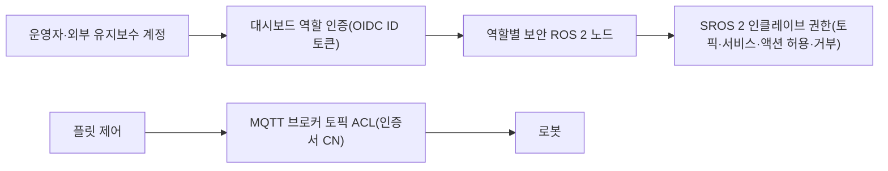

[홈](../../index.md) › [주제](../index.md) › 26. 사이버보안·접근권한·개인정보 — 대표 접근법과 기술

# 26. 사이버보안·접근권한·개인정보 — 대표 접근법과 기술

<!-- auto:page-status:start -->
<!-- auto:page-status:end -->

## 1. 세 줄 요약

- 앞 시나리오의 권한 제약을 실제로 구현하는 수단은 미들웨어(ROS 2), 오케스트레이션(Open-RMF), 로봇–관제 규격(VDA 5050)과 메시지 브로커(MQTT)의 층마다 따로 있다. [추정][^ref-405]
- 이 페이지는 [26. 사이버보안·접근권한·개인정보](../../categories/g-safety-security-intelligence-and-governance/26-cybersecurity-access-control-and-privacy.md) 페이지의 "대표 접근법과 기술" 절이 분량 기준을 넘어 옮겨 온 것이다. 원 페이지의 검증을 거친 내용이며 새 주장은 없다.

## 2. 배경

[26. 사이버보안·접근권한·개인정보](../../categories/g-safety-security-intelligence-and-governance/26-cybersecurity-access-control-and-privacy.md) 페이지를 쓰는 과정에서 "대표 접근법과 기술" 절의 분량이 세부영역 페이지 기준(4,000자)을 넘어, 내용을 줄이지 않고 이 주제 페이지로 분리했다.

## 3. 본문

앞 시나리오의 권한 제약을 실제로 구현하는 수단은 미들웨어(ROS 2), 오케스트레이션(Open-RMF), 로봇–관제 규격(VDA 5050)과 메시지 브로커(MQTT)의 층마다 따로 있다. [추정][^ref-405]

### SROS 2 접근 제어 정책과 인클레이브

SROS 2 접근 제어 정책은 XML로 인클레이브·프로파일·권한 규칙을 계층적으로 적고, 토픽(발행·구독)·서비스(요청·응답)·액션(호출·실행)마다 허용·거부를 명시하며, 거부가 같은 대상의 허용보다 우선한다. [사실][^ref-579] 이 정책은 스키마 검증과 XSLT 변환을 거쳐 DDS 권한 파일로 바뀐다. [사실][^ref-579] 한계도 있다. 한 컨텍스트를 공유하는 노드들은 한 인클레이브의 권한으로 합쳐지며, 인클레이브를 적용하는 범위는 운영체제 프로세스·사용자·장치·군집 단위로 고를 수 있다. [사실][^ref-580]

### Open-RMF의 역할 기반 접근

Open-RMF 보안 구성은 ROS 2 부분을 SROS 2(키스토어·인클레이브·서명된 권한)로 보호하고, 웹 대시보드는 TLS와 Keycloak 기반 OpenID Connect(OIDC) 사용자 인증으로 보호하며, API 서버가 역할마다 보안이 적용된 ROS 2 노드를 하나씩 두고 사용자의 ID 토큰에 따라 접근을 준다. [사실][^ref-405] 정책과 산출물은 generate_policy·generate_artifacts 도구로 만들고, 인증기관 키가 든 키스토어의 private 디렉터리는 배포 전에 제거한다. [사실][^ref-405]

### VDA 5050과 MQTT 브로커 접근 제어

[VDA 5050](../../glossary/vda-5050.md) 3.0.0 명세는 보안 통신·데이터 보호 메커니즘을 규정하지 않고 [MQTT](../../glossary/mqtt.md) 프로토콜 보안을 브로커 설정에 맡기며, 운영자·시스템 통합자·차량 제조사·플릿 제어 제공자 사이의 계획·운영·유지보수·안전 책임도 배분하지 않는다. [사실][^ref-031] Eclipse Mosquitto 브로커는 ACL 파일로 토픽마다 read·write·readwrite·deny 접근을 정하고 pattern 규칙에서 클라이언트 id(%c)·사용자 이름(%u)을 치환할 수 있으며, require_certificate와 use_identity_as_username을 함께 켜면 클라이언트 인증서의 일반 이름(CN)을 접근 제어용 사용자 이름으로 쓴다. [사실][^ref-581] 이를 조합하면 로봇별 인증서의 CN을 사용자 이름으로 쓰고 제조사·일련번호가 들어간 토픽 경로에 pattern ACL을 걸어 로봇마다 자기 토픽만 읽고 쓰게 하는 구성이 가능해 보이나, 이를 규정한 공개 표준 구성은 확인하지 못했다. [추정][^ref-031][^ref-581]

인증서 교체는 VDA 5050 3.0.0의 즉시 동작 updateCertificate가 맡는다. 로봇은 서비스(MQTT)와 로봇별 개인 키·공개 인증서(선택적으로 루트 인증서)의 내려받기 링크를 받아 인증서를 설치·활성화하며, 명령 발신자를 검증할 수 없으므로 내려받기는 TLS로 보호해야 하고(요구), 활성화 전 인증서 체인 확인은 권고한다. [사실][^ref-031] 구역 진입 통제도 규격 안에 있다. [해제 구역](../../glossary/release-zone.md)에 들어가려는 로봇은 requestType ACCESS인 zoneRequest로 허가를 요청하고 responses 토픽으로 승인을 받는다. [사실][^ref-031]

### 세 층의 권한 표현

분류 원문 질문에 비추면, 확인한 자료로는 사용자 역할(OIDC ID 토큰의 역할), ROS 2 인클레이브별 토픽·서비스·액션 허용·거부, MQTT 클라이언트별 토픽 ACL의 세 층에서 권한을 표현할 수 있으나, 로봇·명령 단위 유지보수 권한 매트릭스를 규정한 공개 표준은 찾지 못했고 VDA 5050은 이를 구현자에게 맡긴다. [추정][^ref-405][^ref-579][^ref-581][^ref-031]

## 4. 현장 시나리오

현장 시나리오는 원 페이지의 [5. 현장 시나리오 (물류 흐름의 어느 단계인지 명시)](../../categories/g-safety-security-intelligence-and-governance/26-cybersecurity-access-control-and-privacy.md) 절에 있다.

## 5. ROP 관점의 시사점

ROP가 직접 맡는 것과 외부와 연계하는 것은 원 페이지의 [9. ROP가 직접 맡는 것과 외부와 연계하는 것 (부록 A 9장 기준)](../../categories/g-safety-security-intelligence-and-governance/26-cybersecurity-access-control-and-privacy.md) 절에 있다.

## 6. 연결되는 연구영역

- 주 연구영역: [26. 사이버보안·접근권한·개인정보](../../categories/g-safety-security-intelligence-and-governance/26-cybersecurity-access-control-and-privacy.md)
- 관련 영역: [9. 로봇·제조사 관제 연동](../../categories/c-connectivity-and-execution-foundation/09-robot-and-vendor-fleet-manager-integration.md), [10. 설비·건물 시스템 연동](../../categories/c-connectivity-and-execution-foundation/10-facility-and-building-system-integration.md), [13. 작업 배정 — MRTA](../../categories/d-planning-and-optimization/13-task-allocation-mrta.md), [18. 사람–로봇 협업·운영 인터페이스](../../categories/e-collaboration-and-field-operations/18-human-robot-collaboration-and-operator-interface.md), [19. 모니터링·이상 탐지·원인 분석](../../categories/e-collaboration-and-field-operations/19-monitoring-anomaly-detection-and-root-cause-analysis.md), [24. 자산·소프트웨어 수명주기 관리](../../categories/f-deployment-verification-and-maintenance/24-asset-and-software-lifecycle-management.md), [25. 안전·위험 관리](../../categories/g-safety-security-intelligence-and-governance/25-safety-and-risk-management.md), [27. AI·학습·적응과 모델 운영](../../categories/g-safety-security-intelligence-and-governance/27-ai-learning-adaptation-and-model-operations.md), [28. 표준·상호운용성·다사업자 거버넌스](../../categories/g-safety-security-intelligence-and-governance/28-standards-interoperability-and-multi-vendor-governance.md)

## 7. 열린 질문

열린 질문은 원 페이지의 [11. 열린 질문](../../categories/g-safety-security-intelligence-and-governance/26-cybersecurity-access-control-and-privacy.md) 절과 [열린 질문](../../open-questions.md) 페이지에 모은다.

## 8. 출처

[^ref-031]: VDA / VDMA (VDA5050 GitHub), VDA5050/VDA5050 — VDA5050_EN.md (VDA 5050 Version 3.0.0), 미확인, https://github.com/VDA5050/VDA5050/blob/main/VDA5050_EN.md, 접근일 2026-09-25
[^ref-579]: Open Robotics (ROS 2 Design), ROS 2 Access Control Policies, 2019-08(최종 수정 2021-06), https://design.ros2.org/articles/ros2_access_control_policies.html, 접근일 2026-09-25
[^ref-580]: Open Robotics (ROS 2 Design), ROS 2 Security Enclaves, 2020-05(최종 수정 2020-07), https://design.ros2.org/articles/ros2_security_enclaves.html, 접근일 2026-09-25
[^ref-405]: Open Robotics (osrf/ros2multirobotbook), Programming Multiple Robots with ROS 2 — Security, 미확인, https://osrf.github.io/ros2multirobotbook/security.html, 접근일 2026-09-25
[^ref-581]: Eclipse Foundation (Eclipse Mosquitto), mosquitto.conf man page, 미확인, https://mosquitto.org/man/mosquitto-conf-5.html, 접근일 2026-09-25

## 9. 검증 노트

원 페이지와 함께 실행 2026-09-25-64 의 1차·2차 검증을 거쳤다. 분리는 코드가 했고 내용은 바꾸지 않았다.

## 10. 이력

| 날짜 | 실행 id | 변경 |
|---|---|---|
| 2026-09-25 | 2026-09-25-64 | 26. 사이버보안·접근권한·개인정보 의 "대표 접근법과 기술" 절에서 분리 |
