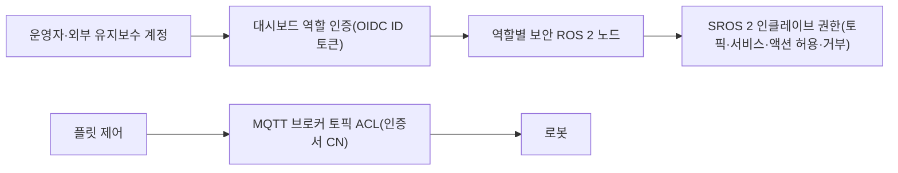

(너의 규칙은 시스템 프롬프트의 agents/shared-rules.md 와 agents/verifier.md 이다. 아래는 이번 실행의 컨텍스트와 입력이다.)

## 실행 컨텍스트

- run_id: 2026-09-25-64
- date: 2026-09-25
- run_type: area_deep_dive (영역 심화)
- 대상: 26. 사이버보안·접근권한·개인정보 (G. 안전·보안·지능·거버넌스)
- 예산:
    - max_search_queries: 30
    - max_sources_per_run: 15
    - new_topic_pages: 1
    - page_updates: 2
    - max_retries: 2
- 환경 알림: web_fetch_available: false · fetch_mode: mirror_only (일반 웹 페이지 열람은 네트워크 정책으로 막혀 있다. raw.githubusercontent.com 은 열린다: 공식 문서가 GitHub 에 있는 출처는 입력의 config/source_mirrors.yaml 경로를 WebFetch 로 열어 원문을 읽고 sources[].fetched=true, fetched_via=github_raw, fetch_url 을 적는다. 입력에 원문 텍스트(data/source_texts)가 있는 출처는 fetched_via=inbox. 그 밖의 출처는 fetched=false 이며 코드가 신뢰도 상한(medium)을 강제한다 — 공통 규칙 0절 6항)
- 언어: ko
- verification_stage: second
- verifier_budget:
    - max_search_queries: 30
    - max_sources_per_run: 15
    - new_topic_pages: 1
    - page_updates: 2
    - max_retries: 2

## 입력

### runs/2026-09-25-64/target.json

```json
{
  "run_id": "2026-09-25-64",
  "date": "2026-09-25",
  "weekday": "Fri",
  "run_number": 64,
  "run_type": "area_deep_dive",
  "forced": true,
  "target": {
    "area_no": 26,
    "area_name": "26. 사이버보안·접근권한·개인정보",
    "category": "G. 안전·보안·지능·거버넌스",
    "category_letter": "G"
  },
  "topic": null,
  "track": null,
  "corrections": [],
  "budget": {
    "max_search_queries": 30,
    "max_sources_per_run": 15,
    "new_topic_pages": 1,
    "page_updates": 2,
    "max_retries": 2
  },
  "priority_reason": null,
  "priority_questions": [],
  "excluded_areas": [],
  "lifted_areas": [],
  "deferred": {
    "monthly_recheck": false,
    "weekly_review": false
  },
  "selection_rationale": "CLI 지정 run_type=area_deep_dive, area=26"
}
```

### runs/2026-09-25-64/research.json

```json
{
  "run_id": "2026-09-25-64",
  "date": "2026-09-25",
  "run_type": "area_deep_dive",
  "target": {
    "area_no": 26,
    "area_name": "26. 사이버보안·접근권한·개인정보",
    "category": "G. 안전·보안·지능·거버넌스"
  },
  "gaps": [
    "섹션 3. 왜 중요한가 비어 있음",
    "섹션 4. 핵심 개념과 용어 비어 있음(인증·접근 제어·인클레이브·보안 구역과 도관·이동형 영상정보처리기기)",
    "섹션 5. 현장 시나리오 비어 있음(물류 흐름 단계 명시 필요)",
    "섹션 6. 대표 접근법과 기술 비어 있음(SROS 2 권한, MQTT 접근 제어, 대시보드 역할 인증, 인증서 교체)",
    "섹션 7. 관련 표준·프레임워크·오픈소스 비어 있음",
    "섹션 8. 대표 연구와 자료 비어 있음",
    "섹션 9. ROP가 직접 맡는 것과 외부와 연계하는 것 비어 있음",
    "섹션 10. 다른 연구영역과의 연결 비어 있음",
    "섹션 11. 열린 질문 비어 있음(대상 영역에 걸린 열린 질문 oq-043, oq-056, oq-082 반영 필요)"
  ],
  "research_questions": [
    "외부 유지보수 계정이 어느 로봇에 어떤 명령까지 내릴 수 있는가? [분류원문]",
    "ROS 2(SROS 2), Open-RMF, VDA 5050, MQTT 브로커는 장비 인증·통신 보호·명령 권한을 어떤 구조로 제공하거나 구현자에게 맡기는가? (섹션 4·6·7 겨냥)",
    "산업 보안 표준·규제(IEC 62443, NIST SP 800-82, ISO 10218-1:2025, EU 기계 규정, EU 사이버 복원력법)는 로봇·관제 시스템에 무엇을 요구하는가? (섹션 3·7 겨냥)",
    "물류 로봇·관제 소프트웨어에서 공개된 실제 취약점 사례는 무엇이며 어떤 영향을 보고했는가? (섹션 3·8 겨냥)",
    "로봇 카메라 영상과 작업자 데이터 보호에 적용되는 한국 법규·가이드(개인정보 보호법 이동형 영상정보처리기기, 근로자 감시 설비, KISA 로봇 보안 자료)는 무엇인가? (섹션 5·9 겨냥, 한국 자료 우선)",
    "대상 영역 열린 질문 oq-043(출입통제 연동 권한), oq-056(SROS 2 인클레이브 단위), oq-082(관제 보고값 위조 검증)에 답할 근거가 있는가? (섹션 10·11 겨냥)",
    "고객별 격리와 원격 접속 중개 가운데 ROP가 직접 맡을 부분과 제조사·IT 조직에 맡길 부분은 어떻게 나뉘는가? (섹션 9 겨냥)"
  ],
  "findings": [
    {
      "id": "f1",
      "claim": "ROS 2 보안은 DDS-Security 의 다섯 플러그인 가운데 인증·접근 제어·암호 세 가지만 쓰며, 참여자마다 도메인 보호 방식을 정한 서명된 거버넌스 파일과 참여자 권한을 담은 서명된 권한 파일을 둔다.",
      "tag": "사실",
      "source_ids": [
        "ref-009"
      ],
      "cross_checked": false,
      "confidence": "medium",
      "evidence_excerpt": "인증 플러그인은 PKI 로 참여자 신원을 확인하고, 접근 제어 플러그인은 참여자의 DDS 기능 제한을 정의·집행한다. 권한 파일은 \"A signed XML document containing the permissions of the domain participant\". 로깅·데이터 태깅은 규격 준수에 필요하지 않아 쓰지 않는다. (발행일 미확인, 확인일 기준)",
      "as_of": "2026-09-25",
      "flow_step": null,
      "flow_item": null
    },
    {
      "id": "f2",
      "claim": "SROS 2 접근 제어 정책은 XML 로 인클레이브·프로파일·권한 규칙을 계층적으로 적고, 토픽(발행·구독)·서비스(요청·응답)·액션(호출·실행)마다 허용·거부를 명시하며, 거부가 같은 대상의 허용보다 우선하고 XSLT 로 DDS 권한 파일로 변환된다.",
      "tag": "사실",
      "source_ids": [
        "ref-610"
      ],
      "cross_checked": false,
      "confidence": "medium",
      "evidence_excerpt": "\"privileges must be explicitly qualified as allowed\"; 거부된 권한은 같은 범위의 허용 권한을 누른다. 변환 과정은 XInclude 확장 → 스키마 검증 → 프로파일별 가지치기 → XSLT 변환이며, 권한은 거부 우선으로 정렬된다. (발행일 미확인, 확인일 기준)",
      "as_of": "2026-09-25",
      "flow_step": null,
      "flow_item": "제약"
    },
    {
      "id": "f3",
      "claim": "SROS 2 인클레이브는 인증서·키·거버넌스·권한 파일을 묶은 하나의 보안 신원이며, 한 컨텍스트를 공유하는 노드들은 한 인클레이브의 권한으로 합쳐지고, 인클레이브를 적용하는 범위는 운영체제 프로세스·사용자·장치·군집 단위로 고를 수 있다.",
      "tag": "사실",
      "source_ids": [
        "ref-611"
      ],
      "cross_checked": false,
      "confidence": "medium",
      "evidence_excerpt": "DDS Security 1.1 에서 참여자는 보안 신원 하나만 쓸 수 있어 같은 컨텍스트의 노드 권한이 한 인클레이브로 통합된다. 배포 시 인클레이브 적용 범위를 조절해 모델 충실도를 정한다. (발행일 미확인, 확인일 기준)",
      "as_of": "2026-09-25",
      "flow_step": null,
      "flow_item": null
    },
    {
      "id": "f4",
      "claim": "Open-RMF 보안 구성은 ROS 2 부분을 SROS 2(키스토어·인클레이브·서명된 권한)로 보호하고, 웹 대시보드는 TLS 와 Keycloak 기반 OpenID Connect 사용자 인증으로 보호하며, API 서버가 역할마다 보안이 적용된 ROS 2 노드를 하나씩 두고 사용자의 ID 토큰에 따라 접근을 준다.",
      "tag": "사실",
      "source_ids": [
        "ref-405"
      ],
      "cross_checked": false,
      "confidence": "medium",
      "evidence_excerpt": "\"The api server runs a secured ROS 2 node per each role and provides access to them based on the id token of each user.\" 키스토어의 private 디렉터리(CA 키)는 배포 전에 제거한다. generate_policy·generate_artifacts 도구로 정책과 산출물을 만든다. (발행일 미확인, 확인일 기준)",
      "as_of": "2026-09-25",
      "flow_step": null,
      "flow_item": "수행 자원"
    },
    {
      "id": "f5",
      "claim": "ROS 2 로봇 시스템 위협 모델(초안)은 보안이 꺼져 있으면 어떤 노드든 어떤 토픽에나 발행할 수 있어 구성요소 신원 위조·명령 가로채기가 가능하고, 기본 자격증명의 SSH 같은 원격 접속이 권한 상승 경로가 되며, 카메라 영상·로그가 보호해야 할 민감 자산이고 빌드 팜·서드파티 구성요소를 통한 공급망 위협이 있다고 정리한다.",
      "tag": "사실",
      "source_ids": [
        "ref-010"
      ],
      "cross_checked": false,
      "confidence": "medium",
      "evidence_excerpt": "TurtleBot 3·MARA 를 예로 든 초안 문서. 보안 미적용 시 \"any node can publish to any topic\". 완화책: SROS 활성화, 권한 파일, TPM 에 자격증명 보관, 바이너리 서명, 설정 변경·자격증명 사용 감사. (발행일 미확인, 확인일 기준)",
      "as_of": "2026-09-25",
      "flow_step": null,
      "flow_item": "예외·성과"
    },
    {
      "id": "f6",
      "claim": "VDA 5050 3.0.0 명세는 보안 통신·데이터 보호의 메커니즘을 규정하지 않고 MQTT 프로토콜 보안을 브로커 설정에 맡기며, 운영자·시스템 통합자·차량 제조사·플릿 제어 제공자 사이의 안전·보안 책임도 배분하지 않는다고 적는다.",
      "tag": "사실",
      "source_ids": [
        "ref-031"
      ],
      "cross_checked": false,
      "confidence": "medium",
      "evidence_excerpt": "\"Cybersecurity Measures: Mechanisms, technologies, or processes for secure communication or data protection are not specified.\" 프로토콜 보안은 브로커 설정에서 고려해야 하나 이 지침은 다루지 않는다. 데이터 보호 요구도 없다. (발행일 미확인, 확인일 기준)",
      "as_of": "2026-09-25",
      "flow_step": null,
      "flow_item": null
    },
    {
      "id": "f7",
      "claim": "VDA 5050 3.0.0 의 즉시 동작 updateCertificate 는 서비스(MQTT)와 로봇별 개인 키·공개 인증서(선택적으로 루트 인증서)의 내려받기 링크를 받아 인증서를 설치·활성화하며, 명령 발신자를 검증할 수 없으므로 내려받기도 TLS 로 보호하고 활성화 전 인증서 체인을 확인하도록 권고한다.",
      "tag": "사실",
      "source_ids": [
        "ref-031"
      ],
      "cross_checked": false,
      "confidence": "medium",
      "evidence_excerpt": "매개변수 service, keyDownloadLink, certificateDownloadLink, certificateAuthorityDownloadLink(선택). 상태 RUNNING(내려받기·설치 중) → FINISHED(활성) 또는 FAILED. 체인 검증 권고. (발행일 미확인, 확인일 기준)",
      "as_of": "2026-09-25",
      "flow_step": null,
      "flow_item": null
    },
    {
      "id": "f8",
      "claim": "VDA 5050 3.0.0 에서 RELEASE 유형 구역은 플릿 제어가 진입을 허가한 뒤에만 로봇이 들어갈 수 있고, 로봇은 requestType ACCESS 인 zoneRequest 로 허가를 요청해 responses 토픽으로 승인을 받는다.",
      "tag": "사실",
      "source_ids": [
        "ref-031"
      ],
      "cross_checked": false,
      "confidence": "medium",
      "evidence_excerpt": "RELEASE 구역: 로봇은 플릿 제어로부터 접근 허가를 받은 뒤에만 진입할 수 있다. 요청은 zoneRequest(requestType ACCESS), 승인은 responses 토픽. (발행일 미확인, 확인일 기준)",
      "as_of": "2026-09-25",
      "flow_step": null,
      "flow_item": "제약"
    },
    {
      "id": "f9",
      "claim": "Eclipse Mosquitto MQTT 브로커는 ACL 파일로 토픽마다 read·write·readwrite·deny 접근을 정하고 pattern 규칙에서 클라이언트 id(%c)·사용자 이름(%u)을 치환할 수 있으며, require_certificate 와 use_identity_as_username 을 함께 켜면 클라이언트 인증서의 일반 이름(CN)을 접근 제어용 사용자 이름으로 쓴다.",
      "tag": "사실",
      "source_ids": [
        "ref-613"
      ],
      "cross_checked": false,
      "confidence": "medium",
      "evidence_excerpt": "형식 topic [read|write|readwrite|deny] <topic>, pattern ... 에서 %c·%u 치환. require_certificate 가 참이면 유효한 인증서가 있어야 접속되고, use_identity_as_username 이면 인증서 CN 이 사용자 이름이 된다. (발행일 미확인, 확인일 기준)",
      "as_of": "2026-09-25",
      "flow_step": null,
      "flow_item": "제약"
    },
    {
      "id": "f10",
      "claim": "VDA 5050 이 보안을 브로커 설정에 맡기므로, 로봇별 인증서(updateCertificate)의 CN 을 사용자 이름으로 쓰고 제조사·일련번호가 들어간 토픽 경로에 pattern ACL 을 걸면 로봇마다 자기 토픽만 읽고 쓰게 제한하는 구성이 가능해 보이나, 이를 규정한 공개 표준 구성은 확인하지 못했다.",
      "tag": "추정",
      "source_ids": [
        "ref-031",
        "ref-613"
      ],
      "cross_checked": false,
      "confidence": "low",
      "evidence_excerpt": "f6·f7·f9 의 조합에서 도출한 구성안이며 원문이 직접 권고한 것은 아니다. (발행일 미확인, 확인일 기준)",
      "as_of": "2026-09-25",
      "flow_step": null,
      "flow_item": "제약"
    },
    {
      "id": "f11",
      "claim": "IEC 62443-3-3 은 IEC 62443-1-1 의 7개 기본 요구(식별·인증 제어, 사용 제어, 시스템 무결성, 데이터 기밀성, 데이터 흐름 제한, 사건 적시 대응, 자원 가용성)에 딸린 제어 시스템 기술 요구와 제어 시스템 능력 보안 수준을 정의한다.",
      "tag": "사실",
      "source_ids": [
        "ref-617"
      ],
      "cross_checked": false,
      "confidence": "medium",
      "evidence_excerpt": "원문 미열람. 판매 목록 소개: IEC 62443-3-3:2013 채택판(2013-08 초판)으로, 7개 기본 요구에 연관된 시스템 요구와 보안 수준을 정의한다. 보안 수준은 1~4 로 엄격해진다(검색 요약 기준).",
      "as_of": "2013-08",
      "flow_step": null,
      "flow_item": null,
      "source_unopened": true
    },
    {
      "id": "f12",
      "claim": "IEC 62443 의 보안 구역(zone)은 기능·논리·물리적 관계에 따라 묶여 공통 보안 요구를 공유하는 시스템·구성요소 집합이고, 도관(conduit)은 두 개 이상의 구역을 잇는 통신 채널의 묶음으로 구역 경계에서 통신을 제한·여과하는 역할을 한다.",
      "tag": "사실",
      "source_ids": [
        "ref-618"
      ],
      "cross_checked": false,
      "confidence": "medium",
      "evidence_excerpt": "원문 미열람. 구역과 도관 개념을 다룬 논문의 검색 요약: 위험 평가에 따라 IACS 부분마다 보안 수준이 다를 수 있고, 구역 간 통신은 도관을 통한다. (발행일 미확인, 확인일 기준)",
      "as_of": "2026-09-25",
      "flow_step": null,
      "flow_item": null,
      "source_unopened": true
    },
    {
      "id": "f13",
      "claim": "MiR 는 자사 AMR 이 암호화 통신·접근 제어·보안 부팅을 쓰고 MiR Fleet Enterprise 가 IEC 62443-4-2(SL-C 3)에 맞춰 설계됐다고 밝힌다.",
      "tag": "추정",
      "source_ids": [
        "ref-619"
      ],
      "cross_checked": false,
      "confidence": "low",
      "evidence_excerpt": "벤더 주장: MiR Fleet Enterprise is built to align with IEC 62443 Part 4-2 (SL-C 3). 독립 인증 문서는 확인하지 못했다. (발행일 미확인, 확인일 기준)",
      "as_of": "2026-09-25",
      "flow_step": null,
      "flow_item": null,
      "source_unopened": true,
      "vendor_claim": true
    },
    {
      "id": "f14",
      "claim": "미국 CISA 의 ICS 권고 ICSA-21-280-02 는 Alias Robotics 가 보고한 MiR 차량·MiR Fleet 소프트웨어의 복수 취약점(부적절한 접근 제어, 중요 기능 인증 누락, 민감 데이터 암호화 누락 등)을 공지했고, 악용되면 권한 상승·데이터 유출·로봇 제어·서비스 거부가 가능하다고 했다.",
      "tag": "사실",
      "source_ids": [
        "ref-616"
      ],
      "cross_checked": false,
      "confidence": "medium",
      "evidence_excerpt": "원문 미열람. 검색 요약: 취약점 유형은 improper access control, missing authentication for critical function, missing encryption of sensitive data 등이며 영향은 privilege escalation, data exfiltration, control of the robot, DoS. (발행일 미확인, 확인일 기준)",
      "as_of": "2026-09-25",
      "flow_step": null,
      "flow_item": "예외·성과",
      "source_unopened": true
    },
    {
      "id": "f15",
      "claim": "2025년 개정 ISO 10218-1 은 산업용 로봇 안전에 적용되는 범위에서 사이버보안 요구를 포함한다.",
      "tag": "사실",
      "source_ids": [
        "ref-471"
      ],
      "cross_checked": false,
      "confidence": "medium",
      "evidence_excerpt": "원문 미열람. 검색 요약: The 2025 revision of ISO 10218-1 includes requirements for cybersecurity to the extent that it applies to industrial robot safety. 조항 내용은 미확인. (발행일 미확인, 확인일 기준)",
      "as_of": "2026-09-25",
      "flow_step": null,
      "flow_item": null,
      "source_unopened": true
    },
    {
      "id": "f16",
      "claim": "EU 기계 규정 (EU) 2023/1230 은 부속서 III 1.1.9 에서 기계의 안전 기능이 우발적·악의적 손상(corruption)으로부터 보호되도록 설계할 것을 요구하며, 이 규정은 2027-01-20 부터 적용된다.",
      "tag": "사실",
      "source_ids": [
        "ref-555"
      ],
      "cross_checked": false,
      "confidence": "medium",
      "evidence_excerpt": "원문 미열람. 검색 요약: 안전 관련 제어 시스템·소프트웨어는 우발적 고장과 의도적 사이버 공격 모두에 대해 보호되어야 한다(Annex III 1.1.9). 적용일은 이전 브리프 값 (재인용: 2026-09-25-61)",
      "as_of": "2023-06",
      "flow_step": null,
      "flow_item": null,
      "source_unopened": true
    },
    {
      "id": "f17",
      "claim": "EU 사이버 복원력법(Cyber Resilience Act)은 다른 기기·네트워크와 데이터 연결이 있는 하드웨어·소프트웨어 '디지털 요소가 있는 제품'에 적용되며, 제14조 보고 의무는 2026-09-11 부터, 필수 사이버보안 요구·취약점 처리 등 나머지 주요 의무는 2027-12-11 부터 적용된다.",
      "tag": "사실",
      "source_ids": [
        "ref-624"
      ],
      "cross_checked": false,
      "confidence": "medium",
      "evidence_excerpt": "원문 미열람. 검색 요약: reporting obligations set out in Article 14 apply from 11 September 2026; 나머지 의무는 11 December 2027 부터. 보고 의무는 이미 시장에 나온 제품에도 적용된다. (발행일 미확인, 확인일 기준)",
      "as_of": "2026-09-25",
      "flow_step": null,
      "flow_item": null,
      "source_unopened": true
    },
    {
      "id": "f18",
      "claim": "NIST SP 800-82 Rev. 3(2023-09)은 제목을 운영 기술(OT) 보안 지침으로 바꾸고 범위를 건물 자동화·물리적 출입통제·산업용 IoT 로 넓혔으며, NIST SP 800-53 Rev. 5 통제 목록에 대한 OT 오버레이를 제공한다.",
      "tag": "사실",
      "source_ids": [
        "ref-615"
      ],
      "cross_checked": false,
      "confidence": "medium",
      "evidence_excerpt": "원문 미열람. 검색 요약: OT 개요·위협·취약점과 권장 대응책, 위험 관리·접근 제어·사고 대응·네트워크 분할(구역·DMZ)·원격 접속 패턴을 다룬다.",
      "as_of": "2023-09",
      "flow_step": null,
      "flow_item": null,
      "source_unopened": true
    },
    {
      "id": "f19",
      "claim": "개인정보 보호법 제25조의2는 업무 목적으로 이동형 영상정보처리기기를 운영하는 자가 공개된 장소에서 사람 또는 관련 사물의 영상을 촬영하는 것을 원칙적으로 제한하되, 촬영 사실을 명확히 표시해 정보주체가 거부하지 않은 경우 등을 허용하고, 촬영 시 불빛·소리·안내판 등으로 촬영 사실을 알리도록 한다.",
      "tag": "사실",
      "source_ids": [
        "ref-620"
      ],
      "cross_checked": false,
      "confidence": "medium",
      "evidence_excerpt": "원문 미열람. 검색 요약: 목욕실·화장실 등 사생활 침해 우려가 큰 장소 촬영 금지, 제15조제1항 해당 또는 촬영 사실 표시 후 거부 의사가 없는 경우 등 허용, 대통령령에 따라 불빛·소리·안내판 등으로 표시. (발행일 미확인, 확인일 기준)",
      "as_of": "2026-09-25",
      "flow_step": null,
      "flow_item": "제약",
      "source_unopened": true
    },
    {
      "id": "f20",
      "claim": "개인정보보호위원회의 '이동형 영상정보처리기기를 위한 개인영상정보 보호·활용 안내서'는 자율주행차·배달로봇 등이 촬영 영상을 AI 개발에 쓰려면 기기 외부에 촬영 사실을 표시하고, 공개된 장소의 불특정 다수 영상은 원칙적으로 가명처리 후 활용하며, 원본 활용은 규제샌드박스 실증특례로 안전조치를 지킬 때만 가능하다고 안내한다.",
      "tag": "사실",
      "source_ids": [
        "ref-621"
      ],
      "cross_checked": false,
      "confidence": "medium",
      "evidence_excerpt": "원문 미열람. 검색 요약: 차량이나 로봇 외부에 촬영 사실과 구체적 내용 표시, 얼굴 모자이크 등 가명처리 후 활용, 원본은 실증특례 조건부. 안내서 발행일은 미확인. (발행일 미확인, 확인일 기준)",
      "as_of": "2026-09-25",
      "flow_step": null,
      "flow_item": "제약",
      "source_unopened": true
    },
    {
      "id": "f21",
      "claim": "근로자참여 및 협력증진에 관한 법률은 '사업장 내 근로자 감시 설비의 설치'를 노사협의회의 협의 사항으로 정한다.",
      "tag": "사실",
      "source_ids": [
        "ref-622"
      ],
      "cross_checked": false,
      "confidence": "medium",
      "evidence_excerpt": "원문 미열람. 검색 요약: 제20조 제1항 제14호 '사업장 내 근로자 감시 설비의 설치'가 노사협의회 협의 사항이다. 조항 번호는 판에 따라 다를 수 있어 원문 확인 필요. (발행일 미확인, 확인일 기준)",
      "as_of": "2026-09-25",
      "flow_step": null,
      "flow_item": "제약",
      "source_unopened": true
    },
    {
      "id": "f22",
      "claim": "한국인터넷진흥원(KISA)은 지식플랫폼에 '로봇 보안취약점 점검 체크리스트 해설서'를 게시해 로봇 보안 취약점 점검 항목을 안내한다.",
      "tag": "사실",
      "source_ids": [
        "ref-623"
      ],
      "cross_checked": false,
      "confidence": "medium",
      "evidence_excerpt": "원문 미열람. 검색 결과로 게시물 존재와 제목만 확인했다. 항목 수·범주는 검색 요약끼리 달라 넣지 않았다. (발행일 미확인, 확인일 기준)",
      "as_of": "2026-09-25",
      "flow_step": null,
      "flow_item": null,
      "source_unopened": true
    },
    {
      "id": "f23",
      "claim": "분류 원문 질문 '외부 유지보수 계정이 어느 로봇에 어떤 명령까지 내릴 수 있는가?'에 대해, 확인한 자료로는 사용자 역할(OIDC ID 토큰의 역할), ROS 2 인클레이브별 토픽·서비스·액션 허용·거부, MQTT 클라이언트별 토픽 ACL 의 세 층에서 권한을 표현할 수 있으나, 로봇·명령 단위 유지보수 권한 매트릭스를 규정한 공개 표준은 찾지 못했고 VDA 5050 은 이를 구현자에게 맡긴다.",
      "tag": "추정",
      "source_ids": [
        "ref-405",
        "ref-610",
        "ref-613",
        "ref-031"
      ],
      "cross_checked": false,
      "confidence": "low",
      "evidence_excerpt": "f2·f4·f6·f9 를 종합한 이 위키의 판단이다. 부재는 검색 범위의 관찰이다. (발행일 미확인, 확인일 기준)",
      "as_of": "2026-09-25",
      "flow_step": null,
      "flow_item": "수행 자원"
    },
    {
      "id": "f24",
      "claim": "출하 마감 시간대에 제조사 원격 유지보수 엔지니어가 로봇 한 대의 진단 접속을 요청하면, 기본 자격증명·인증 없는 원격 접속이 권한 상승·로봇 제어로 이어질 수 있으므로 ROP 는 대상 로봇·진단 명령만 허용하고 이동 명령은 막으며 세션을 감사 기록으로 남기는 제약이 필요해 보인다.",
      "tag": "추정",
      "source_ids": [
        "ref-010",
        "ref-616",
        "ref-405"
      ],
      "cross_checked": false,
      "confidence": "low",
      "evidence_excerpt": "f5(원격 접속 위협)·f14(실제 취약점 영향)·f4(역할 기반 접근)에서 도출한 시나리오다. (발행일 미확인, 확인일 기준)",
      "as_of": "2026-09-25",
      "flow_step": "출하",
      "flow_item": "제약",
      "source_unopened": false
    },
    {
      "id": "f25",
      "claim": "입고 도크에서 카메라를 단 AMR 이 작업자를 촬영하는 경우, 물류센터 내부가 개인정보 보호법 제25조의2의 '공개된 장소'인지는 불분명하고 근로자 감시 설비로서 노사협의회 협의 대상이 될 수 있어, 영상 수집·보관·학습 활용 조건이 입고 작업의 제약으로 작용할 것으로 보인다.",
      "tag": "추정",
      "source_ids": [
        "ref-620",
        "ref-622",
        "ref-010"
      ],
      "cross_checked": false,
      "confidence": "low",
      "evidence_excerpt": "f19·f21 의 규정과 f5(카메라 영상은 민감 자산)를 물류 현장에 적용한 추정이며 공식 해석은 확인하지 못했다. (발행일 미확인, 확인일 기준)",
      "as_of": "2026-09-25",
      "flow_step": "입고",
      "flow_item": "제약",
      "source_unopened": false
    },
    {
      "id": "f26",
      "claim": "ROP 가 직접 맡을 보안 몫은 누가 어느 로봇·설비에 어떤 명령을 내릴 수 있는지의 권한 정책, 외부 유지보수 접속의 중개·감사 기록, 고객별 작업·데이터 격리, 영상 데이터 접근 정책, 로봇 인증서 교체(updateCertificate) 같은 보안 명령의 조율로 보인다.",
      "tag": "추정",
      "source_ids": [
        "ref-031",
        "ref-405",
        "ref-010"
      ],
      "cross_checked": false,
      "confidence": "low",
      "evidence_excerpt": "분류 원문 9장의 경계(로봇 자체 제어는 제조사, ROP 는 인터페이스와 실행 보장)에 f4·f6·f7 을 대입한 추정이다. (발행일 미확인, 확인일 기준)",
      "as_of": "2026-09-25",
      "flow_step": null,
      "flow_item": "수행 자원"
    },
    {
      "id": "f27",
      "claim": "연계 대상: 로봇 내부 보안(보안 부팅, 펌웨어 서명, 자격증명 보관, 안전 PLC 설정 보호)과 로봇 안전 기능의 사이버보안 설계는 제조사 몫이고, 네트워크 분할 장비·사용자 신원 제공자는 현장 IT·OT 조직 몫이며, ROP 는 그 결과와 인터페이스를 받아 쓰는 쪽으로 보인다.",
      "tag": "추정",
      "source_ids": [
        "ref-010",
        "ref-616",
        "ref-471"
      ],
      "cross_checked": false,
      "confidence": "low",
      "evidence_excerpt": "f5(TPM·바이너리 서명 완화책), f14(제조사 제품 취약점), f15(로봇 안전 표준의 사이버보안 요구)를 경계 판단에 쓴 추정이다. (발행일 미확인, 확인일 기준)",
      "as_of": "2026-09-25",
      "flow_step": null,
      "flow_item": null,
      "source_unopened": false
    },
    {
      "id": "f28",
      "claim": "26. 사이버보안·접근권한·개인정보는 로봇 안전 기능의 사이버보안(25. 안전·위험 관리), 규격이 비워 둔 보안 책임 배분(28. 표준·상호운용성·다사업자 거버넌스), 운영자 역할 인증(18. 사람–로봇 협업·운영 인터페이스), 영상의 AI 학습 활용(27. AI·학습·적응과 모델 운영)과 맞물리는 것으로 보인다.",
      "tag": "추정",
      "source_ids": [
        "ref-471",
        "ref-031",
        "ref-405",
        "ref-621"
      ],
      "cross_checked": false,
      "confidence": "low",
      "evidence_excerpt": "f15·f6·f4·f20 을 연결 근거로 쓴 추정. 10. 설비·건물 시스템 연동(oq-043·oq-056), 13. 작업 배정 — MRTA(oq-082), 24. 자산·소프트웨어 수명주기 관리(패치)와의 연결은 기존 열린 질문·페이지에 근거. (발행일 미확인, 확인일 기준)",
      "as_of": "2026-09-25",
      "flow_step": null,
      "flow_item": null,
      "source_unopened": false
    },
    {
      "id": "f29",
      "claim": "확인한 VDA 5050·SROS 2·Open-RMF 문서는 고객(화주)별 작업·데이터 격리를 규정하지 않아, 공유 창고에서 고객별 격리는 인클레이브 범위나 대시보드 역할 같은 일반 수단을 ROP 가 조합해 설계해야 할 것으로 보인다.",
      "tag": "추정",
      "source_ids": [
        "ref-031",
        "ref-611",
        "ref-405"
      ],
      "cross_checked": false,
      "confidence": "low",
      "evidence_excerpt": "세 문서를 읽은 범위에서 테넌트·고객 격리 개념을 찾지 못했다는 관찰이며 부재 확인은 아니다. (발행일 미확인, 확인일 기준)",
      "as_of": "2026-09-25",
      "flow_step": null,
      "flow_item": "제약"
    },
    {
      "id": "f30",
      "claim": "oq-082 와 관련해, DDS 인증은 메시지를 보낸 참여자의 신원을 확인해 구성요소 위조를 막지만 위치·배터리 같은 보고값 내용의 참·거짓은 검증하지 않으므로, 오염된 보고값 검증은 인증과 별도의 타당성 검사가 필요해 보인다.",
      "tag": "추정",
      "source_ids": [
        "ref-009",
        "ref-010"
      ],
      "cross_checked": false,
      "confidence": "low",
      "evidence_excerpt": "f1(인증은 신원 확인)과 f5(신원 위조 위협)에서 도출. 보고값 타당성 검사 기준을 다룬 공개 자료는 이번에 확인하지 못했다. (발행일 미확인, 확인일 기준)",
      "as_of": "2026-09-25",
      "flow_step": null,
      "flow_item": "예외·성과"
    }
  ],
  "sources": [
    {
      "id": "ref-009",
      "org": "Open Robotics (ROS 2 Design)",
      "title": "ROS 2 DDS-Security integration",
      "published": null,
      "url": "https://design.ros2.org/articles/ros2_dds_security.html",
      "type": "오픈소스 문서",
      "reliability": "medium",
      "accessed": "2026-09-25",
      "summary": "ROS 2 가 쓰는 DDS-Security 플러그인(인증·접근 제어·암호)과 서명된 거버넌스·권한 파일 구조.",
      "fetched": true,
      "fetched_via": "github_raw",
      "fetch_url": "https://raw.githubusercontent.com/ros2/design/gh-pages/articles/180_ros2_dds_security.md",
      "source_unopened": false
    },
    {
      "id": "ref-010",
      "org": "Open Robotics (ROS 2 Design)",
      "title": "ROS 2 Robotic Systems Threat Model",
      "published": null,
      "url": "https://design.ros2.org/articles/ros2_threat_model.html",
      "type": "오픈소스 문서",
      "reliability": "medium",
      "accessed": "2026-09-25",
      "summary": "ROS 2 로봇 시스템 위협 모델 초안. 통신 위조, 물리 접근, 공급망, 데이터 프라이버시, 원격 접속 위협과 완화책.",
      "fetched": true,
      "fetched_via": "github_raw",
      "fetch_url": "https://raw.githubusercontent.com/ros2/design/gh-pages/articles/183_ros2_threat_model.md",
      "source_unopened": false
    },
    {
      "id": "ref-031",
      "org": "VDA / VDMA (VDA5050 GitHub)",
      "title": "VDA5050/VDA5050 — VDA5050_EN.md (VDA 5050 Version 3.0.0)",
      "published": null,
      "url": "https://github.com/VDA5050/VDA5050/blob/main/VDA5050_EN.md",
      "type": "표준",
      "reliability": "medium",
      "accessed": "2026-09-25",
      "summary": "VDA 5050 3.0.0 명세 원문. 이번 실행에서는 보안 범위 제외 문구, updateCertificate 즉시 동작, RELEASE 구역 접근 허가를 확인했다.",
      "fetched": true,
      "fetched_via": "github_raw",
      "fetch_url": "https://raw.githubusercontent.com/VDA5050/VDA5050/main/VDA5050_EN.md",
      "source_unopened": false
    },
    {
      "id": "ref-555",
      "org": "European Union (EUR-Lex)",
      "title": "Regulation (EU) 2023/1230 of the European Parliament and of the Council on machinery",
      "published": "2023-06",
      "url": "https://eur-lex.europa.eu/eli/reg/2023/1230/oj/eng",
      "type": "정부·연구기관",
      "reliability": "medium",
      "accessed": "2026-09-25",
      "summary": "원문 미열람. EU 기계 규정. 2027-01-20 적용, 부속서 III 1.1.9 손상(corruption)으로부터의 보호 요구.",
      "source_unopened": true,
      "fetched": false,
      "fetched_via": null,
      "fetch_url": null
    },
    {
      "id": "ref-610",
      "org": "Open Robotics (ROS 2 Design)",
      "title": "ROS 2 Access Control Policies",
      "published": null,
      "url": "https://design.ros2.org/articles/ros2_access_control_policies.html",
      "type": "오픈소스 문서",
      "reliability": "medium",
      "accessed": "2026-09-25",
      "summary": "SROS 2 접근 제어 정책의 XML 구조(인클레이브·프로파일·권한), 토픽·서비스·액션별 허용·거부와 DDS 권한 파일로의 변환 과정.",
      "fetched": true,
      "fetched_via": "github_raw",
      "fetch_url": "https://raw.githubusercontent.com/ros2/design/gh-pages/articles/181_ros2_access_control_policies.md",
      "source_unopened": false
    },
    {
      "id": "ref-611",
      "org": "Open Robotics (ROS 2 Design)",
      "title": "ROS 2 Security Enclaves",
      "published": null,
      "url": "https://design.ros2.org/articles/ros2_security_enclaves.html",
      "type": "오픈소스 문서",
      "reliability": "medium",
      "accessed": "2026-09-25",
      "summary": "SROS 2 인클레이브의 정의와 컨텍스트·프로세스와의 대응, 인클레이브 적용 범위 선택 근거.",
      "fetched": true,
      "fetched_via": "github_raw",
      "fetch_url": "https://raw.githubusercontent.com/ros2/design/gh-pages/articles/182_ros2_security_enclaves.md",
      "source_unopened": false
    },
    {
      "id": "ref-405",
      "org": "Open Robotics (osrf/ros2multirobotbook)",
      "title": "Programming Multiple Robots with ROS 2 — Security",
      "published": null,
      "url": "https://osrf.github.io/ros2multirobotbook/security.html",
      "type": "오픈소스 문서",
      "reliability": "medium",
      "accessed": "2026-09-25",
      "summary": "Open-RMF 보안 구성: SROS 2 키스토어·인클레이브·권한 생성 도구, 대시보드의 TLS·Keycloak OIDC 인증과 역할별 보안 노드.",
      "fetched": true,
      "fetched_via": "github_raw",
      "fetch_url": "https://raw.githubusercontent.com/osrf/ros2multirobotbook/master/src/security.md",
      "source_unopened": false
    },
    {
      "id": "ref-613",
      "org": "Eclipse Foundation (Eclipse Mosquitto)",
      "title": "mosquitto.conf man page",
      "published": null,
      "url": "https://mosquitto.org/man/mosquitto-conf-5.html",
      "type": "오픈소스 문서",
      "reliability": "medium",
      "accessed": "2026-09-25",
      "summary": "Mosquitto 브로커 설정 문서. ACL 파일의 토픽별 접근·pattern 치환(%c, %u), 인증서 기반 인증(require_certificate, use_identity_as_username). 공식 저장소의 man 페이지 원본(XML)으로 읽었다.",
      "fetched": true,
      "fetched_via": "github_raw",
      "fetch_url": "https://raw.githubusercontent.com/eclipse-mosquitto/mosquitto/master/man/mosquitto.conf.5.xml",
      "source_unopened": false
    },
    {
      "id": "ref-471",
      "org": "Association for Advancing Automation (A3)",
      "title": "Updated ISO 10218 | Answers to Frequently Asked Questions (FAQs)",
      "published": null,
      "url": "https://www.automate.org/robotics/blogs/updated-iso-10218-faq",
      "type": "업계 보고서",
      "reliability": "medium",
      "accessed": "2026-09-25",
      "summary": "원문 미열람. ISO 10218 2025 개정 FAQ. 로봇 안전에 적용되는 범위의 사이버보안 요구 포함을 설명.",
      "source_unopened": true,
      "fetched": false,
      "fetched_via": null,
      "fetch_url": null
    },
    {
      "id": "ref-615",
      "org": "NIST",
      "title": "NIST SP 800-82 Rev. 3, Guide to Operational Technology (OT) Security",
      "published": "2023-09",
      "url": "https://csrc.nist.gov/pubs/sp/800/82/r3/final",
      "type": "정부·연구기관",
      "reliability": "medium",
      "accessed": "2026-09-25",
      "summary": "원문 미열람. OT 보안 지침 3판. 범위를 건물 자동화·물리적 출입통제·산업용 IoT 로 넓히고 SP 800-53 Rev. 5 OT 오버레이 제공.",
      "source_unopened": true,
      "fetched": false,
      "fetched_via": null,
      "fetch_url": null
    },
    {
      "id": "ref-616",
      "org": "CISA",
      "title": "Mobile Industrial Robots Vehicles and MiR Fleet Software (ICSA-21-280-02)",
      "published": null,
      "url": "https://www.cisa.gov/news-events/ics-advisories/icsa-21-280-02",
      "type": "정부·연구기관",
      "reliability": "medium",
      "accessed": "2026-09-25",
      "summary": "원문 미열람. MiR 차량·MiR Fleet 소프트웨어 복수 취약점에 대한 미국 CISA ICS 권고.",
      "source_unopened": true,
      "fetched": false,
      "fetched_via": null,
      "fetch_url": null
    },
    {
      "id": "ref-617",
      "org": "CSA / IEC (ANSI Webstore)",
      "title": "CAN/CSA IEC 62443-3-3-2017 - Industrial communication networks - Network and system security - Part 3-3: System security requirements and security levels (Adopted IEC 62443-3-3:2013, first edition, 2013-08)",
      "published": "2013-08",
      "url": "https://webstore.ansi.org/standards/csa/csaiec624432017-2442576",
      "type": "표준",
      "reliability": "medium",
      "accessed": "2026-09-25",
      "summary": "원문 미열람. IEC 62443-3-3 의 판매 목록 소개. 7개 기본 요구에 연관된 시스템 보안 요구와 보안 수준.",
      "source_unopened": true,
      "fetched": false,
      "fetched_via": null,
      "fetch_url": null
    },
    {
      "id": "ref-618",
      "org": "MDPI (Journal of Cybersecurity and Privacy)",
      "title": "Security Aspects of Zones and Conduits in IEC 62443",
      "published": null,
      "url": "https://www.mdpi.com/2624-800X/6/2/52",
      "type": "논문",
      "reliability": "medium",
      "accessed": "2026-09-25",
      "summary": "원문 미열람. IEC 62443 의 보안 구역과 도관 개념의 보안 측면을 다룬 논문.",
      "source_unopened": true,
      "fetched": false,
      "fetched_via": null,
      "fetch_url": null
    },
    {
      "id": "ref-619",
      "org": "Mobile Industrial Robots (MiR)",
      "title": "AMRs and Cybersecurity | Secure Robotics at MiR",
      "published": null,
      "url": "https://mobile-industrial-robots.com/blog/amrs-and-cybersecurity",
      "type": "벤더 문서",
      "reliability": "low",
      "accessed": "2026-09-25",
      "summary": "원문 미열람. MiR 의 AMR 보안 소개 글. MiR Fleet Enterprise 의 IEC 62443-4-2 정렬 주장.",
      "source_unopened": true,
      "fetched": false,
      "fetched_via": null,
      "fetch_url": null
    },
    {
      "id": "ref-620",
      "org": "법제처 국가법령정보센터",
      "title": "개인정보 보호법",
      "published": null,
      "url": "https://www.law.go.kr/lsEfInfoP.do?lsiSeq=195062",
      "type": "정부·연구기관",
      "reliability": "medium",
      "accessed": "2026-09-25",
      "summary": "원문 미열람. 개인정보 보호법 본문. 제25조의2 이동형 영상정보처리기기의 운영 제한.",
      "source_unopened": true,
      "fetched": false,
      "fetched_via": null,
      "fetch_url": null
    },
    {
      "id": "ref-621",
      "org": "김·장 법률사무소",
      "title": "'이동형 영상정보처리기기를 위한 개인영상정보 보호·활용 안내서' 관련 인사이트",
      "published": null,
      "url": "https://www.kimchang.com/ko/insights/detail.kc?sch_section=4&idx=30477",
      "type": "업계 보고서",
      "reliability": "medium",
      "accessed": "2026-09-25",
      "summary": "원문 미열람. 개인정보보호위원회 이동형 영상정보처리기기 안내서의 촬영 표시·가명처리·원본 활용 기준 해설.",
      "source_unopened": true,
      "fetched": false,
      "fetched_via": null,
      "fetch_url": null
    },
    {
      "id": "ref-622",
      "org": "법제처 국가법령정보센터",
      "title": "근로자참여 및 협력증진에 관한 법률",
      "published": null,
      "url": "https://www.law.go.kr/LSW/lsInfoP.do?lsiSeq=105636",
      "type": "정부·연구기관",
      "reliability": "medium",
      "accessed": "2026-09-25",
      "summary": "원문 미열람. 노사협의회 협의 사항에 '사업장 내 근로자 감시 설비의 설치'를 두는 법률.",
      "source_unopened": true,
      "fetched": false,
      "fetched_via": null,
      "fetch_url": null
    },
    {
      "id": "ref-623",
      "org": "한국인터넷진흥원(KISA)",
      "title": "로봇 보안취약점 점검 체크리스트 해설서",
      "published": null,
      "url": "https://kisa.or.kr/2060205/form?lang_type=KO&page=&postSeq=36",
      "type": "정부·연구기관",
      "reliability": "medium",
      "accessed": "2026-09-25",
      "summary": "원문 미열람. KISA 지식플랫폼의 로봇 보안취약점 점검 체크리스트 해설서 게시물.",
      "source_unopened": true,
      "fetched": false,
      "fetched_via": null,
      "fetch_url": null
    },
    {
      "id": "ref-624",
      "org": "European Commission (Shaping Europe's digital future)",
      "title": "The Cyber Resilience Act - Summary of the legislative text",
      "published": null,
      "url": "https://digital-strategy.ec.europa.eu/en/policies/cra-summary",
      "type": "정부·연구기관",
      "reliability": "medium",
      "accessed": "2026-09-25",
      "summary": "원문 미열람. EU 사이버 복원력법 요약. 적용 대상과 보고 의무(2026-09-11)·주요 의무(2027-12-11) 적용일.",
      "source_unopened": true,
      "fetched": false,
      "fetched_via": null,
      "fetch_url": null
    }
  ],
  "page_proposals": [
    {
      "action": "update",
      "path": "docs/categories/g-safety-security-intelligence-and-governance/26-cybersecurity-access-control-and-privacy.md",
      "sections": [
        "3",
        "4",
        "5",
        "6",
        "7",
        "8",
        "9",
        "10",
        "11"
      ],
      "rationale": "seed 페이지 3~11절 첫 작성. 3절 왜 중요한가: f14(실제 AMR 취약점과 영향), f15·f16·f17(로봇 안전·기계·제품 규제가 사이버보안을 요구), f5(위협 모델) / 4절 핵심 개념: f1(인증·접근 제어·권한 파일), f3(인클레이브), f11(62443 기본 요구·보안 수준), f12(구역·도관), f19(이동형 영상정보처리기기) / 5절 현장 시나리오: f24(출하·제약, 원격 유지보수), f25(입고·제약, 카메라 영상과 작업자) / 6절 대표 접근법: f2(SROS 2 권한), f4(Open-RMF 역할 인증), f7(인증서 교체), f8(RELEASE 구역 허가), f9·f10(MQTT ACL), f13(벤더 주장 병기) / 7절 표준·오픈소스: f6(VDA 5050 보안 범위 제외), f11·f12, f15~f18, f19~f22(한국 법규·KISA) / 8절 대표 연구와 자료: f5, f14, f18, f22 / 9절 경계: f26(ROP 직접), f27('연계 대상'), f23(분류 원문 질문 — 추정) / 10절 연결: f28(25. 안전·위험 관리, 28. 표준·상호운용성·다사업자 거버넌스, 18. 사람–로봇 협업·운영 인터페이스, 27. AI·학습·적응과 모델 운영), f30(13. 작업 배정 — MRTA, oq-082), 기존 oq-043·oq-056(10. 설비·건물 시스템 연동) / 11절: 기존 oq-043·oq-056·oq-082 와 open_questions_new 4건, f29(고객별 격리)."
    }
  ],
  "glossary_candidates": [
    {
      "term_ko": "보안 구역과 도관",
      "term_en": "Zones and Conduits (IEC 62443)",
      "definition": "공통 보안 요구를 공유하는 시스템 묶음(구역)과 구역 사이 통신 채널 묶음(도관)으로 산업 제어 시스템을 나눠 보호하는 IEC 62443 의 구조다."
    },
    {
      "term_ko": "보안 수준",
      "term_en": "Security Level (SL, IEC 62443)",
      "definition": "IEC 62443 에서 우발적 위반(SL 1)부터 자원을 갖춘 숙련 공격자(SL 4)까지 막아야 할 위협 수준에 따라 요구의 엄격함을 나눈 등급이다."
    },
    {
      "term_ko": "권한 파일",
      "term_en": "Permissions File (DDS-Security)",
      "definition": "DDS 참여자가 어떤 토픽을 발행·구독할 수 있는지 등 권한을 적고 권한 인증기관이 서명한 XML 문서다."
    },
    {
      "term_ko": "이동형 영상정보처리기기",
      "term_en": "Mobile Video Information Processing Device",
      "definition": "사람이 몸에 착용하거나 이동 가능한 물체에 부착해 영상을 촬영하는 장치로, 개인정보 보호법 제25조의2가 업무 목적 운영을 제한한다."
    }
  ],
  "open_questions_new": [
    "물류센터 내부처럼 공개되지 않은 작업장에서 카메라를 단 로봇이 작업자를 촬영할 때 개인정보 보호법 제25조의2와 근로자 감시 설비 협의 가운데 무엇이 적용되는지 공식 해석이 있는가? | 관련 영역: 26. 사이버보안·접근권한·개인정보, 18. 사람–로봇 협업·운영 인터페이스 | 근거: f25 | 종류: 일반",
    "외부 유지보수 계정의 권한을 로봇·명령 단위로 나눈 매트릭스(예: 진단은 허용, 이동은 불허)를 공개한 로봇 관제·ROP 구성이나 표준이 있는가? | 관련 영역: 26. 사이버보안·접근권한·개인정보, 9. 로봇·제조사 관제 연동 | 근거: f23 | 종류: 일반",
    "여러 화주가 로봇 플릿을 공유하는 창고에서 고객별 작업·데이터 격리를 오케스트레이션 수준에서 규정한 표준이나 공개 설계가 있는가? | 관련 영역: 26. 사이버보안·접근권한·개인정보, 28. 표준·상호운용성·다사업자 거버넌스 | 근거: f29 | 종류: 일반",
    "ISO 10218-1:2025 의 사이버보안 요구는 어느 조항에서 무엇(접근 제한·원격 접속·로그 등)을 요구하며 로봇 관제 연동에 어떤 조건을 주는가? | 관련 영역: 26. 사이버보안·접근권한·개인정보, 25. 안전·위험 관리 | 근거: f15 | 종류: 일반"
  ],
  "open_questions_resolved": [],
  "self_check": {
    "source_count": 19,
    "cross_checked_count": 0,
    "unverified": [
      "모든 finding 교차 확인 없음(단일 출처 또는 이 위키의 종합)",
      "f11 IEC 62443-3-3 은 판매 목록 소개만 확인, 표준 원문 미열람",
      "f14 CISA 권고 발행일·영향 제품 판 미확인(검색 요약 기준)",
      "f15 ISO 10218-1:2025 사이버보안 조항 내용 미확인",
      "f19 제25조의2 시행일 미확인",
      "f20 안내서 발행일 미확인(법률사무소 해설 경유)",
      "f21 근로자참여법 조항 번호는 판에 따라 다를 수 있음",
      "f22 KISA 해설서의 항목 수·범주는 검색 요약끼리 달라 넣지 않음",
      "oq-043·oq-056·oq-082 는 부분 근거만 확보(f3·f30)해 해결 제안하지 않음",
      "CISA 원격 접속 지침(2023·2025)은 문서 귀속을 확인하지 못해 넣지 않음"
    ],
    "scope_violations": [
      "f27: 로봇 내부 보안·안전 PLC·네트워크 장비는 분류 원문 9장 '로봇 자체 지능·제어'·'시설·설비 제어' 쪽이라 '연계 대상:'으로 표시",
      "f13: 제조사 관제 제품의 보안 인증 주장은 벤더 주장으로만 제안"
    ],
    "budget_used": {
      "queries": 16,
      "sources": 15
    },
    "limits": "재실행 1회차. 반려 사유 1(스키마 불일치: finding f27 이 sources 에 없는 ref-012 를 참조): 직전 반환값(research.json)이 이번 입력에 포함되지 않아 형식만 고칠 수 없었으므로 같은 대상·예산 안에서 브리프 전체를 다시 작성했고, 모든 findings[].source_ids 가 sources[].id 에 있는지 확인했다. ref-012 는 쓰지 않았으며 f27 은 ref-010·ref-616·ref-471 를 근거로 한다(관련 finding: f27). web_fetch_available: false · fetch_mode mirror_only. raw.githubusercontent.com 으로 원문을 연 출처: 재사용 ref-009·ref-010·ref-031, 신규 ref-610·ref-611·ref-405·ref-613. 나머지는 검색 요약 기준(원문 미열람, 신뢰도 상한 medium). 재사용 ref-009·ref-010 은 참고문헌 목록 요약이 입력에 없어 제목·기관을 원문 기준으로 적었다(같은 URL 이면 퍼블리셔가 기존 항목으로 합친다). 재사용 ref-031·ref-555 는 2026-09-25-61 브리프 값. 검색 16회/30, 신규 출처 15건/15(ref-610~ref-624, 예약 구간 안) — 신규 출처 예산에 도달해 The Robot Report(ISO 10218 교차 확인용), 비잔틴 로봇 연구 논문, KISA 로봇 보안모델 보도, 멀티테넌트 로보틱스 벤더 자료는 출처로 넣지 않았다. 교차 확인 0건. 한국 자료: 개인정보 보호법 제25조의2(ref-620), 개인정보위 안내서 해설(ref-621), 근로자참여법(ref-622), KISA 해설서(ref-623). 교차 규칙: 영상의 AI 학습 활용(f20)은 27. AI·학습·적응과 모델 운영과 연결 제안(f28). 8. 실시간 세계 상태·데이터 일관성과 22. 시뮬레이션·예측용 디지털 트윈 관련 주장 없음. 정정 요청 없음."
  }
}
```

### runs/2026-09-25-64/verification.json

```json
{
  "run_id": "2026-09-25-64",
  "stage": "first",
  "verdict": "조건부 승인",
  "claim_checks": [
    {
      "finding_id": "f1",
      "source_exists": true,
      "supports_claim": true,
      "cross_checked": false,
      "tag_decision": "유지",
      "note": "확인. ref-009 원문(data/source_texts, github_raw)에서 다섯 SPI 가운데 인증·접근 제어·암호 세 가지만 쓰고, 참여자마다 서명된 거버넌스·권한 파일 두 개를 요구한다는 내용을 확인했다. 인용 구절도 원문과 같다. 원문 머리에 date_written 2019-07, last_modified 2020-07 이 있어 발행일을 채울 수 있다. 단일 출처."
    },
    {
      "finding_id": "f2",
      "source_exists": true,
      "supports_claim": true,
      "cross_checked": false,
      "tag_decision": "유지",
      "note": "확인. ref-610 원문(github_raw)을 검증 단계에서 다시 열었다. 인클레이브·프로파일·권한 계층, 토픽 발행·구독/서비스 요청·응답/액션 호출·실행, 명시적 허용 필요, 거부 우선, XInclude → 스키마 검증 → 가지치기 → XSLT 변환이 모두 원문에 있다. date_written 2019-08, last_modified 2021-06. 단일 출처."
    },
    {
      "finding_id": "f3",
      "source_exists": true,
      "supports_claim": true,
      "cross_checked": false,
      "tag_decision": "유지",
      "note": "확인. ref-611 원문(github_raw)에 참여자는 보안 신원 하나만 쓸 수 있어 한 컨텍스트의 노드 권한이 한 인클레이브로 합쳐진다는 내용과, 적용 범위를 OS 프로세스·OS 사용자·장치/로봇·군집 단위로 고를 수 있다는 내용이 있다. date_written 2020-05, last_modified 2020-07. 단일 출처."
    },
    {
      "finding_id": "f4",
      "source_exists": true,
      "supports_claim": true,
      "cross_checked": false,
      "tag_decision": "유지",
      "note": "확인. ref-405 원문(github_raw)에 TLS, OIDC(Keycloak 구현), 역할마다 보안 노드를 둔다는 인용 문장(원문과 같음), 배포 전 private 디렉터리 제거, generate_policy·generate_artifacts 가 있다. 발행일 미확인. 단일 출처."
    },
    {
      "finding_id": "f5",
      "source_exists": true,
      "supports_claim": true,
      "cross_checked": false,
      "tag_decision": "유지",
      "note": "확인. ref-010 원문(github_raw)을 다시 열어 'Without SROS, any node can publish to any topic', 관리자 권한을 가진 기본 계정·비밀번호, 빌드 팜 침해를 통한 바이너리 오염, TPM 에 자격증명 보관 검토, 센서(영상) 데이터·로그 프라이버시 자산을 확인했다. 원문이 스스로 'DRAFT DOCUMENT' 라고 밝힌다(date_written 2019-03, last_modified 2021-01). 단일 출처."
    },
    {
      "finding_id": "f6",
      "source_exists": true,
      "supports_claim": true,
      "cross_checked": false,
      "tag_decision": "유지",
      "note": "핵심은 확인했지만 일부 표현이 과장이다. ref-031 원문 2절 'Cybersecurity Measures … not specified' 와 4.1절 브로커 설정 문구는 원문과 같다. 다만 'Operational Responsibilities' 항목은 계획·운영·유지보수·안전 책임을 배분하지 않는다고만 적고 '보안' 책임은 언급하지 않는다. 표현 수정 지시(required_fixes)."
    },
    {
      "finding_id": "f7",
      "source_exists": true,
      "supports_claim": true,
      "cross_checked": false,
      "tag_decision": "유지",
      "note": "확인. ref-031 원문(github_raw)을 다시 열어 매개변수 4개와 RUNNING/FINISHED/FAILED 상태를 확인했다. 원문은 TLS 로 내려받기를 보호하는 것은 'shall'(요구), 인증서 체인 확인은 'advisable'(권고)로 구분한다. 두 가지를 모두 '권고'로 쓴 표현은 수정 지시."
    },
    {
      "finding_id": "f8",
      "source_exists": true,
      "supports_claim": true,
      "cross_checked": false,
      "tag_decision": "유지",
      "note": "확인. ref-031 원문에 RELEASE 구역은 플릿 제어가 허가한 뒤에만 진입할 수 있고, zoneRequest(requestType ACCESS)로 요청하면 responses 토픽으로 GRANTED·REJECTED·REVOKED 를 받는다고 되어 있다. 용어집의 '해제 구역(Release Zone)'으로 통일한다."
    },
    {
      "finding_id": "f9",
      "source_exists": true,
      "supports_claim": true,
      "cross_checked": false,
      "tag_decision": "유지",
      "note": "확인. ref-613 원문(공식 저장소 man XML, github_raw)에 topic [read|write|readwrite|deny], pattern 규칙의 %c·%u 치환, require_certificate, use_identity_as_username(CN 을 접근 제어용 사용자 이름으로 씀)이 있다. 발행일 미확인. 공식 저장소 man 원본은 mosquitto.org 에 게시된 man 페이지와 판이 다를 수 있다."
    },
    {
      "finding_id": "f10",
      "source_exists": true,
      "supports_claim": true,
      "cross_checked": false,
      "tag_decision": "유지",
      "note": "[추정] 유지. f6·f7·f9 의 확인된 사실을 조합한 구성안이며, 이 구성을 규정한 공개 표준을 확인하지 못했다고 스스로 밝힌다. 사실로 올리지 않는다."
    },
    {
      "finding_id": "f11",
      "source_exists": false,
      "supports_claim": false,
      "cross_checked": false,
      "tag_decision": "강등",
      "note": "사실 → 추정. ref-617(ANSI Webstore 의 CAN/CSA 채택판 판매 목록)은 열람이 차단됐고(proxy 거부), 검증 검색 예산도 다 써서 이번 검증에서 실재를 확인하지 못했다(원문 미열람, 검증 예산). 존재하지 않는다고 확인한 것은 아니다. 7개 기본 요구와 보안 수준 SL 1~4 는 검증 검색에서 IECEE·Cisco 등 브리프 밖 자료가 같은 내용을 보여 주지만, 그 자료들은 브리프 출처가 아니다. 출처 제목은 CSA 2017 채택판인데 as_of 는 2013-08 이어서 판 표기를 병기해야 한다."
    },
    {
      "finding_id": "f12",
      "source_exists": true,
      "supports_claim": true,
      "cross_checked": false,
      "tag_decision": "유지",
      "note": "원문 미열람, 검색 결과 일치. ref-618 은 Journal of Cybersecurity and Privacy 2026년 6권 2호 52번(Jaatun 외, DOI 10.3390/jcp6020052)으로 확인했다. 검색 요약은 구역(공통 보호 요구를 공유하는 자산 묶음)과 도관(구역을 잇는 방식)만 뒷받침한다. '구역 경계에서 통신을 제한·여과하는 역할' 부분은 요약에 없어 삭제를 지시한다. 발행일 2026 으로 고친다."
    },
    {
      "finding_id": "f13",
      "source_exists": false,
      "supports_claim": false,
      "cross_checked": false,
      "tag_decision": "삭제",
      "note": "ref-619(MiR 블로그 amrs-and-cybersecurity)는 열람이 차단됐고, 검증 검색에도 이 URL 은 나오지 않았다. 대신 MiR 의 다른 페이지(new-mir-fleet-enterprise)와 BusinessWire 보도자료가 나왔는데, 둘 다 같은 벤더에서 나온 것이라 독립 출처가 아니다. '암호화 통신·접근 제어·보안 부팅' 부분은 확인하지 못했다. 원문 미열람(검증 예산). 벤더 주장이고 페이지 중심 주장이 아니므로 본문에서 뺀다."
    },
    {
      "finding_id": "f14",
      "source_exists": true,
      "supports_claim": true,
      "cross_checked": true,
      "tag_decision": "유지",
      "note": "원문 미열람, 검색 결과 일치. CISA ICSA-21-280-02 의 제목·URL 이 맞고, 취약점 유형(부적절한 접근 제어, 중요 기능 인증 누락, 민감 데이터 암호화 누락 등)과 영향(권한 상승·데이터 유출·로봇 제어·서비스 거부)이 검색 요약에 있다. 발견자 Alias Robotics 의 공지와 캐나다 사이버보안센터 공지가 같은 내용을 담아 교차 확인으로 본다. 권고 발행일은 미확인이며, 권고 번호로 보면 2021년 권고다(추정)."
    },
    {
      "finding_id": "f15",
      "source_exists": true,
      "supports_claim": true,
      "cross_checked": true,
      "tag_decision": "유지",
      "note": "원문 미열람, 검색 결과 일치. A3 FAQ(ref-471)의 문장이 검색 요약에 그대로 나오고, The Robot Report·TÜV Rheinland 도 같은 취지다(브리프 밖 자료로 교차 확인). 조항 내용은 미확인이며 ISO 원문이 아니라 업계 협회 해설이라는 점을 병기한다."
    },
    {
      "finding_id": "f16",
      "source_exists": true,
      "supports_claim": true,
      "cross_checked": true,
      "tag_decision": "유지",
      "note": "원문 미열람, 검색 결과 일치. EUR-Lex URL 이 맞고, 여러 해설이 부속서 III 1.1.9(손상으로부터의 보호, 우발적·악의적)와 일반 적용일 2027-01-20 을 뒷받침한다. 다만 업계 단체가 1.1.9 적용일을 CRA(2027-12-11)에 맞춰 늦추자고 요청했고, 일부 해설은 적용일이 CRA 와 맞춰진다고 적는다. 이번 검증에서는 연기가 확정됐는지 확인하지 못했다. 적용일 표현을 일반 적용일로 한정하고 열린 질문으로 올리도록 지시한다."
    },
    {
      "finding_id": "f17",
      "source_exists": true,
      "supports_claim": true,
      "cross_checked": true,
      "tag_decision": "유지",
      "note": "원문 미열람, 검색 결과 일치. 집행위원회 요약 페이지(ref-624)의 제목·URL 이 맞고, 제14조 보고 의무 2026-09-11·주요 의무 2027-12-11, 이미 시장에 나온 제품에도 보고 의무가 적용된다는 점을 Kirkland & Ellis 등 브리프 밖 해설로 교차 확인했다."
    },
    {
      "finding_id": "f18",
      "source_exists": true,
      "supports_claim": true,
      "cross_checked": false,
      "tag_decision": "유지",
      "note": "원문 미열람, 검색 결과 일치. NIST CSRC 페이지와 NIST 공지에서 2023-09 발행, OT 로 범위 확대(건물 자동화·물리적 출입통제 포함), SP 800-53 Rev. 5 OT 오버레이(부록 F)를 확인했다. 두 자료 모두 NIST 가 낸 것이라 독립 교차 확인은 아니다. 검색 요약에서 '산업용 IoT' 라는 표현은 직접 보지 못했다."
    },
    {
      "finding_id": "f19",
      "source_exists": true,
      "supports_claim": true,
      "cross_checked": true,
      "tag_decision": "유지",
      "note": "원문 미열람, 검색 결과 일치. 제25조의2 조문 내용(공개된 장소 촬영 제한, 제15조제1항 해당 또는 촬영 사실 표시 후 거부 의사가 없는 경우 허용, 불빛·소리·안내판 등으로 표시)을 CaseNote 조문과 찾기쉬운 생활법령정보(법제처)로 확인했다. 시행일 미확인."
    },
    {
      "finding_id": "f20",
      "source_exists": false,
      "supports_claim": false,
      "cross_checked": false,
      "tag_decision": "강등",
      "note": "사실 → 추정. ref-621(김·장 법률사무소 해설)은 열람이 차단됐고, 검증 검색 예산도 다 써서 실재·내용을 확인하지 못했다(원문 미열람, 검증 예산). 존재하지 않는다고 확인한 것은 아니다. 개인정보보호위원회 안내서 원문이 아니라 법률사무소 해설을 거친 2차 자료이고, 안내서 발행일도 미확인이다."
    },
    {
      "finding_id": "f21",
      "source_exists": true,
      "supports_claim": true,
      "cross_checked": true,
      "tag_decision": "유지",
      "note": "원문 미열람, 검색 결과 일치. 국가법령정보센터 URL 이 맞고, 제20조(협의 사항)에 '사업장 내 근로자 감시 설비의 설치'가 있다는 것을 CaseNote 조문과 노무법인 해설로 확인했다. 호 번호(제14호)는 확인하지 못했다."
    },
    {
      "finding_id": "f22",
      "source_exists": true,
      "supports_claim": true,
      "cross_checked": false,
      "tag_decision": "유지",
      "note": "원문 미열람, 검색 결과 일치. KISA 게시물의 제목·URL 이 브리프 기록과 같다. 검색 요약에 있던 발행 연도·쪽수는 브리프가 넣지 않았고 이번 판정에서도 넣지 않는다."
    },
    {
      "finding_id": "f23",
      "source_exists": true,
      "supports_claim": true,
      "cross_checked": false,
      "tag_decision": "유지",
      "note": "[추정] 유지. f2·f4·f6·f9(모두 원문 확인)를 종합한 이 위키의 판단이며, '공개 표준 부재'는 검색 범위 안의 관찰임을 스스로 밝힌다."
    },
    {
      "finding_id": "f24",
      "source_exists": true,
      "supports_claim": true,
      "cross_checked": false,
      "tag_decision": "유지",
      "note": "[추정] 유지. 설명용 시나리오로 출하·제약 단계에 놓인다. 근거 ref-616 은 원문 미열람이다."
    },
    {
      "finding_id": "f25",
      "source_exists": true,
      "supports_claim": true,
      "cross_checked": false,
      "tag_decision": "유지",
      "note": "[추정] 유지. 물류센터 내부가 '공개된 장소'인지에 대한 공식 해석이 없음을 스스로 밝히며, 입고·제약 단계에 놓인다. 근거 ref-620·ref-622 는 원문 미열람이다."
    },
    {
      "finding_id": "f26",
      "source_exists": true,
      "supports_claim": true,
      "cross_checked": false,
      "tag_decision": "유지",
      "note": "[추정] 유지. 분류 원문 9장 경계(이종 제조사 ROP 는 인터페이스와 실행 보장을 맡는다)에 f4·f6·f7 을 대입한 판단이다. 범위 위반은 없다."
    },
    {
      "finding_id": "f27",
      "source_exists": true,
      "supports_claim": true,
      "cross_checked": false,
      "tag_decision": "유지",
      "note": "[추정] 유지. '연계 대상:' 표시가 붙어 있고, 로봇 내부 보안·안전 PLC·네트워크 장비를 외부 영역으로 둔다. 분류 원문 9장과 맞는다."
    },
    {
      "finding_id": "f28",
      "source_exists": true,
      "supports_claim": true,
      "cross_checked": false,
      "tag_decision": "유지",
      "note": "[추정] 유지. 연결 제안이다. 근거 가운데 ref-621(f20)은 강등됐으므로, 27. AI·학습·적응과 모델 운영과의 연결은 f20 을 [추정]으로 인용한다."
    },
    {
      "finding_id": "f29",
      "source_exists": true,
      "supports_claim": true,
      "cross_checked": false,
      "tag_decision": "유지",
      "note": "[추정] 유지. 세 문서를 읽은 범위에서 고객 격리 개념을 찾지 못했다는 관찰이며, 부재를 확인한 것은 아님을 스스로 밝힌다."
    },
    {
      "finding_id": "f30",
      "source_exists": true,
      "supports_claim": true,
      "cross_checked": false,
      "tag_decision": "유지",
      "note": "[추정] 유지. ref-009(인증은 신원 확인)와 ref-010('Components should always validate received messages')을 근거로 한 판단이다. oq-082 는 해결로 바꾸지 않는다."
    }
  ],
  "category_fit": {
    "ok": true,
    "reassign_to": null
  },
  "scope_boundary": {
    "ok": true,
    "issues": []
  },
  "duplication": {
    "ok": true,
    "overlaps": [
      "ref-031 은 2026-09-25-63 브리프의 ref-569 와 URL 이 같다(https://github.com/VDA5050/VDA5050/blob/main/VDA5050_EN.md). 퍼블리셔가 URL 로 합치므로 이번 페이지 각주는 브리프 id ref-031 을 그대로 쓴다.",
      "f15(ISO 10218-1:2025 의 사이버보안 요구)는 2026-09-25-63 브리프 f7(ISO 10218-2:2025 의 사이버보안 요구 추가)과 같은 흐름이다. 충돌하지 않으며 25. 안전·위험 관리와 연결한다."
    ]
  },
  "terminology": {
    "ok": false,
    "conflicts": [
      "f8 의 'RELEASE 유형 구역'은 용어집 release-zone '해제 구역 (Release Zone)'으로 표기한다.",
      "용어 후보 '이동형 영상정보처리기기' 정의의 '사람이 몸에 착용하거나 이동 가능한 물체에 부착해' 부분은 f19 의 근거(검색 요약)에 없다."
    ]
  },
  "quotation_check": {
    "ok": true
  },
  "corrections_applied": [],
  "corrections_rejected": [],
  "required_fixes": [
    "f6: 'VDA 5050 은 운영자·통합자·제조사·플릿 제어 제공자 사이의 안전·보안 책임도 배분하지 않는다'를 '계획·운영·유지보수·안전 책임을 배분하지 않고, 보안 통신·데이터 보호 메커니즘도 규정하지 않는다'로 고친다 — ref-031 원문의 Operational Responsibilities 항목은 '보안' 책임을 언급하지 않는다.",
    "f7: 'TLS 로 보호하고 인증서 체인을 확인하도록 권고한다'를 '내려받기는 TLS 로 보호해야 하고(요구), 활성화 전 인증서 체인 확인은 권고한다'로 나눠 쓴다 — ref-031 원문은 앞쪽을 shall, 뒤쪽을 advisable 로 쓴다.",
    "f8: 'RELEASE 유형 구역'은 용어집 표기 '해제 구역(Release Zone)'으로 쓰고 용어집 페이지(docs/glossary/release-zone.md)에 연결한다 — 용어 일관성.",
    "f11: [사실] → [추정]으로 강등하고 각주 ref-617 에 ' (원문 미열람)'을 붙인다. 판 표기는 'IEC 62443-3-3:2013(CSA 2017 채택판 판매 목록 기준)'으로 쓴다 — 이번 검증에서 출처 실재와 내용을 확인하지 못했다.",
    "f12: '구역 경계에서 통신을 제한·여과하는 역할' 부분을 삭제하고, 구역(공통 보호 요구를 공유하는 자산 묶음)과 도관(구역을 잇는 통신 채널 묶음)의 정의만 남긴다. ref-618 발행일은 2026, 기관은 'Jaatun 외(Journal of Cybersecurity and Privacy 6(2), 52)'로 적는다 — 검색 요약이 제한·여과를 뒷받침하지 않는다.",
    "f13: 본문(6절 포함)에 넣지 않고, reference_updates 에서 ref-619 를 뺀다 — 출처 실재를 확인하지 못했고, 벤더 주장을 독립 출처로 확인하지 못했다.",
    "f20: [사실] → [추정]으로 강등하고, 본문에 '법률사무소 해설을 거친 2차 자료이며 안내서 발행일 미확인'을 병기한다 — ref-621 의 실재와 내용을 이번 검증에서 확인하지 못했다.",
    "f16: 적용일을 '규정의 일반 적용일은 2027-01-20'으로 한정한다. 열린 질문 '부속서 III 1.1.9 의 적용일이 사이버 복원력법(2027-12-11)에 맞춰 연기되는지 확정됐는가? | 관련 영역: 26. 사이버보안·접근권한·개인정보, 25. 안전·위험 관리 | 근거: f16 | 종류: 일반'을 11절과 open_question_updates 에 더한다. 본문에 연기 여부를 단정하지 않는다 — 업계의 연기 요청과 CRA 정렬 보도가 있으나 확정 여부를 확인하지 못했다.",
    "f14: 기준일은 확인일(2026-09-25)로 두고 발행일은 '미확인'으로 적는다. 본문에서 이 권고를 최신 취약점처럼 쓰지 않는다 — 권고 번호가 2021년 권고임을 가리키지만(추정) 발행일은 확인하지 못했다.",
    "f21: 조항은 '제20조(협의 사항)'까지만 적고 호 번호(제14호)는 쓰지 않거나 '호 번호 미확인'을 병기한다 — 검증에서 조 번호만 확인했다.",
    "f5: 본문에서 ref-010 을 인용할 때 'ROS 2 위협 모델 초안(DRAFT, 최종 수정 2021-01)'임을 밝힌다.",
    "각주 발행일: ref-009 는 2019-07(최종 수정 2020-07), ref-010 은 2019-03(최종 수정 2021-01), ref-610 은 2019-08(최종 수정 2021-06), ref-611 은 2020-05(최종 수정 2020-07)로 적는다. reference_updates 의 published 에도 같은 값을 넣는다 — 원문 머리의 date_written·last_modified 를 확인했다.",
    "원문 미열람 표기: ref-555, ref-471, ref-615, ref-616, ref-617, ref-618, ref-620, ref-621, ref-622, ref-623, ref-624 의 각주 정의에는 접근일 뒤에 ' (원문 미열람)'을 붙이고, reference_updates 에는 source_unopened: true 를 넣는다. ref-009, ref-010, ref-031, ref-610~ref-613 은 원문을 연 출처이므로 표기하지 않는다.",
    "용어 후보 '이동형 영상정보처리기기': 정의를 '업무 목적으로 운영할 때 개인정보 보호법 제25조의2가 공개된 장소에서의 촬영을 제한하는, 이동하며 영상을 촬영하는 기기'로 줄인다 — '몸에 착용하거나 이동 가능한 물체에 부착' 부분은 f19 의 근거에 없다.",
    "oq-043, oq-056, oq-082 는 해결로 바꾸지 않고 11절에 열림으로 유지한다. f3·f30 은 이 질문들의 부분 근거로만 연결한다 — 답이 되는 [사실] finding 이 없다."
  ],
  "confidence": "medium",
  "verification_note": "판정: 조건부 승인. 이번 실행은 원문 열람이 차단된 환경에서 검증됐다(fetch_mode mirror_only). raw.githubusercontent.com 과 입력의 원문 텍스트로 ref-009, ref-010, ref-031, ref-610~ref-613 을 직접 확인했다. 확인 27건, 미확인 3건(f11, f13, f20), 교차 확인 6건(f14, f15, f16, f17, f19, f21). 강등: f11 사실 → 추정, f20 사실 → 추정. 삭제: f13(벤더 주장, 출처 미확인). 원문 미열람 출처: ref-555, ref-471, ref-615, ref-616, ref-617, ref-618, ref-619, ref-620, ref-621, ref-622, ref-623, ref-624. 검증 검색 14회를 써서 회당 상한 30회에 이르렀다. ref-617, ref-619, ref-621 은 열람이 차단되고 검색 예산도 소진돼 실재를 확인하지 못했다(원문 미열람, 검증 예산). 주의: 접근 제어의 기술 근거(SROS 2, Open-RMF, VDA 5050, Mosquitto)는 각각 단일 공식 문서이고, 규제 주장(EU 기계 규정, CRA, 개인정보 보호법)은 검색 요약 기준이다. EU 기계 규정 부속서 III 1.1.9 의 적용일이 CRA 에 맞춰 연기되는지는 확정 여부가 미확인이어서 열린 질문으로 올린다. ROP 가 직접 맡는 범위(9절)와 외부 유지보수 권한(분류 원문 질문)에 대한 답은 모두 이 위키의 [추정]이다. oq-043, oq-056, oq-082 는 해결 인정하지 않는다. 정정 요청 없음.",
  "retry_reason": null
}
```

### runs/2026-09-25-64/pages.json

```json
{
  "run_id": "2026-09-25-64",
  "outline": [
    {
      "path": "docs/categories/g-safety-security-intelligence-and-governance/26-cybersecurity-access-control-and-privacy.md",
      "section": "3. 왜 중요한가",
      "budget_chars": 700,
      "summary": "ROS 2 위협 모델 초안(DRAFT, 최종 수정 2021-01)은 보안이 꺼진 로봇 시스템에서는 어떤 노드든 어떤 토픽에나 발행할 수 있어 신원 위조와 명령 가로채기가 가능하다고 정리한다. [사실][^ref-010] 공개 취약점 권고와 로봇 안전·기계·제품 규제도 사이버보안을 요구한다. [사실][^ref-616]",
      "planned_findings": [
        "f5",
        "f14",
        "f15",
        "f16",
        "f17"
      ]
    },
    {
      "path": "docs/categories/g-safety-security-intelligence-and-governance/26-cybersecurity-access-control-and-privacy.md",
      "section": "4. 핵심 개념과 용어",
      "budget_chars": 900,
      "summary": "ROS 2 보안은 DDS-Security의 인증·접근 제어·암호 플러그인과 서명된 거버넌스·권한 파일로 이루어진다. [사실][^ref-009]",
      "planned_findings": [
        "f1",
        "f3",
        "f8",
        "f11",
        "f12",
        "f19"
      ]
    },
    {
      "path": "docs/categories/g-safety-security-intelligence-and-governance/26-cybersecurity-access-control-and-privacy.md",
      "section": "5. 현장 시나리오 (물류 흐름의 어느 단계인지 명시)",
      "budget_chars": 1500,
      "summary": "출하 단계의 외부 원격 유지보수 접속과 입고 단계의 카메라 AMR 촬영 두 가상 시나리오로 권한·영상 제약을 보인다. [추정][^ref-010]",
      "planned_findings": [
        "f5",
        "f14",
        "f19",
        "f20",
        "f21",
        "f23",
        "f24",
        "f25"
      ]
    },
    {
      "path": "docs/categories/g-safety-security-intelligence-and-governance/26-cybersecurity-access-control-and-privacy.md",
      "section": "6. 대표 접근법과 기술",
      "budget_chars": 1400,
      "summary": "SROS 2 접근 제어 정책은 토픽·서비스·액션마다 허용·거부를 명시하고 거부를 우선한다. [사실][^ref-610] Open-RMF 역할 인증, VDA 5050·MQTT 브로커 ACL, 인증서 교체가 대표 수단이다. [사실][^ref-405]",
      "planned_findings": [
        "f2",
        "f3",
        "f4",
        "f6",
        "f7",
        "f8",
        "f9",
        "f10",
        "f23"
      ]
    },
    {
      "path": "docs/categories/g-safety-security-intelligence-and-governance/26-cybersecurity-access-control-and-privacy.md",
      "section": "7. 관련 표준·프레임워크·오픈소스",
      "budget_chars": 1100,
      "summary": "ROS 2 보안 설계 문서, Open-RMF, VDA 5050, Mosquitto, IEC 62443, NIST SP 800-82, ISO 10218-1과 EU·한국 법규가 이 영역의 기준 자료다. [사실][^ref-031]",
      "planned_findings": [
        "f6",
        "f11",
        "f12",
        "f15",
        "f16",
        "f17",
        "f18",
        "f19",
        "f20",
        "f21",
        "f22"
      ]
    },
    {
      "path": "docs/categories/g-safety-security-intelligence-and-governance/26-cybersecurity-access-control-and-privacy.md",
      "section": "8. 대표 연구와 자료",
      "budget_chars": 600,
      "summary": "ROS 2 위협 모델 초안, CISA 권고, NIST SP 800-82 Rev. 3, 구역·도관 논문, KISA 해설서가 대표 자료다. [사실][^ref-010]",
      "planned_findings": [
        "f5",
        "f14",
        "f18",
        "f12",
        "f22"
      ]
    },
    {
      "path": "docs/categories/g-safety-security-intelligence-and-governance/26-cybersecurity-access-control-and-privacy.md",
      "section": "9. ROP가 직접 맡는 것과 외부와 연계하는 것 (부록 A 9장 기준)",
      "budget_chars": 800,
      "summary": "ROP 몫은 명령 권한 정책, 외부 유지보수 접속 중개·감사, 고객별 격리, 영상 접근 정책, 보안 명령 조율로 보인다. [추정][^ref-031] 로봇 내부 보안은 연계 대상이다. [추정][^ref-010]",
      "planned_findings": [
        "f23",
        "f26",
        "f27",
        "f29"
      ]
    },
    {
      "path": "docs/categories/g-safety-security-intelligence-and-governance/26-cybersecurity-access-control-and-privacy.md",
      "section": "10. 다른 연구영역과의 연결 (번호와 이름을 함께 표기)",
      "budget_chars": 900,
      "summary": "25. 안전·위험 관리, 28. 표준·상호운용성·다사업자 거버넌스, 18. 사람–로봇 협업·운영 인터페이스, 27. AI·학습·적응과 모델 운영 등과 맞물린다. [추정][^ref-471]",
      "planned_findings": [
        "f28",
        "f30",
        "f3",
        "f7"
      ]
    },
    {
      "path": "docs/categories/g-safety-security-intelligence-and-governance/26-cybersecurity-access-control-and-privacy.md",
      "section": "11. 열린 질문",
      "budget_chars": 900,
      "summary": "기존 oq-043·oq-056·oq-082는 열림으로 유지하고 새 질문 5건을 올린다.",
      "planned_findings": [
        "f3",
        "f15",
        "f16",
        "f23",
        "f25",
        "f29",
        "f30"
      ]
    }
  ],
  "pages": [
    {
      "path": "docs/categories/g-safety-security-intelligence-and-governance/26-cybersecurity-access-control-and-privacy.md",
      "action": "update",
      "status": "draft",
      "diff_summary": "seed → draft: 3~11절 첫 작성(접근 제어 구조, 규제·한국 개인영상 규정, 출하·입고 시나리오, 경계·연결·열린 질문), 페이지 상태 자동 영역 추가, 13절 각주"
    },
    {
      "path": "docs/topics/2026/2026-09-25-area26-s6.md",
      "action": "create",
      "status": "draft",
      "diff_summary": "자동 분리: 26. 사이버보안·접근권한·개인정보 의 \"6. 대표 접근법과 기술\" 절(1,606자)을 옮겼다"
    },
    {
      "path": "docs/topics/2026/2026-09-25-area26-s7.md",
      "action": "create",
      "status": "draft",
      "diff_summary": "자동 분리: 26. 사이버보안·접근권한·개인정보 의 \"7. 관련 표준·프레임워크·오픈소스\" 절(1,496자)을 옮겼다"
    },
    {
      "path": "docs/topics/2026/2026-09-25-area26-s3.md",
      "action": "create",
      "status": "draft",
      "diff_summary": "자동 분리: 26. 사이버보안·접근권한·개인정보 의 \"3. 왜 중요한가\" 절(1,078자)을 옮겼다"
    },
    {
      "path": "docs/topics/2026/2026-09-25-area26-s11.md",
      "action": "create",
      "status": "draft",
      "diff_summary": "자동 분리: 26. 사이버보안·접근권한·개인정보 의 \"11. 열린 질문\" 절(1,016자)을 옮겼다"
    },
    {
      "path": "docs/topics/2026/2026-09-25-area26-s4.md",
      "action": "create",
      "status": "draft",
      "diff_summary": "자동 분리: 26. 사이버보안·접근권한·개인정보 의 \"4. 핵심 개념과 용어\" 절(1,004자)을 옮겼다"
    },
    {
      "path": "docs/topics/2026/2026-09-25-area26-s10.md",
      "action": "create",
      "status": "draft",
      "diff_summary": "자동 분리: 26. 사이버보안·접근권한·개인정보 의 \"10. 다른 연구영역과의 연결 (번호와 이름을 함께 표기)\" 절(771자)을 옮겼다. 형식 재작성: 3절 세부영역 링크 9개를 주제 페이지 위치 기준 경로(../../categories/…)로 고쳤다"
    },
    {
      "path": "docs/topics/2026/2026-09-25-area26-s8.md",
      "action": "create",
      "status": "draft",
      "diff_summary": "자동 분리: 26. 사이버보안·접근권한·개인정보 의 \"8. 대표 연구와 자료\" 절(659자)을 옮겼다"
    }
  ],
  "changelog_entry": "2026-09-25 | 26. 사이버보안·접근권한·개인정보 | 영역 심화: 3~11절 첫 작성(SROS 2·Open-RMF·VDA 5050·MQTT 접근 제어, 로봇 안전·EU·한국 개인영상 규정, 출하·입고 시나리오, 새 열린 질문 5건) | run 2026-09-25-64",
  "index_updates": {
    "home_recent": "2026-09-25 — 26. 사이버보안·접근권한·개인정보: 영역 심화로 3~11절 첫 작성(명령 권한의 세 층, 로봇 보안 규제, 원격 유지보수·카메라 영상 시나리오)",
    "category_recent": "2026-09-25 — 26. 사이버보안·접근권한·개인정보: 영역 심화 초안 작성, 외부 유지보수 권한과 영상·작업자 데이터 제약 정리",
    "area_recent": "2026-09-25 — 26. 사이버보안·접근권한·개인정보: 3~11절 첫 작성(신뢰도 medium, 새 열린 질문 5건)"
  },
  "glossary_updates": [
    {
      "action": "new",
      "slug": "zones-and-conduits",
      "term_ko": "보안 구역과 도관",
      "term_en": "Zones and Conduits (IEC 62443)",
      "definition": "공통 보호 요구를 공유하는 시스템·구성요소 묶음(구역)과 두 개 이상의 구역을 잇는 통신 채널 묶음(도관)으로 산업 제어 시스템을 나눠 보호하는 IEC 62443의 구조다.",
      "related_areas": [
        26,
        10,
        11
      ],
      "sources": [
        "ref-618"
      ]
    },
    {
      "action": "new",
      "slug": "permissions-file",
      "term_ko": "권한 파일",
      "term_en": "Permissions File (DDS-Security)",
      "definition": "DDS 참여자의 권한을 담은 서명된 XML 문서로, ROS 2 보안에서 참여자마다 도메인 보호 방식을 정한 거버넌스 파일과 함께 둔다.",
      "related_areas": [
        26,
        11
      ],
      "sources": [
        "ref-009"
      ]
    },
    {
      "action": "new",
      "slug": "mobile-video-information-processing-device",
      "term_ko": "이동형 영상정보처리기기",
      "term_en": "Mobile Video Information Processing Device",
      "definition": "업무 목적으로 운영할 때 개인정보 보호법 제25조의2가 공개된 장소에서의 촬영을 제한하는, 이동하며 영상을 촬영하는 기기다.",
      "related_areas": [
        26,
        18,
        27
      ],
      "sources": [
        "ref-620"
      ]
    }
  ],
  "reference_updates": [
    {
      "id": "ref-009",
      "org": "Open Robotics (ROS 2 Design)",
      "title": "ROS 2 DDS-Security integration",
      "published": "2019-07",
      "url": "https://design.ros2.org/articles/ros2_dds_security.html",
      "type": "오픈소스 문서",
      "reliability": "medium",
      "accessed": "2026-09-25",
      "summary": "ROS 2 가 쓰는 DDS-Security 플러그인(인증·접근 제어·암호)과 서명된 거버넌스·권한 파일 구조. 최종 수정 2020-07.",
      "source_unopened": false,
      "cited_by": [
        "docs/categories/g-safety-security-intelligence-and-governance/26-cybersecurity-access-control-and-privacy.md"
      ]
    },
    {
      "id": "ref-010",
      "org": "Open Robotics (ROS 2 Design)",
      "title": "ROS 2 Robotic Systems Threat Model",
      "published": "2019-03",
      "url": "https://design.ros2.org/articles/ros2_threat_model.html",
      "type": "오픈소스 문서",
      "reliability": "medium",
      "accessed": "2026-09-25",
      "summary": "ROS 2 로봇 시스템 위협 모델 초안(DRAFT, 최종 수정 2021-01). 통신 위조, 물리 접근, 공급망, 데이터 프라이버시, 원격 접속 위협과 완화책.",
      "source_unopened": false,
      "cited_by": [
        "docs/categories/g-safety-security-intelligence-and-governance/26-cybersecurity-access-control-and-privacy.md"
      ]
    },
    {
      "id": "ref-031",
      "org": "VDA / VDMA (VDA5050 GitHub)",
      "title": "VDA5050/VDA5050 — VDA5050_EN.md (VDA 5050 Version 3.0.0)",
      "published": null,
      "url": "https://github.com/VDA5050/VDA5050/blob/main/VDA5050_EN.md",
      "type": "표준",
      "reliability": "medium",
      "accessed": "2026-09-25",
      "summary": "VDA 5050 3.0.0 명세 원문. 보안 범위 제외 문구, updateCertificate 즉시 동작, 해제 구역 접근 허가를 확인했다.",
      "source_unopened": false,
      "cited_by": [
        "docs/categories/g-safety-security-intelligence-and-governance/26-cybersecurity-access-control-and-privacy.md"
      ]
    },
    {
      "id": "ref-610",
      "org": "Open Robotics (ROS 2 Design)",
      "title": "ROS 2 Access Control Policies",
      "published": "2019-08",
      "url": "https://design.ros2.org/articles/ros2_access_control_policies.html",
      "type": "오픈소스 문서",
      "reliability": "medium",
      "accessed": "2026-09-25",
      "summary": "SROS 2 접근 제어 정책의 XML 구조(인클레이브·프로파일·권한), 토픽·서비스·액션별 허용·거부와 DDS 권한 파일로의 변환 과정. 최종 수정 2021-06.",
      "source_unopened": false,
      "cited_by": [
        "docs/categories/g-safety-security-intelligence-and-governance/26-cybersecurity-access-control-and-privacy.md"
      ]
    },
    {
      "id": "ref-611",
      "org": "Open Robotics (ROS 2 Design)",
      "title": "ROS 2 Security Enclaves",
      "published": "2020-05",
      "url": "https://design.ros2.org/articles/ros2_security_enclaves.html",
      "type": "오픈소스 문서",
      "reliability": "medium",
      "accessed": "2026-09-25",
      "summary": "SROS 2 인클레이브의 정의와 컨텍스트·프로세스와의 대응, 인클레이브 적용 범위 선택 근거. 최종 수정 2020-07.",
      "source_unopened": false,
      "cited_by": [
        "docs/categories/g-safety-security-intelligence-and-governance/26-cybersecurity-access-control-and-privacy.md"
      ]
    },
    {
      "id": "ref-405",
      "org": "Open Robotics (osrf/ros2multirobotbook)",
      "title": "Programming Multiple Robots with ROS 2 — Security",
      "published": null,
      "url": "https://osrf.github.io/ros2multirobotbook/security.html",
      "type": "오픈소스 문서",
      "reliability": "medium",
      "accessed": "2026-09-25",
      "summary": "Open-RMF 보안 구성: SROS 2 키스토어·인클레이브·권한 생성 도구, 대시보드의 TLS·Keycloak OIDC 인증과 역할별 보안 노드.",
      "source_unopened": false,
      "cited_by": [
        "docs/categories/g-safety-security-intelligence-and-governance/26-cybersecurity-access-control-and-privacy.md"
      ]
    },
    {
      "id": "ref-613",
      "org": "Eclipse Foundation (Eclipse Mosquitto)",
      "title": "mosquitto.conf man page",
      "published": null,
      "url": "https://mosquitto.org/man/mosquitto-conf-5.html",
      "type": "오픈소스 문서",
      "reliability": "medium",
      "accessed": "2026-09-25",
      "summary": "Mosquitto 브로커 설정 문서. ACL 파일의 토픽별 접근·pattern 치환(%c, %u), 인증서 기반 인증(require_certificate, use_identity_as_username). 공식 저장소의 man 원본으로 읽었다.",
      "source_unopened": false,
      "cited_by": [
        "docs/categories/g-safety-security-intelligence-and-governance/26-cybersecurity-access-control-and-privacy.md"
      ]
    },
    {
      "id": "ref-471",
      "org": "Association for Advancing Automation (A3)",
      "title": "Updated ISO 10218 | Answers to Frequently Asked Questions (FAQs)",
      "published": null,
      "url": "https://www.automate.org/robotics/blogs/updated-iso-10218-faq",
      "type": "업계 보고서",
      "reliability": "medium",
      "accessed": "2026-09-25",
      "summary": "원문 미열람. ISO 10218 2025 개정 FAQ. 로봇 안전에 적용되는 범위의 사이버보안 요구 포함을 설명.",
      "source_unopened": true,
      "cited_by": [
        "docs/categories/g-safety-security-intelligence-and-governance/26-cybersecurity-access-control-and-privacy.md"
      ]
    },
    {
      "id": "ref-615",
      "org": "NIST",
      "title": "NIST SP 800-82 Rev. 3, Guide to Operational Technology (OT) Security",
      "published": "2023-09",
      "url": "https://csrc.nist.gov/pubs/sp/800/82/r3/final",
      "type": "정부·연구기관",
      "reliability": "medium",
      "accessed": "2026-09-25",
      "summary": "원문 미열람. OT 보안 지침 3판. 범위를 건물 자동화·물리적 출입통제·산업용 IoT 로 넓히고 SP 800-53 Rev. 5 OT 오버레이 제공.",
      "source_unopened": true,
      "cited_by": [
        "docs/categories/g-safety-security-intelligence-and-governance/26-cybersecurity-access-control-and-privacy.md"
      ]
    },
    {
      "id": "ref-616",
      "org": "CISA",
      "title": "Mobile Industrial Robots Vehicles and MiR Fleet Software (ICSA-21-280-02)",
      "published": null,
      "url": "https://www.cisa.gov/news-events/ics-advisories/icsa-21-280-02",
      "type": "정부·연구기관",
      "reliability": "medium",
      "accessed": "2026-09-25",
      "summary": "원문 미열람. MiR 차량·MiR Fleet 소프트웨어 복수 취약점에 대한 미국 CISA ICS 권고. 발행일 미확인.",
      "source_unopened": true,
      "cited_by": [
        "docs/categories/g-safety-security-intelligence-and-governance/26-cybersecurity-access-control-and-privacy.md"
      ]
    },
    {
      "id": "ref-617",
      "org": "CSA / IEC (ANSI Webstore)",
      "title": "CAN/CSA IEC 62443-3-3-2017 - Industrial communication networks - Network and system security - Part 3-3: System security requirements and security levels (Adopted IEC 62443-3-3:2013, first edition, 2013-08)",
      "published": "2013-08",
      "url": "https://webstore.ansi.org/standards/csa/csaiec624432017-2442576",
      "type": "표준",
      "reliability": "medium",
      "accessed": "2026-09-25",
      "summary": "원문 미열람. IEC 62443-3-3 의 판매 목록 소개(CSA 2017 채택판). 7개 기본 요구에 연관된 시스템 보안 요구와 보안 수준. 검증에서 실재·내용 미확인.",
      "source_unopened": true,
      "cited_by": [
        "docs/categories/g-safety-security-intelligence-and-governance/26-cybersecurity-access-control-and-privacy.md"
      ]
    },
    {
      "id": "ref-618",
      "org": "Jaatun 외(Journal of Cybersecurity and Privacy 6(2), 52)",
      "title": "Security Aspects of Zones and Conduits in IEC 62443",
      "published": "2026",
      "url": "https://www.mdpi.com/2624-800X/6/2/52",
      "type": "논문",
      "reliability": "medium",
      "accessed": "2026-09-25",
      "summary": "원문 미열람. IEC 62443 의 보안 구역과 도관 개념의 보안 측면을 다룬 논문(DOI 10.3390/jcp6020052).",
      "source_unopened": true,
      "cited_by": [
        "docs/categories/g-safety-security-intelligence-and-governance/26-cybersecurity-access-control-and-privacy.md"
      ]
    },
    {
      "id": "ref-620",
      "org": "법제처 국가법령정보센터",
      "title": "개인정보 보호법",
      "published": null,
      "url": "https://www.law.go.kr/lsEfInfoP.do?lsiSeq=195062",
      "type": "정부·연구기관",
      "reliability": "medium",
      "accessed": "2026-09-25",
      "summary": "원문 미열람. 개인정보 보호법 본문. 제25조의2 이동형 영상정보처리기기의 운영 제한.",
      "source_unopened": true,
      "cited_by": [
        "docs/categories/g-safety-security-intelligence-and-governance/26-cybersecurity-access-control-and-privacy.md"
      ]
    },
    {
      "id": "ref-621",
      "org": "김·장 법률사무소",
      "title": "'이동형 영상정보처리기기를 위한 개인영상정보 보호·활용 안내서' 관련 인사이트",
      "published": null,
      "url": "https://www.kimchang.com/ko/insights/detail.kc?sch_section=4&idx=30477",
      "type": "업계 보고서",
      "reliability": "medium",
      "accessed": "2026-09-25",
      "summary": "원문 미열람. 개인정보보호위원회 이동형 영상정보처리기기 안내서의 촬영 표시·가명처리·원본 활용 기준 해설(2차 자료, 안내서 발행일 미확인).",
      "source_unopened": true,
      "cited_by": [
        "docs/categories/g-safety-security-intelligence-and-governance/26-cybersecurity-access-control-and-privacy.md"
      ]
    },
    {
      "id": "ref-622",
      "org": "법제처 국가법령정보센터",
      "title": "근로자참여 및 협력증진에 관한 법률",
      "published": null,
      "url": "https://www.law.go.kr/LSW/lsInfoP.do?lsiSeq=105636",
      "type": "정부·연구기관",
      "reliability": "medium",
      "accessed": "2026-09-25",
      "summary": "원문 미열람. 제20조(협의 사항)에 '사업장 내 근로자 감시 설비의 설치'를 두는 법률(호 번호 미확인).",
      "source_unopened": true,
      "cited_by": [
        "docs/categories/g-safety-security-intelligence-and-governance/26-cybersecurity-access-control-and-privacy.md"
      ]
    },
    {
      "id": "ref-623",
      "org": "한국인터넷진흥원(KISA)",
      "title": "로봇 보안취약점 점검 체크리스트 해설서",
      "published": null,
      "url": "https://kisa.or.kr/2060205/form?lang_type=KO&page=&postSeq=36",
      "type": "정부·연구기관",
      "reliability": "medium",
      "accessed": "2026-09-25",
      "summary": "원문 미열람. KISA 지식플랫폼의 로봇 보안취약점 점검 체크리스트 해설서 게시물.",
      "source_unopened": true,
      "cited_by": [
        "docs/categories/g-safety-security-intelligence-and-governance/26-cybersecurity-access-control-and-privacy.md"
      ]
    },
    {
      "id": "ref-624",
      "org": "European Commission (Shaping Europe's digital future)",
      "title": "The Cyber Resilience Act - Summary of the legislative text",
      "published": null,
      "url": "https://digital-strategy.ec.europa.eu/en/policies/cra-summary",
      "type": "정부·연구기관",
      "reliability": "medium",
      "accessed": "2026-09-25",
      "summary": "원문 미열람. EU 사이버 복원력법 요약. 적용 대상과 보고 의무(2026-09-11)·주요 의무(2027-12-11) 적용일.",
      "source_unopened": true,
      "cited_by": [
        "docs/categories/g-safety-security-intelligence-and-governance/26-cybersecurity-access-control-and-privacy.md"
      ]
    },
    {
      "id": "ref-555",
      "org": "European Union (EUR-Lex)",
      "title": "Regulation (EU) 2023/1230 of the European Parliament and of the Council on machinery",
      "published": "2023-06",
      "url": "https://eur-lex.europa.eu/eli/reg/2023/1230/oj/eng",
      "type": "정부·연구기관",
      "reliability": "medium",
      "accessed": "2026-09-25",
      "summary": "원문 미열람. EU 기계 규정. 일반 적용일 2027-01-20, 부속서 III 1.1.9 손상(corruption)으로부터의 보호 요구.",
      "source_unopened": true,
      "cited_by": [
        "docs/categories/g-safety-security-intelligence-and-governance/26-cybersecurity-access-control-and-privacy.md"
      ]
    }
  ],
  "open_question_updates": [
    {
      "action": "new",
      "question": "물류센터 내부처럼 공개되지 않은 작업장에서 카메라를 단 로봇이 작업자를 촬영할 때 개인정보 보호법 제25조의2와 근로자 감시 설비 협의 가운데 무엇이 적용되는지 공식 해석이 있는가?",
      "areas": [
        26,
        18
      ],
      "status": "열림",
      "link": null
    },
    {
      "action": "new",
      "question": "외부 유지보수 계정의 권한을 로봇·명령 단위로 나눈 매트릭스(예: 진단은 허용, 이동은 불허)를 공개한 로봇 관제·ROP 구성이나 표준이 있는가?",
      "areas": [
        26,
        9
      ],
      "status": "열림",
      "link": null
    },
    {
      "action": "new",
      "question": "여러 화주가 로봇 플릿을 공유하는 창고에서 고객별 작업·데이터 격리를 오케스트레이션 수준에서 규정한 표준이나 공개 설계가 있는가?",
      "areas": [
        26,
        28
      ],
      "status": "열림",
      "link": null
    },
    {
      "action": "new",
      "question": "ISO 10218-1:2025 의 사이버보안 요구는 어느 조항에서 무엇(접근 제한·원격 접속·로그 등)을 요구하며 로봇 관제 연동에 어떤 조건을 주는가?",
      "areas": [
        26,
        25
      ],
      "status": "열림",
      "link": null
    },
    {
      "action": "new",
      "question": "EU 기계 규정 부속서 III 1.1.9 의 적용일이 사이버 복원력법(2027-12-11)에 맞춰 연기되는지 확정됐는가?",
      "areas": [
        26,
        25
      ],
      "status": "열림",
      "link": null
    }
  ],
  "flow_matrix_updates": [
    {
      "step": "출하",
      "item": "시작 조건",
      "link": "docs/categories/g-safety-security-intelligence-and-governance/26-cybersecurity-access-control-and-privacy.md#5-현장-시나리오-물류-흐름의-어느-단계인지-명시",
      "title": "26. 사이버보안·접근권한·개인정보"
    },
    {
      "step": "출하",
      "item": "작업 대상",
      "link": "docs/categories/g-safety-security-intelligence-and-governance/26-cybersecurity-access-control-and-privacy.md#5-현장-시나리오-물류-흐름의-어느-단계인지-명시",
      "title": "26. 사이버보안·접근권한·개인정보"
    },
    {
      "step": "출하",
      "item": "수행 자원",
      "link": "docs/categories/g-safety-security-intelligence-and-governance/26-cybersecurity-access-control-and-privacy.md#5-현장-시나리오-물류-흐름의-어느-단계인지-명시",
      "title": "26. 사이버보안·접근권한·개인정보"
    },
    {
      "step": "출하",
      "item": "제약",
      "link": "docs/categories/g-safety-security-intelligence-and-governance/26-cybersecurity-access-control-and-privacy.md#5-현장-시나리오-물류-흐름의-어느-단계인지-명시",
      "title": "26. 사이버보안·접근권한·개인정보"
    },
    {
      "step": "출하",
      "item": "완료·인계",
      "link": "docs/categories/g-safety-security-intelligence-and-governance/26-cybersecurity-access-control-and-privacy.md#5-현장-시나리오-물류-흐름의-어느-단계인지-명시",
      "title": "26. 사이버보안·접근권한·개인정보"
    },
    {
      "step": "출하",
      "item": "예외·성과",
      "link": "docs/categories/g-safety-security-intelligence-and-governance/26-cybersecurity-access-control-and-privacy.md#5-현장-시나리오-물류-흐름의-어느-단계인지-명시",
      "title": "26. 사이버보안·접근권한·개인정보"
    },
    {
      "step": "입고",
      "item": "시작 조건",
      "link": "docs/categories/g-safety-security-intelligence-and-governance/26-cybersecurity-access-control-and-privacy.md#5-현장-시나리오-물류-흐름의-어느-단계인지-명시",
      "title": "26. 사이버보안·접근권한·개인정보"
    },
    {
      "step": "입고",
      "item": "작업 대상",
      "link": "docs/categories/g-safety-security-intelligence-and-governance/26-cybersecurity-access-control-and-privacy.md#5-현장-시나리오-물류-흐름의-어느-단계인지-명시",
      "title": "26. 사이버보안·접근권한·개인정보"
    },
    {
      "step": "입고",
      "item": "수행 자원",
      "link": "docs/categories/g-safety-security-intelligence-and-governance/26-cybersecurity-access-control-and-privacy.md#5-현장-시나리오-물류-흐름의-어느-단계인지-명시",
      "title": "26. 사이버보안·접근권한·개인정보"
    },
    {
      "step": "입고",
      "item": "제약",
      "link": "docs/categories/g-safety-security-intelligence-and-governance/26-cybersecurity-access-control-and-privacy.md#5-현장-시나리오-물류-흐름의-어느-단계인지-명시",
      "title": "26. 사이버보안·접근권한·개인정보"
    }
  ],
  "standards_updates": [
    {
      "name": "NIST SP 800-82 Rev. 3 Guide to Operational Technology (OT) Security",
      "kind": "프레임워크",
      "org": "NIST",
      "url": "https://csrc.nist.gov/pubs/sp/800/82/r3/final",
      "related_areas": [
        26,
        10
      ],
      "summary": "2023-09 발행 OT 보안 지침. 범위를 건물 자동화·물리적 출입통제까지 넓히고 SP 800-53 Rev. 5 OT 오버레이를 제공한다(원문 미열람).",
      "ref_id": "ref-615"
    },
    {
      "name": "Eclipse Mosquitto (MQTT 브로커, mosquitto.conf ACL·인증서 인증)",
      "kind": "오픈소스",
      "org": "Eclipse Foundation",
      "url": "https://mosquitto.org/man/mosquitto-conf-5.html",
      "related_areas": [
        26,
        9,
        11
      ],
      "summary": "토픽별 ACL과 pattern 치환, 인증서 CN을 사용자 이름으로 쓰는 클라이언트 인증을 제공하는 MQTT 브로커.",
      "ref_id": "ref-613"
    },
    {
      "name": "SROS 2 접근 제어 정책(ROS 2 Access Control Policies)",
      "kind": "프레임워크",
      "org": "ROS 2 Design",
      "url": "https://design.ros2.org/articles/ros2_access_control_policies.html",
      "related_areas": [
        26,
        11
      ],
      "summary": "인클레이브·프로파일·권한 XML 정책으로 토픽·서비스·액션별 허용·거부를 정하고 DDS 권한 파일로 변환하는 설계 문서.",
      "ref_id": "ref-610"
    },
    {
      "name": "ROS 2 보안 인클레이브(ROS 2 Security Enclaves)",
      "kind": "프레임워크",
      "org": "ROS 2 Design",
      "url": "https://design.ros2.org/articles/ros2_security_enclaves.html",
      "related_areas": [
        26,
        10,
        11
      ],
      "summary": "인증서·키·거버넌스·권한 파일을 묶은 보안 신원과 그 적용 범위(프로세스·사용자·장치·군집)를 정의한 설계 문서.",
      "ref_id": "ref-611"
    },
    {
      "name": "KISA 로봇 보안취약점 점검 체크리스트 해설서",
      "kind": "프레임워크",
      "org": "한국인터넷진흥원(KISA)",
      "url": "https://kisa.or.kr/2060205/form?lang_type=KO&page=&postSeq=36",
      "related_areas": [
        26
      ],
      "summary": "로봇 보안 취약점 점검 항목을 안내하는 국내 해설서(원문 미열람, 항목 수·범주 미확인).",
      "ref_id": "ref-623"
    }
  ],
  "additional_research_requests": [
    "4절·7절: IEC 62443-3-3 원문 또는 IEC 공식 자료로 7개 기본 요구와 보안 수준(SL 1~4)의 정의를 확인해야 한다 — ref-617 이 검증에서 실재·내용 미확인이어서 [추정]으로만 썼고 '보안 수준' 용어집 후보도 이번에 내지 않았다.",
    "3절·11절: ISO 10218-1:2025 의 사이버보안 조항 번호와 요구 내용(접근 제한·원격 접속·로그 등)을 ISO 원문이나 독립 해설로 확인해야 한다 — 현재 A3 FAQ 한 건 기준이다.",
    "5절·7절: 개인정보보호위원회 '이동형 영상정보처리기기를 위한 개인영상정보 보호·활용 안내서' 원본과 발행일을 확인해야 한다 — 현재 법률사무소 해설(ref-621)을 거친 2차 자료라 [추정]으로 강등됐다.",
    "3절: CISA ICSA-21-280-02 의 발행일과 영향 제품 판을 확인해야 한다 — 기준일을 확인일로만 두었다.",
    "7절: 개인정보 보호법 제25조의2 시행일과 근로자참여법 제20조의 호 번호를 원문으로 확인해야 한다.",
    "11절: oq-082(보고값 위조 검증 기준), oq-056(설비 어댑터 인클레이브 단위), oq-043(출입통제 연동 권한)에 답할 공개 설계·사례 조사가 필요하다.",
    "3절·11절: EU 기계 규정 부속서 III 1.1.9 적용일의 CRA 정렬·연기 확정 여부를 EU 공식 자료로 확인해야 한다.",
    "6절: MiR 등 제조사 관제의 보안 기능·IEC 62443-4-2 정렬 주장은 독립 인증 자료가 있을 때만 다룰 수 있다 — f13 은 출처 미확인으로 삭제됐다."
  ],
  "fixes_applied": [
    "f6 표현 수정 — 6절 'VDA 5050과 MQTT 브로커 접근 제어'에서 '보안 통신·데이터 보호 메커니즘을 규정하지 않고 … 계획·운영·유지보수·안전 책임도 배분하지 않는다'로 고쳐 '보안 책임' 표현을 뺐다.",
    "f7 요구·권고 구분 — 6절에서 '내려받기는 TLS로 보호해야 하고(요구), 활성화 전 인증서 체인 확인은 권고한다'로 나눠 썼다.",
    "f8 용어 통일 — 4절·6절에서 'RELEASE 유형 구역' 대신 '해제 구역(Release Zone)'으로 쓰고 ../../glossary/release-zone.md 에 연결했다.",
    "f11 강등 — 4절과 7절 표에서 [추정]으로 쓰고 판 표기를 'IEC 62443-3-3:2013(CSA 2017 채택판 판매 목록 기준)'으로 했으며, ref-617 각주에 ' (원문 미열람)'을 붙였다.",
    "f12 수정 — 4절에서 '구역 경계에서 통신을 제한·여과' 부분을 빼고 구역·도관 정의만 남겼으며, ref-618 각주·reference_updates 의 발행일을 2026, 기관을 'Jaatun 외(Journal of Cybersecurity and Privacy 6(2), 52)'로 적었다.",
    "f13 제외 — 본문(6절 포함)에 넣지 않았고 reference_updates 와 각주에서 ref-619 를 뺐다.",
    "f20 강등 — 5절 시나리오 2 서술과 7절 법규 목록에서 [추정]으로 쓰고 '법률사무소 해설을 거친 2차 자료이며 안내서 발행일 미확인'을 병기했다.",
    "f16 적용일 한정 — 3절·7절에서 '규정의 일반 적용일은 2027-01-20'으로 쓰고 연기 여부를 단정하지 않았으며, 부속서 III 1.1.9 적용일 연기 확정 여부 질문을 11절과 open_question_updates(영역 26·25)에 더했다.",
    "f14 기준일 — 3절·8절에서 발행일 미확인, 확인일 2026-09-25 기준으로 적고 최신 취약점 동향을 대표하지 않는다고 밝혔다.",
    "f21 조항 표기 — 5절·7절에서 '제20조(협의 사항)'까지만 쓰고 '호 번호 미확인'을 병기했다.",
    "f5 초안 명시 — 3절 첫 문장과 8절에서 'ROS 2 위협 모델 초안(DRAFT, 최종 수정 2021-01)'임을 밝혔다.",
    "각주 발행일 — ref-009 2019-07(최종 수정 2020-07), ref-010 2019-03(최종 수정 2021-01), ref-610 2019-08(최종 수정 2021-06), ref-611 2020-05(최종 수정 2020-07)를 각주에 적고 reference_updates published 에 같은 값을 넣었다.",
    "원문 미열람 표기 — ref-555·615·616·617·618·620·621·622·623·624 와 ref-471 각주 접근일 뒤에 ' (원문 미열람)'을 붙이고 reference_updates 에 source_unopened: true 를 넣었으며, ref-009·010·031·405·610·611·613 에는 표기하지 않았다.",
    "용어 정의 축소 — glossary_updates 의 '이동형 영상정보처리기기' 정의를 '업무 목적으로 운영할 때 개인정보 보호법 제25조의2가 공개된 장소에서의 촬영을 제한하는, 이동하며 영상을 촬영하는 기기'로 줄였다.",
    "기존 열린 질문 유지 — oq-043·oq-056·oq-082 를 11절에 열림으로 두고 f3·f30 은 부분 근거로만 연결했으며 open_question_updates 에 해결로 내지 않았다.",
    "분량 초과 자동 분리: 26. 사이버보안·접근권한·개인정보 본문 10,220자 > 기준 4,000자 → 7개 절을 주제 페이지로 옮김, 남은 본문 3,687자",
    "형식 재작성: docs/topics/2026/2026-09-25-area26-s10.md 3절의 세부영역 링크 9개(9·10·13·18·19·24·25·27·28)가 원 세부영역 페이지 기준 상대 경로로 남아 깨졌으므로 주제 페이지 위치 기준 ../../categories/<대분류 slug>/<파일>.md 로 고쳤다. 내용·태그·각주는 바꾸지 않았다."
  ]
}
```

### runs/2026-09-25-64/format_check.md

```markdown
# 형식 검증 결과(pages)

- 판정: 통과
```

### runs/2026-09-25-64/pages/categories/g-safety-security-intelligence-and-governance/26-cybersecurity-access-control-and-privacy.md

```markdown
---
title: "26. 사이버보안·접근권한·개인정보"
type: area
category: "G. 안전·보안·지능·거버넌스"
area_no: 26
related_areas: [9, 10, 13, 18, 19, 24, 25, 27, 28]
tags: [SROS 2, 접근 제어, VDA 5050, IEC 62443, 원격 유지보수, 개인영상정보]
status: draft
confidence: medium
created: 2026-09-24
updated: 2026-09-25
sources: [ref-009, ref-010, ref-031, ref-610, ref-611, ref-405, ref-613, ref-471, ref-615, ref-616, ref-617, ref-618, ref-620, ref-621, ref-622, ref-623, ref-624, ref-555]
last_run: 2026-09-25
version: 2
---

[홈](../../index.md) › [G. 안전·보안·지능·거버넌스](index.md) › 26. 사이버보안·접근권한·개인정보

# 26. 사이버보안·접근권한·개인정보

!!! info "소속 대분류"
    [G. 안전·보안·지능·거버넌스](index.md) — 핵심 질문:
    전체 영역에 어떤 공통 제약과 관리 체계를 적용할 것인가? [분류원문]

<!-- auto:area-tracks:start -->
!!! note "관련 연구 트랙"
    이 세부영역을 가로지르는 중점 연구 트랙과 확장 아이디어다. 트랙은 분류를 바꾸지 않으며, 트랙에서 확인된 사실은 이 페이지에 반영하도록 제안된다. 전체 매핑은 [확장 아이디어 연결 구조](../../ideas/index.md)에 있다.

    - [자연어 업무 지시 챗봇](../../tracks/nl-task-chatbot/index.md) — 함께 필요한 영역(○) · 확장 아이디어: [아이디어 2. 자연어 업무 지시 챗봇](../../ideas/nl-task-chatbot.md)
<!-- auto:area-tracks:end -->

<!-- auto:page-status:start -->
<!-- auto:page-status:end -->

## 1. 한 줄 정의

장비 인증, 통신 보호, 명령 권한, 원격 접속, 고객별 격리, 영상·작업자 데이터 보호 [분류원문]

## 2. SCM 관점의 질문

외부 유지보수 계정이 어느 로봇에 어떤 명령까지 내릴 수 있는가? [분류원문]

## 3. 왜 중요한가

ROS 2 위협 모델 초안(DRAFT, 최종 수정 2021-01)은 보안이 꺼진 로봇 시스템에서는 어떤 노드든 어떤 토픽에나 발행할 수 있어 구성요소 신원 위조와 명령 가로채기가 가능하다고 정리한다. [사실][^ref-010] 같은 문서는 기본 자격증명을 쓰는 SSH 같은 원격 접속을 권한 상승 경로로, 카메라 영상과 로그를 보호해야 할 민감 자산으로, 빌드 팜과 서드파티 구성요소를 통한 공급망 위협을 주요 위협으로 든다. [사실][^ref-010]

자세한 내용은 주제 페이지 [26. 사이버보안·접근권한·개인정보 — 왜 중요한가](../../topics/2026/2026-09-25-area26-s3.md)에 있다.

## 4. 핵심 개념과 용어

앞 절의 위협에 대응하는 개념은 장비 인증, 명령 권한, 네트워크 분할, 영상 데이터 규정의 네 갈래로 나뉜다. [의견][^ref-009]

자세한 내용은 주제 페이지 [26. 사이버보안·접근권한·개인정보 — 핵심 개념과 용어](../../topics/2026/2026-09-25-area26-s4.md)에 있다.

## 5. 현장 시나리오 (물류 흐름의 어느 단계인지 명시)

다음은 설명을 위한 가상의 시나리오 두 개이며, 명령 권한과 영상 데이터라는 이 영역의 두 축이 물류 흐름의 어느 칸에 제약으로 들어오는지 보인다. [추정][^ref-010]

### 시나리오 1. 원격 유지보수 접속

**물류 흐름 단계:** 출하

**시나리오:** 출하 마감 시간대에 제조사 원격 유지보수 엔지니어가 로봇 한 대의 진단 접속을 요청

| 항목 | 내용 |
|---|---|
| 시작 조건 | 출하 마감 시간대에 AMR 한 대가 오류를 보고하고, 제조사 원격 유지보수 엔지니어가 그 로봇의 진단 접속을 요청한다. |
| 작업 대상 | 출하 도크로 팔레트를 운반하던 AMR 한 대와 그 로봇에 배정돼 있던 출하 작업 |
| 수행 자원 | 외부 유지보수 계정(사람), ROP의 권한 정책, 제조사 관제. 확인한 자료로는 사용자 역할(OIDC ID 토큰), ROS 2 인클레이브별 토픽·서비스·액션 허용·거부, MQTT 클라이언트별 토픽 ACL의 세 층에서 이 계정의 권한을 표현할 수 있다. [추정][^ref-405][^ref-610][^ref-613] |
| 제약 | ROP는 대상 로봇·진단 명령만 허용하고 이동 명령은 막으며 세션을 감사 기록으로 남기는 제약이 필요해 보인다. [추정][^ref-010][^ref-616][^ref-405] |
| 완료·인계 | 위협 모델 초안은 설정 변경·자격증명 사용의 감사를 완화책으로 든다. [사실][^ref-010] 이 시나리오에서는 진단 세션 종료와 감사 기록 저장을 확인한 뒤 로봇을 출하 작업에 되돌리는 것으로 둔다. |
| 예외·성과 | 기본 자격증명을 쓰는 원격 접속은 권한 상승 경로가 될 수 있다. [사실][^ref-010] 공개된 AMR 취약점 권고도 로봇 제어와 서비스 거부 가능성을 보고했다. [사실][^ref-616] 처리량·시간 영향 수치는 미확인이다. |

출하 마감이 가까울수록 현장은 빠른 원격 복구를 원하지만, 유지보수 계정에 로봇 전체 권한을 주면 위협 모델이 말하는 권한 상승 경로가 그대로 열린다. [추정][^ref-010] 이 시나리오에서 ROP가 관여하는 칸은 수행 자원(누가 접속하는가)과 제약(무엇까지 허용하는가)이며, 로봇·명령 단위 유지보수 권한 매트릭스를 규정한 공개 표준은 이번 조사 범위에서 찾지 못했다. [추정][^ref-031]

### 시나리오 2. 카메라 AMR과 도크 작업자

**물류 흐름 단계:** 입고

**시나리오:** 입고 도크에서 카메라를 단 AMR이 팔레트를 받는 동안 작업자가 함께 촬영됨

| 항목 | 내용 |
|---|---|
| 시작 조건 | 입고 트럭이 도크에 도착해 AMR이 하차된 팔레트를 받으러 간다. |
| 작업 대상 | 입고 팔레트와, AMR 카메라가 찍는 도크 작업자 영상. 위협 모델 초안은 카메라 영상을 보호해야 할 민감 자산으로 본다. [사실][^ref-010] |
| 수행 자원 | 카메라를 단 AMR, 도크 작업자, 영상 데이터에 접근하는 관제·운영 계정 |
| 제약 | 근로자참여 및 협력증진에 관한 법률 제20조(협의 사항)는 '사업장 내 근로자 감시 설비의 설치'를 노사협의회 협의 사항으로 둔다(호 번호 미확인). [사실][^ref-622] 물류센터 내부가 개인정보 보호법 제25조의2의 '공개된 장소'인지는 불분명하고 근로자 감시 설비로서 협의 대상이 될 수 있어, 영상 수집·보관·학습 활용 조건이 입고 작업의 제약으로 작용할 것으로 보인다. [추정][^ref-620][^ref-622][^ref-010] |
| 완료·인계 | 해당 없음 |
| 예외·성과 | 해당 없음 |

영상을 AI 학습에 다시 쓰려는 경우도 제약이 붙는다. 개인정보보호위원회의 '이동형 영상정보처리기기를 위한 개인영상정보 보호·활용 안내서'는 자율주행차·배달로봇 등이 촬영 영상을 AI 개발에 쓰려면 기기 외부에 촬영 사실을 표시하고, 공개된 장소의 불특정 다수 영상은 원칙적으로 가명처리 후 활용하며, 원본 활용은 규제샌드박스 실증특례로 안전조치를 지킬 때만 가능하다고 안내한다(법률사무소 해설을 거친 2차 자료이며 안내서 발행일 미확인). [추정][^ref-621] 이 안내가 공개되지 않은 물류센터 내부에도 적용되는지는 공식 해석을 확인하지 못했다. [추정][^ref-620]

## 6. 대표 접근법과 기술

앞 시나리오의 권한 제약을 실제로 구현하는 수단은 미들웨어(ROS 2), 오케스트레이션(Open-RMF), 로봇–관제 규격(VDA 5050)과 메시지 브로커(MQTT)의 층마다 따로 있다. [추정][^ref-405]

자세한 내용은 주제 페이지 [26. 사이버보안·접근권한·개인정보 — 대표 접근법과 기술](../../topics/2026/2026-09-25-area26-s6.md)에 있다.

## 7. 관련 표준·프레임워크·오픈소스

접근법마다 기대는 규격·오픈소스와, 요구 수준을 정하는 표준·법규는 다음과 같다. 기술 근거는 대부분 단일 공식 문서이고 법규·표준은 검색 요약 기준(원문 미열람)이다. [사실][^ref-031]

자세한 내용은 주제 페이지 [26. 사이버보안·접근권한·개인정보 — 관련 표준·프레임워크·오픈소스](../../topics/2026/2026-09-25-area26-s7.md)에 있다.

## 8. 대표 연구와 자료

이 영역의 판단 근거로 쓸 만한 자료는 설계 문서·정부 권고·지침이 중심이고, 물류 로봇 보안을 직접 다룬 학술 연구는 이번 조사에서 한 건(구역·도관 논문)만 확인했다. [의견][^ref-618]

자세한 내용은 주제 페이지 [26. 사이버보안·접근권한·개인정보 — 대표 연구와 자료](../../topics/2026/2026-09-25-area26-s8.md)에 있다.

## 9. ROP가 직접 맡는 것과 외부와 연계하는 것 (부록 A 9장 기준)

ROP가 직접 맡을 보안 몫은 누가 어느 로봇·설비에 어떤 명령을 내릴 수 있는지의 권한 정책, 외부 유지보수 접속의 중개·감사 기록, 고객별 작업·데이터 격리, 영상 데이터 접근 정책, 로봇 인증서 교체(updateCertificate) 같은 보안 명령의 조율로 보인다. [추정][^ref-031][^ref-405][^ref-010]

| 경계 | ROP가 직접 맡는 것 | 외부와 연계하는 것 |
|---|---|---|
| 로봇 자체 지능·제어 | 명령 권한 정책, 외부 유지보수 접속 중개·감사 기록, 인증서 교체 같은 보안 명령의 조율 [추정][^ref-031][^ref-405][^ref-010] | 연계 대상: 보안 부팅, 펌웨어 서명, 자격증명 보관, 로봇 안전 기능의 사이버보안 설계(제조사 몫) [추정][^ref-010][^ref-616][^ref-471] |
| 시설·설비 제어 | 설비 명령 권한을 누가 확인하는지는 미확인(열린 질문 oq-043·oq-056) | 연계 대상: 안전 PLC 설정 보호(제조사 몫), 네트워크 분할 장비(현장 IT·OT 조직 몫) [추정][^ref-010][^ref-471] |

경계는 제품 전략에 따라 움직인다. 분류 원문 9장은 "이종 제조사를 연결하는 ROP는 그 기능을 제조사에 맡기고 인터페이스와 실행 보장을 담당할 수 있다"고 적는다([범위 경계](../../about/scope-boundary.md)). 이 영역에 대입하면 사용자 신원 제공자와 네트워크 분할 장비는 현장 IT·OT 조직이 맡고, ROP는 그 결과와 인터페이스를 받아 쓰는 쪽으로 보인다. [추정][^ref-010]

고객별 격리는 기존 규격이 비워 둔 몫이다. 확인한 VDA 5050·SROS 2·Open-RMF 문서는 고객(화주)별 작업·데이터 격리를 규정하지 않아, 공유 창고에서 고객별 격리는 인클레이브 범위나 대시보드 역할 같은 일반 수단을 ROP가 조합해 설계해야 할 것으로 보인다(문서를 읽은 범위의 관찰이며 부재 확인은 아님). [추정][^ref-031][^ref-611][^ref-405]

## 10. 다른 연구영역과의 연결 (번호와 이름을 함께 표기)

이 영역은 G. 안전·보안·지능·거버넌스의 다른 영역뿐 아니라 연결·계획·운영 영역에 공통 제약으로 걸린다. [추정][^ref-471]

자세한 내용은 주제 페이지 [26. 사이버보안·접근권한·개인정보 — 다른 연구영역과의 연결](../../topics/2026/2026-09-25-area26-s10.md)에 있다.

## 11. 열린 질문

기존 질문 세 건은 이번 실행에서 부분 근거만 얻어 열림으로 유지하고, 새 질문을 더한다. 전체 목록은 [열린 질문](../../open-questions.md)에 있다.

자세한 내용은 주제 페이지 [26. 사이버보안·접근권한·개인정보 — 열린 질문](../../topics/2026/2026-09-25-area26-s11.md)에 있다.

## 12. 최근 업데이트 (자동)

<!-- auto:area-recent:start -->
아직 기록된 업데이트가 없다.
<!-- auto:area-recent:end -->

## 13. 참고 자료 (각주)

[^ref-009]: ROS 2 Design, ROS 2 DDS-Security Integration, 2019-07(최종 수정 2020-07), https://design.ros2.org/articles/ros2_dds_security.html, 접근일 2026-09-25
[^ref-010]: ROS 2 Design, ROS 2 Robotic Systems Threat Model, 2019-03(최종 수정 2021-01), https://design.ros2.org/articles/ros2_threat_model.html, 접근일 2026-09-25
[^ref-031]: VDA / VDMA (VDA5050 GitHub), VDA5050/VDA5050 — VDA5050_EN.md (VDA 5050 Version 3.0.0), 미확인, https://github.com/VDA5050/VDA5050/blob/main/VDA5050_EN.md, 접근일 2026-09-25
[^ref-610]: Open Robotics (ROS 2 Design), ROS 2 Access Control Policies, 2019-08(최종 수정 2021-06), https://design.ros2.org/articles/ros2_access_control_policies.html, 접근일 2026-09-25
[^ref-611]: Open Robotics (ROS 2 Design), ROS 2 Security Enclaves, 2020-05(최종 수정 2020-07), https://design.ros2.org/articles/ros2_security_enclaves.html, 접근일 2026-09-25
[^ref-405]: Open Robotics (osrf/ros2multirobotbook), Programming Multiple Robots with ROS 2 — Security, 미확인, https://osrf.github.io/ros2multirobotbook/security.html, 접근일 2026-09-25
[^ref-613]: Eclipse Foundation (Eclipse Mosquitto), mosquitto.conf man page, 미확인, https://mosquitto.org/man/mosquitto-conf-5.html, 접근일 2026-09-25
[^ref-471]: Association for Advancing Automation (A3), Updated ISO 10218 | Answers to Frequently Asked Questions (FAQs), 미확인, https://www.automate.org/robotics/blogs/updated-iso-10218-faq, 접근일 2026-09-25 (원문 미열람)
[^ref-616]: CISA, Mobile Industrial Robots Vehicles and MiR Fleet Software (ICSA-21-280-02), 미확인, https://www.cisa.gov/news-events/ics-advisories/icsa-21-280-02, 접근일 2026-09-25 (원문 미열람)
[^ref-618]: Jaatun 외(Journal of Cybersecurity and Privacy 6(2), 52), Security Aspects of Zones and Conduits in IEC 62443, 2026, https://www.mdpi.com/2624-800X/6/2/52, 접근일 2026-09-25 (원문 미열람)
[^ref-620]: 법제처 국가법령정보센터, 개인정보 보호법, 미확인, https://www.law.go.kr/lsEfInfoP.do?lsiSeq=195062, 접근일 2026-09-25 (원문 미열람)
[^ref-621]: 김·장 법률사무소, '이동형 영상정보처리기기를 위한 개인영상정보 보호·활용 안내서' 관련 인사이트, 미확인, https://www.kimchang.com/ko/insights/detail.kc?sch_section=4&idx=30477, 접근일 2026-09-25 (원문 미열람)
[^ref-622]: 법제처 국가법령정보센터, 근로자참여 및 협력증진에 관한 법률, 미확인, https://www.law.go.kr/LSW/lsInfoP.do?lsiSeq=105636, 접근일 2026-09-25 (원문 미열람)
```

### docs/categories/g-safety-security-intelligence-and-governance/26-cybersecurity-access-control-and-privacy.md

```markdown
---
title: "26. 사이버보안·접근권한·개인정보"
type: area
category: "G. 안전·보안·지능·거버넌스"
area_no: 26
related_areas: []
tags: []
status: seed
created: 2026-09-24
updated: 2026-09-24
sources: []
version: 1
---

[홈](../../index.md) › [G. 안전·보안·지능·거버넌스](index.md) › 26. 사이버보안·접근권한·개인정보

# 26. 사이버보안·접근권한·개인정보

!!! info "소속 대분류"
    [G. 안전·보안·지능·거버넌스](index.md) — 핵심 질문:
    전체 영역에 어떤 공통 제약과 관리 체계를 적용할 것인가? [분류원문]

<!-- auto:area-tracks:start -->
!!! note "관련 연구 트랙"
    이 세부영역을 가로지르는 중점 연구 트랙과 확장 아이디어다. 트랙은 분류를 바꾸지 않으며, 트랙에서 확인된 사실은 이 페이지에 반영하도록 제안된다. 전체 매핑은 [확장 아이디어 연결 구조](../../ideas/index.md)에 있다.

    - [자연어 업무 지시 챗봇](../../tracks/nl-task-chatbot/index.md) — 함께 필요한 영역(○) · 확장 아이디어: [아이디어 2. 자연어 업무 지시 챗봇](../../ideas/nl-task-chatbot.md)
<!-- auto:area-tracks:end -->

## 1. 한 줄 정의

장비 인증, 통신 보호, 명령 권한, 원격 접속, 고객별 격리, 영상·작업자 데이터 보호 [분류원문]

## 2. SCM 관점의 질문

외부 유지보수 계정이 어느 로봇에 어떤 명령까지 내릴 수 있는가? [분류원문]

## 3. 왜 중요한가

아직 작성되지 않음

## 4. 핵심 개념과 용어

아직 작성되지 않음

## 5. 현장 시나리오 (물류 흐름의 어느 단계인지 명시)

아직 작성되지 않음

## 6. 대표 접근법과 기술

아직 작성되지 않음

## 7. 관련 표준·프레임워크·오픈소스

아직 작성되지 않음

## 8. 대표 연구와 자료

아직 작성되지 않음

## 9. ROP가 직접 맡는 것과 외부와 연계하는 것 (부록 A 9장 기준)

아직 작성되지 않음

## 10. 다른 연구영역과의 연결 (번호와 이름을 함께 표기)

아직 작성되지 않음

## 11. 열린 질문

아직 작성되지 않음

## 12. 최근 업데이트 (자동)

<!-- auto:area-recent:start -->
아직 기록된 업데이트가 없다.
<!-- auto:area-recent:end -->

## 13. 참고 자료 (각주)

(아직 각주가 없다. 본문이 작성되면 출처 각주를 여기에 둔다.)
```

### runs/2026-09-25-64/pages/topics/2026/2026-09-25-area26-s6.md

````markdown
---
title: "26. 사이버보안·접근권한·개인정보 — 대표 접근법과 기술"
type: topic
category: "G. 안전·보안·지능·거버넌스"
primary_area_no: 26
related_areas: [9, 10, 13, 18, 19, 24, 25, 27, 28]
tags: [분리 페이지]
status: draft
confidence: medium
created: 2026-09-25
updated: 2026-09-25
sources: [ref-031, ref-610, ref-611, ref-405, ref-613]
last_run: 2026-09-25
version: 1
split_from: docs/categories/g-safety-security-intelligence-and-governance/26-cybersecurity-access-control-and-privacy.md#6
---

[홈](../../index.md) › [주제](../index.md) › 26. 사이버보안·접근권한·개인정보 — 대표 접근법과 기술

# 26. 사이버보안·접근권한·개인정보 — 대표 접근법과 기술

<!-- auto:page-status:start -->
<!-- auto:page-status:end -->

## 1. 세 줄 요약

- 앞 시나리오의 권한 제약을 실제로 구현하는 수단은 미들웨어(ROS 2), 오케스트레이션(Open-RMF), 로봇–관제 규격(VDA 5050)과 메시지 브로커(MQTT)의 층마다 따로 있다. [추정][^ref-405]
- 이 페이지는 [26. 사이버보안·접근권한·개인정보](../../categories/g-safety-security-intelligence-and-governance/26-cybersecurity-access-control-and-privacy.md) 페이지의 "대표 접근법과 기술" 절이 분량 기준을 넘어 옮겨 온 것이다. 원 페이지의 검증을 거친 내용이며 새 주장은 없다.

## 2. 배경

[26. 사이버보안·접근권한·개인정보](../../categories/g-safety-security-intelligence-and-governance/26-cybersecurity-access-control-and-privacy.md) 페이지를 쓰는 과정에서 "대표 접근법과 기술" 절의 분량이 세부영역 페이지 기준(4,000자)을 넘어, 내용을 줄이지 않고 이 주제 페이지로 분리했다.

## 3. 본문

앞 시나리오의 권한 제약을 실제로 구현하는 수단은 미들웨어(ROS 2), 오케스트레이션(Open-RMF), 로봇–관제 규격(VDA 5050)과 메시지 브로커(MQTT)의 층마다 따로 있다. [추정][^ref-405]

### SROS 2 접근 제어 정책과 인클레이브

SROS 2 접근 제어 정책은 XML로 인클레이브·프로파일·권한 규칙을 계층적으로 적고, 토픽(발행·구독)·서비스(요청·응답)·액션(호출·실행)마다 허용·거부를 명시하며, 거부가 같은 대상의 허용보다 우선한다. [사실][^ref-610] 이 정책은 스키마 검증과 XSLT 변환을 거쳐 DDS 권한 파일로 바뀐다. [사실][^ref-610] 한계도 있다. 한 컨텍스트를 공유하는 노드들은 한 인클레이브의 권한으로 합쳐지며, 인클레이브를 적용하는 범위는 운영체제 프로세스·사용자·장치·군집 단위로 고를 수 있다. [사실][^ref-611]

### Open-RMF의 역할 기반 접근

Open-RMF 보안 구성은 ROS 2 부분을 SROS 2(키스토어·인클레이브·서명된 권한)로 보호하고, 웹 대시보드는 TLS와 Keycloak 기반 OpenID Connect(OIDC) 사용자 인증으로 보호하며, API 서버가 역할마다 보안이 적용된 ROS 2 노드를 하나씩 두고 사용자의 ID 토큰에 따라 접근을 준다. [사실][^ref-405] 정책과 산출물은 generate_policy·generate_artifacts 도구로 만들고, 인증기관 키가 든 키스토어의 private 디렉터리는 배포 전에 제거한다. [사실][^ref-405]

### VDA 5050과 MQTT 브로커 접근 제어

[VDA 5050](../../glossary/vda-5050.md) 3.0.0 명세는 보안 통신·데이터 보호 메커니즘을 규정하지 않고 [MQTT](../../glossary/mqtt.md) 프로토콜 보안을 브로커 설정에 맡기며, 운영자·시스템 통합자·차량 제조사·플릿 제어 제공자 사이의 계획·운영·유지보수·안전 책임도 배분하지 않는다. [사실][^ref-031] Eclipse Mosquitto 브로커는 ACL 파일로 토픽마다 read·write·readwrite·deny 접근을 정하고 pattern 규칙에서 클라이언트 id(%c)·사용자 이름(%u)을 치환할 수 있으며, require_certificate와 use_identity_as_username을 함께 켜면 클라이언트 인증서의 일반 이름(CN)을 접근 제어용 사용자 이름으로 쓴다. [사실][^ref-613] 이를 조합하면 로봇별 인증서의 CN을 사용자 이름으로 쓰고 제조사·일련번호가 들어간 토픽 경로에 pattern ACL을 걸어 로봇마다 자기 토픽만 읽고 쓰게 하는 구성이 가능해 보이나, 이를 규정한 공개 표준 구성은 확인하지 못했다. [추정][^ref-031][^ref-613]

인증서 교체는 VDA 5050 3.0.0의 즉시 동작 updateCertificate가 맡는다. 로봇은 서비스(MQTT)와 로봇별 개인 키·공개 인증서(선택적으로 루트 인증서)의 내려받기 링크를 받아 인증서를 설치·활성화하며, 명령 발신자를 검증할 수 없으므로 내려받기는 TLS로 보호해야 하고(요구), 활성화 전 인증서 체인 확인은 권고한다. [사실][^ref-031] 구역 진입 통제도 규격 안에 있다. [해제 구역](../../glossary/release-zone.md)에 들어가려는 로봇은 requestType ACCESS인 zoneRequest로 허가를 요청하고 responses 토픽으로 승인을 받는다. [사실][^ref-031]

### 세 층의 권한 표현

분류 원문 질문에 비추면, 확인한 자료로는 사용자 역할(OIDC ID 토큰의 역할), ROS 2 인클레이브별 토픽·서비스·액션 허용·거부, MQTT 클라이언트별 토픽 ACL의 세 층에서 권한을 표현할 수 있으나, 로봇·명령 단위 유지보수 권한 매트릭스를 규정한 공개 표준은 찾지 못했고 VDA 5050은 이를 구현자에게 맡긴다. [추정][^ref-405][^ref-610][^ref-613][^ref-031]



## 4. 현장 시나리오

현장 시나리오는 원 페이지의 [5. 현장 시나리오 (물류 흐름의 어느 단계인지 명시)](../../categories/g-safety-security-intelligence-and-governance/26-cybersecurity-access-control-and-privacy.md) 절에 있다.

## 5. ROP 관점의 시사점

ROP가 직접 맡는 것과 외부와 연계하는 것은 원 페이지의 [9. ROP가 직접 맡는 것과 외부와 연계하는 것 (부록 A 9장 기준)](../../categories/g-safety-security-intelligence-and-governance/26-cybersecurity-access-control-and-privacy.md) 절에 있다.

## 6. 연결되는 연구영역

- 주 연구영역: [26. 사이버보안·접근권한·개인정보](../../categories/g-safety-security-intelligence-and-governance/26-cybersecurity-access-control-and-privacy.md)
- 관련 영역: [9. 로봇·제조사 관제 연동](../../categories/c-connectivity-and-execution-foundation/09-robot-and-vendor-fleet-manager-integration.md), [10. 설비·건물 시스템 연동](../../categories/c-connectivity-and-execution-foundation/10-facility-and-building-system-integration.md), [13. 작업 배정 — MRTA](../../categories/d-planning-and-optimization/13-task-allocation-mrta.md), [18. 사람–로봇 협업·운영 인터페이스](../../categories/e-collaboration-and-field-operations/18-human-robot-collaboration-and-operator-interface.md), [19. 모니터링·이상 탐지·원인 분석](../../categories/e-collaboration-and-field-operations/19-monitoring-anomaly-detection-and-root-cause-analysis.md), [24. 자산·소프트웨어 수명주기 관리](../../categories/f-deployment-verification-and-maintenance/24-asset-and-software-lifecycle-management.md), [25. 안전·위험 관리](../../categories/g-safety-security-intelligence-and-governance/25-safety-and-risk-management.md), [27. AI·학습·적응과 모델 운영](../../categories/g-safety-security-intelligence-and-governance/27-ai-learning-adaptation-and-model-operations.md), [28. 표준·상호운용성·다사업자 거버넌스](../../categories/g-safety-security-intelligence-and-governance/28-standards-interoperability-and-multi-vendor-governance.md)

## 7. 열린 질문

열린 질문은 원 페이지의 [11. 열린 질문](../../categories/g-safety-security-intelligence-and-governance/26-cybersecurity-access-control-and-privacy.md) 절과 [열린 질문](../../open-questions.md) 페이지에 모은다.

## 8. 출처

[^ref-031]: VDA / VDMA (VDA5050 GitHub), VDA5050/VDA5050 — VDA5050_EN.md (VDA 5050 Version 3.0.0), 미확인, https://github.com/VDA5050/VDA5050/blob/main/VDA5050_EN.md, 접근일 2026-09-25
[^ref-610]: Open Robotics (ROS 2 Design), ROS 2 Access Control Policies, 2019-08(최종 수정 2021-06), https://design.ros2.org/articles/ros2_access_control_policies.html, 접근일 2026-09-25
[^ref-611]: Open Robotics (ROS 2 Design), ROS 2 Security Enclaves, 2020-05(최종 수정 2020-07), https://design.ros2.org/articles/ros2_security_enclaves.html, 접근일 2026-09-25
[^ref-405]: Open Robotics (osrf/ros2multirobotbook), Programming Multiple Robots with ROS 2 — Security, 미확인, https://osrf.github.io/ros2multirobotbook/security.html, 접근일 2026-09-25
[^ref-613]: Eclipse Foundation (Eclipse Mosquitto), mosquitto.conf man page, 미확인, https://mosquitto.org/man/mosquitto-conf-5.html, 접근일 2026-09-25

## 9. 검증 노트

원 페이지와 함께 실행 2026-09-25-64 의 1차·2차 검증을 거쳤다. 분리는 코드가 했고 내용은 바꾸지 않았다.

## 10. 이력

| 날짜 | 실행 id | 변경 |
|---|---|---|
| 2026-09-25 | 2026-09-25-64 | 26. 사이버보안·접근권한·개인정보 의 "대표 접근법과 기술" 절에서 분리 |
````

### runs/2026-09-25-64/pages/topics/2026/2026-09-25-area26-s7.md

```markdown
---
title: "26. 사이버보안·접근권한·개인정보 — 관련 표준·프레임워크·오픈소스"
type: topic
category: "G. 안전·보안·지능·거버넌스"
primary_area_no: 26
related_areas: [9, 10, 13, 18, 19, 24, 25, 27, 28]
tags: [분리 페이지]
status: draft
confidence: medium
created: 2026-09-25
updated: 2026-09-25
sources: [ref-009, ref-010, ref-031, ref-610, ref-611, ref-405, ref-613, ref-471, ref-615, ref-617, ref-618, ref-620, ref-621, ref-622, ref-623, ref-624, ref-555]
last_run: 2026-09-25
version: 1
split_from: docs/categories/g-safety-security-intelligence-and-governance/26-cybersecurity-access-control-and-privacy.md#7
---

[홈](../../index.md) › [주제](../index.md) › 26. 사이버보안·접근권한·개인정보 — 관련 표준·프레임워크·오픈소스

# 26. 사이버보안·접근권한·개인정보 — 관련 표준·프레임워크·오픈소스

<!-- auto:page-status:start -->
<!-- auto:page-status:end -->

## 1. 세 줄 요약

- 접근법마다 기대는 규격·오픈소스와, 요구 수준을 정하는 표준·법규는 다음과 같다. 기술 근거는 대부분 단일 공식 문서이고 법규·표준은 검색 요약 기준(원문 미열람)이다. [사실][^ref-031]
- 이 페이지는 [26. 사이버보안·접근권한·개인정보](../../categories/g-safety-security-intelligence-and-governance/26-cybersecurity-access-control-and-privacy.md) 페이지의 "관련 표준·프레임워크·오픈소스" 절이 분량 기준을 넘어 옮겨 온 것이다. 원 페이지의 검증을 거친 내용이며 새 주장은 없다.

## 2. 배경

[26. 사이버보안·접근권한·개인정보](../../categories/g-safety-security-intelligence-and-governance/26-cybersecurity-access-control-and-privacy.md) 페이지를 쓰는 과정에서 "관련 표준·프레임워크·오픈소스" 절의 분량이 세부영역 페이지 기준(4,000자)을 넘어, 내용을 줄이지 않고 이 주제 페이지로 분리했다.

## 3. 본문

접근법마다 기대는 규격·오픈소스와, 요구 수준을 정하는 표준·법규는 다음과 같다. 기술 근거는 대부분 단일 공식 문서이고 법규·표준은 검색 요약 기준(원문 미열람)이다. [사실][^ref-031]

| 이름 | 유형 | 이 영역과의 관계 | 출처 |
|---|---|---|---|
| ROS 2 DDS-Security 통합 설계 | 프레임워크 | 인증·접근 제어·암호 플러그인과 서명된 거버넌스·권한 파일 구조 [사실][^ref-009] | ROS 2 Design |
| SROS 2 접근 제어 정책·보안 인클레이브 | 프레임워크 | 토픽·서비스·액션별 허용·거부 정책과 인클레이브 적용 범위 [사실][^ref-610][^ref-611] | ROS 2 Design |
| ROS 2 위협 모델(초안) | 프레임워크 | 통신 위조·원격 접속·공급망·영상 프라이버시 위협과 완화책 [사실][^ref-010] | ROS 2 Design |
| Open-RMF 보안 구성 | 오픈소스 | SROS 2 적용과 대시보드 TLS·OIDC 역할 인증 [사실][^ref-405] | Open Robotics |
| VDA 5050 3.0.0 | 표준 | 보안 메커니즘은 미규정·브로커 설정에 맡김, updateCertificate, 해제 구역 허가 [사실][^ref-031] | VDA / VDMA |
| Eclipse Mosquitto | 오픈소스 | 토픽 ACL과 인증서 기반 클라이언트 인증 [사실][^ref-613] | Eclipse Foundation |
| IEC 62443-3-3:2013(CSA 2017 채택판 판매 목록 기준) | 표준 | 7개 기본 요구와 제어 시스템 보안 수준 [추정][^ref-617] | IEC / CSA |
| IEC 62443 보안 구역과 도관 | 표준 | 구역·도관으로 제어 시스템을 나눠 보호하는 구조 [사실][^ref-618] | Jaatun 외 논문 |
| NIST SP 800-82 Rev. 3 | 프레임워크 | 2023-09판에서 제목을 운영 기술(OT) 보안 지침으로 바꾸고 범위를 건물 자동화·물리적 출입통제·산업용 IoT로 넓혔으며 SP 800-53 Rev. 5 OT 오버레이를 제공 [사실][^ref-615] | NIST |
| ISO 10218-1:2025 | 표준 | 로봇 안전에 적용되는 범위의 사이버보안 요구 포함(A3 해설 기준) [사실][^ref-471] | ISO(A3 해설) |
| KISA 로봇 보안취약점 점검 체크리스트 해설서 | 프레임워크 | 로봇 보안 취약점 점검 항목 안내(항목 수·범주 미확인) [사실][^ref-623] | 한국인터넷진흥원 |

관련 법규는 다음과 같다.

- EU 기계 규정 (EU) 2023/1230 — 부속서 III 1.1.9의 손상 보호 요구, 규정의 일반 적용일 2027-01-20. [사실][^ref-555]
- EU 사이버 복원력법 — 제14조 보고 의무 2026-09-11, 주요 의무 2027-12-11 적용. [사실][^ref-624]
- 개인정보 보호법 제25조의2 — 업무 목적 이동형 영상정보처리기기의 공개된 장소 촬영 제한(시행일 미확인). [사실][^ref-620]
- 근로자참여 및 협력증진에 관한 법률 제20조(협의 사항) — 근로자 감시 설비 설치가 노사협의회 협의 사항. [사실][^ref-622]
- 개인정보보호위원회 이동형 영상정보처리기기 안내서 — 촬영 표시·가명처리·실증특례(법률사무소 해설을 거친 2차 자료이며 안내서 발행일 미확인). [추정][^ref-621]

전체 목록은 [표준·프레임워크 목록](../../standards/index.md)에 있다.

## 4. 현장 시나리오

현장 시나리오는 원 페이지의 [5. 현장 시나리오 (물류 흐름의 어느 단계인지 명시)](../../categories/g-safety-security-intelligence-and-governance/26-cybersecurity-access-control-and-privacy.md) 절에 있다.

## 5. ROP 관점의 시사점

ROP가 직접 맡는 것과 외부와 연계하는 것은 원 페이지의 [9. ROP가 직접 맡는 것과 외부와 연계하는 것 (부록 A 9장 기준)](../../categories/g-safety-security-intelligence-and-governance/26-cybersecurity-access-control-and-privacy.md) 절에 있다.

## 6. 연결되는 연구영역

- 주 연구영역: [26. 사이버보안·접근권한·개인정보](../../categories/g-safety-security-intelligence-and-governance/26-cybersecurity-access-control-and-privacy.md)
- 관련 영역: [9. 로봇·제조사 관제 연동](../../categories/c-connectivity-and-execution-foundation/09-robot-and-vendor-fleet-manager-integration.md), [10. 설비·건물 시스템 연동](../../categories/c-connectivity-and-execution-foundation/10-facility-and-building-system-integration.md), [13. 작업 배정 — MRTA](../../categories/d-planning-and-optimization/13-task-allocation-mrta.md), [18. 사람–로봇 협업·운영 인터페이스](../../categories/e-collaboration-and-field-operations/18-human-robot-collaboration-and-operator-interface.md), [19. 모니터링·이상 탐지·원인 분석](../../categories/e-collaboration-and-field-operations/19-monitoring-anomaly-detection-and-root-cause-analysis.md), [24. 자산·소프트웨어 수명주기 관리](../../categories/f-deployment-verification-and-maintenance/24-asset-and-software-lifecycle-management.md), [25. 안전·위험 관리](../../categories/g-safety-security-intelligence-and-governance/25-safety-and-risk-management.md), [27. AI·학습·적응과 모델 운영](../../categories/g-safety-security-intelligence-and-governance/27-ai-learning-adaptation-and-model-operations.md), [28. 표준·상호운용성·다사업자 거버넌스](../../categories/g-safety-security-intelligence-and-governance/28-standards-interoperability-and-multi-vendor-governance.md)

## 7. 열린 질문

열린 질문은 원 페이지의 [11. 열린 질문](../../categories/g-safety-security-intelligence-and-governance/26-cybersecurity-access-control-and-privacy.md) 절과 [열린 질문](../../open-questions.md) 페이지에 모은다.

## 8. 출처

[^ref-009]: ROS 2 Design, ROS 2 DDS-Security Integration, 2019-07(최종 수정 2020-07), https://design.ros2.org/articles/ros2_dds_security.html, 접근일 2026-09-25
[^ref-010]: ROS 2 Design, ROS 2 Robotic Systems Threat Model, 2019-03(최종 수정 2021-01), https://design.ros2.org/articles/ros2_threat_model.html, 접근일 2026-09-25
[^ref-031]: VDA / VDMA (VDA5050 GitHub), VDA5050/VDA5050 — VDA5050_EN.md (VDA 5050 Version 3.0.0), 미확인, https://github.com/VDA5050/VDA5050/blob/main/VDA5050_EN.md, 접근일 2026-09-25
[^ref-610]: Open Robotics (ROS 2 Design), ROS 2 Access Control Policies, 2019-08(최종 수정 2021-06), https://design.ros2.org/articles/ros2_access_control_policies.html, 접근일 2026-09-25
[^ref-611]: Open Robotics (ROS 2 Design), ROS 2 Security Enclaves, 2020-05(최종 수정 2020-07), https://design.ros2.org/articles/ros2_security_enclaves.html, 접근일 2026-09-25
[^ref-405]: Open Robotics (osrf/ros2multirobotbook), Programming Multiple Robots with ROS 2 — Security, 미확인, https://osrf.github.io/ros2multirobotbook/security.html, 접근일 2026-09-25
[^ref-613]: Eclipse Foundation (Eclipse Mosquitto), mosquitto.conf man page, 미확인, https://mosquitto.org/man/mosquitto-conf-5.html, 접근일 2026-09-25
[^ref-471]: Association for Advancing Automation (A3), Updated ISO 10218 | Answers to Frequently Asked Questions (FAQs), 미확인, https://www.automate.org/robotics/blogs/updated-iso-10218-faq, 접근일 2026-09-25 (원문 미열람)
[^ref-615]: NIST, NIST SP 800-82 Rev. 3 Guide to Operational Technology (OT) Security, 2023-09, https://csrc.nist.gov/pubs/sp/800/82/r3/final, 접근일 2026-09-25 (원문 미열람)
[^ref-617]: CSA / IEC (ANSI Webstore), CAN/CSA IEC 62443-3-3-2017 Industrial communication networks - Network and system security - Part 3-3: System security requirements and security levels (Adopted IEC 62443-3-3:2013 first edition 2013-08), 2013-08, https://webstore.ansi.org/standards/csa/csaiec624432017-2442576, 접근일 2026-09-25 (원문 미열람)
[^ref-618]: Jaatun 외(Journal of Cybersecurity and Privacy 6(2), 52), Security Aspects of Zones and Conduits in IEC 62443, 2026, https://www.mdpi.com/2624-800X/6/2/52, 접근일 2026-09-25 (원문 미열람)
[^ref-620]: 법제처 국가법령정보센터, 개인정보 보호법, 미확인, https://www.law.go.kr/lsEfInfoP.do?lsiSeq=195062, 접근일 2026-09-25 (원문 미열람)
[^ref-621]: 김·장 법률사무소, '이동형 영상정보처리기기를 위한 개인영상정보 보호·활용 안내서' 관련 인사이트, 미확인, https://www.kimchang.com/ko/insights/detail.kc?sch_section=4&idx=30477, 접근일 2026-09-25 (원문 미열람)
[^ref-622]: 법제처 국가법령정보센터, 근로자참여 및 협력증진에 관한 법률, 미확인, https://www.law.go.kr/LSW/lsInfoP.do?lsiSeq=105636, 접근일 2026-09-25 (원문 미열람)
[^ref-623]: 한국인터넷진흥원(KISA), 로봇 보안취약점 점검 체크리스트 해설서, 미확인, https://kisa.or.kr/2060205/form?lang_type=KO&page=&postSeq=36, 접근일 2026-09-25 (원문 미열람)
[^ref-624]: European Commission (Shaping Europe's digital future), The Cyber Resilience Act - Summary of the legislative text, 미확인, https://digital-strategy.ec.europa.eu/en/policies/cra-summary, 접근일 2026-09-25 (원문 미열람)
[^ref-555]: European Union (EUR-Lex), Regulation (EU) 2023/1230 of the European Parliament and of the Council on machinery, 2023-06, https://eur-lex.europa.eu/eli/reg/2023/1230/oj/eng, 접근일 2026-09-25 (원문 미열람)

## 9. 검증 노트

원 페이지와 함께 실행 2026-09-25-64 의 1차·2차 검증을 거쳤다. 분리는 코드가 했고 내용은 바꾸지 않았다.

## 10. 이력

| 날짜 | 실행 id | 변경 |
|---|---|---|
| 2026-09-25 | 2026-09-25-64 | 26. 사이버보안·접근권한·개인정보 의 "관련 표준·프레임워크·오픈소스" 절에서 분리 |
```

### runs/2026-09-25-64/pages/topics/2026/2026-09-25-area26-s3.md

```markdown
---
title: "26. 사이버보안·접근권한·개인정보 — 왜 중요한가"
type: topic
category: "G. 안전·보안·지능·거버넌스"
primary_area_no: 26
related_areas: [9, 10, 13, 18, 19, 24, 25, 27, 28]
tags: [분리 페이지]
status: draft
confidence: medium
created: 2026-09-25
updated: 2026-09-25
sources: [ref-010, ref-471, ref-616, ref-624, ref-555]
last_run: 2026-09-25
version: 1
split_from: docs/categories/g-safety-security-intelligence-and-governance/26-cybersecurity-access-control-and-privacy.md#3
---

[홈](../../index.md) › [주제](../index.md) › 26. 사이버보안·접근권한·개인정보 — 왜 중요한가

# 26. 사이버보안·접근권한·개인정보 — 왜 중요한가

<!-- auto:page-status:start -->
<!-- auto:page-status:end -->

## 1. 세 줄 요약

- ROS 2 위협 모델 초안(DRAFT, 최종 수정 2021-01)은 보안이 꺼진 로봇 시스템에서는 어떤 노드든 어떤 토픽에나 발행할 수 있어 구성요소 신원 위조와 명령 가로채기가 가능하다고 정리한다. [사실][^ref-010] 같은 문서는 기본 자격증명을 쓰는 SSH 같은 원격 접속을 권한 상승 경로로, 카메라 영상과 로그를 보호해야 할 민감 자산으로, 빌드 팜과 서드파티 구성요소를 통한 공급망 위협을 주요 위협으로 든다. [사실][^ref-010]
- 이 페이지는 [26. 사이버보안·접근권한·개인정보](../../categories/g-safety-security-intelligence-and-governance/26-cybersecurity-access-control-and-privacy.md) 페이지의 "왜 중요한가" 절이 분량 기준을 넘어 옮겨 온 것이다. 원 페이지의 검증을 거친 내용이며 새 주장은 없다.

## 2. 배경

[26. 사이버보안·접근권한·개인정보](../../categories/g-safety-security-intelligence-and-governance/26-cybersecurity-access-control-and-privacy.md) 페이지를 쓰는 과정에서 "왜 중요한가" 절의 분량이 세부영역 페이지 기준(4,000자)을 넘어, 내용을 줄이지 않고 이 주제 페이지로 분리했다.

## 3. 본문

ROS 2 위협 모델 초안(DRAFT, 최종 수정 2021-01)은 보안이 꺼진 로봇 시스템에서는 어떤 노드든 어떤 토픽에나 발행할 수 있어 구성요소 신원 위조와 명령 가로채기가 가능하다고 정리한다. [사실][^ref-010] 같은 문서는 기본 자격증명을 쓰는 SSH 같은 원격 접속을 권한 상승 경로로, 카메라 영상과 로그를 보호해야 할 민감 자산으로, 빌드 팜과 서드파티 구성요소를 통한 공급망 위협을 주요 위협으로 든다. [사실][^ref-010]

이 위협은 물류 로봇에서도 공개 사례로 나타났다. 미국 사이버보안·인프라보안청(CISA)의 산업 제어 시스템(ICS) 권고 ICSA-21-280-02(발행일 미확인, 확인일 2026-09-25 기준)는 Alias Robotics가 보고한 MiR 차량과 MiR Fleet 소프트웨어의 복수 취약점(부적절한 접근 제어, 중요 기능 인증 누락, 민감 데이터 암호화 누락 등)을 공지하고, 악용되면 권한 상승·데이터 유출·로봇 제어·서비스 거부가 가능하다고 했다. [사실][^ref-616] 이 권고는 접근 제어 누락이 로봇 제어 탈취로 이어질 수 있음을 보여 주는 사례이며, 최신 취약점 동향을 대표하는 자료로 읽지 않는다. [의견][^ref-616]

규제도 사이버보안을 로봇 안전의 일부로 끌어들인다. 2025년 개정 ISO 10218-1은 산업용 로봇 안전에 적용되는 범위에서 사이버보안 요구를 포함한다(ISO 원문이 아니라 업계 협회 A3의 해설 기준이며 조항 내용은 미확인). [사실][^ref-471] EU 기계 규정 (EU) 2023/1230은 부속서 III 1.1.9에서 기계의 안전 기능이 우발적·악의적 손상(corruption)으로부터 보호되도록 설계할 것을 요구하며, 규정의 일반 적용일은 2027-01-20이다. [사실][^ref-555] EU 사이버 복원력법(Cyber Resilience Act, CRA)은 다른 기기·네트워크와 데이터 연결이 있는 '디지털 요소가 있는 제품'에 적용되며, 제14조 보고 의무는 2026-09-11부터, 필수 사이버보안 요구·취약점 처리 등 나머지 주요 의무는 2027-12-11부터 적용된다. [사실][^ref-624]

그래서 2. SCM 관점의 질문이 묻는 외부 유지보수 계정의 권한은 운영 편의의 문제가 아니라, 로봇 제어와 현장 데이터를 누가 만질 수 있는지를 정하는 공급망 운영의 전제 조건이다. [의견][^ref-010]

## 4. 현장 시나리오

현장 시나리오는 원 페이지의 [5. 현장 시나리오 (물류 흐름의 어느 단계인지 명시)](../../categories/g-safety-security-intelligence-and-governance/26-cybersecurity-access-control-and-privacy.md) 절에 있다.

## 5. ROP 관점의 시사점

ROP가 직접 맡는 것과 외부와 연계하는 것은 원 페이지의 [9. ROP가 직접 맡는 것과 외부와 연계하는 것 (부록 A 9장 기준)](../../categories/g-safety-security-intelligence-and-governance/26-cybersecurity-access-control-and-privacy.md) 절에 있다.

## 6. 연결되는 연구영역

- 주 연구영역: [26. 사이버보안·접근권한·개인정보](../../categories/g-safety-security-intelligence-and-governance/26-cybersecurity-access-control-and-privacy.md)
- 관련 영역: [9. 로봇·제조사 관제 연동](../../categories/c-connectivity-and-execution-foundation/09-robot-and-vendor-fleet-manager-integration.md), [10. 설비·건물 시스템 연동](../../categories/c-connectivity-and-execution-foundation/10-facility-and-building-system-integration.md), [13. 작업 배정 — MRTA](../../categories/d-planning-and-optimization/13-task-allocation-mrta.md), [18. 사람–로봇 협업·운영 인터페이스](../../categories/e-collaboration-and-field-operations/18-human-robot-collaboration-and-operator-interface.md), [19. 모니터링·이상 탐지·원인 분석](../../categories/e-collaboration-and-field-operations/19-monitoring-anomaly-detection-and-root-cause-analysis.md), [24. 자산·소프트웨어 수명주기 관리](../../categories/f-deployment-verification-and-maintenance/24-asset-and-software-lifecycle-management.md), [25. 안전·위험 관리](../../categories/g-safety-security-intelligence-and-governance/25-safety-and-risk-management.md), [27. AI·학습·적응과 모델 운영](../../categories/g-safety-security-intelligence-and-governance/27-ai-learning-adaptation-and-model-operations.md), [28. 표준·상호운용성·다사업자 거버넌스](../../categories/g-safety-security-intelligence-and-governance/28-standards-interoperability-and-multi-vendor-governance.md)

## 7. 열린 질문

열린 질문은 원 페이지의 [11. 열린 질문](../../categories/g-safety-security-intelligence-and-governance/26-cybersecurity-access-control-and-privacy.md) 절과 [열린 질문](../../open-questions.md) 페이지에 모은다.

## 8. 출처

[^ref-010]: ROS 2 Design, ROS 2 Robotic Systems Threat Model, 2019-03(최종 수정 2021-01), https://design.ros2.org/articles/ros2_threat_model.html, 접근일 2026-09-25
[^ref-471]: Association for Advancing Automation (A3), Updated ISO 10218 | Answers to Frequently Asked Questions (FAQs), 미확인, https://www.automate.org/robotics/blogs/updated-iso-10218-faq, 접근일 2026-09-25 (원문 미열람)
[^ref-616]: CISA, Mobile Industrial Robots Vehicles and MiR Fleet Software (ICSA-21-280-02), 미확인, https://www.cisa.gov/news-events/ics-advisories/icsa-21-280-02, 접근일 2026-09-25 (원문 미열람)
[^ref-624]: European Commission (Shaping Europe's digital future), The Cyber Resilience Act - Summary of the legislative text, 미확인, https://digital-strategy.ec.europa.eu/en/policies/cra-summary, 접근일 2026-09-25 (원문 미열람)
[^ref-555]: European Union (EUR-Lex), Regulation (EU) 2023/1230 of the European Parliament and of the Council on machinery, 2023-06, https://eur-lex.europa.eu/eli/reg/2023/1230/oj/eng, 접근일 2026-09-25 (원문 미열람)

## 9. 검증 노트

원 페이지와 함께 실행 2026-09-25-64 의 1차·2차 검증을 거쳤다. 분리는 코드가 했고 내용은 바꾸지 않았다.

## 10. 이력

| 날짜 | 실행 id | 변경 |
|---|---|---|
| 2026-09-25 | 2026-09-25-64 | 26. 사이버보안·접근권한·개인정보 의 "왜 중요한가" 절에서 분리 |
```

### runs/2026-09-25-64/pages/topics/2026/2026-09-25-area26-s11.md

```markdown
---
title: "26. 사이버보안·접근권한·개인정보 — 열린 질문"
type: topic
category: "G. 안전·보안·지능·거버넌스"
primary_area_no: 26
related_areas: [9, 10, 13, 18, 19, 24, 25, 27, 28]
tags: [분리 페이지]
status: draft
confidence: medium
created: 2026-09-25
updated: 2026-09-25
sources: [ref-009, ref-010, ref-611]
last_run: 2026-09-25
version: 1
split_from: docs/categories/g-safety-security-intelligence-and-governance/26-cybersecurity-access-control-and-privacy.md#11
---

[홈](../../index.md) › [주제](../index.md) › 26. 사이버보안·접근권한·개인정보 — 열린 질문

# 26. 사이버보안·접근권한·개인정보 — 열린 질문

<!-- auto:page-status:start -->
<!-- auto:page-status:end -->

## 1. 세 줄 요약

- 기존 질문 세 건은 이번 실행에서 부분 근거만 얻어 열림으로 유지하고, 새 질문을 더한다. 전체 목록은 [열린 질문](../../open-questions.md)에 있다.
- 이 페이지는 [26. 사이버보안·접근권한·개인정보](../../categories/g-safety-security-intelligence-and-governance/26-cybersecurity-access-control-and-privacy.md) 페이지의 "열린 질문" 절이 분량 기준을 넘어 옮겨 온 것이다. 원 페이지의 검증을 거친 내용이며 새 주장은 없다.

## 2. 배경

[26. 사이버보안·접근권한·개인정보](../../categories/g-safety-security-intelligence-and-governance/26-cybersecurity-access-control-and-privacy.md) 페이지를 쓰는 과정에서 "열린 질문" 절의 분량이 세부영역 페이지 기준(4,000자)을 넘어, 내용을 줄이지 않고 이 주제 페이지로 분리했다.

## 3. 본문

기존 질문 세 건은 이번 실행에서 부분 근거만 얻어 열림으로 유지하고, 새 질문을 더한다. 전체 목록은 [열린 질문](../../open-questions.md)에 있다.

- **oq-043** (상태: 열림) 로봇 관제가 출입통제·건물 자동화 시스템(BACnet 등)을 통해 보안문을 여닫는 공개 설계나 국내 사례가 있고, 권한 확인은 누가 하는가?
- **oq-056** (상태: 열림) 로봇 관제·플릿 어댑터·승강기·문 어댑터에 SROS 2 인클레이브와 권한 파일을 어떤 단위로 나눠 설비 명령 권한을 제한하는지 공개한 구성이나 사례가 있는가? 부분 근거: 인클레이브 적용 범위는 프로세스·사용자·장치·군집 단위로 고를 수 있다. [사실][^ref-611]
- **oq-082** (상태: 열림) 로봇·제조사 관제가 보고하는 위치·배터리·입찰 비용이 오염되거나 위조되었을 때 ROP는 배정 전에 이를 어떻게 검증하고, 의심 로봇을 배정 후보에서 뺄 기준은 무엇인가? 부분 근거: DDS 인증은 신원 위조를 막지만 보고값 내용은 검증하지 않는다. [추정][^ref-009][^ref-010]
- (신규, 상태: 열림) 물류센터 내부처럼 공개되지 않은 작업장에서 카메라를 단 로봇이 작업자를 촬영할 때 개인정보 보호법 제25조의2와 근로자 감시 설비 협의 가운데 무엇이 적용되는지 공식 해석이 있는가?
- (신규, 상태: 열림) 외부 유지보수 계정의 권한을 로봇·명령 단위로 나눈 매트릭스(예: 진단은 허용, 이동은 불허)를 공개한 로봇 관제·ROP 구성이나 표준이 있는가?
- (신규, 상태: 열림) 여러 화주가 로봇 플릿을 공유하는 창고에서 고객별 작업·데이터 격리를 오케스트레이션 수준에서 규정한 표준이나 공개 설계가 있는가?
- (신규, 상태: 열림) ISO 10218-1:2025의 사이버보안 요구는 어느 조항에서 무엇(접근 제한·원격 접속·로그 등)을 요구하며 로봇 관제 연동에 어떤 조건을 주는가?
- (신규, 상태: 열림) EU 기계 규정 부속서 III 1.1.9의 적용일이 사이버 복원력법(2027-12-11)에 맞춰 연기되는지 확정됐는가? 업계의 연기 요청과 정렬 보도는 있으나 확정 여부는 확인하지 못했다.

## 4. 현장 시나리오

현장 시나리오는 원 페이지의 [5. 현장 시나리오 (물류 흐름의 어느 단계인지 명시)](../../categories/g-safety-security-intelligence-and-governance/26-cybersecurity-access-control-and-privacy.md) 절에 있다.

## 5. ROP 관점의 시사점

ROP가 직접 맡는 것과 외부와 연계하는 것은 원 페이지의 [9. ROP가 직접 맡는 것과 외부와 연계하는 것 (부록 A 9장 기준)](../../categories/g-safety-security-intelligence-and-governance/26-cybersecurity-access-control-and-privacy.md) 절에 있다.

## 6. 연결되는 연구영역

- 주 연구영역: [26. 사이버보안·접근권한·개인정보](../../categories/g-safety-security-intelligence-and-governance/26-cybersecurity-access-control-and-privacy.md)
- 관련 영역: [9. 로봇·제조사 관제 연동](../../categories/c-connectivity-and-execution-foundation/09-robot-and-vendor-fleet-manager-integration.md), [10. 설비·건물 시스템 연동](../../categories/c-connectivity-and-execution-foundation/10-facility-and-building-system-integration.md), [13. 작업 배정 — MRTA](../../categories/d-planning-and-optimization/13-task-allocation-mrta.md), [18. 사람–로봇 협업·운영 인터페이스](../../categories/e-collaboration-and-field-operations/18-human-robot-collaboration-and-operator-interface.md), [19. 모니터링·이상 탐지·원인 분석](../../categories/e-collaboration-and-field-operations/19-monitoring-anomaly-detection-and-root-cause-analysis.md), [24. 자산·소프트웨어 수명주기 관리](../../categories/f-deployment-verification-and-maintenance/24-asset-and-software-lifecycle-management.md), [25. 안전·위험 관리](../../categories/g-safety-security-intelligence-and-governance/25-safety-and-risk-management.md), [27. AI·학습·적응과 모델 운영](../../categories/g-safety-security-intelligence-and-governance/27-ai-learning-adaptation-and-model-operations.md), [28. 표준·상호운용성·다사업자 거버넌스](../../categories/g-safety-security-intelligence-and-governance/28-standards-interoperability-and-multi-vendor-governance.md)

## 7. 열린 질문

열린 질문은 원 페이지의 [11. 열린 질문](../../categories/g-safety-security-intelligence-and-governance/26-cybersecurity-access-control-and-privacy.md) 절과 [열린 질문](../../open-questions.md) 페이지에 모은다.

## 8. 출처

[^ref-009]: ROS 2 Design, ROS 2 DDS-Security Integration, 2019-07(최종 수정 2020-07), https://design.ros2.org/articles/ros2_dds_security.html, 접근일 2026-09-25
[^ref-010]: ROS 2 Design, ROS 2 Robotic Systems Threat Model, 2019-03(최종 수정 2021-01), https://design.ros2.org/articles/ros2_threat_model.html, 접근일 2026-09-25
[^ref-611]: Open Robotics (ROS 2 Design), ROS 2 Security Enclaves, 2020-05(최종 수정 2020-07), https://design.ros2.org/articles/ros2_security_enclaves.html, 접근일 2026-09-25

## 9. 검증 노트

원 페이지와 함께 실행 2026-09-25-64 의 1차·2차 검증을 거쳤다. 분리는 코드가 했고 내용은 바꾸지 않았다.

## 10. 이력

| 날짜 | 실행 id | 변경 |
|---|---|---|
| 2026-09-25 | 2026-09-25-64 | 26. 사이버보안·접근권한·개인정보 의 "열린 질문" 절에서 분리 |
```

### runs/2026-09-25-64/pages/topics/2026/2026-09-25-area26-s4.md

```markdown
---
title: "26. 사이버보안·접근권한·개인정보 — 핵심 개념과 용어"
type: topic
category: "G. 안전·보안·지능·거버넌스"
primary_area_no: 26
related_areas: [9, 10, 13, 18, 19, 24, 25, 27, 28]
tags: [분리 페이지]
status: draft
confidence: medium
created: 2026-09-25
updated: 2026-09-25
sources: [ref-009, ref-031, ref-611, ref-617, ref-618, ref-620]
last_run: 2026-09-25
version: 1
split_from: docs/categories/g-safety-security-intelligence-and-governance/26-cybersecurity-access-control-and-privacy.md#4
---

[홈](../../index.md) › [주제](../index.md) › 26. 사이버보안·접근권한·개인정보 — 핵심 개념과 용어

# 26. 사이버보안·접근권한·개인정보 — 핵심 개념과 용어

<!-- auto:page-status:start -->
<!-- auto:page-status:end -->

## 1. 세 줄 요약

- 앞 절의 위협에 대응하는 개념은 장비 인증, 명령 권한, 네트워크 분할, 영상 데이터 규정의 네 갈래로 나뉜다. [의견][^ref-009]
- 이 페이지는 [26. 사이버보안·접근권한·개인정보](../../categories/g-safety-security-intelligence-and-governance/26-cybersecurity-access-control-and-privacy.md) 페이지의 "핵심 개념과 용어" 절이 분량 기준을 넘어 옮겨 온 것이다. 원 페이지의 검증을 거친 내용이며 새 주장은 없다.

## 2. 배경

[26. 사이버보안·접근권한·개인정보](../../categories/g-safety-security-intelligence-and-governance/26-cybersecurity-access-control-and-privacy.md) 페이지를 쓰는 과정에서 "핵심 개념과 용어" 절의 분량이 세부영역 페이지 기준(4,000자)을 넘어, 내용을 줄이지 않고 이 주제 페이지로 분리했다.

## 3. 본문

앞 절의 위협에 대응하는 개념은 장비 인증, 명령 권한, 네트워크 분할, 영상 데이터 규정의 네 갈래로 나뉜다. [의견][^ref-009]

- **인증·접근 제어·암호([DDS-Security](../../glossary/dds-security.md) 플러그인)** — ROS 2 보안은 DDS-Security의 다섯 플러그인 가운데 인증·접근 제어·암호 세 가지만 쓴다. [사실][^ref-009]
- **거버넌스 파일과 권한 파일(Governance / Permissions File)** — ROS 2는 참여자마다 도메인 보호 방식을 정한 서명된 거버넌스 파일과 참여자 권한을 담은 서명된 권한 파일을 둔다. [사실][^ref-009]
- **[인클레이브(Enclave, SROS 2)](../../glossary/enclave.md)** — 인증서·키·거버넌스·권한 파일을 묶은 하나의 보안 신원이며, 한 컨텍스트를 공유하는 노드들은 한 인클레이브의 권한으로 합쳐진다. [사실][^ref-611]
- **[해제 구역(Release Zone)](../../glossary/release-zone.md)** — VDA 5050 3.0.0에서 플릿 제어가 진입을 허가한 뒤에만 로봇이 들어갈 수 있는 구역이다. [사실][^ref-031]
- **보안 구역과 도관(Zones and Conduits, IEC 62443)** — 구역은 공통 보호 요구를 공유하는 시스템·구성요소 묶음이고, 도관은 두 개 이상의 구역을 잇는 통신 채널 묶음이다. [사실][^ref-618]
- **기본 요구와 보안 수준(Foundational Requirements / Security Level)** — IEC 62443-3-3:2013(CSA 2017 채택판 판매 목록 기준)은 IEC 62443-1-1의 7개 기본 요구(식별·인증 제어, 사용 제어, 시스템 무결성, 데이터 기밀성, 데이터 흐름 제한, 사건 적시 대응, 자원 가용성)에 딸린 제어 시스템 기술 요구와 능력 보안 수준을 정의한다. [추정][^ref-617]
- **이동형 영상정보처리기기** — 개인정보 보호법 제25조의2는 업무 목적으로 이 기기를 운영하는 자가 공개된 장소에서 사람 또는 관련 사물의 영상을 촬영하는 것을 원칙적으로 제한하되, 촬영 사실을 명확히 표시해 정보주체가 거부하지 않은 경우 등을 허용하고, 촬영 시 불빛·소리·안내판 등으로 촬영 사실을 알리도록 한다. [사실][^ref-620]

## 4. 현장 시나리오

현장 시나리오는 원 페이지의 [5. 현장 시나리오 (물류 흐름의 어느 단계인지 명시)](../../categories/g-safety-security-intelligence-and-governance/26-cybersecurity-access-control-and-privacy.md) 절에 있다.

## 5. ROP 관점의 시사점

ROP가 직접 맡는 것과 외부와 연계하는 것은 원 페이지의 [9. ROP가 직접 맡는 것과 외부와 연계하는 것 (부록 A 9장 기준)](../../categories/g-safety-security-intelligence-and-governance/26-cybersecurity-access-control-and-privacy.md) 절에 있다.

## 6. 연결되는 연구영역

- 주 연구영역: [26. 사이버보안·접근권한·개인정보](../../categories/g-safety-security-intelligence-and-governance/26-cybersecurity-access-control-and-privacy.md)
- 관련 영역: [9. 로봇·제조사 관제 연동](../../categories/c-connectivity-and-execution-foundation/09-robot-and-vendor-fleet-manager-integration.md), [10. 설비·건물 시스템 연동](../../categories/c-connectivity-and-execution-foundation/10-facility-and-building-system-integration.md), [13. 작업 배정 — MRTA](../../categories/d-planning-and-optimization/13-task-allocation-mrta.md), [18. 사람–로봇 협업·운영 인터페이스](../../categories/e-collaboration-and-field-operations/18-human-robot-collaboration-and-operator-interface.md), [19. 모니터링·이상 탐지·원인 분석](../../categories/e-collaboration-and-field-operations/19-monitoring-anomaly-detection-and-root-cause-analysis.md), [24. 자산·소프트웨어 수명주기 관리](../../categories/f-deployment-verification-and-maintenance/24-asset-and-software-lifecycle-management.md), [25. 안전·위험 관리](../../categories/g-safety-security-intelligence-and-governance/25-safety-and-risk-management.md), [27. AI·학습·적응과 모델 운영](../../categories/g-safety-security-intelligence-and-governance/27-ai-learning-adaptation-and-model-operations.md), [28. 표준·상호운용성·다사업자 거버넌스](../../categories/g-safety-security-intelligence-and-governance/28-standards-interoperability-and-multi-vendor-governance.md)

## 7. 열린 질문

열린 질문은 원 페이지의 [11. 열린 질문](../../categories/g-safety-security-intelligence-and-governance/26-cybersecurity-access-control-and-privacy.md) 절과 [열린 질문](../../open-questions.md) 페이지에 모은다.

## 8. 출처

[^ref-009]: ROS 2 Design, ROS 2 DDS-Security Integration, 2019-07(최종 수정 2020-07), https://design.ros2.org/articles/ros2_dds_security.html, 접근일 2026-09-25
[^ref-031]: VDA / VDMA (VDA5050 GitHub), VDA5050/VDA5050 — VDA5050_EN.md (VDA 5050 Version 3.0.0), 미확인, https://github.com/VDA5050/VDA5050/blob/main/VDA5050_EN.md, 접근일 2026-09-25
[^ref-611]: Open Robotics (ROS 2 Design), ROS 2 Security Enclaves, 2020-05(최종 수정 2020-07), https://design.ros2.org/articles/ros2_security_enclaves.html, 접근일 2026-09-25
[^ref-617]: CSA / IEC (ANSI Webstore), CAN/CSA IEC 62443-3-3-2017 Industrial communication networks - Network and system security - Part 3-3: System security requirements and security levels (Adopted IEC 62443-3-3:2013 first edition 2013-08), 2013-08, https://webstore.ansi.org/standards/csa/csaiec624432017-2442576, 접근일 2026-09-25 (원문 미열람)
[^ref-618]: Jaatun 외(Journal of Cybersecurity and Privacy 6(2), 52), Security Aspects of Zones and Conduits in IEC 62443, 2026, https://www.mdpi.com/2624-800X/6/2/52, 접근일 2026-09-25 (원문 미열람)
[^ref-620]: 법제처 국가법령정보센터, 개인정보 보호법, 미확인, https://www.law.go.kr/lsEfInfoP.do?lsiSeq=195062, 접근일 2026-09-25 (원문 미열람)

## 9. 검증 노트

원 페이지와 함께 실행 2026-09-25-64 의 1차·2차 검증을 거쳤다. 분리는 코드가 했고 내용은 바꾸지 않았다.

## 10. 이력

| 날짜 | 실행 id | 변경 |
|---|---|---|
| 2026-09-25 | 2026-09-25-64 | 26. 사이버보안·접근권한·개인정보 의 "핵심 개념과 용어" 절에서 분리 |
```

### runs/2026-09-25-64/pages/topics/2026/2026-09-25-area26-s10.md

```markdown
---
title: "26. 사이버보안·접근권한·개인정보 — 다른 연구영역과의 연결"
type: topic
category: "G. 안전·보안·지능·거버넌스"
primary_area_no: 26
related_areas: [9, 10, 13, 18, 19, 24, 25, 27, 28]
tags: [분리 페이지]
status: draft
confidence: medium
created: 2026-09-25
updated: 2026-09-25
sources: [ref-009, ref-010, ref-031, ref-611, ref-405, ref-471, ref-621, ref-555]
last_run: 2026-09-25
version: 1
split_from: docs/categories/g-safety-security-intelligence-and-governance/26-cybersecurity-access-control-and-privacy.md#10
---

[홈](../../index.md) › [주제](../index.md) › 26. 사이버보안·접근권한·개인정보 — 다른 연구영역과의 연결

# 26. 사이버보안·접근권한·개인정보 — 다른 연구영역과의 연결

<!-- auto:page-status:start -->
<!-- auto:page-status:end -->

## 1. 세 줄 요약

- 이 영역은 G. 안전·보안·지능·거버넌스의 다른 영역뿐 아니라 연결·계획·운영 영역에 공통 제약으로 걸린다. [추정][^ref-471]
- 이 페이지는 [26. 사이버보안·접근권한·개인정보](../../categories/g-safety-security-intelligence-and-governance/26-cybersecurity-access-control-and-privacy.md) 페이지의 "다른 연구영역과의 연결" 절이 분량 기준을 넘어 옮겨 온 것이다. 원 페이지의 검증을 거친 내용이며 새 주장은 없다.

## 2. 배경

[26. 사이버보안·접근권한·개인정보](../../categories/g-safety-security-intelligence-and-governance/26-cybersecurity-access-control-and-privacy.md) 페이지를 쓰는 과정에서 "다른 연구영역과의 연결 (번호와 이름을 함께 표기)" 절의 분량이 세부영역 페이지 기준(4,000자)을 넘어, 내용을 줄이지 않고 이 주제 페이지로 분리했다.

## 3. 본문

이 영역은 G. 안전·보안·지능·거버넌스의 다른 영역뿐 아니라 연결·계획·운영 영역에 공통 제약으로 걸린다. [추정][^ref-471]

- [9. 로봇·제조사 관제 연동](../../categories/c-connectivity-and-execution-foundation/09-robot-and-vendor-fleet-manager-integration.md) — VDA 5050이 보안 메커니즘을 브로커 설정에 맡기므로 제조사 관제 연동 때 인증서·토픽 ACL 설계를 함께 정해야 한다. [추정][^ref-031]
- [10. 설비·건물 시스템 연동](../../categories/c-connectivity-and-execution-foundation/10-facility-and-building-system-integration.md) — 출입통제 연동 권한(oq-043)과 설비 어댑터의 인클레이브 단위(oq-056)가 이 영역의 권한 정책과 이어진다. [추정][^ref-611]
- [13. 작업 배정 — MRTA](../../categories/d-planning-and-optimization/13-task-allocation-mrta.md) — 인증은 보낸 참여자의 신원만 확인하므로, 배정에 쓰는 위치·배터리 보고값의 참·거짓은 별도 타당성 검사가 필요해 보인다(oq-082). [추정][^ref-009][^ref-010]
- [18. 사람–로봇 협업·운영 인터페이스](../../categories/e-collaboration-and-field-operations/18-human-robot-collaboration-and-operator-interface.md) — 운영자 대시보드의 역할 인증이 사람 쪽 권한의 입구다. [추정][^ref-405]
- [19. 모니터링·이상 탐지·원인 분석](../../categories/e-collaboration-and-field-operations/19-monitoring-anomaly-detection-and-root-cause-analysis.md) — 위협 모델 초안이 권하는 수신 메시지 검증은 오염된 보고값 탐지와 겹친다. [추정][^ref-010]
- [24. 자산·소프트웨어 수명주기 관리](../../categories/f-deployment-verification-and-maintenance/24-asset-and-software-lifecycle-management.md) — 로봇 인증서 교체(updateCertificate)는 보안 자격증명의 수명주기 관리 작업이다. [추정][^ref-031]
- [25. 안전·위험 관리](../../categories/g-safety-security-intelligence-and-governance/25-safety-and-risk-management.md) — 로봇 안전 표준과 기계 규정이 안전 기능의 사이버보안을 요구한다. [추정][^ref-471][^ref-555]
- [27. AI·학습·적응과 모델 운영](../../categories/g-safety-security-intelligence-and-governance/27-ai-learning-adaptation-and-model-operations.md) — 로봇 촬영 영상을 AI 학습에 쓰는 조건(가명처리·실증특례)이 개인정보 보호와 맞물린다. [추정][^ref-621]
- [28. 표준·상호운용성·다사업자 거버넌스](../../categories/g-safety-security-intelligence-and-governance/28-standards-interoperability-and-multi-vendor-governance.md) — VDA 5050이 배분하지 않은 운영·안전 책임과 보안 구성은 다사업자 거버넌스로 정해야 한다. [추정][^ref-031]

## 4. 현장 시나리오

현장 시나리오는 원 페이지의 [5. 현장 시나리오 (물류 흐름의 어느 단계인지 명시)](../../categories/g-safety-security-intelligence-and-governance/26-cybersecurity-access-control-and-privacy.md) 절에 있다.

## 5. ROP 관점의 시사점

ROP가 직접 맡는 것과 외부와 연계하는 것은 원 페이지의 [9. ROP가 직접 맡는 것과 외부와 연계하는 것 (부록 A 9장 기준)](../../categories/g-safety-security-intelligence-and-governance/26-cybersecurity-access-control-and-privacy.md) 절에 있다.

## 6. 연결되는 연구영역

- 주 연구영역: [26. 사이버보안·접근권한·개인정보](../../categories/g-safety-security-intelligence-and-governance/26-cybersecurity-access-control-and-privacy.md)
- 관련 영역: [9. 로봇·제조사 관제 연동](../../categories/c-connectivity-and-execution-foundation/09-robot-and-vendor-fleet-manager-integration.md), [10. 설비·건물 시스템 연동](../../categories/c-connectivity-and-execution-foundation/10-facility-and-building-system-integration.md), [13. 작업 배정 — MRTA](../../categories/d-planning-and-optimization/13-task-allocation-mrta.md), [18. 사람–로봇 협업·운영 인터페이스](../../categories/e-collaboration-and-field-operations/18-human-robot-collaboration-and-operator-interface.md), [19. 모니터링·이상 탐지·원인 분석](../../categories/e-collaboration-and-field-operations/19-monitoring-anomaly-detection-and-root-cause-analysis.md), [24. 자산·소프트웨어 수명주기 관리](../../categories/f-deployment-verification-and-maintenance/24-asset-and-software-lifecycle-management.md), [25. 안전·위험 관리](../../categories/g-safety-security-intelligence-and-governance/25-safety-and-risk-management.md), [27. AI·학습·적응과 모델 운영](../../categories/g-safety-security-intelligence-and-governance/27-ai-learning-adaptation-and-model-operations.md), [28. 표준·상호운용성·다사업자 거버넌스](../../categories/g-safety-security-intelligence-and-governance/28-standards-interoperability-and-multi-vendor-governance.md)

## 7. 열린 질문

열린 질문은 원 페이지의 [11. 열린 질문](../../categories/g-safety-security-intelligence-and-governance/26-cybersecurity-access-control-and-privacy.md) 절과 [열린 질문](../../open-questions.md) 페이지에 모은다.

## 8. 출처

[^ref-009]: ROS 2 Design, ROS 2 DDS-Security Integration, 2019-07(최종 수정 2020-07), https://design.ros2.org/articles/ros2_dds_security.html, 접근일 2026-09-25
[^ref-010]: ROS 2 Design, ROS 2 Robotic Systems Threat Model, 2019-03(최종 수정 2021-01), https://design.ros2.org/articles/ros2_threat_model.html, 접근일 2026-09-25
[^ref-031]: VDA / VDMA (VDA5050 GitHub), VDA5050/VDA5050 — VDA5050_EN.md (VDA 5050 Version 3.0.0), 미확인, https://github.com/VDA5050/VDA5050/blob/main/VDA5050_EN.md, 접근일 2026-09-25
[^ref-611]: Open Robotics (ROS 2 Design), ROS 2 Security Enclaves, 2020-05(최종 수정 2020-07), https://design.ros2.org/articles/ros2_security_enclaves.html, 접근일 2026-09-25
[^ref-405]: Open Robotics (osrf/ros2multirobotbook), Programming Multiple Robots with ROS 2 — Security, 미확인, https://osrf.github.io/ros2multirobotbook/security.html, 접근일 2026-09-25
[^ref-471]: Association for Advancing Automation (A3), Updated ISO 10218 | Answers to Frequently Asked Questions (FAQs), 미확인, https://www.automate.org/robotics/blogs/updated-iso-10218-faq, 접근일 2026-09-25 (원문 미열람)
[^ref-621]: 김·장 법률사무소, '이동형 영상정보처리기기를 위한 개인영상정보 보호·활용 안내서' 관련 인사이트, 미확인, https://www.kimchang.com/ko/insights/detail.kc?sch_section=4&idx=30477, 접근일 2026-09-25 (원문 미열람)
[^ref-555]: European Union (EUR-Lex), Regulation (EU) 2023/1230 of the European Parliament and of the Council on machinery, 2023-06, https://eur-lex.europa.eu/eli/reg/2023/1230/oj/eng, 접근일 2026-09-25 (원문 미열람)

## 9. 검증 노트

원 페이지와 함께 실행 2026-09-25-64 의 1차·2차 검증을 거쳤다. 분리는 코드가 했고 내용은 바꾸지 않았다.

## 10. 이력

| 날짜 | 실행 id | 변경 |
|---|---|---|
| 2026-09-25 | 2026-09-25-64 | 26. 사이버보안·접근권한·개인정보 의 "다른 연구영역과의 연결" 절에서 분리 |
```

### runs/2026-09-25-64/pages/topics/2026/2026-09-25-area26-s8.md

```markdown
---
title: "26. 사이버보안·접근권한·개인정보 — 대표 연구와 자료"
type: topic
category: "G. 안전·보안·지능·거버넌스"
primary_area_no: 26
related_areas: [9, 10, 13, 18, 19, 24, 25, 27, 28]
tags: [분리 페이지]
status: draft
confidence: medium
created: 2026-09-25
updated: 2026-09-25
sources: [ref-010, ref-615, ref-616, ref-618, ref-623]
last_run: 2026-09-25
version: 1
split_from: docs/categories/g-safety-security-intelligence-and-governance/26-cybersecurity-access-control-and-privacy.md#8
---

[홈](../../index.md) › [주제](../index.md) › 26. 사이버보안·접근권한·개인정보 — 대표 연구와 자료

# 26. 사이버보안·접근권한·개인정보 — 대표 연구와 자료

<!-- auto:page-status:start -->
<!-- auto:page-status:end -->

## 1. 세 줄 요약

- 이 영역의 판단 근거로 쓸 만한 자료는 설계 문서·정부 권고·지침이 중심이고, 물류 로봇 보안을 직접 다룬 학술 연구는 이번 조사에서 한 건(구역·도관 논문)만 확인했다. [의견][^ref-618]
- 이 페이지는 [26. 사이버보안·접근권한·개인정보](../../categories/g-safety-security-intelligence-and-governance/26-cybersecurity-access-control-and-privacy.md) 페이지의 "대표 연구와 자료" 절이 분량 기준을 넘어 옮겨 온 것이다. 원 페이지의 검증을 거친 내용이며 새 주장은 없다.

## 2. 배경

[26. 사이버보안·접근권한·개인정보](../../categories/g-safety-security-intelligence-and-governance/26-cybersecurity-access-control-and-privacy.md) 페이지를 쓰는 과정에서 "대표 연구와 자료" 절의 분량이 세부영역 페이지 기준(4,000자)을 넘어, 내용을 줄이지 않고 이 주제 페이지로 분리했다.

## 3. 본문

이 영역의 판단 근거로 쓸 만한 자료는 설계 문서·정부 권고·지침이 중심이고, 물류 로봇 보안을 직접 다룬 학술 연구는 이번 조사에서 한 건(구역·도관 논문)만 확인했다. [의견][^ref-618]

- Open Robotics(ROS 2 Design), ROS 2 Robotic Systems Threat Model(초안, 2019-03 작성·최종 수정 2021-01) — 로봇 시스템 위협을 정리하고 SROS 활성화, 권한 파일, TPM에 자격증명 보관, 바이너리 서명, 설정 변경·자격증명 사용 감사를 완화책으로 든다. [사실][^ref-010]
- CISA, ICSA-21-280-02(발행일 미확인) — MiR 차량·MiR Fleet 소프트웨어의 접근 제어·인증·암호화 취약점을 공지한 권고로, 물류 AMR 관제의 공개 취약점 사례다. [사실][^ref-616]
- NIST, SP 800-82 Rev. 3(2023-09) — OT 보안 지침으로, 로봇 관제를 둘러싼 건물 자동화·출입통제까지 범위에 넣는다. [사실][^ref-615]
- Jaatun 외, Security Aspects of Zones and Conduits in IEC 62443(2026) — IEC 62443 구역·도관 개념의 보안 측면을 다룬 논문이다. [사실][^ref-618]
- 한국인터넷진흥원(KISA), 로봇 보안취약점 점검 체크리스트 해설서(발행일 미확인) — 국내에서 로봇 보안 점검 항목을 안내하는 자료다. [사실][^ref-623]

## 4. 현장 시나리오

현장 시나리오는 원 페이지의 [5. 현장 시나리오 (물류 흐름의 어느 단계인지 명시)](../../categories/g-safety-security-intelligence-and-governance/26-cybersecurity-access-control-and-privacy.md) 절에 있다.

## 5. ROP 관점의 시사점

ROP가 직접 맡는 것과 외부와 연계하는 것은 원 페이지의 [9. ROP가 직접 맡는 것과 외부와 연계하는 것 (부록 A 9장 기준)](../../categories/g-safety-security-intelligence-and-governance/26-cybersecurity-access-control-and-privacy.md) 절에 있다.

## 6. 연결되는 연구영역

- 주 연구영역: [26. 사이버보안·접근권한·개인정보](../../categories/g-safety-security-intelligence-and-governance/26-cybersecurity-access-control-and-privacy.md)
- 관련 영역: [9. 로봇·제조사 관제 연동](../../categories/c-connectivity-and-execution-foundation/09-robot-and-vendor-fleet-manager-integration.md), [10. 설비·건물 시스템 연동](../../categories/c-connectivity-and-execution-foundation/10-facility-and-building-system-integration.md), [13. 작업 배정 — MRTA](../../categories/d-planning-and-optimization/13-task-allocation-mrta.md), [18. 사람–로봇 협업·운영 인터페이스](../../categories/e-collaboration-and-field-operations/18-human-robot-collaboration-and-operator-interface.md), [19. 모니터링·이상 탐지·원인 분석](../../categories/e-collaboration-and-field-operations/19-monitoring-anomaly-detection-and-root-cause-analysis.md), [24. 자산·소프트웨어 수명주기 관리](../../categories/f-deployment-verification-and-maintenance/24-asset-and-software-lifecycle-management.md), [25. 안전·위험 관리](../../categories/g-safety-security-intelligence-and-governance/25-safety-and-risk-management.md), [27. AI·학습·적응과 모델 운영](../../categories/g-safety-security-intelligence-and-governance/27-ai-learning-adaptation-and-model-operations.md), [28. 표준·상호운용성·다사업자 거버넌스](../../categories/g-safety-security-intelligence-and-governance/28-standards-interoperability-and-multi-vendor-governance.md)

## 7. 열린 질문

열린 질문은 원 페이지의 [11. 열린 질문](../../categories/g-safety-security-intelligence-and-governance/26-cybersecurity-access-control-and-privacy.md) 절과 [열린 질문](../../open-questions.md) 페이지에 모은다.

## 8. 출처

[^ref-010]: ROS 2 Design, ROS 2 Robotic Systems Threat Model, 2019-03(최종 수정 2021-01), https://design.ros2.org/articles/ros2_threat_model.html, 접근일 2026-09-25
[^ref-615]: NIST, NIST SP 800-82 Rev. 3 Guide to Operational Technology (OT) Security, 2023-09, https://csrc.nist.gov/pubs/sp/800/82/r3/final, 접근일 2026-09-25 (원문 미열람)
[^ref-616]: CISA, Mobile Industrial Robots Vehicles and MiR Fleet Software (ICSA-21-280-02), 미확인, https://www.cisa.gov/news-events/ics-advisories/icsa-21-280-02, 접근일 2026-09-25 (원문 미열람)
[^ref-618]: Jaatun 외(Journal of Cybersecurity and Privacy 6(2), 52), Security Aspects of Zones and Conduits in IEC 62443, 2026, https://www.mdpi.com/2624-800X/6/2/52, 접근일 2026-09-25 (원문 미열람)
[^ref-623]: 한국인터넷진흥원(KISA), 로봇 보안취약점 점검 체크리스트 해설서, 미확인, https://kisa.or.kr/2060205/form?lang_type=KO&page=&postSeq=36, 접근일 2026-09-25 (원문 미열람)

## 9. 검증 노트

원 페이지와 함께 실행 2026-09-25-64 의 1차·2차 검증을 거쳤다. 분리는 코드가 했고 내용은 바꾸지 않았다.

## 10. 이력

| 날짜 | 실행 id | 변경 |
|---|---|---|
| 2026-09-25 | 2026-09-25-64 | 26. 사이버보안·접근권한·개인정보 의 "대표 연구와 자료" 절에서 분리 |
```

### runs/2026-09-25-64/docs_tree.txt

```text
about/agents.md
about/how-to-contribute.md
about/idea-mapping.md
about/reading-guide.md
about/research-method.md
about/scope-boundary.md
about/what-is-rop.md
categories/a-business-supply-chain-design/01-order-and-business-system-integration.md
categories/a-business-supply-chain-design/02-process-and-workflow-modeling.md
categories/a-business-supply-chain-design/03-capacity-site-and-facility-planning.md
categories/a-business-supply-chain-design/04-performance-economics-and-process-improvement.md
categories/a-business-supply-chain-design/index.md
categories/b-common-information-and-environment-model/05-robot-capability-and-task-ontology.md
categories/b-common-information-and-environment-model/06-map-space-and-location-model.md
categories/b-common-information-and-environment-model/07-cargo-inventory-and-asset-identification-and-tracking.md
categories/b-common-information-and-environment-model/08-real-time-world-state-and-data-consistency.md
categories/b-common-information-and-environment-model/index.md
categories/c-connectivity-and-execution-foundation/09-robot-and-vendor-fleet-manager-integration.md
categories/c-connectivity-and-execution-foundation/10-facility-and-building-system-integration.md
categories/c-connectivity-and-execution-foundation/11-distributed-systems-communication-and-computing.md
categories/c-connectivity-and-execution-foundation/12-command-and-task-execution-reliability.md
categories/c-connectivity-and-execution-foundation/index.md
categories/d-planning-and-optimization/13-task-allocation-mrta.md
categories/d-planning-and-optimization/14-task-sequencing-and-scheduling.md
categories/d-planning-and-optimization/15-multi-robot-path-and-traffic-management-mapf.md
categories/d-planning-and-optimization/16-shared-resource-charging-and-energy-optimization.md
categories/d-planning-and-optimization/index.md
categories/e-collaboration-and-field-operations/17-robot-to-robot-collaboration-and-physical-handover.md
categories/e-collaboration-and-field-operations/18-human-robot-collaboration-and-operator-interface.md
categories/e-collaboration-and-field-operations/19-monitoring-anomaly-detection-and-root-cause-analysis.md
categories/e-collaboration-and-field-operations/20-exception-recovery-replanning-and-business-continuity.md
categories/e-collaboration-and-field-operations/index.md
categories/f-deployment-verification-and-maintenance/21-onboarding-configuration-and-commissioning.md
categories/f-deployment-verification-and-maintenance/22-simulation-and-predictive-digital-twin.md
categories/f-deployment-verification-and-maintenance/23-testing-formal-verification-and-benchmarking.md
categories/f-deployment-verification-and-maintenance/24-asset-and-software-lifecycle-management.md
categories/f-deployment-verification-and-maintenance/index.md
categories/g-safety-security-intelligence-and-governance/25-safety-and-risk-management.md
categories/g-safety-security-intelligence-and-governance/26-cybersecurity-access-control-and-privacy.md
categories/g-safety-security-intelligence-and-governance/27-ai-learning-adaptation-and-model-operations.md
categories/g-safety-security-intelligence-and-governance/28-standards-interoperability-and-multi-vendor-governance.md
categories/g-safety-security-intelligence-and-governance/index.md
changelog.md
corrections.md
flow-matrix.md
glossary/action-dependency-graph.md
glossary/age-of-information.md
glossary/aggregation-event.md
glossary/ariac.md
glossary/asset-administration-shell.md
glossary/association-event.md
glossary/b2mml.md
glossary/battery-swapping.md
glossary/behavior-tree.md
glossary/block-reference.md
glossary/bpmn.md
glossary/building-information-modeling.md
glossary/building-topology-ontology.md
glossary/business-continuity-management-system.md
glossary/business-location.md
glossary/cap-theorem.md
glossary/capabilities-skills-services.md
glossary/capability-based-task-allocation.md
glossary/capability-matchmaking.md
glossary/cbv.md
glossary/collaborative-application.md
glossary/collaborative-perception.md
glossary/compensating-transaction.md
glossary/conflict-based-search.md
glossary/conformance-test.md
glossary/consensus-based-bundle-algorithm.md
glossary/cooperative-object-transport.md
glossary/cora.md
glossary/crdt.md
glossary/cross-schedule-dependency.md
glossary/dds-security.md
glossary/deadlock.md
glossary/digital-shadow.md
glossary/digital-thread.md
glossary/digital-twin-composition.md
glossary/digital-twin.md
glossary/discrete-event-simulation.md
glossary/dispenser-ingestor.md
glossary/distributed-tracing.md
glossary/drawing-exchange-format.md
glossary/eclass.md
glossary/enclave.md
glossary/epcis-error-declaration.md
glossary/epcis.md
glossary/fan-out.md
glossary/fault-detection-and-diagnosis-fdd.md
glossary/fault-injection.md
glossary/fleet-adapter.md
glossary/fleet-control-level.md
glossary/fleet-management-system.md
glossary/fleet-sizing.md
glossary/floor-plan-recognition.md
glossary/fog-computing.md
glossary/giai.md
glossary/grai.md
glossary/hallucination.md
glossary/hddl.md
glossary/hierarchical-task-network.md
glossary/human-in-the-loop.md
glossary/hungarian-method.md
glossary/idempotency-key.md
glossary/identity-report.md
glossary/iec-common-data-dictionary.md
glossary/ifc.md
glossary/index.md
glossary/indoor-mapping-data-format.md
glossary/indoorgml.md
glossary/information-delivery-specification.md
glossary/information-for-use.md
glossary/intent-recognition.md
glossary/irdi.md
glossary/isa-95.md
glossary/layout-interchange-format.md
glossary/lifelong-mapf.md
glossary/lift-adapter.md
glossary/linear-temporal-logic.md
glossary/littles-law.md
glossary/llm-agent.md
glossary/location-check-digit.md
glossary/managed-node.md
glossary/map-alignment.md
glossary/mapf.md
glossary/market-based-task-allocation.md
glossary/milp.md
glossary/mobile-manipulator.md
glossary/model-checking.md
glossary/mqtt.md
glossary/mrta.md
glossary/multi-agent-pickup-and-delivery.md
glossary/multi-fleet-orchestration.md
glossary/nearest-vehicle-first-rule.md
glossary/occupancy-grid-map.md
glossary/ocel.md
glossary/open-rmf.md
glossary/operating-mode.md
glossary/order-batching.md
glossary/overall-equipment-effectiveness.md
glossary/panoptic-symbol-spotting.md
glossary/pddl.md
glossary/perfect-order-fulfillment.md
glossary/plug-and-produce.md
glossary/precedence-constraint.md
glossary/priority-inheritance-with-backtracking.md
glossary/private-5g-network.md
glossary/process-mining.md
glossary/put-wall.md
glossary/raster-to-vector-conversion.md
glossary/read-point.md
glossary/regression-testing.md
glossary/release-zone.md
glossary/required-and-provided-capability.md
glossary/roadmap.md
glossary/robotic-mobile-fulfillment-system.md
glossary/root-cause-analysis-rca.md
glossary/runtime-verification.md
glossary/safe-interval-path-planning.md
glossary/saga.md
glossary/scor.md
glossary/semantic-id.md
glossary/semi-open-queueing-network.md
glossary/shacl.md
glossary/shifting-bottleneck-detection-active-period-method.md
glossary/situation-awareness-based-agent-transparency.md
glossary/skill.md
glossary/slot-filling.md
glossary/space-graph.md
glossary/sscc.md
glossary/state-of-charge.md
glossary/structured-output.md
glossary/task-decomposition.md
glossary/time-window.md
glossary/topological-map.md
glossary/vda-5050-cancel-order.md
glossary/vda-5050-factsheet.md
glossary/vda-5050.md
glossary/verification-and-validation-of-simulation-models.md
glossary/virtual-commissioning.md
glossary/voice-picking.md
glossary/waveless-order-release.md
glossary/wes-wcs-wms-mes-tms.md
glossary/workflow-net.md
glossary/zone-set.md
ideas/floorplan-recognition.md
ideas/index.md
ideas/nl-task-chatbot.md
ideas/robot-capability-ontology.md
index.md
logs/daily/2026-09-25.md
logs/index.md
metrics.md
open-questions.md
references/index.md
references/ref-001.md
references/ref-002.md
references/ref-003.md
references/ref-004.md
references/ref-005.md
references/ref-006.md
references/ref-007.md
references/ref-008.md
references/ref-009.md
references/ref-010.md
references/ref-011.md
references/ref-012.md
references/ref-013.md
references/ref-014.md
references/ref-015.md
references/ref-016.md
references/ref-017.md
references/ref-018.md
references/ref-019.md
references/ref-020.md
references/ref-021.md
references/ref-022.md
references/ref-023.md
references/ref-024.md
references/ref-025.md
references/ref-026.md
references/ref-027.md
references/ref-028.md
references/ref-029.md
references/ref-030.md
references/ref-031.md
references/ref-032.md
references/ref-033.md
references/ref-034.md
references/ref-035.md
references/ref-036.md
references/ref-037.md
references/ref-038.md
references/ref-039.md
references/ref-040.md
references/ref-041.md
references/ref-042.md
references/ref-043.md
references/ref-044.md
references/ref-045.md
references/ref-046.md
references/ref-047.md
references/ref-048.md
references/ref-049.md
references/ref-050.md
references/ref-051.md
references/ref-052.md
references/ref-053.md
references/ref-054.md
references/ref-055.md
references/ref-056.md
references/ref-057.md
references/ref-058.md
references/ref-059.md
references/ref-060.md
references/ref-061.md
references/ref-062.md
references/ref-063.md
references/ref-064.md
references/ref-065.md
references/ref-066.md
references/ref-067.md
references/ref-068.md
references/ref-069.md
references/ref-070.md
references/ref-071.md
references/ref-072.md
references/ref-073.md
references/ref-074.md
references/ref-075.md
references/ref-076.md
references/ref-077.md
references/ref-078.md
references/ref-079.md
references/ref-080.md
references/ref-081.md
references/ref-082.md
references/ref-083.md
references/ref-084.md
references/ref-085.md
references/ref-086.md
references/ref-087.md
references/ref-088.md
references/ref-089.md
references/ref-090.md
references/ref-091.md
references/ref-092.md
references/ref-093.md
references/ref-094.md
references/ref-095.md
references/ref-096.md
references/ref-097.md
references/ref-098.md
references/ref-099.md
references/ref-100.md
references/ref-101.md
references/ref-102.md
references/ref-103.md
references/ref-104.md
references/ref-105.md
references/ref-106.md
references/ref-107.md
references/ref-108.md
references/ref-109.md
references/ref-110.md
references/ref-111.md
references/ref-112.md
references/ref-113.md
references/ref-114.md
references/ref-115.md
references/ref-116.md
references/ref-117.md
references/ref-118.md
references/ref-119.md
references/ref-120.md
references/ref-121.md
references/ref-122.md
references/ref-123.md
references/ref-124.md
references/ref-125.md
references/ref-126.md
references/ref-127.md
references/ref-128.md
references/ref-129.md
references/ref-130.md
references/ref-131.md
references/ref-132.md
references/ref-133.md
references/ref-134.md
references/ref-135.md
references/ref-136.md
references/ref-137.md
references/ref-138.md
references/ref-139.md
references/ref-140.md
references/ref-141.md
references/ref-142.md
references/ref-143.md
references/ref-144.md
references/ref-145.md
references/ref-146.md
references/ref-147.md
references/ref-148.md
references/ref-149.md
references/ref-150.md
references/ref-151.md
references/ref-152.md
references/ref-153.md
references/ref-154.md
references/ref-155.md
references/ref-156.md
references/ref-157.md
references/ref-158.md
references/ref-159.md
references/ref-160.md
references/ref-161.md
references/ref-162.md
references/ref-163.md
references/ref-164.md
references/ref-165.md
references/ref-166.md
references/ref-167.md
references/ref-168.md
references/ref-169.md
references/ref-170.md
references/ref-171.md
references/ref-172.md
references/ref-173.md
references/ref-174.md
references/ref-175.md
references/ref-176.md
references/ref-177.md
references/ref-178.md
references/ref-179.md
references/ref-180.md
references/ref-181.md
references/ref-182.md
references/ref-183.md
references/ref-184.md
references/ref-185.md
references/ref-186.md
references/ref-187.md
references/ref-188.md
references/ref-189.md
references/ref-190.md
references/ref-191.md
references/ref-192.md
references/ref-193.md
references/ref-194.md
references/ref-195.md
references/ref-196.md
references/ref-197.md
references/ref-198.md
references/ref-199.md
references/ref-200.md
references/ref-201.md
references/ref-202.md
references/ref-203.md
references/ref-204.md
references/ref-205.md
references/ref-206.md
references/ref-207.md
references/ref-208.md
references/ref-209.md
references/ref-210.md
references/ref-211.md
references/ref-212.md
references/ref-213.md
references/ref-214.md
references/ref-215.md
references/ref-216.md
references/ref-217.md
references/ref-218.md
references/ref-219.md
references/ref-220.md
references/ref-221.md
references/ref-222.md
references/ref-223.md
references/ref-224.md
references/ref-225.md
references/ref-226.md
references/ref-227.md
references/ref-228.md
references/ref-229.md
references/ref-230.md
references/ref-231.md
references/ref-232.md
references/ref-233.md
references/ref-234.md
references/ref-235.md
references/ref-236.md
references/ref-237.md
references/ref-238.md
references/ref-239.md
references/ref-240.md
references/ref-241.md
references/ref-242.md
references/ref-243.md
references/ref-244.md
references/ref-245.md
references/ref-246.md
references/ref-247.md
references/ref-248.md
references/ref-249.md
references/ref-250.md
references/ref-251.md
references/ref-252.md
references/ref-253.md
references/ref-254.md
references/ref-255.md
references/ref-256.md
references/ref-257.md
references/ref-258.md
references/ref-259.md
references/ref-260.md
references/ref-261.md
references/ref-262.md
references/ref-263.md
references/ref-264.md
references/ref-265.md
references/ref-266.md
references/ref-267.md
references/ref-268.md
references/ref-269.md
references/ref-270.md
references/ref-271.md
references/ref-272.md
references/ref-273.md
references/ref-274.md
references/ref-275.md
references/ref-276.md
references/ref-277.md
references/ref-278.md
references/ref-279.md
references/ref-280.md
references/ref-281.md
references/ref-282.md
references/ref-283.md
references/ref-284.md
references/ref-285.md
references/ref-286.md
references/ref-287.md
references/ref-288.md
references/ref-289.md
references/ref-290.md
references/ref-291.md
references/ref-292.md
references/ref-293.md
references/ref-294.md
references/ref-295.md
references/ref-296.md
references/ref-297.md
references/ref-298.md
references/ref-299.md
references/ref-300.md
references/ref-301.md
references/ref-302.md
references/ref-303.md
references/ref-304.md
references/ref-305.md
references/ref-306.md
references/ref-307.md
references/ref-308.md
references/ref-309.md
references/ref-310.md
references/ref-311.md
references/ref-312.md
references/ref-313.md
references/ref-314.md
references/ref-315.md
references/ref-316.md
references/ref-317.md
references/ref-318.md
references/ref-319.md
references/ref-320.md
references/ref-321.md
references/ref-322.md
references/ref-323.md
references/ref-324.md
references/ref-325.md
references/ref-326.md
references/ref-327.md
references/ref-328.md
references/ref-329.md
references/ref-330.md
references/ref-331.md
references/ref-332.md
references/ref-333.md
references/ref-334.md
references/ref-335.md
references/ref-336.md
references/ref-337.md
references/ref-338.md
references/ref-339.md
references/ref-340.md
references/ref-341.md
references/ref-342.md
references/ref-343.md
references/ref-344.md
references/ref-345.md
references/ref-346.md
references/ref-347.md
references/ref-348.md
references/ref-349.md
references/ref-350.md
references/ref-351.md
references/ref-352.md
references/ref-353.md
references/ref-354.md
references/ref-355.md
references/ref-356.md
references/ref-357.md
references/ref-358.md
references/ref-359.md
references/ref-360.md
references/ref-361.md
references/ref-362.md
references/ref-363.md
references/ref-364.md
references/ref-365.md
references/ref-366.md
references/ref-367.md
references/ref-368.md
references/ref-369.md
references/ref-370.md
references/ref-371.md
references/ref-372.md
references/ref-373.md
references/ref-374.md
references/ref-375.md
references/ref-376.md
references/ref-377.md
references/ref-378.md
references/ref-379.md
references/ref-380.md
references/ref-381.md
references/ref-382.md
references/ref-383.md
references/ref-384.md
references/ref-385.md
references/ref-386.md
references/ref-387.md
references/ref-388.md
references/ref-389.md
references/ref-390.md
references/ref-391.md
references/ref-392.md
references/ref-393.md
references/ref-394.md
references/ref-395.md
references/ref-396.md
references/ref-397.md
references/ref-398.md
references/ref-399.md
references/ref-400.md
references/ref-401.md
references/ref-402.md
references/ref-403.md
references/ref-404.md
references/ref-405.md
references/ref-406.md
references/ref-407.md
references/ref-408.md
references/ref-409.md
references/ref-410.md
references/ref-411.md
references/ref-412.md
references/ref-413.md
references/ref-414.md
references/ref-415.md
references/ref-416.md
references/ref-417.md
references/ref-418.md
references/ref-419.md
references/ref-420.md
references/ref-421.md
references/ref-422.md
references/ref-423.md
references/ref-424.md
references/ref-425.md
references/ref-426.md
references/ref-427.md
references/ref-428.md
references/ref-429.md
references/ref-430.md
references/ref-431.md
references/ref-432.md
references/ref-433.md
references/ref-434.md
references/ref-435.md
references/ref-436.md
references/ref-437.md
references/ref-438.md
references/ref-439.md
references/ref-440.md
references/ref-441.md
references/ref-442.md
references/ref-443.md
references/ref-444.md
references/ref-445.md
references/ref-446.md
references/ref-447.md
references/ref-448.md
references/ref-449.md
references/ref-450.md
references/ref-451.md
references/ref-452.md
references/ref-453.md
references/ref-454.md
references/ref-455.md
references/ref-456.md
references/ref-457.md
references/ref-458.md
references/ref-459.md
references/ref-460.md
references/ref-461.md
references/ref-462.md
references/ref-463.md
references/ref-464.md
references/ref-465.md
references/ref-466.md
references/ref-467.md
references/ref-468.md
references/ref-469.md
references/ref-470.md
references/ref-471.md
references/ref-472.md
references/ref-473.md
references/ref-474.md
references/ref-475.md
references/ref-476.md
references/ref-477.md
references/ref-478.md
references/ref-479.md
references/ref-480.md
references/ref-481.md
references/ref-482.md
references/ref-483.md
references/ref-484.md
references/ref-485.md
references/ref-486.md
references/ref-487.md
references/ref-488.md
references/ref-489.md
references/ref-490.md
references/ref-491.md
references/ref-492.md
references/ref-493.md
references/ref-494.md
references/ref-495.md
references/ref-496.md
references/ref-497.md
references/ref-498.md
references/ref-499.md
references/ref-500.md
references/ref-501.md
references/ref-502.md
references/ref-503.md
references/ref-504.md
references/ref-505.md
references/ref-506.md
references/ref-507.md
references/ref-508.md
references/ref-509.md
references/ref-510.md
references/ref-511.md
references/ref-512.md
references/ref-513.md
references/ref-514.md
references/ref-515.md
references/ref-516.md
references/ref-517.md
references/ref-518.md
references/ref-519.md
references/ref-520.md
references/ref-521.md
references/ref-522.md
references/ref-523.md
references/ref-524.md
references/ref-525.md
references/ref-526.md
references/ref-527.md
references/ref-528.md
references/ref-529.md
references/ref-530.md
references/ref-531.md
references/ref-532.md
references/ref-533.md
references/ref-534.md
references/ref-535.md
references/ref-536.md
references/ref-537.md
references/ref-538.md
references/ref-599.md
references/ref-600.md
references/ref-601.md
references/ref-602.md
references/ref-603.md
references/ref-604.md
references/ref-605.md
references/ref-606.md
references/ref-607.md
references/ref-608.md
references/ref-609.md
standards/index.md
topics/2026/2026-09-25-area01-s11.md
topics/2026/2026-09-25-area01-s3.md
topics/2026/2026-09-25-area01-s4.md
topics/2026/2026-09-25-area01-s6.md
topics/2026/2026-09-25-area01-s7.md
topics/2026/2026-09-25-area01-s8.md
topics/2026/2026-09-25-area02-s10.md
topics/2026/2026-09-25-area02-s11.md
topics/2026/2026-09-25-area02-s4.md
topics/2026/2026-09-25-area02-s6.md
topics/2026/2026-09-25-area02-s7.md
topics/2026/2026-09-25-area02-s8.md
topics/2026/2026-09-25-area03-s11.md
topics/2026/2026-09-25-area03-s6.md
topics/2026/2026-09-25-area03-s7.md
topics/2026/2026-09-25-area03-s8.md
topics/2026/2026-09-25-area04-s11.md
topics/2026/2026-09-25-area04-s4.md
topics/2026/2026-09-25-area04-s6.md
topics/2026/2026-09-25-area04-s7.md
topics/2026/2026-09-25-area04-s8.md
topics/2026/2026-09-25-area05-s4.md
topics/2026/2026-09-25-area05-s6.md
topics/2026/2026-09-25-area05-s7.md
topics/2026/2026-09-25-area05-s8.md
topics/2026/2026-09-25-area06-s10.md
topics/2026/2026-09-25-area06-s3.md
topics/2026/2026-09-25-area06-s4.md
topics/2026/2026-09-25-area06-s6.md
topics/2026/2026-09-25-area06-s7.md
topics/2026/2026-09-25-area06-s8.md
topics/2026/2026-09-25-area07-s6.md
topics/2026/2026-09-25-area07-s7.md
topics/2026/2026-09-25-area08-s10.md
topics/2026/2026-09-25-area08-s11.md
topics/2026/2026-09-25-area08-s3.md
topics/2026/2026-09-25-area08-s4.md
topics/2026/2026-09-25-area08-s6.md
topics/2026/2026-09-25-area08-s7.md
topics/2026/2026-09-25-area08-s8.md
topics/2026/2026-09-25-area09-s10.md
topics/2026/2026-09-25-area09-s11.md
topics/2026/2026-09-25-area09-s4.md
topics/2026/2026-09-25-area09-s6.md
topics/2026/2026-09-25-area09-s7.md
topics/2026/2026-09-25-area09-s8.md
topics/2026/2026-09-25-area10-s10.md
topics/2026/2026-09-25-area10-s11.md
topics/2026/2026-09-25-area10-s4.md
topics/2026/2026-09-25-area10-s7.md
topics/2026/2026-09-25-area10-s8.md
topics/2026/2026-09-25-area11-s10.md
topics/2026/2026-09-25-area11-s4.md
topics/2026/2026-09-25-area11-s6.md
topics/2026/2026-09-25-area11-s7.md
topics/2026/2026-09-25-area11-s8.md
topics/2026/2026-09-25-area12-s11.md
topics/2026/2026-09-25-area12-s4.md
topics/2026/2026-09-25-area12-s6.md
topics/2026/2026-09-25-area12-s7.md
topics/2026/2026-09-25-area12-s8.md
topics/2026/2026-09-25-area13-s11.md
topics/2026/2026-09-25-area13-s4.md
topics/2026/2026-09-25-area13-s6.md
topics/2026/2026-09-25-area13-s7.md
topics/2026/2026-09-25-area13-s8.md
topics/2026/2026-09-25-area14-s11.md
topics/2026/2026-09-25-area14-s4.md
topics/2026/2026-09-25-area14-s6.md
topics/2026/2026-09-25-area14-s8.md
topics/2026/2026-09-25-area15-s3.md
topics/2026/2026-09-25-area15-s4.md
topics/2026/2026-09-25-area15-s6.md
topics/2026/2026-09-25-area15-s7.md
topics/2026/2026-09-25-area15-s8.md
topics/2026/2026-09-25-area16-s11.md
topics/2026/2026-09-25-area16-s4.md
topics/2026/2026-09-25-area16-s6.md
topics/2026/2026-09-25-area16-s7.md
topics/2026/2026-09-25-area16-s8.md
topics/2026/2026-09-25-area17-s10.md
topics/2026/2026-09-25-area17-s11.md
topics/2026/2026-09-25-area17-s4.md
topics/2026/2026-09-25-area17-s6.md
topics/2026/2026-09-25-area17-s7.md
topics/2026/2026-09-25-area17-s8.md
topics/2026/2026-09-25-area18-s4.md
topics/2026/2026-09-25-area18-s6.md
topics/2026/2026-09-25-area18-s7.md
topics/2026/2026-09-25-area18-s8.md
topics/2026/2026-09-25-area19-s11.md
topics/2026/2026-09-25-area19-s4.md
topics/2026/2026-09-25-area19-s6.md
topics/2026/2026-09-25-area19-s7.md
topics/2026/2026-09-25-area19-s8.md
topics/2026/2026-09-25-area20-s10.md
topics/2026/2026-09-25-area20-s11.md
topics/2026/2026-09-25-area20-s4.md
topics/2026/2026-09-25-area20-s6.md
topics/2026/2026-09-25-area20-s7.md
topics/2026/2026-09-25-area21-s4.md
topics/2026/2026-09-25-area21-s6.md
topics/2026/2026-09-25-area21-s7.md
topics/2026/2026-09-25-area21-s8.md
topics/2026/2026-09-25-area22-s10.md
topics/2026/2026-09-25-area22-s4.md
topics/2026/2026-09-25-area22-s6.md
topics/2026/2026-09-25-area22-s7.md
topics/2026/2026-09-25-area22-s8.md
topics/2026/2026-09-25-area23-s10.md
topics/2026/2026-09-25-area23-s11.md
topics/2026/2026-09-25-area23-s4.md
topics/2026/2026-09-25-area23-s6.md
topics/2026/2026-09-25-area23-s7.md
topics/2026/2026-09-25-epcis-event-design-for-robot-handover.md
topics/2026/2026-09-25-robot-load-reporting-handover-confirmation.md
topics/index.md
tracks/floorplan-recognition/experiments.md
tracks/floorplan-recognition/index.md
tracks/floorplan-recognition/log.md
tracks/floorplan-recognition/question-backlog.md
tracks/floorplan-recognition/space-graph-schema-draft.md
tracks/floorplan-recognition/stage-1-prior-work-and-products.md
tracks/floorplan-recognition/stage-2-data-and-standards.md
tracks/floorplan-recognition/stage-3-implementation-hypothesis.md
tracks/floorplan-recognition/stage-4-map-conversion-and-site-alignment.md
tracks/floorplan-recognition/stage-5-verification-and-hypotheses.md
tracks/manual-capability-ontology/document-type-matrix.md
tracks/manual-capability-ontology/evaluation-and-verification.md
tracks/manual-capability-ontology/experiments.md
tracks/manual-capability-ontology/index.md
tracks/manual-capability-ontology/log.md
tracks/manual-capability-ontology/model-standard-comparison.md
tracks/manual-capability-ontology/ontology-draft.md
tracks/manual-capability-ontology/question-backlog.md
tracks/manual-capability-ontology/stage-1-existing-models-and-standards.md
tracks/manual-capability-ontology/stage-2-document-types.md
tracks/manual-capability-ontology/stage-3-extraction-methods.md
tracks/manual-capability-ontology/stage-4-execution-grounding.md
tracks/manual-capability-ontology/stage-5-completeness-verification.md
tracks/manual-capability-ontology/stage-6-lifecycle-governance.md
tracks/manual-capability-ontology/stage-7-rop-scenarios-and-hypotheses.md
tracks/nl-task-chatbot/experiments.md
tracks/nl-task-chatbot/index.md
tracks/nl-task-chatbot/log.md
tracks/nl-task-chatbot/question-backlog.md
tracks/nl-task-chatbot/stage-1-prior-work-and-products.md
tracks/nl-task-chatbot/stage-2-data-and-standards.md
tracks/nl-task-chatbot/stage-3-implementation-hypothesis.md
tracks/nl-task-chatbot/stage-4-misinterpretation-safeguards.md
tracks/nl-task-chatbot/stage-5-verification-and-hypotheses.md
tracks/nl-task-chatbot/task-model-draft.md
```

### docs/references/index.md (요약: 이번 대상 페이지가 인용한 0건 / 전체 574건. 목록에 없는 출처는 새 id 로 적는다 — 같은 URL 이 이미 있으면 퍼블리셔가 기존 id 로 합친다)

```markdown
| id | 기관 | 제목 | 발행일 | URL | 접근일 | 원문 열람 |
|---|---|---|---|---|---|---|
```

### docs/glossary/index.md (요약: 용어 148개, slug: 한국어 (영어). 정의는 docs/glossary/<slug>.md)

```markdown
- action-dependency-graph: 행동 의존 그래프 (Action Dependency Graph (ADG))
- age-of-information: 정보 나이 (Age of Information (AoI))
- aggregation-event: 집계 이벤트 (AggregationEvent)
- ariac: 산업 자동화용 민첩 로봇 경진대회 (Agile Robotics for Industrial Automation Competition (ARIAC))
- asset-administration-shell: 자산관리셸 (Asset Administration Shell (AAS))
- association-event: 연결 이벤트 (AssociationEvent)
- b2mml: B2MML (Business To Manufacturing Markup Language (B2MML))
- battery-swapping: 배터리 교환 (Battery Swapping)
- behavior-tree: 행동 트리 (Behavior Tree)
- block-reference: 블록 참조 (Block Reference (INSERT))
- bpmn: 비즈니스 프로세스 모델 및 표기법 (Business Process Model and Notation (BPMN))
- building-information-modeling: 건물 정보 모델링 (Building Information Modeling (BIM))
- building-topology-ontology: 건물 위상 온톨로지 (Building Topology Ontology (BOT))
- business-continuity-management-system: 업무 연속성 관리 시스템 (Business Continuity Management System (BCMS))
- business-location: 업무 위치 (Business Location (EPCIS bizLocation))
- cap-theorem: CAP 정리 (CAP Theorem)
- capabilities-skills-services: 능력·스킬·서비스 모델 (Capabilities, Skills and Services (CSS) Model)
- capability-based-task-allocation: 능력 기반 작업 배정 (Capability-based Task Allocation)
- capability-matchmaking: 능력 매칭 (Capability Matchmaking)
- cbv: 핵심 업무 어휘 (Core Business Vocabulary (CBV))
- collaborative-application: 협동 적용 (Collaborative Application)
- collaborative-perception: 협동 인지 (Collaborative Perception)
- compensating-transaction: 보상 트랜잭션 (Compensating Transaction)
- condition-based-maintenance: 상태 기반 정비 (Condition-Based Maintenance (CBM))
- conflict-based-search: 충돌 기반 탐색 (Conflict-Based Search (CBS))
- conformance-test: 적합성 시험 (Conformance Test)
- consensus-based-bundle-algorithm: 합의 기반 번들 알고리즘 (Consensus-Based Bundle Algorithm (CBBA))
- cooperative-object-transport: 협동 운반 (Cooperative Object Transport)
- cora: 로봇·자동화 핵심 온톨로지 (Core Ontology for Robotics and Automation (CORA))
- crdt: 무충돌 복제 데이터 타입 (Conflict-free Replicated Data Type (CRDT))
- cross-schedule-dependency: 스케줄 간 의존 (Cross-schedule Dependency (XD))
- dds-security: DDS 보안 규격 (DDS Security (DDS-Security))
- deadlock: 교착 (Deadlock)
- digital-shadow: 디지털 섀도 (Digital Shadow)
- digital-thread: 디지털 스레드 (Digital Thread)
- digital-twin-composition: 디지털 트윈 결합 (Digital Twin Composition)
- digital-twin: 디지털 트윈 (Digital Twin)
- discrete-event-simulation: 이산 사건 시뮬레이션 (Discrete Event Simulation (DES))
- dispenser-ingestor: 디스펜서·인제스터 (Dispenser / Ingestor)
- distributed-tracing: 분산 추적 (Distributed Tracing)
- drawing-exchange-format: 도면 교환 형식 (Drawing Exchange Format (DXF))
- eclass: ECLASS (ECLASS)
- enclave: 인클레이브 (Enclave (SROS 2))
- epcis-error-declaration: 오류 선언 (Error Declaration (EPCIS errorDeclaration))
- epcis: 전자 제품 코드 정보 서비스 (Electronic Product Code Information Services (EPCIS))
- fan-out: 팬아웃 (Fan-out (human-robot team))
- fault-detection-and-diagnosis-fdd: 고장 탐지·진단 (Fault Detection and Diagnosis (FDD))
- fault-injection: 장애 주입 (Fault Injection)
- fleet-adapter: 플릿 어댑터 (Fleet Adapter)
- fleet-control-level: 플릿 제어 수준 (Fleet Control Level (Open-RMF: Full Control / Traffic Light / Read Only))
- fleet-management-system: 플릿 관리 시스템 (Fleet Management System (FMS))
- fleet-sizing: 차량 소요대수 산정 (Fleet Sizing)
- floor-plan-recognition: 평면도 인식 (Floor Plan Recognition)
- fog-computing: 포그 컴퓨팅 (Fog Computing)
- giai: 글로벌 개별 자산 식별자 (Global Individual Asset Identifier (GIAI))
- goal-condition: 목표 조건 (Goal Condition)
- grai: 글로벌 반환형 자산 식별자 (Global Returnable Asset Identifier (GRAI))
- hallucination: 환각 (Hallucination)
- hddl: 계층 도메인 정의 언어 (Hierarchical Domain Definition Language (HDDL))
- hierarchical-task-network: 계층적 작업 네트워크 (Hierarchical Task Network (HTN))
- human-in-the-loop: 사람 참여 루프 (Human-in-the-Loop (HITL))
- hungarian-method: 헝가리안 방법 (Hungarian Method)
- idempotency-key: 멱등성 키 (Idempotency Key)
- identity-report: 신원 보고 (Identity Report (MassRobotics identityReport))
- iec-common-data-dictionary: IEC 공통 데이터 사전 (IEC Common Data Dictionary (IEC CDD))
- ifc: 산업 기초 클래스 (Industry Foundation Classes (IFC))
- indoor-mapping-data-format: 실내 지도 데이터 형식 (Indoor Mapping Data Format (IMDF))
- indoor-space-subspacing: 공간 세분화 (Subspacing (Indoor Space Subdivision))
- indoorgml: IndoorGML (IndoorGML)
- information-delivery-specification: 정보 전달 명세 (Information Delivery Specification (IDS))
- information-for-use: 사용 정보 (Information for Use (Instructions for Use))
- intent-recognition: 의도 인식 (Intent Recognition (Intent Detection))
- irdi: 국제 등록 데이터 식별자 (International Registration Data Identifier (IRDI))
- isa-95: 기업–제어 시스템 통합 표준 (ISA-95 Enterprise-Control System Integration)
- layout-interchange-format: 레이아웃 교환 형식 (Layout Interchange Format (LIF))
- lifelong-mapf: 지속형 다중 에이전트 경로 찾기 (Lifelong Multi-Agent Path Finding (Lifelong MAPF))
- lift-adapter: 승강기 어댑터 (Lift Adapter)
- linear-temporal-logic: 선형 시간 논리 (Linear Temporal Logic (LTL))
- littles-law: 리틀의 법칙 (Little's Law)
- llm-agent: LLM 에이전트 (LLM Agent)
- location-check-digit: 위치 체크 디지트 (Location Check Digit)
- managed-node: 관리형 노드 (Managed Node (ROS 2 Lifecycle Node))
- map-alignment: 지도 정합 (Map Alignment)
- mapf: 다중 에이전트 경로 찾기 (Multi-Agent Path Finding (MAPF))
- market-based-task-allocation: 시장 기반 작업 배정 (Market-based Task Allocation)
- milp: 혼합 정수 계획 (Mixed Integer Linear Programming (MILP))
- mobile-manipulator: 모바일 매니퓰레이터 (Mobile Manipulator)
- model-checking: 모델 검사 (Model Checking)
- mqtt: 메시지 큐잉 원격 측정 전송 (Message Queuing Telemetry Transport (MQTT))
- mrta: 다중 로봇 작업 배정 (Multi-Robot Task Allocation (MRTA))
- multi-agent-pickup-and-delivery: 다중 에이전트 픽업·배송 (Multi-Agent Pickup and Delivery (MAPD))
- multi-fleet-orchestration: 다중 플릿 오케스트레이션 (Multi-Fleet Orchestration)
- nearest-vehicle-first-rule: 최근접 차량 우선 규칙 (Nearest Vehicle First (NVF) Rule)
- occupancy-grid-map: 점유 격자 지도 (Occupancy Grid Map (OGM))
- ocel: 객체 중심 이벤트 로그 (Object-Centric Event Log (OCEL))
- open-rmf: 오픈 RMF (Open-RMF (Open Robotics Middleware Framework))
- operating-mode: 운용 모드 (Operating Mode (VDA 5050 operatingMode))
- order-batching: 주문 배치 (Order Batching)
- over-the-air-update: 무선 업데이트 (Over-the-Air Update (OTA))
- overall-equipment-effectiveness: 종합설비효율 (Overall Equipment Effectiveness (OEE))
- panoptic-symbol-spotting: 파놉틱 심볼 스포팅 (Panoptic Symbol Spotting)
- pddl: 계획 도메인 정의 언어 (Planning Domain Definition Language (PDDL))
- perfect-order-fulfillment: 완전 주문 이행률 (Perfect Order Fulfillment)
- plug-and-produce: 플러그 앤 프로듀스 (Plug and Produce)
- precedence-constraint: 선후 제약 (Precedence Constraint)
- priority-inheritance-with-backtracking: 우선순위 상속·되돌림 (Priority Inheritance with Backtracking (PIBT))
- private-5g-network: 5G 특화망(이음5G) (Private 5G Network (e-Um 5G))
- process-mining: 프로세스 마이닝 (Process Mining)
- put-wall: 풋월 (Put Wall)
- raster-to-vector-conversion: 래스터–벡터 변환 (Raster-to-Vector Conversion)
- read-point: 판독 지점 (Read Point (EPCIS readPoint))
- regression-testing: 회귀 시험 (Regression Testing)
- release-zone: 해제 구역 (Release Zone)
- required-and-provided-capability: 요구 능력·제공 능력 (Required Capability / Provided (Offered) Capability)
- roadmap: 경로망 (Roadmap)
- robotic-mobile-fulfillment-system: 로봇 이동형 풀필먼트 시스템 (Robotic Mobile Fulfillment System (RMFS))
- root-cause-analysis-rca: 근본 원인 분석 (Root Cause Analysis (RCA))
- runtime-verification: 런타임 검증 (Runtime Verification)
- safe-interval-path-planning: 안전 구간 경로 계획 (Safe Interval Path Planning (SIPP))
- saga: 사가 (Saga)
- scor: 공급망 운영 참조 모델 (Supply Chain Operations Reference (SCOR))
- semantic-id: 의미 식별자 (Semantic ID (semanticId))
- semi-open-queueing-network: 반개방형 대기행렬 네트워크 (Semi-Open Queueing Network (SOQN))
- shacl: 형상 제약 언어 (Shapes Constraint Language (SHACL))
- shifting-bottleneck-detection-active-period-method: 이동 병목 탐지 (Shifting Bottleneck Detection (Active Period Method))
- signal-temporal-logic: 신호 시간 논리 (Signal Temporal Logic (STL))
- situation-awareness-based-agent-transparency: 상황 인식 기반 에이전트 투명성 (Situation Awareness-based Agent Transparency (SAT))
- skill: 스킬 (Skill)
- slot-filling: 슬롯 채우기 (Slot Filling)
- software-nameplate: 소프트웨어 명판 (Software Nameplate (IDTA 02007))
- space-graph: 공간 그래프 (Space Graph)
- sscc: 물류 단위 일련 코드 (Serial Shipping Container Code (SSCC))
- state-of-charge: 충전 상태 (State of Charge (SOC))
- state-of-health: 배터리 건강 상태 (State of Health (SOH))
- structured-output: 구조화 출력 (Structured Output)
- task-decomposition: 작업 분해 (Task Decomposition)
- time-window: 시간창 (Time Window)
- topological-map: 위상 지도 (Topological Map)
- vda-5050-cancel-order: 주문 취소 즉시 동작 (cancelOrder (VDA 5050 instant action))
- vda-5050-factsheet: VDA 5050 팩트시트 (VDA 5050 factsheet)
- vda-5050: VDA 5050 (VDA 5050)
- verification-and-validation-of-simulation-models: 시뮬레이션 모델 검증·타당성 확인 (Verification and Validation (V&V) of Simulation Models)
- virtual-commissioning: 가상 시운전 (Virtual Commissioning)
- voice-picking: 음성 피킹 (Voice-Directed Picking (Voice Picking))
- waveless-order-release: 웨이브리스 출고 지시 (Waveless Order Release)
- wes-wcs-wms-mes-tms: 창고 실행·창고 제어·창고 관리·제조 실행·운송 관리 시스템 (Warehouse Execution System / Warehouse Control System / Warehouse Management System / Manufacturing Execution System / Transportation Management System)
- workflow-net: 워크플로 넷 (Workflow Net (WF-net))
- zone-set: 구역 집합 (Zone Set (VDA 5050 zoneSet))
```

### docs/open-questions.md (요약: 대상 영역 [26] 에 걸린 3건 / 전체 94건)

```markdown
- oq-043 [열림] 로봇 관제가 출입통제·건물 자동화 시스템(BACnet 등)을 통해 보안문을 여닫는 공개 설계나 국내 사례가 있고, 권한 확인은 누가 하는가? (영역 10, 26)
- oq-056 [열림] 로봇 관제·플릿 어댑터·승강기·문 어댑터에 SROS 2 인클레이브와 권한 파일을 어떤 단위로 나눠 설비 명령 권한을 제한하는지 공개한 구성이나 사례가 있는가? (영역 10, 26)
- oq-082 [열림] 로봇·제조사 관제가 보고하는 위치·배터리·입찰 비용이 오염되거나 위조되었을 때 ROP 는 배정 전에 이를 어떻게 검증하고, 의심 로봇을 배정 후보에서 뺄 기준은 무엇인가? (영역 13, 26, 19)
```

### _source/ROP_SCM_연구분야_분류.md

```markdown
# SCM 관점의 로봇 오케스트레이션 플랫폼 연구분야

> 문서화: 2026-09-24  
> 범위: 7개 대분류·28개 세부 연구영역, ROP의 책임 경계, 기존 아이디어의 위치, SCM 기반 분석 방법  
> 이 문서는 앞선 대화의 분류 내용을 Markdown으로 정리한 자료다. 공식 단일 분류가 아니라 공급망 프레임워크·로봇 연구·실제 플랫폼 구조를 종합한 연구 범위 점검용 분류이며, 모든 항목을 직접 개발한다는 의미는 아니다.

## 1. 전체 관점

SCM 관점에서 ROP는 **주문·물류·생산 계획을 로봇과 현장 설비의 실제 행동으로 연결하고, 결과를 다시 업무 시스템에 반영하는 실행 플랫폼**으로 볼 수 있다.

연구 범위는 다음과 같이 구분한다.

| 대분류 | 핵심 질문 | 세부영역 |
|---|---|---|
| A. 업무·공급망 설계 | 무슨 일을 왜, 얼마나 해야 하는가? | 1–4 |
| B. 공통 정보·환경 모델 | 로봇·물건·공간·상태를 어떻게 같은 의미로 이해할 것인가? | 5–8 |
| C. 연결·실행 기반 | 계획한 작업을 실제 장비가 확실하게 수행하게 하려면? | 9–12 |
| D. 계획·최적화 | 누가, 언제, 어디로, 어떤 자원을 사용해 작업할 것인가? | 13–16 |
| E. 협업·현장 운영 | 계획과 실제가 달라지는 상황에서 일을 어떻게 계속할 것인가? | 17–20 |
| F. 도입·검증·유지관리 | 새 현장에 설치하고, 변경하면서, 오래 운영하려면? | 21–24 |
| G. 안전·보안·지능·거버넌스 | 전체 영역에 어떤 공통 제약과 관리 체계를 적용할 것인가? | 25–28 |

ASCM의 SCOR는 계획·주문·조달·생산/가공·이행·반품과 이를 아우르는 Orchestrate를 다룬다. **ROP는 이 중 물리적인 작업이 발생하는 부분을 연결하는 역할**로 접근할 수 있다. SCOR의 공급망 오케스트레이션과 로봇 오케스트레이션은 범위가 다르다. [1]

## 2. A — 업무·공급망 설계

**무슨 일을 왜, 얼마나 해야 하는가**를 연구한다. 로봇을 움직이기 전에 공급망의 요구를 실행 가능한 업무로 정의하는 영역이다.

| 세부 연구영역 | 무엇을 연구하는가 | SCM 관점의 질문 |
|---|---|---|
| **1. 주문·업무 시스템 연계** | ERP, WMS, MES, WES, TMS의 주문·재고·생산 요청을 받아 작업으로 변환하고, 변경·취소·완료를 다시 반영하는 방법 | 출고 우선순위가 바뀌면 이미 진행 중인 로봇 작업을 어떻게 바꿀까? |
| **2. 공정·워크플로 모델링** | 입고·검수·적치·보충·피킹·이송·생산·포장·출하·반품을 작업 단계로 분해하고, 선후관계와 완료 조건을 정의 | ‘운반 완료’와 ‘인수 확인·재고 반영 완료’를 어떻게 연결할까? |
| **3. 처리능력·거점·설비 계획** | 물동량에 필요한 로봇 수와 종류, 작업대·충전기 배치, 교대 운영, 여러 거점의 자원 배치를 결정 | 로봇을 늘려야 할까, 포장대나 엘리베이터가 병목일까? |
| **4. 성과·경제성·프로세스 개선** | 납기 준수율, 처리량, 리드타임, 재공품, 비용, 에너지 등을 측정하고 병목과 투자 효과를 분석 | 로봇 가동률 상승이 실제 출하량과 비용 개선으로 이어졌는가? |

핵심은 **로봇 개별 성능과 공급망 전체 성과를 구분하는 것**이다. 로봇이 물건을 더 빨리 가져와도 다음 공정이 막히면 대기 재고만 늘어날 수 있다.

기업 업무와 현장 운영·제어의 경계를 정리할 때는 ISA-95의 기업–제어 시스템 통합 관점이 참고가 된다. 실제 제품별로 WES·WCS·FMS·ROP의 책임은 겹칠 수 있다. [2]

## 3. B — 공통 정보·환경 모델

**로봇, 물건, 공간, 상태를 어떻게 같은 의미로 이해할 것인가**를 연구한다. 매뉴얼 온톨로지와 건축 도면 기반 지도가 주로 이 영역에 들어간다.

| 세부 연구영역 | 무엇을 연구하는가 | SCM 관점의 질문 |
|---|---|---|
| **5. 로봇 능력·작업 온톨로지** | 제조사별 기능·제약·장착 장비·실행 조건을 공통 모델로 표현하고, 작업 요구와 연결 | 같은 ‘운반 로봇’ 중 누가 이 화물을 실제로 취급할 수 있는가? |
| **6. 지도·공간·위치 모델** | BIM·CAD·센서 지도에서 이동 공간과 경로를 만들고, 로봇별 좌표계·층·목적지를 정렬 | 제조사마다 다른 지도에서 ‘3층 출하 대기장’을 어떻게 동일한 장소로 인식할까? |
| **7. 화물·재고·자산 식별과 추적** | 제품·박스·팔레트·운반구·로봇을 식별하고, 적재 관계·위치·인계 이력을 연결 | 로봇은 도착했는데 실제로 어떤 팔레트가 인계됐는가? |
| **8. 실시간 세계 상태·데이터 일관성** | 로봇·설비·공간·화물의 현재 상태를 통합하고, 시간 지연·누락·충돌·불확실성을 관리 | 문이 열려 있다는 정보가 30초 전이라면 지금도 통과 가능하다고 볼 수 있을까? |

**7번은 SCM 관점에서 특히 빠뜨리기 쉽다.** 로봇 위치를 추적하는 것과 화물의 위치·인계 책임을 추적하는 것은 다르다. GS1 EPCIS는 제품·자산의 상태, 위치, 이동, 인계에 관한 이벤트를 공유하는 참고 표준이다. [3]

6번에는 지도 생성뿐 아니라 **현장과 도면의 차이 확인, 지도 버전 관리, 위치추정 결과의 신뢰도**도 포함해야 한다.

## 4. C — 연결·실행 기반

**계획한 작업을 실제 장비가 확실하게 수행하게 하는 방법**을 연구한다. 공통 모델을 실제 명령·통신·실행으로 연결하는 영역이다.

| 세부 연구영역 | 무엇을 연구하는가 | SCM 관점의 질문 |
|---|---|---|
| **9. 로봇·제조사 관제 연동** | 제조사 API·SDK·표준 프로토콜을 연결하고 명령·상태·오류를 변환하는 어댑터 | 개별 로봇을 제어할까, 제조사 관제에 미션을 맡길까? |
| **10. 설비·건물 시스템 연동** | 컨베이어, 자동창고, 작업대, PLC, 문, 승강기, 출입통제 시스템과 작업을 연계 | 컨베이어 준비와 로봇 도착을 어떻게 맞출까? |
| **11. 분산 시스템·통신·컴퓨팅 구조** | 클라우드·현장 서버·로봇의 역할 분담, 네트워크 지연, 서비스 가용성, 데이터 전송 품질, 다거점 운영 | 인터넷이 끊겨도 현장에서 어디까지 계속 운영할 수 있을까? |
| **12. 명령·작업 실행의 신뢰성** | 접수·실행·완료·취소 상태, 제어권, 중복 요청 방지, 시간 초과, 재시작 후 상태 복원 | 응답이 끊긴 운반 요청을 다시 보내면 같은 화물을 두 번 처리하지 않을까? |

Open-RMF도 제조사별 Fleet Adapter와 건물 설비 인터페이스를 통해 로봇·문·승강기 등을 연결한다. **로봇 연결과 시설 연결을 함께 보는 것**이 필요하다. [4]

## 5. D — 계획·최적화

**누가, 언제, 어디로, 어떤 자원을 사용해 작업할 것인가**를 연구한다. 논문에서 작업 배정이나 경로 계획으로 많이 등장하는 영역이다. 네 항목은 분리해서 연구할 수 있지만 실제 운영에서는 서로 영향을 준다.

| 세부 연구영역 | 무엇을 연구하는가 | SCM 관점의 질문 |
|---|---|---|
| **13. 작업 배정 — MRTA** | 능력·위치·적재량·배터리·납기 등을 고려해 로봇 또는 로봇 팀에 작업을 배정 | 가장 가까운 로봇에 맡기는 것이 전체적으로도 유리한가? |
| **14. 작업 순서·스케줄링** | 주문 묶음, 작업 선후관계, 시간 제약, 공정 간 동기화, 긴급 작업 삽입 | 피킹·운반·포장이 서로 기다리지 않게 어떤 순서로 실행할까? |
| **15. 다중 로봇 경로·교통 관리 — MAPF** | 여러 로봇의 경로와 통과 시점을 조율하고, 혼잡·교착·우선권을 처리 | 서로 다른 제조사의 로봇이 좁은 통로에서 마주치면 누가 양보할까? |
| **16. 공용 자원·충전·에너지 최적화** | 충전기·승강기·작업대·대기 공간·버퍼의 예약과 배분, 충전 시점과 에너지 사용 계획 | 로봇들이 동시에 충전하거나 승강기를 기다리는 상황을 어떻게 줄일까? |

SCM에서는 **작업이 계속 새로 들어오는 조건**이 중요하다. 정해진 목적지까지 한 번 이동하는 문제와 지속적으로 주문이 들어오는 운영은 다르다. 이를 다루는 연구가 *Lifelong MAPF*, *Multi-Agent Pickup and Delivery*이다. [5][6]

## 6. E — 협업·현장 운영

**계획과 실제가 달라지는 상황에서 일을 어떻게 계속할 것인가**를 연구한다. 정상적인 시연과 실제 운영의 차이가 많이 드러나는 영역이다.

| 세부 연구영역 | 무엇을 연구하는가 | SCM 관점의 질문 |
|---|---|---|
| **17. 로봇 간 협업·물리적 인계** | 이동로봇–로봇팔 협업, 공동 운반, 작업 동기화, 인계 확인, 필요한 정보·인식 결과 공유 | AMR이 물건을 가져온 뒤 로봇팔이 안전하게 인수했음을 어떻게 확인할까? |
| **18. 사람–로봇 협업·운영 인터페이스** | 작업자에게 일 배정, 승인·수동 전환, 원격 조작, 설명 가능한 상태 표시, 인체공학 | 사람이 피킹하고 로봇이 운반할 때 서로 기다리지 않게 하려면? |
| **19. 모니터링·이상 탐지·원인 분석** | 로그·이벤트·성능 지표를 연결해 이상을 탐지하고, 로봇·설비·통신·공정 원인을 구분 | 지연 원인이 로봇 고장인지, 문인지, 앞 공정인지 어떻게 찾을까? |
| **20. 예외 복구·재계획·업무 연속성** | 고장·통신 단절·화물 누락·긴급 주문 등에 대해 재배정, 우회, 수동 처리, 제한 운영을 결정 | 운반 중 고장 난 로봇의 화물과 남은 주문은 어떻게 처리할까? |

17번의 협업은 이동로봇끼리 길을 양보하는 문제보다 넓다. **이동·조작·검사·사람 작업을 하나의 공정으로 묶는 문제**까지 포함한다. NIST도 이종 로봇과 사람의 협업 성능을 별도 연구·평가 대상으로 다룬다. [7]

## 7. F — 도입·검증·유지관리

**새 현장에 설치하고, 변경하면서, 오래 운영하는 방법**을 연구한다. 플랫폼 사업에서는 알고리즘 성능 못지않게 중요한 영역이다.

| 세부 연구영역 | 무엇을 연구하는가 | SCM 관점의 질문 |
|---|---|---|
| **21. 온보딩·설정·현장 시운전** | 로봇 등록, 기능 탐색, 문서 분석, 지도·설비 설정, 교정, 설치 절차 자동화 | 새 제조사나 새 물류센터를 추가할 때 반복 작업을 얼마나 줄일까? |
| **22. 시뮬레이션·예측용 디지털 트윈** | 로봇·설비·물동량을 가상 환경에서 재현하고, 배치·운영 정책·수요 변화의 효과를 예측 | 성수기 주문량이 늘면 어디가 먼저 막힐까? |
| **23. 시험·형식 검증·벤치마크** | 시뮬레이션·실기체 시험, 장애 주입, 교착·제약 위반 검증, 회귀시험, 성능 비교 | 업데이트 후 정상 상황뿐 아니라 장애 상황도 여전히 처리되는가? |
| **24. 자산·소프트웨어 수명주기 관리** | 고장 예측·정비, 배터리 열화, 펌웨어·어댑터·지도·모델 버전, 배포·복구, 장비 교체 | 제조사 펌웨어가 바뀌면 어떤 현장과 기능을 다시 검증해야 할까? |

8번의 실시간 모델이 **현재 상태를 표현**한다면, 22번은 그 모델을 이용해 **가정한 미래를 실험**한다. 구분해두면 디지털 트윈이라는 이름 아래 서로 다른 기능이 섞이지 않는다.

NIST의 ARIAC처럼 변화하는 제조 환경에서 로봇의 계획·인식·행동과 적응성을 평가하는 시험 환경도 참고할 수 있다. [8]

## 8. G — 안전·보안·지능·거버넌스

위 여섯 영역 전체에 적용되는 연구다. 마지막에 추가하는 부가기능으로 보면 누락되기 쉽다.

| 세부 연구영역 | 무엇을 연구하는가 | SCM 관점의 질문 |
|---|---|---|
| **25. 안전·위험 관리** | 로봇·사람·설비 상호작용의 위험, 안전 조건, 정지·재개 절차, 비상 상황 대응, 안전 책임 경계 | 여러 장비는 각각 안전해도 함께 움직일 때 새로운 위험이 생기지 않는가? |
| **26. 사이버보안·접근권한·개인정보** | 장비 인증, 통신 보호, 명령 권한, 원격 접속, 고객별 격리, 영상·작업자 데이터 보호 | 외부 유지보수 계정이 어느 로봇에 어떤 명령까지 내릴 수 있는가? |
| **27. AI·학습·적응과 모델 운영** | 문서·도면 해석, 수요·고장 예측, 학습 기반 계획, LLM 에이전트, 불확실성 평가, 모델 변경 관리 | AI가 만든 작업 계획이나 기능 해석을 어떤 기준으로 실행에 사용할까? |
| **28. 표준·상호운용성·다사업자 거버넌스** | 공통 규격, 적합성 시험, 제조사 간 책임, 데이터 소유권, API 변경 정책, 서비스 수준과 감사 이력 | 제조사·ROP·설비업체 중 누가 연동 오류를 수정하고 변경을 승인할까? |

ROS 2도 인증·암호화·접근권한과 보안 위협 모델을 별도로 다룬다. 기능 연동과 보안 연동은 함께 설계해야 하는 영역이다. [9][10]

27번의 AI는 특정 기능 하나에만 해당하지 않는다. **매뉴얼 해석은 5·21번, 도면 해석은 6번, 학습 기반 배차는 13번, 장애 분석은 19번**에 적용되는 연구 방법이다.

## 9. ROP가 직접 소유할 범위와 외부 연계 경계

전체를 연구하되 **ROP가 직접 소유할 범위는 별도로 정해야 한다.** 그렇지 않으면 SCM 시스템부터 로봇의 모터 제어까지 모두 만드는 프로젝트가 된다.

| 경계 | ROP에서 다룰 내용 | 주로 연계할 외부 영역 |
|---|---|---|
| **상위 업무 시스템** | 주문·납기·재고 제약을 받아 실행하고 결과 반영 | 수요예측, 구매, 재무, 전사 재고정책 |
| **로봇 자체 지능·제어** | 가능한 기능과 실행 조건, 상태·실패·완료 확인 | 센서 인식, SLAM, 로컬 회피, 파지, 모터·관절 제어 |
| **시설·설비 제어** | 작업 요청·예약·인계·상태 확인 | 승강기·컨베이어·PLC·설비 안전 제어 |
| **거점 간 운송** | 입출고 시간과 인계, 현장 작업 동기화 | 배차·운송계획·운임·국제물류 |
| **업종별 조건** | 해당 조건을 작업·경로·권한 제약으로 반영 | 의료·식품·위험물·실외 차량·드론 등의 전문 요구사항 |

이 경계는 제품 전략에 따라 이동할 수 있다. 자사 로봇까지 만드는 회사는 로컬 주행을 포함할 수 있지만, **이종 제조사를 연결하는 ROP는 그 기능을 제조사에 맡기고 인터페이스와 실행 보장을 담당할 수 있다.**

## 10. 논의한 아이디어의 연구영역 매핑

| 아이디어 | 중심 연구영역 | 함께 필요한 영역 |
|---|---|---|
| 매뉴얼 기반 로봇 온톨로지 | **5. 능력·작업 온톨로지** | 9. 어댑터, 21. 온보딩, 23. 검증, 24. 버전 관리 |
| 건축 도면 기반 이동 지도 | **6. 지도·공간 모델** | 15. 교통 관리, 21. 시운전, 22. 시뮬레이션 |
| 로봇과 건물 조건을 함께 판단 | **5+6+8. 능력·공간·현재 상태** | 13. 배정, 16. 자원, 25. 안전 |
| SCM 전체와 연결한 ROP | **1+2+4. 업무 연계·공정·성과** | C~G의 필요한 기능을 조합 |

## 11. SCM 관점의 연구 시작 방법

**기술 목록에 실제 물류 흐름을 교차해서 본다.**

첫 분석 대상으로 한 현장의 **입고 → 적치 → 보충 → 피킹 → 포장 → 출하 → 반품**을 잡고, 각 단계마다 다음 여섯 항목을 채운다.

1. **시작 조건:** 어떤 주문·재고·설비 이벤트가 작업을 발생시키는가?
2. **작업 대상:** 어떤 화물·운반구를 다루는가?
3. **수행 자원:** 로봇·사람·설비 중 누가 어떤 부분을 맡는가?
4. **제약:** 납기·공간·적재량·설비·권한 제약은 무엇인가?
5. **완료·인계:** 무엇이 확인돼야 업무 완료와 재고 변경을 인정하는가?
6. **예외·성과:** 실패하면 누가 복구하며, 처리량·시간·비용에 어떤 영향을 주는가?

예를 들어 **‘피킹한 박스를 포장대로 운반’**이라는 작업 하나에서도 로봇 배정, 경로, 포장대 수용능력, 화물 식별, 인계 확인, 고장 복구가 연결된다. 이 흐름을 먼저 정하면, 온톨로지와 지도 자동화가 **전체 공급망의 어느 비용과 병목을 줄이는 기술인지** 구체적으로 판단할 수 있다.

## 12. 참고 자료

아래는 앞선 답변에서 확인·인용한 공식 자료와 연구 논문이다. 분류표 전체를 단일 출처에서 가져온 것은 아니며, 세부 분류와 연구 질문은 이를 바탕으로 구성한 분석이다.

1. ASCM. [SCOR Digital Standard](https://www.ascm.org/corporate-solutions/standards-tools/scor-ds/). 공급망 프로세스 범위 참고.
2. ISA. [Update to ISA-95 Standard Addresses Integration of Enterprise and Manufacturing Control Systems](https://www.isa.org/news-press-releases/2025/april/update-to-isa-95-standard-addresses-integration-of), 2025. 기업 업무와 제조 운영·제어의 통합 경계 참고.
3. GS1. [EPCIS and CBV Linked Data Model](https://ref.gs1.org/epcis/). 제품·자산의 상태·위치·이동·인계 이벤트 모델 참고.
4. Open Robotics. [RMF Core Overview — Programming Multiple Robots with ROS 2](https://osrf.github.io/ros2multirobotbook/rmf-core.html). 작업·교통 조율, Fleet Adapter, 설비 연동 구조 참고.
5. Li, J., Tinka, A., Kiesel, S., Durham, J. W., Kumar, T. K. S., & Koenig, S. [Lifelong Multi-Agent Path Finding in Large-Scale Warehouses](https://arxiv.org/abs/2005.07371), 2020. 지속적으로 목표가 들어오는 다중 로봇 경로 계획 연구.
6. Ma, H., Li, J., Kumar, T. K. S., & Koenig, S. [Lifelong Multi-Agent Path Finding for Online Pickup and Delivery Tasks](https://arxiv.org/abs/1705.10868), 2017. 온라인 픽업·배송 작업의 배정과 충돌 없는 이동 연구.
7. NIST. [Performance of Collaborative Robot Systems](https://www.nist.gov/programs-projects/performance-collaborative-robot-systems). 사람–로봇 및 이종 로봇 협업 성능 평가 참고.
8. NIST. [ARIAC Documentation](https://pages.nist.gov/ARIAC_docs/en/latest/). 변화하는 제조 환경에서의 로봇 작업 수행·적응성 평가 참고.
9. ROS 2 Design. [ROS 2 DDS-Security Integration](https://design.ros2.org/articles/ros2_dds_security.html). 인증·암호화·접근통제 구조 참고.
10. ROS 2 Design. [ROS 2 Robotic Systems Threat Model](https://design.ros2.org/articles/ros2_threat_model.html). 로봇 시스템의 보안 위협과 대응 설계 참고.
```
