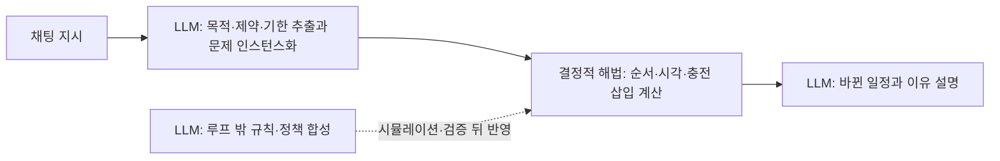

[홈](../../index.md) › 중점 연구 트랙 › [자연어 업무 지시 챗봇](index.md) › 단계 3. 구현 가설 설계

# 단계 3. 구현 가설 설계

> 단계 상태: 진행 중 · 열린 질문: 10건 · 답한 질문: 1건 · 완료 조건: 미충족 · 마지막 실행: 2026-09-25

## 1. 이 단계에서 밝힐 것

> 지시 해석부터 진행 관리까지의 처리 흐름에서 어느 부분을 LLM이 맡고 어느 부분을 온톨로지 질의와 최적화 엔진이 맡는가.

위 문장은 트랙 정의의 "밝힐 것"이다(트랙 정의의 단계별 밝힐 것과 완료 조건은 [트랙 개요](index.md)의 단계 진행 현황에 정리되어 있다). 조사 결과는 [아이디어 2. 자연어 업무 지시 챗봇](../../ideas/nl-task-chatbot.md)과 [업무 분해·배정 설계 초안](task-model-draft.md)으로 이어진다.

## 2. 질문 목록

이 단계의 시작 질문 4개(q3-01~q3-04)와, 앞 단계의 트랙 실행과 이번 실행에서 이 단계 태그로 올라온 질문(q3-05~q3-11)이다. q3-01은 사용자 요청의 시작 질문 문구 그대로이고, q3-02~q3-04는 구축자가 이 단계의 밝힐 것에서 정한 시작 질문이다. [가정] 상태와 답 위치는 [질문 백로그](question-backlog.md)와 일치시키며, 백로그의 "조사 중"은 이 표에서 "열림"으로 표시하고 "폐기"는 표에서 빼고 백로그에만 남긴다. 답은 3절의 질문 id로 시작하는 소제목에 실리고, 답 위치 칸에는 그 앵커 또는 주제 페이지 링크를 적는다. 제기 근거 칸에는 finding id(실행 id 병기) 또는 "사용자"만 쓴다. q3-09와 q3-10은 문구가 거의 같아 백로그 정리가 필요하다.

| id | 질문 | 상태 | 제기 근거 | 답한 실행 id | 답 위치 |
|---|---|---|---|---|---|
| q3-01 | 스케줄링 결정은 LLM과 최적화 엔진 중 어디에 맡기는가? | 답함 | 사용자 | 2026-09-25-66 | [#q3-01](#q3-01) |
| q3-02 | 지시 해석 → 작업 분해 → 능력 질의 → 배정 → 스케줄링 → 진행 관리의 흐름에서 단계마다 입력·출력은 무엇이고, 규칙·최적화처럼 결과가 정해진(결정적) 구성 요소는 어디에 두는가? | 열림 | 사용자 | | |
| q3-03 | 온톨로지 질의가 수행 가능한 로봇을 찾지 못하거나 후보를 여럿 낼 때, 챗봇은 무엇을 사용자에게 되묻고 무엇을 스스로 정하는가? | 열림 | 사용자 | | |
| q3-04 | 진행 중인 작업에 새 지시가 들어오거나 지시가 바뀌면(취소·우선순위 변경) 작업 모델과 일정은 어떻게 갱신하는가? | 열림 | 사용자 | | |
| q3-05 | 같은 다중 로봇 배정 작업에서 LLM이 직접 배정하는 방식과 LLM이 정식화하고 선형계획·정수계획·MILP 해법기가 배정하는 방식을 배정 오류율·일정 품질·계산 시간으로 비교한 연구가 있는가, 창고 작업에서도 같은 결과가 나오는가? | 열림 | f10, 실행 2026-09-25-21 | | |
| q3-06 | FLEET처럼 LLM이 만든 로봇–작업 적합도 행렬 대신 로봇 기능 온톨로지 질의(능력·제약 대조)로 적합도를 정해 최적화 해법기에 넘기면 배정 근거의 설명·재현성이 달라지는가, 이를 시도한 연구가 있는가? | 열림 | f8, 실행 2026-09-25-21 | | |
| q3-07 | LMCR 처럼 환경 관찰·상식으로 빠진 정보를 스스로 채워도 되는 상황 항목과 반드시 사용자에게 되물어야 하는 항목을 어떤 기준으로 나누는가? | 열림 | f6, 실행 2026-09-25-30 | | |
| q3-08 | ROP 가 업무→작업 분해 구조를 내부에 둘 때 기존 형식(BPMN·Serverless Workflow·HDDL)을 채택할지, 자체 작업 모델 스키마를 두고 Open-RMF 복합 작업·VDA 5050 주문으로 변환할지, 변환 때 배정 근거·확인 여부는 어디에 남기는가? | 열림 | f17, 실행 2026-09-25-51 | | |
| q3-09 | ROP 가 VDA 5050 관제 역할을 맡는 구성에서 Open-RMF 복합 작업의 단계와 VDA 5050 waitForTrigger–trigger 를 조합해 제조사가 다른 플릿 사이 작업 선후를 집행할 수 있는가, 트리거 누락·시간 초과 때 누가 복구하는가? | 열림 | f18, 실행 2026-09-25-51 | | |
| q3-10 | Open-RMF 복합 작업의 단계와 VDA 5050 waitForTrigger–trigger 를 조합해 제조사가 다른 플릿 사이 작업 선후를 집행할 수 있는가, 트리거 누락·시간 초과 때 누가 복구하는가? | 열림 | f18, 실행 2026-09-25-51 | | |
| q3-11 | 채팅 지시에서 LLM 이 뽑은 기한·우선순위·선호(목적 가중치)를 rmf_task 비용 계산기나 MILP 목적함수·제약으로 넘기는 인터페이스는 어떤 형식으로 두고, LAPPI 처럼 사용자가 결과를 보고 가중치를 고치는 반복을 어떻게 설계하는가? | 열림 | f16, 실행 2026-09-25-66 | | |

## 3. 조사 결과

### q3-01 스케줄링 결정은 LLM과 최적화 엔진 중 어디에 맡기는가? {#q3-01}

확인한 자료로는 LLM 이 스케줄을 직접 만들면 제약이 겹치거나 문장 표현이 바뀔 때 실행 가능성이 흔들리므로, ROP 에서는 순서·시각·충전 삽입 같은 스케줄링 결정은 rmf_task 같은 결정적 최적화·계획 해법이 맡고 LLM 은 지시에서 목적·제약·기한을 뽑아 문제를 인스턴스화하는 일과 결과 설명을 맡는 분담이 근거가 가장 많은 것으로 보인다. [추정][^ref-592][^ref-593][^ref-594][^ref-610][^ref-377][^ref-092][^ref-596][^ref-598][^ref-615] 이 결론은 이 위키의 종합이며, 근거가 작업장·프로젝트·운영과학 일반·건설·항만·여행 계획 조건이고 이종 제조사 창고 플릿에서 두 방식을 비교한 자료가 없어 신뢰도가 낮다. 아래에 근거를 나누어 적는다.

#### 로봇 오케스트레이션 도구는 스케줄링을 어디에 두는가

- Open-RMF 의 rmf_task 작업 계획기(TaskPlanner)는 플릿 안의 작업과 로봇을 받아, 요청된 시작 시각을 지키면서 작업이 가장 빨리 끝나도록 로봇별 작업 순서를 정한다(공식 저장소, 확인일 2026-09-25 기준). [사실][^ref-404][^ref-377] rmf_task README 는 이 계획기가 배터리 같은 자원 제약을 고려해 필요하면 충전 작업을 일정에 자동으로 끼워 넣는다고 설명한다. [사실][^ref-404]
- 계획기 헤더(TaskPlanner.hpp)는 최적성을 보장하지 않지만 더 빠를 수 있는 탐욕(greedy) 방식과, 최적성을 보장하지만 오래 걸릴 수 있는 A* 기반 방식 가운데 하나를 고르게 하고, 비용 계산기를 지정하지 않으면 BinaryPriorityCostCalculator 를 쓰며, 각 로봇의 배정 끝에 수행할 마무리 작업을 만드는 요청 생성기를 옵션으로 받는다(확인일 2026-09-25 기준, 비용 계산기의 비용 정의 세부는 미확인). [사실][^ref-377]
- Open-RMF 에서는 디스패처가 입찰 공고를 보내면 각 플릿 어댑터가 작업 계획기로 비용을 계산해 입찰하고, 디스패처가 가장 빨리 끝나는 것·가장 낮은 비용 같은 설정 기준으로 비교해 작업을 줄 플릿을 정한다. [사실][^ref-376]
- VDA 5050 3.0.0(공식 저장소 main 브랜치, 확인일 2026-09-25)은 관제의 최소 기능으로 주문 배정, 충전 주문이 운반 주문을 중단할 수 있는 에너지 관리, 교통 제어를 두고, 경로 결정·우선순위·혼잡 처리 같은 교통 관리 로직은 명세 범위에서 뺀다. [사실][^ref-031] 명세가 명시적으로 제외하는 것은 교통 관리 로직이지만, 배정 알고리즘도 규정하지 않으므로 배정·일정 결정 로직은 관제 구현에 맡겨진 것으로 보인다. [추정][^ref-031]

#### LLM 이 스케줄을 직접 만들 때의 한계

- ConstraintBench 저자들은 10개 운영과학 영역 200개 과제에서 6개 모델에게 제약 최적화 문제를 직접 풀게 했을 때, 가장 좋은 모델의 실행 가능 해 비율이 65.0%였고 실행 가능성과 최적성(솔버 최적값 기준 0.1% 이내)을 함께 만족한 비율은 어느 모델도 30.5%를 넘지 못했으며, 실패 유형으로 소요 시간 제약 오해와 존재하지 않는 개체 생성을 들었다(저자 보고값, 원문 미열람). [사실][^ref-592] 영역별 실행 가능 비율은 편차가 크다고 보고되었으나 수치는 검색 요약마다 달라 미확인이다.
- R-ConstraintBench 저자들은 자원 제약 프로젝트 스케줄링 문제(Resource-Constrained Project Scheduling Problem, RCPSP)에서 선후 제약을 늘린 뒤 정지 시간·시간창·배타 제약을 더해 LLM 을 평가했고, 선후 제약만 있을 때는 실행 가능성이 천장에 가깝지만 제약이 함께 걸리면 급락하며 병목은 그래프 깊이가 아니라 제약 사이 상호작용이라고 보고한 것으로 보인다(저자 보고, 원문 미열람·검증 미재확인). [추정][^ref-593]
- SCHEDBench 저자들은 작업장·자원 제약 프로젝트·간호사 근무·교과 시간표 스케줄링 1,132개 사례로 LLM 이 완성 스케줄을 직접 내게 하고, 같은 문제를 의미가 같은 다른 문장 표현으로 주면 실행 가능 비율이 떨어지고 제약 위반이 달라진다고 보고했다(저자 보고, 원문 미열람; 평가한 모델 수와 가장 민감한 변형 유형은 미확인). [사실][^ref-594]
- DynaSchedBench 저자들은 동적 유연 작업장 스케줄링에서 LLM 스케줄러에 전체 구조 정보를 주면 간결한 통계 요약을 줄 때보다 성능이 나빠졌고(1.66% 대 0.65%, 지표 정의 미확인), 도구를 쓰는 탐색은 토큰 비용이 약 3배인데 성능은 더 낮았다고 보고했다(저자 보고값, 원문 미열람). [사실][^ref-610]
- Kambhampati 외(ICML 2024 입장 논문)는 자기회귀 LLM 이 혼자서는 계획이나 자기 검증을 하지 못한다고 보고, LLM 을 근사적 아이디어 생성기로 두고 외부 모델 기반 검증기·비평자와 양방향으로 결합하는 LLM-모듈로(LLM-Modulo) 틀을 제안한다. [의견][^ref-586]

#### 반례: LLM 이 스케줄을 직접 만든 연구

- Starjob 저자들은 작업장 스케줄링 문제(Job Shop Scheduling Problem, JSSP) 13만 개 사례를 자연어로 기술한 데이터셋으로 Llama 8B 를 미세 조정하면 실행 가능한 스케줄을 생성하고, 우선순위 디스패치 규칙과 초기 신경망 방법(L2D)보다 DMU 평균 15.36%, Taillard 평균 7.85% 개선된다고 보고했다(저자 보고값, 원문 미열람; 정확 해법기와의 비교는 미확인). [사실][^ref-595]
- 건설 로봇 사례로, Saha 외는 LLM 에 에이전트의 행동 능력과 목표를 주고 생성 LLM(GPT-4)과 감독 LLM(Gemma 3·Llama 4·Mistral 7B)이 함께 스케줄을 만드는, 해법기 없이 LLM 이 일정을 직접 내는 틀을 제안했다(해법기 대비 정량 비교는 미확인, 건설 현장은 분류 원문 9장의 업종별 조건에 속하는 연계 대상이어서 방법 사례로만 다룸). [사실][^ref-616]
- 두 연구로 보면 LLM 직접 스케줄링이 배제되는 것은 아니지만, 비교 대상이 정확 해법기가 아니거나 확인되지 않아 해법기 대체의 근거로는 약한 것으로 보인다. [추정][^ref-595][^ref-616][^ref-592]

#### LLM 이 정식화하고 해법기가 푸는 결합 구조

- LLM+P 는 LLM 이 자연어 계획 문제를 PDDL 문제 파일로 바꾸고 고전 계획기 Fast Downward 가 계획을 구하는 구조이며, LLM 이 계획을 직접 내는 방식(LLM-as-Planner)과 문맥 예시 유무를 바꾼 기준선을 7개 도메인에서 비교한다(공식 저장소 README, 확인일 2026-09-25 기준). [사실][^ref-091] LLM+P 논문 저자들은 GPT-4 실험에서 LLM+P 가 LLM-as-Planner 보다 훨씬 많은 문제를 풀었고, 직접 계획 방식은 공간 관계가 복잡한 문제에서 완전히 실패했으며, 문맥 예시가 없으면 LLM+P 도 실패했다고 보고한 것으로 보인다(LLM+P 논문 저자 보고, 원문 미열람). [추정][^ref-092]
- OptiMUS 공식 README 는 순차형(v1, 중소 규모 문제), 에이전트형(v2), 검색 증강·대규모 기법(v3)의 구성과 MIP·LP 해법기 사용을 밝힌다(확인일 2026-09-25 기준). [사실][^ref-596] OptiMUS-0.3 논문은 LLM 이 정식화한 모델을 Gurobi 파이썬 API 코드로 옮겨 해법기로 풀고 각 LLM 구성 요소에 오류 검사 모듈을 둔다고 설명하며, 이 부분은 원문 미열람 논문의 요약 기준이고 README 와 같은 저자 계열이라 독립 교차가 아니다. [사실][^ref-597]
- LAPPI(Kuroki 외, IEEE Access 2026)는 LLM 이 대화로 사용자의 모호한 선호를 후보 항목·선호 점수·제약으로 바꿔 최적화 문제를 인스턴스화하고 풀이는 기존 해법기에 맡기는 대화형 최적화 방식이며, 여행 계획 사용자 연구에서 기존 방식과 프롬프트만 쓴 방식보다 나은 실행 가능 계획을 냈다고 저자가 보고했다(원문 미열람). [사실][^ref-598]
- 다중 로봇 LLM 연구 가운데 LiP-LLM(선형계획), PIP-LLM(정수계획), FLEET(makespan 최소화), Peng 외(MILP)는 LLM 이 의존 그래프·적합도·제약을 정식화하고 배정·일정은 결정적 해법이 푸는 분담을 쓴다. [사실][^ref-166][^ref-181][^ref-242][^ref-167]
- 운영과학(Operations Research, OR)의 LLM 적용을 정리한 서베이(Wang·Li)는 기존 방법을 자동 모델링, 보조 최적화(휴리스틱·알고리즘 설계), 직접 풀이의 세 경로로 나누고, 의미–구조 대응의 불안정, 일반화·해석 가능성 한계, 평가 체계 부족, 산업 배치 장벽을 과제로 든다. [사실][^ref-614]

#### 결정 루프 밖에서 규칙·정책을 만드는 구조

- RACE-Sched 는 LLM 추론 지연이 산업 제어의 밀리초 단위 결정 주기와 맞지 않는다고 보고, 실시간 디스패치는 저지연 기호 휴리스틱이 맡고 병렬 흐름에서 LLM 이 규칙을 합성·검증·진화시키는 이중 흐름 구조를 제안했다(저자 보고, 원문 미열람; 규칙을 운영에 반영하는 방식의 세부는 미확인). [사실][^ref-611]
- Li·Li(소속 미확인)는 동적 생산·AGV 스케줄링의 이산 사건 시뮬레이션에서 LLM 관리 에이전트가 사건 기록으로 병목 가설을 세우고 편집 에이전트가 규칙 기반 정책 코드를 고치는 휴리스틱 설계 틀을 제안했으며, 결과 정책이 수리계획·규칙·메타휴리스틱 기준선보다 나았다고 보고했다(저자 보고, 원문 미열람). [사실][^ref-612] 여기서 시뮬레이션은 LLM 이 만든 정책을 검증하는 도구로만 쓰인다.
- 연계 대상: 컨테이너 터미널 차량 디스패칭은 분류 원문 9장의 거점 간 운송·업종별 조건에 가까운 영역이며, PortAgent 는 LLM 이 개별 배차를 결정하기보다 가상 전문가 팀(지식 검색·모델러·코더·디버거)이 디스패칭 모델과 코드를 만들고 디버거가 오류를 검사·수정하는 방법 사례다(검사 방식의 세부와 성능 수치는 미확인, 원문 미열람). [사실][^ref-613]
- Powell 외(Journal of Intelligent Information Systems, 2025)는 스케줄링 시스템이 낸 결과를 사람에게 설명하는 텍스트를 LLM 의 추론(사고 사슬 프롬프트)으로 생성하는 방법을 연구했다(원문 미열람). [사실][^ref-615]

#### 종합: 이 위키의 분담 가설

아래 도식은 위 종합을 이 위키가 그린 분담 가설이며, 검증된 구조가 아니다.

- 진행 중 고장·새 지시 같은 동적 사건의 재스케줄링은 LLM 추론 지연 때문에 결정 루프 안에 LLM 을 두기 어렵고, RACE-Sched·Li·Li 처럼 LLM 은 규칙·정책을 루프 밖에서 만들어 시뮬레이션·검증을 거쳐 반영하며 실시간 재계산(rmf_task 의 충전 삽입 등)은 해법이 맡는 구조가 ROP 의 선택지로 보인다. rmf_task 의 재배정 기능은 문서에서 확인하지 않았다. [추정][^ref-611][^ref-612][^ref-404][^ref-586]
- 분류 원문 13. 작업 배정 — MRTA 의 SCM 관점 질문은 다음과 같다.

> 가장 가까운 로봇에 맡기는 것이 전체적으로도 유리한가? [분류원문]

- 이 질문과 관련해, 전체 이익은 완료 시각·비용 같은 명시적 목적함수를 최적화하는 해법(rmf_task, 선형·정수계획)이 계산·비교할 수 있지만, LLM 직접 배정·스케줄은 실행 가능하더라도 최적성까지 함께 만족하는 비율이 낮게 보고되어(운영과학 일반 문제, 솔버 기준 0.1% 이내 조건의 저자 보고값 30.5% 이하) 전체 이익을 보장하는 수단으로 쓰기 어려운 것으로 보인다. [추정][^ref-377][^ref-166][^ref-592]
- 이번에 확인한 LLM 스케줄링 근거의 평가 환경은 작업장·프로젝트·근무표 스케줄링, 운영과학 일반 문제, 건설 로봇, 컨테이너 터미널, 여행 계획이었고, 이종 제조사 창고 로봇 플릿에서 LLM 직접 스케줄과 해법기를 비교한 자료는 검색 범위에서 찾지 못했다(한국어 검색 포함, 부재의 확인은 아님). [추정][^ref-592][^ref-593][^ref-594][^ref-595][^ref-616][^ref-613][^ref-598]

#### 설명용 시나리오

**물류 흐름 단계:** 출하

**시나리오:** 출하 마감 전에 채팅으로 들어온 긴급 출고 지시를 일정에 반영하기

| 항목 | 내용 |
|---|---|
| 시작 조건 | 출하 마감 전에 관리자가 채팅으로 긴급 출고 지시를 보낸다(설명용 가정). |
| 작업 대상 | 긴급 출고 대상 화물과 그 운반 작업(설명용 가정) |
| 수행 자원 | LLM 은 지시에서 기한·우선순위를 뽑아 문제 인스턴스로 바꾸고, 해법이 일정을 다시 계산하며, LLM 이 바뀐 일정과 이유를 설명하는 분담이 가능해 보인다. [추정][^ref-598][^ref-377][^ref-615] |
| 제약 | rmf_task 는 배터리 같은 자원 제약을 고려해 충전 작업을 일정에 끼워 넣고 [사실][^ref-404] VDA 5050 에서는 충전 주문이 운반 주문을 중단할 수 있다. [사실][^ref-031] |
| 완료·인계 | 해당 없음 |
| 예외·성과 | LLM 이 일정을 직접 만들면 실행 가능성과 최적성을 함께 만족하는 비율이 낮게 보고되었고(운영과학 일반 제약 최적화 문제, 솔버 기준 0.1% 이내 조건의 저자 보고값) [사실][^ref-592] LLM 추론 지연은 실시간 결정 주기와 맞지 않을 수 있다. [추정][^ref-611] |

다음은 설명을 위한 가상의 시나리오이다. 출하 마감 전에 채팅으로 긴급 출고 지시가 들어오면, LLM 은 지시에서 기한·우선순위를 뽑아 문제 인스턴스(제약·목적 가중치)로 바꾸고 해법이 충전 삽입을 포함한 일정을 다시 계산한 뒤, LLM 이 바뀐 일정과 이유를 설명하는 흐름이 가능해 보인다. [추정][^ref-598][^ref-377][^ref-615] 이 흐름에서 LLM 이 뽑은 값을 해법의 비용 계산기나 목적함수로 넘기는 형식은 아직 정하지 않았으며 후속 질문 q3-11 로 둔다.

## 4. 결론과 남은 불확실성

**결론**
- Open-RMF 는 배정·순서·충전 삽입을 결정적 작업 계획기(rmf_task)에 두고, VDA 5050 은 배정 알고리즘을 규정하지 않아 관제 구현에 맡기는 것으로 보인다. [추정][^ref-404][^ref-377][^ref-031]
- q3-01 의 답: 스케줄링 결정은 결정적 최적화·계획 해법이 맡고 LLM 은 문제 인스턴스화와 결과 설명을 맡는 분담이 근거가 가장 많은 것으로 보인다(신뢰도 low). [추정][^ref-592][^ref-594][^ref-377][^ref-596][^ref-598][^ref-615]
- 동적 재스케줄링에서는 LLM 을 결정 루프 밖에 두고 규칙·정책을 만들어 검증 뒤 반영하는 구조가 선택지로 보인다. [추정][^ref-611][^ref-612]
- 이번 실행에서 [업무 분해·배정 설계 초안](task-model-draft.md)의 일정 개념에 속성 '일정 산출 방식'을 더해 초안 버전을 v0.5 에서 v0.6 으로 올렸다. 값 후보 'LLM 직접 생성'은 근거 finding 이 지정되지 않아 반영하지 않고 초안 6절의 질문으로 두었다.

**남은 불확실성**
- 모든 근거가 단일 논문 또는 같은 저장소의 문서이며 교차 확인되지 않았고, 논문 대부분은 원문 미열람(검색 요약 기준)이다.
- 근거의 평가 환경이 물류 창고 플릿이 아니며, 물류 플릿에서 LLM 추론 지연의 허용 한계를 잰 자료는 찾지 못했다.
- ConstraintBench 의 영역별 실행 가능 비율(요약마다 다름)과 해법 최적값 대비 비율, R-ConstraintBench 의 결론, LLM+P 결과 구절은 검증에서 재확인하지 못했다.
- SCHEDBench 의 평가 모델 수, DynaSchedBench 수치의 지표 정의, Starjob 의 정확 해법기 비교, Saha 외의 해법기 대비 비교, PortAgent 의 성능 수치는 미확인이다.
- rmf_task 의 재배정 기능과 BinaryPriorityCostCalculator 의 비용 정의는 확인하지 않았다.
- 국내에서 LLM 과 최적화 엔진의 스케줄링 분담을 다룬 연구·사례는 한국어 검색 범위에서 찾지 못했다.
- 처리 흐름 전체(q3-02), 되묻기(q3-03), 지시 변경 반영(q3-04)은 아직 답하지 않았다.

## 5. 이 단계가 낳은 후속 질문

| 새 질문 id | 질문 | 보낼 단계 | 근거 finding id | 상태 |
|---|---|---|---|---|
| q3-11 | 채팅 지시에서 LLM 이 뽑은 기한·우선순위·선호(목적 가중치)를 rmf_task 비용 계산기나 MILP 목적함수·제약으로 넘기는 인터페이스는 어떤 형식으로 두고, LAPPI 처럼 사용자가 결과를 보고 가중치를 고치는 반복을 어떻게 설계하는가? (q3-01 에서 파생) | 단계 3. 구현 가설 설계 | f16 (실행 2026-09-25-66) | 열림 |
| q4-08 | RACE-Sched·Li·Li 처럼 LLM 이 루프 밖에서 만든 배정·스케줄 규칙을 시뮬레이션·샌드박스에서 검증한 뒤 운영 정책으로 반영할 때, 어떤 검증 기준을 통과해야 반영을 허용하는가? (q3-01 에서 파생) | 단계 4. 오해석 방지와 확인 절차 | f13 (실행 2026-09-25-66) | 열림 |

해법 최적해를 정답으로 두고 LLM 직접 스케줄의 실행 가능성·최적성을 물류 시나리오로 재는 질문은 기존 백로그 q5-05(및 q3-05)와 겹쳐 새로 올리지 않았다.

## 6. 완료 조건 충족 현황

충족 여부는 리서치 에이전트의 자체 평가를 스토리텔러 에이전트가 옮겨 적은 값이고, 최종 판정은 내용 검증 에이전트가 한다. 둘이 다르면 검증 판정을 따른다.

| 완료 조건 | 충족 여부 | 근거 | 검증 판정 |
|---|---|---|---|
| 처리 흐름·핵심 구성 요소·다른 아이디어와의 연결이 [아이디어 2. 자연어 업무 지시 챗봇](../../ideas/nl-task-chatbot.md)의 "5. 구현 가설" 절에 실림 | 미충족 | 이번 실행은 5절에 스케줄링 결정의 분담만 실었고 처리 흐름(q3-02)은 미조사 | 미충족 · 미승인 |
| [업무 분해·배정 설계 초안](task-model-draft.md)이 근거 finding과 함께 v0.1 이상으로 갱신됨 | 충족 | 이번 실행에서 일정 개념에 속성 일정 산출 방식을 더해 v0.6 으로 갱신(f1·f2·f13·f14·f15·f21) | 충족 |
| 사용자에게 제안하는 실험 계획이 [실험](experiments.md)에 실림 | 미충족 | 제안된 실험 계획이 없다 | 미충족 · 미승인 |

다음 단계로 전환: 아니오(아이디어 2 5절 처리 흐름·구성 요소 미작성, 실험 계획 없음, 열린 질문 q3-02~q3-11)

## 7. 관련 세부영역

이 트랙은 분류를 바꾸지 않는다. 확인된 사실은 세부영역 페이지를 직접 고치지 않고 [트랙 로그](log.md)의 "세부영역 반영 제안"으로 남기며, 반영은 다음 해당 영역 실행에서 한다. 프런트매터 `related_areas`는 아래 목록과 같다.

- [13. 작업 배정 — MRTA](../../categories/d-planning-and-optimization/13-task-allocation-mrta.md) — 작업 계획기의 탐욕·A* 선택과 비용 계산기, LLM 정식화와 해법기 배정의 분담, 분류 원문 질문과의 연결을 "6. 대표 접근법과 기술"에 반영 제안한다
- [14. 작업 순서·스케줄링](../../categories/d-planning-and-optimization/14-task-sequencing-and-scheduling.md) — rmf_task 의 순서 계획·충전 삽입, LLM 직접 스케줄 생성의 한계 벤치마크, 루프 밖 규칙 합성을 "6. 대표 접근법과 기술"에 반영 제안한다
- [27. AI·학습·적응과 모델 운영](../../categories/g-safety-security-intelligence-and-governance/27-ai-learning-adaptation-and-model-operations.md) — 교차 규칙에 따라 LLM-모듈로, 정식화·인스턴스화 역할, 스케줄 설명 생성, 운영과학 LLM 서베이를 "6. 대표 접근법과 기술"과 "8. 대표 연구와 자료"에 반영 제안한다
- [20. 예외 복구·재계획·업무 연속성](../../categories/e-collaboration-and-field-operations/20-exception-recovery-replanning-and-business-continuity.md) — 동적 재스케줄링에서 LLM 을 결정 루프 밖에 두는 구조를 "10. 다른 연구영역과의 연결 (번호와 이름을 함께 표기)"에 반영 제안한다
- [5. 로봇 능력·작업 온톨로지](../../categories/b-common-information-and-environment-model/05-robot-capability-and-task-ontology.md) — '온톨로지로 적합한 로봇을 찾는' 질의의 대상이다(아이디어 1의 산출물). 이번 실행의 반영 제안은 없다
- [9. 로봇·제조사 관제 연동](../../categories/c-connectivity-and-execution-foundation/09-robot-and-vendor-fleet-manager-integration.md) — Open-RMF 입찰과 VDA 5050 관제 기능이 배정·일정 결정의 위치를 보여 준다. 기존 서술과 같아 반영 제안은 없다
- [16. 공용 자원·충전·에너지 최적화](../../categories/d-planning-and-optimization/16-shared-resource-charging-and-energy-optimization.md) — rmf_task 의 충전 작업 삽입이 일정 계산에 들어간다. 기존 서술과 같아 반영 제안은 없다

## 8. 출처

[^ref-404]: Open Robotics (open-rmf), rmf_task — README, 미확인, https://github.com/open-rmf/rmf_task, 접근일 2026-09-25
[^ref-377]: Open Robotics (open-rmf), rmf_task — rmf_task/include/rmf_task/TaskPlanner.hpp, 미확인, https://github.com/open-rmf/rmf_task/blob/main/rmf_task/include/rmf_task/TaskPlanner.hpp, 접근일 2026-09-25
[^ref-376]: Open Robotics, Tasks in RMF (task) - Programming Multiple Robots with ROS 2, 미확인, https://osrf.github.io/ros2multirobotbook/task.html, 접근일 2026-09-25
[^ref-031]: VDA / VDMA (VDA5050 GitHub), VDA5050/VDA5050_EN.md — Official Specification document for the VDA 5050, 미확인, https://github.com/VDA5050/VDA5050/blob/main/VDA5050_EN.md, 접근일 2026-09-25
[^ref-091]: Cranial-XIX (LLM+P 저자), llm-pddl — LLM+P: Empowering Large Language Models with Optimal Planning Proficiency (GitHub README), 미확인, https://github.com/Cranial-XIX/llm-pddl, 접근일 2026-09-25
[^ref-092]: Liu, B., Jiang, Y., Zhang, X., Liu, Q., Zhang, S., Biswas, J., & Stone, P., LLM+P: Empowering Large Language Models with Optimal Planning Proficiency, 2023-04, https://arxiv.org/abs/2304.11477, 접근일 2026-09-25 (원문 미열람)
[^ref-586]: Kambhampati, S., Valmeekam, K., Guan, L., Verma, M., Stechly, K., Bhambri, S., Saldyt, L., & Murthy, A., LLMs Can't Plan, But Can Help Planning in LLM-Modulo Frameworks, 2024-02, https://arxiv.org/abs/2402.01817, 접근일 2026-09-25 (원문 미열람)
[^ref-592]: ConstraintBench 저자(arXiv 2602.22465, 저자 미확인), ConstraintBench: Benchmarking LLM Constraint Reasoning on Direct Optimization, 2026-02, https://arxiv.org/abs/2602.22465, 접근일 2026-09-25 (원문 미열람)
[^ref-593]: Jain, R. 외(R-ConstraintBench 저자), R-ConstraintBench: Evaluating LLMs on NP-Complete Scheduling, 2025-08, https://arxiv.org/abs/2508.15204, 접근일 2026-09-25 (원문 미열람)
[^ref-594]: SCHEDBench 저자(arXiv 2608.00991, 저자 미확인), SCHEDBench: A Benchmark for Evaluating LLM Constraint Faithfulness in Natural-Language Combinatorial Scheduling, 2026-08, https://arxiv.org/abs/2608.00991, 접근일 2026-09-25 (원문 미열람)
[^ref-595]: Starjob 저자(arXiv 2503.01877, 저자 미확인), Starjob: Dataset for LLM-Driven Job Shop Scheduling, 2025-03, https://arxiv.org/abs/2503.01877, 접근일 2026-09-25 (원문 미열람)
[^ref-596]: teshnizi (OptiMUS 공식 저장소), OptiMUS — Optimization Modeling Using mip Solvers and large language models (GitHub README), 미확인, https://github.com/teshnizi/OptiMUS, 접근일 2026-09-25
[^ref-597]: AhmadiTeshnizi, A. 외(OptiMUS 저자), OptiMUS-0.3: Using Large Language Models to Model and Solve Optimization Problems at Scale, 2024-07, https://arxiv.org/abs/2407.19633, 접근일 2026-09-25 (원문 미열람)
[^ref-598]: Kuroki, S., Nakagawa, M., Yoshida, S., Koyama, Y., & Kozuno, T.(OMRON SINIC X 등, IEEE Access 2026), LAPPI: Interactive Optimization with LLM-Assisted Preference-Based Problem Instantiation, 2025-12, https://arxiv.org/abs/2512.14138, 접근일 2026-09-25 (원문 미열람)
[^ref-610]: DynaSchedBench 저자(arXiv 2605.27566, 저자 미확인), DynaSchedBench: Calibrated Dynamic Scheduling Benchmarks and Observability Paradox in LLM-based Scheduling Agents, 2026-05, https://arxiv.org/abs/2605.27566, 접근일 2026-09-25 (원문 미열람)
[^ref-611]: RACE-Sched 저자(arXiv 2605.29262, 저자 미확인), Harmonizing Real-Time Constraints and Long-Horizon Reasoning: An Asynchronous Agentic Framework for Dynamic Scheduling, 2026-05, https://arxiv.org/abs/2605.29262, 접근일 2026-09-25 (원문 미열람)
[^ref-612]: Li, J., & Li, C.(소속 미확인), LLM-Guided Heuristic Design from Simulation Traces: A Case Study in Dynamic Production and AGV Scheduling, 2026-08, https://arxiv.org/abs/2608.09343, 접근일 2026-09-25 (원문 미열람)
[^ref-613]: Hu, J., Li, J., Lin, W., Jia, P., Ji, Y., & Lai, J., PortAgent: LLM-driven Vehicle Dispatching Agent for Port Terminals, 2025-12, https://arxiv.org/abs/2512.14417, 접근일 2026-09-25 (원문 미열람)
[^ref-614]: Wang, Y., & Li, K., Large Language Models in Operations Research: Methods, Applications, and Challenges, 2025-09, https://arxiv.org/abs/2509.18180, 접근일 2026-09-25 (원문 미열람)
[^ref-615]: Powell, C. 외(University of Strathclyde), Generating textual explanations for scheduling systems leveraging the reasoning capabilities of large language models, 2025, https://link.springer.com/article/10.1007/s10844-025-00940-w, 접근일 2026-09-25 (원문 미열람)
[^ref-616]: Saha, S., Das, S., Duan, H., & Liu, X.-Y., Hybrid LLM-based Intelligent Framework for Robot Task Scheduling, 2026-05, https://arxiv.org/abs/2605.15486, 접근일 2026-09-25 (원문 미열람)
[^ref-166]: Obata, K., Aoki, T., Horii, T., Taniguchi, T., & Nagai, T., LiP-LLM: Integrating Linear Programming and dependency graph with Large Language Models for multi-robot task planning, 2024-10, https://arxiv.org/abs/2410.21040, 접근일 2026-09-25 (원문 미열람)
[^ref-181]: Shi, G., Wu, Y., Kumar, V., & Sukhatme, G. S., PIP-LLM: Integrating PDDL-Integer Programming with LLMs for Coordinating Multi-Robot Teams Using Natural Language, 2025-10, https://arxiv.org/abs/2510.22784, 접근일 2026-09-25 (원문 미열람)
[^ref-242]: Rivera, C., Byrd, G., Booker, M., Kemp, B., Gaines, A., Holmes, E., Uplinger, J., de Melo, C. M., & Handelman, D.(JHU APL·JHU·DEVCOM ARL), FLEET: Formal Language-Grounded Scheduling for Heterogeneous Robot Teams, 2025-10, https://arxiv.org/abs/2510.07417, 접근일 2026-09-25 (원문 미열람)
[^ref-167]: Peng, M., Chen, Z., Yang, J., Huang, J., Shi, Z., Liu, Q., Li, X., & Gao, L., Automatic MILP Model Construction for Multi-Robot Task Allocation and Scheduling Based on Large Language Models, 2025-03, https://arxiv.org/abs/2503.13813, 접근일 2026-09-25 (원문 미열람)

## 9. 이력

실행 id `build-2026-09-25`는 확장 아이디어 편입 때의 트랙 시드 생성을 나타내며, 파이프라인 실행이 아니므로 일일 로그가 없다.

| 날짜 | 실행 id | 답한 질문 | 새 질문 | 초안 변경 | 버전 |
|---|---|---|---|---|---|
| 2026-09-25 | 2026-09-25-66 | q3-01 | q3-11, q4-08 | v0.5 → v0.6(일정 개념에 속성 '일정 산출 방식') | 2 |
| 2026-09-25 | build-2026-09-25(트랙 시드, 파이프라인 실행 아님) | 없음 | 시드 q3-01~q3-04(4건, [질문 백로그](question-backlog.md)에 등록) | 없음(v0 시드는 [업무 분해·배정 설계 초안](task-model-draft.md)에서 생성) | 1 |
