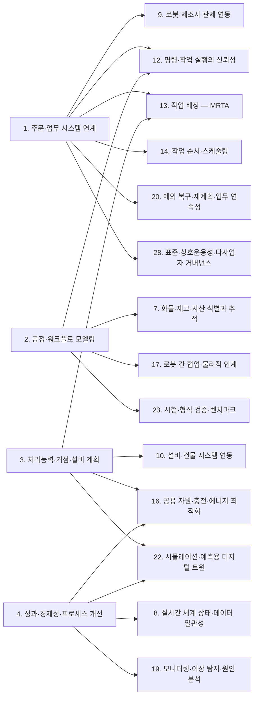
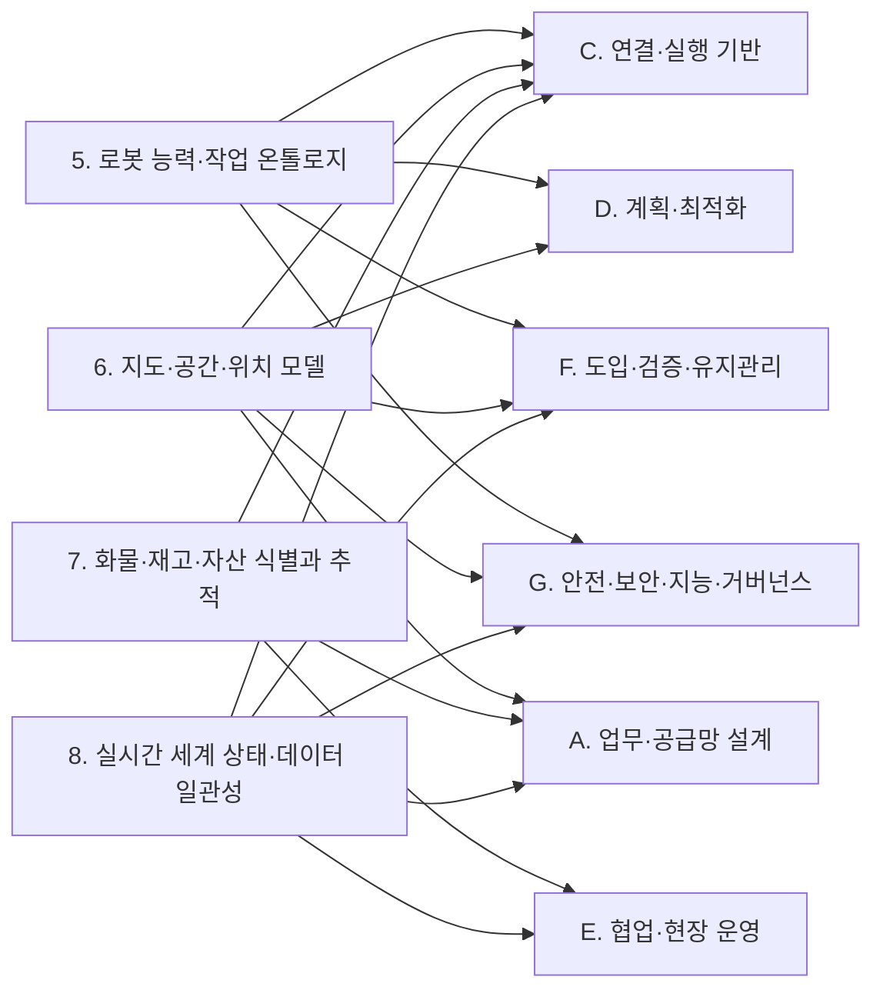
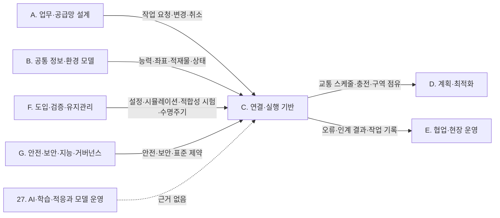
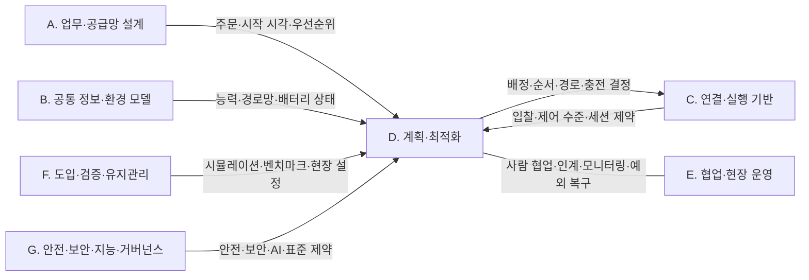
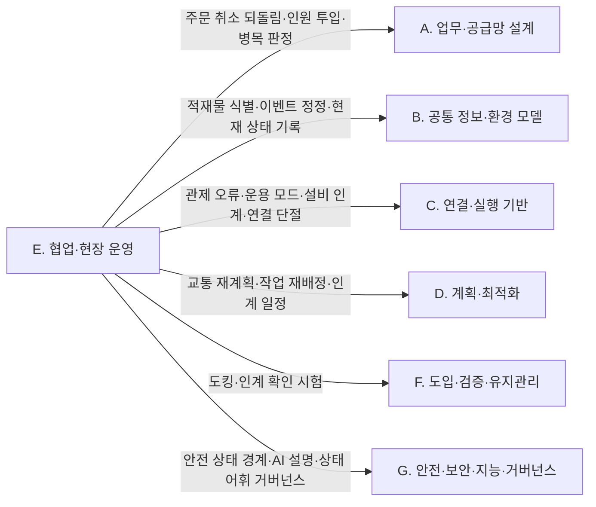
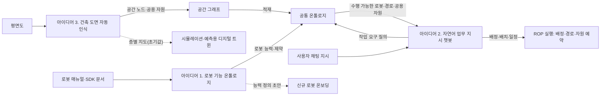

(너의 규칙은 시스템 프롬프트의 agents/shared-rules.md 와 agents/researcher.md 이다. 아래는 이번 실행의 컨텍스트와 입력이다.)

## 실행 컨텍스트

- run_id: 2026-09-25-67
- date: 2026-09-25
- run_type: category_link (대분류 연결)
- 대상: 대분류 F. 도입·검증·유지관리 페이지의 '다른 대분류와의 연결' 절(대분류 연결 실행). 게시된 세부영역 페이지를 근거로 다른 대분류와의 연결을 조사·서술한다. 스토리텔러는 그 절만 patches 로 바꾼다
- 예산:
    - max_search_queries: 30
    - max_sources_per_run: 15
    - new_topic_pages: 1
    - page_updates: 2
    - max_retries: 2
- 환경 알림: web_fetch_available: false · fetch_mode: mirror_only (일반 웹 페이지 열람은 네트워크 정책으로 막혀 있다. raw.githubusercontent.com 은 열린다: 공식 문서가 GitHub 에 있는 출처는 입력의 config/source_mirrors.yaml 경로를 WebFetch 로 열어 원문을 읽고 sources[].fetched=true, fetched_via=github_raw, fetch_url 을 적는다. 입력에 원문 텍스트(data/source_texts)가 있는 출처는 fetched_via=inbox. 그 밖의 출처는 fetched=false 이며 코드가 신뢰도 상한(medium)을 강제한다 — 공통 규칙 0절 6항)
- 언어: ko
- next_ref_id: ref-704
- 새 출처 id 구간: ref-704 ~ ref-733 — 이 실행 전용으로 예약한 번호다(동시에 도는 다른 실행과 겹치지 않는다). 새 출처는 ref-704 부터 순서대로 쓰고 ref-733 를 넘기지 않는다. 기존 출처는 참고문헌 목록의 id 를 그대로 쓴다

## 입력

### runs/2026-09-25-67/target.json

```json
{
  "run_id": "2026-09-25-67",
  "date": "2026-09-25",
  "weekday": "Fri",
  "run_number": 67,
  "run_type": "category_link",
  "forced": true,
  "target": {
    "area_no": null,
    "area_name": null,
    "category": "F. 도입·검증·유지관리",
    "category_letter": "F"
  },
  "topic": null,
  "track": null,
  "corrections": [],
  "budget": {
    "max_search_queries": 30,
    "max_sources_per_run": 15,
    "new_topic_pages": 1,
    "page_updates": 2,
    "max_retries": 2
  },
  "priority_reason": null,
  "priority_questions": [],
  "excluded_areas": [],
  "lifted_areas": [],
  "deferred": {
    "monthly_recheck": false,
    "weekly_review": false
  },
  "selection_rationale": "CLI 지정 run_type=category_link"
}
```

### docs/references/index.md (요약: 이번 대상 페이지가 인용한 56건 / 전체 574건. 목록에 없는 출처는 새 id 로 적는다 — 같은 URL 이 이미 있으면 퍼블리셔가 기존 id 로 합친다)

```markdown
| id | 기관 | 제목 | 발행일 | URL | 접근일 | 원문 열람 |
|---|---|---|---|---|---|---|
| ref-008 | NIST | ARIAC Documentation | 미확인 | https://pages.nist.gov/ARIAC_docs/en/latest/ | 2026-09-25 | 예 |
| ref-031 | VDA / VDMA (VDA5050 GitHub) | VDA5050/VDA5050_EN.md — Official Specification document for the VDA 5050 | 미확인 | https://github.com/VDA5050/VDA5050/blob/main/VDA5050_EN.md | 2026-09-25 | 예 |
| ref-037 | Vieira da Silva, L. M., Köcher, A., Gill, M. S., Weiss, M., & Fay, A. | Toward a Mapping of Capability and Skill Models using Asset Administration Shells and Ontologies | 2023-07 | https://arxiv.org/abs/2307.00827 | 2026-09-25 | 아니오 |
| ref-046 | VDMA (Intralogistics-2X-LIF GitHub) | Layout-Interchange-Format — README (Repository for the Layout Interchange Format (LIF) developed by the VDMA) | 2023-09 | https://github.com/Intralogistics-2X-LIF/Layout-Interchange-Format | 2026-09-25 | 아니오 |
| ref-051 | VDA / VDMA (VDA5050 GitHub) | VDA5050/VDA5050 — json_schemas/state.schema | 미확인 | https://github.com/VDA5050/VDA5050/blob/main/json_schemas/state.schema | 2026-09-25 | 예 |
| ref-079 | Open Robotics | Traffic Editor - Programming Multiple Robots with ROS 2 | 미확인 | https://osrf.github.io/ros2multirobotbook/traffic-editor.html | 2026-09-25 | 예 |
| ref-101 | Merschformann, M. (RAWSim-O GitHub) | RAWSim-O: A simulation framework for Robotic Mobile Fulfillment Systems (README) | 미확인 | https://github.com/merschformann/RAWSim-O | 2026-09-25 | 예 |
| ref-153 | Open Robotics | Fleet Adapter Tutorial - Programming Multiple Robots with ROS 2 | 미확인 | https://osrf.github.io/ros2multirobotbook/integration_fleets_adapter_tutorial.html | 2026-09-25 | 예 |
| ref-186 | Stern, R., Sturtevant, N. R., Felner, A., Koenig, S. 외 | Multi-Agent Pathfinding: Definitions, Variants, and Benchmarks | 2019-06 | https://arxiv.org/abs/1906.08291 | 2026-09-25 | 아니오 |
| ref-217 | Beinschob, P., Meyer, M., Reinke, C., Digani, V., Secchi, C., & Sabattini, L. | Semi-automated map creation for fast deployment of AGV fleets in modern logistics | 2017 | https://www.sciencedirect.com/science/article/abs/pii/S0921889015302724 | 2026-09-25 | 아니오 |
| ref-228 | VDA / VDMA (VDA5050 GitHub) | VDA5050/VDA5050 — json_schemas/factsheet.schema | 미확인 | https://github.com/VDA5050/VDA5050/blob/main/json_schemas/factsheet.schema | 2026-09-25 | 예 |
| ref-229 | IDTA(Industrial Digital Twin Association) | IDTA 02020 Capability Description 1.0 — README (admin-shell-io/submodel-templates) | 미확인 | https://github.com/admin-shell-io/submodel-templates/tree/main/published/Capability%20Description | 2026-09-25 | 아니오 |
| ref-230 | MassRobotics | MassRobotics-AMR/AMR_Interop_Standard — AMR_Interop_Standard.json | 미확인 | https://github.com/MassRobotics-AMR/AMR_Interop_Standard/blob/main/AMR_Interop_Standard.json | 2026-09-25 | 예 |
| ref-241 | Sommer, M., Stjepandić, J., Stobrawa, S., & von Soden, M. | Automated generation of digital twin for a built environment using scan and object detection as input for production planning | 2023 | https://www.sciencedirect.com/science/article/abs/pii/S2452414X23000353 | 2026-09-25 | 아니오 |
| ref-251 | Open Robotics | Mobile Robot Fleets (integration_fleets) - Programming Multiple Robots with ROS 2 | 미확인 | https://osrf.github.io/ros2multirobotbook/integration_fleets.html | 2026-09-25 | 예 |
| ref-265 | European Commission (CORDIS) | PAN-ROBOTS: Automating logistics for the factory of the future | 미확인 | https://cordis.europa.eu/article/id/160857-panrobots-automating-logistics-for-the-factory-of-the-future | 2026-09-25 | 아니오 |
| ref-267 | IEEE 게재 논문 저자(미확인) | Simulation-Based Approach for Automatic Roadmap Design in Multi-AGV Systems (IEEE Transactions on Automation Science and Engineering 21(4), 2024 (2023 온라인 공개)) | 2024 | https://ieeexplore.ieee.org/document/10287275/ | 2026-09-25 | 아니오 |
| ref-269 | Heselden, J. R., & Das, G. P. | Unified Map Handling for Robotic Systems: Enhancing Interoperability and Efficiency Across Diverse Environments | 2024-04 | https://arxiv.org/abs/2404.13499 | 2026-09-25 | 아니오 |
| ref-291 | Kritzinger, W., Karner, M., Traar, G., Henjes, J., & Sihn, W. | Digital Twin in manufacturing: A categorical literature review and classification | 2018 | https://www.sciencedirect.com/science/article/pii/S2405896318316021 | 2026-09-25 | 아니오 |
| ref-364 | ROS 2 Design | Managed nodes (ROS 2 Design: node_lifecycle) | 미확인 | https://design.ros2.org/articles/node_lifecycle.html | 2026-09-25 | 예 |
| ref-398 | Merschformann, M., Lamballais, T., de Koster, R., & Suhl, L. | Decision rules for robotic mobile fulfillment systems | 2019 | https://www.sciencedirect.com/science/article/pii/S2214716019300946 | 2026-09-25 | 아니오 |
| ref-403 | Li, J., Li, S., Chu, J., Li, W., & Chen, D.(UT Austin) | Fleet-Level Battery-Health-Aware Scheduling for Autonomous Mobile Robots | 2026-03 | https://arxiv.org/abs/2603.22731 | 2026-09-25 | 아니오 |
| ref-406 | Open Robotics | Simulation - Programming Multiple Robots with ROS 2 | 미확인 | https://osrf.github.io/ros2multirobotbook/simulation.html | 2026-09-25 | 예 |
| ref-465 | Vieira da Silva, L. M., Köcher, A., Gehlhoff, F., & Fay, A. | Toward a Method to Generate Capability Ontologies from Natural Language Descriptions | 2024-06 | https://arxiv.org/abs/2406.07962 | 2026-09-25 | 아니오 |
| ref-466 | 부산일보 | KTL·통합물류협회 ‘물류로봇 시험인증’ 협력 강화 ‘맞손’ | 2026-07-24 | https://www.busan.com/view/busan/view.php?code=2026072420194685883 | 2026-09-25 | 아니오 |
| ref-470 | ISO | ISO 3691-4:2023 - Industrial trucks — Safety requirements and verification — Part 4: Driverless industrial trucks and their systems | 2023-06 | https://www.iso.org/standard/83545.html | 2026-09-25 | 아니오 |
| ref-481 | Siemens Digital Industries Software | Virtual commissioning with Siemens solutions reduces launch time by three weeks | 미확인 | https://resources.sw.siemens.com/en-US/case-study-idc/ | 2026-09-25 | 아니오 |
| ref-516 | 한국표준협회 KSSN(국가표준인증종합정보센터) | KS X ISO 23247-1 자동화 시스템 및 통합 — 제조를 위한 디지털 트윈 프레임워크 — 제1부: 개요 및 일반 원리 | 미확인 | https://www.kssn.net/search/stddetail.do?itemNo=K001010140724 | 2026-09-25 | 아니오 |
| ref-518 | ISO | ISO 23247-6:2026 — Automation systems and integration — Digital twin framework for manufacturing — Part 6: Digital twin composition | 2026 | https://www.iso.org/standard/87426.html | 2026-09-25 | 아니오 |
| ref-520 | Agalianos, K., Ponis, S. T., Aretoulaki, E., & Plakas, G. | Discrete Event Simulation and Digital Twins: Review and Challenges for Logistics | 2020 | https://www.sciencedirect.com/science/article/pii/S2351978920320990 | 2026-09-25 | 아니오 |
| ref-521 | Le, T. V., & Fan, R. | Digital twins for logistics and supply chain systems: Literature review, conceptual framework, research potential, and practical challenges | 2024 | https://www.sciencedirect.com/science/article/abs/pii/S0360835223007921 | 2026-09-25 | 아니오 |
| ref-522 | Coelho, F., Relvas, S., & Barbosa-Póvoa, A. P. | Simulation-based decision support tool for in-house logistics: the basis for a digital twin | 2021 | https://www.sciencedirect.com/science/article/abs/pii/S0360835220307646 | 2026-09-25 | 아니오 |
| ref-523 | Open Robotics (open-rmf) | rmf_simulation — README | 미확인 | https://github.com/open-rmf/rmf_simulation | 2026-09-25 | 예 |
| ref-524 | OpenFactoryTwin (Fraunhofer ISST, HSBI, FH Dortmund) | ofact — Simulation-based Digital Twin for Production and Logistics Material Flows (README) | 미확인 | https://github.com/OpenFactoryTwin/ofact | 2026-09-25 | 예 |
| ref-525 | Sargent, R. G. | Verification and validation of simulation models (Proceedings of the 40th Conference on Winter Simulation) | 2008 | https://dl.acm.org/doi/abs/10.5555/1516744.1516780 | 2026-09-25 | 아니오 |
| ref-526 | CJ대한통운 | 가상세계 쌍둥이 창고로 물류 예측... CJ대한통운, 디지털 트윈 구축 (보도자료) | 2021-11 | https://www.cjlogistics.com/ko/newsroom/news/NR_00000905 | 2026-09-25 | 아니오 |
| ref-527 | NVIDIA | NVIDIA Unveils 'Mega' Omniverse Blueprint for Building Industrial Robot Fleet Digital Twins | 미확인 | https://blogs.nvidia.com/blog/mega-omniverse-blueprint | 2026-09-25 | 아니오 |
| ref-528 | NIST (usnistgov/ARIAC_docs) | ARIAC 2025 Documentation — Challenges | 미확인 | https://pages.nist.gov/ARIAC_docs/en/latest/pages/challenges.html | 2026-09-25 | 예 |
| ref-529 | NIST (usnistgov/ARIAC_docs) | ARIAC 2025 Documentation — Scoring | 미확인 | https://pages.nist.gov/ARIAC_docs/en/latest/pages/scoring.html | 2026-09-25 | 예 |
| ref-550 | IDTA (admin-shell-io/id GitHub) | IDTA SoftwareNameplate 1/0 — README (Nameplate for Software in Manufacturing) | 미확인 | https://github.com/admin-shell-io/id/blob/master/idta/SoftwareNameplate/1/0/README.md | 2026-09-25 | 예 |
| ref-553 | Lei, Y., Liu, H., Li, N. 외 | Condition monitoring and fault diagnosis of industrial robots: A review (Science China Technological Sciences 68, 1110301) | 2025 | https://link.springer.com/article/10.1007/s11431-024-2810-2 | 2026-09-25 | 아니오 |
| ref-554 | IEC | IEC TR 62443-2-3:2015 Security for industrial automation and control systems - Part 2-3: Patch management in the IACS environment | 2015-06 | https://webstore.iec.ch/en/publication/22811 | 2026-09-25 | 아니오 |
| ref-556 | Amazon Web Services (aws-samples GitHub) | ros2-ota-firmware-updates — README | 미확인 | https://github.com/aws-samples/ros2-ota-firmware-updates | 2026-09-25 | 예 |
| ref-557 | 네이트 뉴스(원 매체 미확인) | 클라우드 기반 OTA로 로봇이 진화하다…2026 SDR 과제 킥오프 워크숍 현장 | 2026-07-23 | https://m.news.nate.com/view/20260723n24828 | 2026-09-25 | 아니오 |
| ref-559 | 세이프틱스(Safetics) | 로봇 시스템 위험성평가 가이드 | 미확인 | https://doc.safetics.io/insight-risk-assessment/ | 2026-09-25 | 아니오 |
| ref-599 | Luckcuck, M., Farrell, M., Dennis, L. A., Dixon, C., & Fisher, M. | Formal Specification and Verification of Autonomous Robotic Systems: A Survey | 2019-09 | https://arxiv.org/abs/1807.00048 | 2026-09-25 | 아니오 |
| ref-600 | Afzal, A., Le Goues, C., Hilton, M., & Timperley, C. S. | A Study on Challenges of Testing Robotic Systems | 2020 | https://www.computer.org/csdl/proceedings-article/icst/2020/09159069/1m3oOVjQnIc | 2026-09-25 | 아니오 |
| ref-601 | reeceholland (ros2_fault_injection GitHub) | ros2_fault_injection — README | 미확인 | https://github.com/reeceholland/ros2_fault_injection | 2026-09-25 | 예 |
| ref-602 | University of Liverpool Autonomy and Verification (ROSMonitoring GitHub) | ROSMonitoring: a Runtime Verification Framework for ROS — README | 미확인 | https://github.com/autonomy-and-verification-uol/ROSMonitoring | 2026-09-25 | 예 |
| ref-603 | IDM Lab (USC) 게재 초록, 저자 미확인 | The League of Robot Runners: Competition Goals, Designs, and Implementation [System Demonstration] | 2024 | https://idm-lab.org/bib/abstracts/Koen24p.html | 2026-09-25 | 아니오 |
| ref-604 | Yan, J., Zhang, Y., Liu, Z., Zhang, H., Jiang, H., Chen, J., Smith, S. F., & Li, J. | Lifelong Scalable Multi-Agent Realistic Testbed and A Comprehensive Study on Design Choices in Lifelong AGV Fleet Management Systems | 2026-02-17 | https://arxiv.org/abs/2602.15721 | 2026-09-25 | 아니오 |
| ref-605 | NIST | ASTM Committee F45 on Driverless Automatic Guided Industrial Vehicles | 미확인 | https://www.nist.gov/programs-projects/astm-committee-f45-driverless-automatic-guided-industrial-vehicles | 2026-09-25 | 아니오 |
| ref-606 | 한국표준협회 KSSN(국가표준인증종합정보센터) | KS B ISO 18646-1 로봇 — 서비스 로봇의 성능 기준 및 관련 시험방법 — 제1부 : 바퀴형 로봇의 이동능력 | 미확인 | https://www.kssn.net/search/stddetail.do?itemNo=K001010113281 | 2026-09-25 | 아니오 |
| ref-607 | 한국로봇산업진흥원(KIRIA) | 시험평가 | KIRIA 첨단로봇 실증지원 디지털 플랫폼 | 미확인 | https://kiria.org/rp/kiria/tva/inr/page.dn | 2026-09-25 | 아니오 |
| ref-608 | OTTO by Rockwell Automation | OTTO Adds VDA 5050 Certifications to Support Mixed-Fleet Deployments | 2026-04 | https://ottomotors.com/company/newsroom/press-releases/otto-adds-vda-5050-certifications-to-support-mixed-fleet-deployments/ | 2026-09-25 | 아니오 |
| ref-609 | von Berg, B., Aichernig, B. K., & Wedenik, F. | BDD-Based Deadlock Avoidance for Automated Guided Vehicles in Warehouse Logistics (Case Study Paper) | 2026-05 | https://link.springer.com/chapter/10.1007/978-3-032-26204-2_16 | 2026-09-25 | 아니오 |
```

### docs/glossary/index.md (요약: 용어 148개, slug: 한국어 (영어). 정의는 docs/glossary/<slug>.md)

```markdown
- action-dependency-graph: 행동 의존 그래프 (Action Dependency Graph (ADG))
- age-of-information: 정보 나이 (Age of Information (AoI))
- aggregation-event: 집계 이벤트 (AggregationEvent)
- ariac: 산업 자동화용 민첩 로봇 경진대회 (Agile Robotics for Industrial Automation Competition (ARIAC))
- asset-administration-shell: 자산관리셸 (Asset Administration Shell (AAS))
- association-event: 연결 이벤트 (AssociationEvent)
- b2mml: B2MML (Business To Manufacturing Markup Language (B2MML))
- battery-swapping: 배터리 교환 (Battery Swapping)
- behavior-tree: 행동 트리 (Behavior Tree)
- block-reference: 블록 참조 (Block Reference (INSERT))
- bpmn: 비즈니스 프로세스 모델 및 표기법 (Business Process Model and Notation (BPMN))
- building-information-modeling: 건물 정보 모델링 (Building Information Modeling (BIM))
- building-topology-ontology: 건물 위상 온톨로지 (Building Topology Ontology (BOT))
- business-continuity-management-system: 업무 연속성 관리 시스템 (Business Continuity Management System (BCMS))
- business-location: 업무 위치 (Business Location (EPCIS bizLocation))
- cap-theorem: CAP 정리 (CAP Theorem)
- capabilities-skills-services: 능력·스킬·서비스 모델 (Capabilities, Skills and Services (CSS) Model)
- capability-based-task-allocation: 능력 기반 작업 배정 (Capability-based Task Allocation)
- capability-matchmaking: 능력 매칭 (Capability Matchmaking)
- cbv: 핵심 업무 어휘 (Core Business Vocabulary (CBV))
- collaborative-application: 협동 적용 (Collaborative Application)
- collaborative-perception: 협동 인지 (Collaborative Perception)
- compensating-transaction: 보상 트랜잭션 (Compensating Transaction)
- condition-based-maintenance: 상태 기반 정비 (Condition-Based Maintenance (CBM))
- conflict-based-search: 충돌 기반 탐색 (Conflict-Based Search (CBS))
- conformance-test: 적합성 시험 (Conformance Test)
- consensus-based-bundle-algorithm: 합의 기반 번들 알고리즘 (Consensus-Based Bundle Algorithm (CBBA))
- cooperative-object-transport: 협동 운반 (Cooperative Object Transport)
- cora: 로봇·자동화 핵심 온톨로지 (Core Ontology for Robotics and Automation (CORA))
- crdt: 무충돌 복제 데이터 타입 (Conflict-free Replicated Data Type (CRDT))
- cross-schedule-dependency: 스케줄 간 의존 (Cross-schedule Dependency (XD))
- dds-security: DDS 보안 규격 (DDS Security (DDS-Security))
- deadlock: 교착 (Deadlock)
- digital-shadow: 디지털 섀도 (Digital Shadow)
- digital-thread: 디지털 스레드 (Digital Thread)
- digital-twin-composition: 디지털 트윈 결합 (Digital Twin Composition)
- digital-twin: 디지털 트윈 (Digital Twin)
- discrete-event-simulation: 이산 사건 시뮬레이션 (Discrete Event Simulation (DES))
- dispenser-ingestor: 디스펜서·인제스터 (Dispenser / Ingestor)
- distributed-tracing: 분산 추적 (Distributed Tracing)
- drawing-exchange-format: 도면 교환 형식 (Drawing Exchange Format (DXF))
- eclass: ECLASS (ECLASS)
- enclave: 인클레이브 (Enclave (SROS 2))
- epcis-error-declaration: 오류 선언 (Error Declaration (EPCIS errorDeclaration))
- epcis: 전자 제품 코드 정보 서비스 (Electronic Product Code Information Services (EPCIS))
- fan-out: 팬아웃 (Fan-out (human-robot team))
- fault-detection-and-diagnosis-fdd: 고장 탐지·진단 (Fault Detection and Diagnosis (FDD))
- fault-injection: 장애 주입 (Fault Injection)
- fleet-adapter: 플릿 어댑터 (Fleet Adapter)
- fleet-control-level: 플릿 제어 수준 (Fleet Control Level (Open-RMF: Full Control / Traffic Light / Read Only))
- fleet-management-system: 플릿 관리 시스템 (Fleet Management System (FMS))
- fleet-sizing: 차량 소요대수 산정 (Fleet Sizing)
- floor-plan-recognition: 평면도 인식 (Floor Plan Recognition)
- fog-computing: 포그 컴퓨팅 (Fog Computing)
- giai: 글로벌 개별 자산 식별자 (Global Individual Asset Identifier (GIAI))
- goal-condition: 목표 조건 (Goal Condition)
- grai: 글로벌 반환형 자산 식별자 (Global Returnable Asset Identifier (GRAI))
- hallucination: 환각 (Hallucination)
- hddl: 계층 도메인 정의 언어 (Hierarchical Domain Definition Language (HDDL))
- hierarchical-task-network: 계층적 작업 네트워크 (Hierarchical Task Network (HTN))
- human-in-the-loop: 사람 참여 루프 (Human-in-the-Loop (HITL))
- hungarian-method: 헝가리안 방법 (Hungarian Method)
- idempotency-key: 멱등성 키 (Idempotency Key)
- identity-report: 신원 보고 (Identity Report (MassRobotics identityReport))
- iec-common-data-dictionary: IEC 공통 데이터 사전 (IEC Common Data Dictionary (IEC CDD))
- ifc: 산업 기초 클래스 (Industry Foundation Classes (IFC))
- indoor-mapping-data-format: 실내 지도 데이터 형식 (Indoor Mapping Data Format (IMDF))
- indoor-space-subspacing: 공간 세분화 (Subspacing (Indoor Space Subdivision))
- indoorgml: IndoorGML (IndoorGML)
- information-delivery-specification: 정보 전달 명세 (Information Delivery Specification (IDS))
- information-for-use: 사용 정보 (Information for Use (Instructions for Use))
- intent-recognition: 의도 인식 (Intent Recognition (Intent Detection))
- irdi: 국제 등록 데이터 식별자 (International Registration Data Identifier (IRDI))
- isa-95: 기업–제어 시스템 통합 표준 (ISA-95 Enterprise-Control System Integration)
- layout-interchange-format: 레이아웃 교환 형식 (Layout Interchange Format (LIF))
- lifelong-mapf: 지속형 다중 에이전트 경로 찾기 (Lifelong Multi-Agent Path Finding (Lifelong MAPF))
- lift-adapter: 승강기 어댑터 (Lift Adapter)
- linear-temporal-logic: 선형 시간 논리 (Linear Temporal Logic (LTL))
- littles-law: 리틀의 법칙 (Little's Law)
- llm-agent: LLM 에이전트 (LLM Agent)
- location-check-digit: 위치 체크 디지트 (Location Check Digit)
- managed-node: 관리형 노드 (Managed Node (ROS 2 Lifecycle Node))
- map-alignment: 지도 정합 (Map Alignment)
- mapf: 다중 에이전트 경로 찾기 (Multi-Agent Path Finding (MAPF))
- market-based-task-allocation: 시장 기반 작업 배정 (Market-based Task Allocation)
- milp: 혼합 정수 계획 (Mixed Integer Linear Programming (MILP))
- mobile-manipulator: 모바일 매니퓰레이터 (Mobile Manipulator)
- model-checking: 모델 검사 (Model Checking)
- mqtt: 메시지 큐잉 원격 측정 전송 (Message Queuing Telemetry Transport (MQTT))
- mrta: 다중 로봇 작업 배정 (Multi-Robot Task Allocation (MRTA))
- multi-agent-pickup-and-delivery: 다중 에이전트 픽업·배송 (Multi-Agent Pickup and Delivery (MAPD))
- multi-fleet-orchestration: 다중 플릿 오케스트레이션 (Multi-Fleet Orchestration)
- nearest-vehicle-first-rule: 최근접 차량 우선 규칙 (Nearest Vehicle First (NVF) Rule)
- occupancy-grid-map: 점유 격자 지도 (Occupancy Grid Map (OGM))
- ocel: 객체 중심 이벤트 로그 (Object-Centric Event Log (OCEL))
- open-rmf: 오픈 RMF (Open-RMF (Open Robotics Middleware Framework))
- operating-mode: 운용 모드 (Operating Mode (VDA 5050 operatingMode))
- order-batching: 주문 배치 (Order Batching)
- over-the-air-update: 무선 업데이트 (Over-the-Air Update (OTA))
- overall-equipment-effectiveness: 종합설비효율 (Overall Equipment Effectiveness (OEE))
- panoptic-symbol-spotting: 파놉틱 심볼 스포팅 (Panoptic Symbol Spotting)
- pddl: 계획 도메인 정의 언어 (Planning Domain Definition Language (PDDL))
- perfect-order-fulfillment: 완전 주문 이행률 (Perfect Order Fulfillment)
- plug-and-produce: 플러그 앤 프로듀스 (Plug and Produce)
- precedence-constraint: 선후 제약 (Precedence Constraint)
- priority-inheritance-with-backtracking: 우선순위 상속·되돌림 (Priority Inheritance with Backtracking (PIBT))
- private-5g-network: 5G 특화망(이음5G) (Private 5G Network (e-Um 5G))
- process-mining: 프로세스 마이닝 (Process Mining)
- put-wall: 풋월 (Put Wall)
- raster-to-vector-conversion: 래스터–벡터 변환 (Raster-to-Vector Conversion)
- read-point: 판독 지점 (Read Point (EPCIS readPoint))
- regression-testing: 회귀 시험 (Regression Testing)
- release-zone: 해제 구역 (Release Zone)
- required-and-provided-capability: 요구 능력·제공 능력 (Required Capability / Provided (Offered) Capability)
- roadmap: 경로망 (Roadmap)
- robotic-mobile-fulfillment-system: 로봇 이동형 풀필먼트 시스템 (Robotic Mobile Fulfillment System (RMFS))
- root-cause-analysis-rca: 근본 원인 분석 (Root Cause Analysis (RCA))
- runtime-verification: 런타임 검증 (Runtime Verification)
- safe-interval-path-planning: 안전 구간 경로 계획 (Safe Interval Path Planning (SIPP))
- saga: 사가 (Saga)
- scor: 공급망 운영 참조 모델 (Supply Chain Operations Reference (SCOR))
- semantic-id: 의미 식별자 (Semantic ID (semanticId))
- semi-open-queueing-network: 반개방형 대기행렬 네트워크 (Semi-Open Queueing Network (SOQN))
- shacl: 형상 제약 언어 (Shapes Constraint Language (SHACL))
- shifting-bottleneck-detection-active-period-method: 이동 병목 탐지 (Shifting Bottleneck Detection (Active Period Method))
- signal-temporal-logic: 신호 시간 논리 (Signal Temporal Logic (STL))
- situation-awareness-based-agent-transparency: 상황 인식 기반 에이전트 투명성 (Situation Awareness-based Agent Transparency (SAT))
- skill: 스킬 (Skill)
- slot-filling: 슬롯 채우기 (Slot Filling)
- software-nameplate: 소프트웨어 명판 (Software Nameplate (IDTA 02007))
- space-graph: 공간 그래프 (Space Graph)
- sscc: 물류 단위 일련 코드 (Serial Shipping Container Code (SSCC))
- state-of-charge: 충전 상태 (State of Charge (SOC))
- state-of-health: 배터리 건강 상태 (State of Health (SOH))
- structured-output: 구조화 출력 (Structured Output)
- task-decomposition: 작업 분해 (Task Decomposition)
- time-window: 시간창 (Time Window)
- topological-map: 위상 지도 (Topological Map)
- vda-5050-cancel-order: 주문 취소 즉시 동작 (cancelOrder (VDA 5050 instant action))
- vda-5050-factsheet: VDA 5050 팩트시트 (VDA 5050 factsheet)
- vda-5050: VDA 5050 (VDA 5050)
- verification-and-validation-of-simulation-models: 시뮬레이션 모델 검증·타당성 확인 (Verification and Validation (V&V) of Simulation Models)
- virtual-commissioning: 가상 시운전 (Virtual Commissioning)
- voice-picking: 음성 피킹 (Voice-Directed Picking (Voice Picking))
- waveless-order-release: 웨이브리스 출고 지시 (Waveless Order Release)
- wes-wcs-wms-mes-tms: 창고 실행·창고 제어·창고 관리·제조 실행·운송 관리 시스템 (Warehouse Execution System / Warehouse Control System / Warehouse Management System / Manufacturing Execution System / Transportation Management System)
- workflow-net: 워크플로 넷 (Workflow Net (WF-net))
- zone-set: 구역 집합 (Zone Set (VDA 5050 zoneSet))
```

### docs/open-questions.md (요약: 대상 영역 [21, 22, 23, 24] 에 걸린 18건 / 전체 93건)

```markdown
- oq-022 [열림] 국내 물류센터에서 설계 도면(CAD·BIM)을 로봇 지도 작성이나 시운전에 실제로 활용한 사례가 있는가, 있다면 도면–현장 차이를 어떻게 확인했는가? (영역 6, 21)
- oq-055 [열림] VDA 5050 에 공식 적합성 시험·인증 절차가 있는가, 없다면 제3자 오픈소스 적합성 시험 도구의 결과를 새 로봇 연동 승인 기준으로 쓸 수 있는가? (영역 9, 23, 28)
- oq-058 [열림] 격자·단위 시간 가정의 MAPF 벤치마크 성과(대회 결과 포함)가 실제 물류센터 로봇의 처리량으로 얼마나 이어지는지 측정한 공개 자료나 국내 사례가 있는가? (영역 15, 23)
- oq-063 [열림] ASTM F3499·NIST RMMA 같은 도킹·위치 정밀도 시험 결과를 로봇팔 파지 허용 오차와 연결해 인계 가능 여부를 정하는 기준이 있는가? (영역 17, 23)
- oq-076 [열림] 국내 물류센터가 새 제조사 AMR 을 관제에 등록할 때 VDA 5050 팩트시트나 MassRobotics 신원 보고 같은 표준 등록 정보를 실제로 받은 사례가 있는가, 있다면 등록·설정 공수는 얼마나 줄었는가? (영역 21, 9)
- oq-077 [열림] 제조사 로봇 지도와 공통 관제 지도 사이 지도 정합(대응점 설정)의 오차를 현장 시운전에서 어떤 기준과 시험으로 합격 판정하는가? (영역 21, 6, 23)
- oq-078 [열림] 출처 충돌: 레이아웃 교환 형식(LIF)의 현행 판과 발행일(2023-09 1.0.0 대 VDMA 2024-03)은 무엇인가? (영역 21, 6)
- oq-081 [열림] 로봇 일부가 멈춘 제한 운영 상태의 처리량 저하를 미리 추정해 전환 결정에 쓰는 방법이나 사례가 있는가? (영역 20, 22)
- oq-084 [열림] 물류센터에서 로봇 오케스트레이션 정책을 디지털 트윈으로 미리 시험한 뒤 실제 처리량과 비교해 예측 오차를 공개한 사례(특히 국내 사례)가 있는가? (영역 22, 4)
- oq-085 [열림] 제조용 ISO 23247 디지털 트윈 프레임워크(참조 구조·디지털 트윈 결합)를 물류센터의 이종 로봇·설비에 그대로 적용할 수 있는가, 물류용 확장이 필요한가? (영역 22, 28)
- oq-086 [열림] 제조사 로봇을 단순화 모델(레일식 주행 등)로 시뮬레이션할 때 실제 거동과의 차이가 처리량·병목 예측에 주는 오차를 어떤 데이터로 보정하는가? (영역 22, 9)
- oq-087 [열림] 로봇 제조사 펌웨어나 플릿 어댑터를 업데이트한 뒤 회귀 시험의 최소 기준으로 삼을 장애 시나리오 집합에 대해 공개된 기준이나 국내 사례가 있는가? (영역 23, 24)
- oq-088 [열림] BDD·모델 검사 같은 교착 부재 형식 검증을 대규모 창고 레이아웃과 동적 작업 배정에 적용하면 계산 규모의 한계는 어디이며 운영 중 재검증에 쓸 수 있는가? (영역 23, 15)
- oq-089 [열림] 국내 시험기관(한국로봇산업진흥원 등)의 로봇 시험 항목에 다중 로봇 관제·오케스트레이션 소프트웨어 수준의 시험이 포함되는가, 없다면 누가 그 기준을 정하는가? (영역 23, 28)
- oq-090 [열림] 제조사 펌웨어가 바뀔 때 어느 현장·기능을 다시 검증할지 영향 범위를 산정하는 공개 절차나 표준이 있는가? (영역 24, 23)
- oq-091 [열림] VDA 5050 2.x 판과 3.0.0 판 로봇이 섞인 플릿에서 주 버전 차이를 어떻게 운영·이행하는가? (영역 24, 9, 28)
- oq-092 [열림] 국내 협동로봇 설치 작업장 안전인증에서 제어기 펌웨어·안전 파라미터 변경이 재심사 대상인지 공식 규정으로 확인할 수 있는가? (영역 24, 25)
- oq-093 [열림] EU 기계 규정의 실질적 변경 판단이 로봇 동작을 바꾸는 오케스트레이션 정책·어댑터 업데이트에도 적용되는가? (영역 24, 25)
```

### config/priority.yaml

```yaml
# config/priority.yaml — 사용자가 지정하는 우선 영역·주제·질문 (빌드 사양서 7.1, 7.4, 8.2)
#
# 비어 있으면 순환 규칙(config/rotation.yaml)만 따른다. 항목이 없는 키는 빈 목록([])으로 둔다.
# 네 키(areas, topics, questions, track_questions)는 빈 목록이라도 모두 있어야 하고, 항목의 필드 이름은 아래 예시와 같아야 한다.
# 항목의 뜻과 반영 시점은 config/README.md 와 docs/about/how-to-contribute.md 에 있다.
#
# 읽는 주체:
#   - pipeline/select_target.*  : areas·topics·questions 로 그날의 대상을 정한다(순환보다 우선, 7.1). questions 는 area_no 영역을 대상으로 올리고, 2주기에는 그 영역의 점수에도 더한다
#   - 리서치·검증 에이전트       : 이 파일 전문이 프롬프트의 "## 입력"에 들어간다. 대상 영역의 questions 는 조사 질문에 포함된다
#   - pipeline/select_target.*  : 트랙 실행의 대상 선정에서 track_questions 를 트랙 백로그(data/tracks/<slug>/backlog.json)에 제기 근거 "사용자"로 먼저 등록하고 그 실행의 질문으로 고른다
#   - 퍼블리셔                   : 대상 선정 뒤에 더해진 track_questions 를 같은 방식으로 등록한다(보완)
#
# area_no 는 1~28 의 세부영역 번호다. 사람이 읽기 쉽도록 주석에 영역 이름을 함께 적는다(예: 7. 화물·재고·자산 식별과 추적).
# 지정한 항목이 처리되면 목록에서 지워도 된다. 지우지 않으면 rotation.yaml 의 priority.skip_if_targeted_within_days 가 지난 뒤 다시 우선된다.
# 우선 지정은 조사 대상을 정할 뿐 검증 규칙과 하루 예산(daily_budget)을 바꾸지 않는다.

# 세부영역을 먼저 다루게 한다. weight 는 대상 선정 점수에 더하는 가중치, reason 은 로그(target.json·일일 로그)에 남는 지정 사유다.
areas: []
# 작성 예시:
# areas:
#   - area_no: 7            # 7. 화물·재고·자산 식별과 추적
#     weight: 10            # 대상 선정 점수에 더하는 가중치
#     reason: "인계 확인 사례가 부족하다"

# 특정 주제로 주제 조사(run_type topic)를 실행하게 한다. area_no 는 주 연구영역이다.
topics: []
# 작성 예시:
# topics:
#   - title: "팔레트 인계 확인에 EPCIS 이벤트를 쓰는 방법"
#     area_no: 7            # 주 연구영역: 7. 화물·재고·자산 식별과 추적
#     weight: 8

# 답을 찾게 할 질문이다. area_no 영역을 areas 와 같이 순환보다 먼저 대상으로 올리고(가중치는 rotation.yaml 의 priority.question_weight), 그 영역이 대상이 되면 리서치 에이전트의 조사 질문에 포함된다.
questions: []
# 작성 예시:
# questions:
#   - question: "로봇 도착과 실제 팔레트 인계를 어떤 이벤트로 구분해 기록하는가?"
#     area_no: 7            # 7. 화물·재고·자산 식별과 추적

# 트랙 백로그에 넣을 질문이다(8.2). 다음 트랙 실행의 대상 선정이 제기 근거 "사용자"로 백로그에 등록해 우선순위를 올린다(8.2).
# 처리 순서: 리서치 에이전트는 트랙 실행마다 현재 단계의 열린 질문 가운데 사용자 지정 → 앞 단계로 되돌아온 질문 → 오래된 순으로 1~3개를 고르므로(6.1),
# 현재 단계에 넣은 사용자 질문이 가장 앞에 온다. 사용자 질문이 여럿이면 priority(high → normal → low), 같으면 파일에 적힌 순이다 [가정].
# stage 가 현재 단계보다 앞이면 되돌아온 질문과 같이 다음 트랙 실행에서 우선 처리하고(8.2), 뒤이면 그 단계가 현재 단계가 될 때 다룬다 [가정].
track_questions: []
# 작성 예시:
# track_questions:
#   - track: manual-capability-ontology   # config/tracks/<slug>.yaml 의 slug
#     stage: 1              # 질문을 넣을 단계 번호(1~7). 예: 단계 1. 기존 능력 표현 모델과 표준 조사
#     question: "산업 상호운용 규격의 팩트시트는 적재 제약을 어떤 필드로 기술하는가?"
#     priority: high        # high / normal / low. 사용자 지정 질문이 여럿일 때 고르는 순서에만 쓴다 [가정]
```

### inbox/corrections.md

````markdown
# 정정 요청함 (inbox/corrections.md)

이 파일은 위키 내용에 대한 정정 요청을 모으는 곳이다. 형식, 처리 흐름, 거부되는 경우는 docs/corrections.md(정정 요청 안내)에 있다.

- 한 요청은 `## corr-NNN` 제목으로 시작하는 블록 하나다. id 는 corr-001 부터 순서대로 늘리며, 아래 "요청 목록"에 새 블록을 덧붙인다.
- 필드는 서식의 여섯 줄(페이지, 문제 문장, 근거, 요청일, 요청자, 상태)을 그대로 쓰고 값만 채운다. 각 필드는 한 줄로 쓴다. 페이지·문제 문장·근거·요청일은 빌드 사양서 7.4 의 필드이고, 요청자·상태는 구축자가 더한 것이다. [가정]
- 상태는 요청자가 `open` 으로 쓴다. `applied`(반영됨)·`rejected`(반영하지 않음)는 퍼블리셔가 바꾸고, 그때 "처리 실행"과 "처리 메모" 줄을 덧붙인다.
- 리서치 에이전트는 다음 실행에서 이 파일 전체를 읽는다. 대상 페이지에 걸린 `open` 요청은 반드시 조사 질문에 들어가고, 내용 검증 에이전트가 1차 검증 항목 11(정정 요청 반영 여부)로 확인하며, 처리 결과는 docs/changelog.md(변경 이력)에 남는다.
- 분류 원문의 명칭·번호·정의·질문은 정정 대상이 아니다. 새 주제나 우선 영역은 config/priority.yaml 에 적는다.

## 서식

아래 블록을 복사해 "요청 목록" 끝에 붙이고, 제목의 `corr-NNN` 을 실제 id 로 바꾼 뒤 값을 채운다. 코드 펜스 안의 서식은 요청으로 읽히지 않는다(정정 요청을 읽는 스크립트는 코드 펜스 안의 `## corr-` 줄을 제외해야 한다). [가정]

```markdown
## corr-NNN

- 페이지: docs/<경로>/<파일>.md
- 문제 문장: "페이지에 있는 문장을 태그까지 그대로 옮긴다"
- 근거: 출처 URL 또는 설명
- 요청일: YYYY-MM-DD
- 요청자: 이름 또는 역할
- 상태: open
```

## 요청 목록

(아직 요청이 없다.)
````

### runs/2026-09-25-63/research.md

```markdown
# 리서치 브리프 2026-09-25-63

| 항목 | 값 |
|---|---|
| 실행 id | 2026-09-25-63 |
| 날짜 | 2026-09-25 |
| 실행 유형 | area_deep_dive (영역 심화) |
| 대상 영역 | 25. 안전·위험 관리 |
| 대분류 | G. 안전·보안·지능·거버넌스 |

## 갭(비어 있거나 약한 섹션)

- 섹션 3. 왜 중요한가 비어 있음
- 섹션 4. 핵심 개념과 용어 비어 있음(위험성평가, 3단계 위험 감소, 운용 구역, 안전 필드 침범, STPA)
- 섹션 5. 현장 시나리오 비어 있음(물류 흐름 단계 명시 필요)
- 섹션 6. 대표 접근법과 기술 비어 있음(트랙 nl-task-chatbot 단계 2 반영 제안 SafeGate 1건 포함)
- 섹션 7. 관련 표준·프레임워크·오픈소스 비어 있음
- 섹션 8. 대표 연구와 자료 비어 있음
- 섹션 9. ROP가 직접 맡는 것과 외부와 연계하는 것 비어 있음
- 섹션 10. 다른 연구영역과의 연결 비어 있음
- 섹션 11. 열린 질문 비어 있음(대상 영역 열린 질문 oq-064, oq-070 걸려 있음)

## 조사 질문

1. 여러 장비는 각각 안전해도 함께 움직일 때 새로운 위험이 생기지 않는가? [분류원문]
2. 이동 로봇·산업용 로봇의 안전 표준(ISO 3691-4, ANSI/A3 R15.08, ISO 10218-2:2025, ISO 12100)은 제조사·통합자·사용자의 책임을 어떻게 나누는가? (섹션 3·7·9 겨냥)
3. 로봇 상호운용 규격과 오픈소스 오케스트레이션(VDA 5050, Open-RMF)은 비상정지·정지·재개·비상 대응을 어떤 메시지와 범위로 다루는가? (섹션 4·6·9 겨냥)
4. 여러 로봇이 함께 움직일 때 생기는 상호작용 위험을 분석하는 방법(STPA 등)과 대표 연구는 무엇인가? (섹션 6·8 겨냥)
5. oq-070 2024-11 제정된 이동식 협동로봇 안전기준 KS 의 표준 번호와 내용은 무엇이며, ISO 10218-2:2025·ISO 3691-4:2023 과 어떻게 대응하는가?
6. oq-064 국내에 ANSI/A3 R15.08-2 의 유형 C(모바일 매니퓰레이터) 통합 안전 요구에 대응하는 KS 표준이나 인증 기준이 있는가? 국내 규제(산업안전보건기준에 관한 규칙)는 로봇 방호를 어떻게 요구하는가? (섹션 3·5·11 겨냥)
7. LLM 이 만든 작업 지시를 실행 전에 안전 판정하는 접근(SafeGate)은 무엇이며 ROP 에 어떤 한계로 적용되는가? (트랙 반영 제안, 섹션 6 겨냥)

## 발견 사항

| id | 태그 | 주장 | 출처 | 교차 확인 | 신뢰도 | 기준일 | 흐름 단계 / 항목 | 표시 |
|---|---|---|---|---|---|---|---|---|
| f1 | [사실] | VDA 5050 3.0.0 은 기능·운영·시스템 안전 요구를 정의하지 않으며 안전 표준으로 간주하거나 적용해서는 안 된다고 범위 절에 명시한다. | ref-569 | 아니오 | medium | 2026-09-25 | — | — |
| f2 | [사실] | VDA 5050 3.0.0 상태 메시지의 safetyState 는 비상정지 상태(eStop: AUTOACK·MANUAL·REMOTE·NONE)와 보호 필드 침범 여부(fieldViolation)를 보고하고, 즉시 동작 startPause·stopPause 로 자동 주행을 멈추고 재개하며, operatingMode 로 로봇이 자동 주문을 받는지(AUTOMATIC)·수동 제어 중인지(MANUAL)를 알린다. | ref-569 | 아니오 | medium | 2026-09-25 | 예외·성과 | — |
| f3 | [사실] | Open-RMF 핵심 설계에서 교통 충돌 예방은 RMF 의 교통 스케줄 데이터베이스와 협상이 맡고 경로 계획은 각 플릿 관리자가 맡으며, 비상 대응 같은 긴급 작업은 높은 우선순위 참여자가 교통 협상을 강제하는 방식으로 다룬다. | ref-004 | 아니오 | medium | 2026-09-25 | 제약 | — |
| f4 | [사실] | Open-RMF 공식 저장소의 기능 요청(이슈 #658)에 따르면 화재경보가 울리면 로봇들이 주차 위치로 이동하며, 현재 비상 신호 메시지는 어느 건물·플릿 대상인지 구분하지 않는 불리언 값이어서 대상 플릿 목록(fleet_names)을 지정하자는 제안이 올라와 있다. | ref-580 | 아니오 | medium | 2026-09-25 | 예외·성과 | 원문 미열람 |
| f5 | [사실] | ISO 3691-4:2023 은 무인 산업 차량(AGV·AMR·자동 대차·견인차 포함)과 그 시스템의 안전 요구와 검증 방법을 정하며, 운용 구역(operating zone)의 상태가 안전 운용에 큰 영향을 준다고 보고 운용 구역 준비를 부속서 A 에 둔다. | ref-570 | 아니오 | medium | 2023 | 제약 | 원문 미열람 |
| f6 | [사실] | ANSI/A3 R15.08-2(2023)는 산업용 이동 로봇(IMR) 한 대 또는 플릿을 현장에 통합·구성·맞춤화할 때의 안전 요구를 정하는 시스템 통합자용 표준으로, 로봇 자체 요구는 Part 1 이, 사용자 요구는 예정된 Part 3 이 맡는다. | ref-571 | 아니오 | medium | 2023-10 | 수행 자원 | 원문 미열람 |
| f7 | [사실] | ISO 10218-2:2025(산업용 로봇 응용과 로봇 셀)는 2011년판을 대체해 2025년 2월 발행됐으며, 협동 운전 요구(종전 ISO/TS 15066)를 본문에 통합하고 사이버보안 요구를 더했으며 '로봇 시스템' 대신 공작물·작업 프로그램·지원 설비까지 포함하는 '로봇 응용'을 강조한다. | ref-572 | 아니오 | medium | 2025-02 | — | 원문 미열람 |
| f8 | [사실] | 중소벤처기업부는 대구 이동식 협동로봇 규제자유특구 실증으로 안전성을 검증한 뒤 이동식 협동로봇 안전기준 한국산업표준(KS)을 제정해 2024-11-01 부터 산업현장에서 활용할 수 있게 했다고 밝혔고, 그 전에는 명확한 기준이 없어 작업공간 분리나 안전펜스 설치 때문에 이동 중 작업이 사실상 불가능했다고 설명했다. | ref-573 | 아니오 | medium | 2024-11-03 | 제약 | 원문 미열람 |
| f9 | [사실] | 산업안전보건기준에 관한 규칙 제223조(운전 중 위험 방지)는 사업주에게 로봇 운전 중 위험을 막기 위해 높이 1.8m 이상 울타리 설치 등을 요구하되, 고용노동부장관이 해당 로봇의 안전기준이 한국산업표준 또는 국제적으로 통용되는 안전기준에 부합한다고 인정하면 울타리 등 조치를 생략할 수 있게 한다. | ref-574 | 아니오 | medium | 2023-07-01 | 제약 | 원문 미열람 |
| f10 | [사실] | SafeGate(arXiv 2604.05427)는 자연어 작업 명령에서 ISO 13482 에 근거한 안전 관련 속성을 뽑아 결정적 판정으로 실행 승인·사람에게 확인 요청·거부 중 하나를 내고, 승인한 작업은 불변 조건·가드·중단 조건으로 된 작업 안전 계약으로 분해해 실행 중 감시에 쓰는 구조를 제안했으며, 230개 벤치마크 작업·30개 AI2-THOR 시나리오·실로봇 실험으로 평가했다고 저자가 보고한다. | ref-575 | 아니오 | medium | 2026-04 | 시작 조건 | 원문 미열람 |
| f11 | [사실] | 국내에는 협동로봇 기술규격 ISO/TS 15066 이 KS B ISO/TS 15066 로 부합화되어 한국표준정보망에 등재되어 있다. | ref-581 | 아니오 | medium | 2026-09-25 | — | 원문 미열람 |
| f12 | [사실] | Belzile 외(arXiv 2502.20693)는 사람이 붐비는 작업장에 이동 로봇을 배치할 때의 안전 위험을 정량 지표로 평가하는 틀을 제안하고 ISO/TS 15066·ANSI/RIA R15.08 등 관련 표준을 검토했으며, 건설 현장 사례로 검증했다. | ref-576 | 아니오 | medium | 2025-02 | 예외·성과 | 원문 미열람 |
| f13 | [사실] | STPA(System-Theoretic Process Analysis) 계층 제어 구조 비교 연구는 복잡한 다중 이동 로봇 시스템에 STPA 를 적용해 중앙집중·계층형 등 제어 구조별 위험 시나리오와 원인 요인을 도출했다. | ref-577 | 아니오 | medium | 2026-09-25 | — | 원문 미열람 |
| f14 | [사실] | Reliability Engineering & System Safety 게재 연구는 다중 이동 로봇의 운반 작업에서 충돌 위험을 STPA 와 확률 페트리 넷(SPN)을 결합해 모델링·분석했다. | ref-578 | 아니오 | medium | 2023 | 예외·성과 | 원문 미열람 |
| f15 | [사실] | ISO 12100:2010 은 기계 설계의 위험성평가와 위험 감소 일반 원칙을 정하며, 위험 감소는 본질적 안전 설계 → 방호·보완 보호 조치 → 사용 정보의 순서로 앞 단계를 다한 뒤 다음 단계로 가는 3단계 방법을 따른다. | ref-579 | 아니오 | medium | 2010 | — | 원문 미열람 |
| f16 | [추정] | 분류 원문 질문과 관련해, 확인한 표준은 차량 단위 안전(ISO 3691-4, R15.08-1)과 현장·플릿 통합 안전(R15.08-2, ISO 10218-2:2025 의 로봇 응용)을 나누고 STPA 연구는 개별적으로 정상인 구성요소 간 상호작용에서 위험을 찾으므로, 여러 로봇을 함께 움직이는 ROP 의 경로·구역·정지 결정은 시스템 수준 위험성평가 대상이 되는 것으로 보인다. | ref-570, ref-571, ref-572, ref-577 | 아니오 | low | 2026-09-25 | 제약 | 원문 미열람 |
| f17 | [추정] | ROP 가 직접 맡을 안전 몫은 로봇이 보고하는 안전 상태(비상정지·보호 필드 침범·운용 모드) 수집, 일시정지·재개 지시, 비상 신호에 따른 플릿별 대피·주차 조율, 구역·권한 제약을 경로·배정에 반영하는 운영 조율이며, 상호운용 규격 자체가 안전 표준이 아니므로 이 조율이 안전 기능을 대신하지는 않는 것으로 보인다. | ref-569, ref-004, ref-580 | 아니오 | low | 2026-09-25 | 수행 자원 | — |
| f18 | [추정] | 연계 대상: 비상정지 회로, 안전 스캐너 보호 필드, 속도·힘 제한 같은 안전 기능의 설계·검증과 현장 방호 설비는 로봇 제조사와 설비 안전 제어(분류 원문 9장) 쪽이며, ROP 는 그 상태와 결과를 받는 쪽으로 보인다. | ref-569, ref-570, ref-572 | 아니오 | low | 2026-09-25 | — | — |
| f19 | [추정] | 피킹 구역에 작업자가 들어와 로봇이 보호 필드 침범(fieldViolation)이나 비상정지 상태를 보고하면, ROP 는 해당 로봇의 진행 중 피킹 작업을 보류·재배정하고 재개 조건(안전 상태 해제, 운용 모드 AUTOMATIC 복귀)을 확인한 뒤 stopPause 등으로 재개를 지시해야 할 것으로 보인다. | ref-569 | 아니오 | low | 2026-09-25 | 피킹 / 예외·성과 | — |
| f20 | [추정] | 출하 마감 전에 화재경보 같은 비상 신호가 오면 로봇이 주차 위치로 이동해 출하 준비 작업이 중단되므로, 비상 해제 후 어떤 작업을 어떤 순서로 재개할지와 대상 플릿 구분이 출하 성과(마감 준수)에 영향을 주는 것으로 보인다. | ref-580, ref-004 | 아니오 | low | 2026-09-25 | 출하 / 예외·성과 | — |
| f21 | [추정] | 25. 안전·위험 관리는 사이버보안 요구가 안전 표준에 들어온 점에서 26. 사이버보안·접근권한·개인정보와, LLM 명령의 실행 전 안전 판정에서 27. AI·학습·적응과 모델 운영·18. 사람–로봇 협업·운영 인터페이스와, 교통 협상에서 15. 다중 로봇 경로·교통 관리 — MAPF 와, 정지·재개 지시의 확실한 전달에서 12. 명령·작업 실행의 신뢰성과 맞물리는 것으로 보인다. | ref-572, ref-575, ref-004, ref-569 | 아니오 | low | 2026-09-25 | — | — |

### 근거 발췌

(이전 브리프 요약: 이 소절은 생략했다)
## 출처

| id | 기관 | 제목 | 발행일 | 유형 | 신뢰도 | 접근일 | URL | 원문 미열람 |
|---|---|---|---|---|---|---|---|---|
| ref-004 | Open Robotics | RMF Core Overview — Programming Multiple Robots with ROS 2 | 미확인 | 오픈소스 문서 | medium | 2026-09-25 | https://osrf.github.io/ros2multirobotbook/rmf-core.html | 아니오 |
| ref-569 | VDA / VDMA (VDA5050 GitHub) | VDA5050/VDA5050 — VDA5050_EN.md (VDA 5050 Version 3.0.0) | 미확인 | 표준 | medium | 2026-09-25 | https://github.com/VDA5050/VDA5050/blob/main/VDA5050_EN.md | 아니오 |
| ref-570 | ISO | ISO 3691-4:2023 - Industrial trucks — Safety requirements and verification — Part 4: Driverless industrial trucks and their systems | 2023 | 표준 | medium | 2026-09-25 | https://www.iso.org/standard/83545.html | 예 |
| ref-571 | Association for Advancing Automation (A3) | ANSI/A3 R15.08-2 Safety Standard for Industrial Mobile Robot Systems and Applications Now Available | 2023-10 | 표준 | medium | 2026-09-25 | https://www.automate.org/robotics/news/ansi-a3-r15-08-2-safety-standard-for-industrial-mobile-robot-systems-and-applications-now-available | 예 |
| ref-572 | ISO | ISO 10218-2:2025 - Robotics — Safety requirements — Part 2: Industrial robot applications and robot cells | 2025-02 | 표준 | medium | 2026-09-25 | https://www.iso.org/standard/73934.html | 예 |
| ref-573 | 대한민국 정책브리핑(중소벤처기업부) | 이동식 협동로봇 ‘안전기준 산업표준’ 제정…상용화 길 열어 | 2024-11-03 | 정부·연구기관 | medium | 2026-09-25 | https://www.korea.kr/news/policyNewsView.do?newsId=148935814 | 예 |
| ref-574 | 국가법령정보센터(고용노동부) | 산업안전보건기준에 관한 규칙 제223조(운전 중 위험 방지) | 2023-07-01 | 정부·연구기관 | medium | 2026-09-25 | https://www.law.go.kr/%EB%B2%95%EB%A0%B9/%EC%82%B0%EC%97%85%EC%95%88%EC%A0%84%EB%B3%B4%EA%B1%B4%EA%B8%B0%EC%A4%80%EC%97%90%EA%B4%80%ED%95%9C%EA%B7%9C%EC%B9%99/(20230701,00367,20221018)/%EC%A0%9C223%EC%A1%B0 | 예 |
| ref-575 | arXiv (SafeGate 저자, 저자명 미확인) | Pre-Execution Safety Gate & Task Safety Contracts for LLM-Controlled Robot Systems | 2026-04 | 논문 | medium | 2026-09-25 | https://arxiv.org/abs/2604.05427 | 예 |
| ref-576 | Belzile, B. 외 | From Safety Standards to Safe Operation with Mobile Robotic Systems Deployment | 2025-02 | 논문 | medium | 2026-09-25 | https://arxiv.org/abs/2502.20693 | 예 |
| ref-577 | IEEE Xplore (저자 미확인) | A Comparative Study of STPA Hierarchical Structures in Risk Analysis: The Case of a Complex Multi-Robot Mobile System | 미확인 | 논문 | medium | 2026-09-25 | https://ieeexplore.ieee.org/document/8910126/ | 예 |
| ref-578 | Reliability Engineering & System Safety (저자 미확인) | Collision hazard modeling and analysis in a multi-mobile robots system transportation task with STPA and SPN | 2023 | 논문 | medium | 2026-09-25 | https://www.sciencedirect.com/science/article/abs/pii/S0951832023000534 | 예 |
| ref-579 | CEN (iTeh Standards 카탈로그) | EN ISO 12100:2010 - Safety of machinery - General principles for design - Risk assessment and risk reduction | 2010 | 표준 | medium | 2026-09-25 | https://standards.iteh.ai/catalog/standards/cen/74a41162-9d84-4410-a8a3-606630770ab9/en-iso-12100-2010 | 예 |
| ref-580 | Open-RMF (open-rmf/rmf GitHub) | [Feature request]: Fire alarm separation for different fleets · Issue #658 · open-rmf/rmf | 미확인 | 오픈소스 문서 | medium | 2026-09-25 | https://github.com/open-rmf/rmf/issues/658 | 예 |
| ref-581 | 한국표준정보망(KSSN, 국가기술표준원) | KS B ISO/TS 15066 로봇 및 로봇 장치 - 협동로봇 | 미확인 | 표준 | medium | 2026-09-25 | https://www.kssn.net/search/stddetail.do?itemNo=K001010113282 | 예 |

### 출처 요약

(이전 브리프 요약: 이 소절은 생략했다)
## 페이지 제안

| 동작 | 경로 | 섹션 | 이유 |
|---|---|---|---|
| update | docs/categories/g-safety-security-intelligence-and-governance/25-safety-and-risk-management.md | 3, 4, 5, 6, 7, 8, 9, 10, 11 | seed 페이지 3~11절 첫 작성. 3절: f16(분류 원문 질문, 추정), f8·f9(국내 규제 맥락) / 4절: f15(위험성평가·3단계), f5(운용 구역), f2(비상정지·보호 필드 침범), f13(STPA) / 5절: f19(피킹·예외·성과), f20(출하·예외·성과) / 6절: f13·f14(STPA 기반 다중 로봇 위험 분석), f12(정량 위험 지표), f10(SafeGate — 트랙 nl-task-chatbot 단계 2 반영 제안 2026-09-25-37 f12 반영; ISO 13482 는 개인 돌봄 로봇 표준·저자 보고 평가·물류 현장 아님 병기) / 7절: f1·f2(VDA 5050), f3·f4(Open-RMF), f5(ISO 3691-4), f6(R15.08-2), f7(ISO 10218-2:2025), f11(KS B ISO/TS 15066), f8(이동식 협동로봇 KS), f9(산안규칙 제223조), f15(ISO 12100) / 8절: f12·f13·f14·f10 / 9절: f17(ROP 직접), f18('연계 대상') / 10절: f21(26. 사이버보안·접근권한·개인정보, 27. AI·학습·적응과 모델 운영, 18. 사람–로봇 협업·운영 인터페이스, 15. 다중 로봇 경로·교통 관리 — MAPF, 12. 명령·작업 실행의 신뢰성), 24. 자산·소프트웨어 수명주기 관리(2026-09-25-61 브리프의 변경 후 재평가) / 11절: oq-064·oq-070 유지와 open_questions_new 3건 |

## 용어 후보

| 용어(한글) | 용어(영문) | 한 줄 정의 |
|---|---|---|
| 위험성평가 | Risk Assessment (ISO 12100) | 위험원을 찾고 위험을 추정·평가해 위험 감소가 필요한지 판단하는 절차로, ISO 12100 이 기계 설계의 일반 원칙으로 정한다. |
| 3단계 위험 감소 방법 | Three-Step Method (ISO 12100) | 본질적 안전 설계, 방호·보완 보호 조치, 사용 정보의 순서로 위험을 줄이는 ISO 12100 의 우선순위 원칙이다. |
| 운용 구역 | Operating Zone (ISO 3691-4) | 무인 산업 차량이 운행하는 구역으로, ISO 3691-4 는 사람 유무 등 구역 조건에 따라 준비와 안전 요구를 달리 둔다. |
| 시스템 이론적 프로세스 분석 | System-Theoretic Process Analysis (STPA) | 개별 부품 고장보다 정상 동작하는 구성요소 사이의 안전하지 않은 제어 상호작용에서 위험 시나리오를 찾는 위험 분석 기법이다. |

## 열린 질문

새로 생긴 질문:

- ROP 가 원격 비상정지(VDA 5050 eStop REMOTE)나 플릿 일괄 정지를 지시할 때 그 지시 경로가 안전 기능으로서 성능 수준(PL) 요구를 받는가, 아니면 운영 조율로만 보는가? | 관련 영역: 25. 안전·위험 관리, 12. 명령·작업 실행의 신뢰성 | 근거: f2 | 종류: 일반
- 여러 제조사 로봇이 섞인 현장에서 R15.08-2 가 말하는 통합자의 시스템 수준 위험성평가를 ROP 사업자·제조사·설비업체 중 누가 수행하고 갱신하는가? | 관련 영역: 25. 안전·위험 관리, 28. 표준·상호운용성·다사업자 거버넌스 | 근거: f6 | 종류: 일반
- 산업안전보건기준에 관한 규칙 제223조의 울타리 생략 인정이 물류센터의 자율이동로봇(AMR) 플릿에도 적용되며, 어떤 KS·국제 기준 부합이 요구되는가? | 관련 영역: 25. 안전·위험 관리, 18. 사람–로봇 협업·운영 인터페이스 | 근거: f9 | 종류: 일반

해결 제안(판정은 검증 에이전트):

- 없음

## 자체 점검

- 출처 수: 14 · 교차 확인: 0
- 예산 사용량: 검색 11회 · 신규 출처 13건
- 미확인 항목:
    - 모든 finding 교차 확인 없음(단일 출처)
    - oq-070 이동식 협동로봇 KS 표준 번호 미확인(정부 보도자료 검색 요약에 번호 없음) — 미해결 유지
    - oq-064 R15.08-2 유형 C 대응 KS·인증 기준 미확인 — 미해결 유지
    - f7 ISO 10218-2:2025 변경 내용은 ISO 소개 페이지 원문 미열람, 검색 요약(인증기관·협회 해설) 기준
    - f10 SafeGate 평가 수치는 저자 보고, 원문 미열람
    - ref-575·ref-577·ref-578 저자, ref-577·ref-580·ref-581·ref-004·ref-569 발행일 미확인
    - ISO 3691-4 의 제조사–통합자 책임 분담은 2차 해설에만 있어 finding 에서 제외
- 범위 경계 위반 의심:
    - f18: 안전 기능 설계·방호 설비는 분류 원문 9장 '로봇 자체 지능·제어'·'시설·설비 제어' 쪽이라 '연계 대상:'으로 표시
    - f12: 건설 현장 사례라 방법론 근거로만 제안(업종별 조건 연계)
    - f10: 개인 돌봄 로봇 표준(ISO 13482) 기반 연구라 물류 현장 적용은 추정으로만 서술하도록 제안
- 한계: 재실행 1회차. 반려 사유 1(finding f5 가 벤더 문서만 근거로 한 [사실]인데 vendor_claim 표시 없음): 직전 반환 JSON 이 이번 입력에 포함되지 않아 형식만 고칠 수 없었으므로 브리프를 처음부터 다시 작성했다(검색 11회/30). 이번 브리프는 벤더 문서 출처를 하나도 쓰지 않았고, 모든 [사실] finding 은 표준·정부·오픈소스·논문 출처에 기대며, 벤더 문서만 근거로 한 [사실] finding 이 없다(관련 finding: f5 는 이제 ISO 3691-4 표준 근거). web_fetch_available: false · fetch_mode mirror_only. raw.githubusercontent.com 으로 연 출처: 신규 ref-569(VDA 5050 3.0.0 명세), 재사용 ref-004(rmf-core). 나머지 12건은 검색 요약 기준(원문 미열람, 신뢰도 상한 medium). ref-004 는 참고문헌 목록 요약이 입력에 없어 리서치 규칙 예시의 값을 그대로 썼다. 신규 출처 13건(ref-569~ref-581, 예약 구간 안). 한국 자료: 이동식 협동로봇 KS 제정 보도자료(ref-573), 산안규칙 제223조(ref-574), KS B ISO/TS 15066(ref-581). 트랙 반영 제안(nl-task-chatbot 단계 2, SafeGate)은 f10 으로 확인해 6절에 제안했다. 교차 규칙: SafeGate 는 27. AI·학습·적응과 모델 운영과 적용 대상 영역에 함께 연결하도록 f21 로 제안. 8·22 구분 관련 주장 없음. 정정 요청 없음.
```

### runs/2026-09-25-62/research.md

```markdown
# 리서치 브리프 2026-09-25-62

| 항목 | 값 |
|---|---|
| 실행 id | 2026-09-25-62 |
| 날짜 | 2026-09-25 |
| 실행 유형 | track (트랙 실행) |
| 대상 영역 | 13. 작업 배정 — MRTA |
| 대분류 | D. 계획·최적화 |

트랙 실행: 트랙 `nl-task-chatbot` · 단계 2 · 답한 질문 q2-03

## 갭(비어 있거나 약한 섹션)

- 단계 2 질문 q2-03 열림(target.json 지정, CLI 지정 질문 id). 단계 2 페이지 3절에 q2-03 소제목 없음
- 완료 조건: 아이디어 2. 자연어 업무 지시 챗봇 4절에 평가 데이터(지시–정답 작업 쌍) 소절 없음(q2-03 미조사로 명시됨)
- 완료 조건: 업무 분해·배정 설계 초안의 작업 요구 적재물 속성·업무 완료 조건 미확정(이번 질문 범위 밖)
- 13. 작업 배정 — MRTA 섹션 8. 대표 연구와 자료(주제 페이지)에 LLM 배정 평가 데이터셋·지표 근거 없음
- 23. 시험·형식 검증·벤치마크 페이지 seed 상태: 지시 해석·계획 평가 벤치마크 근거 없음

## 조사 질문

1. 가장 가까운 로봇에 맡기는 것이 전체적으로도 유리한가? [분류원문]
2. q2-03 해석·분해의 정확도를 평가하려면 어떤 지시–정답 작업 쌍 데이터가 필요하며, 쓸 수 있는 공개 데이터셋이 있는가?
3. 지시를 행동 순서·목표 조건으로 바꾸는 체화 에이전트 벤치마크(ALFRED, TEACh, LoTa-Bench)는 지시와 정답을 어떤 형식(목표 조건, 전문가 시연, 최종 상태)으로 짝지우는가? (단계 2 페이지 3절 겨냥)
4. 다중 로봇 LLM 계획·배정 벤치마크(SMART-LLM 데이터셋, MAT-THOR)는 정답과 지표(성공률, 목표 조건 재현율, 로봇 활용도)를 어떻게 두는가? (13. 작업 배정 — MRTA 섹션 8, 23. 시험·형식 검증·벤치마크 연결)
5. 모호·불완전 지시와 슬롯 추출을 평가하는 데이터셋(AmbiK, NoisyToolBench, Snips NLU 벤치마크, Lang2LTL 말뭉치)은 무엇을 정답으로 두는가? (27. AI·학습·적응과 모델 운영 연결)
6. 물류·창고 지시를 대상으로 한 지시–정답 데이터셋이나 국내 공개 데이터(AI Hub)가 있는가? (한국 자료 우선 규칙)

## 발견 사항

| id | 태그 | 주장 | 출처 | 교차 확인 | 신뢰도 | 기준일 | 흐름 단계 / 항목 | 표시 |
|---|---|---|---|---|---|---|---|---|
| f1 | [사실] | ALFRED 는 자연어 지시와 1인칭 시각 입력을 가정 작업의 행동 순서로 대응시키는 학습 벤치마크로, AI2-THOR 2.1.0 시뮬레이터 위에서 상위 목표 기술과 단계별 지시를 함께 제공한다. | ref-539 | 아니오 | medium | 2026-09-25 | — | — |
| f2 | [사실] | ALFRED 논문(CVPR 2020)은 25,743개의 영어 지시와 8,055개의 전문가 시연을 담고, 시연은 PDDL 로 기술한 환경 동역학과 작업별 PDDL 목표 조건을 고전 계획기에 주어 생성했다고 밝힌다. | ref-540 | 아니오 | medium | 2020 | — | 원문 미열람 |
| f3 | [사실] | LoTa-Bench(ICLR 2024)는 가정 서비스 에이전트의 언어 기반 작업 계획 성능을 자동으로 정량화하는 벤치마크로, ALFRED·AI2-THOR 와 Watch-And-Help 확장·VirtualHome 두 쌍에서 성공률로 계획기를 비교한다. | ref-541, ref-542 | 아니오 | medium | 2024-02 | — | — |
| f4 | [사실] | TEACh 는 AI2-THOR 가정 환경에서 지시하는 사람(Commander)과 수행하는 사람(Follower)이 대화하며 작업을 완수한 사람–사람 대화 세션 데이터셋으로, EDH·TfD·TATC 세 벤치마크를 두고 데이터는 CDLA-Sharing 1.0 으로 공개된다. | ref-543 | 아니오 | medium | 2026-09-25 | — | — |
| f5 | [사실] | SMART-LLM 공식 저장소는 작업 복잡도가 다른 네 범주의 상위 지시로 이루어진 다중 로봇 작업 계획 벤치마크 데이터셋을 두고, 평가용으로 작업마다 사용 가능한 로봇과 작업 후 환경의 최종 상태를 함께 제공한다. | ref-089 | 아니오 | medium | 2026-09-25 | — | — |
| f6 | [사실] | SMART-LLM 논문은 AI2-THOR 기반 36개 상위 지시 데이터셋에서 성공률, 작업 완료율, 정답 최종 상태 조건 대비 목표 조건 재현율(GCR), 정답 전이 수와 비교한 로봇 활용도(RU), 실행 가능 동작 비율(Exe)의 다섯 지표로 평가한다. | ref-090 | 아니오 | medium | 2023-09 | — | 원문 미열람 |
| f7 | [사실] | LaMMA-P 의 MAT-THOR 는 AI2-THOR 기반 다중 에이전트 가정 작업 벤치마크로, 논문은 5개 평면도의 70개 작업(복합 30, 복잡 20, 모호한 지시 20)마다 자연어 지시·정답 PDDL 도메인·목표 조건을 붙였다고 밝힌다. | ref-164, ref-544 | 아니오 | medium | 2024-09 | — | — |
| f8 | [사실] | AmbiK 데이터셋은 모호한 작업과 모호하지 않은 짝 1000쌍을 보정용 100건·시험용 900건으로 나누고, 환경 설명, 직접·간접·모호 지시문, 모호성 유형, 명확화 질문과 답, 작업 계획, 계획 안에서 모호성이 나타나는 지점을 필드로 둔다. | ref-354 | 아니오 | medium | 2026-09-25 | — | — |
| f9 | [사실] | NoisyToolBench 는 ToolBench 의 정상 표본 200건을 사람이 불완전하게 바꿔 만든 불명확 지시 벤치마크로, 핵심 인자 누락 등 지시 문제 유형을 나누고, 자동 평가기 ToolEvaluator 로 정확도와 되묻기 상호작용 효율을 함께 잰다. | ref-359 | 아니오 | medium | 2024-09 | — | 원문 미열람 |
| f10 | [사실] | Snips 의 NLU 벤치마크(2017-06)는 7개 의도마다 크라우드소싱으로 만든 2000개 이상의 질의를 두고 슬롯별 정밀도·재현율로 비교해, 의도 인식·슬롯 채우기 평가용 지시–정답 쌍의 형식을 보여 준다. | ref-545 | 아니오 | medium | 2017-06 | — | — |
| f11 | [사실] | Lang2LTL 연구는 47개 LTL 식 템플릿에서 나온 2,125개의 고유 LTL 식에 약 5만 개 영어 발화를 대응시킨 말뭉치와, 22개 OSM 환경의 1만 개 이상 명령으로 된 접지 평가 자료를 만들었다고 보고한다. | ref-056 | 아니오 | medium | 2023-02 | — | 원문 미열람 |
| f12 | [사실] | AI Hub 의 '일상생활 작업 및 명령 수행 데이터(임무수행 명령어)'는 3D 일상생활 공간에서 에이전트가 자연어 명령을 이해해 일련의 행동을 예측하고 상호작용할 객체 위치를 1인칭 시점 이미지에서 찾도록 구축한 국내 공개 학습 데이터다. | ref-546 | 아니오 | medium | 2026-09-25 | — | 원문 미열람 |
| f13 | [사실] | 연계 대상: OpenBench 는 주거 지역 실외 라스트마일 배송 로봇의 의미 기반 항법 벤치마크로, LLM 이 배송 지시를 이해하고 OpenStreetMap 지도를 쓰는 기준 시스템(OPEN)을 함께 공개했다. | ref-547 | 아니오 | medium | 2025-02 | — | 원문 미열람 |
| f14 | [사실] | 물류 AMR 임무 명세에 LLM 을 번역 인터페이스로 쓰는 스웨덴 Högskolan Väst 학위논문은 LLM 이 신호 시간 논리(STL) 식의 구문·논리를 만들 수는 있으나 구문상 유효한 STL 식을 일관되게 만들지 못한다고 보고했다. | ref-548 | 아니오 | low | 2026-09-25 | — | 원문 미열람 |
| f15 | [추정] | 확인한 공개 데이터셋을 종합하면 해석·분해 평가용 지시–정답 쌍은 (1) 지시문, (2) 초기 환경 상태, (3) 정답 목표 조건·최종 상태 또는 형식 명세(PDDL·LTL), (4) 선택적으로 정답 계획·전이 수, (5) 모호 지시의 경우 모호성 유형과 명확화 질문·답을 담는 구조로 보인다. | ref-540, ref-541, ref-090, ref-544, ref-354, ref-056 | 아니오 | low | 2026-09-25 | — | — |
| f16 | [추정] | 이번에 확인한 지시–정답 데이터셋의 환경은 가정·주방(ALFRED, TEACh, SMART-LLM, MAT-THOR, AmbiK), 도구 호출 API(NoisyToolBench), 개인 비서(Snips), 실외 내비게이션·배송(Lang2LTL, OpenBench)이었고, 화물 식별자·로케이션·기한·배정 로봇을 정답으로 둔 물류 창고 지시 데이터셋은 검색 범위에서 찾지 못해 ROP 는 평가 자료를 자체 구축해야 할 것으로 보인다(부재의 확인은 아님). | ref-539, ref-543, ref-089, ref-544, ref-354, ref-359, ref-545, ref-547, ref-548 | 아니오 | low | 2026-09-25 | 피킹 / 시작 조건 | — |
| f17 | [추정] | 분류 원문 질문(가장 가까운 로봇에 맡기는 것이 전체적으로도 유리한가)과 관련해, 확인한 다중 로봇 벤치마크는 목표 상태 달성과 정답 전이 수 대비 로봇 활용도를 재지만 누구에게 배정했는지의 전체 최적성(이동거리·납기)을 정답으로 두지 않으므로, 배정 적합성을 평가하려면 정답 배정이나 목적함수 기준값을 따로 마련해야 할 것으로 보인다. | ref-090, ref-544 | 아니오 | low | 2026-09-25 | 예외·성과 | 원문 미열람 |
| f18 | [추정] | 확인한 평가 방식은 해석 단계(의도·슬롯별 정밀도·재현율, Snips)와 계획·실행 단계(시뮬레이터 최종 상태·목표 조건 달성, LoTa-Bench·SMART-LLM)로 나뉘어, 챗봇 평가도 해석 정확도와 분해·배정 결과의 목표 달성도를 따로 재는 두 층 구조가 필요할 것으로 보인다. | ref-545, ref-541, ref-090 | 아니오 | low | 2026-09-25 | — | — |

### 근거 발췌

(이전 브리프 요약: 이 소절은 생략했다)
## 출처

| id | 기관 | 제목 | 발행일 | 유형 | 신뢰도 | 접근일 | URL | 원문 미열람 |
|---|---|---|---|---|---|---|---|---|
| ref-539 | askforalfred (ALFRED 공식 저장소) | ALFRED — A Benchmark for Interpreting Grounded Instructions for Everyday Tasks (GitHub README) | 미확인 | 오픈소스 문서 | high | 2026-09-25 | https://github.com/askforalfred/alfred | 아니오 |
| ref-540 | Shridhar, M. 외 | ALFRED: A Benchmark for Interpreting Grounded Instructions for Everyday Tasks | 2020 | 논문 | medium | 2026-09-25 | https://openaccess.thecvf.com/content_CVPR_2020/html/Shridhar_ALFRED_A_Benchmark_for_Interpreting_Grounded_Instructions_for_Everyday_Tasks_CVPR_2020_paper.html | 예 |
| ref-541 | lbaa2022 (LoTa-Bench 공식 저장소) | LLMTaskPlanning — LoTa-Bench: Benchmarking Language-oriented Task Planners for Embodied Agents (ICLR 2024) (GitHub README) | 미확인 | 오픈소스 문서 | high | 2026-09-25 | https://github.com/lbaa2022/LLMTaskPlanning | 아니오 |
| ref-542 | LoTa-Bench 저자(arXiv 2402.08178) | LoTa-Bench: Benchmarking Language-oriented Task Planners for Embodied Agents | 2024-02 | 논문 | medium | 2026-09-25 | https://arxiv.org/abs/2402.08178 | 예 |
| ref-543 | Amazon Alexa (alexa/teach GitHub) | TEACh: Task-driven Embodied Agents that Chat (GitHub README) | 미확인 | 오픈소스 문서 | high | 2026-09-25 | https://github.com/alexa/teach | 아니오 |
| ref-544 | Zhang, X. 외(LaMMA-P 저자) | LaMMA-P: Generalizable Multi-Agent Long-Horizon Task Allocation and Planning with LM-Driven PDDL Planner | 2024-09 | 논문 | medium | 2026-09-25 | https://arxiv.org/abs/2409.20560 | 예 |
| ref-545 | Snips (sonos/nlu-benchmark GitHub) | nlu-benchmark — 2017-06-custom-intent-engines (README) | 2017-06 | 오픈소스 문서 | high | 2026-09-25 | https://github.com/sonos/nlu-benchmark/tree/master/2017-06-custom-intent-engines | 아니오 |
| ref-546 | 한국지능정보사회진흥원(AI Hub) | 일상생활 작업 및 명령 수행 데이터(임무수행 명령어) | 미확인 | 정부·연구기관 | medium | 2026-09-25 | https://aihub.or.kr/aihubdata/data/view.do?dataSetSn=71547 | 예 |
| ref-547 | OpenBench 저자(arXiv 2502.09238) | OpenBench: A New Benchmark and Baseline for Semantic Navigation in Smart Logistics | 2025-02 | 논문 | medium | 2026-09-25 | https://arxiv.org/abs/2502.09238 | 예 |
| ref-548 | Högskolan Väst (DiVA 학위논문, 저자 미확인) | An LLM- Interface for Robot Mission Specification in Logistics | 미확인 | 논문 | low | 2026-09-25 | https://hv.diva-portal.org/smash/get/diva2:2080486/FULLTEXT01.pdf | 예 |
| ref-089 | SMARTlab-Purdue (Purdue University) | SMART-LLM: Smart Multi-Agent Robot Task Planning using Large Language Models (GitHub README) | 미확인 | 오픈소스 문서 | medium | 2026-09-25 | https://github.com/SMARTlab-Purdue/SMART-LLM | 아니오 |
| ref-090 | Kannan, S. S., Venkatesh, V. L. N., & Min, B.-C. | SMART-LLM: Smart Multi-Agent Robot Task Planning using Large Language Models | 2023-09 | 논문 | medium | 2026-09-25 | https://arxiv.org/abs/2309.10062 | 예 |
| ref-164 | TASL Lab (LaMMA-P 저자) | LaMMA-P: Generalizable Multi-Agent Long-Horizon Task Allocation and Planning with LM-Driven PDDL Planner (GitHub README) | 미확인 | 오픈소스 문서 | medium | 2026-09-25 | https://github.com/tasl-lab/LaMMA-P | 아니오 |
| ref-354 | cog-model (AmbiK 저자) | AmbiK-dataset — README (AmbiK: Dataset of Ambiguous Tasks in Kitchen Environment) | 미확인 | 오픈소스 문서 | medium | 2026-09-25 | https://github.com/cog-model/AmbiK-dataset | 아니오 |
| ref-359 | Wang, W. 외 | Learning to Ask: When LLM Agents Meet Unclear Instruction | 2024-09 | 논문 | medium | 2026-09-25 | https://arxiv.org/abs/2409.00557 | 예 |
| ref-056 | Liu, J. X. 외 | Grounding Complex Natural Language Commands for Temporal Tasks in Unseen Environments | 2023-02 | 논문 | medium | 2026-09-25 | https://arxiv.org/abs/2302.11649 | 예 |

### 출처 요약

(이전 브리프 요약: 이 소절은 생략했다)
## 페이지 제안

| 동작 | 경로 | 섹션 | 이유 |
|---|---|---|---|
| update | docs/tracks/nl-task-chatbot/stage-2-data-and-standards.md | 2, 3, 4, 5, 6, 8, 9 | q2-03 답: f1·f2·f3·f4·f5·f6·f7·f8·f9·f10·f11·f12·f13·f14·f15·f16·f17·f18 (신뢰도 low) — 2절 q2-03 상태 답함, 3절 q2-03 소제목 신설({#q2-03}): 체화 에이전트 벤치마크(ALFRED f1·f2, LoTa-Bench f3, TEACh f4), 다중 로봇 벤치마크와 지표(SMART-LLM f5·f6, MAT-THOR f7), 모호·불완전 지시(AmbiK f8, NoisyToolBench f9), 해석 단계 데이터(Snips f10, Lang2LTL f11), 국내 데이터(AI Hub f12), 물류 인접 자료(OpenBench f13 연계 대상, STL 학위논문 f14), 필요한 쌍 구조(f15), 물류 데이터셋 공백(f16), SCM 질문 연결(f17), 두 층 평가(f18) / 4절 결론·불확실성 / 5절 후속 질문 / 6절 완료 조건 현황 / 8절 출처 / 9절 이력 |
| update | docs/ideas/nl-task-chatbot.md | 4 | 아이디어 페이지 4절: '해석·분해 평가 데이터' 소절 신설 — 공개 데이터셋 비교(f1·f3·f4·f5·f7·f8·f9·f10·f11·f12), 필요한 지시–정답 쌍 구조(f15, 추정), 물류 데이터셋 공백(f16, 추정), 배정 적합성 정답 부재(f17). 6절(검증 방법)로 이어지는 지표(f6·f18)는 단계 5 에서 다룸을 명시 |
| update | docs/categories/d-planning-and-optimization/13-task-allocation-mrta.md | 8 | 트랙 nl-task-chatbot 단계 2 반영 제안 (f5, f6, f7, f17): LLM 다중 로봇 배정 평가 데이터셋(SMART-LLM, MAT-THOR)과 지표(목표 조건 재현율·로봇 활용도), 배정 최적성 정답이 없다는 점과 분류 원문 질문 연결. 27. AI·학습·적응과 모델 운영과 양쪽 연결 |
| update | docs/categories/g-safety-security-intelligence-and-governance/27-ai-learning-adaptation-and-model-operations.md | 8 | 트랙 nl-task-chatbot 단계 2 반영 제안 (f3, f8, f9, f11, f18): LLM 지시 해석·계획 평가 벤치마크(LoTa-Bench, AmbiK, NoisyToolBench, Lang2LTL 말뭉치)와 해석·계획 두 층 평가. 적용 대상 13. 작업 배정 — MRTA·18. 사람–로봇 협업·운영 인터페이스와 함께 연결 |
| update | docs/categories/f-deployment-verification-and-maintenance/23-testing-formal-verification-and-benchmarking.md | 8 | 트랙 nl-task-chatbot 단계 2 반영 제안 (f1, f3, f6, f16): 지시 수행 벤치마크(ALFRED, LoTa-Bench)와 시뮬레이터 최종 상태 기반 자동 평가, 물류 지시 평가 자료 부재(추정) |

## 용어 후보

| 용어(한글) | 용어(영문) | 한 줄 정의 |
|---|---|---|
| 목표 조건 | Goal Condition | 작업이 끝났을 때 환경이 만족해야 하는 상태 조건의 집합으로, 지시 수행 벤치마크에서 계획·실행 결과가 맞았는지를 판정하는 정답으로 쓰인다. |
| 신호 시간 논리 | Signal Temporal Logic (STL) | 연속 시간 신호에 대해 시간 구간이 붙은 조건(예: 10초 안에 도착)을 기술하는 형식 논리로, 로봇 임무 명세에 쓰인다. |

## 열린 질문

새로 생긴 질문:

- 국내 물류센터의 작업 지시(피킹·운반·출하 준비)를 자연어 지시와 정답 작업·배정 결과로 짝지은 공개 데이터셋이나 구축 사업이 있는가? | 관련 영역: 13. 작업 배정 — MRTA, 27. AI·학습·적응과 모델 운영 | 근거: f16 | 종류: 일반

해결 제안(판정은 검증 에이전트):

- 없음

## 자체 점검

- 출처 수: 16 · 교차 확인: 0
- 예산 사용량: 검색 17회 · 신규 출처 10건
- 미확인 항목:
    - 모든 finding 교차 확인 없음: 데이터셋마다 공식 저장소와 같은 저자 논문 쌍이거나 단일 출처
    - f2 ALFRED 수치(25,743·8,055)는 논문 원문 미열람, 검색 요약 기준 저자 보고값
    - f6 SMART-LLM 36개 지시·지표 정의는 논문 원문 미열람(README 는 네 범주만 기재)
    - f7 MAT-THOR 70개 작업 구성은 논문 원문 미열람. README 는 '두 복잡도 수준'이라고만 적어 범주 수 표현이 다름
    - f9 NoisyToolBench 문제 유형 비율은 2차 요약에만 있어 넣지 않음
    - f11 Lang2LTL 말뭉치 수치는 판마다 다른 요약(1,156개 명령 말뭉치 등)이 있어 판 차이 미확인
    - f12 AI Hub 데이터의 구축 기관·규모·정답 형식 미확인
    - f14 학위논문 저자·발행일·평가 자료 규모 미확인
    - f16 물류 지시 데이터셋 부재는 검색 범위의 관찰이며 부재 확인 아님
    - PlanBench(자연어·PDDL 프롬프트, Blocksworld 계열)는 README 가 리더보드만 보여 Logistics 도메인 포함 여부를 확인하지 못해 넣지 않음
- 범위 경계 위반 의심:
    - f13: OpenBench 는 실외 라스트마일 배송(분류 원문 9장 업종별 조건·실외 차량 연계 영역)이라 '연계 대상: '으로 표시하고 평가 자료 사례로만 제안
- 한계: web_fetch_available: false · fetch_mode mirror_only. raw.githubusercontent.com 으로 원문을 연 출처: 신규 ref-539(ALFRED README)·ref-541(LoTa-Bench README)·ref-543(TEACh README)·ref-545(Snips NLU 벤치마크 README), 재사용 ref-089(SMART-LLM README)·ref-164(LaMMA-P README)·ref-354(AmbiK README). 논문·AI Hub·학위논문(ref-540·ref-542·ref-544·ref-546·ref-547·ref-548, 재사용 ref-090·ref-359·ref-056)은 원문 미열람(신뢰도 상한 medium). 검색 17회/40, 신규 출처 10건/20(ref-539~ref-548, 예약 구간 안), 재사용 6건. 질문 선택: target.json 지정 q2-03 1건. q2-03 은 공개 데이터셋의 지시–정답 형식과 지표(사실 finding)로 답했으나 필요한 쌍 구조·물류 공백·배정 정답 부재(f15~f18)는 이 위키의 종합이라 질문 종합 신뢰도를 low 로 두었다. 한국 자료: AI Hub 국내 공개 데이터(ref-546, 가정 환경)를 찾았고 국내 물류 지시 데이터셋은 찾지 못해 일반 열린 질문 1건으로 올렸다. 교차 규칙: LLM 해석·계획 평가 finding 은 27. AI·학습·적응과 모델 운영과 적용 대상 13. 작업 배정 — MRTA 양쪽에 반영 제안했다. 8. 실시간 세계 상태·데이터 일관성과 22. 시뮬레이션·예측용 디지털 트윈 관련 주장 없음(시뮬레이터는 평가 도구로만 언급). 정정 요청 없음. 온톨로지 변경 없음: 평가 데이터는 업무 분해·배정 설계 초안의 개념·관계가 아니라 검증 자료이므로 초안 변경 근거가 되지 않는다. 후속 질문 2건. 백로그 참고: q3-09 와 q3-10 이 사실상 같은 질문으로 중복 등록되어 정리 필요.

## 트랙 블록

- 트랙: nl-task-chatbot · 단계: 2
- 답한 질문 id: q2-03

### 새 질문

| 제안 id | 질문 | 보낼 단계 | 근거 finding |
|---|---|---|---|
| — | 물류 지시 평가 자료를 자체 구축할 때 지시–정답 쌍의 정답을 무엇(업무 분해·배정 설계 초안의 작업 모델 인스턴스, 최종 상태·목표 조건, 배정 결과)으로 두고, ALFRED 목표 조건·SMART-LLM 최종 상태·AmbiK 명확화 질문 형식을 화물·로케이션·기한 항목으로 어떻게 확장하는가? (q2-03 에서 파생) | 5 | f16 |
| — | 배정 적합성을 평가하려면 목표 상태 달성 외에 정답 배정이나 목적함수 기준값이 필요한데, 이를 최적화 해법기(MILP 등)로 생성해 LLM 배정 결과와 비교하는 정답으로 쓸 수 있는가? (q2-03 에서 파생) | 5 | f17 |

### 온톨로지 초안 변경 제안

- 없음

### 단계 완료 조건 자체 평가

- 충족 여부(자체 평가): 미충족
- 못 채운 조건:
    - 아이디어 2. 자연어 업무 지시 챗봇 4절에 평가 데이터 소절은 이번 제안 검증 승인 전
    - 작업 모델 정보 항목 일부 미반영(작업 요구 적재물 속성·업무 완료 조건 미확정)
    - 열린 질문 q2-04, q2-05, q2-06, q2-07
```

### docs/categories/f-deployment-verification-and-maintenance/index.md

```markdown
---
title: "F. 도입·검증·유지관리"
type: category
status: seed
created: 2026-09-24
updated: 2026-09-24
version: 1
---

[홈](../../index.md) › F. 도입·검증·유지관리

# F. 도입·검증·유지관리

## 핵심 질문

새 현장에 설치하고, 변경하면서, 오래 운영하려면? [분류원문]

## 개요

**새 현장에 설치하고, 변경하면서, 오래 운영하는 방법**을 연구한다. 플랫폼 사업에서는 알고리즘 성능 못지않게 중요한 영역이다. [분류원문]

## 세부 연구영역

표의 세부 연구영역·무엇을 연구하는가·SCM 관점의 질문 열은 원문 그대로이고, 페이지·현재 상태 열은 위키에서 덧붙인 것이다. 현재 상태는 퍼블리셔가 자동으로 갱신한다.

<!-- auto:category-area-table:start -->
| 세부 연구영역 | 무엇을 연구하는가 | SCM 관점의 질문 | 페이지 | 현재 상태 |
|---|---|---|---|---|
| **21. 온보딩·설정·현장 시운전** | 로봇 등록, 기능 탐색, 문서 분석, 지도·설비 설정, 교정, 설치 절차 자동화 | 새 제조사나 새 물류센터를 추가할 때 반복 작업을 얼마나 줄일까? | [21. 온보딩·설정·현장 시운전](21-onboarding-configuration-and-commissioning.md) | published |
| **22. 시뮬레이션·예측용 디지털 트윈** | 로봇·설비·물동량을 가상 환경에서 재현하고, 배치·운영 정책·수요 변화의 효과를 예측 | 성수기 주문량이 늘면 어디가 먼저 막힐까? | [22. 시뮬레이션·예측용 디지털 트윈](22-simulation-and-predictive-digital-twin.md) | published |
| **23. 시험·형식 검증·벤치마크** | 시뮬레이션·실기체 시험, 장애 주입, 교착·제약 위반 검증, 회귀시험, 성능 비교 | 업데이트 후 정상 상황뿐 아니라 장애 상황도 여전히 처리되는가? | [23. 시험·형식 검증·벤치마크](23-testing-formal-verification-and-benchmarking.md) | published |
| **24. 자산·소프트웨어 수명주기 관리** | 고장 예측·정비, 배터리 열화, 펌웨어·어댑터·지도·모델 버전, 배포·복구, 장비 교체 | 제조사 펌웨어가 바뀌면 어떤 현장과 기능을 다시 검증해야 할까? | [24. 자산·소프트웨어 수명주기 관리](24-asset-and-software-lifecycle-management.md) | published |

[분류원문]
<!-- auto:category-area-table:end -->

## 이 대분류의 핵심 포인트

8번의 실시간 모델이 **현재 상태를 표현**한다면, 22번은 그 모델을 이용해 **가정한 미래를 실험**한다. 구분해두면 디지털 트윈이라는 이름 아래 서로 다른 기능이 섞이지 않는다. [분류원문]

NIST의 ARIAC처럼 변화하는 제조 환경에서 로봇의 계획·인식·행동과 적응성을 평가하는 시험 환경도 참고할 수 있다. [8] [분류원문]

## 다른 대분류와의 연결

아직 작성되지 않음(에이전트가 채운다).

## 최근 업데이트

<!-- auto:category-recent:start -->
- 2026-09-25 · 갱신 · [24. 자산·소프트웨어 수명주기 관리](24-asset-and-software-lifecycle-management.md) — 영역 심화: seed → draft, 섹션 3~11 신규 작성(버전·지도·배터리·배포 복구·재평가, 가상 시나리오 2건), 페이지 상태 자동 영역 추가. 2차 수정: 7절 첫 문장 [추정]·각주 보강, 8절 대표 연구 분류·평가 [의견]화, 8절 ref-556 항목 롤백 문구 정정 (실행 2026-09-25-61)
- 2026-09-25 · 생성 · [24. 자산·소프트웨어 수명주기 관리 — 핵심 개념과 용어](../../topics/2026/2026-09-25-area24-s4.md) — 자동 분리: 24. 자산·소프트웨어 수명주기 관리 의 "4. 핵심 개념과 용어" 절(1,365자)을 옮겼다(2차 수정 없음) (실행 2026-09-25-61)
- 2026-09-25 · 생성 · [24. 자산·소프트웨어 수명주기 관리 — 대표 접근법과 기술](../../topics/2026/2026-09-25-area24-s6.md) — 자동 분리: 24. 자산·소프트웨어 수명주기 관리 의 "6. 대표 접근법과 기술" 절(1,327자)을 옮겼다. 2차 수정: 부품 진단 연계 대상 문장을 [추정]과 각주로 고치고, 5·9절 참조를 원 세부영역 페이지 절 링크로 바꿈 (실행 2026-09-25-61)
- 2026-09-25 · 생성 · [24. 자산·소프트웨어 수명주기 관리 — 왜 중요한가](../../topics/2026/2026-09-25-area24-s3.md) — 자동 분리: 24. 자산·소프트웨어 수명주기 관리 의 "3. 왜 중요한가" 절(1,019자)을 옮겼다(2차 수정 없음) (실행 2026-09-25-61)
- 2026-09-25 · 생성 · [24. 자산·소프트웨어 수명주기 관리 — 관련 표준·프레임워크·오픈소스](../../topics/2026/2026-09-25-area24-s7.md) — 자동 분리: 24. 자산·소프트웨어 수명주기 관리 의 "7. 관련 표준·프레임워크·오픈소스" 절(982자)을 옮겼다. 2차 수정: 1절 요약과 3절 첫 문장의 태그를 [추정]으로 낮추고 각주를 ref-031·ref-550·ref-554 로 바꿈 (실행 2026-09-25-61)
<!-- auto:category-recent:end -->

## 참고 자료

원문의 [8]은 참고문헌 [ref-008](../../references/ref-008.md)에 해당한다.[^ref-008]

[^ref-008]: NIST, ARIAC Documentation, 미확인, https://pages.nist.gov/ARIAC_docs/en/latest/, 접근일 2026-09-24
```

### docs/categories/f-deployment-verification-and-maintenance/21-onboarding-configuration-and-commissioning.md

```markdown
---
title: "21. 온보딩·설정·현장 시운전"
type: area
category: "F. 도입·검증·유지관리"
area_no: 21
related_areas: [5, 6, 9, 10, 22, 23, 24, 25, 27]
tags: [VDA 5050 팩트시트, 레이아웃 교환 형식, 플릿 어댑터, 지도 정합, 가상 시운전]
status: published
confidence: medium
created: 2026-09-24
updated: 2026-09-25
sources: [ref-031, ref-251, ref-230, ref-228, ref-079, ref-153, ref-229, ref-046, ref-217, ref-269, ref-037, ref-465, ref-470, ref-466, ref-481, ref-265]
last_run: 2026-09-25
version: 2
---

[홈](../../index.md) › [F. 도입·검증·유지관리](index.md) › 21. 온보딩·설정·현장 시운전

# 21. 온보딩·설정·현장 시운전

!!! info "소속 대분류"
    [F. 도입·검증·유지관리](index.md) — 핵심 질문:
    새 현장에 설치하고, 변경하면서, 오래 운영하려면? [분류원문]

<!-- auto:area-tracks:start -->
!!! note "관련 연구 트랙"
    이 세부영역을 가로지르는 중점 연구 트랙과 확장 아이디어다. 트랙은 분류를 바꾸지 않으며, 트랙에서 확인된 사실은 이 페이지에 반영하도록 제안된다. 전체 매핑은 [확장 아이디어 연결 구조](../../ideas/index.md)에 있다.

    - [매뉴얼 기반 로봇 기능 온톨로지](../../tracks/manual-capability-ontology/index.md) — 함께 필요한 영역(○) · 확장 아이디어: [아이디어 1. 로봇 기능 온톨로지](../../ideas/robot-capability-ontology.md)
    - [건축 도면 자동 인식](../../tracks/floorplan-recognition/index.md) — 함께 필요한 영역(○) · 확장 아이디어: [아이디어 3. 건축 도면 자동 인식](../../ideas/floorplan-recognition.md)
<!-- auto:area-tracks:end -->

<!-- auto:page-status:start -->
> 페이지 상태: published · 신뢰도: medium · 페이지 버전: 2 · 마지막 갱신: 2026-09-25 · 마지막 실행: 2026-09-25
<!-- auto:page-status:end -->

## 1. 한 줄 정의

로봇 등록, 기능 탐색, 문서 분석, 지도·설비 설정, 교정, 설치 절차 자동화 [분류원문]

## 2. SCM 관점의 질문

새 제조사나 새 물류센터를 추가할 때 반복 작업을 얼마나 줄일까? [분류원문]

> 원문 주석: 27번의 AI는 특정 기능 하나에만 해당하지 않는다. **매뉴얼 해석은 5·21번, 도면 해석은 6번, 학습 기반 배차는 13번, 장애 분석은 19번**에 적용되는 연구 방법이다. [분류원문]

## 3. 왜 중요한가

다중 무인운반차(Automated Guided Vehicle, AGV) 도입이 오래 걸리는 원인으로 정밀 2D 지도 작성, 픽업·하역 위치의 3D 좌표 지정, 전문가의 수작업 경로망 설계가 꼽힌다(Beinschob 외, 2017). [사실][^ref-217] 지도 작성은 새 환경에 로봇을 배치할 때 시간이 많이 드는 과정으로 지목된다(Heselden·Das, 2024). [사실][^ref-269]

이 작업이 새 제조사·새 물류센터마다 반복되면, 늘린 로봇 대수가 실제 처리능력으로 바뀌는 시점이 늦어진다. [의견] 유럽연합 PAN-Robots 과제는 설치 기간을 6개월에서 2개월로 줄일 수 있다고 소개했으나, 이는 과제 측 보고값이며 비교 조건은 확인되지 않았다. [추정][^ref-265]

반복 작업은 로봇 신원·기능·제약 등록, 지도·레이아웃·경로망 작성과 가져오기, 제조사 지도와 공통 지도의 정합, 연동 수준 선택으로 나눌 수 있다. 등록 정보는 표준 메시지로 받을 수 있지만 경로망 설계와 지도 정합은 여전히 사람의 설정 작업으로 남는 것으로 보인다. [추정][^ref-031][^ref-230][^ref-153][^ref-079][^ref-217]

## 4. 핵심 개념과 용어

온보딩(onboarding)은 새 로봇·새 현장을 관제에 등록하고 설정해 운용에 넣는 과정이며, 아래 용어가 그 단계를 이룬다.

자세한 내용은 주제 페이지 [21. 온보딩·설정·현장 시운전 — 핵심 개념과 용어](../../topics/2026/2026-09-25-area21-s4.md)에 있다.

## 5. 현장 시나리오 (물류 흐름의 어느 단계인지 명시)

**물류 흐름 단계:** 적치

**시나리오:** 새 제조사 AMR 을 적치 운반에 추가하고 현장 시운전하기

| 항목 | 내용 |
|---|---|
| 시작 조건 | 입고 물동량이 늘어 적치 운반 능력을 키우기로 하고, 기존 관제에 다른 제조사의 자율이동로봇(Autonomous Mobile Robot, AMR)을 더하기로 결정한다. [의견] |
| 작업 대상 | 입고 검수를 마친 팔레트·토트를 보관 위치까지 옮기는 적치 운반. [의견] |
| 수행 자원 | 새 AMR 은 신원 보고로 제조사·모델·일련번호·외곽 치수를 알린다. [사실][^ref-230] 통합 담당자는 플릿 어댑터 설정에 속도 한계·작업 유형·좌표 대응점·제조사 관제 연결 정보를 채운다. [사실][^ref-153] 경로망 설계와 지도 정합은 사람의 설정 작업으로 남는 것으로 보인다. [추정][^ref-217] |
| 제약 | 이번에 확인한 팩트시트의 필수·선택 최상위 절과 신원 보고 필드에는 지도 정합을 담는 항목이 보이지 않아, 정합은 현장별 설정·검증 항목으로 남는 것으로 보인다. [추정][^ref-228][^ref-230][^ref-153] 연계 대상: 운행 구역 준비는 ISO 3691-4:2023 부속서 A 가 요구한다. [사실][^ref-470] |
| 완료·인계 | 관제가 지도 내려받기를 지시하고 로봇이 특정 지도 버전을 활성화한다. [사실][^ref-031] 이어 시운전 적치에서 도착 위치와 재고 위치 변경이 일치해야 운용 투입을 인정한다. [의견] 합격 기준은 미확인이다(11절). |
| 예외·성과 | 설치 기간 6개월→2개월(PAN-Robots)은 과제 측 보고값이며 비교 조건 미확인이다. [추정][^ref-265] 가상 시운전으로 시운전 기간을 3주 줄였다는 사례도 벤더 주장이다. [추정] 벤더 주장[^ref-481] |

다음은 설명을 위한 가상의 시나리오이다. 이 영역이 관여하는 칸은 주로 수행 자원·제약·완료·인계다. 로봇이 스스로 알리는 등록 정보와, 현장마다 사람이 정해야 하는 경로망·지도 정합이 갈리는 지점이 시운전 기간을 좌우한다. [의견]

시운전 중 정합 오차로 로봇이 엉뚱한 보관 위치에 도착하면 적치 완료와 재고 위치가 어긋난다. 그래서 어떤 시험으로 정합을 합격 판정할지가 열린 질문으로 남는다. [의견] 흐름 전체는 [흐름 매트릭스](../../flow-matrix.md)에서 본다.

## 6. 대표 접근법과 기술

반복 작업을 줄이는 접근은 등록 정보의 표준화, 설정의 구조화, 지도 작성의 반자동화, 능력 기술의 기계 판독화로 나뉜다. [추정][^ref-031][^ref-153][^ref-217][^ref-229]

자세한 내용은 주제 페이지 [21. 온보딩·설정·현장 시운전 — 대표 접근법과 기술](../../topics/2026/2026-09-25-area21-s6.md)에 있다.

## 7. 관련 표준·프레임워크·오픈소스

온보딩에 쓰이는 정보는 관제 인터페이스 표준, 레이아웃 교환 형식, 오픈소스 설정 도구, 능력 기술 서브모델로 흩어져 있다. [추정][^ref-031][^ref-046][^ref-153][^ref-229]

자세한 내용은 주제 페이지 [21. 온보딩·설정·현장 시운전 — 관련 표준·프레임워크·오픈소스](../../topics/2026/2026-09-25-area21-s7.md)에 있다.

## 8. 대표 연구와 자료

연구는 지도 작성 부담을 줄이는 쪽과 능력 정보를 기계가 읽게 하는 쪽으로 나뉜다. [추정][^ref-217][^ref-037]

자세한 내용은 주제 페이지 [21. 온보딩·설정·현장 시운전 — 대표 연구와 자료](../../topics/2026/2026-09-25-area21-s8.md)에 있다.

## 9. ROP가 직접 맡는 것과 외부와 연계하는 것 (부록 A 9장 기준)

로봇 자체의 SLAM 지도 작성·위치 추정·센서 교정은 제조사 몫이고, 이종 로봇을 잇는 ROP 는 등록 정보의 수집·검증, 레이아웃·지도 정합 설정, 연동 수준 결정과 그 설정의 버전 관리를 맡는 경계가 될 것으로 보인다. [추정][^ref-031][^ref-153][^ref-251]

| 경계 | ROP가 직접 맡는 것 | 외부와 연계하는 것 |
|---|---|---|
| 로봇 자체 지능·제어 | 팩트시트·신원 보고 수집과 검증, 어댑터 설정, 지도 배포 지시와 버전 관리, 연동 수준 결정 | SLAM 지도 작성, 위치 추정, 센서 교정, 로컬 주행 |
| 시설·설비 제어 | 평면도 위 문·승강기·충전기 위치 주석, 레이아웃·지도 정합 설정 | 승강기 제어, 운행 구역 안전 준비(ISO 3691-4:2023 부속서 A) |

이 표는 관제 인터페이스 자료에서 끌어낸 이 위키의 추론을 정리한 것이다. [추정][^ref-031][^ref-153][^ref-251]

VDA 5050 은 지도 배포 동작과 팩트시트를 정하지만 경로 설정은 범위 밖으로 둔다. [사실][^ref-031] 경계는 제품 전략에 따라 이동할 수 있으며, 자세한 기준은 [범위 경계](../../about/scope-boundary.md)에 있다.

## 10. 다른 연구영역과의 연결 (번호와 이름을 함께 표기)

온보딩은 등록할 정보(능력·지도)를 정의하는 영역과, 그 정보를 쓰고 검증하는 영역 사이에 놓인다.

- [5. 로봇 능력·작업 온톨로지](../b-common-information-and-environment-model/05-robot-capability-and-task-ontology.md) — 요구·제공 능력 비교(IDTA 02020)와 자연어 능력 설명에서 능력 온톨로지를 생성하는 방법이 로봇 등록 작업을 줄이는 데 쓰일 수 있다. [추정][^ref-229][^ref-465]
- [6. 지도·공간·위치 모델](../b-common-information-and-environment-model/06-map-space-and-location-model.md) — 평면도 주석, 층 정렬, 지도 정합이 공통 공간 모델을 만든다. [사실][^ref-079]
- [9. 로봇·제조사 관제 연동](../c-connectivity-and-execution-foundation/09-robot-and-vendor-fleet-manager-integration.md) — 팩트시트·신원 보고·어댑터 설정이 관제 연동의 첫 단계가 되는 것으로 보인다. [추정][^ref-031][^ref-230][^ref-153]
- [10. 설비·건물 시스템 연동](../c-connectivity-and-execution-foundation/10-facility-and-building-system-integration.md) — 평면도 위 승강기·문 주석이 설비 연동과 맞물리는 것으로 보인다. [추정][^ref-079]
- [22. 시뮬레이션·예측용 디지털 트윈](22-simulation-and-predictive-digital-twin.md) — 가상 시운전과 팩트시트의 시뮬레이션 용도로만 이어진다. [추정][^ref-481][^ref-228]
- [23. 시험·형식 검증·벤치마크](23-testing-formal-verification-and-benchmarking.md) — 시운전 합격 판정 기준은 아직 열린 질문(11절)이며, 국내 물류로봇 시험·실증 체계가 이 판정과 이어질 수 있다. [추정][^ref-466]
- [24. 자산·소프트웨어 수명주기 관리](24-asset-and-software-lifecycle-management.md) — 지도 id·버전 배포와 활성화가 버전 관리 대상이다. [사실][^ref-031]
- [25. 안전·위험 관리](../g-safety-security-intelligence-and-governance/25-safety-and-risk-management.md) — 운행 구역 준비 요구가 시운전 제약이 된다. [사실][^ref-470]
- [27. AI·학습·적응과 모델 운영](../g-safety-security-intelligence-and-governance/27-ai-learning-adaptation-and-model-operations.md) — 자연어 능력 설명에서 LLM 으로 능력 온톨로지를 생성하는 방법은 27. AI·학습·적응과 모델 운영의 문서 해석을 이 영역과 5. 로봇 능력·작업 온톨로지에 적용하는 연구 방법이다. [추정][^ref-465]

관련 트랙: [매뉴얼 기반 로봇 기능 온톨로지](../../tracks/manual-capability-ontology/index.md), [건축 도면 자동 인식](../../tracks/floorplan-recognition/index.md).

## 11. 열린 질문

국내 적용 사례와 시운전 합격 기준이 아직 확인되지 않았다. 전체 목록은 [열린 질문](../../open-questions.md)에 있다.

- **oq-022** (열림) 국내 물류센터에서 설계 도면(CAD·BIM)을 로봇 지도 작성이나 시운전에 실제로 활용한 사례가 있는가, 있다면 도면–현장 차이를 어떻게 확인했는가? 이번 실행의 한국어 검색에서는 사례를 찾지 못했다.
- (새 질문 · 열림 · 제기 2026-09-25 · 실행 2026-09-25-52) 국내 물류센터가 새 제조사 AMR 을 관제에 등록할 때 VDA 5050 팩트시트나 MassRobotics 신원 보고 같은 표준 등록 정보를 실제로 받은 사례가 있는가, 있다면 등록·설정 공수는 얼마나 줄었는가?
- (새 질문 · 열림 · 제기 2026-09-25 · 실행 2026-09-25-52) 제조사 로봇 지도와 공통 관제 지도 사이 지도 정합(대응점 설정)의 오차를 현장 시운전에서 어떤 기준과 시험으로 합격 판정하는가?
- (새 질문 · 열림 · 제기 2026-09-25 · 실행 2026-09-25-52) 출처 충돌: 레이아웃 교환 형식(LIF)의 현행 판과 발행일(2023-09 1.0.0 대 VDMA 2024-03)은 무엇인가? [^ref-031][^ref-046]

## 12. 최근 업데이트 (자동)

<!-- auto:area-recent:start -->
- 2026-09-25 · 갱신 · [21. 온보딩·설정·현장 시운전](21-onboarding-configuration-and-commissioning.md) — 영역 심화: 3~11절 신규 작성(4·6·7·8절은 주제 페이지로 분리), 2차 수정: 10절 연결 문장 5건 태그·표현 정정, 7절 요약 강등, 9절 표 범위 정정, sources 정리 (실행 2026-09-25-52)
- 2026-09-25 · 생성 · [21. 온보딩·설정·현장 시운전 — 대표 접근법과 기술](../../topics/2026/2026-09-25-area21-s6.md) — 자동 분리: 21. 온보딩·설정·현장 시운전 의 "6. 대표 접근법과 기술" 절을 옮겼다. 2차 수정: 문서 해석 AI 문장을 자연어 능력 설명 기준 [추정]으로 정정 (실행 2026-09-25-52)
- 2026-09-25 · 생성 · [21. 온보딩·설정·현장 시운전 — 관련 표준·프레임워크·오픈소스](../../topics/2026/2026-09-25-area21-s7.md) — 자동 분리: 21. 온보딩·설정·현장 시운전 의 "7. 관련 표준·프레임워크·오픈소스" 절을 옮겼다. 2차 수정: 요약 문장 [추정]으로 강등 (실행 2026-09-25-52)
- 2026-09-25 · 생성 · [21. 온보딩·설정·현장 시운전 — 핵심 개념과 용어](../../topics/2026/2026-09-25-area21-s4.md) — 자동 분리: 21. 온보딩·설정·현장 시운전 의 "4. 핵심 개념과 용어" 절을 옮겼다 (실행 2026-09-25-52)
- 2026-09-25 · 생성 · [21. 온보딩·설정·현장 시운전 — 대표 연구와 자료](../../topics/2026/2026-09-25-area21-s8.md) — 자동 분리: 21. 온보딩·설정·현장 시운전 의 "8. 대표 연구와 자료" 절을 옮겼다. 2차 수정: Beinschob 외 항목의 평가 문장 삭제 (실행 2026-09-25-52)
<!-- auto:area-recent:end -->

## 13. 참고 자료 (각주)

[^ref-031]: VDA / VDMA (VDA5050 GitHub), VDA5050/VDA5050_EN.md — Official Specification document for the VDA 5050, 미확인, https://github.com/VDA5050/VDA5050/blob/main/VDA5050_EN.md, 접근일 2026-09-25
[^ref-251]: Open Robotics, Programming Multiple Robots with ROS 2 — integration_fleets (Fleet Adapter integration), 미확인, https://osrf.github.io/ros2multirobotbook/integration_fleets.html, 접근일 2026-09-25 (원문 미열람)
[^ref-230]: MassRobotics, MassRobotics-AMR/AMR_Interop_Standard — AMR_Interop_Standard.json, 미확인, https://github.com/MassRobotics-AMR/AMR_Interop_Standard/blob/main/AMR_Interop_Standard.json, 접근일 2026-09-25
[^ref-228]: VDA / VDMA (VDA5050 GitHub), VDA5050/VDA5050 — json_schemas/factsheet.schema, 미확인, https://github.com/VDA5050/VDA5050/blob/main/json_schemas/factsheet.schema, 접근일 2026-09-25
[^ref-079]: Open Robotics, Programming Multiple Robots with ROS 2 — traffic-editor, 미확인, https://osrf.github.io/ros2multirobotbook/traffic-editor.html, 접근일 2026-09-25
[^ref-153]: Open Robotics, Programming Multiple Robots with ROS 2 — integration_fleets_adapter_tutorial, 미확인, https://osrf.github.io/ros2multirobotbook/integration_fleets_adapter_tutorial.html, 접근일 2026-09-25
[^ref-229]: IDTA (admin-shell-io/submodel-templates), IDTA 02020 Submodel Capability Description 1.0 — README, 미확인, https://github.com/admin-shell-io/submodel-templates/tree/main/published/Capability%20Description, 접근일 2026-09-25 (원문 미열람)
[^ref-046]: VDMA (Intralogistics-2X-LIF GitHub), Layout-Interchange-Format — Repository for the Layout Interchange Format (LIF) developed by the VDMA, 2023-09, https://github.com/Intralogistics-2X-LIF/Layout-Interchange-Format, 접근일 2026-09-25
[^ref-217]: Beinschob, P. 외, Semi-automated map creation for fast deployment of AGV fleets in modern logistics, 2017, https://www.sciencedirect.com/science/article/abs/pii/S0921889015302724, 접근일 2026-09-25 (원문 미열람)
[^ref-269]: Heselden, J. R., & Das, G. P., Unified Map Handling for Robotic Systems: Enhancing Interoperability and Efficiency Across Diverse Environments, 2024-04, https://arxiv.org/abs/2404.13499, 접근일 2026-09-25 (원문 미열람)
[^ref-037]: Vieira da Silva, L. M., Köcher, A., Gill, M. S., Weiss, M., & Fay, A., Toward a Mapping of Capability and Skill Models using Asset Administration Shells and Ontologies, 2023-07, https://arxiv.org/abs/2307.00827, 접근일 2026-09-25 (원문 미열람)
[^ref-465]: Vieira da Silva, L. M., Köcher, A., Gehlhoff, F., & Fay, A., Toward a Method to Generate Capability Ontologies from Natural Language Descriptions, 2024-06, https://arxiv.org/abs/2406.07962, 접근일 2026-09-25 (원문 미열람)
[^ref-470]: ISO, ISO 3691-4:2023 - Industrial trucks — Safety requirements and verification — Part 4: Driverless industrial trucks and their systems, 2023, https://www.iso.org/standard/83545.html, 접근일 2026-09-25 (원문 미열람)
[^ref-466]: 부산일보, KTL·통합물류협회 ‘물류로봇 시험인증’ 협력 강화 ‘맞손’, 2026-07-24, https://www.busan.com/view/busan/view.php?code=2026072420194685883, 접근일 2026-09-25 (원문 미열람)
[^ref-481]: Siemens Digital Industries Software, Virtual commissioning with Siemens solutions reduces launch time by three weeks, 미확인, https://resources.sw.siemens.com/en-US/case-study-idc/, 접근일 2026-09-25 (원문 미열람)
[^ref-265]: European Commission CORDIS, PAN-ROBOTS: Automating logistics for the factory of the future, 미확인, https://cordis.europa.eu/article/id/160857-panrobots-automating-logistics-for-the-factory-of-the-future, 접근일 2026-09-25 (원문 미열람)
```

### docs/categories/f-deployment-verification-and-maintenance/22-simulation-and-predictive-digital-twin.md

```markdown
---
title: "22. 시뮬레이션·예측용 디지털 트윈"
type: area
category: "F. 도입·검증·유지관리"
area_no: 22
related_areas: [4, 6, 8, 9, 13, 15, 20, 21, 23, 24, 27, 28]
tags: [디지털 트윈, 이산 사건 시뮬레이션, ISO 23247, Open-RMF 시뮬레이션, 시나리오 실험]
status: published
confidence: medium
created: 2026-09-24
updated: 2026-09-25
sources: [ref-101, ref-241, ref-267, ref-291, ref-398, ref-406, ref-516, ref-518, ref-520, ref-521, ref-522, ref-523, ref-524, ref-525, ref-526, ref-527]
last_run: 2026-09-25
version: 2
---

[홈](../../index.md) › [F. 도입·검증·유지관리](index.md) › 22. 시뮬레이션·예측용 디지털 트윈

# 22. 시뮬레이션·예측용 디지털 트윈

!!! info "소속 대분류"
    [F. 도입·검증·유지관리](index.md) — 핵심 질문:
    새 현장에 설치하고, 변경하면서, 오래 운영하려면? [분류원문]

<!-- auto:area-tracks:start -->
!!! note "관련 연구 트랙"
    이 세부영역을 가로지르는 중점 연구 트랙과 확장 아이디어다. 트랙은 분류를 바꾸지 않으며, 트랙에서 확인된 사실은 이 페이지에 반영하도록 제안된다. 전체 매핑은 [확장 아이디어 연결 구조](../../ideas/index.md)에 있다.

    - [건축 도면 자동 인식](../../tracks/floorplan-recognition/index.md) — 함께 필요한 영역(○) · 확장 아이디어: [아이디어 3. 건축 도면 자동 인식](../../ideas/floorplan-recognition.md)
<!-- auto:area-tracks:end -->

<!-- auto:page-status:start -->
> 페이지 상태: published · 신뢰도: medium · 페이지 버전: 2 · 마지막 갱신: 2026-09-25 · 마지막 실행: 2026-09-25
<!-- auto:page-status:end -->

## 1. 한 줄 정의

로봇·설비·물동량을 가상 환경에서 재현하고, 배치·운영 정책·수요 변화의 효과를 예측 [분류원문]

## 2. SCM 관점의 질문

성수기 주문량이 늘면 어디가 먼저 막힐까? [분류원문]

> 원문 주석: 8번의 실시간 모델이 **현재 상태를 표현**한다면, 22번은 그 모델을 이용해 **가정한 미래를 실험**한다. 구분해두면 디지털 트윈이라는 이름 아래 서로 다른 기능이 섞이지 않는다. [분류원문]

## 3. 왜 중요한가

시뮬레이션·예측용 디지털 트윈은 실제 운영을 방해하지 않고 개선안을 먼저 시험하는 도구로 쓰일 수 있어, 2절의 성수기 병목 질문에 실제 성수기가 오기 전에 답하는 수단이 된다. [추정][^ref-522]

Coelho 외(2021)는 사내 물류 시뮬레이션 모델이 현실을 대표하면 실제 운영을 방해하지 않고 개선안을 시험하는 디지털 트윈화 도구로 쓰일 수 있다고 보고했다. [사실][^ref-522] 로봇 플릿 쪽에서는 Open-RMF 문서가 물리 시뮬레이터를 쓰면 배터리 소모나 충돌 비용 없이 시나리오를 반복하고, 드문 예외 상황을 탐색하고, 현장 배치 전에 장시간 검증을 할 수 있다고 설명한다(확인일 2026-09-25). [사실][^ref-406]

공급망 수준에서도 Le·Fan(2024)은 COVID-19 이후 위험·교란 관리에서 디지털 트윈의 이점이 뚜렷해졌다고 보고 물류·공급망 디지털 트윈 개념 틀을 제안했다. [사실][^ref-521] 다만 같은 검토는 실제 데이터로 검증한 논문이 소수이고 대다수가 생성 데이터를 쓴다고 보고해, 예측이 현장에서 얼마나 맞는지는 아직 확인할 과제로 남는다. [사실][^ref-521]

## 4. 핵심 개념과 용어

이 위키는 디지털 트윈을 용도로 나눈다: 현재 상태를 표현하는 것은 8. 실시간 세계 상태·데이터 일관성, 그 모델을 이용해 가정한 미래를 실험하는 것은 이 영역이다. 분류 원문의 해당 문장은 2절 원문 주석에 있다.

자세한 내용은 주제 페이지 [22. 시뮬레이션·예측용 디지털 트윈 — 핵심 개념과 용어](../../topics/2026/2026-09-25-area22-s4.md)에 있다.

## 5. 현장 시나리오 (물류 흐름의 어느 단계인지 명시)

**물류 흐름 단계:** 피킹

**시나리오:** 성수기 주문 증가를 앞두고 피킹 배정 규칙과 로봇 대수를 가상 환경에서 비교

| 항목 | 내용 |
|---|---|
| 시작 조건 | 성수기 주문·물동량 전망이 시나리오 입력으로 들어온다. 이 전망은 상위 업무 시스템의 수요예측에서 받는 입력으로 보인다(연계 대상). [추정][^ref-521][^ref-527] |
| 작업 대상 | 가정한 성수기 주문의 피킹 작업(가상 환경 안의 주문·운반 흐름) |
| 수행 자원 | 시뮬레이션된 로봇(slotcar 모델)과 문·승강기 설비 플러그인이 Open-RMF 의 경로·문·승강기 요청에 응답한다. [사실][^ref-406][^ref-523] ROP는 자기 배정·교통·충전 정책을 이 가상 플릿·설비에 그대로 실행해 보는 것으로 보인다. [추정][^ref-406][^ref-523] |
| 제약 | 주문 도착량·배정 규칙·자원 수(로봇·작업대)를 바꿔 처리량과 대기를 비교하는 방식으로 어디가 먼저 막히는지 본다. [추정][^ref-398][^ref-101] 경로망 배치도 시뮬레이션으로 설계하는 연구가 있다. [사실][^ref-267] |
| 완료·인계 | 시뮬레이션 결과를 업무 완료나 재고 변경으로 인정하지 않고, 채택안의 변경 후 동작 확인은 23. 시험·형식 검증·벤치마크로 넘긴다는 구분은 구축자 의견이다. [의견][^ref-406] |
| 예외·성과 | Merschformann 외(2019)의 시뮬레이션 조건에서는 피킹 주문 배정 규칙이 단위 처리량을 크게 바꾸었다. [사실][^ref-398] 예측이 실제와 맞는지는 실데이터 검증이 부족해 미확인이다. [사실][^ref-521] |

다음은 설명을 위한 가상의 시나리오이다. 물류센터 운영자가 성수기 전에 피킹 구역에서 어느 자원이 먼저 포화되는지 알고 싶어 한다. 이미 공개된 이산 사건 시뮬레이션 연구·도구는 이런 질문에 도착량·규칙·자원 수를 바꿔 결과를 비교하는 방식으로 답한다. 다만 ROP 오케스트레이션 정책 자체를 성수기 시나리오로 시험한 공개 물류센터 사례는 이번 조사 범위에서 찾지 못했다. [추정][^ref-398][^ref-101][^ref-522][^ref-520]

국내에서는 CJ대한통운이 2021-11-22 현실 물류센터와 같은 가상 물류센터를 12월부터 단계적으로 구축해 2023년 AI·알고리즘을 적용한 디지털 트윈을 완성하겠다는 계획을 발표했고, 작업 동선·재고 배치·설비 효율 최적화와 장비 고장·피킹 오류·상품 파손 원인의 사전 파악을 목표로 들었다. [추정] 벤더 주장[^ref-526]

## 6. 대표 접근법과 기술

이 위키는 대표 접근을 이산 사건 시뮬레이션, 같은 코드를 쓰는 물리 시뮬레이터, 도면·스캔에서 초기 모델을 만드는 방법으로 정리한다(구축자 의견). [의견][^ref-520][^ref-406][^ref-241]

자세한 내용은 주제 페이지 [22. 시뮬레이션·예측용 디지털 트윈 — 대표 접근법과 기술](../../topics/2026/2026-09-25-area22-s6.md)에 있다.

## 7. 관련 표준·프레임워크·오픈소스

표준으로는 제조용 디지털 트윈 프레임워크 ISO 23247(국내 KS X ISO 23247)이 있고, 오픈소스로는 Open-RMF 시뮬레이션·RAWSim-O·OFacT가 이 영역의 실험 도구다. [사실][^ref-516][^ref-406][^ref-101][^ref-524]

자세한 내용은 주제 페이지 [22. 시뮬레이션·예측용 디지털 트윈 — 관련 표준·프레임워크·오픈소스](../../topics/2026/2026-09-25-area22-s7.md)에 있다.

## 8. 대표 연구와 자료

이 위키는 대표 자료를 개념 구분, 물류 DES와 디지털 트윈의 결합, 물류·공급망 디지털 트윈 검토, 모델 검증 틀, 스캔 기반 자동 생성 연구로 정리한다(구축자 의견). [의견][^ref-291][^ref-520][^ref-521][^ref-525][^ref-241]

자세한 내용은 주제 페이지 [22. 시뮬레이션·예측용 디지털 트윈 — 대표 연구와 자료](../../topics/2026/2026-09-25-area22-s8.md)에 있다.

## 9. ROP가 직접 맡는 것과 외부와 연계하는 것 (부록 A 9장 기준)

ROP가 직접 맡는 몫은 자기 작업 배정·교통·충전 정책과 설비 요청을 시뮬레이션된 플릿·설비에 대해 그대로 실행해 보는 것으로 보인다. [추정][^ref-406][^ref-523]

| 경계 | ROP가 직접 맡는 것 | 외부와 연계하는 것 |
|---|---|---|
| 로봇 자체 지능·제어 | 경로 요청을 받는 단순화 로봇 모델에 자기 배정·교통·충전 정책을 실행해 보는 것 [추정][^ref-406][^ref-523] | 연계 대상: 센서 인식·로컬 회피 같은 로봇 자체 거동의 충실도는 제조사·물리 시뮬레이터 영역으로 보인다. [추정][^ref-406][^ref-523] 센서 시뮬레이션·합성 데이터·물리 AI는 시뮬레이터 제공자 영역이다. [추정] 벤더 주장[^ref-527] |
| 시설·설비 제어 | 문·승강기 요청을 시뮬레이션 설비 플러그인에 보내고 응답을 받는 흐름의 시험 [추정][^ref-406] | 연계 대상: 실제 승강기·컨베이어·PLC·설비 안전 제어([범위 경계](../../about/scope-boundary.md)) |
| 상위 업무 시스템 | 주문 도착량·배정 규칙·자원 수를 바꿔 처리량·대기를 비교하는 시나리오 실험 [추정][^ref-398][^ref-101] | 연계 대상: 시나리오의 주문·물동량 전망은 수요예측에서 받는 입력 [추정][^ref-521] |

Open-RMF 시뮬레이션의 로봇 모델은 경로 요청을 받아 레일식으로 움직이는 단순화 모델이어서, ROP 시뮬레이션은 로봇 거동보다 플릿 조율·설비 상호작용 실험에 초점이 맞는 것으로 보인다. [추정][^ref-406][^ref-523] 센서 시뮬레이션·합성 데이터를 앞세운 제품 소개는 벤더 주장이며 ROP 직접 범위가 아니다. [추정] 벤더 주장[^ref-527] 경계는 제품 전략에 따라 움직일 수 있으므로 [범위 경계](../../about/scope-boundary.md) 페이지를 함께 본다.

## 10. 다른 연구영역과의 연결 (번호와 이름을 함께 표기)

이 영역은 현재 상태 모델(8. 실시간 세계 상태·데이터 일관성)을 받아 미래를 실험하고, 그 결과를 시험·배정·교통·수명주기 영역으로 넘긴다. 아래 연결은 이 절의 각 문장 태그대로 읽는다.

자세한 내용은 주제 페이지 [22. 시뮬레이션·예측용 디지털 트윈 — 다른 연구영역과의 연결](../../topics/2026/2026-09-25-area22-s10.md)에 있다.

## 11. 열린 질문

아래 질문은 이번 실행에서 새로 올렸다. 전체 목록은 [열린 질문](../../open-questions.md)에 있다.

- (상태: 열림 · 제기 2026-09-25 · 실행 2026-09-25-56) 물류센터에서 로봇 오케스트레이션 정책을 디지털 트윈으로 미리 시험한 뒤 실제 처리량과 비교해 예측 오차를 공개한 사례(특히 국내 사례)가 있는가? 실데이터 검증 논문이 소수라는 검토가 배경이다.[^ref-521]
- (상태: 열림 · 제기 2026-09-25 · 실행 2026-09-25-56) 제조용 ISO 23247 디지털 트윈 프레임워크(참조 구조·디지털 트윈 결합)를 물류센터의 이종 로봇·설비에 그대로 적용할 수 있는가, 물류용 확장이 필요한가?[^ref-518]
- (상태: 열림 · 제기 2026-09-25 · 실행 2026-09-25-56) 제조사 로봇을 단순화 모델(레일식 주행 등)로 시뮬레이션할 때 실제 거동과의 차이가 처리량·병목 예측에 주는 오차를 어떤 데이터로 보정하는가?[^ref-523]

2절의 질문 가운데 ROP 정책을 성수기 시나리오로 시험한 공개 물류센터 사례는 이번 조사에서 찾지 못해 미확인으로 남긴다.

## 12. 최근 업데이트 (자동)

<!-- auto:area-recent:start -->
- 2026-09-25 · 갱신 · [22. 시뮬레이션·예측용 디지털 트윈](22-simulation-and-predictive-digital-twin.md) — 영역 심화: 3~11절 신규 작성(4·6·7·8·10절은 주제 페이지로 분리), 2차 수정: 4절 끊긴 문장 정정, 5절 수행 자원·완료·인계 칸 태그 정정, 6·8절 요약 [의견]화, 7절 요약 각주 보강, 9절 벤더 주장 병기, sources 정리 (실행 2026-09-25-56)
- 2026-09-25 · 생성 · [22. 시뮬레이션·예측용 디지털 트윈 — 관련 표준·프레임워크·오픈소스](../../topics/2026/2026-09-25-area22-s7.md) — 자동 분리: 22. 시뮬레이션·예측용 디지털 트윈 의 "7. 관련 표준·프레임워크·오픈소스" 절을 옮겼다. 2차 수정: 요약·첫 문장에 RAWSim-O·OFacT 근거 각주(ref-101·ref-524) 추가 (실행 2026-09-25-56)
- 2026-09-25 · 생성 · [22. 시뮬레이션·예측용 디지털 트윈 — 대표 연구와 자료](../../topics/2026/2026-09-25-area22-s8.md) — 자동 분리: 22. 시뮬레이션·예측용 디지털 트윈 의 "8. 대표 연구와 자료" 절을 옮겼다. 2차 수정: 요약·첫 문장의 대표 자료 선정을 [의견] (구축자 의견)으로 바꾸고 근거 각주 보강 (실행 2026-09-25-56)
- 2026-09-25 · 생성 · [22. 시뮬레이션·예측용 디지털 트윈 — 다른 연구영역과의 연결](../../topics/2026/2026-09-25-area22-s10.md) — 자동 분리: 22. 시뮬레이션·예측용 디지털 트윈 의 "10. 다른 연구영역과의 연결" 절을 옮겼다. 2차 수정: 번호만 쓴 호칭 2곳 정정, 6. 지도·공간·위치 모델 연결을 [사실]/[추정]으로 분리, 28 연결의 '표준 기반' 단정 정정 (실행 2026-09-25-56)
- 2026-09-25 · 생성 · [22. 시뮬레이션·예측용 디지털 트윈 — 핵심 개념과 용어](../../topics/2026/2026-09-25-area22-s4.md) — 자동 분리: 22. 시뮬레이션·예측용 디지털 트윈 의 "4. 핵심 개념과 용어" 절을 옮겼다(2차 수정 없음) (실행 2026-09-25-56)
<!-- auto:area-recent:end -->

## 13. 참고 자료 (각주)

[^ref-101]: Merschformann, M. (merschformann GitHub), RAWSim-O — A simulation framework for Robotic Mobile Fulfillment Systems (README), 미확인, https://github.com/merschformann/RAWSim-O, 접근일 2026-09-25
[^ref-241]: Sommer, M., Stjepandić, J., Stobrawa, S., & von Soden, M., Automated generation of digital twin for a built environment using scan and object detection as input for production planning, 2023, https://www.sciencedirect.com/science/article/abs/pii/S2452414X23000353, 접근일 2026-09-25 (원문 미열람)
[^ref-267]: IEEE 게재 논문 저자(미확인), Simulation-Based Approach for Automatic Roadmap Design in Multi-AGV Systems (IEEE Transactions on Automation Science and Engineering 21(4), 2024 (2023 온라인 공개)), 2024, https://ieeexplore.ieee.org/document/10287275/, 접근일 2026-09-25 (원문 미열람)
[^ref-291]: Kritzinger, W., Karner, M., Traar, G., Henjes, J., & Sihn, W., Digital Twin in manufacturing: A categorical literature review and classification, 2018, https://www.sciencedirect.com/science/article/pii/S2405896318316021, 접근일 2026-09-25 (원문 미열람)
[^ref-398]: Merschformann, M., Lamballais, T., de Koster, R., & Suhl, L., Decision rules for robotic mobile fulfillment systems, 2019, https://www.sciencedirect.com/science/article/pii/S2214716019300946, 접근일 2026-09-25 (원문 미열람)
[^ref-406]: Open Robotics, Simulation - Programming Multiple Robots with ROS 2, 미확인, https://osrf.github.io/ros2multirobotbook/simulation.html, 접근일 2026-09-25
[^ref-516]: 한국표준협회 KSSN(국가표준인증종합정보센터), KS X ISO 23247-1 자동화 시스템 및 통합 — 제조를 위한 디지털 트윈 프레임워크 — 제1부: 개요 및 일반 원리, 미확인, https://www.kssn.net/search/stddetail.do?itemNo=K001010140724, 접근일 2026-09-25 (원문 미열람)
[^ref-518]: ISO, ISO 23247-6:2026 — Automation systems and integration — Digital twin framework for manufacturing — Part 6: Digital twin composition, 2026, https://www.iso.org/standard/87426.html, 접근일 2026-09-25 (원문 미열람)
[^ref-520]: Agalianos, K., Ponis, S. T., Aretoulaki, E., & Plakas, G., Discrete Event Simulation and Digital Twins: Review and Challenges for Logistics, 2020, https://www.sciencedirect.com/science/article/pii/S2351978920320990, 접근일 2026-09-25 (원문 미열람)
[^ref-521]: Le, T. V., & Fan, R., Digital twins for logistics and supply chain systems: Literature review, conceptual framework, research potential, and practical challenges, 2024, https://www.sciencedirect.com/science/article/abs/pii/S0360835223007921, 접근일 2026-09-25 (원문 미열람)
[^ref-522]: Coelho, F., Relvas, S., & Barbosa-Póvoa, A. P., Simulation-based decision support tool for in-house logistics: the basis for a digital twin, 2021, https://www.sciencedirect.com/science/article/abs/pii/S0360835220307646, 접근일 2026-09-25 (원문 미열람)
[^ref-523]: Open Robotics (open-rmf), rmf_simulation — README, 미확인, https://github.com/open-rmf/rmf_simulation, 접근일 2026-09-25
[^ref-524]: OpenFactoryTwin (Fraunhofer ISST, HSBI, FH Dortmund), ofact — Simulation-based Digital Twin for Production and Logistics Material Flows (README), 미확인, https://github.com/OpenFactoryTwin/ofact, 접근일 2026-09-25
[^ref-525]: Sargent, R. G., Verification and validation of simulation models (Proceedings of the 40th Conference on Winter Simulation), 2008, https://dl.acm.org/doi/abs/10.5555/1516744.1516780, 접근일 2026-09-25 (원문 미열람)
[^ref-526]: CJ대한통운, 가상세계 쌍둥이 창고로 물류 예측... CJ대한통운, 디지털 트윈 구축 (보도자료), 2021-11, https://www.cjlogistics.com/ko/newsroom/news/NR_00000905, 접근일 2026-09-25 (원문 미열람)
[^ref-527]: NVIDIA, NVIDIA Unveils 'Mega' Omniverse Blueprint for Building Industrial Robot Fleet Digital Twins, 미확인, https://blogs.nvidia.com/blog/mega-omniverse-blueprint, 접근일 2026-09-25 (원문 미열람)
```

### docs/categories/f-deployment-verification-and-maintenance/23-testing-formal-verification-and-benchmarking.md

```markdown
---
title: "23. 시험·형식 검증·벤치마크"
type: area
category: "F. 도입·검증·유지관리"
area_no: 23
related_areas: [9, 12, 15, 19, 20, 22, 24, 25, 28]
tags: [장애 주입, 회귀 시험, 형식 검증, 런타임 검증, 벤치마크]
status: published
confidence: medium
created: 2026-09-24
updated: 2026-09-25
sources: [ref-008, ref-528, ref-529, ref-599, ref-600, ref-601, ref-602, ref-186, ref-603, ref-604, ref-470, ref-605, ref-606, ref-607, ref-608, ref-609, ref-406]
last_run: 2026-09-25
version: 2
---

[홈](../../index.md) › [F. 도입·검증·유지관리](index.md) › 23. 시험·형식 검증·벤치마크

# 23. 시험·형식 검증·벤치마크

!!! info "소속 대분류"
    [F. 도입·검증·유지관리](index.md) — 핵심 질문:
    새 현장에 설치하고, 변경하면서, 오래 운영하려면? [분류원문]

<!-- auto:area-tracks:start -->
!!! note "관련 연구 트랙"
    이 세부영역을 가로지르는 중점 연구 트랙과 확장 아이디어다. 트랙은 분류를 바꾸지 않으며, 트랙에서 확인된 사실은 이 페이지에 반영하도록 제안된다. 전체 매핑은 [확장 아이디어 연결 구조](../../ideas/index.md)에 있다.

    - [매뉴얼 기반 로봇 기능 온톨로지](../../tracks/manual-capability-ontology/index.md) — 함께 필요한 영역(○) · 확장 아이디어: [아이디어 1. 로봇 기능 온톨로지](../../ideas/robot-capability-ontology.md)
    - [자연어 업무 지시 챗봇](../../tracks/nl-task-chatbot/index.md) — 함께 필요한 영역(○) · 확장 아이디어: [아이디어 2. 자연어 업무 지시 챗봇](../../ideas/nl-task-chatbot.md)
    - [건축 도면 자동 인식](../../tracks/floorplan-recognition/index.md) — 함께 필요한 영역(○) · 확장 아이디어: [아이디어 3. 건축 도면 자동 인식](../../ideas/floorplan-recognition.md)
<!-- auto:area-tracks:end -->

<!-- auto:page-status:start -->
> 페이지 상태: published · 신뢰도: medium · 페이지 버전: 2 · 마지막 갱신: 2026-09-25 · 마지막 실행: 2026-09-25
<!-- auto:page-status:end -->

## 1. 한 줄 정의

시뮬레이션·실기체 시험, 장애 주입, 교착·제약 위반 검증, 회귀시험, 성능 비교 [분류원문]

## 2. SCM 관점의 질문

업데이트 후 정상 상황뿐 아니라 장애 상황도 여전히 처리되는가? [분류원문]

## 3. 왜 중요한가

로봇 시스템 시험은 실무에서도 어려운 문제로 보고되며, 로봇 실무자 면담 연구는 시험 실무 12가지와 어려움 9가지를 도출해 실세계 복잡성, 커뮤니티와 표준, 구성요소 통합의 세 주제로 묶었다. [사실][^ref-600] 저자들은 이 연구를 로봇 시스템 시험에 초점을 둔 첫 연구로 소개했다. [사실][^ref-600]

자율 로봇 시스템은 복잡하고 혼성적이며 안전이 중요한 경우가 많아, 시험과 시뮬레이션에만 기대서는 정확성을 보장하거나 인증 근거를 대기에 부족하다는 지적이 있다. [사실][^ref-599] 이 때문에 형식 명세·검증의 과제와 접근법을 정리한 조사 연구가 나왔다. [사실][^ref-599]

물류 현장의 다중 로봇 계획도 같은 문제를 안고 있다. 기존 [다중 에이전트 경로 찾기(Multi-Agent Path Finding, MAPF)](../../glossary/mapf.md) 연구는 단순화한 운동 모델과 완전한 실행·통신을 가정한다는 한계가 지적되어, [플릿 관리 시스템(Fleet Management System, FMS)](../../glossary/fleet-management-system.md) 안에서 알고리즘을 평가하는 시험대가 제안됐다. [사실][^ref-604] Open-RMF 시뮬레이션 문서는 드물지만 심각한 예외 상황과 장시간 운전을 배치 전에 시뮬레이션으로 시험할 수 있다고 설명한다(2026-09-25 확인). [사실][^ref-406]

## 4. 핵심 개념과 용어

이 영역은 장애를 계획적으로 넣어 보는 시험, 변경 뒤 다시 돌리는 시험, 수학적 모델로 성질을 확인하는 검증, 운영 중 감시, 공통 기준으로 비교하는 벤치마크를 함께 다룬다. [사실][^ref-528][^ref-601]

자세한 내용은 주제 페이지 [23. 시험·형식 검증·벤치마크 — 핵심 개념과 용어](../../topics/2026/2026-09-25-area23-s4.md)에 있다.

## 5. 현장 시나리오 (물류 흐름의 어느 단계인지 명시)

**물류 흐름 단계:** 피킹

**시나리오:** 플릿 어댑터 업데이트 뒤 피킹 운반 중 로봇 정지 장애를 넣는 회귀 시험

| 항목 | 내용 |
|---|---|
| 시작 조건 | [플릿 어댑터](../../glossary/fleet-adapter.md) 업데이트가 반영되어 회귀 시험을 시작한다(가상 시나리오). |
| 작업 대상 | 피킹한 화물을 실은 운반구와 그 운반 작업(시뮬레이션 안). |
| 수행 자원 | 시뮬레이션 속 로봇, 장애를 넣는 주입 도구, 합격·불합격을 내는 단정. ROP 는 재배정·복구 동작을 시험하는 몫을 맡는 것으로 보인다. [추정][^ref-601][^ref-406] |
| 제약 | 재배정 과정에서 교착·제약 위반이 없어야 한다는 조건을 판정에 넣는 예시다. 교착 검증의 근거 자료는 원문 미열람 사례 연구다. [추정][^ref-609] |
| 완료·인계 | 작업이 다른 로봇에 재배정되는지, 완료 확인 전에는 재고 변경이 확정되지 않는지를 단정으로 확인한다. [추정][^ref-528][^ref-601] |
| 예외·성과 | 장애 시나리오의 합격 여부와 함께 완료·시간·비용 지표를 판정 기준으로 둘 수 있을 것으로 보인다. [추정][^ref-528][^ref-529] |

다음은 설명을 위한 가상의 시나리오이다. 피킹 단계에서 플릿 어댑터를 업데이트한 뒤, 운반 중인 로봇이 멈추는 장애를 주입하고 작업 재배정과 재고 변경 확정 시점(완료·인계)을 단정으로 확인하는 회귀 시험을 구성할 수 있을 것으로 보인다. [추정][^ref-528][^ref-601] 실제 사례가 아니며 현장 수치는 넣지 않는다.

2절의 질문에 대해서는, 반복 가능한 시뮬레이션 시나리오에 장애 주입과 합격 판정 단정을 붙여 지속적 통합에서 변경마다 다시 돌리는 방식이 답이 될 것으로 보인다. [추정][^ref-528][^ref-601][^ref-406] 다만 물류 오케스트레이션 소프트웨어에 이를 적용해 결과를 공개한 현장 사례는 찾지 못했다. [추정][^ref-406]

## 6. 대표 접근법과 기술

대표 접근법은 장애 주입형 시험과 채점, 시뮬레이션 기반 회귀 시험, 형식 검증, 런타임 검증, 현실 조건을 넣은 벤치마크다. [사실][^ref-528][^ref-602]

자세한 내용은 주제 페이지 [23. 시험·형식 검증·벤치마크 — 대표 접근법과 기술](../../topics/2026/2026-09-25-area23-s6.md)에 있다.

## 7. 관련 표준·프레임워크·오픈소스

이 영역의 자료는 평가 프로그램, 차량·로봇 단위의 안전·성능 표준과 국내 시험기관, 오픈소스 시험 도구로 나뉜다. [사실][^ref-008][^ref-470][^ref-601]

자세한 내용은 주제 페이지 [23. 시험·형식 검증·벤치마크 — 관련 표준·프레임워크·오픈소스](../../topics/2026/2026-09-25-area23-s7.md)에 있다.

## 8. 대표 연구와 자료

대표 자료는 형식 검증 조사, 로봇 시험 실무 연구, MAPF 벤치마크 정의, 대회와 현실적 시험대, 창고 AGV 교착 사례 연구다. [사실][^ref-599][^ref-609]

- Luckcuck 외, 자율 로봇 시스템의 형식 명세와 검증 조사(2019) — 시험·시뮬레이션만으로는 부족하다는 문제의식에서 형식 방법의 과제·형식체계·접근법을 분류했다. [사실][^ref-599]
- Afzal 외, 로봇 시스템 시험의 어려움 연구(ICST 2020) — 면담으로 시험 실무 12가지와 어려움 9가지를 도출했다. [사실][^ref-600]
- Stern 외, MAPF 정의·변형·벤치마크(2019) — 가정과 목적함수를 공통 용어로 정리하고 격자 기반 벤치마크를 소개했다. [사실][^ref-186]
- League of Robot Runners 대회 목표·설계 소개(ICAPS 2024 시스템 시연) — 벤치마크 인스턴스 개발과 최신 성과 추적을 목표로 한다. [사실][^ref-603]
- Yan 외, LSMART와 지속형 AGV 플릿 관리 설계 선택 연구(2026) — 단순 운동 모델·완전 실행 가정을 넘어 FMS 안에서 계획 시점·방법·복구를 비교했다. [사실][^ref-604]
- von Berg·Aichernig·Wedenik, 창고 AGV 의 BDD 기반 교착 회피(FM 2026 사례 연구) — 전이 시스템 인코딩 세 가지를 BDD 로 분석했다. [사실][^ref-609]

## 9. ROP가 직접 맡는 것과 외부와 연계하는 것 (부록 A 9장 기준)

ROP 가 직접 맡을 시험 몫은 오케스트레이션 논리와 인터페이스, 장애 대응이고, 로봇 자체의 안전·주행 성능 시험은 제조사와 시험기관 쪽 연계 대상으로 보인다. [추정][^ref-601][^ref-470]

| 경계 | ROP가 직접 맡는 것 | 외부와 연계하는 것 |
|---|---|---|
| 로봇 자체 지능·제어 | 작업 배정·교통 관리 논리의 교착·제약 위반 검증, 관제 인터페이스 적합성, 장애 주입 시 재배정·복구 동작의 회귀 시험, 운영 중 런타임 감시로 보인다. [추정][^ref-609][^ref-601][^ref-602][^ref-406] | 연계 대상: 사람 감지·안정성 같은 로봇 자체 안전 검증과 주행·도킹·이동 성능 시험은 제조사와 시험기관 영역이고, ROP 는 그 결과를 로봇 등록·배정 조건의 입력으로 받는 쪽으로 보인다. [추정][^ref-470][^ref-605][^ref-606][^ref-607] |

표의 교착 검증 부분 근거인 창고 무인운반차(Automated Guided Vehicle, AGV) 사례 연구는 원문 미열람 자료다. [사실][^ref-609] ISO 3691-4:2023 은 AGV·자율이동로봇(Autonomous Mobile Robot, AMR)을 포함한 무인 산업용 차량과 그 시스템의 안전 요구사항과 검증 수단을 정하며(세부 시험 항목 미확인), 로봇 쪽 안전 검증의 연계 대상이다. [사실][^ref-470]

연계 대상: ros2_fault_injection 은 README 기준으로 오도메트리·레이저 스캔·관성 측정 장치(Inertial Measurement Unit, IMU)·점군 같은 센서 신호를 장애 주입 대상으로 다루고, 속도 명령(Twist)은 센서가 아니라 명령 조작 대상으로 둔다. [사실][^ref-601] 이런 센서 신호 장애는 로봇 자체 인식·주행의 견고성 시험에 해당하는 것으로 보인다. [추정][^ref-601] ROP 쪽 장애 주입은 같은 프록시 방식을 관제 명령·상태 메시지와 설비 응답 수준에 적용하는 형태가 될 것으로 보인다. [추정][^ref-601]

OTTO by Rockwell Automation 은 자사 AMR(OTTO 100·600·1200·1500)이 Idealworks·NAiSE·SYNAOS 와 VDA 5050 인증을 마쳤다고 2026년 4월 발표했으며, 인증의 시험 항목은 미확인이다. [추정] 벤더 주장[^ref-608] 이번 조사에서 공식 적합성 시험 절차를 찾지 못했으므로(부재가 확인된 것은 아니다), ROP 는 새 로봇 연동마다 자체 인수 시험을 둘 필요가 있는 것으로 보인다. [추정][^ref-608]

이 경계는 제품 전략에 따라 이동할 수 있다. 자사 로봇까지 만드는 회사는 로컬 주행을 포함할 수 있지만, **이종 제조사를 연결하는 ROP는 그 기능을 제조사에 맡기고 인터페이스와 실행 보장을 담당할 수 있다.** [분류원문]

경계의 전체 기준은 [범위 경계](../../about/scope-boundary.md)에 있다.

## 10. 다른 연구영역과의 연결 (번호와 이름을 함께 표기)

이 영역은 시뮬레이션 환경을 22. 시뮬레이션·예측용 디지털 트윈과 공유하고, 시험 대상 논리와 표준을 여러 영역에서 받는다는 것이 구축자 의견이다. [의견][^ref-406]

자세한 내용은 주제 페이지 [23. 시험·형식 검증·벤치마크 — 다른 연구영역과의 연결](../../topics/2026/2026-09-25-area23-s10.md)에 있다.

## 11. 열린 질문

아래 질문은 이번 실행에서 부분 근거만 얻었거나 새로 제기된 것이다. 전체 목록은 [열린 질문](../../open-questions.md)에 있다.

자세한 내용은 주제 페이지 [23. 시험·형식 검증·벤치마크 — 열린 질문](../../topics/2026/2026-09-25-area23-s11.md)에 있다.

## 12. 최근 업데이트 (자동)

<!-- auto:area-recent:start -->
- 2026-09-25 · 갱신 · [23. 시험·형식 검증·벤치마크](23-testing-formal-verification-and-benchmarking.md) — 영역 심화: 3~11절 신규 작성(4·6·7·10·11절은 주제 페이지로 분리), 2차 수정: 9절 f8 태그 분리, 3절 첫 문장 범위 정정, 10절 요약 의견 주체 표시, 3·9절 약어 풀이 (실행 2026-09-25-59)
- 2026-09-25 · 생성 · [23. 시험·형식 검증·벤치마크 — 대표 접근법과 기술](../../topics/2026/2026-09-25-area23-s6.md) — 자동 분리: 23. 시험·형식 검증·벤치마크 의 "6. 대표 접근법과 기술" 절을 옮겼다(2차 수정 없음) (실행 2026-09-25-59)
- 2026-09-25 · 생성 · [23. 시험·형식 검증·벤치마크 — 관련 표준·프레임워크·오픈소스](../../topics/2026/2026-09-25-area23-s7.md) — 자동 분리: 23. 시험·형식 검증·벤치마크 의 "7. 관련 표준·프레임워크·오픈소스" 절을 옮겼다(2차 수정 없음) (실행 2026-09-25-59)
- 2026-09-25 · 생성 · [23. 시험·형식 검증·벤치마크 — 핵심 개념과 용어](../../topics/2026/2026-09-25-area23-s4.md) — 자동 분리: 23. 시험·형식 검증·벤치마크 의 "4. 핵심 개념과 용어" 절을 옮겼다. 2차 수정: 적합성 시험 항목에 '벤더 주장' 병기 (실행 2026-09-25-59)
- 2026-09-25 · 생성 · [23. 시험·형식 검증·벤치마크 — 열린 질문](../../topics/2026/2026-09-25-area23-s11.md) — 자동 분리: 23. 시험·형식 검증·벤치마크 의 "11. 열린 질문" 절을 옮겼다(2차 수정 없음) (실행 2026-09-25-59)
<!-- auto:area-recent:end -->

## 13. 참고 자료 (각주)

[^ref-008]: NIST, ARIAC Documentation, 미확인, https://pages.nist.gov/ARIAC_docs/en/latest/, 접근일 2026-09-24 (원문 미열람)
[^ref-528]: NIST (usnistgov/ARIAC_docs), ARIAC 2025 Documentation — Challenges, 미확인, https://pages.nist.gov/ARIAC_docs/en/latest/pages/challenges.html, 접근일 2026-09-25
[^ref-529]: NIST (usnistgov/ARIAC_docs), ARIAC 2025 Documentation — Scoring, 미확인, https://pages.nist.gov/ARIAC_docs/en/latest/pages/scoring.html, 접근일 2026-09-25
[^ref-599]: Luckcuck, M., Farrell, M., Dennis, L. A., Dixon, C., & Fisher, M., Formal Specification and Verification of Autonomous Robotic Systems: A Survey, 2019-09, https://arxiv.org/abs/1807.00048, 접근일 2026-09-25 (원문 미열람)
[^ref-600]: Afzal, A., Le Goues, C., Hilton, M., & Timperley, C. S., A Study on Challenges of Testing Robotic Systems, 2020, https://www.computer.org/csdl/proceedings-article/icst/2020/09159069/1m3oOVjQnIc, 접근일 2026-09-25 (원문 미열람)
[^ref-601]: reeceholland (ros2_fault_injection GitHub), ros2_fault_injection — README, 미확인, https://github.com/reeceholland/ros2_fault_injection, 접근일 2026-09-25
[^ref-602]: University of Liverpool Autonomy and Verification (ROSMonitoring GitHub), ROSMonitoring: a Runtime Verification Framework for ROS — README, 미확인, https://github.com/autonomy-and-verification-uol/ROSMonitoring, 접근일 2026-09-25
[^ref-186]: Stern, R., Sturtevant, N. R., Felner, A., Koenig, S. 외, Multi-Agent Pathfinding: Definitions, Variants, and Benchmarks, 2019, https://arxiv.org/abs/1906.08291, 접근일 2026-09-25 (원문 미열람)
[^ref-603]: IDM Lab (USC) 게재 초록, 저자 미확인, The League of Robot Runners: Competition Goals, Designs, and Implementation [System Demonstration], 2024, https://idm-lab.org/bib/abstracts/Koen24p.html, 접근일 2026-09-25 (원문 미열람)
[^ref-604]: Yan, J., Zhang, Y., Liu, Z., Zhang, H., Jiang, H., Chen, J., Smith, S. F., & Li, J., Lifelong Scalable Multi-Agent Realistic Testbed and A Comprehensive Study on Design Choices in Lifelong AGV Fleet Management Systems, 2026-02-17, https://arxiv.org/abs/2602.15721, 접근일 2026-09-25 (원문 미열람)
[^ref-470]: ISO, ISO 3691-4:2023 - Industrial trucks — Safety requirements and verification — Part 4: Driverless industrial trucks and their systems, 2023, https://www.iso.org/standard/83545.html, 접근일 2026-09-25 (원문 미열람)
[^ref-605]: NIST, ASTM Committee F45 on Driverless Automatic Guided Industrial Vehicles, 미확인, https://www.nist.gov/programs-projects/astm-committee-f45-driverless-automatic-guided-industrial-vehicles, 접근일 2026-09-25 (원문 미열람)
[^ref-606]: 한국표준협회 KSSN(국가표준인증종합정보센터), KS B ISO 18646-1 로봇 — 서비스 로봇의 성능 기준 및 관련 시험방법 — 제1부 : 바퀴형 로봇의 이동능력, 미확인, https://www.kssn.net/search/stddetail.do?itemNo=K001010113281, 접근일 2026-09-25 (원문 미열람)
[^ref-607]: 한국로봇산업진흥원(KIRIA), 시험평가 — KIRIA 첨단로봇 실증지원 디지털 플랫폼, 미확인, https://kiria.org/rp/kiria/tva/inr/page.dn, 접근일 2026-09-25 (원문 미열람)
[^ref-608]: OTTO by Rockwell Automation, OTTO Adds VDA 5050 Certifications to Support Mixed-Fleet Deployments, 2026-04, https://ottomotors.com/company/newsroom/press-releases/otto-adds-vda-5050-certifications-to-support-mixed-fleet-deployments/, 접근일 2026-09-25 (원문 미열람)
[^ref-609]: von Berg, B., Aichernig, B. K., & Wedenik, F., BDD-Based Deadlock Avoidance for Automated Guided Vehicles in Warehouse Logistics (Case Study Paper), 2026-05, https://link.springer.com/chapter/10.1007/978-3-032-26204-2_16, 접근일 2026-09-25 (원문 미열람)
[^ref-406]: Open Robotics, Simulation - Programming Multiple Robots with ROS 2, 미확인, https://osrf.github.io/ros2multirobotbook/simulation.html, 접근일 2026-09-25
```

### docs/categories/f-deployment-verification-and-maintenance/24-asset-and-software-lifecycle-management.md

```markdown
---
title: "24. 자산·소프트웨어 수명주기 관리"
type: area
category: "F. 도입·검증·유지관리"
area_no: 24
related_areas: [6, 9, 13, 16, 19, 21, 22, 23, 25, 26, 28]
tags: [펌웨어 버전 관리, 지도 버전, 배터리 건강 상태, 상태 감시, 패치 관리, 무선 업데이트]
status: published
confidence: medium
created: 2026-09-24
updated: 2026-09-25
sources: [ref-031, ref-051, ref-228, ref-230, ref-523, ref-364, ref-550, ref-403, ref-553, ref-554, ref-556, ref-557, ref-559]
last_run: 2026-09-25
version: 2
---

[홈](../../index.md) › [F. 도입·검증·유지관리](index.md) › 24. 자산·소프트웨어 수명주기 관리

# 24. 자산·소프트웨어 수명주기 관리

!!! info "소속 대분류"
    [F. 도입·검증·유지관리](index.md) — 핵심 질문:
    새 현장에 설치하고, 변경하면서, 오래 운영하려면? [분류원문]

<!-- auto:area-tracks:start -->
!!! note "관련 연구 트랙"
    이 세부영역을 가로지르는 중점 연구 트랙과 확장 아이디어다. 트랙은 분류를 바꾸지 않으며, 트랙에서 확인된 사실은 이 페이지에 반영하도록 제안된다. 전체 매핑은 [확장 아이디어 연결 구조](../../ideas/index.md)에 있다.

    - [매뉴얼 기반 로봇 기능 온톨로지](../../tracks/manual-capability-ontology/index.md) — 함께 필요한 영역(○) · 확장 아이디어: [아이디어 1. 로봇 기능 온톨로지](../../ideas/robot-capability-ontology.md)
    - [건축 도면 자동 인식](../../tracks/floorplan-recognition/index.md) — 함께 필요한 영역(○) · 확장 아이디어: [아이디어 3. 건축 도면 자동 인식](../../ideas/floorplan-recognition.md)
<!-- auto:area-tracks:end -->

<!-- auto:page-status:start -->
> 페이지 상태: published · 신뢰도: medium · 페이지 버전: 2 · 마지막 갱신: 2026-09-25 · 마지막 실행: 2026-09-25
<!-- auto:page-status:end -->

## 1. 한 줄 정의

고장 예측·정비, 배터리 열화, 펌웨어·어댑터·지도·모델 버전, 배포·복구, 장비 교체 [분류원문]

## 2. SCM 관점의 질문

제조사 펌웨어가 바뀌면 어떤 현장과 기능을 다시 검증해야 할까? [분류원문]

## 3. 왜 중요한가

펌웨어가 바뀔 때 다시 검증할 범위를 정하려면 로봇별 소프트웨어 버전을 그 로봇이 쓰이는 현장·기능과 연결해 두고, 규격 주 버전·기능 선언·안전 파라미터·지도 버전의 변화를 재검증 촉발 조건으로 삼는 방식이 가능해 보이지만, 이 영향 범위 산정을 규정한 공개 절차는 이번 조사(2026-09-25 기준)에서 찾지 못했다. [추정][^ref-031][^ref-228][^ref-550][^ref-559]

자세한 내용은 주제 페이지 [24. 자산·소프트웨어 수명주기 관리 — 왜 중요한가](../../topics/2026/2026-09-25-area24-s3.md)에 있다.

## 4. 핵심 개념과 용어

수명주기 관리를 이야기하려면 먼저 무엇을 자산으로 보고, 그 상태와 버전을 어떤 이름으로 부르는지 정해야 한다.

자세한 내용은 주제 페이지 [24. 자산·소프트웨어 수명주기 관리 — 핵심 개념과 용어](../../topics/2026/2026-09-25-area24-s4.md)에 있다.

## 5. 현장 시나리오 (물류 흐름의 어느 단계인지 명시)

다음은 설명을 위한 가상의 시나리오 두 개이다. 지도 버전 전환 규칙과 배터리 상태 보고 필드가 적치의 시작 조건과 출하의 제약으로 어떻게 작용하는지를 보인다. [추정][^ref-031][^ref-051]

### 적치: 랙 배치 변경 뒤 새 지도 버전으로 작업 재개

**물류 흐름 단계:** 적치

**시나리오:** 랙 배치 변경 뒤 새 지도 버전으로 적치 작업 재개

| 항목 | 내용 |
|---|---|
| 시작 조건 | 랙 배치가 바뀌어 새 지도 버전이 나오면, 진행 중 적치 주문을 정리하고 지도 전환 시점을 정하는 일이 적치 재개의 시작 조건이 되는 것으로 보인다. [추정][^ref-031] |
| 작업 대상 | 입고 뒤 적치할 팔레트·박스(가상) |
| 수행 자원 | 플릿 제어가 즉시 동작 downloadMap·enableMap 으로 지도 내려받기·활성화를 지시하고 [사실][^ref-031], 로봇은 상태 메시지로 mapId·mapVersion·mapStatus 를 보고한다. [사실][^ref-051] |
| 제약 | 같은 mapId 에서는 한 번에 한 버전만 활성화된다. [사실][^ref-031] |
| 완료·인계 | 로봇이 보고한 새 mapVersion 의 mapStatus 가 ENABLED 인지 확인한 뒤 적치 주문을 재개한다(이 시나리오의 가정). mapStatus 는 ENABLED 또는 DISABLED 값을 가진다. [사실][^ref-051] |
| 예외·성과 | 로봇이 사용할 수 없는 선택 필드가 담긴 주문을 받으면 UNSUPPORTED_PARAMETER 오류를 CRITICAL 수준으로 보고하도록 규정돼 있다. [사실][^ref-031] 이 규정 때문에 판 차이로 생긴 미지원 기능이 실행 시점 오류로 드러난다고 해석할 수 있다. [추정][^ref-031] |

### 출하: 마감 전 배터리 열화 로봇의 배정

**물류 흐름 단계:** 출하

**시나리오:** 출하 마감 전 집중 시간대에 배터리 상태가 낮아진 로봇 배정

| 항목 | 내용 |
|---|---|
| 시작 조건 | 출하 마감 전 집중 시간대에 출하 주문이 몰린다(가상). |
| 작업 대상 | 출하 대기 구역으로 옮길 화물(가상) |
| 수행 자원 | 로봇은 stateOfCharge·batteryHealth·range 를 보고하고 [사실][^ref-051], ROP 는 이 값을 작업 배정·충전 계획에 반영하는 쪽으로 보인다. [추정][^ref-051] |
| 제약 | batteryHealth 가 낮아진 로봇은 같은 충전 상태에서도 추정 도달 거리(range)가 짧아질 수 있어, 배터리 열화가 작업 배정·충전 계획의 제약으로 작용하는 것으로 보인다(물류센터 실측 자료는 미확인). [추정][^ref-051][^ref-403] |
| 완료·인계 | 해당 없음 |
| 예외·성과 | 해당 없음 |

두 시나리오에서 이 영역이 관여하는 칸은 적치의 시작 조건·수행 자원·제약·완료·인계·예외·성과와 출하의 수행 자원·제약이다. 전체 흐름은 [흐름 매트릭스](../../flow-matrix.md)에서 본다.

## 6. 대표 접근법과 기술

산업용 로봇의 상태 감시·고장 진단은 고장 모드와 근본 원인, 데이터 수집 전략과 센서, 모델 기반·데이터 기반 기법으로 정리돼 있다. [사실][^ref-553]

자세한 내용은 주제 페이지 [24. 자산·소프트웨어 수명주기 관리 — 대표 접근법과 기술](../../topics/2026/2026-09-25-area24-s6.md)에 있다.

## 7. 관련 표준·프레임워크·오픈소스

이 영역의 버전·상태 정보는 로봇 상호운용 규격의 필드와 자산·패치 관리 표준에서 출발한다. [추정][^ref-031][^ref-550][^ref-554] 전체 목록은 [표준·프레임워크 목록](../../standards/index.md)에 있다.

자세한 내용은 주제 페이지 [24. 자산·소프트웨어 수명주기 관리 — 관련 표준·프레임워크·오픈소스](../../topics/2026/2026-09-25-area24-s7.md)에 있다.

## 8. 대표 연구와 자료

이 영역의 대표 연구를 부품 상태 감시 검토와 배터리 열화 인지 스케줄링으로 나누는 것은 구축자 의견이다. [의견][^ref-553][^ref-403]

- Lei, Y., Liu, H., Li, N. 외, Condition monitoring and fault diagnosis of industrial robots: A review(2025) — 산업용 로봇의 고장 모드·데이터 수집·모델 기반·데이터 기반 진단을 상태 기반 정비 관점에서 정리했다. [사실][^ref-553] 이 논문이 ROP 가 받을 정비 신호의 출처를 이해하는 배경 자료라는 것은 구축자 의견이다. [의견]
- 저자 미확인, Fleet-Level Battery-Health-Aware Scheduling for Autonomous Mobile Robots(2026-03, arXiv 프리프린트, 동료 심사 전) — 작업 배정·충전을 플릿 전체 배터리 열화 균형과 함께 최적화한다. [사실][^ref-403]
- Amazon Web Services, ros2-ota-firmware-updates README — aws-samples 저장소의 시연용 샘플로 플릿 OTA 배포·버전 조회를 보이며, 자동 롤백은 README가 이점으로 나열할 뿐 구현 절차는 보이지 않는다. [추정] 벤더 주장[^ref-556]
- SDR 과제 킥오프 워크숍 보도(2026-07-23) — 국내 클라우드 기반 OTA 목표 사례다. [추정][^ref-557]

## 9. ROP가 직접 맡는 것과 외부와 연계하는 것 (부록 A 9장 기준)

ROP 는 버전 목록·배터리 상태·배포 복구·지도 전환을 조율하고, 펌웨어 내용과 부품·배터리 내부 진단은 제조사 쪽에 두는 것으로 보인다. [추정][^ref-051][^ref-553]

| 경계 | ROP가 직접 맡는 것 | 외부와 연계하는 것 |
|---|---|---|
| 로봇 자체 지능·제어 | 로봇·어댑터·지도·모델의 버전 목록 유지, 로봇이 보고하는 배터리 상태·오류를 배정·충전 계획에 반영, 업데이트 배포와 실패 시 복구 조율, 지도 버전 활성화 시점 동기화 [추정][^ref-031][^ref-051][^ref-364][^ref-556] | 연계 대상: 펌웨어 내용 자체, 관절·감속기 같은 기계 부품의 고장 진단·잔여 수명 예측, 배터리 관리 시스템(Battery Management System, BMS) 내부의 열화 추정. ROP 는 그 결과(배터리 상태 값·오류 코드·정비 필요 신호)를 받는 쪽으로 보인다. [추정][^ref-553][^ref-051][^ref-230] |

업데이트를 운영 시간대·일부 로봇 단위로 나눠 배포하는 방식도 ROP 가 조율할 후보로 보이지만, 이 부분은 확인한 출처에 직접 근거가 없는 구축자 추론이다. [추정]

분류 원문 9장은 이 경계가 제품 전략에 따라 이동할 수 있고, 이종 제조사를 연결하는 ROP 는 "인터페이스와 실행 보장"을 맡을 수 있다고 적는다([범위 경계](../../about/scope-boundary.md)). 규격마다 버전 필드의 위치가 달라(VDA 5050 은 팩트시트에 소프트웨어 버전, 상태 메시지에 지도 버전을 두고 MassRobotics 스키마는 버전 필드가 없다) 여러 규격이 섞인 플릿에서는 ROP 가 로봇별 버전 목록을 별도로 유지해야 할 것으로 보인다. [추정][^ref-228][^ref-051][^ref-230]

## 10. 다른 연구영역과의 연결 (번호와 이름을 함께 표기)

아래 연결은 이번 조사 결과를 바탕으로 한 구축자 의견이다. [의견][^ref-523][^ref-554][^ref-403][^ref-559]

자세한 내용은 주제 페이지 [24. 자산·소프트웨어 수명주기 관리 — 다른 연구영역과의 연결](../../topics/2026/2026-09-25-area24-s10.md)에 있다.

## 11. 열린 질문

이번 실행에서 새로 올린 질문이며 id 는 퍼블리셔가 부여한다. 전체 목록은 [열린 질문](../../open-questions.md)에 있다.

- (상태: 열림 · 제기 2026-09-25 · 실행 2026-09-25-61) 제조사 펌웨어가 바뀔 때 어느 현장·기능을 다시 검증할지 영향 범위를 산정하는 공개 절차나 표준이 있는가?
- (상태: 열림 · 제기 2026-09-25 · 실행 2026-09-25-61) VDA 5050 2.x 판과 3.0.0 판 로봇이 섞인 플릿에서 주 버전 차이를 어떻게 운영·이행하는가?
- (상태: 열림 · 제기 2026-09-25 · 실행 2026-09-25-61) 국내 협동로봇 설치 작업장 안전인증에서 제어기 펌웨어·안전 파라미터 변경이 재심사 대상인지 공식 규정으로 확인할 수 있는가?
- (상태: 열림 · 제기 2026-09-25 · 실행 2026-09-25-61) EU 기계 규정의 실질적 변경 판단이 로봇 동작을 바꾸는 오케스트레이션 정책·어댑터 업데이트에도 적용되는가?

## 12. 최근 업데이트 (자동)

<!-- auto:area-recent:start -->
- 2026-09-25 · 갱신 · [24. 자산·소프트웨어 수명주기 관리](24-asset-and-software-lifecycle-management.md) — 영역 심화: seed → draft, 섹션 3~11 신규 작성(버전·지도·배터리·배포 복구·재평가, 가상 시나리오 2건), 페이지 상태 자동 영역 추가. 2차 수정: 7절 첫 문장 [추정]·각주 보강, 8절 대표 연구 분류·평가 [의견]화, 8절 ref-556 항목 롤백 문구 정정 (실행 2026-09-25-61)
- 2026-09-25 · 생성 · [24. 자산·소프트웨어 수명주기 관리 — 핵심 개념과 용어](../../topics/2026/2026-09-25-area24-s4.md) — 자동 분리: 24. 자산·소프트웨어 수명주기 관리 의 "4. 핵심 개념과 용어" 절(1,365자)을 옮겼다(2차 수정 없음) (실행 2026-09-25-61)
- 2026-09-25 · 생성 · [24. 자산·소프트웨어 수명주기 관리 — 대표 접근법과 기술](../../topics/2026/2026-09-25-area24-s6.md) — 자동 분리: 24. 자산·소프트웨어 수명주기 관리 의 "6. 대표 접근법과 기술" 절(1,327자)을 옮겼다. 2차 수정: 부품 진단 연계 대상 문장을 [추정]과 각주로 고치고, 5·9절 참조를 원 세부영역 페이지 절 링크로 바꿈 (실행 2026-09-25-61)
- 2026-09-25 · 생성 · [24. 자산·소프트웨어 수명주기 관리 — 왜 중요한가](../../topics/2026/2026-09-25-area24-s3.md) — 자동 분리: 24. 자산·소프트웨어 수명주기 관리 의 "3. 왜 중요한가" 절(1,019자)을 옮겼다(2차 수정 없음) (실행 2026-09-25-61)
- 2026-09-25 · 생성 · [24. 자산·소프트웨어 수명주기 관리 — 관련 표준·프레임워크·오픈소스](../../topics/2026/2026-09-25-area24-s7.md) — 자동 분리: 24. 자산·소프트웨어 수명주기 관리 의 "7. 관련 표준·프레임워크·오픈소스" 절(982자)을 옮겼다. 2차 수정: 1절 요약과 3절 첫 문장의 태그를 [추정]으로 낮추고 각주를 ref-031·ref-550·ref-554 로 바꿈 (실행 2026-09-25-61)
<!-- auto:area-recent:end -->

## 13. 참고 자료 (각주)

[^ref-031]: VDA / VDMA (VDA5050 GitHub), VDA5050/VDA5050 — VDA5050_EN.md (VDA 5050 Version 3.0.0), 미확인, https://github.com/VDA5050/VDA5050/blob/main/VDA5050_EN.md, 접근일 2026-09-25
[^ref-051]: VDA / VDMA (VDA5050 GitHub), VDA5050/VDA5050 — json_schemas/state.schema, 미확인, https://github.com/VDA5050/VDA5050/blob/main/json_schemas/state.schema, 접근일 2026-09-25
[^ref-228]: VDA / VDMA (VDA5050 GitHub), VDA5050/VDA5050 — json_schemas/factsheet.schema, 미확인, https://github.com/VDA5050/VDA5050/blob/main/json_schemas/factsheet.schema, 접근일 2026-09-25
[^ref-230]: MassRobotics, MassRobotics-AMR/AMR_Interop_Standard — AMR_Interop_Standard.json, 미확인, https://github.com/MassRobotics-AMR/AMR_Interop_Standard/blob/main/AMR_Interop_Standard.json, 접근일 2026-09-25
[^ref-523]: Open Robotics (open-rmf), rmf_simulation — README, 미확인, https://github.com/open-rmf/rmf_simulation, 접근일 2026-09-25 (원문 미열람)
[^ref-364]: Open Robotics (ROS 2 Design), Managed nodes (ROS 2 Design: node_lifecycle), 미확인, https://design.ros2.org/articles/node_lifecycle.html, 접근일 2026-09-25
[^ref-550]: IDTA (admin-shell-io/id GitHub), IDTA SoftwareNameplate 1/0 — README (Nameplate for Software in Manufacturing), 미확인, https://github.com/admin-shell-io/id/blob/master/idta/SoftwareNameplate/1/0/README.md, 접근일 2026-09-25
[^ref-403]: arXiv (저자 미확인), Fleet-Level Battery-Health-Aware Scheduling for Autonomous Mobile Robots, 2026-03, https://arxiv.org/abs/2603.22731, 접근일 2026-09-25 (원문 미열람)
[^ref-553]: Lei, Y., Liu, H., Li, N. 외, Condition monitoring and fault diagnosis of industrial robots: A review (Science China Technological Sciences 68, 1110301), 2025, https://link.springer.com/article/10.1007/s11431-024-2810-2, 접근일 2026-09-25 (원문 미열람)
[^ref-554]: IEC, IEC TR 62443-2-3:2015 Security for industrial automation and control systems - Part 2-3: Patch management in the IACS environment, 2015-06, https://webstore.iec.ch/en/publication/22811, 접근일 2026-09-25 (원문 미열람)
[^ref-556]: Amazon Web Services (aws-samples GitHub), ros2-ota-firmware-updates — README, 미확인, https://github.com/aws-samples/ros2-ota-firmware-updates, 접근일 2026-09-25
[^ref-557]: 네이트 뉴스(원 매체 미확인), 클라우드 기반 OTA로 로봇이 진화하다…2026 SDR 과제 킥오프 워크숍 현장, 2026-07-23, https://m.news.nate.com/view/20260723n24828, 접근일 2026-09-25 (원문 미열람)
[^ref-559]: 세이프틱스(Safetics), 로봇 시스템 위험성평가 가이드, 미확인, https://doc.safetics.io/insight-risk-assessment/, 접근일 2026-09-25 (원문 미열람)
```

### docs/categories/a-business-supply-chain-design/index.md

````markdown
---
title: "A. 업무·공급망 설계"
type: category
status: published
created: 2026-09-24
updated: 2026-09-25
version: 2
sources: [ref-002, ref-023, ref-031, ref-044, ref-049, ref-060, ref-098, ref-101, ref-102, ref-103, ref-104, ref-105, ref-111, ref-115, ref-121, ref-125, ref-129, ref-130, ref-132, ref-133, ref-134, ref-146, ref-148, ref-149]
---

[홈](../../index.md) › A. 업무·공급망 설계

# A. 업무·공급망 설계

## 핵심 질문

무슨 일을 왜, 얼마나 해야 하는가? [분류원문]

## 개요

**무슨 일을 왜, 얼마나 해야 하는가**를 연구한다. 로봇을 움직이기 전에 공급망의 요구를 실행 가능한 업무로 정의하는 영역이다. [분류원문]

## 세부 연구영역

표의 세부 연구영역·무엇을 연구하는가·SCM 관점의 질문 열은 원문 그대로이고, 페이지·현재 상태 열은 위키에서 덧붙인 것이다. 현재 상태는 퍼블리셔가 자동으로 갱신한다.

<!-- auto:category-area-table:start -->
| 세부 연구영역 | 무엇을 연구하는가 | SCM 관점의 질문 | 페이지 | 현재 상태 |
|---|---|---|---|---|
| **1. 주문·업무 시스템 연계** | ERP, WMS, MES, WES, TMS의 주문·재고·생산 요청을 받아 작업으로 변환하고, 변경·취소·완료를 다시 반영하는 방법 | 출고 우선순위가 바뀌면 이미 진행 중인 로봇 작업을 어떻게 바꿀까? | [1. 주문·업무 시스템 연계](01-order-and-business-system-integration.md) | published |
| **2. 공정·워크플로 모델링** | 입고·검수·적치·보충·피킹·이송·생산·포장·출하·반품을 작업 단계로 분해하고, 선후관계와 완료 조건을 정의 | ‘운반 완료’와 ‘인수 확인·재고 반영 완료’를 어떻게 연결할까? | [2. 공정·워크플로 모델링](02-process-and-workflow-modeling.md) | published |
| **3. 처리능력·거점·설비 계획** | 물동량에 필요한 로봇 수와 종류, 작업대·충전기 배치, 교대 운영, 여러 거점의 자원 배치를 결정 | 로봇을 늘려야 할까, 포장대나 엘리베이터가 병목일까? | [3. 처리능력·거점·설비 계획](03-capacity-site-and-facility-planning.md) | published |
| **4. 성과·경제성·프로세스 개선** | 납기 준수율, 처리량, 리드타임, 재공품, 비용, 에너지 등을 측정하고 병목과 투자 효과를 분석 | 로봇 가동률 상승이 실제 출하량과 비용 개선으로 이어졌는가? | [4. 성과·경제성·프로세스 개선](04-performance-economics-and-process-improvement.md) | published |

[분류원문]
<!-- auto:category-area-table:end -->

## 이 대분류의 핵심 포인트

핵심은 **로봇 개별 성능과 공급망 전체 성과를 구분하는 것**이다. 로봇이 물건을 더 빨리 가져와도 다음 공정이 막히면 대기 재고만 늘어날 수 있다. [분류원문]

기업 업무와 현장 운영·제어의 경계를 정리할 때는 ISA-95의 기업–제어 시스템 통합 관점이 참고가 된다. 실제 제품별로 WES·WCS·FMS·ROP의 책임은 겹칠 수 있다. [2] [분류원문]

## 다른 대분류와의 연결

A. 업무·공급망 설계가 정한 업무는 다른 여섯 대분류의 세부영역으로 넘어가 실행되고 측정된다. 예를 들어 VDA 5050 은 외부 IT 시스템과의 인터페이스를 범위에서 제외하므로, 상위 주문을 로봇 작업 요청으로 번역하는 계층이 넘겨받는 지점이 될 것으로 보인다. [추정][^ref-031][^ref-125]

아래 연결은 게시된 1. 주문·업무 시스템 연계 ~ 4. 성과·경제성·프로세스 개선 페이지에서 검증된 주장을 근거로 한다. 연결 상대 세부영역은 대부분 아직 심화 조사 전이라, 상대편에 관한 서술도 A. 업무·공급망 설계 쪽 근거에 기댄다. 확인일은 2026-09-25이고, 출처별 발행일은 참고 자료 절의 각주에 있다.



### [B. 공통 정보·환경 모델](../b-common-information-and-environment-model/index.md)

- **[2. 공정·워크플로 모델링](02-process-and-workflow-modeling.md) ↔ [7. 화물·재고·자산 식별과 추적](../b-common-information-and-environment-model/07-cargo-inventory-and-asset-identification-and-tracking.md)** — '운반 완료'와 '인수 확인·재고 반영 완료'를 잇는 신호가 여기서 나온다. GS1 핵심 업무 어휘(Core Business Vocabulary, CBV)는 객체가 위치에 도착하는 arriving, 수령자 재고에 추가되는 receiving, 점유·소유가 바뀌는 accepting 을 서로 다른 업무 단계로 정의한다. [사실][^ref-044] VDA 5050 은 drop 동작의 완료를 적재물이 로봇을 떠나고 로봇이 새 적재 상태를 보고한 때로 정의한다. [사실][^ref-031] 로봇 완료 신호는 arriving 수준의 물리적 인도에 가까우므로, 공정 모델의 '인수 확인·재고 반영 완료' 조건은 7. 화물·재고·자산 식별과 추적이 다루는 식별자와 receiving·accepting 이벤트에 기대야 할 것으로 보인다. [추정][^ref-044][^ref-031][^ref-049] 이 구성을 적용한 표준·사례는 확인하지 못했다([열린 질문](../../open-questions.md) oq-001, oq-012).
- **[4. 성과·경제성·프로세스 개선](04-performance-economics-and-process-improvement.md) ↔ [8. 실시간 세계 상태·데이터 일관성](../b-common-information-and-environment-model/08-real-time-world-state-and-data-consistency.md)** — Open-RMF 로봇 상태 스키마는 상태 값(idle·charging·working·error 등), 0~1 범위의 배터리, 현재 작업 id, 운영자가 대응할 문제 목록, 위치, 기록 시각을 담는다. [사실][^ref-148] 이 필드들은 가동률·충전 시간·오류 시간 같은 성과 지표를 계산하는 원천이 될 것으로 보이며, 이 연결은 현재 상태를 표현하는 8. 실시간 세계 상태·데이터 일관성 쪽에 속한다. [추정][^ref-148]

### [C. 연결·실행 기반](../c-connectivity-and-execution-foundation/index.md)

- **[1. 주문·업무 시스템 연계](01-order-and-business-system-integration.md) ↔ [9. 로봇·제조사 관제 연동](../c-connectivity-and-execution-foundation/09-robot-and-vendor-fleet-manager-integration.md)** — VDA 5050 3.0.0 명세는 관제 시스템과 이동로봇 사이 통신에 해당하지 않는 인터페이스, 곧 주변 설비·인프라·외부 IT 시스템과의 인터페이스를 범위에서 뺀다. [사실][^ref-031] 이처럼 로봇 인터페이스가 상위 시스템 연동을 범위 밖에 두므로, 상위 주문을 로봇 작업 요청(Open-RMF 작업 요청 등)으로 번역하는 계층이 두 대분류가 넘겨받는 지점이 될 것으로 보인다. [추정][^ref-031][^ref-125] 이 번역 계층을 규정한 표준은 확인하지 못했다.
- **[1. 주문·업무 시스템 연계](01-order-and-business-system-integration.md)·[2. 공정·워크플로 모델링](02-process-and-workflow-modeling.md) ↔ [12. 명령·작업 실행의 신뢰성](../c-connectivity-and-execution-foundation/12-command-and-task-execution-reliability.md)** — 상위 쪽 변경·취소 명령이 로봇 쪽 실행 상태와 만나는 지점이다. B2MML 거래 프로파일은 CHANGE·CANCEL 등의 거래 동사를 정의한다. [사실][^ref-129] OPC UA for ISA-95 Job Control 은 Update·Pause·Resume·Abort·Cancel 등의 작업 지시 메서드를 정의한다. [사실][^ref-130] 로봇 쪽 VDA 5050 은 주문을 수행하는 중에 다른 주문을 받으면 로봇이 OTHER_ORDER_ACTIVE 오류를 경고(WARNING) 수준으로 보고하게 한다. [사실][^ref-031] 취소할 수 없는 동작은 주문 취소(cancelOrder) 뒤에도 실행 중(RUNNING)을 거쳐 완료(FINISHED) 또는 실패(FAILED)로 보고하게 한다. [사실][^ref-031] Open-RMF 작업 상태 스키마는 queued·underway·completed·canceled·killed·failed 등의 상태 값, 시작·종료 시각, 소요 시간 추정, 취소·강제 종료·중단 요청 기록을 담는다. [사실][^ref-111] 이 기록은 두 세부영역이 상위 시스템에 되돌려 줄 결과의 원천이 될 것으로 보인다. [추정][^ref-111]
- **[3. 처리능력·거점·설비 계획](03-capacity-site-and-facility-planning.md) ↔ [10. 설비·건물 시스템 연동](../c-connectivity-and-execution-foundation/10-facility-and-building-system-integration.md)** — Open-RMF 데모의 호텔 환경은 승강기 2대, 여러 문, 3개 플릿(로봇 4대)이 다층 건물에서 함께 일하는 구성을 보이고, 공간과 승강기·문 같은 건물 설비를 공유하는 로봇의 교통 관리를 설명한다. [사실][^ref-104] 병원 약품 배송 로봇 사례에서는 승강기 가동률이 높을수록 배송 실패가 많고 배송 시간이 길었다. [사실][^ref-060] 다층 호텔의 배송 로봇 연구는 승강기를 경로 계획 안의 대기·운행 시간으로 모델링했다. [사실][^ref-103] 두 사례는 병원·호텔이며 물류센터 적용 여부는 미확인이다([열린 질문](../../open-questions.md) oq-010). 3. 처리능력·거점·설비 계획은 승강기를 처리능력의 제약 입력으로만 받는다. 승강기 제어 자체는 분류 원문 9장의 시설·설비 제어 경계에 따라 연계 대상이며, ROP 는 10. 설비·건물 시스템 연동을 통해 작업 요청·예약·상태 확인을 맡는다.

### [D. 계획·최적화](../d-planning-and-optimization/index.md)

- **[1. 주문·업무 시스템 연계](01-order-and-business-system-integration.md) ↔ [14. 작업 순서·스케줄링](../d-planning-and-optimization/14-task-sequencing-and-scheduling.md)** — 웨이브·웨이브리스 출고 지시 정책 연구(Gallien·Weber, 2010)와 동적으로 도착하는 주문의 피킹 재최적화 연구(Lorenz 외, 2025)는 상위 시스템의 출고 지시·우선순위 변경이 작업 순서 결정 문제로 넘어가는 지점을 다루는 것으로 보인다. [추정][^ref-134][^ref-133]
- **[1. 주문·업무 시스템 연계](01-order-and-business-system-integration.md) ↔ [13. 작업 배정 — MRTA](../d-planning-and-optimization/13-task-allocation-mrta.md)** — 작업자가 피킹하고 자율이동로봇(Autonomous Mobile Robot, AMR)이 운반하는 동적 주문 피킹 연구(2025)는 AMR 가용성에 따른 개입 전략을 다룬다. [추정][^ref-132] 이 연구는 주문 변경과 로봇 배정이 맞물리는 사례가 될 것으로 보인다. [추정][^ref-132]
- **[3. 처리능력·거점·설비 계획](03-capacity-site-and-facility-planning.md) ↔ [13. 작업 배정 — MRTA](../d-planning-and-optimization/13-task-allocation-mrta.md)** — Open-RMF 플릿 어댑터 템플릿 설정은 배터리가 recharge_threshold(예시값 0.10) 아래로 내려간 로봇에게 작업을 맡기지 않게 한다. [사실][^ref-105] 또 충전 목표(recharge_soc), 로봇별 충전기, 작업 종료 후 동작(park·charge·nothing)을 둔다. [사실][^ref-105]
- **[3. 처리능력·거점·설비 계획](03-capacity-site-and-facility-planning.md) ↔ [16. 공용 자원·충전·에너지 최적화](../d-planning-and-optimization/16-shared-resource-charging-and-energy-optimization.md)** — AMR 물류센터 시뮬레이션 연구(2025)에서는 충전기가 부족하면 큰 지연이, 남으면 불필요한 비용이 생겼다. [사실][^ref-102] 로봇 이동형 풀필먼트 시스템(Robotic Mobile Fulfillment System, RMFS)의 충전·배터리 교환 전략을 비교한 연구(2018)도 있다. [사실][^ref-098]
- **[4. 성과·경제성·프로세스 개선](04-performance-economics-and-process-improvement.md) ↔ [16. 공용 자원·충전·에너지 최적화](../d-planning-and-optimization/16-shared-resource-charging-and-energy-optimization.md)** — Omega(2024)에 실린 연구는 RMFS 에서 동적 우선순위 규칙이 선착순보다 에너지 소비를 3.41% 줄이고 처리량을 26.07% 높였다고 보고했다. [사실][^ref-146] 이 수치는 모델·시뮬레이션 조건의 저자 보고값이며 현장 실측이 아니다. [사실][^ref-146]

### [E. 협업·현장 운영](../e-collaboration-and-field-operations/index.md)

- **[1. 주문·업무 시스템 연계](01-order-and-business-system-integration.md) ↔ [20. 예외 복구·재계획·업무 연속성](../e-collaboration-and-field-operations/20-exception-recovery-replanning-and-business-continuity.md)** — 상위 시스템의 취소(CANCEL)가 로봇이 화물을 이미 실은 뒤에 오거나, 취소할 수 없는 동작이 끝까지 수행될 수 있다. [추정][^ref-031][^ref-129] 이 경우 되돌림 작업과 재고 반영이 복구·재계획 과제로 넘어갈 것으로 보인다. [추정][^ref-031][^ref-129] 되돌림 규칙을 정한 표준·사례는 확인하지 못했다([열린 질문](../../open-questions.md) oq-021).
- **[2. 공정·워크플로 모델링](02-process-and-workflow-modeling.md) ↔ [17. 로봇 간 협업·물리적 인계](../e-collaboration-and-field-operations/17-robot-to-robot-collaboration-and-physical-handover.md)** — 공정 모델이 완료 조건으로 삼을 수 있는 인계 확인 신호가 여기에 있다. Open-RMF 배송 작업에서 로봇은 하역 지점의 워크셀(workcell)에 IngestorRequest 를 보내고, IngestorResult 를 받을 때까지 이를 반복한다. [사실][^ref-023] IngestorResult 는 시각, 요청 id, 워크셀 id, 상태(ACKNOWLEDGED·SUCCESS·FAILED)를 담는다. [사실][^ref-049]
- **[4. 성과·경제성·프로세스 개선](04-performance-economics-and-process-improvement.md) ↔ [19. 모니터링·이상 탐지·원인 분석](../e-collaboration-and-field-operations/19-monitoring-anomaly-detection-and-root-cause-analysis.md)** — 제조 처리량의 병목 탐지 방법을 검토한 문헌(2023)과 창고 이벤트 로그에 프로세스 마이닝을 적용한 사례(2015)가 있다. [추정][^ref-115][^ref-149] 이를 로봇 상태 기록에 적용하면 성과 분석과 이상·원인 분석이 같은 로그를 공유할 것으로 보인다. [추정][^ref-115][^ref-149][^ref-148] 이런 적용 연구는 확인하지 못했다([열린 질문](../../open-questions.md) oq-018).

### [F. 도입·검증·유지관리](../f-deployment-verification-and-maintenance/index.md)

- **[2. 공정·워크플로 모델링](02-process-and-workflow-modeling.md) ↔ [23. 시험·형식 검증·벤치마크](../f-deployment-verification-and-maintenance/23-testing-formal-verification-and-benchmarking.md)** — 워크플로 넷의 건전성(soundness) 판정 복잡도를 다룬 연구(2022)가 있다. [추정][^ref-121] 따라서 공정 모델의 형식적 설계 점검은 형식 검증과 이어질 것으로 보인다. [추정][^ref-121] 물류 로봇 공정에 적용한 사례는 확인하지 못했다.
- **[3. 처리능력·거점·설비 계획](03-capacity-site-and-facility-planning.md) ↔ [22. 시뮬레이션·예측용 디지털 트윈](../f-deployment-verification-and-maintenance/22-simulation-and-predictive-digital-twin.md)** — RAWSim-O 는 RMFS 운영의 여러 결정 문제가 미치는 효과를 연구하기 위한 이산 사건 시뮬레이션이다. [사실][^ref-101] 이런 도구는 증차·증설처럼 가정한 미래를 실험하는 데 쓰일 것으로 보인다. [추정][^ref-101]
- **[4. 성과·경제성·프로세스 개선](04-performance-economics-and-process-improvement.md) ↔ [22. 시뮬레이션·예측용 디지털 트윈](../f-deployment-verification-and-maintenance/22-simulation-and-predictive-digital-twin.md)** — 우선순위 정책이나 충전 대안을 운영 전에 비교하는 일은 가정한 미래를 실험하는 22. 시뮬레이션·예측용 디지털 트윈 쪽 일이다. 이 일은 현재 상태를 표현하는 8. 실시간 세계 상태·데이터 일관성과 역할을 나눠 연결될 것으로 보인다. [추정][^ref-146][^ref-102]

### [G. 안전·보안·지능·거버넌스](../g-safety-security-intelligence-and-governance/index.md)

- **[1. 주문·업무 시스템 연계](01-order-and-business-system-integration.md) ↔ [28. 표준·상호운용성·다사업자 거버넌스](../g-safety-security-intelligence-and-governance/28-standards-interoperability-and-multi-vendor-governance.md)** — ISA-95 계열의 작업 지시 동사·메서드와 VDA 5050·Open-RMF 의 주문·작업 요청을 잇는 표준 매핑은 이번 조사 범위에서 확인되지 않았다. 그래서 번역 규칙을 누가 소유하고 누가 변경을 승인하는지가 상호운용성 거버넌스 과제로 넘어갈 것으로 보인다. [추정][^ref-129][^ref-130][^ref-031][^ref-125] 관련 질문은 [열린 질문](../../open-questions.md) oq-020 이다.

### 아직 다루지 않은 연결

11. 분산 시스템·통신·컴퓨팅 구조, 21. 온보딩·설정·현장 시운전, 24. 자산·소프트웨어 수명주기 관리, 25. 안전·위험 관리, 26. 사이버보안·접근권한·개인정보, 27. AI·학습·적응과 모델 운영과의 연결은 검증된 근거가 아직 없어 싣지 않았다. 해당 세부영역의 조사가 게시되면 보강한다.

## 최근 업데이트

<!-- auto:category-recent:start -->
- 2026-09-25 · 갱신 · [A. 업무·공급망 설계](index.md) — '다른 대분류와의 연결' 절 신규 작성(B~G 6개 대분류, 세부영역 연결 18쌍·근거 finding 22건, Mermaid 도식), '참고 자료' 절 끝에 각주 정의 23건 추가. 2차: 번호만 쓴 호칭 수정, 첫 문장 태그·각주 보강 (실행 2026-09-25-29)
- 2026-09-25 · 요약 · [A. 업무·공급망 설계](index.md) — A. 업무·공급망 설계: 다른 대분류와의 연결 절 작성(B~G 여섯 대분류, 세부영역 연결 18쌍, 근거 finding 22건 중 추정 9건) (실행 2026-09-25-29)
- 2026-09-25 · 갱신 · [4. 성과·경제성·프로세스 개선](04-performance-economics-and-process-improvement.md) — 영역 심화: 3~11절 신규 작성(성과 지표 표준, 흐름 법칙·병목 탐지·프로세스 마이닝, 가상 시나리오, ROP 경계, 연결 7개 영역, 열린 질문 4건+기존 2건), task_state.json 은 기존 ref-111 재사용 (실행 2026-09-25-14)
- 2026-09-25 · 생성 · [4. 성과·경제성·프로세스 개선 — 대표 연구와 자료](../../topics/2026/2026-09-25-area04-s8.md) — 자동 분리: 4. 성과·경제성·프로세스 개선 의 "8. 대표 연구와 자료" 절(1,579자)을 옮겼다. 2차 수정: 각주 id 를 브리프 id 로 원복 (실행 2026-09-25-14)
- 2026-09-25 · 생성 · [4. 성과·경제성·프로세스 개선 — 핵심 개념과 용어](../../topics/2026/2026-09-25-area04-s4.md) — 자동 분리: 4. 성과·경제성·프로세스 개선 의 "4. 핵심 개념과 용어" 절(1,517자)을 옮겼다. 2차 수정: 각주 id 를 브리프 id 로 원복 (실행 2026-09-25-14)
<!-- auto:category-recent:end -->

## 참고 자료

원문의 [2]는 참고문헌 [ref-002](../../references/ref-002.md)에 해당한다.[^ref-002]

[^ref-002]: ISA, Update to ISA-95 Standard Addresses Integration of Enterprise and Manufacturing Control Systems, 2025, https://www.isa.org/news-press-releases/2025/april/update-to-isa-95-standard-addresses-integration-of, 접근일 2026-09-24

[^ref-023]: Open Robotics, Workcells - Programming Multiple Robots with ROS 2, 미확인, https://osrf.github.io/ros2multirobotbook/integration_workcells.html, 접근일 2026-09-25
[^ref-031]: VDA / VDMA (VDA5050 GitHub), VDA5050/VDA5050_EN.md — Official Specification document for the VDA 5050, 미확인, https://github.com/VDA5050/VDA5050/blob/main/VDA5050_EN.md, 접근일 2026-09-25
[^ref-044]: GS1, gs1/EPCIS — Ontology/CBV.ttl (Core Business Vocabulary ontology 2.0), 2021-09-30, https://github.com/gs1/EPCIS/blob/master/Ontology/CBV.ttl, 접근일 2026-09-25
[^ref-049]: Open Robotics (open-rmf), rmf_internal_msgs — rmf_ingestor_msgs/msg/IngestorResult.msg, 미확인, https://github.com/open-rmf/rmf_internal_msgs/blob/main/rmf_ingestor_msgs/msg/IngestorResult.msg, 접근일 2026-09-25
[^ref-060]: Lee, Y. 외(Digital Health), Feasibility of autonomous medication delivery robots considering elevator utilization in high-traffic hospital environments, 2026, https://doi.org/10.1177/20552076261437181, 접근일 2026-09-25 (원문 미열람)
[^ref-098]: Zou, B., Gong, Y., de Koster, R., & Xu, X., Evaluating battery charging and swapping strategies in a robotic mobile fulfillment system, 2018, https://www.sciencedirect.com/science/article/abs/pii/S0377221717310901, 접근일 2026-09-25 (원문 미열람)
[^ref-101]: Merschformann, M. (RAWSim-O GitHub), RAWSim-O: A simulation framework for Robotic Mobile Fulfillment Systems (README), 미확인, https://github.com/merschformann/RAWSim-O, 접근일 2026-09-25
[^ref-102]: Springer(FAIM 2025 발표 논문, 저자 미확인), Simulation-Driven Approach for Dimensioning AMR Fleets in Distribution Centre Logistics, 2025, https://link.springer.com/chapter/10.1007/978-3-032-07675-5_69, 접근일 2026-09-25 (원문 미열람)
[^ref-103]: PMC 게재 논문(저자 미확인), The Path Planning Problem of Robotic Delivery in Multi-Floor Hotel Environments, 미확인, https://pmc.ncbi.nlm.nih.gov/articles/PMC11946681/, 접근일 2026-09-25 (원문 미열람)
[^ref-104]: Open Robotics (open-rmf), rmf_demos — Demonstrations of Open-RMF (README), 미확인, https://github.com/open-rmf/rmf_demos, 접근일 2026-09-25
[^ref-105]: Open Robotics (open-rmf), fleet_adapter_template — fleet_adapter_template/config.yaml, 미확인, https://github.com/open-rmf/fleet_adapter_template/blob/main/fleet_adapter_template/config.yaml, 접근일 2026-09-25
[^ref-111]: Open Robotics (open-rmf), rmf_api_msgs — rmf_api_msgs/schemas/task_state.json, 미확인, https://github.com/open-rmf/rmf_api_msgs/blob/main/rmf_api_msgs/schemas/task_state.json, 접근일 2026-09-25
[^ref-115]: Production & Manufacturing Research 게재 논문(저자 미확인, Chalmers 공개본), Throughput bottleneck detection in manufacturing: a systematic review of the literature on methods and operationalization modes, 2023, https://www.tandfonline.com/doi/full/10.1080/21693277.2023.2283031, 접근일 2026-09-25 (원문 미열람)
[^ref-121]: Blondin, M., Mazowiecki, F., & Offtermatt, P. (LICS 2022), The complexity of soundness in workflow nets, 2022, https://arxiv.org/abs/2201.05588, 접근일 2026-09-25 (원문 미열람)
[^ref-125]: Open Robotics (open-rmf), rmf_api_msgs — rmf_api_msgs/schemas/task_request.json, 미확인, https://github.com/open-rmf/rmf_api_msgs/blob/main/rmf_api_msgs/schemas/task_request.json, 접근일 2026-09-25 (원문 미열람)
[^ref-129]: MESA International, B2MML-BatchML/Schema/B2MML-TransactionProfile.xsd, 2023, https://github.com/MESAInternational/B2MML-BatchML/blob/master/Schema/B2MML-TransactionProfile.xsd, 접근일 2026-09-25
[^ref-130]: OPC Foundation, UA-Nodeset ISA95-JOBCONTROL — opc.ua.isa95-jobcontrol.nodeset2 (NodeSet2.xml·documentation.csv), 2024-01-31, https://github.com/OPCFoundation/UA-Nodeset/tree/latest/ISA95-JOBCONTROL, 접근일 2026-09-25
[^ref-132]: Yu, S., & Srinivas, S., Collaborative Human–Robot Teaming for Dynamic Order Picking: Interventionist strategies for improving warehouse intralogistics operations, 2025, https://www.sciencedirect.com/science/article/abs/pii/S1366554525001231, 접근일 2026-09-25 (원문 미열람)
[^ref-133]: Lorenz, Otto, & Gendreau (Networks, Wiley), Picking Operations in Warehouses With Dynamically Arriving Orders: How Good is Reoptimization?, 2025, https://onlinelibrary.wiley.com/doi/full/10.1002/net.22281, 접근일 2026-09-25 (원문 미열람)
[^ref-134]: Gallien, J., & Weber, T. G., To Wave or Not to Wave? Order Release Policies for Warehouses with an Automated Sorter, 2010, https://pubsonline.informs.org/doi/abs/10.1287/msom.1100.0291, 접근일 2026-09-25 (원문 미열람)
[^ref-146]: Omega 게재 논문(저자 미확인), The role of energy consumption in robotic mobile fulfillment systems: Performance evaluation and operating policies with dynamic priority, 2024, https://www.sciencedirect.com/science/article/abs/pii/S0305048324001336, 접근일 2026-09-25 (원문 미열람)
[^ref-148]: Open Robotics (open-rmf), rmf_api_msgs — rmf_api_msgs/schemas/robot_state.json, 미확인, https://github.com/open-rmf/rmf_api_msgs/blob/main/rmf_api_msgs/schemas/robot_state.json, 접근일 2026-09-25
[^ref-149]: Springer(학술대회 발표 논문, 저자 미확인), Material Movement Analysis for Warehouse Business Process Improvement with Process Mining: A Case Study, 2015, https://link.springer.com/chapter/10.1007/978-3-319-19509-4_9, 접근일 2026-09-25 (원문 미열람)
````

### docs/categories/a-business-supply-chain-design/01-order-and-business-system-integration.md (요약)

```markdown
# 1. 주문·업무 시스템 연계

소속 대분류: A. 업무·공급망 설계 · 상태: published · 신뢰도: medium · 마지막 갱신: 2026-09-25 · 버전: 2

## 1. 한 줄 정의

ERP, WMS, MES, WES, TMS의 주문·재고·생산 요청을 받아 작업으로 변환하고, 변경·취소·완료를 다시 반영하는 방법 [분류원문]

## 2. SCM 관점의 질문

출고 우선순위가 바뀌면 이미 진행 중인 로봇 작업을 어떻게 바꿀까? [분류원문]
```

### docs/categories/a-business-supply-chain-design/02-process-and-workflow-modeling.md (요약)

```markdown
# 2. 공정·워크플로 모델링

소속 대분류: A. 업무·공급망 설계 · 상태: published · 신뢰도: medium · 마지막 갱신: 2026-09-25 · 버전: 2

## 1. 한 줄 정의

입고·검수·적치·보충·피킹·이송·생산·포장·출하·반품을 작업 단계로 분해하고, 선후관계와 완료 조건을 정의 [분류원문]

## 2. SCM 관점의 질문

‘운반 완료’와 ‘인수 확인·재고 반영 완료’를 어떻게 연결할까? [분류원문]
```

### docs/categories/a-business-supply-chain-design/03-capacity-site-and-facility-planning.md (요약)

```markdown
# 3. 처리능력·거점·설비 계획

소속 대분류: A. 업무·공급망 설계 · 상태: published · 신뢰도: medium · 마지막 갱신: 2026-09-25 · 버전: 2

## 1. 한 줄 정의

물동량에 필요한 로봇 수와 종류, 작업대·충전기 배치, 교대 운영, 여러 거점의 자원 배치를 결정 [분류원문]

## 2. SCM 관점의 질문

로봇을 늘려야 할까, 포장대나 엘리베이터가 병목일까? [분류원문]
```

### docs/categories/a-business-supply-chain-design/04-performance-economics-and-process-improvement.md (요약)

```markdown
# 4. 성과·경제성·프로세스 개선

소속 대분류: A. 업무·공급망 설계 · 상태: published · 신뢰도: medium · 마지막 갱신: 2026-09-25 · 버전: 2

## 1. 한 줄 정의

납기 준수율, 처리량, 리드타임, 재공품, 비용, 에너지 등을 측정하고 병목과 투자 효과를 분석 [분류원문]

## 2. SCM 관점의 질문

로봇 가동률 상승이 실제 출하량과 비용 개선으로 이어졌는가? [분류원문]
```

### docs/categories/b-common-information-and-environment-model/index.md

````markdown
---
title: "B. 공통 정보·환경 모델"
type: category
status: published
created: 2026-09-24
updated: 2026-09-25
version: 2
sources: [ref-003, ref-162, ref-031, ref-044, ref-148, ref-228, ref-105, ref-040, ref-153, ref-051, ref-286, ref-079, ref-023, ref-049, ref-285, ref-284, ref-282, ref-287, ref-236, ref-041, ref-014, ref-015, ref-024, ref-238, ref-239, ref-080, ref-224, ref-291, ref-290, ref-076, ref-234, ref-240, ref-138, ref-159]
---

[홈](../../index.md) › B. 공통 정보·환경 모델

# B. 공통 정보·환경 모델

## 핵심 질문

로봇·물건·공간·상태를 어떻게 같은 의미로 이해할 것인가? [분류원문]

## 개요

**로봇, 물건, 공간, 상태를 어떻게 같은 의미로 이해할 것인가**를 연구한다. 매뉴얼 온톨로지와 건축 도면 기반 지도가 주로 이 영역에 들어간다. [분류원문]

## 세부 연구영역

표의 세부 연구영역·무엇을 연구하는가·SCM 관점의 질문 열은 원문 그대로이고, 페이지·현재 상태 열은 위키에서 덧붙인 것이다. 현재 상태는 퍼블리셔가 자동으로 갱신한다.

<!-- auto:category-area-table:start -->
| 세부 연구영역 | 무엇을 연구하는가 | SCM 관점의 질문 | 페이지 | 현재 상태 |
|---|---|---|---|---|
| **5. 로봇 능력·작업 온톨로지** | 제조사별 기능·제약·장착 장비·실행 조건을 공통 모델로 표현하고, 작업 요구와 연결 | 같은 ‘운반 로봇’ 중 누가 이 화물을 실제로 취급할 수 있는가? | [5. 로봇 능력·작업 온톨로지](05-robot-capability-and-task-ontology.md) | published |
| **6. 지도·공간·위치 모델** | BIM·CAD·센서 지도에서 이동 공간과 경로를 만들고, 로봇별 좌표계·층·목적지를 정렬 | 제조사마다 다른 지도에서 ‘3층 출하 대기장’을 어떻게 동일한 장소로 인식할까? | [6. 지도·공간·위치 모델](06-map-space-and-location-model.md) | published |
| **7. 화물·재고·자산 식별과 추적** | 제품·박스·팔레트·운반구·로봇을 식별하고, 적재 관계·위치·인계 이력을 연결 | 로봇은 도착했는데 실제로 어떤 팔레트가 인계됐는가? | [7. 화물·재고·자산 식별과 추적](07-cargo-inventory-and-asset-identification-and-tracking.md) | published |
| **8. 실시간 세계 상태·데이터 일관성** | 로봇·설비·공간·화물의 현재 상태를 통합하고, 시간 지연·누락·충돌·불확실성을 관리 | 문이 열려 있다는 정보가 30초 전이라면 지금도 통과 가능하다고 볼 수 있을까? | [8. 실시간 세계 상태·데이터 일관성](08-real-time-world-state-and-data-consistency.md) | published |

[분류원문]
<!-- auto:category-area-table:end -->

## 이 대분류의 핵심 포인트

**7번은 SCM 관점에서 특히 빠뜨리기 쉽다.** 로봇 위치를 추적하는 것과 화물의 위치·인계 책임을 추적하는 것은 다르다. GS1 EPCIS는 제품·자산의 상태, 위치, 이동, 인계에 관한 이벤트를 공유하는 참고 표준이다. [3] [분류원문]

6번에는 지도 생성뿐 아니라 **현장과 도면의 차이 확인, 지도 버전 관리, 위치추정 결과의 신뢰도**도 포함해야 한다. [분류원문]

## 다른 대분류와의 연결

이 절은 B. 공통 정보·환경 모델의 게시된 세부영역 페이지(5. 로봇 능력·작업 온톨로지, 6. 지도·공간·위치 모델, 7. 화물·재고·자산 식별과 추적, 8. 실시간 세계 상태·데이터 일관성)의 검증된 주장과 각주를 근거로, 이 대분류의 모델이 다른 대분류의 어느 세부영역과 무엇으로 이어지는지 정리한다. 연결 상대 세부영역 가운데 상당수는 아직 본문이 없으므로, 연결의 근거는 이 대분류 쪽 자료에 기댄다.



### [A. 업무·공급망 설계](../a-business-supply-chain-design/index.md)

- [6. 지도·공간·위치 모델](06-map-space-and-location-model.md) ↔ [1. 주문·업무 시스템 연계](../a-business-supply-chain-design/01-order-and-business-system-integration.md): GS1 GLN 은 도크 문·보관 위치 같은 하위 위치를 식별할 수 있고 GLN 확장 요소는 조직 내부나 거래 당사자 간 합의로만 쓰므로, 업무 위치와 로봇 지도 장소의 대응은 ROP 쪽 대응 계층이 맡게 될 것으로 보인다. [추정][^ref-162][^ref-031] 국내 사례는 [열린 질문](../../open-questions.md) oq-029 에서 다룬다.
- [7. 화물·재고·자산 식별과 추적](07-cargo-inventory-and-asset-identification-and-tracking.md) ↔ [2. 공정·워크플로 모델링](../a-business-supply-chain-design/02-process-and-workflow-modeling.md): GS1 CBV 는 도착(arriving)·입고(receiving)·인수(accepting)를 서로 다른 업무 단계로 정의하고, VDA 5050 은 하역(drop) 완료를 적재물이 로봇을 떠나 로봇이 새 적재 상태를 보고한 때로 정의한다. [사실][^ref-044][^ref-031] 같은 연결은 [A. 업무·공급망 설계](../a-business-supply-chain-design/index.md) 페이지의 다른 대분류와의 연결 절에도 같은 각주로 실려 있다.
- [8. 실시간 세계 상태·데이터 일관성](08-real-time-world-state-and-data-consistency.md) ↔ [4. 성과·경제성·프로세스 개선](../a-business-supply-chain-design/04-performance-economics-and-process-improvement.md): Open-RMF 로봇 상태 스키마는 상태(idle·charging·working·error 등), 배터리, 현재 작업 id, 문제 목록, 위치, 기록 시각을 담는다. [사실][^ref-148] 이 필드들은 가동률·충전·오류 시간 지표의 원천이 될 것으로 보인다. [추정][^ref-148] 이 연결도 [A. 업무·공급망 설계](../a-business-supply-chain-design/index.md) 페이지와 같은 각주를 쓴다.

### [C. 연결·실행 기반](../c-connectivity-and-execution-foundation/index.md)

- [5. 로봇 능력·작업 온톨로지](05-robot-capability-and-task-ontology.md) ↔ [9. 로봇·제조사 관제 연동](../c-connectivity-and-execution-foundation/09-robot-and-vendor-fleet-manager-integration.md): VDA 5050 팩트시트는 적재 명세(loadSets: 적재 유형·최대 중량·처리 높이·픽·드롭 소요 시간)와 지원 동작(mobileRobotActions)을 선언하고, Open-RMF 플릿 어댑터 템플릿 설정은 수행 가능한 작업 유형(task_capabilities)과 동작 이름(actions)을 선언한다. [사실][^ref-228][^ref-105] 두 자료는 서로 다른 인터페이스의 사례다.
- [5. 로봇 능력·작업 온톨로지](05-robot-capability-and-task-ontology.md) ↔ [12. 명령·작업 실행의 신뢰성](../c-connectivity-and-execution-foundation/12-command-and-task-execution-reliability.md): 팩트시트에서 선언한 동작 이름(actionType)이 명령과 완료 보고에 그대로 쓰이고 Open-RMF 어댑터가 로봇 API 의 완료 확인 뒤 완료를 알리므로, 능력 선언이 실행 확인의 기준 어휘가 될 것으로 보인다. [추정][^ref-228][^ref-040]
- [6. 지도·공간·위치 모델](06-map-space-and-location-model.md) ↔ [9. 로봇·제조사 관제 연동](../c-connectivity-and-execution-foundation/09-robot-and-vendor-fleet-manager-integration.md): Open-RMF 플릿 어댑터는 로봇 좌표계가 RMF 와 다르면 같은 위치를 가리키는 좌표 쌍으로 회전·축척·이동 변환을 추정하며(대응점 4개 이상 권장), 템플릿 설정은 층별 reference_coordinates 로 이 좌표 쌍을 둔다. [사실][^ref-153][^ref-105] 이 작업은 용어집의 [지도 정합](../../glossary/map-alignment.md)에 해당한다. VDA 5050 상태 스키마는 위치추정 품질(localizationScore), 편차 범위(deviationRange), 지도 식별자(mapId)를 두며, 편차를 추정할 수 없는 로봇은 편차 범위를 생략할 수 있다. [사실][^ref-051] 그래서 위치 신뢰도 보고가 제조사 구현에 따라 달라질 수 있다. [추정][^ref-051] 수용 기준은 열린 질문 oq-028 에서 다룬다.
- [6. 지도·공간·위치 모델](06-map-space-and-location-model.md) ↔ [10. 설비·건물 시스템 연동](../c-connectivity-and-execution-foundation/10-facility-and-building-system-integration.md): Open-RMF 승강기 상태는 층을 층 이름 문자열(available_floors, current_floor, destination_floor)로 나타내므로, 지도의 층 이름과 승강기의 층 이름을 맞추는 대응이 두 대분류 사이에 필요할 것으로 보인다. [추정][^ref-286][^ref-079] 이 대응 규칙은 새 열린 질문으로 올렸고, 공통 좌표계 대응(oq-027)·업무 위치 대응(oq-029)과 함께 본다.
- [7. 화물·재고·자산 식별과 추적](07-cargo-inventory-and-asset-identification-and-tracking.md) ↔ [9. 로봇·제조사 관제 연동](../c-connectivity-and-execution-foundation/09-robot-and-vendor-fleet-manager-integration.md): VDA 5050 상태 스키마의 적재물 목록(loads)은 로봇이 취급 중인 적재물을 담되 적재 상태를 판단할 수 없는 로봇은 생략할 수 있고, 적재물 식별 번호(loadId)는 바코드·RFID 같은 식별 값이며 아직 식별하지 않았으면 비워 둔다. [사실][^ref-051]
- [7. 화물·재고·자산 식별과 추적](07-cargo-inventory-and-asset-identification-and-tracking.md) ↔ [10. 설비·건물 시스템 연동](../c-connectivity-and-execution-foundation/10-facility-and-building-system-integration.md): Open-RMF 배송 작업에서 로봇은 픽업 지점 워크셀에서 DispenserResult 를, 하역 지점 워크셀에서 IngestorResult 를 받을 때까지 요청을 되풀이한다. [사실][^ref-023] IngestorResult 는 시각, 요청 id, 워크셀 id, 상태(ACKNOWLEDGED·SUCCESS·FAILED)를 담는다. [사실][^ref-049]
- [8. 실시간 세계 상태·데이터 일관성](08-real-time-world-state-and-data-consistency.md) ↔ [10. 설비·건물 시스템 연동](../c-connectivity-and-execution-foundation/10-facility-and-building-system-integration.md): Open-RMF 문·승강기 상태 메시지는 시각 필드(door_time, lift_time)를 담고, 승강기 어댑터는 적절하다고 판단한 요청만 승강기에 전달한다. [사실][^ref-285][^ref-286][^ref-284] 상태 발행 주기나 오래됨 판정 규칙은 이번에 연 승강기 연동 문서 범위에서는 찾지 못했다. [추정][^ref-284]
- [8. 실시간 세계 상태·데이터 일관성](08-real-time-world-state-and-data-consistency.md) ↔ [11. 분산 시스템·통신·컴퓨팅 구조](../c-connectivity-and-execution-foundation/11-distributed-systems-communication-and-computing.md): ROS 2 QoS 의 기한·생존성 정책, Sparkplug 의 노드 종료(NDEATH) 뒤 지표 STALE 표시, VDA 5050 의 MQTT 유언을 통한 연결 끊김 통지처럼 통신 계층에도 상태의 오래됨을 알리는 장치가 있다. [사실][^ref-282][^ref-287][^ref-031] 세 출처는 각각 한 장치만 다룬다.

### [D. 계획·최적화](../d-planning-and-optimization/index.md)

- [5. 로봇 능력·작업 온톨로지](05-robot-capability-and-task-ontology.md) ↔ [13. 작업 배정 — MRTA](../d-planning-and-optimization/13-task-allocation-mrta.md): 이종 다중 로봇 작업 배정에서 온톨로지 기반 실행 가능성 판정 결과를 배정기와 독립된 입력으로 넘기는 연구가 있다(2026-08 발행). [사실][^ref-236] 제조사가 광고한 능력과 운용 중 관측된 능력을 온톨로지로 구분해 통합하는 연구도 있어, 배정 기준을 어느 값으로 둘지가 두 대분류 사이의 쟁점이 될 것으로 보인다(열린 질문 oq-024). [추정][^ref-041]
- [6. 지도·공간·위치 모델](06-map-space-and-location-model.md) ↔ [15. 다중 로봇 경로·교통 관리 — MAPF](../d-planning-and-optimization/15-multi-robot-path-and-traffic-management-mapf.md): Open-RMF traffic-editor 로 주석한 차선·경유점 그래프는 building_map_generator 로 주행 그래프(navigation graph)로 내보내져 플릿 어댑터의 경로 계획에 쓰인다. [사실][^ref-079]
- [6. 지도·공간·위치 모델](06-map-space-and-location-model.md) ↔ [16. 공용 자원·충전·에너지 최적화](../d-planning-and-optimization/16-shared-resource-charging-and-energy-optimization.md): traffic-editor 는 주차 위치·충전기 위치·승강기·문·층을 지도에 주석하게 하므로, 공용 자원의 위치 정보가 지도 모델에서 나온다. [사실][^ref-079]

### [E. 협업·현장 운영](../e-collaboration-and-field-operations/index.md)

- [7. 화물·재고·자산 식별과 추적](07-cargo-inventory-and-asset-identification-and-tracking.md) ↔ [17. 로봇 간 협업·물리적 인계](../e-collaboration-and-field-operations/17-robot-to-robot-collaboration-and-physical-handover.md): 설비의 인수 결과에는 화물 식별자·인계 당사자가 없고 EPCIS 는 소유·점유·위치 이전을 출발지·도착지(source/destination)로 표현하므로, 물리적 인계 확인은 7. 화물·재고·자산 식별과 추적의 식별·인계 기록과 결합해야 할 것으로 보인다(열린 질문 oq-001). [추정][^ref-049][^ref-014][^ref-015]
- [7. 화물·재고·자산 식별과 추적](07-cargo-inventory-and-asset-identification-and-tracking.md) ↔ [20. 예외 복구·재계획·업무 연속성](../e-collaboration-and-field-operations/20-exception-recovery-replanning-and-business-continuity.md): 팔레트 RFID 태그 판독성이 제품·포장·태그 위치·적재 패턴에 따라 달라진다는 2009년 실험 보고가 있어, 판독 실패 때 인계 보류·재스캔·사람 확인 규칙이 복구 과제로 넘어갈 것으로 보인다(열린 질문 oq-003). [추정][^ref-024]
- [8. 실시간 세계 상태·데이터 일관성](08-real-time-world-state-and-data-consistency.md) ↔ [19. 모니터링·이상 탐지·원인 분석](../e-collaboration-and-field-operations/19-monitoring-anomaly-detection-and-root-cause-analysis.md): 로봇 상태의 문제 목록·오류 상태와 설비 상태의 시각 정보를 한 세계 상태에 모으면, 지연 원인이 로봇인지 문인지 구분하는 분석이 같은 상태 기록을 쓰게 될 것으로 보인다. [추정][^ref-148][^ref-285]

### [F. 도입·검증·유지관리](../f-deployment-verification-and-maintenance/index.md)

- [5. 로봇 능력·작업 온톨로지](05-robot-capability-and-task-ontology.md) ↔ [21. 온보딩·설정·현장 시운전](../f-deployment-verification-and-maintenance/21-onboarding-configuration-and-commissioning.md): 매뉴얼·로봇 기술 파일을 해석해 능력 모델 초안을 만드는 일은 새 로봇 등록 때 필요한 작업이 될 것으로 보이며, 이는 분류 원문 8장의 매뉴얼 해석 교차 규칙과 같은 방향이다. [추정][^ref-238][^ref-239] 온보딩 현장에 적용한 사례는 아직 확인하지 못했다.
- [6. 지도·공간·위치 모델](06-map-space-and-location-model.md) ↔ [21. 온보딩·설정·현장 시운전](../f-deployment-verification-and-maintenance/21-onboarding-configuration-and-commissioning.md): 도면에서 만든 지도에는 대기 위치 같은 운영 요소와 도면–현장 편차가 자동으로 담기지 않아, 시운전 때 사람의 주석·정렬 단계가 남는 것으로 보인다(열린 질문 oq-022). [추정][^ref-079][^ref-080][^ref-224]
- [8. 실시간 세계 상태·데이터 일관성](08-real-time-world-state-and-data-consistency.md) ↔ [22. 시뮬레이션·예측용 디지털 트윈](../f-deployment-verification-and-maintenance/22-simulation-and-predictive-digital-twin.md): 제조 분야를 대상으로 한 분류 자료는 현장 상태가 한 방향으로 자동 반영되는 [디지털 섀도](../../glossary/digital-shadow.md)와 디지털 트윈을 구분하므로, 8. 실시간 세계 상태·데이터 일관성은 현재 상태 표현을, 22. 시뮬레이션·예측용 디지털 트윈은 그 표현을 복제해 가정한 미래를 실험하는 쪽을 맡는 것이 분류 원문의 구분과 맞을 것으로 보인다. [추정][^ref-291][^ref-290] 근거 자료가 물류가 아닌 제조 대상이라는 한계가 있다.

### [G. 안전·보안·지능·거버넌스](../g-safety-security-intelligence-and-governance/index.md)

- [5. 로봇 능력·작업 온톨로지](05-robot-capability-and-task-ontology.md) ↔ [27. AI·학습·적응과 모델 운영](../g-safety-security-intelligence-and-governance/27-ai-learning-adaptation-and-model-operations.md): 대규모 언어 모델(Large Language Model, LLM)로 능력 온톨로지를 생성하는 연구(2024-04)와 로봇 기술 파일(URDF)에서 로봇 온톨로지를 LLM 으로 채우는 연구(2026-06)가 있다. [사실][^ref-238][^ref-239] 매뉴얼 해석의 적용 대상은 위 21. 온보딩·설정·현장 시운전 연결과 함께 본다.
- [6. 지도·공간·위치 모델](06-map-space-and-location-model.md) ↔ [27. AI·학습·적응과 모델 운영](../g-safety-security-intelligence-and-governance/27-ai-learning-adaptation-and-model-operations.md): 비전 언어 모델로 평면도 지도를 해석하는 연구(2024-09)가 있어, 분류 원문 8장 교차 규칙의 도면 해석이 두 대분류를 잇는다. [사실][^ref-076]
- [5. 로봇 능력·작업 온톨로지](05-robot-capability-and-task-ontology.md) ↔ [28. 표준·상호운용성·다사업자 거버넌스](../g-safety-security-intelligence-and-governance/28-standards-interoperability-and-multi-vendor-governance.md): 무인운반차 기술 데이터 서브모델 IDTA 02047, 서비스 로봇 모듈 공통 정보 모델 ISO 22166-201(2024-02), 국내 KS B 7321-2 같은 제조사 독립 정보 모델 표준이 있다. [사실][^ref-234][^ref-240][^ref-138] KS 부합화 여부는 열린 질문 oq-004·oq-026 에서 다룬다.
- [6. 지도·공간·위치 모델](06-map-space-and-location-model.md) ↔ [28. 표준·상호운용성·다사업자 거버넌스](../g-safety-security-intelligence-and-governance/28-standards-interoperability-and-multi-vendor-governance.md): ISO 21423 은 산업용 이동로봇의 통신·상호운용성을 다루는 표준이다. [사실][^ref-159] 그 공통 좌표계가 제조사 지도 식별자와 어떻게 대응하는지는 아직 확인되지 않았다(열린 질문 oq-027).
- [8. 실시간 세계 상태·데이터 일관성](08-real-time-world-state-and-data-consistency.md) ↔ [25. 안전·위험 관리](../g-safety-security-intelligence-and-governance/25-safety-and-risk-management.md): Open-RMF 승강기 상태의 운영 모드에 사람·AGV·화재·오프라인·비상이 있으므로, 탑승 확정 전에 최신 모드를 확인하는 규칙이 안전 조건과 맞물릴 것으로 보인다. [추정][^ref-286] 여기서 ROP 는 상태를 확인하는 범위만 맡고, 설비 안전 제어 자체는 분류 원문 9장 시설·설비 제어 경계의 연계 대상이다.

### 아직 다루지 않은 연결

14. 작업 순서·스케줄링, 18. 사람–로봇 협업·운영 인터페이스, 23. 시험·형식 검증·벤치마크, 24. 자산·소프트웨어 수명주기 관리, 26. 사이버보안·접근권한·개인정보 와 이 대분류 세부영역 사이의 연결은 게시 페이지에 검증된 근거가 없어 싣지 않았다. 이 연결은 해당 세부영역 조사가 진행되면 보강한다.

## 최근 업데이트

<!-- auto:category-recent:start -->
- 2026-09-25 · 갱신 · [B. 공통 정보·환경 모델](index.md) — 다른 대분류와의 연결 절 신규 작성(A·C·D·E·F·G 대분류와의 연결 27건, Mermaid 도식 포함), 참고 자료 절에 새 각주 33건 정의 추가, 프런트매터 sources 추가 (실행 2026-09-25-32)
- 2026-09-25 · 요약 · [B. 공통 정보·환경 모델](index.md) — B. 공통 정보·환경 모델: 다른 대분류와의 연결 절 신규 작성(A·C·D·E·F·G 대분류와의 연결 27건, 1차 조건부 승인 수정 14건 이행) (실행 2026-09-25-32)
- 2026-09-25 · 갱신 · [8. 실시간 세계 상태·데이터 일관성](08-real-time-world-state-and-data-consistency.md) — 영역 심화: 섹션 3~11 신규 작성, 페이지 상태 자동 영역 표식 추가, 1차 조건부 승인 수정 14건 이행, 2차 수정: 5절 승강기 추론 문장에 [추정] 태그·각주 추가, 완료·인계 칸 EPCIS 문장을 사실 부분만 남김 (실행 2026-09-25-24)
- 2026-09-25 · 생성 · [8. 실시간 세계 상태·데이터 일관성 — 관련 표준·프레임워크·오픈소스](../../topics/2026/2026-09-25-area08-s7.md) — 자동 분리: 8. 실시간 세계 상태·데이터 일관성 의 "7. 관련 표준·프레임워크·오픈소스" 절(1,454자)을 옮겼다(2차 재실행에서 변경 없음) (실행 2026-09-25-24)
- 2026-09-25 · 생성 · [8. 실시간 세계 상태·데이터 일관성 — 핵심 개념과 용어](../../topics/2026/2026-09-25-area08-s4.md) — 자동 분리: 8. 실시간 세계 상태·데이터 일관성 의 "4. 핵심 개념과 용어" 절(1,436자)을 옮겼다(2차 재실행에서 변경 없음) (실행 2026-09-25-24)
<!-- auto:category-recent:end -->

## 참고 자료

원문의 [3]은 참고문헌 [ref-003](../../references/ref-003.md)에 해당한다.[^ref-003]

[^ref-003]: GS1, EPCIS and CBV Linked Data Model, 미확인, https://ref.gs1.org/epcis/, 접근일 2026-09-24

[^ref-162]: GS1, Identifying a physical location - GLN, 미확인, https://www.gs1.org/standards/id-keys/gln/physical-location, 접근일 2026-09-25 (원문 미열람)
[^ref-031]: VDA / VDMA (VDA5050 GitHub), VDA5050/VDA5050_EN.md — Official Specification document for the VDA 5050, 미확인, https://github.com/VDA5050/VDA5050/blob/main/VDA5050_EN.md, 접근일 2026-09-25
[^ref-044]: GS1, gs1/EPCIS — Ontology/CBV.ttl (Core Business Vocabulary ontology 2.0), 2021-09-30, https://github.com/gs1/EPCIS/blob/master/Ontology/CBV.ttl, 접근일 2026-09-25 (원문 미열람)
[^ref-148]: Open Robotics (open-rmf), rmf_api_msgs — rmf_api_msgs/schemas/robot_state.json, 미확인, https://github.com/open-rmf/rmf_api_msgs/blob/main/rmf_api_msgs/schemas/robot_state.json, 접근일 2026-09-25 (원문 미열람)
[^ref-228]: VDA / VDMA (VDA5050 GitHub), VDA5050/VDA5050 — json_schemas/factsheet.schema, 미확인, https://github.com/VDA5050/VDA5050/blob/main/json_schemas/factsheet.schema, 접근일 2026-09-25
[^ref-105]: Open Robotics (open-rmf), fleet_adapter_template — fleet_adapter_template/config.yaml, 미확인, https://github.com/open-rmf/fleet_adapter_template/blob/main/fleet_adapter_template/config.yaml, 접근일 2026-09-25
[^ref-040]: Open Robotics, PerformAction Tutorial - Programming Multiple Robots with ROS 2, 미확인, https://osrf.github.io/ros2multirobotbook/integration_fleets_action_tutorial.html, 접근일 2026-09-25
[^ref-153]: Open Robotics, Fleet Adapter Tutorial - Programming Multiple Robots with ROS 2, 미확인, https://osrf.github.io/ros2multirobotbook/integration_fleets_adapter_tutorial.html, 접근일 2026-09-25
[^ref-051]: VDA / VDMA (VDA5050 GitHub), VDA5050/VDA5050 — json_schemas/state.schema, 미확인, https://github.com/VDA5050/VDA5050/blob/main/json_schemas/state.schema, 접근일 2026-09-25
[^ref-286]: Open Robotics (open-rmf), rmf_internal_msgs — rmf_lift_msgs/msg/LiftState.msg, 미확인, https://github.com/open-rmf/rmf_internal_msgs/blob/main/rmf_lift_msgs/msg/LiftState.msg, 접근일 2026-09-25
[^ref-079]: Open Robotics, Traffic Editor - Programming Multiple Robots with ROS 2, 미확인, https://osrf.github.io/ros2multirobotbook/traffic-editor.html, 접근일 2026-09-25
[^ref-023]: Open Robotics, Workcells - Programming Multiple Robots with ROS 2, 미확인, https://osrf.github.io/ros2multirobotbook/integration_workcells.html, 접근일 2026-09-25
[^ref-049]: Open Robotics (open-rmf), rmf_internal_msgs — rmf_ingestor_msgs/msg/IngestorResult.msg, 미확인, https://github.com/open-rmf/rmf_internal_msgs/blob/main/rmf_ingestor_msgs/msg/IngestorResult.msg, 접근일 2026-09-25
[^ref-285]: Open Robotics (open-rmf), rmf_internal_msgs — rmf_door_msgs/msg/DoorState.msg, 미확인, https://github.com/open-rmf/rmf_internal_msgs/blob/main/rmf_door_msgs/msg/DoorState.msg, 접근일 2026-09-25
[^ref-284]: Open Robotics, Lifts (integration_lifts) - Programming Multiple Robots with ROS 2, 미확인, https://osrf.github.io/ros2multirobotbook/integration_lifts.html, 접근일 2026-09-25
[^ref-282]: Open Robotics (ROS 2 Documentation), Quality of Service settings — ROS 2 Documentation: Jazzy, 미확인, https://docs.ros.org/en/jazzy/Concepts/Intermediate/About-Quality-of-Service-Settings.html, 접근일 2026-09-25 (원문 미열람)
[^ref-287]: Eclipse Foundation (eclipse-sparkplug GitHub), Sparkplug Specification — Chapter 5 Operational Behavior (Sparkplug_5_Operational_Behavior.adoc), 미확인, https://github.com/eclipse-sparkplug/sparkplug/blob/master/specification/src/main/asciidoc/chapters/Sparkplug_5_Operational_Behavior.adoc, 접근일 2026-09-25
[^ref-236]: Electronics(MDPI) 게재 논문(저자 미확인), Semantic Feasibility Reasoning for Heterogeneous Multi-Robot Task Allocation, 2026-08-11, https://doi.org/10.3390/electronics15163562, 접근일 2026-09-25 (원문 미열람)
[^ref-041]: Naqvi, M. R. 외(Scientific Reports), Ontology-driven integration of advertised and operational capabilities in robots, 2025-10-02, https://www.nature.com/articles/s41598-025-16649-3, 접근일 2026-09-25 (원문 미열람)
[^ref-014]: GS1, Core Business Vocabulary (CBV) Standard, 미확인, https://ref.gs1.org/standards/cbv/, 접근일 2026-09-25 (원문 미열람)
[^ref-015]: GS1, EPCIS and CBV Implementation Guideline, 미확인, https://www.gs1.org/docs/epc/EPCIS_Guideline.pdf, 접근일 2026-09-25 (원문 미열람)
[^ref-024]: Singh, J. 외, RFID tag readability issues with palletized loads of consumer goods, 2009, https://onlinelibrary.wiley.com/doi/abs/10.1002/pts.864, 접근일 2026-09-25 (원문 미열람)
[^ref-238]: Vieira da Silva, L. M., Köcher, A., Gehlhoff, F., & Fay, A., On the Use of Large Language Models to Generate Capability Ontologies, 2024-04, https://arxiv.org/abs/2404.17524, 접근일 2026-09-25 (원문 미열람)
[^ref-239]: Dussard, B., & Sarthou, G. (LAAS-CNRS), Extracting Semantics: LLM-Guided Automatic Population of Robot Ontology from URDF, 2026-06, https://arxiv.org/abs/2606.17073, 접근일 2026-09-25 (원문 미열람)
[^ref-080]: Open Robotics, Navigation Maps (integration_nav-maps) - Programming Multiple Robots with ROS 2, 미확인, https://osrf.github.io/ros2multirobotbook/integration_nav-maps.html, 접근일 2026-09-25 (원문 미열람)
[^ref-224]: Shaheer, M., Millan-Romera, J. A., Bavle, H., Giberna, M., Sanchez-Lopez, J. L., Civera, J., & Voos, H., Tightly Coupled SLAM with Imprecise Architectural Plans, 2024-08, https://arxiv.org/abs/2408.01737, 접근일 2026-09-25 (원문 미열람)
[^ref-291]: Kritzinger, W., Karner, M., Traar, G., Henjes, J., & Sihn, W., Digital Twin in manufacturing: A categorical literature review and classification, 2018, https://www.sciencedirect.com/science/article/pii/S2405896318316021, 접근일 2026-09-25 (원문 미열람)
[^ref-290]: NIST, DIGITAL TWINS FOR ADVANCED MANUFACTURING: THE STANDARDIZED APPROACH, 미확인, https://tsapps.nist.gov/publication/get_pdf.cfm?pub_id=957417, 접근일 2026-09-25 (원문 미열람)
[^ref-076]: DeFazio, D., Mehta, H., Wang, M., Yang, P., Blackburn, J., & Zhang, S., Vision Language Models Can Parse Floor Plan Maps, 2024-09, https://arxiv.org/abs/2409.12842, 접근일 2026-09-25 (원문 미열람)
[^ref-234]: IDTA(Industrial Digital Twin Association), IDTA 02047 Technical Data for Automated Guided Vehicles 1.0 — README (admin-shell-io/submodel-templates), 미확인, https://github.com/admin-shell-io/submodel-templates/tree/main/published/Technical%20Data%20for%20Automated%20Guided%20Vehicles, 접근일 2026-09-25 (원문 미열람)
[^ref-240]: ISO, ISO 22166-201:2024 - Robotics — Modularity for service robots — Part 201: Common information model for modules, 2024-02, https://www.iso.org/standard/82334.html, 접근일 2026-09-25 (원문 미열람)
[^ref-138]: 국가표준인증통합정보시스템(KSSN), KS B 7321-2 로봇 — 서비스 로봇 모듈용 정보 모델 — 제2부: 소프트웨어 모듈용 정보 모델, 미확인, https://www.kssn.net/search/stddetail.do?itemNo=K001010147546, 접근일 2026-09-25 (원문 미열람)
[^ref-159]: ISO, ISO 21423 - Robotics — Industrial mobile robots — Communications and interoperability, 미확인, https://www.iso.org/standard/86749.html, 접근일 2026-09-25 (원문 미열람)
````

### docs/categories/b-common-information-and-environment-model/05-robot-capability-and-task-ontology.md (요약)

```markdown
# 5. 로봇 능력·작업 온톨로지

소속 대분류: B. 공통 정보·환경 모델 · 상태: published · 신뢰도: medium · 마지막 갱신: 2026-09-25 · 버전: 2

## 1. 한 줄 정의

제조사별 기능·제약·장착 장비·실행 조건을 공통 모델로 표현하고, 작업 요구와 연결 [분류원문]

## 2. SCM 관점의 질문

같은 ‘운반 로봇’ 중 누가 이 화물을 실제로 취급할 수 있는가? [분류원문]

> 원문 주석: 27번의 AI는 특정 기능 하나에만 해당하지 않는다. **매뉴얼 해석은 5·21번, 도면 해석은 6번, 학습 기반 배차는 13번, 장애 분석은 19번**에 적용되는 연구 방법이다. [분류원문]
```

### docs/categories/b-common-information-and-environment-model/06-map-space-and-location-model.md (요약)

```markdown
# 6. 지도·공간·위치 모델

소속 대분류: B. 공통 정보·환경 모델 · 상태: published · 신뢰도: medium · 마지막 갱신: 2026-09-25 · 버전: 2

## 1. 한 줄 정의

BIM·CAD·센서 지도에서 이동 공간과 경로를 만들고, 로봇별 좌표계·층·목적지를 정렬 [분류원문]

## 2. SCM 관점의 질문

제조사마다 다른 지도에서 ‘3층 출하 대기장’을 어떻게 동일한 장소로 인식할까? [분류원문]

> 원문 주석: 6번에는 지도 생성뿐 아니라 **현장과 도면의 차이 확인, 지도 버전 관리, 위치추정 결과의 신뢰도**도 포함해야 한다. [분류원문]

> 원문 주석: 27번의 AI는 특정 기능 하나에만 해당하지 않는다. **매뉴얼 해석은 5·21번, 도면 해석은 6번, 학습 기반 배차는 13번, 장애 분석은 19번**에 적용되는 연구 방법이다. [분류원문]
```

### docs/categories/b-common-information-and-environment-model/07-cargo-inventory-and-asset-identification-and-tracking.md (요약)

```markdown
# 7. 화물·재고·자산 식별과 추적

소속 대분류: B. 공통 정보·환경 모델 · 상태: published · 신뢰도: medium · 마지막 갱신: 2026-09-25 · 버전: 4

## 1. 한 줄 정의

제품·박스·팔레트·운반구·로봇을 식별하고, 적재 관계·위치·인계 이력을 연결 [분류원문]

## 2. SCM 관점의 질문

로봇은 도착했는데 실제로 어떤 팔레트가 인계됐는가? [분류원문]

> 원문 주석: **7번은 SCM 관점에서 특히 빠뜨리기 쉽다.** 로봇 위치를 추적하는 것과 화물의 위치·인계 책임을 추적하는 것은 다르다. GS1 EPCIS는 제품·자산의 상태, 위치, 이동, 인계에 관한 이벤트를 공유하는 참고 표준이다. [3] [분류원문]

원문의 [3]은 참고문헌 [ref-003](../../references/ref-003.md)에 해당한다.[^ref-003]
```

### docs/categories/b-common-information-and-environment-model/08-real-time-world-state-and-data-consistency.md (요약)

```markdown
# 8. 실시간 세계 상태·데이터 일관성

소속 대분류: B. 공통 정보·환경 모델 · 상태: published · 신뢰도: low · 마지막 갱신: 2026-09-25 · 버전: 2

## 1. 한 줄 정의

로봇·설비·공간·화물의 현재 상태를 통합하고, 시간 지연·누락·충돌·불확실성을 관리 [분류원문]

## 2. SCM 관점의 질문

문이 열려 있다는 정보가 30초 전이라면 지금도 통과 가능하다고 볼 수 있을까? [분류원문]

> 원문 주석: 8번의 실시간 모델이 **현재 상태를 표현**한다면, 22번은 그 모델을 이용해 **가정한 미래를 실험**한다. 구분해두면 디지털 트윈이라는 이름 아래 서로 다른 기능이 섞이지 않는다. [분류원문]
```

### docs/categories/c-connectivity-and-execution-foundation/index.md

````markdown
---
title: "C. 연결·실행 기반"
type: category
status: published
created: 2026-09-24
updated: 2026-09-25
version: 2
sources: [ref-004, ref-009, ref-023, ref-031, ref-049, ref-051, ref-060, ref-079, ref-103, ref-105, ref-111, ref-125, ref-129, ref-130, ref-148, ref-153, ref-159, ref-228, ref-251, ref-253, ref-282, ref-283, ref-284, ref-285, ref-286, ref-287, ref-300, ref-310, ref-312, ref-314, ref-315, ref-316, ref-317, ref-364, ref-365, ref-367, ref-374, ref-405, ref-406, ref-407, ref-408, ref-409]
---

[홈](../../index.md) › C. 연결·실행 기반

# C. 연결·실행 기반

## 핵심 질문

계획한 작업을 실제 장비가 확실하게 수행하게 하려면? [분류원문]

## 개요

**계획한 작업을 실제 장비가 확실하게 수행하게 하는 방법**을 연구한다. 공통 모델을 실제 명령·통신·실행으로 연결하는 영역이다. [분류원문]

## 세부 연구영역

표의 세부 연구영역·무엇을 연구하는가·SCM 관점의 질문 열은 원문 그대로이고, 페이지·현재 상태 열은 위키에서 덧붙인 것이다. 현재 상태는 퍼블리셔가 자동으로 갱신한다.

<!-- auto:category-area-table:start -->
| 세부 연구영역 | 무엇을 연구하는가 | SCM 관점의 질문 | 페이지 | 현재 상태 |
|---|---|---|---|---|
| **9. 로봇·제조사 관제 연동** | 제조사 API·SDK·표준 프로토콜을 연결하고 명령·상태·오류를 변환하는 어댑터 | 개별 로봇을 제어할까, 제조사 관제에 미션을 맡길까? | [9. 로봇·제조사 관제 연동](09-robot-and-vendor-fleet-manager-integration.md) | published |
| **10. 설비·건물 시스템 연동** | 컨베이어, 자동창고, 작업대, PLC, 문, 승강기, 출입통제 시스템과 작업을 연계 | 컨베이어 준비와 로봇 도착을 어떻게 맞출까? | [10. 설비·건물 시스템 연동](10-facility-and-building-system-integration.md) | published |
| **11. 분산 시스템·통신·컴퓨팅 구조** | 클라우드·현장 서버·로봇의 역할 분담, 네트워크 지연, 서비스 가용성, 데이터 전송 품질, 다거점 운영 | 인터넷이 끊겨도 현장에서 어디까지 계속 운영할 수 있을까? | [11. 분산 시스템·통신·컴퓨팅 구조](11-distributed-systems-communication-and-computing.md) | published |
| **12. 명령·작업 실행의 신뢰성** | 접수·실행·완료·취소 상태, 제어권, 중복 요청 방지, 시간 초과, 재시작 후 상태 복원 | 응답이 끊긴 운반 요청을 다시 보내면 같은 화물을 두 번 처리하지 않을까? | [12. 명령·작업 실행의 신뢰성](12-command-and-task-execution-reliability.md) | published |

[분류원문]
<!-- auto:category-area-table:end -->

## 이 대분류의 핵심 포인트

Open-RMF도 제조사별 Fleet Adapter와 건물 설비 인터페이스를 통해 로봇·문·승강기 등을 연결한다. **로봇 연결과 시설 연결을 함께 보는 것**이 필요하다. [4] [분류원문]

## 다른 대분류와의 연결

C. 연결·실행 기반은 다른 대분류가 정한 업무·모델·계획을 로봇과 설비가 실제로 받는 명령과 상태로 옮기는 자리이므로, 다른 대분류와의 연결은 대부분 "무엇을 넘겨받고 무엇을 되돌려 주는가"의 문제로 나타난다. [의견] 이 절의 연결은 게시된 [9. 로봇·제조사 관제 연동](09-robot-and-vendor-fleet-manager-integration.md), [10. 설비·건물 시스템 연동](10-facility-and-building-system-integration.md), [11. 분산 시스템·통신·컴퓨팅 구조](11-distributed-systems-communication-and-computing.md), [12. 명령·작업 실행의 신뢰성](12-command-and-task-execution-reliability.md) 페이지와 A. 업무·공급망 설계·B. 공통 정보·환경 모델 대분류 페이지의 검증된 주장을 다시 쓴 것이 많다. D. 계획·최적화부터 G. 안전·보안·지능·거버넌스까지의 세부영역은 대부분 아직 본문이 없어서, 상대편 쪽 서술도 C. 연결·실행 기반 쪽 근거에 기댄다.



### A. 업무·공급망 설계

[A. 업무·공급망 설계](../a-business-supply-chain-design/index.md) 쪽에서 본 같은 연결은 그 페이지의 [다른 대분류와의 연결](../a-business-supply-chain-design/index.md#다른-대분류와의-연결) 절에 같은 태그와 각주로 실려 있다.

- **9. 로봇·제조사 관제 연동 ↔ [1. 주문·업무 시스템 연계](../a-business-supply-chain-design/01-order-and-business-system-integration.md)**: VDA 5050 3.0.0 은 외부 IT 시스템과의 인터페이스를 범위에서 제외한다. 그래서 상위 주문을 Open-RMF 작업 요청 같은 로봇 작업 요청으로 번역하는 계층이 두 대분류가 일을 넘겨받는 지점이 될 것으로 보인다. [추정][^ref-031][^ref-125]
- **12. 명령·작업 실행의 신뢰성 ↔ 1. 주문·업무 시스템 연계·[2. 공정·워크플로 모델링](../a-business-supply-chain-design/02-process-and-workflow-modeling.md)**: 상위 쪽은 B2MML 거래 동사(CHANGE·CANCEL 등)와 OPC UA for ISA-95 Job Control 메서드(Update·Pause·Resume·Abort·Cancel 등)로 변경·취소를 표현한다. 로봇 쪽 Open-RMF 작업 상태는 queued·underway·completed·canceled·killed·failed 같은 상태 값과 취소·강제 종료 요청 기록을 담는다. [사실][^ref-129][^ref-130][^ref-111] 세 자료는 서로 다른 계층의 사례이며 같은 내용을 교차 확인한 것은 아니다.
- **12. 명령·작업 실행의 신뢰성 ↔ 1. 주문·업무 시스템 연계**: Open-RMF 작업 요청·파견 요청 스키마에는 요청자가 정하는 요청 식별자 필드가 없다. 따라서 상위 요청 id 와 작업 id 의 대응을 ROP 쪽에서 보존해 중복을 걸러야 할 것으로 보인다. [추정][^ref-365][^ref-125][^ref-367] 그 대응을 얼마 동안 보존할지는 [열린 질문](../../open-questions.md) oq-046 으로 남아 있다.
- **10. 설비·건물 시스템 연동 ↔ [3. 처리능력·거점·설비 계획](../a-business-supply-chain-design/03-capacity-site-and-facility-planning.md)**: 병원 약품 배송 로봇 사례에서 승강기 가동률이 높을수록 배송 실패가 많고 시간이 길었으며, 다층 호텔 배송 연구는 승강기를 경로 계획의 대기·운행 시간으로 모델링했다. [사실][^ref-060][^ref-103] 두 사례는 병원·호텔이며 물류센터 적용은 미확인이다(oq-010). 승강기 제어 자체는 분류 원문 9장 '시설·설비 제어' 경계의 연계 대상이며, 3. 처리능력·거점·설비 계획은 이를 제약 입력으로만 받는다. [의견]
- **10. 설비·건물 시스템 연동·11. 분산 시스템·통신·컴퓨팅 구조 ↔ 3. 처리능력·거점·설비 계획**: 국내에서 업무용 건축물 대상 로봇 친화형 건축물 인증을 아파트 단지로 확장한 인증 모델은 건축·시설 설계, 네트워크·시스템, 건축 운영 관리, 로봇 지원 4개 분야의 28개 항목(총점 176점)으로 구성된다(2023년 발행). [사실][^ref-409] 이 모델의 대상은 공동주택(아파트 단지)이며 물류센터가 아니다. 건물 설비와 통신 기반을 로봇 운영 조건으로 평가하는 이런 틀이 거점·설비 계획과 설비·통신 연동을 잇는 근거가 될 수 있다. [추정][^ref-409]
- **11. 분산 시스템·통신·컴퓨팅 구조 ↔ 1. 주문·업무 시스템 연계**: 외부망이 끊긴 동안 현장 관제는 이미 받은 주문을 이어 갈 수 있으나 클라우드 WMS 의 새 주문 수신과 재고 확정은 멈추고, CAP 제약에 따라 재연결 뒤 현장 완료 기록과 WMS 기록을 맞추는 절차가 필요할 것으로 보인다. [추정][^ref-031][^ref-300][^ref-310] 물류센터 운영 기준은 미확인이다(oq-038).

### B. 공통 정보·환경 모델

[B. 공통 정보·환경 모델](../b-common-information-and-environment-model/index.md) 페이지의 [다른 대분류와의 연결](../b-common-information-and-environment-model/index.md#다른-대분류와의-연결) 절에 같은 연결이 같은 각주로 있다.

- **9. 로봇·제조사 관제 연동 ↔ [5. 로봇 능력·작업 온톨로지](../b-common-information-and-environment-model/05-robot-capability-and-task-ontology.md)**: VDA 5050 팩트시트는 적재 명세(loadSets)와 지원 동작(mobileRobotActions)을, Open-RMF [플릿 어댑터](../../glossary/fleet-adapter.md) 템플릿 설정은 수행 가능한 작업 유형(task_capabilities)과 동작 이름(actions)을 선언한다. [사실][^ref-228][^ref-105]
- **9. 로봇·제조사 관제 연동 ↔ [6. 지도·공간·위치 모델](../b-common-information-and-environment-model/06-map-space-and-location-model.md)**: 플릿 어댑터는 로봇 좌표계가 RMF 와 다르면 같은 위치를 가리키는 좌표 쌍으로 회전·축척·이동 변환을 추정하고, 템플릿 설정은 층별 reference_coordinates 로 이 좌표 쌍을 둔다. [사실][^ref-153][^ref-105] 이 작업이 용어집의 [지도 정합](../../glossary/map-alignment.md)이다.
- **10. 설비·건물 시스템 연동 ↔ 6. 지도·공간·위치 모델**: Open-RMF 승강기 상태는 층을 층 이름 문자열(available_floors, current_floor, destination_floor)로 나타내므로, 지도의 층 이름과 승강기 층 이름을 맞추는 대응이 필요할 것으로 보인다. [추정][^ref-286][^ref-079] 대응 규칙을 정한 표준은 미확인이다(oq-045).
- **9. 로봇·제조사 관제 연동 ↔ [7. 화물·재고·자산 식별과 추적](../b-common-information-and-environment-model/07-cargo-inventory-and-asset-identification-and-tracking.md)**: VDA 5050 상태 스키마의 적재물 목록(loads)은 적재 상태를 판단할 수 없는 로봇이 생략할 수 있고, 적재물 식별 번호(loadId)는 바코드·RFID 같은 식별 값이며 아직 식별하지 않았으면 비워 둔다. [사실][^ref-051]
- **10. 설비·건물 시스템 연동 ↔ [8. 실시간 세계 상태·데이터 일관성](../b-common-information-and-environment-model/08-real-time-world-state-and-data-consistency.md)**: Open-RMF 문·승강기 상태 메시지는 시각 필드(door_time, lift_time)를 담고, [승강기 어댑터](../../glossary/lift-adapter.md)는 적절하다고 판단한 요청만 승강기에 전달한다. [사실][^ref-285][^ref-286][^ref-284] 상태를 몇 초까지 믿을지 정한 규칙은 미확인이다(oq-034).
- **11. 분산 시스템·통신·컴퓨팅 구조 ↔ 8. 실시간 세계 상태·데이터 일관성**: ROS 2 QoS 의 기한·생존성 정책, Sparkplug 의 노드 종료 뒤 지표 STALE 표시, VDA 5050 의 MQTT 유언을 통한 연결 끊김 통지처럼 통신 계층에 상태의 오래됨을 알리는 장치가 있다. [사실][^ref-282][^ref-287][^ref-031] 이 연결은 현재 상태를 표현하는 쪽이며, 가정한 미래를 실험하는 22. 시뮬레이션·예측용 디지털 트윈과는 아래 F. 도입·검증·유지관리 항목에서 따로 다룬다.

### D. 계획·최적화

- **9. 로봇·제조사 관제 연동 ↔ [15. 다중 로봇 경로·교통 관리 — MAPF](../d-planning-and-optimization/15-multi-robot-path-and-traffic-management-mapf.md)**: [D. 계획·최적화](../d-planning-and-optimization/index.md)의 교통 관리와 관련해, Open-RMF 플릿 어댑터는 로봇의 예상 이동 경로를 시설 전체의 중앙 교통 스케줄에 보고해 플릿 사이 충돌을 찾아 협상하게 하며, 제조사 관제가 허용하는 제어 수준에 따라 전체 제어·신호등·읽기 전용 가운데 하나로 붙는다. [사실][^ref-004][^ref-251] 제어 수준별 교통 성능 차이는 미확인이다(oq-032).
- **9. 로봇·제조사 관제 연동 ↔ [13. 작업 배정 — MRTA](../d-planning-and-optimization/13-task-allocation-mrta.md)**: 플릿 어댑터 템플릿 설정은 배터리가 recharge_threshold 아래로 내려간 로봇에게 작업을 맡기지 않게 하고, 충전 목표·로봇별 충전기·작업 종료 후 동작(park·charge·nothing)을 둔다. [사실][^ref-105]
- **10. 설비·건물 시스템 연동 ↔ [16. 공용 자원·충전·에너지 최적화](../d-planning-and-optimization/16-shared-resource-charging-and-energy-optimization.md)**: Open-RMF 승강기 요청은 세션 단위로 승강기를 점유하고 AGV 모드에서는 정지 시 문이 열려 있으며, VDA 5050 3.0.0 은 [해제 구역](../../glossary/release-zone.md) 진입 요청에 관제가 허가·대기·철회·거절로 답하게 한다. [사실][^ref-312][^ref-031] 이런 점유·허가 정보가 승강기와 구역을 공용 자원으로 예약·배분하는 입력이 될 것으로 보인다. [추정][^ref-312][^ref-031]
- **12. 명령·작업 실행의 신뢰성 ↔ [14. 작업 순서·스케줄링](../d-planning-and-optimization/14-task-sequencing-and-scheduling.md)**: VDA 5050 에서 이미 로봇에 넘긴 기반(base) 경로는 바꿀 수 없으므로, 우선순위 변경에 따른 재정렬은 아직 해제하지 않은 호라이즌 구간과 새 주문에만 적용할 수 있을 것으로 보인다. [추정][^ref-031]

### E. 협업·현장 운영

- **10. 설비·건물 시스템 연동 ↔ [17. 로봇 간 협업·물리적 인계](../e-collaboration-and-field-operations/17-robot-to-robot-collaboration-and-physical-handover.md)**: [E. 협업·현장 운영](../e-collaboration-and-field-operations/index.md)의 물리적 인계와 관련해, Open-RMF 배송 작업에서 로봇은 하역 지점 워크셀([디스펜서·인제스터](../../glossary/dispenser-ingestor.md))에 IngestorRequest 를 보내고 IngestorResult 를 받을 때까지 반복하며, IngestorResult 는 시각·요청 id·워크셀 id·상태(ACKNOWLEDGED·SUCCESS·FAILED)를 담는다. [사실][^ref-023][^ref-049] 인수 결과를 화물 식별·인계 기록과 잇는 방법은 열린 질문으로 남아 있다(oq-001, oq-042).
- **9. 로봇·제조사 관제 연동 ↔ [20. 예외 복구·재계획·업무 연속성](../e-collaboration-and-field-operations/20-exception-recovery-replanning-and-business-continuity.md)**: VDA 5050 의 주문 거절 오류(NO_ROUTE_TO_TARGET 등)·연결 단절(CONNECTION_BROKEN)과 Open-RMF 로봇 상태 error 를 공통 예외로 옮긴 뒤 재배정이나 사람 확인으로 넘기는 것이 두 대분류의 인계 지점이 될 것으로 보인다. [추정][^ref-031][^ref-148] 공통 상태·오류 어휘 매핑은 미확인이다(oq-033).
- **12. 명령·작업 실행의 신뢰성 ↔ 20. 예외 복구·재계획·업무 연속성**: Open-RMF 저장소 이슈 #224 는 플릿 어댑터가 재시작되면 배정된 작업이 사라진다고 지적하고, 작업 로그·백업을 SQLite 에 저장해 복구하는 기능이 별도 풀 리퀘스트로 제안되었다고 적는다. [사실][^ref-374] 현재 배포판 반영 여부는 미확인이다(oq-048).
- **11. 분산 시스템·통신·컴퓨팅 구조 ↔ 20. 예외 복구·재계획·업무 연속성**: VDA 5050 3.0.0 에서 로봇은 브로커와 연결이 끊겨도 받은 주문 정보를 유지하고, 명세 표현으로 "fulfills the order up to the last released node", 곧 마지막으로 해제된 노드까지 주문을 수행한다. [사실][^ref-031]
- **12. 명령·작업 실행의 신뢰성 ↔ [19. 모니터링·이상 탐지·원인 분석](../e-collaboration-and-field-operations/19-monitoring-anomaly-detection-and-root-cause-analysis.md)**: Open-RMF 작업 상태 기록(취소·강제 종료·중단 요청, 시작·종료 시각)이 이상 탐지와 원인 분석의 입력이 될 것으로 보인다. [추정][^ref-111]

### F. 도입·검증·유지관리

- **9. 로봇·제조사 관제 연동 ↔ [21. 온보딩·설정·현장 시운전](../f-deployment-verification-and-maintenance/21-onboarding-configuration-and-commissioning.md)**: [F. 도입·검증·유지관리](../f-deployment-verification-and-maintenance/index.md)의 온보딩과 관련해, 새 플릿을 붙일 때 플릿 어댑터 설정에 층별 기준 좌표 쌍·충전기·지원 작업·동작을 채우는 일이 로봇 등록·지도 설정의 반복 작업이 될 것으로 보인다. [추정][^ref-105][^ref-153] 온보딩 소요를 측정한 자료는 확인하지 못했다.
- **10. 설비·건물 시스템 연동 ↔ [22. 시뮬레이션·예측용 디지털 트윈](../f-deployment-verification-and-maintenance/22-simulation-and-predictive-digital-twin.md)**: Open-RMF 문서는 traffic-editor 로 주석한 지도에서 문·승강기·워크셀(TeleportDispenser·TeleportIngestor)을 포함한 시뮬레이션 세계를 생성하고, 여러 플릿의 승강기 요청을 조율하는 lift_supervisor 까지 재현하는 흐름을 제시한다. [사실][^ref-406] 이는 가정한 운영 상황을 가상으로 실험하는 쪽이며, 현재 상태를 표현하는 8. 실시간 세계 상태·데이터 일관성의 문·승강기 상태 메시지와는 구분한다.
- **10. 설비·건물 시스템 연동 ↔ [23. 시험·형식 검증·벤치마크](../f-deployment-verification-and-maintenance/23-testing-formal-verification-and-benchmarking.md)**: 같은 문서는 이렇게 만든 시뮬레이션으로 배치 전에 설비 연동을 시험해 시간과 자원을 아낄 수 있다고 설명한다. [사실][^ref-406]
- **9. 로봇·제조사 관제 연동·12. 명령·작업 실행의 신뢰성 ↔ 23. 시험·형식 검증·벤치마크**: 공개 오픈소스 가운데 VDA 5050 3.0.0 로봇 플릿 시뮬레이터(vda5050-sim)는 주문 수명주기·사전 정의 동작·교통 제어 의미를 명세와 대조하는 적합성 시험 묶음과 고장 주입을 둔다고, MQTT 기록 진단 도구(vda5050-lab)는 반복된 주문·갱신 id, 기반·호라이즌 연결, 재연결 뒤 연결 상태, 취소·동작 수명주기 불일치를 진단한다고 각각 README 에 적는다. [사실][^ref-407][^ref-408] 두 도구는 개인 프로젝트의 자기 기술이며 VDA·VDMA 공식 적합성 시험이 아니다.
- **12. 명령·작업 실행의 신뢰성 ↔ [24. 자산·소프트웨어 수명주기 관리](../f-deployment-verification-and-maintenance/24-asset-and-software-lifecycle-management.md)**: ROS 2 [관리형 노드](../../glossary/managed-node.md)는 Unconfigured·Inactive·Active·Finalized 상태와 configure·activate·deactivate·cleanup·shutdown 같은 전이를 두어, 감독 도구가 모든 구성요소가 올바르게 준비됐는지 확인한 뒤 실행을 허용하게 한다. [사실][^ref-364]

### G. 안전·보안·지능·거버넌스

- **10. 설비·건물 시스템 연동 ↔ [25. 안전·위험 관리](../g-safety-security-intelligence-and-governance/25-safety-and-risk-management.md)**: [G. 안전·보안·지능·거버넌스](../g-safety-security-intelligence-and-governance/index.md)의 안전 관리와 관련해, 국가기술표준원은 2021년 11월 이동 로봇의 엘리베이터 탑승 안전 요구사항과 평가 방법을 정한 KS B 7317 을 제정했고, Open-RMF 승강기 상태의 운영 모드에는 사람·AGV·화재·오프라인·비상이 있다. [사실][^ref-314][^ref-315][^ref-286] ROP 는 운영 모드 확인과 작업·경로 제약 반영만 맡고, 승강기 탑승 안전과 설비 안전 제어 자체는 분류 원문 9장 '시설·설비 제어' 경계의 연계 대상이다. [의견]
- **11. 분산 시스템·통신·컴퓨팅 구조·9. 로봇·제조사 관제 연동 ↔ [26. 사이버보안·접근권한·개인정보](../g-safety-security-intelligence-and-governance/26-cybersecurity-access-control-and-privacy.md)**: ROS 2 는 [DDS 보안 규격](../../glossary/dds-security.md)의 인증(PKI)·접근통제(거버넌스·권한 파일)·암호화 플러그인을 쓴다. Open-RMF 문서는 같은 신원과 접근통제 규칙을 공유하는 프로세스 묶음인 SROS 2 인클레이브로 RMF 구성요소의 권한을 나누고, 웹 대시보드에는 TLS·OIDC 인증을 더한다고 설명한다. [사실][^ref-009][^ref-405]
- **10. 설비·건물 시스템 연동 ↔ 26. 사이버보안·접근권한·개인정보**: 로봇 관제가 문·승강기 어댑터에 요청을 보내는 구조에서는 어느 관제 구성요소가 어떤 설비 명령을 낼 수 있는지를 인클레이브·권한 파일 같은 접근통제 단위로 정해야 할 것으로 보인다. [추정][^ref-405][^ref-283][^ref-284] 출입통제 시스템 연동 사례는 미확인이다(oq-043).
- **9. 로봇·제조사 관제 연동 ↔ [28. 표준·상호운용성·다사업자 거버넌스](../g-safety-security-intelligence-and-governance/28-standards-interoperability-and-multi-vendor-governance.md)**: 제조사 중립 연동의 기준으로 VDA 5050(관제–이동로봇 통신), MassRobotics AMR 상호운용 표준(상태 보고), 그리고 개발 중인 국제표준 ISO 21423(산업용 이동로봇의 통신·상호운용성, 검색 결과상 FDIS 단계, 발행 여부 미확인)이 있다. [사실][^ref-031][^ref-253][^ref-159]
- **9. 로봇·제조사 관제 연동 ↔ 28. 표준·상호운용성·다사업자 거버넌스**: 이번에 확인한 VDA 5050 적합성 시험 도구가 제3자 오픈소스뿐이라, 어느 시험 결과를 연동 승인 기준으로 삼고 누가 연동 오류를 판정할지가 거버넌스 과제로 넘어갈 것으로 보인다. [추정][^ref-407][^ref-408][^ref-031] VDA 공식 적합성 인증 절차가 없다는 것은 확정된 사실이 아니다.
- **10. 설비·건물 시스템 연동 ↔ 28. 표준·상호운용성·다사업자 거버넌스**: 국내에서는 대한승강기협회가 엘리베이터와 로봇의 연동을 위한 단체표준을 제정했다고 전해진다(기사 보도 기준, 단체표준 원문·발행일 미확인). [추정][^ref-316][^ref-317] 표준이 정하는 메시지 내용은 oq-041 로 남아 있다.

### 아직 다루지 않은 연결

- **[27. AI·학습·적응과 모델 운영](../g-safety-security-intelligence-and-governance/27-ai-learning-adaptation-and-model-operations.md)**: 이번 조사에서 C. 연결·실행 기반의 네 세부영역과 27. AI·학습·적응과 모델 운영을 잇는 검증된 근거를 찾지 못했다. 위의 12. 명령·작업 실행의 신뢰성 ↔ 19. 모니터링·이상 탐지·원인 분석 연결도 AI 기반 장애 분석이 아니라 작업 기록을 입력으로 쓰는 일반 연결로만 적었다.
- **[18. 사람–로봇 협업·운영 인터페이스](../e-collaboration-and-field-operations/18-human-robot-collaboration-and-operator-interface.md)**, **[4. 성과·경제성·프로세스 개선](../a-business-supply-chain-design/04-performance-economics-and-process-improvement.md)**: 이번 실행에서는 C. 연결·실행 기반과 잇는 근거를 조사하지 않았다.
- 새로 올린 열린 질문: VDA 5050 공식 적합성 시험·인증 절차의 유무와 제3자 시험 결과의 승인 기준 활용, 그리고 로봇 관제·플릿 어댑터·승강기·문 어댑터에 SROS 2 인클레이브와 권한 파일을 나누는 공개 구성 사례. 두 질문은 [열린 질문](../../open-questions.md) 목록에 등록된다.

## 최근 업데이트

<!-- auto:category-recent:start -->
- 2026-09-25 · 갱신 · [C. 연결·실행 기반](index.md) — '다른 대분류와의 연결' 절 신규 작성(A·B·D·E·F·G 대분류 연결 31건, 아직 다루지 않은 연결), 참고 자료 절에 각주 정의 41건 덧붙임 (실행 2026-09-25-38)
- 2026-09-25 · 요약 · [C. 연결·실행 기반](index.md) — C. 연결·실행 기반: 다른 대분류와의 연결 절 신규 작성(A·B·D·E·F·G 대분류 연결 31건, 27. AI·학습·적응과 모델 운영은 근거 없음), 조건부 승인 수정 15건 이행 (실행 2026-09-25-38)
- 2026-09-25 · 갱신 · [12. 명령·작업 실행의 신뢰성](12-command-and-task-execution-reliability.md) — 섹션 3~11 신규 작성(명령 식별자·중복 무시, 멱등성 키, 상태 기계, 시간 초과, 재시도·취소·보상, 재시작 복원, 적치 재전송 시나리오), 페이지 상태 표식 추가, 조건부 승인 수정 11건 이행. 형식 재작성: 6절의 11. 분산 시스템·통신·컴퓨팅 구조 링크를 분리 뒤에도 깨지지 않는 경로(../../categories/…)로 바꿈 (실행 2026-09-25-31)
- 2026-09-25 · 생성 · [12. 명령·작업 실행의 신뢰성 — 대표 접근법과 기술](../../topics/2026/2026-09-25-area12-s6.md) — 자동 분리: 12. 명령·작업 실행의 신뢰성 의 "6. 대표 접근법과 기술" 절(3,046자)을 옮겼다 (실행 2026-09-25-31)
- 2026-09-25 · 생성 · [12. 명령·작업 실행의 신뢰성 — 관련 표준·프레임워크·오픈소스](../../topics/2026/2026-09-25-area12-s7.md) — 자동 분리: 12. 명령·작업 실행의 신뢰성 의 "7. 관련 표준·프레임워크·오픈소스" 절(1,355자)을 옮겼다 (실행 2026-09-25-31)
<!-- auto:category-recent:end -->

## 참고 자료

원문의 [4]는 참고문헌 [ref-004](../../references/ref-004.md)에 해당한다.[^ref-004]

[^ref-004]: Open Robotics, RMF Core Overview — Programming Multiple Robots with ROS 2, 미확인, https://osrf.github.io/ros2multirobotbook/rmf-core.html, 접근일 2026-09-24

[^ref-009]: ROS 2 Design, ROS 2 DDS-Security Integration, 미확인, https://design.ros2.org/articles/ros2_dds_security.html, 접근일 2026-09-25
[^ref-023]: Open Robotics, Workcells - Programming Multiple Robots with ROS 2, 미확인, https://osrf.github.io/ros2multirobotbook/integration_workcells.html, 접근일 2026-09-25
[^ref-031]: VDA / VDMA (VDA5050 GitHub), VDA5050/VDA5050_EN.md — Official Specification document for the VDA 5050, 미확인, https://github.com/VDA5050/VDA5050/blob/main/VDA5050_EN.md, 접근일 2026-09-25
[^ref-049]: Open Robotics (open-rmf), rmf_internal_msgs — rmf_ingestor_msgs/msg/IngestorResult.msg, 미확인, https://github.com/open-rmf/rmf_internal_msgs/blob/main/rmf_ingestor_msgs/msg/IngestorResult.msg, 접근일 2026-09-25 (원문 미열람)
[^ref-051]: VDA / VDMA (VDA5050 GitHub), VDA5050/VDA5050 — json_schemas/state.schema, 미확인, https://github.com/VDA5050/VDA5050/blob/main/json_schemas/state.schema, 접근일 2026-09-25 (원문 미열람)
[^ref-060]: Lee, Y. 외(Digital Health), Feasibility of autonomous medication delivery robots considering elevator utilization in high-traffic hospital environments, 2026, https://doi.org/10.1177/20552076261437181, 접근일 2026-09-25 (원문 미열람)
[^ref-079]: Open Robotics, Traffic Editor - Programming Multiple Robots with ROS 2, 미확인, https://osrf.github.io/ros2multirobotbook/traffic-editor.html, 접근일 2026-09-25 (원문 미열람)
[^ref-103]: PMC 게재 논문(저자 미확인), The Path Planning Problem of Robotic Delivery in Multi-Floor Hotel Environments, 미확인, https://pmc.ncbi.nlm.nih.gov/articles/PMC11946681/, 접근일 2026-09-25 (원문 미열람)
[^ref-105]: Open Robotics (open-rmf), fleet_adapter_template — fleet_adapter_template/config.yaml, 미확인, https://github.com/open-rmf/fleet_adapter_template/blob/main/fleet_adapter_template/config.yaml, 접근일 2026-09-25 (원문 미열람)
[^ref-111]: Open Robotics (open-rmf), rmf_api_msgs — rmf_api_msgs/schemas/task_state.json, 미확인, https://github.com/open-rmf/rmf_api_msgs/blob/main/rmf_api_msgs/schemas/task_state.json, 접근일 2026-09-25 (원문 미열람)
[^ref-125]: Open Robotics (open-rmf), rmf_api_msgs — rmf_api_msgs/schemas/task_request.json, 미확인, https://github.com/open-rmf/rmf_api_msgs/blob/main/rmf_api_msgs/schemas/task_request.json, 접근일 2026-09-25 (원문 미열람)
[^ref-129]: MESA International, B2MML-BatchML/Schema/B2MML-TransactionProfile.xsd, 2023, https://github.com/MESAInternational/B2MML-BatchML/blob/master/Schema/B2MML-TransactionProfile.xsd, 접근일 2026-09-25 (원문 미열람)
[^ref-130]: OPC Foundation, UA-Nodeset ISA95-JOBCONTROL — opc.ua.isa95-jobcontrol.nodeset2 (NodeSet2.xml·documentation.csv), 2024-01-31, https://github.com/OPCFoundation/UA-Nodeset/tree/latest/ISA95-JOBCONTROL, 접근일 2026-09-25 (원문 미열람)
[^ref-148]: Open Robotics (open-rmf), rmf_api_msgs — rmf_api_msgs/schemas/robot_state.json, 미확인, https://github.com/open-rmf/rmf_api_msgs/blob/main/rmf_api_msgs/schemas/robot_state.json, 접근일 2026-09-25 (원문 미열람)
[^ref-153]: Open Robotics, Fleet Adapter Tutorial - Programming Multiple Robots with ROS 2, 미확인, https://osrf.github.io/ros2multirobotbook/integration_fleets_adapter_tutorial.html, 접근일 2026-09-25 (원문 미열람)
[^ref-159]: ISO, ISO 21423 - Robotics — Industrial mobile robots — Communications and interoperability, 미확인, https://www.iso.org/standard/86749.html, 접근일 2026-09-25 (원문 미열람)
[^ref-228]: VDA / VDMA (VDA5050 GitHub), VDA5050/VDA5050 — json_schemas/factsheet.schema, 미확인, https://github.com/VDA5050/VDA5050/blob/main/json_schemas/factsheet.schema, 접근일 2026-09-25 (원문 미열람)
[^ref-251]: Open Robotics, Mobile Robot Fleets (integration_fleets) - Programming Multiple Robots with ROS 2, 미확인, https://osrf.github.io/ros2multirobotbook/integration_fleets.html, 접근일 2026-09-25 (원문 미열람)
[^ref-253]: MassRobotics, MassRobotics-AMR/AMR_Interop_Standard — README, 미확인, https://github.com/MassRobotics-AMR/AMR_Interop_Standard, 접근일 2026-09-25 (원문 미열람)
[^ref-282]: Open Robotics (ROS 2 Documentation), Quality of Service settings — ROS 2 Documentation: Jazzy, 미확인, https://docs.ros.org/en/jazzy/Concepts/Intermediate/About-Quality-of-Service-Settings.html, 접근일 2026-09-25 (원문 미열람)
[^ref-283]: Open Robotics, Doors (integration_doors) - Programming Multiple Robots with ROS 2, 미확인, https://osrf.github.io/ros2multirobotbook/integration_doors.html, 접근일 2026-09-25 (원문 미열람)
[^ref-284]: Open Robotics, Lifts (integration_lifts) - Programming Multiple Robots with ROS 2, 미확인, https://osrf.github.io/ros2multirobotbook/integration_lifts.html, 접근일 2026-09-25 (원문 미열람)
[^ref-285]: Open Robotics (open-rmf), rmf_internal_msgs — rmf_door_msgs/msg/DoorState.msg, 미확인, https://github.com/open-rmf/rmf_internal_msgs/blob/main/rmf_door_msgs/msg/DoorState.msg, 접근일 2026-09-25 (원문 미열람)
[^ref-286]: Open Robotics (open-rmf), rmf_internal_msgs — rmf_lift_msgs/msg/LiftState.msg, 미확인, https://github.com/open-rmf/rmf_internal_msgs/blob/main/rmf_lift_msgs/msg/LiftState.msg, 접근일 2026-09-25 (원문 미열람)
[^ref-287]: Eclipse Foundation (eclipse-sparkplug GitHub), Sparkplug Specification — Chapter 5 Operational Behavior (Sparkplug_5_Operational_Behavior.adoc), 미확인, https://github.com/eclipse-sparkplug/sparkplug/blob/master/specification/src/main/asciidoc/chapters/Sparkplug_5_Operational_Behavior.adoc, 접근일 2026-09-25 (원문 미열람)
[^ref-300]: KubeEdge (CNCF, kubeedge GitHub), KubeEdge — README, 미확인, https://github.com/kubeedge/kubeedge, 접근일 2026-09-25 (원문 미열람)
[^ref-310]: Gilbert, S., & Lynch, N., Brewer's conjecture and the feasibility of consistent, available, partition-tolerant web services, 2002-06, https://dl.acm.org/doi/10.1145/564585.564601, 접근일 2026-09-25 (원문 미열람)
[^ref-312]: Open Robotics (open-rmf), rmf_internal_msgs — rmf_lift_msgs/msg/LiftRequest.msg, 미확인, https://github.com/open-rmf/rmf_internal_msgs/blob/main/rmf_lift_msgs/msg/LiftRequest.msg, 접근일 2026-09-25 (원문 미열람)
[^ref-314]: 국가표준인증통합정보시스템(KSSN), KS B 7317 이동 로봇의 엘리베이터 탑승을 위한 안전 요구사항 및 평가 방법, 2021-11, https://www.kssn.net/search/stddetail.do?itemNo=K001010135682, 접근일 2026-09-25 (원문 미열람)
[^ref-315]: 산업통상자원부 국가기술표준원(대한민국 정책브리핑), 국가표준(KS) 제정으로 로봇의 엘리베이터 탑승 돕는다, 2021-11, https://www.korea.kr/briefing/pressReleaseView.do?newsId=156480155, 접근일 2026-09-25 (원문 미열람)
[^ref-316]: 건설기술신문, 승강기협, 엘리베이터-로봇 연동 단체표준 제정, 미확인, https://www.ctman.kr/35296, 접근일 2026-09-25 (원문 미열람)
[^ref-317]: 전기신문, 승강기협회 '로봇-승강기 연동 표준개발'로 승강기 4차산업 견인, 미확인, https://www.electimes.com/news/articleView.html?idxno=320147, 접근일 2026-09-25 (원문 미열람)
[^ref-364]: ROS 2 Design, Managed nodes (ROS 2 Design: node_lifecycle), 미확인, https://design.ros2.org/articles/node_lifecycle.html, 접근일 2026-09-25
[^ref-365]: Open Robotics (open-rmf), rmf_api_msgs — rmf_api_msgs/schemas/dispatch_task_request.json, 미확인, https://github.com/open-rmf/rmf_api_msgs/blob/main/rmf_api_msgs/schemas/dispatch_task_request.json, 접근일 2026-09-25 (원문 미열람)
[^ref-367]: IETF HTTPAPI Working Group (Jena, J., & Dalal, S.), The Idempotency-Key HTTP Header Field (draft-ietf-httpapi-idempotency-key-header), 미확인, https://github.com/ietf-wg-httpapi/idempotency/blob/main/draft-ietf-httpapi-idempotency-key-header.md, 접근일 2026-09-25 (원문 미열람)
[^ref-374]: Open Robotics (open-rmf/rmf_ros2 GitHub), Task recovery when fleet adapter get restarted · Issue #224 · open-rmf/rmf_ros2, 미확인, https://github.com/open-rmf/rmf_ros2/issues/224, 접근일 2026-09-25 (원문 미열람)
[^ref-405]: Open Robotics, Security - Programming Multiple Robots with ROS 2, 미확인, https://osrf.github.io/ros2multirobotbook/security.html, 접근일 2026-09-25
[^ref-406]: Open Robotics, Simulation - Programming Multiple Robots with ROS 2, 미확인, https://osrf.github.io/ros2multirobotbook/simulation.html, 접근일 2026-09-25
[^ref-407]: gpue (GitHub), vda5050-sim — README (Standards-compliant VDA5050 (v3.0.0) robot fleet simulator — MQTT or NATS), 미확인, https://github.com/gpue/vda5050-sim, 접근일 2026-09-25
[^ref-408]: ekusiadadus (GitHub), vda5050-lab — README (Diagnose VDA 5050 order, reconnect, and cancel failures from MQTT traces), 미확인, https://github.com/ekusiadadus/vda5050-lab, 접근일 2026-09-25
[^ref-409]: 한국 학술지 게재 논문(지적과 국토정보 53(1), 83-105, 저자 미확인), 아파트 단지의 로봇 친화형 환경 인증 모델 개발 (지적과 국토정보 53(1), 83-105), 2023, https://www.kci.go.kr/kciportal/landing/article.kci?arti_id=ART002978381, 접근일 2026-09-25 (원문 미열람)
````

### docs/categories/c-connectivity-and-execution-foundation/09-robot-and-vendor-fleet-manager-integration.md (요약)

```markdown
# 9. 로봇·제조사 관제 연동

소속 대분류: C. 연결·실행 기반 · 상태: published · 신뢰도: medium · 마지막 갱신: 2026-09-25 · 버전: 2

## 1. 한 줄 정의

제조사 API·SDK·표준 프로토콜을 연결하고 명령·상태·오류를 변환하는 어댑터 [분류원문]

## 2. SCM 관점의 질문

개별 로봇을 제어할까, 제조사 관제에 미션을 맡길까? [분류원문]
```

### docs/categories/c-connectivity-and-execution-foundation/10-facility-and-building-system-integration.md (요약)

```markdown
# 10. 설비·건물 시스템 연동

소속 대분류: C. 연결·실행 기반 · 상태: published · 신뢰도: medium · 마지막 갱신: 2026-09-25 · 버전: 2

## 1. 한 줄 정의

컨베이어, 자동창고, 작업대, PLC, 문, 승강기, 출입통제 시스템과 작업을 연계 [분류원문]

## 2. SCM 관점의 질문

컨베이어 준비와 로봇 도착을 어떻게 맞출까? [분류원문]
```

### docs/categories/c-connectivity-and-execution-foundation/11-distributed-systems-communication-and-computing.md (요약)

```markdown
# 11. 분산 시스템·통신·컴퓨팅 구조

소속 대분류: C. 연결·실행 기반 · 상태: published · 신뢰도: low · 마지막 갱신: 2026-09-25 · 버전: 2

## 1. 한 줄 정의

클라우드·현장 서버·로봇의 역할 분담, 네트워크 지연, 서비스 가용성, 데이터 전송 품질, 다거점 운영 [분류원문]

## 2. SCM 관점의 질문

인터넷이 끊겨도 현장에서 어디까지 계속 운영할 수 있을까? [분류원문]
```

### docs/categories/c-connectivity-and-execution-foundation/12-command-and-task-execution-reliability.md (요약)

```markdown
# 12. 명령·작업 실행의 신뢰성

소속 대분류: C. 연결·실행 기반 · 상태: published · 신뢰도: medium · 마지막 갱신: 2026-09-25 · 버전: 2

## 1. 한 줄 정의

접수·실행·완료·취소 상태, 제어권, 중복 요청 방지, 시간 초과, 재시작 후 상태 복원 [분류원문]

## 2. SCM 관점의 질문

응답이 끊긴 운반 요청을 다시 보내면 같은 화물을 두 번 처리하지 않을까? [분류원문]
```

### docs/categories/d-planning-and-optimization/index.md

````markdown
---
title: "D. 계획·최적화"
type: category
status: published
created: 2026-09-24
updated: 2026-09-25
version: 2
sources: [ref-005, ref-006, ref-004, ref-031, ref-051, ref-079, ref-090, ref-104, ref-105, ref-109, ref-117, ref-125, ref-132, ref-133, ref-134, ref-146, ref-168, ref-186, ref-188, ref-199, ref-228, ref-236, ref-237, ref-267, ref-286, ref-312, ref-376, ref-381, ref-385, ref-388, ref-398, ref-399, ref-401, ref-402, ref-403, ref-405, ref-531, ref-533, ref-493, ref-494]
---

[홈](../../index.md) › D. 계획·최적화

# D. 계획·최적화

## 핵심 질문

누가, 언제, 어디로, 어떤 자원을 사용해 작업할 것인가? [분류원문]

## 개요

**누가, 언제, 어디로, 어떤 자원을 사용해 작업할 것인가**를 연구한다. 논문에서 작업 배정이나 경로 계획으로 많이 등장하는 영역이다. 네 항목은 분리해서 연구할 수 있지만 실제 운영에서는 서로 영향을 준다. [분류원문]

## 세부 연구영역

표의 세부 연구영역·무엇을 연구하는가·SCM 관점의 질문 열은 원문 그대로이고, 페이지·현재 상태 열은 위키에서 덧붙인 것이다. 현재 상태는 퍼블리셔가 자동으로 갱신한다.

<!-- auto:category-area-table:start -->
| 세부 연구영역 | 무엇을 연구하는가 | SCM 관점의 질문 | 페이지 | 현재 상태 |
|---|---|---|---|---|
| **13. 작업 배정 — MRTA** | 능력·위치·적재량·배터리·납기 등을 고려해 로봇 또는 로봇 팀에 작업을 배정 | 가장 가까운 로봇에 맡기는 것이 전체적으로도 유리한가? | [13. 작업 배정 — MRTA](13-task-allocation-mrta.md) | published |
| **14. 작업 순서·스케줄링** | 주문 묶음, 작업 선후관계, 시간 제약, 공정 간 동기화, 긴급 작업 삽입 | 피킹·운반·포장이 서로 기다리지 않게 어떤 순서로 실행할까? | [14. 작업 순서·스케줄링](14-task-sequencing-and-scheduling.md) | published |
| **15. 다중 로봇 경로·교통 관리 — MAPF** | 여러 로봇의 경로와 통과 시점을 조율하고, 혼잡·교착·우선권을 처리 | 서로 다른 제조사의 로봇이 좁은 통로에서 마주치면 누가 양보할까? | [15. 다중 로봇 경로·교통 관리 — MAPF](15-multi-robot-path-and-traffic-management-mapf.md) | published |
| **16. 공용 자원·충전·에너지 최적화** | 충전기·승강기·작업대·대기 공간·버퍼의 예약과 배분, 충전 시점과 에너지 사용 계획 | 로봇들이 동시에 충전하거나 승강기를 기다리는 상황을 어떻게 줄일까? | [16. 공용 자원·충전·에너지 최적화](16-shared-resource-charging-and-energy-optimization.md) | published |

[분류원문]
<!-- auto:category-area-table:end -->

## 이 대분류의 핵심 포인트

SCM에서는 **작업이 계속 새로 들어오는 조건**이 중요하다. 정해진 목적지까지 한 번 이동하는 문제와 지속적으로 주문이 들어오는 운영은 다르다. 이를 다루는 연구가 *Lifelong MAPF*, *Multi-Agent Pickup and Delivery*이다. [5][6] [분류원문]

## 다른 대분류와의 연결

D. 계획·최적화의 네 세부영역은 다른 대분류에서 주문·능력·지도·상태를 입력으로 받고, 결정한 배정·순서·경로·충전 계획을 실행 기반에 넘긴다. 아래 연결은 게시된 세부영역 페이지의 검증된 주장과, 이번 실행에서 공식 저장소 원문을 다시 연 자료(확인일 2026-09-25)에 기댄다. 연결 대부분은 단일 출처에 기대고 교차 확인되지 않았다. E. 협업·현장 운영, F. 도입·검증·유지관리, G. 안전·보안·지능·거버넌스의 세부영역 다수가 아직 심화되지 않아 그쪽 연결은 D. 계획·최적화 쪽 근거에 기댄다.



### [A. 업무·공급망 설계](../a-business-supply-chain-design/index.md)

- **[13. 작업 배정 — MRTA](13-task-allocation-mrta.md) ↔ [1. 주문·업무 시스템 연계](../a-business-supply-chain-design/01-order-and-business-system-integration.md)**: VDA 5050 명세(3.0.0 판)는 이동로봇에 대한 주문 배정을 관제(fleet control)의 기능으로 두면서, 주변 설비·인프라·외부 IT 시스템과의 인터페이스는 명세 범위에서 뺀다. [사실][^ref-031] 로봇 인터페이스 표준이 상위 시스템 연동을 범위 밖에 두고 Open-RMF 작업 요청에도 마감 필드가 없으므로, 배정의 입력인 주문·납기·출하 마감 제약은 창고 관리 시스템(Warehouse Management System, WMS) 같은 상위 업무 시스템에서 받아 ROP가 배정 기준으로 옮겨야 할 것으로 보인다. [추정][^ref-031][^ref-125] 납기·출하 마감을 정하는 일 자체는 분류 원문 9장의 상위 업무 시스템 경계에 속하는 연계 대상이며, 결합 방법은 [열린 질문](../../open-questions.md) oq-054 로 남아 있다.
- **[14. 작업 순서·스케줄링](14-task-sequencing-and-scheduling.md) ↔ 1. 주문·업무 시스템 연계**: Open-RMF 작업 요청 스키마는 시각·순서 관련 필드로 가장 이른 시작 시각과 우선순위를 두고, 마감 시각이나 다른 작업과의 선후를 지정하는 필드는 두지 않는다(2026-09-25 확인). [사실][^ref-125] 웨이브·웨이브리스 출고 지시 정책 연구(2010)와 동적으로 도착하는 주문의 피킹 재최적화 연구(2025)는 상위 시스템의 출고 지시·우선순위 변경이 작업 순서 결정 문제로 넘어가는 지점을 다루는 것으로 보인다. [추정][^ref-134][^ref-133]
- **14. 작업 순서·스케줄링 ↔ [2. 공정·워크플로 모델링](../a-business-supply-chain-design/02-process-and-workflow-modeling.md)**: B2MML 공통 스키마의 Dependency1Type 은 두 요소 사이 실행 의존(선후·병행 금지·시작 후 간격 등)을 표현하며, 창고 물류 작업에 적용한 사례는 확인되지 않았다(oq-013). [사실][^ref-117]
- **14. 작업 순서·스케줄링 ↔ [3. 처리능력·거점·설비 계획](../a-business-supply-chain-design/03-capacity-site-and-facility-planning.md)**: 랙 이동 로봇 작업대의 주문 배치·순서와 랙 도착 순서를 함께 정한 2017년 연구는, 최적화된 주문 처리가 흔한 단순 규칙보다 필요한 로봇 대수를 절반 넘게 줄였다고 보고했다. 이는 저자 계산 실험 조건의 보고값이며 독립 재현은 확인되지 않았다. [사실][^ref-381]
- **14. 작업 순서·스케줄링 ↔ [4. 성과·경제성·프로세스 개선](../a-business-supply-chain-design/04-performance-economics-and-process-improvement.md)**: 풋월 주문 통합 연구(2019)는 빈 방출 순서가 맞지 않으면 포장 작업자가 유휴 대기한다고 보아, 포장 작업자 대기가 순서 결정의 성과 지표로 이어진다(지표 정의는 oq-051). [사실][^ref-385]
- **[16. 공용 자원·충전·에너지 최적화](16-shared-resource-charging-and-energy-optimization.md) ↔ 3. 처리능력·거점·설비 계획**: 충전 정책 연구(2024)와 창고 충전소 배치 최적화 연구(2024)가 있어, 충전 정책 결정이 충전기 수·위치 같은 설비 계획으로 이어지는 것으로 보인다. [추정][^ref-533][^ref-109]
- **16. 공용 자원·충전·에너지 최적화 ↔ 4. 성과·경제성·프로세스 개선**: Omega 게재 연구(2024)는 로봇 이동형 풀필먼트 시스템에서 동적 우선순위 규칙이 선착순보다 에너지 소비를 3.41% 줄이고 처리량을 26.07% 높였다고 보고했다. 이 값은 모델·시뮬레이션 조건의 저자 보고값으로 현장 실측이 아니며 독립 재현은 확인되지 않았다. [사실][^ref-146]

### [B. 공통 정보·환경 모델](../b-common-information-and-environment-model/index.md)

- **13. 작업 배정 — MRTA ↔ [5. 로봇 능력·작업 온톨로지](../b-common-information-and-environment-model/05-robot-capability-and-task-ontology.md)**: 능력 온톨로지로 이종 로봇·자원의 작업 수행 가능성을 추론해 배정 후보를 정하는 연구가 있다(2022, 2026-08). [사실][^ref-236][^ref-237]
- **16. 공용 자원·충전·에너지 최적화 ↔ 5. 로봇 능력·작업 온톨로지**: VDA 5050 팩트시트는 임계 저충전 수준(criticalLowChargingLevel)과 최소·최대 희망 충전 수준·최소 충전 시간을 로봇 선언으로 두고, Open-RMF 플릿 어댑터 템플릿은 운영 설정 recharge_threshold(예시값 0.10)와 충전 목표 recharge_soc(예시값 1.0)를 둔다(2026-09-25 확인). [사실][^ref-228][^ref-105] 두 값 가운데 무엇을 충전 하한으로 삼을지는 oq-068 로 남아 있다.
- **[15. 다중 로봇 경로·교통 관리 — MAPF](15-multi-robot-path-and-traffic-management-mapf.md) ↔ [6. 지도·공간·위치 모델](../b-common-information-and-environment-model/06-map-space-and-location-model.md)**: Open-RMF traffic-editor 는 차선의 양방향 여부와 대기 지점·충전소·주차 지점 같은 경유점 속성, 문·승강기를 주석하게 하고, 이 그래프를 building_map_generator 로 주행 그래프로 내보내 플릿 어댑터의 경로 계획에 쓰게 한다. [사실][^ref-079]
- **16. 공용 자원·충전·에너지 최적화 ↔ [8. 실시간 세계 상태·데이터 일관성](../b-common-information-and-environment-model/08-real-time-world-state-and-data-consistency.md)**: Open-RMF 는 로봇이 작업을 끝낼 충전량이 부족하면 충전 작업을 일정에 끼워 넣으므로, 충전 시점 계획은 로봇이 보고하는 현재 배터리 상태를 입력으로 쓰며, 이 현재 상태 표현은 8. 실시간 세계 상태·데이터 일관성 쪽에 속하는 것으로 보인다. [추정][^ref-104][^ref-051] 이 연결은 현재 상태를 표현하는 쪽이며, 가정한 미래를 실험하는 22. 시뮬레이션·예측용 디지털 트윈 연결(아래 F. 도입·검증·유지관리)과 구분한다.

### [C. 연결·실행 기반](../c-connectivity-and-execution-foundation/index.md)

- **13. 작업 배정 — MRTA ↔ [9. 로봇·제조사 관제 연동](../c-connectivity-and-execution-foundation/09-robot-and-vendor-fleet-manager-integration.md)**: Open-RMF 디스패처는 작업 요청을 받으면 모든 플릿 어댑터에 입찰 공고(BidNotice)를 보내고, 처리 가능한 플릿이 비용을 담은 입찰(BidProposal)을 내면 가장 빨리 끝나는 것·가장 낮은 비용 같은 설정 기준으로 비교해 작업을 줄 플릿을 정한다. [사실][^ref-376] 작업 요청 스키마의 fleet_name 필드는 작업을 수행할 수 있는 플릿 이름(하나 또는 목록)을 지정해, 요청 단계에서 배정 후보 플릿을 제한할 수 있게 한다. [사실][^ref-125]
- **15. 다중 로봇 경로·교통 관리 — MAPF ↔ 9. 로봇·제조사 관제 연동**: Open-RMF 는 플릿 연동을 전체 제어·신호등(일시정지·재개)·읽기 전용으로 나누고 공유 공간마다 읽기 전용 플릿을 최대 하나만 허용하며, 충돌이 나면 플릿들이 선호 경로와 상대를 수용하는 경로를 내고 시스템 통합사가 배치한 제3자 판정자가 조합을 고른다. [사실][^ref-004] VDA 5050 은 경로 결정·우선순위·혼잡 처리·교착 해소 같은 교통 조율 전략과 알고리즘을 명세에서 빼면서도, 막힘 탐지·해소와 교통 제어(버퍼 경로·대기 위치)를 관제 기능으로 둔다. [사실][^ref-031]
- **16. 공용 자원·충전·에너지 최적화 ↔ 9. 로봇·제조사 관제 연동**: VDA 5050 은 충전 주문이 운반 주문을 중단시킬 수 있다는 것을 관제의 에너지 관리 기능으로 두고, 과충전 보호는 이동로봇의 책임으로 명시한다. [사실][^ref-031] 과충전 보호는 분류 원문 9장의 로봇 자체 지능·제어 경계에 속하는 연계 대상이며, ROP는 충전 시작·중지 요청과 상태 확인만 맡는다.
- **16. 공용 자원·충전·에너지 최적화 ↔ [10. 설비·건물 시스템 연동](../c-connectivity-and-execution-foundation/10-facility-and-building-system-integration.md)**: Open-RMF 승강기 요청은 요청자 사이에서 유일한 세션 id 로 승강기를 점유하고 세션 종료 요청을 보낼 때까지 제어권이 그 세션에 남으며, AGV 모드에서는 승강기가 정지해 있는 동안 문이 열린 채 유지된다. [사실][^ref-312][^ref-286] 승강기 운행과 설비 안전 제어는 분류 원문 9장의 시설·설비 제어 경계에 속하는 연계 대상이며, ROP는 승강기 세션 요청과 운영 모드 확인만 맡는다.
- **14. 작업 순서·스케줄링 ↔ [12. 명령·작업 실행의 신뢰성](../c-connectivity-and-execution-foundation/12-command-and-task-execution-reliability.md)**: VDA 5050 에서 이미 로봇에 넘긴 기반(base) 경로는 바꿀 수 없으므로, 우선순위 변경에 따른 재정렬은 아직 해제하지 않은 호라이즌 구간과 새 주문에만 적용할 수 있을 것으로 보인다. [추정][^ref-031]
- **13. 작업 배정 — MRTA ↔ [11. 분산 시스템·통신·컴퓨팅 구조](../c-connectivity-and-execution-foundation/11-distributed-systems-communication-and-computing.md)**: Lott·Honary(2026-09, 프리프린트, 원문 미열람)는 분산 작업 배정기 6종(CBAA, ACBBA, PI, HIPC, DMCHBA, DGA)을 패킷 손실·페이딩 등 통신 저하 조건에서 비교했다. [사실][^ref-493] 이 비교와 클라우드에 연결된 로봇·로봇그룹의 작업 계획을 다룬 국내 과제 보고서가 있어, 배정 계산을 클라우드·현장 서버·로봇 가운데 어디에 둘지가 두 영역을 잇는 설계 쟁점이 될 것으로 보이나, 물류센터 적용 근거는 없다. [추정][^ref-493][^ref-401]

### [E. 협업·현장 운영](../e-collaboration-and-field-operations/index.md)

- **13. 작업 배정 — MRTA ↔ [18. 사람–로봇 협업·운영 인터페이스](../e-collaboration-and-field-operations/18-human-robot-collaboration-and-operator-interface.md)**: 작업자가 피킹하고 자율이동로봇이 운반하는 동적 주문 피킹 연구(2025)가 있어, 로봇 배정이 사람 작업자의 배치와 맞물린다. [사실][^ref-132]
- **14. 작업 순서·스케줄링 ↔ 18. 사람–로봇 협업·운영 인터페이스**: 복수 포장대와 피킹-패킹 전환 정책(작업자가 피킹과 포장 사이를 옮겨 감)의 작업자 스케줄링을 다룬 국내 연구(2025)가 있다(결과 수치는 미확인). [사실][^ref-388]
- **14. 작업 순서·스케줄링 ↔ [17. 로봇 간 협업·물리적 인계](../e-collaboration-and-field-operations/17-robot-to-robot-collaboration-and-physical-handover.md)**: Open-RMF 배정이 플릿 단위 입찰로 이루어지고 작업 요청 스키마에 작업 간 선후 필드가 없으므로, 피킹 로봇 완료 뒤 운반 로봇 출발 같은 제조사 간 인계 선후는 ROP가 작업 흐름 수준에서 관리해야 할 것으로 보인다(oq-049). [추정][^ref-376][^ref-125]
- **15. 다중 로봇 경로·교통 관리 — MAPF ↔ [20. 예외 복구·재계획·업무 연속성](../e-collaboration-and-field-operations/20-exception-recovery-replanning-and-business-continuity.md)**: 창고 MAPF 실행 연구(2019)는 지연이 쌓일 때 행동 의존 그래프로 순서를 지키며 실행을 이어가는 방법을 다루어, 계획 유지와 재계획의 판단이 두 영역을 잇는다. [사실][^ref-188]
- **13. 작업 배정 — MRTA ↔ 20. 예외 복구·재계획·업무 연속성**: VDA 5050 에서 브로커 연결이 끊긴 로봇은 받은 주문 정보를 유지한 채 마지막으로 해제된 노드까지 주문을 수행하므로, 통신 단절 때 ROP가 다시 배정할 수 있는 몫은 아직 해제하지 않은 구간과 새 작업으로 한정될 것으로 보인다. [추정][^ref-031]
- **13. 작업 배정 — MRTA ↔ [19. 모니터링·이상 탐지·원인 분석](../e-collaboration-and-field-operations/19-monitoring-anomaly-detection-and-root-cause-analysis.md)**: 위치 스푸핑을 다룬 2026-08 프리프린트의 신뢰 인지 모니터는 위치 신뢰도와 작업 실행 행동 증거를 결합해 에이전트를 분류하므로, 실행 기록으로 이상 로봇을 가려 배정 입력에서 빼는 일이 모니터링과 배정을 잇는 지점이 될 것으로 보인다. 이 연구는 GPS 스푸핑 데이터와 택시 수요로 실험했으며 물류센터 적용은 확인되지 않았다. [추정][^ref-494]

### [F. 도입·검증·유지관리](../f-deployment-verification-and-maintenance/index.md)

- **13. 작업 배정 — MRTA ↔ [22. 시뮬레이션·예측용 디지털 트윈](../f-deployment-verification-and-maintenance/22-simulation-and-predictive-digital-twin.md)**: 로봇 이동형 풀필먼트 시스템(2019)과 국내 자동물류센터의 이산 사건 시뮬레이션 연구가 배정 규칙을 가정한 미래에서 실험하는 도구로 쓰였고, 한 연구에서는 피킹 주문 배정 규칙이 단위 처리량을 크게 바꾸었다. [사실][^ref-398][^ref-402]
- **15. 다중 로봇 경로·교통 관리 — MAPF ↔ 22. 시뮬레이션·예측용 디지털 트윈**: 다중 AGV 시스템의 경로망을 시뮬레이션으로 자동 설계하는 연구(2024)가 있어, 경로망 설계 평가는 가정한 미래를 실험하는 쪽에 속하는 것으로 보인다. [추정][^ref-267]
- **15. 다중 로봇 경로·교통 관리 — MAPF ↔ [21. 온보딩·설정·현장 시운전](../f-deployment-verification-and-maintenance/21-onboarding-configuration-and-commissioning.md)**: 현장 도입 때 플릿별 경로망과 차선 방향, 대기·충전·주차 경유점을 traffic-editor 로 주석해 설정하는 일이 온보딩 작업이 될 것으로 보인다. [추정][^ref-079]
- **15. 다중 로봇 경로·교통 관리 — MAPF ↔ [23. 시험·형식 검증·벤치마크](../f-deployment-verification-and-maintenance/23-testing-formal-verification-and-benchmarking.md)**: MAPF 연구는 정의·변형·벤치마크를 정리한 공통 틀(2019)을 가지고 있으나, 격자·단위 시간 가정의 벤치마크 성과가 실제 물류센터 처리량으로 얼마나 이어지는지는 확인되지 않았다(oq-058). [사실][^ref-186]
- **13. 작업 배정 — MRTA ↔ 23. 시험·형식 검증·벤치마크**: 분산 배정기를 같은 사례 묶음과 통신 조건에서 이동 거리·안정성·계산 부담으로 비교하는 벤치마크(2026-09, 프리프린트)가 있어, 배정 방식 선택을 시험 조건과 함께 평가하는 틀이 된다. [사실][^ref-493]
- **16. 공용 자원·충전·에너지 최적화 ↔ [24. 자산·소프트웨어 수명주기 관리](../f-deployment-verification-and-maintenance/24-asset-and-software-lifecycle-management.md)**: 플릿 수준에서 배터리 건강(열화)을 고려해 자율이동로봇의 일정을 정하는 연구(2026-03)가 있어, 충전·배정 계획이 배터리 열화 관리와 이어진다. [사실][^ref-403]

### [G. 안전·보안·지능·거버넌스](../g-safety-security-intelligence-and-governance/index.md)

- **16. 공용 자원·충전·에너지 최적화 ↔ [25. 안전·위험 관리](../g-safety-security-intelligence-and-governance/25-safety-and-risk-management.md)**: Open-RMF 승강기 상태의 운영 모드에는 사람·AGV·화재·오프라인·비상이 있고(설정은 사람·AGV 모드만 가능), Open-RMF 데모는 비상 경보가 켜지면 모든 로봇을 가장 가까운 주차 위치로 보낸다. [사실][^ref-286][^ref-104] 설비 안전 제어는 분류 원문 9장의 시설·설비 제어 경계에 속하는 연계 대상이며, ROP는 운영 모드를 확인해 계획에 반영하는 쪽을 맡는다.
- **15. 다중 로봇 경로·교통 관리 — MAPF ↔ 25. 안전·위험 관리**: VDA 5050 은 진입 금지·속도 제한·해제·우선·벌점 등 구역 유형을 교통 관리 수단으로 정의하면서, 이 문서가 기능·운영·시스템 안전 요구를 정하지 않으며 안전 표준으로 적용해서는 안 된다고 밝힌다. [사실][^ref-031] 따라서 이 연결은 교통 관리 수단과 안전 기능을 구분하는 지점으로만 다룬다.
- **13. 작업 배정 — MRTA ↔ [26. 사이버보안·접근권한·개인정보](../g-safety-security-intelligence-and-governance/26-cybersecurity-access-control-and-privacy.md)**: 2026-08 프리프린트는 위치 스푸핑으로 오염된 에이전트가 계획 정보와 실행을 어긋나게 하면 롤아웃 기반 다중 로봇 배정·경로 계획의 비용 개선이 사라질 수 있다고 보고, 스푸핑 공격 모델과 탐지된 적대 에이전트를 이후 계획에서 빼는 방법을 제안한다. 실험은 GPS 스푸핑 데이터와 택시 수요로 했으며 물류센터 적용은 확인되지 않았다. [사실][^ref-494] Open-RMF 문서는 같은 신원과 접근통제 규칙을 공유하는 프로세스 묶음인 SROS 2 인클레이브로 구성요소의 권한을 나누고, 웹 대시보드는 TLS 로 제공하며 OIDC 로 사용자 역할을 담은 서명 토큰을 API 서버에 보내 역할에 따라 접근을 허용한다고 설명한다. [사실][^ref-405] 작업 요청이 대시보드·API 서버를 거쳐 디스패처로 들어가고 배정이 플릿의 입찰 비용과 위치 보고에 기대므로, 누가 작업을 요청·우선 지정할 수 있는지와 입찰·위치 보고를 얼마나 믿을지가 배정의 보안 경계가 될 것으로 보인다. 창고 배정의 보안 사례는 찾지 못했다. [추정][^ref-405][^ref-376][^ref-494]
- **13. 작업 배정 — MRTA ↔ [27. AI·학습·적응과 모델 운영](../g-safety-security-intelligence-and-governance/27-ai-learning-adaptation-and-model-operations.md)**: 분류 원문 8장의 교차 규칙은 학습 기반 배차를 13. 작업 배정 — MRTA에 적용되는 27. AI·학습·적응과 모델 운영의 연구 방법으로 둔다. 학습 기반 배차(이종 그래프 어텐션 스케줄러)와 대규모 언어 모델(Large Language Model, LLM) 기반 다중 로봇 작업 배정 연구가 있어 이 교차 규칙에 따라 두 영역이 이어진다. [사실][^ref-399][^ref-090][^ref-168] LLM 배정의 결과 수치는 출처가 충돌해(oq-030) 여기서 쓰지 않는다.
- **15. 다중 로봇 경로·교통 관리 — MAPF ↔ 27. AI·학습·적응과 모델 운영**: 모방 학습을 적용한 지속형 MAPF 연구(2024-10)가 있어, 학습 기반 경로 계획이 두 영역을 잇는다. [사실][^ref-199]
- **16. 공용 자원·충전·에너지 최적화 ↔ 27. AI·학습·적응과 모델 운영**: 자율 피킹 로봇의 충전소 선택·충전 시간 결정에 심층 강화학습을 쓰는 연구(2026-07)가 있어, 학습 기반 충전 결정이 두 영역을 잇는 것으로 보인다. [추정][^ref-531]
- **15. 다중 로봇 경로·교통 관리 — MAPF ↔ [28. 표준·상호운용성·다사업자 거버넌스](../g-safety-security-intelligence-and-governance/28-standards-interoperability-and-multi-vendor-governance.md)**: VDA 5050 은 구역·경로 해제로 교통 규칙을 정하되 조율 전략은 빼고, Open-RMF 는 여러 플릿의 교통 협상에서 시스템 통합사가 배치한 판정자가 조합을 고르게 하므로, 한 현장에서 우선권 판정 규칙을 누가 정하고 승인하는지가 거버넌스 과제로 넘어갈 것으로 보인다(oq-057). [추정][^ref-031][^ref-004]

### 아직 다루지 않은 연결

- [7. 화물·재고·자산 식별과 추적](../b-common-information-and-environment-model/07-cargo-inventory-and-asset-identification-and-tracking.md)과 D. 계획·최적화를 잇는 근거는 이번 조사에서 확보하지 못했다.
- 11. 분산 시스템·통신·컴퓨팅 구조, 19. 모니터링·이상 탐지·원인 분석, 26. 사이버보안·접근권한·개인정보와의 연결은 물류센터 조건이 아닌 2026년 프리프린트 두 편에 기대므로, 물류 현장 근거가 나오면 다시 확인한다.

## 최근 업데이트

<!-- auto:category-recent:start -->
- 2026-09-25 · 갱신 · [D. 계획·최적화](index.md) — '다른 대분류와의 연결' 절 신규 작성(A·B·C·E·F·G 여섯 대분류, 아직 다루지 않은 연결에 7. 화물·재고·자산 식별과 추적 명시), '참고 자료' 끝에 새 각주 정의 38건 추가 (실행 2026-09-25-55)
- 2026-09-25 · 요약 · [D. 계획·최적화](index.md) — D. 계획·최적화: '다른 대분류와의 연결' 절 신규 작성(A·B·C·E·F·G 여섯 대분류, 1차 수정 지시 14건 이행) (실행 2026-09-25-55)
- 2026-09-25 · 갱신 · [16. 공용 자원·충전·에너지 최적화](16-shared-resource-charging-and-energy-optimization.md) — 섹션 3~11 신규 작성(트랙 반영 제안 4건 반영, 1차 수정 지시 13건 이행), 2차 수정: 4·8절 연결 문장 태그 제거, 5절 조사 한계 문장 태그·각주 제거와 oq-010 연결, 6절 첫 문장을 출처 범위로 좁힘 (실행 2026-09-25-40)
- 2026-09-25 · 생성 · [16. 공용 자원·충전·에너지 최적화 — 대표 접근법과 기술](../../topics/2026/2026-09-25-area16-s6.md) — 자동 분리: 16. 공용 자원·충전·에너지 최적화 의 "6. 대표 접근법과 기술" 절을 옮겼다. 2차 수정: 세 줄 요약·본문 첫 문장을 출처 범위(충전 작업 삽입·뮤텍스 그룹·승강기 세션)로 좁혔다 (실행 2026-09-25-40)
- 2026-09-25 · 생성 · [16. 공용 자원·충전·에너지 최적화 — 대표 연구와 자료](../../topics/2026/2026-09-25-area16-s8.md) — 자동 분리: 16. 공용 자원·충전·에너지 최적화 의 "8. 대표 연구와 자료" 절을 옮겼다. 2차 수정: 첫 문장 태그 제거, 병원·호텔 연구 문구를 연관 관계로 고침, ref-535 제목 원문 복원 (실행 2026-09-25-40)
<!-- auto:category-recent:end -->

## 참고 자료

원문의 [5]는 참고문헌 [ref-005](../../references/ref-005.md)에 해당한다.[^ref-005] 원문의 [6]은 참고문헌 [ref-006](../../references/ref-006.md)에 해당한다.[^ref-006]

[^ref-005]: Li, J., Tinka, A., Kiesel, S., Durham, J. W., Kumar, T. K. S., & Koenig, S., Lifelong Multi-Agent Path Finding in Large-Scale Warehouses, 2020, https://arxiv.org/abs/2005.07371, 접근일 2026-09-24
[^ref-006]: Ma, H., Li, J., Kumar, T. K. S., & Koenig, S., Lifelong Multi-Agent Path Finding for Online Pickup and Delivery Tasks, 2017, https://arxiv.org/abs/1705.10868, 접근일 2026-09-24

[^ref-004]: Open Robotics, RMF Core Overview — Programming Multiple Robots with ROS 2, 미확인, https://osrf.github.io/ros2multirobotbook/rmf-core.html, 접근일 2026-09-25
[^ref-031]: VDA / VDMA (VDA5050 GitHub), VDA5050/VDA5050_EN.md — Official Specification document for the VDA 5050, 미확인, https://github.com/VDA5050/VDA5050/blob/main/VDA5050_EN.md, 접근일 2026-09-25
[^ref-051]: VDA / VDMA (VDA5050 GitHub), VDA5050/VDA5050 — json_schemas/state.schema, 미확인, https://github.com/VDA5050/VDA5050/blob/main/json_schemas/state.schema, 접근일 2026-09-25 (원문 미열람)
[^ref-079]: Open Robotics, Traffic Editor - Programming Multiple Robots with ROS 2, 미확인, https://osrf.github.io/ros2multirobotbook/traffic-editor.html, 접근일 2026-09-25
[^ref-090]: Kannan, S. S., Venkatesh, V. L. N., & Min, B.-C., SMART-LLM: Smart Multi-Agent Robot Task Planning using Large Language Models, 2023-09, https://arxiv.org/abs/2309.10062, 접근일 2026-09-25 (원문 미열람)
[^ref-104]: Open Robotics (open-rmf), rmf_demos — Demonstrations of Open-RMF (README), 미확인, https://github.com/open-rmf/rmf_demos, 접근일 2026-09-25
[^ref-105]: Open Robotics (open-rmf), fleet_adapter_template — fleet_adapter_template/config.yaml, 미확인, https://github.com/open-rmf/fleet_adapter_template/blob/main/fleet_adapter_template/config.yaml, 접근일 2026-09-25
[^ref-109]: Stark, H.-G. 외, A Page-Rank-like Approach to Optimal Placement of Charging Stations in a Warehouse, 2024-06, https://arxiv.org/abs/2406.17003, 접근일 2026-09-25 (원문 미열람)
[^ref-117]: MESA International, B2MML-BatchML — Schema/B2MML-Common.xsd, 2023, https://github.com/MESAInternational/B2MML-BatchML/blob/master/Schema/B2MML-Common.xsd, 접근일 2026-09-25 (원문 미열람)
[^ref-125]: Open Robotics (open-rmf), rmf_api_msgs — rmf_api_msgs/schemas/task_request.json, 미확인, https://github.com/open-rmf/rmf_api_msgs/blob/main/rmf_api_msgs/schemas/task_request.json, 접근일 2026-09-25
[^ref-132]: Yu, S., & Srinivas, S., Collaborative Human–Robot Teaming for Dynamic Order Picking: Interventionist strategies for improving warehouse intralogistics operations, 2025, https://www.sciencedirect.com/science/article/abs/pii/S1366554525001231, 접근일 2026-09-25 (원문 미열람)
[^ref-133]: Lorenz, Otto, & Gendreau (Networks, Wiley), Picking Operations in Warehouses With Dynamically Arriving Orders: How Good is Reoptimization?, 2025, https://onlinelibrary.wiley.com/doi/full/10.1002/net.22281, 접근일 2026-09-25 (원문 미열람)
[^ref-134]: Gallien, J., & Weber, T. G., To Wave or Not to Wave? Order Release Policies for Warehouses with an Automated Sorter, 2010, https://pubsonline.informs.org/doi/abs/10.1287/msom.1100.0291, 접근일 2026-09-25 (원문 미열람)
[^ref-146]: Omega 게재 논문(저자 미확인), The role of energy consumption in robotic mobile fulfillment systems: Performance evaluation and operating policies with dynamic priority, 2024, https://www.sciencedirect.com/science/article/abs/pii/S0305048324001336, 접근일 2026-09-25 (원문 미열람)
[^ref-168]: Kaitha, S., & Yu, S. 외(arXiv 2512.02810), Phase-Adaptive LLM Framework with Multi-Stage Validation for Construction Robot Task Allocation: A Systematic Benchmark Against Traditional Optimization Algorithms, 2025-12, https://arxiv.org/abs/2512.02810, 접근일 2026-09-25 (원문 미열람)
[^ref-186]: Stern, R., Sturtevant, N. R., Felner, A., Koenig, S. 외, Multi-Agent Pathfinding: Definitions, Variants, and Benchmarks, 2019-06, https://arxiv.org/abs/1906.08291, 접근일 2026-09-25 (원문 미열람)
[^ref-188]: Hönig, W., Kiesel, S. 외, Persistent and Robust Execution of MAPF Schedules in Warehouses, 2019, https://ieeexplore.ieee.org/abstract/document/8620328/, 접근일 2026-09-25 (원문 미열람)
[^ref-199]: arXiv 2410.21415 저자(미확인), Deploying Ten Thousand Robots: Scalable Imitation Learning for Lifelong Multi-Agent Path Finding, 2024-10, https://arxiv.org/abs/2410.21415, 접근일 2026-09-25 (원문 미열람)
[^ref-228]: VDA / VDMA (VDA5050 GitHub), VDA5050/VDA5050 — json_schemas/factsheet.schema, 미확인, https://github.com/VDA5050/VDA5050/blob/main/json_schemas/factsheet.schema, 접근일 2026-09-25
[^ref-236]: Electronics(MDPI) 게재 논문(저자 미확인), Semantic Feasibility Reasoning for Heterogeneous Multi-Robot Task Allocation, 2026-08-11, https://doi.org/10.3390/electronics15163562, 접근일 2026-09-25 (원문 미열람)
[^ref-237]: Kluge-Wilkes, A. 외(RWTH Aachen WZL), Ontology-based task allocation for heterogeneous resources in Line-less Mobile Assembly Systems, 2022, https://www.techrxiv.org/users/685235/articles/679210-ontology-based-task-allocation-for-heterogeneous-resources-in-line-less-mobile-assembly-systems, 접근일 2026-09-25 (원문 미열람)
[^ref-267]: IEEE 게재 논문 저자(미확인), Simulation-Based Approach for Automatic Roadmap Design in Multi-AGV Systems (IEEE Transactions on Automation Science and Engineering 21(4), 2024 (2023 온라인 공개)), 2024, https://ieeexplore.ieee.org/document/10287275/, 접근일 2026-09-25 (원문 미열람)
[^ref-286]: Open Robotics (open-rmf), rmf_internal_msgs — rmf_lift_msgs/msg/LiftState.msg, 미확인, https://github.com/open-rmf/rmf_internal_msgs/blob/main/rmf_lift_msgs/msg/LiftState.msg, 접근일 2026-09-25
[^ref-312]: Open Robotics (open-rmf), rmf_internal_msgs — rmf_lift_msgs/msg/LiftRequest.msg, 미확인, https://github.com/open-rmf/rmf_internal_msgs/blob/main/rmf_lift_msgs/msg/LiftRequest.msg, 접근일 2026-09-25
[^ref-376]: Open Robotics, Tasks in RMF (task) - Programming Multiple Robots with ROS 2, 미확인, https://osrf.github.io/ros2multirobotbook/task.html, 접근일 2026-09-25
[^ref-381]: Boysen, N., Briskorn, D., & Emde, S., Parts-to-picker based order processing in a rack-moving mobile robots environment, 2017, https://www.sciencedirect.com/science/article/abs/pii/S0377221717302758, 접근일 2026-09-25 (원문 미열람)
[^ref-385]: Boysen, N., Stephan, K., & Weidinger, F., Manual order consolidation with put walls: the batched order bin sequencing problem, 2019, https://www.sciencedirect.com/science/article/pii/S2192437620300315, 접근일 2026-09-25 (원문 미열람)
[^ref-388]: Tran Bo Tao Huong, 이광헌, 홍순도(대한산업공학회지), 복수 포장대와 피킹-패킹 전환 정책을 운영하는 물류센터에서의 작업자 스케줄링, 2025, https://www.kci.go.kr/kciportal/ci/sereArticleSearch/ciSereArtiView.kci?sereArticleSearchBean.artiId=ART003194570, 접근일 2026-09-25 (원문 미열람)
[^ref-398]: Merschformann, M., Lamballais, T., de Koster, R., & Suhl, L., Decision rules for robotic mobile fulfillment systems, 2019, https://www.sciencedirect.com/science/article/pii/S2214716019300946, 접근일 2026-09-25 (원문 미열람)
[^ref-399]: Wang, Z., & Gombolay, M., Heterogeneous graph attention networks for scalable multi-robot scheduling with temporospatial constraints, 미확인, https://link.springer.com/article/10.1007/s10514-021-09997-2, 접근일 2026-09-25 (원문 미열람)
[^ref-401]: KISTI ScienceON 수록 국가R&D 과제 보고서(수행기관 미확인), 클라우드에 연결된 개별 로봇 및 로봇그룹의 작업 계획 기술 개발, 미확인, https://scienceon.kisti.re.kr/srch/selectPORSrchReport.do?cn=TRKO202400003952, 접근일 2026-09-25 (원문 미열람)
[^ref-402]: KISTI ScienceON 수록 논문(저자 미확인), 시뮬레이션과 메타모델을 이용한 자동물류센터 설계 최적화, 미확인, https://scienceon.kisti.re.kr/srch/selectPORSrchArticle.do?cn=JAKO200634515151716, 접근일 2026-09-25 (원문 미열람)
[^ref-403]: Li, J., Li, S., Chu, J., Li, W., & Chen, D.(UT Austin), Fleet-Level Battery-Health-Aware Scheduling for Autonomous Mobile Robots, 2026-03, https://arxiv.org/abs/2603.22731, 접근일 2026-09-25 (원문 미열람)
[^ref-405]: Open Robotics, Security - Programming Multiple Robots with ROS 2, 미확인, https://osrf.github.io/ros2multirobotbook/security.html, 접근일 2026-09-25
[^ref-531]: arXiv 2607.05683 저자(미확인), Deep Reinforcement Learning for Dynamic Battery Management of Autonomous Order Pickers, 2026-07, https://arxiv.org/abs/2607.05683, 접근일 2026-09-25 (원문 미열람)
[^ref-533]: Chen, W., Gong, Y., Chen, Q., & Wang, H., Does battery management matter? Performance evaluation and operating policies in a self-climbing robotic warehouse, 2024-01, https://www.sciencedirect.com/science/article/abs/pii/S0377221723004770, 접근일 2026-09-25 (원문 미열람)
[^ref-493]: Lott, J., & Honary, V.(University of San Diego), Decentralized Multi-Robot Task Allocation Under Degraded Communication: A Benchmark of Performance, Reliability, and Computation, 2026-09, https://arxiv.org/abs/2609.13711, 접근일 2026-09-25 (원문 미열람)
[^ref-494]: Francos, R. M., Garces, D., Akgün, O. E., Bastian, N. D., & Gil, S.(Harvard·JHU), Trust-Aware Sequential Decision Making and Rollout Planning for Resilient Multi-Robot Systems, 2026-08, https://arxiv.org/abs/2608.25690, 접근일 2026-09-25 (원문 미열람)
````

### docs/categories/d-planning-and-optimization/13-task-allocation-mrta.md (요약)

```markdown
# 13. 작업 배정 — MRTA

소속 대분류: D. 계획·최적화 · 상태: published · 신뢰도: medium · 마지막 갱신: 2026-09-25 · 버전: 2

## 1. 한 줄 정의

능력·위치·적재량·배터리·납기 등을 고려해 로봇 또는 로봇 팀에 작업을 배정 [분류원문]

## 2. SCM 관점의 질문

가장 가까운 로봇에 맡기는 것이 전체적으로도 유리한가? [분류원문]

> 원문 주석: 27번의 AI는 특정 기능 하나에만 해당하지 않는다. **매뉴얼 해석은 5·21번, 도면 해석은 6번, 학습 기반 배차는 13번, 장애 분석은 19번**에 적용되는 연구 방법이다. [분류원문]
```

### docs/categories/d-planning-and-optimization/14-task-sequencing-and-scheduling.md (요약)

```markdown
# 14. 작업 순서·스케줄링

소속 대분류: D. 계획·최적화 · 상태: published · 신뢰도: medium · 마지막 갱신: 2026-09-25 · 버전: 2

## 1. 한 줄 정의

주문 묶음, 작업 선후관계, 시간 제약, 공정 간 동기화, 긴급 작업 삽입 [분류원문]

## 2. SCM 관점의 질문

피킹·운반·포장이 서로 기다리지 않게 어떤 순서로 실행할까? [분류원문]
```

### docs/categories/d-planning-and-optimization/15-multi-robot-path-and-traffic-management-mapf.md (요약)

```markdown
# 15. 다중 로봇 경로·교통 관리 — MAPF

소속 대분류: D. 계획·최적화 · 상태: published · 신뢰도: medium · 마지막 갱신: 2026-09-25 · 버전: 2

## 1. 한 줄 정의

여러 로봇의 경로와 통과 시점을 조율하고, 혼잡·교착·우선권을 처리 [분류원문]

## 2. SCM 관점의 질문

서로 다른 제조사의 로봇이 좁은 통로에서 마주치면 누가 양보할까? [분류원문]
```

### docs/categories/d-planning-and-optimization/16-shared-resource-charging-and-energy-optimization.md (요약)

```markdown
# 16. 공용 자원·충전·에너지 최적화

소속 대분류: D. 계획·최적화 · 상태: published · 신뢰도: medium · 마지막 갱신: 2026-09-25 · 버전: 2

## 1. 한 줄 정의

충전기·승강기·작업대·대기 공간·버퍼의 예약과 배분, 충전 시점과 에너지 사용 계획 [분류원문]

## 2. SCM 관점의 질문

로봇들이 동시에 충전하거나 승강기를 기다리는 상황을 어떻게 줄일까? [분류원문]
```

### docs/categories/e-collaboration-and-field-operations/index.md

````markdown
---
title: "E. 협업·현장 운영"
type: category
status: published
created: 2026-09-24
updated: 2026-09-25
version: 2
sources: [ref-004, ref-007, ref-008, ref-023, ref-031, ref-044, ref-051, ref-104, ref-111, ref-188, ref-202, ref-203, ref-204, ref-209, ref-210, ref-230, ref-283, ref-313, ref-351, ref-353, ref-394, ref-417, ref-449, ref-451, ref-467, ref-468, ref-469, ref-470, ref-473, ref-475, ref-476, ref-483, ref-484, ref-489, ref-492, ref-537]
---

[홈](../../index.md) › E. 협업·현장 운영

# E. 협업·현장 운영

## 핵심 질문

계획과 실제가 달라지는 상황에서 일을 어떻게 계속할 것인가? [분류원문]

## 개요

**계획과 실제가 달라지는 상황에서 일을 어떻게 계속할 것인가**를 연구한다. 정상적인 시연과 실제 운영의 차이가 많이 드러나는 영역이다. [분류원문]

## 세부 연구영역

표의 세부 연구영역·무엇을 연구하는가·SCM 관점의 질문 열은 원문 그대로이고, 페이지·현재 상태 열은 위키에서 덧붙인 것이다. 현재 상태는 퍼블리셔가 자동으로 갱신한다.

<!-- auto:category-area-table:start -->
| 세부 연구영역 | 무엇을 연구하는가 | SCM 관점의 질문 | 페이지 | 현재 상태 |
|---|---|---|---|---|
| **17. 로봇 간 협업·물리적 인계** | 이동로봇–로봇팔 협업, 공동 운반, 작업 동기화, 인계 확인, 필요한 정보·인식 결과 공유 | AMR이 물건을 가져온 뒤 로봇팔이 안전하게 인수했음을 어떻게 확인할까? | [17. 로봇 간 협업·물리적 인계](17-robot-to-robot-collaboration-and-physical-handover.md) | published |
| **18. 사람–로봇 협업·운영 인터페이스** | 작업자에게 일 배정, 승인·수동 전환, 원격 조작, 설명 가능한 상태 표시, 인체공학 | 사람이 피킹하고 로봇이 운반할 때 서로 기다리지 않게 하려면? | [18. 사람–로봇 협업·운영 인터페이스](18-human-robot-collaboration-and-operator-interface.md) | published |
| **19. 모니터링·이상 탐지·원인 분석** | 로그·이벤트·성능 지표를 연결해 이상을 탐지하고, 로봇·설비·통신·공정 원인을 구분 | 지연 원인이 로봇 고장인지, 문인지, 앞 공정인지 어떻게 찾을까? | [19. 모니터링·이상 탐지·원인 분석](19-monitoring-anomaly-detection-and-root-cause-analysis.md) | published |
| **20. 예외 복구·재계획·업무 연속성** | 고장·통신 단절·화물 누락·긴급 주문 등에 대해 재배정, 우회, 수동 처리, 제한 운영을 결정 | 운반 중 고장 난 로봇의 화물과 남은 주문은 어떻게 처리할까? | [20. 예외 복구·재계획·업무 연속성](20-exception-recovery-replanning-and-business-continuity.md) | published |

[분류원문]
<!-- auto:category-area-table:end -->

## 이 대분류의 핵심 포인트

17번의 협업은 이동로봇끼리 길을 양보하는 문제보다 넓다. **이동·조작·검사·사람 작업을 하나의 공정으로 묶는 문제**까지 포함한다. NIST도 이종 로봇과 사람의 협업 성능을 별도 연구·평가 대상으로 다룬다. [7] [분류원문]

## 다른 대분류와의 연결

이 절은 게시된 [17. 로봇 간 협업·물리적 인계](17-robot-to-robot-collaboration-and-physical-handover.md), [18. 사람–로봇 협업·운영 인터페이스](18-human-robot-collaboration-and-operator-interface.md), [19. 모니터링·이상 탐지·원인 분석](19-monitoring-anomaly-detection-and-root-cause-analysis.md), [20. 예외 복구·재계획·업무 연속성](20-exception-recovery-replanning-and-business-continuity.md) 페이지의 검증된 주장을 근거로, 이 대분류가 다른 대분류와 무엇을 주고받는지 정리한다. 상대편 세부영역 가운데 F. 도입·검증·유지관리와 G. 안전·보안·지능·거버넌스 쪽은 아직 본문이 없는 페이지가 많아, 연결 서술도 이 대분류 쪽 근거에 기댄다. 연구·표준의 내용은 [사실]로, 그것이 ROP 운영에서 어떻게 이어지는지에 대한 해석은 [추정]으로 나누어 적는다.



### A. 업무·공급망 설계

[A. 업무·공급망 설계](../a-business-supply-chain-design/index.md) — 같은 연결을 상대편에서 본 서술은 [A. 업무·공급망 설계의 다른 대분류와의 연결](../a-business-supply-chain-design/index.md#다른-대분류와의-연결)에 있다.

- **20. 예외 복구·재계획·업무 연속성 ↔ 1. 주문·업무 시스템 연계**: VDA 5050 3.0.0 에서 관제가 주문 취소(cancelOrder)를 보내면 아직 남아 있던 예정 동작은 취소되고, 그 동작의 상태는 실패(FAILED)로 보고된다. [사실][^ref-031] 취소가 로봇이 화물을 실은 뒤에 오면 이 실패 보고만으로는 화물 위치가 정해지지 않으므로, 되돌림 작업과 재고 반영 규칙을 정하는 일이 두 대분류가 넘겨받는 지점이 될 것으로 보이며, 이를 정한 표준·사례는 확인되지 않았다([열린 질문](../../open-questions.md) oq-021). [추정][^ref-031][^ref-489]
- **18. 사람–로봇 협업·운영 인터페이스 ↔ 3. 처리능력·거점·설비 계획**: Yang 외(2026-03)는 협동 피킹 시스템에서 피커와 로봇을 각각 몇 명·몇 대 투입할지 정하는 문제를 다룬다. [사실][^ref-469] 이 인원·로봇 비율 결정은 처리능력 계획과 이어질 것으로 보이나, 교대조 단위로 정하는지는 미확인이다(oq-009). [추정][^ref-469]
- **19. 모니터링·이상 탐지·원인 분석 ↔ 4. 성과·경제성·프로세스 개선**: Roser 외(2003)는 AGV 시스템의 병목 탐지 방법을 비교해, 가동률·대기 시간 기반 방법이 이동 병목 탐지 방법보다 한계가 있다고 보고했다. [사실][^ref-451] 따라서 원인·병목을 어떤 방식으로 판정하느냐가 개선 대상 선정과 이어질 것으로 보인다(oq-018). [추정][^ref-451]

### B. 공통 정보·환경 모델

[B. 공통 정보·환경 모델](../b-common-information-and-environment-model/index.md) — 상호 참조: [B. 공통 정보·환경 모델의 다른 대분류와의 연결](../b-common-information-and-environment-model/index.md#다른-대분류와의-연결).

- **17. 로봇 간 협업·물리적 인계 ↔ 7. 화물·재고·자산 식별과 추적**: 시설 안 로봇 사이, 로봇과 작업대 사이의 물리적 인계는 핵심 업무 어휘(Core Business Vocabulary, CBV)의 accepting·receiving 에 가깝고 운송 수단 기준의 loading·unloading 과는 맞지 않아, 인계 이벤트의 업무 단계 값을 ROP 쪽에서 정해야 할 것으로 보인다(oq-006). [추정][^ref-044]
- **20. 예외 복구·재계획·업무 연속성 ↔ 7. 화물·재고·자산 식별과 추적**: VDA 5050 상태 스키마의 선택 필드 loads 에 담기는 적재물 식별 번호(loadId)는 바코드·RFID 같은 번호로, 멈춘 로봇에 어떤 화물이 실렸는지 관제가 알 수 있게 한다. 다만 적재물을 식별할 수 없는 로봇은 이 필드를 생략할 수 있다. [사실][^ref-051] GS1 EPCIS 1.2(2016-09-29)는 이미 기록된 이벤트를 오류 선언(errorDeclaration)으로 정정할 수 있게 한다. [사실][^ref-492] 그래서 고장 로봇에서 회수한 화물의 재고·이벤트 기록 정정은 식별·추적 쪽 기록 규칙에 기대게 될 것으로 보이며, 회수 때 어떤 확인(스캔·무게·위치)을 요구할지는 미확인이다(oq-079). [추정][^ref-492]
- **19. 모니터링·이상 탐지·원인 분석 ↔ 8. 실시간 세계 상태·데이터 일관성**: 지연 원인을 문·로봇·통신으로 가르려면 같은 시각의 문 모드(closed·moving·open·offline·unknown)와 작업 상태(delayed·blocked 등)를 한 시간축에 맞춘 현재 상태 기록이 필요할 것으로 보인다. 이는 현재 상태를 표현하는 8. 실시간 세계 상태·데이터 일관성의 일이며, 가정한 미래를 실험하는 22. 시뮬레이션·예측용 디지털 트윈의 일이 아니다. [추정][^ref-313][^ref-111]

### C. 연결·실행 기반

[C. 연결·실행 기반](../c-connectivity-and-execution-foundation/index.md) — 상호 참조: [C. 연결·실행 기반의 다른 대분류와의 연결](../c-connectivity-and-execution-foundation/index.md#다른-대분류와의-연결).

- **19. 모니터링·이상 탐지·원인 분석·20. 예외 복구·재계획·업무 연속성 ↔ 9. 로봇·제조사 관제 연동**: VDA 5050 상태 스키마의 오류 수준은 WARNING·URGENT·CRITICAL·FATAL 네 값이고, 연결 스키마는 연결 끊김을 CONNECTION_BROKEN 으로 보고한다. [사실][^ref-051][^ref-449] 이전 판과 오류 수준 해석이 다를 때 어떻게 맞추는지는 열린 질문 oq-073 으로 남아 있다. Open-RMF 작업 상태, VDA 5050 오류, MassRobotics 운용 상태(waitingExternalEvent 등)가 서로 다른 어휘로 보고되므로, 이를 ROP 의 공통 원인 범주로 옮기는 매핑이 두 대분류 사이에 필요할 것으로 보이며 공통 매핑 표준은 확인되지 않았다(oq-033). [추정][^ref-051][^ref-230][^ref-111]
- **18. 사람–로봇 협업·운영 인터페이스 ↔ 9. 로봇·제조사 관제 연동**: VDA 5050 상태 메시지는 운용 모드 일곱 값(STARTUP·AUTOMATIC·SEMIAUTOMATIC·INTERVENED·MANUAL·SERVICE·TEACH_IN)과 비상정지 종류(로봇에서 수동 확인하는 MANUAL, 원격 확인하는 REMOTE, 없음 NONE)를 보고하므로, 사람의 개입 상태가 관제 연동을 거쳐 운영 인터페이스로 들어온다. [사실][^ref-051]
- **19. 모니터링·이상 탐지·원인 분석 ↔ 10. 설비·건물 시스템 연동**: Open-RMF 문 노드는 문 상태를 /door_states 로 발행하고, 문 어댑터는 진행 중인 로봇 작업을 방해하지 않을 때만 문을 움직이게 하는 상태 감독자 역할을 한다. 이 상태가 설비 원인 판정의 근거가 된다. [사실][^ref-313][^ref-283]
- **17. 로봇 간 협업·물리적 인계 ↔ 10. 설비·건물 시스템 연동**: Open-RMF 배송 작업에서 로봇은 픽업 지점에서 디스펜서 결과(DispenserResult)를, 하역 지점에서 인제스터 결과(IngestorResult)를 받을 때까지 요청을 되풀이하고, 워크셀은 /dispenser_states·/ingestor_states 로 상태를 주기적으로 발행한다. 이 흐름은 플릿 어댑터의 perform_deliveries 설정이 켜져야 동작한다. [사실][^ref-023] 반도체 업종의 SEMI E84 처럼 준비–진행–완료를 양쪽이 단계별로 확인하는 인계 신호 구조는 이동로봇–작업대 인계 상태 모델의 참고가 될 수 있으나, 이는 업종별 인계 규격의 참고 사례일 뿐 물류센터 적용 근거는 아니며, VDA 5050 은 주변 설비·인프라·외부 IT 시스템과의 인터페이스를 범위에서 빼고 있어 물류 업종의 제조사 중립 인계 신호 규격은 확인되지 않았다(oq-042, oq-062). [추정][^ref-202][^ref-203][^ref-031]
- **18. 사람–로봇 협업·운영 인터페이스 ↔ 10. 설비·건물 시스템 연동**: Open-RMF 데모는 시설 비상 경보가 울리면 로봇을 가장 가까운 주차 위치로 보내는 흐름을 보인다. [사실][^ref-104] 시설 비상정지와 설비 안전 제어는 분류 원문 9장의 시설·설비 제어 경계에 따라 설비 쪽 연계 대상이고, ROP 는 경보 상태를 작업 흐름에 반영하는 역할에 머물 것으로 보인다. [추정][^ref-104]
- **20. 예외 복구·재계획·업무 연속성 ↔ 11. 분산 시스템·통신·컴퓨팅 구조**: VDA 5050 3.0.0 에서 로봇은 브로커와 연결이 끊겨도 받은 주문 정보를 그대로 갖고, 마지막으로 해제된 노드까지 주문을 계속 수행한다. [사실][^ref-031] 외부망 단절 동안의 운영 기준은 oq-038 로 남아 있다.
- **20. 예외 복구·재계획·업무 연속성 ↔ 12. 명령·작업 실행의 신뢰성**: VDA 5050 은 교착(deadlock)과 통신 오류를 탐지하고 해소하는 일을 관제(fleet control)의 기능으로 둔다. [사실][^ref-031] 같은 명세는 교착 해소 같은 교통 조율 전략·알고리즘 자체는 명세 범위에서 뺀다. [사실][^ref-031] 오류·연결 상태 수신, 주문 일시정지·취소, Open-RMF 로봇 갱신 핸들을 통한 재계획 요청·작업 수락 중지가 실행 신뢰성 계층과 복구 결정이 맞물리는 지점이 될 것으로 보인다(어댑터 재시작 시 작업 복원 여부는 oq-048). [추정][^ref-031][^ref-537]

### D. 계획·최적화

[D. 계획·최적화](../d-planning-and-optimization/index.md) — 상호 참조: [D. 계획·최적화의 다른 대분류와의 연결](../d-planning-and-optimization/index.md#다른-대분류와의-연결).

- **20. 예외 복구·재계획·업무 연속성 ↔ 15. 다중 로봇 경로·교통 관리 — MAPF**: Open-RMF 교통 스케줄은 지연·취소·경로 변경을 반영해 계속 바뀌는 데이터베이스이고, 충돌이 예상되면 관련 플릿 관리자들이 서로를 수용하는 경로로 협상하며 그 결과는 제3자 판정자가 고른다. [사실][^ref-004] 연구 쪽에서는 행동 의존 그래프로 창고 다중 로봇 계획을 지연에도 충돌 없이 실행하는 틀(Hönig 외 2019)과 지연된 로봇의 통과 순서를 실시간으로 다시 정하는 알고리즘(Feng 외 2024)이 발표되었다. [사실][^ref-188][^ref-483] 이 연구들로 보아 실행 중 지연 복구는 경로 계획 연구와 이어질 것으로 보인다. [추정][^ref-188][^ref-483]
- **20. 예외 복구·재계획·업무 연속성 ↔ 13. 작업 배정 — MRTA**: Kalempa 외(2021-09-30)는 작업 의존성·우선순위 선점·고장 복구를 함께 다루는 다중 로봇 작업 배정 방법을 제안했다. [사실][^ref-484] 이에 비추어 고장 로봇에 남은 작업의 재배정은 배정 문제로 넘어갈 것으로 보인다. [추정][^ref-484]
- **18. 사람–로봇 협업·운영 인터페이스 ↔ 13. 작업 배정 — MRTA·14. 작업 순서·스케줄링**: 사람 피커와 자율이동로봇(Autonomous Mobile Robot, AMR)의 협동 피킹 연구(Žulj 외 2022, Löffler 외 2023)는 두 자원의 조율을 배치 구성·배치 순서와 작업 완료 시각(makespan) 최소화 문제로 다룬다. [사실][^ref-467][^ref-468]
- **17. 로봇 간 협업·물리적 인계 ↔ 14. 작업 순서·스케줄링·16. 공용 자원·충전·에너지 최적화**: 이동로봇 운반과 로봇팔 적치가 앞뒤로 이어지면 스케줄 간 의존이 생기고, 인계 스테이션의 도크·버퍼가 공용 자원 제약이 되어 인계 시점을 두 로봇 일정에 함께 맞춰야 할 것으로 보인다. [추정][^ref-394][^ref-209]

### F. 도입·검증·유지관리

[F. 도입·검증·유지관리](../f-deployment-verification-and-maintenance/index.md)

- **17. 로봇 간 협업·물리적 인계 ↔ 23. 시험·형식 검증·벤치마크**: 도킹 정지 위치의 반복성을 확인하는 시험 방법으로 ASTM F3499-21(2021)이 있다. [사실][^ref-204] NIST ARIAC 은 2025 판 기준(확인일 2026-09-25)으로 완성 키트를 실은 AGV 를 움직이기 전에 품질 확인 서비스를 호출하게 해, 이동 전 인계 확인을 평가한다. [사실][^ref-008] 시험 결과를 파지 허용 오차와 잇는 기준은 oq-063 으로 남아 있다. 또 NIST 협업 로봇 시스템 성능 프로젝트는 사람–로봇·로봇–로봇 협업 팀의 안전성과 효과를 평가하는 방법·지표 개발을 목표로 한다(발행일 미확인, 확인일 2026-09-25 기준). [사실][^ref-007]

### G. 안전·보안·지능·거버넌스

[G. 안전·보안·지능·거버넌스](../g-safety-security-intelligence-and-governance/index.md)

- **17. 로봇 간 협업·물리적 인계 ↔ 25. 안전·위험 관리**: ANSI/A3 R15.08-2-2023 은 이동 플랫폼에 로봇팔을 단 모바일 매니퓰레이터를 산업용 이동로봇 유형 C 로 다루며 시스템·적용 단위의 안전 요구를 정한다. [사실][^ref-210] 국내 대응 KS 여부는 oq-064 로 남아 있다.
- **17. 로봇 간 협업·물리적 인계·18. 사람–로봇 협업·운영 인터페이스 ↔ 25. 안전·위험 관리**: 사람 감지·보호 필드·비상정지 같은 안전 기능과 안전 표준 이행은 로봇 제조사·현장 통합사·설비 쪽 연계 대상이고, ROP 는 로봇이 보고한 안전 상태를 표시하고 재개·수동 전환 승인을 작업 흐름에 반영하는 경계가 될 것으로 보인다. [추정][^ref-470][^ref-051][^ref-210]
- **18. 사람–로봇 협업·운영 인터페이스 ↔ 25. 안전·위험 관리(국내)**: 두 기관 게시물 제목 기준으로, 고용노동부는 2023-07 고정식·이동식 산업용 로봇의 협동작업 안전 가이드를 배포했고, 중소벤처기업부는 2024-11 대구 규제자유특구 실증을 거쳐 이동식 협동로봇 산업표준이 제정되었다고 발표했다. [사실][^ref-473][^ref-475] 제정된 KS 의 번호·내용은 미확인이다(oq-070).
- **18. 사람–로봇 협업·운영 인터페이스 ↔ 27. AI·학습·적응과 모델 운영**: 대규모 언어 모델(Large Language Model, LLM) 계획기가 불확실할 때 사람에게 되묻는 연구(KnowNo, Ren 외 2023-07), 사용자 명령을 분류하고 모호성을 해소하는 연구(CLARA, Park 외 2024), 실행 전 안전 게이트 연구(Obi 외 2026-04)가 발표되었다. [사실][^ref-351][^ref-353][^ref-417] 이 연구들로 보아 자연어 지시 인터페이스는 AI 연구 방법과 이어질 것으로 보인다. [추정][^ref-351][^ref-353][^ref-417]
- **19. 모니터링·이상 탐지·원인 분석·18. 사람–로봇 협업·운영 인터페이스 ↔ 27. AI·학습·적응과 모델 운영**: Das 외(2021-01)는 로봇 실패에 대한 설명을 생성해 사용자의 고장 복구 지원을 개선하는 연구를 발표했다. [사실][^ref-476] 분류 원문 8장 교차 규칙에서 장애 분석은 19. 모니터링·이상 탐지·원인 분석에 적용되는 AI 연구 방법인데, 이 연구에 비추어 그 적용이 원인 분석 결과를 사람에게 전달하는 인터페이스까지 이어질 것으로 보인다. [추정][^ref-476]
- **19. 모니터링·이상 탐지·원인 분석 ↔ 28. 표준·상호운용성·다사업자 거버넌스**: 앞의 C. 연결·실행 기반 항목에서 본 것처럼 표준마다 상태·오류 어휘가 다르고 공통 매핑 표준이 확인되지 않았으므로, 이종 플릿의 오류 수준·원인 범주 해석 규칙을 누가 정하고 바꾸는지가 거버넌스 과제로 넘어갈 것으로 보인다(oq-033, oq-073). [추정][^ref-051][^ref-230][^ref-111]

### 아직 다루지 않은 연결

다음 연결은 이번 실행에서 게시된 근거를 찾지 못해 본문 연결로 쓰지 않았다.

- 20. 예외 복구·재계획·업무 연속성 ↔ 22. 시뮬레이션·예측용 디지털 트윈: 근거 없음(22. 시뮬레이션·예측용 디지털 트윈 페이지 미작성). 관련 질문 oq-081.
- E. 협업·현장 운영 ↔ 21. 온보딩·설정·현장 시운전: 근거 없음.
- E. 협업·현장 운영 ↔ 24. 자산·소프트웨어 수명주기 관리: 근거 없음.
- E. 협업·현장 운영 ↔ 26. 사이버보안·접근권한·개인정보: 근거 없음.
- E. 협업·현장 운영 ↔ 5. 로봇 능력·작업 온톨로지: 근거 없음.
- E. 협업·현장 운영 ↔ 6. 지도·공간·위치 모델: 근거 없음.

[^ref-004]: Open Robotics, RMF Core Overview — Programming Multiple Robots with ROS 2, 미확인, https://osrf.github.io/ros2multirobotbook/rmf-core.html, 접근일 2026-09-25
[^ref-008]: NIST, ARIAC Documentation, 미확인, https://pages.nist.gov/ARIAC_docs/en/latest/, 접근일 2026-09-25
[^ref-023]: Open Robotics, Workcells - Programming Multiple Robots with ROS 2, 미확인, https://osrf.github.io/ros2multirobotbook/integration_workcells.html, 접근일 2026-09-25
[^ref-031]: VDA / VDMA (VDA5050 GitHub), VDA5050/VDA5050_EN.md — Official Specification document for the VDA 5050, 미확인, https://github.com/VDA5050/VDA5050/blob/main/VDA5050_EN.md, 접근일 2026-09-25
[^ref-044]: GS1, gs1/EPCIS — Ontology/CBV.ttl (Core Business Vocabulary ontology 2.0), 2021-09-30, https://github.com/gs1/EPCIS/blob/master/Ontology/CBV.ttl, 접근일 2026-09-25 (원문 미열람)
[^ref-051]: VDA / VDMA (VDA5050 GitHub), VDA5050/VDA5050 — json_schemas/state.schema, 미확인, https://github.com/VDA5050/VDA5050/blob/main/json_schemas/state.schema, 접근일 2026-09-25
[^ref-104]: Open Robotics (open-rmf), rmf_demos — Demonstrations of Open-RMF (README), 미확인, https://github.com/open-rmf/rmf_demos, 접근일 2026-09-25 (원문 미열람)
[^ref-111]: Open Robotics (open-rmf), rmf_api_msgs — rmf_api_msgs/schemas/task_state.json, 미확인, https://github.com/open-rmf/rmf_api_msgs/blob/main/rmf_api_msgs/schemas/task_state.json, 접근일 2026-09-25 (원문 미열람)
[^ref-188]: Hönig, W., Kiesel, S. 외, Persistent and Robust Execution of MAPF Schedules in Warehouses, 2019, https://ieeexplore.ieee.org/abstract/document/8620328/, 접근일 2026-09-25 (원문 미열람)
[^ref-202]: SEMI, E08400 - SEMI E84 - Specification for Enhanced Carrier Handoff Parallel I/O Interface, 미확인, https://store-us.semi.org/products/e08400-semi-e84-specification-for-enhanced-carrier-handoff-parallel-i-o-interface, 접근일 2026-09-25 (원문 미열람)
[^ref-203]: PEER Group, SEMI E84: Carrier Handoff, 미확인, https://www.peergroup.com/definition-of-standard/semi-e84/, 접근일 2026-09-25 (원문 미열람)
[^ref-204]: ASTM International, Standard Test Method for Confirming the Docking Performance of A-UGVs (ASTM F3499-21), 2021, https://www.astm.org/f3499-21.html, 접근일 2026-09-25 (원문 미열람)
[^ref-209]: Zang, C. 외, Lifelong Multi-Subsystem Pickup and Delivery with Buffer-Limited Handover Stations, 2026-07, https://arxiv.org/abs/2607.17724, 접근일 2026-09-25 (원문 미열람)
[^ref-210]: ANSI / A3(Association for Advancing Automation), ANSI/A3 R15.08-2-2023 - Industrial Mobile Robots - Safety Requirements - Part 2: Requirements for IMR system(s) and IMR application(s), 2023, https://webstore.ansi.org/standards/ria/ansia3r15082023, 접근일 2026-09-25 (원문 미열람)
[^ref-230]: MassRobotics, MassRobotics-AMR/AMR_Interop_Standard — AMR_Interop_Standard.json, 미확인, https://github.com/MassRobotics-AMR/AMR_Interop_Standard/blob/main/AMR_Interop_Standard.json, 접근일 2026-09-25 (원문 미열람)
[^ref-283]: Open Robotics, Doors (integration_doors) - Programming Multiple Robots with ROS 2, 미확인, https://osrf.github.io/ros2multirobotbook/integration_doors.html, 접근일 2026-09-25 (원문 미열람)
[^ref-313]: Open Robotics (open-rmf), rmf_internal_msgs — rmf_door_msgs/msg/DoorMode.msg, 미확인, https://github.com/open-rmf/rmf_internal_msgs/blob/main/rmf_door_msgs/msg/DoorMode.msg, 접근일 2026-09-25 (원문 미열람)
[^ref-351]: Ren, A. Z. 외, Robots That Ask For Help: Uncertainty Alignment for Large Language Model Planners, 2023-07, https://arxiv.org/abs/2307.01928, 접근일 2026-09-25 (원문 미열람)
[^ref-353]: Park, J., Lim, S., Lee, J., Park, S., Chang, M., Yu, Y., & Choi, S., CLARA: Classifying and Disambiguating User Commands for Reliable Interactive Robotic Agents, 2024, https://arxiv.org/abs/2306.10376, 접근일 2026-09-25 (원문 미열람)
[^ref-394]: Korsah, G. A., Stentz, A., & Dias, M. B., A comprehensive taxonomy for multi-robot task allocation, 2013, https://journals.sagepub.com/doi/10.1177/0278364913496484, 접근일 2026-09-25 (원문 미열람)
[^ref-417]: Obi, I., Venkatesh, V. L. N., Wang, W., Wang, R., Suh, D., Amosa, T. I., Jo, W., & Min, B.-C.(Purdue University SMART Lab), Pre-Execution Safety Gate & Task Safety Contracts for LLM-Controlled Robot Systems, 2026-04, https://arxiv.org/abs/2604.05427, 접근일 2026-09-25 (원문 미열람)
[^ref-449]: VDA / VDMA (VDA5050 GitHub), VDA5050/VDA5050 — json_schemas/connection.schema, 미확인, https://github.com/VDA5050/VDA5050/blob/main/json_schemas/connection.schema, 접근일 2026-09-25 (원문 미열람)
[^ref-451]: Roser, C., Nakano, M., & Tanaka, M., Comparison of bottleneck detection methods for AGV systems, 2003, https://keio.elsevierpure.com/en/publications/comparison-of-bottleneck-detection-methods-for-agv-systems/, 접근일 2026-09-25 (원문 미열람)
[^ref-467]: Žulj, I., Salewski, H., Goeke, D., & Schneider, M., Order batching and batch sequencing in an AMR-assisted picker-to-parts system, 2022, https://www.sciencedirect.com/science/article/abs/pii/S0377221721004616, 접근일 2026-09-25 (원문 미열람)
[^ref-468]: Löffler, M., Boysen, N., & Schneider, M., Human-Robot Cooperation: Coordinating Autonomous Mobile Robots and Human Order Pickers, 2023, https://pubsonline.informs.org/doi/10.1287/trsc.2023.1207, 접근일 2026-09-25 (원문 미열람)
[^ref-469]: Yang, P., Song, S., Huang, L., Gong, Y., & Shen, Z.-J. M., Deploying pickers and robots in cobot-based collaborative order picking systems, 2026-03, https://www.tandfonline.com/doi/full/10.1080/24725854.2025.2501036, 접근일 2026-09-25 (원문 미열람)
[^ref-470]: ISO, ISO 3691-4:2023 - Industrial trucks — Safety requirements and verification — Part 4: Driverless industrial trucks and their systems, 2023-06, https://www.iso.org/standard/83545.html, 접근일 2026-09-25 (원문 미열람)
[^ref-473]: 고용노동부, 고정식 이동식 산업용 로봇의 협동작업 안전 가이드 배포, 2023-07, https://www.moel.go.kr/policy/policydata/view.do?bbs_seq=20230700065, 접근일 2026-09-25 (원문 미열람)
[^ref-475]: 중소벤처기업부(대한민국 정책브리핑), ｢대구 이동식 협동로봇 규제자유특구｣ 산업표준 제정으로, 이동식 협동로봇 상용화 길 열렸다!, 2024-11, https://www.korea.kr/briefing/pressReleaseView.do?newsId=156658517, 접근일 2026-09-25 (원문 미열람)
[^ref-476]: Das, D., Banerjee, S., & Chernova, S., Explainable AI for Robot Failures: Generating Explanations that Improve User Assistance in Fault Recovery, 2021-01, https://arxiv.org/abs/2101.01625, 접근일 2026-09-25 (원문 미열람)
[^ref-483]: Feng, Y., Paul, A., Chen, Z., & Li, J., A Real-Time Rescheduling Algorithm for Multi-robot Plan Execution, 2024, https://arxiv.org/abs/2403.18145, 접근일 2026-09-25 (원문 미열람)
[^ref-484]: Kalempa, V. C., Piardi, L., Limeira, M., & de Oliveira, A. S., Multi-Robot Preemptive Task Scheduling with Fault Recovery: A Novel Approach to Automatic Logistics of Smart Factories, 2021-09-30, https://www.mdpi.com/1424-8220/21/19/6536, 접근일 2026-09-25 (원문 미열람)
[^ref-489]: Microsoft (MicrosoftDocs/architecture-center), Compensating Transaction pattern, 2026-04-16, https://learn.microsoft.com/en-us/azure/architecture/patterns/compensating-transaction, 접근일 2026-09-25 (원문 미열람)
[^ref-492]: GS1, EPC Information Services (EPCIS) Standard 1.2, 2016-09-29, https://www.gs1.org/sites/default/files/docs/epc/EPCIS-Standard-1.2-r-2016-09-29.pdf, 접근일 2026-09-25 (원문 미열람)
[^ref-537]: Open Robotics (open-rmf), rmf_ros2 — rmf_fleet_adapter/include/rmf_fleet_adapter/agv/RobotUpdateHandle.hpp, 미확인, https://github.com/open-rmf/rmf_ros2/blob/main/rmf_fleet_adapter/include/rmf_fleet_adapter/agv/RobotUpdateHandle.hpp, 접근일 2026-09-25 (원문 미열람)

## 최근 업데이트

<!-- auto:category-recent:start -->
- 2026-09-25 · 갱신 · [E. 협업·현장 운영](index.md) — '다른 대분류와의 연결' 절 신규 작성: A·B·C·D·F·G 대분류와의 연결, 상호 참조 링크, 아직 다루지 않은 연결 목록, 절 끝 각주 정의 (실행 2026-09-25-60)
- 2026-09-25 · 요약 · [E. 협업·현장 운영](index.md) — E. 협업·현장 운영: 다른 대분류와의 연결 절 신규 작성(A·B·C·D·F·G 연결, 아직 다루지 않은 연결 목록) (실행 2026-09-25-60)
- 2026-09-25 · 갱신 · [20. 예외 복구·재계획·업무 연속성](20-exception-recovery-replanning-and-business-continuity.md) — 영역 심화: 3~11절 신규 작성, 페이지 상태 자동 영역 추가. 2차 수정: 4·6·8절 정리 문장을 [의견]으로, 5절 완료·인계 칸 첫 문장을 [추정]으로 분리 (실행 2026-09-25-50)
- 2026-09-25 · 생성 · [20. 예외 복구·재계획·업무 연속성 — 대표 접근법과 기술](../../topics/2026/2026-09-25-area20-s6.md) — 자동 분리: 20. 예외 복구·재계획·업무 연속성 의 "6. 대표 접근법과 기술" 절을 옮겼다. 2차 수정: 세 줄 요약과 3절 첫 문장을 [의견]으로 바꿈 (실행 2026-09-25-50)
- 2026-09-25 · 생성 · [20. 예외 복구·재계획·업무 연속성 — 핵심 개념과 용어](../../topics/2026/2026-09-25-area20-s4.md) — 자동 분리: 20. 예외 복구·재계획·업무 연속성 의 "4. 핵심 개념과 용어" 절을 옮겼다. 2차 수정: 요약 문장을 [의견]으로, BCMS 항목에 ISO 22301:2019 기준(개정 1:2024 별도) 명시 (실행 2026-09-25-50)
<!-- auto:category-recent:end -->

## 참고 자료

원문의 [7]은 참고문헌 [ref-007](../../references/ref-007.md)에 해당한다.[^ref-007]

[^ref-007]: NIST, Performance of Collaborative Robot Systems, 미확인, https://www.nist.gov/programs-projects/performance-collaborative-robot-systems, 접근일 2026-09-24
````

### docs/categories/e-collaboration-and-field-operations/17-robot-to-robot-collaboration-and-physical-handover.md (요약)

```markdown
# 17. 로봇 간 협업·물리적 인계

소속 대분류: E. 협업·현장 운영 · 상태: published · 신뢰도: medium · 마지막 갱신: 2026-09-25 · 버전: 2

## 1. 한 줄 정의

이동로봇–로봇팔 협업, 공동 운반, 작업 동기화, 인계 확인, 필요한 정보·인식 결과 공유 [분류원문]

## 2. SCM 관점의 질문

AMR이 물건을 가져온 뒤 로봇팔이 안전하게 인수했음을 어떻게 확인할까? [분류원문]

> 원문 주석: 17번의 협업은 이동로봇끼리 길을 양보하는 문제보다 넓다. **이동·조작·검사·사람 작업을 하나의 공정으로 묶는 문제**까지 포함한다. NIST도 이종 로봇과 사람의 협업 성능을 별도 연구·평가 대상으로 다룬다. [7] [분류원문]

원문의 [7]은 참고문헌 [ref-007](../../references/ref-007.md)에 해당한다.[^ref-007]
```

### docs/categories/e-collaboration-and-field-operations/18-human-robot-collaboration-and-operator-interface.md (요약)

```markdown
# 18. 사람–로봇 협업·운영 인터페이스

소속 대분류: E. 협업·현장 운영 · 상태: published · 신뢰도: medium · 마지막 갱신: 2026-09-25 · 버전: 2

## 1. 한 줄 정의

작업자에게 일 배정, 승인·수동 전환, 원격 조작, 설명 가능한 상태 표시, 인체공학 [분류원문]

## 2. SCM 관점의 질문

사람이 피킹하고 로봇이 운반할 때 서로 기다리지 않게 하려면? [분류원문]
```

### docs/categories/e-collaboration-and-field-operations/19-monitoring-anomaly-detection-and-root-cause-analysis.md (요약)

```markdown
# 19. 모니터링·이상 탐지·원인 분석

소속 대분류: E. 협업·현장 운영 · 상태: published · 신뢰도: low · 마지막 갱신: 2026-09-25 · 버전: 2

## 1. 한 줄 정의

로그·이벤트·성능 지표를 연결해 이상을 탐지하고, 로봇·설비·통신·공정 원인을 구분 [분류원문]

## 2. SCM 관점의 질문

지연 원인이 로봇 고장인지, 문인지, 앞 공정인지 어떻게 찾을까? [분류원문]

> 원문 주석: 27번의 AI는 특정 기능 하나에만 해당하지 않는다. **매뉴얼 해석은 5·21번, 도면 해석은 6번, 학습 기반 배차는 13번, 장애 분석은 19번**에 적용되는 연구 방법이다. [분류원문]
```

### docs/categories/e-collaboration-and-field-operations/20-exception-recovery-replanning-and-business-continuity.md (요약)

```markdown
# 20. 예외 복구·재계획·업무 연속성

소속 대분류: E. 협업·현장 운영 · 상태: published · 신뢰도: medium · 마지막 갱신: 2026-09-25 · 버전: 2

## 1. 한 줄 정의

고장·통신 단절·화물 누락·긴급 주문 등에 대해 재배정, 우회, 수동 처리, 제한 운영을 결정 [분류원문]

## 2. SCM 관점의 질문

운반 중 고장 난 로봇의 화물과 남은 주문은 어떻게 처리할까? [분류원문]
```

### docs/categories/g-safety-security-intelligence-and-governance/index.md

```markdown
---
title: "G. 안전·보안·지능·거버넌스"
type: category
status: seed
created: 2026-09-24
updated: 2026-09-24
version: 1
---

[홈](../../index.md) › G. 안전·보안·지능·거버넌스

# G. 안전·보안·지능·거버넌스

## 핵심 질문

전체 영역에 어떤 공통 제약과 관리 체계를 적용할 것인가? [분류원문]

## 개요

위 여섯 영역 전체에 적용되는 연구다. 마지막에 추가하는 부가기능으로 보면 누락되기 쉽다. [분류원문]

## 세부 연구영역

표의 세부 연구영역·무엇을 연구하는가·SCM 관점의 질문 열은 원문 그대로이고, 페이지·현재 상태 열은 위키에서 덧붙인 것이다. 현재 상태는 퍼블리셔가 자동으로 갱신한다.

<!-- auto:category-area-table:start -->
| 세부 연구영역 | 무엇을 연구하는가 | SCM 관점의 질문 | 페이지 | 현재 상태 |
|---|---|---|---|---|
| **25. 안전·위험 관리** | 로봇·사람·설비 상호작용의 위험, 안전 조건, 정지·재개 절차, 비상 상황 대응, 안전 책임 경계 | 여러 장비는 각각 안전해도 함께 움직일 때 새로운 위험이 생기지 않는가? | [25. 안전·위험 관리](25-safety-and-risk-management.md) | seed |
| **26. 사이버보안·접근권한·개인정보** | 장비 인증, 통신 보호, 명령 권한, 원격 접속, 고객별 격리, 영상·작업자 데이터 보호 | 외부 유지보수 계정이 어느 로봇에 어떤 명령까지 내릴 수 있는가? | [26. 사이버보안·접근권한·개인정보](26-cybersecurity-access-control-and-privacy.md) | seed |
| **27. AI·학습·적응과 모델 운영** | 문서·도면 해석, 수요·고장 예측, 학습 기반 계획, LLM 에이전트, 불확실성 평가, 모델 변경 관리 | AI가 만든 작업 계획이나 기능 해석을 어떤 기준으로 실행에 사용할까? | [27. AI·학습·적응과 모델 운영](27-ai-learning-adaptation-and-model-operations.md) | seed |
| **28. 표준·상호운용성·다사업자 거버넌스** | 공통 규격, 적합성 시험, 제조사 간 책임, 데이터 소유권, API 변경 정책, 서비스 수준과 감사 이력 | 제조사·ROP·설비업체 중 누가 연동 오류를 수정하고 변경을 승인할까? | [28. 표준·상호운용성·다사업자 거버넌스](28-standards-interoperability-and-multi-vendor-governance.md) | seed |

[분류원문]
<!-- auto:category-area-table:end -->

## 이 대분류의 핵심 포인트

ROS 2도 인증·암호화·접근권한과 보안 위협 모델을 별도로 다룬다. 기능 연동과 보안 연동은 함께 설계해야 하는 영역이다. [9][10] [분류원문]

27번의 AI는 특정 기능 하나에만 해당하지 않는다. **매뉴얼 해석은 5·21번, 도면 해석은 6번, 학습 기반 배차는 13번, 장애 분석은 19번**에 적용되는 연구 방법이다. [분류원문]

## 다른 대분류와의 연결

아직 작성되지 않음(에이전트가 채운다).

## 최근 업데이트

<!-- auto:category-recent:start -->
아직 기록된 업데이트가 없다.
<!-- auto:category-recent:end -->

## 참고 자료

원문의 [9]는 참고문헌 [ref-009](../../references/ref-009.md)에 해당한다.[^ref-009] 원문의 [10]은 참고문헌 [ref-010](../../references/ref-010.md)에 해당한다.[^ref-010]

[^ref-009]: ROS 2 Design, ROS 2 DDS-Security Integration, 미확인, https://design.ros2.org/articles/ros2_dds_security.html, 접근일 2026-09-24
[^ref-010]: ROS 2 Design, ROS 2 Robotic Systems Threat Model, 미확인, https://design.ros2.org/articles/ros2_threat_model.html, 접근일 2026-09-24
```

### docs/categories/g-safety-security-intelligence-and-governance/25-safety-and-risk-management.md (요약)

```markdown
# 25. 안전·위험 관리

소속 대분류: G. 안전·보안·지능·거버넌스 · 상태: seed · 신뢰도: — · 마지막 갱신: 2026-09-24 · 버전: 1

## 1. 한 줄 정의

로봇·사람·설비 상호작용의 위험, 안전 조건, 정지·재개 절차, 비상 상황 대응, 안전 책임 경계 [분류원문]

## 2. SCM 관점의 질문

여러 장비는 각각 안전해도 함께 움직일 때 새로운 위험이 생기지 않는가? [분류원문]
```

### docs/categories/g-safety-security-intelligence-and-governance/26-cybersecurity-access-control-and-privacy.md (요약)

```markdown
# 26. 사이버보안·접근권한·개인정보

소속 대분류: G. 안전·보안·지능·거버넌스 · 상태: seed · 신뢰도: — · 마지막 갱신: 2026-09-24 · 버전: 1

## 1. 한 줄 정의

장비 인증, 통신 보호, 명령 권한, 원격 접속, 고객별 격리, 영상·작업자 데이터 보호 [분류원문]

## 2. SCM 관점의 질문

외부 유지보수 계정이 어느 로봇에 어떤 명령까지 내릴 수 있는가? [분류원문]
```

### docs/categories/g-safety-security-intelligence-and-governance/27-ai-learning-adaptation-and-model-operations.md (요약)

```markdown
# 27. AI·학습·적응과 모델 운영

소속 대분류: G. 안전·보안·지능·거버넌스 · 상태: seed · 신뢰도: — · 마지막 갱신: 2026-09-24 · 버전: 1

## 1. 한 줄 정의

문서·도면 해석, 수요·고장 예측, 학습 기반 계획, LLM 에이전트, 불확실성 평가, 모델 변경 관리 [분류원문]

## 2. SCM 관점의 질문

AI가 만든 작업 계획이나 기능 해석을 어떤 기준으로 실행에 사용할까? [분류원문]

> 원문 주석: 27번의 AI는 특정 기능 하나에만 해당하지 않는다. **매뉴얼 해석은 5·21번, 도면 해석은 6번, 학습 기반 배차는 13번, 장애 분석은 19번**에 적용되는 연구 방법이다. [분류원문]
```

### docs/categories/g-safety-security-intelligence-and-governance/28-standards-interoperability-and-multi-vendor-governance.md (요약)

```markdown
# 28. 표준·상호운용성·다사업자 거버넌스

소속 대분류: G. 안전·보안·지능·거버넌스 · 상태: seed · 신뢰도: — · 마지막 갱신: 2026-09-24 · 버전: 1

## 1. 한 줄 정의

공통 규격, 적합성 시험, 제조사 간 책임, 데이터 소유권, API 변경 정책, 서비스 수준과 감사 이력 [분류원문]

## 2. SCM 관점의 질문

제조사·ROP·설비업체 중 누가 연동 오류를 수정하고 변경을 승인할까? [분류원문]
```

### docs/ideas/index.md

````markdown
---
title: "확장 아이디어 연결 구조"
type: idea
subtype: index
related_areas: [1, 2, 3, 5, 6, 8, 9, 10, 12, 13, 14, 15, 16, 18, 19, 20, 21, 22, 23, 24, 25, 26, 27, 28]
tags: [확장 아이디어, 공통 데이터 모델, 연구영역 매핑]
status: published
created: 2026-09-25
updated: 2026-09-25
version: 1
---

[홈](../index.md) › 확장 아이디어 연결 구조

# 확장 아이디어 연결 구조

이 페이지는 사용자가 제안한 세 확장 아이디어가 서로 어떻게 이어지는지, 무엇을 공통 데이터로 주고받는지, 28개 세부 연구영역과 어떻게 대응하는지를 한곳에 모은다. 아이디어는 분류를 바꾸지 않는다. 7개 대분류·28개 세부 연구영역의 이름·순서·번호·정의는 그대로이고, 아이디어는 세부영역에 연결을 더할 뿐이다. 각 아이디어의 연구는 중점 연구 트랙이 단계적으로 진행하며, 이 페이지의 구조와 데이터 모델은 구축자 제안이다. [가정]

## 세 아이디어

| 아이디어 | 정의(사용자 문구 그대로) | 연구하는 트랙 |
|---|---|---|
| [아이디어 1. 로봇 기능 온톨로지](robot-capability-ontology.md) | 로봇 매뉴얼·SDK 문서에서 로봇별 능력(이동·계단·적재·도어 조작·충전)과 제약을 추출해 온톨로지로 정리. 작업 할당 시 수행 가능한 로봇을 질의로 찾고, 신규 로봇 온보딩 시 능력 정의 초안을 자동 생성 | [매뉴얼 기반 로봇 기능 온톨로지](../tracks/manual-capability-ontology/index.md)(기존 트랙 확장) |
| [아이디어 2. 자연어 업무 지시 챗봇](nl-task-chatbot.md) | 사용자가 채팅으로 상황과 처리할 일을 입력하면 AI가 업무를 파악·분해하고, 온톨로지로 적합한 로봇을 찾아 배정·배치한 뒤 작업 진행과 스케줄링을 자동으로 관리 | [자연어 업무 지시 챗봇](../tracks/nl-task-chatbot/index.md)(새 트랙) |
| [아이디어 3. 건축 도면 자동 인식](floorplan-recognition.md) | 평면도에서 벽·문·엘리베이터·계단·충전 위치를 인식해 층별 지도와 공용 자원 목록을 자동 생성하고, 공간 그래프로 온톨로지에 적재. 현장 모델링 시간을 줄이고 시뮬레이션 초기값으로 사용 | [건축 도면 자동 인식](../tracks/floorplan-recognition/index.md)(새 트랙) |

## 이어지는 구조

세 아이디어는 하나의 흐름으로 이어진다. 도면 인식(아이디어 3)이 평면도에서 공간과 시설(공간 노드, 공용 자원)을 뽑아 공간 그래프로 온톨로지에 적재하고, 로봇 기능 온톨로지(아이디어 1)가 로봇의 능력과 제약을 같은 온톨로지에 담는다. 챗봇(아이디어 2)은 사용자의 지시를 작업으로 분해한 뒤 그 온톨로지를 질의해 작업을 할 수 있는 로봇과 경로·자원을 고른다. [가정]

이 흐름은 분류 원문 10장의 "로봇과 건물 조건을 함께 판단" 아이디어가 가리키는 지점과 겹친다. 원문은 그 중심 연구영역을 [5. 로봇 능력·작업 온톨로지](../categories/b-common-information-and-environment-model/05-robot-capability-and-task-ontology.md), [6. 지도·공간·위치 모델](../categories/b-common-information-and-environment-model/06-map-space-and-location-model.md), [8. 실시간 세계 상태·데이터 일관성](../categories/b-common-information-and-environment-model/08-real-time-world-state-and-data-consistency.md)으로, 함께 필요한 영역을 [13. 작업 배정 — MRTA](../categories/d-planning-and-optimization/13-task-allocation-mrta.md), [16. 공용 자원·충전·에너지 최적화](../categories/d-planning-and-optimization/16-shared-resource-charging-and-energy-optimization.md), [25. 안전·위험 관리](../categories/g-safety-security-intelligence-and-governance/25-safety-and-risk-management.md)로 둔다(원문 표는 [논의한 아이디어의 연구영역 매핑](../about/idea-mapping.md)에 있다).



## 공통 데이터 모델

세 아이디어가 함께 쓰는 네 요소다. 정의와 속성은 아이디어 정의 문구에서 구축자가 도출한 출발점이며, 각 트랙의 초안([능력 온톨로지 초안](../tracks/manual-capability-ontology/ontology-draft.md), [업무 분해·배정 설계 초안](../tracks/nl-task-chatbot/task-model-draft.md), [공간 그래프 스키마 초안](../tracks/floorplan-recognition/space-graph-schema-draft.md))이 근거와 함께 고친다. [가정]

| 요소 | 정의 | 주요 속성 | 생산하는 아이디어 | 소비하는 아이디어 |
|---|---|---|---|---|
| 공간 노드 | 로봇이 머물거나 지나가는 공간 단위(층·구역·통로)와 그 사이를 잇는 문·엘리베이터·계단 | 층, 종류, 연결된 노드, 통과 조건, 이름·별칭, 근거 도면 | 아이디어 3 | 아이디어 1(계단·도어 조작 능력과 통과 조건 대조), 아이디어 2(지시 속 장소 해석, 배치 경로) |
| 공용 자원 | 여러 로봇이 나눠 쓰는 시설(엘리베이터, 충전 위치 등) | 종류, 위치(공간 노드), 수용량, 예약·사용 조건, 설비 연동 여부 | 아이디어 3(공용 자원 목록) | 아이디어 1(충전·도어 조작 능력과 대응), 아이디어 2(배치·일정의 자원 예약) |
| 로봇 능력 | 로봇이 수행할 수 있는 기능과 그 제약(범위 능력: 이동·계단·적재·도어 조작·충전) | 기능, 제약, 장착 장비, 실행 조건, 근거 문서 | 아이디어 1 | 아이디어 2(작업 할당 질의), 아이디어 3(로봇별 통과 가능 경로 판단) |
| 작업 | 지시에서 분해된 실행 단위와 그 요구 | 작업 종류, 장소(공간 노드), 대상, 기한·우선순위, 작업 요구(필요 능력·제약), 배정 로봇, 진행 상태 | 아이디어 2 | 아이디어 1(작업 요구와 기능의 대응 질의) |

## 아이디어 사이의 입출력

| 보내는 아이디어 | 받는 아이디어 | 전달하는 것 | 받는 쪽의 쓰임 |
|---|---|---|---|
| 아이디어 3. 건축 도면 자동 인식 | 아이디어 1. 로봇 기능 온톨로지 | 공간 그래프(공간 노드·공용 자원) | 온톨로지에 적재해 로봇 능력(계단·도어 조작·충전)과 공간 조건을 같은 기준으로 대조 |
| 아이디어 3. 건축 도면 자동 인식 | 아이디어 2. 자연어 업무 지시 챗봇 | 층·구역 이름과 별칭, 경로, 공용 자원 목록 | 지시 속 장소 해석, 배치 경로와 자원 예약 |
| 아이디어 1. 로봇 기능 온톨로지 | 아이디어 2. 자연어 업무 지시 챗봇 | 작업 할당 질의 결과(수행 가능한 로봇 후보와 근거) | 배정 후보 선택과 배정 근거 설명 |
| 아이디어 2. 자연어 업무 지시 챗봇 | 아이디어 1. 로봇 기능 온톨로지 | 작업 요구(필요 능력·제약), 질의가 실패한 사례 | 질의 입력, 온톨로지 보강 질문 |
| 아이디어 2. 자연어 업무 지시 챗봇 | 아이디어 3. 건축 도면 자동 인식 | 해석하지 못한 장소 표현 | 공간 노드 이름·별칭 보강 |

표의 입출력은 구축자가 아이디어 정의에서 도출한 설계 가설이며, 각 트랙의 단계 3(구현 가설 설계)이 근거와 함께 확정하거나 고친다. [가정]

## 28개 세부 연구영역 매핑표

각 칸의 ●는 그 아이디어의 중심 영역, ○는 함께 필요한 영역, 빈칸은 직접 연결이 없음을 뜻한다. 원천은 각 트랙 정의(`config/tracks/*.yaml`)의 `idea_areas`이며, 퍼블리셔가 이 표와 세부영역 페이지 머리의 "관련 연구 트랙" 안내를 같은 원천에서 다시 만든다. 매핑 근거는 각 아이디어 페이지의 "2. 관련 세부 연구영역"과 결정 기록에 있다. 분류 원문 10장이 정한 매핑(아이디어 1의 5·9·21·23·24, 아이디어 3의 6·15·21·22)과 8장의 교차 규칙(27. AI·학습·적응과 모델 운영의 문서·도면 해석)은 그대로 따랐고, 나머지는 구축자 제안이다. [가정]

<!-- auto:idea-area-map:start -->
| 대분류 | 세부 연구영역 | [아이디어 1. 로봇 기능 온톨로지](robot-capability-ontology.md) | [아이디어 2. 자연어 업무 지시 챗봇](nl-task-chatbot.md) | [아이디어 3. 건축 도면 자동 인식](floorplan-recognition.md) |
|---|---|---|---|---|
| [A. 업무·공급망 설계](../categories/a-business-supply-chain-design/index.md) | [1. 주문·업무 시스템 연계](../categories/a-business-supply-chain-design/01-order-and-business-system-integration.md) |  | ○ |  |
| [A. 업무·공급망 설계](../categories/a-business-supply-chain-design/index.md) | [2. 공정·워크플로 모델링](../categories/a-business-supply-chain-design/02-process-and-workflow-modeling.md) |  | ○ |  |
| [A. 업무·공급망 설계](../categories/a-business-supply-chain-design/index.md) | [3. 처리능력·거점·설비 계획](../categories/a-business-supply-chain-design/03-capacity-site-and-facility-planning.md) |  |  | ○ |
| [A. 업무·공급망 설계](../categories/a-business-supply-chain-design/index.md) | [4. 성과·경제성·프로세스 개선](../categories/a-business-supply-chain-design/04-performance-economics-and-process-improvement.md) |  |  |  |
| [B. 공통 정보·환경 모델](../categories/b-common-information-and-environment-model/index.md) | [5. 로봇 능력·작업 온톨로지](../categories/b-common-information-and-environment-model/05-robot-capability-and-task-ontology.md) | ● | ○ | ○ |
| [B. 공통 정보·환경 모델](../categories/b-common-information-and-environment-model/index.md) | [6. 지도·공간·위치 모델](../categories/b-common-information-and-environment-model/06-map-space-and-location-model.md) |  | ○ | ● |
| [B. 공통 정보·환경 모델](../categories/b-common-information-and-environment-model/index.md) | [7. 화물·재고·자산 식별과 추적](../categories/b-common-information-and-environment-model/07-cargo-inventory-and-asset-identification-and-tracking.md) |  |  |  |
| [B. 공통 정보·환경 모델](../categories/b-common-information-and-environment-model/index.md) | [8. 실시간 세계 상태·데이터 일관성](../categories/b-common-information-and-environment-model/08-real-time-world-state-and-data-consistency.md) | ○ | ○ | ○ |
| [C. 연결·실행 기반](../categories/c-connectivity-and-execution-foundation/index.md) | [9. 로봇·제조사 관제 연동](../categories/c-connectivity-and-execution-foundation/09-robot-and-vendor-fleet-manager-integration.md) | ○ |  |  |
| [C. 연결·실행 기반](../categories/c-connectivity-and-execution-foundation/index.md) | [10. 설비·건물 시스템 연동](../categories/c-connectivity-and-execution-foundation/10-facility-and-building-system-integration.md) | ○ |  | ○ |
| [C. 연결·실행 기반](../categories/c-connectivity-and-execution-foundation/index.md) | [11. 분산 시스템·통신·컴퓨팅 구조](../categories/c-connectivity-and-execution-foundation/11-distributed-systems-communication-and-computing.md) |  |  |  |
| [C. 연결·실행 기반](../categories/c-connectivity-and-execution-foundation/index.md) | [12. 명령·작업 실행의 신뢰성](../categories/c-connectivity-and-execution-foundation/12-command-and-task-execution-reliability.md) | ○ | ○ |  |
| [D. 계획·최적화](../categories/d-planning-and-optimization/index.md) | [13. 작업 배정 — MRTA](../categories/d-planning-and-optimization/13-task-allocation-mrta.md) | ○ | ● |  |
| [D. 계획·최적화](../categories/d-planning-and-optimization/index.md) | [14. 작업 순서·스케줄링](../categories/d-planning-and-optimization/14-task-sequencing-and-scheduling.md) |  | ● |  |
| [D. 계획·최적화](../categories/d-planning-and-optimization/index.md) | [15. 다중 로봇 경로·교통 관리 — MAPF](../categories/d-planning-and-optimization/15-multi-robot-path-and-traffic-management-mapf.md) |  |  | ○ |
| [D. 계획·최적화](../categories/d-planning-and-optimization/index.md) | [16. 공용 자원·충전·에너지 최적화](../categories/d-planning-and-optimization/16-shared-resource-charging-and-energy-optimization.md) | ○ | ○ | ○ |
| [E. 협업·현장 운영](../categories/e-collaboration-and-field-operations/index.md) | [17. 로봇 간 협업·물리적 인계](../categories/e-collaboration-and-field-operations/17-robot-to-robot-collaboration-and-physical-handover.md) |  |  |  |
| [E. 협업·현장 운영](../categories/e-collaboration-and-field-operations/index.md) | [18. 사람–로봇 협업·운영 인터페이스](../categories/e-collaboration-and-field-operations/18-human-robot-collaboration-and-operator-interface.md) |  | ● |  |
| [E. 협업·현장 운영](../categories/e-collaboration-and-field-operations/index.md) | [19. 모니터링·이상 탐지·원인 분석](../categories/e-collaboration-and-field-operations/19-monitoring-anomaly-detection-and-root-cause-analysis.md) |  | ○ |  |
| [E. 협업·현장 운영](../categories/e-collaboration-and-field-operations/index.md) | [20. 예외 복구·재계획·업무 연속성](../categories/e-collaboration-and-field-operations/20-exception-recovery-replanning-and-business-continuity.md) |  | ○ |  |
| [F. 도입·검증·유지관리](../categories/f-deployment-verification-and-maintenance/index.md) | [21. 온보딩·설정·현장 시운전](../categories/f-deployment-verification-and-maintenance/21-onboarding-configuration-and-commissioning.md) | ○ |  | ○ |
| [F. 도입·검증·유지관리](../categories/f-deployment-verification-and-maintenance/index.md) | [22. 시뮬레이션·예측용 디지털 트윈](../categories/f-deployment-verification-and-maintenance/22-simulation-and-predictive-digital-twin.md) |  |  | ○ |
| [F. 도입·검증·유지관리](../categories/f-deployment-verification-and-maintenance/index.md) | [23. 시험·형식 검증·벤치마크](../categories/f-deployment-verification-and-maintenance/23-testing-formal-verification-and-benchmarking.md) | ○ | ○ | ○ |
| [F. 도입·검증·유지관리](../categories/f-deployment-verification-and-maintenance/index.md) | [24. 자산·소프트웨어 수명주기 관리](../categories/f-deployment-verification-and-maintenance/24-asset-and-software-lifecycle-management.md) | ○ |  | ○ |
| [G. 안전·보안·지능·거버넌스](../categories/g-safety-security-intelligence-and-governance/index.md) | [25. 안전·위험 관리](../categories/g-safety-security-intelligence-and-governance/25-safety-and-risk-management.md) | ○ | ○ |  |
| [G. 안전·보안·지능·거버넌스](../categories/g-safety-security-intelligence-and-governance/index.md) | [26. 사이버보안·접근권한·개인정보](../categories/g-safety-security-intelligence-and-governance/26-cybersecurity-access-control-and-privacy.md) |  | ○ |  |
| [G. 안전·보안·지능·거버넌스](../categories/g-safety-security-intelligence-and-governance/index.md) | [27. AI·학습·적응과 모델 운영](../categories/g-safety-security-intelligence-and-governance/27-ai-learning-adaptation-and-model-operations.md) | ○ | ● | ○ |
| [G. 안전·보안·지능·거버넌스](../categories/g-safety-security-intelligence-and-governance/index.md) | [28. 표준·상호운용성·다사업자 거버넌스](../categories/g-safety-security-intelligence-and-governance/28-standards-interoperability-and-multi-vendor-governance.md) | ○ |  | ○ |

● 중심 영역 · ○ 함께 필요한 영역 · 빈칸은 직접 연결 없음. 영역 수:

- 아이디어 1. 로봇 기능 온톨로지: ● 1개 · ○ 12개 · 합계 13개 영역 ([트랙 개요](../tracks/manual-capability-ontology/index.md))
- 아이디어 2. 자연어 업무 지시 챗봇: ● 4개 · ○ 12개 · 합계 16개 영역 ([트랙 개요](../tracks/nl-task-chatbot/index.md))
- 아이디어 3. 건축 도면 자동 인식: ● 1개 · ○ 12개 · 합계 13개 영역 ([트랙 개요](../tracks/floorplan-recognition/index.md))
<!-- auto:idea-area-map:end -->

## 관련 페이지

- [논의한 아이디어의 연구영역 매핑](../about/idea-mapping.md) — 분류 원문 10장의 표 원문
- [매뉴얼 기반 로봇 기능 온톨로지](../tracks/manual-capability-ontology/index.md), [자연어 업무 지시 챗봇](../tracks/nl-task-chatbot/index.md), [건축 도면 자동 인식](../tracks/floorplan-recognition/index.md) — 세 아이디어를 연구하는 중점 연구 트랙
- [에이전트 소개](../about/agents.md) — 트랙 실행과 트랙 조사 비중 설정
````
