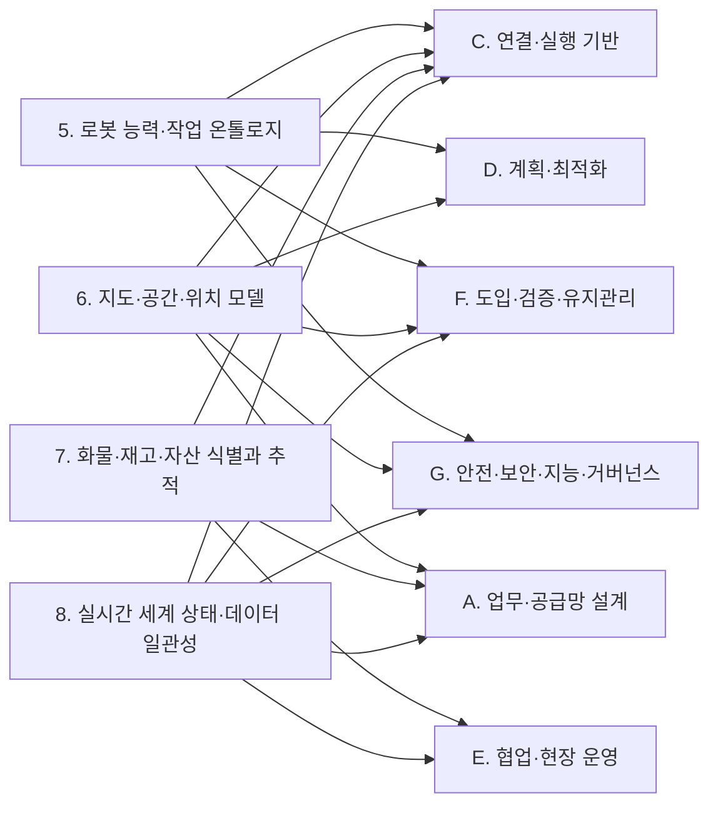
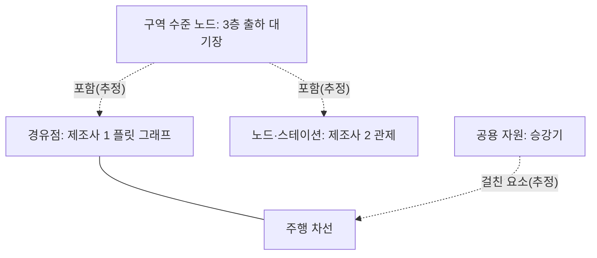
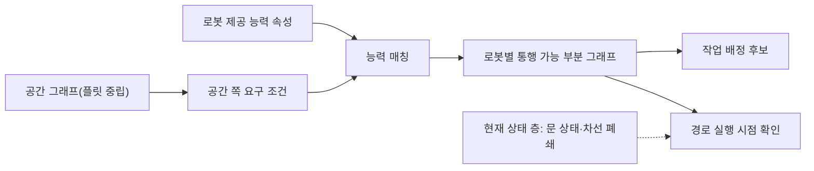
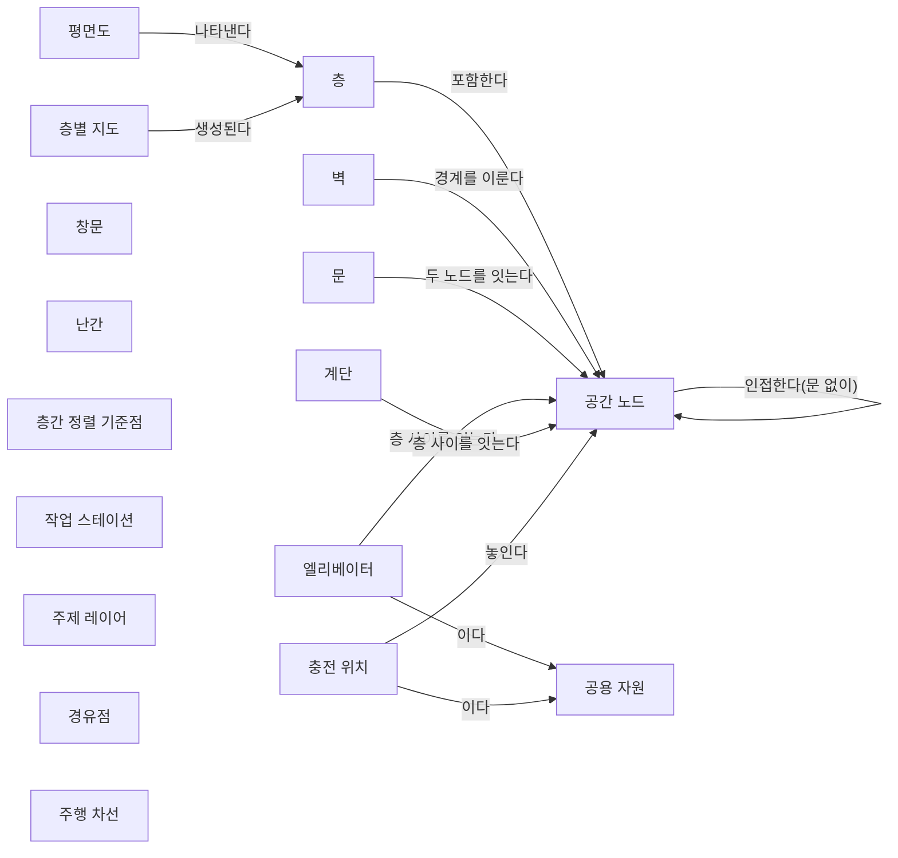
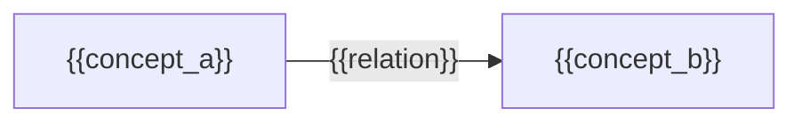

(너의 규칙은 시스템 프롬프트의 agents/shared-rules.md 와 agents/storyteller.md 이다. 아래는 이번 실행의 컨텍스트와 입력이다.)

## 실행 컨텍스트

- run_id: 2026-09-25-70
- date: 2026-09-25
- run_type: track (트랙 실행)
- 대상: 트랙 floorplan-recognition (건축 도면 자동 인식) · 현재 단계: 단계 3. 구현 가설 설계 · 이번에 다룰 백로그 질문 id: q3-04 · 중심 세부영역: 6. 지도·공간·위치 모델 (B. 공통 정보·환경 모델)
- 예산:
    - max_search_queries: 40
    - max_sources_per_run: 20
    - new_topic_pages: 1
    - page_updates: 2
    - max_retries: 2
- 환경 알림: web_fetch_available: false · fetch_mode: mirror_only (일반 웹 페이지 열람은 네트워크 정책으로 막혀 있다. raw.githubusercontent.com 은 열린다: 공식 문서가 GitHub 에 있는 출처는 입력의 config/source_mirrors.yaml 경로를 WebFetch 로 열어 원문을 읽고 sources[].fetched=true, fetched_via=github_raw, fetch_url 을 적는다. 입력에 원문 텍스트(data/source_texts)가 있는 출처는 fetched_via=inbox. 그 밖의 출처는 fetched=false 이며 코드가 신뢰도 상한(medium)을 강제한다 — 공통 규칙 0절 6항)
- 언어: ko

## 입력

### runs/2026-09-25-70/target.json

```json
{
  "run_id": "2026-09-25-70",
  "date": "2026-09-25",
  "weekday": "Fri",
  "run_number": 70,
  "run_type": "track",
  "forced": true,
  "target": {
    "area_no": 6,
    "area_name": "6. 지도·공간·위치 모델",
    "category": "B. 공통 정보·환경 모델",
    "category_letter": "B"
  },
  "topic": null,
  "track": {
    "slug": "floorplan-recognition",
    "name": "건축 도면 자동 인식",
    "stage": 3,
    "stages": 5,
    "stage_name": "구현 가설 설계",
    "question_ids": [
      "q3-04"
    ],
    "user_questions": [],
    "runs_per_week": 3,
    "question_rationale": "CLI 지정 질문 id"
  },
  "corrections": [],
  "budget": {
    "max_search_queries": 40,
    "max_sources_per_run": 20,
    "new_topic_pages": 1,
    "page_updates": 2,
    "max_retries": 2
  },
  "priority_reason": null,
  "priority_questions": [],
  "excluded_areas": [],
  "lifted_areas": [],
  "deferred": {
    "monthly_recheck": false,
    "weekly_review": true
  },
  "selection_rationale": "CLI 지정 run_type=track, area=6; 트랙 실행일(Fri, track_days 앞 3개) → 트랙 floorplan-recognition 단계 3, 질문 q3-04 (CLI 지정 질문 id)"
}
```

### runs/2026-09-25-70/research.json

```json
{
  "run_id": "2026-09-25-70",
  "date": "2026-09-25",
  "run_type": "track",
  "target": {
    "area_no": 6,
    "area_name": "6. 지도·공간·위치 모델",
    "category": "B. 공통 정보·환경 모델"
  },
  "gaps": [
    "단계 3 질문 q3-04 열림(target.json 지정, CLI 지정 질문 id). 단계 3 페이지 3절에 q3-04 소제목 없음",
    "완료 조건: 아이디어 3. 건축 도면 자동 인식 5절 '핵심 구성 요소' 가운데 시뮬레이션 초기값이 '아직 조사되지 않은 구성 요소'로 남아 있음",
    "완료 조건: 실험 페이지에 사용자에게 제안하는 실험 계획 없음(이번 실행 범위 밖, 스토리텔러 몫)",
    "공간 그래프 스키마 초안 v0.8: 층 고도, 문 구동 유형, 엘리베이터 칸 치수처럼 시뮬레이션 월드 생성에 쓰이는 속성이 없음",
    "22. 시뮬레이션·예측용 디지털 트윈 쪽에 도면에서 만든 층별 지도가 시뮬레이션 초기값으로 쓰이려면 무엇이 더 필요한지의 근거 없음"
  ],
  "research_questions": [
    "제조사마다 다른 지도에서 ‘3층 출하 대기장’을 어떻게 동일한 장소로 인식할까? [분류원문]",
    "q3-04 생성한 층별 지도를 시뮬레이션 초기값으로 쓰려면 어떤 정보가 더 필요한가?",
    "Open-RMF traffic-editor·building_map_generator 는 층별 주석에서 시뮬레이션 월드를 만들 때 어떤 주석(벽 높이·바닥·층 고도·문·승강기·스폰 위치)과 플러그인·로봇 모델 파라미터를 요구하는가? (단계 3 페이지 3절, 아이디어 페이지 5절 겨냥)",
    "BIM·CAD 도면에서 로봇 시뮬레이션 환경이나 가상 지도를 자동 생성한 연구(국내 포함)는 무엇을 자동화하고 무엇이 빠지는가? (22. 시뮬레이션·예측용 디지털 트윈, 한국 자료 우선 규칙)",
    "성수기 주문량이 늘면 어디가 먼저 막힐까? [분류원문]",
    "물류 시뮬레이션의 입력 데이터(주문 흐름·초기 재고·자원·일정)는 레이아웃 외에 무엇이며, 이를 표준화하거나 수집 부담을 측정한 자료가 있는가? (28. 표준·상호운용성·다사업자 거버넌스 연결)",
    "운영 중 예측용 시뮬레이션은 현재 상태로 초기화해야 하는가, 8. 실시간 세계 상태·데이터 일관성의 현재 상태와 도면 기반 정적 초기값은 어떻게 구분되는가?"
  ],
  "findings": [
    {
      "id": "f1",
      "claim": "Open-RMF 의 building_map_generator 는 traffic-editor 주석에서 바닥·벽 메시, 정적 객체 모델, 문·승강기 같은 동적 설비를 담은 Gazebo·Ignition 월드 파일과, 플릿 어댑터가 계획에 쓰는 플릿별 주행 그래프 YAML 파일을 함께 만든다.",
      "tag": "사실",
      "source_ids": [
        "ref-406",
        "ref-441"
      ],
      "cross_checked": false,
      "confidence": "medium",
      "evidence_excerpt": "simulation.md: building_map_generator 가 '.world' 파일(바닥·벽 메시, 정적 모델, 문·승강기)과 fleet_adapters 가 계획에 쓰는 '.yaml' 주행 그래프를 생성. rmf_traffic_editor README 도 nav·gazebo 인자로 두 산출물을 만든다고 적음(재인용: 2026-09-25-54). 두 출처는 같은 Open Robotics 자료 (발행일 미확인, 확인일 기준)",
      "as_of": "2026-09-25",
      "flow_step": null,
      "flow_item": null
    },
    {
      "id": "f2",
      "claim": "Open-RMF traffic-editor 문서는 시뮬레이션에 쓰이는 주석으로 질감을 가진 바닥 다각형(시뮬레이션의 지면으로 필수), 높이·두께를 가진 벽, 층 고도, 모델 라이브러리의 정적 모델, 유형(hinged·double_hinged·sliding·double_sliding)과 동작 범위를 가진 문, 칸 치수·문·운행 층을 가진 승강기, 로봇 스폰 정보(spawn_robot_type·spawn_robot_name)와 충전소·작업셀 경유점 속성을 둔다.",
      "tag": "사실",
      "source_ids": [
        "ref-079"
      ],
      "cross_checked": false,
      "confidence": "medium",
      "evidence_excerpt": "traffic-editor.md 원문(github_raw): floors 는 'essential for simulations as it provides a ground plane', 벽 높이·두께, level elevation, models, 문 유형 4종, 승강기 칸 치수, 경유점 spawn_robot_type·spawn_robot_name·is_charger·pickup_dispenser·dropoff_ingestor (발행일 미확인, 확인일 기준)",
      "as_of": "2026-09-25",
      "flow_step": null,
      "flow_item": null
    },
    {
      "id": "f3",
      "claim": "Open-RMF 시뮬레이션은 로봇·설비 동작을 플러그인으로 재현하며, 로봇용 slotcar 플러그인은 2륜 차동 구동을 가정하고 주행·회전 속도와 가속도, 바퀴 반지름, 차체 폭, 정지 거리·반경 같은 운동 파라미터를 요구하고, 문·승강기 플러그인과 적재·하역을 순간 이동으로 흉내 내는 디스펜서·인제스터 플러그인을 따로 둔다.",
      "tag": "사실",
      "source_ids": [
        "ref-406"
      ],
      "cross_checked": false,
      "confidence": "medium",
      "evidence_excerpt": "simulation.md 원문(github_raw): slotcar 는 'two-wheel differential drive' 가정, 파라미터: drive speed/acceleration, turn speed/acceleration, tire radius, base width, stop distance, radius. Door·Lift 플러그인, TeleportDispenser·TeleportIngestor (발행일 미확인, 확인일 기준)",
      "as_of": "2026-09-25",
      "flow_step": null,
      "flow_item": "수행 자원"
    },
    {
      "id": "f4",
      "claim": "Open-RMF 시뮬레이션 문서는 시뮬레이션으로 하드웨어 비용 없이 장시간·가속 조건의 시험을 할 수 있고, 실제 하드웨어 기록으로 상황을 시뮬레이션에서 재현해 디버깅할 수 있다고 설명한다.",
      "tag": "사실",
      "source_ids": [
        "ref-406"
      ],
      "cross_checked": false,
      "confidence": "medium",
      "evidence_excerpt": "simulation.md 원문: 시나리오를 'for hours at a stretch, at faster speeds' 실행, 기록된 하드웨어 데이터로 'recreate the scenario in simulation' (발행일 미확인, 확인일 기준)",
      "as_of": "2026-09-25",
      "flow_step": null,
      "flow_item": null
    },
    {
      "id": "f5",
      "claim": "Open-RMF 플릿 어댑터 템플릿 설정은 최대 선·각속도와 가속도, 차체 반경·근접 반경, 후진 가능 여부, 배터리·재충전 임계값, 수행 가능 작업 유형을 요구해, 도면이 주지 않는 로봇 쪽 시뮬레이션 파라미터의 원천이 된다.",
      "tag": "사실",
      "source_ids": [
        "ref-105"
      ],
      "cross_checked": false,
      "confidence": "medium",
      "evidence_excerpt": "fleet_adapter_template config.yaml: 속도·가속 한계, footprint·vicinity, reversible, battery·recharge_threshold, task_capabilities (재인용: 2026-09-25-65) (발행일 미확인, 확인일 기준)",
      "as_of": "2026-09-25",
      "flow_step": null,
      "flow_item": "수행 자원",
      "source_unopened": true
    },
    {
      "id": "f6",
      "claim": "VDA 5050 팩트시트 JSON 스키마는 로봇의 최소·최대 속도, 최소·최대 높이, 폭, 길이, 최대 적재 질량 같은 물리 파라미터를 두어, 제조사가 선언한 값을 시뮬레이션 로봇 모델 파라미터 후보로 쓸 수 있는 형식을 제공한다.",
      "tag": "사실",
      "source_ids": [
        "ref-228"
      ],
      "cross_checked": false,
      "confidence": "medium",
      "evidence_excerpt": "factsheet.schema: physicalParameters(speedMin·speedMax·heightMin·heightMax·width·length), typeSpecification 의 maxLoadMass (재인용: 2026-09-25-65) (발행일 미확인, 확인일 기준)",
      "as_of": "2026-09-25",
      "flow_step": null,
      "flow_item": "수행 자원",
      "source_unopened": true
    },
    {
      "id": "f7",
      "claim": "창고 저장 위치 배정 시뮬레이션 SLAPStack 은 사용 사례 하나를 창고 레이아웃, 도착 시각을 가진 입고·출고 주문 흐름, 시작 시점의 SKU별 재고(초기 충전 수준)의 세 요소로 정의하고, 레이아웃 파일(CSV 격자 코드: 주행 경로·입고·출고 지점·통로·경계·저장 위치)에는 충전 설비와 차량 사양을 두지 않고 별도 파라미터로 설정한다.",
      "tag": "사실",
      "source_ids": [
        "ref-645"
      ],
      "cross_checked": false,
      "confidence": "medium",
      "evidence_excerpt": "SLAPStack README 원문(github_raw): use-case = warehouse layout, order stream, initial fill level. 레이아웃 코드 -5 travel paths, -4 output, -3 input, -2 aisles, -1 boundary, 0 storage. 충전·AMR 사양은 레이아웃 파일 밖 (발행일 미확인, 확인일 기준)",
      "as_of": "2026-09-25",
      "flow_step": "적치",
      "flow_item": "시작 조건"
    },
    {
      "id": "f8",
      "claim": "SISO 의 핵심 제조 시뮬레이션 데이터(Core Manufacturing Simulation Data, CMSD) 표준은 시뮬레이션과 다른 정보 시스템 사이 데이터 교환을 위한 중립 정보 모델로, 레이아웃·자원·주문·재고·일정·달력·분포 같은 엔터티를 두며 UML 판(SISO-STD-008-2010)과 XML 판(SISO-STD-008-01-2012)으로 발행되었다.",
      "tag": "사실",
      "source_ids": [
        "ref-647"
      ],
      "cross_checked": false,
      "confidence": "medium",
      "evidence_excerpt": "검색 요약 기준: 주요 엔터티 bill of materials, calendar, distribution, inventory, job, layout, order, part, process plan, resource, schedule. 목적은 제조 분야 시뮬레이션과 정보 시스템의 상호운용. 대상은 제조이며 물류 적용은 미확인",
      "as_of": "2012",
      "flow_step": null,
      "flow_item": null,
      "source_unopened": true
    },
    {
      "id": "f9",
      "claim": "Skoogh·Johansson 의 실증 연구는 이산 사건 시뮬레이션 프로젝트에서 입력 데이터 수집이 평균적으로 전체 프로젝트 시간의 31% 를 차지한다고 보고했다.",
      "tag": "사실",
      "source_ids": [
        "ref-646"
      ],
      "cross_checked": false,
      "confidence": "medium",
      "evidence_excerpt": "검색 요약 기준: 'data collection constitutes on average 31% of the total project time' (Skoogh and Johansson 2007). 제조 시뮬레이션 프로젝트 대상, 조사 표본 규모 미확인",
      "as_of": "2007",
      "flow_step": null,
      "flow_item": "예외·성과",
      "source_unopened": true
    },
    {
      "id": "f10",
      "claim": "IFAC 2024 논문은 운영 결정을 돕는 시뮬레이션 기반 디지털 트윈은 실제 시스템의 부하 상태와 빠르고 정확하게 동기화해야 한다고 보고, 창고 관리 시스템(SAP EWM)을 쓰는 배송 센터 예에서 실제 상태로 초기화한 모델이 빈 상태에서 시작하는 기준 모델보다 과도 구간을 크게 줄인다고 보고했다.",
      "tag": "사실",
      "source_ids": [
        "ref-648"
      ],
      "cross_checked": false,
      "confidence": "medium",
      "evidence_excerpt": "검색 요약 기준: 'synchronize the simulation model quickly and accurately with the load state in the real system', 기준 모델은 'empty' 부하 상태에서 시작, 제안 방식이 'significantly shorten the transient behavior'. 저자 미확인",
      "as_of": "2024",
      "flow_step": null,
      "flow_item": "시작 조건",
      "source_unopened": true
    },
    {
      "id": "f11",
      "claim": "연계 대상: Lee·Woo·Shin(IJPEM, 2026)은 2D 건축 CAD 도면으로 3D 가상 환경을 만든 뒤 2D 점유 격자 지도를 자동 생성해 센서 주행 없이 AMCL 위치추정에 쓰고, 가상 지도의 평균 이동 오차 0.17±0.06 m, 회전 오차 3.59°±1.78°, 궤적 일관성 오차 0.10±0.08 m 로 SLAM 기반 지도와 비슷했다고 보고했다.",
      "tag": "사실",
      "source_ids": [
        "ref-644"
      ],
      "cross_checked": false,
      "confidence": "medium",
      "evidence_excerpt": "검색 요약 기준: 3D virtual environment based on 2D CAD architectural drawings, 2D OGM 자동 생성, translational RMSE 0.17 ± 0.06 m, rotational RMSE 3.59° ± 1.78°, TCE 0.10 ± 0.08 m (Cartographer·SLAM Toolbox·RTAB-Map 과 비교). 시험 환경 규모 미확인, 저자 보고 단일 출처",
      "as_of": "2026",
      "flow_step": null,
      "flow_item": null,
      "source_unopened": true
    },
    {
      "id": "f12",
      "claim": "4D BIM 과 로봇 작업 계획을 잇는 연구(arXiv 2402.03602)는 BIM 요소를 FBX 로 내보낸 뒤 상태 속성에 따라 이미 시공된 요소는 현장 환경 SDF 하나로 묶고 로봇이 시공할 요소는 개별 SDF 로 바꾸며, 로봇 URDF 도 SDF 로 바꿔 Gazebo 시뮬레이션에 넣는다(건설 로봇 대상).",
      "tag": "사실",
      "source_ids": [
        "ref-649"
      ],
      "cross_checked": false,
      "confidence": "medium",
      "evidence_excerpt": "검색 요약 기준: status 'constructed' 요소는 하나의 SDF 로, 'not constructed' 이고 robotize 'true' 인 요소는 개별 SDF 로, 기하는 FBX 로 내보냄, 로봇 URDF 를 SDF 로 변환. 건설 현장 대상이며 물류 적용 미확인",
      "as_of": "2024-02",
      "flow_step": null,
      "flow_item": null,
      "source_unopened": true
    },
    {
      "id": "f13",
      "claim": "Vega-Torres 외는 BIM 에서 자동 생성한 2D 점유 격자 지도가 구조 요소만 담으며, 가구·잡동사니와 설계–시공 편차 때문에 BIM 이 현실을 정확히 나타낸다는 가정이 성립하지 않는다고 지적했다.",
      "tag": "사실",
      "source_ids": [
        "ref-081"
      ],
      "cross_checked": false,
      "confidence": "medium",
      "evidence_excerpt": "구조 요소만 담은 BIM 기반 격자 지도, 가구·설계–시공 편차로 가정 불성립 (재인용: 2026-09-25-36)",
      "as_of": "2023-08",
      "flow_step": null,
      "flow_item": null,
      "source_unopened": true
    },
    {
      "id": "f14",
      "claim": "q3-04 에 대해 확인한 자료를 이 위키가 묶으면, 도면에서 만든 층별 지도를 시뮬레이션 초기값으로 쓰려면 평면 형상 외에 (1) 3차원·층 정보(벽 높이, 바닥, 층 고도), (2) 설비 동작 정보(문 구동 유형·동작 범위, 승강기 칸 치수·운행 층), (3) 로봇 모델(운동 파라미터·차체·배터리), (4) 운영 요소(스폰 위치, 충전소, 적재·하역 작업셀), (5) 업무 부하(주문 흐름, 초기 재고), (6) 운영 중 예측이라면 현재 상태가 더 필요한 것으로 보인다.",
      "tag": "추정",
      "source_ids": [
        "ref-079",
        "ref-406",
        "ref-105",
        "ref-228",
        "ref-645",
        "ref-648"
      ],
      "cross_checked": false,
      "confidence": "low",
      "evidence_excerpt": "f2(주석 목록)·f3(플러그인·로봇 파라미터)·f5·f6(로봇 설정·팩트시트)·f7(레이아웃·주문 흐름·초기 재고)·f10(현재 상태 초기화)을 종합. 이 여섯 묶음을 제시한 단일 출처 없음",
      "as_of": "2026-09-25",
      "flow_step": null,
      "flow_item": null
    },
    {
      "id": "f15",
      "claim": "위 여섯 묶음 가운데 도면 인식이 직접 채울 수 있는 것은 평면 형상과 문·승강기·계단의 위치 정도이고, 층 고도·벽 높이는 층 정보나 BIM 에서, 문·승강기 동작 파라미터와 로봇 모델은 설비·제조사 자료에서, 주문 흐름·초기 재고는 창고 관리 시스템에서 와야 하며, 가구·랙 같은 비구조 요소는 도면 기반 결과에 빠질 수 있는 것으로 보인다.",
      "tag": "추정",
      "source_ids": [
        "ref-079",
        "ref-406",
        "ref-645",
        "ref-081",
        "ref-644"
      ],
      "cross_checked": false,
      "confidence": "low",
      "evidence_excerpt": "traffic-editor 는 벽 높이·층 고도·문 유형을 사람이 주석, slotcar 는 로봇 파라미터를 설정으로 받음, SLAPStack 은 주문 흐름·초기 재고를 레이아웃과 따로 둠, BIM 기반 지도는 구조 요소만 담음(f13). 이 위키의 종합",
      "as_of": "2026-09-25",
      "flow_step": null,
      "flow_item": null
    },
    {
      "id": "f16",
      "claim": "분류 원문 7장의 구분에 따라, 설계·도입 검토용 시뮬레이션은 도면 기반 정적 초기값과 가정한 수요로 시작하고, 운영 중 예측용 시뮬레이션은 8. 실시간 세계 상태·데이터 일관성이 표현하는 현재 상태(로봇 위치·배터리, 대기 작업, 재고)로 초기화하는 것으로 나누어야 22. 시뮬레이션·예측용 디지털 트윈의 초기값 요구가 섞이지 않을 것으로 보인다.",
      "tag": "추정",
      "source_ids": [
        "ref-648",
        "ref-406"
      ],
      "cross_checked": false,
      "confidence": "low",
      "evidence_excerpt": "IFAC 2024 는 운영 결정용 트윈은 실제 부하 상태로 초기화해야 한다고 보고(f10), Open-RMF 시뮬레이션은 주석 파일에서 빈 월드를 생성(f1). 두 용도의 구분은 이 위키의 종합",
      "as_of": "2026-09-25",
      "flow_step": null,
      "flow_item": "시작 조건"
    },
    {
      "id": "f17",
      "claim": "출하 성수기 병목(‘성수기 주문량이 늘면 어디가 먼저 막힐까?’)을 도면 기반 시뮬레이션으로 보려면 층별 지도만으로는 부족하고, 출고 주문 흐름과 초기 재고, 충전소·승강기의 수용량과 동작 시간, 로봇 대수·배터리 파라미터가 함께 주어져야 할 것으로 보인다.",
      "tag": "추정",
      "source_ids": [
        "ref-645",
        "ref-406",
        "ref-105",
        "ref-647"
      ],
      "cross_checked": false,
      "confidence": "low",
      "evidence_excerpt": "SLAPStack 의 사용 사례 3요소(f7), Open-RMF 승강기·문 플러그인과 로봇 파라미터(f3), 플릿 어댑터 배터리 설정(f5), CMSD 의 주문·재고·자원 엔터티(f8)를 종합한 추정",
      "as_of": "2026-09-25",
      "flow_step": "출하",
      "flow_item": "예외·성과"
    },
    {
      "id": "f18",
      "claim": "시뮬레이션 입력 데이터 수집이 프로젝트 시간의 큰 몫을 차지한다는 보고와 레이아웃 외 입력이 따로 정의되는 사례를 보면, 도면 기반 자동 생성은 입력 준비 가운데 레이아웃 부분만 줄이고, 주문·자원·재고 데이터를 중립 구조로 잇는 일은 별도 과제로 남을 것으로 보인다.",
      "tag": "추정",
      "source_ids": [
        "ref-646",
        "ref-647",
        "ref-645"
      ],
      "cross_checked": false,
      "confidence": "low",
      "evidence_excerpt": "입력 데이터 수집 평균 31%(f9, 제조 대상), CMSD 의 레이아웃·주문·자원·재고 분리(f8), SLAPStack 의 레이아웃·주문·초기 재고 분리(f7)를 종합한 추정. 도면 자동화가 줄이는 몫을 측정한 자료는 찾지 못함",
      "as_of": "2026-09-25",
      "flow_step": null,
      "flow_item": "예외·성과"
    },
    {
      "id": "f19",
      "claim": "분류 원문 질문의 ‘3층 출하 대기장’을 시뮬레이션에서 재현하려면 그 구역 노드와 경유점이 층 고도를 가진 층에 속하고 승강기 칸·운행 층과 이어져 있어야 하며, 대기장에 스폰하거나 도착하는 로봇이 같은 이름으로 참조되어야 할 것으로 보인다.",
      "tag": "추정",
      "source_ids": [
        "ref-079",
        "ref-406"
      ],
      "cross_checked": false,
      "confidence": "low",
      "evidence_excerpt": "traffic-editor 의 층 고도·승강기 칸·경유점 이름·spawn 속성(f2)과 승강기 플러그인의 층간 이동(f3)을 바탕으로 한 추정",
      "as_of": "2026-09-25",
      "flow_step": "출하",
      "flow_item": "완료·인계"
    }
  ],
  "sources": [
    {
      "id": "ref-406",
      "org": "Open Robotics",
      "title": "Simulation - Programming Multiple Robots with ROS 2",
      "published": null,
      "url": "https://osrf.github.io/ros2multirobotbook/simulation.html",
      "type": "오픈소스 문서",
      "reliability": "medium",
      "accessed": "2026-09-25",
      "summary": "building_map_generator 의 Gazebo 월드·주행 그래프 생성, slotcar·문·승강기·디스펜서·인제스터 플러그인과 로봇 운동 파라미터, 시뮬레이션 시험의 이점을 설명한다.",
      "fetched": true,
      "fetched_via": "github_raw",
      "fetch_url": "https://raw.githubusercontent.com/osrf/ros2multirobotbook/master/src/simulation.md",
      "source_unopened": false
    },
    {
      "id": "ref-079",
      "org": "Open Robotics",
      "title": "Traffic Editor - Programming Multiple Robots with ROS 2",
      "published": null,
      "url": "https://osrf.github.io/ros2multirobotbook/traffic-editor.html",
      "type": "오픈소스 문서",
      "reliability": "medium",
      "accessed": "2026-09-25",
      "summary": "traffic-editor 의 바닥·벽·층 고도·모델·문·승강기·경유점 속성(스폰·충전소·작업셀) 주석과 시뮬레이션 월드 생성을 설명한다.",
      "fetched": true,
      "fetched_via": "github_raw",
      "fetch_url": "https://raw.githubusercontent.com/osrf/ros2multirobotbook/master/src/traffic-editor.md",
      "source_unopened": false
    },
    {
      "id": "ref-441",
      "org": "Open Robotics (open-rmf)",
      "title": "rmf_traffic_editor — README",
      "published": null,
      "url": "https://github.com/open-rmf/rmf_traffic_editor",
      "type": "오픈소스 문서",
      "reliability": "medium",
      "accessed": "2026-09-25",
      "summary": "원문 미열람. 주석 결과를 .building.yaml 로 저장하고 building_map_generator 로 주행 그래프와 시뮬레이터 월드를 생성한다(이번 실행에서 다시 열지 않음).",
      "fetched": false,
      "fetched_via": null,
      "fetch_url": null,
      "source_unopened": true
    },
    {
      "id": "ref-105",
      "org": "Open Robotics (open-rmf)",
      "title": "fleet_adapter_template — fleet_adapter_template/config.yaml",
      "published": null,
      "url": "https://github.com/open-rmf/fleet_adapter_template/blob/main/fleet_adapter_template/config.yaml",
      "type": "오픈소스 문서",
      "reliability": "medium",
      "accessed": "2026-09-25",
      "summary": "원문 미열람. 플릿 어댑터 설정: 속도·가속 한계, 차체 반경, 배터리·재충전 임계값, 작업 유형, 좌표 대응점(이번 실행에서 다시 열지 않음).",
      "fetched": false,
      "fetched_via": null,
      "fetch_url": null,
      "source_unopened": true
    },
    {
      "id": "ref-228",
      "org": "VDA / VDMA (VDA5050 GitHub)",
      "title": "VDA5050/VDA5050 — json_schemas/factsheet.schema",
      "published": null,
      "url": "https://github.com/VDA5050/VDA5050/blob/main/json_schemas/factsheet.schema",
      "type": "표준",
      "reliability": "medium",
      "accessed": "2026-09-25",
      "summary": "원문 미열람. VDA 5050 팩트시트 스키마: 로봇 유형 사양, 물리 파라미터, 지원 동작(이번 실행에서 다시 열지 않음).",
      "fetched": false,
      "fetched_via": null,
      "fetch_url": null,
      "source_unopened": true
    },
    {
      "id": "ref-081",
      "org": "Vega-Torres, M. A. 외",
      "title": "Occupancy Grid Map to Pose Graph-based Map: Robust BIM-based 2D-LiDAR Localization for Lifelong Indoor Navigation in Changing and Dynamic Environments",
      "published": "2023-08",
      "url": "https://arxiv.org/abs/2308.05443",
      "type": "논문",
      "reliability": "medium",
      "accessed": "2026-09-25",
      "summary": "원문 미열람. BIM 에서 만든 격자 지도는 구조 요소만 담아 가구·설계–시공 편차를 반영하지 못한다고 지적한다.",
      "fetched": false,
      "fetched_via": null,
      "fetch_url": null,
      "source_unopened": true
    },
    {
      "id": "ref-644",
      "org": "Lee, H.-C., Woo, H.-M., & Shin, S. (International Journal of Precision Engineering and Manufacturing)",
      "title": "Digital Twin-based Sensor-Free Virtual Mapping for Autonomous Mobile Robot Localization",
      "published": "2026",
      "url": "https://link.springer.com/article/10.1007/s12541-026-01598-2",
      "type": "논문",
      "reliability": "medium",
      "accessed": "2026-09-25",
      "summary": "원문 미열람. 2D 건축 CAD 도면으로 3D 가상 환경을 만들어 2D 점유 격자 지도를 자동 생성하고 AMCL 위치추정 오차를 SLAM 지도와 비교했다(한국정밀공학회 발행 학술지).",
      "fetched": false,
      "fetched_via": null,
      "fetch_url": null,
      "source_unopened": true
    },
    {
      "id": "ref-645",
      "org": "Rinciog, A. 외 (malerinc/slapstack GitHub)",
      "title": "slapstack — README (SLAPStack: storage location assignment simulation for block-stacking warehouses)",
      "published": null,
      "url": "https://github.com/malerinc/slapstack",
      "type": "오픈소스 문서",
      "reliability": "medium",
      "accessed": "2026-09-25",
      "summary": "블록 적재 창고 시뮬레이션의 사용 사례를 레이아웃·주문 흐름·초기 충전 수준으로 정의하고, 레이아웃 CSV 격자 코드(주행 경로·입출고 지점·통로·경계·저장 위치)를 설명한다.",
      "fetched": true,
      "fetched_via": "github_raw",
      "fetch_url": "https://raw.githubusercontent.com/malerinc/slapstack/master/README.md",
      "source_unopened": false
    },
    {
      "id": "ref-646",
      "org": "Skoogh, A., & Johansson, B.",
      "title": "Time-consumption analysis of input data activities in discrete event simulation projects",
      "published": "2007",
      "url": "https://www.researchgate.net/publication/235719405_TIME-CONSUMPTION_ANALYSIS_OF_INPUT_DATA_ACTIVITIES_IN_DISCRETE_EVENT_SIMULATION_PROJECTS",
      "type": "논문",
      "reliability": "medium",
      "accessed": "2026-09-25",
      "summary": "원문 미열람. 이산 사건 시뮬레이션 프로젝트에서 입력 데이터 활동의 시간 소요를 분석했으며, 데이터 수집이 평균 프로젝트 시간의 31% 라는 결과가 후속 문헌에 인용된다.",
      "fetched": false,
      "fetched_via": null,
      "fetch_url": null,
      "source_unopened": true
    },
    {
      "id": "ref-647",
      "org": "NIST (Journal of Research of the National Institute of Standards and Technology)",
      "title": "A Journey in Standard Development: The Core Manufacturing Simulation Data (CMSD) Information Model",
      "published": null,
      "url": "https://pmc.ncbi.nlm.nih.gov/articles/PMC4730674/",
      "type": "정부·연구기관",
      "reliability": "medium",
      "accessed": "2026-09-25",
      "summary": "원문 미열람. SISO CMSD 정보 모델(SISO-STD-008-2010, SISO-STD-008-01-2012)의 개발 경과와 레이아웃·자원·주문·재고 등 주요 엔터티를 설명한다.",
      "fetched": false,
      "fetched_via": null,
      "fetch_url": null,
      "source_unopened": true
    },
    {
      "id": "ref-648",
      "org": "IFAC-PapersOnLine 게재 논문 저자(미확인)",
      "title": "Initialization of Simulation-Based Digital Twins for Internal Transport Systems",
      "published": "2024",
      "url": "https://www.sciencedirect.com/science/article/pii/S2405896324015374",
      "type": "논문",
      "reliability": "medium",
      "accessed": "2026-09-25",
      "summary": "원문 미열람. 사내 운송 시스템용 시뮬레이션 기반 디지털 트윈을 실제 부하 상태(SAP EWM 을 쓰는 배송 센터 예)로 초기화해 과도 구간을 줄이는 개념을 제시한다.",
      "fetched": false,
      "fetched_via": null,
      "fetch_url": null,
      "source_unopened": true
    },
    {
      "id": "ref-649",
      "org": "arXiv 2402.03602 저자(미확인)",
      "title": "Integration of 4D BIM and Robot Task Planning: Creation and Flow of Construction-Related Information for Action-Level Simulation of Indoor Wall Frame Installation",
      "published": "2024-02",
      "url": "https://arxiv.org/abs/2402.03602",
      "type": "논문",
      "reliability": "medium",
      "accessed": "2026-09-25",
      "summary": "원문 미열람. 4D BIM 요소를 상태 속성에 따라 SDF 로 변환해 로봇 모델과 함께 Gazebo 시뮬레이션에 넣는 건설 로봇 작업 계획 연구다.",
      "fetched": false,
      "fetched_via": null,
      "fetch_url": null,
      "source_unopened": true
    }
  ],
  "page_proposals": [
    {
      "action": "update",
      "path": "docs/tracks/floorplan-recognition/stage-3-implementation-hypothesis.md",
      "sections": [
        "2",
        "3",
        "4",
        "5",
        "6",
        "8",
        "9"
      ],
      "rationale": "q3-04 답: f1·f2·f3·f4·f5·f6·f7·f8·f9·f10·f11·f12·f13·f14·f15·f16·f17·f18·f19 (신뢰도 low) — 2절 q3-04 상태 답함, 3절 q3-04 소제목 신설({#q3-04}): Open-RMF 시뮬레이션 월드 생성과 주석(f1·f2), 플러그인·로봇 파라미터(f3·f4), 로봇 모델 원천(f5·f6), 업무 부하 입력(f7·f8), 입력 데이터 부담(f9), 현재 상태 초기화(f10), 도면·BIM 기반 가상 환경 연구(f11 연계 대상, f12 건설 대상, f13), 종합: 여섯 묶음(f14)·도면이 채우는 몫(f15)·8과 22 구분(f16)·출하 성수기 시나리오(f17)·입력 준비 부담(f18)·분류 원문 질문(f19) / 4절 결론·불확실성 / 5절 후속 질문 / 6절 완료 조건 현황(시뮬레이션 초기값 행) / 8절 출처 / 9절 이력"
    },
    {
      "action": "update",
      "path": "docs/ideas/floorplan-recognition.md",
      "sections": [
        "5"
      ],
      "rationale": "아이디어 페이지 5절(트랙 산출물): '핵심 구성 요소'에 '시뮬레이션 초기값' 소절 신설 — 근거 f1·f2·f3·f7·f10, 구현 가설 f14·f15·f16(추정), '아직 조사되지 않은 구성 요소' 목록에서 q3-04 제거"
    },
    {
      "action": "update",
      "path": "docs/tracks/floorplan-recognition/space-graph-schema-draft.md",
      "sections": [
        "2",
        "6"
      ],
      "rationale": "트랙 산출물 갱신: track.ontology_changes 가 검증 승인되면 층 '고도'(f2), 문 '구동 유형·동작 범위'(f2·f3), 엘리베이터 '칸 치수'(f2) 속성 반영. 미승인 제안과 로봇 스폰 위치·주문 흐름·초기 재고를 스키마 밖 입력으로 둘지(f14·f15)는 6절 질문으로"
    },
    {
      "action": "update",
      "path": "docs/categories/f-deployment-verification-and-maintenance/22-simulation-and-predictive-digital-twin.md",
      "sections": [
        "6",
        "8"
      ],
      "rationale": "트랙 floorplan-recognition 단계 3 반영 제안 (f1, f3, f7, f8, f10, f14, f16, f17): 도면 주석에서 시뮬레이션 월드를 만드는 방식과 추가로 필요한 입력(로봇 모델·주문 흐름·초기 재고·현재 상태), 설계용과 운영 예측용 초기화의 구분(추정), CMSD·SLAPStack·IFAC 2024 초기화 연구"
    },
    {
      "action": "update",
      "path": "docs/categories/b-common-information-and-environment-model/06-map-space-and-location-model.md",
      "sections": [
        "6",
        "8"
      ],
      "rationale": "트랙 floorplan-recognition 단계 3 반영 제안 (f11, f13, f15): 2D 건축 CAD 도면에서 가상 환경·점유 격자 지도를 자동 생성한 국내 저자 연구(연계 대상), 도면 기반 결과에 빠지는 비구조 요소(추정)"
    },
    {
      "action": "update",
      "path": "docs/categories/b-common-information-and-environment-model/08-real-time-world-state-and-data-consistency.md",
      "sections": [
        "10"
      ],
      "rationale": "트랙 floorplan-recognition 단계 3 반영 제안 (f10, f16): 운영 중 예측 시뮬레이션은 현재 상태(부하 상태)로 초기화한다는 연구와, 8. 실시간 세계 상태·데이터 일관성이 그 초기값을 공급하는 쪽이라는 구분(추정)"
    }
  ],
  "glossary_candidates": [
    {
      "term_ko": "워밍업 기간",
      "term_en": "Warm-up Period",
      "definition": "빈 상태에서 시작한 시뮬레이션이 안정 상태에 이를 때까지 결과 집계에서 제외하는 초기 구간으로, 실제 부하 상태로 초기화하면 줄일 수 있다."
    },
    {
      "term_ko": "핵심 제조 시뮬레이션 데이터",
      "term_en": "Core Manufacturing Simulation Data (CMSD)",
      "definition": "SISO 가 표준화한, 시뮬레이션과 다른 정보 시스템 사이에서 레이아웃·자원·주문·재고·일정 등을 교환하기 위한 중립 정보 모델이다."
    }
  ],
  "open_questions_new": [
    "제조용 CMSD 같은 중립 시뮬레이션 데이터 형식을 물류센터 로봇 시뮬레이션의 입력(레이아웃·주문 흐름·재고·로봇 자원)에 쓴 사례가 있는가, 없다면 물류용 확장이 필요한가? | 관련 영역: 22. 시뮬레이션·예측용 디지털 트윈, 28. 표준·상호운용성·다사업자 거버넌스 | 근거: f8 | 종류: 일반"
  ],
  "open_questions_resolved": [],
  "self_check": {
    "source_count": 12,
    "cross_checked_count": 0,
    "unverified": [
      "모든 finding 교차 확인 없음: f1 의 두 출처는 같은 Open Robotics 자료이고 나머지는 단일 출처",
      "f8·f9·f10·f11·f12 원문 미열람(검색 요약 범위), ref-648·ref-649 저자 미확인, ref-647 발행일 미확인",
      "f9 의 31% 는 제조 시뮬레이션 대상 조사이며 표본 규모·물류 적용 미확인",
      "f11 위치추정 오차 수치는 저자 보고 단일 출처, 시험 환경 규모 미확인",
      "f14~f19 는 이 위키의 종합이며 시뮬레이션 초기값 요구를 여섯 묶음으로 제시한 단일 출처는 찾지 못함",
      "ref-406·ref-079 원문은 WebFetch 요약 모델이 전한 문구 기준",
      "Isaac Sim·FlexSim·AnyLogic 등 상용 도구의 CAD 가져오기 기능은 벤더 자료만 있어 넣지 않음",
      "국내 물류센터에서 도면 기반 시뮬레이션 월드를 만들어 쓴 사례는 찾지 못함(기사·업체 소개만 확인)"
    ],
    "scope_violations": [
      "f11: 도면 기반 점유 격자 지도로 하는 AMCL 위치추정은 분류 원문 9장 '로봇 자체 지능·제어' 연계 영역이라 '연계 대상: '으로 표시하고 도면에서 가상 지도를 만드는 근거로만 제안",
      "f12: 건설 로봇 대상 연구라 물류 적용은 미확인으로 명시",
      "f7·f17: 주문 흐름·재고 자체는 상위 업무 시스템(창고 관리 시스템) 쪽이며, ROP·시뮬레이션은 이를 입력으로 받는 쪽으로만 서술"
    ],
    "budget_used": {
      "queries": 16,
      "sources": 6
    },
    "limits": "web_fetch_available: false · fetch_mode mirror_only. raw.githubusercontent.com 으로 원문을 연 출처: 재사용 ref-406(simulation.md)·ref-079(traffic-editor.md), 신규 ref-645(SLAPStack README). PMC(CMSD) 열람은 프록시가 거부했다. 나머지 신규 5건과 재사용 ref-441·ref-105·ref-228·ref-081 은 원문 미열람이라 신뢰도 상한 medium, 모든 출처·finding 에 high 없음. 검색 16회/40, 신규 출처 6건/20(ref-644~ref-649, 예약 구간 안), 재사용 6건. 질문 선택: target.json 지정 q3-04 1건. q3-04 는 시뮬레이션 초기값에 더 필요한 정보를 여섯 묶음(3차원·층, 설비 동작, 로봇 모델, 운영 요소, 업무 부하, 현재 상태)으로 답했으나 핵심 종합(f14~f19)이 추정이라 종합 신뢰도 low. 한국 자료: 한국정밀공학회 학술지 IJPEM 게재 국내 저자 연구(ref-644). 한국어 검색 1회는 기사·업체 소개만 나와 쓰지 않았다. 교차 규칙: 27. AI·학습·적응과 모델 운영 관련 finding 없음. 8. 실시간 세계 상태·데이터 일관성과 22. 시뮬레이션·예측용 디지털 트윈은 f16 에서 원문 구분(현재 상태 표현 대 가정한 미래 실험)대로 나눴다. 온톨로지 변경 제안 3건(층 고도, 문 구동 유형, 엘리베이터 칸 치수). 후속 질문 2건. 일반 열린 질문 1건. 정정 요청 없음. 페이지 제안: 트랙 산출물 3건, 세부영역 반영 제안 3건(갱신 상한과 별도). 실험 계획 작성은 스토리텔러 몫이라 이번 브리프에서 다루지 않았다."
  },
  "track": {
    "slug": "floorplan-recognition",
    "stage": 3,
    "answered_question_ids": [
      "q3-04"
    ],
    "new_questions": [
      {
        "question": "시뮬레이션 초기값에 필요한 주문 흐름·초기 재고를 창고 관리 시스템의 로케이션 코드로 받아 공간 그래프의 저장 위치·스테이션 노드에 붙이려면 어떤 대응 규칙과 식별자가 필요한가? (q3-04 에서 파생)",
        "stage": 3,
        "rationale_finding_id": "f7"
      },
      {
        "question": "도면 기반으로 만든 시뮬레이션 월드로 예측한 처리량·혼잡 지점을 실제 현장 측정과 비교해, 가설 3 의 '시뮬레이션 초기값으로 쓸 수 있다'를 판정하는 지표와 허용 오차는 무엇인가? (q3-04 에서 파생)",
        "stage": 5,
        "rationale_finding_id": "f14"
      }
    ],
    "ontology_changes": [
      {
        "op": "modify",
        "kind": "concept",
        "name": "층 (Floor)",
        "evidence_finding_ids": [
          "f2",
          "f19"
        ],
        "description": "속성 '층 고도(Open-RMF traffic-editor level elevation)'를 더한다. 기존 속성 '높이 기준(단계 4에서 확정)'과 겹칠 수 있어, 높이 기준의 한 값으로 둘지 별도 속성으로 둘지는 검증이 판단한다."
      },
      {
        "op": "modify",
        "kind": "concept",
        "name": "문 (Door)",
        "evidence_finding_ids": [
          "f2",
          "f3"
        ],
        "description": "속성 '구동 유형·동작 범위(Open-RMF 문: hinged·double_hinged·sliding·double_sliding, 시뮬레이션 문 플러그인이 사용)'를 더한다. v0.2 에서 '문 유형' 속성 추가가 통과 조건 위치 미결정으로 거부된 이력과 충돌할 수 있으나, 이번 제안은 통과 비용이 아니라 설비 동작 재현용 속성이다."
      },
      {
        "op": "modify",
        "kind": "concept",
        "name": "엘리베이터 (Elevator)",
        "evidence_finding_ids": [
          "f2",
          "f3"
        ],
        "description": "속성 '칸 치수(Open-RMF 승강기 cabin dimensions)'를 더한다. 기존 속성 '운행 층'과 충돌하지 않으며, 시뮬레이션 승강기 플러그인과 능력 대조(칸 면적·통과 폭)에 함께 쓰일 수 있다."
      }
    ],
    "stage_completion_self_assessment": {
      "met": false,
      "missing": [
        "핵심 구성 요소 가운데 시뮬레이션 초기값(q3-04)은 이번 제안의 검증 승인 전",
        "사용자에게 제안하는 실험 계획이 실험 페이지에 없음",
        "열린 질문 q3-05·q3-06·q3-07·q3-08·q3-09·q3-10"
      ]
    }
  }
}
```

### runs/2026-09-25-70/verification.json

```json
{
  "run_id": "2026-09-25-70",
  "stage": "first",
  "verdict": "조건부 승인",
  "claim_checks": [
    {
      "finding_id": "f1",
      "source_exists": true,
      "supports_claim": true,
      "cross_checked": false,
      "tag_decision": "유지",
      "note": "확인: ref-406 원문(github_raw 미러 simulation.md)을 검증 단계에서 다시 열어 building_map_generator 가 .world(바닥·벽 메시, 정적 모델, 문·승강기)와 플릿 어댑터용 .yaml 주행 그래프를 만든다는 내용을 확인. ref-441 은 이번 실행 원문 미열람(재인용). 두 출처는 같은 Open Robotics 자료라 독립 교차 확인 아님. 발행일 미확인, 기준일 2026-09-25. 단계 3 페이지 q3-01 소절과 실행 2026-09-25-67 f16 에 같은 주장이 이미 있으므로 기존 문장·각주 재사용."
    },
    {
      "finding_id": "f2",
      "source_exists": true,
      "supports_claim": true,
      "cross_checked": false,
      "tag_decision": "유지",
      "note": "확인: ref-079 원문(github_raw traffic-editor.md) 재열람. 바닥이 시뮬레이션 지면으로 필수, 벽 높이·두께, 층 elevation(미터), 모델, 문 유형 4종과 motion_degrees·motion_direction, 승강기 칸 폭·깊이, level_doors, 경유점 spawn_robot_type·spawn_robot_name·is_charger·pickup_dispenser·dropoff_ingestor 모두 확인. 단일 출처, 발행일 미확인."
    },
    {
      "finding_id": "f3",
      "source_exists": true,
      "supports_claim": true,
      "cross_checked": false,
      "tag_decision": "유지",
      "note": "확인: ref-406 원문 재열람. slotcar 의 2륜 차동 구동 가정, nominal_drive_speed·acceleration, tire_radius, base_width, stop_distance·stop_radius, 문·승강기 플러그인, TeleportDispenser·TeleportIngestor 확인. 회전 속도·가속 파라미터는 요약 응답에 직접 나오지 않았으나 브리프 원문 열람 기록과 모순 없음. 단일 출처."
    },
    {
      "finding_id": "f4",
      "source_exists": true,
      "supports_claim": true,
      "cross_checked": false,
      "tag_decision": "유지",
      "note": "확인: ref-406 원문에서 'for hours at a stretch, at faster speeds', 하드웨어 시험 기록으로 'recreating the scenario in simulation' 확인. 실행 2026-09-25-67 f21 과 같은 출처·유사 주장이므로 기존 각주 재사용."
    },
    {
      "finding_id": "f5",
      "source_exists": true,
      "supports_claim": true,
      "cross_checked": false,
      "tag_decision": "유지",
      "note": "확인: 브리프는 원문 미열람으로 적었으나 검증 단계에서 ref-105 raw 미러(config.yaml)를 열어 linear·angular 속도·가속 한계, footprint 0.3·vicinity 0.5, reversible, 배터리(전압·용량·충전 전류), recharge_threshold, task_capabilities(loop·delivery) 확인. 실행 2026-09-25-65 f4 와 같은 출처."
    },
    {
      "finding_id": "f6",
      "source_exists": true,
      "supports_claim": true,
      "cross_checked": false,
      "tag_decision": "유지",
      "note": "확인: 검증 단계에서 ref-228 factsheet.schema(main) 원문 열람. physicalParameters 에 minimumSpeed·maximumSpeed·minimumAngularSpeed·maximumAngularSpeed·maximumAcceleration·maximumDeceleration·minimumHeight·maximumHeight·width·length, typeSpecification 에 필수 maximumLoadMass(kg)가 있다. 브리프 evidence_excerpt 의 필드명(speedMin·speedMax·heightMin·maxLoadMass 등)은 원문과 다름 — 페이지에서는 원문 필드명을 쓰도록 수정 지시."
    },
    {
      "finding_id": "f7",
      "source_exists": true,
      "supports_claim": true,
      "cross_checked": false,
      "tag_decision": "유지",
      "note": "확인(부분 수정 필요): ref-645 README 원문 재열람. 사용 사례 3요소(레이아웃·주문 흐름·초기 충전 수준)와 레이아웃 코드(-5 주행 경로, -4 출고, -3 입고, -2 통로, -1 경계, 0 저장 위치), 블록 적재 창고 확인. 단, 초기 충전 수준은 README 에서 WEPAStacks 사용 사례에만 해당한다고 적혀 있고, 충전 설비·차량 사양을 '별도 파라미터로 설정한다'는 내용은 README 에 없다(레이아웃 코드에 없을 뿐). 해당 절은 삭제·조건 병기 지시."
    },
    {
      "finding_id": "f8",
      "source_exists": true,
      "supports_claim": true,
      "cross_checked": false,
      "tag_decision": "유지",
      "note": "원문 미열람(검색 결과 일치). NIST 발행 논문(저자 Lee, Y.-T. T., 2015)이 실재하며 CMSD 가 SISO 표준으로 UML 판 SISO-STD-008-2010, XML 판 SISO-STD-008-01-2012(2013 발행)로 나왔다는 내용이 검색 결과에 나타남. 엔터티 목록은 브리프 스니펫 기준. 제조 대상이며 물류 적용 미확인. ref-647 발행일은 2015 로 채우도록 지시."
    },
    {
      "finding_id": "f9",
      "source_exists": true,
      "supports_claim": true,
      "cross_checked": false,
      "tag_decision": "유지",
      "note": "원문 미열람(검색 결과 일치). ResearchGate 게재 Skoogh·Johansson(2007) 실재 확인, 후속 문헌 요약이 '입력 데이터 활동(input data activities)이 평균 전체 프로젝트 시간의 31%'라고 인용. 브리프 문구 '입력 데이터 수집'을 '입력 데이터 관련 활동'으로 고치도록 지시. 제조 시뮬레이션 대상, 표본 규모 미확인, 2007 발행으로 2년 경과 수치(월간 재검증 대상). 31% 는 원 논문 단일 출처이며 인용 문헌은 독립 교차 확인이 아님."
    },
    {
      "finding_id": "f10",
      "source_exists": true,
      "supports_claim": true,
      "cross_checked": false,
      "tag_decision": "유지",
      "note": "원문 미열람(검색 결과 일치). ScienceDirect IFAC-PapersOnLine 게재 논문 실재, 스니펫에 부하 상태 동기화 필요, SAP EWM 사용 배송 센터 예, 'empty' 부하 상태 기준 모델, 과도 구간 단축이 나타남. 저자 미확인, 2024."
    },
    {
      "finding_id": "f11",
      "source_exists": true,
      "supports_claim": true,
      "cross_checked": false,
      "tag_decision": "유지",
      "note": "원문 미열람(검색 결과 일치). Springer IJPEM 2026 논문 실재, 스니펫에 2D CAD 건축 도면 기반 3D 가상 환경, 2D 점유 격자 지도 자동 생성, AMCL, RMSE 0.17±0.06 m·3.59°±1.78°, TCE 0.10±0.08 m 와 Cartographer·SLAM Toolbox·RTAB-Map 비교가 나타남. 저자 보고 단일 출처. 위치추정은 연계 대상 표기 유지."
    },
    {
      "finding_id": "f12",
      "source_exists": true,
      "supports_claim": false,
      "cross_checked": false,
      "tag_decision": "강등",
      "note": "사실 → 추정. arXiv 2402.03602 실재(저자 Oyediran, Turner, Kim, Barrows; ITcon 2025 게재판 있음). 검색 스니펫은 4D BIM 모델을 로봇 시뮬레이션 월드로 변환한다는 수준까지만 담고, 상태 속성별 SDF 분할·FBX 내보내기·URDF→SDF 변환 세부는 스니펫에 나타나지 않아(원문 미열람) 확인되지 않음. 건설 로봇 대상."
    },
    {
      "finding_id": "f13",
      "source_exists": true,
      "supports_claim": true,
      "cross_checked": false,
      "tag_decision": "유지",
      "note": "재사용(실행 2026-09-25-36 f27, 게시 검증 통과). 원문 미열람. 이번 검증에서 재검색하지 않음."
    },
    {
      "finding_id": "f14",
      "source_exists": true,
      "supports_claim": true,
      "cross_checked": false,
      "tag_decision": "유지",
      "note": "추정 유지: 이 위키의 종합이며 여섯 묶음을 제시한 단일 출처 없음. 근거 finding 은 모두 살아남음(f7 은 조건 병기). q3-04 의 중심 답이므로 페이지 신뢰도는 low."
    },
    {
      "finding_id": "f15",
      "source_exists": true,
      "supports_claim": true,
      "cross_checked": false,
      "tag_decision": "유지",
      "note": "추정 유지: 종합. ref-644(f11)는 연계 대상 연구이므로 도면 인식이 채우는 몫의 근거로만 쓴다."
    },
    {
      "finding_id": "f16",
      "source_exists": true,
      "supports_claim": true,
      "cross_checked": false,
      "tag_decision": "유지",
      "note": "추정 유지: 분류 원문 7장 8/22 구분(현재 상태 표현 대 가정한 미래 실험)과 일치. 실행 2026-09-25-67 f14 와 같은 취지이므로 표현을 맞추되 중복 서술하지 않는다."
    },
    {
      "finding_id": "f17",
      "source_exists": true,
      "supports_claim": true,
      "cross_checked": false,
      "tag_decision": "유지",
      "note": "추정 유지: 주문 흐름·초기 재고는 상위 업무 시스템에서 받는 입력으로만 서술(범위 경계 준수)."
    },
    {
      "finding_id": "f18",
      "source_exists": true,
      "supports_claim": true,
      "cross_checked": false,
      "tag_decision": "유지",
      "note": "추정 유지: 도면 자동화가 줄이는 몫을 측정한 자료 없음을 명시. f9 문구 수정('입력 데이터 관련 활동')을 이 문장에도 반영."
    },
    {
      "finding_id": "f19",
      "source_exists": true,
      "supports_claim": true,
      "cross_checked": false,
      "tag_decision": "유지",
      "note": "추정 유지: traffic-editor 의 층 elevation·승강기 칸·경유점 이름·spawn 속성(f2 확인)과 승강기 플러그인(f3) 근거."
    }
  ],
  "category_fit": {
    "ok": true,
    "reassign_to": null
  },
  "scope_boundary": {
    "ok": true,
    "issues": []
  },
  "duplication": {
    "ok": false,
    "overlaps": [
      "f1 은 단계 3 페이지 q3-01 소절의 building_map_generator 문장([^ref-441][^ref-079])과 실행 2026-09-25-67 f16(ref-406)과 같은 주장 — 기존 문장·각주를 재사용하고 새 문장을 중복으로 만들지 않는다",
      "f4 는 실행 2026-09-25-67 f21(ref-406)과 같은 주장",
      "f5 는 실행 2026-09-25-65 f4(ref-105), f6 은 실행 2026-09-25-65 f1(ref-228)과 같은 출처의 다른 측면",
      "f13 은 실행 2026-09-25-36 f27(ref-081)의 재인용",
      "f3 의 slotcar 단순화 모델은 열린 질문 oq-086(단순화 모델의 예측 오차)과 연결되며, 새 트랙 질문 2(처리량·혼잡 예측의 현장 비교)는 oq-084 와 인접하나 트랙 단계 5 판정 지표를 묻는 점이 달라 중복으로 보지 않는다",
      "open_questions_new 의 CMSD 물류 확장 질문은 oq-085(ISO 23247 물류 확장)와 인접하나 대상 표준이 달라 중복 아님"
    ]
  },
  "terminology": {
    "ok": false,
    "conflicts": [
      "glossary_candidates '워밍업 기간(Warm-up Period)': 정의 가운데 '결과 집계에서 제외하는 초기 구간'은 어떤 finding 도 뒷받침하지 않는다(f10 은 과도 구간 단축만 말함) — 근거 없는 용어 정의이므로 등록하지 않는다",
      "glossary_candidates 'CMSD' 는 기존 용어집 discrete-event-simulation 과 충돌하지 않음 — 정의는 f8 범위(제조 분야, SISO 표준)로 한정"
    ]
  },
  "quotation_check": {
    "ok": true
  },
  "corrections_applied": [],
  "corrections_rejected": [],
  "required_fixes": [
    "f12: [사실] → [추정]으로 강등하고 SDF 분할·FBX·URDF→SDF 세부는 '원문 미열람, 세부 미확인'으로 쓴다 — 검색 스니펫은 4D BIM 을 로봇 시뮬레이션 월드로 변환한다는 수준만 담는다. ref-649 기관 칸은 'Oyediran, H., Turner, W., Kim, K., & Barrows, M.'로 고치고 ITcon 2025 게재판이 있음을 병기한다.",
    "f7: '충전 설비와 차량 사양을 … 별도 파라미터로 설정한다'를 '레이아웃 코드에는 충전 설비·차량 사양이 없다(설정 위치는 README 에서 미확인)'로 고치고, 초기 충전 수준은 README 가 WEPAStacks 사용 사례에 한정해 적는다는 조건을 병기한다 — ref-645 README 원문과 다르다.",
    "f6: 페이지에 필드명을 쓸 때 원문 이름(physicalParameters 의 minimumSpeed·maximumSpeed·minimumHeight·maximumHeight·width·length, typeSpecification 의 maximumLoadMass)을 쓴다 — 브리프 발췌의 speedMin·maxLoadMass 등은 원문 필드명이 아니다.",
    "f9·f18: '입력 데이터 수집이 … 31%'를 '입력 데이터 관련 활동이 평균 전체 프로젝트 시간의 31%'로 고치고 '제조 시뮬레이션 대상, 표본 규모 미확인, 2007 발행'을 병기한다 — 후속 문헌이 인용한 원 표현과 맞춘다.",
    "ref-647: 발행일을 2015 로, 기관 칸을 'Lee, Y.-T. T. (NIST, Journal of Research of NIST)'로 적는다 — NIST 게재 정보와 맞춘다.",
    "f1·f4: 단계 3 페이지 q3-01 소절과 실행 2026-09-25-67 에서 이미 쓴 building_map_generator·시뮬레이션 이점 문장을 새로 반복하지 말고 q3-04 소절에서는 기존 문장을 가리키거나 같은 각주로 짧게 재서술한다 — 중복 방지.",
    "각주: 이번 실행에서 원문을 열지 못한 새 출처 ref-644·ref-646·ref-647·ref-648·ref-649 의 각주 정의 접근일 뒤에 ' (원문 미열람)'을 붙이고 reference_updates 의 해당 항목에 source_unopened: true 를 넣는다. ref-081 은 기존 각주 줄을 그대로 쓴다. ref-406·ref-079·ref-645 는 원문 열람 출처다.",
    "용어집: '워밍업 기간'은 등록하지 않는다 — 정의를 뒷받침하는 finding 이 없다. 'CMSD'는 '제조 분야 시뮬레이션과 정보 시스템 사이 데이터 교환을 위한 SISO 표준 중립 정보 모델' 범위로만 등록한다.",
    "온톨로지: 개념 '층'은 새 속성을 따로 두지 말고 기존 속성 '높이 기준(단계 4에서 확정)'에 값 후보 'Open-RMF traffic-editor 층 고도(elevation, 미터)'를 병기하는 형태로 반영한다(f2) — 단계 4 결정을 앞당기지 않으면서 근거를 붙인다.",
    "온톨로지: 개념 '문'은 새 속성 '구동 유형'을 따로 두지 말고 기존 속성 '여닫는 방식'의 값 후보로 Open-RMF 문 유형(hinged·double_hinged·sliding·double_sliding)을 더하고 '동작 범위(motion_degrees·motion_direction)' 속성을 추가한다(f2·f3) — 기존 '여닫는 방식(OperationType)'과 같은 뜻의 속성 중복을 피한다.",
    "온톨로지: 개념 '엘리베이터'에 속성 '칸 치수(Open-RMF 승강기 칸 폭·깊이, 미터)'를 추가한다(f2). 승인한 세 변경으로 초안 버전을 0.8 → 0.9 로 올리고, H1 제목을 '공간 그래프 스키마 초안 (v0.9)'로 고친다 — 현재 H1 이 (v0.7)로 프런트매터 0.8 과 어긋나 있다.",
    "단계 3 페이지 6절: '핵심 구성 요소 가운데 시뮬레이션 초기값' 행을 충족(q3-04, 결론은 추정)으로 바꾸되 검증 판정 칸은 '충족 · 전환 미승인'으로 둔다. 실험 계획 행은 미충족을 유지하고, 아래 줄은 '다음 단계로 전환: 아니오(완료 조건 미충족: 실험 계획; 막힌 질문 q3-05·q3-06·q3-07·q3-08·q3-09·q3-10)'로 쓴다.",
    "아이디어 페이지 5절: '아직 조사되지 않은 구성 요소' 목록에서 시뮬레이션 초기값(q3-04)을 빼고, 새 '시뮬레이션 초기값' 소절에서는 설계·도입 검토용 초기값과 운영 중 예측용 현재 상태 초기화를 f16 대로 나누어 8. 실시간 세계 상태·데이터 일관성과 22. 시뮬레이션·예측용 디지털 트윈의 구분을 지킨다."
  ],
  "confidence": "low",
  "verification_note": "판정: 1차 조건부 승인. 확인 18건, 미확인 1건, 교차 확인 0건. 강등: f12 사실 → 추정. 원문 미열람 출처: ref-441, ref-081, ref-644, ref-646, ref-647, ref-648, ref-649 (ref-105·ref-228 은 검증 단계에서 GitHub 공식 저장소 원문으로 확인). 주의: 이번 실행은 원문 열람이 차단된 환경(fetch_mode mirror_only)에서 검증됐다. q3-04 의 답(여섯 묶음, 도면이 채우는 몫, 설계용·운영 예측용 초기화 구분)은 모두 이 위키의 종합 추정이며 단일 출처가 없다. 31% 수치(f9)는 제조 시뮬레이션 대상 2007 조사이고, f11 위치추정 오차는 저자 보고 단일 출처다. 검증 검색 5회(리서치 16회와 합쳐 21/40). 온톨로지 변경 승인: 층 '높이 기준'에 층 고도 값 후보 병기(f2), 문 '여닫는 방식' 값 후보와 '동작 범위' 추가(f2·f3), 엘리베이터 '칸 치수' 추가(f2) — 모두 형태 수정 조건 / 거부: 없음. 단계 완료 조건: 미충족(부족: 사용자에게 제안하는 실험 계획; 시뮬레이션 초기값은 이번 실행으로 채워질 수 있음). 단계 전환: 미승인(막힌 질문 q3-05·q3-06·q3-07·q3-08·q3-09·q3-10 열림).",
  "retry_reason": null,
  "track_checks": {
    "standard_sources_ok": true,
    "vendor_claims_tagged": true,
    "ontology_changes_grounded": true,
    "backlog_duplicates": [],
    "stage_tag_issues": [],
    "completeness_wording_ok": true,
    "stage_complete": false,
    "stage_transition_approved": false
  }
}
```

### docs/categories/b-common-information-and-environment-model/06-map-space-and-location-model.md

```markdown
---
title: "6. 지도·공간·위치 모델"
type: area
category: "B. 공통 정보·환경 모델"
area_no: 6
related_areas: [7, 8, 9, 10, 15, 21, 22, 24, 25, 27, 28]
tags: [좌표계 정렬, 지도 버전 관리, 위치추정 신뢰도, 실내 공간 모델, 평면도 인식]
status: published
confidence: medium
created: 2026-09-24
updated: 2026-09-25
sources: [ref-031, ref-051, ref-063, ref-064, ref-065, ref-066, ref-067, ref-069, ref-070, ref-071, ref-073, ref-074, ref-076, ref-078, ref-079, ref-080, ref-105, ref-148, ref-153, ref-154, ref-155, ref-156, ref-157, ref-158, ref-046, ref-159, ref-160, ref-161, ref-162, ref-163, ref-224, ref-230]
last_run: 2026-09-25
version: 2
---

[홈](../../index.md) › [B. 공통 정보·환경 모델](index.md) › 6. 지도·공간·위치 모델

# 6. 지도·공간·위치 모델

!!! info "소속 대분류"
    [B. 공통 정보·환경 모델](index.md) — 핵심 질문:
    로봇·물건·공간·상태를 어떻게 같은 의미로 이해할 것인가? [분류원문]

<!-- auto:area-tracks:start -->
!!! note "관련 연구 트랙"
    이 세부영역을 가로지르는 중점 연구 트랙과 확장 아이디어다. 트랙은 분류를 바꾸지 않으며, 트랙에서 확인된 사실은 이 페이지에 반영하도록 제안된다. 전체 매핑은 [확장 아이디어 연결 구조](../../ideas/index.md)에 있다.

    - [자연어 업무 지시 챗봇](../../tracks/nl-task-chatbot/index.md) — 함께 필요한 영역(○) · 확장 아이디어: [아이디어 2. 자연어 업무 지시 챗봇](../../ideas/nl-task-chatbot.md)
    - [건축 도면 자동 인식](../../tracks/floorplan-recognition/index.md) — 중심 영역(●) · 확장 아이디어: [아이디어 3. 건축 도면 자동 인식](../../ideas/floorplan-recognition.md)
<!-- auto:area-tracks:end -->

<!-- auto:page-status:start -->
> 페이지 상태: published · 신뢰도: medium · 페이지 버전: 2 · 마지막 갱신: 2026-09-25 · 마지막 실행: 2026-09-25
<!-- auto:page-status:end -->

## 1. 한 줄 정의

BIM·CAD·센서 지도에서 이동 공간과 경로를 만들고, 로봇별 좌표계·층·목적지를 정렬 [분류원문]

## 2. SCM 관점의 질문

제조사마다 다른 지도에서 ‘3층 출하 대기장’을 어떻게 동일한 장소로 인식할까? [분류원문]

> 원문 주석: 6번에는 지도 생성뿐 아니라 **현장과 도면의 차이 확인, 지도 버전 관리, 위치추정 결과의 신뢰도**도 포함해야 한다. [분류원문]

> 원문 주석: 27번의 AI는 특정 기능 하나에만 해당하지 않는다. **매뉴얼 해석은 5·21번, 도면 해석은 6번, 학습 기반 배차는 13번, 장애 분석은 19번**에 적용되는 연구 방법이다. [분류원문]

## 3. 왜 중요한가

제조사마다 로봇이 위치를 적는 좌표계와 지도 식별 방식이 달라서, 같은 장소를 가리키려면 좌표 변환·지도 식별자·업무 장소 식별자를 잇는 대응 계층이 필요할 것으로 보인다. [추정][^ref-153][^ref-031][^ref-162]

자세한 내용은 주제 페이지 [6. 지도·공간·위치 모델 — 왜 중요한가](../../topics/2026/2026-09-25-area06-s3.md)에 있다.

## 4. 핵심 개념과 용어

이 영역의 기본 단위는 좌표계이며, ROS 의 REP 105 는 이동로봇 좌표계를 연속적인 odom 과 장기 전역 기준인 map 으로 나눈다. [사실][^ref-155]

자세한 내용은 주제 페이지 [6. 지도·공간·위치 모델 — 핵심 개념과 용어](../../topics/2026/2026-09-25-area06-s4.md)에 있다.

## 5. 현장 시나리오 (물류 흐름의 어느 단계인지 명시)

다음은 설명을 위한 가상의 시나리오이다.

**물류 흐름 단계:** 출하

**시나리오:** 출고 팔레트를 제조사가 다른 로봇으로 ‘3층 출하 대기장’까지 운반

| 항목 | 내용 |
|---|---|
| 시작 조건 | 상위 업무 시스템이 출고 주문의 팔레트를 ‘3층 출하 대기장’으로 옮기라는 작업을 ROP에 내린다. |
| 작업 대상 | 출고 팔레트 한 개. 팔레트 식별과 인계 기록은 [7. 화물·재고·자산 식별과 추적](07-cargo-inventory-and-asset-identification-and-tracking.md)이 맡는다. |
| 수행 자원 | 제조사가 다른 이동로봇 두 대(한 대는 VDA 5050, 한 대는 Open-RMF 플릿 어댑터로 연동), 층을 옮기는 화물용 승강기, 대기장 담당 작업자. 경로 지도의 대기 지점·이름 붙은 장소는 traffic-editor 같은 도구로 사람이 주석한다. [사실][^ref-079] |
| 제약 | 두 로봇의 지도·좌표계가 다르고, VDA 5050 로봇은 지도마다 하나만 활성화되는 구역 집합의 통행 금지·속도 제한 구역을 따른다. [사실][^ref-031] 도면에서 만든 지도에는 대기 위치 같은 운영 요소와 도면–현장 편차가 자동으로 담기지 않아 사람의 주석·정렬 단계가 남는 것으로 보인다. [추정][^ref-079][^ref-080][^ref-224] |
| 완료·인계 | 로봇이 보고한 위치(지도 식별자와 좌표)가 대기장 경유점·스테이션과 대응되고, 그 장소가 업무 위치 식별자와 대응될 때 도착을 인정할 수 있을 것으로 보인다. [추정][^ref-031][^ref-153][^ref-162] GLN 은 도크 문·보관 위치 같은 하위 위치를 식별할 수 있고, GLN 확장 요소는 조직 내부나 거래 당사자 간 합의로만 쓴다. [사실][^ref-162] |
| 예외·성과 | 한 로봇은 위치추정 품질 점수를 보내고 다른 로봇은 신뢰도 필드 없이 위치만 보내면, 도착 판정을 같은 기준으로 받는 규칙을 ROP가 따로 정해야 할 것으로 보인다. [추정][^ref-031][^ref-051][^ref-230][^ref-154] 랙 배치 변경 뒤 한 제조사 지도만 새 판으로 바뀌면 같은 대기장의 좌표 대응이 판마다 어긋날 수 있다. [추정][^ref-031][^ref-160][^ref-153] |

이 시나리오에서 지도·공간·위치 모델이 관여하는 칸은 제약, 완료·인계, 예외·성과다. 작업자가 대기장에서 팔레트를 확인하기 전에 ROP는 두 로봇이 서로 다른 지도로 보고한 좌표를 같은 장소로 읽어야 한다.

대응 표에 없는 좌표가 보고되거나 활성 지도 판이 대응 표를 만들 때의 판과 다르면, 도착 판정을 보류하고 작업자 확인으로 넘기는 흐름을 가정할 수 있다. 이때 층 이동을 맡는 승강기 제어는 [10. 설비·건물 시스템 연동](../c-connectivity-and-execution-foundation/10-facility-and-building-system-integration.md)의 몫이다.

## 6. 대표 접근법과 기술

제조사 지도를 공통 기준에 맞추는 대표 방법은 같은 위치를 가리키는 좌표 쌍으로 두 좌표계 사이의 회전·축척·이동 변환을 추정하는 것이다. [사실][^ref-153]

자세한 내용은 주제 페이지 [6. 지도·공간·위치 모델 — 대표 접근법과 기술](../../topics/2026/2026-09-25-area06-s6.md)에 있다.

## 7. 관련 표준·프레임워크·오픈소스

위치·지도·좌표계를 표현하는 방식은 로봇 인터페이스 규격마다 다르고, 실내 공간 표준(IFC·IndoorGML·ISO 19164)과 업무 위치 식별자(GS1 GLN)는 각각 따로 정의돼 있다. [사실][^ref-031][^ref-154][^ref-230][^ref-156][^ref-157][^ref-162]

자세한 내용은 주제 페이지 [6. 지도·공간·위치 모델 — 관련 표준·프레임워크·오픈소스](../../topics/2026/2026-09-25-area06-s7.md)에 있다.

## 8. 대표 연구와 자료

이 영역의 연구는 지도 변화 관리, 위치추정 안전성, 도면–현장 정렬, 평면도 인식으로 나뉘며, 아래 가운데 SLAM·위치추정 기술 자체는 로봇 쪽 연계 대상으로 읽는다. [추정][^ref-160][^ref-161][^ref-224]

자세한 내용은 주제 페이지 [6. 지도·공간·위치 모델 — 대표 연구와 자료](../../topics/2026/2026-09-25-area06-s8.md)에 있다.

## 9. ROP가 직접 맡는 것과 외부와 연계하는 것 (부록 A 9장 기준)

이종 제조사를 연결하는 ROP는 위치를 계산하기보다 제조사들이 보고한 위치·지도를 공통 기준에 맞추고 받아들이는 쪽을 맡는 경계가 될 것으로 보인다. [추정][^ref-031][^ref-153]

| 경계 | ROP가 직접 맡는 것 | 외부와 연계하는 것 |
|---|---|---|
| 로봇 자체 지능·제어 | 제조사 지도와 공통 좌표계 사이 변환, 지도 판 관리, 보고된 위치 신뢰도의 수용 기준 [추정][^ref-031][^ref-153] | 연계 대상: 로컬 지도 작성·SLAM·위치추정 계산과 그 안전성 감시 [추정][^ref-155][^ref-161] |
| 상위 업무 시스템 | 층·지도 식별자와 업무 장소(GLN 하위 위치 등)의 대응 [추정][^ref-162][^ref-031] | 연계 대상: 업무 위치 식별자 자체의 부여·관리(GLN 확장 요소는 조직 내부나 거래 당사자 간 합의로만 쓴다) [추정][^ref-162] |

분류 원문 9장은 이 경계가 제품 전략에 따라 이동할 수 있고, 이종 제조사를 연결하는 ROP는 로컬 주행 같은 기능을 "제조사에 맡기고 인터페이스와 실행 보장을 담당할 수 있다"고 본다([범위 경계](../../about/scope-boundary.md)).

연계 대상: 8절의 평생 3D 지도 작성, 무결성 감시, 도면 기반 SLAM, 다층 지도 자율 구축과 REP 105 의 좌표계 운용은 로봇 자체 지능·제어 쪽 기술이며, 이 페이지는 이를 좌표계 규약·지도 판·신뢰도 수용 관점으로만 다룬다. [추정][^ref-155][^ref-160][^ref-161][^ref-224][^ref-163]

## 10. 다른 연구영역과의 연결 (번호와 이름을 함께 표기)

지도·공간·위치 모델은 로봇 인터페이스, 업무 위치, 현재 상태, 도면 해석을 잇는 기준 정보라 여러 영역과 맞닿는다. [추정][^ref-031][^ref-162]

자세한 내용은 주제 페이지 [6. 지도·공간·위치 모델 — 다른 연구영역과의 연결](../../topics/2026/2026-09-25-area06-s10.md)에 있다.

## 11. 열린 질문

이 영역에서는 공통 좌표계 규격의 확정 내용, 위치 신뢰도의 수용 기준, 업무 위치와 지도 장소의 대응 사례, 도면 활용 사례가 아직 확인되지 않았다. [추정][^ref-159][^ref-031][^ref-162]

- **oq-022** (상태: 열림 · 제기 2026-09-25 · 실행 2026-09-25-11) 국내 물류센터에서 설계 도면(CAD·BIM)을 로봇 지도 작성이나 시운전에 실제로 활용한 사례가 있는가, 있다면 도면–현장 차이를 어떻게 확인했는가?
- (신규 · 상태: 열림 · 제기 2026-09-25 · 실행 2026-09-25-17) ISO 21423 의 공통 좌표계(CCS)는 발행판에서 어떻게 정의되며, VDA 5050 mapId·Open-RMF 지도·층 이름·MassRobotics planarDatum 과 어떻게 대응하는가? 현재는 초안 해설 요약만 있고 기준점 개수는 미확인이다. [추정][^ref-159]
- (신규 · 상태: 열림 · 제기 2026-09-25 · 실행 2026-09-25-17) 제조사마다 계산 방식이 다른 위치추정 신뢰도(VDA 5050 localizationScore 등)나 신뢰도 필드가 없는 로봇의 위치 보고를 ROP 가 같은 기준으로 수용·거부하는 방법이 있는가?
- (신규 · 상태: 열림 · 제기 2026-09-25 · 실행 2026-09-25-17) 국내 물류센터에서 GLN 하위 위치나 WMS 로케이션 코드를 로봇 지도 위 경유점·스테이션과 대응시켜 목적지로 쓰는 사례가 있는가?
- 물류센터·창고 평면도를 대상으로 한 공개 데이터셋은 이전 실행이 정리한 목록에 없었다(부재 확인 아님). [추정][^ref-063][^ref-069][^ref-071][^ref-074] 관련 트랙 질문은 [건축 도면 자동 인식 질문 백로그](../../tracks/floorplan-recognition/question-backlog.md)에 있다.

전체 목록: [열린 질문](../../open-questions.md)

## 12. 최근 업데이트 (자동)

<!-- auto:area-recent:start -->
- 2026-09-25 · 갱신 · [6. 지도·공간·위치 모델](06-map-space-and-location-model.md) — 영역 심화: 섹션 3~11 신규 작성, 페이지 상태 자동 영역 표식 추가, 트랙 반영 제안 가운데 브리프 근거가 있는 것(평면도 인식·데이터셋·traffic-editor·경로 지도 요건·9절 경계)만 반영 (실행 2026-09-25-17)
- 2026-09-25 · 생성 · [6. 지도·공간·위치 모델 — 관련 표준·프레임워크·오픈소스](../../topics/2026/2026-09-25-area06-s7.md) — 자동 분리: 6. 지도·공간·위치 모델 의 "7. 관련 표준·프레임워크·오픈소스" 절을 옮겼다. 2차 수정: GS1 GLN 행을 [사실] 식별 문장과 [추정] 대응 문장으로 나눔 (실행 2026-09-25-17)
- 2026-09-25 · 생성 · [6. 지도·공간·위치 모델 — 대표 접근법과 기술](../../topics/2026/2026-09-25-area06-s6.md) — 자동 분리: 6. 지도·공간·위치 모델 의 "6. 대표 접근법과 기술" 절(1,863자)을 옮겼다. 형식 수정: 27. AI·학습·적응과 모델 운영 링크를 주제 페이지 위치 기준 경로로 고침 (실행 2026-09-25-17)
- 2026-09-25 · 생성 · [6. 지도·공간·위치 모델 — 대표 연구와 자료](../../topics/2026/2026-09-25-area06-s8.md) — 자동 분리: 6. 지도·공간·위치 모델 의 "8. 대표 연구와 자료" 절(1,701자)을 옮겼다 (실행 2026-09-25-17)
- 2026-09-25 · 생성 · [6. 지도·공간·위치 모델 — 핵심 개념과 용어](../../topics/2026/2026-09-25-area06-s4.md) — 자동 분리: 6. 지도·공간·위치 모델 의 "4. 핵심 개념과 용어" 절(1,382자)을 옮겼다 (실행 2026-09-25-17)
<!-- auto:area-recent:end -->

## 13. 참고 자료 (각주)

[^ref-031]: VDA / VDMA (VDA5050 GitHub), VDA5050/VDA5050_EN.md — Official Specification document for the VDA 5050, 미확인, https://github.com/VDA5050/VDA5050/blob/main/VDA5050_EN.md, 접근일 2026-09-25
[^ref-051]: VDA / VDMA (VDA5050 GitHub), VDA5050/VDA5050 — json_schemas/state.schema, 미확인, https://github.com/VDA5050/VDA5050/blob/main/json_schemas/state.schema, 접근일 2026-09-25
[^ref-063]: Kalervo, A., Ylioinas, J., Häikiö, M., Karhu, A., & Kannala, J., CubiCasa5K: A Dataset and an Improved Multi-Task Model for Floorplan Image Analysis, 2019-04, https://arxiv.org/abs/1904.01920, 접근일 2026-09-25 (원문 미열람)
[^ref-069]: Pizarro, P. N., Hitschfeld, N., & Sipiran, I. (MLSTRUCT), MLStructFP — README (Large-scale multi-unit floor plan dataset for architectural plan analysis and recognition), 2023, https://github.com/MLSTRUCT/MLStructFP, 접근일 2026-09-25 (원문 미열람)
[^ref-071]: Agour, M. 외 (ResPlan), ResPlan — README (ResPlan: A Large-Scale Vector-Graph Dataset of 17,000 Residential Floor Plans), 2025-08, https://github.com/m-agour/ResPlan, 접근일 2026-09-25 (원문 미열람)
[^ref-074]: 한국지능정보사회진흥원(AI Hub), 건축 도면 데이터, 미확인, https://aihub.or.kr/aihubdata/data/view.do?dataSetSn=71465, 접근일 2026-09-25 (원문 미열람)
[^ref-079]: Open Robotics, Traffic Editor - Programming Multiple Robots with ROS 2, 미확인, https://osrf.github.io/ros2multirobotbook/traffic-editor.html, 접근일 2026-09-25
[^ref-080]: Open Robotics, Navigation Maps (integration_nav-maps) - Programming Multiple Robots with ROS 2, 미확인, https://osrf.github.io/ros2multirobotbook/integration_nav-maps.html, 접근일 2026-09-25
[^ref-153]: Open Robotics, Fleet Adapter Tutorial - Programming Multiple Robots with ROS 2, 미확인, https://osrf.github.io/ros2multirobotbook/integration_fleets_adapter_tutorial.html, 접근일 2026-09-25
[^ref-154]: Open Robotics (open-rmf), rmf_api_msgs — rmf_api_msgs/schemas/location_2D.json, 미확인, https://github.com/open-rmf/rmf_api_msgs/blob/main/rmf_api_msgs/schemas/location_2D.json, 접근일 2026-09-25
[^ref-155]: ROS (ros-infrastructure/rep), REP 105 -- Coordinate Frames for Mobile Platforms, 미확인, https://www.ros.org/reps/rep-0105.html, 접근일 2026-09-25
[^ref-156]: buildingSMART International, IFC 4.3 documentation — IfcSpace (IFC4.3.x-development), 미확인, https://github.com/buildingSMART/IFC4.3.x-development/blob/ifc4.3-main/docs/schemas/core/IfcProductExtension/Entities/IfcSpace.md, 접근일 2026-09-25
[^ref-157]: OGC IndoorGML SWG (opengeospatial/IndoorGML-SWG GitHub), IndoorGML-SWG — README and OGC IndoorGML 2.0 Part 2a – XML Encoding (26-042, Candidate SWG Draft), 미확인, https://github.com/opengeospatial/IndoorGML-SWG, 접근일 2026-09-25
[^ref-159]: ISO, ISO 21423 - Robotics — Industrial mobile robots — Communications and interoperability, 미확인, https://www.iso.org/standard/86749.html, 접근일 2026-09-25 (원문 미열람)
[^ref-160]: Prakhya, S. M., Yang, L., & Liu, Z., Lifelong 3D Mapping Framework for Hand-held & Robot-mounted LiDAR Mapping Systems, 2025-01, https://arxiv.org/abs/2501.18110, 접근일 2026-09-25 (원문 미열람)
[^ref-161]: Abdul Hafez, O., Joerger, M., & Spenko, M., Quantifying mobile robot localization safety for an EKF-based SLAM estimator: An integrity monitoring approach, 2025-05, https://journals.sagepub.com/doi/10.1177/02783649241287797, 접근일 2026-09-25 (원문 미열람)
[^ref-162]: GS1, Identifying a physical location - GLN, 미확인, https://www.gs1.org/standards/id-keys/gln/physical-location, 접근일 2026-09-25 (원문 미열람)
[^ref-163]: 노주형, 강규리, 김연찬, 심현철(로봇학회 논문지), 탐사 및 엘리베이터 연계를 이용한 완전 자율 다층 실내 지도 구축 시스템, 2026, https://www.kci.go.kr/kciportal/landing/article.kci?arti_id=ART003305667, 접근일 2026-09-25 (원문 미열람)
[^ref-224]: Shaheer, M., Millan-Romera, J. A., Bavle, H., Giberna, M., Sanchez-Lopez, J. L., Civera, J., & Voos, H., Tightly Coupled SLAM with Imprecise Architectural Plans, 2024-08, https://arxiv.org/abs/2408.01737, 접근일 2026-09-25 (원문 미열람)
[^ref-230]: MassRobotics, MassRobotics-AMR/AMR_Interop_Standard — AMR_Interop_Standard.json, 미확인, https://github.com/MassRobotics-AMR/AMR_Interop_Standard/blob/main/AMR_Interop_Standard.json, 접근일 2026-09-25
```

### docs/categories/b-common-information-and-environment-model/index.md

````markdown
---
title: "B. 공통 정보·환경 모델"
type: category
status: published
created: 2026-09-24
updated: 2026-09-25
version: 2
sources: [ref-003, ref-162, ref-031, ref-044, ref-148, ref-228, ref-105, ref-040, ref-153, ref-051, ref-286, ref-079, ref-023, ref-049, ref-285, ref-284, ref-282, ref-287, ref-236, ref-041, ref-014, ref-015, ref-024, ref-238, ref-239, ref-080, ref-224, ref-291, ref-290, ref-076, ref-234, ref-240, ref-138, ref-159]
---

[홈](../../index.md) › B. 공통 정보·환경 모델

# B. 공통 정보·환경 모델

## 핵심 질문

로봇·물건·공간·상태를 어떻게 같은 의미로 이해할 것인가? [분류원문]

## 개요

**로봇, 물건, 공간, 상태를 어떻게 같은 의미로 이해할 것인가**를 연구한다. 매뉴얼 온톨로지와 건축 도면 기반 지도가 주로 이 영역에 들어간다. [분류원문]

## 세부 연구영역

표의 세부 연구영역·무엇을 연구하는가·SCM 관점의 질문 열은 원문 그대로이고, 페이지·현재 상태 열은 위키에서 덧붙인 것이다. 현재 상태는 퍼블리셔가 자동으로 갱신한다.

<!-- auto:category-area-table:start -->
| 세부 연구영역 | 무엇을 연구하는가 | SCM 관점의 질문 | 페이지 | 현재 상태 |
|---|---|---|---|---|
| **5. 로봇 능력·작업 온톨로지** | 제조사별 기능·제약·장착 장비·실행 조건을 공통 모델로 표현하고, 작업 요구와 연결 | 같은 ‘운반 로봇’ 중 누가 이 화물을 실제로 취급할 수 있는가? | [5. 로봇 능력·작업 온톨로지](05-robot-capability-and-task-ontology.md) | published |
| **6. 지도·공간·위치 모델** | BIM·CAD·센서 지도에서 이동 공간과 경로를 만들고, 로봇별 좌표계·층·목적지를 정렬 | 제조사마다 다른 지도에서 ‘3층 출하 대기장’을 어떻게 동일한 장소로 인식할까? | [6. 지도·공간·위치 모델](06-map-space-and-location-model.md) | published |
| **7. 화물·재고·자산 식별과 추적** | 제품·박스·팔레트·운반구·로봇을 식별하고, 적재 관계·위치·인계 이력을 연결 | 로봇은 도착했는데 실제로 어떤 팔레트가 인계됐는가? | [7. 화물·재고·자산 식별과 추적](07-cargo-inventory-and-asset-identification-and-tracking.md) | published |
| **8. 실시간 세계 상태·데이터 일관성** | 로봇·설비·공간·화물의 현재 상태를 통합하고, 시간 지연·누락·충돌·불확실성을 관리 | 문이 열려 있다는 정보가 30초 전이라면 지금도 통과 가능하다고 볼 수 있을까? | [8. 실시간 세계 상태·데이터 일관성](08-real-time-world-state-and-data-consistency.md) | published |

[분류원문]
<!-- auto:category-area-table:end -->

## 이 대분류의 핵심 포인트

**7번은 SCM 관점에서 특히 빠뜨리기 쉽다.** 로봇 위치를 추적하는 것과 화물의 위치·인계 책임을 추적하는 것은 다르다. GS1 EPCIS는 제품·자산의 상태, 위치, 이동, 인계에 관한 이벤트를 공유하는 참고 표준이다. [3] [분류원문]

6번에는 지도 생성뿐 아니라 **현장과 도면의 차이 확인, 지도 버전 관리, 위치추정 결과의 신뢰도**도 포함해야 한다. [분류원문]

## 다른 대분류와의 연결

이 절은 B. 공통 정보·환경 모델의 게시된 세부영역 페이지(5. 로봇 능력·작업 온톨로지, 6. 지도·공간·위치 모델, 7. 화물·재고·자산 식별과 추적, 8. 실시간 세계 상태·데이터 일관성)의 검증된 주장과 각주를 근거로, 이 대분류의 모델이 다른 대분류의 어느 세부영역과 무엇으로 이어지는지 정리한다. 연결 상대 세부영역 가운데 상당수는 아직 본문이 없으므로, 연결의 근거는 이 대분류 쪽 자료에 기댄다.



### [A. 업무·공급망 설계](../a-business-supply-chain-design/index.md)

- [6. 지도·공간·위치 모델](06-map-space-and-location-model.md) ↔ [1. 주문·업무 시스템 연계](../a-business-supply-chain-design/01-order-and-business-system-integration.md): GS1 GLN 은 도크 문·보관 위치 같은 하위 위치를 식별할 수 있고 GLN 확장 요소는 조직 내부나 거래 당사자 간 합의로만 쓰므로, 업무 위치와 로봇 지도 장소의 대응은 ROP 쪽 대응 계층이 맡게 될 것으로 보인다. [추정][^ref-162][^ref-031] 국내 사례는 [열린 질문](../../open-questions.md) oq-029 에서 다룬다.
- [7. 화물·재고·자산 식별과 추적](07-cargo-inventory-and-asset-identification-and-tracking.md) ↔ [2. 공정·워크플로 모델링](../a-business-supply-chain-design/02-process-and-workflow-modeling.md): GS1 CBV 는 도착(arriving)·입고(receiving)·인수(accepting)를 서로 다른 업무 단계로 정의하고, VDA 5050 은 하역(drop) 완료를 적재물이 로봇을 떠나 로봇이 새 적재 상태를 보고한 때로 정의한다. [사실][^ref-044][^ref-031] 같은 연결은 [A. 업무·공급망 설계](../a-business-supply-chain-design/index.md) 페이지의 다른 대분류와의 연결 절에도 같은 각주로 실려 있다.
- [8. 실시간 세계 상태·데이터 일관성](08-real-time-world-state-and-data-consistency.md) ↔ [4. 성과·경제성·프로세스 개선](../a-business-supply-chain-design/04-performance-economics-and-process-improvement.md): Open-RMF 로봇 상태 스키마는 상태(idle·charging·working·error 등), 배터리, 현재 작업 id, 문제 목록, 위치, 기록 시각을 담는다. [사실][^ref-148] 이 필드들은 가동률·충전·오류 시간 지표의 원천이 될 것으로 보인다. [추정][^ref-148] 이 연결도 [A. 업무·공급망 설계](../a-business-supply-chain-design/index.md) 페이지와 같은 각주를 쓴다.

### [C. 연결·실행 기반](../c-connectivity-and-execution-foundation/index.md)

- [5. 로봇 능력·작업 온톨로지](05-robot-capability-and-task-ontology.md) ↔ [9. 로봇·제조사 관제 연동](../c-connectivity-and-execution-foundation/09-robot-and-vendor-fleet-manager-integration.md): VDA 5050 팩트시트는 적재 명세(loadSets: 적재 유형·최대 중량·처리 높이·픽·드롭 소요 시간)와 지원 동작(mobileRobotActions)을 선언하고, Open-RMF 플릿 어댑터 템플릿 설정은 수행 가능한 작업 유형(task_capabilities)과 동작 이름(actions)을 선언한다. [사실][^ref-228][^ref-105] 두 자료는 서로 다른 인터페이스의 사례다.
- [5. 로봇 능력·작업 온톨로지](05-robot-capability-and-task-ontology.md) ↔ [12. 명령·작업 실행의 신뢰성](../c-connectivity-and-execution-foundation/12-command-and-task-execution-reliability.md): 팩트시트에서 선언한 동작 이름(actionType)이 명령과 완료 보고에 그대로 쓰이고 Open-RMF 어댑터가 로봇 API 의 완료 확인 뒤 완료를 알리므로, 능력 선언이 실행 확인의 기준 어휘가 될 것으로 보인다. [추정][^ref-228][^ref-040]
- [6. 지도·공간·위치 모델](06-map-space-and-location-model.md) ↔ [9. 로봇·제조사 관제 연동](../c-connectivity-and-execution-foundation/09-robot-and-vendor-fleet-manager-integration.md): Open-RMF 플릿 어댑터는 로봇 좌표계가 RMF 와 다르면 같은 위치를 가리키는 좌표 쌍으로 회전·축척·이동 변환을 추정하며(대응점 4개 이상 권장), 템플릿 설정은 층별 reference_coordinates 로 이 좌표 쌍을 둔다. [사실][^ref-153][^ref-105] 이 작업은 용어집의 [지도 정합](../../glossary/map-alignment.md)에 해당한다. VDA 5050 상태 스키마는 위치추정 품질(localizationScore), 편차 범위(deviationRange), 지도 식별자(mapId)를 두며, 편차를 추정할 수 없는 로봇은 편차 범위를 생략할 수 있다. [사실][^ref-051] 그래서 위치 신뢰도 보고가 제조사 구현에 따라 달라질 수 있다. [추정][^ref-051] 수용 기준은 열린 질문 oq-028 에서 다룬다.
- [6. 지도·공간·위치 모델](06-map-space-and-location-model.md) ↔ [10. 설비·건물 시스템 연동](../c-connectivity-and-execution-foundation/10-facility-and-building-system-integration.md): Open-RMF 승강기 상태는 층을 층 이름 문자열(available_floors, current_floor, destination_floor)로 나타내므로, 지도의 층 이름과 승강기의 층 이름을 맞추는 대응이 두 대분류 사이에 필요할 것으로 보인다. [추정][^ref-286][^ref-079] 이 대응 규칙은 새 열린 질문으로 올렸고, 공통 좌표계 대응(oq-027)·업무 위치 대응(oq-029)과 함께 본다.
- [7. 화물·재고·자산 식별과 추적](07-cargo-inventory-and-asset-identification-and-tracking.md) ↔ [9. 로봇·제조사 관제 연동](../c-connectivity-and-execution-foundation/09-robot-and-vendor-fleet-manager-integration.md): VDA 5050 상태 스키마의 적재물 목록(loads)은 로봇이 취급 중인 적재물을 담되 적재 상태를 판단할 수 없는 로봇은 생략할 수 있고, 적재물 식별 번호(loadId)는 바코드·RFID 같은 식별 값이며 아직 식별하지 않았으면 비워 둔다. [사실][^ref-051]
- [7. 화물·재고·자산 식별과 추적](07-cargo-inventory-and-asset-identification-and-tracking.md) ↔ [10. 설비·건물 시스템 연동](../c-connectivity-and-execution-foundation/10-facility-and-building-system-integration.md): Open-RMF 배송 작업에서 로봇은 픽업 지점 워크셀에서 DispenserResult 를, 하역 지점 워크셀에서 IngestorResult 를 받을 때까지 요청을 되풀이한다. [사실][^ref-023] IngestorResult 는 시각, 요청 id, 워크셀 id, 상태(ACKNOWLEDGED·SUCCESS·FAILED)를 담는다. [사실][^ref-049]
- [8. 실시간 세계 상태·데이터 일관성](08-real-time-world-state-and-data-consistency.md) ↔ [10. 설비·건물 시스템 연동](../c-connectivity-and-execution-foundation/10-facility-and-building-system-integration.md): Open-RMF 문·승강기 상태 메시지는 시각 필드(door_time, lift_time)를 담고, 승강기 어댑터는 적절하다고 판단한 요청만 승강기에 전달한다. [사실][^ref-285][^ref-286][^ref-284] 상태 발행 주기나 오래됨 판정 규칙은 이번에 연 승강기 연동 문서 범위에서는 찾지 못했다. [추정][^ref-284]
- [8. 실시간 세계 상태·데이터 일관성](08-real-time-world-state-and-data-consistency.md) ↔ [11. 분산 시스템·통신·컴퓨팅 구조](../c-connectivity-and-execution-foundation/11-distributed-systems-communication-and-computing.md): ROS 2 QoS 의 기한·생존성 정책, Sparkplug 의 노드 종료(NDEATH) 뒤 지표 STALE 표시, VDA 5050 의 MQTT 유언을 통한 연결 끊김 통지처럼 통신 계층에도 상태의 오래됨을 알리는 장치가 있다. [사실][^ref-282][^ref-287][^ref-031] 세 출처는 각각 한 장치만 다룬다.

### [D. 계획·최적화](../d-planning-and-optimization/index.md)

- [5. 로봇 능력·작업 온톨로지](05-robot-capability-and-task-ontology.md) ↔ [13. 작업 배정 — MRTA](../d-planning-and-optimization/13-task-allocation-mrta.md): 이종 다중 로봇 작업 배정에서 온톨로지 기반 실행 가능성 판정 결과를 배정기와 독립된 입력으로 넘기는 연구가 있다(2026-08 발행). [사실][^ref-236] 제조사가 광고한 능력과 운용 중 관측된 능력을 온톨로지로 구분해 통합하는 연구도 있어, 배정 기준을 어느 값으로 둘지가 두 대분류 사이의 쟁점이 될 것으로 보인다(열린 질문 oq-024). [추정][^ref-041]
- [6. 지도·공간·위치 모델](06-map-space-and-location-model.md) ↔ [15. 다중 로봇 경로·교통 관리 — MAPF](../d-planning-and-optimization/15-multi-robot-path-and-traffic-management-mapf.md): Open-RMF traffic-editor 로 주석한 차선·경유점 그래프는 building_map_generator 로 주행 그래프(navigation graph)로 내보내져 플릿 어댑터의 경로 계획에 쓰인다. [사실][^ref-079]
- [6. 지도·공간·위치 모델](06-map-space-and-location-model.md) ↔ [16. 공용 자원·충전·에너지 최적화](../d-planning-and-optimization/16-shared-resource-charging-and-energy-optimization.md): traffic-editor 는 주차 위치·충전기 위치·승강기·문·층을 지도에 주석하게 하므로, 공용 자원의 위치 정보가 지도 모델에서 나온다. [사실][^ref-079]

### [E. 협업·현장 운영](../e-collaboration-and-field-operations/index.md)

- [7. 화물·재고·자산 식별과 추적](07-cargo-inventory-and-asset-identification-and-tracking.md) ↔ [17. 로봇 간 협업·물리적 인계](../e-collaboration-and-field-operations/17-robot-to-robot-collaboration-and-physical-handover.md): 설비의 인수 결과에는 화물 식별자·인계 당사자가 없고 EPCIS 는 소유·점유·위치 이전을 출발지·도착지(source/destination)로 표현하므로, 물리적 인계 확인은 7. 화물·재고·자산 식별과 추적의 식별·인계 기록과 결합해야 할 것으로 보인다(열린 질문 oq-001). [추정][^ref-049][^ref-014][^ref-015]
- [7. 화물·재고·자산 식별과 추적](07-cargo-inventory-and-asset-identification-and-tracking.md) ↔ [20. 예외 복구·재계획·업무 연속성](../e-collaboration-and-field-operations/20-exception-recovery-replanning-and-business-continuity.md): 팔레트 RFID 태그 판독성이 제품·포장·태그 위치·적재 패턴에 따라 달라진다는 2009년 실험 보고가 있어, 판독 실패 때 인계 보류·재스캔·사람 확인 규칙이 복구 과제로 넘어갈 것으로 보인다(열린 질문 oq-003). [추정][^ref-024]
- [8. 실시간 세계 상태·데이터 일관성](08-real-time-world-state-and-data-consistency.md) ↔ [19. 모니터링·이상 탐지·원인 분석](../e-collaboration-and-field-operations/19-monitoring-anomaly-detection-and-root-cause-analysis.md): 로봇 상태의 문제 목록·오류 상태와 설비 상태의 시각 정보를 한 세계 상태에 모으면, 지연 원인이 로봇인지 문인지 구분하는 분석이 같은 상태 기록을 쓰게 될 것으로 보인다. [추정][^ref-148][^ref-285]

### [F. 도입·검증·유지관리](../f-deployment-verification-and-maintenance/index.md)

- [5. 로봇 능력·작업 온톨로지](05-robot-capability-and-task-ontology.md) ↔ [21. 온보딩·설정·현장 시운전](../f-deployment-verification-and-maintenance/21-onboarding-configuration-and-commissioning.md): 매뉴얼·로봇 기술 파일을 해석해 능력 모델 초안을 만드는 일은 새 로봇 등록 때 필요한 작업이 될 것으로 보이며, 이는 분류 원문 8장의 매뉴얼 해석 교차 규칙과 같은 방향이다. [추정][^ref-238][^ref-239] 온보딩 현장에 적용한 사례는 아직 확인하지 못했다.
- [6. 지도·공간·위치 모델](06-map-space-and-location-model.md) ↔ [21. 온보딩·설정·현장 시운전](../f-deployment-verification-and-maintenance/21-onboarding-configuration-and-commissioning.md): 도면에서 만든 지도에는 대기 위치 같은 운영 요소와 도면–현장 편차가 자동으로 담기지 않아, 시운전 때 사람의 주석·정렬 단계가 남는 것으로 보인다(열린 질문 oq-022). [추정][^ref-079][^ref-080][^ref-224]
- [8. 실시간 세계 상태·데이터 일관성](08-real-time-world-state-and-data-consistency.md) ↔ [22. 시뮬레이션·예측용 디지털 트윈](../f-deployment-verification-and-maintenance/22-simulation-and-predictive-digital-twin.md): 제조 분야를 대상으로 한 분류 자료는 현장 상태가 한 방향으로 자동 반영되는 [디지털 섀도](../../glossary/digital-shadow.md)와 디지털 트윈을 구분하므로, 8. 실시간 세계 상태·데이터 일관성은 현재 상태 표현을, 22. 시뮬레이션·예측용 디지털 트윈은 그 표현을 복제해 가정한 미래를 실험하는 쪽을 맡는 것이 분류 원문의 구분과 맞을 것으로 보인다. [추정][^ref-291][^ref-290] 근거 자료가 물류가 아닌 제조 대상이라는 한계가 있다.

### [G. 안전·보안·지능·거버넌스](../g-safety-security-intelligence-and-governance/index.md)

- [5. 로봇 능력·작업 온톨로지](05-robot-capability-and-task-ontology.md) ↔ [27. AI·학습·적응과 모델 운영](../g-safety-security-intelligence-and-governance/27-ai-learning-adaptation-and-model-operations.md): 대규모 언어 모델(Large Language Model, LLM)로 능력 온톨로지를 생성하는 연구(2024-04)와 로봇 기술 파일(URDF)에서 로봇 온톨로지를 LLM 으로 채우는 연구(2026-06)가 있다. [사실][^ref-238][^ref-239] 매뉴얼 해석의 적용 대상은 위 21. 온보딩·설정·현장 시운전 연결과 함께 본다.
- [6. 지도·공간·위치 모델](06-map-space-and-location-model.md) ↔ [27. AI·학습·적응과 모델 운영](../g-safety-security-intelligence-and-governance/27-ai-learning-adaptation-and-model-operations.md): 비전 언어 모델로 평면도 지도를 해석하는 연구(2024-09)가 있어, 분류 원문 8장 교차 규칙의 도면 해석이 두 대분류를 잇는다. [사실][^ref-076]
- [5. 로봇 능력·작업 온톨로지](05-robot-capability-and-task-ontology.md) ↔ [28. 표준·상호운용성·다사업자 거버넌스](../g-safety-security-intelligence-and-governance/28-standards-interoperability-and-multi-vendor-governance.md): 무인운반차 기술 데이터 서브모델 IDTA 02047, 서비스 로봇 모듈 공통 정보 모델 ISO 22166-201(2024-02), 국내 KS B 7321-2 같은 제조사 독립 정보 모델 표준이 있다. [사실][^ref-234][^ref-240][^ref-138] KS 부합화 여부는 열린 질문 oq-004·oq-026 에서 다룬다.
- [6. 지도·공간·위치 모델](06-map-space-and-location-model.md) ↔ [28. 표준·상호운용성·다사업자 거버넌스](../g-safety-security-intelligence-and-governance/28-standards-interoperability-and-multi-vendor-governance.md): ISO 21423 은 산업용 이동로봇의 통신·상호운용성을 다루는 표준이다. [사실][^ref-159] 그 공통 좌표계가 제조사 지도 식별자와 어떻게 대응하는지는 아직 확인되지 않았다(열린 질문 oq-027).
- [8. 실시간 세계 상태·데이터 일관성](08-real-time-world-state-and-data-consistency.md) ↔ [25. 안전·위험 관리](../g-safety-security-intelligence-and-governance/25-safety-and-risk-management.md): Open-RMF 승강기 상태의 운영 모드에 사람·AGV·화재·오프라인·비상이 있으므로, 탑승 확정 전에 최신 모드를 확인하는 규칙이 안전 조건과 맞물릴 것으로 보인다. [추정][^ref-286] 여기서 ROP 는 상태를 확인하는 범위만 맡고, 설비 안전 제어 자체는 분류 원문 9장 시설·설비 제어 경계의 연계 대상이다.

### 아직 다루지 않은 연결

14. 작업 순서·스케줄링, 18. 사람–로봇 협업·운영 인터페이스, 23. 시험·형식 검증·벤치마크, 24. 자산·소프트웨어 수명주기 관리, 26. 사이버보안·접근권한·개인정보 와 이 대분류 세부영역 사이의 연결은 게시 페이지에 검증된 근거가 없어 싣지 않았다. 이 연결은 해당 세부영역 조사가 진행되면 보강한다.

## 최근 업데이트

<!-- auto:category-recent:start -->
- 2026-09-25 · 갱신 · [B. 공통 정보·환경 모델](index.md) — 다른 대분류와의 연결 절 신규 작성(A·C·D·E·F·G 대분류와의 연결 27건, Mermaid 도식 포함), 참고 자료 절에 새 각주 33건 정의 추가, 프런트매터 sources 추가 (실행 2026-09-25-32)
- 2026-09-25 · 요약 · [B. 공통 정보·환경 모델](index.md) — B. 공통 정보·환경 모델: 다른 대분류와의 연결 절 신규 작성(A·C·D·E·F·G 대분류와의 연결 27건, 1차 조건부 승인 수정 14건 이행) (실행 2026-09-25-32)
- 2026-09-25 · 갱신 · [8. 실시간 세계 상태·데이터 일관성](08-real-time-world-state-and-data-consistency.md) — 영역 심화: 섹션 3~11 신규 작성, 페이지 상태 자동 영역 표식 추가, 1차 조건부 승인 수정 14건 이행, 2차 수정: 5절 승강기 추론 문장에 [추정] 태그·각주 추가, 완료·인계 칸 EPCIS 문장을 사실 부분만 남김 (실행 2026-09-25-24)
- 2026-09-25 · 생성 · [8. 실시간 세계 상태·데이터 일관성 — 관련 표준·프레임워크·오픈소스](../../topics/2026/2026-09-25-area08-s7.md) — 자동 분리: 8. 실시간 세계 상태·데이터 일관성 의 "7. 관련 표준·프레임워크·오픈소스" 절(1,454자)을 옮겼다(2차 재실행에서 변경 없음) (실행 2026-09-25-24)
- 2026-09-25 · 생성 · [8. 실시간 세계 상태·데이터 일관성 — 핵심 개념과 용어](../../topics/2026/2026-09-25-area08-s4.md) — 자동 분리: 8. 실시간 세계 상태·데이터 일관성 의 "4. 핵심 개념과 용어" 절(1,436자)을 옮겼다(2차 재실행에서 변경 없음) (실행 2026-09-25-24)
<!-- auto:category-recent:end -->

## 참고 자료

원문의 [3]은 참고문헌 [ref-003](../../references/ref-003.md)에 해당한다.[^ref-003]

[^ref-003]: GS1, EPCIS and CBV Linked Data Model, 미확인, https://ref.gs1.org/epcis/, 접근일 2026-09-24

[^ref-162]: GS1, Identifying a physical location - GLN, 미확인, https://www.gs1.org/standards/id-keys/gln/physical-location, 접근일 2026-09-25 (원문 미열람)
[^ref-031]: VDA / VDMA (VDA5050 GitHub), VDA5050/VDA5050_EN.md — Official Specification document for the VDA 5050, 미확인, https://github.com/VDA5050/VDA5050/blob/main/VDA5050_EN.md, 접근일 2026-09-25
[^ref-044]: GS1, gs1/EPCIS — Ontology/CBV.ttl (Core Business Vocabulary ontology 2.0), 2021-09-30, https://github.com/gs1/EPCIS/blob/master/Ontology/CBV.ttl, 접근일 2026-09-25 (원문 미열람)
[^ref-148]: Open Robotics (open-rmf), rmf_api_msgs — rmf_api_msgs/schemas/robot_state.json, 미확인, https://github.com/open-rmf/rmf_api_msgs/blob/main/rmf_api_msgs/schemas/robot_state.json, 접근일 2026-09-25 (원문 미열람)
[^ref-228]: VDA / VDMA (VDA5050 GitHub), VDA5050/VDA5050 — json_schemas/factsheet.schema, 미확인, https://github.com/VDA5050/VDA5050/blob/main/json_schemas/factsheet.schema, 접근일 2026-09-25
[^ref-105]: Open Robotics (open-rmf), fleet_adapter_template — fleet_adapter_template/config.yaml, 미확인, https://github.com/open-rmf/fleet_adapter_template/blob/main/fleet_adapter_template/config.yaml, 접근일 2026-09-25
[^ref-040]: Open Robotics, PerformAction Tutorial - Programming Multiple Robots with ROS 2, 미확인, https://osrf.github.io/ros2multirobotbook/integration_fleets_action_tutorial.html, 접근일 2026-09-25
[^ref-153]: Open Robotics, Fleet Adapter Tutorial - Programming Multiple Robots with ROS 2, 미확인, https://osrf.github.io/ros2multirobotbook/integration_fleets_adapter_tutorial.html, 접근일 2026-09-25
[^ref-051]: VDA / VDMA (VDA5050 GitHub), VDA5050/VDA5050 — json_schemas/state.schema, 미확인, https://github.com/VDA5050/VDA5050/blob/main/json_schemas/state.schema, 접근일 2026-09-25
[^ref-286]: Open Robotics (open-rmf), rmf_internal_msgs — rmf_lift_msgs/msg/LiftState.msg, 미확인, https://github.com/open-rmf/rmf_internal_msgs/blob/main/rmf_lift_msgs/msg/LiftState.msg, 접근일 2026-09-25
[^ref-079]: Open Robotics, Traffic Editor - Programming Multiple Robots with ROS 2, 미확인, https://osrf.github.io/ros2multirobotbook/traffic-editor.html, 접근일 2026-09-25
[^ref-023]: Open Robotics, Workcells - Programming Multiple Robots with ROS 2, 미확인, https://osrf.github.io/ros2multirobotbook/integration_workcells.html, 접근일 2026-09-25
[^ref-049]: Open Robotics (open-rmf), rmf_internal_msgs — rmf_ingestor_msgs/msg/IngestorResult.msg, 미확인, https://github.com/open-rmf/rmf_internal_msgs/blob/main/rmf_ingestor_msgs/msg/IngestorResult.msg, 접근일 2026-09-25
[^ref-285]: Open Robotics (open-rmf), rmf_internal_msgs — rmf_door_msgs/msg/DoorState.msg, 미확인, https://github.com/open-rmf/rmf_internal_msgs/blob/main/rmf_door_msgs/msg/DoorState.msg, 접근일 2026-09-25
[^ref-284]: Open Robotics, Lifts (integration_lifts) - Programming Multiple Robots with ROS 2, 미확인, https://osrf.github.io/ros2multirobotbook/integration_lifts.html, 접근일 2026-09-25
[^ref-282]: Open Robotics (ROS 2 Documentation), Quality of Service settings — ROS 2 Documentation: Jazzy, 미확인, https://docs.ros.org/en/jazzy/Concepts/Intermediate/About-Quality-of-Service-Settings.html, 접근일 2026-09-25 (원문 미열람)
[^ref-287]: Eclipse Foundation (eclipse-sparkplug GitHub), Sparkplug Specification — Chapter 5 Operational Behavior (Sparkplug_5_Operational_Behavior.adoc), 미확인, https://github.com/eclipse-sparkplug/sparkplug/blob/master/specification/src/main/asciidoc/chapters/Sparkplug_5_Operational_Behavior.adoc, 접근일 2026-09-25
[^ref-236]: Electronics(MDPI) 게재 논문(저자 미확인), Semantic Feasibility Reasoning for Heterogeneous Multi-Robot Task Allocation, 2026-08-11, https://doi.org/10.3390/electronics15163562, 접근일 2026-09-25 (원문 미열람)
[^ref-041]: Naqvi, M. R. 외(Scientific Reports), Ontology-driven integration of advertised and operational capabilities in robots, 2025-10-02, https://www.nature.com/articles/s41598-025-16649-3, 접근일 2026-09-25 (원문 미열람)
[^ref-014]: GS1, Core Business Vocabulary (CBV) Standard, 미확인, https://ref.gs1.org/standards/cbv/, 접근일 2026-09-25 (원문 미열람)
[^ref-015]: GS1, EPCIS and CBV Implementation Guideline, 미확인, https://www.gs1.org/docs/epc/EPCIS_Guideline.pdf, 접근일 2026-09-25 (원문 미열람)
[^ref-024]: Singh, J. 외, RFID tag readability issues with palletized loads of consumer goods, 2009, https://onlinelibrary.wiley.com/doi/abs/10.1002/pts.864, 접근일 2026-09-25 (원문 미열람)
[^ref-238]: Vieira da Silva, L. M., Köcher, A., Gehlhoff, F., & Fay, A., On the Use of Large Language Models to Generate Capability Ontologies, 2024-04, https://arxiv.org/abs/2404.17524, 접근일 2026-09-25 (원문 미열람)
[^ref-239]: Dussard, B., & Sarthou, G. (LAAS-CNRS), Extracting Semantics: LLM-Guided Automatic Population of Robot Ontology from URDF, 2026-06, https://arxiv.org/abs/2606.17073, 접근일 2026-09-25 (원문 미열람)
[^ref-080]: Open Robotics, Navigation Maps (integration_nav-maps) - Programming Multiple Robots with ROS 2, 미확인, https://osrf.github.io/ros2multirobotbook/integration_nav-maps.html, 접근일 2026-09-25 (원문 미열람)
[^ref-224]: Shaheer, M., Millan-Romera, J. A., Bavle, H., Giberna, M., Sanchez-Lopez, J. L., Civera, J., & Voos, H., Tightly Coupled SLAM with Imprecise Architectural Plans, 2024-08, https://arxiv.org/abs/2408.01737, 접근일 2026-09-25 (원문 미열람)
[^ref-291]: Kritzinger, W., Karner, M., Traar, G., Henjes, J., & Sihn, W., Digital Twin in manufacturing: A categorical literature review and classification, 2018, https://www.sciencedirect.com/science/article/pii/S2405896318316021, 접근일 2026-09-25 (원문 미열람)
[^ref-290]: NIST, DIGITAL TWINS FOR ADVANCED MANUFACTURING: THE STANDARDIZED APPROACH, 미확인, https://tsapps.nist.gov/publication/get_pdf.cfm?pub_id=957417, 접근일 2026-09-25 (원문 미열람)
[^ref-076]: DeFazio, D., Mehta, H., Wang, M., Yang, P., Blackburn, J., & Zhang, S., Vision Language Models Can Parse Floor Plan Maps, 2024-09, https://arxiv.org/abs/2409.12842, 접근일 2026-09-25 (원문 미열람)
[^ref-234]: IDTA(Industrial Digital Twin Association), IDTA 02047 Technical Data for Automated Guided Vehicles 1.0 — README (admin-shell-io/submodel-templates), 미확인, https://github.com/admin-shell-io/submodel-templates/tree/main/published/Technical%20Data%20for%20Automated%20Guided%20Vehicles, 접근일 2026-09-25 (원문 미열람)
[^ref-240]: ISO, ISO 22166-201:2024 - Robotics — Modularity for service robots — Part 201: Common information model for modules, 2024-02, https://www.iso.org/standard/82334.html, 접근일 2026-09-25 (원문 미열람)
[^ref-138]: 국가표준인증통합정보시스템(KSSN), KS B 7321-2 로봇 — 서비스 로봇 모듈용 정보 모델 — 제2부: 소프트웨어 모듈용 정보 모델, 미확인, https://www.kssn.net/search/stddetail.do?itemNo=K001010147546, 접근일 2026-09-25 (원문 미열람)
[^ref-159]: ISO, ISO 21423 - Robotics — Industrial mobile robots — Communications and interoperability, 미확인, https://www.iso.org/standard/86749.html, 접근일 2026-09-25 (원문 미열람)
````

### templates/track-stage.md

```markdown
---
title: "단계 {{stage_no}}. {{stage_name}}"   # 예: "단계 1. 기존 능력 표현 모델과 표준 조사"
type: track-stage
track: {{track_slug}}                       # 예: manual-capability-ontology
stage: {{stage_no}}                         # 1~7 정수
related_areas: [{{related_areas}}]          # 이 단계와 연결되는 세부영역 번호. 예: [5, 9, 28]
tags: [{{tags}}]                            # 예: [능력 온톨로지, VDA 5050, AAS]
status: {{status}}                          # seed(시작 질문만 있음) | draft | verified | published | needs_update | deprecated
confidence: {{confidence}}                  # high | medium | low. 3절 조사 결과가 생긴 뒤 내용 검증 에이전트가 부여. 시드면 이 줄을 뺀다
created: {{created}}                        # YYYY-MM-DD
updated: {{updated}}                        # YYYY-MM-DD
sources: [{{sources}}]                      # 8절 각주의 참고문헌 id
last_run: {{last_run}}                      # 이 단계를 마지막으로 다룬 트랙 실행 날짜. 없으면 이 줄을 뺀다
version: {{version}}                        # 정수
---
<!--
[템플릿] 트랙 단계 페이지 (type: track-stage)
경로: docs/tracks/<트랙 slug>/stage-<n>-<slug>.md. 첫 트랙의 일곱 단계: stage-1-existing-models-and-standards.md(단계 1. 기존 능력 표현 모델과 표준 조사), stage-2-document-types.md(단계 2. 로봇 문서 유형과 정보 구조 조사), stage-3-extraction-methods.md(단계 3. 비정형 문서에서 온톨로지를 추출하는 방법 조사), stage-4-execution-grounding.md(단계 4. 온톨로지를 실행에 연결하는 방법 조사), stage-5-completeness-verification.md(단계 5. 완전성과 정확성을 검증하는 방법 조사), stage-6-lifecycle-governance.md(단계 6. 변경 관리·운영·거버넌스 조사), stage-7-rop-scenarios-and-hypotheses.md(단계 7. ROP 활용 시나리오 종합과 가설 판정).
쓰임: 구축 시 시드(1절 밝힐 것, 2절에 트랙 정의의 시작 질문을 백로그 id 와 함께 수록, 6절에 완료 조건, 7절 관련 세부영역). 트랙 실행마다 스토리텔러가 2~6절·8절·9절을 갱신한다.
아홉 섹션(5.4): 이 단계에서 밝힐 것 / 질문 목록 / 조사 결과 / 결론과 남은 불확실성 / 이 단계가 낳은 후속 질문 / 완료 조건 충족 현황 / 관련 세부영역 / 출처 / 이력. 제목·순서 고정.
트랙 실행 1회의 필수 결과: (1) 현재 단계의 열린 질문 1~3개에 답한다 (2) 후속 질문을 근거와 함께 백로그에 올린다(없으면 "없음"과 이유) (3) 온톨로지 초안 변경 여부를 판단하고 근거를 남긴다 (4) 완료 조건 충족 여부를 평가한다(최종 판정은 내용 검증 에이전트) (5) 관련 세부영역 페이지에 반영할 내용을 제안한다 (6) 트랙 로그에 기록한다.
트랙 출처 규칙: 표준·규격은 발행 기관의 공식 자료를 우선하고 원문을 못 열면 "원문 미열람" 표기. 제조사 문서는 문서 구조·정보 형태의 사례로만 인용하고 기능·성능은 [추정]에 "벤더 주장" 병기. 온톨로지 초안의 개념·관계 변경에는 근거 finding id 가 있어야 한다. "빠짐없이·완전·모든 기능"은 측정 결과가 있을 때만 쓴다.
분량: 3절이 길어지면(단계 전체 6,000자 초과 기준 [가정 — 사양서 5.4 에 없는 구축자 기준. 5.4 는 주제 페이지 1,500~2,500자·세부영역 페이지 4,000자만 정한다]) 질문 단위로 주제 페이지(docs/topics/, 프런트매터 track 포함)로 분리하고 3절에서 링크한다.

[공통 규칙] 모든 템플릿에 같은 규칙이 적용된다.
1. 자리 표시: {{...}} 는 모두 실제 값으로 바꾼다. 자리 표시({{ }})가 남은 페이지는 퍼블리셔가 반려한다. 값이 없는 선택 필드는 줄 자체를 지운다.
2. 섹션 제목과 순서는 고정이다. 제목 문구를 바꾸거나, 섹션을 빼거나, 순서를 바꾸지 않는다. 채울 근거가 없는 섹션은 제목 아래에 "아직 작성되지 않음" 한 줄만 둔다. 섹션 안의 소제목(###)은 자유롭게 둘 수 있다.
3. 자동 갱신 영역: auto:<key>:start 와 auto:<key>:end 마커 사이는 퍼블리셔 스크립트가 다시 쓴다. 마커를 지우거나 옮기지 않으며, 마커 사이의 내용은 손대지 않는다(새 페이지에서는 템플릿의 안내 문구를 그대로 둔다). 마커 밖의 본문은 스크립트가 건드리지 않는다.
4. 안내 주석 처리: 이 블록을 포함한 HTML 주석과 프런트매터의 # 주석은 완성 페이지에서 지운다. auto 마커 주석만 남긴다.
5. 문체: 한국어 평서체("~이다/~한다"), 짧은 단락, 전문용어는 첫 등장 시 영문 병기, 약어는 첫 등장 시 풀어 쓴다. 마케팅 표현 금지, 근거 없는 단정 금지. 독자는 SCM·로봇·기획 실무자이며 전문가가 아니어도 이해할 수 있어야 한다.
6. 항목 호칭: 대분류·세부영역은 항상 번호와 이름을 함께 쓴다. 예: "7. 화물·재고·자산 식별과 추적", "B. 공통 정보·환경 모델". "B-7", "2-1", "7번"처럼 코드·번호만으로 부르지 않는다. 표·도식·링크 텍스트 안에서도 같다.
7. 사실 표기: 주장 문장의 끝에 [사실] / [추정] / [의견] 중 하나와 각주를 함께 붙인다. 예: "GS1 EPCIS는 제품·자산의 상태·위치·이동·인계 이벤트를 공유하는 표준이다. [사실][^ref-003]". 트랙 가설은 [가설], 사용자가 experiments/ 에 넣은 실험 결과는 [사용자 실험]으로 표기하고, 둘 다 [사실]로 올리려면 내용 검증 에이전트의 판정이 필요하다. 벤더의 기능·성능 주장은 독립 출처로 확인되기 전까지 [추정]에 "벤더 주장"을 병기한다. 출처 없는 수치·사례는 쓰지 않는다. 핵심 수치는 2개 이상 출처로 교차 확인한다. 확인하지 못한 것은 지어내지 않고 "미확인"으로 남기거나 열린 질문으로 보낸다. 모든 사실에는 기준일(발행일 또는 확인일)을 남긴다. 서로 다른 출처가 충돌하면 한쪽을 고르지 않고 둘 다 제시하고 열린 질문에 올린다. "빠짐없이", "완전", "모든 기능" 같은 표현은 측정 결과(커버리지 지표)가 있을 때만 쓴다.
8. 분류 원문: _source/ROP_SCM_연구분야_분류.md 에서 가져온 문장은 한 글자도 바꾸지 않고(굵게·기울임 같은 마크다운 표기와 원문의 [1]~[10] 번호 표기 포함) 문장(또는 표) 끝에 [분류원문] 을 붙인다. 원문의 대분류·세부영역 명칭·번호·정의·질문은 변경·축약·병합하지 않는다. 세부영역을 새로 만들거나 분류를 확장하지 않는다. 필요해 보이면 열린 질문에 "분류 확장 제안"으로만 기록한다.
9. 각주: 본문에서는 [^ref-003] 형식으로 쓴다. 각주 정의는 페이지 마지막 "참고 자료" 또는 "출처" 섹션에 "[^ref-003]: 기관, 제목, 발행일, URL, 접근일 YYYY-MM-DD" 형식으로 둔다(시드 docs/references/ref-003.md·docs/about/what-is-rop.md 와 같은 형식. 예: "[^ref-003]: GS1, EPCIS and CBV Linked Data Model, 미확인, https://ref.gs1.org/epcis/, 접근일 2026-09-24"). 발행일을 모르면 발행일 자리에 "미확인"을 쓰고, 접근일은 날짜 앞에 "접근일 "을 붙인다. 원문을 열지 못한 출처는 접근일 뒤에 " (원문 미열람)"을 붙인다. 참고문헌 id 는 ref-001 ~ ref-010 이 분류 원문 12장의 1~10번에 대응한다(ref-001 ASCM SCOR, ref-002 ISA-95, ref-003 GS1 EPCIS, ref-004 Open-RMF, ref-005 Li et al. Lifelong MAPF, ref-006 Ma et al. MAPD, ref-007 NIST 협업 로봇 성능, ref-008 NIST ARIAC, ref-009 ROS 2 DDS-Security, ref-010 ROS 2 위협 모델). 새 출처는 ref-011 부터 리서치 브리프가 준 id 를 그대로 쓴다. 같은 주장에는 기존 각주를 재사용한다. 출처 원문 직접 인용은 출처당 1회, 짧은 구절만 허용하고 나머지는 요약·재서술한다. 표·그림은 복제하지 않고 필요하면 Mermaid로 직접 그린다.
10. 링크: 이 페이지의 위치 기준 상대 경로 마크다운 링크를 쓰고 .md 확장자를 포함한다. 링크 텍스트는 원문 명칭 그대로 쓴다.
11. 도식: mermaid 코드 펜스를 쓴다. 노드 id 는 영문으로, 표시 이름은 한국어 이름으로 쓴다. 도식 안에서도 번호만 쓰지 말고 이름을 쓴다.
12. 범위 경계: 분류 원문 9장을 기준으로 한다. 외부 연계 영역(수요예측·구매·재무·전사 재고정책 / 센서 인식·SLAM·로컬 회피·파지·모터·관절 제어 / 승강기·컨베이어·PLC·설비 안전 제어 / 배차·운송계획·운임·국제물류 / 의료·식품·위험물·실외 차량·드론 등의 전문 요구사항)은 "연계 대상"으로 짧게 다루고 ROP 직접 범위처럼 서술하지 않는다.
13. 교차 규칙: 27. AI·학습·적응과 모델 운영의 AI는 매뉴얼 해석은 5. 로봇 능력·작업 온톨로지와 21. 온보딩·설정·현장 시운전, 도면 해석은 6. 지도·공간·위치 모델, 학습 기반 배차는 13. 작업 배정 — MRTA, 장애 분석은 19. 모니터링·이상 탐지·원인 분석에 적용되는 연구 방법이다. AI 관련 내용은 27. AI·학습·적응과 모델 운영 페이지와 적용 대상 영역 페이지 양쪽에 연결한다. 8. 실시간 세계 상태·데이터 일관성(현재 상태를 표현)과 22. 시뮬레이션·예측용 디지털 트윈(가정한 미래를 실험)의 구분을 지킨다.
14. 날짜는 YYYY-MM-DD(Asia/Seoul). 실행 id 는 YYYY-MM-DD-NN(예 2026-09-25-01). 열린 질문 id 는 oq-001 부터, 트랙 백로그 질문 id 는 q<단계>-<두 자리>(예 q1-01), 참고문헌 id 는 ref-NNN.

[경로 규약] 이 페이지에서 홈은 ../../index.md, 트랙 개요는 index.md, 다른 단계·산출물은 <파일>.md(ontology-draft.md, model-standard-comparison.md, document-type-matrix.md, evaluation-and-verification.md, question-backlog.md, log.md, experiments.md), 세부영역은 ../../categories/<대분류 slug>/<파일>.md, 주제 페이지는 ../../topics/YYYY/<파일>.md, 열린 질문은 ../../open-questions.md 이다.
| 번호 | 세부영역(원문 명칭) | 대분류 | 파일 (docs/categories/ 아래) |
|-|-|-|-|
| 1 | 1. 주문·업무 시스템 연계 | A. 업무·공급망 설계 | a-business-supply-chain-design/01-order-and-business-system-integration.md |
| 2 | 2. 공정·워크플로 모델링 | A. 업무·공급망 설계 | a-business-supply-chain-design/02-process-and-workflow-modeling.md |
| 3 | 3. 처리능력·거점·설비 계획 | A. 업무·공급망 설계 | a-business-supply-chain-design/03-capacity-site-and-facility-planning.md |
| 4 | 4. 성과·경제성·프로세스 개선 | A. 업무·공급망 설계 | a-business-supply-chain-design/04-performance-economics-and-process-improvement.md |
| 5 | 5. 로봇 능력·작업 온톨로지 | B. 공통 정보·환경 모델 | b-common-information-and-environment-model/05-robot-capability-and-task-ontology.md |
| 6 | 6. 지도·공간·위치 모델 | B. 공통 정보·환경 모델 | b-common-information-and-environment-model/06-map-space-and-location-model.md |
| 7 | 7. 화물·재고·자산 식별과 추적 | B. 공통 정보·환경 모델 | b-common-information-and-environment-model/07-cargo-inventory-and-asset-identification-and-tracking.md |
| 8 | 8. 실시간 세계 상태·데이터 일관성 | B. 공통 정보·환경 모델 | b-common-information-and-environment-model/08-real-time-world-state-and-data-consistency.md |
| 9 | 9. 로봇·제조사 관제 연동 | C. 연결·실행 기반 | c-connectivity-and-execution-foundation/09-robot-and-vendor-fleet-manager-integration.md |
| 10 | 10. 설비·건물 시스템 연동 | C. 연결·실행 기반 | c-connectivity-and-execution-foundation/10-facility-and-building-system-integration.md |
| 11 | 11. 분산 시스템·통신·컴퓨팅 구조 | C. 연결·실행 기반 | c-connectivity-and-execution-foundation/11-distributed-systems-communication-and-computing.md |
| 12 | 12. 명령·작업 실행의 신뢰성 | C. 연결·실행 기반 | c-connectivity-and-execution-foundation/12-command-and-task-execution-reliability.md |
| 13 | 13. 작업 배정 — MRTA | D. 계획·최적화 | d-planning-and-optimization/13-task-allocation-mrta.md |
| 14 | 14. 작업 순서·스케줄링 | D. 계획·최적화 | d-planning-and-optimization/14-task-sequencing-and-scheduling.md |
| 15 | 15. 다중 로봇 경로·교통 관리 — MAPF | D. 계획·최적화 | d-planning-and-optimization/15-multi-robot-path-and-traffic-management-mapf.md |
| 16 | 16. 공용 자원·충전·에너지 최적화 | D. 계획·최적화 | d-planning-and-optimization/16-shared-resource-charging-and-energy-optimization.md |
| 17 | 17. 로봇 간 협업·물리적 인계 | E. 협업·현장 운영 | e-collaboration-and-field-operations/17-robot-to-robot-collaboration-and-physical-handover.md |
| 18 | 18. 사람–로봇 협업·운영 인터페이스 | E. 협업·현장 운영 | e-collaboration-and-field-operations/18-human-robot-collaboration-and-operator-interface.md |
| 19 | 19. 모니터링·이상 탐지·원인 분석 | E. 협업·현장 운영 | e-collaboration-and-field-operations/19-monitoring-anomaly-detection-and-root-cause-analysis.md |
| 20 | 20. 예외 복구·재계획·업무 연속성 | E. 협업·현장 운영 | e-collaboration-and-field-operations/20-exception-recovery-replanning-and-business-continuity.md |
| 21 | 21. 온보딩·설정·현장 시운전 | F. 도입·검증·유지관리 | f-deployment-verification-and-maintenance/21-onboarding-configuration-and-commissioning.md |
| 22 | 22. 시뮬레이션·예측용 디지털 트윈 | F. 도입·검증·유지관리 | f-deployment-verification-and-maintenance/22-simulation-and-predictive-digital-twin.md |
| 23 | 23. 시험·형식 검증·벤치마크 | F. 도입·검증·유지관리 | f-deployment-verification-and-maintenance/23-testing-formal-verification-and-benchmarking.md |
| 24 | 24. 자산·소프트웨어 수명주기 관리 | F. 도입·검증·유지관리 | f-deployment-verification-and-maintenance/24-asset-and-software-lifecycle-management.md |
| 25 | 25. 안전·위험 관리 | G. 안전·보안·지능·거버넌스 | g-safety-security-intelligence-and-governance/25-safety-and-risk-management.md |
| 26 | 26. 사이버보안·접근권한·개인정보 | G. 안전·보안·지능·거버넌스 | g-safety-security-intelligence-and-governance/26-cybersecurity-access-control-and-privacy.md |
| 27 | 27. AI·학습·적응과 모델 운영 | G. 안전·보안·지능·거버넌스 | g-safety-security-intelligence-and-governance/27-ai-learning-adaptation-and-model-operations.md |
| 28 | 28. 표준·상호운용성·다사업자 거버넌스 | G. 안전·보안·지능·거버넌스 | g-safety-security-intelligence-and-governance/28-standards-interoperability-and-multi-vendor-governance.md |
-->
[홈](../../index.md) › 중점 연구 트랙 › [{{track_name}}](index.md) › 단계 {{stage_no}}. {{stage_name}}

# 단계 {{stage_no}}. {{stage_name}}

> 단계 상태: {{stage_status}} · 열린 질문: {{open_count}}건 · 답한 질문: {{answered_count}}건 · 완료 조건: {{completion_status}} · 마지막 실행: {{last_run_or_없음}}
<!-- 단계 상태 값: 대기 | 진행 중 | 완료 | 재개(뒤 단계에서 되돌아온 질문이 있음) [가정 — 사양서에 없는 구축자 정의 값. 퍼블리셔(pipeline/lib/render.py render_track_progress)와 config/tracks/<slug>.yaml 의 stage_status 가 같은 값을 쓴다]. 완료 조건 값: 충족(검증 승인) | 미충족 두 값뿐이다. 퍼블리셔의 진행 현황 표(트랙 개요 5절)와 같은 값이며, 완료 조건 가운데 일부만 채운 경우도 이 줄은 "미충족"이다(어느 항목이 채워졌는지는 6절 표의 행으로 나타낸다). 숫자는 2절·6절과 맞춘다. 이 줄과 트랙 개요 5절 자동 표가 다르면 그 표를 따른다(시드 단계 페이지와 같다). -->

## 1. 이 단계에서 밝힐 것

{{stage_goal}}
<!-- 트랙 정의의 "밝힐 것" 문장을 그대로 쓴다(사용자·구축자 정의이므로 태그 없음). 예: 단계 1 "로봇의 능력·스킬·작업을 표현하는 기존 온톨로지와 표준이 무엇을 담고 무엇을 못 담는가." 이어서 이 단계가 분류 원문의 어느 세부영역(번호와 이름)과 연결되는지 한 문장. -->

## 2. 질문 목록

| id | 질문 | 상태 | 제기 근거 | 답한 실행 id | 답 위치 |
|---|---|---|---|---|---|
| {{q_id}} | {{question}} | {{q_status}} | {{origin}} | {{answered_run_id}} | {{answer_link}} |
<!--
id 는 백로그 id(q<단계>-<두 자리>, 예 q1-01). 시작 질문은 트랙 정의의 문장을 그대로 쓰고 괄호 안의 출처 후보 이름도 유지한다. 상태 값: 답함 | 열림 | 보류(사양서 5.4). 백로그의 "조사 중"은 이 표에서 "열림"으로, "폐기"는 표에서 빼고 백로그에만 남긴다 [가정]. 제기 근거 값은 사양서 8.2 대로 두 가지뿐이다: finding id(예 "f3, 실행 2026-09-26-01" — finding id 는 실행마다 f1 부터 다시 시작하므로 실행 id 를 함께 적는다) | "사용자"(트랙 정의의 시작 질문과 config/priority.yaml 의 track_questions 로 들어온 질문). 시드 질문도 사용자가 정의한 시작 질문이므로 "사용자"로 적는다(시드 단계 페이지·data/tracks/<slug>/backlog.json 의 origin 값과 같고, schemas/pages.schema.json 의 backlog_updates[].origin 패턴 "f<숫자> | 사용자"와 같다). 이 두 가지 밖의 값은 쓰지 않는다. 뒤 단계에서 앞 단계로 되돌아온 질문은 제기 근거가 아니라 단계 태그로 나타낸다: 그 질문은 앞 단계 태그(백로그의 stage 값과 id 의 단계 부분)로 이 표에 들어가고, 제기 근거 칸에는 그 질문을 낳은 finding id 와 실행 id 를 적는다. 답 위치: 3절의 소제목 앵커(#q1-01) 또는 주제 페이지 링크. 열린 질문은 답한 실행 id·답 위치를 비워 둔다("").
뒤 단계에서 되돌아온 질문은 이 단계 태그로 여기에 추가하고 다음 트랙 실행에서 우선 처리한다. 백로그(question-backlog.md)와 상태를 일치시키고, 변경은 pages.json 의 track_updates.backlog_updates 로 낸다.
-->

## 3. 조사 결과

### {{q_id}} {{question_short}}

{{answer}}
<!--
답한 질문마다 소제목 하나("### q1-01 … {#q1-01}" 형식, 질문 id 로 시작하고 끝에 명시 id 를 붙여 2절의 답 위치 앵커 `#q1-01` 로 쓴다). 소제목 아래에 답(2~5단락)을 쓰고 주장마다 태그·각주를 붙인다. 근거 finding id 는 문장에 쓰지 않고 각주와 트랙 로그에만 남긴다. 표준 이름은 발행 기관과 현재 버전·기준일을 밝힌다. 제조사 문서 인용은 문서 구조·정보 형태의 사례로만.
답이 주제 페이지로 분리됐으면 세 줄 요약과 링크만 둔다. 이 단계에서 나온 주제 페이지(프런트매터 track 포함)는 모두 여기서 링크한다.
단계 7. ROP 활용 시나리오 종합과 가설 판정에서는 온보딩(21. 온보딩·설정·현장 시운전), 능력 기반 배정(13. 작업 배정 — MRTA), 안전 제약 반영(25. 안전·위험 관리), 이종 제조사 통합(9. 로봇·제조사 관제 연동)의 시나리오 4종을 각각 여섯 항목 표(시작 조건 / 작업 대상 / 수행 자원 / 제약 / 완료·인계 / 예외·성과)로 쓰고 온톨로지가 어느 항목을 바꾸는지 표시한다. 가설 판정표(가설 / 판정 / 근거 단계·실행 id)를 이 절 끝에 두고, 판정은 검증 승인을 받은 것만 적는다.
-->

## 4. 결론과 남은 불확실성

**결론**
- {{conclusion}}

**남은 불확실성**
- {{uncertainty}}
<!-- 결론은 이번 실행까지 답한 질문에서 확인된 것만 목록으로, 각 항목 끝에 태그·각주. 불확실성은 미확인 항목, 출처 충돌, 원문 미열람 표준, 벤더 주장에 기댄 부분을 적는다. 온톨로지 초안에 반영한 변경(버전)과 반영하지 않은 이유를 한 줄로 쓴다. -->

## 5. 이 단계가 낳은 후속 질문

| 새 질문 id | 질문 | 보낼 단계 | 근거 finding id | 상태 |
|---|---|---|---|---|
| {{new_q_id}} | {{new_question}} | {{target_stage}} | {{finding_id}} | {{status}} |
<!-- 보낼 단계는 번호와 이름(예: "단계 3. 비정형 문서에서 온톨로지를 추출하는 방법 조사"). 앞 단계로 보내는 질문은 그 단계 태그로 백로그에 들어가 다음 실행에서 우선 처리된다. 백로그와 중복되는 질문은 만들지 않는다. 없으면 표 대신 "없음"과 이유(예: "이번 실행의 답이 모두 시작 질문 범위 안에 있었다"). pages.json 의 track_updates.backlog_updates 로도 낸다. -->

## 6. 완료 조건 충족 현황

| 완료 조건 | 충족 여부 | 근거 | 검증 판정 |
|---|---|---|---|
| {{completion_criterion}} | {{met_or_not}} | {{evidence_link}} | {{verifier_decision}} |

{{completion_note}}
<!--
완료 조건은 트랙 정의에서 그대로 옮긴다. 첫 트랙: 단계 1 "모델·표준 비교표 작성, ROP용 능력 개념 요구 목록 초안이 온톨로지 초안에 반영됨" / 단계 2 "문서 유형 × 정보 항목 매트릭스, 공개 문서 샘플 목록" / 단계 3 "추출 방법 비교표, 추출 파이프라인 후보안 2~3개와 비교 기준" / 단계 4 "능력→명령 매핑 규칙 초안이 온톨로지 초안에 반영됨" / 단계 5 "평가 지표 정의와 검증 절차 초안" / 단계 6 "온톨로지 수명주기 절차 초안" / 단계 7 "시나리오 4종, 가설 판정표, 사용자에게 제안하는 실험 계획". 조건이 여러 항목이면 행을 나눈다.
충족 여부 값: 충족 | 미충족 두 값뿐이다(퍼블리셔 진행 현황 표와 같은 값). 한 조건의 일부만 채웠으면 조건을 더 작은 항목으로 나눠 행마다 충족 | 미충족을 적고, 채운 부분과 모자란 부분은 근거 칸에 쓴다. "부분 충족" 같은 세 번째 값은 쓰지 않는다. 근거는 산출물 페이지 링크. 검증 판정: 내용 검증 에이전트의 stage_complete 값(true → "충족", false → "미충족")과 stage_transition_approved(true → "전환 승인", false → "미승인") [가정]. 구축 시점처럼 판정이 없으면 "없음(구축 시점, 판정 전)"(시드와 같다), 판정 전인 트랙 실행에서는 "없음(판정 전)". 표 아래에 "다음 단계로 전환: 예 | 아니오(막힌 질문 id)" 를 한 줄로 쓴다. 스토리텔러의 자체 평가와 검증 판정이 다르면 검증 판정을 따른다.
-->

## 7. 관련 세부영역

{{related_area_links}}
<!-- 목록 형식: "- [5. 로봇 능력·작업 온톨로지](../../categories/b-common-information-and-environment-model/05-robot-capability-and-task-ontology.md) — 이 단계에서 확인된 사실 중 그 영역 페이지의 어느 절(예: 7. 관련 표준·프레임워크·오픈소스)에 반영을 제안하는지". 번호와 이름을 함께 쓴다. 반영 제안은 pages.json 의 area_reflection_proposals 로 내고, 반영은 다음 해당 영역 실행에서 한다. 프런트매터 related_areas 와 일치시킨다. -->

## 8. 출처

{{footnotes}}
<!-- 각주 정의만 둔다. 형식: "[^ref-011]: 기관, 제목, 발행일, URL, 접근일 YYYY-MM-DD". 원문 미열람은 접근일 뒤에 " (원문 미열람)". 프런트매터 sources 와 일치시킨다. -->

## 9. 이력

| 날짜 | 실행 id | 답한 질문 | 새 질문 | 온톨로지 변경 | 버전 |
|---|---|---|---|---|---|
| {{date}} | {{run_id}} | {{answered_ids}} | {{new_ids_or_없음}} | {{ontology_change_or_없음}} | {{version}} |
<!-- 시드 생성은 실행 id "구축", 답한 질문 "없음". 트랙 실행마다 한 행을 위에 추가하고 프런트매터 version 을 올린다. 온톨로지 변경 칸에는 "v0.1 → v0.2" 처럼 버전 변화 또는 "없음". -->
```

### templates/track-overview.md

```markdown
---
title: "{{track_name}}"                     # 트랙 이름. 예: "매뉴얼 기반 로봇 기능 온톨로지"
type: track
track: {{track_slug}}                       # 예: manual-capability-ontology (config/tracks/<slug>.yaml 의 slug)
related_areas: [{{related_areas}}]          # 트랙 정의의 primary_area 와 related_areas. 예: [5, 9, 21, 23, 24, 27, 8, 12, 13, 25, 28]
tags: [{{tags}}]                            # 예: [온톨로지, 매뉴얼, 로봇 능력]
status: {{status}}                          # 페이지 상태. 구축 시 published
confidence: {{confidence}}                  # 선택. 3절 가설 판정이 나오기 전에는 이 줄을 뺀다
created: {{created}}                        # YYYY-MM-DD
updated: {{updated}}                        # YYYY-MM-DD
sources: [{{sources}}]                      # 8절 각주의 참고문헌 id
last_run: {{last_run}}                      # 마지막 트랙 실행 날짜. 없으면 이 줄을 뺀다
version: {{version}}                        # 정수
---
<!--
[템플릿] 트랙 개요 페이지 (type: track)
경로: docs/tracks/<트랙 slug>/index.md
쓰임: 구축 시 트랙 정의(config/tracks/<slug>.yaml 과 사양서 8장)로 1~4절·6절·8절을 만든다. 스토리텔러는 트랙 실행에서 3절(가설 판정, 단계 7 이후)과 4절·6절·8절을 갱신한다. 5절(단계 진행 현황)과 7절(최근 실행)은 퍼블리셔가 자동 갱신한다.
여덟 섹션(5.4): 컨셉 / 연구 목표 / 가설과 판정 상태 / 관련 세부영역 / 단계 진행 현황 표 / 살아있는 산출물 링크 / 최근 실행 / 참고 자료. 제목·순서 고정. H2 는 아래 문자열 그대로이며 시드 docs/tracks/manual-capability-ontology/index.md 의 H2 와 같다(5절 제목의 "표"는 사양서 5.4 제목 본문이므로 뺄 수 없다. 괄호 안 설명구 "(단계 / 상태 / …)"·"(자동)" 은 제목에 넣지 않는다).
트랙은 분류를 바꾸지 않는다. 트랙 페이지도 관련 세부영역에 연결하고, 트랙에서 확인된 사실은 세부영역 페이지에 반영하도록 제안(pages.json 의 area_reflection_proposals)한다.
첫 트랙(manual-capability-ontology)의 기본값을 아래 각 절의 안내에 적어 두었다. 다른 트랙은 그 트랙의 정의로 바꾼다.

[공통 규칙] 모든 템플릿에 같은 규칙이 적용된다.
1. 자리 표시: {{...}} 는 모두 실제 값으로 바꾼다. 자리 표시({{ }})가 남은 페이지는 퍼블리셔가 반려한다. 값이 없는 선택 필드는 줄 자체를 지운다.
2. 섹션 제목과 순서는 고정이다. 제목 문구를 바꾸거나, 섹션을 빼거나, 순서를 바꾸지 않는다. 채울 근거가 없는 섹션은 제목 아래에 "아직 작성되지 않음" 한 줄만 둔다. 섹션 안의 소제목(###)은 자유롭게 둘 수 있다.
3. 자동 갱신 영역: auto:<key>:start 와 auto:<key>:end 마커 사이는 퍼블리셔 스크립트가 다시 쓴다. 마커를 지우거나 옮기지 않으며, 마커 사이의 내용은 손대지 않는다(새 페이지에서는 템플릿의 안내 문구를 그대로 둔다). 마커 밖의 본문은 스크립트가 건드리지 않는다.
4. 안내 주석 처리: 이 블록을 포함한 HTML 주석과 프런트매터의 # 주석은 완성 페이지에서 지운다. auto 마커 주석만 남긴다.
5. 문체: 한국어 평서체("~이다/~한다"), 짧은 단락, 전문용어는 첫 등장 시 영문 병기, 약어는 첫 등장 시 풀어 쓴다. 마케팅 표현 금지, 근거 없는 단정 금지. 독자는 SCM·로봇·기획 실무자이며 전문가가 아니어도 이해할 수 있어야 한다.
6. 항목 호칭: 대분류·세부영역은 항상 번호와 이름을 함께 쓴다. 예: "7. 화물·재고·자산 식별과 추적", "B. 공통 정보·환경 모델". "B-7", "2-1", "7번"처럼 코드·번호만으로 부르지 않는다. 표·도식·링크 텍스트 안에서도 같다.
7. 사실 표기: 주장 문장의 끝에 [사실] / [추정] / [의견] 중 하나와 각주를 함께 붙인다. 예: "GS1 EPCIS는 제품·자산의 상태·위치·이동·인계 이벤트를 공유하는 표준이다. [사실][^ref-003]". 트랙 가설은 [가설], 사용자가 experiments/ 에 넣은 실험 결과는 [사용자 실험]으로 표기하고, 둘 다 [사실]로 올리려면 내용 검증 에이전트의 판정이 필요하다. 벤더의 기능·성능 주장은 독립 출처로 확인되기 전까지 [추정]에 "벤더 주장"을 병기한다. 출처 없는 수치·사례는 쓰지 않는다. 핵심 수치는 2개 이상 출처로 교차 확인한다. 확인하지 못한 것은 지어내지 않고 "미확인"으로 남기거나 열린 질문으로 보낸다. 모든 사실에는 기준일(발행일 또는 확인일)을 남긴다. 서로 다른 출처가 충돌하면 한쪽을 고르지 않고 둘 다 제시하고 열린 질문에 올린다. "빠짐없이", "완전", "모든 기능" 같은 표현은 측정 결과(커버리지 지표)가 있을 때만 쓴다.
8. 분류 원문: _source/ROP_SCM_연구분야_분류.md 에서 가져온 문장은 한 글자도 바꾸지 않고(굵게·기울임 같은 마크다운 표기와 원문의 [1]~[10] 번호 표기 포함) 문장(또는 표) 끝에 [분류원문] 을 붙인다. 원문의 대분류·세부영역 명칭·번호·정의·질문은 변경·축약·병합하지 않는다. 세부영역을 새로 만들거나 분류를 확장하지 않는다. 필요해 보이면 열린 질문에 "분류 확장 제안"으로만 기록한다.
9. 각주: 본문에서는 [^ref-003] 형식으로 쓴다. 각주 정의는 페이지 마지막 "참고 자료" 또는 "출처" 섹션에 "[^ref-003]: 기관, 제목, 발행일, URL, 접근일 YYYY-MM-DD" 형식으로 둔다(시드 docs/references/ref-003.md·docs/about/what-is-rop.md 와 같은 형식. 예: "[^ref-003]: GS1, EPCIS and CBV Linked Data Model, 미확인, https://ref.gs1.org/epcis/, 접근일 2026-09-24"). 발행일을 모르면 발행일 자리에 "미확인"을 쓰고, 접근일은 날짜 앞에 "접근일 "을 붙인다. 원문을 열지 못한 출처는 접근일 뒤에 " (원문 미열람)"을 붙인다. 참고문헌 id 는 ref-001 ~ ref-010 이 분류 원문 12장의 1~10번에 대응한다(ref-001 ASCM SCOR, ref-002 ISA-95, ref-003 GS1 EPCIS, ref-004 Open-RMF, ref-005 Li et al. Lifelong MAPF, ref-006 Ma et al. MAPD, ref-007 NIST 협업 로봇 성능, ref-008 NIST ARIAC, ref-009 ROS 2 DDS-Security, ref-010 ROS 2 위협 모델). 새 출처는 ref-011 부터 리서치 브리프가 준 id 를 그대로 쓴다. 같은 주장에는 기존 각주를 재사용한다. 출처 원문 직접 인용은 출처당 1회, 짧은 구절만 허용하고 나머지는 요약·재서술한다. 표·그림은 복제하지 않고 필요하면 Mermaid로 직접 그린다.
10. 링크: 이 페이지의 위치 기준 상대 경로 마크다운 링크를 쓰고 .md 확장자를 포함한다. 링크 텍스트는 원문 명칭 그대로 쓴다.
11. 도식: mermaid 코드 펜스를 쓴다. 노드 id 는 영문으로, 표시 이름은 한국어 이름으로 쓴다. 도식 안에서도 번호만 쓰지 말고 이름을 쓴다.
12. 범위 경계: 분류 원문 9장을 기준으로 한다. 외부 연계 영역(수요예측·구매·재무·전사 재고정책 / 센서 인식·SLAM·로컬 회피·파지·모터·관절 제어 / 승강기·컨베이어·PLC·설비 안전 제어 / 배차·운송계획·운임·국제물류 / 의료·식품·위험물·실외 차량·드론 등의 전문 요구사항)은 "연계 대상"으로 짧게 다루고 ROP 직접 범위처럼 서술하지 않는다.
13. 교차 규칙: 27. AI·학습·적응과 모델 운영의 AI는 매뉴얼 해석은 5. 로봇 능력·작업 온톨로지와 21. 온보딩·설정·현장 시운전, 도면 해석은 6. 지도·공간·위치 모델, 학습 기반 배차는 13. 작업 배정 — MRTA, 장애 분석은 19. 모니터링·이상 탐지·원인 분석에 적용되는 연구 방법이다. AI 관련 내용은 27. AI·학습·적응과 모델 운영 페이지와 적용 대상 영역 페이지 양쪽에 연결한다. 8. 실시간 세계 상태·데이터 일관성(현재 상태를 표현)과 22. 시뮬레이션·예측용 디지털 트윈(가정한 미래를 실험)의 구분을 지킨다.
14. 날짜는 YYYY-MM-DD(Asia/Seoul). 실행 id 는 YYYY-MM-DD-NN(예 2026-09-25-01). 열린 질문 id 는 oq-001 부터, 트랙 백로그 질문 id 는 q<단계>-<두 자리>(예 q1-01), 참고문헌 id 는 ref-NNN.

[경로 규약] 이 페이지에서 홈은 ../../index.md, 트랙 페이지는 <파일>.md(stage-1-existing-models-and-standards.md, stage-2-document-types.md, stage-3-extraction-methods.md, stage-4-execution-grounding.md, stage-5-completeness-verification.md, stage-6-lifecycle-governance.md, stage-7-rop-scenarios-and-hypotheses.md, ontology-draft.md, model-standard-comparison.md, document-type-matrix.md, evaluation-and-verification.md, question-backlog.md, log.md, experiments.md), 세부영역은 ../../categories/<대분류 slug>/<파일>.md, 열린 질문은 ../../open-questions.md, 소개의 아이디어 매핑은 ../../about/idea-mapping.md 이다.
| 번호 | 세부영역(원문 명칭) | 대분류 | 파일 (docs/categories/ 아래) |
|-|-|-|-|
| 1 | 1. 주문·업무 시스템 연계 | A. 업무·공급망 설계 | a-business-supply-chain-design/01-order-and-business-system-integration.md |
| 2 | 2. 공정·워크플로 모델링 | A. 업무·공급망 설계 | a-business-supply-chain-design/02-process-and-workflow-modeling.md |
| 3 | 3. 처리능력·거점·설비 계획 | A. 업무·공급망 설계 | a-business-supply-chain-design/03-capacity-site-and-facility-planning.md |
| 4 | 4. 성과·경제성·프로세스 개선 | A. 업무·공급망 설계 | a-business-supply-chain-design/04-performance-economics-and-process-improvement.md |
| 5 | 5. 로봇 능력·작업 온톨로지 | B. 공통 정보·환경 모델 | b-common-information-and-environment-model/05-robot-capability-and-task-ontology.md |
| 6 | 6. 지도·공간·위치 모델 | B. 공통 정보·환경 모델 | b-common-information-and-environment-model/06-map-space-and-location-model.md |
| 7 | 7. 화물·재고·자산 식별과 추적 | B. 공통 정보·환경 모델 | b-common-information-and-environment-model/07-cargo-inventory-and-asset-identification-and-tracking.md |
| 8 | 8. 실시간 세계 상태·데이터 일관성 | B. 공통 정보·환경 모델 | b-common-information-and-environment-model/08-real-time-world-state-and-data-consistency.md |
| 9 | 9. 로봇·제조사 관제 연동 | C. 연결·실행 기반 | c-connectivity-and-execution-foundation/09-robot-and-vendor-fleet-manager-integration.md |
| 10 | 10. 설비·건물 시스템 연동 | C. 연결·실행 기반 | c-connectivity-and-execution-foundation/10-facility-and-building-system-integration.md |
| 11 | 11. 분산 시스템·통신·컴퓨팅 구조 | C. 연결·실행 기반 | c-connectivity-and-execution-foundation/11-distributed-systems-communication-and-computing.md |
| 12 | 12. 명령·작업 실행의 신뢰성 | C. 연결·실행 기반 | c-connectivity-and-execution-foundation/12-command-and-task-execution-reliability.md |
| 13 | 13. 작업 배정 — MRTA | D. 계획·최적화 | d-planning-and-optimization/13-task-allocation-mrta.md |
| 14 | 14. 작업 순서·스케줄링 | D. 계획·최적화 | d-planning-and-optimization/14-task-sequencing-and-scheduling.md |
| 15 | 15. 다중 로봇 경로·교통 관리 — MAPF | D. 계획·최적화 | d-planning-and-optimization/15-multi-robot-path-and-traffic-management-mapf.md |
| 16 | 16. 공용 자원·충전·에너지 최적화 | D. 계획·최적화 | d-planning-and-optimization/16-shared-resource-charging-and-energy-optimization.md |
| 17 | 17. 로봇 간 협업·물리적 인계 | E. 협업·현장 운영 | e-collaboration-and-field-operations/17-robot-to-robot-collaboration-and-physical-handover.md |
| 18 | 18. 사람–로봇 협업·운영 인터페이스 | E. 협업·현장 운영 | e-collaboration-and-field-operations/18-human-robot-collaboration-and-operator-interface.md |
| 19 | 19. 모니터링·이상 탐지·원인 분석 | E. 협업·현장 운영 | e-collaboration-and-field-operations/19-monitoring-anomaly-detection-and-root-cause-analysis.md |
| 20 | 20. 예외 복구·재계획·업무 연속성 | E. 협업·현장 운영 | e-collaboration-and-field-operations/20-exception-recovery-replanning-and-business-continuity.md |
| 21 | 21. 온보딩·설정·현장 시운전 | F. 도입·검증·유지관리 | f-deployment-verification-and-maintenance/21-onboarding-configuration-and-commissioning.md |
| 22 | 22. 시뮬레이션·예측용 디지털 트윈 | F. 도입·검증·유지관리 | f-deployment-verification-and-maintenance/22-simulation-and-predictive-digital-twin.md |
| 23 | 23. 시험·형식 검증·벤치마크 | F. 도입·검증·유지관리 | f-deployment-verification-and-maintenance/23-testing-formal-verification-and-benchmarking.md |
| 24 | 24. 자산·소프트웨어 수명주기 관리 | F. 도입·검증·유지관리 | f-deployment-verification-and-maintenance/24-asset-and-software-lifecycle-management.md |
| 25 | 25. 안전·위험 관리 | G. 안전·보안·지능·거버넌스 | g-safety-security-intelligence-and-governance/25-safety-and-risk-management.md |
| 26 | 26. 사이버보안·접근권한·개인정보 | G. 안전·보안·지능·거버넌스 | g-safety-security-intelligence-and-governance/26-cybersecurity-access-control-and-privacy.md |
| 27 | 27. AI·학습·적응과 모델 운영 | G. 안전·보안·지능·거버넌스 | g-safety-security-intelligence-and-governance/27-ai-learning-adaptation-and-model-operations.md |
| 28 | 28. 표준·상호운용성·다사업자 거버넌스 | G. 안전·보안·지능·거버넌스 | g-safety-security-intelligence-and-governance/28-standards-interoperability-and-multi-vendor-governance.md |
-->
[홈](../../index.md) › 중점 연구 트랙 › {{track_name}}

# {{track_name}}

> 트랙 상태: {{track_status}} · 현재 단계: 단계 {{current_stage_no}}. {{current_stage_name}} · 마지막 트랙 실행: {{last_run_or_없음}}
<!-- 시드와 같은 형식이다(예: "> 트랙 상태: active · 현재 단계: 단계 1. 기존 능력 표현 모델과 표준 조사 · 마지막 트랙 실행: 없음"). 트랙 상태는 config/tracks/<slug>.yaml 의 status(active | paused | done). 현재 단계는 "단계 " + 번호 + ". " + 이름. 이 줄은 auto 마커 밖이므로 퍼블리셔가 고치지 않는다. 스토리텔러가 트랙 실행마다 개요 페이지를 pages 에 넣어 이 줄의 현재 단계·마지막 트랙 실행을 갱신한다(agents/storyteller.md 7절). -->

## 1. 컨셉

> {{concept_sentence}}

<!-- 사용자 정의 문장을 그대로 인용한다. 첫 트랙의 문장: "로봇 매뉴얼과 기타 기술 설명서 같은 비정형 문서를 온톨로지로 구현해, ROP에서 로봇 기능을 빠짐없이 활용한다." 이 문장 안의 "빠짐없이"는 사용자 정의의 인용이므로 그대로 두되, 에이전트 자신의 문장에서는 측정 결과가 있을 때만 쓴다. 인용 아래에 한두 문장으로 이 컨셉이 어느 세부영역(번호와 이름)에서 출발하는지 쓴다. -->

## 2. 연구 목표

1. {{goal_1}}
2. {{goal_2}}
3. {{goal_3}}
<!-- 트랙 정의의 목표를 번호 목록으로. 첫 트랙: (1) 비정형 문서에서 로봇의 기능·실행 조건·제약·인터페이스 정보를 온톨로지로 구조화하는 방법을 밝힌다 (2) 그 온톨로지를 ROP의 온보딩·작업 배정·실행·검증에 연결하는 방법을 밝힌다 (3) "빠짐없이"를 측정하고 검증하는 방법을 정한다. 목표는 태그 없이 쓴다. -->

## 3. 가설과 판정 상태

| 가설 | 내용 | 판정 | 근거(단계·실행 id) |
|---|---|---|---|
| 가설 1 | {{hypothesis_1}} [가설] | {{verdict}} | {{evidence}} |
| 가설 2 | {{hypothesis_2}} [가설] | {{verdict}} | {{evidence}} |
| 가설 3 | {{hypothesis_3}} [가설] | {{verdict}} | {{evidence}} |

{{hypothesis_notes}}
<!--
내용 칸의 문장 끝에 [가설] 을 붙인다. 판정 값: 지지 | 부분 지지 | 기각 | 미판정. 구축 시에는 모두 "미판정"이고 근거 칸은 "단계 7에서 판정". 판정은 단계 7. ROP 활용 시나리오 종합과 가설 판정에서 내용 검증 에이전트의 승인을 받은 결과만 적고, 근거 칸에 단계 페이지 링크와 실행 id 를 쓴다. 판정이 바뀌면 표 아래에 날짜·실행 id·바뀐 이유를 한 줄씩 남긴다.
첫 트랙의 가설: 가설 1 "매뉴얼·기술 설명서만으로 실행에 필요한 기능 정보의 대부분을 구조화할 수 있다. 어디까지 가능하고 무엇이 빠지는지가 핵심 질문이다." / 가설 2 "공통 능력 온톨로지가 있으면 제조사·기종이 달라도 작업 요구와 기능을 같은 기준으로 맞출 수 있다." / 가설 3 "문서 기반 온톨로지는 새 로봇 온보딩의 반복 작업과 기능 누락을 줄인다."
-->

## 4. 관련 세부영역

**중심 영역**
- {{primary_area_link}}

**함께 필요한 영역** (분류 원문 10장의 매핑)
- {{mapped_area_links}}

**교차 규칙으로 연결되는 영역** (분류 원문 8장)
- {{cross_rule_area_links}}

**활용처로 추가 연결하는 영역** (구축자 제안이며 분류 변경이 아님)
- {{additional_area_links}}
<!--
목록 형식: "- [5. 로봇 능력·작업 온톨로지](../../categories/b-common-information-and-environment-model/05-robot-capability-and-task-ontology.md) — 이 트랙에서의 역할 한 줄". 번호와 이름을 함께 쓴다.
첫 트랙: 중심 5. 로봇 능력·작업 온톨로지 / 함께 필요한 영역 9. 로봇·제조사 관제 연동, 21. 온보딩·설정·현장 시운전, 23. 시험·형식 검증·벤치마크, 24. 자산·소프트웨어 수명주기 관리 / 교차 규칙 27. AI·학습·적응과 모델 운영(매뉴얼 해석은 5. 로봇 능력·작업 온톨로지와 21. 온보딩·설정·현장 시운전에 적용되는 방법) / 추가 연결 8. 실시간 세계 상태·데이터 일관성(실행 조건의 실시간 판단), 12. 명령·작업 실행의 신뢰성(능력과 명령의 연결), 13. 작업 배정 — MRTA(능력 기반 배정), 25. 안전·위험 관리(문서에 적힌 안전 제약), 28. 표준·상호운용성·다사업자 거버넌스(능력 기술 표준과 책임).
프런트매터 related_areas 와 일치시킨다. 세부영역을 추가·병합하지 않는다.
-->

## 5. 단계 진행 현황 표

<!-- auto:track-progress:start -->
퍼블리셔가 자동으로 채운다.
<!-- auto:track-progress:end -->
<!--
퍼블리셔(pipeline/lib/render.py render_track_progress)가 data/tracks/<slug>/backlog.json 과 트랙 정의(config/tracks/<slug>.yaml)에서 표를 만든다: | 단계 | 상태 | 열린 질문 수 | 완료 조건 충족 여부 |. 단계 칸은 번호와 이름 + 단계 페이지 링크(예: "[단계 1. 기존 능력 표현 모델과 표준 조사](stage-1-existing-models-and-standards.md)"). 상태 값: 대기 | 진행 중 | 완료 | 재개(뒤 단계에서 되돌아온 질문이 있음) [가정 — 사양서에 없는 구축자 정의 값. 트랙 정의의 stage_status 가 없으면 current_stage 앞은 완료, 현재는 진행 중, 뒤는 대기로 계산한다]. 완료 조건 충족 여부: 충족 | 미충족 [가정 — 트랙 정의의 stage_completion(내용 검증 에이전트의 stage_complete 판정)에서 가져오고, 없으면 current_stage 앞 단계만 충족으로 본다]. 표 아래에 "현재 단계: 단계 n. <단계 이름> (n / <전체 단계 수>) · 트랙 상태: <status>" 한 줄(시드 예: "현재 단계: 단계 1. 기존 능력 표현 모델과 표준 조사 (1 / 7) · 트랙 상태: active"). 마커 사이는 스토리텔러가 건드리지 않는다. 구축 시에는 마커 위(마커 밖)에 단계별 밝힐 것·완료 조건·시작 질문 수 표를 둘 수 있다(시드와 같다).
-->

## 6. 살아있는 산출물 링크

- [{{ontology_title}}](ontology-draft.md) — 현재 버전 v{{ontology_version}}. {{one_line}}
- [모델·표준 비교표](model-standard-comparison.md) — 단계 1 산출물. {{one_line}}
- [문서 유형 매트릭스](document-type-matrix.md) — 단계 2 산출물. {{one_line}}
- [평가 지표와 검증 절차](evaluation-and-verification.md) — 단계 5 산출물. {{one_line}}
- [질문 백로그](question-backlog.md) — 열린 질문 {{open_count}}건 · 답한 질문 {{answered_count}}건
- [트랙 로그](log.md) — 실행별 기록
- [실험](experiments.md) — 제안된 실험 계획과 사용자 실험 결과 요약(선택)
<!-- {{ontology_title}} 은 온톨로지 초안 페이지의 title(첫 트랙은 "능력 온톨로지 초안"). 네 산출물(온톨로지 초안, 비교표, 매트릭스, 평가 절차)은 필수 링크. 각 줄 끝에 현재 상태 한 줄(예: "빈 틀", "v0 시드", "단계 1 실행 2026-09-26-01 에서 초안 작성"). 숫자는 백로그 페이지와 맞춘다. -->

## 7. 최근 실행

<!-- auto:track-recent-runs:start -->
퍼블리셔가 자동으로 채운다.
<!-- auto:track-recent-runs:end -->
<!-- 퍼블리셔가 최근 트랙 실행 5건을 넣는다(날짜 | 실행 id | 단계 | 답한 질문 id | 새 질문 수 | 온톨로지 변경 | 트랙 로그 링크). 마커 사이는 건드리지 않는다. -->

## 8. 참고 자료

{{footnotes}}
<!-- 각주 정의만 둔다. 형식: "[^ref-003]: 기관, 제목, 발행일, URL, 접근일 YYYY-MM-DD". 트랙 정의 문서(사양서 8장)는 출처가 아니라 설정이므로 각주로 달지 않는다. 구축 시 각주가 없으면 "없음". -->
```

### templates/topic.md

```markdown
---
title: "{{title}}"                          # 주제 제목. 질문형 또는 명사구. 예: "로봇 도착과 팔레트 인계 확인은 어떻게 다른가"
type: topic
category: "{{category}}"                    # 주 연구영역이 속한 대분류 원문 명칭. 예: "B. 공통 정보·환경 모델"
primary_area_no: {{primary_area_no}}        # 주 연구영역 번호(1~28). 반드시 하나
track: {{track_slug}}                       # 트랙 실행에서 나온 주제 페이지만. 예: manual-capability-ontology. 아니면 이 줄을 뺀다
related_areas: [{{related_areas}}]          # 관련 영역 번호 0개 이상. 예: [8, 12]. 없으면 []
tags: [{{tags}}]                            # 핵심 용어 3~6개
status: {{status}}                          # draft | verified | published | needs_update | deprecated
confidence: {{confidence}}                  # high | medium | low. 내용 검증 에이전트가 부여
created: {{created}}                        # YYYY-MM-DD
updated: {{updated}}                        # YYYY-MM-DD
sources: [{{sources}}]                      # 이 페이지 각주에 쓴 참고문헌 id
last_run: {{last_run}}                      # 이 페이지를 마지막으로 다룬 실행 날짜
version: {{version}}                        # 정수. 신규 1, 갱신마다 +1
---
<!--
[템플릿] 주제 페이지 (type: topic)
경로: docs/topics/YYYY/YYYY-MM-DD-slug.md  (YYYY-MM-DD 는 생성한 실행 날짜, slug 는 영문 소문자·하이픈)
쓰임: 파이프라인 2주기부터의 주제 조사 실행, 세부영역 페이지가 4,000자를 넘어 분리한 글, 트랙 실행에서 하나의 질문을 깊게 다룬 글. 하루 신규 주제 페이지 상한은 daily_budget.new_topic_pages 를 따른다.
필수: 주 연구영역 하나(primary_area_no)와 0개 이상의 관련 영역. 트랙 실행에서 나온 페이지는 프런트매터에 track 을 넣고, 해당 트랙 단계 페이지의 3절(조사 결과)에서 이 페이지를 링크한다.
분량: 1~7절 텍스트 합계(공백 포함, 표 구분 기호·각주 정의·프런트매터 제외) 1,500~2,500자.
서사 골격: 왜 중요한가 → 현장에서 무슨 일이 벌어지는가(시나리오) → 무엇이 알려져 있는가(검증된 사실) → ROP는 무엇을 맡고 무엇을 연계하는가 → 다른 영역과 어떻게 이어지는가 → 아직 모르는 것.
브리프의 발견 사항(finding)만 쓴다. 새 사실을 더하지 않는다. 필요한 사실이 브리프에 없으면 본문에 넣지 않고 pages.json 의 additional_research_requests 에 기록한다.

[공통 규칙] 모든 템플릿에 같은 규칙이 적용된다.
1. 자리 표시: {{...}} 는 모두 실제 값으로 바꾼다. 자리 표시({{ }})가 남은 페이지는 퍼블리셔가 반려한다. 값이 없는 선택 필드는 줄 자체를 지운다.
2. 섹션 제목과 순서는 고정이다. 제목 문구를 바꾸거나, 섹션을 빼거나, 순서를 바꾸지 않는다. 채울 근거가 없는 섹션은 제목 아래에 "아직 작성되지 않음" 한 줄만 둔다. 섹션 안의 소제목(###)은 자유롭게 둘 수 있다.
3. 자동 갱신 영역: auto:<key>:start 와 auto:<key>:end 마커 사이는 퍼블리셔 스크립트가 다시 쓴다. 마커를 지우거나 옮기지 않으며, 마커 사이의 내용은 손대지 않는다(새 페이지에서는 템플릿의 안내 문구를 그대로 둔다). 마커 밖의 본문은 스크립트가 건드리지 않는다.
4. 안내 주석 처리: 이 블록을 포함한 HTML 주석과 프런트매터의 # 주석은 완성 페이지에서 지운다. auto 마커 주석만 남긴다.
5. 문체: 한국어 평서체("~이다/~한다"), 짧은 단락, 전문용어는 첫 등장 시 영문 병기, 약어는 첫 등장 시 풀어 쓴다. 마케팅 표현 금지, 근거 없는 단정 금지. 독자는 SCM·로봇·기획 실무자이며 전문가가 아니어도 이해할 수 있어야 한다.
6. 항목 호칭: 대분류·세부영역은 항상 번호와 이름을 함께 쓴다. 예: "7. 화물·재고·자산 식별과 추적", "B. 공통 정보·환경 모델". "B-7", "2-1", "7번"처럼 코드·번호만으로 부르지 않는다. 표·도식·링크 텍스트 안에서도 같다.
7. 사실 표기: 주장 문장의 끝에 [사실] / [추정] / [의견] 중 하나와 각주를 함께 붙인다. 예: "GS1 EPCIS는 제품·자산의 상태·위치·이동·인계 이벤트를 공유하는 표준이다. [사실][^ref-003]". 트랙 가설은 [가설], 사용자가 experiments/ 에 넣은 실험 결과는 [사용자 실험]으로 표기하고, 둘 다 [사실]로 올리려면 내용 검증 에이전트의 판정이 필요하다. 벤더의 기능·성능 주장은 독립 출처로 확인되기 전까지 [추정]에 "벤더 주장"을 병기한다. 출처 없는 수치·사례는 쓰지 않는다. 핵심 수치는 2개 이상 출처로 교차 확인한다. 확인하지 못한 것은 지어내지 않고 "미확인"으로 남기거나 열린 질문으로 보낸다. 모든 사실에는 기준일(발행일 또는 확인일)을 남긴다. 서로 다른 출처가 충돌하면 한쪽을 고르지 않고 둘 다 제시하고 열린 질문에 올린다. "빠짐없이", "완전", "모든 기능" 같은 표현은 측정 결과(커버리지 지표)가 있을 때만 쓴다.
8. 분류 원문: _source/ROP_SCM_연구분야_분류.md 에서 가져온 문장은 한 글자도 바꾸지 않고(굵게·기울임 같은 마크다운 표기와 원문의 [1]~[10] 번호 표기 포함) 문장(또는 표) 끝에 [분류원문] 을 붙인다. 원문의 대분류·세부영역 명칭·번호·정의·질문은 변경·축약·병합하지 않는다. 세부영역을 새로 만들거나 분류를 확장하지 않는다. 필요해 보이면 열린 질문에 "분류 확장 제안"으로만 기록한다.
9. 각주: 본문에서는 [^ref-003] 형식으로 쓴다. 각주 정의는 페이지 마지막 "참고 자료" 또는 "출처" 섹션에 "[^ref-003]: 기관, 제목, 발행일, URL, 접근일 YYYY-MM-DD" 형식으로 둔다(시드 docs/references/ref-003.md·docs/about/what-is-rop.md 와 같은 형식. 예: "[^ref-003]: GS1, EPCIS and CBV Linked Data Model, 미확인, https://ref.gs1.org/epcis/, 접근일 2026-09-24"). 발행일을 모르면 발행일 자리에 "미확인"을 쓰고, 접근일은 날짜 앞에 "접근일 "을 붙인다. 원문을 열지 못한 출처는 접근일 뒤에 " (원문 미열람)"을 붙인다. 참고문헌 id 는 ref-001 ~ ref-010 이 분류 원문 12장의 1~10번에 대응한다(ref-001 ASCM SCOR, ref-002 ISA-95, ref-003 GS1 EPCIS, ref-004 Open-RMF, ref-005 Li et al. Lifelong MAPF, ref-006 Ma et al. MAPD, ref-007 NIST 협업 로봇 성능, ref-008 NIST ARIAC, ref-009 ROS 2 DDS-Security, ref-010 ROS 2 위협 모델). 새 출처는 ref-011 부터 리서치 브리프가 준 id 를 그대로 쓴다. 같은 주장에는 기존 각주를 재사용한다. 출처 원문 직접 인용은 출처당 1회, 짧은 구절만 허용하고 나머지는 요약·재서술한다. 표·그림은 복제하지 않고 필요하면 Mermaid로 직접 그린다.
10. 링크: 이 페이지의 위치 기준 상대 경로 마크다운 링크를 쓰고 .md 확장자를 포함한다. 링크 텍스트는 원문 명칭 그대로 쓴다.
11. 도식: mermaid 코드 펜스를 쓴다. 노드 id 는 영문으로, 표시 이름은 한국어 이름으로 쓴다. 도식 안에서도 번호만 쓰지 말고 이름을 쓴다.
12. 범위 경계: 분류 원문 9장을 기준으로 한다. 외부 연계 영역(수요예측·구매·재무·전사 재고정책 / 센서 인식·SLAM·로컬 회피·파지·모터·관절 제어 / 승강기·컨베이어·PLC·설비 안전 제어 / 배차·운송계획·운임·국제물류 / 의료·식품·위험물·실외 차량·드론 등의 전문 요구사항)은 "연계 대상"으로 짧게 다루고 ROP 직접 범위처럼 서술하지 않는다.
13. 교차 규칙: 27. AI·학습·적응과 모델 운영의 AI는 매뉴얼 해석은 5. 로봇 능력·작업 온톨로지와 21. 온보딩·설정·현장 시운전, 도면 해석은 6. 지도·공간·위치 모델, 학습 기반 배차는 13. 작업 배정 — MRTA, 장애 분석은 19. 모니터링·이상 탐지·원인 분석에 적용되는 연구 방법이다. AI 관련 내용은 27. AI·학습·적응과 모델 운영 페이지와 적용 대상 영역 페이지 양쪽에 연결한다. 8. 실시간 세계 상태·데이터 일관성(현재 상태를 표현)과 22. 시뮬레이션·예측용 디지털 트윈(가정한 미래를 실험)의 구분을 지킨다.
14. 날짜는 YYYY-MM-DD(Asia/Seoul). 실행 id 는 YYYY-MM-DD-NN(예 2026-09-25-01). 열린 질문 id 는 oq-001 부터, 트랙 백로그 질문 id 는 q<단계>-<두 자리>(예 q1-01), 참고문헌 id 는 ref-NNN.

[경로 규약] 이 페이지에서 홈은 ../../index.md, 주제 목록은 ../index.md, 세부영역 페이지는 ../../categories/<대분류 slug>/<파일>, 대분류 페이지는 ../../categories/<대분류 slug>/index.md, 용어집은 ../../glossary/<slug>.md, 참고문헌은 ../../references/ref-NNN.md, 열린 질문은 ../../open-questions.md, 흐름 매트릭스는 ../../flow-matrix.md, 트랙은 ../../tracks/manual-capability-ontology/<파일>.md 이다.
| 대분류 | 핵심 질문 | 폴더 (docs/categories/ 아래, index.md 가 대분류 페이지) |
|-|-|-|
| A. 업무·공급망 설계 | 무슨 일을 왜, 얼마나 해야 하는가? | a-business-supply-chain-design/ |
| B. 공통 정보·환경 모델 | 로봇·물건·공간·상태를 어떻게 같은 의미로 이해할 것인가? | b-common-information-and-environment-model/ |
| C. 연결·실행 기반 | 계획한 작업을 실제 장비가 확실하게 수행하게 하려면? | c-connectivity-and-execution-foundation/ |
| D. 계획·최적화 | 누가, 언제, 어디로, 어떤 자원을 사용해 작업할 것인가? | d-planning-and-optimization/ |
| E. 협업·현장 운영 | 계획과 실제가 달라지는 상황에서 일을 어떻게 계속할 것인가? | e-collaboration-and-field-operations/ |
| F. 도입·검증·유지관리 | 새 현장에 설치하고, 변경하면서, 오래 운영하려면? | f-deployment-verification-and-maintenance/ |
| G. 안전·보안·지능·거버넌스 | 전체 영역에 어떤 공통 제약과 관리 체계를 적용할 것인가? | g-safety-security-intelligence-and-governance/ |

| 번호 | 세부영역(원문 명칭) | 대분류 | 파일 (docs/categories/ 아래) |
|-|-|-|-|
| 1 | 1. 주문·업무 시스템 연계 | A. 업무·공급망 설계 | a-business-supply-chain-design/01-order-and-business-system-integration.md |
| 2 | 2. 공정·워크플로 모델링 | A. 업무·공급망 설계 | a-business-supply-chain-design/02-process-and-workflow-modeling.md |
| 3 | 3. 처리능력·거점·설비 계획 | A. 업무·공급망 설계 | a-business-supply-chain-design/03-capacity-site-and-facility-planning.md |
| 4 | 4. 성과·경제성·프로세스 개선 | A. 업무·공급망 설계 | a-business-supply-chain-design/04-performance-economics-and-process-improvement.md |
| 5 | 5. 로봇 능력·작업 온톨로지 | B. 공통 정보·환경 모델 | b-common-information-and-environment-model/05-robot-capability-and-task-ontology.md |
| 6 | 6. 지도·공간·위치 모델 | B. 공통 정보·환경 모델 | b-common-information-and-environment-model/06-map-space-and-location-model.md |
| 7 | 7. 화물·재고·자산 식별과 추적 | B. 공통 정보·환경 모델 | b-common-information-and-environment-model/07-cargo-inventory-and-asset-identification-and-tracking.md |
| 8 | 8. 실시간 세계 상태·데이터 일관성 | B. 공통 정보·환경 모델 | b-common-information-and-environment-model/08-real-time-world-state-and-data-consistency.md |
| 9 | 9. 로봇·제조사 관제 연동 | C. 연결·실행 기반 | c-connectivity-and-execution-foundation/09-robot-and-vendor-fleet-manager-integration.md |
| 10 | 10. 설비·건물 시스템 연동 | C. 연결·실행 기반 | c-connectivity-and-execution-foundation/10-facility-and-building-system-integration.md |
| 11 | 11. 분산 시스템·통신·컴퓨팅 구조 | C. 연결·실행 기반 | c-connectivity-and-execution-foundation/11-distributed-systems-communication-and-computing.md |
| 12 | 12. 명령·작업 실행의 신뢰성 | C. 연결·실행 기반 | c-connectivity-and-execution-foundation/12-command-and-task-execution-reliability.md |
| 13 | 13. 작업 배정 — MRTA | D. 계획·최적화 | d-planning-and-optimization/13-task-allocation-mrta.md |
| 14 | 14. 작업 순서·스케줄링 | D. 계획·최적화 | d-planning-and-optimization/14-task-sequencing-and-scheduling.md |
| 15 | 15. 다중 로봇 경로·교통 관리 — MAPF | D. 계획·최적화 | d-planning-and-optimization/15-multi-robot-path-and-traffic-management-mapf.md |
| 16 | 16. 공용 자원·충전·에너지 최적화 | D. 계획·최적화 | d-planning-and-optimization/16-shared-resource-charging-and-energy-optimization.md |
| 17 | 17. 로봇 간 협업·물리적 인계 | E. 협업·현장 운영 | e-collaboration-and-field-operations/17-robot-to-robot-collaboration-and-physical-handover.md |
| 18 | 18. 사람–로봇 협업·운영 인터페이스 | E. 협업·현장 운영 | e-collaboration-and-field-operations/18-human-robot-collaboration-and-operator-interface.md |
| 19 | 19. 모니터링·이상 탐지·원인 분석 | E. 협업·현장 운영 | e-collaboration-and-field-operations/19-monitoring-anomaly-detection-and-root-cause-analysis.md |
| 20 | 20. 예외 복구·재계획·업무 연속성 | E. 협업·현장 운영 | e-collaboration-and-field-operations/20-exception-recovery-replanning-and-business-continuity.md |
| 21 | 21. 온보딩·설정·현장 시운전 | F. 도입·검증·유지관리 | f-deployment-verification-and-maintenance/21-onboarding-configuration-and-commissioning.md |
| 22 | 22. 시뮬레이션·예측용 디지털 트윈 | F. 도입·검증·유지관리 | f-deployment-verification-and-maintenance/22-simulation-and-predictive-digital-twin.md |
| 23 | 23. 시험·형식 검증·벤치마크 | F. 도입·검증·유지관리 | f-deployment-verification-and-maintenance/23-testing-formal-verification-and-benchmarking.md |
| 24 | 24. 자산·소프트웨어 수명주기 관리 | F. 도입·검증·유지관리 | f-deployment-verification-and-maintenance/24-asset-and-software-lifecycle-management.md |
| 25 | 25. 안전·위험 관리 | G. 안전·보안·지능·거버넌스 | g-safety-security-intelligence-and-governance/25-safety-and-risk-management.md |
| 26 | 26. 사이버보안·접근권한·개인정보 | G. 안전·보안·지능·거버넌스 | g-safety-security-intelligence-and-governance/26-cybersecurity-access-control-and-privacy.md |
| 27 | 27. AI·학습·적응과 모델 운영 | G. 안전·보안·지능·거버넌스 | g-safety-security-intelligence-and-governance/27-ai-learning-adaptation-and-model-operations.md |
| 28 | 28. 표준·상호운용성·다사업자 거버넌스 | G. 안전·보안·지능·거버넌스 | g-safety-security-intelligence-and-governance/28-standards-interoperability-and-multi-vendor-governance.md |
-->
[홈](../../index.md) › [주제](../index.md) › {{title}}

# {{title}}

**주 연구영역:** [{{primary_area_no}}. {{primary_area_name}}](../../categories/{{category_slug}}/{{area_file}}.md) · **관련 영역:** {{related_area_links_or_없음}} · **실행:** {{run_id}}
<!-- 관련 영역 링크는 "[8. 실시간 세계 상태·데이터 일관성](../../categories/b-common-information-and-environment-model/08-real-time-world-state-and-data-consistency.md)" 형식으로 쉼표 구분. 트랙 페이지면 "· **트랙:** [매뉴얼 기반 로봇 기능 온톨로지](../../tracks/manual-capability-ontology/index.md) 단계 n" 을 덧붙인다. -->

<!-- auto:page-status:start -->
<!-- auto:page-status:end -->
<!-- 페이지 상태 줄은 손으로 쓰지 않는다. 상태의 단일 원천은 프런트매터이며, 퍼블리셔가 이 마커 안에 "> 페이지 상태: … · 신뢰도: … · 페이지 버전: … · 마지막 갱신: … · 마지막 실행: …" 한 줄을 만든다. 마커 밖에 "페이지 상태:" 나 "> 상태: draft …" 같은 줄을 쓰면 check_frontmatter 가 반려한다. 새 페이지에는 빈 마커 두 줄만 둔다. -->

## 1. 세 줄 요약

- {{summary_line_1}}
- {{summary_line_2}}
- {{summary_line_3}}
<!-- 정확히 세 줄. 각 줄은 한 문장. 첫 줄은 무엇을 밝혔는가, 둘째 줄은 ROP 운영에 무엇을 뜻하는가, 셋째 줄은 무엇이 아직 확인되지 않았는가. 요약에도 핵심 주장에는 태그를 붙인다. -->

## 2. 배경

{{background}}
<!--
어느 연구영역의 어떤 질문에서 출발했는지 쓴다. 주 연구영역의 원문 "SCM 관점의 질문"을 인용하면 그대로 옮기고 [분류원문] 을 붙인다. 출발점이 열린 질문(oq-NNN)이나 트랙 백로그 질문(q1-01), 정정 요청, priority.yaml 의 우선 주제이면 그 id 와 링크를 적는다. 1~2단락.
-->

## 3. 본문

### {{subheading_1}}

{{body_1}}

### {{subheading_2}}

{{body_2}}
<!--
소제목은 자유(2~5개). 주장마다 태그·각주. 검증된 발견 사항만 쓰고 순서는 서사 골격을 따른다. 출처가 충돌하면 둘 다 제시하고 7절 열린 질문에 올린다.
표·그림 복제 금지. 도식이 필요하면 mermaid 로 그리고 도식 안에서도 이름을 쓴다. 벤더 주장은 [추정]에 "벤더 주장" 병기. 조건부 승인의 수정 목록을 모두 반영하고 pages.json 의 fixes_applied 에 표시한다.
-->

## 4. 현장 시나리오

**물류 흐름 단계:** {{flow_steps}}

**시나리오:** {{scenario_title}}

| 항목 | 내용 |
|---|---|
| 시작 조건 | {{trigger}} |
| 작업 대상 | {{object}} |
| 수행 자원 | {{resources}} |
| 제약 | {{constraints}} |
| 완료·인계 | {{completion_handover}} |
| 예외·성과 | {{exception_performance}} |

{{scenario_narrative}}
<!--
분류 원문 11장의 흐름(입고 → 적치 → 보충 → 피킹 → 포장 → 출하 → 반품)에서 단계를 이름으로 명시하고, 여섯 항목(시작 조건 / 작업 대상 / 수행 자원 / 제약 / 완료·인계 / 예외·성과)을 채운다. 이 주제와 직접 관련 없는 항목은 "해당 없음"으로 둔다. 설명용 가상 시나리오임을 첫 문장에 밝히고 지어낸 수치는 쓰지 않는다. 다룬 칸은 pages.json 의 flow_matrix_updates 로 낸다.
-->

## 5. ROP 관점의 시사점

**직접 범위:**
{{direct_scope_implications}}

**연계 범위:**
{{external_scope_implications}}
<!-- 분류 원문 9장의 경계를 기준으로 ROP가 직접 맡는 것과 외부와 연계하는 것을 나누어 쓴다. 각 항목은 목록으로, 주장마다 태그·각주. 외부 연계 영역을 ROP 직접 범위처럼 쓰지 않는다. -->

## 6. 연결되는 연구영역

{{connected_areas}}
<!-- 목록 형식: "- [13. 작업 배정 — MRTA](../../categories/d-planning-and-optimization/13-task-allocation-mrta.md) — 연결 이유 한 문장". 주 연구영역을 첫 줄에, 관련 영역을 그 아래에. 번호와 이름을 함께 쓴다. 여기 적은 번호는 프런트매터 primary_area_no·related_areas 와 일치시킨다. AI를 다루면 27. AI·학습·적응과 모델 운영을 함께 연결한다. -->

## 7. 열린 질문

{{open_questions}}
<!-- 목록 형식: "- **oq-012** (상태: 열림 · 제기 2026-09-25 · 실행 2026-09-25-01) 질문 문장". 이 글에서 새로 생긴 질문과 답한(해결한) 질문을 나누어 적고, 해결한 질문에는 답이 있는 절을 표시한다. 트랙 질문(q1-01)은 트랙 백로그 링크만 둔다. pages.json 의 open_question_updates 로도 낸다. 없으면 "없음"과 이유. -->

## 8. 출처

{{footnotes}}
<!-- 각주 정의만 둔다. 형식: "[^ref-003]: 기관, 제목, 발행일, URL, 접근일 YYYY-MM-DD". 본문의 각주와 프런트매터 sources 를 일치시킨다. 새 출처는 pages.json 의 reference_updates 로도 낸다. -->

## 9. 검증 노트

- 판정: 1차 {{first_verdict}} / 2차 {{second_verdict}}
- 확인·미확인: 확인 {{confirmed_count}}건 · 미확인 {{unconfirmed_count}}건 · 교차 확인 {{cross_checked_count}}건
- 강등된 주장: {{downgraded_claims_or_없음}}
- 검증자 주의: {{verification_note}}
- 신뢰도: {{confidence}}
<!-- 내용 검증 에이전트의 verification.json 에서 옮긴다. 판정 값: 1차 = 승인 | 조건부 승인 | 반려, 2차 = 통과 | 수정 후 재검증 | 불통과. 강등된 주장은 finding id 와 "사실 → 추정" 같은 변경을 적는다. "검증자 주의"는 verification_note 문구를 그대로 쓴다. 스토리텔러는 여기에 자기 의견을 넣지 않는다. -->

## 10. 이력

| 날짜 | 실행 id | 변경 | 버전 |
|---|---|---|---|
| {{date}} | {{run_id}} | {{change_summary}} | {{version}} |
<!-- 신규 작성은 "신규 작성". 갱신마다 한 행을 위에 추가하고 프런트매터 version 을 올린다. 정정 요청을 반영했으면 corr-NNN id 를 적는다. -->
```

### docs/references/index.md (요약: 이번 대상 페이지가 인용한 142건 / 전체 605건. 목록에 없는 출처는 새 id 로 적는다 — 같은 URL 이 이미 있으면 퍼블리셔가 기존 id 로 합친다)

```markdown
| id | 기관 | 제목 | 발행일 | URL | 접근일 | 원문 열람 |
|---|---|---|---|---|---|---|
| ref-031 | VDA / VDMA (VDA5050 GitHub) | VDA5050/VDA5050_EN.md — Official Specification document for the VDA 5050 | 미확인 | https://github.com/VDA5050/VDA5050/blob/main/VDA5050_EN.md | 2026-09-25 | 예 |
| ref-038 | Vieira da Silva, L. M., Köcher, A., & Fay, A. | A Capability and Skill Model for Heterogeneous Autonomous Robots | 2022-09 | https://arxiv.org/abs/2209.10900 | 2026-09-25 | 아니오 |
| ref-046 | VDMA (Intralogistics-2X-LIF GitHub) | Layout-Interchange-Format — README (Repository for the Layout Interchange Format (LIF) developed by the VDMA) | 2023-09 | https://github.com/Intralogistics-2X-LIF/Layout-Interchange-Format | 2026-09-25 | 아니오 |
| ref-051 | VDA / VDMA (VDA5050 GitHub) | VDA5050/VDA5050 — json_schemas/state.schema | 미확인 | https://github.com/VDA5050/VDA5050/blob/main/json_schemas/state.schema | 2026-09-25 | 예 |
| ref-062 | CubiCasa (Kalervo, A. 외) | CubiCasa5k — README (CubiCasa5K: A Dataset and an Improved Multi-Task Model for Floorplan Image Analysis) | 미확인 | https://github.com/CubiCasa/CubiCasa5k | 2026-09-25 | 아니오 |
| ref-063 | Kalervo, A., Ylioinas, J., Häikiö, M., Karhu, A., & Kannala, J. | CubiCasa5K: A Dataset and an Improved Multi-Task Model for Floorplan Image Analysis | 2019-04 | https://arxiv.org/abs/1904.01920 | 2026-09-25 | 아니오 |
| ref-064 | Zeng, Z., Li, X., Yu, Y. K., & Fu, C.-W. | DeepFloorplan — README (Deep Floor Plan Recognition using a Multi-task Network with Room-boundary-Guided Attention) | 2019 | https://github.com/zlzeng/DeepFloorplan | 2026-09-25 | 아니오 |
| ref-065 | Liu, C., Wu, J., Kohli, P., & Furukawa, Y. | FloorplanTransformation — README (Raster-to-Vector: Revisiting Floorplan Transformation) | 2017 | https://github.com/art-programmer/FloorplanTransformation | 2026-09-25 | 아니오 |
| ref-066 | FloorPlanCAD 프로젝트(Fan, Z. 외) | FloorPlanCAD Dataset — project page (floorplancad.github.io index.md) | 2021 | https://floorplancad.github.io/ | 2026-09-25 | 아니오 |
| ref-067 | Fan, Z., Zhu, L., Li, H., Chen, X., Zhu, S., & Tan, P. | FloorPlanCAD: A Large-Scale CAD Drawing Dataset for Panoptic Symbol Spotting | 2021-05 | https://arxiv.org/abs/2105.07147 | 2026-09-25 | 아니오 |
| ref-068 | Voxel51 (Hugging Face) | Voxel51/FloorPlanCAD · Datasets at Hugging Face | 미확인 | https://huggingface.co/datasets/Voxel51/FloorPlanCAD | 2026-09-25 | 아니오 |
| ref-069 | Pizarro, P. N., Hitschfeld, N., & Sipiran, I. (MLSTRUCT) | MLStructFP — README (Large-scale multi-unit floor plan dataset for architectural plan analysis and recognition) | 2023 | https://github.com/MLSTRUCT/MLStructFP | 2026-09-25 | 아니오 |
| ref-070 | Hu, S. 외 | Raster-to-Graph — README (Raster-to-Graph: Floorplan Recognition via Autoregressive Graph Prediction with an Attention Transformer) | 2024 | https://github.com/SizheHu/Raster-to-Graph | 2026-09-25 | 아니오 |
| ref-071 | Agour, M. 외 (ResPlan) | ResPlan — README (ResPlan: A Large-Scale Vector-Graph Dataset of 17,000 Residential Floor Plans) | 2025-08 | https://github.com/m-agour/ResPlan | 2026-09-25 | 아니오 |
| ref-072 | van Engelenburg, C. 외 (MSD) | msd — README (MSD: A Benchmark Dataset for Floor Plan Generation of Building Complexes) | 2024 | https://github.com/caspervanengelenburg/msd | 2026-09-25 | 아니오 |
| ref-073 | Luo, R. 외 | ArchCAD-400K: A Large-Scale CAD drawings Dataset and New Baseline for Panoptic Symbol Spotting | 2025-03 | https://arxiv.org/abs/2503.22346 | 2026-09-25 | 아니오 |
| ref-074 | 한국지능정보사회진흥원(AI Hub) | 건축 도면 데이터 | 미확인 | https://aihub.or.kr/aihubdata/data/view.do?dataSetSn=71465 | 2026-09-25 | 아니오 |
| ref-075 | de las Heras, L.-P., Terrades, O. R., Robles, S., & Sánchez, G. | CVC-FP and SGT: a new database for structural floor plan analysis and its groundtruthing tool | 2015 | https://www.researchgate.net/publication/270597635_CVC-FP_and_SGT_a_new_database_for_structural_floor_plan_analysis_and_its_groundtruthing_tool | 2026-09-25 | 아니오 |
| ref-076 | DeFazio, D., Mehta, H., Wang, M., Yang, P., Blackburn, J., & Zhang, S. | Vision Language Models Can Parse Floor Plan Maps | 2024-09 | https://arxiv.org/abs/2409.12842 | 2026-09-25 | 아니오 |
| ref-077 | DoorDet 저자(arXiv 2508.07714) | DoorDet: Semi-Automated Multi-Class Door Detection Dataset via Object Detection and Large Language Models | 2025-08 | https://arxiv.org/abs/2508.07714 | 2026-09-25 | 아니오 |
| ref-078 | Kratochvila, L., de Jong, G., Arkesteijn, M., Zemcik, T., Bilik, S., Horak, K., & Rellermeyer, J. S. | Multi-Unit Floor Plan Recognition and Reconstruction Using Improved Semantic Segmentation of Raster-Wise Floor Plans | 2024-08 | https://arxiv.org/abs/2408.01526 | 2026-09-25 | 아니오 |
| ref-079 | Open Robotics | Traffic Editor - Programming Multiple Robots with ROS 2 | 미확인 | https://osrf.github.io/ros2multirobotbook/traffic-editor.html | 2026-09-25 | 예 |
| ref-080 | Open Robotics | Navigation Maps (integration_nav-maps) - Programming Multiple Robots with ROS 2 | 미확인 | https://osrf.github.io/ros2multirobotbook/integration_nav-maps.html | 2026-09-25 | 예 |
| ref-081 | Vega-Torres, M. A. 외 | Occupancy Grid Map to Pose Graph-based Map: Robust BIM-based 2D-LiDAR Localization for Lifelong Indoor Navigation in Changing and Dynamic Environments | 2023-08 | https://arxiv.org/abs/2308.05443 | 2026-09-25 | 아니오 |
| ref-082 | Vega-Torres, M. A. (MigVega GitHub) | Ogm2Pgbm — README (Robust BIM-based 2D-LiDAR Localization for Lifelong Indoor Navigation in Changing and Dynamic Environments) | 미확인 | https://github.com/MigVega/Ogm2Pgbm | 2026-09-25 | 예 |
| ref-083 | Zhang, J. 외 | Generation of Indoor Open Street Maps for Robot Navigation from CAD Files | 2025-07 | https://arxiv.org/abs/2507.00552 | 2026-09-25 | 아니오 |
| ref-084 | Zhang, J. (jiajiezhang7 GitHub) | osmAG-from-cad — README (CAD-to-osmAG pipeline) | 미확인 | https://github.com/jiajiezhang7/osmAG-from-cad | 2026-09-25 | 예 |
| ref-085 | Braga, R. G., Tahir, M. O., Karimi, S., Dah-Achinanon, U., Iordanova, I., & St-Onge, D. | Intuitive BIM-aided robotic navigation and assets localization with semantic user interfaces | 2025-03-26 | https://www.frontiersin.org/journals/robotics-and-ai/articles/10.3389/frobt.2025.1548684/full | 2026-09-25 | 아니오 |
| ref-086 | Palacz, W., Ślusarczyk, G., Strug, B., & Grabska, E. | Indoor Robot Navigation Using Graph Models Based on BIM/IFC | 2019 | https://www.researchgate.net/publication/333410520_Indoor_Robot_Navigation_Using_Graph_Models_Based_on_BIMIFC | 2026-09-25 | 아니오 |
| ref-105 | Open Robotics (open-rmf) | fleet_adapter_template — fleet_adapter_template/config.yaml | 미확인 | https://github.com/open-rmf/fleet_adapter_template/blob/main/fleet_adapter_template/config.yaml | 2026-09-25 | 예 |
| ref-109 | Stark, H.-G. 외 | A Page-Rank-like Approach to Optimal Placement of Charging Stations in a Warehouse | 2024-06 | https://arxiv.org/abs/2406.17003 | 2026-09-25 | 아니오 |
| ref-120 | Boniardi, F., Valada, A., Mohan, R., Caselitz, T., & Burgard, W. | Robot Localization in Floor Plans Using a Room Layout Edge Extraction Network | 2019-03 | https://arxiv.org/abs/1903.01804 | 2026-09-25 | 아니오 |
| ref-148 | Open Robotics (open-rmf) | rmf_api_msgs — rmf_api_msgs/schemas/robot_state.json | 미확인 | https://github.com/open-rmf/rmf_api_msgs/blob/main/rmf_api_msgs/schemas/robot_state.json | 2026-09-25 | 예 |
| ref-153 | Open Robotics | Fleet Adapter Tutorial - Programming Multiple Robots with ROS 2 | 미확인 | https://osrf.github.io/ros2multirobotbook/integration_fleets_adapter_tutorial.html | 2026-09-25 | 예 |
| ref-154 | Open Robotics (open-rmf) | rmf_api_msgs — rmf_api_msgs/schemas/location_2D.json | 미확인 | https://github.com/open-rmf/rmf_api_msgs/blob/main/rmf_api_msgs/schemas/location_2D.json | 2026-09-25 | 예 |
| ref-155 | ROS (ros-infrastructure/rep) | REP 105 -- Coordinate Frames for Mobile Platforms | 미확인 | https://www.ros.org/reps/rep-0105.html | 2026-09-25 | 예 |
| ref-156 | buildingSMART International | IFC 4.3 documentation — IfcSpace (IFC4.3.x-development) | 미확인 | https://github.com/buildingSMART/IFC4.3.x-development/blob/ifc4.3-main/docs/schemas/core/IfcProductExtension/Entities/IfcSpace.md | 2026-09-25 | 예 |
| ref-157 | OGC IndoorGML SWG (opengeospatial/IndoorGML-SWG GitHub) | IndoorGML-SWG — README and OGC IndoorGML 2.0 Part 2a – XML Encoding (26-042, Candidate SWG Draft) | 미확인 | https://github.com/opengeospatial/IndoorGML-SWG | 2026-09-25 | 예 |
| ref-158 | ISO | ISO 19164:2024 - Geographic information — Indoor feature model | 2024 | https://www.iso.org/standard/83153.html | 2026-09-25 | 아니오 |
| ref-159 | ISO | ISO 21423 - Robotics — Industrial mobile robots — Communications and interoperability | 미확인 | https://www.iso.org/standard/86749.html | 2026-09-25 | 아니오 |
| ref-160 | Prakhya, S. M., Yang, L., & Liu, Z. | Lifelong 3D Mapping Framework for Hand-held & Robot-mounted LiDAR Mapping Systems | 2025-01 | https://arxiv.org/abs/2501.18110 | 2026-09-25 | 아니오 |
| ref-161 | Abdul Hafez, O., Joerger, M., & Spenko, M. | Quantifying mobile robot localization safety for an EKF-based SLAM estimator: An integrity monitoring approach | 2025-05 | https://journals.sagepub.com/doi/10.1177/02783649241287797 | 2026-09-25 | 아니오 |
| ref-162 | GS1 | Identifying a physical location - GLN | 미확인 | https://www.gs1.org/standards/id-keys/gln/physical-location | 2026-09-25 | 아니오 |
| ref-163 | 노주형, 강규리, 김연찬, 심현철(로봇학회 논문지) | 탐사 및 엘리베이터 연계를 이용한 완전 자율 다층 실내 지도 구축 시스템 | 2026 | https://www.kci.go.kr/kciportal/landing/article.kci?arti_id=ART003305667 | 2026-09-25 | 아니오 |
| ref-212 | continua-systems (GitHub) | vdma-lif — schema/lif-schema.json (JSON parsers and models for the VDMA LIF, VDMA 공식 산출물이 아닌 제3자 스키마) | 미확인 | https://github.com/continua-systems/vdma-lif/blob/main/schema/lif-schema.json | 2026-09-25 | 아니오 |
| ref-213 | buildingSMART (IFC4.3.x-development GitHub) | IFC 4.3 — IfcTransportElement (개발 브랜치 ifc4.3-main 원본, 게시판 IFC 4.3 ADD2와 문구가 다를 수 있음) | 미확인 | https://github.com/buildingSMART/IFC4.3.x-development/blob/ifc4.3-main/docs/schemas/core/IfcProductExtension/Entities/IfcTransportElement.md | 2026-09-25 | 아니오 |
| ref-214 | buildingSMART (IFC4.3.x-development GitHub) | IFC 4.3 — IfcOutletTypeEnum (개발 브랜치 ifc4.3-main 원본, 게시판 IFC 4.3 ADD2와 문구가 다를 수 있음) | 미확인 | https://github.com/buildingSMART/IFC4.3.x-development/blob/ifc4.3-main/docs/schemas/domain/IfcElectricalDomain/Types/IfcOutletTypeEnum.md | 2026-09-25 | 아니오 |
| ref-215 | buildingSMART (IFC4.3.x-development GitHub) | IFC 4.3 — IfcElectricApplianceTypeEnum (개발 브랜치 ifc4.3-main 원본, 게시판 IFC 4.3 ADD2와 문구가 다를 수 있음) | 미확인 | https://github.com/buildingSMART/IFC4.3.x-development/blob/ifc4.3-main/docs/schemas/domain/IfcElectricalDomain/Types/IfcElectricApplianceTypeEnum.md | 2026-09-25 | 아니오 |
| ref-216 | ROS Navigation (ros-navigation/navigation2 GitHub) | nav2_docking — README (Open Navigation's Nav2 Docking Framework) | 미확인 | https://github.com/ros-navigation/navigation2/blob/main/nav2_docking/README.md | 2026-09-25 | 아니오 |
| ref-217 | Beinschob, P., Meyer, M., Reinke, C., Digani, V., Secchi, C., & Sabattini, L. | Semi-automated map creation for fast deployment of AGV fleets in modern logistics | 2017 | https://www.sciencedirect.com/science/article/abs/pii/S0921889015302724 | 2026-09-25 | 아니오 |
| ref-218 | Digani, V., Sabattini, L., Secchi, C., & Fantuzzi, C. | An automatic approach for the generation of the roadmap for multi-AGV systems in an industrial environment | 2014 | https://www.researchgate.net/publication/286354583_An_automatic_approach_for_the_generation_of_the_roadmap_for_multi-AGV_systems_in_an_industrial_environment | 2026-09-25 | 아니오 |
| ref-219 | Mobile Industrial Robots(MiR) (ManualsLib 게재본) | MiR Charge 24V Operating Manual — Setting charging station markers on the map (제조사 공식 사이트가 아닌 매뉴얼 게재 사이트 사본) | 미확인 | https://www.manualslib.com/manual/1941068/Mir-Mir-Charge-24v.html?page=23 | 2026-09-25 | 아니오 |
| ref-220 | Pointr | IMDF from Floor Plan & CAD Conversion Services | 미확인 | https://www.pointr.tech/technology/imdf | 2026-09-25 | 아니오 |
| ref-221 | Vega Torres, M. A., Braun, A., & Borrmann, A. | BIM-SLAM: Integrating BIM Models in Multi-session SLAM for Lifelong Mapping using 3D LiDAR | 2024-08 | https://arxiv.org/abs/2408.15870 | 2026-09-25 | 아니오 |
| ref-222 | Navitec Systems | Universal Fleet Control Software for AGVs & AMRs | 미확인 | https://navitecsystems.com/universal-fleet-control/ | 2026-09-25 | 아니오 |
| ref-223 | Boniardi, F., Caselitz, T., Kümmerle, R., & Burgard, W. | Robust LiDAR-based localization in architectural floor plans | 2017 | http://ais.informatik.uni-freiburg.de/publications/papers/boniardi17iros.pdf | 2026-09-25 | 아니오 |
| ref-224 | Shaheer, M., Millan-Romera, J. A., Bavle, H., Giberna, M., Sanchez-Lopez, J. L., Civera, J., & Voos, H. | Tightly Coupled SLAM with Imprecise Architectural Plans | 2024-08 | https://arxiv.org/abs/2408.01737 | 2026-09-25 | 아니오 |
| ref-225 | Diakité, A. A., Díaz-Vilariño, L., Biljecki, F., Isikdag, Ü., Simmons, S., Li, K., & Zlatanova, S. | IFC2INDOORGML: An Open-Source Tool for Generating IndoorGML from IFC | 2022 | https://isprs-archives.copernicus.org/articles/XLIII-B4-2022/295/2022/ | 2026-09-25 | 아니오 |
| ref-226 | 박근홍, 박병준, 이슬기(한국산학기술학회논문지) | BIM-건설로봇 통합 연구의 체계적 문헌고찰 (한국산학기술학회논문지 26(11), 218-225, DOI 10.5762/KAIS.2025.26.11.218) | 2025 | https://www.kci.go.kr/kciportal/ci/sereArticleSearch/ciSereArtiView.kci?sereArticleSearchBean.artiId=ART003269295 | 2026-09-25 | 아니오 |
| ref-227 | Mobile Industrial Robots(MiR) | MiR Fleet Enterprise Documentation Version 1.2 (en) — 유통사(jk.de) 게재본 | 2025-01 | https://jk.de/media/a2/50/ce/1738939330/mir_fleet_enterprise_documentation_1.2_en.pdf?ts=1738939330 | 2026-09-25 | 아니오 |
| ref-228 | VDA / VDMA (VDA5050 GitHub) | VDA5050/VDA5050 — json_schemas/factsheet.schema | 미확인 | https://github.com/VDA5050/VDA5050/blob/main/json_schemas/factsheet.schema | 2026-09-25 | 예 |
| ref-229 | IDTA(Industrial Digital Twin Association) | IDTA 02020 Capability Description 1.0 — README (admin-shell-io/submodel-templates) | 미확인 | https://github.com/admin-shell-io/submodel-templates/tree/main/published/Capability%20Description | 2026-09-25 | 아니오 |
| ref-230 | MassRobotics | MassRobotics-AMR/AMR_Interop_Standard — AMR_Interop_Standard.json | 미확인 | https://github.com/MassRobotics-AMR/AMR_Interop_Standard/blob/main/AMR_Interop_Standard.json | 2026-09-25 | 예 |
| ref-241 | Sommer, M., Stjepandić, J., Stobrawa, S., & von Soden, M. | Automated generation of digital twin for a built environment using scan and object detection as input for production planning | 2023 | https://www.sciencedirect.com/science/article/abs/pii/S2452414X23000353 | 2026-09-25 | 아니오 |
| ref-265 | European Commission (CORDIS) | PAN-ROBOTS: Automating logistics for the factory of the future | 미확인 | https://cordis.europa.eu/article/id/160857-panrobots-automating-logistics-for-the-factory-of-the-future | 2026-09-25 | 아니오 |
| ref-266 | Beinschob, P., & Reinke, C. | Graph SLAM based mapping for AGV localization in large-scale warehouses | 2015 | https://ieeexplore.ieee.org/document/7312637/ | 2026-09-25 | 아니오 |
| ref-267 | IEEE 게재 논문 저자(미확인) | Simulation-Based Approach for Automatic Roadmap Design in Multi-AGV Systems (IEEE Transactions on Automation Science and Engineering 21(4), 2024 (2023 온라인 공개)) | 2024 | https://ieeexplore.ieee.org/document/10287275/ | 2026-09-25 | 아니오 |
| ref-268 | Rüdt, M., Enke, C., & Furmans, K. (KIT) | Automated Generation of Continuous-Space Roadmaps for Routing Mobile Robot Fleets (v2 제목: Continuous-Space Roadmap Generation for Mobile Robot Fleets with Distance Constraints and Geometry-Aware Discretization) | 2025-11 | https://arxiv.org/abs/2511.07175 | 2026-09-25 | 아니오 |
| ref-269 | Heselden, J. R., & Das, G. P. | Unified Map Handling for Robotic Systems: Enhancing Interoperability and Efficiency Across Diverse Environments | 2024-04 | https://arxiv.org/abs/2404.13499 | 2026-09-25 | 아니오 |
| ref-270 | Macenski, S. (SteveMacenski GitHub) | slam_toolbox — README (Slam Toolbox for lifelong mapping and localization in potentially massive maps with ROS) | 미확인 | https://github.com/SteveMacenski/slam_toolbox | 2026-09-25 | 예 |
| ref-271 | OTTO Motors (Rockwell Automation) | Maximize AMR productivity and simplify commissioning with our latest software release | 2023 | https://ottomotors.com/blog/amr-productivity-software-release/ | 2026-09-25 | 아니오 |
| ref-273 | Mobile Industrial Robots(MiR) (ManualsLib 게재본) | MiR250 User Manual — Creating and configuring a map (page 104, 제조사 공식 사이트가 아닌 매뉴얼 게재 사이트 사본) | 미확인 | https://www.manualslib.com/manual/1941073/Mir-Mir250.html?page=104 | 2026-09-25 | 아니오 |
| ref-274 | ScaliRo | LIF – Layout Interchange Format Explained | 미확인 | https://scaliro.de/en/lif/ | 2026-09-25 | 아니오 |
| ref-283 | Open Robotics | Doors (integration_doors) - Programming Multiple Robots with ROS 2 | 미확인 | https://osrf.github.io/ros2multirobotbook/integration_doors.html | 2026-09-25 | 예 |
| ref-314 | 국가표준인증통합정보시스템(KSSN) | KS B 7317 이동 로봇의 엘리베이터 탑승을 위한 안전 요구사항 및 평가 방법 | 2021-11 | https://www.kssn.net/search/stddetail.do?itemNo=K001010135682 | 2026-09-25 | 아니오 |
| ref-315 | 산업통상자원부 국가기술표준원(대한민국 정책브리핑) | 국가표준(KS) 제정으로 로봇의 엘리베이터 탑승 돕는다 | 2021-11 | https://www.korea.kr/briefing/pressReleaseView.do?newsId=156480155 | 2026-09-25 | 아니오 |
| ref-331 | OGC (Open Geospatial Consortium) | OGC IndoorGML 2.0 Part 1 – Conceptual Model (22-045r5) | 2025-08 | https://docs.ogc.org/is/22-045r5/22-045r5.html | 2026-09-25 | 아니오 |
| ref-332 | OGC (Open Geospatial Consortium) | OGC Publishes IndoorGML 2.0 Part 1 Conceptual Model Standard | 2025-08-28 | https://www.ogc.org/announcement/ogc-publishes-indoorgml-2-0-part-1-conceptual-model-standard/ | 2026-09-25 | 아니오 |
| ref-333 | OGC IndoorGML SWG (opengeospatial/IndoorGML-SWG GitHub) | OGC IndoorGML 2.0 Part 2b – JSON Encoding (26-043, Candidate SWG Draft v0.5.0) | 2026-02-28 | https://github.com/opengeospatial/IndoorGML-SWG/blob/master/26-043.html | 2026-09-25 | 예 |
| ref-334 | buildingSMART (IFC4.3.x-development GitHub) | IFC 4.3 — IfcRelSpaceBoundary (개발 브랜치 ifc4.3-main 원본, 게시판 IFC 4.3 ADD2와 문구가 다를 수 있음) | 미확인 | https://github.com/buildingSMART/IFC4.3.x-development/blob/ifc4.3-main/docs/schemas/core/IfcProductExtension/Entities/IfcRelSpaceBoundary.md | 2026-09-25 | 예 |
| ref-335 | ISO | ISO 16739-1:2024 - Industry Foundation Classes (IFC) for data sharing in the construction and facility management industries — Part 1: Data schema | 2024 | https://www.iso.org/standard/84123.html | 2026-09-25 | 아니오 |
| ref-336 | W3C Linked Building Data Community Group (w3c-lbd-cg GitHub) | Building Topology Ontology (BOT) — bot.ttl (version 0.3.2) | 2020-07-31 | https://github.com/w3c-lbd-cg/bot/blob/master/bot.ttl | 2026-09-25 | 예 |
| ref-337 | Rasmussen, M. H., Lefrançois, M., Schneider, G. F., & Pauwels, P. | BOT: The building topology ontology of the W3C linked building data group | 2020 | https://journals.sagepub.com/doi/10.3233/SW-200385 | 2026-09-25 | 아니오 |
| ref-338 | OGC (Open Geospatial Consortium) / Apple | Indoor Mapping Data Format (1.0.0) — OGC Community Standard 20-094 | 2021-02 | https://docs.ogc.org/cs/20-094/ | 2026-09-25 | 아니오 |
| ref-339 | OGC (Open Geospatial Consortium) | OGC City Geography Markup Language (CityGML) Part 1: Conceptual Model Standard (20-010) | 2021 | https://docs.ogc.org/is/20-010/20-010.html | 2026-09-25 | 아니오 |
| ref-340 | PFG(Journal of Photogrammetry, Remote Sensing and Geoinformation Science) 게재 논문 저자(미확인) | CityGML 3.0: New Functions Open Up New Applications | 2020 | https://link.springer.com/article/10.1007/s41064-020-00095-z | 2026-09-25 | 아니오 |
| ref-341 | Brick Consortium (Brick Schema) | Relationships — Brick Ontology Documentation | 미확인 | https://docs.brickschema.org/brick/relationships.html | 2026-09-25 | 아니오 |
| ref-342 | buildingSMART (buildingsmart-community GitHub) | ifcOWL — README (ifcOWL standard) | 미확인 | https://github.com/buildingsmart-community/ifcOWL | 2026-09-25 | 예 |
| ref-343 | Zhu, J., Wong, M. O., Nisbet, N., Xu, J., Kelly, T., Zlatanova, S., & Brilakis, I. | Semantics-based connectivity graph for indoor pathfinding powered by IFC-Graph | 2025 | https://www.sciencedirect.com/science/article/pii/S0926580525000597 | 2026-09-25 | 아니오 |
| ref-344 | 이기준, 이지영(한국공간정보학회지) | 실내공간 표준안 IndoorGML의 개념 및 활용 | 2013 | https://www.kci.go.kr/kciportal/ci/sereArticleSearch/ciSereArtiView.kci?sereArticleSearchBean.artiId=ART001786322 | 2026-09-25 | 아니오 |
| ref-345 | 국토교통부(법제처 국가법령정보센터) | 실내공간정보 구축 작업규정 | 2018-03-05 | https://law.go.kr/admRulLsInfoP.do?admRulSeq=2100000116559 | 2026-09-25 | 아니오 |
| ref-346 | Open Robotics (open-rmf) | rmf_building_map_msgs — rmf_building_map_msgs/msg/Level.msg | 미확인 | https://github.com/open-rmf/rmf_building_map_msgs/blob/main/rmf_building_map_msgs/msg/Level.msg | 2026-09-25 | 예 |
| ref-347 | Hughes, N., Chang, Y., Hu, S., Talak, R., Abdulhai, R., Strader, J., & Carlone, L. | Foundations of Spatial Perception for Robotics: Hierarchical Representations and Real-time Systems | 2023-05 | https://arxiv.org/abs/2305.07154 | 2026-09-25 | 아니오 |
| ref-348 | ISPRS International Journal of Geo-Information(MDPI) 게재 논문 저자(미확인) | Data Model for IndoorGML Extension to Support Indoor Navigation of People with Mobility Disabilities | 2020 | https://www.mdpi.com/2220-9964/9/2/66 | 2026-09-25 | 아니오 |
| ref-349 | Open Robotics (open-rmf) | rmf_building_map_msgs — rmf_building_map_msgs/msg/Graph.msg | 미확인 | https://github.com/open-rmf/rmf_building_map_msgs/blob/main/rmf_building_map_msgs/msg/Graph.msg | 2026-09-25 | 예 |
| ref-413 | VDA / VDMA (VDA5050 GitHub) | VDA5050/VDA5050 — json_schemas/order.schema | 미확인 | https://github.com/VDA5050/VDA5050/blob/main/json_schemas/order.schema | 2026-09-25 | 예 |
| ref-414 | Open Robotics (open-rmf) | rmf_building_map_msgs — rmf_building_map_msgs/msg/GraphNode.msg | 미확인 | https://github.com/open-rmf/rmf_building_map_msgs/blob/main/rmf_building_map_msgs/msg/GraphNode.msg | 2026-09-25 | 예 |
| ref-419 | buildingSMART (IFC4.3.x-development GitHub) | IFC 4.3 — IfcDoor (개발 브랜치 ifc4.3-main 원본, 게시판 IFC 4.3 ADD2와 문구가 다를 수 있음) | 미확인 | https://github.com/buildingSMART/IFC4.3.x-development/blob/ifc4.3-main/docs/schemas/shared/IfcSharedBldgElements/Entities/IfcDoor.md | 2026-09-25 | 예 |
| ref-420 | buildingSMART (IFC4.3.x-development GitHub) | IFC 4.3 — IfcStair (개발 브랜치 ifc4.3-main 원본, 게시판 IFC 4.3 ADD2와 문구가 다를 수 있음) | 미확인 | https://github.com/buildingSMART/IFC4.3.x-development/blob/ifc4.3-main/docs/schemas/shared/IfcSharedBldgElements/Entities/IfcStair.md | 2026-09-25 | 예 |
| ref-421 | buildingSMART (IFC4.3.x-development GitHub) | IFC 4.3 — IfcTransportElementTypeEnum (개발 브랜치 ifc4.3-main 원본, 게시판 IFC 4.3 ADD2와 문구가 다를 수 있음) | 미확인 | https://github.com/buildingSMART/IFC4.3.x-development/blob/ifc4.3-main/docs/schemas/core/IfcProductExtension/Types/IfcTransportElementTypeEnum.md | 2026-09-25 | 예 |
| ref-422 | buildingSMART (IFC4.3.x-development GitHub) | IFC 4.3 — IfcWall (개발 브랜치 ifc4.3-main 원본, 게시판 IFC 4.3 ADD2와 문구가 다를 수 있음) | 미확인 | https://github.com/buildingSMART/IFC4.3.x-development/blob/ifc4.3-main/docs/schemas/shared/IfcSharedBldgElements/Entities/IfcWall.md | 2026-09-25 | 예 |
| ref-423 | buildingSMART (IFC4.3.x-development GitHub) | IFC 4.3 — IfcBuildingStorey (개발 브랜치 ifc4.3-main 원본, 게시판 IFC 4.3 ADD2와 문구가 다를 수 있음) | 미확인 | https://github.com/buildingSMART/IFC4.3.x-development/blob/ifc4.3-main/docs/schemas/core/IfcProductExtension/Entities/IfcBuildingStorey.md | 2026-09-25 | 예 |
| ref-424 | Moitzi, M. (mozman/ezdxf GitHub) | ezdxf documentation — Concepts: Blocks (docs/source/concepts/blocks.rst) | 미확인 | https://github.com/mozman/ezdxf/blob/master/docs/source/concepts/blocks.rst | 2026-09-25 | 예 |
| ref-425 | Moitzi, M. (mozman/ezdxf GitHub) | ezdxf documentation — Concepts: Layers (docs/source/concepts/layers.rst) | 미확인 | https://github.com/mozman/ezdxf/blob/master/docs/source/concepts/layers.rst | 2026-09-25 | 예 |
| ref-426 | Moitzi, M. (mozman/ezdxf GitHub) | ezdxf documentation — Concepts: DXF Units (docs/source/concepts/units.rst) | 미확인 | https://github.com/mozman/ezdxf/blob/master/docs/source/concepts/units.rst | 2026-09-25 | 예 |
| ref-427 | ISO | ISO 13567-1:2017 - Technical product documentation — Organization and naming of layers for CAD — Part 1: Overview and principles | 2017 | https://www.iso.org/standard/70181.html | 2026-09-25 | 아니오 |
| ref-428 | National Institute of Building Sciences (United States National CAD Standard) | AIA CAD Layer Guidelines, Layer Name Format (NCS V5) | 미확인 | https://www.nationalcadstandard.org/ncs5/pdfs/ncs5_clg_lnf.pdf | 2026-09-25 | 아니오 |
| ref-429 | 국가표준인증통합정보시스템(KSSN) | KS F 1542(2020 확인) CAD 도면 작성을 위한 레이어 원칙과 기준 | 2020-12 | https://www.kssn.net/search/stddetail.do?itemNo=K001010129900 | 2026-09-25 | 아니오 |
| ref-430 | 국토교통부 건설사업정보시스템(CALS) | 건설CALS 전자도면 작성표준 | 미확인 | https://www.calspia.go.kr/portal/intro/introStandard02.do | 2026-09-25 | 아니오 |
| ref-431 | 신동철(대한건축학회 논문집 계획계) | 건축 표준 캐드 레이어의 실무적용 실태 분석 연구 | 2009-11 | https://www.dbpia.co.kr/Journal/articleDetail?nodeId=NODE01288876 | 2026-09-25 | 아니오 |
| ref-432 | Noardo, F., Arroyo Ohori, K., Krijnen, T., & Stoter, J. (Applied Sciences 11(5), 2232) | An Inspection of IFC Models from Practice | 2021 | https://www.mdpi.com/2076-3417/11/5/2232 | 2026-09-25 | 아니오 |
| ref-433 | arXiv 2607.12678 저자(미확인) | Text-Aided Multi-Modal Panoptic Symbol Spotting for CAD Floor Plan Drawings | 2026-07-14 | https://arxiv.org/abs/2607.12678 | 2026-09-25 | 아니오 |
| ref-434 | ArchiAI Lab (ArchCAD-400K 프로젝트) | ArchCAD-400k: A Large-Scale CAD drawings Dataset and New Baseline for Panoptic Symbol Spotting — project page | 미확인 | https://archiai-lab.github.io/ArchCAD.github.io/ | 2026-09-25 | 예 |
| ref-435 | Buildings(MDPI) 게재 논문 저자(미확인) | Raster Image-Based House-Type Recognition and Three-Dimensional Reconstruction Technology | 2025 | https://doi.org/10.3390/buildings15071178 | 2026-09-25 | 아니오 |
| ref-436 | 국토교통부 | 건설산업 BIM 시행지침 정책정보 상세보기 | 2022-07 | https://www.molit.go.kr/USR/policyData/m_34681/dtl.jsp?srch_usr_titl=Y&psize=10&lcmspage=1&id=4634 | 2026-09-25 | 아니오 |
| ref-440 | ROS Navigation (ros-navigation/navigation2 GitHub) | nav2_map_server — README | 미확인 | https://github.com/ros-navigation/navigation2/blob/main/nav2_map_server/README.md | 2026-09-25 | 예 |
| ref-441 | Open Robotics (open-rmf) | rmf_traffic_editor — README | 미확인 | https://github.com/open-rmf/rmf_traffic_editor | 2026-09-25 | 예 |
| ref-442 | VDA / VDMA (VDA5050 GitHub) | VDA5050/VDA5050 — json_schemas/zoneSet.schema | 미확인 | https://github.com/VDA5050/VDA5050/blob/main/json_schemas/zoneSet.schema | 2026-09-25 | 예 |
| ref-456 | Oraskari, J. (jyrkioraskari GitHub) | IFCtoLBD — README (IFCtoLBD converts IFC (Industry Foundation Classes STEP formatted files into the Linked Building Data ontologies) | 미확인 | https://github.com/jyrkioraskari/IFCtoLBD | 2026-09-25 | 예 |
| ref-457 | Ratul, A. K., Acharjee, S., Park, S., & Sakib, M. N. | Sketch2BIM: A Multi-Agent Human-AI Collaborative Pipeline to Convert Hand-Drawn Floor Plans to 3D BIM | 2025-10 | https://arxiv.org/abs/2510.20838 | 2026-09-25 | 아니오 |
| ref-458 | Jakubik, J., Hemmer, P., Vössing, M., Blumenstiel, B., Bartos, A., & Mohr, K. | Designing a Human-in-the-Loop System for Object Detection in Floor Plans | 2022 | https://ojs.aaai.org/index.php/AAAI/article/view/21522 | 2026-09-25 | 아니오 |
| ref-459 | W3C RDF Data Shapes Working Group | Shapes Constraint Language (SHACL) (W3C data-shapes 저장소 편집자 초안으로 확인, 권고안(2017) 본문과 문구가 다를 수 있음) | 2017 | https://www.w3.org/TR/shacl/ | 2026-09-25 | 예 |
| ref-460 | 대한건축학회논문집 40(1), 297-303(DOI 10.5659/JAIK.2024.40.1.297) 게재 논문 저자(미확인) | 딥러닝과 경로계획 기반의 주택 평면도 3D 모델링 방법 | 2024 | https://www.kci.go.kr/kciportal/ci/sereArticleSearch/ciSereArtiView.kci?sereArticleSearchBean.artiId=ART003047128 | 2026-09-25 | 아니오 |
| ref-461 | Buildings(MDPI) 게재 논문 저자(Concordia University, 목록 미확인) | Ontology for BIM-Based Robotic Navigation and Inspection Tasks | 2024 | https://www.mdpi.com/2075-5309/14/8/2274 | 2026-09-25 | 아니오 |
| ref-462 | arXiv 2507.11770 저자(미확인) | Generating Actionable Robot Knowledge Bases by Combining 3D Scene Graphs with Robot Ontologies | 2025-07 | https://arxiv.org/abs/2507.11770 | 2026-09-25 | 아니오 |
| ref-463 | arXiv 2602.06507 저자(미확인) | FloorplanVLM: A Vision-Language Model for Floorplan Vectorization | 2026-02 | https://arxiv.org/abs/2602.06507 | 2026-09-25 | 아니오 |
| ref-464 | buildingSMART (buildingSMART/IDS GitHub) | IDS — README (Information Delivery Specification) | 미확인 | https://github.com/buildingSMART/IDS | 2026-09-25 | 예 |
| ref-536 | Open Robotics (open-rmf) | rmf_traffic — rmf_traffic/include/rmf_traffic/agv/Graph.hpp | 미확인 | https://github.com/open-rmf/rmf_traffic/blob/main/rmf_traffic/include/rmf_traffic/agv/Graph.hpp | 2026-09-25 | 예 |
| ref-569 | Open Robotics (open-rmf) | rmf_internal_msgs — rmf_fleet_msgs/msg/LaneRequest.msg | 미확인 | https://github.com/open-rmf/rmf_internal_msgs/blob/main/rmf_fleet_msgs/msg/LaneRequest.msg | 2026-09-25 | 예 |
| ref-570 | ROS Navigation (ros-navigation/navigation2 GitHub) | nav2_route — README (Nav2 Route Server) | 미확인 | https://github.com/ros-navigation/navigation2/blob/main/nav2_route/README.md | 2026-09-25 | 예 |
| ref-571 | de Vos, K., van den Brandt, G., Senden, J., Pauwels, P., van de Molengraft, R., & Torta, E. | Generation of skill-specific maps from graph world models for robotic systems | 2024-02 | https://arxiv.org/abs/2402.18174 | 2026-09-25 | 아니오 |
| ref-572 | Omer 외(Omer, de Vos, Pauwels, Torta, Monteriù; RoboCup 2024 심포지엄 논문집) | Semantic Path Planning for Heterogeneous Robots from Building Digital Twin Data | 2025 | https://link.springer.com/chapter/10.1007/978-3-031-85859-8_5 | 2026-09-25 | 아니오 |
| ref-573 | buildingSMART International | Pset_DoorCommon - IFC 4.3.2 Documentation | 미확인 | https://ifc43-docs.standards.buildingsmart.org/IFC/RELEASE/IFC4x3/HTML/lexical/Pset_DoorCommon.htm | 2026-09-25 | 아니오 |
| ref-574 | buildingSMART International | Pset_StairCommon - IFC4.3.2.0 Documentation | 미확인 | https://standards.buildingsmart.org/IFC/RELEASE/IFC4_3/HTML/lexical/Pset_StairCommon.htm | 2026-09-25 | 아니오 |
| ref-575 | Schulze, P. R., Müller, S., Müller, T., & Gross, H.-M. (TU Ilmenau) | On realizing autonomous transport services in multi story buildings with doors and elevators | 2025-02-25 | https://www.frontiersin.org/journals/robotics-and-ai/articles/10.3389/frobt.2025.1546894/full | 2026-09-25 | 아니오 |
| ref-576 | Morilla-Cabello, D., & Montijano, E. | CHORAL: Traversal-Aware Planning for Safe and Efficient Heterogeneous Multi-Robot Routing | 2026-01 | https://arxiv.org/abs/2601.10340 | 2026-09-25 | 아니오 |
| ref-577 | Halilovic, A., Hasic, V., & Krivic, S. | Ontology-Guided Reasoning for Affordance-Based Explanations of Robot Navigation | 2026-06 | https://arxiv.org/abs/2606.00117 | 2026-09-25 | 아니오 |
| ref-578 | 이관용, 구한민, 이윤서, 정민승, 윤동근, 김갑성(지적과 국토정보 52(2), 17-34) | 로봇 친화형 건축물 인증 지표 개발: 초점집단면접(FGI)과 분석적 계층화 과정(AHP)의 활용 | 2022 | https://www.kci.go.kr/kciportal/landing/article.kci?arti_id=ART002903574 | 2026-09-25 | 아니오 |
| ref-640 | Open Robotics (open-rmf) | rmf_building_map_msgs — rmf_building_map_msgs/msg/GraphEdge.msg | 미확인 | https://github.com/open-rmf/rmf_building_map_msgs/blob/main/rmf_building_map_msgs/msg/GraphEdge.msg | 2026-09-25 | 예 |
| ref-641 | Henkel, C., & Toussaint, M. | Optimized Directed Roadmap Graph for Multi-Agent Path Finding Using Stochastic Gradient Descent | 2020-03 | https://arxiv.org/abs/2003.12924 | 2026-09-25 | 아니오 |
| ref-642 | Claridades, A. R. C., Choi, H.-S., & Lee, J. | An Indoor Space Subspacing Framework for Implementing a 3D Hierarchical Network-Based Topological Data Model | 2022 | https://doi.org/10.3390/ijgi11020076 | 2026-09-25 | 아니오 |
| ref-643 | Ray, A., Bradley, C., Carlone, L., & Roy, N. | Task and Motion Planning in Hierarchical 3D Scene Graphs (ISRR 2024) | 2024-03 | https://arxiv.org/abs/2403.08094 | 2026-09-25 | 아니오 |
```

### docs/glossary/index.md (요약: 용어 155개, slug: 한국어 (영어). 정의는 docs/glossary/<slug>.md)

```markdown
- action-dependency-graph: 행동 의존 그래프 (Action Dependency Graph (ADG))
- age-of-information: 정보 나이 (Age of Information (AoI))
- aggregation-event: 집계 이벤트 (AggregationEvent)
- ariac: 산업 자동화용 민첩 로봇 경진대회 (Agile Robotics for Industrial Automation Competition (ARIAC))
- asset-administration-shell: 자산관리셸 (Asset Administration Shell (AAS))
- association-event: 연결 이벤트 (AssociationEvent)
- b2mml: B2MML (Business To Manufacturing Markup Language (B2MML))
- battery-swapping: 배터리 교환 (Battery Swapping)
- behavior-tree: 행동 트리 (Behavior Tree)
- block-reference: 블록 참조 (Block Reference (INSERT))
- bpmn: 비즈니스 프로세스 모델 및 표기법 (Business Process Model and Notation (BPMN))
- building-information-modeling: 건물 정보 모델링 (Building Information Modeling (BIM))
- building-topology-ontology: 건물 위상 온톨로지 (Building Topology Ontology (BOT))
- business-continuity-management-system: 업무 연속성 관리 시스템 (Business Continuity Management System (BCMS))
- business-location: 업무 위치 (Business Location (EPCIS bizLocation))
- cap-theorem: CAP 정리 (CAP Theorem)
- capabilities-skills-services: 능력·스킬·서비스 모델 (Capabilities, Skills and Services (CSS) Model)
- capability-based-task-allocation: 능력 기반 작업 배정 (Capability-based Task Allocation)
- capability-matchmaking: 능력 매칭 (Capability Matchmaking)
- cbv: 핵심 업무 어휘 (Core Business Vocabulary (CBV))
- collaborative-application: 협동 적용 (Collaborative Application)
- collaborative-perception: 협동 인지 (Collaborative Perception)
- compensating-transaction: 보상 트랜잭션 (Compensating Transaction)
- condition-based-maintenance: 상태 기반 정비 (Condition-Based Maintenance (CBM))
- conflict-based-search: 충돌 기반 탐색 (Conflict-Based Search (CBS))
- conformance-test: 적합성 시험 (Conformance Test)
- consensus-based-bundle-algorithm: 합의 기반 번들 알고리즘 (Consensus-Based Bundle Algorithm (CBBA))
- cooperative-object-transport: 협동 운반 (Cooperative Object Transport)
- cora: 로봇·자동화 핵심 온톨로지 (Core Ontology for Robotics and Automation (CORA))
- crdt: 무충돌 복제 데이터 타입 (Conflict-free Replicated Data Type (CRDT))
- cross-schedule-dependency: 스케줄 간 의존 (Cross-schedule Dependency (XD))
- dds-security: DDS 보안 규격 (DDS Security (DDS-Security))
- deadlock: 교착 (Deadlock)
- digital-shadow: 디지털 섀도 (Digital Shadow)
- digital-thread: 디지털 스레드 (Digital Thread)
- digital-twin-composition: 디지털 트윈 결합 (Digital Twin Composition)
- digital-twin: 디지털 트윈 (Digital Twin)
- discrete-event-simulation: 이산 사건 시뮬레이션 (Discrete Event Simulation (DES))
- dispenser-ingestor: 디스펜서·인제스터 (Dispenser / Ingestor)
- distributed-tracing: 분산 추적 (Distributed Tracing)
- drawing-exchange-format: 도면 교환 형식 (Drawing Exchange Format (DXF))
- eclass: ECLASS (ECLASS)
- enclave: 인클레이브 (Enclave (SROS 2))
- epcis-error-declaration: 오류 선언 (Error Declaration (EPCIS errorDeclaration))
- epcis: 전자 제품 코드 정보 서비스 (Electronic Product Code Information Services (EPCIS))
- fan-out: 팬아웃 (Fan-out (human-robot team))
- fault-detection-and-diagnosis-fdd: 고장 탐지·진단 (Fault Detection and Diagnosis (FDD))
- fault-injection: 장애 주입 (Fault Injection)
- fleet-adapter: 플릿 어댑터 (Fleet Adapter)
- fleet-control-level: 플릿 제어 수준 (Fleet Control Level (Open-RMF: Full Control / Traffic Light / Read Only))
- fleet-management-system: 플릿 관리 시스템 (Fleet Management System (FMS))
- fleet-sizing: 차량 소요대수 산정 (Fleet Sizing)
- floor-plan-recognition: 평면도 인식 (Floor Plan Recognition)
- fog-computing: 포그 컴퓨팅 (Fog Computing)
- giai: 글로벌 개별 자산 식별자 (Global Individual Asset Identifier (GIAI))
- goal-condition: 목표 조건 (Goal Condition)
- grai: 글로벌 반환형 자산 식별자 (Global Returnable Asset Identifier (GRAI))
- hallucination: 환각 (Hallucination)
- hddl: 계층 도메인 정의 언어 (Hierarchical Domain Definition Language (HDDL))
- hierarchical-task-network: 계층적 작업 네트워크 (Hierarchical Task Network (HTN))
- human-in-the-loop: 사람 참여 루프 (Human-in-the-Loop (HITL))
- hungarian-method: 헝가리안 방법 (Hungarian Method)
- idempotency-key: 멱등성 키 (Idempotency Key)
- identity-report: 신원 보고 (Identity Report (MassRobotics identityReport))
- iec-common-data-dictionary: IEC 공통 데이터 사전 (IEC Common Data Dictionary (IEC CDD))
- ifc: 산업 기초 클래스 (Industry Foundation Classes (IFC))
- indoor-mapping-data-format: 실내 지도 데이터 형식 (Indoor Mapping Data Format (IMDF))
- indoor-space-subspacing: 공간 세분화 (Subspacing (Indoor Space Subdivision))
- indoorgml: IndoorGML (IndoorGML)
- information-delivery-specification: 정보 전달 명세 (Information Delivery Specification (IDS))
- information-for-use: 사용 정보 (Information for Use (Instructions for Use))
- intent-recognition: 의도 인식 (Intent Recognition (Intent Detection))
- irdi: 국제 등록 데이터 식별자 (International Registration Data Identifier (IRDI))
- isa-95: 기업–제어 시스템 통합 표준 (ISA-95 Enterprise-Control System Integration)
- lane-closure: 차선 폐쇄 (Lane Closure)
- layout-interchange-format: 레이아웃 교환 형식 (Layout Interchange Format (LIF))
- lifelong-mapf: 지속형 다중 에이전트 경로 찾기 (Lifelong Multi-Agent Path Finding (Lifelong MAPF))
- lift-adapter: 승강기 어댑터 (Lift Adapter)
- linear-temporal-logic: 선형 시간 논리 (Linear Temporal Logic (LTL))
- littles-law: 리틀의 법칙 (Little's Law)
- llm-agent: LLM 에이전트 (LLM Agent)
- location-check-digit: 위치 체크 디지트 (Location Check Digit)
- managed-node: 관리형 노드 (Managed Node (ROS 2 Lifecycle Node))
- map-alignment: 지도 정합 (Map Alignment)
- mapf: 다중 에이전트 경로 찾기 (Multi-Agent Path Finding (MAPF))
- market-based-task-allocation: 시장 기반 작업 배정 (Market-based Task Allocation)
- milp: 혼합 정수 계획 (Mixed Integer Linear Programming (MILP))
- mobile-manipulator: 모바일 매니퓰레이터 (Mobile Manipulator)
- mobile-video-information-processing-device: 이동형 영상정보처리기기 (Mobile Video Information Processing Device)
- model-checking: 모델 검사 (Model Checking)
- mqtt: 메시지 큐잉 원격 측정 전송 (Message Queuing Telemetry Transport (MQTT))
- mrta: 다중 로봇 작업 배정 (Multi-Robot Task Allocation (MRTA))
- multi-agent-pickup-and-delivery: 다중 에이전트 픽업·배송 (Multi-Agent Pickup and Delivery (MAPD))
- multi-fleet-orchestration: 다중 플릿 오케스트레이션 (Multi-Fleet Orchestration)
- nearest-vehicle-first-rule: 최근접 차량 우선 규칙 (Nearest Vehicle First (NVF) Rule)
- occupancy-grid-map: 점유 격자 지도 (Occupancy Grid Map (OGM))
- ocel: 객체 중심 이벤트 로그 (Object-Centric Event Log (OCEL))
- open-rmf: 오픈 RMF (Open-RMF (Open Robotics Middleware Framework))
- operating-mode: 운용 모드 (Operating Mode (VDA 5050 operatingMode))
- operating-zone: 운용 구역 (Operating Zone (ISO 3691-4))
- order-batching: 주문 배치 (Order Batching)
- over-the-air-update: 무선 업데이트 (Over-the-Air Update (OTA))
- overall-equipment-effectiveness: 종합설비효율 (Overall Equipment Effectiveness (OEE))
- panoptic-symbol-spotting: 파놉틱 심볼 스포팅 (Panoptic Symbol Spotting)
- pddl: 계획 도메인 정의 언어 (Planning Domain Definition Language (PDDL))
- perfect-order-fulfillment: 완전 주문 이행률 (Perfect Order Fulfillment)
- plug-and-produce: 플러그 앤 프로듀스 (Plug and Produce)
- precedence-constraint: 선후 제약 (Precedence Constraint)
- priority-inheritance-with-backtracking: 우선순위 상속·되돌림 (Priority Inheritance with Backtracking (PIBT))
- private-5g-network: 5G 특화망(이음5G) (Private 5G Network (e-Um 5G))
- process-mining: 프로세스 마이닝 (Process Mining)
- put-wall: 풋월 (Put Wall)
- raster-to-vector-conversion: 래스터–벡터 변환 (Raster-to-Vector Conversion)
- read-point: 판독 지점 (Read Point (EPCIS readPoint))
- regression-testing: 회귀 시험 (Regression Testing)
- release-zone: 해제 구역 (Release Zone)
- required-and-provided-capability: 요구 능력·제공 능력 (Required Capability / Provided (Offered) Capability)
- risk-assessment: 위험성평가 (Risk Assessment (ISO 12100))
- roadmap: 경로망 (Roadmap)
- robotic-mobile-fulfillment-system: 로봇 이동형 풀필먼트 시스템 (Robotic Mobile Fulfillment System (RMFS))
- root-cause-analysis-rca: 근본 원인 분석 (Root Cause Analysis (RCA))
- runtime-verification: 런타임 검증 (Runtime Verification)
- safe-interval-path-planning: 안전 구간 경로 계획 (Safe Interval Path Planning (SIPP))
- saga: 사가 (Saga)
- scor: 공급망 운영 참조 모델 (Supply Chain Operations Reference (SCOR))
- semantic-id: 의미 식별자 (Semantic ID (semanticId))
- semi-open-queueing-network: 반개방형 대기행렬 네트워크 (Semi-Open Queueing Network (SOQN))
- shacl: 형상 제약 언어 (Shapes Constraint Language (SHACL))
- shifting-bottleneck-detection-active-period-method: 이동 병목 탐지 (Shifting Bottleneck Detection (Active Period Method))
- signal-temporal-logic: 신호 시간 논리 (Signal Temporal Logic (STL))
- situation-awareness-based-agent-transparency: 상황 인식 기반 에이전트 투명성 (Situation Awareness-based Agent Transparency (SAT))
- skill: 스킬 (Skill)
- slot-filling: 슬롯 채우기 (Slot Filling)
- software-nameplate: 소프트웨어 명판 (Software Nameplate (IDTA 02007))
- space-graph: 공간 그래프 (Space Graph)
- sscc: 물류 단위 일련 코드 (Serial Shipping Container Code (SSCC))
- state-of-charge: 충전 상태 (State of Charge (SOC))
- state-of-health: 배터리 건강 상태 (State of Health (SOH))
- stpa: 시스템 이론적 프로세스 분석 (System-Theoretic Process Analysis (STPA))
- structured-output: 구조화 출력 (Structured Output)
- task-decomposition: 작업 분해 (Task Decomposition)
- time-window: 시간창 (Time Window)
- topological-map: 위상 지도 (Topological Map)
- traversability: 통과 가능성 (Traversability)
- vda-5050-cancel-order: 주문 취소 즉시 동작 (cancelOrder (VDA 5050 instant action))
- vda-5050-factsheet: VDA 5050 팩트시트 (VDA 5050 factsheet)
- vda-5050: VDA 5050 (VDA 5050)
- verification-and-validation-of-simulation-models: 시뮬레이션 모델 검증·타당성 확인 (Verification and Validation (V&V) of Simulation Models)
- virtual-commissioning: 가상 시운전 (Virtual Commissioning)
- voice-picking: 음성 피킹 (Voice-Directed Picking (Voice Picking))
- waveless-order-release: 웨이브리스 출고 지시 (Waveless Order Release)
- wes-wcs-wms-mes-tms: 창고 실행·창고 제어·창고 관리·제조 실행·운송 관리 시스템 (Warehouse Execution System / Warehouse Control System / Warehouse Management System / Manufacturing Execution System / Transportation Management System)
- workflow-net: 워크플로 넷 (Workflow Net (WF-net))
- zone-set: 구역 집합 (Zone Set (VDA 5050 zoneSet))
- zones-and-conduits: 보안 구역과 도관 (Zones and Conduits (IEC 62443))
```

### docs/open-questions.md (요약: 대상 영역 [3, 5, 6, 8, 10, 15, 16, 21, 22, 23, 24, 27, 28] 에 걸린 63건 / 전체 103건)

```markdown
- oq-004 [열림] IEEE 1872 계열 로봇 온톨로지 표준이나 AAS 능력 서브모델을 KS로 부합화했거나 국내 로봇 관제 사업에 적용한 사례가 있는가? (영역 28, 5)
- oq-005 [열림] 출처 충돌: VDA 5050 3.0.0의 정확한 발행일은 언제인가? 검색 요약은 3.0 발행을 2026-03-19, 보도자료를 2026-04-20로 전하지만 보도자료 URL은 2026-04-21 계열이다. (영역 9, 28)
- oq-008 [열림] 여러 거점 사이에서 로봇을 재배치·공유하거나 성수기에 임대로 보충하는 결정을 다룬 학술·공공 자료나 국내 사례가 있는가? (영역 3, 4)
- oq-009 [열림] 교대조별 작업자 수와 로봇·작업대 수를 함께 정하는 처리능력 계획 모델이나 사례가 있는가? (영역 3, 18)
- oq-010 [열림] 국내 다층 물류센터에서 화물용 승강기나 층간 반송 설비가 로봇 처리량의 병목이 된다는 정량 자료가 있는가, 병원·호텔 사례의 승강기 혼잡 결과를 물류센터에 옮길 수 있는가? (영역 3, 10)
- oq-011 [열림] 스마트물류센터 인증의 세부 평가 지표에 로봇 대수·가동률·처리능력 같은 설비 계획 지표가 포함되는가? (영역 3, 4)
- oq-016 [열림] 창고 이동로봇 플릿에 ISO 22400식 OEE(가용성·성능·품질)를 적용하는 합의된 정의가 있는가, 충전·대기·교통 정체 시간은 어느 손실로 분류해야 하는가? (영역 4, 16)
- oq-017 [열림] 벤더 발표가 아닌 공공·학술 자료로 국내 물류 로봇 도입의 투자 효과(생산성·비용·회수 기간)를 측정한 결과가 있는가? (영역 4, 3)
- oq-020 [열림] ISA-95 작업 지시·작업 응답(B2MML, OPC UA for ISA-95 Job Control)을 VDA 5050 주문·상태나 Open-RMF 작업 요청·상태로 옮기는 표준 매핑이나 공개 구현이 있는가? (영역 1, 9, 28)
- oq-022 [열림] 국내 물류센터에서 설계 도면(CAD·BIM)을 로봇 지도 작성이나 시운전에 실제로 활용한 사례가 있는가, 있다면 도면–현장 차이를 어떻게 확인했는가? (영역 6, 21)
- oq-023 [열림] VDA 5050 팩트시트의 loadType 과 MassRobotics 의 cargoType 이 자유 문자열일 때 팔레트·용기 같은 적재물 유형을 제조사 사이에 같은 의미로 맞출 공통 어휘나 코드 체계가 있는가? (영역 5, 7)
- oq-024 [열림] 제조사가 문서로 선언한 능력(팩트시트·매뉴얼)과 현장에서 관측한 운용 능력(적재 후 속도, 배터리 저하 등)이 다를 때 작업 배정은 어느 값을 기준으로 삼고 능력 모델을 어떻게 갱신하는가? (영역 5, 8, 13)
- oq-025 [열림] 출처 충돌: VDMA LIF 의 판과 발행일은 무엇인가(VDA 5050 3.0.0 은 VDMA 2024-03 으로 인용하고, LIF 공식 저장소 README 는 1.0.0 판을 2023-09 로 적는다)? (영역 28, 6)
- oq-026 [열림] KS B 7321-2(서비스 로봇 모듈용 정보 모델 — 소프트웨어 모듈)가 ISO 22166-202와 부합화된 표준인지, 국내 물류 로봇·관제 사업에 적용한 사례가 있는가? (IEEE 1872 계열·AAS 능력 서브모델의 KS 부합화를 묻는 oq-004와 연결된다) (영역 28, 5)
- oq-027 [열림] ISO 21423 의 공통 좌표계(CCS)는 발행판에서 어떻게 정의되며, VDA 5050 mapId·Open-RMF 지도·층 이름·MassRobotics planarDatum 과 어떻게 대응하는가? (영역 6, 28)
- oq-028 [열림] 제조사마다 계산 방식이 다른 위치추정 신뢰도(VDA 5050 localizationScore 등)나 신뢰도 필드가 없는 로봇의 위치 보고를 ROP 가 같은 기준으로 수용·거부하는 방법이 있는가? (영역 6, 8)
- oq-029 [열림] 국내 물류센터에서 GLN 하위 위치나 WMS 로케이션 코드를 로봇 지도 위 경유점·스테이션과 대응시켜 목적지로 쓰는 사례가 있는가? (영역 6, 7)
- oq-030 [열림] 출처 충돌: LTAA(arXiv 2512.02810) 초록 요약은 로봇 전문화가 강한 설정에서 LLM 배정이 작업 완료율 77%로 전통 기법을 모두 앞섰다고 하지만, 다른 2차 요약은 동적 계획법의 완료율이 더 높다고 적는다. 어느 쪽이 원문 결과인가? (영역 13, 27)
- oq-031 [열림] 국내 물류센터에서 로봇을 직접 제어하는 방식과 제조사 관제에 작업을 넘기는 방식 가운데 어느 쪽이 쓰이는지, 선택 기준이나 처리량·연동 비용을 비교한 공개 자료가 있는가? (영역 9, 3)
- oq-032 [열림] 제조사 관제가 일시정지·재개나 상태 보고만 허용할 때 공용 통로·승강기·문에서 다른 플릿과의 교착을 어떻게 막는가, 제어 수준에 따른 교통 성능 차이를 측정한 연구가 있는가? (영역 9, 15)
- oq-034 [열림] 문·승강기·충전기 같은 설비 상태 정보를 몇 초까지 믿고 통과·배정을 확정할지 정한 표준이나 국내 현장 기준이 있는가, 없으면 대상별 허용 경과 시간을 어떤 근거로 정할 것인가? (영역 8, 10)
- oq-035 [열림] 상태 보고 주기와 시각 체계가 다른 로봇(VDA 5050 최소 30초 주기의 ISO 8601 시각, Open-RMF 밀리초 시각)이 섞일 때 공통 세계 상태의 시각 동기화 방식과 허용 시계 오차를 규정한 자료나 사례가 있는가? (영역 8, 9, 11)
- oq-036 [열림] 로봇이 보고한 적재물 식별·판독 결과와 WMS 재고 기록이 어긋날 때 어느 쪽을 기준으로 삼고 정정 기록을 누가 발행하는가(국내 물류센터 사례 포함)? (영역 8, 7)
- oq-037 [열림] 출처 충돌: 김지형(2023) 'OPC UA를 활용한 이기종 로봇의 실시간 디지털 트윈 설계 및 구현'의 게재 학술지를 한 검색 요약은 지능정보논문지로, KoreaScience 는 한국인터넷방송통신학회논문지(DOI 10.7236/JIIBC.2023.23.4.189)로 적는다. 어느 쪽이 맞는가? (영역 8)
- oq-040 [열림] 여러 거점의 로봇 운영을 한곳에서 관리할 때 거점별 현장 서버와 중앙 클라우드 사이 역할 분담과 데이터 동기화를 공개한 오픈소스 구성이나 사례가 있는가? (영역 11, 3)
- oq-041 [열림] 대한승강기협회 '엘리베이터와 로봇의 상호 연동을 위한 가이드라인' 단체표준은 어떤 메시지·상태(호출·탑승·하차·세션 해제 등)를 정하며, Open-RMF 승강기 요청·상태 메시지와 어떻게 대응하는가? (영역 10, 28)
- oq-042 [열림] 컨베이어·작업대와 이동로봇 사이 적재물 인계 신호(준비·허가·이송·완료)를 제조사 중립으로 정한 공개 표준이나 규격이 있는가? (영역 10, 17)
- oq-043 [열림] 로봇 관제가 출입통제·건물 자동화 시스템(BACnet 등)을 통해 보안문을 여닫는 공개 설계나 국내 사례가 있고, 권한 확인은 누가 하는가? (영역 10, 26)
- oq-044 [열림] 국내에서 ISO 19164 나 IndoorGML 2.0 을 KS 로 부합화했거나, CityGML 2.0 과 IndoorGML 공간 개념을 원칙으로 둔 실내공간정보 구축 작업규정을 새 판 표준에 맞춰 개정한 사례가 있는가? (영역 6, 28)
- oq-045 [열림] 로봇 지도의 층(level) 이름과 승강기 상태의 층 이름(Open-RMF available_floors 등)을 서로 대응시키는 규칙을 정한 표준이나 공개 구현이 있는가? (영역 6, 10)
- oq-050 [열림] 로봇 작업대의 주문·랙 순서 최적화 연구가 보고한 로봇 대수·랙 방문 절감 효과를 이종 로봇과 사람 포장대가 섞인 국내 물류센터에서 검증한 자료가 있는가? (영역 14, 3)
- oq-055 [열림] VDA 5050 에 공식 적합성 시험·인증 절차가 있는가, 없다면 제3자 오픈소스 적합성 시험 도구의 결과를 새 로봇 연동 승인 기준으로 쓸 수 있는가? (영역 9, 23, 28)
- oq-056 [열림] 로봇 관제·플릿 어댑터·승강기·문 어댑터에 SROS 2 인클레이브와 권한 파일을 어떤 단위로 나눠 설비 명령 권한을 제한하는지 공개한 구성이나 사례가 있는가? (영역 10, 26)
- oq-057 [열림] VDA 5050 3.0.0 의 해제 구역·협조 재계획 구역과 Open-RMF 교통 스케줄·협상을 한 현장에서 함께 쓰는 공개 설계나 구현이 있는가? (영역 15, 9)
- oq-058 [열림] 격자·단위 시간 가정의 MAPF 벤치마크 성과(대회 결과 포함)가 실제 물류센터 로봇의 처리량으로 얼마나 이어지는지 측정한 공개 자료나 국내 사례가 있는가? (영역 15, 23)
- oq-059 [열림] 주문 납기·출하 마감 같은 업무 우선순위를 교통 협상·통로 양보의 우선권으로 옮기는 규칙을 정한 연구나 현장 기준이 있는가? (영역 15, 14)
- oq-060 [열림] 출처 충돌: IDTA 02047 1.0 에 충전 관련 요소(ChargingTimeAsSpecified, ChargingDeviceRequirements, BatteryInformation)가 있는가? 명세 PDF 검색 요약은 있다고 전하지만, 공식 저장소 템플릿 JSON 의 잘린 열람 응답에서는 확인되지 않았다. (영역 5, 16)
- oq-061 [열림] 로봇팔·워크셀의 인수 결과와 이동로봇의 적재 상태 보고가 어긋날 때(한쪽은 성공, 다른 쪽은 적재 유지) 어느 신호를 기준으로 인계 완료를 판정하는지 정한 표준이나 현장 사례가 있는가? (영역 17, 8)
- oq-062 [열림] 반도체 업종의 SEMI E84 같은 단계별 인계 신호를 물류센터의 이동로봇–컨베이어·작업대 인계에 적용하거나 옮긴 사례가 있는가? (영역 17, 10)
- oq-063 [열림] ASTM F3499·NIST RMMA 같은 도킹·위치 정밀도 시험 결과를 로봇팔 파지 허용 오차와 연결해 인계 가능 여부를 정하는 기준이 있는가? (영역 17, 23)
- oq-065 [열림] 제조사가 다른 이동로봇이 같은 충전기를 함께 쓸 수 있게 하는 충전 커넥터·충전 통신의 공통 규격이나 공개 사례가 있는가? (영역 16, 28)
- oq-066 [열림] 물류센터 로봇의 충전 시점을 시간대별 전기 요금이나 최대 수요 전력 기준으로 계획한 연구나 국내 사례가 있는가? (영역 16, 4)
- oq-067 [열림] 여러 제조사 플릿이 한 승강기를 함께 쓸 때 세션 순서·최대 점유 시간·목적층 묶음을 정하는 배분 규칙을 공개한 표준이나 구현이 있는가? (영역 16, 10)
- oq-068 [열림] 충전 하한을 제조사가 팩트시트로 선언한 값(criticalLowChargingLevel)과 ROP 운영 설정(recharge_threshold) 가운데 어느 것으로 삼고, 둘이 다르면 어떻게 조정하는가? (영역 16, 5)
- oq-069 [열림] 출처 충돌: Open-RMF 문서는 충전소 지정을 is_parking_spot(지원 작업 문서)과 is_charger(교통 편집기 문서·데모 README) 가운데 어느 속성으로 하는가? (영역 16, 6)
- oq-076 [열림] 국내 물류센터가 새 제조사 AMR 을 관제에 등록할 때 VDA 5050 팩트시트나 MassRobotics 신원 보고 같은 표준 등록 정보를 실제로 받은 사례가 있는가, 있다면 등록·설정 공수는 얼마나 줄었는가? (영역 21, 9)
- oq-077 [열림] 제조사 로봇 지도와 공통 관제 지도 사이 지도 정합(대응점 설정)의 오차를 현장 시운전에서 어떤 기준과 시험으로 합격 판정하는가? (영역 21, 6, 23)
- oq-078 [열림] 출처 충돌: 레이아웃 교환 형식(LIF)의 현행 판과 발행일(2023-09 1.0.0 대 VDMA 2024-03)은 무엇인가? (영역 21, 6)
- oq-081 [열림] 로봇 일부가 멈춘 제한 운영 상태의 처리량 저하를 미리 추정해 전환 결정에 쓰는 방법이나 사례가 있는가? (영역 20, 22)
- oq-084 [열림] 물류센터에서 로봇 오케스트레이션 정책을 디지털 트윈으로 미리 시험한 뒤 실제 처리량과 비교해 예측 오차를 공개한 사례(특히 국내 사례)가 있는가? (영역 22, 4)
- oq-085 [열림] 제조용 ISO 23247 디지털 트윈 프레임워크(참조 구조·디지털 트윈 결합)를 물류센터의 이종 로봇·설비에 그대로 적용할 수 있는가, 물류용 확장이 필요한가? (영역 22, 28)
- oq-086 [열림] 제조사 로봇을 단순화 모델(레일식 주행 등)로 시뮬레이션할 때 실제 거동과의 차이가 처리량·병목 예측에 주는 오차를 어떤 데이터로 보정하는가? (영역 22, 9)
- oq-087 [열림] 로봇 제조사 펌웨어나 플릿 어댑터를 업데이트한 뒤 회귀 시험의 최소 기준으로 삼을 장애 시나리오 집합에 대해 공개된 기준이나 국내 사례가 있는가? (영역 23, 24)
- oq-088 [열림] BDD·모델 검사 같은 교착 부재 형식 검증을 대규모 창고 레이아웃과 동적 작업 배정에 적용하면 계산 규모의 한계는 어디이며 운영 중 재검증에 쓸 수 있는가? (영역 23, 15)
- oq-089 [열림] 국내 시험기관(한국로봇산업진흥원 등)의 로봇 시험 항목에 다중 로봇 관제·오케스트레이션 소프트웨어 수준의 시험이 포함되는가, 없다면 누가 그 기준을 정하는가? (영역 23, 28)
- oq-090 [열림] 제조사 펌웨어가 바뀔 때 어느 현장·기능을 다시 검증할지 영향 범위를 산정하는 공개 절차나 표준이 있는가? (영역 24, 23)
- oq-091 [열림] VDA 5050 2.x 판과 3.0.0 판 로봇이 섞인 플릿에서 주 버전 차이를 어떻게 운영·이행하는가? (영역 24, 9, 28)
- oq-092 [열림] 국내 협동로봇 설치 작업장 안전인증에서 제어기 펌웨어·안전 파라미터 변경이 재심사 대상인지 공식 규정으로 확인할 수 있는가? (영역 24, 25)
- oq-093 [열림] EU 기계 규정의 실질적 변경 판단이 로봇 동작을 바꾸는 오케스트레이션 정책·어댑터 업데이트에도 적용되는가? (영역 24, 25)
- oq-094 [열림] Open-RMF 시뮬레이션의 lift_supervisor 처럼 여러 플릿의 승강기·문 요청 조율을 시뮬레이션에서 검증한 결과를 실제 설비 연동 시운전의 합격 기준으로 쓸 수 있는가, 쓴다면 시뮬레이션과 현장의 차이를 어떻게 확인하는가? (영역 22, 23, 10, 21)
- oq-096 [열림] 여러 제조사 로봇이 섞인 현장에서 R15.08-2 가 말하는 통합자의 시스템 수준 위험성평가를 ROP 사업자·제조사·설비업체 중 누가 수행하고 갱신하는가? (영역 25, 28)
- oq-098 [열림] KS B 7317 이 정한 이동 로봇의 승강기 탑승 단차·틈새 기준값은 무엇이며, 국내 물류센터의 화물용 승강기와 이종 제조사 로봇에 그대로 적용되는가? (영역 10, 6)
- oq-101 [열림] 여러 화주가 로봇 플릿을 공유하는 창고에서 고객별 작업·데이터 격리를 오케스트레이션 수준에서 규정한 표준이나 공개 설계가 있는가? (영역 26, 28)
```

### docs/standards/index.md

```markdown
---
title: "표준·프레임워크 목록"
type: standard
subtype: index
status: published
created: 2026-09-24
updated: 2026-09-24
version: 3
---

[홈](../index.md) › 표준·프레임워크 목록

# 표준·프레임워크 목록

이 위키가 참조하는 표준·오픈소스·평가 프로그램·프레임워크를 관련 세부영역과 함께 정리한다. 시드 8건은 분류 원문 12장의 참고 자료 가운데 표준·오픈소스·평가 프로그램·프레임워크에 해당하는 항목이며(12장 참고 자료 목록의 다섯째·여섯째 항목인 Li 등 2020, Ma 등 2017 논문은 제외), 각 항목의 출처는 [참고문헌](../references/index.md)의 ref-001 ~ ref-010 에 대응한다. 시드 표는 아래 "시드 목록"에 손으로 두고, 리서치 에이전트가 제안하고 내용 검증 에이전트가 실재와 최신성을 확인한 새 항목은 퍼블리셔가 "추가 항목"의 자동 갱신 영역에 표로 넣는다. [가정]

종류는 네 가지로 나눈다. **표준**은 표준 기관이 제정·관리하는 규격, **오픈소스**는 공개 저장소로 배포되는 소프트웨어와 그 공식 문서, **평가 프로그램**은 연구기관이 운영하는 성능 평가·경진대회, **프레임워크**는 규범적 규격은 아니지만 구조·어휘·설계 관점을 제공하는 참조 모델·설계 문서다. SCOR(Supply Chain Operations Reference)의 종류는 참고문헌 ref-001 의 유형(표준)과 같게 표준으로 두었고, ROS 2(Robot Operating System 2) DDS-Security와 ROS 2 위협 모델은 규격 본문이 아니라 ROS 2 설계 문서이므로 둘 다 프레임워크로 두었다. 이 둘은 구축자의 분류이며 검증 에이전트가 바꿀 수 있다. [가정]

관련 세부영역은 번호와 이름을 함께 쓴다. "원문 12장 요약" 열은 분류 원문 12장의 요약 구절을 그대로 옮긴 것이다. 세부 내용과 근거는 이름 열의 링크(용어집 항목)와 출처 열의 참고문헌 페이지에서 본다.

## 시드 목록

| 이름 | 종류 | 발행 기관 | 관련 세부영역 | 원문 12장 요약 | 출처 |
|---|---|---|---|---|---|
| [SCOR (SCOR Digital Standard)](../glossary/scor.md) | 표준 | ASCM(Association for Supply Chain Management) | [1. 주문·업무 시스템 연계](../categories/a-business-supply-chain-design/01-order-and-business-system-integration.md) · [2. 공정·워크플로 모델링](../categories/a-business-supply-chain-design/02-process-and-workflow-modeling.md) · [4. 성과·경제성·프로세스 개선](../categories/a-business-supply-chain-design/04-performance-economics-and-process-improvement.md) | 공급망 프로세스 범위 참고. [분류원문] | [ref-001](../references/ref-001.md)[^ref-001] |
| [ISA-95 (ANSI/ISA-95)](../glossary/isa-95.md) | 표준 | ISA(International Society of Automation) | [1. 주문·업무 시스템 연계](../categories/a-business-supply-chain-design/01-order-and-business-system-integration.md) · [2. 공정·워크플로 모델링](../categories/a-business-supply-chain-design/02-process-and-workflow-modeling.md) · [28. 표준·상호운용성·다사업자 거버넌스](../categories/g-safety-security-intelligence-and-governance/28-standards-interoperability-and-multi-vendor-governance.md) | 기업 업무와 제조 운영·제어의 통합 경계 참고. [분류원문] | [ref-002](../references/ref-002.md)[^ref-002] |
| [GS1 EPCIS](../glossary/epcis.md) | 표준 | GS1 | [7. 화물·재고·자산 식별과 추적](../categories/b-common-information-and-environment-model/07-cargo-inventory-and-asset-identification-and-tracking.md) · [2. 공정·워크플로 모델링](../categories/a-business-supply-chain-design/02-process-and-workflow-modeling.md) · [17. 로봇 간 협업·물리적 인계](../categories/e-collaboration-and-field-operations/17-robot-to-robot-collaboration-and-physical-handover.md) | 제품·자산의 상태·위치·이동·인계 이벤트 모델 참고. [분류원문] | [ref-003](../references/ref-003.md)[^ref-003] |
| [Open-RMF](../glossary/open-rmf.md) | 오픈소스 | Open Robotics | [9. 로봇·제조사 관제 연동](../categories/c-connectivity-and-execution-foundation/09-robot-and-vendor-fleet-manager-integration.md) · [10. 설비·건물 시스템 연동](../categories/c-connectivity-and-execution-foundation/10-facility-and-building-system-integration.md) · [15. 다중 로봇 경로·교통 관리 — MAPF](../categories/d-planning-and-optimization/15-multi-robot-path-and-traffic-management-mapf.md) · [13. 작업 배정 — MRTA](../categories/d-planning-and-optimization/13-task-allocation-mrta.md) | 작업·교통 조율, Fleet Adapter, 설비 연동 구조 참고. [분류원문] | [ref-004](../references/ref-004.md)[^ref-004] |
| [ROS 2 DDS-Security (ROS 2 DDS-Security Integration)](../glossary/dds-security.md) | 프레임워크 | ROS 2 Design | [26. 사이버보안·접근권한·개인정보](../categories/g-safety-security-intelligence-and-governance/26-cybersecurity-access-control-and-privacy.md) · [11. 분산 시스템·통신·컴퓨팅 구조](../categories/c-connectivity-and-execution-foundation/11-distributed-systems-communication-and-computing.md) · [28. 표준·상호운용성·다사업자 거버넌스](../categories/g-safety-security-intelligence-and-governance/28-standards-interoperability-and-multi-vendor-governance.md) | 인증·암호화·접근통제 구조 참고. [분류원문] | [ref-009](../references/ref-009.md)[^ref-009] |
| ROS 2 위협 모델 (ROS 2 Robotic Systems Threat Model) | 프레임워크 | ROS 2 Design | [26. 사이버보안·접근권한·개인정보](../categories/g-safety-security-intelligence-and-governance/26-cybersecurity-access-control-and-privacy.md) · [25. 안전·위험 관리](../categories/g-safety-security-intelligence-and-governance/25-safety-and-risk-management.md) · [28. 표준·상호운용성·다사업자 거버넌스](../categories/g-safety-security-intelligence-and-governance/28-standards-interoperability-and-multi-vendor-governance.md) | 로봇 시스템의 보안 위협과 대응 설계 참고. [분류원문] | [ref-010](../references/ref-010.md)[^ref-010] |
| NIST 협업 로봇 성능 (Performance of Collaborative Robot Systems) | 평가 프로그램 | NIST(National Institute of Standards and Technology) | [17. 로봇 간 협업·물리적 인계](../categories/e-collaboration-and-field-operations/17-robot-to-robot-collaboration-and-physical-handover.md) · [18. 사람–로봇 협업·운영 인터페이스](../categories/e-collaboration-and-field-operations/18-human-robot-collaboration-and-operator-interface.md) · [23. 시험·형식 검증·벤치마크](../categories/f-deployment-verification-and-maintenance/23-testing-formal-verification-and-benchmarking.md) | 사람–로봇 및 이종 로봇 협업 성능 평가 참고. [분류원문] | [ref-007](../references/ref-007.md)[^ref-007] |
| [ARIAC](../glossary/ariac.md) | 평가 프로그램 | NIST | [23. 시험·형식 검증·벤치마크](../categories/f-deployment-verification-and-maintenance/23-testing-formal-verification-and-benchmarking.md) · [22. 시뮬레이션·예측용 디지털 트윈](../categories/f-deployment-verification-and-maintenance/22-simulation-and-predictive-digital-twin.md) · [20. 예외 복구·재계획·업무 연속성](../categories/e-collaboration-and-field-operations/20-exception-recovery-replanning-and-business-continuity.md) | 변화하는 제조 환경에서의 로봇 작업 수행·적응성 평가 참고. [분류원문] | [ref-008](../references/ref-008.md)[^ref-008] |

## 추가 항목

리서치·검증을 거쳐 새로 등록되는 항목은 퍼블리셔가 아래 자동 갱신 영역에 표로 넣는다. 그 표의 열 구성(이름 | 기관 | 종류 | 관련 영역 | 참고문헌 | URL)은 퍼블리셔 렌더러를 따르며, 위의 시드 표는 이 영역 밖에 있어 자동 갱신이 지우지 않는다. [가정]

<!-- auto:standards-table:start -->
| 이름 | 기관 | 종류 | 관련 영역 | 참고문헌 | URL |
|---|---|---|---|---|---|
| GS1 EPCIS 2.0 (ISO/IEC 19987:2024) | ISO/IEC · GS1 | 표준 | [7. 화물·재고·자산 식별과 추적](../categories/b-common-information-and-environment-model/07-cargo-inventory-and-asset-identification-and-tracking.md) | [ref-011](../references/ref-011.md) | <https://www.iso.org/standard/85557.html> |
| GS1 CBV (Core Business Vocabulary) | GS1 | 표준 | [7. 화물·재고·자산 식별과 추적](../categories/b-common-information-and-environment-model/07-cargo-inventory-and-asset-identification-and-tracking.md) | [ref-014](../references/ref-014.md) | <https://ref.gs1.org/standards/cbv/> |
| SSCC (Serial Shipping Container Code) | GS1 | 표준 | [7. 화물·재고·자산 식별과 추적](../categories/b-common-information-and-environment-model/07-cargo-inventory-and-asset-identification-and-tracking.md) | [ref-016](../references/ref-016.md) | <https://www.gs1.org/standards/id-keys/sscc> |
| GS1 Logistic Label Guideline | GS1 | 표준 | [7. 화물·재고·자산 식별과 추적](../categories/b-common-information-and-environment-model/07-cargo-inventory-and-asset-identification-and-tracking.md) | [ref-018](../references/ref-018.md) | <https://www.gs1.org/docs/tl/GS1_Logistic_Label_Guideline.pdf> |
| GRAI (Global Returnable Asset Identifier) | GS1 | 표준 | [7. 화물·재고·자산 식별과 추적](../categories/b-common-information-and-environment-model/07-cargo-inventory-and-asset-identification-and-tracking.md) | [ref-019](../references/ref-019.md) | <https://www.gs1.org/standards/id-keys/grai> |
| GIAI (Global Individual Asset Identifier) | GS1 | 표준 | [7. 화물·재고·자산 식별과 추적](../categories/b-common-information-and-environment-model/07-cargo-inventory-and-asset-identification-and-tracking.md) | [ref-020](../references/ref-020.md) | <https://support.gs1.org/support/solutions/articles/43000734294-which-gs1-identification-key-should-be-used-for-individual-assets-used-to-transport-goods-> |
| EPC Tag Data Standard (1.11판) | GS1 | 표준 | [7. 화물·재고·자산 식별과 추적](../categories/b-common-information-and-environment-model/07-cargo-inventory-and-asset-identification-and-tracking.md) | [ref-021](../references/ref-021.md) | <https://www.gs1.org/sites/default/files/docs/epc/GS1_EPC_TDS_i1_11.pdf> |
| VDA 5050 (2.0.0) | VDA(Verband der Automobilindustrie) | 표준 | [7. 화물·재고·자산 식별과 추적](../categories/b-common-information-and-environment-model/07-cargo-inventory-and-asset-identification-and-tracking.md)<br>[9. 로봇·제조사 관제 연동](../categories/c-connectivity-and-execution-foundation/09-robot-and-vendor-fleet-manager-integration.md) | [ref-022](../references/ref-022.md) | <https://www.vda.de/dam/jcr:f0c9c019-1506-4dee-998a-e92723fbf025/EN-VDA5050-V2_0_0.pdf> |
| OpenEPCIS | OpenEPCIS | 오픈소스 | [7. 화물·재고·자산 식별과 추적](../categories/b-common-information-and-environment-model/07-cargo-inventory-and-asset-identification-and-tracking.md) | [ref-013](../references/ref-013.md) | <https://openepcis.io/docs/epcis/> |
| IEEE 1872-2015 Standard Ontologies for Robotics and Automation (CORA) | IEEE | 표준 | [5. 로봇 능력·작업 온톨로지](../categories/b-common-information-and-environment-model/05-robot-capability-and-task-ontology.md)<br>[28. 표준·상호운용성·다사업자 거버넌스](../categories/g-safety-security-intelligence-and-governance/28-standards-interoperability-and-multi-vendor-governance.md) | [ref-025](../references/ref-025.md) | <https://ieeexplore.ieee.org/document/7084073/> |
| IEEE 1872.2-2021 Standard for Autonomous Robotics (AuR) Ontology | IEEE | 표준 | [5. 로봇 능력·작업 온톨로지](../categories/b-common-information-and-environment-model/05-robot-capability-and-task-ontology.md)<br>[28. 표준·상호운용성·다사업자 거버넌스](../categories/g-safety-security-intelligence-and-governance/28-standards-interoperability-and-multi-vendor-governance.md) | [ref-026](../references/ref-026.md) | <https://standards.ieee.org/standard/1872_2-2021.html> |
| W3C/OGC Semantic Sensor Network Ontology (SSN/SOSA) | W3C / OGC | 표준 | [5. 로봇 능력·작업 온톨로지](../categories/b-common-information-and-environment-model/05-robot-capability-and-task-ontology.md) | [ref-030](../references/ref-030.md) | <https://www.w3.org/TR/vocab-ssn/> |
| VDA 5050 (3.0.0) | VDA(Verband der Automobilindustrie) | 표준 | [9. 로봇·제조사 관제 연동](../categories/c-connectivity-and-execution-foundation/09-robot-and-vendor-fleet-manager-integration.md)<br>[28. 표준·상호운용성·다사업자 거버넌스](../categories/g-safety-security-intelligence-and-governance/28-standards-interoperability-and-multi-vendor-governance.md) | [ref-032](../references/ref-032.md) | <https://www.vda.de/en/press/press-releases/2026/260421_PM_VDA_5050_EN> |
| MassRobotics AMR Interoperability Standard (1.0) | MassRobotics | 표준 | [9. 로봇·제조사 관제 연동](../categories/c-connectivity-and-execution-foundation/09-robot-and-vendor-fleet-manager-integration.md)<br>[28. 표준·상호운용성·다사업자 거버넌스](../categories/g-safety-security-intelligence-and-governance/28-standards-interoperability-and-multi-vendor-governance.md) | [ref-033](../references/ref-033.md) | <https://www.massrobotics.org/autonomous-mobile-robot-standards-published-by-massrobotics/> |
| OPC UA for Robotics Part 1: Vertical Integration (OPC 40010-1) | OPC Foundation / VDMA | 표준 | [9. 로봇·제조사 관제 연동](../categories/c-connectivity-and-execution-foundation/09-robot-and-vendor-fleet-manager-integration.md)<br>[28. 표준·상호운용성·다사업자 거버넌스](../categories/g-safety-security-intelligence-and-governance/28-standards-interoperability-and-multi-vendor-governance.md) | [ref-034](../references/ref-034.md) | <https://reference.opcfoundation.org/specs/OPC-40010-1> |
| Information Model for Capabilities, Skills & Services (CSS) | Plattform Industrie 4.0 | 프레임워크 | [5. 로봇 능력·작업 온톨로지](../categories/b-common-information-and-environment-model/05-robot-capability-and-task-ontology.md)<br>[28. 표준·상호운용성·다사업자 거버넌스](../categories/g-safety-security-intelligence-and-governance/28-standards-interoperability-and-multi-vendor-governance.md) | [ref-035](../references/ref-035.md) | <https://www.plattform-i40.de/IP/Redaktion/EN/Downloads/Publikation/CapabilitiesSkillsServices.html> |
| Oliot EPCIS (GS1 EPCIS/CBV 2.0 오픈소스 구현) | Auto-ID Labs Korea(세종대학교) | 오픈소스 | [7. 화물·재고·자산 식별과 추적](../categories/b-common-information-and-environment-model/07-cargo-inventory-and-asset-identification-and-tracking.md) | [ref-050](../references/ref-050.md) | <https://github.com/JaewookByun/epcis> |
| RAWSim-O | Merschformann, M. (RAWSim-O GitHub) | 오픈소스 | [3. 처리능력·거점·설비 계획](../categories/a-business-supply-chain-design/03-capacity-site-and-facility-planning.md)<br>[22. 시뮬레이션·예측용 디지털 트윈](../categories/f-deployment-verification-and-maintenance/22-simulation-and-predictive-digital-twin.md) | [ref-101](../references/ref-101.md) | <https://github.com/merschformann/RAWSim-O> |
| 스마트물류센터 인증제 | 한국교통연구원(인증스마트물류센터) | 평가 프로그램 | [3. 처리능력·거점·설비 계획](../categories/a-business-supply-chain-design/03-capacity-site-and-facility-planning.md)<br>[4. 성과·경제성·프로세스 개선](../categories/a-business-supply-chain-design/04-performance-economics-and-process-improvement.md) | [ref-106](../references/ref-106.md) | <https://cslc.koti.re.kr/> |
| BPMN 2.0 (ISO/IEC 19510:2013) | OMG(Object Management Group) · ISO/IEC | 표준 | [2. 공정·워크플로 모델링](../categories/a-business-supply-chain-design/02-process-and-workflow-modeling.md)<br>[12. 명령·작업 실행의 신뢰성](../categories/c-connectivity-and-execution-foundation/12-command-and-task-execution-reliability.md) | [ref-112](../references/ref-112.md) | <https://www.omg.org/spec/BPMN/2.0/About-BPMN> |
| IEC 62264-3:2016 (ISA-95 Part 3) 제조 운영 관리 활동 모델 | IEC / ISO | 표준 | [1. 주문·업무 시스템 연계](../categories/a-business-supply-chain-design/01-order-and-business-system-integration.md)<br>[2. 공정·워크플로 모델링](../categories/a-business-supply-chain-design/02-process-and-workflow-modeling.md) | [ref-119](../references/ref-119.md) | <https://www.iso.org/standard/67480.html> |
| B2MML (Business To Manufacturing Markup Language, 판 0701) | MESA International | 표준 | [1. 주문·업무 시스템 연계](../categories/a-business-supply-chain-design/01-order-and-business-system-integration.md)<br>[2. 공정·워크플로 모델링](../categories/a-business-supply-chain-design/02-process-and-workflow-modeling.md)<br>[14. 작업 순서·스케줄링](../categories/d-planning-and-optimization/14-task-sequencing-and-scheduling.md) | [ref-117](../references/ref-117.md) | <https://github.com/MESAInternational/B2MML-BatchML/blob/master/Schema/B2MML-Common.xsd> |
| OCEL 2.0 (Object-Centric Event Log) | arXiv:2403.01975 저자(미확인) | 표준 | [2. 공정·워크플로 모델링](../categories/a-business-supply-chain-design/02-process-and-workflow-modeling.md)<br>[4. 성과·경제성·프로세스 개선](../categories/a-business-supply-chain-design/04-performance-economics-and-process-improvement.md)<br>[19. 모니터링·이상 탐지·원인 분석](../categories/e-collaboration-and-field-operations/19-monitoring-anomaly-detection-and-root-cause-analysis.md) | [ref-122](../references/ref-122.md) | <https://arxiv.org/abs/2403.01975> |
| ISO 22400-2:2014 제조 운영 관리 KPI 정의 | ISO | 표준 | [4. 성과·경제성·프로세스 개선](../categories/a-business-supply-chain-design/04-performance-economics-and-process-improvement.md) | [ref-139](../references/ref-139.md) | <https://www.iso.org/standard/54497.html> |
| WERC DC Measures | WERC(Warehousing Education and Research Council) | 평가 프로그램 | [4. 성과·경제성·프로세스 개선](../categories/a-business-supply-chain-design/04-performance-economics-and-process-improvement.md) | [ref-141](../references/ref-141.md) | <https://wercmetrics.werc.org/WERC-DC-Measures-Survey-2025.pdf> |
| PM4Py | Process Intelligence Solutions | 오픈소스 | [4. 성과·경제성·프로세스 개선](../categories/a-business-supply-chain-design/04-performance-economics-and-process-improvement.md)<br>[2. 공정·워크플로 모델링](../categories/a-business-supply-chain-design/02-process-and-workflow-modeling.md)<br>[19. 모니터링·이상 탐지·원인 분석](../categories/e-collaboration-and-field-operations/19-monitoring-anomaly-detection-and-root-cause-analysis.md) | [ref-147](../references/ref-147.md) | <https://github.com/process-intelligence-solutions/pm4py> |
| OPC UA for ISA-95 Part 4: Job Control (OPC 10031-4, 노드셋 2.0.0) | OPC Foundation / ISA | 표준 | [1. 주문·업무 시스템 연계](../categories/a-business-supply-chain-design/01-order-and-business-system-integration.md)<br>[2. 공정·워크플로 모델링](../categories/a-business-supply-chain-design/02-process-and-workflow-modeling.md)<br>[28. 표준·상호운용성·다사업자 거버넌스](../categories/g-safety-security-intelligence-and-governance/28-standards-interoperability-and-multi-vendor-governance.md) | [ref-130](../references/ref-130.md) | <https://github.com/OPCFoundation/UA-Nodeset/tree/latest/ISA95-JOBCONTROL> |
| osmAG-from-cad (CAD-to-osmAG 파이프라인) | Zhang, J. (jiajiezhang7 GitHub) | 오픈소스 | [6. 지도·공간·위치 모델](../categories/b-common-information-and-environment-model/06-map-space-and-location-model.md) | [ref-084](../references/ref-084.md) | <https://github.com/jiajiezhang7/osmAG-from-cad> |
| Ogm2Pgbm | Vega-Torres, M. A. (MigVega GitHub) | 오픈소스 | [6. 지도·공간·위치 모델](../categories/b-common-information-and-environment-model/06-map-space-and-location-model.md) | [ref-082](../references/ref-082.md) | <https://github.com/MigVega/Ogm2Pgbm> |
| ifc2indoorgml | Diakité, A. A. 외 | 오픈소스 | [6. 지도·공간·위치 모델](../categories/b-common-information-and-environment-model/06-map-space-and-location-model.md)<br>[28. 표준·상호운용성·다사업자 거버넌스](../categories/g-safety-security-intelligence-and-governance/28-standards-interoperability-and-multi-vendor-governance.md) | [ref-225](../references/ref-225.md) | <https://isprs-archives.copernicus.org/articles/XLIII-B4-2022/295/2022/> |
| IDTA 02020 Capability Description 1.0 | IDTA(Industrial Digital Twin Association) | 표준 | [5. 로봇 능력·작업 온톨로지](../categories/b-common-information-and-environment-model/05-robot-capability-and-task-ontology.md)<br>[28. 표준·상호운용성·다사업자 거버넌스](../categories/g-safety-security-intelligence-and-governance/28-standards-interoperability-and-multi-vendor-governance.md) | [ref-229](../references/ref-229.md) | <https://github.com/admin-shell-io/submodel-templates/tree/main/published/Capability%20Description> |
| IDTA 02047 Technical Data for Automated Guided Vehicles 1.0 | IDTA(Industrial Digital Twin Association) | 표준 | [5. 로봇 능력·작업 온톨로지](../categories/b-common-information-and-environment-model/05-robot-capability-and-task-ontology.md)<br>[28. 표준·상호운용성·다사업자 거버넌스](../categories/g-safety-security-intelligence-and-governance/28-standards-interoperability-and-multi-vendor-governance.md) | [ref-234](../references/ref-234.md) | <https://github.com/admin-shell-io/submodel-templates/tree/main/published/Technical%20Data%20for%20Automated%20Guided%20Vehicles> |
| CaSkMan | CaSkade-Automation (GitHub) | 오픈소스 | [5. 로봇 능력·작업 온톨로지](../categories/b-common-information-and-environment-model/05-robot-capability-and-task-ontology.md) | [ref-231](../references/ref-231.md) | <https://github.com/CaSkade-Automation/CaSkMan> |
| SOMA (Socio-physical Model of Activities) | EASE CRC | 오픈소스 | [5. 로봇 능력·작업 온톨로지](../categories/b-common-information-and-environment-model/05-robot-capability-and-task-ontology.md) | [ref-233](../references/ref-233.md) | <https://github.com/ease-crc/soma> |
| IEEE 1872.2 AuR 온톨로지 OWL 구현(IndustrialStandard-ODP-IEEE1872-2) | Helmut Schmidt University, Institute of Automation Technology | 오픈소스 | [5. 로봇 능력·작업 온톨로지](../categories/b-common-information-and-environment-model/05-robot-capability-and-task-ontology.md)<br>[28. 표준·상호운용성·다사업자 거버넌스](../categories/g-safety-security-intelligence-and-governance/28-standards-interoperability-and-multi-vendor-governance.md) | [ref-232](../references/ref-232.md) | <https://github.com/hsu-aut/IndustrialStandard-ODP-IEEE1872-2> |
| ISO 22166-201:2024 서비스 로봇 모듈 공통 정보 모델 | ISO | 표준 | [5. 로봇 능력·작업 온톨로지](../categories/b-common-information-and-environment-model/05-robot-capability-and-task-ontology.md)<br>[28. 표준·상호운용성·다사업자 거버넌스](../categories/g-safety-security-intelligence-and-governance/28-standards-interoperability-and-multi-vendor-governance.md) | [ref-240](../references/ref-240.md) | <https://www.iso.org/standard/82334.html> |
| KS B 7321-2 서비스 로봇 모듈용 정보 모델 — 제2부: 소프트웨어 모듈용 정보 모델 | 국가표준인증통합정보시스템(KSSN) | 표준 | [5. 로봇 능력·작업 온톨로지](../categories/b-common-information-and-environment-model/05-robot-capability-and-task-ontology.md)<br>[28. 표준·상호운용성·다사업자 거버넌스](../categories/g-safety-security-intelligence-and-governance/28-standards-interoperability-and-multi-vendor-governance.md) | [ref-138](../references/ref-138.md) | <https://www.kssn.net/search/stddetail.do?itemNo=K001010147546> |
| VDMA LIF (Layout Interchange Format) | VDMA | 표준 | [28. 표준·상호운용성·다사업자 거버넌스](../categories/g-safety-security-intelligence-and-governance/28-standards-interoperability-and-multi-vendor-governance.md)<br>[6. 지도·공간·위치 모델](../categories/b-common-information-and-environment-model/06-map-space-and-location-model.md)<br>[9. 로봇·제조사 관제 연동](../categories/c-connectivity-and-execution-foundation/09-robot-and-vendor-fleet-manager-integration.md) | [ref-046](../references/ref-046.md) | <https://github.com/Intralogistics-2X-LIF/Layout-Interchange-Format> |
| IFC 4.3 (Industry Foundation Classes, 개발 저장소 ifc4.3-main) | buildingSMART | 표준 | [6. 지도·공간·위치 모델](../categories/b-common-information-and-environment-model/06-map-space-and-location-model.md)<br>[28. 표준·상호운용성·다사업자 거버넌스](../categories/g-safety-security-intelligence-and-governance/28-standards-interoperability-and-multi-vendor-governance.md) | [ref-213](../references/ref-213.md) | <https://github.com/buildingSMART/IFC4.3.x-development/blob/ifc4.3-main/docs/schemas/core/IfcProductExtension/Entities/IfcTransportElement.md> |
| Nav2 Docking Framework (nav2_docking) | ROS Navigation (Open Navigation) | 오픈소스 | [16. 공용 자원·충전·에너지 최적화](../categories/d-planning-and-optimization/16-shared-resource-charging-and-energy-optimization.md)<br>[6. 지도·공간·위치 모델](../categories/b-common-information-and-environment-model/06-map-space-and-location-model.md) | [ref-216](../references/ref-216.md) | <https://github.com/ros-navigation/navigation2/blob/main/nav2_docking/README.md> |
| IDTA 02020 Capability Description (AAS 서브모델 1.0) | IDTA(Industrial Digital Twin Association) | 표준 | [5. 로봇 능력·작업 온톨로지](../categories/b-common-information-and-environment-model/05-robot-capability-and-task-ontology.md)<br>[28. 표준·상호운용성·다사업자 거버넌스](../categories/g-safety-security-intelligence-and-governance/28-standards-interoperability-and-multi-vendor-governance.md) | [ref-243](../references/ref-243.md) | <https://github.com/admin-shell-io/submodel-templates/blob/main/published/Capability%20Description/1/0/IDTA%2002020_Template_Capability_Description.json> |
| IDTA 02047 Technical Data for Automated Guided Vehicles (1.0) | IDTA(Industrial Digital Twin Association) | 표준 | [5. 로봇 능력·작업 온톨로지](../categories/b-common-information-and-environment-model/05-robot-capability-and-task-ontology.md)<br>[9. 로봇·제조사 관제 연동](../categories/c-connectivity-and-execution-foundation/09-robot-and-vendor-fleet-manager-integration.md) | [ref-245](../references/ref-245.md) | <https://github.com/admin-shell-io/submodel-templates/blob/main/published/Technical%20Data%20for%20Automated%20Guided%20Vehicles/1/0/IDTA%2002047-1-0%20Template_TechnicalDataForAGV.json> |
| AAS Part 3a: Data Specification – IEC 61360 (IDTA-01003-a 3.0.2) | IDTA(Industrial Digital Twin Association) | 표준 | [28. 표준·상호운용성·다사업자 거버넌스](../categories/g-safety-security-intelligence-and-governance/28-standards-interoperability-and-multi-vendor-governance.md)<br>[5. 로봇 능력·작업 온톨로지](../categories/b-common-information-and-environment-model/05-robot-capability-and-task-ontology.md) | [ref-247](../references/ref-247.md) | <https://industrialdigitaltwin.org/wp-content/uploads/2024/07/IDTA-01003-a-3-0-2_SpecificationAssetAdministrationShell_Part3a_DataSpecification_IEC613601.pdf> |
| ISO 22166-202:2025 서비스 로봇 소프트웨어 모듈 정보 모델 | ISO | 표준 | [28. 표준·상호운용성·다사업자 거버넌스](../categories/g-safety-security-intelligence-and-governance/28-standards-interoperability-and-multi-vendor-governance.md)<br>[5. 로봇 능력·작업 온톨로지](../categories/b-common-information-and-environment-model/05-robot-capability-and-task-ontology.md) | [ref-248](../references/ref-248.md) | <https://www.iso.org/standard/84589.html> |
| KS B 7321-2 로봇 — 서비스 로봇 모듈용 정보 모델 — 제2부: 소프트웨어 모듈용 정보 모델 | 국가표준인증통합정보시스템(KSSN) | 표준 | [28. 표준·상호운용성·다사업자 거버넌스](../categories/g-safety-security-intelligence-and-governance/28-standards-interoperability-and-multi-vendor-governance.md)<br>[5. 로봇 능력·작업 온톨로지](../categories/b-common-information-and-environment-model/05-robot-capability-and-task-ontology.md) | [ref-138](../references/ref-138.md) | <https://www.kssn.net/search/stddetail.do?itemNo=K001010147546> |
| SkiROS2 | RVMI lab, Aalborg University | 오픈소스 | [5. 로봇 능력·작업 온톨로지](../categories/b-common-information-and-environment-model/05-robot-capability-and-task-ontology.md) | [ref-250](../references/ref-250.md) | <https://github.com/RVMI/skiros2> |
| LIF (Layout Interchange Format) 1.0.0 | VDMA | 표준 | [6. 지도·공간·위치 모델](../categories/b-common-information-and-environment-model/06-map-space-and-location-model.md)<br>[9. 로봇·제조사 관제 연동](../categories/c-connectivity-and-execution-foundation/09-robot-and-vendor-fleet-manager-integration.md)<br>[28. 표준·상호운용성·다사업자 거버넌스](../categories/g-safety-security-intelligence-and-governance/28-standards-interoperability-and-multi-vendor-governance.md) | [ref-046](../references/ref-046.md) | <https://github.com/Intralogistics-2X-LIF/Layout-Interchange-Format> |
| ISO 21423 Industrial mobile robots — Communications and interoperability | ISO | 표준 | [6. 지도·공간·위치 모델](../categories/b-common-information-and-environment-model/06-map-space-and-location-model.md)<br>[9. 로봇·제조사 관제 연동](../categories/c-connectivity-and-execution-foundation/09-robot-and-vendor-fleet-manager-integration.md)<br>[28. 표준·상호운용성·다사업자 거버넌스](../categories/g-safety-security-intelligence-and-governance/28-standards-interoperability-and-multi-vendor-governance.md) | [ref-159](../references/ref-159.md) | <https://www.iso.org/standard/86749.html> |
| IFC 4.3 (IfcSpace) | buildingSMART International | 표준 | [6. 지도·공간·위치 모델](../categories/b-common-information-and-environment-model/06-map-space-and-location-model.md)<br>[28. 표준·상호운용성·다사업자 거버넌스](../categories/g-safety-security-intelligence-and-governance/28-standards-interoperability-and-multi-vendor-governance.md) | [ref-156](../references/ref-156.md) | <https://github.com/buildingSMART/IFC4.3.x-development/blob/ifc4.3-main/docs/schemas/core/IfcProductExtension/Entities/IfcSpace.md> |
| OGC IndoorGML 2.0 | OGC | 표준 | [6. 지도·공간·위치 모델](../categories/b-common-information-and-environment-model/06-map-space-and-location-model.md)<br>[28. 표준·상호운용성·다사업자 거버넌스](../categories/g-safety-security-intelligence-and-governance/28-standards-interoperability-and-multi-vendor-governance.md) | [ref-157](../references/ref-157.md) | <https://github.com/opengeospatial/IndoorGML-SWG> |
| ISO 19164:2024 Indoor feature model | ISO | 표준 | [6. 지도·공간·위치 모델](../categories/b-common-information-and-environment-model/06-map-space-and-location-model.md)<br>[28. 표준·상호운용성·다사업자 거버넌스](../categories/g-safety-security-intelligence-and-governance/28-standards-interoperability-and-multi-vendor-governance.md) | [ref-158](../references/ref-158.md) | <https://www.iso.org/standard/83153.html> |
| GS1 GLN (Global Location Number) | GS1 | 표준 | [6. 지도·공간·위치 모델](../categories/b-common-information-and-environment-model/06-map-space-and-location-model.md)<br>[7. 화물·재고·자산 식별과 추적](../categories/b-common-information-and-environment-model/07-cargo-inventory-and-asset-identification-and-tracking.md) | [ref-162](../references/ref-162.md) | <https://www.gs1.org/standards/id-keys/gln/physical-location> |
| REP 105 Coordinate Frames for Mobile Platforms | ROS (ros-infrastructure/rep) | 프레임워크 | [6. 지도·공간·위치 모델](../categories/b-common-information-and-environment-model/06-map-space-and-location-model.md)<br>[9. 로봇·제조사 관제 연동](../categories/c-connectivity-and-execution-foundation/09-robot-and-vendor-fleet-manager-integration.md) | [ref-155](../references/ref-155.md) | <https://www.ros.org/reps/rep-0105.html> |
| ROSA (ROS Agent) | NASA Jet Propulsion Laboratory | 오픈소스 | [27. AI·학습·적응과 모델 운영](../categories/g-safety-security-intelligence-and-governance/27-ai-learning-adaptation-and-model-operations.md)<br>[18. 사람–로봇 협업·운영 인터페이스](../categories/e-collaboration-and-field-operations/18-human-robot-collaboration-and-operator-interface.md) | [ref-171](../references/ref-171.md) | <https://github.com/nasa-jpl/rosa> |
| RAI | Robotec.ai | 오픈소스 | [27. AI·학습·적응과 모델 운영](../categories/g-safety-security-intelligence-and-governance/27-ai-learning-adaptation-and-model-operations.md)<br>[18. 사람–로봇 협업·운영 인터페이스](../categories/e-collaboration-and-field-operations/18-human-robot-collaboration-and-operator-interface.md) | [ref-175](../references/ref-175.md) | <https://github.com/RobotecAI/rai> |
| free_fleet (Open-RMF 플릿 어댑터) | Open Robotics (open-rmf) | 오픈소스 | [9. 로봇·제조사 관제 연동](../categories/c-connectivity-and-execution-foundation/09-robot-and-vendor-fleet-manager-integration.md) | [ref-256](../references/ref-256.md) | <https://github.com/open-rmf/free_fleet> |
| ros_amr_interop (VDA5050 커넥터·MassRobotics 송신 노드) | InOrbit | 오픈소스 | [9. 로봇·제조사 관제 연동](../categories/c-connectivity-and-execution-foundation/09-robot-and-vendor-fleet-manager-integration.md)<br>[28. 표준·상호운용성·다사업자 거버넌스](../categories/g-safety-security-intelligence-and-governance/28-standards-interoperability-and-multi-vendor-governance.md) | [ref-255](../references/ref-255.md) | <https://github.com/inorbit-ai/ros_amr_interop> |
| Open-RMF fleet_adapter_template | Open Robotics (open-rmf) | 오픈소스 | [9. 로봇·제조사 관제 연동](../categories/c-connectivity-and-execution-foundation/09-robot-and-vendor-fleet-manager-integration.md) | [ref-105](../references/ref-105.md) | <https://github.com/open-rmf/fleet_adapter_template/blob/main/fleet_adapter_template/config.yaml> |
| SLAM Toolbox | Macenski, S. (SteveMacenski GitHub) | 오픈소스 | [6. 지도·공간·위치 모델](../categories/b-common-information-and-environment-model/06-map-space-and-location-model.md)<br>[21. 온보딩·설정·현장 시운전](../categories/f-deployment-verification-and-maintenance/21-onboarding-configuration-and-commissioning.md) | [ref-270](../references/ref-270.md) | <https://github.com/SteveMacenski/slam_toolbox> |
| ROS 2 QoS 정책 (Deadline·Lifespan·Liveliness, Jazzy 문서) | Open Robotics (ROS 2 Documentation) | 오픈소스 | [8. 실시간 세계 상태·데이터 일관성](../categories/b-common-information-and-environment-model/08-real-time-world-state-and-data-consistency.md)<br>[11. 분산 시스템·통신·컴퓨팅 구조](../categories/c-connectivity-and-execution-foundation/11-distributed-systems-communication-and-computing.md) | [ref-282](../references/ref-282.md) | <https://docs.ros.org/en/jazzy/Concepts/Intermediate/About-Quality-of-Service-Settings.html> |
| Eclipse Sparkplug (Chapter 5 Operational Behavior) | Eclipse Foundation | 표준 | [8. 실시간 세계 상태·데이터 일관성](../categories/b-common-information-and-environment-model/08-real-time-world-state-and-data-consistency.md)<br>[11. 분산 시스템·통신·컴퓨팅 구조](../categories/c-connectivity-and-execution-foundation/11-distributed-systems-communication-and-computing.md)<br>[19. 모니터링·이상 탐지·원인 분석](../categories/e-collaboration-and-field-operations/19-monitoring-anomaly-detection-and-root-cause-analysis.md) | [ref-287](../references/ref-287.md) | <https://github.com/eclipse-sparkplug/sparkplug/blob/master/specification/src/main/asciidoc/chapters/Sparkplug_5_Operational_Behavior.adoc> |
| OPC UA Part 4: Services (7.11 DataValue) | OPC Foundation | 표준 | [8. 실시간 세계 상태·데이터 일관성](../categories/b-common-information-and-environment-model/08-real-time-world-state-and-data-consistency.md)<br>[11. 분산 시스템·통신·컴퓨팅 구조](../categories/c-connectivity-and-execution-foundation/11-distributed-systems-communication-and-computing.md) | [ref-288](../references/ref-288.md) | <https://reference.opcfoundation.org/specs/OPC-10000-4/7.11> |
| ISO 23247 제조 디지털 트윈 프레임워크 | ISO (NIST 해설 경유) | 표준 | [8. 실시간 세계 상태·데이터 일관성](../categories/b-common-information-and-environment-model/08-real-time-world-state-and-data-consistency.md)<br>[22. 시뮬레이션·예측용 디지털 트윈](../categories/f-deployment-verification-and-maintenance/22-simulation-and-predictive-digital-twin.md) | [ref-290](../references/ref-290.md) | <https://tsapps.nist.gov/publication/get_pdf.cfm?pub_id=957417> |
| ROS 2 설계 문서 — ROS on DDS · QoS 정책 | ROS 2 Design | 프레임워크 | [11. 분산 시스템·통신·컴퓨팅 구조](../categories/c-connectivity-and-execution-foundation/11-distributed-systems-communication-and-computing.md)<br>[9. 로봇·제조사 관제 연동](../categories/c-connectivity-and-execution-foundation/09-robot-and-vendor-fleet-manager-integration.md) | [ref-298](../references/ref-298.md) | <https://design.ros2.org/articles/qos.html> |
| rmw_zenoh (Zenoh 기반 ROS 2 미들웨어) | ROS 2 (ros2/rmw_zenoh) | 오픈소스 | [11. 분산 시스템·통신·컴퓨팅 구조](../categories/c-connectivity-and-execution-foundation/11-distributed-systems-communication-and-computing.md)<br>[9. 로봇·제조사 관제 연동](../categories/c-connectivity-and-execution-foundation/09-robot-and-vendor-fleet-manager-integration.md) | [ref-299](../references/ref-299.md) | <https://github.com/ros2/rmw_zenoh> |
| KubeEdge | KubeEdge (CNCF) | 오픈소스 | [11. 분산 시스템·통신·컴퓨팅 구조](../categories/c-connectivity-and-execution-foundation/11-distributed-systems-communication-and-computing.md)<br>[20. 예외 복구·재계획·업무 연속성](../categories/e-collaboration-and-field-operations/20-exception-recovery-replanning-and-business-continuity.md) | [ref-300](../references/ref-300.md) | <https://github.com/kubeedge/kubeedge> |
| Open-RMF rmf-web (대시보드·API 서버) | Open Robotics (open-rmf) | 오픈소스 | [11. 분산 시스템·통신·컴퓨팅 구조](../categories/c-connectivity-and-execution-foundation/11-distributed-systems-communication-and-computing.md)<br>[9. 로봇·제조사 관제 연동](../categories/c-connectivity-and-execution-foundation/09-robot-and-vendor-fleet-manager-integration.md) | [ref-302](../references/ref-302.md) | <https://github.com/open-rmf/rmf-web> |
| MQTT Version 5.0 | OASIS | 표준 | [11. 분산 시스템·통신·컴퓨팅 구조](../categories/c-connectivity-and-execution-foundation/11-distributed-systems-communication-and-computing.md)<br>[9. 로봇·제조사 관제 연동](../categories/c-connectivity-and-execution-foundation/09-robot-and-vendor-fleet-manager-integration.md) | [ref-306](../references/ref-306.md) | <https://docs.oasis-open.org/mqtt/mqtt/v5.0/mqtt-v5.0.html> |
| NIST SP 500-325 Fog Computing Conceptual Model | NIST | 프레임워크 | [11. 분산 시스템·통신·컴퓨팅 구조](../categories/c-connectivity-and-execution-foundation/11-distributed-systems-communication-and-computing.md) | [ref-303](../references/ref-303.md) | <https://csrc.nist.gov/pubs/sp/500/325/final> |
| KS B 7317 이동 로봇의 엘리베이터 탑승을 위한 안전 요구사항 및 평가 방법 | 산업통상자원부 국가기술표준원 | 표준 | [10. 설비·건물 시스템 연동](../categories/c-connectivity-and-execution-foundation/10-facility-and-building-system-integration.md)<br>[25. 안전·위험 관리](../categories/g-safety-security-intelligence-and-governance/25-safety-and-risk-management.md) | [ref-314](../references/ref-314.md) | <https://www.kssn.net/search/stddetail.do?itemNo=K001010135682> |
| Open-RMF 승강기·문 메시지(rmf_internal_msgs의 rmf_lift_msgs·rmf_door_msgs) | Open Robotics (open-rmf) | 오픈소스 | [10. 설비·건물 시스템 연동](../categories/c-connectivity-and-execution-foundation/10-facility-and-building-system-integration.md)<br>[12. 명령·작업 실행의 신뢰성](../categories/c-connectivity-and-execution-foundation/12-command-and-task-execution-reliability.md)<br>[16. 공용 자원·충전·에너지 최적화](../categories/d-planning-and-optimization/16-shared-resource-charging-and-energy-optimization.md) | [ref-286](../references/ref-286.md) | <https://github.com/open-rmf/rmf_internal_msgs/blob/main/rmf_lift_msgs/msg/LiftState.msg> |
| KnowRob (하이브리드 지식 베이스) | KnowRob (knowrob GitHub) | 오픈소스 | [5. 로봇 능력·작업 온톨로지](../categories/b-common-information-and-environment-model/05-robot-capability-and-task-ontology.md) | [ref-326](../references/ref-326.md) | <https://github.com/knowrob/knowrob> |
| IEEE1872-owl (CORA 공개 OWL 번역, 제3자) | srfiorini (IEEE1872-owl GitHub) | 오픈소스 | [5. 로봇 능력·작업 온톨로지](../categories/b-common-information-and-environment-model/05-robot-capability-and-task-ontology.md)<br>[28. 표준·상호운용성·다사업자 거버넌스](../categories/g-safety-security-intelligence-and-governance/28-standards-interoperability-and-multi-vendor-governance.md) | [ref-330](../references/ref-330.md) | <https://github.com/srfiorini/IEEE1872-owl/blob/master/cora-bare.owl> |
| CityGML 3.0 Part 1: Conceptual Model (OGC 20-010) | OGC | 표준 | [6. 지도·공간·위치 모델](../categories/b-common-information-and-environment-model/06-map-space-and-location-model.md)<br>[28. 표준·상호운용성·다사업자 거버넌스](../categories/g-safety-security-intelligence-and-governance/28-standards-interoperability-and-multi-vendor-governance.md) | [ref-339](../references/ref-339.md) | <https://docs.ogc.org/is/20-010/20-010.html> |
| IMDF (Indoor Mapping Data Format) 1.0.0 | OGC / Apple | 표준 | [6. 지도·공간·위치 모델](../categories/b-common-information-and-environment-model/06-map-space-and-location-model.md)<br>[28. 표준·상호운용성·다사업자 거버넌스](../categories/g-safety-security-intelligence-and-governance/28-standards-interoperability-and-multi-vendor-governance.md) | [ref-338](../references/ref-338.md) | <https://docs.ogc.org/cs/20-094/> |
| BOT (Building Topology Ontology) 0.3.2 | W3C Linked Building Data Community Group | 프레임워크 | [6. 지도·공간·위치 모델](../categories/b-common-information-and-environment-model/06-map-space-and-location-model.md)<br>[28. 표준·상호운용성·다사업자 거버넌스](../categories/g-safety-security-intelligence-and-governance/28-standards-interoperability-and-multi-vendor-governance.md) | [ref-336](../references/ref-336.md) | <https://github.com/w3c-lbd-cg/bot/blob/master/bot.ttl> |
| ifcOWL | buildingSMART | 표준 | [6. 지도·공간·위치 모델](../categories/b-common-information-and-environment-model/06-map-space-and-location-model.md)<br>[28. 표준·상호운용성·다사업자 거버넌스](../categories/g-safety-security-intelligence-and-governance/28-standards-interoperability-and-multi-vendor-governance.md) | [ref-342](../references/ref-342.md) | <https://github.com/buildingsmart-community/ifcOWL> |
| Brick Schema | Brick Consortium | 오픈소스 | [6. 지도·공간·위치 모델](../categories/b-common-information-and-environment-model/06-map-space-and-location-model.md)<br>[10. 설비·건물 시스템 연동](../categories/c-connectivity-and-execution-foundation/10-facility-and-building-system-integration.md) | [ref-341](../references/ref-341.md) | <https://docs.brickschema.org/brick/relationships.html> |
| ISO 16739-1:2024 (IFC 4.3) | ISO | 표준 | [6. 지도·공간·위치 모델](../categories/b-common-information-and-environment-model/06-map-space-and-location-model.md)<br>[28. 표준·상호운용성·다사업자 거버넌스](../categories/g-safety-security-intelligence-and-governance/28-standards-interoperability-and-multi-vendor-governance.md) | [ref-335](../references/ref-335.md) | <https://www.iso.org/standard/84123.html> |
| Rasa 폼(Forms, Rasa 3.x) | Rasa Technologies | 오픈소스 | [18. 사람–로봇 협업·운영 인터페이스](../categories/e-collaboration-and-field-operations/18-human-robot-collaboration-and-operator-interface.md)<br>[27. AI·학습·적응과 모델 운영](../categories/g-safety-security-intelligence-and-governance/27-ai-learning-adaptation-and-model-operations.md) | [ref-356](../references/ref-356.md) | <https://github.com/RasaHQ/rasa/blob/main/docs/docs/forms.mdx> |
| ROS 2 액션 설계(Actions) | ROS 2 Design | 프레임워크 | [12. 명령·작업 실행의 신뢰성](../categories/c-connectivity-and-execution-foundation/12-command-and-task-execution-reliability.md)<br>[9. 로봇·제조사 관제 연동](../categories/c-connectivity-and-execution-foundation/09-robot-and-vendor-fleet-manager-integration.md) | [ref-363](../references/ref-363.md) | <https://design.ros2.org/articles/actions.html> |
| ROS 2 관리형 노드 수명주기(Managed nodes) | ROS 2 Design | 프레임워크 | [12. 명령·작업 실행의 신뢰성](../categories/c-connectivity-and-execution-foundation/12-command-and-task-execution-reliability.md)<br>[24. 자산·소프트웨어 수명주기 관리](../categories/f-deployment-verification-and-maintenance/24-asset-and-software-lifecycle-management.md) | [ref-364](../references/ref-364.md) | <https://design.ros2.org/articles/node_lifecycle.html> |
| Open-RMF rmf_task | Open Robotics (open-rmf) | 오픈소스 | [12. 명령·작업 실행의 신뢰성](../categories/c-connectivity-and-execution-foundation/12-command-and-task-execution-reliability.md)<br>[20. 예외 복구·재계획·업무 연속성](../categories/e-collaboration-and-field-operations/20-exception-recovery-replanning-and-business-continuity.md) | [ref-366](../references/ref-366.md) | <https://github.com/open-rmf/rmf_task/blob/main/rmf_task/include/rmf_task/Task.hpp> |
| IETF Idempotency-Key HTTP 헤더 초안(draft-ietf-httpapi-idempotency-key-header) | IETF HTTPAPI Working Group | 표준 | [12. 명령·작업 실행의 신뢰성](../categories/c-connectivity-and-execution-foundation/12-command-and-task-execution-reliability.md)<br>[1. 주문·업무 시스템 연계](../categories/a-business-supply-chain-design/01-order-and-business-system-integration.md) | [ref-367](../references/ref-367.md) | <https://github.com/ietf-wg-httpapi/idempotency/blob/main/draft-ietf-httpapi-idempotency-key-header.md> |
| OPC UA Part 10: Programs (v1.04) | OPC Foundation | 표준 | [12. 명령·작업 실행의 신뢰성](../categories/c-connectivity-and-execution-foundation/12-command-and-task-execution-reliability.md) | [ref-368](../references/ref-368.md) | <https://reference.opcfoundation.org/Core/Part10/v104/docs/4.2.4> |
| ISA-TR88.00.02 Machine and Unit States (PackML) | ISA | 표준 | [12. 명령·작업 실행의 신뢰성](../categories/c-connectivity-and-execution-foundation/12-command-and-task-execution-reliability.md) | [ref-369](../references/ref-369.md) | <https://www.isa.org/products/isa-tr88-00-02-2022-machine-and-unit-states-an-imp> |
| BehaviorTree.CPP | BehaviorTree (GitHub) | 오픈소스 | [12. 명령·작업 실행의 신뢰성](../categories/c-connectivity-and-execution-foundation/12-command-and-task-execution-reliability.md) | [ref-371](../references/ref-371.md) | <https://github.com/BehaviorTree/BehaviorTree.CPP/blob/master/include/behaviortree_cpp/decorators/retry_node.h> |
| OR-Tools CP-SAT (스케줄링 레시피) | Google | 오픈소스 | [14. 작업 순서·스케줄링](../categories/d-planning-and-optimization/14-task-sequencing-and-scheduling.md) | [ref-379](../references/ref-379.md) | <https://github.com/google/or-tools/blob/stable/ortools/sat/docs/scheduling.md> |
| Open-RMF rmf_task (TaskPlanner·BinaryPriorityScheme) | Open Robotics (open-rmf) | 오픈소스 | [14. 작업 순서·스케줄링](../categories/d-planning-and-optimization/14-task-sequencing-and-scheduling.md)<br>[13. 작업 배정 — MRTA](../categories/d-planning-and-optimization/13-task-allocation-mrta.md)<br>[16. 공용 자원·충전·에너지 최적화](../categories/d-planning-and-optimization/16-shared-resource-charging-and-energy-optimization.md) | [ref-377](../references/ref-377.md) | <https://github.com/open-rmf/rmf_task/blob/main/rmf_task/include/rmf_task/TaskPlanner.hpp> |
| rmf_task (Open-RMF 작업 계획기 TaskPlanner) | Open Robotics (open-rmf) | 오픈소스 | [13. 작업 배정 — MRTA](../categories/d-planning-and-optimization/13-task-allocation-mrta.md)<br>[14. 작업 순서·스케줄링](../categories/d-planning-and-optimization/14-task-sequencing-and-scheduling.md)<br>[16. 공용 자원·충전·에너지 최적화](../categories/d-planning-and-optimization/16-shared-resource-charging-and-energy-optimization.md) | [ref-404](../references/ref-404.md) | <https://github.com/open-rmf/rmf_task> |
| ISO 13567-1:2017 CAD 레이어 구성·명명 — Part 1: 개요와 원칙 | ISO | 표준 | [6. 지도·공간·위치 모델](../categories/b-common-information-and-environment-model/06-map-space-and-location-model.md)<br>[28. 표준·상호운용성·다사업자 거버넌스](../categories/g-safety-security-intelligence-and-governance/28-standards-interoperability-and-multi-vendor-governance.md) | [ref-427](../references/ref-427.md) | <https://www.iso.org/standard/70181.html> |
| 미국 국가 CAD 표준(NCS) AIA CAD 레이어 이름 형식(V5, V6 판 있음) | National Institute of Building Sciences | 표준 | [6. 지도·공간·위치 모델](../categories/b-common-information-and-environment-model/06-map-space-and-location-model.md)<br>[28. 표준·상호운용성·다사업자 거버넌스](../categories/g-safety-security-intelligence-and-governance/28-standards-interoperability-and-multi-vendor-governance.md) | [ref-428](../references/ref-428.md) | <https://www.nationalcadstandard.org/ncs5/pdfs/ncs5_clg_lnf.pdf> |
| KS F 1542 CAD 도면 작성을 위한 레이어 원칙과 기준 | 국가표준인증통합정보시스템(KSSN) | 표준 | [6. 지도·공간·위치 모델](../categories/b-common-information-and-environment-model/06-map-space-and-location-model.md)<br>[28. 표준·상호운용성·다사업자 거버넌스](../categories/g-safety-security-intelligence-and-governance/28-standards-interoperability-and-multi-vendor-governance.md) | [ref-429](../references/ref-429.md) | <https://www.kssn.net/search/stddetail.do?itemNo=K001010129900> |
| 건설CALS/EC 전자도면 작성표준(V1.1, KCCS-0001-2006) | 한국건설기술연구원(건설CALS 체계) | 표준 | [6. 지도·공간·위치 모델](../categories/b-common-information-and-environment-model/06-map-space-and-location-model.md)<br>[28. 표준·상호운용성·다사업자 거버넌스](../categories/g-safety-security-intelligence-and-governance/28-standards-interoperability-and-multi-vendor-governance.md) | [ref-430](../references/ref-430.md) | <https://www.calspia.go.kr/portal/intro/introStandard02.do> |
| ezdxf (DXF 읽기·쓰기 라이브러리) | Moitzi, M. (mozman/ezdxf GitHub) | 오픈소스 | [6. 지도·공간·위치 모델](../categories/b-common-information-and-environment-model/06-map-space-and-location-model.md) | [ref-424](../references/ref-424.md) | <https://github.com/mozman/ezdxf/blob/master/docs/source/concepts/blocks.rst> |
| ECLASS (제품·서비스 분류·속성 사전, Release 15.0·16.0) | ECLASS e.V. | 표준 | [5. 로봇 능력·작업 온톨로지](../categories/b-common-information-and-environment-model/05-robot-capability-and-task-ontology.md)<br>[28. 표준·상호운용성·다사업자 거버넌스](../categories/g-safety-security-intelligence-and-governance/28-standards-interoperability-and-multi-vendor-governance.md) | [ref-185](../references/ref-185.md) | <https://eclass.eu/en/eclass-standard/releases> |
| IEC 공통 데이터 사전(IEC CDD) | IEC | 표준 | [28. 표준·상호운용성·다사업자 거버넌스](../categories/g-safety-security-intelligence-and-governance/28-standards-interoperability-and-multi-vendor-governance.md)<br>[5. 로봇 능력·작업 온톨로지](../categories/b-common-information-and-environment-model/05-robot-capability-and-task-ontology.md) | [ref-183](../references/ref-183.md) | <https://tc3.iec.ch/tc-activity/common-data-dictionary-cdd/> |
| rmf_traffic (Open-RMF 교통 스케줄링·협상 패키지) | Open Robotics (open-rmf) | 오픈소스 | [15. 다중 로봇 경로·교통 관리 — MAPF](../categories/d-planning-and-optimization/15-multi-robot-path-and-traffic-management-mapf.md)<br>[9. 로봇·제조사 관제 연동](../categories/c-connectivity-and-execution-foundation/09-robot-and-vendor-fleet-manager-integration.md) | [ref-197](../references/ref-197.md) | <https://github.com/open-rmf/rmf_traffic> |
| Open-RMF Traffic Editor | Open Robotics | 오픈소스 | [15. 다중 로봇 경로·교통 관리 — MAPF](../categories/d-planning-and-optimization/15-multi-robot-path-and-traffic-management-mapf.md)<br>[6. 지도·공간·위치 모델](../categories/b-common-information-and-environment-model/06-map-space-and-location-model.md)<br>[21. 온보딩·설정·현장 시운전](../categories/f-deployment-verification-and-maintenance/21-onboarding-configuration-and-commissioning.md) | [ref-079](../references/ref-079.md) | <https://osrf.github.io/ros2multirobotbook/traffic-editor.html> |
| MAPF-LRR2023 (League of Robot Runners 2023 팀 해법 WPPL) | DiligentPanda (Team Pikachu, GitHub) | 오픈소스 | [15. 다중 로봇 경로·교통 관리 — MAPF](../categories/d-planning-and-optimization/15-multi-robot-path-and-traffic-management-mapf.md)<br>[23. 시험·형식 검증·벤치마크](../categories/f-deployment-verification-and-maintenance/23-testing-formal-verification-and-benchmarking.md) | [ref-191](../references/ref-191.md) | <https://github.com/DiligentPanda/MAPF-LRR2023> |
| SEMI E84 Enhanced Carrier Handoff Parallel I/O Interface | SEMI | 표준 | [17. 로봇 간 협업·물리적 인계](../categories/e-collaboration-and-field-operations/17-robot-to-robot-collaboration-and-physical-handover.md)<br>[10. 설비·건물 시스템 연동](../categories/c-connectivity-and-execution-foundation/10-facility-and-building-system-integration.md) | [ref-202](../references/ref-202.md) | <https://store-us.semi.org/products/e08400-semi-e84-specification-for-enhanced-carrier-handoff-parallel-i-o-interface> |
| ASTM F3499-21 A-UGV 도킹 성능 시험 방법 | ASTM International | 표준 | [17. 로봇 간 협업·물리적 인계](../categories/e-collaboration-and-field-operations/17-robot-to-robot-collaboration-and-physical-handover.md)<br>[23. 시험·형식 검증·벤치마크](../categories/f-deployment-verification-and-maintenance/23-testing-formal-verification-and-benchmarking.md) | [ref-204](../references/ref-204.md) | <https://www.astm.org/f3499-21.html> |
| ANSI/A3 R15.08-2-2023 Industrial Mobile Robots — Safety Requirements — Part 2 | ANSI / A3 | 표준 | [25. 안전·위험 관리](../categories/g-safety-security-intelligence-and-governance/25-safety-and-risk-management.md)<br>[17. 로봇 간 협업·물리적 인계](../categories/e-collaboration-and-field-operations/17-robot-to-robot-collaboration-and-physical-handover.md) | [ref-210](../references/ref-210.md) | <https://webstore.ansi.org/standards/ria/ansia3r15082023> |
| KS B ISO 10218-2 산업용 로봇의 안전 — 제2부: 로봇 시스템 및 통합 | 국가표준인증통합정보시스템(KSSN) | 표준 | [25. 안전·위험 관리](../categories/g-safety-security-intelligence-and-governance/25-safety-and-risk-management.md)<br>[17. 로봇 간 협업·물리적 인계](../categories/e-collaboration-and-field-operations/17-robot-to-robot-collaboration-and-physical-handover.md) | [ref-211](../references/ref-211.md) | <https://www.kssn.net/search/stddetail.do?itemNo=K001010083660> |
| Open-RMF 디스펜서·인제스터 메시지(rmf_internal_msgs의 rmf_dispenser_msgs) | Open Robotics (open-rmf) | 오픈소스 | [17. 로봇 간 협업·물리적 인계](../categories/e-collaboration-and-field-operations/17-robot-to-robot-collaboration-and-physical-handover.md)<br>[10. 설비·건물 시스템 연동](../categories/c-connectivity-and-execution-foundation/10-facility-and-building-system-integration.md) | [ref-499](../references/ref-499.md) | <https://github.com/open-rmf/rmf_internal_msgs/blob/main/rmf_dispenser_msgs/msg/DispenserResult.msg> |
| Open-RMF rmf_traffic (교통 그래프·뮤텍스 그룹) | Open Robotics (open-rmf) | 오픈소스 | [16. 공용 자원·충전·에너지 최적화](../categories/d-planning-and-optimization/16-shared-resource-charging-and-energy-optimization.md)<br>[15. 다중 로봇 경로·교통 관리 — MAPF](../categories/d-planning-and-optimization/15-multi-robot-path-and-traffic-management-mapf.md) | [ref-536](../references/ref-536.md) | <https://github.com/open-rmf/rmf_traffic/blob/main/rmf_traffic/include/rmf_traffic/agv/Graph.hpp> |
| Open-RMF rmf_reservation (실험적 예약 라이브러리) | Open Robotics (open-rmf) | 오픈소스 | [16. 공용 자원·충전·에너지 최적화](../categories/d-planning-and-optimization/16-shared-resource-charging-and-energy-optimization.md) | [ref-538](../references/ref-538.md) | <https://github.com/open-rmf/rmf_reservation> |
| ISO 3691-4:2023 무인 산업용 트럭과 그 시스템의 안전 요구·검증 | ISO | 표준 | [18. 사람–로봇 협업·운영 인터페이스](../categories/e-collaboration-and-field-operations/18-human-robot-collaboration-and-operator-interface.md)<br>[25. 안전·위험 관리](../categories/g-safety-security-intelligence-and-governance/25-safety-and-risk-management.md) | [ref-470](../references/ref-470.md) | <https://www.iso.org/standard/83545.html> |
| ISO 10218-1·10218-2:2025 산업용 로봇 안전(협동 적용 통합) | ISO (A3 해설 경유) | 표준 | [18. 사람–로봇 협업·운영 인터페이스](../categories/e-collaboration-and-field-operations/18-human-robot-collaboration-and-operator-interface.md)<br>[25. 안전·위험 관리](../categories/g-safety-security-intelligence-and-governance/25-safety-and-risk-management.md) | [ref-471](../references/ref-471.md) | <https://www.automate.org/robotics/blogs/updated-iso-10218-faq> |
| ANSI/A3 R15.08-2 산업용 이동로봇 시스템·적용 안전 표준 | A3(Association for Advancing Automation) | 표준 | [18. 사람–로봇 협업·운영 인터페이스](../categories/e-collaboration-and-field-operations/18-human-robot-collaboration-and-operator-interface.md)<br>[25. 안전·위험 관리](../categories/g-safety-security-intelligence-and-governance/25-safety-and-risk-management.md) | [ref-472](../references/ref-472.md) | <https://www.automate.org/robotics/news/ansi-a3-r15-08-2-safety-standard-for-industrial-mobile-robot-systems-and-applications-now-available> |
| 고정식·이동식 산업용 로봇의 협동작업 안전 가이드 | 고용노동부·한국산업안전보건공단 | 프레임워크 | [18. 사람–로봇 협업·운영 인터페이스](../categories/e-collaboration-and-field-operations/18-human-robot-collaboration-and-operator-interface.md)<br>[25. 안전·위험 관리](../categories/g-safety-security-intelligence-and-governance/25-safety-and-risk-management.md) | [ref-473](../references/ref-473.md) | <https://www.moel.go.kr/policy/policydata/view.do?bbs_seq=20230700065> |
| 이동식 협동로봇 안전기준 KS(표준 번호 미확인) | 중소벤처기업부 발표(대구 이동식 협동로봇 규제자유특구) | 표준 | [18. 사람–로봇 협업·운영 인터페이스](../categories/e-collaboration-and-field-operations/18-human-robot-collaboration-and-operator-interface.md)<br>[25. 안전·위험 관리](../categories/g-safety-security-intelligence-and-governance/25-safety-and-risk-management.md) | [ref-475](../references/ref-475.md) | <https://www.korea.kr/briefing/pressReleaseView.do?newsId=156658517> |
| Open-RMF rmf_demos | Open Robotics (open-rmf) | 오픈소스 | [18. 사람–로봇 협업·운영 인터페이스](../categories/e-collaboration-and-field-operations/18-human-robot-collaboration-and-operator-interface.md)<br>[20. 예외 복구·재계획·업무 연속성](../categories/e-collaboration-and-field-operations/20-exception-recovery-replanning-and-business-continuity.md) | [ref-104](../references/ref-104.md) | <https://github.com/open-rmf/rmf_demos> |
| IEC 61360-7:2024 교차 도메인 개념 데이터 사전(General items) | IEC | 표준 | [28. 표준·상호운용성·다사업자 거버넌스](../categories/g-safety-security-intelligence-and-governance/28-standards-interoperability-and-multi-vendor-governance.md)<br>[5. 로봇 능력·작업 온톨로지](../categories/b-common-information-and-environment-model/05-robot-capability-and-task-ontology.md) | [ref-437](../references/ref-437.md) | <https://webstore.iec.ch/en/publication/72956> |
| IDTA 02003 Generic Frame for Technical Data for Industrial Equipment in Manufacturing (1.2) | IDTA(Industrial Digital Twin Association) | 표준 | [5. 로봇 능력·작업 온톨로지](../categories/b-common-information-and-environment-model/05-robot-capability-and-task-ontology.md)<br>[28. 표준·상호운용성·다사업자 거버넌스](../categories/g-safety-security-intelligence-and-governance/28-standards-interoperability-and-multi-vendor-governance.md) | [ref-438](../references/ref-438.md) | <https://industrialdigitaltwin.org/wp-content/uploads/2022/10/IDTA-02003-1-2_Submodel_TechnicalData.pdf> |
| Nav2 map_server (ROS 2 지도 서버, 점유 격자 지도 YAML 형식) | ROS Navigation (ros-navigation/navigation2) | 오픈소스 | [6. 지도·공간·위치 모델](../categories/b-common-information-and-environment-model/06-map-space-and-location-model.md)<br>[9. 로봇·제조사 관제 연동](../categories/c-connectivity-and-execution-foundation/09-robot-and-vendor-fleet-manager-integration.md) | [ref-440](../references/ref-440.md) | <https://github.com/ros-navigation/navigation2/blob/main/nav2_map_server/README.md> |
| ROS 2 diagnostics | ROS (ros/diagnostics GitHub) | 오픈소스 | [19. 모니터링·이상 탐지·원인 분석](../categories/e-collaboration-and-field-operations/19-monitoring-anomaly-detection-and-root-cause-analysis.md) | [ref-445](../references/ref-445.md) | <https://github.com/ros/diagnostics/blob/ros2/README.md> |
| ros2_tracing | ROS 2 (ros2/ros2_tracing GitHub) | 오픈소스 | [19. 모니터링·이상 탐지·원인 분석](../categories/e-collaboration-and-field-operations/19-monitoring-anomaly-detection-and-root-cause-analysis.md)<br>[11. 분산 시스템·통신·컴퓨팅 구조](../categories/c-connectivity-and-execution-foundation/11-distributed-systems-communication-and-computing.md) | [ref-446](../references/ref-446.md) | <https://github.com/ros2/ros2_tracing> |
| OpenTelemetry Specification | OpenTelemetry (CNCF) | 오픈소스 | [19. 모니터링·이상 탐지·원인 분석](../categories/e-collaboration-and-field-operations/19-monitoring-anomaly-detection-and-root-cause-analysis.md)<br>[11. 분산 시스템·통신·컴퓨팅 구조](../categories/c-connectivity-and-execution-foundation/11-distributed-systems-communication-and-computing.md) | [ref-447](../references/ref-447.md) | <https://github.com/open-telemetry/opentelemetry-specification/blob/main/specification/overview.md> |
| Open-RMF 작업 상태 스키마(rmf_api_msgs task_state) | Open Robotics (open-rmf) | 오픈소스 | [19. 모니터링·이상 탐지·원인 분석](../categories/e-collaboration-and-field-operations/19-monitoring-anomaly-detection-and-root-cause-analysis.md)<br>[12. 명령·작업 실행의 신뢰성](../categories/c-connectivity-and-execution-foundation/12-command-and-task-execution-reliability.md)<br>[20. 예외 복구·재계획·업무 연속성](../categories/e-collaboration-and-field-operations/20-exception-recovery-replanning-and-business-continuity.md) | [ref-111](../references/ref-111.md) | <https://github.com/open-rmf/rmf_api_msgs/blob/main/rmf_api_msgs/schemas/task_state.json> |
| Open-RMF 경보 메시지(rmf_task_msgs Alert) | Open Robotics (open-rmf) | 오픈소스 | [19. 모니터링·이상 탐지·원인 분석](../categories/e-collaboration-and-field-operations/19-monitoring-anomaly-detection-and-root-cause-analysis.md)<br>[18. 사람–로봇 협업·운영 인터페이스](../categories/e-collaboration-and-field-operations/18-human-robot-collaboration-and-operator-interface.md)<br>[20. 예외 복구·재계획·업무 연속성](../categories/e-collaboration-and-field-operations/20-exception-recovery-replanning-and-business-continuity.md) | [ref-448](../references/ref-448.md) | <https://github.com/open-rmf/rmf_internal_msgs/blob/main/rmf_task_msgs/msg/Alert.msg> |
| IFCtoLBD (IFC → 링크드 빌딩 데이터 변환기, 판 2.54.0) | Oraskari, J. (jyrkioraskari GitHub) | 오픈소스 | [28. 표준·상호운용성·다사업자 거버넌스](../categories/g-safety-security-intelligence-and-governance/28-standards-interoperability-and-multi-vendor-governance.md)<br>[6. 지도·공간·위치 모델](../categories/b-common-information-and-environment-model/06-map-space-and-location-model.md) | [ref-456](../references/ref-456.md) | <https://github.com/jyrkioraskari/IFCtoLBD> |
| SHACL (Shapes Constraint Language) | W3C | 표준 | [28. 표준·상호운용성·다사업자 거버넌스](../categories/g-safety-security-intelligence-and-governance/28-standards-interoperability-and-multi-vendor-governance.md)<br>[6. 지도·공간·위치 모델](../categories/b-common-information-and-environment-model/06-map-space-and-location-model.md)<br>[5. 로봇 능력·작업 온톨로지](../categories/b-common-information-and-environment-model/05-robot-capability-and-task-ontology.md) | [ref-459](../references/ref-459.md) | <https://www.w3.org/TR/shacl/> |
| IDS (Information Delivery Specification) | buildingSMART | 표준 | [28. 표준·상호운용성·다사업자 거버넌스](../categories/g-safety-security-intelligence-and-governance/28-standards-interoperability-and-multi-vendor-governance.md)<br>[6. 지도·공간·위치 모델](../categories/b-common-information-and-environment-model/06-map-space-and-location-model.md) | [ref-464](../references/ref-464.md) | <https://github.com/buildingSMART/IDS> |
| RMF Site Editor (rmf_site) | Open Robotics (open-rmf) | 오픈소스 | [21. 온보딩·설정·현장 시운전](../categories/f-deployment-verification-and-maintenance/21-onboarding-configuration-and-commissioning.md)<br>[6. 지도·공간·위치 모델](../categories/b-common-information-and-environment-model/06-map-space-and-location-model.md) | [ref-482](../references/ref-482.md) | <https://github.com/open-rmf/rmf_site> |
| ISO 22301:2019 업무 연속성 관리 시스템 요구사항(개정 1:2024 별도) | ISO | 표준 | [20. 예외 복구·재계획·업무 연속성](../categories/e-collaboration-and-field-operations/20-exception-recovery-replanning-and-business-continuity.md) | [ref-486](../references/ref-486.md) | <https://www.iso.org/standard/75106.html> |
| 기업재난관리표준·재해경감 우수기업 인증제 | 행정안전부 | 평가 프로그램 | [20. 예외 복구·재계획·업무 연속성](../categories/e-collaboration-and-field-operations/20-exception-recovery-replanning-and-business-continuity.md) | [ref-487](../references/ref-487.md) | <https://www.mois.go.kr/frt/sub/a06/b10/disasterMitigationCompanies/screen.do> |
| 중소규모 사업장 기능연속성계획(BCP) 수립 가이드(2022) | 고용노동부 | 프레임워크 | [20. 예외 복구·재계획·업무 연속성](../categories/e-collaboration-and-field-operations/20-exception-recovery-replanning-and-business-continuity.md) | [ref-488](../references/ref-488.md) | <https://www.moel.go.kr/news/notice/noticeView.do?bbs_seq=20220301591> |
| 보상 트랜잭션 패턴(Compensating Transaction pattern) | Microsoft (Azure Architecture Center) | 프레임워크 | [20. 예외 복구·재계획·업무 연속성](../categories/e-collaboration-and-field-operations/20-exception-recovery-replanning-and-business-continuity.md)<br>[1. 주문·업무 시스템 연계](../categories/a-business-supply-chain-design/01-order-and-business-system-integration.md)<br>[12. 명령·작업 실행의 신뢰성](../categories/c-connectivity-and-execution-foundation/12-command-and-task-execution-reliability.md) | [ref-489](../references/ref-489.md) | <https://learn.microsoft.com/en-us/azure/architecture/patterns/compensating-transaction> |
| Open-RMF rmf_ros2 플릿 어댑터(RobotUpdateHandle) | Open Robotics (open-rmf) | 오픈소스 | [20. 예외 복구·재계획·업무 연속성](../categories/e-collaboration-and-field-operations/20-exception-recovery-replanning-and-business-continuity.md)<br>[9. 로봇·제조사 관제 연동](../categories/c-connectivity-and-execution-foundation/09-robot-and-vendor-fleet-manager-integration.md)<br>[12. 명령·작업 실행의 신뢰성](../categories/c-connectivity-and-execution-foundation/12-command-and-task-execution-reliability.md) | [ref-537](../references/ref-537.md) | <https://github.com/open-rmf/rmf_ros2/blob/main/rmf_fleet_adapter/include/rmf_fleet_adapter/agv/RobotUpdateHandle.hpp> |
| IEEE 1872.1-2024 Standard for Robot Task Representation | IEEE Standards Association | 표준 | [5. 로봇 능력·작업 온톨로지](../categories/b-common-information-and-environment-model/05-robot-capability-and-task-ontology.md)<br>[28. 표준·상호운용성·다사업자 거버넌스](../categories/g-safety-security-intelligence-and-governance/28-standards-interoperability-and-multi-vendor-governance.md)<br>[14. 작업 순서·스케줄링](../categories/d-planning-and-optimization/14-task-sequencing-and-scheduling.md) | [ref-504](../references/ref-504.md) | <https://standards.ieee.org/ieee/1872.1/6993/> |
| Serverless Workflow (Open Workflow Specification) DSL | CNCF Serverless Workflow | 오픈소스 | [2. 공정·워크플로 모델링](../categories/a-business-supply-chain-design/02-process-and-workflow-modeling.md)<br>[14. 작업 순서·스케줄링](../categories/d-planning-and-optimization/14-task-sequencing-and-scheduling.md) | [ref-496](../references/ref-496.md) | <https://github.com/serverlessworkflow/specification/blob/main/dsl.md> |
| HDDL (Hierarchical Domain Definition Language) | Höller 외(IPC 2020 계층 계획 부문) | 프레임워크 | [14. 작업 순서·스케줄링](../categories/d-planning-and-optimization/14-task-sequencing-and-scheduling.md)<br>[13. 작업 배정 — MRTA](../categories/d-planning-and-optimization/13-task-allocation-mrta.md) | [ref-501](../references/ref-501.md) | <https://arxiv.org/abs/1911.05499> |
| FaMe (BPMN 기반 다중 로봇 시스템 개발 틀) | Pettinari, S. (UNICAM PROS) | 오픈소스 | [2. 공정·워크플로 모델링](../categories/a-business-supply-chain-design/02-process-and-workflow-modeling.md)<br>[13. 작업 배정 — MRTA](../categories/d-planning-and-optimization/13-task-allocation-mrta.md) | [ref-503](../references/ref-503.md) | <https://github.com/SaraPettinari/fame> |
| ISO 20607:2019 기계 안전 — 설명서 일반 작성 원칙 | ISO | 표준 | [5. 로봇 능력·작업 온톨로지](../categories/b-common-information-and-environment-model/05-robot-capability-and-task-ontology.md)<br>[21. 온보딩·설정·현장 시운전](../categories/f-deployment-verification-and-maintenance/21-onboarding-configuration-and-commissioning.md)<br>[25. 안전·위험 관리](../categories/g-safety-security-intelligence-and-governance/25-safety-and-risk-management.md) | [ref-509](../references/ref-509.md) | <https://www.iso.org/standard/68519.html> |
| IEC/IEEE 82079-1:2019 제품 사용 정보 작성 — Part 1: 원칙과 일반 요구사항 | IEC / IEEE / ISO | 표준 | [5. 로봇 능력·작업 온톨로지](../categories/b-common-information-and-environment-model/05-robot-capability-and-task-ontology.md)<br>[21. 온보딩·설정·현장 시운전](../categories/f-deployment-verification-and-maintenance/21-onboarding-configuration-and-commissioning.md) | [ref-510](../references/ref-510.md) | <https://www.iso.org/standard/71620.html> |
| OmniDocBench (PDF 문서 파싱 벤치마크) | OpenDataLab | 오픈소스 | [27. AI·학습·적응과 모델 운영](../categories/g-safety-security-intelligence-and-governance/27-ai-learning-adaptation-and-model-operations.md)<br>[23. 시험·형식 검증·벤치마크](../categories/f-deployment-verification-and-maintenance/23-testing-formal-verification-and-benchmarking.md) | [ref-513](../references/ref-513.md) | <https://github.com/opendatalab/OmniDocBench> |
| ISO 23247-6:2026 제조 디지털 트윈 프레임워크 — 제6부: 디지털 트윈 결합 | ISO | 표준 | [22. 시뮬레이션·예측용 디지털 트윈](../categories/f-deployment-verification-and-maintenance/22-simulation-and-predictive-digital-twin.md)<br>[28. 표준·상호운용성·다사업자 거버넌스](../categories/g-safety-security-intelligence-and-governance/28-standards-interoperability-and-multi-vendor-governance.md) | [ref-518](../references/ref-518.md) | <https://www.iso.org/standard/87426.html> |
| KS X ISO 23247 제조를 위한 디지털 트윈 프레임워크(제1부 개요 및 일반 원리 등) | 국가표준인증종합정보센터(KSSN) | 표준 | [22. 시뮬레이션·예측용 디지털 트윈](../categories/f-deployment-verification-and-maintenance/22-simulation-and-predictive-digital-twin.md)<br>[28. 표준·상호운용성·다사업자 거버넌스](../categories/g-safety-security-intelligence-and-governance/28-standards-interoperability-and-multi-vendor-governance.md) | [ref-516](../references/ref-516.md) | <https://www.kssn.net/search/stddetail.do?itemNo=K001010140724> |
| Open-RMF rmf_simulation (시뮬레이션 플러그인) | Open Robotics (open-rmf) | 오픈소스 | [22. 시뮬레이션·예측용 디지털 트윈](../categories/f-deployment-verification-and-maintenance/22-simulation-and-predictive-digital-twin.md)<br>[23. 시험·형식 검증·벤치마크](../categories/f-deployment-verification-and-maintenance/23-testing-formal-verification-and-benchmarking.md)<br>[24. 자산·소프트웨어 수명주기 관리](../categories/f-deployment-verification-and-maintenance/24-asset-and-software-lifecycle-management.md) | [ref-523](../references/ref-523.md) | <https://github.com/open-rmf/rmf_simulation> |
| OFacT (Open Factory Twin) | OpenFactoryTwin (Fraunhofer ISST, HSBI, FH Dortmund) | 오픈소스 | [22. 시뮬레이션·예측용 디지털 트윈](../categories/f-deployment-verification-and-maintenance/22-simulation-and-predictive-digital-twin.md)<br>[8. 실시간 세계 상태·데이터 일관성](../categories/b-common-information-and-environment-model/08-real-time-world-state-and-data-consistency.md) | [ref-524](../references/ref-524.md) | <https://github.com/OpenFactoryTwin/ofact> |
| League of Robot Runners | League of Robot Runners (Amazon Robotics 후원) | 평가 프로그램 | [23. 시험·형식 검증·벤치마크](../categories/f-deployment-verification-and-maintenance/23-testing-formal-verification-and-benchmarking.md)<br>[15. 다중 로봇 경로·교통 관리 — MAPF](../categories/d-planning-and-optimization/15-multi-robot-path-and-traffic-management-mapf.md) | [ref-603](../references/ref-603.md) | <https://idm-lab.org/bib/abstracts/Koen24p.html> |
| ASTM F45 위원회(무인 자동 유도 산업 차량) | ASTM International (NIST 참여) | 표준 | [23. 시험·형식 검증·벤치마크](../categories/f-deployment-verification-and-maintenance/23-testing-formal-verification-and-benchmarking.md)<br>[25. 안전·위험 관리](../categories/g-safety-security-intelligence-and-governance/25-safety-and-risk-management.md) | [ref-605](../references/ref-605.md) | <https://www.nist.gov/programs-projects/astm-committee-f45-driverless-automatic-guided-industrial-vehicles> |
| KS B ISO 18646-1 서비스 로봇 성능 기준 및 시험방법 — 제1부: 바퀴형 로봇의 이동능력 | 국가표준인증종합정보센터(KSSN) | 표준 | [23. 시험·형식 검증·벤치마크](../categories/f-deployment-verification-and-maintenance/23-testing-formal-verification-and-benchmarking.md) | [ref-606](../references/ref-606.md) | <https://www.kssn.net/search/stddetail.do?itemNo=K001010113281> |
| 한국로봇산업진흥원 로봇 시험평가 | 한국로봇산업진흥원(KIRIA) | 평가 프로그램 | [23. 시험·형식 검증·벤치마크](../categories/f-deployment-verification-and-maintenance/23-testing-formal-verification-and-benchmarking.md) | [ref-607](../references/ref-607.md) | <https://kiria.org/rp/kiria/tva/inr/page.dn> |
| ros2_fault_injection | reeceholland (GitHub) | 오픈소스 | [23. 시험·형식 검증·벤치마크](../categories/f-deployment-verification-and-maintenance/23-testing-formal-verification-and-benchmarking.md) | [ref-601](../references/ref-601.md) | <https://github.com/reeceholland/ros2_fault_injection> |
| ROSMonitoring | University of Liverpool Autonomy and Verification | 오픈소스 | [23. 시험·형식 검증·벤치마크](../categories/f-deployment-verification-and-maintenance/23-testing-formal-verification-and-benchmarking.md)<br>[12. 명령·작업 실행의 신뢰성](../categories/c-connectivity-and-execution-foundation/12-command-and-task-execution-reliability.md)<br>[19. 모니터링·이상 탐지·원인 분석](../categories/e-collaboration-and-field-operations/19-monitoring-anomaly-detection-and-root-cause-analysis.md) | [ref-602](../references/ref-602.md) | <https://github.com/autonomy-and-verification-uol/ROSMonitoring> |
| LSMART (Lifelong Scalable Multi-Agent Realistic Testbed) | Yan, J. 외(arXiv 2602.15721) | 오픈소스 | [23. 시험·형식 검증·벤치마크](../categories/f-deployment-verification-and-maintenance/23-testing-formal-verification-and-benchmarking.md)<br>[15. 다중 로봇 경로·교통 관리 — MAPF](../categories/d-planning-and-optimization/15-multi-robot-path-and-traffic-management-mapf.md) | [ref-604](../references/ref-604.md) | <https://arxiv.org/abs/2602.15721> |
| IDTA 02007 Nameplate for Software in Manufacturing (Software Nameplate 1.0) | IDTA(Industrial Digital Twin Association) | 표준 | [24. 자산·소프트웨어 수명주기 관리](../categories/f-deployment-verification-and-maintenance/24-asset-and-software-lifecycle-management.md)<br>[28. 표준·상호운용성·다사업자 거버넌스](../categories/g-safety-security-intelligence-and-governance/28-standards-interoperability-and-multi-vendor-governance.md) | [ref-550](../references/ref-550.md) | <https://github.com/admin-shell-io/id/blob/master/idta/SoftwareNameplate/1/0/README.md> |
| ISO 17359:2018 기계 상태 감시·진단 일반 지침 | ISO | 표준 | [24. 자산·소프트웨어 수명주기 관리](../categories/f-deployment-verification-and-maintenance/24-asset-and-software-lifecycle-management.md)<br>[19. 모니터링·이상 탐지·원인 분석](../categories/e-collaboration-and-field-operations/19-monitoring-anomaly-detection-and-root-cause-analysis.md) | [ref-551](../references/ref-551.md) | <https://www.iso.org/standard/71194.html> |
| ISO 55000:2024 자산 관리 — 용어·개요·원칙 | ISO (ISO/TC 251) | 표준 | [24. 자산·소프트웨어 수명주기 관리](../categories/f-deployment-verification-and-maintenance/24-asset-and-software-lifecycle-management.md) | [ref-552](../references/ref-552.md) | <https://www.iso.org/standard/83053.html> |
| IEC TR 62443-2-3:2015 IACS 환경의 패치 관리 | IEC | 표준 | [24. 자산·소프트웨어 수명주기 관리](../categories/f-deployment-verification-and-maintenance/24-asset-and-software-lifecycle-management.md)<br>[26. 사이버보안·접근권한·개인정보](../categories/g-safety-security-intelligence-and-governance/26-cybersecurity-access-control-and-privacy.md) | [ref-554](../references/ref-554.md) | <https://webstore.iec.ch/en/publication/22811> |
| REP 2000 ROS 2 Releases and Target Platforms | Open Robotics (ROS REP) | 프레임워크 | [24. 자산·소프트웨어 수명주기 관리](../categories/f-deployment-verification-and-maintenance/24-asset-and-software-lifecycle-management.md) | [ref-549](../references/ref-549.md) | <https://www.ros.org/reps/rep-2000.html> |
| rmf_simulation (Open-RMF 시뮬레이션 플러그인) | Open Robotics (open-rmf) | 오픈소스 | [22. 시뮬레이션·예측용 디지털 트윈](../categories/f-deployment-verification-and-maintenance/22-simulation-and-predictive-digital-twin.md)<br>[24. 자산·소프트웨어 수명주기 관리](../categories/f-deployment-verification-and-maintenance/24-asset-and-software-lifecycle-management.md) | [ref-523](../references/ref-523.md) | <https://github.com/open-rmf/rmf_simulation> |
| 협동로봇 설치 작업장 안전인증 | 한국로봇사용자협회 | 평가 프로그램 | [25. 안전·위험 관리](../categories/g-safety-security-intelligence-and-governance/25-safety-and-risk-management.md)<br>[24. 자산·소프트웨어 수명주기 관리](../categories/f-deployment-verification-and-maintenance/24-asset-and-software-lifecycle-management.md) | [ref-558](../references/ref-558.md) | <https://www.korua.or.kr/inspect/inspectInfo.do> |
| ISO 12100:2010 기계 안전 — 설계 일반 원칙 — 위험성평가와 위험 감소 | ISO (CEN EN ISO 12100:2010) | 표준 | [25. 안전·위험 관리](../categories/g-safety-security-intelligence-and-governance/25-safety-and-risk-management.md) | [ref-566](../references/ref-566.md) | <https://standards.iteh.ai/catalog/standards/cen/74a41162-9d84-4410-a8a3-606630770ab9/en-iso-12100-2010> |
| KS B ISO/TS 15066 로봇 및 로봇 장치 — 협동로봇 | 국가기술표준원(KSSN) | 표준 | [25. 안전·위험 관리](../categories/g-safety-security-intelligence-and-governance/25-safety-and-risk-management.md)<br>[18. 사람–로봇 협업·운영 인터페이스](../categories/e-collaboration-and-field-operations/18-human-robot-collaboration-and-operator-interface.md) | [ref-568](../references/ref-568.md) | <https://www.kssn.net/search/stddetail.do?itemNo=K001010113282> |
| Nav2 Route Server (nav2_route) | ROS Navigation (ros-navigation/navigation2) | 오픈소스 | [15. 다중 로봇 경로·교통 관리 — MAPF](../categories/d-planning-and-optimization/15-multi-robot-path-and-traffic-management-mapf.md)<br>[6. 지도·공간·위치 모델](../categories/b-common-information-and-environment-model/06-map-space-and-location-model.md) | [ref-570](../references/ref-570.md) | <https://github.com/ros-navigation/navigation2/blob/main/nav2_route/README.md> |
| NIST SP 800-82 Rev. 3 Guide to Operational Technology (OT) Security | NIST | 프레임워크 | [26. 사이버보안·접근권한·개인정보](../categories/g-safety-security-intelligence-and-governance/26-cybersecurity-access-control-and-privacy.md)<br>[10. 설비·건물 시스템 연동](../categories/c-connectivity-and-execution-foundation/10-facility-and-building-system-integration.md) | [ref-582](../references/ref-582.md) | <https://csrc.nist.gov/pubs/sp/800/82/r3/final> |
| Eclipse Mosquitto (MQTT 브로커, mosquitto.conf ACL·인증서 인증) | Eclipse Foundation | 오픈소스 | [26. 사이버보안·접근권한·개인정보](../categories/g-safety-security-intelligence-and-governance/26-cybersecurity-access-control-and-privacy.md)<br>[9. 로봇·제조사 관제 연동](../categories/c-connectivity-and-execution-foundation/09-robot-and-vendor-fleet-manager-integration.md)<br>[11. 분산 시스템·통신·컴퓨팅 구조](../categories/c-connectivity-and-execution-foundation/11-distributed-systems-communication-and-computing.md) | [ref-581](../references/ref-581.md) | <https://mosquitto.org/man/mosquitto-conf-5.html> |
| SROS 2 접근 제어 정책(ROS 2 Access Control Policies) | ROS 2 Design | 프레임워크 | [26. 사이버보안·접근권한·개인정보](../categories/g-safety-security-intelligence-and-governance/26-cybersecurity-access-control-and-privacy.md)<br>[11. 분산 시스템·통신·컴퓨팅 구조](../categories/c-connectivity-and-execution-foundation/11-distributed-systems-communication-and-computing.md) | [ref-579](../references/ref-579.md) | <https://design.ros2.org/articles/ros2_access_control_policies.html> |
| ROS 2 보안 인클레이브(ROS 2 Security Enclaves) | ROS 2 Design | 프레임워크 | [26. 사이버보안·접근권한·개인정보](../categories/g-safety-security-intelligence-and-governance/26-cybersecurity-access-control-and-privacy.md)<br>[10. 설비·건물 시스템 연동](../categories/c-connectivity-and-execution-foundation/10-facility-and-building-system-integration.md)<br>[11. 분산 시스템·통신·컴퓨팅 구조](../categories/c-connectivity-and-execution-foundation/11-distributed-systems-communication-and-computing.md) | [ref-580](../references/ref-580.md) | <https://design.ros2.org/articles/ros2_security_enclaves.html> |
| KISA 로봇 보안취약점 점검 체크리스트 해설서 | 한국인터넷진흥원(KISA) | 프레임워크 | [26. 사이버보안·접근권한·개인정보](../categories/g-safety-security-intelligence-and-governance/26-cybersecurity-access-control-and-privacy.md) | [ref-590](../references/ref-590.md) | <https://kisa.or.kr/2060205/form?lang_type=KO&page=&postSeq=36> |
<!-- auto:standards-table:end -->

## 읽는 법

- 표의 항목 이름에 링크가 있으면 용어집 항목으로 이어진다. ROS 2 위협 모델과 NIST 협업 로봇 성능은 아직 용어집 항목이 없다.
- ROS 2 DDS-Security 행은 ROS 2 설계 문서 "ROS 2 DDS-Security Integration"을 가리킨다. 그 바탕이 되는 객체 관리 그룹(OMG, Object Management Group)의 DDS(Data Distribution Service) 보안 규격 DDS-Security(표준)는 용어집 항목 [DDS 보안 규격 (DDS-Security)](../glossary/dds-security.md)에서 다루며, 규격 자체는 검증을 거쳐 별도 행으로 등록될 수 있다.
- 관련 세부영역은 구축자가 분류 원문의 인용 위치와 각 항목의 성격을 바탕으로 배정한 것이며, 세부영역 페이지의 "7. 관련 표준·프레임워크·오픈소스" 절이 채워지면 그에 맞춰 조정한다. [가정]
- 표준의 현행 판본·발행일은 대부분 미확인이다. 이번 구축에서는 출처 원문을 열지 못했으므로 아래 각주에 "(원문 미열람)"을 표시했다. 판본이 바뀌거나 대체된 표준은 월간 재검증에서 `needs_update` 또는 `deprecated` 로 처리한다.
- 여기 실린 항목의 기능·성능에 관한 주장은 이 위키에서 확인하지 않았다. 각 항목의 근거 문장과 태그는 용어집 항목과 세부영역 페이지에서 본다.

## 출처

[^ref-001]: ASCM, SCOR Digital Standard, 미확인, https://www.ascm.org/corporate-solutions/standards-tools/scor-ds/, 접근일 2026-09-24 (원문 미열람)
[^ref-002]: ISA, Update to ISA-95 Standard Addresses Integration of Enterprise and Manufacturing Control Systems, 2025, https://www.isa.org/news-press-releases/2025/april/update-to-isa-95-standard-addresses-integration-of, 접근일 2026-09-24 (원문 미열람)
[^ref-003]: GS1, EPCIS and CBV Linked Data Model, 미확인, https://ref.gs1.org/epcis/, 접근일 2026-09-24 (원문 미열람)
[^ref-004]: Open Robotics, RMF Core Overview — Programming Multiple Robots with ROS 2, 미확인, https://osrf.github.io/ros2multirobotbook/rmf-core.html, 접근일 2026-09-24 (원문 미열람)
[^ref-007]: NIST, Performance of Collaborative Robot Systems, 미확인, https://www.nist.gov/programs-projects/performance-collaborative-robot-systems, 접근일 2026-09-24 (원문 미열람)
[^ref-008]: NIST, ARIAC Documentation, 미확인, https://pages.nist.gov/ARIAC_docs/en/latest/, 접근일 2026-09-24 (원문 미열람)
[^ref-009]: ROS 2 Design, ROS 2 DDS-Security Integration, 미확인, https://design.ros2.org/articles/ros2_dds_security.html, 접근일 2026-09-24 (원문 미열람)
[^ref-010]: ROS 2 Design, ROS 2 Robotic Systems Threat Model, 미확인, https://design.ros2.org/articles/ros2_threat_model.html, 접근일 2026-09-24 (원문 미열람)

- 참고문헌 페이지: [ref-001](../references/ref-001.md), [ref-002](../references/ref-002.md), [ref-003](../references/ref-003.md), [ref-004](../references/ref-004.md), [ref-007](../references/ref-007.md), [ref-008](../references/ref-008.md), [ref-009](../references/ref-009.md), [ref-010](../references/ref-010.md)
- [용어집](../glossary/index.md)
```

### runs/2026-09-25-70/docs_tree.txt

```text
about/agents.md
about/how-to-contribute.md
about/idea-mapping.md
about/reading-guide.md
about/research-method.md
about/scope-boundary.md
about/what-is-rop.md
categories/a-business-supply-chain-design/01-order-and-business-system-integration.md
categories/a-business-supply-chain-design/02-process-and-workflow-modeling.md
categories/a-business-supply-chain-design/03-capacity-site-and-facility-planning.md
categories/a-business-supply-chain-design/04-performance-economics-and-process-improvement.md
categories/a-business-supply-chain-design/index.md
categories/b-common-information-and-environment-model/05-robot-capability-and-task-ontology.md
categories/b-common-information-and-environment-model/06-map-space-and-location-model.md
categories/b-common-information-and-environment-model/07-cargo-inventory-and-asset-identification-and-tracking.md
categories/b-common-information-and-environment-model/08-real-time-world-state-and-data-consistency.md
categories/b-common-information-and-environment-model/index.md
categories/c-connectivity-and-execution-foundation/09-robot-and-vendor-fleet-manager-integration.md
categories/c-connectivity-and-execution-foundation/10-facility-and-building-system-integration.md
categories/c-connectivity-and-execution-foundation/11-distributed-systems-communication-and-computing.md
categories/c-connectivity-and-execution-foundation/12-command-and-task-execution-reliability.md
categories/c-connectivity-and-execution-foundation/index.md
categories/d-planning-and-optimization/13-task-allocation-mrta.md
categories/d-planning-and-optimization/14-task-sequencing-and-scheduling.md
categories/d-planning-and-optimization/15-multi-robot-path-and-traffic-management-mapf.md
categories/d-planning-and-optimization/16-shared-resource-charging-and-energy-optimization.md
categories/d-planning-and-optimization/index.md
categories/e-collaboration-and-field-operations/17-robot-to-robot-collaboration-and-physical-handover.md
categories/e-collaboration-and-field-operations/18-human-robot-collaboration-and-operator-interface.md
categories/e-collaboration-and-field-operations/19-monitoring-anomaly-detection-and-root-cause-analysis.md
categories/e-collaboration-and-field-operations/20-exception-recovery-replanning-and-business-continuity.md
categories/e-collaboration-and-field-operations/index.md
categories/f-deployment-verification-and-maintenance/21-onboarding-configuration-and-commissioning.md
categories/f-deployment-verification-and-maintenance/22-simulation-and-predictive-digital-twin.md
categories/f-deployment-verification-and-maintenance/23-testing-formal-verification-and-benchmarking.md
categories/f-deployment-verification-and-maintenance/24-asset-and-software-lifecycle-management.md
categories/f-deployment-verification-and-maintenance/index.md
categories/g-safety-security-intelligence-and-governance/25-safety-and-risk-management.md
categories/g-safety-security-intelligence-and-governance/26-cybersecurity-access-control-and-privacy.md
categories/g-safety-security-intelligence-and-governance/27-ai-learning-adaptation-and-model-operations.md
categories/g-safety-security-intelligence-and-governance/28-standards-interoperability-and-multi-vendor-governance.md
categories/g-safety-security-intelligence-and-governance/index.md
changelog.md
corrections.md
flow-matrix.md
glossary/action-dependency-graph.md
glossary/age-of-information.md
glossary/aggregation-event.md
glossary/ariac.md
glossary/asset-administration-shell.md
glossary/association-event.md
glossary/b2mml.md
glossary/battery-swapping.md
glossary/behavior-tree.md
glossary/block-reference.md
glossary/bpmn.md
glossary/building-information-modeling.md
glossary/building-topology-ontology.md
glossary/business-continuity-management-system.md
glossary/business-location.md
glossary/cap-theorem.md
glossary/capabilities-skills-services.md
glossary/capability-based-task-allocation.md
glossary/capability-matchmaking.md
glossary/cbv.md
glossary/collaborative-application.md
glossary/collaborative-perception.md
glossary/compensating-transaction.md
glossary/condition-based-maintenance.md
glossary/conflict-based-search.md
glossary/conformance-test.md
glossary/consensus-based-bundle-algorithm.md
glossary/cooperative-object-transport.md
glossary/cora.md
glossary/crdt.md
glossary/cross-schedule-dependency.md
glossary/dds-security.md
glossary/deadlock.md
glossary/digital-shadow.md
glossary/digital-thread.md
glossary/digital-twin-composition.md
glossary/digital-twin.md
glossary/discrete-event-simulation.md
glossary/dispenser-ingestor.md
glossary/distributed-tracing.md
glossary/drawing-exchange-format.md
glossary/eclass.md
glossary/enclave.md
glossary/epcis-error-declaration.md
glossary/epcis.md
glossary/fan-out.md
glossary/fault-detection-and-diagnosis-fdd.md
glossary/fault-injection.md
glossary/fleet-adapter.md
glossary/fleet-control-level.md
glossary/fleet-management-system.md
glossary/fleet-sizing.md
glossary/floor-plan-recognition.md
glossary/fog-computing.md
glossary/giai.md
glossary/goal-condition.md
glossary/grai.md
glossary/hallucination.md
glossary/hddl.md
glossary/hierarchical-task-network.md
glossary/human-in-the-loop.md
glossary/hungarian-method.md
glossary/idempotency-key.md
glossary/identity-report.md
glossary/iec-common-data-dictionary.md
glossary/ifc.md
glossary/index.md
glossary/indoor-mapping-data-format.md
glossary/indoor-space-subspacing.md
glossary/indoorgml.md
glossary/information-delivery-specification.md
glossary/information-for-use.md
glossary/intent-recognition.md
glossary/irdi.md
glossary/isa-95.md
glossary/lane-closure.md
glossary/layout-interchange-format.md
glossary/lifelong-mapf.md
glossary/lift-adapter.md
glossary/linear-temporal-logic.md
glossary/littles-law.md
glossary/llm-agent.md
glossary/location-check-digit.md
glossary/managed-node.md
glossary/map-alignment.md
glossary/mapf.md
glossary/market-based-task-allocation.md
glossary/milp.md
glossary/mobile-manipulator.md
glossary/model-checking.md
glossary/mqtt.md
glossary/mrta.md
glossary/multi-agent-pickup-and-delivery.md
glossary/multi-fleet-orchestration.md
glossary/nearest-vehicle-first-rule.md
glossary/occupancy-grid-map.md
glossary/ocel.md
glossary/open-rmf.md
glossary/operating-mode.md
glossary/operating-zone.md
glossary/order-batching.md
glossary/over-the-air-update.md
glossary/overall-equipment-effectiveness.md
glossary/panoptic-symbol-spotting.md
glossary/pddl.md
glossary/perfect-order-fulfillment.md
glossary/plug-and-produce.md
glossary/precedence-constraint.md
glossary/priority-inheritance-with-backtracking.md
glossary/private-5g-network.md
glossary/process-mining.md
glossary/put-wall.md
glossary/raster-to-vector-conversion.md
glossary/read-point.md
glossary/regression-testing.md
glossary/release-zone.md
glossary/required-and-provided-capability.md
glossary/risk-assessment.md
glossary/roadmap.md
glossary/robotic-mobile-fulfillment-system.md
glossary/root-cause-analysis-rca.md
glossary/runtime-verification.md
glossary/safe-interval-path-planning.md
glossary/saga.md
glossary/scor.md
glossary/semantic-id.md
glossary/semi-open-queueing-network.md
glossary/shacl.md
glossary/shifting-bottleneck-detection-active-period-method.md
glossary/signal-temporal-logic.md
glossary/situation-awareness-based-agent-transparency.md
glossary/skill.md
glossary/slot-filling.md
glossary/software-nameplate.md
glossary/space-graph.md
glossary/sscc.md
glossary/state-of-charge.md
glossary/state-of-health.md
glossary/stpa.md
glossary/structured-output.md
glossary/task-decomposition.md
glossary/time-window.md
glossary/topological-map.md
glossary/traversability.md
glossary/vda-5050-cancel-order.md
glossary/vda-5050-factsheet.md
glossary/vda-5050.md
glossary/verification-and-validation-of-simulation-models.md
glossary/virtual-commissioning.md
glossary/voice-picking.md
glossary/waveless-order-release.md
glossary/wes-wcs-wms-mes-tms.md
glossary/workflow-net.md
glossary/zone-set.md
ideas/floorplan-recognition.md
ideas/index.md
ideas/nl-task-chatbot.md
ideas/robot-capability-ontology.md
index.md
logs/daily/2026-09-25.md
logs/index.md
metrics.md
open-questions.md
references/index.md
references/ref-001.md
references/ref-002.md
references/ref-003.md
references/ref-004.md
references/ref-005.md
references/ref-006.md
references/ref-007.md
references/ref-008.md
references/ref-009.md
references/ref-010.md
references/ref-011.md
references/ref-012.md
references/ref-013.md
references/ref-014.md
references/ref-015.md
references/ref-016.md
references/ref-017.md
references/ref-018.md
references/ref-019.md
references/ref-020.md
references/ref-021.md
references/ref-022.md
references/ref-023.md
references/ref-024.md
references/ref-025.md
references/ref-026.md
references/ref-027.md
references/ref-028.md
references/ref-029.md
references/ref-030.md
references/ref-031.md
references/ref-032.md
references/ref-033.md
references/ref-034.md
references/ref-035.md
references/ref-036.md
references/ref-037.md
references/ref-038.md
references/ref-039.md
references/ref-040.md
references/ref-041.md
references/ref-042.md
references/ref-043.md
references/ref-044.md
references/ref-045.md
references/ref-046.md
references/ref-047.md
references/ref-048.md
references/ref-049.md
references/ref-050.md
references/ref-051.md
references/ref-052.md
references/ref-053.md
references/ref-054.md
references/ref-055.md
references/ref-056.md
references/ref-057.md
references/ref-058.md
references/ref-059.md
references/ref-060.md
references/ref-061.md
references/ref-062.md
references/ref-063.md
references/ref-064.md
references/ref-065.md
references/ref-066.md
references/ref-067.md
references/ref-068.md
references/ref-069.md
references/ref-070.md
references/ref-071.md
references/ref-072.md
references/ref-073.md
references/ref-074.md
references/ref-075.md
references/ref-076.md
references/ref-077.md
references/ref-078.md
references/ref-079.md
references/ref-080.md
references/ref-081.md
references/ref-082.md
references/ref-083.md
references/ref-084.md
references/ref-085.md
references/ref-086.md
references/ref-087.md
references/ref-088.md
references/ref-089.md
references/ref-090.md
references/ref-091.md
references/ref-092.md
references/ref-093.md
references/ref-094.md
references/ref-095.md
references/ref-096.md
references/ref-097.md
references/ref-098.md
references/ref-099.md
references/ref-100.md
references/ref-101.md
references/ref-102.md
references/ref-103.md
references/ref-104.md
references/ref-105.md
references/ref-106.md
references/ref-107.md
references/ref-108.md
references/ref-109.md
references/ref-110.md
references/ref-111.md
references/ref-112.md
references/ref-113.md
references/ref-114.md
references/ref-115.md
references/ref-116.md
references/ref-117.md
references/ref-118.md
references/ref-119.md
references/ref-120.md
references/ref-121.md
references/ref-122.md
references/ref-123.md
references/ref-124.md
references/ref-125.md
references/ref-126.md
references/ref-127.md
references/ref-128.md
references/ref-129.md
references/ref-130.md
references/ref-131.md
references/ref-132.md
references/ref-133.md
references/ref-134.md
references/ref-135.md
references/ref-136.md
references/ref-137.md
references/ref-138.md
references/ref-139.md
references/ref-140.md
references/ref-141.md
references/ref-142.md
references/ref-143.md
references/ref-144.md
references/ref-145.md
references/ref-146.md
references/ref-147.md
references/ref-148.md
references/ref-149.md
references/ref-150.md
references/ref-151.md
references/ref-152.md
references/ref-153.md
references/ref-154.md
references/ref-155.md
references/ref-156.md
references/ref-157.md
references/ref-158.md
references/ref-159.md
references/ref-160.md
references/ref-161.md
references/ref-162.md
references/ref-163.md
references/ref-164.md
references/ref-165.md
references/ref-166.md
references/ref-167.md
references/ref-168.md
references/ref-169.md
references/ref-170.md
references/ref-171.md
references/ref-172.md
references/ref-173.md
references/ref-174.md
references/ref-175.md
references/ref-176.md
references/ref-177.md
references/ref-178.md
references/ref-179.md
references/ref-180.md
references/ref-181.md
references/ref-182.md
references/ref-183.md
references/ref-184.md
references/ref-185.md
references/ref-186.md
references/ref-187.md
references/ref-188.md
references/ref-189.md
references/ref-190.md
references/ref-191.md
references/ref-192.md
references/ref-193.md
references/ref-194.md
references/ref-195.md
references/ref-196.md
references/ref-197.md
references/ref-198.md
references/ref-199.md
references/ref-200.md
references/ref-201.md
references/ref-202.md
references/ref-203.md
references/ref-204.md
references/ref-205.md
references/ref-206.md
references/ref-207.md
references/ref-208.md
references/ref-209.md
references/ref-210.md
references/ref-211.md
references/ref-212.md
references/ref-213.md
references/ref-214.md
references/ref-215.md
references/ref-216.md
references/ref-217.md
references/ref-218.md
references/ref-219.md
references/ref-220.md
references/ref-221.md
references/ref-222.md
references/ref-223.md
references/ref-224.md
references/ref-225.md
references/ref-226.md
references/ref-227.md
references/ref-228.md
references/ref-229.md
references/ref-230.md
references/ref-231.md
references/ref-232.md
references/ref-233.md
references/ref-234.md
references/ref-235.md
references/ref-236.md
references/ref-237.md
references/ref-238.md
references/ref-239.md
references/ref-240.md
references/ref-241.md
references/ref-242.md
references/ref-243.md
references/ref-244.md
references/ref-245.md
references/ref-246.md
references/ref-247.md
references/ref-248.md
references/ref-249.md
references/ref-250.md
references/ref-251.md
references/ref-252.md
references/ref-253.md
references/ref-254.md
references/ref-255.md
references/ref-256.md
references/ref-257.md
references/ref-258.md
references/ref-259.md
references/ref-260.md
references/ref-261.md
references/ref-262.md
references/ref-263.md
references/ref-264.md
references/ref-265.md
references/ref-266.md
references/ref-267.md
references/ref-268.md
references/ref-269.md
references/ref-270.md
references/ref-271.md
references/ref-272.md
references/ref-273.md
references/ref-274.md
references/ref-275.md
references/ref-276.md
references/ref-277.md
references/ref-278.md
references/ref-279.md
references/ref-280.md
references/ref-281.md
references/ref-282.md
references/ref-283.md
references/ref-284.md
references/ref-285.md
references/ref-286.md
references/ref-287.md
references/ref-288.md
references/ref-289.md
references/ref-290.md
references/ref-291.md
references/ref-292.md
references/ref-293.md
references/ref-294.md
references/ref-295.md
references/ref-296.md
references/ref-297.md
references/ref-298.md
references/ref-299.md
references/ref-300.md
references/ref-301.md
references/ref-302.md
references/ref-303.md
references/ref-304.md
references/ref-305.md
references/ref-306.md
references/ref-307.md
references/ref-308.md
references/ref-309.md
references/ref-310.md
references/ref-311.md
references/ref-312.md
references/ref-313.md
references/ref-314.md
references/ref-315.md
references/ref-316.md
references/ref-317.md
references/ref-318.md
references/ref-319.md
references/ref-320.md
references/ref-321.md
references/ref-322.md
references/ref-323.md
references/ref-324.md
references/ref-325.md
references/ref-326.md
references/ref-327.md
references/ref-328.md
references/ref-329.md
references/ref-330.md
references/ref-331.md
references/ref-332.md
references/ref-333.md
references/ref-334.md
references/ref-335.md
references/ref-336.md
references/ref-337.md
references/ref-338.md
references/ref-339.md
references/ref-340.md
references/ref-341.md
references/ref-342.md
references/ref-343.md
references/ref-344.md
references/ref-345.md
references/ref-346.md
references/ref-347.md
references/ref-348.md
references/ref-349.md
references/ref-350.md
references/ref-351.md
references/ref-352.md
references/ref-353.md
references/ref-354.md
references/ref-355.md
references/ref-356.md
references/ref-357.md
references/ref-358.md
references/ref-359.md
references/ref-360.md
references/ref-361.md
references/ref-362.md
references/ref-363.md
references/ref-364.md
references/ref-365.md
references/ref-366.md
references/ref-367.md
references/ref-368.md
references/ref-369.md
references/ref-370.md
references/ref-371.md
references/ref-372.md
references/ref-373.md
references/ref-374.md
references/ref-375.md
references/ref-376.md
references/ref-377.md
references/ref-378.md
references/ref-379.md
references/ref-380.md
references/ref-381.md
references/ref-382.md
references/ref-383.md
references/ref-384.md
references/ref-385.md
references/ref-386.md
references/ref-387.md
references/ref-388.md
references/ref-389.md
references/ref-390.md
references/ref-391.md
references/ref-392.md
references/ref-393.md
references/ref-394.md
references/ref-395.md
references/ref-396.md
references/ref-397.md
references/ref-398.md
references/ref-399.md
references/ref-400.md
references/ref-401.md
references/ref-402.md
references/ref-403.md
references/ref-404.md
references/ref-405.md
references/ref-406.md
references/ref-407.md
references/ref-408.md
references/ref-409.md
references/ref-410.md
references/ref-411.md
references/ref-412.md
references/ref-413.md
references/ref-414.md
references/ref-415.md
references/ref-416.md
references/ref-417.md
references/ref-418.md
references/ref-419.md
references/ref-420.md
references/ref-421.md
references/ref-422.md
references/ref-423.md
references/ref-424.md
references/ref-425.md
references/ref-426.md
references/ref-427.md
references/ref-428.md
references/ref-429.md
references/ref-430.md
references/ref-431.md
references/ref-432.md
references/ref-433.md
references/ref-434.md
references/ref-435.md
references/ref-436.md
references/ref-437.md
references/ref-438.md
references/ref-439.md
references/ref-440.md
references/ref-441.md
references/ref-442.md
references/ref-443.md
references/ref-444.md
references/ref-445.md
references/ref-446.md
references/ref-447.md
references/ref-448.md
references/ref-449.md
references/ref-450.md
references/ref-451.md
references/ref-452.md
references/ref-453.md
references/ref-454.md
references/ref-455.md
references/ref-456.md
references/ref-457.md
references/ref-458.md
references/ref-459.md
references/ref-460.md
references/ref-461.md
references/ref-462.md
references/ref-463.md
references/ref-464.md
references/ref-465.md
references/ref-466.md
references/ref-467.md
references/ref-468.md
references/ref-469.md
references/ref-470.md
references/ref-471.md
references/ref-472.md
references/ref-473.md
references/ref-474.md
references/ref-475.md
references/ref-476.md
references/ref-477.md
references/ref-478.md
references/ref-479.md
references/ref-480.md
references/ref-481.md
references/ref-482.md
references/ref-483.md
references/ref-484.md
references/ref-485.md
references/ref-486.md
references/ref-487.md
references/ref-488.md
references/ref-489.md
references/ref-490.md
references/ref-491.md
references/ref-492.md
references/ref-493.md
references/ref-494.md
references/ref-495.md
references/ref-496.md
references/ref-497.md
references/ref-498.md
references/ref-499.md
references/ref-500.md
references/ref-501.md
references/ref-502.md
references/ref-503.md
references/ref-504.md
references/ref-505.md
references/ref-506.md
references/ref-507.md
references/ref-508.md
references/ref-509.md
references/ref-510.md
references/ref-511.md
references/ref-512.md
references/ref-513.md
references/ref-514.md
references/ref-515.md
references/ref-516.md
references/ref-517.md
references/ref-518.md
references/ref-519.md
references/ref-520.md
references/ref-521.md
references/ref-522.md
references/ref-523.md
references/ref-524.md
references/ref-525.md
references/ref-526.md
references/ref-527.md
references/ref-528.md
references/ref-529.md
references/ref-530.md
references/ref-531.md
references/ref-532.md
references/ref-533.md
references/ref-534.md
references/ref-535.md
references/ref-536.md
references/ref-537.md
references/ref-538.md
references/ref-539.md
references/ref-540.md
references/ref-541.md
references/ref-542.md
references/ref-543.md
references/ref-544.md
references/ref-545.md
references/ref-546.md
references/ref-547.md
references/ref-548.md
references/ref-549.md
references/ref-550.md
references/ref-551.md
references/ref-552.md
references/ref-553.md
references/ref-554.md
references/ref-555.md
references/ref-556.md
references/ref-557.md
references/ref-558.md
references/ref-559.md
references/ref-560.md
references/ref-561.md
references/ref-562.md
references/ref-563.md
references/ref-564.md
references/ref-565.md
references/ref-566.md
references/ref-567.md
references/ref-568.md
references/ref-569.md
references/ref-570.md
references/ref-571.md
references/ref-572.md
references/ref-573.md
references/ref-574.md
references/ref-575.md
references/ref-576.md
references/ref-577.md
references/ref-578.md
references/ref-599.md
references/ref-600.md
references/ref-601.md
references/ref-602.md
references/ref-603.md
references/ref-604.md
references/ref-605.md
references/ref-606.md
references/ref-607.md
references/ref-608.md
references/ref-609.md
references/ref-640.md
references/ref-641.md
references/ref-642.md
references/ref-643.md
standards/index.md
topics/2026/2026-09-25-area01-s11.md
topics/2026/2026-09-25-area01-s3.md
topics/2026/2026-09-25-area01-s4.md
topics/2026/2026-09-25-area01-s6.md
topics/2026/2026-09-25-area01-s7.md
topics/2026/2026-09-25-area01-s8.md
topics/2026/2026-09-25-area02-s10.md
topics/2026/2026-09-25-area02-s11.md
topics/2026/2026-09-25-area02-s4.md
topics/2026/2026-09-25-area02-s6.md
topics/2026/2026-09-25-area02-s7.md
topics/2026/2026-09-25-area02-s8.md
topics/2026/2026-09-25-area03-s11.md
topics/2026/2026-09-25-area03-s6.md
topics/2026/2026-09-25-area03-s7.md
topics/2026/2026-09-25-area03-s8.md
topics/2026/2026-09-25-area04-s11.md
topics/2026/2026-09-25-area04-s4.md
topics/2026/2026-09-25-area04-s6.md
topics/2026/2026-09-25-area04-s7.md
topics/2026/2026-09-25-area04-s8.md
topics/2026/2026-09-25-area05-s4.md
topics/2026/2026-09-25-area05-s6.md
topics/2026/2026-09-25-area05-s7.md
topics/2026/2026-09-25-area05-s8.md
topics/2026/2026-09-25-area06-s10.md
topics/2026/2026-09-25-area06-s3.md
topics/2026/2026-09-25-area06-s4.md
topics/2026/2026-09-25-area06-s6.md
topics/2026/2026-09-25-area06-s7.md
topics/2026/2026-09-25-area06-s8.md
topics/2026/2026-09-25-area07-s6.md
topics/2026/2026-09-25-area07-s7.md
topics/2026/2026-09-25-area08-s10.md
topics/2026/2026-09-25-area08-s11.md
topics/2026/2026-09-25-area08-s3.md
topics/2026/2026-09-25-area08-s4.md
topics/2026/2026-09-25-area08-s6.md
topics/2026/2026-09-25-area08-s7.md
topics/2026/2026-09-25-area08-s8.md
topics/2026/2026-09-25-area09-s10.md
topics/2026/2026-09-25-area09-s11.md
topics/2026/2026-09-25-area09-s4.md
topics/2026/2026-09-25-area09-s6.md
topics/2026/2026-09-25-area09-s7.md
topics/2026/2026-09-25-area09-s8.md
topics/2026/2026-09-25-area10-s10.md
topics/2026/2026-09-25-area10-s11.md
topics/2026/2026-09-25-area10-s4.md
topics/2026/2026-09-25-area10-s7.md
topics/2026/2026-09-25-area10-s8.md
topics/2026/2026-09-25-area11-s10.md
topics/2026/2026-09-25-area11-s4.md
topics/2026/2026-09-25-area11-s6.md
topics/2026/2026-09-25-area11-s7.md
topics/2026/2026-09-25-area11-s8.md
topics/2026/2026-09-25-area12-s11.md
topics/2026/2026-09-25-area12-s4.md
topics/2026/2026-09-25-area12-s6.md
topics/2026/2026-09-25-area12-s7.md
topics/2026/2026-09-25-area12-s8.md
topics/2026/2026-09-25-area13-s11.md
topics/2026/2026-09-25-area13-s4.md
topics/2026/2026-09-25-area13-s6.md
topics/2026/2026-09-25-area13-s7.md
topics/2026/2026-09-25-area13-s8.md
topics/2026/2026-09-25-area14-s11.md
topics/2026/2026-09-25-area14-s4.md
topics/2026/2026-09-25-area14-s6.md
topics/2026/2026-09-25-area14-s8.md
topics/2026/2026-09-25-area15-s3.md
topics/2026/2026-09-25-area15-s4.md
topics/2026/2026-09-25-area15-s6.md
topics/2026/2026-09-25-area15-s7.md
topics/2026/2026-09-25-area15-s8.md
topics/2026/2026-09-25-area16-s11.md
topics/2026/2026-09-25-area16-s4.md
topics/2026/2026-09-25-area16-s6.md
topics/2026/2026-09-25-area16-s7.md
topics/2026/2026-09-25-area16-s8.md
topics/2026/2026-09-25-area17-s10.md
topics/2026/2026-09-25-area17-s11.md
topics/2026/2026-09-25-area17-s4.md
topics/2026/2026-09-25-area17-s6.md
topics/2026/2026-09-25-area17-s7.md
topics/2026/2026-09-25-area17-s8.md
topics/2026/2026-09-25-area18-s4.md
topics/2026/2026-09-25-area18-s6.md
topics/2026/2026-09-25-area18-s7.md
topics/2026/2026-09-25-area18-s8.md
topics/2026/2026-09-25-area19-s11.md
topics/2026/2026-09-25-area19-s4.md
topics/2026/2026-09-25-area19-s6.md
topics/2026/2026-09-25-area19-s7.md
topics/2026/2026-09-25-area19-s8.md
topics/2026/2026-09-25-area20-s10.md
topics/2026/2026-09-25-area20-s11.md
topics/2026/2026-09-25-area20-s4.md
topics/2026/2026-09-25-area20-s6.md
topics/2026/2026-09-25-area20-s7.md
topics/2026/2026-09-25-area21-s4.md
topics/2026/2026-09-25-area21-s6.md
topics/2026/2026-09-25-area21-s7.md
topics/2026/2026-09-25-area21-s8.md
topics/2026/2026-09-25-area22-s10.md
topics/2026/2026-09-25-area22-s4.md
topics/2026/2026-09-25-area22-s6.md
topics/2026/2026-09-25-area22-s7.md
topics/2026/2026-09-25-area22-s8.md
topics/2026/2026-09-25-area23-s10.md
topics/2026/2026-09-25-area23-s11.md
topics/2026/2026-09-25-area23-s4.md
topics/2026/2026-09-25-area23-s6.md
topics/2026/2026-09-25-area23-s7.md
topics/2026/2026-09-25-area24-s10.md
topics/2026/2026-09-25-area24-s3.md
topics/2026/2026-09-25-area24-s4.md
topics/2026/2026-09-25-area24-s6.md
topics/2026/2026-09-25-area24-s7.md
topics/2026/2026-09-25-area25-s11.md
topics/2026/2026-09-25-area25-s3.md
topics/2026/2026-09-25-area25-s6.md
topics/2026/2026-09-25-area25-s7.md
topics/2026/2026-09-25-area25-s8.md
topics/2026/2026-09-25-area27-s10.md
topics/2026/2026-09-25-area27-s4.md
topics/2026/2026-09-25-area27-s6.md
topics/2026/2026-09-25-area27-s7.md
topics/2026/2026-09-25-area27-s8.md
topics/2026/2026-09-25-epcis-event-design-for-robot-handover.md
topics/2026/2026-09-25-robot-load-reporting-handover-confirmation.md
topics/index.md
tracks/floorplan-recognition/experiments.md
tracks/floorplan-recognition/index.md
tracks/floorplan-recognition/log.md
tracks/floorplan-recognition/question-backlog.md
tracks/floorplan-recognition/space-graph-schema-draft.md
tracks/floorplan-recognition/stage-1-prior-work-and-products.md
tracks/floorplan-recognition/stage-2-data-and-standards.md
tracks/floorplan-recognition/stage-3-implementation-hypothesis.md
tracks/floorplan-recognition/stage-4-map-conversion-and-site-alignment.md
tracks/floorplan-recognition/stage-5-verification-and-hypotheses.md
tracks/manual-capability-ontology/document-type-matrix.md
tracks/manual-capability-ontology/evaluation-and-verification.md
tracks/manual-capability-ontology/experiments.md
tracks/manual-capability-ontology/index.md
tracks/manual-capability-ontology/log.md
tracks/manual-capability-ontology/model-standard-comparison.md
tracks/manual-capability-ontology/ontology-draft.md
tracks/manual-capability-ontology/question-backlog.md
tracks/manual-capability-ontology/stage-1-existing-models-and-standards.md
tracks/manual-capability-ontology/stage-2-document-types.md
tracks/manual-capability-ontology/stage-3-extraction-methods.md
tracks/manual-capability-ontology/stage-4-execution-grounding.md
tracks/manual-capability-ontology/stage-5-completeness-verification.md
tracks/manual-capability-ontology/stage-6-lifecycle-governance.md
tracks/manual-capability-ontology/stage-7-rop-scenarios-and-hypotheses.md
tracks/nl-task-chatbot/experiments.md
tracks/nl-task-chatbot/index.md
tracks/nl-task-chatbot/log.md
tracks/nl-task-chatbot/question-backlog.md
tracks/nl-task-chatbot/stage-1-prior-work-and-products.md
tracks/nl-task-chatbot/stage-2-data-and-standards.md
tracks/nl-task-chatbot/stage-3-implementation-hypothesis.md
tracks/nl-task-chatbot/stage-4-misinterpretation-safeguards.md
tracks/nl-task-chatbot/stage-5-verification-and-hypotheses.md
tracks/nl-task-chatbot/task-model-draft.md
```

### inbox/corrections.md

````markdown
# 정정 요청함 (inbox/corrections.md)

이 파일은 위키 내용에 대한 정정 요청을 모으는 곳이다. 형식, 처리 흐름, 거부되는 경우는 docs/corrections.md(정정 요청 안내)에 있다.

- 한 요청은 `## corr-NNN` 제목으로 시작하는 블록 하나다. id 는 corr-001 부터 순서대로 늘리며, 아래 "요청 목록"에 새 블록을 덧붙인다.
- 필드는 서식의 여섯 줄(페이지, 문제 문장, 근거, 요청일, 요청자, 상태)을 그대로 쓰고 값만 채운다. 각 필드는 한 줄로 쓴다. 페이지·문제 문장·근거·요청일은 빌드 사양서 7.4 의 필드이고, 요청자·상태는 구축자가 더한 것이다. [가정]
- 상태는 요청자가 `open` 으로 쓴다. `applied`(반영됨)·`rejected`(반영하지 않음)는 퍼블리셔가 바꾸고, 그때 "처리 실행"과 "처리 메모" 줄을 덧붙인다.
- 리서치 에이전트는 다음 실행에서 이 파일 전체를 읽는다. 대상 페이지에 걸린 `open` 요청은 반드시 조사 질문에 들어가고, 내용 검증 에이전트가 1차 검증 항목 11(정정 요청 반영 여부)로 확인하며, 처리 결과는 docs/changelog.md(변경 이력)에 남는다.
- 분류 원문의 명칭·번호·정의·질문은 정정 대상이 아니다. 새 주제나 우선 영역은 config/priority.yaml 에 적는다.

## 서식

아래 블록을 복사해 "요청 목록" 끝에 붙이고, 제목의 `corr-NNN` 을 실제 id 로 바꾼 뒤 값을 채운다. 코드 펜스 안의 서식은 요청으로 읽히지 않는다(정정 요청을 읽는 스크립트는 코드 펜스 안의 `## corr-` 줄을 제외해야 한다). [가정]

```markdown
## corr-NNN

- 페이지: docs/<경로>/<파일>.md
- 문제 문장: "페이지에 있는 문장을 태그까지 그대로 옮긴다"
- 근거: 출처 URL 또는 설명
- 요청일: YYYY-MM-DD
- 요청자: 이름 또는 역할
- 상태: open
```

## 요청 목록

(아직 요청이 없다.)
````

### config/tracks/floorplan-recognition.yaml

```yaml
# 중점 연구 트랙 정의 — 건축 도면 자동 인식 (확장 아이디어 3, 2026-09-25 편입)
# 형식은 첫 트랙(config/tracks/manual-capability-ontology.yaml)과 같다(빌드 사양서 8.2 "트랙 정의 파일 형식" + 구축자 추가 필드).
# 트랙은 분류를 바꾸지 않으며, 이 파일은 세부영역을 추가·병합하지 않는다. 분류 원문 10장의 "건축 도면 기반 이동 지도"가 이 트랙의 출발점이다.
slug: floorplan-recognition
name: "건축 도면 자동 인식"
status: active                     # active | paused | done
primary_area: 6                    # 6. 지도·공간·위치 모델
related_areas: [15, 21, 22, 27, 3, 5, 8, 10, 16, 23, 24, 28]
# 중심(●): 6. 지도·공간·위치 모델 (분류 원문 10장)
# 함께 필요(○): 15. 다중 로봇 경로·교통 관리 — MAPF, 21. 온보딩·설정·현장 시운전, 22. 시뮬레이션·예측용 디지털 트윈(분류 원문 10장),
#   27. AI·학습·적응과 모델 운영(분류 원문 8장 교차 규칙: 도면 해석은 6. 지도·공간·위치 모델에 적용),
#   3. 처리능력·거점·설비 계획, 5. 로봇 능력·작업 온톨로지, 8. 실시간 세계 상태·데이터 일관성, 10. 설비·건물 시스템 연동,
#   16. 공용 자원·충전·에너지 최적화, 23. 시험·형식 검증·벤치마크, 24. 자산·소프트웨어 수명주기 관리, 28. 표준·상호운용성·다사업자 거버넌스 (구축자 제안, 근거는 idea_area_notes)
current_stage: 1
stages: 5
runs_per_week: null                # 비우면 settings.track_runs_per_week(트랙 전체의 주당 횟수)를 따르고, 트랙 사이 배분은 settings.track_weights 가 정한다
budget: {max_sources_per_run: 20, max_search_queries: 40}

stage_names:
  1: "선행 연구·제품 사례 조사"
  2: "필요한 데이터와 표준 조사"
  3: "구현 가설 설계"
  4: "지도 변환 보정과 현장 정합"
  5: "검증 방법과 가설 판정"
stage_pages:
  1: stage-1-prior-work-and-products.md
  2: stage-2-data-and-standards.md
  3: stage-3-implementation-hypothesis.md
  4: stage-4-map-conversion-and-site-alignment.md
  5: stage-5-verification-and-hypotheses.md

order: 3                           # 트랙 표시 순서
research_goals:
  - "평면도에서 벽·문·엘리베이터·계단·충전 위치를 인식하는 방법의 현재 수준과 한계를 밝힌다."
  - "인식 결과로 층별 지도와 공용 자원 목록을 자동 생성하고 공간 그래프로 온톨로지에 적재하는 방법을 밝힌다."
  - "인식 결과를 로봇 내비게이션 지도로 바꾸는 보정과 도면–현장 정합 방법을 밝힌다."
  - "현장 모델링 시간 단축과 시뮬레이션 초기값으로서의 쓸모를 측정하는 방법을 정한다."
draft_page: space-graph-schema-draft.md
draft_title: "공간 그래프 스키마 초안"
draft_template: track-draft.md
draft_versions: space_graph_versions.json
draft_version_label: "초안 버전"
stage_artifacts:
  3: [experiments.md]
  5: [experiments.md]
idea_no: 3
idea_name: "건축 도면 자동 인식"
idea_definition: "평면도에서 벽·문·엘리베이터·계단·충전 위치를 인식해 층별 지도와 공용 자원 목록을 자동 생성하고, 공간 그래프로 온톨로지에 적재. 현장 모델링 시간을 줄이고 시뮬레이션 초기값으로 사용"
idea_page: docs/ideas/floorplan-recognition.md
idea_areas:
  primary: [6]
  related: [3, 5, 8, 10, 15, 16, 21, 22, 23, 24, 27, 28]
idea_area_notes:
  6: "분류 원문 10장이 건축 도면 기반 이동 지도의 중심 연구영역으로 두며, BIM·CAD에서 이동 공간을 만들고 층·목적지를 정렬하는 일 자체다"
  3: "층별 지도와 공용 자원 목록이 충전기·작업대 배치와 설비 계획의 입력이 된다"
  5: "'공간 그래프로 온톨로지에 적재'한 공간·시설이 로봇 능력(계단·도어 조작·충전)과 대조된다(아이디어 1과의 연결)"
  8: "공간 노드(문·엘리베이터)에 붙는 현재 상태를 실시간으로 갱신하는 쪽이다"
  10: "인식한 문·엘리베이터가 설비·건물 시스템 연동 지점이 된다"
  15: "분류 원문 10장의 함께 필요한 영역(교통 관리). 공간 그래프가 경로·통로 조율의 바탕이다"
  16: "인식한 충전 위치·엘리베이터가 공용 자원 목록이 되어 예약·배분의 대상이 된다"
  21: "분류 원문 10장의 함께 필요한 영역(시운전). '현장 모델링 시간을 줄이는' 적용처다"
  22: "분류 원문 10장의 함께 필요한 영역(시뮬레이션). 생성한 지도를 '시뮬레이션 초기값으로 사용'한다"
  23: "인식 결과와 생성한 지도를 시뮬레이션·실기체 주행 시험으로 검증한다"
  24: "도면 개정에 따른 지도 버전 관리가 필요하다(이 영역 정의의 지도 버전)"
  27: "분류 원문 8장의 교차 규칙: 도면 해석은 이 영역의 방법이 6. 지도·공간·위치 모델에 적용되는 것이다"
  28: "공간 그래프를 표현하는 표준(BIM·IFC, 실내 공간 표준)과 데이터 교환 형식을 본다"
glossary_targets:
  - "평면도 인식(floor plan recognition)"
  - "래스터–벡터 변환(raster-to-vector)"
  - "BIM(Building Information Modeling)"
  - "IFC(Industry Foundation Classes)"
  - "IndoorGML"
  - "공간 그래프(space graph)"
  - "위상 지도(topological map)"
  - "점유 격자 지도(occupancy grid map)"
  - "지도 정합(map alignment)"
```

### docs/tracks/floorplan-recognition/index.md

```markdown
---
title: "건축 도면 자동 인식"
type: track
track: floorplan-recognition
related_areas: [6, 15, 21, 22, 27, 3, 5, 8, 10, 16, 23, 24, 28]
tags: [평면도 인식, 건축 도면, 공간 그래프, 층별 지도, 공용 자원, 중점 연구 트랙, 확장 아이디어]
status: published
created: 2026-09-25
updated: 2026-09-25
last_run: 2026-09-25
version: 11
---

[홈](../../index.md) › 중점 연구 트랙 › 건축 도면 자동 인식

# 건축 도면 자동 인식

> 트랙 상태: active · 현재 단계: 단계 3. 구현 가설 설계 · 마지막 트랙 실행: 2026-09-25

이 페이지는 중점 연구 트랙 "건축 도면 자동 인식"의 개요다. 이 트랙은 [아이디어 3. 건축 도면 자동 인식](../../ideas/floorplan-recognition.md)(확장 아이디어 3)의 연구를 위해 2026-09-25에 추가되었다. 트랙(track)은 분류 원문의 7개 대분류·28개 세부 연구영역을 바꾸지 않고, 여러 세부영역을 가로지르는 하나의 연구 주제를 단계적으로 파고드는 집중 연구 프로그램이다. 페이지 구성·백로그 형식·단계 전환 규칙은 첫 트랙 [매뉴얼 기반 로봇 기능 온톨로지](../manual-capability-ontology/index.md)와 같고, 단계는 다섯 개다.

트랙 정의 파일은 `config/tracks/floorplan-recognition.yaml`이다. 트랙 공통 운영 규칙(트랙 실행 1회가 반드시 내는 결과, 단계 전환, 트랙 조사 비중 설정)은 [에이전트 소개](../../about/agents.md)의 "트랙 실행이 일반 실행과 다른 점" 절에 있다. 세 확장 아이디어가 이어지는 구조와 공통 데이터 모델은 [확장 아이디어 연결 구조](../../ideas/index.md)에 있다. 조사 결과는 각 단계 페이지와 아래 살아있는 산출물에 실리며, 모든 조사 내용은 트랙 실행이 출처와 함께 채운다. 첫 결과는 실행 2026-09-25-05에서 [단계 1. 선행 연구·제품 사례 조사](stage-1-prior-work-and-products.md)에 실렸다.

## 1. 컨셉

> 평면도에서 벽·문·엘리베이터·계단·충전 위치를 인식해 층별 지도와 공용 자원 목록을 자동 생성하고, 공간 그래프로 온톨로지에 적재. 현장 모델링 시간을 줄이고 시뮬레이션 초기값으로 사용

위 문장은 사용자가 정의한 확장 아이디어 3의 문구를 그대로 옮긴 것이다. 이 트랙은 분류 원문 10장의 "건축 도면 기반 이동 지도" 아이디어에서 출발한다([논의한 아이디어의 연구영역 매핑](../../about/idea-mapping.md)). 인식 결과(공간·시설)는 공간 그래프로 [매뉴얼 기반 로봇 기능 온톨로지](../manual-capability-ontology/index.md) 트랙(확장 아이디어 1)의 온톨로지에 들어가고, [자연어 업무 지시 챗봇](../nl-task-chatbot/index.md) 트랙(확장 아이디어 2)이 그 온톨로지를 질의해 장소를 해석하고 로봇을 고르는 구조를 전제로 한다. [가정] 도면을 로봇이 실제로 쓰는 지도로 바꿀 때의 보정과 도면–현장 차이는 [6. 지도·공간·위치 모델](../../categories/b-common-information-and-environment-model/06-map-space-and-location-model.md)의 원문 주석이 요구하는 범위와 겹친다.

## 2. 연구 목표

1. 평면도에서 벽·문·엘리베이터·계단·충전 위치를 인식하는 방법의 현재 수준과 한계를 밝힌다.
2. 인식 결과로 층별 지도와 공용 자원 목록을 자동 생성하고 공간 그래프로 온톨로지에 적재하는 방법을 밝힌다.
3. 인식 결과를 로봇 내비게이션 지도로 바꾸는 보정과 도면–현장 정합 방법을 밝힌다.
4. 현장 모델링 시간 단축과 시뮬레이션 초기값으로서의 쓸모를 측정하는 방법을 정한다.

목표 1은 단계 1·2, 목표 2는 단계 2·3, 목표 3은 단계 4, 목표 4는 단계 5에 주로 대응한다. [가정]

## 3. 가설과 판정 상태

| 가설 | 내용 | 판정 | 근거(단계·실행 id) |
|---|---|---|---|
| 가설 1 | 평면도 인식만으로 벽·문·엘리베이터·계단·충전 위치의 대부분을 추출해 층별 지도와 공용 자원 목록의 초안을 만들 수 있다. 무엇이 빠지고 사람이 어디를 보정해야 하는지가 핵심 질문이다. [가설] | 미판정 | 단계 5에서 판정 |
| 가설 2 | 인식 결과를 공간 그래프로 온톨로지에 적재하면 로봇 능력(계단·도어 조작·충전)과 공간 조건을 같은 기준으로 대조할 수 있다. [가설] | 미판정 | 단계 5에서 판정 |
| 가설 3 | 도면 기반 자동 생성은 현장 모델링 시간을 줄이고, 생성한 지도는 시뮬레이션 초기값으로 쓸 수 있다. [가설] | 미판정 | 단계 5에서 판정 |

판정 값은 지지 / 부분 지지 / 기각 / 미판정 네 가지다. 구축 시점에는 모두 미판정이며, 판정은 [단계 5. 검증 방법과 가설 판정](stage-5-verification-and-hypotheses.md)에서 내용 검증 에이전트의 승인을 받은 결과만 적는다. 가설은 `[사실]`로 승격되기 전까지 `[가설]` 태그를 유지한다. 가설 문장은 아이디어 정의에서 구축자가 도출한 것이다. [가정]

## 4. 관련 세부영역

이 트랙은 분류를 바꾸지 않는다. 아래 목록은 [확장 아이디어 연결 구조](../../ideas/index.md)의 매핑표(● 중심 영역, ○ 함께 필요한 영역)에서 자동으로 만들며, 원천은 트랙 정의의 `idea_areas`와 `idea_area_notes`다. 프런트매터 `related_areas`는 이 목록과 같다. 매핑은 구축자 제안이며 근거는 결정 기록에 남겼다. [가정]

<!-- auto:idea-areas:start -->
**중심 영역(●)**

- [6. 지도·공간·위치 모델](../../categories/b-common-information-and-environment-model/06-map-space-and-location-model.md) — 분류 원문 10장이 건축 도면 기반 이동 지도의 중심 연구영역으로 두며, BIM·CAD에서 이동 공간을 만들고 층·목적지를 정렬하는 일 자체다

**함께 필요한 영역(○)**

- [3. 처리능력·거점·설비 계획](../../categories/a-business-supply-chain-design/03-capacity-site-and-facility-planning.md) — 층별 지도와 공용 자원 목록이 충전기·작업대 배치와 설비 계획의 입력이 된다
- [5. 로봇 능력·작업 온톨로지](../../categories/b-common-information-and-environment-model/05-robot-capability-and-task-ontology.md) — '공간 그래프로 온톨로지에 적재'한 공간·시설이 로봇 능력(계단·도어 조작·충전)과 대조된다(아이디어 1과의 연결)
- [8. 실시간 세계 상태·데이터 일관성](../../categories/b-common-information-and-environment-model/08-real-time-world-state-and-data-consistency.md) — 공간 노드(문·엘리베이터)에 붙는 현재 상태를 실시간으로 갱신하는 쪽이다
- [10. 설비·건물 시스템 연동](../../categories/c-connectivity-and-execution-foundation/10-facility-and-building-system-integration.md) — 인식한 문·엘리베이터가 설비·건물 시스템 연동 지점이 된다
- [15. 다중 로봇 경로·교통 관리 — MAPF](../../categories/d-planning-and-optimization/15-multi-robot-path-and-traffic-management-mapf.md) — 분류 원문 10장의 함께 필요한 영역(교통 관리). 공간 그래프가 경로·통로 조율의 바탕이다
- [16. 공용 자원·충전·에너지 최적화](../../categories/d-planning-and-optimization/16-shared-resource-charging-and-energy-optimization.md) — 인식한 충전 위치·엘리베이터가 공용 자원 목록이 되어 예약·배분의 대상이 된다
- [21. 온보딩·설정·현장 시운전](../../categories/f-deployment-verification-and-maintenance/21-onboarding-configuration-and-commissioning.md) — 분류 원문 10장의 함께 필요한 영역(시운전). '현장 모델링 시간을 줄이는' 적용처다
- [22. 시뮬레이션·예측용 디지털 트윈](../../categories/f-deployment-verification-and-maintenance/22-simulation-and-predictive-digital-twin.md) — 분류 원문 10장의 함께 필요한 영역(시뮬레이션). 생성한 지도를 '시뮬레이션 초기값으로 사용'한다
- [23. 시험·형식 검증·벤치마크](../../categories/f-deployment-verification-and-maintenance/23-testing-formal-verification-and-benchmarking.md) — 인식 결과와 생성한 지도를 시뮬레이션·실기체 주행 시험으로 검증한다
- [24. 자산·소프트웨어 수명주기 관리](../../categories/f-deployment-verification-and-maintenance/24-asset-and-software-lifecycle-management.md) — 도면 개정에 따른 지도 버전 관리가 필요하다(이 영역 정의의 지도 버전)
- [27. AI·학습·적응과 모델 운영](../../categories/g-safety-security-intelligence-and-governance/27-ai-learning-adaptation-and-model-operations.md) — 분류 원문 8장의 교차 규칙: 도면 해석은 이 영역의 방법이 6. 지도·공간·위치 모델에 적용되는 것이다
- [28. 표준·상호운용성·다사업자 거버넌스](../../categories/g-safety-security-intelligence-and-governance/28-standards-interoperability-and-multi-vendor-governance.md) — 공간 그래프를 표현하는 표준(BIM·IFC, 실내 공간 표준)과 데이터 교환 형식을 본다

매핑 전체와 다른 아이디어와의 비교는 [확장 아이디어 연결 구조](../../ideas/index.md)의 매핑표에 있다.
<!-- auto:idea-areas:end -->

## 5. 단계 진행 현황 표

다섯 단계는 각각 시작 질문에 답하고, 답하는 과정에서 생긴 후속 질문을 [질문 백로그](question-backlog.md)에 쌓고, 완료 조건을 채우면 다음 단계로 넘어간다. 뒤 단계에서 생긴 질문이 앞 단계를 다시 열 수 있다. 단계별로 밝힐 것과 완료 조건은 다음과 같다.

| 단계 | 밝힐 것 | 완료 조건 | 시작 질문 수 |
|---|---|---|---|
| [단계 1. 선행 연구·제품 사례 조사](stage-1-prior-work-and-products.md) | 평면도·건축 도면에서 공간 요소를 인식하고 로봇용 지도·공간 모델을 만드는 기존 연구·데이터셋·제품은 무엇을 자동화하고 무엇을 남기는가. | 선행 연구·데이터셋·제품 사례 비교가 [아이디어 3. 건축 도면 자동 인식](../../ideas/floorplan-recognition.md)의 "3. 선행 연구·제품 사례" 절에 실림; 인식 대상 요소 목록이 [공간 그래프 스키마 초안](space-graph-schema-draft.md)에 반영됨 | 4 |
| [단계 2. 필요한 데이터와 표준 조사](stage-2-data-and-standards.md) | 도면 입력 형식마다 어떤 공간 정보가 들어 있고, 공간 그래프·층별 지도·공용 자원 목록을 어떤 표준·형식으로 표현하고 교환하는가. | 입력 형식별 정보 항목과 표준·형식 목록이 [아이디어 3. 건축 도면 자동 인식](../../ideas/floorplan-recognition.md)의 "4. 필요한 데이터와 표준" 절에 실림; 표준과 대응시킨 노드·엣지 유형이 [공간 그래프 스키마 초안](space-graph-schema-draft.md)의 개념·관계 목록 표에 반영됨 | 3 |
| [단계 3. 구현 가설 설계](stage-3-implementation-hypothesis.md) | 인식에서 온톨로지 적재까지의 처리 흐름은 어떻게 되고, 공간 그래프가 배정·경로·자원 예약·시뮬레이션에 모두 쓰이려면 어떤 구조여야 하는가. | 처리 흐름·핵심 구성 요소·다른 아이디어와의 연결이 [아이디어 3. 건축 도면 자동 인식](../../ideas/floorplan-recognition.md)의 "5. 구현 가설" 절에 실림; [공간 그래프 스키마 초안](space-graph-schema-draft.md)이 근거 finding과 함께 v0.1 이상으로 갱신됨; 사용자에게 제안하는 실험 계획이 [실험](experiments.md)에 실림 | 4 |
| [단계 4. 지도 변환 보정과 현장 정합](stage-4-map-conversion-and-site-alignment.md) | 도면에서 얻은 공간 그래프를 로봇이 실제로 주행하는 지도로 바꿀 때 무엇을 보정하고, 도면과 현장의 차이를 어떻게 찾고 관리하는가. | 보정 항목 목록과 도면–현장 정합 절차 초안이 [공간 그래프 스키마 초안](space-graph-schema-draft.md)의 미해결 모델링 질문과 [아이디어 3. 건축 도면 자동 인식](../../ideas/floorplan-recognition.md)의 "5. 구현 가설" 절에 반영됨 | 4 |
| [단계 5. 검증 방법과 가설 판정](stage-5-verification-and-hypotheses.md) | 인식·지도 품질과 현장 모델링 시간 단축 효과를 어떻게 측정하고, 가설 1~3을 어떻게 판정하는가. | 평가 지표와 검증 절차가 [아이디어 3. 건축 도면 자동 인식](../../ideas/floorplan-recognition.md)의 "6. 검증 방법" 절에 실림; 가설 판정표가 [트랙 개요](index.md)의 "3. 가설과 판정 상태"에 실림; 사용자에게 제안하는 실험 계획이 [실험](experiments.md)에 실림 | 3 |

아래 표는 퍼블리셔가 트랙 정의와 질문 백로그에서 자동으로 만든다(단계 / 상태 / 열린 질문 수 / 완료 조건 충족 여부).

<!-- auto:track-progress:start -->
| 단계 | 상태 | 열린 질문 수 | 완료 조건 충족 여부 |
|---|---|---|---|
| [단계 1. 선행 연구·제품 사례 조사](stage-1-prior-work-and-products.md) | 진행 중 | 3 | 미충족 |
| [단계 2. 필요한 데이터와 표준 조사](stage-2-data-and-standards.md) | 대기 | 5 | 미충족 |
| [단계 3. 구현 가설 설계](stage-3-implementation-hypothesis.md) | 대기 | 7 | 미충족 |
| [단계 4. 지도 변환 보정과 현장 정합](stage-4-map-conversion-and-site-alignment.md) | 대기 | 7 | 미충족 |
| [단계 5. 검증 방법과 가설 판정](stage-5-verification-and-hypotheses.md) | 대기 | 5 | 미충족 |

현재 단계: 단계 1. 선행 연구·제품 사례 조사 (1 / 5) · 트랙 상태: active
<!-- auto:track-progress:end -->

## 6. 살아있는 산출물 링크

- [공간 그래프 스키마 초안](space-graph-schema-draft.md) — 현재 버전 v0.8. 실행 2026-09-25-05에서 창문·난간 개념과 문 없는 인접 관계를 더하고 공간 노드에 방 유형 속성을 넣었으며 벽·문·계단·공간 노드를 확정했다. 실행 2026-09-25-11에서 층간 정렬 기준점을 더하고 층별 지도(축척·도면 대비 변환)와 평면도(형식 값 후보)를 확정했으며, 문 속성 추가 제안은 미해결 질문으로 두었다. 실행 2026-09-25-19에서 작업 스테이션 개념을 더하고 충전 위치(접근 지점 속성)·엘리베이터(BIM 대응 클래스 속성)를 확정했으며, 정보 출처 속성과 작업 스테이션의 공용 자원 포함 여부는 미해결 질문으로 두었다. 실행 2026-09-25-22에서는 변경이 없었다. 실행 2026-09-25-28에서 공간 노드·층에 표준 대응 클래스(후보) 속성을 더하고 층을 확정했으며 주제 레이어 개념을 더했고, 문의 표준 대응 클래스와 주제 레이어의 로봇·사람 레이어 구분은 미해결 질문으로 두었다. 실행 2026-09-25-36에서 문·계단에 BIM 대응 클래스(IfcDoor·IfcStair) 속성을, 평면도에 길이 단위·축척 정보 속성을 더하고 엘리베이터 유형 값 ELEVATOR를 확정했으며, 계단이 잇는 층의 도출과 래스터 축척 복원 방식은 미해결 질문으로 두었다. 실행 2026-09-25-44에서 층별 지도에 교환 형식(후보) 속성을 더했으며, 지도 판 속성과 VDA 5050 구역 집합의 개념화는 미해결 질문으로 두었다. 실행 2026-09-25-54(단계 3, q3-01)에서는 변경이 없었다. 실행 2026-09-25-58(단계 3, q3-02)에서 경유점·주행 차선 개념을 더하고 공용 자원에 상호 배제 여부 속성을 넣어 확정했으며, 공용 자원의 점유 요소 속성과 경유점·주행 차선과 공간 노드의 관계는 미해결 질문으로 두었다. 실행 2026-09-25-65(단계 3, q3-03)에서 문에 자동 구동 여부·장애인 접근 가능 속성을, 계단에 단 높이·디딤판 길이·단 수 속성을 더했으며, 개념 '통과 요구 조건'은 미해결 질문으로 두었다.
- [아이디어 3. 건축 도면 자동 인식](../../ideas/floorplan-recognition.md) — 확장 아이디어 페이지. 3절(선행 연구·제품 사례)에 공개 데이터셋 비교(실행 2026-09-25-05), 도면→로봇 지도 연구·오픈소스 도구 비교와 제품 사례(벤더 주장 병기, 실행 2026-09-25-11), 운영 시설(충전소·작업 스테이션) 보완 사례(실행 2026-09-25-19), 현장 모델링 부담의 근거(실행 2026-09-25-22)가 실렸다. 4절에는 IFC 4.3·VDMA LIF·VDA 5050의 시설 표현(실행 2026-09-25-19), 공간 그래프를 표현하는 표준 비교(q2-01, 실행 2026-09-25-28), 입력 형식(BIM·벡터 CAD·래스터 스캔)별 정보 항목(q2-02, 실행 2026-09-25-36), 관제·ROP 수용 형식(q2-03, 실행 2026-09-25-44)이 실렸다. 5절(구현 가설)에는 처리 흐름의 단계별 입력·출력과 사람 검토 지점(q3-01, 실행 2026-09-25-54), 핵심 구성 요소 가운데 공간 그래프의 두 층위·자원 예약 단위·통과 조건 분리(q3-02, 실행 2026-09-25-58, 추정), 능력 대조와 다른 아이디어와의 연결(q3-03, 실행 2026-09-25-65, 추정)이 실렸고, 시뮬레이션 초기값 등 나머지 핵심 구성 요소는 단계 3·4 실행이 채운다. 6절에는 단계 5 조사 전 선행 근거로 가설 3 판정의 비교 기준 후보와 측정 대상 반복 작업이 실렸다(실행 2026-09-25-22).
- [질문 백로그](question-backlog.md) — 시작 질문 18건과 후속 질문 19건(실행 2026-09-25-05의 3건, 실행 2026-09-25-11의 1건, 실행 2026-09-25-19의 1건, 실행 2026-09-25-22의 2건, 실행 2026-09-25-28의 2건, 실행 2026-09-25-36의 2건, 실행 2026-09-25-44의 2건, 실행 2026-09-25-54의 2건, 실행 2026-09-25-58의 2건, 실행 2026-09-25-65의 2건). 실행 2026-09-25-11에서 중복 등록된 q1-07·q2-05·q4-06은 실행 2026-09-25-19에서 폐기했다. q1-01·q1-02·q1-03·q1-04·q2-01·q2-02·q2-03·q3-01·q3-02·q3-03 답함. 최신 수치는 백로그 페이지의 자동 표를 따른다.
- [트랙 로그](log.md) — 실행별 기록
- [실험](experiments.md) — 제안된 실험 계획과 사용자 실험 결과 요약(선택). 현재 제안된 실험은 없다.

## 7. 최근 실행

<!-- auto:track-recent-runs:start -->
| 실행 id | 날짜 | 단계 | 판정(1차 / 2차) | 생성 / 갱신 | 일일 로그 |
|---|---|---|---|---|---|
| 2026-09-25-65 | 2026-09-25 | 단계 3. 구현 가설 설계 | 조건부 승인 / 통과 | 0 / 4 | [로그](../../logs/daily/2026-09-25.md) |
| 2026-09-25-58 | 2026-09-25 | 단계 3. 구현 가설 설계 | 조건부 승인 / 통과 | 0 / 4 | [로그](../../logs/daily/2026-09-25.md) |
| 2026-09-25-54 | 2026-09-25 | 단계 3. 구현 가설 설계 | 조건부 승인 / 통과 | 0 / 3 | [로그](../../logs/daily/2026-09-25.md) |
| 2026-09-25-44 | 2026-09-25 | 단계 2. 필요한 데이터와 표준 조사 | 조건부 승인 / 통과 | 0 / 4 | [로그](../../logs/daily/2026-09-25.md) |
| 2026-09-25-36 | 2026-09-25 | 단계 2. 필요한 데이터와 표준 조사 | 조건부 승인 / 통과 | 0 / 4 | [로그](../../logs/daily/2026-09-25.md) |
<!-- auto:track-recent-runs:end -->

## 8. 참고 자료

없음. 트랙 실행에서 출처가 생기면 각주 정의(`[^ref-NNN]: 기관, 제목, 발행일, URL, 접근일`)를 여기에 둔다.
```

### docs/tracks/floorplan-recognition/stage-3-implementation-hypothesis.md

````markdown
---
title: "단계 3. 구현 가설 설계"
type: track-stage
track: floorplan-recognition
stage: 3
related_areas: [6, 5, 15, 16, 22, 21, 27, 28, 10, 13, 8]
tags: [처리 흐름, 공간 그래프, 온톨로지 적재, 사람 검토, SHACL, 시뮬레이션 초기값]
status: published
confidence: low
created: 2026-09-25
updated: 2026-09-25
sources: [ref-084, ref-070, ref-463, ref-460, ref-441, ref-079, ref-225, ref-456, ref-459, ref-464, ref-462, ref-461, ref-434, ref-458, ref-457, ref-077, ref-031, ref-080, ref-212, ref-268, ref-347, ref-536, ref-640, ref-414, ref-413, ref-641, ref-642, ref-643, ref-105, ref-348, ref-419, ref-228, ref-569, ref-570, ref-571, ref-572, ref-573, ref-574, ref-229, ref-038, ref-575, ref-576, ref-577, ref-315, ref-314, ref-578, ref-283]
last_run: 2026-09-25
version: 4
---

[홈](../../index.md) › 중점 연구 트랙 › [건축 도면 자동 인식](index.md) › 단계 3. 구현 가설 설계

# 단계 3. 구현 가설 설계

> 단계 상태: 진행 중 · 열린 질문: 7건 · 답한 질문: 2건 · 완료 조건: 미충족 · 마지막 실행: 2026-09-25

## 1. 이 단계에서 밝힐 것

> 인식에서 온톨로지 적재까지의 처리 흐름은 어떻게 되고, 공간 그래프가 배정·경로·자원 예약·시뮬레이션에 모두 쓰이려면 어떤 구조여야 하는가.

위 문장은 트랙 정의의 "밝힐 것"이다(트랙 정의의 단계별 밝힐 것과 완료 조건은 [트랙 개요](index.md)의 단계 진행 현황에 정리되어 있다). 조사 결과는 [아이디어 3. 건축 도면 자동 인식](../../ideas/floorplan-recognition.md)과 [공간 그래프 스키마 초안](space-graph-schema-draft.md)으로 이어진다.

## 2. 질문 목록

이 단계의 질문이다. 시작 질문 4개(q3-01~q3-04)는 구축자가 이 단계의 밝힐 것에서 정한 것이고 [가정], q3-05·q3-06은 단계 2 실행에서, q3-07·q3-08은 실행 2026-09-25-54에서, q3-09는 실행 2026-09-25-58에서, q3-10은 실행 2026-09-25-65에서 생긴 후속 질문이다. 상태와 답 위치는 [질문 백로그](question-backlog.md)와 일치시키며, 백로그의 "조사 중"은 이 표에서 "열림"으로 표시하고 "폐기"는 표에서 빼고 백로그에만 남긴다. 답은 3절의 질문 id로 시작하는 소제목에 실리고, 답 위치 칸에는 그 앵커를 적는다. 제기 근거 칸에는 finding id(실행 id 병기) 또는 "사용자"만 쓴다.

| id | 질문 | 상태 | 제기 근거 | 답한 실행 id | 답 위치 |
|---|---|---|---|---|---|
| q3-01 | 인식 → 벡터화 → 공간 그래프 생성 → 온톨로지 적재의 흐름에서 단계마다 입력·출력은 무엇이고 사람 검토는 어디에 두는가? | 답함 | 사용자 | 2026-09-25-54 | [#q3-01](#q3-01) |
| q3-02 | 공간 그래프의 노드(방·구역·문·엘리베이터·계단·충전 위치)와 엣지(연결·통과 조건)를 어떤 단위로 정해야 배정·경로·자원 예약에 모두 쓰이는가? | 답함 | 사용자 | 2026-09-25-58 | [#q3-02](#q3-02) |
| q3-03 | 인식한 공간·시설을 로봇 기능 온톨로지의 능력(계단·도어 조작·충전)과 어떻게 이어 "이 로봇이 이 경로를 갈 수 있는가"를 판단하게 하는가? | 답함 | 사용자 | 2026-09-25-65 | [#q3-03](#q3-03) |
| q3-04 | 생성한 층별 지도를 시뮬레이션 초기값으로 쓰려면 어떤 정보가 더 필요한가? | 열림 | 사용자 | | |
| q3-05 | IFC 에 공간 사이 수직 연결 관계가 없을 때, IfcRelConnectsSpace 같은 사용자 확장 없이 IfcStair·IfcTransportElement 와 층 소속·공간 경계 관계만으로 층간 연결 엣지를 도출하려면 어떤 규칙이 필요한가? (q2-01 에서 파생) | 열림 | f9, 실행 2026-09-25-28 | | |
| q3-06 | 충전소·승강기·작업 스테이션 같은 공용 자원 목록을 관제 사이에 교환하는 전용 형식이 없을 때, LIF 스테이션·Open-RMF 경유점 속성·VDA 5050 경로망 설정 가운데 무엇을 기준으로 공용 자원 목록을 내보낼 수 있는가? (q2-03 에서 파생) | 열림 | f12, 실행 2026-09-25-44 | | |
| q3-07 | 공간 그래프를 온톨로지에 적재하기 전 검증 관문으로 쓸 SHACL 형상(예: 모든 문은 두 공간 노드를 잇는다, 모든 공간 노드는 한 층에 속한다, 충전 위치는 접근 지점을 가진다)은 무엇이며, 위반 보고서를 누가 어떻게 처리하는가? (q3-01 에서 파생) | 열림 | f11, 실행 2026-09-25-54 | | |
| q3-08 | 여러 인식 방법(구조 그래프 예측, 시각-언어 모델 JSON 출력, CAD 레이어 기반 분할, IFC 직접 변환)을 바꿔 끼울 수 있게 하려면 인식·벡터화 단계의 중간 산출물 형식을 무엇으로 정해야 하는가? (q3-01 에서 파생) | 열림 | f16, 실행 2026-09-25-54 | | |
| q3-09 | 도면 인식은 방·구역 같은 구역 수준 노드를 주지만 주행 경유점·차선은 주지 않을 때, 구역 수준 노드와 제조사 플릿별 차선 수준 경유점·스테이션 사이의 포함 관계를 자동으로 만들거나 사람이 확인하는 규칙은 무엇인가? (q3-02 에서 파생) | 열림 | f14, 실행 2026-09-25-58 | | |
| q3-10 | VDA 5050 팩트시트·Open-RMF 플릿 설정에 계단·문·승강기 능력 필드가 없을 때, 로봇별 최대 단 높이·문 조작·승강기 이용 가능 여부 같은 능력 속성 값을 매뉴얼이나 현장 시험에서 어떻게 얻어 공간 그래프의 통과 요구 조건과 같은 단위로 맞추는가? (q3-03 에서 파생, 매뉴얼 기반 로봇 기능 온톨로지 트랙과 연결) | 열림 | f23, 실행 2026-09-25-65 | | |

## 3. 조사 결과

### q3-01 처리 흐름의 단계별 입력·출력과 사람 검토 지점 {#q3-01}

확인한 도구·연구를 이 위키가 묶으면 처리 흐름은 (1) 입력 정리 → (2) 인식·벡터화 → (3) 공간 그래프 생성 → (4) 온톨로지 적재로 나뉘고, BIM 입력은 (2)를 건너뛸 수 있으며, 충전소·스테이션 같은 운영 요소는 확인한 흐름 어디에서도 자동으로 채워지지 않는 것으로 보인다. [추정][^ref-084][^ref-070][^ref-463][^ref-441][^ref-225][^ref-456][^ref-459][^ref-079] 이 네 단계 구분을 제시한 단일 출처는 확인하지 못했다.

아래 표는 검증된 발견 사항으로 이 위키가 구성한 종합이며 출처의 표를 옮긴 것이 아니다. 단계 구분과 사람 검토 열은 추정이고, 확인한 예 열의 도구와 입출력은 아래 소절의 출처에서 확인한 것이다.

| 단계 | 입력 | 출력 | 확인한 예 | 사람 검토 지점(추정) |
|---|---|---|---|---|
| 1. 입력 정리 | 래스터 평면도, 벡터 CAD(DXF), BIM(IFC) | 크기·여백을 정규화한 이미지와 축척, 레이어를 가진 DXF, IFC 모델 | osmAG-from-cad 파라미터, Raster-to-Graph 512×512 정규화[^ref-084][^ref-070] | 축척·좌표 기준점·레이어 대응 확정 |
| 2. 인식·벡터화 | 정리한 도면 | 요소 목록 JSON(벽·문·창문·방) 또는 벽 구조 그래프 | FloorplanVLM, Raster-to-Graph, 국내 2단계 방법[^ref-463][^ref-070][^ref-460] | 불확실한 요소만 골라 벡터 공간에서 보정 |
| 3. 공간 그래프 생성 | 벡터화 결과 또는 IFC | 방·구역 분할과 연결(osmAG, IndoorGML, building.yaml → 주행 그래프) | osmAG-from-cad, ifc2indoorgml, traffic-editor[^ref-084][^ref-225][^ref-441] | 운영 요소(충전소·스테이션·대기 지점)와 장소 이름 주석 |
| 4. 온톨로지 적재 | 공간 그래프·BIM | BOT 등 RDF(Turtle·JSON-LD)와 검증 보고서 | IFCtoLBD, SHACL[^ref-456][^ref-459] | 검증 보고서의 위반 확인 |

```mermaid
flowchart LR
  prep["입력 정리"] --> vec["인식·벡터화"]
  vec --> graph["공간 그래프 생성"]
  graph --> onto["온톨로지 적재"]
  prep -.->|"BIM(IFC) 입력"| graph
  h1["사람: 축척·기준점 확정"] -.-> prep
  h2["사람: 불확실 요소 보정"] -.-> vec
  h3["사람: 운영 요소·장소 이름 주석"] -.-> graph
  h4["사람: 검증 보고서 위반 확인"] -.-> onto
```

도식은 위 표의 종합(추정)을 그린 것이다.

#### 입력 정리와 인식·벡터화

- osmAG-from-cad 공식 저장소 README는 처리 흐름을 DXF → SVG·bounds.json → PNG → AreaGraph 분할 → osmAG(OSM XML) → 선택적 문자 기반 방 이름 붙이기로 나누고, 사용자가 해상도(미터/픽셀)·문 폭·복도 폭·좌표 기준점을 설정하게 하며 실행 입력·명령을 적은 실행 기록(manifest)을 남긴다(발행일 미확인, 2026-09-25 확인). [사실][^ref-084]
- Raster-to-Graph README(2024)는 입력을 가운데 정렬한 512×512 래스터 평면도로, 출력을 벽 교차점(노드)과 벽 선분(엣지)에 평면도 의미를 붙인 구조 그래프로 두며, 전처리가 다르면 모델을 다시 학습해야 할 수 있다고 적는다. [사실][^ref-070]
- FloorplanVLM(arXiv 2602.06507, 2026-02)은 래스터 평면도에서 벽·문·창문·방을 구조화된 JSON 시퀀스로 바로 출력하는 시각-언어 모델(Vision-Language Model, VLM) 방식의 벡터화를 제안했고, 외벽 IoU 92.52%를 보고했다(저자 보고, 단일 출처). [사실][^ref-463]
- 대한건축학회논문집 40(1)(2024)의 국내 연구는 기존 주택 평면도를 BIM 기반 3D 모델로 바꾸기 위해 딥러닝 분할 뒤 경로 계획 기반 벡터 생성 알고리즘으로 벽선을 만드는 2단계 방법을 제안했다(세부 기법 미확인). [사실][^ref-460]
- 인식·벡터화에 쓰는 학습 모델은 분류 원문 8장 교차 규칙에 따라 [27. AI·학습·적응과 모델 운영](../../categories/g-safety-security-intelligence-and-governance/27-ai-learning-adaptation-and-model-operations.md)의 방법이 [6. 지도·공간·위치 모델](../../categories/b-common-information-and-environment-model/06-map-space-and-location-model.md)에 적용되는 것으로 두 페이지에 함께 연결한다.

#### 공간 그래프 생성

- Open-RMF traffic-editor는 사람이 평면도 위에 주석한 결과를 .building.yaml로 저장하고, building_map_generator가 이 파일에서 주행 그래프와 시뮬레이터 월드를 만들어 하나의 주석 파일에서 경로용 그래프와 시뮬레이션 초기값이 함께 나온다(2026-09-25 확인). [사실][^ref-441][^ref-079] 시뮬레이션 초기값으로서의 조건은 q3-04에서 다루며 [22. 시뮬레이션·예측용 디지털 트윈](../../categories/f-deployment-verification-and-maintenance/22-simulation-and-predictive-digital-twin.md)의 주제다.
- ifc2indoorgml(ISPRS Archives 2022)은 IFC 데이터에서 IndoorGML 모델을 자동 생성하는 오픈소스 도구다. [사실][^ref-225] 따라서 BIM 입력은 이미지 인식·벡터화 단계를 거치지 않고 공간 그래프 표현으로 바로 변환하는 경로가 있는 것으로 보인다(이 위키의 해석). [추정][^ref-225]

#### 온톨로지 적재와 적재 전 검증

- IFCtoLBD 공식 저장소 README(판 2.54.0, Apache 2.0, 발행일 미확인, 2026-09-25 확인)는 IFC STEP·IFC/XML·IFC/JSON을 입력으로 받아 건물 위상 온톨로지(Building Topology Ontology, BOT) 등 링크드 빌딩 데이터 RDF로 바꾸고 Turtle·JSON-LD·ICDD 패키지로 저장하며, 변환 결과를 SHACL로 검증할 수 있다고 적는다. [사실][^ref-456]
- W3C 형상 제약 언어(Shapes Constraint Language, SHACL, 2017 권고안)는 RDF 데이터 그래프를 형상 그래프의 조건에 대해 검증하는 언어이며, 결과로 sh:conforms(참·거짓)와 위반별 결과를 담은 검증 보고서를 낸다. 이번 확인은 W3C data-shapes 저장소의 편집자 초안으로 한 것이며 권고안(2017) 본문과 문구가 다를 수 있다. [사실][^ref-459]
- buildingSMART의 정보 전달 명세(Information Delivery Specification, IDS)는 IFC 기반 정보 요구사항을 컴퓨터가 해석할 수 있게 정의하는 XML 기반 표준으로, XSD 스키마와 XML 예시로 제공된다(판 번호 미확인, 2026-09-25 확인). [사실][^ref-464]
- arXiv 2507.11770(2025-07, IROS 2025 제출)은 MJCF·URDF·SDF 장면 기술을 USD 장면 그래프로 통일하고, 웹 기반 도구에서 사람이 온톨로지 개념 클래스로 의미 라벨을 붙인 뒤 지식 그래프로 옮겨 역량 질문(competency question)에 답하게 하는 흐름을 제안했다. [사실][^ref-462]
- OBRNIT(Buildings 14(8), 2024)은 BIM 기반 로봇 주행·점검 작업을 위해 로봇, 건물, 주행 작업, 점검 작업의 네 개념 묶음을 둔 온톨로지다(ifcOWL 개념 재사용 여부 미확인). [사실][^ref-461] 로봇 능력과의 대조는 q3-03에서 [5. 로봇 능력·작업 온톨로지](../../categories/b-common-information-and-environment-model/05-robot-capability-and-task-ontology.md)와 함께 다룬다.

#### 사람 검토를 둔 사례

- ArchCAD-400K 프로젝트 페이지는 주석 과정을 레이어·블록 구조가 일관된 도면 선별(11,917건 중 5,538건), 레이어·블록 계층을 이용한 자동 라벨링, 전문가가 벡터 공간에서 직접 보정하는 단계로 나누고, 자동 라벨링으로 비용을 50배 넘게 줄였다고 적는다(저자 보고, 단일 출처). [사실][^ref-434]
- Jakubik 외(AAAI 2022)는 평면도 기호 검출 시스템이 기호마다 불확실성 척도를 계산해 분류하기 어려운 기호에만 전문가 판단을 받는 사람 참여 루프(human-in-the-loop) 설계를 제안했다. [사실][^ref-458]
- Sketch2BIM(arXiv 2510.20838, 2025-10)은 손으로 그린 평면도를 다중 모달 LLM 다중 에이전트가 사람 피드백과 스키마 검증을 거쳐 벽·문·창문의 구조화 JSON 레이아웃으로 반복 보정한 뒤 BIM 생성 스크립트로 바꾸는 흐름을 제안했고, 평면도 10장 실험에서 벽 검출이 첫 회 약 83%에서 몇 번의 피드백 뒤 거의 모두 맞았다고 보고했다(저자 보고, 단일 출처). [사실][^ref-457]
- DoorDet(2025)은 객체 검출기로 문을 찾고 대규모 언어 모델(LLM)이 문 유형을 분류한 뒤 사람이 검수하는 반자동 데이터 구축 절차를 제안했다. [사실][^ref-077]

#### 종합: 사람 검토 네 지점과 장소 이름

확인한 사례를 종합하면 사람 검토는 (a) 처리 전 입력 파라미터 확정(축척·좌표 기준점·레이어 대응), (b) 인식 뒤 불확실한 요소만 골라 벡터 공간에서 보정, (c) 공간 그래프에 운영 요소(충전소·스테이션·대기 지점)와 장소 이름을 주석, (d) 온톨로지 적재 전 검증 보고서의 위반 확인의 네 지점에 둘 수 있을 것으로 보이며, 검토 지점별 효과를 비교 측정한 자료는 찾지 못했다. [추정][^ref-084][^ref-458][^ref-434][^ref-457][^ref-077][^ref-079][^ref-459][^ref-462]

이 트랙이 출발한 분류 원문의 질문은 다음과 같다.

제조사마다 다른 지도에서 ‘3층 출하 대기장’을 어떻게 동일한 장소로 인식할까? [분류원문]

확인한 흐름에서 방 이름은 CAD 문자 추출이 기본으로 꺼져 있거나 래스터 문자 인식에 기대므로, 업무 장소 이름과 공간 노드를 잇는 일은 공간 그래프 생성 뒤 사람 확인 단계에 두어야 할 것으로 보인다. [추정][^ref-084][^ref-079][^ref-462]

### q3-02 공간 그래프의 노드·엣지 단위와 층위 {#q3-02}

확인한 관제 형식과 실내 공간 연구를 이 위키가 묶으면, 공간 그래프는 배정·장소 이름 해석에 쓰는 구역 수준 노드(방·구역·업무 장소)와 경로 계획·교통에 쓰는 차선 수준 경유점·차선을 서로 다른 층위로 두고 포함 관계로 잇는 구조여야 세 용도에 함께 쓰일 것으로 보인다. [추정][^ref-536][^ref-079][^ref-413][^ref-642] 관제 형식의 노드는 좌표 경유점이고 실내 공간 연구는 공간 단위를 여러 수준으로 둔다는 확인 사실에서 도출한 것이며, 두 층위를 묶는 구조를 제시한 단일 출처는 확인하지 못했다.

#### 관제 형식의 경유점·차선 속성 (2026-09-25 확인)

- Open-RMF 교통 계획 라이브러리 rmf_traffic 의 그래프 정의(Graph.hpp, 발행일 미확인)에서 경유점(Waypoint)은 지도 이름·위치와 함께 대기 지점·통과 전용 지점·주차 위치·충전소 여부, 상호 배제 그룹, 승강기 안 위치 여부를 속성으로 갖는다. [사실][^ref-536]
- 같은 정의에서 차선(Lane)은 진입·진출 노드, 선택적 속도 제한, 상호 배제 그룹을 갖고, 문은 차선 이벤트(DoorOpen·DoorClose)와 문 속성(DoorProperties: 문 이름·시작·끝 위치·지도 이름)으로, 승강기는 차선 이벤트(LiftSessionBegin·LiftMove·LiftDoorOpen·LiftSessionEnd)와 경유점의 승강기 안 여부 속성(in_lift, LiftProperties: 승강기 이름·위치·방향·치수)으로 표현한다. 차선 이벤트에는 도킹(Dock)과 대기(Wait)도 있다. [사실][^ref-536]
- 같은 상호 배제 그룹에 속한 경유점·차선은 한 번에 로봇 한 대만 점유한다. [사실][^ref-536]
- Open-RMF traffic-editor 문서(발행일 미확인)는 차선에 양방향 여부·그래프 번호(graph_idx)·주행 방향 제약을 두고 플릿마다 자기 그래프로 허용 동작을 전달하며(기본 9개 그래프, 9개 플릿), 승강기는 층마다 칸 안에 경유점을 만들어 차선으로 잇고 문은 정점 사이에 따로 추가한다. [사실][^ref-079]
- Open-RMF 건물 지도 메시지에서 그래프 노드(GraphNode)는 x·y·이름·파라미터 목록만, 그래프 간선(GraphEdge)은 두 꼭짓점 번호·파라미터 목록·양방향/단방향 유형만 가져 통과 조건은 일반 파라미터로 붙는다(발행일 미확인). 두 메시지 파일은 같은 발행 주체의 자료다. [사실][^ref-640][^ref-414]
- Open-RMF 주행 지도 통합 문서는 경유점마다 층 이름과 미터 좌표, 적재·하역 주차 지점이나 충전소 같은 특수 속성을 요구하고, 차선은 양방향·단방향과 구간 속도 제한을 가질 수 있다고 적는다. [사실][^ref-080]
- VDA 5050 주문 JSON 스키마(공식 저장소 main 브랜치, 3.0.0 판, 발행일 미확인)에서 노드는 위치(x·y·mapId 필수, 방향·허용 편차 선택)와 동작 목록을, 엣지는 최대 속도·로봇 최대 높이·적재장치 최소 높이·방향과 방향 유형·주행 방향·회전 조건·궤적(NURBS)·길이·통로(corridor)·동작 목록을 통과 조건으로 갖는다. [사실][^ref-413]

#### 공용 자원과 통행 제한이 표현되는 위치

- VDA 5050 3.0.0 명세에서 연결된 노드·엣지 전체 그래프와 어느 로봇이 어느 엣지를 지날 수 있는지의 제한은 관제가 보유하고 로봇에 전달하지 않으며, 관제는 그 로봇이 지날 수 있는 엣지만 주문에 넣는다. [사실][^ref-031]
- 같은 명세는 지도(mapId)에 붙는 다각형 구역 가운데 [해제 구역](../../glossary/release-zone.md)(RELEASE)에 대해 로봇이 상태 메시지로 접근을 요청하고 관제가 응답(GRANTED·QUEUED·REVOKED·REJECTED, 선택적 임대 만료 시각)으로 허가하게 해, 구역 단위 점유 허가를 그래프 밖 다각형으로 표현한다. [사실][^ref-031]
- 같은 명세에서 충전은 노드 동작이나 즉시 동작으로 쓰는 startCharging 으로 표현되며, 명세는 로봇이 멈춘 충전 지점뿐 아니라 주행 중 충전 차선에서도 충전할 수 있다고 적는다. [사실][^ref-031]

#### 공간 세분화·계층 표현과 경로망 연구

- Claridades·Choi·Lee(ISPRS IJGI 11(2), 2022, 저자 Lee, J. 는 서울시립대 소속)는 실내 공간의 위계를 여러 수준의 노드–관계 구조(Node-Relation Structure, NRS)로 표현하는 세분화(subspacing) 틀을 IndoorGML 핵심 모델 확장으로 제안하고, 표본 자료에서 서로 다른 상세 수준의 네트워크를 생성해 보였다. [사실][^ref-642]
- 연계 대상: 로봇 센서 인식으로 만드는 계층형 3D 장면 그래프는 장소(주행 가능 영역)·방 같은 층을 두고 층 사이를 포함 관계로 잇는다. [추정][^ref-347] 이런 계층형 3D 장면 그래프로 희소한 계획 문제를 만들어 대규모 환경의 작업·동작 계획을 확장한 연구가 있다. [추정][^ref-643] 장면 그래프 생성은 로봇 자체 지능·제어 쪽 연계 대상이며, 여기서는 계층 구조의 사례로만 읽는다.
- Henkel·Toussaint(SAC 2020)는 경로망 정점 위치와 엣지 방향을 확률적 경사하강법(Stochastic Gradient Descent, SGD)으로 최적화한 방향 경로망(Optimized Directed Roadmap, ODRM)이 벽에 나란한 엣지, 양방향 두 차선 도로·회전교차로 같은 패턴을 만들어 다중 로봇 충돌 회피에 유리하다고 보고했다. [사실][^ref-641]

#### 종합: 두 층위, 자원 예약 단위, 통과 조건

아래 표는 검증된 발견 사항으로 이 위키가 구성한 종합([추정])이며 출처의 표를 옮긴 것이 아니다.

| 층위 | 단위 | 주로 쓰는 곳 | 확인한 대응 예 |
|---|---|---|---|
| 구역 수준 | 방·구역·업무 장소(공간 노드) | 작업 배정, 장소 이름 해석 | 세분화 연구의 다수준 노드[^ref-642] |
| 차선 수준 | 경유점·주행 차선 | 경로 계획, 교통 관리 | rmf_traffic 경유점·차선, VDA 5050 노드·엣지[^ref-536][^ref-413] |
| 공용 자원 | 승강기·문·충전 위치·좁은 구역 | 자원 예약 | 차선 이벤트·경유점 속성, 상호 배제 그룹, 해제 구역[^ref-536][^ref-031] |



도식은 위 종합(추정)을 그린 것이다.

- 확인한 관제 형식에서 문·승강기는 차선 이벤트와 경유점 속성(승강기 안 여부·승강기 칸 경유점), 좁은 구역은 상호 배제 그룹이나 해제 구역 다각형, 충전은 노드 동작으로 흩어져 표현되므로, 자원 예약의 단위는 그래프 노드 하나가 아니라 공용 자원 개체가 자신이 걸친 경유점·차선·구역을 가리키는 형태로 두어야 할 것으로 보인다. 상호 배제 그룹은 이런 점유 예약을 그래프 요소 묶음 단위로 표현하는 예로 읽을 수 있다. [추정][^ref-536][^ref-079][^ref-031] 자원 예약 단위를 명시한 단일 출처는 확인하지 못했으며, 이 내용은 [16. 공용 자원·충전·에너지 최적화](../../categories/d-planning-and-optimization/16-shared-resource-charging-and-energy-optimization.md)와 이어진다.
- 확인한 엣지 속성은 속도·높이·방향·통로·이벤트 같은 운동·설비 조건이고 계단 주행·문 조작 같은 로봇 능력 조건은 플릿별 그래프(Open-RMF)나 관제가 보유한 로봇별 통행 제한(VDA 5050)으로 처리되므로, 공간 그래프는 플릿 중립의 기본 그래프와 로봇별 통행 가능 여부를 분리해 두는 것이 맞아 보인다. [추정][^ref-413][^ref-031][^ref-079] 능력 대조 규칙은 q3-03에서 다룬다.
- q3-01에 인용한 분류 원문 질문의 ‘3층 출하 대기장’은 구역 수준 노드 하나로 두고 이름·층을 붙인 뒤, 제조사 플릿마다 그 구역에 포함되는 경유점·스테이션을 대응시키는 방식이면 제조사별 지도 차이를 흡수할 수 있을 것으로 보인다. [추정][^ref-079][^ref-413][^ref-212]
- 경로망의 정점 배치와 엣지 방향이 다중 로봇 충돌 회피와 경로망 품질을 좌우한다는 연구를 보면, 도면 인식으로 얻은 차선 수준 그래프는 최종 경로망이 아니라 경로망 자동 생성·최적화의 입력 초안으로 두는 것이 맞아 보인다. [추정][^ref-641][^ref-268] 이 관점은 [15. 다중 로봇 경로·교통 관리 — MAPF](../../categories/d-planning-and-optimization/15-multi-robot-path-and-traffic-management-mapf.md)와 이어진다.

검증이 승인한 개념(경유점·주행 차선)과 공용 자원 속성(상호 배제 여부)은 [공간 그래프 스키마 초안](space-graph-schema-draft.md) v0.7에 반영했다. 공용 자원의 점유 요소 속성과 경유점·주행 차선–공간 노드 관계는 추정 근거여서 스키마 초안 6절 질문으로 두었다.

### q3-03 로봇 능력과 공간 요소의 통과 조건 대조 {#q3-03}

확인한 자료를 이 위키가 묶으면, "이 로봇이 이 경로를 갈 수 있는가"는 공간 요소가 요구하는 통과 조건(문 폭·자동 구동 여부, 계단 단 높이, 승강기 칸 면적·통과 폭, 차선 높이 제한)을 로봇의 제공 능력 속성(폭·높이, 오를 수 있는 최대 단 높이, 문 조작·승강기 이용 가능 여부)과 맞추는 [능력 매칭](../../glossary/capability-matchmaking.md), 곧 [요구 능력·제공 능력](../../glossary/required-and-provided-capability.md)의 대조로 판단할 수 있을 것으로 보인다. [추정][^ref-573][^ref-574][^ref-461][^ref-348][^ref-229][^ref-228][^ref-413] 로봇 경로의 통과 가능성을 이렇게 정의한 단일 출처는 확인하지 못했고, 아래 소절의 확인 사실을 이 위키가 종합한 것이다.

#### 관제 인터페이스가 로봇별 통행 가능 여부를 표현하는 방식 (2026-09-25 확인)

- VDA 5050 공식 저장소의 팩트시트 JSON 스키마(main 브랜치, 발행일 미확인)는 로봇 유형 사양(기구학·등급·최대 적재 질량·위치추정 방식·주행 방식·지원 구역 유형), 물리 파라미터(최소·최대 속도, 최소·최대 높이, 폭, 길이), 지원 동작과 동작 범위(즉시·노드·엣지·구역)를 두지만, 계단·문·승강기 이용 능력을 뜻하는 전용 필드는 두지 않는다. [사실][^ref-228]
- q3-02 에서 본 관제 보유 통행 제한에 더해, VDA 5050 3.0.0 명세는 도입 단계에서 경로를 로봇 크기 비율에 따라 특정 로봇 그룹으로 제한할 수 있다고 적고, 관제의 경로 계산이 로봇마다 크기·기동성 같은 물리적 특성의 한계를 고려한다고 규정한다. [사실][^ref-031] 같은 명세에서 로봇이 수행할 수 없는 동작(최대 들어올림 높이 초과 등)이 든 주문은 INVALID_ORDER_ACTION 으로 거부된다. [사실][^ref-031]
- VDA 5050 주문 스키마의 엣지 통과 조건(로봇 최대 높이·적재장치 최소 높이·최대 속도 등)과 팩트시트의 물리 파라미터(높이·폭·길이·속도)는 같은 단위(미터·m/s)의 값이어서, 관제 쪽에서 둘을 비교해 로봇별 통행 가능 엣지를 거를 수 있을 것으로 보인다. [추정][^ref-413][^ref-228] 두 값을 비교하는 규칙은 명세에 없으며 이 비교는 이 위키의 추론이다.
- Open-RMF 플릿 어댑터 템플릿 설정(config.yaml, 발행일 미확인)은 속도·가속 한계, 차체 반경(footprint)·근접 반경(vicinity), 후진 가능 여부, 배터리, 수행 가능 작업 유형, 동작 목록을 두지만 문·승강기 이용 능력 필드는 두지 않는다. [사실][^ref-105] 플릿마다 자기 주행 그래프로 허용 동작을 전달하는 구조는 q3-02 에 정리했다.
- Open-RMF rmf_traffic 의 Graph.hpp 파일에 정의된 차선 속성에는 로봇별·플릿별 차선 필터나 차선 폐쇄 상태가 없고, 실행 중 차선 폐쇄·개방은 플릿 이름과 열 차선·닫을 차선 번호 목록을 담는 별도 메시지(LaneRequest)로 요청한다. 두 파일은 같은 발행 주체(Open Robotics)의 자료라 독립 교차 확인이 아니다. [사실][^ref-536][^ref-569]
- Open-RMF 에서 문은 traffic-editor 로 주행 그래프에 이름과 함께 그려야 하고, 문 여닫기는 로봇이 아니라 문 어댑터가 DoorRequest 를 받아 진행 중인 로봇 작업을 방해하지 않을 때만 문 노드에 지시하며, 문 노드는 DoorState 를 낸다. [사실][^ref-283]
- Nav2 경로 서버(Route Server)는 GeoJSON 경로 그래프의 노드·방향 엣지에 임의 메타데이터를 달고, 벌점·의미 분류 채점기와 외부 요청 값에 따라 막힌 엣지를 닫고 다시 여는 동적 엣지 채점기로 엣지 비용을 계산하며, 엣지 진입·이탈이나 노드 도달 때 문 열기 같은 동작을 실행하게 한다. [사실][^ref-570]

#### 공간 요소의 통과 조건 속성

- IFC 4.3.2 의 문 공통 속성 세트(Pset_DoorCommon)는 자동 구동 장치가 있는지(HasDrive)와 지역 건축 기준상 장애인 접근 가능 여부(HandicapAccessible)를 속성으로 두며, IfcDoor 자체는 전체 폭(OverallWidth)을 갖는다(발행일 미확인, 2026-09-25 확인, 속성 정의는 공식 문서 검색 요약 기준). [사실][^ref-573][^ref-419]
- IFC 4.3.2 의 계단 공통 속성 세트(Pset_StairCommon)는 단 높이(RiserHeight), 디딤판 길이(TreadLength), 단 수(NumberOfRiser)를 속성으로 둔다(공식 문서 검색 요약 기준). [사실][^ref-574] 이 속성들로 계단의 통과 난이도를 수치로 담을 수 있을 것으로 보인다. [추정][^ref-574]
- 교통약자(사람)의 실내 길찾기를 위한 IndoorGML 확장 연구(2020)는 경사로에 경사, 엘리베이터에 면적·통과 폭 속성을 두고 이 값을 사전 정한 임계값으로 통과 가능·어려움·불가의 세 단계로 나눠 경로 계획에 썼으며, 이동 주체에 따라 경로가 크게 달라짐을 보였다. 이 연구의 대상은 로봇이 아니라 사람이다. [사실][^ref-348]

#### 로봇 능력의 표현

- q3-01 에 소개한 OBRNIT(2024)은 로봇 개념에 유형·크기, 이동 방식·자유도, 안전 거리 같은 제약, 센서를 두고, 지상 로봇에는 오를 수 있는 계단 단의 최대 높이 같은 이동 제약이 있다고 본다. [사실][^ref-461]
- 자산관리셸 능력 기술 서브모델 IDTA 02020(1.0, 발행일 미확인)은 공정·제품의 요구 능력과 자원의 제공 능력을 모델링해 비교하게 하며, 능력을 속성(최대 속도·허용 공차 등)으로 상세화하고 속성 제약을 전제조건으로 쓸 수 있게 한다. [사실][^ref-229]
- Vieira da Silva 외(2022-09)는 이종 자율 로봇이 제공하는 기능을 일관되게 기술하는 방법이 없다고 보고, 제조 분야의 능력·스킬 모델을 자율 로봇·다중 로봇 시스템으로 확장하는 온톨로지 기반 능력 모델을 제안했다. [사실][^ref-038]

#### 능력별 지도·경로를 만드는 연구

- de Vos 외(2024-02)는 BIM 에서 건물 요소의 3D 형상과 의미(재질·요소 유형 등)를 뽑아 RDF 그래프 세계 모델에 저장하고, 요청한 로봇의 스킬에 맞춘 지도를 SPARQL 질의로 생성하는 방법을 제안했다(예: 유리가 아닌 요소만 골라 지도 생성). [사실][^ref-571]
- Omer 외(RoboCup 2024 심포지엄 논문집, 2025)는 건물 디지털 트윈의 의미·거리 정보로 연결 그래프에 가중치를 주고 A* 로 경로를 구해, 주행 능력이 서로 다른 로봇마다 로봇별 지도·경로를 만드는 의미 기반 경로 계획을 제안했다. [사실][^ref-572]
- 연계 대상: CHORAL(2026-01)은 의미 지도에서 플랫폼마다 통과 능력을 반영한 경로를 먼저 구하고 이를 이종 차량 경로 문제에 넣어 점검 작업 배정과 경로를 함께 계산하는 틀을 제안했다(점검 임무 대상, 환경 조건 미확인). [사실][^ref-576] 여기서는 능력별 경로를 배정에 넣는 구조의 사례로만 읽는다.

#### 문·승강기 통과: 로봇 조작과 설비 연동

- 연계 대상: Schulze 외(2025-02-25)는 7자유도 팔을 단 이동 로봇이 닫힌 문을 스스로 열고 사람용 인터페이스로 승강기를 조작해 층을 옮기는 운반 서비스를 요양 시설과 대학 건물에서 현장 시험했다. [사실][^ref-575] 팔로 문을 열고 버튼을 누르는 조작은 분류 원문 9장의 로봇 자체 지능·제어(파지·관절 제어) 쪽 연계 대상이다.
- 국가기술표준원은 2021-11-11 로봇의 엘리베이터 탑승 안전 요구사항과 실내 배송 로봇에 관한 KS 제정을 알리며, 로봇이 건물 안을 이동하려면 속도 제어, 위험 상황의 보호 정지, 높낮이 차·틈새 극복, 추락·넘어짐 방지 기준이 필요하다고 밝혔고, 관련 표준으로 KS B 7317(이동 로봇의 엘리베이터 탑승을 위한 안전 요구사항 및 평가 방법)이 등재되어 있다. [사실][^ref-315][^ref-314] 단차·틈새의 수치 기준은 미확인이며, 승강기 안전 제어 자체는 분류 원문 9장의 시설·설비 제어 쪽 연계 대상이다.
- 국내 연구(지적과 국토정보 52(2), 2022)는 업무 시설을 대상으로 초점집단면접과 계층화 분석으로 로봇 친화형 건축물 인증 지표 23개 평가 항목의 상대 중요도를 정했으며, 요구사항을 운영 시설·시스템의 적정성과 건축·로봇 운영 시스템·네트워크의 적정성으로 나눴다(세부 항목 미확인). [사실][^ref-578]

#### 정적 능력 대조와 현재 상태

- Halilovic 외(2026-06)는 주변 개체의 어포던스(affordance)와 그 상태, 정성적 공간 관계를 지역 어포던스 온톨로지로 표현하고 가상의 상태 변화를 평가해, 경로가 막힌 이유와 무엇이 바뀌면 계속 갈 수 있는지를 설명하는 방법을 제안했다. [사실][^ref-577]

#### 종합: 요구–제공 능력 매칭, 설비 연동 선택 조건, 로봇별 통행 가능 부분 그래프

아래 표는 검증된 발견 사항으로 이 위키가 구성한 종합([추정])이며 출처의 표를 옮긴 것이 아니다. 공간 쪽 속성과 로봇 쪽 속성의 이름은 출처에서 확인한 것이고, 두 열을 짝지은 것은 이 위키의 추정이다. 사람 대상 연구의 속성(승강기 면적·통과 폭)을 로봇 판정에 옮긴 것도 추정이다.

| 공간 요소 | 공간 쪽 요구 조건(확인한 속성) | 대조할 로봇 제공 능력 | 근거 |
|---|---|---|---|
| 문 | 전체 폭, 자동 구동 여부 | 로봇 폭, 문 조작 가능 여부 또는 설비 연동 | [^ref-419][^ref-573][^ref-228] |
| 계단 | 단 높이·디딤판 길이·단 수 | 오를 수 있는 최대 단 높이 | [^ref-574][^ref-461] |
| 승강기 | 칸 면적·통과 폭(사람 대상 연구의 속성) | 로봇 폭·길이, 승강기 이용 가능 여부 또는 설비 연동 | [^ref-348][^ref-228][^ref-315] |
| 주행 차선 | 로봇 최대 높이·최대 속도 | 로봇 높이·속도 | [^ref-413][^ref-228] |

- 문·승강기 통과는 로봇 쪽 능력(팔로 문 열기·버튼 조작)으로도, 건물 쪽 연동(문 어댑터·자동 구동 문, 승강기 연동)으로도 충족될 수 있으므로, 능력 대조 규칙은 '로봇 능력 또는 설비 연동 가능' 같은 선택 조건으로 두어야 할 것으로 보이며, 로봇 쪽 조작 기술 자체는 연계 대상이다. [추정][^ref-283][^ref-573][^ref-575][^ref-315] 설비 연동은 [10. 설비·건물 시스템 연동](../../categories/c-connectivity-and-execution-foundation/10-facility-and-building-system-integration.md)과 이어진다.
- q3-02 에서 로봇별 통행 가능 여부를 플릿 중립의 기본 그래프와 분리해 두자고 정리한 것을, 이번 확인은 두 가지로 넓힌다. 확인한 관제 인터페이스에 계단·문·승강기 능력 필드가 없으므로 ROP 는 매뉴얼 등에서 얻은 로봇별 능력 속성을 따로 두고 플릿 중립 공간 그래프에서 로봇별 통행 가능 부분 그래프를 파생해야 하며, 차선 폐쇄·문 상태 같은 현재 상태는 이와 분리한 별도 층으로 두어야 할 것으로 보인다. [추정][^ref-228][^ref-105][^ref-031][^ref-079][^ref-569][^ref-570] 현재 상태 층은 [8. 실시간 세계 상태·데이터 일관성](../../categories/b-common-information-and-environment-model/08-real-time-world-state-and-data-consistency.md)의 몫이고, 능력 속성은 [5. 로봇 능력·작업 온톨로지](../../categories/b-common-information-and-environment-model/05-robot-capability-and-task-ontology.md)와 [매뉴얼 기반 로봇 기능 온톨로지](../manual-capability-ontology/index.md) 트랙과 이어진다.
- q3-01 에 인용한 분류 원문 질문의 ‘3층 출하 대기장’에 어느 로봇을 보낼 수 있는지는 그 구역 노드까지 승강기 엣지를 포함한 경로가 그 로봇의 통행 가능 부분 그래프 안에 있는지로 걸러 낸 뒤 작업 배정 후보로 넘기는 방식이 될 것으로 보이며, 능력별 경로를 먼저 구해 배정 문제에 넣는 연구가 이 구조의 예다. [추정][^ref-576][^ref-572][^ref-031] 배정 자체는 [13. 작업 배정 — MRTA](../../categories/d-planning-and-optimization/13-task-allocation-mrta.md)에서 다룬다.



도식은 위 종합(추정)을 그린 것이다.

매뉴얼 기반 로봇 기능 온톨로지 트랙의 능력 개념(계단·도어 조작·충전)과의 이름 대응은 그 트랙 온톨로지 초안이 이번 실행의 입력에 없어 확인하지 못했다. 충전 능력은 이번 실행에서 새 근거를 찾지 못해 이 답은 계단·문·승강기 중심이다.

검증이 승인한 문 속성(자동 구동 여부·장애인 접근 가능)과 계단 속성(단 높이·디딤판 길이·단 수)은 [공간 그래프 스키마 초안](space-graph-schema-draft.md) v0.8에 반영했다. 개념 '통과 요구 조건'은 아이디어 정의 밖 개념이고 관계가 정해지지 않았으며 매뉴얼 기반 로봇 기능 온톨로지 트랙 개념과의 중복을 확인하지 못해 스키마 초안 6절 질문으로 두었다.

## 4. 결론과 남은 불확실성

**결론**
- 도면 처리 흐름은 입력 정리 → 인식·벡터화 → 공간 그래프 생성 → 온톨로지 적재로 나눌 수 있고 BIM 입력은 인식·벡터화를 건너뛸 수 있는 것으로 보인다. [추정][^ref-084][^ref-070][^ref-463][^ref-441][^ref-225][^ref-456][^ref-459]
- 사람 검토는 입력 파라미터 확정, 불확실 요소 보정, 운영 요소·장소 이름 주석, 적재 전 검증 보고서 확인의 네 지점에 둘 수 있을 것으로 보인다. [추정][^ref-084][^ref-458][^ref-434][^ref-457][^ref-459]
- 업무 장소 이름과 공간 노드의 연결은 공간 그래프 생성 뒤 사람 확인에 두어야 할 것으로 보인다. [추정][^ref-084][^ref-079][^ref-462]
- 공간 그래프는 구역 수준 노드와 차선 수준 경유점·차선을 서로 다른 층위로 두고 포함 관계로 잇는 구조일 때 배정·경로·자원 예약에 함께 쓰일 것으로 보인다. [추정][^ref-536][^ref-079][^ref-413][^ref-642]
- 자원 예약 단위는 공용 자원 개체가 자신이 걸친 경유점·차선·구역을 가리키는 형태로 두어야 할 것으로 보인다. [추정][^ref-536][^ref-079][^ref-031]
- 로봇별 통행 가능 여부는 플릿 중립의 기본 그래프와 분리해 두고(q3-02), 매뉴얼 등에서 얻은 로봇별 능력 속성으로 로봇별 통행 가능 부분 그래프를 파생하며 차선 폐쇄·문 상태 같은 현재 상태는 별도 층으로 두는 것이 맞아 보인다(q3-03). [추정][^ref-413][^ref-031][^ref-079][^ref-228][^ref-105][^ref-569]
- 도면에서 얻은 차선 수준 그래프는 경로망 자동 생성·최적화의 입력 초안으로 두는 것이 맞아 보인다. [추정][^ref-641][^ref-268]
- "이 로봇이 이 경로를 갈 수 있는가"는 공간 요소의 통과 조건과 로봇 제공 능력 속성을 맞추는 요구–제공 능력 매칭으로 판단할 수 있을 것으로 보인다. [추정][^ref-573][^ref-574][^ref-461][^ref-348][^ref-229][^ref-228][^ref-413]
- 문·승강기 통과 조건은 '로봇 능력 또는 설비 연동 가능' 같은 선택 조건으로 두는 것이 맞아 보이며, 로봇 쪽 조작 기술은 연계 대상이다. [추정][^ref-283][^ref-573][^ref-575][^ref-315]
- 배정 후보는 목적지까지의 경로가 로봇별 통행 가능 부분 그래프 안에 있는지로 먼저 거르는 방식이 될 것으로 보인다. [추정][^ref-576][^ref-572][^ref-031]
- 공간 그래프 스키마 초안을 v0.6 → v0.7로 올렸다(실행 2026-09-25-58): 경유점·주행 차선 추가·확정, 공용 자원에 상호 배제 여부 속성 추가와 확정. 점유 요소 속성은 추정 근거라, 경유점·주행 차선과 공간 노드의 관계는 관계 변경 제안이 없어 반영하지 않았다. 실행 2026-09-25-54(q3-01)에서는 변경이 없었다.
- 공간 그래프 스키마 초안을 v0.7 → v0.8로 올렸다(실행 2026-09-25-65): 문에 자동 구동 여부·장애인 접근 가능 속성, 계단에 단 높이·디딤판 길이·단 수 속성을 더했다. 개념 '통과 요구 조건'은 검증이 승인하지 않아 스키마 초안 6절 질문으로 두었다.

**남은 불확실성**
- q3-01의 네 단계 구분과 검토 네 지점은 이 위키의 종합이며 이를 제시한 단일 출처가 없고, 검토 지점별 효과를 측정한 자료도 찾지 못했다.
- q3-02의 두 층위 구조, 자원 예약 단위, 로봇별 통행 가능 여부 분리도 모두 이 위키의 종합(추정)이며 이를 제시한 단일 출처가 없다. 관제 형식 사실은 발행 주체마다 한 곳의 자료뿐이라 교차 확인되지 않았다(GraphNode·GraphEdge 두 메시지는 같은 Open Robotics 자료).
- q3-03의 요구–제공 능력 매칭, 설비 연동 선택 조건, 로봇별 통행 가능 부분 그래프와 현재 상태 층 분리도 이 위키의 종합(추정)이며 이를 제시한 단일 출처가 없다. 이번 실행의 핵심 사실은 모두 발행 주체 한 곳의 자료이고 교차 확인된 것이 없다.
- 차선 폐쇄 상태가 없다는 확인은 rmf_traffic 의 Graph.hpp 파일 범위에 한정된다.
- IFC 4.3.2 Pset_DoorCommon·Pset_StairCommon 속성 정의는 공식 문서 검색 요약 기준이고, KS B 7317 의 단차·틈새 수치 기준과 로봇 친화형 건축물 인증 지표의 세부 항목은 미확인이다([열린 질문](../../open-questions.md)에 KS B 7317 기준값 질문을 올렸다).
- 사람 대상 연구(교통약자 IndoorGML 확장)의 임계값 판정과 제조 공정용 능력 기술(IDTA 02020)을 로봇 공간 통과로 옮길 수 있는지는 확인되지 않았다.
- 충전 능력은 이번 실행에서 새 근거를 찾지 못했고, 매뉴얼 기반 로봇 기능 온톨로지 트랙의 능력 개념과의 이름 대응도 확인하지 못했다.
- 충전소·스테이션 같은 운영 요소를 자동으로 채우는 근거는 확인한 흐름에서 찾지 못했다.
- FloorplanVLM·Sketch2BIM·ArchCAD-400K의 성능·비용 수치는 저자 보고 단일 출처이며, 실행 2026-09-25-54에서 ref-079·ref-077·ref-225·ref-457·ref-458·ref-460·ref-461·ref-462·ref-696은 원문을 열지 못했다. 실행 2026-09-25-58에서는 ref-641·ref-642·ref-643·ref-212·ref-268·ref-347의 원문을 열지 못했다. 실행 2026-09-25-65에서는 ref-079·ref-348·ref-413·ref-419·ref-461·ref-571·ref-572·ref-573·ref-574·ref-229·ref-038·ref-575·ref-576·ref-577·ref-315·ref-314·ref-658의 원문을 열지 못했다.
- SHACL은 권고안이 아니라 편집자 초안으로 확인했고, IDS의 판 번호와 검사 범위는 미확인이다.
- IndoorGML 2.0 JSON 인코딩 초안의 노드·엣지·레이어 간 연결 속성은 확인하지 못했다.
- rmf_traffic 의 충전소 속성과 주행 지도 문서의 충전소 플래그를 확인했지만, 충전소 지정 속성 이름을 둘러싼 출처 충돌([열린 질문](../../open-questions.md) oq-069)은 풀리지 않았다.
- 적재 전 검증 형상(q3-07), 인식·벡터화 중간 산출물 형식(q3-08), 구역 수준 노드와 플릿별 경유점의 포함 관계 규칙(q3-09), 로봇 능력 속성 값의 획득과 단위 맞춤(q3-10), 통행 가능 판정의 오류 측정(q5-05)은 정해지지 않았다. 국내 물류 현장의 도면 처리 흐름 사례는 찾지 못했다([열린 질문](../../open-questions.md) oq-022).

## 5. 이 단계가 낳은 후속 질문

| 새 질문 id | 질문 | 보낼 단계 | 근거 finding id | 상태 |
|---|---|---|---|---|
| q3-07 | 공간 그래프를 온톨로지에 적재하기 전 검증 관문으로 쓸 SHACL 형상(예: 모든 문은 두 공간 노드를 잇는다, 모든 공간 노드는 한 층에 속한다, 충전 위치는 접근 지점을 가진다)은 무엇이며, 위반 보고서를 누가 어떻게 처리하는가? | 단계 3. 구현 가설 설계 | f11 (실행 2026-09-25-54) | 열림 |
| q3-08 | 여러 인식 방법(구조 그래프 예측, 시각-언어 모델 JSON 출력, CAD 레이어 기반 분할, IFC 직접 변환)을 바꿔 끼울 수 있게 하려면 인식·벡터화 단계의 중간 산출물 형식을 무엇으로 정해야 하는가? | 단계 3. 구현 가설 설계 | f16 (실행 2026-09-25-54) | 열림 |
| q3-09 | 도면 인식은 방·구역 같은 구역 수준 노드를 주지만 주행 경유점·차선은 주지 않을 때, 구역 수준 노드와 제조사 플릿별 차선 수준 경유점·스테이션 사이의 포함 관계를 자동으로 만들거나 사람이 확인하는 규칙은 무엇인가? | 단계 3. 구현 가설 설계 | f14 (실행 2026-09-25-58) | 열림 |
| q4-08 | 플릿 중립의 기본 공간 그래프에서 제조사 플릿별 주행 그래프(Open-RMF graph_idx)나 VDA 5050 관제 보유 통행 제한을 파생·동기화할 때, 로봇별 통행 가능 여부를 어디에 저장하고 도면·지도 판이 바뀌면 어떻게 다시 맞추는가? | 단계 4. 지도 변환 보정과 현장 정합 | f16 (실행 2026-09-25-58) | 열림 |
| q3-10 | VDA 5050 팩트시트·Open-RMF 플릿 설정에 계단·문·승강기 능력 필드가 없을 때, 로봇별 최대 단 높이·문 조작·승강기 이용 가능 여부 같은 능력 속성 값을 매뉴얼이나 현장 시험에서 어떻게 얻어 공간 그래프의 통과 요구 조건과 같은 단위로 맞추는가? | 단계 3. 구현 가설 설계 | f23 (실행 2026-09-25-65) | 열림 |
| q5-05 | 요구–제공 능력 매칭으로 만든 로봇별 통행 가능 판정이 실제 주행에서 틀리는 경우(통과 가능 판정 후 실패, 불가 판정의 과잉 제한)를 시뮬레이션·실기체 시험으로 어떻게 측정하고 임계값을 보정하는가? | 단계 5. 검증 방법과 가설 판정 | f21 (실행 2026-09-25-65) | 열림 |

처리 단계마다 사람이 고친 요소 수와 검토 시간을 가설 판정 지표로 쓰는 질문은 [단계 5. 검증 방법과 가설 판정](stage-5-verification-and-hypotheses.md)의 q5-02(수작업 대비 소요 시간·수정 횟수 기준)와 같은 질문이라 새로 등록하지 않았다. 계단 주행·문 조작 능력과 공간 요소의 대조 규칙은 기존 q3-03과 같은 질문이라 새로 등록하지 않았으며, 그 q3-03은 실행 2026-09-25-65에서 답했다.

## 6. 완료 조건 충족 현황

충족 여부는 리서치 에이전트의 자체 평가를 스토리텔러 에이전트가 옮겨 적은 값이고, 최종 판정은 내용 검증 에이전트가 한다. 둘이 다르면 검증 판정을 따른다. 채운 부분과 모자란 부분이 섞인 완료 조건은 행으로 나누었다.

| 완료 조건 | 충족 여부 | 근거 | 검증 판정 |
|---|---|---|---|
| 처리 흐름이 [아이디어 3. 건축 도면 자동 인식](../../ideas/floorplan-recognition.md)의 "5. 구현 가설" 절에 실림 | 충족 | 실행 2026-09-25-54에서 5절에 '처리 흐름과 사람 검토 지점' 소절을 실었다(q3-01, 결론은 추정) | 충족 · 전환 미승인 |
| 핵심 구성 요소 가운데 공간 그래프 단위가 [아이디어 3. 건축 도면 자동 인식](../../ideas/floorplan-recognition.md)의 "5. 구현 가설" 절에 실림 | 충족 | 실행 2026-09-25-58에서 5절 '핵심 구성 요소'에 공간 그래프의 두 층위·자원 예약 단위·통과 조건 분리를 실었다(q3-02, 결론은 추정) | 충족 · 전환 미승인 |
| 핵심 구성 요소 가운데 능력 대조가 같은 절에 실림 | 충족 | 실행 2026-09-25-65에서 5절 '핵심 구성 요소'에 능력 대조 소절을 실었다(q3-03, 결론은 추정) | 충족 · 전환 미승인 |
| 핵심 구성 요소 가운데 시뮬레이션 초기값이 같은 절에 실림 | 미충족 | 시뮬레이션 초기값(q3-04)이 미답 | 미충족 · 미승인 |
| 다른 아이디어와의 연결이 [아이디어 3. 건축 도면 자동 인식](../../ideas/floorplan-recognition.md)의 "5. 구현 가설" 절에 실림 | 충족 | 실행 2026-09-25-65에서 5절 '다른 아이디어와의 연결'에 아이디어 1(매뉴얼 기반 로봇 기능 온톨로지)과 대조되는 지점과 13. 작업 배정 — MRTA로 넘어가는 지점을 실었다(q3-03, 결론은 추정) | 충족 · 전환 미승인 |
| [공간 그래프 스키마 초안](space-graph-schema-draft.md)이 근거 finding과 함께 v0.1 이상으로 갱신됨 | 충족 | 실행 2026-09-25-58에서 v0.6 → v0.7, 실행 2026-09-25-65에서 v0.7 → v0.8 갱신(문·계단 속성 추가, 근거 f8·f9) | 충족 · 전환 미승인 |
| 사용자에게 제안하는 실험 계획이 [실험](experiments.md)에 실림 | 미충족 | 제안된 실험 계획 없음 | 미충족 · 미승인 |

다음 단계로 전환: 아니오(완료 조건 미충족: 시뮬레이션 초기값, 실험 계획; 막힌 질문 q3-04·q3-05·q3-06·q3-07·q3-08·q3-09)

## 7. 관련 세부영역

이 트랙은 분류를 바꾸지 않는다. 확인된 사실은 세부영역 페이지를 직접 고치지 않고 [트랙 로그](log.md)의 "세부영역 반영 제안"으로 남기며, 반영은 다음 해당 영역 실행에서 한다. 프런트매터 `related_areas`는 아래 목록과 같다.

- [6. 지도·공간·위치 모델](../../categories/b-common-information-and-environment-model/06-map-space-and-location-model.md) — 분류 원문 10장이 건축 도면 기반 이동 지도의 중심 연구영역으로 두며, BIM·CAD에서 이동 공간을 만들고 층·목적지를 정렬하는 일 자체다. 실행 2026-09-25-54의 반영 제안: "6. 대표 접근법과 기술"에 도면 처리 흐름의 단계 구분과 장소 이름·운영 요소를 사람이 확인하는 지점
- [5. 로봇 능력·작업 온톨로지](../../categories/b-common-information-and-environment-model/05-robot-capability-and-task-ontology.md) — '공간 그래프로 온톨로지에 적재'한 공간·시설이 로봇 능력(계단·도어 조작·충전)과 대조된다(아이디어 1과의 연결). 반영 제안: "8. 대표 연구와 자료"에 건물·장면 정보를 로봇 온톨로지·지식 그래프에 적재한 연구
- [15. 다중 로봇 경로·교통 관리 — MAPF](../../categories/d-planning-and-optimization/15-multi-robot-path-and-traffic-management-mapf.md) — 분류 원문 10장의 함께 필요한 영역(교통 관리). 공간 그래프가 경로·통로 조율의 바탕이다
- [16. 공용 자원·충전·에너지 최적화](../../categories/d-planning-and-optimization/16-shared-resource-charging-and-energy-optimization.md) — 인식한 충전 위치·엘리베이터가 공용 자원 목록이 되어 예약·배분의 대상이 된다
- [22. 시뮬레이션·예측용 디지털 트윈](../../categories/f-deployment-verification-and-maintenance/22-simulation-and-predictive-digital-twin.md) — 분류 원문 10장의 함께 필요한 영역(시뮬레이션). 생성한 지도를 '시뮬레이션 초기값으로 사용'한다. 이번 실행은 시뮬레이터 월드 생성을 형식 설명으로만 다뤘다(q3-04)
- [21. 온보딩·설정·현장 시운전](../../categories/f-deployment-verification-and-maintenance/21-onboarding-configuration-and-commissioning.md) — 반영 제안: "6. 대표 접근법과 기술"에 시운전 전 도면 처리에서 사람이 입력·확인하는 항목(축척·좌표 기준점, 운영 요소 주석, 검증 보고서 확인)
- [27. AI·학습·적응과 모델 운영](../../categories/g-safety-security-intelligence-and-governance/27-ai-learning-adaptation-and-model-operations.md) — 분류 원문 8장 교차 규칙(도면 해석은 6. 지도·공간·위치 모델에 적용). 반영 제안: "6. 대표 접근법과 기술"·"8. 대표 연구와 자료"에 시각-언어 모델 벡터화, 불확실성 기반 사람 참여 루프, LLM 다중 에이전트와 사람 피드백
- [28. 표준·상호운용성·다사업자 거버넌스](../../categories/g-safety-security-intelligence-and-governance/28-standards-interoperability-and-multi-vendor-governance.md) — 반영 제안: "7. 관련 표준·프레임워크·오픈소스"에 IFCtoLBD, SHACL, IDS

실행 2026-09-25-58(q3-02)의 반영 제안:

- [6. 지도·공간·위치 모델](../../categories/b-common-information-and-environment-model/06-map-space-and-location-model.md) — "6. 대표 접근법과 기술"에 공간 그래프를 구역 수준·차선 수준 층위로 두고 업무 장소 이름을 구역 노드에 붙이는 접근(추정), "8. 대표 연구와 자료"에 IndoorGML 공간 세분화 연구
- [16. 공용 자원·충전·에너지 최적화](../../categories/d-planning-and-optimization/16-shared-resource-charging-and-energy-optimization.md) — "6. 대표 접근법과 기술"에 문·승강기의 차선 이벤트·경유점 속성 표현, 상호 배제 그룹, VDA 5050 해제 구역 접근 허가, 충전 동작의 위치, 공용 자원 예약 단위(추정)
- [15. 다중 로봇 경로·교통 관리 — MAPF](../../categories/d-planning-and-optimization/15-multi-robot-path-and-traffic-management-mapf.md) — "6. 대표 접근법과 기술"에 플릿별 주행 그래프와 엣지 통과 조건, 방향 경로망 최적화, 도면 차선 그래프를 경로망 초안으로 두는 관점(추정)

실행 2026-09-25-65(q3-03)의 반영 제안:

- [5. 로봇 능력·작업 온톨로지](../../categories/b-common-information-and-environment-model/05-robot-capability-and-task-ontology.md) — "6. 대표 접근법과 기술"에 로봇 능력 속성(최대 단 높이·폭·높이·문 조작·승강기 이용)을 공간 요소의 통과 조건과 요구–제공 능력으로 대조하는 접근(추정)과, 확인한 관제 인터페이스(VDA 5050 팩트시트, Open-RMF 플릿 설정)에 해당 필드가 없다는 점
- [6. 지도·공간·위치 모델](../../categories/b-common-information-and-environment-model/06-map-space-and-location-model.md) — "6. 대표 접근법과 기술"에 BIM·건물 디지털 트윈에서 로봇 스킬별 지도·경로를 만드는 연구, 경로 그래프 엣지 메타데이터·동적 폐쇄, 플릿 중립 공간 그래프에서 로봇별 통행 가능 부분 그래프 파생(추정)
- [10. 설비·건물 시스템 연동](../../categories/c-connectivity-and-execution-foundation/10-facility-and-building-system-integration.md) — "6. 대표 접근법과 기술"에 문·승강기 통과를 설비 연동(Open-RMF 문 어댑터, IFC 자동 구동 문)으로 충족하는 방식, KS B 7317 의 표준명·제정 사실(수치 미확인), 로봇 조작과 설비 연동의 선택 조건(추정)
- [13. 작업 배정 — MRTA](../../categories/d-planning-and-optimization/13-task-allocation-mrta.md) — "6. 대표 접근법과 기술"에 능력별 통행 가능 경로로 배정 후보를 거르거나 이종 차량 경로·배정 문제에 넣는 접근(연계 대상 사례)
- [8. 실시간 세계 상태·데이터 일관성](../../categories/b-common-information-and-environment-model/08-real-time-world-state-and-data-consistency.md) — "10. 다른 연구영역과의 연결"에 정적 능력 대조와 현재 상태 층(문 상태·차선 폐쇄)의 분리(추정)

## 8. 출처

[^ref-084]: Zhang, J. (jiajiezhang7 GitHub), osmAG-from-cad — README (CAD-to-osmAG pipeline), 미확인, https://github.com/jiajiezhang7/osmAG-from-cad, 접근일 2026-09-25
[^ref-070]: Hu, S. 외, Raster-to-Graph — README (Raster-to-Graph: Floorplan Recognition via Autoregressive Graph Prediction with an Attention Transformer), 2024, https://github.com/SizheHu/Raster-to-Graph, 접근일 2026-09-25
[^ref-463]: arXiv 2602.06507 저자(미확인), FloorplanVLM: A Vision-Language Model for Floorplan Vectorization, 2026-02, https://arxiv.org/abs/2602.06507, 접근일 2026-09-25 (원문 미열람)
[^ref-460]: 대한건축학회논문집 40(1), 297-303(DOI 10.5659/JAIK.2024.40.1.297) 게재 논문 저자(미확인), 딥러닝과 경로계획 기반의 주택 평면도 3D 모델링 방법, 2024, https://www.kci.go.kr/kciportal/ci/sereArticleSearch/ciSereArtiView.kci?sereArticleSearchBean.artiId=ART003047128, 접근일 2026-09-25 (원문 미열람)
[^ref-441]: Open Robotics (open-rmf), rmf_traffic_editor — README, 미확인, https://github.com/open-rmf/rmf_traffic_editor, 접근일 2026-09-25
[^ref-079]: Open Robotics, Traffic Editor - Programming Multiple Robots with ROS 2, 미확인, https://osrf.github.io/ros2multirobotbook/traffic-editor.html, 접근일 2026-09-25 (원문 미열람)
[^ref-225]: Diakité, A. A., Díaz-Vilariño, L., Biljecki, F., Isikdag, Ü., Simmons, S., Li, K., & Zlatanova, S., IFC2INDOORGML: An Open-Source Tool for Generating IndoorGML from IFC, 2022, https://isprs-archives.copernicus.org/articles/XLIII-B4-2022/295/2022/, 접근일 2026-09-25 (원문 미열람)
[^ref-456]: Oraskari, J. (jyrkioraskari GitHub), IFCtoLBD — README (IFCtoLBD converts IFC (Industry Foundation Classes STEP formatted files into the Linked Building Data ontologies), 미확인, https://github.com/jyrkioraskari/IFCtoLBD, 접근일 2026-09-25
[^ref-459]: W3C RDF Data Shapes Working Group, Shapes Constraint Language (SHACL) (W3C data-shapes 저장소 편집자 초안으로 확인, 권고안(2017) 본문과 문구가 다를 수 있음), 2017, https://www.w3.org/TR/shacl/, 접근일 2026-09-25
[^ref-464]: buildingSMART (buildingSMART/IDS GitHub), IDS — README (Information Delivery Specification), 미확인, https://github.com/buildingSMART/IDS, 접근일 2026-09-25
[^ref-462]: arXiv 2507.11770 저자(미확인), Generating Actionable Robot Knowledge Bases by Combining 3D Scene Graphs with Robot Ontologies, 2025-07, https://arxiv.org/abs/2507.11770, 접근일 2026-09-25 (원문 미열람)
[^ref-461]: Buildings(MDPI) 게재 논문 저자(Concordia University, 목록 미확인), Ontology for BIM-Based Robotic Navigation and Inspection Tasks, 2024, https://www.mdpi.com/2075-5309/14/8/2274, 접근일 2026-09-25 (원문 미열람)
[^ref-434]: ArchiAI Lab (ArchCAD-400K 프로젝트), ArchCAD-400k: A Large-Scale CAD drawings Dataset and New Baseline for Panoptic Symbol Spotting — project page, 미확인, https://archiai-lab.github.io/ArchCAD.github.io/, 접근일 2026-09-25
[^ref-458]: Jakubik, J., Hemmer, P., Vössing, M., Blumenstiel, B., Bartos, A., & Mohr, K., Designing a Human-in-the-Loop System for Object Detection in Floor Plans, 2022, https://ojs.aaai.org/index.php/AAAI/article/view/21522, 접근일 2026-09-25 (원문 미열람)
[^ref-457]: Ratul, A. K., Acharjee, S., Park, S., & Sakib, M. N., Sketch2BIM: A Multi-Agent Human-AI Collaborative Pipeline to Convert Hand-Drawn Floor Plans to 3D BIM, 2025-10, https://arxiv.org/abs/2510.20838, 접근일 2026-09-25 (원문 미열람)
[^ref-077]: DoorDet 저자(arXiv 2508.07714), DoorDet: Semi-Automated Multi-Class Door Detection Dataset via Object Detection and Large Language Models, 2025-08, https://arxiv.org/abs/2508.07714, 접근일 2026-09-25 (원문 미열람)

[^ref-536]: Open Robotics (open-rmf), rmf_traffic — rmf_traffic/include/rmf_traffic/agv/Graph.hpp, 미확인, https://github.com/open-rmf/rmf_traffic/blob/main/rmf_traffic/include/rmf_traffic/agv/Graph.hpp, 접근일 2026-09-25
[^ref-640]: Open Robotics (open-rmf), rmf_building_map_msgs — rmf_building_map_msgs/msg/GraphEdge.msg, 미확인, https://github.com/open-rmf/rmf_building_map_msgs/blob/main/rmf_building_map_msgs/msg/GraphEdge.msg, 접근일 2026-09-25
[^ref-414]: Open Robotics (open-rmf), rmf_building_map_msgs — rmf_building_map_msgs/msg/GraphNode.msg, 미확인, https://github.com/open-rmf/rmf_building_map_msgs/blob/main/rmf_building_map_msgs/msg/GraphNode.msg, 접근일 2026-09-25
[^ref-413]: VDA / VDMA (VDA5050 GitHub), VDA5050/VDA5050 — json_schemas/order.schema, 미확인, https://github.com/VDA5050/VDA5050/blob/main/json_schemas/order.schema, 접근일 2026-09-25 (원문 미열람)
[^ref-641]: Henkel, C., & Toussaint, M., Optimized Directed Roadmap Graph for Multi-Agent Path Finding Using Stochastic Gradient Descent, 2020-03, https://arxiv.org/abs/2003.12924, 접근일 2026-09-25 (원문 미열람)
[^ref-642]: Claridades, A. R. C., Choi, H.-S., & Lee, J., An Indoor Space Subspacing Framework for Implementing a 3D Hierarchical Network-Based Topological Data Model, 2022, https://doi.org/10.3390/ijgi11020076, 접근일 2026-09-25 (원문 미열람)
[^ref-643]: Ray, A., Bradley, C., Carlone, L., & Roy, N., Task and Motion Planning in Hierarchical 3D Scene Graphs (ISRR 2024), 2024-03, https://arxiv.org/abs/2403.08094, 접근일 2026-09-25 (원문 미열람)
[^ref-347]: Hughes, N., Chang, Y., Hu, S., Talak, R., Abdulhai, R., Strader, J., & Carlone, L., Foundations of Spatial Perception for Robotics: Hierarchical Representations and Real-time Systems, 2023-05, https://arxiv.org/abs/2305.07154, 접근일 2026-09-25 (원문 미열람)
[^ref-031]: VDA / VDMA (VDA5050 GitHub), VDA5050/VDA5050_EN.md — Official Specification document for the VDA 5050, 미확인, https://github.com/VDA5050/VDA5050/blob/main/VDA5050_EN.md, 접근일 2026-09-25
[^ref-080]: Open Robotics, Navigation Maps (integration_nav-maps) - Programming Multiple Robots with ROS 2, 미확인, https://osrf.github.io/ros2multirobotbook/integration_nav-maps.html, 접근일 2026-09-25
[^ref-212]: continua-systems (GitHub), vdma-lif — schema/lif-schema.json (JSON parsers and models for the VDMA LIF, VDMA 공식 산출물이 아닌 제3자 스키마), 미확인, https://github.com/continua-systems/vdma-lif/blob/main/schema/lif-schema.json, 접근일 2026-09-25 (원문 미열람)
[^ref-268]: Rüdt, M., Enke, C., & Furmans, K. (KIT), Automated Generation of Continuous-Space Roadmaps for Routing Mobile Robot Fleets (v2 제목: Continuous-Space Roadmap Generation for Mobile Robot Fleets with Distance Constraints and Geometry-Aware Discretization), 2025-11, https://arxiv.org/abs/2511.07175, 접근일 2026-09-25 (원문 미열람)

[^ref-105]: Open Robotics (open-rmf), fleet_adapter_template — fleet_adapter_template/config.yaml, 미확인, https://github.com/open-rmf/fleet_adapter_template/blob/main/fleet_adapter_template/config.yaml, 접근일 2026-09-25
[^ref-348]: ISPRS International Journal of Geo-Information(MDPI) 게재 논문 저자(미확인), Data Model for IndoorGML Extension to Support Indoor Navigation of People with Mobility Disabilities, 2020, https://www.mdpi.com/2220-9964/9/2/66, 접근일 2026-09-25 (원문 미열람)
[^ref-419]: buildingSMART (IFC4.3.x-development GitHub), IFC 4.3 — IfcDoor (개발 브랜치 ifc4.3-main 원본, 게시판 IFC 4.3 ADD2와 문구가 다를 수 있음), 미확인, https://github.com/buildingSMART/IFC4.3.x-development/blob/ifc4.3-main/docs/schemas/shared/IfcSharedBldgElements/Entities/IfcDoor.md, 접근일 2026-09-25 (원문 미열람)
[^ref-228]: VDA / VDMA (VDA5050 GitHub), VDA5050/VDA5050 — json_schemas/factsheet.schema, 미확인, https://github.com/VDA5050/VDA5050/blob/main/json_schemas/factsheet.schema, 접근일 2026-09-25
[^ref-569]: Open Robotics (open-rmf), rmf_internal_msgs — rmf_fleet_msgs/msg/LaneRequest.msg, 미확인, https://github.com/open-rmf/rmf_internal_msgs/blob/main/rmf_fleet_msgs/msg/LaneRequest.msg, 접근일 2026-09-25
[^ref-570]: ROS Navigation (ros-navigation/navigation2 GitHub), nav2_route — README (Nav2 Route Server), 미확인, https://github.com/ros-navigation/navigation2/blob/main/nav2_route/README.md, 접근일 2026-09-25
[^ref-571]: de Vos, K., van den Brandt, G., Senden, J., Pauwels, P., van de Molengraft, R., & Torta, E., Generation of skill-specific maps from graph world models for robotic systems, 2024-02, https://arxiv.org/abs/2402.18174, 접근일 2026-09-25 (원문 미열람)
[^ref-572]: Omer 외(Omer, de Vos, Pauwels, Torta, Monteriù; RoboCup 2024 심포지엄 논문집), Semantic Path Planning for Heterogeneous Robots from Building Digital Twin Data, 2025, https://link.springer.com/chapter/10.1007/978-3-031-85859-8_5, 접근일 2026-09-25 (원문 미열람)
[^ref-573]: buildingSMART International, Pset_DoorCommon - IFC 4.3.2 Documentation, 미확인, https://ifc43-docs.standards.buildingsmart.org/IFC/RELEASE/IFC4x3/HTML/lexical/Pset_DoorCommon.htm, 접근일 2026-09-25 (원문 미열람)
[^ref-574]: buildingSMART International, Pset_StairCommon - IFC4.3.2.0 Documentation, 미확인, https://standards.buildingsmart.org/IFC/RELEASE/IFC4_3/HTML/lexical/Pset_StairCommon.htm, 접근일 2026-09-25 (원문 미열람)
[^ref-229]: IDTA (admin-shell-io/submodel-templates GitHub), IDTA 02020 Capability Description — README (Submodel Template, Version 1.0), 미확인, https://github.com/admin-shell-io/submodel-templates/tree/main/published/Capability%20Description, 접근일 2026-09-25 (원문 미열람)
[^ref-038]: Vieira da Silva, L. M. 외, A Capability and Skill Model for Heterogeneous Autonomous Robots, 2022-09, https://arxiv.org/abs/2209.10900, 접근일 2026-09-25 (원문 미열람)
[^ref-575]: Schulze, P. R., Müller, S., Müller, T., & Gross, H.-M. (TU Ilmenau), On realizing autonomous transport services in multi story buildings with doors and elevators, 2025-02-25, https://www.frontiersin.org/journals/robotics-and-ai/articles/10.3389/frobt.2025.1546894/full, 접근일 2026-09-25 (원문 미열람)
[^ref-576]: Morilla-Cabello, D., & Montijano, E., CHORAL: Traversal-Aware Planning for Safe and Efficient Heterogeneous Multi-Robot Routing, 2026-01, https://arxiv.org/abs/2601.10340, 접근일 2026-09-25 (원문 미열람)
[^ref-577]: Halilovic, A., Hasic, V., & Krivic, S., Ontology-Guided Reasoning for Affordance-Based Explanations of Robot Navigation, 2026-06, https://arxiv.org/abs/2606.00117, 접근일 2026-09-25 (원문 미열람)
[^ref-315]: 산업통상자원부 국가기술표준원(대한민국 정책브리핑), 국가표준(KS) 제정으로 로봇의 엘리베이터 탑승 돕는다, 2021-11-11, https://www.korea.kr/briefing/pressReleaseView.do?newsId=156480155, 접근일 2026-09-25 (원문 미열람)
[^ref-314]: 국가표준인증통합정보시스템(KSSN), KS B 7317 이동 로봇의 엘리베이터 탑승을 위한 안전 요구사항 및 평가 방법, 미확인, https://www.kssn.net/search/stddetail.do?itemNo=K001010135682, 접근일 2026-09-25 (원문 미열람)
[^ref-578]: 이관용, 구한민, 이윤서, 정민승, 윤동근, 김갑성(지적과 국토정보 52(2), 17-34), 로봇 친화형 건축물 인증 지표 개발: 초점집단면접(FGI)과 분석적 계층화 과정(AHP)의 활용, 2022, https://www.kci.go.kr/kciportal/landing/article.kci?arti_id=ART002903574, 접근일 2026-09-25 (원문 미열람)
[^ref-283]: Open Robotics, Doors (integration_doors) - Programming Multiple Robots with ROS 2, 미확인, https://osrf.github.io/ros2multirobotbook/integration_doors.html, 접근일 2026-09-25

## 9. 이력

실행 id `build-2026-09-25`는 확장 아이디어 편입 때의 트랙 시드 생성을 나타내며, 파이프라인 실행이 아니므로 일일 로그가 없다.

| 날짜 | 실행 id | 답한 질문 | 새 질문 | 초안 변경 | 버전 |
|---|---|---|---|---|---|
| 2026-09-25 | 2026-09-25-65 | q3-03 | q3-10, q5-05 | v0.7 → v0.8 | 4 |
| 2026-09-25 | 2026-09-25-58 | q3-02 | q3-09, q4-08 | v0.6 → v0.7 | 3 |
| 2026-09-25 | 2026-09-25-54 | q3-01 | q3-07, q3-08 | 없음(v0.6 유지) | 2 |
| 2026-09-25 | build-2026-09-25(트랙 시드, 파이프라인 실행 아님) | 없음 | 시드 q3-01~q3-04(4건, [질문 백로그](question-backlog.md)에 등록) | 없음(v0 시드는 [공간 그래프 스키마 초안](space-graph-schema-draft.md)에서 생성) | 1 |
````

### data/tracks/floorplan-recognition/backlog.json

```json
{
  "items": [
    {
      "id": "q1-01",
      "question": "평면도에서 벽·문·엘리베이터·계단을 인식하는 공개 데이터셋과 모델은 무엇이 있는가?",
      "stage": 1,
      "origin": "사용자",
      "status": "답함",
      "answered_run_id": "2026-09-25-05",
      "answer_link": "docs/tracks/floorplan-recognition/stage-1-prior-work-and-products.md#q1-01",
      "created": "2026-09-25"
    },
    {
      "id": "q1-02",
      "question": "건축 도면(CAD·BIM·스캔 이미지)에서 로봇용 지도나 공간 모델을 자동으로 만드는 연구·제품 사례는 무엇이 있고, 입력 형식마다 무엇을 자동화하는가?",
      "stage": 1,
      "origin": "사용자",
      "status": "답함",
      "answered_run_id": "2026-09-25-11",
      "answer_link": "docs/tracks/floorplan-recognition/stage-1-prior-work-and-products.md#q1-02",
      "created": "2026-09-25"
    },
    {
      "id": "q1-03",
      "question": "충전 위치·작업대처럼 로봇 운영에 쓰는 시설을 도면에서 인식하거나 도면 밖 정보로 보완한 사례가 있는가?",
      "stage": 1,
      "origin": "사용자",
      "status": "답함",
      "answered_run_id": "2026-09-25-19",
      "answer_link": "docs/tracks/floorplan-recognition/stage-1-prior-work-and-products.md#q1-03",
      "created": "2026-09-25"
    },
    {
      "id": "q1-04",
      "question": "로봇을 새 현장에 들일 때 지도 작성과 공용 자원 등록에 드는 시간과 반복 작업은 어떤 자료로 확인할 수 있는가?",
      "stage": 1,
      "origin": "사용자",
      "status": "답함",
      "answered_run_id": "2026-09-25-22",
      "answer_link": "docs/tracks/floorplan-recognition/stage-1-prior-work-and-products.md#q1-04",
      "created": "2026-09-25"
    },
    {
      "id": "q2-01",
      "question": "공간 그래프를 표현하는 기존 표준(예: BIM·IFC, 실내 공간 표준)은 무엇이 있는가?",
      "stage": 2,
      "origin": "사용자",
      "status": "답함",
      "answered_run_id": "2026-09-25-28",
      "answer_link": "docs/tracks/floorplan-recognition/stage-2-data-and-standards.md#q2-01",
      "created": "2026-09-25"
    },
    {
      "id": "q2-02",
      "question": "도면 입력 형식(벡터 CAD, BIM 모델, 래스터 스캔)마다 벽·문·엘리베이터·계단·충전 위치 정보가 어떻게 들어 있고 무엇이 빠지는가?",
      "stage": 2,
      "origin": "사용자",
      "status": "답함",
      "answered_run_id": "2026-09-25-36",
      "answer_link": "docs/tracks/floorplan-recognition/stage-2-data-and-standards.md#q2-02",
      "created": "2026-09-25"
    },
    {
      "id": "q2-03",
      "question": "층별 지도와 공용 자원 목록을 로봇 관제와 ROP가 받아들이는 형식(제조사 지도 형식, 지도 교환 형식)은 무엇이 있는가?",
      "stage": 2,
      "origin": "사용자",
      "status": "답함",
      "answered_run_id": "2026-09-25-44",
      "answer_link": "docs/tracks/floorplan-recognition/stage-2-data-and-standards.md#q2-03",
      "created": "2026-09-25"
    },
    {
      "id": "q3-01",
      "question": "인식 → 벡터화 → 공간 그래프 생성 → 온톨로지 적재의 흐름에서 단계마다 입력·출력은 무엇이고 사람 검토는 어디에 두는가?",
      "stage": 3,
      "origin": "사용자",
      "status": "답함",
      "answered_run_id": "2026-09-25-54",
      "answer_link": "docs/tracks/floorplan-recognition/stage-3-implementation-hypothesis.md#q3-01",
      "created": "2026-09-25"
    },
    {
      "id": "q3-02",
      "question": "공간 그래프의 노드(방·구역·문·엘리베이터·계단·충전 위치)와 엣지(연결·통과 조건)를 어떤 단위로 정해야 배정·경로·자원 예약에 모두 쓰이는가?",
      "stage": 3,
      "origin": "사용자",
      "status": "답함",
      "answered_run_id": "2026-09-25-58",
      "answer_link": "docs/tracks/floorplan-recognition/stage-3-implementation-hypothesis.md#q3-02",
      "created": "2026-09-25"
    },
    {
      "id": "q3-03",
      "question": "인식한 공간·시설을 로봇 기능 온톨로지의 능력(계단·도어 조작·충전)과 어떻게 이어 \"이 로봇이 이 경로를 갈 수 있는가\"를 판단하게 하는가?",
      "stage": 3,
      "origin": "사용자",
      "status": "답함",
      "answered_run_id": "2026-09-25-65",
      "answer_link": "docs/tracks/floorplan-recognition/stage-3-implementation-hypothesis.md#q3-03",
      "created": "2026-09-25"
    },
    {
      "id": "q3-04",
      "question": "생성한 층별 지도를 시뮬레이션 초기값으로 쓰려면 어떤 정보가 더 필요한가?",
      "stage": 3,
      "origin": "사용자",
      "status": "열림",
      "answered_run_id": null,
      "answer_link": null,
      "created": "2026-09-25"
    },
    {
      "id": "q4-01",
      "question": "인식 결과를 로봇 내비게이션 지도로 바꿀 때 필요한 보정은 무엇인가?",
      "stage": 4,
      "origin": "사용자",
      "status": "열림",
      "answered_run_id": null,
      "answer_link": null,
      "created": "2026-09-25"
    },
    {
      "id": "q4-02",
      "question": "도면과 현장의 차이(개보수, 가구·랙 배치, 임시 장애물)를 어떻게 찾아 지도에 반영하는가?",
      "stage": 4,
      "origin": "사용자",
      "status": "열림",
      "answered_run_id": null,
      "answer_link": null,
      "created": "2026-09-25"
    },
    {
      "id": "q4-03",
      "question": "도면 좌표계와 로봇별 지도 좌표계를 정렬하고 층·목적지 이름을 맞추는 방법은 무엇인가?",
      "stage": 4,
      "origin": "사용자",
      "status": "열림",
      "answered_run_id": null,
      "answer_link": null,
      "created": "2026-09-25"
    },
    {
      "id": "q4-04",
      "question": "도면과 지도가 바뀔 때 버전 관리와 재검증은 어떻게 두는가?",
      "stage": 4,
      "origin": "사용자",
      "status": "열림",
      "answered_run_id": null,
      "answer_link": null,
      "created": "2026-09-25"
    },
    {
      "id": "q5-01",
      "question": "요소별 인식 정확도(검출·위치 오차)와 지도 품질(주행 성공률, 경로 차이)을 어떤 지표로 측정하는가?",
      "stage": 5,
      "origin": "사용자",
      "status": "열림",
      "answered_run_id": null,
      "answer_link": null,
      "created": "2026-09-25"
    },
    {
      "id": "q5-02",
      "question": "현장 모델링 시간 단축 효과를 어떤 기준(수작업 대비 소요 시간, 수정 횟수)으로 측정하는가?",
      "stage": 5,
      "origin": "사용자",
      "status": "열림",
      "answered_run_id": null,
      "answer_link": null,
      "created": "2026-09-25"
    },
    {
      "id": "q5-03",
      "question": "가설 1~3은 단계 1~4의 결과로 어떻게 판정되는가?",
      "stage": 5,
      "origin": "사용자",
      "status": "열림",
      "answered_run_id": null,
      "answer_link": null,
      "created": "2026-09-25"
    },
    {
      "id": "q1-05",
      "question": "물류센터·창고 평면도(랙·도크·충전 구역 포함)를 대상으로 한 공개 평면도 인식 데이터셋이나 모델이 있는가, 없으면 주거·상업 데이터셋으로 학습한 모델이 물류 시설 도면에 얼마나 옮겨지는가?",
      "stage": 1,
      "origin": "f18",
      "status": "열림",
      "answered_run_id": null,
      "answer_link": null,
      "created": "2026-09-25",
      "origin_run_id": "2026-09-25-05"
    },
    {
      "id": "q2-04",
      "question": "AI Hub 건축 도면 데이터와 CubiCasa5K 의 클래스 목록에 계단·엘리베이터가 포함되는지, 그리고 상업적 이용 조건은 무엇인가?",
      "stage": 2,
      "origin": "f17",
      "status": "열림",
      "answered_run_id": null,
      "answer_link": null,
      "created": "2026-09-25",
      "origin_run_id": "2026-09-25-05"
    },
    {
      "id": "q4-05",
      "question": "축척 정보가 없는 래스터 평면도의 인식 결과를 로봇 지도 좌표(미터)로 옮기기 위해 축척을 어떻게 복원하는가(치수 문자 OCR, 문 폭 등 기준 요소, 현장 측정)?",
      "stage": 4,
      "origin": "f21",
      "status": "열림",
      "answered_run_id": null,
      "answer_link": null,
      "created": "2026-09-25",
      "origin_run_id": "2026-09-25-05"
    },
    {
      "id": "q1-06",
      "question": "물류 로봇 관제 제품 가운데 CAD·BIM 도면에서 문·승강기·충전 위치를 자동으로 가져와 지도와 공용 자원 목록을 만드는 기능을 공개 매뉴얼·API 문서로 확인할 수 있는 것이 있는가?",
      "stage": 1,
      "origin": "f21",
      "status": "열림",
      "answered_run_id": null,
      "answer_link": null,
      "created": "2026-09-25",
      "origin_run_id": "2026-09-25-11"
    },
    {
      "id": "q1-07",
      "question": "물류 로봇 관제 제품 가운데 CAD·BIM 도면에서 문·승강기·충전 위치를 자동으로 가져와 지도와 공용 자원 목록을 만드는 기능을 공개 매뉴얼·API 문서로 확인할 수 있는 것이 있는가? (q1-02 에서 파생)",
      "stage": 1,
      "origin": "f21",
      "status": "폐기",
      "answered_run_id": null,
      "answer_link": null,
      "created": "2026-09-25",
      "origin_run_id": "2026-09-25-11"
    },
    {
      "id": "q2-05",
      "question": "공간 그래프 교환 형식으로 IndoorGML, osmAG(OSM XML), Open-RMF building.yaml 가운데 무엇을 기준으로 삼을 수 있고 서로 변환할 때 무엇이 빠지는가? (q1-02 에서 파생)",
      "stage": 2,
      "origin": "f19",
      "status": "폐기",
      "answered_run_id": null,
      "answer_link": null,
      "created": "2026-09-25",
      "origin_run_id": "2026-09-25-11"
    },
    {
      "id": "q4-06",
      "question": "도면(as-planned)과 현장(as-built)의 구조 편차를 추정하는 방법(A-Graph·S-Graph 결합 등)을 ROP 지도 정합 절차에 넣으려면 허용 편차 기준과 사람 확인 지점을 어떻게 두는가? (q1-02 에서 파생)",
      "stage": 4,
      "origin": "f17",
      "status": "폐기",
      "answered_run_id": null,
      "answer_link": null,
      "created": "2026-09-25",
      "origin_run_id": "2026-09-25-11"
    },
    {
      "id": "q2-06",
      "question": "로봇 충전소·작업 스테이션처럼 IFC 4.3 표준 유형 값에 없는 운영 시설을 BIM 에 담으려면 사용자 정의 유형·속성 세트로 표현해야 하는가, 이를 정한 IDS·속성 세트 관례나 사례가 있는가? (q1-03 에서 파생)",
      "stage": 2,
      "origin": "f10",
      "status": "열림",
      "answered_run_id": null,
      "answer_link": null,
      "created": "2026-09-25",
      "origin_run_id": "2026-09-25-19"
    },
    {
      "id": "q1-08",
      "question": "국내 물류센터에서 로봇 도입 시 지도 작성·충전소 등 공용 자원 등록·제조사별 좌표 정렬에 든 시간을 단계별로 공개한 공공·학술 자료나 사례가 있는가? (q1-04 에서 파생)",
      "stage": 1,
      "origin": "f17",
      "status": "열림",
      "answered_run_id": null,
      "answer_link": null,
      "created": "2026-09-25",
      "origin_run_id": "2026-09-25-22"
    },
    {
      "id": "q5-04",
      "question": "PAN-Robots 과제가 보고한 설치 기간 6개월→2개월의 비교 조건(대상 공장 규모, 기준 시스템, 단계별 소요 시간)을 과제 결과 보고서·산출물로 확인해, 도면 기반 자동 생성의 시간 단축 효과를 판정할 기준 자료로 쓸 수 있는가? (q1-04 에서 파생)",
      "stage": 5,
      "origin": "f2",
      "status": "열림",
      "answered_run_id": null,
      "answer_link": null,
      "created": "2026-09-25",
      "origin_run_id": "2026-09-25-22"
    },
    {
      "id": "q2-07",
      "question": "IndoorGML 2.0 Part 1 발행판은 문·엘리베이터·계단 같은 연결과 수직 이동을 NavigableBoundary·TransferSpace 등 어떤 클래스로 표현하며, 1.x 의 ConnectionSpace·TransitionSpace 구성과 무엇이 달라졌는가? (q2-01 에서 파생)",
      "stage": 2,
      "origin": "f4",
      "status": "열림",
      "answered_run_id": null,
      "answer_link": null,
      "created": "2026-09-25",
      "origin_run_id": "2026-09-25-28"
    },
    {
      "id": "q3-05",
      "question": "IFC 에 공간 사이 수직 연결 관계가 없을 때, IfcRelConnectsSpace 같은 사용자 확장 없이 IfcStair·IfcTransportElement 와 층 소속·공간 경계 관계만으로 층간 연결 엣지를 도출하려면 어떤 규칙이 필요한가? (q2-01 에서 파생)",
      "stage": 3,
      "origin": "f9",
      "status": "열림",
      "answered_run_id": null,
      "answer_link": null,
      "created": "2026-09-25",
      "origin_run_id": "2026-09-25-28"
    },
    {
      "id": "q2-08",
      "question": "국내 실무 건축 CAD 도면은 KS F 1542·건설CALS 전자도면 작성표준의 레이어 체계를 얼마나 따르며, 그 표준 레이어·심벌 코드에 문·계단·승강기·충전 위치를 구분하는 코드가 있는가? (q2-02 에서 파생)",
      "stage": 2,
      "origin": "f15",
      "status": "열림",
      "answered_run_id": null,
      "answer_link": null,
      "created": "2026-09-25",
      "origin_run_id": "2026-09-25-36"
    },
    {
      "id": "q2-09",
      "question": "실무 IFC 모델에서 엘리베이터·문·계단이 IfcBuildingElementProxy 로 내보내지는 경우를 어떻게 찾아 보정하며(IDS 검사, 이름·형상 규칙 등), 그 빈도를 보고한 자료가 있는가? (q2-02 에서 파생)",
      "stage": 2,
      "origin": "f7",
      "status": "열림",
      "answered_run_id": null,
      "answer_link": null,
      "created": "2026-09-25",
      "origin_run_id": "2026-09-25-36"
    },
    {
      "id": "q4-07",
      "question": "VDA 5050 downloadMap 으로 배포하는 지도 파일의 내용 형식이 제조사마다 다를 때, 도면에서 만든 층별 지도를 제조사별 지도 파일로 변환·배포하고 mapVersion 을 맞추는 책임과 절차를 ROP 가 어떻게 둘 수 있는가? (q2-03 에서 파생)",
      "stage": 4,
      "origin": "f4",
      "status": "열림",
      "answered_run_id": null,
      "answer_link": null,
      "created": "2026-09-25",
      "origin_run_id": "2026-09-25-44"
    },
    {
      "id": "q3-06",
      "question": "충전소·승강기·작업 스테이션 같은 공용 자원 목록을 관제 사이에 교환하는 전용 형식이 없을 때, LIF 스테이션·Open-RMF 경유점 속성·VDA 5050 경로망 설정 가운데 무엇을 기준으로 공용 자원 목록을 내보낼 수 있는가? (q2-03 에서 파생)",
      "stage": 3,
      "origin": "f12",
      "status": "열림",
      "answered_run_id": null,
      "answer_link": null,
      "created": "2026-09-25",
      "origin_run_id": "2026-09-25-44"
    },
    {
      "id": "q3-07",
      "question": "공간 그래프를 온톨로지에 적재하기 전 검증 관문으로 쓸 SHACL 형상(예: 모든 문은 두 공간 노드를 잇는다, 모든 공간 노드는 한 층에 속한다, 충전 위치는 접근 지점을 가진다)은 무엇이며, 위반 보고서를 누가 어떻게 처리하는가? (q3-01 에서 파생)",
      "stage": 3,
      "origin": "f11",
      "status": "열림",
      "answered_run_id": null,
      "answer_link": null,
      "created": "2026-09-25",
      "origin_run_id": "2026-09-25-54"
    },
    {
      "id": "q3-08",
      "question": "여러 인식 방법(구조 그래프 예측, 시각-언어 모델 JSON 출력, CAD 레이어 기반 분할, IFC 직접 변환)을 바꿔 끼울 수 있게 하려면 인식·벡터화 단계의 중간 산출물 형식을 무엇으로 정해야 하는가? (q3-01 에서 파생)",
      "stage": 3,
      "origin": "f16",
      "status": "열림",
      "answered_run_id": null,
      "answer_link": null,
      "created": "2026-09-25",
      "origin_run_id": "2026-09-25-54"
    },
    {
      "id": "q3-09",
      "question": "도면 인식은 방·구역 같은 구역 수준 노드를 주지만 주행 경유점·차선은 주지 않을 때, 구역 수준 노드와 제조사 플릿별 차선 수준 경유점·스테이션 사이의 포함 관계를 자동으로 만들거나 사람이 확인하는 규칙은 무엇인가? (q3-02 에서 파생)",
      "stage": 3,
      "origin": "f14",
      "status": "열림",
      "answered_run_id": null,
      "answer_link": null,
      "created": "2026-09-25",
      "origin_run_id": "2026-09-25-58"
    },
    {
      "id": "q4-08",
      "question": "플릿 중립의 기본 공간 그래프에서 제조사 플릿별 주행 그래프(Open-RMF graph_idx)나 VDA 5050 관제 보유 통행 제한을 파생·동기화할 때, 로봇별 통행 가능 여부를 어디에 저장하고 도면·지도 판이 바뀌면 어떻게 다시 맞추는가? (q3-02 에서 파생)",
      "stage": 4,
      "origin": "f16",
      "status": "열림",
      "answered_run_id": null,
      "answer_link": null,
      "created": "2026-09-25",
      "origin_run_id": "2026-09-25-58"
    },
    {
      "id": "q3-10",
      "question": "VDA 5050 팩트시트·Open-RMF 플릿 설정에 계단·문·승강기 능력 필드가 없을 때, 로봇별 최대 단 높이·문 조작·승강기 이용 가능 여부 같은 능력 속성 값을 매뉴얼이나 현장 시험에서 어떻게 얻어 공간 그래프의 통과 요구 조건과 같은 단위로 맞추는가? (q3-03 에서 파생, 매뉴얼 기반 로봇 기능 온톨로지 트랙과 연결)",
      "stage": 3,
      "origin": "f23",
      "status": "열림",
      "answered_run_id": null,
      "answer_link": null,
      "created": "2026-09-25",
      "origin_run_id": "2026-09-25-65"
    },
    {
      "id": "q5-05",
      "question": "요구–제공 능력 매칭으로 만든 로봇별 통행 가능 판정이 실제 주행에서 틀리는 경우(통과 가능 판정 후 실패, 불가 판정의 과잉 제한)를 시뮬레이션·실기체 시험으로 어떻게 측정하고 임계값을 보정하는가? (q3-03 에서 파생)",
      "stage": 5,
      "origin": "f21",
      "status": "열림",
      "answered_run_id": null,
      "answer_link": null,
      "created": "2026-09-25",
      "origin_run_id": "2026-09-25-65"
    }
  ]
}
```

### docs/tracks/floorplan-recognition/space-graph-schema-draft.md

````markdown
---
title: "공간 그래프 스키마 초안"
type: ontology-draft
track: floorplan-recognition
ontology_version: '0.8'
related_areas: [6, 15, 21, 22, 27, 3, 5, 8, 10, 16, 23, 24, 28]
tags: [공간 그래프, 스키마, 층별 지도, 공용 자원, 확장 아이디어]
status: published
confidence: low
created: 2026-09-25
updated: 2026-09-25
sources: [ref-031, ref-063, ref-064, ref-065, ref-068, ref-069, ref-070, ref-071, ref-072, ref-078, ref-079, ref-080, ref-081, ref-082, ref-084, ref-085, ref-086, ref-223, ref-224, ref-046, ref-212, ref-213, ref-214, ref-215, ref-216, ref-156, ref-331, ref-332, ref-333, ref-334, ref-336, ref-338, ref-339, ref-343, ref-348, ref-419, ref-420, ref-421, ref-422, ref-426, ref-427, ref-428, ref-432, ref-435, ref-073, ref-346, ref-440, ref-441, ref-442, ref-536, ref-640, ref-414, ref-413, ref-642, ref-573, ref-574, ref-461, ref-229, ref-228, ref-283, ref-575, ref-315]
last_run: 2026-09-25
version: 9
---

[홈](../../index.md) › 중점 연구 트랙 › [건축 도면 자동 인식](index.md) › 공간 그래프 스키마 초안

# 공간 그래프 스키마 초안 (v0.7)

<!-- auto:page-status:start -->
> 초안 버전: v0.8 · 페이지 상태: published · 신뢰도: low · 페이지 버전: 9 · 마지막 갱신: 2026-09-25 · 마지막 실행: 2026-09-25
<!-- auto:page-status:end -->

## 1. 목적과 범위

이 페이지는 중점 연구 트랙 [건축 도면 자동 인식](index.md)의 살아있는 산출물이다. 평면도에서 인식한 벽·문·엘리베이터·계단·충전 위치를 층별 지도, 공용 자원 목록, 공간 그래프로 표현하는 스키마(개념과 관계)를 정하는 것이 목적이다. 이 공간 그래프는 로봇 기능 온톨로지에 적재되어 로봇 능력과 대조되고, 자연어 업무 지시 챗봇이 장소를 해석하는 기준이 된다. [가정]

v0은 확장 아이디어 3의 정의 문구(아래 인용)에 나오는 요소만으로 시드했다. 개념과 관계의 정의 문장은 구축자가 그 문구에서 도출한 것이므로 모두 "아이디어 정의 기반 [가정]"으로 표기했다. 출처 finding이 없는 개념·관계는 더 넣지 않는다. 이후 트랙 실행에서 리서치 에이전트가 근거 finding id와 함께 변경을 제안하고, 내용 검증 에이전트가 승인한 변경만 스토리텔러 에이전트가 반영하며 그때 초안 버전을 올린다.

> 평면도에서 벽·문·엘리베이터·계단·충전 위치를 인식해 층별 지도와 공용 자원 목록을 자동 생성하고, 공간 그래프로 온톨로지에 적재. 현장 모델링 시간을 줄이고 시뮬레이션 초기값으로 사용

초안 버전(프런트매터 `ontology_version`)은 페이지 버전(`version`)과 별개다. 키 이름은 첫 트랙의 온톨로지 초안과 같게 두어 파이프라인이 같은 방식으로 버전을 대조한다. [가정] 이 초안과 다른 아이디어의 공통 데이터 모델(공간 노드, 공용 자원, 로봇 능력, 작업)의 관계는 [확장 아이디어 연결 구조](../../ideas/index.md)에 있다.

## 2. 개념 목록 표

| 개념 | 정의 | 주요 속성 | 근거 출처 | 상태 |
|---|---|---|---|---|
| 평면도(Floor Plan) | 인식의 입력이 되는 층별 건축 도면. 모든 인식 요소의 근거 도면이 된다. 아이디어 정의 기반 [가정] | 도면 이름, 형식(값 후보: 래스터 이미지, 벡터 CAD(DXF·DWG), BIM 모델(IFC) — 단계 2에서 확정), 층, 버전, 길이 단위·축척 정보(DXF 는 선택 헤더 $INSUNITS, ezdxf 문서 기준) | 확장 아이디어 3의 정의 문구; 속성 '형식' 값 후보는 finding f1·f8·f11 (실행 2026-09-25-11)[^ref-079][^ref-084][^ref-081]; 속성 '길이 단위·축척 정보'는 finding f12 (실행 2026-09-25-36)[^ref-426] | 확정 |
| 층(Floor) | 건물의 한 층. 층별 지도와 공간 노드의 묶음 단위다. 아이디어 정의 기반 [가정] | 층 이름, 높이 기준(단계 4에서 확정), 표준 대응 클래스(후보: IFC 4.3 IfcBuildingStorey — IfcSpace가 IfcRelAggregates로 묶임, BOT Storey, IMDF level) | 확장 아이디어 3의 정의 문구; 확정 근거와 속성 '표준 대응 클래스(후보)'는 finding f6·f12·f15 (실행 2026-09-25-28)[^ref-156][^ref-336][^ref-338] | 확정 |
| 공간 노드(Space Node) | 로봇이 머물거나 지나가는 공간 단위(방·구역·통로 등). 공간 그래프의 노드다. 아이디어 정의 기반 [가정] | 종류, 층, 경계, 이름·별칭, 방 유형(부엌·침실·복도 등, 데이터셋마다 분류 체계가 다름), 표준 대응 클래스(후보: IndoorGML CellSpace(2.0 JSON 초안), IFC 4.3 IfcSpace, CityGML 3.0 BuildingRoom, BOT Space, IMDF unit — 1:1 대응 여부 미확정) | 확장 아이디어 3의 정의 문구; 속성 '방 유형'은 finding f3·f4·f9·f10 (실행 2026-09-25-05)[^ref-065][^ref-064][^ref-070][^ref-071]; 속성 '표준 대응 클래스(후보)'는 finding f3·f6·f12·f14·f15 (실행 2026-09-25-28)[^ref-333][^ref-156][^ref-336][^ref-339][^ref-338] | 확정 |
| 벽(Wall) | 공간 노드의 경계를 이루고 통과할 수 없는 요소. 아이디어 정의 기반 [가정] | 위치, 두께(단계 1·2에서 확정) | 확장 아이디어 3의 정의 문구; finding f2·f4·f8 (실행 2026-09-25-05)[^ref-063][^ref-064][^ref-069] | 확정 |
| 문(Door) | 두 공간 노드를 잇는 통과 지점. 아이디어 정의 기반 [가정] | 위치, 폭, 여닫는 방식·연동 여부(10. 설비·건물 시스템 연동), BIM 대응 클래스(IFC 4.3 IfcDoor, 개발 브랜치 기준, IfcRelFillsElement 로 벽 개구부를 채움 — 폭·여닫는 방식의 IFC 원천은 OverallWidth·OperationType), 자동 구동 여부(IFC 4.3.2 Pset_DoorCommon.HasDrive), 장애인 접근 가능(IFC 4.3.2 Pset_DoorCommon.HandicapAccessible, 지역 건축 기준) | 확장 아이디어 3의 정의 문구; finding f4·f10 (실행 2026-09-25-05)[^ref-064][^ref-071]; 속성 'BIM 대응 클래스'는 finding f1 (실행 2026-09-25-36)[^ref-419]; 속성 '자동 구동 여부'·'장애인 접근 가능'은 finding f8 (실행 2026-09-25-65)[^ref-573] | 확정 |
| 창문(Window) | 공간 노드의 경계에 놓이는 개구부. 여러 평면도 인식 데이터셋의 인식 대상이며, ResPlan은 창문을 통한 방 연결(via_window)을 엣지 유형으로 둔다. 이 초안에서는 문과 달리 로봇이 지나는 연결로 쓰지 않는 경계 요소로 구분한다. | 위치 | finding f2·f4·f10 (실행 2026-09-25-05)[^ref-063][^ref-064][^ref-071] | 확정 |
| 난간(Railing) | 벽처럼 경계를 이루는 요소로 CubiCasa5K와 Kratochvila 외(2024)의 인식 대상이다. 벽과 같은 개념으로 묶을지는 6절 질문으로 둔다. | 위치 | finding f2·f14 (실행 2026-09-25-05)[^ref-063][^ref-078] | 확정 |
| 엘리베이터(Elevator) | 서로 다른 층의 공간 노드를 잇는 수직 이동 설비. 공용 자원이다. 아이디어 정의 기반 [가정] | 위치, 운행 층, 연동 여부, BIM 대응 클래스(IFC 4.3 IfcTransportElement, 유형 열거 값 ELEVATOR(IfcTransportElementTypeEnum), 개발 브랜치 기준) | 확장 아이디어 3의 정의 문구; 확정 근거와 속성 'BIM 대응 클래스'는 finding f8 (실행 2026-09-25-19)[^ref-213]; 유형 열거 값 ELEVATOR 는 finding f4 (실행 2026-09-25-36)[^ref-421] | 확정 |
| 계단(Stairs) | 서로 다른 층의 공간 노드를 잇는 수직 이동 경로. 로봇의 계단 능력이 있어야 지날 수 있다. 아이디어 정의 기반 [가정] | 위치, 잇는 층, BIM 대응 클래스(IFC 4.3 IfcStair, 개발 브랜치 기준, IfcStairFlight·LANDING 슬래브·IfcRailing 으로 분해 가능, 기본 컨테이너 IfcBuildingStorey), 단 높이·디딤판 길이·단 수(IFC 4.3.2 Pset_StairCommon 의 RiserHeight·TreadLength·NumberOfRiser) | 확장 아이디어 3의 정의 문구; finding f2·f14 (실행 2026-09-25-05)[^ref-063][^ref-078]; 속성 'BIM 대응 클래스'는 finding f3 (실행 2026-09-25-36)[^ref-420]; 속성 '단 높이·디딤판 길이·단 수'는 finding f9 (실행 2026-09-25-65)[^ref-574] | 확정 |
| 충전 위치(Charging Location) | 로봇이 충전하는 자리. 공용 자원이다. 아이디어 정의 기반 [가정] | 위치, 수(단계 1·2에서 확정), 접근 지점(도킹 이름·접근 자세) | 확장 아이디어 3의 정의 문구; 확정 근거는 finding f1, 속성 '접근 지점'은 finding f1·f6·f14 (실행 2026-09-25-19)[^ref-079][^ref-212][^ref-216] | 확정 |
| 작업 스테이션(Work Station) | 로봇이 적재·하역·작업 인계를 하는 고정 시설(작업대·디스펜서·인제스터·적재 스테이션). Open-RMF의 픽업 디스펜서·하역 인제스터 작업셀 이름, VDA 5050 pick·drop 동작의 스테이션 파라미터, 제3자 LIF 스키마의 스테이션이 근거다. 아이디어 정의 문구에는 없는 개념이다. | 이름, 위치, 접근 지점(상호작용 노드), 관련 동작(pick·drop 등) | finding f1·f3·f6 (실행 2026-09-25-19)[^ref-079][^ref-031][^ref-212] | 확정 |
| 공용 자원(Shared Resource) | 여러 로봇이 나눠 쓰는 시설. 엘리베이터와 충전 위치가 시드 인스턴스다. 아이디어 정의 기반 [가정] | 종류, 위치(공간 노드), 수용량·예약 조건(16. 공용 자원·충전·에너지 최적화), 상호 배제 여부(Open-RMF 상호 배제 그룹 근거) | 확장 아이디어 3의 정의 문구; 확정 근거와 속성 '상호 배제 여부'는 finding f3·f9·f10 (실행 2026-09-25-58)[^ref-536][^ref-031] | 확정 |
| 층별 지도(Floor Map) | 한 층의 인식 결과로 자동 생성한 지도. 로봇 내비게이션 지도로 바꾸려면 보정이 필요하다(단계 4). 아이디어 정의 기반 [가정] | 층, 좌표계, 축척(미터당 픽셀), 도면 대비 변환(이동·회전), 생성 시각, 보정 이력, 교환 형식(후보: Nav2 격자 지도 YAML+이미지, Open-RMF building.yaml·주행 그래프 파일, VDMA LIF 레이아웃, VDA 5050 mapId·mapVersion으로 식별·배포되는 지도 파일 — 이 파일의 내용 형식은 명세 6.3절 범위에서 정해지지 않은 것으로 보임) | 확장 아이디어 3의 정의 문구; 속성 '축척'·'도면 대비 변환'은 finding f1·f2·f3 (실행 2026-09-25-11)[^ref-079][^ref-080]; 속성 '교환 형식(후보)'는 finding f1·f5·f7·f8 (실행 2026-09-25-44)[^ref-031][^ref-046][^ref-440][^ref-441]. 층 이름은 '층' 개념의 속성이며 관계 '층별 지도 / 층에서 생성된다'로 잇는다 | 확정 |
| 층간 정렬 기준점(Alignment Fiducial) | 여러 층 도면에서 수직으로 겹칠 것으로 기대되는 지점. 층 사이 축척과 정렬(좌표 변환)을 맞추는 데 쓴다(Open-RMF traffic-editor). 관제 쪽은 경유점마다 층 이름과 층 안의 미터 좌표를 요구한다. | 층, 도면 위 위치 | finding f1·f3 (실행 2026-09-25-11)[^ref-079][^ref-080] | 확정 |
| 주제 레이어(Thematic Layer) | 같은 실내를 서로 다른 기준으로 나눈 공간 셀 묶음. IndoorGML의 주제 레이어(ThematicLayer)와 레이어 간 연결(InterLayerConnection)이 근거다. 아이디어 정의 문구에는 없는 개념이다. | 나누는 기준, 포함하는 공간 셀, 다른 레이어와의 연결 | finding f2·f3 (실행 2026-09-25-28)[^ref-331][^ref-332][^ref-333] | 확정 |
| 경유점(Waypoint) | 로봇이 지나거나 머무는 좌표 지점. 아이디어 정의 문구에는 없는 개념이다. | 층·지도 식별자(Open-RMF 지도 이름, VDA 5050 mapId), 미터 좌표, 대기 가능·통과 전용·주차·충전 여부, 허용 편차(위치·방향), 승강기 안 여부 | finding f1·f5·f6·f7 (실행 2026-09-25-58)[^ref-536][^ref-414][^ref-080][^ref-413] | 확정 |
| 주행 차선(Lane) | 두 경유점을 잇는 주행 엣지. 아이디어 정의 문구에는 없는 개념이다. | 방향(양방향·단방향), 속도 제한, 로봇 최대 높이·적재장치 최소 높이, 주행 방향 제약, 이벤트(문·승강기·도킹·대기), 상호 배제 그룹, 플릿 그래프 번호 | finding f2·f4·f5·f7 (실행 2026-09-25-58)[^ref-536][^ref-079][^ref-640][^ref-413] | 확정 |

개념은 번호나 코드로 부르지 않고 이름으로 부른다. 상태 값은 초안(시드) / 제안(검증 승인 전) / 확정(검증 승인) / 폐기(이유 병기)이며, 폐기한 개념은 표에서 지우지 않고 상태만 바꾼다. 속성의 "(단계 n에서 확정)"은 그 단계의 조사 결과로 정한다는 뜻이다. v0.1(실행 2026-09-25-05)의 추가·확정은 내용 검증 에이전트가 승인한 변경만 반영한 것이다. v0.2(실행 2026-09-25-11)에서는 검증이 승인한 대로 층간 정렬 기준점을 추가하고 층별 지도·평면도를 확정했으며, 벤더 주장(MiR Fleet 축척 요건)과 추정(입력 형식별 자동화 수준 종합)은 근거 칸에 넣지 않았다. 문에 통과 방향·문 유형·통과 비용 속성을 더하는 제안은 반영하지 않고 6절 질문으로 두었다. v0.3(실행 2026-09-25-19)에서는 검증이 승인한 대로 작업 스테이션을 추가하고, 충전 위치에 접근 지점 속성을, 엘리베이터에 BIM 대응 클래스 속성을 더해 두 시드 개념을 확정했다. 충전 위치·작업 스테이션의 정보 출처 속성과 작업 스테이션을 공용 자원에 포함할지는 반영하지 않고 6절 질문으로 두었다. v0.4(실행 2026-09-25-28)에서는 검증이 승인한 대로 공간 노드와 층에 표준 대응 클래스(후보) 속성을 더하고 층을 확정했으며, 주제 레이어 개념을 더해 확정했다. 주제 레이어의 정의는 IndoorGML의 주제 레이어·레이어 간 연결이 근거인 범위로 한정했다. 문에 표준 대응 클래스를 더하는 제안과 주제 레이어로 로봇 주행 레이어와 사람 동선 레이어를 나눌지는 반영하지 않고 6절 질문으로 두었다. v0.5(실행 2026-09-25-36)에서는 검증이 승인한 대로 문에 BIM 대응 클래스(IfcDoor) 속성과 폭·여닫는 방식의 IFC 원천을, 계단에 BIM 대응 클래스(IfcStair) 속성을 더하고, 엘리베이터의 BIM 대응 클래스에 유형 열거 값 ELEVATOR를 확정했으며, 평면도에 길이 단위·축척 정보 속성을 더했다. 문의 BIM 대응 클래스는 IFC 한 표준에 한정한 것이며, IndoorGML 2.0에서 문을 어느 클래스로 표현하는지에 대한 6절 질문은 그대로 남는다. 계단이 잇는 층의 도출(추정)과 래스터 평면도의 축척 복원 방식은 반영하지 않고 6절 질문으로 두었다. v0.6(실행 2026-09-25-44)에서는 검증이 승인한 대로 층별 지도에 교환 형식(후보) 속성을 더하고 행 상태는 확정을 유지했다. 지도 판(mapVersion·layoutVersion) 속성은 6절의 지도 버전 질문을 근거 없이 결정하게 되어 반영하지 않고 그 항목의 근거를 보강했으며, VDA 5050 구역 집합을 공간 그래프 개념으로 두는 제안은 제안된 이름('제한 구역')이 근거의 우선·벌점·방향 유형과 맞지 않고 1절 범위와의 관계도 정해지지 않아 반영하지 않고 6절 질문으로 두었다. v0.7(실행 2026-09-25-58)에서는 검증이 승인한 대로 경유점과 주행 차선을 추가·확정하고, 공용 자원에 상호 배제 여부 속성을 더해 시드 개념을 확정했다. 두 새 개념의 정의는 좌표 경유점과 두 경유점을 잇는 주행 엣지로만 두었고 속성은 finding이 확인한 것만 넣었다. 공용 자원의 점유 요소(자원이 걸친 경유점·차선·구역) 속성은 추정 근거여서 반영하지 않았고, 경유점·주행 차선과 공간 노드의 관계와 경유점을 공간 노드와 다른 개념으로 둘지는 관계 변경 제안이 없어 6절 질문으로 두었다. v0.8(실행 2026-09-25-65)에서는 검증이 승인한 대로 문에 자동 구동 여부(Pset_DoorCommon.HasDrive)·장애인 접근 가능(HandicapAccessible) 속성을, 계단에 단 높이·디딤판 길이·단 수(Pset_StairCommon) 속성을 더하고 두 행의 상태는 확정을 유지했다. 두 속성 세트의 정의는 공식 문서 검색 요약 기준이다(원문 미열람). 개념 '통과 요구 조건'을 더하는 제안은 아이디어 정의 문구 밖 개념이고 관계가 정해지지 않았으며 매뉴얼 기반 로봇 기능 온톨로지 트랙의 '작업 요구'·'제약'·'실행 조건' 개념과의 중복 여부를 확인할 수 없어 반영하지 않고 6절 질문으로 두었다.

## 3. 관계 목록 표

| 주어 | 관계 | 목적어 | 근거 |
|---|---|---|---|
| 평면도 | 층을 나타낸다 | 층 | 확장 아이디어 3의 정의 문구 — 아이디어 정의 기반 [가정] |
| 층 | 공간 노드를 포함한다 | 공간 노드 | 확장 아이디어 3의 정의 문구 — 아이디어 정의 기반 [가정] |
| 벽 | 공간 노드의 경계를 이룬다 | 공간 노드 | 확장 아이디어 3의 정의 문구 — 아이디어 정의 기반 [가정] |
| 문 | 두 공간 노드를 잇는다 | 공간 노드 | 확장 아이디어 3의 정의 문구 — 아이디어 정의 기반 [가정] |
| 공간 노드 | 인접한다(문 없이) | 공간 노드 | finding f10 (실행 2026-09-25-05)[^ref-071] — 문을 거치지 않고 경계를 맞대거나 개방되어 이어진 공간 사이 관계. ResPlan의 adjacency·direct 엣지에 대응하며 '문 / 두 공간 노드를 잇는다'와 구분한다 |
| 엘리베이터·계단 | 서로 다른 층의 공간 노드를 잇는다 | 공간 노드 | 확장 아이디어 3의 정의 문구 — 아이디어 정의 기반 [가정] |
| 충전 위치 | 공간 노드에 놓인다 | 공간 노드 | 확장 아이디어 3의 정의 문구 — 아이디어 정의 기반 [가정] |
| 엘리베이터·충전 위치 | 공용 자원이다 | 공용 자원 | 확장 아이디어 3의 정의 문구 — 아이디어 정의 기반 [가정] |
| 층별 지도 | 층에서 생성된다 | 층 | 확장 아이디어 3의 정의 문구 — 아이디어 정의 기반 [가정] |
| 모든 인식 요소 | 근거 평면도를 가리킨다 | 평면도 | 확장 아이디어 3의 정의 문구 — 아이디어 정의 기반 [가정] |

관계의 방향은 주어에서 목적어로 읽는다. 카디널리티는 정하지 않았으며 6절의 미해결 질문으로 둔다. 창문·난간과 공간 노드 사이의 관계는 아직 승인된 근거가 없어 표에 넣지 않았다(6절). 층간 정렬 기준점과 층·층별 지도 사이의 관계도 승인된 관계가 없어 넣지 않았다(6절). 작업 스테이션과 공간 노드·공용 자원 사이의 관계도 승인된 관계가 없어 넣지 않았다(6절). 주제 레이어와 공간 노드 사이의 관계, 그리고 표준에 대응시킨 관계(엣지) 유형도 이번에 승인된 변경이 없어 넣지 않았다(6절).

경유점·주행 차선과 공간 노드 사이의 관계(포함 관계 등)도 v0.7에서 승인된 관계 변경이 없어 넣지 않았다(6절).

## 4. 다이어그램



도식은 2절의 개념과 3절의 관계만 그렸다. 창문·난간·층간 정렬 기준점·작업 스테이션·주제 레이어·경유점·주행 차선은 개념으로만 확정했고 관계가 정해지지 않아 연결선 없이 두었다.

## 5. 적용 예시

아직 없음. 단계 3(구현 가설 설계) 이후 공개 자료로 확인할 수 있는 사례 하나에 이 초안을 적용한 인스턴스 예를 둔다. 제품·제조사 자료에서 가져온 값은 `[추정]`에 "벤더 주장"을 병기한다.

## 6. 미해결 모델링 질문

v0을 아이디어 정의에서 도출하는 과정과 v0.1 갱신(실행 2026-09-25-05), v0.2 갱신(실행 2026-09-25-11), v0.3 갱신(실행 2026-09-25-19), v0.4 갱신(실행 2026-09-25-28), v0.5 갱신(실행 2026-09-25-36), v0.6 갱신(실행 2026-09-25-44)에서 생긴 질문이다. 관련 id는 [질문 백로그](question-backlog.md)의 질문이다.

- 공간 노드의 단위(방·구역·통로를 어디서 나누는가)와 엣지의 통과 조건(문 폭, 문 열림 필요, 엘리베이터 탑승)을 어떻게 정해야 배정·경로·자원 예약에 모두 쓰이는지 정해지지 않았다. — 관련: q3-02 [가정]
- 공간 그래프를 로봇 기능 온톨로지와 어떤 관계로 잇는가. "이 로봇이 이 경로를 갈 수 있는가"를 판단하려면 계단·도어 조작·충전 능력과 공간 요소의 대응 규칙이 필요하다. — 관련: q3-03 [가정]
- 표준(BIM·IFC, 실내 공간 표준)의 공간·시설 개념과 이 스키마의 개념을 어떻게 대응시키는가. — 관련: q2-01 [가정] 근거 보강(q2-01은 실행 2026-09-25-28에서 답함): 공간 노드와 층의 표준 대응 클래스(후보)는 v0.4에 반영했지만 1:1 대응 여부와 관계(엣지) 쪽 대응은 정해지지 않았다. 이 위키의 정리로는 로봇 충전 위치·작업 스테이션에 대응하는 전용 클래스를 이번에 확인한 표준들에서 찾지 못한 것으로 보인다. [추정][^ref-333][^ref-348][^ref-156][^ref-334][^ref-339][^ref-336][^ref-338][^ref-214]
- 문(Door)에 표준 대응 클래스를 둘지 정해지지 않았다(v0.4에서 반영하지 않음). IndoorGML 2.0에서 문을 경계(NavigableBoundary·CellBoundary)로 표현하는지 1.x의 연결 공간(ConnectionSpace) 계열처럼 공간으로 표현하는지 확인되지 않았다. [추정][^ref-333][^ref-348] 후보로 거론된 값은 IFC 문 요소와 IfcRelSpaceBoundary(2차 A 유형), CityGML DoorSurface, IMDF opening이며, 이 대응은 이 위키의 추정이다. [추정][^ref-334][^ref-339][^ref-338] — 관련: q2-07, q2-01
- 주제 레이어로 로봇 주행 가능 공간과 사람 동선을 서로 다른 레이어로 나눌지는 근거 finding이 없는 설계 제안이라 개념 정의에 넣지 않았다. 주제 레이어는 아이디어 정의 문구에 없는 개념이어서 1절 범위와의 관계도 함께 정해야 한다. — 관련: q3-02
- IFC에서 공간 그래프를 얻으려면 공간 경계(2차 A 유형)·문·층 소속 관계에서 연결을 도출해야 할 것으로 보인다. [추정][^ref-156][^ref-334] 층 사이 수직 연결은 사용자 정의 엔터티(IfcRelConnectsSpace)를 IFC에 더해 표현한 연구가 있다. [사실][^ref-343] 이 도출·확장 규칙은 개념·관계 표에 넣지 않았다. — 관련: q3-05, q2-01
- 도면 좌표계와 로봇별 지도 좌표계의 정렬 정보, 도면–현장 차이, 지도 버전을 층별 지도의 속성으로 둘지 별도 개념으로 둘지 정해지지 않았다. — 관련: q4-02, q4-03, q4-04 [가정] 근거 보강(실행 2026-09-25-44): VDA 5050은 mapId·mapVersion으로, 제3자 LIF 스키마는 layoutVersion으로 판을 식별한다. [사실][^ref-031][^ref-212] 지도 판을 층별 지도의 속성으로 두는 제안은 이 질문을 근거 없이 결정하게 되어 v0.6에 반영하지 않았다.
- 작업대·대기 공간·버퍼처럼 정의 문구에 없는 공용 자원을 도면에서 인식할지, 도면 밖 정보로 보완할지 정해지지 않았다. — 관련: q1-03 [가정] 근거 보강(q1-03은 실행 2026-09-25-19에서 답함): 이번 검색 범위(한·영 검색 15회)에서는 운영 시설을 도면에서 자동 인식한 사례를 찾지 못했고, 확인한 사례는 사람의 주석·현장 감지·레이아웃 교환·설비 계획으로 도면 밖 정보를 채우는 것으로 보인다. [추정][^ref-079][^ref-216][^ref-046][^ref-212][^ref-031]
- 에스컬레이터(Escalator)를 층 사이를 잇는 개념으로 둘지 정하지 않았다. FloorPlanCAD의 설비 범주에 엘리베이터와 함께 있다는 근거가 제3자 데이터셋 카드의 검색 요약뿐이고, 로봇이 이용할 수 있는지에 대한 근거도 없어 v0.1에 반영하지 않았다. [추정][^ref-068] — 관련: q3-02
- 난간을 벽과 같은 개념으로 묶을지 별도로 둘지, 창문·난간이 공간 노드의 경계를 이루는 관계를 둘지 정해지지 않았다. — 관련: q3-02
- 공간 노드의 방 유형은 주거 중심 분류(부엌·침실·복도 등)라 물류 시설 구역 유형(출하 대기장 등)과의 대응이 정해지지 않았다. — 관련: q1-05, q3-02
- 그래프 출력형 평면도 인식 결과(Raster-to-Graph의 벽 구조 그래프, ResPlan의 방 연결 엣지, MSD의 방–연결 그래프)는 이 스키마의 '공간 노드–문–공간 노드' 구조와 가깝지만 층 간 연결(엘리베이터·계단)과 통과 조건은 담지 않는 것으로 보여 확장 방법이 필요하다. [추정][^ref-070][^ref-071][^ref-072] — 관련: q3-02
- 축척 정보가 없는 인식 결과(예: 512×512로 정규화한 Raster-to-Graph)를 층별 지도의 좌표계로 옮기려면 축척 복원이 필요할 것으로 보인다. [추정][^ref-069][^ref-071][^ref-070] — 관련: q4-05, q4-01, q4-03
- 문 통과 조건을 어디에 둘지 정해지지 않았다. BIRS는 통행 조건을 가중치로 담은 방향 하이퍼그래프에서 경로를 계획했다. [사실][^ref-085] Palacz 외는 방 크기·문 방향·문 유형을 하이퍼그래프 속성으로 두고 공간 통과·문 열기 비용을 고려했다. [사실][^ref-086] 통과 조건을 엣지에 둘지 문 속성에 둘지 정해지기 전까지 문 개념에 통과 방향·문 유형·통과 비용 속성을 더하지 않았다(v0.2, 실행 2026-09-25-11). — 관련: q3-02
- 층간 정렬 기준점을 층·층별 지도와 어떤 관계로 잇는지(어느 층 쌍의 변환을 정하는지) 정해지지 않았다. — 관련: q4-03
- 위 q4-02·q4-03 항목의 근거 보강: 건축 도면에서 만든 그래프와 라이다로 추정한 그래프를 결합해 도면(as-planned)과 현장(as-built)의 전역 정렬·구조 편차를 실시간 추정하는 연구가 있다(arXiv 2024-08 제출, 2025-06 개정). [사실][^ref-224] 확인한 사례 범위에서는 도면–현장 차이와 주행 차선·충전 위치가 자동 생성 결과에 담기지 않고 위치추정 쪽 보정이나 사람 주석으로 남는 것으로 보인다. [추정][^ref-079][^ref-081][^ref-223][^ref-224][^ref-082] 도면–현장 편차는 새 개념으로 넣지 않았다. — 관련: q4-02, q4-03
- 평면도 형식(래스터 이미지, 벡터 CAD, BIM 모델)마다 자동화 수준이 다를 것으로 보이나 입력 형식별 종합은 추정이어서 개념 근거 칸에 넣지 않았다. [추정][^ref-079][^ref-084][^ref-081] — 관련: q2-02
- 충전 위치에 '정보 출처(도면 인식 / 수동 주석 / 현장 감지 / 레이아웃 교환)' 속성을 둘지 정해지지 않았다. 확인한 표현들에서는 시설 위치와 접근 지점, 정보 출처를 구분해야 할 것으로 보이나 추정 근거여서 v0.3에 반영하지 않았다. [추정][^ref-079][^ref-212][^ref-216] — 관련: q3-02, q1-03
- 작업 스테이션을 공용 자원에 포함할지(16. 공용 자원·충전·에너지 최적화의 정의와의 관계)와 작업 스테이션에 정보 출처 속성을 둘지 정해지지 않았다(v0.3에서 반영하지 않음). 작업 스테이션은 아이디어 정의 문구에 없는 개념이어서 1절 범위와의 관계도 함께 정해야 한다. — 관련: q3-02
- 로봇 충전소는 이번에 확인한 IFC 4.3 유형 값(개발 브랜치 기준)에 없어, BIM 입력에서는 사용자 정의 유형·속성 세트로 따로 모델링되거나 도면에 담기지 않을 가능성이 클 것으로 보인다. [추정][^ref-213][^ref-214][^ref-215] — 관련: q2-06, q2-01
- 도면에서 만든 공간 그래프와 통합사업자가 넘기는 레이아웃(VDA 5050·LIF의 스테이션·노드)을 합칠 때 스테이션·충전소의 식별자·좌표를 어떻게 대응시킬지 정해지지 않았다. 두 정보는 별도 출처의 시설 정보가 될 것으로 보인다(스테이션 유형 필드 부재는 제3자 스키마 기준). [추정][^ref-031][^ref-046][^ref-212] — 관련: q4-03

- 계단·엘리베이터가 잇는 층을 계단·엘리베이터 개념의 속성 값으로 어떻게 채울지 정해지지 않았다. IFC 입력에서 계단·엘리베이터가 잇는 층은 직접 속성이 아니라 포함 관계·형상에서 도출해야 할 것으로 보여 v0.5의 개념 표에 넣지 않았다. [추정][^ref-419][^ref-422][^ref-420][^ref-334][^ref-156] — 관련: q3-05
- 래스터 평면도의 축척을 별도 메타데이터로 받을지, 도면 안 축척 표기·치수 문자 인식으로 복원할지 정해지지 않아 평면도의 길이 단위·축척 정보 속성 근거에는 DXF 헤더만 넣었다(v0.5). [추정][^ref-069][^ref-070][^ref-435] — 관련: q4-05
- 실무 IFC 모델에서 엘리베이터·문·계단이 범용 요소 IfcBuildingElementProxy 로 내보내지면 BIM 대응 클래스만으로는 해당 요소를 찾을 수 없을 것으로 보여, 입력 점검·보정 규칙을 어디에 둘지 정해야 한다. [추정][^ref-432][^ref-421][^ref-419] — 관련: q2-09
- 충전 위치의 표준 표현은 BIM뿐 아니라 확인한 CAD 레이어 표준 자료와 공개 평면도 데이터셋에서도 확인되지 않아, 세 입력 형식 모두에서 도면 밖 정보로 보완해야 할 것으로 보인다(레이어 표준 원문 미열람으로 부재 확정 아님). [추정][^ref-214][^ref-215][^ref-427][^ref-428][^ref-063][^ref-073] — 관련: q2-06, q2-08

- VDA 5050 구역 집합(zoneSet, 지도 mapId에 붙는 꼭짓점 3개 이상의 다각형 구역, 통행 금지·진입 허가·속도 제한·우선·벌점·방향 등 10종 유형)을 공간 그래프의 개념으로 둘지, 둔다면 이름과 층별 지도·공간 노드와의 관계를 어떻게 정할지 정해지지 않았다. [사실][^ref-442][^ref-031] 구역 집합은 도면이 아니라 관제가 만들어 배포하는 설정이다. [추정][^ref-442][^ref-031] v0.6에서는 제안된 이름('제한 구역')이 우선·벌점·방향 유형을 포함하는 근거와 맞지 않고 도면 인식 범위(1절)와의 관계도 정해지지 않아 개념으로 넣지 않았다. — 관련: q3-02
- 충전소·승강기·작업 스테이션 같은 공용 자원 목록을 관제에 내보내는 전용 교환 형식은 이번 검색 범위(검색 2회)에서 찾지 못했고(부재 확인 아님), 확인한 형식에서는 경유점 속성·스테이션·경로망 설정 안에 흩어져 있는 것으로 보여, 공용 자원 목록을 어느 형식을 기준으로 내보낼지 정해지지 않았다. [추정][^ref-046][^ref-079][^ref-031] — 관련: q3-06
- 확인한 형식들은 층을 VDA 5050 mapId·LIF layoutLevelId·Open-RMF 층 이름으로, 장소를 스테이션·경유점 이름으로 따로 표현하는 것으로 보여, 층별 지도·공간 노드를 관제에 넘길 때 형식별 층·장소 식별자 대응 규칙을 어디에 둘지 정해지지 않았다. [추정][^ref-031][^ref-212][^ref-346][^ref-079] — 관련: q4-03, q4-07

- 공용 자원에 '점유 요소(자원이 걸친 경유점·차선·구역)' 속성을 둘지 정해지지 않았다. 확인한 관제 형식에서 문·승강기는 차선 이벤트와 경유점 속성, 좁은 구역은 상호 배제 그룹이나 해제 구역 다각형, 충전은 노드 동작으로 흩어져 표현되어, 자원 예약 단위를 공용 자원 개체가 걸친 요소를 가리키는 형태로 두어야 할 것으로 보이나 추정 근거여서 v0.7에 반영하지 않았다. [추정][^ref-536][^ref-079][^ref-031] — 관련: q3-02, q3-06
- 경유점·주행 차선과 공간 노드의 관계(포함 관계로 이을지)와 경유점을 공간 노드와 다른 개념으로 둘지 정해지지 않았다. 확인한 표현을 종합하면 구역 수준 노드와 차선 수준 경유점·차선을 서로 다른 층위로 두고 포함 관계로 잇는 구조일 것으로 보이나, 이는 이 위키의 종합이며 이를 제시한 단일 출처는 없다. [추정][^ref-536][^ref-079][^ref-413][^ref-642] 관계 행은 v0.7에서 추가하지 않았다. — 관련: q3-02, q3-09
- 주행 차선의 통과 조건 가운데 로봇 능력 조건(계단 주행·문 조작)은 차선 속성이 아니라 플릿 중립 기본 그래프와 분리한 로봇별 통행 가능 여부로 두는 것이 맞아 보이나, 그 저장 위치와 도면·지도 판이 바뀔 때의 동기화 방법은 정해지지 않았다. [추정][^ref-413][^ref-031][^ref-079] — 관련: q3-03, q4-08
- 경유점의 충전 여부 속성은 rmf_traffic 그래프 정의의 충전소 속성과 주행 지도 문서의 충전소 플래그를 근거로 두었다. [사실][^ref-536][^ref-080] 충전소 지정 속성 이름을 둘러싼 출처 충돌([열린 질문](../../open-questions.md) oq-069)은 풀리지 않았다.

- 근거 보강(q3-03은 실행 2026-09-25-65에서 답했으나 이 항목은 해결로 바꾸지 않는다): 위 '공간 그래프를 로봇 기능 온톨로지와 어떤 관계로 잇는가' 항목에 대해, 확인한 자료를 종합하면 공간 요소의 통과 조건(문 폭·자동 구동 여부, 계단 단 높이, 승강기 칸 면적·통과 폭, 차선 높이 제한)과 로봇 제공 능력 속성을 맞추는 요구–제공 능력 매칭으로 판단할 수 있을 것으로 보이나, 이를 제시한 단일 출처는 없다. [추정][^ref-573][^ref-574][^ref-461][^ref-348][^ref-229][^ref-228][^ref-413] 문·승강기는 '로봇 능력 또는 설비 연동 가능' 같은 선택 조건으로 두어야 할 것으로 보인다. [추정][^ref-283][^ref-573][^ref-575][^ref-315] 매칭 규칙과 선택 조건은 추정 근거여서 개념·관계 표에 넣지 않았다. — 관련: q3-03, q3-10
- 개념 '통과 요구 조건(Traversal Requirement)'(문·계단·승강기·주행 차선을 지나기 위해 이동 주체가 갖춰야 하는 조건과 그 임계값)을 둘지 정해지지 않았다(v0.8에서 반영하지 않음). 아이디어 정의 문구 밖 개념이고 다른 개념과의 관계가 정해지지 않았으며, 매뉴얼 기반 로봇 기능 온톨로지 트랙의 '작업 요구'·'제약'·'실행 조건' 개념과 중복되는지 확인하지 못했다. 근거로 제안된 교통약자(사람) 대상의 임계 등급 판정과 제조 공정의 요구 능력·속성 제약을 로봇 공간 통과로 옮기는 것은 추정이다. [추정][^ref-348][^ref-229] — 관련: q3-03, q3-10

[^ref-573]: buildingSMART International, Pset_DoorCommon - IFC 4.3.2 Documentation, 미확인, https://ifc43-docs.standards.buildingsmart.org/IFC/RELEASE/IFC4x3/HTML/lexical/Pset_DoorCommon.htm, 접근일 2026-09-25 (원문 미열람)
[^ref-574]: buildingSMART International, Pset_StairCommon - IFC4.3.2.0 Documentation, 미확인, https://standards.buildingsmart.org/IFC/RELEASE/IFC4_3/HTML/lexical/Pset_StairCommon.htm, 접근일 2026-09-25 (원문 미열람)
[^ref-461]: Buildings(MDPI) 게재 논문 저자(Concordia University, 목록 미확인), Ontology for BIM-Based Robotic Navigation and Inspection Tasks, 2024, https://www.mdpi.com/2075-5309/14/8/2274, 접근일 2026-09-25 (원문 미열람)
[^ref-229]: IDTA (admin-shell-io/submodel-templates GitHub), IDTA 02020 Capability Description — README (Submodel Template, Version 1.0), 미확인, https://github.com/admin-shell-io/submodel-templates/tree/main/published/Capability%20Description, 접근일 2026-09-25 (원문 미열람)
[^ref-228]: VDA / VDMA (VDA5050 GitHub), VDA5050/VDA5050 — json_schemas/factsheet.schema, 미확인, https://github.com/VDA5050/VDA5050/blob/main/json_schemas/factsheet.schema, 접근일 2026-09-25
[^ref-283]: Open Robotics, Doors (integration_doors) - Programming Multiple Robots with ROS 2, 미확인, https://osrf.github.io/ros2multirobotbook/integration_doors.html, 접근일 2026-09-25
[^ref-575]: Schulze, P. R., Müller, S., Müller, T., & Gross, H.-M. (TU Ilmenau), On realizing autonomous transport services in multi story buildings with doors and elevators, 2025-02-25, https://www.frontiersin.org/journals/robotics-and-ai/articles/10.3389/frobt.2025.1546894/full, 접근일 2026-09-25 (원문 미열람)
[^ref-315]: 산업통상자원부 국가기술표준원(대한민국 정책브리핑), 국가표준(KS) 제정으로 로봇의 엘리베이터 탑승 돕는다, 2021-11-11, https://www.korea.kr/briefing/pressReleaseView.do?newsId=156480155, 접근일 2026-09-25 (원문 미열람)

## 7. 버전 이력

아래 표는 퍼블리셔가 원천 데이터 `data/tracks/floorplan-recognition/space_graph_versions.json`에서 만든다. [가정]

<!-- auto:ontology-version-history:start -->
| 버전 | 날짜 | 변경 내용 | 근거 실행 id |
|---|---|---|---|
| 0 | 2026-09-25 | v0 시드: 확장 아이디어 3의 정의 문구에서 도출한 개념 10개·관계 9개(아이디어 정의 기반 [가정]) | build-2026-09-25 |
| 0.1 | 2026-09-25 | v0 → v0.1(2026-09-25, 근거 실행 2026-09-25-05): 개념 '창문'(f2·f4·f10)·'난간'(f2·f14) 추가, 관계 '공간 노드 | 2026-09-25-05 |
| 0.2 | 2026-09-25 | v0.1 → v0.2(2026-09-25, 근거 실행 2026-09-25-11): 개념 '층간 정렬 기준점' 추가(f1·f3), '층별 지도' 속성 축척·도면 대비 변환 추가·확정(f1·f2·f3), '평면도' 형식 값 후보 추가·확정(f1·f8·f11). 거부: 문 속성 추가(f13·f14 → 6절 질문, q3-02) | 2026-09-25-11 |
| 0.3 | 2026-09-25 | v0.2 → v0.3(2026-09-25, 근거 실행 2026-09-25-19): 개념 '작업 스테이션' 추가·확정(f1·f3·f6), '충전 위치' 속성 접근 지점 추가·확정(f1·f6·f14), '엘리베이터' 속성 BIM 대응 클래스(IfcTransportElement, 개발 브랜치 기준) 추가·확정(f8). 거부: 충전 위치·작업 스테이션의 정보 출처 속성(f18·f19 추정)과 작업 스테이션의 공용 자원 포함 여부 → 6절 질문(q3-02) | 2026-09-25-19 |
| 0.4 | 2026-09-25 | v0.3 → v0.4: 공간 노드 속성 '표준 대응 클래스(후보)' 추가(f3·f6·f12·f14·f15), 층 속성 '표준 대응 클래스(후보)' 추가와 층 확정(f6·f12·f15), 개념 '주제 레이어' 추가·확정(f2·f3). 거부: 문 '표준 대응 클래스' 속성(IndoorGML 2.0 의 문 표현 미확인 → 6절 질문, q2-07·q2-01), 주제 레이어의 로봇·사람 레이어 구분(근거 없음 → 6절 질문). 근거 실행 2026-09-25-28 | 2026-09-25-28 |
| 0.5 | 2026-09-25 | v0.4 → v0.5: 문 BIM 대응 클래스 IfcDoor 추가(f1), 계단 BIM 대응 클래스 IfcStair 추가(f3), 엘리베이터 유형 값 ELEVATOR 확정(f4), 평면도 길이 단위·축척 정보 속성 추가(f12); 거부: 계단이 잇는 층 도출(f6 추정 → 6절 질문 q3-05), 래스터 축척 복원 방식(f22 강등 → 6절 질문 q4-05); 근거 실행 2026-09-25-36 | 2026-09-25-36 |
| 0.6 | 2026-09-25 | v0.5 → v0.6: 개념 '층별 지도'에 속성 '교환 형식(후보)' 추가(f1·f5·f7·f8, 근거 실행 2026-09-25-44); 거부: '지도 판' 속성(6절 지도 버전 질문 q4-02·q4-03·q4-04 근거 보강, f1·f6), 개념 '제한 구역'(6절 VDA 5050 구역 집합 질문, f2); H1 버전 표기 오류(v0.4) 수정 | 2026-09-25-44 |
| 0.7 | 2026-09-25 | v0.6 → v0.7(2026-09-25, 근거 실행 2026-09-25-58): 개념 '경유점' 추가·확정(f1·f5·f6·f7), '주행 차선' 추가·확정(f2·f4·f5·f7), '공용 자원' 속성 '상호 배제 여부' 추가와 확정(f3·f9·f10); 거부: 공용 자원 '점유 요소'(f15 추정 → 6절 질문), 관계 추가 없음(경유점·주행 차선–공간 노드 관계 → 6절 질문, f14) | 2026-09-25-58 |
| 0.8 | 2026-09-25 | v0.7 → v0.8: 문 속성 '자동 구동 여부'·'장애인 접근 가능' 추가(f8), 계단 속성 '단 높이·디딤판 길이·단 수' 추가(f9), 두 행 확정 유지; 거부: 개념 '통과 요구 조건'(f8·f9·f11·f14 → 6절 미해결 모델링 질문); 근거 실행 2026-09-25-65 | 2026-09-25-65 |
<!-- auto:ontology-version-history:end -->

[^ref-031]: VDA / VDMA (VDA5050 GitHub), VDA5050/VDA5050_EN.md — Official Specification document for the VDA 5050, 미확인, https://github.com/VDA5050/VDA5050/blob/main/VDA5050_EN.md, 접근일 2026-09-25
[^ref-063]: Kalervo, A., Ylioinas, J., Häikiö, M., Karhu, A., & Kannala, J., CubiCasa5K: A Dataset and an Improved Multi-Task Model for Floorplan Image Analysis, 2019-04, https://arxiv.org/abs/1904.01920, 접근일 2026-09-25 (원문 미열람)
[^ref-064]: Zeng, Z., Li, X., Yu, Y. K., & Fu, C.-W., DeepFloorplan — README (Deep Floor Plan Recognition using a Multi-task Network with Room-boundary-Guided Attention), 2019, https://github.com/zlzeng/DeepFloorplan, 접근일 2026-09-25
[^ref-065]: Liu, C., Wu, J., Kohli, P., & Furukawa, Y., FloorplanTransformation — README (Raster-to-Vector: Revisiting Floorplan Transformation), 2017, https://github.com/art-programmer/FloorplanTransformation, 접근일 2026-09-25
[^ref-068]: Voxel51 (Hugging Face), Voxel51/FloorPlanCAD · Datasets at Hugging Face, 미확인, https://huggingface.co/datasets/Voxel51/FloorPlanCAD, 접근일 2026-09-25 (원문 미열람)
[^ref-069]: Pizarro, P. N., Hitschfeld, N., & Sipiran, I. (MLSTRUCT), MLStructFP — README (Large-scale multi-unit floor plan dataset for architectural plan analysis and recognition), 2023, https://github.com/MLSTRUCT/MLStructFP, 접근일 2026-09-25
[^ref-070]: Hu, S. 외, Raster-to-Graph — README (Raster-to-Graph: Floorplan Recognition via Autoregressive Graph Prediction with an Attention Transformer), 2024, https://github.com/SizheHu/Raster-to-Graph, 접근일 2026-09-25
[^ref-071]: Agour, M. 외 (ResPlan), ResPlan — README (ResPlan: A Large-Scale Vector-Graph Dataset of 17,000 Residential Floor Plans), 2025-08, https://github.com/m-agour/ResPlan, 접근일 2026-09-25
[^ref-072]: van Engelenburg, C. 외 (MSD), msd — README (MSD: A Benchmark Dataset for Floor Plan Generation of Building Complexes), 2024, https://github.com/caspervanengelenburg/msd, 접근일 2026-09-25
[^ref-078]: Kratochvila, L., de Jong, G., Arkesteijn, M., Zemcik, T., Bilik, S., Horak, K., & Rellermeyer, J. S., Multi-Unit Floor Plan Recognition and Reconstruction Using Improved Semantic Segmentation of Raster-Wise Floor Plans, 2024-08, https://arxiv.org/abs/2408.01526, 접근일 2026-09-25 (원문 미열람)
[^ref-079]: Open Robotics, Traffic Editor - Programming Multiple Robots with ROS 2, 미확인, https://osrf.github.io/ros2multirobotbook/traffic-editor.html, 접근일 2026-09-25
[^ref-080]: Open Robotics, Navigation Maps (integration_nav-maps) - Programming Multiple Robots with ROS 2, 미확인, https://osrf.github.io/ros2multirobotbook/integration_nav-maps.html, 접근일 2026-09-25
[^ref-081]: Vega-Torres, M. A. 외, Occupancy Grid Map to Pose Graph-based Map: Robust BIM-based 2D-LiDAR Localization for Lifelong Indoor Navigation in Changing and Dynamic Environments, 2023-08, https://arxiv.org/abs/2308.05443, 접근일 2026-09-25 (원문 미열람)
[^ref-082]: Vega-Torres, M. A. (MigVega GitHub), Ogm2Pgbm — README (Robust BIM-based 2D-LiDAR Localization for Lifelong Indoor Navigation in Changing and Dynamic Environments), 미확인, https://github.com/MigVega/Ogm2Pgbm, 접근일 2026-09-25
[^ref-084]: Zhang, J. (jiajiezhang7 GitHub), osmAG-from-cad — README (CAD-to-osmAG pipeline), 미확인, https://github.com/jiajiezhang7/osmAG-from-cad, 접근일 2026-09-25
[^ref-085]: Braga, R. G., Tahir, M. O., Karimi, S., Dah-Achinanon, U., Iordanova, I., & St-Onge, D., Intuitive BIM-aided robotic navigation and assets localization with semantic user interfaces, 2025-03-26, https://www.frontiersin.org/journals/robotics-and-ai/articles/10.3389/frobt.2025.1548684/full, 접근일 2026-09-25 (원문 미열람)
[^ref-086]: Palacz, W., Ślusarczyk, G., Strug, B., & Grabska, E., Indoor Robot Navigation Using Graph Models Based on BIM/IFC, 2019, https://www.researchgate.net/publication/333410520_Indoor_Robot_Navigation_Using_Graph_Models_Based_on_BIMIFC, 접근일 2026-09-25 (원문 미열람)
[^ref-223]: Boniardi, F., Caselitz, T., Kümmerle, R., & Burgard, W., Robust LiDAR-based localization in architectural floor plans, 2017, http://ais.informatik.uni-freiburg.de/publications/papers/boniardi17iros.pdf, 접근일 2026-09-25 (원문 미열람)
[^ref-224]: Shaheer, M., Millan-Romera, J. A., Bavle, H., Giberna, M., Sanchez-Lopez, J. L., Civera, J., & Voos, H., Tightly Coupled SLAM with Imprecise Architectural Plans (arXiv 2024-08 제출, 2025-06 개정), 2024-08, https://arxiv.org/abs/2408.01737, 접근일 2026-09-25 (원문 미열람)
[^ref-046]: VDMA (Intralogistics-2X-LIF GitHub), Layout-Interchange-Format — README (Repository for the Layout Interchange Format (LIF) developed by the VDMA), 2023-09, https://github.com/Intralogistics-2X-LIF/Layout-Interchange-Format, 접근일 2026-09-25
[^ref-212]: continua-systems (GitHub), vdma-lif — schema/lif-schema.json (JSON parsers and models for the VDMA LIF, VDMA 공식 산출물이 아닌 제3자 스키마), 미확인, https://github.com/continua-systems/vdma-lif/blob/main/schema/lif-schema.json, 접근일 2026-09-25 (원문 미열람)
[^ref-213]: buildingSMART (IFC4.3.x-development GitHub), IFC 4.3 — IfcTransportElement (개발 브랜치 ifc4.3-main 원본, 게시판 IFC 4.3 ADD2와 문구가 다를 수 있음), 미확인, https://github.com/buildingSMART/IFC4.3.x-development/blob/ifc4.3-main/docs/schemas/core/IfcProductExtension/Entities/IfcTransportElement.md, 접근일 2026-09-25
[^ref-214]: buildingSMART (IFC4.3.x-development GitHub), IFC 4.3 — IfcOutletTypeEnum (개발 브랜치 ifc4.3-main 원본, 게시판 IFC 4.3 ADD2와 문구가 다를 수 있음), 미확인, https://github.com/buildingSMART/IFC4.3.x-development/blob/ifc4.3-main/docs/schemas/domain/IfcElectricalDomain/Types/IfcOutletTypeEnum.md, 접근일 2026-09-25 (원문 미열람)
[^ref-215]: buildingSMART (IFC4.3.x-development GitHub), IFC 4.3 — IfcElectricApplianceTypeEnum (개발 브랜치 ifc4.3-main 원본, 게시판 IFC 4.3 ADD2와 문구가 다를 수 있음), 미확인, https://github.com/buildingSMART/IFC4.3.x-development/blob/ifc4.3-main/docs/schemas/domain/IfcElectricalDomain/Types/IfcElectricApplianceTypeEnum.md, 접근일 2026-09-25
[^ref-216]: ROS Navigation (ros-navigation/navigation2 GitHub), nav2_docking — README (Open Navigation's Nav2 Docking Framework), 미확인, https://github.com/ros-navigation/navigation2/blob/main/nav2_docking/README.md, 접근일 2026-09-25
[^ref-156]: buildingSMART International, IFC 4.3 documentation — IfcSpace (IFC4.3.x-development), 미확인, https://github.com/buildingSMART/IFC4.3.x-development/blob/ifc4.3-main/docs/schemas/core/IfcProductExtension/Entities/IfcSpace.md, 접근일 2026-09-25
[^ref-331]: OGC (Open Geospatial Consortium), OGC IndoorGML 2.0 Part 1 – Conceptual Model (22-045r5), 2025-08, https://docs.ogc.org/is/22-045r5/22-045r5.html, 접근일 2026-09-25 (원문 미열람)
[^ref-332]: OGC (Open Geospatial Consortium), OGC Publishes IndoorGML 2.0 Part 1 Conceptual Model Standard, 2025-08-28, https://www.ogc.org/announcement/ogc-publishes-indoorgml-2-0-part-1-conceptual-model-standard/, 접근일 2026-09-25 (원문 미열람)
[^ref-333]: OGC IndoorGML SWG (opengeospatial/IndoorGML-SWG GitHub), OGC IndoorGML 2.0 Part 2b – JSON Encoding (26-043, Candidate SWG Draft v0.5.0), 2026-02-28, https://github.com/opengeospatial/IndoorGML-SWG/blob/master/26-043.html, 접근일 2026-09-25
[^ref-334]: buildingSMART (IFC4.3.x-development GitHub), IFC 4.3 — IfcRelSpaceBoundary (개발 브랜치 ifc4.3-main 원본, 게시판 IFC 4.3 ADD2와 문구가 다를 수 있음), 미확인, https://github.com/buildingSMART/IFC4.3.x-development/blob/ifc4.3-main/docs/schemas/core/IfcProductExtension/Entities/IfcRelSpaceBoundary.md, 접근일 2026-09-25
[^ref-336]: W3C Linked Building Data Community Group (w3c-lbd-cg GitHub), Building Topology Ontology (BOT) — bot.ttl (version 0.3.2), 2020-07-31, https://github.com/w3c-lbd-cg/bot/blob/master/bot.ttl, 접근일 2026-09-25
[^ref-338]: OGC (Open Geospatial Consortium) / Apple, Indoor Mapping Data Format (1.0.0) — OGC Community Standard 20-094, 2021-02, https://docs.ogc.org/cs/20-094/, 접근일 2026-09-25 (원문 미열람)
[^ref-339]: OGC (Open Geospatial Consortium), OGC City Geography Markup Language (CityGML) Part 1: Conceptual Model Standard (20-010), 2021, https://docs.ogc.org/is/20-010/20-010.html, 접근일 2026-09-25 (원문 미열람)
[^ref-343]: Zhu, J., Wong, M. O., Nisbet, N., Xu, J., Kelly, T., Zlatanova, S., & Brilakis, I., Semantics-based connectivity graph for indoor pathfinding powered by IFC-Graph, 2025, https://www.sciencedirect.com/science/article/pii/S0926580525000597, 접근일 2026-09-25 (원문 미열람)
[^ref-348]: ISPRS International Journal of Geo-Information(MDPI) 게재 논문 저자(미확인), Data Model for IndoorGML Extension to Support Indoor Navigation of People with Mobility Disabilities, 2020, https://www.mdpi.com/2220-9964/9/2/66, 접근일 2026-09-25 (원문 미열람)
[^ref-073]: Luo, R. 외, ArchCAD-400K: A Large-Scale CAD drawings Dataset and New Baseline for Panoptic Symbol Spotting, 2025-03, https://arxiv.org/abs/2503.22346, 접근일 2026-09-25 (원문 미열람)
[^ref-419]: buildingSMART (IFC4.3.x-development GitHub), IFC 4.3 — IfcDoor (개발 브랜치 ifc4.3-main 원본, 게시판 IFC 4.3 ADD2와 문구가 다를 수 있음), 미확인, https://github.com/buildingSMART/IFC4.3.x-development/blob/ifc4.3-main/docs/schemas/shared/IfcSharedBldgElements/Entities/IfcDoor.md, 접근일 2026-09-25
[^ref-420]: buildingSMART (IFC4.3.x-development GitHub), IFC 4.3 — IfcStair (개발 브랜치 ifc4.3-main 원본, 게시판 IFC 4.3 ADD2와 문구가 다를 수 있음), 미확인, https://github.com/buildingSMART/IFC4.3.x-development/blob/ifc4.3-main/docs/schemas/shared/IfcSharedBldgElements/Entities/IfcStair.md, 접근일 2026-09-25
[^ref-421]: buildingSMART (IFC4.3.x-development GitHub), IFC 4.3 — IfcTransportElementTypeEnum (개발 브랜치 ifc4.3-main 원본, 게시판 IFC 4.3 ADD2와 문구가 다를 수 있음), 미확인, https://github.com/buildingSMART/IFC4.3.x-development/blob/ifc4.3-main/docs/schemas/core/IfcProductExtension/Types/IfcTransportElementTypeEnum.md, 접근일 2026-09-25
[^ref-422]: buildingSMART (IFC4.3.x-development GitHub), IFC 4.3 — IfcWall (개발 브랜치 ifc4.3-main 원본, 게시판 IFC 4.3 ADD2와 문구가 다를 수 있음), 미확인, https://github.com/buildingSMART/IFC4.3.x-development/blob/ifc4.3-main/docs/schemas/shared/IfcSharedBldgElements/Entities/IfcWall.md, 접근일 2026-09-25
[^ref-426]: Moitzi, M. (mozman/ezdxf GitHub), ezdxf documentation — Concepts: DXF Units (docs/source/concepts/units.rst, Autodesk 공식 DXF 참조 아님), 미확인, https://github.com/mozman/ezdxf/blob/master/docs/source/concepts/units.rst, 접근일 2026-09-25
[^ref-427]: ISO, ISO 13567-1:2017 - Technical product documentation — Organization and naming of layers for CAD — Part 1: Overview and principles, 2017, https://www.iso.org/standard/70181.html, 접근일 2026-09-25 (원문 미열람)
[^ref-428]: National Institute of Building Sciences (United States National CAD Standard), AIA CAD Layer Guidelines, Layer Name Format (NCS V5), 미확인, https://www.nationalcadstandard.org/ncs5/pdfs/ncs5_clg_lnf.pdf, 접근일 2026-09-25 (원문 미열람)
[^ref-432]: Noardo, F., Arroyo Ohori, K., Krijnen, T., & Stoter, J. (Applied Sciences 11(5), 2232), An Inspection of IFC Models from Practice, 2021, https://www.mdpi.com/2076-3417/11/5/2232, 접근일 2026-09-25 (원문 미열람)
[^ref-435]: Buildings(MDPI) 게재 논문 저자(미확인), Raster Image-Based House-Type Recognition and Three-Dimensional Reconstruction Technology, 2025, https://doi.org/10.3390/buildings15071178, 접근일 2026-09-25 (원문 미열람)
[^ref-346]: Open Robotics (open-rmf), rmf_building_map_msgs — rmf_building_map_msgs/msg/Level.msg, 미확인, https://github.com/open-rmf/rmf_building_map_msgs/blob/main/rmf_building_map_msgs/msg/Level.msg, 접근일 2026-09-25 (원문 미열람)
[^ref-440]: ROS Navigation (ros-navigation/navigation2 GitHub), nav2_map_server — README, 미확인, https://github.com/ros-navigation/navigation2/blob/main/nav2_map_server/README.md, 접근일 2026-09-25
[^ref-441]: Open Robotics (open-rmf), rmf_traffic_editor — README, 미확인, https://github.com/open-rmf/rmf_traffic_editor, 접근일 2026-09-25
[^ref-442]: VDA / VDMA (VDA5050 GitHub), VDA5050/VDA5050 — json_schemas/zoneSet.schema, 미확인, https://github.com/VDA5050/VDA5050/blob/main/json_schemas/zoneSet.schema, 접근일 2026-09-25

[^ref-536]: Open Robotics (open-rmf), rmf_traffic — rmf_traffic/include/rmf_traffic/agv/Graph.hpp, 미확인, https://github.com/open-rmf/rmf_traffic/blob/main/rmf_traffic/include/rmf_traffic/agv/Graph.hpp, 접근일 2026-09-25
[^ref-640]: Open Robotics (open-rmf), rmf_building_map_msgs — rmf_building_map_msgs/msg/GraphEdge.msg, 미확인, https://github.com/open-rmf/rmf_building_map_msgs/blob/main/rmf_building_map_msgs/msg/GraphEdge.msg, 접근일 2026-09-25
[^ref-414]: Open Robotics (open-rmf), rmf_building_map_msgs — rmf_building_map_msgs/msg/GraphNode.msg, 미확인, https://github.com/open-rmf/rmf_building_map_msgs/blob/main/rmf_building_map_msgs/msg/GraphNode.msg, 접근일 2026-09-25
[^ref-413]: VDA / VDMA (VDA5050 GitHub), VDA5050/VDA5050 — json_schemas/order.schema, 미확인, https://github.com/VDA5050/VDA5050/blob/main/json_schemas/order.schema, 접근일 2026-09-25
[^ref-642]: Claridades, A. R. C., Choi, H.-S., & Lee, J., An Indoor Space Subspacing Framework for Implementing a 3D Hierarchical Network-Based Topological Data Model, 2022, https://doi.org/10.3390/ijgi11020076, 접근일 2026-09-25 (원문 미열람)
````

### docs/ideas/floorplan-recognition.md

```markdown
---
title: "아이디어 3. 건축 도면 자동 인식"
type: idea
track: floorplan-recognition
related_areas: [3, 5, 6, 8, 10, 15, 16, 21, 22, 23, 24, 27, 28]
tags: [확장 아이디어, 평면도 인식, 건축 도면, 공간 그래프, 층별 지도, 공용 자원]
status: published
confidence: low
created: 2026-09-25
updated: 2026-09-25
sources: [ref-031, ref-062, ref-063, ref-064, ref-065, ref-066, ref-067, ref-068, ref-069, ref-070, ref-071, ref-072, ref-073, ref-074, ref-075, ref-076, ref-077, ref-078, ref-079, ref-081, ref-082, ref-083, ref-084, ref-085, ref-086, ref-109, ref-120, ref-220, ref-221, ref-222, ref-223, ref-224, ref-225, ref-226, ref-227, ref-046, ref-212, ref-213, ref-214, ref-215, ref-216, ref-217, ref-218, ref-219, ref-241, ref-105, ref-163, ref-265, ref-267, ref-268, ref-271, ref-274, ref-156, ref-157, ref-158, ref-331, ref-332, ref-333, ref-334, ref-335, ref-336, ref-338, ref-339, ref-340, ref-341, ref-342, ref-345, ref-419, ref-420, ref-421, ref-422, ref-423, ref-424, ref-425, ref-426, ref-427, ref-428, ref-429, ref-430, ref-432, ref-433, ref-434, ref-435, ref-436, ref-440, ref-441, ref-442, ref-456, ref-457, ref-458, ref-459, ref-462, ref-463, ref-536, ref-413, ref-641, ref-642, ref-228, ref-572, ref-573, ref-574, ref-229, ref-038, ref-575, ref-576, ref-315, ref-314, ref-283, ref-348, ref-461]
last_run: 2026-09-25
version: 11
---

[홈](../index.md) › [확장 아이디어](index.md) › 아이디어 3. 건축 도면 자동 인식

# 아이디어 3. 건축 도면 자동 인식

<!-- auto:page-status:start -->
> 페이지 상태: published · 신뢰도: low · 페이지 버전: 11 · 마지막 갱신: 2026-09-25 · 마지막 실행: 2026-09-25
<!-- auto:page-status:end -->

이 페이지는 확장 아이디어 3의 정리 페이지다. 이 아이디어는 새 중점 연구 트랙 [건축 도면 자동 인식](../tracks/floorplan-recognition/index.md)으로 연구하며, 트랙의 살아있는 산출물은 [공간 그래프 스키마 초안](../tracks/floorplan-recognition/space-graph-schema-draft.md)이다. 세 아이디어의 연결은 [확장 아이디어 연결 구조](index.md)에 있다. 3~6절은 트랙 실행이 출처와 함께 채우며, 그 전까지 조사하지 않은 내용은 쓰지 않는다.

## 1. 문제 정의

> 평면도에서 벽·문·엘리베이터·계단·충전 위치를 인식해 층별 지도와 공용 자원 목록을 자동 생성하고, 공간 그래프로 온톨로지에 적재. 현장 모델링 시간을 줄이고 시뮬레이션 초기값으로 사용

위 문장은 사용자가 정의한 아이디어 문구를 그대로 옮긴 것이다.

**풀려는 현장 문제.** 분류 원문에서 이 문제와 가장 가까운 질문은 [6. 지도·공간·위치 모델](../categories/b-common-information-and-environment-model/06-map-space-and-location-model.md), [21. 온보딩·설정·현장 시운전](../categories/f-deployment-verification-and-maintenance/21-onboarding-configuration-and-commissioning.md)의 SCM 관점 질문이다.

> 제조사마다 다른 지도에서 ‘3층 출하 대기장’을 어떻게 동일한 장소로 인식할까? [분류원문]

> 새 제조사나 새 물류센터를 추가할 때 반복 작업을 얼마나 줄일까? [분류원문]

로봇을 새 현장에 들일 때 층별 지도, 문·엘리베이터·계단 같은 통과 지점, 충전 위치 같은 공용 자원을 사람이 현장에서 하나씩 만들고 등록해야 하며, 이 모델링이 도입 시간을 늘린다는 것이 이 아이디어가 전제하는 현장 문제다. 이 아이디어는 이미 있는 평면도에서 그 정보를 자동으로 뽑아 초안을 만들고, 같은 결과를 온톨로지와 시뮬레이션에 함께 쓰려는 것이다. [가정]

## 2. 관련 세부 연구영역

매핑표 기준이다(● 중심 영역, ○ 함께 필요한 영역). 매핑은 연결을 더할 뿐 분류를 바꾸지 않으며, 원천은 트랙 정의 `config/tracks/floorplan-recognition.yaml`의 `idea_areas`·`idea_area_notes`다.

<!-- auto:idea-areas:start -->
**중심 영역(●)**

- [6. 지도·공간·위치 모델](../categories/b-common-information-and-environment-model/06-map-space-and-location-model.md) — 분류 원문 10장이 건축 도면 기반 이동 지도의 중심 연구영역으로 두며, BIM·CAD에서 이동 공간을 만들고 층·목적지를 정렬하는 일 자체다

**함께 필요한 영역(○)**

- [3. 처리능력·거점·설비 계획](../categories/a-business-supply-chain-design/03-capacity-site-and-facility-planning.md) — 층별 지도와 공용 자원 목록이 충전기·작업대 배치와 설비 계획의 입력이 된다
- [5. 로봇 능력·작업 온톨로지](../categories/b-common-information-and-environment-model/05-robot-capability-and-task-ontology.md) — '공간 그래프로 온톨로지에 적재'한 공간·시설이 로봇 능력(계단·도어 조작·충전)과 대조된다(아이디어 1과의 연결)
- [8. 실시간 세계 상태·데이터 일관성](../categories/b-common-information-and-environment-model/08-real-time-world-state-and-data-consistency.md) — 공간 노드(문·엘리베이터)에 붙는 현재 상태를 실시간으로 갱신하는 쪽이다
- [10. 설비·건물 시스템 연동](../categories/c-connectivity-and-execution-foundation/10-facility-and-building-system-integration.md) — 인식한 문·엘리베이터가 설비·건물 시스템 연동 지점이 된다
- [15. 다중 로봇 경로·교통 관리 — MAPF](../categories/d-planning-and-optimization/15-multi-robot-path-and-traffic-management-mapf.md) — 분류 원문 10장의 함께 필요한 영역(교통 관리). 공간 그래프가 경로·통로 조율의 바탕이다
- [16. 공용 자원·충전·에너지 최적화](../categories/d-planning-and-optimization/16-shared-resource-charging-and-energy-optimization.md) — 인식한 충전 위치·엘리베이터가 공용 자원 목록이 되어 예약·배분의 대상이 된다
- [21. 온보딩·설정·현장 시운전](../categories/f-deployment-verification-and-maintenance/21-onboarding-configuration-and-commissioning.md) — 분류 원문 10장의 함께 필요한 영역(시운전). '현장 모델링 시간을 줄이는' 적용처다
- [22. 시뮬레이션·예측용 디지털 트윈](../categories/f-deployment-verification-and-maintenance/22-simulation-and-predictive-digital-twin.md) — 분류 원문 10장의 함께 필요한 영역(시뮬레이션). 생성한 지도를 '시뮬레이션 초기값으로 사용'한다
- [23. 시험·형식 검증·벤치마크](../categories/f-deployment-verification-and-maintenance/23-testing-formal-verification-and-benchmarking.md) — 인식 결과와 생성한 지도를 시뮬레이션·실기체 주행 시험으로 검증한다
- [24. 자산·소프트웨어 수명주기 관리](../categories/f-deployment-verification-and-maintenance/24-asset-and-software-lifecycle-management.md) — 도면 개정에 따른 지도 버전 관리가 필요하다(이 영역 정의의 지도 버전)
- [27. AI·학습·적응과 모델 운영](../categories/g-safety-security-intelligence-and-governance/27-ai-learning-adaptation-and-model-operations.md) — 분류 원문 8장의 교차 규칙: 도면 해석은 이 영역의 방법이 6. 지도·공간·위치 모델에 적용되는 것이다
- [28. 표준·상호운용성·다사업자 거버넌스](../categories/g-safety-security-intelligence-and-governance/28-standards-interoperability-and-multi-vendor-governance.md) — 공간 그래프를 표현하는 표준(BIM·IFC, 실내 공간 표준)과 데이터 교환 형식을 본다

매핑 전체와 다른 아이디어와의 비교는 [확장 아이디어 연결 구조](index.md)의 매핑표에 있다.
<!-- auto:idea-areas:end -->

## 3. 선행 연구·제품 사례

평면도에서 벽·문·창문·계단을 인식하는 공개 데이터셋은 래스터 이미지, 벡터 CAD, 그래프 출력형으로 나뉘며, 엘리베이터 범주는 벡터 CAD 쪽에서만 제3자 자료로 확인됐다. [추정][^ref-068][^ref-073] 도면에서 로봇용 지도를 만드는 사례는 래스터 이미지는 사람이 주석하는 배경, 벡터 CAD는 위상 분할 자동화, BIM/IFC는 격자 지도·위상 그래프·IndoorGML 자동 생성으로 나뉘는 것으로 보이며, 제품 쪽 근거는 벤더 주장뿐이다. [추정][^ref-079][^ref-084][^ref-081][^ref-227] 이 절은 [단계 1. 선행 연구·제품 사례 조사](../tracks/floorplan-recognition/stage-1-prior-work-and-products.md#q1-01)의 실행 2026-09-25-05 결과와 [q1-02 답](../tracks/floorplan-recognition/stage-1-prior-work-and-products.md#q1-02)(실행 2026-09-25-11)이며, 문장별 태그와 상세는 그 단계 페이지에 있다.

### 공개 데이터셋 비교 (2026-09-25 기준)

아래 표는 검증된 발견 사항으로 직접 만든 것이며 출처의 표를 옮긴 것이 아니다. 각 행의 내용은 근거 열 출처에서 확인한 사실이고, FloorPlanCAD의 엘리베이터 칸만 제3자 카드에 기댄 추정이다. "미확인"은 이번 실행에서 확인하지 못했다는 뜻이다.

| 자료 | 입력 형식 | 규모 | 주요 인식 요소 | 엘리베이터·계단 | 접근 조건 | 근거 |
|---|---|---|---|---|---|---|
| CubiCasa5K | 래스터 이미지, 주석 SVG | 5,000장, 80여 범주 | 방, 창문·문 등 아이콘, 벽·난간·계단 등 | 계단 있음, 엘리베이터 미확인 | 미확인 | [^ref-062][^ref-063] |
| Raster-to-Vector(R2V) | 래스터 → 벡터 | 벡터 표현 10만 건 이상 공개 | 벽·문(개구부)·방 유형·아이콘 | 미확인 | 원 이미지 비공개(LIFULL 라이선스) | [^ref-065] |
| DeepFloorplan(R2V·R3D) | 래스터, 픽셀 주석 | R2V 815장 | 벽·문·창문·방 유형 | 미확인 | 미확인 | [^ref-064] |
| MLSTRUCT-FP | 래스터 + JSON | 954장, 벽 사각형 70,873개 | 벽·슬래브·축척(px/m) | 미확인 | 요청 양식으로 제공 | [^ref-069] |
| CVC-FP | 스캔 평면도 | 122장 | 요소와 공간·기능 관계 | 미확인 | 미확인 | [^ref-075] |
| FloorPlanCAD | 벡터 CAD(SVG) | 15,663장, 35개 범주 | 선 단위 범주 주석 | 엘리베이터·에스컬레이터 범주(제3자 카드 근거, 추정) | 주석 CC BY-NC 4.0, 2022년 초 종료 | [^ref-066][^ref-067][^ref-068] |
| ArchCAD-400K | 벡터 CAD 조각 | 도면 5,538장 → 413,062조각, 27개 범주 | 기둥·보, 문·창문 | 미확인 | 비상업 용도 제한 | [^ref-073] |
| Raster-to-Graph | 래스터 → 구조 그래프 | 1만 장 이상 | 벽 교차점·선분, 방 유형·문 | 미확인 | LIFULL 이용 신청 | [^ref-070] |
| ResPlan | 벡터 + 그래프 | 17,000건 | 벽·문·창문·방·발코니, 방 연결 엣지 4유형 | 미확인 | CC BY 4.0 | [^ref-071] |
| MSD(생성 벤치마크) | 그래프 | 5,300여 장 | 방 노드·연결 엣지 | 미확인 | 미확인 | [^ref-072] |
| AI Hub 건축 도면 데이터 | 평면도·입면도·단면도·구조도 | 미확인 | 벽체·창문 객체, 출입문·창호·벽체 분할, 도면 문자 | 미확인 | 미확인 | [^ref-074] |

### 관련 모델과 로봇 적용 연구

- Kratochvila 외(2024)는 다세대 래스터 평면도에서 벽·창문·계단·난간을 분할하고 벡터화해 3D 모델을 만드는 방법을 제안했다. [사실][^ref-078]
- DoorDet(2025) 저자들은 세분화된 문 검출용 공개 데이터셋이 드물다고 보고 객체 검출기·대규모 언어 모델(Large Language Model, LLM)·사람 검수를 잇는 반자동 구축 절차를 제안했다. [의견][^ref-077]
- DeFazio 외(2024)는 라벨을 덧붙인 평면도를 시각-언어 모델(Vision-Language Model, VLM)로 해석해 문 통과를 포함한 이동 계획을 만드는 지도 파싱을 제안했고, GPT-4o·조밀 라벨 평면도·최대 아홉 단계 과제 조건에서 성공률 0.96을 보고했다(단일 출처). [사실][^ref-076] 이 위키는 이를 도면 해석 방법으로만 다루며, 로컬 주행·경로 실행은 로봇 쪽 연계 대상이다.

### 도면에서 로봇용 지도·공간 모델을 만드는 연구와 도구 (2026-09-25 기준)

아래 표는 q1-02에서 검증된 발견 사항으로 직접 만든 것이며 출처의 표를 옮긴 것이 아니다. "미확인"은 이번 실행에서 확인하지 못했다는 뜻이다. 위치추정·SLAM을 쓰는 연구는 도면을 기준으로 한 지도 정합·도면 해석 방법으로만 소개하며, 위치추정 자체는 로봇 자체 지능·제어 쪽 연계 대상이다. Vega-Torres 외, Ogm2Pgbm, BIM-SLAM은 같은 TUM 저자 그룹의 근거다.

| 입력 형식 | 사례 | 구분 | 자동화하는 것 | 사람에게 남는 것 | 근거 |
|---|---|---|---|---|---|
| 래스터 평면도 이미지 | Open-RMF traffic-editor | 오픈소스 도구 | 주석 결과에서 시뮬레이션 월드 생성 | 벽·문·승강기·차선 주석, 측정으로 축척 맞춤, 층 기준점, 충전 정점(is_charger) 지정 | [^ref-079] |
| 건축 CAD 평면도 | Boniardi 외(2017) | 연구 | 도면을 기준 지도로 한 스캔–도면 정합 | 미확인 | [^ref-223] |
| 건축 평면도 + 카메라 영상 | Boniardi 외(2019) | 연구 | CNN 방 배치 경계 추출과 평면도 정합 | 미확인 | [^ref-120] |
| 벡터 CAD(DXF, DWG는 외부 변환) | osmAG(Zhang 외 2025, osmAG-from-cad) | 연구·오픈소스 도구 | 구조 레이어 분리, AreaGraph 위상 분할, 층 병합, OSM 형식 계층 지도 생성 | DWG 변환, 문자 기반 방 이름(기본 꺼짐) | [^ref-083][^ref-084] |
| BIM(IFC) | Vega-Torres 외(2022·2023) | 연구 | 구조 요소만 담은 2D 점유 격자 지도 생성 | 가구·설계–시공 편차는 담기지 않음 | [^ref-081] |
| BIM/CAD 기반 격자 지도 | Ogm2Pgbm | 오픈소스 도구 | 포즈 그래프 지도로 변환 | 장애물 내부 채우기 정리 | [^ref-082] |
| BIM + 실측 데이터 | BIM-SLAM(2024) | 연구 | BIM에서 세션 데이터 생성, 다중 세션 앵커링 정렬 | 미확인 | [^ref-221] |
| BIM(IFC) | BIRS(Braga 외 2025) | 연구 | 위상·거리 지도, 방향 하이퍼그래프 경로계획 | 미확인 | [^ref-085] |
| BIM(IFC) | Palacz 외(2019) | 연구 | 하이퍼그래프와 방 크기·문 방향·문 유형 속성, 통과 비용 경로 탐색 | 미확인 | [^ref-086] |
| BIM(IFC) | ifc2indoorgml(2022) | 오픈소스 도구 | IndoorGML 모델 자동 생성 | 미확인 | [^ref-225] |
| 건축 도면 + 3D 라이다 | A-Graph·S-Graph 결합(Shaheer 외) | 연구 | 도면–현장 전역 정렬·구조 편차 실시간 추정 | 미확인 | [^ref-224] |

### 제품 사례

- MiR Fleet Enterprise 문서(1.2판, 2025-01, 제조사 공식 사이트가 아닌 유통사 게재본)는 CAD에서 만든 평면도를 PNG로 올려 지도로 쓸 수 있고, 축척은 1m당 20픽셀이어야 하며 X-Y 위치와 회전을 조정할 수 있다고 설명한다. [추정] 벤더 주장[^ref-227]
- Navitec Systems는 자사 플릿 관제가 실제 CAD 파일을 렌더링해 시각화하고 지도 작성·경로·스테이션 계획을 서비스로 제공한다고 소개한다. CAD에서 경로·설비를 자동 추출하는지는 미확인이다. [추정] 벤더 주장[^ref-222]
- Pointr는 MapScale이 DWG·DXF·벡터 PDF·GeoJSON 도면을 사람용 실내 지도 형식(IMDF)으로 수작업 없이 변환하고 경로를 자동 생성한다고 소개한다. 사람 길안내용 지도이며 로봇 지도 사례가 아니다. [추정] 벤더 주장[^ref-220]
- 물류 로봇 관제 제품이 도면에서 문·승강기·충전 위치를 자동 추출해 지도와 공용 자원 목록을 만든다는 공개 근거는 이번 검색 범위에서 찾지 못했다(부재 확인은 아님, 후속 질문 q1-06). [추정][^ref-227][^ref-222][^ref-220]

### 한계

- 물류센터·창고 평면도와 충전 위치를 라벨로 담은 데이터셋은 이번 검색 범위에서 찾지 못했다(부재 확인은 아님). [추정][^ref-063][^ref-069][^ref-070][^ref-072][^ref-073][^ref-074]
- 비상업 라이선스·승인제 접근이 많아 상용 ROP에 쓰려면 라이선스 검토가 필요할 것으로 보인다. [추정][^ref-066][^ref-073][^ref-065][^ref-070]
- 확인한 사례 범위에서는 도면–현장 차이(설계–시공 편차, 가구·장비)와 주행 차선·충전 위치 같은 로봇 운영 요소가 자동 생성 결과에 담기지 않고 위치추정 쪽 보정이나 사람의 주석으로 남는 것으로 보인다. [추정][^ref-079][^ref-081][^ref-223][^ref-224][^ref-082]
- 국내 체계적 문헌고찰(2025)은 BIM–건설로봇 연계가 단방향 IFC 변환이 다수이고 현장 검증과 지표 보고가 부족하다고 정리했으며, 대상은 건설로봇이다. [사실][^ref-226] 물류 분야의 국내 도면 활용 사례는 이번 검색 범위에서 찾지 못했다(부재 확인 아님).

[^ref-062]: CubiCasa (Kalervo, A. 외), CubiCasa5k — README (CubiCasa5K: A Dataset and an Improved Multi-Task Model for Floorplan Image Analysis), 미확인, https://github.com/CubiCasa/CubiCasa5k, 접근일 2026-09-25
[^ref-063]: Kalervo, A., Ylioinas, J., Häikiö, M., Karhu, A., & Kannala, J., CubiCasa5K: A Dataset and an Improved Multi-Task Model for Floorplan Image Analysis, 2019-04, https://arxiv.org/abs/1904.01920, 접근일 2026-09-25 (원문 미열람)
[^ref-064]: Zeng, Z., Li, X., Yu, Y. K., & Fu, C.-W., DeepFloorplan — README (Deep Floor Plan Recognition using a Multi-task Network with Room-boundary-Guided Attention), 2019, https://github.com/zlzeng/DeepFloorplan, 접근일 2026-09-25
[^ref-065]: Liu, C., Wu, J., Kohli, P., & Furukawa, Y., FloorplanTransformation — README (Raster-to-Vector: Revisiting Floorplan Transformation), 2017, https://github.com/art-programmer/FloorplanTransformation, 접근일 2026-09-25
[^ref-066]: FloorPlanCAD 프로젝트(Fan, Z. 외), FloorPlanCAD Dataset — project page (floorplancad.github.io index.md), 2021, https://floorplancad.github.io/, 접근일 2026-09-25
[^ref-067]: Fan, Z., Zhu, L., Li, H., Chen, X., Zhu, S., & Tan, P., FloorPlanCAD: A Large-Scale CAD Drawing Dataset for Panoptic Symbol Spotting, 2021-05, https://arxiv.org/abs/2105.07147, 접근일 2026-09-25 (원문 미열람)
[^ref-068]: Voxel51 (Hugging Face), Voxel51/FloorPlanCAD · Datasets at Hugging Face, 미확인, https://huggingface.co/datasets/Voxel51/FloorPlanCAD, 접근일 2026-09-25 (원문 미열람)
[^ref-069]: Pizarro, P. N., Hitschfeld, N., & Sipiran, I. (MLSTRUCT), MLStructFP — README (Large-scale multi-unit floor plan dataset for architectural plan analysis and recognition), 2023, https://github.com/MLSTRUCT/MLStructFP, 접근일 2026-09-25
[^ref-070]: Hu, S. 외, Raster-to-Graph — README (Raster-to-Graph: Floorplan Recognition via Autoregressive Graph Prediction with an Attention Transformer), 2024, https://github.com/SizheHu/Raster-to-Graph, 접근일 2026-09-25
[^ref-071]: Agour, M. 외 (ResPlan), ResPlan — README (ResPlan: A Large-Scale Vector-Graph Dataset of 17,000 Residential Floor Plans), 2025-08, https://github.com/m-agour/ResPlan, 접근일 2026-09-25
[^ref-072]: van Engelenburg, C. 외 (MSD), msd — README (MSD: A Benchmark Dataset for Floor Plan Generation of Building Complexes), 2024, https://github.com/caspervanengelenburg/msd, 접근일 2026-09-25
[^ref-073]: Luo, R. 외, ArchCAD-400K: A Large-Scale CAD drawings Dataset and New Baseline for Panoptic Symbol Spotting, 2025-03, https://arxiv.org/abs/2503.22346, 접근일 2026-09-25 (원문 미열람)
[^ref-074]: 한국지능정보사회진흥원(AI Hub), 건축 도면 데이터, 미확인, https://aihub.or.kr/aihubdata/data/view.do?dataSetSn=71465, 접근일 2026-09-25 (원문 미열람)
[^ref-075]: de las Heras, L.-P., Terrades, O. R., Robles, S., & Sánchez, G., CVC-FP and SGT: a new database for structural floor plan analysis and its groundtruthing tool, 2015, https://www.researchgate.net/publication/270597635_CVC-FP_and_SGT_a_new_database_for_structural_floor_plan_analysis_and_its_groundtruthing_tool, 접근일 2026-09-25 (원문 미열람)
[^ref-076]: DeFazio, D., Mehta, H., Wang, M., Yang, P., Blackburn, J., & Zhang, S., Vision Language Models Can Parse Floor Plan Maps, 2024-09, https://arxiv.org/abs/2409.12842, 접근일 2026-09-25 (원문 미열람)
[^ref-077]: DoorDet 저자(arXiv 2508.07714), DoorDet: Semi-Automated Multi-Class Door Detection Dataset via Object Detection and Large Language Models, 2025-08, https://arxiv.org/abs/2508.07714, 접근일 2026-09-25 (원문 미열람)
[^ref-078]: Kratochvila, L., de Jong, G., Arkesteijn, M., Zemcik, T., Bilik, S., Horak, K., & Rellermeyer, J. S., Multi-Unit Floor Plan Recognition and Reconstruction Using Improved Semantic Segmentation of Raster-Wise Floor Plans, 2024-08, https://arxiv.org/abs/2408.01526, 접근일 2026-09-25 (원문 미열람)
[^ref-079]: Open Robotics, Traffic Editor - Programming Multiple Robots with ROS 2, 미확인, https://osrf.github.io/ros2multirobotbook/traffic-editor.html, 접근일 2026-09-25
[^ref-081]: Vega-Torres, M. A. 외, Occupancy Grid Map to Pose Graph-based Map: Robust BIM-based 2D-LiDAR Localization for Lifelong Indoor Navigation in Changing and Dynamic Environments, 2023-08, https://arxiv.org/abs/2308.05443, 접근일 2026-09-25 (원문 미열람)
[^ref-082]: Vega-Torres, M. A. (MigVega GitHub), Ogm2Pgbm — README (Robust BIM-based 2D-LiDAR Localization for Lifelong Indoor Navigation in Changing and Dynamic Environments), 미확인, https://github.com/MigVega/Ogm2Pgbm, 접근일 2026-09-25
[^ref-083]: Zhang, J. 외, Generation of Indoor Open Street Maps for Robot Navigation from CAD Files, 2025-07, https://arxiv.org/abs/2507.00552, 접근일 2026-09-25 (원문 미열람)
[^ref-084]: Zhang, J. (jiajiezhang7 GitHub), osmAG-from-cad — README (CAD-to-osmAG pipeline), 미확인, https://github.com/jiajiezhang7/osmAG-from-cad, 접근일 2026-09-25
[^ref-085]: Braga, R. G., Tahir, M. O., Karimi, S., Dah-Achinanon, U., Iordanova, I., & St-Onge, D., Intuitive BIM-aided robotic navigation and assets localization with semantic user interfaces, 2025-03-26, https://www.frontiersin.org/journals/robotics-and-ai/articles/10.3389/frobt.2025.1548684/full, 접근일 2026-09-25 (원문 미열람)
[^ref-086]: Palacz, W., Ślusarczyk, G., Strug, B., & Grabska, E., Indoor Robot Navigation Using Graph Models Based on BIM/IFC, 2019, https://www.researchgate.net/publication/333410520_Indoor_Robot_Navigation_Using_Graph_Models_Based_on_BIMIFC, 접근일 2026-09-25 (원문 미열람)
[^ref-120]: Boniardi, F., Valada, A., Mohan, R., Caselitz, T., & Burgard, W., Robot Localization in Floor Plans Using a Room Layout Edge Extraction Network, 2019-03, https://arxiv.org/abs/1903.01804, 접근일 2026-09-25 (원문 미열람)
[^ref-220]: Pointr, IMDF from Floor Plan & CAD Conversion Services, 미확인, https://www.pointr.tech/technology/imdf, 접근일 2026-09-25 (원문 미열람)
[^ref-221]: Vega Torres, M. A., Braun, A., & Borrmann, A., BIM-SLAM: Integrating BIM Models in Multi-session SLAM for Lifelong Mapping using 3D LiDAR, 2024-08, https://arxiv.org/abs/2408.15870, 접근일 2026-09-25 (원문 미열람)
[^ref-222]: Navitec Systems, Universal Fleet Control Software for AGVs & AMRs, 미확인, https://navitecsystems.com/universal-fleet-control/, 접근일 2026-09-25 (원문 미열람)
[^ref-223]: Boniardi, F., Caselitz, T., Kümmerle, R., & Burgard, W., Robust LiDAR-based localization in architectural floor plans, 2017, http://ais.informatik.uni-freiburg.de/publications/papers/boniardi17iros.pdf, 접근일 2026-09-25 (원문 미열람)
[^ref-224]: Shaheer, M., Millan-Romera, J. A., Bavle, H., Giberna, M., Sanchez-Lopez, J. L., Civera, J., & Voos, H., Tightly Coupled SLAM with Imprecise Architectural Plans (arXiv 2024-08 제출, 2025-06 개정), 2024-08, https://arxiv.org/abs/2408.01737, 접근일 2026-09-25 (원문 미열람)
[^ref-225]: Diakité, A. A., Díaz-Vilariño, L., Biljecki, F., Isikdag, Ü., Simmons, S., Li, K., & Zlatanova, S., IFC2INDOORGML: An Open-Source Tool for Generating IndoorGML from IFC, 2022, https://isprs-archives.copernicus.org/articles/XLIII-B4-2022/295/2022/, 접근일 2026-09-25 (원문 미열람)
[^ref-226]: 박근홍, 박병준, 이슬기(한국산학기술학회논문지), BIM-건설로봇 통합 연구의 체계적 문헌고찰 (한국산학기술학회논문지 26(11), 218-225, DOI 10.5762/KAIS.2025.26.11.218), 2025, https://www.kci.go.kr/kciportal/ci/sereArticleSearch/ciSereArtiView.kci?sereArticleSearchBean.artiId=ART003269295, 접근일 2026-09-25 (원문 미열람)
[^ref-227]: Mobile Industrial Robots(MiR), MiR Fleet Enterprise Documentation Version 1.2 (en) — 유통사(jk.de) 게재본, 2025-01, https://jk.de/media/a2/50/ce/1738939330/mir_fleet_enterprise_documentation_1.2_en.pdf?ts=1738939330, 접근일 2026-09-25 (원문 미열람)

### 운영 시설(충전소·작업 스테이션)을 도면 밖 정보로 보완한 사례 (2026-09-25 기준)

이 소절은 [q1-03 답](../tracks/floorplan-recognition/stage-1-prior-work-and-products.md#q1-03)(실행 2026-09-25-19)의 요약이며, 문장별 상세는 단계 페이지에 있다. 이번 검색 범위(한·영 검색 15회)에서 로봇 충전소·작업 스테이션을 건축 도면에서 자동 인식한 사례는 찾지 못했고, 확인한 사례는 아래 네 방식으로 도면 밖 정보를 채우는 것으로 보인다. 이 분류는 이 위키가 만든 것이며 MiR 마커는 벤더 주장이다. [추정][^ref-079][^ref-219][^ref-216][^ref-217][^ref-241][^ref-085][^ref-046][^ref-212][^ref-031][^ref-109]

**도면 배경 위 사람의 주석**

- Open-RMF traffic-editor 문서는 경유점 속성으로 충전소(is_charger), 주차 위치, 대기 지점, 도킹 이름(dock_name), 픽업 디스펜서·하역 인제스터 작업셀 이름을 두며, 이 값은 사람이 편집기에서 입력한다(발행일 미확인, 2026-09-25 확인). [사실][^ref-079]
- MiR 충전 스테이션(MiR Charge 24V) 운영 매뉴얼(제조사 공식 사이트가 아닌 매뉴얼 게재 사이트 사본)은 로봇을 충전기 1m 안으로 직접 몰고 가 충전기 마커를 만든 뒤 마커 감지로 위치·방향을 자동 설정한다고 설명한다. [추정] 벤더 주장[^ref-219]

**현장 감지·스캔·측위로 보완**

- 연계 대상: Nav2 도킹 프레임워크는 도크 위치를 파라미터나 도크 데이터베이스 YAML에 사람이 적고, 실행 시 검출기가 내는 검출 자세로 보정한다(발행일 미확인, 2026-09-25 확인). [사실][^ref-216]
- Beinschob 외(2017)는 3D 레이저 스캐너로 벽·문·랙을 담은 의미 지도를 만들어 다중 AGV 경로망을 자동 설계하는 반자동 방법을 제시했다. [사실][^ref-217]
- Digani 외(IROS 2014)는 산업 창고에서 커버리지·연결성·경로 중복성을 고려해 다중 AGV 경로망을 자동 생성하는 방법을 제안했다(입력 조건 미확인). [사실][^ref-218]
- Sommer 외(2023)는 현장 스캔과 객체 인식으로 생산 레이아웃과 설비 의미를 기록해 공장 계획용 디지털 트윈을 자동 생성하는 방법을 다뤘다(22. 시뮬레이션·예측용 디지털 트윈 쪽 연결). [사실][^ref-241]
- Braga 외(2025)의 BIRS는 UWB 비콘으로 BIM에 없는 현장 장비·자산 위치를 찾았다(건설 현장 대상). [사실][^ref-085]

**레이아웃 교환과 설비 계획**

- 통합사업자가 넘기는 레이아웃(VDMA LIF)과 VDA 5050의 충전·적재 동작은 4절에 정리했다.
- Stark 외(2024-06 프리프린트)는 전동 산업용 트럭 플릿 창고의 충전소 최적 위치를 페이지랭크형 그래프 모델로 정하는 방법을 제안했다. [사실][^ref-109] 충전기 배치는 [3. 처리능력·거점·설비 계획](../categories/a-business-supply-chain-design/03-capacity-site-and-facility-planning.md)으로 연결한다.

**시사점**

- 확인한 표현들에서 충전소·작업 스테이션은 시설 위치와 로봇이 접근·도킹하는 지점을 따로 두는 것으로 보여, 공간 그래프에서도 시설 위치와 접근 지점, 정보 출처를 구분해야 할 것으로 보인다. [추정][^ref-079][^ref-212][^ref-216]

[^ref-109]: Stark, H.-G. 외, A Page-Rank-like Approach to Optimal Placement of Charging Stations in a Warehouse, 2024-06, https://arxiv.org/abs/2406.17003, 접근일 2026-09-25 (원문 미열람)
[^ref-216]: ROS Navigation (ros-navigation/navigation2 GitHub), nav2_docking — README (Open Navigation's Nav2 Docking Framework), 미확인, https://github.com/ros-navigation/navigation2/blob/main/nav2_docking/README.md, 접근일 2026-09-25
[^ref-217]: Beinschob, P., Meyer, M., Reinke, C., Digani, V., Secchi, C., & Sabattini, L., Semi-automated map creation for fast deployment of AGV fleets in modern logistics, 2017, https://www.sciencedirect.com/science/article/abs/pii/S0921889015302724, 접근일 2026-09-25 (원문 미열람)
[^ref-218]: Digani, V., Sabattini, L., Secchi, C., & Fantuzzi, C., An automatic approach for the generation of the roadmap for multi-AGV systems in an industrial environment, 2014, https://www.researchgate.net/publication/286354583_An_automatic_approach_for_the_generation_of_the_roadmap_for_multi-AGV_systems_in_an_industrial_environment, 접근일 2026-09-25 (원문 미열람)
[^ref-219]: Mobile Industrial Robots(MiR) (ManualsLib 게재본), MiR Charge 24V Operating Manual — Setting charging station markers on the map (제조사 공식 사이트가 아닌 매뉴얼 게재 사이트 사본), 미확인, https://www.manualslib.com/manual/1941068/Mir-Mir-Charge-24v.html?page=23, 접근일 2026-09-25 (원문 미열람)
[^ref-241]: Sommer, M., Stjepandić, J., Stobrawa, S., & von Soden, M., Automated generation of digital twin for a built environment using scan and object detection as input for production planning, 2023, https://www.sciencedirect.com/science/article/abs/pii/S2452414X23000353, 접근일 2026-09-25 (원문 미열람)

### 현장 모델링 부담의 근거 (2026-09-25 기준)

이 소절은 [q1-04 답](../tracks/floorplan-recognition/stage-1-prior-work-and-products.md#q1-04)(실행 2026-09-25-22)의 요약이며, 문장별 상세는 단계 페이지에 있다. 현장 모델링 시간과 반복 작업은 정성 연구, 과제 측 보고값, 벤더 주장, 도구·형식 문서로만 확인되고, 단계별 소요 시간을 독립 측정한 자료는 이번 검색 범위에서 찾지 못한 것으로 보인다(부재 확인 아님). [추정][^ref-217][^ref-265][^ref-271][^ref-274]

- Beinschob 외(2017)는 다중 AGV 설치 병목으로 정밀 2D 지도 작성, 픽업·하역 위치 지정, 수작업 경로망 설계를 들고 하역 지점 위치를 현장에서 고치는 경우가 많다고 지적했다. [사실][^ref-217]
- 다중 AGV 경로망 자동 설계 연구(IEEE T-ASE 21(4), 2024)는 전문가 경로망 설계가 시간이 많이 들고 최적이 아닐 수 있다고 보고 개미 군집 최적화 기반 경로망 생성과 MAPF 시뮬레이터 평가를 다뤘다. [추정][^ref-267]
- Rüdt 외(KIT, 2025-11)는 수작업 경로망 생성의 시간·비용 문제를 지적하고 스테이션 상호작용 지점과 운송 수요를 반영한 자동 생성 방법을 제안했다. [사실][^ref-268]
- EU CORDIS 기사는 PAN-Robots 시스템이 AGV 설치 기간을 6개월에서 2개월로 줄일 수 있다고 전한다(과제 측 보고값, 비교 조건·측정 방법 미확인, 기준일 2015-04 재게재 기사 기준). [추정][^ref-265]
- OTTO Motors는 소프트웨어 2.28 판(2023)에서 시설 지도·작업 흐름 설정 시간이 내부 시험으로 50% 줄었다고 밝힌다(내부 시험, 측정 조건 미공개). [추정] 벤더 주장[^ref-271]
- ScaliRo는 다중 제조사 프로젝트에서 레이아웃 중복 작성 비용이 프로젝트당 수 인일에 이른다고 주장한다. [추정] 벤더 주장[^ref-274]

[^ref-265]: European Commission (CORDIS), PAN-ROBOTS: Automating logistics for the factory of the future, 미확인, https://cordis.europa.eu/article/id/160857-panrobots-automating-logistics-for-the-factory-of-the-future, 접근일 2026-09-25 (원문 미열람)
[^ref-267]: IEEE 게재 논문 저자(미확인), Simulation-Based Approach for Automatic Roadmap Design in Multi-AGV Systems (IEEE Transactions on Automation Science and Engineering 21(4), 2024 (2023 온라인 공개)), 2024, https://ieeexplore.ieee.org/document/10287275/, 접근일 2026-09-25 (원문 미열람)
[^ref-268]: Rüdt, M., Enke, C., & Furmans, K. (KIT), Automated Generation of Continuous-Space Roadmaps for Routing Mobile Robot Fleets (v2 제목: Continuous-Space Roadmap Generation for Mobile Robot Fleets with Distance Constraints and Geometry-Aware Discretization), 2025-11, https://arxiv.org/abs/2511.07175, 접근일 2026-09-25 (원문 미열람)
[^ref-271]: OTTO Motors (Rockwell Automation), Maximize AMR productivity and simplify commissioning with our latest software release, 2023, https://ottomotors.com/blog/amr-productivity-software-release/, 접근일 2026-09-25 (원문 미열람)
[^ref-274]: ScaliRo, LIF – Layout Interchange Format Explained, 미확인, https://scaliro.de/en/lif/, 접근일 2026-09-25 (원문 미열람)

## 4. 필요한 데이터와 표준

BIM(IFC 4.3)은 엘리베이터를 표준 클래스로 담을 수 있지만 이번에 확인한 유형 값에는 로봇 충전 설비가 없고, VDA 5050과 LIF는 충전소·적재 스테이션을 스테이션 유형이 아니라 노드에 걸린 동작과 이름으로 드러내는 것으로 보인다. [추정][^ref-213][^ref-214][^ref-031][^ref-212] 이 절의 첫 세 소절은 [단계 2. 필요한 데이터와 표준 조사](../tracks/floorplan-recognition/stage-2-data-and-standards.md) 전에 [q1-03 답](../tracks/floorplan-recognition/stage-1-prior-work-and-products.md#q1-03)(실행 2026-09-25-19)에서 확인한 선행 근거이며, 운영 시설(엘리베이터·충전소·작업 스테이션)을 표준·교환 형식이 어떻게 담는지에 한정한다. 공간 그래프 표준 목록은 '공간 그래프를 표현하는 표준' 소절(q2-01), 입력 형식별 정보 항목은 '입력 형식별 정보 항목' 소절(q2-02), 층별 지도·공용 자원 목록을 로봇 관제·ROP가 받아들이는 형식은 '관제·ROP 수용 형식' 소절(q2-03, 실행 2026-09-25-44)에 있다.

### BIM(IFC 4.3)

아래 근거는 buildingSMART 개발 저장소의 개발 브랜치(ifc4.3-main) 원본이며, 게시판 IFC 4.3 ADD2와 문구가 다를 수 있다.

- IfcTransportElement는 시설 안에서 사람·동물·물품을 옮기는 운송 관련 객체의 일반화로 정의되고 엘리베이터·에스컬레이터·무빙워크를 예로 들어, 엘리베이터는 표준 클래스로 담길 수 있다. [사실][^ref-213]
- 콘센트 유형 열거(IfcOutletTypeEnum)와 전기기기 유형 열거(IfcElectricApplianceTypeEnum)에는 차량·로봇 충전 설비를 뜻하는 값이 없고 USERDEFINED·NOTDEFINED만 남는다. 두 파일은 같은 발행 주체라 독립 교차 확인이 아니다. [사실][^ref-214][^ref-215]
- 따라서 로봇 충전소는 사용자 정의 유형·속성 세트로 따로 모델링되거나 설계 도면에 담기지 않을 가능성이 클 것으로 보인다. 다른 IFC 클래스·속성 세트와 작업대 표현은 미확인이다(후속 질문 q2-06). [추정][^ref-213][^ref-214][^ref-215]

### 레이아웃 교환 형식(VDMA LIF)

- VDMA의 LIF 공식 저장소 README는 LIF를 무인운반 차량 통합사업자가 주행 레이아웃(엣지·노드·스테이션)을 상위 관제에 넘기기 위한 구속력 없는 교환 형식으로 정의하고, 1.0.0 판을 2023-09로 적는다. [사실][^ref-046]
- VDA 5050 3.0.0 명세는 LIF를 'VDMA 2024-03'으로 인용한다. [사실][^ref-031] 두 출처의 판·발행일이 달라 한쪽을 고르지 않고 [열린 질문](../open-questions.md)으로 올렸다.
- VDMA 공식 산출물이 아닌 제3자(continua-systems) JSON 스키마에서는 스테이션이 식별자·상호작용 노드 목록·위치(x·y 미터, 선택 방향)·높이·이름·설명만 갖고 스테이션 유형 필드가 없으며, 레이아웃은 층·버전을 갖는다. 이를 LIF 표준 자체의 구조로 확정하지는 못했다. [사실][^ref-212]

### VDA 5050 3.0.0

- 충전은 즉시 동작(instantAction) 또는 노드 동작으로 쓰는 startCharging·stopCharging으로, 적재 스테이션은 pick·drop 동작의 선택 파라미터(stationType·stationName 등)로 표현되며, 구역 유형 10종에는 충전소·작업 스테이션 유형이 없다(공식 GitHub 저장소 main, 2026-09-25 확인). [사실][^ref-031]
- 지도는 mapId·mapVersion으로 식별하고 관제가 downloadMap·enableMap 동작으로 배포·활성화하며, 도입 단계에서 LIF로 경로를 관제에 가져올 수 있다. [사실][^ref-031]

### 시사점

- LIF는 통합사업자가 관제에 레이아웃을 넘기는 교환 형식으로 정의되므로, 스테이션·충전소 정보는 건물 도면에서 인식한 공간 그래프와는 별도 출처의 시설 정보가 될 것으로 보인다. 두 정보의 식별자·좌표 대응은 단계 4의 q4-03에서 다룬다. [추정][^ref-031][^ref-046][^ref-212]

[^ref-031]: VDA / VDMA (VDA5050 GitHub), VDA5050/VDA5050_EN.md — Official Specification document for the VDA 5050, 미확인, https://github.com/VDA5050/VDA5050/blob/main/VDA5050_EN.md, 접근일 2026-09-25
[^ref-046]: VDMA (Intralogistics-2X-LIF GitHub), Layout-Interchange-Format — README (Repository for the Layout Interchange Format (LIF) developed by the VDMA), 2023-09, https://github.com/Intralogistics-2X-LIF/Layout-Interchange-Format, 접근일 2026-09-25
[^ref-212]: continua-systems (GitHub), vdma-lif — schema/lif-schema.json (JSON parsers and models for the VDMA LIF, VDMA 공식 산출물이 아닌 제3자 스키마), 미확인, https://github.com/continua-systems/vdma-lif/blob/main/schema/lif-schema.json, 접근일 2026-09-25 (원문 미열람)
[^ref-213]: buildingSMART (IFC4.3.x-development GitHub), IFC 4.3 — IfcTransportElement (개발 브랜치 ifc4.3-main 원본, 게시판 IFC 4.3 ADD2와 문구가 다를 수 있음), 미확인, https://github.com/buildingSMART/IFC4.3.x-development/blob/ifc4.3-main/docs/schemas/core/IfcProductExtension/Entities/IfcTransportElement.md, 접근일 2026-09-25
[^ref-214]: buildingSMART (IFC4.3.x-development GitHub), IFC 4.3 — IfcOutletTypeEnum (개발 브랜치 ifc4.3-main 원본, 게시판 IFC 4.3 ADD2와 문구가 다를 수 있음), 미확인, https://github.com/buildingSMART/IFC4.3.x-development/blob/ifc4.3-main/docs/schemas/domain/IfcElectricalDomain/Types/IfcOutletTypeEnum.md, 접근일 2026-09-25
[^ref-215]: buildingSMART (IFC4.3.x-development GitHub), IFC 4.3 — IfcElectricApplianceTypeEnum (개발 브랜치 ifc4.3-main 원본, 게시판 IFC 4.3 ADD2와 문구가 다를 수 있음), 미확인, https://github.com/buildingSMART/IFC4.3.x-development/blob/ifc4.3-main/docs/schemas/domain/IfcElectricalDomain/Types/IfcElectricApplianceTypeEnum.md, 접근일 2026-09-25

### 공간 그래프를 표현하는 표준 (2026-09-25 기준)

확인한 표준 가운데 공간 연결을 노드–엣지 그래프로 명시하는 것은 IndoorGML이고, IFC 4.3·CityGML 3.0은 공간·층·경계를 담되 연결은 따로 도출해야 할 것으로 보이며, IndoorGML 2.0 인코딩은 아직 초안이다. 이 분류는 이 위키의 정리다. [추정][^ref-331][^ref-333][^ref-156][^ref-334][^ref-339] 이 소절은 [q2-01 답](../tracks/floorplan-recognition/stage-2-data-and-standards.md#q2-01)(실행 2026-09-25-28)의 요약이며, 문장별 상세는 단계 페이지에 있다. 입력 형식(벡터 CAD, BIM 모델, 래스터 스캔)별 정보 항목(q2-02)은 아래 '입력 형식별 정보 항목' 소절에, 층별 지도·공용 자원 목록을 로봇 관제·ROP가 받아들이는 형식(q2-03)은 아래 '관제·ROP 수용 형식' 소절에 있다.

아래 표는 검증된 발견 사항으로 직접 만든 것이며 출처의 표를 옮긴 것이 아니다. 각 칸은 근거 열 출처에서 확인한 사실이되, IFC의 '공간 사이 직접 연결 관계 없음'과 BOT의 '문 전용 클래스 없음'은 열람 범위 기준의 추정(부재 확정 아님)이다. 원문을 열지 못한 출처는 검색 요약 기준이며, "미확인"은 이번 실행에서 확인하지 못했다는 뜻이다.

| 표준 | 발행 주체와 상태 | 공간 | 공간 사이 연결 | 층 | 문 | 근거 |
|---|---|---|---|---|---|---|
| IndoorGML 2.0 | OGC. Part 1 개념 모델(22-045r5) 2025-08 발행, Part 2 인코딩(XML·JSON·SQL)은 초안(JSON v0.5.0, 2026-02-28 제출) | 셀 공간(CellSpace) | 쌍대 공간의 노드(Node)·엣지(Edge), 여러 주제 레이어와 레이어 간 연결 | 미확인 | 미확인(경계와 공간 가운데 어느 쪽으로 표현하는지 미확인) | [^ref-331][^ref-332][^ref-333][^ref-157] |
| IFC 4.3 | buildingSMART, ISO 16739-1:2024(기반시설 정보 추가). 근거는 개발 브랜치 원본 | IfcSpace | 공간–공간 직접 연결 관계 없음(추정). 공간 경계 관계 IfcRelSpaceBoundary(2차 A 유형은 반대편이 다른 공간) | IfcBuildingStorey(IfcRelAggregates로 묶음) | 개구부가 공간 경계 요소가 됨 | [^ref-156][^ref-334][^ref-335] |
| CityGML 3.0 | OGC 20-010, 2021 | BuildingRoom(비점유 공간의 하위 클래스) | 공간 경계(AbstractSpaceBoundary)와 가상 경계(ClosureSurface). 연결 표현 방식은 미확인 | Storey | DoorSurface(채움 면) | [^ref-339][^ref-340] |
| ISO 19164:2024 | ISO | 실내 지물의 핵심 의미 분류 | 기하·위상보다 의미에 초점 | 미확인 | 미확인 | [^ref-158] |
| BOT v0.3.2 | W3C 링크드 빌딩 데이터 커뮤니티 그룹(W3C 권고안 아님), 2020-07-31 수정 | Space | adjacentZone·adjacentElement 관계와 Interface | Storey | 전용 클래스 없음(추정) | [^ref-336] |
| Brick | Brick Consortium | brick:Location(방) | hasPart·isPartOf 계층, 정확한 기하는 담지 않음 | brick:Location(층) | 미확인 | [^ref-341] |
| IMDF 1.0.0 | OGC 커뮤니티 표준(2021-02-23), Apple 개발, 사람 길안내용 | unit | 미확인 | level | opening(접근성·출입통제 속성) | [^ref-338] |

- buildingSMART의 ifcOWL 저장소는 IFC 스키마를 RDF·TTL 온톨로지로 제공하며, README의 대상 판 목록은 IFC4_ADD2까지이고 IFC 4.3은 목록에 없다(2026-09-25 확인). [사실][^ref-342]
- ISO 19164:2024가 정보성 부속서로 CityGML 3.0·IFC·IndoorGML과의 클래스 수준 대응을 제시한다는 내용은 검색 요약 기준(원문 미열람)이다. [사실][^ref-158]
- 국토교통부 고시 '실내공간정보 구축 작업규정'(2018-03-05 제정판 기준)은 실내공간정보를 원칙적으로 CityGML 2.0 데이터 형식과 IndoorGML 공간 개념으로 제작하도록 한다. 현행 조문이 같은 원칙을 유지하는지는 미확인이다. [사실][^ref-345]
- 이 위키의 정리로는, 공간 노드는 IndoorGML CellSpace·IFC IfcSpace·CityGML BuildingRoom·BOT Space·IMDF unit에, 층은 IfcBuildingStorey·BOT Storey·IMDF level에 대응할 수 있으나, 로봇 충전 위치·작업 스테이션 전용 클래스는 이번에 확인한 표준들에서 찾지 못한 것으로 보인다. [추정][^ref-333][^ref-156][^ref-334][^ref-339][^ref-336][^ref-338] 검증이 승인한 대응 후보는 [공간 그래프 스키마 초안](../tracks/floorplan-recognition/space-graph-schema-draft.md) v0.4에 반영했다.

[^ref-156]: buildingSMART International, IFC 4.3 documentation — IfcSpace (IFC4.3.x-development), 미확인, https://github.com/buildingSMART/IFC4.3.x-development/blob/ifc4.3-main/docs/schemas/core/IfcProductExtension/Entities/IfcSpace.md, 접근일 2026-09-25
[^ref-157]: OGC IndoorGML SWG (opengeospatial/IndoorGML-SWG GitHub), IndoorGML-SWG — README and OGC IndoorGML 2.0 Part 2a – XML Encoding (26-042, Candidate SWG Draft), 미확인, https://github.com/opengeospatial/IndoorGML-SWG, 접근일 2026-09-25
[^ref-158]: ISO, ISO 19164:2024 - Geographic information — Indoor feature model, 2024, https://www.iso.org/standard/83153.html, 접근일 2026-09-25 (원문 미열람)
[^ref-331]: OGC (Open Geospatial Consortium), OGC IndoorGML 2.0 Part 1 – Conceptual Model (22-045r5), 2025-08, https://docs.ogc.org/is/22-045r5/22-045r5.html, 접근일 2026-09-25 (원문 미열람)
[^ref-332]: OGC (Open Geospatial Consortium), OGC Publishes IndoorGML 2.0 Part 1 Conceptual Model Standard, 2025-08-28, https://www.ogc.org/announcement/ogc-publishes-indoorgml-2-0-part-1-conceptual-model-standard/, 접근일 2026-09-25 (원문 미열람)
[^ref-333]: OGC IndoorGML SWG (opengeospatial/IndoorGML-SWG GitHub), OGC IndoorGML 2.0 Part 2b – JSON Encoding (26-043, Candidate SWG Draft v0.5.0), 2026-02-28, https://github.com/opengeospatial/IndoorGML-SWG/blob/master/26-043.html, 접근일 2026-09-25
[^ref-334]: buildingSMART (IFC4.3.x-development GitHub), IFC 4.3 — IfcRelSpaceBoundary (개발 브랜치 ifc4.3-main 원본, 게시판 IFC 4.3 ADD2와 문구가 다를 수 있음), 미확인, https://github.com/buildingSMART/IFC4.3.x-development/blob/ifc4.3-main/docs/schemas/core/IfcProductExtension/Entities/IfcRelSpaceBoundary.md, 접근일 2026-09-25
[^ref-335]: ISO, ISO 16739-1:2024 - Industry Foundation Classes (IFC) for data sharing in the construction and facility management industries — Part 1: Data schema, 2024, https://www.iso.org/standard/84123.html, 접근일 2026-09-25 (원문 미열람)
[^ref-336]: W3C Linked Building Data Community Group (w3c-lbd-cg GitHub), Building Topology Ontology (BOT) — bot.ttl (version 0.3.2), 2020-07-31, https://github.com/w3c-lbd-cg/bot/blob/master/bot.ttl, 접근일 2026-09-25
[^ref-338]: OGC (Open Geospatial Consortium) / Apple, Indoor Mapping Data Format (1.0.0) — OGC Community Standard 20-094, 2021-02, https://docs.ogc.org/cs/20-094/, 접근일 2026-09-25 (원문 미열람)
[^ref-339]: OGC (Open Geospatial Consortium), OGC City Geography Markup Language (CityGML) Part 1: Conceptual Model Standard (20-010), 2021, https://docs.ogc.org/is/20-010/20-010.html, 접근일 2026-09-25 (원문 미열람)
[^ref-340]: PFG(Journal of Photogrammetry, Remote Sensing and Geoinformation Science) 게재 논문 저자(미확인), CityGML 3.0: New Functions Open Up New Applications, 2020, https://link.springer.com/article/10.1007/s41064-020-00095-z, 접근일 2026-09-25 (원문 미열람)
[^ref-341]: Brick Consortium (Brick Schema), Relationships — Brick Ontology Documentation, 미확인, https://docs.brickschema.org/brick/relationships.html, 접근일 2026-09-25 (원문 미열람)
[^ref-342]: buildingSMART (buildingsmart-community GitHub), ifcOWL — README (ifcOWL standard), 미확인, https://github.com/buildingsmart-community/ifcOWL, 접근일 2026-09-25
[^ref-345]: 국토교통부(법제처 국가법령정보센터), 실내공간정보 구축 작업규정, 2018-03-05, https://law.go.kr/admRulLsInfoP.do?admRulSeq=2100000116559, 접근일 2026-09-25 (원문 미열람)

### 입력 형식별 정보 항목 (2026-09-25 기준)

이 위키의 정리로는, BIM(IFC 4.3) 입력은 벽·문·계단·엘리베이터·층을 유형 객체로 담아 세 입력 형식 가운데 정보가 가장 많지만 공간 사이 연결은 도출해야 하고 실무 모델에서는 프록시 오분류가 있을 수 있으며, 벡터 CAD는 요소 의미·단위가 레이어·블록·텍스트 관례에 기대고, 래스터 스캔은 의미·축척을 인식으로 복원해야 하며, 충전 위치는 세 형식 모두 표준 표현이 확인되지 않은 것으로 보인다. [추정][^ref-419][^ref-420][^ref-421][^ref-432][^ref-425][^ref-426][^ref-433][^ref-435][^ref-214] 이 소절은 [q2-02 답](../tracks/floorplan-recognition/stage-2-data-and-standards.md#q2-02)(실행 2026-09-25-36)의 요약이며, 문장별 상세는 단계 페이지에 있다.

아래 표는 검증된 발견 사항으로 직접 만든 이 위키의 정리이며 출처의 표를 옮긴 것이 아니다. BIM 열의 클래스·속성 이름과 데이터셋 라벨 유무는 출처에서 확인한 사실이고, '(추정)'을 붙인 칸은 이 위키의 추정이다. "미확인"은 이번 실행에서 확인하지 못했다는 뜻이다. DXF 설명은 Autodesk 공식 DXF 참조가 아닌 오픈소스 라이브러리 ezdxf 문서 기준이다.

| 요소 | BIM(IFC 4.3) | 벡터 CAD(DXF·DWG) | 래스터 스캔 |
|---|---|---|---|
| 벽 | IfcWall(공간을 둘러싸거나 나누는 수직 구조), 개구부는 IfcRelVoidsElement[^ref-422] | 선·폴리라인, 의미는 레이어 이름 관례에 기댐(추정)[^ref-425] | 기호 모양에서 인식(추정)[^ref-063] |
| 문 | IfcDoor(전체 높이·폭, 여닫는 방식), IfcRelFillsElement 로 벽 개구부를 채움[^ref-419] | 블록 참조·속성 텍스트, A-DOOR 같은 레이어 이름 관례(추정)[^ref-424][^ref-428] | 공개 데이터셋에 출입문 라벨 있음[^ref-074] |
| 엘리베이터 | 운송 요소 유형 값 ELEVATOR[^ref-421][^ref-213] | 레이어 코드 미확인 | 공개 데이터셋 라벨 미확인(추정)[^ref-063][^ref-074] |
| 계단 | IfcStair(계단 구간·참 슬래브·난간으로 분해 가능), 잇는 층 전용 속성 미확인[^ref-420] | 레이어 코드 미확인 | CubiCasa5K·Kratochvila 외 라벨 있음[^ref-063][^ref-078] |
| 층·축척 | IfcBuildingStorey, 층 고도는 속성 세트 사용 권고[^ref-423] | 좌표 값에 단위 없음, 모델 공간 단위는 선택 헤더 $INSUNITS[^ref-426] | 별도 메타데이터나 축척 표기·치수 문자 인식(추정)[^ref-069][^ref-435] |
| 충전 위치 | 확인한 콘센트·전기기기 유형 열거에 충전 설비 값 없음[^ref-214][^ref-215] | 레이어 코드 찾지 못함(추정)[^ref-427][^ref-428] | 공개 데이터셋 라벨 없음(추정)[^ref-063][^ref-073] |
| 주의할 점 | 실무 모델의 프록시 오분류 가능성[^ref-432], 공간 연결은 도출 필요(추정) | 표준을 따르지 않은 도면은 의미·축척 복원 필요(추정)[^ref-433] | 의미·축척 모두 인식으로 복원(추정)[^ref-435] |

- Noardo 외(Applied Sciences 11(5), 2021)는 실무 IFC 모델을 표준 정의와 대조해 점검하면서, 범용 요소 IfcBuildingElementProxy 가 유효한 IFC 엔터티가 있는 요소의 대체로 잘못 쓰일 수 있다고 보고 모델마다 그 사용을 점검했다. [사실][^ref-432]
- CAD 레이어 이름 표준으로는 ISO 13567-1:2017(책임 주체·요소·표현 등 고정 길이 필드)과 미국 NCS가 채택한 AIA 레이어 형식(하이픈으로 나눈 필드, A-DOOR·A-WALL 같은 이름, NCS V5 문서 기준이며 V6 판이 있음)이 있다. [사실][^ref-427][^ref-428]
- 국내에는 건설CALS/EC 전자도면 작성표준(V1.1 KCCS-0001-2006, 2006-12-26 한국건설기술연구원장 공고, 도면분류·파일명·선·색상·레이어·심벌 규정)과 국가표준 KS F 1542(CAD 도면 작성을 위한 레이어 원칙과 기준, 2020-12-21 확인)가 있다. 두 문서의 관계와 문·계단·승강기·충전 위치 레이어 코드 유무는 미확인이다. [사실][^ref-430][^ref-429]
- ArchCAD-400K 는 CAD 도면의 레이어·블록 계층을 자동 라벨링에 이용하고, 2026-07-14 공개된 프리프린트는 CAD 텍스트 주석의 유형·속성을 선 요소 단위 심볼 스포팅에 결합하는 다중 모달 방법을 제안했다. [사실][^ref-434][^ref-433]
- 래스터 평면도 연구(Buildings 15(7), 2025)는 치수선 검출과 문자 인식으로 축척을 계산해 정확도 95% 초과를 보고했다(저자 보고 단일 출처). [사실][^ref-435]
- 국토교통부는 2022-07 BIM 성과품의 작성·납품·활용 방법과 절차를 제시하는 '건설산업 BIM 시행지침'을 발표했다. [사실][^ref-436]

[^ref-419]: buildingSMART (IFC4.3.x-development GitHub), IFC 4.3 — IfcDoor (개발 브랜치 ifc4.3-main 원본, 게시판 IFC 4.3 ADD2와 문구가 다를 수 있음), 미확인, https://github.com/buildingSMART/IFC4.3.x-development/blob/ifc4.3-main/docs/schemas/shared/IfcSharedBldgElements/Entities/IfcDoor.md, 접근일 2026-09-25
[^ref-420]: buildingSMART (IFC4.3.x-development GitHub), IFC 4.3 — IfcStair (개발 브랜치 ifc4.3-main 원본, 게시판 IFC 4.3 ADD2와 문구가 다를 수 있음), 미확인, https://github.com/buildingSMART/IFC4.3.x-development/blob/ifc4.3-main/docs/schemas/shared/IfcSharedBldgElements/Entities/IfcStair.md, 접근일 2026-09-25
[^ref-421]: buildingSMART (IFC4.3.x-development GitHub), IFC 4.3 — IfcTransportElementTypeEnum (개발 브랜치 ifc4.3-main 원본, 게시판 IFC 4.3 ADD2와 문구가 다를 수 있음), 미확인, https://github.com/buildingSMART/IFC4.3.x-development/blob/ifc4.3-main/docs/schemas/core/IfcProductExtension/Types/IfcTransportElementTypeEnum.md, 접근일 2026-09-25
[^ref-422]: buildingSMART (IFC4.3.x-development GitHub), IFC 4.3 — IfcWall (개발 브랜치 ifc4.3-main 원본, 게시판 IFC 4.3 ADD2와 문구가 다를 수 있음), 미확인, https://github.com/buildingSMART/IFC4.3.x-development/blob/ifc4.3-main/docs/schemas/shared/IfcSharedBldgElements/Entities/IfcWall.md, 접근일 2026-09-25
[^ref-423]: buildingSMART (IFC4.3.x-development GitHub), IFC 4.3 — IfcBuildingStorey (개발 브랜치 ifc4.3-main 원본, 게시판 IFC 4.3 ADD2와 문구가 다를 수 있음), 미확인, https://github.com/buildingSMART/IFC4.3.x-development/blob/ifc4.3-main/docs/schemas/core/IfcProductExtension/Entities/IfcBuildingStorey.md, 접근일 2026-09-25
[^ref-424]: Moitzi, M. (mozman/ezdxf GitHub), ezdxf documentation — Concepts: Blocks (docs/source/concepts/blocks.rst, Autodesk 공식 DXF 참조 아님), 미확인, https://github.com/mozman/ezdxf/blob/master/docs/source/concepts/blocks.rst, 접근일 2026-09-25
[^ref-425]: Moitzi, M. (mozman/ezdxf GitHub), ezdxf documentation — Concepts: Layers (docs/source/concepts/layers.rst, Autodesk 공식 DXF 참조 아님), 미확인, https://github.com/mozman/ezdxf/blob/master/docs/source/concepts/layers.rst, 접근일 2026-09-25
[^ref-426]: Moitzi, M. (mozman/ezdxf GitHub), ezdxf documentation — Concepts: DXF Units (docs/source/concepts/units.rst, Autodesk 공식 DXF 참조 아님), 미확인, https://github.com/mozman/ezdxf/blob/master/docs/source/concepts/units.rst, 접근일 2026-09-25
[^ref-427]: ISO, ISO 13567-1:2017 - Technical product documentation — Organization and naming of layers for CAD — Part 1: Overview and principles, 2017, https://www.iso.org/standard/70181.html, 접근일 2026-09-25 (원문 미열람)
[^ref-428]: National Institute of Building Sciences (United States National CAD Standard), AIA CAD Layer Guidelines, Layer Name Format (NCS V5), 미확인, https://www.nationalcadstandard.org/ncs5/pdfs/ncs5_clg_lnf.pdf, 접근일 2026-09-25 (원문 미열람)
[^ref-429]: 국가표준인증통합정보시스템(KSSN), KS F 1542(2020 확인) CAD 도면 작성을 위한 레이어 원칙과 기준, 2020-12, https://www.kssn.net/search/stddetail.do?itemNo=K001010129900, 접근일 2026-09-25 (원문 미열람)
[^ref-430]: 국토교통부 건설사업정보시스템(CALS), 건설CALS 전자도면 작성표준, 미확인, https://www.calspia.go.kr/portal/intro/introStandard02.do, 접근일 2026-09-25 (원문 미열람)
[^ref-432]: Noardo, F., Arroyo Ohori, K., Krijnen, T., & Stoter, J. (Applied Sciences 11(5), 2232), An Inspection of IFC Models from Practice, 2021, https://www.mdpi.com/2076-3417/11/5/2232, 접근일 2026-09-25 (원문 미열람)
[^ref-433]: arXiv 2607.12678 저자(미확인), Text-Aided Multi-Modal Panoptic Symbol Spotting for CAD Floor Plan Drawings, 2026-07-14, https://arxiv.org/abs/2607.12678, 접근일 2026-09-25 (원문 미열람)
[^ref-434]: ArchiAI Lab (ArchCAD-400K 프로젝트), ArchCAD-400k: A Large-Scale CAD drawings Dataset and New Baseline for Panoptic Symbol Spotting — project page, 미확인, https://archiai-lab.github.io/ArchCAD.github.io/, 접근일 2026-09-25
[^ref-435]: Buildings(MDPI) 게재 논문 저자(미확인), Raster Image-Based House-Type Recognition and Three-Dimensional Reconstruction Technology, 2025, https://doi.org/10.3390/buildings15071178, 접근일 2026-09-25 (원문 미열람)
[^ref-436]: 국토교통부, 건설산업 BIM 시행지침 정책정보 상세보기, 2022-07, https://www.molit.go.kr/USR/policyData/m_34681/dtl.jsp?srch_usr_titl=Y&psize=10&lcmspage=1&id=4634, 접근일 2026-09-25 (원문 미열람)

### 관제·ROP 수용 형식 (2026-09-25 기준)

이 위키의 분류로는, 로봇 관제와 ROP가 받아들이는 형식은 (1) 이미지와 축척·원점 메타데이터로 된 격자 지도, (2) 노드·엣지·스테이션으로 된 레이아웃 교환 형식(VDMA LIF, Open-RMF building.yaml과 주행 그래프 파일), (3) 지도에 붙는 다각형 구역 집합(VDA 5050 zoneSet)으로 나뉘는 것으로 보이고, 충전소·승강기·스테이션 같은 공용 자원은 별도 목록 형식 없이 경유점 속성·스테이션·경로망 설정 안에 흩어져 표현되는 것으로 보인다. 이 3분류를 제시한 단일 출처는 확인하지 못했고, 공용 자원 목록 전용 교환 형식은 이번 검색 범위(검색 2회)에서 찾지 못했다(부재 확인 아님). [추정][^ref-440][^ref-441][^ref-046][^ref-031][^ref-442][^ref-079][^ref-227] VDA 5050 주문은 레이아웃 교환 형식이 아니라 주문마다 보내는 주행 구간 그래프이므로 이 분류에 넣지 않았다. [추정][^ref-031] 이 소절은 [q2-03 답](../tracks/floorplan-recognition/stage-2-data-and-standards.md#q2-03)(실행 2026-09-25-44)의 요약이며, 문장별 상세는 단계 페이지에 있다.

아래 비교는 검증된 발견 사항으로 이 위키가 구성한 것이며 출처(명세 포함)의 표를 옮긴 것이 아니다. 갈래 구분은 이 위키의 분류([추정])이고, 필드·절차 이름은 근거 열 출처에서 확인한 것이다. "미확인"은 이번 실행에서 확인하지 못했다는 뜻이다.

| 갈래 | 형식 | 담는 것 | 공용 자원 표현 | 근거 |
|---|---|---|---|---|
| 격자 지도 | Nav2 지도 서버(map_server) | YAML 메타데이터와 이미지 한 쌍의 점유 격자 지도, 로봇 쪽 내비게이션 스택의 입력 | 미확인 | [^ref-440] |
| 격자 지도 | MiR Fleet Enterprise | CAD 평면도를 PNG로 올린 지도(벤더 주장, 3절 제품 사례) | 미확인 | [^ref-227] |
| 레이아웃 교환 | Open-RMF traffic-editor .building.yaml | 편집 결과 파일, building_map_generator 로 주행 그래프 파일 생성 | 경유점 속성(3절 운영 시설 소절) | [^ref-441][^ref-079] |
| 레이아웃 교환 | VDMA LIF | 엣지·노드·스테이션 주행 레이아웃(위 LIF 소절) | 스테이션(유형 필드 없음, 제3자 스키마 기준) | [^ref-046][^ref-212] |
| 구역 집합 | VDA 5050 zoneSet | 지도(mapId)에 붙는 꼭짓점 3개 이상의 다각형 구역과 10종 유형 | 해당 없음 | [^ref-442][^ref-031] |
| 지도 배포 | VDA 5050 지도 배포 동작 | mapId·mapVersion 식별과 배포 절차, 파일 내용 형식은 6.3절 범위에서 정해지지 않은 것으로 보임(추정) | 경로망 설정(명세 범위 밖) | [^ref-031] |

- VDA 5050 3.0.0 의 구역 집합(zoneSet)은 구역 집합 식별자·지도 식별자(mapId)·구역 목록을 갖고, 각 구역은 구역 식별자, 10종 구역 유형(BLOCKED·LINE_GUIDED·RELEASE·COORDINATED_REPLANNING·SPEED_LIMIT·ACTION·PRIORITY·PENALTY·DIRECTED·BIDIRECTED), 3개 이상의 꼭짓점과 유형별 파라미터로 표현되며 zoneSet 토픽이나 downloadZoneSet 동작으로 전달된다. 두 출처는 같은 발행 주체라 독립 교차 확인이 아니다. [사실][^ref-442][^ref-031]
- 같은 명세는 경로망 설정에서 적재·하역 스테이션, 충전 스테이션, 주변 설비(게이트·승강기·차단기), 대기 위치, 버퍼 스테이션을 정의한다고 하면서, 이 경로·경로망 설정 자체는 명세 범위가 아니라고 밝힌다. [사실][^ref-031] 지도 식별·배포 동작은 위 'VDA 5050 3.0.0' 소절에 있다.
- 이번에 읽은 명세 범위(6.3절)에서는 지도 파일 자체의 내용 형식이 정해지지 않은 것으로 보여, 로봇이 내려받는 지도는 제조사별 형식일 수 있고 ROP가 형식 변환을 따로 맡아야 할 것으로 보인다(부재 확정 아님). [추정][^ref-031]
- 연계 대상: Nav2 지도 서버는 ROS 1 내비게이션과 같은 YAML 메타데이터(image, resolution, origin, negate, occupied_thresh, free_thresh)와 이미지 한 쌍으로 된 점유 격자 지도를 읽는다(2026-09-25 확인). [사실][^ref-440] 이는 로봇 쪽 내비게이션 스택의 입력 형식이며, 격자 지도 생성과 위치추정은 로봇 자체 지능·제어 쪽 연계 대상이다.
- Open-RMF traffic-editor 는 편집 결과를 .building.yaml 로 저장하고, building_map_generator 가 이 파일에서 주행 경로 그래프 파일과 시뮬레이션 월드를 생성한다(2026-09-25 확인). [사실][^ref-441] 시뮬레이션 활용은 [22. 시뮬레이션·예측용 디지털 트윈](../categories/f-deployment-verification-and-maintenance/22-simulation-and-predictive-digital-twin.md)의 주제다.
- LIF 판·발행일 충돌과 경유점 속성·MiR 평면도 업로드는 위 LIF 소절과 3절의 기존 문장을 따른다. 형식마다 층(mapId·layoutLevelId·Open-RMF 층 이름)과 장소(스테이션·경유점 이름) 식별자가 달라 ROP 쪽 대응 계층이 필요할 것으로 보이는 점은 단계 페이지와 [열린 질문](../open-questions.md) oq-027·oq-045에서 다룬다.

[^ref-440]: ROS Navigation (ros-navigation/navigation2 GitHub), nav2_map_server — README, 미확인, https://github.com/ros-navigation/navigation2/blob/main/nav2_map_server/README.md, 접근일 2026-09-25
[^ref-441]: Open Robotics (open-rmf), rmf_traffic_editor — README, 미확인, https://github.com/open-rmf/rmf_traffic_editor, 접근일 2026-09-25
[^ref-442]: VDA / VDMA (VDA5050 GitHub), VDA5050/VDA5050 — json_schemas/zoneSet.schema, 미확인, https://github.com/VDA5050/VDA5050/blob/main/json_schemas/zoneSet.schema, 접근일 2026-09-25

## 5. 구현 가설

도면 처리 흐름은 입력 정리 → 인식·벡터화 → 공간 그래프 생성 → 온톨로지 적재로 나눌 수 있고, BIM 입력은 인식·벡터화를 건너뛸 수 있으며, 충전소·스테이션 같은 운영 요소는 확인한 흐름 어디에서도 자동으로 채워지지 않는 것으로 보인다. 이 구분은 확인한 도구·연구를 이 위키가 묶은 것이다. [추정][^ref-084][^ref-070][^ref-463][^ref-441][^ref-225][^ref-456][^ref-459] 처리 흐름 소절은 [q3-01 답](../tracks/floorplan-recognition/stage-3-implementation-hypothesis.md#q3-01)(실행 2026-09-25-54), 핵심 구성 요소 가운데 공간 그래프 단위는 [q3-02 답](../tracks/floorplan-recognition/stage-3-implementation-hypothesis.md#q3-02)(실행 2026-09-25-58), 능력 대조와 다른 아이디어와의 연결은 [q3-03 답](../tracks/floorplan-recognition/stage-3-implementation-hypothesis.md#q3-03)(실행 2026-09-25-65)의 요약이며, 문장별 상세는 단계 페이지에 있다. 시뮬레이션 초기값 등 나머지 핵심 구성 요소는 [단계 3. 구현 가설 설계](../tracks/floorplan-recognition/stage-3-implementation-hypothesis.md)와 [단계 4. 지도 변환 보정과 현장 정합](../tracks/floorplan-recognition/stage-4-map-conversion-and-site-alignment.md) 실행이 채운다.

### 처리 흐름과 사람 검토 지점 (2026-09-25 기준)

아래 표는 검증된 발견 사항으로 이 위키가 구성한 종합([추정])이며 출처의 표를 옮긴 것이 아니다.

| 단계 | 입력 → 출력 | 확인한 예 | 사람 검토 지점(추정) |
|---|---|---|---|
| 입력 정리 | 래스터·DXF·IFC → 정규화 이미지와 축척, 레이어를 가진 DXF, IFC 모델 | osmAG-from-cad, Raster-to-Graph[^ref-084][^ref-070] | 축척·좌표 기준점·레이어 대응 확정 |
| 인식·벡터화 | 정리한 도면 → 요소 목록 JSON 또는 벽 구조 그래프 | FloorplanVLM, Raster-to-Graph[^ref-463][^ref-070] | 불확실한 요소만 골라 벡터 공간에서 보정 |
| 공간 그래프 생성 | 벡터화 결과 또는 IFC → 방·구역 분할과 연결 | osmAG-from-cad, ifc2indoorgml, traffic-editor[^ref-084][^ref-225][^ref-441] | 운영 요소·장소 이름 주석 |
| 온톨로지 적재 | 공간 그래프·BIM → RDF와 검증 보고서 | IFCtoLBD, SHACL[^ref-456][^ref-459] | 검증 보고서의 위반 확인 |

**근거 사례**

- osmAG-from-cad README는 DXF → SVG·bounds.json → PNG → AreaGraph 분할 → osmAG(OSM XML) → 선택적 문자 기반 방 이름 붙이기로 흐름을 나누고, 해상도·문 폭·복도 폭·좌표 기준점을 사용자가 설정하게 하며 실행 기록을 남긴다(2026-09-25 확인). [사실][^ref-084]
- Raster-to-Graph README(2024)는 512×512로 정규화한 래스터 평면도를 벽 교차점·선분 구조 그래프로 바꾸며, 전처리가 다르면 다시 학습해야 할 수 있다고 적는다. [사실][^ref-070]
- FloorplanVLM(2026-02)은 래스터 평면도에서 벽·문·창문·방을 구조화 JSON으로 바로 출력하는 시각-언어 모델 벡터화를 제안하고 외벽 IoU 92.52%를 보고했다(저자 보고, 단일 출처). [사실][^ref-463]
- ArchCAD-400K는 레이어·블록 자동 라벨링 뒤 전문가가 벡터 공간에서 직접 보정하며, 자동 라벨링으로 비용을 50배 넘게 줄였다고 적는다(저자 보고, 단일 출처). [사실][^ref-434]
- Jakubik 외(AAAI 2022)는 기호별 불확실성으로 어려운 기호에만 전문가 판단을 받는 사람 참여 루프를 제안했다. [사실][^ref-458]
- Sketch2BIM(2025-10)은 LLM 다중 에이전트가 사람 피드백과 스키마 검증으로 JSON 레이아웃을 반복 보정해 BIM으로 바꾸며, 10장 실험에서 벽 검출이 첫 회 약 83%에서 피드백 뒤 거의 모두 맞았다고 보고했다(저자 보고, 단일 출처). [사실][^ref-457]
- DoorDet(2025)은 검출기 → LLM 문 유형 분류 → 사람 검수의 반자동 절차를 제안했다. [사실][^ref-077]
- Open-RMF traffic-editor는 사람이 주석한 .building.yaml에서 주행 그래프와 시뮬레이터 월드를 함께 만든다(2026-09-25 확인). [사실][^ref-441]
- IFCtoLBD(판 2.54.0)는 IFC를 BOT 등 링크드 빌딩 데이터 RDF로 바꾸고 SHACL 검증을 지원한다(2026-09-25 확인). [사실][^ref-456]
- SHACL(W3C 2017 권고안)은 RDF 그래프를 형상 조건으로 검증해 sh:conforms와 위반 결과를 담은 보고서를 낸다. 확인은 W3C data-shapes 저장소 편집자 초안으로 했다. [사실][^ref-459]

**종합**

- 사람 검토는 입력 파라미터 확정, 불확실 요소 보정, 운영 요소·장소 이름 주석, 적재 전 검증 보고서 확인의 네 지점에 둘 수 있을 것으로 보이며, 지점별 효과를 측정한 자료는 찾지 못했다. [추정][^ref-084][^ref-458][^ref-434][^ref-457][^ref-077][^ref-459][^ref-462]
- 방 이름은 CAD 문자 추출이 기본으로 꺼져 있거나 래스터 문자 인식에 기대므로, ‘3층 출하 대기장’ 같은 업무 장소 이름과 공간 노드를 잇는 일은 공간 그래프 생성 뒤 사람 확인 단계에 두어야 할 것으로 보인다. [추정][^ref-084][^ref-462]
- 인식·벡터화의 학습 모델은 [27. AI·학습·적응과 모델 운영](../categories/g-safety-security-intelligence-and-governance/27-ai-learning-adaptation-and-model-operations.md)의 방법을 [6. 지도·공간·위치 모델](../categories/b-common-information-and-environment-model/06-map-space-and-location-model.md)에 적용하는 것이다(분류 원문 8장 교차 규칙).

### 핵심 구성 요소

#### 공간 그래프의 두 층위와 자원 예약 단위 (2026-09-25 기준)

확인한 관제 형식과 실내 공간 연구를 이 위키가 묶으면, 공간 그래프는 배정·장소 이름 해석에 쓰는 구역 수준 노드(방·구역·업무 장소)와 경로 계획·교통에 쓰는 차선 수준 경유점·차선을 서로 다른 층위로 두고 포함 관계로 잇는 구조여야 배정·경로·자원 예약에 함께 쓰일 것으로 보인다. 이 구조를 제시한 단일 출처는 확인하지 못했다. [추정][^ref-536][^ref-079][^ref-413][^ref-642]

**근거 형식**

- Open-RMF rmf_traffic 의 경유점은 지도 이름·위치와 대기·통과 전용·주차·충전소 여부, 상호 배제 그룹, 승강기 안 위치 여부를 속성으로 갖고, 같은 상호 배제 그룹의 경유점·차선은 한 번에 로봇 한 대만 점유한다(발행일 미확인, 2026-09-25 확인). [사실][^ref-536]
- Open-RMF traffic-editor는 차선에 양방향 여부·그래프 번호·주행 방향 제약을 두고 플릿마다 자기 그래프로 허용 동작을 전달한다(기본 9개 그래프, 9개 플릿). [사실][^ref-079]
- VDA 5050 주문 스키마의 엣지는 최대 속도·로봇 최대 높이·적재장치 최소 높이·방향·궤적·통로 같은 통과 조건을 갖고, 3.0.0 명세에서 로봇별로 지날 수 있는 엣지의 제한은 관제가 보유해 로봇에 전달하지 않는다. [사실][^ref-413][^ref-031]
- 같은 명세에서 해제 구역(RELEASE)은 로봇의 접근 요청과 관제의 허가 응답으로 구역 단위 점유를 다루고, 충전은 노드 동작이나 즉시 동작인 startCharging 으로 표현된다. [사실][^ref-031]
- 실내 공간의 위계를 여러 수준의 노드–관계 구조로 표현하는 세분화(subspacing) 틀을 IndoorGML 핵심 모델 확장으로 제안한 국내 연구진 참여 연구가 있다(ISPRS IJGI 2022). [사실][^ref-642]

**구현 가설(추정)**

- 자원 예약의 단위는 그래프 노드 하나가 아니라 공용 자원 개체가 자신이 걸친 경유점·차선·구역을 가리키는 형태로 두어야 할 것으로 보인다. [추정][^ref-536][^ref-079][^ref-031]
- 공간 그래프는 플릿 중립의 기본 그래프와 로봇별 통행 가능 여부(계단 주행·문 조작 같은 능력 조건)를 분리해 두는 것이 맞아 보인다. [추정][^ref-413][^ref-031][^ref-079]
- ‘3층 출하 대기장’은 구역 수준 노드 하나로 두고 제조사 플릿마다 그 구역에 포함되는 경유점·스테이션을 대응시키면 제조사별 지도 차이를 흡수할 수 있을 것으로 보인다. [추정][^ref-079][^ref-413][^ref-212]
- 도면 인식으로 얻은 차선 수준 그래프는 최종 경로망이 아니라 경로망 자동 생성·최적화의 입력 초안으로 두는 것이 맞아 보인다. [추정][^ref-641][^ref-268]

검증이 승인한 개념(경유점·주행 차선)과 공용 자원 속성(상호 배제 여부)은 [공간 그래프 스키마 초안](../tracks/floorplan-recognition/space-graph-schema-draft.md) v0.7에 반영했다.

#### 능력 대조 (2026-09-25 기준)

확인한 자료를 이 위키가 묶으면, "이 로봇이 이 경로를 갈 수 있는가"는 공간 요소가 요구하는 통과 조건(문 폭·자동 구동 여부, 계단 단 높이, 승강기 칸 면적·통과 폭, 차선 높이 제한)을 로봇의 제공 능력 속성(폭·높이, 오를 수 있는 최대 단 높이, 문 조작·승강기 이용 가능 여부)과 맞추는 [능력 매칭](../glossary/capability-matchmaking.md), 곧 [요구 능력·제공 능력](../glossary/required-and-provided-capability.md)의 대조로 판단할 수 있을 것으로 보인다. 이렇게 정의한 단일 출처는 확인하지 못했다. [추정][^ref-573][^ref-574][^ref-461][^ref-348][^ref-229][^ref-228][^ref-413]

**근거**

- VDA 5050 팩트시트 JSON 스키마(main 브랜치, 발행일 미확인)는 로봇 유형 사양·물리 파라미터(속도·높이·폭·길이)·지원 동작을 두지만 계단·문·승강기 이용 능력 전용 필드는 두지 않는다. [사실][^ref-228] Open-RMF 플릿 어댑터 템플릿 설정도 속도 한계·차체 반경·후진 가능 여부·배터리·작업 유형·동작 목록을 두고 문·승강기 이용 능력 필드는 두지 않는다. [사실][^ref-105]
- Open-RMF 에서 문 여닫기는 로봇이 아니라 문 어댑터가 DoorRequest 를 받아 진행 중인 로봇 작업을 방해하지 않을 때만 문 노드에 지시한다. [사실][^ref-283]
- IFC 4.3.2 의 문 공통 속성 세트는 자동 구동 여부(HasDrive)와 장애인 접근 가능 여부(HandicapAccessible)를, 계단 공통 속성 세트는 단 높이·디딤판 길이·단 수를 속성으로 둔다(공식 문서 검색 요약 기준). [사실][^ref-573][^ref-574]
- BIM 기반 로봇 주행·점검 온톨로지 OBRNIT(2024)은 지상 로봇에 오를 수 있는 계단 단의 최대 높이 같은 이동 제약이 있다고 본다. [사실][^ref-461]
- 교통약자(사람) 대상의 IndoorGML 확장 연구(2020)는 엘리베이터 면적·통과 폭 같은 속성을 임계값으로 통과 가능·어려움·불가로 나눠 경로 계획에 썼다. [사실][^ref-348]
- 능력 기술 서브모델 IDTA 02020(1.0)은 요구 능력과 제공 능력을 모델링해 비교하게 하고 속성 제약을 전제조건으로 쓸 수 있게 한다. [사실][^ref-229]
- 연계 대상: 팔을 단 이동 로봇이 문을 열고 사람용 인터페이스로 승강기를 조작해 층을 옮기는 운반 서비스를 현장 시험한 연구가 있다(2025-02-25). [사실][^ref-575]
- 국가기술표준원은 2021-11-11 로봇의 엘리베이터 탑승 안전 요구사항 KS 제정을 알렸고, KS B 7317 이 등재되어 있다(단차·틈새 수치 기준 미확인). [사실][^ref-315][^ref-314]

**구현 가설(추정)**

- 문·승강기 통과는 로봇 쪽 능력으로도 건물 쪽 연동(문 어댑터·자동 구동 문, 승강기 연동)으로도 충족될 수 있으므로, 능력 대조 규칙은 '로봇 능력 또는 설비 연동 가능' 같은 선택 조건으로 두어야 할 것으로 보이며, 로봇 쪽 조작 기술 자체는 연계 대상이다. [추정][^ref-283][^ref-573][^ref-575][^ref-315]
- 확인한 관제 인터페이스에 계단·문·승강기 능력 필드가 없으므로 ROP 는 로봇별 능력 속성을 따로 두고 플릿 중립 공간 그래프에서 로봇별 통행 가능 부분 그래프를 파생하며, 차선 폐쇄·문 상태 같은 현재 상태는 별도 층으로 두어야 할 것으로 보인다. [추정][^ref-228][^ref-105][^ref-031][^ref-079] 현재 상태 층은 [8. 실시간 세계 상태·데이터 일관성](../categories/b-common-information-and-environment-model/08-real-time-world-state-and-data-consistency.md)의 몫이다.

검증이 승인한 문 속성(자동 구동 여부·장애인 접근 가능)과 계단 속성(단 높이·디딤판 길이·단 수)은 [공간 그래프 스키마 초안](../tracks/floorplan-recognition/space-graph-schema-draft.md) v0.8에 반영했고, 개념 '통과 요구 조건'은 그 초안의 미해결 모델링 질문으로 두었다.

#### 아직 조사되지 않은 구성 요소

시뮬레이션 초기값(q3-04), 적재 전 검증 형상(q3-07), 인식·벡터화 중간 산출물 형식(q3-08), 구역 수준 노드와 플릿별 경유점의 포함 관계 규칙(q3-09), 로봇 능력 속성 값의 획득과 단위 맞춤(q3-10)은 후속 실행이 다룬다.

### 다른 아이디어와의 연결

이 소절은 [q3-03 답](../tracks/floorplan-recognition/stage-3-implementation-hypothesis.md#q3-03)(실행 2026-09-25-65)에서 확인한 연결 지점만 적는다. 구축자가 제안한 전체 연결 구조는 [확장 아이디어 연결 구조](index.md)에 있다.

- **아이디어 1과의 연결([매뉴얼 기반 로봇 기능 온톨로지](../tracks/manual-capability-ontology/index.md) 트랙):** 능력 기술 모델은 요구 능력과 제공 능력을 속성·제약으로 비교하게 하고, 이종 자율 로봇의 기능을 일관되게 기술하는 온톨로지 기반 능력 모델도 제안되어 있다. [사실][^ref-229][^ref-038] 이를 이 위키가 묶으면, 아이디어 1의 온톨로지가 로봇 제공 능력 속성(최대 단 높이·폭·높이·문 조작·승강기 이용 가능 여부)을 가지면 이 아이디어의 공간 그래프가 가진 통과 조건과 요구–제공 능력 매칭으로 대조되고, 관제 인터페이스에 해당 필드가 없으므로 그 값은 매뉴얼 등에서 얻어 로봇별 통행 가능 부분 그래프를 만드는 입력이 될 것으로 보인다. [추정][^ref-229][^ref-038][^ref-228][^ref-105] 아이디어 1 온톨로지 초안의 능력 개념 이름과의 대응은 확인하지 못했다(후속 질문 q3-10). 공간 쪽은 [5. 로봇 능력·작업 온톨로지](../categories/b-common-information-and-environment-model/05-robot-capability-and-task-ontology.md)와 이어진다.
- **작업 배정으로 넘어가는 지점:** 연계 대상 사례로, 의미 지도에서 플랫폼별 통과 능력을 반영한 경로를 먼저 구해 이종 차량 경로·배정 문제에 넣는 틀이 제안되어 있다(점검 임무 대상, 환경 조건 미확인). [사실][^ref-576] 이를 바탕으로 보면 ‘3층 출하 대기장’에 보낼 로봇 후보는 승강기 엣지를 포함한 경로가 그 로봇의 통행 가능 부분 그래프 안에 있는지로 먼저 거른 뒤 [13. 작업 배정 — MRTA](../categories/d-planning-and-optimization/13-task-allocation-mrta.md)로 넘기는 방식이 될 것으로 보인다. [추정][^ref-576][^ref-572][^ref-031]
- **아이디어 2([자연어 업무 지시 챗봇](../tracks/nl-task-chatbot/index.md))와의 연결:** 이번 실행에서는 조사하지 않았다.

[^ref-456]: Oraskari, J. (jyrkioraskari GitHub), IFCtoLBD — README (IFCtoLBD converts IFC (Industry Foundation Classes STEP formatted files into the Linked Building Data ontologies), 미확인, https://github.com/jyrkioraskari/IFCtoLBD, 접근일 2026-09-25
[^ref-457]: Ratul, A. K., Acharjee, S., Park, S., & Sakib, M. N., Sketch2BIM: A Multi-Agent Human-AI Collaborative Pipeline to Convert Hand-Drawn Floor Plans to 3D BIM, 2025-10, https://arxiv.org/abs/2510.20838, 접근일 2026-09-25 (원문 미열람)
[^ref-458]: Jakubik, J., Hemmer, P., Vössing, M., Blumenstiel, B., Bartos, A., & Mohr, K., Designing a Human-in-the-Loop System for Object Detection in Floor Plans, 2022, https://ojs.aaai.org/index.php/AAAI/article/view/21522, 접근일 2026-09-25 (원문 미열람)
[^ref-459]: W3C RDF Data Shapes Working Group, Shapes Constraint Language (SHACL) (W3C data-shapes 저장소 편집자 초안으로 확인, 권고안(2017) 본문과 문구가 다를 수 있음), 2017, https://www.w3.org/TR/shacl/, 접근일 2026-09-25
[^ref-462]: arXiv 2507.11770 저자(미확인), Generating Actionable Robot Knowledge Bases by Combining 3D Scene Graphs with Robot Ontologies, 2025-07, https://arxiv.org/abs/2507.11770, 접근일 2026-09-25 (원문 미열람)
[^ref-463]: arXiv 2602.06507 저자(미확인), FloorplanVLM: A Vision-Language Model for Floorplan Vectorization, 2026-02, https://arxiv.org/abs/2602.06507, 접근일 2026-09-25 (원문 미열람)
[^ref-536]: Open Robotics (open-rmf), rmf_traffic — rmf_traffic/include/rmf_traffic/agv/Graph.hpp, 미확인, https://github.com/open-rmf/rmf_traffic/blob/main/rmf_traffic/include/rmf_traffic/agv/Graph.hpp, 접근일 2026-09-25
[^ref-413]: VDA / VDMA (VDA5050 GitHub), VDA5050/VDA5050 — json_schemas/order.schema, 미확인, https://github.com/VDA5050/VDA5050/blob/main/json_schemas/order.schema, 접근일 2026-09-25 (원문 미열람)
[^ref-641]: Henkel, C., & Toussaint, M., Optimized Directed Roadmap Graph for Multi-Agent Path Finding Using Stochastic Gradient Descent, 2020-03, https://arxiv.org/abs/2003.12924, 접근일 2026-09-25 (원문 미열람)
[^ref-642]: Claridades, A. R. C., Choi, H.-S., & Lee, J., An Indoor Space Subspacing Framework for Implementing a 3D Hierarchical Network-Based Topological Data Model, 2022, https://doi.org/10.3390/ijgi11020076, 접근일 2026-09-25 (원문 미열람)
[^ref-228]: VDA / VDMA (VDA5050 GitHub), VDA5050/VDA5050 — json_schemas/factsheet.schema, 미확인, https://github.com/VDA5050/VDA5050/blob/main/json_schemas/factsheet.schema, 접근일 2026-09-25
[^ref-283]: Open Robotics, Doors (integration_doors) - Programming Multiple Robots with ROS 2, 미확인, https://osrf.github.io/ros2multirobotbook/integration_doors.html, 접근일 2026-09-25
[^ref-573]: buildingSMART International, Pset_DoorCommon - IFC 4.3.2 Documentation, 미확인, https://ifc43-docs.standards.buildingsmart.org/IFC/RELEASE/IFC4x3/HTML/lexical/Pset_DoorCommon.htm, 접근일 2026-09-25 (원문 미열람)
[^ref-574]: buildingSMART International, Pset_StairCommon - IFC4.3.2.0 Documentation, 미확인, https://standards.buildingsmart.org/IFC/RELEASE/IFC4_3/HTML/lexical/Pset_StairCommon.htm, 접근일 2026-09-25 (원문 미열람)
[^ref-461]: Buildings(MDPI) 게재 논문 저자(Concordia University, 목록 미확인), Ontology for BIM-Based Robotic Navigation and Inspection Tasks, 2024, https://www.mdpi.com/2075-5309/14/8/2274, 접근일 2026-09-25 (원문 미열람)
[^ref-348]: ISPRS International Journal of Geo-Information(MDPI) 게재 논문 저자(미확인), Data Model for IndoorGML Extension to Support Indoor Navigation of People with Mobility Disabilities, 2020, https://www.mdpi.com/2220-9964/9/2/66, 접근일 2026-09-25 (원문 미열람)
[^ref-229]: IDTA (admin-shell-io/submodel-templates GitHub), IDTA 02020 Capability Description — README (Submodel Template, Version 1.0), 미확인, https://github.com/admin-shell-io/submodel-templates/tree/main/published/Capability%20Description, 접근일 2026-09-25 (원문 미열람)
[^ref-038]: Vieira da Silva, L. M. 외, A Capability and Skill Model for Heterogeneous Autonomous Robots, 2022-09, https://arxiv.org/abs/2209.10900, 접근일 2026-09-25 (원문 미열람)
[^ref-575]: Schulze, P. R., Müller, S., Müller, T., & Gross, H.-M. (TU Ilmenau), On realizing autonomous transport services in multi story buildings with doors and elevators, 2025-02-25, https://www.frontiersin.org/journals/robotics-and-ai/articles/10.3389/frobt.2025.1546894/full, 접근일 2026-09-25 (원문 미열람)
[^ref-576]: Morilla-Cabello, D., & Montijano, E., CHORAL: Traversal-Aware Planning for Safe and Efficient Heterogeneous Multi-Robot Routing, 2026-01, https://arxiv.org/abs/2601.10340, 접근일 2026-09-25 (원문 미열람)
[^ref-572]: Omer 외(Omer, de Vos, Pauwels, Torta, Monteriù; RoboCup 2024 심포지엄 논문집), Semantic Path Planning for Heterogeneous Robots from Building Digital Twin Data, 2025, https://link.springer.com/chapter/10.1007/978-3-031-85859-8_5, 접근일 2026-09-25 (원문 미열람)
[^ref-315]: 산업통상자원부 국가기술표준원(대한민국 정책브리핑), 국가표준(KS) 제정으로 로봇의 엘리베이터 탑승 돕는다, 2021-11-11, https://www.korea.kr/briefing/pressReleaseView.do?newsId=156480155, 접근일 2026-09-25 (원문 미열람)
[^ref-314]: 국가표준인증통합정보시스템(KSSN), KS B 7317 이동 로봇의 엘리베이터 탑승을 위한 안전 요구사항 및 평가 방법, 미확인, https://www.kssn.net/search/stddetail.do?itemNo=K001010135682, 접근일 2026-09-25 (원문 미열람)

## 6. 검증 방법

이 절의 내용은 [단계 5. 검증 방법과 가설 판정](../tracks/floorplan-recognition/stage-5-verification-and-hypotheses.md) 조사 전의 선행 근거이며, [q1-04 답](../tracks/floorplan-recognition/stage-1-prior-work-and-products.md#q1-04)(실행 2026-09-25-22)에서 확인한 것이다. 평가 지표와 검증 절차는 단계 5(q5-02 등) 실행이 채운다.

### 가설 3 판정의 비교 기준 후보

- EU CORDIS 기사는 FP7 과제 PAN-Robots의 반자동 3D 지도 작성·경로망 자동 설계 시스템이 AGV 설치 기간을 6개월에서 2개월로 줄일 수 있다고 전한다. 과제 측 보고값이며 비교 조건·측정 방법은 미확인이다(기준일 2015-04, 재게재 기사 기준, CORDIS 원 게재일 미확인). [추정][^ref-265] 비교 조건 확인은 후속 질문 q5-04로 넘겼다.
- 기준 시간 자료를 독립적으로 측정한 연구는 이번 검색 범위(리서치 25회, 검증 11회)에서 찾지 못했다. 부재가 확인된 것은 아니다. [추정][^ref-217][^ref-265][^ref-271]
- 벤더 수치(OTTO Motors 내부 시험 50%, ScaliRo 프로젝트당 수 인일)는 측정 조건이 공개되지 않아 가설 3 판정 근거로 쓰지 않는다.

### 측정 대상 후보: 반복 작업 목록

확인한 자료에서 새 현장·새 제조사마다 반복되는 작업은 층마다의 지도 작성 주행, 픽업·하역·충전 위치 지정, 경로망 설계, 제조사 지도와 공통 지도의 좌표 대응, 제조사·관제 형식별 레이아웃 재입력으로 정리되며, 이 가운데 위치 지정·경로망 초안·좌표 대응이 도면 기반 자동 생성이 줄일 후보로 보인다. [추정][^ref-217][^ref-079][^ref-105][^ref-046][^ref-274][^ref-268][^ref-163] 연계 대상: 로봇 쪽 SLAM 지도 작성 주행은 분류 원문 9장의 연계 대상이므로, ROP 쪽 측정 대상은 공용 자원 등록, 좌표·층 이름 정렬, 레이아웃 전달·버전 관리 같은 설정 작업이 될 것으로 보인다. [추정][^ref-105][^ref-046]

[^ref-105]: Open Robotics (open-rmf), fleet_adapter_template — fleet_adapter_template/config.yaml, 미확인, https://github.com/open-rmf/fleet_adapter_template/blob/main/fleet_adapter_template/config.yaml, 접근일 2026-09-25
[^ref-163]: 노주형, 강규리, 김연찬, 심현철(로봇학회 논문지), 탐사 및 엘리베이터 연계를 이용한 완전 자율 다층 실내 지도 구축 시스템, 2026, https://www.kci.go.kr/kciportal/landing/article.kci?arti_id=ART003305667, 접근일 2026-09-25 (원문 미열람)

## 7. 미해결 질문 백로그

아래 표는 퍼블리셔가 트랙 [질문 백로그](../tracks/floorplan-recognition/question-backlog.md)의 원천 데이터에서 상태순(열림 → 조사 중 → 답함 → 보류 → 폐기)으로 자동으로 만든다.

<!-- auto:idea-backlog:start -->
원천: [질문 백로그](../tracks/floorplan-recognition/question-backlog.md)([건축 도면 자동 인식](../tracks/floorplan-recognition/index.md) 트랙) · 열림 27건 · 답함 10건 · 폐기 3건

| 상태 | id | 질문 | 단계 | 제기 근거 | 답 |
|---|---|---|---|---|---|
| 열림 | q1-05 | 물류센터·창고 평면도(랙·도크·충전 구역 포함)를 대상으로 한 공개 평면도 인식 데이터셋이나 모델이 있는가, 없으면 주거·상업 데이터셋으로 학습한 모델이 물류 시설 도면에 얼마나 옮겨지는가? | [단계 1. 선행 연구·제품 사례 조사](../tracks/floorplan-recognition/stage-1-prior-work-and-products.md) | f18 | — |
| 열림 | q1-06 | 물류 로봇 관제 제품 가운데 CAD·BIM 도면에서 문·승강기·충전 위치를 자동으로 가져와 지도와 공용 자원 목록을 만드는 기능을 공개 매뉴얼·API 문서로 확인할 수 있는 것이 있는가? | [단계 1. 선행 연구·제품 사례 조사](../tracks/floorplan-recognition/stage-1-prior-work-and-products.md) | f21 | — |
| 열림 | q1-08 | 국내 물류센터에서 로봇 도입 시 지도 작성·충전소 등 공용 자원 등록·제조사별 좌표 정렬에 든 시간을 단계별로 공개한 공공·학술 자료나 사례가 있는가? (q1-04 에서 파생) | [단계 1. 선행 연구·제품 사례 조사](../tracks/floorplan-recognition/stage-1-prior-work-and-products.md) | f17 | — |
| 열림 | q2-04 | AI Hub 건축 도면 데이터와 CubiCasa5K 의 클래스 목록에 계단·엘리베이터가 포함되는지, 그리고 상업적 이용 조건은 무엇인가? | [단계 2. 필요한 데이터와 표준 조사](../tracks/floorplan-recognition/stage-2-data-and-standards.md) | f17 | — |
| 열림 | q2-06 | 로봇 충전소·작업 스테이션처럼 IFC 4.3 표준 유형 값에 없는 운영 시설을 BIM 에 담으려면 사용자 정의 유형·속성 세트로 표현해야 하는가, 이를 정한 IDS·속성 세트 관례나 사례가 있는가? (q1-03 에서 파생) | [단계 2. 필요한 데이터와 표준 조사](../tracks/floorplan-recognition/stage-2-data-and-standards.md) | f10 | — |
| 열림 | q2-07 | IndoorGML 2.0 Part 1 발행판은 문·엘리베이터·계단 같은 연결과 수직 이동을 NavigableBoundary·TransferSpace 등 어떤 클래스로 표현하며, 1.x 의 ConnectionSpace·TransitionSpace 구성과 무엇이 달라졌는가? (q2-01 에서 파생) | [단계 2. 필요한 데이터와 표준 조사](../tracks/floorplan-recognition/stage-2-data-and-standards.md) | f4 | — |
| 열림 | q2-08 | 국내 실무 건축 CAD 도면은 KS F 1542·건설CALS 전자도면 작성표준의 레이어 체계를 얼마나 따르며, 그 표준 레이어·심벌 코드에 문·계단·승강기·충전 위치를 구분하는 코드가 있는가? (q2-02 에서 파생) | [단계 2. 필요한 데이터와 표준 조사](../tracks/floorplan-recognition/stage-2-data-and-standards.md) | f15 | — |
| 열림 | q2-09 | 실무 IFC 모델에서 엘리베이터·문·계단이 IfcBuildingElementProxy 로 내보내지는 경우를 어떻게 찾아 보정하며(IDS 검사, 이름·형상 규칙 등), 그 빈도를 보고한 자료가 있는가? (q2-02 에서 파생) | [단계 2. 필요한 데이터와 표준 조사](../tracks/floorplan-recognition/stage-2-data-and-standards.md) | f7 | — |
| 열림 | q3-04 | 생성한 층별 지도를 시뮬레이션 초기값으로 쓰려면 어떤 정보가 더 필요한가? | [단계 3. 구현 가설 설계](../tracks/floorplan-recognition/stage-3-implementation-hypothesis.md) | 사용자 | — |
| 열림 | q3-05 | IFC 에 공간 사이 수직 연결 관계가 없을 때, IfcRelConnectsSpace 같은 사용자 확장 없이 IfcStair·IfcTransportElement 와 층 소속·공간 경계 관계만으로 층간 연결 엣지를 도출하려면 어떤 규칙이 필요한가? (q2-01 에서 파생) | [단계 3. 구현 가설 설계](../tracks/floorplan-recognition/stage-3-implementation-hypothesis.md) | f9 | — |
| 열림 | q3-06 | 충전소·승강기·작업 스테이션 같은 공용 자원 목록을 관제 사이에 교환하는 전용 형식이 없을 때, LIF 스테이션·Open-RMF 경유점 속성·VDA 5050 경로망 설정 가운데 무엇을 기준으로 공용 자원 목록을 내보낼 수 있는가? (q2-03 에서 파생) | [단계 3. 구현 가설 설계](../tracks/floorplan-recognition/stage-3-implementation-hypothesis.md) | f12 | — |
| 열림 | q3-07 | 공간 그래프를 온톨로지에 적재하기 전 검증 관문으로 쓸 SHACL 형상(예: 모든 문은 두 공간 노드를 잇는다, 모든 공간 노드는 한 층에 속한다, 충전 위치는 접근 지점을 가진다)은 무엇이며, 위반 보고서를 누가 어떻게 처리하는가? (q3-01 에서 파생) | [단계 3. 구현 가설 설계](../tracks/floorplan-recognition/stage-3-implementation-hypothesis.md) | f11 | — |
| 열림 | q3-08 | 여러 인식 방법(구조 그래프 예측, 시각-언어 모델 JSON 출력, CAD 레이어 기반 분할, IFC 직접 변환)을 바꿔 끼울 수 있게 하려면 인식·벡터화 단계의 중간 산출물 형식을 무엇으로 정해야 하는가? (q3-01 에서 파생) | [단계 3. 구현 가설 설계](../tracks/floorplan-recognition/stage-3-implementation-hypothesis.md) | f16 | — |
| 열림 | q3-09 | 도면 인식은 방·구역 같은 구역 수준 노드를 주지만 주행 경유점·차선은 주지 않을 때, 구역 수준 노드와 제조사 플릿별 차선 수준 경유점·스테이션 사이의 포함 관계를 자동으로 만들거나 사람이 확인하는 규칙은 무엇인가? (q3-02 에서 파생) | [단계 3. 구현 가설 설계](../tracks/floorplan-recognition/stage-3-implementation-hypothesis.md) | f14 | — |
| 열림 | q3-10 | VDA 5050 팩트시트·Open-RMF 플릿 설정에 계단·문·승강기 능력 필드가 없을 때, 로봇별 최대 단 높이·문 조작·승강기 이용 가능 여부 같은 능력 속성 값을 매뉴얼이나 현장 시험에서 어떻게 얻어 공간 그래프의 통과 요구 조건과 같은 단위로 맞추는가? (q3-03 에서 파생, 매뉴얼 기반 로봇 기능 온톨로지 트랙과 연결) | [단계 3. 구현 가설 설계](../tracks/floorplan-recognition/stage-3-implementation-hypothesis.md) | f23 | — |
| 열림 | q4-01 | 인식 결과를 로봇 내비게이션 지도로 바꿀 때 필요한 보정은 무엇인가? | [단계 4. 지도 변환 보정과 현장 정합](../tracks/floorplan-recognition/stage-4-map-conversion-and-site-alignment.md) | 사용자 | — |
| 열림 | q4-02 | 도면과 현장의 차이(개보수, 가구·랙 배치, 임시 장애물)를 어떻게 찾아 지도에 반영하는가? | [단계 4. 지도 변환 보정과 현장 정합](../tracks/floorplan-recognition/stage-4-map-conversion-and-site-alignment.md) | 사용자 | — |
| 열림 | q4-03 | 도면 좌표계와 로봇별 지도 좌표계를 정렬하고 층·목적지 이름을 맞추는 방법은 무엇인가? | [단계 4. 지도 변환 보정과 현장 정합](../tracks/floorplan-recognition/stage-4-map-conversion-and-site-alignment.md) | 사용자 | — |
| 열림 | q4-04 | 도면과 지도가 바뀔 때 버전 관리와 재검증은 어떻게 두는가? | [단계 4. 지도 변환 보정과 현장 정합](../tracks/floorplan-recognition/stage-4-map-conversion-and-site-alignment.md) | 사용자 | — |
| 열림 | q4-05 | 축척 정보가 없는 래스터 평면도의 인식 결과를 로봇 지도 좌표(미터)로 옮기기 위해 축척을 어떻게 복원하는가(치수 문자 OCR, 문 폭 등 기준 요소, 현장 측정)? | [단계 4. 지도 변환 보정과 현장 정합](../tracks/floorplan-recognition/stage-4-map-conversion-and-site-alignment.md) | f21 | — |
| 열림 | q4-07 | VDA 5050 downloadMap 으로 배포하는 지도 파일의 내용 형식이 제조사마다 다를 때, 도면에서 만든 층별 지도를 제조사별 지도 파일로 변환·배포하고 mapVersion 을 맞추는 책임과 절차를 ROP 가 어떻게 둘 수 있는가? (q2-03 에서 파생) | [단계 4. 지도 변환 보정과 현장 정합](../tracks/floorplan-recognition/stage-4-map-conversion-and-site-alignment.md) | f4 | — |
| 열림 | q4-08 | 플릿 중립의 기본 공간 그래프에서 제조사 플릿별 주행 그래프(Open-RMF graph_idx)나 VDA 5050 관제 보유 통행 제한을 파생·동기화할 때, 로봇별 통행 가능 여부를 어디에 저장하고 도면·지도 판이 바뀌면 어떻게 다시 맞추는가? (q3-02 에서 파생) | [단계 4. 지도 변환 보정과 현장 정합](../tracks/floorplan-recognition/stage-4-map-conversion-and-site-alignment.md) | f16 | — |
| 열림 | q5-01 | 요소별 인식 정확도(검출·위치 오차)와 지도 품질(주행 성공률, 경로 차이)을 어떤 지표로 측정하는가? | [단계 5. 검증 방법과 가설 판정](../tracks/floorplan-recognition/stage-5-verification-and-hypotheses.md) | 사용자 | — |
| 열림 | q5-02 | 현장 모델링 시간 단축 효과를 어떤 기준(수작업 대비 소요 시간, 수정 횟수)으로 측정하는가? | [단계 5. 검증 방법과 가설 판정](../tracks/floorplan-recognition/stage-5-verification-and-hypotheses.md) | 사용자 | — |
| 열림 | q5-03 | 가설 1~3은 단계 1~4의 결과로 어떻게 판정되는가? | [단계 5. 검증 방법과 가설 판정](../tracks/floorplan-recognition/stage-5-verification-and-hypotheses.md) | 사용자 | — |
| 열림 | q5-04 | PAN-Robots 과제가 보고한 설치 기간 6개월→2개월의 비교 조건(대상 공장 규모, 기준 시스템, 단계별 소요 시간)을 과제 결과 보고서·산출물로 확인해, 도면 기반 자동 생성의 시간 단축 효과를 판정할 기준 자료로 쓸 수 있는가? (q1-04 에서 파생) | [단계 5. 검증 방법과 가설 판정](../tracks/floorplan-recognition/stage-5-verification-and-hypotheses.md) | f2 | — |
| 열림 | q5-05 | 요구–제공 능력 매칭으로 만든 로봇별 통행 가능 판정이 실제 주행에서 틀리는 경우(통과 가능 판정 후 실패, 불가 판정의 과잉 제한)를 시뮬레이션·실기체 시험으로 어떻게 측정하고 임계값을 보정하는가? (q3-03 에서 파생) | [단계 5. 검증 방법과 가설 판정](../tracks/floorplan-recognition/stage-5-verification-and-hypotheses.md) | f21 | — |
| 답함 | q1-01 | 평면도에서 벽·문·엘리베이터·계단을 인식하는 공개 데이터셋과 모델은 무엇이 있는가? | [단계 1. 선행 연구·제품 사례 조사](../tracks/floorplan-recognition/stage-1-prior-work-and-products.md) | 사용자 | [답](../tracks/floorplan-recognition/stage-1-prior-work-and-products.md#q1-01) |
| 답함 | q1-02 | 건축 도면(CAD·BIM·스캔 이미지)에서 로봇용 지도나 공간 모델을 자동으로 만드는 연구·제품 사례는 무엇이 있고, 입력 형식마다 무엇을 자동화하는가? | [단계 1. 선행 연구·제품 사례 조사](../tracks/floorplan-recognition/stage-1-prior-work-and-products.md) | 사용자 | [답](../tracks/floorplan-recognition/stage-1-prior-work-and-products.md#q1-02) |
| 답함 | q1-03 | 충전 위치·작업대처럼 로봇 운영에 쓰는 시설을 도면에서 인식하거나 도면 밖 정보로 보완한 사례가 있는가? | [단계 1. 선행 연구·제품 사례 조사](../tracks/floorplan-recognition/stage-1-prior-work-and-products.md) | 사용자 | [답](../tracks/floorplan-recognition/stage-1-prior-work-and-products.md#q1-03) |
| 답함 | q1-04 | 로봇을 새 현장에 들일 때 지도 작성과 공용 자원 등록에 드는 시간과 반복 작업은 어떤 자료로 확인할 수 있는가? | [단계 1. 선행 연구·제품 사례 조사](../tracks/floorplan-recognition/stage-1-prior-work-and-products.md) | 사용자 | [답](../tracks/floorplan-recognition/stage-1-prior-work-and-products.md#q1-04) |
| 답함 | q2-01 | 공간 그래프를 표현하는 기존 표준(예: BIM·IFC, 실내 공간 표준)은 무엇이 있는가? | [단계 2. 필요한 데이터와 표준 조사](../tracks/floorplan-recognition/stage-2-data-and-standards.md) | 사용자 | [답](../tracks/floorplan-recognition/stage-2-data-and-standards.md#q2-01) |
| 답함 | q2-02 | 도면 입력 형식(벡터 CAD, BIM 모델, 래스터 스캔)마다 벽·문·엘리베이터·계단·충전 위치 정보가 어떻게 들어 있고 무엇이 빠지는가? | [단계 2. 필요한 데이터와 표준 조사](../tracks/floorplan-recognition/stage-2-data-and-standards.md) | 사용자 | [답](../tracks/floorplan-recognition/stage-2-data-and-standards.md#q2-02) |
| 답함 | q2-03 | 층별 지도와 공용 자원 목록을 로봇 관제와 ROP가 받아들이는 형식(제조사 지도 형식, 지도 교환 형식)은 무엇이 있는가? | [단계 2. 필요한 데이터와 표준 조사](../tracks/floorplan-recognition/stage-2-data-and-standards.md) | 사용자 | [답](../tracks/floorplan-recognition/stage-2-data-and-standards.md#q2-03) |
| 답함 | q3-01 | 인식 → 벡터화 → 공간 그래프 생성 → 온톨로지 적재의 흐름에서 단계마다 입력·출력은 무엇이고 사람 검토는 어디에 두는가? | [단계 3. 구현 가설 설계](../tracks/floorplan-recognition/stage-3-implementation-hypothesis.md) | 사용자 | [답](../tracks/floorplan-recognition/stage-3-implementation-hypothesis.md#q3-01) |
| 답함 | q3-02 | 공간 그래프의 노드(방·구역·문·엘리베이터·계단·충전 위치)와 엣지(연결·통과 조건)를 어떤 단위로 정해야 배정·경로·자원 예약에 모두 쓰이는가? | [단계 3. 구현 가설 설계](../tracks/floorplan-recognition/stage-3-implementation-hypothesis.md) | 사용자 | [답](../tracks/floorplan-recognition/stage-3-implementation-hypothesis.md#q3-02) |
| 답함 | q3-03 | 인식한 공간·시설을 로봇 기능 온톨로지의 능력(계단·도어 조작·충전)과 어떻게 이어 "이 로봇이 이 경로를 갈 수 있는가"를 판단하게 하는가? | [단계 3. 구현 가설 설계](../tracks/floorplan-recognition/stage-3-implementation-hypothesis.md) | 사용자 | [답](../tracks/floorplan-recognition/stage-3-implementation-hypothesis.md#q3-03) |
| 폐기 | q1-07 | 물류 로봇 관제 제품 가운데 CAD·BIM 도면에서 문·승강기·충전 위치를 자동으로 가져와 지도와 공용 자원 목록을 만드는 기능을 공개 매뉴얼·API 문서로 확인할 수 있는 것이 있는가? (q1-02 에서 파생) | [단계 1. 선행 연구·제품 사례 조사](../tracks/floorplan-recognition/stage-1-prior-work-and-products.md) | f21 | — |
| 폐기 | q2-05 | 공간 그래프 교환 형식으로 IndoorGML, osmAG(OSM XML), Open-RMF building.yaml 가운데 무엇을 기준으로 삼을 수 있고 서로 변환할 때 무엇이 빠지는가? (q1-02 에서 파생) | [단계 2. 필요한 데이터와 표준 조사](../tracks/floorplan-recognition/stage-2-data-and-standards.md) | f19 | — |
| 폐기 | q4-06 | 도면(as-planned)과 현장(as-built)의 구조 편차를 추정하는 방법(A-Graph·S-Graph 결합 등)을 ROP 지도 정합 절차에 넣으려면 허용 편차 기준과 사람 확인 지점을 어떻게 두는가? (q1-02 에서 파생) | [단계 4. 지도 변환 보정과 현장 정합](../tracks/floorplan-recognition/stage-4-map-conversion-and-site-alignment.md) | f17 | — |
<!-- auto:idea-backlog:end -->
```

### docs/tracks/floorplan-recognition/experiments.md

```markdown
---
title: "실험"
type: track
subtype: experiments
track: floorplan-recognition
status: published
created: 2026-09-25
updated: 2026-09-25
version: 1
---

[홈](../../index.md) › 중점 연구 트랙 › [건축 도면 자동 인식](index.md) › 실험

# 실험

이 페이지는 중점 연구 트랙 [건축 도면 자동 인식](index.md)에서 스토리텔러 에이전트가 제안한 실험 계획과, 사용자가 직접 수행해 저장소의 `experiments/` 폴더에 넣은 실험 결과의 요약을 모은다. 선택 페이지이며, 실험이 없어도 트랙은 진행된다.

## 실험 규칙

- 실험은 사용자가 직접 수행한다. 에이전트는 계획을 제안하고, 사용자가 넣은 결과를 읽어 반영한다.
- 이 트랙에서 계획은 단계 3·5에서 제안한다(트랙 정의의 `stage_artifacts`). [가정]
- 결과는 `experiments/<날짜>-<이름>/`에 넣고 `README.md` 머리에 트랙(`floorplan-recognition`), 단계, 답하려는 질문 id를 적는다. 다음 트랙 실행에서 `[사용자 실험]` 태그로 반영되며, `[사실]`로 올라가려면 내용 검증 에이전트의 판정이 필요하다.
- 계획 형식(계획 번호 `E<단계>-<두 자리>`, 목적, 방법, 측정 지표와 조건, 필요한 자료, 제안한 실행 id, 상태)과 결과 입력 형식은 첫 트랙의 [실험](../manual-capability-ontology/experiments.md) 페이지와 [기여·정정 방법](../../about/how-to-contribute.md)을 따른다.

## 제안된 실험 계획

현재 제안된 실험 없음.

## 사용자 실험 결과 요약

아직 없음.
```

### templates/track-draft.md

````markdown
---
title: "{{draft_title}}"                    # 트랙의 살아있는 초안 문서 이름. 트랙 정의(config/tracks/<slug>.yaml)의 draft_title. 예: "업무 분해·배정 설계 초안", "공간 그래프 스키마 초안". H1·이동 경로의 마지막 항목과 같은 문자열
type: ontology-draft                        # 트랙 초안 문서 유형. 첫 트랙의 온톨로지 초안과 같은 유형을 써서 퍼블리셔·검사가 같은 방식으로 다룬다 [가정]
track: {{track_slug}}                       # 예: nl-task-chatbot
ontology_version: "{{draft_version}}"       # 초안 버전(문자열). v0 시드는 "0", 검증이 승인한 변경을 반영할 때마다 "0.1", "0.2", … 로 올린다(pages.json 의 track_updates.ontology_draft_version 과 같은 값). 키 이름은 첫 트랙과 같게 둔다 [가정]
related_areas: [{{related_areas}}]          # 트랙 정의의 primary_area 와 related_areas
tags: [{{tags}}]
status: {{status}}                          # seed(v0) | draft | verified | published | needs_update | deprecated
confidence: {{confidence}}                  # high | medium | low. v0 시드는 이 줄을 뺀다
created: {{created}}                        # YYYY-MM-DD
updated: {{updated}}                        # YYYY-MM-DD
sources: [{{sources}}]                      # 개념·관계의 근거 참고문헌 id
last_run: {{last_run}}                      # 마지막으로 이 페이지를 바꾼 트랙 실행 날짜. 없으면 이 줄을 뺀다
version: {{version}}                        # 페이지 버전(정수). 초안 버전(ontology_version)과 별개
---
<!--
[템플릿] 트랙 초안 문서 (type: ontology-draft, 두 번째 이후 트랙용 일반 템플릿) [가정]
경로: docs/tracks/<트랙 slug>/<draft_page> — 파일명은 트랙 정의의 draft_page(예: task-model-draft.md, space-graph-schema-draft.md). 트랙 정의의 draft_template 이 이 파일(track-draft.md)을 가리킨다. 첫 트랙은 templates/ontology-draft.md 를 쓴다.
쓰임: 구축 시 v0 시드(그 트랙이 연구하는 확장 아이디어의 정의 문구에 나오는 요소만. 개념·관계의 근거 칸은 "아이디어 정의 기반 [가정]"). 이후 트랙 실행에서 스토리텔러가 내용 검증 에이전트가 승인한 변경(verification.json 의 ontology_changes_grounded 가 true 인 research.json 의 track.ontology_changes)만 반영하고 ontology_version 을 올린다. 주로 단계 2(필요한 데이터와 표준)·3(구현 가설 설계)·4의 결과로 갱신된다.
일곱 섹션: 목적과 범위 / 개념 목록 표 / 관계 목록 표 / 다이어그램 / 적용 예시 / 미해결 모델링 질문 / 버전 이력. 첫 트랙의 온톨로지 초안(사양서 5.4)과 같은 제목·순서이며 고정이다. 7절은 퍼블리셔가 원천 데이터 data/tracks/<slug>/<draft_versions>(트랙 정의의 draft_versions)에서 자동 갱신한다(auto key 는 첫 트랙과 같은 ontology-version-history).
상태 줄: H1 아래에 auto:page-status 마커만 둔다. 퍼블리셔가 "> 초안 버전: v… · 페이지 상태: … · 신뢰도: … · 페이지 버전: … · 마지막 갱신: … · 마지막 실행: …" 한 줄을 만든다(라벨은 트랙 정의의 draft_version_label). 마커 밖에 "페이지 상태:" 줄을 쓰면 check_frontmatter 가 반려한다.
규칙: 개념·관계의 추가·변경·삭제에는 근거 finding id 와 출처 각주가 있어야 한다. 근거 없는 개념·관계를 넣지 않는다. 기존 개념·관계와 충돌하는 변경은 검증이 승인하기 전에는 6절의 질문으로만 둔다. 삭제한 개념은 표에서 지우지 않고 상태를 "폐기"로 바꾸고 이유를 적는다. 다른 아이디어의 공통 데이터 모델(공간 노드, 공용 자원, 로봇 능력, 작업)과 겹치는 개념은 docs/ideas/index.md 의 정의와 같은 이름을 쓰고, 달라지면 6절 질문으로 올린다.

[공통 규칙] 모든 템플릿에 같은 규칙이 적용된다.
1. 자리 표시: {{...}} 는 모두 실제 값으로 바꾼다. 자리 표시({{ }})가 남은 페이지는 퍼블리셔가 반려한다. 값이 없는 선택 필드는 줄 자체를 지운다.
2. 섹션 제목과 순서는 고정이다. 제목 문구를 바꾸거나, 섹션을 빼거나, 순서를 바꾸지 않는다. 채울 근거가 없는 섹션은 제목 아래에 "아직 작성되지 않음" 한 줄만 둔다. 섹션 안의 소제목(###)은 자유롭게 둘 수 있다.
3. 자동 갱신 영역: auto:<key>:start 와 auto:<key>:end 마커 사이는 퍼블리셔 스크립트가 다시 쓴다. 마커를 지우거나 옮기지 않으며, 마커 사이의 내용은 손대지 않는다(새 페이지에서는 템플릿의 안내 문구를 그대로 둔다). 마커 밖의 본문은 스크립트가 건드리지 않는다.
4. 안내 주석 처리: 이 블록을 포함한 HTML 주석과 프런트매터의 # 주석은 완성 페이지에서 지운다. auto 마커 주석만 남긴다.
5. 문체: 한국어 평서체("~이다/~한다"), 짧은 단락, 전문용어는 첫 등장 시 영문 병기, 약어는 첫 등장 시 풀어 쓴다. 마케팅 표현 금지, 근거 없는 단정 금지. 독자는 SCM·로봇·기획 실무자이며 전문가가 아니어도 이해할 수 있어야 한다.
6. 항목 호칭: 대분류·세부영역은 항상 번호와 이름을 함께 쓴다. 예: "7. 화물·재고·자산 식별과 추적", "B. 공통 정보·환경 모델". "B-7", "2-1", "7번"처럼 코드·번호만으로 부르지 않는다. 표·도식·링크 텍스트 안에서도 같다.
7. 사실 표기: 주장 문장의 끝에 [사실] / [추정] / [의견] 중 하나와 각주를 함께 붙인다. 예: "GS1 EPCIS는 제품·자산의 상태·위치·이동·인계 이벤트를 공유하는 표준이다. [사실][^ref-003]". 트랙 가설은 [가설], 사용자가 experiments/ 에 넣은 실험 결과는 [사용자 실험]으로 표기하고, 둘 다 [사실]로 올리려면 내용 검증 에이전트의 판정이 필요하다. 벤더의 기능·성능 주장은 독립 출처로 확인되기 전까지 [추정]에 "벤더 주장"을 병기한다. 출처 없는 수치·사례는 쓰지 않는다. 핵심 수치는 2개 이상 출처로 교차 확인한다. 확인하지 못한 것은 지어내지 않고 "미확인"으로 남기거나 열린 질문으로 보낸다. 모든 사실에는 기준일(발행일 또는 확인일)을 남긴다. 서로 다른 출처가 충돌하면 한쪽을 고르지 않고 둘 다 제시하고 열린 질문에 올린다. "빠짐없이", "완전", "모든 기능" 같은 표현은 측정 결과(커버리지 지표)가 있을 때만 쓴다.
8. 분류 원문: _source/ROP_SCM_연구분야_분류.md 에서 가져온 문장은 한 글자도 바꾸지 않고(굵게·기울임 같은 마크다운 표기와 원문의 [1]~[10] 번호 표기 포함) 문장(또는 표) 끝에 [분류원문] 을 붙인다. 원문의 대분류·세부영역 명칭·번호·정의·질문은 변경·축약·병합하지 않는다. 세부영역을 새로 만들거나 분류를 확장하지 않는다. 필요해 보이면 열린 질문에 "분류 확장 제안"으로만 기록한다.
9. 각주: 본문에서는 [^ref-003] 형식으로 쓴다. 각주 정의는 페이지 마지막 "참고 자료" 또는 "출처" 섹션에 "[^ref-003]: 기관, 제목, 발행일, URL, 접근일 YYYY-MM-DD" 형식으로 둔다(시드 docs/references/ref-003.md·docs/about/what-is-rop.md 와 같은 형식. 예: "[^ref-003]: GS1, EPCIS and CBV Linked Data Model, 미확인, https://ref.gs1.org/epcis/, 접근일 2026-09-24"). 발행일을 모르면 발행일 자리에 "미확인"을 쓰고, 접근일은 날짜 앞에 "접근일 "을 붙인다. 원문을 열지 못한 출처는 접근일 뒤에 " (원문 미열람)"을 붙인다. 참고문헌 id 는 ref-001 ~ ref-010 이 분류 원문 12장의 1~10번에 대응한다(ref-001 ASCM SCOR, ref-002 ISA-95, ref-003 GS1 EPCIS, ref-004 Open-RMF, ref-005 Li et al. Lifelong MAPF, ref-006 Ma et al. MAPD, ref-007 NIST 협업 로봇 성능, ref-008 NIST ARIAC, ref-009 ROS 2 DDS-Security, ref-010 ROS 2 위협 모델). 새 출처는 ref-011 부터 리서치 브리프가 준 id 를 그대로 쓴다. 같은 주장에는 기존 각주를 재사용한다. 출처 원문 직접 인용은 출처당 1회, 짧은 구절만 허용하고 나머지는 요약·재서술한다. 표·그림은 복제하지 않고 필요하면 Mermaid로 직접 그린다.
10. 링크: 이 페이지의 위치 기준 상대 경로 마크다운 링크를 쓰고 .md 확장자를 포함한다. 링크 텍스트는 원문 명칭 그대로 쓴다.
11. 도식: mermaid 코드 펜스를 쓴다. 노드 id 는 영문으로, 표시 이름은 한국어 이름으로 쓴다. 도식 안에서도 번호만 쓰지 말고 이름을 쓴다.
12. 범위 경계: 분류 원문 9장을 기준으로 한다. 외부 연계 영역(수요예측·구매·재무·전사 재고정책 / 센서 인식·SLAM·로컬 회피·파지·모터·관절 제어 / 승강기·컨베이어·PLC·설비 안전 제어 / 배차·운송계획·운임·국제물류 / 의료·식품·위험물·실외 차량·드론 등의 전문 요구사항)은 "연계 대상"으로 짧게 다루고 ROP 직접 범위처럼 서술하지 않는다.
13. 교차 규칙: 27. AI·학습·적응과 모델 운영의 AI는 매뉴얼 해석은 5. 로봇 능력·작업 온톨로지와 21. 온보딩·설정·현장 시운전, 도면 해석은 6. 지도·공간·위치 모델, 학습 기반 배차는 13. 작업 배정 — MRTA, 장애 분석은 19. 모니터링·이상 탐지·원인 분석에 적용되는 연구 방법이다. AI 관련 내용은 27. AI·학습·적응과 모델 운영 페이지와 적용 대상 영역 페이지 양쪽에 연결한다. 8. 실시간 세계 상태·데이터 일관성(현재 상태를 표현)과 22. 시뮬레이션·예측용 디지털 트윈(가정한 미래를 실험)의 구분을 지킨다.
14. 날짜는 YYYY-MM-DD(Asia/Seoul). 실행 id 는 YYYY-MM-DD-NN(예 2026-09-25-01). 열린 질문 id 는 oq-001 부터, 트랙 백로그 질문 id 는 q<단계>-<두 자리>(예 q1-01), 참고문헌 id 는 ref-NNN.

[경로 규약] 이 페이지에서 홈은 ../../index.md, 트랙 개요는 index.md, 단계 페이지·산출물은 <파일>.md, 세부영역은 ../../categories/<대분류 slug>/<파일>.md, 용어집은 ../../glossary/<slug>.md 이다.
| 번호 | 세부영역(원문 명칭) | 대분류 | 파일 (docs/categories/ 아래) |
|-|-|-|-|
| 1 | 1. 주문·업무 시스템 연계 | A. 업무·공급망 설계 | a-business-supply-chain-design/01-order-and-business-system-integration.md |
| 2 | 2. 공정·워크플로 모델링 | A. 업무·공급망 설계 | a-business-supply-chain-design/02-process-and-workflow-modeling.md |
| 3 | 3. 처리능력·거점·설비 계획 | A. 업무·공급망 설계 | a-business-supply-chain-design/03-capacity-site-and-facility-planning.md |
| 4 | 4. 성과·경제성·프로세스 개선 | A. 업무·공급망 설계 | a-business-supply-chain-design/04-performance-economics-and-process-improvement.md |
| 5 | 5. 로봇 능력·작업 온톨로지 | B. 공통 정보·환경 모델 | b-common-information-and-environment-model/05-robot-capability-and-task-ontology.md |
| 6 | 6. 지도·공간·위치 모델 | B. 공통 정보·환경 모델 | b-common-information-and-environment-model/06-map-space-and-location-model.md |
| 7 | 7. 화물·재고·자산 식별과 추적 | B. 공통 정보·환경 모델 | b-common-information-and-environment-model/07-cargo-inventory-and-asset-identification-and-tracking.md |
| 8 | 8. 실시간 세계 상태·데이터 일관성 | B. 공통 정보·환경 모델 | b-common-information-and-environment-model/08-real-time-world-state-and-data-consistency.md |
| 9 | 9. 로봇·제조사 관제 연동 | C. 연결·실행 기반 | c-connectivity-and-execution-foundation/09-robot-and-vendor-fleet-manager-integration.md |
| 10 | 10. 설비·건물 시스템 연동 | C. 연결·실행 기반 | c-connectivity-and-execution-foundation/10-facility-and-building-system-integration.md |
| 11 | 11. 분산 시스템·통신·컴퓨팅 구조 | C. 연결·실행 기반 | c-connectivity-and-execution-foundation/11-distributed-systems-communication-and-computing.md |
| 12 | 12. 명령·작업 실행의 신뢰성 | C. 연결·실행 기반 | c-connectivity-and-execution-foundation/12-command-and-task-execution-reliability.md |
| 13 | 13. 작업 배정 — MRTA | D. 계획·최적화 | d-planning-and-optimization/13-task-allocation-mrta.md |
| 14 | 14. 작업 순서·스케줄링 | D. 계획·최적화 | d-planning-and-optimization/14-task-sequencing-and-scheduling.md |
| 15 | 15. 다중 로봇 경로·교통 관리 — MAPF | D. 계획·최적화 | d-planning-and-optimization/15-multi-robot-path-and-traffic-management-mapf.md |
| 16 | 16. 공용 자원·충전·에너지 최적화 | D. 계획·최적화 | d-planning-and-optimization/16-shared-resource-charging-and-energy-optimization.md |
| 17 | 17. 로봇 간 협업·물리적 인계 | E. 협업·현장 운영 | e-collaboration-and-field-operations/17-robot-to-robot-collaboration-and-physical-handover.md |
| 18 | 18. 사람–로봇 협업·운영 인터페이스 | E. 협업·현장 운영 | e-collaboration-and-field-operations/18-human-robot-collaboration-and-operator-interface.md |
| 19 | 19. 모니터링·이상 탐지·원인 분석 | E. 협업·현장 운영 | e-collaboration-and-field-operations/19-monitoring-anomaly-detection-and-root-cause-analysis.md |
| 20 | 20. 예외 복구·재계획·업무 연속성 | E. 협업·현장 운영 | e-collaboration-and-field-operations/20-exception-recovery-replanning-and-business-continuity.md |
| 21 | 21. 온보딩·설정·현장 시운전 | F. 도입·검증·유지관리 | f-deployment-verification-and-maintenance/21-onboarding-configuration-and-commissioning.md |
| 22 | 22. 시뮬레이션·예측용 디지털 트윈 | F. 도입·검증·유지관리 | f-deployment-verification-and-maintenance/22-simulation-and-predictive-digital-twin.md |
| 23 | 23. 시험·형식 검증·벤치마크 | F. 도입·검증·유지관리 | f-deployment-verification-and-maintenance/23-testing-formal-verification-and-benchmarking.md |
| 24 | 24. 자산·소프트웨어 수명주기 관리 | F. 도입·검증·유지관리 | f-deployment-verification-and-maintenance/24-asset-and-software-lifecycle-management.md |
| 25 | 25. 안전·위험 관리 | G. 안전·보안·지능·거버넌스 | g-safety-security-intelligence-and-governance/25-safety-and-risk-management.md |
| 26 | 26. 사이버보안·접근권한·개인정보 | G. 안전·보안·지능·거버넌스 | g-safety-security-intelligence-and-governance/26-cybersecurity-access-control-and-privacy.md |
| 27 | 27. AI·학습·적응과 모델 운영 | G. 안전·보안·지능·거버넌스 | g-safety-security-intelligence-and-governance/27-ai-learning-adaptation-and-model-operations.md |
| 28 | 28. 표준·상호운용성·다사업자 거버넌스 | G. 안전·보안·지능·거버넌스 | g-safety-security-intelligence-and-governance/28-standards-interoperability-and-multi-vendor-governance.md |
-->
[홈](../../index.md) › 중점 연구 트랙 › [{{track_name}}](index.md) › {{draft_title}}

# {{draft_title}} (v{{draft_version}})

<!-- auto:page-status:start -->
<!-- auto:page-status:end -->

## 1. 목적과 범위

{{purpose_and_scope}}
<!-- 이 초안이 무엇을 표현하는지, 어느 트랙·아이디어의 살아있는 산출물인지, v0 을 무엇에서 시드했는지(아이디어 정의 문구 인용), 범위 밖(분류 원문 9장 경계). 한두 단락. -->

## 2. 개념 목록 표

| 개념 | 정의 | 주요 속성 | 근거 출처 | 상태 |
|---|---|---|---|---|
| {{concept_name}} | {{definition}} | {{attributes}} | {{evidence}} | {{concept_status}} |
<!-- 개념 이름은 한국어(영문 병기). 근거 출처: v0 은 "아이디어 정의 기반 [가정]", 이후는 finding id 와 각주. 상태: 초안 | 제안 | 확정 | 폐기 -->

## 3. 관계 목록 표

| 주어 | 관계 | 목적어 | 근거 |
|---|---|---|---|
| {{subject}} | {{relation}} | {{object}} | {{evidence}} |

## 4. 다이어그램


<!-- 2절의 개념과 3절의 관계만 그린다. 노드 id 는 영문, 표시 이름은 한국어 개념 이름. -->

## 5. 적용 예시

{{example_or_아직 없음}}
<!-- 공개 자료로 확인할 수 있는 사례 하나에 이 초안을 적용한 인스턴스 예. 제품·제조사 자료의 값은 [추정]에 "벤더 주장" 병기. 없으면 "아직 없음"과 언제 채우는지. -->

## 6. 미해결 모델링 질문

- {{question}} — 관련: {{backlog_ids}}
<!-- 질문 백로그(question-backlog.md)의 id 를 쓴다. 검증이 승인하지 않은 제안도 여기에 질문으로 둔다. -->

## 7. 버전 이력

아래 표는 퍼블리셔가 원천 데이터 `data/tracks/{{track_slug}}/{{draft_versions}}`에서 만든다.

<!-- auto:ontology-version-history:start -->
퍼블리셔가 자동으로 채운다.
<!-- auto:ontology-version-history:end -->
````
