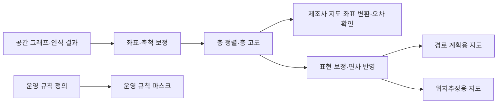

[홈](../../index.md) › 중점 연구 트랙 › [건축 도면 자동 인식](index.md) › 단계 4. 지도 변환 보정과 현장 정합

# 단계 4. 지도 변환 보정과 현장 정합

> 단계 상태: 진행 중 · 열린 질문: 8건 · 답한 질문: 1건 · 완료 조건: 미충족 · 마지막 실행: 2026-09-25

## 1. 이 단계에서 밝힐 것

> 도면에서 얻은 공간 그래프를 로봇이 실제로 주행하는 지도로 바꿀 때 무엇을 보정하고, 도면과 현장의 차이를 어떻게 찾고 관리하는가.

위 문장은 트랙 정의의 "밝힐 것"이다(트랙 정의의 단계별 밝힐 것과 완료 조건은 [트랙 개요](index.md)의 단계 진행 현황에 정리되어 있다). 조사 결과는 [아이디어 3. 건축 도면 자동 인식](../../ideas/floorplan-recognition.md)과 [공간 그래프 스키마 초안](space-graph-schema-draft.md)으로 이어진다.

## 2. 질문 목록

이 단계의 시작 질문 4개와, 다른 실행에서 이 단계로 보낸 후속 질문이다. q4-01은 사용자 요청의 시작 질문 문구 그대로이고, q4-02~q4-04는 구축자가 이 단계의 밝힐 것에서 정한 시작 질문이다. [가정] 상태와 답 위치는 [질문 백로그](question-backlog.md)와 일치시키며, 백로그의 "조사 중"은 이 표에서 "열림"으로 표시하고 "폐기"(q4-06)는 표에서 빼고 백로그에만 남긴다. 답은 3절의 질문 id로 시작하는 소제목에 실리고, 답 위치 칸에는 그 앵커를 적는다. 제기 근거 칸에는 finding id(실행 id 병기) 또는 "사용자"만 쓴다.

| id | 질문 | 상태 | 제기 근거 | 답한 실행 id | 답 위치 |
|---|---|---|---|---|---|
| q4-01 | 인식 결과를 로봇 내비게이션 지도로 바꿀 때 필요한 보정은 무엇인가? | 답함 | 사용자 | 2026-09-25-72 | [q4-01 답](#q4-01) |
| q4-02 | 도면과 현장의 차이(개보수, 가구·랙 배치, 임시 장애물)를 어떻게 찾아 지도에 반영하는가? | 열림 | 사용자 | | |
| q4-03 | 도면 좌표계와 로봇별 지도 좌표계를 정렬하고 층·목적지 이름을 맞추는 방법은 무엇인가? | 열림 | 사용자 | | |
| q4-04 | 도면과 지도가 바뀔 때 버전 관리와 재검증은 어떻게 두는가? | 열림 | 사용자 | | |
| q4-05 | 축척 정보가 없는 래스터 평면도의 인식 결과를 로봇 지도 좌표(미터)로 옮기기 위해 축척을 어떻게 복원하는가(치수 문자 OCR, 문 폭 등 기준 요소, 현장 측정)? | 열림 | f21, 실행 2026-09-25-05 | | |
| q4-07 | VDA 5050 downloadMap 으로 배포하는 지도 파일의 내용 형식이 제조사마다 다를 때, 도면에서 만든 층별 지도를 제조사별 지도 파일로 변환·배포하고 mapVersion 을 맞추는 책임과 절차를 ROP 가 어떻게 둘 수 있는가? | 열림 | f4, 실행 2026-09-25-44 | | |
| q4-08 | 플릿 중립의 기본 공간 그래프에서 제조사 플릿별 주행 그래프(Open-RMF graph_idx)나 VDA 5050 관제 보유 통행 제한을 파생·동기화할 때, 로봇별 통행 가능 여부를 어디에 저장하고 도면·지도 판이 바뀌면 어떻게 다시 맞추는가? | 열림 | f16, 실행 2026-09-25-58 | | |
| q4-09 | 도면 한 장에서 경로 계획용 지도, 위치추정용 지도, 운영 규칙 마스크를 따로 만들 때 유리벽·창문·문·가구 같은 요소를 어느 지도에 어떻게 넣을지 정하는 규칙은 무엇이며, 그 규칙이 맞는지 시운전에서 어떻게 확인하는가? | 열림 | f18, 실행 2026-09-25-72 | | |
| q4-10 | 금지 구역·속도 제한 같은 운영 규칙을 도면 기반 공간 그래프에서 한 벌로 정의해 Nav2 필터 마스크와 VDA 5050 구역 집합처럼 형식이 다른 대상으로 내보낼 수 있는가, 내보낼 때 무엇이 빠지는가? | 열림 | f12, 실행 2026-09-25-72 | | |

## 3. 조사 결과

### q4-01 인식 결과를 로봇 내비게이션 지도로 바꿀 때 필요한 보정 {#q4-01}

확인한 자료를 이 위키가 묶으면, 인식 결과를 로봇 내비게이션 지도로 바꿀 때의 보정은 (1) 좌표·축척 보정(픽셀→미터, 세로축 반전, 원점·해상도), (2) 층 정렬과 층 고도, (3) 제조사·플릿별 로봇 지도 좌표계와의 변환과 변환 오차 확인, (4) 표현 보정(장애물 내부 채움, 점유 임계값, 유리처럼 센서가 잘 못 보는 요소의 처리), (5) 도면에 없는 가구·랙과 설계–시공 편차 반영, (6) 금지 구역·속도 제한 같은 운영 규칙 층 추가의 여섯 묶음으로 나뉘는 것으로 보인다. 이 묶음은 이 위키의 종합이며 이를 제시한 단일 출처는 확인하지 못했다. [추정][^ref-440][^ref-079][^ref-153][^ref-031][^ref-082][^ref-081][^ref-648][^ref-644][^ref-224]

위치추정·SLAM·비용 지도 인플레이션은 분류 원문 9장의 '로봇 자체 지능·제어' 쪽 연계 대상이다. 이 절은 그것들을 지도 형식·좌표·판 관리 관점으로만 다룬다([범위 경계](../../about/scope-boundary.md)).

아래 표는 검증된 발견 사항으로 이 위키가 구성한 종합([추정])이며 출처의 표를 옮긴 것이 아니다.

| 묶음 | 무엇을 맞추는가 | 확인한 근거 | 맡는 쪽(추정) |
|---|---|---|---|
| 좌표·축척 | 픽셀 좌표를 미터 좌표로, 세로축 방향, 원점·해상도 | Nav2 지도 YAML, traffic-editor 측정선[^ref-440][^ref-079] | ROP |
| 층 정렬 | 층 사이 이동·회전·축척, 층 고도 | traffic-editor 기준점·층 고도[^ref-079] | ROP |
| 제조사 좌표계 | 공통 좌표와 제조사 지도 좌표의 변환, 변환 오차 | 플릿 어댑터 대응 경유점, VDA 5050 좌표 규약[^ref-153][^ref-031] | ROP |
| 표현 보정 | 장애물 내부 채움, 점유 임계값, 유리 같은 요소 | Ogm2Pgbm, Nav2 지도 YAML, 유리 검출 연구[^ref-082][^ref-440][^ref-648] | 연계 대상(로봇 쪽) |
| 도면–현장 편차 | 가구·랙, 설계–시공 차이 | BIM 기반 위치추정 연구, 도면–라이다 결합 SLAM[^ref-081][^ref-224] | 연계 대상(로봇 쪽), 차이 확인은 q4-02 |
| 운영 규칙 층 | 금지 구역·속도 제한 | Nav2 비용 지도 필터[^ref-644][^ref-645] | 규칙 정의·배포는 ROP, 적용은 연계 대상 |

위 도식은 이 위키의 추정 구조이며 출처의 그림이 아니다.

#### 좌표·축척과 층 정렬

- Nav2 지도 서버는 점유 격자 지도를 이미지와 YAML 메타데이터 한 쌍으로 읽으며, 메타데이터는 이미지 파일, 해상도(셀당 미터), 원점 좌표, 색 반전 여부, 점유·빈 공간 판정 임계값을 담는다(발행일 미확인, 2026-09-25 확인). [사실][^ref-440] 이 형식은 로봇 쪽 내비게이션 스택의 입력이다.
- Open-RMF traffic-editor 는 평면도 배경 이미지의 픽셀 좌표(왼쪽 위 원점, +Y 아래 방향)로 편집하고 건물 지도 생성 단계에서 세로축을 뒤집어 직교 좌표로 바꾸며, 두 점 사이 실제 거리(미터)를 넣은 측정선으로 층의 축척을 정하고 층마다 고도(미터)를 둔다(발행일 미확인, 2026-09-25 확인). [사실][^ref-079]
- 같은 도구는 여러 층에서 수직으로 겹칠 것으로 기대되는 기준점 쌍으로 두 층 사이의 이동·회전·축척 변환을 구한다. 위 문장과 같은 문서라 독립 교차 확인은 아니다. [사실][^ref-079]

#### 관제 좌표 규약과 제조사 좌표계 변환

- VDA 5050 3.0.0 은 로봇 위치를 관제와 로봇 사이에 정한 프로젝트 고유 좌표계로 주고, 층·구역마다 고유한 mapId 를 쓰며, 지도 좌표계는 z 축이 위를 향하는 오른손 좌표계, 좌표는 미터, 방향은 −π~+π 라디안으로 정한다(명세 3.0.0, 발행일 미확인 — [열린 질문](../../open-questions.md) oq-005). [사실][^ref-031]
- Open-RMF 플릿 어댑터 튜토리얼은 로봇이 RMF 와 같은 좌표계를 쓰지 않을 때 층마다 대응 경유점 쌍으로 회전·축척·이동 변환을 추정하고(최소 4쌍 권장) 변환 오차 추정값을 계산해 정확도를 확인하게 한다(발행일 미확인, 2026-09-25 확인). [사실][^ref-153]
- Open-RMF 주행 지도 통합 문서는 경유점 위치를 층 이름과 그 층 안의 미터 좌표로 요구하고, 좌표계와 건물 구조의 정렬을 확인하는 데 화면 캡처 비교가 도움이 된다고 적는다. [사실][^ref-080]

#### 표현 보정과 도면–현장 편차

- 연계 대상: Ogm2Pgbm 공식 저장소 README 는 BIM·CAD 기반 점유 격자 지도를 변환하기 전에 장애물 내부에 흰 영역이 남지 않도록 장애물을 완전히 검게 채우라고 요구하고, 골격화·커버리지 경로 경유점·광선 추적으로 모의 센서 데이터를 만들어 포즈 그래프 지도를 생성한다(2026-09-25 확인). [사실][^ref-082] 포즈 그래프 위치추정 지도 생성 자체는 로봇 쪽 기술이다.
- 연계 대상: 유리는 라이다에 잘 보이지 않아 점유 격자 지도 작성을 어렵게 하며, 유리를 검출해 점유 격자 오류를 줄이는 연구가 있다(Sensors, 2021-04). [사실][^ref-648]
- 연계 대상: Vega-Torres 외는 BIM 에서 만든 점유 격자 지도로 AMCL 위치추정을 하는 연구들이 BIM 이 현실을 나타낸다고 가정하지만, 가구·잡동사니와 설계–시공 편차가 AMCL 정확도에 크게 영향을 준다고 보았다(2023-08). [사실][^ref-081] 같은 연구가 건물 요소 유형의 의미 정보로 창문·문·가구를 지도에서 제외했다는 내용은 검색 요약 기준이라 확인하지 못했다. [추정][^ref-081]
- IFC 파일에서 자율 로봇용 지도를 만드는 연구(Construction Robotics, 2023)는 IFC 에서 의미별 장애물 지도·시뮬레이션 환경·의미 정보 JSON·정지·주행 경유점을 자동 생성해 사전 지도 작성 주행 필요를 없애는 방법을 제안했다. [사실][^ref-647]
- 연계 대상: Lee·Woo·Shin(IJPEM, 2026)은 2D 건축 CAD 도면으로 3D 가상 환경을 만든 뒤 2D 점유 격자 지도를 자동 생성해 센서 주행 없이 AMCL 위치추정에 쓰고, 가상 지도의 평균 이동 RMSE 0.17±0.06 m, 회전 RMSE 3.59°±1.78°, 궤적 일관성 오차 0.10±0.08 m 로 SLAM 기반 지도와 비슷했다고 보고했다(저자 보고 단일 출처, 시험 환경 규모 미확인). [사실][^ref-628]
- 연계 대상: Shaheer 외는 건축 도면에서 만든 그래프와 라이다로 추정한 상황 그래프를 결합해 도면(as-planned)과 현장(as-built)의 전역 정렬과 구조 편차를 실시간으로 추정하는 방법을 제안했다(arXiv 2024-08 제출). [사실][^ref-224]
- 연계 대상: slam_toolbox 공식 README 는 저장된 포즈 그래프 지도를 불러와 계속 정제·재작성·확장하는 평생 지도 작성, 기존 지도 위 위치추정 모드, 여러 부분 지도를 대화형 표식으로 맞춰 하나의 전역 지도로 합치는 기능, 도킹 위치·노드·지정 자세에서 시작하는 초기화를 제공한다(2026-09-25 확인). [사실][^ref-270]

#### 운영 규칙 층

- BIM-to-Robot Mapping(IEEE 학술대회 논문, 저자·발행일 미확인)은 BIM 의 기하 위상과 기능 구획을 뽑아 점유 격자 지도와 의미 대응 사전을 만들고, 방화 구획·금지 구역 같은 BIM 의미 제약을 경로 비용으로 부호화해 경로가 건물 규정을 따르게 하는 틀을 제안했다(검색 요약 기준). [사실][^ref-646]
- 연계 대상: Nav2 비용 지도(costmap_2d)는 지도 위에 공간별 래스터 특성인 필터 마스크를 적용하는 비용 지도 필터로 금지 구역과 속도 제한 구역을 표현하고, 비용 지도는 로봇 외형(footprint)에 따른 인플레이션 반경으로 부풀려진다(2026-09-25 확인). [사실][^ref-644] 비용 지도 인플레이션과 필터 적용은 로봇 쪽 내비게이션 스택 기능이다.
- Nav2 문서는 필터 마스크를 일반 Nav2 2D 지도와 같은 PGM·PNG·BMP 래스터 파일과 YAML 메타데이터로 배포하며, 금지 구역 필터는 로봇이 금지 구역을 피하거나 선호 차선에 머물게 한다고 설명한다. 위 문장과 같은 Nav2 프로젝트라 독립 교차 확인은 아니다. [사실][^ref-645]

#### 종합: 용도별 지도와 ROP 경계

- 필터 마스크가 지도와 같은 형식의 별도 래스터이고 유리가 라이다에 잘 보이지 않으며 의미 정보로 요소를 거른 연구가 있다는 검색 요약을 보면, 도면 한 장에서 경로 계획용 지도, 위치추정용 지도, 운영 규칙 마스크를 따로 만들어야 할 것으로 보인다. 유리벽처럼 도면에는 벽이지만 라이다가 잘 못 보는 요소는 경로 계획용에서는 장애물로 두고 위치추정용에서는 빼는 식으로 용도별로 다르게 다뤄야 할 것으로 보인다. 이는 이 위키의 종합이며 단일 출처는 없다. [추정][^ref-644][^ref-645][^ref-648][^ref-081]
- 이종 제조사를 연결하는 ROP 가 직접 맡을 보정은 도면 좌표·축척·층 정렬, 제조사 지도 좌표계와의 변환과 오차 확인, 금지 구역·속도 제한 규칙의 공통 정의와 판 관리 쪽이고, 장애물 채움·인플레이션·SLAM 재정합·위치추정 지도 갱신은 로봇·제조사 쪽 연계 대상이 되는 경계로 보인다. [추정][^ref-153][^ref-031][^ref-644][^ref-270][^ref-082]

분류 원문의 질문은 다음과 같다.

> 제조사마다 다른 지도에서 ‘3층 출하 대기장’을 어떻게 동일한 장소로 인식할까? [분류원문]

- 이 질문에 비추면, 도면 좌표로 정한 대기장 경유점을 층별 변환으로 각 제조사 지도에 옮긴 뒤, 그 변환 오차가 해당 노드의 허용 편차(VDA 5050 의 allowedDeviationXY·allowedDeviationTheta) 안에 드는지 확인하는 단계가 도착 판정 전에 필요할 것으로 보인다. 오차와 허용 편차의 연결은 이 위키의 추정이다. [추정][^ref-153][^ref-031][^ref-079]

#### 현장 시나리오: ‘3층 출하 대기장’ 도착 판정

다음은 설명을 위한 가상의 시나리오이다.

**물류 흐름 단계:** 출하

**시나리오:** 도면에서 만든 대기장 경유점으로 제조사가 다른 로봇의 도착을 판정

| 항목 | 내용 |
|---|---|
| 시작 조건 | 해당 없음 |
| 작업 대상 | 해당 없음 |
| 수행 자원 | 제조사가 다른 이동로봇 두 대(한 대는 VDA 5050, 한 대는 Open-RMF 플릿 어댑터로 연동). 플릿 어댑터 쪽 로봇은 층마다 대응 경유점으로 추정한 변환으로 공통 좌표와 맞춘다. [사실][^ref-153] |
| 제약 | VDA 5050 로봇의 위치는 프로젝트 고유 좌표계와 층별 mapId 로 해석해야 한다. [사실][^ref-031] 금지 구역·속도 제한은 로봇 쪽 비용 지도 필터로 적용된다. [사실][^ref-644] |
| 완료·인계 | 대기장 경유점을 각 제조사 지도로 옮긴 변환 오차가 노드 허용 편차 안에 들어야 도착을 인정할 수 있을 것으로 보인다. [추정][^ref-153][^ref-031] |
| 예외·성과 | 변환 오차가 허용 편차를 넘으면 도착 판정을 보류하고 대응점을 다시 확인하는 흐름을 가정할 수 있다. [추정][^ref-153][^ref-031] 처리량·시간에 주는 영향은 미확인이다. |

이 시나리오의 제약·완료·인계 칸은 [6. 지도·공간·위치 모델](../../categories/b-common-information-and-environment-model/06-map-space-and-location-model.md)의 5절 시나리오와 같은 장소를 다루며, 좌표 정렬 절차 자체는 q4-03 에서 다룬다.

## 4. 결론과 남은 불확실성

**결론**
- 인식 결과를 로봇 내비게이션 지도로 바꿀 때의 보정은 좌표·축척, 층 정렬, 제조사 좌표계 변환과 오차 확인, 표현 보정, 도면–현장 편차 반영, 운영 규칙 층의 여섯 묶음으로 나뉘는 것으로 보인다. [추정][^ref-440][^ref-079][^ref-153][^ref-082][^ref-644]
- 도면 한 장에서 경로 계획용 지도, 위치추정용 지도, 운영 규칙 마스크를 용도별로 따로 만들어야 할 것으로 보인다. [추정][^ref-644][^ref-648]
- ROP 는 좌표·축척·층 정렬, 제조사 좌표계 변환과 오차 확인, 운영 규칙의 공통 정의와 판 관리를 맡고, 장애물 채움·인플레이션·SLAM 재정합·위치추정 지도 갱신은 로봇·제조사 쪽 연계 대상으로 두는 경계가 될 것으로 보인다. [추정][^ref-153][^ref-031][^ref-270]
- 위 결론의 핵심은 모두 이 위키의 종합 [추정]이며, 이를 제시한 단일 출처가 없어 이 단계 페이지의 종합 신뢰도는 low 이다.

**남은 불확실성**
- 교차 확인된 주장이 없다. 층 정렬 근거 두 문장은 같은 traffic-editor 문서, 비용 지도 필터 근거 두 문장은 같은 Nav2 프로젝트에서 나왔다.
- 원문을 열지 못한 출처(ref-081, ref-628, ref-224, ref-645, ref-646, ref-647, ref-648)는 검색 요약 범위에서만 썼다. Vega-Torres 외의 창문·문·가구 제외 여부는 확인하지 못했고, 유리 외 반사면(거울·금속)의 영향은 이번 근거로 확인하지 못했다.
- Lee·Woo·Shin 의 위치추정 오차 수치는 저자 보고 단일 출처이며 시험 환경 규모가 미확인이다.
- 국내 물류센터에서 도면 기반 지도를 보정해 운영한 사례는 찾지 못했다([열린 질문](../../open-questions.md) oq-022).
- 도면–현장 차이 탐지(q4-02), 좌표 정렬과 이름 맞춤(q4-03), 버전 관리(q4-04), 래스터 축척 복원(q4-05), 지도 파일 배포(q4-07), 플릿별 그래프 동기화(q4-08)는 아직 답하지 않았다.
- 공간 그래프 스키마 초안: 층별 지도의 교환 형식(후보) Nav2 격자 지도 값에 딸린 속성 '내비게이션 지도 메타데이터'를 반영해 v1.0 으로 올렸다. 층별 지도 속성 '로봇 지도 좌표계 변환'은 정렬 정보를 속성으로 둘지 별도 개념으로 둘지(q4-03)를 근거 없이 정하게 되어 반영하지 않고 초안 6절의 근거 보강으로 두었다.

## 5. 이 단계가 낳은 후속 질문

| 새 질문 id | 질문 | 보낼 단계 | 근거 finding id | 상태 |
|---|---|---|---|---|
| q4-09 | 도면 한 장에서 경로 계획용 지도, 위치추정용 지도, 운영 규칙 마스크를 따로 만들 때 유리벽·창문·문·가구 같은 요소를 어느 지도에 어떻게 넣을지 정하는 규칙은 무엇이며, 그 규칙이 맞는지 시운전에서 어떻게 확인하는가? | 단계 4. 지도 변환 보정과 현장 정합 | f18 (실행 2026-09-25-72) | 열림 |
| q4-10 | 금지 구역·속도 제한 같은 운영 규칙을 도면 기반 공간 그래프에서 한 벌로 정의해 Nav2 필터 마스크와 VDA 5050 구역 집합처럼 형식이 다른 대상으로 내보낼 수 있는가, 내보낼 때 무엇이 빠지는가? | 단계 4. 지도 변환 보정과 현장 정합 | f12 (실행 2026-09-25-72) | 열림 |

## 6. 완료 조건 충족 현황

충족 여부는 리서치 에이전트의 자체 평가를 스토리텔러 에이전트가 옮겨 적은 값이고, 최종 판정은 내용 검증 에이전트가 한다. 둘이 다르면 검증 판정을 따른다.

| 완료 조건 | 충족 여부 | 근거 | 검증 판정 |
|---|---|---|---|
| 보정 항목 목록이 [공간 그래프 스키마 초안](space-graph-schema-draft.md)의 미해결 모델링 질문과 [아이디어 3. 건축 도면 자동 인식](../../ideas/floorplan-recognition.md)의 "5. 구현 가설" 절에 반영됨 | 미충족 | q4-01 의 보정 여섯 묶음([q4-01 답](#q4-01))을 이번 실행에서 두 페이지에 반영 제안했으나 검증 판정 전이다 | 미충족 · 미승인 |
| 도면–현장 정합 절차 초안이 [공간 그래프 스키마 초안](space-graph-schema-draft.md)의 미해결 모델링 질문과 [아이디어 3. 건축 도면 자동 인식](../../ideas/floorplan-recognition.md)의 "5. 구현 가설" 절에 반영됨 | 미충족 | 정합 절차 초안이 없다(q4-02·q4-03 미답) | 미충족 · 미승인 |

다음 단계로 전환: 아니오(도면–현장 정합 절차 초안 없음; 막힌 질문 q4-02·q4-03·q4-04·q4-05·q4-07·q4-08)

## 7. 관련 세부영역

이 트랙은 분류를 바꾸지 않는다. 확인된 사실은 세부영역 페이지를 직접 고치지 않고 [트랙 로그](log.md)의 "세부영역 반영 제안"으로 남기며, 반영은 다음 해당 영역 실행에서 한다. 프런트매터 `related_areas`는 아래 목록과 같다.

- [6. 지도·공간·위치 모델](../../categories/b-common-information-and-environment-model/06-map-space-and-location-model.md) — 분류 원문 10장이 건축 도면 기반 이동 지도의 중심 연구영역으로 두며, BIM·CAD에서 이동 공간을 만들고 층·목적지를 정렬하는 일 자체다. 이번 실행은 6. 대표 접근법과 기술 절(보정 항목, 기존 ref-153 각주 재사용)과 9. ROP가 직접 맡는 것과 외부와 연계하는 것 절(보정의 ROP·로봇 쪽 경계)에 반영을 제안한다.
- [21. 온보딩·설정·현장 시운전](../../categories/f-deployment-verification-and-maintenance/21-onboarding-configuration-and-commissioning.md) — 분류 원문 10장의 함께 필요한 영역(시운전). '현장 모델링 시간을 줄이는' 적용처다. 이번 실행은 6. 대표 접근법과 기술 절(대응점으로 변환 오차를 확인하는 시운전 절차, 사전 지도 작성 주행을 줄인 연구)에 반영을 제안한다.
- [24. 자산·소프트웨어 수명주기 관리](../../categories/f-deployment-verification-and-maintenance/24-asset-and-software-lifecycle-management.md) — 도면 개정에 따른 지도 버전 관리가 필요하다(이 영역 정의의 지도 버전)
- [8. 실시간 세계 상태·데이터 일관성](../../categories/b-common-information-and-environment-model/08-real-time-world-state-and-data-consistency.md) — 공간 노드(문·엘리베이터)에 붙는 현재 상태를 실시간으로 갱신하는 쪽이다
- [9. 로봇·제조사 관제 연동](../../categories/c-connectivity-and-execution-foundation/09-robot-and-vendor-fleet-manager-integration.md) — 플릿 어댑터의 좌표 변환과 VDA 5050 좌표 규약이 제조사 지도와 공통 좌표를 잇는 지점이다
- [15. 다중 로봇 경로·교통 관리 — MAPF](../../categories/d-planning-and-optimization/15-multi-robot-path-and-traffic-management-mapf.md) — 금지 구역·속도 제한 같은 운영 규칙 층이 경로·교통 조율의 제약이 된다

## 8. 출처

[^ref-440]: ROS Navigation (ros-navigation/navigation2 GitHub), nav2_map_server — README, 미확인, https://github.com/ros-navigation/navigation2/blob/main/nav2_map_server/README.md, 접근일 2026-09-25
[^ref-079]: Open Robotics, Traffic Editor - Programming Multiple Robots with ROS 2, 미확인, https://osrf.github.io/ros2multirobotbook/traffic-editor.html, 접근일 2026-09-25
[^ref-153]: Open Robotics, Fleet Adapter Tutorial - Programming Multiple Robots with ROS 2, 미확인, https://osrf.github.io/ros2multirobotbook/integration_fleets_adapter_tutorial.html, 접근일 2026-09-25
[^ref-080]: Open Robotics, Navigation Maps (integration_nav-maps) - Programming Multiple Robots with ROS 2, 미확인, https://osrf.github.io/ros2multirobotbook/integration_nav-maps.html, 접근일 2026-09-25
[^ref-031]: VDA / VDMA (VDA5050 GitHub), VDA5050/VDA5050_EN.md — Official Specification document for the VDA 5050, 미확인, https://github.com/VDA5050/VDA5050/blob/main/VDA5050_EN.md, 접근일 2026-09-25
[^ref-082]: Vega-Torres, M. A. (MigVega GitHub), Ogm2Pgbm — README (Robust BIM-based 2D-LiDAR Localization for Lifelong Indoor Navigation in Changing and Dynamic Environments), 미확인, https://github.com/MigVega/Ogm2Pgbm, 접근일 2026-09-25
[^ref-081]: Vega-Torres, M. A. 외, Occupancy Grid Map to Pose Graph-based Map: Robust BIM-based 2D-LiDAR Localization for Lifelong Indoor Navigation in Changing and Dynamic Environments, 2023-08, https://arxiv.org/abs/2308.05443, 접근일 2026-09-25 (원문 미열람)
[^ref-628]: Lee, H.-C., Woo, H.-M., & Shin, S. (International Journal of Precision Engineering and Manufacturing), Digital Twin-based Sensor-Free Virtual Mapping for Autonomous Mobile Robot Localization, 2026, https://link.springer.com/article/10.1007/s12541-026-01598-2, 접근일 2026-09-25 (원문 미열람)
[^ref-224]: Shaheer, M., Millan-Romera, J. A., Bavle, H., Giberna, M., Sanchez-Lopez, J. L., Civera, J., & Voos, H., Tightly Coupled SLAM with Imprecise Architectural Plans, 2024-08, https://arxiv.org/abs/2408.01737, 접근일 2026-09-25 (원문 미열람)
[^ref-270]: Macenski, S. (SteveMacenski GitHub), slam_toolbox — README (Slam Toolbox for lifelong mapping and localization in potentially massive maps with ROS), 미확인, https://github.com/SteveMacenski/slam_toolbox, 접근일 2026-09-25
[^ref-644]: ROS Navigation (ros-navigation/navigation2 GitHub), nav2_costmap_2d — README, 미확인, https://github.com/ros-navigation/navigation2/blob/main/nav2_costmap_2d/README.md, 접근일 2026-09-25
[^ref-645]: Open Navigation (Nav2 documentation), Navigating with Keepout Zones — Nav2 documentation, 미확인, https://docs.nav2.org/tutorials/docs/navigation2_with_keepout_filter.html, 접근일 2026-09-25 (원문 미열람)
[^ref-646]: IEEE 학술대회 논문 저자(미확인), BIM-to-Robot Mapping: Constructing IFC-Referenced Occupancy Grids and Semantic Metadata for Rule-Based Navigation, 미확인, https://ieeexplore.ieee.org/document/11019519/, 접근일 2026-09-25 (원문 미열람)
[^ref-647]: Construction Robotics(Springer) 게재 논문 저자(미확인), Improving autonomous robotic navigation using IFC files, 2023, https://link.springer.com/article/10.1007/s41693-023-00112-8, 접근일 2026-09-25 (원문 미열람)
[^ref-648]: Tibebu, H., Roche, J., De Silva, V., & Kondoz, A. (Loughborough University London, Sensors 21(7), 2263), LiDAR-Based Glass Detection for Improved Occupancy Grid Mapping, 2021-04, https://www.mdpi.com/1424-8220/21/7/2263, 접근일 2026-09-25 (원문 미열람)

## 9. 이력

실행 id `build-2026-09-25`는 확장 아이디어 편입 때의 트랙 시드 생성을 나타내며, 파이프라인 실행이 아니므로 일일 로그가 없다.

| 날짜 | 실행 id | 답한 질문 | 새 질문 | 초안 변경 | 버전 |
|---|---|---|---|---|---|
| 2026-09-25 | 2026-09-25-72 | q4-01 | q4-09, q4-10 | v0.9 → v1.0 | 2 |
| 2026-09-25 | build-2026-09-25(트랙 시드, 파이프라인 실행 아님) | 없음 | 시드 q4-01~q4-04(4건, [질문 백로그](question-backlog.md)에 등록) | 없음(v0 시드는 [공간 그래프 스키마 초안](space-graph-schema-draft.md)에서 생성) | 1 |
