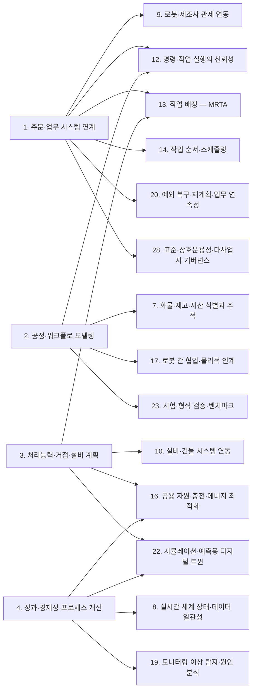
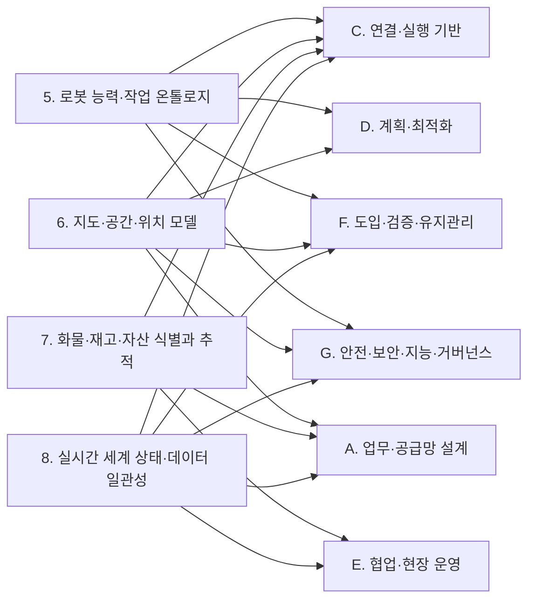
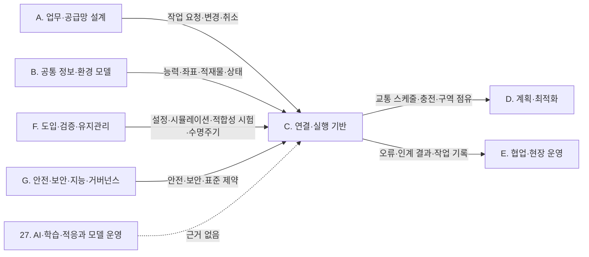
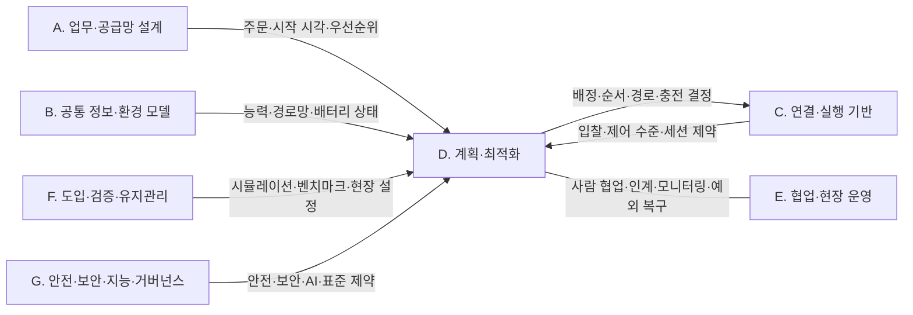
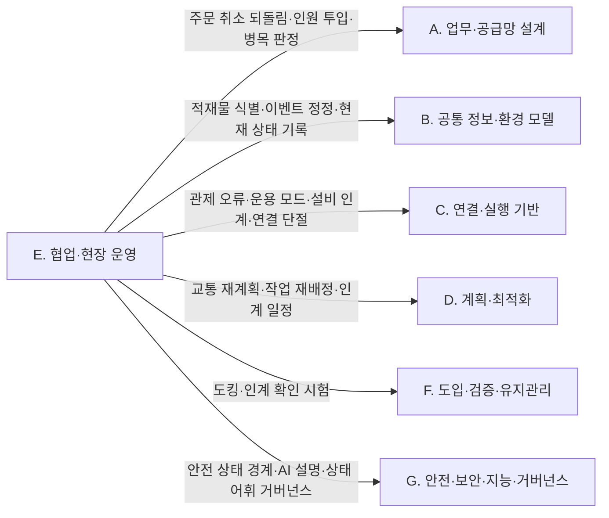
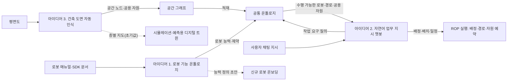

(너의 규칙은 시스템 프롬프트의 agents/shared-rules.md 와 agents/researcher.md 이다. 아래는 이번 실행의 컨텍스트와 입력이다.)

## 실행 컨텍스트

- run_id: 2026-09-25-73
- date: 2026-09-25
- run_type: category_link (대분류 연결)
- 대상: 대분류 G. 안전·보안·지능·거버넌스 페이지의 '다른 대분류와의 연결' 절(대분류 연결 실행). 게시된 세부영역 페이지를 근거로 다른 대분류와의 연결을 조사·서술한다. 스토리텔러는 그 절만 patches 로 바꾼다
- 예산:
    - max_search_queries: 30
    - max_sources_per_run: 15
    - new_topic_pages: 1
    - page_updates: 2
    - max_retries: 2
- 환경 알림: web_fetch_available: false · fetch_mode: mirror_only (일반 웹 페이지 열람은 네트워크 정책으로 막혀 있다. raw.githubusercontent.com 은 열린다: 공식 문서가 GitHub 에 있는 출처는 입력의 config/source_mirrors.yaml 경로를 WebFetch 로 열어 원문을 읽고 sources[].fetched=true, fetched_via=github_raw, fetch_url 을 적는다. 입력에 원문 텍스트(data/source_texts)가 있는 출처는 fetched_via=inbox. 그 밖의 출처는 fetched=false 이며 코드가 신뢰도 상한(medium)을 강제한다 — 공통 규칙 0절 6항)
- 언어: ko
- next_ref_id: ref-711
- 새 출처 id 구간: ref-711 ~ ref-740 — 이 실행 전용으로 예약한 번호다(동시에 도는 다른 실행과 겹치지 않는다). 새 출처는 ref-711 부터 순서대로 쓰고 ref-740 를 넘기지 않는다. 기존 출처는 참고문헌 목록의 id 를 그대로 쓴다

## 입력

### runs/2026-09-25-73/target.json

```json
{
  "run_id": "2026-09-25-73",
  "date": "2026-09-25",
  "weekday": "Fri",
  "run_number": 73,
  "run_type": "category_link",
  "forced": true,
  "target": {
    "area_no": null,
    "area_name": null,
    "category": "G. 안전·보안·지능·거버넌스",
    "category_letter": "G"
  },
  "topic": null,
  "track": null,
  "corrections": [],
  "budget": {
    "max_search_queries": 30,
    "max_sources_per_run": 15,
    "new_topic_pages": 1,
    "page_updates": 2,
    "max_retries": 2
  },
  "priority_reason": null,
  "priority_questions": [],
  "excluded_areas": [],
  "lifted_areas": [],
  "deferred": {
    "monthly_recheck": false,
    "weekly_review": false
  },
  "selection_rationale": "CLI 지정 run_type=category_link"
}
```

### docs/references/index.md (요약: 이번 대상 페이지가 인용한 64건 / 전체 650건. 목록에 없는 출처는 새 id 로 적는다 — 같은 URL 이 이미 있으면 퍼블리셔가 기존 id 로 합친다)

```markdown
| id | 기관 | 제목 | 발행일 | URL | 접근일 | 원문 열람 |
|---|---|---|---|---|---|---|
| ref-004 | Open Robotics | RMF Core Overview — Programming Multiple Robots with ROS 2 | 미확인 | https://osrf.github.io/ros2multirobotbook/rmf-core.html | 2026-09-25 | 예 |
| ref-009 | ROS 2 Design | ROS 2 DDS-Security Integration | 미확인 | https://design.ros2.org/articles/ros2_dds_security.html | 2026-09-25 | 예 |
| ref-010 | ROS 2 Design | ROS 2 Robotic Systems Threat Model | 미확인 | https://design.ros2.org/articles/ros2_threat_model.html | 2026-09-25 | 예 |
| ref-031 | VDA / VDMA (VDA5050 GitHub) | VDA5050/VDA5050_EN.md — Official Specification document for the VDA 5050 | 미확인 | https://github.com/VDA5050/VDA5050/blob/main/VDA5050_EN.md | 2026-09-25 | 예 |
| ref-051 | VDA / VDMA (VDA5050 GitHub) | VDA5050/VDA5050 — json_schemas/state.schema | 미확인 | https://github.com/VDA5050/VDA5050/blob/main/json_schemas/state.schema | 2026-09-25 | 예 |
| ref-056 | Liu, J. X. 외 | Grounding Complex Natural Language Commands for Temporal Tasks in Unseen Environments | 2023-02 | https://arxiv.org/abs/2302.11649 | 2026-09-25 | 아니오 |
| ref-088 | Ahn, M. 외(Google) | Do As I Can, Not As I Say: Grounding Language in Robotic Affordances | 2022-04 | https://arxiv.org/abs/2204.01691 | 2026-09-25 | 아니오 |
| ref-092 | Liu, B., Jiang, Y., Zhang, X., Liu, Q., Zhang, S., Biswas, J., & Stone, P. | LLM+P: Empowering Large Language Models with Optimal Planning Proficiency | 2023-04 | https://arxiv.org/abs/2304.11477 | 2026-09-25 | 아니오 |
| ref-253 | MassRobotics | MassRobotics-AMR/AMR_Interop_Standard — README | 미확인 | https://github.com/MassRobotics-AMR/AMR_Interop_Standard | 2026-09-25 | 아니오 |
| ref-351 | Ren, A. Z. 외 | Robots That Ask For Help: Uncertainty Alignment for Large Language Model Planners | 2023-07 | https://arxiv.org/abs/2307.01928 | 2026-09-25 | 아니오 |
| ref-354 | cog-model (AmbiK 저자) | AmbiK-dataset — README (AmbiK: Dataset of Ambiguous Tasks in Kitchen Environment) | 미확인 | https://github.com/cog-model/AmbiK-dataset | 2026-09-25 | 예 |
| ref-359 | Wang, W. 외 | Learning to Ask: When LLM Agents Meet Unclear Instruction | 2024-09 | https://arxiv.org/abs/2409.00557 | 2026-09-25 | 아니오 |
| ref-405 | Open Robotics | Security - Programming Multiple Robots with ROS 2 | 미확인 | https://osrf.github.io/ros2multirobotbook/security.html | 2026-09-25 | 예 |
| ref-407 | gpue (GitHub) | vda5050-sim — README (Standards-compliant VDA5050 (v3.0.0) robot fleet simulator — MQTT or NATS) | 미확인 | https://github.com/gpue/vda5050-sim | 2026-09-25 | 예 |
| ref-408 | ekusiadadus (GitHub) | vda5050-lab — README (Diagnose VDA 5050 order, reconnect, and cancel failures from MQTT traces) | 미확인 | https://github.com/ekusiadadus/vda5050-lab | 2026-09-25 | 예 |
| ref-417 | Obi, I., Venkatesh, V. L. N., Wang, W., Wang, R., Suh, D., Amosa, T. I., Jo, W., & Min, B.-C.(Purdue University SMART Lab) | Pre-Execution Safety Gate & Task Safety Contracts for LLM-Controlled Robot Systems | 2026-04 | https://arxiv.org/abs/2604.05427 | 2026-09-25 | 아니오 |
| ref-470 | ISO | ISO 3691-4:2023 - Industrial trucks — Safety requirements and verification — Part 4: Driverless industrial trucks and their systems | 2023-06 | https://www.iso.org/standard/83545.html | 2026-09-25 | 아니오 |
| ref-471 | A3(Association for Advancing Automation) | Updated ISO 10218 | Answers to Frequently Asked Questions (FAQs) | 미확인 | https://www.automate.org/robotics/blogs/updated-iso-10218-faq | 2026-09-25 | 아니오 |
| ref-472 | A3(Association for Advancing Automation) | ANSI/A3 R15.08-2 Safety Standard for Industrial Mobile Robot Systems and Applications Now Available | 2023-10 | https://www.automate.org/robotics/news/ansi-a3-r15-08-2-safety-standard-for-industrial-mobile-robot-systems-and-applications-now-available | 2026-09-25 | 아니오 |
| ref-541 | lbaa2022 (LoTa-Bench 공식 저장소) | LLMTaskPlanning — LoTa-Bench: Benchmarking Language-oriented Task Planners for Embodied Agents (ICLR 2024) (GitHub README) | 미확인 | https://github.com/lbaa2022/LLMTaskPlanning | 2026-09-25 | 예 |
| ref-555 | European Union (EUR-Lex) | Regulation (EU) 2023/1230 of the European Parliament and of the Council on machinery | 2023-06 | https://eur-lex.europa.eu/eli/reg/2023/1230/oj/eng | 2026-09-25 | 아니오 |
| ref-560 | ISO | ISO 10218-2:2025 - Robotics — Safety requirements — Part 2: Industrial robot applications and robot cells | 2025-02 | https://www.iso.org/standard/73934.html | 2026-09-25 | 아니오 |
| ref-561 | 대한민국 정책브리핑(중소벤처기업부) | 이동식 협동로봇 ‘안전기준 산업표준’ 제정…상용화 길 열어 | 2024-11-03 | https://www.korea.kr/news/policyNewsView.do?newsId=148935814 | 2026-09-25 | 아니오 |
| ref-563 | Belzile, B. 외 | From Safety Standards to Safe Operation with Mobile Robotic Systems Deployment | 2025-02 | https://arxiv.org/abs/2502.20693 | 2026-09-25 | 아니오 |
| ref-564 | Bensaci, C., Zennir, Y., Pomorski, D. (IEEE Xplore) | A Comparative Study of STPA Hierarchical Structures in Risk Analysis: The Case of a Complex Multi-Robot Mobile System (EECS 2018 학회) | 2018-12 | https://ieeexplore.ieee.org/document/8910126/ | 2026-09-25 | 아니오 |
| ref-566 | CEN (iTeh Standards 카탈로그) | EN ISO 12100:2010 - Safety of machinery - General principles for design - Risk assessment and risk reduction | 2010 | https://standards.iteh.ai/catalog/standards/cen/74a41162-9d84-4410-a8a3-606630770ab9/en-iso-12100-2010 | 2026-09-25 | 아니오 |
| ref-567 | Open-RMF (open-rmf/rmf GitHub) | [Feature request]: Fire alarm separation for different fleets · Issue #658 · open-rmf/rmf | 2025-04-04 | https://github.com/open-rmf/rmf/issues/658 | 2026-09-25 | 아니오 |
| ref-579 | Open Robotics (ROS 2 Design) | ROS 2 Access Control Policies | 2019-08 | https://design.ros2.org/articles/ros2_access_control_policies.html | 2026-09-25 | 예 |
| ref-580 | Open Robotics (ROS 2 Design) | ROS 2 Security Enclaves | 2020-05 | https://design.ros2.org/articles/ros2_security_enclaves.html | 2026-09-25 | 예 |
| ref-581 | Eclipse Foundation (Eclipse Mosquitto) | mosquitto.conf man page | 미확인 | https://mosquitto.org/man/mosquitto-conf-5.html | 2026-09-25 | 예 |
| ref-582 | NIST | NIST SP 800-82 Rev. 3, Guide to Operational Technology (OT) Security | 2023-09 | https://csrc.nist.gov/pubs/sp/800/82/r3/final | 2026-09-25 | 아니오 |
| ref-583 | CISA | Mobile Industrial Robots Vehicles and MiR Fleet Software (ICSA-21-280-02) | 미확인 | https://www.cisa.gov/news-events/ics-advisories/icsa-21-280-02 | 2026-09-25 | 아니오 |
| ref-584 | CSA / IEC (ANSI Webstore) | CAN/CSA IEC 62443-3-3-2017 - Industrial communication networks - Network and system security - Part 3-3: System security requirements and security levels (Adopted IEC 62443-3-3:2013, first edition, 2013-08) | 2013-08 | https://webstore.ansi.org/standards/csa/csaiec624432017-2442576 | 2026-09-25 | 아니오 |
| ref-585 | Jaatun 외(Journal of Cybersecurity and Privacy 6(2), 52) | Security Aspects of Zones and Conduits in IEC 62443 | 2026 | https://www.mdpi.com/2624-800X/6/2/52 | 2026-09-25 | 아니오 |
| ref-587 | 법제처 국가법령정보센터 | 개인정보 보호법 | 미확인 | https://www.law.go.kr/lsEfInfoP.do?lsiSeq=195062 | 2026-09-25 | 아니오 |
| ref-588 | 김·장 법률사무소 | '이동형 영상정보처리기기를 위한 개인영상정보 보호·활용 안내서' 관련 인사이트 | 미확인 | https://www.kimchang.com/ko/insights/detail.kc?sch_section=4&idx=30477 | 2026-09-25 | 아니오 |
| ref-589 | 법제처 국가법령정보센터 | 근로자참여 및 협력증진에 관한 법률 | 미확인 | https://www.law.go.kr/LSW/lsInfoP.do?lsiSeq=105636 | 2026-09-25 | 아니오 |
| ref-590 | 한국인터넷진흥원(KISA) | 로봇 보안취약점 점검 체크리스트 해설서 | 미확인 | https://kisa.or.kr/2060205/form?lang_type=KO&page=&postSeq=36 | 2026-09-25 | 아니오 |
| ref-591 | European Commission (Shaping Europe's digital future) | The Cyber Resilience Act - Summary of the legislative text | 미확인 | https://digital-strategy.ec.europa.eu/en/policies/cra-summary | 2026-09-25 | 아니오 |
| ref-608 | OTTO by Rockwell Automation | OTTO Adds VDA 5050 Certifications to Support Mixed-Fleet Deployments | 2026-04 | https://ottomotors.com/company/newsroom/press-releases/otto-adds-vda-5050-certifications-to-support-mixed-fleet-deployments/ | 2026-09-25 | 아니오 |
| ref-617 | NIST | NIST Risk Management Framework Aims to Improve Trustworthiness of Artificial Intelligence | 2023-01-26 | https://nist.gov/news-events/news/2023/01/nist-risk-management-framework-aims-improve-trustworthiness-artificial | 2026-09-25 | 아니오 |
| ref-618 | ISO/IEC | ISO/IEC 42001:2023 - AI management systems | 2023 | https://www.iso.org/standard/42001 | 2026-09-25 | 아니오 |
| ref-619 | ISO/IEC | ISO/IEC 23894:2023 - AI — Guidance on risk management | 2023-02 | https://www.iso.org/standard/77304.html | 2026-09-25 | 아니오 |
| ref-620 | 국가법령정보센터(과학기술정보통신부) | 인공지능 발전과 신뢰 기반 조성 등에 관한 기본법 | 미확인 | https://www.law.go.kr/lsInfoP.do?lsiSeq=268543 | 2026-09-25 | 아니오 |
| ref-621 | European Commission | AI Act | Shaping Europe's digital future | 미확인 | https://digital-strategy.ec.europa.eu/en/policies/regulatory-framework-ai | 2026-09-25 | 아니오 |
| ref-622 | Liang, J. 외 | Code as Policies: Language Model Programs for Embodied Control | 2022-09 | https://arxiv.org/abs/2209.07753 | 2026-09-25 | 아니오 |
| ref-623 | Agrawal, A. 외 | RTAW: An Attention Inspired Reinforcement Learning Method for Multi-Robot Task Allocation in Warehouse Environments | 2022-09 | https://arxiv.org/abs/2209.05738 | 2026-09-25 | 아니오 |
| ref-624 | Sculley, D. 외 | Hidden Technical Debt in Machine Learning Systems | 2015 | https://papers.nips.cc/paper/5656-hidden-technical-debt-in-machine-learning-systems | 2026-09-25 | 아니오 |
| ref-625 | Breck, E. 외 (Google Research) | The ML Test Score: A Rubric for ML Production Readiness and Technical Debt Reduction | 2017 | https://research.google/pubs/the-ml-test-score-a-rubric-for-ml-production-readiness-and-technical-debt-reduction/ | 2026-09-25 | 아니오 |
| ref-626 | MLflow (Linux Foundation 오픈소스 프로젝트) | ML Model Registry | MLflow AI Platform | 미확인 | https://mlflow.org/docs/latest/ml/model-registry/ | 2026-09-25 | 아니오 |
| ref-627 | 머니투데이 | 포장은 로봇이, 간선운송은 무인차가…물류현장 스며든 '피지컬 AI' | 2026-09-19 | https://www.mt.co.kr/industry/2026/09/19/2026091818023697394 | 2026-09-25 | 아니오 |
| ref-634 | VDA / VDMA / KIT IFL (VDA5050 GitHub) | VDA5050/VDA5050 — README | 미확인 | https://github.com/VDA5050/VDA5050 | 2026-09-25 | 예 |
| ref-635 | Semantic Versioning (Tom Preston-Werner, semver.org) | Semantic Versioning 2.0.0 | 미확인 | https://semver.org/spec/v2.0.0.html | 2026-09-25 | 예 |
| ref-636 | European Union (EUR-Lex) | Regulation (EU) 2023/2854 of the European Parliament and of the Council of 13 December 2023 on harmonised rules on fair access to and use of data (Data Act) | 2023-12-13 | https://eur-lex.europa.eu/eli/reg/2023/2854/oj/eng | 2026-09-25 | 아니오 |
| ref-637 | 국가법령정보센터(산업통상자원부) | 산업 디지털 전환 촉진법 (법률 제18692호) | 2022-01-04 | https://www.law.go.kr/법령/산업디지털전환촉진법/(18692,20220104) | 2026-09-25 | 아니오 |
| ref-638 | 소프트웨어정책연구소(SPRi) | 산업 디지털 전환 촉진법의 의미와 시사점 | 미확인 | https://spri.kr/posts/view/23480?code=industry_trend | 2026-09-25 | 아니오 |
| ref-639 | Open Source Robotics Alliance (Open Robotics) | osra-policies-and-procedures — README | 미확인 | https://github.com/openrobotics/osra-policies-and-procedures | 2026-09-25 | 예 |
| ref-704 | Open Source Robotics Alliance | Charter of the Open Source Robotics Alliance Project 'Open-RMF' | 2024-03 | https://osralliance.org/wp-content/uploads/2024/03/open-rmf-project-charter.pdf | 2026-09-25 | 아니오 |
| ref-705 | OPC Foundation | How to Certify - OPC Foundation | 미확인 | https://opcfoundation.org/certification/how-to-certify/ | 2026-09-25 | 아니오 |
| ref-706 | IETF (RFC Editor) | RFC 9745: The Deprecation HTTP Response Header Field | 미확인 | https://www.rfc-editor.org/info/rfc9745/ | 2026-09-25 | 아니오 |
| ref-707 | IEC | IEC 62443-3-3:2013 Industrial communication networks — Network and system security — Part 3-3: System security requirements and security levels (sample) | 2013-08 | https://cdn.standards.iteh.ai/samples/19488/7c0b753be32e46fc986c23c32efbdbe8/IEC-62443-3-3-2013.pdf | 2026-09-25 | 아니오 |
| ref-708 | ISO/IEC | ISO/IEC 20000-1:2018 - Information technology — Service management — Part 1: Service management system requirements | 2018 | https://www.iso.org/standard/70636.html | 2026-09-25 | 아니오 |
| ref-709 | 대한민국 정책브리핑(산업통상자원부 국가기술표준원) | 국가표준(KS) 제정으로 로봇의 엘리베이터 탑승 돕는다 | 2021-11-11 | https://korea.kr/news/pressReleaseView.do?newsId=156480155 | 2026-09-25 | 아니오 |
| ref-710 | 한국지능형로봇표준포럼(KOROS) | KOROS 1148-8:2025 서비스 로봇을 위한 모듈 - 제2-8부 : 소프트웨어 모듈용 정보모델 상호운용성 시험 절차 | 2025-06-04 | http://www.koros.or.kr/bbs/board.php?bo_table=notice27&wr_id=223 | 2026-09-25 | 아니오 |
```

### docs/glossary/index.md (요약: 용어 167개, slug: 한국어 (영어). 정의는 docs/glossary/<slug>.md)

```markdown
- action-dependency-graph: 행동 의존 그래프 (Action Dependency Graph (ADG))
- age-of-information: 정보 나이 (Age of Information (AoI))
- aggregation-event: 집계 이벤트 (AggregationEvent)
- ariac: 산업 자동화용 민첩 로봇 경진대회 (Agile Robotics for Industrial Automation Competition (ARIAC))
- artificial-intelligence-management-system: AI 관리 시스템 (Artificial Intelligence Management System (AIMS))
- asset-administration-shell: 자산관리셸 (Asset Administration Shell (AAS))
- association-event: 연결 이벤트 (AssociationEvent)
- audit-trail: 감사 추적 (Audit Trail)
- b2mml: B2MML (Business To Manufacturing Markup Language (B2MML))
- battery-swapping: 배터리 교환 (Battery Swapping)
- behavior-tree: 행동 트리 (Behavior Tree)
- block-reference: 블록 참조 (Block Reference (INSERT))
- bpmn: 비즈니스 프로세스 모델 및 표기법 (Business Process Model and Notation (BPMN))
- building-information-modeling: 건물 정보 모델링 (Building Information Modeling (BIM))
- building-topology-ontology: 건물 위상 온톨로지 (Building Topology Ontology (BOT))
- business-continuity-management-system: 업무 연속성 관리 시스템 (Business Continuity Management System (BCMS))
- business-location: 업무 위치 (Business Location (EPCIS bizLocation))
- cap-theorem: CAP 정리 (CAP Theorem)
- capabilities-skills-services: 능력·스킬·서비스 모델 (Capabilities, Skills and Services (CSS) Model)
- capability-based-task-allocation: 능력 기반 작업 배정 (Capability-based Task Allocation)
- capability-matchmaking: 능력 매칭 (Capability Matchmaking)
- cbv: 핵심 업무 어휘 (Core Business Vocabulary (CBV))
- collaborative-application: 협동 적용 (Collaborative Application)
- collaborative-perception: 협동 인지 (Collaborative Perception)
- compensating-transaction: 보상 트랜잭션 (Compensating Transaction)
- condition-based-maintenance: 상태 기반 정비 (Condition-Based Maintenance (CBM))
- conflict-based-search: 충돌 기반 탐색 (Conflict-Based Search (CBS))
- conformal-prediction: 등각 예측 (Conformal Prediction)
- conformance-test: 적합성 시험 (Conformance Test)
- consensus-based-bundle-algorithm: 합의 기반 번들 알고리즘 (Consensus-Based Bundle Algorithm (CBBA))
- cooperative-object-transport: 협동 운반 (Cooperative Object Transport)
- cora: 로봇·자동화 핵심 온톨로지 (Core Ontology for Robotics and Automation (CORA))
- core-manufacturing-simulation-data: 핵심 제조 시뮬레이션 데이터 (Core Manufacturing Simulation Data (CMSD))
- crdt: 무충돌 복제 데이터 타입 (Conflict-free Replicated Data Type (CRDT))
- cross-schedule-dependency: 스케줄 간 의존 (Cross-schedule Dependency (XD))
- dds-security: DDS 보안 규격 (DDS Security (DDS-Security))
- deadlock: 교착 (Deadlock)
- digital-shadow: 디지털 섀도 (Digital Shadow)
- digital-thread: 디지털 스레드 (Digital Thread)
- digital-twin-composition: 디지털 트윈 결합 (Digital Twin Composition)
- digital-twin: 디지털 트윈 (Digital Twin)
- discrete-event-simulation: 이산 사건 시뮬레이션 (Discrete Event Simulation (DES))
- dispenser-ingestor: 디스펜서·인제스터 (Dispenser / Ingestor)
- distributed-tracing: 분산 추적 (Distributed Tracing)
- drawing-exchange-format: 도면 교환 형식 (Drawing Exchange Format (DXF))
- eclass: ECLASS (ECLASS)
- enclave: 인클레이브 (Enclave (SROS 2))
- epcis-error-declaration: 오류 선언 (Error Declaration (EPCIS errorDeclaration))
- epcis: 전자 제품 코드 정보 서비스 (Electronic Product Code Information Services (EPCIS))
- fan-out: 팬아웃 (Fan-out (human-robot team))
- fault-detection-and-diagnosis-fdd: 고장 탐지·진단 (Fault Detection and Diagnosis (FDD))
- fault-injection: 장애 주입 (Fault Injection)
- fleet-adapter: 플릿 어댑터 (Fleet Adapter)
- fleet-control-level: 플릿 제어 수준 (Fleet Control Level (Open-RMF: Full Control / Traffic Light / Read Only))
- fleet-management-system: 플릿 관리 시스템 (Fleet Management System (FMS))
- fleet-sizing: 차량 소요대수 산정 (Fleet Sizing)
- floor-plan-recognition: 평면도 인식 (Floor Plan Recognition)
- fog-computing: 포그 컴퓨팅 (Fog Computing)
- giai: 글로벌 개별 자산 식별자 (Global Individual Asset Identifier (GIAI))
- goal-condition: 목표 조건 (Goal Condition)
- grai: 글로벌 반환형 자산 식별자 (Global Returnable Asset Identifier (GRAI))
- hallucination: 환각 (Hallucination)
- hddl: 계층 도메인 정의 언어 (Hierarchical Domain Definition Language (HDDL))
- hierarchical-task-network: 계층적 작업 네트워크 (Hierarchical Task Network (HTN))
- high-impact-ai: 고영향 인공지능 (High-impact AI (Korea AI Basic Act))
- human-in-the-loop: 사람 참여 루프 (Human-in-the-Loop (HITL))
- hungarian-method: 헝가리안 방법 (Hungarian Method)
- idempotency-key: 멱등성 키 (Idempotency Key)
- identity-report: 신원 보고 (Identity Report (MassRobotics identityReport))
- iec-common-data-dictionary: IEC 공통 데이터 사전 (IEC Common Data Dictionary (IEC CDD))
- ifc: 산업 기초 클래스 (Industry Foundation Classes (IFC))
- indoor-mapping-data-format: 실내 지도 데이터 형식 (Indoor Mapping Data Format (IMDF))
- indoor-space-subspacing: 공간 세분화 (Subspacing (Indoor Space Subdivision))
- indoorgml: IndoorGML (IndoorGML)
- industrial-data: 산업데이터 (Industrial Data)
- information-delivery-specification: 정보 전달 명세 (Information Delivery Specification (IDS))
- information-for-use: 사용 정보 (Information for Use (Instructions for Use))
- intent-recognition: 의도 인식 (Intent Recognition (Intent Detection))
- irdi: 국제 등록 데이터 식별자 (International Registration Data Identifier (IRDI))
- isa-95: 기업–제어 시스템 통합 표준 (ISA-95 Enterprise-Control System Integration)
- job-shop-scheduling-problem: 작업장 스케줄링 문제 (Job Shop Scheduling Problem (JSSP))
- lane-closure: 차선 폐쇄 (Lane Closure)
- layout-interchange-format: 레이아웃 교환 형식 (Layout Interchange Format (LIF))
- lifelong-mapf: 지속형 다중 에이전트 경로 찾기 (Lifelong Multi-Agent Path Finding (Lifelong MAPF))
- lift-adapter: 승강기 어댑터 (Lift Adapter)
- linear-temporal-logic: 선형 시간 논리 (Linear Temporal Logic (LTL))
- littles-law: 리틀의 법칙 (Little's Law)
- llm-agent: LLM 에이전트 (LLM Agent)
- llm-modulo-framework: LLM-모듈로 프레임워크 (LLM-Modulo Framework)
- location-check-digit: 위치 체크 디지트 (Location Check Digit)
- managed-node: 관리형 노드 (Managed Node (ROS 2 Lifecycle Node))
- map-alignment: 지도 정합 (Map Alignment)
- mapf: 다중 에이전트 경로 찾기 (Multi-Agent Path Finding (MAPF))
- market-based-task-allocation: 시장 기반 작업 배정 (Market-based Task Allocation)
- milp: 혼합 정수 계획 (Mixed Integer Linear Programming (MILP))
- mobile-manipulator: 모바일 매니퓰레이터 (Mobile Manipulator)
- mobile-video-information-processing-device: 이동형 영상정보처리기기 (Mobile Video Information Processing Device)
- model-checking: 모델 검사 (Model Checking)
- model-registry: 모델 레지스트리 (Model Registry)
- mqtt: 메시지 큐잉 원격 측정 전송 (Message Queuing Telemetry Transport (MQTT))
- mrta: 다중 로봇 작업 배정 (Multi-Robot Task Allocation (MRTA))
- multi-agent-pickup-and-delivery: 다중 에이전트 픽업·배송 (Multi-Agent Pickup and Delivery (MAPD))
- multi-fleet-orchestration: 다중 플릿 오케스트레이션 (Multi-Fleet Orchestration)
- nearest-vehicle-first-rule: 최근접 차량 우선 규칙 (Nearest Vehicle First (NVF) Rule)
- occupancy-grid-map: 점유 격자 지도 (Occupancy Grid Map (OGM))
- ocel: 객체 중심 이벤트 로그 (Object-Centric Event Log (OCEL))
- open-rmf: 오픈 RMF (Open-RMF (Open Robotics Middleware Framework))
- operating-mode: 운용 모드 (Operating Mode (VDA 5050 operatingMode))
- operating-zone: 운용 구역 (Operating Zone (ISO 3691-4))
- order-batching: 주문 배치 (Order Batching)
- over-the-air-update: 무선 업데이트 (Over-the-Air Update (OTA))
- overall-equipment-effectiveness: 종합설비효율 (Overall Equipment Effectiveness (OEE))
- panoptic-symbol-spotting: 파놉틱 심볼 스포팅 (Panoptic Symbol Spotting)
- pddl: 계획 도메인 정의 언어 (Planning Domain Definition Language (PDDL))
- perfect-order-fulfillment: 완전 주문 이행률 (Perfect Order Fulfillment)
- plug-and-produce: 플러그 앤 프로듀스 (Plug and Produce)
- precedence-constraint: 선후 제약 (Precedence Constraint)
- priority-inheritance-with-backtracking: 우선순위 상속·되돌림 (Priority Inheritance with Backtracking (PIBT))
- private-5g-network: 5G 특화망(이음5G) (Private 5G Network (e-Um 5G))
- process-mining: 프로세스 마이닝 (Process Mining)
- put-wall: 풋월 (Put Wall)
- raster-to-vector-conversion: 래스터–벡터 변환 (Raster-to-Vector Conversion)
- read-point: 판독 지점 (Read Point (EPCIS readPoint))
- regression-testing: 회귀 시험 (Regression Testing)
- release-zone: 해제 구역 (Release Zone)
- required-and-provided-capability: 요구 능력·제공 능력 (Required Capability / Provided (Offered) Capability)
- resource-constrained-project-scheduling-problem: 자원 제약 프로젝트 스케줄링 문제 (Resource-Constrained Project Scheduling Problem (RCPSP))
- risk-assessment: 위험성평가 (Risk Assessment (ISO 12100))
- roadmap: 경로망 (Roadmap)
- robotic-mobile-fulfillment-system: 로봇 이동형 풀필먼트 시스템 (Robotic Mobile Fulfillment System (RMFS))
- root-cause-analysis-rca: 근본 원인 분석 (Root Cause Analysis (RCA))
- runtime-verification: 런타임 검증 (Runtime Verification)
- safe-interval-path-planning: 안전 구간 경로 계획 (Safe Interval Path Planning (SIPP))
- saga: 사가 (Saga)
- scor: 공급망 운영 참조 모델 (Supply Chain Operations Reference (SCOR))
- semantic-id: 의미 식별자 (Semantic ID (semanticId))
- semantic-versioning: 의미적 버전 관리 (Semantic Versioning (SemVer))
- semi-open-queueing-network: 반개방형 대기행렬 네트워크 (Semi-Open Queueing Network (SOQN))
- service-level-agreement: 서비스 수준 협약 (Service Level Agreement (SLA))
- shacl: 형상 제약 언어 (Shapes Constraint Language (SHACL))
- shifting-bottleneck-detection-active-period-method: 이동 병목 탐지 (Shifting Bottleneck Detection (Active Period Method))
- signal-temporal-logic: 신호 시간 논리 (Signal Temporal Logic (STL))
- situation-awareness-based-agent-transparency: 상황 인식 기반 에이전트 투명성 (Situation Awareness-based Agent Transparency (SAT))
- skill: 스킬 (Skill)
- slot-filling: 슬롯 채우기 (Slot Filling)
- software-nameplate: 소프트웨어 명판 (Software Nameplate (IDTA 02007))
- space-graph: 공간 그래프 (Space Graph)
- sscc: 물류 단위 일련 코드 (Serial Shipping Container Code (SSCC))
- state-of-charge: 충전 상태 (State of Charge (SOC))
- state-of-health: 배터리 건강 상태 (State of Health (SOH))
- stpa: 시스템 이론적 프로세스 분석 (System-Theoretic Process Analysis (STPA))
- structured-output: 구조화 출력 (Structured Output)
- task-decomposition: 작업 분해 (Task Decomposition)
- time-window: 시간창 (Time Window)
- topological-map: 위상 지도 (Topological Map)
- traversability: 통과 가능성 (Traversability)
- vda-5050-cancel-order: 주문 취소 즉시 동작 (cancelOrder (VDA 5050 instant action))
- vda-5050-factsheet: VDA 5050 팩트시트 (VDA 5050 factsheet)
- vda-5050: VDA 5050 (VDA 5050)
- verification-and-validation-of-simulation-models: 시뮬레이션 모델 검증·타당성 확인 (Verification and Validation (V&V) of Simulation Models)
- virtual-commissioning: 가상 시운전 (Virtual Commissioning)
- voice-picking: 음성 피킹 (Voice-Directed Picking (Voice Picking))
- waveless-order-release: 웨이브리스 출고 지시 (Waveless Order Release)
- wes-wcs-wms-mes-tms: 창고 실행·창고 제어·창고 관리·제조 실행·운송 관리 시스템 (Warehouse Execution System / Warehouse Control System / Warehouse Management System / Manufacturing Execution System / Transportation Management System)
- workflow-net: 워크플로 넷 (Workflow Net (WF-net))
- zone-set: 구역 집합 (Zone Set (VDA 5050 zoneSet))
- zones-and-conduits: 보안 구역과 도관 (Zones and Conduits (IEC 62443))
```

### docs/open-questions.md (요약: 대상 영역 [25, 26, 27, 28] 에 걸린 38건 / 전체 112건)

```markdown
- oq-004 [열림] IEEE 1872 계열 로봇 온톨로지 표준이나 AAS 능력 서브모델을 KS로 부합화했거나 국내 로봇 관제 사업에 적용한 사례가 있는가? (영역 28, 5)
- oq-005 [열림] 출처 충돌: VDA 5050 3.0.0의 정확한 발행일은 언제인가? 검색 요약은 3.0 발행을 2026-03-19, 보도자료를 2026-04-20로 전하지만 보도자료 URL은 2026-04-21 계열이다. (영역 9, 28)
- oq-020 [열림] ISA-95 작업 지시·작업 응답(B2MML, OPC UA for ISA-95 Job Control)을 VDA 5050 주문·상태나 Open-RMF 작업 요청·상태로 옮기는 표준 매핑이나 공개 구현이 있는가? (영역 1, 9, 28)
- oq-025 [열림] 출처 충돌: VDMA LIF 의 판과 발행일은 무엇인가(VDA 5050 3.0.0 은 VDMA 2024-03 으로 인용하고, LIF 공식 저장소 README 는 1.0.0 판을 2023-09 로 적는다)? (영역 28, 6)
- oq-026 [열림] KS B 7321-2(서비스 로봇 모듈용 정보 모델 — 소프트웨어 모듈)가 ISO 22166-202와 부합화된 표준인지, 국내 물류 로봇·관제 사업에 적용한 사례가 있는가? (IEEE 1872 계열·AAS 능력 서브모델의 KS 부합화를 묻는 oq-004와 연결된다) (영역 28, 5)
- oq-027 [열림] ISO 21423 의 공통 좌표계(CCS)는 발행판에서 어떻게 정의되며, VDA 5050 mapId·Open-RMF 지도·층 이름·MassRobotics planarDatum 과 어떻게 대응하는가? (영역 6, 28)
- oq-030 [열림] 출처 충돌: LTAA(arXiv 2512.02810) 초록 요약은 로봇 전문화가 강한 설정에서 LLM 배정이 작업 완료율 77%로 전통 기법을 모두 앞섰다고 하지만, 다른 2차 요약은 동적 계획법의 완료율이 더 높다고 적는다. 어느 쪽이 원문 결과인가? (영역 13, 27)
- oq-041 [열림] 대한승강기협회 '엘리베이터와 로봇의 상호 연동을 위한 가이드라인' 단체표준은 어떤 메시지·상태(호출·탑승·하차·세션 해제 등)를 정하며, Open-RMF 승강기 요청·상태 메시지와 어떻게 대응하는가? (영역 10, 28)
- oq-043 [열림] 로봇 관제가 출입통제·건물 자동화 시스템(BACnet 등)을 통해 보안문을 여닫는 공개 설계나 국내 사례가 있고, 권한 확인은 누가 하는가? (영역 10, 26)
- oq-044 [열림] 국내에서 ISO 19164 나 IndoorGML 2.0 을 KS 로 부합화했거나, CityGML 2.0 과 IndoorGML 공간 개념을 원칙으로 둔 실내공간정보 구축 작업규정을 새 판 표준에 맞춰 개정한 사례가 있는가? (영역 6, 28)
- oq-055 [열림] VDA 5050 에 공식 적합성 시험·인증 절차가 있는가, 없다면 제3자 오픈소스 적합성 시험 도구의 결과를 새 로봇 연동 승인 기준으로 쓸 수 있는가? (영역 9, 23, 28)
- oq-056 [열림] 로봇 관제·플릿 어댑터·승강기·문 어댑터에 SROS 2 인클레이브와 권한 파일을 어떤 단위로 나눠 설비 명령 권한을 제한하는지 공개한 구성이나 사례가 있는가? (영역 10, 26)
- oq-064 [열림] 국내에 ANSI/A3 R15.08-2 의 유형 C(모바일 매니퓰레이터) 통합 안전 요구에 대응하는 KS 표준이나 인증 기준이 있는가? (영역 17, 25)
- oq-065 [열림] 제조사가 다른 이동로봇이 같은 충전기를 함께 쓸 수 있게 하는 충전 커넥터·충전 통신의 공통 규격이나 공개 사례가 있는가? (영역 16, 28)
- oq-070 [열림] 2024-11 제정된 이동식 협동로봇 안전기준 KS 의 표준 번호와 내용은 무엇이며, ISO 10218-2:2025·ISO 3691-4:2023 과 어떻게 대응하는가? (영역 18, 25)
- oq-082 [열림] 로봇·제조사 관제가 보고하는 위치·배터리·입찰 비용이 오염되거나 위조되었을 때 ROP 는 배정 전에 이를 어떻게 검증하고, 의심 로봇을 배정 후보에서 뺄 기준은 무엇인가? (영역 13, 26, 19)
- oq-085 [열림] 제조용 ISO 23247 디지털 트윈 프레임워크(참조 구조·디지털 트윈 결합)를 물류센터의 이종 로봇·설비에 그대로 적용할 수 있는가, 물류용 확장이 필요한가? (영역 22, 28)
- oq-089 [열림] 국내 시험기관(한국로봇산업진흥원 등)의 로봇 시험 항목에 다중 로봇 관제·오케스트레이션 소프트웨어 수준의 시험이 포함되는가, 없다면 누가 그 기준을 정하는가? (영역 23, 28)
- oq-091 [열림] VDA 5050 2.x 판과 3.0.0 판 로봇이 섞인 플릿에서 주 버전 차이를 어떻게 운영·이행하는가? (영역 24, 9, 28)
- oq-092 [열림] 국내 협동로봇 설치 작업장 안전인증에서 제어기 펌웨어·안전 파라미터 변경이 재심사 대상인지 공식 규정으로 확인할 수 있는가? (영역 24, 25)
- oq-093 [열림] EU 기계 규정의 실질적 변경 판단이 로봇 동작을 바꾸는 오케스트레이션 정책·어댑터 업데이트에도 적용되는가? (영역 24, 25)
- oq-095 [열림] ROP 가 VDA 5050 의 원격(REMOTE) 비상정지나 플릿 일괄 정지를 지시할 때 그 지시 경로가 안전 기능으로서 성능 수준(PL) 요구를 받는가, 아니면 운영 조율로만 보는가? (영역 25, 12)
- oq-096 [열림] 여러 제조사 로봇이 섞인 현장에서 R15.08-2 가 말하는 통합자의 시스템 수준 위험성평가를 ROP 사업자·제조사·설비업체 중 누가 수행하고 갱신하는가? (영역 25, 28)
- oq-097 [열림] 산업안전보건기준에 관한 규칙 제223조의 울타리 생략 인정이 물류센터의 자율이동로봇(AMR) 플릿에도 적용되며, 어떤 KS·국제 기준 부합이 요구되는가? (영역 25, 18)
- oq-099 [열림] 물류센터 내부처럼 공개되지 않은 작업장에서 카메라를 단 로봇이 작업자를 촬영할 때 개인정보 보호법 제25조의2와 근로자 감시 설비 협의 가운데 무엇이 적용되는지 공식 해석이 있는가? (영역 26, 18)
- oq-100 [열림] 외부 유지보수 계정의 권한을 로봇·명령 단위로 나눈 매트릭스(예: 진단은 허용, 이동은 불허)를 공개한 로봇 관제·ROP 구성이나 표준이 있는가? (영역 26, 9)
- oq-101 [열림] 여러 화주가 로봇 플릿을 공유하는 창고에서 고객별 작업·데이터 격리를 오케스트레이션 수준에서 규정한 표준이나 공개 설계가 있는가? (영역 26, 28)
- oq-102 [열림] ISO 10218-1:2025 의 사이버보안 요구는 어느 조항에서 무엇(접근 제한·원격 접속·로그 등)을 요구하며 로봇 관제 연동에 어떤 조건을 주는가? (영역 26, 25)
- oq-103 [열림] EU 기계 규정 부속서 III 1.1.9 의 적용일이 사이버 복원력법(2027-12-11)에 맞춰 연기되는지 확정됐는가? (영역 26, 25)
- oq-104 [열림] 창고 이동로봇 플릿의 재배정·재스케줄링 주기에서 LLM 추론 지연이 허용되는 한계를 측정했거나, LLM 을 결정 루프 밖에 둔 운영 사례가 있는가? (영역 14, 27)
- oq-105 [열림] 물류 현장 로봇의 작업 계획·배정에 쓰는 AI 가 한국 인공지능 기본법의 고영향 인공지능 영역에 해당하는가, 해당하면 ROP 사업자와 현장 운영사 중 누가 책무를 지는가? (영역 27, 28)
- oq-106 [열림] LLM 이나 학습 모델이 ROP 의 정지·경로·구역 결정에 관여할 때 EU AI Act 가 말하는 제품 안전 구성요소로 볼 수 있는가? (영역 27, 25)
- oq-107 [열림] KnowNo 의 등각 예측 보장은 보정 데이터와 운영 분포가 같다는 조건에 기대는데, 물류 지시 분포가 계절·고객에 따라 바뀔 때 보정을 얼마나 자주 다시 해야 하는가? (영역 27, 18)
- oq-108 [열림] 제조용 CMSD 같은 중립 시뮬레이션 데이터 형식을 물류센터 로봇 시뮬레이션의 입력(레이아웃·주문 흐름·재고·로봇 자원)에 쓴 사례가 있는가, 없다면 물류용 확장이 필요한가? (영역 22, 28)
- oq-109 [열림] ROP 사업자·로봇 제조사·현장 운영사가 함께 만든 로봇 운행·상태 데이터의 사용·수익 권리를 산업디지털전환촉진법의 공동 생성 규정에 따라 계약에서 어떻게 나누는가, 국내 로봇 관제 계약 사례가 있는가? (영역 28)
- oq-110 [열림] EU 데이터법의 데이터 공유 의무가 이종 로봇 플릿에서 제조사가 ROP 사업자(제3자)에게 로봇 사용 데이터를 제공해야 하는 근거가 되는가, 된다면 그 범위는 무엇인가? (영역 28, 9)
- oq-111 [열림] KOROS 1148-8:2025 의 상호운용성 시험 절차는 어떤 시험 항목을 두며, 물류 로봇 관제 연동의 적합성 시험 기준으로 쓸 수 있는가? (영역 28, 23)
- oq-112 [열림] 이종 플릿 현장에서 ROP 가 고객과 맺는 가용성·응답 시간 목표를 제조사 관제·설비업체의 서비스 수준 목표와 어떻게 연쇄해 맞추며, 공개된 계약 구조나 사례가 있는가? (영역 28, 20)
```

### config/priority.yaml

```yaml
# config/priority.yaml — 사용자가 지정하는 우선 영역·주제·질문 (빌드 사양서 7.1, 7.4, 8.2)
#
# 비어 있으면 순환 규칙(config/rotation.yaml)만 따른다. 항목이 없는 키는 빈 목록([])으로 둔다.
# 네 키(areas, topics, questions, track_questions)는 빈 목록이라도 모두 있어야 하고, 항목의 필드 이름은 아래 예시와 같아야 한다.
# 항목의 뜻과 반영 시점은 config/README.md 와 docs/about/how-to-contribute.md 에 있다.
#
# 읽는 주체:
#   - pipeline/select_target.*  : areas·topics·questions 로 그날의 대상을 정한다(순환보다 우선, 7.1). questions 는 area_no 영역을 대상으로 올리고, 2주기에는 그 영역의 점수에도 더한다
#   - 리서치·검증 에이전트       : 이 파일 전문이 프롬프트의 "## 입력"에 들어간다. 대상 영역의 questions 는 조사 질문에 포함된다
#   - pipeline/select_target.*  : 트랙 실행의 대상 선정에서 track_questions 를 트랙 백로그(data/tracks/<slug>/backlog.json)에 제기 근거 "사용자"로 먼저 등록하고 그 실행의 질문으로 고른다
#   - 퍼블리셔                   : 대상 선정 뒤에 더해진 track_questions 를 같은 방식으로 등록한다(보완)
#
# area_no 는 1~28 의 세부영역 번호다. 사람이 읽기 쉽도록 주석에 영역 이름을 함께 적는다(예: 7. 화물·재고·자산 식별과 추적).
# 지정한 항목이 처리되면 목록에서 지워도 된다. 지우지 않으면 rotation.yaml 의 priority.skip_if_targeted_within_days 가 지난 뒤 다시 우선된다.
# 우선 지정은 조사 대상을 정할 뿐 검증 규칙과 하루 예산(daily_budget)을 바꾸지 않는다.

# 세부영역을 먼저 다루게 한다. weight 는 대상 선정 점수에 더하는 가중치, reason 은 로그(target.json·일일 로그)에 남는 지정 사유다.
areas: []
# 작성 예시:
# areas:
#   - area_no: 7            # 7. 화물·재고·자산 식별과 추적
#     weight: 10            # 대상 선정 점수에 더하는 가중치
#     reason: "인계 확인 사례가 부족하다"

# 특정 주제로 주제 조사(run_type topic)를 실행하게 한다. area_no 는 주 연구영역이다.
topics: []
# 작성 예시:
# topics:
#   - title: "팔레트 인계 확인에 EPCIS 이벤트를 쓰는 방법"
#     area_no: 7            # 주 연구영역: 7. 화물·재고·자산 식별과 추적
#     weight: 8

# 답을 찾게 할 질문이다. area_no 영역을 areas 와 같이 순환보다 먼저 대상으로 올리고(가중치는 rotation.yaml 의 priority.question_weight), 그 영역이 대상이 되면 리서치 에이전트의 조사 질문에 포함된다.
questions: []
# 작성 예시:
# questions:
#   - question: "로봇 도착과 실제 팔레트 인계를 어떤 이벤트로 구분해 기록하는가?"
#     area_no: 7            # 7. 화물·재고·자산 식별과 추적

# 트랙 백로그에 넣을 질문이다(8.2). 다음 트랙 실행의 대상 선정이 제기 근거 "사용자"로 백로그에 등록해 우선순위를 올린다(8.2).
# 처리 순서: 리서치 에이전트는 트랙 실행마다 현재 단계의 열린 질문 가운데 사용자 지정 → 앞 단계로 되돌아온 질문 → 오래된 순으로 1~3개를 고르므로(6.1),
# 현재 단계에 넣은 사용자 질문이 가장 앞에 온다. 사용자 질문이 여럿이면 priority(high → normal → low), 같으면 파일에 적힌 순이다 [가정].
# stage 가 현재 단계보다 앞이면 되돌아온 질문과 같이 다음 트랙 실행에서 우선 처리하고(8.2), 뒤이면 그 단계가 현재 단계가 될 때 다룬다 [가정].
track_questions: []
# 작성 예시:
# track_questions:
#   - track: manual-capability-ontology   # config/tracks/<slug>.yaml 의 slug
#     stage: 1              # 질문을 넣을 단계 번호(1~7). 예: 단계 1. 기존 능력 표현 모델과 표준 조사
#     question: "산업 상호운용 규격의 팩트시트는 적재 제약을 어떤 필드로 기술하는가?"
#     priority: high        # high / normal / low. 사용자 지정 질문이 여럿일 때 고르는 순서에만 쓴다 [가정]
```

### inbox/corrections.md

````markdown
# 정정 요청함 (inbox/corrections.md)

이 파일은 위키 내용에 대한 정정 요청을 모으는 곳이다. 형식, 처리 흐름, 거부되는 경우는 docs/corrections.md(정정 요청 안내)에 있다.

- 한 요청은 `## corr-NNN` 제목으로 시작하는 블록 하나다. id 는 corr-001 부터 순서대로 늘리며, 아래 "요청 목록"에 새 블록을 덧붙인다.
- 필드는 서식의 여섯 줄(페이지, 문제 문장, 근거, 요청일, 요청자, 상태)을 그대로 쓰고 값만 채운다. 각 필드는 한 줄로 쓴다. 페이지·문제 문장·근거·요청일은 빌드 사양서 7.4 의 필드이고, 요청자·상태는 구축자가 더한 것이다. [가정]
- 상태는 요청자가 `open` 으로 쓴다. `applied`(반영됨)·`rejected`(반영하지 않음)는 퍼블리셔가 바꾸고, 그때 "처리 실행"과 "처리 메모" 줄을 덧붙인다.
- 리서치 에이전트는 다음 실행에서 이 파일 전체를 읽는다. 대상 페이지에 걸린 `open` 요청은 반드시 조사 질문에 들어가고, 내용 검증 에이전트가 1차 검증 항목 11(정정 요청 반영 여부)로 확인하며, 처리 결과는 docs/changelog.md(변경 이력)에 남는다.
- 분류 원문의 명칭·번호·정의·질문은 정정 대상이 아니다. 새 주제나 우선 영역은 config/priority.yaml 에 적는다.

## 서식

아래 블록을 복사해 "요청 목록" 끝에 붙이고, 제목의 `corr-NNN` 을 실제 id 로 바꾼 뒤 값을 채운다. 코드 펜스 안의 서식은 요청으로 읽히지 않는다(정정 요청을 읽는 스크립트는 코드 펜스 안의 `## corr-` 줄을 제외해야 한다). [가정]

```markdown
## corr-NNN

- 페이지: docs/<경로>/<파일>.md
- 문제 문장: "페이지에 있는 문장을 태그까지 그대로 옮긴다"
- 근거: 출처 URL 또는 설명
- 요청일: YYYY-MM-DD
- 요청자: 이름 또는 역할
- 상태: open
```

## 요청 목록

(아직 요청이 없다.)
````

### runs/2026-09-25-72/research.md

```markdown
# 리서치 브리프 2026-09-25-72

| 항목 | 값 |
|---|---|
| 실행 id | 2026-09-25-72 |
| 날짜 | 2026-09-25 |
| 실행 유형 | track (트랙 실행) |
| 대상 영역 | 6. 지도·공간·위치 모델 |
| 대분류 | B. 공통 정보·환경 모델 |

트랙 실행: 트랙 `floorplan-recognition` · 단계 4 · 답한 질문 q4-01

## 갭(비어 있거나 약한 섹션)

- 단계 4 질문 q4-01 열림(target.json 지정, CLI 지정 질문 id). 단계 4 페이지는 seed 상태로 3절 조사 결과·4절 결론·5절 후속 질문이 비어 있음
- 완료 조건: 보정 항목 목록이 공간 그래프 스키마 초안 6절(미해결 모델링 질문)과 아이디어 3. 건축 도면 자동 인식 5절(구현 가설)에 없음
- 완료 조건: 도면–현장 정합 절차 초안 없음(q4-02·q4-03 범위, 이번 실행 밖)
- 공간 그래프 스키마 초안 v0.9: 층별 지도에 '도면 대비 변환'만 있고 제조사·플릿별 로봇 지도 좌표계와의 변환과 그 오차, 내비게이션 지도 메타데이터(해상도·점유 임계값) 속성이 없음
- 6. 지도·공간·위치 모델 6절(주제 페이지 area06-s6)에 도면에서 만든 지도를 로봇 내비게이션 지도로 쓰기 전 보정 항목 정리가 없음

## 조사 질문

1. 제조사마다 다른 지도에서 ‘3층 출하 대기장’을 어떻게 동일한 장소로 인식할까? [분류원문]
2. q4-01 인식 결과를 로봇 내비게이션 지도로 바꿀 때 필요한 보정은 무엇인가?
3. 로봇 내비게이션 스택과 관제(Nav2 지도 서버, Open-RMF traffic-editor·플릿 어댑터, VDA 5050 3.0.0)는 지도의 좌표·축척·층·좌표계 변환을 어떤 값과 절차로 요구하는가? (단계 4 페이지 3절, 스키마 초안 2절 겨냥)
4. BIM·CAD 도면에서 만든 점유 격자 지도를 위치추정·주행에 쓴 연구는 어떤 보정(장애물 채움, 센서가 못 보는 요소 제외, 도면–현장 편차)을 요구하고 결과는 어떠했는가? (국내 연구 포함, 한국 자료 우선 규칙)
5. 금지 구역·속도 제한·로봇 크기 여유(인플레이션)처럼 도면에 없는 운영 규칙은 내비게이션 지도에 어떤 층으로 더해지는가? (16. 공용 자원·충전·에너지 최적화, 15. 다중 로봇 경로·교통 관리 — MAPF 연결)
6. 도면 기반 지도를 로봇 쪽 SLAM 지도와 합치거나 계속 갱신하는 도구·연구는 무엇이며, 보정 가운데 무엇이 ROP 직접 범위이고 무엇이 로봇 쪽 연계 대상인가? (9절 경계 겨냥)

## 발견 사항

| id | 태그 | 주장 | 출처 | 교차 확인 | 신뢰도 | 기준일 | 흐름 단계 / 항목 | 표시 |
|---|---|---|---|---|---|---|---|---|
| f1 | [사실] | ROS 2 Nav2 지도 서버는 점유 격자 지도를 이미지와 YAML 메타데이터 한 쌍으로 읽으며, 메타데이터는 이미지 파일, 해상도(셀당 미터), 원점 좌표, 색 반전 여부, 점유·빈 공간 판정 임계값을 담는다. | ref-440 | 아니오 | medium | 2026-09-25 | — | — |
| f2 | [사실] | Open-RMF traffic-editor 는 평면도 배경 이미지의 픽셀 좌표(왼쪽 위 원점, +Y 아래 방향)로 편집하고 건물 지도 생성 단계에서 세로축을 뒤집어 직교 좌표로 바꾸며, 두 점 사이 실제 거리(미터)를 넣은 측정선으로 층의 축척을 정하고 층마다 고도(미터)를 둔다. | ref-079 | 아니오 | medium | 2026-09-25 | — | — |
| f3 | [사실] | Open-RMF traffic-editor 는 여러 층에서 수직으로 겹칠 것으로 기대되는 기준점(fiducial) 쌍으로 두 층 사이의 이동·회전·축척 변환을 구한다. | ref-079 | 아니오 | medium | 2026-09-25 | — | — |
| f4 | [사실] | VDA 5050 3.0.0 은 로봇 위치를 관제와 로봇 사이에 정한 프로젝트 고유 좌표계로 주고, 층·구역마다 고유한 mapId 를 쓰며, 지도 좌표계는 z 축이 위를 향하는 오른손 좌표계, 좌표는 미터, 방향은 −π~+π 라디안으로 정한다. | ref-031 | 아니오 | medium | 2026-09-25 | — | — |
| f5 | [사실] | Open-RMF 플릿 어댑터 튜토리얼은 로봇이 RMF 와 같은 좌표계를 쓰지 않을 때 층마다 대응 경유점 쌍으로 회전·축척·이동 변환을 추정하고(최소 4쌍 권장) 변환 오차 추정값을 계산해 정확도를 확인하게 한다. | ref-153 | 아니오 | medium | 2026-09-25 | — | — |
| f6 | [사실] | Open-RMF 주행 지도 통합 문서는 경유점 위치를 층 이름과 그 층 안의 미터 좌표로 요구하고, 좌표계와 건물 구조의 정렬을 확인하는 데 화면 캡처 비교가 도움이 된다고 적는다. | ref-080 | 아니오 | medium | 2026-09-25 | — | — |
| f7 | [사실] | Vega-Torres 외는 BIM 에서 만든 점유 격자 지도로 AMCL 위치추정을 하는 연구들이 BIM 이 현실을 정확히 나타낸다고 가정하지만 가구·잡동사니와 설계–시공 편차로 인한 차이가 위치추정 정확도를 크게 떨어뜨린다고 보고, 건물 요소 유형의 의미 정보로 라이다가 잘 못 보는 창문이나 현장에서 위치가 바뀌기 쉬운 문·가구를 지도에서 제외했다. | ref-081 | 아니오 | medium | 2023-08 | — | 원문 미열람 |
| f8 | [사실] | Ogm2Pgbm 공식 저장소 README 는 BIM·CAD 기반 점유 격자 지도를 변환하기 전에 장애물 내부에 흰 영역이 남지 않도록 장애물을 완전히 검게 채우라고 요구하고, 골격화·커버리지 경로 경유점·광선 추적으로 모의 센서 데이터를 만들어 포즈 그래프 지도를 생성한다. | ref-082 | 아니오 | medium | 2026-09-25 | — | — |
| f9 | [사실] | 연계 대상: Lee·Woo·Shin(IJPEM, 2026)은 2D 건축 CAD 도면으로 3D 가상 환경을 만든 뒤 2D 점유 격자 지도를 자동 생성해 센서 주행 없이 AMCL 위치추정에 쓰고, 가상 지도의 평균 이동 RMSE 0.17±0.06 m, 회전 RMSE 3.59°±1.78°, 궤적 일관성 오차 0.10±0.08 m 로 SLAM 기반 지도와 비슷했다고 보고했다. | ref-628 | 아니오 | medium | 2026 | — | 원문 미열람 |
| f10 | [사실] | IFC 파일에서 자율 로봇용 지도를 만드는 연구(Construction Robotics, 2023)는 IFC 에서 의미별 색을 입힌 장애물 지도를 자동 생성해 사전 지도 작성 주행을 없애고, 배치 시에는 장애물과 진입 불가 공간을 검게, 나머지를 희게 한 흑백 점유 지도로 불러오며, 정지·주행 임무용 경유점을 제안한다. | ref-647 | 아니오 | medium | 2023 | — | 원문 미열람 |
| f11 | [사실] | BIM-to-Robot Mapping(IEEE 학술대회 논문)은 BIM 의 기하 위상과 기능 구획을 뽑아 점유 격자 지도와 의미 대응 사전을 만들고, 방화 구획·금지 구역 같은 BIM 의미 제약을 경로 비용으로 부호화해 경로가 건물 규정을 따르게 하는 틀을 제안했다. | ref-646 | 아니오 | low | 2026-09-25 | — | 원문 미열람 |
| f12 | [사실] | Nav2 비용 지도(costmap_2d)는 지도 위에 공간별 래스터 특성인 필터 마스크를 적용하는 비용 지도 필터로 로봇이 들어가지 않는 금지 구역과 속도 제한 구역을 표현하고, 비용 지도는 로봇 외형(footprint)에 따른 인플레이션 반경으로 부풀려진다. | ref-644 | 아니오 | medium | 2026-09-25 | 제약 | — |
| f13 | [사실] | Nav2 문서는 필터 마스크를 일반 Nav2 2D 지도와 같은 PGM·PNG·BMP 래스터 파일과 YAML 메타데이터로 배포하며, 금지 구역 필터는 로봇이 금지 구역을 피하거나 선호 차선에 머물게 한다고 설명한다. | ref-645 | 아니오 | medium | 2026-09-25 | 제약 | 원문 미열람 |
| f14 | [사실] | 연계 대상: 유리문·유리벽·창문과 거울·광택 금속 면은 대부분의 각도에서 라이다에 보이지 않거나 반사 잡음을 만들어 점유 격자 지도 작성과 주행에 문제를 일으킨다고 보고된다. | ref-648 | 아니오 | medium | 2021 | — | 원문 미열람 |
| f15 | [사실] | 연계 대상: slam_toolbox 공식 README 는 저장(직렬화)된 포즈 그래프 지도를 불러와 계속 정제·재작성·확장하는 평생 지도 작성, 기존 지도 위 위치추정 모드, 여러 부분 지도를 대화형 표식으로 맞춰 하나의 전역 지도로 합치는 기능, 도킹 위치·노드·지정 자세에서 시작하는 초기화를 제공한다. | ref-270 | 아니오 | medium | 2026-09-25 | — | — |
| f16 | [사실] | Shaheer 외는 건축 도면에서 만든 그래프와 라이다로 추정한 상황 그래프를 결합해 도면(as-planned)과 현장(as-built)의 전역 정렬과 구조 편차를 실시간으로 추정하는 방법을 제안했다. | ref-224 | 아니오 | medium | 2024-08 | — | 원문 미열람 |
| f17 | [추정] | q4-01 에 대해 확인한 자료를 이 위키가 묶으면, 인식 결과를 로봇 내비게이션 지도로 바꿀 때의 보정은 (1) 좌표·축척 보정(픽셀→미터, 세로축 반전, 원점·해상도), (2) 층 정렬과 층 고도, (3) 제조사·플릿별 로봇 지도 좌표계와의 변환과 변환 오차 확인, (4) 표현 보정(장애물 내부 채움, 점유 임계값, 센서가 못 보는 창·유리 요소 처리), (5) 도면에 없는 가구·랙과 설계–시공 편차 반영, (6) 금지 구역·속도 제한 같은 운영 규칙 층 추가의 여섯 묶음으로 나뉘는 것으로 보인다. | ref-440, ref-079, ref-153, ref-031, ref-082, ref-081, ref-648, ref-644, ref-224 | 아니오 | low | 2026-09-25 | — | — |
| f18 | [추정] | 확인한 도구 구조를 보면 도면 한 장에서 경로 계획용 지도, 위치추정용 지도, 운영 규칙 마스크를 따로 만들어야 할 것으로 보이며, 유리벽처럼 도면에는 벽이지만 라이다가 못 보는 요소는 경로 계획용에서는 장애물로 두고 위치추정용에서는 빼는 식으로 용도별로 다르게 다뤄야 할 것으로 보인다. | ref-081, ref-648, ref-644, ref-645, ref-647 | 아니오 | low | 2026-09-25 | — | — |
| f19 | [추정] | 이종 제조사를 연결하는 ROP 가 직접 맡을 보정은 도면 좌표·축척·층 정렬, 제조사 지도 좌표계와의 변환과 오차 확인, 금지 구역·속도 제한 규칙의 공통 정의와 판 관리 쪽이고, 장애물 채움·인플레이션·SLAM 재정합·위치추정 지도 갱신은 로봇·제조사 쪽 연계 대상이 되는 경계로 보인다. | ref-153, ref-031, ref-644, ref-270, ref-082 | 아니오 | low | 2026-09-25 | — | — |
| f20 | [추정] | 분류 원문 질문의 ‘3층 출하 대기장’을 제조사가 다른 로봇이 같은 장소로 인식하려면, 도면 좌표로 정한 대기장 경유점을 층별 변환으로 각 제조사 지도에 옮긴 뒤 그 변환 오차가 해당 노드의 허용 편차 안에 드는지 확인하는 단계가 도착 판정 전에 필요할 것으로 보인다. | ref-153, ref-031, ref-079 | 아니오 | low | 2026-09-25 | 출하 / 완료·인계 | — |

### 근거 발췌

(이전 브리프 요약: 이 소절은 생략했다)
## 출처

| id | 기관 | 제목 | 발행일 | 유형 | 신뢰도 | 접근일 | URL | 원문 미열람 |
|---|---|---|---|---|---|---|---|---|
| ref-440 | ROS Navigation (ros-navigation/navigation2 GitHub) | nav2_map_server — README | 미확인 | 오픈소스 문서 | medium | 2026-09-25 | https://github.com/ros-navigation/navigation2/blob/main/nav2_map_server/README.md | 아니오 |
| ref-079 | Open Robotics | Traffic Editor - Programming Multiple Robots with ROS 2 | 미확인 | 오픈소스 문서 | medium | 2026-09-25 | https://osrf.github.io/ros2multirobotbook/traffic-editor.html | 아니오 |
| ref-153 | Open Robotics | Fleet Adapter Tutorial - Programming Multiple Robots with ROS 2 | 미확인 | 오픈소스 문서 | medium | 2026-09-25 | https://osrf.github.io/ros2multirobotbook/integration_fleets_adapter_tutorial.html | 아니오 |
| ref-080 | Open Robotics | Navigation Maps (integration_nav-maps) - Programming Multiple Robots with ROS 2 | 미확인 | 오픈소스 문서 | medium | 2026-09-25 | https://osrf.github.io/ros2multirobotbook/integration_nav-maps.html | 아니오 |
| ref-031 | VDA / VDMA (VDA5050 GitHub) | VDA5050/VDA5050_EN.md — Official Specification document for the VDA 5050 | 미확인 | 표준 | medium | 2026-09-25 | https://github.com/VDA5050/VDA5050/blob/main/VDA5050_EN.md | 아니오 |
| ref-081 | Vega-Torres, M. A. 외 | Occupancy Grid Map to Pose Graph-based Map: Robust BIM-based 2D-LiDAR Localization for Lifelong Indoor Navigation in Changing and Dynamic Environments | 2023-08 | 논문 | medium | 2026-09-25 | https://arxiv.org/abs/2308.05443 | 예 |
| ref-082 | Vega-Torres, M. A. (MigVega GitHub) | Ogm2Pgbm — README (Robust BIM-based 2D-LiDAR Localization for Lifelong Indoor Navigation in Changing and Dynamic Environments) | 미확인 | 오픈소스 문서 | medium | 2026-09-25 | https://github.com/MigVega/Ogm2Pgbm | 아니오 |
| ref-628 | Lee, H.-C., Woo, H.-M., & Shin, S. (International Journal of Precision Engineering and Manufacturing) | Digital Twin-based Sensor-Free Virtual Mapping for Autonomous Mobile Robot Localization | 2026 | 논문 | medium | 2026-09-25 | https://link.springer.com/article/10.1007/s12541-026-01598-2 | 예 |
| ref-224 | Shaheer, M., Millan-Romera, J. A., Bavle, H., Giberna, M., Sanchez-Lopez, J. L., Civera, J., & Voos, H. | Tightly Coupled SLAM with Imprecise Architectural Plans | 2024-08 | 논문 | medium | 2026-09-25 | https://arxiv.org/abs/2408.01737 | 예 |
| ref-270 | Macenski, S. (SteveMacenski GitHub) | slam_toolbox — README (Slam Toolbox for lifelong mapping and localization in potentially massive maps with ROS) | 미확인 | 오픈소스 문서 | medium | 2026-09-25 | https://github.com/SteveMacenski/slam_toolbox | 아니오 |
| ref-644 | ROS Navigation (ros-navigation/navigation2 GitHub) | nav2_costmap_2d — README | 미확인 | 오픈소스 문서 | medium | 2026-09-25 | https://github.com/ros-navigation/navigation2/blob/main/nav2_costmap_2d/README.md | 아니오 |
| ref-645 | Open Navigation (Nav2 documentation) | Navigating with Keepout Zones — Nav2 documentation | 미확인 | 오픈소스 문서 | medium | 2026-09-25 | https://docs.nav2.org/tutorials/docs/navigation2_with_keepout_filter.html | 예 |
| ref-646 | IEEE 학술대회 논문 저자(미확인) | BIM-to-Robot Mapping: Constructing IFC-Referenced Occupancy Grids and Semantic Metadata for Rule-Based Navigation | 미확인 | 논문 | medium | 2026-09-25 | https://ieeexplore.ieee.org/document/11019519/ | 예 |
| ref-647 | Construction Robotics(Springer) 게재 논문 저자(미확인) | Improving autonomous robotic navigation using IFC files | 2023 | 논문 | medium | 2026-09-25 | https://link.springer.com/article/10.1007/s41693-023-00112-8 | 예 |
| ref-648 | Sensors(MDPI) 게재 논문 저자(미확인) | LiDAR-Based Glass Detection for Improved Occupancy Grid Mapping | 2021 | 논문 | medium | 2026-09-25 | https://www.mdpi.com/1424-8220/21/7/2263 | 예 |

### 출처 요약

(이전 브리프 요약: 이 소절은 생략했다)
## 페이지 제안

| 동작 | 경로 | 섹션 | 이유 |
|---|---|---|---|
| update | docs/tracks/floorplan-recognition/stage-4-map-conversion-and-site-alignment.md | 2, 3, 4, 5, 6, 8, 9 | q4-01 답: f1·f2·f3·f4·f5·f6·f7·f8·f9·f10·f11·f12·f13·f14·f15·f16·f17·f18·f19·f20 (신뢰도 low) — 2절 q4-01 상태 답함, 3절 q4-01 소제목 신설({#q4-01}): 내비게이션 지도 형식과 메타데이터(f1), 좌표·축척·축 반전·층 고도(f2), 층 정렬(f3), 관제 좌표 규약(f4), 제조사 좌표계 변환과 오차(f5·f6), BIM·CAD 기반 지도의 보정 사례(f7·f8·f9 연계 대상·f10·f11), 운영 규칙 층(f12·f13), 센서가 못 보는 요소(f14 연계 대상), 지도 갱신·병합(f15 연계 대상), 도면–현장 편차 추정(f16), 종합: 보정 여섯 묶음(f17)·용도별 지도 분리(f18)·ROP 경계(f19)·분류 원문 질문(f20) / 4절 결론·불확실성 / 5절 후속 질문 / 6절 완료 조건 현황 / 8절 출처 / 9절 이력 |
| update | docs/ideas/floorplan-recognition.md | 5 | 아이디어 페이지 5절(트랙 산출물): '핵심 구성 요소'에 '내비게이션 지도 변환 보정' 소절 신설 — 근거 f1·f2·f3·f5·f7·f8·f12, 구현 가설 f17·f18·f19(추정). '아직 조사되지 않은 구성 요소'에 도면–현장 정합 절차(q4-02·q4-03)가 남음을 명시 |
| update | docs/tracks/floorplan-recognition/space-graph-schema-draft.md | 2, 6 | 트랙 산출물 갱신: track.ontology_changes 가 검증 승인되면 층별 지도에 '로봇 지도 좌표계 변환(플릿별, 대응점·변환 오차)'(f5)과 '내비게이션 지도 메타데이터(해상도·원점·점유 임계값)'(f1) 속성 반영. 6절에 보정 항목 목록(f17 추정)과 용도별 지도 분리(f18 추정), 운영 규칙 마스크를 스키마 개념으로 둘지(f12·f13, VDA 5050 구역 집합 질문과 연결) 질문 추가 |
| update | docs/categories/b-common-information-and-environment-model/06-map-space-and-location-model.md | 6, 9 | 트랙 floorplan-recognition 단계 4 반영 제안 (f2, f3, f5, f7, f17, f19): 6절(주제 페이지 area06-s6)에 도면 기반 지도를 로봇 내비게이션 지도로 쓰기 전 보정 항목(추정)과 대응점 기반 좌표 변환·오차 확인, 9절에 장애물 채움·인플레이션·SLAM 재정합은 연계 대상이고 좌표 변환·층 정렬·규칙 층 판 관리는 ROP 쪽이라는 경계(추정) |
| update | docs/categories/f-deployment-verification-and-maintenance/21-onboarding-configuration-and-commissioning.md | 6 | 트랙 floorplan-recognition 단계 4 반영 제안 (f5, f9, f10, f20): 시운전에서 도면 기반 지도의 좌표 변환 오차를 대응점으로 확인하는 절차와 사전 지도 작성 주행을 줄인 연구 사례(연계 대상 포함) |

## 용어 후보

| 용어(한글) | 용어(영문) | 한 줄 정의 |
|---|---|---|
| 비용 지도 | Costmap | 로봇 경로 계획을 위해 점유 격자 지도에 장애물·로봇 크기 여유(인플레이션)·금지 구역 같은 비용을 겹쳐 칸마다 통과 비용을 매긴 격자 지도다. |
| 필터 마스크 | Filter Mask (Nav2 costmap filter) | Nav2 에서 금지 구역·속도 제한처럼 공간별 동작 규칙을 표시하는 별도 래스터 지도로, 일반 지도와 같은 이미지+YAML 형식으로 배포되어 비용 지도에 적용된다. |

## 열린 질문

새로 생긴 질문:

- 없음

해결 제안(판정은 검증 에이전트):

- 없음

## 자체 점검

- 출처 수: 15 · 교차 확인: 0
- 예산 사용량: 검색 9회 · 신규 출처 5건
- 미확인 항목:
    - 모든 finding 교차 확인 없음: 보정 항목마다 발행 주체 한 곳의 자료만 있음(f2·f3 은 같은 traffic-editor 문서, f12·f13 은 같은 Nav2 계열)
    - f7·f10·f11·f13·f14·f16 원문 미열람(검색 요약 범위), ref-646·ref-647·ref-648 저자 미확인, ref-646 발행일 미확인
    - f7 의 창문·문·가구 제외 설명은 arXiv 2308.05443 검색 요약이 전한 문장이며 ECPPM 2022 판과의 구분 미확인
    - f8 의 78% 개선, f9 의 위치추정 오차 수치는 저자 보고 단일 출처
    - f17~f20 은 이 위키의 종합이며 도면→내비게이션 지도 보정 항목을 묶어 제시한 단일 출처는 찾지 못함
    - Nav2 문서 사이트 원본(docs.nav2.org 저장소)의 raw 경로를 찾지 못해 ref-645 는 검색 요약 기준
    - 국내 물류센터에서 도면 기반 지도를 보정해 운영한 사례는 찾지 못함(oq-022 미해결)
- 범위 경계 위반 의심:
    - f9·f14·f15: 도면 기반 지도로 하는 위치추정, 라이다 유리 검출, SLAM 지도 갱신·병합은 분류 원문 9장 '로봇 자체 지능·제어' 연계 영역이라 '연계 대상: '으로 표시하고 보정 항목의 근거로만 씀
    - f12: 비용 지도 인플레이션·필터 적용은 로봇 쪽 내비게이션 스택 기능이며, ROP 쪽은 규칙(금지 구역·속도 제한)의 공통 정의와 배포까지로 한정해 f19 에 경계를 적음
- 한계: web_fetch_available: false · fetch_mode mirror_only. raw.githubusercontent.com 으로 원문을 연 출처: 재사용 ref-440(nav2_map_server README)·ref-079(traffic-editor.md)·ref-153(integration_fleets_adapter_tutorial.md)·ref-080(integration_nav-maps.md)·ref-082(Ogm2Pgbm README)·ref-270(slam_toolbox README), 신규 ref-644(nav2_costmap_2d README). ref-031 은 입력 원문 텍스트(inbox). docs.nav2.org 원본 raw 경로 2회 시도는 404. 나머지 신규 4건과 재사용 ref-081·ref-628·ref-224 는 원문 미열람이라 신뢰도 상한 medium. 원문을 연 출처가 있어도 공통 규칙 0절 6항에 따라 high 는 주지 않았다. 검색 9회/40, 신규 출처 5건/20(ref-644~ref-648, 예약 구간 안), 재사용 10건. 질문 선택: target.json 지정 q4-01 1건. q4-01 은 보정 여섯 묶음(f17)·용도별 지도 분리(f18)·ROP 경계(f19)로 답했으나 핵심 종합이 추정이라 종합 신뢰도 low. 도면–현장 차이 탐지(q4-02)·좌표 정렬 절차(q4-03)·버전 관리(q4-04)·래스터 축척 복원(q4-05)은 이번 범위 밖. 한국 자료: IJPEM 국내 저자 연구(ref-628 재사용). 한국어 검색 2회는 일반 자율주행 논문·특허만 나와 쓰지 않았다. 교차 규칙: 27. AI·학습·적응과 모델 운영 관련 finding 없음. 8. 실시간 세계 상태·데이터 일관성과 22. 시뮬레이션·예측용 디지털 트윈 관련 주장 없음(f8 의 모의 센서 데이터는 지도 변환 도구 설명). 일반 열린 질문 신규 없음(새 질문은 트랙 전용). 후속 질문 2건. 온톨로지 변경 제안 1건. 정정 요청 없음. 페이지 제안: 트랙 산출물 3건, 세부영역 반영 제안 2건(갱신 상한과 별도).

## 트랙 블록

- 트랙: floorplan-recognition · 단계: 4
- 답한 질문 id: q4-01

### 새 질문

| 제안 id | 질문 | 보낼 단계 | 근거 finding |
|---|---|---|---|
| — | 도면 한 장에서 경로 계획용 지도, 위치추정용 지도, 운영 규칙 마스크를 따로 만들 때 유리벽·창문·문·가구 같은 요소를 어느 지도에 어떻게 넣을지 정하는 규칙은 무엇이며, 그 규칙이 맞는지 시운전에서 어떻게 확인하는가? (q4-01 에서 파생) | 4 | f18 |
| — | 금지 구역·속도 제한 같은 운영 규칙을 도면 기반 공간 그래프에서 한 벌로 정의해 Nav2 필터 마스크와 VDA 5050 구역 집합처럼 형식이 다른 대상으로 내보낼 수 있는가, 내보낼 때 무엇이 빠지는가? (q4-01 에서 파생) | 4 | f12 |

### 온톨로지 초안 변경 제안

| 동작 | 종류 | 이름 | 근거 finding | 설명 |
|---|---|---|---|---|
| modify | concept | 층별 지도 (Floor Map) | f1, f5 | 속성 '로봇 지도 좌표계 변환(제조사·플릿별 회전·축척·이동, 대응 경유점 최소 4쌍 권장, 변환 오차 추정값; Open-RMF 플릿 어댑터 근거)'과 '내비게이션 지도 메타데이터(해상도·원점·점유/빈 공간 임계값; Nav2 지도 YAML 근거)'를 더한다. 기존 속성 '도면 대비 변환(이동·회전)'은 도면→층별 지도이고 이번 제안은 층별 지도→로봇 지도라 충돌하지 않으나, 6절의 '정렬 정보를 층별 지도 속성으로 둘지 별도 개념으로 둘지' 질문(q4-03)과 겹치므로 검증이 판단한다. |

### 단계 완료 조건 자체 평가

- 충족 여부(자체 평가): 미충족
- 못 채운 조건:
    - 보정 항목 목록(f17)은 이번 제안의 검증 승인 전이며 공간 그래프 스키마 초안 6절과 아이디어 3. 건축 도면 자동 인식 5절에 아직 반영되지 않음
    - 도면–현장 정합 절차 초안 없음(q4-02·q4-03 미답)
    - 열린 질문 q4-02·q4-03·q4-04·q4-05·q4-07·q4-08
```

### runs/2026-09-25-71/research.md

```markdown
# 리서치 브리프 2026-09-25-71

| 항목 | 값 |
|---|---|
| 실행 id | 2026-09-25-71 |
| 날짜 | 2026-09-25 |
| 실행 유형 | track (트랙 실행) |
| 대상 영역 | 13. 작업 배정 — MRTA |
| 대분류 | D. 계획·최적화 |

트랙 실행: 트랙 `nl-task-chatbot` · 단계 3 · 답한 질문 q3-02

## 갭(비어 있거나 약한 섹션)

- 단계 3 질문 q3-02 열림(target.json 지정, CLI 지정 질문 id). 단계 3 페이지 3절에 q3-02 소제목 없음
- 완료 조건: 아이디어 2. 자연어 업무 지시 챗봇 5절에 처리 흐름·핵심 구성 요소가 없음(스케줄링 결정의 분담 소절만 있음)
- 완료 조건: 실험 페이지에 사용자에게 제안하는 실험 계획 없음(이번 실행 범위 밖, 스토리텔러 몫)
- 업무 분해·배정 설계 초안: 작업 요구 → 로봇(온톨로지 질의)의 출력 형식과 배정 산출 방식의 '규칙'·입찰 비교 값에 근거 없음, LLM 출력을 상태에 반영하기 전 검증 기록을 둘 곳 없음
- 13. 작업 배정 — MRTA 섹션 6에 LLM 해석–능력 판정–배정으로 이어지는 흐름에서 결정적 구성 요소 위치의 근거 없음

## 조사 질문

1. 가장 가까운 로봇에 맡기는 것이 전체적으로도 유리한가? [분류원문]
2. q3-02 지시 해석 → 작업 분해 → 능력 질의 → 배정 → 스케줄링 → 진행 관리의 흐름에서 단계마다 입력·출력은 무엇이고, 규칙·최적화처럼 결과가 정해진(결정적) 구성 요소는 어디에 두는가?
3. LLM 과 기호·결정적 검증기를 결합한 로봇 계획 구조(신경-기호 구조)는 어느 단계에 LLM 을, 어느 단계에 계획기·검증기·실행기를 두며, 결정적 검증기를 LLM 비평자로 바꾸면 결과가 어떻게 달라지는가? (단계 3 페이지 3절, 27. AI·학습·적응과 모델 운영 겨냥)
4. 능력 질의(온톨로지 추론)의 출력은 배정 알고리즘에 어떤 형식으로 넘기며, Open-RMF 입찰·rmf_task 같은 오케스트레이션 도구는 배정·일정·진행 상태를 어떤 입력·출력으로 다루는가? (13. 작업 배정 — MRTA 섹션 6, 5. 로봇 능력·작업 온톨로지 연결)
5. LLM 제안을 진행 상태·실행에 반영하기 전에 검증·승인하는 게이트(안전 게이트, 원자적 반영)는 어디에 두는가? (20. 예외 복구·재계획·업무 연속성, 25. 안전·위험 관리 연결)
6. LLM 에게 로봇을 도구(MCP, LangChain 도구)로 노출하는 방식은 결정적 구성 요소를 우회할 위험이 있는가? (26. 사이버보안·접근권한·개인정보 연결)
7. 국내에 LLM 해석과 결정적 배정·검증을 잇는 로봇 관제 처리 흐름 연구·사례가 있는가? (한국 자료 우선 규칙)

## 발견 사항

| id | 태그 | 주장 | 출처 | 교차 확인 | 신뢰도 | 기준일 | 흐름 단계 / 항목 | 표시 |
|---|---|---|---|---|---|---|---|---|
| f1 | [사실] | Open-RMF 에서는 사용자가 작업 요청을 내면 디스패처가 모든 플릿 어댑터에 입찰 공고(BidNotice)를 보내고, 처리할 수 있는 플릿 어댑터가 rmf_task 작업 계획기로 비용을 계산해 입찰(BidProposal)하며, 디스패처가 가장 빨리 끝나는 것·가장 낮은 비용 같은 설정 기준으로 비교해 이긴 플릿에 배치 요청(DispatchRequest)을 보내고, 필요하면 충전 작업이 자동으로 끼워진다. | ref-376 | 아니오 | medium | 2026-09-25 | 피킹 / 수행 자원 | — |
| f2 | [사실] | Open-RMF rmf_task 의 작업 계획기는 플릿 안의 작업과 로봇을 받아 요청된 시작 시각을 지키며 작업이 가장 빨리 끝나도록 로봇별 작업 순서를 정하는 결정적 구성 요소로, 탐욕 방식과 A* 기반 방식 가운데 하나로 풀고 배터리 제약에 따라 충전 작업을 끼워 넣는다. | ref-377, ref-404 | 아니오 | medium | 2026-09-25 | — | 원문 미열람 |
| f3 | [사실] | Open-RMF 작업 상태 스키마는 배정 결과를 assigned_to(그룹·이름)로, 배정 과정을 dispatch 상태(queued·selected·dispatched·failed_to_assign·canceled_in_flight)로, 진행을 status 값과 단계별 상태·예상 소요 시간으로 표현해, 진행 관리 단계가 받을 결정적 상태 기록의 형식이 된다. | ref-111 | 아니오 | medium | 2026-09-25 | 완료·인계 | 원문 미열람 |
| f4 | [사실] | Electronics(2026) 게재 논문은 로봇·작업·장소의 의미 모델에 선언적 추론과 절차적 평가를 결합해 여러 축의 능력 조건과 적재 상태에서의 장소 도달 가능성을 판정하고, 그 결과를 특정 배정기에 묶이지 않는 ReasonerOutput 으로 정형화해 여러 배정 알고리즘의 공통 입력으로 쓴다고 제안했다. | ref-236 | 아니오 | medium | 2026-08-11 | 수행 자원 | 원문 미열람 |
| f5 | [사실] | LiP-LLM 은 작업 계획을 기술 목록 생성, 의존 그래프 생성, 작업 배정의 세 단계로 나누고, 앞 두 단계는 LLM 이, 배정은 선형계획이 맡는다. | ref-166 | 아니오 | medium | 2024-10 | — | 원문 미열람 |
| f6 | [사실] | Liu 외(KTH, arXiv 2606.08214)는 산업용 로봇에서 언어 이해·맥락 추론만 LLM 에 맡기고 검증·순서 결정·실행은 모두 결정적으로 두는 Specifier–Designer–Inspector 구조를 제안했으며, Inspector 는 LLM 비평자 대신 기호 제약 검증기이고 LangGraph 기반 동적 경로 설정으로 실패 복구를, Unity3D 디지털 트윈으로 사람 검토를 하며, 5개 난이도의 자연어 명령 70개에서 100% 성공을 보고했다. | ref-674 | 아니오 | medium | 2026-06 | — | 원문 미열람 |
| f7 | [사실] | 같은 연구(Liu 외)의 절제 실험에서 기호 검증기(Inspector)를 같은 방식으로 프롬프트한 LLM 으로 바꾸면 전체 성공률이 98.1% 에서 3.8% 로 떨어졌다고 저자들이 보고했다. | ref-674 | 아니오 | medium | 2026-06 | 예외·성과 | 원문 미열람 |
| f8 | [사실] | Pesjak·Žabkar(Machine Learning and Knowledge Extraction 8권, 2026)의 Sense–Plan–Code–Act 틀은 LLM 이 세계 기술을 PDDL 로 바꾸고, 휴리스틱 계획기가 유효한 계획을 만들며, 두 번째 LLM 이 계획을 코드로 바꾼 뒤 그 코드를 컴파일로 구문 검증하고 시뮬레이션으로 의미 검증하는 구조다. | ref-675, ref-676 | 아니오 | medium | 2026 | — | — |
| f9 | [사실] | Tang 외(arXiv 2606.31339)는 산업용 다중 로봇에서 작업 위계를 담는 작업 숲(task forest)과 실행 상태·로봇 기록·자원 잠금·세계 믿음·제안·검증 기록을 담는 관리형 블랙보드를 동기화해 두고, 에이전트(LLM)의 제안은 결정적 검증과 원자적 반영(atomic commit)을 거쳐야만 받아들이는 구조를 제안했다. | ref-677 | 아니오 | medium | 2026-06 | 예외·성과 | 원문 미열람 |
| f10 | [사실] | CoMuRoS(arXiv 2511.22354)는 작업 관리자 LLM 이 자연어 목표를 해석·분류하고 정적 규칙과 동적 맥락(작업·이력·로봇 상태·사건)으로 하위 작업을 배정하며, 로봇마다 로컬 LLM 이 기본 기술로 실행 코드를 구성하고, 작업 실패나 사용자 의도 변경이 재계획을 촉발하는 구조로, 약 20대 로봇의 22개 텍스트 시나리오 벤치마크에서 정확도 최대 0.91을 보고했다. | ref-678 | 아니오 | medium | 2025-11 | — | 원문 미열람 |
| f11 | [사실] | SafeGate(arXiv 2604.05427)는 자연어 명령에서 안전 관련 속성을 구조화해 뽑고 ISO 13482 기반의 결정적 판정으로 실행을 승인·거부한 뒤, 통과한 명령을 불변 조건·가드·중단 조건으로 된 작업 안전 계약으로 분해하는 실행 전 게이트다. | ref-417 | 아니오 | medium | 2026-04 | 제약 | 원문 미열람 |
| f12 | [사실] | 오픈소스 ROS-MCP-Server 는 rosbridge 를 통해 로봇 코드 수정 없이 LLM 에게 ROS·ROS 2 의 토픽 발행·구독, 서비스 호출, 액션, 파라미터를 도구로 노출하며, README 에는 권한 제한이 기여 안내의 계획 항목으로만 언급되고 현재의 권한·제한 장치 설명은 없다. | ref-679 | 아니오 | medium | 2026-09-25 | — | — |
| f13 | [사실] | 한국전자기술연구원 연구진은 LangChain 에이전트의 도구를 ROS 2 토픽·서비스 인터페이스로 정의해 자연어 명령을 로봇 제어 명령으로 바꾸는 다중 로봇 관제 시스템을 발표해, 국내 사례에서도 LLM 이 닿는 범위가 도구 정의로 정해지는 구조가 쓰였다. | ref-180 | 아니오 | medium | 2026-09-25 | — | 원문 미열람 |
| f14 | [사실] | Rasa 폼은 필수 슬롯을 정해 두고 비어 있는 다음 필수 슬롯을 사용자에게 묻고, 추출한 값을 사용자 정의 검증 동작으로 검사한 뒤 필수 슬롯이 모두 채워지면 비활성화되어, 지시 해석 단계의 출력(채워진 슬롯)을 규칙으로 검사하는 결정적 구성 요소의 예가 된다. | ref-356 | 아니오 | medium | 2026-09-25 | 시작 조건 | 원문 미열람 |
| f15 | [사실] | STRAP-LLM(Park·Kim, Intelligent Service Robotics)은 구조화 프롬프트로 LLM 이 이종 로봇의 작업 배정과 기술 계획을 로봇 실행 언어로 직접 생성하게 하는 틀로, 저자들은 새 로봇을 추가해도 실행 정확도가 높게 유지된다고 보고했다. | ref-680 | 아니오 | low | 2026-09-25 | — | 원문 미열람 |
| f16 | [의견] | Kambhampati 외는 LLM 을 근사적 아이디어 생성기로 두고 외부 모델 기반 검증기·비평자와 양방향으로 결합하는 LLM-모듈로 틀을 제안하며, 자기회귀 LLM 이 혼자서는 계획이나 자기 검증을 하지 못한다고 본다. | ref-586 | 아니오 | medium | 2024-02 | — | 원문 미열람 |
| f17 | [추정] | q3-02 에 대해 확인한 자료를 이 위키가 묶으면, 처리 흐름은 (1) 지시 해석: 입력 채팅·대화 맥락 → 출력 의도·슬롯(규칙 검사), (2) 작업 분해: 입력 슬롯 → 출력 작업 목록·의존 그래프 또는 형식 명세(계획기·검증기 검사), (3) 능력 질의: 입력 작업 요구 → 출력 배정기 독립 실행 가능성 판정(온톨로지 추론), (4) 배정: 입력 판정·비용 → 출력 로봇 또는 플릿(최적화·입찰 비교), (5) 스케줄링: 입력 배정·시각 제약 → 출력 로봇별 순서·충전 삽입(작업 계획기), (6) 진행 관리: 입력 로봇·플릿 상태 보고 → 출력 진행 상태 기록과 재계획 요청으로 나눌 수 있고, LLM 은 (1)·(2)의 제안과 결과 설명에, 결정적 구성 요소는 (2)의 검사와 (3)~(6)에 두는 배치가 근거가 가장 많은 것으로 보인다. | ref-356, ref-166, ref-675, ref-236, ref-376, ref-377, ref-111, ref-674 | 아니오 | low | 2026-09-25 | — | — |
| f18 | [추정] | 확인한 신경-기호 구조들은 LLM 출력이 상태나 실행에 반영되기 직전마다 결정적 검사를 두므로(해석 뒤 슬롯 검사, 분해 뒤 계획기·컴파일·시뮬레이션 검사, 배치 전 안전 게이트·사람 검토, 진행 상태 반영 시 검증 뒤 원자적 반영), ROP 에서도 검증 게이트를 단계 사이 경계에 두는 것이 선택지로 보인다. | ref-674, ref-675, ref-677, ref-417, ref-356, ref-586 | 아니오 | low | 2026-09-25 | 예외·성과 | 원문 미열람 |
| f19 | [추정] | 반례로 CoMuRoS 와 STRAP-LLM 은 LLM 이 배정과 재계획까지 맡으면서 높은 정확도를 보고해 LLM 배정이 배제되는 것은 아니지만, 평가가 실험실·텍스트 벤치마크 조건이고 결정적 배정기와 같은 조건에서 비교한 결과는 확인되지 않아, 흐름 배치의 반박 근거로는 약한 것으로 보인다. | ref-678, ref-680, ref-674 | 아니오 | low | 2026-09-25 | — | 원문 미열람 |
| f20 | [추정] | LLM 에게 로봇 토픽·서비스·액션을 도구로 직접 노출하는 방식(ROS-MCP-Server, LangChain 도구 정의)은 LLM 이 닿는 범위를 도구 목록이 정하므로, 채팅 LLM 에 저수준 로봇 도구를 열면 위 흐름의 능력 질의·배정·검증 게이트를 우회할 수 있어, ROP 는 검증 파이프라인으로 들어가는 상위 도구(작업 요청 제출 등)만 노출해야 할 것으로 보인다. | ref-679, ref-180, ref-417 | 아니오 | low | 2026-09-25 | 제약 | — |
| f21 | [추정] | 분류 원문 질문(가장 가까운 로봇에 맡기는 것이 전체적으로도 유리한가)과 관련해, 이 흐름에서 '누구에게 맡길지'는 능력 판정으로 거른 후보 가운데 입찰 비교·최적화의 목적 기준(가장 빨리 끝남, 가장 낮은 비용)으로 결정되고 LLM 은 그 목적 가중치를 지시에서 뽑아 넘기는 데 그치므로, 최근접 배정이 전체적으로 유리한지는 배정 단계에 둔 목적 기준에 따라 달라지는 것으로 보인다. | ref-376, ref-236, ref-377 | 아니오 | low | 2026-09-25 | 피킹 / 수행 자원 | — |
| f22 | [추정] | 피킹 단계에서 관리자가 채팅으로 '피킹 끝난 토트를 10시 전까지 포장대로'라고 지시하면, 해석 단계는 장소·대상·기한 슬롯을 채워 검사하고 빠진 값을 되묻고, 능력 질의가 토트 운반이 가능한 로봇을 판정하며, 배정·스케줄링은 입찰·작업 계획기가 정하고, 진행 관리는 작업 상태 기록으로 지연을 알리는 흐름이 가능해 보인다(설명용 가정 사례). | ref-356, ref-236, ref-376, ref-377, ref-111 | 아니오 | low | 2026-09-25 | 피킹 / 시작 조건 | — |
| f23 | [추정] | 이번에 확인한 처리 흐름 연구의 평가 환경은 산업용 로봇 셀(SDI), 조작·격자 시뮬레이션(SPCA), 산업용 다중 로봇 임무(관리형 블랙보드), 실험실 이종 로봇 팀(CoMuRoS)이었고, 이종 제조사 창고 플릿에서 LLM 해석부터 진행 관리까지의 흐름 전체를 평가한 자료와 국내 연구는 검색 범위에서 찾지 못했다(부재의 확인은 아님). | ref-674, ref-675, ref-677, ref-678 | 아니오 | low | 2026-09-25 | — | 원문 미열람 |

### 근거 발췌

(이전 브리프 요약: 이 소절은 생략했다)
## 출처

| id | 기관 | 제목 | 발행일 | 유형 | 신뢰도 | 접근일 | URL | 원문 미열람 |
|---|---|---|---|---|---|---|---|---|
| ref-376 | Open Robotics | Tasks in RMF (task) - Programming Multiple Robots with ROS 2 | 미확인 | 오픈소스 문서 | medium | 2026-09-25 | https://osrf.github.io/ros2multirobotbook/task.html | 아니오 |
| ref-377 | Open Robotics (open-rmf) | rmf_task — rmf_task/include/rmf_task/TaskPlanner.hpp | 미확인 | 오픈소스 문서 | medium | 2026-09-25 | https://github.com/open-rmf/rmf_task/blob/main/rmf_task/include/rmf_task/TaskPlanner.hpp | 예 |
| ref-404 | Open Robotics (open-rmf) | rmf_task — README | 미확인 | 오픈소스 문서 | medium | 2026-09-25 | https://github.com/open-rmf/rmf_task | 예 |
| ref-111 | Open Robotics (open-rmf) | rmf_api_msgs — rmf_api_msgs/schemas/task_state.json | 미확인 | 오픈소스 문서 | medium | 2026-09-25 | https://github.com/open-rmf/rmf_api_msgs/blob/main/rmf_api_msgs/schemas/task_state.json | 예 |
| ref-236 | Electronics(MDPI) 게재 논문(저자 미확인) | Semantic Feasibility Reasoning for Heterogeneous Multi-Robot Task Allocation | 2026-08-11 | 논문 | medium | 2026-09-25 | https://doi.org/10.3390/electronics15163562 | 예 |
| ref-166 | Obata, K., Aoki, T., Horii, T., Taniguchi, T., & Nagai, T. | LiP-LLM: Integrating Linear Programming and dependency graph with Large Language Models for multi-robot task planning | 2024-10 | 논문 | medium | 2026-09-25 | https://arxiv.org/abs/2410.21040 | 예 |
| ref-417 | Obi, I., Venkatesh, V. L. N., Wang, W., Wang, R., Suh, D., Amosa, T. I., Jo, W., & Min, B.-C.(Purdue University SMART Lab) | Pre-Execution Safety Gate & Task Safety Contracts for LLM-Controlled Robot Systems | 2026-04 | 논문 | medium | 2026-09-25 | https://arxiv.org/abs/2604.05427 | 예 |
| ref-180 | 이종록, 황정훈, 박민철(한국전자기술연구원) | LLM 기반 로봇관제시스템의 Agent AI 구축 | 미확인 | 논문 | medium | 2026-09-25 | https://d2j16w31g89z0j.cloudfront.net/site/2026w/abs/0560-YDVVV.pdf | 예 |
| ref-356 | Rasa Technologies (RasaHQ/rasa GitHub) | Forms — Rasa documentation (docs/docs/forms.mdx) | 미확인 | 오픈소스 문서 | medium | 2026-09-25 | https://github.com/RasaHQ/rasa/blob/main/docs/docs/forms.mdx | 예 |
| ref-586 | Kambhampati, S., Valmeekam, K., Guan, L., Verma, M., Stechly, K., Bhambri, S., Saldyt, L., & Murthy, A. | LLMs Can't Plan, But Can Help Planning in LLM-Modulo Frameworks | 2024-02 | 논문 | medium | 2026-09-25 | https://arxiv.org/abs/2402.01817 | 예 |
| ref-674 | Liu, Z., Fernandez-Ayala, V. N., Wang, T., Qin, Q., Wang, X. V., Dimarogonas, D. V., & Wang, L.(KTH) | Agentic Neuro-Symbolic Planning and Commissioning for Human-in-the-Loop Industrial Robotics with Digital Twins | 2026-06 | 논문 | medium | 2026-09-25 | https://arxiv.org/abs/2606.08214 | 예 |
| ref-675 | Pesjak, D., & Žabkar, J. | Robot Planning via LLM Proposals and Symbolic Verification | 2026 | 논문 | medium | 2026-09-25 | https://www.mdpi.com/2504-4990/8/1/22 | 예 |
| ref-676 | Pesjak, D. (minigrid-crewai 공식 저장소) | minigrid-crewai — Sense–Plan–Code–Act (SPCA) framework (GitHub README) | 미확인 | 오픈소스 문서 | medium | 2026-09-25 | https://github.com/DrejcPesjak/minigrid-crewai | 아니오 |
| ref-677 | Tang, G. 외(arXiv 2606.31339) | Verification-Gated Agentic Mission-State Governance for Intelligent Industrial Multi-Robot Systems | 2026-06 | 논문 | medium | 2026-09-25 | https://arxiv.org/abs/2606.31339 | 예 |
| ref-678 | CoMuRoS 저자(arXiv 2511.22354, Frontiers in Robotics and AI 게재) | LLM-Based Generalizable Hierarchical Task Planning and Execution for Heterogeneous Robot Teams with Event-Driven Replanning | 2025-11 | 논문 | medium | 2026-09-25 | https://arxiv.org/abs/2511.22354 | 예 |
| ref-679 | robotmcp (ROS-MCP-Server 공식 저장소) | ros-mcp-server — Connect AI models like Claude & GPT with robots using MCP and ROS (GitHub README) | 미확인 | 오픈소스 문서 | medium | 2026-09-25 | https://github.com/robotmcp/ros-mcp-server | 아니오 |
| ref-680 | Park, J., & Kim, J. S.(소속 미확인) | STRAP-LLM: structured task allocation and planning for heterogeneous robots using large language models | 미확인 | 논문 | medium | 2026-09-25 | https://link.springer.com/article/10.1007/s11370-025-00676-0 | 예 |

### 출처 요약

(이전 브리프 요약: 이 소절은 생략했다)
## 페이지 제안

| 동작 | 경로 | 섹션 | 이유 |
|---|---|---|---|
| update | docs/tracks/nl-task-chatbot/stage-3-implementation-hypothesis.md | 2, 3, 4, 5, 6, 8, 9 | q3-02 답: f1·f2·f3·f4·f5·f6·f7·f8·f9·f10·f11·f12·f13·f14·f15·f16·f17·f18·f19·f20·f21·f22·f23 (신뢰도 low) — 2절 q3-02 상태 답함, 3절 q3-02 소제목 신설({#q3-02}): 오케스트레이션 도구의 흐름(Open-RMF 입찰 f1, 작업 계획기 f2, 작업 상태 f3), 능력 질의의 출력 형식(f4), LLM 분해+해법 배정(f5), 신경-기호 구조(SDI f6·f7, SPCA f8, 관리형 블랙보드 f9, LLM-모듈로 f16 의견), 해석 단계의 규칙 검사(f14), 실행 전 게이트(f11), 도구 노출(f12·f13, 국내 f13), 반례(f10·f15·f19), 종합: 여섯 단계 입력·출력과 결정적 구성 요소 위치(f17, mermaid 도식 권장)·검증 게이트 경계(f18)·도구 노출 경계(f20)·SCM 질문 연결(f21)·피킹 시나리오(f22)·근거 공백(f23) / 4절 결론·불확실성 / 5절 후속 질문 / 6절 완료 조건 현황 / 8절 출처 / 9절 이력 |
| update | docs/ideas/nl-task-chatbot.md | 5 | 아이디어 페이지 5절(트랙 산출물): '처리 흐름과 핵심 구성 요소' 소절 신설 — 단계별 입력·출력과 LLM·결정적 구성 요소 배치 가설 f17·f18(추정), 근거 f1·f2·f3·f4·f6·f7·f8·f9·f14, 도구 노출 경계 f20, 반례 f10·f19. 다른 아이디어와의 연결: 능력 질의(아이디어 1, f4), 장소 슬롯의 공간 노드 해석(아이디어 3)은 구조만 언급하고 근거는 기존 4절 링크 |
| update | docs/tracks/nl-task-chatbot/task-model-draft.md | 2, 3, 6 | 트랙 산출물 갱신: track.ontology_changes(배정 산출 방식에 '입찰 비교' 값, 개념 '실행 가능성 판정' 추가, 개념 '검증 기록' 추가)가 승인되면 2·3절 반영과 초안 버전 인상(f1·f4·f6·f9·f18). 미승인 부분과 '검증 기록'과 배정의 '확인 여부'·사용자 확인 개념(q4-01·q4-04) 관계는 6절 질문으로 |
| update | docs/categories/d-planning-and-optimization/13-task-allocation-mrta.md | 6 | 트랙 nl-task-chatbot 단계 3 반영 제안 (f1, f4, f5, f17, f21): 능력 판정 출력을 배정기 독립 입력으로 넘기는 방법, 입찰 비교의 위치, LLM 해석–결정적 배정 흐름과 분류 원문 질문 연결. 27. AI·학습·적응과 모델 운영과 양쪽 연결 |
| update | docs/categories/g-safety-security-intelligence-and-governance/27-ai-learning-adaptation-and-model-operations.md | 6, 8 | 트랙 nl-task-chatbot 단계 3 반영 제안 (f6, f7, f8, f9, f16, f18): 신경-기호 구조(SDI·SPCA·관리형 블랙보드)와 결정적 검증기 절제 실험, 검증 게이트 배치. 적용 대상 13. 작업 배정 — MRTA 와 함께 연결 |
| update | docs/categories/g-safety-security-intelligence-and-governance/26-cybersecurity-access-control-and-privacy.md | 6 | 트랙 nl-task-chatbot 단계 3 반영 제안 (f12, f13, f20): LLM 에 로봇 토픽·서비스를 도구로 직접 노출하는 MCP·LangChain 방식과 권한 장치 부재, 상위 도구만 노출하는 경계(추정) |
| update | docs/categories/b-common-information-and-environment-model/05-robot-capability-and-task-ontology.md | 10 | 트랙 nl-task-chatbot 단계 3 반영 제안 (f4): 온톨로지 기반 실행 가능성 판정 결과를 배정기 독립 출력으로 13. 작업 배정 — MRTA 에 넘기는 연결 |

## 용어 후보

| 용어(한글) | 용어(영문) | 한 줄 정의 |
|---|---|---|
| 모델 컨텍스트 프로토콜 | Model Context Protocol (MCP) | LLM 이 외부 시스템의 상태를 조회하고 정해진 도구로 동작을 수행하도록 도구·자원을 구조화해 노출하는 개방형 연결 규약이다. |
| 신경-기호 AI | Neuro-symbolic AI | LLM 같은 신경망 모델의 유연한 해석·생성과 계획기·검증기 같은 기호적(규칙·논리 기반) 구성 요소의 결정적 검사를 결합하는 AI 구성 방식이다. |

## 열린 질문

새로 생긴 질문:

- 없음

해결 제안(판정은 검증 에이전트):

- 없음

## 자체 점검

- 출처 수: 17 · 교차 확인: 0
- 예산 사용량: 검색 13회 · 신규 출처 7건
- 미확인 항목:
    - 모든 finding 교차 확인 없음: 연구마다 단일 논문이거나 같은 저자의 논문·저장소 쌍(f8)
    - f6·f7 SDI 수치(70개 명령 100%, 98.1%→3.8%)는 검색 요약 기준 저자 보고값, 원문 미열람(arXiv 열람은 프록시가 거부)
    - f8 SPCA: 저장소 README 는 Sense 단계를 결정적 인식으로, 논문 요약은 LLM 의 PDDL 변환으로 적어 표현 차이 있음
    - f10 CoMuRoS 저자 목록 미확인, 정확도 지표 정의 미확인
    - f15 STRAP-LLM 저자 소속·게재 연도(2025/2026)·수치·비교 대상 미확인
    - ref-236 저자 미확인, ReasonerOutput 의 필드 구성 미확인
    - f23 창고 플릿 흐름 평가 자료·국내 연구의 부재는 검색 범위 관찰이며 부재 확인 아님
    - f17·f18·f20~f22 는 이 위키의 종합이며 여섯 단계 흐름을 한 번에 제시한 단일 출처는 찾지 못함
- 범위 경계 위반 의심:
    - f12·f20: 로봇 토픽·액션 직접 제어는 분류 원문 9장 '로봇 자체 지능·제어' 경계와 맞닿아, ROP 는 상위 도구만 노출한다는 경계 판단으로만 서술
    - f6·f8·f9: 산업용 로봇 셀·조작 대상 연구라 물류 적용은 미확인으로 명시
- 한계: web_fetch_available: false · fetch_mode mirror_only. raw.githubusercontent.com 으로 원문을 연 출처: 재사용 ref-376(task.md), 신규 ref-676(SPCA README)·ref-679(ROS-MCP-Server README). arXiv 직접 열람은 프록시가 거부해 나머지 신규 5건과 재사용 9건은 원문 미열람(신뢰도 상한 medium), 모든 finding 신뢰도 medium 이하. 검색 13회/40, 신규 출처 7건/20(ref-674~ref-680, 예약 구간 안), 재사용 10건. 질문 선택: target.json 지정 q3-02 1건. q3-02 는 오케스트레이션 도구 구조와 신경-기호 연구(사실)로 답했으나, 여섯 단계 입력·출력과 결정적 구성 요소 배치(f17·f18)는 이 위키의 종합이고 근거가 물류 플릿 조건이 아니라 질문 종합 신뢰도를 low 로 두었다. 한국 자료: 한국어 검색 2회는 해외 논문 번역 페이지만 나와, 기존 국내 출처 ref-180(한국전자기술연구원)을 재인용했다. 교차 규칙: LLM 구조 finding 은 27. AI·학습·적응과 모델 운영과 적용 대상 13. 작업 배정 — MRTA 양쪽에 반영 제안했다. 8. 실시간 세계 상태·데이터 일관성과 22. 시뮬레이션·예측용 디지털 트윈: SDI 의 디지털 트윈은 사람 검토용, SPCA 의 시뮬레이션은 코드 검증 도구로만 언급해 두 영역을 섞지 않았다. 정정 요청 없음. 새 일반 열린 질문 없음: 창고 조건 비교 실측은 기존 oq-052·q3-05 와 겹친다. 용어 후보: 트랙 glossary_targets 는 모두 용어집에 있어 MCP·신경-기호 AI 2건을 냈다. 온톨로지 변경 제안 3건, 후속 질문 3건. 페이지 제안: 트랙 산출물 3건, 세부영역 반영 제안 4건(갱신 상한과 별도).

## 트랙 블록

- 트랙: nl-task-chatbot · 단계: 3
- 답한 질문 id: q3-02

### 새 질문

| 제안 id | 질문 | 보낼 단계 | 근거 finding |
|---|---|---|---|
| — | ROP 가 온톨로지 기반 실행 가능성 판정(배정기 독립 출력)으로 후보를 거른 뒤 Open-RMF 처럼 플릿 단위 입찰로 배정할 때, 판정은 플릿 단위로 넘기는가 로봇 단위로 넘기는가, 제조사 관제가 플릿 안에서 다시 로봇을 고르면 판정 결과와 어긋날 때 누가 조정하는가? (q3-02 에서 파생) | 3 | f4 |
| — | 채팅 LLM 에 노출할 도구를 작업 요청 제출 같은 상위 도구로 한정할 때, 어떤 도구 목록과 사용자별 권한을 두어야 능력 질의·배정·검증 게이트를 우회하지 않는가? (q3-02 에서 파생) | 4 | f20 |
| — | SDI 절제 실험처럼 결정적 검증기를 LLM 비평자로 바꿨을 때의 성공률 차이를 물류 지시(피킹·운반·출하) 시나리오로 재면 어떤 결과가 나오며, 어느 단계의 검증기가 가장 큰 차이를 만드는가? (q3-02 에서 파생) | 5 | f7 |

### 온톨로지 초안 변경 제안

| 동작 | 종류 | 이름 | 근거 finding | 설명 |
|---|---|---|---|---|
| modify | concept | 배정 (Assignment) | f1 | 속성 '배정 산출 방식'의 값 후보에 '입찰 비교(플릿이 낸 비용 입찰을 설정 기준—가장 빨리 끝남·가장 낮은 비용—으로 비교, Open-RMF 디스패처)'를 더한다. 기존 값(LLM 직접 추론 / 최적화 해법)과 충돌하지 않으며, 6절의 '규칙' 값 질문과는 별개다. |
| add | concept | 실행 가능성 판정 (Feasibility Result) | f4, f17 | 작업 요구를 로봇 능력·장소 모델과 대조한 온톨로지 질의의 출력으로, 로봇(또는 플릿)별 수행 가능 여부와 근거를 담으며 특정 배정 알고리즘에 묶이지 않는 입력(ReasonerOutput 에 해당)이다. 기존 관계 '작업 요구 / 온톨로지 질의로 후보 로봇을 찾는다 / 로봇'의 결과물을 개념으로 드러내는 제안이며, 관계 재구성(작업 요구 → 실행 가능성 판정 → 배정)은 검증 판단에 맡긴다. |
| add | concept | 검증 기록 (Verification Record) | f9, f6, f18 | LLM 이 낸 해석·분해·재계획 제안이 결정적 검사(슬롯 검사, 계획기·기호 검증, 안전 게이트)를 통과했는지와 반영 시각을 남기는 기록. 관리형 블랙보드의 검증 기록(f9)에 해당한다. 배정 속성 '확인 여부'와 6절 질문 '사용자 확인을 별도 개념으로 둘지'(q4-01·q4-04)와 겹칠 수 있어, 사람 확인까지 포함할지는 검증이 판단한다. |

### 단계 완료 조건 자체 평가

- 충족 여부(자체 평가): 미충족
- 못 채운 조건:
    - 처리 흐름·핵심 구성 요소가 아이디어 2. 자연어 업무 지시 챗봇 5절에 아직 실리지 않음(이번 제안의 검증 승인 전)
    - 사용자에게 제안하는 실험 계획이 실험 페이지에 없음
    - 열린 질문 q3-03~q3-11(q3-09·q3-10 중복 정리 필요)
```

### docs/categories/g-safety-security-intelligence-and-governance/index.md

```markdown
---
title: "G. 안전·보안·지능·거버넌스"
type: category
status: seed
created: 2026-09-24
updated: 2026-09-24
version: 1
---

[홈](../../index.md) › G. 안전·보안·지능·거버넌스

# G. 안전·보안·지능·거버넌스

## 핵심 질문

전체 영역에 어떤 공통 제약과 관리 체계를 적용할 것인가? [분류원문]

## 개요

위 여섯 영역 전체에 적용되는 연구다. 마지막에 추가하는 부가기능으로 보면 누락되기 쉽다. [분류원문]

## 세부 연구영역

표의 세부 연구영역·무엇을 연구하는가·SCM 관점의 질문 열은 원문 그대로이고, 페이지·현재 상태 열은 위키에서 덧붙인 것이다. 현재 상태는 퍼블리셔가 자동으로 갱신한다.

<!-- auto:category-area-table:start -->
| 세부 연구영역 | 무엇을 연구하는가 | SCM 관점의 질문 | 페이지 | 현재 상태 |
|---|---|---|---|---|
| **25. 안전·위험 관리** | 로봇·사람·설비 상호작용의 위험, 안전 조건, 정지·재개 절차, 비상 상황 대응, 안전 책임 경계 | 여러 장비는 각각 안전해도 함께 움직일 때 새로운 위험이 생기지 않는가? | [25. 안전·위험 관리](25-safety-and-risk-management.md) | published |
| **26. 사이버보안·접근권한·개인정보** | 장비 인증, 통신 보호, 명령 권한, 원격 접속, 고객별 격리, 영상·작업자 데이터 보호 | 외부 유지보수 계정이 어느 로봇에 어떤 명령까지 내릴 수 있는가? | [26. 사이버보안·접근권한·개인정보](26-cybersecurity-access-control-and-privacy.md) | published |
| **27. AI·학습·적응과 모델 운영** | 문서·도면 해석, 수요·고장 예측, 학습 기반 계획, LLM 에이전트, 불확실성 평가, 모델 변경 관리 | AI가 만든 작업 계획이나 기능 해석을 어떤 기준으로 실행에 사용할까? | [27. AI·학습·적응과 모델 운영](27-ai-learning-adaptation-and-model-operations.md) | published |
| **28. 표준·상호운용성·다사업자 거버넌스** | 공통 규격, 적합성 시험, 제조사 간 책임, 데이터 소유권, API 변경 정책, 서비스 수준과 감사 이력 | 제조사·ROP·설비업체 중 누가 연동 오류를 수정하고 변경을 승인할까? | [28. 표준·상호운용성·다사업자 거버넌스](28-standards-interoperability-and-multi-vendor-governance.md) | published |

[분류원문]
<!-- auto:category-area-table:end -->

## 이 대분류의 핵심 포인트

ROS 2도 인증·암호화·접근권한과 보안 위협 모델을 별도로 다룬다. 기능 연동과 보안 연동은 함께 설계해야 하는 영역이다. [9][10] [분류원문]

27번의 AI는 특정 기능 하나에만 해당하지 않는다. **매뉴얼 해석은 5·21번, 도면 해석은 6번, 학습 기반 배차는 13번, 장애 분석은 19번**에 적용되는 연구 방법이다. [분류원문]

## 다른 대분류와의 연결

아직 작성되지 않음(에이전트가 채운다).

## 최근 업데이트

<!-- auto:category-recent:start -->
- 2026-09-25 · 갱신 · [28. 표준·상호운용성·다사업자 거버넌스](28-standards-interoperability-and-multi-vendor-governance.md) — seed → draft: 3~11절 첫 작성, 페이지 상태 자동 영역 추가, 13절 각주. 2차: 9절 승강기 연계 칸 [추정]으로 정정, ISO 10218-2 적용 범위 미확인 단서 추가, 5절 시작 조건 칸에 가상 설정 표시와 [추정] 태그 추가 (실행 2026-09-25-69)
- 2026-09-25 · 생성 · [28. 표준·상호운용성·다사업자 거버넌스 — 관련 표준·프레임워크·오픈소스](../../topics/2026/2026-09-25-area28-s7.md) — 자동 분리: 28. 표준·상호운용성·다사업자 거버넌스 의 "7. 관련 표준·프레임워크·오픈소스" 절(1,840자)을 옮겼다 (실행 2026-09-25-69)
- 2026-09-25 · 생성 · [28. 표준·상호운용성·다사업자 거버넌스 — 대표 접근법과 기술](../../topics/2026/2026-09-25-area28-s6.md) — 자동 분리: 28. 표준·상호운용성·다사업자 거버넌스 의 "6. 대표 접근법과 기술" 절(1,549자)을 옮겼다 (실행 2026-09-25-69)
- 2026-09-25 · 생성 · [28. 표준·상호운용성·다사업자 거버넌스 — 열린 질문](../../topics/2026/2026-09-25-area28-s11.md) — 자동 분리: 28. 표준·상호운용성·다사업자 거버넌스 의 "11. 열린 질문" 절(1,233자)을 옮겼다 (실행 2026-09-25-69)
- 2026-09-25 · 생성 · [28. 표준·상호운용성·다사업자 거버넌스 — 핵심 개념과 용어](../../topics/2026/2026-09-25-area28-s4.md) — 자동 분리: 28. 표준·상호운용성·다사업자 거버넌스 의 "4. 핵심 개념과 용어" 절(1,053자)을 옮겼다 (실행 2026-09-25-69)
<!-- auto:category-recent:end -->

## 참고 자료

원문의 [9]는 참고문헌 [ref-009](../../references/ref-009.md)에 해당한다.[^ref-009] 원문의 [10]은 참고문헌 [ref-010](../../references/ref-010.md)에 해당한다.[^ref-010]

[^ref-009]: ROS 2 Design, ROS 2 DDS-Security Integration, 미확인, https://design.ros2.org/articles/ros2_dds_security.html, 접근일 2026-09-24
[^ref-010]: ROS 2 Design, ROS 2 Robotic Systems Threat Model, 미확인, https://design.ros2.org/articles/ros2_threat_model.html, 접근일 2026-09-24
```

### docs/categories/g-safety-security-intelligence-and-governance/25-safety-and-risk-management.md

```markdown
---
title: "25. 안전·위험 관리"
type: area
category: "G. 안전·보안·지능·거버넌스"
area_no: 25
related_areas: [12, 15, 18, 24, 26, 27]
tags: [위험성평가, STPA, 운용 구역, 비상정지, VDA 5050, 안전 책임 경계]
status: published
confidence: medium
created: 2026-09-24
updated: 2026-09-25
sources: [ref-004, ref-031, ref-470, ref-472, ref-560, ref-561, ref-417, ref-563, ref-564, ref-566, ref-567]
last_run: 2026-09-25
version: 2
---

[홈](../../index.md) › [G. 안전·보안·지능·거버넌스](index.md) › 25. 안전·위험 관리

# 25. 안전·위험 관리

!!! info "소속 대분류"
    [G. 안전·보안·지능·거버넌스](index.md) — 핵심 질문:
    전체 영역에 어떤 공통 제약과 관리 체계를 적용할 것인가? [분류원문]

<!-- auto:area-tracks:start -->
!!! note "관련 연구 트랙"
    이 세부영역을 가로지르는 중점 연구 트랙과 확장 아이디어다. 트랙은 분류를 바꾸지 않으며, 트랙에서 확인된 사실은 이 페이지에 반영하도록 제안된다. 전체 매핑은 [확장 아이디어 연결 구조](../../ideas/index.md)에 있다.

    - [매뉴얼 기반 로봇 기능 온톨로지](../../tracks/manual-capability-ontology/index.md) — 함께 필요한 영역(○) · 확장 아이디어: [아이디어 1. 로봇 기능 온톨로지](../../ideas/robot-capability-ontology.md)
    - [자연어 업무 지시 챗봇](../../tracks/nl-task-chatbot/index.md) — 함께 필요한 영역(○) · 확장 아이디어: [아이디어 2. 자연어 업무 지시 챗봇](../../ideas/nl-task-chatbot.md)
<!-- auto:area-tracks:end -->

<!-- auto:page-status:start -->
> 페이지 상태: published · 신뢰도: medium · 페이지 버전: 2 · 마지막 갱신: 2026-09-25 · 마지막 실행: 2026-09-25
<!-- auto:page-status:end -->

## 1. 한 줄 정의

로봇·사람·설비 상호작용의 위험, 안전 조건, 정지·재개 절차, 비상 상황 대응, 안전 책임 경계 [분류원문]

## 2. SCM 관점의 질문

여러 장비는 각각 안전해도 함께 움직일 때 새로운 위험이 생기지 않는가? [분류원문]

## 3. 왜 중요한가

확인한 표준은 차량 단위 안전(ISO 3691-4, R15.08 Part 1)과 현장·플릿 통합 안전(R15.08-2, ISO 10218-2:2025)을 나누어 다루고, STPA 연구는 개별적으로 정상인 구성요소 사이의 상호작용에서 위험을 찾는다. 그래서 여러 로봇을 함께 움직이는 ROP 의 경로·구역·정지 결정은 시스템 수준 위험성평가 대상이 되는 것으로 보인다. [추정][^ref-470][^ref-472][^ref-560][^ref-564]

자세한 내용은 주제 페이지 [25. 안전·위험 관리 — 왜 중요한가](../../topics/2026/2026-09-25-area25-s3.md)에 있다.

## 4. 핵심 개념과 용어

- **위험성평가(Risk Assessment)** — ISO 12100:2010 이 기계 설계의 일반 원칙으로 정하는, 위험원을 찾고 위험을 평가해 위험 감소 필요성을 판단하는 절차다. [사실][^ref-566]
- **3단계 위험 감소 방법(Three-Step Method)** — 본질적 안전 설계 → 방호·보완 보호 조치 → [사용 정보](../../glossary/information-for-use.md)의 순서로, 앞 단계를 다한 뒤 다음 단계로 간다. [사실][^ref-566]
- **운용 구역(Operating Zone)** — ISO 3691-4:2023 은 무인 산업 차량이 운행하는 구역의 상태가 안전 운용에 큰 영향을 준다고 보고 운용 구역 준비를 부속서 A 에 둔다. [사실][^ref-470] 로봇의 제어 상태를 뜻하는 [운용 모드](../../glossary/operating-mode.md)와는 다른 개념이다.
- **안전 상태 보고(safetyState)** — [VDA 5050](../../glossary/vda-5050.md) 3.0.0 상태 메시지가 비상정지 상태와 보호 필드 침범 여부(fieldViolation)를 알리는 항목이다. [추정][^ref-031]
- **[협동 적용](../../glossary/collaborative-application.md)(Collaborative Application)** — ISO 10218-2:2025 는 종전 ISO/TS 15066 의 협동 적용 요구를 본문에 통합했다. [사실][^ref-560]
- **시스템 이론적 프로세스 분석(System-Theoretic Process Analysis, STPA)** — 제어 구조를 기준으로 위험 시나리오와 원인 요인을 도출하는 위험 분석 기법으로, 다중 이동 로봇 시스템에도 적용됐다. [사실][^ref-564]

## 5. 현장 시나리오 (물류 흐름의 어느 단계인지 명시)

다음은 설명을 위한 가상의 시나리오이다. 두 장면 모두 ROP 가 안전 기능을 직접 수행하지 않고, 로봇·설비가 보고한 안전 상태를 받아 작업을 보류·재배정·재개하는 장면이다.

### 피킹 중 작업자 진입

**물류 흐름 단계:** 피킹

**시나리오:** 피킹 구역에 작업자가 들어와 로봇이 멈춘 뒤 작업을 이어가기

| 항목 | 내용 |
|---|---|
| 시작 조건 | 작업자가 피킹 구역에 들어와 로봇이 보호 필드 침범(fieldViolation)이나 비상정지 상태를 보고한다. [추정][^ref-031] |
| 작업 대상 | 해당 없음 |
| 수행 자원 | 로봇은 안전 상태를 보고하고, ROP 는 진행 중 피킹 작업의 보류·재배정과 재개 지시를 맡는다. [추정][^ref-031] |
| 제약 | 안전 상태가 해제되고 운용 모드가 자동(AUTOMATIC)으로 돌아오기 전에는 재개하지 않는다. [추정][^ref-031] |
| 완료·인계 | 재개 조건을 확인한 뒤 즉시 동작 stopPause 등으로 재개를 지시한다. [추정][^ref-031] |
| 예외·성과 | 멈춘 로봇의 피킹 작업을 보류하거나 다른 로봇에 재배정해야 할 것으로 보인다. [추정][^ref-031] |

여기서 ROP 의 몫은 정지 자체가 아니라 정지 뒤의 업무 처리다. 어떤 주문을 기다리게 하고 어떤 주문을 다른 로봇에 넘길지가 이 영역과 [12. 명령·작업 실행의 신뢰성](../c-connectivity-and-execution-foundation/12-command-and-task-execution-reliability.md)이 만나는 지점이다.

### 출하 마감 전 화재경보

**물류 흐름 단계:** 출하

**시나리오:** 출하 준비 중 비상 신호로 로봇이 주차한 뒤 작업 재개

| 항목 | 내용 |
|---|---|
| 시작 조건 | 출하 마감 전에 화재경보 같은 비상 신호가 온다. [추정][^ref-567] |
| 작업 대상 | 해당 없음 |
| 수행 자원 | Open-RMF 기능 요청에 따르면 화재경보가 울리면 로봇들이 주차 위치로 이동한다. [사실][^ref-567] |
| 제약 | 이슈 작성 시점(2025-04-04) 기준으로 비상 신호는 대상 플릿을 구분하지 않는 불리언 값이었고, 이후 구현 여부는 미확인이다. [사실][^ref-567] 긴급 작업은 높은 우선순위 참여자가 교통 협상을 강제하는 방식으로 다룬다. [사실][^ref-004] |
| 완료·인계 | 해당 없음 |
| 예외·성과 | 비상 해제 후 어떤 작업을 어떤 순서로 재개할지와 대상 플릿 구분이 출하 마감 준수에 영향을 주는 것으로 보인다. [추정][^ref-567][^ref-004] |

## 6. 대표 접근법과 기술

안전을 다루는 접근은 위험을 찾는 방법, 운영 중 안전 상태를 주고받는 방법, 실행 전에 명령을 거르는 방법으로 나뉜다. [추정][^ref-566][^ref-031][^ref-417]

자세한 내용은 주제 페이지 [25. 안전·위험 관리 — 대표 접근법과 기술](../../topics/2026/2026-09-25-area25-s6.md)에 있다.

## 7. 관련 표준·프레임워크·오픈소스

표준은 대부분 발행 기관 소개·발표 자료 기준이며 본문은 열람하지 않았다(각주의 원문 미열람 표시). 전체 목록은 [표준·프레임워크 목록](../../standards/index.md)에 있다.

자세한 내용은 주제 페이지 [25. 안전·위험 관리 — 관련 표준·프레임워크·오픈소스](../../topics/2026/2026-09-25-area25-s7.md)에 있다.

## 8. 대표 연구와 자료

Bensaci, C.·Zennir, Y.·Pomorski, D., A Comparative Study of STPA Hierarchical Structures in Risk Analysis(2018) — 다중 이동 로봇 시스템의 제어 구조별 위험 시나리오를 STPA 로 비교했다. 대상은 화학 분석 실험실의 다중 로봇이며 물류 현장이 아니다. [사실][^ref-564]

자세한 내용은 주제 페이지 [25. 안전·위험 관리 — 대표 연구와 자료](../../topics/2026/2026-09-25-area25-s8.md)에 있다.

## 9. ROP가 직접 맡는 것과 외부와 연계하는 것 (부록 A 9장 기준)

| 경계 | ROP가 직접 맡는 것 | 외부와 연계하는 것 |
|---|---|---|
| 로봇 자체 지능·제어 | 로봇이 보고하는 안전 상태(비상정지·보호 필드 침범·운용 모드) 수집과 일시정지·재개 지시 [추정][^ref-031] | 연계 대상: 비상정지 회로, 안전 스캐너 보호 필드, 속도·힘 제한 같은 안전 기능의 설계·검증(로봇 제조사) [추정][^ref-470][^ref-560] |
| 시설·설비 제어 | 비상 신호에 따른 플릿별 대피·주차 조율 [추정][^ref-567][^ref-004] | 연계 대상: 현장 방호 설비와 설비 안전 제어 [추정][^ref-560] |
| 업종별 조건 | 구역·권한 제약을 경로·배정에 반영하는 운영 조율 [추정][^ref-004] | 연계 대상: 업종별 전문 안전 요구 [추정][^ref-563] |

ROP 가 맡는 것은 운영 조율이며, 상호운용 규격 자체가 안전 표준이 아니므로 이 조율이 안전 기능을 대신하지는 않는 것으로 보인다. [추정][^ref-031][^ref-004][^ref-567] 이 경계는 제품 전략에 따라 이동할 수 있으며, 이종 제조사를 연결하는 ROP 는 안전 기능을 제조사에 맡기고 그 상태와 결과를 받는 쪽에 설 수 있는 것으로 보인다([범위 경계](../../about/scope-boundary.md)). [추정][^ref-031][^ref-470][^ref-560]

## 10. 다른 연구영역과의 연결 (번호와 이름을 함께 표기)

- [26. 사이버보안·접근권한·개인정보](26-cybersecurity-access-control-and-privacy.md) — ISO 10218-2:2025 에 사이버보안 요구가 들어오면서 안전과 보안이 맞물리는 것으로 보인다. [추정][^ref-560]
- [27. AI·학습·적응과 모델 운영](27-ai-learning-adaptation-and-model-operations.md) — LLM 명령의 실행 전 안전 판정(SafeGate)이 AI 결과를 실행에 쓰는 기준 문제와 이어지는 것으로 보인다. [추정][^ref-417]
- [18. 사람–로봇 협업·운영 인터페이스](../e-collaboration-and-field-operations/18-human-robot-collaboration-and-operator-interface.md) — 사람이 자연어로 내린 지시를 실행 전에 거르는 지점에서 맞물리는 것으로 보인다. [추정][^ref-417]
- [15. 다중 로봇 경로·교통 관리 — MAPF](../d-planning-and-optimization/15-multi-robot-path-and-traffic-management-mapf.md) — 교통 충돌 예방과 긴급 작업의 우선 협상에서 맞물리는 것으로 보인다. [추정][^ref-004]
- [12. 명령·작업 실행의 신뢰성](../c-connectivity-and-execution-foundation/12-command-and-task-execution-reliability.md) — 정지·재개 지시를 확실하게 전달하는 문제에서 맞물리는 것으로 보인다. [추정][^ref-031]
- [24. 자산·소프트웨어 수명주기 관리](../f-deployment-verification-and-maintenance/24-asset-and-software-lifecycle-management.md) — 펌웨어·정책 변경 뒤 안전 재평가가 필요한지의 문제로 이어진다. 관련 질문은 11절의 oq-092·oq-093 이다.

## 11. 열린 질문

**oq-064** (상태: 열림) 국내에 ANSI/A3 R15.08-2 의 유형 C(모바일 매니퓰레이터) 통합 안전 요구에 대응하는 KS 표준이나 인증 기준이 있는가? 이번 실행에서도 확인하지 못했다. - **oq-070** (상태: 열림) 2024-11 제정된 이동식 협동로봇 안전기준 KS 의 표준 번호와 내용은 무엇이며, ISO 10218-2:2025·ISO 3691-4:2023 과 어떻게 대응하는가? 제정 발표는 확인했지만 표준 번호는 미확인이다. [사실][^ref-561]

자세한 내용은 주제 페이지 [25. 안전·위험 관리 — 열린 질문](../../topics/2026/2026-09-25-area25-s11.md)에 있다.

## 12. 최근 업데이트 (자동)

<!-- auto:area-recent:start -->
- 2026-09-25 · 갱신 · [25. 안전·위험 관리](25-safety-and-risk-management.md) — seed → draft: 3~11절 첫 작성(표준 책임 분담, 정지·재개·비상 대응, STPA, SafeGate 트랙 반영), 페이지 상태 자동 영역 추가, 각주 11건(3·6·7·8·11절 상세는 주제 페이지로 분리). 2차: 9절 마지막 문장 어미를 추정형으로 수정 (실행 2026-09-25-63)
- 2026-09-25 · 생성 · [25. 안전·위험 관리 — 대표 접근법과 기술](../../topics/2026/2026-09-25-area25-s6.md) — 자동 분리: 25. 안전·위험 관리 의 "6. 대표 접근법과 기술" 절을 옮겼다. 2차: '운영 조율 수단' 문장을 [사실]·[추정] 두 문장으로 나눴다 (실행 2026-09-25-63)
- 2026-09-25 · 생성 · [25. 안전·위험 관리 — 관련 표준·프레임워크·오픈소스](../../topics/2026/2026-09-25-area25-s7.md) — 자동 분리: 25. 안전·위험 관리 의 "7. 관련 표준·프레임워크·오픈소스" 절을 옮겼다. 2차: VDA 5050 행의 관계 칸을 [사실]·[추정]으로 나눴다 (실행 2026-09-25-63)
- 2026-09-25 · 생성 · [25. 안전·위험 관리 — 열린 질문](../../topics/2026/2026-09-25-area25-s11.md) — 자동 분리: 25. 안전·위험 관리 의 "11. 열린 질문" 절(910자)을 옮겼다 (실행 2026-09-25-63)
- 2026-09-25 · 생성 · [25. 안전·위험 관리 — 대표 연구와 자료](../../topics/2026/2026-09-25-area25-s8.md) — 자동 분리: 25. 안전·위험 관리 의 "8. 대표 연구와 자료" 절(767자)을 옮겼다 (실행 2026-09-25-63)
<!-- auto:area-recent:end -->

## 13. 참고 자료 (각주)

[^ref-004]: Open Robotics, RMF Core Overview — Programming Multiple Robots with ROS 2, 미확인, https://osrf.github.io/ros2multirobotbook/rmf-core.html, 접근일 2026-09-25
[^ref-031]: VDA / VDMA (VDA5050 GitHub), VDA5050/VDA5050 — VDA5050_EN.md (VDA 5050 Version 3.0.0), 미확인, https://github.com/VDA5050/VDA5050/blob/main/VDA5050_EN.md, 접근일 2026-09-25
[^ref-470]: ISO, ISO 3691-4:2023 - Industrial trucks — Safety requirements and verification — Part 4: Driverless industrial trucks and their systems, 2023, https://www.iso.org/standard/83545.html, 접근일 2026-09-25 (원문 미열람)
[^ref-472]: Association for Advancing Automation (A3), ANSI/A3 R15.08-2 Safety Standard for Industrial Mobile Robot Systems and Applications Now Available, 2023-10, https://www.automate.org/robotics/news/ansi-a3-r15-08-2-safety-standard-for-industrial-mobile-robot-systems-and-applications-now-available, 접근일 2026-09-25 (원문 미열람)
[^ref-560]: ISO, ISO 10218-2:2025 - Robotics — Safety requirements — Part 2: Industrial robot applications and robot cells, 2025-02, https://www.iso.org/standard/73934.html, 접근일 2026-09-25 (원문 미열람)
[^ref-561]: 대한민국 정책브리핑(중소벤처기업부), 이동식 협동로봇 ‘안전기준 산업표준’ 제정…상용화 길 열어, 2024-11-03, https://www.korea.kr/news/policyNewsView.do?newsId=148935814, 접근일 2026-09-25 (원문 미열람)
[^ref-417]: Obi, I. 외(arXiv), Pre-Execution Safety Gate & Task Safety Contracts for LLM-Controlled Robot Systems, 2026-04, https://arxiv.org/abs/2604.05427, 접근일 2026-09-25 (원문 미열람)
[^ref-563]: Belzile, B. 외, From Safety Standards to Safe Operation with Mobile Robotic Systems Deployment, 2025-02, https://arxiv.org/abs/2502.20693, 접근일 2026-09-25 (원문 미열람)
[^ref-564]: Bensaci, C., Zennir, Y., Pomorski, D. (IEEE Xplore), A Comparative Study of STPA Hierarchical Structures in Risk Analysis: The Case of a Complex Multi-Robot Mobile System (EECS 2018 학회), 2018-12, https://ieeexplore.ieee.org/document/8910126/, 접근일 2026-09-25 (원문 미열람)
[^ref-566]: CEN (iTeh Standards 카탈로그), EN ISO 12100:2010 - Safety of machinery - General principles for design - Risk assessment and risk reduction, 2010, https://standards.iteh.ai/catalog/standards/cen/74a41162-9d84-4410-a8a3-606630770ab9/en-iso-12100-2010, 접근일 2026-09-25 (원문 미열람)
[^ref-567]: Open-RMF (open-rmf/rmf GitHub), Feature request — Fire alarm separation for different fleets · Issue #658 · open-rmf/rmf, 2025-04-04, https://github.com/open-rmf/rmf/issues/658, 접근일 2026-09-25 (원문 미열람)
```

### docs/categories/g-safety-security-intelligence-and-governance/26-cybersecurity-access-control-and-privacy.md

```markdown
---
title: "26. 사이버보안·접근권한·개인정보"
type: area
category: "G. 안전·보안·지능·거버넌스"
area_no: 26
related_areas: [9, 10, 13, 18, 19, 24, 25, 27, 28]
tags: [SROS 2, 접근 제어, VDA 5050, IEC 62443, 원격 유지보수, 개인영상정보]
status: published
confidence: medium
created: 2026-09-24
updated: 2026-09-25
sources: [ref-009, ref-010, ref-031, ref-579, ref-580, ref-405, ref-581, ref-471, ref-582, ref-583, ref-584, ref-585, ref-587, ref-588, ref-589, ref-590, ref-591, ref-555]
last_run: 2026-09-25
version: 2
---

[홈](../../index.md) › [G. 안전·보안·지능·거버넌스](index.md) › 26. 사이버보안·접근권한·개인정보

# 26. 사이버보안·접근권한·개인정보

!!! info "소속 대분류"
    [G. 안전·보안·지능·거버넌스](index.md) — 핵심 질문:
    전체 영역에 어떤 공통 제약과 관리 체계를 적용할 것인가? [분류원문]

<!-- auto:area-tracks:start -->
!!! note "관련 연구 트랙"
    이 세부영역을 가로지르는 중점 연구 트랙과 확장 아이디어다. 트랙은 분류를 바꾸지 않으며, 트랙에서 확인된 사실은 이 페이지에 반영하도록 제안된다. 전체 매핑은 [확장 아이디어 연결 구조](../../ideas/index.md)에 있다.

    - [자연어 업무 지시 챗봇](../../tracks/nl-task-chatbot/index.md) — 함께 필요한 영역(○) · 확장 아이디어: [아이디어 2. 자연어 업무 지시 챗봇](../../ideas/nl-task-chatbot.md)
<!-- auto:area-tracks:end -->

<!-- auto:page-status:start -->
> 페이지 상태: published · 신뢰도: medium · 페이지 버전: 2 · 마지막 갱신: 2026-09-25 · 마지막 실행: 2026-09-25
<!-- auto:page-status:end -->

## 1. 한 줄 정의

장비 인증, 통신 보호, 명령 권한, 원격 접속, 고객별 격리, 영상·작업자 데이터 보호 [분류원문]

## 2. SCM 관점의 질문

외부 유지보수 계정이 어느 로봇에 어떤 명령까지 내릴 수 있는가? [분류원문]

## 3. 왜 중요한가

ROS 2 위협 모델 초안(DRAFT, 최종 수정 2021-01)은 보안이 꺼진 로봇 시스템에서는 어떤 노드든 어떤 토픽에나 발행할 수 있어 구성요소 신원 위조와 명령 가로채기가 가능하다고 정리한다. [사실][^ref-010] 같은 문서는 기본 자격증명을 쓰는 SSH 같은 원격 접속을 권한 상승 경로로, 카메라 영상과 로그를 보호해야 할 민감 자산으로, 빌드 팜과 서드파티 구성요소를 통한 공급망 위협을 주요 위협으로 든다. [사실][^ref-010]

자세한 내용은 주제 페이지 [26. 사이버보안·접근권한·개인정보 — 왜 중요한가](../../topics/2026/2026-09-25-area26-s3.md)에 있다.

## 4. 핵심 개념과 용어

앞 절의 위협에 대응하는 개념은 장비 인증, 명령 권한, 네트워크 분할, 영상 데이터 규정의 네 갈래로 나뉜다. [의견][^ref-009]

자세한 내용은 주제 페이지 [26. 사이버보안·접근권한·개인정보 — 핵심 개념과 용어](../../topics/2026/2026-09-25-area26-s4.md)에 있다.

## 5. 현장 시나리오 (물류 흐름의 어느 단계인지 명시)

다음은 설명을 위한 가상의 시나리오 두 개이며, 명령 권한과 영상 데이터라는 이 영역의 두 축이 물류 흐름의 어느 칸에 제약으로 들어오는지 보인다. [추정][^ref-010]

### 시나리오 1. 원격 유지보수 접속

**물류 흐름 단계:** 출하

**시나리오:** 출하 마감 시간대에 제조사 원격 유지보수 엔지니어가 로봇 한 대의 진단 접속을 요청

| 항목 | 내용 |
|---|---|
| 시작 조건 | 출하 마감 시간대에 AMR 한 대가 오류를 보고하고, 제조사 원격 유지보수 엔지니어가 그 로봇의 진단 접속을 요청한다. |
| 작업 대상 | 출하 도크로 팔레트를 운반하던 AMR 한 대와 그 로봇에 배정돼 있던 출하 작업 |
| 수행 자원 | 외부 유지보수 계정(사람), ROP의 권한 정책, 제조사 관제. 확인한 자료로는 사용자 역할(OIDC ID 토큰), ROS 2 인클레이브별 토픽·서비스·액션 허용·거부, MQTT 클라이언트별 토픽 ACL의 세 층에서 이 계정의 권한을 표현할 수 있다. [추정][^ref-405][^ref-579][^ref-581] |
| 제약 | ROP는 대상 로봇·진단 명령만 허용하고 이동 명령은 막으며 세션을 감사 기록으로 남기는 제약이 필요해 보인다. [추정][^ref-010][^ref-583][^ref-405] |
| 완료·인계 | 위협 모델 초안은 설정 변경·자격증명 사용의 감사를 완화책으로 든다. [사실][^ref-010] 이 시나리오에서는 진단 세션 종료와 감사 기록 저장을 확인한 뒤 로봇을 출하 작업에 되돌리는 것으로 둔다. |
| 예외·성과 | 기본 자격증명을 쓰는 원격 접속은 권한 상승 경로가 될 수 있다. [사실][^ref-010] 공개된 AMR 취약점 권고도 로봇 제어와 서비스 거부 가능성을 보고했다. [사실][^ref-583] 처리량·시간 영향 수치는 미확인이다. |

출하 마감이 가까울수록 현장은 빠른 원격 복구를 원하지만, 유지보수 계정에 로봇 전체 권한을 주면 위협 모델이 말하는 권한 상승 경로가 그대로 열린다. [추정][^ref-010] 이 시나리오에서 ROP가 관여하는 칸은 수행 자원(누가 접속하는가)과 제약(무엇까지 허용하는가)이며, 로봇·명령 단위 유지보수 권한 매트릭스를 규정한 공개 표준은 이번 조사 범위에서 찾지 못했다. [추정][^ref-031]

### 시나리오 2. 카메라 AMR과 도크 작업자

**물류 흐름 단계:** 입고

**시나리오:** 입고 도크에서 카메라를 단 AMR이 팔레트를 받는 동안 작업자가 함께 촬영됨

| 항목 | 내용 |
|---|---|
| 시작 조건 | 입고 트럭이 도크에 도착해 AMR이 하차된 팔레트를 받으러 간다. |
| 작업 대상 | 입고 팔레트와, AMR 카메라가 찍는 도크 작업자 영상. 위협 모델 초안은 카메라 영상을 보호해야 할 민감 자산으로 본다. [사실][^ref-010] |
| 수행 자원 | 카메라를 단 AMR, 도크 작업자, 영상 데이터에 접근하는 관제·운영 계정 |
| 제약 | 근로자참여 및 협력증진에 관한 법률 제20조(협의 사항)는 '사업장 내 근로자 감시 설비의 설치'를 노사협의회 협의 사항으로 둔다(호 번호 미확인). [사실][^ref-589] 물류센터 내부가 개인정보 보호법 제25조의2의 '공개된 장소'인지는 불분명하고 근로자 감시 설비로서 협의 대상이 될 수 있어, 영상 수집·보관·학습 활용 조건이 입고 작업의 제약으로 작용할 것으로 보인다. [추정][^ref-587][^ref-589][^ref-010] |
| 완료·인계 | 해당 없음 |
| 예외·성과 | 해당 없음 |

영상을 AI 학습에 다시 쓰려는 경우도 제약이 붙는다. 개인정보보호위원회의 '이동형 영상정보처리기기를 위한 개인영상정보 보호·활용 안내서'는 자율주행차·배달로봇 등이 촬영 영상을 AI 개발에 쓰려면 기기 외부에 촬영 사실을 표시하고, 공개된 장소의 불특정 다수 영상은 원칙적으로 가명처리 후 활용하며, 원본 활용은 규제샌드박스 실증특례로 안전조치를 지킬 때만 가능하다고 안내한다(법률사무소 해설을 거친 2차 자료이며 안내서 발행일 미확인). [추정][^ref-588] 이 안내가 공개되지 않은 물류센터 내부에도 적용되는지는 공식 해석을 확인하지 못했다. [추정][^ref-587]

## 6. 대표 접근법과 기술

앞 시나리오의 권한 제약을 실제로 구현하는 수단은 미들웨어(ROS 2), 오케스트레이션(Open-RMF), 로봇–관제 규격(VDA 5050)과 메시지 브로커(MQTT)의 층마다 따로 있다. [추정][^ref-405]

자세한 내용은 주제 페이지 [26. 사이버보안·접근권한·개인정보 — 대표 접근법과 기술](../../topics/2026/2026-09-25-area26-s6.md)에 있다.

## 7. 관련 표준·프레임워크·오픈소스

접근법마다 기대는 규격·오픈소스와, 요구 수준을 정하는 표준·법규는 다음과 같다. 이 위키가 이번 실행의 출처 상태를 정리하면, 기술 근거는 대부분 단일 공식 문서이고 법규·표준은 검색 요약 기준(원문 미열람)이다. [의견]

자세한 내용은 주제 페이지 [26. 사이버보안·접근권한·개인정보 — 관련 표준·프레임워크·오픈소스](../../topics/2026/2026-09-25-area26-s7.md)에 있다.

## 8. 대표 연구와 자료

이 위키가 정리한 이 영역의 판단 근거 자료는 설계 문서·정부 권고·지침이 중심이다. 이번 조사에서 확인한 학술 논문은 IEC 62443 구역·도관 논문(ref-585) 한 건이며, 물류 로봇 보안을 직접 다룬 학술 연구는 확인하지 못했다. [의견][^ref-585]

자세한 내용은 주제 페이지 [26. 사이버보안·접근권한·개인정보 — 대표 연구와 자료](../../topics/2026/2026-09-25-area26-s8.md)에 있다.

## 9. ROP가 직접 맡는 것과 외부와 연계하는 것 (부록 A 9장 기준)

ROP가 직접 맡을 보안 몫은 누가 어느 로봇·설비에 어떤 명령을 내릴 수 있는지의 권한 정책, 외부 유지보수 접속의 중개·감사 기록, 고객별 작업·데이터 격리, 영상 데이터 접근 정책, 로봇 인증서 교체(updateCertificate) 같은 보안 명령의 조율로 보인다. [추정][^ref-031][^ref-405][^ref-010]

| 경계 | ROP가 직접 맡는 것 | 외부와 연계하는 것 |
|---|---|---|
| 로봇 자체 지능·제어 | 명령 권한 정책, 외부 유지보수 접속 중개·감사 기록, 인증서 교체 같은 보안 명령의 조율 [추정][^ref-031][^ref-405][^ref-010] | 연계 대상: 보안 부팅, 펌웨어 서명, 자격증명 보관, 로봇 안전 기능의 사이버보안 설계(제조사 몫) [추정][^ref-010][^ref-583][^ref-471] |
| 시설·설비 제어 | 설비 명령 권한을 누가 확인하는지는 미확인(열린 질문 oq-043·oq-056) | 연계 대상: 안전 PLC 설정 보호(제조사 몫), 네트워크 분할 장비(현장 IT·OT 조직 몫) [추정][^ref-010][^ref-471] |

경계는 제품 전략에 따라 움직인다. 분류 원문 9장은 "이종 제조사를 연결하는 ROP는 그 기능을 제조사에 맡기고 인터페이스와 실행 보장을 담당할 수 있다"고 적는다([범위 경계](../../about/scope-boundary.md)). 이 영역에 대입하면 사용자 신원 제공자와 네트워크 분할 장비는 현장 IT·OT 조직이 맡고, ROP는 그 결과와 인터페이스를 받아 쓰는 쪽으로 보인다. [추정][^ref-010]

고객별 격리는 기존 규격이 비워 둔 몫이다. 확인한 VDA 5050·SROS 2·Open-RMF 문서는 고객(화주)별 작업·데이터 격리를 규정하지 않아, 공유 창고에서 고객별 격리는 인클레이브 범위나 대시보드 역할 같은 일반 수단을 ROP가 조합해 설계해야 할 것으로 보인다(문서를 읽은 범위의 관찰이며 부재 확인은 아님). [추정][^ref-031][^ref-580][^ref-405]

## 10. 다른 연구영역과의 연결 (번호와 이름을 함께 표기)

이 영역은 G. 안전·보안·지능·거버넌스의 다른 영역뿐 아니라 연결·계획·운영 영역에 공통 제약으로 걸린다. [추정][^ref-471]

자세한 내용은 주제 페이지 [26. 사이버보안·접근권한·개인정보 — 다른 연구영역과의 연결](../../topics/2026/2026-09-25-area26-s10.md)에 있다.

## 11. 열린 질문

기존 질문 세 건은 이번 실행에서 부분 근거만 얻어 열림으로 유지하고, 새 질문을 더한다. 전체 목록은 [열린 질문](../../open-questions.md)에 있다.

자세한 내용은 주제 페이지 [26. 사이버보안·접근권한·개인정보 — 열린 질문](../../topics/2026/2026-09-25-area26-s11.md)에 있다.

## 12. 최근 업데이트 (자동)

<!-- auto:area-recent:start -->
- 2026-09-25 · 갱신 · [26. 사이버보안·접근권한·개인정보](26-cybersecurity-access-control-and-privacy.md) — seed → draft: 3~11절 첫 작성(접근 제어 구조, 규제·한국 개인영상 규정, 출하·입고 시나리오, 경계·연결·열린 질문), 페이지 상태 자동 영역 추가, 13절 각주. 2차: 7절 첫 문장을 [의견]으로 바꾸고 ref-031 각주 제거, 8절 학술 자료 문장 수정 (실행 2026-09-25-64)
- 2026-09-25 · 생성 · [26. 사이버보안·접근권한·개인정보 — 대표 접근법과 기술](../../topics/2026/2026-09-25-area26-s6.md) — 자동 분리: 26. 사이버보안·접근권한·개인정보 의 "6. 대표 접근법과 기술" 절(1,606자)을 옮겼다 (실행 2026-09-25-64)
- 2026-09-25 · 생성 · [26. 사이버보안·접근권한·개인정보 — 관련 표준·프레임워크·오픈소스](../../topics/2026/2026-09-25-area26-s7.md) — 자동 분리: 26. 사이버보안·접근권한·개인정보 의 "7. 관련 표준·프레임워크·오픈소스" 절을 옮겼다. 2차: 첫 문장을 [의견]으로 바꾸고 ref-031 각주 제거, NIST 행에서 '산업용 IoT' 삭제 (실행 2026-09-25-64)
- 2026-09-25 · 생성 · [26. 사이버보안·접근권한·개인정보 — 왜 중요한가](../../topics/2026/2026-09-25-area26-s3.md) — 자동 분리: 26. 사이버보안·접근권한·개인정보 의 "3. 왜 중요한가" 절(1,078자)을 옮겼다 (실행 2026-09-25-64)
- 2026-09-25 · 생성 · [26. 사이버보안·접근권한·개인정보 — 열린 질문](../../topics/2026/2026-09-25-area26-s11.md) — 자동 분리: 26. 사이버보안·접근권한·개인정보 의 "11. 열린 질문" 절(1,016자)을 옮겼다 (실행 2026-09-25-64)
<!-- auto:area-recent:end -->

## 13. 참고 자료 (각주)

[^ref-009]: ROS 2 Design, ROS 2 DDS-Security Integration, 2019-07(최종 수정 2020-07), https://design.ros2.org/articles/ros2_dds_security.html, 접근일 2026-09-25
[^ref-010]: ROS 2 Design, ROS 2 Robotic Systems Threat Model, 2019-03(최종 수정 2021-01), https://design.ros2.org/articles/ros2_threat_model.html, 접근일 2026-09-25
[^ref-031]: VDA / VDMA (VDA5050 GitHub), VDA5050/VDA5050 — VDA5050_EN.md (VDA 5050 Version 3.0.0), 미확인, https://github.com/VDA5050/VDA5050/blob/main/VDA5050_EN.md, 접근일 2026-09-25
[^ref-579]: Open Robotics (ROS 2 Design), ROS 2 Access Control Policies, 2019-08(최종 수정 2021-06), https://design.ros2.org/articles/ros2_access_control_policies.html, 접근일 2026-09-25
[^ref-580]: Open Robotics (ROS 2 Design), ROS 2 Security Enclaves, 2020-05(최종 수정 2020-07), https://design.ros2.org/articles/ros2_security_enclaves.html, 접근일 2026-09-25
[^ref-405]: Open Robotics (osrf/ros2multirobotbook), Programming Multiple Robots with ROS 2 — Security, 미확인, https://osrf.github.io/ros2multirobotbook/security.html, 접근일 2026-09-25
[^ref-581]: Eclipse Foundation (Eclipse Mosquitto), mosquitto.conf man page, 미확인, https://mosquitto.org/man/mosquitto-conf-5.html, 접근일 2026-09-25
[^ref-471]: Association for Advancing Automation (A3), Updated ISO 10218 | Answers to Frequently Asked Questions (FAQs), 미확인, https://www.automate.org/robotics/blogs/updated-iso-10218-faq, 접근일 2026-09-25 (원문 미열람)
[^ref-583]: CISA, Mobile Industrial Robots Vehicles and MiR Fleet Software (ICSA-21-280-02), 미확인, https://www.cisa.gov/news-events/ics-advisories/icsa-21-280-02, 접근일 2026-09-25 (원문 미열람)
[^ref-585]: Jaatun 외(Journal of Cybersecurity and Privacy 6(2), 52), Security Aspects of Zones and Conduits in IEC 62443, 2026, https://www.mdpi.com/2624-800X/6/2/52, 접근일 2026-09-25 (원문 미열람)
[^ref-587]: 법제처 국가법령정보센터, 개인정보 보호법, 미확인, https://www.law.go.kr/lsEfInfoP.do?lsiSeq=195062, 접근일 2026-09-25 (원문 미열람)
[^ref-588]: 김·장 법률사무소, '이동형 영상정보처리기기를 위한 개인영상정보 보호·활용 안내서' 관련 인사이트, 미확인, https://www.kimchang.com/ko/insights/detail.kc?sch_section=4&idx=30477, 접근일 2026-09-25 (원문 미열람)
[^ref-589]: 법제처 국가법령정보센터, 근로자참여 및 협력증진에 관한 법률, 미확인, https://www.law.go.kr/LSW/lsInfoP.do?lsiSeq=105636, 접근일 2026-09-25 (원문 미열람)
```

### docs/categories/g-safety-security-intelligence-and-governance/27-ai-learning-adaptation-and-model-operations.md

```markdown
---
title: "27. AI·학습·적응과 모델 운영"
type: area
category: "G. 안전·보안·지능·거버넌스"
area_no: 27
related_areas: [5, 6, 13, 18, 19, 21, 23, 24, 25, 28]
tags: [LLM 계획 접지, 등각 예측, 학습 기반 배차, 모델 레지스트리, AI 위험관리]
status: published
confidence: medium
created: 2026-09-24
updated: 2026-09-25
sources: [ref-617, ref-618, ref-619, ref-620, ref-621, ref-088, ref-092, ref-351, ref-622, ref-623, ref-624, ref-625, ref-626, ref-627, ref-354, ref-359, ref-056, ref-541, ref-417]
last_run: 2026-09-25
version: 2
---

[홈](../../index.md) › [G. 안전·보안·지능·거버넌스](index.md) › 27. AI·학습·적응과 모델 운영

# 27. AI·학습·적응과 모델 운영

!!! info "소속 대분류"
    [G. 안전·보안·지능·거버넌스](index.md) — 핵심 질문:
    전체 영역에 어떤 공통 제약과 관리 체계를 적용할 것인가? [분류원문]

<!-- auto:area-tracks:start -->
!!! note "관련 연구 트랙"
    이 세부영역을 가로지르는 중점 연구 트랙과 확장 아이디어다. 트랙은 분류를 바꾸지 않으며, 트랙에서 확인된 사실은 이 페이지에 반영하도록 제안된다. 전체 매핑은 [확장 아이디어 연결 구조](../../ideas/index.md)에 있다.

    - [매뉴얼 기반 로봇 기능 온톨로지](../../tracks/manual-capability-ontology/index.md) — 함께 필요한 영역(○) · 확장 아이디어: [아이디어 1. 로봇 기능 온톨로지](../../ideas/robot-capability-ontology.md)
    - [자연어 업무 지시 챗봇](../../tracks/nl-task-chatbot/index.md) — 중심 영역(●) · 확장 아이디어: [아이디어 2. 자연어 업무 지시 챗봇](../../ideas/nl-task-chatbot.md)
    - [건축 도면 자동 인식](../../tracks/floorplan-recognition/index.md) — 함께 필요한 영역(○) · 확장 아이디어: [아이디어 3. 건축 도면 자동 인식](../../ideas/floorplan-recognition.md)
<!-- auto:area-tracks:end -->

<!-- auto:page-status:start -->
> 페이지 상태: published · 신뢰도: medium · 페이지 버전: 2 · 마지막 갱신: 2026-09-25 · 마지막 실행: 2026-09-25
<!-- auto:page-status:end -->

## 1. 한 줄 정의

문서·도면 해석, 수요·고장 예측, 학습 기반 계획, LLM 에이전트, 불확실성 평가, 모델 변경 관리 [분류원문]

## 2. SCM 관점의 질문

AI가 만든 작업 계획이나 기능 해석을 어떤 기준으로 실행에 사용할까? [분류원문]

> 원문 주석: 27번의 AI는 특정 기능 하나에만 해당하지 않는다. **매뉴얼 해석은 5·21번, 도면 해석은 6번, 학습 기반 배차는 13번, 장애 분석은 19번**에 적용되는 연구 방법이다. [분류원문]

## 3. 왜 중요한가

AI가 만든 계획·해석을 실행에 쓰는 기준은 한 가지 장치가 아니라 실행 가능성 접지, 형식 명세·계획기 경유 검증, 불확실할 때 사람 확인, 실행 전 안전 판정, 승인된 모델 버전·시험 기준이 겹친 구조로 정리될 수 있어 보인다. [추정][^ref-088][^ref-092][^ref-056][^ref-351][^ref-359][^ref-417][^ref-625][^ref-626][^ref-618] 이 구조는 각 출처가 다루는 서로 다른 단계를 이 위키가 묶은 것이며, 하나의 출처가 제시한 채택 기준은 아니다.

기준이 필요한 이유는 모델이 한 번 넣고 끝나는 부품이 아니기 때문이다. Sculley 외(2015)는 실제 머신러닝(Machine Learning, ML) 시스템이 일반 코드의 유지보수 문제에 더해 경계 침식, 얽힘, 숨은 피드백 루프, 선언되지 않은 소비자, 데이터 의존성 등 ML 고유 위험으로 큰 유지 비용을 낳는다고 지적했다. [사실][^ref-624]

규제도 같은 방향을 가리킨다. 한국 「인공지능 발전과 신뢰 기반 조성 등에 관한 기본법」과 시행령은 2026-01-22 시행되었고, 사람의 생명·안전·기본권에 중대한 영향을 미칠 수 있는 영역의 AI를 고영향 인공지능으로 두어 별도 책무를 부과한다(기준일 2026-01-22). [사실][^ref-620] 개정 법률의 시행일과 고영향 영역 목록은 미확인이다. EU AI Act(Regulation (EU) 2024/1689)는 위험 기반 규제로, 부속서 I의 EU 조화 법령(기계류 등) 대상 제품의 안전 구성요소이거나 제품 자체이고 제3자 적합성 평가 대상인 AI 시스템을 고위험 AI로 분류한다. [사실][^ref-621] 적용 시점은 개정(AI Omnibus) 논의로 이 페이지에서 확정하지 않는다.

## 4. 핵심 개념과 용어

이 영역의 기준을 이해하려면 LLM 출력을 현실과 잇는 개념과 모델을 관리하는 개념을 함께 알아야 한다.

자세한 내용은 주제 페이지 [27. AI·학습·적응과 모델 운영 — 핵심 개념과 용어](../../topics/2026/2026-09-25-area27-s4.md)에 있다.

## 5. 현장 시나리오 (물류 흐름의 어느 단계인지 명시)

**물류 흐름 단계:** 피킹, 출하

**시나리오:** 자연어 피킹 지시의 해석 검증과 출하 마감 시간대의 학습 배차 모델 교체

다음은 설명을 위한 가상의 시나리오이다. 수치는 넣지 않았고, 근거 출처의 실험 환경(가정·주방·벤치마크, 시뮬레이션 창고)은 물류 현장과 다르다.

### 가. 피킹 — 자연어 지시 해석

| 항목 | 내용 |
|---|---|
| 시작 조건 | 관리자가 “오늘 마감 주문을 B구역부터 피킹”처럼 자연어로 지시하면, LLM 해석 결과를 계획기 입력 형식으로 바꿔 검증하고 구역·마감 같은 인자가 모호하면 실행 전에 되물어야 오해석이 작업 발생으로 이어지지 않을 것으로 보인다. [추정][^ref-092][^ref-351][^ref-354] |
| 작업 대상 | 해당 없음 |
| 수행 자원 | LLM은 지시를 해석하고, ROP는 해석 결과의 채택·거부와 사람 확인 요청, 채택·거부 기록을 맡는 구조로 보인다. [추정][^ref-351] |
| 제약 | 이런 AI 활용이 인공지능 기본법의 고영향 인공지능에 해당하는지는 미확인이다(11절 열린 질문). |
| 완료·인계 | 해당 없음 |
| 예외·성과 | 해석 후보가 불확실하면 사람에게 묻는다. KnowNo는 필요할 때 사람에게 도움을 요청하게 하며 사람 도움을 줄이는 것을 목표로 한다(저자 보고). [사실][^ref-351] |

### 나. 출하 — 학습 배차 모델 교체

| 항목 | 내용 |
|---|---|
| 시작 조건 | 출하 마감 시간대에 학습 기반 배차 모델을 새 버전으로 바꾸려는 변경 요청(설명용 가정) |
| 작업 대상 | 해당 없음 |
| 수행 자원 | 창고 다중 로봇 작업 배정을 강화학습 정책으로 수행하는 방법이 연구되어 있다(RTAW, 시뮬레이션 창고 조건). [사실][^ref-623] |
| 제약 | 해당 없음 |
| 완료·인계 | 해당 없음 |
| 예외·성과 | 모델 레지스트리의 버전·별칭으로 교체·되돌림 경로를 두고 교체 전 시험·감시 기준을 통과시켜야, 데이터 의존성·숨은 피드백 루프 같은 ML 고유 위험에서 오는 배정 품질 저하가 출하 지연으로 번지는 것을 막을 수 있을 것으로 보인다. [추정][^ref-626][^ref-625][^ref-623][^ref-624] |

피킹 시나리오에서 이 영역이 관여하는 칸은 시작 조건(지시가 작업으로 바뀌는 순간)과 예외·성과(되묻기)다. 출하 시나리오에서는 모델 교체가 예외·성과 칸의 위험이 된다.

국내 기사에 따르면 한진은 대전 메가허브에 AI 기반 적재량 예측 시스템을 적용해 간선차량 상·하차 종료 시점을 미리 파악하고 다음 차량 접안 대기시간을 줄였다고 한다. [추정] 벤더 주장[^ref-627] 이런 예측을 ROP 관점에서 쓴다면 ROP의 몫은 입출고 시간·접안·현장 상·하차 작업의 동기화까지이고, 간선 배차·운송계획은 분류 원문 9장 “거점 간 운송”의 연계 대상이다([범위 경계](../../about/scope-boundary.md)).

## 6. 대표 접근법과 기술

LLM이 만든 계획은 실행 가능성 확인, 형식 검증, 되묻기, 안전 판정을 거쳐야 하고, 학습 모델은 운영 중 버전·시험 관리가 따로 필요하다. [추정][^ref-088][^ref-626] 3절의 겹 구조를 이 위키가 그린 도식은 주제 페이지에 있다.

자세한 내용은 주제 페이지 [27. AI·학습·적응과 모델 운영 — 대표 접근법과 기술](../../topics/2026/2026-09-25-area27-s6.md)에 있다.

## 7. 관련 표준·프레임워크·오픈소스

조직 차원의 AI 위험관리·관리 체계 표준과 모델 운영 도구, 평가용 데이터가 이 영역의 기준을 받친다. 전체 목록은 [표준·프레임워크 목록](../../standards/index.md)에 있다.

자세한 내용은 주제 페이지 [27. AI·학습·적응과 모델 운영 — 관련 표준·프레임워크·오픈소스](../../topics/2026/2026-09-25-area27-s7.md)에 있다.

## 8. 대표 연구와 자료

이 절의 자료는 대부분 원문 미열람 상태에서 검색 결과로 확인했고, AmbiK와 LoTa-Bench는 검증 과정에서 공식 저장소 README로 확인했다. 수치는 저자 보고다.

자세한 내용은 주제 페이지 [27. AI·학습·적응과 모델 운영 — 대표 연구와 자료](../../topics/2026/2026-09-25-area27-s8.md)에 있다.

## 9. ROP가 직접 맡는 것과 외부와 연계하는 것 (부록 A 9장 기준)

ROP가 직접 맡을 AI 관련 몫은 LLM·학습 모델이 낸 계획·배정·해석을 실행에 채택하는 기준과 검증 단계, 사람 확인 요청, 채택·거부 기록, 운영 모델의 버전·변경 승인 관리로 보인다. [추정][^ref-618][^ref-617][^ref-619][^ref-351][^ref-626]

| 경계 | ROP가 직접 맡는 것 | 외부와 연계하는 것 |
|---|---|---|
| 로봇 자체 지능·제어 | AI가 낸 계획의 실행 가능 여부 확인, 채택·거부와 기록 | 인식 출력 처리·파지·저수준 동작 정책을 학습하거나 생성하는 모델(연계 대상) |
| 상위 업무 시스템 | 주문·납기 제약을 받은 배정·계획 모델의 버전·변경 승인 | 수요예측 모델(연계 대상) |
| 거점 간 운송 | 입출고 시간·접안·현장 상·하차 작업 동기화 | 간선 배차·운송계획(연계 대상) |

연계 대상: Code as Policies의 저수준 정책 코드, SayCan의 사전 학습 기술 같은 저수준 정책·파지 학습과 수요예측 모델은 로봇 자체 지능·제어와 상위 업무 시스템 쪽이며, ROP는 그 결과와 가능 여부를 받아 쓰는 쪽으로 보인다. [추정][^ref-622][^ref-088] 조직 차원의 AI 관리 체계(ISO/IEC 42001)와 위험관리(NIST AI RMF, ISO/IEC 23894)는 ROP의 채택 기준을 둘러싼 운영 틀로 보인다. [추정][^ref-618][^ref-617][^ref-619] 경계는 제품 전략에 따라 이동할 수 있으며, 자세한 기준은 [범위 경계](../../about/scope-boundary.md)에 있다.

## 10. 다른 연구영역과의 연결 (번호와 이름을 함께 표기)

분류 원문 8장의 교차 규칙에 따라 이 영역의 AI 방법은 적용 대상 영역과 양쪽으로 연결된다.

자세한 내용은 주제 페이지 [27. AI·학습·적응과 모델 운영 — 다른 연구영역과의 연결](../../topics/2026/2026-09-25-area27-s10.md)에 있다.

## 11. 열린 질문

아직 확인하지 못한 사실과 판단이 필요한 쟁점은 다음과 같다. 전체 목록은 [열린 질문](../../open-questions.md)에 있다.

- **oq-030** (상태: 열림) 출처 충돌: LTAA(arXiv 2512.02810) 초록 요약은 로봇 전문화가 강한 설정에서 LLM 배정이 작업 완료율 77%로 전통 기법을 모두 앞섰다고 하지만, 다른 2차 요약은 동적 계획법의 완료율이 더 높다고 적는다. 어느 쪽이 원문 결과인가? 이번 실행에서는 조사하지 않았다.
- (신규, 상태: 열림 · 제기 2026-09-25 · 실행 2026-09-25-68) 물류 현장 로봇의 작업 계획·배정에 쓰는 AI가 한국 인공지능 기본법의 고영향 인공지능 영역에 해당하는가, 해당하면 ROP 사업자와 현장 운영사 중 누가 책무를 지는가?[^ref-620]
- (신규, 상태: 열림 · 제기 2026-09-25 · 실행 2026-09-25-68) LLM이나 학습 모델이 ROP의 정지·경로·구역 결정에 관여할 때 EU AI Act가 말하는 제품 안전 구성요소로 볼 수 있는가?[^ref-621]
- (신규, 상태: 열림 · 제기 2026-09-25 · 실행 2026-09-25-68) KnowNo의 등각 예측 보장은 보정 데이터와 운영 분포가 같다는 조건에 기대는데, 물류 지시 분포가 계절·고객에 따라 바뀔 때 보정을 얼마나 자주 다시 해야 하는가?[^ref-351]

## 12. 최근 업데이트 (자동)

<!-- auto:area-recent:start -->
- 2026-09-25 · 갱신 · [27. AI·학습·적응과 모델 운영](27-ai-learning-adaptation-and-model-operations.md) — 영역 심화: 3~11절 신규 작성(LLM 계획 접지·검증·되묻기·안전 판정, 학습 기반 배차, 모델 운영, AI 위험관리 표준·법), 페이지 상태 자동 영역 추가, 각주 19건. 2차: 7·8절 도입 문장의 태그·각주 제거, 6절 도식 지시어 수정 (실행 2026-09-25-68)
- 2026-09-25 · 생성 · [27. AI·학습·적응과 모델 운영 — 대표 접근법과 기술](../../topics/2026/2026-09-25-area27-s6.md) — 자동 분리: 27. AI·학습·적응과 모델 운영 의 "6. 대표 접근법과 기술" 절(1,218자)을 옮겼다 (실행 2026-09-25-68)
- 2026-09-25 · 생성 · [27. AI·학습·적응과 모델 운영 — 관련 표준·프레임워크·오픈소스](../../topics/2026/2026-09-25-area27-s7.md) — 자동 분리: 27. AI·학습·적응과 모델 운영 의 "7. 관련 표준·프레임워크·오픈소스" 절(1,001자)을 옮겼다. 2차: 도입 문장의 [사실] 태그와 ref-618 각주를 떼어 안내 문장으로 바꿨다 (실행 2026-09-25-68)
- 2026-09-25 · 생성 · [27. AI·학습·적응과 모델 운영 — 대표 연구와 자료](../../topics/2026/2026-09-25-area27-s8.md) — 자동 분리: 27. AI·학습·적응과 모델 운영 의 "8. 대표 연구와 자료" 절(969자)을 옮겼다. 2차: 도입 문장의 태그·각주 제거와 README 확인 출처 명시, KnowNo 항목 문구 수정(필요할 때·저자 보고) (실행 2026-09-25-68)
- 2026-09-25 · 생성 · [27. AI·학습·적응과 모델 운영 — 다른 연구영역과의 연결](../../topics/2026/2026-09-25-area27-s10.md) — 자동 분리: 27. AI·학습·적응과 모델 운영 의 "10. 다른 연구영역과의 연결 (번호와 이름을 함께 표기)" 절(760자)을 옮겼다. 본문 링크를 주제 페이지 위치 기준 경로(../../categories/…)로 고쳤다 (실행 2026-09-25-68)
<!-- auto:area-recent:end -->

## 13. 참고 자료 (각주)

[^ref-617]: NIST, NIST Risk Management Framework Aims to Improve Trustworthiness of Artificial Intelligence, 2023-01-26, https://nist.gov/news-events/news/2023/01/nist-risk-management-framework-aims-improve-trustworthiness-artificial, 접근일 2026-09-25 (원문 미열람)
[^ref-618]: ISO/IEC, ISO/IEC 42001:2023 - AI management systems, 2023, https://www.iso.org/standard/42001, 접근일 2026-09-25 (원문 미열람)
[^ref-619]: ISO/IEC, ISO/IEC 23894:2023 - AI — Guidance on risk management, 2023-02, https://www.iso.org/standard/77304.html, 접근일 2026-09-25 (원문 미열람)
[^ref-620]: 국가법령정보센터(과학기술정보통신부), 인공지능 발전과 신뢰 기반 조성 등에 관한 기본법, 미확인, https://www.law.go.kr/lsInfoP.do?lsiSeq=268543, 접근일 2026-09-25 (원문 미열람)
[^ref-621]: European Commission, AI Act (Shaping Europe's digital future), 미확인, https://digital-strategy.ec.europa.eu/en/policies/regulatory-framework-ai, 접근일 2026-09-25 (원문 미열람)
[^ref-088]: Ahn, M. 외, Do As I Can, Not As I Say: Grounding Language in Robotic Affordances, 2022-04, https://arxiv.org/abs/2204.01691, 접근일 2026-09-25 (원문 미열람)
[^ref-092]: Liu, B. 외, LLM+P: Empowering Large Language Models with Optimal Planning Proficiency, 2023-04, https://arxiv.org/abs/2304.11477, 접근일 2026-09-25 (원문 미열람)
[^ref-351]: Ren, A. Z. 외, Robots That Ask For Help: Uncertainty Alignment for Large Language Model Planners, 2023-07, https://arxiv.org/abs/2307.01928, 접근일 2026-09-25 (원문 미열람)
[^ref-622]: Liang, J. 외, Code as Policies: Language Model Programs for Embodied Control, 2022-09, https://arxiv.org/abs/2209.07753, 접근일 2026-09-25 (원문 미열람)
[^ref-623]: Agrawal, A. 외, RTAW: An Attention Inspired Reinforcement Learning Method for Multi-Robot Task Allocation in Warehouse Environments, 2022-09, https://arxiv.org/abs/2209.05738, 접근일 2026-09-25 (원문 미열람)
[^ref-624]: Sculley, D. 외, Hidden Technical Debt in Machine Learning Systems, 2015, https://papers.nips.cc/paper/5656-hidden-technical-debt-in-machine-learning-systems, 접근일 2026-09-25 (원문 미열람)
[^ref-625]: Breck, E. 외 (Google Research), The ML Test Score: A Rubric for ML Production Readiness and Technical Debt Reduction, 2017, https://research.google/pubs/the-ml-test-score-a-rubric-for-ml-production-readiness-and-technical-debt-reduction/, 접근일 2026-09-25 (원문 미열람)
[^ref-626]: MLflow (Linux Foundation 오픈소스 프로젝트), ML Model Registry (MLflow AI Platform), 미확인, https://mlflow.org/docs/latest/ml/model-registry/, 접근일 2026-09-25 (원문 미열람)
[^ref-627]: 머니투데이, 포장은 로봇이, 간선운송은 무인차가…물류현장 스며든 '피지컬 AI', 2026-09-19, https://www.mt.co.kr/industry/2026/09/19/2026091818023697394, 접근일 2026-09-25 (원문 미열람)
[^ref-354]: cog-model (AmbiK 저자), AmbiK-dataset — README (AmbiK: Dataset of Ambiguous Tasks in Kitchen Environment), 미확인, https://github.com/cog-model/AmbiK-dataset, 접근일 2026-09-25 (원문 미열람)
[^ref-359]: Wang, W. 외, Learning to Ask: When LLM Agents Meet Unclear Instruction, 2024-09, https://arxiv.org/abs/2409.00557, 접근일 2026-09-25 (원문 미열람)
[^ref-056]: Liu, J. X. 외, Grounding Complex Natural Language Commands for Temporal Tasks in Unseen Environments, 2023-02, https://arxiv.org/abs/2302.11649, 접근일 2026-09-25 (원문 미열람)
[^ref-417]: arXiv (SafeGate 저자, 저자명 미확인), Pre-Execution Safety Gate & Task Safety Contracts for LLM-Controlled Robot Systems, 2026-04, https://arxiv.org/abs/2604.05427, 접근일 2026-09-25 (원문 미열람)
```

### docs/categories/g-safety-security-intelligence-and-governance/28-standards-interoperability-and-multi-vendor-governance.md

```markdown
---
title: "28. 표준·상호운용성·다사업자 거버넌스"
type: area
category: "G. 안전·보안·지능·거버넌스"
area_no: 28
related_areas: [9, 10, 23, 24, 25, 26]
tags: [VDA 5050, 의미적 버전 관리, 적합성 시험, 감사 추적, 데이터 권리]
status: published
confidence: medium
created: 2026-09-24
updated: 2026-09-25
sources: [ref-004, ref-031, ref-051, ref-407, ref-408, ref-608, ref-634, ref-253, ref-635, ref-636, ref-637, ref-638, ref-639, ref-704, ref-705, ref-706, ref-560, ref-707, ref-708, ref-709, ref-710]
last_run: 2026-09-25
version: 2
---

[홈](../../index.md) › [G. 안전·보안·지능·거버넌스](index.md) › 28. 표준·상호운용성·다사업자 거버넌스

# 28. 표준·상호운용성·다사업자 거버넌스

!!! info "소속 대분류"
    [G. 안전·보안·지능·거버넌스](index.md) — 핵심 질문:
    전체 영역에 어떤 공통 제약과 관리 체계를 적용할 것인가? [분류원문]

<!-- auto:area-tracks:start -->
!!! note "관련 연구 트랙"
    이 세부영역을 가로지르는 중점 연구 트랙과 확장 아이디어다. 트랙은 분류를 바꾸지 않으며, 트랙에서 확인된 사실은 이 페이지에 반영하도록 제안된다. 전체 매핑은 [확장 아이디어 연결 구조](../../ideas/index.md)에 있다.

    - [매뉴얼 기반 로봇 기능 온톨로지](../../tracks/manual-capability-ontology/index.md) — 함께 필요한 영역(○) · 확장 아이디어: [아이디어 1. 로봇 기능 온톨로지](../../ideas/robot-capability-ontology.md)
    - [건축 도면 자동 인식](../../tracks/floorplan-recognition/index.md) — 함께 필요한 영역(○) · 확장 아이디어: [아이디어 3. 건축 도면 자동 인식](../../ideas/floorplan-recognition.md)
<!-- auto:area-tracks:end -->

<!-- auto:page-status:start -->
> 페이지 상태: published · 신뢰도: medium · 페이지 버전: 2 · 마지막 갱신: 2026-09-25 · 마지막 실행: 2026-09-25
<!-- auto:page-status:end -->

## 1. 한 줄 정의

공통 규격, 적합성 시험, 제조사 간 책임, 데이터 소유권, API 변경 정책, 서비스 수준과 감사 이력 [분류원문]

## 2. SCM 관점의 질문

제조사·ROP·설비업체 중 누가 연동 오류를 수정하고 변경을 승인할까? [분류원문]

## 3. 왜 중요한가

로봇–관제 공통 규격은 메시지 형식을 맞춰 주지만 누가 연동 오류를 고치고 변경을 승인할지는 정해 주지 않으므로, 여러 사업자가 함께 운영하는 현장에서는 이 책임을 따로 설계해야 한다. [의견]

자세한 내용은 주제 페이지 [28. 표준·상호운용성·다사업자 거버넌스 — 왜 중요한가](../../topics/2026/2026-09-25-area28-s3.md)에 있다.

## 4. 핵심 개념과 용어

이 영역은 규격의 판을 어떻게 올리고 알리는지, 그리고 여러 사업자의 행위를 어떻게 기록하고 약속하는지에 관한 용어로 이루어진다. [의견]

자세한 내용은 주제 페이지 [28. 표준·상호운용성·다사업자 거버넌스 — 핵심 개념과 용어](../../topics/2026/2026-09-25-area28-s4.md)에 있다.

## 5. 현장 시나리오 (물류 흐름의 어느 단계인지 명시)

**물류 흐름 단계:** 입고 → 출하

**시나리오:** 새 제조사 로봇 등록(입고)과 펌웨어 갱신 뒤 출하 마감 작업 유지(출하)

| 항목 | 내용 |
|---|---|
| 시작 조건 | (입고) 입고 물량에 대응하려고 새 제조사 로봇을 현장 관제에 등록한다(설명용 가상 설정). (출하) 출하 마감 전에 한 제조사가 로봇 펌웨어를 올려 VDA 5050 프로토콜 판이 바뀐다(설명용 가상 설정). [추정][^ref-031][^ref-051] |
| 작업 대상 | 해당 없음 |
| 수행 자원 | (출하) VDA 5050 3.0.0 에서 주문 배정·경로 계산·교착 탐지와 해소·교통 제어는 관제 쪽, 위치 추정·경로와 동작 실행·상태의 지속 전송은 이동로봇 쪽 책임이다. [사실][^ref-031] (입고) MassRobotics 신원 보고의 제조사명·모델·일련번호나 VDA 5050 헤더의 manufacturer·serialNumber 를 감사 기록의 주체 식별자로 쓰면 이후 연동 오류와 변경 이력을 제조사별로 귀속할 수 있을 것으로 보인다. [추정][^ref-253][^ref-051] |
| 제약 | (출하) 변경 승인 전에 판 호환 시험과 수정 책임을 계약으로 정해 두어야 할 것으로 보인다. [추정][^ref-031][^ref-051] |
| 완료·인계 | 해당 없음 |
| 예외·성과 | (출하) 관제가 헤더 version 으로 판 차이를 감지하고, 로봇이 지원하지 않는 선택 필드는 UNSUPPORTED_PARAMETER 오류로 드러나므로, 사전 시험이 없으면 출하 마감 전 작업 실패로 이어질 수 있을 것으로 보인다. [추정][^ref-031][^ref-051] |

다음은 설명을 위한 가상의 시나리오이다. 입고 물량이 늘어 새 제조사 로봇을 들이는 날, 등록 단계에서 어떤 식별자로 제조사를 구분할지 정해 두면 뒤에 생기는 연동 오류를 누구의 것인지 가릴 수 있다. [추정][^ref-253][^ref-051]

며칠 뒤 한 제조사가 펌웨어를 올려 프로토콜 판이 바뀌면, 출하 마감 직전에 관제가 보낸 주문의 일부 필드가 거부될 수 있다. 이때 규격 불일치를 누가 고치고 판 변경을 누가 승인하는지가 미리 정해져 있어야 복구가 빨라지지만, 이를 정한 공식 기준은 확인되지 않았다. [추정][^ref-031][^ref-004][^ref-560][^ref-634]

## 6. 대표 접근법과 기술

여러 사업자를 한 현장에서 묶는 대표 접근은 판 번호 규칙으로 변경을 알리고, 적합성 시험으로 구현을 확인하고, 연동 수준을 나눠 통합하며, 서비스 수준과 감사 이력을 함께 기록하는 것이다. [의견]

자세한 내용은 주제 페이지 [28. 표준·상호운용성·다사업자 거버넌스 — 대표 접근법과 기술](../../topics/2026/2026-09-25-area28-s6.md)에 있다.

## 7. 관련 표준·프레임워크·오픈소스

이 영역의 표준은 로봇–관제 규격, 변경 알림 규칙, 적합성 시험, 감사·서비스 관리, 국내 표준으로 나뉜다. [의견] 전체 목록은 [표준·프레임워크 목록](../../standards/index.md)에 있다.

자세한 내용은 주제 페이지 [28. 표준·상호운용성·다사업자 거버넌스 — 관련 표준·프레임워크·오픈소스](../../topics/2026/2026-09-25-area28-s7.md)에 있다.

## 8. 대표 연구와 자료

이 영역의 자료는 학술 논문보다 규격 저장소와 공공기관 자료가 중심이다. [의견]

- VDA / VDMA / KIT IFL, VDA 5050 공식 저장소 README(발행일 미확인) — 변경 제안 절차, 계획 판, 지원 의무 부인 문구를 담아 규격 거버넌스를 읽는 기본 자료다. [사실][^ref-634]
- MassRobotics, AMR_Interop_Standard 저장소(발행일 미확인) — 신원·상태 보고 스키마만 두는 보고 중심 규격이다. [사실][^ref-253]
- gpue, vda5050-sim / ekusiadadus, vda5050-lab(발행일 미확인) — VDA 5050 시뮬레이션·적합성 시험 묶음과 MQTT 기록 진단 도구로, 개인 프로젝트이며 VDA·VDMA 공식 시험이 아닌 것으로 보인다. [추정][^ref-407][^ref-408]
- OSRA, Open-RMF 프로젝트 헌장(2024-03)과 정책·절차 저장소 — 오픈소스 관제 프레임워크의 운영·개정 권한 구조를 보여 준다. [추정][^ref-704][^ref-639]
- 소프트웨어정책연구소(SPRi), 산업 디지털 전환 촉진법의 의미와 시사점(발행일 미확인) — 산업데이터 권리 규정을 해설한 국내 자료다. [사실][^ref-638]
- 국가기술표준원, 로봇 엘리베이터 탑승 KS 제정 보도자료(2021-11-11) — 속도 제어, 위험 상황 보호 정지, 높낮이차·틈새 극복, 추락·넘어짐 방지 기준을 다룬다. KS 번호는 미확인이다. [사실][^ref-709]

## 9. ROP가 직접 맡는 것과 외부와 연계하는 것 (부록 A 9장 기준)

| 경계 | ROP가 직접 맡는 것 | 외부와 연계하는 것 |
|---|---|---|
| 로봇 자체 지능·제어 | 인터페이스 판·적합성·책임 경계를 정하고 확인한다. [추정][^ref-031] | 연계 대상: 로봇의 위치 추정·주행 실행, 기능·시스템 안전(제조사 쪽). [추정][^ref-031] |
| 시설·설비 제어 | 승강기 연동 표준의 요구를 작업·경로 제약으로 반영한다. [의견] | 연계 대상: 승강기 안전기준·제어. [추정][^ref-709] |
| 상위 업무 시스템 | 상위 시스템에 여는 API 의 판 번호·폐기 예고 정책. [추정][^ref-635][^ref-706] | 연계 대상: 데이터 권리의 법률 해석과 계약 조건. [의견] |

VDA 5050 3.0.0 에서 교착 탐지·해소는 관제 쪽 기능이다. [사실][^ref-031] 그러나 교통 조율 알고리즘 자체와 기능·운영·시스템 안전 요구는 명세 범위 밖이다. [사실][^ref-031] 그래서 28. 표준·상호운용성·다사업자 거버넌스에서 ROP 몫은 인터페이스 판·적합성·책임 경계를 정하고 확인하는 쪽으로 보인다. [추정][^ref-031]

분류 원문 질문과 관련해, 확인한 규격을 종합하면 연동 오류 수정 책임은 규격 불일치는 해당 메시지를 구현한 쪽(로봇 제조사 또는 관제), 플릿 어댑터·매핑 오류는 ROP, 시스템 수준 위험과 변경 승인은 통합자 역할을 맡는 쪽으로 나누는 구조가 될 수 있어 보이나, 이를 정한 공식 기준은 확인되지 않았다. [추정][^ref-031][^ref-004][^ref-560][^ref-634] ISO 10218-2:2025 는 로봇 자체를 다루는 Part 1 과 구분해 산업용 로봇 적용과 로봇 셀의 안전 요구를 다루며, 통합자가 합리적으로 예견할 수 있는 위험원과 위험 상황을 대상으로 한다. [사실][^ref-560] 물류 이동로봇 플릿에 적용되는지는 미확인이다. 이 경계는 제품 전략에 따라 이동할 수 있다([범위 경계](../../about/scope-boundary.md)).

## 10. 다른 연구영역과의 연결 (번호와 이름을 함께 표기)

28. 표준·상호운용성·다사업자 거버넌스는 규격 판·책임 분리, 적합성 시험, 판 이행, 감사 추적, 통합자 위험성평가, 승강기 연동 표준을 통해 다른 영역과 맞물리는 것으로 보인다. [추정][^ref-031][^ref-004][^ref-705][^ref-707][^ref-560][^ref-709]

- [9. 로봇·제조사 관제 연동](../c-connectivity-and-execution-foundation/09-robot-and-vendor-fleet-manager-integration.md) — 규격 판과 관제–로봇 책임 분리가 연동 구현의 전제다.
- [10. 설비·건물 시스템 연동](../c-connectivity-and-execution-foundation/10-facility-and-building-system-integration.md) — 로봇 승강기 탑승 KS 같은 설비 연동 표준을 공유한다.
- [23. 시험·형식 검증·벤치마크](../f-deployment-verification-and-maintenance/23-testing-formal-verification-and-benchmarking.md) — 적합성 시험·인증을 새 로봇 연동 승인에 쓰는 방법을 다룬다.
- [24. 자산·소프트웨어 수명주기 관리](../f-deployment-verification-and-maintenance/24-asset-and-software-lifecycle-management.md) — 펌웨어·프로토콜 판 이행과 폐기 예고가 수명주기 관리와 겹친다.
- [25. 안전·위험 관리](25-safety-and-risk-management.md) — 통합자의 시스템 수준 위험성평가를 누가 맡는지가 책임 경계의 핵심이다.
- [26. 사이버보안·접근권한·개인정보](26-cybersecurity-access-control-and-privacy.md) — 감사 추적 요구가 보안 표준에서 온다.

## 11. 열린 질문

규격의 판·발행일, 공식 적합성 시험 유무, 운영 주체 간 책임은 아직 확인되지 않은 부분이 많다. [의견] 전체 목록은 [열린 질문](../../open-questions.md)에 있다.

자세한 내용은 주제 페이지 [28. 표준·상호운용성·다사업자 거버넌스 — 열린 질문](../../topics/2026/2026-09-25-area28-s11.md)에 있다.

## 12. 최근 업데이트 (자동)

<!-- auto:area-recent:start -->
- 2026-09-25 · 갱신 · [28. 표준·상호운용성·다사업자 거버넌스](28-standards-interoperability-and-multi-vendor-governance.md) — seed → draft: 3~11절 첫 작성, 페이지 상태 자동 영역 추가, 13절 각주. 2차: 9절 승강기 연계 칸 [추정]으로 정정, ISO 10218-2 적용 범위 미확인 단서 추가, 5절 시작 조건 칸에 가상 설정 표시와 [추정] 태그 추가 (실행 2026-09-25-69)
- 2026-09-25 · 생성 · [28. 표준·상호운용성·다사업자 거버넌스 — 관련 표준·프레임워크·오픈소스](../../topics/2026/2026-09-25-area28-s7.md) — 자동 분리: 28. 표준·상호운용성·다사업자 거버넌스 의 "7. 관련 표준·프레임워크·오픈소스" 절(1,840자)을 옮겼다 (실행 2026-09-25-69)
- 2026-09-25 · 생성 · [28. 표준·상호운용성·다사업자 거버넌스 — 대표 접근법과 기술](../../topics/2026/2026-09-25-area28-s6.md) — 자동 분리: 28. 표준·상호운용성·다사업자 거버넌스 의 "6. 대표 접근법과 기술" 절(1,549자)을 옮겼다 (실행 2026-09-25-69)
- 2026-09-25 · 생성 · [28. 표준·상호운용성·다사업자 거버넌스 — 열린 질문](../../topics/2026/2026-09-25-area28-s11.md) — 자동 분리: 28. 표준·상호운용성·다사업자 거버넌스 의 "11. 열린 질문" 절(1,233자)을 옮겼다 (실행 2026-09-25-69)
- 2026-09-25 · 생성 · [28. 표준·상호운용성·다사업자 거버넌스 — 핵심 개념과 용어](../../topics/2026/2026-09-25-area28-s4.md) — 자동 분리: 28. 표준·상호운용성·다사업자 거버넌스 의 "4. 핵심 개념과 용어" 절(1,053자)을 옮겼다 (실행 2026-09-25-69)
<!-- auto:area-recent:end -->

## 13. 참고 자료 (각주)

[^ref-004]: Open Robotics, RMF Core Overview — Programming Multiple Robots with ROS 2, 미확인, https://osrf.github.io/ros2multirobotbook/rmf-core.html, 접근일 2026-09-25
[^ref-031]: VDA / VDMA (VDA5050 GitHub), VDA5050/VDA5050_EN.md — Official Specification document for the VDA 5050, 미확인, https://github.com/VDA5050/VDA5050/blob/main/VDA5050_EN.md, 접근일 2026-09-25
[^ref-051]: VDA / VDMA (VDA5050 GitHub), VDA5050/VDA5050 — json_schemas/state.schema, 미확인, https://github.com/VDA5050/VDA5050/blob/main/json_schemas/state.schema, 접근일 2026-09-25
[^ref-407]: gpue (GitHub), vda5050-sim — README (Standards-compliant VDA5050 (v3.0.0) robot fleet simulator — MQTT or NATS), 미확인, https://github.com/gpue/vda5050-sim, 접근일 2026-09-25 (원문 미열람)
[^ref-408]: ekusiadadus (GitHub), vda5050-lab — README (Diagnose VDA 5050 order, reconnect, and cancel failures from MQTT traces), 미확인, https://github.com/ekusiadadus/vda5050-lab, 접근일 2026-09-25 (원문 미열람)
[^ref-634]: VDA / VDMA / KIT IFL (VDA5050 GitHub), VDA5050/VDA5050 — README, 미확인, https://github.com/VDA5050/VDA5050, 접근일 2026-09-25
[^ref-253]: MassRobotics, AMR_Interop_Standard — MassRobotics AMR Interoperability Standard (README, JSON schema), 미확인, https://github.com/MassRobotics-AMR/AMR_Interop_Standard, 접근일 2026-09-25 (원문 미열람)
[^ref-635]: Semantic Versioning (Tom Preston-Werner, semver.org), Semantic Versioning 2.0.0, 미확인, https://semver.org/spec/v2.0.0.html, 접근일 2026-09-25
[^ref-638]: 소프트웨어정책연구소(SPRi), 산업 디지털 전환 촉진법의 의미와 시사점, 미확인, https://spri.kr/posts/view/23480?code=industry_trend, 접근일 2026-09-25 (원문 미열람)
[^ref-639]: Open Source Robotics Alliance (Open Robotics), osra-policies-and-procedures — README, 미확인, https://github.com/openrobotics/osra-policies-and-procedures, 접근일 2026-09-25
[^ref-704]: Open Source Robotics Alliance, Charter of the Open Source Robotics Alliance Project 'Open-RMF', 2024-03, https://osralliance.org/wp-content/uploads/2024/03/open-rmf-project-charter.pdf, 접근일 2026-09-25 (원문 미열람)
[^ref-705]: OPC Foundation, How to Certify - OPC Foundation, 미확인, https://opcfoundation.org/certification/how-to-certify/, 접근일 2026-09-25 (원문 미열람)
[^ref-706]: IETF (RFC Editor), RFC 9745: The Deprecation HTTP Response Header Field, 미확인, https://www.rfc-editor.org/info/rfc9745/, 접근일 2026-09-25 (원문 미열람)
[^ref-560]: ISO, ISO 10218-2:2025 - Robotics — Safety requirements — Part 2: Industrial robot applications and robot cells, 2025-02, https://www.iso.org/standard/73934.html, 접근일 2026-09-25 (원문 미열람)
[^ref-707]: IEC, IEC 62443-3-3:2013 Industrial communication networks — Network and system security — Part 3-3: System security requirements and security levels (sample), 2013-08, https://cdn.standards.iteh.ai/samples/19488/7c0b753be32e46fc986c23c32efbdbe8/IEC-62443-3-3-2013.pdf, 접근일 2026-09-25 (원문 미열람)
[^ref-709]: 대한민국 정책브리핑(산업통상자원부 국가기술표준원), 국가표준(KS) 제정으로 로봇의 엘리베이터 탑승 돕는다, 2021-11-11, https://korea.kr/news/pressReleaseView.do?newsId=156480155, 접근일 2026-09-25 (원문 미열람)
```

### docs/categories/a-business-supply-chain-design/index.md

````markdown
---
title: "A. 업무·공급망 설계"
type: category
status: published
created: 2026-09-24
updated: 2026-09-25
version: 2
sources: [ref-002, ref-023, ref-031, ref-044, ref-049, ref-060, ref-098, ref-101, ref-102, ref-103, ref-104, ref-105, ref-111, ref-115, ref-121, ref-125, ref-129, ref-130, ref-132, ref-133, ref-134, ref-146, ref-148, ref-149]
---

[홈](../../index.md) › A. 업무·공급망 설계

# A. 업무·공급망 설계

## 핵심 질문

무슨 일을 왜, 얼마나 해야 하는가? [분류원문]

## 개요

**무슨 일을 왜, 얼마나 해야 하는가**를 연구한다. 로봇을 움직이기 전에 공급망의 요구를 실행 가능한 업무로 정의하는 영역이다. [분류원문]

## 세부 연구영역

표의 세부 연구영역·무엇을 연구하는가·SCM 관점의 질문 열은 원문 그대로이고, 페이지·현재 상태 열은 위키에서 덧붙인 것이다. 현재 상태는 퍼블리셔가 자동으로 갱신한다.

<!-- auto:category-area-table:start -->
| 세부 연구영역 | 무엇을 연구하는가 | SCM 관점의 질문 | 페이지 | 현재 상태 |
|---|---|---|---|---|
| **1. 주문·업무 시스템 연계** | ERP, WMS, MES, WES, TMS의 주문·재고·생산 요청을 받아 작업으로 변환하고, 변경·취소·완료를 다시 반영하는 방법 | 출고 우선순위가 바뀌면 이미 진행 중인 로봇 작업을 어떻게 바꿀까? | [1. 주문·업무 시스템 연계](01-order-and-business-system-integration.md) | published |
| **2. 공정·워크플로 모델링** | 입고·검수·적치·보충·피킹·이송·생산·포장·출하·반품을 작업 단계로 분해하고, 선후관계와 완료 조건을 정의 | ‘운반 완료’와 ‘인수 확인·재고 반영 완료’를 어떻게 연결할까? | [2. 공정·워크플로 모델링](02-process-and-workflow-modeling.md) | published |
| **3. 처리능력·거점·설비 계획** | 물동량에 필요한 로봇 수와 종류, 작업대·충전기 배치, 교대 운영, 여러 거점의 자원 배치를 결정 | 로봇을 늘려야 할까, 포장대나 엘리베이터가 병목일까? | [3. 처리능력·거점·설비 계획](03-capacity-site-and-facility-planning.md) | published |
| **4. 성과·경제성·프로세스 개선** | 납기 준수율, 처리량, 리드타임, 재공품, 비용, 에너지 등을 측정하고 병목과 투자 효과를 분석 | 로봇 가동률 상승이 실제 출하량과 비용 개선으로 이어졌는가? | [4. 성과·경제성·프로세스 개선](04-performance-economics-and-process-improvement.md) | published |

[분류원문]
<!-- auto:category-area-table:end -->

## 이 대분류의 핵심 포인트

핵심은 **로봇 개별 성능과 공급망 전체 성과를 구분하는 것**이다. 로봇이 물건을 더 빨리 가져와도 다음 공정이 막히면 대기 재고만 늘어날 수 있다. [분류원문]

기업 업무와 현장 운영·제어의 경계를 정리할 때는 ISA-95의 기업–제어 시스템 통합 관점이 참고가 된다. 실제 제품별로 WES·WCS·FMS·ROP의 책임은 겹칠 수 있다. [2] [분류원문]

## 다른 대분류와의 연결

A. 업무·공급망 설계가 정한 업무는 다른 여섯 대분류의 세부영역으로 넘어가 실행되고 측정된다. 예를 들어 VDA 5050 은 외부 IT 시스템과의 인터페이스를 범위에서 제외하므로, 상위 주문을 로봇 작업 요청으로 번역하는 계층이 넘겨받는 지점이 될 것으로 보인다. [추정][^ref-031][^ref-125]

아래 연결은 게시된 1. 주문·업무 시스템 연계 ~ 4. 성과·경제성·프로세스 개선 페이지에서 검증된 주장을 근거로 한다. 연결 상대 세부영역은 대부분 아직 심화 조사 전이라, 상대편에 관한 서술도 A. 업무·공급망 설계 쪽 근거에 기댄다. 확인일은 2026-09-25이고, 출처별 발행일은 참고 자료 절의 각주에 있다.



### [B. 공통 정보·환경 모델](../b-common-information-and-environment-model/index.md)

- **[2. 공정·워크플로 모델링](02-process-and-workflow-modeling.md) ↔ [7. 화물·재고·자산 식별과 추적](../b-common-information-and-environment-model/07-cargo-inventory-and-asset-identification-and-tracking.md)** — '운반 완료'와 '인수 확인·재고 반영 완료'를 잇는 신호가 여기서 나온다. GS1 핵심 업무 어휘(Core Business Vocabulary, CBV)는 객체가 위치에 도착하는 arriving, 수령자 재고에 추가되는 receiving, 점유·소유가 바뀌는 accepting 을 서로 다른 업무 단계로 정의한다. [사실][^ref-044] VDA 5050 은 drop 동작의 완료를 적재물이 로봇을 떠나고 로봇이 새 적재 상태를 보고한 때로 정의한다. [사실][^ref-031] 로봇 완료 신호는 arriving 수준의 물리적 인도에 가까우므로, 공정 모델의 '인수 확인·재고 반영 완료' 조건은 7. 화물·재고·자산 식별과 추적이 다루는 식별자와 receiving·accepting 이벤트에 기대야 할 것으로 보인다. [추정][^ref-044][^ref-031][^ref-049] 이 구성을 적용한 표준·사례는 확인하지 못했다([열린 질문](../../open-questions.md) oq-001, oq-012).
- **[4. 성과·경제성·프로세스 개선](04-performance-economics-and-process-improvement.md) ↔ [8. 실시간 세계 상태·데이터 일관성](../b-common-information-and-environment-model/08-real-time-world-state-and-data-consistency.md)** — Open-RMF 로봇 상태 스키마는 상태 값(idle·charging·working·error 등), 0~1 범위의 배터리, 현재 작업 id, 운영자가 대응할 문제 목록, 위치, 기록 시각을 담는다. [사실][^ref-148] 이 필드들은 가동률·충전 시간·오류 시간 같은 성과 지표를 계산하는 원천이 될 것으로 보이며, 이 연결은 현재 상태를 표현하는 8. 실시간 세계 상태·데이터 일관성 쪽에 속한다. [추정][^ref-148]

### [C. 연결·실행 기반](../c-connectivity-and-execution-foundation/index.md)

- **[1. 주문·업무 시스템 연계](01-order-and-business-system-integration.md) ↔ [9. 로봇·제조사 관제 연동](../c-connectivity-and-execution-foundation/09-robot-and-vendor-fleet-manager-integration.md)** — VDA 5050 3.0.0 명세는 관제 시스템과 이동로봇 사이 통신에 해당하지 않는 인터페이스, 곧 주변 설비·인프라·외부 IT 시스템과의 인터페이스를 범위에서 뺀다. [사실][^ref-031] 이처럼 로봇 인터페이스가 상위 시스템 연동을 범위 밖에 두므로, 상위 주문을 로봇 작업 요청(Open-RMF 작업 요청 등)으로 번역하는 계층이 두 대분류가 넘겨받는 지점이 될 것으로 보인다. [추정][^ref-031][^ref-125] 이 번역 계층을 규정한 표준은 확인하지 못했다.
- **[1. 주문·업무 시스템 연계](01-order-and-business-system-integration.md)·[2. 공정·워크플로 모델링](02-process-and-workflow-modeling.md) ↔ [12. 명령·작업 실행의 신뢰성](../c-connectivity-and-execution-foundation/12-command-and-task-execution-reliability.md)** — 상위 쪽 변경·취소 명령이 로봇 쪽 실행 상태와 만나는 지점이다. B2MML 거래 프로파일은 CHANGE·CANCEL 등의 거래 동사를 정의한다. [사실][^ref-129] OPC UA for ISA-95 Job Control 은 Update·Pause·Resume·Abort·Cancel 등의 작업 지시 메서드를 정의한다. [사실][^ref-130] 로봇 쪽 VDA 5050 은 주문을 수행하는 중에 다른 주문을 받으면 로봇이 OTHER_ORDER_ACTIVE 오류를 경고(WARNING) 수준으로 보고하게 한다. [사실][^ref-031] 취소할 수 없는 동작은 주문 취소(cancelOrder) 뒤에도 실행 중(RUNNING)을 거쳐 완료(FINISHED) 또는 실패(FAILED)로 보고하게 한다. [사실][^ref-031] Open-RMF 작업 상태 스키마는 queued·underway·completed·canceled·killed·failed 등의 상태 값, 시작·종료 시각, 소요 시간 추정, 취소·강제 종료·중단 요청 기록을 담는다. [사실][^ref-111] 이 기록은 두 세부영역이 상위 시스템에 되돌려 줄 결과의 원천이 될 것으로 보인다. [추정][^ref-111]
- **[3. 처리능력·거점·설비 계획](03-capacity-site-and-facility-planning.md) ↔ [10. 설비·건물 시스템 연동](../c-connectivity-and-execution-foundation/10-facility-and-building-system-integration.md)** — Open-RMF 데모의 호텔 환경은 승강기 2대, 여러 문, 3개 플릿(로봇 4대)이 다층 건물에서 함께 일하는 구성을 보이고, 공간과 승강기·문 같은 건물 설비를 공유하는 로봇의 교통 관리를 설명한다. [사실][^ref-104] 병원 약품 배송 로봇 사례에서는 승강기 가동률이 높을수록 배송 실패가 많고 배송 시간이 길었다. [사실][^ref-060] 다층 호텔의 배송 로봇 연구는 승강기를 경로 계획 안의 대기·운행 시간으로 모델링했다. [사실][^ref-103] 두 사례는 병원·호텔이며 물류센터 적용 여부는 미확인이다([열린 질문](../../open-questions.md) oq-010). 3. 처리능력·거점·설비 계획은 승강기를 처리능력의 제약 입력으로만 받는다. 승강기 제어 자체는 분류 원문 9장의 시설·설비 제어 경계에 따라 연계 대상이며, ROP 는 10. 설비·건물 시스템 연동을 통해 작업 요청·예약·상태 확인을 맡는다.

### [D. 계획·최적화](../d-planning-and-optimization/index.md)

- **[1. 주문·업무 시스템 연계](01-order-and-business-system-integration.md) ↔ [14. 작업 순서·스케줄링](../d-planning-and-optimization/14-task-sequencing-and-scheduling.md)** — 웨이브·웨이브리스 출고 지시 정책 연구(Gallien·Weber, 2010)와 동적으로 도착하는 주문의 피킹 재최적화 연구(Lorenz 외, 2025)는 상위 시스템의 출고 지시·우선순위 변경이 작업 순서 결정 문제로 넘어가는 지점을 다루는 것으로 보인다. [추정][^ref-134][^ref-133]
- **[1. 주문·업무 시스템 연계](01-order-and-business-system-integration.md) ↔ [13. 작업 배정 — MRTA](../d-planning-and-optimization/13-task-allocation-mrta.md)** — 작업자가 피킹하고 자율이동로봇(Autonomous Mobile Robot, AMR)이 운반하는 동적 주문 피킹 연구(2025)는 AMR 가용성에 따른 개입 전략을 다룬다. [추정][^ref-132] 이 연구는 주문 변경과 로봇 배정이 맞물리는 사례가 될 것으로 보인다. [추정][^ref-132]
- **[3. 처리능력·거점·설비 계획](03-capacity-site-and-facility-planning.md) ↔ [13. 작업 배정 — MRTA](../d-planning-and-optimization/13-task-allocation-mrta.md)** — Open-RMF 플릿 어댑터 템플릿 설정은 배터리가 recharge_threshold(예시값 0.10) 아래로 내려간 로봇에게 작업을 맡기지 않게 한다. [사실][^ref-105] 또 충전 목표(recharge_soc), 로봇별 충전기, 작업 종료 후 동작(park·charge·nothing)을 둔다. [사실][^ref-105]
- **[3. 처리능력·거점·설비 계획](03-capacity-site-and-facility-planning.md) ↔ [16. 공용 자원·충전·에너지 최적화](../d-planning-and-optimization/16-shared-resource-charging-and-energy-optimization.md)** — AMR 물류센터 시뮬레이션 연구(2025)에서는 충전기가 부족하면 큰 지연이, 남으면 불필요한 비용이 생겼다. [사실][^ref-102] 로봇 이동형 풀필먼트 시스템(Robotic Mobile Fulfillment System, RMFS)의 충전·배터리 교환 전략을 비교한 연구(2018)도 있다. [사실][^ref-098]
- **[4. 성과·경제성·프로세스 개선](04-performance-economics-and-process-improvement.md) ↔ [16. 공용 자원·충전·에너지 최적화](../d-planning-and-optimization/16-shared-resource-charging-and-energy-optimization.md)** — Omega(2024)에 실린 연구는 RMFS 에서 동적 우선순위 규칙이 선착순보다 에너지 소비를 3.41% 줄이고 처리량을 26.07% 높였다고 보고했다. [사실][^ref-146] 이 수치는 모델·시뮬레이션 조건의 저자 보고값이며 현장 실측이 아니다. [사실][^ref-146]

### [E. 협업·현장 운영](../e-collaboration-and-field-operations/index.md)

- **[1. 주문·업무 시스템 연계](01-order-and-business-system-integration.md) ↔ [20. 예외 복구·재계획·업무 연속성](../e-collaboration-and-field-operations/20-exception-recovery-replanning-and-business-continuity.md)** — 상위 시스템의 취소(CANCEL)가 로봇이 화물을 이미 실은 뒤에 오거나, 취소할 수 없는 동작이 끝까지 수행될 수 있다. [추정][^ref-031][^ref-129] 이 경우 되돌림 작업과 재고 반영이 복구·재계획 과제로 넘어갈 것으로 보인다. [추정][^ref-031][^ref-129] 되돌림 규칙을 정한 표준·사례는 확인하지 못했다([열린 질문](../../open-questions.md) oq-021).
- **[2. 공정·워크플로 모델링](02-process-and-workflow-modeling.md) ↔ [17. 로봇 간 협업·물리적 인계](../e-collaboration-and-field-operations/17-robot-to-robot-collaboration-and-physical-handover.md)** — 공정 모델이 완료 조건으로 삼을 수 있는 인계 확인 신호가 여기에 있다. Open-RMF 배송 작업에서 로봇은 하역 지점의 워크셀(workcell)에 IngestorRequest 를 보내고, IngestorResult 를 받을 때까지 이를 반복한다. [사실][^ref-023] IngestorResult 는 시각, 요청 id, 워크셀 id, 상태(ACKNOWLEDGED·SUCCESS·FAILED)를 담는다. [사실][^ref-049]
- **[4. 성과·경제성·프로세스 개선](04-performance-economics-and-process-improvement.md) ↔ [19. 모니터링·이상 탐지·원인 분석](../e-collaboration-and-field-operations/19-monitoring-anomaly-detection-and-root-cause-analysis.md)** — 제조 처리량의 병목 탐지 방법을 검토한 문헌(2023)과 창고 이벤트 로그에 프로세스 마이닝을 적용한 사례(2015)가 있다. [추정][^ref-115][^ref-149] 이를 로봇 상태 기록에 적용하면 성과 분석과 이상·원인 분석이 같은 로그를 공유할 것으로 보인다. [추정][^ref-115][^ref-149][^ref-148] 이런 적용 연구는 확인하지 못했다([열린 질문](../../open-questions.md) oq-018).

### [F. 도입·검증·유지관리](../f-deployment-verification-and-maintenance/index.md)

- **[2. 공정·워크플로 모델링](02-process-and-workflow-modeling.md) ↔ [23. 시험·형식 검증·벤치마크](../f-deployment-verification-and-maintenance/23-testing-formal-verification-and-benchmarking.md)** — 워크플로 넷의 건전성(soundness) 판정 복잡도를 다룬 연구(2022)가 있다. [추정][^ref-121] 따라서 공정 모델의 형식적 설계 점검은 형식 검증과 이어질 것으로 보인다. [추정][^ref-121] 물류 로봇 공정에 적용한 사례는 확인하지 못했다.
- **[3. 처리능력·거점·설비 계획](03-capacity-site-and-facility-planning.md) ↔ [22. 시뮬레이션·예측용 디지털 트윈](../f-deployment-verification-and-maintenance/22-simulation-and-predictive-digital-twin.md)** — RAWSim-O 는 RMFS 운영의 여러 결정 문제가 미치는 효과를 연구하기 위한 이산 사건 시뮬레이션이다. [사실][^ref-101] 이런 도구는 증차·증설처럼 가정한 미래를 실험하는 데 쓰일 것으로 보인다. [추정][^ref-101]
- **[4. 성과·경제성·프로세스 개선](04-performance-economics-and-process-improvement.md) ↔ [22. 시뮬레이션·예측용 디지털 트윈](../f-deployment-verification-and-maintenance/22-simulation-and-predictive-digital-twin.md)** — 우선순위 정책이나 충전 대안을 운영 전에 비교하는 일은 가정한 미래를 실험하는 22. 시뮬레이션·예측용 디지털 트윈 쪽 일이다. 이 일은 현재 상태를 표현하는 8. 실시간 세계 상태·데이터 일관성과 역할을 나눠 연결될 것으로 보인다. [추정][^ref-146][^ref-102]

### [G. 안전·보안·지능·거버넌스](../g-safety-security-intelligence-and-governance/index.md)

- **[1. 주문·업무 시스템 연계](01-order-and-business-system-integration.md) ↔ [28. 표준·상호운용성·다사업자 거버넌스](../g-safety-security-intelligence-and-governance/28-standards-interoperability-and-multi-vendor-governance.md)** — ISA-95 계열의 작업 지시 동사·메서드와 VDA 5050·Open-RMF 의 주문·작업 요청을 잇는 표준 매핑은 이번 조사 범위에서 확인되지 않았다. 그래서 번역 규칙을 누가 소유하고 누가 변경을 승인하는지가 상호운용성 거버넌스 과제로 넘어갈 것으로 보인다. [추정][^ref-129][^ref-130][^ref-031][^ref-125] 관련 질문은 [열린 질문](../../open-questions.md) oq-020 이다.

### 아직 다루지 않은 연결

11. 분산 시스템·통신·컴퓨팅 구조, 21. 온보딩·설정·현장 시운전, 24. 자산·소프트웨어 수명주기 관리, 25. 안전·위험 관리, 26. 사이버보안·접근권한·개인정보, 27. AI·학습·적응과 모델 운영과의 연결은 검증된 근거가 아직 없어 싣지 않았다. 해당 세부영역의 조사가 게시되면 보강한다.

## 최근 업데이트

<!-- auto:category-recent:start -->
- 2026-09-25 · 갱신 · [A. 업무·공급망 설계](index.md) — '다른 대분류와의 연결' 절 신규 작성(B~G 6개 대분류, 세부영역 연결 18쌍·근거 finding 22건, Mermaid 도식), '참고 자료' 절 끝에 각주 정의 23건 추가. 2차: 번호만 쓴 호칭 수정, 첫 문장 태그·각주 보강 (실행 2026-09-25-29)
- 2026-09-25 · 요약 · [A. 업무·공급망 설계](index.md) — A. 업무·공급망 설계: 다른 대분류와의 연결 절 작성(B~G 여섯 대분류, 세부영역 연결 18쌍, 근거 finding 22건 중 추정 9건) (실행 2026-09-25-29)
- 2026-09-25 · 갱신 · [4. 성과·경제성·프로세스 개선](04-performance-economics-and-process-improvement.md) — 영역 심화: 3~11절 신규 작성(성과 지표 표준, 흐름 법칙·병목 탐지·프로세스 마이닝, 가상 시나리오, ROP 경계, 연결 7개 영역, 열린 질문 4건+기존 2건), task_state.json 은 기존 ref-111 재사용 (실행 2026-09-25-14)
- 2026-09-25 · 생성 · [4. 성과·경제성·프로세스 개선 — 대표 연구와 자료](../../topics/2026/2026-09-25-area04-s8.md) — 자동 분리: 4. 성과·경제성·프로세스 개선 의 "8. 대표 연구와 자료" 절(1,579자)을 옮겼다. 2차 수정: 각주 id 를 브리프 id 로 원복 (실행 2026-09-25-14)
- 2026-09-25 · 생성 · [4. 성과·경제성·프로세스 개선 — 핵심 개념과 용어](../../topics/2026/2026-09-25-area04-s4.md) — 자동 분리: 4. 성과·경제성·프로세스 개선 의 "4. 핵심 개념과 용어" 절(1,517자)을 옮겼다. 2차 수정: 각주 id 를 브리프 id 로 원복 (실행 2026-09-25-14)
<!-- auto:category-recent:end -->

## 참고 자료

원문의 [2]는 참고문헌 [ref-002](../../references/ref-002.md)에 해당한다.[^ref-002]

[^ref-002]: ISA, Update to ISA-95 Standard Addresses Integration of Enterprise and Manufacturing Control Systems, 2025, https://www.isa.org/news-press-releases/2025/april/update-to-isa-95-standard-addresses-integration-of, 접근일 2026-09-24

[^ref-023]: Open Robotics, Workcells - Programming Multiple Robots with ROS 2, 미확인, https://osrf.github.io/ros2multirobotbook/integration_workcells.html, 접근일 2026-09-25
[^ref-031]: VDA / VDMA (VDA5050 GitHub), VDA5050/VDA5050_EN.md — Official Specification document for the VDA 5050, 미확인, https://github.com/VDA5050/VDA5050/blob/main/VDA5050_EN.md, 접근일 2026-09-25
[^ref-044]: GS1, gs1/EPCIS — Ontology/CBV.ttl (Core Business Vocabulary ontology 2.0), 2021-09-30, https://github.com/gs1/EPCIS/blob/master/Ontology/CBV.ttl, 접근일 2026-09-25
[^ref-049]: Open Robotics (open-rmf), rmf_internal_msgs — rmf_ingestor_msgs/msg/IngestorResult.msg, 미확인, https://github.com/open-rmf/rmf_internal_msgs/blob/main/rmf_ingestor_msgs/msg/IngestorResult.msg, 접근일 2026-09-25
[^ref-060]: Lee, Y. 외(Digital Health), Feasibility of autonomous medication delivery robots considering elevator utilization in high-traffic hospital environments, 2026, https://doi.org/10.1177/20552076261437181, 접근일 2026-09-25 (원문 미열람)
[^ref-098]: Zou, B., Gong, Y., de Koster, R., & Xu, X., Evaluating battery charging and swapping strategies in a robotic mobile fulfillment system, 2018, https://www.sciencedirect.com/science/article/abs/pii/S0377221717310901, 접근일 2026-09-25 (원문 미열람)
[^ref-101]: Merschformann, M. (RAWSim-O GitHub), RAWSim-O: A simulation framework for Robotic Mobile Fulfillment Systems (README), 미확인, https://github.com/merschformann/RAWSim-O, 접근일 2026-09-25
[^ref-102]: Springer(FAIM 2025 발표 논문, 저자 미확인), Simulation-Driven Approach for Dimensioning AMR Fleets in Distribution Centre Logistics, 2025, https://link.springer.com/chapter/10.1007/978-3-032-07675-5_69, 접근일 2026-09-25 (원문 미열람)
[^ref-103]: PMC 게재 논문(저자 미확인), The Path Planning Problem of Robotic Delivery in Multi-Floor Hotel Environments, 미확인, https://pmc.ncbi.nlm.nih.gov/articles/PMC11946681/, 접근일 2026-09-25 (원문 미열람)
[^ref-104]: Open Robotics (open-rmf), rmf_demos — Demonstrations of Open-RMF (README), 미확인, https://github.com/open-rmf/rmf_demos, 접근일 2026-09-25
[^ref-105]: Open Robotics (open-rmf), fleet_adapter_template — fleet_adapter_template/config.yaml, 미확인, https://github.com/open-rmf/fleet_adapter_template/blob/main/fleet_adapter_template/config.yaml, 접근일 2026-09-25
[^ref-111]: Open Robotics (open-rmf), rmf_api_msgs — rmf_api_msgs/schemas/task_state.json, 미확인, https://github.com/open-rmf/rmf_api_msgs/blob/main/rmf_api_msgs/schemas/task_state.json, 접근일 2026-09-25
[^ref-115]: Production & Manufacturing Research 게재 논문(저자 미확인, Chalmers 공개본), Throughput bottleneck detection in manufacturing: a systematic review of the literature on methods and operationalization modes, 2023, https://www.tandfonline.com/doi/full/10.1080/21693277.2023.2283031, 접근일 2026-09-25 (원문 미열람)
[^ref-121]: Blondin, M., Mazowiecki, F., & Offtermatt, P. (LICS 2022), The complexity of soundness in workflow nets, 2022, https://arxiv.org/abs/2201.05588, 접근일 2026-09-25 (원문 미열람)
[^ref-125]: Open Robotics (open-rmf), rmf_api_msgs — rmf_api_msgs/schemas/task_request.json, 미확인, https://github.com/open-rmf/rmf_api_msgs/blob/main/rmf_api_msgs/schemas/task_request.json, 접근일 2026-09-25 (원문 미열람)
[^ref-129]: MESA International, B2MML-BatchML/Schema/B2MML-TransactionProfile.xsd, 2023, https://github.com/MESAInternational/B2MML-BatchML/blob/master/Schema/B2MML-TransactionProfile.xsd, 접근일 2026-09-25
[^ref-130]: OPC Foundation, UA-Nodeset ISA95-JOBCONTROL — opc.ua.isa95-jobcontrol.nodeset2 (NodeSet2.xml·documentation.csv), 2024-01-31, https://github.com/OPCFoundation/UA-Nodeset/tree/latest/ISA95-JOBCONTROL, 접근일 2026-09-25
[^ref-132]: Yu, S., & Srinivas, S., Collaborative Human–Robot Teaming for Dynamic Order Picking: Interventionist strategies for improving warehouse intralogistics operations, 2025, https://www.sciencedirect.com/science/article/abs/pii/S1366554525001231, 접근일 2026-09-25 (원문 미열람)
[^ref-133]: Lorenz, Otto, & Gendreau (Networks, Wiley), Picking Operations in Warehouses With Dynamically Arriving Orders: How Good is Reoptimization?, 2025, https://onlinelibrary.wiley.com/doi/full/10.1002/net.22281, 접근일 2026-09-25 (원문 미열람)
[^ref-134]: Gallien, J., & Weber, T. G., To Wave or Not to Wave? Order Release Policies for Warehouses with an Automated Sorter, 2010, https://pubsonline.informs.org/doi/abs/10.1287/msom.1100.0291, 접근일 2026-09-25 (원문 미열람)
[^ref-146]: Omega 게재 논문(저자 미확인), The role of energy consumption in robotic mobile fulfillment systems: Performance evaluation and operating policies with dynamic priority, 2024, https://www.sciencedirect.com/science/article/abs/pii/S0305048324001336, 접근일 2026-09-25 (원문 미열람)
[^ref-148]: Open Robotics (open-rmf), rmf_api_msgs — rmf_api_msgs/schemas/robot_state.json, 미확인, https://github.com/open-rmf/rmf_api_msgs/blob/main/rmf_api_msgs/schemas/robot_state.json, 접근일 2026-09-25
[^ref-149]: Springer(학술대회 발표 논문, 저자 미확인), Material Movement Analysis for Warehouse Business Process Improvement with Process Mining: A Case Study, 2015, https://link.springer.com/chapter/10.1007/978-3-319-19509-4_9, 접근일 2026-09-25 (원문 미열람)
````

### docs/categories/a-business-supply-chain-design/01-order-and-business-system-integration.md (요약)

```markdown
# 1. 주문·업무 시스템 연계

소속 대분류: A. 업무·공급망 설계 · 상태: published · 신뢰도: medium · 마지막 갱신: 2026-09-25 · 버전: 2

## 1. 한 줄 정의

ERP, WMS, MES, WES, TMS의 주문·재고·생산 요청을 받아 작업으로 변환하고, 변경·취소·완료를 다시 반영하는 방법 [분류원문]

## 2. SCM 관점의 질문

출고 우선순위가 바뀌면 이미 진행 중인 로봇 작업을 어떻게 바꿀까? [분류원문]
```

### docs/categories/a-business-supply-chain-design/02-process-and-workflow-modeling.md (요약)

```markdown
# 2. 공정·워크플로 모델링

소속 대분류: A. 업무·공급망 설계 · 상태: published · 신뢰도: medium · 마지막 갱신: 2026-09-25 · 버전: 2

## 1. 한 줄 정의

입고·검수·적치·보충·피킹·이송·생산·포장·출하·반품을 작업 단계로 분해하고, 선후관계와 완료 조건을 정의 [분류원문]

## 2. SCM 관점의 질문

‘운반 완료’와 ‘인수 확인·재고 반영 완료’를 어떻게 연결할까? [분류원문]
```

### docs/categories/a-business-supply-chain-design/03-capacity-site-and-facility-planning.md (요약)

```markdown
# 3. 처리능력·거점·설비 계획

소속 대분류: A. 업무·공급망 설계 · 상태: published · 신뢰도: medium · 마지막 갱신: 2026-09-25 · 버전: 2

## 1. 한 줄 정의

물동량에 필요한 로봇 수와 종류, 작업대·충전기 배치, 교대 운영, 여러 거점의 자원 배치를 결정 [분류원문]

## 2. SCM 관점의 질문

로봇을 늘려야 할까, 포장대나 엘리베이터가 병목일까? [분류원문]
```

### docs/categories/a-business-supply-chain-design/04-performance-economics-and-process-improvement.md (요약)

```markdown
# 4. 성과·경제성·프로세스 개선

소속 대분류: A. 업무·공급망 설계 · 상태: published · 신뢰도: medium · 마지막 갱신: 2026-09-25 · 버전: 2

## 1. 한 줄 정의

납기 준수율, 처리량, 리드타임, 재공품, 비용, 에너지 등을 측정하고 병목과 투자 효과를 분석 [분류원문]

## 2. SCM 관점의 질문

로봇 가동률 상승이 실제 출하량과 비용 개선으로 이어졌는가? [분류원문]
```

### docs/categories/b-common-information-and-environment-model/index.md

````markdown
---
title: "B. 공통 정보·환경 모델"
type: category
status: published
created: 2026-09-24
updated: 2026-09-25
version: 2
sources: [ref-003, ref-162, ref-031, ref-044, ref-148, ref-228, ref-105, ref-040, ref-153, ref-051, ref-286, ref-079, ref-023, ref-049, ref-285, ref-284, ref-282, ref-287, ref-236, ref-041, ref-014, ref-015, ref-024, ref-238, ref-239, ref-080, ref-224, ref-291, ref-290, ref-076, ref-234, ref-240, ref-138, ref-159]
---

[홈](../../index.md) › B. 공통 정보·환경 모델

# B. 공통 정보·환경 모델

## 핵심 질문

로봇·물건·공간·상태를 어떻게 같은 의미로 이해할 것인가? [분류원문]

## 개요

**로봇, 물건, 공간, 상태를 어떻게 같은 의미로 이해할 것인가**를 연구한다. 매뉴얼 온톨로지와 건축 도면 기반 지도가 주로 이 영역에 들어간다. [분류원문]

## 세부 연구영역

표의 세부 연구영역·무엇을 연구하는가·SCM 관점의 질문 열은 원문 그대로이고, 페이지·현재 상태 열은 위키에서 덧붙인 것이다. 현재 상태는 퍼블리셔가 자동으로 갱신한다.

<!-- auto:category-area-table:start -->
| 세부 연구영역 | 무엇을 연구하는가 | SCM 관점의 질문 | 페이지 | 현재 상태 |
|---|---|---|---|---|
| **5. 로봇 능력·작업 온톨로지** | 제조사별 기능·제약·장착 장비·실행 조건을 공통 모델로 표현하고, 작업 요구와 연결 | 같은 ‘운반 로봇’ 중 누가 이 화물을 실제로 취급할 수 있는가? | [5. 로봇 능력·작업 온톨로지](05-robot-capability-and-task-ontology.md) | published |
| **6. 지도·공간·위치 모델** | BIM·CAD·센서 지도에서 이동 공간과 경로를 만들고, 로봇별 좌표계·층·목적지를 정렬 | 제조사마다 다른 지도에서 ‘3층 출하 대기장’을 어떻게 동일한 장소로 인식할까? | [6. 지도·공간·위치 모델](06-map-space-and-location-model.md) | published |
| **7. 화물·재고·자산 식별과 추적** | 제품·박스·팔레트·운반구·로봇을 식별하고, 적재 관계·위치·인계 이력을 연결 | 로봇은 도착했는데 실제로 어떤 팔레트가 인계됐는가? | [7. 화물·재고·자산 식별과 추적](07-cargo-inventory-and-asset-identification-and-tracking.md) | published |
| **8. 실시간 세계 상태·데이터 일관성** | 로봇·설비·공간·화물의 현재 상태를 통합하고, 시간 지연·누락·충돌·불확실성을 관리 | 문이 열려 있다는 정보가 30초 전이라면 지금도 통과 가능하다고 볼 수 있을까? | [8. 실시간 세계 상태·데이터 일관성](08-real-time-world-state-and-data-consistency.md) | published |

[분류원문]
<!-- auto:category-area-table:end -->

## 이 대분류의 핵심 포인트

**7번은 SCM 관점에서 특히 빠뜨리기 쉽다.** 로봇 위치를 추적하는 것과 화물의 위치·인계 책임을 추적하는 것은 다르다. GS1 EPCIS는 제품·자산의 상태, 위치, 이동, 인계에 관한 이벤트를 공유하는 참고 표준이다. [3] [분류원문]

6번에는 지도 생성뿐 아니라 **현장과 도면의 차이 확인, 지도 버전 관리, 위치추정 결과의 신뢰도**도 포함해야 한다. [분류원문]

## 다른 대분류와의 연결

이 절은 B. 공통 정보·환경 모델의 게시된 세부영역 페이지(5. 로봇 능력·작업 온톨로지, 6. 지도·공간·위치 모델, 7. 화물·재고·자산 식별과 추적, 8. 실시간 세계 상태·데이터 일관성)의 검증된 주장과 각주를 근거로, 이 대분류의 모델이 다른 대분류의 어느 세부영역과 무엇으로 이어지는지 정리한다. 연결 상대 세부영역 가운데 상당수는 아직 본문이 없으므로, 연결의 근거는 이 대분류 쪽 자료에 기댄다.



### [A. 업무·공급망 설계](../a-business-supply-chain-design/index.md)

- [6. 지도·공간·위치 모델](06-map-space-and-location-model.md) ↔ [1. 주문·업무 시스템 연계](../a-business-supply-chain-design/01-order-and-business-system-integration.md): GS1 GLN 은 도크 문·보관 위치 같은 하위 위치를 식별할 수 있고 GLN 확장 요소는 조직 내부나 거래 당사자 간 합의로만 쓰므로, 업무 위치와 로봇 지도 장소의 대응은 ROP 쪽 대응 계층이 맡게 될 것으로 보인다. [추정][^ref-162][^ref-031] 국내 사례는 [열린 질문](../../open-questions.md) oq-029 에서 다룬다.
- [7. 화물·재고·자산 식별과 추적](07-cargo-inventory-and-asset-identification-and-tracking.md) ↔ [2. 공정·워크플로 모델링](../a-business-supply-chain-design/02-process-and-workflow-modeling.md): GS1 CBV 는 도착(arriving)·입고(receiving)·인수(accepting)를 서로 다른 업무 단계로 정의하고, VDA 5050 은 하역(drop) 완료를 적재물이 로봇을 떠나 로봇이 새 적재 상태를 보고한 때로 정의한다. [사실][^ref-044][^ref-031] 같은 연결은 [A. 업무·공급망 설계](../a-business-supply-chain-design/index.md) 페이지의 다른 대분류와의 연결 절에도 같은 각주로 실려 있다.
- [8. 실시간 세계 상태·데이터 일관성](08-real-time-world-state-and-data-consistency.md) ↔ [4. 성과·경제성·프로세스 개선](../a-business-supply-chain-design/04-performance-economics-and-process-improvement.md): Open-RMF 로봇 상태 스키마는 상태(idle·charging·working·error 등), 배터리, 현재 작업 id, 문제 목록, 위치, 기록 시각을 담는다. [사실][^ref-148] 이 필드들은 가동률·충전·오류 시간 지표의 원천이 될 것으로 보인다. [추정][^ref-148] 이 연결도 [A. 업무·공급망 설계](../a-business-supply-chain-design/index.md) 페이지와 같은 각주를 쓴다.

### [C. 연결·실행 기반](../c-connectivity-and-execution-foundation/index.md)

- [5. 로봇 능력·작업 온톨로지](05-robot-capability-and-task-ontology.md) ↔ [9. 로봇·제조사 관제 연동](../c-connectivity-and-execution-foundation/09-robot-and-vendor-fleet-manager-integration.md): VDA 5050 팩트시트는 적재 명세(loadSets: 적재 유형·최대 중량·처리 높이·픽·드롭 소요 시간)와 지원 동작(mobileRobotActions)을 선언하고, Open-RMF 플릿 어댑터 템플릿 설정은 수행 가능한 작업 유형(task_capabilities)과 동작 이름(actions)을 선언한다. [사실][^ref-228][^ref-105] 두 자료는 서로 다른 인터페이스의 사례다.
- [5. 로봇 능력·작업 온톨로지](05-robot-capability-and-task-ontology.md) ↔ [12. 명령·작업 실행의 신뢰성](../c-connectivity-and-execution-foundation/12-command-and-task-execution-reliability.md): 팩트시트에서 선언한 동작 이름(actionType)이 명령과 완료 보고에 그대로 쓰이고 Open-RMF 어댑터가 로봇 API 의 완료 확인 뒤 완료를 알리므로, 능력 선언이 실행 확인의 기준 어휘가 될 것으로 보인다. [추정][^ref-228][^ref-040]
- [6. 지도·공간·위치 모델](06-map-space-and-location-model.md) ↔ [9. 로봇·제조사 관제 연동](../c-connectivity-and-execution-foundation/09-robot-and-vendor-fleet-manager-integration.md): Open-RMF 플릿 어댑터는 로봇 좌표계가 RMF 와 다르면 같은 위치를 가리키는 좌표 쌍으로 회전·축척·이동 변환을 추정하며(대응점 4개 이상 권장), 템플릿 설정은 층별 reference_coordinates 로 이 좌표 쌍을 둔다. [사실][^ref-153][^ref-105] 이 작업은 용어집의 [지도 정합](../../glossary/map-alignment.md)에 해당한다. VDA 5050 상태 스키마는 위치추정 품질(localizationScore), 편차 범위(deviationRange), 지도 식별자(mapId)를 두며, 편차를 추정할 수 없는 로봇은 편차 범위를 생략할 수 있다. [사실][^ref-051] 그래서 위치 신뢰도 보고가 제조사 구현에 따라 달라질 수 있다. [추정][^ref-051] 수용 기준은 열린 질문 oq-028 에서 다룬다.
- [6. 지도·공간·위치 모델](06-map-space-and-location-model.md) ↔ [10. 설비·건물 시스템 연동](../c-connectivity-and-execution-foundation/10-facility-and-building-system-integration.md): Open-RMF 승강기 상태는 층을 층 이름 문자열(available_floors, current_floor, destination_floor)로 나타내므로, 지도의 층 이름과 승강기의 층 이름을 맞추는 대응이 두 대분류 사이에 필요할 것으로 보인다. [추정][^ref-286][^ref-079] 이 대응 규칙은 새 열린 질문으로 올렸고, 공통 좌표계 대응(oq-027)·업무 위치 대응(oq-029)과 함께 본다.
- [7. 화물·재고·자산 식별과 추적](07-cargo-inventory-and-asset-identification-and-tracking.md) ↔ [9. 로봇·제조사 관제 연동](../c-connectivity-and-execution-foundation/09-robot-and-vendor-fleet-manager-integration.md): VDA 5050 상태 스키마의 적재물 목록(loads)은 로봇이 취급 중인 적재물을 담되 적재 상태를 판단할 수 없는 로봇은 생략할 수 있고, 적재물 식별 번호(loadId)는 바코드·RFID 같은 식별 값이며 아직 식별하지 않았으면 비워 둔다. [사실][^ref-051]
- [7. 화물·재고·자산 식별과 추적](07-cargo-inventory-and-asset-identification-and-tracking.md) ↔ [10. 설비·건물 시스템 연동](../c-connectivity-and-execution-foundation/10-facility-and-building-system-integration.md): Open-RMF 배송 작업에서 로봇은 픽업 지점 워크셀에서 DispenserResult 를, 하역 지점 워크셀에서 IngestorResult 를 받을 때까지 요청을 되풀이한다. [사실][^ref-023] IngestorResult 는 시각, 요청 id, 워크셀 id, 상태(ACKNOWLEDGED·SUCCESS·FAILED)를 담는다. [사실][^ref-049]
- [8. 실시간 세계 상태·데이터 일관성](08-real-time-world-state-and-data-consistency.md) ↔ [10. 설비·건물 시스템 연동](../c-connectivity-and-execution-foundation/10-facility-and-building-system-integration.md): Open-RMF 문·승강기 상태 메시지는 시각 필드(door_time, lift_time)를 담고, 승강기 어댑터는 적절하다고 판단한 요청만 승강기에 전달한다. [사실][^ref-285][^ref-286][^ref-284] 상태 발행 주기나 오래됨 판정 규칙은 이번에 연 승강기 연동 문서 범위에서는 찾지 못했다. [추정][^ref-284]
- [8. 실시간 세계 상태·데이터 일관성](08-real-time-world-state-and-data-consistency.md) ↔ [11. 분산 시스템·통신·컴퓨팅 구조](../c-connectivity-and-execution-foundation/11-distributed-systems-communication-and-computing.md): ROS 2 QoS 의 기한·생존성 정책, Sparkplug 의 노드 종료(NDEATH) 뒤 지표 STALE 표시, VDA 5050 의 MQTT 유언을 통한 연결 끊김 통지처럼 통신 계층에도 상태의 오래됨을 알리는 장치가 있다. [사실][^ref-282][^ref-287][^ref-031] 세 출처는 각각 한 장치만 다룬다.

### [D. 계획·최적화](../d-planning-and-optimization/index.md)

- [5. 로봇 능력·작업 온톨로지](05-robot-capability-and-task-ontology.md) ↔ [13. 작업 배정 — MRTA](../d-planning-and-optimization/13-task-allocation-mrta.md): 이종 다중 로봇 작업 배정에서 온톨로지 기반 실행 가능성 판정 결과를 배정기와 독립된 입력으로 넘기는 연구가 있다(2026-08 발행). [사실][^ref-236] 제조사가 광고한 능력과 운용 중 관측된 능력을 온톨로지로 구분해 통합하는 연구도 있어, 배정 기준을 어느 값으로 둘지가 두 대분류 사이의 쟁점이 될 것으로 보인다(열린 질문 oq-024). [추정][^ref-041]
- [6. 지도·공간·위치 모델](06-map-space-and-location-model.md) ↔ [15. 다중 로봇 경로·교통 관리 — MAPF](../d-planning-and-optimization/15-multi-robot-path-and-traffic-management-mapf.md): Open-RMF traffic-editor 로 주석한 차선·경유점 그래프는 building_map_generator 로 주행 그래프(navigation graph)로 내보내져 플릿 어댑터의 경로 계획에 쓰인다. [사실][^ref-079]
- [6. 지도·공간·위치 모델](06-map-space-and-location-model.md) ↔ [16. 공용 자원·충전·에너지 최적화](../d-planning-and-optimization/16-shared-resource-charging-and-energy-optimization.md): traffic-editor 는 주차 위치·충전기 위치·승강기·문·층을 지도에 주석하게 하므로, 공용 자원의 위치 정보가 지도 모델에서 나온다. [사실][^ref-079]

### [E. 협업·현장 운영](../e-collaboration-and-field-operations/index.md)

- [7. 화물·재고·자산 식별과 추적](07-cargo-inventory-and-asset-identification-and-tracking.md) ↔ [17. 로봇 간 협업·물리적 인계](../e-collaboration-and-field-operations/17-robot-to-robot-collaboration-and-physical-handover.md): 설비의 인수 결과에는 화물 식별자·인계 당사자가 없고 EPCIS 는 소유·점유·위치 이전을 출발지·도착지(source/destination)로 표현하므로, 물리적 인계 확인은 7. 화물·재고·자산 식별과 추적의 식별·인계 기록과 결합해야 할 것으로 보인다(열린 질문 oq-001). [추정][^ref-049][^ref-014][^ref-015]
- [7. 화물·재고·자산 식별과 추적](07-cargo-inventory-and-asset-identification-and-tracking.md) ↔ [20. 예외 복구·재계획·업무 연속성](../e-collaboration-and-field-operations/20-exception-recovery-replanning-and-business-continuity.md): 팔레트 RFID 태그 판독성이 제품·포장·태그 위치·적재 패턴에 따라 달라진다는 2009년 실험 보고가 있어, 판독 실패 때 인계 보류·재스캔·사람 확인 규칙이 복구 과제로 넘어갈 것으로 보인다(열린 질문 oq-003). [추정][^ref-024]
- [8. 실시간 세계 상태·데이터 일관성](08-real-time-world-state-and-data-consistency.md) ↔ [19. 모니터링·이상 탐지·원인 분석](../e-collaboration-and-field-operations/19-monitoring-anomaly-detection-and-root-cause-analysis.md): 로봇 상태의 문제 목록·오류 상태와 설비 상태의 시각 정보를 한 세계 상태에 모으면, 지연 원인이 로봇인지 문인지 구분하는 분석이 같은 상태 기록을 쓰게 될 것으로 보인다. [추정][^ref-148][^ref-285]

### [F. 도입·검증·유지관리](../f-deployment-verification-and-maintenance/index.md)

- [5. 로봇 능력·작업 온톨로지](05-robot-capability-and-task-ontology.md) ↔ [21. 온보딩·설정·현장 시운전](../f-deployment-verification-and-maintenance/21-onboarding-configuration-and-commissioning.md): 매뉴얼·로봇 기술 파일을 해석해 능력 모델 초안을 만드는 일은 새 로봇 등록 때 필요한 작업이 될 것으로 보이며, 이는 분류 원문 8장의 매뉴얼 해석 교차 규칙과 같은 방향이다. [추정][^ref-238][^ref-239] 온보딩 현장에 적용한 사례는 아직 확인하지 못했다.
- [6. 지도·공간·위치 모델](06-map-space-and-location-model.md) ↔ [21. 온보딩·설정·현장 시운전](../f-deployment-verification-and-maintenance/21-onboarding-configuration-and-commissioning.md): 도면에서 만든 지도에는 대기 위치 같은 운영 요소와 도면–현장 편차가 자동으로 담기지 않아, 시운전 때 사람의 주석·정렬 단계가 남는 것으로 보인다(열린 질문 oq-022). [추정][^ref-079][^ref-080][^ref-224]
- [8. 실시간 세계 상태·데이터 일관성](08-real-time-world-state-and-data-consistency.md) ↔ [22. 시뮬레이션·예측용 디지털 트윈](../f-deployment-verification-and-maintenance/22-simulation-and-predictive-digital-twin.md): 제조 분야를 대상으로 한 분류 자료는 현장 상태가 한 방향으로 자동 반영되는 [디지털 섀도](../../glossary/digital-shadow.md)와 디지털 트윈을 구분하므로, 8. 실시간 세계 상태·데이터 일관성은 현재 상태 표현을, 22. 시뮬레이션·예측용 디지털 트윈은 그 표현을 복제해 가정한 미래를 실험하는 쪽을 맡는 것이 분류 원문의 구분과 맞을 것으로 보인다. [추정][^ref-291][^ref-290] 근거 자료가 물류가 아닌 제조 대상이라는 한계가 있다.

### [G. 안전·보안·지능·거버넌스](../g-safety-security-intelligence-and-governance/index.md)

- [5. 로봇 능력·작업 온톨로지](05-robot-capability-and-task-ontology.md) ↔ [27. AI·학습·적응과 모델 운영](../g-safety-security-intelligence-and-governance/27-ai-learning-adaptation-and-model-operations.md): 대규모 언어 모델(Large Language Model, LLM)로 능력 온톨로지를 생성하는 연구(2024-04)와 로봇 기술 파일(URDF)에서 로봇 온톨로지를 LLM 으로 채우는 연구(2026-06)가 있다. [사실][^ref-238][^ref-239] 매뉴얼 해석의 적용 대상은 위 21. 온보딩·설정·현장 시운전 연결과 함께 본다.
- [6. 지도·공간·위치 모델](06-map-space-and-location-model.md) ↔ [27. AI·학습·적응과 모델 운영](../g-safety-security-intelligence-and-governance/27-ai-learning-adaptation-and-model-operations.md): 비전 언어 모델로 평면도 지도를 해석하는 연구(2024-09)가 있어, 분류 원문 8장 교차 규칙의 도면 해석이 두 대분류를 잇는다. [사실][^ref-076]
- [5. 로봇 능력·작업 온톨로지](05-robot-capability-and-task-ontology.md) ↔ [28. 표준·상호운용성·다사업자 거버넌스](../g-safety-security-intelligence-and-governance/28-standards-interoperability-and-multi-vendor-governance.md): 무인운반차 기술 데이터 서브모델 IDTA 02047, 서비스 로봇 모듈 공통 정보 모델 ISO 22166-201(2024-02), 국내 KS B 7321-2 같은 제조사 독립 정보 모델 표준이 있다. [사실][^ref-234][^ref-240][^ref-138] KS 부합화 여부는 열린 질문 oq-004·oq-026 에서 다룬다.
- [6. 지도·공간·위치 모델](06-map-space-and-location-model.md) ↔ [28. 표준·상호운용성·다사업자 거버넌스](../g-safety-security-intelligence-and-governance/28-standards-interoperability-and-multi-vendor-governance.md): ISO 21423 은 산업용 이동로봇의 통신·상호운용성을 다루는 표준이다. [사실][^ref-159] 그 공통 좌표계가 제조사 지도 식별자와 어떻게 대응하는지는 아직 확인되지 않았다(열린 질문 oq-027).
- [8. 실시간 세계 상태·데이터 일관성](08-real-time-world-state-and-data-consistency.md) ↔ [25. 안전·위험 관리](../g-safety-security-intelligence-and-governance/25-safety-and-risk-management.md): Open-RMF 승강기 상태의 운영 모드에 사람·AGV·화재·오프라인·비상이 있으므로, 탑승 확정 전에 최신 모드를 확인하는 규칙이 안전 조건과 맞물릴 것으로 보인다. [추정][^ref-286] 여기서 ROP 는 상태를 확인하는 범위만 맡고, 설비 안전 제어 자체는 분류 원문 9장 시설·설비 제어 경계의 연계 대상이다.

### 아직 다루지 않은 연결

14. 작업 순서·스케줄링, 18. 사람–로봇 협업·운영 인터페이스, 23. 시험·형식 검증·벤치마크, 24. 자산·소프트웨어 수명주기 관리, 26. 사이버보안·접근권한·개인정보 와 이 대분류 세부영역 사이의 연결은 게시 페이지에 검증된 근거가 없어 싣지 않았다. 이 연결은 해당 세부영역 조사가 진행되면 보강한다.

## 최근 업데이트

<!-- auto:category-recent:start -->
- 2026-09-25 · 갱신 · [B. 공통 정보·환경 모델](index.md) — 다른 대분류와의 연결 절 신규 작성(A·C·D·E·F·G 대분류와의 연결 27건, Mermaid 도식 포함), 참고 자료 절에 새 각주 33건 정의 추가, 프런트매터 sources 추가 (실행 2026-09-25-32)
- 2026-09-25 · 요약 · [B. 공통 정보·환경 모델](index.md) — B. 공통 정보·환경 모델: 다른 대분류와의 연결 절 신규 작성(A·C·D·E·F·G 대분류와의 연결 27건, 1차 조건부 승인 수정 14건 이행) (실행 2026-09-25-32)
- 2026-09-25 · 갱신 · [8. 실시간 세계 상태·데이터 일관성](08-real-time-world-state-and-data-consistency.md) — 영역 심화: 섹션 3~11 신규 작성, 페이지 상태 자동 영역 표식 추가, 1차 조건부 승인 수정 14건 이행, 2차 수정: 5절 승강기 추론 문장에 [추정] 태그·각주 추가, 완료·인계 칸 EPCIS 문장을 사실 부분만 남김 (실행 2026-09-25-24)
- 2026-09-25 · 생성 · [8. 실시간 세계 상태·데이터 일관성 — 관련 표준·프레임워크·오픈소스](../../topics/2026/2026-09-25-area08-s7.md) — 자동 분리: 8. 실시간 세계 상태·데이터 일관성 의 "7. 관련 표준·프레임워크·오픈소스" 절(1,454자)을 옮겼다(2차 재실행에서 변경 없음) (실행 2026-09-25-24)
- 2026-09-25 · 생성 · [8. 실시간 세계 상태·데이터 일관성 — 핵심 개념과 용어](../../topics/2026/2026-09-25-area08-s4.md) — 자동 분리: 8. 실시간 세계 상태·데이터 일관성 의 "4. 핵심 개념과 용어" 절(1,436자)을 옮겼다(2차 재실행에서 변경 없음) (실행 2026-09-25-24)
<!-- auto:category-recent:end -->

## 참고 자료

원문의 [3]은 참고문헌 [ref-003](../../references/ref-003.md)에 해당한다.[^ref-003]

[^ref-003]: GS1, EPCIS and CBV Linked Data Model, 미확인, https://ref.gs1.org/epcis/, 접근일 2026-09-24

[^ref-162]: GS1, Identifying a physical location - GLN, 미확인, https://www.gs1.org/standards/id-keys/gln/physical-location, 접근일 2026-09-25 (원문 미열람)
[^ref-031]: VDA / VDMA (VDA5050 GitHub), VDA5050/VDA5050_EN.md — Official Specification document for the VDA 5050, 미확인, https://github.com/VDA5050/VDA5050/blob/main/VDA5050_EN.md, 접근일 2026-09-25
[^ref-044]: GS1, gs1/EPCIS — Ontology/CBV.ttl (Core Business Vocabulary ontology 2.0), 2021-09-30, https://github.com/gs1/EPCIS/blob/master/Ontology/CBV.ttl, 접근일 2026-09-25 (원문 미열람)
[^ref-148]: Open Robotics (open-rmf), rmf_api_msgs — rmf_api_msgs/schemas/robot_state.json, 미확인, https://github.com/open-rmf/rmf_api_msgs/blob/main/rmf_api_msgs/schemas/robot_state.json, 접근일 2026-09-25 (원문 미열람)
[^ref-228]: VDA / VDMA (VDA5050 GitHub), VDA5050/VDA5050 — json_schemas/factsheet.schema, 미확인, https://github.com/VDA5050/VDA5050/blob/main/json_schemas/factsheet.schema, 접근일 2026-09-25
[^ref-105]: Open Robotics (open-rmf), fleet_adapter_template — fleet_adapter_template/config.yaml, 미확인, https://github.com/open-rmf/fleet_adapter_template/blob/main/fleet_adapter_template/config.yaml, 접근일 2026-09-25
[^ref-040]: Open Robotics, PerformAction Tutorial - Programming Multiple Robots with ROS 2, 미확인, https://osrf.github.io/ros2multirobotbook/integration_fleets_action_tutorial.html, 접근일 2026-09-25
[^ref-153]: Open Robotics, Fleet Adapter Tutorial - Programming Multiple Robots with ROS 2, 미확인, https://osrf.github.io/ros2multirobotbook/integration_fleets_adapter_tutorial.html, 접근일 2026-09-25
[^ref-051]: VDA / VDMA (VDA5050 GitHub), VDA5050/VDA5050 — json_schemas/state.schema, 미확인, https://github.com/VDA5050/VDA5050/blob/main/json_schemas/state.schema, 접근일 2026-09-25
[^ref-286]: Open Robotics (open-rmf), rmf_internal_msgs — rmf_lift_msgs/msg/LiftState.msg, 미확인, https://github.com/open-rmf/rmf_internal_msgs/blob/main/rmf_lift_msgs/msg/LiftState.msg, 접근일 2026-09-25
[^ref-079]: Open Robotics, Traffic Editor - Programming Multiple Robots with ROS 2, 미확인, https://osrf.github.io/ros2multirobotbook/traffic-editor.html, 접근일 2026-09-25
[^ref-023]: Open Robotics, Workcells - Programming Multiple Robots with ROS 2, 미확인, https://osrf.github.io/ros2multirobotbook/integration_workcells.html, 접근일 2026-09-25
[^ref-049]: Open Robotics (open-rmf), rmf_internal_msgs — rmf_ingestor_msgs/msg/IngestorResult.msg, 미확인, https://github.com/open-rmf/rmf_internal_msgs/blob/main/rmf_ingestor_msgs/msg/IngestorResult.msg, 접근일 2026-09-25
[^ref-285]: Open Robotics (open-rmf), rmf_internal_msgs — rmf_door_msgs/msg/DoorState.msg, 미확인, https://github.com/open-rmf/rmf_internal_msgs/blob/main/rmf_door_msgs/msg/DoorState.msg, 접근일 2026-09-25
[^ref-284]: Open Robotics, Lifts (integration_lifts) - Programming Multiple Robots with ROS 2, 미확인, https://osrf.github.io/ros2multirobotbook/integration_lifts.html, 접근일 2026-09-25
[^ref-282]: Open Robotics (ROS 2 Documentation), Quality of Service settings — ROS 2 Documentation: Jazzy, 미확인, https://docs.ros.org/en/jazzy/Concepts/Intermediate/About-Quality-of-Service-Settings.html, 접근일 2026-09-25 (원문 미열람)
[^ref-287]: Eclipse Foundation (eclipse-sparkplug GitHub), Sparkplug Specification — Chapter 5 Operational Behavior (Sparkplug_5_Operational_Behavior.adoc), 미확인, https://github.com/eclipse-sparkplug/sparkplug/blob/master/specification/src/main/asciidoc/chapters/Sparkplug_5_Operational_Behavior.adoc, 접근일 2026-09-25
[^ref-236]: Electronics(MDPI) 게재 논문(저자 미확인), Semantic Feasibility Reasoning for Heterogeneous Multi-Robot Task Allocation, 2026-08-11, https://doi.org/10.3390/electronics15163562, 접근일 2026-09-25 (원문 미열람)
[^ref-041]: Naqvi, M. R. 외(Scientific Reports), Ontology-driven integration of advertised and operational capabilities in robots, 2025-10-02, https://www.nature.com/articles/s41598-025-16649-3, 접근일 2026-09-25 (원문 미열람)
[^ref-014]: GS1, Core Business Vocabulary (CBV) Standard, 미확인, https://ref.gs1.org/standards/cbv/, 접근일 2026-09-25 (원문 미열람)
[^ref-015]: GS1, EPCIS and CBV Implementation Guideline, 미확인, https://www.gs1.org/docs/epc/EPCIS_Guideline.pdf, 접근일 2026-09-25 (원문 미열람)
[^ref-024]: Singh, J. 외, RFID tag readability issues with palletized loads of consumer goods, 2009, https://onlinelibrary.wiley.com/doi/abs/10.1002/pts.864, 접근일 2026-09-25 (원문 미열람)
[^ref-238]: Vieira da Silva, L. M., Köcher, A., Gehlhoff, F., & Fay, A., On the Use of Large Language Models to Generate Capability Ontologies, 2024-04, https://arxiv.org/abs/2404.17524, 접근일 2026-09-25 (원문 미열람)
[^ref-239]: Dussard, B., & Sarthou, G. (LAAS-CNRS), Extracting Semantics: LLM-Guided Automatic Population of Robot Ontology from URDF, 2026-06, https://arxiv.org/abs/2606.17073, 접근일 2026-09-25 (원문 미열람)
[^ref-080]: Open Robotics, Navigation Maps (integration_nav-maps) - Programming Multiple Robots with ROS 2, 미확인, https://osrf.github.io/ros2multirobotbook/integration_nav-maps.html, 접근일 2026-09-25 (원문 미열람)
[^ref-224]: Shaheer, M., Millan-Romera, J. A., Bavle, H., Giberna, M., Sanchez-Lopez, J. L., Civera, J., & Voos, H., Tightly Coupled SLAM with Imprecise Architectural Plans, 2024-08, https://arxiv.org/abs/2408.01737, 접근일 2026-09-25 (원문 미열람)
[^ref-291]: Kritzinger, W., Karner, M., Traar, G., Henjes, J., & Sihn, W., Digital Twin in manufacturing: A categorical literature review and classification, 2018, https://www.sciencedirect.com/science/article/pii/S2405896318316021, 접근일 2026-09-25 (원문 미열람)
[^ref-290]: NIST, DIGITAL TWINS FOR ADVANCED MANUFACTURING: THE STANDARDIZED APPROACH, 미확인, https://tsapps.nist.gov/publication/get_pdf.cfm?pub_id=957417, 접근일 2026-09-25 (원문 미열람)
[^ref-076]: DeFazio, D., Mehta, H., Wang, M., Yang, P., Blackburn, J., & Zhang, S., Vision Language Models Can Parse Floor Plan Maps, 2024-09, https://arxiv.org/abs/2409.12842, 접근일 2026-09-25 (원문 미열람)
[^ref-234]: IDTA(Industrial Digital Twin Association), IDTA 02047 Technical Data for Automated Guided Vehicles 1.0 — README (admin-shell-io/submodel-templates), 미확인, https://github.com/admin-shell-io/submodel-templates/tree/main/published/Technical%20Data%20for%20Automated%20Guided%20Vehicles, 접근일 2026-09-25 (원문 미열람)
[^ref-240]: ISO, ISO 22166-201:2024 - Robotics — Modularity for service robots — Part 201: Common information model for modules, 2024-02, https://www.iso.org/standard/82334.html, 접근일 2026-09-25 (원문 미열람)
[^ref-138]: 국가표준인증통합정보시스템(KSSN), KS B 7321-2 로봇 — 서비스 로봇 모듈용 정보 모델 — 제2부: 소프트웨어 모듈용 정보 모델, 미확인, https://www.kssn.net/search/stddetail.do?itemNo=K001010147546, 접근일 2026-09-25 (원문 미열람)
[^ref-159]: ISO, ISO 21423 - Robotics — Industrial mobile robots — Communications and interoperability, 미확인, https://www.iso.org/standard/86749.html, 접근일 2026-09-25 (원문 미열람)
````

### docs/categories/b-common-information-and-environment-model/05-robot-capability-and-task-ontology.md (요약)

```markdown
# 5. 로봇 능력·작업 온톨로지

소속 대분류: B. 공통 정보·환경 모델 · 상태: published · 신뢰도: medium · 마지막 갱신: 2026-09-25 · 버전: 2

## 1. 한 줄 정의

제조사별 기능·제약·장착 장비·실행 조건을 공통 모델로 표현하고, 작업 요구와 연결 [분류원문]

## 2. SCM 관점의 질문

같은 ‘운반 로봇’ 중 누가 이 화물을 실제로 취급할 수 있는가? [분류원문]

> 원문 주석: 27번의 AI는 특정 기능 하나에만 해당하지 않는다. **매뉴얼 해석은 5·21번, 도면 해석은 6번, 학습 기반 배차는 13번, 장애 분석은 19번**에 적용되는 연구 방법이다. [분류원문]
```

### docs/categories/b-common-information-and-environment-model/06-map-space-and-location-model.md (요약)

```markdown
# 6. 지도·공간·위치 모델

소속 대분류: B. 공통 정보·환경 모델 · 상태: published · 신뢰도: medium · 마지막 갱신: 2026-09-25 · 버전: 2

## 1. 한 줄 정의

BIM·CAD·센서 지도에서 이동 공간과 경로를 만들고, 로봇별 좌표계·층·목적지를 정렬 [분류원문]

## 2. SCM 관점의 질문

제조사마다 다른 지도에서 ‘3층 출하 대기장’을 어떻게 동일한 장소로 인식할까? [분류원문]

> 원문 주석: 6번에는 지도 생성뿐 아니라 **현장과 도면의 차이 확인, 지도 버전 관리, 위치추정 결과의 신뢰도**도 포함해야 한다. [분류원문]

> 원문 주석: 27번의 AI는 특정 기능 하나에만 해당하지 않는다. **매뉴얼 해석은 5·21번, 도면 해석은 6번, 학습 기반 배차는 13번, 장애 분석은 19번**에 적용되는 연구 방법이다. [분류원문]
```

### docs/categories/b-common-information-and-environment-model/07-cargo-inventory-and-asset-identification-and-tracking.md (요약)

```markdown
# 7. 화물·재고·자산 식별과 추적

소속 대분류: B. 공통 정보·환경 모델 · 상태: published · 신뢰도: medium · 마지막 갱신: 2026-09-25 · 버전: 4

## 1. 한 줄 정의

제품·박스·팔레트·운반구·로봇을 식별하고, 적재 관계·위치·인계 이력을 연결 [분류원문]

## 2. SCM 관점의 질문

로봇은 도착했는데 실제로 어떤 팔레트가 인계됐는가? [분류원문]

> 원문 주석: **7번은 SCM 관점에서 특히 빠뜨리기 쉽다.** 로봇 위치를 추적하는 것과 화물의 위치·인계 책임을 추적하는 것은 다르다. GS1 EPCIS는 제품·자산의 상태, 위치, 이동, 인계에 관한 이벤트를 공유하는 참고 표준이다. [3] [분류원문]

원문의 [3]은 참고문헌 [ref-003](../../references/ref-003.md)에 해당한다.[^ref-003]
```

### docs/categories/b-common-information-and-environment-model/08-real-time-world-state-and-data-consistency.md (요약)

```markdown
# 8. 실시간 세계 상태·데이터 일관성

소속 대분류: B. 공통 정보·환경 모델 · 상태: published · 신뢰도: low · 마지막 갱신: 2026-09-25 · 버전: 2

## 1. 한 줄 정의

로봇·설비·공간·화물의 현재 상태를 통합하고, 시간 지연·누락·충돌·불확실성을 관리 [분류원문]

## 2. SCM 관점의 질문

문이 열려 있다는 정보가 30초 전이라면 지금도 통과 가능하다고 볼 수 있을까? [분류원문]

> 원문 주석: 8번의 실시간 모델이 **현재 상태를 표현**한다면, 22번은 그 모델을 이용해 **가정한 미래를 실험**한다. 구분해두면 디지털 트윈이라는 이름 아래 서로 다른 기능이 섞이지 않는다. [분류원문]
```

### docs/categories/c-connectivity-and-execution-foundation/index.md

````markdown
---
title: "C. 연결·실행 기반"
type: category
status: published
created: 2026-09-24
updated: 2026-09-25
version: 2
sources: [ref-004, ref-009, ref-023, ref-031, ref-049, ref-051, ref-060, ref-079, ref-103, ref-105, ref-111, ref-125, ref-129, ref-130, ref-148, ref-153, ref-159, ref-228, ref-251, ref-253, ref-282, ref-283, ref-284, ref-285, ref-286, ref-287, ref-300, ref-310, ref-312, ref-314, ref-315, ref-316, ref-317, ref-364, ref-365, ref-367, ref-374, ref-405, ref-406, ref-407, ref-408, ref-409]
---

[홈](../../index.md) › C. 연결·실행 기반

# C. 연결·실행 기반

## 핵심 질문

계획한 작업을 실제 장비가 확실하게 수행하게 하려면? [분류원문]

## 개요

**계획한 작업을 실제 장비가 확실하게 수행하게 하는 방법**을 연구한다. 공통 모델을 실제 명령·통신·실행으로 연결하는 영역이다. [분류원문]

## 세부 연구영역

표의 세부 연구영역·무엇을 연구하는가·SCM 관점의 질문 열은 원문 그대로이고, 페이지·현재 상태 열은 위키에서 덧붙인 것이다. 현재 상태는 퍼블리셔가 자동으로 갱신한다.

<!-- auto:category-area-table:start -->
| 세부 연구영역 | 무엇을 연구하는가 | SCM 관점의 질문 | 페이지 | 현재 상태 |
|---|---|---|---|---|
| **9. 로봇·제조사 관제 연동** | 제조사 API·SDK·표준 프로토콜을 연결하고 명령·상태·오류를 변환하는 어댑터 | 개별 로봇을 제어할까, 제조사 관제에 미션을 맡길까? | [9. 로봇·제조사 관제 연동](09-robot-and-vendor-fleet-manager-integration.md) | published |
| **10. 설비·건물 시스템 연동** | 컨베이어, 자동창고, 작업대, PLC, 문, 승강기, 출입통제 시스템과 작업을 연계 | 컨베이어 준비와 로봇 도착을 어떻게 맞출까? | [10. 설비·건물 시스템 연동](10-facility-and-building-system-integration.md) | published |
| **11. 분산 시스템·통신·컴퓨팅 구조** | 클라우드·현장 서버·로봇의 역할 분담, 네트워크 지연, 서비스 가용성, 데이터 전송 품질, 다거점 운영 | 인터넷이 끊겨도 현장에서 어디까지 계속 운영할 수 있을까? | [11. 분산 시스템·통신·컴퓨팅 구조](11-distributed-systems-communication-and-computing.md) | published |
| **12. 명령·작업 실행의 신뢰성** | 접수·실행·완료·취소 상태, 제어권, 중복 요청 방지, 시간 초과, 재시작 후 상태 복원 | 응답이 끊긴 운반 요청을 다시 보내면 같은 화물을 두 번 처리하지 않을까? | [12. 명령·작업 실행의 신뢰성](12-command-and-task-execution-reliability.md) | published |

[분류원문]
<!-- auto:category-area-table:end -->

## 이 대분류의 핵심 포인트

Open-RMF도 제조사별 Fleet Adapter와 건물 설비 인터페이스를 통해 로봇·문·승강기 등을 연결한다. **로봇 연결과 시설 연결을 함께 보는 것**이 필요하다. [4] [분류원문]

## 다른 대분류와의 연결

C. 연결·실행 기반은 다른 대분류가 정한 업무·모델·계획을 로봇과 설비가 실제로 받는 명령과 상태로 옮기는 자리이므로, 다른 대분류와의 연결은 대부분 "무엇을 넘겨받고 무엇을 되돌려 주는가"의 문제로 나타난다. [의견] 이 절의 연결은 게시된 [9. 로봇·제조사 관제 연동](09-robot-and-vendor-fleet-manager-integration.md), [10. 설비·건물 시스템 연동](10-facility-and-building-system-integration.md), [11. 분산 시스템·통신·컴퓨팅 구조](11-distributed-systems-communication-and-computing.md), [12. 명령·작업 실행의 신뢰성](12-command-and-task-execution-reliability.md) 페이지와 A. 업무·공급망 설계·B. 공통 정보·환경 모델 대분류 페이지의 검증된 주장을 다시 쓴 것이 많다. D. 계획·최적화부터 G. 안전·보안·지능·거버넌스까지의 세부영역은 대부분 아직 본문이 없어서, 상대편 쪽 서술도 C. 연결·실행 기반 쪽 근거에 기댄다.



### A. 업무·공급망 설계

[A. 업무·공급망 설계](../a-business-supply-chain-design/index.md) 쪽에서 본 같은 연결은 그 페이지의 [다른 대분류와의 연결](../a-business-supply-chain-design/index.md#다른-대분류와의-연결) 절에 같은 태그와 각주로 실려 있다.

- **9. 로봇·제조사 관제 연동 ↔ [1. 주문·업무 시스템 연계](../a-business-supply-chain-design/01-order-and-business-system-integration.md)**: VDA 5050 3.0.0 은 외부 IT 시스템과의 인터페이스를 범위에서 제외한다. 그래서 상위 주문을 Open-RMF 작업 요청 같은 로봇 작업 요청으로 번역하는 계층이 두 대분류가 일을 넘겨받는 지점이 될 것으로 보인다. [추정][^ref-031][^ref-125]
- **12. 명령·작업 실행의 신뢰성 ↔ 1. 주문·업무 시스템 연계·[2. 공정·워크플로 모델링](../a-business-supply-chain-design/02-process-and-workflow-modeling.md)**: 상위 쪽은 B2MML 거래 동사(CHANGE·CANCEL 등)와 OPC UA for ISA-95 Job Control 메서드(Update·Pause·Resume·Abort·Cancel 등)로 변경·취소를 표현한다. 로봇 쪽 Open-RMF 작업 상태는 queued·underway·completed·canceled·killed·failed 같은 상태 값과 취소·강제 종료 요청 기록을 담는다. [사실][^ref-129][^ref-130][^ref-111] 세 자료는 서로 다른 계층의 사례이며 같은 내용을 교차 확인한 것은 아니다.
- **12. 명령·작업 실행의 신뢰성 ↔ 1. 주문·업무 시스템 연계**: Open-RMF 작업 요청·파견 요청 스키마에는 요청자가 정하는 요청 식별자 필드가 없다. 따라서 상위 요청 id 와 작업 id 의 대응을 ROP 쪽에서 보존해 중복을 걸러야 할 것으로 보인다. [추정][^ref-365][^ref-125][^ref-367] 그 대응을 얼마 동안 보존할지는 [열린 질문](../../open-questions.md) oq-046 으로 남아 있다.
- **10. 설비·건물 시스템 연동 ↔ [3. 처리능력·거점·설비 계획](../a-business-supply-chain-design/03-capacity-site-and-facility-planning.md)**: 병원 약품 배송 로봇 사례에서 승강기 가동률이 높을수록 배송 실패가 많고 시간이 길었으며, 다층 호텔 배송 연구는 승강기를 경로 계획의 대기·운행 시간으로 모델링했다. [사실][^ref-060][^ref-103] 두 사례는 병원·호텔이며 물류센터 적용은 미확인이다(oq-010). 승강기 제어 자체는 분류 원문 9장 '시설·설비 제어' 경계의 연계 대상이며, 3. 처리능력·거점·설비 계획은 이를 제약 입력으로만 받는다. [의견]
- **10. 설비·건물 시스템 연동·11. 분산 시스템·통신·컴퓨팅 구조 ↔ 3. 처리능력·거점·설비 계획**: 국내에서 업무용 건축물 대상 로봇 친화형 건축물 인증을 아파트 단지로 확장한 인증 모델은 건축·시설 설계, 네트워크·시스템, 건축 운영 관리, 로봇 지원 4개 분야의 28개 항목(총점 176점)으로 구성된다(2023년 발행). [사실][^ref-409] 이 모델의 대상은 공동주택(아파트 단지)이며 물류센터가 아니다. 건물 설비와 통신 기반을 로봇 운영 조건으로 평가하는 이런 틀이 거점·설비 계획과 설비·통신 연동을 잇는 근거가 될 수 있다. [추정][^ref-409]
- **11. 분산 시스템·통신·컴퓨팅 구조 ↔ 1. 주문·업무 시스템 연계**: 외부망이 끊긴 동안 현장 관제는 이미 받은 주문을 이어 갈 수 있으나 클라우드 WMS 의 새 주문 수신과 재고 확정은 멈추고, CAP 제약에 따라 재연결 뒤 현장 완료 기록과 WMS 기록을 맞추는 절차가 필요할 것으로 보인다. [추정][^ref-031][^ref-300][^ref-310] 물류센터 운영 기준은 미확인이다(oq-038).

### B. 공통 정보·환경 모델

[B. 공통 정보·환경 모델](../b-common-information-and-environment-model/index.md) 페이지의 [다른 대분류와의 연결](../b-common-information-and-environment-model/index.md#다른-대분류와의-연결) 절에 같은 연결이 같은 각주로 있다.

- **9. 로봇·제조사 관제 연동 ↔ [5. 로봇 능력·작업 온톨로지](../b-common-information-and-environment-model/05-robot-capability-and-task-ontology.md)**: VDA 5050 팩트시트는 적재 명세(loadSets)와 지원 동작(mobileRobotActions)을, Open-RMF [플릿 어댑터](../../glossary/fleet-adapter.md) 템플릿 설정은 수행 가능한 작업 유형(task_capabilities)과 동작 이름(actions)을 선언한다. [사실][^ref-228][^ref-105]
- **9. 로봇·제조사 관제 연동 ↔ [6. 지도·공간·위치 모델](../b-common-information-and-environment-model/06-map-space-and-location-model.md)**: 플릿 어댑터는 로봇 좌표계가 RMF 와 다르면 같은 위치를 가리키는 좌표 쌍으로 회전·축척·이동 변환을 추정하고, 템플릿 설정은 층별 reference_coordinates 로 이 좌표 쌍을 둔다. [사실][^ref-153][^ref-105] 이 작업이 용어집의 [지도 정합](../../glossary/map-alignment.md)이다.
- **10. 설비·건물 시스템 연동 ↔ 6. 지도·공간·위치 모델**: Open-RMF 승강기 상태는 층을 층 이름 문자열(available_floors, current_floor, destination_floor)로 나타내므로, 지도의 층 이름과 승강기 층 이름을 맞추는 대응이 필요할 것으로 보인다. [추정][^ref-286][^ref-079] 대응 규칙을 정한 표준은 미확인이다(oq-045).
- **9. 로봇·제조사 관제 연동 ↔ [7. 화물·재고·자산 식별과 추적](../b-common-information-and-environment-model/07-cargo-inventory-and-asset-identification-and-tracking.md)**: VDA 5050 상태 스키마의 적재물 목록(loads)은 적재 상태를 판단할 수 없는 로봇이 생략할 수 있고, 적재물 식별 번호(loadId)는 바코드·RFID 같은 식별 값이며 아직 식별하지 않았으면 비워 둔다. [사실][^ref-051]
- **10. 설비·건물 시스템 연동 ↔ [8. 실시간 세계 상태·데이터 일관성](../b-common-information-and-environment-model/08-real-time-world-state-and-data-consistency.md)**: Open-RMF 문·승강기 상태 메시지는 시각 필드(door_time, lift_time)를 담고, [승강기 어댑터](../../glossary/lift-adapter.md)는 적절하다고 판단한 요청만 승강기에 전달한다. [사실][^ref-285][^ref-286][^ref-284] 상태를 몇 초까지 믿을지 정한 규칙은 미확인이다(oq-034).
- **11. 분산 시스템·통신·컴퓨팅 구조 ↔ 8. 실시간 세계 상태·데이터 일관성**: ROS 2 QoS 의 기한·생존성 정책, Sparkplug 의 노드 종료 뒤 지표 STALE 표시, VDA 5050 의 MQTT 유언을 통한 연결 끊김 통지처럼 통신 계층에 상태의 오래됨을 알리는 장치가 있다. [사실][^ref-282][^ref-287][^ref-031] 이 연결은 현재 상태를 표현하는 쪽이며, 가정한 미래를 실험하는 22. 시뮬레이션·예측용 디지털 트윈과는 아래 F. 도입·검증·유지관리 항목에서 따로 다룬다.

### D. 계획·최적화

- **9. 로봇·제조사 관제 연동 ↔ [15. 다중 로봇 경로·교통 관리 — MAPF](../d-planning-and-optimization/15-multi-robot-path-and-traffic-management-mapf.md)**: [D. 계획·최적화](../d-planning-and-optimization/index.md)의 교통 관리와 관련해, Open-RMF 플릿 어댑터는 로봇의 예상 이동 경로를 시설 전체의 중앙 교통 스케줄에 보고해 플릿 사이 충돌을 찾아 협상하게 하며, 제조사 관제가 허용하는 제어 수준에 따라 전체 제어·신호등·읽기 전용 가운데 하나로 붙는다. [사실][^ref-004][^ref-251] 제어 수준별 교통 성능 차이는 미확인이다(oq-032).
- **9. 로봇·제조사 관제 연동 ↔ [13. 작업 배정 — MRTA](../d-planning-and-optimization/13-task-allocation-mrta.md)**: 플릿 어댑터 템플릿 설정은 배터리가 recharge_threshold 아래로 내려간 로봇에게 작업을 맡기지 않게 하고, 충전 목표·로봇별 충전기·작업 종료 후 동작(park·charge·nothing)을 둔다. [사실][^ref-105]
- **10. 설비·건물 시스템 연동 ↔ [16. 공용 자원·충전·에너지 최적화](../d-planning-and-optimization/16-shared-resource-charging-and-energy-optimization.md)**: Open-RMF 승강기 요청은 세션 단위로 승강기를 점유하고 AGV 모드에서는 정지 시 문이 열려 있으며, VDA 5050 3.0.0 은 [해제 구역](../../glossary/release-zone.md) 진입 요청에 관제가 허가·대기·철회·거절로 답하게 한다. [사실][^ref-312][^ref-031] 이런 점유·허가 정보가 승강기와 구역을 공용 자원으로 예약·배분하는 입력이 될 것으로 보인다. [추정][^ref-312][^ref-031]
- **12. 명령·작업 실행의 신뢰성 ↔ [14. 작업 순서·스케줄링](../d-planning-and-optimization/14-task-sequencing-and-scheduling.md)**: VDA 5050 에서 이미 로봇에 넘긴 기반(base) 경로는 바꿀 수 없으므로, 우선순위 변경에 따른 재정렬은 아직 해제하지 않은 호라이즌 구간과 새 주문에만 적용할 수 있을 것으로 보인다. [추정][^ref-031]

### E. 협업·현장 운영

- **10. 설비·건물 시스템 연동 ↔ [17. 로봇 간 협업·물리적 인계](../e-collaboration-and-field-operations/17-robot-to-robot-collaboration-and-physical-handover.md)**: [E. 협업·현장 운영](../e-collaboration-and-field-operations/index.md)의 물리적 인계와 관련해, Open-RMF 배송 작업에서 로봇은 하역 지점 워크셀([디스펜서·인제스터](../../glossary/dispenser-ingestor.md))에 IngestorRequest 를 보내고 IngestorResult 를 받을 때까지 반복하며, IngestorResult 는 시각·요청 id·워크셀 id·상태(ACKNOWLEDGED·SUCCESS·FAILED)를 담는다. [사실][^ref-023][^ref-049] 인수 결과를 화물 식별·인계 기록과 잇는 방법은 열린 질문으로 남아 있다(oq-001, oq-042).
- **9. 로봇·제조사 관제 연동 ↔ [20. 예외 복구·재계획·업무 연속성](../e-collaboration-and-field-operations/20-exception-recovery-replanning-and-business-continuity.md)**: VDA 5050 의 주문 거절 오류(NO_ROUTE_TO_TARGET 등)·연결 단절(CONNECTION_BROKEN)과 Open-RMF 로봇 상태 error 를 공통 예외로 옮긴 뒤 재배정이나 사람 확인으로 넘기는 것이 두 대분류의 인계 지점이 될 것으로 보인다. [추정][^ref-031][^ref-148] 공통 상태·오류 어휘 매핑은 미확인이다(oq-033).
- **12. 명령·작업 실행의 신뢰성 ↔ 20. 예외 복구·재계획·업무 연속성**: Open-RMF 저장소 이슈 #224 는 플릿 어댑터가 재시작되면 배정된 작업이 사라진다고 지적하고, 작업 로그·백업을 SQLite 에 저장해 복구하는 기능이 별도 풀 리퀘스트로 제안되었다고 적는다. [사실][^ref-374] 현재 배포판 반영 여부는 미확인이다(oq-048).
- **11. 분산 시스템·통신·컴퓨팅 구조 ↔ 20. 예외 복구·재계획·업무 연속성**: VDA 5050 3.0.0 에서 로봇은 브로커와 연결이 끊겨도 받은 주문 정보를 유지하고, 명세 표현으로 "fulfills the order up to the last released node", 곧 마지막으로 해제된 노드까지 주문을 수행한다. [사실][^ref-031]
- **12. 명령·작업 실행의 신뢰성 ↔ [19. 모니터링·이상 탐지·원인 분석](../e-collaboration-and-field-operations/19-monitoring-anomaly-detection-and-root-cause-analysis.md)**: Open-RMF 작업 상태 기록(취소·강제 종료·중단 요청, 시작·종료 시각)이 이상 탐지와 원인 분석의 입력이 될 것으로 보인다. [추정][^ref-111]

### F. 도입·검증·유지관리

- **9. 로봇·제조사 관제 연동 ↔ [21. 온보딩·설정·현장 시운전](../f-deployment-verification-and-maintenance/21-onboarding-configuration-and-commissioning.md)**: [F. 도입·검증·유지관리](../f-deployment-verification-and-maintenance/index.md)의 온보딩과 관련해, 새 플릿을 붙일 때 플릿 어댑터 설정에 층별 기준 좌표 쌍·충전기·지원 작업·동작을 채우는 일이 로봇 등록·지도 설정의 반복 작업이 될 것으로 보인다. [추정][^ref-105][^ref-153] 온보딩 소요를 측정한 자료는 확인하지 못했다.
- **10. 설비·건물 시스템 연동 ↔ [22. 시뮬레이션·예측용 디지털 트윈](../f-deployment-verification-and-maintenance/22-simulation-and-predictive-digital-twin.md)**: Open-RMF 문서는 traffic-editor 로 주석한 지도에서 문·승강기·워크셀(TeleportDispenser·TeleportIngestor)을 포함한 시뮬레이션 세계를 생성하고, 여러 플릿의 승강기 요청을 조율하는 lift_supervisor 까지 재현하는 흐름을 제시한다. [사실][^ref-406] 이는 가정한 운영 상황을 가상으로 실험하는 쪽이며, 현재 상태를 표현하는 8. 실시간 세계 상태·데이터 일관성의 문·승강기 상태 메시지와는 구분한다.
- **10. 설비·건물 시스템 연동 ↔ [23. 시험·형식 검증·벤치마크](../f-deployment-verification-and-maintenance/23-testing-formal-verification-and-benchmarking.md)**: 같은 문서는 이렇게 만든 시뮬레이션으로 배치 전에 설비 연동을 시험해 시간과 자원을 아낄 수 있다고 설명한다. [사실][^ref-406]
- **9. 로봇·제조사 관제 연동·12. 명령·작업 실행의 신뢰성 ↔ 23. 시험·형식 검증·벤치마크**: 공개 오픈소스 가운데 VDA 5050 3.0.0 로봇 플릿 시뮬레이터(vda5050-sim)는 주문 수명주기·사전 정의 동작·교통 제어 의미를 명세와 대조하는 적합성 시험 묶음과 고장 주입을 둔다고, MQTT 기록 진단 도구(vda5050-lab)는 반복된 주문·갱신 id, 기반·호라이즌 연결, 재연결 뒤 연결 상태, 취소·동작 수명주기 불일치를 진단한다고 각각 README 에 적는다. [사실][^ref-407][^ref-408] 두 도구는 개인 프로젝트의 자기 기술이며 VDA·VDMA 공식 적합성 시험이 아니다.
- **12. 명령·작업 실행의 신뢰성 ↔ [24. 자산·소프트웨어 수명주기 관리](../f-deployment-verification-and-maintenance/24-asset-and-software-lifecycle-management.md)**: ROS 2 [관리형 노드](../../glossary/managed-node.md)는 Unconfigured·Inactive·Active·Finalized 상태와 configure·activate·deactivate·cleanup·shutdown 같은 전이를 두어, 감독 도구가 모든 구성요소가 올바르게 준비됐는지 확인한 뒤 실행을 허용하게 한다. [사실][^ref-364]

### G. 안전·보안·지능·거버넌스

- **10. 설비·건물 시스템 연동 ↔ [25. 안전·위험 관리](../g-safety-security-intelligence-and-governance/25-safety-and-risk-management.md)**: [G. 안전·보안·지능·거버넌스](../g-safety-security-intelligence-and-governance/index.md)의 안전 관리와 관련해, 국가기술표준원은 2021년 11월 이동 로봇의 엘리베이터 탑승 안전 요구사항과 평가 방법을 정한 KS B 7317 을 제정했고, Open-RMF 승강기 상태의 운영 모드에는 사람·AGV·화재·오프라인·비상이 있다. [사실][^ref-314][^ref-315][^ref-286] ROP 는 운영 모드 확인과 작업·경로 제약 반영만 맡고, 승강기 탑승 안전과 설비 안전 제어 자체는 분류 원문 9장 '시설·설비 제어' 경계의 연계 대상이다. [의견]
- **11. 분산 시스템·통신·컴퓨팅 구조·9. 로봇·제조사 관제 연동 ↔ [26. 사이버보안·접근권한·개인정보](../g-safety-security-intelligence-and-governance/26-cybersecurity-access-control-and-privacy.md)**: ROS 2 는 [DDS 보안 규격](../../glossary/dds-security.md)의 인증(PKI)·접근통제(거버넌스·권한 파일)·암호화 플러그인을 쓴다. Open-RMF 문서는 같은 신원과 접근통제 규칙을 공유하는 프로세스 묶음인 SROS 2 인클레이브로 RMF 구성요소의 권한을 나누고, 웹 대시보드에는 TLS·OIDC 인증을 더한다고 설명한다. [사실][^ref-009][^ref-405]
- **10. 설비·건물 시스템 연동 ↔ 26. 사이버보안·접근권한·개인정보**: 로봇 관제가 문·승강기 어댑터에 요청을 보내는 구조에서는 어느 관제 구성요소가 어떤 설비 명령을 낼 수 있는지를 인클레이브·권한 파일 같은 접근통제 단위로 정해야 할 것으로 보인다. [추정][^ref-405][^ref-283][^ref-284] 출입통제 시스템 연동 사례는 미확인이다(oq-043).
- **9. 로봇·제조사 관제 연동 ↔ [28. 표준·상호운용성·다사업자 거버넌스](../g-safety-security-intelligence-and-governance/28-standards-interoperability-and-multi-vendor-governance.md)**: 제조사 중립 연동의 기준으로 VDA 5050(관제–이동로봇 통신), MassRobotics AMR 상호운용 표준(상태 보고), 그리고 개발 중인 국제표준 ISO 21423(산업용 이동로봇의 통신·상호운용성, 검색 결과상 FDIS 단계, 발행 여부 미확인)이 있다. [사실][^ref-031][^ref-253][^ref-159]
- **9. 로봇·제조사 관제 연동 ↔ 28. 표준·상호운용성·다사업자 거버넌스**: 이번에 확인한 VDA 5050 적합성 시험 도구가 제3자 오픈소스뿐이라, 어느 시험 결과를 연동 승인 기준으로 삼고 누가 연동 오류를 판정할지가 거버넌스 과제로 넘어갈 것으로 보인다. [추정][^ref-407][^ref-408][^ref-031] VDA 공식 적합성 인증 절차가 없다는 것은 확정된 사실이 아니다.
- **10. 설비·건물 시스템 연동 ↔ 28. 표준·상호운용성·다사업자 거버넌스**: 국내에서는 대한승강기협회가 엘리베이터와 로봇의 연동을 위한 단체표준을 제정했다고 전해진다(기사 보도 기준, 단체표준 원문·발행일 미확인). [추정][^ref-316][^ref-317] 표준이 정하는 메시지 내용은 oq-041 로 남아 있다.

### 아직 다루지 않은 연결

- **[27. AI·학습·적응과 모델 운영](../g-safety-security-intelligence-and-governance/27-ai-learning-adaptation-and-model-operations.md)**: 이번 조사에서 C. 연결·실행 기반의 네 세부영역과 27. AI·학습·적응과 모델 운영을 잇는 검증된 근거를 찾지 못했다. 위의 12. 명령·작업 실행의 신뢰성 ↔ 19. 모니터링·이상 탐지·원인 분석 연결도 AI 기반 장애 분석이 아니라 작업 기록을 입력으로 쓰는 일반 연결로만 적었다.
- **[18. 사람–로봇 협업·운영 인터페이스](../e-collaboration-and-field-operations/18-human-robot-collaboration-and-operator-interface.md)**, **[4. 성과·경제성·프로세스 개선](../a-business-supply-chain-design/04-performance-economics-and-process-improvement.md)**: 이번 실행에서는 C. 연결·실행 기반과 잇는 근거를 조사하지 않았다.
- 새로 올린 열린 질문: VDA 5050 공식 적합성 시험·인증 절차의 유무와 제3자 시험 결과의 승인 기준 활용, 그리고 로봇 관제·플릿 어댑터·승강기·문 어댑터에 SROS 2 인클레이브와 권한 파일을 나누는 공개 구성 사례. 두 질문은 [열린 질문](../../open-questions.md) 목록에 등록된다.

## 최근 업데이트

<!-- auto:category-recent:start -->
- 2026-09-25 · 갱신 · [C. 연결·실행 기반](index.md) — '다른 대분류와의 연결' 절 신규 작성(A·B·D·E·F·G 대분류 연결 31건, 아직 다루지 않은 연결), 참고 자료 절에 각주 정의 41건 덧붙임 (실행 2026-09-25-38)
- 2026-09-25 · 요약 · [C. 연결·실행 기반](index.md) — C. 연결·실행 기반: 다른 대분류와의 연결 절 신규 작성(A·B·D·E·F·G 대분류 연결 31건, 27. AI·학습·적응과 모델 운영은 근거 없음), 조건부 승인 수정 15건 이행 (실행 2026-09-25-38)
- 2026-09-25 · 갱신 · [12. 명령·작업 실행의 신뢰성](12-command-and-task-execution-reliability.md) — 섹션 3~11 신규 작성(명령 식별자·중복 무시, 멱등성 키, 상태 기계, 시간 초과, 재시도·취소·보상, 재시작 복원, 적치 재전송 시나리오), 페이지 상태 표식 추가, 조건부 승인 수정 11건 이행. 형식 재작성: 6절의 11. 분산 시스템·통신·컴퓨팅 구조 링크를 분리 뒤에도 깨지지 않는 경로(../../categories/…)로 바꿈 (실행 2026-09-25-31)
- 2026-09-25 · 생성 · [12. 명령·작업 실행의 신뢰성 — 대표 접근법과 기술](../../topics/2026/2026-09-25-area12-s6.md) — 자동 분리: 12. 명령·작업 실행의 신뢰성 의 "6. 대표 접근법과 기술" 절(3,046자)을 옮겼다 (실행 2026-09-25-31)
- 2026-09-25 · 생성 · [12. 명령·작업 실행의 신뢰성 — 관련 표준·프레임워크·오픈소스](../../topics/2026/2026-09-25-area12-s7.md) — 자동 분리: 12. 명령·작업 실행의 신뢰성 의 "7. 관련 표준·프레임워크·오픈소스" 절(1,355자)을 옮겼다 (실행 2026-09-25-31)
<!-- auto:category-recent:end -->

## 참고 자료

원문의 [4]는 참고문헌 [ref-004](../../references/ref-004.md)에 해당한다.[^ref-004]

[^ref-004]: Open Robotics, RMF Core Overview — Programming Multiple Robots with ROS 2, 미확인, https://osrf.github.io/ros2multirobotbook/rmf-core.html, 접근일 2026-09-24

[^ref-009]: ROS 2 Design, ROS 2 DDS-Security Integration, 미확인, https://design.ros2.org/articles/ros2_dds_security.html, 접근일 2026-09-25
[^ref-023]: Open Robotics, Workcells - Programming Multiple Robots with ROS 2, 미확인, https://osrf.github.io/ros2multirobotbook/integration_workcells.html, 접근일 2026-09-25
[^ref-031]: VDA / VDMA (VDA5050 GitHub), VDA5050/VDA5050_EN.md — Official Specification document for the VDA 5050, 미확인, https://github.com/VDA5050/VDA5050/blob/main/VDA5050_EN.md, 접근일 2026-09-25
[^ref-049]: Open Robotics (open-rmf), rmf_internal_msgs — rmf_ingestor_msgs/msg/IngestorResult.msg, 미확인, https://github.com/open-rmf/rmf_internal_msgs/blob/main/rmf_ingestor_msgs/msg/IngestorResult.msg, 접근일 2026-09-25 (원문 미열람)
[^ref-051]: VDA / VDMA (VDA5050 GitHub), VDA5050/VDA5050 — json_schemas/state.schema, 미확인, https://github.com/VDA5050/VDA5050/blob/main/json_schemas/state.schema, 접근일 2026-09-25 (원문 미열람)
[^ref-060]: Lee, Y. 외(Digital Health), Feasibility of autonomous medication delivery robots considering elevator utilization in high-traffic hospital environments, 2026, https://doi.org/10.1177/20552076261437181, 접근일 2026-09-25 (원문 미열람)
[^ref-079]: Open Robotics, Traffic Editor - Programming Multiple Robots with ROS 2, 미확인, https://osrf.github.io/ros2multirobotbook/traffic-editor.html, 접근일 2026-09-25 (원문 미열람)
[^ref-103]: PMC 게재 논문(저자 미확인), The Path Planning Problem of Robotic Delivery in Multi-Floor Hotel Environments, 미확인, https://pmc.ncbi.nlm.nih.gov/articles/PMC11946681/, 접근일 2026-09-25 (원문 미열람)
[^ref-105]: Open Robotics (open-rmf), fleet_adapter_template — fleet_adapter_template/config.yaml, 미확인, https://github.com/open-rmf/fleet_adapter_template/blob/main/fleet_adapter_template/config.yaml, 접근일 2026-09-25 (원문 미열람)
[^ref-111]: Open Robotics (open-rmf), rmf_api_msgs — rmf_api_msgs/schemas/task_state.json, 미확인, https://github.com/open-rmf/rmf_api_msgs/blob/main/rmf_api_msgs/schemas/task_state.json, 접근일 2026-09-25 (원문 미열람)
[^ref-125]: Open Robotics (open-rmf), rmf_api_msgs — rmf_api_msgs/schemas/task_request.json, 미확인, https://github.com/open-rmf/rmf_api_msgs/blob/main/rmf_api_msgs/schemas/task_request.json, 접근일 2026-09-25 (원문 미열람)
[^ref-129]: MESA International, B2MML-BatchML/Schema/B2MML-TransactionProfile.xsd, 2023, https://github.com/MESAInternational/B2MML-BatchML/blob/master/Schema/B2MML-TransactionProfile.xsd, 접근일 2026-09-25 (원문 미열람)
[^ref-130]: OPC Foundation, UA-Nodeset ISA95-JOBCONTROL — opc.ua.isa95-jobcontrol.nodeset2 (NodeSet2.xml·documentation.csv), 2024-01-31, https://github.com/OPCFoundation/UA-Nodeset/tree/latest/ISA95-JOBCONTROL, 접근일 2026-09-25 (원문 미열람)
[^ref-148]: Open Robotics (open-rmf), rmf_api_msgs — rmf_api_msgs/schemas/robot_state.json, 미확인, https://github.com/open-rmf/rmf_api_msgs/blob/main/rmf_api_msgs/schemas/robot_state.json, 접근일 2026-09-25 (원문 미열람)
[^ref-153]: Open Robotics, Fleet Adapter Tutorial - Programming Multiple Robots with ROS 2, 미확인, https://osrf.github.io/ros2multirobotbook/integration_fleets_adapter_tutorial.html, 접근일 2026-09-25 (원문 미열람)
[^ref-159]: ISO, ISO 21423 - Robotics — Industrial mobile robots — Communications and interoperability, 미확인, https://www.iso.org/standard/86749.html, 접근일 2026-09-25 (원문 미열람)
[^ref-228]: VDA / VDMA (VDA5050 GitHub), VDA5050/VDA5050 — json_schemas/factsheet.schema, 미확인, https://github.com/VDA5050/VDA5050/blob/main/json_schemas/factsheet.schema, 접근일 2026-09-25 (원문 미열람)
[^ref-251]: Open Robotics, Mobile Robot Fleets (integration_fleets) - Programming Multiple Robots with ROS 2, 미확인, https://osrf.github.io/ros2multirobotbook/integration_fleets.html, 접근일 2026-09-25 (원문 미열람)
[^ref-253]: MassRobotics, MassRobotics-AMR/AMR_Interop_Standard — README, 미확인, https://github.com/MassRobotics-AMR/AMR_Interop_Standard, 접근일 2026-09-25 (원문 미열람)
[^ref-282]: Open Robotics (ROS 2 Documentation), Quality of Service settings — ROS 2 Documentation: Jazzy, 미확인, https://docs.ros.org/en/jazzy/Concepts/Intermediate/About-Quality-of-Service-Settings.html, 접근일 2026-09-25 (원문 미열람)
[^ref-283]: Open Robotics, Doors (integration_doors) - Programming Multiple Robots with ROS 2, 미확인, https://osrf.github.io/ros2multirobotbook/integration_doors.html, 접근일 2026-09-25 (원문 미열람)
[^ref-284]: Open Robotics, Lifts (integration_lifts) - Programming Multiple Robots with ROS 2, 미확인, https://osrf.github.io/ros2multirobotbook/integration_lifts.html, 접근일 2026-09-25 (원문 미열람)
[^ref-285]: Open Robotics (open-rmf), rmf_internal_msgs — rmf_door_msgs/msg/DoorState.msg, 미확인, https://github.com/open-rmf/rmf_internal_msgs/blob/main/rmf_door_msgs/msg/DoorState.msg, 접근일 2026-09-25 (원문 미열람)
[^ref-286]: Open Robotics (open-rmf), rmf_internal_msgs — rmf_lift_msgs/msg/LiftState.msg, 미확인, https://github.com/open-rmf/rmf_internal_msgs/blob/main/rmf_lift_msgs/msg/LiftState.msg, 접근일 2026-09-25 (원문 미열람)
[^ref-287]: Eclipse Foundation (eclipse-sparkplug GitHub), Sparkplug Specification — Chapter 5 Operational Behavior (Sparkplug_5_Operational_Behavior.adoc), 미확인, https://github.com/eclipse-sparkplug/sparkplug/blob/master/specification/src/main/asciidoc/chapters/Sparkplug_5_Operational_Behavior.adoc, 접근일 2026-09-25 (원문 미열람)
[^ref-300]: KubeEdge (CNCF, kubeedge GitHub), KubeEdge — README, 미확인, https://github.com/kubeedge/kubeedge, 접근일 2026-09-25 (원문 미열람)
[^ref-310]: Gilbert, S., & Lynch, N., Brewer's conjecture and the feasibility of consistent, available, partition-tolerant web services, 2002-06, https://dl.acm.org/doi/10.1145/564585.564601, 접근일 2026-09-25 (원문 미열람)
[^ref-312]: Open Robotics (open-rmf), rmf_internal_msgs — rmf_lift_msgs/msg/LiftRequest.msg, 미확인, https://github.com/open-rmf/rmf_internal_msgs/blob/main/rmf_lift_msgs/msg/LiftRequest.msg, 접근일 2026-09-25 (원문 미열람)
[^ref-314]: 국가표준인증통합정보시스템(KSSN), KS B 7317 이동 로봇의 엘리베이터 탑승을 위한 안전 요구사항 및 평가 방법, 2021-11, https://www.kssn.net/search/stddetail.do?itemNo=K001010135682, 접근일 2026-09-25 (원문 미열람)
[^ref-315]: 산업통상자원부 국가기술표준원(대한민국 정책브리핑), 국가표준(KS) 제정으로 로봇의 엘리베이터 탑승 돕는다, 2021-11, https://www.korea.kr/briefing/pressReleaseView.do?newsId=156480155, 접근일 2026-09-25 (원문 미열람)
[^ref-316]: 건설기술신문, 승강기협, 엘리베이터-로봇 연동 단체표준 제정, 미확인, https://www.ctman.kr/35296, 접근일 2026-09-25 (원문 미열람)
[^ref-317]: 전기신문, 승강기협회 '로봇-승강기 연동 표준개발'로 승강기 4차산업 견인, 미확인, https://www.electimes.com/news/articleView.html?idxno=320147, 접근일 2026-09-25 (원문 미열람)
[^ref-364]: ROS 2 Design, Managed nodes (ROS 2 Design: node_lifecycle), 미확인, https://design.ros2.org/articles/node_lifecycle.html, 접근일 2026-09-25
[^ref-365]: Open Robotics (open-rmf), rmf_api_msgs — rmf_api_msgs/schemas/dispatch_task_request.json, 미확인, https://github.com/open-rmf/rmf_api_msgs/blob/main/rmf_api_msgs/schemas/dispatch_task_request.json, 접근일 2026-09-25 (원문 미열람)
[^ref-367]: IETF HTTPAPI Working Group (Jena, J., & Dalal, S.), The Idempotency-Key HTTP Header Field (draft-ietf-httpapi-idempotency-key-header), 미확인, https://github.com/ietf-wg-httpapi/idempotency/blob/main/draft-ietf-httpapi-idempotency-key-header.md, 접근일 2026-09-25 (원문 미열람)
[^ref-374]: Open Robotics (open-rmf/rmf_ros2 GitHub), Task recovery when fleet adapter get restarted · Issue #224 · open-rmf/rmf_ros2, 미확인, https://github.com/open-rmf/rmf_ros2/issues/224, 접근일 2026-09-25 (원문 미열람)
[^ref-405]: Open Robotics, Security - Programming Multiple Robots with ROS 2, 미확인, https://osrf.github.io/ros2multirobotbook/security.html, 접근일 2026-09-25
[^ref-406]: Open Robotics, Simulation - Programming Multiple Robots with ROS 2, 미확인, https://osrf.github.io/ros2multirobotbook/simulation.html, 접근일 2026-09-25
[^ref-407]: gpue (GitHub), vda5050-sim — README (Standards-compliant VDA5050 (v3.0.0) robot fleet simulator — MQTT or NATS), 미확인, https://github.com/gpue/vda5050-sim, 접근일 2026-09-25
[^ref-408]: ekusiadadus (GitHub), vda5050-lab — README (Diagnose VDA 5050 order, reconnect, and cancel failures from MQTT traces), 미확인, https://github.com/ekusiadadus/vda5050-lab, 접근일 2026-09-25
[^ref-409]: 한국 학술지 게재 논문(지적과 국토정보 53(1), 83-105, 저자 미확인), 아파트 단지의 로봇 친화형 환경 인증 모델 개발 (지적과 국토정보 53(1), 83-105), 2023, https://www.kci.go.kr/kciportal/landing/article.kci?arti_id=ART002978381, 접근일 2026-09-25 (원문 미열람)
````

### docs/categories/c-connectivity-and-execution-foundation/09-robot-and-vendor-fleet-manager-integration.md (요약)

```markdown
# 9. 로봇·제조사 관제 연동

소속 대분류: C. 연결·실행 기반 · 상태: published · 신뢰도: medium · 마지막 갱신: 2026-09-25 · 버전: 2

## 1. 한 줄 정의

제조사 API·SDK·표준 프로토콜을 연결하고 명령·상태·오류를 변환하는 어댑터 [분류원문]

## 2. SCM 관점의 질문

개별 로봇을 제어할까, 제조사 관제에 미션을 맡길까? [분류원문]
```

### docs/categories/c-connectivity-and-execution-foundation/10-facility-and-building-system-integration.md (요약)

```markdown
# 10. 설비·건물 시스템 연동

소속 대분류: C. 연결·실행 기반 · 상태: published · 신뢰도: medium · 마지막 갱신: 2026-09-25 · 버전: 2

## 1. 한 줄 정의

컨베이어, 자동창고, 작업대, PLC, 문, 승강기, 출입통제 시스템과 작업을 연계 [분류원문]

## 2. SCM 관점의 질문

컨베이어 준비와 로봇 도착을 어떻게 맞출까? [분류원문]
```

### docs/categories/c-connectivity-and-execution-foundation/11-distributed-systems-communication-and-computing.md (요약)

```markdown
# 11. 분산 시스템·통신·컴퓨팅 구조

소속 대분류: C. 연결·실행 기반 · 상태: published · 신뢰도: low · 마지막 갱신: 2026-09-25 · 버전: 2

## 1. 한 줄 정의

클라우드·현장 서버·로봇의 역할 분담, 네트워크 지연, 서비스 가용성, 데이터 전송 품질, 다거점 운영 [분류원문]

## 2. SCM 관점의 질문

인터넷이 끊겨도 현장에서 어디까지 계속 운영할 수 있을까? [분류원문]
```

### docs/categories/c-connectivity-and-execution-foundation/12-command-and-task-execution-reliability.md (요약)

```markdown
# 12. 명령·작업 실행의 신뢰성

소속 대분류: C. 연결·실행 기반 · 상태: published · 신뢰도: medium · 마지막 갱신: 2026-09-25 · 버전: 2

## 1. 한 줄 정의

접수·실행·완료·취소 상태, 제어권, 중복 요청 방지, 시간 초과, 재시작 후 상태 복원 [분류원문]

## 2. SCM 관점의 질문

응답이 끊긴 운반 요청을 다시 보내면 같은 화물을 두 번 처리하지 않을까? [분류원문]
```

### docs/categories/d-planning-and-optimization/index.md

````markdown
---
title: "D. 계획·최적화"
type: category
status: published
created: 2026-09-24
updated: 2026-09-25
version: 2
sources: [ref-005, ref-006, ref-004, ref-031, ref-051, ref-079, ref-090, ref-104, ref-105, ref-109, ref-117, ref-125, ref-132, ref-133, ref-134, ref-146, ref-168, ref-186, ref-188, ref-199, ref-228, ref-236, ref-237, ref-267, ref-286, ref-312, ref-376, ref-381, ref-385, ref-388, ref-398, ref-399, ref-401, ref-402, ref-403, ref-405, ref-531, ref-533, ref-493, ref-494]
---

[홈](../../index.md) › D. 계획·최적화

# D. 계획·최적화

## 핵심 질문

누가, 언제, 어디로, 어떤 자원을 사용해 작업할 것인가? [분류원문]

## 개요

**누가, 언제, 어디로, 어떤 자원을 사용해 작업할 것인가**를 연구한다. 논문에서 작업 배정이나 경로 계획으로 많이 등장하는 영역이다. 네 항목은 분리해서 연구할 수 있지만 실제 운영에서는 서로 영향을 준다. [분류원문]

## 세부 연구영역

표의 세부 연구영역·무엇을 연구하는가·SCM 관점의 질문 열은 원문 그대로이고, 페이지·현재 상태 열은 위키에서 덧붙인 것이다. 현재 상태는 퍼블리셔가 자동으로 갱신한다.

<!-- auto:category-area-table:start -->
| 세부 연구영역 | 무엇을 연구하는가 | SCM 관점의 질문 | 페이지 | 현재 상태 |
|---|---|---|---|---|
| **13. 작업 배정 — MRTA** | 능력·위치·적재량·배터리·납기 등을 고려해 로봇 또는 로봇 팀에 작업을 배정 | 가장 가까운 로봇에 맡기는 것이 전체적으로도 유리한가? | [13. 작업 배정 — MRTA](13-task-allocation-mrta.md) | published |
| **14. 작업 순서·스케줄링** | 주문 묶음, 작업 선후관계, 시간 제약, 공정 간 동기화, 긴급 작업 삽입 | 피킹·운반·포장이 서로 기다리지 않게 어떤 순서로 실행할까? | [14. 작업 순서·스케줄링](14-task-sequencing-and-scheduling.md) | published |
| **15. 다중 로봇 경로·교통 관리 — MAPF** | 여러 로봇의 경로와 통과 시점을 조율하고, 혼잡·교착·우선권을 처리 | 서로 다른 제조사의 로봇이 좁은 통로에서 마주치면 누가 양보할까? | [15. 다중 로봇 경로·교통 관리 — MAPF](15-multi-robot-path-and-traffic-management-mapf.md) | published |
| **16. 공용 자원·충전·에너지 최적화** | 충전기·승강기·작업대·대기 공간·버퍼의 예약과 배분, 충전 시점과 에너지 사용 계획 | 로봇들이 동시에 충전하거나 승강기를 기다리는 상황을 어떻게 줄일까? | [16. 공용 자원·충전·에너지 최적화](16-shared-resource-charging-and-energy-optimization.md) | published |

[분류원문]
<!-- auto:category-area-table:end -->

## 이 대분류의 핵심 포인트

SCM에서는 **작업이 계속 새로 들어오는 조건**이 중요하다. 정해진 목적지까지 한 번 이동하는 문제와 지속적으로 주문이 들어오는 운영은 다르다. 이를 다루는 연구가 *Lifelong MAPF*, *Multi-Agent Pickup and Delivery*이다. [5][6] [분류원문]

## 다른 대분류와의 연결

D. 계획·최적화의 네 세부영역은 다른 대분류에서 주문·능력·지도·상태를 입력으로 받고, 결정한 배정·순서·경로·충전 계획을 실행 기반에 넘긴다. 아래 연결은 게시된 세부영역 페이지의 검증된 주장과, 이번 실행에서 공식 저장소 원문을 다시 연 자료(확인일 2026-09-25)에 기댄다. 연결 대부분은 단일 출처에 기대고 교차 확인되지 않았다. E. 협업·현장 운영, F. 도입·검증·유지관리, G. 안전·보안·지능·거버넌스의 세부영역 다수가 아직 심화되지 않아 그쪽 연결은 D. 계획·최적화 쪽 근거에 기댄다.



### [A. 업무·공급망 설계](../a-business-supply-chain-design/index.md)

- **[13. 작업 배정 — MRTA](13-task-allocation-mrta.md) ↔ [1. 주문·업무 시스템 연계](../a-business-supply-chain-design/01-order-and-business-system-integration.md)**: VDA 5050 명세(3.0.0 판)는 이동로봇에 대한 주문 배정을 관제(fleet control)의 기능으로 두면서, 주변 설비·인프라·외부 IT 시스템과의 인터페이스는 명세 범위에서 뺀다. [사실][^ref-031] 로봇 인터페이스 표준이 상위 시스템 연동을 범위 밖에 두고 Open-RMF 작업 요청에도 마감 필드가 없으므로, 배정의 입력인 주문·납기·출하 마감 제약은 창고 관리 시스템(Warehouse Management System, WMS) 같은 상위 업무 시스템에서 받아 ROP가 배정 기준으로 옮겨야 할 것으로 보인다. [추정][^ref-031][^ref-125] 납기·출하 마감을 정하는 일 자체는 분류 원문 9장의 상위 업무 시스템 경계에 속하는 연계 대상이며, 결합 방법은 [열린 질문](../../open-questions.md) oq-054 로 남아 있다.
- **[14. 작업 순서·스케줄링](14-task-sequencing-and-scheduling.md) ↔ 1. 주문·업무 시스템 연계**: Open-RMF 작업 요청 스키마는 시각·순서 관련 필드로 가장 이른 시작 시각과 우선순위를 두고, 마감 시각이나 다른 작업과의 선후를 지정하는 필드는 두지 않는다(2026-09-25 확인). [사실][^ref-125] 웨이브·웨이브리스 출고 지시 정책 연구(2010)와 동적으로 도착하는 주문의 피킹 재최적화 연구(2025)는 상위 시스템의 출고 지시·우선순위 변경이 작업 순서 결정 문제로 넘어가는 지점을 다루는 것으로 보인다. [추정][^ref-134][^ref-133]
- **14. 작업 순서·스케줄링 ↔ [2. 공정·워크플로 모델링](../a-business-supply-chain-design/02-process-and-workflow-modeling.md)**: B2MML 공통 스키마의 Dependency1Type 은 두 요소 사이 실행 의존(선후·병행 금지·시작 후 간격 등)을 표현하며, 창고 물류 작업에 적용한 사례는 확인되지 않았다(oq-013). [사실][^ref-117]
- **14. 작업 순서·스케줄링 ↔ [3. 처리능력·거점·설비 계획](../a-business-supply-chain-design/03-capacity-site-and-facility-planning.md)**: 랙 이동 로봇 작업대의 주문 배치·순서와 랙 도착 순서를 함께 정한 2017년 연구는, 최적화된 주문 처리가 흔한 단순 규칙보다 필요한 로봇 대수를 절반 넘게 줄였다고 보고했다. 이는 저자 계산 실험 조건의 보고값이며 독립 재현은 확인되지 않았다. [사실][^ref-381]
- **14. 작업 순서·스케줄링 ↔ [4. 성과·경제성·프로세스 개선](../a-business-supply-chain-design/04-performance-economics-and-process-improvement.md)**: 풋월 주문 통합 연구(2019)는 빈 방출 순서가 맞지 않으면 포장 작업자가 유휴 대기한다고 보아, 포장 작업자 대기가 순서 결정의 성과 지표로 이어진다(지표 정의는 oq-051). [사실][^ref-385]
- **[16. 공용 자원·충전·에너지 최적화](16-shared-resource-charging-and-energy-optimization.md) ↔ 3. 처리능력·거점·설비 계획**: 충전 정책 연구(2024)와 창고 충전소 배치 최적화 연구(2024)가 있어, 충전 정책 결정이 충전기 수·위치 같은 설비 계획으로 이어지는 것으로 보인다. [추정][^ref-533][^ref-109]
- **16. 공용 자원·충전·에너지 최적화 ↔ 4. 성과·경제성·프로세스 개선**: Omega 게재 연구(2024)는 로봇 이동형 풀필먼트 시스템에서 동적 우선순위 규칙이 선착순보다 에너지 소비를 3.41% 줄이고 처리량을 26.07% 높였다고 보고했다. 이 값은 모델·시뮬레이션 조건의 저자 보고값으로 현장 실측이 아니며 독립 재현은 확인되지 않았다. [사실][^ref-146]

### [B. 공통 정보·환경 모델](../b-common-information-and-environment-model/index.md)

- **13. 작업 배정 — MRTA ↔ [5. 로봇 능력·작업 온톨로지](../b-common-information-and-environment-model/05-robot-capability-and-task-ontology.md)**: 능력 온톨로지로 이종 로봇·자원의 작업 수행 가능성을 추론해 배정 후보를 정하는 연구가 있다(2022, 2026-08). [사실][^ref-236][^ref-237]
- **16. 공용 자원·충전·에너지 최적화 ↔ 5. 로봇 능력·작업 온톨로지**: VDA 5050 팩트시트는 임계 저충전 수준(criticalLowChargingLevel)과 최소·최대 희망 충전 수준·최소 충전 시간을 로봇 선언으로 두고, Open-RMF 플릿 어댑터 템플릿은 운영 설정 recharge_threshold(예시값 0.10)와 충전 목표 recharge_soc(예시값 1.0)를 둔다(2026-09-25 확인). [사실][^ref-228][^ref-105] 두 값 가운데 무엇을 충전 하한으로 삼을지는 oq-068 로 남아 있다.
- **[15. 다중 로봇 경로·교통 관리 — MAPF](15-multi-robot-path-and-traffic-management-mapf.md) ↔ [6. 지도·공간·위치 모델](../b-common-information-and-environment-model/06-map-space-and-location-model.md)**: Open-RMF traffic-editor 는 차선의 양방향 여부와 대기 지점·충전소·주차 지점 같은 경유점 속성, 문·승강기를 주석하게 하고, 이 그래프를 building_map_generator 로 주행 그래프로 내보내 플릿 어댑터의 경로 계획에 쓰게 한다. [사실][^ref-079]
- **16. 공용 자원·충전·에너지 최적화 ↔ [8. 실시간 세계 상태·데이터 일관성](../b-common-information-and-environment-model/08-real-time-world-state-and-data-consistency.md)**: Open-RMF 는 로봇이 작업을 끝낼 충전량이 부족하면 충전 작업을 일정에 끼워 넣으므로, 충전 시점 계획은 로봇이 보고하는 현재 배터리 상태를 입력으로 쓰며, 이 현재 상태 표현은 8. 실시간 세계 상태·데이터 일관성 쪽에 속하는 것으로 보인다. [추정][^ref-104][^ref-051] 이 연결은 현재 상태를 표현하는 쪽이며, 가정한 미래를 실험하는 22. 시뮬레이션·예측용 디지털 트윈 연결(아래 F. 도입·검증·유지관리)과 구분한다.

### [C. 연결·실행 기반](../c-connectivity-and-execution-foundation/index.md)

- **13. 작업 배정 — MRTA ↔ [9. 로봇·제조사 관제 연동](../c-connectivity-and-execution-foundation/09-robot-and-vendor-fleet-manager-integration.md)**: Open-RMF 디스패처는 작업 요청을 받으면 모든 플릿 어댑터에 입찰 공고(BidNotice)를 보내고, 처리 가능한 플릿이 비용을 담은 입찰(BidProposal)을 내면 가장 빨리 끝나는 것·가장 낮은 비용 같은 설정 기준으로 비교해 작업을 줄 플릿을 정한다. [사실][^ref-376] 작업 요청 스키마의 fleet_name 필드는 작업을 수행할 수 있는 플릿 이름(하나 또는 목록)을 지정해, 요청 단계에서 배정 후보 플릿을 제한할 수 있게 한다. [사실][^ref-125]
- **15. 다중 로봇 경로·교통 관리 — MAPF ↔ 9. 로봇·제조사 관제 연동**: Open-RMF 는 플릿 연동을 전체 제어·신호등(일시정지·재개)·읽기 전용으로 나누고 공유 공간마다 읽기 전용 플릿을 최대 하나만 허용하며, 충돌이 나면 플릿들이 선호 경로와 상대를 수용하는 경로를 내고 시스템 통합사가 배치한 제3자 판정자가 조합을 고른다. [사실][^ref-004] VDA 5050 은 경로 결정·우선순위·혼잡 처리·교착 해소 같은 교통 조율 전략과 알고리즘을 명세에서 빼면서도, 막힘 탐지·해소와 교통 제어(버퍼 경로·대기 위치)를 관제 기능으로 둔다. [사실][^ref-031]
- **16. 공용 자원·충전·에너지 최적화 ↔ 9. 로봇·제조사 관제 연동**: VDA 5050 은 충전 주문이 운반 주문을 중단시킬 수 있다는 것을 관제의 에너지 관리 기능으로 두고, 과충전 보호는 이동로봇의 책임으로 명시한다. [사실][^ref-031] 과충전 보호는 분류 원문 9장의 로봇 자체 지능·제어 경계에 속하는 연계 대상이며, ROP는 충전 시작·중지 요청과 상태 확인만 맡는다.
- **16. 공용 자원·충전·에너지 최적화 ↔ [10. 설비·건물 시스템 연동](../c-connectivity-and-execution-foundation/10-facility-and-building-system-integration.md)**: Open-RMF 승강기 요청은 요청자 사이에서 유일한 세션 id 로 승강기를 점유하고 세션 종료 요청을 보낼 때까지 제어권이 그 세션에 남으며, AGV 모드에서는 승강기가 정지해 있는 동안 문이 열린 채 유지된다. [사실][^ref-312][^ref-286] 승강기 운행과 설비 안전 제어는 분류 원문 9장의 시설·설비 제어 경계에 속하는 연계 대상이며, ROP는 승강기 세션 요청과 운영 모드 확인만 맡는다.
- **14. 작업 순서·스케줄링 ↔ [12. 명령·작업 실행의 신뢰성](../c-connectivity-and-execution-foundation/12-command-and-task-execution-reliability.md)**: VDA 5050 에서 이미 로봇에 넘긴 기반(base) 경로는 바꿀 수 없으므로, 우선순위 변경에 따른 재정렬은 아직 해제하지 않은 호라이즌 구간과 새 주문에만 적용할 수 있을 것으로 보인다. [추정][^ref-031]
- **13. 작업 배정 — MRTA ↔ [11. 분산 시스템·통신·컴퓨팅 구조](../c-connectivity-and-execution-foundation/11-distributed-systems-communication-and-computing.md)**: Lott·Honary(2026-09, 프리프린트, 원문 미열람)는 분산 작업 배정기 6종(CBAA, ACBBA, PI, HIPC, DMCHBA, DGA)을 패킷 손실·페이딩 등 통신 저하 조건에서 비교했다. [사실][^ref-493] 이 비교와 클라우드에 연결된 로봇·로봇그룹의 작업 계획을 다룬 국내 과제 보고서가 있어, 배정 계산을 클라우드·현장 서버·로봇 가운데 어디에 둘지가 두 영역을 잇는 설계 쟁점이 될 것으로 보이나, 물류센터 적용 근거는 없다. [추정][^ref-493][^ref-401]

### [E. 협업·현장 운영](../e-collaboration-and-field-operations/index.md)

- **13. 작업 배정 — MRTA ↔ [18. 사람–로봇 협업·운영 인터페이스](../e-collaboration-and-field-operations/18-human-robot-collaboration-and-operator-interface.md)**: 작업자가 피킹하고 자율이동로봇이 운반하는 동적 주문 피킹 연구(2025)가 있어, 로봇 배정이 사람 작업자의 배치와 맞물린다. [사실][^ref-132]
- **14. 작업 순서·스케줄링 ↔ 18. 사람–로봇 협업·운영 인터페이스**: 복수 포장대와 피킹-패킹 전환 정책(작업자가 피킹과 포장 사이를 옮겨 감)의 작업자 스케줄링을 다룬 국내 연구(2025)가 있다(결과 수치는 미확인). [사실][^ref-388]
- **14. 작업 순서·스케줄링 ↔ [17. 로봇 간 협업·물리적 인계](../e-collaboration-and-field-operations/17-robot-to-robot-collaboration-and-physical-handover.md)**: Open-RMF 배정이 플릿 단위 입찰로 이루어지고 작업 요청 스키마에 작업 간 선후 필드가 없으므로, 피킹 로봇 완료 뒤 운반 로봇 출발 같은 제조사 간 인계 선후는 ROP가 작업 흐름 수준에서 관리해야 할 것으로 보인다(oq-049). [추정][^ref-376][^ref-125]
- **15. 다중 로봇 경로·교통 관리 — MAPF ↔ [20. 예외 복구·재계획·업무 연속성](../e-collaboration-and-field-operations/20-exception-recovery-replanning-and-business-continuity.md)**: 창고 MAPF 실행 연구(2019)는 지연이 쌓일 때 행동 의존 그래프로 순서를 지키며 실행을 이어가는 방법을 다루어, 계획 유지와 재계획의 판단이 두 영역을 잇는다. [사실][^ref-188]
- **13. 작업 배정 — MRTA ↔ 20. 예외 복구·재계획·업무 연속성**: VDA 5050 에서 브로커 연결이 끊긴 로봇은 받은 주문 정보를 유지한 채 마지막으로 해제된 노드까지 주문을 수행하므로, 통신 단절 때 ROP가 다시 배정할 수 있는 몫은 아직 해제하지 않은 구간과 새 작업으로 한정될 것으로 보인다. [추정][^ref-031]
- **13. 작업 배정 — MRTA ↔ [19. 모니터링·이상 탐지·원인 분석](../e-collaboration-and-field-operations/19-monitoring-anomaly-detection-and-root-cause-analysis.md)**: 위치 스푸핑을 다룬 2026-08 프리프린트의 신뢰 인지 모니터는 위치 신뢰도와 작업 실행 행동 증거를 결합해 에이전트를 분류하므로, 실행 기록으로 이상 로봇을 가려 배정 입력에서 빼는 일이 모니터링과 배정을 잇는 지점이 될 것으로 보인다. 이 연구는 GPS 스푸핑 데이터와 택시 수요로 실험했으며 물류센터 적용은 확인되지 않았다. [추정][^ref-494]

### [F. 도입·검증·유지관리](../f-deployment-verification-and-maintenance/index.md)

- **13. 작업 배정 — MRTA ↔ [22. 시뮬레이션·예측용 디지털 트윈](../f-deployment-verification-and-maintenance/22-simulation-and-predictive-digital-twin.md)**: 로봇 이동형 풀필먼트 시스템(2019)과 국내 자동물류센터의 이산 사건 시뮬레이션 연구가 배정 규칙을 가정한 미래에서 실험하는 도구로 쓰였고, 한 연구에서는 피킹 주문 배정 규칙이 단위 처리량을 크게 바꾸었다. [사실][^ref-398][^ref-402]
- **15. 다중 로봇 경로·교통 관리 — MAPF ↔ 22. 시뮬레이션·예측용 디지털 트윈**: 다중 AGV 시스템의 경로망을 시뮬레이션으로 자동 설계하는 연구(2024)가 있어, 경로망 설계 평가는 가정한 미래를 실험하는 쪽에 속하는 것으로 보인다. [추정][^ref-267]
- **15. 다중 로봇 경로·교통 관리 — MAPF ↔ [21. 온보딩·설정·현장 시운전](../f-deployment-verification-and-maintenance/21-onboarding-configuration-and-commissioning.md)**: 현장 도입 때 플릿별 경로망과 차선 방향, 대기·충전·주차 경유점을 traffic-editor 로 주석해 설정하는 일이 온보딩 작업이 될 것으로 보인다. [추정][^ref-079]
- **15. 다중 로봇 경로·교통 관리 — MAPF ↔ [23. 시험·형식 검증·벤치마크](../f-deployment-verification-and-maintenance/23-testing-formal-verification-and-benchmarking.md)**: MAPF 연구는 정의·변형·벤치마크를 정리한 공통 틀(2019)을 가지고 있으나, 격자·단위 시간 가정의 벤치마크 성과가 실제 물류센터 처리량으로 얼마나 이어지는지는 확인되지 않았다(oq-058). [사실][^ref-186]
- **13. 작업 배정 — MRTA ↔ 23. 시험·형식 검증·벤치마크**: 분산 배정기를 같은 사례 묶음과 통신 조건에서 이동 거리·안정성·계산 부담으로 비교하는 벤치마크(2026-09, 프리프린트)가 있어, 배정 방식 선택을 시험 조건과 함께 평가하는 틀이 된다. [사실][^ref-493]
- **16. 공용 자원·충전·에너지 최적화 ↔ [24. 자산·소프트웨어 수명주기 관리](../f-deployment-verification-and-maintenance/24-asset-and-software-lifecycle-management.md)**: 플릿 수준에서 배터리 건강(열화)을 고려해 자율이동로봇의 일정을 정하는 연구(2026-03)가 있어, 충전·배정 계획이 배터리 열화 관리와 이어진다. [사실][^ref-403]

### [G. 안전·보안·지능·거버넌스](../g-safety-security-intelligence-and-governance/index.md)

- **16. 공용 자원·충전·에너지 최적화 ↔ [25. 안전·위험 관리](../g-safety-security-intelligence-and-governance/25-safety-and-risk-management.md)**: Open-RMF 승강기 상태의 운영 모드에는 사람·AGV·화재·오프라인·비상이 있고(설정은 사람·AGV 모드만 가능), Open-RMF 데모는 비상 경보가 켜지면 모든 로봇을 가장 가까운 주차 위치로 보낸다. [사실][^ref-286][^ref-104] 설비 안전 제어는 분류 원문 9장의 시설·설비 제어 경계에 속하는 연계 대상이며, ROP는 운영 모드를 확인해 계획에 반영하는 쪽을 맡는다.
- **15. 다중 로봇 경로·교통 관리 — MAPF ↔ 25. 안전·위험 관리**: VDA 5050 은 진입 금지·속도 제한·해제·우선·벌점 등 구역 유형을 교통 관리 수단으로 정의하면서, 이 문서가 기능·운영·시스템 안전 요구를 정하지 않으며 안전 표준으로 적용해서는 안 된다고 밝힌다. [사실][^ref-031] 따라서 이 연결은 교통 관리 수단과 안전 기능을 구분하는 지점으로만 다룬다.
- **13. 작업 배정 — MRTA ↔ [26. 사이버보안·접근권한·개인정보](../g-safety-security-intelligence-and-governance/26-cybersecurity-access-control-and-privacy.md)**: 2026-08 프리프린트는 위치 스푸핑으로 오염된 에이전트가 계획 정보와 실행을 어긋나게 하면 롤아웃 기반 다중 로봇 배정·경로 계획의 비용 개선이 사라질 수 있다고 보고, 스푸핑 공격 모델과 탐지된 적대 에이전트를 이후 계획에서 빼는 방법을 제안한다. 실험은 GPS 스푸핑 데이터와 택시 수요로 했으며 물류센터 적용은 확인되지 않았다. [사실][^ref-494] Open-RMF 문서는 같은 신원과 접근통제 규칙을 공유하는 프로세스 묶음인 SROS 2 인클레이브로 구성요소의 권한을 나누고, 웹 대시보드는 TLS 로 제공하며 OIDC 로 사용자 역할을 담은 서명 토큰을 API 서버에 보내 역할에 따라 접근을 허용한다고 설명한다. [사실][^ref-405] 작업 요청이 대시보드·API 서버를 거쳐 디스패처로 들어가고 배정이 플릿의 입찰 비용과 위치 보고에 기대므로, 누가 작업을 요청·우선 지정할 수 있는지와 입찰·위치 보고를 얼마나 믿을지가 배정의 보안 경계가 될 것으로 보인다. 창고 배정의 보안 사례는 찾지 못했다. [추정][^ref-405][^ref-376][^ref-494]
- **13. 작업 배정 — MRTA ↔ [27. AI·학습·적응과 모델 운영](../g-safety-security-intelligence-and-governance/27-ai-learning-adaptation-and-model-operations.md)**: 분류 원문 8장의 교차 규칙은 학습 기반 배차를 13. 작업 배정 — MRTA에 적용되는 27. AI·학습·적응과 모델 운영의 연구 방법으로 둔다. 학습 기반 배차(이종 그래프 어텐션 스케줄러)와 대규모 언어 모델(Large Language Model, LLM) 기반 다중 로봇 작업 배정 연구가 있어 이 교차 규칙에 따라 두 영역이 이어진다. [사실][^ref-399][^ref-090][^ref-168] LLM 배정의 결과 수치는 출처가 충돌해(oq-030) 여기서 쓰지 않는다.
- **15. 다중 로봇 경로·교통 관리 — MAPF ↔ 27. AI·학습·적응과 모델 운영**: 모방 학습을 적용한 지속형 MAPF 연구(2024-10)가 있어, 학습 기반 경로 계획이 두 영역을 잇는다. [사실][^ref-199]
- **16. 공용 자원·충전·에너지 최적화 ↔ 27. AI·학습·적응과 모델 운영**: 자율 피킹 로봇의 충전소 선택·충전 시간 결정에 심층 강화학습을 쓰는 연구(2026-07)가 있어, 학습 기반 충전 결정이 두 영역을 잇는 것으로 보인다. [추정][^ref-531]
- **15. 다중 로봇 경로·교통 관리 — MAPF ↔ [28. 표준·상호운용성·다사업자 거버넌스](../g-safety-security-intelligence-and-governance/28-standards-interoperability-and-multi-vendor-governance.md)**: VDA 5050 은 구역·경로 해제로 교통 규칙을 정하되 조율 전략은 빼고, Open-RMF 는 여러 플릿의 교통 협상에서 시스템 통합사가 배치한 판정자가 조합을 고르게 하므로, 한 현장에서 우선권 판정 규칙을 누가 정하고 승인하는지가 거버넌스 과제로 넘어갈 것으로 보인다(oq-057). [추정][^ref-031][^ref-004]

### 아직 다루지 않은 연결

- [7. 화물·재고·자산 식별과 추적](../b-common-information-and-environment-model/07-cargo-inventory-and-asset-identification-and-tracking.md)과 D. 계획·최적화를 잇는 근거는 이번 조사에서 확보하지 못했다.
- 11. 분산 시스템·통신·컴퓨팅 구조, 19. 모니터링·이상 탐지·원인 분석, 26. 사이버보안·접근권한·개인정보와의 연결은 물류센터 조건이 아닌 2026년 프리프린트 두 편에 기대므로, 물류 현장 근거가 나오면 다시 확인한다.

## 최근 업데이트

<!-- auto:category-recent:start -->
- 2026-09-25 · 갱신 · [D. 계획·최적화](index.md) — '다른 대분류와의 연결' 절 신규 작성(A·B·C·E·F·G 여섯 대분류, 아직 다루지 않은 연결에 7. 화물·재고·자산 식별과 추적 명시), '참고 자료' 끝에 새 각주 정의 38건 추가 (실행 2026-09-25-55)
- 2026-09-25 · 요약 · [D. 계획·최적화](index.md) — D. 계획·최적화: '다른 대분류와의 연결' 절 신규 작성(A·B·C·E·F·G 여섯 대분류, 1차 수정 지시 14건 이행) (실행 2026-09-25-55)
- 2026-09-25 · 갱신 · [16. 공용 자원·충전·에너지 최적화](16-shared-resource-charging-and-energy-optimization.md) — 섹션 3~11 신규 작성(트랙 반영 제안 4건 반영, 1차 수정 지시 13건 이행), 2차 수정: 4·8절 연결 문장 태그 제거, 5절 조사 한계 문장 태그·각주 제거와 oq-010 연결, 6절 첫 문장을 출처 범위로 좁힘 (실행 2026-09-25-40)
- 2026-09-25 · 생성 · [16. 공용 자원·충전·에너지 최적화 — 대표 접근법과 기술](../../topics/2026/2026-09-25-area16-s6.md) — 자동 분리: 16. 공용 자원·충전·에너지 최적화 의 "6. 대표 접근법과 기술" 절을 옮겼다. 2차 수정: 세 줄 요약·본문 첫 문장을 출처 범위(충전 작업 삽입·뮤텍스 그룹·승강기 세션)로 좁혔다 (실행 2026-09-25-40)
- 2026-09-25 · 생성 · [16. 공용 자원·충전·에너지 최적화 — 대표 연구와 자료](../../topics/2026/2026-09-25-area16-s8.md) — 자동 분리: 16. 공용 자원·충전·에너지 최적화 의 "8. 대표 연구와 자료" 절을 옮겼다. 2차 수정: 첫 문장 태그 제거, 병원·호텔 연구 문구를 연관 관계로 고침, ref-535 제목 원문 복원 (실행 2026-09-25-40)
<!-- auto:category-recent:end -->

## 참고 자료

원문의 [5]는 참고문헌 [ref-005](../../references/ref-005.md)에 해당한다.[^ref-005] 원문의 [6]은 참고문헌 [ref-006](../../references/ref-006.md)에 해당한다.[^ref-006]

[^ref-005]: Li, J., Tinka, A., Kiesel, S., Durham, J. W., Kumar, T. K. S., & Koenig, S., Lifelong Multi-Agent Path Finding in Large-Scale Warehouses, 2020, https://arxiv.org/abs/2005.07371, 접근일 2026-09-24
[^ref-006]: Ma, H., Li, J., Kumar, T. K. S., & Koenig, S., Lifelong Multi-Agent Path Finding for Online Pickup and Delivery Tasks, 2017, https://arxiv.org/abs/1705.10868, 접근일 2026-09-24

[^ref-004]: Open Robotics, RMF Core Overview — Programming Multiple Robots with ROS 2, 미확인, https://osrf.github.io/ros2multirobotbook/rmf-core.html, 접근일 2026-09-25
[^ref-031]: VDA / VDMA (VDA5050 GitHub), VDA5050/VDA5050_EN.md — Official Specification document for the VDA 5050, 미확인, https://github.com/VDA5050/VDA5050/blob/main/VDA5050_EN.md, 접근일 2026-09-25
[^ref-051]: VDA / VDMA (VDA5050 GitHub), VDA5050/VDA5050 — json_schemas/state.schema, 미확인, https://github.com/VDA5050/VDA5050/blob/main/json_schemas/state.schema, 접근일 2026-09-25 (원문 미열람)
[^ref-079]: Open Robotics, Traffic Editor - Programming Multiple Robots with ROS 2, 미확인, https://osrf.github.io/ros2multirobotbook/traffic-editor.html, 접근일 2026-09-25
[^ref-090]: Kannan, S. S., Venkatesh, V. L. N., & Min, B.-C., SMART-LLM: Smart Multi-Agent Robot Task Planning using Large Language Models, 2023-09, https://arxiv.org/abs/2309.10062, 접근일 2026-09-25 (원문 미열람)
[^ref-104]: Open Robotics (open-rmf), rmf_demos — Demonstrations of Open-RMF (README), 미확인, https://github.com/open-rmf/rmf_demos, 접근일 2026-09-25
[^ref-105]: Open Robotics (open-rmf), fleet_adapter_template — fleet_adapter_template/config.yaml, 미확인, https://github.com/open-rmf/fleet_adapter_template/blob/main/fleet_adapter_template/config.yaml, 접근일 2026-09-25
[^ref-109]: Stark, H.-G. 외, A Page-Rank-like Approach to Optimal Placement of Charging Stations in a Warehouse, 2024-06, https://arxiv.org/abs/2406.17003, 접근일 2026-09-25 (원문 미열람)
[^ref-117]: MESA International, B2MML-BatchML — Schema/B2MML-Common.xsd, 2023, https://github.com/MESAInternational/B2MML-BatchML/blob/master/Schema/B2MML-Common.xsd, 접근일 2026-09-25 (원문 미열람)
[^ref-125]: Open Robotics (open-rmf), rmf_api_msgs — rmf_api_msgs/schemas/task_request.json, 미확인, https://github.com/open-rmf/rmf_api_msgs/blob/main/rmf_api_msgs/schemas/task_request.json, 접근일 2026-09-25
[^ref-132]: Yu, S., & Srinivas, S., Collaborative Human–Robot Teaming for Dynamic Order Picking: Interventionist strategies for improving warehouse intralogistics operations, 2025, https://www.sciencedirect.com/science/article/abs/pii/S1366554525001231, 접근일 2026-09-25 (원문 미열람)
[^ref-133]: Lorenz, Otto, & Gendreau (Networks, Wiley), Picking Operations in Warehouses With Dynamically Arriving Orders: How Good is Reoptimization?, 2025, https://onlinelibrary.wiley.com/doi/full/10.1002/net.22281, 접근일 2026-09-25 (원문 미열람)
[^ref-134]: Gallien, J., & Weber, T. G., To Wave or Not to Wave? Order Release Policies for Warehouses with an Automated Sorter, 2010, https://pubsonline.informs.org/doi/abs/10.1287/msom.1100.0291, 접근일 2026-09-25 (원문 미열람)
[^ref-146]: Omega 게재 논문(저자 미확인), The role of energy consumption in robotic mobile fulfillment systems: Performance evaluation and operating policies with dynamic priority, 2024, https://www.sciencedirect.com/science/article/abs/pii/S0305048324001336, 접근일 2026-09-25 (원문 미열람)
[^ref-168]: Kaitha, S., & Yu, S. 외(arXiv 2512.02810), Phase-Adaptive LLM Framework with Multi-Stage Validation for Construction Robot Task Allocation: A Systematic Benchmark Against Traditional Optimization Algorithms, 2025-12, https://arxiv.org/abs/2512.02810, 접근일 2026-09-25 (원문 미열람)
[^ref-186]: Stern, R., Sturtevant, N. R., Felner, A., Koenig, S. 외, Multi-Agent Pathfinding: Definitions, Variants, and Benchmarks, 2019-06, https://arxiv.org/abs/1906.08291, 접근일 2026-09-25 (원문 미열람)
[^ref-188]: Hönig, W., Kiesel, S. 외, Persistent and Robust Execution of MAPF Schedules in Warehouses, 2019, https://ieeexplore.ieee.org/abstract/document/8620328/, 접근일 2026-09-25 (원문 미열람)
[^ref-199]: arXiv 2410.21415 저자(미확인), Deploying Ten Thousand Robots: Scalable Imitation Learning for Lifelong Multi-Agent Path Finding, 2024-10, https://arxiv.org/abs/2410.21415, 접근일 2026-09-25 (원문 미열람)
[^ref-228]: VDA / VDMA (VDA5050 GitHub), VDA5050/VDA5050 — json_schemas/factsheet.schema, 미확인, https://github.com/VDA5050/VDA5050/blob/main/json_schemas/factsheet.schema, 접근일 2026-09-25
[^ref-236]: Electronics(MDPI) 게재 논문(저자 미확인), Semantic Feasibility Reasoning for Heterogeneous Multi-Robot Task Allocation, 2026-08-11, https://doi.org/10.3390/electronics15163562, 접근일 2026-09-25 (원문 미열람)
[^ref-237]: Kluge-Wilkes, A. 외(RWTH Aachen WZL), Ontology-based task allocation for heterogeneous resources in Line-less Mobile Assembly Systems, 2022, https://www.techrxiv.org/users/685235/articles/679210-ontology-based-task-allocation-for-heterogeneous-resources-in-line-less-mobile-assembly-systems, 접근일 2026-09-25 (원문 미열람)
[^ref-267]: IEEE 게재 논문 저자(미확인), Simulation-Based Approach for Automatic Roadmap Design in Multi-AGV Systems (IEEE Transactions on Automation Science and Engineering 21(4), 2024 (2023 온라인 공개)), 2024, https://ieeexplore.ieee.org/document/10287275/, 접근일 2026-09-25 (원문 미열람)
[^ref-286]: Open Robotics (open-rmf), rmf_internal_msgs — rmf_lift_msgs/msg/LiftState.msg, 미확인, https://github.com/open-rmf/rmf_internal_msgs/blob/main/rmf_lift_msgs/msg/LiftState.msg, 접근일 2026-09-25
[^ref-312]: Open Robotics (open-rmf), rmf_internal_msgs — rmf_lift_msgs/msg/LiftRequest.msg, 미확인, https://github.com/open-rmf/rmf_internal_msgs/blob/main/rmf_lift_msgs/msg/LiftRequest.msg, 접근일 2026-09-25
[^ref-376]: Open Robotics, Tasks in RMF (task) - Programming Multiple Robots with ROS 2, 미확인, https://osrf.github.io/ros2multirobotbook/task.html, 접근일 2026-09-25
[^ref-381]: Boysen, N., Briskorn, D., & Emde, S., Parts-to-picker based order processing in a rack-moving mobile robots environment, 2017, https://www.sciencedirect.com/science/article/abs/pii/S0377221717302758, 접근일 2026-09-25 (원문 미열람)
[^ref-385]: Boysen, N., Stephan, K., & Weidinger, F., Manual order consolidation with put walls: the batched order bin sequencing problem, 2019, https://www.sciencedirect.com/science/article/pii/S2192437620300315, 접근일 2026-09-25 (원문 미열람)
[^ref-388]: Tran Bo Tao Huong, 이광헌, 홍순도(대한산업공학회지), 복수 포장대와 피킹-패킹 전환 정책을 운영하는 물류센터에서의 작업자 스케줄링, 2025, https://www.kci.go.kr/kciportal/ci/sereArticleSearch/ciSereArtiView.kci?sereArticleSearchBean.artiId=ART003194570, 접근일 2026-09-25 (원문 미열람)
[^ref-398]: Merschformann, M., Lamballais, T., de Koster, R., & Suhl, L., Decision rules for robotic mobile fulfillment systems, 2019, https://www.sciencedirect.com/science/article/pii/S2214716019300946, 접근일 2026-09-25 (원문 미열람)
[^ref-399]: Wang, Z., & Gombolay, M., Heterogeneous graph attention networks for scalable multi-robot scheduling with temporospatial constraints, 미확인, https://link.springer.com/article/10.1007/s10514-021-09997-2, 접근일 2026-09-25 (원문 미열람)
[^ref-401]: KISTI ScienceON 수록 국가R&D 과제 보고서(수행기관 미확인), 클라우드에 연결된 개별 로봇 및 로봇그룹의 작업 계획 기술 개발, 미확인, https://scienceon.kisti.re.kr/srch/selectPORSrchReport.do?cn=TRKO202400003952, 접근일 2026-09-25 (원문 미열람)
[^ref-402]: KISTI ScienceON 수록 논문(저자 미확인), 시뮬레이션과 메타모델을 이용한 자동물류센터 설계 최적화, 미확인, https://scienceon.kisti.re.kr/srch/selectPORSrchArticle.do?cn=JAKO200634515151716, 접근일 2026-09-25 (원문 미열람)
[^ref-403]: Li, J., Li, S., Chu, J., Li, W., & Chen, D.(UT Austin), Fleet-Level Battery-Health-Aware Scheduling for Autonomous Mobile Robots, 2026-03, https://arxiv.org/abs/2603.22731, 접근일 2026-09-25 (원문 미열람)
[^ref-405]: Open Robotics, Security - Programming Multiple Robots with ROS 2, 미확인, https://osrf.github.io/ros2multirobotbook/security.html, 접근일 2026-09-25
[^ref-531]: arXiv 2607.05683 저자(미확인), Deep Reinforcement Learning for Dynamic Battery Management of Autonomous Order Pickers, 2026-07, https://arxiv.org/abs/2607.05683, 접근일 2026-09-25 (원문 미열람)
[^ref-533]: Chen, W., Gong, Y., Chen, Q., & Wang, H., Does battery management matter? Performance evaluation and operating policies in a self-climbing robotic warehouse, 2024-01, https://www.sciencedirect.com/science/article/abs/pii/S0377221723004770, 접근일 2026-09-25 (원문 미열람)
[^ref-493]: Lott, J., & Honary, V.(University of San Diego), Decentralized Multi-Robot Task Allocation Under Degraded Communication: A Benchmark of Performance, Reliability, and Computation, 2026-09, https://arxiv.org/abs/2609.13711, 접근일 2026-09-25 (원문 미열람)
[^ref-494]: Francos, R. M., Garces, D., Akgün, O. E., Bastian, N. D., & Gil, S.(Harvard·JHU), Trust-Aware Sequential Decision Making and Rollout Planning for Resilient Multi-Robot Systems, 2026-08, https://arxiv.org/abs/2608.25690, 접근일 2026-09-25 (원문 미열람)
````

### docs/categories/d-planning-and-optimization/13-task-allocation-mrta.md (요약)

```markdown
# 13. 작업 배정 — MRTA

소속 대분류: D. 계획·최적화 · 상태: published · 신뢰도: medium · 마지막 갱신: 2026-09-25 · 버전: 2

## 1. 한 줄 정의

능력·위치·적재량·배터리·납기 등을 고려해 로봇 또는 로봇 팀에 작업을 배정 [분류원문]

## 2. SCM 관점의 질문

가장 가까운 로봇에 맡기는 것이 전체적으로도 유리한가? [분류원문]

> 원문 주석: 27번의 AI는 특정 기능 하나에만 해당하지 않는다. **매뉴얼 해석은 5·21번, 도면 해석은 6번, 학습 기반 배차는 13번, 장애 분석은 19번**에 적용되는 연구 방법이다. [분류원문]
```

### docs/categories/d-planning-and-optimization/14-task-sequencing-and-scheduling.md (요약)

```markdown
# 14. 작업 순서·스케줄링

소속 대분류: D. 계획·최적화 · 상태: published · 신뢰도: medium · 마지막 갱신: 2026-09-25 · 버전: 2

## 1. 한 줄 정의

주문 묶음, 작업 선후관계, 시간 제약, 공정 간 동기화, 긴급 작업 삽입 [분류원문]

## 2. SCM 관점의 질문

피킹·운반·포장이 서로 기다리지 않게 어떤 순서로 실행할까? [분류원문]
```

### docs/categories/d-planning-and-optimization/15-multi-robot-path-and-traffic-management-mapf.md (요약)

```markdown
# 15. 다중 로봇 경로·교통 관리 — MAPF

소속 대분류: D. 계획·최적화 · 상태: published · 신뢰도: medium · 마지막 갱신: 2026-09-25 · 버전: 2

## 1. 한 줄 정의

여러 로봇의 경로와 통과 시점을 조율하고, 혼잡·교착·우선권을 처리 [분류원문]

## 2. SCM 관점의 질문

서로 다른 제조사의 로봇이 좁은 통로에서 마주치면 누가 양보할까? [분류원문]
```

### docs/categories/d-planning-and-optimization/16-shared-resource-charging-and-energy-optimization.md (요약)

```markdown
# 16. 공용 자원·충전·에너지 최적화

소속 대분류: D. 계획·최적화 · 상태: published · 신뢰도: medium · 마지막 갱신: 2026-09-25 · 버전: 2

## 1. 한 줄 정의

충전기·승강기·작업대·대기 공간·버퍼의 예약과 배분, 충전 시점과 에너지 사용 계획 [분류원문]

## 2. SCM 관점의 질문

로봇들이 동시에 충전하거나 승강기를 기다리는 상황을 어떻게 줄일까? [분류원문]
```

### docs/categories/e-collaboration-and-field-operations/index.md

````markdown
---
title: "E. 협업·현장 운영"
type: category
status: published
created: 2026-09-24
updated: 2026-09-25
version: 2
sources: [ref-004, ref-007, ref-008, ref-023, ref-031, ref-044, ref-051, ref-104, ref-111, ref-188, ref-202, ref-203, ref-204, ref-209, ref-210, ref-230, ref-283, ref-313, ref-351, ref-353, ref-394, ref-417, ref-449, ref-451, ref-467, ref-468, ref-469, ref-470, ref-473, ref-475, ref-476, ref-483, ref-484, ref-489, ref-492, ref-537]
---

[홈](../../index.md) › E. 협업·현장 운영

# E. 협업·현장 운영

## 핵심 질문

계획과 실제가 달라지는 상황에서 일을 어떻게 계속할 것인가? [분류원문]

## 개요

**계획과 실제가 달라지는 상황에서 일을 어떻게 계속할 것인가**를 연구한다. 정상적인 시연과 실제 운영의 차이가 많이 드러나는 영역이다. [분류원문]

## 세부 연구영역

표의 세부 연구영역·무엇을 연구하는가·SCM 관점의 질문 열은 원문 그대로이고, 페이지·현재 상태 열은 위키에서 덧붙인 것이다. 현재 상태는 퍼블리셔가 자동으로 갱신한다.

<!-- auto:category-area-table:start -->
| 세부 연구영역 | 무엇을 연구하는가 | SCM 관점의 질문 | 페이지 | 현재 상태 |
|---|---|---|---|---|
| **17. 로봇 간 협업·물리적 인계** | 이동로봇–로봇팔 협업, 공동 운반, 작업 동기화, 인계 확인, 필요한 정보·인식 결과 공유 | AMR이 물건을 가져온 뒤 로봇팔이 안전하게 인수했음을 어떻게 확인할까? | [17. 로봇 간 협업·물리적 인계](17-robot-to-robot-collaboration-and-physical-handover.md) | published |
| **18. 사람–로봇 협업·운영 인터페이스** | 작업자에게 일 배정, 승인·수동 전환, 원격 조작, 설명 가능한 상태 표시, 인체공학 | 사람이 피킹하고 로봇이 운반할 때 서로 기다리지 않게 하려면? | [18. 사람–로봇 협업·운영 인터페이스](18-human-robot-collaboration-and-operator-interface.md) | published |
| **19. 모니터링·이상 탐지·원인 분석** | 로그·이벤트·성능 지표를 연결해 이상을 탐지하고, 로봇·설비·통신·공정 원인을 구분 | 지연 원인이 로봇 고장인지, 문인지, 앞 공정인지 어떻게 찾을까? | [19. 모니터링·이상 탐지·원인 분석](19-monitoring-anomaly-detection-and-root-cause-analysis.md) | published |
| **20. 예외 복구·재계획·업무 연속성** | 고장·통신 단절·화물 누락·긴급 주문 등에 대해 재배정, 우회, 수동 처리, 제한 운영을 결정 | 운반 중 고장 난 로봇의 화물과 남은 주문은 어떻게 처리할까? | [20. 예외 복구·재계획·업무 연속성](20-exception-recovery-replanning-and-business-continuity.md) | published |

[분류원문]
<!-- auto:category-area-table:end -->

## 이 대분류의 핵심 포인트

17번의 협업은 이동로봇끼리 길을 양보하는 문제보다 넓다. **이동·조작·검사·사람 작업을 하나의 공정으로 묶는 문제**까지 포함한다. NIST도 이종 로봇과 사람의 협업 성능을 별도 연구·평가 대상으로 다룬다. [7] [분류원문]

## 다른 대분류와의 연결

이 절은 게시된 [17. 로봇 간 협업·물리적 인계](17-robot-to-robot-collaboration-and-physical-handover.md), [18. 사람–로봇 협업·운영 인터페이스](18-human-robot-collaboration-and-operator-interface.md), [19. 모니터링·이상 탐지·원인 분석](19-monitoring-anomaly-detection-and-root-cause-analysis.md), [20. 예외 복구·재계획·업무 연속성](20-exception-recovery-replanning-and-business-continuity.md) 페이지의 검증된 주장을 근거로, 이 대분류가 다른 대분류와 무엇을 주고받는지 정리한다. 상대편 세부영역 가운데 F. 도입·검증·유지관리와 G. 안전·보안·지능·거버넌스 쪽은 아직 본문이 없는 페이지가 많아, 연결 서술도 이 대분류 쪽 근거에 기댄다. 연구·표준의 내용은 [사실]로, 그것이 ROP 운영에서 어떻게 이어지는지에 대한 해석은 [추정]으로 나누어 적는다.



### A. 업무·공급망 설계

[A. 업무·공급망 설계](../a-business-supply-chain-design/index.md) — 같은 연결을 상대편에서 본 서술은 [A. 업무·공급망 설계의 다른 대분류와의 연결](../a-business-supply-chain-design/index.md#다른-대분류와의-연결)에 있다.

- **20. 예외 복구·재계획·업무 연속성 ↔ 1. 주문·업무 시스템 연계**: VDA 5050 3.0.0 에서 관제가 주문 취소(cancelOrder)를 보내면 아직 남아 있던 예정 동작은 취소되고, 그 동작의 상태는 실패(FAILED)로 보고된다. [사실][^ref-031] 취소가 로봇이 화물을 실은 뒤에 오면 이 실패 보고만으로는 화물 위치가 정해지지 않으므로, 되돌림 작업과 재고 반영 규칙을 정하는 일이 두 대분류가 넘겨받는 지점이 될 것으로 보이며, 이를 정한 표준·사례는 확인되지 않았다([열린 질문](../../open-questions.md) oq-021). [추정][^ref-031][^ref-489]
- **18. 사람–로봇 협업·운영 인터페이스 ↔ 3. 처리능력·거점·설비 계획**: Yang 외(2026-03)는 협동 피킹 시스템에서 피커와 로봇을 각각 몇 명·몇 대 투입할지 정하는 문제를 다룬다. [사실][^ref-469] 이 인원·로봇 비율 결정은 처리능력 계획과 이어질 것으로 보이나, 교대조 단위로 정하는지는 미확인이다(oq-009). [추정][^ref-469]
- **19. 모니터링·이상 탐지·원인 분석 ↔ 4. 성과·경제성·프로세스 개선**: Roser 외(2003)는 AGV 시스템의 병목 탐지 방법을 비교해, 가동률·대기 시간 기반 방법이 이동 병목 탐지 방법보다 한계가 있다고 보고했다. [사실][^ref-451] 따라서 원인·병목을 어떤 방식으로 판정하느냐가 개선 대상 선정과 이어질 것으로 보인다(oq-018). [추정][^ref-451]

### B. 공통 정보·환경 모델

[B. 공통 정보·환경 모델](../b-common-information-and-environment-model/index.md) — 상호 참조: [B. 공통 정보·환경 모델의 다른 대분류와의 연결](../b-common-information-and-environment-model/index.md#다른-대분류와의-연결).

- **17. 로봇 간 협업·물리적 인계 ↔ 7. 화물·재고·자산 식별과 추적**: 시설 안 로봇 사이, 로봇과 작업대 사이의 물리적 인계는 핵심 업무 어휘(Core Business Vocabulary, CBV)의 accepting·receiving 에 가깝고 운송 수단 기준의 loading·unloading 과는 맞지 않아, 인계 이벤트의 업무 단계 값을 ROP 쪽에서 정해야 할 것으로 보인다(oq-006). [추정][^ref-044]
- **20. 예외 복구·재계획·업무 연속성 ↔ 7. 화물·재고·자산 식별과 추적**: VDA 5050 상태 스키마의 선택 필드 loads 에 담기는 적재물 식별 번호(loadId)는 바코드·RFID 같은 번호로, 멈춘 로봇에 어떤 화물이 실렸는지 관제가 알 수 있게 한다. 다만 적재물을 식별할 수 없는 로봇은 이 필드를 생략할 수 있다. [사실][^ref-051] GS1 EPCIS 1.2(2016-09-29)는 이미 기록된 이벤트를 오류 선언(errorDeclaration)으로 정정할 수 있게 한다. [사실][^ref-492] 그래서 고장 로봇에서 회수한 화물의 재고·이벤트 기록 정정은 식별·추적 쪽 기록 규칙에 기대게 될 것으로 보이며, 회수 때 어떤 확인(스캔·무게·위치)을 요구할지는 미확인이다(oq-079). [추정][^ref-492]
- **19. 모니터링·이상 탐지·원인 분석 ↔ 8. 실시간 세계 상태·데이터 일관성**: 지연 원인을 문·로봇·통신으로 가르려면 같은 시각의 문 모드(closed·moving·open·offline·unknown)와 작업 상태(delayed·blocked 등)를 한 시간축에 맞춘 현재 상태 기록이 필요할 것으로 보인다. 이는 현재 상태를 표현하는 8. 실시간 세계 상태·데이터 일관성의 일이며, 가정한 미래를 실험하는 22. 시뮬레이션·예측용 디지털 트윈의 일이 아니다. [추정][^ref-313][^ref-111]

### C. 연결·실행 기반

[C. 연결·실행 기반](../c-connectivity-and-execution-foundation/index.md) — 상호 참조: [C. 연결·실행 기반의 다른 대분류와의 연결](../c-connectivity-and-execution-foundation/index.md#다른-대분류와의-연결).

- **19. 모니터링·이상 탐지·원인 분석·20. 예외 복구·재계획·업무 연속성 ↔ 9. 로봇·제조사 관제 연동**: VDA 5050 상태 스키마의 오류 수준은 WARNING·URGENT·CRITICAL·FATAL 네 값이고, 연결 스키마는 연결 끊김을 CONNECTION_BROKEN 으로 보고한다. [사실][^ref-051][^ref-449] 이전 판과 오류 수준 해석이 다를 때 어떻게 맞추는지는 열린 질문 oq-073 으로 남아 있다. Open-RMF 작업 상태, VDA 5050 오류, MassRobotics 운용 상태(waitingExternalEvent 등)가 서로 다른 어휘로 보고되므로, 이를 ROP 의 공통 원인 범주로 옮기는 매핑이 두 대분류 사이에 필요할 것으로 보이며 공통 매핑 표준은 확인되지 않았다(oq-033). [추정][^ref-051][^ref-230][^ref-111]
- **18. 사람–로봇 협업·운영 인터페이스 ↔ 9. 로봇·제조사 관제 연동**: VDA 5050 상태 메시지는 운용 모드 일곱 값(STARTUP·AUTOMATIC·SEMIAUTOMATIC·INTERVENED·MANUAL·SERVICE·TEACH_IN)과 비상정지 종류(로봇에서 수동 확인하는 MANUAL, 원격 확인하는 REMOTE, 없음 NONE)를 보고하므로, 사람의 개입 상태가 관제 연동을 거쳐 운영 인터페이스로 들어온다. [사실][^ref-051]
- **19. 모니터링·이상 탐지·원인 분석 ↔ 10. 설비·건물 시스템 연동**: Open-RMF 문 노드는 문 상태를 /door_states 로 발행하고, 문 어댑터는 진행 중인 로봇 작업을 방해하지 않을 때만 문을 움직이게 하는 상태 감독자 역할을 한다. 이 상태가 설비 원인 판정의 근거가 된다. [사실][^ref-313][^ref-283]
- **17. 로봇 간 협업·물리적 인계 ↔ 10. 설비·건물 시스템 연동**: Open-RMF 배송 작업에서 로봇은 픽업 지점에서 디스펜서 결과(DispenserResult)를, 하역 지점에서 인제스터 결과(IngestorResult)를 받을 때까지 요청을 되풀이하고, 워크셀은 /dispenser_states·/ingestor_states 로 상태를 주기적으로 발행한다. 이 흐름은 플릿 어댑터의 perform_deliveries 설정이 켜져야 동작한다. [사실][^ref-023] 반도체 업종의 SEMI E84 처럼 준비–진행–완료를 양쪽이 단계별로 확인하는 인계 신호 구조는 이동로봇–작업대 인계 상태 모델의 참고가 될 수 있으나, 이는 업종별 인계 규격의 참고 사례일 뿐 물류센터 적용 근거는 아니며, VDA 5050 은 주변 설비·인프라·외부 IT 시스템과의 인터페이스를 범위에서 빼고 있어 물류 업종의 제조사 중립 인계 신호 규격은 확인되지 않았다(oq-042, oq-062). [추정][^ref-202][^ref-203][^ref-031]
- **18. 사람–로봇 협업·운영 인터페이스 ↔ 10. 설비·건물 시스템 연동**: Open-RMF 데모는 시설 비상 경보가 울리면 로봇을 가장 가까운 주차 위치로 보내는 흐름을 보인다. [사실][^ref-104] 시설 비상정지와 설비 안전 제어는 분류 원문 9장의 시설·설비 제어 경계에 따라 설비 쪽 연계 대상이고, ROP 는 경보 상태를 작업 흐름에 반영하는 역할에 머물 것으로 보인다. [추정][^ref-104]
- **20. 예외 복구·재계획·업무 연속성 ↔ 11. 분산 시스템·통신·컴퓨팅 구조**: VDA 5050 3.0.0 에서 로봇은 브로커와 연결이 끊겨도 받은 주문 정보를 그대로 갖고, 마지막으로 해제된 노드까지 주문을 계속 수행한다. [사실][^ref-031] 외부망 단절 동안의 운영 기준은 oq-038 로 남아 있다.
- **20. 예외 복구·재계획·업무 연속성 ↔ 12. 명령·작업 실행의 신뢰성**: VDA 5050 은 교착(deadlock)과 통신 오류를 탐지하고 해소하는 일을 관제(fleet control)의 기능으로 둔다. [사실][^ref-031] 같은 명세는 교착 해소 같은 교통 조율 전략·알고리즘 자체는 명세 범위에서 뺀다. [사실][^ref-031] 오류·연결 상태 수신, 주문 일시정지·취소, Open-RMF 로봇 갱신 핸들을 통한 재계획 요청·작업 수락 중지가 실행 신뢰성 계층과 복구 결정이 맞물리는 지점이 될 것으로 보인다(어댑터 재시작 시 작업 복원 여부는 oq-048). [추정][^ref-031][^ref-537]

### D. 계획·최적화

[D. 계획·최적화](../d-planning-and-optimization/index.md) — 상호 참조: [D. 계획·최적화의 다른 대분류와의 연결](../d-planning-and-optimization/index.md#다른-대분류와의-연결).

- **20. 예외 복구·재계획·업무 연속성 ↔ 15. 다중 로봇 경로·교통 관리 — MAPF**: Open-RMF 교통 스케줄은 지연·취소·경로 변경을 반영해 계속 바뀌는 데이터베이스이고, 충돌이 예상되면 관련 플릿 관리자들이 서로를 수용하는 경로로 협상하며 그 결과는 제3자 판정자가 고른다. [사실][^ref-004] 연구 쪽에서는 행동 의존 그래프로 창고 다중 로봇 계획을 지연에도 충돌 없이 실행하는 틀(Hönig 외 2019)과 지연된 로봇의 통과 순서를 실시간으로 다시 정하는 알고리즘(Feng 외 2024)이 발표되었다. [사실][^ref-188][^ref-483] 이 연구들로 보아 실행 중 지연 복구는 경로 계획 연구와 이어질 것으로 보인다. [추정][^ref-188][^ref-483]
- **20. 예외 복구·재계획·업무 연속성 ↔ 13. 작업 배정 — MRTA**: Kalempa 외(2021-09-30)는 작업 의존성·우선순위 선점·고장 복구를 함께 다루는 다중 로봇 작업 배정 방법을 제안했다. [사실][^ref-484] 이에 비추어 고장 로봇에 남은 작업의 재배정은 배정 문제로 넘어갈 것으로 보인다. [추정][^ref-484]
- **18. 사람–로봇 협업·운영 인터페이스 ↔ 13. 작업 배정 — MRTA·14. 작업 순서·스케줄링**: 사람 피커와 자율이동로봇(Autonomous Mobile Robot, AMR)의 협동 피킹 연구(Žulj 외 2022, Löffler 외 2023)는 두 자원의 조율을 배치 구성·배치 순서와 작업 완료 시각(makespan) 최소화 문제로 다룬다. [사실][^ref-467][^ref-468]
- **17. 로봇 간 협업·물리적 인계 ↔ 14. 작업 순서·스케줄링·16. 공용 자원·충전·에너지 최적화**: 이동로봇 운반과 로봇팔 적치가 앞뒤로 이어지면 스케줄 간 의존이 생기고, 인계 스테이션의 도크·버퍼가 공용 자원 제약이 되어 인계 시점을 두 로봇 일정에 함께 맞춰야 할 것으로 보인다. [추정][^ref-394][^ref-209]

### F. 도입·검증·유지관리

[F. 도입·검증·유지관리](../f-deployment-verification-and-maintenance/index.md)

- **17. 로봇 간 협업·물리적 인계 ↔ 23. 시험·형식 검증·벤치마크**: 도킹 정지 위치의 반복성을 확인하는 시험 방법으로 ASTM F3499-21(2021)이 있다. [사실][^ref-204] NIST ARIAC 은 2025 판 기준(확인일 2026-09-25)으로 완성 키트를 실은 AGV 를 움직이기 전에 품질 확인 서비스를 호출하게 해, 이동 전 인계 확인을 평가한다. [사실][^ref-008] 시험 결과를 파지 허용 오차와 잇는 기준은 oq-063 으로 남아 있다. 또 NIST 협업 로봇 시스템 성능 프로젝트는 사람–로봇·로봇–로봇 협업 팀의 안전성과 효과를 평가하는 방법·지표 개발을 목표로 한다(발행일 미확인, 확인일 2026-09-25 기준). [사실][^ref-007]

### G. 안전·보안·지능·거버넌스

[G. 안전·보안·지능·거버넌스](../g-safety-security-intelligence-and-governance/index.md)

- **17. 로봇 간 협업·물리적 인계 ↔ 25. 안전·위험 관리**: ANSI/A3 R15.08-2-2023 은 이동 플랫폼에 로봇팔을 단 모바일 매니퓰레이터를 산업용 이동로봇 유형 C 로 다루며 시스템·적용 단위의 안전 요구를 정한다. [사실][^ref-210] 국내 대응 KS 여부는 oq-064 로 남아 있다.
- **17. 로봇 간 협업·물리적 인계·18. 사람–로봇 협업·운영 인터페이스 ↔ 25. 안전·위험 관리**: 사람 감지·보호 필드·비상정지 같은 안전 기능과 안전 표준 이행은 로봇 제조사·현장 통합사·설비 쪽 연계 대상이고, ROP 는 로봇이 보고한 안전 상태를 표시하고 재개·수동 전환 승인을 작업 흐름에 반영하는 경계가 될 것으로 보인다. [추정][^ref-470][^ref-051][^ref-210]
- **18. 사람–로봇 협업·운영 인터페이스 ↔ 25. 안전·위험 관리(국내)**: 두 기관 게시물 제목 기준으로, 고용노동부는 2023-07 고정식·이동식 산업용 로봇의 협동작업 안전 가이드를 배포했고, 중소벤처기업부는 2024-11 대구 규제자유특구 실증을 거쳐 이동식 협동로봇 산업표준이 제정되었다고 발표했다. [사실][^ref-473][^ref-475] 제정된 KS 의 번호·내용은 미확인이다(oq-070).
- **18. 사람–로봇 협업·운영 인터페이스 ↔ 27. AI·학습·적응과 모델 운영**: 대규모 언어 모델(Large Language Model, LLM) 계획기가 불확실할 때 사람에게 되묻는 연구(KnowNo, Ren 외 2023-07), 사용자 명령을 분류하고 모호성을 해소하는 연구(CLARA, Park 외 2024), 실행 전 안전 게이트 연구(Obi 외 2026-04)가 발표되었다. [사실][^ref-351][^ref-353][^ref-417] 이 연구들로 보아 자연어 지시 인터페이스는 AI 연구 방법과 이어질 것으로 보인다. [추정][^ref-351][^ref-353][^ref-417]
- **19. 모니터링·이상 탐지·원인 분석·18. 사람–로봇 협업·운영 인터페이스 ↔ 27. AI·학습·적응과 모델 운영**: Das 외(2021-01)는 로봇 실패에 대한 설명을 생성해 사용자의 고장 복구 지원을 개선하는 연구를 발표했다. [사실][^ref-476] 분류 원문 8장 교차 규칙에서 장애 분석은 19. 모니터링·이상 탐지·원인 분석에 적용되는 AI 연구 방법인데, 이 연구에 비추어 그 적용이 원인 분석 결과를 사람에게 전달하는 인터페이스까지 이어질 것으로 보인다. [추정][^ref-476]
- **19. 모니터링·이상 탐지·원인 분석 ↔ 28. 표준·상호운용성·다사업자 거버넌스**: 앞의 C. 연결·실행 기반 항목에서 본 것처럼 표준마다 상태·오류 어휘가 다르고 공통 매핑 표준이 확인되지 않았으므로, 이종 플릿의 오류 수준·원인 범주 해석 규칙을 누가 정하고 바꾸는지가 거버넌스 과제로 넘어갈 것으로 보인다(oq-033, oq-073). [추정][^ref-051][^ref-230][^ref-111]

### 아직 다루지 않은 연결

다음 연결은 이번 실행에서 게시된 근거를 찾지 못해 본문 연결로 쓰지 않았다.

- 20. 예외 복구·재계획·업무 연속성 ↔ 22. 시뮬레이션·예측용 디지털 트윈: 근거 없음(22. 시뮬레이션·예측용 디지털 트윈 페이지 미작성). 관련 질문 oq-081.
- E. 협업·현장 운영 ↔ 21. 온보딩·설정·현장 시운전: 근거 없음.
- E. 협업·현장 운영 ↔ 24. 자산·소프트웨어 수명주기 관리: 근거 없음.
- E. 협업·현장 운영 ↔ 26. 사이버보안·접근권한·개인정보: 근거 없음.
- E. 협업·현장 운영 ↔ 5. 로봇 능력·작업 온톨로지: 근거 없음.
- E. 협업·현장 운영 ↔ 6. 지도·공간·위치 모델: 근거 없음.

[^ref-004]: Open Robotics, RMF Core Overview — Programming Multiple Robots with ROS 2, 미확인, https://osrf.github.io/ros2multirobotbook/rmf-core.html, 접근일 2026-09-25
[^ref-008]: NIST, ARIAC Documentation, 미확인, https://pages.nist.gov/ARIAC_docs/en/latest/, 접근일 2026-09-25
[^ref-023]: Open Robotics, Workcells - Programming Multiple Robots with ROS 2, 미확인, https://osrf.github.io/ros2multirobotbook/integration_workcells.html, 접근일 2026-09-25
[^ref-031]: VDA / VDMA (VDA5050 GitHub), VDA5050/VDA5050_EN.md — Official Specification document for the VDA 5050, 미확인, https://github.com/VDA5050/VDA5050/blob/main/VDA5050_EN.md, 접근일 2026-09-25
[^ref-044]: GS1, gs1/EPCIS — Ontology/CBV.ttl (Core Business Vocabulary ontology 2.0), 2021-09-30, https://github.com/gs1/EPCIS/blob/master/Ontology/CBV.ttl, 접근일 2026-09-25 (원문 미열람)
[^ref-051]: VDA / VDMA (VDA5050 GitHub), VDA5050/VDA5050 — json_schemas/state.schema, 미확인, https://github.com/VDA5050/VDA5050/blob/main/json_schemas/state.schema, 접근일 2026-09-25
[^ref-104]: Open Robotics (open-rmf), rmf_demos — Demonstrations of Open-RMF (README), 미확인, https://github.com/open-rmf/rmf_demos, 접근일 2026-09-25 (원문 미열람)
[^ref-111]: Open Robotics (open-rmf), rmf_api_msgs — rmf_api_msgs/schemas/task_state.json, 미확인, https://github.com/open-rmf/rmf_api_msgs/blob/main/rmf_api_msgs/schemas/task_state.json, 접근일 2026-09-25 (원문 미열람)
[^ref-188]: Hönig, W., Kiesel, S. 외, Persistent and Robust Execution of MAPF Schedules in Warehouses, 2019, https://ieeexplore.ieee.org/abstract/document/8620328/, 접근일 2026-09-25 (원문 미열람)
[^ref-202]: SEMI, E08400 - SEMI E84 - Specification for Enhanced Carrier Handoff Parallel I/O Interface, 미확인, https://store-us.semi.org/products/e08400-semi-e84-specification-for-enhanced-carrier-handoff-parallel-i-o-interface, 접근일 2026-09-25 (원문 미열람)
[^ref-203]: PEER Group, SEMI E84: Carrier Handoff, 미확인, https://www.peergroup.com/definition-of-standard/semi-e84/, 접근일 2026-09-25 (원문 미열람)
[^ref-204]: ASTM International, Standard Test Method for Confirming the Docking Performance of A-UGVs (ASTM F3499-21), 2021, https://www.astm.org/f3499-21.html, 접근일 2026-09-25 (원문 미열람)
[^ref-209]: Zang, C. 외, Lifelong Multi-Subsystem Pickup and Delivery with Buffer-Limited Handover Stations, 2026-07, https://arxiv.org/abs/2607.17724, 접근일 2026-09-25 (원문 미열람)
[^ref-210]: ANSI / A3(Association for Advancing Automation), ANSI/A3 R15.08-2-2023 - Industrial Mobile Robots - Safety Requirements - Part 2: Requirements for IMR system(s) and IMR application(s), 2023, https://webstore.ansi.org/standards/ria/ansia3r15082023, 접근일 2026-09-25 (원문 미열람)
[^ref-230]: MassRobotics, MassRobotics-AMR/AMR_Interop_Standard — AMR_Interop_Standard.json, 미확인, https://github.com/MassRobotics-AMR/AMR_Interop_Standard/blob/main/AMR_Interop_Standard.json, 접근일 2026-09-25 (원문 미열람)
[^ref-283]: Open Robotics, Doors (integration_doors) - Programming Multiple Robots with ROS 2, 미확인, https://osrf.github.io/ros2multirobotbook/integration_doors.html, 접근일 2026-09-25 (원문 미열람)
[^ref-313]: Open Robotics (open-rmf), rmf_internal_msgs — rmf_door_msgs/msg/DoorMode.msg, 미확인, https://github.com/open-rmf/rmf_internal_msgs/blob/main/rmf_door_msgs/msg/DoorMode.msg, 접근일 2026-09-25 (원문 미열람)
[^ref-351]: Ren, A. Z. 외, Robots That Ask For Help: Uncertainty Alignment for Large Language Model Planners, 2023-07, https://arxiv.org/abs/2307.01928, 접근일 2026-09-25 (원문 미열람)
[^ref-353]: Park, J., Lim, S., Lee, J., Park, S., Chang, M., Yu, Y., & Choi, S., CLARA: Classifying and Disambiguating User Commands for Reliable Interactive Robotic Agents, 2024, https://arxiv.org/abs/2306.10376, 접근일 2026-09-25 (원문 미열람)
[^ref-394]: Korsah, G. A., Stentz, A., & Dias, M. B., A comprehensive taxonomy for multi-robot task allocation, 2013, https://journals.sagepub.com/doi/10.1177/0278364913496484, 접근일 2026-09-25 (원문 미열람)
[^ref-417]: Obi, I., Venkatesh, V. L. N., Wang, W., Wang, R., Suh, D., Amosa, T. I., Jo, W., & Min, B.-C.(Purdue University SMART Lab), Pre-Execution Safety Gate & Task Safety Contracts for LLM-Controlled Robot Systems, 2026-04, https://arxiv.org/abs/2604.05427, 접근일 2026-09-25 (원문 미열람)
[^ref-449]: VDA / VDMA (VDA5050 GitHub), VDA5050/VDA5050 — json_schemas/connection.schema, 미확인, https://github.com/VDA5050/VDA5050/blob/main/json_schemas/connection.schema, 접근일 2026-09-25 (원문 미열람)
[^ref-451]: Roser, C., Nakano, M., & Tanaka, M., Comparison of bottleneck detection methods for AGV systems, 2003, https://keio.elsevierpure.com/en/publications/comparison-of-bottleneck-detection-methods-for-agv-systems/, 접근일 2026-09-25 (원문 미열람)
[^ref-467]: Žulj, I., Salewski, H., Goeke, D., & Schneider, M., Order batching and batch sequencing in an AMR-assisted picker-to-parts system, 2022, https://www.sciencedirect.com/science/article/abs/pii/S0377221721004616, 접근일 2026-09-25 (원문 미열람)
[^ref-468]: Löffler, M., Boysen, N., & Schneider, M., Human-Robot Cooperation: Coordinating Autonomous Mobile Robots and Human Order Pickers, 2023, https://pubsonline.informs.org/doi/10.1287/trsc.2023.1207, 접근일 2026-09-25 (원문 미열람)
[^ref-469]: Yang, P., Song, S., Huang, L., Gong, Y., & Shen, Z.-J. M., Deploying pickers and robots in cobot-based collaborative order picking systems, 2026-03, https://www.tandfonline.com/doi/full/10.1080/24725854.2025.2501036, 접근일 2026-09-25 (원문 미열람)
[^ref-470]: ISO, ISO 3691-4:2023 - Industrial trucks — Safety requirements and verification — Part 4: Driverless industrial trucks and their systems, 2023-06, https://www.iso.org/standard/83545.html, 접근일 2026-09-25 (원문 미열람)
[^ref-473]: 고용노동부, 고정식 이동식 산업용 로봇의 협동작업 안전 가이드 배포, 2023-07, https://www.moel.go.kr/policy/policydata/view.do?bbs_seq=20230700065, 접근일 2026-09-25 (원문 미열람)
[^ref-475]: 중소벤처기업부(대한민국 정책브리핑), ｢대구 이동식 협동로봇 규제자유특구｣ 산업표준 제정으로, 이동식 협동로봇 상용화 길 열렸다!, 2024-11, https://www.korea.kr/briefing/pressReleaseView.do?newsId=156658517, 접근일 2026-09-25 (원문 미열람)
[^ref-476]: Das, D., Banerjee, S., & Chernova, S., Explainable AI for Robot Failures: Generating Explanations that Improve User Assistance in Fault Recovery, 2021-01, https://arxiv.org/abs/2101.01625, 접근일 2026-09-25 (원문 미열람)
[^ref-483]: Feng, Y., Paul, A., Chen, Z., & Li, J., A Real-Time Rescheduling Algorithm for Multi-robot Plan Execution, 2024, https://arxiv.org/abs/2403.18145, 접근일 2026-09-25 (원문 미열람)
[^ref-484]: Kalempa, V. C., Piardi, L., Limeira, M., & de Oliveira, A. S., Multi-Robot Preemptive Task Scheduling with Fault Recovery: A Novel Approach to Automatic Logistics of Smart Factories, 2021-09-30, https://www.mdpi.com/1424-8220/21/19/6536, 접근일 2026-09-25 (원문 미열람)
[^ref-489]: Microsoft (MicrosoftDocs/architecture-center), Compensating Transaction pattern, 2026-04-16, https://learn.microsoft.com/en-us/azure/architecture/patterns/compensating-transaction, 접근일 2026-09-25 (원문 미열람)
[^ref-492]: GS1, EPC Information Services (EPCIS) Standard 1.2, 2016-09-29, https://www.gs1.org/sites/default/files/docs/epc/EPCIS-Standard-1.2-r-2016-09-29.pdf, 접근일 2026-09-25 (원문 미열람)
[^ref-537]: Open Robotics (open-rmf), rmf_ros2 — rmf_fleet_adapter/include/rmf_fleet_adapter/agv/RobotUpdateHandle.hpp, 미확인, https://github.com/open-rmf/rmf_ros2/blob/main/rmf_fleet_adapter/include/rmf_fleet_adapter/agv/RobotUpdateHandle.hpp, 접근일 2026-09-25 (원문 미열람)

## 최근 업데이트

<!-- auto:category-recent:start -->
- 2026-09-25 · 갱신 · [E. 협업·현장 운영](index.md) — '다른 대분류와의 연결' 절 신규 작성: A·B·C·D·F·G 대분류와의 연결, 상호 참조 링크, 아직 다루지 않은 연결 목록, 절 끝 각주 정의 (실행 2026-09-25-60)
- 2026-09-25 · 요약 · [E. 협업·현장 운영](index.md) — E. 협업·현장 운영: 다른 대분류와의 연결 절 신규 작성(A·B·C·D·F·G 연결, 아직 다루지 않은 연결 목록) (실행 2026-09-25-60)
- 2026-09-25 · 갱신 · [20. 예외 복구·재계획·업무 연속성](20-exception-recovery-replanning-and-business-continuity.md) — 영역 심화: 3~11절 신규 작성, 페이지 상태 자동 영역 추가. 2차 수정: 4·6·8절 정리 문장을 [의견]으로, 5절 완료·인계 칸 첫 문장을 [추정]으로 분리 (실행 2026-09-25-50)
- 2026-09-25 · 생성 · [20. 예외 복구·재계획·업무 연속성 — 대표 접근법과 기술](../../topics/2026/2026-09-25-area20-s6.md) — 자동 분리: 20. 예외 복구·재계획·업무 연속성 의 "6. 대표 접근법과 기술" 절을 옮겼다. 2차 수정: 세 줄 요약과 3절 첫 문장을 [의견]으로 바꿈 (실행 2026-09-25-50)
- 2026-09-25 · 생성 · [20. 예외 복구·재계획·업무 연속성 — 핵심 개념과 용어](../../topics/2026/2026-09-25-area20-s4.md) — 자동 분리: 20. 예외 복구·재계획·업무 연속성 의 "4. 핵심 개념과 용어" 절을 옮겼다. 2차 수정: 요약 문장을 [의견]으로, BCMS 항목에 ISO 22301:2019 기준(개정 1:2024 별도) 명시 (실행 2026-09-25-50)
<!-- auto:category-recent:end -->

## 참고 자료

원문의 [7]은 참고문헌 [ref-007](../../references/ref-007.md)에 해당한다.[^ref-007]

[^ref-007]: NIST, Performance of Collaborative Robot Systems, 미확인, https://www.nist.gov/programs-projects/performance-collaborative-robot-systems, 접근일 2026-09-24
````

### docs/categories/e-collaboration-and-field-operations/17-robot-to-robot-collaboration-and-physical-handover.md (요약)

```markdown
# 17. 로봇 간 협업·물리적 인계

소속 대분류: E. 협업·현장 운영 · 상태: published · 신뢰도: medium · 마지막 갱신: 2026-09-25 · 버전: 2

## 1. 한 줄 정의

이동로봇–로봇팔 협업, 공동 운반, 작업 동기화, 인계 확인, 필요한 정보·인식 결과 공유 [분류원문]

## 2. SCM 관점의 질문

AMR이 물건을 가져온 뒤 로봇팔이 안전하게 인수했음을 어떻게 확인할까? [분류원문]

> 원문 주석: 17번의 협업은 이동로봇끼리 길을 양보하는 문제보다 넓다. **이동·조작·검사·사람 작업을 하나의 공정으로 묶는 문제**까지 포함한다. NIST도 이종 로봇과 사람의 협업 성능을 별도 연구·평가 대상으로 다룬다. [7] [분류원문]

원문의 [7]은 참고문헌 [ref-007](../../references/ref-007.md)에 해당한다.[^ref-007]
```

### docs/categories/e-collaboration-and-field-operations/18-human-robot-collaboration-and-operator-interface.md (요약)

```markdown
# 18. 사람–로봇 협업·운영 인터페이스

소속 대분류: E. 협업·현장 운영 · 상태: published · 신뢰도: medium · 마지막 갱신: 2026-09-25 · 버전: 2

## 1. 한 줄 정의

작업자에게 일 배정, 승인·수동 전환, 원격 조작, 설명 가능한 상태 표시, 인체공학 [분류원문]

## 2. SCM 관점의 질문

사람이 피킹하고 로봇이 운반할 때 서로 기다리지 않게 하려면? [분류원문]
```

### docs/categories/e-collaboration-and-field-operations/19-monitoring-anomaly-detection-and-root-cause-analysis.md (요약)

```markdown
# 19. 모니터링·이상 탐지·원인 분석

소속 대분류: E. 협업·현장 운영 · 상태: published · 신뢰도: low · 마지막 갱신: 2026-09-25 · 버전: 2

## 1. 한 줄 정의

로그·이벤트·성능 지표를 연결해 이상을 탐지하고, 로봇·설비·통신·공정 원인을 구분 [분류원문]

## 2. SCM 관점의 질문

지연 원인이 로봇 고장인지, 문인지, 앞 공정인지 어떻게 찾을까? [분류원문]

> 원문 주석: 27번의 AI는 특정 기능 하나에만 해당하지 않는다. **매뉴얼 해석은 5·21번, 도면 해석은 6번, 학습 기반 배차는 13번, 장애 분석은 19번**에 적용되는 연구 방법이다. [분류원문]
```

### docs/categories/e-collaboration-and-field-operations/20-exception-recovery-replanning-and-business-continuity.md (요약)

```markdown
# 20. 예외 복구·재계획·업무 연속성

소속 대분류: E. 협업·현장 운영 · 상태: published · 신뢰도: medium · 마지막 갱신: 2026-09-25 · 버전: 2

## 1. 한 줄 정의

고장·통신 단절·화물 누락·긴급 주문 등에 대해 재배정, 우회, 수동 처리, 제한 운영을 결정 [분류원문]

## 2. SCM 관점의 질문

운반 중 고장 난 로봇의 화물과 남은 주문은 어떻게 처리할까? [분류원문]
```

### docs/categories/f-deployment-verification-and-maintenance/index.md

```markdown
---
title: "F. 도입·검증·유지관리"
type: category
status: published
created: 2026-09-24
updated: 2026-09-25
version: 2
---

[홈](../../index.md) › F. 도입·검증·유지관리

# F. 도입·검증·유지관리

## 핵심 질문

새 현장에 설치하고, 변경하면서, 오래 운영하려면? [분류원문]

## 개요

**새 현장에 설치하고, 변경하면서, 오래 운영하는 방법**을 연구한다. 플랫폼 사업에서는 알고리즘 성능 못지않게 중요한 영역이다. [분류원문]

## 세부 연구영역

표의 세부 연구영역·무엇을 연구하는가·SCM 관점의 질문 열은 원문 그대로이고, 페이지·현재 상태 열은 위키에서 덧붙인 것이다. 현재 상태는 퍼블리셔가 자동으로 갱신한다.

<!-- auto:category-area-table:start -->
| 세부 연구영역 | 무엇을 연구하는가 | SCM 관점의 질문 | 페이지 | 현재 상태 |
|---|---|---|---|---|
| **21. 온보딩·설정·현장 시운전** | 로봇 등록, 기능 탐색, 문서 분석, 지도·설비 설정, 교정, 설치 절차 자동화 | 새 제조사나 새 물류센터를 추가할 때 반복 작업을 얼마나 줄일까? | [21. 온보딩·설정·현장 시운전](21-onboarding-configuration-and-commissioning.md) | published |
| **22. 시뮬레이션·예측용 디지털 트윈** | 로봇·설비·물동량을 가상 환경에서 재현하고, 배치·운영 정책·수요 변화의 효과를 예측 | 성수기 주문량이 늘면 어디가 먼저 막힐까? | [22. 시뮬레이션·예측용 디지털 트윈](22-simulation-and-predictive-digital-twin.md) | published |
| **23. 시험·형식 검증·벤치마크** | 시뮬레이션·실기체 시험, 장애 주입, 교착·제약 위반 검증, 회귀시험, 성능 비교 | 업데이트 후 정상 상황뿐 아니라 장애 상황도 여전히 처리되는가? | [23. 시험·형식 검증·벤치마크](23-testing-formal-verification-and-benchmarking.md) | published |
| **24. 자산·소프트웨어 수명주기 관리** | 고장 예측·정비, 배터리 열화, 펌웨어·어댑터·지도·모델 버전, 배포·복구, 장비 교체 | 제조사 펌웨어가 바뀌면 어떤 현장과 기능을 다시 검증해야 할까? | [24. 자산·소프트웨어 수명주기 관리](24-asset-and-software-lifecycle-management.md) | published |

[분류원문]
<!-- auto:category-area-table:end -->

## 이 대분류의 핵심 포인트

8번의 실시간 모델이 **현재 상태를 표현**한다면, 22번은 그 모델을 이용해 **가정한 미래를 실험**한다. 구분해두면 디지털 트윈이라는 이름 아래 서로 다른 기능이 섞이지 않는다. [분류원문]

NIST의 ARIAC처럼 변화하는 제조 환경에서 로봇의 계획·인식·행동과 적응성을 평가하는 시험 환경도 참고할 수 있다. [8] [분류원문]

## 다른 대분류와의 연결

이 절은 게시된 세부영역 페이지와 다른 대분류 페이지의 검증된 근거로, 이 대분류의 네 세부영역이 다른 대분류의 어느 세부영역과 무엇으로 이어지는지를 정리한다. 이번 정리의 연결 근거는 모두 단일 출처이거나 같은 발행 주체(VDA 명세와 스키마)의 출처이며, 교차 확인된 것은 없다.

### A. 업무·공급망 설계

[A. 업무·공급망 설계](../a-business-supply-chain-design/index.md)와는 처리능력·성과 결정을 시뮬레이션으로 실험하고, 도입 기간과 공정 모델 점검으로 이어진다.

- **[22. 시뮬레이션·예측용 디지털 트윈](22-simulation-and-predictive-digital-twin.md) ↔ [3. 처리능력·거점·설비 계획](../a-business-supply-chain-design/03-capacity-site-and-facility-planning.md)·[4. 성과·경제성·프로세스 개선](../a-business-supply-chain-design/04-performance-economics-and-process-improvement.md)**: RAWSim-O 는 로봇 이동형 풀필먼트 시스템(Robotic Mobile Fulfillment System, RMFS) 운영의 여러 결정 문제가 미치는 효과를 연구하는 이산 사건 시뮬레이션 프레임워크다(확인일 2026-09-25). [사실][^ref-101] Merschformann 외(2019)가 보고한 시뮬레이션 조건에서는 피킹 주문 배정 규칙이 단위 처리량을 크게 바꾸었다(모델·시뮬레이션 조건에서의 저자 보고). [사실][^ref-398]
- **22. 시뮬레이션·예측용 디지털 트윈 ↔ [1. 주문·업무 시스템 연계](../a-business-supply-chain-design/01-order-and-business-system-integration.md)**: 연계 대상: 성수기 시나리오 입력(주문·물동량 전망)은 1. 주문·업무 시스템 연계를 거쳐 상위 업무 시스템의 수요예측에서 받는 것으로 보이며, 수요예측 자체는 분류 원문 9장의 상위 업무 시스템 경계에 속한다. [추정][^ref-521]
- **[21. 온보딩·설정·현장 시운전](21-onboarding-configuration-and-commissioning.md) ↔ 3. 처리능력·거점·설비 계획**: 다중 AGV 도입이 정밀 지도 작성·좌표 지정·수작업 경로망 설계로 오래 걸린다는 연구(2017)와, 설치 기간을 6개월에서 2개월로 줄일 수 있다는 과제 측 보고(비교 조건 미확인)가 있어, 온보딩 기간이 증차한 로봇이 처리능력으로 바뀌는 시점을 좌우하는 것으로 보인다. [추정][^ref-217][^ref-265]
- **[23. 시험·형식 검증·벤치마크](23-testing-formal-verification-and-benchmarking.md) ↔ [2. 공정·워크플로 모델링](../a-business-supply-chain-design/02-process-and-workflow-modeling.md)**: 워크플로 넷의 건전성(soundness) 판정 복잡도를 다룬 연구(2022)가 있어 공정 모델의 형식적 점검이 형식 검증과 이어질 것으로 보이나, 물류 로봇 공정 적용 사례는 확인되지 않았다. [추정][^ref-121]

같은 연결의 반대편은 [A. 업무·공급망 설계 페이지의 다른 대분류와의 연결](../a-business-supply-chain-design/index.md#다른-대분류와의-연결)에서 같은 각주로 다룬다.

### B. 공통 정보·환경 모델

[B. 공통 정보·환경 모델](../b-common-information-and-environment-model/index.md)과는 등록·설정 때 넘어가는 능력·지도 정보, 버전 관리, 현재 상태와 가정한 미래의 구분으로 이어진다.

- **21. 온보딩·설정·현장 시운전 ↔ [5. 로봇 능력·작업 온톨로지](../b-common-information-and-environment-model/05-robot-capability-and-task-ontology.md)**: IDTA 02020 능력 기술(Capability Description) 서브모델 README 는 능력을 속성·제약(전제조건·순서)·스킬로 구조화해 공정이 요구하는 능력과 자원이 제공하는 능력을 비교하고, 자원 매칭·계획·오케스트레이션을 지원한다고 설명한다(확인일 2026-09-25). [추정][^ref-229] Vieira da Silva 외(2024-06)는 자연어 능력 설명에서 대규모 언어 모델(Large Language Model, LLM)을 이용해 능력 온톨로지를 생성하는 방법을 제안했다. [사실][^ref-465]
- **21. 온보딩·설정·현장 시운전 ↔ [6. 지도·공간·위치 모델](../b-common-information-and-environment-model/06-map-space-and-location-model.md)**: Open-RMF 플릿 어댑터 튜토리얼은 로봇 좌표계와 RMF 좌표계 사이 변환을 위한 기준 좌표(대응 경유점)를 설정에 두고, 대응 경유점을 최소 4개 둘 것을 권한다(확인일 2026-09-25). [사실][^ref-153] Open-RMF traffic-editor 는 차선·경유점·충전소·주차 지점·문·승강기·층과 기준점(fiducial)을 이용한 층간 정렬을 주석하게 하고, 주석한 그래프는 building_map_generator 로 주행 그래프로 내보내져 플릿 어댑터의 경로 계획에 쓰인다. [사실][^ref-079]
- **[24. 자산·소프트웨어 수명주기 관리](24-asset-and-software-lifecycle-management.md) ↔ 6. 지도·공간·위치 모델**: VDA 5050 3.0.0 은 지도 내려받기·활성화·삭제 즉시 동작(downloadMap·enableMap·deleteMap)을 두고, 같은 mapId 에 대해 "only be one version of maps with the same mapId enabled at a time" 라고 정한다. [사실][^ref-031] 상태 스키마는 로봇이 mapId·mapVersion·mapStatus(ENABLED·DISABLED)를 보고하게 한다(확인일 2026-09-25). [사실][^ref-051] 분류 원문이 6. 지도·공간·위치 모델에 '지도 버전 관리'를, 24. 자산·소프트웨어 수명주기 관리의 정의에 '지도 버전'을 함께 넣고 VDA 5050 이 지도 배포·활성화를 관제의 지시로 두므로, 지도 버전의 내용 정의는 B. 공통 정보·환경 모델 쪽, 배포·활성화 시점 조율과 이력 관리는 F. 도입·검증·유지관리 쪽이 맡는 분담이 될 것으로 보인다. [추정][^ref-031]
- **22. 시뮬레이션·예측용 디지털 트윈 ↔ [8. 실시간 세계 상태·데이터 일관성](../b-common-information-and-environment-model/08-real-time-world-state-and-data-consistency.md)**: Kritzinger 외(2018)는 제조 분야 문헌을 검토해 물리 객체와 디지털 객체 사이 데이터 흐름의 자동화 정도에 따라 디지털 모델·디지털 섀도·디지털 트윈을 구분했다(제조 대상 분류). [사실][^ref-291] 8. 실시간 세계 상태·데이터 일관성은 현재 상태를 표현하고 22. 시뮬레이션·예측용 디지털 트윈은 그 모델을 이용해 가정한 미래를 실험한다는 분류 원문의 구분에 따라, 22. 시뮬레이션·예측용 디지털 트윈은 8. 실시간 세계 상태·데이터 일관성의 현재 상태(로봇·설비·배터리 상태)를 시나리오 초기값으로 받는 쪽이 될 것으로 보이며, 근거 분류 자료가 물류가 아닌 제조 대상이라는 한계가 있다. [추정][^ref-291][^ref-406]
- **24. 자산·소프트웨어 수명주기 관리 ↔ 8. 실시간 세계 상태·데이터 일관성**: VDA 5050 상태 스키마(3.0.0 판)는 powerSupply 아래 충전 상태(stateOfCharge), 배터리 건강 상태(batteryHealth, 0~100%), 현재 충전량으로 추정한 도달 거리(range), 충전 여부(charging)를 로봇이 보고하게 한다(확인일 2026-09-25). [사실][^ref-051]
- **22. 시뮬레이션·예측용 디지털 트윈 ↔ 6. 지도·공간·위치 모델**: Sommer 외(2023)는 건물 환경 스캔과 객체 검출을 입력으로 생산 계획용 디지털 트윈을 자동 생성하는 방법을 제시했다(생산 계획 대상 연구). [사실][^ref-241]

[B. 공통 정보·환경 모델 페이지의 다른 대분류와의 연결](../b-common-information-and-environment-model/index.md#다른-대분류와의-연결)은 23. 시험·형식 검증·벤치마크, 24. 자산·소프트웨어 수명주기 관리와의 연결을 아직 다루지 않은 연결로 두고 있으며, 위 24. 자산·소프트웨어 수명주기 관리 두 항목이 그 절을 보강할 근거 후보다.

### C. 연결·실행 기반

[C. 연결·실행 기반](../c-connectivity-and-execution-foundation/index.md)과는 등록 정보·어댑터 설정, 설비 연동의 시뮬레이션, 판 차이 오류와 적합성 시험으로 이어진다.

- **21. 온보딩·설정·현장 시운전 ↔ [9. 로봇·제조사 관제 연동](../c-connectivity-and-execution-foundation/09-robot-and-vendor-fleet-manager-integration.md)**: VDA 5050 은 팩트시트를 관제에서 이동로봇 설정을 돕는 매개변수·제조사 정보로 두며, 초기 설정 뒤 관제–로봇 능력의 지속적인 호환성 평가에도 쓰도록 하는지는 미확인이다. [추정][^ref-031] 팩트시트 스키마는 적재 명세(loadSpecification.loadSets), 로봇 구성의 버전 목록(mobileRobotConfiguration.versions, 예: softwareVersion), 충전 설정(batteryCharging 의 criticalLowChargingLevel·minimumDesiredChargingLevel·maximumDesiredChargingLevel·minimumChargingTime)을 담는다(확인일 2026-09-25). [사실][^ref-228] 그래서 한 등록 정보가 21. 온보딩·설정·현장 시운전, 24. 자산·소프트웨어 수명주기 관리, D. 계획·최적화의 16. 공용 자원·충전·에너지 최적화에 함께 쓰이는 것으로 보인다. [추정][^ref-228] Open-RMF 플릿 어댑터 설정은 최대 선·각속도와 가속도, 수행 가능한 작업 유형(loop·delivery·clean), 로봇 외곽 반경, 배터리·재충전 임계값, 제조사 관제 API 연결 정보(주소·계정)를 요구한다. [사실][^ref-153]
- **21. 온보딩·설정·현장 시운전·22. 시뮬레이션·예측용 디지털 트윈·23. 시험·형식 검증·벤치마크 ↔ [10. 설비·건물 시스템 연동](../c-connectivity-and-execution-foundation/10-facility-and-building-system-integration.md)**: 앞의 traffic-editor 주석 대상에는 문·승강기가 들어간다. [사실][^ref-079] Open-RMF 시뮬레이션 문서에 따르면 building_map_generator 는 traffic-editor 로 주석한 건물 지도에서 Gazebo 시뮬레이션 세계와 주행 그래프를 만들고, 문·승강기 플러그인, 워크셀을 흉내 내는 TeleportDispenser·TeleportIngestor, 여러 플릿 어댑터의 승강기 요청을 조율하는 lift_supervisor 를 둔다. [사실][^ref-406] 같은 문서는 시뮬레이션 속 로봇이 배터리 소모나 충돌 비용 없이 장시간·가속 조건으로 드문 예외 상황을 시험할 수 있고, 장시간 시뮬레이션이 배치 전 시설 소유자의 확신을 높인다고 설명한다. [사실][^ref-406]
- **22. 시뮬레이션·예측용 디지털 트윈 ↔ 9. 로봇·제조사 관제 연동**: Open-RMF 시뮬레이션의 slotcar 플러그인은 경로·모드 요청을 받아 레일식으로 움직이고 센서 기반 주행 스택 없이 로봇 상태를 발행하는 전체 제어(full control) 로봇 모델이다. [사실][^ref-406] 이런 단순화 모델은 제조사 관제·로봇 고유 거동을 재현하지 않으므로, 관제 연동 방식(전체 제어·신호등·읽기 전용)과 제조사별 거동 차이가 처리량 예측 오차의 원인이 될 것으로 보인다(오차 크기 미확인, [열린 질문](../../open-questions.md) oq-086). [추정][^ref-406]
- **24. 자산·소프트웨어 수명주기 관리 ↔ 9. 로봇·제조사 관제 연동**: VDA 5050 3.0.0 에서는 로봇이 자신이 쓸 수 없는 선택 필드가 담긴 주문을 받으면 UNSUPPORTED_PARAMETER 유형의 오류를 CRITICAL 수준으로, 문제가 된 필드의 참조와 함께 보고해야 한다. [사실][^ref-031]
- **24. 자산·소프트웨어 수명주기 관리 ↔ [12. 명령·작업 실행의 신뢰성](../c-connectivity-and-execution-foundation/12-command-and-task-execution-reliability.md)**: ROS 2 관리형 노드는 Unconfigured·Inactive·Active·Finalized 상태와 configure·activate 같은 전이를 두어, 감독 도구가 구성요소 준비를 확인한 뒤 실행을 허용하게 한다. [사실][^ref-364]
- **23. 시험·형식 검증·벤치마크 ↔ 9. 로봇·제조사 관제 연동·12. 명령·작업 실행의 신뢰성**: 공개 개인 프로젝트 vda5050-sim 은 VDA 5050 3.0.0 주문 수명주기·동작·교통 제어 의미를 명세와 대조하는 적합성 시험 묶음과 고장 주입을, vda5050-lab 은 메시지 큐잉 원격 측정 전송(Message Queuing Telemetry Transport, MQTT) 기록에서 반복 주문 id·재연결·취소 불일치를 진단한다고 README 에 적으며, 둘 다 VDA·VDMA 공식 적합성 시험이 아니다. [사실][^ref-407][^ref-408] OTTO by Rockwell Automation 은 자사 AMR 이 여러 관제 업체와 VDA 5050 인증을 마쳤다고 2026-04 발표했으나, 인증의 시험 항목은 확인되지 않았다. [추정] 벤더 주장[^ref-608] 연계 대상: ros2_fault_injection 은 오도메트리·레이저 스캔·관성 측정 장치(Inertial Measurement Unit, IMU)·점군 같은 센서 신호와 속도 명령을 조작하는 로봇 수준 장애 주입 도구이며, 23. 시험·형식 검증·벤치마크에서 ROP 쪽 장애 주입은 같은 프록시 방식을 관제 명령·상태 메시지와 설비 응답 수준에 적용하는 형태가 될 것으로 보인다. [추정][^ref-601]

같은 연결의 반대편은 [C. 연결·실행 기반 페이지의 다른 대분류와의 연결](../c-connectivity-and-execution-foundation/index.md#다른-대분류와의-연결)에서 같은 각주로 다룬다.

### D. 계획·최적화

[D. 계획·최적화](../d-planning-and-optimization/index.md)와는 배정·경로 알고리즘을 시뮬레이션·벤치마크·형식 검증으로 시험하고, 배터리 열화 정보를 제약으로 넘기는 데서 이어진다.

- **22. 시뮬레이션·예측용 디지털 트윈 ↔ [13. 작업 배정 — MRTA](../d-planning-and-optimization/13-task-allocation-mrta.md)·[15. 다중 로봇 경로·교통 관리 — MAPF](../d-planning-and-optimization/15-multi-robot-path-and-traffic-management-mapf.md)**: 앞의 A. 업무·공급망 설계 항목에서 본 피킹 주문 배정 규칙 비교는 시뮬레이션 조건에서 나온 결과다. [사실][^ref-398] 다중 AGV 시스템의 경로망(roadmap)을 시뮬레이션 기반으로 자동 설계하는 연구(IEEE T-ASE 2024)가 있다. [사실][^ref-267]
- **21. 온보딩·설정·현장 시운전 ↔ 15. 다중 로봇 경로·교통 관리 — MAPF**: 시운전 때 traffic-editor 로 주석한 그래프가 주행 그래프로 내보내져 플릿 어댑터의 경로 계획에 쓰인다. [사실][^ref-079]
- **23. 시험·형식 검증·벤치마크 ↔ 15. 다중 로봇 경로·교통 관리 — MAPF**: Stern 외(2019)는 다중 에이전트 경로 찾기(Multi-Agent Path Finding, MAPF)의 가정·목적함수를 공통 용어로 정리하고 격자 기반 벤치마크를 소개했으나, 그 성과가 실제 물류센터 처리량으로 얼마나 이어지는지는 확인되지 않았다(oq-058). [사실][^ref-186] Yan 외(2026-02, 프리프린트)는 기존 MAPF 연구가 단순한 운동 모델과 완전한 실행·통신을 가정한다고 지적하고, 플릿 관리 시스템 안에서 계획 시점·방법·복구 설계 선택을 비교하는 시험대(LSMART)를 제안했다. [사실][^ref-604] 이 시험대는 D. 계획·최적화의 경로 알고리즘을 23. 시험·형식 검증·벤치마크의 시험 환경으로 잇는 사례로 보인다. [추정][^ref-604] von Berg 외(2026-05)는 창고 물류 AGV 의 교착 회피를 전이 시스템 인코딩과 BDD 로 분석한 사례 연구를 발표했다(계산 규모 한계는 oq-088). [사실][^ref-609]
- **23. 시험·형식 검증·벤치마크 ↔ 13. 작업 배정 — MRTA**: Lott·Honary(2026-09, 프리프린트)는 분산 작업 배정기 6종을 패킷 손실·페이딩 같은 통신 저하 조건에서 이동 거리·안정성·계산 부담으로 비교하는 벤치마크를 제시했다. [사실][^ref-493]
- **24. 자산·소프트웨어 수명주기 관리 ↔ 13. 작업 배정 — MRTA·[16. 공용 자원·충전·에너지 최적화](../d-planning-and-optimization/16-shared-resource-charging-and-energy-optimization.md)**: 플릿 수준에서 배터리 건강(열화)을 고려해 자율이동로봇의 작업 배정·충전 일정을 정하는 연구(2026-03, 프리프린트)가 있다. [사실][^ref-403] 로봇이 보고하는 batteryHealth 가 낮아지면 같은 충전 상태에서도 도달 거리(range)가 짧아질 수 있어, 배터리 열화 정보가 13. 작업 배정 — MRTA·16. 공용 자원·충전·에너지 최적화의 제약 입력이 되는 것으로 보인다(물류센터 실측 자료 미확인). [추정][^ref-051][^ref-403]

같은 연결의 반대편은 [D. 계획·최적화 페이지의 다른 대분류와의 연결](../d-planning-and-optimization/index.md#다른-대분류와의-연결)에서 같은 각주로 다룬다.

### E. 협업·현장 운영

[E. 협업·현장 운영](../e-collaboration-and-field-operations/index.md)과는 장애 대응·인계·감시를 시험하고, 고장 진단을 정비로 넘기는 데서 이어진다.

- **23. 시험·형식 검증·벤치마크 ↔ [20. 예외 복구·재계획·업무 연속성](../e-collaboration-and-field-operations/20-exception-recovery-replanning-and-business-continuity.md)**: NIST ARIAC 2025 문서는 컨베이어 고장, 전압 시험기 고장, 진공 그리퍼 파지 실패, 긴급(고우선) 주문을 과제로 두어 설비·로봇 장애와 긴급 주문 대응을 평가한다(확인일 2026-09-25). [사실][^ref-528] 이런 장애 과제 정의와 장애 주입 도구를 결합하면 20. 예외 복구·재계획·업무 연속성의 재배정·수동 전환·제한 운영 동작을 업데이트마다 다시 돌리는 회귀 시험 시나리오로 만들 수 있을 것으로 보이나, 물류 오케스트레이션에 적용해 공개한 사례는 확인되지 않았다(oq-087). [추정][^ref-528][^ref-601]
- **23. 시험·형식 검증·벤치마크 ↔ [17. 로봇 간 협업·물리적 인계](../e-collaboration-and-field-operations/17-robot-to-robot-collaboration-and-physical-handover.md)**: ASTM F3499-21 은 자율 무인 지상 차량(A-UGV)의 도킹 성능을 확인하는 시험 방법이며, 그 결과를 로봇팔 파지 허용 오차와 잇는 기준은 확인되지 않았다(oq-063). [사실][^ref-204]
- **24. 자산·소프트웨어 수명주기 관리 ↔ [19. 모니터링·이상 탐지·원인 분석](../e-collaboration-and-field-operations/19-monitoring-anomaly-detection-and-root-cause-analysis.md)**: Lei 외(2025)는 산업용 로봇의 고장 모드·데이터 수집·모델 기반과 데이터 기반 진단을 상태 기반 정비 관점에서 정리한 검토를 발표했다. [사실][^ref-553]
- **23. 시험·형식 검증·벤치마크 ↔ 19. 모니터링·이상 탐지·원인 분석**: ROSMonitoring 은 ROS 시스템의 런타임 검증 프레임워크다. [사실][^ref-602] 이런 운영 중 감시는 배치 전 시험을 보완하는 연결 지점이 될 것으로 보인다. [추정][^ref-602]

같은 연결의 반대편은 [E. 협업·현장 운영 페이지의 다른 대분류와의 연결](../e-collaboration-and-field-operations/index.md#다른-대분류와의-연결)에서 같은 각주로 다룬다.

### G. 안전·보안·지능·거버넌스

[G. 안전·보안·지능·거버넌스](../g-safety-security-intelligence-and-governance/index.md)의 세부영역 페이지는 아직 심화 전이라, 아래 연결은 이 대분류 쪽 근거에 기댄다.

- **21. 온보딩·설정·현장 시운전·23. 시험·형식 검증·벤치마크 ↔ [25. 안전·위험 관리](../g-safety-security-intelligence-and-governance/25-safety-and-risk-management.md)**: 연계 대상: ISO 3691-4:2023 은 AGV·AMR 을 포함한 무인 산업 차량과 그 시스템의 안전 요구와 검증 수단을 정하며, 운용 구역 준비를 부속서 A 에 둔다(세부 시험 항목 미확인). [사실][^ref-470]
- **24. 자산·소프트웨어 수명주기 관리 ↔ 25. 안전·위험 관리**: 업체(세이프틱스) 자료인 로봇 시스템 위험성평가 가이드(발행일 미확인)는 설비·작업 변경 시 위험성평가를 다시 하도록 권하므로, 펌웨어·안전 파라미터·오케스트레이션 정책 변경이 재평가 촉발 조건이 될 수 있어 보이나, 국내 공식 규정은 미확인이다(oq-092, oq-093). [추정][^ref-559]
- **24. 자산·소프트웨어 수명주기 관리 ↔ [26. 사이버보안·접근권한·개인정보](../g-safety-security-intelligence-and-governance/26-cybersecurity-access-control-and-privacy.md)**: IEC TR 62443-2-3:2015 는 산업 자동화·제어 시스템(Industrial Automation and Control Systems, IACS) 환경의 패치 관리를 다루는 기술 보고서다. [사실][^ref-554]
- **21. 온보딩·설정·현장 시운전·23. 시험·형식 검증·벤치마크 ↔ [27. AI·학습·적응과 모델 운영](../g-safety-security-intelligence-and-governance/27-ai-learning-adaptation-and-model-operations.md)**: 분류 원문 8장 교차 규칙은 매뉴얼 해석을 5. 로봇 능력·작업 온톨로지와 21. 온보딩·설정·현장 시운전에 적용되는 AI 연구 방법으로 둔다. 이 규칙에 따르면 LLM 기반 능력 온톨로지 생성은 새 로봇 등록 작업을 줄이는 방법으로 두 대분류를 잇는 것으로 보이며, 온보딩 현장 적용 사례는 미확인이다. [추정][^ref-465][^ref-229] 같은 규칙대로 AI 내용을 적용 대상 영역과 양쪽으로 잇는다면, 23. 시험·형식 검증·벤치마크 쪽에는 AI 계획기의 평가 방법이 이어진다: ALFRED 와 LoTa-Bench 는 자연어 지시를 행동 계획으로 바꾸는 체화 에이전트를 시뮬레이터 결과(목표 조건·성공률)로 자동 평가하는 공개 벤치마크이며, 물류 지시 데이터셋은 아니다. [사실][^ref-539][^ref-541] 관련 페이지는 [27. AI·학습·적응과 모델 운영](../g-safety-security-intelligence-and-governance/27-ai-learning-adaptation-and-model-operations.md), [21. 온보딩·설정·현장 시운전](21-onboarding-configuration-and-commissioning.md), [23. 시험·형식 검증·벤치마크](23-testing-formal-verification-and-benchmarking.md)다.
- **22. 시뮬레이션·예측용 디지털 트윈 ↔ [28. 표준·상호운용성·다사업자 거버넌스](../g-safety-security-intelligence-and-governance/28-standards-interoperability-and-multi-vendor-governance.md)**: 제조용 디지털 트윈 프레임워크 ISO 23247 은 국내에 KS X ISO 23247-1 로 등재되어 있고, 2026 년 디지털 트윈 결합을 다루는 Part 6 이 발행되었으나, 제조 대상 표준이라 물류센터 적용 여부는 미확인이다(oq-085). [사실][^ref-516][^ref-518]
- **23. 시험·형식 검증·벤치마크·24. 자산·소프트웨어 수명주기 관리 ↔ 28. 표준·상호운용성·다사업자 거버넌스**: 연계 대상: 국내에는 바퀴형 서비스 로봇의 이동 성능 시험방법 KS B ISO 18646-1 과 한국로봇산업진흥원의 시험평가 서비스가 있어, 로봇 자체 성능 시험은 시험기관 쪽이고 23. 시험·형식 검증·벤치마크의 ROP 몫은 그 결과를 등록·배정 조건으로 받는 쪽으로 보인다(oq-089). [추정][^ref-606][^ref-607] 한국산업기술시험원(KTL)과 통합물류협회가 물류로봇 시험인증 협력을 강화하기로 했다는 2026-07-24 기사가 있어(기사 기준, 1차 출처 미확인), 국내 물류로봇 시험·인증 체계가 두 세부영역을 잇는 후보가 될 것으로 보인다. [추정][^ref-466] 확인한 VDA 5050 적합성 시험 근거가 제3자 오픈소스 도구와 벤더 발표뿐이라, 어느 시험 결과를 새 로봇 연동 승인 기준으로 쓰고 판 차이(2.x·3.0.0)로 생기는 UNSUPPORTED_PARAMETER 같은 미지원 오류를 누가 판정·수정할지가 28. 표준·상호운용성·다사업자 거버넌스로 넘어가는 과제가 될 것으로 보인다(공식 인증 절차 부재는 확정 사실 아님, oq-055·oq-091). [추정][^ref-407][^ref-408][^ref-608][^ref-031]

### 아직 다루지 않은 연결

다음 연결은 이번 실행에서 근거를 확보하지 못해 비워 둔다.

- [20. 예외 복구·재계획·업무 연속성](../e-collaboration-and-field-operations/20-exception-recovery-replanning-and-business-continuity.md) ↔ 22. 시뮬레이션·예측용 디지털 트윈: 제한 운영 상태의 처리량 저하를 미리 추정하는 근거 미확보(oq-081).
- [E. 협업·현장 운영](../e-collaboration-and-field-operations/index.md) ↔ 21. 온보딩·설정·현장 시운전: 근거 미확보.
- 22. 시뮬레이션·예측용 디지털 트윈 ↔ [26. 사이버보안·접근권한·개인정보](../g-safety-security-intelligence-and-governance/26-cybersecurity-access-control-and-privacy.md): 근거 미확보.
- [C. 연결·실행 기반](../c-connectivity-and-execution-foundation/index.md)의 [11. 분산 시스템·통신·컴퓨팅 구조](../c-connectivity-and-execution-foundation/11-distributed-systems-communication-and-computing.md)와 이 대분류의 연결: 근거 미확보.
- [B. 공통 정보·환경 모델](../b-common-information-and-environment-model/index.md)의 [7. 화물·재고·자산 식별과 추적](../b-common-information-and-environment-model/07-cargo-inventory-and-asset-identification-and-tracking.md)과 이 대분류의 연결: 근거 미확보.

[^ref-031]: VDA / VDMA (VDA5050 GitHub), VDA5050/VDA5050_EN.md — Official Specification document for the VDA 5050, 미확인, https://github.com/VDA5050/VDA5050/blob/main/VDA5050_EN.md, 접근일 2026-09-25
[^ref-051]: VDA / VDMA (VDA5050 GitHub), VDA5050/VDA5050 — json_schemas/state.schema, 미확인, https://github.com/VDA5050/VDA5050/blob/main/json_schemas/state.schema, 접근일 2026-09-25
[^ref-079]: Open Robotics, Traffic Editor - Programming Multiple Robots with ROS 2, 미확인, https://osrf.github.io/ros2multirobotbook/traffic-editor.html, 접근일 2026-09-25
[^ref-101]: Merschformann, M. (RAWSim-O GitHub), RAWSim-O: A simulation framework for Robotic Mobile Fulfillment Systems (README), 미확인, https://github.com/merschformann/RAWSim-O, 접근일 2026-09-25 (원문 미열람)
[^ref-121]: Blondin, M., Mazowiecki, F., & Offtermatt, P. (LICS 2022), The complexity of soundness in workflow nets, 2022, https://arxiv.org/abs/2201.05588, 접근일 2026-09-25 (원문 미열람)
[^ref-153]: Open Robotics, Fleet Adapter Tutorial - Programming Multiple Robots with ROS 2, 미확인, https://osrf.github.io/ros2multirobotbook/integration_fleets_adapter_tutorial.html, 접근일 2026-09-25
[^ref-186]: Stern, R., Sturtevant, N. R., Felner, A., Koenig, S. 외, Multi-Agent Pathfinding: Definitions, Variants, and Benchmarks, 2019-06, https://arxiv.org/abs/1906.08291, 접근일 2026-09-25 (원문 미열람)
[^ref-204]: ASTM International, Standard Test Method for Confirming the Docking Performance of A-UGVs (ASTM F3499-21), 2021, https://www.astm.org/f3499-21.html, 접근일 2026-09-25 (원문 미열람)
[^ref-217]: Beinschob, P., Meyer, M., Reinke, C., Digani, V., Secchi, C., & Sabattini, L., Semi-automated map creation for fast deployment of AGV fleets in modern logistics, 2017, https://www.sciencedirect.com/science/article/abs/pii/S0921889015302724, 접근일 2026-09-25 (원문 미열람)
[^ref-228]: VDA / VDMA (VDA5050 GitHub), VDA5050/VDA5050 — json_schemas/factsheet.schema, 미확인, https://github.com/VDA5050/VDA5050/blob/main/json_schemas/factsheet.schema, 접근일 2026-09-25
[^ref-229]: IDTA(Industrial Digital Twin Association), IDTA 02020 Capability Description 1.0 — README (admin-shell-io/submodel-templates), 미확인, https://github.com/admin-shell-io/submodel-templates/tree/main/published/Capability%20Description, 접근일 2026-09-25 (원문 미열람)
[^ref-241]: Sommer, M., Stjepandić, J., Stobrawa, S., & von Soden, M., Automated generation of digital twin for a built environment using scan and object detection as input for production planning, 2023, https://www.sciencedirect.com/science/article/abs/pii/S2452414X23000353, 접근일 2026-09-25 (원문 미열람)
[^ref-265]: European Commission (CORDIS), PAN-ROBOTS: Automating logistics for the factory of the future, 미확인, https://cordis.europa.eu/article/id/160857-panrobots-automating-logistics-for-the-factory-of-the-future, 접근일 2026-09-25 (원문 미열람)
[^ref-267]: IEEE 게재 논문 저자(미확인), Simulation-Based Approach for Automatic Roadmap Design in Multi-AGV Systems (IEEE Transactions on Automation Science and Engineering 21(4), 2024 (2023 온라인 공개)), 2024, https://ieeexplore.ieee.org/document/10287275/, 접근일 2026-09-25 (원문 미열람)
[^ref-291]: Kritzinger, W., Karner, M., Traar, G., Henjes, J., & Sihn, W., Digital Twin in manufacturing: A categorical literature review and classification, 2018, https://www.sciencedirect.com/science/article/pii/S2405896318316021, 접근일 2026-09-25 (원문 미열람)
[^ref-364]: ROS 2 Design, Managed nodes (ROS 2 Design: node_lifecycle), 미확인, https://design.ros2.org/articles/node_lifecycle.html, 접근일 2026-09-25 (원문 미열람)
[^ref-398]: Merschformann, M., Lamballais, T., de Koster, R., & Suhl, L., Decision rules for robotic mobile fulfillment systems, 2019, https://www.sciencedirect.com/science/article/pii/S2214716019300946, 접근일 2026-09-25 (원문 미열람)
[^ref-403]: Li, J., Li, S., Chu, J., Li, W., & Chen, D.(UT Austin), Fleet-Level Battery-Health-Aware Scheduling for Autonomous Mobile Robots, 2026-03, https://arxiv.org/abs/2603.22731, 접근일 2026-09-25 (원문 미열람)
[^ref-406]: Open Robotics, Simulation - Programming Multiple Robots with ROS 2, 미확인, https://osrf.github.io/ros2multirobotbook/simulation.html, 접근일 2026-09-25
[^ref-407]: gpue (GitHub), vda5050-sim — README (Standards-compliant VDA5050 (v3.0.0) robot fleet simulator — MQTT or NATS), 미확인, https://github.com/gpue/vda5050-sim, 접근일 2026-09-25 (원문 미열람)
[^ref-408]: ekusiadadus (GitHub), vda5050-lab — README (Diagnose VDA 5050 order, reconnect, and cancel failures from MQTT traces), 미확인, https://github.com/ekusiadadus/vda5050-lab, 접근일 2026-09-25 (원문 미열람)
[^ref-465]: Vieira da Silva, L. M., Köcher, A., Gehlhoff, F., & Fay, A., Toward a Method to Generate Capability Ontologies from Natural Language Descriptions, 2024-06, https://arxiv.org/abs/2406.07962, 접근일 2026-09-25 (원문 미열람)
[^ref-466]: 부산일보, KTL·통합물류협회 ‘물류로봇 시험인증’ 협력 강화 ‘맞손’, 2026-07-24, https://www.busan.com/view/busan/view.php?code=2026072420194685883, 접근일 2026-09-25 (원문 미열람)
[^ref-470]: ISO, ISO 3691-4:2023 - Industrial trucks — Safety requirements and verification — Part 4: Driverless industrial trucks and their systems, 2023-06, https://www.iso.org/standard/83545.html, 접근일 2026-09-25 (원문 미열람)
[^ref-493]: Lott, J., & Honary, V.(University of San Diego), Decentralized Multi-Robot Task Allocation Under Degraded Communication: A Benchmark of Performance, Reliability, and Computation, 2026-09, https://arxiv.org/abs/2609.13711, 접근일 2026-09-25 (원문 미열람)
[^ref-516]: 한국표준협회 KSSN(국가표준인증종합정보센터), KS X ISO 23247-1 자동화 시스템 및 통합 — 제조를 위한 디지털 트윈 프레임워크 — 제1부: 개요 및 일반 원리, 미확인, https://www.kssn.net/search/stddetail.do?itemNo=K001010140724, 접근일 2026-09-25 (원문 미열람)
[^ref-518]: ISO, ISO 23247-6:2026 — Automation systems and integration — Digital twin framework for manufacturing — Part 6: Digital twin composition, 2026, https://www.iso.org/standard/87426.html, 접근일 2026-09-25 (원문 미열람)
[^ref-521]: Le, T. V., & Fan, R., Digital twins for logistics and supply chain systems: Literature review, conceptual framework, research potential, and practical challenges, 2024, https://www.sciencedirect.com/science/article/abs/pii/S0360835223007921, 접근일 2026-09-25 (원문 미열람)
[^ref-528]: NIST (usnistgov/ARIAC_docs), ARIAC 2025 Documentation — Challenges, 미확인, https://pages.nist.gov/ARIAC_docs/en/latest/pages/challenges.html, 접근일 2026-09-25
[^ref-539]: askforalfred (ALFRED 공식 저장소), ALFRED — A Benchmark for Interpreting Grounded Instructions for Everyday Tasks (GitHub README), 미확인, https://github.com/askforalfred/alfred, 접근일 2026-09-25 (원문 미열람)
[^ref-541]: lbaa2022 (LoTa-Bench 공식 저장소), LLMTaskPlanning — LoTa-Bench: Benchmarking Language-oriented Task Planners for Embodied Agents (ICLR 2024) (GitHub README), 미확인, https://github.com/lbaa2022/LLMTaskPlanning, 접근일 2026-09-25 (원문 미열람)
[^ref-553]: Lei, Y., Liu, H., Li, N. 외, Condition monitoring and fault diagnosis of industrial robots: A review (Science China Technological Sciences 68, 1110301), 2025, https://link.springer.com/article/10.1007/s11431-024-2810-2, 접근일 2026-09-25 (원문 미열람)
[^ref-554]: IEC, IEC TR 62443-2-3:2015 Security for industrial automation and control systems - Part 2-3: Patch management in the IACS environment, 2015-06, https://webstore.iec.ch/en/publication/22811, 접근일 2026-09-25 (원문 미열람)
[^ref-559]: 세이프틱스(Safetics), 로봇 시스템 위험성평가 가이드, 미확인, https://doc.safetics.io/insight-risk-assessment/, 접근일 2026-09-25 (원문 미열람)
[^ref-601]: reeceholland (ros2_fault_injection GitHub), ros2_fault_injection — README, 미확인, https://github.com/reeceholland/ros2_fault_injection, 접근일 2026-09-25 (원문 미열람)
[^ref-602]: University of Liverpool Autonomy and Verification (ROSMonitoring GitHub), ROSMonitoring: a Runtime Verification Framework for ROS — README, 미확인, https://github.com/autonomy-and-verification-uol/ROSMonitoring, 접근일 2026-09-25 (원문 미열람)
[^ref-604]: Yan, J., Zhang, Y., Liu, Z., Zhang, H., Jiang, H., Chen, J., Smith, S. F., & Li, J., Lifelong Scalable Multi-Agent Realistic Testbed and A Comprehensive Study on Design Choices in Lifelong AGV Fleet Management Systems, 2026-02-17, https://arxiv.org/abs/2602.15721, 접근일 2026-09-25 (원문 미열람)
[^ref-606]: 한국표준협회 KSSN(국가표준인증종합정보센터), KS B ISO 18646-1 로봇 — 서비스 로봇의 성능 기준 및 관련 시험방법 — 제1부 : 바퀴형 로봇의 이동능력, 미확인, https://www.kssn.net/search/stddetail.do?itemNo=K001010113281, 접근일 2026-09-25 (원문 미열람)
[^ref-607]: 한국로봇산업진흥원(KIRIA), 시험평가 — KIRIA 첨단로봇 실증지원 디지털 플랫폼, 미확인, https://kiria.org/rp/kiria/tva/inr/page.dn, 접근일 2026-09-25 (원문 미열람)
[^ref-608]: OTTO by Rockwell Automation, OTTO Adds VDA 5050 Certifications to Support Mixed-Fleet Deployments, 2026-04, https://ottomotors.com/company/newsroom/press-releases/otto-adds-vda-5050-certifications-to-support-mixed-fleet-deployments/, 접근일 2026-09-25 (원문 미열람)
[^ref-609]: von Berg, B., Aichernig, B. K., & Wedenik, F., BDD-Based Deadlock Avoidance for Automated Guided Vehicles in Warehouse Logistics (Case Study Paper), 2026-05, https://link.springer.com/chapter/10.1007/978-3-032-26204-2_16, 접근일 2026-09-25 (원문 미열람)

## 최근 업데이트

<!-- auto:category-recent:start -->
- 2026-09-25 · 갱신 · [F. 도입·검증·유지관리](index.md) — '다른 대분류와의 연결' 절 신규 작성(A·B·C·D·E·G 연결, 근거 미확보 연결 5건, 각주 41건) (실행 2026-09-25-67)
- 2026-09-25 · 요약 · [F. 도입·검증·유지관리](index.md) — F. 도입·검증·유지관리: 다른 대분류와의 연결 절 신규 작성(A·B·C·D·E·G 연결, f6·f18 강등 반영, 근거 미확보 연결 5건 명시) (실행 2026-09-25-67)
- 2026-09-25 · 갱신 · [24. 자산·소프트웨어 수명주기 관리](24-asset-and-software-lifecycle-management.md) — 영역 심화: seed → draft, 섹션 3~11 신규 작성(버전·지도·배터리·배포 복구·재평가, 가상 시나리오 2건), 페이지 상태 자동 영역 추가. 2차 수정: 7절 첫 문장 [추정]·각주 보강, 8절 대표 연구 분류·평가 [의견]화, 8절 ref-556 항목 롤백 문구 정정 (실행 2026-09-25-61)
- 2026-09-25 · 생성 · [24. 자산·소프트웨어 수명주기 관리 — 핵심 개념과 용어](../../topics/2026/2026-09-25-area24-s4.md) — 자동 분리: 24. 자산·소프트웨어 수명주기 관리 의 "4. 핵심 개념과 용어" 절(1,365자)을 옮겼다(2차 수정 없음) (실행 2026-09-25-61)
- 2026-09-25 · 생성 · [24. 자산·소프트웨어 수명주기 관리 — 대표 접근법과 기술](../../topics/2026/2026-09-25-area24-s6.md) — 자동 분리: 24. 자산·소프트웨어 수명주기 관리 의 "6. 대표 접근법과 기술" 절(1,327자)을 옮겼다. 2차 수정: 부품 진단 연계 대상 문장을 [추정]과 각주로 고치고, 5·9절 참조를 원 세부영역 페이지 절 링크로 바꿈 (실행 2026-09-25-61)
<!-- auto:category-recent:end -->

## 참고 자료

원문의 [8]은 참고문헌 [ref-008](../../references/ref-008.md)에 해당한다.[^ref-008]

[^ref-008]: NIST, ARIAC Documentation, 미확인, https://pages.nist.gov/ARIAC_docs/en/latest/, 접근일 2026-09-24
```

### docs/categories/f-deployment-verification-and-maintenance/21-onboarding-configuration-and-commissioning.md (요약)

```markdown
# 21. 온보딩·설정·현장 시운전

소속 대분류: F. 도입·검증·유지관리 · 상태: published · 신뢰도: medium · 마지막 갱신: 2026-09-25 · 버전: 2

## 1. 한 줄 정의

로봇 등록, 기능 탐색, 문서 분석, 지도·설비 설정, 교정, 설치 절차 자동화 [분류원문]

## 2. SCM 관점의 질문

새 제조사나 새 물류센터를 추가할 때 반복 작업을 얼마나 줄일까? [분류원문]

> 원문 주석: 27번의 AI는 특정 기능 하나에만 해당하지 않는다. **매뉴얼 해석은 5·21번, 도면 해석은 6번, 학습 기반 배차는 13번, 장애 분석은 19번**에 적용되는 연구 방법이다. [분류원문]
```

### docs/categories/f-deployment-verification-and-maintenance/22-simulation-and-predictive-digital-twin.md (요약)

```markdown
# 22. 시뮬레이션·예측용 디지털 트윈

소속 대분류: F. 도입·검증·유지관리 · 상태: published · 신뢰도: medium · 마지막 갱신: 2026-09-25 · 버전: 2

## 1. 한 줄 정의

로봇·설비·물동량을 가상 환경에서 재현하고, 배치·운영 정책·수요 변화의 효과를 예측 [분류원문]

## 2. SCM 관점의 질문

성수기 주문량이 늘면 어디가 먼저 막힐까? [분류원문]

> 원문 주석: 8번의 실시간 모델이 **현재 상태를 표현**한다면, 22번은 그 모델을 이용해 **가정한 미래를 실험**한다. 구분해두면 디지털 트윈이라는 이름 아래 서로 다른 기능이 섞이지 않는다. [분류원문]
```

### docs/categories/f-deployment-verification-and-maintenance/23-testing-formal-verification-and-benchmarking.md (요약)

```markdown
# 23. 시험·형식 검증·벤치마크

소속 대분류: F. 도입·검증·유지관리 · 상태: published · 신뢰도: medium · 마지막 갱신: 2026-09-25 · 버전: 2

## 1. 한 줄 정의

시뮬레이션·실기체 시험, 장애 주입, 교착·제약 위반 검증, 회귀시험, 성능 비교 [분류원문]

## 2. SCM 관점의 질문

업데이트 후 정상 상황뿐 아니라 장애 상황도 여전히 처리되는가? [분류원문]
```

### docs/categories/f-deployment-verification-and-maintenance/24-asset-and-software-lifecycle-management.md (요약)

```markdown
# 24. 자산·소프트웨어 수명주기 관리

소속 대분류: F. 도입·검증·유지관리 · 상태: published · 신뢰도: medium · 마지막 갱신: 2026-09-25 · 버전: 2

## 1. 한 줄 정의

고장 예측·정비, 배터리 열화, 펌웨어·어댑터·지도·모델 버전, 배포·복구, 장비 교체 [분류원문]

## 2. SCM 관점의 질문

제조사 펌웨어가 바뀌면 어떤 현장과 기능을 다시 검증해야 할까? [분류원문]
```

### docs/ideas/index.md

````markdown
---
title: "확장 아이디어 연결 구조"
type: idea
subtype: index
related_areas: [1, 2, 3, 5, 6, 8, 9, 10, 12, 13, 14, 15, 16, 18, 19, 20, 21, 22, 23, 24, 25, 26, 27, 28]
tags: [확장 아이디어, 공통 데이터 모델, 연구영역 매핑]
status: published
created: 2026-09-25
updated: 2026-09-25
version: 1
---

[홈](../index.md) › 확장 아이디어 연결 구조

# 확장 아이디어 연결 구조

이 페이지는 사용자가 제안한 세 확장 아이디어가 서로 어떻게 이어지는지, 무엇을 공통 데이터로 주고받는지, 28개 세부 연구영역과 어떻게 대응하는지를 한곳에 모은다. 아이디어는 분류를 바꾸지 않는다. 7개 대분류·28개 세부 연구영역의 이름·순서·번호·정의는 그대로이고, 아이디어는 세부영역에 연결을 더할 뿐이다. 각 아이디어의 연구는 중점 연구 트랙이 단계적으로 진행하며, 이 페이지의 구조와 데이터 모델은 구축자 제안이다. [가정]

## 세 아이디어

| 아이디어 | 정의(사용자 문구 그대로) | 연구하는 트랙 |
|---|---|---|
| [아이디어 1. 로봇 기능 온톨로지](robot-capability-ontology.md) | 로봇 매뉴얼·SDK 문서에서 로봇별 능력(이동·계단·적재·도어 조작·충전)과 제약을 추출해 온톨로지로 정리. 작업 할당 시 수행 가능한 로봇을 질의로 찾고, 신규 로봇 온보딩 시 능력 정의 초안을 자동 생성 | [매뉴얼 기반 로봇 기능 온톨로지](../tracks/manual-capability-ontology/index.md)(기존 트랙 확장) |
| [아이디어 2. 자연어 업무 지시 챗봇](nl-task-chatbot.md) | 사용자가 채팅으로 상황과 처리할 일을 입력하면 AI가 업무를 파악·분해하고, 온톨로지로 적합한 로봇을 찾아 배정·배치한 뒤 작업 진행과 스케줄링을 자동으로 관리 | [자연어 업무 지시 챗봇](../tracks/nl-task-chatbot/index.md)(새 트랙) |
| [아이디어 3. 건축 도면 자동 인식](floorplan-recognition.md) | 평면도에서 벽·문·엘리베이터·계단·충전 위치를 인식해 층별 지도와 공용 자원 목록을 자동 생성하고, 공간 그래프로 온톨로지에 적재. 현장 모델링 시간을 줄이고 시뮬레이션 초기값으로 사용 | [건축 도면 자동 인식](../tracks/floorplan-recognition/index.md)(새 트랙) |

## 이어지는 구조

세 아이디어는 하나의 흐름으로 이어진다. 도면 인식(아이디어 3)이 평면도에서 공간과 시설(공간 노드, 공용 자원)을 뽑아 공간 그래프로 온톨로지에 적재하고, 로봇 기능 온톨로지(아이디어 1)가 로봇의 능력과 제약을 같은 온톨로지에 담는다. 챗봇(아이디어 2)은 사용자의 지시를 작업으로 분해한 뒤 그 온톨로지를 질의해 작업을 할 수 있는 로봇과 경로·자원을 고른다. [가정]

이 흐름은 분류 원문 10장의 "로봇과 건물 조건을 함께 판단" 아이디어가 가리키는 지점과 겹친다. 원문은 그 중심 연구영역을 [5. 로봇 능력·작업 온톨로지](../categories/b-common-information-and-environment-model/05-robot-capability-and-task-ontology.md), [6. 지도·공간·위치 모델](../categories/b-common-information-and-environment-model/06-map-space-and-location-model.md), [8. 실시간 세계 상태·데이터 일관성](../categories/b-common-information-and-environment-model/08-real-time-world-state-and-data-consistency.md)으로, 함께 필요한 영역을 [13. 작업 배정 — MRTA](../categories/d-planning-and-optimization/13-task-allocation-mrta.md), [16. 공용 자원·충전·에너지 최적화](../categories/d-planning-and-optimization/16-shared-resource-charging-and-energy-optimization.md), [25. 안전·위험 관리](../categories/g-safety-security-intelligence-and-governance/25-safety-and-risk-management.md)로 둔다(원문 표는 [논의한 아이디어의 연구영역 매핑](../about/idea-mapping.md)에 있다).



## 공통 데이터 모델

세 아이디어가 함께 쓰는 네 요소다. 정의와 속성은 아이디어 정의 문구에서 구축자가 도출한 출발점이며, 각 트랙의 초안([능력 온톨로지 초안](../tracks/manual-capability-ontology/ontology-draft.md), [업무 분해·배정 설계 초안](../tracks/nl-task-chatbot/task-model-draft.md), [공간 그래프 스키마 초안](../tracks/floorplan-recognition/space-graph-schema-draft.md))이 근거와 함께 고친다. [가정]

| 요소 | 정의 | 주요 속성 | 생산하는 아이디어 | 소비하는 아이디어 |
|---|---|---|---|---|
| 공간 노드 | 로봇이 머물거나 지나가는 공간 단위(층·구역·통로)와 그 사이를 잇는 문·엘리베이터·계단 | 층, 종류, 연결된 노드, 통과 조건, 이름·별칭, 근거 도면 | 아이디어 3 | 아이디어 1(계단·도어 조작 능력과 통과 조건 대조), 아이디어 2(지시 속 장소 해석, 배치 경로) |
| 공용 자원 | 여러 로봇이 나눠 쓰는 시설(엘리베이터, 충전 위치 등) | 종류, 위치(공간 노드), 수용량, 예약·사용 조건, 설비 연동 여부 | 아이디어 3(공용 자원 목록) | 아이디어 1(충전·도어 조작 능력과 대응), 아이디어 2(배치·일정의 자원 예약) |
| 로봇 능력 | 로봇이 수행할 수 있는 기능과 그 제약(범위 능력: 이동·계단·적재·도어 조작·충전) | 기능, 제약, 장착 장비, 실행 조건, 근거 문서 | 아이디어 1 | 아이디어 2(작업 할당 질의), 아이디어 3(로봇별 통과 가능 경로 판단) |
| 작업 | 지시에서 분해된 실행 단위와 그 요구 | 작업 종류, 장소(공간 노드), 대상, 기한·우선순위, 작업 요구(필요 능력·제약), 배정 로봇, 진행 상태 | 아이디어 2 | 아이디어 1(작업 요구와 기능의 대응 질의) |

## 아이디어 사이의 입출력

| 보내는 아이디어 | 받는 아이디어 | 전달하는 것 | 받는 쪽의 쓰임 |
|---|---|---|---|
| 아이디어 3. 건축 도면 자동 인식 | 아이디어 1. 로봇 기능 온톨로지 | 공간 그래프(공간 노드·공용 자원) | 온톨로지에 적재해 로봇 능력(계단·도어 조작·충전)과 공간 조건을 같은 기준으로 대조 |
| 아이디어 3. 건축 도면 자동 인식 | 아이디어 2. 자연어 업무 지시 챗봇 | 층·구역 이름과 별칭, 경로, 공용 자원 목록 | 지시 속 장소 해석, 배치 경로와 자원 예약 |
| 아이디어 1. 로봇 기능 온톨로지 | 아이디어 2. 자연어 업무 지시 챗봇 | 작업 할당 질의 결과(수행 가능한 로봇 후보와 근거) | 배정 후보 선택과 배정 근거 설명 |
| 아이디어 2. 자연어 업무 지시 챗봇 | 아이디어 1. 로봇 기능 온톨로지 | 작업 요구(필요 능력·제약), 질의가 실패한 사례 | 질의 입력, 온톨로지 보강 질문 |
| 아이디어 2. 자연어 업무 지시 챗봇 | 아이디어 3. 건축 도면 자동 인식 | 해석하지 못한 장소 표현 | 공간 노드 이름·별칭 보강 |

표의 입출력은 구축자가 아이디어 정의에서 도출한 설계 가설이며, 각 트랙의 단계 3(구현 가설 설계)이 근거와 함께 확정하거나 고친다. [가정]

## 28개 세부 연구영역 매핑표

각 칸의 ●는 그 아이디어의 중심 영역, ○는 함께 필요한 영역, 빈칸은 직접 연결이 없음을 뜻한다. 원천은 각 트랙 정의(`config/tracks/*.yaml`)의 `idea_areas`이며, 퍼블리셔가 이 표와 세부영역 페이지 머리의 "관련 연구 트랙" 안내를 같은 원천에서 다시 만든다. 매핑 근거는 각 아이디어 페이지의 "2. 관련 세부 연구영역"과 결정 기록에 있다. 분류 원문 10장이 정한 매핑(아이디어 1의 5·9·21·23·24, 아이디어 3의 6·15·21·22)과 8장의 교차 규칙(27. AI·학습·적응과 모델 운영의 문서·도면 해석)은 그대로 따랐고, 나머지는 구축자 제안이다. [가정]

<!-- auto:idea-area-map:start -->
| 대분류 | 세부 연구영역 | [아이디어 1. 로봇 기능 온톨로지](robot-capability-ontology.md) | [아이디어 2. 자연어 업무 지시 챗봇](nl-task-chatbot.md) | [아이디어 3. 건축 도면 자동 인식](floorplan-recognition.md) |
|---|---|---|---|---|
| [A. 업무·공급망 설계](../categories/a-business-supply-chain-design/index.md) | [1. 주문·업무 시스템 연계](../categories/a-business-supply-chain-design/01-order-and-business-system-integration.md) |  | ○ |  |
| [A. 업무·공급망 설계](../categories/a-business-supply-chain-design/index.md) | [2. 공정·워크플로 모델링](../categories/a-business-supply-chain-design/02-process-and-workflow-modeling.md) |  | ○ |  |
| [A. 업무·공급망 설계](../categories/a-business-supply-chain-design/index.md) | [3. 처리능력·거점·설비 계획](../categories/a-business-supply-chain-design/03-capacity-site-and-facility-planning.md) |  |  | ○ |
| [A. 업무·공급망 설계](../categories/a-business-supply-chain-design/index.md) | [4. 성과·경제성·프로세스 개선](../categories/a-business-supply-chain-design/04-performance-economics-and-process-improvement.md) |  |  |  |
| [B. 공통 정보·환경 모델](../categories/b-common-information-and-environment-model/index.md) | [5. 로봇 능력·작업 온톨로지](../categories/b-common-information-and-environment-model/05-robot-capability-and-task-ontology.md) | ● | ○ | ○ |
| [B. 공통 정보·환경 모델](../categories/b-common-information-and-environment-model/index.md) | [6. 지도·공간·위치 모델](../categories/b-common-information-and-environment-model/06-map-space-and-location-model.md) |  | ○ | ● |
| [B. 공통 정보·환경 모델](../categories/b-common-information-and-environment-model/index.md) | [7. 화물·재고·자산 식별과 추적](../categories/b-common-information-and-environment-model/07-cargo-inventory-and-asset-identification-and-tracking.md) |  |  |  |
| [B. 공통 정보·환경 모델](../categories/b-common-information-and-environment-model/index.md) | [8. 실시간 세계 상태·데이터 일관성](../categories/b-common-information-and-environment-model/08-real-time-world-state-and-data-consistency.md) | ○ | ○ | ○ |
| [C. 연결·실행 기반](../categories/c-connectivity-and-execution-foundation/index.md) | [9. 로봇·제조사 관제 연동](../categories/c-connectivity-and-execution-foundation/09-robot-and-vendor-fleet-manager-integration.md) | ○ |  |  |
| [C. 연결·실행 기반](../categories/c-connectivity-and-execution-foundation/index.md) | [10. 설비·건물 시스템 연동](../categories/c-connectivity-and-execution-foundation/10-facility-and-building-system-integration.md) | ○ |  | ○ |
| [C. 연결·실행 기반](../categories/c-connectivity-and-execution-foundation/index.md) | [11. 분산 시스템·통신·컴퓨팅 구조](../categories/c-connectivity-and-execution-foundation/11-distributed-systems-communication-and-computing.md) |  |  |  |
| [C. 연결·실행 기반](../categories/c-connectivity-and-execution-foundation/index.md) | [12. 명령·작업 실행의 신뢰성](../categories/c-connectivity-and-execution-foundation/12-command-and-task-execution-reliability.md) | ○ | ○ |  |
| [D. 계획·최적화](../categories/d-planning-and-optimization/index.md) | [13. 작업 배정 — MRTA](../categories/d-planning-and-optimization/13-task-allocation-mrta.md) | ○ | ● |  |
| [D. 계획·최적화](../categories/d-planning-and-optimization/index.md) | [14. 작업 순서·스케줄링](../categories/d-planning-and-optimization/14-task-sequencing-and-scheduling.md) |  | ● |  |
| [D. 계획·최적화](../categories/d-planning-and-optimization/index.md) | [15. 다중 로봇 경로·교통 관리 — MAPF](../categories/d-planning-and-optimization/15-multi-robot-path-and-traffic-management-mapf.md) |  |  | ○ |
| [D. 계획·최적화](../categories/d-planning-and-optimization/index.md) | [16. 공용 자원·충전·에너지 최적화](../categories/d-planning-and-optimization/16-shared-resource-charging-and-energy-optimization.md) | ○ | ○ | ○ |
| [E. 협업·현장 운영](../categories/e-collaboration-and-field-operations/index.md) | [17. 로봇 간 협업·물리적 인계](../categories/e-collaboration-and-field-operations/17-robot-to-robot-collaboration-and-physical-handover.md) |  |  |  |
| [E. 협업·현장 운영](../categories/e-collaboration-and-field-operations/index.md) | [18. 사람–로봇 협업·운영 인터페이스](../categories/e-collaboration-and-field-operations/18-human-robot-collaboration-and-operator-interface.md) |  | ● |  |
| [E. 협업·현장 운영](../categories/e-collaboration-and-field-operations/index.md) | [19. 모니터링·이상 탐지·원인 분석](../categories/e-collaboration-and-field-operations/19-monitoring-anomaly-detection-and-root-cause-analysis.md) |  | ○ |  |
| [E. 협업·현장 운영](../categories/e-collaboration-and-field-operations/index.md) | [20. 예외 복구·재계획·업무 연속성](../categories/e-collaboration-and-field-operations/20-exception-recovery-replanning-and-business-continuity.md) |  | ○ |  |
| [F. 도입·검증·유지관리](../categories/f-deployment-verification-and-maintenance/index.md) | [21. 온보딩·설정·현장 시운전](../categories/f-deployment-verification-and-maintenance/21-onboarding-configuration-and-commissioning.md) | ○ |  | ○ |
| [F. 도입·검증·유지관리](../categories/f-deployment-verification-and-maintenance/index.md) | [22. 시뮬레이션·예측용 디지털 트윈](../categories/f-deployment-verification-and-maintenance/22-simulation-and-predictive-digital-twin.md) |  |  | ○ |
| [F. 도입·검증·유지관리](../categories/f-deployment-verification-and-maintenance/index.md) | [23. 시험·형식 검증·벤치마크](../categories/f-deployment-verification-and-maintenance/23-testing-formal-verification-and-benchmarking.md) | ○ | ○ | ○ |
| [F. 도입·검증·유지관리](../categories/f-deployment-verification-and-maintenance/index.md) | [24. 자산·소프트웨어 수명주기 관리](../categories/f-deployment-verification-and-maintenance/24-asset-and-software-lifecycle-management.md) | ○ |  | ○ |
| [G. 안전·보안·지능·거버넌스](../categories/g-safety-security-intelligence-and-governance/index.md) | [25. 안전·위험 관리](../categories/g-safety-security-intelligence-and-governance/25-safety-and-risk-management.md) | ○ | ○ |  |
| [G. 안전·보안·지능·거버넌스](../categories/g-safety-security-intelligence-and-governance/index.md) | [26. 사이버보안·접근권한·개인정보](../categories/g-safety-security-intelligence-and-governance/26-cybersecurity-access-control-and-privacy.md) |  | ○ |  |
| [G. 안전·보안·지능·거버넌스](../categories/g-safety-security-intelligence-and-governance/index.md) | [27. AI·학습·적응과 모델 운영](../categories/g-safety-security-intelligence-and-governance/27-ai-learning-adaptation-and-model-operations.md) | ○ | ● | ○ |
| [G. 안전·보안·지능·거버넌스](../categories/g-safety-security-intelligence-and-governance/index.md) | [28. 표준·상호운용성·다사업자 거버넌스](../categories/g-safety-security-intelligence-and-governance/28-standards-interoperability-and-multi-vendor-governance.md) | ○ |  | ○ |

● 중심 영역 · ○ 함께 필요한 영역 · 빈칸은 직접 연결 없음. 영역 수:

- 아이디어 1. 로봇 기능 온톨로지: ● 1개 · ○ 12개 · 합계 13개 영역 ([트랙 개요](../tracks/manual-capability-ontology/index.md))
- 아이디어 2. 자연어 업무 지시 챗봇: ● 4개 · ○ 12개 · 합계 16개 영역 ([트랙 개요](../tracks/nl-task-chatbot/index.md))
- 아이디어 3. 건축 도면 자동 인식: ● 1개 · ○ 12개 · 합계 13개 영역 ([트랙 개요](../tracks/floorplan-recognition/index.md))
<!-- auto:idea-area-map:end -->

## 관련 페이지

- [논의한 아이디어의 연구영역 매핑](../about/idea-mapping.md) — 분류 원문 10장의 표 원문
- [매뉴얼 기반 로봇 기능 온톨로지](../tracks/manual-capability-ontology/index.md), [자연어 업무 지시 챗봇](../tracks/nl-task-chatbot/index.md), [건축 도면 자동 인식](../tracks/floorplan-recognition/index.md) — 세 아이디어를 연구하는 중점 연구 트랙
- [에이전트 소개](../about/agents.md) — 트랙 실행과 트랙 조사 비중 설정
````
