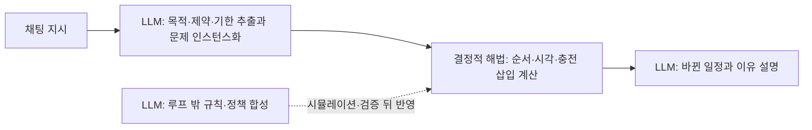
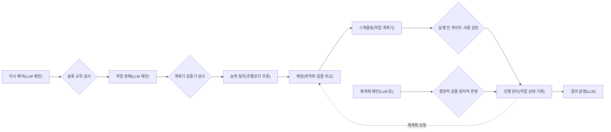
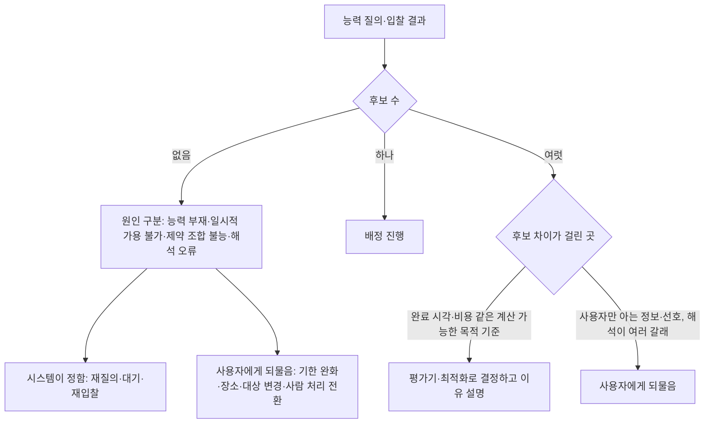
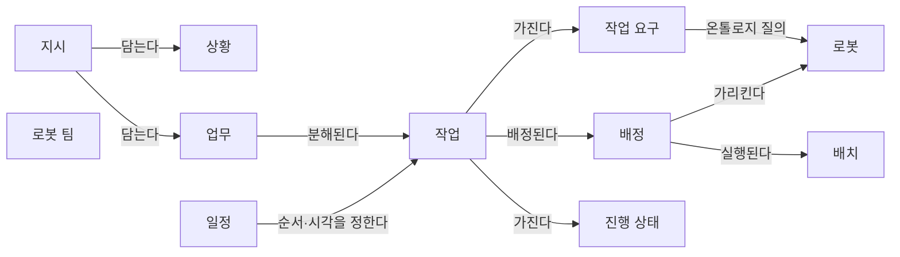
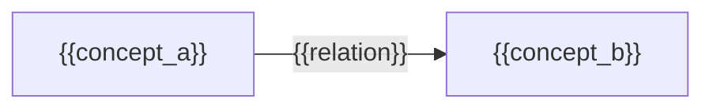

(너의 규칙은 시스템 프롬프트의 agents/shared-rules.md 와 agents/verifier.md 이다. 아래는 이번 실행의 컨텍스트와 입력이다.)

## 실행 컨텍스트

- run_id: 2026-09-25-74
- date: 2026-09-25
- run_type: track (트랙 실행)
- 대상: 트랙 nl-task-chatbot (자연어 업무 지시 챗봇) · 현재 단계: 단계 3. 구현 가설 설계 · 이번에 다룰 백로그 질문 id: q3-03 · 중심 세부영역: 13. 작업 배정 — MRTA (D. 계획·최적화)
- 예산:
    - max_search_queries: 40
    - max_sources_per_run: 20
    - new_topic_pages: 1
    - page_updates: 2
    - max_retries: 2
- 환경 알림: web_fetch_available: false · fetch_mode: mirror_only (일반 웹 페이지 열람은 네트워크 정책으로 막혀 있다. raw.githubusercontent.com 은 열린다: 공식 문서가 GitHub 에 있는 출처는 입력의 config/source_mirrors.yaml 경로를 WebFetch 로 열어 원문을 읽고 sources[].fetched=true, fetched_via=github_raw, fetch_url 을 적는다. 입력에 원문 텍스트(data/source_texts)가 있는 출처는 fetched_via=inbox. 그 밖의 출처는 fetched=false 이며 코드가 신뢰도 상한(medium)을 강제한다 — 공통 규칙 0절 6항)
- 언어: ko
- verification_stage: second
- verifier_budget:
    - max_search_queries: 40
    - max_sources_per_run: 20
    - new_topic_pages: 1
    - page_updates: 2
    - max_retries: 2

## 입력

### runs/2026-09-25-74/target.json

```json
{
  "run_id": "2026-09-25-74",
  "date": "2026-09-25",
  "weekday": "Fri",
  "run_number": 74,
  "run_type": "track",
  "forced": true,
  "target": {
    "area_no": 13,
    "area_name": "13. 작업 배정 — MRTA",
    "category": "D. 계획·최적화",
    "category_letter": "D"
  },
  "topic": null,
  "track": {
    "slug": "nl-task-chatbot",
    "name": "자연어 업무 지시 챗봇",
    "stage": 3,
    "stages": 5,
    "stage_name": "구현 가설 설계",
    "question_ids": [
      "q3-03"
    ],
    "user_questions": [],
    "runs_per_week": 3,
    "question_rationale": "CLI 지정 질문 id"
  },
  "corrections": [],
  "budget": {
    "max_search_queries": 40,
    "max_sources_per_run": 20,
    "new_topic_pages": 1,
    "page_updates": 2,
    "max_retries": 2
  },
  "priority_reason": null,
  "priority_questions": [],
  "excluded_areas": [],
  "lifted_areas": [],
  "deferred": {
    "monthly_recheck": false,
    "weekly_review": true
  },
  "selection_rationale": "CLI 지정 run_type=track, area=13; 트랙 실행일(Fri, track_days 앞 3개) → 트랙 nl-task-chatbot 단계 3, 질문 q3-03 (CLI 지정 질문 id)"
}
```

### runs/2026-09-25-74/research.json

```json
{
  "run_id": "2026-09-25-74",
  "date": "2026-09-25",
  "run_type": "track",
  "target": {
    "area_no": 13,
    "area_name": "13. 작업 배정 — MRTA",
    "category": "D. 계획·최적화"
  },
  "gaps": [
    "단계 3 질문 q3-03 열림(target.json 지정, CLI 지정 질문 id). 단계 3 페이지 3절에 q3-03 소제목 없음",
    "완료 조건: 아이디어 2. 자연어 업무 지시 챗봇 5절에 다른 아이디어와의 연결 없음, 온톨로지 질의 결과(후보 없음·후보 여럿)에 따른 되묻기 흐름 없음",
    "완료 조건: 실험 페이지에 사용자에게 제안하는 실험 계획 없음(스토리텔러 몫)",
    "업무 분해·배정 설계 초안: 배정이 실패했을 때(수행 가능한 로봇 없음)의 사유와 사용자에게 제시한 대안을 담는 개념·속성 없음",
    "13. 작업 배정 — MRTA 섹션 6에 배정 실패 처리와 후보가 여럿일 때의 결정 규칙(평가기) 근거 없음",
    "18. 사람–로봇 협업·운영 인터페이스 섹션 6에 되묻기·폴백·사람 인계 기준 근거 약함"
  ],
  "research_questions": [
    "가장 가까운 로봇에 맡기는 것이 전체적으로도 유리한가? [분류원문]",
    "q3-03 온톨로지 질의가 수행 가능한 로봇을 찾지 못하거나 후보를 여럿 낼 때, 챗봇은 무엇을 사용자에게 되묻고 무엇을 스스로 정하는가?",
    "오케스트레이션 도구(Open-RMF 디스패처·입찰 평가기, VDA 5050 주문 거절)는 수행 가능한 플릿·로봇이 없거나 여럿일 때 무엇을 기록하고 무엇을 자동으로 결정하는가? (단계 3 페이지 3절, 13. 작업 배정 — MRTA 섹션 6 겨냥)",
    "계획기·최적화 해법·온톨로지 검증은 '왜 실행할 수 없는지'를 사람이 고칠 수 있는 형태(해결 불가 설명, 불능 제약 집합, 검증 보고, 대조적 설명)로 돌려줄 수 있는가? (5. 로봇 능력·작업 온톨로지, 27. AI·학습·적응과 모델 운영 연결)",
    "후보가 여럿이거나 해석이 모호할 때 되묻기 여부를 정하는 기준(등각 예측, 내성적 계획, 정보 가치 기반 질문 선택, 폴백·사람 인계)은 무엇이며 되묻기 부담을 어떻게 줄이는가? (18. 사람–로봇 협업·운영 인터페이스 겨냥)",
    "실행 불가 작업을 배정에서 빼거나 사람 처리로 넘기는 방식과, 이를 다룬 국내 물류 관제 사례가 있는가? (20. 예외 복구·재계획·업무 연속성 연결, 한국 자료 우선 규칙)"
  ],
  "findings": [
    {
      "id": "f1",
      "claim": "Open-RMF 디스패처는 입찰 기간에 어떤 플릿 어댑터도 입찰하지 않으면 작업의 배정 상태를 FailedToAssign 으로 두고 'No fleet adapters offered a bid' 오류(코드 10)를 기록하며, 그 작업은 수행되지 않는다.",
      "tag": "사실",
      "source_ids": [
        "ref-713"
      ],
      "cross_checked": false,
      "confidence": "medium",
      "evidence_excerpt": "Dispatcher.cpp: 입찰 제출이 없으면 dispatch_state->status = FailedToAssign, 오류 메시지 \"No fleet adapters offered a bid for task\", 경고 로그 'Dispatching failed, and the task will not be performed'.",
      "as_of": "2026-09-25",
      "flow_step": null,
      "flow_item": "예외·성과"
    },
    {
      "id": "f2",
      "claim": "Open-RMF 에서 플릿 어댑터는 설정에서 해당 작업 유형(청소·배송·순회)을 받도록 구성되어 있지 않으면 그 작업에 입찰하지 않으며, 공식 플릿 어댑터 템플릿 설정은 task_capabilities 로 loop·delivery 를 켜 둔다.",
      "tag": "사실",
      "source_ids": [
        "ref-039",
        "ref-105"
      ],
      "cross_checked": false,
      "confidence": "medium",
      "evidence_excerpt": "task_types.md: fleet adapter needs to be configured to accept Clean type of task. Else, it will not submit a bid; 로그 예 'Fleet [tinyRobot] is configured to not accept task'. 템플릿 config.yaml: task_capabilities loop True, delivery True (두 출처 모두 Open Robotics 계열로 독립 교차 아님).",
      "as_of": "2026-09-25",
      "flow_step": null,
      "flow_item": "수행 자원"
    },
    {
      "id": "f3",
      "claim": "Open-RMF 작업 상태 스키마의 dispatch 필드는 상태(queued·selected·dispatched·failed_to_assign·canceled_in_flight)와 함께 배정 대상(fleet_name, expected_robot_name)과 오류 배열(errors)을 두어, 배정 실패의 사유를 기록할 자리를 제공한다.",
      "tag": "사실",
      "source_ids": [
        "ref-111"
      ],
      "cross_checked": false,
      "confidence": "medium",
      "evidence_excerpt": "task_state.json dispatch: status enum queued/selected/dispatched/failed_to_assign/canceled_in_flight, assignment{fleet_name, expected_robot_name}, errors(array, 외부 error 스키마 참조).",
      "as_of": "2026-09-25",
      "flow_step": null,
      "flow_item": "예외·성과"
    },
    {
      "id": "f4",
      "claim": "Open-RMF 디스패처는 여러 플릿이 입찰하면 평가기(evaluator)로 하나를 고르며, 기본 평가기는 가장 빨리 끝나는 입찰을 고르는 QuickestFinishEvaluator 이고 LeastFleetCostEvaluator·LeastFleetDiffCostEvaluator 로 바꾸거나 사용자 정의 평가기를 넣을 수 있다.",
      "tag": "사실",
      "source_ids": [
        "ref-713",
        "ref-714"
      ],
      "cross_checked": false,
      "confidence": "medium",
      "evidence_excerpt": "Dispatcher.cpp: Auctioneer::make(..., std::make_shared<bidding::QuickestFinishEvaluator>()); 공개 메서드 evaluator(...)로 교체. Auctioneer.hpp: 세 평가기 클래스 정의, 각 순위 기준 문서화는 없음.",
      "as_of": "2026-09-25",
      "flow_step": "피킹",
      "flow_item": "수행 자원"
    },
    {
      "id": "f5",
      "claim": "Open-RMF 작업 요청 스키마의 선택 필드 fleet_name 은 이 작업을 수행하도록 허용된 플릿(하나 또는 여러 개)을 지정하며, 지정하면 그 플릿만 입찰한다.",
      "tag": "사실",
      "source_ids": [
        "ref-125"
      ],
      "cross_checked": false,
      "confidence": "medium",
      "evidence_excerpt": "task_request.json fleet_name(string 또는 array): \"If specified, only the named fleet(s) will bid for this task.\" 필수는 category·description 뿐.",
      "as_of": "2026-09-25",
      "flow_step": null,
      "flow_item": "수행 자원"
    },
    {
      "id": "f6",
      "claim": "VDA 5050 3.0.0 에서 이동로봇은 수행할 수 없는 동작이 담긴 주문(예: 최대 인상 높이를 넘는 인상)을 INVALID_ORDER_ACTION 오류로, 쓸 수 없는 선택 필드는 UNSUPPORTED_PARAMETER 로, 새 주문을 받을 수 없는 운용 모드에서는 MOBILE_ROBOT_NOT_AVAILABLE 로 거절해, 능력 부족과 일시적 가용 불가를 서로 다른 오류로 보고한다.",
      "tag": "사실",
      "source_ids": [
        "ref-031"
      ],
      "cross_checked": false,
      "confidence": "medium",
      "evidence_excerpt": "6.1.4.2~6.1.4.9: order with actions it cannot perform (lifting height higher than maximum) → 'INVALID_ORDER_ACTION' WARNING; unsupported optional fields → 'UNSUPPORTED_PARAMETER' CRITICAL; operating mode not allowing orders → 'MOBILE_ROBOT_NOT_AVAILABLE'. (3.0.0, 공식 저장소 main)",
      "as_of": "2026-09-25",
      "flow_step": null,
      "flow_item": "예외·성과"
    },
    {
      "id": "f7",
      "claim": "Electronics(2026) 논문은 이종 로봇 배정에서 플릿 구성과 대상 물품의 적재 상태가 모두 배정 실행 가능성에 영향을 준다고 보고, 온톨로지 기반 판정 결과(ReasonerOutput)가 세 가지 플릿 구성과 네 가지 배정기에서 공통 실행 가능성 제약으로 작동했다고 보고했다.",
      "tag": "사실",
      "source_ids": [
        "ref-236"
      ],
      "cross_checked": false,
      "confidence": "medium",
      "evidence_excerpt": "검색 요약: four scenarios over three fleet configurations and four allocators; ReasonerOutput consistently functioned as a shared semantic feasibility constraint; fleet composition and loaded state affect assignment feasibility. (원문 미열람)",
      "as_of": "2026-08-11",
      "flow_step": null,
      "flow_item": "수행 자원",
      "source_unopened": true
    },
    {
      "id": "f8",
      "claim": "W3C SHACL 은 검증 결과를 sh:conforms(적합 여부)와 결과 목록(sh:result)으로 된 검증 보고로 내고, 각 결과에 원인이 된 초점 노드(sh:focusNode)·속성 경로(sh:resultPath)·문제 값(sh:value)·제약 구성요소·사람이 읽는 메시지(sh:resultMessage)·심각도를 담을 수 있다.",
      "tag": "사실",
      "source_ids": [
        "ref-459"
      ],
      "cross_checked": false,
      "confidence": "medium",
      "evidence_excerpt": "W3C data-shapes 저장소 편집자 초안: \"The value of sh:conforms is true if and only if the validation did not produce any validation results\"; focusNode·sourceConstraintComponent·resultSeverity 필수, resultPath·value·sourceShape·resultMessage 선택. 권고안 본문과 문구 차이 가능.",
      "as_of": "2017-07",
      "flow_step": null,
      "flow_item": null
    },
    {
      "id": "f9",
      "claim": "Göbelbecker 외(ICAPS 2010)는 계획을 찾지 못할 때 그 이유로 '변명(excuse)', 곧 계획 과제를 풀 수 있게 만드는 초기 상태의 반사실적 변경을 찾는 형식화와 알고리즘을 제안했다.",
      "tag": "사실",
      "source_ids": [
        "ref-717"
      ],
      "cross_checked": false,
      "confidence": "medium",
      "evidence_excerpt": "검색 요약: excuses are counterfactual alterations to the planning task such that the new task will be solvable; 계획 실패는 원리적 불가능이거나 과제 기술이 불완전·부정확해서 생길 수 있다. (ICAPS 2010 pp.81–88, 원문 미열람)",
      "as_of": "2010",
      "flow_step": null,
      "flow_item": null,
      "source_unopened": true
    },
    {
      "id": "f10",
      "claim": "Sreedharan 외는 사용자가 준 제약(plan advice, 예: 주 엘리베이터를 쓰지 말라)이 계획을 풀 수 없게 만드는 원인일 수 있다고 보고, 계층적 추상화와 계획 랜드마크로 사람이 이해할 수 있는 해결 불가 사유를 만드는 방법을 제안했다.",
      "tag": "사실",
      "source_ids": [
        "ref-718"
      ],
      "cross_checked": false,
      "confidence": "medium",
      "evidence_excerpt": "검색 요약: users often provide advice or constraints that might be the very reason a goal becomes unreachable; hierarchical abstractions generate compact, human-understandable reasons for unsolvability. (arXiv 1903.08218, 원문 미열람)",
      "as_of": "2019-03",
      "flow_step": null,
      "flow_item": null,
      "source_unopened": true
    },
    {
      "id": "f11",
      "claim": "OptiChat(Chen 외)은 GPT-4 가 최적화 해법기와 함수 호출로 연결되어 모델을 실행 불가능하게 만드는 최소 제약 집합(IIS)을 찾고, 불능 원인을 자연어로 설명하며 실행 가능하게 고칠 제안을 내는 대화형 시스템이다.",
      "tag": "사실",
      "source_ids": [
        "ref-719"
      ],
      "cross_checked": false,
      "confidence": "medium",
      "evidence_excerpt": "검색 요약: interfaces with an optimization solver to identify the Irreducible Infeasible Subset (IIS); identify potential sources of infeasibility, offer suggestions to make the model feasible. (arXiv 2308.12923, INFOR 2024 게재, 원문 미열람)",
      "as_of": "2023-08",
      "flow_step": null,
      "flow_item": null,
      "source_unopened": true
    },
    {
      "id": "f12",
      "claim": "CE-MRS(Schneider 외, 2024)는 작업 배정·스케줄링·경로 계획 정보를 골라 써서 다중 로봇 시스템의 해를 사람에게 대조적으로 설명하는 방법이며, 운영자 사용자 연구에서 시스템 명세의 오류를 찾아 고치는 능력이 유의하게 좋아졌다고 저자들이 보고했다.",
      "tag": "사실",
      "source_ids": [
        "ref-720"
      ],
      "cross_checked": false,
      "confidence": "medium",
      "evidence_excerpt": "검색 요약: contrastive explanations incorporating data from multi-robot task allocation, scheduling, and motion-planning; user studies show significant improvements in ability to identify and solve errors in specifications. (arXiv 2410.08408, IEEE 저널 게재, 원문 미열람)",
      "as_of": "2024-10",
      "flow_step": null,
      "flow_item": null,
      "source_unopened": true
    },
    {
      "id": "f13",
      "claim": "Shida 외는 무게를 모르는 물체의 다중 로봇 운반 배정에서 운반 불가 작업이 로봇 정지(교착)를 부를 수 있다고 보고, 작업 경험을 공유해 로봇마다 작업별 배제 수준을 학습하고 실행 불가로 보이는 작업을 일시적으로 배제하는 방법을 제안했다.",
      "tag": "사실",
      "source_ids": [
        "ref-723"
      ],
      "cross_checked": false,
      "confidence": "medium",
      "evidence_excerpt": "초록 요약: presence of infeasible tasks (untransportable objects) can lead to robot stoppage (deadlock); robots learn exclusion levels to exclude infeasible tasks; temporary exclusion of tasks considered infeasible. (arXiv 2404.11817, 원문 미열람)",
      "as_of": "2024-04",
      "flow_step": null,
      "flow_item": "예외·성과",
      "source_unopened": true
    },
    {
      "id": "f14",
      "claim": "CLARA 는 LLM 불확실성과 상황 맥락으로 불확실한 명령을 모호한 명령과 수행 불가능한 명령으로 나누어, 모호한 명령은 질문을 만들어 사용자와 대화로 풀고 수행 불가능한 명령은 거절한다.",
      "tag": "사실",
      "source_ids": [
        "ref-352",
        "ref-353"
      ],
      "cross_checked": false,
      "confidence": "medium",
      "evidence_excerpt": "프로젝트 페이지·논문(IEEE RA-L 2024)이 명확/모호/수행 불가 3분류와 모호한 명령의 질문 생성, 수행 불가 명령 거절을 설명. 같은 저자 계열이라 독립 교차 아님. (재인용: 2026-09-25-30)",
      "as_of": "2024",
      "flow_step": null,
      "flow_item": "시작 조건",
      "source_unopened": true
    },
    {
      "id": "f15",
      "claim": "KnowNo 는 LLM 계획기가 낸 선택지 가운데 등각 예측으로 정한 문턱을 넘는 것이 둘 이상이면 사람에게 도움을 요청하고, 하나면 스스로 실행한다.",
      "tag": "사실",
      "source_ids": [
        "ref-350",
        "ref-351"
      ],
      "cross_checked": false,
      "confidence": "medium",
      "evidence_excerpt": "등각 예측으로 만든 예측 집합이 단일 선택지가 아니면 도움 요청, 사용자가 정한 성공 수준을 통계적으로 보장. 같은 저자 계열(프로젝트 페이지·논문). (재인용: 2026-09-25-30)",
      "as_of": "2023-07",
      "flow_step": null,
      "flow_item": null,
      "source_unopened": true
    },
    {
      "id": "f16",
      "claim": "내성적 계획(Introspective Planning, NeurIPS 2024)은 사람이 고른 안전한 계획의 사후 추론 예시를 지식 기반으로 검색해 LLM 불확실성을 과업 모호성에 맞추며, 등각 예측과 결합해 성공 보장을 유지하면서 불필요한 되묻기를 줄였다고 저자들이 보고했다.",
      "tag": "사실",
      "source_ids": [
        "ref-721"
      ],
      "cross_checked": false,
      "confidence": "medium",
      "evidence_excerpt": "검색 요약: combination with conformal prediction achieves tighter confidence bounds, maintaining statistical success guarantees while minimizing unnecessary user clarification requests; avoids over-asking, lowest unsafe rate. (arXiv 2402.06529, 원문 미열람)",
      "as_of": "2024-02",
      "flow_step": null,
      "flow_item": null,
      "source_unopened": true
    },
    {
      "id": "f17",
      "claim": "SAGE-Agent(Suri 외, ACL 2026 Findings)는 도구 인자와 그 값 영역 위에서 사용자가 원하는 것에 대한 명세 불확실성과 모델 예측 불확실성을 나누고, 질문마다 완전 정보의 기대 가치(EVPI)와 질문 비용을 따져 되물을 질문을 고르며, 기준선 대비 모호 과제 달성 범위를 7~39% 늘리고 질문 수를 1.5~2.7배 줄였다고 보고했다.",
      "tag": "사실",
      "source_ids": [
        "ref-722"
      ],
      "cross_checked": false,
      "confidence": "medium",
      "evidence_excerpt": "검색 요약: separating specification uncertainty from model uncertainty; EVPI balanced against aspect-based cost; coverage +7–39%, clarification questions reduced 1.5–2.7× (ClarifyBench: 문서 편집·차량 제어·여행 예약, 저자 보고, 원문 미열람).",
      "as_of": "2025-11",
      "flow_step": null,
      "flow_item": null,
      "source_unopened": true
    },
    {
      "id": "f18",
      "claim": "Rasa 는 의도 분류 신뢰도가 문턱(기본 0.7) 아래면 폴백으로 넘어가 다시 말해 달라고 요청하고, 두 단계 폴백에서는 추정한 의도를 사용자에게 확인받고 부정하면 재진술을 요청한 뒤, 끝까지 실패하면 최종 폴백으로 보통 사람 상담원에게 대화를 넘긴다.",
      "tag": "사실",
      "source_ids": [
        "ref-716"
      ],
      "cross_checked": false,
      "confidence": "medium",
      "evidence_excerpt": "fallback-handoff.mdx: FallbackClassifier threshold(기본 0.7) → nlu_fallback; action_two_stage_fallback: 의도 확인 → 거부 시 재진술 → 'ultimate fallback action'(typically handoff to human), 대화 기록 전달.",
      "as_of": "2026-09-25",
      "flow_step": null,
      "flow_item": "시작 조건"
    },
    {
      "id": "f19",
      "claim": "개인 연구자가 공개한 Plan-Failure-Bench 는 LLM 계획기가 실행 가능한 계획, 사유를 단 infeasible, 후보 지시 대상을 단 clarify 가운데 하나로 답하게 하고 도달 불가 목표·능력 부족·모호한 지칭 등 여섯 함정 유형을 기계 검증 정답으로 평가하며, 시험한 어떤 모델도 능력 부족과 도달 불가 목표를 구분하지 못했다고 보고한다.",
      "tag": "사실",
      "source_ids": [
        "ref-724"
      ],
      "cross_checked": false,
      "confidence": "low",
      "evidence_excerpt": "README: answer in JSON — a plan, infeasible with a reason, or clarify with candidate referents; traps: unreachable goals, missing robot capabilities, ambiguous object references 등; \"No model separates a missing capability from an unreachable goal.\" (동료심사 전, Zenodo 프리프린트)",
      "as_of": "2026-09-25",
      "flow_step": null,
      "flow_item": null
    },
    {
      "id": "f20",
      "claim": "LAPPI 는 LLM 이 대화로 사용자의 모호한 선호를 후보 항목·선호 점수·제약으로 바꿔 최적화 문제를 인스턴스화하고, 풀이는 기존 해법기에 맡기는 대화형 최적화 방식이다.",
      "tag": "사실",
      "source_ids": [
        "ref-598"
      ],
      "cross_checked": false,
      "confidence": "medium",
      "evidence_excerpt": "LLM-assisted preference-based problem instantiation, 해법은 기존 최적화 해법기; 여행 계획 사용자 연구에서 실행 가능 계획 개선(저자 보고, 원문 미열람). (재인용: 2026-09-25-66)",
      "as_of": "2025-12",
      "flow_step": null,
      "flow_item": null,
      "source_unopened": true
    },
    {
      "id": "f21",
      "claim": "로봇 능력 온톨로지(RCO) 연구(Scientific Reports, 2025)는 제조사가 광고한 능력과 경험적으로 측정한 운용 능력을 함께 표현하고 SPARQL 질의로 둘을 비교해, 선언 능력과 실제 성능이 다를 수 있음을 온톨로지 안에서 다룬다.",
      "tag": "사실",
      "source_ids": [
        "ref-041"
      ],
      "cross_checked": false,
      "confidence": "medium",
      "evidence_excerpt": "검색 요약: Robot Capability Ontology bridging manufacturer specifications and empirical performance data; SPARQL queries retrieve and compare advertised and operational repeatability capabilities. (원문 미열람)",
      "as_of": "2025",
      "flow_step": null,
      "flow_item": "수행 자원",
      "source_unopened": true
    },
    {
      "id": "f22",
      "claim": "q3-03 의 '후보 없음'에 대해 확인한 자료를 이 위키가 묶으면, 원인은 (1) 능력 부재(어느 플릿도 그 작업 유형·능력을 선언하지 않음), (2) 일시적 가용 불가(운용 모드·배터리 임계값·점유), (3) 제약 조합의 불능(적재 상태 도달 가능성·기한), (4) 해석 오류(잘못 채운 슬롯)로 나뉘며, 챗봇은 원인과 함께 사용자가 바꿀 수 있는 항목(기한 완화, 장소·대상 변경, 사람 처리 전환)만 되묻고 재질의·대기·재입찰은 시스템이 정하는 분담이 근거가 가장 많은 것으로 보인다.",
      "tag": "추정",
      "source_ids": [
        "ref-713",
        "ref-039",
        "ref-031",
        "ref-236",
        "ref-105",
        "ref-717",
        "ref-718",
        "ref-719",
        "ref-714"
      ],
      "cross_checked": false,
      "confidence": "low",
      "evidence_excerpt": "이 위키의 종합: 원인 구분은 Open-RMF 무입찰·task_capabilities, VDA 5050 오류 유형(능력 대 가용), 적재 상태 판정에서, '바꿀 수 있는 항목' 제시는 excuse·plan advice·IIS 연구에서 도출. 이 분류를 제시한 단일 출처 없음.",
      "as_of": "2026-09-25",
      "flow_step": null,
      "flow_item": "예외·성과"
    },
    {
      "id": "f23",
      "claim": "q3-03 의 '후보 여럿'에 대해서는, 후보 사이 차이가 완료 시각·비용처럼 시스템이 계산할 수 있는 목적 기준뿐이면 미리 정한 평가기·최적화로 스스로 정하고 결과를 설명하며, 차이가 사용자만 아는 정보나 선호(어느 화물·장소인지, 기한과 비용의 교환)에 걸리거나 해석 자체가 여러 갈래일 때만 되묻는 분담이 근거가 가장 많은 것으로 보인다.",
      "tag": "추정",
      "source_ids": [
        "ref-713",
        "ref-376",
        "ref-350",
        "ref-722",
        "ref-721",
        "ref-598",
        "ref-720"
      ],
      "cross_checked": false,
      "confidence": "low",
      "evidence_excerpt": "이 위키의 종합: 자동 결정은 Open-RMF 평가기(f4), 되묻기 조건은 KnowNo 예측 집합(f15)·EVPI 질문 선택(f17)·불필요한 되묻기 감소(f16), 선호 반영은 LAPPI(f20), 설명은 CE-MRS(f12). 물류 조건 평가 없음.",
      "as_of": "2026-09-25",
      "flow_step": "피킹",
      "flow_item": "수행 자원"
    },
    {
      "id": "f24",
      "claim": "분류 원문 질문(가장 가까운 로봇에 맡기는 것이 전체적으로도 유리한가)과 관련해, 후보가 여럿일 때 '가장 가까운 로봇'은 평가기 선택지의 하나일 뿐이므로 챗봇이 채팅마다 사용자에게 고르게 하기보다 운영 조직이 평가 기준을 미리 정해 두고 채팅에서는 그 기준에 따른 선택 이유를 설명하는 편이 전체 기준의 일관성에 맞는 것으로 보인다.",
      "tag": "추정",
      "source_ids": [
        "ref-713",
        "ref-714",
        "ref-720"
      ],
      "cross_checked": false,
      "confidence": "low",
      "evidence_excerpt": "Open-RMF 기본 평가기는 QuickestFinish, 교체 가능(f4). 평가 기준을 누가 정하는지는 출처에 없음 — 이 위키의 추론.",
      "as_of": "2026-09-25",
      "flow_step": "피킹",
      "flow_item": "수행 자원"
    },
    {
      "id": "f25",
      "claim": "피킹 단계에서 관리자가 채팅으로 토트 운반을 지시했는데 어떤 플릿도 입찰하지 않으면, 챗봇은 배정 실패 기록(failed_to_assign·오류)을 근거로 원인을 설명하고 기한 완화·다른 장소·사람 작업자 처리 같은 선택지를 되묻는 흐름이 가능해 보인다(설명용 가정 사례).",
      "tag": "추정",
      "source_ids": [
        "ref-713",
        "ref-111",
        "ref-716",
        "ref-719"
      ],
      "cross_checked": false,
      "confidence": "low",
      "evidence_excerpt": "설명용 가정 사례. 근거: 무입찰 시 FailedToAssign(f1), dispatch errors 배열(f3), 최종 폴백의 사람 인계(f18), 불능 원인 설명과 수정 제안(f11).",
      "as_of": "2026-09-25",
      "flow_step": "피킹",
      "flow_item": "예외·성과"
    },
    {
      "id": "f26",
      "claim": "이번에 확인한 배정 실패 설명·되묻기 근거의 평가 환경은 고전 계획 벤치마크, 운영과학 최적화 모델, 실험실 다중 로봇, 도구 호출 대화, 가정·사무실 시뮬레이션이었고, 물류 창고 로봇 관제에서 배정 실패를 사용자와 대화로 처리한 연구와 국내 사례는 한국어 검색 포함 검색 범위에서 찾지 못했다(부재의 확인은 아님).",
      "tag": "추정",
      "source_ids": [
        "ref-717",
        "ref-719",
        "ref-720",
        "ref-722",
        "ref-724",
        "ref-723"
      ],
      "cross_checked": false,
      "confidence": "low",
      "evidence_excerpt": "한국어 검색 2회는 해외 논문 번역 페이지와 통합관제 제품 소개만 나와 배정 실패 처리 절차를 담은 국내 자료를 찾지 못함.",
      "as_of": "2026-09-25",
      "flow_step": null,
      "flow_item": null
    }
  ],
  "sources": [
    {
      "id": "ref-031",
      "org": "VDA / VDMA (VDA5050 GitHub)",
      "title": "VDA5050/VDA5050_EN.md — Official Specification document for the VDA 5050",
      "published": null,
      "url": "https://github.com/VDA5050/VDA5050/blob/main/VDA5050_EN.md",
      "type": "표준",
      "reliability": "medium",
      "accessed": "2026-09-25",
      "summary": "VDA 5050 3.0.0 명세. 주문 거절 오류 유형(INVALID_ORDER_ACTION, UNSUPPORTED_PARAMETER, MOBILE_ROBOT_NOT_AVAILABLE)과 관제 기능 범위를 확인.",
      "fetched": true,
      "fetched_via": "github_raw",
      "fetch_url": null,
      "source_unopened": false
    },
    {
      "id": "ref-105",
      "org": "Open Robotics (open-rmf)",
      "title": "fleet_adapter_template — fleet_adapter_template/config.yaml",
      "published": null,
      "url": "https://github.com/open-rmf/fleet_adapter_template/blob/main/fleet_adapter_template/config.yaml",
      "type": "오픈소스 문서",
      "reliability": "medium",
      "accessed": "2026-09-25",
      "summary": "플릿 어댑터 템플릿 설정. task_capabilities(loop·delivery), recharge_threshold 0.10.",
      "fetched": true,
      "fetched_via": "github_raw",
      "fetch_url": "https://raw.githubusercontent.com/open-rmf/fleet_adapter_template/main/fleet_adapter_template/config.yaml",
      "source_unopened": false
    },
    {
      "id": "ref-111",
      "org": "Open Robotics (open-rmf)",
      "title": "rmf_api_msgs — rmf_api_msgs/schemas/task_state.json",
      "published": null,
      "url": "https://github.com/open-rmf/rmf_api_msgs/blob/main/rmf_api_msgs/schemas/task_state.json",
      "type": "오픈소스 문서",
      "reliability": "medium",
      "accessed": "2026-09-25",
      "summary": "작업 상태 스키마. dispatch 필드의 상태 값·배정 대상·오류 배열.",
      "fetched": true,
      "fetched_via": "github_raw",
      "fetch_url": "https://raw.githubusercontent.com/open-rmf/rmf_api_msgs/main/rmf_api_msgs/schemas/task_state.json",
      "source_unopened": false
    },
    {
      "id": "ref-125",
      "org": "Open Robotics (open-rmf)",
      "title": "rmf_api_msgs — rmf_api_msgs/schemas/task_request.json",
      "published": null,
      "url": "https://github.com/open-rmf/rmf_api_msgs/blob/main/rmf_api_msgs/schemas/task_request.json",
      "type": "오픈소스 문서",
      "reliability": "medium",
      "accessed": "2026-09-25",
      "summary": "작업 요청 스키마. 필수 category·description, 선택 fleet_name(허용 플릿 지정) 등.",
      "fetched": true,
      "fetched_via": "github_raw",
      "fetch_url": "https://raw.githubusercontent.com/open-rmf/rmf_api_msgs/main/rmf_api_msgs/schemas/task_request.json",
      "source_unopened": false
    },
    {
      "id": "ref-236",
      "org": "Electronics(MDPI) 게재 논문(저자 미확인)",
      "title": "Semantic Feasibility Reasoning for Heterogeneous Multi-Robot Task Allocation",
      "published": "2026-08-11",
      "url": "https://doi.org/10.3390/electronics15163562",
      "type": "논문",
      "reliability": "medium",
      "accessed": "2026-09-25",
      "summary": "원문 미열람. 온톨로지 기반 실행 가능성 판정을 배정기 독립 ReasonerOutput 으로 정형화, 적재 상태·플릿 구성이 실행 가능성에 영향.",
      "source_unopened": true,
      "fetched": false,
      "fetched_via": null,
      "fetch_url": null
    },
    {
      "id": "ref-350",
      "org": "Ren, A. Z. 외(Google DeepMind·Princeton University, KnowNo 프로젝트)",
      "title": "Robots That Ask For Help: Uncertainty Alignment for Large Language Model Planners — project page (robot-help.github.io)",
      "published": null,
      "url": "https://robot-help.github.io/",
      "type": "오픈소스 문서",
      "reliability": "medium",
      "accessed": "2026-09-25",
      "summary": "원문 미열람. KnowNo 프로젝트 페이지. 등각 예측 기반 도움 요청.",
      "source_unopened": true,
      "fetched": false,
      "fetched_via": null,
      "fetch_url": null
    },
    {
      "id": "ref-351",
      "org": "Ren, A. Z. 외",
      "title": "Robots That Ask For Help: Uncertainty Alignment for Large Language Model Planners",
      "published": "2023-07",
      "url": "https://arxiv.org/abs/2307.01928",
      "type": "논문",
      "reliability": "medium",
      "accessed": "2026-09-25",
      "summary": "원문 미열람. KnowNo 논문(CoRL 2023).",
      "source_unopened": true,
      "fetched": false,
      "fetched_via": null,
      "fetch_url": null
    },
    {
      "id": "ref-352",
      "org": "Park, J. 외(고려대학교·연세대학교·Google Research, CLARA 프로젝트)",
      "title": "CLARA: Classifying and Disambiguating User Commands for Reliable Interactive Robotic Agents — project page (clararobot.github.io)",
      "published": null,
      "url": "https://clararobot.github.io/",
      "type": "오픈소스 문서",
      "reliability": "medium",
      "accessed": "2026-09-25",
      "summary": "원문 미열람. CLARA 프로젝트 페이지. 명확·모호·수행 불가 명령 구분.",
      "source_unopened": true,
      "fetched": false,
      "fetched_via": null,
      "fetch_url": null
    },
    {
      "id": "ref-353",
      "org": "Park, J., Lim, S., Lee, J., Park, S., Chang, M., Yu, Y., & Choi, S.",
      "title": "CLARA: Classifying and Disambiguating User Commands for Reliable Interactive Robotic Agents",
      "published": "2024",
      "url": "https://arxiv.org/abs/2306.10376",
      "type": "논문",
      "reliability": "medium",
      "accessed": "2026-09-25",
      "summary": "원문 미열람. CLARA 논문(IEEE RA-L 2024).",
      "source_unopened": true,
      "fetched": false,
      "fetched_via": null,
      "fetch_url": null
    },
    {
      "id": "ref-376",
      "org": "Open Robotics",
      "title": "Tasks in RMF (task) - Programming Multiple Robots with ROS 2",
      "published": null,
      "url": "https://osrf.github.io/ros2multirobotbook/task.html",
      "type": "오픈소스 문서",
      "reliability": "medium",
      "accessed": "2026-09-25",
      "summary": "Open-RMF 입찰 흐름(BidNotice·BidProposal·설정 기준 비교). 무입찰·실패 처리는 이 문서에 없음을 확인.",
      "fetched": true,
      "fetched_via": "github_raw",
      "fetch_url": "https://raw.githubusercontent.com/osrf/ros2multirobotbook/master/src/task.md",
      "source_unopened": false
    },
    {
      "id": "ref-598",
      "org": "Kuroki, S., Nakagawa, M., Yoshida, S., Koyama, Y., & Kozuno, T.(OMRON SINIC X 등, IEEE Access 2026)",
      "title": "LAPPI: Interactive Optimization with LLM-Assisted Preference-Based Problem Instantiation",
      "published": "2025-12",
      "url": "https://arxiv.org/abs/2512.14138",
      "type": "논문",
      "reliability": "medium",
      "accessed": "2026-09-25",
      "summary": "원문 미열람. LLM 이 대화로 선호를 최적화 문제로 인스턴스화하고 해법기가 푸는 방식.",
      "source_unopened": true,
      "fetched": false,
      "fetched_via": null,
      "fetch_url": null
    },
    {
      "id": "ref-713",
      "org": "Open Robotics (open-rmf)",
      "title": "rmf_ros2 — rmf_task_ros2/src/rmf_task_ros2/Dispatcher.cpp",
      "published": null,
      "url": "https://github.com/open-rmf/rmf_ros2/blob/main/rmf_task_ros2/src/rmf_task_ros2/Dispatcher.cpp",
      "type": "오픈소스 문서",
      "reliability": "medium",
      "accessed": "2026-09-25",
      "summary": "Open-RMF 디스패처 소스. 무입찰 시 FailedToAssign·오류 기록, 기본 평가기 QuickestFinishEvaluator 와 교체 메서드.",
      "fetched": true,
      "fetched_via": "github_raw",
      "fetch_url": "https://raw.githubusercontent.com/open-rmf/rmf_ros2/main/rmf_task_ros2/src/rmf_task_ros2/Dispatcher.cpp",
      "source_unopened": false
    },
    {
      "id": "ref-714",
      "org": "Open Robotics (open-rmf)",
      "title": "rmf_ros2 — rmf_task_ros2/include/rmf_task_ros2/bidding/Auctioneer.hpp",
      "published": null,
      "url": "https://github.com/open-rmf/rmf_ros2/blob/main/rmf_task_ros2/include/rmf_task_ros2/bidding/Auctioneer.hpp",
      "type": "오픈소스 문서",
      "reliability": "medium",
      "accessed": "2026-09-25",
      "summary": "입찰 경매자 헤더. 평가기 LeastFleetDiffCost·LeastFleetCost·QuickestFinish 정의(각 기준 문서화 없음).",
      "fetched": true,
      "fetched_via": "github_raw",
      "fetch_url": "https://raw.githubusercontent.com/open-rmf/rmf_ros2/main/rmf_task_ros2/include/rmf_task_ros2/bidding/Auctioneer.hpp",
      "source_unopened": false
    },
    {
      "id": "ref-039",
      "org": "Open Robotics",
      "title": "Currently supported Tasks (task_types) - Programming Multiple Robots with ROS 2",
      "published": null,
      "url": "https://osrf.github.io/ros2multirobotbook/task_types.html",
      "type": "오픈소스 문서",
      "reliability": "medium",
      "accessed": "2026-09-25",
      "summary": "지원 작업 유형 문서. 플릿 어댑터가 해당 작업 유형을 받도록 설정되지 않으면 입찰하지 않는다고 설명.",
      "fetched": true,
      "fetched_via": "github_raw",
      "fetch_url": "https://raw.githubusercontent.com/osrf/ros2multirobotbook/master/src/task_types.md",
      "source_unopened": false
    },
    {
      "id": "ref-716",
      "org": "Rasa Technologies (RasaHQ/rasa GitHub)",
      "title": "Fallback and Human Handoff — Rasa documentation (docs/docs/fallback-handoff.mdx)",
      "published": null,
      "url": "https://github.com/RasaHQ/rasa/blob/main/docs/docs/fallback-handoff.mdx",
      "type": "오픈소스 문서",
      "reliability": "medium",
      "accessed": "2026-09-25",
      "summary": "NLU 폴백 문턱, 두 단계 폴백(의도 확인·재진술), 최종 폴백의 사람 인계 설명.",
      "fetched": true,
      "fetched_via": "github_raw",
      "fetch_url": "https://raw.githubusercontent.com/RasaHQ/rasa/main/docs/docs/fallback-handoff.mdx",
      "source_unopened": false
    },
    {
      "id": "ref-717",
      "org": "Göbelbecker, M., Keller, T., Eyerich, P., Brenner, M., & Nebel, B.",
      "title": "Coming Up With Good Excuses: What to do When no Plan Can be Found",
      "published": "2010",
      "url": "https://ojs.aaai.org/index.php/ICAPS/article/view/13421",
      "type": "논문",
      "reliability": "medium",
      "accessed": "2026-09-25",
      "summary": "원문 미열람. 계획을 찾지 못할 때 과제를 풀 수 있게 만드는 초기 상태의 반사실적 변경(excuse)을 찾는 형식화와 알고리즘(ICAPS 2010).",
      "source_unopened": true,
      "fetched": false,
      "fetched_via": null,
      "fetch_url": null
    },
    {
      "id": "ref-718",
      "org": "Sreedharan, S., Srivastava, S., Smith, D., & Kambhampati, S.",
      "title": "Why Couldn't You do that? Explaining Unsolvability of Classical Planning Problems in the Presence of Plan Advice",
      "published": "2019-03",
      "url": "https://arxiv.org/abs/1903.08218",
      "type": "논문",
      "reliability": "medium",
      "accessed": "2026-09-25",
      "summary": "원문 미열람. 사용자 제약이 원인이 되는 해결 불가를 계층적 추상화·랜드마크로 설명하는 방법.",
      "source_unopened": true,
      "fetched": false,
      "fetched_via": null,
      "fetch_url": null
    },
    {
      "id": "ref-719",
      "org": "Chen, H. 외(OptiChat 저자)",
      "title": "Diagnosing Infeasible Optimization Problems Using Large Language Models",
      "published": "2023-08",
      "url": "https://arxiv.org/abs/2308.12923",
      "type": "논문",
      "reliability": "medium",
      "accessed": "2026-09-25",
      "summary": "원문 미열람. GPT-4 와 해법기를 연결해 IIS 로 불능 원인을 찾고 수정 제안을 하는 대화형 시스템 OptiChat(INFOR 2024 게재).",
      "source_unopened": true,
      "fetched": false,
      "fetched_via": null,
      "fetch_url": null
    },
    {
      "id": "ref-720",
      "org": "Schneider, E. 외(CE-MRS 저자)",
      "title": "CE-MRS: Contrastive Explanations for Multi-Robot Systems",
      "published": "2024-10",
      "url": "https://arxiv.org/abs/2410.08408",
      "type": "논문",
      "reliability": "medium",
      "accessed": "2026-09-25",
      "summary": "원문 미열람. 작업 배정·스케줄링·경로 계획 정보를 쓰는 다중 로봇 대조적 설명과 운영자 사용자 연구(IEEE 저널 게재).",
      "source_unopened": true,
      "fetched": false,
      "fetched_via": null,
      "fetch_url": null
    },
    {
      "id": "ref-721",
      "org": "Liang, K. 외(Introspective Planning 저자)",
      "title": "Introspective Planning: Aligning Robots' Uncertainty with Inherent Task Ambiguity",
      "published": "2024-02",
      "url": "https://arxiv.org/abs/2402.06529",
      "type": "논문",
      "reliability": "medium",
      "accessed": "2026-09-25",
      "summary": "원문 미열람. 내성적 추론 예시 검색과 등각 예측 결합으로 불필요한 되묻기를 줄이는 LLM 계획(NeurIPS 2024).",
      "source_unopened": true,
      "fetched": false,
      "fetched_via": null,
      "fetch_url": null
    },
    {
      "id": "ref-722",
      "org": "Suri, M. 외(SAGE-Agent 저자)",
      "title": "Structured Uncertainty guided Clarification for LLM Agents",
      "published": "2025-11",
      "url": "https://arxiv.org/abs/2511.08798",
      "type": "논문",
      "reliability": "medium",
      "accessed": "2026-09-25",
      "summary": "원문 미열람. 도구 인자 위의 구조화 불확실성과 EVPI 로 되물을 질문을 고르는 방법과 ClarifyBench(ACL 2026 Findings).",
      "source_unopened": true,
      "fetched": false,
      "fetched_via": null,
      "fetch_url": null
    },
    {
      "id": "ref-723",
      "org": "Shida, Y. 외",
      "title": "Reinforcement Learning of Multi-robot Task Allocation for Multi-object Transportation with Infeasible Tasks",
      "published": "2024-04",
      "url": "https://arxiv.org/abs/2404.11817",
      "type": "논문",
      "reliability": "medium",
      "accessed": "2026-09-25",
      "summary": "원문 미열람. 운반 불가 작업이 교착을 부르는 문제와 작업별 배제 수준 학습으로 일시 배제하는 동적 배정(IEEE 학술대회 게재).",
      "source_unopened": true,
      "fetched": false,
      "fetched_via": null,
      "fetch_url": null
    },
    {
      "id": "ref-724",
      "org": "Kazmi, M. (plan-failure-bench GitHub)",
      "title": "plan-failure-bench — README (Benchmark measuring how LLM planners fail at robot tasks)",
      "published": null,
      "url": "https://github.com/munawarkazmi/plan-failure-bench",
      "type": "오픈소스 문서",
      "reliability": "low",
      "accessed": "2026-09-25",
      "summary": "개인 연구자 벤치마크 README. plan/infeasible/clarify 세 응답과 여섯 함정 유형, 기계 검증 정답. 동료심사 전 프리프린트.",
      "fetched": true,
      "fetched_via": "github_raw",
      "fetch_url": "https://raw.githubusercontent.com/munawarkazmi/plan-failure-bench/main/README.md",
      "source_unopened": false
    },
    {
      "id": "ref-459",
      "org": "W3C",
      "title": "Shapes Constraint Language (SHACL)",
      "published": "2017-07",
      "url": "https://www.w3.org/TR/shacl/",
      "type": "표준",
      "reliability": "medium",
      "accessed": "2026-09-25",
      "summary": "SHACL 명세. 검증 보고(sh:conforms, sh:result)와 결과 속성 구조. 연 것은 W3C data-shapes 저장소의 편집자 초안이라 권고안과 문구가 다를 수 있음.",
      "fetched": true,
      "fetched_via": "github_raw",
      "fetch_url": "https://raw.githubusercontent.com/w3c/data-shapes/gh-pages/shacl/index.html",
      "source_unopened": false
    },
    {
      "id": "ref-041",
      "org": "Scientific Reports 게재 논문(저자 미확인)",
      "title": "Ontology-driven integration of advertised and operational capabilities in robots",
      "published": "2025",
      "url": "https://www.nature.com/articles/s41598-025-16649-3",
      "type": "논문",
      "reliability": "medium",
      "accessed": "2026-09-25",
      "summary": "원문 미열람. 제조사 광고 능력과 측정 운용 능력을 함께 표현하는 로봇 능력 온톨로지(RCO)와 SPARQL 비교 질의.",
      "source_unopened": true,
      "fetched": false,
      "fetched_via": null,
      "fetch_url": null
    }
  ],
  "page_proposals": [
    {
      "action": "update",
      "path": "docs/tracks/nl-task-chatbot/stage-3-implementation-hypothesis.md",
      "sections": [
        "2",
        "3",
        "4",
        "5",
        "6",
        "8",
        "9"
      ],
      "rationale": "q3-03 답: f1·f2·f3·f4·f5·f6·f7·f8·f9·f10·f11·f12·f13·f14·f15·f16·f17·f18·f19·f20·f21·f22·f23·f24·f25·f26 (신뢰도 low) — 2절 q3-03 상태 답함, 3절 q3-03 소제목 신설({#q3-03}): 오케스트레이션 도구의 무입찰·배정 실패 기록(f1·f2·f3), 후보 여럿일 때 평가기(f4)와 허용 플릿 지정(f5), 로봇 쪽 거절 오류의 능력 대 가용 구분(f6), 온톨로지 판정과 검증 보고(f7·f8·f21), 해결 불가 설명 연구(f9·f10·f11·f12), 실행 불가 작업 일시 배제(f13), 되묻기 기준(f14·f15·f16·f17·f18·f20), 세 응답 벤치마크(f19, 신뢰도 low), 종합: 후보 없음 원인 네 갈래와 되묻기 범위(f22)·후보 여럿일 때 자동 결정과 되묻기의 경계(f23, mermaid 판정 흐름 권장)·SCM 질문 연결(f24)·피킹 시나리오(f25)·근거 공백(f26) / 4절 결론·불확실성 / 5절 후속 질문 / 6절 완료 조건 현황 / 8절 출처 / 9절 이력"
    },
    {
      "action": "update",
      "path": "docs/ideas/nl-task-chatbot.md",
      "sections": [
        "5"
      ],
      "rationale": "아이디어 페이지 5절(트랙 산출물): '온톨로지 질의 결과에 따른 되묻기' 소절 신설 — 후보 없음 원인 구분과 되묻기 범위 f22(추정), 후보 여럿일 때 자동 결정·되묻기 경계 f23(추정), 근거 f1·f3·f4·f6·f11·f15·f17·f18. 다른 아이디어와의 연결: 능력 판정 불일치의 원인(아이디어 1, 선언 대 운용 능력 f21), 장소 슬롯 변경 제안(아이디어 3)은 구조만 언급"
    },
    {
      "action": "update",
      "path": "docs/tracks/nl-task-chatbot/task-model-draft.md",
      "sections": [
        "2",
        "6"
      ],
      "rationale": "트랙 산출물 갱신: track.ontology_changes(개념 '배정 실패' 추가)가 승인되면 2절 반영과 초안 버전 인상(f1·f3·f6·f22). 미승인 시 6절 질문으로 두고, 배정 실패와 진행 상태의 dispatch 값 failed_to_assign 메모, 사용자 확인 개념(q4-01·q4-04)과의 관계를 질문으로"
    },
    {
      "action": "update",
      "path": "docs/categories/d-planning-and-optimization/13-task-allocation-mrta.md",
      "sections": [
        "6"
      ],
      "rationale": "트랙 nl-task-chatbot 단계 3 반영 제안 (f1, f4, f5, f13, f23, f24): Open-RMF 무입찰 시 배정 실패 처리, 입찰 평가기(가장 빨리 끝남 기본·교체 가능)와 분류 원문 질문 연결, 실행 불가 작업의 일시 배제. 27. AI·학습·적응과 모델 운영과 양쪽 연결"
    },
    {
      "action": "update",
      "path": "docs/categories/e-collaboration-and-field-operations/18-human-robot-collaboration-and-operator-interface.md",
      "sections": [
        "6"
      ],
      "rationale": "트랙 nl-task-chatbot 단계 3 반영 제안 (f12, f16, f17, f18, f22): 배정 실패·후보 여럿일 때의 되묻기 범위, 폴백과 사람 인계, 불필요한 되묻기를 줄이는 방법, 다중 로봇 대조적 설명의 운영자 연구"
    },
    {
      "action": "update",
      "path": "docs/categories/g-safety-security-intelligence-and-governance/27-ai-learning-adaptation-and-model-operations.md",
      "sections": [
        "6",
        "8"
      ],
      "rationale": "트랙 nl-task-chatbot 단계 3 반영 제안 (f11, f16, f17, f19): LLM 과 해법기 결합의 불능 원인 진단(OptiChat), 내성적 계획·EVPI 기반 되묻기, 계획 실패 유형 벤치마크(신뢰도 low). 적용 대상 13. 작업 배정 — MRTA·18. 사람–로봇 협업·운영 인터페이스와 함께 연결"
    },
    {
      "action": "update",
      "path": "docs/categories/b-common-information-and-environment-model/05-robot-capability-and-task-ontology.md",
      "sections": [
        "10"
      ],
      "rationale": "트랙 nl-task-chatbot 단계 3 반영 제안 (f7, f8, f21): 온톨로지 판정이 '후보 없음'의 원인을 제약 단위(SHACL 검증 보고 같은 형식)로 13. 작업 배정 — MRTA 에 돌려주는 연결과 선언·운용 능력 차이(oq-024 관련)"
    }
  ],
  "glossary_candidates": [
    {
      "term_ko": "대조적 설명",
      "term_en": "Contrastive Explanation",
      "definition": "시스템이 왜 다른 선택(예: 다른 로봇·다른 일정)이 아니라 이 선택을 했는지를 대안과 비교해 설명하는 방식으로, 사용자가 명세 오류를 찾는 데 쓰인다."
    },
    {
      "term_ko": "기약 불능 제약 집합",
      "term_en": "Irreducible Infeasible Subset (IIS)",
      "definition": "최적화 모델을 실행 불가능하게 만드는 제약 가운데, 어느 하나라도 빼면 실행 가능해지는 최소 제약 묶음으로, 불능 원인을 사람에게 보여 주는 데 쓰인다."
    }
  ],
  "open_questions_new": [
    "로봇 관제가 배정 실패(수행 가능한 로봇·플릿 없음)를 WMS 등 상위 업무 시스템에 어떤 필드로 되돌리고, 상위 시스템이 이를 사람 작업 지시로 전환하는 표준이나 국내 물류센터 사례가 있는가? | 관련 영역: 13. 작업 배정 — MRTA, 1. 주문·업무 시스템 연계 | 근거: f1 | 종류: 일반"
  ],
  "open_questions_resolved": [],
  "self_check": {
    "source_count": 25,
    "cross_checked_count": 0,
    "unverified": [
      "모든 finding 교차 확인 없음: 도구 동작은 단일 공식 저장소(Open Robotics 계열 파일끼리는 독립 아님), 연구는 단일 논문 검색 요약",
      "f9~f13·f16·f17·f21 원문 미열람(검색 요약 범위), f17 수치는 저자 보고값",
      "f4 평가기 LeastFleetCost·LeastFleetDiffCost 의 순위 기준은 헤더에 문서화가 없어 미확인",
      "f7 ReasonerOutput 이 불가 사유를 필드로 담는지 미확인",
      "f8 은 W3C data-shapes 저장소의 편집자 초안을 열어 확인했으며 2017-07 권고안 문구와의 일치는 미확인",
      "f19 Plan-Failure-Bench 는 개인 연구자·동료심사 전 자료이고 평가 모델명 등 수치는 넣지 않음",
      "ref-719·ref-720·ref-721·ref-722·ref-041 저자 목록 전체 미확인",
      "f22~f25 는 이 위키의 종합이며 후보 없음·후보 여럿 처리를 한 번에 제시한 단일 출처는 찾지 못함",
      "f26 물류 관제 배정 실패 대화 처리 연구·국내 사례의 부재는 검색 범위 관찰이며 부재 확인 아님"
    ],
    "scope_violations": [
      "f6: VDA 5050 주문 거절은 로봇 쪽 기능이며, ROP 는 거절 오류를 받아 원인을 구분·설명하는 관제 쪽 역할만 판단하도록 서술",
      "f13: 무게를 모르는 물체 운반의 학습 배정은 로봇 파지·운반 능력(로봇 자체 지능·제어)과 맞닿아 배제 규칙 사례로만 씀",
      "f25: 사람 작업자 처리 전환은 18. 사람–로봇 협업·운영 인터페이스의 운영 선택지로만 다루고 작업자 관리 정책은 서술하지 않음"
    ],
    "budget_used": {
      "queries": 17,
      "sources": 14
    },
    "limits": "web_fetch_available: false · fetch_mode mirror_only. raw.githubusercontent.com 으로 원문을 연 출처: 신규 ref-713(Dispatcher.cpp)·ref-714(Auctioneer.hpp)·ref-039(task_types.md)·ref-716(Rasa 폴백 문서)·ref-724(Plan-Failure-Bench README)·ref-459(SHACL 편집자 초안), 재사용 ref-376(task.md)·ref-111·ref-125·ref-105. ref-031 은 입력 원문 텍스트(inbox). introplan.github.io 는 프록시가 거부. 나머지 신규 8건과 재사용 6건은 원문 미열람이라 신뢰도 상한 medium. 원문을 연 출처도 공통 규칙 0절 6항에 따라 high 를 주지 않음. 검색 17회/40, 신규 출처 14건/20(ref-713~ref-041, 예약 구간 안), 재사용 11건. 질문 선택: target.json 지정 q3-03 1건. q3-03 은 도구 동작(사실)과 해결 불가 설명·되묻기 연구(사실)로 답했으나, 후보 없음 원인 네 갈래와 되묻기 범위(f22)·후보 여럿일 때 자동 결정 경계(f23)는 이 위키의 종합이고 근거가 물류 플릿 조건이 아니라 질문 종합 신뢰도를 low 로 둠. 한국 자료: 한국어 검색 2회는 해외 논문 번역 페이지와 통합관제 제품 소개만 나와 finding 으로 쓰지 않음(국내 CLARA 는 재사용 ref-352·ref-353). 교차 규칙: LLM 되묻기·불능 진단 finding 은 27. AI·학습·적응과 모델 운영과 적용 대상 13. 작업 배정 — MRTA·18. 사람–로봇 협업·운영 인터페이스 양쪽에 반영 제안. 8. 실시간 세계 상태·데이터 일관성과 22. 시뮬레이션·예측용 디지털 트윈 관련 주장 없음. 정정 요청 없음. 새 일반 열린 질문 1건(배정 실패의 상위 시스템 반환). 용어 후보: 트랙 glossary_targets 는 모두 용어집에 있어 finding 근거 용어 2건을 냄. 후속 질문 3건, 온톨로지 변경 제안 1건. 페이지 제안: 트랙 산출물 3건, 세부영역 반영 제안 4건(갱신 상한과 별도). 백로그 참고: q3-12·q3-13, q4-09·q4-10, q3-09·q3-10, q5-05·q5-06, q1-05·q1-06 이 중복 등록되어 정리 필요."
  },
  "track": {
    "slug": "nl-task-chatbot",
    "stage": 3,
    "answered_question_ids": [
      "q3-03"
    ],
    "new_questions": [
      {
        "question": "배정 실패 원인(능력 부재·일시적 가용 불가·제약 조합 불능·해석 오류)마다 챗봇이 사용자에게 제시할 완화 선택지(기한 완화, 장소·대상 변경, 사람 작업자 처리 전환, 대기)를 어떤 목록으로 두고, 사람 처리 전환이나 기한 완화는 누가 승인하는가? (q3-03 에서 파생)",
        "stage": 4,
        "rationale_finding_id": "f22"
      },
      {
        "question": "온톨로지 기반 실행 가능성 판정이 후보를 하나도 내지 않을 때, 어느 능력·제약 때문인지를 SHACL 검증 보고처럼 제약 단위로 돌려주는 형식을 배정기 독립 출력(ReasonerOutput)에 둘 수 있는가, 그 형식에서 챗봇이 사용자에게 보여 줄 설명을 만들 수 있는가? (q3-03 에서 파생)",
        "stage": 3,
        "rationale_finding_id": "f8"
      },
      {
        "question": "후보가 여럿일 때 '시스템이 계산할 수 있는 차이는 자동 결정, 사용자만 아는 정보에 걸린 차이만 되묻기' 규칙을 물류 지시 시나리오에 적용하면 되묻기 횟수와 오배정은 모든 경우를 묻거나 묻지 않는 방식에 비해 어떻게 달라지는가? (q3-03 에서 파생)",
        "stage": 5,
        "rationale_finding_id": "f23"
      }
    ],
    "ontology_changes": [
      {
        "op": "add",
        "kind": "concept",
        "name": "배정 실패 (Assignment Failure)",
        "evidence_finding_ids": [
          "f1",
          "f3",
          "f6",
          "f22"
        ],
        "description": "작업에 수행 가능한 로봇·플릿을 찾지 못한 결과. 주요 속성: 사유 유형(값 후보: 능력 부재 / 일시적 가용 불가 / 제약 조합 불능 / 해석 오류 — 분류는 f22 추정), 오류 기록 원천(Open-RMF dispatch 의 failed_to_assign·errors, VDA 5050 INVALID_ORDER_ACTION·MOBILE_ROBOT_NOT_AVAILABLE 등), 사용자에게 제시한 대안과 응답. 진행 상태 개념의 외부 표현 메모(dispatch 값 failed_to_assign)와 겹칠 수 있어, 별도 개념으로 둘지 진행 상태·배정의 속성으로 둘지는 검증이 판단한다. 사유 유형 값은 추정 근거라 확정 전에는 후보로만 둔다."
      }
    ],
    "stage_completion_self_assessment": {
      "met": false,
      "missing": [
        "아이디어 2. 자연어 업무 지시 챗봇 5절에 다른 아이디어와의 연결이 아직 없음(이번 제안은 구조 언급 수준)",
        "사용자에게 제안하는 실험 계획이 실험 페이지에 없음",
        "열린 질문 q3-04~q3-13(q3-09·q3-10, q3-12·q3-13 중복 정리 필요)"
      ]
    }
  }
}
```

### runs/2026-09-25-74/verification.json

```json
{
  "run_id": "2026-09-25-74",
  "stage": "first",
  "verdict": "조건부 승인",
  "claim_checks": [
    {
      "finding_id": "f1",
      "source_exists": true,
      "supports_claim": true,
      "cross_checked": false,
      "tag_decision": "유지",
      "note": "확인: raw Dispatcher.cpp 열람. 무입찰 시 FailedToAssign, 오류 코드 10, 'No fleet adapters offered a bid for task', 로그 'Dispatching failed, and the task will not be performed' 일치. 단일 공식 소스."
    },
    {
      "finding_id": "f2",
      "source_exists": true,
      "supports_claim": true,
      "cross_checked": false,
      "tag_decision": "유지",
      "note": "확인: task_types.md raw 열람, 작업 유형 수용 설정이 없으면 입찰하지 않는다는 문장과 로그 예 일치. ref-105 템플릿 설정은 이전 실행에서 열람 확인. 두 출처 모두 Open Robotics 계열로 독립 아님."
    },
    {
      "finding_id": "f3",
      "source_exists": true,
      "supports_claim": true,
      "cross_checked": false,
      "tag_decision": "유지",
      "note": "확인: task_state.json dispatch 필드(상태 값 5종, assignment, errors)는 이전 실행(2026-09-25-51·71)에서 열람 확인된 내용과 일치. 단일 출처."
    },
    {
      "finding_id": "f4",
      "source_exists": true,
      "supports_claim": true,
      "cross_checked": false,
      "tag_decision": "유지",
      "note": "확인·정정 필요: Dispatcher.cpp 는 Auctioneer::make 에 QuickestFinishEvaluator 를 넘기고 공개 메서드 evaluator()로 교체 가능. 그러나 Auctioneer.hpp 문서 주석은 evaluator 미지정 시 기본을 LeastFleetDiffCostEvaluator 로 적고, 사용자 정의 Evaluator 추상 인터페이스가 있다. '기본 평가기'는 디스패처 생성 시 지정값으로 한정해 서술하도록 수정 지시. 세 평가기 순위 기준 문서화 없음(미확인)."
    },
    {
      "finding_id": "f5",
      "source_exists": true,
      "supports_claim": true,
      "cross_checked": false,
      "tag_decision": "유지",
      "note": "확인: task_request.json raw 열람, fleet_name(string 또는 array) 설명 문구와 필수 필드 category·description 일치."
    },
    {
      "finding_id": "f6",
      "source_exists": true,
      "supports_claim": true,
      "cross_checked": false,
      "tag_decision": "유지",
      "note": "확인: 입력 원문 data/source_texts/ref-031 6.1.4.2(UNSUPPORTED_PARAMETER, CRITICAL)·6.1.4.3(INVALID_ORDER_ACTION, WARNING, 최대 인상 높이 예)·6.1.4.9(MOBILE_ROBOT_NOT_AVAILABLE, WARNING)와 오류 표 일치. '능력 부족 대 일시적 가용 불가 구분'은 해석이므로 명세의 오류 유형 구분으로 한정. 주문 거절은 로봇 쪽 기능(연계 대상)."
    },
    {
      "finding_id": "f7",
      "source_exists": true,
      "supports_claim": true,
      "cross_checked": false,
      "tag_decision": "유지",
      "note": "원문 미열람(검색 요약 범위). ref-236 은 이전 실행에서 검색 결과로 실재 확인된 재사용 출처. 저자 미확인, ReasonerOutput 필드 구성 미확인."
    },
    {
      "finding_id": "f8",
      "source_exists": true,
      "supports_claim": true,
      "cross_checked": false,
      "tag_decision": "유지",
      "note": "확인(리서치가 W3C data-shapes 저장소 편집자 초안을 raw 로 열람). 권고안(2017-07) 본문이 아니라 편집자 초안이므로 각주에 '편집자 초안 기준' 병기 지시. 검증 예산상 재열람하지 않음."
    },
    {
      "finding_id": "f9",
      "source_exists": true,
      "supports_claim": true,
      "cross_checked": false,
      "tag_decision": "유지",
      "note": "원문 미열람. 검색 결과로 AAAI OJS 페이지·저자 5인·ICAPS 2010 pp.81–88 실재 확인, 초록의 'excuse 형식화와 알고리즘' 일치."
    },
    {
      "finding_id": "f10",
      "source_exists": true,
      "supports_claim": true,
      "cross_checked": false,
      "tag_decision": "유지",
      "note": "원문 미열람. arXiv 1903.08218 실재·저자(Sreedharan, Srivastava, Smith, Kambhampati)·계층적 추상화로 간결한 해결 불가 사유 생성 확인. 랜드마크·엘리베이터 예시는 리서치 스니펫 범위."
    },
    {
      "finding_id": "f11",
      "source_exists": true,
      "supports_claim": true,
      "cross_checked": false,
      "tag_decision": "유지",
      "note": "원문 미열람. 검색 결과로 arXiv 2308.12923·INFOR(T&F) 게재 실재, GPT-4 와 해법기 연결로 IIS 식별·불능 원인 설명·수정 제안 일치."
    },
    {
      "finding_id": "f12",
      "source_exists": true,
      "supports_claim": true,
      "cross_checked": false,
      "tag_decision": "유지",
      "note": "원문 미열람. 검색 결과로 저자 Schneider·Wu·Das·Chernova, IEEE RA-L 9권(2024) 게재, 22명 대면 사용자 연구·수색·구조 영역 확인. '운영자' 연구라는 표현과 '명세 오류 식별·해결 유의 향상'은 이번 검색 요약에 나타나지 않아 저자 보고로 한정하고 조건(22명, 수색·구조 영역)을 병기하도록 지시."
    },
    {
      "finding_id": "f13",
      "source_exists": true,
      "supports_claim": true,
      "cross_checked": false,
      "tag_decision": "유지",
      "note": "원문 미열람. arXiv 2404.11817(저자 Shida·Jimbo·Odashima·Matsubara, IEEE/SICE SII 2025) 실재, 운반 불가 작업의 교착과 작업별 배제 수준 학습 일치. 로봇 운반 능력은 연계 대상, 배정 규칙 사례로만."
    },
    {
      "finding_id": "f14",
      "source_exists": true,
      "supports_claim": true,
      "cross_checked": false,
      "tag_decision": "유지",
      "note": "재인용(실행 2026-09-25-30 검증 통과 내용). 이번 실행 원문 미열람. 프로젝트 페이지·논문은 같은 저자 계열로 독립 교차 아님."
    },
    {
      "finding_id": "f15",
      "source_exists": true,
      "supports_claim": true,
      "cross_checked": false,
      "tag_decision": "유지",
      "note": "재인용(실행 2026-09-25-30 검증 통과). 이번 실행 원문 미열람. 같은 저자 계열."
    },
    {
      "finding_id": "f16",
      "source_exists": true,
      "supports_claim": true,
      "cross_checked": false,
      "tag_decision": "유지",
      "note": "원문 미열람. 검색 결과로 Liang·Zhang·Fisac(Princeton), NeurIPS 2024, 안전 계획 지식 기반·등각 예측 결합과 불필요한 되묻기 감소 확인. 저자 보고."
    },
    {
      "finding_id": "f17",
      "source_exists": true,
      "supports_claim": true,
      "cross_checked": false,
      "tag_decision": "유지",
      "note": "원문 미열람. 검색 결과로 arXiv 2511.08798, 저자 Suri 외(UMD·Adobe), 명세·모델 불확실성 분리, EVPI 와 비용, 커버리지 7–39%·질문 1.5–2.7배 감소, ClarifyBench 확인. 'ACL 2026 Findings' 게재는 확인되지 않아 '게재처 미확인'으로 고치도록 지시. 수치는 저자 보고."
    },
    {
      "finding_id": "f18",
      "source_exists": true,
      "supports_claim": false,
      "cross_checked": false,
      "tag_decision": "강등",
      "note": "사실 → 추정. fallback-handoff.mdx raw 열람: 문턱 0.7, 두 단계 폴백(의도 확인 → 거부 시 재진술) 일치. 그러나 최종 폴백의 기본 동작은 utter_default 발화와 대화 상태 초기화이고, 사람 인계는 사용자 정의 동작으로 구성하는 예로 제시된다. '보통 사람 상담원에게 넘긴다'는 과장."
    },
    {
      "finding_id": "f19",
      "source_exists": true,
      "supports_claim": true,
      "cross_checked": false,
      "tag_decision": "유지",
      "note": "확인: README raw 열람. plan/infeasible/clarify 세 응답, 함정 여섯 계열(무함정 제외), pyperplan 차등 시험 등 기계 검증 정답, 'No model separates a missing capability from an unreachable goal' 문장 일치. 개인 연구자·Zenodo 프리프린트·동료심사 전이므로 신뢰도 low 유지, 결론의 근거가 아닌 참고 사례로만 사용."
    },
    {
      "finding_id": "f20",
      "source_exists": true,
      "supports_claim": true,
      "cross_checked": false,
      "tag_decision": "유지",
      "note": "재인용(실행 2026-09-25-66 검증 통과). 이번 실행 원문 미열람, 저자 보고."
    },
    {
      "finding_id": "f21",
      "source_exists": true,
      "supports_claim": true,
      "cross_checked": false,
      "tag_decision": "유지",
      "note": "원문 미열람. 검색 결과로 Scientific Reports 15권 34326(2025), DOI 10.1038/s41598-025-16649-3, 광고 능력과 운용 능력을 함께 표현하는 RCO 확인. SPARQL 비교는 리서치 스니펫 범위. 저자 미확인."
    },
    {
      "finding_id": "f22",
      "source_exists": true,
      "supports_claim": true,
      "cross_checked": false,
      "tag_decision": "유지",
      "note": "추정 유지(이 위키의 종합). 원인 네 갈래 분류를 제시한 단일 출처 없음을 본문에 밝히게 한다. 근거 f18 강등 반영(사람 인계는 선택 구성)."
    },
    {
      "finding_id": "f23",
      "source_exists": true,
      "supports_claim": true,
      "cross_checked": false,
      "tag_decision": "유지",
      "note": "추정 유지(이 위키의 종합). 물류 조건 평가 없음 명시. 근거 f4 의 기본 평가기 정정 반영."
    },
    {
      "finding_id": "f24",
      "source_exists": true,
      "supports_claim": true,
      "cross_checked": false,
      "tag_decision": "유지",
      "note": "추정 유지. 평가 기준을 누가 정하는지는 출처에 없다는 점을 본문에 남긴다."
    },
    {
      "finding_id": "f25",
      "source_exists": true,
      "supports_claim": true,
      "cross_checked": false,
      "tag_decision": "유지",
      "note": "추정 유지(설명용 가정 사례임을 명시). 사람 작업자 처리 전환은 18. 사람–로봇 협업·운영 인터페이스의 선택지로만."
    },
    {
      "finding_id": "f26",
      "source_exists": true,
      "supports_claim": true,
      "cross_checked": false,
      "tag_decision": "유지",
      "note": "추정 유지. 검색 범위 관찰이며 부재 확인 아님."
    }
  ],
  "category_fit": {
    "ok": true,
    "reassign_to": null
  },
  "scope_boundary": {
    "ok": true,
    "issues": []
  },
  "duplication": {
    "ok": true,
    "overlaps": [
      "f1·f3 의 dispatch failed_to_assign·errors 는 업무 분해·배정 설계 초안의 진행 상태 외부 표현 메모(v0.5)와 겹침 — 기존 각주 ref-111 재사용",
      "f4·f5 의 Open-RMF 입찰 비교는 단계 3 q3-02 소절과 13. 작업 배정 — MRTA 5절의 ref-376 서술과 겹침 — 기존 각주 재사용",
      "f14·f15 는 단계 1 q1-04 와 아이디어 페이지 3절의 CLARA·KnowNo 서술 재인용 — 기존 각주 ref-350~ref-353 재사용",
      "f21 은 열린 질문 oq-024(선언 능력 대 관측 능력)와 관련 — 해결 인정은 하지 않음",
      "백로그 기존 중복 q3-12·q3-13, q4-09·q4-10, q3-09·q3-10, q5-05·q5-06, q1-05·q1-06 는 이번 새 질문과 무관한 기존 정리 과제"
    ]
  },
  "terminology": {
    "ok": true,
    "conflicts": []
  },
  "quotation_check": {
    "ok": true
  },
  "corrections_applied": [],
  "corrections_rejected": [],
  "required_fixes": [
    "f4: '기본 평가기는 QuickestFinishEvaluator'를 'Open-RMF 디스패처는 경매자를 만들 때 QuickestFinishEvaluator 를 지정하며(Dispatcher.cpp), Auctioneer.hpp 문서 주석은 평가기를 지정하지 않을 때의 기본을 LeastFleetDiffCostEvaluator 로 적는다'로 두 출처 기준을 병기하고, 사용자 정의 평가기 추상 인터페이스가 있다는 점과 세 평가기의 순위 기준은 미확인임을 남긴다 — 헤더 문서와 디스패처 코드의 기본값 표현이 다르다.",
    "f18: [사실] → [추정]으로 강등하고 문장을 'Rasa 는 의도 분류 신뢰도가 문턱(설정 예 0.7) 아래면 폴백으로 넘어가고, 두 단계 폴백에서 추정한 의도를 확인받고 거부되면 재진술을 요청하며, 최종 폴백의 기본 동작은 기본 응답 발화와 대화 상태 초기화이고 사람 인계는 사용자 정의 동작으로 구성하는 예로 제시된다'로 고친다 — 원문은 사람 인계를 기본이 아닌 선택 구성으로 적는다. f22·f25 의 '사람 인계' 근거 서술도 같은 범위로 맞춘다.",
    "f12: '운영자 사용자 연구'를 '22명 참가 대면 사용자 연구(수색·구조 영역, IEEE RA-L 9권 2024)'로 바꾸고, 명세 오류 식별·해결 향상은 저자 보고임을 병기한다 — 확인된 연구 조건이 운영자·물류가 아니다.",
    "f17: 'ACL 2026 Findings' 게재 표기를 지우고 'arXiv 2511.08798, 게재처 미확인'으로 적는다(저자 표기는 'Suri, M. 외(University of Maryland·Adobe Research)'로 쓸 수 있다) — 게재처는 검색에서 확인되지 않았다.",
    "f19: 본문에 '개인 연구자가 공개한 동료심사 전 벤치마크(Zenodo 프리프린트)'임을 유지하고 q3-03 결론(f22·f23)의 근거 목록에 넣지 않으며, 평가 모델명·수치를 쓰지 않는다 — 출처 신뢰도 low.",
    "f6: '능력 부족과 일시적 가용 불가를 서로 다른 오류로 보고한다'를 '수행할 수 없는 동작(INVALID_ORDER_ACTION, WARNING), 쓸 수 없는 선택 필드(UNSUPPORTED_PARAMETER, CRITICAL), 새 주문을 받지 않는 운용 모드(MOBILE_ROBOT_NOT_AVAILABLE, WARNING)를 서로 다른 오류 유형으로 정의한다'로 명세 기준 서술로 고치고, 주문 거절은 로봇 쪽 기능이며 ROP 는 그 오류를 받아 원인을 구분·설명하는 쪽임을 밝힌다 — 범위 경계.",
    "f13: 운반 불가 작업의 판정·학습은 로봇 쪽 운반 능력과 맞닿은 연계 대상임을 밝히고 배정에서 실행 불가 작업을 일시 배제하는 규칙 사례로만 쓴다(IEEE/SICE SII 2025 게재 병기) — 범위 경계.",
    "ref-459 각주: 발행일 2017-07 은 권고안 기준이고 열람한 것은 W3C data-shapes 저장소 편집자 초안임을 제목 뒤나 본문에 병기한다 — 권고안 문구와의 일치는 미확인이다.",
    "각주: 이번 실행에서 원문을 열지 못한 출처(ref-236, ref-350, ref-351, ref-352, ref-353, ref-598, ref-717, ref-718, ref-719, ref-720, ref-721, ref-722, ref-723, ref-041)의 각주 정의 접근일 뒤에 ' (원문 미열람)'을 붙이고 reference_updates[] 의 해당 항목에 source_unopened: true 를 넣는다 — 원문 열람 차단 환경.",
    "온톨로지 변경 '배정 실패 (Assignment Failure)' 추가는 반영하지 않고 업무 분해·배정 설계 초안 6절 미해결 모델링 질문으로 둔다(근거 f1·f3·f6·f22 병기, 진행 상태의 dispatch 값 failed_to_assign·errors 및 배정 개념과의 경계, 사유 유형 값이 추정 근거라는 점) — 기존 개념과 경계가 겹치고 사유 유형이 추정이다. 초안 버전은 v0.7 그대로 두고 초안 페이지는 6절만 갱신한다.",
    "아이디어 2. 자연어 업무 지시 챗봇 5절: '온톨로지 질의 결과에 따른 되묻기' 소절에서 다른 아이디어와의 연결(아이디어 1 의 선언·운용 능력 f21, 아이디어 3 의 장소 슬롯)은 구조 언급 수준임을 밝히고 완료 조건 충족으로 적지 않는다 — 단계 완료 조건 미충족.",
    "세부영역 13. 작업 배정 — MRTA, 18. 사람–로봇 협업·운영 인터페이스, 27. AI·학습·적응과 모델 운영, 5. 로봇 능력·작업 온톨로지 페이지는 직접 고치지 않고 area_reflection_proposals 로만 남긴다(27. AI·학습·적응과 모델 운영 반영 제안의 f19 는 신뢰도 low 참고 사례로 표시) — 트랙은 분류를 바꾸지 않는다.",
    "단계 3 페이지: q3-03 을 답함(답 위치 #q3-03, 3절 소제목 '### q3-03 … {#q3-03}')으로 바꾸고, 6절은 '다음 단계로 전환: 아니오(아이디어 2 5절 다른 아이디어와의 연결 미완, 실험 계획 없음, 열린 질문 q3-04~q3-13)'로 두며 상태 줄의 열린·답한 질문 수를 2절 표와 맞춘다 — 단계 전환 미승인."
  ],
  "confidence": "low",
  "verification_note": "판정: 조건부 승인. 이번 실행은 원문 열람이 차단된 환경(mirror_only)에서 검증됐다. 확인 25건, 미확인 1건, 교차 확인 0건. 강등: f18 사실 → 추정(Rasa 최종 폴백의 기본은 기본 응답과 대화 초기화이고 사람 인계는 선택 구성). 원문 미열람 출처: ref-236, ref-350, ref-351, ref-352, ref-353, ref-598, ref-717, ref-718, ref-719, ref-720, ref-721, ref-722, ref-723, ref-041. 원문을 연 출처는 raw.githubusercontent.com 경유 ref-713·ref-714·ref-039·ref-716·ref-724·ref-459(편집자 초안)·ref-105·ref-111·ref-125·ref-376과 입력 원문 ref-031이며, 검증자가 ref-713·ref-714·ref-039·ref-716·ref-724·ref-125를 다시 열어 확인했다. 브리프의 ref-031 은 fetched_via github_raw·fetch_url null 로 적혔으나 한계 항목은 입력 원문(inbox)으로 적어 표기가 어긋난다. 검증 검색 8회(리서치 17회 포함 25/40). 주의: q3-03 의 답(후보 없음 원인 네 갈래와 되묻기 범위, 후보 여럿일 때 자동 결정과 되묻기의 경계)은 이 위키의 종합이고 근거가 물류 플릿 조건이 아니며, Open-RMF 기본 평가기는 디스패처 코드(QuickestFinish)와 헤더 문서(LeastFleetDiffCost)의 표현이 달라 병기해야 한다. Plan-Failure-Bench(f19)는 개인 연구자의 동료심사 전 자료다. 정정 요청 없음. 온톨로지 변경 승인: 없음 / 거부: 개념 '배정 실패'(f1·f3·f6·f22, 진행 상태·배정과 경계 중복, 사유 유형 추정) → 초안 6절 질문. 단계 완료 조건: 미충족(부족: 아이디어 2 5절의 다른 아이디어와의 연결, 실험 페이지의 실험 계획; 막힌 질문 q3-04~q3-13 열림). 단계 전환: 미승인(완료 조건 미충족·열린 질문 남음).",
  "retry_reason": null,
  "track_checks": {
    "standard_sources_ok": true,
    "vendor_claims_tagged": true,
    "ontology_changes_grounded": false,
    "backlog_duplicates": [],
    "stage_tag_issues": [],
    "completeness_wording_ok": true,
    "stage_complete": false,
    "stage_transition_approved": false
  }
}
```

### runs/2026-09-25-74/pages.json

```json
{
  "run_id": "2026-09-25-74",
  "outline": [
    {
      "path": "docs/tracks/nl-task-chatbot/stage-3-implementation-hypothesis.md",
      "section": "2. 질문 목록",
      "budget_chars": 400,
      "summary": "q3-03 을 답함(#q3-03)으로 바꾸고 새 단계 3 질문 q3-14 를 더한다.",
      "planned_findings": [
        "f8"
      ]
    },
    {
      "path": "docs/tracks/nl-task-chatbot/stage-3-implementation-hypothesis.md",
      "section": "3. 조사 결과",
      "budget_chars": 6500,
      "summary": "q3-03: 후보 없음은 원인을 설명하고 사용자가 바꿀 수 있는 항목만 되묻고, 후보 여럿은 계산 가능한 목적 기준이면 평가기로 정하고 사용자만 아는 정보에 걸릴 때만 되묻는 분담이 근거가 가장 많은 것으로 보인다. [추정][^ref-713][^ref-719][^ref-722]",
      "planned_findings": [
        "f1",
        "f2",
        "f3",
        "f4",
        "f5",
        "f6",
        "f7",
        "f8",
        "f9",
        "f10",
        "f11",
        "f12",
        "f13",
        "f14",
        "f15",
        "f16",
        "f17",
        "f18",
        "f19",
        "f20",
        "f21",
        "f22",
        "f23",
        "f24",
        "f25",
        "f26"
      ]
    },
    {
      "path": "docs/tracks/nl-task-chatbot/stage-3-implementation-hypothesis.md",
      "section": "4. 결론과 남은 불확실성",
      "budget_chars": 900,
      "summary": "q3-03 결론(신뢰도 low)과 평가기 기본값 표현 차이, 원문 미열람 등 불확실성을 더한다.",
      "planned_findings": [
        "f4",
        "f22",
        "f23"
      ]
    },
    {
      "path": "docs/tracks/nl-task-chatbot/stage-3-implementation-hypothesis.md",
      "section": "5. 이 단계가 낳은 후속 질문",
      "budget_chars": 600,
      "summary": "q3-14, q4-11, q5-08 을 더한다.",
      "planned_findings": [
        "f8",
        "f22",
        "f23"
      ]
    },
    {
      "path": "docs/tracks/nl-task-chatbot/stage-3-implementation-hypothesis.md",
      "section": "6. 완료 조건 충족 현황",
      "budget_chars": 500,
      "summary": "완료 조건 미충족, 전환 미승인.",
      "planned_findings": []
    },
    {
      "path": "docs/tracks/nl-task-chatbot/stage-3-implementation-hypothesis.md",
      "section": "7. 관련 세부영역",
      "budget_chars": 600,
      "summary": "13, 18, 27, 5 에 반영 제안을 더한다.",
      "planned_findings": []
    },
    {
      "path": "docs/ideas/nl-task-chatbot.md",
      "section": "5. 구현 가설",
      "budget_chars": 1800,
      "summary": "온톨로지 질의 결과에 따른 되묻기 소절 신설. 다른 아이디어와의 연결은 구조 언급 수준. [추정][^ref-713][^ref-722]",
      "planned_findings": [
        "f1",
        "f3",
        "f4",
        "f6",
        "f11",
        "f15",
        "f17",
        "f18",
        "f21",
        "f22",
        "f23"
      ]
    },
    {
      "path": "docs/tracks/nl-task-chatbot/task-model-draft.md",
      "section": "6. 미해결 모델링 질문",
      "budget_chars": 700,
      "summary": "개념 '배정 실패' 제안을 질문으로 둔다(v0.7 유지). [추정][^ref-713][^ref-111]",
      "planned_findings": [
        "f1",
        "f3",
        "f6",
        "f22"
      ]
    }
  ],
  "pages": [
    {
      "path": "docs/tracks/nl-task-chatbot/stage-3-implementation-hypothesis.md",
      "action": "update",
      "status": "draft",
      "diff_summary": "q3-03 답함(3절 소제목 신설 #q3-03), 새 질문 q3-14·q4-11·q5-08, 4·6·7·8·9절과 상태 줄 갱신(답한 질문 3건·열린 질문 10건), 단계 전환 아니오"
    },
    {
      "path": "docs/ideas/nl-task-chatbot.md",
      "action": "update",
      "status": "draft",
      "diff_summary": "5절에 '온톨로지 질의 결과에 따른 되묻기' 소절 신설(q3-03), 다른 아이디어와의 연결은 구조 언급 수준으로 명시, 절 머리 문장 갱신",
      "patches": [
        {
          "section": "5. 구현 가설",
          "action": "replace",
          "frontmatter": {
            "sources": [
              "ref-054",
              "ref-055",
              "ref-057",
              "ref-058",
              "ref-059",
              "ref-061",
              "ref-089",
              "ref-090",
              "ref-091",
              "ref-093",
              "ref-094",
              "ref-095",
              "ref-087",
              "ref-164",
              "ref-166",
              "ref-167",
              "ref-168",
              "ref-169",
              "ref-170",
              "ref-171",
              "ref-172",
              "ref-174",
              "ref-175",
              "ref-176",
              "ref-177",
              "ref-178",
              "ref-179",
              "ref-180",
              "ref-181",
              "ref-242",
              "ref-272",
              "ref-275",
              "ref-276",
              "ref-277",
              "ref-278",
              "ref-279",
              "ref-280",
              "ref-350",
              "ref-351",
              "ref-352",
              "ref-353",
              "ref-354",
              "ref-355",
              "ref-356",
              "ref-357",
              "ref-358",
              "ref-359",
              "ref-360",
              "ref-362",
              "ref-015",
              "ref-031",
              "ref-125",
              "ref-130",
              "ref-228",
              "ref-411",
              "ref-413",
              "ref-418",
              "ref-111",
              "ref-495",
              "ref-230",
              "ref-496",
              "ref-500",
              "ref-501",
              "ref-502",
              "ref-116",
              "ref-504",
              "ref-539",
              "ref-540",
              "ref-541",
              "ref-542",
              "ref-543",
              "ref-544",
              "ref-545",
              "ref-546",
              "ref-547",
              "ref-548",
              "ref-056",
              "ref-404",
              "ref-377",
              "ref-592",
              "ref-593",
              "ref-594",
              "ref-595",
              "ref-596",
              "ref-598",
              "ref-611",
              "ref-612",
              "ref-615",
              "ref-616",
              "ref-376",
              "ref-236",
              "ref-417",
              "ref-586",
              "ref-674",
              "ref-675",
              "ref-676",
              "ref-711",
              "ref-677",
              "ref-712",
              "ref-678",
              "ref-713",
              "ref-714",
              "ref-039",
              "ref-716",
              "ref-717",
              "ref-718",
              "ref-719",
              "ref-720",
              "ref-721",
              "ref-722",
              "ref-041"
            ]
          },
          "content": "(절 본문 생략 — runs/2026-09-25-74/pages/ideas/nl-task-chatbot.md 의 해당 절을 본다)"
        }
      ]
    },
    {
      "path": "docs/tracks/nl-task-chatbot/task-model-draft.md",
      "action": "update",
      "status": "draft",
      "diff_summary": "6절에 개념 '배정 실패' 제안(검증 미반영)을 미해결 모델링 질문으로 추가, 초안 버전 v0.7 유지",
      "patches": [
        {
          "section": "6. 미해결 모델링 질문",
          "action": "append",
          "frontmatter": {
            "sources": [
              "ref-031",
              "ref-054",
              "ref-055",
              "ref-059",
              "ref-089",
              "ref-090",
              "ref-091",
              "ref-093",
              "ref-125",
              "ref-130",
              "ref-166",
              "ref-167",
              "ref-169",
              "ref-181",
              "ref-242",
              "ref-350",
              "ref-352",
              "ref-356",
              "ref-357",
              "ref-358",
              "ref-359",
              "ref-361",
              "ref-411",
              "ref-412",
              "ref-413",
              "ref-414",
              "ref-111",
              "ref-495",
              "ref-230",
              "ref-496",
              "ref-501",
              "ref-502",
              "ref-504",
              "ref-404",
              "ref-377",
              "ref-596",
              "ref-597",
              "ref-611",
              "ref-612",
              "ref-592",
              "ref-594",
              "ref-595",
              "ref-598",
              "ref-615",
              "ref-616",
              "ref-376",
              "ref-236",
              "ref-674",
              "ref-711",
              "ref-713",
              "ref-039"
            ]
          },
          "content": "(절 본문 생략 — runs/2026-09-25-74/pages/tracks/nl-task-chatbot/task-model-draft.md 의 해당 절을 본다)"
        }
      ]
    },
    {
      "path": "docs/tracks/nl-task-chatbot/index.md",
      "action": "update",
      "status": "draft",
      "diff_summary": "상태 줄의 현재 단계를 '단계 3. 구현 가설 설계'로 갱신, 6절 산출물 링크에 실행 2026-09-25-74(q3-03, 초안 변경 없음) 반영"
    }
  ],
  "changelog_entry": "2026-09-25 | 자연어 업무 지시 챗봇 단계 3 | q3-03 답함(후보 없음·후보 여럿일 때 되묻기 범위, 신뢰도 low), 새 질문 3건, 초안 v0.7 유지 | run 2026-09-25-74",
  "index_updates": {
    "home_recent": "2026-09-25 — 자연어 업무 지시 챗봇 단계 3: q3-03(온톨로지 질의가 후보를 찾지 못하거나 여럿 낼 때 챗봇이 되묻는 것과 스스로 정하는 것) 답함, 신뢰도 low",
    "category_recent": "2026-09-25 — 자연어 업무 지시 챗봇 단계 3: 배정 실패(무입찰) 기록과 후보 여럿일 때 평가기·되묻기 경계를 정리하고 13. 작업 배정 — MRTA 에 반영 제안",
    "area_recent": "2026-09-25 — 13. 작업 배정 — MRTA: 트랙 자연어 업무 지시 챗봇 단계 3(q3-03)에서 Open-RMF 무입찰 배정 실패 기록, 평가기 기본값 병기, 후보 여럿일 때 되묻기 경계를 6. 대표 접근법과 기술에 반영 제안"
  },
  "glossary_updates": [
    {
      "action": "new",
      "slug": "contrastive-explanation",
      "term_ko": "대조적 설명",
      "term_en": "Contrastive Explanation",
      "definition": "시스템이 왜 다른 선택(예: 다른 로봇·다른 일정)이 아니라 이 선택을 했는지를 대안과 비교해 설명하는 방식으로, 사용자가 명세 오류를 찾는 데 쓰인다.",
      "description": "다중 로봇 시스템에서는 작업 배정·스케줄링·경로 계획 정보를 골라 써서 해를 대조적으로 설명하는 방법(CE-MRS)이 연구되었다. 저자 보고 사용자 연구의 조건은 수색·구조 영역이다.",
      "related_areas": [
        13,
        18,
        27
      ],
      "sources": [
        "ref-720"
      ]
    },
    {
      "action": "new",
      "slug": "irreducible-infeasible-subset",
      "term_ko": "기약 불능 제약 집합",
      "term_en": "Irreducible Infeasible Subset (IIS)",
      "definition": "최적화 모델을 실행 불가능하게 만드는 제약 가운데, 어느 하나라도 빼면 실행 가능해지는 최소 제약 묶음으로, 불능 원인을 사람에게 보여 주는 데 쓰인다.",
      "description": "OptiChat 은 LLM 이 해법기와 연결되어 IIS 를 찾고 불능 원인을 자연어로 설명하며 수정 제안을 낸다.",
      "related_areas": [
        13,
        14,
        27
      ],
      "sources": [
        "ref-719"
      ]
    }
  ],
  "reference_updates": [
    {
      "id": "ref-713",
      "org": "Open Robotics (open-rmf)",
      "title": "rmf_ros2 — rmf_task_ros2/src/rmf_task_ros2/Dispatcher.cpp",
      "published": null,
      "url": "https://github.com/open-rmf/rmf_ros2/blob/main/rmf_task_ros2/src/rmf_task_ros2/Dispatcher.cpp",
      "type": "오픈소스 문서",
      "reliability": "medium",
      "accessed": "2026-09-25",
      "summary": "Open-RMF 디스패처 소스. 무입찰 시 FailedToAssign·오류 기록, 경매자 생성 시 QuickestFinishEvaluator 지정과 평가기 교체 메서드.",
      "source_unopened": false,
      "cited_by": [
        "docs/tracks/nl-task-chatbot/stage-3-implementation-hypothesis.md",
        "docs/ideas/nl-task-chatbot.md",
        "docs/tracks/nl-task-chatbot/task-model-draft.md"
      ]
    },
    {
      "id": "ref-714",
      "org": "Open Robotics (open-rmf)",
      "title": "rmf_ros2 — rmf_task_ros2/include/rmf_task_ros2/bidding/Auctioneer.hpp",
      "published": null,
      "url": "https://github.com/open-rmf/rmf_ros2/blob/main/rmf_task_ros2/include/rmf_task_ros2/bidding/Auctioneer.hpp",
      "type": "오픈소스 문서",
      "reliability": "medium",
      "accessed": "2026-09-25",
      "summary": "입찰 경매자 헤더. 평가기 LeastFleetDiffCost·LeastFleetCost·QuickestFinish 정의, 미지정 시 기본을 LeastFleetDiffCostEvaluator 로 적는 문서 주석, 사용자 정의 평가기 인터페이스(순위 기준 문서화 없음).",
      "source_unopened": false,
      "cited_by": [
        "docs/tracks/nl-task-chatbot/stage-3-implementation-hypothesis.md",
        "docs/ideas/nl-task-chatbot.md"
      ]
    },
    {
      "id": "ref-039",
      "org": "Open Robotics",
      "title": "Currently supported Tasks (task_types) - Programming Multiple Robots with ROS 2",
      "published": null,
      "url": "https://osrf.github.io/ros2multirobotbook/task_types.html",
      "type": "오픈소스 문서",
      "reliability": "medium",
      "accessed": "2026-09-25",
      "summary": "지원 작업 유형 문서. 플릿 어댑터가 해당 작업 유형을 받도록 설정되지 않으면 입찰하지 않는다고 설명.",
      "source_unopened": false,
      "cited_by": [
        "docs/tracks/nl-task-chatbot/stage-3-implementation-hypothesis.md",
        "docs/ideas/nl-task-chatbot.md",
        "docs/tracks/nl-task-chatbot/task-model-draft.md"
      ]
    },
    {
      "id": "ref-716",
      "org": "Rasa Technologies (RasaHQ/rasa GitHub)",
      "title": "Fallback and Human Handoff — Rasa documentation (docs/docs/fallback-handoff.mdx)",
      "published": null,
      "url": "https://github.com/RasaHQ/rasa/blob/main/docs/docs/fallback-handoff.mdx",
      "type": "오픈소스 문서",
      "reliability": "medium",
      "accessed": "2026-09-25",
      "summary": "NLU 폴백 문턱, 두 단계 폴백(의도 확인·재진술). 최종 폴백의 기본은 기본 응답과 대화 초기화이고 사람 인계는 사용자 정의 구성 예.",
      "source_unopened": false,
      "cited_by": [
        "docs/tracks/nl-task-chatbot/stage-3-implementation-hypothesis.md",
        "docs/ideas/nl-task-chatbot.md"
      ]
    },
    {
      "id": "ref-717",
      "org": "Göbelbecker, M., Keller, T., Eyerich, P., Brenner, M., & Nebel, B.",
      "title": "Coming Up With Good Excuses: What to do When no Plan Can be Found",
      "published": "2010",
      "url": "https://ojs.aaai.org/index.php/ICAPS/article/view/13421",
      "type": "논문",
      "reliability": "medium",
      "accessed": "2026-09-25",
      "summary": "원문 미열람. 계획을 찾지 못할 때 과제를 풀 수 있게 만드는 초기 상태의 반사실적 변경(excuse)을 찾는 형식화와 알고리즘(ICAPS 2010).",
      "source_unopened": true,
      "cited_by": [
        "docs/tracks/nl-task-chatbot/stage-3-implementation-hypothesis.md",
        "docs/ideas/nl-task-chatbot.md"
      ]
    },
    {
      "id": "ref-718",
      "org": "Sreedharan, S., Srivastava, S., Smith, D., & Kambhampati, S.",
      "title": "Why Couldn't You do that? Explaining Unsolvability of Classical Planning Problems in the Presence of Plan Advice",
      "published": "2019-03",
      "url": "https://arxiv.org/abs/1903.08218",
      "type": "논문",
      "reliability": "medium",
      "accessed": "2026-09-25",
      "summary": "원문 미열람. 사용자 제약이 원인이 되는 해결 불가를 계층적 추상화·랜드마크로 설명하는 방법.",
      "source_unopened": true,
      "cited_by": [
        "docs/tracks/nl-task-chatbot/stage-3-implementation-hypothesis.md",
        "docs/ideas/nl-task-chatbot.md"
      ]
    },
    {
      "id": "ref-719",
      "org": "Chen, H. 외(OptiChat 저자)",
      "title": "Diagnosing Infeasible Optimization Problems Using Large Language Models",
      "published": "2023-08",
      "url": "https://arxiv.org/abs/2308.12923",
      "type": "논문",
      "reliability": "medium",
      "accessed": "2026-09-25",
      "summary": "원문 미열람. GPT-4 와 해법기를 연결해 IIS 로 불능 원인을 찾고 수정 제안을 하는 대화형 시스템 OptiChat(INFOR 2024 게재).",
      "source_unopened": true,
      "cited_by": [
        "docs/tracks/nl-task-chatbot/stage-3-implementation-hypothesis.md",
        "docs/ideas/nl-task-chatbot.md"
      ]
    },
    {
      "id": "ref-720",
      "org": "Schneider, E. 외(CE-MRS 저자)",
      "title": "CE-MRS: Contrastive Explanations for Multi-Robot Systems",
      "published": "2024-10",
      "url": "https://arxiv.org/abs/2410.08408",
      "type": "논문",
      "reliability": "medium",
      "accessed": "2026-09-25",
      "summary": "원문 미열람. 작업 배정·스케줄링·경로 계획 정보를 쓰는 다중 로봇 대조적 설명과 22명 참가 대면 사용자 연구(수색·구조 영역, IEEE RA-L 9권 2024, 저자 보고).",
      "source_unopened": true,
      "cited_by": [
        "docs/tracks/nl-task-chatbot/stage-3-implementation-hypothesis.md",
        "docs/ideas/nl-task-chatbot.md"
      ]
    },
    {
      "id": "ref-721",
      "org": "Liang, K. 외(Introspective Planning 저자)",
      "title": "Introspective Planning: Aligning Robots' Uncertainty with Inherent Task Ambiguity",
      "published": "2024-02",
      "url": "https://arxiv.org/abs/2402.06529",
      "type": "논문",
      "reliability": "medium",
      "accessed": "2026-09-25",
      "summary": "원문 미열람. 내성적 추론 예시 검색과 등각 예측 결합으로 불필요한 되묻기를 줄이는 LLM 계획(NeurIPS 2024).",
      "source_unopened": true,
      "cited_by": [
        "docs/tracks/nl-task-chatbot/stage-3-implementation-hypothesis.md",
        "docs/ideas/nl-task-chatbot.md"
      ]
    },
    {
      "id": "ref-722",
      "org": "Suri, M. 외(University of Maryland·Adobe Research)",
      "title": "Structured Uncertainty guided Clarification for LLM Agents",
      "published": "2025-11",
      "url": "https://arxiv.org/abs/2511.08798",
      "type": "논문",
      "reliability": "medium",
      "accessed": "2026-09-25",
      "summary": "원문 미열람. 도구 인자 위의 구조화 불확실성과 EVPI 로 되물을 질문을 고르는 방법(SAGE-Agent)과 ClarifyBench. arXiv 2511.08798, 게재처 미확인.",
      "source_unopened": true,
      "cited_by": [
        "docs/tracks/nl-task-chatbot/stage-3-implementation-hypothesis.md",
        "docs/ideas/nl-task-chatbot.md"
      ]
    },
    {
      "id": "ref-723",
      "org": "Shida, Y. 외",
      "title": "Reinforcement Learning of Multi-robot Task Allocation for Multi-object Transportation with Infeasible Tasks",
      "published": "2024-04",
      "url": "https://arxiv.org/abs/2404.11817",
      "type": "논문",
      "reliability": "medium",
      "accessed": "2026-09-25",
      "summary": "원문 미열람. 운반 불가 작업이 교착을 부르는 문제와 작업별 배제 수준 학습으로 일시 배제하는 동적 배정(IEEE/SICE SII 2025 게재).",
      "source_unopened": true,
      "cited_by": [
        "docs/tracks/nl-task-chatbot/stage-3-implementation-hypothesis.md"
      ]
    },
    {
      "id": "ref-724",
      "org": "Kazmi, M. (plan-failure-bench GitHub)",
      "title": "plan-failure-bench — README (Benchmark measuring how LLM planners fail at robot tasks)",
      "published": null,
      "url": "https://github.com/munawarkazmi/plan-failure-bench",
      "type": "오픈소스 문서",
      "reliability": "low",
      "accessed": "2026-09-25",
      "summary": "개인 연구자 벤치마크 README. plan/infeasible/clarify 세 응답과 여섯 함정 유형, 기계 검증 정답. 동료심사 전 프리프린트(Zenodo).",
      "source_unopened": false,
      "cited_by": [
        "docs/tracks/nl-task-chatbot/stage-3-implementation-hypothesis.md"
      ]
    },
    {
      "id": "ref-459",
      "org": "W3C",
      "title": "Shapes Constraint Language (SHACL)",
      "published": "2017-07",
      "url": "https://www.w3.org/TR/shacl/",
      "type": "표준",
      "reliability": "medium",
      "accessed": "2026-09-25",
      "summary": "SHACL 명세의 검증 보고(sh:conforms, sh:result)와 결과 속성 구조. 발행일은 권고안 기준이며, 열람한 것은 W3C data-shapes 저장소의 편집자 초안이라 권고안 문구와의 일치는 미확인.",
      "source_unopened": false,
      "cited_by": [
        "docs/tracks/nl-task-chatbot/stage-3-implementation-hypothesis.md"
      ]
    },
    {
      "id": "ref-041",
      "org": "Scientific Reports 게재 논문(저자 미확인)",
      "title": "Ontology-driven integration of advertised and operational capabilities in robots",
      "published": "2025",
      "url": "https://www.nature.com/articles/s41598-025-16649-3",
      "type": "논문",
      "reliability": "medium",
      "accessed": "2026-09-25",
      "summary": "원문 미열람. 제조사 광고 능력과 측정 운용 능력을 함께 표현하는 로봇 능력 온톨로지(RCO)와 SPARQL 비교 질의.",
      "source_unopened": true,
      "cited_by": [
        "docs/tracks/nl-task-chatbot/stage-3-implementation-hypothesis.md",
        "docs/ideas/nl-task-chatbot.md"
      ]
    },
    {
      "id": "ref-031",
      "org": "VDA / VDMA (VDA5050 GitHub)",
      "title": "VDA5050/VDA5050_EN.md — Official Specification document for the VDA 5050",
      "published": null,
      "url": "https://github.com/VDA5050/VDA5050/blob/main/VDA5050_EN.md",
      "type": "표준",
      "reliability": "medium",
      "accessed": "2026-09-25",
      "summary": "VDA 5050 3.0.0 명세. 주문 거절 오류 유형(INVALID_ORDER_ACTION, UNSUPPORTED_PARAMETER, MOBILE_ROBOT_NOT_AVAILABLE) 확인(입력 원문 텍스트로 열람).",
      "source_unopened": false,
      "cited_by": [
        "docs/tracks/nl-task-chatbot/stage-3-implementation-hypothesis.md",
        "docs/ideas/nl-task-chatbot.md",
        "docs/tracks/nl-task-chatbot/task-model-draft.md"
      ]
    },
    {
      "id": "ref-105",
      "org": "Open Robotics (open-rmf)",
      "title": "fleet_adapter_template — fleet_adapter_template/config.yaml",
      "published": null,
      "url": "https://github.com/open-rmf/fleet_adapter_template/blob/main/fleet_adapter_template/config.yaml",
      "type": "오픈소스 문서",
      "reliability": "medium",
      "accessed": "2026-09-25",
      "summary": "플릿 어댑터 템플릿 설정. task_capabilities(loop·delivery), recharge_threshold 0.10.",
      "source_unopened": false,
      "cited_by": [
        "docs/tracks/nl-task-chatbot/stage-3-implementation-hypothesis.md"
      ]
    },
    {
      "id": "ref-111",
      "org": "Open Robotics (open-rmf)",
      "title": "rmf_api_msgs — rmf_api_msgs/schemas/task_state.json",
      "published": null,
      "url": "https://github.com/open-rmf/rmf_api_msgs/blob/main/rmf_api_msgs/schemas/task_state.json",
      "type": "오픈소스 문서",
      "reliability": "medium",
      "accessed": "2026-09-25",
      "summary": "작업 상태 스키마. dispatch 필드의 상태 값·배정 대상·오류 배열.",
      "source_unopened": false,
      "cited_by": [
        "docs/tracks/nl-task-chatbot/stage-3-implementation-hypothesis.md",
        "docs/ideas/nl-task-chatbot.md",
        "docs/tracks/nl-task-chatbot/task-model-draft.md"
      ]
    },
    {
      "id": "ref-125",
      "org": "Open Robotics (open-rmf)",
      "title": "rmf_api_msgs — rmf_api_msgs/schemas/task_request.json",
      "published": null,
      "url": "https://github.com/open-rmf/rmf_api_msgs/blob/main/rmf_api_msgs/schemas/task_request.json",
      "type": "오픈소스 문서",
      "reliability": "medium",
      "accessed": "2026-09-25",
      "summary": "작업 요청 스키마. 필수 category·description, 선택 fleet_name(허용 플릿 지정) 등.",
      "source_unopened": false,
      "cited_by": [
        "docs/tracks/nl-task-chatbot/stage-3-implementation-hypothesis.md"
      ]
    },
    {
      "id": "ref-376",
      "org": "Open Robotics",
      "title": "Tasks in RMF (task) - Programming Multiple Robots with ROS 2",
      "published": null,
      "url": "https://osrf.github.io/ros2multirobotbook/task.html",
      "type": "오픈소스 문서",
      "reliability": "medium",
      "accessed": "2026-09-25",
      "summary": "Open-RMF 입찰 흐름(BidNotice·BidProposal·설정 기준 비교). 무입찰·실패 처리는 이 문서에 없음.",
      "source_unopened": false,
      "cited_by": [
        "docs/tracks/nl-task-chatbot/stage-3-implementation-hypothesis.md",
        "docs/ideas/nl-task-chatbot.md"
      ]
    },
    {
      "id": "ref-236",
      "org": "Electronics(MDPI) 게재 논문(저자 미확인)",
      "title": "Semantic Feasibility Reasoning for Heterogeneous Multi-Robot Task Allocation",
      "published": "2026-08-11",
      "url": "https://doi.org/10.3390/electronics15163562",
      "type": "논문",
      "reliability": "medium",
      "accessed": "2026-09-25",
      "summary": "원문 미열람. 온톨로지 기반 실행 가능성 판정을 배정기 독립 ReasonerOutput 으로 정형화, 적재 상태·플릿 구성이 실행 가능성에 영향.",
      "source_unopened": true,
      "cited_by": [
        "docs/tracks/nl-task-chatbot/stage-3-implementation-hypothesis.md",
        "docs/ideas/nl-task-chatbot.md",
        "docs/tracks/nl-task-chatbot/task-model-draft.md"
      ]
    },
    {
      "id": "ref-350",
      "org": "Ren, A. Z. 외(Google DeepMind·Princeton University, KnowNo 프로젝트)",
      "title": "Robots That Ask For Help: Uncertainty Alignment for Large Language Model Planners — project page (robot-help.github.io)",
      "published": null,
      "url": "https://robot-help.github.io/",
      "type": "오픈소스 문서",
      "reliability": "medium",
      "accessed": "2026-09-25",
      "summary": "원문 미열람. KnowNo 프로젝트 페이지. 등각 예측 기반 도움 요청.",
      "source_unopened": true,
      "cited_by": [
        "docs/tracks/nl-task-chatbot/stage-3-implementation-hypothesis.md",
        "docs/ideas/nl-task-chatbot.md"
      ]
    },
    {
      "id": "ref-351",
      "org": "Ren, A. Z. 외",
      "title": "Robots That Ask For Help: Uncertainty Alignment for Large Language Model Planners",
      "published": "2023-07",
      "url": "https://arxiv.org/abs/2307.01928",
      "type": "논문",
      "reliability": "medium",
      "accessed": "2026-09-25",
      "summary": "원문 미열람. KnowNo 논문(CoRL 2023).",
      "source_unopened": true,
      "cited_by": [
        "docs/tracks/nl-task-chatbot/stage-3-implementation-hypothesis.md"
      ]
    },
    {
      "id": "ref-352",
      "org": "Park, J. 외(고려대학교·연세대학교·Google Research, CLARA 프로젝트)",
      "title": "CLARA: Classifying and Disambiguating User Commands for Reliable Interactive Robotic Agents — project page (clararobot.github.io)",
      "published": null,
      "url": "https://clararobot.github.io/",
      "type": "오픈소스 문서",
      "reliability": "medium",
      "accessed": "2026-09-25",
      "summary": "원문 미열람. CLARA 프로젝트 페이지. 명확·모호·수행 불가 명령 구분.",
      "source_unopened": true,
      "cited_by": [
        "docs/tracks/nl-task-chatbot/stage-3-implementation-hypothesis.md"
      ]
    },
    {
      "id": "ref-353",
      "org": "Park, J., Lim, S., Lee, J., Park, S., Chang, M., Yu, Y., & Choi, S.",
      "title": "CLARA: Classifying and Disambiguating User Commands for Reliable Interactive Robotic Agents",
      "published": "2024",
      "url": "https://arxiv.org/abs/2306.10376",
      "type": "논문",
      "reliability": "medium",
      "accessed": "2026-09-25",
      "summary": "원문 미열람. CLARA 논문(IEEE RA-L 2024).",
      "source_unopened": true,
      "cited_by": [
        "docs/tracks/nl-task-chatbot/stage-3-implementation-hypothesis.md"
      ]
    },
    {
      "id": "ref-598",
      "org": "Kuroki, S., Nakagawa, M., Yoshida, S., Koyama, Y., & Kozuno, T.(OMRON SINIC X 등, IEEE Access 2026)",
      "title": "LAPPI: Interactive Optimization with LLM-Assisted Preference-Based Problem Instantiation",
      "published": "2025-12",
      "url": "https://arxiv.org/abs/2512.14138",
      "type": "논문",
      "reliability": "medium",
      "accessed": "2026-09-25",
      "summary": "원문 미열람. LLM 이 대화로 선호를 최적화 문제로 인스턴스화하고 해법기가 푸는 방식.",
      "source_unopened": true,
      "cited_by": [
        "docs/tracks/nl-task-chatbot/stage-3-implementation-hypothesis.md",
        "docs/ideas/nl-task-chatbot.md"
      ]
    }
  ],
  "open_question_updates": [
    {
      "action": "new",
      "question": "로봇 관제가 배정 실패(수행 가능한 로봇·플릿 없음)를 WMS 등 상위 업무 시스템에 어떤 필드로 되돌리고, 상위 시스템이 이를 사람 작업 지시로 전환하는 표준이나 국내 물류센터 사례가 있는가?",
      "areas": [
        13,
        1
      ],
      "status": "열림",
      "link": null
    }
  ],
  "flow_matrix_updates": [
    {
      "step": "피킹",
      "item": "시작 조건",
      "link": "docs/tracks/nl-task-chatbot/stage-3-implementation-hypothesis.md#q3-03",
      "title": "단계 3. 구현 가설 설계 — q3-03"
    },
    {
      "step": "피킹",
      "item": "작업 대상",
      "link": "docs/tracks/nl-task-chatbot/stage-3-implementation-hypothesis.md#q3-03",
      "title": "단계 3. 구현 가설 설계 — q3-03"
    },
    {
      "step": "피킹",
      "item": "수행 자원",
      "link": "docs/tracks/nl-task-chatbot/stage-3-implementation-hypothesis.md#q3-03",
      "title": "단계 3. 구현 가설 설계 — q3-03"
    },
    {
      "step": "피킹",
      "item": "제약",
      "link": "docs/tracks/nl-task-chatbot/stage-3-implementation-hypothesis.md#q3-03",
      "title": "단계 3. 구현 가설 설계 — q3-03"
    },
    {
      "step": "피킹",
      "item": "예외·성과",
      "link": "docs/tracks/nl-task-chatbot/stage-3-implementation-hypothesis.md#q3-03",
      "title": "단계 3. 구현 가설 설계 — q3-03"
    }
  ],
  "additional_research_requests": [
    "단계 3 페이지 3절 q3-03: Open-RMF 평가기 LeastFleetCostEvaluator·LeastFleetDiffCostEvaluator·QuickestFinishEvaluator 의 순위 기준(구현 코드)과 디스패처 코드·헤더 문서의 기본 평가기 표현 차이를 확인할 자료가 필요하다 — 두 출처의 기본값 표현이 달라 병기만 했다.",
    "단계 3 페이지 3절 q3-03·q3-14: Electronics(2026) ReasonerOutput 이 불가 사유를 필드로 담는지 원문 확인이 필요하다 — 후보 없음의 원인 설명 형식 판단에 필요하다.",
    "단계 3 페이지 3절 q3-03: SHACL 2017-07 권고안 원문으로 검증 보고 구조(sh:conforms, sh:result 속성)를 재확인할 필요가 있다 — 이번에는 편집자 초안만 열람했다.",
    "단계 3 완료 조건: 다른 아이디어와의 연결(아이디어 1 의 선언·운용 능력, 아이디어 3 의 공간 그래프 장소 슬롯)을 뒷받침할 근거 finding 이 필요하다 — 이번 반영은 구조 언급 수준이다.",
    "단계 3 완료 조건: 실험 페이지에 실을 사용자 실험 계획(예: 후보 없음·후보 여럿 되묻기 규칙의 물류 지시 시나리오 시험)은 다음 트랙 실행에서 제안이 필요하다 — 이번 1차 판정은 실험 계획 없음을 미충족으로 두었다.",
    "물류 창고 관제에서 배정 실패를 사용자와 대화로 처리한 연구·국내 사례(한국어 자료 포함)가 필요하다 — q3-03 결론의 근거가 물류 조건이 아니다.",
    "백로그 정리: q3-12·q3-13, q4-09·q4-10, q3-09·q3-10, q5-05·q5-06, q1-05·q1-06 이 중복 등록되어 있어 담당자의 정리(폐기 처리)가 필요하다.",
    "트랙 개요·단계 페이지의 머리 상태 줄은 patches 로 갱신할 수 없어 이번에 두 페이지를 전체 content 로 냈다 — 머리 상태 줄 갱신 방식(patches 대상 확장)을 pipeline 담당에게 요청한다."
  ],
  "fixes_applied": [
    "f4 기본 평가기 표현 — 단계 3 페이지 q3-03 '후보가 여럿일 때' 소절과 아이디어 페이지 5절에서 '디스패처는 경매자를 만들 때 QuickestFinishEvaluator 를 지정하며(Dispatcher.cpp), Auctioneer.hpp 문서 주석은 미지정 시 기본을 LeastFleetDiffCostEvaluator 로 적는다'로 두 출처를 병기하고, 사용자 정의 평가기 추상 인터페이스와 세 평가기 순위 기준 미확인을 남겼으며, 종합 문장도 '디스패처 코드가 지정한 평가기'로 맞췄다.",
    "f18 강등 — Rasa 문장을 [추정]으로 바꾸고 '문턱(설정 예 0.7), 두 단계 폴백의 의도 확인·재진술, 최종 폴백의 기본은 기본 응답 발화와 대화 상태 초기화이고 사람 인계는 사용자 정의 동작으로 구성하는 예'로 고쳤으며, f22 종합과 f25 시나리오의 사람 인계 서술을 '선택 구성'으로 맞췄다.",
    "f12 연구 조건 — CE-MRS 를 '22명 참가 대면 사용자 연구(수색·구조 영역, IEEE RA-L 9권 2024)'로 바꾸고 명세 오류 식별·해결 향상을 저자 보고로 병기했으며, 참고문헌 요약도 같게 고쳤다.",
    "f17 게재처 — 'ACL 2026 Findings' 를 지우고 'arXiv 2511.08798, 게재처 미확인', 저자 표기 'Suri, M. 외(University of Maryland·Adobe Research)'로 본문·각주·참고문헌 항목을 고쳤다.",
    "f19 — 본문에 '개인 연구자가 공개한 동료심사 전 벤치마크(Zenodo 프리프린트)'임을 밝히고 종합(f22·f23) 문장의 각주에서 ref-724 를 뺐으며 '종합의 근거로 쓰지 않는다'를 적고 평가 모델명·수치는 쓰지 않았다.",
    "f6 — VDA 5050 문장을 세 오류 유형(INVALID_ORDER_ACTION WARNING, UNSUPPORTED_PARAMETER CRITICAL, MOBILE_ROBOT_NOT_AVAILABLE WARNING)을 서로 다른 오류 유형으로 정의한다는 명세 기준 서술로 고치고, 주문 거절은 로봇 쪽 기능(연계 대상)이며 ROP 는 오류를 받아 원인을 구분·설명하는 쪽임을 단계 페이지와 아이디어 페이지에 밝혔다.",
    "f13 — Shida 외 문장에 IEEE/SICE SII 2025 게재를 병기하고, 운반 불가 판정·학습은 로봇 쪽 운반 능력과 맞닿은 연계 대상이며 배정에서 실행 불가 작업을 일시 배제하는 규칙 사례로만 다룬다고 적었다.",
    "ref-459 각주 — 단계 페이지 각주 제목 뒤에 '발행일은 권고안 기준이며 열람본은 W3C data-shapes 저장소 편집자 초안으로 권고안 문구와의 일치는 미확인'을 병기하고 본문에도 같은 사실을 적었다.",
    "원문 미열람 표시 — ref-236·350·351·352·353·598·717·718·719·720·721·722·723·726 의 각주 정의 접근일 뒤에 ' (원문 미열람)'을 붙였고 reference_updates 해당 항목에 source_unopened: true 를 넣었다.",
    "온톨로지 변경 거부 — 개념 '배정 실패'를 초안 2절에 넣지 않고 업무 분해·배정 설계 초안 6절에 근거 f1·f3·f6·f22, dispatch 값 failed_to_assign·errors 및 배정 개념과의 경계, 사유 유형 값이 추정 근거라는 점을 적은 질문으로 추가했으며 초안 버전은 v0.7 로 두고 6절만 갱신했다.",
    "아이디어 2 5절 — '온톨로지 질의 결과에 따른 되묻기' 소절에서 아이디어 1(선언·운용 능력)·아이디어 3(장소 슬롯) 연결을 구조 언급 수준이라고 밝히고 완료 조건이 아직 충족되지 않았다고 적었다.",
    "세부영역 페이지 비수정 — 13·18·27·5 세부영역 페이지는 pages 에 넣지 않고 area_reflection_proposals 로만 냈으며, 27. AI·학습·적응과 모델 운영 8절 제안에 Plan-Failure-Bench 를 신뢰도 low 참고 사례로 표시했다.",
    "단계 3 페이지 — q3-03 을 답함(답한 실행 2026-09-25-74, 답 위치 #q3-03)으로 바꾸고 3절 소제목 '### q3-03 … {#q3-03}'을 두었으며, 6절을 '다음 단계로 전환: 아니오(아이디어 2 5절 다른 아이디어와의 연결 미완, 실험 계획 없음, 열린 질문 q3-04~q3-13)'로 쓰고 상태 줄을 2절 표와 같은 열린 질문 10건·답한 질문 3건으로 맞췄다."
  ],
  "standards_updates": [
    {
      "name": "Open-RMF rmf_task_ros2 디스패처·입찰 경매자(평가기)",
      "kind": "오픈소스",
      "org": "Open Robotics (open-rmf)",
      "url": "https://github.com/open-rmf/rmf_ros2/blob/main/rmf_task_ros2/src/rmf_task_ros2/Dispatcher.cpp",
      "related_areas": [
        13,
        9
      ],
      "summary": "작업 입찰을 받아 평가기로 플릿을 고르고, 입찰이 없으면 배정 상태를 FailedToAssign 으로 기록하는 Open-RMF 디스패처. 기본 평가기 표현은 디스패처 코드(QuickestFinish)와 헤더 문서(LeastFleetDiffCost)가 다르다.",
      "ref_id": "ref-713"
    },
    {
      "name": "Rasa 폴백·사람 인계(Fallback and Human Handoff, Rasa 3.x)",
      "kind": "오픈소스",
      "org": "Rasa Technologies",
      "url": "https://github.com/RasaHQ/rasa/blob/main/docs/docs/fallback-handoff.mdx",
      "related_areas": [
        18,
        27
      ],
      "summary": "의도 분류 신뢰도 문턱 아래의 폴백, 두 단계 폴백(의도 확인·재진술), 최종 폴백과 선택 구성인 사람 인계를 설명하는 Rasa 문서.",
      "ref_id": "ref-716"
    }
  ],
  "area_reflection_proposals": [
    {
      "area_no": 13,
      "section": "6. 대표 접근법과 기술",
      "summary": "Open-RMF 디스패처는 무입찰 시 FailedToAssign·오류(코드 10)를 기록하고 작업을 수행하지 않는다(f1). 여러 입찰은 평가기로 고르며 기본값은 디스패처 코드(QuickestFinishEvaluator 지정)와 Auctioneer.hpp 문서(미지정 시 LeastFleetDiffCostEvaluator)를 병기, 순위 기준 미확인(f4). 작업 요청 fleet_name 으로 허용 플릿 지정(f5). 실행 불가 작업의 일시 배제 학습(f13, 운반 능력은 연계 대상). 후보 여럿일 때 계산 가능한 목적 기준은 평가기로 자동 결정하고 사용자만 아는 정보에 걸릴 때만 되묻는 경계와 분류 원문 질문과의 연결(f23·f24, 추정). 27. AI·학습·적응과 모델 운영과 양쪽 연결."
    },
    {
      "area_no": 18,
      "section": "6. 대표 접근법과 기술",
      "summary": "배정 실패 시 원인 설명과 사용자가 바꿀 수 있는 항목만 되묻는 범위(f22, 추정). Rasa 폴백(문턱 설정 예 0.7, 두 단계 폴백, 최종 폴백 기본은 기본 응답·대화 초기화이고 사람 인계는 선택 구성, f18 추정). 불필요한 되묻기를 줄이는 내성적 계획(f16)과 EVPI 기반 질문 선택(f17, 게재처 미확인, 저자 보고). CE-MRS 대조적 설명의 22명 참가 대면 사용자 연구(수색·구조 영역, f12)."
    },
    {
      "area_no": 27,
      "section": "6. 대표 접근법과 기술",
      "summary": "LLM 과 해법기를 함수 호출로 결합해 IIS 로 불능 원인을 찾고 설명·수정 제안을 내는 OptiChat(f11), 내성적 계획과 등각 예측 결합(f16), 명세·모델 불확실성을 나눈 EVPI 기반 되묻기(f17). 적용 대상 13. 작업 배정 — MRTA·18. 사람–로봇 협업·운영 인터페이스와 양쪽 연결."
    },
    {
      "area_no": 27,
      "section": "8. 대표 연구와 자료",
      "summary": "해결 불가 설명 연구: Göbelbecker 외 excuse(ICAPS 2010, f9), Sreedharan 외 plan advice 해결 불가 설명(f10), CE-MRS(IEEE RA-L 9권 2024, f12). 계획 실패 유형 벤치마크 Plan-Failure-Bench(f19)는 개인 연구자의 동료심사 전 자료로 신뢰도 low 참고 사례로만 표시."
    },
    {
      "area_no": 5,
      "section": "10. 다른 연구영역과의 연결 (번호와 이름을 함께 표기)",
      "summary": "온톨로지 기반 실행 가능성 판정(ReasonerOutput, f7)이 후보 없음의 원인을 SHACL 검증 보고 같은 제약 단위 형식(f8, 편집자 초안 기준)으로 13. 작업 배정 — MRTA 에 돌려주는 연결과, 제조사 광고 능력과 측정 운용 능력을 함께 표현하는 RCO(f21, oq-024 관련)."
    }
  ],
  "track_updates": {
    "stage_page": "docs/tracks/nl-task-chatbot/stage-3-implementation-hypothesis.md",
    "ontology_draft_version": "0.7",
    "backlog_updates": [
      {
        "id": "q3-03",
        "status": "답함",
        "answer_link": "docs/tracks/nl-task-chatbot/stage-3-implementation-hypothesis.md#q3-03"
      },
      {
        "id": "q4-11",
        "status": "열림",
        "answer_link": null,
        "question": "배정 실패 원인(능력 부재·일시적 가용 불가·제약 조합 불능·해석 오류)마다 챗봇이 사용자에게 제시할 완화 선택지(기한 완화, 장소·대상 변경, 사람 작업자 처리 전환, 대기)를 어떤 목록으로 두고, 사람 처리 전환이나 기한 완화는 누가 승인하는가? (q3-03 에서 파생)",
        "stage": 4,
        "origin": "f22"
      },
      {
        "id": "q3-14",
        "status": "열림",
        "answer_link": null,
        "question": "온톨로지 기반 실행 가능성 판정이 후보를 하나도 내지 않을 때, 어느 능력·제약 때문인지를 SHACL 검증 보고처럼 제약 단위로 돌려주는 형식을 배정기 독립 출력(ReasonerOutput)에 둘 수 있는가, 그 형식에서 챗봇이 사용자에게 보여 줄 설명을 만들 수 있는가? (q3-03 에서 파생)",
        "stage": 3,
        "origin": "f8"
      },
      {
        "id": "q5-08",
        "status": "열림",
        "answer_link": null,
        "question": "후보가 여럿일 때 '시스템이 계산할 수 있는 차이는 자동 결정, 사용자만 아는 정보에 걸린 차이만 되묻기' 규칙을 물류 지시 시나리오에 적용하면 되묻기 횟수와 오배정은 모든 경우를 묻거나 묻지 않는 방식에 비해 어떻게 달라지는가? (q3-03 에서 파생)",
        "stage": 5,
        "origin": "f23"
      }
    ],
    "log_entry": "답한 질문: q3-03(후보 없음은 원인 설명과 사용자가 바꿀 수 있는 항목만 되묻기, 후보 여럿은 계산 가능한 목적 기준이면 평가기로 자동 결정; 근거 f1~f18·f20~f26, 종합 f22·f23 은 추정, f19 는 신뢰도 low 참고 사례, 페이지 신뢰도 low) / 새 질문: q3-14(f8), q4-11(f22), q5-08(f23); 일반 열린 질문 1건(배정 실패의 상위 업무 시스템 반환, 영역 13. 작업 배정 — MRTA·1. 주문·업무 시스템 연계) / 온톨로지 변경: 없음(v0.7 유지; 개념 '배정 실패'(f1·f3·f6·f22)는 진행 상태·배정 개념과 경계 중복, 사유 유형 추정으로 검증 거부 → 초안 6절 질문) / 완료 조건 평가: 미충족(부족: 아이디어 2 5절의 다른 아이디어와의 연결(구조 언급 수준), 실험 페이지의 실험 계획; 열린 질문 q3-04~q3-13) / 세부영역 반영 제안: 13. 작업 배정 — MRTA(6절), 18. 사람–로봇 협업·운영 인터페이스(6절), 27. AI·학습·적응과 모델 운영(6절·8절), 5. 로봇 능력·작업 온톨로지(10절) 5건 / 다음 실행 제안: q3-04, q3-12(q3-13 중복 정리), 단계 3 실험 계획 제안과 다른 아이디어 연결 근거 조사",
    "overview_progress": "단계 3 진행 중 — 열린 질문 10(단계 페이지 표 기준, 백로그에는 중복 q3-13 포함 11), 답함 3, 완료 조건 미충족"
  }
}
```

### runs/2026-09-25-74/format_check.md

```markdown
# 형식 검증 결과(pages)

- 판정: 통과
- 차등 갱신 패치 적용:
    - docs/ideas/nl-task-chatbot.md (1개 절)
    - docs/tracks/nl-task-chatbot/task-model-draft.md (1개 절)
```

### runs/2026-09-25-74/pages/tracks/nl-task-chatbot/stage-3-implementation-hypothesis.md

````markdown
---
title: "단계 3. 구현 가설 설계"
type: track-stage
track: nl-task-chatbot
stage: 3
related_areas: [13, 14, 5, 20, 9, 16, 27, 26, 25, 18]
tags: [처리 흐름, 스케줄링, 최적화 엔진, 온톨로지 질의, LLM, 되묻기]
status: draft
confidence: low
created: 2026-09-25
updated: 2026-09-25
sources: [ref-404, ref-377, ref-376, ref-031, ref-091, ref-092, ref-586, ref-592, ref-593, ref-594, ref-595, ref-596, ref-597, ref-598, ref-610, ref-611, ref-612, ref-613, ref-614, ref-615, ref-616, ref-166, ref-181, ref-242, ref-167, ref-111, ref-236, ref-417, ref-180, ref-356, ref-674, ref-675, ref-676, ref-711, ref-677, ref-712, ref-678, ref-713, ref-714, ref-039, ref-105, ref-125, ref-459, ref-041, ref-717, ref-718, ref-719, ref-720, ref-723, ref-352, ref-353, ref-350, ref-351, ref-721, ref-722, ref-716, ref-724]
last_run: 2026-09-25
version: 4
---

[홈](../../index.md) › 중점 연구 트랙 › [자연어 업무 지시 챗봇](index.md) › 단계 3. 구현 가설 설계

# 단계 3. 구현 가설 설계

> 단계 상태: 진행 중 · 열린 질문: 10건 · 답한 질문: 3건 · 완료 조건: 미충족 · 마지막 실행: 2026-09-25

## 1. 이 단계에서 밝힐 것

> 지시 해석부터 진행 관리까지의 처리 흐름에서 어느 부분을 LLM이 맡고 어느 부분을 온톨로지 질의와 최적화 엔진이 맡는가.

위 문장은 트랙 정의의 "밝힐 것"이다(트랙 정의의 단계별 밝힐 것과 완료 조건은 [트랙 개요](index.md)의 단계 진행 현황에 정리되어 있다). 조사 결과는 [아이디어 2. 자연어 업무 지시 챗봇](../../ideas/nl-task-chatbot.md)과 [업무 분해·배정 설계 초안](task-model-draft.md)으로 이어진다.

## 2. 질문 목록

이 단계의 시작 질문 4개(q3-01~q3-04)와, 앞 단계의 트랙 실행과 이번 실행에서 이 단계 태그로 올라온 질문(q3-05~q3-12, q3-14)이다. q3-01은 사용자 요청의 시작 질문 문구 그대로이고, q3-02~q3-04는 구축자가 이 단계의 밝힐 것에서 정한 시작 질문이다. [가정] 상태와 답 위치는 [질문 백로그](question-backlog.md)와 일치시키며, 백로그의 "조사 중"은 이 표에서 "열림"으로 표시하고 "폐기"는 표에서 빼고 백로그에만 남긴다. 답은 3절의 질문 id로 시작하는 소제목에 실리고, 답 위치 칸에는 그 앵커 또는 주제 페이지 링크를 적는다. 제기 근거 칸에는 finding id(실행 id 병기) 또는 "사용자"만 쓴다. q3-09와 q3-10은 문구가 거의 같아 백로그 정리가 필요하다. 백로그의 q3-13은 q3-12와 문구가 같은 중복 등록이라 이 표에 넣지 않았으며 정리가 필요하다.

| id | 질문 | 상태 | 제기 근거 | 답한 실행 id | 답 위치 |
|---|---|---|---|---|---|
| q3-01 | 스케줄링 결정은 LLM과 최적화 엔진 중 어디에 맡기는가? | 답함 | 사용자 | 2026-09-25-66 | [#q3-01](#q3-01) |
| q3-02 | 지시 해석 → 작업 분해 → 능력 질의 → 배정 → 스케줄링 → 진행 관리의 흐름에서 단계마다 입력·출력은 무엇이고, 규칙·최적화처럼 결과가 정해진(결정적) 구성 요소는 어디에 두는가? | 답함 | 사용자 | 2026-09-25-71 | [#q3-02](#q3-02) |
| q3-03 | 온톨로지 질의가 수행 가능한 로봇을 찾지 못하거나 후보를 여럿 낼 때, 챗봇은 무엇을 사용자에게 되묻고 무엇을 스스로 정하는가? | 답함 | 사용자 | 2026-09-25-74 | [#q3-03](#q3-03) |
| q3-04 | 진행 중인 작업에 새 지시가 들어오거나 지시가 바뀌면(취소·우선순위 변경) 작업 모델과 일정은 어떻게 갱신하는가? | 열림 | 사용자 | | |
| q3-05 | 같은 다중 로봇 배정 작업에서 LLM이 직접 배정하는 방식과 LLM이 정식화하고 선형계획·정수계획·MILP 해법기가 배정하는 방식을 배정 오류율·일정 품질·계산 시간으로 비교한 연구가 있는가, 창고 작업에서도 같은 결과가 나오는가? | 열림 | f10, 실행 2026-09-25-21 | | |
| q3-06 | FLEET처럼 LLM이 만든 로봇–작업 적합도 행렬 대신 로봇 기능 온톨로지 질의(능력·제약 대조)로 적합도를 정해 최적화 해법기에 넘기면 배정 근거의 설명·재현성이 달라지는가, 이를 시도한 연구가 있는가? | 열림 | f8, 실행 2026-09-25-21 | | |
| q3-07 | LMCR 처럼 환경 관찰·상식으로 빠진 정보를 스스로 채워도 되는 상황 항목과 반드시 사용자에게 되물어야 하는 항목을 어떤 기준으로 나누는가? | 열림 | f6, 실행 2026-09-25-30 | | |
| q3-08 | ROP 가 업무→작업 분해 구조를 내부에 둘 때 기존 형식(BPMN·Serverless Workflow·HDDL)을 채택할지, 자체 작업 모델 스키마를 두고 Open-RMF 복합 작업·VDA 5050 주문으로 변환할지, 변환 때 배정 근거·확인 여부는 어디에 남기는가? | 열림 | f17, 실행 2026-09-25-51 | | |
| q3-09 | ROP 가 VDA 5050 관제 역할을 맡는 구성에서 Open-RMF 복합 작업의 단계와 VDA 5050 waitForTrigger–trigger 를 조합해 제조사가 다른 플릿 사이 작업 선후를 집행할 수 있는가, 트리거 누락·시간 초과 때 누가 복구하는가? | 열림 | f18, 실행 2026-09-25-51 | | |
| q3-10 | Open-RMF 복합 작업의 단계와 VDA 5050 waitForTrigger–trigger 를 조합해 제조사가 다른 플릿 사이 작업 선후를 집행할 수 있는가, 트리거 누락·시간 초과 때 누가 복구하는가? | 열림 | f18, 실행 2026-09-25-51 | | |
| q3-11 | 채팅 지시에서 LLM 이 뽑은 기한·우선순위·선호(목적 가중치)를 rmf_task 비용 계산기나 MILP 목적함수·제약으로 넘기는 인터페이스는 어떤 형식으로 두고, LAPPI 처럼 사용자가 결과를 보고 가중치를 고치는 반복을 어떻게 설계하는가? | 열림 | f16, 실행 2026-09-25-66 | | |
| q3-12 | ROP 가 온톨로지 기반 실행 가능성 판정(배정기 독립 출력)으로 후보를 거른 뒤 Open-RMF 처럼 플릿 단위 입찰로 배정할 때, 판정은 플릿 단위로 넘기는가 로봇 단위로 넘기는가, 제조사 관제가 플릿 안에서 다시 로봇을 고르면 판정 결과와 어긋날 때 누가 조정하는가? (관련: oq-053) | 열림 | f4, 실행 2026-09-25-71 | | |
| q3-14 | 온톨로지 기반 실행 가능성 판정이 후보를 하나도 내지 않을 때, 어느 능력·제약 때문인지를 SHACL 검증 보고처럼 제약 단위로 돌려주는 형식을 배정기 독립 출력(ReasonerOutput)에 둘 수 있는가, 그 형식에서 챗봇이 사용자에게 보여 줄 설명을 만들 수 있는가? | 열림 | f8, 실행 2026-09-25-74 | | |

## 3. 조사 결과

### q3-01 스케줄링 결정은 LLM과 최적화 엔진 중 어디에 맡기는가? {#q3-01}

확인한 자료로는 LLM 이 스케줄을 직접 만들면 제약이 겹치거나 문장 표현이 바뀔 때 실행 가능성이 흔들리므로, ROP 에서는 순서·시각·충전 삽입 같은 스케줄링 결정은 rmf_task 같은 결정적 최적화·계획 해법이 맡고 LLM 은 지시에서 목적·제약·기한을 뽑아 문제를 인스턴스화하는 일과 결과 설명을 맡는 분담이 근거가 가장 많은 것으로 보인다. [추정][^ref-592][^ref-593][^ref-594][^ref-610][^ref-377][^ref-092][^ref-596][^ref-598][^ref-615] 이 결론은 이 위키의 종합이며, 근거가 작업장·프로젝트·운영과학 일반·건설·항만·여행 계획 조건이고 이종 제조사 창고 플릿에서 두 방식을 비교한 자료가 없어 신뢰도가 낮다. 아래에 근거를 나누어 적는다.

#### 로봇 오케스트레이션 도구는 스케줄링을 어디에 두는가

- Open-RMF 의 rmf_task 작업 계획기(TaskPlanner)는 플릿 안의 작업과 로봇을 받아, 요청된 시작 시각을 지키면서 작업이 가장 빨리 끝나도록 로봇별 작업 순서를 정한다(공식 저장소, 확인일 2026-09-25 기준). [사실][^ref-404][^ref-377] rmf_task README 는 이 계획기가 배터리 같은 자원 제약을 고려해 필요하면 충전 작업을 일정에 자동으로 끼워 넣는다고 설명한다. [사실][^ref-404]
- 계획기 헤더(TaskPlanner.hpp)는 최적성을 보장하지 않지만 더 빠를 수 있는 탐욕(greedy) 방식과, 최적성을 보장하지만 오래 걸릴 수 있는 A* 기반 방식 가운데 하나를 고르게 하고, 비용 계산기를 지정하지 않으면 BinaryPriorityCostCalculator 를 쓰며, 각 로봇의 배정 끝에 수행할 마무리 작업을 만드는 요청 생성기를 옵션으로 받는다(확인일 2026-09-25 기준, 비용 계산기의 비용 정의 세부는 미확인). [사실][^ref-377]
- Open-RMF 에서는 디스패처가 입찰 공고를 보내면 각 플릿 어댑터가 작업 계획기로 비용을 계산해 입찰하고, 디스패처가 가장 빨리 끝나는 것·가장 낮은 비용 같은 설정 기준으로 비교해 작업을 줄 플릿을 정한다. [사실][^ref-376]
- VDA 5050 3.0.0(공식 저장소 main 브랜치, 확인일 2026-09-25)은 관제의 최소 기능으로 주문 배정, 충전 주문이 운반 주문을 중단할 수 있는 에너지 관리, 교통 제어를 두고, 경로 결정·우선순위·혼잡 처리 같은 교통 관리 로직은 명세 범위에서 뺀다. [사실][^ref-031] 명세가 명시적으로 제외하는 것은 교통 관리 로직이지만, 배정 알고리즘도 규정하지 않으므로 배정·일정 결정 로직은 관제 구현에 맡겨진 것으로 보인다. [추정][^ref-031]

#### LLM 이 스케줄을 직접 만들 때의 한계

- ConstraintBench 저자들은 10개 운영과학 영역 200개 과제에서 6개 모델에게 제약 최적화 문제를 직접 풀게 했을 때, 가장 좋은 모델의 실행 가능 해 비율이 65.0%였고 실행 가능성과 최적성(솔버 최적값 기준 0.1% 이내)을 함께 만족한 비율은 어느 모델도 30.5%를 넘지 못했으며, 실패 유형으로 소요 시간 제약 오해와 존재하지 않는 개체 생성을 들었다(저자 보고값, 원문 미열람). [사실][^ref-592] 영역별 실행 가능 비율은 편차가 크다고 보고되었으나 수치는 검색 요약마다 달라 미확인이다.
- R-ConstraintBench 저자들은 자원 제약 프로젝트 스케줄링 문제(Resource-Constrained Project Scheduling Problem, RCPSP)에서 선후 제약을 늘린 뒤 정지 시간·시간창·배타 제약을 더해 LLM 을 평가했고, 선후 제약만 있을 때는 실행 가능성이 천장에 가깝지만 제약이 함께 걸리면 급락하며 병목은 그래프 깊이가 아니라 제약 사이 상호작용이라고 보고한 것으로 보인다(저자 보고, 원문 미열람·검증 미재확인). [추정][^ref-593]
- SCHEDBench 저자들은 작업장·자원 제약 프로젝트·간호사 근무·교과 시간표 스케줄링 1,132개 사례로 LLM 이 완성 스케줄을 직접 내게 하고, 같은 문제를 의미가 같은 다른 문장 표현으로 주면 실행 가능 비율이 떨어지고 제약 위반이 달라진다고 보고했다(저자 보고, 원문 미열람; 평가한 모델 수와 가장 민감한 변형 유형은 미확인). [사실][^ref-594]
- DynaSchedBench 저자들은 동적 유연 작업장 스케줄링에서 LLM 스케줄러에 전체 구조 정보를 주면 간결한 통계 요약을 줄 때보다 성능이 나빠졌고(1.66% 대 0.65%, 지표 정의 미확인), 도구를 쓰는 탐색은 토큰 비용이 약 3배인데 성능은 더 낮았다고 보고했다(저자 보고값, 원문 미열람). [사실][^ref-610]
- Kambhampati 외(ICML 2024 입장 논문)는 자기회귀 LLM 이 혼자서는 계획이나 자기 검증을 하지 못한다고 보고, LLM 을 근사적 아이디어 생성기로 두고 외부 모델 기반 검증기·비평자와 양방향으로 결합하는 LLM-모듈로(LLM-Modulo) 틀을 제안한다. [의견][^ref-586]

#### 반례: LLM 이 스케줄을 직접 만든 연구

- Starjob 저자들은 작업장 스케줄링 문제(Job Shop Scheduling Problem, JSSP) 13만 개 사례를 자연어로 기술한 데이터셋으로 Llama 8B 를 미세 조정하면 실행 가능한 스케줄을 생성하고, 우선순위 디스패치 규칙과 초기 신경망 방법(L2D)보다 DMU 평균 15.36%, Taillard 평균 7.85% 개선된다고 보고했다(저자 보고값, 원문 미열람; 정확 해법기와의 비교는 미확인). [사실][^ref-595]
- 건설 로봇 사례로, Saha 외는 LLM 에 에이전트의 행동 능력과 목표를 주고 생성 LLM(GPT-4)과 감독 LLM(Gemma 3·Llama 4·Mistral 7B)이 함께 스케줄을 만드는, 해법기 없이 LLM 이 일정을 직접 내는 틀을 제안했다(해법기 대비 정량 비교는 미확인, 건설 현장은 분류 원문 9장의 업종별 조건에 속하는 연계 대상이어서 방법 사례로만 다룸). [사실][^ref-616]
- 두 연구로 보면 LLM 직접 스케줄링이 배제되는 것은 아니지만, 비교 대상이 정확 해법기가 아니거나 확인되지 않아 해법기 대체의 근거로는 약한 것으로 보인다. [추정][^ref-595][^ref-616][^ref-592]

#### LLM 이 정식화하고 해법기가 푸는 결합 구조

- LLM+P 는 LLM 이 자연어 계획 문제를 PDDL 문제 파일로 바꾸고 고전 계획기 Fast Downward 가 계획을 구하는 구조이며, LLM 이 계획을 직접 내는 방식(LLM-as-Planner)과 문맥 예시 유무를 바꾼 기준선을 7개 도메인에서 비교한다(공식 저장소 README, 확인일 2026-09-25 기준). [사실][^ref-091] LLM+P 논문 저자들은 GPT-4 실험에서 LLM+P 가 LLM-as-Planner 보다 훨씬 많은 문제를 풀었고, 직접 계획 방식은 공간 관계가 복잡한 문제에서 완전히 실패했으며, 문맥 예시가 없으면 LLM+P 도 실패했다고 보고한 것으로 보인다(LLM+P 논문 저자 보고, 원문 미열람). [추정][^ref-092]
- OptiMUS 공식 README 는 순차형(v1, 중소 규모 문제), 에이전트형(v2), 검색 증강·대규모 기법(v3)의 구성과 MIP·LP 해법기 사용을 밝힌다(확인일 2026-09-25 기준). [사실][^ref-596] OptiMUS-0.3 논문은 LLM 이 정식화한 모델을 Gurobi 파이썬 API 코드로 옮겨 해법기로 풀고 각 LLM 구성 요소에 오류 검사 모듈을 둔다고 설명하며, 이 부분은 원문 미열람 논문의 요약 기준이고 README 와 같은 저자 계열이라 독립 교차가 아니다. [사실][^ref-597]
- LAPPI(Kuroki 외, IEEE Access 2026)는 LLM 이 대화로 사용자의 모호한 선호를 후보 항목·선호 점수·제약으로 바꿔 최적화 문제를 인스턴스화하고 풀이는 기존 해법기에 맡기는 대화형 최적화 방식이며, 여행 계획 사용자 연구에서 기존 방식과 프롬프트만 쓴 방식보다 나은 실행 가능 계획을 냈다고 저자가 보고했다(원문 미열람). [사실][^ref-598]
- 다중 로봇 LLM 연구 가운데 LiP-LLM(선형계획), PIP-LLM(정수계획), FLEET(makespan 최소화), Peng 외(MILP)는 LLM 이 의존 그래프·적합도·제약을 정식화하고 배정·일정은 결정적 해법이 푸는 분담을 쓴다. [사실][^ref-166][^ref-181][^ref-242][^ref-167]
- 운영과학(Operations Research, OR)의 LLM 적용을 정리한 서베이(Wang·Li)는 기존 방법을 자동 모델링, 보조 최적화(휴리스틱·알고리즘 설계), 직접 풀이의 세 경로로 나누고, 의미–구조 대응의 불안정, 일반화·해석 가능성 한계, 평가 체계 부족, 산업 배치 장벽을 과제로 든다. [사실][^ref-614]

#### 결정 루프 밖에서 규칙·정책을 만드는 구조

- RACE-Sched 는 LLM 추론 지연이 산업 제어의 밀리초 단위 결정 주기와 맞지 않는다고 보고, 실시간 디스패치는 저지연 기호 휴리스틱이 맡고 병렬 흐름에서 LLM 이 규칙을 합성·검증·진화시키는 이중 흐름 구조를 제안했다(저자 보고, 원문 미열람; 규칙을 운영에 반영하는 방식의 세부는 미확인). [사실][^ref-611]
- Li·Li(소속 미확인)는 동적 생산·AGV 스케줄링의 이산 사건 시뮬레이션에서 LLM 관리 에이전트가 사건 기록으로 병목 가설을 세우고 편집 에이전트가 규칙 기반 정책 코드를 고치는 휴리스틱 설계 틀을 제안했으며, 결과 정책이 수리계획·규칙·메타휴리스틱 기준선보다 나았다고 보고했다(저자 보고, 원문 미열람). [사실][^ref-612] 여기서 시뮬레이션은 LLM 이 만든 정책을 검증하는 도구로만 쓰인다.
- 연계 대상: 컨테이너 터미널 차량 디스패칭은 분류 원문 9장의 거점 간 운송·업종별 조건에 가까운 영역이며, PortAgent 는 LLM 이 개별 배차를 결정하기보다 가상 전문가 팀(지식 검색·모델러·코더·디버거)이 디스패칭 모델과 코드를 만들고 디버거가 오류를 검사·수정하는 방법 사례다(검사 방식의 세부와 성능 수치는 미확인, 원문 미열람). [사실][^ref-613]
- Powell 외(Journal of Intelligent Information Systems, 2025)는 스케줄링 시스템이 낸 결과를 사람에게 설명하는 텍스트를 LLM 의 추론(사고 사슬 프롬프트)으로 생성하는 방법을 연구했다(원문 미열람). [사실][^ref-615]

#### 종합: 이 위키의 분담 가설

아래 도식은 위 종합을 이 위키가 그린 분담 가설이며, 검증된 구조가 아니다.



- 진행 중 고장·새 지시 같은 동적 사건의 재스케줄링은 LLM 추론 지연 때문에 결정 루프 안에 LLM 을 두기 어렵고, RACE-Sched·Li·Li 처럼 LLM 은 규칙·정책을 루프 밖에서 만들어 시뮬레이션·검증을 거쳐 반영하며 실시간 재계산(rmf_task 의 충전 삽입 등)은 해법이 맡는 구조가 ROP 의 선택지로 보인다. rmf_task 의 재배정 기능은 문서에서 확인하지 않았다. [추정][^ref-611][^ref-612][^ref-404][^ref-586]
- 분류 원문 13. 작업 배정 — MRTA 의 SCM 관점 질문은 다음과 같다.

> 가장 가까운 로봇에 맡기는 것이 전체적으로도 유리한가? [분류원문]

- 이 질문과 관련해, 전체 이익은 완료 시각·비용 같은 명시적 목적함수를 최적화하는 해법(rmf_task, 선형·정수계획)이 계산·비교할 수 있지만, LLM 직접 배정·스케줄은 실행 가능하더라도 최적성까지 함께 만족하는 비율이 낮게 보고되어(운영과학 일반 문제, 솔버 기준 0.1% 이내 조건의 저자 보고값 30.5% 이하) 전체 이익을 보장하는 수단으로 쓰기 어려운 것으로 보인다. [추정][^ref-377][^ref-166][^ref-592]
- 이번에 확인한 LLM 스케줄링 근거의 평가 환경은 작업장·프로젝트·근무표 스케줄링, 운영과학 일반 문제, 건설 로봇, 컨테이너 터미널, 여행 계획이었고, 이종 제조사 창고 로봇 플릿에서 LLM 직접 스케줄과 해법기를 비교한 자료는 검색 범위에서 찾지 못했다(한국어 검색 포함, 부재의 확인은 아님). [추정][^ref-592][^ref-593][^ref-594][^ref-595][^ref-616][^ref-613][^ref-598]

#### 설명용 시나리오

**물류 흐름 단계:** 출하

**시나리오:** 출하 마감 전에 채팅으로 들어온 긴급 출고 지시를 일정에 반영하기

| 항목 | 내용 |
|---|---|
| 시작 조건 | 출하 마감 전에 관리자가 채팅으로 긴급 출고 지시를 보낸다(설명용 가정). |
| 작업 대상 | 긴급 출고 대상 화물과 그 운반 작업(설명용 가정) |
| 수행 자원 | LLM 은 지시에서 기한·우선순위를 뽑아 문제 인스턴스로 바꾸고, 해법이 일정을 다시 계산하며, LLM 이 바뀐 일정과 이유를 설명하는 분담이 가능해 보인다. [추정][^ref-598][^ref-377][^ref-615] |
| 제약 | rmf_task 는 배터리 같은 자원 제약을 고려해 충전 작업을 일정에 끼워 넣고 [사실][^ref-404] VDA 5050 에서는 충전 주문이 운반 주문을 중단할 수 있다. [사실][^ref-031] |
| 완료·인계 | 해당 없음 |
| 예외·성과 | LLM 이 일정을 직접 만들면 실행 가능성과 최적성을 함께 만족하는 비율이 낮게 보고되었고(운영과학 일반 제약 최적화 문제, 솔버 기준 0.1% 이내 조건의 저자 보고값) [사실][^ref-592] LLM 추론 지연은 실시간 결정 주기와 맞지 않을 수 있다. [추정][^ref-611] |

다음은 설명을 위한 가상의 시나리오이다. 출하 마감 전에 채팅으로 긴급 출고 지시가 들어오면, LLM 은 지시에서 기한·우선순위를 뽑아 문제 인스턴스(제약·목적 가중치)로 바꾸고 해법이 충전 삽입을 포함한 일정을 다시 계산한 뒤, LLM 이 바뀐 일정과 이유를 설명하는 흐름이 가능해 보인다. [추정][^ref-598][^ref-377][^ref-615] 이 흐름에서 LLM 이 뽑은 값을 해법의 비용 계산기나 목적함수로 넘기는 형식은 아직 정하지 않았으며 후속 질문 q3-11 로 둔다.

### q3-02 지시 해석부터 진행 관리까지 단계별 입력·출력과 결정적 구성 요소의 위치 {#q3-02}

확인한 자료를 이 위키가 묶으면, 처리 흐름은 지시 해석 → 작업 분해 → 능력 질의 → 배정 → 스케줄링 → 진행 관리의 여섯 단계로 나눌 수 있고, LLM 은 지시 해석·작업 분해의 제안과 결과 설명을 맡고 결정적 구성 요소는 작업 분해 결과의 검사와 능력 질의·배정·스케줄링·진행 관리에 두는 배치가 근거가 가장 많은 것으로 보인다. [추정][^ref-356][^ref-166][^ref-675][^ref-236][^ref-376][^ref-377][^ref-111][^ref-674] 이 여섯 단계를 한 흐름으로 제시한 단일 출처는 찾지 못했고, 근거가 산업용 로봇 셀·조작 시뮬레이션·공장·실험실 조건이며 창고 플릿에서 흐름 전체를 평가한 자료가 없어 이 결론의 신뢰도는 낮다(low). 아래에 근거를 나누어 적는다.

#### 오케스트레이션 도구가 다루는 배정·일정·진행의 입력·출력

- Open-RMF 에서는 사용자가 작업 요청을 내면 디스패처가 모든 플릿 어댑터에 입찰 공고(BidNotice)를 보내고, 처리할 수 있는 플릿 어댑터가 rmf_task 작업 계획기로 비용을 계산해 입찰(BidProposal)하며, 디스패처가 가장 빨리 끝나는 것·가장 낮은 비용 같은 설정 기준으로 비교해 이긴 플릿에 배치 요청(DispatchRequest)을 보내고, 필요하면 충전 작업이 자동으로 끼워진다(확인일 2026-09-25 기준). [사실][^ref-376]
- 입찰의 비용을 내는 rmf_task 작업 계획기는 플릿 안의 작업과 로봇을 받아 요청된 시작 시각을 지키며 작업이 가장 빨리 끝나도록 로봇별 작업 순서를 정하는 결정적 구성 요소로, 탐욕 방식과 A* 기반 방식 가운데 하나로 풀고 배터리 제약에 따라 충전 작업을 끼워 넣는다(세부는 위 q3-01 소절). [사실][^ref-377][^ref-404]
- Open-RMF 작업 상태 스키마는 배정 결과를 assigned_to(그룹·이름)로, 배정 과정을 dispatch 상태(queued·selected·dispatched·failed_to_assign·canceled_in_flight)로, 진행을 status 값과 단계별 상태·예상 소요 시간으로 나타낸다(확인일 2026-09-25 기준). [사실][^ref-111] 이 기록이 진행 관리 단계가 받을 결정적 상태 기록의 형식이 될 수 있다는 것은 이 위키의 해석이다. [추정][^ref-111]

#### 능력 질의의 출력을 배정기에 넘기는 형식

- Electronics(2026-08-11 게재) 논문은 로봇·작업·장소의 의미 모델에 선언적 추론과 절차적 평가를 결합해 여러 축의 능력 조건과 적재 상태에서의 장소 도달 가능성을 판정하고, 그 결과를 특정 배정기에 묶이지 않는 ReasonerOutput 으로 정형화해 여러 배정 알고리즘의 공통 입력으로 쓴다고 제안했다(원문 미열람, ReasonerOutput 의 필드 구성과 저자는 미확인). [사실][^ref-236]

#### LLM 과 결정적 구성 요소를 나눈 신경-기호 구조

- LiP-LLM 은 작업 계획을 기술 목록 생성, 의존 그래프 생성, 작업 배정의 세 단계로 나누고, 앞 두 단계는 LLM 이, 배정은 선형계획이 맡는다. [사실][^ref-166]
- Liu 외(KTH, arXiv 2606.08214, 2026-06)는 산업용 로봇에서 언어 이해·맥락 추론만 LLM 에 맡기고 검증·순서 결정·실행은 모두 결정적으로 두는 Specifier–Designer–Inspector 구조를 제안했고, Inspector 는 LLM 비평자가 아니라 기호 제약 검증기이며, 5개 난이도의 자연어 명령 70개에서 100% 성공을 보고했다(저자 보고, 원문 미열람). [사실][^ref-674] 실패 복구 경로 설정과 사람 검토용 디지털 트윈의 구현 세부는 이번 검증에서 재확인되지 않았다(세부 미확인). 여기서 디지털 트윈은 사람 검토용 시각화로만 다루며, 22. 시뮬레이션·예측용 디지털 트윈이나 8. 실시간 세계 상태·데이터 일관성의 기능으로 보지 않는다.
- 같은 연구의 절제 실험에서 기호 검증기(Inspector)를 같은 방식으로 프롬프트한 LLM 으로 바꾸면 전체 성공률이 98.1% 에서 3.8% 로 떨어졌다고 저자들이 보고했다. 이는 그룹 A–D 의 52개 명령 부분집합에서, 같은 방식으로 프롬프트한 LLM 으로 바꾼 조건의 저자 보고값이며, 독립 재현은 확인되지 않았고 원문은 열람하지 못했다. [사실][^ref-674]
- Pesjak·Žabkar(Machine Learning and Knowledge Extraction 8권 1호, 2026)의 Sense–Plan–Code–Act(SPCA) 틀에 대해, 공식 저장소 README 는 Plan 단계를 PDDL·LLM·하이브리드 가운데 고르는 여러 구성을 수용하는 틀로 적고 컴파일·시뮬레이션 검증과 실패 뒤 재계획을 둔다(확인일 2026-09-25 기준). 논문 요약(원문 미열람)이 서술하는 'LLM 이 세계 기술을 PDDL 로 바꾸고, 휴리스틱 계획기가 계획을 만들고, 두 번째 LLM 이 계획을 코드로 바꾼 뒤 컴파일로 구문을, 시뮬레이션으로 의미를 검증하는' 구조는 그 하이브리드 구성을 논문 요약 기준으로 서술한 것으로 보이며, 틀 전체를 한 구조로 단정할 수는 없다. [추정][^ref-675][^ref-676] README 는 Sense 단계를 결정적 인식으로 적어 논문 요약과 표현이 다르고, 두 출처는 같은 저자 계열이라 독립 교차가 아니다. 여기서 시뮬레이션은 생성된 코드를 검증하는 도구로만 쓰인다.
- Tang 외(arXiv 2606.31339, 2026-06)는 산업용 다중 로봇에서 작업 위계를 담는 작업 숲(task forest)과 실행 상태·로봇 기록·자원 잠금·세계 믿음·제안·검증 기록을 담는 관리형 블랙보드를 동기화해 두고, 에이전트·휴리스틱·최적화 모듈의 제안은 결정적 검증과 원자적 반영(atomic commit)을 거쳐야만 받아들이는 구조를 제안했다(검색 요약 기준 평가 조건은 실내 공장 시나리오와 원격 건설 벤치마크, 원문 미열람). [사실][^ref-711] 원격 건설은 분류 원문 9장의 업종별 조건에 속하는 연계 대상이어서 구조 사례로만 다룬다.
- 위 q3-01 소절의 LLM-모듈로 틀은 LLM 을 근사적 아이디어 생성기로, 외부 모델 기반 검증기를 비평자로 두는 저자들의 입장이다. [의견][^ref-586]

#### 해석 단계의 규칙 검사와 실행 전 게이트

- Rasa 폼은 필수 슬롯을 정해 두고 비어 있는 다음 필수 슬롯을 사용자에게 묻고, 추출한 값을 사용자 정의 검증 동작으로 검사한 뒤 필수 슬롯이 모두 채워지면 비활성화된다. [사실][^ref-356] 이는 지시 해석 단계의 출력(채워진 슬롯)을 규칙으로 검사하는 결정적 구성 요소의 예로 볼 수 있다. [추정][^ref-356]
- SafeGate(arXiv 2604.05427, 2026-04)는 자연어 명령에서 안전 관련 속성을 구조화해 뽑고 ISO 13482 기반의 결정적 판정으로 실행을 승인·거부한 뒤, 통과한 명령을 불변 조건·가드·중단 조건으로 된 작업 안전 계약으로 분해하는 실행 전 게이트다(원문 미열람). [사실][^ref-417] ISO 13482 는 개인 돌봄 로봇 안전 표준이므로 물류 이동로봇 적용은 미확인이며, 안전 판정 자체를 ROP 직접 범위로 단정하지 않는다.

#### LLM 에게 로봇을 도구로 노출하는 방식

- 오픈소스 ROS-MCP-Server 는 rosbridge 를 통해 로봇 코드 수정 없이 LLM 에게 ROS·ROS 2 의 토픽 발행·구독, 서비스 호출, 액션, 파라미터를 모델 컨텍스트 프로토콜(Model Context Protocol, MCP) 도구로 노출하며, README 에는 권한 제한이 기여 안내의 계획 항목으로만 언급되고 현재의 권한·제한 장치 설명은 없다(확인일 2026-09-25 기준). [사실][^ref-712]
- 한국전자기술연구원 연구진은 LangChain 에이전트의 도구를 ROS 2 토픽·서비스 인터페이스로 정의해 자연어 명령을 로봇 제어 명령으로 바꾸는 다중 로봇 관제 시스템을 발표해, 국내 사례에서도 LLM 이 닿는 범위가 도구 정의로 정해지는 구조가 쓰였다(학술대회 이름·일자 미확인). [사실][^ref-180]
- 두 방식은 LLM 이 닿는 범위를 도구 목록이 정하므로, 채팅 LLM 에 저수준 로봇 도구를 열면 위 흐름의 능력 질의·배정·검증 게이트를 우회할 수 있어, ROP 는 검증 파이프라인으로 들어가는 상위 도구(작업 요청 제출 등)만 노출해야 할 것으로 보인다. [추정][^ref-712][^ref-180][^ref-417] 로봇 토픽·액션의 직접 제어는 분류 원문 9장의 로봇 자체 지능·제어 경계에 속하는 연계 대상이며, ROP 는 어떤 도구를 노출할지의 경계만 판단한다.

#### 반례: LLM 이 배정·재계획까지 맡는 구조

- CoMuRoS(arXiv 2511.22354, 2025-11)는 작업 관리자 LLM 이 자연어 목표를 해석·분류하고 정적 규칙과 동적 맥락(작업·이력·로봇 상태·사건)으로 하위 작업을 배정하며, 로봇마다 로컬 LLM 이 기본 기술로 실행 코드를 구성하고, 작업 실패나 사용자 의도 변경이 재계획을 촉발하는 구조로, 정답률(correctness) 최대 0.91(22개 시나리오·54개 작업·약 20대 로봇 벤치마크, 저자 보고)을 보고했다(원문 미열람). [사실][^ref-677]
- STRAP-LLM(Park·Kim, Intelligent Service Robotics)은 구조화 프롬프트로 LLM 이 이종 로봇의 작업 배정과 기술 계획을 로봇 실행 언어로 직접 생성하게 하는 틀로, 저자들은 새 로봇을 추가해도 실행 정확도가 높게 유지된다고 보고했다(저자 보고; 수치·비교 대상·저자 소속·게재 연도는 미확인, 원문 미열람). [사실][^ref-678]
- 두 연구로 보면 LLM 배정이 배제되는 것은 아니지만, 평가가 실험실·텍스트 벤치마크 조건이고 결정적 배정기와 같은 조건에서 비교한 결과는 확인되지 않아, 아래 배치의 반박 근거로는 약한 것으로 보인다. [추정][^ref-677][^ref-678][^ref-674]

#### 종합: 여섯 단계의 입력·출력과 결정적 구성 요소

아래 표와 도식은 위 근거를 이 위키가 대응시켜 구성한 처리 흐름 가설이며, 검증된 구조가 아니다. [추정][^ref-356][^ref-166][^ref-675][^ref-236][^ref-376][^ref-377][^ref-111][^ref-674]

| 단계 | 입력 | 출력 | 맡는 쪽 | 결정적 검사·근거 사례 |
|---|---|---|---|---|
| 지시 해석 | 채팅·대화 맥락 | 의도·슬롯 | LLM 제안 | 필수 슬롯 규칙 검사(Rasa 폼) |
| 작업 분해 | 슬롯 | 작업 목록·의존 그래프 또는 형식 명세 | LLM 제안 | 계획기·검증기 검사(LiP-LLM, SDI, SPCA 하이브리드 구성) |
| 능력 질의 | 작업 요구 | 배정기에 묶이지 않는 실행 가능성 판정 | 온톨로지 추론 | ReasonerOutput(Electronics 2026) |
| 배정 | 판정·비용 | 로봇 또는 플릿 | 최적화·입찰 비교 | Open-RMF 입찰, 선형계획(LiP-LLM) |
| 스케줄링 | 배정·시각 제약 | 로봇별 순서·충전 삽입 | 작업 계획기 | rmf_task |
| 진행 관리 | 로봇·플릿 상태 보고 | 진행 상태 기록·재계획 요청 | 결정적 상태 기록 | Open-RMF 작업 상태 |

결과 설명(바뀐 배정·일정과 이유)은 q3-01 소절처럼 LLM 이 맡는 것으로 둔다.



- 확인한 신경-기호 구조들은 LLM 출력이 상태나 실행에 반영되기 직전마다 결정적 검사를 둔다(해석 뒤 슬롯 검사, 분해 뒤 계획기·기호 검사, 배치 전 안전 게이트·사람 검토, 진행 상태 반영 때 검증 뒤 원자적 반영). 이 가운데 SPCA 의 컴파일·시뮬레이션 검사는 추정 근거이고, 관리형 블랙보드에서 검증을 거치는 제안의 주체는 LLM 에 한정되지 않고 에이전트·휴리스틱·최적화 모듈이다. 그래서 ROP 에서도 검증 게이트를 단계 사이 경계에 두는 것이 선택지로 보인다. [추정][^ref-674][^ref-675][^ref-711][^ref-417][^ref-356][^ref-586]
- 위 q3-01 소절에 인용한 분류 원문 13. 작업 배정 — MRTA 의 SCM 관점 질문과 관련해, 이 흐름에서 '누구에게 맡길지'는 능력 판정으로 거른 후보 가운데 입찰 비교·최적화의 목적 기준(가장 빨리 끝남, 가장 낮은 비용)으로 결정되고 LLM 은 그 목적 가중치를 지시에서 뽑아 넘기는 데 그치므로, 최근접 배정이 전체적으로 유리한지는 배정 단계에 둔 목적 기준에 따라 달라지는 것으로 보인다. [추정][^ref-376][^ref-236][^ref-377]
- 이번에 확인한 처리 흐름 연구의 평가 환경은 산업용 로봇 셀(SDI), 조작·격자 시뮬레이션(SPCA), 산업용 다중 로봇 임무(관리형 블랙보드), 실험실 이종 로봇 팀(CoMuRoS)이었고, 이종 제조사 창고 플릿에서 LLM 해석부터 진행 관리까지의 흐름 전체를 평가한 자료와 국내 연구는 검색 범위에서 찾지 못했다(한국어 검색 포함, 부재의 확인은 아님). [추정][^ref-674][^ref-675][^ref-711][^ref-677]

#### 설명용 시나리오: 피킹 뒤 토트 운반 지시

**물류 흐름 단계:** 피킹

**시나리오:** 관리자가 채팅으로 피킹이 끝난 토트를 기한 안에 포장대로 옮기라고 지시한다

| 항목 | 내용 |
|---|---|
| 시작 조건 | 관리자가 채팅으로 '피킹 끝난 토트를 10시 전까지 포장대로'라고 지시한다(설명용 가정). 해석 단계는 장소·대상·기한 슬롯을 채워 규칙으로 검사하고 빠진 값을 되묻는 흐름이 가능해 보인다. [추정][^ref-356] |
| 작업 대상 | 피킹이 끝난 토트(설명용 가정) |
| 수행 자원 | 능력 질의가 토트 운반이 가능한 로봇을 판정하고, 배정은 플릿 입찰 비교가, 순서는 작업 계획기가 정하며, LLM 은 기한·우선순위 같은 목적 가중치를 넘기는 데 그치는 분담이 가능해 보인다. [추정][^ref-236][^ref-376][^ref-377] |
| 제약 | 채팅 LLM 에 저수준 로봇 도구를 열면 능력 질의·배정·검증 게이트를 우회할 수 있어 상위 도구만 노출해야 할 것으로 보인다. [추정][^ref-712][^ref-180] |
| 완료·인계 | Open-RMF 작업 상태 스키마는 배정 결과(assigned_to)와 진행(status 값, 예상 소요 시간)을 나타낸다. [사실][^ref-111] 진행 관리는 이 기록으로 완료·지연을 알리는 흐름이 가능해 보인다. [추정][^ref-111] |
| 예외·성과 | 산업용 로봇 명령 조건의 절제 실험에서 기호 검증기를 LLM 으로 바꾸면 성공률이 98.1% 에서 3.8% 로 떨어졌다(그룹 A–D 52개 명령 부분집합, 저자 보고값, 독립 재현 미확인). [사실][^ref-674] 재계획 제안은 결정적 검증과 원자적 반영을 거쳐 상태에 들어가게 하는 구조가 있다. [사실][^ref-711] |

다음은 설명을 위한 가상의 시나리오이다. 피킹 구역 관리자가 채팅으로 토트 운반을 지시하면, LLM 이 장소·대상·기한을 뽑고 규칙 검사가 빈 슬롯을 되묻게 하며, 능력 질의·입찰 비교·작업 계획기가 로봇과 순서를 정하고, 진행 관리는 작업 상태 기록으로 지연을 알리는 흐름이 가능해 보인다. [추정][^ref-356][^ref-236][^ref-376][^ref-377][^ref-111] 판정을 플릿 단위로 넘길지 로봇 단위로 넘길지는 정하지 않았으며 후속 질문 q3-12 로 둔다.

### q3-03 온톨로지 질의가 후보를 찾지 못하거나 여럿 낼 때 챗봇이 되묻는 것과 스스로 정하는 것 {#q3-03}

확인한 자료를 이 위키가 묶으면, 수행 가능한 로봇·플릿이 없을 때(후보 없음) 챗봇은 원인을 능력 부재·일시적 가용 불가·제약 조합 불능·해석 오류로 나눠 설명하고 사용자가 바꿀 수 있는 항목(기한 완화, 장소·대상 변경, 사람 처리 전환)만 되묻고 재질의·대기·재입찰은 시스템이 정하는 분담이, 후보가 여럿일 때는 차이가 완료 시각·비용처럼 시스템이 계산할 수 있는 목적 기준뿐이면 미리 정한 평가기·최적화로 스스로 정하고 결과를 설명하며 사용자만 아는 정보·선호에 걸리거나 해석이 여러 갈래일 때만 되묻는 분담이 근거가 가장 많은 것으로 보인다. [추정][^ref-713][^ref-039][^ref-031][^ref-236][^ref-717][^ref-718][^ref-719][^ref-350][^ref-722][^ref-721][^ref-598][^ref-720] 이 두 분담을 한 번에 제시한 단일 출처는 찾지 못했고, 근거가 물류 플릿 조건이 아니라 고전 계획·운영과학·실험실·도구 호출 대화 조건이어서 이 결론의 신뢰도는 낮다(low). 아래에 근거를 나누어 적는다.

#### 오케스트레이션 도구가 후보 없음을 기록하는 방식

- Open-RMF 디스패처는 입찰 기간에 어떤 플릿 어댑터도 입찰하지 않으면 작업의 배정 상태를 FailedToAssign 으로 두고 'No fleet adapters offered a bid' 오류(코드 10)를 기록하며, 그 작업은 수행되지 않는다(공식 저장소 소스, 확인일 2026-09-25 기준). [사실][^ref-713]
- 플릿 어댑터는 설정에서 해당 작업 유형(청소·배송·순회)을 받도록 구성되어 있지 않으면 그 작업에 입찰하지 않으며, 공식 플릿 어댑터 템플릿 설정은 task_capabilities 로 loop·delivery 를 켜 둔다(확인일 2026-09-25 기준). [사실][^ref-039][^ref-105] 두 출처는 모두 Open Robotics 계열이라 독립 교차가 아니다.
- Open-RMF 작업 상태 스키마의 dispatch 필드는 상태(queued·selected·dispatched·failed_to_assign·canceled_in_flight)와 함께 배정 대상(fleet_name, expected_robot_name)과 오류 배열(errors)을 두어, 배정 실패의 사유를 기록할 자리를 제공한다. [사실][^ref-111]
- VDA 5050 3.0.0(공식 저장소 main 브랜치, 확인일 2026-09-25)은 수행할 수 없는 동작(INVALID_ORDER_ACTION, WARNING — 예: 최대 인상 높이를 넘는 인상), 쓸 수 없는 선택 필드(UNSUPPORTED_PARAMETER, CRITICAL), 새 주문을 받지 않는 운용 모드(MOBILE_ROBOT_NOT_AVAILABLE, WARNING)를 서로 다른 오류 유형으로 정의한다. [사실][^ref-031] 주문 거절은 로봇 쪽 기능으로 분류 원문 9장의 로봇 자체 지능·제어 경계에 속하는 연계 대상이며, ROP 는 그 오류를 받아 원인을 구분·설명하는 쪽을 맡는 것으로 본다. [추정][^ref-031]

#### 후보가 여럿일 때 도구가 스스로 정하는 방식

- Open-RMF 디스패처는 여러 플릿이 입찰하면 평가기(evaluator)로 하나를 고른다. 디스패처는 경매자를 만들 때 QuickestFinishEvaluator(가장 빨리 끝나는 입찰)를 지정하며(Dispatcher.cpp), Auctioneer.hpp 문서 주석은 평가기를 지정하지 않을 때의 기본을 LeastFleetDiffCostEvaluator 로 적는다(확인일 2026-09-25 기준). [사실][^ref-713][^ref-714] 두 출처의 기본값 표현이 달라 함께 적는다. 평가기는 공개 메서드로 교체할 수 있고 LeastFleetCostEvaluator·LeastFleetDiffCostEvaluator 와 사용자 정의 평가기를 위한 추상 인터페이스가 있으며, 세 평가기의 순위 기준은 헤더에 문서화되어 있지 않아 미확인이다. [사실][^ref-713][^ref-714]
- 작업 요청 스키마의 선택 필드 fleet_name 은 작업을 수행하도록 허용된 플릿(하나 또는 여러 개)을 지정하며, 지정하면 그 플릿만 입찰한다(확인일 2026-09-25 기준). [사실][^ref-125]

#### 온톨로지 판정과 검증 보고가 담을 수 있는 불가 사유

- Electronics(2026-08-11 게재) 논문은 이종 로봇 배정에서 플릿 구성과 대상 물품의 적재 상태가 모두 배정 실행 가능성에 영향을 준다고 보고, 온톨로지 기반 판정 결과(ReasonerOutput)가 세 가지 플릿 구성과 네 가지 배정기에서 공통 실행 가능성 제약으로 작동했다고 보고했다(원문 미열람). [사실][^ref-236] ReasonerOutput 이 불가 사유를 필드로 담는지는 미확인이다.
- W3C 형상 제약 언어(Shapes Constraint Language, SHACL)는 검증 결과를 적합 여부(sh:conforms)와 결과 목록(sh:result)으로 된 검증 보고로 내고, 각 결과에 원인이 된 초점 노드(sh:focusNode)·속성 경로(sh:resultPath)·문제 값(sh:value)·제약 구성요소·사람이 읽는 메시지(sh:resultMessage)·심각도를 담을 수 있다. [사실][^ref-459] 열람한 것은 W3C data-shapes 저장소의 편집자 초안이며, 2017-07 권고안 문구와의 일치는 확인하지 못했다.
- 로봇 능력 온톨로지(RCO) 연구(Scientific Reports, 2025)는 제조사가 광고한 능력과 경험적으로 측정한 운용 능력을 함께 표현하고 SPARQL 질의로 둘을 비교해, 선언 능력과 실제 성능이 다를 수 있음을 온톨로지 안에서 다룬다(원문 미열람). [사실][^ref-041] 선언 능력과 관측 능력이 다를 때 배정이 어느 값을 기준으로 삼는지는 열린 질문 [oq-024](../../open-questions.md)로 남아 있다.

#### 왜 실행할 수 없는지를 설명하는 연구

- Göbelbecker 외(ICAPS 2010)는 계획을 찾지 못할 때 그 이유로 '변명(excuse)', 곧 계획 과제를 풀 수 있게 만드는 초기 상태의 반사실적 변경을 찾는 형식화와 알고리즘을 제안했다(원문 미열람). [사실][^ref-717]
- Sreedharan 외는 사용자가 준 제약(plan advice, 예: 주 엘리베이터를 쓰지 말라)이 계획을 풀 수 없게 만드는 원인일 수 있다고 보고, 계층적 추상화와 계획 랜드마크로 사람이 이해할 수 있는 해결 불가 사유를 만드는 방법을 제안했다(원문 미열람). [사실][^ref-718]
- OptiChat(Chen 외, INFOR 2024 게재)은 GPT-4 가 최적화 해법기와 함수 호출로 연결되어 모델을 실행 불가능하게 만드는 최소 제약 집합인 기약 불능 제약 집합(Irreducible Infeasible Subset, IIS)을 찾고, 불능 원인을 자연어로 설명하며 실행 가능하게 고칠 제안을 내는 대화형 시스템이다(원문 미열람). [사실][^ref-719]
- CE-MRS(Schneider 외, IEEE RA-L 9권, 2024)는 작업 배정·스케줄링·경로 계획 정보를 골라 써서 다중 로봇 시스템의 해를 사람에게 대조적으로 설명하는 방법이며, 저자들은 22명 참가 대면 사용자 연구(수색·구조 영역)에서 시스템 명세의 오류를 찾아 고치는 능력이 유의하게 좋아졌다고 보고했다(저자 보고, 원문 미열람). [사실][^ref-720] 연구 조건은 물류나 운영자 대상이 아니다.
- Shida 외(IEEE/SICE SII 2025)는 무게를 모르는 물체의 다중 로봇 운반 배정에서 운반 불가 작업이 로봇 정지(교착)를 부를 수 있다고 보고, 작업 경험을 공유해 로봇마다 작업별 배제 수준을 학습하고 실행 불가로 보이는 작업을 일시적으로 배제하는 방법을 제안했다(원문 미열람). [사실][^ref-723] 운반 불가 여부의 판정·학습은 로봇 쪽 운반 능력과 맞닿은 연계 대상이며, 여기서는 배정에서 실행 불가 작업을 일시 배제하는 규칙의 사례로만 다룬다.

#### 되묻기 여부를 정하는 기준

- CLARA 는 LLM 불확실성과 상황 맥락으로 불확실한 명령을 모호한 명령과 수행 불가능한 명령으로 나누어, 모호한 명령은 질문을 만들어 사용자와 대화로 풀고 수행 불가능한 명령은 거절한다(원문 미열람). [사실][^ref-352][^ref-353]
- KnowNo 는 LLM 계획기가 낸 선택지 가운데 등각 예측으로 정한 문턱을 넘는 것이 둘 이상이면 사람에게 도움을 요청하고, 하나면 스스로 실행한다(원문 미열람). [사실][^ref-350][^ref-351]
- 내성적 계획(Introspective Planning, NeurIPS 2024)은 사람이 고른 안전한 계획의 사후 추론 예시를 지식 기반으로 검색해 LLM 불확실성을 과업 모호성에 맞추며, 등각 예측과 결합해 성공 보장을 유지하면서 불필요한 되묻기를 줄였다고 저자들이 보고했다(원문 미열람). [사실][^ref-721]
- SAGE-Agent(Suri 외, University of Maryland·Adobe Research, arXiv 2511.08798, 게재처 미확인)는 도구 인자와 그 값 영역 위에서 사용자가 원하는 것에 대한 명세 불확실성과 모델 예측 불확실성을 나누고, 질문마다 완전 정보의 기대 가치(Expected Value of Perfect Information, EVPI)와 질문 비용을 따져 되물을 질문을 고르며, 기준선 대비 모호 과제 달성 범위를 7~39% 늘리고 질문 수를 1.5~2.7배 줄였다고 보고했다(ClarifyBench 의 문서 편집·차량 제어·여행 예약 과제, 저자 보고값, 원문 미열람). [사실][^ref-722]
- Rasa 는 의도 분류 신뢰도가 문턱(설정 예 0.7) 아래면 폴백으로 넘어가고, 두 단계 폴백에서 추정한 의도를 확인받고 거부되면 재진술을 요청하며, 최종 폴백의 기본 동작은 기본 응답 발화와 대화 상태 초기화이고 사람 인계는 사용자 정의 동작으로 구성하는 예로 제시되는 것으로 보인다(확인일 2026-09-25 기준). [추정][^ref-716]
- LAPPI 는 LLM 이 대화로 사용자의 모호한 선호를 후보 항목·선호 점수·제약으로 바꿔 최적화 문제를 인스턴스화하고, 풀이는 기존 해법기에 맡기는 대화형 최적화 방식이다(원문 미열람). [사실][^ref-598]

#### 참고 사례: 계획·불가·되묻기 세 응답 벤치마크

- 개인 연구자가 공개한 동료심사 전 벤치마크(Zenodo 프리프린트)인 Plan-Failure-Bench 의 README 는 LLM 계획기가 실행 가능한 계획, 사유를 단 infeasible, 후보 지시 대상을 단 clarify 가운데 하나로 답하게 하고 도달 불가 목표·능력 부족·모호한 지칭 등 여섯 함정 유형을 기계 검증 정답으로 평가하며, 시험한 어떤 모델도 능력 부족과 도달 불가 목표를 구분하지 못했다고 보고한다(확인일 2026-09-25 기준). [사실][^ref-724] 출처 신뢰도가 낮아(low) 아래 종합의 근거로 쓰지 않는다.

#### 종합: 후보 없음의 원인과 되묻기 범위

아래 표는 위 근거를 이 위키가 원인별로 묶은 것이며, 이 분류를 제시한 단일 출처는 없다. [추정][^ref-713][^ref-039][^ref-105][^ref-031][^ref-236][^ref-718][^ref-719]

| 후보 없음의 원인 | 확인한 근거 사례 |
|---|---|
| 능력 부재 | 작업 유형을 받도록 설정되지 않은 플릿은 입찰하지 않음(Open-RMF), 수행할 수 없는 동작 오류 INVALID_ORDER_ACTION(VDA 5050) |
| 일시적 가용 불가 | 새 주문을 받지 않는 운용 모드 오류 MOBILE_ROBOT_NOT_AVAILABLE(VDA 5050), 배터리 임계값·점유 |
| 제약 조합 불능 | 적재 상태가 배정 실행 가능성에 영향(Electronics 2026), 사용자 제약이 해결 불가의 원인(Sreedharan 외), 불능 최소 제약 집합(OptiChat) |
| 해석 오류 | 잘못 채운 슬롯(이 위키의 추론) |

- 이 분류를 기준으로 하면, 챗봇은 원인과 함께 사용자가 바꿀 수 있는 항목(기한 완화, 장소·대상 변경, 사람 처리 전환)만 되묻고 재질의·대기·재입찰은 시스템이 정하는 분담이 근거가 가장 많은 것으로 보인다. '사용자가 바꿀 수 있는 항목'을 제시하는 생각은 계획 과제를 풀 수 있게 만드는 반사실적 변경(excuse), 해결 불가를 부른 사용자 제약, 불능 최소 제약 집합 연구에서 온 것이다. 사람 처리 전환은 챗봇 도구(Rasa)에서도 기본 동작이 아니라 선택 구성으로 제시되므로, 운영 조직이 둘지 정해야 하는 선택지로 본다. [추정][^ref-713][^ref-039][^ref-031][^ref-236][^ref-105][^ref-717][^ref-718][^ref-719][^ref-714]
- 후보가 여럿이면, 후보 사이 차이가 완료 시각·비용처럼 시스템이 계산할 수 있는 목적 기준뿐일 때는 미리 정한 평가기·최적화(예: Open-RMF 디스패처 코드가 지정한 가장 빨리 끝나는 입찰 평가기)로 스스로 정하고 결과를 설명하며, 차이가 사용자만 아는 정보나 선호(어느 화물·장소인지, 기한과 비용의 교환)에 걸리거나 해석 자체가 여러 갈래일 때만 되묻는 분담이 근거가 가장 많은 것으로 보인다. 되묻기 조건은 등각 예측 집합·EVPI 질문 선택·불필요한 되묻기 감소 연구에서, 선호 반영은 대화형 최적화에서, 설명은 대조적 설명 연구에서 가져온 것이며 물류 조건의 평가는 없다. [추정][^ref-713][^ref-376][^ref-350][^ref-722][^ref-721][^ref-598][^ref-720]

아래 도식은 위 두 항목을 이 위키가 그린 판정 흐름 가설이며, 검증된 구조가 아니다.



- 위 q3-01 소절에 인용한 분류 원문 13. 작업 배정 — MRTA 의 SCM 관점 질문과 관련해, 후보가 여럿일 때 '가장 가까운 로봇'은 평가기 선택지의 하나일 뿐이므로 챗봇이 채팅마다 사용자에게 고르게 하기보다 운영 조직이 평가 기준을 미리 정해 두고 채팅에서는 그 기준에 따른 선택 이유를 설명하는 편이 전체 기준의 일관성에 맞는 것으로 보인다. 평가 기준을 누가 정하는지는 출처에 없어 이 위키의 추론이다. [추정][^ref-713][^ref-714][^ref-720]
- 이번에 확인한 배정 실패 설명·되묻기 근거의 평가 환경은 고전 계획 벤치마크, 운영과학 최적화 모델, 실험실 다중 로봇, 도구 호출 대화, 가정·사무실 시뮬레이션이었고, 물류 창고 로봇 관제에서 배정 실패를 사용자와 대화로 처리한 연구와 국내 사례는 한국어 검색을 포함한 검색 범위에서 찾지 못했다(부재의 확인은 아님). [추정][^ref-717][^ref-719][^ref-720][^ref-722][^ref-724][^ref-723]

#### 설명용 시나리오: 어떤 플릿도 입찰하지 않은 토트 운반 지시

**물류 흐름 단계:** 피킹

**시나리오:** 관리자가 채팅으로 지시한 토트 운반에 어떤 플릿도 입찰하지 않거나 여러 플릿이 입찰하는 경우

| 항목 | 내용 |
|---|---|
| 시작 조건 | 관리자가 채팅으로 피킹이 끝난 토트를 기한 안에 포장대로 옮기라고 지시한다(설명용 가정). 해석 신뢰도가 낮으면 두 단계 폴백처럼 추정한 의도를 확인받고 재진술을 요청하는 흐름을 둘 수 있어 보인다. [추정][^ref-716] |
| 작업 대상 | 피킹이 끝난 토트(설명용 가정) |
| 수행 자원 | 작업 요청에 허용 플릿을 지정하면 그 플릿만 입찰하고 [사실][^ref-125] 플릿 어댑터는 해당 작업 유형을 받도록 설정되어 있어야 입찰한다. [사실][^ref-039] 여러 플릿이 입찰하면 디스패처의 평가기가 하나를 고른다. [사실][^ref-713] |
| 제약 | 기한(설명용 가정)이 후보를 없애는 원인이면, 기한 완화를 사용자가 바꿀 수 있는 항목으로 되물을 수 있어 보인다. [추정][^ref-717][^ref-719] |
| 완료·인계 | 해당 없음 |
| 예외·성과 | 어떤 플릿도 입찰하지 않으면 작업은 FailedToAssign 으로 기록되고 수행되지 않는다. [사실][^ref-713] 챗봇은 배정 실패 기록(failed_to_assign·오류)을 근거로 원인을 설명하고 기한 완화·다른 장소·사람 작업자 처리 같은 선택지를 되묻는 흐름이 가능해 보인다. [추정][^ref-713][^ref-111][^ref-716][^ref-719] |

다음은 설명을 위한 가상의 시나리오이다. 피킹 구역 관리자가 채팅으로 토트 운반을 지시했는데 어떤 플릿도 입찰하지 않으면, 챗봇은 배정 실패 기록을 근거로 원인을 설명하고 기한 완화·다른 장소·사람 작업자 처리 같은 선택지를 되묻는 흐름이 가능해 보인다. [추정][^ref-713][^ref-111][^ref-716][^ref-719] 사람 작업자 처리 전환은 18. 사람–로봇 협업·운영 인터페이스의 운영 선택지로만 다루고 작업자 관리 정책은 다루지 않는다. 어떤 선택지를 누가 승인하는지는 정하지 않았으며 후속 질문 q4-11 로 둔다.

## 4. 결론과 남은 불확실성

**결론**
- Open-RMF 는 배정·순서·충전 삽입을 결정적 작업 계획기(rmf_task)에 두고, VDA 5050 은 배정 알고리즘을 규정하지 않아 관제 구현에 맡기는 것으로 보인다. [추정][^ref-404][^ref-377][^ref-031]
- q3-01 의 답: 스케줄링 결정은 결정적 최적화·계획 해법이 맡고 LLM 은 문제 인스턴스화와 결과 설명을 맡는 분담이 근거가 가장 많은 것으로 보인다(신뢰도 low). [추정][^ref-592][^ref-594][^ref-377][^ref-596][^ref-598][^ref-615]
- 동적 재스케줄링에서는 LLM 을 결정 루프 밖에 두고 규칙·정책을 만들어 검증 뒤 반영하는 구조가 선택지로 보인다. [추정][^ref-611][^ref-612]
- q3-02 의 답: 처리 흐름은 지시 해석·작업 분해·능력 질의·배정·스케줄링·진행 관리의 여섯 단계로 나눌 수 있고, LLM 은 해석·분해의 제안과 결과 설명을, 결정적 구성 요소는 분해 결과의 검사와 능력 질의·배정·스케줄링·진행 관리를 맡는 배치가 근거가 가장 많은 것으로 보인다(신뢰도 low, 이 위키의 종합). [추정][^ref-356][^ref-166][^ref-236][^ref-376][^ref-377][^ref-111][^ref-674]
- LLM 출력이 상태·실행에 반영되기 전 단계 경계마다 결정적 검증 게이트를 두는 것이 선택지로 보인다. [추정][^ref-674][^ref-711][^ref-417][^ref-356]
- 채팅 LLM 에는 검증 파이프라인으로 들어가는 상위 도구만 노출해야 할 것으로 보인다. [추정][^ref-712][^ref-180]
- q3-03 의 답: 후보 없음이면 원인(능력 부재·일시적 가용 불가·제약 조합 불능·해석 오류)을 설명하고 사용자가 바꿀 수 있는 항목만 되묻고 재질의·대기·재입찰은 시스템이 정하며, 후보 여럿이면 계산 가능한 목적 기준의 차이는 평가기·최적화로 스스로 정하고 사용자만 아는 정보·선호에 걸린 차이만 되묻는 분담이 근거가 가장 많은 것으로 보인다(신뢰도 low, 이 위키의 종합). [추정][^ref-713][^ref-039][^ref-031][^ref-236][^ref-719][^ref-350][^ref-722][^ref-721]
- 배정 실패의 원인 설명은 Open-RMF 의 무입찰 기록(FailedToAssign·오류)과 VDA 5050 의 거절 오류 유형을 원천으로 삼을 수 있어 보인다. [추정][^ref-713][^ref-111][^ref-031]
- 실행 2026-09-25-66 에서 [업무 분해·배정 설계 초안](task-model-draft.md)의 일정 개념에 속성 '일정 산출 방식'을 더해 초안 버전을 v0.5 에서 v0.6 으로 올렸다. 값 후보 'LLM 직접 생성'은 근거 finding 이 지정되지 않아 반영하지 않고 초안 6절의 질문으로 두었다.
- 실행 2026-09-25-71 에서 초안의 배정 개념 속성 '배정 산출 방식'에 값 후보 '입찰 비교'를 더해 초안 버전을 v0.6 에서 v0.7 로 올렸다. 개념 '실행 가능성 판정'과 '검증 기록'의 추가 제안은 근거가 원문 미열람 단일 출처·추정이고 기존 개념과의 경계가 정해지지 않아 반영하지 않고 초안 6절의 질문으로 두었다.
- 이번 실행(2026-09-25-74)에서는 초안을 바꾸지 않았다(v0.7 유지). 개념 '배정 실패' 추가 제안은 진행 상태·배정 개념과 경계가 겹치고 사유 유형 값이 추정 근거라 반영하지 않고 초안 6절의 질문으로 두었다.

**남은 불확실성**
- 모든 근거가 단일 논문 또는 같은 저장소의 문서이며 교차 확인되지 않았고, 논문 대부분은 원문 미열람(검색 요약 기준)이다.
- 근거의 평가 환경이 물류 창고 플릿이 아니며, 물류 플릿에서 LLM 추론 지연의 허용 한계를 잰 자료는 찾지 못했다.
- ConstraintBench 의 영역별 실행 가능 비율(요약마다 다름)과 해법 최적값 대비 비율, R-ConstraintBench 의 결론, LLM+P 결과 구절은 검증에서 재확인하지 못했다.
- SCHEDBench 의 평가 모델 수, DynaSchedBench 수치의 지표 정의, Starjob 의 정확 해법기 비교, Saha 외의 해법기 대비 비교, PortAgent 의 성능 수치는 미확인이다.
- rmf_task 의 재배정 기능과 BinaryPriorityCostCalculator 의 비용 정의는 확인하지 않았다.
- 국내에서 LLM 과 최적화 엔진의 스케줄링 분담을 다룬 연구·사례는 한국어 검색 범위에서 찾지 못했다.
- q3-02 의 여섯 단계 흐름과 결정적 구성 요소 배치는 이 위키의 종합이며, 이를 한 번에 제시한 단일 출처는 찾지 못했다. 이종 제조사 창고 플릿에서 흐름 전체를 평가한 자료와 국내 연구도 검색 범위에서 찾지 못했다(부재의 확인은 아님).
- SDI 의 수치(70개 명령 100%, 98.1% → 3.8%)는 저자 보고값이고 절제 실험은 52개 명령 부분집합 조건이며, 실패 복구 경로 설정·디지털 트윈의 세부는 재확인하지 못했다.
- SPCA 는 공식 README 와 원문 미열람 논문 요약의 서술이 달라(Plan 단계 구성, Sense 단계 표현) 특정 파이프라인을 틀 전체로 볼 수 없다.
- ReasonerOutput 의 필드 구성과 Electronics 논문의 저자, CoMuRoS 의 저자 목록, STRAP-LLM 의 수치·비교 대상·저자 소속·게재 연도는 미확인이다.
- SafeGate 가 기댄 ISO 13482 는 개인 돌봄 로봇 안전 표준이어서 물류 이동로봇 적용은 미확인이다.
- 능력 판정을 플릿 단위로 넘길지 로봇 단위로 넘길지와 제조사 관제의 로봇 재선택과의 조정(q3-12)은 정하지 않았다.
- q3-03 의 원인 네 갈래와 되묻기 범위, 후보 여럿일 때 자동 결정과 되묻기의 경계는 이 위키의 종합이며 이를 한 번에 제시한 단일 출처는 찾지 못했다. 물류 창고 관제에서 배정 실패를 대화로 처리한 연구와 국내 사례도 검색 범위에서 찾지 못했다(부재의 확인은 아님).
- Open-RMF 의 기본 평가기는 디스패처 코드(QuickestFinishEvaluator 지정)와 헤더 문서 주석(미지정 시 LeastFleetDiffCostEvaluator)의 표현이 다르며, 세 평가기의 순위 기준은 미확인이다.
- ReasonerOutput 이 불가 사유를 필드로 담는지, 열람한 SHACL 편집자 초안이 2017-07 권고안 문구와 같은지는 미확인이다.
- q3-03 의 연구 근거(Göbelbecker 외, Sreedharan 외, OptiChat, CE-MRS, Shida 외, 내성적 계획, SAGE-Agent, RCO)는 원문 미열람이고, SAGE-Agent·CE-MRS 의 결과는 저자 보고이며 SAGE-Agent 의 게재처는 미확인이다.
- Rasa 최종 폴백의 기본 동작은 사람 인계가 아니며(선택 구성), 사람 처리 전환의 승인 주체는 정하지 않았다.
- Plan-Failure-Bench 는 개인 연구자의 동료심사 전 자료여서 결론의 근거로 쓰지 않았다.
- 지시 변경 반영(q3-04)은 아직 답하지 않았다.

## 5. 이 단계가 낳은 후속 질문

| 새 질문 id | 질문 | 보낼 단계 | 근거 finding id | 상태 |
|---|---|---|---|---|
| q3-11 | 채팅 지시에서 LLM 이 뽑은 기한·우선순위·선호(목적 가중치)를 rmf_task 비용 계산기나 MILP 목적함수·제약으로 넘기는 인터페이스는 어떤 형식으로 두고, LAPPI 처럼 사용자가 결과를 보고 가중치를 고치는 반복을 어떻게 설계하는가? (q3-01 에서 파생) | 단계 3. 구현 가설 설계 | f16 (실행 2026-09-25-66) | 열림 |
| q4-08 | RACE-Sched·Li·Li 처럼 LLM 이 루프 밖에서 만든 배정·스케줄 규칙을 시뮬레이션·샌드박스에서 검증한 뒤 운영 정책으로 반영할 때, 어떤 검증 기준을 통과해야 반영을 허용하는가? (q3-01 에서 파생) | 단계 4. 오해석 방지와 확인 절차 | f13 (실행 2026-09-25-66) | 열림 |
| q3-12 | ROP 가 온톨로지 기반 실행 가능성 판정(배정기 독립 출력)으로 후보를 거른 뒤 Open-RMF 처럼 플릿 단위 입찰로 배정할 때, 판정은 플릿 단위로 넘기는가 로봇 단위로 넘기는가, 제조사 관제가 플릿 안에서 다시 로봇을 고르면 판정 결과와 어긋날 때 누가 조정하는가? (q3-02 에서 파생) (관련: oq-053) | 단계 3. 구현 가설 설계 | f4 (실행 2026-09-25-71) | 열림 |
| q4-09 | 채팅 LLM 에 노출할 도구를 작업 요청 제출 같은 상위 도구로 한정할 때, 어떤 도구 목록과 사용자별 권한을 두어야 능력 질의·배정·검증 게이트를 우회하지 않는가? (q3-02 에서 파생) (관련: q4-03) | 단계 4. 오해석 방지와 확인 절차 | f20 (실행 2026-09-25-71) | 열림 |
| q5-07 | SDI 절제 실험처럼 결정적 검증기를 LLM 비평자로 바꿨을 때의 성공률 차이를 물류 지시(피킹·운반·출하) 시나리오로 재면 어떤 결과가 나오며, 어느 단계의 검증기가 가장 큰 차이를 만드는가? (q3-02 에서 파생) | 단계 5. 검증 방법과 가설 판정 | f7 (실행 2026-09-25-71) | 열림 |
| q4-11 | 배정 실패 원인(능력 부재·일시적 가용 불가·제약 조합 불능·해석 오류)마다 챗봇이 사용자에게 제시할 완화 선택지(기한 완화, 장소·대상 변경, 사람 작업자 처리 전환, 대기)를 어떤 목록으로 두고, 사람 처리 전환이나 기한 완화는 누가 승인하는가? (q3-03 에서 파생) | 단계 4. 오해석 방지와 확인 절차 | f22 (실행 2026-09-25-74) | 열림 |
| q3-14 | 온톨로지 기반 실행 가능성 판정이 후보를 하나도 내지 않을 때, 어느 능력·제약 때문인지를 SHACL 검증 보고처럼 제약 단위로 돌려주는 형식을 배정기 독립 출력(ReasonerOutput)에 둘 수 있는가, 그 형식에서 챗봇이 사용자에게 보여 줄 설명을 만들 수 있는가? (q3-03 에서 파생) | 단계 3. 구현 가설 설계 | f8 (실행 2026-09-25-74) | 열림 |
| q5-08 | 후보가 여럿일 때 '시스템이 계산할 수 있는 차이는 자동 결정, 사용자만 아는 정보에 걸린 차이만 되묻기' 규칙을 물류 지시 시나리오에 적용하면 되묻기 횟수와 오배정은 모든 경우를 묻거나 묻지 않는 방식에 비해 어떻게 달라지는가? (q3-03 에서 파생) | 단계 5. 검증 방법과 가설 판정 | f23 (실행 2026-09-25-74) | 열림 |

해법 최적해를 정답으로 두고 LLM 직접 스케줄의 실행 가능성·최적성을 물류 시나리오로 재는 질문은 기존 백로그 q5-05(및 q3-05)와 겹쳐 새로 올리지 않았다. 창고 조건에서 최근접·최적화·LLM 배정을 비교하는 실측 질문도 기존 열린 질문 oq-052 와 q3-05 에 겹쳐 새로 올리지 않았다. 로봇 관제가 배정 실패를 상위 업무 시스템에 되돌리는 필드와 사례를 묻는 질문은 트랙 전용이 아니어서 [열린 질문](../../open-questions.md)으로 올렸다. q4-11 은 해석 불확실성의 제한 운영 기준을 묻는 q4-04 와 가깝지만, 대상이 해석이 아니라 배정 실패의 완화 선택지와 승인 주체라서 따로 올렸다.

## 6. 완료 조건 충족 현황

충족 여부는 리서치 에이전트의 자체 평가를 스토리텔러 에이전트가 옮겨 적은 값이고, 최종 판정은 내용 검증 에이전트가 한다. 둘이 다르면 검증 판정을 따른다.

| 완료 조건 | 충족 여부 | 근거 | 검증 판정 |
|---|---|---|---|
| 처리 흐름·핵심 구성 요소·다른 아이디어와의 연결이 [아이디어 2. 자연어 업무 지시 챗봇](../../ideas/nl-task-chatbot.md)의 "5. 구현 가설" 절에 실림 | 미충족 | 5절에 스케줄링 결정의 분담(q3-01), 처리 흐름과 핵심 구성 요소(q3-02)에 더해 이번 실행에서 온톨로지 질의 결과에 따른 되묻기(q3-03)를 실었으나, 다른 아이디어와의 연결(아이디어 1 의 선언·운용 능력, 아이디어 3 의 장소 슬롯)은 구조 언급 수준이다 | 미충족 · 미승인 |
| [업무 분해·배정 설계 초안](task-model-draft.md)이 근거 finding과 함께 v0.1 이상으로 갱신됨 | 충족 | 실행 2026-09-25-71 에서 배정 개념의 배정 산출 방식에 값 후보 '입찰 비교'를 더해 v0.7 로 갱신(f1, 실행 2026-09-25-71). 이번 실행은 변경 없음 | 충족 |
| 사용자에게 제안하는 실험 계획이 [실험](experiments.md)에 실림 | 미충족 | 제안된 실험 계획이 없다 | 미충족 · 미승인 |

다음 단계로 전환: 아니오(아이디어 2 5절 다른 아이디어와의 연결 미완, 실험 계획 없음, 열린 질문 q3-04~q3-13)

## 7. 관련 세부영역

이 트랙은 분류를 바꾸지 않는다. 확인된 사실은 세부영역 페이지를 직접 고치지 않고 [트랙 로그](log.md)의 "세부영역 반영 제안"으로 남기며, 반영은 다음 해당 영역 실행에서 한다. 프런트매터 `related_areas`는 아래 목록과 같다.

- [13. 작업 배정 — MRTA](../../categories/d-planning-and-optimization/13-task-allocation-mrta.md) — 작업 계획기의 탐욕·A* 선택과 비용 계산기, LLM 정식화와 해법기 배정의 분담, 분류 원문 질문과의 연결을 "6. 대표 접근법과 기술"에 반영 제안한다. 실행 2026-09-25-71 에서는 능력 판정 결과를 배정기 독립 입력으로 넘기는 방법, 입찰 비교의 위치, LLM 해석–결정적 배정 흐름(추정)을 같은 절에 반영 제안했다. 이번 실행(2026-09-25-74)에서는 무입찰 시 배정 실패 기록, 평가기(디스패처 지정값과 헤더 문서 기본값 병기), 허용 플릿 지정, 실행 불가 작업의 일시 배제(연계 대상 주의), 후보 여럿일 때 자동 결정과 되묻기의 경계(추정)를 같은 절에 반영 제안한다
- [14. 작업 순서·스케줄링](../../categories/d-planning-and-optimization/14-task-sequencing-and-scheduling.md) — rmf_task 의 순서 계획·충전 삽입, LLM 직접 스케줄 생성의 한계 벤치마크, 루프 밖 규칙 합성을 "6. 대표 접근법과 기술"에 반영 제안한다
- [18. 사람–로봇 협업·운영 인터페이스](../../categories/e-collaboration-and-field-operations/18-human-robot-collaboration-and-operator-interface.md) — 이번 실행에서 배정 실패·후보 여럿일 때의 되묻기 범위(추정), 폴백과 사람 인계(선택 구성), 불필요한 되묻기를 줄이는 방법, 다중 로봇 대조적 설명의 사용자 연구(수색·구조 영역)를 "6. 대표 접근법과 기술"에 반영 제안한다
- [27. AI·학습·적응과 모델 운영](../../categories/g-safety-security-intelligence-and-governance/27-ai-learning-adaptation-and-model-operations.md) — 교차 규칙에 따라 LLM-모듈로, 정식화·인스턴스화 역할, 스케줄 설명 생성, 운영과학 LLM 서베이를 "6. 대표 접근법과 기술"과 "8. 대표 연구와 자료"에 반영 제안한다. 실행 2026-09-25-71 에서는 신경-기호 구조(SDI·SPCA·관리형 블랙보드)와 검증 게이트 배치를 "6. 대표 접근법과 기술"에, 기호 검증기 절제 실험(조건 병기)을 "8. 대표 연구와 자료"에 반영 제안했다. 이번 실행에서는 LLM 과 해법기를 결합한 불능 원인 진단, 내성적 계획·EVPI 기반 되묻기를 "6. 대표 접근법과 기술"에, 해결 불가 설명 연구와 계획 실패 유형 벤치마크(신뢰도 low 참고 사례)를 "8. 대표 연구와 자료"에 반영 제안한다
- [26. 사이버보안·접근권한·개인정보](../../categories/g-safety-security-intelligence-and-governance/26-cybersecurity-access-control-and-privacy.md) — LLM 에 로봇 토픽·서비스를 도구로 노출하는 MCP·LangChain 방식과 권한 장치 설명 부재, 상위 도구만 노출하는 경계(추정)를 "6. 대표 접근법과 기술"에 반영 제안한다
- [25. 안전·위험 관리](../../categories/g-safety-security-intelligence-and-governance/25-safety-and-risk-management.md) — 실행 전 안전 게이트(SafeGate)가 흐름의 배치 전 검사 위치에 해당한다. ISO 13482 의 물류 적용이 미확인이라 반영 제안은 없다
- [20. 예외 복구·재계획·업무 연속성](../../categories/e-collaboration-and-field-operations/20-exception-recovery-replanning-and-business-continuity.md) — 동적 재스케줄링에서 LLM 을 결정 루프 밖에 두는 구조를 "10. 다른 연구영역과의 연결 (번호와 이름을 함께 표기)"에 반영 제안한다
- [5. 로봇 능력·작업 온톨로지](../../categories/b-common-information-and-environment-model/05-robot-capability-and-task-ontology.md) — '온톨로지로 적합한 로봇을 찾는' 질의의 대상이다(아이디어 1의 산출물). 실행 2026-09-25-71 에서는 온톨로지 기반 실행 가능성 판정 결과를 배정기 독립 출력으로 13. 작업 배정 — MRTA 에 넘기는 연결을 "10. 다른 연구영역과의 연결 (번호와 이름을 함께 표기)"에 반영 제안했다. 이번 실행에서는 온톨로지 판정이 후보 없음의 원인을 제약 단위(SHACL 검증 보고 같은 형식)로 13. 작업 배정 — MRTA 에 돌려주는 연결과 선언·운용 능력 차이를 같은 절에 반영 제안한다
- [9. 로봇·제조사 관제 연동](../../categories/c-connectivity-and-execution-foundation/09-robot-and-vendor-fleet-manager-integration.md) — Open-RMF 입찰과 VDA 5050 관제 기능이 배정·일정 결정의 위치를 보여 준다. 기존 서술과 같아 반영 제안은 없다
- [16. 공용 자원·충전·에너지 최적화](../../categories/d-planning-and-optimization/16-shared-resource-charging-and-energy-optimization.md) — rmf_task 의 충전 작업 삽입이 일정 계산에 들어간다. 기존 서술과 같아 반영 제안은 없다

## 8. 출처

[^ref-404]: Open Robotics (open-rmf), rmf_task — README, 미확인, https://github.com/open-rmf/rmf_task, 접근일 2026-09-25 (원문 미열람)
[^ref-377]: Open Robotics (open-rmf), rmf_task — rmf_task/include/rmf_task/TaskPlanner.hpp, 미확인, https://github.com/open-rmf/rmf_task/blob/main/rmf_task/include/rmf_task/TaskPlanner.hpp, 접근일 2026-09-25 (원문 미열람)
[^ref-376]: Open Robotics, Tasks in RMF (task) - Programming Multiple Robots with ROS 2, 미확인, https://osrf.github.io/ros2multirobotbook/task.html, 접근일 2026-09-25
[^ref-031]: VDA / VDMA (VDA5050 GitHub), VDA5050/VDA5050_EN.md — Official Specification document for the VDA 5050, 미확인, https://github.com/VDA5050/VDA5050/blob/main/VDA5050_EN.md, 접근일 2026-09-25
[^ref-091]: Cranial-XIX (LLM+P 저자), llm-pddl — LLM+P: Empowering Large Language Models with Optimal Planning Proficiency (GitHub README), 미확인, https://github.com/Cranial-XIX/llm-pddl, 접근일 2026-09-25
[^ref-092]: Liu, B., Jiang, Y., Zhang, X., Liu, Q., Zhang, S., Biswas, J., & Stone, P., LLM+P: Empowering Large Language Models with Optimal Planning Proficiency, 2023-04, https://arxiv.org/abs/2304.11477, 접근일 2026-09-25 (원문 미열람)
[^ref-586]: Kambhampati, S., Valmeekam, K., Guan, L., Verma, M., Stechly, K., Bhambri, S., Saldyt, L., & Murthy, A., LLMs Can't Plan, But Can Help Planning in LLM-Modulo Frameworks, 2024-02, https://arxiv.org/abs/2402.01817, 접근일 2026-09-25 (원문 미열람)
[^ref-592]: ConstraintBench 저자(arXiv 2602.22465, 저자 미확인), ConstraintBench: Benchmarking LLM Constraint Reasoning on Direct Optimization, 2026-02, https://arxiv.org/abs/2602.22465, 접근일 2026-09-25 (원문 미열람)
[^ref-593]: Jain, R. 외(R-ConstraintBench 저자), R-ConstraintBench: Evaluating LLMs on NP-Complete Scheduling, 2025-08, https://arxiv.org/abs/2508.15204, 접근일 2026-09-25 (원문 미열람)
[^ref-594]: SCHEDBench 저자(arXiv 2608.00991, 저자 미확인), SCHEDBench: A Benchmark for Evaluating LLM Constraint Faithfulness in Natural-Language Combinatorial Scheduling, 2026-08, https://arxiv.org/abs/2608.00991, 접근일 2026-09-25 (원문 미열람)
[^ref-595]: Starjob 저자(arXiv 2503.01877, 저자 미확인), Starjob: Dataset for LLM-Driven Job Shop Scheduling, 2025-03, https://arxiv.org/abs/2503.01877, 접근일 2026-09-25 (원문 미열람)
[^ref-596]: teshnizi (OptiMUS 공식 저장소), OptiMUS — Optimization Modeling Using mip Solvers and large language models (GitHub README), 미확인, https://github.com/teshnizi/OptiMUS, 접근일 2026-09-25
[^ref-597]: AhmadiTeshnizi, A. 외(OptiMUS 저자), OptiMUS-0.3: Using Large Language Models to Model and Solve Optimization Problems at Scale, 2024-07, https://arxiv.org/abs/2407.19633, 접근일 2026-09-25 (원문 미열람)
[^ref-598]: Kuroki, S., Nakagawa, M., Yoshida, S., Koyama, Y., & Kozuno, T.(OMRON SINIC X 등, IEEE Access 2026), LAPPI: Interactive Optimization with LLM-Assisted Preference-Based Problem Instantiation, 2025-12, https://arxiv.org/abs/2512.14138, 접근일 2026-09-25 (원문 미열람)
[^ref-610]: DynaSchedBench 저자(arXiv 2605.27566, 저자 미확인), DynaSchedBench: Calibrated Dynamic Scheduling Benchmarks and Observability Paradox in LLM-based Scheduling Agents, 2026-05, https://arxiv.org/abs/2605.27566, 접근일 2026-09-25 (원문 미열람)
[^ref-611]: RACE-Sched 저자(arXiv 2605.29262, 저자 미확인), Harmonizing Real-Time Constraints and Long-Horizon Reasoning: An Asynchronous Agentic Framework for Dynamic Scheduling, 2026-05, https://arxiv.org/abs/2605.29262, 접근일 2026-09-25 (원문 미열람)
[^ref-612]: Li, J., & Li, C.(소속 미확인), LLM-Guided Heuristic Design from Simulation Traces: A Case Study in Dynamic Production and AGV Scheduling, 2026-08, https://arxiv.org/abs/2608.09343, 접근일 2026-09-25 (원문 미열람)
[^ref-613]: Hu, J., Li, J., Lin, W., Jia, P., Ji, Y., & Lai, J., PortAgent: LLM-driven Vehicle Dispatching Agent for Port Terminals, 2025-12, https://arxiv.org/abs/2512.14417, 접근일 2026-09-25 (원문 미열람)
[^ref-614]: Wang, Y., & Li, K., Large Language Models in Operations Research: Methods, Applications, and Challenges, 2025-09, https://arxiv.org/abs/2509.18180, 접근일 2026-09-25 (원문 미열람)
[^ref-615]: Powell, C. 외(University of Strathclyde), Generating textual explanations for scheduling systems leveraging the reasoning capabilities of large language models, 2025, https://link.springer.com/article/10.1007/s10844-025-00940-w, 접근일 2026-09-25 (원문 미열람)
[^ref-616]: Saha, S., Das, S., Duan, H., & Liu, X.-Y., Hybrid LLM-based Intelligent Framework for Robot Task Scheduling, 2026-05, https://arxiv.org/abs/2605.15486, 접근일 2026-09-25 (원문 미열람)
[^ref-166]: Obata, K., Aoki, T., Horii, T., Taniguchi, T., & Nagai, T., LiP-LLM: Integrating Linear Programming and dependency graph with Large Language Models for multi-robot task planning, 2024-10, https://arxiv.org/abs/2410.21040, 접근일 2026-09-25 (원문 미열람)
[^ref-181]: Shi, G., Wu, Y., Kumar, V., & Sukhatme, G. S., PIP-LLM: Integrating PDDL-Integer Programming with LLMs for Coordinating Multi-Robot Teams Using Natural Language, 2025-10, https://arxiv.org/abs/2510.22784, 접근일 2026-09-25 (원문 미열람)
[^ref-242]: Rivera, C., Byrd, G., Booker, M., Kemp, B., Gaines, A., Holmes, E., Uplinger, J., de Melo, C. M., & Handelman, D.(JHU APL·JHU·DEVCOM ARL), FLEET: Formal Language-Grounded Scheduling for Heterogeneous Robot Teams, 2025-10, https://arxiv.org/abs/2510.07417, 접근일 2026-09-25 (원문 미열람)
[^ref-167]: Peng, M., Chen, Z., Yang, J., Huang, J., Shi, Z., Liu, Q., Li, X., & Gao, L., Automatic MILP Model Construction for Multi-Robot Task Allocation and Scheduling Based on Large Language Models, 2025-03, https://arxiv.org/abs/2503.13813, 접근일 2026-09-25 (원문 미열람)
[^ref-111]: Open Robotics (open-rmf), rmf_api_msgs — rmf_api_msgs/schemas/task_state.json, 미확인, https://github.com/open-rmf/rmf_api_msgs/blob/main/rmf_api_msgs/schemas/task_state.json, 접근일 2026-09-25 (원문 미열람)
[^ref-236]: Electronics(MDPI) 게재 논문(저자 미확인), Semantic Feasibility Reasoning for Heterogeneous Multi-Robot Task Allocation, 2026-08-11, https://doi.org/10.3390/electronics15163562, 접근일 2026-09-25 (원문 미열람)
[^ref-417]: Obi, I., Venkatesh, V. L. N., Wang, W., Wang, R., Suh, D., Amosa, T. I., Jo, W., & Min, B.-C.(Purdue University SMART Lab), Pre-Execution Safety Gate & Task Safety Contracts for LLM-Controlled Robot Systems, 2026-04, https://arxiv.org/abs/2604.05427, 접근일 2026-09-25 (원문 미열람)
[^ref-180]: 이종록, 황정훈, 박민철(한국전자기술연구원), LLM 기반 로봇관제시스템의 Agent AI 구축, 미확인, https://d2j16w31g89z0j.cloudfront.net/site/2026w/abs/0560-YDVVV.pdf, 접근일 2026-09-25 (원문 미열람)
[^ref-356]: Rasa Technologies (RasaHQ/rasa GitHub), Forms — Rasa documentation (docs/docs/forms.mdx), 미확인, https://github.com/RasaHQ/rasa/blob/main/docs/docs/forms.mdx, 접근일 2026-09-25 (원문 미열람)
[^ref-674]: Liu, Z., Fernandez-Ayala, V. N., Wang, T., Qin, Q., Wang, X. V., Dimarogonas, D. V., & Wang, L.(KTH), Agentic Neuro-Symbolic Planning and Commissioning for Human-in-the-Loop Industrial Robotics with Digital Twins, 2026-06, https://arxiv.org/abs/2606.08214, 접근일 2026-09-25 (원문 미열람)
[^ref-675]: Pesjak, D., & Žabkar, J., Robot Planning via LLM Proposals and Symbolic Verification, 2026, https://www.mdpi.com/2504-4990/8/1/22, 접근일 2026-09-25 (원문 미열람)
[^ref-676]: Pesjak, D. (minigrid-crewai 공식 저장소), minigrid-crewai — Sense–Plan–Code–Act (SPCA) framework (GitHub README), 미확인, https://github.com/DrejcPesjak/minigrid-crewai, 접근일 2026-09-25
[^ref-711]: Tang, G. 외(arXiv 2606.31339), Verification-Gated Agentic Mission-State Governance for Intelligent Industrial Multi-Robot Systems, 2026-06, https://arxiv.org/abs/2606.31339, 접근일 2026-09-25 (원문 미열람)
[^ref-677]: CoMuRoS 저자(arXiv 2511.22354, Frontiers in Robotics and AI 게재), LLM-Based Generalizable Hierarchical Task Planning and Execution for Heterogeneous Robot Teams with Event-Driven Replanning, 2025-11, https://arxiv.org/abs/2511.22354, 접근일 2026-09-25 (원문 미열람)
[^ref-712]: robotmcp (ROS-MCP-Server 공식 저장소), ros-mcp-server — Connect AI models like Claude & GPT with robots using MCP and ROS (GitHub README), 미확인, https://github.com/robotmcp/ros-mcp-server, 접근일 2026-09-25
[^ref-678]: Park, J., & Kim, J. S.(소속 미확인), STRAP-LLM: structured task allocation and planning for heterogeneous robots using large language models, 미확인, https://link.springer.com/article/10.1007/s11370-025-00676-0, 접근일 2026-09-25 (원문 미열람)
[^ref-713]: Open Robotics (open-rmf), rmf_ros2 — rmf_task_ros2/src/rmf_task_ros2/Dispatcher.cpp, 미확인, https://github.com/open-rmf/rmf_ros2/blob/main/rmf_task_ros2/src/rmf_task_ros2/Dispatcher.cpp, 접근일 2026-09-25
[^ref-714]: Open Robotics (open-rmf), rmf_ros2 — rmf_task_ros2/include/rmf_task_ros2/bidding/Auctioneer.hpp, 미확인, https://github.com/open-rmf/rmf_ros2/blob/main/rmf_task_ros2/include/rmf_task_ros2/bidding/Auctioneer.hpp, 접근일 2026-09-25
[^ref-039]: Open Robotics, Currently supported Tasks (task_types) - Programming Multiple Robots with ROS 2, 미확인, https://osrf.github.io/ros2multirobotbook/task_types.html, 접근일 2026-09-25
[^ref-105]: Open Robotics (open-rmf), fleet_adapter_template — fleet_adapter_template/config.yaml, 미확인, https://github.com/open-rmf/fleet_adapter_template/blob/main/fleet_adapter_template/config.yaml, 접근일 2026-09-25
[^ref-125]: Open Robotics (open-rmf), rmf_api_msgs — rmf_api_msgs/schemas/task_request.json, 미확인, https://github.com/open-rmf/rmf_api_msgs/blob/main/rmf_api_msgs/schemas/task_request.json, 접근일 2026-09-25
[^ref-459]: W3C, Shapes Constraint Language (SHACL) (발행일은 권고안 기준이며 열람본은 W3C data-shapes 저장소 편집자 초안으로 권고안 문구와의 일치는 미확인), 2017-07, https://www.w3.org/TR/shacl/, 접근일 2026-09-25
[^ref-041]: Scientific Reports 게재 논문(저자 미확인), Ontology-driven integration of advertised and operational capabilities in robots, 2025, https://www.nature.com/articles/s41598-025-16649-3, 접근일 2026-09-25 (원문 미열람)
[^ref-717]: Göbelbecker, M., Keller, T., Eyerich, P., Brenner, M., & Nebel, B., Coming Up With Good Excuses: What to do When no Plan Can be Found, 2010, https://ojs.aaai.org/index.php/ICAPS/article/view/13421, 접근일 2026-09-25 (원문 미열람)
[^ref-718]: Sreedharan, S., Srivastava, S., Smith, D., & Kambhampati, S., Why Couldn't You do that? Explaining Unsolvability of Classical Planning Problems in the Presence of Plan Advice, 2019-03, https://arxiv.org/abs/1903.08218, 접근일 2026-09-25 (원문 미열람)
[^ref-719]: Chen, H. 외(OptiChat 저자), Diagnosing Infeasible Optimization Problems Using Large Language Models, 2023-08, https://arxiv.org/abs/2308.12923, 접근일 2026-09-25 (원문 미열람)
[^ref-720]: Schneider, E. 외(CE-MRS 저자), CE-MRS: Contrastive Explanations for Multi-Robot Systems, 2024-10, https://arxiv.org/abs/2410.08408, 접근일 2026-09-25 (원문 미열람)
[^ref-723]: Shida, Y. 외, Reinforcement Learning of Multi-robot Task Allocation for Multi-object Transportation with Infeasible Tasks, 2024-04, https://arxiv.org/abs/2404.11817, 접근일 2026-09-25 (원문 미열람)
[^ref-352]: Park, J. 외(고려대학교·연세대학교·Google Research, CLARA 프로젝트), CLARA: Classifying and Disambiguating User Commands for Reliable Interactive Robotic Agents — project page (clararobot.github.io), 미확인, https://clararobot.github.io/, 접근일 2026-09-25 (원문 미열람)
[^ref-353]: Park, J., Lim, S., Lee, J., Park, S., Chang, M., Yu, Y., & Choi, S., CLARA: Classifying and Disambiguating User Commands for Reliable Interactive Robotic Agents, 2024, https://arxiv.org/abs/2306.10376, 접근일 2026-09-25 (원문 미열람)
[^ref-350]: Ren, A. Z. 외(Google DeepMind·Princeton University, KnowNo 프로젝트), Robots That Ask For Help: Uncertainty Alignment for Large Language Model Planners — project page (robot-help.github.io), 미확인, https://robot-help.github.io/, 접근일 2026-09-25 (원문 미열람)
[^ref-351]: Ren, A. Z. 외, Robots That Ask For Help: Uncertainty Alignment for Large Language Model Planners, 2023-07, https://arxiv.org/abs/2307.01928, 접근일 2026-09-25 (원문 미열람)
[^ref-721]: Liang, K. 외(Introspective Planning 저자), Introspective Planning: Aligning Robots' Uncertainty with Inherent Task Ambiguity, 2024-02, https://arxiv.org/abs/2402.06529, 접근일 2026-09-25 (원문 미열람)
[^ref-722]: Suri, M. 외(University of Maryland·Adobe Research), Structured Uncertainty guided Clarification for LLM Agents, 2025-11, https://arxiv.org/abs/2511.08798, 접근일 2026-09-25 (원문 미열람)
[^ref-716]: Rasa Technologies (RasaHQ/rasa GitHub), Fallback and Human Handoff — Rasa documentation (docs/docs/fallback-handoff.mdx), 미확인, https://github.com/RasaHQ/rasa/blob/main/docs/docs/fallback-handoff.mdx, 접근일 2026-09-25
[^ref-724]: Kazmi, M. (plan-failure-bench GitHub), plan-failure-bench — README (Benchmark measuring how LLM planners fail at robot tasks), 미확인, https://github.com/munawarkazmi/plan-failure-bench, 접근일 2026-09-25

## 9. 이력

실행 id `build-2026-09-25`는 확장 아이디어 편입 때의 트랙 시드 생성을 나타내며, 파이프라인 실행이 아니므로 일일 로그가 없다.

| 날짜 | 실행 id | 답한 질문 | 새 질문 | 초안 변경 | 버전 |
|---|---|---|---|---|---|
| 2026-09-25 | 2026-09-25-74 | q3-03 | q3-14, q4-11, q5-08 | 없음(v0.7 유지, 개념 '배정 실패' 제안은 초안 6절 질문) | 4 |
| 2026-09-25 | 2026-09-25-71 | q3-02 | q3-12, q4-09, q5-07 | v0.6 → v0.7(배정 개념의 배정 산출 방식에 값 후보 '입찰 비교') | 3 |
| 2026-09-25 | 2026-09-25-66 | q3-01 | q3-11, q4-08 | v0.5 → v0.6(일정 개념에 속성 '일정 산출 방식') | 2 |
| 2026-09-25 | build-2026-09-25(트랙 시드, 파이프라인 실행 아님) | 없음 | 시드 q3-01~q3-04(4건, [질문 백로그](question-backlog.md)에 등록) | 없음(v0 시드는 [업무 분해·배정 설계 초안](task-model-draft.md)에서 생성) | 1 |
````

### docs/tracks/nl-task-chatbot/stage-3-implementation-hypothesis.md

````markdown
---
title: "단계 3. 구현 가설 설계"
type: track-stage
track: nl-task-chatbot
stage: 3
related_areas: [13, 14, 5, 20, 9, 16, 27, 26, 25]
tags: [처리 흐름, 스케줄링, 최적화 엔진, 온톨로지 질의, LLM, rmf_task]
status: published
confidence: low
created: 2026-09-25
updated: 2026-09-25
sources: [ref-404, ref-377, ref-376, ref-031, ref-091, ref-092, ref-586, ref-592, ref-593, ref-594, ref-595, ref-596, ref-597, ref-598, ref-610, ref-611, ref-612, ref-613, ref-614, ref-615, ref-616, ref-166, ref-181, ref-242, ref-167, ref-111, ref-236, ref-417, ref-180, ref-356, ref-674, ref-675, ref-676, ref-711, ref-677, ref-712, ref-678]
last_run: 2026-09-25
version: 3
---

[홈](../../index.md) › 중점 연구 트랙 › [자연어 업무 지시 챗봇](index.md) › 단계 3. 구현 가설 설계

# 단계 3. 구현 가설 설계

> 단계 상태: 진행 중 · 열린 질문: 10건 · 답한 질문: 2건 · 완료 조건: 미충족 · 마지막 실행: 2026-09-25

## 1. 이 단계에서 밝힐 것

> 지시 해석부터 진행 관리까지의 처리 흐름에서 어느 부분을 LLM이 맡고 어느 부분을 온톨로지 질의와 최적화 엔진이 맡는가.

위 문장은 트랙 정의의 "밝힐 것"이다(트랙 정의의 단계별 밝힐 것과 완료 조건은 [트랙 개요](index.md)의 단계 진행 현황에 정리되어 있다). 조사 결과는 [아이디어 2. 자연어 업무 지시 챗봇](../../ideas/nl-task-chatbot.md)과 [업무 분해·배정 설계 초안](task-model-draft.md)으로 이어진다.

## 2. 질문 목록

이 단계의 시작 질문 4개(q3-01~q3-04)와, 앞 단계의 트랙 실행과 이번 실행에서 이 단계 태그로 올라온 질문(q3-05~q3-12)이다. q3-01은 사용자 요청의 시작 질문 문구 그대로이고, q3-02~q3-04는 구축자가 이 단계의 밝힐 것에서 정한 시작 질문이다. [가정] 상태와 답 위치는 [질문 백로그](question-backlog.md)와 일치시키며, 백로그의 "조사 중"은 이 표에서 "열림"으로 표시하고 "폐기"는 표에서 빼고 백로그에만 남긴다. 답은 3절의 질문 id로 시작하는 소제목에 실리고, 답 위치 칸에는 그 앵커 또는 주제 페이지 링크를 적는다. 제기 근거 칸에는 finding id(실행 id 병기) 또는 "사용자"만 쓴다. q3-09와 q3-10은 문구가 거의 같아 백로그 정리가 필요하다.

| id | 질문 | 상태 | 제기 근거 | 답한 실행 id | 답 위치 |
|---|---|---|---|---|---|
| q3-01 | 스케줄링 결정은 LLM과 최적화 엔진 중 어디에 맡기는가? | 답함 | 사용자 | 2026-09-25-66 | [#q3-01](#q3-01) |
| q3-02 | 지시 해석 → 작업 분해 → 능력 질의 → 배정 → 스케줄링 → 진행 관리의 흐름에서 단계마다 입력·출력은 무엇이고, 규칙·최적화처럼 결과가 정해진(결정적) 구성 요소는 어디에 두는가? | 답함 | 사용자 | 2026-09-25-71 | [#q3-02](#q3-02) |
| q3-03 | 온톨로지 질의가 수행 가능한 로봇을 찾지 못하거나 후보를 여럿 낼 때, 챗봇은 무엇을 사용자에게 되묻고 무엇을 스스로 정하는가? | 열림 | 사용자 | | |
| q3-04 | 진행 중인 작업에 새 지시가 들어오거나 지시가 바뀌면(취소·우선순위 변경) 작업 모델과 일정은 어떻게 갱신하는가? | 열림 | 사용자 | | |
| q3-05 | 같은 다중 로봇 배정 작업에서 LLM이 직접 배정하는 방식과 LLM이 정식화하고 선형계획·정수계획·MILP 해법기가 배정하는 방식을 배정 오류율·일정 품질·계산 시간으로 비교한 연구가 있는가, 창고 작업에서도 같은 결과가 나오는가? | 열림 | f10, 실행 2026-09-25-21 | | |
| q3-06 | FLEET처럼 LLM이 만든 로봇–작업 적합도 행렬 대신 로봇 기능 온톨로지 질의(능력·제약 대조)로 적합도를 정해 최적화 해법기에 넘기면 배정 근거의 설명·재현성이 달라지는가, 이를 시도한 연구가 있는가? | 열림 | f8, 실행 2026-09-25-21 | | |
| q3-07 | LMCR 처럼 환경 관찰·상식으로 빠진 정보를 스스로 채워도 되는 상황 항목과 반드시 사용자에게 되물어야 하는 항목을 어떤 기준으로 나누는가? | 열림 | f6, 실행 2026-09-25-30 | | |
| q3-08 | ROP 가 업무→작업 분해 구조를 내부에 둘 때 기존 형식(BPMN·Serverless Workflow·HDDL)을 채택할지, 자체 작업 모델 스키마를 두고 Open-RMF 복합 작업·VDA 5050 주문으로 변환할지, 변환 때 배정 근거·확인 여부는 어디에 남기는가? | 열림 | f17, 실행 2026-09-25-51 | | |
| q3-09 | ROP 가 VDA 5050 관제 역할을 맡는 구성에서 Open-RMF 복합 작업의 단계와 VDA 5050 waitForTrigger–trigger 를 조합해 제조사가 다른 플릿 사이 작업 선후를 집행할 수 있는가, 트리거 누락·시간 초과 때 누가 복구하는가? | 열림 | f18, 실행 2026-09-25-51 | | |
| q3-10 | Open-RMF 복합 작업의 단계와 VDA 5050 waitForTrigger–trigger 를 조합해 제조사가 다른 플릿 사이 작업 선후를 집행할 수 있는가, 트리거 누락·시간 초과 때 누가 복구하는가? | 열림 | f18, 실행 2026-09-25-51 | | |
| q3-11 | 채팅 지시에서 LLM 이 뽑은 기한·우선순위·선호(목적 가중치)를 rmf_task 비용 계산기나 MILP 목적함수·제약으로 넘기는 인터페이스는 어떤 형식으로 두고, LAPPI 처럼 사용자가 결과를 보고 가중치를 고치는 반복을 어떻게 설계하는가? | 열림 | f16, 실행 2026-09-25-66 | | |
| q3-12 | ROP 가 온톨로지 기반 실행 가능성 판정(배정기 독립 출력)으로 후보를 거른 뒤 Open-RMF 처럼 플릿 단위 입찰로 배정할 때, 판정은 플릿 단위로 넘기는가 로봇 단위로 넘기는가, 제조사 관제가 플릿 안에서 다시 로봇을 고르면 판정 결과와 어긋날 때 누가 조정하는가? (관련: oq-053) | 열림 | f4, 실행 2026-09-25-71 | | |

## 3. 조사 결과

### q3-01 스케줄링 결정은 LLM과 최적화 엔진 중 어디에 맡기는가? {#q3-01}

확인한 자료로는 LLM 이 스케줄을 직접 만들면 제약이 겹치거나 문장 표현이 바뀔 때 실행 가능성이 흔들리므로, ROP 에서는 순서·시각·충전 삽입 같은 스케줄링 결정은 rmf_task 같은 결정적 최적화·계획 해법이 맡고 LLM 은 지시에서 목적·제약·기한을 뽑아 문제를 인스턴스화하는 일과 결과 설명을 맡는 분담이 근거가 가장 많은 것으로 보인다. [추정][^ref-592][^ref-593][^ref-594][^ref-610][^ref-377][^ref-092][^ref-596][^ref-598][^ref-615] 이 결론은 이 위키의 종합이며, 근거가 작업장·프로젝트·운영과학 일반·건설·항만·여행 계획 조건이고 이종 제조사 창고 플릿에서 두 방식을 비교한 자료가 없어 신뢰도가 낮다. 아래에 근거를 나누어 적는다.

#### 로봇 오케스트레이션 도구는 스케줄링을 어디에 두는가

- Open-RMF 의 rmf_task 작업 계획기(TaskPlanner)는 플릿 안의 작업과 로봇을 받아, 요청된 시작 시각을 지키면서 작업이 가장 빨리 끝나도록 로봇별 작업 순서를 정한다(공식 저장소, 확인일 2026-09-25 기준). [사실][^ref-404][^ref-377] rmf_task README 는 이 계획기가 배터리 같은 자원 제약을 고려해 필요하면 충전 작업을 일정에 자동으로 끼워 넣는다고 설명한다. [사실][^ref-404]
- 계획기 헤더(TaskPlanner.hpp)는 최적성을 보장하지 않지만 더 빠를 수 있는 탐욕(greedy) 방식과, 최적성을 보장하지만 오래 걸릴 수 있는 A* 기반 방식 가운데 하나를 고르게 하고, 비용 계산기를 지정하지 않으면 BinaryPriorityCostCalculator 를 쓰며, 각 로봇의 배정 끝에 수행할 마무리 작업을 만드는 요청 생성기를 옵션으로 받는다(확인일 2026-09-25 기준, 비용 계산기의 비용 정의 세부는 미확인). [사실][^ref-377]
- Open-RMF 에서는 디스패처가 입찰 공고를 보내면 각 플릿 어댑터가 작업 계획기로 비용을 계산해 입찰하고, 디스패처가 가장 빨리 끝나는 것·가장 낮은 비용 같은 설정 기준으로 비교해 작업을 줄 플릿을 정한다. [사실][^ref-376]
- VDA 5050 3.0.0(공식 저장소 main 브랜치, 확인일 2026-09-25)은 관제의 최소 기능으로 주문 배정, 충전 주문이 운반 주문을 중단할 수 있는 에너지 관리, 교통 제어를 두고, 경로 결정·우선순위·혼잡 처리 같은 교통 관리 로직은 명세 범위에서 뺀다. [사실][^ref-031] 명세가 명시적으로 제외하는 것은 교통 관리 로직이지만, 배정 알고리즘도 규정하지 않으므로 배정·일정 결정 로직은 관제 구현에 맡겨진 것으로 보인다. [추정][^ref-031]

#### LLM 이 스케줄을 직접 만들 때의 한계

- ConstraintBench 저자들은 10개 운영과학 영역 200개 과제에서 6개 모델에게 제약 최적화 문제를 직접 풀게 했을 때, 가장 좋은 모델의 실행 가능 해 비율이 65.0%였고 실행 가능성과 최적성(솔버 최적값 기준 0.1% 이내)을 함께 만족한 비율은 어느 모델도 30.5%를 넘지 못했으며, 실패 유형으로 소요 시간 제약 오해와 존재하지 않는 개체 생성을 들었다(저자 보고값, 원문 미열람). [사실][^ref-592] 영역별 실행 가능 비율은 편차가 크다고 보고되었으나 수치는 검색 요약마다 달라 미확인이다.
- R-ConstraintBench 저자들은 자원 제약 프로젝트 스케줄링 문제(Resource-Constrained Project Scheduling Problem, RCPSP)에서 선후 제약을 늘린 뒤 정지 시간·시간창·배타 제약을 더해 LLM 을 평가했고, 선후 제약만 있을 때는 실행 가능성이 천장에 가깝지만 제약이 함께 걸리면 급락하며 병목은 그래프 깊이가 아니라 제약 사이 상호작용이라고 보고한 것으로 보인다(저자 보고, 원문 미열람·검증 미재확인). [추정][^ref-593]
- SCHEDBench 저자들은 작업장·자원 제약 프로젝트·간호사 근무·교과 시간표 스케줄링 1,132개 사례로 LLM 이 완성 스케줄을 직접 내게 하고, 같은 문제를 의미가 같은 다른 문장 표현으로 주면 실행 가능 비율이 떨어지고 제약 위반이 달라진다고 보고했다(저자 보고, 원문 미열람; 평가한 모델 수와 가장 민감한 변형 유형은 미확인). [사실][^ref-594]
- DynaSchedBench 저자들은 동적 유연 작업장 스케줄링에서 LLM 스케줄러에 전체 구조 정보를 주면 간결한 통계 요약을 줄 때보다 성능이 나빠졌고(1.66% 대 0.65%, 지표 정의 미확인), 도구를 쓰는 탐색은 토큰 비용이 약 3배인데 성능은 더 낮았다고 보고했다(저자 보고값, 원문 미열람). [사실][^ref-610]
- Kambhampati 외(ICML 2024 입장 논문)는 자기회귀 LLM 이 혼자서는 계획이나 자기 검증을 하지 못한다고 보고, LLM 을 근사적 아이디어 생성기로 두고 외부 모델 기반 검증기·비평자와 양방향으로 결합하는 LLM-모듈로(LLM-Modulo) 틀을 제안한다. [의견][^ref-586]

#### 반례: LLM 이 스케줄을 직접 만든 연구

- Starjob 저자들은 작업장 스케줄링 문제(Job Shop Scheduling Problem, JSSP) 13만 개 사례를 자연어로 기술한 데이터셋으로 Llama 8B 를 미세 조정하면 실행 가능한 스케줄을 생성하고, 우선순위 디스패치 규칙과 초기 신경망 방법(L2D)보다 DMU 평균 15.36%, Taillard 평균 7.85% 개선된다고 보고했다(저자 보고값, 원문 미열람; 정확 해법기와의 비교는 미확인). [사실][^ref-595]
- 건설 로봇 사례로, Saha 외는 LLM 에 에이전트의 행동 능력과 목표를 주고 생성 LLM(GPT-4)과 감독 LLM(Gemma 3·Llama 4·Mistral 7B)이 함께 스케줄을 만드는, 해법기 없이 LLM 이 일정을 직접 내는 틀을 제안했다(해법기 대비 정량 비교는 미확인, 건설 현장은 분류 원문 9장의 업종별 조건에 속하는 연계 대상이어서 방법 사례로만 다룸). [사실][^ref-616]
- 두 연구로 보면 LLM 직접 스케줄링이 배제되는 것은 아니지만, 비교 대상이 정확 해법기가 아니거나 확인되지 않아 해법기 대체의 근거로는 약한 것으로 보인다. [추정][^ref-595][^ref-616][^ref-592]

#### LLM 이 정식화하고 해법기가 푸는 결합 구조

- LLM+P 는 LLM 이 자연어 계획 문제를 PDDL 문제 파일로 바꾸고 고전 계획기 Fast Downward 가 계획을 구하는 구조이며, LLM 이 계획을 직접 내는 방식(LLM-as-Planner)과 문맥 예시 유무를 바꾼 기준선을 7개 도메인에서 비교한다(공식 저장소 README, 확인일 2026-09-25 기준). [사실][^ref-091] LLM+P 논문 저자들은 GPT-4 실험에서 LLM+P 가 LLM-as-Planner 보다 훨씬 많은 문제를 풀었고, 직접 계획 방식은 공간 관계가 복잡한 문제에서 완전히 실패했으며, 문맥 예시가 없으면 LLM+P 도 실패했다고 보고한 것으로 보인다(LLM+P 논문 저자 보고, 원문 미열람). [추정][^ref-092]
- OptiMUS 공식 README 는 순차형(v1, 중소 규모 문제), 에이전트형(v2), 검색 증강·대규모 기법(v3)의 구성과 MIP·LP 해법기 사용을 밝힌다(확인일 2026-09-25 기준). [사실][^ref-596] OptiMUS-0.3 논문은 LLM 이 정식화한 모델을 Gurobi 파이썬 API 코드로 옮겨 해법기로 풀고 각 LLM 구성 요소에 오류 검사 모듈을 둔다고 설명하며, 이 부분은 원문 미열람 논문의 요약 기준이고 README 와 같은 저자 계열이라 독립 교차가 아니다. [사실][^ref-597]
- LAPPI(Kuroki 외, IEEE Access 2026)는 LLM 이 대화로 사용자의 모호한 선호를 후보 항목·선호 점수·제약으로 바꿔 최적화 문제를 인스턴스화하고 풀이는 기존 해법기에 맡기는 대화형 최적화 방식이며, 여행 계획 사용자 연구에서 기존 방식과 프롬프트만 쓴 방식보다 나은 실행 가능 계획을 냈다고 저자가 보고했다(원문 미열람). [사실][^ref-598]
- 다중 로봇 LLM 연구 가운데 LiP-LLM(선형계획), PIP-LLM(정수계획), FLEET(makespan 최소화), Peng 외(MILP)는 LLM 이 의존 그래프·적합도·제약을 정식화하고 배정·일정은 결정적 해법이 푸는 분담을 쓴다. [사실][^ref-166][^ref-181][^ref-242][^ref-167]
- 운영과학(Operations Research, OR)의 LLM 적용을 정리한 서베이(Wang·Li)는 기존 방법을 자동 모델링, 보조 최적화(휴리스틱·알고리즘 설계), 직접 풀이의 세 경로로 나누고, 의미–구조 대응의 불안정, 일반화·해석 가능성 한계, 평가 체계 부족, 산업 배치 장벽을 과제로 든다. [사실][^ref-614]

#### 결정 루프 밖에서 규칙·정책을 만드는 구조

- RACE-Sched 는 LLM 추론 지연이 산업 제어의 밀리초 단위 결정 주기와 맞지 않는다고 보고, 실시간 디스패치는 저지연 기호 휴리스틱이 맡고 병렬 흐름에서 LLM 이 규칙을 합성·검증·진화시키는 이중 흐름 구조를 제안했다(저자 보고, 원문 미열람; 규칙을 운영에 반영하는 방식의 세부는 미확인). [사실][^ref-611]
- Li·Li(소속 미확인)는 동적 생산·AGV 스케줄링의 이산 사건 시뮬레이션에서 LLM 관리 에이전트가 사건 기록으로 병목 가설을 세우고 편집 에이전트가 규칙 기반 정책 코드를 고치는 휴리스틱 설계 틀을 제안했으며, 결과 정책이 수리계획·규칙·메타휴리스틱 기준선보다 나았다고 보고했다(저자 보고, 원문 미열람). [사실][^ref-612] 여기서 시뮬레이션은 LLM 이 만든 정책을 검증하는 도구로만 쓰인다.
- 연계 대상: 컨테이너 터미널 차량 디스패칭은 분류 원문 9장의 거점 간 운송·업종별 조건에 가까운 영역이며, PortAgent 는 LLM 이 개별 배차를 결정하기보다 가상 전문가 팀(지식 검색·모델러·코더·디버거)이 디스패칭 모델과 코드를 만들고 디버거가 오류를 검사·수정하는 방법 사례다(검사 방식의 세부와 성능 수치는 미확인, 원문 미열람). [사실][^ref-613]
- Powell 외(Journal of Intelligent Information Systems, 2025)는 스케줄링 시스템이 낸 결과를 사람에게 설명하는 텍스트를 LLM 의 추론(사고 사슬 프롬프트)으로 생성하는 방법을 연구했다(원문 미열람). [사실][^ref-615]

#### 종합: 이 위키의 분담 가설

아래 도식은 위 종합을 이 위키가 그린 분담 가설이며, 검증된 구조가 아니다.


- 진행 중 고장·새 지시 같은 동적 사건의 재스케줄링은 LLM 추론 지연 때문에 결정 루프 안에 LLM 을 두기 어렵고, RACE-Sched·Li·Li 처럼 LLM 은 규칙·정책을 루프 밖에서 만들어 시뮬레이션·검증을 거쳐 반영하며 실시간 재계산(rmf_task 의 충전 삽입 등)은 해법이 맡는 구조가 ROP 의 선택지로 보인다. rmf_task 의 재배정 기능은 문서에서 확인하지 않았다. [추정][^ref-611][^ref-612][^ref-404][^ref-586]
- 분류 원문 13. 작업 배정 — MRTA 의 SCM 관점 질문은 다음과 같다.

> 가장 가까운 로봇에 맡기는 것이 전체적으로도 유리한가? [분류원문]

- 이 질문과 관련해, 전체 이익은 완료 시각·비용 같은 명시적 목적함수를 최적화하는 해법(rmf_task, 선형·정수계획)이 계산·비교할 수 있지만, LLM 직접 배정·스케줄은 실행 가능하더라도 최적성까지 함께 만족하는 비율이 낮게 보고되어(운영과학 일반 문제, 솔버 기준 0.1% 이내 조건의 저자 보고값 30.5% 이하) 전체 이익을 보장하는 수단으로 쓰기 어려운 것으로 보인다. [추정][^ref-377][^ref-166][^ref-592]
- 이번에 확인한 LLM 스케줄링 근거의 평가 환경은 작업장·프로젝트·근무표 스케줄링, 운영과학 일반 문제, 건설 로봇, 컨테이너 터미널, 여행 계획이었고, 이종 제조사 창고 로봇 플릿에서 LLM 직접 스케줄과 해법기를 비교한 자료는 검색 범위에서 찾지 못했다(한국어 검색 포함, 부재의 확인은 아님). [추정][^ref-592][^ref-593][^ref-594][^ref-595][^ref-616][^ref-613][^ref-598]

#### 설명용 시나리오

**물류 흐름 단계:** 출하

**시나리오:** 출하 마감 전에 채팅으로 들어온 긴급 출고 지시를 일정에 반영하기

| 항목 | 내용 |
|---|---|
| 시작 조건 | 출하 마감 전에 관리자가 채팅으로 긴급 출고 지시를 보낸다(설명용 가정). |
| 작업 대상 | 긴급 출고 대상 화물과 그 운반 작업(설명용 가정) |
| 수행 자원 | LLM 은 지시에서 기한·우선순위를 뽑아 문제 인스턴스로 바꾸고, 해법이 일정을 다시 계산하며, LLM 이 바뀐 일정과 이유를 설명하는 분담이 가능해 보인다. [추정][^ref-598][^ref-377][^ref-615] |
| 제약 | rmf_task 는 배터리 같은 자원 제약을 고려해 충전 작업을 일정에 끼워 넣고 [사실][^ref-404] VDA 5050 에서는 충전 주문이 운반 주문을 중단할 수 있다. [사실][^ref-031] |
| 완료·인계 | 해당 없음 |
| 예외·성과 | LLM 이 일정을 직접 만들면 실행 가능성과 최적성을 함께 만족하는 비율이 낮게 보고되었고(운영과학 일반 제약 최적화 문제, 솔버 기준 0.1% 이내 조건의 저자 보고값) [사실][^ref-592] LLM 추론 지연은 실시간 결정 주기와 맞지 않을 수 있다. [추정][^ref-611] |

다음은 설명을 위한 가상의 시나리오이다. 출하 마감 전에 채팅으로 긴급 출고 지시가 들어오면, LLM 은 지시에서 기한·우선순위를 뽑아 문제 인스턴스(제약·목적 가중치)로 바꾸고 해법이 충전 삽입을 포함한 일정을 다시 계산한 뒤, LLM 이 바뀐 일정과 이유를 설명하는 흐름이 가능해 보인다. [추정][^ref-598][^ref-377][^ref-615] 이 흐름에서 LLM 이 뽑은 값을 해법의 비용 계산기나 목적함수로 넘기는 형식은 아직 정하지 않았으며 후속 질문 q3-11 로 둔다.

### q3-02 지시 해석부터 진행 관리까지 단계별 입력·출력과 결정적 구성 요소의 위치 {#q3-02}

확인한 자료를 이 위키가 묶으면, 처리 흐름은 지시 해석 → 작업 분해 → 능력 질의 → 배정 → 스케줄링 → 진행 관리의 여섯 단계로 나눌 수 있고, LLM 은 지시 해석·작업 분해의 제안과 결과 설명을 맡고 결정적 구성 요소는 작업 분해 결과의 검사와 능력 질의·배정·스케줄링·진행 관리에 두는 배치가 근거가 가장 많은 것으로 보인다. [추정][^ref-356][^ref-166][^ref-675][^ref-236][^ref-376][^ref-377][^ref-111][^ref-674] 이 여섯 단계를 한 흐름으로 제시한 단일 출처는 찾지 못했고, 근거가 산업용 로봇 셀·조작 시뮬레이션·공장·실험실 조건이며 창고 플릿에서 흐름 전체를 평가한 자료가 없어 이 결론의 신뢰도는 낮다(low). 아래에 근거를 나누어 적는다.

#### 오케스트레이션 도구가 다루는 배정·일정·진행의 입력·출력

- Open-RMF 에서는 사용자가 작업 요청을 내면 디스패처가 모든 플릿 어댑터에 입찰 공고(BidNotice)를 보내고, 처리할 수 있는 플릿 어댑터가 rmf_task 작업 계획기로 비용을 계산해 입찰(BidProposal)하며, 디스패처가 가장 빨리 끝나는 것·가장 낮은 비용 같은 설정 기준으로 비교해 이긴 플릿에 배치 요청(DispatchRequest)을 보내고, 필요하면 충전 작업이 자동으로 끼워진다(확인일 2026-09-25 기준). [사실][^ref-376]
- 입찰의 비용을 내는 rmf_task 작업 계획기는 플릿 안의 작업과 로봇을 받아 요청된 시작 시각을 지키며 작업이 가장 빨리 끝나도록 로봇별 작업 순서를 정하는 결정적 구성 요소로, 탐욕 방식과 A* 기반 방식 가운데 하나로 풀고 배터리 제약에 따라 충전 작업을 끼워 넣는다(세부는 위 q3-01 소절). [사실][^ref-377][^ref-404]
- Open-RMF 작업 상태 스키마는 배정 결과를 assigned_to(그룹·이름)로, 배정 과정을 dispatch 상태(queued·selected·dispatched·failed_to_assign·canceled_in_flight)로, 진행을 status 값과 단계별 상태·예상 소요 시간으로 나타낸다(확인일 2026-09-25 기준). [사실][^ref-111] 이 기록이 진행 관리 단계가 받을 결정적 상태 기록의 형식이 될 수 있다는 것은 이 위키의 해석이다. [추정][^ref-111]

#### 능력 질의의 출력을 배정기에 넘기는 형식

- Electronics(2026-08-11 게재) 논문은 로봇·작업·장소의 의미 모델에 선언적 추론과 절차적 평가를 결합해 여러 축의 능력 조건과 적재 상태에서의 장소 도달 가능성을 판정하고, 그 결과를 특정 배정기에 묶이지 않는 ReasonerOutput 으로 정형화해 여러 배정 알고리즘의 공통 입력으로 쓴다고 제안했다(원문 미열람, ReasonerOutput 의 필드 구성과 저자는 미확인). [사실][^ref-236]

#### LLM 과 결정적 구성 요소를 나눈 신경-기호 구조

- LiP-LLM 은 작업 계획을 기술 목록 생성, 의존 그래프 생성, 작업 배정의 세 단계로 나누고, 앞 두 단계는 LLM 이, 배정은 선형계획이 맡는다. [사실][^ref-166]
- Liu 외(KTH, arXiv 2606.08214, 2026-06)는 산업용 로봇에서 언어 이해·맥락 추론만 LLM 에 맡기고 검증·순서 결정·실행은 모두 결정적으로 두는 Specifier–Designer–Inspector 구조를 제안했고, Inspector 는 LLM 비평자가 아니라 기호 제약 검증기이며, 5개 난이도의 자연어 명령 70개에서 100% 성공을 보고했다(저자 보고, 원문 미열람). [사실][^ref-674] 실패 복구 경로 설정과 사람 검토용 디지털 트윈의 구현 세부는 이번 검증에서 재확인되지 않았다(세부 미확인). 여기서 디지털 트윈은 사람 검토용 시각화로만 다루며, 22. 시뮬레이션·예측용 디지털 트윈이나 8. 실시간 세계 상태·데이터 일관성의 기능으로 보지 않는다.
- 같은 연구의 절제 실험에서 기호 검증기(Inspector)를 같은 방식으로 프롬프트한 LLM 으로 바꾸면 전체 성공률이 98.1% 에서 3.8% 로 떨어졌다고 저자들이 보고했다. 이는 그룹 A–D 의 52개 명령 부분집합에서, 같은 방식으로 프롬프트한 LLM 으로 바꾼 조건의 저자 보고값이며, 독립 재현은 확인되지 않았고 원문은 열람하지 못했다. [사실][^ref-674]
- Pesjak·Žabkar(Machine Learning and Knowledge Extraction 8권 1호, 2026)의 Sense–Plan–Code–Act(SPCA) 틀에 대해, 공식 저장소 README 는 Plan 단계를 PDDL·LLM·하이브리드 가운데 고르는 여러 구성을 수용하는 틀로 적고 컴파일·시뮬레이션 검증과 실패 뒤 재계획을 둔다(확인일 2026-09-25 기준). 논문 요약(원문 미열람)이 서술하는 'LLM 이 세계 기술을 PDDL 로 바꾸고, 휴리스틱 계획기가 계획을 만들고, 두 번째 LLM 이 계획을 코드로 바꾼 뒤 컴파일로 구문을, 시뮬레이션으로 의미를 검증하는' 구조는 그 하이브리드 구성을 논문 요약 기준으로 서술한 것으로 보이며, 틀 전체를 한 구조로 단정할 수는 없다. [추정][^ref-675][^ref-676] README 는 Sense 단계를 결정적 인식으로 적어 논문 요약과 표현이 다르고, 두 출처는 같은 저자 계열이라 독립 교차가 아니다. 여기서 시뮬레이션은 생성된 코드를 검증하는 도구로만 쓰인다.
- Tang 외(arXiv 2606.31339, 2026-06)는 산업용 다중 로봇에서 작업 위계를 담는 작업 숲(task forest)과 실행 상태·로봇 기록·자원 잠금·세계 믿음·제안·검증 기록을 담는 관리형 블랙보드를 동기화해 두고, 에이전트·휴리스틱·최적화 모듈의 제안은 결정적 검증과 원자적 반영(atomic commit)을 거쳐야만 받아들이는 구조를 제안했다(검색 요약 기준 평가 조건은 실내 공장 시나리오와 원격 건설 벤치마크, 원문 미열람). [사실][^ref-711] 원격 건설은 분류 원문 9장의 업종별 조건에 속하는 연계 대상이어서 구조 사례로만 다룬다.
- 위 q3-01 소절의 LLM-모듈로 틀은 LLM 을 근사적 아이디어 생성기로, 외부 모델 기반 검증기를 비평자로 두는 저자들의 입장이다. [의견][^ref-586]

#### 해석 단계의 규칙 검사와 실행 전 게이트

- Rasa 폼은 필수 슬롯을 정해 두고 비어 있는 다음 필수 슬롯을 사용자에게 묻고, 추출한 값을 사용자 정의 검증 동작으로 검사한 뒤 필수 슬롯이 모두 채워지면 비활성화된다. [사실][^ref-356] 이는 지시 해석 단계의 출력(채워진 슬롯)을 규칙으로 검사하는 결정적 구성 요소의 예로 볼 수 있다. [추정][^ref-356]
- SafeGate(arXiv 2604.05427, 2026-04)는 자연어 명령에서 안전 관련 속성을 구조화해 뽑고 ISO 13482 기반의 결정적 판정으로 실행을 승인·거부한 뒤, 통과한 명령을 불변 조건·가드·중단 조건으로 된 작업 안전 계약으로 분해하는 실행 전 게이트다(원문 미열람). [사실][^ref-417] ISO 13482 는 개인 돌봄 로봇 안전 표준이므로 물류 이동로봇 적용은 미확인이며, 안전 판정 자체를 ROP 직접 범위로 단정하지 않는다.

#### LLM 에게 로봇을 도구로 노출하는 방식

- 오픈소스 ROS-MCP-Server 는 rosbridge 를 통해 로봇 코드 수정 없이 LLM 에게 ROS·ROS 2 의 토픽 발행·구독, 서비스 호출, 액션, 파라미터를 모델 컨텍스트 프로토콜(Model Context Protocol, MCP) 도구로 노출하며, README 에는 권한 제한이 기여 안내의 계획 항목으로만 언급되고 현재의 권한·제한 장치 설명은 없다(확인일 2026-09-25 기준). [사실][^ref-712]
- 한국전자기술연구원 연구진은 LangChain 에이전트의 도구를 ROS 2 토픽·서비스 인터페이스로 정의해 자연어 명령을 로봇 제어 명령으로 바꾸는 다중 로봇 관제 시스템을 발표해, 국내 사례에서도 LLM 이 닿는 범위가 도구 정의로 정해지는 구조가 쓰였다(학술대회 이름·일자 미확인). [사실][^ref-180]
- 두 방식은 LLM 이 닿는 범위를 도구 목록이 정하므로, 채팅 LLM 에 저수준 로봇 도구를 열면 위 흐름의 능력 질의·배정·검증 게이트를 우회할 수 있어, ROP 는 검증 파이프라인으로 들어가는 상위 도구(작업 요청 제출 등)만 노출해야 할 것으로 보인다. [추정][^ref-712][^ref-180][^ref-417] 로봇 토픽·액션의 직접 제어는 분류 원문 9장의 로봇 자체 지능·제어 경계에 속하는 연계 대상이며, ROP 는 어떤 도구를 노출할지의 경계만 판단한다.

#### 반례: LLM 이 배정·재계획까지 맡는 구조

- CoMuRoS(arXiv 2511.22354, 2025-11)는 작업 관리자 LLM 이 자연어 목표를 해석·분류하고 정적 규칙과 동적 맥락(작업·이력·로봇 상태·사건)으로 하위 작업을 배정하며, 로봇마다 로컬 LLM 이 기본 기술로 실행 코드를 구성하고, 작업 실패나 사용자 의도 변경이 재계획을 촉발하는 구조로, 정답률(correctness) 최대 0.91(22개 시나리오·54개 작업·약 20대 로봇 벤치마크, 저자 보고)을 보고했다(원문 미열람). [사실][^ref-677]
- STRAP-LLM(Park·Kim, Intelligent Service Robotics)은 구조화 프롬프트로 LLM 이 이종 로봇의 작업 배정과 기술 계획을 로봇 실행 언어로 직접 생성하게 하는 틀로, 저자들은 새 로봇을 추가해도 실행 정확도가 높게 유지된다고 보고했다(저자 보고; 수치·비교 대상·저자 소속·게재 연도는 미확인, 원문 미열람). [사실][^ref-678]
- 두 연구로 보면 LLM 배정이 배제되는 것은 아니지만, 평가가 실험실·텍스트 벤치마크 조건이고 결정적 배정기와 같은 조건에서 비교한 결과는 확인되지 않아, 아래 배치의 반박 근거로는 약한 것으로 보인다. [추정][^ref-677][^ref-678][^ref-674]

#### 종합: 여섯 단계의 입력·출력과 결정적 구성 요소

아래 표와 도식은 위 근거를 이 위키가 대응시켜 구성한 처리 흐름 가설이며, 검증된 구조가 아니다. [추정][^ref-356][^ref-166][^ref-675][^ref-236][^ref-376][^ref-377][^ref-111][^ref-674]

| 단계 | 입력 | 출력 | 맡는 쪽 | 결정적 검사·근거 사례 |
|---|---|---|---|---|
| 지시 해석 | 채팅·대화 맥락 | 의도·슬롯 | LLM 제안 | 필수 슬롯 규칙 검사(Rasa 폼) |
| 작업 분해 | 슬롯 | 작업 목록·의존 그래프 또는 형식 명세 | LLM 제안 | 계획기·검증기 검사(LiP-LLM, SDI, SPCA 하이브리드 구성) |
| 능력 질의 | 작업 요구 | 배정기에 묶이지 않는 실행 가능성 판정 | 온톨로지 추론 | ReasonerOutput(Electronics 2026) |
| 배정 | 판정·비용 | 로봇 또는 플릿 | 최적화·입찰 비교 | Open-RMF 입찰, 선형계획(LiP-LLM) |
| 스케줄링 | 배정·시각 제약 | 로봇별 순서·충전 삽입 | 작업 계획기 | rmf_task |
| 진행 관리 | 로봇·플릿 상태 보고 | 진행 상태 기록·재계획 요청 | 결정적 상태 기록 | Open-RMF 작업 상태 |

결과 설명(바뀐 배정·일정과 이유)은 q3-01 소절처럼 LLM 이 맡는 것으로 둔다.


- 확인한 신경-기호 구조들은 LLM 출력이 상태나 실행에 반영되기 직전마다 결정적 검사를 둔다(해석 뒤 슬롯 검사, 분해 뒤 계획기·기호 검사, 배치 전 안전 게이트·사람 검토, 진행 상태 반영 때 검증 뒤 원자적 반영). 이 가운데 SPCA 의 컴파일·시뮬레이션 검사는 추정 근거이고, 관리형 블랙보드에서 검증을 거치는 제안의 주체는 LLM 에 한정되지 않고 에이전트·휴리스틱·최적화 모듈이다. 그래서 ROP 에서도 검증 게이트를 단계 사이 경계에 두는 것이 선택지로 보인다. [추정][^ref-674][^ref-675][^ref-711][^ref-417][^ref-356][^ref-586]
- 위 q3-01 소절에 인용한 분류 원문 13. 작업 배정 — MRTA 의 SCM 관점 질문과 관련해, 이 흐름에서 '누구에게 맡길지'는 능력 판정으로 거른 후보 가운데 입찰 비교·최적화의 목적 기준(가장 빨리 끝남, 가장 낮은 비용)으로 결정되고 LLM 은 그 목적 가중치를 지시에서 뽑아 넘기는 데 그치므로, 최근접 배정이 전체적으로 유리한지는 배정 단계에 둔 목적 기준에 따라 달라지는 것으로 보인다. [추정][^ref-376][^ref-236][^ref-377]
- 이번에 확인한 처리 흐름 연구의 평가 환경은 산업용 로봇 셀(SDI), 조작·격자 시뮬레이션(SPCA), 산업용 다중 로봇 임무(관리형 블랙보드), 실험실 이종 로봇 팀(CoMuRoS)이었고, 이종 제조사 창고 플릿에서 LLM 해석부터 진행 관리까지의 흐름 전체를 평가한 자료와 국내 연구는 검색 범위에서 찾지 못했다(한국어 검색 포함, 부재의 확인은 아님). [추정][^ref-674][^ref-675][^ref-711][^ref-677]

#### 설명용 시나리오: 피킹 뒤 토트 운반 지시

**물류 흐름 단계:** 피킹

**시나리오:** 관리자가 채팅으로 피킹이 끝난 토트를 기한 안에 포장대로 옮기라고 지시한다

| 항목 | 내용 |
|---|---|
| 시작 조건 | 관리자가 채팅으로 '피킹 끝난 토트를 10시 전까지 포장대로'라고 지시한다(설명용 가정). 해석 단계는 장소·대상·기한 슬롯을 채워 규칙으로 검사하고 빠진 값을 되묻는 흐름이 가능해 보인다. [추정][^ref-356] |
| 작업 대상 | 피킹이 끝난 토트(설명용 가정) |
| 수행 자원 | 능력 질의가 토트 운반이 가능한 로봇을 판정하고, 배정은 플릿 입찰 비교가, 순서는 작업 계획기가 정하며, LLM 은 기한·우선순위 같은 목적 가중치를 넘기는 데 그치는 분담이 가능해 보인다. [추정][^ref-236][^ref-376][^ref-377] |
| 제약 | 채팅 LLM 에 저수준 로봇 도구를 열면 능력 질의·배정·검증 게이트를 우회할 수 있어 상위 도구만 노출해야 할 것으로 보인다. [추정][^ref-712][^ref-180] |
| 완료·인계 | Open-RMF 작업 상태 스키마는 배정 결과(assigned_to)와 진행(status 값, 예상 소요 시간)을 나타낸다. [사실][^ref-111] 진행 관리는 이 기록으로 완료·지연을 알리는 흐름이 가능해 보인다. [추정][^ref-111] |
| 예외·성과 | 산업용 로봇 명령 조건의 절제 실험에서 기호 검증기를 LLM 으로 바꾸면 성공률이 98.1% 에서 3.8% 로 떨어졌다(그룹 A–D 52개 명령 부분집합, 저자 보고값, 독립 재현 미확인). [사실][^ref-674] 재계획 제안은 결정적 검증과 원자적 반영을 거쳐 상태에 들어가게 하는 구조가 있다. [사실][^ref-711] |

다음은 설명을 위한 가상의 시나리오이다. 피킹 구역 관리자가 채팅으로 토트 운반을 지시하면, LLM 이 장소·대상·기한을 뽑고 규칙 검사가 빈 슬롯을 되묻게 하며, 능력 질의·입찰 비교·작업 계획기가 로봇과 순서를 정하고, 진행 관리는 작업 상태 기록으로 지연을 알리는 흐름이 가능해 보인다. [추정][^ref-356][^ref-236][^ref-376][^ref-377][^ref-111] 판정을 플릿 단위로 넘길지 로봇 단위로 넘길지는 정하지 않았으며 후속 질문 q3-12 로 둔다.

## 4. 결론과 남은 불확실성

**결론**
- Open-RMF 는 배정·순서·충전 삽입을 결정적 작업 계획기(rmf_task)에 두고, VDA 5050 은 배정 알고리즘을 규정하지 않아 관제 구현에 맡기는 것으로 보인다. [추정][^ref-404][^ref-377][^ref-031]
- q3-01 의 답: 스케줄링 결정은 결정적 최적화·계획 해법이 맡고 LLM 은 문제 인스턴스화와 결과 설명을 맡는 분담이 근거가 가장 많은 것으로 보인다(신뢰도 low). [추정][^ref-592][^ref-594][^ref-377][^ref-596][^ref-598][^ref-615]
- 동적 재스케줄링에서는 LLM 을 결정 루프 밖에 두고 규칙·정책을 만들어 검증 뒤 반영하는 구조가 선택지로 보인다. [추정][^ref-611][^ref-612]
- q3-02 의 답: 처리 흐름은 지시 해석·작업 분해·능력 질의·배정·스케줄링·진행 관리의 여섯 단계로 나눌 수 있고, LLM 은 해석·분해의 제안과 결과 설명을, 결정적 구성 요소는 분해 결과의 검사와 능력 질의·배정·스케줄링·진행 관리를 맡는 배치가 근거가 가장 많은 것으로 보인다(신뢰도 low, 이 위키의 종합). [추정][^ref-356][^ref-166][^ref-236][^ref-376][^ref-377][^ref-111][^ref-674]
- LLM 출력이 상태·실행에 반영되기 전 단계 경계마다 결정적 검증 게이트를 두는 것이 선택지로 보인다. [추정][^ref-674][^ref-711][^ref-417][^ref-356]
- 채팅 LLM 에는 검증 파이프라인으로 들어가는 상위 도구만 노출해야 할 것으로 보인다. [추정][^ref-712][^ref-180]
- 실행 2026-09-25-66 에서 [업무 분해·배정 설계 초안](task-model-draft.md)의 일정 개념에 속성 '일정 산출 방식'을 더해 초안 버전을 v0.5 에서 v0.6 으로 올렸다. 값 후보 'LLM 직접 생성'은 근거 finding 이 지정되지 않아 반영하지 않고 초안 6절의 질문으로 두었다.
- 이번 실행(2026-09-25-71)에서 초안의 배정 개념 속성 '배정 산출 방식'에 값 후보 '입찰 비교'를 더해 초안 버전을 v0.6 에서 v0.7 로 올렸다. 개념 '실행 가능성 판정'과 '검증 기록'의 추가 제안은 근거가 원문 미열람 단일 출처·추정이고 기존 개념과의 경계가 정해지지 않아 반영하지 않고 초안 6절의 질문으로 두었다.

**남은 불확실성**
- 모든 근거가 단일 논문 또는 같은 저장소의 문서이며 교차 확인되지 않았고, 논문 대부분은 원문 미열람(검색 요약 기준)이다.
- 근거의 평가 환경이 물류 창고 플릿이 아니며, 물류 플릿에서 LLM 추론 지연의 허용 한계를 잰 자료는 찾지 못했다.
- ConstraintBench 의 영역별 실행 가능 비율(요약마다 다름)과 해법 최적값 대비 비율, R-ConstraintBench 의 결론, LLM+P 결과 구절은 검증에서 재확인하지 못했다.
- SCHEDBench 의 평가 모델 수, DynaSchedBench 수치의 지표 정의, Starjob 의 정확 해법기 비교, Saha 외의 해법기 대비 비교, PortAgent 의 성능 수치는 미확인이다.
- rmf_task 의 재배정 기능과 BinaryPriorityCostCalculator 의 비용 정의는 확인하지 않았다.
- 국내에서 LLM 과 최적화 엔진의 스케줄링 분담을 다룬 연구·사례는 한국어 검색 범위에서 찾지 못했다.
- q3-02 의 여섯 단계 흐름과 결정적 구성 요소 배치는 이 위키의 종합이며, 이를 한 번에 제시한 단일 출처는 찾지 못했다. 이종 제조사 창고 플릿에서 흐름 전체를 평가한 자료와 국내 연구도 검색 범위에서 찾지 못했다(부재의 확인은 아님).
- SDI 의 수치(70개 명령 100%, 98.1% → 3.8%)는 저자 보고값이고 절제 실험은 52개 명령 부분집합 조건이며, 실패 복구 경로 설정·디지털 트윈의 세부는 재확인하지 못했다.
- SPCA 는 공식 README 와 원문 미열람 논문 요약의 서술이 달라(Plan 단계 구성, Sense 단계 표현) 특정 파이프라인을 틀 전체로 볼 수 없다.
- ReasonerOutput 의 필드 구성과 Electronics 논문의 저자, CoMuRoS 의 저자 목록, STRAP-LLM 의 수치·비교 대상·저자 소속·게재 연도는 미확인이다.
- SafeGate 가 기댄 ISO 13482 는 개인 돌봄 로봇 안전 표준이어서 물류 이동로봇 적용은 미확인이다.
- 능력 판정을 플릿 단위로 넘길지 로봇 단위로 넘길지와 제조사 관제의 로봇 재선택과의 조정(q3-12)은 정하지 않았다.
- 되묻기(q3-03)와 지시 변경 반영(q3-04)은 아직 답하지 않았다.

## 5. 이 단계가 낳은 후속 질문

| 새 질문 id | 질문 | 보낼 단계 | 근거 finding id | 상태 |
|---|---|---|---|---|
| q3-11 | 채팅 지시에서 LLM 이 뽑은 기한·우선순위·선호(목적 가중치)를 rmf_task 비용 계산기나 MILP 목적함수·제약으로 넘기는 인터페이스는 어떤 형식으로 두고, LAPPI 처럼 사용자가 결과를 보고 가중치를 고치는 반복을 어떻게 설계하는가? (q3-01 에서 파생) | 단계 3. 구현 가설 설계 | f16 (실행 2026-09-25-66) | 열림 |
| q4-08 | RACE-Sched·Li·Li 처럼 LLM 이 루프 밖에서 만든 배정·스케줄 규칙을 시뮬레이션·샌드박스에서 검증한 뒤 운영 정책으로 반영할 때, 어떤 검증 기준을 통과해야 반영을 허용하는가? (q3-01 에서 파생) | 단계 4. 오해석 방지와 확인 절차 | f13 (실행 2026-09-25-66) | 열림 |
| q3-12 | ROP 가 온톨로지 기반 실행 가능성 판정(배정기 독립 출력)으로 후보를 거른 뒤 Open-RMF 처럼 플릿 단위 입찰로 배정할 때, 판정은 플릿 단위로 넘기는가 로봇 단위로 넘기는가, 제조사 관제가 플릿 안에서 다시 로봇을 고르면 판정 결과와 어긋날 때 누가 조정하는가? (q3-02 에서 파생) (관련: oq-053) | 단계 3. 구현 가설 설계 | f4 (실행 2026-09-25-71) | 열림 |
| q4-09 | 채팅 LLM 에 노출할 도구를 작업 요청 제출 같은 상위 도구로 한정할 때, 어떤 도구 목록과 사용자별 권한을 두어야 능력 질의·배정·검증 게이트를 우회하지 않는가? (q3-02 에서 파생) (관련: q4-03) | 단계 4. 오해석 방지와 확인 절차 | f20 (실행 2026-09-25-71) | 열림 |
| q5-07 | SDI 절제 실험처럼 결정적 검증기를 LLM 비평자로 바꿨을 때의 성공률 차이를 물류 지시(피킹·운반·출하) 시나리오로 재면 어떤 결과가 나오며, 어느 단계의 검증기가 가장 큰 차이를 만드는가? (q3-02 에서 파생) | 단계 5. 검증 방법과 가설 판정 | f7 (실행 2026-09-25-71) | 열림 |

해법 최적해를 정답으로 두고 LLM 직접 스케줄의 실행 가능성·최적성을 물류 시나리오로 재는 질문은 기존 백로그 q5-05(및 q3-05)와 겹쳐 새로 올리지 않았다. 창고 조건에서 최근접·최적화·LLM 배정을 비교하는 실측 질문도 기존 열린 질문 oq-052 와 q3-05 에 겹쳐 새로 올리지 않았다.

## 6. 완료 조건 충족 현황

충족 여부는 리서치 에이전트의 자체 평가를 스토리텔러 에이전트가 옮겨 적은 값이고, 최종 판정은 내용 검증 에이전트가 한다. 둘이 다르면 검증 판정을 따른다.

| 완료 조건 | 충족 여부 | 근거 | 검증 판정 |
|---|---|---|---|
| 처리 흐름·핵심 구성 요소·다른 아이디어와의 연결이 [아이디어 2. 자연어 업무 지시 챗봇](../../ideas/nl-task-chatbot.md)의 "5. 구현 가설" 절에 실림 | 미충족 | 이번 실행에서 5절에 스케줄링 결정의 분담(q3-01)에 더해 처리 흐름과 핵심 구성 요소(q3-02)를 실었으나, 다른 아이디어와의 연결은 아직 없다 | 미충족 · 미승인 |
| [업무 분해·배정 설계 초안](task-model-draft.md)이 근거 finding과 함께 v0.1 이상으로 갱신됨 | 충족 | 이번 실행에서 배정 개념의 배정 산출 방식에 값 후보 '입찰 비교'를 더해 v0.7 로 갱신(f1, 실행 2026-09-25-71) | 충족 |
| 사용자에게 제안하는 실험 계획이 [실험](experiments.md)에 실림 | 미충족 | 제안된 실험 계획이 없다 | 미충족 · 미승인 |

다음 단계로 전환: 아니오(아이디어 2 5절 다른 아이디어와의 연결 없음, 실험 계획 없음, 열린 질문 q3-03~q3-12)

## 7. 관련 세부영역

이 트랙은 분류를 바꾸지 않는다. 확인된 사실은 세부영역 페이지를 직접 고치지 않고 [트랙 로그](log.md)의 "세부영역 반영 제안"으로 남기며, 반영은 다음 해당 영역 실행에서 한다. 프런트매터 `related_areas`는 아래 목록과 같다.

- [13. 작업 배정 — MRTA](../../categories/d-planning-and-optimization/13-task-allocation-mrta.md) — 작업 계획기의 탐욕·A* 선택과 비용 계산기, LLM 정식화와 해법기 배정의 분담, 분류 원문 질문과의 연결을 "6. 대표 접근법과 기술"에 반영 제안한다. 이번 실행에서는 능력 판정 결과를 배정기 독립 입력으로 넘기는 방법, 입찰 비교의 위치, LLM 해석–결정적 배정 흐름(추정)을 같은 절에 반영 제안한다
- [14. 작업 순서·스케줄링](../../categories/d-planning-and-optimization/14-task-sequencing-and-scheduling.md) — rmf_task 의 순서 계획·충전 삽입, LLM 직접 스케줄 생성의 한계 벤치마크, 루프 밖 규칙 합성을 "6. 대표 접근법과 기술"에 반영 제안한다
- [27. AI·학습·적응과 모델 운영](../../categories/g-safety-security-intelligence-and-governance/27-ai-learning-adaptation-and-model-operations.md) — 교차 규칙에 따라 LLM-모듈로, 정식화·인스턴스화 역할, 스케줄 설명 생성, 운영과학 LLM 서베이를 "6. 대표 접근법과 기술"과 "8. 대표 연구와 자료"에 반영 제안한다. 이번 실행에서는 신경-기호 구조(SDI·SPCA·관리형 블랙보드)와 검증 게이트 배치를 "6. 대표 접근법과 기술"에, 기호 검증기 절제 실험(조건 병기)을 "8. 대표 연구와 자료"에 반영 제안한다
- [26. 사이버보안·접근권한·개인정보](../../categories/g-safety-security-intelligence-and-governance/26-cybersecurity-access-control-and-privacy.md) — LLM 에 로봇 토픽·서비스를 도구로 노출하는 MCP·LangChain 방식과 권한 장치 설명 부재, 상위 도구만 노출하는 경계(추정)를 "6. 대표 접근법과 기술"에 반영 제안한다
- [25. 안전·위험 관리](../../categories/g-safety-security-intelligence-and-governance/25-safety-and-risk-management.md) — 실행 전 안전 게이트(SafeGate)가 흐름의 배치 전 검사 위치에 해당한다. ISO 13482 의 물류 적용이 미확인이라 이번 실행의 반영 제안은 없다
- [20. 예외 복구·재계획·업무 연속성](../../categories/e-collaboration-and-field-operations/20-exception-recovery-replanning-and-business-continuity.md) — 동적 재스케줄링에서 LLM 을 결정 루프 밖에 두는 구조를 "10. 다른 연구영역과의 연결 (번호와 이름을 함께 표기)"에 반영 제안한다
- [5. 로봇 능력·작업 온톨로지](../../categories/b-common-information-and-environment-model/05-robot-capability-and-task-ontology.md) — '온톨로지로 적합한 로봇을 찾는' 질의의 대상이다(아이디어 1의 산출물). 이번 실행에서는 온톨로지 기반 실행 가능성 판정 결과를 배정기 독립 출력으로 13. 작업 배정 — MRTA 에 넘기는 연결을 "10. 다른 연구영역과의 연결 (번호와 이름을 함께 표기)"에 반영 제안한다
- [9. 로봇·제조사 관제 연동](../../categories/c-connectivity-and-execution-foundation/09-robot-and-vendor-fleet-manager-integration.md) — Open-RMF 입찰과 VDA 5050 관제 기능이 배정·일정 결정의 위치를 보여 준다. 기존 서술과 같아 반영 제안은 없다
- [16. 공용 자원·충전·에너지 최적화](../../categories/d-planning-and-optimization/16-shared-resource-charging-and-energy-optimization.md) — rmf_task 의 충전 작업 삽입이 일정 계산에 들어간다. 기존 서술과 같아 반영 제안은 없다

## 8. 출처

[^ref-404]: Open Robotics (open-rmf), rmf_task — README, 미확인, https://github.com/open-rmf/rmf_task, 접근일 2026-09-25 (원문 미열람)
[^ref-377]: Open Robotics (open-rmf), rmf_task — rmf_task/include/rmf_task/TaskPlanner.hpp, 미확인, https://github.com/open-rmf/rmf_task/blob/main/rmf_task/include/rmf_task/TaskPlanner.hpp, 접근일 2026-09-25 (원문 미열람)
[^ref-376]: Open Robotics, Tasks in RMF (task) - Programming Multiple Robots with ROS 2, 미확인, https://osrf.github.io/ros2multirobotbook/task.html, 접근일 2026-09-25
[^ref-031]: VDA / VDMA (VDA5050 GitHub), VDA5050/VDA5050_EN.md — Official Specification document for the VDA 5050, 미확인, https://github.com/VDA5050/VDA5050/blob/main/VDA5050_EN.md, 접근일 2026-09-25
[^ref-091]: Cranial-XIX (LLM+P 저자), llm-pddl — LLM+P: Empowering Large Language Models with Optimal Planning Proficiency (GitHub README), 미확인, https://github.com/Cranial-XIX/llm-pddl, 접근일 2026-09-25
[^ref-092]: Liu, B., Jiang, Y., Zhang, X., Liu, Q., Zhang, S., Biswas, J., & Stone, P., LLM+P: Empowering Large Language Models with Optimal Planning Proficiency, 2023-04, https://arxiv.org/abs/2304.11477, 접근일 2026-09-25 (원문 미열람)
[^ref-586]: Kambhampati, S., Valmeekam, K., Guan, L., Verma, M., Stechly, K., Bhambri, S., Saldyt, L., & Murthy, A., LLMs Can't Plan, But Can Help Planning in LLM-Modulo Frameworks, 2024-02, https://arxiv.org/abs/2402.01817, 접근일 2026-09-25 (원문 미열람)
[^ref-592]: ConstraintBench 저자(arXiv 2602.22465, 저자 미확인), ConstraintBench: Benchmarking LLM Constraint Reasoning on Direct Optimization, 2026-02, https://arxiv.org/abs/2602.22465, 접근일 2026-09-25 (원문 미열람)
[^ref-593]: Jain, R. 외(R-ConstraintBench 저자), R-ConstraintBench: Evaluating LLMs on NP-Complete Scheduling, 2025-08, https://arxiv.org/abs/2508.15204, 접근일 2026-09-25 (원문 미열람)
[^ref-594]: SCHEDBench 저자(arXiv 2608.00991, 저자 미확인), SCHEDBench: A Benchmark for Evaluating LLM Constraint Faithfulness in Natural-Language Combinatorial Scheduling, 2026-08, https://arxiv.org/abs/2608.00991, 접근일 2026-09-25 (원문 미열람)
[^ref-595]: Starjob 저자(arXiv 2503.01877, 저자 미확인), Starjob: Dataset for LLM-Driven Job Shop Scheduling, 2025-03, https://arxiv.org/abs/2503.01877, 접근일 2026-09-25 (원문 미열람)
[^ref-596]: teshnizi (OptiMUS 공식 저장소), OptiMUS — Optimization Modeling Using mip Solvers and large language models (GitHub README), 미확인, https://github.com/teshnizi/OptiMUS, 접근일 2026-09-25
[^ref-597]: AhmadiTeshnizi, A. 외(OptiMUS 저자), OptiMUS-0.3: Using Large Language Models to Model and Solve Optimization Problems at Scale, 2024-07, https://arxiv.org/abs/2407.19633, 접근일 2026-09-25 (원문 미열람)
[^ref-598]: Kuroki, S., Nakagawa, M., Yoshida, S., Koyama, Y., & Kozuno, T.(OMRON SINIC X 등, IEEE Access 2026), LAPPI: Interactive Optimization with LLM-Assisted Preference-Based Problem Instantiation, 2025-12, https://arxiv.org/abs/2512.14138, 접근일 2026-09-25 (원문 미열람)
[^ref-610]: DynaSchedBench 저자(arXiv 2605.27566, 저자 미확인), DynaSchedBench: Calibrated Dynamic Scheduling Benchmarks and Observability Paradox in LLM-based Scheduling Agents, 2026-05, https://arxiv.org/abs/2605.27566, 접근일 2026-09-25 (원문 미열람)
[^ref-611]: RACE-Sched 저자(arXiv 2605.29262, 저자 미확인), Harmonizing Real-Time Constraints and Long-Horizon Reasoning: An Asynchronous Agentic Framework for Dynamic Scheduling, 2026-05, https://arxiv.org/abs/2605.29262, 접근일 2026-09-25 (원문 미열람)
[^ref-612]: Li, J., & Li, C.(소속 미확인), LLM-Guided Heuristic Design from Simulation Traces: A Case Study in Dynamic Production and AGV Scheduling, 2026-08, https://arxiv.org/abs/2608.09343, 접근일 2026-09-25 (원문 미열람)
[^ref-613]: Hu, J., Li, J., Lin, W., Jia, P., Ji, Y., & Lai, J., PortAgent: LLM-driven Vehicle Dispatching Agent for Port Terminals, 2025-12, https://arxiv.org/abs/2512.14417, 접근일 2026-09-25 (원문 미열람)
[^ref-614]: Wang, Y., & Li, K., Large Language Models in Operations Research: Methods, Applications, and Challenges, 2025-09, https://arxiv.org/abs/2509.18180, 접근일 2026-09-25 (원문 미열람)
[^ref-615]: Powell, C. 외(University of Strathclyde), Generating textual explanations for scheduling systems leveraging the reasoning capabilities of large language models, 2025, https://link.springer.com/article/10.1007/s10844-025-00940-w, 접근일 2026-09-25 (원문 미열람)
[^ref-616]: Saha, S., Das, S., Duan, H., & Liu, X.-Y., Hybrid LLM-based Intelligent Framework for Robot Task Scheduling, 2026-05, https://arxiv.org/abs/2605.15486, 접근일 2026-09-25 (원문 미열람)
[^ref-166]: Obata, K., Aoki, T., Horii, T., Taniguchi, T., & Nagai, T., LiP-LLM: Integrating Linear Programming and dependency graph with Large Language Models for multi-robot task planning, 2024-10, https://arxiv.org/abs/2410.21040, 접근일 2026-09-25 (원문 미열람)
[^ref-181]: Shi, G., Wu, Y., Kumar, V., & Sukhatme, G. S., PIP-LLM: Integrating PDDL-Integer Programming with LLMs for Coordinating Multi-Robot Teams Using Natural Language, 2025-10, https://arxiv.org/abs/2510.22784, 접근일 2026-09-25 (원문 미열람)
[^ref-242]: Rivera, C., Byrd, G., Booker, M., Kemp, B., Gaines, A., Holmes, E., Uplinger, J., de Melo, C. M., & Handelman, D.(JHU APL·JHU·DEVCOM ARL), FLEET: Formal Language-Grounded Scheduling for Heterogeneous Robot Teams, 2025-10, https://arxiv.org/abs/2510.07417, 접근일 2026-09-25 (원문 미열람)
[^ref-167]: Peng, M., Chen, Z., Yang, J., Huang, J., Shi, Z., Liu, Q., Li, X., & Gao, L., Automatic MILP Model Construction for Multi-Robot Task Allocation and Scheduling Based on Large Language Models, 2025-03, https://arxiv.org/abs/2503.13813, 접근일 2026-09-25 (원문 미열람)
[^ref-111]: Open Robotics (open-rmf), rmf_api_msgs — rmf_api_msgs/schemas/task_state.json, 미확인, https://github.com/open-rmf/rmf_api_msgs/blob/main/rmf_api_msgs/schemas/task_state.json, 접근일 2026-09-25 (원문 미열람)
[^ref-236]: Electronics(MDPI) 게재 논문(저자 미확인), Semantic Feasibility Reasoning for Heterogeneous Multi-Robot Task Allocation, 2026-08-11, https://doi.org/10.3390/electronics15163562, 접근일 2026-09-25 (원문 미열람)
[^ref-417]: Obi, I., Venkatesh, V. L. N., Wang, W., Wang, R., Suh, D., Amosa, T. I., Jo, W., & Min, B.-C.(Purdue University SMART Lab), Pre-Execution Safety Gate & Task Safety Contracts for LLM-Controlled Robot Systems, 2026-04, https://arxiv.org/abs/2604.05427, 접근일 2026-09-25 (원문 미열람)
[^ref-180]: 이종록, 황정훈, 박민철(한국전자기술연구원), LLM 기반 로봇관제시스템의 Agent AI 구축, 미확인, https://d2j16w31g89z0j.cloudfront.net/site/2026w/abs/0560-YDVVV.pdf, 접근일 2026-09-25 (원문 미열람)
[^ref-356]: Rasa Technologies (RasaHQ/rasa GitHub), Forms — Rasa documentation (docs/docs/forms.mdx), 미확인, https://github.com/RasaHQ/rasa/blob/main/docs/docs/forms.mdx, 접근일 2026-09-25 (원문 미열람)
[^ref-674]: Liu, Z., Fernandez-Ayala, V. N., Wang, T., Qin, Q., Wang, X. V., Dimarogonas, D. V., & Wang, L.(KTH), Agentic Neuro-Symbolic Planning and Commissioning for Human-in-the-Loop Industrial Robotics with Digital Twins, 2026-06, https://arxiv.org/abs/2606.08214, 접근일 2026-09-25 (원문 미열람)
[^ref-675]: Pesjak, D., & Žabkar, J., Robot Planning via LLM Proposals and Symbolic Verification, 2026, https://www.mdpi.com/2504-4990/8/1/22, 접근일 2026-09-25 (원문 미열람)
[^ref-676]: Pesjak, D. (minigrid-crewai 공식 저장소), minigrid-crewai — Sense–Plan–Code–Act (SPCA) framework (GitHub README), 미확인, https://github.com/DrejcPesjak/minigrid-crewai, 접근일 2026-09-25
[^ref-711]: Tang, G. 외(arXiv 2606.31339), Verification-Gated Agentic Mission-State Governance for Intelligent Industrial Multi-Robot Systems, 2026-06, https://arxiv.org/abs/2606.31339, 접근일 2026-09-25 (원문 미열람)
[^ref-677]: CoMuRoS 저자(arXiv 2511.22354, Frontiers in Robotics and AI 게재), LLM-Based Generalizable Hierarchical Task Planning and Execution for Heterogeneous Robot Teams with Event-Driven Replanning, 2025-11, https://arxiv.org/abs/2511.22354, 접근일 2026-09-25 (원문 미열람)
[^ref-712]: robotmcp (ROS-MCP-Server 공식 저장소), ros-mcp-server — Connect AI models like Claude & GPT with robots using MCP and ROS (GitHub README), 미확인, https://github.com/robotmcp/ros-mcp-server, 접근일 2026-09-25
[^ref-678]: Park, J., & Kim, J. S.(소속 미확인), STRAP-LLM: structured task allocation and planning for heterogeneous robots using large language models, 미확인, https://link.springer.com/article/10.1007/s11370-025-00676-0, 접근일 2026-09-25 (원문 미열람)

## 9. 이력

실행 id `build-2026-09-25`는 확장 아이디어 편입 때의 트랙 시드 생성을 나타내며, 파이프라인 실행이 아니므로 일일 로그가 없다.

| 날짜 | 실행 id | 답한 질문 | 새 질문 | 초안 변경 | 버전 |
|---|---|---|---|---|---|
| 2026-09-25 | 2026-09-25-71 | q3-02 | q3-12, q4-09, q5-07 | v0.6 → v0.7(배정 개념의 배정 산출 방식에 값 후보 '입찰 비교') | 3 |
| 2026-09-25 | 2026-09-25-66 | q3-01 | q3-11, q4-08 | v0.5 → v0.6(일정 개념에 속성 '일정 산출 방식') | 2 |
| 2026-09-25 | build-2026-09-25(트랙 시드, 파이프라인 실행 아님) | 없음 | 시드 q3-01~q3-04(4건, [질문 백로그](question-backlog.md)에 등록) | 없음(v0 시드는 [업무 분해·배정 설계 초안](task-model-draft.md)에서 생성) | 1 |
````

### runs/2026-09-25-74/pages/ideas/nl-task-chatbot.md

```markdown
---
title: "아이디어 2. 자연어 업무 지시 챗봇"
type: idea
track: nl-task-chatbot
related_areas: [1, 2, 5, 6, 8, 12, 13, 14, 16, 18, 19, 20, 23, 25, 26, 27]
tags: [확장 아이디어, 자연어 지시, 챗봇, LLM, 작업 배정, 스케줄링]
status: draft
created: 2026-09-25
updated: 2026-09-25
version: 11
sources: [ref-054, ref-055, ref-057, ref-058, ref-059, ref-061, ref-089, ref-090, ref-091, ref-093, ref-094, ref-095, ref-087, ref-164, ref-166, ref-167, ref-168, ref-169, ref-170, ref-171, ref-172, ref-174, ref-175, ref-176, ref-177, ref-178, ref-179, ref-180, ref-181, ref-242, ref-272, ref-275, ref-276, ref-277, ref-278, ref-279, ref-280, ref-350, ref-351, ref-352, ref-353, ref-354, ref-355, ref-356, ref-357, ref-358, ref-359, ref-360, ref-362, ref-015, ref-031, ref-125, ref-130, ref-228, ref-411, ref-413, ref-418, ref-111, ref-495, ref-230, ref-496, ref-500, ref-501, ref-502, ref-116, ref-504, ref-539, ref-540, ref-541, ref-542, ref-543, ref-544, ref-545, ref-546, ref-547, ref-548, ref-056, ref-404, ref-377, ref-592, ref-593, ref-594, ref-595, ref-596, ref-598, ref-611, ref-612, ref-615, ref-616, ref-376, ref-236, ref-417, ref-586, ref-674, ref-675, ref-676, ref-711, ref-677, ref-712, ref-678, ref-713, ref-714, ref-039, ref-716, ref-717, ref-718, ref-719, ref-720, ref-721, ref-722, ref-041]
confidence: low
last_run: 2026-09-25
---

[홈](../index.md) › [확장 아이디어](index.md) › 아이디어 2. 자연어 업무 지시 챗봇

# 아이디어 2. 자연어 업무 지시 챗봇

<!-- auto:page-status:start -->
> 페이지 상태: published · 신뢰도: low · 페이지 버전: 10 · 마지막 갱신: 2026-09-25 · 마지막 실행: 2026-09-25
<!-- auto:page-status:end -->

이 페이지는 확장 아이디어 2의 정리 페이지다. 이 아이디어는 새 중점 연구 트랙 [자연어 업무 지시 챗봇](../tracks/nl-task-chatbot/index.md)으로 연구하며, 트랙의 살아있는 산출물은 [업무 분해·배정 설계 초안](../tracks/nl-task-chatbot/task-model-draft.md)이다. 세 아이디어의 연결은 [확장 아이디어 연결 구조](index.md)에 있다. 3~6절은 트랙 실행이 출처와 함께 채우며, 그 전까지 조사하지 않은 내용은 쓰지 않는다.

## 1. 문제 정의

> 사용자가 채팅으로 상황과 처리할 일을 입력하면 AI가 업무를 파악·분해하고, 온톨로지로 적합한 로봇을 찾아 배정·배치한 뒤 작업 진행과 스케줄링을 자동으로 관리

위 문장은 사용자가 정의한 아이디어 문구를 그대로 옮긴 것이다.

**풀려는 현장 문제.** 분류 원문에서 이 문제와 가장 가까운 질문은 [13. 작업 배정 — MRTA](../categories/d-planning-and-optimization/13-task-allocation-mrta.md), [27. AI·학습·적응과 모델 운영](../categories/g-safety-security-intelligence-and-governance/27-ai-learning-adaptation-and-model-operations.md)의 SCM 관점 질문이다.

> 가장 가까운 로봇에 맡기는 것이 전체적으로도 유리한가? [분류원문]

> AI가 만든 작업 계획이나 기능 해석을 어떤 기준으로 실행에 사용할까? [분류원문]

현장에서 처리할 일은 주문·업무 시스템 밖에서도 말이나 메시지로 생기는데, 그 일을 로봇이 실행할 수 있는 작업으로 바꾸고 맞는 로봇을 고르고 순서를 정하는 일은 사람이 관제 화면에서 직접 해야 한다는 것이 이 아이디어가 전제하는 현장 문제다. 이 아이디어는 채팅 한 번으로 그 과정을 자동화하되, AI의 잘못된 해석이 로봇 배정으로 이어지지 않게 하려는 것이다. [가정]

## 2. 관련 세부 연구영역

매핑표 기준이다(● 중심 영역, ○ 함께 필요한 영역). 매핑은 연결을 더할 뿐 분류를 바꾸지 않으며, 원천은 트랙 정의 `config/tracks/nl-task-chatbot.yaml`의 `idea_areas`·`idea_area_notes`다.

<!-- auto:idea-areas:start -->
**중심 영역(●)**

- [13. 작업 배정 — MRTA](../categories/d-planning-and-optimization/13-task-allocation-mrta.md) — '온톨로지로 적합한 로봇을 찾아 배정'하는 일이 이 영역의 배정 문제다
- [14. 작업 순서·스케줄링](../categories/d-planning-and-optimization/14-task-sequencing-and-scheduling.md) — '작업 진행과 스케줄링을 자동으로 관리'하는 일이 이 영역의 순서·시간 제약·긴급 작업 삽입 문제다
- [18. 사람–로봇 협업·운영 인터페이스](../categories/e-collaboration-and-field-operations/18-human-robot-collaboration-and-operator-interface.md) — 채팅은 작업자·관리자가 일을 지시하고 확인·승인하는 운영 인터페이스다
- [27. AI·학습·적응과 모델 운영](../categories/g-safety-security-intelligence-and-governance/27-ai-learning-adaptation-and-model-operations.md) — 이 영역 정의의 LLM 에이전트와, AI가 만든 작업 계획을 실행에 쓰는 기준을 묻는 이 영역의 질문이 해석과 오해석 방지 단계에 그대로 걸린다

**함께 필요한 영역(○)**

- [1. 주문·업무 시스템 연계](../categories/a-business-supply-chain-design/01-order-and-business-system-integration.md) — 채팅 지시는 업무 시스템의 주문·요청과 나란히 들어오는 업무 요청이므로 변경·취소·완료 반영 규칙을 함께 본다
- [2. 공정·워크플로 모델링](../categories/a-business-supply-chain-design/02-process-and-workflow-modeling.md) — 분해 결과가 들어갈 작업 단계·선후관계·완료 조건의 틀을 이 영역이 정의한다
- [5. 로봇 능력·작업 온톨로지](../categories/b-common-information-and-environment-model/05-robot-capability-and-task-ontology.md) — '온톨로지로 적합한 로봇을 찾는' 질의의 대상이다(아이디어 1의 산출물)
- [6. 지도·공간·위치 모델](../categories/b-common-information-and-environment-model/06-map-space-and-location-model.md) — 지시 속 장소 표현(예: 층·구역 이름)을 공간 노드로 해석한다(아이디어 3의 산출물)
- [8. 실시간 세계 상태·데이터 일관성](../categories/b-common-information-and-environment-model/08-real-time-world-state-and-data-consistency.md) — 배정 시점의 로봇 위치·배터리·가용 상태를 현재 상태로 확인한다
- [12. 명령·작업 실행의 신뢰성](../categories/c-connectivity-and-execution-foundation/12-command-and-task-execution-reliability.md) — 배정 뒤 명령의 접수·실행·완료·취소 상태와 같은 지시의 중복 처리 방지가 필요하다
- [16. 공용 자원·충전·에너지 최적화](../categories/d-planning-and-optimization/16-shared-resource-charging-and-energy-optimization.md) — 배치할 때 승강기·충전기 같은 공용 자원 예약을 함께 정한다
- [19. 모니터링·이상 탐지·원인 분석](../categories/e-collaboration-and-field-operations/19-monitoring-anomaly-detection-and-root-cause-analysis.md) — '작업 진행 관리'에서 지연·이상을 탐지하고 원인을 설명한다
- [20. 예외 복구·재계획·업무 연속성](../categories/e-collaboration-and-field-operations/20-exception-recovery-replanning-and-business-continuity.md) — 진행 중 고장·지시 변경 때 재배정·재계획을 한다
- [23. 시험·형식 검증·벤치마크](../categories/f-deployment-verification-and-maintenance/23-testing-formal-verification-and-benchmarking.md) — 해석·배정 결과를 지시 시나리오 시험과 모델·프롬프트 변경 뒤 회귀시험으로 검증한다
- [25. 안전·위험 관리](../categories/g-safety-security-intelligence-and-governance/25-safety-and-risk-management.md) — 오해석이 위험한 동작으로 이어지지 않게 안전 조건을 확인 절차에 넣는다
- [26. 사이버보안·접근권한·개인정보](../categories/g-safety-security-intelligence-and-governance/26-cybersecurity-access-control-and-privacy.md) — 채팅 사용자가 어느 로봇·구역에 어떤 작업까지 지시할 수 있는지(명령 권한)와 대화 기록 보호를 정한다

매핑 전체와 다른 아이디어와의 비교는 [확장 아이디어 연결 구조](index.md)의 매핑표에 있다.
<!-- auto:idea-areas:end -->

## 3. 선행 연구·제품 사례

이 절은 선행 연구, 제품 사례, 채팅·음성 지시 제품의 확인·승인 방식 비교를 담는다. 제품 사례는 보도자료·제품 페이지 수준의 벤더 주장이며, 로봇에 자연어로 일을 지시하는 제품이 해석 결과를 실행 전에 확인·승인받는 절차는 공개 자료에서 확인되지 않았다. 자세한 내용과 출처는 [단계 1. 선행 연구·제품 사례 조사](../tracks/nl-task-chatbot/stage-1-prior-work-and-products.md#q1-01)의 q1-01, [q1-02](../tracks/nl-task-chatbot/stage-1-prior-work-and-products.md#q1-02), [q1-03](../tracks/nl-task-chatbot/stage-1-prior-work-and-products.md#q1-03)에 있다.

### 선행 연구: 분해 결과의 형태

자연어 지시를 작업으로 나누는 기존 연구는 분해 결과의 형태에 따라 여섯 유형으로 묶을 수 있다는 것이 이 위키의 정리(추론)이며, 이 분류를 제시한 출처는 확인하지 못했다. [추정][^ref-057][^ref-093][^ref-087][^ref-054][^ref-095][^ref-091][^ref-055][^ref-061][^ref-059][^ref-089]

| 유형 | 분해 결과의 형태 | 대표 연구 |
|---|---|---|
| 확률 그래프 접지 | 명령 구조에 맞춘 확률 그래프 모델 | G3(Tellex 외 2011) |
| 기술·허용 동작 순서 | 미리 정한 기술·허용 동작의 순서 | Huang 외 2022, SayCan |
| 프로그램 코드 | 실행 가능한 계획 프로그램·정책 코드 | ProgPrompt, Code as Policies |
| 형식 명세를 계획기에 넘김 | [계획 도메인 정의 언어(Planning Domain Definition Language, PDDL)](../glossary/pddl.md) 문제 파일, 선형 시간 논리(Linear Temporal Logic, LTL) 식 | LLM+P, Lang2LTL |
| 실행 구조 그래프 | 행동 트리, 하위 작업 의존 그래프 | BTGenBot, DART-LLM |
| 다중 로봇 파이프라인 | 분해·팀 구성·할당을 잇는 단계 | SMART-LLM, DART-LLM |

여러 로봇을 다룬 연구로 SMART-LLM은 LLM이 프로그램형 few-shot 프롬프트로 작업 분해, 팀 구성, 작업 할당을 차례로 수행한다. [사실][^ref-089][^ref-090] 이 할당에서 이동 거리·납기·부하 같은 비용을 최적화 엔진으로 푸는 구조는 공식 저장소 README 기준으로 확인되지 않으며 논문 본문의 할당 세부는 미확인이다. [추정][^ref-089][^ref-090]

### 선행 연구: LLM이 맡는 범위

다중 로봇 작업 계획·배정 연구에서 LLM이 맡는 범위는 (1) 분해와 배정을 LLM이 함께 맡는 방식, (2) LLM은 분해·의존 그래프·정식화를 만들고 배정·일정·계획은 결정적 해법이 맡는 방식, (3) 사람이 정한 로봇 API·도구 안에서 LLM이 명령·코드를 생성하는 방식으로 나눌 수 있다는 것이 이 위키의 정리다. [추정][^ref-089][^ref-169][^ref-168][^ref-164][^ref-166][^ref-181][^ref-242][^ref-167][^ref-170][^ref-091][^ref-174][^ref-171][^ref-175][^ref-180] 이 분류를 제시한 단일 출처는 확인하지 못했고, 위 여섯 유형(분해 결과의 형태)과는 기준 축(LLM이 맡는 범위)이 다르다.

두 번째 방식의 사례는 다음과 같다.

- LiP-LLM은 LLM이 기술 목록과 선후 의존 그래프를 만들고 로봇 배정은 선형계획으로 푼다. [사실][^ref-166] 저자들은 LLM 기반 배정이 추적 한계로 어려움을 겪은 반면 선형계획 배정은 배정 실패가 거의 없었다고 보고했다(저자 보고, 독립 재현과 실험 조건 미확인). [사실][^ref-166]
- PIP-LLM은 자연어 명령을 팀 수준 PDDL 문제와 하위 작업 의존 그래프로 옮긴 뒤 이동 비용·작업 부하를 최적화하는 정수계획 배정 문제를 푼다. [사실][^ref-181]
- FLEET은 LLM이 작업 그래프와 로봇–작업 적합도 행렬을 만들고, 형식적 뒷단이 makespan(모든 작업이 끝나는 데 걸리는 전체 시간) 최소화 문제를 푼다. [사실][^ref-242]
- Peng 외는 로컬 LLM으로 자연어 작업 기술을 혼합 정수 계획(Mixed Integer Linear Programming, MILP) 모델과 실행 코드로 바꾼다. [사실][^ref-167] 항공기 외피 제조 작업(makespan 최소화)에서 제약 추출 평균 정확도 82%, MILP 코드 생성 평균 정확도 90%는 저자 보고값이며 독립 재현은 확인되지 않았다. [사실][^ref-167]

LLM이 직접 배정하는 LTAA 연구는 TEACh 건설 작업에서 전통 기법을 앞섰다는 초록 요약(저자 보고값, 독립 재현 미확인)과, 동적 계획법이 더 높았다는 다른 2차 요약이 충돌해 비교 우위가 확정되지 않았다. [추정][^ref-168]

### 무엇을 자동화하고 무엇을 사람에게 남기는가

- Huang 외, SayCan, ProgPrompt, Code as Policies, LLM+P, Lang2LTL, SMART-LLM 일곱 접근은 실행 가능한 단위(기술 목록, 가용 동작·객체, 제어 API, PDDL 도메인, 랜드마크 목록, 로봇 능력 목록)를 사람이 미리 정의해 두고 LLM은 그 어휘 안에서 분해하므로, 실행 단위의 정의와 예시 작성은 사람에게 남는 일로 보인다(이 위키의 정리). [추정][^ref-094][^ref-087][^ref-054][^ref-095][^ref-091][^ref-055][^ref-089]
- LLM이 형식 명세만 만들고 계획·검증은 결정적 계획기나 논리 검사에 맡기는 구조(LLM+P, Lang2LTL)는 LLM 출력을 실행 전에 형식적으로 점검할 수 있어 오해석 방지와 이어지는 선행 사례로 보인다. 잘못된 배정을 실제로 줄이는지는 확인하지 못했다(이 위키의 정리). [추정][^ref-091][^ref-055][^ref-058]
- 조사한 LLM 기반 분해·배정 연구의 평가 환경은 가정·주방 시뮬레이터, 실내·도시 내비게이션, 건설 기계 시나리오, 건설 작업, 항공기 외피 제조, 산업 조립 벤치마크였고, 물류 지시를 직접 다룬 예는 이번 검색 범위에서 LLM 이전 연구인 G3뿐이었다. 부재의 확인은 아니다(이 위키의 정리). [추정][^ref-094][^ref-054][^ref-089][^ref-055][^ref-059][^ref-057][^ref-168][^ref-167][^ref-170]

### 제품 사례

#### 공개 에이전트 프레임워크

- NASA JPL의 ROSA는 LangChain 기반 에이전트로 ROS 1·ROS 2 시스템을 자연어로 조회·진단·조작하며, 개발자가 도구 함수 목록을 넘겨 에이전트가 쓸 수 있는 행동을 정한다(공식 README·위키, 확인일 2026-09-25 기준). [사실][^ref-171][^ref-172]
- Robotec.ai의 RAI는 ROS 2용 에이전트 프레임워크로 음성 인식·음성 합성·인식·시뮬레이션 연동·벤치마크 패키지를 Apache 2.0 라이선스로 공개하며, README 범위에서는 안전·사람 승인·도구 제한 설명이 없다(확인일 2026-09-25 기준). [사실][^ref-175]
- 국내에서는 한국전자기술연구원 연구진이 LangChain 에이전트의 도구를 ROS 2 토픽·서비스 인터페이스로 정의해 자연어 명령을 로봇 제어 명령으로 바꾸고 로봇별 위치·상태를 모니터링하는 다중 로봇 관제 시스템을 구현했다고 발표했다(학술대회 이름·일자 미확인). [사실][^ref-180]

#### 로봇 운영 제품 (모두 벤더 주장)

- InOrbit은 2024년 RobOps Copilot을 LLM으로 로봇 운영 데이터에 대해 사용자가 선호하는 언어로 질문하고 설명·분석을 받는 도구로 발표했다. [추정] 벤더 주장[^ref-176]
- InOrbit은 2026년 RobOps Copilot을 음성을 포함한 자연어로 로봇 동작 정의, 실시간 데이터 조회, 성능 분석, 로봇 미션 실행, 보고서 생성을 하는 에이전트형 AI 계층으로 소개했다. [추정] 벤더 주장[^ref-177]
- Formant는 2025년 F3를 자연어 인터페이스가 답·시각화·로봇 직접 제어로 응답하고 에이전트 계층이 플릿을 감시·분석·권고하는 로봇 운영 플랫폼으로 발표했으며, 제어 범위와 승인 방식은 미확인이다. [추정] 벤더 주장[^ref-178]
- 국내 로봇 통합관제 기업 다임리서치는 통합관제 xMS 운영 데이터로 자연어 질의응답과 장애 원인·대응 방안 제시를 하는 온프레미스 AI 에이전트 다비스(DARVIS)를 개발 중이며 2027년 상반기 1.0 출시를 계획한다고 밝혔다. 제품 기능이 아니라 개발 계획이다. [추정] 벤더 주장[^ref-179]
- 이 제품 자료에서 LLM의 역할은 운영 데이터 질의·설명·진단에서 자연어 미션 실행·제어로 넓어지는 흐름이 보이지만, 미션이 미리 정의된 것을 호출하는지 지시를 새로 분해하는지와 실행 전 확인·권한 장치는 공개 자료에서 확인되지 않는다. [추정] 벤더 주장[^ref-176][^ref-177][^ref-178][^ref-179]

### 채팅·음성 지시의 확인·승인 방식

작업자에게 일을 지시하는 제품은 동작 하나하나를 현장에서 확인받는 방식이 확인되지만, 로봇에 자연어로 일을 지시하는 제품은 해석 결과를 실행 전에 확인받는 방식이 공개 자료에서 드러나지 않는다(이 위키의 정리). [추정][^ref-272][^ref-275][^ref-279][^ref-276][^ref-177][^ref-178] 이 결론은 검색 요약 범위의 자료에 기대므로 신뢰도가 낮다.

#### 작업자 대상 지시

- 음성 피킹(voice-directed picking)에서는 시스템이 작업자에게 갈 위치와 할 일을 음성으로 지시하고, 작업자는 위치 라벨의 체크 디지트나 수량 같은 짧은 음성 응답으로 각 동작을 확인한다(확인일 2026-09-25 기준). [사실][^ref-272][^ref-275] Lucas Systems는 자사 음성 비서 Jennifer가 이런 방식으로 작업자를 안내한다고 설명한다. [추정] 벤더 주장[^ref-272]
- 위치 체크 디지트에 관한 미국 특허 공보 US 8868519(양수인 VOCOLLECT, INC., 출원 2011-05-27, 검색 요약 기준)는 작업자가 말하거나 입력한 체크 디지트가 그 위치에 저장된 확인 값과 맞지 않으면 경고하는 방식을 기술한다. 특허 공보의 기술 내용이며 제품 동작을 확인한 것은 아니다. [사실][^ref-275]
- Locus Robotics는 협업 피킹 로봇의 화면이 품목·위치·수량을 보여 주고, 선택 기능인 피킹 검증에서는 위치나 용기 바코드를 스캔하게 한 뒤 작업자가 확인하면 로봇이 다음 목적지로 이동한다고 소개한다(Locus와 협력사 Aila 자료, 독립 교차 아님). [추정] 벤더 주장[^ref-279][^ref-280]

#### 로봇 대상 자연어 지시

- Amazon은 2026-06-04(발표일, 검색 요약 기준) 차세대 Proteus를 직원이 일상 언어로 할 일을 말하면 로봇이 우선순위·경로·시점을 스스로 정하는 자율이동로봇으로 발표했으며, 발표 시점에는 실험실 파일럿 단계이고 유럽 배치는 2027년 상반기로 계획했다. [추정] 벤더 주장[^ref-276][^ref-277]
- InOrbit은 RobOps Copilot 제품 페이지에서 대화형으로 자율 주행 사건·미션 성과·로봇 상태를 탐색하게 한다고 설명하고, 같은 제품 페이지 요약 기준으로 InOrbit Connect에서 WMS·다제조사 AMR과 연계한 미션을 정의·실행·분석한다고 밝힌다. [추정] 벤더 주장[^ref-278]
- InOrbit RobOps Copilot(2026 발표)과 Formant F3의 공개 자료에서는 이번 검색 범위에서도 실행 전 확인·승인이나 명령 권한 제한 장치 설명을 찾지 못했다. 검색 요약 범위의 관찰이며 부재의 확인이 아니다. [추정][^ref-177][^ref-178][^ref-278]

#### 두 확인 방식의 비교

아래 표는 위 사례를 대응시켜 이 위키가 직접 구성한 것이다. [추정][^ref-272][^ref-279][^ref-276][^ref-278]

| 지시 대상 | 지시 수단 | 확인하는 것 | 확인 시점 | 확인한 사례 |
|---|---|---|---|---|
| 작업자 | 음성 | 도착 위치(체크 디지트)와 수량 | 동작마다 현장에서 | 음성 피킹 일반 관행, Lucas Systems(벤더 주장) |
| 작업자 | 협업 피킹 로봇의 화면 | 위치·용기 바코드 스캔 뒤 화면 확인 | 피킹 동작마다 | Locus Robotics(벤더 주장) |
| 로봇 | 일상 언어·자연어(음성 포함) | 해석 결과 확인 절차가 공개 자료에서 드러나지 않음 | 미확인 | Amazon 차세대 Proteus, InOrbit RobOps Copilot, Formant F3(벤더 주장) |

작업자 대상 확인은 지시받은 동작을 제대로 수행했는지를 보는 수행 확인에 가깝고, 챗봇이 필요로 하는 확인은 지시를 제대로 해석했는지(무엇을 어느 로봇이 할지)를 배정 전에 보는 지시 확인이라서, 두 확인은 대상과 시점이 다른 것으로 보인다(이 위키의 정리). [추정][^ref-272][^ref-276] 두 방식을 함께 둘 때 각각 잡는 오류와 확인 부담은 [단계 4. 오해석 방지와 확인 절차](../tracks/nl-task-chatbot/stage-4-misinterpretation-safeguards.md)의 질문(q4-01, q4-06)으로 이어진다.

[^ref-054]: Singh, I. 외, ProgPrompt: Generating Situated Robot Task Plans using Large Language Models, 2022-09, https://arxiv.org/abs/2209.11302, 접근일 2026-09-25 (원문 미열람)
[^ref-055]: Brown University H2R Lab, Lang2LTL — Code for paper Lang2LTL: Grounding Complex Natural Language Commands for Temporal Tasks in Unseen Environments (GitHub README), 미확인, https://github.com/h2r/Lang2LTL, 접근일 2026-09-25
[^ref-057]: Tellex, S. 외, Understanding Natural Language Commands for Robotic Navigation and Mobile Manipulation, 2011-08, https://ojs.aaai.org/index.php/AAAI/article/view/7979, 접근일 2026-09-25 (원문 미열람)
[^ref-058]: Cohen, V., Liu, J. X., Mooney, R., Tellex, S., & Watkins, D., A Survey of Robotic Language Grounding: Tradeoffs between Symbols and Embeddings, 2024-08, https://www.ijcai.org/proceedings/2024/885, 접근일 2026-09-25 (원문 미열람)
[^ref-059]: Wang, Y. 외(DART-LLM 저자), DART-LLM: Dependency-Aware Multi-Robot Task Decomposition and Execution using Large Language Models, 2024-11, https://arxiv.org/abs/2411.09022, 접근일 2026-09-25 (원문 미열람)
[^ref-061]: Izzo, R. A., Bardaro, G., & Matteucci, M. (Politecnico di Milano AIRLab), BTGenBot: Behavior Tree Generation for Robotic Tasks with Lightweight LLMs, 2024-03, https://arxiv.org/abs/2403.12761, 접근일 2026-09-25 (원문 미열람)
[^ref-089]: SMARTlab-Purdue (Purdue University), SMART-LLM: Smart Multi-Agent Robot Task Planning using Large Language Models (GitHub README), 미확인, https://github.com/SMARTlab-Purdue/SMART-LLM, 접근일 2026-09-25 (원문 미열람)
[^ref-090]: Kannan, S. S., Venkatesh, V. L. N., & Min, B.-C., SMART-LLM: Smart Multi-Agent Robot Task Planning using Large Language Models, 2023-09, https://arxiv.org/abs/2309.10062, 접근일 2026-09-25 (원문 미열람)
[^ref-091]: Cranial-XIX (LLM+P 저자), llm-pddl — LLM+P: Empowering Large Language Models with Optimal Planning Proficiency (GitHub README), 미확인, https://github.com/Cranial-XIX/llm-pddl, 접근일 2026-09-25 (원문 미열람)
[^ref-093]: Huang, W., Abbeel, P., Pathak, D., & Mordatch, I., Language Models as Zero-Shot Planners: Extracting Actionable Knowledge for Embodied Agents, 2022-07, https://proceedings.mlr.press/v162/huang22a.html, 접근일 2026-09-25 (원문 미열람)
[^ref-094]: Huang, W. (language-planner 공식 저장소), language-planner — Official Code for "Language Models as Zero-Shot Planners" (GitHub README), 미확인, https://github.com/huangwl18/language-planner, 접근일 2026-09-25
[^ref-095]: Google Research, Code as Policies: Language Model Programs for Embodied Control (google-research/code_as_policies README), 미확인, https://github.com/google-research/google-research/blob/master/code_as_policies/README.md, 접근일 2026-09-25
[^ref-087]: Google Research, SayCan (google-research/saycan README), 미확인, https://github.com/google-research/google-research/blob/master/saycan/README.md, 접근일 2026-09-25
[^ref-164]: TASL Lab (LaMMA-P 저자), LaMMA-P: Generalizable Multi-Agent Long-Horizon Task Allocation and Planning with LM-Driven PDDL Planner (GitHub README), 미확인, https://github.com/tasl-lab/LaMMA-P, 접근일 2026-09-25
[^ref-166]: Obata, K., Aoki, T., Horii, T., Taniguchi, T., & Nagai, T., LiP-LLM: Integrating Linear Programming and dependency graph with Large Language Models for multi-robot task planning, 2024-10, https://arxiv.org/abs/2410.21040, 접근일 2026-09-25 (원문 미열람)
[^ref-167]: Peng, M., Chen, Z., Yang, J., Huang, J., Shi, Z., Liu, Q., Li, X., & Gao, L., Automatic MILP Model Construction for Multi-Robot Task Allocation and Scheduling Based on Large Language Models, 2025-03, https://arxiv.org/abs/2503.13813, 접근일 2026-09-25 (원문 미열람)
[^ref-168]: Kaitha, S., & Yu, S. 외(arXiv 2512.02810), Phase-Adaptive LLM Framework with Multi-Stage Validation for Construction Robot Task Allocation: A Systematic Benchmark Against Traditional Optimization Algorithms, 2025-12, https://arxiv.org/abs/2512.02810, 접근일 2026-09-25 (원문 미열람)
[^ref-169]: SHAILAB-IPEC (COHERENT 저자), COHERENT: Collaboration of Heterogeneous Multi-Robot System with Large Language Models (GitHub README), 미확인, https://github.com/SHAILAB-IPEC/COHERENT, 접근일 2026-09-25
[^ref-170]: Su, X., Xu, J., van Kaick, O., Xu, K., & Hu, R., IMR-LLM: Industrial Multi-Robot Task Planning and Program Generation using Large Language Models, 2026-03, https://arxiv.org/abs/2603.02669, 접근일 2026-09-25 (원문 미열람)
[^ref-171]: NASA Jet Propulsion Laboratory (nasa-jpl), ROSA — ROS Agent (GitHub README), 미확인, https://github.com/nasa-jpl/rosa, 접근일 2026-09-25
[^ref-172]: NASA Jet Propulsion Laboratory (nasa-jpl), Custom Agents · nasa-jpl/rosa Wiki, 미확인, https://github.com/nasa-jpl/rosa/wiki/Custom-Agents, 접근일 2026-09-25
[^ref-174]: Vemprala, S., Bonatti, R., Bucker, A., & Kapoor, A. (Microsoft), ChatGPT for Robotics: Design Principles and Model Abilities, 2023-07, https://arxiv.org/abs/2306.17582, 접근일 2026-09-25 (원문 미열람)
[^ref-175]: Robotec.ai (RobotecAI), RAI — vendor agnostic agentic framework for Physical AI robotics (GitHub README), 미확인, https://github.com/RobotecAI/rai, 접근일 2026-09-25
[^ref-176]: InOrbit.AI, InOrbit Unveils RobOps Copilot for AI-Powered Robot Optimization at Automate 2024, 2024-05, https://www.inorbit.ai/press/inorbit-robops-copilot, 접근일 2026-09-25 (원문 미열람)
[^ref-177]: InOrbit.AI (RoboticsTomorrow 게재 보도자료), InOrbit.AI Demonstrates the Future of Multi-Vendor Robot Orchestration and Physical AI at Automate 2026, 2026-06-22, https://www.roboticstomorrow.com/news/2026/06/22/inorbitai-demonstrates-the-future-of-multi-vendor-robot-orchestration-and-physical-ai-at-automate-2026/26757/, 접근일 2026-09-25 (원문 미열람)
[^ref-178]: Formant (Business Wire 보도자료), Formant F3 Brings Generative AI and Agentic Reasoning to Robot Ops, 2025-06-30, https://www.businesswire.com/news/home/20250630008190/en/Formant-F3-Brings-Generative-AI-and-Agentic-Reasoning-to-Robot-Ops, 접근일 2026-09-25 (원문 미열람)
[^ref-179]: 와우테일, 다임리서치, 중기부-인텔 '인지니어스' 글로벌 협업 기업 선정, 2026-08-27, https://wowtale.net/2026/08/27/263530/, 접근일 2026-09-25 (원문 미열람)
[^ref-180]: 이종록, 황정훈, 박민철(한국전자기술연구원), LLM 기반 로봇관제시스템의 Agent AI 구축, 미확인, https://d2j16w31g89z0j.cloudfront.net/site/2026w/abs/0560-YDVVV.pdf, 접근일 2026-09-25 (원문 미열람)
[^ref-181]: Shi, G., Wu, Y., Kumar, V., & Sukhatme, G. S., PIP-LLM: Integrating PDDL-Integer Programming with LLMs for Coordinating Multi-Robot Teams Using Natural Language, 2025-10, https://arxiv.org/abs/2510.22784, 접근일 2026-09-25 (원문 미열람)
[^ref-242]: Rivera, C., Byrd, G., Booker, M., Kemp, B., Gaines, A., Holmes, E., Uplinger, J., de Melo, C. M., & Handelman, D.(JHU APL·JHU·DEVCOM ARL), FLEET: Formal Language-Grounded Scheduling for Heterogeneous Robot Teams, 2025-10, https://arxiv.org/abs/2510.07417, 접근일 2026-09-25 (원문 미열람)
[^ref-272]: Lucas Systems, Voice-Directed Warehousing - Solutions (Lucas Systems), 미확인, https://www.lucasware.com/voice-directed-warehousing/, 접근일 2026-09-25 (원문 미열람)
[^ref-275]: USPTO(미국 특허 공보, 양수인 VOCOLLECT, INC.), System and method for generating and updating location check digits (US 8868519), 미확인, https://image-ppubs.uspto.gov/dirsearch-public/print/downloadPdf/8868519, 접근일 2026-09-25 (원문 미열람)
[^ref-276]: Amazon, Amazon unveils next-gen Proteus robot as part of €10 billion European investment in its fulfillment network, 2026-06, https://www.aboutamazon.com/news/operations/amazon-proteus-robot-europe-investment-employee-support, 접근일 2026-09-25 (원문 미열람)
[^ref-277]: The Robot Report, Proteus gets natural-language ability as Amazon expands European robot deployments, 2026-06, https://www.therobotreport.com/proteus-gets-natural-language-ability-amazon-expands-europe-robot-deployments/, 접근일 2026-09-25 (원문 미열람)
[^ref-278]: InOrbit.AI, InOrbit RobOps Copilot - Bring AI power to robot operations, 미확인, https://www.inorbit.ai/robopscopilot, 접근일 2026-09-25 (원문 미열람)
[^ref-279]: Locus Robotics, Efficient Robot Interface for Seamless Human-Robot Collaboration (LocusONE user interface), 미확인, https://locusrobotics.com/locusone/automated-warehouse-software/user-interface, 접근일 2026-09-25 (원문 미열람)
[^ref-280]: Aila Technologies, Locus Robotics leverages Aila's scanning to increase productivity (case study), 미확인, https://www.ailatech.com/blog/case-study-locus-robotics/, 접근일 2026-09-25 (원문 미열람)

### 상황 정보 추출과 되묻기

지시에서 장소·대상·시간 같은 상황 정보를 뽑은 뒤 빠진 정보를 다루는 기존 방법은 (1) 의도·슬롯을 미리 정하고 비어 있는 필수 슬롯을 차례로 묻는 방식, (2) 빠진 정보를 환경 관찰과 상식 추론으로 스스로 채우는 방식, (3) LLM의 불확실성이나 빠진 인자를 탐지해 필요할 때만 되묻는 방식으로 나뉘는 것으로 보인다는 것이 이 위키의 정리이며, 이 분류를 제시한 단일 출처는 확인하지 못했다. [추정][^ref-357][^ref-356][^ref-358][^ref-350][^ref-352][^ref-359] 위의 여섯 유형(분해 결과의 형태), 세 방식(LLM이 맡는 범위)과는 기준 축(빠진 정보 처리 방식)이 다르다. 이 소절은 가정·주방, 도구 호출, 내비게이션 조건의 연구에 기대므로 신뢰도가 낮다. 자세한 내용과 출처는 [단계 1. 선행 연구·제품 사례 조사](../tracks/nl-task-chatbot/stage-1-prior-work-and-products.md#q1-04)의 q1-04에 있다.

- **필수 슬롯 되묻기**: 작업 지향 대화 시스템(task-oriented dialogue system)의 자연어 이해는 의도 인식(intent detection)과 슬롯 채우기(slot filling)의 두 하위 과제로 이루어지며, 두 과제를 함께 학습하는 결합 모델이 연구되어 왔다. [사실][^ref-357] Rasa의 폼은 필수 슬롯을 정해 두고 비어 있는 다음 필수 슬롯을 사용자에게 묻고, 추출한 값을 검증 동작으로 검사하며, 필수 슬롯이 모두 채워지면 비활성화된다(Rasa 3.x 문서, main 브랜치, 확인일 2026-09-25 기준). [사실][^ref-356]
- **추론으로 채움**: LMCR(ICRA 2020)은 지시를 동사 프레임으로 파싱한 뒤 빠진 정보를 주변 관찰 객체와 언어 모델의 상식 추론으로 자동으로 채운다. [사실][^ref-358]
- **불확실성 기반 되묻기**: KnowNo(CoRL 2023)는 등각 예측(conformal prediction)으로 정한 문턱을 넘는 선택지가 둘 이상이면 사람에게 도움을 요청한다. [사실][^ref-350][^ref-351] 국내 연구인 고려대 등의 CLARA(IEEE RA-L 2024)는 LLM 불확실성과 상황 맥락으로 명령을 명확·모호·수행 불가로 나누고, 모호한 명령에는 질문을 만들어 사용자와 대화한다. [사실][^ref-352][^ref-353] Wang 외(EMNLP 2025)는 [LLM 에이전트](../glossary/llm-agent.md)가 불명확한 지시에서 빠진 도구 호출 인자를 임의로 지어내는 경향을 보고하고, 필요할 때 사용자에게 묻게 하는 Ask-when-Needed 프롬프트 틀을 제안했다. [사실][^ref-359]
- **되묻기 판단의 한계**: AmbiK 논문 저자들은 기존 모호성 탐지 방법이 모호한 작업과 모호하지 않은 작업을 대부분 구분하지 못해 구분 점수가 대부분 10% 미만이고 가장 높은 값도 Llama-3-8B에서 LofreeCP 44%, KnowNo 40%였다고 보고했으며, 이는 저자 보고값이고 독립 재현 미확인이며 주방 텍스트 작업(AmbiK) 조건의 결과다. [사실][^ref-355] KnowNo의 통계적 보장(작업 성공 수준)과 이 점수(모호성 구분)는 평가 조건과 지표가 달라 서로를 반박하는 결과로 읽지 않는다. [추정][^ref-350][^ref-355]
- **구조화 출력**: OpenAI는 구조화 출력(structured output) 기능이 모델 출력을 개발자가 준 JSON 스키마에 맞추도록 보장해 필수 키 누락을 막는다고 설명한다(2024-08 발표). [추정] 벤더 주장[^ref-362]
- **물류 적용 공백**: 이번에 확인한 연구의 평가 환경은 주방·가정, 도구 호출 API, 실내·도시 내비게이션이었고, 물류에 가까운 예는 픽업·배송 위치만 뽑는 DELIVER뿐이어서 화물 식별자·긴급도·기한을 필수 항목으로 둔 물류 지시 추출·되묻기 연구나 데이터셋은 이번 검색 범위에서 찾지 못했다. 부재의 확인은 아니다. [추정][^ref-354][^ref-352][^ref-359][^ref-055][^ref-360]

이 결과 가운데 검증이 승인한 부분은 [업무 분해·배정 설계 초안](../tracks/nl-task-chatbot/task-model-draft.md)의 상황 개념에 속성 '값 출처'(지시 원문에서 추출 / 환경·상식으로 추론 / 사용자 되묻기 응답)로 반영되었다(v0.3).

[^ref-350]: Ren, A. Z. 외(Google DeepMind·Princeton University, KnowNo 프로젝트), Robots That Ask For Help: Uncertainty Alignment for Large Language Model Planners — project page (robot-help.github.io), 미확인, https://robot-help.github.io/, 접근일 2026-09-25
[^ref-351]: Ren, A. Z. 외, Robots That Ask For Help: Uncertainty Alignment for Large Language Model Planners, 2023-07, https://arxiv.org/abs/2307.01928, 접근일 2026-09-25 (원문 미열람)
[^ref-352]: Park, J. 외(고려대학교·연세대학교·Google Research, CLARA 프로젝트), CLARA: Classifying and Disambiguating User Commands for Reliable Interactive Robotic Agents — project page (clararobot.github.io), 미확인, https://clararobot.github.io/, 접근일 2026-09-25
[^ref-353]: Park, J., Lim, S., Lee, J., Park, S., Chang, M., Yu, Y., & Choi, S., CLARA: Classifying and Disambiguating User Commands for Reliable Interactive Robotic Agents, 2024, https://arxiv.org/abs/2306.10376, 접근일 2026-09-25 (원문 미열람)
[^ref-354]: cog-model (AmbiK 저자), AmbiK-dataset — README (AmbiK: Dataset of Ambiguous Tasks in Kitchen Environment), 미확인, https://github.com/cog-model/AmbiK-dataset, 접근일 2026-09-25
[^ref-355]: Ivanova, A. 외(AmbiK 저자, dblp 기록 기준), AmbiK: Dataset of Ambiguous Tasks in Kitchen Environment, 2025, https://aclanthology.org/2025.acl-long.1593/, 접근일 2026-09-25 (원문 미열람)
[^ref-356]: Rasa Technologies (RasaHQ/rasa GitHub), Forms — Rasa documentation (docs/docs/forms.mdx), 미확인, https://github.com/RasaHQ/rasa/blob/main/docs/docs/forms.mdx, 접근일 2026-09-25
[^ref-357]: Weld, H., Huang, X., Long, S., Poon, J., & Han, S. C., A Survey of Joint Intent Detection and Slot Filling Models in Natural Language Understanding, 2022-12, https://dl.acm.org/doi/10.1145/3547138, 접근일 2026-09-25 (원문 미열람)
[^ref-358]: Chen, H. 외, Enabling Robots to Understand Incomplete Natural Language Instructions Using Commonsense Reasoning, 2019-04, https://arxiv.org/abs/1904.12907, 접근일 2026-09-25 (원문 미열람)
[^ref-359]: Wang, W. 외, Learning to Ask: When LLM Agents Meet Unclear Instruction, 2024-09, https://arxiv.org/abs/2409.00557, 접근일 2026-09-25 (원문 미열람)
[^ref-360]: arXiv 2508.19114 저자(미확인), DELIVER: A System for LLM-Guided Coordinated Multi-Robot Pickup and Delivery using Voronoi-Based Relay Planning, 2025-08, https://arxiv.org/abs/2508.19114, 접근일 2026-09-25 (원문 미열람)
[^ref-362]: OpenAI, Introducing Structured Outputs in the API, 2024-08, https://openai.com/index/introducing-structured-outputs-in-the-api/, 접근일 2026-09-25 (원문 미열람)

## 4. 필요한 데이터와 표준

이 절은 [단계 2. 필요한 데이터와 표준 조사](../tracks/nl-task-chatbot/stage-2-data-and-standards.md)의 결과를 싣는다. q2-01 의 답인 필요한 데이터 항목과 그 원천(실행 2026-09-25-37), q2-02 의 답인 작업·배정 결과를 표현하는 표준·형식 비교(실행 2026-09-25-51), q2-03 의 답인 해석·분해 평가 데이터(실행 2026-09-25-62)를 아래 세 소절에 실었다.

### 필요한 데이터 항목과 원천

로봇 관제 인터페이스는 작업 종류·장소·화물을 받지만 기한 필드는 없고, 기한·우선순위는 업무 시스템 작업 지시에 선택 필드로 있다. [사실][^ref-125][^ref-411][^ref-413][^ref-130] 로봇 기능 온톨로지와 공간 그래프는 아직 트랙 산출물이 없어, VDA 5050 팩트시트와 Open-RMF 건물 지도 그래프를 대리 원천으로 썼다. 자세한 근거는 [단계 2 조사 결과](../tracks/nl-task-chatbot/stage-2-data-and-standards.md#q2-01)에 있다.

아래 표는 로봇 관제 인터페이스와 업무 시스템 표준의 필드를 채팅 지시의 여섯 정보 항목에 대응시켜 이 위키가 구성한 것이며, 이 대응을 제시한 단일 출처는 확인하지 못했다. [추정][^ref-125][^ref-411][^ref-413][^ref-228][^ref-130][^ref-015]

| 정보 항목 | 로봇 인터페이스 쪽 필드 | 업무 시스템 쪽 필드 |
|---|---|---|
| 작업 종류 | Open-RMF 작업 범주, VDA 5050 동작 유형, 팩트시트 지원 동작 | 미확인 |
| 장소 | 경유점 이름·번호(Open-RMF), 지도 id 가 있는 노드(VDA 5050) | 미확인 |
| 대상 화물 | sku·수량(Open-RMF), 적재물 id·유형(VDA 5050), 팩트시트 적재 명세 | 자재 정의·로트(ISA-95), SSCC 같은 식별자(EPCIS) |
| 기한 | 필드 없음 | 종료 시각(ISA-95) |
| 우선순위 | 우선순위(Open-RMF 선택 필드), VDA 5050 주문 수준에는 없음 | 우선순위(ISA-95) |
| 완료 조건 | 이번에 연 요청·주문 스키마에 필드 없음 | 미확인 |

- Open-RMF 작업 요청은 작업 범주와 작업 기술만 필수로 두고 가장 이른 시작 시각·우선순위 등을 선택 필드로 두며 기한 필드가 없다. VDA 5050 3.0.0(공식 저장소 main 브랜치, 확인일 2026-09-25) 주문에도 주문 수준의 기한·우선순위 필드가 없다. [사실][^ref-125][^ref-413]
- OPC UA for ISA-95 작업 제어 노드셋(모델 발행일 2024-01-31)의 작업 지시는 작업 지시 id 만 필수이고 시작·종료 시각, 우선순위, 자재 요구 등은 선택이며, 자재 데이터형은 자재 정의 id·로트 id·수량·단위 등을 둔다(자재 클래스·하위 로트 id 도 있음, 모두 선택). [사실][^ref-130]
- VDA 5050 3.0.0(공식 저장소 main 브랜치, 확인일 2026-09-25) 팩트시트는 적재 명세와 지원 동작 목록을 로봇이 선언하게 한다. [사실][^ref-228] 이번 실행은 이를 로봇 기능 온톨로지의 대리 원천으로 썼다.
- 기한은 로봇 쪽에 필드가 없으므로 ROP 의 작업 모델이 보유하고 로봇에는 가장 이른 시작 시각·우선순위·배정 순서로 바꿔 넘겨야 할 것으로 보인다(열린 질문 [oq-019](../open-questions.md)와 같은 방향). [추정][^ref-125][^ref-413][^ref-130]
- 대상 화물은 인터페이스마다 식별 단위(품목 코드·수량, 적재물 id, 자재·로트, SSCC)가 달라 어느 단위로 받을지와 대응을 정해야 할 것으로 보인다(열린 질문 [oq-007](../open-questions.md)·[oq-023](../open-questions.md)). [추정][^ref-411][^ref-031][^ref-130][^ref-015]
- 상위 업무 시스템 쪽에서는 Mecalux 가 WMS 에 통합한 대화형 비서가 긴급 주문 출고나 통로 잠금 해제 같은 WMS 작업을 채팅 요청으로 실행하되 실행 전에 동작·영향 항목 요약을 보여 주고 확인을 받는다고 밝힌다. 이는 WMS 제품 기능이며 ROP 에게는 연계 대상의 사례다. [추정] 벤더 주장[^ref-418]
- 완료 조건의 표현 원천(작업 상태 스키마, EPCIS 이벤트)은 아직 확인하지 않았다.

검증이 승인한 부분은 [업무 분해·배정 설계 초안](../tracks/nl-task-chatbot/task-model-draft.md)의 상황(장소 표현의 공간 노드 참조)과 업무(기한·우선순위 값 원천) 속성으로 반영되었다(v0.4).

### 작업·배정 결과를 표현하는 표준·형식

확인한 형식들은 작업의 분해·순서 구조, 배정 결과, 진행 상태, 기한·우선순위를 나누어 담지만, 지시 원문과 상황 값의 출처, 배정 근거·산출 방식, 사용자 확인 여부를 함께 담는 형식은 이번 조사 범위에서 찾지 못했다. [추정][^ref-111][^ref-495][^ref-031][^ref-130][^ref-502][^ref-496][^ref-501][^ref-500][^ref-504] 자세한 근거와 출처별 필드는 [단계 2 조사 결과](../tracks/nl-task-chatbot/stage-2-data-and-standards.md#q2-02)에 있다.

아래 표는 각 형식의 공식 파일·명세에서 관찰한 필드를 이 위키가 대응시켜 구성한 것이며, 출처의 표·그림을 옮긴 것이 아니다. "확인되지 않음"은 연 문서 범위의 부재 관찰이고, IEEE 1872.1-2024·BPMN 2.0.2·HDDL 은 원문을 열람하지 못했다. [추정][^ref-111][^ref-495][^ref-031][^ref-230][^ref-130][^ref-502][^ref-496][^ref-501][^ref-500][^ref-504]

| 형식 | 담는 것 | 초안 대비 확인되지 않은 것 |
|---|---|---|
| Open-RMF 복합 작업·작업 상태 | 순서 있는 단계, 배정 결과(assigned_to), 배정 과정(dispatch)·진행(status) 상태, 시작·종료 시각 | 작업 사이 선행 의존, 배정 근거, 확인 여부 |
| VDA 5050 3.0.0 | 로봇 한 대의 노드–간선 그래프 주문, 하위 주문, 관제의 주문 배정, waitForTrigger 대기 | 업무·작업 수준 구조, 배정 근거 |
| MassRobotics AMR 상호운용 표준 | 로봇의 식별·상태 보고(작업 전송 메시지 없음) | 작업 표현 전반 |
| OPC UA for ISA-95 작업 지시·응답 | 시작·종료 시각, 우선순위, 자원 요구, 실적, 작업 상태 | 작업 지시 사이 선후, 상태 값 목록(미확인) |
| BPMN 2.0.2 | 사람 수행자·잠재 담당자, 자원 배정 식 | 로봇 배정 근거(미확인) |
| Serverless Workflow DSL | 순차·병렬 작업, 시간 초과, 일정 | 수행자 배정, 우선순위·기한 |
| HDDL | 작업과 분해 방법, 하위 작업의 부분·전체 순서 | 배정(미확인) |
| BehaviorTree.CPP 행동 트리 XML | 트리 구조, 상태 전이 기록 | 배정(미확인) |
| IEEE 1872.1-2024 | 작업 지식 표현 온톨로지(본문 미열람) | 미확인 |

- Open-RMF 작업 상태 스키마는 배정 결과를 그룹·이름으로 된 assigned_to 로, 배정 과정을 queued·selected·dispatched·failed_to_assign·canceled_in_flight 의 dispatch 상태로 나타낸다(확인일 2026-09-25 기준). [사실][^ref-111] OPC UA for ISA-95 작업 응답(모델 발행일 2024-01-31)은 작업 상태와 실제 시작·종료 시각, 인원·설비·물리 자산·자재 실적을 둔다. [사실][^ref-130]
- 초안 대비 빠진 항목(지시 원문·값 출처, 배정 근거·산출 방식, 확인 여부)은 ROP 가 자체 작업 모델에 두고 외부 형식으로 옮겨야 할 것으로 보인다. 이는 형식별 필드 관찰을 이 위키가 대응시킨 추론이며, IEEE 1872.1 은 본문을 열람하지 못해 대조하지 못했다. [추정][^ref-111][^ref-495][^ref-031][^ref-130][^ref-504]
- 로봇·다중 로봇 임무 기술 형식으로 행동 트리, 상태 기계, 계층적 작업 네트워크, BPMN 네 가지를 제어 구조·임무 개념·표현력·도구 지원 측면에서 비교 분석한 연구(Filippone 외, arXiv v1 2026-03, v2 2026-08-17, 원문 미열람)가 있다. [사실][^ref-116]
- 해석·분해의 정확도를 평가할 지시–정답 작업 쌍 데이터(q2-03)는 아래 "해석·분해 평가 데이터" 소절에 있다.

검증이 승인한 부분은 [업무 분해·배정 설계 초안](../tracks/nl-task-chatbot/task-model-draft.md)의 진행 상태(외부 표현 원천 메모)와 배정(외부 표현 대응 메모)에 반영되었다(v0.5).

### 해석·분해 평가 데이터

확인한 공개 데이터셋은 지시에 목표 조건·최종 상태·형식 명세·의도와 슬롯 같은 정답을 짝지우지만 환경이 가정·주방·도구 호출·개인 비서·내비게이션이었고, 물류 창고 지시를 정답과 짝지은 데이터셋은 이번 검색 범위에서 찾지 못했다(이 위키의 정리(추론), 부재의 확인은 아님). [추정][^ref-539][^ref-543][^ref-089][^ref-544][^ref-354][^ref-545][^ref-547][^ref-548] 수치와 원문 열람 여부를 포함한 자세한 근거는 [단계 2 조사 결과](../tracks/nl-task-chatbot/stage-2-data-and-standards.md#q2-03)에 있다.

아래 표는 각 데이터셋의 README·논문 요약에서 관찰한 형식을 이 위키가 구성한 비교표이며, README·논문의 표를 옮긴 것이 아니다. 논문에만 기댄 칸은 원문 미열람이다. [추정][^ref-539][^ref-540][^ref-541][^ref-542][^ref-543][^ref-089][^ref-090][^ref-164][^ref-544][^ref-354][^ref-359][^ref-545][^ref-056][^ref-546]

| 데이터셋 | 환경 | 지시 형태 | 정답·평가 형태 |
|---|---|---|---|
| ALFRED | 가정(AI2-THOR) | 상위 목표 기술·단계별 지시 | PDDL 목표 조건과 전문가 시연(논문 기준) |
| LoTa-Bench | 가정(ALFRED·AI2-THOR, Watch-And-Help 확장·VirtualHome) | 작업 지시 | 시뮬레이터 자동 정량화, 성공률(논문 기준) |
| TEACh | 가정(AI2-THOR) | 지시자–수행자 대화 | 작업 완수 대화 세션(EDH·TfD) |
| SMART-LLM 데이터셋 | 가정(AI2-THOR), 다중 로봇 | 네 범주 상위 지시 | 가용 로봇, 작업 후 최종 상태 |
| MAT-THOR(LaMMA-P) | 가정(AI2-THOR), 다중 에이전트 | 자연어 지시(모호한 지시 포함, 논문 기준) | 정답 PDDL 도메인·목표 조건(논문 기준) |
| AmbiK | 주방 | 모호·비모호 지시 쌍 | 모호성 유형, 명확화 질문·답, 작업 계획 |
| NoisyToolBench | 도구 호출 API | 불완전 지시 | 정확도·되묻기 효율(ToolEvaluator, 논문 기준) |
| Snips NLU 벤치마크 | 개인 비서 | 의도별 질의 | 슬롯별 정밀도·재현율 |
| Lang2LTL 말뭉치 | 내비게이션 | 영어 발화 | LTL 식(논문 기준) |
| AI Hub 일상생활 작업 및 명령 수행 데이터 | 3D 일상생활 공간 | 자연어 명령 | 행동 순서·객체 위치(정답 형식 미확인) |

- 이 데이터셋들을 종합하면 해석·분해 평가용 지시–정답 쌍은 지시문, 초기 환경 상태, 정답 목표 조건·최종 상태 또는 형식 명세(PDDL·LTL), 선택적으로 정답 계획·전이 수, 모호 지시의 경우 모호성 유형과 명확화 질문·답을 담는 구조로 보인다(이 위키의 정리(추론)). [추정][^ref-540][^ref-541][^ref-090][^ref-544][^ref-354][^ref-056]
- 물류에 가까운 자료는 실외 배송 항법 벤치마크(연계 대상)와 물류 AMR 임무 명세를 다룬 학위논문뿐이었고 공개 지시–정답 데이터셋 형태인지는 미확인이어서, ROP 는 화물·로케이션·기한·배정 로봇을 정답에 담은 물류 지시 평가 자료를 자체 구축해야 할 것으로 보인다(이 위키의 정리(추론), 부재의 확인은 아님). [추정][^ref-547][^ref-548] 위 3절의 물류 적용 공백과 같은 방향의 관찰이다.
- 확인한 다중 로봇 벤치마크는 목표 상태 달성과 정답 전이 수 대비 로봇 활용도를 재지만 배정의 전체 최적성(이동거리·납기)을 정답으로 두지 않는 것으로 보여, 배정 적합성 평가에는 정답 배정이나 목적함수 기준값이 따로 필요할 것으로 보인다(이 위키의 정리(추론)). [추정][^ref-090][^ref-544]
- 이 데이터를 쓰는 평가 지표(해석 정확도와 분해·배정 결과의 목표 달성도를 나눠 재는 방식 등)와 검증 절차는 6. 검증 방법 절에서 [단계 5. 검증 방법과 가설 판정](../tracks/nl-task-chatbot/stage-5-verification-and-hypotheses.md)의 결과로 다룬다.

## 5. 구현 가설

이 절은 [단계 3. 구현 가설 설계](../tracks/nl-task-chatbot/stage-3-implementation-hypothesis.md)와 [단계 4. 오해석 방지와 확인 절차](../tracks/nl-task-chatbot/stage-4-misinterpretation-safeguards.md)의 결과를 싣는다. 지금까지 q3-02 의 답인 처리 흐름과 핵심 구성 요소(실행 2026-09-25-71), q3-01 의 답인 스케줄링 결정의 분담(실행 2026-09-25-66), q3-03 의 답인 온톨로지 질의 결과에 따른 되묻기(실행 2026-09-25-74)를 실었고, 지시 변경 반영(q3-04)과 확인 절차(단계 4)는 아직 조사되지 않았다. 다른 아이디어와의 연결 구조(구축자 제안)는 [확장 아이디어 연결 구조](index.md)에 있다.

### 처리 흐름과 핵심 구성 요소

확인한 자료를 이 위키가 묶으면, 처리 흐름은 지시 해석 → 작업 분해 → 능력 질의 → 배정 → 스케줄링 → 진행 관리의 여섯 단계로 나눌 수 있고, LLM 은 지시 해석·작업 분해의 제안과 결과 설명을, 결정적 구성 요소는 분해 결과의 검사와 능력 질의·배정·스케줄링·진행 관리를 맡는 배치가 근거가 가장 많은 것으로 보인다. [추정][^ref-356][^ref-166][^ref-675][^ref-236][^ref-376][^ref-377][^ref-111][^ref-674] 이 흐름을 한 번에 제시한 단일 출처는 찾지 못했고, 근거가 산업용 로봇 셀·조작 시뮬레이션·공장·실험실 조건이어서 신뢰도가 낮다. 자세한 근거는 [단계 3 조사 결과](../tracks/nl-task-chatbot/stage-3-implementation-hypothesis.md#q3-02)에 있다.

아래 표는 위 근거를 이 위키가 대응시켜 구성한 처리 흐름 가설이다. [추정][^ref-356][^ref-166][^ref-236][^ref-376][^ref-377][^ref-111]

| 단계 | 입력 | 출력 | 맡는 쪽 | 결정적 검사·근거 사례 |
|---|---|---|---|---|
| 지시 해석 | 채팅·대화 맥락 | 의도·슬롯 | LLM 제안 | 필수 슬롯 규칙 검사(Rasa 폼) |
| 작업 분해 | 슬롯 | 작업 목록·의존 그래프 또는 형식 명세 | LLM 제안 | 계획기·검증기 검사(LiP-LLM, SDI, SPCA 하이브리드 구성) |
| 능력 질의 | 작업 요구 | 배정기에 묶이지 않는 실행 가능성 판정 | 온톨로지 추론 | ReasonerOutput(Electronics 2026) |
| 배정 | 판정·비용 | 로봇 또는 플릿 | 최적화·입찰 비교 | Open-RMF 입찰, 선형계획(LiP-LLM) |
| 스케줄링 | 배정·시각 제약 | 로봇별 순서·충전 삽입 | 작업 계획기 | rmf_task |
| 진행 관리 | 로봇·플릿 상태 보고 | 진행 상태 기록·재계획 요청 | 결정적 상태 기록 | Open-RMF 작업 상태 |

- **결정적 검증기의 역할**: Liu 외(KTH, 2026-06)의 Specifier–Designer–Inspector 구조는 언어 이해·맥락 추론만 LLM 에 맡기고 검증·순서·실행을 결정적으로 두며, 5개 난이도 70개 자연어 명령에서 100% 성공을 보고했다(저자 보고, 원문 미열람). [사실][^ref-674] 기호 검증기를 같은 방식으로 프롬프트한 LLM 으로 바꾸면 성공률이 98.1% 에서 3.8% 로 떨어졌다고 보고했는데, 이는 그룹 A–D 의 52개 명령 부분집합 조건의 저자 보고값이며 독립 재현은 확인되지 않았다. [사실][^ref-674]
- **상태 반영의 관문**: Tang 외(2026-06)는 에이전트·휴리스틱·최적화 모듈의 제안을 결정적 검증과 원자적 반영(atomic commit)을 거쳐야만 작업 숲·관리형 블랙보드에 받아들이는 구조를 제안했다(검색 요약 기준 평가 조건은 실내 공장 시나리오·원격 건설 벤치마크, 원문 미열람). [사실][^ref-711]
- **분해 뒤 검사**: SPCA 틀의 공식 README 는 Plan 단계를 PDDL·LLM·하이브리드 가운데 고르는 틀로 적고 컴파일·시뮬레이션 검증을 두며, 'LLM → PDDL → 휴리스틱 계획기 → 두 번째 LLM 코드 생성' 구조는 그 하이브리드 구성을 원문 미열람 논문 요약 기준으로 서술한 것으로 보인다. [추정][^ref-675][^ref-676]
- **능력 질의의 출력**: Electronics(2026-08-11) 논문은 온톨로지 기반 판정 결과를 특정 배정기에 묶이지 않는 ReasonerOutput 으로 정형화해 여러 배정 알고리즘의 공통 입력으로 쓴다고 제안했다(원문 미열람, 필드 구성 미확인). [사실][^ref-236]
- **배정·진행의 결정적 구성 요소**: Open-RMF 디스패처는 플릿 어댑터들의 비용 입찰을 가장 빨리 끝나는 것·가장 낮은 비용 같은 설정 기준으로 비교해 이긴 플릿에 배치 요청을 보낸다(확인일 2026-09-25 기준). [사실][^ref-376] 작업 상태 스키마는 배정 결과(assigned_to)·배정 과정(dispatch 상태)·진행(status 값)을 나타낸다. [사실][^ref-111]
- **해석 뒤 규칙 검사와 실행 전 게이트**: Rasa 폼은 비어 있는 필수 슬롯을 묻고 추출값을 검증 동작으로 검사한다. [사실][^ref-356] SafeGate(2026-04)는 자연어 명령의 안전 속성을 뽑아 ISO 13482 기반 결정적 판정으로 실행을 승인·거부하는 실행 전 게이트다(원문 미열람). [사실][^ref-417] ISO 13482 는 개인 돌봄 로봇 안전 표준이어서 물류 이동로봇 적용은 미확인이다.
- **검증 게이트 배치**: 확인한 구조들이 LLM 출력이 상태·실행에 반영되기 직전마다 결정적 검사를 두므로(SPCA 부분은 추정 근거, 관리형 블랙보드의 제안 주체는 LLM 에 한정되지 않음), ROP 에서도 단계 사이 경계에 검증 게이트를 두는 것이 선택지로 보인다. [추정][^ref-674][^ref-675][^ref-711][^ref-417][^ref-356][^ref-586]
- **도구 노출 경계**: ROS-MCP-Server 는 rosbridge 로 ROS·ROS 2 의 토픽·서비스·액션·파라미터를 LLM 도구로 노출하며 README 에 현재의 권한·제한 장치 설명이 없다(확인일 2026-09-25 기준). [사실][^ref-712] 채팅 LLM 에 저수준 로봇 도구를 열면 능력 질의·배정·검증 게이트를 우회할 수 있어 ROP 는 작업 요청 제출 같은 상위 도구만 노출해야 할 것으로 보인다. [추정][^ref-712][^ref-180] 로봇 토픽·액션의 직접 제어는 분류 원문 9장의 로봇 자체 지능·제어 경계에 속하는 연계 대상이다.
- **반례**: CoMuRoS 는 작업 관리자 LLM 이 해석·배정·재계획을 맡는 구조로 정답률(correctness) 최대 0.91(22개 시나리오·54개 작업·약 20대 로봇 벤치마크, 저자 보고)을 보고했다. [사실][^ref-677] 다만 이런 LLM 배정 연구는 실험실·텍스트 벤치마크 조건이고 결정적 배정기와 같은 조건의 비교가 확인되지 않아, 위 배치의 반박 근거로는 약한 것으로 보인다. [추정][^ref-677][^ref-678][^ref-674]

이 결과 가운데 검증이 승인한 부분은 [업무 분해·배정 설계 초안](../tracks/nl-task-chatbot/task-model-draft.md)의 배정 개념 속성 '배정 산출 방식'에 값 후보 '입찰 비교'로 반영되었다(v0.7). 개념 '실행 가능성 판정'과 '검증 기록'은 초안 6절의 질문으로 남았다.

### 스케줄링 결정의 분담

확인한 자료로는 순서·시각·충전 삽입 같은 스케줄링 결정은 결정적 최적화·계획 해법이 맡고, LLM 은 지시에서 목적·제약·기한을 뽑아 문제를 인스턴스화하는 일과 결과 설명을 맡는 분담이 근거가 가장 많은 것으로 보인다. [추정][^ref-592][^ref-594][^ref-377][^ref-596][^ref-598][^ref-615] 이는 이 위키의 종합이며, 근거가 작업장·프로젝트·운영과학 일반·건설·항만·여행 계획 조건이고 이종 제조사 창고 플릿 비교 자료는 검색 범위에서 찾지 못해 신뢰도가 낮다. 자세한 근거는 [단계 3 조사 결과](../tracks/nl-task-chatbot/stage-3-implementation-hypothesis.md#q3-01)에 있다.

- **LLM 직접 생성의 한계**: ConstraintBench 저자들은 10개 운영과학 영역 200개 과제에서 6개 모델을 평가해 가장 좋은 모델의 실행 가능 해 비율이 65.0%였고, 실행 가능성과 최적성(솔버 기준 0.1% 이내)을 함께 만족한 비율은 어느 모델도 30.5%를 넘지 못했다고 보고했다(저자 보고값, 원문 미열람). [사실][^ref-592] SCHEDBench 저자들은 같은 스케줄링 문제를 의미가 같은 다른 문장 표현으로 주면 실행 가능 비율이 떨어지고 제약 위반이 달라진다고 보고했다. [사실][^ref-594] 자원 제약 프로젝트 스케줄링에서 여러 제약이 함께 걸리면 실행 가능성이 급락한다는 보고도 있는 것으로 보인다(저자 보고, 검증 미재확인). [추정][^ref-593]
- **정식화와 해법기의 결합**: OptiMUS 는 LLM 이 정식화한 모델을 MIP·LP 해법기로 푼다. [사실][^ref-596] LAPPI 는 LLM 이 대화로 선호를 후보·점수·제약으로 바꿔 최적화 문제를 인스턴스화하고 풀이는 해법기에 맡긴다. [사실][^ref-598] 다중 로봇 연구 LiP-LLM·PIP-LLM·FLEET·Peng 외도 LLM 이 정식화하고 결정적 해법이 배정·일정을 푼다. [사실][^ref-166][^ref-181][^ref-242][^ref-167]
- **오케스트레이션 도구의 위치**: Open-RMF rmf_task 의 작업 계획기는 요청된 시작 시각을 지키며 작업이 가장 빨리 끝나도록 로봇별 작업 순서를 정하고, 탐욕 방식과 A* 기반 방식 가운데 하나로 푼다. [사실][^ref-404][^ref-377] rmf_task 는 배터리 같은 자원 제약을 고려해 충전 작업을 일정에 자동으로 끼워 넣는다. [사실][^ref-404]
- **반례**: 미세 조정한 LLM 이 작업장 스케줄링에서 규칙·초기 신경망 방법을 앞섰다는 보고와 LLM 두 개가 건설 로봇 스케줄을 직접 만든 연구가 있으나, 비교 대상이 정확 해법기가 아니거나 확인되지 않아 해법기 대체의 근거로는 약한 것으로 보인다. [추정][^ref-595][^ref-616][^ref-592]
- **동적 재스케줄링**: LLM 추론 지연 때문에 결정 루프 안에 LLM 을 두기 어렵고, LLM 은 규칙·정책을 루프 밖에서 만들어 시뮬레이션·검증을 거쳐 반영하며 실시간 재계산은 해법이 맡는 구조가 선택지로 보인다. [추정][^ref-611][^ref-612][^ref-404]
- **설명 역할**: 스케줄링 시스템이 낸 결과를 사람에게 설명하는 텍스트를 LLM 으로 생성하는 연구가 있다. [사실][^ref-615]

이 결과 가운데 검증이 승인한 부분은 [업무 분해·배정 설계 초안](../tracks/nl-task-chatbot/task-model-draft.md)의 일정 개념에 속성 '일정 산출 방식'(최적화·계획 해법 / LLM 이 만든 규칙·휴리스틱을 결정적 실행기가 적용)으로 반영되었다(v0.6). 이 분담은 트랙 개요의 가설 3과 같은 방향이지만, 가설 판정은 단계 5에서 한다.

### 온톨로지 질의 결과에 따른 되묻기

확인한 자료를 이 위키가 묶으면, 수행 가능한 로봇·플릿이 없을 때(후보 없음) 챗봇은 원인을 설명하고 사용자가 바꿀 수 있는 항목(기한 완화, 장소·대상 변경, 사람 처리 전환)만 되묻고 재질의·대기·재입찰은 시스템이 정하며, 후보가 여럿일 때는 차이가 완료 시각·비용처럼 시스템이 계산할 수 있는 목적 기준뿐이면 평가기·최적화로 스스로 정하고 사용자만 아는 정보·선호에 걸리거나 해석이 여러 갈래일 때만 되묻는 분담이 근거가 가장 많은 것으로 보인다. [추정][^ref-713][^ref-039][^ref-031][^ref-236][^ref-717][^ref-718][^ref-719][^ref-350][^ref-722][^ref-721][^ref-598][^ref-720] 이 분담을 한 번에 제시한 단일 출처는 찾지 못했고, 근거가 물류 플릿 조건이 아니어서 신뢰도가 낮다. 자세한 근거는 [단계 3 조사 결과](../tracks/nl-task-chatbot/stage-3-implementation-hypothesis.md#q3-03)에 있다.

- **후보 없음의 기록**: Open-RMF 디스패처는 어떤 플릿 어댑터도 입찰하지 않으면 배정 상태를 FailedToAssign 으로 두고 오류를 기록하며, 그 작업은 수행되지 않는다(확인일 2026-09-25 기준). [사실][^ref-713] 작업 상태 스키마의 dispatch 필드는 failed_to_assign 상태와 오류 배열(errors)을 두어 배정 실패의 사유를 기록할 자리를 제공한다. [사실][^ref-111] 플릿 어댑터는 해당 작업 유형을 받도록 설정되어 있지 않으면 입찰하지 않는다. [사실][^ref-039]
- **로봇 쪽 거절 오류**: VDA 5050 3.0.0 은 수행할 수 없는 동작(INVALID_ORDER_ACTION, WARNING), 쓸 수 없는 선택 필드(UNSUPPORTED_PARAMETER, CRITICAL), 새 주문을 받지 않는 운용 모드(MOBILE_ROBOT_NOT_AVAILABLE, WARNING)를 서로 다른 오류 유형으로 정의한다. [사실][^ref-031] 주문 거절은 로봇 쪽 기능인 연계 대상이며, ROP 는 그 오류를 받아 원인을 구분·설명하는 쪽을 맡는 것으로 본다. [추정][^ref-031]
- **후보 여럿의 자동 결정**: Open-RMF 디스패처는 여러 입찰 가운데 평가기로 하나를 고른다. 디스패처는 경매자를 만들 때 QuickestFinishEvaluator 를 지정하고, Auctioneer.hpp 문서 주석은 평가기를 지정하지 않을 때의 기본을 LeastFleetDiffCostEvaluator 로 적으며, 사용자 정의 평가기 인터페이스가 있고 세 평가기의 순위 기준은 미확인이다. [사실][^ref-713][^ref-714]
- **해결 불가 설명**: 계획을 찾지 못할 때 과제를 풀 수 있게 만드는 반사실적 변경(excuse)을 찾는 연구(ICAPS 2010) [사실][^ref-717]와, 사용자 제약이 해결 불가의 원인일 수 있다고 보는 연구가 있다. [사실][^ref-718] OptiChat 은 LLM 이 해법기와 연결되어 기약 불능 제약 집합(Irreducible Infeasible Subset, IIS)을 찾고 불능 원인을 자연어로 설명하며 수정 제안을 낸다(원문 미열람). [사실][^ref-719] CE-MRS 는 다중 로봇의 해를 대조적으로 설명하며, 22명 참가 대면 사용자 연구(수색·구조 영역, IEEE RA-L 9권 2024)에서 명세 오류를 찾아 고치는 능력이 좋아졌다고 저자들이 보고했다(원문 미열람). [사실][^ref-720]
- **되묻기 기준**: KnowNo 는 등각 예측으로 정한 문턱을 넘는 선택지가 둘 이상이면 도움을 요청한다. [사실][^ref-350] 내성적 계획은 불필요한 되묻기를 줄였다고 저자들이 보고했다. [사실][^ref-721] SAGE-Agent(arXiv 2511.08798, 게재처 미확인)는 질문마다 완전 정보의 기대 가치(EVPI)와 질문 비용을 따져 되물을 질문을 고르며 질문 수를 1.5~2.7배 줄였다고 보고했다(저자 보고값, 원문 미열람). [사실][^ref-722] Rasa 는 두 단계 폴백에서 추정한 의도를 확인받고 거부되면 재진술을 요청하며, 최종 폴백의 기본 동작은 기본 응답과 대화 상태 초기화이고 사람 인계는 사용자 정의로 구성하는 예로 제시되는 것으로 보인다. [추정][^ref-716] LAPPI 는 대화로 선호를 최적화 문제에 반영한다. [사실][^ref-598]
- **분담 가설**: 후보 없음의 원인은 능력 부재·일시적 가용 불가·제약 조합 불능·해석 오류로 나눌 수 있어 보이며, 이 분류는 이 위키의 종합이다. [추정][^ref-713][^ref-039][^ref-031][^ref-236][^ref-719] 후보 여럿일 때 '가장 가까운 로봇'은 평가기 선택지의 하나이므로, 운영 조직이 평가 기준을 미리 정하고 채팅에서는 그 기준에 따른 선택 이유를 설명하는 편이 전체 기준의 일관성에 맞는 것으로 보인다(평가 기준을 누가 정하는지는 출처에 없음). [추정][^ref-713][^ref-714][^ref-720][^ref-376]
- **다른 아이디어와의 연결(구조 언급 수준)**: 후보 없음의 원인 가운데 능력 부재는 [아이디어 1. 로봇 기능 온톨로지](robot-capability-ontology.md)가 다루는 선언 능력과 운용 능력의 차이와 이어질 수 있다. 제조사가 광고한 능력과 측정한 운용 능력을 함께 표현하고 비교하는 로봇 능력 온톨로지(RCO) 연구가 있다(Scientific Reports 2025, 원문 미열람). [사실][^ref-041] 장소·대상 변경을 되물을 때 제시할 장소 후보가 [아이디어 3. 건축 도면 자동 인식](floorplan-recognition.md)의 공간 그래프와 이어지는지는 조사하지 않았고 구조만 언급한다. 이 연결은 구조 언급 수준이어서 단계 3 완료 조건의 '다른 아이디어와의 연결'은 아직 충족되지 않았다.

이번 실행에서 제안된 개념 '배정 실패'는 검증이 반영하지 않아 [업무 분해·배정 설계 초안](../tracks/nl-task-chatbot/task-model-draft.md) 6절의 질문으로 남았다(초안 v0.7 유지).

[^ref-404]: Open Robotics (open-rmf), rmf_task — README, 미확인, https://github.com/open-rmf/rmf_task, 접근일 2026-09-25 (원문 미열람)
[^ref-377]: Open Robotics (open-rmf), rmf_task — rmf_task/include/rmf_task/TaskPlanner.hpp, 미확인, https://github.com/open-rmf/rmf_task/blob/main/rmf_task/include/rmf_task/TaskPlanner.hpp, 접근일 2026-09-25 (원문 미열람)
[^ref-592]: ConstraintBench 저자(arXiv 2602.22465, 저자 미확인), ConstraintBench: Benchmarking LLM Constraint Reasoning on Direct Optimization, 2026-02, https://arxiv.org/abs/2602.22465, 접근일 2026-09-25 (원문 미열람)
[^ref-593]: Jain, R. 외(R-ConstraintBench 저자), R-ConstraintBench: Evaluating LLMs on NP-Complete Scheduling, 2025-08, https://arxiv.org/abs/2508.15204, 접근일 2026-09-25 (원문 미열람)
[^ref-594]: SCHEDBench 저자(arXiv 2608.00991, 저자 미확인), SCHEDBench: A Benchmark for Evaluating LLM Constraint Faithfulness in Natural-Language Combinatorial Scheduling, 2026-08, https://arxiv.org/abs/2608.00991, 접근일 2026-09-25 (원문 미열람)
[^ref-595]: Starjob 저자(arXiv 2503.01877, 저자 미확인), Starjob: Dataset for LLM-Driven Job Shop Scheduling, 2025-03, https://arxiv.org/abs/2503.01877, 접근일 2026-09-25 (원문 미열람)
[^ref-596]: teshnizi (OptiMUS 공식 저장소), OptiMUS — Optimization Modeling Using mip Solvers and large language models (GitHub README), 미확인, https://github.com/teshnizi/OptiMUS, 접근일 2026-09-25
[^ref-598]: Kuroki, S., Nakagawa, M., Yoshida, S., Koyama, Y., & Kozuno, T.(OMRON SINIC X 등, IEEE Access 2026), LAPPI: Interactive Optimization with LLM-Assisted Preference-Based Problem Instantiation, 2025-12, https://arxiv.org/abs/2512.14138, 접근일 2026-09-25 (원문 미열람)
[^ref-611]: RACE-Sched 저자(arXiv 2605.29262, 저자 미확인), Harmonizing Real-Time Constraints and Long-Horizon Reasoning: An Asynchronous Agentic Framework for Dynamic Scheduling, 2026-05, https://arxiv.org/abs/2605.29262, 접근일 2026-09-25 (원문 미열람)
[^ref-612]: Li, J., & Li, C.(소속 미확인), LLM-Guided Heuristic Design from Simulation Traces: A Case Study in Dynamic Production and AGV Scheduling, 2026-08, https://arxiv.org/abs/2608.09343, 접근일 2026-09-25 (원문 미열람)
[^ref-615]: Powell, C. 외(University of Strathclyde), Generating textual explanations for scheduling systems leveraging the reasoning capabilities of large language models, 2025, https://link.springer.com/article/10.1007/s10844-025-00940-w, 접근일 2026-09-25 (원문 미열람)
[^ref-616]: Saha, S., Das, S., Duan, H., & Liu, X.-Y., Hybrid LLM-based Intelligent Framework for Robot Task Scheduling, 2026-05, https://arxiv.org/abs/2605.15486, 접근일 2026-09-25 (원문 미열람)
[^ref-376]: Open Robotics, Tasks in RMF (task) - Programming Multiple Robots with ROS 2, 미확인, https://osrf.github.io/ros2multirobotbook/task.html, 접근일 2026-09-25
[^ref-236]: Electronics(MDPI) 게재 논문(저자 미확인), Semantic Feasibility Reasoning for Heterogeneous Multi-Robot Task Allocation, 2026-08-11, https://doi.org/10.3390/electronics15163562, 접근일 2026-09-25 (원문 미열람)
[^ref-417]: Obi, I., Venkatesh, V. L. N., Wang, W., Wang, R., Suh, D., Amosa, T. I., Jo, W., & Min, B.-C.(Purdue University SMART Lab), Pre-Execution Safety Gate & Task Safety Contracts for LLM-Controlled Robot Systems, 2026-04, https://arxiv.org/abs/2604.05427, 접근일 2026-09-25 (원문 미열람)
[^ref-586]: Kambhampati, S., Valmeekam, K., Guan, L., Verma, M., Stechly, K., Bhambri, S., Saldyt, L., & Murthy, A., LLMs Can't Plan, But Can Help Planning in LLM-Modulo Frameworks, 2024-02, https://arxiv.org/abs/2402.01817, 접근일 2026-09-25 (원문 미열람)
[^ref-674]: Liu, Z., Fernandez-Ayala, V. N., Wang, T., Qin, Q., Wang, X. V., Dimarogonas, D. V., & Wang, L.(KTH), Agentic Neuro-Symbolic Planning and Commissioning for Human-in-the-Loop Industrial Robotics with Digital Twins, 2026-06, https://arxiv.org/abs/2606.08214, 접근일 2026-09-25 (원문 미열람)
[^ref-675]: Pesjak, D., & Žabkar, J., Robot Planning via LLM Proposals and Symbolic Verification, 2026, https://www.mdpi.com/2504-4990/8/1/22, 접근일 2026-09-25 (원문 미열람)
[^ref-676]: Pesjak, D. (minigrid-crewai 공식 저장소), minigrid-crewai — Sense–Plan–Code–Act (SPCA) framework (GitHub README), 미확인, https://github.com/DrejcPesjak/minigrid-crewai, 접근일 2026-09-25
[^ref-711]: Tang, G. 외(arXiv 2606.31339), Verification-Gated Agentic Mission-State Governance for Intelligent Industrial Multi-Robot Systems, 2026-06, https://arxiv.org/abs/2606.31339, 접근일 2026-09-25 (원문 미열람)
[^ref-677]: CoMuRoS 저자(arXiv 2511.22354, Frontiers in Robotics and AI 게재), LLM-Based Generalizable Hierarchical Task Planning and Execution for Heterogeneous Robot Teams with Event-Driven Replanning, 2025-11, https://arxiv.org/abs/2511.22354, 접근일 2026-09-25 (원문 미열람)
[^ref-712]: robotmcp (ROS-MCP-Server 공식 저장소), ros-mcp-server — Connect AI models like Claude & GPT with robots using MCP and ROS (GitHub README), 미확인, https://github.com/robotmcp/ros-mcp-server, 접근일 2026-09-25
[^ref-678]: Park, J., & Kim, J. S.(소속 미확인), STRAP-LLM: structured task allocation and planning for heterogeneous robots using large language models, 미확인, https://link.springer.com/article/10.1007/s11370-025-00676-0, 접근일 2026-09-25 (원문 미열람)
[^ref-713]: Open Robotics (open-rmf), rmf_ros2 — rmf_task_ros2/src/rmf_task_ros2/Dispatcher.cpp, 미확인, https://github.com/open-rmf/rmf_ros2/blob/main/rmf_task_ros2/src/rmf_task_ros2/Dispatcher.cpp, 접근일 2026-09-25
[^ref-714]: Open Robotics (open-rmf), rmf_ros2 — rmf_task_ros2/include/rmf_task_ros2/bidding/Auctioneer.hpp, 미확인, https://github.com/open-rmf/rmf_ros2/blob/main/rmf_task_ros2/include/rmf_task_ros2/bidding/Auctioneer.hpp, 접근일 2026-09-25
[^ref-039]: Open Robotics, Currently supported Tasks (task_types) - Programming Multiple Robots with ROS 2, 미확인, https://osrf.github.io/ros2multirobotbook/task_types.html, 접근일 2026-09-25
[^ref-716]: Rasa Technologies (RasaHQ/rasa GitHub), Fallback and Human Handoff — Rasa documentation (docs/docs/fallback-handoff.mdx), 미확인, https://github.com/RasaHQ/rasa/blob/main/docs/docs/fallback-handoff.mdx, 접근일 2026-09-25
[^ref-717]: Göbelbecker, M., Keller, T., Eyerich, P., Brenner, M., & Nebel, B., Coming Up With Good Excuses: What to do When no Plan Can be Found, 2010, https://ojs.aaai.org/index.php/ICAPS/article/view/13421, 접근일 2026-09-25 (원문 미열람)
[^ref-718]: Sreedharan, S., Srivastava, S., Smith, D., & Kambhampati, S., Why Couldn't You do that? Explaining Unsolvability of Classical Planning Problems in the Presence of Plan Advice, 2019-03, https://arxiv.org/abs/1903.08218, 접근일 2026-09-25 (원문 미열람)
[^ref-719]: Chen, H. 외(OptiChat 저자), Diagnosing Infeasible Optimization Problems Using Large Language Models, 2023-08, https://arxiv.org/abs/2308.12923, 접근일 2026-09-25 (원문 미열람)
[^ref-720]: Schneider, E. 외(CE-MRS 저자), CE-MRS: Contrastive Explanations for Multi-Robot Systems, 2024-10, https://arxiv.org/abs/2410.08408, 접근일 2026-09-25 (원문 미열람)
[^ref-721]: Liang, K. 외(Introspective Planning 저자), Introspective Planning: Aligning Robots' Uncertainty with Inherent Task Ambiguity, 2024-02, https://arxiv.org/abs/2402.06529, 접근일 2026-09-25 (원문 미열람)
[^ref-722]: Suri, M. 외(University of Maryland·Adobe Research), Structured Uncertainty guided Clarification for LLM Agents, 2025-11, https://arxiv.org/abs/2511.08798, 접근일 2026-09-25 (원문 미열람)
[^ref-041]: Scientific Reports 게재 논문(저자 미확인), Ontology-driven integration of advertised and operational capabilities in robots, 2025, https://www.nature.com/articles/s41598-025-16649-3, 접근일 2026-09-25 (원문 미열람)

## 6. 검증 방법

아직 조사되지 않음 — [자연어 업무 지시 챗봇](../tracks/nl-task-chatbot/index.md) 트랙 실행이 채운다. 주로 [단계 5. 검증 방법과 가설 판정](../tracks/nl-task-chatbot/stage-5-verification-and-hypotheses.md)의 결과가 이 절에 실린다.

## 7. 미해결 질문 백로그

아래 표는 퍼블리셔가 트랙 [질문 백로그](../tracks/nl-task-chatbot/question-backlog.md)의 원천 데이터에서 상태순(열림 → 조사 중 → 답함 → 보류 → 폐기)으로 자동으로 만든다.

<!-- auto:idea-backlog:start -->
원천: [질문 백로그](../tracks/nl-task-chatbot/question-backlog.md)([자연어 업무 지시 챗봇](../tracks/nl-task-chatbot/index.md) 트랙) · 열림 34건 · 답함 9건

| 상태 | id | 질문 | 단계 | 제기 근거 | 답 |
|---|---|---|---|---|---|
| 열림 | q1-05 | 물류·창고 현장 지시를 다룬 LLM 작업 분해 연구가 있는가, 가정용 시뮬레이터 결과를 물류 지시로 옮길 때 무엇이 달라지는가? | [단계 1. 선행 연구·제품 사례 조사](../tracks/nl-task-chatbot/stage-1-prior-work-and-products.md) | f15 | — |
| 열림 | q1-06 | 팔레트 이동·출하 준비 같은 물류·창고 현장 지시를 대상으로 한 LLM 작업 분해 연구나 지시–작업 데이터셋이 있는가, 가정용 시뮬레이터(VirtualHome, AI2-THOR) 결과를 물류 지시로 옮길 때 무엇이 달라지는가? (q1-01 에서 파생) | [단계 1. 선행 연구·제품 사례 조사](../tracks/nl-task-chatbot/stage-1-prior-work-and-products.md) | f15 | — |
| 열림 | q2-04 | 분해 결과의 중간 표현(PDDL, LTL, 행동 트리, 의존 DAG) 가운데 업무 분해·배정 설계 초안의 작업 모델과 로봇 관제 인터페이스(VDA 5050 주문, Open-RMF 작업)로 옮기기 쉬운 것은 무엇이고 옮길 때 무엇이 빠지는가? (q1-01 에서 파생) | [단계 2. 필요한 데이터와 표준 조사](../tracks/nl-task-chatbot/stage-2-data-and-standards.md) | f13 | — |
| 열림 | q2-05 | 지시 속 현장 장소 용어(예: 3층 출하 대기장, 2번 도크)와 공간 그래프 경유점 이름·지도 id·WMS 로케이션 코드를 대응시키는 이름 사전은 어떤 형식으로 두고 누가 관리하는가? (q2-01 에서 파생) | [단계 2. 필요한 데이터와 표준 조사](../tracks/nl-task-chatbot/stage-2-data-and-standards.md) | f16 | — |
| 열림 | q2-06 | 채팅 지시의 '대상 화물'을 품목 단위(sku·수량)로 받을지 적재 단위(loadId·SSCC)로 받을지, 둘 사이 대응은 어느 시스템에서 가져오는가? (q2-01 에서 파생) | [단계 2. 필요한 데이터와 표준 조사](../tracks/nl-task-chatbot/stage-2-data-and-standards.md) | f17 | — |
| 열림 | q2-07 | IEEE 1872.1-2024 로봇 작업 표현 온톨로지는 작업 분해·선후 의존·배정 대상을 어떤 개념으로 표현하며, 업무 분해·배정 설계 초안의 업무·작업·배정 개념과 어떻게 대응하는가? (q2-02 에서 파생) | [단계 2. 필요한 데이터와 표준 조사](../tracks/nl-task-chatbot/stage-2-data-and-standards.md) | f15 | — |
| 열림 | q3-03 | 온톨로지 질의가 수행 가능한 로봇을 찾지 못하거나 후보를 여럿 낼 때, 챗봇은 무엇을 사용자에게 되묻고 무엇을 스스로 정하는가? | [단계 3. 구현 가설 설계](../tracks/nl-task-chatbot/stage-3-implementation-hypothesis.md) | 사용자 | — |
| 열림 | q3-04 | 진행 중인 작업에 새 지시가 들어오거나 지시가 바뀌면(취소·우선순위 변경) 작업 모델과 일정은 어떻게 갱신하는가? | [단계 3. 구현 가설 설계](../tracks/nl-task-chatbot/stage-3-implementation-hypothesis.md) | 사용자 | — |
| 열림 | q3-05 | 같은 다중 로봇 배정 작업에서 LLM이 직접 배정하는 방식과 LLM이 정식화하고 선형계획·정수계획·MILP 해법기가 배정하는 방식을 배정 오류율·일정 품질·계산 시간으로 비교한 연구가 있는가, 창고 작업에서도 같은 결과가 나오는가? (q1-02 에서 파생) | [단계 3. 구현 가설 설계](../tracks/nl-task-chatbot/stage-3-implementation-hypothesis.md) | f10 | — |
| 열림 | q3-06 | FLEET처럼 LLM이 만든 로봇–작업 적합도 행렬 대신 로봇 기능 온톨로지 질의(능력·제약 대조)로 적합도를 정해 최적화 해법기에 넘기면 배정 근거의 설명·재현성이 달라지는가, 이를 시도한 연구가 있는가? (q1-02 에서 파생) | [단계 3. 구현 가설 설계](../tracks/nl-task-chatbot/stage-3-implementation-hypothesis.md) | f8 | — |
| 열림 | q3-07 | LMCR 처럼 환경 관찰·상식으로 빠진 정보를 스스로 채워도 되는 상황 항목(예: 가장 가까운 출하 도크)과 반드시 사용자에게 되물어야 하는 항목(예: 기한·대상 화물)을 어떤 기준으로 나누는가? (q1-04 에서 파생) | [단계 3. 구현 가설 설계](../tracks/nl-task-chatbot/stage-3-implementation-hypothesis.md) | f6 | — |
| 열림 | q3-08 | ROP 가 업무→작업 분해 구조를 내부에 둘 때 BPMN·Serverless Workflow·HDDL 같은 기존 형식을 표준 표현으로 채택할지, 자체 작업 모델 스키마를 두고 Open-RMF 복합 작업·VDA 5050 주문으로 변환할지, 변환 때 배정 근거·확인 여부는 어디에 남기는가? (q2-02 에서 파생) | [단계 3. 구현 가설 설계](../tracks/nl-task-chatbot/stage-3-implementation-hypothesis.md) | f17 | — |
| 열림 | q3-09 | ROP 가 VDA 5050 관제 역할을 맡는 구성에서 Open-RMF 복합 작업의 단계와 VDA 5050 waitForTrigger–trigger 를 조합해 제조사가 다른 플릿 사이 작업 선후(예: 피킹 로봇 완료 뒤 운반 로봇 출발)를 집행할 수 있는가, 트리거 누락·시간 초과 때 누가 복구하는가? (q2-02 에서 파생) | [단계 3. 구현 가설 설계](../tracks/nl-task-chatbot/stage-3-implementation-hypothesis.md) | f18 | — |
| 열림 | q3-10 | Open-RMF 복합 작업의 단계와 VDA 5050 waitForTrigger–trigger 를 조합해 제조사가 다른 플릿 사이 작업 선후(예: 피킹 로봇 완료 뒤 운반 로봇 출발)를 집행할 수 있는가, 트리거 누락·시간 초과 때 누가 복구하는가? (q2-02 에서 파생) | [단계 3. 구현 가설 설계](../tracks/nl-task-chatbot/stage-3-implementation-hypothesis.md) | f18 | — |
| 열림 | q3-11 | 채팅 지시에서 LLM 이 뽑은 기한·우선순위·선호(목적 가중치)를 rmf_task 비용 계산기나 MILP 목적함수·제약으로 넘기는 인터페이스는 어떤 형식으로 두고, LAPPI 처럼 사용자가 결과를 보고 가중치를 고치는 반복을 어떻게 설계하는가? (q3-01 에서 파생) | [단계 3. 구현 가설 설계](../tracks/nl-task-chatbot/stage-3-implementation-hypothesis.md) | f16 | — |
| 열림 | q3-12 | ROP 가 온톨로지 기반 실행 가능성 판정(배정기 독립 출력)으로 후보를 거른 뒤 Open-RMF 처럼 플릿 단위 입찰로 배정할 때, 판정은 플릿 단위로 넘기는가 로봇 단위로 넘기는가, 제조사 관제가 플릿 안에서 다시 로봇을 고르면 판정 결과와 어긋날 때 누가 조정하는가? (q3-02 에서 파생) (관련: oq-053) | [단계 3. 구현 가설 설계](../tracks/nl-task-chatbot/stage-3-implementation-hypothesis.md) | f4 | — |
| 열림 | q3-13 | ROP 가 온톨로지 기반 실행 가능성 판정(배정기 독립 출력)으로 후보를 거른 뒤 Open-RMF 처럼 플릿 단위 입찰로 배정할 때, 판정은 플릿 단위로 넘기는가 로봇 단위로 넘기는가, 제조사 관제가 플릿 안에서 다시 로봇을 고르면 판정 결과와 어긋날 때 누가 조정하는가? (q3-02 에서 파생) | [단계 3. 구현 가설 설계](../tracks/nl-task-chatbot/stage-3-implementation-hypothesis.md) | f4 | — |
| 열림 | q4-01 | LLM의 잘못된 해석이 로봇 배정으로 이어지지 않게 하는 확인 절차는 어떻게 두는가? | [단계 4. 오해석 방지와 확인 절차](../tracks/nl-task-chatbot/stage-4-misinterpretation-safeguards.md) | 사용자 | — |
| 열림 | q4-02 | 해석 결과를 실행 전에 검증하는 방법(스키마 검증, 온톨로지 제약 대조, 사람 확인, 모의 실행)에는 무엇이 있고 각각 어떤 오류를 잡는가? | [단계 4. 오해석 방지와 확인 절차](../tracks/nl-task-chatbot/stage-4-misinterpretation-safeguards.md) | 사용자 | — |
| 열림 | q4-03 | 채팅 사용자별 명령 권한(어느 로봇·구역·작업까지 지시할 수 있는가)과 지시·확인의 감사 기록은 어떻게 두는가? | [단계 4. 오해석 방지와 확인 절차](../tracks/nl-task-chatbot/stage-4-misinterpretation-safeguards.md) | 사용자 | — |
| 열림 | q4-04 | 해석의 불확실성이 클 때 되묻기·사람 승인·실행 보류 같은 제한 운영으로 넘기는 기준은 무엇인가? | [단계 4. 오해석 방지와 확인 절차](../tracks/nl-task-chatbot/stage-4-misinterpretation-safeguards.md) | 사용자 | — |
| 열림 | q4-05 | LLM 이 허용 동작 목록에 없는 동작이나 존재하지 않는 대상을 분해 결과에 넣을 때, 허용 동작 대응(Huang 외)·assertion(ProgPrompt)·계획기 검사(LLM+P) 같은 기존 장치는 각각 어떤 오류를 걸러내고 무엇을 놓치는가? (q1-01 에서 파생) | [단계 4. 오해석 방지와 확인 절차](../tracks/nl-task-chatbot/stage-4-misinterpretation-safeguards.md) | f14 | — |
| 열림 | q4-06 | 작업자 음성 피킹의 체크 디지트·스캔처럼 동작 하나하나를 현장에서 확인받는 방식과, 자연어 지시의 해석 결과(작업·대상·로봇)를 배정 전에 요약해 확인받는 방식을 함께 둘 때 각각 어떤 오류를 잡고 확인 부담은 얼마나 늘어나는가? (q1-03 에서 파생) | [단계 4. 오해석 방지와 확인 절차](../tracks/nl-task-chatbot/stage-4-misinterpretation-safeguards.md) | f9 | — |
| 열림 | q4-07 | 필수 슬롯 누락은 규칙(스키마)으로 검사하고 지시의 모호성은 KnowNo·CLARA 같은 불확실성 추정으로 판단하는 식으로 두 방식을 나눠 쓸 때, 가정용 벤치마크(AmbiK)에서 보고된 모호성 탐지의 낮은 구분 성능이 물류 지시(화물·장소·기한)에서도 나타나는가, 되묻기 횟수와 오배정은 어떻게 달라지는가? (q1-04 에서 파생) | [단계 4. 오해석 방지와 확인 절차](../tracks/nl-task-chatbot/stage-4-misinterpretation-safeguards.md) | f11 | — |
| 열림 | q4-08 | RACE-Sched·Li·Li 처럼 LLM 이 루프 밖에서 만든 배정·스케줄 규칙을 시뮬레이션·샌드박스에서 검증한 뒤 운영 정책으로 반영할 때, 어떤 검증 기준을 통과해야 반영을 허용하는가? (q3-01 에서 파생) | [단계 4. 오해석 방지와 확인 절차](../tracks/nl-task-chatbot/stage-4-misinterpretation-safeguards.md) | f13 | — |
| 열림 | q4-09 | 채팅 LLM 에 노출할 도구를 작업 요청 제출 같은 상위 도구로 한정할 때, 어떤 도구 목록과 사용자별 권한을 두어야 능력 질의·배정·검증 게이트를 우회하지 않는가? (q3-02 에서 파생) (관련: q4-03) | [단계 4. 오해석 방지와 확인 절차](../tracks/nl-task-chatbot/stage-4-misinterpretation-safeguards.md) | f20 | — |
| 열림 | q4-10 | 채팅 LLM 에 노출할 도구를 작업 요청 제출 같은 상위 도구로 한정할 때, 어떤 도구 목록과 사용자별 권한을 두어야 능력 질의·배정·검증 게이트를 우회하지 않는가? (q3-02 에서 파생) | [단계 4. 오해석 방지와 확인 절차](../tracks/nl-task-chatbot/stage-4-misinterpretation-safeguards.md) | f20 | — |
| 열림 | q5-01 | 해석·분해 정확도, 배정 적합성, 일정 품질을 각각 어떤 지표로 측정하는가? | [단계 5. 검증 방법과 가설 판정](../tracks/nl-task-chatbot/stage-5-verification-and-hypotheses.md) | 사용자 | — |
| 열림 | q5-02 | 가상 현장·가상 로봇으로 지시 시나리오를 재현해 챗봇을 시험하는 방법과 그 한계는 무엇인가? | [단계 5. 검증 방법과 가설 판정](../tracks/nl-task-chatbot/stage-5-verification-and-hypotheses.md) | 사용자 | — |
| 열림 | q5-03 | 가설 1~3은 단계 1~4의 결과로 어떻게 판정되는가? | [단계 5. 검증 방법과 가설 판정](../tracks/nl-task-chatbot/stage-5-verification-and-hypotheses.md) | 사용자 | — |
| 열림 | q5-04 | 물류 지시 평가 자료를 자체 구축할 때 지시–정답 쌍의 정답을 무엇(업무 분해·배정 설계 초안의 작업 모델 인스턴스, 최종 상태·목표 조건, 배정 결과)으로 두고, ALFRED 목표 조건·SMART-LLM 최종 상태·AmbiK 명확화 질문 형식을 화물·로케이션·기한 항목으로 어떻게 확장하는가? (q2-03 에서 파생) | [단계 5. 검증 방법과 가설 판정](../tracks/nl-task-chatbot/stage-5-verification-and-hypotheses.md) | f16 | — |
| 열림 | q5-05 | 배정 적합성을 평가하려면 목표 상태 달성 외에 정답 배정이나 목적함수 기준값이 필요한데, 이를 최적화 해법기(MILP 등)로 생성해 LLM 배정 결과와 비교하는 정답으로 쓸 수 있는가? (q2-03 에서 파생) (관련: q3-05, q5-01) | [단계 5. 검증 방법과 가설 판정](../tracks/nl-task-chatbot/stage-5-verification-and-hypotheses.md) | f17 | — |
| 열림 | q5-06 | 배정 적합성을 평가하려면 목표 상태 달성 외에 정답 배정이나 목적함수 기준값이 필요한데, 이를 최적화 해법기(MILP 등)로 생성해 LLM 배정 결과와 비교하는 정답으로 쓸 수 있는가? (q2-03 에서 파생) | [단계 5. 검증 방법과 가설 판정](../tracks/nl-task-chatbot/stage-5-verification-and-hypotheses.md) | f17 | — |
| 열림 | q5-07 | SDI 절제 실험처럼 결정적 검증기를 LLM 비평자로 바꿨을 때의 성공률 차이를 물류 지시(피킹·운반·출하) 시나리오로 재면 어떤 결과가 나오며, 어느 단계의 검증기가 가장 큰 차이를 만드는가? (q3-02 에서 파생) | [단계 5. 검증 방법과 가설 판정](../tracks/nl-task-chatbot/stage-5-verification-and-hypotheses.md) | f7 | — |
| 답함 | q1-01 | 자연어 지시를 작업 단위로 분해하는 기존 접근은 무엇이 있는가? | [단계 1. 선행 연구·제품 사례 조사](../tracks/nl-task-chatbot/stage-1-prior-work-and-products.md) | 사용자 | [답](../tracks/nl-task-chatbot/stage-1-prior-work-and-products.md#q1-01) |
| 답함 | q1-02 | LLM을 로봇 작업 계획이나 여러 로봇의 작업 배정에 쓴 연구·제품 사례는 무엇이 있고, 각각 LLM이 맡는 범위(해석·분해·배정·명령 생성)는 어디까지인가? | [단계 1. 선행 연구·제품 사례 조사](../tracks/nl-task-chatbot/stage-1-prior-work-and-products.md) | 사용자 | [답](../tracks/nl-task-chatbot/stage-1-prior-work-and-products.md#q1-02) |
| 답함 | q1-03 | 물류·시설 현장에서 채팅이나 음성으로 로봇·작업자에게 일을 지시하는 운영 인터페이스 제품은 무엇이 있고, 지시를 받은 뒤 확인·승인을 어떻게 받는가? | [단계 1. 선행 연구·제품 사례 조사](../tracks/nl-task-chatbot/stage-1-prior-work-and-products.md) | 사용자 | [답](../tracks/nl-task-chatbot/stage-1-prior-work-and-products.md#q1-03) |
| 답함 | q1-04 | 자연어 지시에서 장소·대상 화물·긴급도·기한 같은 상황 정보를 뽑아내는 기존 방법은 무엇이고, 빠진 정보는 어떻게 되묻는가? | [단계 1. 선행 연구·제품 사례 조사](../tracks/nl-task-chatbot/stage-1-prior-work-and-products.md) | 사용자 | [답](../tracks/nl-task-chatbot/stage-1-prior-work-and-products.md#q1-04) |
| 답함 | q2-01 | 채팅 지시를 작업으로 바꾸려면 어떤 정보(작업 종류, 장소, 대상 화물, 기한, 우선순위, 완료 조건)가 필요하고, 그 가운데 무엇을 로봇 기능 온톨로지·공간 그래프·업무 시스템에서 가져오는가? | [단계 2. 필요한 데이터와 표준 조사](../tracks/nl-task-chatbot/stage-2-data-and-standards.md) | 사용자 | [답](../tracks/nl-task-chatbot/stage-2-data-and-standards.md#q2-01) |
| 답함 | q2-02 | 분해한 작업과 배정 결과를 표현하는 기존 표준·형식(작업·미션 기술, 워크플로 기술)은 무엇이 있고, ROP의 작업 모델에 비해 무엇이 빠지는가? | [단계 2. 필요한 데이터와 표준 조사](../tracks/nl-task-chatbot/stage-2-data-and-standards.md) | 사용자 | [답](../tracks/nl-task-chatbot/stage-2-data-and-standards.md#q2-02) |
| 답함 | q2-03 | 해석·분해의 정확도를 평가하려면 어떤 지시–정답 작업 쌍 데이터가 필요하며, 쓸 수 있는 공개 데이터셋이 있는가? | [단계 2. 필요한 데이터와 표준 조사](../tracks/nl-task-chatbot/stage-2-data-and-standards.md) | 사용자 | [답](../tracks/nl-task-chatbot/stage-2-data-and-standards.md#q2-03) |
| 답함 | q3-01 | 스케줄링 결정은 LLM과 최적화 엔진 중 어디에 맡기는가? | [단계 3. 구현 가설 설계](../tracks/nl-task-chatbot/stage-3-implementation-hypothesis.md) | 사용자 | [답](../tracks/nl-task-chatbot/stage-3-implementation-hypothesis.md#q3-01) |
| 답함 | q3-02 | 지시 해석 → 작업 분해 → 능력 질의 → 배정 → 스케줄링 → 진행 관리의 흐름에서 단계마다 입력·출력은 무엇이고, 규칙·최적화처럼 결과가 정해진(결정적) 구성 요소는 어디에 두는가? | [단계 3. 구현 가설 설계](../tracks/nl-task-chatbot/stage-3-implementation-hypothesis.md) | 사용자 | [답](../tracks/nl-task-chatbot/stage-3-implementation-hypothesis.md#q3-02) |
<!-- auto:idea-backlog:end -->

[^ref-015]: GS1, EPCIS and CBV Implementation Guideline, 미확인, https://www.gs1.org/docs/epc/EPCIS_Guideline.pdf, 접근일 2026-09-25 (원문 미열람)
[^ref-031]: VDA / VDMA (VDA5050 GitHub), VDA5050/VDA5050_EN.md — Official Specification document for the VDA 5050, 미확인, https://github.com/VDA5050/VDA5050/blob/main/VDA5050_EN.md, 접근일 2026-09-25
[^ref-125]: Open Robotics (open-rmf), rmf_api_msgs — rmf_api_msgs/schemas/task_request.json, 미확인, https://github.com/open-rmf/rmf_api_msgs/blob/main/rmf_api_msgs/schemas/task_request.json, 접근일 2026-09-25
[^ref-130]: OPC Foundation, UA-Nodeset ISA95-JOBCONTROL — opc.ua.isa95-jobcontrol.nodeset2 (NodeSet2.xml·documentation.csv), 2024-01-31, https://github.com/OPCFoundation/UA-Nodeset/tree/latest/ISA95-JOBCONTROL, 접근일 2026-09-25
[^ref-228]: VDA / VDMA (VDA5050 GitHub), VDA5050/VDA5050 — json_schemas/factsheet.schema, 미확인, https://github.com/VDA5050/VDA5050/blob/main/json_schemas/factsheet.schema, 접근일 2026-09-25
[^ref-411]: Open Robotics (open-rmf), rmf_ros2 — rmf_fleet_adapter/schemas/event_description__payload_transfer.json, 미확인, https://github.com/open-rmf/rmf_ros2/blob/main/rmf_fleet_adapter/schemas/event_description__payload_transfer.json, 접근일 2026-09-25
[^ref-413]: VDA / VDMA (VDA5050 GitHub), VDA5050/VDA5050 — json_schemas/order.schema, 미확인, https://github.com/VDA5050/VDA5050/blob/main/json_schemas/order.schema, 접근일 2026-09-25
[^ref-418]: Mecalux, Mecalux integrates generative AI into Easy WMS, 미확인, https://www.mecalux.com/news/generative-ai-easy-wms-mecalux, 접근일 2026-09-25 (원문 미열람)
[^ref-111]: Open Robotics (open-rmf), rmf_api_msgs — rmf_api_msgs/schemas/task_state.json, 미확인, https://github.com/open-rmf/rmf_api_msgs/blob/main/rmf_api_msgs/schemas/task_state.json, 접근일 2026-09-25
[^ref-116]: Filippone, G., Pettinari, S., & Pelliccione, P.(GSSI), Formalisms for Robotic Mission Specification and Execution: A Comparative Analysis, 2026-03, https://arxiv.org/abs/2603.15427, 접근일 2026-09-25 (원문 미열람)
[^ref-230]: MassRobotics, MassRobotics-AMR/AMR_Interop_Standard — AMR_Interop_Standard.json, 미확인, https://github.com/MassRobotics-AMR/AMR_Interop_Standard/blob/main/AMR_Interop_Standard.json, 접근일 2026-09-25
[^ref-495]: Open Robotics (open-rmf), rmf_ros2 — rmf_fleet_adapter/schemas/task_description__compose.json, 미확인, https://github.com/open-rmf/rmf_ros2/blob/main/rmf_fleet_adapter/schemas/task_description__compose.json, 접근일 2026-09-25
[^ref-496]: CNCF Serverless Workflow (serverlessworkflow/specification GitHub), Serverless Workflow Specification — dsl.md, 미확인, https://github.com/serverlessworkflow/specification/blob/main/dsl.md, 접근일 2026-09-25
[^ref-500]: BehaviorTree.CPP (BehaviorTree GitHub), BehaviorTree.CPP — README, 미확인, https://github.com/BehaviorTree/BehaviorTree.CPP, 접근일 2026-09-25
[^ref-501]: Höller, D., Behnke, G., Bercher, P., Biundo, S., Fiorino, H., Pellier, D., & Alford, R., HDDL – A Language to Describe Hierarchical Planning Problems, 2019-11, https://arxiv.org/abs/1911.05499, 접근일 2026-09-25 (원문 미열람)
[^ref-502]: OMG(Object Management Group), Business Process Model and Notation (BPMN), Version 2.0.2, 2014-01, https://www.omg.org/spec/BPMN/2.0.2/, 접근일 2026-09-25 (원문 미열람)
[^ref-504]: IEEE Standards Association, IEEE 1872.1-2024 — IEEE Standard for Robot Task Representation, 2024-06-18, https://standards.ieee.org/ieee/1872.1/6993/, 접근일 2026-09-25 (원문 미열람)

[^ref-539]: askforalfred (ALFRED 공식 저장소), ALFRED — A Benchmark for Interpreting Grounded Instructions for Everyday Tasks (GitHub README), 미확인, https://github.com/askforalfred/alfred, 접근일 2026-09-25
[^ref-540]: Shridhar, M. 외, ALFRED: A Benchmark for Interpreting Grounded Instructions for Everyday Tasks, 2020, https://openaccess.thecvf.com/content_CVPR_2020/html/Shridhar_ALFRED_A_Benchmark_for_Interpreting_Grounded_Instructions_for_Everyday_Tasks_CVPR_2020_paper.html, 접근일 2026-09-25 (원문 미열람)
[^ref-541]: lbaa2022 (LoTa-Bench 공식 저장소), LLMTaskPlanning — LoTa-Bench: Benchmarking Language-oriented Task Planners for Embodied Agents (ICLR 2024) (GitHub README), 미확인, https://github.com/lbaa2022/LLMTaskPlanning, 접근일 2026-09-25
[^ref-542]: LoTa-Bench 저자(arXiv 2402.08178), LoTa-Bench: Benchmarking Language-oriented Task Planners for Embodied Agents, 2024-02, https://arxiv.org/abs/2402.08178, 접근일 2026-09-25 (원문 미열람)
[^ref-543]: Amazon Alexa (alexa/teach GitHub), TEACh: Task-driven Embodied Agents that Chat (GitHub README), 미확인, https://github.com/alexa/teach, 접근일 2026-09-25
[^ref-544]: Zhang, X. 외(LaMMA-P 저자), LaMMA-P: Generalizable Multi-Agent Long-Horizon Task Allocation and Planning with LM-Driven PDDL Planner, 2024-09, https://arxiv.org/abs/2409.20560, 접근일 2026-09-25 (원문 미열람)
[^ref-545]: Snips (sonos/nlu-benchmark GitHub), nlu-benchmark — 2017-06-custom-intent-engines (README), 2017-06, https://github.com/sonos/nlu-benchmark/tree/master/2017-06-custom-intent-engines, 접근일 2026-09-25
[^ref-546]: 한국지능정보사회진흥원(AI Hub), 일상생활 작업 및 명령 수행 데이터(임무수행 명령어), 미확인, https://aihub.or.kr/aihubdata/data/view.do?dataSetSn=71547, 접근일 2026-09-25 (원문 미열람)
[^ref-547]: OpenBench 저자(arXiv 2502.09238), OpenBench: A New Benchmark and Baseline for Semantic Navigation in Smart Logistics, 2025-02, https://arxiv.org/abs/2502.09238, 접근일 2026-09-25 (원문 미열람)
[^ref-548]: Högskolan Väst (DiVA 학위논문, 저자 미확인), An LLM- Interface for Robot Mission Specification in Logistics, 미확인, https://hv.diva-portal.org/smash/get/diva2:2080486/FULLTEXT01.pdf, 접근일 2026-09-25 (원문 미열람)
[^ref-056]: Liu, J. X. 외, Grounding Complex Natural Language Commands for Temporal Tasks in Unseen Environments, 2023-02, https://arxiv.org/abs/2302.11649, 접근일 2026-09-25 (원문 미열람)
```

### docs/ideas/nl-task-chatbot.md

```markdown
---
title: "아이디어 2. 자연어 업무 지시 챗봇"
type: idea
track: nl-task-chatbot
related_areas: [1, 2, 5, 6, 8, 12, 13, 14, 16, 18, 19, 20, 23, 25, 26, 27]
tags: [확장 아이디어, 자연어 지시, 챗봇, LLM, 작업 배정, 스케줄링]
status: published
created: 2026-09-25
updated: 2026-09-25
version: 10
sources: [ref-054, ref-055, ref-057, ref-058, ref-059, ref-061, ref-089, ref-090, ref-091, ref-093, ref-094, ref-095, ref-087, ref-164, ref-166, ref-167, ref-168, ref-169, ref-170, ref-171, ref-172, ref-174, ref-175, ref-176, ref-177, ref-178, ref-179, ref-180, ref-181, ref-242, ref-272, ref-275, ref-276, ref-277, ref-278, ref-279, ref-280, ref-350, ref-351, ref-352, ref-353, ref-354, ref-355, ref-356, ref-357, ref-358, ref-359, ref-360, ref-362, ref-015, ref-031, ref-125, ref-130, ref-228, ref-411, ref-413, ref-418, ref-111, ref-495, ref-230, ref-496, ref-500, ref-501, ref-502, ref-116, ref-504, ref-539, ref-540, ref-541, ref-542, ref-543, ref-544, ref-545, ref-546, ref-547, ref-548, ref-056, ref-404, ref-377, ref-592, ref-593, ref-594, ref-595, ref-596, ref-598, ref-611, ref-612, ref-615, ref-616, ref-376, ref-236, ref-417, ref-586, ref-674, ref-675, ref-676, ref-711, ref-677, ref-712, ref-678]
confidence: low
last_run: 2026-09-25
---

[홈](../index.md) › [확장 아이디어](index.md) › 아이디어 2. 자연어 업무 지시 챗봇

# 아이디어 2. 자연어 업무 지시 챗봇

<!-- auto:page-status:start -->
> 페이지 상태: published · 신뢰도: low · 페이지 버전: 10 · 마지막 갱신: 2026-09-25 · 마지막 실행: 2026-09-25
<!-- auto:page-status:end -->

이 페이지는 확장 아이디어 2의 정리 페이지다. 이 아이디어는 새 중점 연구 트랙 [자연어 업무 지시 챗봇](../tracks/nl-task-chatbot/index.md)으로 연구하며, 트랙의 살아있는 산출물은 [업무 분해·배정 설계 초안](../tracks/nl-task-chatbot/task-model-draft.md)이다. 세 아이디어의 연결은 [확장 아이디어 연결 구조](index.md)에 있다. 3~6절은 트랙 실행이 출처와 함께 채우며, 그 전까지 조사하지 않은 내용은 쓰지 않는다.

## 1. 문제 정의

> 사용자가 채팅으로 상황과 처리할 일을 입력하면 AI가 업무를 파악·분해하고, 온톨로지로 적합한 로봇을 찾아 배정·배치한 뒤 작업 진행과 스케줄링을 자동으로 관리

위 문장은 사용자가 정의한 아이디어 문구를 그대로 옮긴 것이다.

**풀려는 현장 문제.** 분류 원문에서 이 문제와 가장 가까운 질문은 [13. 작업 배정 — MRTA](../categories/d-planning-and-optimization/13-task-allocation-mrta.md), [27. AI·학습·적응과 모델 운영](../categories/g-safety-security-intelligence-and-governance/27-ai-learning-adaptation-and-model-operations.md)의 SCM 관점 질문이다.

> 가장 가까운 로봇에 맡기는 것이 전체적으로도 유리한가? [분류원문]

> AI가 만든 작업 계획이나 기능 해석을 어떤 기준으로 실행에 사용할까? [분류원문]

현장에서 처리할 일은 주문·업무 시스템 밖에서도 말이나 메시지로 생기는데, 그 일을 로봇이 실행할 수 있는 작업으로 바꾸고 맞는 로봇을 고르고 순서를 정하는 일은 사람이 관제 화면에서 직접 해야 한다는 것이 이 아이디어가 전제하는 현장 문제다. 이 아이디어는 채팅 한 번으로 그 과정을 자동화하되, AI의 잘못된 해석이 로봇 배정으로 이어지지 않게 하려는 것이다. [가정]

## 2. 관련 세부 연구영역

매핑표 기준이다(● 중심 영역, ○ 함께 필요한 영역). 매핑은 연결을 더할 뿐 분류를 바꾸지 않으며, 원천은 트랙 정의 `config/tracks/nl-task-chatbot.yaml`의 `idea_areas`·`idea_area_notes`다.

<!-- auto:idea-areas:start -->
**중심 영역(●)**

- [13. 작업 배정 — MRTA](../categories/d-planning-and-optimization/13-task-allocation-mrta.md) — '온톨로지로 적합한 로봇을 찾아 배정'하는 일이 이 영역의 배정 문제다
- [14. 작업 순서·스케줄링](../categories/d-planning-and-optimization/14-task-sequencing-and-scheduling.md) — '작업 진행과 스케줄링을 자동으로 관리'하는 일이 이 영역의 순서·시간 제약·긴급 작업 삽입 문제다
- [18. 사람–로봇 협업·운영 인터페이스](../categories/e-collaboration-and-field-operations/18-human-robot-collaboration-and-operator-interface.md) — 채팅은 작업자·관리자가 일을 지시하고 확인·승인하는 운영 인터페이스다
- [27. AI·학습·적응과 모델 운영](../categories/g-safety-security-intelligence-and-governance/27-ai-learning-adaptation-and-model-operations.md) — 이 영역 정의의 LLM 에이전트와, AI가 만든 작업 계획을 실행에 쓰는 기준을 묻는 이 영역의 질문이 해석과 오해석 방지 단계에 그대로 걸린다

**함께 필요한 영역(○)**

- [1. 주문·업무 시스템 연계](../categories/a-business-supply-chain-design/01-order-and-business-system-integration.md) — 채팅 지시는 업무 시스템의 주문·요청과 나란히 들어오는 업무 요청이므로 변경·취소·완료 반영 규칙을 함께 본다
- [2. 공정·워크플로 모델링](../categories/a-business-supply-chain-design/02-process-and-workflow-modeling.md) — 분해 결과가 들어갈 작업 단계·선후관계·완료 조건의 틀을 이 영역이 정의한다
- [5. 로봇 능력·작업 온톨로지](../categories/b-common-information-and-environment-model/05-robot-capability-and-task-ontology.md) — '온톨로지로 적합한 로봇을 찾는' 질의의 대상이다(아이디어 1의 산출물)
- [6. 지도·공간·위치 모델](../categories/b-common-information-and-environment-model/06-map-space-and-location-model.md) — 지시 속 장소 표현(예: 층·구역 이름)을 공간 노드로 해석한다(아이디어 3의 산출물)
- [8. 실시간 세계 상태·데이터 일관성](../categories/b-common-information-and-environment-model/08-real-time-world-state-and-data-consistency.md) — 배정 시점의 로봇 위치·배터리·가용 상태를 현재 상태로 확인한다
- [12. 명령·작업 실행의 신뢰성](../categories/c-connectivity-and-execution-foundation/12-command-and-task-execution-reliability.md) — 배정 뒤 명령의 접수·실행·완료·취소 상태와 같은 지시의 중복 처리 방지가 필요하다
- [16. 공용 자원·충전·에너지 최적화](../categories/d-planning-and-optimization/16-shared-resource-charging-and-energy-optimization.md) — 배치할 때 승강기·충전기 같은 공용 자원 예약을 함께 정한다
- [19. 모니터링·이상 탐지·원인 분석](../categories/e-collaboration-and-field-operations/19-monitoring-anomaly-detection-and-root-cause-analysis.md) — '작업 진행 관리'에서 지연·이상을 탐지하고 원인을 설명한다
- [20. 예외 복구·재계획·업무 연속성](../categories/e-collaboration-and-field-operations/20-exception-recovery-replanning-and-business-continuity.md) — 진행 중 고장·지시 변경 때 재배정·재계획을 한다
- [23. 시험·형식 검증·벤치마크](../categories/f-deployment-verification-and-maintenance/23-testing-formal-verification-and-benchmarking.md) — 해석·배정 결과를 지시 시나리오 시험과 모델·프롬프트 변경 뒤 회귀시험으로 검증한다
- [25. 안전·위험 관리](../categories/g-safety-security-intelligence-and-governance/25-safety-and-risk-management.md) — 오해석이 위험한 동작으로 이어지지 않게 안전 조건을 확인 절차에 넣는다
- [26. 사이버보안·접근권한·개인정보](../categories/g-safety-security-intelligence-and-governance/26-cybersecurity-access-control-and-privacy.md) — 채팅 사용자가 어느 로봇·구역에 어떤 작업까지 지시할 수 있는지(명령 권한)와 대화 기록 보호를 정한다

매핑 전체와 다른 아이디어와의 비교는 [확장 아이디어 연결 구조](index.md)의 매핑표에 있다.
<!-- auto:idea-areas:end -->

## 3. 선행 연구·제품 사례

이 절은 선행 연구, 제품 사례, 채팅·음성 지시 제품의 확인·승인 방식 비교를 담는다. 제품 사례는 보도자료·제품 페이지 수준의 벤더 주장이며, 로봇에 자연어로 일을 지시하는 제품이 해석 결과를 실행 전에 확인·승인받는 절차는 공개 자료에서 확인되지 않았다. 자세한 내용과 출처는 [단계 1. 선행 연구·제품 사례 조사](../tracks/nl-task-chatbot/stage-1-prior-work-and-products.md#q1-01)의 q1-01, [q1-02](../tracks/nl-task-chatbot/stage-1-prior-work-and-products.md#q1-02), [q1-03](../tracks/nl-task-chatbot/stage-1-prior-work-and-products.md#q1-03)에 있다.

### 선행 연구: 분해 결과의 형태

자연어 지시를 작업으로 나누는 기존 연구는 분해 결과의 형태에 따라 여섯 유형으로 묶을 수 있다는 것이 이 위키의 정리(추론)이며, 이 분류를 제시한 출처는 확인하지 못했다. [추정][^ref-057][^ref-093][^ref-087][^ref-054][^ref-095][^ref-091][^ref-055][^ref-061][^ref-059][^ref-089]

| 유형 | 분해 결과의 형태 | 대표 연구 |
|---|---|---|
| 확률 그래프 접지 | 명령 구조에 맞춘 확률 그래프 모델 | G3(Tellex 외 2011) |
| 기술·허용 동작 순서 | 미리 정한 기술·허용 동작의 순서 | Huang 외 2022, SayCan |
| 프로그램 코드 | 실행 가능한 계획 프로그램·정책 코드 | ProgPrompt, Code as Policies |
| 형식 명세를 계획기에 넘김 | [계획 도메인 정의 언어(Planning Domain Definition Language, PDDL)](../glossary/pddl.md) 문제 파일, 선형 시간 논리(Linear Temporal Logic, LTL) 식 | LLM+P, Lang2LTL |
| 실행 구조 그래프 | 행동 트리, 하위 작업 의존 그래프 | BTGenBot, DART-LLM |
| 다중 로봇 파이프라인 | 분해·팀 구성·할당을 잇는 단계 | SMART-LLM, DART-LLM |

여러 로봇을 다룬 연구로 SMART-LLM은 LLM이 프로그램형 few-shot 프롬프트로 작업 분해, 팀 구성, 작업 할당을 차례로 수행한다. [사실][^ref-089][^ref-090] 이 할당에서 이동 거리·납기·부하 같은 비용을 최적화 엔진으로 푸는 구조는 공식 저장소 README 기준으로 확인되지 않으며 논문 본문의 할당 세부는 미확인이다. [추정][^ref-089][^ref-090]

### 선행 연구: LLM이 맡는 범위

다중 로봇 작업 계획·배정 연구에서 LLM이 맡는 범위는 (1) 분해와 배정을 LLM이 함께 맡는 방식, (2) LLM은 분해·의존 그래프·정식화를 만들고 배정·일정·계획은 결정적 해법이 맡는 방식, (3) 사람이 정한 로봇 API·도구 안에서 LLM이 명령·코드를 생성하는 방식으로 나눌 수 있다는 것이 이 위키의 정리다. [추정][^ref-089][^ref-169][^ref-168][^ref-164][^ref-166][^ref-181][^ref-242][^ref-167][^ref-170][^ref-091][^ref-174][^ref-171][^ref-175][^ref-180] 이 분류를 제시한 단일 출처는 확인하지 못했고, 위 여섯 유형(분해 결과의 형태)과는 기준 축(LLM이 맡는 범위)이 다르다.

두 번째 방식의 사례는 다음과 같다.

- LiP-LLM은 LLM이 기술 목록과 선후 의존 그래프를 만들고 로봇 배정은 선형계획으로 푼다. [사실][^ref-166] 저자들은 LLM 기반 배정이 추적 한계로 어려움을 겪은 반면 선형계획 배정은 배정 실패가 거의 없었다고 보고했다(저자 보고, 독립 재현과 실험 조건 미확인). [사실][^ref-166]
- PIP-LLM은 자연어 명령을 팀 수준 PDDL 문제와 하위 작업 의존 그래프로 옮긴 뒤 이동 비용·작업 부하를 최적화하는 정수계획 배정 문제를 푼다. [사실][^ref-181]
- FLEET은 LLM이 작업 그래프와 로봇–작업 적합도 행렬을 만들고, 형식적 뒷단이 makespan(모든 작업이 끝나는 데 걸리는 전체 시간) 최소화 문제를 푼다. [사실][^ref-242]
- Peng 외는 로컬 LLM으로 자연어 작업 기술을 혼합 정수 계획(Mixed Integer Linear Programming, MILP) 모델과 실행 코드로 바꾼다. [사실][^ref-167] 항공기 외피 제조 작업(makespan 최소화)에서 제약 추출 평균 정확도 82%, MILP 코드 생성 평균 정확도 90%는 저자 보고값이며 독립 재현은 확인되지 않았다. [사실][^ref-167]

LLM이 직접 배정하는 LTAA 연구는 TEACh 건설 작업에서 전통 기법을 앞섰다는 초록 요약(저자 보고값, 독립 재현 미확인)과, 동적 계획법이 더 높았다는 다른 2차 요약이 충돌해 비교 우위가 확정되지 않았다. [추정][^ref-168]

### 무엇을 자동화하고 무엇을 사람에게 남기는가

- Huang 외, SayCan, ProgPrompt, Code as Policies, LLM+P, Lang2LTL, SMART-LLM 일곱 접근은 실행 가능한 단위(기술 목록, 가용 동작·객체, 제어 API, PDDL 도메인, 랜드마크 목록, 로봇 능력 목록)를 사람이 미리 정의해 두고 LLM은 그 어휘 안에서 분해하므로, 실행 단위의 정의와 예시 작성은 사람에게 남는 일로 보인다(이 위키의 정리). [추정][^ref-094][^ref-087][^ref-054][^ref-095][^ref-091][^ref-055][^ref-089]
- LLM이 형식 명세만 만들고 계획·검증은 결정적 계획기나 논리 검사에 맡기는 구조(LLM+P, Lang2LTL)는 LLM 출력을 실행 전에 형식적으로 점검할 수 있어 오해석 방지와 이어지는 선행 사례로 보인다. 잘못된 배정을 실제로 줄이는지는 확인하지 못했다(이 위키의 정리). [추정][^ref-091][^ref-055][^ref-058]
- 조사한 LLM 기반 분해·배정 연구의 평가 환경은 가정·주방 시뮬레이터, 실내·도시 내비게이션, 건설 기계 시나리오, 건설 작업, 항공기 외피 제조, 산업 조립 벤치마크였고, 물류 지시를 직접 다룬 예는 이번 검색 범위에서 LLM 이전 연구인 G3뿐이었다. 부재의 확인은 아니다(이 위키의 정리). [추정][^ref-094][^ref-054][^ref-089][^ref-055][^ref-059][^ref-057][^ref-168][^ref-167][^ref-170]

### 제품 사례

#### 공개 에이전트 프레임워크

- NASA JPL의 ROSA는 LangChain 기반 에이전트로 ROS 1·ROS 2 시스템을 자연어로 조회·진단·조작하며, 개발자가 도구 함수 목록을 넘겨 에이전트가 쓸 수 있는 행동을 정한다(공식 README·위키, 확인일 2026-09-25 기준). [사실][^ref-171][^ref-172]
- Robotec.ai의 RAI는 ROS 2용 에이전트 프레임워크로 음성 인식·음성 합성·인식·시뮬레이션 연동·벤치마크 패키지를 Apache 2.0 라이선스로 공개하며, README 범위에서는 안전·사람 승인·도구 제한 설명이 없다(확인일 2026-09-25 기준). [사실][^ref-175]
- 국내에서는 한국전자기술연구원 연구진이 LangChain 에이전트의 도구를 ROS 2 토픽·서비스 인터페이스로 정의해 자연어 명령을 로봇 제어 명령으로 바꾸고 로봇별 위치·상태를 모니터링하는 다중 로봇 관제 시스템을 구현했다고 발표했다(학술대회 이름·일자 미확인). [사실][^ref-180]

#### 로봇 운영 제품 (모두 벤더 주장)

- InOrbit은 2024년 RobOps Copilot을 LLM으로 로봇 운영 데이터에 대해 사용자가 선호하는 언어로 질문하고 설명·분석을 받는 도구로 발표했다. [추정] 벤더 주장[^ref-176]
- InOrbit은 2026년 RobOps Copilot을 음성을 포함한 자연어로 로봇 동작 정의, 실시간 데이터 조회, 성능 분석, 로봇 미션 실행, 보고서 생성을 하는 에이전트형 AI 계층으로 소개했다. [추정] 벤더 주장[^ref-177]
- Formant는 2025년 F3를 자연어 인터페이스가 답·시각화·로봇 직접 제어로 응답하고 에이전트 계층이 플릿을 감시·분석·권고하는 로봇 운영 플랫폼으로 발표했으며, 제어 범위와 승인 방식은 미확인이다. [추정] 벤더 주장[^ref-178]
- 국내 로봇 통합관제 기업 다임리서치는 통합관제 xMS 운영 데이터로 자연어 질의응답과 장애 원인·대응 방안 제시를 하는 온프레미스 AI 에이전트 다비스(DARVIS)를 개발 중이며 2027년 상반기 1.0 출시를 계획한다고 밝혔다. 제품 기능이 아니라 개발 계획이다. [추정] 벤더 주장[^ref-179]
- 이 제품 자료에서 LLM의 역할은 운영 데이터 질의·설명·진단에서 자연어 미션 실행·제어로 넓어지는 흐름이 보이지만, 미션이 미리 정의된 것을 호출하는지 지시를 새로 분해하는지와 실행 전 확인·권한 장치는 공개 자료에서 확인되지 않는다. [추정] 벤더 주장[^ref-176][^ref-177][^ref-178][^ref-179]

### 채팅·음성 지시의 확인·승인 방식

작업자에게 일을 지시하는 제품은 동작 하나하나를 현장에서 확인받는 방식이 확인되지만, 로봇에 자연어로 일을 지시하는 제품은 해석 결과를 실행 전에 확인받는 방식이 공개 자료에서 드러나지 않는다(이 위키의 정리). [추정][^ref-272][^ref-275][^ref-279][^ref-276][^ref-177][^ref-178] 이 결론은 검색 요약 범위의 자료에 기대므로 신뢰도가 낮다.

#### 작업자 대상 지시

- 음성 피킹(voice-directed picking)에서는 시스템이 작업자에게 갈 위치와 할 일을 음성으로 지시하고, 작업자는 위치 라벨의 체크 디지트나 수량 같은 짧은 음성 응답으로 각 동작을 확인한다(확인일 2026-09-25 기준). [사실][^ref-272][^ref-275] Lucas Systems는 자사 음성 비서 Jennifer가 이런 방식으로 작업자를 안내한다고 설명한다. [추정] 벤더 주장[^ref-272]
- 위치 체크 디지트에 관한 미국 특허 공보 US 8868519(양수인 VOCOLLECT, INC., 출원 2011-05-27, 검색 요약 기준)는 작업자가 말하거나 입력한 체크 디지트가 그 위치에 저장된 확인 값과 맞지 않으면 경고하는 방식을 기술한다. 특허 공보의 기술 내용이며 제품 동작을 확인한 것은 아니다. [사실][^ref-275]
- Locus Robotics는 협업 피킹 로봇의 화면이 품목·위치·수량을 보여 주고, 선택 기능인 피킹 검증에서는 위치나 용기 바코드를 스캔하게 한 뒤 작업자가 확인하면 로봇이 다음 목적지로 이동한다고 소개한다(Locus와 협력사 Aila 자료, 독립 교차 아님). [추정] 벤더 주장[^ref-279][^ref-280]

#### 로봇 대상 자연어 지시

- Amazon은 2026-06-04(발표일, 검색 요약 기준) 차세대 Proteus를 직원이 일상 언어로 할 일을 말하면 로봇이 우선순위·경로·시점을 스스로 정하는 자율이동로봇으로 발표했으며, 발표 시점에는 실험실 파일럿 단계이고 유럽 배치는 2027년 상반기로 계획했다. [추정] 벤더 주장[^ref-276][^ref-277]
- InOrbit은 RobOps Copilot 제품 페이지에서 대화형으로 자율 주행 사건·미션 성과·로봇 상태를 탐색하게 한다고 설명하고, 같은 제품 페이지 요약 기준으로 InOrbit Connect에서 WMS·다제조사 AMR과 연계한 미션을 정의·실행·분석한다고 밝힌다. [추정] 벤더 주장[^ref-278]
- InOrbit RobOps Copilot(2026 발표)과 Formant F3의 공개 자료에서는 이번 검색 범위에서도 실행 전 확인·승인이나 명령 권한 제한 장치 설명을 찾지 못했다. 검색 요약 범위의 관찰이며 부재의 확인이 아니다. [추정][^ref-177][^ref-178][^ref-278]

#### 두 확인 방식의 비교

아래 표는 위 사례를 대응시켜 이 위키가 직접 구성한 것이다. [추정][^ref-272][^ref-279][^ref-276][^ref-278]

| 지시 대상 | 지시 수단 | 확인하는 것 | 확인 시점 | 확인한 사례 |
|---|---|---|---|---|
| 작업자 | 음성 | 도착 위치(체크 디지트)와 수량 | 동작마다 현장에서 | 음성 피킹 일반 관행, Lucas Systems(벤더 주장) |
| 작업자 | 협업 피킹 로봇의 화면 | 위치·용기 바코드 스캔 뒤 화면 확인 | 피킹 동작마다 | Locus Robotics(벤더 주장) |
| 로봇 | 일상 언어·자연어(음성 포함) | 해석 결과 확인 절차가 공개 자료에서 드러나지 않음 | 미확인 | Amazon 차세대 Proteus, InOrbit RobOps Copilot, Formant F3(벤더 주장) |

작업자 대상 확인은 지시받은 동작을 제대로 수행했는지를 보는 수행 확인에 가깝고, 챗봇이 필요로 하는 확인은 지시를 제대로 해석했는지(무엇을 어느 로봇이 할지)를 배정 전에 보는 지시 확인이라서, 두 확인은 대상과 시점이 다른 것으로 보인다(이 위키의 정리). [추정][^ref-272][^ref-276] 두 방식을 함께 둘 때 각각 잡는 오류와 확인 부담은 [단계 4. 오해석 방지와 확인 절차](../tracks/nl-task-chatbot/stage-4-misinterpretation-safeguards.md)의 질문(q4-01, q4-06)으로 이어진다.

[^ref-054]: Singh, I. 외, ProgPrompt: Generating Situated Robot Task Plans using Large Language Models, 2022-09, https://arxiv.org/abs/2209.11302, 접근일 2026-09-25 (원문 미열람)
[^ref-055]: Brown University H2R Lab, Lang2LTL — Code for paper Lang2LTL: Grounding Complex Natural Language Commands for Temporal Tasks in Unseen Environments (GitHub README), 미확인, https://github.com/h2r/Lang2LTL, 접근일 2026-09-25
[^ref-057]: Tellex, S. 외, Understanding Natural Language Commands for Robotic Navigation and Mobile Manipulation, 2011-08, https://ojs.aaai.org/index.php/AAAI/article/view/7979, 접근일 2026-09-25 (원문 미열람)
[^ref-058]: Cohen, V., Liu, J. X., Mooney, R., Tellex, S., & Watkins, D., A Survey of Robotic Language Grounding: Tradeoffs between Symbols and Embeddings, 2024-08, https://www.ijcai.org/proceedings/2024/885, 접근일 2026-09-25 (원문 미열람)
[^ref-059]: Wang, Y. 외(DART-LLM 저자), DART-LLM: Dependency-Aware Multi-Robot Task Decomposition and Execution using Large Language Models, 2024-11, https://arxiv.org/abs/2411.09022, 접근일 2026-09-25 (원문 미열람)
[^ref-061]: Izzo, R. A., Bardaro, G., & Matteucci, M. (Politecnico di Milano AIRLab), BTGenBot: Behavior Tree Generation for Robotic Tasks with Lightweight LLMs, 2024-03, https://arxiv.org/abs/2403.12761, 접근일 2026-09-25 (원문 미열람)
[^ref-089]: SMARTlab-Purdue (Purdue University), SMART-LLM: Smart Multi-Agent Robot Task Planning using Large Language Models (GitHub README), 미확인, https://github.com/SMARTlab-Purdue/SMART-LLM, 접근일 2026-09-25 (원문 미열람)
[^ref-090]: Kannan, S. S., Venkatesh, V. L. N., & Min, B.-C., SMART-LLM: Smart Multi-Agent Robot Task Planning using Large Language Models, 2023-09, https://arxiv.org/abs/2309.10062, 접근일 2026-09-25 (원문 미열람)
[^ref-091]: Cranial-XIX (LLM+P 저자), llm-pddl — LLM+P: Empowering Large Language Models with Optimal Planning Proficiency (GitHub README), 미확인, https://github.com/Cranial-XIX/llm-pddl, 접근일 2026-09-25 (원문 미열람)
[^ref-093]: Huang, W., Abbeel, P., Pathak, D., & Mordatch, I., Language Models as Zero-Shot Planners: Extracting Actionable Knowledge for Embodied Agents, 2022-07, https://proceedings.mlr.press/v162/huang22a.html, 접근일 2026-09-25 (원문 미열람)
[^ref-094]: Huang, W. (language-planner 공식 저장소), language-planner — Official Code for "Language Models as Zero-Shot Planners" (GitHub README), 미확인, https://github.com/huangwl18/language-planner, 접근일 2026-09-25
[^ref-095]: Google Research, Code as Policies: Language Model Programs for Embodied Control (google-research/code_as_policies README), 미확인, https://github.com/google-research/google-research/blob/master/code_as_policies/README.md, 접근일 2026-09-25
[^ref-087]: Google Research, SayCan (google-research/saycan README), 미확인, https://github.com/google-research/google-research/blob/master/saycan/README.md, 접근일 2026-09-25
[^ref-164]: TASL Lab (LaMMA-P 저자), LaMMA-P: Generalizable Multi-Agent Long-Horizon Task Allocation and Planning with LM-Driven PDDL Planner (GitHub README), 미확인, https://github.com/tasl-lab/LaMMA-P, 접근일 2026-09-25
[^ref-166]: Obata, K., Aoki, T., Horii, T., Taniguchi, T., & Nagai, T., LiP-LLM: Integrating Linear Programming and dependency graph with Large Language Models for multi-robot task planning, 2024-10, https://arxiv.org/abs/2410.21040, 접근일 2026-09-25 (원문 미열람)
[^ref-167]: Peng, M., Chen, Z., Yang, J., Huang, J., Shi, Z., Liu, Q., Li, X., & Gao, L., Automatic MILP Model Construction for Multi-Robot Task Allocation and Scheduling Based on Large Language Models, 2025-03, https://arxiv.org/abs/2503.13813, 접근일 2026-09-25 (원문 미열람)
[^ref-168]: Kaitha, S., & Yu, S. 외(arXiv 2512.02810), Phase-Adaptive LLM Framework with Multi-Stage Validation for Construction Robot Task Allocation: A Systematic Benchmark Against Traditional Optimization Algorithms, 2025-12, https://arxiv.org/abs/2512.02810, 접근일 2026-09-25 (원문 미열람)
[^ref-169]: SHAILAB-IPEC (COHERENT 저자), COHERENT: Collaboration of Heterogeneous Multi-Robot System with Large Language Models (GitHub README), 미확인, https://github.com/SHAILAB-IPEC/COHERENT, 접근일 2026-09-25
[^ref-170]: Su, X., Xu, J., van Kaick, O., Xu, K., & Hu, R., IMR-LLM: Industrial Multi-Robot Task Planning and Program Generation using Large Language Models, 2026-03, https://arxiv.org/abs/2603.02669, 접근일 2026-09-25 (원문 미열람)
[^ref-171]: NASA Jet Propulsion Laboratory (nasa-jpl), ROSA — ROS Agent (GitHub README), 미확인, https://github.com/nasa-jpl/rosa, 접근일 2026-09-25
[^ref-172]: NASA Jet Propulsion Laboratory (nasa-jpl), Custom Agents · nasa-jpl/rosa Wiki, 미확인, https://github.com/nasa-jpl/rosa/wiki/Custom-Agents, 접근일 2026-09-25
[^ref-174]: Vemprala, S., Bonatti, R., Bucker, A., & Kapoor, A. (Microsoft), ChatGPT for Robotics: Design Principles and Model Abilities, 2023-07, https://arxiv.org/abs/2306.17582, 접근일 2026-09-25 (원문 미열람)
[^ref-175]: Robotec.ai (RobotecAI), RAI — vendor agnostic agentic framework for Physical AI robotics (GitHub README), 미확인, https://github.com/RobotecAI/rai, 접근일 2026-09-25
[^ref-176]: InOrbit.AI, InOrbit Unveils RobOps Copilot for AI-Powered Robot Optimization at Automate 2024, 2024-05, https://www.inorbit.ai/press/inorbit-robops-copilot, 접근일 2026-09-25 (원문 미열람)
[^ref-177]: InOrbit.AI (RoboticsTomorrow 게재 보도자료), InOrbit.AI Demonstrates the Future of Multi-Vendor Robot Orchestration and Physical AI at Automate 2026, 2026-06-22, https://www.roboticstomorrow.com/news/2026/06/22/inorbitai-demonstrates-the-future-of-multi-vendor-robot-orchestration-and-physical-ai-at-automate-2026/26757/, 접근일 2026-09-25 (원문 미열람)
[^ref-178]: Formant (Business Wire 보도자료), Formant F3 Brings Generative AI and Agentic Reasoning to Robot Ops, 2025-06-30, https://www.businesswire.com/news/home/20250630008190/en/Formant-F3-Brings-Generative-AI-and-Agentic-Reasoning-to-Robot-Ops, 접근일 2026-09-25 (원문 미열람)
[^ref-179]: 와우테일, 다임리서치, 중기부-인텔 '인지니어스' 글로벌 협업 기업 선정, 2026-08-27, https://wowtale.net/2026/08/27/263530/, 접근일 2026-09-25 (원문 미열람)
[^ref-180]: 이종록, 황정훈, 박민철(한국전자기술연구원), LLM 기반 로봇관제시스템의 Agent AI 구축, 미확인, https://d2j16w31g89z0j.cloudfront.net/site/2026w/abs/0560-YDVVV.pdf, 접근일 2026-09-25 (원문 미열람)
[^ref-181]: Shi, G., Wu, Y., Kumar, V., & Sukhatme, G. S., PIP-LLM: Integrating PDDL-Integer Programming with LLMs for Coordinating Multi-Robot Teams Using Natural Language, 2025-10, https://arxiv.org/abs/2510.22784, 접근일 2026-09-25 (원문 미열람)
[^ref-242]: Rivera, C., Byrd, G., Booker, M., Kemp, B., Gaines, A., Holmes, E., Uplinger, J., de Melo, C. M., & Handelman, D.(JHU APL·JHU·DEVCOM ARL), FLEET: Formal Language-Grounded Scheduling for Heterogeneous Robot Teams, 2025-10, https://arxiv.org/abs/2510.07417, 접근일 2026-09-25 (원문 미열람)
[^ref-272]: Lucas Systems, Voice-Directed Warehousing - Solutions (Lucas Systems), 미확인, https://www.lucasware.com/voice-directed-warehousing/, 접근일 2026-09-25 (원문 미열람)
[^ref-275]: USPTO(미국 특허 공보, 양수인 VOCOLLECT, INC.), System and method for generating and updating location check digits (US 8868519), 미확인, https://image-ppubs.uspto.gov/dirsearch-public/print/downloadPdf/8868519, 접근일 2026-09-25 (원문 미열람)
[^ref-276]: Amazon, Amazon unveils next-gen Proteus robot as part of €10 billion European investment in its fulfillment network, 2026-06, https://www.aboutamazon.com/news/operations/amazon-proteus-robot-europe-investment-employee-support, 접근일 2026-09-25 (원문 미열람)
[^ref-277]: The Robot Report, Proteus gets natural-language ability as Amazon expands European robot deployments, 2026-06, https://www.therobotreport.com/proteus-gets-natural-language-ability-amazon-expands-europe-robot-deployments/, 접근일 2026-09-25 (원문 미열람)
[^ref-278]: InOrbit.AI, InOrbit RobOps Copilot - Bring AI power to robot operations, 미확인, https://www.inorbit.ai/robopscopilot, 접근일 2026-09-25 (원문 미열람)
[^ref-279]: Locus Robotics, Efficient Robot Interface for Seamless Human-Robot Collaboration (LocusONE user interface), 미확인, https://locusrobotics.com/locusone/automated-warehouse-software/user-interface, 접근일 2026-09-25 (원문 미열람)
[^ref-280]: Aila Technologies, Locus Robotics leverages Aila's scanning to increase productivity (case study), 미확인, https://www.ailatech.com/blog/case-study-locus-robotics/, 접근일 2026-09-25 (원문 미열람)

### 상황 정보 추출과 되묻기

지시에서 장소·대상·시간 같은 상황 정보를 뽑은 뒤 빠진 정보를 다루는 기존 방법은 (1) 의도·슬롯을 미리 정하고 비어 있는 필수 슬롯을 차례로 묻는 방식, (2) 빠진 정보를 환경 관찰과 상식 추론으로 스스로 채우는 방식, (3) LLM의 불확실성이나 빠진 인자를 탐지해 필요할 때만 되묻는 방식으로 나뉘는 것으로 보인다는 것이 이 위키의 정리이며, 이 분류를 제시한 단일 출처는 확인하지 못했다. [추정][^ref-357][^ref-356][^ref-358][^ref-350][^ref-352][^ref-359] 위의 여섯 유형(분해 결과의 형태), 세 방식(LLM이 맡는 범위)과는 기준 축(빠진 정보 처리 방식)이 다르다. 이 소절은 가정·주방, 도구 호출, 내비게이션 조건의 연구에 기대므로 신뢰도가 낮다. 자세한 내용과 출처는 [단계 1. 선행 연구·제품 사례 조사](../tracks/nl-task-chatbot/stage-1-prior-work-and-products.md#q1-04)의 q1-04에 있다.

- **필수 슬롯 되묻기**: 작업 지향 대화 시스템(task-oriented dialogue system)의 자연어 이해는 의도 인식(intent detection)과 슬롯 채우기(slot filling)의 두 하위 과제로 이루어지며, 두 과제를 함께 학습하는 결합 모델이 연구되어 왔다. [사실][^ref-357] Rasa의 폼은 필수 슬롯을 정해 두고 비어 있는 다음 필수 슬롯을 사용자에게 묻고, 추출한 값을 검증 동작으로 검사하며, 필수 슬롯이 모두 채워지면 비활성화된다(Rasa 3.x 문서, main 브랜치, 확인일 2026-09-25 기준). [사실][^ref-356]
- **추론으로 채움**: LMCR(ICRA 2020)은 지시를 동사 프레임으로 파싱한 뒤 빠진 정보를 주변 관찰 객체와 언어 모델의 상식 추론으로 자동으로 채운다. [사실][^ref-358]
- **불확실성 기반 되묻기**: KnowNo(CoRL 2023)는 등각 예측(conformal prediction)으로 정한 문턱을 넘는 선택지가 둘 이상이면 사람에게 도움을 요청한다. [사실][^ref-350][^ref-351] 국내 연구인 고려대 등의 CLARA(IEEE RA-L 2024)는 LLM 불확실성과 상황 맥락으로 명령을 명확·모호·수행 불가로 나누고, 모호한 명령에는 질문을 만들어 사용자와 대화한다. [사실][^ref-352][^ref-353] Wang 외(EMNLP 2025)는 [LLM 에이전트](../glossary/llm-agent.md)가 불명확한 지시에서 빠진 도구 호출 인자를 임의로 지어내는 경향을 보고하고, 필요할 때 사용자에게 묻게 하는 Ask-when-Needed 프롬프트 틀을 제안했다. [사실][^ref-359]
- **되묻기 판단의 한계**: AmbiK 논문 저자들은 기존 모호성 탐지 방법이 모호한 작업과 모호하지 않은 작업을 대부분 구분하지 못해 구분 점수가 대부분 10% 미만이고 가장 높은 값도 Llama-3-8B에서 LofreeCP 44%, KnowNo 40%였다고 보고했으며, 이는 저자 보고값이고 독립 재현 미확인이며 주방 텍스트 작업(AmbiK) 조건의 결과다. [사실][^ref-355] KnowNo의 통계적 보장(작업 성공 수준)과 이 점수(모호성 구분)는 평가 조건과 지표가 달라 서로를 반박하는 결과로 읽지 않는다. [추정][^ref-350][^ref-355]
- **구조화 출력**: OpenAI는 구조화 출력(structured output) 기능이 모델 출력을 개발자가 준 JSON 스키마에 맞추도록 보장해 필수 키 누락을 막는다고 설명한다(2024-08 발표). [추정] 벤더 주장[^ref-362]
- **물류 적용 공백**: 이번에 확인한 연구의 평가 환경은 주방·가정, 도구 호출 API, 실내·도시 내비게이션이었고, 물류에 가까운 예는 픽업·배송 위치만 뽑는 DELIVER뿐이어서 화물 식별자·긴급도·기한을 필수 항목으로 둔 물류 지시 추출·되묻기 연구나 데이터셋은 이번 검색 범위에서 찾지 못했다. 부재의 확인은 아니다. [추정][^ref-354][^ref-352][^ref-359][^ref-055][^ref-360]

이 결과 가운데 검증이 승인한 부분은 [업무 분해·배정 설계 초안](../tracks/nl-task-chatbot/task-model-draft.md)의 상황 개념에 속성 '값 출처'(지시 원문에서 추출 / 환경·상식으로 추론 / 사용자 되묻기 응답)로 반영되었다(v0.3).

[^ref-350]: Ren, A. Z. 외(Google DeepMind·Princeton University, KnowNo 프로젝트), Robots That Ask For Help: Uncertainty Alignment for Large Language Model Planners — project page (robot-help.github.io), 미확인, https://robot-help.github.io/, 접근일 2026-09-25
[^ref-351]: Ren, A. Z. 외, Robots That Ask For Help: Uncertainty Alignment for Large Language Model Planners, 2023-07, https://arxiv.org/abs/2307.01928, 접근일 2026-09-25 (원문 미열람)
[^ref-352]: Park, J. 외(고려대학교·연세대학교·Google Research, CLARA 프로젝트), CLARA: Classifying and Disambiguating User Commands for Reliable Interactive Robotic Agents — project page (clararobot.github.io), 미확인, https://clararobot.github.io/, 접근일 2026-09-25
[^ref-353]: Park, J., Lim, S., Lee, J., Park, S., Chang, M., Yu, Y., & Choi, S., CLARA: Classifying and Disambiguating User Commands for Reliable Interactive Robotic Agents, 2024, https://arxiv.org/abs/2306.10376, 접근일 2026-09-25 (원문 미열람)
[^ref-354]: cog-model (AmbiK 저자), AmbiK-dataset — README (AmbiK: Dataset of Ambiguous Tasks in Kitchen Environment), 미확인, https://github.com/cog-model/AmbiK-dataset, 접근일 2026-09-25
[^ref-355]: Ivanova, A. 외(AmbiK 저자, dblp 기록 기준), AmbiK: Dataset of Ambiguous Tasks in Kitchen Environment, 2025, https://aclanthology.org/2025.acl-long.1593/, 접근일 2026-09-25 (원문 미열람)
[^ref-356]: Rasa Technologies (RasaHQ/rasa GitHub), Forms — Rasa documentation (docs/docs/forms.mdx), 미확인, https://github.com/RasaHQ/rasa/blob/main/docs/docs/forms.mdx, 접근일 2026-09-25
[^ref-357]: Weld, H., Huang, X., Long, S., Poon, J., & Han, S. C., A Survey of Joint Intent Detection and Slot Filling Models in Natural Language Understanding, 2022-12, https://dl.acm.org/doi/10.1145/3547138, 접근일 2026-09-25 (원문 미열람)
[^ref-358]: Chen, H. 외, Enabling Robots to Understand Incomplete Natural Language Instructions Using Commonsense Reasoning, 2019-04, https://arxiv.org/abs/1904.12907, 접근일 2026-09-25 (원문 미열람)
[^ref-359]: Wang, W. 외, Learning to Ask: When LLM Agents Meet Unclear Instruction, 2024-09, https://arxiv.org/abs/2409.00557, 접근일 2026-09-25 (원문 미열람)
[^ref-360]: arXiv 2508.19114 저자(미확인), DELIVER: A System for LLM-Guided Coordinated Multi-Robot Pickup and Delivery using Voronoi-Based Relay Planning, 2025-08, https://arxiv.org/abs/2508.19114, 접근일 2026-09-25 (원문 미열람)
[^ref-362]: OpenAI, Introducing Structured Outputs in the API, 2024-08, https://openai.com/index/introducing-structured-outputs-in-the-api/, 접근일 2026-09-25 (원문 미열람)

## 4. 필요한 데이터와 표준

이 절은 [단계 2. 필요한 데이터와 표준 조사](../tracks/nl-task-chatbot/stage-2-data-and-standards.md)의 결과를 싣는다. q2-01 의 답인 필요한 데이터 항목과 그 원천(실행 2026-09-25-37), q2-02 의 답인 작업·배정 결과를 표현하는 표준·형식 비교(실행 2026-09-25-51), q2-03 의 답인 해석·분해 평가 데이터(실행 2026-09-25-62)를 아래 세 소절에 실었다.

### 필요한 데이터 항목과 원천

로봇 관제 인터페이스는 작업 종류·장소·화물을 받지만 기한 필드는 없고, 기한·우선순위는 업무 시스템 작업 지시에 선택 필드로 있다. [사실][^ref-125][^ref-411][^ref-413][^ref-130] 로봇 기능 온톨로지와 공간 그래프는 아직 트랙 산출물이 없어, VDA 5050 팩트시트와 Open-RMF 건물 지도 그래프를 대리 원천으로 썼다. 자세한 근거는 [단계 2 조사 결과](../tracks/nl-task-chatbot/stage-2-data-and-standards.md#q2-01)에 있다.

아래 표는 로봇 관제 인터페이스와 업무 시스템 표준의 필드를 채팅 지시의 여섯 정보 항목에 대응시켜 이 위키가 구성한 것이며, 이 대응을 제시한 단일 출처는 확인하지 못했다. [추정][^ref-125][^ref-411][^ref-413][^ref-228][^ref-130][^ref-015]

| 정보 항목 | 로봇 인터페이스 쪽 필드 | 업무 시스템 쪽 필드 |
|---|---|---|
| 작업 종류 | Open-RMF 작업 범주, VDA 5050 동작 유형, 팩트시트 지원 동작 | 미확인 |
| 장소 | 경유점 이름·번호(Open-RMF), 지도 id 가 있는 노드(VDA 5050) | 미확인 |
| 대상 화물 | sku·수량(Open-RMF), 적재물 id·유형(VDA 5050), 팩트시트 적재 명세 | 자재 정의·로트(ISA-95), SSCC 같은 식별자(EPCIS) |
| 기한 | 필드 없음 | 종료 시각(ISA-95) |
| 우선순위 | 우선순위(Open-RMF 선택 필드), VDA 5050 주문 수준에는 없음 | 우선순위(ISA-95) |
| 완료 조건 | 이번에 연 요청·주문 스키마에 필드 없음 | 미확인 |

- Open-RMF 작업 요청은 작업 범주와 작업 기술만 필수로 두고 가장 이른 시작 시각·우선순위 등을 선택 필드로 두며 기한 필드가 없다. VDA 5050 3.0.0(공식 저장소 main 브랜치, 확인일 2026-09-25) 주문에도 주문 수준의 기한·우선순위 필드가 없다. [사실][^ref-125][^ref-413]
- OPC UA for ISA-95 작업 제어 노드셋(모델 발행일 2024-01-31)의 작업 지시는 작업 지시 id 만 필수이고 시작·종료 시각, 우선순위, 자재 요구 등은 선택이며, 자재 데이터형은 자재 정의 id·로트 id·수량·단위 등을 둔다(자재 클래스·하위 로트 id 도 있음, 모두 선택). [사실][^ref-130]
- VDA 5050 3.0.0(공식 저장소 main 브랜치, 확인일 2026-09-25) 팩트시트는 적재 명세와 지원 동작 목록을 로봇이 선언하게 한다. [사실][^ref-228] 이번 실행은 이를 로봇 기능 온톨로지의 대리 원천으로 썼다.
- 기한은 로봇 쪽에 필드가 없으므로 ROP 의 작업 모델이 보유하고 로봇에는 가장 이른 시작 시각·우선순위·배정 순서로 바꿔 넘겨야 할 것으로 보인다(열린 질문 [oq-019](../open-questions.md)와 같은 방향). [추정][^ref-125][^ref-413][^ref-130]
- 대상 화물은 인터페이스마다 식별 단위(품목 코드·수량, 적재물 id, 자재·로트, SSCC)가 달라 어느 단위로 받을지와 대응을 정해야 할 것으로 보인다(열린 질문 [oq-007](../open-questions.md)·[oq-023](../open-questions.md)). [추정][^ref-411][^ref-031][^ref-130][^ref-015]
- 상위 업무 시스템 쪽에서는 Mecalux 가 WMS 에 통합한 대화형 비서가 긴급 주문 출고나 통로 잠금 해제 같은 WMS 작업을 채팅 요청으로 실행하되 실행 전에 동작·영향 항목 요약을 보여 주고 확인을 받는다고 밝힌다. 이는 WMS 제품 기능이며 ROP 에게는 연계 대상의 사례다. [추정] 벤더 주장[^ref-418]
- 완료 조건의 표현 원천(작업 상태 스키마, EPCIS 이벤트)은 아직 확인하지 않았다.

검증이 승인한 부분은 [업무 분해·배정 설계 초안](../tracks/nl-task-chatbot/task-model-draft.md)의 상황(장소 표현의 공간 노드 참조)과 업무(기한·우선순위 값 원천) 속성으로 반영되었다(v0.4).

### 작업·배정 결과를 표현하는 표준·형식

확인한 형식들은 작업의 분해·순서 구조, 배정 결과, 진행 상태, 기한·우선순위를 나누어 담지만, 지시 원문과 상황 값의 출처, 배정 근거·산출 방식, 사용자 확인 여부를 함께 담는 형식은 이번 조사 범위에서 찾지 못했다. [추정][^ref-111][^ref-495][^ref-031][^ref-130][^ref-502][^ref-496][^ref-501][^ref-500][^ref-504] 자세한 근거와 출처별 필드는 [단계 2 조사 결과](../tracks/nl-task-chatbot/stage-2-data-and-standards.md#q2-02)에 있다.

아래 표는 각 형식의 공식 파일·명세에서 관찰한 필드를 이 위키가 대응시켜 구성한 것이며, 출처의 표·그림을 옮긴 것이 아니다. "확인되지 않음"은 연 문서 범위의 부재 관찰이고, IEEE 1872.1-2024·BPMN 2.0.2·HDDL 은 원문을 열람하지 못했다. [추정][^ref-111][^ref-495][^ref-031][^ref-230][^ref-130][^ref-502][^ref-496][^ref-501][^ref-500][^ref-504]

| 형식 | 담는 것 | 초안 대비 확인되지 않은 것 |
|---|---|---|
| Open-RMF 복합 작업·작업 상태 | 순서 있는 단계, 배정 결과(assigned_to), 배정 과정(dispatch)·진행(status) 상태, 시작·종료 시각 | 작업 사이 선행 의존, 배정 근거, 확인 여부 |
| VDA 5050 3.0.0 | 로봇 한 대의 노드–간선 그래프 주문, 하위 주문, 관제의 주문 배정, waitForTrigger 대기 | 업무·작업 수준 구조, 배정 근거 |
| MassRobotics AMR 상호운용 표준 | 로봇의 식별·상태 보고(작업 전송 메시지 없음) | 작업 표현 전반 |
| OPC UA for ISA-95 작업 지시·응답 | 시작·종료 시각, 우선순위, 자원 요구, 실적, 작업 상태 | 작업 지시 사이 선후, 상태 값 목록(미확인) |
| BPMN 2.0.2 | 사람 수행자·잠재 담당자, 자원 배정 식 | 로봇 배정 근거(미확인) |
| Serverless Workflow DSL | 순차·병렬 작업, 시간 초과, 일정 | 수행자 배정, 우선순위·기한 |
| HDDL | 작업과 분해 방법, 하위 작업의 부분·전체 순서 | 배정(미확인) |
| BehaviorTree.CPP 행동 트리 XML | 트리 구조, 상태 전이 기록 | 배정(미확인) |
| IEEE 1872.1-2024 | 작업 지식 표현 온톨로지(본문 미열람) | 미확인 |

- Open-RMF 작업 상태 스키마는 배정 결과를 그룹·이름으로 된 assigned_to 로, 배정 과정을 queued·selected·dispatched·failed_to_assign·canceled_in_flight 의 dispatch 상태로 나타낸다(확인일 2026-09-25 기준). [사실][^ref-111] OPC UA for ISA-95 작업 응답(모델 발행일 2024-01-31)은 작업 상태와 실제 시작·종료 시각, 인원·설비·물리 자산·자재 실적을 둔다. [사실][^ref-130]
- 초안 대비 빠진 항목(지시 원문·값 출처, 배정 근거·산출 방식, 확인 여부)은 ROP 가 자체 작업 모델에 두고 외부 형식으로 옮겨야 할 것으로 보인다. 이는 형식별 필드 관찰을 이 위키가 대응시킨 추론이며, IEEE 1872.1 은 본문을 열람하지 못해 대조하지 못했다. [추정][^ref-111][^ref-495][^ref-031][^ref-130][^ref-504]
- 로봇·다중 로봇 임무 기술 형식으로 행동 트리, 상태 기계, 계층적 작업 네트워크, BPMN 네 가지를 제어 구조·임무 개념·표현력·도구 지원 측면에서 비교 분석한 연구(Filippone 외, arXiv v1 2026-03, v2 2026-08-17, 원문 미열람)가 있다. [사실][^ref-116]
- 해석·분해의 정확도를 평가할 지시–정답 작업 쌍 데이터(q2-03)는 아래 "해석·분해 평가 데이터" 소절에 있다.

검증이 승인한 부분은 [업무 분해·배정 설계 초안](../tracks/nl-task-chatbot/task-model-draft.md)의 진행 상태(외부 표현 원천 메모)와 배정(외부 표현 대응 메모)에 반영되었다(v0.5).

### 해석·분해 평가 데이터

확인한 공개 데이터셋은 지시에 목표 조건·최종 상태·형식 명세·의도와 슬롯 같은 정답을 짝지우지만 환경이 가정·주방·도구 호출·개인 비서·내비게이션이었고, 물류 창고 지시를 정답과 짝지은 데이터셋은 이번 검색 범위에서 찾지 못했다(이 위키의 정리(추론), 부재의 확인은 아님). [추정][^ref-539][^ref-543][^ref-089][^ref-544][^ref-354][^ref-545][^ref-547][^ref-548] 수치와 원문 열람 여부를 포함한 자세한 근거는 [단계 2 조사 결과](../tracks/nl-task-chatbot/stage-2-data-and-standards.md#q2-03)에 있다.

아래 표는 각 데이터셋의 README·논문 요약에서 관찰한 형식을 이 위키가 구성한 비교표이며, README·논문의 표를 옮긴 것이 아니다. 논문에만 기댄 칸은 원문 미열람이다. [추정][^ref-539][^ref-540][^ref-541][^ref-542][^ref-543][^ref-089][^ref-090][^ref-164][^ref-544][^ref-354][^ref-359][^ref-545][^ref-056][^ref-546]

| 데이터셋 | 환경 | 지시 형태 | 정답·평가 형태 |
|---|---|---|---|
| ALFRED | 가정(AI2-THOR) | 상위 목표 기술·단계별 지시 | PDDL 목표 조건과 전문가 시연(논문 기준) |
| LoTa-Bench | 가정(ALFRED·AI2-THOR, Watch-And-Help 확장·VirtualHome) | 작업 지시 | 시뮬레이터 자동 정량화, 성공률(논문 기준) |
| TEACh | 가정(AI2-THOR) | 지시자–수행자 대화 | 작업 완수 대화 세션(EDH·TfD) |
| SMART-LLM 데이터셋 | 가정(AI2-THOR), 다중 로봇 | 네 범주 상위 지시 | 가용 로봇, 작업 후 최종 상태 |
| MAT-THOR(LaMMA-P) | 가정(AI2-THOR), 다중 에이전트 | 자연어 지시(모호한 지시 포함, 논문 기준) | 정답 PDDL 도메인·목표 조건(논문 기준) |
| AmbiK | 주방 | 모호·비모호 지시 쌍 | 모호성 유형, 명확화 질문·답, 작업 계획 |
| NoisyToolBench | 도구 호출 API | 불완전 지시 | 정확도·되묻기 효율(ToolEvaluator, 논문 기준) |
| Snips NLU 벤치마크 | 개인 비서 | 의도별 질의 | 슬롯별 정밀도·재현율 |
| Lang2LTL 말뭉치 | 내비게이션 | 영어 발화 | LTL 식(논문 기준) |
| AI Hub 일상생활 작업 및 명령 수행 데이터 | 3D 일상생활 공간 | 자연어 명령 | 행동 순서·객체 위치(정답 형식 미확인) |

- 이 데이터셋들을 종합하면 해석·분해 평가용 지시–정답 쌍은 지시문, 초기 환경 상태, 정답 목표 조건·최종 상태 또는 형식 명세(PDDL·LTL), 선택적으로 정답 계획·전이 수, 모호 지시의 경우 모호성 유형과 명확화 질문·답을 담는 구조로 보인다(이 위키의 정리(추론)). [추정][^ref-540][^ref-541][^ref-090][^ref-544][^ref-354][^ref-056]
- 물류에 가까운 자료는 실외 배송 항법 벤치마크(연계 대상)와 물류 AMR 임무 명세를 다룬 학위논문뿐이었고 공개 지시–정답 데이터셋 형태인지는 미확인이어서, ROP 는 화물·로케이션·기한·배정 로봇을 정답에 담은 물류 지시 평가 자료를 자체 구축해야 할 것으로 보인다(이 위키의 정리(추론), 부재의 확인은 아님). [추정][^ref-547][^ref-548] 위 3절의 물류 적용 공백과 같은 방향의 관찰이다.
- 확인한 다중 로봇 벤치마크는 목표 상태 달성과 정답 전이 수 대비 로봇 활용도를 재지만 배정의 전체 최적성(이동거리·납기)을 정답으로 두지 않는 것으로 보여, 배정 적합성 평가에는 정답 배정이나 목적함수 기준값이 따로 필요할 것으로 보인다(이 위키의 정리(추론)). [추정][^ref-090][^ref-544]
- 이 데이터를 쓰는 평가 지표(해석 정확도와 분해·배정 결과의 목표 달성도를 나눠 재는 방식 등)와 검증 절차는 6. 검증 방법 절에서 [단계 5. 검증 방법과 가설 판정](../tracks/nl-task-chatbot/stage-5-verification-and-hypotheses.md)의 결과로 다룬다.

## 5. 구현 가설

이 절은 [단계 3. 구현 가설 설계](../tracks/nl-task-chatbot/stage-3-implementation-hypothesis.md)와 [단계 4. 오해석 방지와 확인 절차](../tracks/nl-task-chatbot/stage-4-misinterpretation-safeguards.md)의 결과를 싣는다. 지금까지 q3-02 의 답인 처리 흐름과 핵심 구성 요소(실행 2026-09-25-71)와 q3-01 의 답인 스케줄링 결정의 분담(실행 2026-09-25-66)을 실었고, 온톨로지 질의 결과에 따른 되묻기(q3-03), 지시 변경 반영(q3-04), 확인 절차(단계 4)는 아직 조사되지 않았다. 다른 아이디어와의 연결 구조(구축자 제안)는 [확장 아이디어 연결 구조](index.md)에 있다.

### 처리 흐름과 핵심 구성 요소

확인한 자료를 이 위키가 묶으면, 처리 흐름은 지시 해석 → 작업 분해 → 능력 질의 → 배정 → 스케줄링 → 진행 관리의 여섯 단계로 나눌 수 있고, LLM 은 지시 해석·작업 분해의 제안과 결과 설명을, 결정적 구성 요소는 분해 결과의 검사와 능력 질의·배정·스케줄링·진행 관리를 맡는 배치가 근거가 가장 많은 것으로 보인다. [추정][^ref-356][^ref-166][^ref-675][^ref-236][^ref-376][^ref-377][^ref-111][^ref-674] 이 흐름을 한 번에 제시한 단일 출처는 찾지 못했고, 근거가 산업용 로봇 셀·조작 시뮬레이션·공장·실험실 조건이어서 신뢰도가 낮다. 자세한 근거는 [단계 3 조사 결과](../tracks/nl-task-chatbot/stage-3-implementation-hypothesis.md#q3-02)에 있다.

아래 표는 위 근거를 이 위키가 대응시켜 구성한 처리 흐름 가설이다. [추정][^ref-356][^ref-166][^ref-236][^ref-376][^ref-377][^ref-111]

| 단계 | 입력 | 출력 | 맡는 쪽 | 결정적 검사·근거 사례 |
|---|---|---|---|---|
| 지시 해석 | 채팅·대화 맥락 | 의도·슬롯 | LLM 제안 | 필수 슬롯 규칙 검사(Rasa 폼) |
| 작업 분해 | 슬롯 | 작업 목록·의존 그래프 또는 형식 명세 | LLM 제안 | 계획기·검증기 검사(LiP-LLM, SDI, SPCA 하이브리드 구성) |
| 능력 질의 | 작업 요구 | 배정기에 묶이지 않는 실행 가능성 판정 | 온톨로지 추론 | ReasonerOutput(Electronics 2026) |
| 배정 | 판정·비용 | 로봇 또는 플릿 | 최적화·입찰 비교 | Open-RMF 입찰, 선형계획(LiP-LLM) |
| 스케줄링 | 배정·시각 제약 | 로봇별 순서·충전 삽입 | 작업 계획기 | rmf_task |
| 진행 관리 | 로봇·플릿 상태 보고 | 진행 상태 기록·재계획 요청 | 결정적 상태 기록 | Open-RMF 작업 상태 |

- **결정적 검증기의 역할**: Liu 외(KTH, 2026-06)의 Specifier–Designer–Inspector 구조는 언어 이해·맥락 추론만 LLM 에 맡기고 검증·순서·실행을 결정적으로 두며, 5개 난이도 70개 자연어 명령에서 100% 성공을 보고했다(저자 보고, 원문 미열람). [사실][^ref-674] 기호 검증기를 같은 방식으로 프롬프트한 LLM 으로 바꾸면 성공률이 98.1% 에서 3.8% 로 떨어졌다고 보고했는데, 이는 그룹 A–D 의 52개 명령 부분집합 조건의 저자 보고값이며 독립 재현은 확인되지 않았다. [사실][^ref-674]
- **상태 반영의 관문**: Tang 외(2026-06)는 에이전트·휴리스틱·최적화 모듈의 제안을 결정적 검증과 원자적 반영(atomic commit)을 거쳐야만 작업 숲·관리형 블랙보드에 받아들이는 구조를 제안했다(검색 요약 기준 평가 조건은 실내 공장 시나리오·원격 건설 벤치마크, 원문 미열람). [사실][^ref-711]
- **분해 뒤 검사**: SPCA 틀의 공식 README 는 Plan 단계를 PDDL·LLM·하이브리드 가운데 고르는 틀로 적고 컴파일·시뮬레이션 검증을 두며, 'LLM → PDDL → 휴리스틱 계획기 → 두 번째 LLM 코드 생성' 구조는 그 하이브리드 구성을 원문 미열람 논문 요약 기준으로 서술한 것으로 보인다. [추정][^ref-675][^ref-676]
- **능력 질의의 출력**: Electronics(2026-08-11) 논문은 온톨로지 기반 판정 결과를 특정 배정기에 묶이지 않는 ReasonerOutput 으로 정형화해 여러 배정 알고리즘의 공통 입력으로 쓴다고 제안했다(원문 미열람, 필드 구성 미확인). [사실][^ref-236]
- **배정·진행의 결정적 구성 요소**: Open-RMF 디스패처는 플릿 어댑터들의 비용 입찰을 가장 빨리 끝나는 것·가장 낮은 비용 같은 설정 기준으로 비교해 이긴 플릿에 배치 요청을 보낸다(확인일 2026-09-25 기준). [사실][^ref-376] 작업 상태 스키마는 배정 결과(assigned_to)·배정 과정(dispatch 상태)·진행(status 값)을 나타낸다. [사실][^ref-111]
- **해석 뒤 규칙 검사와 실행 전 게이트**: Rasa 폼은 비어 있는 필수 슬롯을 묻고 추출값을 검증 동작으로 검사한다. [사실][^ref-356] SafeGate(2026-04)는 자연어 명령의 안전 속성을 뽑아 ISO 13482 기반 결정적 판정으로 실행을 승인·거부하는 실행 전 게이트다(원문 미열람). [사실][^ref-417] ISO 13482 는 개인 돌봄 로봇 안전 표준이어서 물류 이동로봇 적용은 미확인이다.
- **검증 게이트 배치**: 확인한 구조들이 LLM 출력이 상태·실행에 반영되기 직전마다 결정적 검사를 두므로(SPCA 부분은 추정 근거, 관리형 블랙보드의 제안 주체는 LLM 에 한정되지 않음), ROP 에서도 단계 사이 경계에 검증 게이트를 두는 것이 선택지로 보인다. [추정][^ref-674][^ref-675][^ref-711][^ref-417][^ref-356][^ref-586]
- **도구 노출 경계**: ROS-MCP-Server 는 rosbridge 로 ROS·ROS 2 의 토픽·서비스·액션·파라미터를 LLM 도구로 노출하며 README 에 현재의 권한·제한 장치 설명이 없다(확인일 2026-09-25 기준). [사실][^ref-712] 채팅 LLM 에 저수준 로봇 도구를 열면 능력 질의·배정·검증 게이트를 우회할 수 있어 ROP 는 작업 요청 제출 같은 상위 도구만 노출해야 할 것으로 보인다. [추정][^ref-712][^ref-180] 로봇 토픽·액션의 직접 제어는 분류 원문 9장의 로봇 자체 지능·제어 경계에 속하는 연계 대상이다.
- **반례**: CoMuRoS 는 작업 관리자 LLM 이 해석·배정·재계획을 맡는 구조로 정답률(correctness) 최대 0.91(22개 시나리오·54개 작업·약 20대 로봇 벤치마크, 저자 보고)을 보고했다. [사실][^ref-677] 다만 이런 LLM 배정 연구는 실험실·텍스트 벤치마크 조건이고 결정적 배정기와 같은 조건의 비교가 확인되지 않아, 위 배치의 반박 근거로는 약한 것으로 보인다. [추정][^ref-677][^ref-678][^ref-674]

이 결과 가운데 검증이 승인한 부분은 [업무 분해·배정 설계 초안](../tracks/nl-task-chatbot/task-model-draft.md)의 배정 개념 속성 '배정 산출 방식'에 값 후보 '입찰 비교'로 반영되었다(v0.7). 개념 '실행 가능성 판정'과 '검증 기록'은 초안 6절의 질문으로 남았다.

### 스케줄링 결정의 분담

확인한 자료로는 순서·시각·충전 삽입 같은 스케줄링 결정은 결정적 최적화·계획 해법이 맡고, LLM 은 지시에서 목적·제약·기한을 뽑아 문제를 인스턴스화하는 일과 결과 설명을 맡는 분담이 근거가 가장 많은 것으로 보인다. [추정][^ref-592][^ref-594][^ref-377][^ref-596][^ref-598][^ref-615] 이는 이 위키의 종합이며, 근거가 작업장·프로젝트·운영과학 일반·건설·항만·여행 계획 조건이고 이종 제조사 창고 플릿 비교 자료는 검색 범위에서 찾지 못해 신뢰도가 낮다. 자세한 근거는 [단계 3 조사 결과](../tracks/nl-task-chatbot/stage-3-implementation-hypothesis.md#q3-01)에 있다.

- **LLM 직접 생성의 한계**: ConstraintBench 저자들은 10개 운영과학 영역 200개 과제에서 6개 모델을 평가해 가장 좋은 모델의 실행 가능 해 비율이 65.0%였고, 실행 가능성과 최적성(솔버 기준 0.1% 이내)을 함께 만족한 비율은 어느 모델도 30.5%를 넘지 못했다고 보고했다(저자 보고값, 원문 미열람). [사실][^ref-592] SCHEDBench 저자들은 같은 스케줄링 문제를 의미가 같은 다른 문장 표현으로 주면 실행 가능 비율이 떨어지고 제약 위반이 달라진다고 보고했다. [사실][^ref-594] 자원 제약 프로젝트 스케줄링에서 여러 제약이 함께 걸리면 실행 가능성이 급락한다는 보고도 있는 것으로 보인다(저자 보고, 검증 미재확인). [추정][^ref-593]
- **정식화와 해법기의 결합**: OptiMUS 는 LLM 이 정식화한 모델을 MIP·LP 해법기로 푼다. [사실][^ref-596] LAPPI 는 LLM 이 대화로 선호를 후보·점수·제약으로 바꿔 최적화 문제를 인스턴스화하고 풀이는 해법기에 맡긴다. [사실][^ref-598] 다중 로봇 연구 LiP-LLM·PIP-LLM·FLEET·Peng 외도 LLM 이 정식화하고 결정적 해법이 배정·일정을 푼다. [사실][^ref-166][^ref-181][^ref-242][^ref-167]
- **오케스트레이션 도구의 위치**: Open-RMF rmf_task 의 작업 계획기는 요청된 시작 시각을 지키며 작업이 가장 빨리 끝나도록 로봇별 작업 순서를 정하고, 탐욕 방식과 A* 기반 방식 가운데 하나로 푼다. [사실][^ref-404][^ref-377] rmf_task 는 배터리 같은 자원 제약을 고려해 충전 작업을 일정에 자동으로 끼워 넣는다. [사실][^ref-404]
- **반례**: 미세 조정한 LLM 이 작업장 스케줄링에서 규칙·초기 신경망 방법을 앞섰다는 보고와 LLM 두 개가 건설 로봇 스케줄을 직접 만든 연구가 있으나, 비교 대상이 정확 해법기가 아니거나 확인되지 않아 해법기 대체의 근거로는 약한 것으로 보인다. [추정][^ref-595][^ref-616][^ref-592]
- **동적 재스케줄링**: LLM 추론 지연 때문에 결정 루프 안에 LLM 을 두기 어렵고, LLM 은 규칙·정책을 루프 밖에서 만들어 시뮬레이션·검증을 거쳐 반영하며 실시간 재계산은 해법이 맡는 구조가 선택지로 보인다. [추정][^ref-611][^ref-612][^ref-404]
- **설명 역할**: 스케줄링 시스템이 낸 결과를 사람에게 설명하는 텍스트를 LLM 으로 생성하는 연구가 있다. [사실][^ref-615]

이 결과 가운데 검증이 승인한 부분은 [업무 분해·배정 설계 초안](../tracks/nl-task-chatbot/task-model-draft.md)의 일정 개념에 속성 '일정 산출 방식'(최적화·계획 해법 / LLM 이 만든 규칙·휴리스틱을 결정적 실행기가 적용)으로 반영되었다(v0.6). 이 분담은 트랙 개요의 가설 3과 같은 방향이지만, 가설 판정은 단계 5에서 한다.

[^ref-404]: Open Robotics (open-rmf), rmf_task — README, 미확인, https://github.com/open-rmf/rmf_task, 접근일 2026-09-25 (원문 미열람)
[^ref-377]: Open Robotics (open-rmf), rmf_task — rmf_task/include/rmf_task/TaskPlanner.hpp, 미확인, https://github.com/open-rmf/rmf_task/blob/main/rmf_task/include/rmf_task/TaskPlanner.hpp, 접근일 2026-09-25 (원문 미열람)
[^ref-592]: ConstraintBench 저자(arXiv 2602.22465, 저자 미확인), ConstraintBench: Benchmarking LLM Constraint Reasoning on Direct Optimization, 2026-02, https://arxiv.org/abs/2602.22465, 접근일 2026-09-25 (원문 미열람)
[^ref-593]: Jain, R. 외(R-ConstraintBench 저자), R-ConstraintBench: Evaluating LLMs on NP-Complete Scheduling, 2025-08, https://arxiv.org/abs/2508.15204, 접근일 2026-09-25 (원문 미열람)
[^ref-594]: SCHEDBench 저자(arXiv 2608.00991, 저자 미확인), SCHEDBench: A Benchmark for Evaluating LLM Constraint Faithfulness in Natural-Language Combinatorial Scheduling, 2026-08, https://arxiv.org/abs/2608.00991, 접근일 2026-09-25 (원문 미열람)
[^ref-595]: Starjob 저자(arXiv 2503.01877, 저자 미확인), Starjob: Dataset for LLM-Driven Job Shop Scheduling, 2025-03, https://arxiv.org/abs/2503.01877, 접근일 2026-09-25 (원문 미열람)
[^ref-596]: teshnizi (OptiMUS 공식 저장소), OptiMUS — Optimization Modeling Using mip Solvers and large language models (GitHub README), 미확인, https://github.com/teshnizi/OptiMUS, 접근일 2026-09-25
[^ref-598]: Kuroki, S., Nakagawa, M., Yoshida, S., Koyama, Y., & Kozuno, T.(OMRON SINIC X 등, IEEE Access 2026), LAPPI: Interactive Optimization with LLM-Assisted Preference-Based Problem Instantiation, 2025-12, https://arxiv.org/abs/2512.14138, 접근일 2026-09-25 (원문 미열람)
[^ref-611]: RACE-Sched 저자(arXiv 2605.29262, 저자 미확인), Harmonizing Real-Time Constraints and Long-Horizon Reasoning: An Asynchronous Agentic Framework for Dynamic Scheduling, 2026-05, https://arxiv.org/abs/2605.29262, 접근일 2026-09-25 (원문 미열람)
[^ref-612]: Li, J., & Li, C.(소속 미확인), LLM-Guided Heuristic Design from Simulation Traces: A Case Study in Dynamic Production and AGV Scheduling, 2026-08, https://arxiv.org/abs/2608.09343, 접근일 2026-09-25 (원문 미열람)
[^ref-615]: Powell, C. 외(University of Strathclyde), Generating textual explanations for scheduling systems leveraging the reasoning capabilities of large language models, 2025, https://link.springer.com/article/10.1007/s10844-025-00940-w, 접근일 2026-09-25 (원문 미열람)
[^ref-616]: Saha, S., Das, S., Duan, H., & Liu, X.-Y., Hybrid LLM-based Intelligent Framework for Robot Task Scheduling, 2026-05, https://arxiv.org/abs/2605.15486, 접근일 2026-09-25 (원문 미열람)
[^ref-376]: Open Robotics, Tasks in RMF (task) - Programming Multiple Robots with ROS 2, 미확인, https://osrf.github.io/ros2multirobotbook/task.html, 접근일 2026-09-25
[^ref-236]: Electronics(MDPI) 게재 논문(저자 미확인), Semantic Feasibility Reasoning for Heterogeneous Multi-Robot Task Allocation, 2026-08-11, https://doi.org/10.3390/electronics15163562, 접근일 2026-09-25 (원문 미열람)
[^ref-417]: Obi, I., Venkatesh, V. L. N., Wang, W., Wang, R., Suh, D., Amosa, T. I., Jo, W., & Min, B.-C.(Purdue University SMART Lab), Pre-Execution Safety Gate & Task Safety Contracts for LLM-Controlled Robot Systems, 2026-04, https://arxiv.org/abs/2604.05427, 접근일 2026-09-25 (원문 미열람)
[^ref-586]: Kambhampati, S., Valmeekam, K., Guan, L., Verma, M., Stechly, K., Bhambri, S., Saldyt, L., & Murthy, A., LLMs Can't Plan, But Can Help Planning in LLM-Modulo Frameworks, 2024-02, https://arxiv.org/abs/2402.01817, 접근일 2026-09-25 (원문 미열람)
[^ref-674]: Liu, Z., Fernandez-Ayala, V. N., Wang, T., Qin, Q., Wang, X. V., Dimarogonas, D. V., & Wang, L.(KTH), Agentic Neuro-Symbolic Planning and Commissioning for Human-in-the-Loop Industrial Robotics with Digital Twins, 2026-06, https://arxiv.org/abs/2606.08214, 접근일 2026-09-25 (원문 미열람)
[^ref-675]: Pesjak, D., & Žabkar, J., Robot Planning via LLM Proposals and Symbolic Verification, 2026, https://www.mdpi.com/2504-4990/8/1/22, 접근일 2026-09-25 (원문 미열람)
[^ref-676]: Pesjak, D. (minigrid-crewai 공식 저장소), minigrid-crewai — Sense–Plan–Code–Act (SPCA) framework (GitHub README), 미확인, https://github.com/DrejcPesjak/minigrid-crewai, 접근일 2026-09-25
[^ref-711]: Tang, G. 외(arXiv 2606.31339), Verification-Gated Agentic Mission-State Governance for Intelligent Industrial Multi-Robot Systems, 2026-06, https://arxiv.org/abs/2606.31339, 접근일 2026-09-25 (원문 미열람)
[^ref-677]: CoMuRoS 저자(arXiv 2511.22354, Frontiers in Robotics and AI 게재), LLM-Based Generalizable Hierarchical Task Planning and Execution for Heterogeneous Robot Teams with Event-Driven Replanning, 2025-11, https://arxiv.org/abs/2511.22354, 접근일 2026-09-25 (원문 미열람)
[^ref-712]: robotmcp (ROS-MCP-Server 공식 저장소), ros-mcp-server — Connect AI models like Claude & GPT with robots using MCP and ROS (GitHub README), 미확인, https://github.com/robotmcp/ros-mcp-server, 접근일 2026-09-25
[^ref-678]: Park, J., & Kim, J. S.(소속 미확인), STRAP-LLM: structured task allocation and planning for heterogeneous robots using large language models, 미확인, https://link.springer.com/article/10.1007/s11370-025-00676-0, 접근일 2026-09-25 (원문 미열람)

## 6. 검증 방법

아직 조사되지 않음 — [자연어 업무 지시 챗봇](../tracks/nl-task-chatbot/index.md) 트랙 실행이 채운다. 주로 [단계 5. 검증 방법과 가설 판정](../tracks/nl-task-chatbot/stage-5-verification-and-hypotheses.md)의 결과가 이 절에 실린다.

## 7. 미해결 질문 백로그

아래 표는 퍼블리셔가 트랙 [질문 백로그](../tracks/nl-task-chatbot/question-backlog.md)의 원천 데이터에서 상태순(열림 → 조사 중 → 답함 → 보류 → 폐기)으로 자동으로 만든다.

<!-- auto:idea-backlog:start -->
원천: [질문 백로그](../tracks/nl-task-chatbot/question-backlog.md)([자연어 업무 지시 챗봇](../tracks/nl-task-chatbot/index.md) 트랙) · 열림 34건 · 답함 9건

| 상태 | id | 질문 | 단계 | 제기 근거 | 답 |
|---|---|---|---|---|---|
| 열림 | q1-05 | 물류·창고 현장 지시를 다룬 LLM 작업 분해 연구가 있는가, 가정용 시뮬레이터 결과를 물류 지시로 옮길 때 무엇이 달라지는가? | [단계 1. 선행 연구·제품 사례 조사](../tracks/nl-task-chatbot/stage-1-prior-work-and-products.md) | f15 | — |
| 열림 | q1-06 | 팔레트 이동·출하 준비 같은 물류·창고 현장 지시를 대상으로 한 LLM 작업 분해 연구나 지시–작업 데이터셋이 있는가, 가정용 시뮬레이터(VirtualHome, AI2-THOR) 결과를 물류 지시로 옮길 때 무엇이 달라지는가? (q1-01 에서 파생) | [단계 1. 선행 연구·제품 사례 조사](../tracks/nl-task-chatbot/stage-1-prior-work-and-products.md) | f15 | — |
| 열림 | q2-04 | 분해 결과의 중간 표현(PDDL, LTL, 행동 트리, 의존 DAG) 가운데 업무 분해·배정 설계 초안의 작업 모델과 로봇 관제 인터페이스(VDA 5050 주문, Open-RMF 작업)로 옮기기 쉬운 것은 무엇이고 옮길 때 무엇이 빠지는가? (q1-01 에서 파생) | [단계 2. 필요한 데이터와 표준 조사](../tracks/nl-task-chatbot/stage-2-data-and-standards.md) | f13 | — |
| 열림 | q2-05 | 지시 속 현장 장소 용어(예: 3층 출하 대기장, 2번 도크)와 공간 그래프 경유점 이름·지도 id·WMS 로케이션 코드를 대응시키는 이름 사전은 어떤 형식으로 두고 누가 관리하는가? (q2-01 에서 파생) | [단계 2. 필요한 데이터와 표준 조사](../tracks/nl-task-chatbot/stage-2-data-and-standards.md) | f16 | — |
| 열림 | q2-06 | 채팅 지시의 '대상 화물'을 품목 단위(sku·수량)로 받을지 적재 단위(loadId·SSCC)로 받을지, 둘 사이 대응은 어느 시스템에서 가져오는가? (q2-01 에서 파생) | [단계 2. 필요한 데이터와 표준 조사](../tracks/nl-task-chatbot/stage-2-data-and-standards.md) | f17 | — |
| 열림 | q2-07 | IEEE 1872.1-2024 로봇 작업 표현 온톨로지는 작업 분해·선후 의존·배정 대상을 어떤 개념으로 표현하며, 업무 분해·배정 설계 초안의 업무·작업·배정 개념과 어떻게 대응하는가? (q2-02 에서 파생) | [단계 2. 필요한 데이터와 표준 조사](../tracks/nl-task-chatbot/stage-2-data-and-standards.md) | f15 | — |
| 열림 | q3-03 | 온톨로지 질의가 수행 가능한 로봇을 찾지 못하거나 후보를 여럿 낼 때, 챗봇은 무엇을 사용자에게 되묻고 무엇을 스스로 정하는가? | [단계 3. 구현 가설 설계](../tracks/nl-task-chatbot/stage-3-implementation-hypothesis.md) | 사용자 | — |
| 열림 | q3-04 | 진행 중인 작업에 새 지시가 들어오거나 지시가 바뀌면(취소·우선순위 변경) 작업 모델과 일정은 어떻게 갱신하는가? | [단계 3. 구현 가설 설계](../tracks/nl-task-chatbot/stage-3-implementation-hypothesis.md) | 사용자 | — |
| 열림 | q3-05 | 같은 다중 로봇 배정 작업에서 LLM이 직접 배정하는 방식과 LLM이 정식화하고 선형계획·정수계획·MILP 해법기가 배정하는 방식을 배정 오류율·일정 품질·계산 시간으로 비교한 연구가 있는가, 창고 작업에서도 같은 결과가 나오는가? (q1-02 에서 파생) | [단계 3. 구현 가설 설계](../tracks/nl-task-chatbot/stage-3-implementation-hypothesis.md) | f10 | — |
| 열림 | q3-06 | FLEET처럼 LLM이 만든 로봇–작업 적합도 행렬 대신 로봇 기능 온톨로지 질의(능력·제약 대조)로 적합도를 정해 최적화 해법기에 넘기면 배정 근거의 설명·재현성이 달라지는가, 이를 시도한 연구가 있는가? (q1-02 에서 파생) | [단계 3. 구현 가설 설계](../tracks/nl-task-chatbot/stage-3-implementation-hypothesis.md) | f8 | — |
| 열림 | q3-07 | LMCR 처럼 환경 관찰·상식으로 빠진 정보를 스스로 채워도 되는 상황 항목(예: 가장 가까운 출하 도크)과 반드시 사용자에게 되물어야 하는 항목(예: 기한·대상 화물)을 어떤 기준으로 나누는가? (q1-04 에서 파생) | [단계 3. 구현 가설 설계](../tracks/nl-task-chatbot/stage-3-implementation-hypothesis.md) | f6 | — |
| 열림 | q3-08 | ROP 가 업무→작업 분해 구조를 내부에 둘 때 BPMN·Serverless Workflow·HDDL 같은 기존 형식을 표준 표현으로 채택할지, 자체 작업 모델 스키마를 두고 Open-RMF 복합 작업·VDA 5050 주문으로 변환할지, 변환 때 배정 근거·확인 여부는 어디에 남기는가? (q2-02 에서 파생) | [단계 3. 구현 가설 설계](../tracks/nl-task-chatbot/stage-3-implementation-hypothesis.md) | f17 | — |
| 열림 | q3-09 | ROP 가 VDA 5050 관제 역할을 맡는 구성에서 Open-RMF 복합 작업의 단계와 VDA 5050 waitForTrigger–trigger 를 조합해 제조사가 다른 플릿 사이 작업 선후(예: 피킹 로봇 완료 뒤 운반 로봇 출발)를 집행할 수 있는가, 트리거 누락·시간 초과 때 누가 복구하는가? (q2-02 에서 파생) | [단계 3. 구현 가설 설계](../tracks/nl-task-chatbot/stage-3-implementation-hypothesis.md) | f18 | — |
| 열림 | q3-10 | Open-RMF 복합 작업의 단계와 VDA 5050 waitForTrigger–trigger 를 조합해 제조사가 다른 플릿 사이 작업 선후(예: 피킹 로봇 완료 뒤 운반 로봇 출발)를 집행할 수 있는가, 트리거 누락·시간 초과 때 누가 복구하는가? (q2-02 에서 파생) | [단계 3. 구현 가설 설계](../tracks/nl-task-chatbot/stage-3-implementation-hypothesis.md) | f18 | — |
| 열림 | q3-11 | 채팅 지시에서 LLM 이 뽑은 기한·우선순위·선호(목적 가중치)를 rmf_task 비용 계산기나 MILP 목적함수·제약으로 넘기는 인터페이스는 어떤 형식으로 두고, LAPPI 처럼 사용자가 결과를 보고 가중치를 고치는 반복을 어떻게 설계하는가? (q3-01 에서 파생) | [단계 3. 구현 가설 설계](../tracks/nl-task-chatbot/stage-3-implementation-hypothesis.md) | f16 | — |
| 열림 | q3-12 | ROP 가 온톨로지 기반 실행 가능성 판정(배정기 독립 출력)으로 후보를 거른 뒤 Open-RMF 처럼 플릿 단위 입찰로 배정할 때, 판정은 플릿 단위로 넘기는가 로봇 단위로 넘기는가, 제조사 관제가 플릿 안에서 다시 로봇을 고르면 판정 결과와 어긋날 때 누가 조정하는가? (q3-02 에서 파생) (관련: oq-053) | [단계 3. 구현 가설 설계](../tracks/nl-task-chatbot/stage-3-implementation-hypothesis.md) | f4 | — |
| 열림 | q3-13 | ROP 가 온톨로지 기반 실행 가능성 판정(배정기 독립 출력)으로 후보를 거른 뒤 Open-RMF 처럼 플릿 단위 입찰로 배정할 때, 판정은 플릿 단위로 넘기는가 로봇 단위로 넘기는가, 제조사 관제가 플릿 안에서 다시 로봇을 고르면 판정 결과와 어긋날 때 누가 조정하는가? (q3-02 에서 파생) | [단계 3. 구현 가설 설계](../tracks/nl-task-chatbot/stage-3-implementation-hypothesis.md) | f4 | — |
| 열림 | q4-01 | LLM의 잘못된 해석이 로봇 배정으로 이어지지 않게 하는 확인 절차는 어떻게 두는가? | [단계 4. 오해석 방지와 확인 절차](../tracks/nl-task-chatbot/stage-4-misinterpretation-safeguards.md) | 사용자 | — |
| 열림 | q4-02 | 해석 결과를 실행 전에 검증하는 방법(스키마 검증, 온톨로지 제약 대조, 사람 확인, 모의 실행)에는 무엇이 있고 각각 어떤 오류를 잡는가? | [단계 4. 오해석 방지와 확인 절차](../tracks/nl-task-chatbot/stage-4-misinterpretation-safeguards.md) | 사용자 | — |
| 열림 | q4-03 | 채팅 사용자별 명령 권한(어느 로봇·구역·작업까지 지시할 수 있는가)과 지시·확인의 감사 기록은 어떻게 두는가? | [단계 4. 오해석 방지와 확인 절차](../tracks/nl-task-chatbot/stage-4-misinterpretation-safeguards.md) | 사용자 | — |
| 열림 | q4-04 | 해석의 불확실성이 클 때 되묻기·사람 승인·실행 보류 같은 제한 운영으로 넘기는 기준은 무엇인가? | [단계 4. 오해석 방지와 확인 절차](../tracks/nl-task-chatbot/stage-4-misinterpretation-safeguards.md) | 사용자 | — |
| 열림 | q4-05 | LLM 이 허용 동작 목록에 없는 동작이나 존재하지 않는 대상을 분해 결과에 넣을 때, 허용 동작 대응(Huang 외)·assertion(ProgPrompt)·계획기 검사(LLM+P) 같은 기존 장치는 각각 어떤 오류를 걸러내고 무엇을 놓치는가? (q1-01 에서 파생) | [단계 4. 오해석 방지와 확인 절차](../tracks/nl-task-chatbot/stage-4-misinterpretation-safeguards.md) | f14 | — |
| 열림 | q4-06 | 작업자 음성 피킹의 체크 디지트·스캔처럼 동작 하나하나를 현장에서 확인받는 방식과, 자연어 지시의 해석 결과(작업·대상·로봇)를 배정 전에 요약해 확인받는 방식을 함께 둘 때 각각 어떤 오류를 잡고 확인 부담은 얼마나 늘어나는가? (q1-03 에서 파생) | [단계 4. 오해석 방지와 확인 절차](../tracks/nl-task-chatbot/stage-4-misinterpretation-safeguards.md) | f9 | — |
| 열림 | q4-07 | 필수 슬롯 누락은 규칙(스키마)으로 검사하고 지시의 모호성은 KnowNo·CLARA 같은 불확실성 추정으로 판단하는 식으로 두 방식을 나눠 쓸 때, 가정용 벤치마크(AmbiK)에서 보고된 모호성 탐지의 낮은 구분 성능이 물류 지시(화물·장소·기한)에서도 나타나는가, 되묻기 횟수와 오배정은 어떻게 달라지는가? (q1-04 에서 파생) | [단계 4. 오해석 방지와 확인 절차](../tracks/nl-task-chatbot/stage-4-misinterpretation-safeguards.md) | f11 | — |
| 열림 | q4-08 | RACE-Sched·Li·Li 처럼 LLM 이 루프 밖에서 만든 배정·스케줄 규칙을 시뮬레이션·샌드박스에서 검증한 뒤 운영 정책으로 반영할 때, 어떤 검증 기준을 통과해야 반영을 허용하는가? (q3-01 에서 파생) | [단계 4. 오해석 방지와 확인 절차](../tracks/nl-task-chatbot/stage-4-misinterpretation-safeguards.md) | f13 | — |
| 열림 | q4-09 | 채팅 LLM 에 노출할 도구를 작업 요청 제출 같은 상위 도구로 한정할 때, 어떤 도구 목록과 사용자별 권한을 두어야 능력 질의·배정·검증 게이트를 우회하지 않는가? (q3-02 에서 파생) (관련: q4-03) | [단계 4. 오해석 방지와 확인 절차](../tracks/nl-task-chatbot/stage-4-misinterpretation-safeguards.md) | f20 | — |
| 열림 | q4-10 | 채팅 LLM 에 노출할 도구를 작업 요청 제출 같은 상위 도구로 한정할 때, 어떤 도구 목록과 사용자별 권한을 두어야 능력 질의·배정·검증 게이트를 우회하지 않는가? (q3-02 에서 파생) | [단계 4. 오해석 방지와 확인 절차](../tracks/nl-task-chatbot/stage-4-misinterpretation-safeguards.md) | f20 | — |
| 열림 | q5-01 | 해석·분해 정확도, 배정 적합성, 일정 품질을 각각 어떤 지표로 측정하는가? | [단계 5. 검증 방법과 가설 판정](../tracks/nl-task-chatbot/stage-5-verification-and-hypotheses.md) | 사용자 | — |
| 열림 | q5-02 | 가상 현장·가상 로봇으로 지시 시나리오를 재현해 챗봇을 시험하는 방법과 그 한계는 무엇인가? | [단계 5. 검증 방법과 가설 판정](../tracks/nl-task-chatbot/stage-5-verification-and-hypotheses.md) | 사용자 | — |
| 열림 | q5-03 | 가설 1~3은 단계 1~4의 결과로 어떻게 판정되는가? | [단계 5. 검증 방법과 가설 판정](../tracks/nl-task-chatbot/stage-5-verification-and-hypotheses.md) | 사용자 | — |
| 열림 | q5-04 | 물류 지시 평가 자료를 자체 구축할 때 지시–정답 쌍의 정답을 무엇(업무 분해·배정 설계 초안의 작업 모델 인스턴스, 최종 상태·목표 조건, 배정 결과)으로 두고, ALFRED 목표 조건·SMART-LLM 최종 상태·AmbiK 명확화 질문 형식을 화물·로케이션·기한 항목으로 어떻게 확장하는가? (q2-03 에서 파생) | [단계 5. 검증 방법과 가설 판정](../tracks/nl-task-chatbot/stage-5-verification-and-hypotheses.md) | f16 | — |
| 열림 | q5-05 | 배정 적합성을 평가하려면 목표 상태 달성 외에 정답 배정이나 목적함수 기준값이 필요한데, 이를 최적화 해법기(MILP 등)로 생성해 LLM 배정 결과와 비교하는 정답으로 쓸 수 있는가? (q2-03 에서 파생) (관련: q3-05, q5-01) | [단계 5. 검증 방법과 가설 판정](../tracks/nl-task-chatbot/stage-5-verification-and-hypotheses.md) | f17 | — |
| 열림 | q5-06 | 배정 적합성을 평가하려면 목표 상태 달성 외에 정답 배정이나 목적함수 기준값이 필요한데, 이를 최적화 해법기(MILP 등)로 생성해 LLM 배정 결과와 비교하는 정답으로 쓸 수 있는가? (q2-03 에서 파생) | [단계 5. 검증 방법과 가설 판정](../tracks/nl-task-chatbot/stage-5-verification-and-hypotheses.md) | f17 | — |
| 열림 | q5-07 | SDI 절제 실험처럼 결정적 검증기를 LLM 비평자로 바꿨을 때의 성공률 차이를 물류 지시(피킹·운반·출하) 시나리오로 재면 어떤 결과가 나오며, 어느 단계의 검증기가 가장 큰 차이를 만드는가? (q3-02 에서 파생) | [단계 5. 검증 방법과 가설 판정](../tracks/nl-task-chatbot/stage-5-verification-and-hypotheses.md) | f7 | — |
| 답함 | q1-01 | 자연어 지시를 작업 단위로 분해하는 기존 접근은 무엇이 있는가? | [단계 1. 선행 연구·제품 사례 조사](../tracks/nl-task-chatbot/stage-1-prior-work-and-products.md) | 사용자 | [답](../tracks/nl-task-chatbot/stage-1-prior-work-and-products.md#q1-01) |
| 답함 | q1-02 | LLM을 로봇 작업 계획이나 여러 로봇의 작업 배정에 쓴 연구·제품 사례는 무엇이 있고, 각각 LLM이 맡는 범위(해석·분해·배정·명령 생성)는 어디까지인가? | [단계 1. 선행 연구·제품 사례 조사](../tracks/nl-task-chatbot/stage-1-prior-work-and-products.md) | 사용자 | [답](../tracks/nl-task-chatbot/stage-1-prior-work-and-products.md#q1-02) |
| 답함 | q1-03 | 물류·시설 현장에서 채팅이나 음성으로 로봇·작업자에게 일을 지시하는 운영 인터페이스 제품은 무엇이 있고, 지시를 받은 뒤 확인·승인을 어떻게 받는가? | [단계 1. 선행 연구·제품 사례 조사](../tracks/nl-task-chatbot/stage-1-prior-work-and-products.md) | 사용자 | [답](../tracks/nl-task-chatbot/stage-1-prior-work-and-products.md#q1-03) |
| 답함 | q1-04 | 자연어 지시에서 장소·대상 화물·긴급도·기한 같은 상황 정보를 뽑아내는 기존 방법은 무엇이고, 빠진 정보는 어떻게 되묻는가? | [단계 1. 선행 연구·제품 사례 조사](../tracks/nl-task-chatbot/stage-1-prior-work-and-products.md) | 사용자 | [답](../tracks/nl-task-chatbot/stage-1-prior-work-and-products.md#q1-04) |
| 답함 | q2-01 | 채팅 지시를 작업으로 바꾸려면 어떤 정보(작업 종류, 장소, 대상 화물, 기한, 우선순위, 완료 조건)가 필요하고, 그 가운데 무엇을 로봇 기능 온톨로지·공간 그래프·업무 시스템에서 가져오는가? | [단계 2. 필요한 데이터와 표준 조사](../tracks/nl-task-chatbot/stage-2-data-and-standards.md) | 사용자 | [답](../tracks/nl-task-chatbot/stage-2-data-and-standards.md#q2-01) |
| 답함 | q2-02 | 분해한 작업과 배정 결과를 표현하는 기존 표준·형식(작업·미션 기술, 워크플로 기술)은 무엇이 있고, ROP의 작업 모델에 비해 무엇이 빠지는가? | [단계 2. 필요한 데이터와 표준 조사](../tracks/nl-task-chatbot/stage-2-data-and-standards.md) | 사용자 | [답](../tracks/nl-task-chatbot/stage-2-data-and-standards.md#q2-02) |
| 답함 | q2-03 | 해석·분해의 정확도를 평가하려면 어떤 지시–정답 작업 쌍 데이터가 필요하며, 쓸 수 있는 공개 데이터셋이 있는가? | [단계 2. 필요한 데이터와 표준 조사](../tracks/nl-task-chatbot/stage-2-data-and-standards.md) | 사용자 | [답](../tracks/nl-task-chatbot/stage-2-data-and-standards.md#q2-03) |
| 답함 | q3-01 | 스케줄링 결정은 LLM과 최적화 엔진 중 어디에 맡기는가? | [단계 3. 구현 가설 설계](../tracks/nl-task-chatbot/stage-3-implementation-hypothesis.md) | 사용자 | [답](../tracks/nl-task-chatbot/stage-3-implementation-hypothesis.md#q3-01) |
| 답함 | q3-02 | 지시 해석 → 작업 분해 → 능력 질의 → 배정 → 스케줄링 → 진행 관리의 흐름에서 단계마다 입력·출력은 무엇이고, 규칙·최적화처럼 결과가 정해진(결정적) 구성 요소는 어디에 두는가? | [단계 3. 구현 가설 설계](../tracks/nl-task-chatbot/stage-3-implementation-hypothesis.md) | 사용자 | [답](../tracks/nl-task-chatbot/stage-3-implementation-hypothesis.md#q3-02) |
<!-- auto:idea-backlog:end -->

[^ref-015]: GS1, EPCIS and CBV Implementation Guideline, 미확인, https://www.gs1.org/docs/epc/EPCIS_Guideline.pdf, 접근일 2026-09-25 (원문 미열람)
[^ref-031]: VDA / VDMA (VDA5050 GitHub), VDA5050/VDA5050_EN.md — Official Specification document for the VDA 5050, 미확인, https://github.com/VDA5050/VDA5050/blob/main/VDA5050_EN.md, 접근일 2026-09-25
[^ref-125]: Open Robotics (open-rmf), rmf_api_msgs — rmf_api_msgs/schemas/task_request.json, 미확인, https://github.com/open-rmf/rmf_api_msgs/blob/main/rmf_api_msgs/schemas/task_request.json, 접근일 2026-09-25
[^ref-130]: OPC Foundation, UA-Nodeset ISA95-JOBCONTROL — opc.ua.isa95-jobcontrol.nodeset2 (NodeSet2.xml·documentation.csv), 2024-01-31, https://github.com/OPCFoundation/UA-Nodeset/tree/latest/ISA95-JOBCONTROL, 접근일 2026-09-25
[^ref-228]: VDA / VDMA (VDA5050 GitHub), VDA5050/VDA5050 — json_schemas/factsheet.schema, 미확인, https://github.com/VDA5050/VDA5050/blob/main/json_schemas/factsheet.schema, 접근일 2026-09-25
[^ref-411]: Open Robotics (open-rmf), rmf_ros2 — rmf_fleet_adapter/schemas/event_description__payload_transfer.json, 미확인, https://github.com/open-rmf/rmf_ros2/blob/main/rmf_fleet_adapter/schemas/event_description__payload_transfer.json, 접근일 2026-09-25
[^ref-413]: VDA / VDMA (VDA5050 GitHub), VDA5050/VDA5050 — json_schemas/order.schema, 미확인, https://github.com/VDA5050/VDA5050/blob/main/json_schemas/order.schema, 접근일 2026-09-25
[^ref-418]: Mecalux, Mecalux integrates generative AI into Easy WMS, 미확인, https://www.mecalux.com/news/generative-ai-easy-wms-mecalux, 접근일 2026-09-25 (원문 미열람)
[^ref-111]: Open Robotics (open-rmf), rmf_api_msgs — rmf_api_msgs/schemas/task_state.json, 미확인, https://github.com/open-rmf/rmf_api_msgs/blob/main/rmf_api_msgs/schemas/task_state.json, 접근일 2026-09-25
[^ref-116]: Filippone, G., Pettinari, S., & Pelliccione, P.(GSSI), Formalisms for Robotic Mission Specification and Execution: A Comparative Analysis, 2026-03, https://arxiv.org/abs/2603.15427, 접근일 2026-09-25 (원문 미열람)
[^ref-230]: MassRobotics, MassRobotics-AMR/AMR_Interop_Standard — AMR_Interop_Standard.json, 미확인, https://github.com/MassRobotics-AMR/AMR_Interop_Standard/blob/main/AMR_Interop_Standard.json, 접근일 2026-09-25
[^ref-495]: Open Robotics (open-rmf), rmf_ros2 — rmf_fleet_adapter/schemas/task_description__compose.json, 미확인, https://github.com/open-rmf/rmf_ros2/blob/main/rmf_fleet_adapter/schemas/task_description__compose.json, 접근일 2026-09-25
[^ref-496]: CNCF Serverless Workflow (serverlessworkflow/specification GitHub), Serverless Workflow Specification — dsl.md, 미확인, https://github.com/serverlessworkflow/specification/blob/main/dsl.md, 접근일 2026-09-25
[^ref-500]: BehaviorTree.CPP (BehaviorTree GitHub), BehaviorTree.CPP — README, 미확인, https://github.com/BehaviorTree/BehaviorTree.CPP, 접근일 2026-09-25
[^ref-501]: Höller, D., Behnke, G., Bercher, P., Biundo, S., Fiorino, H., Pellier, D., & Alford, R., HDDL – A Language to Describe Hierarchical Planning Problems, 2019-11, https://arxiv.org/abs/1911.05499, 접근일 2026-09-25 (원문 미열람)
[^ref-502]: OMG(Object Management Group), Business Process Model and Notation (BPMN), Version 2.0.2, 2014-01, https://www.omg.org/spec/BPMN/2.0.2/, 접근일 2026-09-25 (원문 미열람)
[^ref-504]: IEEE Standards Association, IEEE 1872.1-2024 — IEEE Standard for Robot Task Representation, 2024-06-18, https://standards.ieee.org/ieee/1872.1/6993/, 접근일 2026-09-25 (원문 미열람)

[^ref-539]: askforalfred (ALFRED 공식 저장소), ALFRED — A Benchmark for Interpreting Grounded Instructions for Everyday Tasks (GitHub README), 미확인, https://github.com/askforalfred/alfred, 접근일 2026-09-25
[^ref-540]: Shridhar, M. 외, ALFRED: A Benchmark for Interpreting Grounded Instructions for Everyday Tasks, 2020, https://openaccess.thecvf.com/content_CVPR_2020/html/Shridhar_ALFRED_A_Benchmark_for_Interpreting_Grounded_Instructions_for_Everyday_Tasks_CVPR_2020_paper.html, 접근일 2026-09-25 (원문 미열람)
[^ref-541]: lbaa2022 (LoTa-Bench 공식 저장소), LLMTaskPlanning — LoTa-Bench: Benchmarking Language-oriented Task Planners for Embodied Agents (ICLR 2024) (GitHub README), 미확인, https://github.com/lbaa2022/LLMTaskPlanning, 접근일 2026-09-25
[^ref-542]: LoTa-Bench 저자(arXiv 2402.08178), LoTa-Bench: Benchmarking Language-oriented Task Planners for Embodied Agents, 2024-02, https://arxiv.org/abs/2402.08178, 접근일 2026-09-25 (원문 미열람)
[^ref-543]: Amazon Alexa (alexa/teach GitHub), TEACh: Task-driven Embodied Agents that Chat (GitHub README), 미확인, https://github.com/alexa/teach, 접근일 2026-09-25
[^ref-544]: Zhang, X. 외(LaMMA-P 저자), LaMMA-P: Generalizable Multi-Agent Long-Horizon Task Allocation and Planning with LM-Driven PDDL Planner, 2024-09, https://arxiv.org/abs/2409.20560, 접근일 2026-09-25 (원문 미열람)
[^ref-545]: Snips (sonos/nlu-benchmark GitHub), nlu-benchmark — 2017-06-custom-intent-engines (README), 2017-06, https://github.com/sonos/nlu-benchmark/tree/master/2017-06-custom-intent-engines, 접근일 2026-09-25
[^ref-546]: 한국지능정보사회진흥원(AI Hub), 일상생활 작업 및 명령 수행 데이터(임무수행 명령어), 미확인, https://aihub.or.kr/aihubdata/data/view.do?dataSetSn=71547, 접근일 2026-09-25 (원문 미열람)
[^ref-547]: OpenBench 저자(arXiv 2502.09238), OpenBench: A New Benchmark and Baseline for Semantic Navigation in Smart Logistics, 2025-02, https://arxiv.org/abs/2502.09238, 접근일 2026-09-25 (원문 미열람)
[^ref-548]: Högskolan Väst (DiVA 학위논문, 저자 미확인), An LLM- Interface for Robot Mission Specification in Logistics, 미확인, https://hv.diva-portal.org/smash/get/diva2:2080486/FULLTEXT01.pdf, 접근일 2026-09-25 (원문 미열람)
[^ref-056]: Liu, J. X. 외, Grounding Complex Natural Language Commands for Temporal Tasks in Unseen Environments, 2023-02, https://arxiv.org/abs/2302.11649, 접근일 2026-09-25 (원문 미열람)
```

### runs/2026-09-25-74/pages/tracks/nl-task-chatbot/task-model-draft.md

````markdown
---
title: "업무 분해·배정 설계 초안"
type: ontology-draft
track: nl-task-chatbot
ontology_version: '0.7'
related_areas: [13, 14, 18, 27, 1, 2, 5, 6, 8, 12, 16, 19, 20, 23, 25, 26]
tags: [작업 모델, 업무 분해, 배정, 배치, 스케줄, 확장 아이디어]
status: draft
confidence: low
created: 2026-09-25
updated: 2026-09-25
sources: [ref-031, ref-054, ref-055, ref-059, ref-089, ref-090, ref-091, ref-093, ref-125, ref-130, ref-166, ref-167, ref-169, ref-181, ref-242, ref-350, ref-352, ref-356, ref-357, ref-358, ref-359, ref-361, ref-411, ref-412, ref-413, ref-414, ref-111, ref-495, ref-230, ref-496, ref-501, ref-502, ref-504, ref-404, ref-377, ref-596, ref-597, ref-611, ref-612, ref-592, ref-594, ref-595, ref-598, ref-615, ref-616, ref-376, ref-236, ref-674, ref-711, ref-713, ref-039]
last_run: 2026-09-25
version: 9
---

[홈](../../index.md) › 중점 연구 트랙 › [자연어 업무 지시 챗봇](index.md) › 업무 분해·배정 설계 초안

# 업무 분해·배정 설계 초안 (v0.7)

<!-- auto:page-status:start -->
> 초안 버전: v0.7 · 페이지 상태: published · 신뢰도: low · 페이지 버전: 8 · 마지막 갱신: 2026-09-25 · 마지막 실행: 2026-09-25
<!-- auto:page-status:end -->

## 1. 목적과 범위

이 페이지는 중점 연구 트랙 [자연어 업무 지시 챗봇](index.md)의 살아있는 산출물이다. 사용자가 채팅으로 준 지시가 어떤 단위로 파악·분해되고, 어떤 작업 요구를 거쳐 로봇에 배정·배치되며, 진행과 일정이 어떻게 관리되는지를 하나의 작업 모델로 표현하는 것이 목적이다. 이 작업 모델은 챗봇(LLM)이 내놓는 해석 결과의 형식이자, 온톨로지 질의와 최적화 엔진이 받는 입력의 형식이 된다. [가정]

v0은 확장 아이디어 2의 정의 문구(아래 인용)에 나오는 요소만으로 시드했다. 개념과 관계의 정의 문장은 구축자가 그 문구에서 도출한 것이므로 모두 "아이디어 정의 기반 [가정]"으로 표기했다. 출처 finding이 없는 개념·관계는 더 넣지 않는다. 이후 트랙 실행에서 리서치 에이전트가 근거 finding id와 함께 변경을 제안하고, 내용 검증 에이전트가 승인한 변경만 스토리텔러 에이전트가 반영하며 그때 초안 버전을 올린다. v0.1(실행 2026-09-25-04)에서는 검증이 승인한 개념 1개(로봇 팀)를 더했고, 승인되지 않은 제안 3건은 6절의 질문으로 두었다. v0.2(실행 2026-09-25-21)에서는 검증이 승인한 배정 개념의 수정(속성 '배정 산출 방식' 추가, 상태 초안 → 확정)을 반영했고, 같은 제안 가운데 값 후보 '규칙'은 근거 finding이 없어 6절의 질문으로 두었다. v0.3(실행 2026-09-25-30)에서는 검증이 승인한 상황 개념의 수정(속성 '값 출처' 추가, 상태 초안 → 확정)을 반영했고, 상황의 시간 조건에 모호한 시간 표현을 담는 제안은 일정 개념과 겹쳐 6절의 질문으로 두었다. v0.4(실행 2026-09-25-37)에서는 검증이 승인한 상황 개념의 수정(장소 표현에 해석 결과 '공간 노드 참조'를 짝으로 추가, 상태 확정 유지)과 업무 개념의 수정(기한·우선순위의 값 원천 후보와 로봇 인터페이스의 기한 필드 부재 메모, 상태 초안 → 확정)을 반영했다. 작업 요구에 적재물 식별과 적재물 유형·치수·중량을 더하는 제안은 능력 온톨로지 초안의 작업 요구와 충돌하는지 확인하지 못해 검증이 거부했고, 6절의 질문으로 두었다. v0.5(실행 2026-09-25-51)에서는 검증이 승인한 진행 상태 개념의 수정(상태 값·갱신 시각의 외부 표현 원천 메모, 상태 초안 → 확정)과 배정 개념의 수정(배정 결과의 외부 표현 대응 메모, 상태 확정 유지)을 반영했다. 외부 형식에 선택 근거·배정 산출 방식·확인 여부 필드가 확인되지 않았다는 관찰은 속성 정의가 아니라 추정 메모로만 적었고, 진행 상태 값의 대응 규칙, 플릿 사이 작업 선행 의존, IEEE 1872.1-2024 작업 개념과의 대응은 6절의 질문으로 두었다. v0.6(실행 2026-09-25-66)에서는 검증이 승인한 일정 개념의 수정(속성 '일정 산출 방식' 추가, 상태 초안 → 확정)을 반영했고, 같은 제안 가운데 값 후보 'LLM 직접 생성'은 근거 finding 이 지정되지 않아 6절의 질문으로 두었다. v0.7(실행 2026-09-25-71)에서는 검증이 승인한 배정 개념의 수정(속성 '배정 산출 방식'에 값 후보 '입찰 비교' 추가, 상태 확정 유지)을 반영했고, 같은 실행에서 제안된 개념 '실행 가능성 판정'과 '검증 기록'의 추가는 검증이 반영하지 않아 6절의 질문으로 두었다.

> 사용자가 채팅으로 상황과 처리할 일을 입력하면 AI가 업무를 파악·분해하고, 온톨로지로 적합한 로봇을 찾아 배정·배치한 뒤 작업 진행과 스케줄링을 자동으로 관리

초안 버전(프런트매터 `ontology_version`)은 페이지 버전(`version`)과 별개다. 키 이름은 첫 트랙의 온톨로지 초안과 같게 두어 파이프라인이 같은 방식으로 버전을 대조한다. [가정] 이 초안과 다른 아이디어의 공통 데이터 모델(공간 노드, 공용 자원, 로봇 능력, 작업)의 관계는 [확장 아이디어 연결 구조](../../ideas/index.md)에 있다.

## 2. 개념 목록 표

| 개념 | 정의 | 주요 속성 | 근거 출처 | 상태 |
|---|---|---|---|---|
| 지시(Instruction) | 사용자가 채팅으로 입력한 메시지 하나 또는 한 대화의 묶음. 상황과 처리할 일을 담는다. 아이디어 정의 기반 [가정] | 원문 메시지, 입력자, 입력 시각, 대화 id | 확장 아이디어 2의 정의 문구 | 초안 |
| 상황(Situation) | 지시가 전제하는 현장 조건. 장소·대상·시간 조건 같은 맥락이다. 아이디어 정의 기반 [가정] 상황의 값은 얻는 경로가 다를 수 있다. 작업 지향 대화 시스템은 발화에서 인자 값을 뽑는 슬롯 채우기(slot filling)를 쓰고 [사실][^ref-357] Rasa 폼은 비어 있는 필수 슬롯을 사용자에게 묻는다. [사실][^ref-356] LMCR은 빠진 정보를 주변 관찰 객체와 언어 모델의 상식 추론으로 채운다. [사실][^ref-358] CLARA는 모호한 명령에 질문을 만들어 사용자와 대화하고, KnowNo는 불확실할 때 사람에게 도움을 요청한다. [사실][^ref-352][^ref-350] 로봇 관제 인터페이스는 장소를 경유점 이름·번호나 경유점과 방향을 담은 객체(Open-RMF, 확인일 2026-09-25 기준), 지도 id(mapId)가 있는 노드(VDA 5050 3.0.0, 공식 저장소 main 브랜치, 확인일 2026-09-25)로 받는다. [사실][^ref-412][^ref-413] Open-RMF 건물 지도 그래프의 노드는 x·y 좌표, 이름, 파라미터 목록을 가진다. [사실][^ref-414] | 장소 표현과 그 해석 결과인 공간 노드 참조(지도 id, 경유점 이름 또는 번호), 대상 표현, 시간 조건(단계 2에서 확정), 값 출처(값 후보: 지시 원문에서 추출 / 환경·상식으로 추론 / 사용자 되묻기 응답) | 확장 아이디어 2의 정의 문구; 값 출처: finding f1·f2 (실행 2026-09-25-30)[^ref-357][^ref-356], finding f6 (실행 2026-09-25-30)[^ref-358], finding f2·f7·f8 (실행 2026-09-25-30)[^ref-356][^ref-352][^ref-350]; 공간 노드 참조: finding f3·f4 (실행 2026-09-25-37)[^ref-412][^ref-414][^ref-413] | 확정 |
| 업무(Job) | 지시에서 파악한 처리할 일. 하나 이상의 작업으로 분해된다. 아이디어 정의 기반 [가정] 업무 시스템 작업 지시(OPC UA for ISA-95 작업 제어 노드셋, 모델 발행일 2024-01-31)는 종료 시각(EndTime)과 우선순위(Priority)를 선택 필드로 둔다. [사실][^ref-130] 로봇 인터페이스(Open-RMF 작업 요청, VDA 5050 3.0.0 주문)에는 기한 필드가 없다(확인일 2026-09-25 기준). [사실][^ref-125][^ref-413] 그래서 기한은 로봇 쪽이 아니라 작업 모델이 보유하는 것으로 본다. [추정][^ref-125][^ref-413][^ref-130] | 목표, 기한(값 원천 후보: 채팅 지시 / 업무 시스템 작업 지시(ISA-95 EndTime)), 우선순위(값 원천 후보: 채팅 지시 / 업무 시스템 작업 지시(ISA-95 Priority)), 완료 조건(단계 2에서 확정) | 확장 아이디어 2의 정의 문구; 값 원천 후보: finding f7 (실행 2026-09-25-37)[^ref-130]; 기한 필드 부재: finding f1·f4 (실행 2026-09-25-37)[^ref-125][^ref-413]; 작업 모델의 기한 보유: finding f15 (실행 2026-09-25-37) | 확정 |
| 작업(Task) | 업무를 분해한 실행 단위. 한 로봇(또는 로봇 팀)에 배정되는 크기다. 아이디어 정의 기반 [가정] | 작업 종류, 장소, 선후관계, 진행 상태 | 확장 아이디어 2의 정의 문구 | 초안 |
| 작업 요구(Task Requirement) | 작업이 요구하는 능력과 제약. 온톨로지 질의의 입력이며 [능력 온톨로지 초안](../manual-capability-ontology/ontology-draft.md)의 작업 요구와 같은 개념으로 본다. 아이디어 정의 기반 [가정] | 필요 능력, 제약(적재량·층·통과 조건) | 확장 아이디어 2의 정의 문구 | 초안 |
| 로봇(Robot) | 배정 대상. 능력과 제약은 로봇 기능 온톨로지에서 가져온다. 아이디어 정의 기반 [가정] | 식별자, 능력(온톨로지 참조), 현재 상태(8. 실시간 세계 상태·데이터 일관성에서 확인) | 확장 아이디어 2의 정의 문구 | 초안 |
| 로봇 팀(Coalition) | 하나의 작업을 함께 맡도록 구성된 로봇 묶음. 배정의 대상은 로봇 또는 로봇 팀일 수 있다. SMART-LLM은 작업 분해 뒤 팀 구성(coalition formation)과 작업 할당을 차례로 수행한다. [사실][^ref-089][^ref-090] | 구성 로봇, 맡은 작업 | finding f9 (실행 2026-09-25-04)[^ref-089] | 확정 |
| 배정(Assignment) | 작업과 로봇의 짝. 온톨로지 질의 결과(수행 가능한 로봇 후보) 가운데에서 고른다. 아이디어 정의 기반 [가정] 배정을 무엇이 산출하는지는 연구마다 다르다. COHERENT는 중앙 배정자 LLM이 하위 작업을 로봇에 배정한다. [사실][^ref-169] LiP-LLM은 선형계획, PIP-LLM은 정수계획, FLEET은 makespan(모든 작업이 끝나는 데 걸리는 전체 시간) 최소화 문제, Peng 외는 혼합 정수 계획(Mixed Integer Linear Programming, MILP) 모델로 배정·일정을 푼다. [사실][^ref-166][^ref-181][^ref-242][^ref-167] Open-RMF 에서는 디스패처가 플릿 어댑터들이 낸 비용 입찰을 가장 빨리 끝나는 것·가장 낮은 비용 같은 설정 기준으로 비교해 이긴 플릿에 배치 요청을 보낸다(확인일 2026-09-25 기준). [사실][^ref-376] 외부 형식에서 배정 결과는 Open-RMF 작업 상태의 assigned_to(그룹·이름)와 dispatch 상태로(확인일 2026-09-25 기준), VDA 5050 3.0.0 에서는 관제가 주문을 배정하는 이동로봇으로 표현된다. [사실][^ref-111][^ref-031] 이번에 연 형식에서는 선택 근거·배정 산출 방식·확인 여부를 담는 필드가 확인되지 않아 이 세 속성은 작업 모델이 보유하는 것으로 본다. [추정][^ref-111][^ref-495][^ref-130] | 작업, 로봇, 선택 근거, 배정 산출 방식(값 후보: LLM 직접 추론 / 최적화 해법(선형계획·정수계획·MILP·makespan 최소화) / 입찰 비교(플릿이 낸 비용 입찰을 설정 기준—가장 빨리 끝남·가장 낮은 비용—으로 비교, Open-RMF 디스패처)), 확인 여부 (외부 표현 대응 메모: Open-RMF assigned_to·dispatch 상태, VDA 5050 주문 수신 로봇) | 확장 아이디어 2의 정의 문구; 배정 산출 방식: finding f9 (실행 2026-09-25-21)[^ref-169], finding f3·f5·f7·f8 (실행 2026-09-25-21)[^ref-166][^ref-167][^ref-181][^ref-242], finding f1 (실행 2026-09-25-71)[^ref-376]; 외부 표현 대응: finding f2·f4 (실행 2026-09-25-51)[^ref-111][^ref-031]; 필드 부재 메모: finding f3·f19 (실행 2026-09-25-51) | 확정 |
| 배치(Dispatch) | 배정된 로봇에게 작업을 실제로 내보내는 실행 지시. 아이디어 정의 기반 [가정] | 명령, 보낸 시각, 실행 상태 | 확장 아이디어 2의 정의 문구 | 초안 |
| 일정(Schedule) | 작업들의 순서와 시각. 새 지시·지시 변경·예외에 따라 다시 계산된다. 아이디어 정의 기반 [가정] 일정을 무엇이 산출하는지는 구현마다 다르다. Open-RMF rmf_task 의 작업 계획기는 요청된 시작 시각을 지키며 작업이 가장 빨리 끝나도록 로봇별 작업 순서를 정하고, 탐욕 방식과 A* 기반 방식 가운데 하나로 푼다(확인일 2026-09-25 기준). [사실][^ref-404][^ref-377] LiP-LLM·PIP-LLM·FLEET·Peng 외는 LLM 이 정식화하고 선형계획·정수계획·makespan 최소화·MILP 해법이 배정·일정을 푼다. [사실][^ref-166][^ref-181][^ref-242][^ref-167] OptiMUS 는 LLM 이 정식화한 모델을 MIP·LP 해법기로 푼다. [사실][^ref-596][^ref-597] RACE-Sched 와 Li·Li 는 LLM 이 개별 일정이 아니라 규칙·휴리스틱(정책 코드)을 만들고 그 규칙을 적용하는 실행기가 결정을 맡는다. [사실][^ref-611][^ref-612] | 작업 순서, 시작·종료 예정 시각, 갱신 이유, 일정 산출 방식(값 후보: 최적화·계획 해법(rmf_task 탐욕·A*, 선형·정수계획·MILP·makespan 최소화, MIP 해법기) / LLM 이 만든 규칙·휴리스틱을 결정적 실행기가 적용) | 확장 아이디어 2의 정의 문구; 일정 산출 방식: finding f1·f2 (실행 2026-09-25-66)[^ref-404][^ref-377], finding f21 (실행 2026-09-25-66)[^ref-166][^ref-181][^ref-242][^ref-167], finding f15 (실행 2026-09-25-66)[^ref-596][^ref-597], finding f13·f14 (실행 2026-09-25-66)[^ref-611][^ref-612] | 확정 |
| 진행 상태(Progress) | 작업이 접수·실행·완료·취소 가운데 어디에 있는지와 지연 여부. 아이디어 정의 기반 [가정] 외부 형식에서 Open-RMF 작업 상태 스키마는 진행을 queued·underway·delayed·completed·canceled·failed 등 12개 status 값으로, 배정 과정을 queued·selected·dispatched·failed_to_assign·canceled_in_flight 의 dispatch 값으로 나타낸다(확인일 2026-09-25 기준). [사실][^ref-111] OPC UA for ISA-95 작업 응답(모델 발행일 2024-01-31)은 작업 상태(JobState)와 실제 시작·종료 시각을 둔다. [사실][^ref-130] | 상태 값(외부 표현 원천 후보: Open-RMF status·dispatch 값 / ISA-95 JobState), 갱신 시각(외부 원천 후보: Open-RMF 시작·종료 시각 / ISA-95 실제 시작·종료 시각), 지연 사유 | 확장 아이디어 2의 정의 문구; 외부 표현 원천: finding f2·f7 (실행 2026-09-25-51)[^ref-111][^ref-130] | 확정 |

개념은 번호나 코드로 부르지 않고 이름으로 부른다. 상태 값은 초안(시드) / 제안(검증 승인 전) / 확정(검증 승인) / 폐기(이유 병기)이며, 폐기한 개념은 표에서 지우지 않고 상태만 바꾼다. 속성의 "(단계 n에서 확정)"은 그 단계의 조사 결과로 정한다는 뜻이다. 배정 산출 방식은 기존 속성 '선택 근거'(왜 그 로봇인가)와 합치지 않은 별도 속성(무엇이 배정을 계산했는가)이다. 배정 산출 방식의 값 '입찰 비교'는 작업을 줄 플릿을 고르는 방식이며, 기존 값(LLM 직접 추론 / 최적화 해법)과 함께 후보로 두고, 6절의 '규칙' 값 질문과는 별개다. 온톨로지 판정과 플릿 입찰을 어느 단위로 잇는지는 질문 백로그 q3-12 로 둔다. 일정 산출 방식은 배정 산출 방식과 같은 구조의 별도 속성(무엇이 순서·시각을 계산했는가)이며 기존 속성(작업 순서, 시작·종료 예정 시각, 갱신 이유)을 바꾸지 않는다. 상황의 값 출처는 장소 표현·대상 표현·시간 조건 같은 각 값을 어떤 경로로 얻었는지를 적는 속성이다. 상황의 공간 노드 참조는 장소 표현을 대체하지 않고 짝으로 두어, 지시 원문의 표현과 그것을 접지한 결과를 함께 기록한다. 업무의 기한·우선순위 값 원천은 후보이며, 작업 모델이 보유한 기한을 로봇 쪽 필드로 바꾸는 규칙은 6절의 질문으로 둔다. 진행 상태의 외부 표현 원천도 후보이며, 초안의 네 값(접수·실행·완료·취소)과 외부 값의 대응 규칙은 6절의 질문으로 둔다. 배정의 외부 표현 대응은 기존 속성을 바꾸지 않는 메모다.

## 3. 관계 목록 표

| 주어 | 관계 | 목적어 | 근거 |
|---|---|---|---|
| 지시 | 상황과 업무를 담는다 | 상황, 업무 | 확장 아이디어 2의 정의 문구 — 아이디어 정의 기반 [가정] |
| 업무 | 작업으로 분해된다 | 작업 | 확장 아이디어 2의 정의 문구 — 아이디어 정의 기반 [가정] |
| 작업 | 작업 요구를 가진다 | 작업 요구 | 확장 아이디어 2의 정의 문구 — 아이디어 정의 기반 [가정] |
| 작업 요구 | 온톨로지 질의로 후보 로봇을 찾는다 | 로봇 | 확장 아이디어 2의 정의 문구 — 아이디어 정의 기반 [가정] |
| 작업 | 배정된다 | 배정 | 확장 아이디어 2의 정의 문구 — 아이디어 정의 기반 [가정] |
| 배정 | 로봇을 가리킨다 | 로봇 | 확장 아이디어 2의 정의 문구 — 아이디어 정의 기반 [가정] |
| 배정 | 배치로 실행된다 | 배치 | 확장 아이디어 2의 정의 문구 — 아이디어 정의 기반 [가정] |
| 일정 | 작업의 순서와 시각을 정한다 | 작업 | 확장 아이디어 2의 정의 문구 — 아이디어 정의 기반 [가정] |
| 작업 | 진행 상태를 가진다 | 진행 상태 | 확장 아이디어 2의 정의 문구 — 아이디어 정의 기반 [가정] |

관계의 방향은 주어에서 목적어로 읽는다. 카디널리티는 정하지 않았으며 6절의 미해결 질문으로 둔다. 로봇 팀과 다른 개념 사이의 관계(배정이 로봇 팀을 가리키는지 등)는 아직 검증된 근거가 없어 넣지 않았다.

## 4. 다이어그램



도식은 2절의 개념과 3절의 관계만 그렸다. 로봇 팀은 관계가 아직 정해지지 않아 따로 두었다. 배정 산출 방식과 일정 산출 방식, 상황의 값 출처와 공간 노드 참조, 업무의 기한·우선순위 값 원천, 진행 상태의 외부 표현 원천과 배정의 외부 표현 대응은 각 개념의 속성·메모이므로 도식에 별도 노드로 그리지 않았다.

## 5. 적용 예시

아직 없음. 단계 3(구현 가설 설계) 이후 공개 자료로 확인할 수 있는 사례 하나에 이 초안을 적용한 인스턴스 예를 둔다. 제품·제조사 자료에서 가져온 값은 `[추정]`에 "벤더 주장"을 병기한다.

## 6. 미해결 모델링 질문

v0을 아이디어 정의에서 도출하는 과정과 이후 트랙 실행에서 생긴 질문이다. 관련 id는 [질문 백로그](question-backlog.md)의 질문이다.

- 작업의 단위 크기를 어디서 끊는가. 업무 하나가 작업 몇 개로 나뉘어야 배정(13. 작업 배정 — MRTA)과 스케줄링(14. 작업 순서·스케줄링)에 모두 쓰이는지 정해지지 않았다. — 관련: q1-01, q3-02 [가정] 단계 1 조사에서는 기존 분해 연구가 기술·허용 동작 순서, 프로그램 코드, 형식 명세, 실행 구조 그래프 등 서로 다른 크기의 단위를 쓰며, 조사한 일곱 LLM 기반 접근에서는 실행 단위를 사람이 미리 정해 둔다는 정리가 나왔다(이 위키의 정리, [단계 1 조사 결과](stage-1-prior-work-and-products.md#q1-01)). [추정][^ref-093][^ref-054][^ref-089]
- 상황의 항목(장소·대상·긴급도·기한)과, 그 가운데 무엇을 지시에서 읽고 무엇을 업무 시스템·공간 그래프·온톨로지에서 가져오는지 정해지지 않았다. — 관련: q1-04, q2-01, q2-05, q3-07 [가정] 실행 2026-09-25-30에서 상황에 속성 '값 출처'를 두었다(v0.3). 상황 속성을 필수 슬롯으로 두면 값마다 지시 원문에서 읽었는지, 환경·상식으로 추론했는지, 사용자에게 되물어 얻었는지를 구분해 기록할 수 있고, 추론으로 채운 값(LMCR 방식)은 Wang 외가 지적한 빠진 인자 지어내기와 구분되지 않아 확인 대상으로 표시해야 할 것으로 보인다. 이는 설계 추론이라 속성 정의에는 넣지 않았다([단계 1 조사 결과](stage-1-prior-work-and-products.md#q1-04)). [추정][^ref-356][^ref-358][^ref-359] 실행 2026-09-25-37에서 장소 표현에 해석 결과 '공간 노드 참조'를 짝으로 두었다(v0.4). 현장 장소 용어와 경유점 이름·지도 id·WMS 로케이션 코드를 잇는 이름 대응 규칙은 정해지지 않았으며 열린 질문 [oq-029](../../open-questions.md)와 겹친다([단계 2 조사 결과](stage-2-data-and-standards.md#q2-01)).
- 작업 요구에 적재물 식별(품목 코드·수량 또는 적재물 id)과 적재물 유형·치수·중량을 더해 팩트시트 적재 명세(loadSets)와 대조할 것인가. 능력 온톨로지 초안의 작업 요구와 같은 개념이므로 그쪽 정의와 대조한 뒤 결정한다(근거 f2·f5·f6·f17, 실행 2026-09-25-37 검증 미승인). 로봇 쪽 인터페이스는 Open-RMF 배송이 품목 코드와 수량을, VDA 5050 3.0.0 이 적재물 유형·id 를 쓰는 식으로 화물 식별 단위가 다르다(이 위키의 정리). [추정][^ref-411][^ref-031] — 관련: q2-01, q2-06
- 업무가 보유한 기한을 로봇 쪽의 가장 이른 시작 시각·우선순위·배정 순서로 바꾸는 규칙을 LLM 과 최적화 엔진 가운데 어디에 둘 것인가(근거 f15, 실행 2026-09-25-37). 상위 시스템 출고 우선순위를 옮기는 설계를 묻는 열린 질문 [oq-019](../../open-questions.md)와 같은 방향이다. — 관련: q3-01
- 진행 상태의 네 값(접수·실행·완료·취소)을 Open-RMF status·dispatch 값(예: delayed, failed_to_assign, canceled_in_flight)과 ISA-95 작업 상태(JobState)에 어떻게 대응시킬 것인가. 외부 형식은 초안보다 값이 많고(Open-RMF status 12개) ISA-95 작업 상태의 값 목록은 확인하지 못했다(근거 f2·f7·f8, 실행 2026-09-25-51). — 관련: q2-02, q2-04
- 모호한 시간 표현(예: 몇 분 뒤)을 상황의 시간 조건과 일정 개념 가운데 어디에 만족도 함수(허용 창)로 둘 것인가. Sucker 외(IEEE IRC 2024)는 모호한 시간 요구를 시작 시각별 사용자 만족도를 나타내는 만족도 함수를 가진 퍼지 스킬(fuzzy skill)로 표현했다. [사실][^ref-361] 일정 개념의 속성과 겹치고 일정 계산 주체(q3-01)가 정해지지 않았으며 근거가 원문 미열람 단일 출처라 실행 2026-09-25-30 검증에서 반영하지 않았다. — 관련: q3-01, q2-01
- 일정을 누가 계산하는가. 스케줄링 결정을 LLM과 최적화 엔진 가운데 어디에 맡기는지에 따라 일정 개념의 속성이 달라진다. — 관련: q3-01 [가정] 실행 2026-09-25-66 에서 일정 개념에 속성 '일정 산출 방식'을 두었다(v0.6). [단계 3 조사 결과](stage-3-implementation-hypothesis.md#q3-01)는 LLM 이 스케줄을 직접 만들면 제약이 겹치거나 문장 표현이 바뀔 때 실행 가능성이 흔들린다는 보고를 근거로, 순서·시각·충전 삽입은 결정적 최적화·계획 해법이 맡고 LLM 은 지시에서 목적·제약·기한을 뽑아 문제를 인스턴스화하고 결과를 설명하는 분담이 근거가 가장 많은 것으로 보인다고 정리했다(신뢰도 low). [추정][^ref-592][^ref-594][^ref-377][^ref-598][^ref-615] 근거가 작업장·프로젝트·운영과학 일반 문제 조건이고 물류 플릿 비교 자료가 없어 이 질문은 해결로 닫지 않는다.
- 일정 산출 방식에 'LLM 직접 생성' 값을 둘 것인가. 미세 조정한 LLM 이 작업장 스케줄링에서 규칙·초기 신경망 방법을 앞섰다는 보고(Starjob)와 LLM 두 개가 건설 로봇 스케줄을 직접 만든 연구(Saha 외)가 있으나, 비교 대상이 정확 해법기가 아니거나 확인되지 않아 해법기 대체의 근거로는 약한 것으로 보인다. [추정][^ref-595][^ref-616][^ref-592] 실행 2026-09-25-66 검증은 이 값을 뒷받침하는 근거 finding 이 지정되지 않아 넣지 않았다(관련 f11·f20·f23). — 관련: q3-01, q3-05
- 배정 산출 방식에 '규칙'(사람이 정한 배정 규칙) 값을 둘 것인가. 실행 2026-09-25-21 검증은 이 값을 뒷받침하는 finding이 없어 넣지 않았다. — 관련: q3-01, q3-05
- 사용자 확인(승인)을 별도 개념으로 둘지, 배정의 속성(확인 여부)으로 둘지 정해지지 않았다. 확인 절차의 설계(단계 4)에 따른다. — 관련: q4-01, q4-04 [가정]
- 진행 중인 작업에 지시 변경(취소·우선순위 변경)이 들어올 때 지시·업무·작업 사이의 이력을 어떻게 남기는지 정해지지 않았다. — 관련: q3-04 [가정]
- 업무의 완료 조건을 무엇으로 표현할 것인가. 이번에 연 로봇 요청·주문 스키마에는 완료 조건 필드가 없었고, 작업 상태 스키마·EPCIS 이벤트 쪽 원천은 아직 확인하지 않았다(실행 2026-09-25-37). — 관련: q2-01, q2-02
- 허용 동작 목록(Admissible Action Set)을 개념으로 둘 것인가. Huang 외, SayCan, ProgPrompt, Code as Policies, LLM+P, Lang2LTL, SMART-LLM 일곱 접근은 사람이 미리 정한 허용 동작·가용 동작·기술 목록 안에서 분해하는 것으로 보인다(이 위키의 정리). [추정][^ref-093][^ref-054][^ref-089] 이 목록이 매뉴얼 기반 로봇 기능 온톨로지의 기능, 공통 데이터 모델의 로봇 능력과 같은 대상일 수 있어 표에 넣지 않았다(실행 2026-09-25-04 검증 미승인). — 관련: q1-01, q2-01
- 형식 작업 명세(Formal Task Specification)를 업무와 작업 사이에 둘 것인가. LLM+P는 자연어 문제를 [계획 도메인 정의 언어(Planning Domain Definition Language, PDDL)](../../glossary/pddl.md) 문제 파일로 바꿔 고전 계획기에 넘기고, Lang2LTL은 명령을 선형 시간 논리(Linear Temporal Logic, LTL) 식으로 옮긴다. [사실][^ref-091][^ref-055] 이 중간 표현의 배치 위치는 단계 3에서 판단한다(실행 2026-09-25-04 검증 미승인). — 관련: q3-02
- 작업 사이 선행 의존을 관계(작업 / 선행 의존한다 / 작업)로 드러낼 것인가, 제조사가 다른 플릿 사이의 선행 의존은 어디서 표현·집행할 것인가. DART-LLM은 하위 작업 사이 의존을 방향 비순환 그래프로 표현한다. [사실][^ref-059] v0 작업 속성 '선후관계'와 중복되므로 둘 중 하나로 정리해야 한다(실행 2026-09-25-04 검증 미승인). 실행 2026-09-25-51 에서 확인한 로봇 관제·보고 형식(Open-RMF 복합 작업·작업 상태, VDA 5050, MassRobotics)과 ISA-95 작업 제어 노드셋에서는 제조사가 다른 로봇·플릿의 작업 사이 선행 의존을 담는 필드를 찾지 못했고, 워크플로·계획 형식(BPMN 순서 흐름, Serverless Workflow do·fork, HDDL 하위 작업 순서)은 작업 사이 순서를 표현하지만 수행 플릿에 묶는 필드는 확인되지 않았다(이 위키의 정리, 근거 f18). [추정][^ref-111][^ref-031][^ref-230][^ref-130][^ref-502][^ref-496][^ref-501] 작업 모델의 관계로 둘지, VDA 5050 waitForTrigger–trigger 같은 관제 동작으로 집행할지는 열린 질문 [oq-049](../../open-questions.md)와 함께 정한다. — 관련: q3-02, q3-09
- IEEE 1872.1-2024(로봇 작업 표현 표준, 2024-06-18 발행)는 작업 지식의 표현·추론·교환을 위한 온톨로지를 정의한다. [사실][^ref-504] 표준 본문을 열람하지 못해 이 초안의 업무·작업·배정 개념과 어떻게 대응하는지 대조하지 못했다(근거 f15, 실행 2026-09-25-51). — 관련: q2-07

- 실행 가능성 판정(Feasibility Result)을 개념으로 둘 것인가. Electronics(2026-08-11 게재) 논문은 로봇·작업·장소의 의미 모델에 대한 판정 결과를 특정 배정기에 묶이지 않는 ReasonerOutput 으로 정형화해 여러 배정 알고리즘의 공통 입력으로 쓴다고 제안했다(원문 미열람). [사실][^ref-236] 이 결과물을 개념으로 드러내고 관계를 작업 요구 → 실행 가능성 판정 → 배정으로 재구성하는 제안(근거 f4·f17, 실행 2026-09-25-71)은 근거가 원문 미열람 단일 논문과 이 위키의 종합이고, [능력 온톨로지 초안](../manual-capability-ontology/ontology-draft.md)의 작업 요구·질의 결과 개념과 겹치는지 대조하지 못했으며, 관계 재구성의 근거가 없어 검증이 반영하지 않았다. — 관련: q3-02, q3-06, q3-12
- 검증 기록(Verification Record)을 개념으로 둘 것인가. 관리형 블랙보드 구조(Tang 외)는 실행 상태·자원 잠금·제안과 함께 검증 기록을 두고 에이전트·휴리스틱·최적화 모듈의 제안을 결정적 검증과 원자적 반영을 거쳐서만 받아들인다(원문 미열람). [사실][^ref-711] SDI 구조(Liu 외)도 LLM 비평자 대신 기호 검증기를 둔다(원문 미열람). [사실][^ref-674] LLM 이 낸 해석·분해·재계획 제안이 결정적 검사를 통과했는지와 반영 시각을 남기는 이 개념의 제안(근거 f9·f6·f18, 실행 2026-09-25-71)은 배정 속성 '확인 여부', 위의 사용자 확인 질문과 겹쳐 개념 경계가 정해지지 않았고 근거가 원문 미열람·추정이라 검증이 반영하지 않았다. 사람 확인까지 포함할지는 단계 4 의 확인 절차 설계와 함께 정한다. — 관련: q4-01, q4-04, q3-02

- 배정 실패(Assignment Failure)를 개념으로 둘 것인가, 진행 상태·배정 개념의 속성으로 둘 것인가. Open-RMF 디스패처는 어떤 플릿도 입찰하지 않으면 배정 상태를 FailedToAssign 으로 두고 오류를 기록하며(확인일 2026-09-25 기준) [사실][^ref-713] 작업 상태 스키마의 dispatch 필드는 failed_to_assign 상태와 오류 배열(errors)을 둔다. [사실][^ref-111] VDA 5050 3.0.0 은 수행할 수 없는 동작(INVALID_ORDER_ACTION)과 새 주문을 받지 않는 운용 모드(MOBILE_ROBOT_NOT_AVAILABLE)를 서로 다른 오류 유형으로 정의한다. [사실][^ref-031] 이 결과를 사유 유형(값 후보: 능력 부재 / 일시적 가용 불가 / 제약 조합 불능 / 해석 오류), 오류 기록 원천, 사용자에게 제시한 대안과 응답을 속성으로 가진 개념으로 두자는 제안(근거 f1·f3·f6·f22, 실행 2026-09-25-74)은 검증이 반영하지 않았다. 진행 상태 개념의 외부 표현 메모(dispatch 값 failed_to_assign·errors) 및 배정 개념과 경계가 겹치고, 사유 유형 값은 여러 출처를 이 위키가 묶은 종합이라 추정 근거이기 때문이다. [추정][^ref-713][^ref-039][^ref-031][^ref-236] 사용자에게 제시한 대안·응답을 위의 사용자 확인 질문과 어떻게 나눌지도 함께 정한다. — 관련: q3-03, q4-01, q4-04, q4-11

[^ref-713]: Open Robotics (open-rmf), rmf_ros2 — rmf_task_ros2/src/rmf_task_ros2/Dispatcher.cpp, 미확인, https://github.com/open-rmf/rmf_ros2/blob/main/rmf_task_ros2/src/rmf_task_ros2/Dispatcher.cpp, 접근일 2026-09-25
[^ref-039]: Open Robotics, Currently supported Tasks (task_types) - Programming Multiple Robots with ROS 2, 미확인, https://osrf.github.io/ros2multirobotbook/task_types.html, 접근일 2026-09-25

## 7. 버전 이력

아래 표는 퍼블리셔가 원천 데이터 `data/tracks/nl-task-chatbot/task_model_versions.json`에서 만든다. [가정]

<!-- auto:ontology-version-history:start -->
| 버전 | 날짜 | 변경 내용 | 근거 실행 id |
|---|---|---|---|
| 0 | 2026-09-25 | v0 시드: 확장 아이디어 2의 정의 문구에서 도출한 개념 10개·관계 9개(아이디어 정의 기반 [가정]) | build-2026-09-25 |
| 0.1 | 2026-09-25 | v0 → v0.1: 개념 '로봇 팀 (Coalition)' 추가(f9, 실행 2026-09-25-04). 거부 3건(허용 동작 목록, 형식 작업 명세, 작업 | 2026-09-25-04 |
| 0.2 | 2026-09-25 | v0.1 → v0.2: 개념 '배정 (Assignment)'에 속성 '배정 산출 방식'(값 후보 LLM 직접 추론 f9 | 2026-09-25-21 |
| 0.3 | 2026-09-25 | v0.2 → v0.3: 개념 '상황 (Situation)'에 속성 '값 출처'(지시 원문에서 추출 f1·f2 | 2026-09-25-30 |
| 0.4 | 2026-09-25 | v0.3 → v0.4: 개념 '상황 (Situation)' 장소 표현에 해석 결과 '공간 노드 참조(지도 id, 경유점 이름 또는 번호)' 짝 추가(f3·f4, 상태 확정 유지), 개념 '업무 (Job)' 기한·우선순위 값 원천 후보(채팅 지시 | 2026-09-25-37 |
| 0.5 | 2026-09-25 | v0.4 → v0.5: 개념 '진행 상태 (Progress)' 외부 표현 원천 메모(Open-RMF status·dispatch 값, ISA-95 JobState·실제 시작·종료 시각) 추가·초안 → 확정(f2·f7), 개념 '배정 (Assignment)' 외부 표현 대응 메모(Open-RMF assigned_to·dispatch 상태, VDA 5050 주문 수신 로봇) 추가·확정 유지(f2·f4; 필드 부재는 추정 메모 f3·f19), 근거 실행 2026-09-25-51 | 2026-09-25-51 |
| 0.6 | 2026-09-25 | v0.5 → v0.6: 개념 '일정 (Schedule)'에 속성 '일정 산출 방식'(최적화·계획 해법 | 2026-09-25-66 |
| 0.7 | 2026-09-25 | v0.6 → v0.7: 개념 '배정 (Assignment)' 속성 '배정 산출 방식'에 값 후보 '입찰 비교' 추가(f1, 상태 확정 유지, 근거 실행 2026-09-25-71); 거부: 개념 '실행 가능성 판정'(f4·f17), '검증 기록'(f9·f6·f18) → 초안 6절 질문 | 2026-09-25-71 |
<!-- auto:ontology-version-history:end -->

[^ref-031]: VDA / VDMA (VDA5050 GitHub), VDA5050/VDA5050_EN.md — Official Specification document for the VDA 5050, 미확인, https://github.com/VDA5050/VDA5050/blob/main/VDA5050_EN.md, 접근일 2026-09-25
[^ref-054]: Singh, I. 외, ProgPrompt: Generating Situated Robot Task Plans using Large Language Models, 2022-09, https://arxiv.org/abs/2209.11302, 접근일 2026-09-25 (원문 미열람)
[^ref-055]: Brown University H2R Lab, Lang2LTL — Code for paper Lang2LTL: Grounding Complex Natural Language Commands for Temporal Tasks in Unseen Environments (GitHub README), 미확인, https://github.com/h2r/Lang2LTL, 접근일 2026-09-25
[^ref-059]: Wang, Y. 외(DART-LLM 저자), DART-LLM: Dependency-Aware Multi-Robot Task Decomposition and Execution using Large Language Models, 2024-11, https://arxiv.org/abs/2411.09022, 접근일 2026-09-25 (원문 미열람)
[^ref-089]: SMARTlab-Purdue (Purdue University), SMART-LLM: Smart Multi-Agent Robot Task Planning using Large Language Models (GitHub README), 미확인, https://github.com/SMARTlab-Purdue/SMART-LLM, 접근일 2026-09-25 (원문 미열람)
[^ref-090]: Kannan, S. S., Venkatesh, V. L. N., & Min, B.-C., SMART-LLM: Smart Multi-Agent Robot Task Planning using Large Language Models, 2023-09, https://arxiv.org/abs/2309.10062, 접근일 2026-09-25 (원문 미열람)
[^ref-091]: Cranial-XIX (LLM+P 저자), llm-pddl — LLM+P: Empowering Large Language Models with Optimal Planning Proficiency (GitHub README), 미확인, https://github.com/Cranial-XIX/llm-pddl, 접근일 2026-09-25 (원문 미열람)
[^ref-093]: Huang, W., Abbeel, P., Pathak, D., & Mordatch, I., Language Models as Zero-Shot Planners: Extracting Actionable Knowledge for Embodied Agents, 2022-07, https://proceedings.mlr.press/v162/huang22a.html, 접근일 2026-09-25 (원문 미열람)
[^ref-125]: Open Robotics (open-rmf), rmf_api_msgs — rmf_api_msgs/schemas/task_request.json, 미확인, https://github.com/open-rmf/rmf_api_msgs/blob/main/rmf_api_msgs/schemas/task_request.json, 접근일 2026-09-25
[^ref-130]: OPC Foundation, UA-Nodeset ISA95-JOBCONTROL — opc.ua.isa95-jobcontrol.nodeset2 (NodeSet2.xml·documentation.csv), 2024-01-31, https://github.com/OPCFoundation/UA-Nodeset/tree/latest/ISA95-JOBCONTROL, 접근일 2026-09-25
[^ref-166]: Obata, K., Aoki, T., Horii, T., Taniguchi, T., & Nagai, T., LiP-LLM: Integrating Linear Programming and dependency graph with Large Language Models for multi-robot task planning, 2024-10, https://arxiv.org/abs/2410.21040, 접근일 2026-09-25 (원문 미열람)
[^ref-167]: Peng, M., Chen, Z., Yang, J., Huang, J., Shi, Z., Liu, Q., Li, X., & Gao, L., Automatic MILP Model Construction for Multi-Robot Task Allocation and Scheduling Based on Large Language Models, 2025-03, https://arxiv.org/abs/2503.13813, 접근일 2026-09-25 (원문 미열람)
[^ref-169]: SHAILAB-IPEC (COHERENT 저자), COHERENT: Collaboration of Heterogeneous Multi-Robot System with Large Language Models (GitHub README), 미확인, https://github.com/SHAILAB-IPEC/COHERENT, 접근일 2026-09-25
[^ref-181]: Shi, G., Wu, Y., Kumar, V., & Sukhatme, G. S., PIP-LLM: Integrating PDDL-Integer Programming with LLMs for Coordinating Multi-Robot Teams Using Natural Language, 2025-10, https://arxiv.org/abs/2510.22784, 접근일 2026-09-25 (원문 미열람)
[^ref-242]: Rivera, C., Byrd, G., Booker, M., Kemp, B., Gaines, A., Holmes, E., Uplinger, J., de Melo, C. M., & Handelman, D.(JHU APL·JHU·DEVCOM ARL), FLEET: Formal Language-Grounded Scheduling for Heterogeneous Robot Teams, 2025-10, https://arxiv.org/abs/2510.07417, 접근일 2026-09-25 (원문 미열람)
[^ref-350]: Ren, A. Z. 외(Google DeepMind·Princeton University, KnowNo 프로젝트), Robots That Ask For Help: Uncertainty Alignment for Large Language Model Planners — project page (robot-help.github.io), 미확인, https://robot-help.github.io/, 접근일 2026-09-25
[^ref-352]: Park, J. 외(고려대학교·연세대학교·Google Research, CLARA 프로젝트), CLARA: Classifying and Disambiguating User Commands for Reliable Interactive Robotic Agents — project page (clararobot.github.io), 미확인, https://clararobot.github.io/, 접근일 2026-09-25
[^ref-356]: Rasa Technologies (RasaHQ/rasa GitHub), Forms — Rasa documentation (docs/docs/forms.mdx), 미확인, https://github.com/RasaHQ/rasa/blob/main/docs/docs/forms.mdx, 접근일 2026-09-25
[^ref-357]: Weld, H., Huang, X., Long, S., Poon, J., & Han, S. C., A Survey of Joint Intent Detection and Slot Filling Models in Natural Language Understanding, 2022-12, https://dl.acm.org/doi/10.1145/3547138, 접근일 2026-09-25 (원문 미열람)
[^ref-358]: Chen, H. 외, Enabling Robots to Understand Incomplete Natural Language Instructions Using Commonsense Reasoning, 2019-04, https://arxiv.org/abs/1904.12907, 접근일 2026-09-25 (원문 미열람)
[^ref-359]: Wang, W. 외, Learning to Ask: When LLM Agents Meet Unclear Instruction, 2024-09, https://arxiv.org/abs/2409.00557, 접근일 2026-09-25 (원문 미열람)
[^ref-361]: Sucker, S., Neubauer, M., & Henrich, D., Robot Tasks with Fuzzy Time Requirements from Natural Language Instructions, 2024-11, https://arxiv.org/abs/2411.09436, 접근일 2026-09-25 (원문 미열람)
[^ref-411]: Open Robotics (open-rmf), rmf_ros2 — rmf_fleet_adapter/schemas/event_description__payload_transfer.json, 미확인, https://github.com/open-rmf/rmf_ros2/blob/main/rmf_fleet_adapter/schemas/event_description__payload_transfer.json, 접근일 2026-09-25
[^ref-412]: Open Robotics (open-rmf), rmf_ros2 — rmf_fleet_adapter/schemas/place.json, 미확인, https://github.com/open-rmf/rmf_ros2/blob/main/rmf_fleet_adapter/schemas/place.json, 접근일 2026-09-25
[^ref-413]: VDA / VDMA (VDA5050 GitHub), VDA5050/VDA5050 — json_schemas/order.schema, 미확인, https://github.com/VDA5050/VDA5050/blob/main/json_schemas/order.schema, 접근일 2026-09-25
[^ref-414]: Open Robotics (open-rmf), rmf_building_map_msgs — rmf_building_map_msgs/msg/GraphNode.msg, 미확인, https://github.com/open-rmf/rmf_building_map_msgs/blob/main/rmf_building_map_msgs/msg/GraphNode.msg, 접근일 2026-09-25
[^ref-111]: Open Robotics (open-rmf), rmf_api_msgs — rmf_api_msgs/schemas/task_state.json, 미확인, https://github.com/open-rmf/rmf_api_msgs/blob/main/rmf_api_msgs/schemas/task_state.json, 접근일 2026-09-25
[^ref-495]: Open Robotics (open-rmf), rmf_ros2 — rmf_fleet_adapter/schemas/task_description__compose.json, 미확인, https://github.com/open-rmf/rmf_ros2/blob/main/rmf_fleet_adapter/schemas/task_description__compose.json, 접근일 2026-09-25
[^ref-230]: MassRobotics, MassRobotics-AMR/AMR_Interop_Standard — AMR_Interop_Standard.json, 미확인, https://github.com/MassRobotics-AMR/AMR_Interop_Standard/blob/main/AMR_Interop_Standard.json, 접근일 2026-09-25
[^ref-496]: CNCF Serverless Workflow (serverlessworkflow/specification GitHub), Serverless Workflow Specification — dsl.md, 미확인, https://github.com/serverlessworkflow/specification/blob/main/dsl.md, 접근일 2026-09-25
[^ref-501]: Höller, D., Behnke, G., Bercher, P., Biundo, S., Fiorino, H., Pellier, D., & Alford, R., HDDL – A Language to Describe Hierarchical Planning Problems, 2019-11, https://arxiv.org/abs/1911.05499, 접근일 2026-09-25 (원문 미열람)
[^ref-502]: OMG(Object Management Group), Business Process Model and Notation (BPMN), Version 2.0.2, 2014-01, https://www.omg.org/spec/BPMN/2.0.2/, 접근일 2026-09-25 (원문 미열람)
[^ref-504]: IEEE Standards Association, IEEE 1872.1-2024 — IEEE Standard for Robot Task Representation, 2024-06-18, https://standards.ieee.org/ieee/1872.1/6993/, 접근일 2026-09-25 (원문 미열람)
[^ref-404]: Open Robotics (open-rmf), rmf_task — README, 미확인, https://github.com/open-rmf/rmf_task, 접근일 2026-09-25
[^ref-377]: Open Robotics (open-rmf), rmf_task — rmf_task/include/rmf_task/TaskPlanner.hpp, 미확인, https://github.com/open-rmf/rmf_task/blob/main/rmf_task/include/rmf_task/TaskPlanner.hpp, 접근일 2026-09-25
[^ref-596]: teshnizi (OptiMUS 공식 저장소), OptiMUS — Optimization Modeling Using mip Solvers and large language models (GitHub README), 미확인, https://github.com/teshnizi/OptiMUS, 접근일 2026-09-25
[^ref-597]: AhmadiTeshnizi, A. 외(OptiMUS 저자), OptiMUS-0.3: Using Large Language Models to Model and Solve Optimization Problems at Scale, 2024-07, https://arxiv.org/abs/2407.19633, 접근일 2026-09-25 (원문 미열람)
[^ref-611]: RACE-Sched 저자(arXiv 2605.29262, 저자 미확인), Harmonizing Real-Time Constraints and Long-Horizon Reasoning: An Asynchronous Agentic Framework for Dynamic Scheduling, 2026-05, https://arxiv.org/abs/2605.29262, 접근일 2026-09-25 (원문 미열람)
[^ref-612]: Li, J., & Li, C.(소속 미확인), LLM-Guided Heuristic Design from Simulation Traces: A Case Study in Dynamic Production and AGV Scheduling, 2026-08, https://arxiv.org/abs/2608.09343, 접근일 2026-09-25 (원문 미열람)
[^ref-592]: ConstraintBench 저자(arXiv 2602.22465, 저자 미확인), ConstraintBench: Benchmarking LLM Constraint Reasoning on Direct Optimization, 2026-02, https://arxiv.org/abs/2602.22465, 접근일 2026-09-25 (원문 미열람)
[^ref-594]: SCHEDBench 저자(arXiv 2608.00991, 저자 미확인), SCHEDBench: A Benchmark for Evaluating LLM Constraint Faithfulness in Natural-Language Combinatorial Scheduling, 2026-08, https://arxiv.org/abs/2608.00991, 접근일 2026-09-25 (원문 미열람)
[^ref-595]: Starjob 저자(arXiv 2503.01877, 저자 미확인), Starjob: Dataset for LLM-Driven Job Shop Scheduling, 2025-03, https://arxiv.org/abs/2503.01877, 접근일 2026-09-25 (원문 미열람)
[^ref-598]: Kuroki, S., Nakagawa, M., Yoshida, S., Koyama, Y., & Kozuno, T.(OMRON SINIC X 등, IEEE Access 2026), LAPPI: Interactive Optimization with LLM-Assisted Preference-Based Problem Instantiation, 2025-12, https://arxiv.org/abs/2512.14138, 접근일 2026-09-25 (원문 미열람)
[^ref-615]: Powell, C. 외(University of Strathclyde), Generating textual explanations for scheduling systems leveraging the reasoning capabilities of large language models, 2025, https://link.springer.com/article/10.1007/s10844-025-00940-w, 접근일 2026-09-25 (원문 미열람)
[^ref-616]: Saha, S., Das, S., Duan, H., & Liu, X.-Y., Hybrid LLM-based Intelligent Framework for Robot Task Scheduling, 2026-05, https://arxiv.org/abs/2605.15486, 접근일 2026-09-25 (원문 미열람)

[^ref-236]: Electronics(MDPI) 게재 논문(저자 미확인), Semantic Feasibility Reasoning for Heterogeneous Multi-Robot Task Allocation, 2026-08-11, https://doi.org/10.3390/electronics15163562, 접근일 2026-09-25 (원문 미열람)
[^ref-376]: Open Robotics, Tasks in RMF (task) - Programming Multiple Robots with ROS 2, 미확인, https://osrf.github.io/ros2multirobotbook/task.html, 접근일 2026-09-25
[^ref-674]: Liu, Z., Fernandez-Ayala, V. N., Wang, T., Qin, Q., Wang, X. V., Dimarogonas, D. V., & Wang, L.(KTH), Agentic Neuro-Symbolic Planning and Commissioning for Human-in-the-Loop Industrial Robotics with Digital Twins, 2026-06, https://arxiv.org/abs/2606.08214, 접근일 2026-09-25 (원문 미열람)
[^ref-711]: Tang, G. 외(arXiv 2606.31339), Verification-Gated Agentic Mission-State Governance for Intelligent Industrial Multi-Robot Systems, 2026-06, https://arxiv.org/abs/2606.31339, 접근일 2026-09-25 (원문 미열람)
````

### docs/tracks/nl-task-chatbot/task-model-draft.md

````markdown
---
title: "업무 분해·배정 설계 초안"
type: ontology-draft
track: nl-task-chatbot
ontology_version: '0.7'
related_areas: [13, 14, 18, 27, 1, 2, 5, 6, 8, 12, 16, 19, 20, 23, 25, 26]
tags: [작업 모델, 업무 분해, 배정, 배치, 스케줄, 확장 아이디어]
status: published
confidence: low
created: 2026-09-25
updated: 2026-09-25
sources: [ref-031, ref-054, ref-055, ref-059, ref-089, ref-090, ref-091, ref-093, ref-125, ref-130, ref-166, ref-167, ref-169, ref-181, ref-242, ref-350, ref-352, ref-356, ref-357, ref-358, ref-359, ref-361, ref-411, ref-412, ref-413, ref-414, ref-111, ref-495, ref-230, ref-496, ref-501, ref-502, ref-504, ref-404, ref-377, ref-596, ref-597, ref-611, ref-612, ref-592, ref-594, ref-595, ref-598, ref-615, ref-616, ref-376, ref-236, ref-674, ref-711]
last_run: 2026-09-25
version: 8
---

[홈](../../index.md) › 중점 연구 트랙 › [자연어 업무 지시 챗봇](index.md) › 업무 분해·배정 설계 초안

# 업무 분해·배정 설계 초안 (v0.7)

<!-- auto:page-status:start -->
> 초안 버전: v0.7 · 페이지 상태: published · 신뢰도: low · 페이지 버전: 8 · 마지막 갱신: 2026-09-25 · 마지막 실행: 2026-09-25
<!-- auto:page-status:end -->

## 1. 목적과 범위

이 페이지는 중점 연구 트랙 [자연어 업무 지시 챗봇](index.md)의 살아있는 산출물이다. 사용자가 채팅으로 준 지시가 어떤 단위로 파악·분해되고, 어떤 작업 요구를 거쳐 로봇에 배정·배치되며, 진행과 일정이 어떻게 관리되는지를 하나의 작업 모델로 표현하는 것이 목적이다. 이 작업 모델은 챗봇(LLM)이 내놓는 해석 결과의 형식이자, 온톨로지 질의와 최적화 엔진이 받는 입력의 형식이 된다. [가정]

v0은 확장 아이디어 2의 정의 문구(아래 인용)에 나오는 요소만으로 시드했다. 개념과 관계의 정의 문장은 구축자가 그 문구에서 도출한 것이므로 모두 "아이디어 정의 기반 [가정]"으로 표기했다. 출처 finding이 없는 개념·관계는 더 넣지 않는다. 이후 트랙 실행에서 리서치 에이전트가 근거 finding id와 함께 변경을 제안하고, 내용 검증 에이전트가 승인한 변경만 스토리텔러 에이전트가 반영하며 그때 초안 버전을 올린다. v0.1(실행 2026-09-25-04)에서는 검증이 승인한 개념 1개(로봇 팀)를 더했고, 승인되지 않은 제안 3건은 6절의 질문으로 두었다. v0.2(실행 2026-09-25-21)에서는 검증이 승인한 배정 개념의 수정(속성 '배정 산출 방식' 추가, 상태 초안 → 확정)을 반영했고, 같은 제안 가운데 값 후보 '규칙'은 근거 finding이 없어 6절의 질문으로 두었다. v0.3(실행 2026-09-25-30)에서는 검증이 승인한 상황 개념의 수정(속성 '값 출처' 추가, 상태 초안 → 확정)을 반영했고, 상황의 시간 조건에 모호한 시간 표현을 담는 제안은 일정 개념과 겹쳐 6절의 질문으로 두었다. v0.4(실행 2026-09-25-37)에서는 검증이 승인한 상황 개념의 수정(장소 표현에 해석 결과 '공간 노드 참조'를 짝으로 추가, 상태 확정 유지)과 업무 개념의 수정(기한·우선순위의 값 원천 후보와 로봇 인터페이스의 기한 필드 부재 메모, 상태 초안 → 확정)을 반영했다. 작업 요구에 적재물 식별과 적재물 유형·치수·중량을 더하는 제안은 능력 온톨로지 초안의 작업 요구와 충돌하는지 확인하지 못해 검증이 거부했고, 6절의 질문으로 두었다. v0.5(실행 2026-09-25-51)에서는 검증이 승인한 진행 상태 개념의 수정(상태 값·갱신 시각의 외부 표현 원천 메모, 상태 초안 → 확정)과 배정 개념의 수정(배정 결과의 외부 표현 대응 메모, 상태 확정 유지)을 반영했다. 외부 형식에 선택 근거·배정 산출 방식·확인 여부 필드가 확인되지 않았다는 관찰은 속성 정의가 아니라 추정 메모로만 적었고, 진행 상태 값의 대응 규칙, 플릿 사이 작업 선행 의존, IEEE 1872.1-2024 작업 개념과의 대응은 6절의 질문으로 두었다. v0.6(실행 2026-09-25-66)에서는 검증이 승인한 일정 개념의 수정(속성 '일정 산출 방식' 추가, 상태 초안 → 확정)을 반영했고, 같은 제안 가운데 값 후보 'LLM 직접 생성'은 근거 finding 이 지정되지 않아 6절의 질문으로 두었다. v0.7(실행 2026-09-25-71)에서는 검증이 승인한 배정 개념의 수정(속성 '배정 산출 방식'에 값 후보 '입찰 비교' 추가, 상태 확정 유지)을 반영했고, 같은 실행에서 제안된 개념 '실행 가능성 판정'과 '검증 기록'의 추가는 검증이 반영하지 않아 6절의 질문으로 두었다.

> 사용자가 채팅으로 상황과 처리할 일을 입력하면 AI가 업무를 파악·분해하고, 온톨로지로 적합한 로봇을 찾아 배정·배치한 뒤 작업 진행과 스케줄링을 자동으로 관리

초안 버전(프런트매터 `ontology_version`)은 페이지 버전(`version`)과 별개다. 키 이름은 첫 트랙의 온톨로지 초안과 같게 두어 파이프라인이 같은 방식으로 버전을 대조한다. [가정] 이 초안과 다른 아이디어의 공통 데이터 모델(공간 노드, 공용 자원, 로봇 능력, 작업)의 관계는 [확장 아이디어 연결 구조](../../ideas/index.md)에 있다.

## 2. 개념 목록 표

| 개념 | 정의 | 주요 속성 | 근거 출처 | 상태 |
|---|---|---|---|---|
| 지시(Instruction) | 사용자가 채팅으로 입력한 메시지 하나 또는 한 대화의 묶음. 상황과 처리할 일을 담는다. 아이디어 정의 기반 [가정] | 원문 메시지, 입력자, 입력 시각, 대화 id | 확장 아이디어 2의 정의 문구 | 초안 |
| 상황(Situation) | 지시가 전제하는 현장 조건. 장소·대상·시간 조건 같은 맥락이다. 아이디어 정의 기반 [가정] 상황의 값은 얻는 경로가 다를 수 있다. 작업 지향 대화 시스템은 발화에서 인자 값을 뽑는 슬롯 채우기(slot filling)를 쓰고 [사실][^ref-357] Rasa 폼은 비어 있는 필수 슬롯을 사용자에게 묻는다. [사실][^ref-356] LMCR은 빠진 정보를 주변 관찰 객체와 언어 모델의 상식 추론으로 채운다. [사실][^ref-358] CLARA는 모호한 명령에 질문을 만들어 사용자와 대화하고, KnowNo는 불확실할 때 사람에게 도움을 요청한다. [사실][^ref-352][^ref-350] 로봇 관제 인터페이스는 장소를 경유점 이름·번호나 경유점과 방향을 담은 객체(Open-RMF, 확인일 2026-09-25 기준), 지도 id(mapId)가 있는 노드(VDA 5050 3.0.0, 공식 저장소 main 브랜치, 확인일 2026-09-25)로 받는다. [사실][^ref-412][^ref-413] Open-RMF 건물 지도 그래프의 노드는 x·y 좌표, 이름, 파라미터 목록을 가진다. [사실][^ref-414] | 장소 표현과 그 해석 결과인 공간 노드 참조(지도 id, 경유점 이름 또는 번호), 대상 표현, 시간 조건(단계 2에서 확정), 값 출처(값 후보: 지시 원문에서 추출 / 환경·상식으로 추론 / 사용자 되묻기 응답) | 확장 아이디어 2의 정의 문구; 값 출처: finding f1·f2 (실행 2026-09-25-30)[^ref-357][^ref-356], finding f6 (실행 2026-09-25-30)[^ref-358], finding f2·f7·f8 (실행 2026-09-25-30)[^ref-356][^ref-352][^ref-350]; 공간 노드 참조: finding f3·f4 (실행 2026-09-25-37)[^ref-412][^ref-414][^ref-413] | 확정 |
| 업무(Job) | 지시에서 파악한 처리할 일. 하나 이상의 작업으로 분해된다. 아이디어 정의 기반 [가정] 업무 시스템 작업 지시(OPC UA for ISA-95 작업 제어 노드셋, 모델 발행일 2024-01-31)는 종료 시각(EndTime)과 우선순위(Priority)를 선택 필드로 둔다. [사실][^ref-130] 로봇 인터페이스(Open-RMF 작업 요청, VDA 5050 3.0.0 주문)에는 기한 필드가 없다(확인일 2026-09-25 기준). [사실][^ref-125][^ref-413] 그래서 기한은 로봇 쪽이 아니라 작업 모델이 보유하는 것으로 본다. [추정][^ref-125][^ref-413][^ref-130] | 목표, 기한(값 원천 후보: 채팅 지시 / 업무 시스템 작업 지시(ISA-95 EndTime)), 우선순위(값 원천 후보: 채팅 지시 / 업무 시스템 작업 지시(ISA-95 Priority)), 완료 조건(단계 2에서 확정) | 확장 아이디어 2의 정의 문구; 값 원천 후보: finding f7 (실행 2026-09-25-37)[^ref-130]; 기한 필드 부재: finding f1·f4 (실행 2026-09-25-37)[^ref-125][^ref-413]; 작업 모델의 기한 보유: finding f15 (실행 2026-09-25-37) | 확정 |
| 작업(Task) | 업무를 분해한 실행 단위. 한 로봇(또는 로봇 팀)에 배정되는 크기다. 아이디어 정의 기반 [가정] | 작업 종류, 장소, 선후관계, 진행 상태 | 확장 아이디어 2의 정의 문구 | 초안 |
| 작업 요구(Task Requirement) | 작업이 요구하는 능력과 제약. 온톨로지 질의의 입력이며 [능력 온톨로지 초안](../manual-capability-ontology/ontology-draft.md)의 작업 요구와 같은 개념으로 본다. 아이디어 정의 기반 [가정] | 필요 능력, 제약(적재량·층·통과 조건) | 확장 아이디어 2의 정의 문구 | 초안 |
| 로봇(Robot) | 배정 대상. 능력과 제약은 로봇 기능 온톨로지에서 가져온다. 아이디어 정의 기반 [가정] | 식별자, 능력(온톨로지 참조), 현재 상태(8. 실시간 세계 상태·데이터 일관성에서 확인) | 확장 아이디어 2의 정의 문구 | 초안 |
| 로봇 팀(Coalition) | 하나의 작업을 함께 맡도록 구성된 로봇 묶음. 배정의 대상은 로봇 또는 로봇 팀일 수 있다. SMART-LLM은 작업 분해 뒤 팀 구성(coalition formation)과 작업 할당을 차례로 수행한다. [사실][^ref-089][^ref-090] | 구성 로봇, 맡은 작업 | finding f9 (실행 2026-09-25-04)[^ref-089] | 확정 |
| 배정(Assignment) | 작업과 로봇의 짝. 온톨로지 질의 결과(수행 가능한 로봇 후보) 가운데에서 고른다. 아이디어 정의 기반 [가정] 배정을 무엇이 산출하는지는 연구마다 다르다. COHERENT는 중앙 배정자 LLM이 하위 작업을 로봇에 배정한다. [사실][^ref-169] LiP-LLM은 선형계획, PIP-LLM은 정수계획, FLEET은 makespan(모든 작업이 끝나는 데 걸리는 전체 시간) 최소화 문제, Peng 외는 혼합 정수 계획(Mixed Integer Linear Programming, MILP) 모델로 배정·일정을 푼다. [사실][^ref-166][^ref-181][^ref-242][^ref-167] Open-RMF 에서는 디스패처가 플릿 어댑터들이 낸 비용 입찰을 가장 빨리 끝나는 것·가장 낮은 비용 같은 설정 기준으로 비교해 이긴 플릿에 배치 요청을 보낸다(확인일 2026-09-25 기준). [사실][^ref-376] 외부 형식에서 배정 결과는 Open-RMF 작업 상태의 assigned_to(그룹·이름)와 dispatch 상태로(확인일 2026-09-25 기준), VDA 5050 3.0.0 에서는 관제가 주문을 배정하는 이동로봇으로 표현된다. [사실][^ref-111][^ref-031] 이번에 연 형식에서는 선택 근거·배정 산출 방식·확인 여부를 담는 필드가 확인되지 않아 이 세 속성은 작업 모델이 보유하는 것으로 본다. [추정][^ref-111][^ref-495][^ref-130] | 작업, 로봇, 선택 근거, 배정 산출 방식(값 후보: LLM 직접 추론 / 최적화 해법(선형계획·정수계획·MILP·makespan 최소화) / 입찰 비교(플릿이 낸 비용 입찰을 설정 기준—가장 빨리 끝남·가장 낮은 비용—으로 비교, Open-RMF 디스패처)), 확인 여부 (외부 표현 대응 메모: Open-RMF assigned_to·dispatch 상태, VDA 5050 주문 수신 로봇) | 확장 아이디어 2의 정의 문구; 배정 산출 방식: finding f9 (실행 2026-09-25-21)[^ref-169], finding f3·f5·f7·f8 (실행 2026-09-25-21)[^ref-166][^ref-167][^ref-181][^ref-242], finding f1 (실행 2026-09-25-71)[^ref-376]; 외부 표현 대응: finding f2·f4 (실행 2026-09-25-51)[^ref-111][^ref-031]; 필드 부재 메모: finding f3·f19 (실행 2026-09-25-51) | 확정 |
| 배치(Dispatch) | 배정된 로봇에게 작업을 실제로 내보내는 실행 지시. 아이디어 정의 기반 [가정] | 명령, 보낸 시각, 실행 상태 | 확장 아이디어 2의 정의 문구 | 초안 |
| 일정(Schedule) | 작업들의 순서와 시각. 새 지시·지시 변경·예외에 따라 다시 계산된다. 아이디어 정의 기반 [가정] 일정을 무엇이 산출하는지는 구현마다 다르다. Open-RMF rmf_task 의 작업 계획기는 요청된 시작 시각을 지키며 작업이 가장 빨리 끝나도록 로봇별 작업 순서를 정하고, 탐욕 방식과 A* 기반 방식 가운데 하나로 푼다(확인일 2026-09-25 기준). [사실][^ref-404][^ref-377] LiP-LLM·PIP-LLM·FLEET·Peng 외는 LLM 이 정식화하고 선형계획·정수계획·makespan 최소화·MILP 해법이 배정·일정을 푼다. [사실][^ref-166][^ref-181][^ref-242][^ref-167] OptiMUS 는 LLM 이 정식화한 모델을 MIP·LP 해법기로 푼다. [사실][^ref-596][^ref-597] RACE-Sched 와 Li·Li 는 LLM 이 개별 일정이 아니라 규칙·휴리스틱(정책 코드)을 만들고 그 규칙을 적용하는 실행기가 결정을 맡는다. [사실][^ref-611][^ref-612] | 작업 순서, 시작·종료 예정 시각, 갱신 이유, 일정 산출 방식(값 후보: 최적화·계획 해법(rmf_task 탐욕·A*, 선형·정수계획·MILP·makespan 최소화, MIP 해법기) / LLM 이 만든 규칙·휴리스틱을 결정적 실행기가 적용) | 확장 아이디어 2의 정의 문구; 일정 산출 방식: finding f1·f2 (실행 2026-09-25-66)[^ref-404][^ref-377], finding f21 (실행 2026-09-25-66)[^ref-166][^ref-181][^ref-242][^ref-167], finding f15 (실행 2026-09-25-66)[^ref-596][^ref-597], finding f13·f14 (실행 2026-09-25-66)[^ref-611][^ref-612] | 확정 |
| 진행 상태(Progress) | 작업이 접수·실행·완료·취소 가운데 어디에 있는지와 지연 여부. 아이디어 정의 기반 [가정] 외부 형식에서 Open-RMF 작업 상태 스키마는 진행을 queued·underway·delayed·completed·canceled·failed 등 12개 status 값으로, 배정 과정을 queued·selected·dispatched·failed_to_assign·canceled_in_flight 의 dispatch 값으로 나타낸다(확인일 2026-09-25 기준). [사실][^ref-111] OPC UA for ISA-95 작업 응답(모델 발행일 2024-01-31)은 작업 상태(JobState)와 실제 시작·종료 시각을 둔다. [사실][^ref-130] | 상태 값(외부 표현 원천 후보: Open-RMF status·dispatch 값 / ISA-95 JobState), 갱신 시각(외부 원천 후보: Open-RMF 시작·종료 시각 / ISA-95 실제 시작·종료 시각), 지연 사유 | 확장 아이디어 2의 정의 문구; 외부 표현 원천: finding f2·f7 (실행 2026-09-25-51)[^ref-111][^ref-130] | 확정 |

개념은 번호나 코드로 부르지 않고 이름으로 부른다. 상태 값은 초안(시드) / 제안(검증 승인 전) / 확정(검증 승인) / 폐기(이유 병기)이며, 폐기한 개념은 표에서 지우지 않고 상태만 바꾼다. 속성의 "(단계 n에서 확정)"은 그 단계의 조사 결과로 정한다는 뜻이다. 배정 산출 방식은 기존 속성 '선택 근거'(왜 그 로봇인가)와 합치지 않은 별도 속성(무엇이 배정을 계산했는가)이다. 배정 산출 방식의 값 '입찰 비교'는 작업을 줄 플릿을 고르는 방식이며, 기존 값(LLM 직접 추론 / 최적화 해법)과 함께 후보로 두고, 6절의 '규칙' 값 질문과는 별개다. 온톨로지 판정과 플릿 입찰을 어느 단위로 잇는지는 질문 백로그 q3-12 로 둔다. 일정 산출 방식은 배정 산출 방식과 같은 구조의 별도 속성(무엇이 순서·시각을 계산했는가)이며 기존 속성(작업 순서, 시작·종료 예정 시각, 갱신 이유)을 바꾸지 않는다. 상황의 값 출처는 장소 표현·대상 표현·시간 조건 같은 각 값을 어떤 경로로 얻었는지를 적는 속성이다. 상황의 공간 노드 참조는 장소 표현을 대체하지 않고 짝으로 두어, 지시 원문의 표현과 그것을 접지한 결과를 함께 기록한다. 업무의 기한·우선순위 값 원천은 후보이며, 작업 모델이 보유한 기한을 로봇 쪽 필드로 바꾸는 규칙은 6절의 질문으로 둔다. 진행 상태의 외부 표현 원천도 후보이며, 초안의 네 값(접수·실행·완료·취소)과 외부 값의 대응 규칙은 6절의 질문으로 둔다. 배정의 외부 표현 대응은 기존 속성을 바꾸지 않는 메모다.

## 3. 관계 목록 표

| 주어 | 관계 | 목적어 | 근거 |
|---|---|---|---|
| 지시 | 상황과 업무를 담는다 | 상황, 업무 | 확장 아이디어 2의 정의 문구 — 아이디어 정의 기반 [가정] |
| 업무 | 작업으로 분해된다 | 작업 | 확장 아이디어 2의 정의 문구 — 아이디어 정의 기반 [가정] |
| 작업 | 작업 요구를 가진다 | 작업 요구 | 확장 아이디어 2의 정의 문구 — 아이디어 정의 기반 [가정] |
| 작업 요구 | 온톨로지 질의로 후보 로봇을 찾는다 | 로봇 | 확장 아이디어 2의 정의 문구 — 아이디어 정의 기반 [가정] |
| 작업 | 배정된다 | 배정 | 확장 아이디어 2의 정의 문구 — 아이디어 정의 기반 [가정] |
| 배정 | 로봇을 가리킨다 | 로봇 | 확장 아이디어 2의 정의 문구 — 아이디어 정의 기반 [가정] |
| 배정 | 배치로 실행된다 | 배치 | 확장 아이디어 2의 정의 문구 — 아이디어 정의 기반 [가정] |
| 일정 | 작업의 순서와 시각을 정한다 | 작업 | 확장 아이디어 2의 정의 문구 — 아이디어 정의 기반 [가정] |
| 작업 | 진행 상태를 가진다 | 진행 상태 | 확장 아이디어 2의 정의 문구 — 아이디어 정의 기반 [가정] |

관계의 방향은 주어에서 목적어로 읽는다. 카디널리티는 정하지 않았으며 6절의 미해결 질문으로 둔다. 로봇 팀과 다른 개념 사이의 관계(배정이 로봇 팀을 가리키는지 등)는 아직 검증된 근거가 없어 넣지 않았다.

## 4. 다이어그램


도식은 2절의 개념과 3절의 관계만 그렸다. 로봇 팀은 관계가 아직 정해지지 않아 따로 두었다. 배정 산출 방식과 일정 산출 방식, 상황의 값 출처와 공간 노드 참조, 업무의 기한·우선순위 값 원천, 진행 상태의 외부 표현 원천과 배정의 외부 표현 대응은 각 개념의 속성·메모이므로 도식에 별도 노드로 그리지 않았다.

## 5. 적용 예시

아직 없음. 단계 3(구현 가설 설계) 이후 공개 자료로 확인할 수 있는 사례 하나에 이 초안을 적용한 인스턴스 예를 둔다. 제품·제조사 자료에서 가져온 값은 `[추정]`에 "벤더 주장"을 병기한다.

## 6. 미해결 모델링 질문

v0을 아이디어 정의에서 도출하는 과정과 이후 트랙 실행에서 생긴 질문이다. 관련 id는 [질문 백로그](question-backlog.md)의 질문이다.

- 작업의 단위 크기를 어디서 끊는가. 업무 하나가 작업 몇 개로 나뉘어야 배정(13. 작업 배정 — MRTA)과 스케줄링(14. 작업 순서·스케줄링)에 모두 쓰이는지 정해지지 않았다. — 관련: q1-01, q3-02 [가정] 단계 1 조사에서는 기존 분해 연구가 기술·허용 동작 순서, 프로그램 코드, 형식 명세, 실행 구조 그래프 등 서로 다른 크기의 단위를 쓰며, 조사한 일곱 LLM 기반 접근에서는 실행 단위를 사람이 미리 정해 둔다는 정리가 나왔다(이 위키의 정리, [단계 1 조사 결과](stage-1-prior-work-and-products.md#q1-01)). [추정][^ref-093][^ref-054][^ref-089]
- 상황의 항목(장소·대상·긴급도·기한)과, 그 가운데 무엇을 지시에서 읽고 무엇을 업무 시스템·공간 그래프·온톨로지에서 가져오는지 정해지지 않았다. — 관련: q1-04, q2-01, q2-05, q3-07 [가정] 실행 2026-09-25-30에서 상황에 속성 '값 출처'를 두었다(v0.3). 상황 속성을 필수 슬롯으로 두면 값마다 지시 원문에서 읽었는지, 환경·상식으로 추론했는지, 사용자에게 되물어 얻었는지를 구분해 기록할 수 있고, 추론으로 채운 값(LMCR 방식)은 Wang 외가 지적한 빠진 인자 지어내기와 구분되지 않아 확인 대상으로 표시해야 할 것으로 보인다. 이는 설계 추론이라 속성 정의에는 넣지 않았다([단계 1 조사 결과](stage-1-prior-work-and-products.md#q1-04)). [추정][^ref-356][^ref-358][^ref-359] 실행 2026-09-25-37에서 장소 표현에 해석 결과 '공간 노드 참조'를 짝으로 두었다(v0.4). 현장 장소 용어와 경유점 이름·지도 id·WMS 로케이션 코드를 잇는 이름 대응 규칙은 정해지지 않았으며 열린 질문 [oq-029](../../open-questions.md)와 겹친다([단계 2 조사 결과](stage-2-data-and-standards.md#q2-01)).
- 작업 요구에 적재물 식별(품목 코드·수량 또는 적재물 id)과 적재물 유형·치수·중량을 더해 팩트시트 적재 명세(loadSets)와 대조할 것인가. 능력 온톨로지 초안의 작업 요구와 같은 개념이므로 그쪽 정의와 대조한 뒤 결정한다(근거 f2·f5·f6·f17, 실행 2026-09-25-37 검증 미승인). 로봇 쪽 인터페이스는 Open-RMF 배송이 품목 코드와 수량을, VDA 5050 3.0.0 이 적재물 유형·id 를 쓰는 식으로 화물 식별 단위가 다르다(이 위키의 정리). [추정][^ref-411][^ref-031] — 관련: q2-01, q2-06
- 업무가 보유한 기한을 로봇 쪽의 가장 이른 시작 시각·우선순위·배정 순서로 바꾸는 규칙을 LLM 과 최적화 엔진 가운데 어디에 둘 것인가(근거 f15, 실행 2026-09-25-37). 상위 시스템 출고 우선순위를 옮기는 설계를 묻는 열린 질문 [oq-019](../../open-questions.md)와 같은 방향이다. — 관련: q3-01
- 진행 상태의 네 값(접수·실행·완료·취소)을 Open-RMF status·dispatch 값(예: delayed, failed_to_assign, canceled_in_flight)과 ISA-95 작업 상태(JobState)에 어떻게 대응시킬 것인가. 외부 형식은 초안보다 값이 많고(Open-RMF status 12개) ISA-95 작업 상태의 값 목록은 확인하지 못했다(근거 f2·f7·f8, 실행 2026-09-25-51). — 관련: q2-02, q2-04
- 모호한 시간 표현(예: 몇 분 뒤)을 상황의 시간 조건과 일정 개념 가운데 어디에 만족도 함수(허용 창)로 둘 것인가. Sucker 외(IEEE IRC 2024)는 모호한 시간 요구를 시작 시각별 사용자 만족도를 나타내는 만족도 함수를 가진 퍼지 스킬(fuzzy skill)로 표현했다. [사실][^ref-361] 일정 개념의 속성과 겹치고 일정 계산 주체(q3-01)가 정해지지 않았으며 근거가 원문 미열람 단일 출처라 실행 2026-09-25-30 검증에서 반영하지 않았다. — 관련: q3-01, q2-01
- 일정을 누가 계산하는가. 스케줄링 결정을 LLM과 최적화 엔진 가운데 어디에 맡기는지에 따라 일정 개념의 속성이 달라진다. — 관련: q3-01 [가정] 실행 2026-09-25-66 에서 일정 개념에 속성 '일정 산출 방식'을 두었다(v0.6). [단계 3 조사 결과](stage-3-implementation-hypothesis.md#q3-01)는 LLM 이 스케줄을 직접 만들면 제약이 겹치거나 문장 표현이 바뀔 때 실행 가능성이 흔들린다는 보고를 근거로, 순서·시각·충전 삽입은 결정적 최적화·계획 해법이 맡고 LLM 은 지시에서 목적·제약·기한을 뽑아 문제를 인스턴스화하고 결과를 설명하는 분담이 근거가 가장 많은 것으로 보인다고 정리했다(신뢰도 low). [추정][^ref-592][^ref-594][^ref-377][^ref-598][^ref-615] 근거가 작업장·프로젝트·운영과학 일반 문제 조건이고 물류 플릿 비교 자료가 없어 이 질문은 해결로 닫지 않는다.
- 일정 산출 방식에 'LLM 직접 생성' 값을 둘 것인가. 미세 조정한 LLM 이 작업장 스케줄링에서 규칙·초기 신경망 방법을 앞섰다는 보고(Starjob)와 LLM 두 개가 건설 로봇 스케줄을 직접 만든 연구(Saha 외)가 있으나, 비교 대상이 정확 해법기가 아니거나 확인되지 않아 해법기 대체의 근거로는 약한 것으로 보인다. [추정][^ref-595][^ref-616][^ref-592] 실행 2026-09-25-66 검증은 이 값을 뒷받침하는 근거 finding 이 지정되지 않아 넣지 않았다(관련 f11·f20·f23). — 관련: q3-01, q3-05
- 배정 산출 방식에 '규칙'(사람이 정한 배정 규칙) 값을 둘 것인가. 실행 2026-09-25-21 검증은 이 값을 뒷받침하는 finding이 없어 넣지 않았다. — 관련: q3-01, q3-05
- 사용자 확인(승인)을 별도 개념으로 둘지, 배정의 속성(확인 여부)으로 둘지 정해지지 않았다. 확인 절차의 설계(단계 4)에 따른다. — 관련: q4-01, q4-04 [가정]
- 진행 중인 작업에 지시 변경(취소·우선순위 변경)이 들어올 때 지시·업무·작업 사이의 이력을 어떻게 남기는지 정해지지 않았다. — 관련: q3-04 [가정]
- 업무의 완료 조건을 무엇으로 표현할 것인가. 이번에 연 로봇 요청·주문 스키마에는 완료 조건 필드가 없었고, 작업 상태 스키마·EPCIS 이벤트 쪽 원천은 아직 확인하지 않았다(실행 2026-09-25-37). — 관련: q2-01, q2-02
- 허용 동작 목록(Admissible Action Set)을 개념으로 둘 것인가. Huang 외, SayCan, ProgPrompt, Code as Policies, LLM+P, Lang2LTL, SMART-LLM 일곱 접근은 사람이 미리 정한 허용 동작·가용 동작·기술 목록 안에서 분해하는 것으로 보인다(이 위키의 정리). [추정][^ref-093][^ref-054][^ref-089] 이 목록이 매뉴얼 기반 로봇 기능 온톨로지의 기능, 공통 데이터 모델의 로봇 능력과 같은 대상일 수 있어 표에 넣지 않았다(실행 2026-09-25-04 검증 미승인). — 관련: q1-01, q2-01
- 형식 작업 명세(Formal Task Specification)를 업무와 작업 사이에 둘 것인가. LLM+P는 자연어 문제를 [계획 도메인 정의 언어(Planning Domain Definition Language, PDDL)](../../glossary/pddl.md) 문제 파일로 바꿔 고전 계획기에 넘기고, Lang2LTL은 명령을 선형 시간 논리(Linear Temporal Logic, LTL) 식으로 옮긴다. [사실][^ref-091][^ref-055] 이 중간 표현의 배치 위치는 단계 3에서 판단한다(실행 2026-09-25-04 검증 미승인). — 관련: q3-02
- 작업 사이 선행 의존을 관계(작업 / 선행 의존한다 / 작업)로 드러낼 것인가, 제조사가 다른 플릿 사이의 선행 의존은 어디서 표현·집행할 것인가. DART-LLM은 하위 작업 사이 의존을 방향 비순환 그래프로 표현한다. [사실][^ref-059] v0 작업 속성 '선후관계'와 중복되므로 둘 중 하나로 정리해야 한다(실행 2026-09-25-04 검증 미승인). 실행 2026-09-25-51 에서 확인한 로봇 관제·보고 형식(Open-RMF 복합 작업·작업 상태, VDA 5050, MassRobotics)과 ISA-95 작업 제어 노드셋에서는 제조사가 다른 로봇·플릿의 작업 사이 선행 의존을 담는 필드를 찾지 못했고, 워크플로·계획 형식(BPMN 순서 흐름, Serverless Workflow do·fork, HDDL 하위 작업 순서)은 작업 사이 순서를 표현하지만 수행 플릿에 묶는 필드는 확인되지 않았다(이 위키의 정리, 근거 f18). [추정][^ref-111][^ref-031][^ref-230][^ref-130][^ref-502][^ref-496][^ref-501] 작업 모델의 관계로 둘지, VDA 5050 waitForTrigger–trigger 같은 관제 동작으로 집행할지는 열린 질문 [oq-049](../../open-questions.md)와 함께 정한다. — 관련: q3-02, q3-09
- IEEE 1872.1-2024(로봇 작업 표현 표준, 2024-06-18 발행)는 작업 지식의 표현·추론·교환을 위한 온톨로지를 정의한다. [사실][^ref-504] 표준 본문을 열람하지 못해 이 초안의 업무·작업·배정 개념과 어떻게 대응하는지 대조하지 못했다(근거 f15, 실행 2026-09-25-51). — 관련: q2-07

- 실행 가능성 판정(Feasibility Result)을 개념으로 둘 것인가. Electronics(2026-08-11 게재) 논문은 로봇·작업·장소의 의미 모델에 대한 판정 결과를 특정 배정기에 묶이지 않는 ReasonerOutput 으로 정형화해 여러 배정 알고리즘의 공통 입력으로 쓴다고 제안했다(원문 미열람). [사실][^ref-236] 이 결과물을 개념으로 드러내고 관계를 작업 요구 → 실행 가능성 판정 → 배정으로 재구성하는 제안(근거 f4·f17, 실행 2026-09-25-71)은 근거가 원문 미열람 단일 논문과 이 위키의 종합이고, [능력 온톨로지 초안](../manual-capability-ontology/ontology-draft.md)의 작업 요구·질의 결과 개념과 겹치는지 대조하지 못했으며, 관계 재구성의 근거가 없어 검증이 반영하지 않았다. — 관련: q3-02, q3-06, q3-12
- 검증 기록(Verification Record)을 개념으로 둘 것인가. 관리형 블랙보드 구조(Tang 외)는 실행 상태·자원 잠금·제안과 함께 검증 기록을 두고 에이전트·휴리스틱·최적화 모듈의 제안을 결정적 검증과 원자적 반영을 거쳐서만 받아들인다(원문 미열람). [사실][^ref-711] SDI 구조(Liu 외)도 LLM 비평자 대신 기호 검증기를 둔다(원문 미열람). [사실][^ref-674] LLM 이 낸 해석·분해·재계획 제안이 결정적 검사를 통과했는지와 반영 시각을 남기는 이 개념의 제안(근거 f9·f6·f18, 실행 2026-09-25-71)은 배정 속성 '확인 여부', 위의 사용자 확인 질문과 겹쳐 개념 경계가 정해지지 않았고 근거가 원문 미열람·추정이라 검증이 반영하지 않았다. 사람 확인까지 포함할지는 단계 4 의 확인 절차 설계와 함께 정한다. — 관련: q4-01, q4-04, q3-02

## 7. 버전 이력

아래 표는 퍼블리셔가 원천 데이터 `data/tracks/nl-task-chatbot/task_model_versions.json`에서 만든다. [가정]

<!-- auto:ontology-version-history:start -->
| 버전 | 날짜 | 변경 내용 | 근거 실행 id |
|---|---|---|---|
| 0 | 2026-09-25 | v0 시드: 확장 아이디어 2의 정의 문구에서 도출한 개념 10개·관계 9개(아이디어 정의 기반 [가정]) | build-2026-09-25 |
| 0.1 | 2026-09-25 | v0 → v0.1: 개념 '로봇 팀 (Coalition)' 추가(f9, 실행 2026-09-25-04). 거부 3건(허용 동작 목록, 형식 작업 명세, 작업 | 2026-09-25-04 |
| 0.2 | 2026-09-25 | v0.1 → v0.2: 개념 '배정 (Assignment)'에 속성 '배정 산출 방식'(값 후보 LLM 직접 추론 f9 | 2026-09-25-21 |
| 0.3 | 2026-09-25 | v0.2 → v0.3: 개념 '상황 (Situation)'에 속성 '값 출처'(지시 원문에서 추출 f1·f2 | 2026-09-25-30 |
| 0.4 | 2026-09-25 | v0.3 → v0.4: 개념 '상황 (Situation)' 장소 표현에 해석 결과 '공간 노드 참조(지도 id, 경유점 이름 또는 번호)' 짝 추가(f3·f4, 상태 확정 유지), 개념 '업무 (Job)' 기한·우선순위 값 원천 후보(채팅 지시 | 2026-09-25-37 |
| 0.5 | 2026-09-25 | v0.4 → v0.5: 개념 '진행 상태 (Progress)' 외부 표현 원천 메모(Open-RMF status·dispatch 값, ISA-95 JobState·실제 시작·종료 시각) 추가·초안 → 확정(f2·f7), 개념 '배정 (Assignment)' 외부 표현 대응 메모(Open-RMF assigned_to·dispatch 상태, VDA 5050 주문 수신 로봇) 추가·확정 유지(f2·f4; 필드 부재는 추정 메모 f3·f19), 근거 실행 2026-09-25-51 | 2026-09-25-51 |
| 0.6 | 2026-09-25 | v0.5 → v0.6: 개념 '일정 (Schedule)'에 속성 '일정 산출 방식'(최적화·계획 해법 | 2026-09-25-66 |
| 0.7 | 2026-09-25 | v0.6 → v0.7: 개념 '배정 (Assignment)' 속성 '배정 산출 방식'에 값 후보 '입찰 비교' 추가(f1, 상태 확정 유지, 근거 실행 2026-09-25-71); 거부: 개념 '실행 가능성 판정'(f4·f17), '검증 기록'(f9·f6·f18) → 초안 6절 질문 | 2026-09-25-71 |
<!-- auto:ontology-version-history:end -->

[^ref-031]: VDA / VDMA (VDA5050 GitHub), VDA5050/VDA5050_EN.md — Official Specification document for the VDA 5050, 미확인, https://github.com/VDA5050/VDA5050/blob/main/VDA5050_EN.md, 접근일 2026-09-25
[^ref-054]: Singh, I. 외, ProgPrompt: Generating Situated Robot Task Plans using Large Language Models, 2022-09, https://arxiv.org/abs/2209.11302, 접근일 2026-09-25 (원문 미열람)
[^ref-055]: Brown University H2R Lab, Lang2LTL — Code for paper Lang2LTL: Grounding Complex Natural Language Commands for Temporal Tasks in Unseen Environments (GitHub README), 미확인, https://github.com/h2r/Lang2LTL, 접근일 2026-09-25
[^ref-059]: Wang, Y. 외(DART-LLM 저자), DART-LLM: Dependency-Aware Multi-Robot Task Decomposition and Execution using Large Language Models, 2024-11, https://arxiv.org/abs/2411.09022, 접근일 2026-09-25 (원문 미열람)
[^ref-089]: SMARTlab-Purdue (Purdue University), SMART-LLM: Smart Multi-Agent Robot Task Planning using Large Language Models (GitHub README), 미확인, https://github.com/SMARTlab-Purdue/SMART-LLM, 접근일 2026-09-25 (원문 미열람)
[^ref-090]: Kannan, S. S., Venkatesh, V. L. N., & Min, B.-C., SMART-LLM: Smart Multi-Agent Robot Task Planning using Large Language Models, 2023-09, https://arxiv.org/abs/2309.10062, 접근일 2026-09-25 (원문 미열람)
[^ref-091]: Cranial-XIX (LLM+P 저자), llm-pddl — LLM+P: Empowering Large Language Models with Optimal Planning Proficiency (GitHub README), 미확인, https://github.com/Cranial-XIX/llm-pddl, 접근일 2026-09-25 (원문 미열람)
[^ref-093]: Huang, W., Abbeel, P., Pathak, D., & Mordatch, I., Language Models as Zero-Shot Planners: Extracting Actionable Knowledge for Embodied Agents, 2022-07, https://proceedings.mlr.press/v162/huang22a.html, 접근일 2026-09-25 (원문 미열람)
[^ref-125]: Open Robotics (open-rmf), rmf_api_msgs — rmf_api_msgs/schemas/task_request.json, 미확인, https://github.com/open-rmf/rmf_api_msgs/blob/main/rmf_api_msgs/schemas/task_request.json, 접근일 2026-09-25
[^ref-130]: OPC Foundation, UA-Nodeset ISA95-JOBCONTROL — opc.ua.isa95-jobcontrol.nodeset2 (NodeSet2.xml·documentation.csv), 2024-01-31, https://github.com/OPCFoundation/UA-Nodeset/tree/latest/ISA95-JOBCONTROL, 접근일 2026-09-25
[^ref-166]: Obata, K., Aoki, T., Horii, T., Taniguchi, T., & Nagai, T., LiP-LLM: Integrating Linear Programming and dependency graph with Large Language Models for multi-robot task planning, 2024-10, https://arxiv.org/abs/2410.21040, 접근일 2026-09-25 (원문 미열람)
[^ref-167]: Peng, M., Chen, Z., Yang, J., Huang, J., Shi, Z., Liu, Q., Li, X., & Gao, L., Automatic MILP Model Construction for Multi-Robot Task Allocation and Scheduling Based on Large Language Models, 2025-03, https://arxiv.org/abs/2503.13813, 접근일 2026-09-25 (원문 미열람)
[^ref-169]: SHAILAB-IPEC (COHERENT 저자), COHERENT: Collaboration of Heterogeneous Multi-Robot System with Large Language Models (GitHub README), 미확인, https://github.com/SHAILAB-IPEC/COHERENT, 접근일 2026-09-25
[^ref-181]: Shi, G., Wu, Y., Kumar, V., & Sukhatme, G. S., PIP-LLM: Integrating PDDL-Integer Programming with LLMs for Coordinating Multi-Robot Teams Using Natural Language, 2025-10, https://arxiv.org/abs/2510.22784, 접근일 2026-09-25 (원문 미열람)
[^ref-242]: Rivera, C., Byrd, G., Booker, M., Kemp, B., Gaines, A., Holmes, E., Uplinger, J., de Melo, C. M., & Handelman, D.(JHU APL·JHU·DEVCOM ARL), FLEET: Formal Language-Grounded Scheduling for Heterogeneous Robot Teams, 2025-10, https://arxiv.org/abs/2510.07417, 접근일 2026-09-25 (원문 미열람)
[^ref-350]: Ren, A. Z. 외(Google DeepMind·Princeton University, KnowNo 프로젝트), Robots That Ask For Help: Uncertainty Alignment for Large Language Model Planners — project page (robot-help.github.io), 미확인, https://robot-help.github.io/, 접근일 2026-09-25
[^ref-352]: Park, J. 외(고려대학교·연세대학교·Google Research, CLARA 프로젝트), CLARA: Classifying and Disambiguating User Commands for Reliable Interactive Robotic Agents — project page (clararobot.github.io), 미확인, https://clararobot.github.io/, 접근일 2026-09-25
[^ref-356]: Rasa Technologies (RasaHQ/rasa GitHub), Forms — Rasa documentation (docs/docs/forms.mdx), 미확인, https://github.com/RasaHQ/rasa/blob/main/docs/docs/forms.mdx, 접근일 2026-09-25
[^ref-357]: Weld, H., Huang, X., Long, S., Poon, J., & Han, S. C., A Survey of Joint Intent Detection and Slot Filling Models in Natural Language Understanding, 2022-12, https://dl.acm.org/doi/10.1145/3547138, 접근일 2026-09-25 (원문 미열람)
[^ref-358]: Chen, H. 외, Enabling Robots to Understand Incomplete Natural Language Instructions Using Commonsense Reasoning, 2019-04, https://arxiv.org/abs/1904.12907, 접근일 2026-09-25 (원문 미열람)
[^ref-359]: Wang, W. 외, Learning to Ask: When LLM Agents Meet Unclear Instruction, 2024-09, https://arxiv.org/abs/2409.00557, 접근일 2026-09-25 (원문 미열람)
[^ref-361]: Sucker, S., Neubauer, M., & Henrich, D., Robot Tasks with Fuzzy Time Requirements from Natural Language Instructions, 2024-11, https://arxiv.org/abs/2411.09436, 접근일 2026-09-25 (원문 미열람)
[^ref-411]: Open Robotics (open-rmf), rmf_ros2 — rmf_fleet_adapter/schemas/event_description__payload_transfer.json, 미확인, https://github.com/open-rmf/rmf_ros2/blob/main/rmf_fleet_adapter/schemas/event_description__payload_transfer.json, 접근일 2026-09-25
[^ref-412]: Open Robotics (open-rmf), rmf_ros2 — rmf_fleet_adapter/schemas/place.json, 미확인, https://github.com/open-rmf/rmf_ros2/blob/main/rmf_fleet_adapter/schemas/place.json, 접근일 2026-09-25
[^ref-413]: VDA / VDMA (VDA5050 GitHub), VDA5050/VDA5050 — json_schemas/order.schema, 미확인, https://github.com/VDA5050/VDA5050/blob/main/json_schemas/order.schema, 접근일 2026-09-25
[^ref-414]: Open Robotics (open-rmf), rmf_building_map_msgs — rmf_building_map_msgs/msg/GraphNode.msg, 미확인, https://github.com/open-rmf/rmf_building_map_msgs/blob/main/rmf_building_map_msgs/msg/GraphNode.msg, 접근일 2026-09-25
[^ref-111]: Open Robotics (open-rmf), rmf_api_msgs — rmf_api_msgs/schemas/task_state.json, 미확인, https://github.com/open-rmf/rmf_api_msgs/blob/main/rmf_api_msgs/schemas/task_state.json, 접근일 2026-09-25
[^ref-495]: Open Robotics (open-rmf), rmf_ros2 — rmf_fleet_adapter/schemas/task_description__compose.json, 미확인, https://github.com/open-rmf/rmf_ros2/blob/main/rmf_fleet_adapter/schemas/task_description__compose.json, 접근일 2026-09-25
[^ref-230]: MassRobotics, MassRobotics-AMR/AMR_Interop_Standard — AMR_Interop_Standard.json, 미확인, https://github.com/MassRobotics-AMR/AMR_Interop_Standard/blob/main/AMR_Interop_Standard.json, 접근일 2026-09-25
[^ref-496]: CNCF Serverless Workflow (serverlessworkflow/specification GitHub), Serverless Workflow Specification — dsl.md, 미확인, https://github.com/serverlessworkflow/specification/blob/main/dsl.md, 접근일 2026-09-25
[^ref-501]: Höller, D., Behnke, G., Bercher, P., Biundo, S., Fiorino, H., Pellier, D., & Alford, R., HDDL – A Language to Describe Hierarchical Planning Problems, 2019-11, https://arxiv.org/abs/1911.05499, 접근일 2026-09-25 (원문 미열람)
[^ref-502]: OMG(Object Management Group), Business Process Model and Notation (BPMN), Version 2.0.2, 2014-01, https://www.omg.org/spec/BPMN/2.0.2/, 접근일 2026-09-25 (원문 미열람)
[^ref-504]: IEEE Standards Association, IEEE 1872.1-2024 — IEEE Standard for Robot Task Representation, 2024-06-18, https://standards.ieee.org/ieee/1872.1/6993/, 접근일 2026-09-25 (원문 미열람)
[^ref-404]: Open Robotics (open-rmf), rmf_task — README, 미확인, https://github.com/open-rmf/rmf_task, 접근일 2026-09-25
[^ref-377]: Open Robotics (open-rmf), rmf_task — rmf_task/include/rmf_task/TaskPlanner.hpp, 미확인, https://github.com/open-rmf/rmf_task/blob/main/rmf_task/include/rmf_task/TaskPlanner.hpp, 접근일 2026-09-25
[^ref-596]: teshnizi (OptiMUS 공식 저장소), OptiMUS — Optimization Modeling Using mip Solvers and large language models (GitHub README), 미확인, https://github.com/teshnizi/OptiMUS, 접근일 2026-09-25
[^ref-597]: AhmadiTeshnizi, A. 외(OptiMUS 저자), OptiMUS-0.3: Using Large Language Models to Model and Solve Optimization Problems at Scale, 2024-07, https://arxiv.org/abs/2407.19633, 접근일 2026-09-25 (원문 미열람)
[^ref-611]: RACE-Sched 저자(arXiv 2605.29262, 저자 미확인), Harmonizing Real-Time Constraints and Long-Horizon Reasoning: An Asynchronous Agentic Framework for Dynamic Scheduling, 2026-05, https://arxiv.org/abs/2605.29262, 접근일 2026-09-25 (원문 미열람)
[^ref-612]: Li, J., & Li, C.(소속 미확인), LLM-Guided Heuristic Design from Simulation Traces: A Case Study in Dynamic Production and AGV Scheduling, 2026-08, https://arxiv.org/abs/2608.09343, 접근일 2026-09-25 (원문 미열람)
[^ref-592]: ConstraintBench 저자(arXiv 2602.22465, 저자 미확인), ConstraintBench: Benchmarking LLM Constraint Reasoning on Direct Optimization, 2026-02, https://arxiv.org/abs/2602.22465, 접근일 2026-09-25 (원문 미열람)
[^ref-594]: SCHEDBench 저자(arXiv 2608.00991, 저자 미확인), SCHEDBench: A Benchmark for Evaluating LLM Constraint Faithfulness in Natural-Language Combinatorial Scheduling, 2026-08, https://arxiv.org/abs/2608.00991, 접근일 2026-09-25 (원문 미열람)
[^ref-595]: Starjob 저자(arXiv 2503.01877, 저자 미확인), Starjob: Dataset for LLM-Driven Job Shop Scheduling, 2025-03, https://arxiv.org/abs/2503.01877, 접근일 2026-09-25 (원문 미열람)
[^ref-598]: Kuroki, S., Nakagawa, M., Yoshida, S., Koyama, Y., & Kozuno, T.(OMRON SINIC X 등, IEEE Access 2026), LAPPI: Interactive Optimization with LLM-Assisted Preference-Based Problem Instantiation, 2025-12, https://arxiv.org/abs/2512.14138, 접근일 2026-09-25 (원문 미열람)
[^ref-615]: Powell, C. 외(University of Strathclyde), Generating textual explanations for scheduling systems leveraging the reasoning capabilities of large language models, 2025, https://link.springer.com/article/10.1007/s10844-025-00940-w, 접근일 2026-09-25 (원문 미열람)
[^ref-616]: Saha, S., Das, S., Duan, H., & Liu, X.-Y., Hybrid LLM-based Intelligent Framework for Robot Task Scheduling, 2026-05, https://arxiv.org/abs/2605.15486, 접근일 2026-09-25 (원문 미열람)

[^ref-236]: Electronics(MDPI) 게재 논문(저자 미확인), Semantic Feasibility Reasoning for Heterogeneous Multi-Robot Task Allocation, 2026-08-11, https://doi.org/10.3390/electronics15163562, 접근일 2026-09-25 (원문 미열람)
[^ref-376]: Open Robotics, Tasks in RMF (task) - Programming Multiple Robots with ROS 2, 미확인, https://osrf.github.io/ros2multirobotbook/task.html, 접근일 2026-09-25
[^ref-674]: Liu, Z., Fernandez-Ayala, V. N., Wang, T., Qin, Q., Wang, X. V., Dimarogonas, D. V., & Wang, L.(KTH), Agentic Neuro-Symbolic Planning and Commissioning for Human-in-the-Loop Industrial Robotics with Digital Twins, 2026-06, https://arxiv.org/abs/2606.08214, 접근일 2026-09-25 (원문 미열람)
[^ref-711]: Tang, G. 외(arXiv 2606.31339), Verification-Gated Agentic Mission-State Governance for Intelligent Industrial Multi-Robot Systems, 2026-06, https://arxiv.org/abs/2606.31339, 접근일 2026-09-25 (원문 미열람)
````

### runs/2026-09-25-74/pages/tracks/nl-task-chatbot/index.md

```markdown
---
title: "자연어 업무 지시 챗봇"
type: track
track: nl-task-chatbot
related_areas: [13, 14, 18, 27, 1, 2, 5, 6, 8, 12, 16, 19, 20, 23, 25, 26]
tags: [자연어 지시, 챗봇, LLM, 작업 분해, 작업 배정, 스케줄링, 중점 연구 트랙, 확장 아이디어]
status: draft
created: 2026-09-25
updated: 2026-09-25
last_run: 2026-09-25
version: 10
---

[홈](../../index.md) › 중점 연구 트랙 › 자연어 업무 지시 챗봇

# 자연어 업무 지시 챗봇

> 트랙 상태: active · 현재 단계: 단계 3. 구현 가설 설계 · 마지막 트랙 실행: 2026-09-25

이 페이지는 중점 연구 트랙 "자연어 업무 지시 챗봇"의 개요다. 이 트랙은 [아이디어 2. 자연어 업무 지시 챗봇](../../ideas/nl-task-chatbot.md)(확장 아이디어 2)의 연구를 위해 2026-09-25에 추가되었다. 트랙(track)은 분류 원문의 7개 대분류·28개 세부 연구영역을 바꾸지 않고, 여러 세부영역을 가로지르는 하나의 연구 주제를 단계적으로 파고드는 집중 연구 프로그램이다. 페이지 구성·백로그 형식·단계 전환 규칙은 첫 트랙 [매뉴얼 기반 로봇 기능 온톨로지](../manual-capability-ontology/index.md)와 같고, 단계는 다섯 개다.

트랙 정의 파일은 `config/tracks/nl-task-chatbot.yaml`이다. 트랙 공통 운영 규칙(트랙 실행 1회가 반드시 내는 결과, 단계 전환, 트랙 조사 비중 설정)은 [에이전트 소개](../../about/agents.md)의 "트랙 실행이 일반 실행과 다른 점" 절에 있다. 세 확장 아이디어가 이어지는 구조와 공통 데이터 모델은 [확장 아이디어 연결 구조](../../ideas/index.md)에 있다. 첫 트랙 실행(2026-09-25-04)의 조사 결과는 [단계 1. 선행 연구·제품 사례 조사](stage-1-prior-work-and-products.md)에 있으며, 모든 조사 내용은 트랙 실행이 출처와 함께 채운다.

## 1. 컨셉

> 사용자가 채팅으로 상황과 처리할 일을 입력하면 AI가 업무를 파악·분해하고, 온톨로지로 적합한 로봇을 찾아 배정·배치한 뒤 작업 진행과 스케줄링을 자동으로 관리

위 문장은 사용자가 정의한 확장 아이디어 2의 문구를 그대로 옮긴 것이다. 문장의 "온톨로지"는 [매뉴얼 기반 로봇 기능 온톨로지](../manual-capability-ontology/index.md) 트랙(확장 아이디어 1)이 만드는 로봇 기능 온톨로지이며, [건축 도면 자동 인식](../floorplan-recognition/index.md) 트랙(확장 아이디어 3)이 공간 그래프로 적재하는 공간·시설도 함께 담는 것으로 본다. [가정] 이 트랙은 그 온톨로지를 만드는 쪽이 아니라 질의해 쓰는 쪽이다. 지시의 해석과 분해, 로봇 배정과 배치, 진행 관리와 스케줄링을 어디까지 자동화할 수 있는지, 그리고 대규모 언어 모델(Large Language Model, LLM)의 잘못된 해석이 로봇 배정으로 이어지지 않게 하려면 무엇이 필요한지를 묻는다.

## 2. 연구 목표

1. 자연어 지시(상황과 처리할 일)를 ROP가 실행할 수 있는 작업 단위로 파악·분해하는 방법을 밝힌다.
2. 분해한 작업을 로봇 기능 온톨로지 질의로 적합한 로봇에 배정·배치하는 연결 방법을 밝힌다.
3. LLM의 잘못된 해석이 로봇 배정과 실행으로 이어지지 않게 하는 확인 절차와 권한 경계를 정한다.
4. 작업 진행 관리와 스케줄링 결정을 LLM과 최적화 엔진 사이에 어떻게 나눌지 정한다.
5. 해석·분해 정확도와 배정 적합성을 검증하는 지표와 절차를 정한다.

목표 1은 단계 1·2·3, 목표 2는 단계 2·3, 목표 3은 단계 4, 목표 4는 단계 3, 목표 5는 단계 5에 주로 대응한다. [가정]

## 3. 가설과 판정 상태

| 가설 | 내용 | 판정 | 근거(단계·실행 id) |
|---|---|---|---|
| 가설 1 | 자연어 지시를 정해진 작업 모델([업무 분해·배정 설계 초안](task-model-draft.md))로 먼저 구조화하면, LLM이 로봇 명령을 직접 만드는 방식보다 잘못된 배정이 줄어든다. [가설] | 미판정 | 단계 5에서 판정 |
| 가설 2 | 적합한 로봇의 선택을 LLM의 판단 대신 온톨로지 질의(능력·제약 대조)에 맡기면 배정 근거를 설명하고 재현할 수 있다. [가설] | 미판정 | 단계 5에서 판정 |
| 가설 3 | 스케줄링 결정은 최적화 엔진이 맡고 LLM은 지시 해석·확인 대화·진행 설명을 맡는 분담이 운영을 더 안정적으로 만든다. [가설] | 미판정 | 단계 5에서 판정 |

판정 값은 지지 / 부분 지지 / 기각 / 미판정 네 가지다. 구축 시점에는 모두 미판정이며, 판정은 [단계 5. 검증 방법과 가설 판정](stage-5-verification-and-hypotheses.md)에서 내용 검증 에이전트의 승인을 받은 결과만 적는다. 가설은 `[사실]`로 승격되기 전까지 `[가설]` 태그를 유지한다. 가설 문장은 아이디어 정의에서 구축자가 도출한 것이다. [가정]

## 4. 관련 세부영역

이 트랙은 분류를 바꾸지 않는다. 아래 목록은 [확장 아이디어 연결 구조](../../ideas/index.md)의 매핑표(● 중심 영역, ○ 함께 필요한 영역)에서 자동으로 만들며, 원천은 트랙 정의의 `idea_areas`와 `idea_area_notes`다. 프런트매터 `related_areas`는 이 목록과 같다. 매핑은 구축자 제안이며 근거는 결정 기록에 남겼다. [가정]

<!-- auto:idea-areas:start -->
**중심 영역(●)**

- [13. 작업 배정 — MRTA](../../categories/d-planning-and-optimization/13-task-allocation-mrta.md) — '온톨로지로 적합한 로봇을 찾아 배정'하는 일이 이 영역의 배정 문제다
- [14. 작업 순서·스케줄링](../../categories/d-planning-and-optimization/14-task-sequencing-and-scheduling.md) — '작업 진행과 스케줄링을 자동으로 관리'하는 일이 이 영역의 순서·시간 제약·긴급 작업 삽입 문제다
- [18. 사람–로봇 협업·운영 인터페이스](../../categories/e-collaboration-and-field-operations/18-human-robot-collaboration-and-operator-interface.md) — 채팅은 작업자·관리자가 일을 지시하고 확인·승인하는 운영 인터페이스다
- [27. AI·학습·적응과 모델 운영](../../categories/g-safety-security-intelligence-and-governance/27-ai-learning-adaptation-and-model-operations.md) — 이 영역 정의의 LLM 에이전트와, AI가 만든 작업 계획을 실행에 쓰는 기준을 묻는 이 영역의 질문이 해석과 오해석 방지 단계에 그대로 걸린다

**함께 필요한 영역(○)**

- [1. 주문·업무 시스템 연계](../../categories/a-business-supply-chain-design/01-order-and-business-system-integration.md) — 채팅 지시는 업무 시스템의 주문·요청과 나란히 들어오는 업무 요청이므로 변경·취소·완료 반영 규칙을 함께 본다
- [2. 공정·워크플로 모델링](../../categories/a-business-supply-chain-design/02-process-and-workflow-modeling.md) — 분해 결과가 들어갈 작업 단계·선후관계·완료 조건의 틀을 이 영역이 정의한다
- [5. 로봇 능력·작업 온톨로지](../../categories/b-common-information-and-environment-model/05-robot-capability-and-task-ontology.md) — '온톨로지로 적합한 로봇을 찾는' 질의의 대상이다(아이디어 1의 산출물)
- [6. 지도·공간·위치 모델](../../categories/b-common-information-and-environment-model/06-map-space-and-location-model.md) — 지시 속 장소 표현(예: 층·구역 이름)을 공간 노드로 해석한다(아이디어 3의 산출물)
- [8. 실시간 세계 상태·데이터 일관성](../../categories/b-common-information-and-environment-model/08-real-time-world-state-and-data-consistency.md) — 배정 시점의 로봇 위치·배터리·가용 상태를 현재 상태로 확인한다
- [12. 명령·작업 실행의 신뢰성](../../categories/c-connectivity-and-execution-foundation/12-command-and-task-execution-reliability.md) — 배정 뒤 명령의 접수·실행·완료·취소 상태와 같은 지시의 중복 처리 방지가 필요하다
- [16. 공용 자원·충전·에너지 최적화](../../categories/d-planning-and-optimization/16-shared-resource-charging-and-energy-optimization.md) — 배치할 때 승강기·충전기 같은 공용 자원 예약을 함께 정한다
- [19. 모니터링·이상 탐지·원인 분석](../../categories/e-collaboration-and-field-operations/19-monitoring-anomaly-detection-and-root-cause-analysis.md) — '작업 진행 관리'에서 지연·이상을 탐지하고 원인을 설명한다
- [20. 예외 복구·재계획·업무 연속성](../../categories/e-collaboration-and-field-operations/20-exception-recovery-replanning-and-business-continuity.md) — 진행 중 고장·지시 변경 때 재배정·재계획을 한다
- [23. 시험·형식 검증·벤치마크](../../categories/f-deployment-verification-and-maintenance/23-testing-formal-verification-and-benchmarking.md) — 해석·배정 결과를 지시 시나리오 시험과 모델·프롬프트 변경 뒤 회귀시험으로 검증한다
- [25. 안전·위험 관리](../../categories/g-safety-security-intelligence-and-governance/25-safety-and-risk-management.md) — 오해석이 위험한 동작으로 이어지지 않게 안전 조건을 확인 절차에 넣는다
- [26. 사이버보안·접근권한·개인정보](../../categories/g-safety-security-intelligence-and-governance/26-cybersecurity-access-control-and-privacy.md) — 채팅 사용자가 어느 로봇·구역에 어떤 작업까지 지시할 수 있는지(명령 권한)와 대화 기록 보호를 정한다

매핑 전체와 다른 아이디어와의 비교는 [확장 아이디어 연결 구조](../../ideas/index.md)의 매핑표에 있다.
<!-- auto:idea-areas:end -->

## 5. 단계 진행 현황 표

다섯 단계는 각각 시작 질문에 답하고, 답하는 과정에서 생긴 후속 질문을 [질문 백로그](question-backlog.md)에 쌓고, 완료 조건을 채우면 다음 단계로 넘어간다. 뒤 단계에서 생긴 질문이 앞 단계를 다시 열 수 있다. 단계별로 밝힐 것과 완료 조건은 다음과 같다.

| 단계 | 밝힐 것 | 완료 조건 | 시작 질문 수 |
|---|---|---|---|
| [단계 1. 선행 연구·제품 사례 조사](stage-1-prior-work-and-products.md) | 자연어 지시를 작업으로 바꾸고 로봇에 배정하는 기존 연구와 제품은 무엇을 자동화하고 무엇을 사람에게 남기는가. | 선행 연구·제품 사례 비교가 [아이디어 2. 자연어 업무 지시 챗봇](../../ideas/nl-task-chatbot.md)의 "3. 선행 연구·제품 사례" 절에 실림; 지시 분해 접근의 유형 목록이 [업무 분해·배정 설계 초안](task-model-draft.md)에 반영됨 | 4 |
| [단계 2. 필요한 데이터와 표준 조사](stage-2-data-and-standards.md) | 지시를 작업으로 바꾸고 배정·스케줄링하는 데 필요한 정보 항목과, 그 정보를 표현·교환하는 기존 표준·형식은 무엇인가. | 필요한 데이터 항목과 표준·형식 목록이 [아이디어 2. 자연어 업무 지시 챗봇](../../ideas/nl-task-chatbot.md)의 "4. 필요한 데이터와 표준" 절에 실림; 작업 모델의 정보 항목이 [업무 분해·배정 설계 초안](task-model-draft.md)의 개념 목록 표에 반영됨 | 3 |
| [단계 3. 구현 가설 설계](stage-3-implementation-hypothesis.md) | 지시 해석부터 진행 관리까지의 처리 흐름에서 어느 부분을 LLM이 맡고 어느 부분을 온톨로지 질의와 최적화 엔진이 맡는가. | 처리 흐름·핵심 구성 요소·다른 아이디어와의 연결이 [아이디어 2. 자연어 업무 지시 챗봇](../../ideas/nl-task-chatbot.md)의 "5. 구현 가설" 절에 실림; [업무 분해·배정 설계 초안](task-model-draft.md)이 근거 finding과 함께 v0.1 이상으로 갱신됨; 사용자에게 제안하는 실험 계획이 [실험](experiments.md)에 실림 | 4 |
| [단계 4. 오해석 방지와 확인 절차](stage-4-misinterpretation-safeguards.md) | LLM의 잘못된 해석이 배정·실행으로 이어지기 전에 어디서, 어떤 방법으로 멈추는가. | 실행 전 검증 단계, 명령 권한, 제한 운영 기준을 담은 확인 절차 초안이 [업무 분해·배정 설계 초안](task-model-draft.md)의 미해결 모델링 질문과 [아이디어 2. 자연어 업무 지시 챗봇](../../ideas/nl-task-chatbot.md)의 "5. 구현 가설" 절에 반영됨 | 4 |
| [단계 5. 검증 방법과 가설 판정](stage-5-verification-and-hypotheses.md) | 챗봇이 지시를 맞게 해석하고 적합한 로봇을 배정했는지를 어떻게 측정하고, 가설 1~3을 어떻게 판정하는가. | 평가 지표와 검증 절차가 [아이디어 2. 자연어 업무 지시 챗봇](../../ideas/nl-task-chatbot.md)의 "6. 검증 방법" 절에 실림; 가설 판정표가 [트랙 개요](index.md)의 "3. 가설과 판정 상태"에 실림; 사용자에게 제안하는 실험 계획이 [실험](experiments.md)에 실림 | 3 |

아래 표는 퍼블리셔가 트랙 정의와 질문 백로그에서 자동으로 만든다(단계 / 상태 / 열린 질문 수 / 완료 조건 충족 여부).

<!-- auto:track-progress:start -->
| 단계 | 상태 | 열린 질문 수 | 완료 조건 충족 여부 |
|---|---|---|---|
| [단계 1. 선행 연구·제품 사례 조사](stage-1-prior-work-and-products.md) | 진행 중 | 2 | 미충족 |
| [단계 2. 필요한 데이터와 표준 조사](stage-2-data-and-standards.md) | 대기 | 4 | 미충족 |
| [단계 3. 구현 가설 설계](stage-3-implementation-hypothesis.md) | 대기 | 11 | 미충족 |
| [단계 4. 오해석 방지와 확인 절차](stage-4-misinterpretation-safeguards.md) | 대기 | 10 | 미충족 |
| [단계 5. 검증 방법과 가설 판정](stage-5-verification-and-hypotheses.md) | 대기 | 7 | 미충족 |

현재 단계: 단계 1. 선행 연구·제품 사례 조사 (1 / 5) · 트랙 상태: active
<!-- auto:track-progress:end -->

## 6. 살아있는 산출물 링크

- [업무 분해·배정 설계 초안](task-model-draft.md) — 현재 버전 v0.7. 아이디어 정의에서 도출한 v0 개념 10개·관계 9개에 검증을 거친 개념 로봇 팀을 더했고(v0.1, 실행 2026-09-25-04), 배정 개념에 속성 '배정 산출 방식'을 더해 확정했으며(v0.2, 실행 2026-09-25-21), 상황 개념에 속성 '값 출처'를 더해 확정했고(v0.3, 실행 2026-09-25-30), 상황의 장소 표현에 해석 결과 '공간 노드 참조'를 짝으로 더하고 업무 개념의 기한·우선순위 값 원천을 정리해 확정했으며(v0.4, 실행 2026-09-25-37), 진행 상태 개념에 외부 표현 원천 메모를 더해 확정하고 배정 개념에 외부 표현 대응 메모를 더했다(v0.5, 실행 2026-09-25-51). 일정 개념에 속성 '일정 산출 방식'을 더해 확정했고(v0.6, 실행 2026-09-25-66), 배정 개념의 배정 산출 방식에 값 후보 '입찰 비교'를 더했다(v0.7, 실행 2026-09-25-71). 실행 2026-09-25-26, 2026-09-25-62, 2026-09-25-74 에서는 변경이 없었다(2026-09-25-74 에서 제안된 개념 '배정 실패'는 초안 6절의 질문으로 남았다). 트랙 실행이 근거 finding과 함께 갱신한다.
- [아이디어 2. 자연어 업무 지시 챗봇](../../ideas/nl-task-chatbot.md) — 확장 아이디어 페이지. 3~6절(선행 연구·제품 사례, 필요한 데이터와 표준, 구현 가설, 검증 방법)을 이 트랙의 단계 1·2·3·4·5 실행이 채운다. 3절은 선행 연구와 제품 사례(벤더 주장 수준), 채팅·음성 지시 제품의 확인·승인 방식 비교(q1-03, 실행 2026-09-25-26)에 더해 상황 정보 추출과 되묻기(q1-04, 실행 2026-09-25-30)가 작성되었다. 로봇에 자연어로 일을 지시하는 제품의 해석 결과 확인·승인 절차와 물류 지시를 대상으로 한 추출·되묻기 연구는 공개 자료·검색 범위에서 확인되지 않았다(부재의 확인은 아님). 4절은 필요한 데이터 항목과 원천(q2-01, 실행 2026-09-25-37), 작업·배정 결과를 표현하는 표준·형식 비교(q2-02, 실행 2026-09-25-51), 해석·분해 평가 데이터(q2-03, 실행 2026-09-25-62)가 작성되었다. 물류 창고 지시를 정답과 짝지은 공개 데이터셋은 검색 범위에서 찾지 못했다(부재의 확인은 아님). 5절은 스케줄링 결정의 분담(q3-01, 실행 2026-09-25-66), 처리 흐름·핵심 구성 요소(q3-02, 실행 2026-09-25-71), 온톨로지 질의 결과에 따른 되묻기(q3-03, 실행 2026-09-25-74)가 작성되었고, 다른 아이디어와의 연결은 구조 언급 수준이다.
- [질문 백로그](question-backlog.md) — 최신 수치는 백로그 페이지의 자동 표를 따른다.
- [트랙 로그](log.md) — 실행별 기록
- [실험](experiments.md) — 제안된 실험 계획과 사용자 실험 결과 요약(선택). 현재 제안된 실험은 없다.

## 7. 최근 실행

<!-- auto:track-recent-runs:start -->
| 실행 id | 날짜 | 단계 | 판정(1차 / 2차) | 생성 / 갱신 | 일일 로그 |
|---|---|---|---|---|---|
| 2026-09-25-71 | 2026-09-25 | 단계 3. 구현 가설 설계 | 조건부 승인 / 통과 | 0 / 4 | [로그](../../logs/daily/2026-09-25.md) |
| 2026-09-25-66 | 2026-09-25 | 단계 3. 구현 가설 설계 | 조건부 승인 / 통과 | 0 / 3 | [로그](../../logs/daily/2026-09-25.md) |
| 2026-09-25-62 | 2026-09-25 | 단계 2. 필요한 데이터와 표준 조사 | 조건부 승인 / 통과 | 0 / 3 | [로그](../../logs/daily/2026-09-25.md) |
| 2026-09-25-51 | 2026-09-25 | 단계 2. 필요한 데이터와 표준 조사 | 조건부 승인 / 통과 | 0 / 4 | [로그](../../logs/daily/2026-09-25.md) |
| 2026-09-25-43 | 2026-09-25 | 단계 2. 필요한 데이터와 표준 조사 | 조건부 승인 / 통과 | 0 / 0 | [로그](../../logs/daily/2026-09-25.md) |
<!-- auto:track-recent-runs:end -->

## 8. 참고 자료

없음. 트랙 실행에서 출처가 생기면 각주 정의(`[^ref-NNN]: 기관, 제목, 발행일, URL, 접근일`)를 여기에 둔다. 이번 실행의 출처는 [단계 1. 선행 연구·제품 사례 조사](stage-1-prior-work-and-products.md)의 출처 절에 있다.
```

### docs/tracks/nl-task-chatbot/index.md

```markdown
---
title: "자연어 업무 지시 챗봇"
type: track
track: nl-task-chatbot
related_areas: [13, 14, 18, 27, 1, 2, 5, 6, 8, 12, 16, 19, 20, 23, 25, 26]
tags: [자연어 지시, 챗봇, LLM, 작업 분해, 작업 배정, 스케줄링, 중점 연구 트랙, 확장 아이디어]
status: published
created: 2026-09-25
updated: 2026-09-25
last_run: 2026-09-25
version: 9
---

[홈](../../index.md) › 중점 연구 트랙 › 자연어 업무 지시 챗봇

# 자연어 업무 지시 챗봇

> 트랙 상태: active · 현재 단계: 단계 1. 선행 연구·제품 사례 조사 · 마지막 트랙 실행: 2026-09-25

이 페이지는 중점 연구 트랙 "자연어 업무 지시 챗봇"의 개요다. 이 트랙은 [아이디어 2. 자연어 업무 지시 챗봇](../../ideas/nl-task-chatbot.md)(확장 아이디어 2)의 연구를 위해 2026-09-25에 추가되었다. 트랙(track)은 분류 원문의 7개 대분류·28개 세부 연구영역을 바꾸지 않고, 여러 세부영역을 가로지르는 하나의 연구 주제를 단계적으로 파고드는 집중 연구 프로그램이다. 페이지 구성·백로그 형식·단계 전환 규칙은 첫 트랙 [매뉴얼 기반 로봇 기능 온톨로지](../manual-capability-ontology/index.md)와 같고, 단계는 다섯 개다.

트랙 정의 파일은 `config/tracks/nl-task-chatbot.yaml`이다. 트랙 공통 운영 규칙(트랙 실행 1회가 반드시 내는 결과, 단계 전환, 트랙 조사 비중 설정)은 [에이전트 소개](../../about/agents.md)의 "트랙 실행이 일반 실행과 다른 점" 절에 있다. 세 확장 아이디어가 이어지는 구조와 공통 데이터 모델은 [확장 아이디어 연결 구조](../../ideas/index.md)에 있다. 첫 트랙 실행(2026-09-25-04)의 조사 결과는 [단계 1. 선행 연구·제품 사례 조사](stage-1-prior-work-and-products.md)에 있으며, 모든 조사 내용은 트랙 실행이 출처와 함께 채운다.

## 1. 컨셉

> 사용자가 채팅으로 상황과 처리할 일을 입력하면 AI가 업무를 파악·분해하고, 온톨로지로 적합한 로봇을 찾아 배정·배치한 뒤 작업 진행과 스케줄링을 자동으로 관리

위 문장은 사용자가 정의한 확장 아이디어 2의 문구를 그대로 옮긴 것이다. 문장의 "온톨로지"는 [매뉴얼 기반 로봇 기능 온톨로지](../manual-capability-ontology/index.md) 트랙(확장 아이디어 1)이 만드는 로봇 기능 온톨로지이며, [건축 도면 자동 인식](../floorplan-recognition/index.md) 트랙(확장 아이디어 3)이 공간 그래프로 적재하는 공간·시설도 함께 담는 것으로 본다. [가정] 이 트랙은 그 온톨로지를 만드는 쪽이 아니라 질의해 쓰는 쪽이다. 지시의 해석과 분해, 로봇 배정과 배치, 진행 관리와 스케줄링을 어디까지 자동화할 수 있는지, 그리고 대규모 언어 모델(Large Language Model, LLM)의 잘못된 해석이 로봇 배정으로 이어지지 않게 하려면 무엇이 필요한지를 묻는다.

## 2. 연구 목표

1. 자연어 지시(상황과 처리할 일)를 ROP가 실행할 수 있는 작업 단위로 파악·분해하는 방법을 밝힌다.
2. 분해한 작업을 로봇 기능 온톨로지 질의로 적합한 로봇에 배정·배치하는 연결 방법을 밝힌다.
3. LLM의 잘못된 해석이 로봇 배정과 실행으로 이어지지 않게 하는 확인 절차와 권한 경계를 정한다.
4. 작업 진행 관리와 스케줄링 결정을 LLM과 최적화 엔진 사이에 어떻게 나눌지 정한다.
5. 해석·분해 정확도와 배정 적합성을 검증하는 지표와 절차를 정한다.

목표 1은 단계 1·2·3, 목표 2는 단계 2·3, 목표 3은 단계 4, 목표 4는 단계 3, 목표 5는 단계 5에 주로 대응한다. [가정]

## 3. 가설과 판정 상태

| 가설 | 내용 | 판정 | 근거(단계·실행 id) |
|---|---|---|---|
| 가설 1 | 자연어 지시를 정해진 작업 모델([업무 분해·배정 설계 초안](task-model-draft.md))로 먼저 구조화하면, LLM이 로봇 명령을 직접 만드는 방식보다 잘못된 배정이 줄어든다. [가설] | 미판정 | 단계 5에서 판정 |
| 가설 2 | 적합한 로봇의 선택을 LLM의 판단 대신 온톨로지 질의(능력·제약 대조)에 맡기면 배정 근거를 설명하고 재현할 수 있다. [가설] | 미판정 | 단계 5에서 판정 |
| 가설 3 | 스케줄링 결정은 최적화 엔진이 맡고 LLM은 지시 해석·확인 대화·진행 설명을 맡는 분담이 운영을 더 안정적으로 만든다. [가설] | 미판정 | 단계 5에서 판정 |

판정 값은 지지 / 부분 지지 / 기각 / 미판정 네 가지다. 구축 시점에는 모두 미판정이며, 판정은 [단계 5. 검증 방법과 가설 판정](stage-5-verification-and-hypotheses.md)에서 내용 검증 에이전트의 승인을 받은 결과만 적는다. 가설은 `[사실]`로 승격되기 전까지 `[가설]` 태그를 유지한다. 가설 문장은 아이디어 정의에서 구축자가 도출한 것이다. [가정]

## 4. 관련 세부영역

이 트랙은 분류를 바꾸지 않는다. 아래 목록은 [확장 아이디어 연결 구조](../../ideas/index.md)의 매핑표(● 중심 영역, ○ 함께 필요한 영역)에서 자동으로 만들며, 원천은 트랙 정의의 `idea_areas`와 `idea_area_notes`다. 프런트매터 `related_areas`는 이 목록과 같다. 매핑은 구축자 제안이며 근거는 결정 기록에 남겼다. [가정]

<!-- auto:idea-areas:start -->
**중심 영역(●)**

- [13. 작업 배정 — MRTA](../../categories/d-planning-and-optimization/13-task-allocation-mrta.md) — '온톨로지로 적합한 로봇을 찾아 배정'하는 일이 이 영역의 배정 문제다
- [14. 작업 순서·스케줄링](../../categories/d-planning-and-optimization/14-task-sequencing-and-scheduling.md) — '작업 진행과 스케줄링을 자동으로 관리'하는 일이 이 영역의 순서·시간 제약·긴급 작업 삽입 문제다
- [18. 사람–로봇 협업·운영 인터페이스](../../categories/e-collaboration-and-field-operations/18-human-robot-collaboration-and-operator-interface.md) — 채팅은 작업자·관리자가 일을 지시하고 확인·승인하는 운영 인터페이스다
- [27. AI·학습·적응과 모델 운영](../../categories/g-safety-security-intelligence-and-governance/27-ai-learning-adaptation-and-model-operations.md) — 이 영역 정의의 LLM 에이전트와, AI가 만든 작업 계획을 실행에 쓰는 기준을 묻는 이 영역의 질문이 해석과 오해석 방지 단계에 그대로 걸린다

**함께 필요한 영역(○)**

- [1. 주문·업무 시스템 연계](../../categories/a-business-supply-chain-design/01-order-and-business-system-integration.md) — 채팅 지시는 업무 시스템의 주문·요청과 나란히 들어오는 업무 요청이므로 변경·취소·완료 반영 규칙을 함께 본다
- [2. 공정·워크플로 모델링](../../categories/a-business-supply-chain-design/02-process-and-workflow-modeling.md) — 분해 결과가 들어갈 작업 단계·선후관계·완료 조건의 틀을 이 영역이 정의한다
- [5. 로봇 능력·작업 온톨로지](../../categories/b-common-information-and-environment-model/05-robot-capability-and-task-ontology.md) — '온톨로지로 적합한 로봇을 찾는' 질의의 대상이다(아이디어 1의 산출물)
- [6. 지도·공간·위치 모델](../../categories/b-common-information-and-environment-model/06-map-space-and-location-model.md) — 지시 속 장소 표현(예: 층·구역 이름)을 공간 노드로 해석한다(아이디어 3의 산출물)
- [8. 실시간 세계 상태·데이터 일관성](../../categories/b-common-information-and-environment-model/08-real-time-world-state-and-data-consistency.md) — 배정 시점의 로봇 위치·배터리·가용 상태를 현재 상태로 확인한다
- [12. 명령·작업 실행의 신뢰성](../../categories/c-connectivity-and-execution-foundation/12-command-and-task-execution-reliability.md) — 배정 뒤 명령의 접수·실행·완료·취소 상태와 같은 지시의 중복 처리 방지가 필요하다
- [16. 공용 자원·충전·에너지 최적화](../../categories/d-planning-and-optimization/16-shared-resource-charging-and-energy-optimization.md) — 배치할 때 승강기·충전기 같은 공용 자원 예약을 함께 정한다
- [19. 모니터링·이상 탐지·원인 분석](../../categories/e-collaboration-and-field-operations/19-monitoring-anomaly-detection-and-root-cause-analysis.md) — '작업 진행 관리'에서 지연·이상을 탐지하고 원인을 설명한다
- [20. 예외 복구·재계획·업무 연속성](../../categories/e-collaboration-and-field-operations/20-exception-recovery-replanning-and-business-continuity.md) — 진행 중 고장·지시 변경 때 재배정·재계획을 한다
- [23. 시험·형식 검증·벤치마크](../../categories/f-deployment-verification-and-maintenance/23-testing-formal-verification-and-benchmarking.md) — 해석·배정 결과를 지시 시나리오 시험과 모델·프롬프트 변경 뒤 회귀시험으로 검증한다
- [25. 안전·위험 관리](../../categories/g-safety-security-intelligence-and-governance/25-safety-and-risk-management.md) — 오해석이 위험한 동작으로 이어지지 않게 안전 조건을 확인 절차에 넣는다
- [26. 사이버보안·접근권한·개인정보](../../categories/g-safety-security-intelligence-and-governance/26-cybersecurity-access-control-and-privacy.md) — 채팅 사용자가 어느 로봇·구역에 어떤 작업까지 지시할 수 있는지(명령 권한)와 대화 기록 보호를 정한다

매핑 전체와 다른 아이디어와의 비교는 [확장 아이디어 연결 구조](../../ideas/index.md)의 매핑표에 있다.
<!-- auto:idea-areas:end -->

## 5. 단계 진행 현황 표

다섯 단계는 각각 시작 질문에 답하고, 답하는 과정에서 생긴 후속 질문을 [질문 백로그](question-backlog.md)에 쌓고, 완료 조건을 채우면 다음 단계로 넘어간다. 뒤 단계에서 생긴 질문이 앞 단계를 다시 열 수 있다. 단계별로 밝힐 것과 완료 조건은 다음과 같다.

| 단계 | 밝힐 것 | 완료 조건 | 시작 질문 수 |
|---|---|---|---|
| [단계 1. 선행 연구·제품 사례 조사](stage-1-prior-work-and-products.md) | 자연어 지시를 작업으로 바꾸고 로봇에 배정하는 기존 연구와 제품은 무엇을 자동화하고 무엇을 사람에게 남기는가. | 선행 연구·제품 사례 비교가 [아이디어 2. 자연어 업무 지시 챗봇](../../ideas/nl-task-chatbot.md)의 "3. 선행 연구·제품 사례" 절에 실림; 지시 분해 접근의 유형 목록이 [업무 분해·배정 설계 초안](task-model-draft.md)에 반영됨 | 4 |
| [단계 2. 필요한 데이터와 표준 조사](stage-2-data-and-standards.md) | 지시를 작업으로 바꾸고 배정·스케줄링하는 데 필요한 정보 항목과, 그 정보를 표현·교환하는 기존 표준·형식은 무엇인가. | 필요한 데이터 항목과 표준·형식 목록이 [아이디어 2. 자연어 업무 지시 챗봇](../../ideas/nl-task-chatbot.md)의 "4. 필요한 데이터와 표준" 절에 실림; 작업 모델의 정보 항목이 [업무 분해·배정 설계 초안](task-model-draft.md)의 개념 목록 표에 반영됨 | 3 |
| [단계 3. 구현 가설 설계](stage-3-implementation-hypothesis.md) | 지시 해석부터 진행 관리까지의 처리 흐름에서 어느 부분을 LLM이 맡고 어느 부분을 온톨로지 질의와 최적화 엔진이 맡는가. | 처리 흐름·핵심 구성 요소·다른 아이디어와의 연결이 [아이디어 2. 자연어 업무 지시 챗봇](../../ideas/nl-task-chatbot.md)의 "5. 구현 가설" 절에 실림; [업무 분해·배정 설계 초안](task-model-draft.md)이 근거 finding과 함께 v0.1 이상으로 갱신됨; 사용자에게 제안하는 실험 계획이 [실험](experiments.md)에 실림 | 4 |
| [단계 4. 오해석 방지와 확인 절차](stage-4-misinterpretation-safeguards.md) | LLM의 잘못된 해석이 배정·실행으로 이어지기 전에 어디서, 어떤 방법으로 멈추는가. | 실행 전 검증 단계, 명령 권한, 제한 운영 기준을 담은 확인 절차 초안이 [업무 분해·배정 설계 초안](task-model-draft.md)의 미해결 모델링 질문과 [아이디어 2. 자연어 업무 지시 챗봇](../../ideas/nl-task-chatbot.md)의 "5. 구현 가설" 절에 반영됨 | 4 |
| [단계 5. 검증 방법과 가설 판정](stage-5-verification-and-hypotheses.md) | 챗봇이 지시를 맞게 해석하고 적합한 로봇을 배정했는지를 어떻게 측정하고, 가설 1~3을 어떻게 판정하는가. | 평가 지표와 검증 절차가 [아이디어 2. 자연어 업무 지시 챗봇](../../ideas/nl-task-chatbot.md)의 "6. 검증 방법" 절에 실림; 가설 판정표가 [트랙 개요](index.md)의 "3. 가설과 판정 상태"에 실림; 사용자에게 제안하는 실험 계획이 [실험](experiments.md)에 실림 | 3 |

아래 표는 퍼블리셔가 트랙 정의와 질문 백로그에서 자동으로 만든다(단계 / 상태 / 열린 질문 수 / 완료 조건 충족 여부).

<!-- auto:track-progress:start -->
| 단계 | 상태 | 열린 질문 수 | 완료 조건 충족 여부 |
|---|---|---|---|
| [단계 1. 선행 연구·제품 사례 조사](stage-1-prior-work-and-products.md) | 진행 중 | 2 | 미충족 |
| [단계 2. 필요한 데이터와 표준 조사](stage-2-data-and-standards.md) | 대기 | 4 | 미충족 |
| [단계 3. 구현 가설 설계](stage-3-implementation-hypothesis.md) | 대기 | 11 | 미충족 |
| [단계 4. 오해석 방지와 확인 절차](stage-4-misinterpretation-safeguards.md) | 대기 | 10 | 미충족 |
| [단계 5. 검증 방법과 가설 판정](stage-5-verification-and-hypotheses.md) | 대기 | 7 | 미충족 |

현재 단계: 단계 1. 선행 연구·제품 사례 조사 (1 / 5) · 트랙 상태: active
<!-- auto:track-progress:end -->

## 6. 살아있는 산출물 링크

- [업무 분해·배정 설계 초안](task-model-draft.md) — 현재 버전 v0.7. 아이디어 정의에서 도출한 v0 개념 10개·관계 9개에 검증을 거친 개념 로봇 팀을 더했고(v0.1, 실행 2026-09-25-04), 배정 개념에 속성 '배정 산출 방식'을 더해 확정했으며(v0.2, 실행 2026-09-25-21), 상황 개념에 속성 '값 출처'를 더해 확정했고(v0.3, 실행 2026-09-25-30), 상황의 장소 표현에 해석 결과 '공간 노드 참조'를 짝으로 더하고 업무 개념의 기한·우선순위 값 원천을 정리해 확정했으며(v0.4, 실행 2026-09-25-37), 진행 상태 개념에 외부 표현 원천 메모를 더해 확정하고 배정 개념에 외부 표현 대응 메모를 더했다(v0.5, 실행 2026-09-25-51). 일정 개념에 속성 '일정 산출 방식'을 더해 확정했고(v0.6, 실행 2026-09-25-66), 배정 개념의 배정 산출 방식에 값 후보 '입찰 비교'를 더했다(v0.7, 실행 2026-09-25-71). 실행 2026-09-25-26 과 2026-09-25-62 에서는 변경이 없었다. 트랙 실행이 근거 finding과 함께 갱신한다.
- [아이디어 2. 자연어 업무 지시 챗봇](../../ideas/nl-task-chatbot.md) — 확장 아이디어 페이지. 3~6절(선행 연구·제품 사례, 필요한 데이터와 표준, 구현 가설, 검증 방법)을 이 트랙의 단계 1·2·3·4·5 실행이 채운다. 3절은 선행 연구와 제품 사례(벤더 주장 수준), 채팅·음성 지시 제품의 확인·승인 방식 비교(q1-03, 실행 2026-09-25-26)에 더해 상황 정보 추출과 되묻기(q1-04, 실행 2026-09-25-30)가 작성되었다. 로봇에 자연어로 일을 지시하는 제품의 해석 결과 확인·승인 절차와 물류 지시를 대상으로 한 추출·되묻기 연구는 공개 자료·검색 범위에서 확인되지 않았다(부재의 확인은 아님). 4절은 필요한 데이터 항목과 원천(q2-01, 실행 2026-09-25-37), 작업·배정 결과를 표현하는 표준·형식 비교(q2-02, 실행 2026-09-25-51), 해석·분해 평가 데이터(q2-03, 실행 2026-09-25-62)가 작성되었다. 물류 창고 지시를 정답과 짝지은 공개 데이터셋은 검색 범위에서 찾지 못했다(부재의 확인은 아님). 5절은 스케줄링 결정의 분담(q3-01, 실행 2026-09-25-66)과 처리 흐름·핵심 구성 요소(q3-02, 실행 2026-09-25-71)가 작성되었다.
- [질문 백로그](question-backlog.md) — 최신 수치는 백로그 페이지의 자동 표를 따른다.
- [트랙 로그](log.md) — 실행별 기록
- [실험](experiments.md) — 제안된 실험 계획과 사용자 실험 결과 요약(선택). 현재 제안된 실험은 없다.

## 7. 최근 실행

<!-- auto:track-recent-runs:start -->
| 실행 id | 날짜 | 단계 | 판정(1차 / 2차) | 생성 / 갱신 | 일일 로그 |
|---|---|---|---|---|---|
| 2026-09-25-71 | 2026-09-25 | 단계 3. 구현 가설 설계 | 조건부 승인 / 통과 | 0 / 4 | [로그](../../logs/daily/2026-09-25.md) |
| 2026-09-25-66 | 2026-09-25 | 단계 3. 구현 가설 설계 | 조건부 승인 / 통과 | 0 / 3 | [로그](../../logs/daily/2026-09-25.md) |
| 2026-09-25-62 | 2026-09-25 | 단계 2. 필요한 데이터와 표준 조사 | 조건부 승인 / 통과 | 0 / 3 | [로그](../../logs/daily/2026-09-25.md) |
| 2026-09-25-51 | 2026-09-25 | 단계 2. 필요한 데이터와 표준 조사 | 조건부 승인 / 통과 | 0 / 4 | [로그](../../logs/daily/2026-09-25.md) |
| 2026-09-25-43 | 2026-09-25 | 단계 2. 필요한 데이터와 표준 조사 | 조건부 승인 / 통과 | 0 / 0 | [로그](../../logs/daily/2026-09-25.md) |
<!-- auto:track-recent-runs:end -->

## 8. 참고 자료

없음. 트랙 실행에서 출처가 생기면 각주 정의(`[^ref-NNN]: 기관, 제목, 발행일, URL, 접근일`)를 여기에 둔다. 이번 실행의 출처는 [단계 1. 선행 연구·제품 사례 조사](stage-1-prior-work-and-products.md)의 출처 절에 있다.
```

### docs/categories/d-planning-and-optimization/13-task-allocation-mrta.md

```markdown
---
title: "13. 작업 배정 — MRTA"
type: area
category: "D. 계획·최적화"
area_no: 13
related_areas: [1, 5, 9, 14, 15, 16, 22, 27]
tags: [MRTA, 작업 배정, 시장 기반 배정, 최근접 배정, Open-RMF, LLM 기반 배정]
status: published
confidence: medium
created: 2026-09-24
updated: 2026-09-25
sources: [ref-006, ref-031, ref-059, ref-089, ref-090, ref-101, ref-105, ref-132, ref-152, ref-166, ref-167, ref-168, ref-181, ref-236, ref-237, ref-242, ref-393, ref-394, ref-395, ref-396, ref-397, ref-398, ref-399, ref-400, ref-376, ref-401, ref-402, ref-403, ref-404]
last_run: 2026-09-25
version: 2
---

[홈](../../index.md) › [D. 계획·최적화](index.md) › 13. 작업 배정 — MRTA

# 13. 작업 배정 — MRTA

!!! info "소속 대분류"
    [D. 계획·최적화](index.md) — 핵심 질문:
    누가, 언제, 어디로, 어떤 자원을 사용해 작업할 것인가? [분류원문]

<!-- auto:area-tracks:start -->
!!! note "관련 연구 트랙"
    이 세부영역을 가로지르는 중점 연구 트랙과 확장 아이디어다. 트랙은 분류를 바꾸지 않으며, 트랙에서 확인된 사실은 이 페이지에 반영하도록 제안된다. 전체 매핑은 [확장 아이디어 연결 구조](../../ideas/index.md)에 있다.

    - [매뉴얼 기반 로봇 기능 온톨로지](../../tracks/manual-capability-ontology/index.md) — 함께 필요한 영역(○) · 확장 아이디어: [아이디어 1. 로봇 기능 온톨로지](../../ideas/robot-capability-ontology.md)
    - [자연어 업무 지시 챗봇](../../tracks/nl-task-chatbot/index.md) — 중심 영역(●) · 확장 아이디어: [아이디어 2. 자연어 업무 지시 챗봇](../../ideas/nl-task-chatbot.md)
<!-- auto:area-tracks:end -->

<!-- auto:page-status:start -->
> 페이지 상태: published · 신뢰도: medium · 페이지 버전: 2 · 마지막 갱신: 2026-09-25 · 마지막 실행: 2026-09-25
<!-- auto:page-status:end -->

## 1. 한 줄 정의

능력·위치·적재량·배터리·납기 등을 고려해 로봇 또는 로봇 팀에 작업을 배정 [분류원문]

## 2. SCM 관점의 질문

가장 가까운 로봇에 맡기는 것이 전체적으로도 유리한가? [분류원문]

> 원문 주석: 27번의 AI는 특정 기능 하나에만 해당하지 않는다. **매뉴얼 해석은 5·21번, 도면 해석은 6번, 학습 기반 배차는 13번, 장애 분석은 19번**에 적용되는 연구 방법이다. [분류원문]

## 3. 왜 중요한가

[로봇 이동형 풀필먼트 시스템(RMFS)](../../glossary/robotic-mobile-fulfillment-system.md)의 이산 사건 시뮬레이션에서 피킹 주문을 작업대에 배정하는 규칙은 단위 처리량을 크게 바꾸었다고 보고됐다. [사실][^ref-398] 배정은 개별 로봇의 문제가 아니라 창고 전체 처리량의 문제가 될 수 있다. [추정][^ref-398]

2절의 질문처럼 가장 가까운 로봇에 맡기는 최근접 배정은 단순해서 다중 에이전트 픽업·배송 알고리즘과 국내 자동물류센터 시뮬레이션에서 기본 규칙으로 쓰였다. [사실][^ref-006][^ref-402] 그러나 작업장(shop floor) 사례 연구에서 앞으로의 운반 요청을 고려한 조합 최적화 배차가 무작위·최근접 규칙보다 작업 대기 시간을 더 잘 통제했다고 저자가 보고했다(2019). [사실][^ref-400]

두 결과를 함께 보면 최근접 배정이 전체 최적이라는 보장은 없다. 다만 근거는 작업장 사례 연구(지표: 작업 대기 시간)와 시뮬레이션뿐이며, 창고 현장에서 둘을 직접 비교한 실측 자료는 이번 조사에서 찾지 못했다. [추정][^ref-006][^ref-400][^ref-402][^ref-398]

## 4. 핵심 개념과 용어

**MRTA 분류 체계(Gerkey–Matarić taxonomy)** — [다중 로봇 작업 배정(MRTA)](../../glossary/mrta.md)을 단일 작업 로봇(ST)/다중 작업 로봇(MT), 단일 로봇 작업(SR)/다중 로봇 작업(MR), 즉시 배정(IA)/시간 확장 배정(TA)의 세 축으로 나누는 도메인 독립 분류다(2004). [사실][^ref-393]
- **최적 배정 문제(Optimal Assignment Problem)** — ST-SR-IA 유형은 이 문제의 한 사례로, 헝가리안 방법(Hungarian Method) 같은 다항 시간 해법으로 최적해를 구할 수 있다. [사실][^ref-393]

자세한 내용은 주제 페이지 [13. 작업 배정 — MRTA — 핵심 개념과 용어](../../topics/2026/2026-09-25-area13-s4.md)에 있다.

## 5. 현장 시나리오 (물류 흐름의 어느 단계인지 명시)

**물류 흐름 단계:** 피킹

**시나리오:** 피킹한 토트의 운반 작업을 여러 제조사 로봇 가운데 누구에게 맡길지 정하기

| 항목 | 내용 |
|---|---|
| 시작 조건 | 상위 업무 시스템(WMS 등)이 피킹 주문을 내려 운반 작업이 생긴다. 주문·납기·재고 정책 자체는 ROP 밖의 연계 대상이다. [추정][^ref-031] |
| 작업 대상 | 피킹한 상품을 담은 토트(설명용 가정) |
| 수행 자원 | 작업자가 피킹하고 AMR(Autonomous Mobile Robot, 자율이동로봇)이 운반하는 협업 설정이 연구되어 있다. [사실][^ref-132] ROP 는 플릿별 입찰을 비교해 작업을 줄 플릿을 고르는 역할을 맡을 수 있다. [추정][^ref-376][^ref-031] |
| 제약 | 배터리가 설정 임계값(Open-RMF 템플릿 예시값 0.10) 아래인 로봇은 작업하지 않도록 해 배정 후보에서 빠진다. [사실][^ref-105] 출하 마감을 배정 목적함수에 넣는 방법은 미확인이다. |
| 완료·인계 | 해당 없음 |
| 예외·성과 | RMFS 이산 사건 시뮬레이션에서 피킹 주문 배정 규칙이 단위 처리량을 크게 바꾸었다. [사실][^ref-398] 최근접 배정이 전체 최적이라는 보장은 없다. [추정][^ref-400] |

다음은 설명을 위한 가상의 시나리오이다. 두 제조사의 AMR 플릿이 같은 피킹 구역을 쓰고, 작업자가 피킹한 토트를 다음 공정으로 옮길 운반 작업이 계속 들어온다. 이 영역이 관여하는 칸은 수행 자원(누구에게 맡길지), 제약(배터리·능력으로 후보 거르기), 예외·성과(배정 규칙이 처리량에 주는 영향)다.

Open-RMF 방식이라면 디스패처가 각 플릿 어댑터에 입찰 공고를 보내고, 처리할 수 있는 플릿이 비용을 담아 입찰하면 가장 빨리 끝나는 것 같은 설정 기준으로 비교해 작업을 준다. [사실][^ref-376] 가장 가까운 로봇을 고르는 규칙은 계산이 가볍지만 뒤이어 들어올 요청을 고려하지 않으므로 전체 이동이나 대기가 늘 수 있다. [추정][^ref-400]

## 6. 대표 접근법과 기술

이동로봇 플릿 작업 배정 연구를 알고리즘 계열별로 정리한 문헌 검토가 있으나(2025-01), 검토 편수·계열 구분·실험 플릿 규모에 관한 수치는 이 위키에서 확인하지 못했다(미확인). [추정][^ref-152] 주제 페이지에 여섯 갈래(중앙 최적화, 시장 기반 경매·분산 합의, 최근접 규칙, 학습 기반 배차, LLM 기반 배정, 배터리·충전 결합)로 정리했다.

자세한 내용은 주제 페이지 [13. 작업 배정 — MRTA — 대표 접근법과 기술](../../topics/2026/2026-09-25-area13-s6.md)에 있다.

## 7. 관련 표준·프레임워크·오픈소스

표준과 오픈소스는 배정을 어느 구성요소의 책임으로 두는지 보여 주며, Open-RMF 는 입찰 기반 배정을 구현하고 VDA 5050 은 배정을 관제의 기능으로만 규정한다. [사실][^ref-376][^ref-031]

자세한 내용은 주제 페이지 [13. 작업 배정 — MRTA — 관련 표준·프레임워크·오픈소스](../../topics/2026/2026-09-25-area13-s7.md)에 있다.

## 8. 대표 연구와 자료

분류 체계와 시장 기반 방법의 고전 연구, 창고 결정 규칙의 시뮬레이션 연구, 국내 자료를 이 영역의 대표 자료로 골랐다(이 위키의 선정).

자세한 내용은 주제 페이지 [13. 작업 배정 — MRTA — 대표 연구와 자료](../../topics/2026/2026-09-25-area13-s8.md)에 있다.

## 9. ROP가 직접 맡는 것과 외부와 연계하는 것 (부록 A 9장 기준)

이종 제조사를 잇는 ROP 는 어느 플릿·로봇에 작업을 줄지의 배정 결정과 기준을 맡고, 플릿 내부 경로·주행은 제조사 관제나 로봇에 맡기는 분담이 가능할 것으로 보인다. [추정][^ref-376][^ref-031]

| 경계 | ROP가 직접 맡는 것 | 외부와 연계하는 것 |
|---|---|---|
| 상위 업무 시스템 | 주문·납기·재고 제약을 배정의 입력으로 받아 쓰고 결과를 되돌린다. [추정][^ref-031] | 수요예측·전사 재고정책(연계 대상) |
| 로봇 자체 지능·제어 | 플릿·로봇 사이 배정 결정과 기준(비용·완료 시각). [추정][^ref-376][^ref-031] | 플릿 내부 경로·주행, 로컬 회피(제조사 관제·로봇) |

VDA 5050 은 주문 배정을 관제의 기능으로 두지만 배정 알고리즘 자체는 규정하지 않는다. [사실][^ref-031] 두 수준으로 나눈 배정이 전체 최적성을 얼마나 잃는지는 확인하지 못해 11절에 질문으로 둔다.

연계 대상: VDA 5050 은 관제–이동로봇 통신과 무관한 외부 IT 시스템 인터페이스를 범위에서 제외하므로, 배정 입력이 되는 주문·납기·재고 제약은 WMS 등 상위 업무 시스템에서 오고 그 정책은 ROP 밖에 있다. [추정][^ref-031] 이 경계는 제품 전략에 따라 이동할 수 있다([범위 경계](../../about/scope-boundary.md)).

## 10. 다른 연구영역과의 연결 (번호와 이름을 함께 표기)

배정은 로봇 능력 정보를 입력으로 받고 순서·경로·충전 결정과 맞물린다. 교차 규칙(분류 원문 8장)에 따라 학습·LLM 기반 배차는 27. AI·학습·적응과 모델 운영과 이 영역 양쪽에 연결한다.

- [5. 로봇 능력·작업 온톨로지](../b-common-information-and-environment-model/05-robot-capability-and-task-ontology.md) — 능력 온톨로지로 이종 로봇·자원의 작업 수행 가능성을 추론해 배정 후보를 정하는 연구가 있다(2022, 2026). [사실][^ref-236][^ref-237]
- [9. 로봇·제조사 관제 연동](../c-connectivity-and-execution-foundation/09-robot-and-vendor-fleet-manager-integration.md) — Open-RMF 플릿 어댑터 입찰과 VDA 5050 관제 기능이 배정의 인터페이스가 된다. [사실][^ref-376][^ref-031]
- [14. 작업 순서·스케줄링](14-task-sequencing-and-scheduling.md) — 작업 간 의존(ID·XD)과 rmf_task 의 배정·순서 동시 결정이 두 영역을 잇는다. [사실][^ref-394][^ref-404]
- [15. 다중 로봇 경로·교통 관리 — MAPF](15-multi-robot-path-and-traffic-management-mapf.md) — MAPD 토큰 패싱은 작업 선택과 충돌 없는 경로 계획을 함께 다룬다. [사실][^ref-006]
- [16. 공용 자원·충전·에너지 최적화](16-shared-resource-charging-and-energy-optimization.md) — 배터리 임계값·충전 작업 삽입·충전기 조율이 배정 후보와 일정에 들어간다. [사실][^ref-105][^ref-404][^ref-403]
- [22. 시뮬레이션·예측용 디지털 트윈](../f-deployment-verification-and-maintenance/22-simulation-and-predictive-digital-twin.md) — RMFS·자동물류센터 시뮬레이션은 배정 규칙을 가정한 미래에서 실험하는 도구다. [사실][^ref-398][^ref-402]
- [27. AI·학습·적응과 모델 운영](../g-safety-security-intelligence-and-governance/27-ai-learning-adaptation-and-model-operations.md) — 학습 기반 배차(ScheduleNet)와 LLM 기반 배정은 27. AI·학습·적응과 모델 운영의 연구 방법이 이 영역에 적용된 것이다. [사실][^ref-399][^ref-090][^ref-168]
- [1. 주문·업무 시스템 연계](../a-business-supply-chain-design/01-order-and-business-system-integration.md) — 배정 입력인 주문·납기 제약이 상위 업무 시스템에서 온다. [추정][^ref-031]

## 11. 열린 질문

이 위키의 열린 질문 현황이다. LLM 배정 결과의 출처 충돌과 선언·관측 능력 차이가 아직 풀리지 않았고, 창고 비교 실측·두 수준 배정·납기 결합에 관한 질문을 새로 올렸다.

자세한 내용은 주제 페이지 [13. 작업 배정 — MRTA — 열린 질문](../../topics/2026/2026-09-25-area13-s11.md)에 있다.

## 12. 최근 업데이트 (자동)

<!-- auto:area-recent:start -->
- 2026-09-25 · 갱신 · [13. 작업 배정 — MRTA](13-task-allocation-mrta.md) — 섹션 3~11 신규 작성(분류 체계·배정 방식·Open-RMF 입찰·LLM 기반 배정·열린 질문), 트랙 반영 제안 반영, 페이지 상태 마커 추가. 2차 수정: 6·8·10·11절 첫 문장의 표기·태그 정리 (실행 2026-09-25-33)
- 2026-09-25 · 생성 · [13. 작업 배정 — MRTA — 대표 접근법과 기술](../../topics/2026/2026-09-25-area13-s6.md) — 자동 분리: 13. 작업 배정 — MRTA 의 "6. 대표 접근법과 기술" 절을 옮겼다. 2차 수정: 내부 용어 '브리프' 삭제, 원 페이지 3절 참조를 링크로 명시 (실행 2026-09-25-33)
- 2026-09-25 · 생성 · [13. 작업 배정 — MRTA — 대표 연구와 자료](../../topics/2026/2026-09-25-area13-s8.md) — 자동 분리: 13. 작업 배정 — MRTA 의 "8. 대표 연구와 자료" 절을 옮겼다. 2차 수정: '대표 자료' 선정 문장을 이 위키의 선정으로 밝힌 안내 문장으로 고침 (실행 2026-09-25-33)
- 2026-09-25 · 생성 · [13. 작업 배정 — MRTA — 열린 질문](../../topics/2026/2026-09-25-area13-s11.md) — 자동 분리: 13. 작업 배정 — MRTA 의 "11. 열린 질문" 절을 옮겼다. 2차 수정: 안내 문장의 태그·각주 제거, oq-024 항목의 단정을 [추정] 문장으로 고침 (실행 2026-09-25-33)
- 2026-09-25 · 생성 · [13. 작업 배정 — MRTA — 관련 표준·프레임워크·오픈소스](../../topics/2026/2026-09-25-area13-s7.md) — 자동 분리: 13. 작업 배정 — MRTA 의 "7. 관련 표준·프레임워크·오픈소스" 절을 옮겼다(2차 수정 대상 아님, 변경 없음) (실행 2026-09-25-33)
<!-- auto:area-recent:end -->

## 13. 참고 자료 (각주)

[^ref-006]: Ma, H., Li, J., Kumar, T. K. S., & Koenig, S., Lifelong Multi-Agent Path Finding for Online Pickup and Delivery Tasks, 2017, https://arxiv.org/abs/1705.10868, 접근일 2026-09-24 (원문 미열람)
[^ref-031]: VDA / VDMA (VDA5050 GitHub), VDA5050/VDA5050_EN.md — Official Specification document for the VDA 5050, 미확인, https://github.com/VDA5050/VDA5050/blob/main/VDA5050_EN.md, 접근일 2026-09-25
[^ref-090]: Kannan, S. S., Venkatesh, V. L. N., & Min, B.-C., SMART-LLM: Smart Multi-Agent Robot Task Planning using Large Language Models, 2023-09, https://arxiv.org/abs/2309.10062, 접근일 2026-09-25 (원문 미열람)
[^ref-105]: Open Robotics (open-rmf), fleet_adapter_template — fleet_adapter_template/config.yaml, 미확인, https://github.com/open-rmf/fleet_adapter_template/blob/main/fleet_adapter_template/config.yaml, 접근일 2026-09-25 (원문 미열람)
[^ref-132]: Yu, S., & Srinivas, S., Collaborative Human–Robot Teaming for Dynamic Order Picking: Interventionist strategies for improving warehouse intralogistics operations, 2025, https://www.sciencedirect.com/science/article/abs/pii/S1366554525001231, 접근일 2026-09-25 (원문 미열람)
[^ref-152]: Meseguer Valenzuela, A., & Blanes Noguera, F., Task Allocation in Mobile Robot Fleets: A review, 2025-01, https://arxiv.org/abs/2501.08726, 접근일 2026-09-25 (원문 미열람)
[^ref-168]: Kaitha, S., & Yu, S. 외(arXiv 2512.02810), Phase-Adaptive LLM Framework with Multi-Stage Validation for Construction Robot Task Allocation: A Systematic Benchmark Against Traditional Optimization Algorithms, 2025-12, https://arxiv.org/abs/2512.02810, 접근일 2026-09-25 (원문 미열람)
[^ref-236]: Electronics(MDPI) 게재 논문(저자 미확인), Semantic Feasibility Reasoning for Heterogeneous Multi-Robot Task Allocation, 2026-08-11, https://doi.org/10.3390/electronics15163562, 접근일 2026-09-25 (원문 미열람)
[^ref-237]: Kluge-Wilkes, A. 외(RWTH Aachen WZL), Ontology-based task allocation for heterogeneous resources in Line-less Mobile Assembly Systems, 2022, https://www.techrxiv.org/users/685235/articles/679210-ontology-based-task-allocation-for-heterogeneous-resources-in-line-less-mobile-assembly-systems, 접근일 2026-09-25 (원문 미열람)
[^ref-393]: Gerkey, B. P., & Matarić, M. J., A Formal Analysis and Taxonomy of Task Allocation in Multi-Robot Systems, 2004-09, https://journals.sagepub.com/doi/10.1177/0278364904045564, 접근일 2026-09-25 (원문 미열람)
[^ref-394]: Korsah, G. A., Stentz, A., & Dias, M. B., A comprehensive taxonomy for multi-robot task allocation, 2013, https://journals.sagepub.com/doi/10.1177/0278364913496484, 접근일 2026-09-25 (원문 미열람)
[^ref-398]: Merschformann, M., Lamballais, T., de Koster, R., & Suhl, L., Decision rules for robotic mobile fulfillment systems (arXiv 2018-01 공개, Operations Research Perspectives 2019 게재, 이산 사건 시뮬레이션 조건), 2019, https://www.sciencedirect.com/science/article/pii/S2214716019300946, 접근일 2026-09-25 (원문 미열람)
[^ref-399]: Wang, Z., & Gombolay, M., Heterogeneous graph attention networks for scalable multi-robot scheduling with temporospatial constraints, 미확인, https://link.springer.com/article/10.1007/s10514-021-09997-2, 접근일 2026-09-25 (원문 미열람)
[^ref-400]: International Journal of Planning and Scheduling 게재 논문(저자 미확인), Automated guided vehicle dispatching based on combinatorial optimisation to minimise job waiting time on shop floors, 2019, https://www.inderscience.com/info/inarticle.php?artid=103016, 접근일 2026-09-25 (원문 미열람)
[^ref-376]: Open Robotics, Tasks in RMF (task) - Programming Multiple Robots with ROS 2, 미확인, https://osrf.github.io/ros2multirobotbook/task.html, 접근일 2026-09-25
[^ref-402]: KISTI ScienceON 수록 논문(저자 미확인), 시뮬레이션과 메타모델을 이용한 자동물류센터 설계 최적화, 미확인, https://scienceon.kisti.re.kr/srch/selectPORSrchArticle.do?cn=JAKO200634515151716, 접근일 2026-09-25 (원문 미열람)
[^ref-403]: Li, J., Li, S., Chu, J., Li, W., & Chen, D.(UT Austin), Fleet-Level Battery-Health-Aware Scheduling for Autonomous Mobile Robots, 2026-03, https://arxiv.org/abs/2603.22731, 접근일 2026-09-25 (원문 미열람)
[^ref-404]: Open Robotics (open-rmf), rmf_task — README, 미확인, https://github.com/open-rmf/rmf_task, 접근일 2026-09-25
```

### runs/2026-09-25-74/docs_tree.txt

```text
about/agents.md
about/how-to-contribute.md
about/idea-mapping.md
about/reading-guide.md
about/research-method.md
about/scope-boundary.md
about/what-is-rop.md
categories/a-business-supply-chain-design/01-order-and-business-system-integration.md
categories/a-business-supply-chain-design/02-process-and-workflow-modeling.md
categories/a-business-supply-chain-design/03-capacity-site-and-facility-planning.md
categories/a-business-supply-chain-design/04-performance-economics-and-process-improvement.md
categories/a-business-supply-chain-design/index.md
categories/b-common-information-and-environment-model/05-robot-capability-and-task-ontology.md
categories/b-common-information-and-environment-model/06-map-space-and-location-model.md
categories/b-common-information-and-environment-model/07-cargo-inventory-and-asset-identification-and-tracking.md
categories/b-common-information-and-environment-model/08-real-time-world-state-and-data-consistency.md
categories/b-common-information-and-environment-model/index.md
categories/c-connectivity-and-execution-foundation/09-robot-and-vendor-fleet-manager-integration.md
categories/c-connectivity-and-execution-foundation/10-facility-and-building-system-integration.md
categories/c-connectivity-and-execution-foundation/11-distributed-systems-communication-and-computing.md
categories/c-connectivity-and-execution-foundation/12-command-and-task-execution-reliability.md
categories/c-connectivity-and-execution-foundation/index.md
categories/d-planning-and-optimization/13-task-allocation-mrta.md
categories/d-planning-and-optimization/14-task-sequencing-and-scheduling.md
categories/d-planning-and-optimization/15-multi-robot-path-and-traffic-management-mapf.md
categories/d-planning-and-optimization/16-shared-resource-charging-and-energy-optimization.md
categories/d-planning-and-optimization/index.md
categories/e-collaboration-and-field-operations/17-robot-to-robot-collaboration-and-physical-handover.md
categories/e-collaboration-and-field-operations/18-human-robot-collaboration-and-operator-interface.md
categories/e-collaboration-and-field-operations/19-monitoring-anomaly-detection-and-root-cause-analysis.md
categories/e-collaboration-and-field-operations/20-exception-recovery-replanning-and-business-continuity.md
categories/e-collaboration-and-field-operations/index.md
categories/f-deployment-verification-and-maintenance/21-onboarding-configuration-and-commissioning.md
categories/f-deployment-verification-and-maintenance/22-simulation-and-predictive-digital-twin.md
categories/f-deployment-verification-and-maintenance/23-testing-formal-verification-and-benchmarking.md
categories/f-deployment-verification-and-maintenance/24-asset-and-software-lifecycle-management.md
categories/f-deployment-verification-and-maintenance/index.md
categories/g-safety-security-intelligence-and-governance/25-safety-and-risk-management.md
categories/g-safety-security-intelligence-and-governance/26-cybersecurity-access-control-and-privacy.md
categories/g-safety-security-intelligence-and-governance/27-ai-learning-adaptation-and-model-operations.md
categories/g-safety-security-intelligence-and-governance/28-standards-interoperability-and-multi-vendor-governance.md
categories/g-safety-security-intelligence-and-governance/index.md
changelog.md
corrections.md
flow-matrix.md
glossary/action-dependency-graph.md
glossary/age-of-information.md
glossary/aggregation-event.md
glossary/ariac.md
glossary/artificial-intelligence-management-system.md
glossary/asset-administration-shell.md
glossary/association-event.md
glossary/audit-trail.md
glossary/b2mml.md
glossary/battery-swapping.md
glossary/behavior-tree.md
glossary/block-reference.md
glossary/bpmn.md
glossary/building-information-modeling.md
glossary/building-topology-ontology.md
glossary/business-continuity-management-system.md
glossary/business-location.md
glossary/cap-theorem.md
glossary/capabilities-skills-services.md
glossary/capability-based-task-allocation.md
glossary/capability-matchmaking.md
glossary/cbv.md
glossary/collaborative-application.md
glossary/collaborative-perception.md
glossary/compensating-transaction.md
glossary/condition-based-maintenance.md
glossary/conflict-based-search.md
glossary/conformal-prediction.md
glossary/conformance-test.md
glossary/consensus-based-bundle-algorithm.md
glossary/cooperative-object-transport.md
glossary/cora.md
glossary/core-manufacturing-simulation-data.md
glossary/crdt.md
glossary/cross-schedule-dependency.md
glossary/dds-security.md
glossary/deadlock.md
glossary/digital-shadow.md
glossary/digital-thread.md
glossary/digital-twin-composition.md
glossary/digital-twin.md
glossary/discrete-event-simulation.md
glossary/dispenser-ingestor.md
glossary/distributed-tracing.md
glossary/drawing-exchange-format.md
glossary/eclass.md
glossary/enclave.md
glossary/epcis-error-declaration.md
glossary/epcis.md
glossary/fan-out.md
glossary/fault-detection-and-diagnosis-fdd.md
glossary/fault-injection.md
glossary/fleet-adapter.md
glossary/fleet-control-level.md
glossary/fleet-management-system.md
glossary/fleet-sizing.md
glossary/floor-plan-recognition.md
glossary/fog-computing.md
glossary/giai.md
glossary/goal-condition.md
glossary/grai.md
glossary/hallucination.md
glossary/hddl.md
glossary/hierarchical-task-network.md
glossary/high-impact-ai.md
glossary/human-in-the-loop.md
glossary/hungarian-method.md
glossary/idempotency-key.md
glossary/identity-report.md
glossary/iec-common-data-dictionary.md
glossary/ifc.md
glossary/index.md
glossary/indoor-mapping-data-format.md
glossary/indoor-space-subspacing.md
glossary/indoorgml.md
glossary/industrial-data.md
glossary/information-delivery-specification.md
glossary/information-for-use.md
glossary/intent-recognition.md
glossary/irdi.md
glossary/isa-95.md
glossary/job-shop-scheduling-problem.md
glossary/lane-closure.md
glossary/layout-interchange-format.md
glossary/lifelong-mapf.md
glossary/lift-adapter.md
glossary/linear-temporal-logic.md
glossary/littles-law.md
glossary/llm-agent.md
glossary/llm-modulo-framework.md
glossary/location-check-digit.md
glossary/managed-node.md
glossary/map-alignment.md
glossary/mapf.md
glossary/market-based-task-allocation.md
glossary/milp.md
glossary/mobile-manipulator.md
glossary/mobile-video-information-processing-device.md
glossary/model-checking.md
glossary/model-context-protocol.md
glossary/model-registry.md
glossary/mqtt.md
glossary/mrta.md
glossary/multi-agent-pickup-and-delivery.md
glossary/multi-fleet-orchestration.md
glossary/nearest-vehicle-first-rule.md
glossary/neuro-symbolic-ai.md
glossary/occupancy-grid-map.md
glossary/ocel.md
glossary/open-rmf.md
glossary/operating-mode.md
glossary/operating-zone.md
glossary/order-batching.md
glossary/over-the-air-update.md
glossary/overall-equipment-effectiveness.md
glossary/panoptic-symbol-spotting.md
glossary/pddl.md
glossary/perfect-order-fulfillment.md
glossary/plug-and-produce.md
glossary/precedence-constraint.md
glossary/priority-inheritance-with-backtracking.md
glossary/private-5g-network.md
glossary/process-mining.md
glossary/put-wall.md
glossary/raster-to-vector-conversion.md
glossary/read-point.md
glossary/regression-testing.md
glossary/release-zone.md
glossary/required-and-provided-capability.md
glossary/resource-constrained-project-scheduling-problem.md
glossary/risk-assessment.md
glossary/roadmap.md
glossary/robotic-mobile-fulfillment-system.md
glossary/root-cause-analysis-rca.md
glossary/runtime-verification.md
glossary/safe-interval-path-planning.md
glossary/saga.md
glossary/scor.md
glossary/semantic-id.md
glossary/semantic-versioning.md
glossary/semi-open-queueing-network.md
glossary/service-level-agreement.md
glossary/shacl.md
glossary/shifting-bottleneck-detection-active-period-method.md
glossary/signal-temporal-logic.md
glossary/situation-awareness-based-agent-transparency.md
glossary/skill.md
glossary/slot-filling.md
glossary/software-nameplate.md
glossary/space-graph.md
glossary/sscc.md
glossary/state-of-charge.md
glossary/state-of-health.md
glossary/stpa.md
glossary/structured-output.md
glossary/task-decomposition.md
glossary/time-window.md
glossary/topological-map.md
glossary/traversability.md
glossary/vda-5050-cancel-order.md
glossary/vda-5050-factsheet.md
glossary/vda-5050.md
glossary/verification-and-validation-of-simulation-models.md
glossary/virtual-commissioning.md
glossary/voice-picking.md
glossary/waveless-order-release.md
glossary/wes-wcs-wms-mes-tms.md
glossary/workflow-net.md
glossary/zone-set.md
glossary/zones-and-conduits.md
ideas/floorplan-recognition.md
ideas/index.md
ideas/nl-task-chatbot.md
ideas/robot-capability-ontology.md
index.md
logs/daily/2026-09-25.md
logs/index.md
metrics.md
open-questions.md
references/index.md
references/ref-001.md
references/ref-002.md
references/ref-003.md
references/ref-004.md
references/ref-005.md
references/ref-006.md
references/ref-007.md
references/ref-008.md
references/ref-009.md
references/ref-010.md
references/ref-011.md
references/ref-012.md
references/ref-013.md
references/ref-014.md
references/ref-015.md
references/ref-016.md
references/ref-017.md
references/ref-018.md
references/ref-019.md
references/ref-020.md
references/ref-021.md
references/ref-022.md
references/ref-023.md
references/ref-024.md
references/ref-025.md
references/ref-026.md
references/ref-027.md
references/ref-028.md
references/ref-029.md
references/ref-030.md
references/ref-031.md
references/ref-032.md
references/ref-033.md
references/ref-034.md
references/ref-035.md
references/ref-036.md
references/ref-037.md
references/ref-038.md
references/ref-039.md
references/ref-040.md
references/ref-041.md
references/ref-042.md
references/ref-043.md
references/ref-044.md
references/ref-045.md
references/ref-046.md
references/ref-047.md
references/ref-048.md
references/ref-049.md
references/ref-050.md
references/ref-051.md
references/ref-052.md
references/ref-053.md
references/ref-054.md
references/ref-055.md
references/ref-056.md
references/ref-057.md
references/ref-058.md
references/ref-059.md
references/ref-060.md
references/ref-061.md
references/ref-062.md
references/ref-063.md
references/ref-064.md
references/ref-065.md
references/ref-066.md
references/ref-067.md
references/ref-068.md
references/ref-069.md
references/ref-070.md
references/ref-071.md
references/ref-072.md
references/ref-073.md
references/ref-074.md
references/ref-075.md
references/ref-076.md
references/ref-077.md
references/ref-078.md
references/ref-079.md
references/ref-080.md
references/ref-081.md
references/ref-082.md
references/ref-083.md
references/ref-084.md
references/ref-085.md
references/ref-086.md
references/ref-087.md
references/ref-088.md
references/ref-089.md
references/ref-090.md
references/ref-091.md
references/ref-092.md
references/ref-093.md
references/ref-094.md
references/ref-095.md
references/ref-096.md
references/ref-097.md
references/ref-098.md
references/ref-099.md
references/ref-100.md
references/ref-101.md
references/ref-102.md
references/ref-103.md
references/ref-104.md
references/ref-105.md
references/ref-106.md
references/ref-107.md
references/ref-108.md
references/ref-109.md
references/ref-110.md
references/ref-111.md
references/ref-112.md
references/ref-113.md
references/ref-114.md
references/ref-115.md
references/ref-116.md
references/ref-117.md
references/ref-118.md
references/ref-119.md
references/ref-120.md
references/ref-121.md
references/ref-122.md
references/ref-123.md
references/ref-124.md
references/ref-125.md
references/ref-126.md
references/ref-127.md
references/ref-128.md
references/ref-129.md
references/ref-130.md
references/ref-131.md
references/ref-132.md
references/ref-133.md
references/ref-134.md
references/ref-135.md
references/ref-136.md
references/ref-137.md
references/ref-138.md
references/ref-139.md
references/ref-140.md
references/ref-141.md
references/ref-142.md
references/ref-143.md
references/ref-144.md
references/ref-145.md
references/ref-146.md
references/ref-147.md
references/ref-148.md
references/ref-149.md
references/ref-150.md
references/ref-151.md
references/ref-152.md
references/ref-153.md
references/ref-154.md
references/ref-155.md
references/ref-156.md
references/ref-157.md
references/ref-158.md
references/ref-159.md
references/ref-160.md
references/ref-161.md
references/ref-162.md
references/ref-163.md
references/ref-164.md
references/ref-165.md
references/ref-166.md
references/ref-167.md
references/ref-168.md
references/ref-169.md
references/ref-170.md
references/ref-171.md
references/ref-172.md
references/ref-173.md
references/ref-174.md
references/ref-175.md
references/ref-176.md
references/ref-177.md
references/ref-178.md
references/ref-179.md
references/ref-180.md
references/ref-181.md
references/ref-182.md
references/ref-183.md
references/ref-184.md
references/ref-185.md
references/ref-186.md
references/ref-187.md
references/ref-188.md
references/ref-189.md
references/ref-190.md
references/ref-191.md
references/ref-192.md
references/ref-193.md
references/ref-194.md
references/ref-195.md
references/ref-196.md
references/ref-197.md
references/ref-198.md
references/ref-199.md
references/ref-200.md
references/ref-201.md
references/ref-202.md
references/ref-203.md
references/ref-204.md
references/ref-205.md
references/ref-206.md
references/ref-207.md
references/ref-208.md
references/ref-209.md
references/ref-210.md
references/ref-211.md
references/ref-212.md
references/ref-213.md
references/ref-214.md
references/ref-215.md
references/ref-216.md
references/ref-217.md
references/ref-218.md
references/ref-219.md
references/ref-220.md
references/ref-221.md
references/ref-222.md
references/ref-223.md
references/ref-224.md
references/ref-225.md
references/ref-226.md
references/ref-227.md
references/ref-228.md
references/ref-229.md
references/ref-230.md
references/ref-231.md
references/ref-232.md
references/ref-233.md
references/ref-234.md
references/ref-235.md
references/ref-236.md
references/ref-237.md
references/ref-238.md
references/ref-239.md
references/ref-240.md
references/ref-241.md
references/ref-242.md
references/ref-243.md
references/ref-244.md
references/ref-245.md
references/ref-246.md
references/ref-247.md
references/ref-248.md
references/ref-249.md
references/ref-250.md
references/ref-251.md
references/ref-252.md
references/ref-253.md
references/ref-254.md
references/ref-255.md
references/ref-256.md
references/ref-257.md
references/ref-258.md
references/ref-259.md
references/ref-260.md
references/ref-261.md
references/ref-262.md
references/ref-263.md
references/ref-264.md
references/ref-265.md
references/ref-266.md
references/ref-267.md
references/ref-268.md
references/ref-269.md
references/ref-270.md
references/ref-271.md
references/ref-272.md
references/ref-273.md
references/ref-274.md
references/ref-275.md
references/ref-276.md
references/ref-277.md
references/ref-278.md
references/ref-279.md
references/ref-280.md
references/ref-281.md
references/ref-282.md
references/ref-283.md
references/ref-284.md
references/ref-285.md
references/ref-286.md
references/ref-287.md
references/ref-288.md
references/ref-289.md
references/ref-290.md
references/ref-291.md
references/ref-292.md
references/ref-293.md
references/ref-294.md
references/ref-295.md
references/ref-296.md
references/ref-297.md
references/ref-298.md
references/ref-299.md
references/ref-300.md
references/ref-301.md
references/ref-302.md
references/ref-303.md
references/ref-304.md
references/ref-305.md
references/ref-306.md
references/ref-307.md
references/ref-308.md
references/ref-309.md
references/ref-310.md
references/ref-311.md
references/ref-312.md
references/ref-313.md
references/ref-314.md
references/ref-315.md
references/ref-316.md
references/ref-317.md
references/ref-318.md
references/ref-319.md
references/ref-320.md
references/ref-321.md
references/ref-322.md
references/ref-323.md
references/ref-324.md
references/ref-325.md
references/ref-326.md
references/ref-327.md
references/ref-328.md
references/ref-329.md
references/ref-330.md
references/ref-331.md
references/ref-332.md
references/ref-333.md
references/ref-334.md
references/ref-335.md
references/ref-336.md
references/ref-337.md
references/ref-338.md
references/ref-339.md
references/ref-340.md
references/ref-341.md
references/ref-342.md
references/ref-343.md
references/ref-344.md
references/ref-345.md
references/ref-346.md
references/ref-347.md
references/ref-348.md
references/ref-349.md
references/ref-350.md
references/ref-351.md
references/ref-352.md
references/ref-353.md
references/ref-354.md
references/ref-355.md
references/ref-356.md
references/ref-357.md
references/ref-358.md
references/ref-359.md
references/ref-360.md
references/ref-361.md
references/ref-362.md
references/ref-363.md
references/ref-364.md
references/ref-365.md
references/ref-366.md
references/ref-367.md
references/ref-368.md
references/ref-369.md
references/ref-370.md
references/ref-371.md
references/ref-372.md
references/ref-373.md
references/ref-374.md
references/ref-375.md
references/ref-376.md
references/ref-377.md
references/ref-378.md
references/ref-379.md
references/ref-380.md
references/ref-381.md
references/ref-382.md
references/ref-383.md
references/ref-384.md
references/ref-385.md
references/ref-386.md
references/ref-387.md
references/ref-388.md
references/ref-389.md
references/ref-390.md
references/ref-391.md
references/ref-392.md
references/ref-393.md
references/ref-394.md
references/ref-395.md
references/ref-396.md
references/ref-397.md
references/ref-398.md
references/ref-399.md
references/ref-400.md
references/ref-401.md
references/ref-402.md
references/ref-403.md
references/ref-404.md
references/ref-405.md
references/ref-406.md
references/ref-407.md
references/ref-408.md
references/ref-409.md
references/ref-410.md
references/ref-411.md
references/ref-412.md
references/ref-413.md
references/ref-414.md
references/ref-415.md
references/ref-416.md
references/ref-417.md
references/ref-418.md
references/ref-419.md
references/ref-420.md
references/ref-421.md
references/ref-422.md
references/ref-423.md
references/ref-424.md
references/ref-425.md
references/ref-426.md
references/ref-427.md
references/ref-428.md
references/ref-429.md
references/ref-430.md
references/ref-431.md
references/ref-432.md
references/ref-433.md
references/ref-434.md
references/ref-435.md
references/ref-436.md
references/ref-437.md
references/ref-438.md
references/ref-439.md
references/ref-440.md
references/ref-441.md
references/ref-442.md
references/ref-443.md
references/ref-444.md
references/ref-445.md
references/ref-446.md
references/ref-447.md
references/ref-448.md
references/ref-449.md
references/ref-450.md
references/ref-451.md
references/ref-452.md
references/ref-453.md
references/ref-454.md
references/ref-455.md
references/ref-456.md
references/ref-457.md
references/ref-458.md
references/ref-459.md
references/ref-460.md
references/ref-461.md
references/ref-462.md
references/ref-463.md
references/ref-464.md
references/ref-465.md
references/ref-466.md
references/ref-467.md
references/ref-468.md
references/ref-469.md
references/ref-470.md
references/ref-471.md
references/ref-472.md
references/ref-473.md
references/ref-474.md
references/ref-475.md
references/ref-476.md
references/ref-477.md
references/ref-478.md
references/ref-479.md
references/ref-480.md
references/ref-481.md
references/ref-482.md
references/ref-483.md
references/ref-484.md
references/ref-485.md
references/ref-486.md
references/ref-487.md
references/ref-488.md
references/ref-489.md
references/ref-490.md
references/ref-491.md
references/ref-492.md
references/ref-493.md
references/ref-494.md
references/ref-495.md
references/ref-496.md
references/ref-497.md
references/ref-498.md
references/ref-499.md
references/ref-500.md
references/ref-501.md
references/ref-502.md
references/ref-503.md
references/ref-504.md
references/ref-505.md
references/ref-506.md
references/ref-507.md
references/ref-508.md
references/ref-509.md
references/ref-510.md
references/ref-511.md
references/ref-512.md
references/ref-513.md
references/ref-514.md
references/ref-515.md
references/ref-516.md
references/ref-517.md
references/ref-518.md
references/ref-519.md
references/ref-520.md
references/ref-521.md
references/ref-522.md
references/ref-523.md
references/ref-524.md
references/ref-525.md
references/ref-526.md
references/ref-527.md
references/ref-528.md
references/ref-529.md
references/ref-530.md
references/ref-531.md
references/ref-532.md
references/ref-533.md
references/ref-534.md
references/ref-535.md
references/ref-536.md
references/ref-537.md
references/ref-538.md
references/ref-539.md
references/ref-540.md
references/ref-541.md
references/ref-542.md
references/ref-543.md
references/ref-544.md
references/ref-545.md
references/ref-546.md
references/ref-547.md
references/ref-548.md
references/ref-549.md
references/ref-550.md
references/ref-551.md
references/ref-552.md
references/ref-553.md
references/ref-554.md
references/ref-555.md
references/ref-556.md
references/ref-557.md
references/ref-558.md
references/ref-559.md
references/ref-560.md
references/ref-561.md
references/ref-562.md
references/ref-563.md
references/ref-564.md
references/ref-565.md
references/ref-566.md
references/ref-567.md
references/ref-568.md
references/ref-569.md
references/ref-570.md
references/ref-571.md
references/ref-572.md
references/ref-573.md
references/ref-574.md
references/ref-575.md
references/ref-576.md
references/ref-577.md
references/ref-578.md
references/ref-579.md
references/ref-580.md
references/ref-581.md
references/ref-582.md
references/ref-583.md
references/ref-584.md
references/ref-585.md
references/ref-586.md
references/ref-587.md
references/ref-588.md
references/ref-589.md
references/ref-590.md
references/ref-591.md
references/ref-592.md
references/ref-593.md
references/ref-594.md
references/ref-595.md
references/ref-596.md
references/ref-597.md
references/ref-598.md
references/ref-599.md
references/ref-600.md
references/ref-601.md
references/ref-602.md
references/ref-603.md
references/ref-604.md
references/ref-605.md
references/ref-606.md
references/ref-607.md
references/ref-608.md
references/ref-609.md
references/ref-610.md
references/ref-611.md
references/ref-612.md
references/ref-613.md
references/ref-614.md
references/ref-615.md
references/ref-616.md
references/ref-617.md
references/ref-618.md
references/ref-619.md
references/ref-620.md
references/ref-621.md
references/ref-622.md
references/ref-623.md
references/ref-624.md
references/ref-625.md
references/ref-626.md
references/ref-627.md
references/ref-628.md
references/ref-629.md
references/ref-630.md
references/ref-631.md
references/ref-632.md
references/ref-633.md
references/ref-634.md
references/ref-635.md
references/ref-636.md
references/ref-637.md
references/ref-638.md
references/ref-639.md
references/ref-640.md
references/ref-641.md
references/ref-642.md
references/ref-643.md
references/ref-674.md
references/ref-675.md
references/ref-676.md
references/ref-677.md
references/ref-678.md
references/ref-704.md
references/ref-705.md
references/ref-706.md
references/ref-707.md
references/ref-708.md
references/ref-709.md
references/ref-710.md
references/ref-711.md
references/ref-712.md
standards/index.md
topics/2026/2026-09-25-area01-s11.md
topics/2026/2026-09-25-area01-s3.md
topics/2026/2026-09-25-area01-s4.md
topics/2026/2026-09-25-area01-s6.md
topics/2026/2026-09-25-area01-s7.md
topics/2026/2026-09-25-area01-s8.md
topics/2026/2026-09-25-area02-s10.md
topics/2026/2026-09-25-area02-s11.md
topics/2026/2026-09-25-area02-s4.md
topics/2026/2026-09-25-area02-s6.md
topics/2026/2026-09-25-area02-s7.md
topics/2026/2026-09-25-area02-s8.md
topics/2026/2026-09-25-area03-s11.md
topics/2026/2026-09-25-area03-s6.md
topics/2026/2026-09-25-area03-s7.md
topics/2026/2026-09-25-area03-s8.md
topics/2026/2026-09-25-area04-s11.md
topics/2026/2026-09-25-area04-s4.md
topics/2026/2026-09-25-area04-s6.md
topics/2026/2026-09-25-area04-s7.md
topics/2026/2026-09-25-area04-s8.md
topics/2026/2026-09-25-area05-s4.md
topics/2026/2026-09-25-area05-s6.md
topics/2026/2026-09-25-area05-s7.md
topics/2026/2026-09-25-area05-s8.md
topics/2026/2026-09-25-area06-s10.md
topics/2026/2026-09-25-area06-s3.md
topics/2026/2026-09-25-area06-s4.md
topics/2026/2026-09-25-area06-s6.md
topics/2026/2026-09-25-area06-s7.md
topics/2026/2026-09-25-area06-s8.md
topics/2026/2026-09-25-area07-s6.md
topics/2026/2026-09-25-area07-s7.md
topics/2026/2026-09-25-area08-s10.md
topics/2026/2026-09-25-area08-s11.md
topics/2026/2026-09-25-area08-s3.md
topics/2026/2026-09-25-area08-s4.md
topics/2026/2026-09-25-area08-s6.md
topics/2026/2026-09-25-area08-s7.md
topics/2026/2026-09-25-area08-s8.md
topics/2026/2026-09-25-area09-s10.md
topics/2026/2026-09-25-area09-s11.md
topics/2026/2026-09-25-area09-s4.md
topics/2026/2026-09-25-area09-s6.md
topics/2026/2026-09-25-area09-s7.md
topics/2026/2026-09-25-area09-s8.md
topics/2026/2026-09-25-area10-s10.md
topics/2026/2026-09-25-area10-s11.md
topics/2026/2026-09-25-area10-s4.md
topics/2026/2026-09-25-area10-s7.md
topics/2026/2026-09-25-area10-s8.md
topics/2026/2026-09-25-area11-s10.md
topics/2026/2026-09-25-area11-s4.md
topics/2026/2026-09-25-area11-s6.md
topics/2026/2026-09-25-area11-s7.md
topics/2026/2026-09-25-area11-s8.md
topics/2026/2026-09-25-area12-s11.md
topics/2026/2026-09-25-area12-s4.md
topics/2026/2026-09-25-area12-s6.md
topics/2026/2026-09-25-area12-s7.md
topics/2026/2026-09-25-area12-s8.md
topics/2026/2026-09-25-area13-s11.md
topics/2026/2026-09-25-area13-s4.md
topics/2026/2026-09-25-area13-s6.md
topics/2026/2026-09-25-area13-s7.md
topics/2026/2026-09-25-area13-s8.md
topics/2026/2026-09-25-area14-s11.md
topics/2026/2026-09-25-area14-s4.md
topics/2026/2026-09-25-area14-s6.md
topics/2026/2026-09-25-area14-s8.md
topics/2026/2026-09-25-area15-s3.md
topics/2026/2026-09-25-area15-s4.md
topics/2026/2026-09-25-area15-s6.md
topics/2026/2026-09-25-area15-s7.md
topics/2026/2026-09-25-area15-s8.md
topics/2026/2026-09-25-area16-s11.md
topics/2026/2026-09-25-area16-s4.md
topics/2026/2026-09-25-area16-s6.md
topics/2026/2026-09-25-area16-s7.md
topics/2026/2026-09-25-area16-s8.md
topics/2026/2026-09-25-area17-s10.md
topics/2026/2026-09-25-area17-s11.md
topics/2026/2026-09-25-area17-s4.md
topics/2026/2026-09-25-area17-s6.md
topics/2026/2026-09-25-area17-s7.md
topics/2026/2026-09-25-area17-s8.md
topics/2026/2026-09-25-area18-s4.md
topics/2026/2026-09-25-area18-s6.md
topics/2026/2026-09-25-area18-s7.md
topics/2026/2026-09-25-area18-s8.md
topics/2026/2026-09-25-area19-s11.md
topics/2026/2026-09-25-area19-s4.md
topics/2026/2026-09-25-area19-s6.md
topics/2026/2026-09-25-area19-s7.md
topics/2026/2026-09-25-area19-s8.md
topics/2026/2026-09-25-area20-s10.md
topics/2026/2026-09-25-area20-s11.md
topics/2026/2026-09-25-area20-s4.md
topics/2026/2026-09-25-area20-s6.md
topics/2026/2026-09-25-area20-s7.md
topics/2026/2026-09-25-area21-s4.md
topics/2026/2026-09-25-area21-s6.md
topics/2026/2026-09-25-area21-s7.md
topics/2026/2026-09-25-area21-s8.md
topics/2026/2026-09-25-area22-s10.md
topics/2026/2026-09-25-area22-s4.md
topics/2026/2026-09-25-area22-s6.md
topics/2026/2026-09-25-area22-s7.md
topics/2026/2026-09-25-area22-s8.md
topics/2026/2026-09-25-area23-s10.md
topics/2026/2026-09-25-area23-s11.md
topics/2026/2026-09-25-area23-s4.md
topics/2026/2026-09-25-area23-s6.md
topics/2026/2026-09-25-area23-s7.md
topics/2026/2026-09-25-area24-s10.md
topics/2026/2026-09-25-area24-s3.md
topics/2026/2026-09-25-area24-s4.md
topics/2026/2026-09-25-area24-s6.md
topics/2026/2026-09-25-area24-s7.md
topics/2026/2026-09-25-area25-s11.md
topics/2026/2026-09-25-area25-s3.md
topics/2026/2026-09-25-area25-s6.md
topics/2026/2026-09-25-area25-s7.md
topics/2026/2026-09-25-area25-s8.md
topics/2026/2026-09-25-area26-s10.md
topics/2026/2026-09-25-area26-s11.md
topics/2026/2026-09-25-area26-s3.md
topics/2026/2026-09-25-area26-s4.md
topics/2026/2026-09-25-area26-s6.md
topics/2026/2026-09-25-area26-s7.md
topics/2026/2026-09-25-area26-s8.md
topics/2026/2026-09-25-area27-s10.md
topics/2026/2026-09-25-area27-s4.md
topics/2026/2026-09-25-area27-s6.md
topics/2026/2026-09-25-area27-s7.md
topics/2026/2026-09-25-area27-s8.md
topics/2026/2026-09-25-area28-s11.md
topics/2026/2026-09-25-area28-s3.md
topics/2026/2026-09-25-area28-s4.md
topics/2026/2026-09-25-area28-s6.md
topics/2026/2026-09-25-area28-s7.md
topics/2026/2026-09-25-epcis-event-design-for-robot-handover.md
topics/2026/2026-09-25-robot-load-reporting-handover-confirmation.md
topics/index.md
tracks/floorplan-recognition/experiments.md
tracks/floorplan-recognition/index.md
tracks/floorplan-recognition/log.md
tracks/floorplan-recognition/question-backlog.md
tracks/floorplan-recognition/space-graph-schema-draft.md
tracks/floorplan-recognition/stage-1-prior-work-and-products.md
tracks/floorplan-recognition/stage-2-data-and-standards.md
tracks/floorplan-recognition/stage-3-implementation-hypothesis.md
tracks/floorplan-recognition/stage-4-map-conversion-and-site-alignment.md
tracks/floorplan-recognition/stage-5-verification-and-hypotheses.md
tracks/manual-capability-ontology/document-type-matrix.md
tracks/manual-capability-ontology/evaluation-and-verification.md
tracks/manual-capability-ontology/experiments.md
tracks/manual-capability-ontology/index.md
tracks/manual-capability-ontology/log.md
tracks/manual-capability-ontology/model-standard-comparison.md
tracks/manual-capability-ontology/ontology-draft.md
tracks/manual-capability-ontology/question-backlog.md
tracks/manual-capability-ontology/stage-1-existing-models-and-standards.md
tracks/manual-capability-ontology/stage-2-document-types.md
tracks/manual-capability-ontology/stage-3-extraction-methods.md
tracks/manual-capability-ontology/stage-4-execution-grounding.md
tracks/manual-capability-ontology/stage-5-completeness-verification.md
tracks/manual-capability-ontology/stage-6-lifecycle-governance.md
tracks/manual-capability-ontology/stage-7-rop-scenarios-and-hypotheses.md
tracks/nl-task-chatbot/experiments.md
tracks/nl-task-chatbot/index.md
tracks/nl-task-chatbot/log.md
tracks/nl-task-chatbot/question-backlog.md
tracks/nl-task-chatbot/stage-1-prior-work-and-products.md
tracks/nl-task-chatbot/stage-2-data-and-standards.md
tracks/nl-task-chatbot/stage-3-implementation-hypothesis.md
tracks/nl-task-chatbot/stage-4-misinterpretation-safeguards.md
tracks/nl-task-chatbot/stage-5-verification-and-hypotheses.md
tracks/nl-task-chatbot/task-model-draft.md
```

### docs/references/index.md (요약: 이번 대상 페이지가 인용한 134건 / 전체 669건. 목록에 없는 출처는 새 id 로 적는다 — 같은 URL 이 이미 있으면 퍼블리셔가 기존 id 로 합친다)

```markdown
| id | 기관 | 제목 | 발행일 | URL | 접근일 | 원문 열람 |
|---|---|---|---|---|---|---|
| ref-006 | Ma, H., Li, J., Kumar, T. K. S., & Koenig, S. | Lifelong Multi-Agent Path Finding for Online Pickup and Delivery Tasks | 2017 | https://arxiv.org/abs/1705.10868 | 2026-09-24 | 아니오 |
| ref-015 | GS1 | EPCIS and CBV Implementation Guideline | 미확인 | https://www.gs1.org/docs/epc/EPCIS_Guideline.pdf | 2026-09-25 | 아니오 |
| ref-031 | VDA / VDMA (VDA5050 GitHub) | VDA5050/VDA5050_EN.md — Official Specification document for the VDA 5050 | 미확인 | https://github.com/VDA5050/VDA5050/blob/main/VDA5050_EN.md | 2026-09-25 | 예 |
| ref-053 | NVIDIA Research (NVlabs) | progprompt-vh — ProgPrompt: Generating Situated Robot Task Plans using Large Language Models (GitHub README) | 미확인 | https://github.com/NVlabs/progprompt-vh | 2026-09-25 | 예 |
| ref-054 | Singh, I. 외 | ProgPrompt: Generating Situated Robot Task Plans using Large Language Models | 2022-09 | https://arxiv.org/abs/2209.11302 | 2026-09-25 | 아니오 |
| ref-055 | Brown University H2R Lab | Lang2LTL — Code for paper Lang2LTL: Grounding Complex Natural Language Commands for Temporal Tasks in Unseen Environments (GitHub README) | 미확인 | https://github.com/h2r/Lang2LTL | 2026-09-25 | 예 |
| ref-056 | Liu, J. X. 외 | Grounding Complex Natural Language Commands for Temporal Tasks in Unseen Environments | 2023-02 | https://arxiv.org/abs/2302.11649 | 2026-09-25 | 아니오 |
| ref-057 | Tellex, S. 외 | Understanding Natural Language Commands for Robotic Navigation and Mobile Manipulation | 2011-08 | https://ojs.aaai.org/index.php/AAAI/article/view/7979 | 2026-09-25 | 아니오 |
| ref-058 | Cohen, V., Liu, J. X., Mooney, R., Tellex, S., & Watkins, D. | A Survey of Robotic Language Grounding: Tradeoffs between Symbols and Embeddings | 2024-08 | https://www.ijcai.org/proceedings/2024/885 | 2026-09-25 | 아니오 |
| ref-059 | Wang, Y. 외(DART-LLM 저자) | DART-LLM: Dependency-Aware Multi-Robot Task Decomposition and Execution using Large Language Models | 2024-11 | https://arxiv.org/abs/2411.09022 | 2026-09-25 | 아니오 |
| ref-061 | Izzo, R. A., Bardaro, G., & Matteucci, M. (Politecnico di Milano AIRLab) | BTGenBot: Behavior Tree Generation for Robotic Tasks with Lightweight LLMs | 2024-03 | https://arxiv.org/abs/2403.12761 | 2026-09-25 | 아니오 |
| ref-087 | Google Research | SayCan (google-research/saycan README) | 미확인 | https://github.com/google-research/google-research/blob/master/saycan/README.md | 2026-09-25 | 아니오 |
| ref-088 | Ahn, M. 외(Google) | Do As I Can, Not As I Say: Grounding Language in Robotic Affordances | 2022-04 | https://arxiv.org/abs/2204.01691 | 2026-09-25 | 아니오 |
| ref-089 | SMARTlab-Purdue (Purdue University) | SMART-LLM: Smart Multi-Agent Robot Task Planning using Large Language Models (GitHub README) | 미확인 | https://github.com/SMARTlab-Purdue/SMART-LLM | 2026-09-25 | 아니오 |
| ref-090 | Kannan, S. S., Venkatesh, V. L. N., & Min, B.-C. | SMART-LLM: Smart Multi-Agent Robot Task Planning using Large Language Models | 2023-09 | https://arxiv.org/abs/2309.10062 | 2026-09-25 | 아니오 |
| ref-091 | Cranial-XIX (LLM+P 저자) | llm-pddl — LLM+P: Empowering Large Language Models with Optimal Planning Proficiency (GitHub README) | 미확인 | https://github.com/Cranial-XIX/llm-pddl | 2026-09-25 | 아니오 |
| ref-092 | Liu, B., Jiang, Y., Zhang, X., Liu, Q., Zhang, S., Biswas, J., & Stone, P. | LLM+P: Empowering Large Language Models with Optimal Planning Proficiency | 2023-04 | https://arxiv.org/abs/2304.11477 | 2026-09-25 | 아니오 |
| ref-093 | Huang, W., Abbeel, P., Pathak, D., & Mordatch, I. | Language Models as Zero-Shot Planners: Extracting Actionable Knowledge for Embodied Agents | 2022-07 | https://proceedings.mlr.press/v162/huang22a.html | 2026-09-25 | 아니오 |
| ref-094 | Huang, W. (language-planner 공식 저장소) | language-planner — Official Code for "Language Models as Zero-Shot Planners" (GitHub README) | 미확인 | https://github.com/huangwl18/language-planner | 2026-09-25 | 아니오 |
| ref-095 | Google Research | Code as Policies: Language Model Programs for Embodied Control (google-research/code_as_policies README) | 미확인 | https://github.com/google-research/google-research/blob/master/code_as_policies/README.md | 2026-09-25 | 아니오 |
| ref-101 | Merschformann, M. (RAWSim-O GitHub) | RAWSim-O: A simulation framework for Robotic Mobile Fulfillment Systems (README) | 미확인 | https://github.com/merschformann/RAWSim-O | 2026-09-25 | 예 |
| ref-105 | Open Robotics (open-rmf) | fleet_adapter_template — fleet_adapter_template/config.yaml | 미확인 | https://github.com/open-rmf/fleet_adapter_template/blob/main/fleet_adapter_template/config.yaml | 2026-09-25 | 예 |
| ref-111 | Open Robotics (open-rmf) | rmf_api_msgs — rmf_api_msgs/schemas/task_state.json | 미확인 | https://github.com/open-rmf/rmf_api_msgs/blob/main/rmf_api_msgs/schemas/task_state.json | 2026-09-25 | 예 |
| ref-116 | Filippone, G., Pettinari, S., & Pelliccione, P. | Formalisms for Robotic Mission Specification and Execution: A Comparative Analysis | 2026-03 | https://arxiv.org/abs/2603.15427 | 2026-09-25 | 아니오 |
| ref-125 | Open Robotics (open-rmf) | rmf_api_msgs — rmf_api_msgs/schemas/task_request.json | 미확인 | https://github.com/open-rmf/rmf_api_msgs/blob/main/rmf_api_msgs/schemas/task_request.json | 2026-09-25 | 아니오 |
| ref-130 | OPC Foundation | UA-Nodeset ISA95-JOBCONTROL — opc.ua.isa95-jobcontrol.nodeset2 (NodeSet2.xml·documentation.csv) | 2024-01-31 | https://github.com/OPCFoundation/UA-Nodeset/tree/latest/ISA95-JOBCONTROL | 2026-09-25 | 아니오 |
| ref-132 | Yu, S., & Srinivas, S. | Collaborative Human–Robot Teaming for Dynamic Order Picking: Interventionist strategies for improving warehouse intralogistics operations | 2025 | https://www.sciencedirect.com/science/article/abs/pii/S1366554525001231 | 2026-09-25 | 아니오 |
| ref-152 | Meseguer Valenzuela, A., & Blanes Noguera, F. | Task Allocation in Mobile Robot Fleets: A review | 2025-01 | https://arxiv.org/abs/2501.08726 | 2026-09-25 | 아니오 |
| ref-164 | TASL Lab (LaMMA-P 저자) | LaMMA-P: Generalizable Multi-Agent Long-Horizon Task Allocation and Planning with LM-Driven PDDL Planner (GitHub README) | 미확인 | https://github.com/tasl-lab/LaMMA-P | 2026-09-25 | 예 |
| ref-165 | Autonomous Robots 게재 서베이(arXiv 2502.03814) 저자 | Large Language Models for Multi-Robot Systems: A Survey | 2025-02 | https://arxiv.org/abs/2502.03814 | 2026-09-25 | 아니오 |
| ref-166 | Obata, K., Aoki, T., Horii, T., Taniguchi, T., & Nagai, T. | LiP-LLM: Integrating Linear Programming and dependency graph with Large Language Models for multi-robot task planning | 2024-10 | https://arxiv.org/abs/2410.21040 | 2026-09-25 | 아니오 |
| ref-167 | Peng, M., Chen, Z., Yang, J., Huang, J., Shi, Z., Liu, Q., Li, X., & Gao, L. | Automatic MILP Model Construction for Multi-Robot Task Allocation and Scheduling Based on Large Language Models | 2025-03 | https://arxiv.org/abs/2503.13813 | 2026-09-25 | 아니오 |
| ref-168 | Kaitha, S., & Yu, S. 외(arXiv 2512.02810) | Phase-Adaptive LLM Framework with Multi-Stage Validation for Construction Robot Task Allocation: A Systematic Benchmark Against Traditional Optimization Algorithms | 2025-12 | https://arxiv.org/abs/2512.02810 | 2026-09-25 | 아니오 |
| ref-169 | SHAILAB-IPEC (COHERENT 저자) | COHERENT: Collaboration of Heterogeneous Multi-Robot System with Large Language Models (GitHub README) | 미확인 | https://github.com/SHAILAB-IPEC/COHERENT | 2026-09-25 | 예 |
| ref-170 | Su, X., Xu, J., van Kaick, O., Xu, K., & Hu, R. | IMR-LLM: Industrial Multi-Robot Task Planning and Program Generation using Large Language Models | 2026-03 | https://arxiv.org/abs/2603.02669 | 2026-09-25 | 아니오 |
| ref-171 | NASA Jet Propulsion Laboratory (nasa-jpl) | ROSA — ROS Agent (GitHub README) | 미확인 | https://github.com/nasa-jpl/rosa | 2026-09-25 | 예 |
| ref-172 | NASA Jet Propulsion Laboratory (nasa-jpl) | Custom Agents · nasa-jpl/rosa Wiki | 미확인 | https://github.com/nasa-jpl/rosa/wiki/Custom-Agents | 2026-09-25 | 예 |
| ref-173 | Microsoft | PromptCraft-Robotics (GitHub README) | 미확인 | https://github.com/microsoft/PromptCraft-Robotics | 2026-09-25 | 예 |
| ref-174 | Vemprala, S., Bonatti, R., Bucker, A., & Kapoor, A. (Microsoft) | ChatGPT for Robotics: Design Principles and Model Abilities | 2023-07 | https://arxiv.org/abs/2306.17582 | 2026-09-25 | 아니오 |
| ref-175 | Robotec.ai (RobotecAI) | RAI — vendor agnostic agentic framework for Physical AI robotics (GitHub README) | 미확인 | https://github.com/RobotecAI/rai | 2026-09-25 | 예 |
| ref-176 | InOrbit.AI | InOrbit Unveils RobOps Copilot for AI-Powered Robot Optimization at Automate 2024 | 2024-05 | https://www.inorbit.ai/press/inorbit-robops-copilot | 2026-09-25 | 아니오 |
| ref-177 | InOrbit.AI (RoboticsTomorrow 게재 보도자료) | InOrbit.AI Demonstrates the Future of Multi-Vendor Robot Orchestration and Physical AI at Automate 2026 | 2026-06-22 | https://www.roboticstomorrow.com/news/2026/06/22/inorbitai-demonstrates-the-future-of-multi-vendor-robot-orchestration-and-physical-ai-at-automate-2026/26757/ | 2026-09-25 | 아니오 |
| ref-178 | Formant (Business Wire 보도자료) | Formant F3 Brings Generative AI and Agentic Reasoning to Robot Ops | 2025-06-30 | https://www.businesswire.com/news/home/20250630008190/en/Formant-F3-Brings-Generative-AI-and-Agentic-Reasoning-to-Robot-Ops | 2026-09-25 | 아니오 |
| ref-179 | 와우테일 | 다임리서치, 중기부-인텔 '인지니어스' 글로벌 협업 기업 선정 | 2026-08-27 | https://wowtale.net/2026/08/27/263530/ | 2026-09-25 | 아니오 |
| ref-180 | 이종록, 황정훈, 박민철(한국전자기술연구원) | LLM 기반 로봇관제시스템의 Agent AI 구축 | 미확인 | https://d2j16w31g89z0j.cloudfront.net/site/2026w/abs/0560-YDVVV.pdf | 2026-09-25 | 아니오 |
| ref-181 | Shi, G., Wu, Y., Kumar, V., & Sukhatme, G. S. | PIP-LLM: Integrating PDDL-Integer Programming with LLMs for Coordinating Multi-Robot Teams Using Natural Language | 2025-10 | https://arxiv.org/abs/2510.22784 | 2026-09-25 | 아니오 |
| ref-228 | VDA / VDMA (VDA5050 GitHub) | VDA5050/VDA5050 — json_schemas/factsheet.schema | 미확인 | https://github.com/VDA5050/VDA5050/blob/main/json_schemas/factsheet.schema | 2026-09-25 | 예 |
| ref-230 | MassRobotics | MassRobotics-AMR/AMR_Interop_Standard — AMR_Interop_Standard.json | 미확인 | https://github.com/MassRobotics-AMR/AMR_Interop_Standard/blob/main/AMR_Interop_Standard.json | 2026-09-25 | 예 |
| ref-236 | Electronics(MDPI) 게재 논문(저자 미확인) | Semantic Feasibility Reasoning for Heterogeneous Multi-Robot Task Allocation | 2026-08-11 | https://doi.org/10.3390/electronics15163562 | 2026-09-25 | 아니오 |
| ref-237 | Kluge-Wilkes, A. 외(RWTH Aachen WZL) | Ontology-based task allocation for heterogeneous resources in Line-less Mobile Assembly Systems | 2022 | https://www.techrxiv.org/users/685235/articles/679210-ontology-based-task-allocation-for-heterogeneous-resources-in-line-less-mobile-assembly-systems | 2026-09-25 | 아니오 |
| ref-242 | Rivera, C., Byrd, G., Booker, M., Kemp, B., Gaines, A., Holmes, E., Uplinger, J., de Melo, C. M., & Handelman, D.(JHU APL·JHU·DEVCOM ARL) | FLEET: Formal Language-Grounded Scheduling for Heterogeneous Robot Teams | 2025-10 | https://arxiv.org/abs/2510.07417 | 2026-09-25 | 아니오 |
| ref-272 | Lucas Systems | Voice-Directed Warehousing - Solutions | Lucas Systems | 미확인 | https://www.lucasware.com/voice-directed-warehousing/ | 2026-09-25 | 아니오 |
| ref-275 | USPTO(미국 특허 공보, 양수인 VOCOLLECT, INC.) | System and method for generating and updating location check digits (US 8868519) | 미확인 | https://image-ppubs.uspto.gov/dirsearch-public/print/downloadPdf/8868519 | 2026-09-25 | 아니오 |
| ref-276 | Amazon | Amazon unveils next-gen Proteus robot as part of €10 billion European investment in its fulfillment network | 2026-06 | https://www.aboutamazon.com/news/operations/amazon-proteus-robot-europe-investment-employee-support | 2026-09-25 | 아니오 |
| ref-277 | The Robot Report | Proteus gets natural-language ability as Amazon expands European robot deployments | 2026-06 | https://www.therobotreport.com/proteus-gets-natural-language-ability-amazon-expands-europe-robot-deployments/ | 2026-09-25 | 아니오 |
| ref-278 | InOrbit.AI | InOrbit RobOps Copilot - Bring AI power to robot operations | 미확인 | https://www.inorbit.ai/robopscopilot | 2026-09-25 | 아니오 |
| ref-279 | Locus Robotics | Efficient Robot Interface for Seamless Human-Robot Collaboration (LocusONE user interface) | 미확인 | https://locusrobotics.com/locusone/automated-warehouse-software/user-interface | 2026-09-25 | 아니오 |
| ref-280 | Aila Technologies | Locus Robotics leverages Aila's scanning to increase productivity (case study) | 미확인 | https://www.ailatech.com/blog/case-study-locus-robotics/ | 2026-09-25 | 아니오 |
| ref-281 | 뉴스핌 | 현대로템, 무인로봇 국책과제 2건 수주 | 2026-05-26 | https://www.newspim.com/news/view/20260526000361 | 2026-09-25 | 아니오 |
| ref-350 | Ren, A. Z. 외(Google DeepMind·Princeton University, KnowNo 프로젝트) | Robots That Ask For Help: Uncertainty Alignment for Large Language Model Planners — project page (robot-help.github.io) | 미확인 | https://robot-help.github.io/ | 2026-09-25 | 예 |
| ref-351 | Ren, A. Z. 외 | Robots That Ask For Help: Uncertainty Alignment for Large Language Model Planners | 2023-07 | https://arxiv.org/abs/2307.01928 | 2026-09-25 | 아니오 |
| ref-352 | Park, J. 외(고려대학교·연세대학교·Google Research, CLARA 프로젝트) | CLARA: Classifying and Disambiguating User Commands for Reliable Interactive Robotic Agents — project page (clararobot.github.io) | 미확인 | https://clararobot.github.io/ | 2026-09-25 | 예 |
| ref-353 | Park, J., Lim, S., Lee, J., Park, S., Chang, M., Yu, Y., & Choi, S. | CLARA: Classifying and Disambiguating User Commands for Reliable Interactive Robotic Agents | 2024 | https://arxiv.org/abs/2306.10376 | 2026-09-25 | 아니오 |
| ref-354 | cog-model (AmbiK 저자) | AmbiK-dataset — README (AmbiK: Dataset of Ambiguous Tasks in Kitchen Environment) | 미확인 | https://github.com/cog-model/AmbiK-dataset | 2026-09-25 | 예 |
| ref-355 | Ivanova, A. 외(AmbiK 저자, dblp 기록 기준) | AmbiK: Dataset of Ambiguous Tasks in Kitchen Environment | 2025 | https://aclanthology.org/2025.acl-long.1593/ | 2026-09-25 | 아니오 |
| ref-356 | Rasa Technologies (RasaHQ/rasa GitHub) | Forms — Rasa documentation (docs/docs/forms.mdx) | 미확인 | https://github.com/RasaHQ/rasa/blob/main/docs/docs/forms.mdx | 2026-09-25 | 예 |
| ref-357 | Weld, H., Huang, X., Long, S., Poon, J., & Han, S. C. | A Survey of Joint Intent Detection and Slot Filling Models in Natural Language Understanding | 2022-12 | https://dl.acm.org/doi/10.1145/3547138 | 2026-09-25 | 아니오 |
| ref-358 | Chen, H. 외 | Enabling Robots to Understand Incomplete Natural Language Instructions Using Commonsense Reasoning | 2019-04 | https://arxiv.org/abs/1904.12907 | 2026-09-25 | 아니오 |
| ref-359 | Wang, W. 외 | Learning to Ask: When LLM Agents Meet Unclear Instruction | 2024-09 | https://arxiv.org/abs/2409.00557 | 2026-09-25 | 아니오 |
| ref-360 | arXiv 2508.19114 저자(미확인) | DELIVER: A System for LLM-Guided Coordinated Multi-Robot Pickup and Delivery using Voronoi-Based Relay Planning | 2025-08 | https://arxiv.org/abs/2508.19114 | 2026-09-25 | 아니오 |
| ref-361 | Sucker, S., Neubauer, M., & Henrich, D. | Robot Tasks with Fuzzy Time Requirements from Natural Language Instructions | 2024-11 | https://arxiv.org/abs/2411.09436 | 2026-09-25 | 아니오 |
| ref-362 | OpenAI | Introducing Structured Outputs in the API | 2024-08 | https://openai.com/index/introducing-structured-outputs-in-the-api/ | 2026-09-25 | 아니오 |
| ref-376 | Open Robotics | Tasks in RMF (task) - Programming Multiple Robots with ROS 2 | 미확인 | https://osrf.github.io/ros2multirobotbook/task.html | 2026-09-25 | 예 |
| ref-377 | Open Robotics (open-rmf) | rmf_task — rmf_task/include/rmf_task/TaskPlanner.hpp | 미확인 | https://github.com/open-rmf/rmf_task/blob/main/rmf_task/include/rmf_task/TaskPlanner.hpp | 2026-09-25 | 예 |
| ref-393 | Gerkey, B. P., & Matarić, M. J. | A Formal Analysis and Taxonomy of Task Allocation in Multi-Robot Systems | 2004-09 | https://journals.sagepub.com/doi/10.1177/0278364904045564 | 2026-09-25 | 아니오 |
| ref-394 | Korsah, G. A., Stentz, A., & Dias, M. B. | A comprehensive taxonomy for multi-robot task allocation | 2013 | https://journals.sagepub.com/doi/10.1177/0278364913496484 | 2026-09-25 | 아니오 |
| ref-395 | Choi, H.-L., Brunet, L., & How, J. P. | Consensus-Based Decentralized Auctions for Robust Task Allocation | 2009 | https://dl.acm.org/doi/10.1109/tro.2009.2022423 | 2026-09-25 | 아니오 |
| ref-396 | Dias, M. B., Zlot, R., Kalra, N., & Stentz, A. | Market-Based Multirobot Coordination: A Survey and Analysis | 2006-07 | https://www.ri.cmu.edu/pub_files/2006/7/01677943-1.pdf | 2026-09-25 | 아니오 |
| ref-397 | Aziz, H., Chan, H., Cseh, Á., Li, B., Ramezani, F., & Wang, C. | Multi-Robot Task Allocation—Complexity and Approximation | 2021-05 | https://arxiv.org/abs/2103.12370 | 2026-09-25 | 아니오 |
| ref-398 | Merschformann, M., Lamballais, T., de Koster, R., & Suhl, L. | Decision rules for robotic mobile fulfillment systems | 2019 | https://www.sciencedirect.com/science/article/pii/S2214716019300946 | 2026-09-25 | 아니오 |
| ref-399 | Wang, Z., & Gombolay, M. | Heterogeneous graph attention networks for scalable multi-robot scheduling with temporospatial constraints | 미확인 | https://link.springer.com/article/10.1007/s10514-021-09997-2 | 2026-09-25 | 아니오 |
| ref-400 | International Journal of Planning and Scheduling 게재 논문(저자 미확인) | Automated guided vehicle dispatching based on combinatorial optimisation to minimise job waiting time on shop floors | 2019 | https://www.inderscience.com/info/inarticle.php?artid=103016 | 2026-09-25 | 아니오 |
| ref-401 | KISTI ScienceON 수록 국가R&D 과제 보고서(수행기관 미확인) | 클라우드에 연결된 개별 로봇 및 로봇그룹의 작업 계획 기술 개발 | 미확인 | https://scienceon.kisti.re.kr/srch/selectPORSrchReport.do?cn=TRKO202400003952 | 2026-09-25 | 아니오 |
| ref-402 | KISTI ScienceON 수록 논문(저자 미확인) | 시뮬레이션과 메타모델을 이용한 자동물류센터 설계 최적화 | 미확인 | https://scienceon.kisti.re.kr/srch/selectPORSrchArticle.do?cn=JAKO200634515151716 | 2026-09-25 | 아니오 |
| ref-403 | Li, J., Li, S., Chu, J., Li, W., & Chen, D.(UT Austin) | Fleet-Level Battery-Health-Aware Scheduling for Autonomous Mobile Robots | 2026-03 | https://arxiv.org/abs/2603.22731 | 2026-09-25 | 아니오 |
| ref-404 | Open Robotics (open-rmf) | rmf_task — README | 미확인 | https://github.com/open-rmf/rmf_task | 2026-09-25 | 예 |
| ref-410 | Open Robotics (open-rmf) | rmf_ros2 — rmf_fleet_adapter/schemas/task_description__delivery.json | 미확인 | https://github.com/open-rmf/rmf_ros2/blob/main/rmf_fleet_adapter/schemas/task_description__delivery.json | 2026-09-25 | 예 |
| ref-411 | Open Robotics (open-rmf) | rmf_ros2 — rmf_fleet_adapter/schemas/event_description__payload_transfer.json | 미확인 | https://github.com/open-rmf/rmf_ros2/blob/main/rmf_fleet_adapter/schemas/event_description__payload_transfer.json | 2026-09-25 | 예 |
| ref-412 | Open Robotics (open-rmf) | rmf_ros2 — rmf_fleet_adapter/schemas/place.json | 미확인 | https://github.com/open-rmf/rmf_ros2/blob/main/rmf_fleet_adapter/schemas/place.json | 2026-09-25 | 예 |
| ref-413 | VDA / VDMA (VDA5050 GitHub) | VDA5050/VDA5050 — json_schemas/order.schema | 미확인 | https://github.com/VDA5050/VDA5050/blob/main/json_schemas/order.schema | 2026-09-25 | 예 |
| ref-414 | Open Robotics (open-rmf) | rmf_building_map_msgs — rmf_building_map_msgs/msg/GraphNode.msg | 미확인 | https://github.com/open-rmf/rmf_building_map_msgs/blob/main/rmf_building_map_msgs/msg/GraphNode.msg | 2026-09-25 | 예 |
| ref-415 | Martins, P. H., Custódio, L., & Ventura, R. | A deep learning approach for understanding natural language commands for mobile service robots | 2018-07 | https://arxiv.org/abs/1807.03053 | 2026-09-25 | 아니오 |
| ref-416 | Rana, K. 외 | SayPlan: Grounding Large Language Models using 3D Scene Graphs for Scalable Robot Task Planning | 2023-07 | https://arxiv.org/abs/2307.06135 | 2026-09-25 | 아니오 |
| ref-417 | Obi, I., Venkatesh, V. L. N., Wang, W., Wang, R., Suh, D., Amosa, T. I., Jo, W., & Min, B.-C.(Purdue University SMART Lab) | Pre-Execution Safety Gate & Task Safety Contracts for LLM-Controlled Robot Systems | 2026-04 | https://arxiv.org/abs/2604.05427 | 2026-09-25 | 아니오 |
| ref-418 | Mecalux | Mecalux integrates generative AI into Easy WMS | 미확인 | https://www.mecalux.com/news/generative-ai-easy-wms-mecalux | 2026-09-25 | 아니오 |
| ref-495 | Open Robotics (open-rmf) | rmf_ros2 — rmf_fleet_adapter/schemas/task_description__compose.json | 미확인 | https://github.com/open-rmf/rmf_ros2/blob/main/rmf_fleet_adapter/schemas/task_description__compose.json | 2026-09-25 | 예 |
| ref-496 | CNCF Serverless Workflow (serverlessworkflow/specification GitHub) | Serverless Workflow Specification — dsl.md | 미확인 | https://github.com/serverlessworkflow/specification/blob/main/dsl.md | 2026-09-25 | 예 |
| ref-500 | BehaviorTree.CPP (BehaviorTree GitHub) | BehaviorTree.CPP — README | 미확인 | https://github.com/BehaviorTree/BehaviorTree.CPP | 2026-09-25 | 예 |
| ref-501 | Höller, D., Behnke, G., Bercher, P., Biundo, S., Fiorino, H., Pellier, D., & Alford, R. | HDDL – A Language to Describe Hierarchical Planning Problems | 2019-11 | https://arxiv.org/abs/1911.05499 | 2026-09-25 | 아니오 |
| ref-502 | OMG(Object Management Group) | Business Process Model and Notation (BPMN), Version 2.0.2 | 2014-01 | https://www.omg.org/spec/BPMN/2.0.2/ | 2026-09-25 | 아니오 |
| ref-503 | Pettinari, S. (FaMe 공식 저장소, UNICAM PROS) | FaMe — a BPMN-driven framework for Multi-Robot System development (GitHub README) | 미확인 | https://github.com/SaraPettinari/fame | 2026-09-25 | 예 |
| ref-504 | IEEE Standards Association | IEEE 1872.1-2024 — IEEE Standard for Robot Task Representation | 2024-06-18 | https://standards.ieee.org/ieee/1872.1/6993/ | 2026-09-25 | 아니오 |
| ref-539 | askforalfred (ALFRED 공식 저장소) | ALFRED — A Benchmark for Interpreting Grounded Instructions for Everyday Tasks (GitHub README) | 미확인 | https://github.com/askforalfred/alfred | 2026-09-25 | 예 |
| ref-540 | Shridhar, M. 외 | ALFRED: A Benchmark for Interpreting Grounded Instructions for Everyday Tasks | 2020 | https://openaccess.thecvf.com/content_CVPR_2020/html/Shridhar_ALFRED_A_Benchmark_for_Interpreting_Grounded_Instructions_for_Everyday_Tasks_CVPR_2020_paper.html | 2026-09-25 | 아니오 |
| ref-541 | lbaa2022 (LoTa-Bench 공식 저장소) | LLMTaskPlanning — LoTa-Bench: Benchmarking Language-oriented Task Planners for Embodied Agents (ICLR 2024) (GitHub README) | 미확인 | https://github.com/lbaa2022/LLMTaskPlanning | 2026-09-25 | 예 |
| ref-542 | LoTa-Bench 저자(arXiv 2402.08178) | LoTa-Bench: Benchmarking Language-oriented Task Planners for Embodied Agents | 2024-02 | https://arxiv.org/abs/2402.08178 | 2026-09-25 | 아니오 |
| ref-543 | Amazon Alexa (alexa/teach GitHub) | TEACh: Task-driven Embodied Agents that Chat (GitHub README) | 미확인 | https://github.com/alexa/teach | 2026-09-25 | 예 |
| ref-544 | Zhang, X. 외(LaMMA-P 저자) | LaMMA-P: Generalizable Multi-Agent Long-Horizon Task Allocation and Planning with LM-Driven PDDL Planner | 2024-09 | https://arxiv.org/abs/2409.20560 | 2026-09-25 | 아니오 |
| ref-545 | Snips (sonos/nlu-benchmark GitHub) | nlu-benchmark — 2017-06-custom-intent-engines (README) | 2017-06 | https://github.com/sonos/nlu-benchmark/tree/master/2017-06-custom-intent-engines | 2026-09-25 | 예 |
| ref-546 | 한국지능정보사회진흥원(AI Hub) | 일상생활 작업 및 명령 수행 데이터(임무수행 명령어) | 미확인 | https://aihub.or.kr/aihubdata/data/view.do?dataSetSn=71547 | 2026-09-25 | 아니오 |
| ref-547 | OpenBench 저자(arXiv 2502.09238) | OpenBench: A New Benchmark and Baseline for Semantic Navigation in Smart Logistics | 2025-02 | https://arxiv.org/abs/2502.09238 | 2026-09-25 | 아니오 |
| ref-548 | Högskolan Väst (DiVA 학위논문, 저자 미확인) | An LLM- Interface for Robot Mission Specification in Logistics | 미확인 | https://hv.diva-portal.org/smash/get/diva2:2080486/FULLTEXT01.pdf | 2026-09-25 | 아니오 |
| ref-586 | Kambhampati, S., Valmeekam, K., Guan, L., Verma, M., Stechly, K., Bhambri, S., Saldyt, L., & Murthy, A. | LLMs Can't Plan, But Can Help Planning in LLM-Modulo Frameworks | 2024-02 | https://arxiv.org/abs/2402.01817 | 2026-09-25 | 아니오 |
| ref-592 | ConstraintBench 저자(arXiv 2602.22465, 저자 미확인) | ConstraintBench: Benchmarking LLM Constraint Reasoning on Direct Optimization | 2026-02 | https://arxiv.org/abs/2602.22465 | 2026-09-25 | 아니오 |
| ref-593 | Jain, R. 외(R-ConstraintBench 저자) | R-ConstraintBench: Evaluating LLMs on NP-Complete Scheduling | 2025-08 | https://arxiv.org/abs/2508.15204 | 2026-09-25 | 아니오 |
| ref-594 | SCHEDBench 저자(arXiv 2608.00991, 저자 미확인) | SCHEDBench: A Benchmark for Evaluating LLM Constraint Faithfulness in Natural-Language Combinatorial Scheduling | 2026-08 | https://arxiv.org/abs/2608.00991 | 2026-09-25 | 아니오 |
| ref-595 | Starjob 저자(arXiv 2503.01877, 저자 미확인) | Starjob: Dataset for LLM-Driven Job Shop Scheduling | 2025-03 | https://arxiv.org/abs/2503.01877 | 2026-09-25 | 아니오 |
| ref-596 | teshnizi (OptiMUS 공식 저장소) | OptiMUS — Optimization Modeling Using mip Solvers and large language models (GitHub README) | 미확인 | https://github.com/teshnizi/OptiMUS | 2026-09-25 | 예 |
| ref-597 | AhmadiTeshnizi, A. 외(OptiMUS 저자) | OptiMUS-0.3: Using Large Language Models to Model and Solve Optimization Problems at Scale | 2024-07 | https://arxiv.org/abs/2407.19633 | 2026-09-25 | 아니오 |
| ref-598 | Kuroki, S., Nakagawa, M., Yoshida, S., Koyama, Y., & Kozuno, T.(OMRON SINIC X 등, IEEE Access 2026) | LAPPI: Interactive Optimization with LLM-Assisted Preference-Based Problem Instantiation | 2025-12 | https://arxiv.org/abs/2512.14138 | 2026-09-25 | 아니오 |
| ref-610 | DynaSchedBench 저자(arXiv 2605.27566, 저자 미확인) | DynaSchedBench: Calibrated Dynamic Scheduling Benchmarks and Observability Paradox in LLM-based Scheduling Agents | 2026-05 | https://arxiv.org/abs/2605.27566 | 2026-09-25 | 아니오 |
| ref-611 | RACE-Sched 저자(arXiv 2605.29262, 저자 미확인) | Harmonizing Real-Time Constraints and Long-Horizon Reasoning: An Asynchronous Agentic Framework for Dynamic Scheduling | 2026-05 | https://arxiv.org/abs/2605.29262 | 2026-09-25 | 아니오 |
| ref-612 | Li, J., & Li, C.(소속 미확인) | LLM-Guided Heuristic Design from Simulation Traces: A Case Study in Dynamic Production and AGV Scheduling | 2026-08 | https://arxiv.org/abs/2608.09343 | 2026-09-25 | 아니오 |
| ref-613 | Hu, J., Li, J., Lin, W., Jia, P., Ji, Y., & Lai, J. | PortAgent: LLM-driven Vehicle Dispatching Agent for Port Terminals | 2025-12 | https://arxiv.org/abs/2512.14417 | 2026-09-25 | 아니오 |
| ref-614 | Wang, Y., & Li, K. | Large Language Models in Operations Research: Methods, Applications, and Challenges | 2025-09 | https://arxiv.org/abs/2509.18180 | 2026-09-25 | 아니오 |
| ref-615 | Powell, C. 외(University of Strathclyde) | Generating textual explanations for scheduling systems leveraging the reasoning capabilities of large language models | 2025 | https://link.springer.com/article/10.1007/s10844-025-00940-w | 2026-09-25 | 아니오 |
| ref-616 | Saha, S., Das, S., Duan, H., & Liu, X.-Y. | Hybrid LLM-based Intelligent Framework for Robot Task Scheduling | 2026-05 | https://arxiv.org/abs/2605.15486 | 2026-09-25 | 아니오 |
| ref-674 | Liu, Z., Fernandez-Ayala, V. N., Wang, T., Qin, Q., Wang, X. V., Dimarogonas, D. V., & Wang, L.(KTH) | Agentic Neuro-Symbolic Planning and Commissioning for Human-in-the-Loop Industrial Robotics with Digital Twins | 2026-06 | https://arxiv.org/abs/2606.08214 | 2026-09-25 | 아니오 |
| ref-675 | Pesjak, D., & Žabkar, J. | Robot Planning via LLM Proposals and Symbolic Verification | 2026 | https://www.mdpi.com/2504-4990/8/1/22 | 2026-09-25 | 아니오 |
| ref-676 | Pesjak, D. (minigrid-crewai 공식 저장소) | minigrid-crewai — Sense–Plan–Code–Act (SPCA) framework (GitHub README) | 미확인 | https://github.com/DrejcPesjak/minigrid-crewai | 2026-09-25 | 예 |
| ref-677 | CoMuRoS 저자(arXiv 2511.22354, Frontiers in Robotics and AI 게재) | LLM-Based Generalizable Hierarchical Task Planning and Execution for Heterogeneous Robot Teams with Event-Driven Replanning | 2025-11 | https://arxiv.org/abs/2511.22354 | 2026-09-25 | 아니오 |
| ref-678 | Park, J., & Kim, J. S.(소속 미확인) | STRAP-LLM: structured task allocation and planning for heterogeneous robots using large language models | 미확인 | https://link.springer.com/article/10.1007/s11370-025-00676-0 | 2026-09-25 | 아니오 |
| ref-711 | Tang, G. 외(arXiv 2606.31339) | Verification-Gated Agentic Mission-State Governance for Intelligent Industrial Multi-Robot Systems | 2026-06 | https://arxiv.org/abs/2606.31339 | 2026-09-25 | 아니오 |
| ref-712 | robotmcp (ROS-MCP-Server 공식 저장소) | ros-mcp-server — Connect AI models like Claude & GPT with robots using MCP and ROS (GitHub README) | 미확인 | https://github.com/robotmcp/ros-mcp-server | 2026-09-25 | 예 |
```

### docs/glossary/index.md (요약: 용어 173개, slug: 한국어 (영어). 정의는 docs/glossary/<slug>.md)

```markdown
- action-dependency-graph: 행동 의존 그래프 (Action Dependency Graph (ADG))
- age-of-information: 정보 나이 (Age of Information (AoI))
- aggregation-event: 집계 이벤트 (AggregationEvent)
- ariac: 산업 자동화용 민첩 로봇 경진대회 (Agile Robotics for Industrial Automation Competition (ARIAC))
- artificial-intelligence-management-system: AI 관리 시스템 (Artificial Intelligence Management System (AIMS))
- asset-administration-shell: 자산관리셸 (Asset Administration Shell (AAS))
- association-event: 연결 이벤트 (AssociationEvent)
- audit-trail: 감사 추적 (Audit Trail)
- b2mml: B2MML (Business To Manufacturing Markup Language (B2MML))
- battery-swapping: 배터리 교환 (Battery Swapping)
- behavior-tree: 행동 트리 (Behavior Tree)
- block-reference: 블록 참조 (Block Reference (INSERT))
- bpmn: 비즈니스 프로세스 모델 및 표기법 (Business Process Model and Notation (BPMN))
- building-information-modeling: 건물 정보 모델링 (Building Information Modeling (BIM))
- building-topology-ontology: 건물 위상 온톨로지 (Building Topology Ontology (BOT))
- business-continuity-management-system: 업무 연속성 관리 시스템 (Business Continuity Management System (BCMS))
- business-location: 업무 위치 (Business Location (EPCIS bizLocation))
- cap-theorem: CAP 정리 (CAP Theorem)
- capabilities-skills-services: 능력·스킬·서비스 모델 (Capabilities, Skills and Services (CSS) Model)
- capability-based-task-allocation: 능력 기반 작업 배정 (Capability-based Task Allocation)
- capability-matchmaking: 능력 매칭 (Capability Matchmaking)
- cbv: 핵심 업무 어휘 (Core Business Vocabulary (CBV))
- collaborative-application: 협동 적용 (Collaborative Application)
- collaborative-perception: 협동 인지 (Collaborative Perception)
- compensating-transaction: 보상 트랜잭션 (Compensating Transaction)
- condition-based-maintenance: 상태 기반 정비 (Condition-Based Maintenance (CBM))
- conflict-based-search: 충돌 기반 탐색 (Conflict-Based Search (CBS))
- conformal-prediction: 등각 예측 (Conformal Prediction)
- conformance-test: 적합성 시험 (Conformance Test)
- consensus-based-bundle-algorithm: 합의 기반 번들 알고리즘 (Consensus-Based Bundle Algorithm (CBBA))
- cooperative-object-transport: 협동 운반 (Cooperative Object Transport)
- cora: 로봇·자동화 핵심 온톨로지 (Core Ontology for Robotics and Automation (CORA))
- core-manufacturing-simulation-data: 핵심 제조 시뮬레이션 데이터 (Core Manufacturing Simulation Data (CMSD))
- costmap: 비용 지도 (Costmap)
- crdt: 무충돌 복제 데이터 타입 (Conflict-free Replicated Data Type (CRDT))
- cross-schedule-dependency: 스케줄 간 의존 (Cross-schedule Dependency (XD))
- dds-security: DDS 보안 규격 (DDS Security (DDS-Security))
- deadlock: 교착 (Deadlock)
- digital-shadow: 디지털 섀도 (Digital Shadow)
- digital-thread: 디지털 스레드 (Digital Thread)
- digital-twin-composition: 디지털 트윈 결합 (Digital Twin Composition)
- digital-twin: 디지털 트윈 (Digital Twin)
- discrete-event-simulation: 이산 사건 시뮬레이션 (Discrete Event Simulation (DES))
- dispenser-ingestor: 디스펜서·인제스터 (Dispenser / Ingestor)
- distributed-tracing: 분산 추적 (Distributed Tracing)
- drawing-exchange-format: 도면 교환 형식 (Drawing Exchange Format (DXF))
- eclass: ECLASS (ECLASS)
- enclave: 인클레이브 (Enclave (SROS 2))
- epcis-error-declaration: 오류 선언 (Error Declaration (EPCIS errorDeclaration))
- epcis: 전자 제품 코드 정보 서비스 (Electronic Product Code Information Services (EPCIS))
- fan-out: 팬아웃 (Fan-out (human-robot team))
- fault-detection-and-diagnosis-fdd: 고장 탐지·진단 (Fault Detection and Diagnosis (FDD))
- fault-injection: 장애 주입 (Fault Injection)
- filter-mask: 필터 마스크 (Filter Mask (Nav2 costmap filter))
- fleet-adapter: 플릿 어댑터 (Fleet Adapter)
- fleet-control-level: 플릿 제어 수준 (Fleet Control Level (Open-RMF: Full Control / Traffic Light / Read Only))
- fleet-management-system: 플릿 관리 시스템 (Fleet Management System (FMS))
- fleet-sizing: 차량 소요대수 산정 (Fleet Sizing)
- floor-plan-recognition: 평면도 인식 (Floor Plan Recognition)
- fog-computing: 포그 컴퓨팅 (Fog Computing)
- giai: 글로벌 개별 자산 식별자 (Global Individual Asset Identifier (GIAI))
- goal-condition: 목표 조건 (Goal Condition)
- grai: 글로벌 반환형 자산 식별자 (Global Returnable Asset Identifier (GRAI))
- hallucination: 환각 (Hallucination)
- hddl: 계층 도메인 정의 언어 (Hierarchical Domain Definition Language (HDDL))
- hierarchical-task-network: 계층적 작업 네트워크 (Hierarchical Task Network (HTN))
- high-impact-ai: 고영향 인공지능 (High-impact AI (Korea AI Basic Act))
- human-in-the-loop: 사람 참여 루프 (Human-in-the-Loop (HITL))
- hungarian-method: 헝가리안 방법 (Hungarian Method)
- idempotency-key: 멱등성 키 (Idempotency Key)
- identity-report: 신원 보고 (Identity Report (MassRobotics identityReport))
- iec-common-data-dictionary: IEC 공통 데이터 사전 (IEC Common Data Dictionary (IEC CDD))
- ifc: 산업 기초 클래스 (Industry Foundation Classes (IFC))
- indoor-mapping-data-format: 실내 지도 데이터 형식 (Indoor Mapping Data Format (IMDF))
- indoor-space-subspacing: 공간 세분화 (Subspacing (Indoor Space Subdivision))
- indoorgml: IndoorGML (IndoorGML)
- industrial-data: 산업데이터 (Industrial Data)
- information-delivery-specification: 정보 전달 명세 (Information Delivery Specification (IDS))
- information-for-use: 사용 정보 (Information for Use (Instructions for Use))
- intent-recognition: 의도 인식 (Intent Recognition (Intent Detection))
- irdi: 국제 등록 데이터 식별자 (International Registration Data Identifier (IRDI))
- isa-95: 기업–제어 시스템 통합 표준 (ISA-95 Enterprise-Control System Integration)
- job-shop-scheduling-problem: 작업장 스케줄링 문제 (Job Shop Scheduling Problem (JSSP))
- lane-closure: 차선 폐쇄 (Lane Closure)
- layout-interchange-format: 레이아웃 교환 형식 (Layout Interchange Format (LIF))
- lifelong-mapf: 지속형 다중 에이전트 경로 찾기 (Lifelong Multi-Agent Path Finding (Lifelong MAPF))
- lift-adapter: 승강기 어댑터 (Lift Adapter)
- linear-temporal-logic: 선형 시간 논리 (Linear Temporal Logic (LTL))
- littles-law: 리틀의 법칙 (Little's Law)
- llm-agent: LLM 에이전트 (LLM Agent)
- llm-modulo-framework: LLM-모듈로 프레임워크 (LLM-Modulo Framework)
- location-check-digit: 위치 체크 디지트 (Location Check Digit)
- managed-node: 관리형 노드 (Managed Node (ROS 2 Lifecycle Node))
- map-alignment: 지도 정합 (Map Alignment)
- mapf: 다중 에이전트 경로 찾기 (Multi-Agent Path Finding (MAPF))
- market-based-task-allocation: 시장 기반 작업 배정 (Market-based Task Allocation)
- milp: 혼합 정수 계획 (Mixed Integer Linear Programming (MILP))
- mobile-manipulator: 모바일 매니퓰레이터 (Mobile Manipulator)
- mobile-video-information-processing-device: 이동형 영상정보처리기기 (Mobile Video Information Processing Device)
- model-checking: 모델 검사 (Model Checking)
- model-context-protocol: 모델 컨텍스트 프로토콜 (Model Context Protocol (MCP))
- model-registry: 모델 레지스트리 (Model Registry)
- mqtt: 메시지 큐잉 원격 측정 전송 (Message Queuing Telemetry Transport (MQTT))
- mrta: 다중 로봇 작업 배정 (Multi-Robot Task Allocation (MRTA))
- multi-agent-pickup-and-delivery: 다중 에이전트 픽업·배송 (Multi-Agent Pickup and Delivery (MAPD))
- multi-fleet-orchestration: 다중 플릿 오케스트레이션 (Multi-Fleet Orchestration)
- nearest-vehicle-first-rule: 최근접 차량 우선 규칙 (Nearest Vehicle First (NVF) Rule)
- neuro-symbolic-ai: 신경-기호 AI (Neuro-symbolic AI)
- occupancy-grid-map: 점유 격자 지도 (Occupancy Grid Map (OGM))
- ocel: 객체 중심 이벤트 로그 (Object-Centric Event Log (OCEL))
- open-rmf: 오픈 RMF (Open-RMF (Open Robotics Middleware Framework))
- operating-mode: 운용 모드 (Operating Mode (VDA 5050 operatingMode))
- operating-zone: 운용 구역 (Operating Zone (ISO 3691-4))
- order-batching: 주문 배치 (Order Batching)
- over-the-air-update: 무선 업데이트 (Over-the-Air Update (OTA))
- overall-equipment-effectiveness: 종합설비효율 (Overall Equipment Effectiveness (OEE))
- panoptic-symbol-spotting: 파놉틱 심볼 스포팅 (Panoptic Symbol Spotting)
- pddl: 계획 도메인 정의 언어 (Planning Domain Definition Language (PDDL))
- perfect-order-fulfillment: 완전 주문 이행률 (Perfect Order Fulfillment)
- plug-and-produce: 플러그 앤 프로듀스 (Plug and Produce)
- precedence-constraint: 선후 제약 (Precedence Constraint)
- priority-inheritance-with-backtracking: 우선순위 상속·되돌림 (Priority Inheritance with Backtracking (PIBT))
- private-5g-network: 5G 특화망(이음5G) (Private 5G Network (e-Um 5G))
- process-mining: 프로세스 마이닝 (Process Mining)
- put-wall: 풋월 (Put Wall)
- raster-to-vector-conversion: 래스터–벡터 변환 (Raster-to-Vector Conversion)
- read-point: 판독 지점 (Read Point (EPCIS readPoint))
- regression-testing: 회귀 시험 (Regression Testing)
- release-zone: 해제 구역 (Release Zone)
- required-and-provided-capability: 요구 능력·제공 능력 (Required Capability / Provided (Offered) Capability)
- resource-constrained-project-scheduling-problem: 자원 제약 프로젝트 스케줄링 문제 (Resource-Constrained Project Scheduling Problem (RCPSP))
- risk-assessment: 위험성평가 (Risk Assessment (ISO 12100))
- roadmap: 경로망 (Roadmap)
- robotic-mobile-fulfillment-system: 로봇 이동형 풀필먼트 시스템 (Robotic Mobile Fulfillment System (RMFS))
- root-cause-analysis-rca: 근본 원인 분석 (Root Cause Analysis (RCA))
- runtime-verification: 런타임 검증 (Runtime Verification)
- safe-interval-path-planning: 안전 구간 경로 계획 (Safe Interval Path Planning (SIPP))
- saga: 사가 (Saga)
- scan-vs-bim: 스캔 대 BIM 비교 (Scan-vs-BIM)
- scor: 공급망 운영 참조 모델 (Supply Chain Operations Reference (SCOR))
- semantic-id: 의미 식별자 (Semantic ID (semanticId))
- semantic-versioning: 의미적 버전 관리 (Semantic Versioning (SemVer))
- semi-open-queueing-network: 반개방형 대기행렬 네트워크 (Semi-Open Queueing Network (SOQN))
- semi-static-object: 반정적 객체 (Semi-static Object)
- service-level-agreement: 서비스 수준 협약 (Service Level Agreement (SLA))
- shacl: 형상 제약 언어 (Shapes Constraint Language (SHACL))
- shifting-bottleneck-detection-active-period-method: 이동 병목 탐지 (Shifting Bottleneck Detection (Active Period Method))
- signal-temporal-logic: 신호 시간 논리 (Signal Temporal Logic (STL))
- situation-awareness-based-agent-transparency: 상황 인식 기반 에이전트 투명성 (Situation Awareness-based Agent Transparency (SAT))
- skill: 스킬 (Skill)
- slot-filling: 슬롯 채우기 (Slot Filling)
- software-nameplate: 소프트웨어 명판 (Software Nameplate (IDTA 02007))
- space-graph: 공간 그래프 (Space Graph)
- sscc: 물류 단위 일련 코드 (Serial Shipping Container Code (SSCC))
- state-of-charge: 충전 상태 (State of Charge (SOC))
- state-of-health: 배터리 건강 상태 (State of Health (SOH))
- stpa: 시스템 이론적 프로세스 분석 (System-Theoretic Process Analysis (STPA))
- structured-output: 구조화 출력 (Structured Output)
- task-decomposition: 작업 분해 (Task Decomposition)
- time-window: 시간창 (Time Window)
- topological-map: 위상 지도 (Topological Map)
- traversability: 통과 가능성 (Traversability)
- vda-5050-cancel-order: 주문 취소 즉시 동작 (cancelOrder (VDA 5050 instant action))
- vda-5050-factsheet: VDA 5050 팩트시트 (VDA 5050 factsheet)
- vda-5050: VDA 5050 (VDA 5050)
- verification-and-validation-of-simulation-models: 시뮬레이션 모델 검증·타당성 확인 (Verification and Validation (V&V) of Simulation Models)
- virtual-commissioning: 가상 시운전 (Virtual Commissioning)
- voice-picking: 음성 피킹 (Voice-Directed Picking (Voice Picking))
- waveless-order-release: 웨이브리스 출고 지시 (Waveless Order Release)
- wes-wcs-wms-mes-tms: 창고 실행·창고 제어·창고 관리·제조 실행·운송 관리 시스템 (Warehouse Execution System / Warehouse Control System / Warehouse Management System / Manufacturing Execution System / Transportation Management System)
- workflow-net: 워크플로 넷 (Workflow Net (WF-net))
- zone-set: 구역 집합 (Zone Set (VDA 5050 zoneSet))
- zones-and-conduits: 보안 구역과 도관 (Zones and Conduits (IEC 62443))
```

### docs/open-questions.md (요약: 대상 영역 [1, 2, 5, 6, 8, 12, 13, 14, 16, 18, 19, 20, 23, 25, 26, 27] 에 걸린 89건 / 전체 113건)

```markdown
- oq-002 [열림] 국내 물류센터에서 SSCC 라벨이나 EPCIS 이벤트를 로봇 작업 결과(적재·하역 완료)와 연결해 운영하는 사례가 있는가? (영역 7, 1)
- oq-003 [열림] 로봇·게이트의 바코드·RFID 판독 실패나 오판독이 생기면 인계 확정을 보류·재스캔·사람 확인 중 어떤 기준으로 처리해야 하는가? (영역 7, 20)
- oq-004 [열림] IEEE 1872 계열 로봇 온톨로지 표준이나 AAS 능력 서브모델을 KS로 부합화했거나 국내 로봇 관제 사업에 적용한 사례가 있는가? (영역 28, 5)
- oq-009 [열림] 교대조별 작업자 수와 로봇·작업대 수를 함께 정하는 처리능력 계획 모델이나 사례가 있는가? (영역 3, 18)
- oq-012 [열림] 국내 물류센터는 로봇의 운반 완료와 WMS의 입고·인수 확정을 별도 단계로 두는가, 그렇다면 두 단계를 잇는 식별 키와 확정 대기 시간 기준은 무엇인가? (영역 2, 1)
- oq-013 [열림] ISA-95 세그먼트 의존 유형(B2MML DependencyType)을 입고·적치·피킹·출하 같은 창고 물류 작업의 선후관계 표현에 적용한 사례나 확장이 있는가? (영역 2, 14)
- oq-014 [열림] 업무 프로세스 모델(BPMN 등)의 단계 상태와 로봇 작업 상태(Open-RMF 작업 상태, VDA 5050 동작 상태)를 동기화하는 표준 매핑이나 공개 구현이 있는가? (영역 2, 9, 12)
- oq-015 [열림] 로봇 상태 기록(작업 중·유휴·충전·오류)과 WMS·ERP의 주문 이행 지표(완전 주문 이행률, 주문 이행 사이클 타임)를 같은 기간·같은 주문 단위로 연결해 로봇 도입이 출하량·비용 개선으로 이어졌는지 검증한 공개 사례가 있는가? (영역 4, 1)
- oq-016 [열림] 창고 이동로봇 플릿에 ISO 22400식 OEE(가용성·성능·품질)를 적용하는 합의된 정의가 있는가, 충전·대기·교통 정체 시간은 어느 손실로 분류해야 하는가? (영역 4, 16)
- oq-018 [열림] 이동로봇·작업대·승강기가 섞인 창고 흐름에 활성 구간 기반 이동 병목 탐지나 객체 중심 프로세스 마이닝을 적용한 연구가 있는가? (영역 4, 19)
- oq-019 [열림] 상위 시스템의 출고 우선순위(납기·운송 마감)를 Open-RMF 우선순위 스키마나 ROP 작업 대기열 규칙으로 옮겨 진행 중 작업을 재정렬하는 공개 설계나 사례가 있는가? (영역 1, 14)
- oq-020 [열림] ISA-95 작업 지시·작업 응답(B2MML, OPC UA for ISA-95 Job Control)을 VDA 5050 주문·상태나 Open-RMF 작업 요청·상태로 옮기는 표준 매핑이나 공개 구현이 있는가? (영역 1, 9, 28)
- oq-021 [열림] 로봇이 이미 화물을 싣거나 옮긴 뒤 상위 시스템이 주문을 취소·변경하면 되돌림 작업과 재고 반영을 누가 어떤 규칙으로 정하는가(국내 물류센터 사례 포함)? (영역 1, 20)
- oq-022 [열림] 국내 물류센터에서 설계 도면(CAD·BIM)을 로봇 지도 작성이나 시운전에 실제로 활용한 사례가 있는가, 있다면 도면–현장 차이를 어떻게 확인했는가? (영역 6, 21)
- oq-023 [열림] VDA 5050 팩트시트의 loadType 과 MassRobotics 의 cargoType 이 자유 문자열일 때 팔레트·용기 같은 적재물 유형을 제조사 사이에 같은 의미로 맞출 공통 어휘나 코드 체계가 있는가? (영역 5, 7)
- oq-024 [열림] 제조사가 문서로 선언한 능력(팩트시트·매뉴얼)과 현장에서 관측한 운용 능력(적재 후 속도, 배터리 저하 등)이 다를 때 작업 배정은 어느 값을 기준으로 삼고 능력 모델을 어떻게 갱신하는가? (영역 5, 8, 13)
- oq-025 [열림] 출처 충돌: VDMA LIF 의 판과 발행일은 무엇인가(VDA 5050 3.0.0 은 VDMA 2024-03 으로 인용하고, LIF 공식 저장소 README 는 1.0.0 판을 2023-09 로 적는다)? (영역 28, 6)
- oq-026 [열림] KS B 7321-2(서비스 로봇 모듈용 정보 모델 — 소프트웨어 모듈)가 ISO 22166-202와 부합화된 표준인지, 국내 물류 로봇·관제 사업에 적용한 사례가 있는가? (IEEE 1872 계열·AAS 능력 서브모델의 KS 부합화를 묻는 oq-004와 연결된다) (영역 28, 5)
- oq-027 [열림] ISO 21423 의 공통 좌표계(CCS)는 발행판에서 어떻게 정의되며, VDA 5050 mapId·Open-RMF 지도·층 이름·MassRobotics planarDatum 과 어떻게 대응하는가? (영역 6, 28)
- oq-028 [열림] 제조사마다 계산 방식이 다른 위치추정 신뢰도(VDA 5050 localizationScore 등)나 신뢰도 필드가 없는 로봇의 위치 보고를 ROP 가 같은 기준으로 수용·거부하는 방법이 있는가? (영역 6, 8)
- oq-029 [열림] 국내 물류센터에서 GLN 하위 위치나 WMS 로케이션 코드를 로봇 지도 위 경유점·스테이션과 대응시켜 목적지로 쓰는 사례가 있는가? (영역 6, 7)
- oq-030 [열림] 출처 충돌: LTAA(arXiv 2512.02810) 초록 요약은 로봇 전문화가 강한 설정에서 LLM 배정이 작업 완료율 77%로 전통 기법을 모두 앞섰다고 하지만, 다른 2차 요약은 동적 계획법의 완료율이 더 높다고 적는다. 어느 쪽이 원문 결과인가? (영역 13, 27)
- oq-033 [열림] Open-RMF 로봇 상태, VDA 5050 action 상태·오류, MassRobotics 운용 상태를 하나의 공통 상태·오류 어휘로 옮기는 표준 매핑이나 공개 구현이 있는가? (영역 9, 12, 19)
- oq-034 [열림] 문·승강기·충전기 같은 설비 상태 정보를 몇 초까지 믿고 통과·배정을 확정할지 정한 표준이나 국내 현장 기준이 있는가, 없으면 대상별 허용 경과 시간을 어떤 근거로 정할 것인가? (영역 8, 10)
- oq-035 [열림] 상태 보고 주기와 시각 체계가 다른 로봇(VDA 5050 최소 30초 주기의 ISO 8601 시각, Open-RMF 밀리초 시각)이 섞일 때 공통 세계 상태의 시각 동기화 방식과 허용 시계 오차를 규정한 자료나 사례가 있는가? (영역 8, 9, 11)
- oq-036 [열림] 로봇이 보고한 적재물 식별·판독 결과와 WMS 재고 기록이 어긋날 때 어느 쪽을 기준으로 삼고 정정 기록을 누가 발행하는가(국내 물류센터 사례 포함)? (영역 8, 7)
- oq-037 [열림] 출처 충돌: 김지형(2023) 'OPC UA를 활용한 이기종 로봇의 실시간 디지털 트윈 설계 및 구현'의 게재 학술지를 한 검색 요약은 지능정보논문지로, KoreaScience 는 한국인터넷방송통신학회논문지(DOI 10.7236/JIIBC.2023.23.4.189)로 적는다. 어느 쪽이 맞는가? (영역 8)
- oq-038 [열림] 외부망이 끊겨 클라우드 WMS 와 단절된 동안 현장 ROP 가 이미 받은 주문·작업을 어디까지 계속 실행하고, 재연결 뒤 재고·완료 기록을 어떻게 맞추는지 정한 국내 물류센터 운영 기준이나 사례가 있는가? (영역 11, 1, 20)
- oq-043 [열림] 로봇 관제가 출입통제·건물 자동화 시스템(BACnet 등)을 통해 보안문을 여닫는 공개 설계나 국내 사례가 있고, 권한 확인은 누가 하는가? (영역 10, 26)
- oq-044 [열림] 국내에서 ISO 19164 나 IndoorGML 2.0 을 KS 로 부합화했거나, CityGML 2.0 과 IndoorGML 공간 개념을 원칙으로 둔 실내공간정보 구축 작업규정을 새 판 표준에 맞춰 개정한 사례가 있는가? (영역 6, 28)
- oq-045 [열림] 로봇 지도의 층(level) 이름과 승강기 상태의 층 이름(Open-RMF available_floors 등)을 서로 대응시키는 규칙을 정한 표준이나 공개 구현이 있는가? (영역 6, 10)
- oq-046 [열림] 상위 시스템 요청의 중복을 판별하는 키(멱등성 키나 상위 요청 id)를 ROP 가 얼마 동안 보존해야 하는가, 운반 작업의 재전송 가능 기간에 맞춘 만료 기준을 정한 표준이나 사례가 있는가? (영역 12, 1)
- oq-047 [열림] VDA 5050 로봇이 재부팅되면 받아 둔 주문을 유지하는지에 대한 규정이 명세에서 확인되지 않는데, 제조사 구현이나 공개 사례는 재부팅 뒤 주문·동작 상태를 어떻게 복원하거나 폐기하는가? (영역 12, 9)
- oq-048 [열림] Open-RMF 플릿 어댑터 재시작 시 작업 유실을 막는 작업 백업·복원 기능(SQLite 저장 제안)이 현재 배포판에 반영되었는가, 반영되었다면 복원 뒤 로봇의 실제 위치·적재 상태와 어떻게 대조하는가? (영역 12, 20)
- oq-049 [열림] 제조사가 다른 로봇 플릿 사이의 작업 선후(예: 피킹 로봇 완료 뒤 운반 로봇 출발)를 작업 요청 수준에서 표현·집행하는 표준 필드나 공개 구현이 있는가? (영역 14, 13, 9)
- oq-050 [열림] 로봇 작업대의 주문·랙 순서 최적화 연구가 보고한 로봇 대수·랙 방문 절감 효과를 이종 로봇과 사람 포장대가 섞인 국내 물류센터에서 검증한 자료가 있는가? (영역 14, 3)
- oq-051 [열림] 피킹–포장 동기화의 성과를 포장 작업자 대기시간이나 주문 완료 시간 분산 같은 지표로 재는 합의된 정의가 있는가, ROP 가 순서 결정의 목적함수로 쓸 수 있는가? (영역 14, 4)
- oq-052 [열림] 국내외 물류센터에서 최근접 배정 규칙과 전역 최적화(또는 LLM 기반) 배정을 같은 조건에서 비교해 총 이동거리·처리량·납기 준수를 실측한 자료가 있는가? (영역 13, 4)
- oq-053 [열림] ROP 가 플릿 단위로 작업을 입찰·배정하고 제조사 관제가 플릿 안에서 다시 로봇을 고르는 두 수준 배정에서 전체 최적성이 얼마나 손실되며, 이를 줄이려면 제조사 관제가 어떤 비용·상태 정보를 내야 하는가? (관련 기존 질문: oq-031) (영역 13, 9)
- oq-054 [열림] 출하 마감·납기 같은 상위 업무 제약을 배정 목적함수(완료 시각 최소화, 비용 최소화)와 어떻게 결합하는지 정한 공개 설계나 창고 사례가 있는가? (관련 기존 질문: oq-019) (영역 13, 14, 1)
- oq-055 [열림] VDA 5050 에 공식 적합성 시험·인증 절차가 있는가, 없다면 제3자 오픈소스 적합성 시험 도구의 결과를 새 로봇 연동 승인 기준으로 쓸 수 있는가? (영역 9, 23, 28)
- oq-056 [열림] 로봇 관제·플릿 어댑터·승강기·문 어댑터에 SROS 2 인클레이브와 권한 파일을 어떤 단위로 나눠 설비 명령 권한을 제한하는지 공개한 구성이나 사례가 있는가? (영역 10, 26)
- oq-058 [열림] 격자·단위 시간 가정의 MAPF 벤치마크 성과(대회 결과 포함)가 실제 물류센터 로봇의 처리량으로 얼마나 이어지는지 측정한 공개 자료나 국내 사례가 있는가? (영역 15, 23)
- oq-059 [열림] 주문 납기·출하 마감 같은 업무 우선순위를 교통 협상·통로 양보의 우선권으로 옮기는 규칙을 정한 연구나 현장 기준이 있는가? (영역 15, 14)
- oq-060 [열림] 출처 충돌: IDTA 02047 1.0 에 충전 관련 요소(ChargingTimeAsSpecified, ChargingDeviceRequirements, BatteryInformation)가 있는가? 명세 PDF 검색 요약은 있다고 전하지만, 공식 저장소 템플릿 JSON 의 잘린 열람 응답에서는 확인되지 않았다. (영역 5, 16)
- oq-061 [열림] 로봇팔·워크셀의 인수 결과와 이동로봇의 적재 상태 보고가 어긋날 때(한쪽은 성공, 다른 쪽은 적재 유지) 어느 신호를 기준으로 인계 완료를 판정하는지 정한 표준이나 현장 사례가 있는가? (영역 17, 8)
- oq-063 [열림] ASTM F3499·NIST RMMA 같은 도킹·위치 정밀도 시험 결과를 로봇팔 파지 허용 오차와 연결해 인계 가능 여부를 정하는 기준이 있는가? (영역 17, 23)
- oq-064 [열림] 국내에 ANSI/A3 R15.08-2 의 유형 C(모바일 매니퓰레이터) 통합 안전 요구에 대응하는 KS 표준이나 인증 기준이 있는가? (영역 17, 25)
- oq-065 [열림] 제조사가 다른 이동로봇이 같은 충전기를 함께 쓸 수 있게 하는 충전 커넥터·충전 통신의 공통 규격이나 공개 사례가 있는가? (영역 16, 28)
- oq-066 [열림] 물류센터 로봇의 충전 시점을 시간대별 전기 요금이나 최대 수요 전력 기준으로 계획한 연구나 국내 사례가 있는가? (영역 16, 4)
- oq-067 [열림] 여러 제조사 플릿이 한 승강기를 함께 쓸 때 세션 순서·최대 점유 시간·목적층 묶음을 정하는 배분 규칙을 공개한 표준이나 구현이 있는가? (영역 16, 10)
- oq-068 [열림] 충전 하한을 제조사가 팩트시트로 선언한 값(criticalLowChargingLevel)과 ROP 운영 설정(recharge_threshold) 가운데 어느 것으로 삼고, 둘이 다르면 어떻게 조정하는가? (영역 16, 5)
- oq-069 [열림] 출처 충돌: Open-RMF 문서는 충전소 지정을 is_parking_spot(지원 작업 문서)과 is_charger(교통 편집기 문서·데모 README) 가운데 어느 속성으로 하는가? (영역 16, 6)
- oq-070 [열림] 2024-11 제정된 이동식 협동로봇 안전기준 KS 의 표준 번호와 내용은 무엇이며, ISO 10218-2:2025·ISO 3691-4:2023 과 어떻게 대응하는가? (영역 18, 25)
- oq-071 [열림] 국내 물류센터에서 사람 피커와 운반 로봇이 서로 기다리는 시간(피커 유휴·로봇 대기)을 실측해 공개한 자료가 있는가? (영역 18, 4)
- oq-072 [열림] 물류센터 관제 요원 한 명이 감독할 수 있는 이동로봇 수를 팬아웃이나 인지 부하 기준으로 측정한 연구나 현장 기준이 있는가? (영역 18, 19)
- oq-073 [열림] VDA 5050 3.0.0 판의 네 단계 오류 수준(WARNING·URGENT·CRITICAL·FATAL)과 이전 판(2.x)의 오류 수준이 다를 때, 두 판이 섞인 이종 플릿에서 오류 수준을 어떻게 맞춰 해석하는가? (영역 19, 9)
- oq-074 [열림] 물류 로봇 작업 지연을 로봇·설비·통신·공정 원인으로 나누는 공개 원인 분류 체계나 현장 데이터셋이 있는가? (영역 19, 4)
- oq-075 [열림] 국내 물류센터에서 로봇 정지·지연의 원인별 발생 비율이나 이상 대응 시간을 실측해 공개한 자료가 있는가? (영역 19, 20)
- oq-077 [열림] 제조사 로봇 지도와 공통 관제 지도 사이 지도 정합(대응점 설정)의 오차를 현장 시운전에서 어떤 기준과 시험으로 합격 판정하는가? (영역 21, 6, 23)
- oq-078 [열림] 출처 충돌: 레이아웃 교환 형식(LIF)의 현행 판과 발행일(2023-09 1.0.0 대 VDMA 2024-03)은 무엇인가? (영역 21, 6)
- oq-079 [열림] 운반 중 고장 난 로봇에 실린 화물을 사람이나 다른 로봇이 회수할 때 어떤 확인(스캔·무게·위치)으로 재고 위치를 바로잡는지 정한 운영 기준이나 국내 사례가 있는가? (영역 20, 7)
- oq-080 [열림] 국내 물류센터가 로봇·관제 장애 때 수동 운영이나 제한 운영으로 전환하는 기준(허용 중단 시간, 전환·복귀 절차)을 BCP 에 정한 사례가 있는가? (영역 20, 18)
- oq-081 [열림] 로봇 일부가 멈춘 제한 운영 상태의 처리량 저하를 미리 추정해 전환 결정에 쓰는 방법이나 사례가 있는가? (영역 20, 22)
- oq-082 [열림] 로봇·제조사 관제가 보고하는 위치·배터리·입찰 비용이 오염되거나 위조되었을 때 ROP 는 배정 전에 이를 어떻게 검증하고, 의심 로봇을 배정 후보에서 뺄 기준은 무엇인가? (영역 13, 26, 19)
- oq-083 [열림] 현장 서버·클라우드·로봇 사이 통신이 나빠질 때 물류센터의 작업 배정을 중앙 방식으로 유지할지 분산 방식으로 전환할지 정한 기준이나 실측 자료가 있는가? (영역 13, 11)
- oq-087 [열림] 로봇 제조사 펌웨어나 플릿 어댑터를 업데이트한 뒤 회귀 시험의 최소 기준으로 삼을 장애 시나리오 집합에 대해 공개된 기준이나 국내 사례가 있는가? (영역 23, 24)
- oq-088 [열림] BDD·모델 검사 같은 교착 부재 형식 검증을 대규모 창고 레이아웃과 동적 작업 배정에 적용하면 계산 규모의 한계는 어디이며 운영 중 재검증에 쓸 수 있는가? (영역 23, 15)
- oq-089 [열림] 국내 시험기관(한국로봇산업진흥원 등)의 로봇 시험 항목에 다중 로봇 관제·오케스트레이션 소프트웨어 수준의 시험이 포함되는가, 없다면 누가 그 기준을 정하는가? (영역 23, 28)
- oq-090 [열림] 제조사 펌웨어가 바뀔 때 어느 현장·기능을 다시 검증할지 영향 범위를 산정하는 공개 절차나 표준이 있는가? (영역 24, 23)
- oq-092 [열림] 국내 협동로봇 설치 작업장 안전인증에서 제어기 펌웨어·안전 파라미터 변경이 재심사 대상인지 공식 규정으로 확인할 수 있는가? (영역 24, 25)
- oq-093 [열림] EU 기계 규정의 실질적 변경 판단이 로봇 동작을 바꾸는 오케스트레이션 정책·어댑터 업데이트에도 적용되는가? (영역 24, 25)
- oq-094 [열림] Open-RMF 시뮬레이션의 lift_supervisor 처럼 여러 플릿의 승강기·문 요청 조율을 시뮬레이션에서 검증한 결과를 실제 설비 연동 시운전의 합격 기준으로 쓸 수 있는가, 쓴다면 시뮬레이션과 현장의 차이를 어떻게 확인하는가? (영역 22, 23, 10, 21)
- oq-095 [열림] ROP 가 VDA 5050 의 원격(REMOTE) 비상정지나 플릿 일괄 정지를 지시할 때 그 지시 경로가 안전 기능으로서 성능 수준(PL) 요구를 받는가, 아니면 운영 조율로만 보는가? (영역 25, 12)
- oq-096 [열림] 여러 제조사 로봇이 섞인 현장에서 R15.08-2 가 말하는 통합자의 시스템 수준 위험성평가를 ROP 사업자·제조사·설비업체 중 누가 수행하고 갱신하는가? (영역 25, 28)
- oq-097 [열림] 산업안전보건기준에 관한 규칙 제223조의 울타리 생략 인정이 물류센터의 자율이동로봇(AMR) 플릿에도 적용되며, 어떤 KS·국제 기준 부합이 요구되는가? (영역 25, 18)
- oq-098 [열림] KS B 7317 이 정한 이동 로봇의 승강기 탑승 단차·틈새 기준값은 무엇이며, 국내 물류센터의 화물용 승강기와 이종 제조사 로봇에 그대로 적용되는가? (영역 10, 6)
- oq-099 [열림] 물류센터 내부처럼 공개되지 않은 작업장에서 카메라를 단 로봇이 작업자를 촬영할 때 개인정보 보호법 제25조의2와 근로자 감시 설비 협의 가운데 무엇이 적용되는지 공식 해석이 있는가? (영역 26, 18)
- oq-100 [열림] 외부 유지보수 계정의 권한을 로봇·명령 단위로 나눈 매트릭스(예: 진단은 허용, 이동은 불허)를 공개한 로봇 관제·ROP 구성이나 표준이 있는가? (영역 26, 9)
- oq-101 [열림] 여러 화주가 로봇 플릿을 공유하는 창고에서 고객별 작업·데이터 격리를 오케스트레이션 수준에서 규정한 표준이나 공개 설계가 있는가? (영역 26, 28)
- oq-102 [열림] ISO 10218-1:2025 의 사이버보안 요구는 어느 조항에서 무엇(접근 제한·원격 접속·로그 등)을 요구하며 로봇 관제 연동에 어떤 조건을 주는가? (영역 26, 25)
- oq-103 [열림] EU 기계 규정 부속서 III 1.1.9 의 적용일이 사이버 복원력법(2027-12-11)에 맞춰 연기되는지 확정됐는가? (영역 26, 25)
- oq-104 [열림] 창고 이동로봇 플릿의 재배정·재스케줄링 주기에서 LLM 추론 지연이 허용되는 한계를 측정했거나, LLM 을 결정 루프 밖에 둔 운영 사례가 있는가? (영역 14, 27)
- oq-105 [열림] 물류 현장 로봇의 작업 계획·배정에 쓰는 AI 가 한국 인공지능 기본법의 고영향 인공지능 영역에 해당하는가, 해당하면 ROP 사업자와 현장 운영사 중 누가 책무를 지는가? (영역 27, 28)
- oq-106 [열림] LLM 이나 학습 모델이 ROP 의 정지·경로·구역 결정에 관여할 때 EU AI Act 가 말하는 제품 안전 구성요소로 볼 수 있는가? (영역 27, 25)
- oq-107 [열림] KnowNo 의 등각 예측 보장은 보정 데이터와 운영 분포가 같다는 조건에 기대는데, 물류 지시 분포가 계절·고객에 따라 바뀔 때 보정을 얼마나 자주 다시 해야 하는가? (영역 27, 18)
- oq-111 [열림] KOROS 1148-8:2025 의 상호운용성 시험 절차는 어떤 시험 항목을 두며, 물류 로봇 관제 연동의 적합성 시험 기준으로 쓸 수 있는가? (영역 28, 23)
- oq-112 [열림] 이종 플릿 현장에서 ROP 가 고객과 맺는 가용성·응답 시간 목표를 제조사 관제·설비업체의 서비스 수준 목표와 어떻게 연쇄해 맞추며, 공개된 계약 구조나 사례가 있는가? (영역 28, 20)
- oq-113 [열림] ROP 가 VDA 5050 updateCertificate 같은 보안 명령으로 제조사 로봇의 인증서를 교체할 때, 교체 시점·대상 승인과 실패 시 되돌림 책임은 ROP 사업자·제조사·현장 IT 조직 중 누가 지는가? (영역 26, 9, 24)
```

### _source/ROP_SCM_연구분야_분류.md

```markdown
# SCM 관점의 로봇 오케스트레이션 플랫폼 연구분야

> 문서화: 2026-09-24  
> 범위: 7개 대분류·28개 세부 연구영역, ROP의 책임 경계, 기존 아이디어의 위치, SCM 기반 분석 방법  
> 이 문서는 앞선 대화의 분류 내용을 Markdown으로 정리한 자료다. 공식 단일 분류가 아니라 공급망 프레임워크·로봇 연구·실제 플랫폼 구조를 종합한 연구 범위 점검용 분류이며, 모든 항목을 직접 개발한다는 의미는 아니다.

## 1. 전체 관점

SCM 관점에서 ROP는 **주문·물류·생산 계획을 로봇과 현장 설비의 실제 행동으로 연결하고, 결과를 다시 업무 시스템에 반영하는 실행 플랫폼**으로 볼 수 있다.

연구 범위는 다음과 같이 구분한다.

| 대분류 | 핵심 질문 | 세부영역 |
|---|---|---|
| A. 업무·공급망 설계 | 무슨 일을 왜, 얼마나 해야 하는가? | 1–4 |
| B. 공통 정보·환경 모델 | 로봇·물건·공간·상태를 어떻게 같은 의미로 이해할 것인가? | 5–8 |
| C. 연결·실행 기반 | 계획한 작업을 실제 장비가 확실하게 수행하게 하려면? | 9–12 |
| D. 계획·최적화 | 누가, 언제, 어디로, 어떤 자원을 사용해 작업할 것인가? | 13–16 |
| E. 협업·현장 운영 | 계획과 실제가 달라지는 상황에서 일을 어떻게 계속할 것인가? | 17–20 |
| F. 도입·검증·유지관리 | 새 현장에 설치하고, 변경하면서, 오래 운영하려면? | 21–24 |
| G. 안전·보안·지능·거버넌스 | 전체 영역에 어떤 공통 제약과 관리 체계를 적용할 것인가? | 25–28 |

ASCM의 SCOR는 계획·주문·조달·생산/가공·이행·반품과 이를 아우르는 Orchestrate를 다룬다. **ROP는 이 중 물리적인 작업이 발생하는 부분을 연결하는 역할**로 접근할 수 있다. SCOR의 공급망 오케스트레이션과 로봇 오케스트레이션은 범위가 다르다. [1]

## 2. A — 업무·공급망 설계

**무슨 일을 왜, 얼마나 해야 하는가**를 연구한다. 로봇을 움직이기 전에 공급망의 요구를 실행 가능한 업무로 정의하는 영역이다.

| 세부 연구영역 | 무엇을 연구하는가 | SCM 관점의 질문 |
|---|---|---|
| **1. 주문·업무 시스템 연계** | ERP, WMS, MES, WES, TMS의 주문·재고·생산 요청을 받아 작업으로 변환하고, 변경·취소·완료를 다시 반영하는 방법 | 출고 우선순위가 바뀌면 이미 진행 중인 로봇 작업을 어떻게 바꿀까? |
| **2. 공정·워크플로 모델링** | 입고·검수·적치·보충·피킹·이송·생산·포장·출하·반품을 작업 단계로 분해하고, 선후관계와 완료 조건을 정의 | ‘운반 완료’와 ‘인수 확인·재고 반영 완료’를 어떻게 연결할까? |
| **3. 처리능력·거점·설비 계획** | 물동량에 필요한 로봇 수와 종류, 작업대·충전기 배치, 교대 운영, 여러 거점의 자원 배치를 결정 | 로봇을 늘려야 할까, 포장대나 엘리베이터가 병목일까? |
| **4. 성과·경제성·프로세스 개선** | 납기 준수율, 처리량, 리드타임, 재공품, 비용, 에너지 등을 측정하고 병목과 투자 효과를 분석 | 로봇 가동률 상승이 실제 출하량과 비용 개선으로 이어졌는가? |

핵심은 **로봇 개별 성능과 공급망 전체 성과를 구분하는 것**이다. 로봇이 물건을 더 빨리 가져와도 다음 공정이 막히면 대기 재고만 늘어날 수 있다.

기업 업무와 현장 운영·제어의 경계를 정리할 때는 ISA-95의 기업–제어 시스템 통합 관점이 참고가 된다. 실제 제품별로 WES·WCS·FMS·ROP의 책임은 겹칠 수 있다. [2]

## 3. B — 공통 정보·환경 모델

**로봇, 물건, 공간, 상태를 어떻게 같은 의미로 이해할 것인가**를 연구한다. 매뉴얼 온톨로지와 건축 도면 기반 지도가 주로 이 영역에 들어간다.

| 세부 연구영역 | 무엇을 연구하는가 | SCM 관점의 질문 |
|---|---|---|
| **5. 로봇 능력·작업 온톨로지** | 제조사별 기능·제약·장착 장비·실행 조건을 공통 모델로 표현하고, 작업 요구와 연결 | 같은 ‘운반 로봇’ 중 누가 이 화물을 실제로 취급할 수 있는가? |
| **6. 지도·공간·위치 모델** | BIM·CAD·센서 지도에서 이동 공간과 경로를 만들고, 로봇별 좌표계·층·목적지를 정렬 | 제조사마다 다른 지도에서 ‘3층 출하 대기장’을 어떻게 동일한 장소로 인식할까? |
| **7. 화물·재고·자산 식별과 추적** | 제품·박스·팔레트·운반구·로봇을 식별하고, 적재 관계·위치·인계 이력을 연결 | 로봇은 도착했는데 실제로 어떤 팔레트가 인계됐는가? |
| **8. 실시간 세계 상태·데이터 일관성** | 로봇·설비·공간·화물의 현재 상태를 통합하고, 시간 지연·누락·충돌·불확실성을 관리 | 문이 열려 있다는 정보가 30초 전이라면 지금도 통과 가능하다고 볼 수 있을까? |

**7번은 SCM 관점에서 특히 빠뜨리기 쉽다.** 로봇 위치를 추적하는 것과 화물의 위치·인계 책임을 추적하는 것은 다르다. GS1 EPCIS는 제품·자산의 상태, 위치, 이동, 인계에 관한 이벤트를 공유하는 참고 표준이다. [3]

6번에는 지도 생성뿐 아니라 **현장과 도면의 차이 확인, 지도 버전 관리, 위치추정 결과의 신뢰도**도 포함해야 한다.

## 4. C — 연결·실행 기반

**계획한 작업을 실제 장비가 확실하게 수행하게 하는 방법**을 연구한다. 공통 모델을 실제 명령·통신·실행으로 연결하는 영역이다.

| 세부 연구영역 | 무엇을 연구하는가 | SCM 관점의 질문 |
|---|---|---|
| **9. 로봇·제조사 관제 연동** | 제조사 API·SDK·표준 프로토콜을 연결하고 명령·상태·오류를 변환하는 어댑터 | 개별 로봇을 제어할까, 제조사 관제에 미션을 맡길까? |
| **10. 설비·건물 시스템 연동** | 컨베이어, 자동창고, 작업대, PLC, 문, 승강기, 출입통제 시스템과 작업을 연계 | 컨베이어 준비와 로봇 도착을 어떻게 맞출까? |
| **11. 분산 시스템·통신·컴퓨팅 구조** | 클라우드·현장 서버·로봇의 역할 분담, 네트워크 지연, 서비스 가용성, 데이터 전송 품질, 다거점 운영 | 인터넷이 끊겨도 현장에서 어디까지 계속 운영할 수 있을까? |
| **12. 명령·작업 실행의 신뢰성** | 접수·실행·완료·취소 상태, 제어권, 중복 요청 방지, 시간 초과, 재시작 후 상태 복원 | 응답이 끊긴 운반 요청을 다시 보내면 같은 화물을 두 번 처리하지 않을까? |

Open-RMF도 제조사별 Fleet Adapter와 건물 설비 인터페이스를 통해 로봇·문·승강기 등을 연결한다. **로봇 연결과 시설 연결을 함께 보는 것**이 필요하다. [4]

## 5. D — 계획·최적화

**누가, 언제, 어디로, 어떤 자원을 사용해 작업할 것인가**를 연구한다. 논문에서 작업 배정이나 경로 계획으로 많이 등장하는 영역이다. 네 항목은 분리해서 연구할 수 있지만 실제 운영에서는 서로 영향을 준다.

| 세부 연구영역 | 무엇을 연구하는가 | SCM 관점의 질문 |
|---|---|---|
| **13. 작업 배정 — MRTA** | 능력·위치·적재량·배터리·납기 등을 고려해 로봇 또는 로봇 팀에 작업을 배정 | 가장 가까운 로봇에 맡기는 것이 전체적으로도 유리한가? |
| **14. 작업 순서·스케줄링** | 주문 묶음, 작업 선후관계, 시간 제약, 공정 간 동기화, 긴급 작업 삽입 | 피킹·운반·포장이 서로 기다리지 않게 어떤 순서로 실행할까? |
| **15. 다중 로봇 경로·교통 관리 — MAPF** | 여러 로봇의 경로와 통과 시점을 조율하고, 혼잡·교착·우선권을 처리 | 서로 다른 제조사의 로봇이 좁은 통로에서 마주치면 누가 양보할까? |
| **16. 공용 자원·충전·에너지 최적화** | 충전기·승강기·작업대·대기 공간·버퍼의 예약과 배분, 충전 시점과 에너지 사용 계획 | 로봇들이 동시에 충전하거나 승강기를 기다리는 상황을 어떻게 줄일까? |

SCM에서는 **작업이 계속 새로 들어오는 조건**이 중요하다. 정해진 목적지까지 한 번 이동하는 문제와 지속적으로 주문이 들어오는 운영은 다르다. 이를 다루는 연구가 *Lifelong MAPF*, *Multi-Agent Pickup and Delivery*이다. [5][6]

## 6. E — 협업·현장 운영

**계획과 실제가 달라지는 상황에서 일을 어떻게 계속할 것인가**를 연구한다. 정상적인 시연과 실제 운영의 차이가 많이 드러나는 영역이다.

| 세부 연구영역 | 무엇을 연구하는가 | SCM 관점의 질문 |
|---|---|---|
| **17. 로봇 간 협업·물리적 인계** | 이동로봇–로봇팔 협업, 공동 운반, 작업 동기화, 인계 확인, 필요한 정보·인식 결과 공유 | AMR이 물건을 가져온 뒤 로봇팔이 안전하게 인수했음을 어떻게 확인할까? |
| **18. 사람–로봇 협업·운영 인터페이스** | 작업자에게 일 배정, 승인·수동 전환, 원격 조작, 설명 가능한 상태 표시, 인체공학 | 사람이 피킹하고 로봇이 운반할 때 서로 기다리지 않게 하려면? |
| **19. 모니터링·이상 탐지·원인 분석** | 로그·이벤트·성능 지표를 연결해 이상을 탐지하고, 로봇·설비·통신·공정 원인을 구분 | 지연 원인이 로봇 고장인지, 문인지, 앞 공정인지 어떻게 찾을까? |
| **20. 예외 복구·재계획·업무 연속성** | 고장·통신 단절·화물 누락·긴급 주문 등에 대해 재배정, 우회, 수동 처리, 제한 운영을 결정 | 운반 중 고장 난 로봇의 화물과 남은 주문은 어떻게 처리할까? |

17번의 협업은 이동로봇끼리 길을 양보하는 문제보다 넓다. **이동·조작·검사·사람 작업을 하나의 공정으로 묶는 문제**까지 포함한다. NIST도 이종 로봇과 사람의 협업 성능을 별도 연구·평가 대상으로 다룬다. [7]

## 7. F — 도입·검증·유지관리

**새 현장에 설치하고, 변경하면서, 오래 운영하는 방법**을 연구한다. 플랫폼 사업에서는 알고리즘 성능 못지않게 중요한 영역이다.

| 세부 연구영역 | 무엇을 연구하는가 | SCM 관점의 질문 |
|---|---|---|
| **21. 온보딩·설정·현장 시운전** | 로봇 등록, 기능 탐색, 문서 분석, 지도·설비 설정, 교정, 설치 절차 자동화 | 새 제조사나 새 물류센터를 추가할 때 반복 작업을 얼마나 줄일까? |
| **22. 시뮬레이션·예측용 디지털 트윈** | 로봇·설비·물동량을 가상 환경에서 재현하고, 배치·운영 정책·수요 변화의 효과를 예측 | 성수기 주문량이 늘면 어디가 먼저 막힐까? |
| **23. 시험·형식 검증·벤치마크** | 시뮬레이션·실기체 시험, 장애 주입, 교착·제약 위반 검증, 회귀시험, 성능 비교 | 업데이트 후 정상 상황뿐 아니라 장애 상황도 여전히 처리되는가? |
| **24. 자산·소프트웨어 수명주기 관리** | 고장 예측·정비, 배터리 열화, 펌웨어·어댑터·지도·모델 버전, 배포·복구, 장비 교체 | 제조사 펌웨어가 바뀌면 어떤 현장과 기능을 다시 검증해야 할까? |

8번의 실시간 모델이 **현재 상태를 표현**한다면, 22번은 그 모델을 이용해 **가정한 미래를 실험**한다. 구분해두면 디지털 트윈이라는 이름 아래 서로 다른 기능이 섞이지 않는다.

NIST의 ARIAC처럼 변화하는 제조 환경에서 로봇의 계획·인식·행동과 적응성을 평가하는 시험 환경도 참고할 수 있다. [8]

## 8. G — 안전·보안·지능·거버넌스

위 여섯 영역 전체에 적용되는 연구다. 마지막에 추가하는 부가기능으로 보면 누락되기 쉽다.

| 세부 연구영역 | 무엇을 연구하는가 | SCM 관점의 질문 |
|---|---|---|
| **25. 안전·위험 관리** | 로봇·사람·설비 상호작용의 위험, 안전 조건, 정지·재개 절차, 비상 상황 대응, 안전 책임 경계 | 여러 장비는 각각 안전해도 함께 움직일 때 새로운 위험이 생기지 않는가? |
| **26. 사이버보안·접근권한·개인정보** | 장비 인증, 통신 보호, 명령 권한, 원격 접속, 고객별 격리, 영상·작업자 데이터 보호 | 외부 유지보수 계정이 어느 로봇에 어떤 명령까지 내릴 수 있는가? |
| **27. AI·학습·적응과 모델 운영** | 문서·도면 해석, 수요·고장 예측, 학습 기반 계획, LLM 에이전트, 불확실성 평가, 모델 변경 관리 | AI가 만든 작업 계획이나 기능 해석을 어떤 기준으로 실행에 사용할까? |
| **28. 표준·상호운용성·다사업자 거버넌스** | 공통 규격, 적합성 시험, 제조사 간 책임, 데이터 소유권, API 변경 정책, 서비스 수준과 감사 이력 | 제조사·ROP·설비업체 중 누가 연동 오류를 수정하고 변경을 승인할까? |

ROS 2도 인증·암호화·접근권한과 보안 위협 모델을 별도로 다룬다. 기능 연동과 보안 연동은 함께 설계해야 하는 영역이다. [9][10]

27번의 AI는 특정 기능 하나에만 해당하지 않는다. **매뉴얼 해석은 5·21번, 도면 해석은 6번, 학습 기반 배차는 13번, 장애 분석은 19번**에 적용되는 연구 방법이다.

## 9. ROP가 직접 소유할 범위와 외부 연계 경계

전체를 연구하되 **ROP가 직접 소유할 범위는 별도로 정해야 한다.** 그렇지 않으면 SCM 시스템부터 로봇의 모터 제어까지 모두 만드는 프로젝트가 된다.

| 경계 | ROP에서 다룰 내용 | 주로 연계할 외부 영역 |
|---|---|---|
| **상위 업무 시스템** | 주문·납기·재고 제약을 받아 실행하고 결과 반영 | 수요예측, 구매, 재무, 전사 재고정책 |
| **로봇 자체 지능·제어** | 가능한 기능과 실행 조건, 상태·실패·완료 확인 | 센서 인식, SLAM, 로컬 회피, 파지, 모터·관절 제어 |
| **시설·설비 제어** | 작업 요청·예약·인계·상태 확인 | 승강기·컨베이어·PLC·설비 안전 제어 |
| **거점 간 운송** | 입출고 시간과 인계, 현장 작업 동기화 | 배차·운송계획·운임·국제물류 |
| **업종별 조건** | 해당 조건을 작업·경로·권한 제약으로 반영 | 의료·식품·위험물·실외 차량·드론 등의 전문 요구사항 |

이 경계는 제품 전략에 따라 이동할 수 있다. 자사 로봇까지 만드는 회사는 로컬 주행을 포함할 수 있지만, **이종 제조사를 연결하는 ROP는 그 기능을 제조사에 맡기고 인터페이스와 실행 보장을 담당할 수 있다.**

## 10. 논의한 아이디어의 연구영역 매핑

| 아이디어 | 중심 연구영역 | 함께 필요한 영역 |
|---|---|---|
| 매뉴얼 기반 로봇 온톨로지 | **5. 능력·작업 온톨로지** | 9. 어댑터, 21. 온보딩, 23. 검증, 24. 버전 관리 |
| 건축 도면 기반 이동 지도 | **6. 지도·공간 모델** | 15. 교통 관리, 21. 시운전, 22. 시뮬레이션 |
| 로봇과 건물 조건을 함께 판단 | **5+6+8. 능력·공간·현재 상태** | 13. 배정, 16. 자원, 25. 안전 |
| SCM 전체와 연결한 ROP | **1+2+4. 업무 연계·공정·성과** | C~G의 필요한 기능을 조합 |

## 11. SCM 관점의 연구 시작 방법

**기술 목록에 실제 물류 흐름을 교차해서 본다.**

첫 분석 대상으로 한 현장의 **입고 → 적치 → 보충 → 피킹 → 포장 → 출하 → 반품**을 잡고, 각 단계마다 다음 여섯 항목을 채운다.

1. **시작 조건:** 어떤 주문·재고·설비 이벤트가 작업을 발생시키는가?
2. **작업 대상:** 어떤 화물·운반구를 다루는가?
3. **수행 자원:** 로봇·사람·설비 중 누가 어떤 부분을 맡는가?
4. **제약:** 납기·공간·적재량·설비·권한 제약은 무엇인가?
5. **완료·인계:** 무엇이 확인돼야 업무 완료와 재고 변경을 인정하는가?
6. **예외·성과:** 실패하면 누가 복구하며, 처리량·시간·비용에 어떤 영향을 주는가?

예를 들어 **‘피킹한 박스를 포장대로 운반’**이라는 작업 하나에서도 로봇 배정, 경로, 포장대 수용능력, 화물 식별, 인계 확인, 고장 복구가 연결된다. 이 흐름을 먼저 정하면, 온톨로지와 지도 자동화가 **전체 공급망의 어느 비용과 병목을 줄이는 기술인지** 구체적으로 판단할 수 있다.

## 12. 참고 자료

아래는 앞선 답변에서 확인·인용한 공식 자료와 연구 논문이다. 분류표 전체를 단일 출처에서 가져온 것은 아니며, 세부 분류와 연구 질문은 이를 바탕으로 구성한 분석이다.

1. ASCM. [SCOR Digital Standard](https://www.ascm.org/corporate-solutions/standards-tools/scor-ds/). 공급망 프로세스 범위 참고.
2. ISA. [Update to ISA-95 Standard Addresses Integration of Enterprise and Manufacturing Control Systems](https://www.isa.org/news-press-releases/2025/april/update-to-isa-95-standard-addresses-integration-of), 2025. 기업 업무와 제조 운영·제어의 통합 경계 참고.
3. GS1. [EPCIS and CBV Linked Data Model](https://ref.gs1.org/epcis/). 제품·자산의 상태·위치·이동·인계 이벤트 모델 참고.
4. Open Robotics. [RMF Core Overview — Programming Multiple Robots with ROS 2](https://osrf.github.io/ros2multirobotbook/rmf-core.html). 작업·교통 조율, Fleet Adapter, 설비 연동 구조 참고.
5. Li, J., Tinka, A., Kiesel, S., Durham, J. W., Kumar, T. K. S., & Koenig, S. [Lifelong Multi-Agent Path Finding in Large-Scale Warehouses](https://arxiv.org/abs/2005.07371), 2020. 지속적으로 목표가 들어오는 다중 로봇 경로 계획 연구.
6. Ma, H., Li, J., Kumar, T. K. S., & Koenig, S. [Lifelong Multi-Agent Path Finding for Online Pickup and Delivery Tasks](https://arxiv.org/abs/1705.10868), 2017. 온라인 픽업·배송 작업의 배정과 충돌 없는 이동 연구.
7. NIST. [Performance of Collaborative Robot Systems](https://www.nist.gov/programs-projects/performance-collaborative-robot-systems). 사람–로봇 및 이종 로봇 협업 성능 평가 참고.
8. NIST. [ARIAC Documentation](https://pages.nist.gov/ARIAC_docs/en/latest/). 변화하는 제조 환경에서의 로봇 작업 수행·적응성 평가 참고.
9. ROS 2 Design. [ROS 2 DDS-Security Integration](https://design.ros2.org/articles/ros2_dds_security.html). 인증·암호화·접근통제 구조 참고.
10. ROS 2 Design. [ROS 2 Robotic Systems Threat Model](https://design.ros2.org/articles/ros2_threat_model.html). 로봇 시스템의 보안 위협과 대응 설계 참고.
```

### config/tracks/nl-task-chatbot.yaml

```yaml
# 중점 연구 트랙 정의 — 자연어 업무 지시 챗봇 (확장 아이디어 2, 2026-09-25 편입)
# 형식은 첫 트랙(config/tracks/manual-capability-ontology.yaml)과 같다(빌드 사양서 8.2 "트랙 정의 파일 형식" + 구축자 추가 필드).
# 트랙은 분류를 바꾸지 않으며, 이 파일은 세부영역을 추가·병합하지 않는다. 세부영역은 데이터로는 번호로 적지만 페이지에서는 번호와 이름을 함께 쓴다.
slug: nl-task-chatbot
name: "자연어 업무 지시 챗봇"
status: active                     # active | paused | done
primary_area: 13                   # 13. 작업 배정 — MRTA
related_areas: [14, 18, 27, 1, 2, 5, 6, 8, 12, 16, 19, 20, 23, 25, 26]
# 중심(●): 13. 작업 배정 — MRTA, 14. 작업 순서·스케줄링, 18. 사람–로봇 협업·운영 인터페이스, 27. AI·학습·적응과 모델 운영
# 함께 필요(○): 1. 주문·업무 시스템 연계, 2. 공정·워크플로 모델링, 5. 로봇 능력·작업 온톨로지, 6. 지도·공간·위치 모델,
#   8. 실시간 세계 상태·데이터 일관성, 12. 명령·작업 실행의 신뢰성, 16. 공용 자원·충전·에너지 최적화, 19. 모니터링·이상 탐지·원인 분석,
#   20. 예외 복구·재계획·업무 연속성, 23. 시험·형식 검증·벤치마크, 25. 안전·위험 관리, 26. 사이버보안·접근권한·개인정보 (근거는 idea_area_notes)
current_stage: 1
stages: 5
runs_per_week: null                # 비우면 settings.track_runs_per_week(트랙 전체의 주당 횟수)를 따르고, 트랙 사이 배분은 settings.track_weights 가 정한다
budget: {max_sources_per_run: 20, max_search_queries: 40}

stage_names:
  1: "선행 연구·제품 사례 조사"
  2: "필요한 데이터와 표준 조사"
  3: "구현 가설 설계"
  4: "오해석 방지와 확인 절차"
  5: "검증 방법과 가설 판정"
stage_pages:
  1: stage-1-prior-work-and-products.md
  2: stage-2-data-and-standards.md
  3: stage-3-implementation-hypothesis.md
  4: stage-4-misinterpretation-safeguards.md
  5: stage-5-verification-and-hypotheses.md

order: 2                           # 트랙 표시 순서
research_goals:
  - "자연어 지시(상황과 처리할 일)를 ROP가 실행할 수 있는 작업 단위로 파악·분해하는 방법을 밝힌다."
  - "분해한 작업을 로봇 기능 온톨로지 질의로 적합한 로봇에 배정·배치하는 연결 방법을 밝힌다."
  - "LLM의 잘못된 해석이 로봇 배정과 실행으로 이어지지 않게 하는 확인 절차와 권한 경계를 정한다."
  - "작업 진행 관리와 스케줄링 결정을 LLM과 최적화 엔진 사이에 어떻게 나눌지 정한다."
  - "해석·분해 정확도와 배정 적합성을 검증하는 지표와 절차를 정한다."
draft_page: task-model-draft.md
draft_title: "업무 분해·배정 설계 초안"
draft_template: track-draft.md
draft_versions: task_model_versions.json
draft_version_label: "초안 버전"
stage_artifacts:
  3: [experiments.md]
  5: [experiments.md]
idea_no: 2
idea_name: "자연어 업무 지시 챗봇"
idea_definition: "사용자가 채팅으로 상황과 처리할 일을 입력하면 AI가 업무를 파악·분해하고, 온톨로지로 적합한 로봇을 찾아 배정·배치한 뒤 작업 진행과 스케줄링을 자동으로 관리"
idea_page: docs/ideas/nl-task-chatbot.md
idea_areas:
  primary: [13, 14, 18, 27]
  related: [1, 2, 5, 6, 8, 12, 16, 19, 20, 23, 25, 26]
idea_area_notes:
  13: "'온톨로지로 적합한 로봇을 찾아 배정'하는 일이 이 영역의 배정 문제다"
  14: "'작업 진행과 스케줄링을 자동으로 관리'하는 일이 이 영역의 순서·시간 제약·긴급 작업 삽입 문제다"
  18: "채팅은 작업자·관리자가 일을 지시하고 확인·승인하는 운영 인터페이스다"
  27: "이 영역 정의의 LLM 에이전트와, AI가 만든 작업 계획을 실행에 쓰는 기준을 묻는 이 영역의 질문이 해석과 오해석 방지 단계에 그대로 걸린다"
  1: "채팅 지시는 업무 시스템의 주문·요청과 나란히 들어오는 업무 요청이므로 변경·취소·완료 반영 규칙을 함께 본다"
  2: "분해 결과가 들어갈 작업 단계·선후관계·완료 조건의 틀을 이 영역이 정의한다"
  5: "'온톨로지로 적합한 로봇을 찾는' 질의의 대상이다(아이디어 1의 산출물)"
  6: "지시 속 장소 표현(예: 층·구역 이름)을 공간 노드로 해석한다(아이디어 3의 산출물)"
  8: "배정 시점의 로봇 위치·배터리·가용 상태를 현재 상태로 확인한다"
  12: "배정 뒤 명령의 접수·실행·완료·취소 상태와 같은 지시의 중복 처리 방지가 필요하다"
  16: "배치할 때 승강기·충전기 같은 공용 자원 예약을 함께 정한다"
  19: "'작업 진행 관리'에서 지연·이상을 탐지하고 원인을 설명한다"
  20: "진행 중 고장·지시 변경 때 재배정·재계획을 한다"
  23: "해석·배정 결과를 지시 시나리오 시험과 모델·프롬프트 변경 뒤 회귀시험으로 검증한다"
  25: "오해석이 위험한 동작으로 이어지지 않게 안전 조건을 확인 절차에 넣는다"
  26: "채팅 사용자가 어느 로봇·구역에 어떤 작업까지 지시할 수 있는지(명령 권한)와 대화 기록 보호를 정한다"
glossary_targets:
  - "작업 분해(task decomposition)"
  - "LLM 에이전트(LLM agent)"
  - "구조화 출력(structured output)"
  - "의도 인식(intent recognition)"
  - "슬롯 채우기(slot filling)"
  - "사람 확인 루프(human-in-the-loop)"
  - "혼합 정수 계획(Mixed Integer Linear Programming, MILP)"
  - "환각(hallucination)"
```

### docs/tracks/nl-task-chatbot/index.md

```markdown
---
title: "자연어 업무 지시 챗봇"
type: track
track: nl-task-chatbot
related_areas: [13, 14, 18, 27, 1, 2, 5, 6, 8, 12, 16, 19, 20, 23, 25, 26]
tags: [자연어 지시, 챗봇, LLM, 작업 분해, 작업 배정, 스케줄링, 중점 연구 트랙, 확장 아이디어]
status: published
created: 2026-09-25
updated: 2026-09-25
last_run: 2026-09-25
version: 9
---

[홈](../../index.md) › 중점 연구 트랙 › 자연어 업무 지시 챗봇

# 자연어 업무 지시 챗봇

> 트랙 상태: active · 현재 단계: 단계 1. 선행 연구·제품 사례 조사 · 마지막 트랙 실행: 2026-09-25

이 페이지는 중점 연구 트랙 "자연어 업무 지시 챗봇"의 개요다. 이 트랙은 [아이디어 2. 자연어 업무 지시 챗봇](../../ideas/nl-task-chatbot.md)(확장 아이디어 2)의 연구를 위해 2026-09-25에 추가되었다. 트랙(track)은 분류 원문의 7개 대분류·28개 세부 연구영역을 바꾸지 않고, 여러 세부영역을 가로지르는 하나의 연구 주제를 단계적으로 파고드는 집중 연구 프로그램이다. 페이지 구성·백로그 형식·단계 전환 규칙은 첫 트랙 [매뉴얼 기반 로봇 기능 온톨로지](../manual-capability-ontology/index.md)와 같고, 단계는 다섯 개다.

트랙 정의 파일은 `config/tracks/nl-task-chatbot.yaml`이다. 트랙 공통 운영 규칙(트랙 실행 1회가 반드시 내는 결과, 단계 전환, 트랙 조사 비중 설정)은 [에이전트 소개](../../about/agents.md)의 "트랙 실행이 일반 실행과 다른 점" 절에 있다. 세 확장 아이디어가 이어지는 구조와 공통 데이터 모델은 [확장 아이디어 연결 구조](../../ideas/index.md)에 있다. 첫 트랙 실행(2026-09-25-04)의 조사 결과는 [단계 1. 선행 연구·제품 사례 조사](stage-1-prior-work-and-products.md)에 있으며, 모든 조사 내용은 트랙 실행이 출처와 함께 채운다.

## 1. 컨셉

> 사용자가 채팅으로 상황과 처리할 일을 입력하면 AI가 업무를 파악·분해하고, 온톨로지로 적합한 로봇을 찾아 배정·배치한 뒤 작업 진행과 스케줄링을 자동으로 관리

위 문장은 사용자가 정의한 확장 아이디어 2의 문구를 그대로 옮긴 것이다. 문장의 "온톨로지"는 [매뉴얼 기반 로봇 기능 온톨로지](../manual-capability-ontology/index.md) 트랙(확장 아이디어 1)이 만드는 로봇 기능 온톨로지이며, [건축 도면 자동 인식](../floorplan-recognition/index.md) 트랙(확장 아이디어 3)이 공간 그래프로 적재하는 공간·시설도 함께 담는 것으로 본다. [가정] 이 트랙은 그 온톨로지를 만드는 쪽이 아니라 질의해 쓰는 쪽이다. 지시의 해석과 분해, 로봇 배정과 배치, 진행 관리와 스케줄링을 어디까지 자동화할 수 있는지, 그리고 대규모 언어 모델(Large Language Model, LLM)의 잘못된 해석이 로봇 배정으로 이어지지 않게 하려면 무엇이 필요한지를 묻는다.

## 2. 연구 목표

1. 자연어 지시(상황과 처리할 일)를 ROP가 실행할 수 있는 작업 단위로 파악·분해하는 방법을 밝힌다.
2. 분해한 작업을 로봇 기능 온톨로지 질의로 적합한 로봇에 배정·배치하는 연결 방법을 밝힌다.
3. LLM의 잘못된 해석이 로봇 배정과 실행으로 이어지지 않게 하는 확인 절차와 권한 경계를 정한다.
4. 작업 진행 관리와 스케줄링 결정을 LLM과 최적화 엔진 사이에 어떻게 나눌지 정한다.
5. 해석·분해 정확도와 배정 적합성을 검증하는 지표와 절차를 정한다.

목표 1은 단계 1·2·3, 목표 2는 단계 2·3, 목표 3은 단계 4, 목표 4는 단계 3, 목표 5는 단계 5에 주로 대응한다. [가정]

## 3. 가설과 판정 상태

| 가설 | 내용 | 판정 | 근거(단계·실행 id) |
|---|---|---|---|
| 가설 1 | 자연어 지시를 정해진 작업 모델([업무 분해·배정 설계 초안](task-model-draft.md))로 먼저 구조화하면, LLM이 로봇 명령을 직접 만드는 방식보다 잘못된 배정이 줄어든다. [가설] | 미판정 | 단계 5에서 판정 |
| 가설 2 | 적합한 로봇의 선택을 LLM의 판단 대신 온톨로지 질의(능력·제약 대조)에 맡기면 배정 근거를 설명하고 재현할 수 있다. [가설] | 미판정 | 단계 5에서 판정 |
| 가설 3 | 스케줄링 결정은 최적화 엔진이 맡고 LLM은 지시 해석·확인 대화·진행 설명을 맡는 분담이 운영을 더 안정적으로 만든다. [가설] | 미판정 | 단계 5에서 판정 |

판정 값은 지지 / 부분 지지 / 기각 / 미판정 네 가지다. 구축 시점에는 모두 미판정이며, 판정은 [단계 5. 검증 방법과 가설 판정](stage-5-verification-and-hypotheses.md)에서 내용 검증 에이전트의 승인을 받은 결과만 적는다. 가설은 `[사실]`로 승격되기 전까지 `[가설]` 태그를 유지한다. 가설 문장은 아이디어 정의에서 구축자가 도출한 것이다. [가정]

## 4. 관련 세부영역

이 트랙은 분류를 바꾸지 않는다. 아래 목록은 [확장 아이디어 연결 구조](../../ideas/index.md)의 매핑표(● 중심 영역, ○ 함께 필요한 영역)에서 자동으로 만들며, 원천은 트랙 정의의 `idea_areas`와 `idea_area_notes`다. 프런트매터 `related_areas`는 이 목록과 같다. 매핑은 구축자 제안이며 근거는 결정 기록에 남겼다. [가정]

<!-- auto:idea-areas:start -->
**중심 영역(●)**

- [13. 작업 배정 — MRTA](../../categories/d-planning-and-optimization/13-task-allocation-mrta.md) — '온톨로지로 적합한 로봇을 찾아 배정'하는 일이 이 영역의 배정 문제다
- [14. 작업 순서·스케줄링](../../categories/d-planning-and-optimization/14-task-sequencing-and-scheduling.md) — '작업 진행과 스케줄링을 자동으로 관리'하는 일이 이 영역의 순서·시간 제약·긴급 작업 삽입 문제다
- [18. 사람–로봇 협업·운영 인터페이스](../../categories/e-collaboration-and-field-operations/18-human-robot-collaboration-and-operator-interface.md) — 채팅은 작업자·관리자가 일을 지시하고 확인·승인하는 운영 인터페이스다
- [27. AI·학습·적응과 모델 운영](../../categories/g-safety-security-intelligence-and-governance/27-ai-learning-adaptation-and-model-operations.md) — 이 영역 정의의 LLM 에이전트와, AI가 만든 작업 계획을 실행에 쓰는 기준을 묻는 이 영역의 질문이 해석과 오해석 방지 단계에 그대로 걸린다

**함께 필요한 영역(○)**

- [1. 주문·업무 시스템 연계](../../categories/a-business-supply-chain-design/01-order-and-business-system-integration.md) — 채팅 지시는 업무 시스템의 주문·요청과 나란히 들어오는 업무 요청이므로 변경·취소·완료 반영 규칙을 함께 본다
- [2. 공정·워크플로 모델링](../../categories/a-business-supply-chain-design/02-process-and-workflow-modeling.md) — 분해 결과가 들어갈 작업 단계·선후관계·완료 조건의 틀을 이 영역이 정의한다
- [5. 로봇 능력·작업 온톨로지](../../categories/b-common-information-and-environment-model/05-robot-capability-and-task-ontology.md) — '온톨로지로 적합한 로봇을 찾는' 질의의 대상이다(아이디어 1의 산출물)
- [6. 지도·공간·위치 모델](../../categories/b-common-information-and-environment-model/06-map-space-and-location-model.md) — 지시 속 장소 표현(예: 층·구역 이름)을 공간 노드로 해석한다(아이디어 3의 산출물)
- [8. 실시간 세계 상태·데이터 일관성](../../categories/b-common-information-and-environment-model/08-real-time-world-state-and-data-consistency.md) — 배정 시점의 로봇 위치·배터리·가용 상태를 현재 상태로 확인한다
- [12. 명령·작업 실행의 신뢰성](../../categories/c-connectivity-and-execution-foundation/12-command-and-task-execution-reliability.md) — 배정 뒤 명령의 접수·실행·완료·취소 상태와 같은 지시의 중복 처리 방지가 필요하다
- [16. 공용 자원·충전·에너지 최적화](../../categories/d-planning-and-optimization/16-shared-resource-charging-and-energy-optimization.md) — 배치할 때 승강기·충전기 같은 공용 자원 예약을 함께 정한다
- [19. 모니터링·이상 탐지·원인 분석](../../categories/e-collaboration-and-field-operations/19-monitoring-anomaly-detection-and-root-cause-analysis.md) — '작업 진행 관리'에서 지연·이상을 탐지하고 원인을 설명한다
- [20. 예외 복구·재계획·업무 연속성](../../categories/e-collaboration-and-field-operations/20-exception-recovery-replanning-and-business-continuity.md) — 진행 중 고장·지시 변경 때 재배정·재계획을 한다
- [23. 시험·형식 검증·벤치마크](../../categories/f-deployment-verification-and-maintenance/23-testing-formal-verification-and-benchmarking.md) — 해석·배정 결과를 지시 시나리오 시험과 모델·프롬프트 변경 뒤 회귀시험으로 검증한다
- [25. 안전·위험 관리](../../categories/g-safety-security-intelligence-and-governance/25-safety-and-risk-management.md) — 오해석이 위험한 동작으로 이어지지 않게 안전 조건을 확인 절차에 넣는다
- [26. 사이버보안·접근권한·개인정보](../../categories/g-safety-security-intelligence-and-governance/26-cybersecurity-access-control-and-privacy.md) — 채팅 사용자가 어느 로봇·구역에 어떤 작업까지 지시할 수 있는지(명령 권한)와 대화 기록 보호를 정한다

매핑 전체와 다른 아이디어와의 비교는 [확장 아이디어 연결 구조](../../ideas/index.md)의 매핑표에 있다.
<!-- auto:idea-areas:end -->

## 5. 단계 진행 현황 표

다섯 단계는 각각 시작 질문에 답하고, 답하는 과정에서 생긴 후속 질문을 [질문 백로그](question-backlog.md)에 쌓고, 완료 조건을 채우면 다음 단계로 넘어간다. 뒤 단계에서 생긴 질문이 앞 단계를 다시 열 수 있다. 단계별로 밝힐 것과 완료 조건은 다음과 같다.

| 단계 | 밝힐 것 | 완료 조건 | 시작 질문 수 |
|---|---|---|---|
| [단계 1. 선행 연구·제품 사례 조사](stage-1-prior-work-and-products.md) | 자연어 지시를 작업으로 바꾸고 로봇에 배정하는 기존 연구와 제품은 무엇을 자동화하고 무엇을 사람에게 남기는가. | 선행 연구·제품 사례 비교가 [아이디어 2. 자연어 업무 지시 챗봇](../../ideas/nl-task-chatbot.md)의 "3. 선행 연구·제품 사례" 절에 실림; 지시 분해 접근의 유형 목록이 [업무 분해·배정 설계 초안](task-model-draft.md)에 반영됨 | 4 |
| [단계 2. 필요한 데이터와 표준 조사](stage-2-data-and-standards.md) | 지시를 작업으로 바꾸고 배정·스케줄링하는 데 필요한 정보 항목과, 그 정보를 표현·교환하는 기존 표준·형식은 무엇인가. | 필요한 데이터 항목과 표준·형식 목록이 [아이디어 2. 자연어 업무 지시 챗봇](../../ideas/nl-task-chatbot.md)의 "4. 필요한 데이터와 표준" 절에 실림; 작업 모델의 정보 항목이 [업무 분해·배정 설계 초안](task-model-draft.md)의 개념 목록 표에 반영됨 | 3 |
| [단계 3. 구현 가설 설계](stage-3-implementation-hypothesis.md) | 지시 해석부터 진행 관리까지의 처리 흐름에서 어느 부분을 LLM이 맡고 어느 부분을 온톨로지 질의와 최적화 엔진이 맡는가. | 처리 흐름·핵심 구성 요소·다른 아이디어와의 연결이 [아이디어 2. 자연어 업무 지시 챗봇](../../ideas/nl-task-chatbot.md)의 "5. 구현 가설" 절에 실림; [업무 분해·배정 설계 초안](task-model-draft.md)이 근거 finding과 함께 v0.1 이상으로 갱신됨; 사용자에게 제안하는 실험 계획이 [실험](experiments.md)에 실림 | 4 |
| [단계 4. 오해석 방지와 확인 절차](stage-4-misinterpretation-safeguards.md) | LLM의 잘못된 해석이 배정·실행으로 이어지기 전에 어디서, 어떤 방법으로 멈추는가. | 실행 전 검증 단계, 명령 권한, 제한 운영 기준을 담은 확인 절차 초안이 [업무 분해·배정 설계 초안](task-model-draft.md)의 미해결 모델링 질문과 [아이디어 2. 자연어 업무 지시 챗봇](../../ideas/nl-task-chatbot.md)의 "5. 구현 가설" 절에 반영됨 | 4 |
| [단계 5. 검증 방법과 가설 판정](stage-5-verification-and-hypotheses.md) | 챗봇이 지시를 맞게 해석하고 적합한 로봇을 배정했는지를 어떻게 측정하고, 가설 1~3을 어떻게 판정하는가. | 평가 지표와 검증 절차가 [아이디어 2. 자연어 업무 지시 챗봇](../../ideas/nl-task-chatbot.md)의 "6. 검증 방법" 절에 실림; 가설 판정표가 [트랙 개요](index.md)의 "3. 가설과 판정 상태"에 실림; 사용자에게 제안하는 실험 계획이 [실험](experiments.md)에 실림 | 3 |

아래 표는 퍼블리셔가 트랙 정의와 질문 백로그에서 자동으로 만든다(단계 / 상태 / 열린 질문 수 / 완료 조건 충족 여부).

<!-- auto:track-progress:start -->
| 단계 | 상태 | 열린 질문 수 | 완료 조건 충족 여부 |
|---|---|---|---|
| [단계 1. 선행 연구·제품 사례 조사](stage-1-prior-work-and-products.md) | 진행 중 | 2 | 미충족 |
| [단계 2. 필요한 데이터와 표준 조사](stage-2-data-and-standards.md) | 대기 | 4 | 미충족 |
| [단계 3. 구현 가설 설계](stage-3-implementation-hypothesis.md) | 대기 | 11 | 미충족 |
| [단계 4. 오해석 방지와 확인 절차](stage-4-misinterpretation-safeguards.md) | 대기 | 10 | 미충족 |
| [단계 5. 검증 방법과 가설 판정](stage-5-verification-and-hypotheses.md) | 대기 | 7 | 미충족 |

현재 단계: 단계 1. 선행 연구·제품 사례 조사 (1 / 5) · 트랙 상태: active
<!-- auto:track-progress:end -->

## 6. 살아있는 산출물 링크

- [업무 분해·배정 설계 초안](task-model-draft.md) — 현재 버전 v0.7. 아이디어 정의에서 도출한 v0 개념 10개·관계 9개에 검증을 거친 개념 로봇 팀을 더했고(v0.1, 실행 2026-09-25-04), 배정 개념에 속성 '배정 산출 방식'을 더해 확정했으며(v0.2, 실행 2026-09-25-21), 상황 개념에 속성 '값 출처'를 더해 확정했고(v0.3, 실행 2026-09-25-30), 상황의 장소 표현에 해석 결과 '공간 노드 참조'를 짝으로 더하고 업무 개념의 기한·우선순위 값 원천을 정리해 확정했으며(v0.4, 실행 2026-09-25-37), 진행 상태 개념에 외부 표현 원천 메모를 더해 확정하고 배정 개념에 외부 표현 대응 메모를 더했다(v0.5, 실행 2026-09-25-51). 일정 개념에 속성 '일정 산출 방식'을 더해 확정했고(v0.6, 실행 2026-09-25-66), 배정 개념의 배정 산출 방식에 값 후보 '입찰 비교'를 더했다(v0.7, 실행 2026-09-25-71). 실행 2026-09-25-26 과 2026-09-25-62 에서는 변경이 없었다. 트랙 실행이 근거 finding과 함께 갱신한다.
- [아이디어 2. 자연어 업무 지시 챗봇](../../ideas/nl-task-chatbot.md) — 확장 아이디어 페이지. 3~6절(선행 연구·제품 사례, 필요한 데이터와 표준, 구현 가설, 검증 방법)을 이 트랙의 단계 1·2·3·4·5 실행이 채운다. 3절은 선행 연구와 제품 사례(벤더 주장 수준), 채팅·음성 지시 제품의 확인·승인 방식 비교(q1-03, 실행 2026-09-25-26)에 더해 상황 정보 추출과 되묻기(q1-04, 실행 2026-09-25-30)가 작성되었다. 로봇에 자연어로 일을 지시하는 제품의 해석 결과 확인·승인 절차와 물류 지시를 대상으로 한 추출·되묻기 연구는 공개 자료·검색 범위에서 확인되지 않았다(부재의 확인은 아님). 4절은 필요한 데이터 항목과 원천(q2-01, 실행 2026-09-25-37), 작업·배정 결과를 표현하는 표준·형식 비교(q2-02, 실행 2026-09-25-51), 해석·분해 평가 데이터(q2-03, 실행 2026-09-25-62)가 작성되었다. 물류 창고 지시를 정답과 짝지은 공개 데이터셋은 검색 범위에서 찾지 못했다(부재의 확인은 아님). 5절은 스케줄링 결정의 분담(q3-01, 실행 2026-09-25-66)과 처리 흐름·핵심 구성 요소(q3-02, 실행 2026-09-25-71)가 작성되었다.
- [질문 백로그](question-backlog.md) — 최신 수치는 백로그 페이지의 자동 표를 따른다.
- [트랙 로그](log.md) — 실행별 기록
- [실험](experiments.md) — 제안된 실험 계획과 사용자 실험 결과 요약(선택). 현재 제안된 실험은 없다.

## 7. 최근 실행

<!-- auto:track-recent-runs:start -->
| 실행 id | 날짜 | 단계 | 판정(1차 / 2차) | 생성 / 갱신 | 일일 로그 |
|---|---|---|---|---|---|
| 2026-09-25-71 | 2026-09-25 | 단계 3. 구현 가설 설계 | 조건부 승인 / 통과 | 0 / 4 | [로그](../../logs/daily/2026-09-25.md) |
| 2026-09-25-66 | 2026-09-25 | 단계 3. 구현 가설 설계 | 조건부 승인 / 통과 | 0 / 3 | [로그](../../logs/daily/2026-09-25.md) |
| 2026-09-25-62 | 2026-09-25 | 단계 2. 필요한 데이터와 표준 조사 | 조건부 승인 / 통과 | 0 / 3 | [로그](../../logs/daily/2026-09-25.md) |
| 2026-09-25-51 | 2026-09-25 | 단계 2. 필요한 데이터와 표준 조사 | 조건부 승인 / 통과 | 0 / 4 | [로그](../../logs/daily/2026-09-25.md) |
| 2026-09-25-43 | 2026-09-25 | 단계 2. 필요한 데이터와 표준 조사 | 조건부 승인 / 통과 | 0 / 0 | [로그](../../logs/daily/2026-09-25.md) |
<!-- auto:track-recent-runs:end -->

## 8. 참고 자료

없음. 트랙 실행에서 출처가 생기면 각주 정의(`[^ref-NNN]: 기관, 제목, 발행일, URL, 접근일`)를 여기에 둔다. 이번 실행의 출처는 [단계 1. 선행 연구·제품 사례 조사](stage-1-prior-work-and-products.md)의 출처 절에 있다.
```

### docs/tracks/nl-task-chatbot/stage-3-implementation-hypothesis.md

````markdown
---
title: "단계 3. 구현 가설 설계"
type: track-stage
track: nl-task-chatbot
stage: 3
related_areas: [13, 14, 5, 20, 9, 16, 27, 26, 25]
tags: [처리 흐름, 스케줄링, 최적화 엔진, 온톨로지 질의, LLM, rmf_task]
status: published
confidence: low
created: 2026-09-25
updated: 2026-09-25
sources: [ref-404, ref-377, ref-376, ref-031, ref-091, ref-092, ref-586, ref-592, ref-593, ref-594, ref-595, ref-596, ref-597, ref-598, ref-610, ref-611, ref-612, ref-613, ref-614, ref-615, ref-616, ref-166, ref-181, ref-242, ref-167, ref-111, ref-236, ref-417, ref-180, ref-356, ref-674, ref-675, ref-676, ref-711, ref-677, ref-712, ref-678]
last_run: 2026-09-25
version: 3
---

[홈](../../index.md) › 중점 연구 트랙 › [자연어 업무 지시 챗봇](index.md) › 단계 3. 구현 가설 설계

# 단계 3. 구현 가설 설계

> 단계 상태: 진행 중 · 열린 질문: 10건 · 답한 질문: 2건 · 완료 조건: 미충족 · 마지막 실행: 2026-09-25

## 1. 이 단계에서 밝힐 것

> 지시 해석부터 진행 관리까지의 처리 흐름에서 어느 부분을 LLM이 맡고 어느 부분을 온톨로지 질의와 최적화 엔진이 맡는가.

위 문장은 트랙 정의의 "밝힐 것"이다(트랙 정의의 단계별 밝힐 것과 완료 조건은 [트랙 개요](index.md)의 단계 진행 현황에 정리되어 있다). 조사 결과는 [아이디어 2. 자연어 업무 지시 챗봇](../../ideas/nl-task-chatbot.md)과 [업무 분해·배정 설계 초안](task-model-draft.md)으로 이어진다.

## 2. 질문 목록

이 단계의 시작 질문 4개(q3-01~q3-04)와, 앞 단계의 트랙 실행과 이번 실행에서 이 단계 태그로 올라온 질문(q3-05~q3-12)이다. q3-01은 사용자 요청의 시작 질문 문구 그대로이고, q3-02~q3-04는 구축자가 이 단계의 밝힐 것에서 정한 시작 질문이다. [가정] 상태와 답 위치는 [질문 백로그](question-backlog.md)와 일치시키며, 백로그의 "조사 중"은 이 표에서 "열림"으로 표시하고 "폐기"는 표에서 빼고 백로그에만 남긴다. 답은 3절의 질문 id로 시작하는 소제목에 실리고, 답 위치 칸에는 그 앵커 또는 주제 페이지 링크를 적는다. 제기 근거 칸에는 finding id(실행 id 병기) 또는 "사용자"만 쓴다. q3-09와 q3-10은 문구가 거의 같아 백로그 정리가 필요하다.

| id | 질문 | 상태 | 제기 근거 | 답한 실행 id | 답 위치 |
|---|---|---|---|---|---|
| q3-01 | 스케줄링 결정은 LLM과 최적화 엔진 중 어디에 맡기는가? | 답함 | 사용자 | 2026-09-25-66 | [#q3-01](#q3-01) |
| q3-02 | 지시 해석 → 작업 분해 → 능력 질의 → 배정 → 스케줄링 → 진행 관리의 흐름에서 단계마다 입력·출력은 무엇이고, 규칙·최적화처럼 결과가 정해진(결정적) 구성 요소는 어디에 두는가? | 답함 | 사용자 | 2026-09-25-71 | [#q3-02](#q3-02) |
| q3-03 | 온톨로지 질의가 수행 가능한 로봇을 찾지 못하거나 후보를 여럿 낼 때, 챗봇은 무엇을 사용자에게 되묻고 무엇을 스스로 정하는가? | 열림 | 사용자 | | |
| q3-04 | 진행 중인 작업에 새 지시가 들어오거나 지시가 바뀌면(취소·우선순위 변경) 작업 모델과 일정은 어떻게 갱신하는가? | 열림 | 사용자 | | |
| q3-05 | 같은 다중 로봇 배정 작업에서 LLM이 직접 배정하는 방식과 LLM이 정식화하고 선형계획·정수계획·MILP 해법기가 배정하는 방식을 배정 오류율·일정 품질·계산 시간으로 비교한 연구가 있는가, 창고 작업에서도 같은 결과가 나오는가? | 열림 | f10, 실행 2026-09-25-21 | | |
| q3-06 | FLEET처럼 LLM이 만든 로봇–작업 적합도 행렬 대신 로봇 기능 온톨로지 질의(능력·제약 대조)로 적합도를 정해 최적화 해법기에 넘기면 배정 근거의 설명·재현성이 달라지는가, 이를 시도한 연구가 있는가? | 열림 | f8, 실행 2026-09-25-21 | | |
| q3-07 | LMCR 처럼 환경 관찰·상식으로 빠진 정보를 스스로 채워도 되는 상황 항목과 반드시 사용자에게 되물어야 하는 항목을 어떤 기준으로 나누는가? | 열림 | f6, 실행 2026-09-25-30 | | |
| q3-08 | ROP 가 업무→작업 분해 구조를 내부에 둘 때 기존 형식(BPMN·Serverless Workflow·HDDL)을 채택할지, 자체 작업 모델 스키마를 두고 Open-RMF 복합 작업·VDA 5050 주문으로 변환할지, 변환 때 배정 근거·확인 여부는 어디에 남기는가? | 열림 | f17, 실행 2026-09-25-51 | | |
| q3-09 | ROP 가 VDA 5050 관제 역할을 맡는 구성에서 Open-RMF 복합 작업의 단계와 VDA 5050 waitForTrigger–trigger 를 조합해 제조사가 다른 플릿 사이 작업 선후를 집행할 수 있는가, 트리거 누락·시간 초과 때 누가 복구하는가? | 열림 | f18, 실행 2026-09-25-51 | | |
| q3-10 | Open-RMF 복합 작업의 단계와 VDA 5050 waitForTrigger–trigger 를 조합해 제조사가 다른 플릿 사이 작업 선후를 집행할 수 있는가, 트리거 누락·시간 초과 때 누가 복구하는가? | 열림 | f18, 실행 2026-09-25-51 | | |
| q3-11 | 채팅 지시에서 LLM 이 뽑은 기한·우선순위·선호(목적 가중치)를 rmf_task 비용 계산기나 MILP 목적함수·제약으로 넘기는 인터페이스는 어떤 형식으로 두고, LAPPI 처럼 사용자가 결과를 보고 가중치를 고치는 반복을 어떻게 설계하는가? | 열림 | f16, 실행 2026-09-25-66 | | |
| q3-12 | ROP 가 온톨로지 기반 실행 가능성 판정(배정기 독립 출력)으로 후보를 거른 뒤 Open-RMF 처럼 플릿 단위 입찰로 배정할 때, 판정은 플릿 단위로 넘기는가 로봇 단위로 넘기는가, 제조사 관제가 플릿 안에서 다시 로봇을 고르면 판정 결과와 어긋날 때 누가 조정하는가? (관련: oq-053) | 열림 | f4, 실행 2026-09-25-71 | | |

## 3. 조사 결과

### q3-01 스케줄링 결정은 LLM과 최적화 엔진 중 어디에 맡기는가? {#q3-01}

확인한 자료로는 LLM 이 스케줄을 직접 만들면 제약이 겹치거나 문장 표현이 바뀔 때 실행 가능성이 흔들리므로, ROP 에서는 순서·시각·충전 삽입 같은 스케줄링 결정은 rmf_task 같은 결정적 최적화·계획 해법이 맡고 LLM 은 지시에서 목적·제약·기한을 뽑아 문제를 인스턴스화하는 일과 결과 설명을 맡는 분담이 근거가 가장 많은 것으로 보인다. [추정][^ref-592][^ref-593][^ref-594][^ref-610][^ref-377][^ref-092][^ref-596][^ref-598][^ref-615] 이 결론은 이 위키의 종합이며, 근거가 작업장·프로젝트·운영과학 일반·건설·항만·여행 계획 조건이고 이종 제조사 창고 플릿에서 두 방식을 비교한 자료가 없어 신뢰도가 낮다. 아래에 근거를 나누어 적는다.

#### 로봇 오케스트레이션 도구는 스케줄링을 어디에 두는가

- Open-RMF 의 rmf_task 작업 계획기(TaskPlanner)는 플릿 안의 작업과 로봇을 받아, 요청된 시작 시각을 지키면서 작업이 가장 빨리 끝나도록 로봇별 작업 순서를 정한다(공식 저장소, 확인일 2026-09-25 기준). [사실][^ref-404][^ref-377] rmf_task README 는 이 계획기가 배터리 같은 자원 제약을 고려해 필요하면 충전 작업을 일정에 자동으로 끼워 넣는다고 설명한다. [사실][^ref-404]
- 계획기 헤더(TaskPlanner.hpp)는 최적성을 보장하지 않지만 더 빠를 수 있는 탐욕(greedy) 방식과, 최적성을 보장하지만 오래 걸릴 수 있는 A* 기반 방식 가운데 하나를 고르게 하고, 비용 계산기를 지정하지 않으면 BinaryPriorityCostCalculator 를 쓰며, 각 로봇의 배정 끝에 수행할 마무리 작업을 만드는 요청 생성기를 옵션으로 받는다(확인일 2026-09-25 기준, 비용 계산기의 비용 정의 세부는 미확인). [사실][^ref-377]
- Open-RMF 에서는 디스패처가 입찰 공고를 보내면 각 플릿 어댑터가 작업 계획기로 비용을 계산해 입찰하고, 디스패처가 가장 빨리 끝나는 것·가장 낮은 비용 같은 설정 기준으로 비교해 작업을 줄 플릿을 정한다. [사실][^ref-376]
- VDA 5050 3.0.0(공식 저장소 main 브랜치, 확인일 2026-09-25)은 관제의 최소 기능으로 주문 배정, 충전 주문이 운반 주문을 중단할 수 있는 에너지 관리, 교통 제어를 두고, 경로 결정·우선순위·혼잡 처리 같은 교통 관리 로직은 명세 범위에서 뺀다. [사실][^ref-031] 명세가 명시적으로 제외하는 것은 교통 관리 로직이지만, 배정 알고리즘도 규정하지 않으므로 배정·일정 결정 로직은 관제 구현에 맡겨진 것으로 보인다. [추정][^ref-031]

#### LLM 이 스케줄을 직접 만들 때의 한계

- ConstraintBench 저자들은 10개 운영과학 영역 200개 과제에서 6개 모델에게 제약 최적화 문제를 직접 풀게 했을 때, 가장 좋은 모델의 실행 가능 해 비율이 65.0%였고 실행 가능성과 최적성(솔버 최적값 기준 0.1% 이내)을 함께 만족한 비율은 어느 모델도 30.5%를 넘지 못했으며, 실패 유형으로 소요 시간 제약 오해와 존재하지 않는 개체 생성을 들었다(저자 보고값, 원문 미열람). [사실][^ref-592] 영역별 실행 가능 비율은 편차가 크다고 보고되었으나 수치는 검색 요약마다 달라 미확인이다.
- R-ConstraintBench 저자들은 자원 제약 프로젝트 스케줄링 문제(Resource-Constrained Project Scheduling Problem, RCPSP)에서 선후 제약을 늘린 뒤 정지 시간·시간창·배타 제약을 더해 LLM 을 평가했고, 선후 제약만 있을 때는 실행 가능성이 천장에 가깝지만 제약이 함께 걸리면 급락하며 병목은 그래프 깊이가 아니라 제약 사이 상호작용이라고 보고한 것으로 보인다(저자 보고, 원문 미열람·검증 미재확인). [추정][^ref-593]
- SCHEDBench 저자들은 작업장·자원 제약 프로젝트·간호사 근무·교과 시간표 스케줄링 1,132개 사례로 LLM 이 완성 스케줄을 직접 내게 하고, 같은 문제를 의미가 같은 다른 문장 표현으로 주면 실행 가능 비율이 떨어지고 제약 위반이 달라진다고 보고했다(저자 보고, 원문 미열람; 평가한 모델 수와 가장 민감한 변형 유형은 미확인). [사실][^ref-594]
- DynaSchedBench 저자들은 동적 유연 작업장 스케줄링에서 LLM 스케줄러에 전체 구조 정보를 주면 간결한 통계 요약을 줄 때보다 성능이 나빠졌고(1.66% 대 0.65%, 지표 정의 미확인), 도구를 쓰는 탐색은 토큰 비용이 약 3배인데 성능은 더 낮았다고 보고했다(저자 보고값, 원문 미열람). [사실][^ref-610]
- Kambhampati 외(ICML 2024 입장 논문)는 자기회귀 LLM 이 혼자서는 계획이나 자기 검증을 하지 못한다고 보고, LLM 을 근사적 아이디어 생성기로 두고 외부 모델 기반 검증기·비평자와 양방향으로 결합하는 LLM-모듈로(LLM-Modulo) 틀을 제안한다. [의견][^ref-586]

#### 반례: LLM 이 스케줄을 직접 만든 연구

- Starjob 저자들은 작업장 스케줄링 문제(Job Shop Scheduling Problem, JSSP) 13만 개 사례를 자연어로 기술한 데이터셋으로 Llama 8B 를 미세 조정하면 실행 가능한 스케줄을 생성하고, 우선순위 디스패치 규칙과 초기 신경망 방법(L2D)보다 DMU 평균 15.36%, Taillard 평균 7.85% 개선된다고 보고했다(저자 보고값, 원문 미열람; 정확 해법기와의 비교는 미확인). [사실][^ref-595]
- 건설 로봇 사례로, Saha 외는 LLM 에 에이전트의 행동 능력과 목표를 주고 생성 LLM(GPT-4)과 감독 LLM(Gemma 3·Llama 4·Mistral 7B)이 함께 스케줄을 만드는, 해법기 없이 LLM 이 일정을 직접 내는 틀을 제안했다(해법기 대비 정량 비교는 미확인, 건설 현장은 분류 원문 9장의 업종별 조건에 속하는 연계 대상이어서 방법 사례로만 다룸). [사실][^ref-616]
- 두 연구로 보면 LLM 직접 스케줄링이 배제되는 것은 아니지만, 비교 대상이 정확 해법기가 아니거나 확인되지 않아 해법기 대체의 근거로는 약한 것으로 보인다. [추정][^ref-595][^ref-616][^ref-592]

#### LLM 이 정식화하고 해법기가 푸는 결합 구조

- LLM+P 는 LLM 이 자연어 계획 문제를 PDDL 문제 파일로 바꾸고 고전 계획기 Fast Downward 가 계획을 구하는 구조이며, LLM 이 계획을 직접 내는 방식(LLM-as-Planner)과 문맥 예시 유무를 바꾼 기준선을 7개 도메인에서 비교한다(공식 저장소 README, 확인일 2026-09-25 기준). [사실][^ref-091] LLM+P 논문 저자들은 GPT-4 실험에서 LLM+P 가 LLM-as-Planner 보다 훨씬 많은 문제를 풀었고, 직접 계획 방식은 공간 관계가 복잡한 문제에서 완전히 실패했으며, 문맥 예시가 없으면 LLM+P 도 실패했다고 보고한 것으로 보인다(LLM+P 논문 저자 보고, 원문 미열람). [추정][^ref-092]
- OptiMUS 공식 README 는 순차형(v1, 중소 규모 문제), 에이전트형(v2), 검색 증강·대규모 기법(v3)의 구성과 MIP·LP 해법기 사용을 밝힌다(확인일 2026-09-25 기준). [사실][^ref-596] OptiMUS-0.3 논문은 LLM 이 정식화한 모델을 Gurobi 파이썬 API 코드로 옮겨 해법기로 풀고 각 LLM 구성 요소에 오류 검사 모듈을 둔다고 설명하며, 이 부분은 원문 미열람 논문의 요약 기준이고 README 와 같은 저자 계열이라 독립 교차가 아니다. [사실][^ref-597]
- LAPPI(Kuroki 외, IEEE Access 2026)는 LLM 이 대화로 사용자의 모호한 선호를 후보 항목·선호 점수·제약으로 바꿔 최적화 문제를 인스턴스화하고 풀이는 기존 해법기에 맡기는 대화형 최적화 방식이며, 여행 계획 사용자 연구에서 기존 방식과 프롬프트만 쓴 방식보다 나은 실행 가능 계획을 냈다고 저자가 보고했다(원문 미열람). [사실][^ref-598]
- 다중 로봇 LLM 연구 가운데 LiP-LLM(선형계획), PIP-LLM(정수계획), FLEET(makespan 최소화), Peng 외(MILP)는 LLM 이 의존 그래프·적합도·제약을 정식화하고 배정·일정은 결정적 해법이 푸는 분담을 쓴다. [사실][^ref-166][^ref-181][^ref-242][^ref-167]
- 운영과학(Operations Research, OR)의 LLM 적용을 정리한 서베이(Wang·Li)는 기존 방법을 자동 모델링, 보조 최적화(휴리스틱·알고리즘 설계), 직접 풀이의 세 경로로 나누고, 의미–구조 대응의 불안정, 일반화·해석 가능성 한계, 평가 체계 부족, 산업 배치 장벽을 과제로 든다. [사실][^ref-614]

#### 결정 루프 밖에서 규칙·정책을 만드는 구조

- RACE-Sched 는 LLM 추론 지연이 산업 제어의 밀리초 단위 결정 주기와 맞지 않는다고 보고, 실시간 디스패치는 저지연 기호 휴리스틱이 맡고 병렬 흐름에서 LLM 이 규칙을 합성·검증·진화시키는 이중 흐름 구조를 제안했다(저자 보고, 원문 미열람; 규칙을 운영에 반영하는 방식의 세부는 미확인). [사실][^ref-611]
- Li·Li(소속 미확인)는 동적 생산·AGV 스케줄링의 이산 사건 시뮬레이션에서 LLM 관리 에이전트가 사건 기록으로 병목 가설을 세우고 편집 에이전트가 규칙 기반 정책 코드를 고치는 휴리스틱 설계 틀을 제안했으며, 결과 정책이 수리계획·규칙·메타휴리스틱 기준선보다 나았다고 보고했다(저자 보고, 원문 미열람). [사실][^ref-612] 여기서 시뮬레이션은 LLM 이 만든 정책을 검증하는 도구로만 쓰인다.
- 연계 대상: 컨테이너 터미널 차량 디스패칭은 분류 원문 9장의 거점 간 운송·업종별 조건에 가까운 영역이며, PortAgent 는 LLM 이 개별 배차를 결정하기보다 가상 전문가 팀(지식 검색·모델러·코더·디버거)이 디스패칭 모델과 코드를 만들고 디버거가 오류를 검사·수정하는 방법 사례다(검사 방식의 세부와 성능 수치는 미확인, 원문 미열람). [사실][^ref-613]
- Powell 외(Journal of Intelligent Information Systems, 2025)는 스케줄링 시스템이 낸 결과를 사람에게 설명하는 텍스트를 LLM 의 추론(사고 사슬 프롬프트)으로 생성하는 방법을 연구했다(원문 미열람). [사실][^ref-615]

#### 종합: 이 위키의 분담 가설

아래 도식은 위 종합을 이 위키가 그린 분담 가설이며, 검증된 구조가 아니다.


- 진행 중 고장·새 지시 같은 동적 사건의 재스케줄링은 LLM 추론 지연 때문에 결정 루프 안에 LLM 을 두기 어렵고, RACE-Sched·Li·Li 처럼 LLM 은 규칙·정책을 루프 밖에서 만들어 시뮬레이션·검증을 거쳐 반영하며 실시간 재계산(rmf_task 의 충전 삽입 등)은 해법이 맡는 구조가 ROP 의 선택지로 보인다. rmf_task 의 재배정 기능은 문서에서 확인하지 않았다. [추정][^ref-611][^ref-612][^ref-404][^ref-586]
- 분류 원문 13. 작업 배정 — MRTA 의 SCM 관점 질문은 다음과 같다.

> 가장 가까운 로봇에 맡기는 것이 전체적으로도 유리한가? [분류원문]

- 이 질문과 관련해, 전체 이익은 완료 시각·비용 같은 명시적 목적함수를 최적화하는 해법(rmf_task, 선형·정수계획)이 계산·비교할 수 있지만, LLM 직접 배정·스케줄은 실행 가능하더라도 최적성까지 함께 만족하는 비율이 낮게 보고되어(운영과학 일반 문제, 솔버 기준 0.1% 이내 조건의 저자 보고값 30.5% 이하) 전체 이익을 보장하는 수단으로 쓰기 어려운 것으로 보인다. [추정][^ref-377][^ref-166][^ref-592]
- 이번에 확인한 LLM 스케줄링 근거의 평가 환경은 작업장·프로젝트·근무표 스케줄링, 운영과학 일반 문제, 건설 로봇, 컨테이너 터미널, 여행 계획이었고, 이종 제조사 창고 로봇 플릿에서 LLM 직접 스케줄과 해법기를 비교한 자료는 검색 범위에서 찾지 못했다(한국어 검색 포함, 부재의 확인은 아님). [추정][^ref-592][^ref-593][^ref-594][^ref-595][^ref-616][^ref-613][^ref-598]

#### 설명용 시나리오

**물류 흐름 단계:** 출하

**시나리오:** 출하 마감 전에 채팅으로 들어온 긴급 출고 지시를 일정에 반영하기

| 항목 | 내용 |
|---|---|
| 시작 조건 | 출하 마감 전에 관리자가 채팅으로 긴급 출고 지시를 보낸다(설명용 가정). |
| 작업 대상 | 긴급 출고 대상 화물과 그 운반 작업(설명용 가정) |
| 수행 자원 | LLM 은 지시에서 기한·우선순위를 뽑아 문제 인스턴스로 바꾸고, 해법이 일정을 다시 계산하며, LLM 이 바뀐 일정과 이유를 설명하는 분담이 가능해 보인다. [추정][^ref-598][^ref-377][^ref-615] |
| 제약 | rmf_task 는 배터리 같은 자원 제약을 고려해 충전 작업을 일정에 끼워 넣고 [사실][^ref-404] VDA 5050 에서는 충전 주문이 운반 주문을 중단할 수 있다. [사실][^ref-031] |
| 완료·인계 | 해당 없음 |
| 예외·성과 | LLM 이 일정을 직접 만들면 실행 가능성과 최적성을 함께 만족하는 비율이 낮게 보고되었고(운영과학 일반 제약 최적화 문제, 솔버 기준 0.1% 이내 조건의 저자 보고값) [사실][^ref-592] LLM 추론 지연은 실시간 결정 주기와 맞지 않을 수 있다. [추정][^ref-611] |

다음은 설명을 위한 가상의 시나리오이다. 출하 마감 전에 채팅으로 긴급 출고 지시가 들어오면, LLM 은 지시에서 기한·우선순위를 뽑아 문제 인스턴스(제약·목적 가중치)로 바꾸고 해법이 충전 삽입을 포함한 일정을 다시 계산한 뒤, LLM 이 바뀐 일정과 이유를 설명하는 흐름이 가능해 보인다. [추정][^ref-598][^ref-377][^ref-615] 이 흐름에서 LLM 이 뽑은 값을 해법의 비용 계산기나 목적함수로 넘기는 형식은 아직 정하지 않았으며 후속 질문 q3-11 로 둔다.

### q3-02 지시 해석부터 진행 관리까지 단계별 입력·출력과 결정적 구성 요소의 위치 {#q3-02}

확인한 자료를 이 위키가 묶으면, 처리 흐름은 지시 해석 → 작업 분해 → 능력 질의 → 배정 → 스케줄링 → 진행 관리의 여섯 단계로 나눌 수 있고, LLM 은 지시 해석·작업 분해의 제안과 결과 설명을 맡고 결정적 구성 요소는 작업 분해 결과의 검사와 능력 질의·배정·스케줄링·진행 관리에 두는 배치가 근거가 가장 많은 것으로 보인다. [추정][^ref-356][^ref-166][^ref-675][^ref-236][^ref-376][^ref-377][^ref-111][^ref-674] 이 여섯 단계를 한 흐름으로 제시한 단일 출처는 찾지 못했고, 근거가 산업용 로봇 셀·조작 시뮬레이션·공장·실험실 조건이며 창고 플릿에서 흐름 전체를 평가한 자료가 없어 이 결론의 신뢰도는 낮다(low). 아래에 근거를 나누어 적는다.

#### 오케스트레이션 도구가 다루는 배정·일정·진행의 입력·출력

- Open-RMF 에서는 사용자가 작업 요청을 내면 디스패처가 모든 플릿 어댑터에 입찰 공고(BidNotice)를 보내고, 처리할 수 있는 플릿 어댑터가 rmf_task 작업 계획기로 비용을 계산해 입찰(BidProposal)하며, 디스패처가 가장 빨리 끝나는 것·가장 낮은 비용 같은 설정 기준으로 비교해 이긴 플릿에 배치 요청(DispatchRequest)을 보내고, 필요하면 충전 작업이 자동으로 끼워진다(확인일 2026-09-25 기준). [사실][^ref-376]
- 입찰의 비용을 내는 rmf_task 작업 계획기는 플릿 안의 작업과 로봇을 받아 요청된 시작 시각을 지키며 작업이 가장 빨리 끝나도록 로봇별 작업 순서를 정하는 결정적 구성 요소로, 탐욕 방식과 A* 기반 방식 가운데 하나로 풀고 배터리 제약에 따라 충전 작업을 끼워 넣는다(세부는 위 q3-01 소절). [사실][^ref-377][^ref-404]
- Open-RMF 작업 상태 스키마는 배정 결과를 assigned_to(그룹·이름)로, 배정 과정을 dispatch 상태(queued·selected·dispatched·failed_to_assign·canceled_in_flight)로, 진행을 status 값과 단계별 상태·예상 소요 시간으로 나타낸다(확인일 2026-09-25 기준). [사실][^ref-111] 이 기록이 진행 관리 단계가 받을 결정적 상태 기록의 형식이 될 수 있다는 것은 이 위키의 해석이다. [추정][^ref-111]

#### 능력 질의의 출력을 배정기에 넘기는 형식

- Electronics(2026-08-11 게재) 논문은 로봇·작업·장소의 의미 모델에 선언적 추론과 절차적 평가를 결합해 여러 축의 능력 조건과 적재 상태에서의 장소 도달 가능성을 판정하고, 그 결과를 특정 배정기에 묶이지 않는 ReasonerOutput 으로 정형화해 여러 배정 알고리즘의 공통 입력으로 쓴다고 제안했다(원문 미열람, ReasonerOutput 의 필드 구성과 저자는 미확인). [사실][^ref-236]

#### LLM 과 결정적 구성 요소를 나눈 신경-기호 구조

- LiP-LLM 은 작업 계획을 기술 목록 생성, 의존 그래프 생성, 작업 배정의 세 단계로 나누고, 앞 두 단계는 LLM 이, 배정은 선형계획이 맡는다. [사실][^ref-166]
- Liu 외(KTH, arXiv 2606.08214, 2026-06)는 산업용 로봇에서 언어 이해·맥락 추론만 LLM 에 맡기고 검증·순서 결정·실행은 모두 결정적으로 두는 Specifier–Designer–Inspector 구조를 제안했고, Inspector 는 LLM 비평자가 아니라 기호 제약 검증기이며, 5개 난이도의 자연어 명령 70개에서 100% 성공을 보고했다(저자 보고, 원문 미열람). [사실][^ref-674] 실패 복구 경로 설정과 사람 검토용 디지털 트윈의 구현 세부는 이번 검증에서 재확인되지 않았다(세부 미확인). 여기서 디지털 트윈은 사람 검토용 시각화로만 다루며, 22. 시뮬레이션·예측용 디지털 트윈이나 8. 실시간 세계 상태·데이터 일관성의 기능으로 보지 않는다.
- 같은 연구의 절제 실험에서 기호 검증기(Inspector)를 같은 방식으로 프롬프트한 LLM 으로 바꾸면 전체 성공률이 98.1% 에서 3.8% 로 떨어졌다고 저자들이 보고했다. 이는 그룹 A–D 의 52개 명령 부분집합에서, 같은 방식으로 프롬프트한 LLM 으로 바꾼 조건의 저자 보고값이며, 독립 재현은 확인되지 않았고 원문은 열람하지 못했다. [사실][^ref-674]
- Pesjak·Žabkar(Machine Learning and Knowledge Extraction 8권 1호, 2026)의 Sense–Plan–Code–Act(SPCA) 틀에 대해, 공식 저장소 README 는 Plan 단계를 PDDL·LLM·하이브리드 가운데 고르는 여러 구성을 수용하는 틀로 적고 컴파일·시뮬레이션 검증과 실패 뒤 재계획을 둔다(확인일 2026-09-25 기준). 논문 요약(원문 미열람)이 서술하는 'LLM 이 세계 기술을 PDDL 로 바꾸고, 휴리스틱 계획기가 계획을 만들고, 두 번째 LLM 이 계획을 코드로 바꾼 뒤 컴파일로 구문을, 시뮬레이션으로 의미를 검증하는' 구조는 그 하이브리드 구성을 논문 요약 기준으로 서술한 것으로 보이며, 틀 전체를 한 구조로 단정할 수는 없다. [추정][^ref-675][^ref-676] README 는 Sense 단계를 결정적 인식으로 적어 논문 요약과 표현이 다르고, 두 출처는 같은 저자 계열이라 독립 교차가 아니다. 여기서 시뮬레이션은 생성된 코드를 검증하는 도구로만 쓰인다.
- Tang 외(arXiv 2606.31339, 2026-06)는 산업용 다중 로봇에서 작업 위계를 담는 작업 숲(task forest)과 실행 상태·로봇 기록·자원 잠금·세계 믿음·제안·검증 기록을 담는 관리형 블랙보드를 동기화해 두고, 에이전트·휴리스틱·최적화 모듈의 제안은 결정적 검증과 원자적 반영(atomic commit)을 거쳐야만 받아들이는 구조를 제안했다(검색 요약 기준 평가 조건은 실내 공장 시나리오와 원격 건설 벤치마크, 원문 미열람). [사실][^ref-711] 원격 건설은 분류 원문 9장의 업종별 조건에 속하는 연계 대상이어서 구조 사례로만 다룬다.
- 위 q3-01 소절의 LLM-모듈로 틀은 LLM 을 근사적 아이디어 생성기로, 외부 모델 기반 검증기를 비평자로 두는 저자들의 입장이다. [의견][^ref-586]

#### 해석 단계의 규칙 검사와 실행 전 게이트

- Rasa 폼은 필수 슬롯을 정해 두고 비어 있는 다음 필수 슬롯을 사용자에게 묻고, 추출한 값을 사용자 정의 검증 동작으로 검사한 뒤 필수 슬롯이 모두 채워지면 비활성화된다. [사실][^ref-356] 이는 지시 해석 단계의 출력(채워진 슬롯)을 규칙으로 검사하는 결정적 구성 요소의 예로 볼 수 있다. [추정][^ref-356]
- SafeGate(arXiv 2604.05427, 2026-04)는 자연어 명령에서 안전 관련 속성을 구조화해 뽑고 ISO 13482 기반의 결정적 판정으로 실행을 승인·거부한 뒤, 통과한 명령을 불변 조건·가드·중단 조건으로 된 작업 안전 계약으로 분해하는 실행 전 게이트다(원문 미열람). [사실][^ref-417] ISO 13482 는 개인 돌봄 로봇 안전 표준이므로 물류 이동로봇 적용은 미확인이며, 안전 판정 자체를 ROP 직접 범위로 단정하지 않는다.

#### LLM 에게 로봇을 도구로 노출하는 방식

- 오픈소스 ROS-MCP-Server 는 rosbridge 를 통해 로봇 코드 수정 없이 LLM 에게 ROS·ROS 2 의 토픽 발행·구독, 서비스 호출, 액션, 파라미터를 모델 컨텍스트 프로토콜(Model Context Protocol, MCP) 도구로 노출하며, README 에는 권한 제한이 기여 안내의 계획 항목으로만 언급되고 현재의 권한·제한 장치 설명은 없다(확인일 2026-09-25 기준). [사실][^ref-712]
- 한국전자기술연구원 연구진은 LangChain 에이전트의 도구를 ROS 2 토픽·서비스 인터페이스로 정의해 자연어 명령을 로봇 제어 명령으로 바꾸는 다중 로봇 관제 시스템을 발표해, 국내 사례에서도 LLM 이 닿는 범위가 도구 정의로 정해지는 구조가 쓰였다(학술대회 이름·일자 미확인). [사실][^ref-180]
- 두 방식은 LLM 이 닿는 범위를 도구 목록이 정하므로, 채팅 LLM 에 저수준 로봇 도구를 열면 위 흐름의 능력 질의·배정·검증 게이트를 우회할 수 있어, ROP 는 검증 파이프라인으로 들어가는 상위 도구(작업 요청 제출 등)만 노출해야 할 것으로 보인다. [추정][^ref-712][^ref-180][^ref-417] 로봇 토픽·액션의 직접 제어는 분류 원문 9장의 로봇 자체 지능·제어 경계에 속하는 연계 대상이며, ROP 는 어떤 도구를 노출할지의 경계만 판단한다.

#### 반례: LLM 이 배정·재계획까지 맡는 구조

- CoMuRoS(arXiv 2511.22354, 2025-11)는 작업 관리자 LLM 이 자연어 목표를 해석·분류하고 정적 규칙과 동적 맥락(작업·이력·로봇 상태·사건)으로 하위 작업을 배정하며, 로봇마다 로컬 LLM 이 기본 기술로 실행 코드를 구성하고, 작업 실패나 사용자 의도 변경이 재계획을 촉발하는 구조로, 정답률(correctness) 최대 0.91(22개 시나리오·54개 작업·약 20대 로봇 벤치마크, 저자 보고)을 보고했다(원문 미열람). [사실][^ref-677]
- STRAP-LLM(Park·Kim, Intelligent Service Robotics)은 구조화 프롬프트로 LLM 이 이종 로봇의 작업 배정과 기술 계획을 로봇 실행 언어로 직접 생성하게 하는 틀로, 저자들은 새 로봇을 추가해도 실행 정확도가 높게 유지된다고 보고했다(저자 보고; 수치·비교 대상·저자 소속·게재 연도는 미확인, 원문 미열람). [사실][^ref-678]
- 두 연구로 보면 LLM 배정이 배제되는 것은 아니지만, 평가가 실험실·텍스트 벤치마크 조건이고 결정적 배정기와 같은 조건에서 비교한 결과는 확인되지 않아, 아래 배치의 반박 근거로는 약한 것으로 보인다. [추정][^ref-677][^ref-678][^ref-674]

#### 종합: 여섯 단계의 입력·출력과 결정적 구성 요소

아래 표와 도식은 위 근거를 이 위키가 대응시켜 구성한 처리 흐름 가설이며, 검증된 구조가 아니다. [추정][^ref-356][^ref-166][^ref-675][^ref-236][^ref-376][^ref-377][^ref-111][^ref-674]

| 단계 | 입력 | 출력 | 맡는 쪽 | 결정적 검사·근거 사례 |
|---|---|---|---|---|
| 지시 해석 | 채팅·대화 맥락 | 의도·슬롯 | LLM 제안 | 필수 슬롯 규칙 검사(Rasa 폼) |
| 작업 분해 | 슬롯 | 작업 목록·의존 그래프 또는 형식 명세 | LLM 제안 | 계획기·검증기 검사(LiP-LLM, SDI, SPCA 하이브리드 구성) |
| 능력 질의 | 작업 요구 | 배정기에 묶이지 않는 실행 가능성 판정 | 온톨로지 추론 | ReasonerOutput(Electronics 2026) |
| 배정 | 판정·비용 | 로봇 또는 플릿 | 최적화·입찰 비교 | Open-RMF 입찰, 선형계획(LiP-LLM) |
| 스케줄링 | 배정·시각 제약 | 로봇별 순서·충전 삽입 | 작업 계획기 | rmf_task |
| 진행 관리 | 로봇·플릿 상태 보고 | 진행 상태 기록·재계획 요청 | 결정적 상태 기록 | Open-RMF 작업 상태 |

결과 설명(바뀐 배정·일정과 이유)은 q3-01 소절처럼 LLM 이 맡는 것으로 둔다.


- 확인한 신경-기호 구조들은 LLM 출력이 상태나 실행에 반영되기 직전마다 결정적 검사를 둔다(해석 뒤 슬롯 검사, 분해 뒤 계획기·기호 검사, 배치 전 안전 게이트·사람 검토, 진행 상태 반영 때 검증 뒤 원자적 반영). 이 가운데 SPCA 의 컴파일·시뮬레이션 검사는 추정 근거이고, 관리형 블랙보드에서 검증을 거치는 제안의 주체는 LLM 에 한정되지 않고 에이전트·휴리스틱·최적화 모듈이다. 그래서 ROP 에서도 검증 게이트를 단계 사이 경계에 두는 것이 선택지로 보인다. [추정][^ref-674][^ref-675][^ref-711][^ref-417][^ref-356][^ref-586]
- 위 q3-01 소절에 인용한 분류 원문 13. 작업 배정 — MRTA 의 SCM 관점 질문과 관련해, 이 흐름에서 '누구에게 맡길지'는 능력 판정으로 거른 후보 가운데 입찰 비교·최적화의 목적 기준(가장 빨리 끝남, 가장 낮은 비용)으로 결정되고 LLM 은 그 목적 가중치를 지시에서 뽑아 넘기는 데 그치므로, 최근접 배정이 전체적으로 유리한지는 배정 단계에 둔 목적 기준에 따라 달라지는 것으로 보인다. [추정][^ref-376][^ref-236][^ref-377]
- 이번에 확인한 처리 흐름 연구의 평가 환경은 산업용 로봇 셀(SDI), 조작·격자 시뮬레이션(SPCA), 산업용 다중 로봇 임무(관리형 블랙보드), 실험실 이종 로봇 팀(CoMuRoS)이었고, 이종 제조사 창고 플릿에서 LLM 해석부터 진행 관리까지의 흐름 전체를 평가한 자료와 국내 연구는 검색 범위에서 찾지 못했다(한국어 검색 포함, 부재의 확인은 아님). [추정][^ref-674][^ref-675][^ref-711][^ref-677]

#### 설명용 시나리오: 피킹 뒤 토트 운반 지시

**물류 흐름 단계:** 피킹

**시나리오:** 관리자가 채팅으로 피킹이 끝난 토트를 기한 안에 포장대로 옮기라고 지시한다

| 항목 | 내용 |
|---|---|
| 시작 조건 | 관리자가 채팅으로 '피킹 끝난 토트를 10시 전까지 포장대로'라고 지시한다(설명용 가정). 해석 단계는 장소·대상·기한 슬롯을 채워 규칙으로 검사하고 빠진 값을 되묻는 흐름이 가능해 보인다. [추정][^ref-356] |
| 작업 대상 | 피킹이 끝난 토트(설명용 가정) |
| 수행 자원 | 능력 질의가 토트 운반이 가능한 로봇을 판정하고, 배정은 플릿 입찰 비교가, 순서는 작업 계획기가 정하며, LLM 은 기한·우선순위 같은 목적 가중치를 넘기는 데 그치는 분담이 가능해 보인다. [추정][^ref-236][^ref-376][^ref-377] |
| 제약 | 채팅 LLM 에 저수준 로봇 도구를 열면 능력 질의·배정·검증 게이트를 우회할 수 있어 상위 도구만 노출해야 할 것으로 보인다. [추정][^ref-712][^ref-180] |
| 완료·인계 | Open-RMF 작업 상태 스키마는 배정 결과(assigned_to)와 진행(status 값, 예상 소요 시간)을 나타낸다. [사실][^ref-111] 진행 관리는 이 기록으로 완료·지연을 알리는 흐름이 가능해 보인다. [추정][^ref-111] |
| 예외·성과 | 산업용 로봇 명령 조건의 절제 실험에서 기호 검증기를 LLM 으로 바꾸면 성공률이 98.1% 에서 3.8% 로 떨어졌다(그룹 A–D 52개 명령 부분집합, 저자 보고값, 독립 재현 미확인). [사실][^ref-674] 재계획 제안은 결정적 검증과 원자적 반영을 거쳐 상태에 들어가게 하는 구조가 있다. [사실][^ref-711] |

다음은 설명을 위한 가상의 시나리오이다. 피킹 구역 관리자가 채팅으로 토트 운반을 지시하면, LLM 이 장소·대상·기한을 뽑고 규칙 검사가 빈 슬롯을 되묻게 하며, 능력 질의·입찰 비교·작업 계획기가 로봇과 순서를 정하고, 진행 관리는 작업 상태 기록으로 지연을 알리는 흐름이 가능해 보인다. [추정][^ref-356][^ref-236][^ref-376][^ref-377][^ref-111] 판정을 플릿 단위로 넘길지 로봇 단위로 넘길지는 정하지 않았으며 후속 질문 q3-12 로 둔다.

## 4. 결론과 남은 불확실성

**결론**
- Open-RMF 는 배정·순서·충전 삽입을 결정적 작업 계획기(rmf_task)에 두고, VDA 5050 은 배정 알고리즘을 규정하지 않아 관제 구현에 맡기는 것으로 보인다. [추정][^ref-404][^ref-377][^ref-031]
- q3-01 의 답: 스케줄링 결정은 결정적 최적화·계획 해법이 맡고 LLM 은 문제 인스턴스화와 결과 설명을 맡는 분담이 근거가 가장 많은 것으로 보인다(신뢰도 low). [추정][^ref-592][^ref-594][^ref-377][^ref-596][^ref-598][^ref-615]
- 동적 재스케줄링에서는 LLM 을 결정 루프 밖에 두고 규칙·정책을 만들어 검증 뒤 반영하는 구조가 선택지로 보인다. [추정][^ref-611][^ref-612]
- q3-02 의 답: 처리 흐름은 지시 해석·작업 분해·능력 질의·배정·스케줄링·진행 관리의 여섯 단계로 나눌 수 있고, LLM 은 해석·분해의 제안과 결과 설명을, 결정적 구성 요소는 분해 결과의 검사와 능력 질의·배정·스케줄링·진행 관리를 맡는 배치가 근거가 가장 많은 것으로 보인다(신뢰도 low, 이 위키의 종합). [추정][^ref-356][^ref-166][^ref-236][^ref-376][^ref-377][^ref-111][^ref-674]
- LLM 출력이 상태·실행에 반영되기 전 단계 경계마다 결정적 검증 게이트를 두는 것이 선택지로 보인다. [추정][^ref-674][^ref-711][^ref-417][^ref-356]
- 채팅 LLM 에는 검증 파이프라인으로 들어가는 상위 도구만 노출해야 할 것으로 보인다. [추정][^ref-712][^ref-180]
- 실행 2026-09-25-66 에서 [업무 분해·배정 설계 초안](task-model-draft.md)의 일정 개념에 속성 '일정 산출 방식'을 더해 초안 버전을 v0.5 에서 v0.6 으로 올렸다. 값 후보 'LLM 직접 생성'은 근거 finding 이 지정되지 않아 반영하지 않고 초안 6절의 질문으로 두었다.
- 이번 실행(2026-09-25-71)에서 초안의 배정 개념 속성 '배정 산출 방식'에 값 후보 '입찰 비교'를 더해 초안 버전을 v0.6 에서 v0.7 로 올렸다. 개념 '실행 가능성 판정'과 '검증 기록'의 추가 제안은 근거가 원문 미열람 단일 출처·추정이고 기존 개념과의 경계가 정해지지 않아 반영하지 않고 초안 6절의 질문으로 두었다.

**남은 불확실성**
- 모든 근거가 단일 논문 또는 같은 저장소의 문서이며 교차 확인되지 않았고, 논문 대부분은 원문 미열람(검색 요약 기준)이다.
- 근거의 평가 환경이 물류 창고 플릿이 아니며, 물류 플릿에서 LLM 추론 지연의 허용 한계를 잰 자료는 찾지 못했다.
- ConstraintBench 의 영역별 실행 가능 비율(요약마다 다름)과 해법 최적값 대비 비율, R-ConstraintBench 의 결론, LLM+P 결과 구절은 검증에서 재확인하지 못했다.
- SCHEDBench 의 평가 모델 수, DynaSchedBench 수치의 지표 정의, Starjob 의 정확 해법기 비교, Saha 외의 해법기 대비 비교, PortAgent 의 성능 수치는 미확인이다.
- rmf_task 의 재배정 기능과 BinaryPriorityCostCalculator 의 비용 정의는 확인하지 않았다.
- 국내에서 LLM 과 최적화 엔진의 스케줄링 분담을 다룬 연구·사례는 한국어 검색 범위에서 찾지 못했다.
- q3-02 의 여섯 단계 흐름과 결정적 구성 요소 배치는 이 위키의 종합이며, 이를 한 번에 제시한 단일 출처는 찾지 못했다. 이종 제조사 창고 플릿에서 흐름 전체를 평가한 자료와 국내 연구도 검색 범위에서 찾지 못했다(부재의 확인은 아님).
- SDI 의 수치(70개 명령 100%, 98.1% → 3.8%)는 저자 보고값이고 절제 실험은 52개 명령 부분집합 조건이며, 실패 복구 경로 설정·디지털 트윈의 세부는 재확인하지 못했다.
- SPCA 는 공식 README 와 원문 미열람 논문 요약의 서술이 달라(Plan 단계 구성, Sense 단계 표현) 특정 파이프라인을 틀 전체로 볼 수 없다.
- ReasonerOutput 의 필드 구성과 Electronics 논문의 저자, CoMuRoS 의 저자 목록, STRAP-LLM 의 수치·비교 대상·저자 소속·게재 연도는 미확인이다.
- SafeGate 가 기댄 ISO 13482 는 개인 돌봄 로봇 안전 표준이어서 물류 이동로봇 적용은 미확인이다.
- 능력 판정을 플릿 단위로 넘길지 로봇 단위로 넘길지와 제조사 관제의 로봇 재선택과의 조정(q3-12)은 정하지 않았다.
- 되묻기(q3-03)와 지시 변경 반영(q3-04)은 아직 답하지 않았다.

## 5. 이 단계가 낳은 후속 질문

| 새 질문 id | 질문 | 보낼 단계 | 근거 finding id | 상태 |
|---|---|---|---|---|
| q3-11 | 채팅 지시에서 LLM 이 뽑은 기한·우선순위·선호(목적 가중치)를 rmf_task 비용 계산기나 MILP 목적함수·제약으로 넘기는 인터페이스는 어떤 형식으로 두고, LAPPI 처럼 사용자가 결과를 보고 가중치를 고치는 반복을 어떻게 설계하는가? (q3-01 에서 파생) | 단계 3. 구현 가설 설계 | f16 (실행 2026-09-25-66) | 열림 |
| q4-08 | RACE-Sched·Li·Li 처럼 LLM 이 루프 밖에서 만든 배정·스케줄 규칙을 시뮬레이션·샌드박스에서 검증한 뒤 운영 정책으로 반영할 때, 어떤 검증 기준을 통과해야 반영을 허용하는가? (q3-01 에서 파생) | 단계 4. 오해석 방지와 확인 절차 | f13 (실행 2026-09-25-66) | 열림 |
| q3-12 | ROP 가 온톨로지 기반 실행 가능성 판정(배정기 독립 출력)으로 후보를 거른 뒤 Open-RMF 처럼 플릿 단위 입찰로 배정할 때, 판정은 플릿 단위로 넘기는가 로봇 단위로 넘기는가, 제조사 관제가 플릿 안에서 다시 로봇을 고르면 판정 결과와 어긋날 때 누가 조정하는가? (q3-02 에서 파생) (관련: oq-053) | 단계 3. 구현 가설 설계 | f4 (실행 2026-09-25-71) | 열림 |
| q4-09 | 채팅 LLM 에 노출할 도구를 작업 요청 제출 같은 상위 도구로 한정할 때, 어떤 도구 목록과 사용자별 권한을 두어야 능력 질의·배정·검증 게이트를 우회하지 않는가? (q3-02 에서 파생) (관련: q4-03) | 단계 4. 오해석 방지와 확인 절차 | f20 (실행 2026-09-25-71) | 열림 |
| q5-07 | SDI 절제 실험처럼 결정적 검증기를 LLM 비평자로 바꿨을 때의 성공률 차이를 물류 지시(피킹·운반·출하) 시나리오로 재면 어떤 결과가 나오며, 어느 단계의 검증기가 가장 큰 차이를 만드는가? (q3-02 에서 파생) | 단계 5. 검증 방법과 가설 판정 | f7 (실행 2026-09-25-71) | 열림 |

해법 최적해를 정답으로 두고 LLM 직접 스케줄의 실행 가능성·최적성을 물류 시나리오로 재는 질문은 기존 백로그 q5-05(및 q3-05)와 겹쳐 새로 올리지 않았다. 창고 조건에서 최근접·최적화·LLM 배정을 비교하는 실측 질문도 기존 열린 질문 oq-052 와 q3-05 에 겹쳐 새로 올리지 않았다.

## 6. 완료 조건 충족 현황

충족 여부는 리서치 에이전트의 자체 평가를 스토리텔러 에이전트가 옮겨 적은 값이고, 최종 판정은 내용 검증 에이전트가 한다. 둘이 다르면 검증 판정을 따른다.

| 완료 조건 | 충족 여부 | 근거 | 검증 판정 |
|---|---|---|---|
| 처리 흐름·핵심 구성 요소·다른 아이디어와의 연결이 [아이디어 2. 자연어 업무 지시 챗봇](../../ideas/nl-task-chatbot.md)의 "5. 구현 가설" 절에 실림 | 미충족 | 이번 실행에서 5절에 스케줄링 결정의 분담(q3-01)에 더해 처리 흐름과 핵심 구성 요소(q3-02)를 실었으나, 다른 아이디어와의 연결은 아직 없다 | 미충족 · 미승인 |
| [업무 분해·배정 설계 초안](task-model-draft.md)이 근거 finding과 함께 v0.1 이상으로 갱신됨 | 충족 | 이번 실행에서 배정 개념의 배정 산출 방식에 값 후보 '입찰 비교'를 더해 v0.7 로 갱신(f1, 실행 2026-09-25-71) | 충족 |
| 사용자에게 제안하는 실험 계획이 [실험](experiments.md)에 실림 | 미충족 | 제안된 실험 계획이 없다 | 미충족 · 미승인 |

다음 단계로 전환: 아니오(아이디어 2 5절 다른 아이디어와의 연결 없음, 실험 계획 없음, 열린 질문 q3-03~q3-12)

## 7. 관련 세부영역

이 트랙은 분류를 바꾸지 않는다. 확인된 사실은 세부영역 페이지를 직접 고치지 않고 [트랙 로그](log.md)의 "세부영역 반영 제안"으로 남기며, 반영은 다음 해당 영역 실행에서 한다. 프런트매터 `related_areas`는 아래 목록과 같다.

- [13. 작업 배정 — MRTA](../../categories/d-planning-and-optimization/13-task-allocation-mrta.md) — 작업 계획기의 탐욕·A* 선택과 비용 계산기, LLM 정식화와 해법기 배정의 분담, 분류 원문 질문과의 연결을 "6. 대표 접근법과 기술"에 반영 제안한다. 이번 실행에서는 능력 판정 결과를 배정기 독립 입력으로 넘기는 방법, 입찰 비교의 위치, LLM 해석–결정적 배정 흐름(추정)을 같은 절에 반영 제안한다
- [14. 작업 순서·스케줄링](../../categories/d-planning-and-optimization/14-task-sequencing-and-scheduling.md) — rmf_task 의 순서 계획·충전 삽입, LLM 직접 스케줄 생성의 한계 벤치마크, 루프 밖 규칙 합성을 "6. 대표 접근법과 기술"에 반영 제안한다
- [27. AI·학습·적응과 모델 운영](../../categories/g-safety-security-intelligence-and-governance/27-ai-learning-adaptation-and-model-operations.md) — 교차 규칙에 따라 LLM-모듈로, 정식화·인스턴스화 역할, 스케줄 설명 생성, 운영과학 LLM 서베이를 "6. 대표 접근법과 기술"과 "8. 대표 연구와 자료"에 반영 제안한다. 이번 실행에서는 신경-기호 구조(SDI·SPCA·관리형 블랙보드)와 검증 게이트 배치를 "6. 대표 접근법과 기술"에, 기호 검증기 절제 실험(조건 병기)을 "8. 대표 연구와 자료"에 반영 제안한다
- [26. 사이버보안·접근권한·개인정보](../../categories/g-safety-security-intelligence-and-governance/26-cybersecurity-access-control-and-privacy.md) — LLM 에 로봇 토픽·서비스를 도구로 노출하는 MCP·LangChain 방식과 권한 장치 설명 부재, 상위 도구만 노출하는 경계(추정)를 "6. 대표 접근법과 기술"에 반영 제안한다
- [25. 안전·위험 관리](../../categories/g-safety-security-intelligence-and-governance/25-safety-and-risk-management.md) — 실행 전 안전 게이트(SafeGate)가 흐름의 배치 전 검사 위치에 해당한다. ISO 13482 의 물류 적용이 미확인이라 이번 실행의 반영 제안은 없다
- [20. 예외 복구·재계획·업무 연속성](../../categories/e-collaboration-and-field-operations/20-exception-recovery-replanning-and-business-continuity.md) — 동적 재스케줄링에서 LLM 을 결정 루프 밖에 두는 구조를 "10. 다른 연구영역과의 연결 (번호와 이름을 함께 표기)"에 반영 제안한다
- [5. 로봇 능력·작업 온톨로지](../../categories/b-common-information-and-environment-model/05-robot-capability-and-task-ontology.md) — '온톨로지로 적합한 로봇을 찾는' 질의의 대상이다(아이디어 1의 산출물). 이번 실행에서는 온톨로지 기반 실행 가능성 판정 결과를 배정기 독립 출력으로 13. 작업 배정 — MRTA 에 넘기는 연결을 "10. 다른 연구영역과의 연결 (번호와 이름을 함께 표기)"에 반영 제안한다
- [9. 로봇·제조사 관제 연동](../../categories/c-connectivity-and-execution-foundation/09-robot-and-vendor-fleet-manager-integration.md) — Open-RMF 입찰과 VDA 5050 관제 기능이 배정·일정 결정의 위치를 보여 준다. 기존 서술과 같아 반영 제안은 없다
- [16. 공용 자원·충전·에너지 최적화](../../categories/d-planning-and-optimization/16-shared-resource-charging-and-energy-optimization.md) — rmf_task 의 충전 작업 삽입이 일정 계산에 들어간다. 기존 서술과 같아 반영 제안은 없다

## 8. 출처

[^ref-404]: Open Robotics (open-rmf), rmf_task — README, 미확인, https://github.com/open-rmf/rmf_task, 접근일 2026-09-25 (원문 미열람)
[^ref-377]: Open Robotics (open-rmf), rmf_task — rmf_task/include/rmf_task/TaskPlanner.hpp, 미확인, https://github.com/open-rmf/rmf_task/blob/main/rmf_task/include/rmf_task/TaskPlanner.hpp, 접근일 2026-09-25 (원문 미열람)
[^ref-376]: Open Robotics, Tasks in RMF (task) - Programming Multiple Robots with ROS 2, 미확인, https://osrf.github.io/ros2multirobotbook/task.html, 접근일 2026-09-25
[^ref-031]: VDA / VDMA (VDA5050 GitHub), VDA5050/VDA5050_EN.md — Official Specification document for the VDA 5050, 미확인, https://github.com/VDA5050/VDA5050/blob/main/VDA5050_EN.md, 접근일 2026-09-25
[^ref-091]: Cranial-XIX (LLM+P 저자), llm-pddl — LLM+P: Empowering Large Language Models with Optimal Planning Proficiency (GitHub README), 미확인, https://github.com/Cranial-XIX/llm-pddl, 접근일 2026-09-25
[^ref-092]: Liu, B., Jiang, Y., Zhang, X., Liu, Q., Zhang, S., Biswas, J., & Stone, P., LLM+P: Empowering Large Language Models with Optimal Planning Proficiency, 2023-04, https://arxiv.org/abs/2304.11477, 접근일 2026-09-25 (원문 미열람)
[^ref-586]: Kambhampati, S., Valmeekam, K., Guan, L., Verma, M., Stechly, K., Bhambri, S., Saldyt, L., & Murthy, A., LLMs Can't Plan, But Can Help Planning in LLM-Modulo Frameworks, 2024-02, https://arxiv.org/abs/2402.01817, 접근일 2026-09-25 (원문 미열람)
[^ref-592]: ConstraintBench 저자(arXiv 2602.22465, 저자 미확인), ConstraintBench: Benchmarking LLM Constraint Reasoning on Direct Optimization, 2026-02, https://arxiv.org/abs/2602.22465, 접근일 2026-09-25 (원문 미열람)
[^ref-593]: Jain, R. 외(R-ConstraintBench 저자), R-ConstraintBench: Evaluating LLMs on NP-Complete Scheduling, 2025-08, https://arxiv.org/abs/2508.15204, 접근일 2026-09-25 (원문 미열람)
[^ref-594]: SCHEDBench 저자(arXiv 2608.00991, 저자 미확인), SCHEDBench: A Benchmark for Evaluating LLM Constraint Faithfulness in Natural-Language Combinatorial Scheduling, 2026-08, https://arxiv.org/abs/2608.00991, 접근일 2026-09-25 (원문 미열람)
[^ref-595]: Starjob 저자(arXiv 2503.01877, 저자 미확인), Starjob: Dataset for LLM-Driven Job Shop Scheduling, 2025-03, https://arxiv.org/abs/2503.01877, 접근일 2026-09-25 (원문 미열람)
[^ref-596]: teshnizi (OptiMUS 공식 저장소), OptiMUS — Optimization Modeling Using mip Solvers and large language models (GitHub README), 미확인, https://github.com/teshnizi/OptiMUS, 접근일 2026-09-25
[^ref-597]: AhmadiTeshnizi, A. 외(OptiMUS 저자), OptiMUS-0.3: Using Large Language Models to Model and Solve Optimization Problems at Scale, 2024-07, https://arxiv.org/abs/2407.19633, 접근일 2026-09-25 (원문 미열람)
[^ref-598]: Kuroki, S., Nakagawa, M., Yoshida, S., Koyama, Y., & Kozuno, T.(OMRON SINIC X 등, IEEE Access 2026), LAPPI: Interactive Optimization with LLM-Assisted Preference-Based Problem Instantiation, 2025-12, https://arxiv.org/abs/2512.14138, 접근일 2026-09-25 (원문 미열람)
[^ref-610]: DynaSchedBench 저자(arXiv 2605.27566, 저자 미확인), DynaSchedBench: Calibrated Dynamic Scheduling Benchmarks and Observability Paradox in LLM-based Scheduling Agents, 2026-05, https://arxiv.org/abs/2605.27566, 접근일 2026-09-25 (원문 미열람)
[^ref-611]: RACE-Sched 저자(arXiv 2605.29262, 저자 미확인), Harmonizing Real-Time Constraints and Long-Horizon Reasoning: An Asynchronous Agentic Framework for Dynamic Scheduling, 2026-05, https://arxiv.org/abs/2605.29262, 접근일 2026-09-25 (원문 미열람)
[^ref-612]: Li, J., & Li, C.(소속 미확인), LLM-Guided Heuristic Design from Simulation Traces: A Case Study in Dynamic Production and AGV Scheduling, 2026-08, https://arxiv.org/abs/2608.09343, 접근일 2026-09-25 (원문 미열람)
[^ref-613]: Hu, J., Li, J., Lin, W., Jia, P., Ji, Y., & Lai, J., PortAgent: LLM-driven Vehicle Dispatching Agent for Port Terminals, 2025-12, https://arxiv.org/abs/2512.14417, 접근일 2026-09-25 (원문 미열람)
[^ref-614]: Wang, Y., & Li, K., Large Language Models in Operations Research: Methods, Applications, and Challenges, 2025-09, https://arxiv.org/abs/2509.18180, 접근일 2026-09-25 (원문 미열람)
[^ref-615]: Powell, C. 외(University of Strathclyde), Generating textual explanations for scheduling systems leveraging the reasoning capabilities of large language models, 2025, https://link.springer.com/article/10.1007/s10844-025-00940-w, 접근일 2026-09-25 (원문 미열람)
[^ref-616]: Saha, S., Das, S., Duan, H., & Liu, X.-Y., Hybrid LLM-based Intelligent Framework for Robot Task Scheduling, 2026-05, https://arxiv.org/abs/2605.15486, 접근일 2026-09-25 (원문 미열람)
[^ref-166]: Obata, K., Aoki, T., Horii, T., Taniguchi, T., & Nagai, T., LiP-LLM: Integrating Linear Programming and dependency graph with Large Language Models for multi-robot task planning, 2024-10, https://arxiv.org/abs/2410.21040, 접근일 2026-09-25 (원문 미열람)
[^ref-181]: Shi, G., Wu, Y., Kumar, V., & Sukhatme, G. S., PIP-LLM: Integrating PDDL-Integer Programming with LLMs for Coordinating Multi-Robot Teams Using Natural Language, 2025-10, https://arxiv.org/abs/2510.22784, 접근일 2026-09-25 (원문 미열람)
[^ref-242]: Rivera, C., Byrd, G., Booker, M., Kemp, B., Gaines, A., Holmes, E., Uplinger, J., de Melo, C. M., & Handelman, D.(JHU APL·JHU·DEVCOM ARL), FLEET: Formal Language-Grounded Scheduling for Heterogeneous Robot Teams, 2025-10, https://arxiv.org/abs/2510.07417, 접근일 2026-09-25 (원문 미열람)
[^ref-167]: Peng, M., Chen, Z., Yang, J., Huang, J., Shi, Z., Liu, Q., Li, X., & Gao, L., Automatic MILP Model Construction for Multi-Robot Task Allocation and Scheduling Based on Large Language Models, 2025-03, https://arxiv.org/abs/2503.13813, 접근일 2026-09-25 (원문 미열람)
[^ref-111]: Open Robotics (open-rmf), rmf_api_msgs — rmf_api_msgs/schemas/task_state.json, 미확인, https://github.com/open-rmf/rmf_api_msgs/blob/main/rmf_api_msgs/schemas/task_state.json, 접근일 2026-09-25 (원문 미열람)
[^ref-236]: Electronics(MDPI) 게재 논문(저자 미확인), Semantic Feasibility Reasoning for Heterogeneous Multi-Robot Task Allocation, 2026-08-11, https://doi.org/10.3390/electronics15163562, 접근일 2026-09-25 (원문 미열람)
[^ref-417]: Obi, I., Venkatesh, V. L. N., Wang, W., Wang, R., Suh, D., Amosa, T. I., Jo, W., & Min, B.-C.(Purdue University SMART Lab), Pre-Execution Safety Gate & Task Safety Contracts for LLM-Controlled Robot Systems, 2026-04, https://arxiv.org/abs/2604.05427, 접근일 2026-09-25 (원문 미열람)
[^ref-180]: 이종록, 황정훈, 박민철(한국전자기술연구원), LLM 기반 로봇관제시스템의 Agent AI 구축, 미확인, https://d2j16w31g89z0j.cloudfront.net/site/2026w/abs/0560-YDVVV.pdf, 접근일 2026-09-25 (원문 미열람)
[^ref-356]: Rasa Technologies (RasaHQ/rasa GitHub), Forms — Rasa documentation (docs/docs/forms.mdx), 미확인, https://github.com/RasaHQ/rasa/blob/main/docs/docs/forms.mdx, 접근일 2026-09-25 (원문 미열람)
[^ref-674]: Liu, Z., Fernandez-Ayala, V. N., Wang, T., Qin, Q., Wang, X. V., Dimarogonas, D. V., & Wang, L.(KTH), Agentic Neuro-Symbolic Planning and Commissioning for Human-in-the-Loop Industrial Robotics with Digital Twins, 2026-06, https://arxiv.org/abs/2606.08214, 접근일 2026-09-25 (원문 미열람)
[^ref-675]: Pesjak, D., & Žabkar, J., Robot Planning via LLM Proposals and Symbolic Verification, 2026, https://www.mdpi.com/2504-4990/8/1/22, 접근일 2026-09-25 (원문 미열람)
[^ref-676]: Pesjak, D. (minigrid-crewai 공식 저장소), minigrid-crewai — Sense–Plan–Code–Act (SPCA) framework (GitHub README), 미확인, https://github.com/DrejcPesjak/minigrid-crewai, 접근일 2026-09-25
[^ref-711]: Tang, G. 외(arXiv 2606.31339), Verification-Gated Agentic Mission-State Governance for Intelligent Industrial Multi-Robot Systems, 2026-06, https://arxiv.org/abs/2606.31339, 접근일 2026-09-25 (원문 미열람)
[^ref-677]: CoMuRoS 저자(arXiv 2511.22354, Frontiers in Robotics and AI 게재), LLM-Based Generalizable Hierarchical Task Planning and Execution for Heterogeneous Robot Teams with Event-Driven Replanning, 2025-11, https://arxiv.org/abs/2511.22354, 접근일 2026-09-25 (원문 미열람)
[^ref-712]: robotmcp (ROS-MCP-Server 공식 저장소), ros-mcp-server — Connect AI models like Claude & GPT with robots using MCP and ROS (GitHub README), 미확인, https://github.com/robotmcp/ros-mcp-server, 접근일 2026-09-25
[^ref-678]: Park, J., & Kim, J. S.(소속 미확인), STRAP-LLM: structured task allocation and planning for heterogeneous robots using large language models, 미확인, https://link.springer.com/article/10.1007/s11370-025-00676-0, 접근일 2026-09-25 (원문 미열람)

## 9. 이력

실행 id `build-2026-09-25`는 확장 아이디어 편입 때의 트랙 시드 생성을 나타내며, 파이프라인 실행이 아니므로 일일 로그가 없다.

| 날짜 | 실행 id | 답한 질문 | 새 질문 | 초안 변경 | 버전 |
|---|---|---|---|---|---|
| 2026-09-25 | 2026-09-25-71 | q3-02 | q3-12, q4-09, q5-07 | v0.6 → v0.7(배정 개념의 배정 산출 방식에 값 후보 '입찰 비교') | 3 |
| 2026-09-25 | 2026-09-25-66 | q3-01 | q3-11, q4-08 | v0.5 → v0.6(일정 개념에 속성 '일정 산출 방식') | 2 |
| 2026-09-25 | build-2026-09-25(트랙 시드, 파이프라인 실행 아님) | 없음 | 시드 q3-01~q3-04(4건, [질문 백로그](question-backlog.md)에 등록) | 없음(v0 시드는 [업무 분해·배정 설계 초안](task-model-draft.md)에서 생성) | 1 |
````

### data/tracks/nl-task-chatbot/backlog.json

```json
{
  "items": [
    {
      "id": "q1-01",
      "question": "자연어 지시를 작업 단위로 분해하는 기존 접근은 무엇이 있는가?",
      "stage": 1,
      "origin": "사용자",
      "status": "답함",
      "answered_run_id": "2026-09-25-04",
      "answer_link": "docs/tracks/nl-task-chatbot/stage-1-prior-work-and-products.md#q1-01",
      "created": "2026-09-25"
    },
    {
      "id": "q1-02",
      "question": "LLM을 로봇 작업 계획이나 여러 로봇의 작업 배정에 쓴 연구·제품 사례는 무엇이 있고, 각각 LLM이 맡는 범위(해석·분해·배정·명령 생성)는 어디까지인가?",
      "stage": 1,
      "origin": "사용자",
      "status": "답함",
      "answered_run_id": "2026-09-25-21",
      "answer_link": "docs/tracks/nl-task-chatbot/stage-1-prior-work-and-products.md#q1-02",
      "created": "2026-09-25"
    },
    {
      "id": "q1-03",
      "question": "물류·시설 현장에서 채팅이나 음성으로 로봇·작업자에게 일을 지시하는 운영 인터페이스 제품은 무엇이 있고, 지시를 받은 뒤 확인·승인을 어떻게 받는가?",
      "stage": 1,
      "origin": "사용자",
      "status": "답함",
      "answered_run_id": "2026-09-25-26",
      "answer_link": "docs/tracks/nl-task-chatbot/stage-1-prior-work-and-products.md#q1-03",
      "created": "2026-09-25"
    },
    {
      "id": "q1-04",
      "question": "자연어 지시에서 장소·대상 화물·긴급도·기한 같은 상황 정보를 뽑아내는 기존 방법은 무엇이고, 빠진 정보는 어떻게 되묻는가?",
      "stage": 1,
      "origin": "사용자",
      "status": "답함",
      "answered_run_id": "2026-09-25-30",
      "answer_link": "docs/tracks/nl-task-chatbot/stage-1-prior-work-and-products.md#q1-04",
      "created": "2026-09-25"
    },
    {
      "id": "q2-01",
      "question": "채팅 지시를 작업으로 바꾸려면 어떤 정보(작업 종류, 장소, 대상 화물, 기한, 우선순위, 완료 조건)가 필요하고, 그 가운데 무엇을 로봇 기능 온톨로지·공간 그래프·업무 시스템에서 가져오는가?",
      "stage": 2,
      "origin": "사용자",
      "status": "답함",
      "answered_run_id": "2026-09-25-37",
      "answer_link": "docs/tracks/nl-task-chatbot/stage-2-data-and-standards.md#q2-01",
      "created": "2026-09-25"
    },
    {
      "id": "q2-02",
      "question": "분해한 작업과 배정 결과를 표현하는 기존 표준·형식(작업·미션 기술, 워크플로 기술)은 무엇이 있고, ROP의 작업 모델에 비해 무엇이 빠지는가?",
      "stage": 2,
      "origin": "사용자",
      "status": "답함",
      "answered_run_id": "2026-09-25-51",
      "answer_link": "docs/tracks/nl-task-chatbot/stage-2-data-and-standards.md#q2-02",
      "created": "2026-09-25"
    },
    {
      "id": "q2-03",
      "question": "해석·분해의 정확도를 평가하려면 어떤 지시–정답 작업 쌍 데이터가 필요하며, 쓸 수 있는 공개 데이터셋이 있는가?",
      "stage": 2,
      "origin": "사용자",
      "status": "답함",
      "answered_run_id": "2026-09-25-62",
      "answer_link": "docs/tracks/nl-task-chatbot/stage-2-data-and-standards.md#q2-03",
      "created": "2026-09-25"
    },
    {
      "id": "q3-01",
      "question": "스케줄링 결정은 LLM과 최적화 엔진 중 어디에 맡기는가?",
      "stage": 3,
      "origin": "사용자",
      "status": "답함",
      "answered_run_id": "2026-09-25-66",
      "answer_link": "docs/tracks/nl-task-chatbot/stage-3-implementation-hypothesis.md#q3-01",
      "created": "2026-09-25"
    },
    {
      "id": "q3-02",
      "question": "지시 해석 → 작업 분해 → 능력 질의 → 배정 → 스케줄링 → 진행 관리의 흐름에서 단계마다 입력·출력은 무엇이고, 규칙·최적화처럼 결과가 정해진(결정적) 구성 요소는 어디에 두는가?",
      "stage": 3,
      "origin": "사용자",
      "status": "답함",
      "answered_run_id": "2026-09-25-71",
      "answer_link": "docs/tracks/nl-task-chatbot/stage-3-implementation-hypothesis.md#q3-02",
      "created": "2026-09-25"
    },
    {
      "id": "q3-03",
      "question": "온톨로지 질의가 수행 가능한 로봇을 찾지 못하거나 후보를 여럿 낼 때, 챗봇은 무엇을 사용자에게 되묻고 무엇을 스스로 정하는가?",
      "stage": 3,
      "origin": "사용자",
      "status": "열림",
      "answered_run_id": null,
      "answer_link": null,
      "created": "2026-09-25"
    },
    {
      "id": "q3-04",
      "question": "진행 중인 작업에 새 지시가 들어오거나 지시가 바뀌면(취소·우선순위 변경) 작업 모델과 일정은 어떻게 갱신하는가?",
      "stage": 3,
      "origin": "사용자",
      "status": "열림",
      "answered_run_id": null,
      "answer_link": null,
      "created": "2026-09-25"
    },
    {
      "id": "q4-01",
      "question": "LLM의 잘못된 해석이 로봇 배정으로 이어지지 않게 하는 확인 절차는 어떻게 두는가?",
      "stage": 4,
      "origin": "사용자",
      "status": "열림",
      "answered_run_id": null,
      "answer_link": null,
      "created": "2026-09-25"
    },
    {
      "id": "q4-02",
      "question": "해석 결과를 실행 전에 검증하는 방법(스키마 검증, 온톨로지 제약 대조, 사람 확인, 모의 실행)에는 무엇이 있고 각각 어떤 오류를 잡는가?",
      "stage": 4,
      "origin": "사용자",
      "status": "열림",
      "answered_run_id": null,
      "answer_link": null,
      "created": "2026-09-25"
    },
    {
      "id": "q4-03",
      "question": "채팅 사용자별 명령 권한(어느 로봇·구역·작업까지 지시할 수 있는가)과 지시·확인의 감사 기록은 어떻게 두는가?",
      "stage": 4,
      "origin": "사용자",
      "status": "열림",
      "answered_run_id": null,
      "answer_link": null,
      "created": "2026-09-25"
    },
    {
      "id": "q4-04",
      "question": "해석의 불확실성이 클 때 되묻기·사람 승인·실행 보류 같은 제한 운영으로 넘기는 기준은 무엇인가?",
      "stage": 4,
      "origin": "사용자",
      "status": "열림",
      "answered_run_id": null,
      "answer_link": null,
      "created": "2026-09-25"
    },
    {
      "id": "q5-01",
      "question": "해석·분해 정확도, 배정 적합성, 일정 품질을 각각 어떤 지표로 측정하는가?",
      "stage": 5,
      "origin": "사용자",
      "status": "열림",
      "answered_run_id": null,
      "answer_link": null,
      "created": "2026-09-25"
    },
    {
      "id": "q5-02",
      "question": "가상 현장·가상 로봇으로 지시 시나리오를 재현해 챗봇을 시험하는 방법과 그 한계는 무엇인가?",
      "stage": 5,
      "origin": "사용자",
      "status": "열림",
      "answered_run_id": null,
      "answer_link": null,
      "created": "2026-09-25"
    },
    {
      "id": "q5-03",
      "question": "가설 1~3은 단계 1~4의 결과로 어떻게 판정되는가?",
      "stage": 5,
      "origin": "사용자",
      "status": "열림",
      "answered_run_id": null,
      "answer_link": null,
      "created": "2026-09-25"
    },
    {
      "id": "q1-05",
      "question": "물류·창고 현장 지시를 다룬 LLM 작업 분해 연구가 있는가, 가정용 시뮬레이터 결과를 물류 지시로 옮길 때 무엇이 달라지는가?",
      "stage": 1,
      "origin": "f15",
      "status": "열림",
      "answered_run_id": null,
      "answer_link": null,
      "created": "2026-09-25",
      "origin_run_id": "2026-09-25-04"
    },
    {
      "id": "q1-06",
      "question": "팔레트 이동·출하 준비 같은 물류·창고 현장 지시를 대상으로 한 LLM 작업 분해 연구나 지시–작업 데이터셋이 있는가, 가정용 시뮬레이터(VirtualHome, AI2-THOR) 결과를 물류 지시로 옮길 때 무엇이 달라지는가? (q1-01 에서 파생)",
      "stage": 1,
      "origin": "f15",
      "status": "열림",
      "answered_run_id": null,
      "answer_link": null,
      "created": "2026-09-25",
      "origin_run_id": "2026-09-25-04"
    },
    {
      "id": "q2-04",
      "question": "분해 결과의 중간 표현(PDDL, LTL, 행동 트리, 의존 DAG) 가운데 업무 분해·배정 설계 초안의 작업 모델과 로봇 관제 인터페이스(VDA 5050 주문, Open-RMF 작업)로 옮기기 쉬운 것은 무엇이고 옮길 때 무엇이 빠지는가? (q1-01 에서 파생)",
      "stage": 2,
      "origin": "f13",
      "status": "열림",
      "answered_run_id": null,
      "answer_link": null,
      "created": "2026-09-25",
      "origin_run_id": "2026-09-25-04"
    },
    {
      "id": "q4-05",
      "question": "LLM 이 허용 동작 목록에 없는 동작이나 존재하지 않는 대상을 분해 결과에 넣을 때, 허용 동작 대응(Huang 외)·assertion(ProgPrompt)·계획기 검사(LLM+P) 같은 기존 장치는 각각 어떤 오류를 걸러내고 무엇을 놓치는가? (q1-01 에서 파생)",
      "stage": 4,
      "origin": "f14",
      "status": "열림",
      "answered_run_id": null,
      "answer_link": null,
      "created": "2026-09-25",
      "origin_run_id": "2026-09-25-04"
    },
    {
      "id": "q3-05",
      "question": "같은 다중 로봇 배정 작업에서 LLM이 직접 배정하는 방식과 LLM이 정식화하고 선형계획·정수계획·MILP 해법기가 배정하는 방식을 배정 오류율·일정 품질·계산 시간으로 비교한 연구가 있는가, 창고 작업에서도 같은 결과가 나오는가? (q1-02 에서 파생)",
      "stage": 3,
      "origin": "f10",
      "status": "열림",
      "answered_run_id": null,
      "answer_link": null,
      "created": "2026-09-25",
      "origin_run_id": "2026-09-25-21"
    },
    {
      "id": "q3-06",
      "question": "FLEET처럼 LLM이 만든 로봇–작업 적합도 행렬 대신 로봇 기능 온톨로지 질의(능력·제약 대조)로 적합도를 정해 최적화 해법기에 넘기면 배정 근거의 설명·재현성이 달라지는가, 이를 시도한 연구가 있는가? (q1-02 에서 파생)",
      "stage": 3,
      "origin": "f8",
      "status": "열림",
      "answered_run_id": null,
      "answer_link": null,
      "created": "2026-09-25",
      "origin_run_id": "2026-09-25-21"
    },
    {
      "id": "q4-06",
      "question": "작업자 음성 피킹의 체크 디지트·스캔처럼 동작 하나하나를 현장에서 확인받는 방식과, 자연어 지시의 해석 결과(작업·대상·로봇)를 배정 전에 요약해 확인받는 방식을 함께 둘 때 각각 어떤 오류를 잡고 확인 부담은 얼마나 늘어나는가? (q1-03 에서 파생)",
      "stage": 4,
      "origin": "f9",
      "status": "열림",
      "answered_run_id": null,
      "answer_link": null,
      "created": "2026-09-25",
      "origin_run_id": "2026-09-25-26"
    },
    {
      "id": "q4-07",
      "question": "필수 슬롯 누락은 규칙(스키마)으로 검사하고 지시의 모호성은 KnowNo·CLARA 같은 불확실성 추정으로 판단하는 식으로 두 방식을 나눠 쓸 때, 가정용 벤치마크(AmbiK)에서 보고된 모호성 탐지의 낮은 구분 성능이 물류 지시(화물·장소·기한)에서도 나타나는가, 되묻기 횟수와 오배정은 어떻게 달라지는가? (q1-04 에서 파생)",
      "stage": 4,
      "origin": "f11",
      "status": "열림",
      "answered_run_id": null,
      "answer_link": null,
      "created": "2026-09-25",
      "origin_run_id": "2026-09-25-30"
    },
    {
      "id": "q3-07",
      "question": "LMCR 처럼 환경 관찰·상식으로 빠진 정보를 스스로 채워도 되는 상황 항목(예: 가장 가까운 출하 도크)과 반드시 사용자에게 되물어야 하는 항목(예: 기한·대상 화물)을 어떤 기준으로 나누는가? (q1-04 에서 파생)",
      "stage": 3,
      "origin": "f6",
      "status": "열림",
      "answered_run_id": null,
      "answer_link": null,
      "created": "2026-09-25",
      "origin_run_id": "2026-09-25-30"
    },
    {
      "id": "q2-05",
      "question": "지시 속 현장 장소 용어(예: 3층 출하 대기장, 2번 도크)와 공간 그래프 경유점 이름·지도 id·WMS 로케이션 코드를 대응시키는 이름 사전은 어떤 형식으로 두고 누가 관리하는가? (q2-01 에서 파생)",
      "stage": 2,
      "origin": "f16",
      "status": "열림",
      "answered_run_id": null,
      "answer_link": null,
      "created": "2026-09-25",
      "origin_run_id": "2026-09-25-37"
    },
    {
      "id": "q2-06",
      "question": "채팅 지시의 '대상 화물'을 품목 단위(sku·수량)로 받을지 적재 단위(loadId·SSCC)로 받을지, 둘 사이 대응은 어느 시스템에서 가져오는가? (q2-01 에서 파생)",
      "stage": 2,
      "origin": "f17",
      "status": "열림",
      "answered_run_id": null,
      "answer_link": null,
      "created": "2026-09-25",
      "origin_run_id": "2026-09-25-37"
    },
    {
      "id": "q2-07",
      "question": "IEEE 1872.1-2024 로봇 작업 표현 온톨로지는 작업 분해·선후 의존·배정 대상을 어떤 개념으로 표현하며, 업무 분해·배정 설계 초안의 업무·작업·배정 개념과 어떻게 대응하는가? (q2-02 에서 파생)",
      "stage": 2,
      "origin": "f15",
      "status": "열림",
      "answered_run_id": null,
      "answer_link": null,
      "created": "2026-09-25",
      "origin_run_id": "2026-09-25-51"
    },
    {
      "id": "q3-08",
      "question": "ROP 가 업무→작업 분해 구조를 내부에 둘 때 BPMN·Serverless Workflow·HDDL 같은 기존 형식을 표준 표현으로 채택할지, 자체 작업 모델 스키마를 두고 Open-RMF 복합 작업·VDA 5050 주문으로 변환할지, 변환 때 배정 근거·확인 여부는 어디에 남기는가? (q2-02 에서 파생)",
      "stage": 3,
      "origin": "f17",
      "status": "열림",
      "answered_run_id": null,
      "answer_link": null,
      "created": "2026-09-25",
      "origin_run_id": "2026-09-25-51"
    },
    {
      "id": "q3-09",
      "question": "ROP 가 VDA 5050 관제 역할을 맡는 구성에서 Open-RMF 복합 작업의 단계와 VDA 5050 waitForTrigger–trigger 를 조합해 제조사가 다른 플릿 사이 작업 선후(예: 피킹 로봇 완료 뒤 운반 로봇 출발)를 집행할 수 있는가, 트리거 누락·시간 초과 때 누가 복구하는가? (q2-02 에서 파생)",
      "stage": 3,
      "origin": "f18",
      "status": "열림",
      "answered_run_id": null,
      "answer_link": null,
      "created": "2026-09-25",
      "origin_run_id": "2026-09-25-51"
    },
    {
      "id": "q3-10",
      "question": "Open-RMF 복합 작업의 단계와 VDA 5050 waitForTrigger–trigger 를 조합해 제조사가 다른 플릿 사이 작업 선후(예: 피킹 로봇 완료 뒤 운반 로봇 출발)를 집행할 수 있는가, 트리거 누락·시간 초과 때 누가 복구하는가? (q2-02 에서 파생)",
      "stage": 3,
      "origin": "f18",
      "status": "열림",
      "answered_run_id": null,
      "answer_link": null,
      "created": "2026-09-25",
      "origin_run_id": "2026-09-25-51"
    },
    {
      "id": "q5-04",
      "question": "물류 지시 평가 자료를 자체 구축할 때 지시–정답 쌍의 정답을 무엇(업무 분해·배정 설계 초안의 작업 모델 인스턴스, 최종 상태·목표 조건, 배정 결과)으로 두고, ALFRED 목표 조건·SMART-LLM 최종 상태·AmbiK 명확화 질문 형식을 화물·로케이션·기한 항목으로 어떻게 확장하는가? (q2-03 에서 파생)",
      "stage": 5,
      "origin": "f16",
      "status": "열림",
      "answered_run_id": null,
      "answer_link": null,
      "created": "2026-09-25",
      "origin_run_id": "2026-09-25-62"
    },
    {
      "id": "q5-05",
      "question": "배정 적합성을 평가하려면 목표 상태 달성 외에 정답 배정이나 목적함수 기준값이 필요한데, 이를 최적화 해법기(MILP 등)로 생성해 LLM 배정 결과와 비교하는 정답으로 쓸 수 있는가? (q2-03 에서 파생) (관련: q3-05, q5-01)",
      "stage": 5,
      "origin": "f17",
      "status": "열림",
      "answered_run_id": null,
      "answer_link": null,
      "created": "2026-09-25",
      "origin_run_id": "2026-09-25-62"
    },
    {
      "id": "q5-06",
      "question": "배정 적합성을 평가하려면 목표 상태 달성 외에 정답 배정이나 목적함수 기준값이 필요한데, 이를 최적화 해법기(MILP 등)로 생성해 LLM 배정 결과와 비교하는 정답으로 쓸 수 있는가? (q2-03 에서 파생)",
      "stage": 5,
      "origin": "f17",
      "status": "열림",
      "answered_run_id": null,
      "answer_link": null,
      "created": "2026-09-25",
      "origin_run_id": "2026-09-25-62"
    },
    {
      "id": "q3-11",
      "question": "채팅 지시에서 LLM 이 뽑은 기한·우선순위·선호(목적 가중치)를 rmf_task 비용 계산기나 MILP 목적함수·제약으로 넘기는 인터페이스는 어떤 형식으로 두고, LAPPI 처럼 사용자가 결과를 보고 가중치를 고치는 반복을 어떻게 설계하는가? (q3-01 에서 파생)",
      "stage": 3,
      "origin": "f16",
      "status": "열림",
      "answered_run_id": null,
      "answer_link": null,
      "created": "2026-09-25",
      "origin_run_id": "2026-09-25-66"
    },
    {
      "id": "q4-08",
      "question": "RACE-Sched·Li·Li 처럼 LLM 이 루프 밖에서 만든 배정·스케줄 규칙을 시뮬레이션·샌드박스에서 검증한 뒤 운영 정책으로 반영할 때, 어떤 검증 기준을 통과해야 반영을 허용하는가? (q3-01 에서 파생)",
      "stage": 4,
      "origin": "f13",
      "status": "열림",
      "answered_run_id": null,
      "answer_link": null,
      "created": "2026-09-25",
      "origin_run_id": "2026-09-25-66"
    },
    {
      "id": "q3-12",
      "question": "ROP 가 온톨로지 기반 실행 가능성 판정(배정기 독립 출력)으로 후보를 거른 뒤 Open-RMF 처럼 플릿 단위 입찰로 배정할 때, 판정은 플릿 단위로 넘기는가 로봇 단위로 넘기는가, 제조사 관제가 플릿 안에서 다시 로봇을 고르면 판정 결과와 어긋날 때 누가 조정하는가? (q3-02 에서 파생) (관련: oq-053)",
      "stage": 3,
      "origin": "f4",
      "status": "열림",
      "answered_run_id": null,
      "answer_link": null,
      "created": "2026-09-25",
      "origin_run_id": "2026-09-25-71"
    },
    {
      "id": "q4-09",
      "question": "채팅 LLM 에 노출할 도구를 작업 요청 제출 같은 상위 도구로 한정할 때, 어떤 도구 목록과 사용자별 권한을 두어야 능력 질의·배정·검증 게이트를 우회하지 않는가? (q3-02 에서 파생) (관련: q4-03)",
      "stage": 4,
      "origin": "f20",
      "status": "열림",
      "answered_run_id": null,
      "answer_link": null,
      "created": "2026-09-25",
      "origin_run_id": "2026-09-25-71"
    },
    {
      "id": "q5-07",
      "question": "SDI 절제 실험처럼 결정적 검증기를 LLM 비평자로 바꿨을 때의 성공률 차이를 물류 지시(피킹·운반·출하) 시나리오로 재면 어떤 결과가 나오며, 어느 단계의 검증기가 가장 큰 차이를 만드는가? (q3-02 에서 파생)",
      "stage": 5,
      "origin": "f7",
      "status": "열림",
      "answered_run_id": null,
      "answer_link": null,
      "created": "2026-09-25",
      "origin_run_id": "2026-09-25-71"
    },
    {
      "id": "q3-13",
      "question": "ROP 가 온톨로지 기반 실행 가능성 판정(배정기 독립 출력)으로 후보를 거른 뒤 Open-RMF 처럼 플릿 단위 입찰로 배정할 때, 판정은 플릿 단위로 넘기는가 로봇 단위로 넘기는가, 제조사 관제가 플릿 안에서 다시 로봇을 고르면 판정 결과와 어긋날 때 누가 조정하는가? (q3-02 에서 파생)",
      "stage": 3,
      "origin": "f4",
      "status": "열림",
      "answered_run_id": null,
      "answer_link": null,
      "created": "2026-09-25",
      "origin_run_id": "2026-09-25-71"
    },
    {
      "id": "q4-10",
      "question": "채팅 LLM 에 노출할 도구를 작업 요청 제출 같은 상위 도구로 한정할 때, 어떤 도구 목록과 사용자별 권한을 두어야 능력 질의·배정·검증 게이트를 우회하지 않는가? (q3-02 에서 파생)",
      "stage": 4,
      "origin": "f20",
      "status": "열림",
      "answered_run_id": null,
      "answer_link": null,
      "created": "2026-09-25",
      "origin_run_id": "2026-09-25-71"
    }
  ]
}
```

### docs/tracks/nl-task-chatbot/task-model-draft.md

````markdown
---
title: "업무 분해·배정 설계 초안"
type: ontology-draft
track: nl-task-chatbot
ontology_version: '0.7'
related_areas: [13, 14, 18, 27, 1, 2, 5, 6, 8, 12, 16, 19, 20, 23, 25, 26]
tags: [작업 모델, 업무 분해, 배정, 배치, 스케줄, 확장 아이디어]
status: published
confidence: low
created: 2026-09-25
updated: 2026-09-25
sources: [ref-031, ref-054, ref-055, ref-059, ref-089, ref-090, ref-091, ref-093, ref-125, ref-130, ref-166, ref-167, ref-169, ref-181, ref-242, ref-350, ref-352, ref-356, ref-357, ref-358, ref-359, ref-361, ref-411, ref-412, ref-413, ref-414, ref-111, ref-495, ref-230, ref-496, ref-501, ref-502, ref-504, ref-404, ref-377, ref-596, ref-597, ref-611, ref-612, ref-592, ref-594, ref-595, ref-598, ref-615, ref-616, ref-376, ref-236, ref-674, ref-711]
last_run: 2026-09-25
version: 8
---

[홈](../../index.md) › 중점 연구 트랙 › [자연어 업무 지시 챗봇](index.md) › 업무 분해·배정 설계 초안

# 업무 분해·배정 설계 초안 (v0.7)

<!-- auto:page-status:start -->
> 초안 버전: v0.7 · 페이지 상태: published · 신뢰도: low · 페이지 버전: 8 · 마지막 갱신: 2026-09-25 · 마지막 실행: 2026-09-25
<!-- auto:page-status:end -->

## 1. 목적과 범위

이 페이지는 중점 연구 트랙 [자연어 업무 지시 챗봇](index.md)의 살아있는 산출물이다. 사용자가 채팅으로 준 지시가 어떤 단위로 파악·분해되고, 어떤 작업 요구를 거쳐 로봇에 배정·배치되며, 진행과 일정이 어떻게 관리되는지를 하나의 작업 모델로 표현하는 것이 목적이다. 이 작업 모델은 챗봇(LLM)이 내놓는 해석 결과의 형식이자, 온톨로지 질의와 최적화 엔진이 받는 입력의 형식이 된다. [가정]

v0은 확장 아이디어 2의 정의 문구(아래 인용)에 나오는 요소만으로 시드했다. 개념과 관계의 정의 문장은 구축자가 그 문구에서 도출한 것이므로 모두 "아이디어 정의 기반 [가정]"으로 표기했다. 출처 finding이 없는 개념·관계는 더 넣지 않는다. 이후 트랙 실행에서 리서치 에이전트가 근거 finding id와 함께 변경을 제안하고, 내용 검증 에이전트가 승인한 변경만 스토리텔러 에이전트가 반영하며 그때 초안 버전을 올린다. v0.1(실행 2026-09-25-04)에서는 검증이 승인한 개념 1개(로봇 팀)를 더했고, 승인되지 않은 제안 3건은 6절의 질문으로 두었다. v0.2(실행 2026-09-25-21)에서는 검증이 승인한 배정 개념의 수정(속성 '배정 산출 방식' 추가, 상태 초안 → 확정)을 반영했고, 같은 제안 가운데 값 후보 '규칙'은 근거 finding이 없어 6절의 질문으로 두었다. v0.3(실행 2026-09-25-30)에서는 검증이 승인한 상황 개념의 수정(속성 '값 출처' 추가, 상태 초안 → 확정)을 반영했고, 상황의 시간 조건에 모호한 시간 표현을 담는 제안은 일정 개념과 겹쳐 6절의 질문으로 두었다. v0.4(실행 2026-09-25-37)에서는 검증이 승인한 상황 개념의 수정(장소 표현에 해석 결과 '공간 노드 참조'를 짝으로 추가, 상태 확정 유지)과 업무 개념의 수정(기한·우선순위의 값 원천 후보와 로봇 인터페이스의 기한 필드 부재 메모, 상태 초안 → 확정)을 반영했다. 작업 요구에 적재물 식별과 적재물 유형·치수·중량을 더하는 제안은 능력 온톨로지 초안의 작업 요구와 충돌하는지 확인하지 못해 검증이 거부했고, 6절의 질문으로 두었다. v0.5(실행 2026-09-25-51)에서는 검증이 승인한 진행 상태 개념의 수정(상태 값·갱신 시각의 외부 표현 원천 메모, 상태 초안 → 확정)과 배정 개념의 수정(배정 결과의 외부 표현 대응 메모, 상태 확정 유지)을 반영했다. 외부 형식에 선택 근거·배정 산출 방식·확인 여부 필드가 확인되지 않았다는 관찰은 속성 정의가 아니라 추정 메모로만 적었고, 진행 상태 값의 대응 규칙, 플릿 사이 작업 선행 의존, IEEE 1872.1-2024 작업 개념과의 대응은 6절의 질문으로 두었다. v0.6(실행 2026-09-25-66)에서는 검증이 승인한 일정 개념의 수정(속성 '일정 산출 방식' 추가, 상태 초안 → 확정)을 반영했고, 같은 제안 가운데 값 후보 'LLM 직접 생성'은 근거 finding 이 지정되지 않아 6절의 질문으로 두었다. v0.7(실행 2026-09-25-71)에서는 검증이 승인한 배정 개념의 수정(속성 '배정 산출 방식'에 값 후보 '입찰 비교' 추가, 상태 확정 유지)을 반영했고, 같은 실행에서 제안된 개념 '실행 가능성 판정'과 '검증 기록'의 추가는 검증이 반영하지 않아 6절의 질문으로 두었다.

> 사용자가 채팅으로 상황과 처리할 일을 입력하면 AI가 업무를 파악·분해하고, 온톨로지로 적합한 로봇을 찾아 배정·배치한 뒤 작업 진행과 스케줄링을 자동으로 관리

초안 버전(프런트매터 `ontology_version`)은 페이지 버전(`version`)과 별개다. 키 이름은 첫 트랙의 온톨로지 초안과 같게 두어 파이프라인이 같은 방식으로 버전을 대조한다. [가정] 이 초안과 다른 아이디어의 공통 데이터 모델(공간 노드, 공용 자원, 로봇 능력, 작업)의 관계는 [확장 아이디어 연결 구조](../../ideas/index.md)에 있다.

## 2. 개념 목록 표

| 개념 | 정의 | 주요 속성 | 근거 출처 | 상태 |
|---|---|---|---|---|
| 지시(Instruction) | 사용자가 채팅으로 입력한 메시지 하나 또는 한 대화의 묶음. 상황과 처리할 일을 담는다. 아이디어 정의 기반 [가정] | 원문 메시지, 입력자, 입력 시각, 대화 id | 확장 아이디어 2의 정의 문구 | 초안 |
| 상황(Situation) | 지시가 전제하는 현장 조건. 장소·대상·시간 조건 같은 맥락이다. 아이디어 정의 기반 [가정] 상황의 값은 얻는 경로가 다를 수 있다. 작업 지향 대화 시스템은 발화에서 인자 값을 뽑는 슬롯 채우기(slot filling)를 쓰고 [사실][^ref-357] Rasa 폼은 비어 있는 필수 슬롯을 사용자에게 묻는다. [사실][^ref-356] LMCR은 빠진 정보를 주변 관찰 객체와 언어 모델의 상식 추론으로 채운다. [사실][^ref-358] CLARA는 모호한 명령에 질문을 만들어 사용자와 대화하고, KnowNo는 불확실할 때 사람에게 도움을 요청한다. [사실][^ref-352][^ref-350] 로봇 관제 인터페이스는 장소를 경유점 이름·번호나 경유점과 방향을 담은 객체(Open-RMF, 확인일 2026-09-25 기준), 지도 id(mapId)가 있는 노드(VDA 5050 3.0.0, 공식 저장소 main 브랜치, 확인일 2026-09-25)로 받는다. [사실][^ref-412][^ref-413] Open-RMF 건물 지도 그래프의 노드는 x·y 좌표, 이름, 파라미터 목록을 가진다. [사실][^ref-414] | 장소 표현과 그 해석 결과인 공간 노드 참조(지도 id, 경유점 이름 또는 번호), 대상 표현, 시간 조건(단계 2에서 확정), 값 출처(값 후보: 지시 원문에서 추출 / 환경·상식으로 추론 / 사용자 되묻기 응답) | 확장 아이디어 2의 정의 문구; 값 출처: finding f1·f2 (실행 2026-09-25-30)[^ref-357][^ref-356], finding f6 (실행 2026-09-25-30)[^ref-358], finding f2·f7·f8 (실행 2026-09-25-30)[^ref-356][^ref-352][^ref-350]; 공간 노드 참조: finding f3·f4 (실행 2026-09-25-37)[^ref-412][^ref-414][^ref-413] | 확정 |
| 업무(Job) | 지시에서 파악한 처리할 일. 하나 이상의 작업으로 분해된다. 아이디어 정의 기반 [가정] 업무 시스템 작업 지시(OPC UA for ISA-95 작업 제어 노드셋, 모델 발행일 2024-01-31)는 종료 시각(EndTime)과 우선순위(Priority)를 선택 필드로 둔다. [사실][^ref-130] 로봇 인터페이스(Open-RMF 작업 요청, VDA 5050 3.0.0 주문)에는 기한 필드가 없다(확인일 2026-09-25 기준). [사실][^ref-125][^ref-413] 그래서 기한은 로봇 쪽이 아니라 작업 모델이 보유하는 것으로 본다. [추정][^ref-125][^ref-413][^ref-130] | 목표, 기한(값 원천 후보: 채팅 지시 / 업무 시스템 작업 지시(ISA-95 EndTime)), 우선순위(값 원천 후보: 채팅 지시 / 업무 시스템 작업 지시(ISA-95 Priority)), 완료 조건(단계 2에서 확정) | 확장 아이디어 2의 정의 문구; 값 원천 후보: finding f7 (실행 2026-09-25-37)[^ref-130]; 기한 필드 부재: finding f1·f4 (실행 2026-09-25-37)[^ref-125][^ref-413]; 작업 모델의 기한 보유: finding f15 (실행 2026-09-25-37) | 확정 |
| 작업(Task) | 업무를 분해한 실행 단위. 한 로봇(또는 로봇 팀)에 배정되는 크기다. 아이디어 정의 기반 [가정] | 작업 종류, 장소, 선후관계, 진행 상태 | 확장 아이디어 2의 정의 문구 | 초안 |
| 작업 요구(Task Requirement) | 작업이 요구하는 능력과 제약. 온톨로지 질의의 입력이며 [능력 온톨로지 초안](../manual-capability-ontology/ontology-draft.md)의 작업 요구와 같은 개념으로 본다. 아이디어 정의 기반 [가정] | 필요 능력, 제약(적재량·층·통과 조건) | 확장 아이디어 2의 정의 문구 | 초안 |
| 로봇(Robot) | 배정 대상. 능력과 제약은 로봇 기능 온톨로지에서 가져온다. 아이디어 정의 기반 [가정] | 식별자, 능력(온톨로지 참조), 현재 상태(8. 실시간 세계 상태·데이터 일관성에서 확인) | 확장 아이디어 2의 정의 문구 | 초안 |
| 로봇 팀(Coalition) | 하나의 작업을 함께 맡도록 구성된 로봇 묶음. 배정의 대상은 로봇 또는 로봇 팀일 수 있다. SMART-LLM은 작업 분해 뒤 팀 구성(coalition formation)과 작업 할당을 차례로 수행한다. [사실][^ref-089][^ref-090] | 구성 로봇, 맡은 작업 | finding f9 (실행 2026-09-25-04)[^ref-089] | 확정 |
| 배정(Assignment) | 작업과 로봇의 짝. 온톨로지 질의 결과(수행 가능한 로봇 후보) 가운데에서 고른다. 아이디어 정의 기반 [가정] 배정을 무엇이 산출하는지는 연구마다 다르다. COHERENT는 중앙 배정자 LLM이 하위 작업을 로봇에 배정한다. [사실][^ref-169] LiP-LLM은 선형계획, PIP-LLM은 정수계획, FLEET은 makespan(모든 작업이 끝나는 데 걸리는 전체 시간) 최소화 문제, Peng 외는 혼합 정수 계획(Mixed Integer Linear Programming, MILP) 모델로 배정·일정을 푼다. [사실][^ref-166][^ref-181][^ref-242][^ref-167] Open-RMF 에서는 디스패처가 플릿 어댑터들이 낸 비용 입찰을 가장 빨리 끝나는 것·가장 낮은 비용 같은 설정 기준으로 비교해 이긴 플릿에 배치 요청을 보낸다(확인일 2026-09-25 기준). [사실][^ref-376] 외부 형식에서 배정 결과는 Open-RMF 작업 상태의 assigned_to(그룹·이름)와 dispatch 상태로(확인일 2026-09-25 기준), VDA 5050 3.0.0 에서는 관제가 주문을 배정하는 이동로봇으로 표현된다. [사실][^ref-111][^ref-031] 이번에 연 형식에서는 선택 근거·배정 산출 방식·확인 여부를 담는 필드가 확인되지 않아 이 세 속성은 작업 모델이 보유하는 것으로 본다. [추정][^ref-111][^ref-495][^ref-130] | 작업, 로봇, 선택 근거, 배정 산출 방식(값 후보: LLM 직접 추론 / 최적화 해법(선형계획·정수계획·MILP·makespan 최소화) / 입찰 비교(플릿이 낸 비용 입찰을 설정 기준—가장 빨리 끝남·가장 낮은 비용—으로 비교, Open-RMF 디스패처)), 확인 여부 (외부 표현 대응 메모: Open-RMF assigned_to·dispatch 상태, VDA 5050 주문 수신 로봇) | 확장 아이디어 2의 정의 문구; 배정 산출 방식: finding f9 (실행 2026-09-25-21)[^ref-169], finding f3·f5·f7·f8 (실행 2026-09-25-21)[^ref-166][^ref-167][^ref-181][^ref-242], finding f1 (실행 2026-09-25-71)[^ref-376]; 외부 표현 대응: finding f2·f4 (실행 2026-09-25-51)[^ref-111][^ref-031]; 필드 부재 메모: finding f3·f19 (실행 2026-09-25-51) | 확정 |
| 배치(Dispatch) | 배정된 로봇에게 작업을 실제로 내보내는 실행 지시. 아이디어 정의 기반 [가정] | 명령, 보낸 시각, 실행 상태 | 확장 아이디어 2의 정의 문구 | 초안 |
| 일정(Schedule) | 작업들의 순서와 시각. 새 지시·지시 변경·예외에 따라 다시 계산된다. 아이디어 정의 기반 [가정] 일정을 무엇이 산출하는지는 구현마다 다르다. Open-RMF rmf_task 의 작업 계획기는 요청된 시작 시각을 지키며 작업이 가장 빨리 끝나도록 로봇별 작업 순서를 정하고, 탐욕 방식과 A* 기반 방식 가운데 하나로 푼다(확인일 2026-09-25 기준). [사실][^ref-404][^ref-377] LiP-LLM·PIP-LLM·FLEET·Peng 외는 LLM 이 정식화하고 선형계획·정수계획·makespan 최소화·MILP 해법이 배정·일정을 푼다. [사실][^ref-166][^ref-181][^ref-242][^ref-167] OptiMUS 는 LLM 이 정식화한 모델을 MIP·LP 해법기로 푼다. [사실][^ref-596][^ref-597] RACE-Sched 와 Li·Li 는 LLM 이 개별 일정이 아니라 규칙·휴리스틱(정책 코드)을 만들고 그 규칙을 적용하는 실행기가 결정을 맡는다. [사실][^ref-611][^ref-612] | 작업 순서, 시작·종료 예정 시각, 갱신 이유, 일정 산출 방식(값 후보: 최적화·계획 해법(rmf_task 탐욕·A*, 선형·정수계획·MILP·makespan 최소화, MIP 해법기) / LLM 이 만든 규칙·휴리스틱을 결정적 실행기가 적용) | 확장 아이디어 2의 정의 문구; 일정 산출 방식: finding f1·f2 (실행 2026-09-25-66)[^ref-404][^ref-377], finding f21 (실행 2026-09-25-66)[^ref-166][^ref-181][^ref-242][^ref-167], finding f15 (실행 2026-09-25-66)[^ref-596][^ref-597], finding f13·f14 (실행 2026-09-25-66)[^ref-611][^ref-612] | 확정 |
| 진행 상태(Progress) | 작업이 접수·실행·완료·취소 가운데 어디에 있는지와 지연 여부. 아이디어 정의 기반 [가정] 외부 형식에서 Open-RMF 작업 상태 스키마는 진행을 queued·underway·delayed·completed·canceled·failed 등 12개 status 값으로, 배정 과정을 queued·selected·dispatched·failed_to_assign·canceled_in_flight 의 dispatch 값으로 나타낸다(확인일 2026-09-25 기준). [사실][^ref-111] OPC UA for ISA-95 작업 응답(모델 발행일 2024-01-31)은 작업 상태(JobState)와 실제 시작·종료 시각을 둔다. [사실][^ref-130] | 상태 값(외부 표현 원천 후보: Open-RMF status·dispatch 값 / ISA-95 JobState), 갱신 시각(외부 원천 후보: Open-RMF 시작·종료 시각 / ISA-95 실제 시작·종료 시각), 지연 사유 | 확장 아이디어 2의 정의 문구; 외부 표현 원천: finding f2·f7 (실행 2026-09-25-51)[^ref-111][^ref-130] | 확정 |

개념은 번호나 코드로 부르지 않고 이름으로 부른다. 상태 값은 초안(시드) / 제안(검증 승인 전) / 확정(검증 승인) / 폐기(이유 병기)이며, 폐기한 개념은 표에서 지우지 않고 상태만 바꾼다. 속성의 "(단계 n에서 확정)"은 그 단계의 조사 결과로 정한다는 뜻이다. 배정 산출 방식은 기존 속성 '선택 근거'(왜 그 로봇인가)와 합치지 않은 별도 속성(무엇이 배정을 계산했는가)이다. 배정 산출 방식의 값 '입찰 비교'는 작업을 줄 플릿을 고르는 방식이며, 기존 값(LLM 직접 추론 / 최적화 해법)과 함께 후보로 두고, 6절의 '규칙' 값 질문과는 별개다. 온톨로지 판정과 플릿 입찰을 어느 단위로 잇는지는 질문 백로그 q3-12 로 둔다. 일정 산출 방식은 배정 산출 방식과 같은 구조의 별도 속성(무엇이 순서·시각을 계산했는가)이며 기존 속성(작업 순서, 시작·종료 예정 시각, 갱신 이유)을 바꾸지 않는다. 상황의 값 출처는 장소 표현·대상 표현·시간 조건 같은 각 값을 어떤 경로로 얻었는지를 적는 속성이다. 상황의 공간 노드 참조는 장소 표현을 대체하지 않고 짝으로 두어, 지시 원문의 표현과 그것을 접지한 결과를 함께 기록한다. 업무의 기한·우선순위 값 원천은 후보이며, 작업 모델이 보유한 기한을 로봇 쪽 필드로 바꾸는 규칙은 6절의 질문으로 둔다. 진행 상태의 외부 표현 원천도 후보이며, 초안의 네 값(접수·실행·완료·취소)과 외부 값의 대응 규칙은 6절의 질문으로 둔다. 배정의 외부 표현 대응은 기존 속성을 바꾸지 않는 메모다.

## 3. 관계 목록 표

| 주어 | 관계 | 목적어 | 근거 |
|---|---|---|---|
| 지시 | 상황과 업무를 담는다 | 상황, 업무 | 확장 아이디어 2의 정의 문구 — 아이디어 정의 기반 [가정] |
| 업무 | 작업으로 분해된다 | 작업 | 확장 아이디어 2의 정의 문구 — 아이디어 정의 기반 [가정] |
| 작업 | 작업 요구를 가진다 | 작업 요구 | 확장 아이디어 2의 정의 문구 — 아이디어 정의 기반 [가정] |
| 작업 요구 | 온톨로지 질의로 후보 로봇을 찾는다 | 로봇 | 확장 아이디어 2의 정의 문구 — 아이디어 정의 기반 [가정] |
| 작업 | 배정된다 | 배정 | 확장 아이디어 2의 정의 문구 — 아이디어 정의 기반 [가정] |
| 배정 | 로봇을 가리킨다 | 로봇 | 확장 아이디어 2의 정의 문구 — 아이디어 정의 기반 [가정] |
| 배정 | 배치로 실행된다 | 배치 | 확장 아이디어 2의 정의 문구 — 아이디어 정의 기반 [가정] |
| 일정 | 작업의 순서와 시각을 정한다 | 작업 | 확장 아이디어 2의 정의 문구 — 아이디어 정의 기반 [가정] |
| 작업 | 진행 상태를 가진다 | 진행 상태 | 확장 아이디어 2의 정의 문구 — 아이디어 정의 기반 [가정] |

관계의 방향은 주어에서 목적어로 읽는다. 카디널리티는 정하지 않았으며 6절의 미해결 질문으로 둔다. 로봇 팀과 다른 개념 사이의 관계(배정이 로봇 팀을 가리키는지 등)는 아직 검증된 근거가 없어 넣지 않았다.

## 4. 다이어그램


도식은 2절의 개념과 3절의 관계만 그렸다. 로봇 팀은 관계가 아직 정해지지 않아 따로 두었다. 배정 산출 방식과 일정 산출 방식, 상황의 값 출처와 공간 노드 참조, 업무의 기한·우선순위 값 원천, 진행 상태의 외부 표현 원천과 배정의 외부 표현 대응은 각 개념의 속성·메모이므로 도식에 별도 노드로 그리지 않았다.

## 5. 적용 예시

아직 없음. 단계 3(구현 가설 설계) 이후 공개 자료로 확인할 수 있는 사례 하나에 이 초안을 적용한 인스턴스 예를 둔다. 제품·제조사 자료에서 가져온 값은 `[추정]`에 "벤더 주장"을 병기한다.

## 6. 미해결 모델링 질문

v0을 아이디어 정의에서 도출하는 과정과 이후 트랙 실행에서 생긴 질문이다. 관련 id는 [질문 백로그](question-backlog.md)의 질문이다.

- 작업의 단위 크기를 어디서 끊는가. 업무 하나가 작업 몇 개로 나뉘어야 배정(13. 작업 배정 — MRTA)과 스케줄링(14. 작업 순서·스케줄링)에 모두 쓰이는지 정해지지 않았다. — 관련: q1-01, q3-02 [가정] 단계 1 조사에서는 기존 분해 연구가 기술·허용 동작 순서, 프로그램 코드, 형식 명세, 실행 구조 그래프 등 서로 다른 크기의 단위를 쓰며, 조사한 일곱 LLM 기반 접근에서는 실행 단위를 사람이 미리 정해 둔다는 정리가 나왔다(이 위키의 정리, [단계 1 조사 결과](stage-1-prior-work-and-products.md#q1-01)). [추정][^ref-093][^ref-054][^ref-089]
- 상황의 항목(장소·대상·긴급도·기한)과, 그 가운데 무엇을 지시에서 읽고 무엇을 업무 시스템·공간 그래프·온톨로지에서 가져오는지 정해지지 않았다. — 관련: q1-04, q2-01, q2-05, q3-07 [가정] 실행 2026-09-25-30에서 상황에 속성 '값 출처'를 두었다(v0.3). 상황 속성을 필수 슬롯으로 두면 값마다 지시 원문에서 읽었는지, 환경·상식으로 추론했는지, 사용자에게 되물어 얻었는지를 구분해 기록할 수 있고, 추론으로 채운 값(LMCR 방식)은 Wang 외가 지적한 빠진 인자 지어내기와 구분되지 않아 확인 대상으로 표시해야 할 것으로 보인다. 이는 설계 추론이라 속성 정의에는 넣지 않았다([단계 1 조사 결과](stage-1-prior-work-and-products.md#q1-04)). [추정][^ref-356][^ref-358][^ref-359] 실행 2026-09-25-37에서 장소 표현에 해석 결과 '공간 노드 참조'를 짝으로 두었다(v0.4). 현장 장소 용어와 경유점 이름·지도 id·WMS 로케이션 코드를 잇는 이름 대응 규칙은 정해지지 않았으며 열린 질문 [oq-029](../../open-questions.md)와 겹친다([단계 2 조사 결과](stage-2-data-and-standards.md#q2-01)).
- 작업 요구에 적재물 식별(품목 코드·수량 또는 적재물 id)과 적재물 유형·치수·중량을 더해 팩트시트 적재 명세(loadSets)와 대조할 것인가. 능력 온톨로지 초안의 작업 요구와 같은 개념이므로 그쪽 정의와 대조한 뒤 결정한다(근거 f2·f5·f6·f17, 실행 2026-09-25-37 검증 미승인). 로봇 쪽 인터페이스는 Open-RMF 배송이 품목 코드와 수량을, VDA 5050 3.0.0 이 적재물 유형·id 를 쓰는 식으로 화물 식별 단위가 다르다(이 위키의 정리). [추정][^ref-411][^ref-031] — 관련: q2-01, q2-06
- 업무가 보유한 기한을 로봇 쪽의 가장 이른 시작 시각·우선순위·배정 순서로 바꾸는 규칙을 LLM 과 최적화 엔진 가운데 어디에 둘 것인가(근거 f15, 실행 2026-09-25-37). 상위 시스템 출고 우선순위를 옮기는 설계를 묻는 열린 질문 [oq-019](../../open-questions.md)와 같은 방향이다. — 관련: q3-01
- 진행 상태의 네 값(접수·실행·완료·취소)을 Open-RMF status·dispatch 값(예: delayed, failed_to_assign, canceled_in_flight)과 ISA-95 작업 상태(JobState)에 어떻게 대응시킬 것인가. 외부 형식은 초안보다 값이 많고(Open-RMF status 12개) ISA-95 작업 상태의 값 목록은 확인하지 못했다(근거 f2·f7·f8, 실행 2026-09-25-51). — 관련: q2-02, q2-04
- 모호한 시간 표현(예: 몇 분 뒤)을 상황의 시간 조건과 일정 개념 가운데 어디에 만족도 함수(허용 창)로 둘 것인가. Sucker 외(IEEE IRC 2024)는 모호한 시간 요구를 시작 시각별 사용자 만족도를 나타내는 만족도 함수를 가진 퍼지 스킬(fuzzy skill)로 표현했다. [사실][^ref-361] 일정 개념의 속성과 겹치고 일정 계산 주체(q3-01)가 정해지지 않았으며 근거가 원문 미열람 단일 출처라 실행 2026-09-25-30 검증에서 반영하지 않았다. — 관련: q3-01, q2-01
- 일정을 누가 계산하는가. 스케줄링 결정을 LLM과 최적화 엔진 가운데 어디에 맡기는지에 따라 일정 개념의 속성이 달라진다. — 관련: q3-01 [가정] 실행 2026-09-25-66 에서 일정 개념에 속성 '일정 산출 방식'을 두었다(v0.6). [단계 3 조사 결과](stage-3-implementation-hypothesis.md#q3-01)는 LLM 이 스케줄을 직접 만들면 제약이 겹치거나 문장 표현이 바뀔 때 실행 가능성이 흔들린다는 보고를 근거로, 순서·시각·충전 삽입은 결정적 최적화·계획 해법이 맡고 LLM 은 지시에서 목적·제약·기한을 뽑아 문제를 인스턴스화하고 결과를 설명하는 분담이 근거가 가장 많은 것으로 보인다고 정리했다(신뢰도 low). [추정][^ref-592][^ref-594][^ref-377][^ref-598][^ref-615] 근거가 작업장·프로젝트·운영과학 일반 문제 조건이고 물류 플릿 비교 자료가 없어 이 질문은 해결로 닫지 않는다.
- 일정 산출 방식에 'LLM 직접 생성' 값을 둘 것인가. 미세 조정한 LLM 이 작업장 스케줄링에서 규칙·초기 신경망 방법을 앞섰다는 보고(Starjob)와 LLM 두 개가 건설 로봇 스케줄을 직접 만든 연구(Saha 외)가 있으나, 비교 대상이 정확 해법기가 아니거나 확인되지 않아 해법기 대체의 근거로는 약한 것으로 보인다. [추정][^ref-595][^ref-616][^ref-592] 실행 2026-09-25-66 검증은 이 값을 뒷받침하는 근거 finding 이 지정되지 않아 넣지 않았다(관련 f11·f20·f23). — 관련: q3-01, q3-05
- 배정 산출 방식에 '규칙'(사람이 정한 배정 규칙) 값을 둘 것인가. 실행 2026-09-25-21 검증은 이 값을 뒷받침하는 finding이 없어 넣지 않았다. — 관련: q3-01, q3-05
- 사용자 확인(승인)을 별도 개념으로 둘지, 배정의 속성(확인 여부)으로 둘지 정해지지 않았다. 확인 절차의 설계(단계 4)에 따른다. — 관련: q4-01, q4-04 [가정]
- 진행 중인 작업에 지시 변경(취소·우선순위 변경)이 들어올 때 지시·업무·작업 사이의 이력을 어떻게 남기는지 정해지지 않았다. — 관련: q3-04 [가정]
- 업무의 완료 조건을 무엇으로 표현할 것인가. 이번에 연 로봇 요청·주문 스키마에는 완료 조건 필드가 없었고, 작업 상태 스키마·EPCIS 이벤트 쪽 원천은 아직 확인하지 않았다(실행 2026-09-25-37). — 관련: q2-01, q2-02
- 허용 동작 목록(Admissible Action Set)을 개념으로 둘 것인가. Huang 외, SayCan, ProgPrompt, Code as Policies, LLM+P, Lang2LTL, SMART-LLM 일곱 접근은 사람이 미리 정한 허용 동작·가용 동작·기술 목록 안에서 분해하는 것으로 보인다(이 위키의 정리). [추정][^ref-093][^ref-054][^ref-089] 이 목록이 매뉴얼 기반 로봇 기능 온톨로지의 기능, 공통 데이터 모델의 로봇 능력과 같은 대상일 수 있어 표에 넣지 않았다(실행 2026-09-25-04 검증 미승인). — 관련: q1-01, q2-01
- 형식 작업 명세(Formal Task Specification)를 업무와 작업 사이에 둘 것인가. LLM+P는 자연어 문제를 [계획 도메인 정의 언어(Planning Domain Definition Language, PDDL)](../../glossary/pddl.md) 문제 파일로 바꿔 고전 계획기에 넘기고, Lang2LTL은 명령을 선형 시간 논리(Linear Temporal Logic, LTL) 식으로 옮긴다. [사실][^ref-091][^ref-055] 이 중간 표현의 배치 위치는 단계 3에서 판단한다(실행 2026-09-25-04 검증 미승인). — 관련: q3-02
- 작업 사이 선행 의존을 관계(작업 / 선행 의존한다 / 작업)로 드러낼 것인가, 제조사가 다른 플릿 사이의 선행 의존은 어디서 표현·집행할 것인가. DART-LLM은 하위 작업 사이 의존을 방향 비순환 그래프로 표현한다. [사실][^ref-059] v0 작업 속성 '선후관계'와 중복되므로 둘 중 하나로 정리해야 한다(실행 2026-09-25-04 검증 미승인). 실행 2026-09-25-51 에서 확인한 로봇 관제·보고 형식(Open-RMF 복합 작업·작업 상태, VDA 5050, MassRobotics)과 ISA-95 작업 제어 노드셋에서는 제조사가 다른 로봇·플릿의 작업 사이 선행 의존을 담는 필드를 찾지 못했고, 워크플로·계획 형식(BPMN 순서 흐름, Serverless Workflow do·fork, HDDL 하위 작업 순서)은 작업 사이 순서를 표현하지만 수행 플릿에 묶는 필드는 확인되지 않았다(이 위키의 정리, 근거 f18). [추정][^ref-111][^ref-031][^ref-230][^ref-130][^ref-502][^ref-496][^ref-501] 작업 모델의 관계로 둘지, VDA 5050 waitForTrigger–trigger 같은 관제 동작으로 집행할지는 열린 질문 [oq-049](../../open-questions.md)와 함께 정한다. — 관련: q3-02, q3-09
- IEEE 1872.1-2024(로봇 작업 표현 표준, 2024-06-18 발행)는 작업 지식의 표현·추론·교환을 위한 온톨로지를 정의한다. [사실][^ref-504] 표준 본문을 열람하지 못해 이 초안의 업무·작업·배정 개념과 어떻게 대응하는지 대조하지 못했다(근거 f15, 실행 2026-09-25-51). — 관련: q2-07

- 실행 가능성 판정(Feasibility Result)을 개념으로 둘 것인가. Electronics(2026-08-11 게재) 논문은 로봇·작업·장소의 의미 모델에 대한 판정 결과를 특정 배정기에 묶이지 않는 ReasonerOutput 으로 정형화해 여러 배정 알고리즘의 공통 입력으로 쓴다고 제안했다(원문 미열람). [사실][^ref-236] 이 결과물을 개념으로 드러내고 관계를 작업 요구 → 실행 가능성 판정 → 배정으로 재구성하는 제안(근거 f4·f17, 실행 2026-09-25-71)은 근거가 원문 미열람 단일 논문과 이 위키의 종합이고, [능력 온톨로지 초안](../manual-capability-ontology/ontology-draft.md)의 작업 요구·질의 결과 개념과 겹치는지 대조하지 못했으며, 관계 재구성의 근거가 없어 검증이 반영하지 않았다. — 관련: q3-02, q3-06, q3-12
- 검증 기록(Verification Record)을 개념으로 둘 것인가. 관리형 블랙보드 구조(Tang 외)는 실행 상태·자원 잠금·제안과 함께 검증 기록을 두고 에이전트·휴리스틱·최적화 모듈의 제안을 결정적 검증과 원자적 반영을 거쳐서만 받아들인다(원문 미열람). [사실][^ref-711] SDI 구조(Liu 외)도 LLM 비평자 대신 기호 검증기를 둔다(원문 미열람). [사실][^ref-674] LLM 이 낸 해석·분해·재계획 제안이 결정적 검사를 통과했는지와 반영 시각을 남기는 이 개념의 제안(근거 f9·f6·f18, 실행 2026-09-25-71)은 배정 속성 '확인 여부', 위의 사용자 확인 질문과 겹쳐 개념 경계가 정해지지 않았고 근거가 원문 미열람·추정이라 검증이 반영하지 않았다. 사람 확인까지 포함할지는 단계 4 의 확인 절차 설계와 함께 정한다. — 관련: q4-01, q4-04, q3-02

## 7. 버전 이력

아래 표는 퍼블리셔가 원천 데이터 `data/tracks/nl-task-chatbot/task_model_versions.json`에서 만든다. [가정]

<!-- auto:ontology-version-history:start -->
| 버전 | 날짜 | 변경 내용 | 근거 실행 id |
|---|---|---|---|
| 0 | 2026-09-25 | v0 시드: 확장 아이디어 2의 정의 문구에서 도출한 개념 10개·관계 9개(아이디어 정의 기반 [가정]) | build-2026-09-25 |
| 0.1 | 2026-09-25 | v0 → v0.1: 개념 '로봇 팀 (Coalition)' 추가(f9, 실행 2026-09-25-04). 거부 3건(허용 동작 목록, 형식 작업 명세, 작업 | 2026-09-25-04 |
| 0.2 | 2026-09-25 | v0.1 → v0.2: 개념 '배정 (Assignment)'에 속성 '배정 산출 방식'(값 후보 LLM 직접 추론 f9 | 2026-09-25-21 |
| 0.3 | 2026-09-25 | v0.2 → v0.3: 개념 '상황 (Situation)'에 속성 '값 출처'(지시 원문에서 추출 f1·f2 | 2026-09-25-30 |
| 0.4 | 2026-09-25 | v0.3 → v0.4: 개념 '상황 (Situation)' 장소 표현에 해석 결과 '공간 노드 참조(지도 id, 경유점 이름 또는 번호)' 짝 추가(f3·f4, 상태 확정 유지), 개념 '업무 (Job)' 기한·우선순위 값 원천 후보(채팅 지시 | 2026-09-25-37 |
| 0.5 | 2026-09-25 | v0.4 → v0.5: 개념 '진행 상태 (Progress)' 외부 표현 원천 메모(Open-RMF status·dispatch 값, ISA-95 JobState·실제 시작·종료 시각) 추가·초안 → 확정(f2·f7), 개념 '배정 (Assignment)' 외부 표현 대응 메모(Open-RMF assigned_to·dispatch 상태, VDA 5050 주문 수신 로봇) 추가·확정 유지(f2·f4; 필드 부재는 추정 메모 f3·f19), 근거 실행 2026-09-25-51 | 2026-09-25-51 |
| 0.6 | 2026-09-25 | v0.5 → v0.6: 개념 '일정 (Schedule)'에 속성 '일정 산출 방식'(최적화·계획 해법 | 2026-09-25-66 |
| 0.7 | 2026-09-25 | v0.6 → v0.7: 개념 '배정 (Assignment)' 속성 '배정 산출 방식'에 값 후보 '입찰 비교' 추가(f1, 상태 확정 유지, 근거 실행 2026-09-25-71); 거부: 개념 '실행 가능성 판정'(f4·f17), '검증 기록'(f9·f6·f18) → 초안 6절 질문 | 2026-09-25-71 |
<!-- auto:ontology-version-history:end -->

[^ref-031]: VDA / VDMA (VDA5050 GitHub), VDA5050/VDA5050_EN.md — Official Specification document for the VDA 5050, 미확인, https://github.com/VDA5050/VDA5050/blob/main/VDA5050_EN.md, 접근일 2026-09-25
[^ref-054]: Singh, I. 외, ProgPrompt: Generating Situated Robot Task Plans using Large Language Models, 2022-09, https://arxiv.org/abs/2209.11302, 접근일 2026-09-25 (원문 미열람)
[^ref-055]: Brown University H2R Lab, Lang2LTL — Code for paper Lang2LTL: Grounding Complex Natural Language Commands for Temporal Tasks in Unseen Environments (GitHub README), 미확인, https://github.com/h2r/Lang2LTL, 접근일 2026-09-25
[^ref-059]: Wang, Y. 외(DART-LLM 저자), DART-LLM: Dependency-Aware Multi-Robot Task Decomposition and Execution using Large Language Models, 2024-11, https://arxiv.org/abs/2411.09022, 접근일 2026-09-25 (원문 미열람)
[^ref-089]: SMARTlab-Purdue (Purdue University), SMART-LLM: Smart Multi-Agent Robot Task Planning using Large Language Models (GitHub README), 미확인, https://github.com/SMARTlab-Purdue/SMART-LLM, 접근일 2026-09-25 (원문 미열람)
[^ref-090]: Kannan, S. S., Venkatesh, V. L. N., & Min, B.-C., SMART-LLM: Smart Multi-Agent Robot Task Planning using Large Language Models, 2023-09, https://arxiv.org/abs/2309.10062, 접근일 2026-09-25 (원문 미열람)
[^ref-091]: Cranial-XIX (LLM+P 저자), llm-pddl — LLM+P: Empowering Large Language Models with Optimal Planning Proficiency (GitHub README), 미확인, https://github.com/Cranial-XIX/llm-pddl, 접근일 2026-09-25 (원문 미열람)
[^ref-093]: Huang, W., Abbeel, P., Pathak, D., & Mordatch, I., Language Models as Zero-Shot Planners: Extracting Actionable Knowledge for Embodied Agents, 2022-07, https://proceedings.mlr.press/v162/huang22a.html, 접근일 2026-09-25 (원문 미열람)
[^ref-125]: Open Robotics (open-rmf), rmf_api_msgs — rmf_api_msgs/schemas/task_request.json, 미확인, https://github.com/open-rmf/rmf_api_msgs/blob/main/rmf_api_msgs/schemas/task_request.json, 접근일 2026-09-25
[^ref-130]: OPC Foundation, UA-Nodeset ISA95-JOBCONTROL — opc.ua.isa95-jobcontrol.nodeset2 (NodeSet2.xml·documentation.csv), 2024-01-31, https://github.com/OPCFoundation/UA-Nodeset/tree/latest/ISA95-JOBCONTROL, 접근일 2026-09-25
[^ref-166]: Obata, K., Aoki, T., Horii, T., Taniguchi, T., & Nagai, T., LiP-LLM: Integrating Linear Programming and dependency graph with Large Language Models for multi-robot task planning, 2024-10, https://arxiv.org/abs/2410.21040, 접근일 2026-09-25 (원문 미열람)
[^ref-167]: Peng, M., Chen, Z., Yang, J., Huang, J., Shi, Z., Liu, Q., Li, X., & Gao, L., Automatic MILP Model Construction for Multi-Robot Task Allocation and Scheduling Based on Large Language Models, 2025-03, https://arxiv.org/abs/2503.13813, 접근일 2026-09-25 (원문 미열람)
[^ref-169]: SHAILAB-IPEC (COHERENT 저자), COHERENT: Collaboration of Heterogeneous Multi-Robot System with Large Language Models (GitHub README), 미확인, https://github.com/SHAILAB-IPEC/COHERENT, 접근일 2026-09-25
[^ref-181]: Shi, G., Wu, Y., Kumar, V., & Sukhatme, G. S., PIP-LLM: Integrating PDDL-Integer Programming with LLMs for Coordinating Multi-Robot Teams Using Natural Language, 2025-10, https://arxiv.org/abs/2510.22784, 접근일 2026-09-25 (원문 미열람)
[^ref-242]: Rivera, C., Byrd, G., Booker, M., Kemp, B., Gaines, A., Holmes, E., Uplinger, J., de Melo, C. M., & Handelman, D.(JHU APL·JHU·DEVCOM ARL), FLEET: Formal Language-Grounded Scheduling for Heterogeneous Robot Teams, 2025-10, https://arxiv.org/abs/2510.07417, 접근일 2026-09-25 (원문 미열람)
[^ref-350]: Ren, A. Z. 외(Google DeepMind·Princeton University, KnowNo 프로젝트), Robots That Ask For Help: Uncertainty Alignment for Large Language Model Planners — project page (robot-help.github.io), 미확인, https://robot-help.github.io/, 접근일 2026-09-25
[^ref-352]: Park, J. 외(고려대학교·연세대학교·Google Research, CLARA 프로젝트), CLARA: Classifying and Disambiguating User Commands for Reliable Interactive Robotic Agents — project page (clararobot.github.io), 미확인, https://clararobot.github.io/, 접근일 2026-09-25
[^ref-356]: Rasa Technologies (RasaHQ/rasa GitHub), Forms — Rasa documentation (docs/docs/forms.mdx), 미확인, https://github.com/RasaHQ/rasa/blob/main/docs/docs/forms.mdx, 접근일 2026-09-25
[^ref-357]: Weld, H., Huang, X., Long, S., Poon, J., & Han, S. C., A Survey of Joint Intent Detection and Slot Filling Models in Natural Language Understanding, 2022-12, https://dl.acm.org/doi/10.1145/3547138, 접근일 2026-09-25 (원문 미열람)
[^ref-358]: Chen, H. 외, Enabling Robots to Understand Incomplete Natural Language Instructions Using Commonsense Reasoning, 2019-04, https://arxiv.org/abs/1904.12907, 접근일 2026-09-25 (원문 미열람)
[^ref-359]: Wang, W. 외, Learning to Ask: When LLM Agents Meet Unclear Instruction, 2024-09, https://arxiv.org/abs/2409.00557, 접근일 2026-09-25 (원문 미열람)
[^ref-361]: Sucker, S., Neubauer, M., & Henrich, D., Robot Tasks with Fuzzy Time Requirements from Natural Language Instructions, 2024-11, https://arxiv.org/abs/2411.09436, 접근일 2026-09-25 (원문 미열람)
[^ref-411]: Open Robotics (open-rmf), rmf_ros2 — rmf_fleet_adapter/schemas/event_description__payload_transfer.json, 미확인, https://github.com/open-rmf/rmf_ros2/blob/main/rmf_fleet_adapter/schemas/event_description__payload_transfer.json, 접근일 2026-09-25
[^ref-412]: Open Robotics (open-rmf), rmf_ros2 — rmf_fleet_adapter/schemas/place.json, 미확인, https://github.com/open-rmf/rmf_ros2/blob/main/rmf_fleet_adapter/schemas/place.json, 접근일 2026-09-25
[^ref-413]: VDA / VDMA (VDA5050 GitHub), VDA5050/VDA5050 — json_schemas/order.schema, 미확인, https://github.com/VDA5050/VDA5050/blob/main/json_schemas/order.schema, 접근일 2026-09-25
[^ref-414]: Open Robotics (open-rmf), rmf_building_map_msgs — rmf_building_map_msgs/msg/GraphNode.msg, 미확인, https://github.com/open-rmf/rmf_building_map_msgs/blob/main/rmf_building_map_msgs/msg/GraphNode.msg, 접근일 2026-09-25
[^ref-111]: Open Robotics (open-rmf), rmf_api_msgs — rmf_api_msgs/schemas/task_state.json, 미확인, https://github.com/open-rmf/rmf_api_msgs/blob/main/rmf_api_msgs/schemas/task_state.json, 접근일 2026-09-25
[^ref-495]: Open Robotics (open-rmf), rmf_ros2 — rmf_fleet_adapter/schemas/task_description__compose.json, 미확인, https://github.com/open-rmf/rmf_ros2/blob/main/rmf_fleet_adapter/schemas/task_description__compose.json, 접근일 2026-09-25
[^ref-230]: MassRobotics, MassRobotics-AMR/AMR_Interop_Standard — AMR_Interop_Standard.json, 미확인, https://github.com/MassRobotics-AMR/AMR_Interop_Standard/blob/main/AMR_Interop_Standard.json, 접근일 2026-09-25
[^ref-496]: CNCF Serverless Workflow (serverlessworkflow/specification GitHub), Serverless Workflow Specification — dsl.md, 미확인, https://github.com/serverlessworkflow/specification/blob/main/dsl.md, 접근일 2026-09-25
[^ref-501]: Höller, D., Behnke, G., Bercher, P., Biundo, S., Fiorino, H., Pellier, D., & Alford, R., HDDL – A Language to Describe Hierarchical Planning Problems, 2019-11, https://arxiv.org/abs/1911.05499, 접근일 2026-09-25 (원문 미열람)
[^ref-502]: OMG(Object Management Group), Business Process Model and Notation (BPMN), Version 2.0.2, 2014-01, https://www.omg.org/spec/BPMN/2.0.2/, 접근일 2026-09-25 (원문 미열람)
[^ref-504]: IEEE Standards Association, IEEE 1872.1-2024 — IEEE Standard for Robot Task Representation, 2024-06-18, https://standards.ieee.org/ieee/1872.1/6993/, 접근일 2026-09-25 (원문 미열람)
[^ref-404]: Open Robotics (open-rmf), rmf_task — README, 미확인, https://github.com/open-rmf/rmf_task, 접근일 2026-09-25
[^ref-377]: Open Robotics (open-rmf), rmf_task — rmf_task/include/rmf_task/TaskPlanner.hpp, 미확인, https://github.com/open-rmf/rmf_task/blob/main/rmf_task/include/rmf_task/TaskPlanner.hpp, 접근일 2026-09-25
[^ref-596]: teshnizi (OptiMUS 공식 저장소), OptiMUS — Optimization Modeling Using mip Solvers and large language models (GitHub README), 미확인, https://github.com/teshnizi/OptiMUS, 접근일 2026-09-25
[^ref-597]: AhmadiTeshnizi, A. 외(OptiMUS 저자), OptiMUS-0.3: Using Large Language Models to Model and Solve Optimization Problems at Scale, 2024-07, https://arxiv.org/abs/2407.19633, 접근일 2026-09-25 (원문 미열람)
[^ref-611]: RACE-Sched 저자(arXiv 2605.29262, 저자 미확인), Harmonizing Real-Time Constraints and Long-Horizon Reasoning: An Asynchronous Agentic Framework for Dynamic Scheduling, 2026-05, https://arxiv.org/abs/2605.29262, 접근일 2026-09-25 (원문 미열람)
[^ref-612]: Li, J., & Li, C.(소속 미확인), LLM-Guided Heuristic Design from Simulation Traces: A Case Study in Dynamic Production and AGV Scheduling, 2026-08, https://arxiv.org/abs/2608.09343, 접근일 2026-09-25 (원문 미열람)
[^ref-592]: ConstraintBench 저자(arXiv 2602.22465, 저자 미확인), ConstraintBench: Benchmarking LLM Constraint Reasoning on Direct Optimization, 2026-02, https://arxiv.org/abs/2602.22465, 접근일 2026-09-25 (원문 미열람)
[^ref-594]: SCHEDBench 저자(arXiv 2608.00991, 저자 미확인), SCHEDBench: A Benchmark for Evaluating LLM Constraint Faithfulness in Natural-Language Combinatorial Scheduling, 2026-08, https://arxiv.org/abs/2608.00991, 접근일 2026-09-25 (원문 미열람)
[^ref-595]: Starjob 저자(arXiv 2503.01877, 저자 미확인), Starjob: Dataset for LLM-Driven Job Shop Scheduling, 2025-03, https://arxiv.org/abs/2503.01877, 접근일 2026-09-25 (원문 미열람)
[^ref-598]: Kuroki, S., Nakagawa, M., Yoshida, S., Koyama, Y., & Kozuno, T.(OMRON SINIC X 등, IEEE Access 2026), LAPPI: Interactive Optimization with LLM-Assisted Preference-Based Problem Instantiation, 2025-12, https://arxiv.org/abs/2512.14138, 접근일 2026-09-25 (원문 미열람)
[^ref-615]: Powell, C. 외(University of Strathclyde), Generating textual explanations for scheduling systems leveraging the reasoning capabilities of large language models, 2025, https://link.springer.com/article/10.1007/s10844-025-00940-w, 접근일 2026-09-25 (원문 미열람)
[^ref-616]: Saha, S., Das, S., Duan, H., & Liu, X.-Y., Hybrid LLM-based Intelligent Framework for Robot Task Scheduling, 2026-05, https://arxiv.org/abs/2605.15486, 접근일 2026-09-25 (원문 미열람)

[^ref-236]: Electronics(MDPI) 게재 논문(저자 미확인), Semantic Feasibility Reasoning for Heterogeneous Multi-Robot Task Allocation, 2026-08-11, https://doi.org/10.3390/electronics15163562, 접근일 2026-09-25 (원문 미열람)
[^ref-376]: Open Robotics, Tasks in RMF (task) - Programming Multiple Robots with ROS 2, 미확인, https://osrf.github.io/ros2multirobotbook/task.html, 접근일 2026-09-25
[^ref-674]: Liu, Z., Fernandez-Ayala, V. N., Wang, T., Qin, Q., Wang, X. V., Dimarogonas, D. V., & Wang, L.(KTH), Agentic Neuro-Symbolic Planning and Commissioning for Human-in-the-Loop Industrial Robotics with Digital Twins, 2026-06, https://arxiv.org/abs/2606.08214, 접근일 2026-09-25 (원문 미열람)
[^ref-711]: Tang, G. 외(arXiv 2606.31339), Verification-Gated Agentic Mission-State Governance for Intelligent Industrial Multi-Robot Systems, 2026-06, https://arxiv.org/abs/2606.31339, 접근일 2026-09-25 (원문 미열람)
````

### docs/ideas/nl-task-chatbot.md

```markdown
---
title: "아이디어 2. 자연어 업무 지시 챗봇"
type: idea
track: nl-task-chatbot
related_areas: [1, 2, 5, 6, 8, 12, 13, 14, 16, 18, 19, 20, 23, 25, 26, 27]
tags: [확장 아이디어, 자연어 지시, 챗봇, LLM, 작업 배정, 스케줄링]
status: published
created: 2026-09-25
updated: 2026-09-25
version: 10
sources: [ref-054, ref-055, ref-057, ref-058, ref-059, ref-061, ref-089, ref-090, ref-091, ref-093, ref-094, ref-095, ref-087, ref-164, ref-166, ref-167, ref-168, ref-169, ref-170, ref-171, ref-172, ref-174, ref-175, ref-176, ref-177, ref-178, ref-179, ref-180, ref-181, ref-242, ref-272, ref-275, ref-276, ref-277, ref-278, ref-279, ref-280, ref-350, ref-351, ref-352, ref-353, ref-354, ref-355, ref-356, ref-357, ref-358, ref-359, ref-360, ref-362, ref-015, ref-031, ref-125, ref-130, ref-228, ref-411, ref-413, ref-418, ref-111, ref-495, ref-230, ref-496, ref-500, ref-501, ref-502, ref-116, ref-504, ref-539, ref-540, ref-541, ref-542, ref-543, ref-544, ref-545, ref-546, ref-547, ref-548, ref-056, ref-404, ref-377, ref-592, ref-593, ref-594, ref-595, ref-596, ref-598, ref-611, ref-612, ref-615, ref-616, ref-376, ref-236, ref-417, ref-586, ref-674, ref-675, ref-676, ref-711, ref-677, ref-712, ref-678]
confidence: low
last_run: 2026-09-25
---

[홈](../index.md) › [확장 아이디어](index.md) › 아이디어 2. 자연어 업무 지시 챗봇

# 아이디어 2. 자연어 업무 지시 챗봇

<!-- auto:page-status:start -->
> 페이지 상태: published · 신뢰도: low · 페이지 버전: 10 · 마지막 갱신: 2026-09-25 · 마지막 실행: 2026-09-25
<!-- auto:page-status:end -->

이 페이지는 확장 아이디어 2의 정리 페이지다. 이 아이디어는 새 중점 연구 트랙 [자연어 업무 지시 챗봇](../tracks/nl-task-chatbot/index.md)으로 연구하며, 트랙의 살아있는 산출물은 [업무 분해·배정 설계 초안](../tracks/nl-task-chatbot/task-model-draft.md)이다. 세 아이디어의 연결은 [확장 아이디어 연결 구조](index.md)에 있다. 3~6절은 트랙 실행이 출처와 함께 채우며, 그 전까지 조사하지 않은 내용은 쓰지 않는다.

## 1. 문제 정의

> 사용자가 채팅으로 상황과 처리할 일을 입력하면 AI가 업무를 파악·분해하고, 온톨로지로 적합한 로봇을 찾아 배정·배치한 뒤 작업 진행과 스케줄링을 자동으로 관리

위 문장은 사용자가 정의한 아이디어 문구를 그대로 옮긴 것이다.

**풀려는 현장 문제.** 분류 원문에서 이 문제와 가장 가까운 질문은 [13. 작업 배정 — MRTA](../categories/d-planning-and-optimization/13-task-allocation-mrta.md), [27. AI·학습·적응과 모델 운영](../categories/g-safety-security-intelligence-and-governance/27-ai-learning-adaptation-and-model-operations.md)의 SCM 관점 질문이다.

> 가장 가까운 로봇에 맡기는 것이 전체적으로도 유리한가? [분류원문]

> AI가 만든 작업 계획이나 기능 해석을 어떤 기준으로 실행에 사용할까? [분류원문]

현장에서 처리할 일은 주문·업무 시스템 밖에서도 말이나 메시지로 생기는데, 그 일을 로봇이 실행할 수 있는 작업으로 바꾸고 맞는 로봇을 고르고 순서를 정하는 일은 사람이 관제 화면에서 직접 해야 한다는 것이 이 아이디어가 전제하는 현장 문제다. 이 아이디어는 채팅 한 번으로 그 과정을 자동화하되, AI의 잘못된 해석이 로봇 배정으로 이어지지 않게 하려는 것이다. [가정]

## 2. 관련 세부 연구영역

매핑표 기준이다(● 중심 영역, ○ 함께 필요한 영역). 매핑은 연결을 더할 뿐 분류를 바꾸지 않으며, 원천은 트랙 정의 `config/tracks/nl-task-chatbot.yaml`의 `idea_areas`·`idea_area_notes`다.

<!-- auto:idea-areas:start -->
**중심 영역(●)**

- [13. 작업 배정 — MRTA](../categories/d-planning-and-optimization/13-task-allocation-mrta.md) — '온톨로지로 적합한 로봇을 찾아 배정'하는 일이 이 영역의 배정 문제다
- [14. 작업 순서·스케줄링](../categories/d-planning-and-optimization/14-task-sequencing-and-scheduling.md) — '작업 진행과 스케줄링을 자동으로 관리'하는 일이 이 영역의 순서·시간 제약·긴급 작업 삽입 문제다
- [18. 사람–로봇 협업·운영 인터페이스](../categories/e-collaboration-and-field-operations/18-human-robot-collaboration-and-operator-interface.md) — 채팅은 작업자·관리자가 일을 지시하고 확인·승인하는 운영 인터페이스다
- [27. AI·학습·적응과 모델 운영](../categories/g-safety-security-intelligence-and-governance/27-ai-learning-adaptation-and-model-operations.md) — 이 영역 정의의 LLM 에이전트와, AI가 만든 작업 계획을 실행에 쓰는 기준을 묻는 이 영역의 질문이 해석과 오해석 방지 단계에 그대로 걸린다

**함께 필요한 영역(○)**

- [1. 주문·업무 시스템 연계](../categories/a-business-supply-chain-design/01-order-and-business-system-integration.md) — 채팅 지시는 업무 시스템의 주문·요청과 나란히 들어오는 업무 요청이므로 변경·취소·완료 반영 규칙을 함께 본다
- [2. 공정·워크플로 모델링](../categories/a-business-supply-chain-design/02-process-and-workflow-modeling.md) — 분해 결과가 들어갈 작업 단계·선후관계·완료 조건의 틀을 이 영역이 정의한다
- [5. 로봇 능력·작업 온톨로지](../categories/b-common-information-and-environment-model/05-robot-capability-and-task-ontology.md) — '온톨로지로 적합한 로봇을 찾는' 질의의 대상이다(아이디어 1의 산출물)
- [6. 지도·공간·위치 모델](../categories/b-common-information-and-environment-model/06-map-space-and-location-model.md) — 지시 속 장소 표현(예: 층·구역 이름)을 공간 노드로 해석한다(아이디어 3의 산출물)
- [8. 실시간 세계 상태·데이터 일관성](../categories/b-common-information-and-environment-model/08-real-time-world-state-and-data-consistency.md) — 배정 시점의 로봇 위치·배터리·가용 상태를 현재 상태로 확인한다
- [12. 명령·작업 실행의 신뢰성](../categories/c-connectivity-and-execution-foundation/12-command-and-task-execution-reliability.md) — 배정 뒤 명령의 접수·실행·완료·취소 상태와 같은 지시의 중복 처리 방지가 필요하다
- [16. 공용 자원·충전·에너지 최적화](../categories/d-planning-and-optimization/16-shared-resource-charging-and-energy-optimization.md) — 배치할 때 승강기·충전기 같은 공용 자원 예약을 함께 정한다
- [19. 모니터링·이상 탐지·원인 분석](../categories/e-collaboration-and-field-operations/19-monitoring-anomaly-detection-and-root-cause-analysis.md) — '작업 진행 관리'에서 지연·이상을 탐지하고 원인을 설명한다
- [20. 예외 복구·재계획·업무 연속성](../categories/e-collaboration-and-field-operations/20-exception-recovery-replanning-and-business-continuity.md) — 진행 중 고장·지시 변경 때 재배정·재계획을 한다
- [23. 시험·형식 검증·벤치마크](../categories/f-deployment-verification-and-maintenance/23-testing-formal-verification-and-benchmarking.md) — 해석·배정 결과를 지시 시나리오 시험과 모델·프롬프트 변경 뒤 회귀시험으로 검증한다
- [25. 안전·위험 관리](../categories/g-safety-security-intelligence-and-governance/25-safety-and-risk-management.md) — 오해석이 위험한 동작으로 이어지지 않게 안전 조건을 확인 절차에 넣는다
- [26. 사이버보안·접근권한·개인정보](../categories/g-safety-security-intelligence-and-governance/26-cybersecurity-access-control-and-privacy.md) — 채팅 사용자가 어느 로봇·구역에 어떤 작업까지 지시할 수 있는지(명령 권한)와 대화 기록 보호를 정한다

매핑 전체와 다른 아이디어와의 비교는 [확장 아이디어 연결 구조](index.md)의 매핑표에 있다.
<!-- auto:idea-areas:end -->

## 3. 선행 연구·제품 사례

이 절은 선행 연구, 제품 사례, 채팅·음성 지시 제품의 확인·승인 방식 비교를 담는다. 제품 사례는 보도자료·제품 페이지 수준의 벤더 주장이며, 로봇에 자연어로 일을 지시하는 제품이 해석 결과를 실행 전에 확인·승인받는 절차는 공개 자료에서 확인되지 않았다. 자세한 내용과 출처는 [단계 1. 선행 연구·제품 사례 조사](../tracks/nl-task-chatbot/stage-1-prior-work-and-products.md#q1-01)의 q1-01, [q1-02](../tracks/nl-task-chatbot/stage-1-prior-work-and-products.md#q1-02), [q1-03](../tracks/nl-task-chatbot/stage-1-prior-work-and-products.md#q1-03)에 있다.

### 선행 연구: 분해 결과의 형태

자연어 지시를 작업으로 나누는 기존 연구는 분해 결과의 형태에 따라 여섯 유형으로 묶을 수 있다는 것이 이 위키의 정리(추론)이며, 이 분류를 제시한 출처는 확인하지 못했다. [추정][^ref-057][^ref-093][^ref-087][^ref-054][^ref-095][^ref-091][^ref-055][^ref-061][^ref-059][^ref-089]

| 유형 | 분해 결과의 형태 | 대표 연구 |
|---|---|---|
| 확률 그래프 접지 | 명령 구조에 맞춘 확률 그래프 모델 | G3(Tellex 외 2011) |
| 기술·허용 동작 순서 | 미리 정한 기술·허용 동작의 순서 | Huang 외 2022, SayCan |
| 프로그램 코드 | 실행 가능한 계획 프로그램·정책 코드 | ProgPrompt, Code as Policies |
| 형식 명세를 계획기에 넘김 | [계획 도메인 정의 언어(Planning Domain Definition Language, PDDL)](../glossary/pddl.md) 문제 파일, 선형 시간 논리(Linear Temporal Logic, LTL) 식 | LLM+P, Lang2LTL |
| 실행 구조 그래프 | 행동 트리, 하위 작업 의존 그래프 | BTGenBot, DART-LLM |
| 다중 로봇 파이프라인 | 분해·팀 구성·할당을 잇는 단계 | SMART-LLM, DART-LLM |

여러 로봇을 다룬 연구로 SMART-LLM은 LLM이 프로그램형 few-shot 프롬프트로 작업 분해, 팀 구성, 작업 할당을 차례로 수행한다. [사실][^ref-089][^ref-090] 이 할당에서 이동 거리·납기·부하 같은 비용을 최적화 엔진으로 푸는 구조는 공식 저장소 README 기준으로 확인되지 않으며 논문 본문의 할당 세부는 미확인이다. [추정][^ref-089][^ref-090]

### 선행 연구: LLM이 맡는 범위

다중 로봇 작업 계획·배정 연구에서 LLM이 맡는 범위는 (1) 분해와 배정을 LLM이 함께 맡는 방식, (2) LLM은 분해·의존 그래프·정식화를 만들고 배정·일정·계획은 결정적 해법이 맡는 방식, (3) 사람이 정한 로봇 API·도구 안에서 LLM이 명령·코드를 생성하는 방식으로 나눌 수 있다는 것이 이 위키의 정리다. [추정][^ref-089][^ref-169][^ref-168][^ref-164][^ref-166][^ref-181][^ref-242][^ref-167][^ref-170][^ref-091][^ref-174][^ref-171][^ref-175][^ref-180] 이 분류를 제시한 단일 출처는 확인하지 못했고, 위 여섯 유형(분해 결과의 형태)과는 기준 축(LLM이 맡는 범위)이 다르다.

두 번째 방식의 사례는 다음과 같다.

- LiP-LLM은 LLM이 기술 목록과 선후 의존 그래프를 만들고 로봇 배정은 선형계획으로 푼다. [사실][^ref-166] 저자들은 LLM 기반 배정이 추적 한계로 어려움을 겪은 반면 선형계획 배정은 배정 실패가 거의 없었다고 보고했다(저자 보고, 독립 재현과 실험 조건 미확인). [사실][^ref-166]
- PIP-LLM은 자연어 명령을 팀 수준 PDDL 문제와 하위 작업 의존 그래프로 옮긴 뒤 이동 비용·작업 부하를 최적화하는 정수계획 배정 문제를 푼다. [사실][^ref-181]
- FLEET은 LLM이 작업 그래프와 로봇–작업 적합도 행렬을 만들고, 형식적 뒷단이 makespan(모든 작업이 끝나는 데 걸리는 전체 시간) 최소화 문제를 푼다. [사실][^ref-242]
- Peng 외는 로컬 LLM으로 자연어 작업 기술을 혼합 정수 계획(Mixed Integer Linear Programming, MILP) 모델과 실행 코드로 바꾼다. [사실][^ref-167] 항공기 외피 제조 작업(makespan 최소화)에서 제약 추출 평균 정확도 82%, MILP 코드 생성 평균 정확도 90%는 저자 보고값이며 독립 재현은 확인되지 않았다. [사실][^ref-167]

LLM이 직접 배정하는 LTAA 연구는 TEACh 건설 작업에서 전통 기법을 앞섰다는 초록 요약(저자 보고값, 독립 재현 미확인)과, 동적 계획법이 더 높았다는 다른 2차 요약이 충돌해 비교 우위가 확정되지 않았다. [추정][^ref-168]

### 무엇을 자동화하고 무엇을 사람에게 남기는가

- Huang 외, SayCan, ProgPrompt, Code as Policies, LLM+P, Lang2LTL, SMART-LLM 일곱 접근은 실행 가능한 단위(기술 목록, 가용 동작·객체, 제어 API, PDDL 도메인, 랜드마크 목록, 로봇 능력 목록)를 사람이 미리 정의해 두고 LLM은 그 어휘 안에서 분해하므로, 실행 단위의 정의와 예시 작성은 사람에게 남는 일로 보인다(이 위키의 정리). [추정][^ref-094][^ref-087][^ref-054][^ref-095][^ref-091][^ref-055][^ref-089]
- LLM이 형식 명세만 만들고 계획·검증은 결정적 계획기나 논리 검사에 맡기는 구조(LLM+P, Lang2LTL)는 LLM 출력을 실행 전에 형식적으로 점검할 수 있어 오해석 방지와 이어지는 선행 사례로 보인다. 잘못된 배정을 실제로 줄이는지는 확인하지 못했다(이 위키의 정리). [추정][^ref-091][^ref-055][^ref-058]
- 조사한 LLM 기반 분해·배정 연구의 평가 환경은 가정·주방 시뮬레이터, 실내·도시 내비게이션, 건설 기계 시나리오, 건설 작업, 항공기 외피 제조, 산업 조립 벤치마크였고, 물류 지시를 직접 다룬 예는 이번 검색 범위에서 LLM 이전 연구인 G3뿐이었다. 부재의 확인은 아니다(이 위키의 정리). [추정][^ref-094][^ref-054][^ref-089][^ref-055][^ref-059][^ref-057][^ref-168][^ref-167][^ref-170]

### 제품 사례

#### 공개 에이전트 프레임워크

- NASA JPL의 ROSA는 LangChain 기반 에이전트로 ROS 1·ROS 2 시스템을 자연어로 조회·진단·조작하며, 개발자가 도구 함수 목록을 넘겨 에이전트가 쓸 수 있는 행동을 정한다(공식 README·위키, 확인일 2026-09-25 기준). [사실][^ref-171][^ref-172]
- Robotec.ai의 RAI는 ROS 2용 에이전트 프레임워크로 음성 인식·음성 합성·인식·시뮬레이션 연동·벤치마크 패키지를 Apache 2.0 라이선스로 공개하며, README 범위에서는 안전·사람 승인·도구 제한 설명이 없다(확인일 2026-09-25 기준). [사실][^ref-175]
- 국내에서는 한국전자기술연구원 연구진이 LangChain 에이전트의 도구를 ROS 2 토픽·서비스 인터페이스로 정의해 자연어 명령을 로봇 제어 명령으로 바꾸고 로봇별 위치·상태를 모니터링하는 다중 로봇 관제 시스템을 구현했다고 발표했다(학술대회 이름·일자 미확인). [사실][^ref-180]

#### 로봇 운영 제품 (모두 벤더 주장)

- InOrbit은 2024년 RobOps Copilot을 LLM으로 로봇 운영 데이터에 대해 사용자가 선호하는 언어로 질문하고 설명·분석을 받는 도구로 발표했다. [추정] 벤더 주장[^ref-176]
- InOrbit은 2026년 RobOps Copilot을 음성을 포함한 자연어로 로봇 동작 정의, 실시간 데이터 조회, 성능 분석, 로봇 미션 실행, 보고서 생성을 하는 에이전트형 AI 계층으로 소개했다. [추정] 벤더 주장[^ref-177]
- Formant는 2025년 F3를 자연어 인터페이스가 답·시각화·로봇 직접 제어로 응답하고 에이전트 계층이 플릿을 감시·분석·권고하는 로봇 운영 플랫폼으로 발표했으며, 제어 범위와 승인 방식은 미확인이다. [추정] 벤더 주장[^ref-178]
- 국내 로봇 통합관제 기업 다임리서치는 통합관제 xMS 운영 데이터로 자연어 질의응답과 장애 원인·대응 방안 제시를 하는 온프레미스 AI 에이전트 다비스(DARVIS)를 개발 중이며 2027년 상반기 1.0 출시를 계획한다고 밝혔다. 제품 기능이 아니라 개발 계획이다. [추정] 벤더 주장[^ref-179]
- 이 제품 자료에서 LLM의 역할은 운영 데이터 질의·설명·진단에서 자연어 미션 실행·제어로 넓어지는 흐름이 보이지만, 미션이 미리 정의된 것을 호출하는지 지시를 새로 분해하는지와 실행 전 확인·권한 장치는 공개 자료에서 확인되지 않는다. [추정] 벤더 주장[^ref-176][^ref-177][^ref-178][^ref-179]

### 채팅·음성 지시의 확인·승인 방식

작업자에게 일을 지시하는 제품은 동작 하나하나를 현장에서 확인받는 방식이 확인되지만, 로봇에 자연어로 일을 지시하는 제품은 해석 결과를 실행 전에 확인받는 방식이 공개 자료에서 드러나지 않는다(이 위키의 정리). [추정][^ref-272][^ref-275][^ref-279][^ref-276][^ref-177][^ref-178] 이 결론은 검색 요약 범위의 자료에 기대므로 신뢰도가 낮다.

#### 작업자 대상 지시

- 음성 피킹(voice-directed picking)에서는 시스템이 작업자에게 갈 위치와 할 일을 음성으로 지시하고, 작업자는 위치 라벨의 체크 디지트나 수량 같은 짧은 음성 응답으로 각 동작을 확인한다(확인일 2026-09-25 기준). [사실][^ref-272][^ref-275] Lucas Systems는 자사 음성 비서 Jennifer가 이런 방식으로 작업자를 안내한다고 설명한다. [추정] 벤더 주장[^ref-272]
- 위치 체크 디지트에 관한 미국 특허 공보 US 8868519(양수인 VOCOLLECT, INC., 출원 2011-05-27, 검색 요약 기준)는 작업자가 말하거나 입력한 체크 디지트가 그 위치에 저장된 확인 값과 맞지 않으면 경고하는 방식을 기술한다. 특허 공보의 기술 내용이며 제품 동작을 확인한 것은 아니다. [사실][^ref-275]
- Locus Robotics는 협업 피킹 로봇의 화면이 품목·위치·수량을 보여 주고, 선택 기능인 피킹 검증에서는 위치나 용기 바코드를 스캔하게 한 뒤 작업자가 확인하면 로봇이 다음 목적지로 이동한다고 소개한다(Locus와 협력사 Aila 자료, 독립 교차 아님). [추정] 벤더 주장[^ref-279][^ref-280]

#### 로봇 대상 자연어 지시

- Amazon은 2026-06-04(발표일, 검색 요약 기준) 차세대 Proteus를 직원이 일상 언어로 할 일을 말하면 로봇이 우선순위·경로·시점을 스스로 정하는 자율이동로봇으로 발표했으며, 발표 시점에는 실험실 파일럿 단계이고 유럽 배치는 2027년 상반기로 계획했다. [추정] 벤더 주장[^ref-276][^ref-277]
- InOrbit은 RobOps Copilot 제품 페이지에서 대화형으로 자율 주행 사건·미션 성과·로봇 상태를 탐색하게 한다고 설명하고, 같은 제품 페이지 요약 기준으로 InOrbit Connect에서 WMS·다제조사 AMR과 연계한 미션을 정의·실행·분석한다고 밝힌다. [추정] 벤더 주장[^ref-278]
- InOrbit RobOps Copilot(2026 발표)과 Formant F3의 공개 자료에서는 이번 검색 범위에서도 실행 전 확인·승인이나 명령 권한 제한 장치 설명을 찾지 못했다. 검색 요약 범위의 관찰이며 부재의 확인이 아니다. [추정][^ref-177][^ref-178][^ref-278]

#### 두 확인 방식의 비교

아래 표는 위 사례를 대응시켜 이 위키가 직접 구성한 것이다. [추정][^ref-272][^ref-279][^ref-276][^ref-278]

| 지시 대상 | 지시 수단 | 확인하는 것 | 확인 시점 | 확인한 사례 |
|---|---|---|---|---|
| 작업자 | 음성 | 도착 위치(체크 디지트)와 수량 | 동작마다 현장에서 | 음성 피킹 일반 관행, Lucas Systems(벤더 주장) |
| 작업자 | 협업 피킹 로봇의 화면 | 위치·용기 바코드 스캔 뒤 화면 확인 | 피킹 동작마다 | Locus Robotics(벤더 주장) |
| 로봇 | 일상 언어·자연어(음성 포함) | 해석 결과 확인 절차가 공개 자료에서 드러나지 않음 | 미확인 | Amazon 차세대 Proteus, InOrbit RobOps Copilot, Formant F3(벤더 주장) |

작업자 대상 확인은 지시받은 동작을 제대로 수행했는지를 보는 수행 확인에 가깝고, 챗봇이 필요로 하는 확인은 지시를 제대로 해석했는지(무엇을 어느 로봇이 할지)를 배정 전에 보는 지시 확인이라서, 두 확인은 대상과 시점이 다른 것으로 보인다(이 위키의 정리). [추정][^ref-272][^ref-276] 두 방식을 함께 둘 때 각각 잡는 오류와 확인 부담은 [단계 4. 오해석 방지와 확인 절차](../tracks/nl-task-chatbot/stage-4-misinterpretation-safeguards.md)의 질문(q4-01, q4-06)으로 이어진다.

[^ref-054]: Singh, I. 외, ProgPrompt: Generating Situated Robot Task Plans using Large Language Models, 2022-09, https://arxiv.org/abs/2209.11302, 접근일 2026-09-25 (원문 미열람)
[^ref-055]: Brown University H2R Lab, Lang2LTL — Code for paper Lang2LTL: Grounding Complex Natural Language Commands for Temporal Tasks in Unseen Environments (GitHub README), 미확인, https://github.com/h2r/Lang2LTL, 접근일 2026-09-25
[^ref-057]: Tellex, S. 외, Understanding Natural Language Commands for Robotic Navigation and Mobile Manipulation, 2011-08, https://ojs.aaai.org/index.php/AAAI/article/view/7979, 접근일 2026-09-25 (원문 미열람)
[^ref-058]: Cohen, V., Liu, J. X., Mooney, R., Tellex, S., & Watkins, D., A Survey of Robotic Language Grounding: Tradeoffs between Symbols and Embeddings, 2024-08, https://www.ijcai.org/proceedings/2024/885, 접근일 2026-09-25 (원문 미열람)
[^ref-059]: Wang, Y. 외(DART-LLM 저자), DART-LLM: Dependency-Aware Multi-Robot Task Decomposition and Execution using Large Language Models, 2024-11, https://arxiv.org/abs/2411.09022, 접근일 2026-09-25 (원문 미열람)
[^ref-061]: Izzo, R. A., Bardaro, G., & Matteucci, M. (Politecnico di Milano AIRLab), BTGenBot: Behavior Tree Generation for Robotic Tasks with Lightweight LLMs, 2024-03, https://arxiv.org/abs/2403.12761, 접근일 2026-09-25 (원문 미열람)
[^ref-089]: SMARTlab-Purdue (Purdue University), SMART-LLM: Smart Multi-Agent Robot Task Planning using Large Language Models (GitHub README), 미확인, https://github.com/SMARTlab-Purdue/SMART-LLM, 접근일 2026-09-25 (원문 미열람)
[^ref-090]: Kannan, S. S., Venkatesh, V. L. N., & Min, B.-C., SMART-LLM: Smart Multi-Agent Robot Task Planning using Large Language Models, 2023-09, https://arxiv.org/abs/2309.10062, 접근일 2026-09-25 (원문 미열람)
[^ref-091]: Cranial-XIX (LLM+P 저자), llm-pddl — LLM+P: Empowering Large Language Models with Optimal Planning Proficiency (GitHub README), 미확인, https://github.com/Cranial-XIX/llm-pddl, 접근일 2026-09-25 (원문 미열람)
[^ref-093]: Huang, W., Abbeel, P., Pathak, D., & Mordatch, I., Language Models as Zero-Shot Planners: Extracting Actionable Knowledge for Embodied Agents, 2022-07, https://proceedings.mlr.press/v162/huang22a.html, 접근일 2026-09-25 (원문 미열람)
[^ref-094]: Huang, W. (language-planner 공식 저장소), language-planner — Official Code for "Language Models as Zero-Shot Planners" (GitHub README), 미확인, https://github.com/huangwl18/language-planner, 접근일 2026-09-25
[^ref-095]: Google Research, Code as Policies: Language Model Programs for Embodied Control (google-research/code_as_policies README), 미확인, https://github.com/google-research/google-research/blob/master/code_as_policies/README.md, 접근일 2026-09-25
[^ref-087]: Google Research, SayCan (google-research/saycan README), 미확인, https://github.com/google-research/google-research/blob/master/saycan/README.md, 접근일 2026-09-25
[^ref-164]: TASL Lab (LaMMA-P 저자), LaMMA-P: Generalizable Multi-Agent Long-Horizon Task Allocation and Planning with LM-Driven PDDL Planner (GitHub README), 미확인, https://github.com/tasl-lab/LaMMA-P, 접근일 2026-09-25
[^ref-166]: Obata, K., Aoki, T., Horii, T., Taniguchi, T., & Nagai, T., LiP-LLM: Integrating Linear Programming and dependency graph with Large Language Models for multi-robot task planning, 2024-10, https://arxiv.org/abs/2410.21040, 접근일 2026-09-25 (원문 미열람)
[^ref-167]: Peng, M., Chen, Z., Yang, J., Huang, J., Shi, Z., Liu, Q., Li, X., & Gao, L., Automatic MILP Model Construction for Multi-Robot Task Allocation and Scheduling Based on Large Language Models, 2025-03, https://arxiv.org/abs/2503.13813, 접근일 2026-09-25 (원문 미열람)
[^ref-168]: Kaitha, S., & Yu, S. 외(arXiv 2512.02810), Phase-Adaptive LLM Framework with Multi-Stage Validation for Construction Robot Task Allocation: A Systematic Benchmark Against Traditional Optimization Algorithms, 2025-12, https://arxiv.org/abs/2512.02810, 접근일 2026-09-25 (원문 미열람)
[^ref-169]: SHAILAB-IPEC (COHERENT 저자), COHERENT: Collaboration of Heterogeneous Multi-Robot System with Large Language Models (GitHub README), 미확인, https://github.com/SHAILAB-IPEC/COHERENT, 접근일 2026-09-25
[^ref-170]: Su, X., Xu, J., van Kaick, O., Xu, K., & Hu, R., IMR-LLM: Industrial Multi-Robot Task Planning and Program Generation using Large Language Models, 2026-03, https://arxiv.org/abs/2603.02669, 접근일 2026-09-25 (원문 미열람)
[^ref-171]: NASA Jet Propulsion Laboratory (nasa-jpl), ROSA — ROS Agent (GitHub README), 미확인, https://github.com/nasa-jpl/rosa, 접근일 2026-09-25
[^ref-172]: NASA Jet Propulsion Laboratory (nasa-jpl), Custom Agents · nasa-jpl/rosa Wiki, 미확인, https://github.com/nasa-jpl/rosa/wiki/Custom-Agents, 접근일 2026-09-25
[^ref-174]: Vemprala, S., Bonatti, R., Bucker, A., & Kapoor, A. (Microsoft), ChatGPT for Robotics: Design Principles and Model Abilities, 2023-07, https://arxiv.org/abs/2306.17582, 접근일 2026-09-25 (원문 미열람)
[^ref-175]: Robotec.ai (RobotecAI), RAI — vendor agnostic agentic framework for Physical AI robotics (GitHub README), 미확인, https://github.com/RobotecAI/rai, 접근일 2026-09-25
[^ref-176]: InOrbit.AI, InOrbit Unveils RobOps Copilot for AI-Powered Robot Optimization at Automate 2024, 2024-05, https://www.inorbit.ai/press/inorbit-robops-copilot, 접근일 2026-09-25 (원문 미열람)
[^ref-177]: InOrbit.AI (RoboticsTomorrow 게재 보도자료), InOrbit.AI Demonstrates the Future of Multi-Vendor Robot Orchestration and Physical AI at Automate 2026, 2026-06-22, https://www.roboticstomorrow.com/news/2026/06/22/inorbitai-demonstrates-the-future-of-multi-vendor-robot-orchestration-and-physical-ai-at-automate-2026/26757/, 접근일 2026-09-25 (원문 미열람)
[^ref-178]: Formant (Business Wire 보도자료), Formant F3 Brings Generative AI and Agentic Reasoning to Robot Ops, 2025-06-30, https://www.businesswire.com/news/home/20250630008190/en/Formant-F3-Brings-Generative-AI-and-Agentic-Reasoning-to-Robot-Ops, 접근일 2026-09-25 (원문 미열람)
[^ref-179]: 와우테일, 다임리서치, 중기부-인텔 '인지니어스' 글로벌 협업 기업 선정, 2026-08-27, https://wowtale.net/2026/08/27/263530/, 접근일 2026-09-25 (원문 미열람)
[^ref-180]: 이종록, 황정훈, 박민철(한국전자기술연구원), LLM 기반 로봇관제시스템의 Agent AI 구축, 미확인, https://d2j16w31g89z0j.cloudfront.net/site/2026w/abs/0560-YDVVV.pdf, 접근일 2026-09-25 (원문 미열람)
[^ref-181]: Shi, G., Wu, Y., Kumar, V., & Sukhatme, G. S., PIP-LLM: Integrating PDDL-Integer Programming with LLMs for Coordinating Multi-Robot Teams Using Natural Language, 2025-10, https://arxiv.org/abs/2510.22784, 접근일 2026-09-25 (원문 미열람)
[^ref-242]: Rivera, C., Byrd, G., Booker, M., Kemp, B., Gaines, A., Holmes, E., Uplinger, J., de Melo, C. M., & Handelman, D.(JHU APL·JHU·DEVCOM ARL), FLEET: Formal Language-Grounded Scheduling for Heterogeneous Robot Teams, 2025-10, https://arxiv.org/abs/2510.07417, 접근일 2026-09-25 (원문 미열람)
[^ref-272]: Lucas Systems, Voice-Directed Warehousing - Solutions (Lucas Systems), 미확인, https://www.lucasware.com/voice-directed-warehousing/, 접근일 2026-09-25 (원문 미열람)
[^ref-275]: USPTO(미국 특허 공보, 양수인 VOCOLLECT, INC.), System and method for generating and updating location check digits (US 8868519), 미확인, https://image-ppubs.uspto.gov/dirsearch-public/print/downloadPdf/8868519, 접근일 2026-09-25 (원문 미열람)
[^ref-276]: Amazon, Amazon unveils next-gen Proteus robot as part of €10 billion European investment in its fulfillment network, 2026-06, https://www.aboutamazon.com/news/operations/amazon-proteus-robot-europe-investment-employee-support, 접근일 2026-09-25 (원문 미열람)
[^ref-277]: The Robot Report, Proteus gets natural-language ability as Amazon expands European robot deployments, 2026-06, https://www.therobotreport.com/proteus-gets-natural-language-ability-amazon-expands-europe-robot-deployments/, 접근일 2026-09-25 (원문 미열람)
[^ref-278]: InOrbit.AI, InOrbit RobOps Copilot - Bring AI power to robot operations, 미확인, https://www.inorbit.ai/robopscopilot, 접근일 2026-09-25 (원문 미열람)
[^ref-279]: Locus Robotics, Efficient Robot Interface for Seamless Human-Robot Collaboration (LocusONE user interface), 미확인, https://locusrobotics.com/locusone/automated-warehouse-software/user-interface, 접근일 2026-09-25 (원문 미열람)
[^ref-280]: Aila Technologies, Locus Robotics leverages Aila's scanning to increase productivity (case study), 미확인, https://www.ailatech.com/blog/case-study-locus-robotics/, 접근일 2026-09-25 (원문 미열람)

### 상황 정보 추출과 되묻기

지시에서 장소·대상·시간 같은 상황 정보를 뽑은 뒤 빠진 정보를 다루는 기존 방법은 (1) 의도·슬롯을 미리 정하고 비어 있는 필수 슬롯을 차례로 묻는 방식, (2) 빠진 정보를 환경 관찰과 상식 추론으로 스스로 채우는 방식, (3) LLM의 불확실성이나 빠진 인자를 탐지해 필요할 때만 되묻는 방식으로 나뉘는 것으로 보인다는 것이 이 위키의 정리이며, 이 분류를 제시한 단일 출처는 확인하지 못했다. [추정][^ref-357][^ref-356][^ref-358][^ref-350][^ref-352][^ref-359] 위의 여섯 유형(분해 결과의 형태), 세 방식(LLM이 맡는 범위)과는 기준 축(빠진 정보 처리 방식)이 다르다. 이 소절은 가정·주방, 도구 호출, 내비게이션 조건의 연구에 기대므로 신뢰도가 낮다. 자세한 내용과 출처는 [단계 1. 선행 연구·제품 사례 조사](../tracks/nl-task-chatbot/stage-1-prior-work-and-products.md#q1-04)의 q1-04에 있다.

- **필수 슬롯 되묻기**: 작업 지향 대화 시스템(task-oriented dialogue system)의 자연어 이해는 의도 인식(intent detection)과 슬롯 채우기(slot filling)의 두 하위 과제로 이루어지며, 두 과제를 함께 학습하는 결합 모델이 연구되어 왔다. [사실][^ref-357] Rasa의 폼은 필수 슬롯을 정해 두고 비어 있는 다음 필수 슬롯을 사용자에게 묻고, 추출한 값을 검증 동작으로 검사하며, 필수 슬롯이 모두 채워지면 비활성화된다(Rasa 3.x 문서, main 브랜치, 확인일 2026-09-25 기준). [사실][^ref-356]
- **추론으로 채움**: LMCR(ICRA 2020)은 지시를 동사 프레임으로 파싱한 뒤 빠진 정보를 주변 관찰 객체와 언어 모델의 상식 추론으로 자동으로 채운다. [사실][^ref-358]
- **불확실성 기반 되묻기**: KnowNo(CoRL 2023)는 등각 예측(conformal prediction)으로 정한 문턱을 넘는 선택지가 둘 이상이면 사람에게 도움을 요청한다. [사실][^ref-350][^ref-351] 국내 연구인 고려대 등의 CLARA(IEEE RA-L 2024)는 LLM 불확실성과 상황 맥락으로 명령을 명확·모호·수행 불가로 나누고, 모호한 명령에는 질문을 만들어 사용자와 대화한다. [사실][^ref-352][^ref-353] Wang 외(EMNLP 2025)는 [LLM 에이전트](../glossary/llm-agent.md)가 불명확한 지시에서 빠진 도구 호출 인자를 임의로 지어내는 경향을 보고하고, 필요할 때 사용자에게 묻게 하는 Ask-when-Needed 프롬프트 틀을 제안했다. [사실][^ref-359]
- **되묻기 판단의 한계**: AmbiK 논문 저자들은 기존 모호성 탐지 방법이 모호한 작업과 모호하지 않은 작업을 대부분 구분하지 못해 구분 점수가 대부분 10% 미만이고 가장 높은 값도 Llama-3-8B에서 LofreeCP 44%, KnowNo 40%였다고 보고했으며, 이는 저자 보고값이고 독립 재현 미확인이며 주방 텍스트 작업(AmbiK) 조건의 결과다. [사실][^ref-355] KnowNo의 통계적 보장(작업 성공 수준)과 이 점수(모호성 구분)는 평가 조건과 지표가 달라 서로를 반박하는 결과로 읽지 않는다. [추정][^ref-350][^ref-355]
- **구조화 출력**: OpenAI는 구조화 출력(structured output) 기능이 모델 출력을 개발자가 준 JSON 스키마에 맞추도록 보장해 필수 키 누락을 막는다고 설명한다(2024-08 발표). [추정] 벤더 주장[^ref-362]
- **물류 적용 공백**: 이번에 확인한 연구의 평가 환경은 주방·가정, 도구 호출 API, 실내·도시 내비게이션이었고, 물류에 가까운 예는 픽업·배송 위치만 뽑는 DELIVER뿐이어서 화물 식별자·긴급도·기한을 필수 항목으로 둔 물류 지시 추출·되묻기 연구나 데이터셋은 이번 검색 범위에서 찾지 못했다. 부재의 확인은 아니다. [추정][^ref-354][^ref-352][^ref-359][^ref-055][^ref-360]

이 결과 가운데 검증이 승인한 부분은 [업무 분해·배정 설계 초안](../tracks/nl-task-chatbot/task-model-draft.md)의 상황 개념에 속성 '값 출처'(지시 원문에서 추출 / 환경·상식으로 추론 / 사용자 되묻기 응답)로 반영되었다(v0.3).

[^ref-350]: Ren, A. Z. 외(Google DeepMind·Princeton University, KnowNo 프로젝트), Robots That Ask For Help: Uncertainty Alignment for Large Language Model Planners — project page (robot-help.github.io), 미확인, https://robot-help.github.io/, 접근일 2026-09-25
[^ref-351]: Ren, A. Z. 외, Robots That Ask For Help: Uncertainty Alignment for Large Language Model Planners, 2023-07, https://arxiv.org/abs/2307.01928, 접근일 2026-09-25 (원문 미열람)
[^ref-352]: Park, J. 외(고려대학교·연세대학교·Google Research, CLARA 프로젝트), CLARA: Classifying and Disambiguating User Commands for Reliable Interactive Robotic Agents — project page (clararobot.github.io), 미확인, https://clararobot.github.io/, 접근일 2026-09-25
[^ref-353]: Park, J., Lim, S., Lee, J., Park, S., Chang, M., Yu, Y., & Choi, S., CLARA: Classifying and Disambiguating User Commands for Reliable Interactive Robotic Agents, 2024, https://arxiv.org/abs/2306.10376, 접근일 2026-09-25 (원문 미열람)
[^ref-354]: cog-model (AmbiK 저자), AmbiK-dataset — README (AmbiK: Dataset of Ambiguous Tasks in Kitchen Environment), 미확인, https://github.com/cog-model/AmbiK-dataset, 접근일 2026-09-25
[^ref-355]: Ivanova, A. 외(AmbiK 저자, dblp 기록 기준), AmbiK: Dataset of Ambiguous Tasks in Kitchen Environment, 2025, https://aclanthology.org/2025.acl-long.1593/, 접근일 2026-09-25 (원문 미열람)
[^ref-356]: Rasa Technologies (RasaHQ/rasa GitHub), Forms — Rasa documentation (docs/docs/forms.mdx), 미확인, https://github.com/RasaHQ/rasa/blob/main/docs/docs/forms.mdx, 접근일 2026-09-25
[^ref-357]: Weld, H., Huang, X., Long, S., Poon, J., & Han, S. C., A Survey of Joint Intent Detection and Slot Filling Models in Natural Language Understanding, 2022-12, https://dl.acm.org/doi/10.1145/3547138, 접근일 2026-09-25 (원문 미열람)
[^ref-358]: Chen, H. 외, Enabling Robots to Understand Incomplete Natural Language Instructions Using Commonsense Reasoning, 2019-04, https://arxiv.org/abs/1904.12907, 접근일 2026-09-25 (원문 미열람)
[^ref-359]: Wang, W. 외, Learning to Ask: When LLM Agents Meet Unclear Instruction, 2024-09, https://arxiv.org/abs/2409.00557, 접근일 2026-09-25 (원문 미열람)
[^ref-360]: arXiv 2508.19114 저자(미확인), DELIVER: A System for LLM-Guided Coordinated Multi-Robot Pickup and Delivery using Voronoi-Based Relay Planning, 2025-08, https://arxiv.org/abs/2508.19114, 접근일 2026-09-25 (원문 미열람)
[^ref-362]: OpenAI, Introducing Structured Outputs in the API, 2024-08, https://openai.com/index/introducing-structured-outputs-in-the-api/, 접근일 2026-09-25 (원문 미열람)

## 4. 필요한 데이터와 표준

이 절은 [단계 2. 필요한 데이터와 표준 조사](../tracks/nl-task-chatbot/stage-2-data-and-standards.md)의 결과를 싣는다. q2-01 의 답인 필요한 데이터 항목과 그 원천(실행 2026-09-25-37), q2-02 의 답인 작업·배정 결과를 표현하는 표준·형식 비교(실행 2026-09-25-51), q2-03 의 답인 해석·분해 평가 데이터(실행 2026-09-25-62)를 아래 세 소절에 실었다.

### 필요한 데이터 항목과 원천

로봇 관제 인터페이스는 작업 종류·장소·화물을 받지만 기한 필드는 없고, 기한·우선순위는 업무 시스템 작업 지시에 선택 필드로 있다. [사실][^ref-125][^ref-411][^ref-413][^ref-130] 로봇 기능 온톨로지와 공간 그래프는 아직 트랙 산출물이 없어, VDA 5050 팩트시트와 Open-RMF 건물 지도 그래프를 대리 원천으로 썼다. 자세한 근거는 [단계 2 조사 결과](../tracks/nl-task-chatbot/stage-2-data-and-standards.md#q2-01)에 있다.

아래 표는 로봇 관제 인터페이스와 업무 시스템 표준의 필드를 채팅 지시의 여섯 정보 항목에 대응시켜 이 위키가 구성한 것이며, 이 대응을 제시한 단일 출처는 확인하지 못했다. [추정][^ref-125][^ref-411][^ref-413][^ref-228][^ref-130][^ref-015]

| 정보 항목 | 로봇 인터페이스 쪽 필드 | 업무 시스템 쪽 필드 |
|---|---|---|
| 작업 종류 | Open-RMF 작업 범주, VDA 5050 동작 유형, 팩트시트 지원 동작 | 미확인 |
| 장소 | 경유점 이름·번호(Open-RMF), 지도 id 가 있는 노드(VDA 5050) | 미확인 |
| 대상 화물 | sku·수량(Open-RMF), 적재물 id·유형(VDA 5050), 팩트시트 적재 명세 | 자재 정의·로트(ISA-95), SSCC 같은 식별자(EPCIS) |
| 기한 | 필드 없음 | 종료 시각(ISA-95) |
| 우선순위 | 우선순위(Open-RMF 선택 필드), VDA 5050 주문 수준에는 없음 | 우선순위(ISA-95) |
| 완료 조건 | 이번에 연 요청·주문 스키마에 필드 없음 | 미확인 |

- Open-RMF 작업 요청은 작업 범주와 작업 기술만 필수로 두고 가장 이른 시작 시각·우선순위 등을 선택 필드로 두며 기한 필드가 없다. VDA 5050 3.0.0(공식 저장소 main 브랜치, 확인일 2026-09-25) 주문에도 주문 수준의 기한·우선순위 필드가 없다. [사실][^ref-125][^ref-413]
- OPC UA for ISA-95 작업 제어 노드셋(모델 발행일 2024-01-31)의 작업 지시는 작업 지시 id 만 필수이고 시작·종료 시각, 우선순위, 자재 요구 등은 선택이며, 자재 데이터형은 자재 정의 id·로트 id·수량·단위 등을 둔다(자재 클래스·하위 로트 id 도 있음, 모두 선택). [사실][^ref-130]
- VDA 5050 3.0.0(공식 저장소 main 브랜치, 확인일 2026-09-25) 팩트시트는 적재 명세와 지원 동작 목록을 로봇이 선언하게 한다. [사실][^ref-228] 이번 실행은 이를 로봇 기능 온톨로지의 대리 원천으로 썼다.
- 기한은 로봇 쪽에 필드가 없으므로 ROP 의 작업 모델이 보유하고 로봇에는 가장 이른 시작 시각·우선순위·배정 순서로 바꿔 넘겨야 할 것으로 보인다(열린 질문 [oq-019](../open-questions.md)와 같은 방향). [추정][^ref-125][^ref-413][^ref-130]
- 대상 화물은 인터페이스마다 식별 단위(품목 코드·수량, 적재물 id, 자재·로트, SSCC)가 달라 어느 단위로 받을지와 대응을 정해야 할 것으로 보인다(열린 질문 [oq-007](../open-questions.md)·[oq-023](../open-questions.md)). [추정][^ref-411][^ref-031][^ref-130][^ref-015]
- 상위 업무 시스템 쪽에서는 Mecalux 가 WMS 에 통합한 대화형 비서가 긴급 주문 출고나 통로 잠금 해제 같은 WMS 작업을 채팅 요청으로 실행하되 실행 전에 동작·영향 항목 요약을 보여 주고 확인을 받는다고 밝힌다. 이는 WMS 제품 기능이며 ROP 에게는 연계 대상의 사례다. [추정] 벤더 주장[^ref-418]
- 완료 조건의 표현 원천(작업 상태 스키마, EPCIS 이벤트)은 아직 확인하지 않았다.

검증이 승인한 부분은 [업무 분해·배정 설계 초안](../tracks/nl-task-chatbot/task-model-draft.md)의 상황(장소 표현의 공간 노드 참조)과 업무(기한·우선순위 값 원천) 속성으로 반영되었다(v0.4).

### 작업·배정 결과를 표현하는 표준·형식

확인한 형식들은 작업의 분해·순서 구조, 배정 결과, 진행 상태, 기한·우선순위를 나누어 담지만, 지시 원문과 상황 값의 출처, 배정 근거·산출 방식, 사용자 확인 여부를 함께 담는 형식은 이번 조사 범위에서 찾지 못했다. [추정][^ref-111][^ref-495][^ref-031][^ref-130][^ref-502][^ref-496][^ref-501][^ref-500][^ref-504] 자세한 근거와 출처별 필드는 [단계 2 조사 결과](../tracks/nl-task-chatbot/stage-2-data-and-standards.md#q2-02)에 있다.

아래 표는 각 형식의 공식 파일·명세에서 관찰한 필드를 이 위키가 대응시켜 구성한 것이며, 출처의 표·그림을 옮긴 것이 아니다. "확인되지 않음"은 연 문서 범위의 부재 관찰이고, IEEE 1872.1-2024·BPMN 2.0.2·HDDL 은 원문을 열람하지 못했다. [추정][^ref-111][^ref-495][^ref-031][^ref-230][^ref-130][^ref-502][^ref-496][^ref-501][^ref-500][^ref-504]

| 형식 | 담는 것 | 초안 대비 확인되지 않은 것 |
|---|---|---|
| Open-RMF 복합 작업·작업 상태 | 순서 있는 단계, 배정 결과(assigned_to), 배정 과정(dispatch)·진행(status) 상태, 시작·종료 시각 | 작업 사이 선행 의존, 배정 근거, 확인 여부 |
| VDA 5050 3.0.0 | 로봇 한 대의 노드–간선 그래프 주문, 하위 주문, 관제의 주문 배정, waitForTrigger 대기 | 업무·작업 수준 구조, 배정 근거 |
| MassRobotics AMR 상호운용 표준 | 로봇의 식별·상태 보고(작업 전송 메시지 없음) | 작업 표현 전반 |
| OPC UA for ISA-95 작업 지시·응답 | 시작·종료 시각, 우선순위, 자원 요구, 실적, 작업 상태 | 작업 지시 사이 선후, 상태 값 목록(미확인) |
| BPMN 2.0.2 | 사람 수행자·잠재 담당자, 자원 배정 식 | 로봇 배정 근거(미확인) |
| Serverless Workflow DSL | 순차·병렬 작업, 시간 초과, 일정 | 수행자 배정, 우선순위·기한 |
| HDDL | 작업과 분해 방법, 하위 작업의 부분·전체 순서 | 배정(미확인) |
| BehaviorTree.CPP 행동 트리 XML | 트리 구조, 상태 전이 기록 | 배정(미확인) |
| IEEE 1872.1-2024 | 작업 지식 표현 온톨로지(본문 미열람) | 미확인 |

- Open-RMF 작업 상태 스키마는 배정 결과를 그룹·이름으로 된 assigned_to 로, 배정 과정을 queued·selected·dispatched·failed_to_assign·canceled_in_flight 의 dispatch 상태로 나타낸다(확인일 2026-09-25 기준). [사실][^ref-111] OPC UA for ISA-95 작업 응답(모델 발행일 2024-01-31)은 작업 상태와 실제 시작·종료 시각, 인원·설비·물리 자산·자재 실적을 둔다. [사실][^ref-130]
- 초안 대비 빠진 항목(지시 원문·값 출처, 배정 근거·산출 방식, 확인 여부)은 ROP 가 자체 작업 모델에 두고 외부 형식으로 옮겨야 할 것으로 보인다. 이는 형식별 필드 관찰을 이 위키가 대응시킨 추론이며, IEEE 1872.1 은 본문을 열람하지 못해 대조하지 못했다. [추정][^ref-111][^ref-495][^ref-031][^ref-130][^ref-504]
- 로봇·다중 로봇 임무 기술 형식으로 행동 트리, 상태 기계, 계층적 작업 네트워크, BPMN 네 가지를 제어 구조·임무 개념·표현력·도구 지원 측면에서 비교 분석한 연구(Filippone 외, arXiv v1 2026-03, v2 2026-08-17, 원문 미열람)가 있다. [사실][^ref-116]
- 해석·분해의 정확도를 평가할 지시–정답 작업 쌍 데이터(q2-03)는 아래 "해석·분해 평가 데이터" 소절에 있다.

검증이 승인한 부분은 [업무 분해·배정 설계 초안](../tracks/nl-task-chatbot/task-model-draft.md)의 진행 상태(외부 표현 원천 메모)와 배정(외부 표현 대응 메모)에 반영되었다(v0.5).

### 해석·분해 평가 데이터

확인한 공개 데이터셋은 지시에 목표 조건·최종 상태·형식 명세·의도와 슬롯 같은 정답을 짝지우지만 환경이 가정·주방·도구 호출·개인 비서·내비게이션이었고, 물류 창고 지시를 정답과 짝지은 데이터셋은 이번 검색 범위에서 찾지 못했다(이 위키의 정리(추론), 부재의 확인은 아님). [추정][^ref-539][^ref-543][^ref-089][^ref-544][^ref-354][^ref-545][^ref-547][^ref-548] 수치와 원문 열람 여부를 포함한 자세한 근거는 [단계 2 조사 결과](../tracks/nl-task-chatbot/stage-2-data-and-standards.md#q2-03)에 있다.

아래 표는 각 데이터셋의 README·논문 요약에서 관찰한 형식을 이 위키가 구성한 비교표이며, README·논문의 표를 옮긴 것이 아니다. 논문에만 기댄 칸은 원문 미열람이다. [추정][^ref-539][^ref-540][^ref-541][^ref-542][^ref-543][^ref-089][^ref-090][^ref-164][^ref-544][^ref-354][^ref-359][^ref-545][^ref-056][^ref-546]

| 데이터셋 | 환경 | 지시 형태 | 정답·평가 형태 |
|---|---|---|---|
| ALFRED | 가정(AI2-THOR) | 상위 목표 기술·단계별 지시 | PDDL 목표 조건과 전문가 시연(논문 기준) |
| LoTa-Bench | 가정(ALFRED·AI2-THOR, Watch-And-Help 확장·VirtualHome) | 작업 지시 | 시뮬레이터 자동 정량화, 성공률(논문 기준) |
| TEACh | 가정(AI2-THOR) | 지시자–수행자 대화 | 작업 완수 대화 세션(EDH·TfD) |
| SMART-LLM 데이터셋 | 가정(AI2-THOR), 다중 로봇 | 네 범주 상위 지시 | 가용 로봇, 작업 후 최종 상태 |
| MAT-THOR(LaMMA-P) | 가정(AI2-THOR), 다중 에이전트 | 자연어 지시(모호한 지시 포함, 논문 기준) | 정답 PDDL 도메인·목표 조건(논문 기준) |
| AmbiK | 주방 | 모호·비모호 지시 쌍 | 모호성 유형, 명확화 질문·답, 작업 계획 |
| NoisyToolBench | 도구 호출 API | 불완전 지시 | 정확도·되묻기 효율(ToolEvaluator, 논문 기준) |
| Snips NLU 벤치마크 | 개인 비서 | 의도별 질의 | 슬롯별 정밀도·재현율 |
| Lang2LTL 말뭉치 | 내비게이션 | 영어 발화 | LTL 식(논문 기준) |
| AI Hub 일상생활 작업 및 명령 수행 데이터 | 3D 일상생활 공간 | 자연어 명령 | 행동 순서·객체 위치(정답 형식 미확인) |

- 이 데이터셋들을 종합하면 해석·분해 평가용 지시–정답 쌍은 지시문, 초기 환경 상태, 정답 목표 조건·최종 상태 또는 형식 명세(PDDL·LTL), 선택적으로 정답 계획·전이 수, 모호 지시의 경우 모호성 유형과 명확화 질문·답을 담는 구조로 보인다(이 위키의 정리(추론)). [추정][^ref-540][^ref-541][^ref-090][^ref-544][^ref-354][^ref-056]
- 물류에 가까운 자료는 실외 배송 항법 벤치마크(연계 대상)와 물류 AMR 임무 명세를 다룬 학위논문뿐이었고 공개 지시–정답 데이터셋 형태인지는 미확인이어서, ROP 는 화물·로케이션·기한·배정 로봇을 정답에 담은 물류 지시 평가 자료를 자체 구축해야 할 것으로 보인다(이 위키의 정리(추론), 부재의 확인은 아님). [추정][^ref-547][^ref-548] 위 3절의 물류 적용 공백과 같은 방향의 관찰이다.
- 확인한 다중 로봇 벤치마크는 목표 상태 달성과 정답 전이 수 대비 로봇 활용도를 재지만 배정의 전체 최적성(이동거리·납기)을 정답으로 두지 않는 것으로 보여, 배정 적합성 평가에는 정답 배정이나 목적함수 기준값이 따로 필요할 것으로 보인다(이 위키의 정리(추론)). [추정][^ref-090][^ref-544]
- 이 데이터를 쓰는 평가 지표(해석 정확도와 분해·배정 결과의 목표 달성도를 나눠 재는 방식 등)와 검증 절차는 6. 검증 방법 절에서 [단계 5. 검증 방법과 가설 판정](../tracks/nl-task-chatbot/stage-5-verification-and-hypotheses.md)의 결과로 다룬다.

## 5. 구현 가설

이 절은 [단계 3. 구현 가설 설계](../tracks/nl-task-chatbot/stage-3-implementation-hypothesis.md)와 [단계 4. 오해석 방지와 확인 절차](../tracks/nl-task-chatbot/stage-4-misinterpretation-safeguards.md)의 결과를 싣는다. 지금까지 q3-02 의 답인 처리 흐름과 핵심 구성 요소(실행 2026-09-25-71)와 q3-01 의 답인 스케줄링 결정의 분담(실행 2026-09-25-66)을 실었고, 온톨로지 질의 결과에 따른 되묻기(q3-03), 지시 변경 반영(q3-04), 확인 절차(단계 4)는 아직 조사되지 않았다. 다른 아이디어와의 연결 구조(구축자 제안)는 [확장 아이디어 연결 구조](index.md)에 있다.

### 처리 흐름과 핵심 구성 요소

확인한 자료를 이 위키가 묶으면, 처리 흐름은 지시 해석 → 작업 분해 → 능력 질의 → 배정 → 스케줄링 → 진행 관리의 여섯 단계로 나눌 수 있고, LLM 은 지시 해석·작업 분해의 제안과 결과 설명을, 결정적 구성 요소는 분해 결과의 검사와 능력 질의·배정·스케줄링·진행 관리를 맡는 배치가 근거가 가장 많은 것으로 보인다. [추정][^ref-356][^ref-166][^ref-675][^ref-236][^ref-376][^ref-377][^ref-111][^ref-674] 이 흐름을 한 번에 제시한 단일 출처는 찾지 못했고, 근거가 산업용 로봇 셀·조작 시뮬레이션·공장·실험실 조건이어서 신뢰도가 낮다. 자세한 근거는 [단계 3 조사 결과](../tracks/nl-task-chatbot/stage-3-implementation-hypothesis.md#q3-02)에 있다.

아래 표는 위 근거를 이 위키가 대응시켜 구성한 처리 흐름 가설이다. [추정][^ref-356][^ref-166][^ref-236][^ref-376][^ref-377][^ref-111]

| 단계 | 입력 | 출력 | 맡는 쪽 | 결정적 검사·근거 사례 |
|---|---|---|---|---|
| 지시 해석 | 채팅·대화 맥락 | 의도·슬롯 | LLM 제안 | 필수 슬롯 규칙 검사(Rasa 폼) |
| 작업 분해 | 슬롯 | 작업 목록·의존 그래프 또는 형식 명세 | LLM 제안 | 계획기·검증기 검사(LiP-LLM, SDI, SPCA 하이브리드 구성) |
| 능력 질의 | 작업 요구 | 배정기에 묶이지 않는 실행 가능성 판정 | 온톨로지 추론 | ReasonerOutput(Electronics 2026) |
| 배정 | 판정·비용 | 로봇 또는 플릿 | 최적화·입찰 비교 | Open-RMF 입찰, 선형계획(LiP-LLM) |
| 스케줄링 | 배정·시각 제약 | 로봇별 순서·충전 삽입 | 작업 계획기 | rmf_task |
| 진행 관리 | 로봇·플릿 상태 보고 | 진행 상태 기록·재계획 요청 | 결정적 상태 기록 | Open-RMF 작업 상태 |

- **결정적 검증기의 역할**: Liu 외(KTH, 2026-06)의 Specifier–Designer–Inspector 구조는 언어 이해·맥락 추론만 LLM 에 맡기고 검증·순서·실행을 결정적으로 두며, 5개 난이도 70개 자연어 명령에서 100% 성공을 보고했다(저자 보고, 원문 미열람). [사실][^ref-674] 기호 검증기를 같은 방식으로 프롬프트한 LLM 으로 바꾸면 성공률이 98.1% 에서 3.8% 로 떨어졌다고 보고했는데, 이는 그룹 A–D 의 52개 명령 부분집합 조건의 저자 보고값이며 독립 재현은 확인되지 않았다. [사실][^ref-674]
- **상태 반영의 관문**: Tang 외(2026-06)는 에이전트·휴리스틱·최적화 모듈의 제안을 결정적 검증과 원자적 반영(atomic commit)을 거쳐야만 작업 숲·관리형 블랙보드에 받아들이는 구조를 제안했다(검색 요약 기준 평가 조건은 실내 공장 시나리오·원격 건설 벤치마크, 원문 미열람). [사실][^ref-711]
- **분해 뒤 검사**: SPCA 틀의 공식 README 는 Plan 단계를 PDDL·LLM·하이브리드 가운데 고르는 틀로 적고 컴파일·시뮬레이션 검증을 두며, 'LLM → PDDL → 휴리스틱 계획기 → 두 번째 LLM 코드 생성' 구조는 그 하이브리드 구성을 원문 미열람 논문 요약 기준으로 서술한 것으로 보인다. [추정][^ref-675][^ref-676]
- **능력 질의의 출력**: Electronics(2026-08-11) 논문은 온톨로지 기반 판정 결과를 특정 배정기에 묶이지 않는 ReasonerOutput 으로 정형화해 여러 배정 알고리즘의 공통 입력으로 쓴다고 제안했다(원문 미열람, 필드 구성 미확인). [사실][^ref-236]
- **배정·진행의 결정적 구성 요소**: Open-RMF 디스패처는 플릿 어댑터들의 비용 입찰을 가장 빨리 끝나는 것·가장 낮은 비용 같은 설정 기준으로 비교해 이긴 플릿에 배치 요청을 보낸다(확인일 2026-09-25 기준). [사실][^ref-376] 작업 상태 스키마는 배정 결과(assigned_to)·배정 과정(dispatch 상태)·진행(status 값)을 나타낸다. [사실][^ref-111]
- **해석 뒤 규칙 검사와 실행 전 게이트**: Rasa 폼은 비어 있는 필수 슬롯을 묻고 추출값을 검증 동작으로 검사한다. [사실][^ref-356] SafeGate(2026-04)는 자연어 명령의 안전 속성을 뽑아 ISO 13482 기반 결정적 판정으로 실행을 승인·거부하는 실행 전 게이트다(원문 미열람). [사실][^ref-417] ISO 13482 는 개인 돌봄 로봇 안전 표준이어서 물류 이동로봇 적용은 미확인이다.
- **검증 게이트 배치**: 확인한 구조들이 LLM 출력이 상태·실행에 반영되기 직전마다 결정적 검사를 두므로(SPCA 부분은 추정 근거, 관리형 블랙보드의 제안 주체는 LLM 에 한정되지 않음), ROP 에서도 단계 사이 경계에 검증 게이트를 두는 것이 선택지로 보인다. [추정][^ref-674][^ref-675][^ref-711][^ref-417][^ref-356][^ref-586]
- **도구 노출 경계**: ROS-MCP-Server 는 rosbridge 로 ROS·ROS 2 의 토픽·서비스·액션·파라미터를 LLM 도구로 노출하며 README 에 현재의 권한·제한 장치 설명이 없다(확인일 2026-09-25 기준). [사실][^ref-712] 채팅 LLM 에 저수준 로봇 도구를 열면 능력 질의·배정·검증 게이트를 우회할 수 있어 ROP 는 작업 요청 제출 같은 상위 도구만 노출해야 할 것으로 보인다. [추정][^ref-712][^ref-180] 로봇 토픽·액션의 직접 제어는 분류 원문 9장의 로봇 자체 지능·제어 경계에 속하는 연계 대상이다.
- **반례**: CoMuRoS 는 작업 관리자 LLM 이 해석·배정·재계획을 맡는 구조로 정답률(correctness) 최대 0.91(22개 시나리오·54개 작업·약 20대 로봇 벤치마크, 저자 보고)을 보고했다. [사실][^ref-677] 다만 이런 LLM 배정 연구는 실험실·텍스트 벤치마크 조건이고 결정적 배정기와 같은 조건의 비교가 확인되지 않아, 위 배치의 반박 근거로는 약한 것으로 보인다. [추정][^ref-677][^ref-678][^ref-674]

이 결과 가운데 검증이 승인한 부분은 [업무 분해·배정 설계 초안](../tracks/nl-task-chatbot/task-model-draft.md)의 배정 개념 속성 '배정 산출 방식'에 값 후보 '입찰 비교'로 반영되었다(v0.7). 개념 '실행 가능성 판정'과 '검증 기록'은 초안 6절의 질문으로 남았다.

### 스케줄링 결정의 분담

확인한 자료로는 순서·시각·충전 삽입 같은 스케줄링 결정은 결정적 최적화·계획 해법이 맡고, LLM 은 지시에서 목적·제약·기한을 뽑아 문제를 인스턴스화하는 일과 결과 설명을 맡는 분담이 근거가 가장 많은 것으로 보인다. [추정][^ref-592][^ref-594][^ref-377][^ref-596][^ref-598][^ref-615] 이는 이 위키의 종합이며, 근거가 작업장·프로젝트·운영과학 일반·건설·항만·여행 계획 조건이고 이종 제조사 창고 플릿 비교 자료는 검색 범위에서 찾지 못해 신뢰도가 낮다. 자세한 근거는 [단계 3 조사 결과](../tracks/nl-task-chatbot/stage-3-implementation-hypothesis.md#q3-01)에 있다.

- **LLM 직접 생성의 한계**: ConstraintBench 저자들은 10개 운영과학 영역 200개 과제에서 6개 모델을 평가해 가장 좋은 모델의 실행 가능 해 비율이 65.0%였고, 실행 가능성과 최적성(솔버 기준 0.1% 이내)을 함께 만족한 비율은 어느 모델도 30.5%를 넘지 못했다고 보고했다(저자 보고값, 원문 미열람). [사실][^ref-592] SCHEDBench 저자들은 같은 스케줄링 문제를 의미가 같은 다른 문장 표현으로 주면 실행 가능 비율이 떨어지고 제약 위반이 달라진다고 보고했다. [사실][^ref-594] 자원 제약 프로젝트 스케줄링에서 여러 제약이 함께 걸리면 실행 가능성이 급락한다는 보고도 있는 것으로 보인다(저자 보고, 검증 미재확인). [추정][^ref-593]
- **정식화와 해법기의 결합**: OptiMUS 는 LLM 이 정식화한 모델을 MIP·LP 해법기로 푼다. [사실][^ref-596] LAPPI 는 LLM 이 대화로 선호를 후보·점수·제약으로 바꿔 최적화 문제를 인스턴스화하고 풀이는 해법기에 맡긴다. [사실][^ref-598] 다중 로봇 연구 LiP-LLM·PIP-LLM·FLEET·Peng 외도 LLM 이 정식화하고 결정적 해법이 배정·일정을 푼다. [사실][^ref-166][^ref-181][^ref-242][^ref-167]
- **오케스트레이션 도구의 위치**: Open-RMF rmf_task 의 작업 계획기는 요청된 시작 시각을 지키며 작업이 가장 빨리 끝나도록 로봇별 작업 순서를 정하고, 탐욕 방식과 A* 기반 방식 가운데 하나로 푼다. [사실][^ref-404][^ref-377] rmf_task 는 배터리 같은 자원 제약을 고려해 충전 작업을 일정에 자동으로 끼워 넣는다. [사실][^ref-404]
- **반례**: 미세 조정한 LLM 이 작업장 스케줄링에서 규칙·초기 신경망 방법을 앞섰다는 보고와 LLM 두 개가 건설 로봇 스케줄을 직접 만든 연구가 있으나, 비교 대상이 정확 해법기가 아니거나 확인되지 않아 해법기 대체의 근거로는 약한 것으로 보인다. [추정][^ref-595][^ref-616][^ref-592]
- **동적 재스케줄링**: LLM 추론 지연 때문에 결정 루프 안에 LLM 을 두기 어렵고, LLM 은 규칙·정책을 루프 밖에서 만들어 시뮬레이션·검증을 거쳐 반영하며 실시간 재계산은 해법이 맡는 구조가 선택지로 보인다. [추정][^ref-611][^ref-612][^ref-404]
- **설명 역할**: 스케줄링 시스템이 낸 결과를 사람에게 설명하는 텍스트를 LLM 으로 생성하는 연구가 있다. [사실][^ref-615]

이 결과 가운데 검증이 승인한 부분은 [업무 분해·배정 설계 초안](../tracks/nl-task-chatbot/task-model-draft.md)의 일정 개념에 속성 '일정 산출 방식'(최적화·계획 해법 / LLM 이 만든 규칙·휴리스틱을 결정적 실행기가 적용)으로 반영되었다(v0.6). 이 분담은 트랙 개요의 가설 3과 같은 방향이지만, 가설 판정은 단계 5에서 한다.

[^ref-404]: Open Robotics (open-rmf), rmf_task — README, 미확인, https://github.com/open-rmf/rmf_task, 접근일 2026-09-25 (원문 미열람)
[^ref-377]: Open Robotics (open-rmf), rmf_task — rmf_task/include/rmf_task/TaskPlanner.hpp, 미확인, https://github.com/open-rmf/rmf_task/blob/main/rmf_task/include/rmf_task/TaskPlanner.hpp, 접근일 2026-09-25 (원문 미열람)
[^ref-592]: ConstraintBench 저자(arXiv 2602.22465, 저자 미확인), ConstraintBench: Benchmarking LLM Constraint Reasoning on Direct Optimization, 2026-02, https://arxiv.org/abs/2602.22465, 접근일 2026-09-25 (원문 미열람)
[^ref-593]: Jain, R. 외(R-ConstraintBench 저자), R-ConstraintBench: Evaluating LLMs on NP-Complete Scheduling, 2025-08, https://arxiv.org/abs/2508.15204, 접근일 2026-09-25 (원문 미열람)
[^ref-594]: SCHEDBench 저자(arXiv 2608.00991, 저자 미확인), SCHEDBench: A Benchmark for Evaluating LLM Constraint Faithfulness in Natural-Language Combinatorial Scheduling, 2026-08, https://arxiv.org/abs/2608.00991, 접근일 2026-09-25 (원문 미열람)
[^ref-595]: Starjob 저자(arXiv 2503.01877, 저자 미확인), Starjob: Dataset for LLM-Driven Job Shop Scheduling, 2025-03, https://arxiv.org/abs/2503.01877, 접근일 2026-09-25 (원문 미열람)
[^ref-596]: teshnizi (OptiMUS 공식 저장소), OptiMUS — Optimization Modeling Using mip Solvers and large language models (GitHub README), 미확인, https://github.com/teshnizi/OptiMUS, 접근일 2026-09-25
[^ref-598]: Kuroki, S., Nakagawa, M., Yoshida, S., Koyama, Y., & Kozuno, T.(OMRON SINIC X 등, IEEE Access 2026), LAPPI: Interactive Optimization with LLM-Assisted Preference-Based Problem Instantiation, 2025-12, https://arxiv.org/abs/2512.14138, 접근일 2026-09-25 (원문 미열람)
[^ref-611]: RACE-Sched 저자(arXiv 2605.29262, 저자 미확인), Harmonizing Real-Time Constraints and Long-Horizon Reasoning: An Asynchronous Agentic Framework for Dynamic Scheduling, 2026-05, https://arxiv.org/abs/2605.29262, 접근일 2026-09-25 (원문 미열람)
[^ref-612]: Li, J., & Li, C.(소속 미확인), LLM-Guided Heuristic Design from Simulation Traces: A Case Study in Dynamic Production and AGV Scheduling, 2026-08, https://arxiv.org/abs/2608.09343, 접근일 2026-09-25 (원문 미열람)
[^ref-615]: Powell, C. 외(University of Strathclyde), Generating textual explanations for scheduling systems leveraging the reasoning capabilities of large language models, 2025, https://link.springer.com/article/10.1007/s10844-025-00940-w, 접근일 2026-09-25 (원문 미열람)
[^ref-616]: Saha, S., Das, S., Duan, H., & Liu, X.-Y., Hybrid LLM-based Intelligent Framework for Robot Task Scheduling, 2026-05, https://arxiv.org/abs/2605.15486, 접근일 2026-09-25 (원문 미열람)
[^ref-376]: Open Robotics, Tasks in RMF (task) - Programming Multiple Robots with ROS 2, 미확인, https://osrf.github.io/ros2multirobotbook/task.html, 접근일 2026-09-25
[^ref-236]: Electronics(MDPI) 게재 논문(저자 미확인), Semantic Feasibility Reasoning for Heterogeneous Multi-Robot Task Allocation, 2026-08-11, https://doi.org/10.3390/electronics15163562, 접근일 2026-09-25 (원문 미열람)
[^ref-417]: Obi, I., Venkatesh, V. L. N., Wang, W., Wang, R., Suh, D., Amosa, T. I., Jo, W., & Min, B.-C.(Purdue University SMART Lab), Pre-Execution Safety Gate & Task Safety Contracts for LLM-Controlled Robot Systems, 2026-04, https://arxiv.org/abs/2604.05427, 접근일 2026-09-25 (원문 미열람)
[^ref-586]: Kambhampati, S., Valmeekam, K., Guan, L., Verma, M., Stechly, K., Bhambri, S., Saldyt, L., & Murthy, A., LLMs Can't Plan, But Can Help Planning in LLM-Modulo Frameworks, 2024-02, https://arxiv.org/abs/2402.01817, 접근일 2026-09-25 (원문 미열람)
[^ref-674]: Liu, Z., Fernandez-Ayala, V. N., Wang, T., Qin, Q., Wang, X. V., Dimarogonas, D. V., & Wang, L.(KTH), Agentic Neuro-Symbolic Planning and Commissioning for Human-in-the-Loop Industrial Robotics with Digital Twins, 2026-06, https://arxiv.org/abs/2606.08214, 접근일 2026-09-25 (원문 미열람)
[^ref-675]: Pesjak, D., & Žabkar, J., Robot Planning via LLM Proposals and Symbolic Verification, 2026, https://www.mdpi.com/2504-4990/8/1/22, 접근일 2026-09-25 (원문 미열람)
[^ref-676]: Pesjak, D. (minigrid-crewai 공식 저장소), minigrid-crewai — Sense–Plan–Code–Act (SPCA) framework (GitHub README), 미확인, https://github.com/DrejcPesjak/minigrid-crewai, 접근일 2026-09-25
[^ref-711]: Tang, G. 외(arXiv 2606.31339), Verification-Gated Agentic Mission-State Governance for Intelligent Industrial Multi-Robot Systems, 2026-06, https://arxiv.org/abs/2606.31339, 접근일 2026-09-25 (원문 미열람)
[^ref-677]: CoMuRoS 저자(arXiv 2511.22354, Frontiers in Robotics and AI 게재), LLM-Based Generalizable Hierarchical Task Planning and Execution for Heterogeneous Robot Teams with Event-Driven Replanning, 2025-11, https://arxiv.org/abs/2511.22354, 접근일 2026-09-25 (원문 미열람)
[^ref-712]: robotmcp (ROS-MCP-Server 공식 저장소), ros-mcp-server — Connect AI models like Claude & GPT with robots using MCP and ROS (GitHub README), 미확인, https://github.com/robotmcp/ros-mcp-server, 접근일 2026-09-25
[^ref-678]: Park, J., & Kim, J. S.(소속 미확인), STRAP-LLM: structured task allocation and planning for heterogeneous robots using large language models, 미확인, https://link.springer.com/article/10.1007/s11370-025-00676-0, 접근일 2026-09-25 (원문 미열람)

## 6. 검증 방법

아직 조사되지 않음 — [자연어 업무 지시 챗봇](../tracks/nl-task-chatbot/index.md) 트랙 실행이 채운다. 주로 [단계 5. 검증 방법과 가설 판정](../tracks/nl-task-chatbot/stage-5-verification-and-hypotheses.md)의 결과가 이 절에 실린다.

## 7. 미해결 질문 백로그

아래 표는 퍼블리셔가 트랙 [질문 백로그](../tracks/nl-task-chatbot/question-backlog.md)의 원천 데이터에서 상태순(열림 → 조사 중 → 답함 → 보류 → 폐기)으로 자동으로 만든다.

<!-- auto:idea-backlog:start -->
원천: [질문 백로그](../tracks/nl-task-chatbot/question-backlog.md)([자연어 업무 지시 챗봇](../tracks/nl-task-chatbot/index.md) 트랙) · 열림 34건 · 답함 9건

| 상태 | id | 질문 | 단계 | 제기 근거 | 답 |
|---|---|---|---|---|---|
| 열림 | q1-05 | 물류·창고 현장 지시를 다룬 LLM 작업 분해 연구가 있는가, 가정용 시뮬레이터 결과를 물류 지시로 옮길 때 무엇이 달라지는가? | [단계 1. 선행 연구·제품 사례 조사](../tracks/nl-task-chatbot/stage-1-prior-work-and-products.md) | f15 | — |
| 열림 | q1-06 | 팔레트 이동·출하 준비 같은 물류·창고 현장 지시를 대상으로 한 LLM 작업 분해 연구나 지시–작업 데이터셋이 있는가, 가정용 시뮬레이터(VirtualHome, AI2-THOR) 결과를 물류 지시로 옮길 때 무엇이 달라지는가? (q1-01 에서 파생) | [단계 1. 선행 연구·제품 사례 조사](../tracks/nl-task-chatbot/stage-1-prior-work-and-products.md) | f15 | — |
| 열림 | q2-04 | 분해 결과의 중간 표현(PDDL, LTL, 행동 트리, 의존 DAG) 가운데 업무 분해·배정 설계 초안의 작업 모델과 로봇 관제 인터페이스(VDA 5050 주문, Open-RMF 작업)로 옮기기 쉬운 것은 무엇이고 옮길 때 무엇이 빠지는가? (q1-01 에서 파생) | [단계 2. 필요한 데이터와 표준 조사](../tracks/nl-task-chatbot/stage-2-data-and-standards.md) | f13 | — |
| 열림 | q2-05 | 지시 속 현장 장소 용어(예: 3층 출하 대기장, 2번 도크)와 공간 그래프 경유점 이름·지도 id·WMS 로케이션 코드를 대응시키는 이름 사전은 어떤 형식으로 두고 누가 관리하는가? (q2-01 에서 파생) | [단계 2. 필요한 데이터와 표준 조사](../tracks/nl-task-chatbot/stage-2-data-and-standards.md) | f16 | — |
| 열림 | q2-06 | 채팅 지시의 '대상 화물'을 품목 단위(sku·수량)로 받을지 적재 단위(loadId·SSCC)로 받을지, 둘 사이 대응은 어느 시스템에서 가져오는가? (q2-01 에서 파생) | [단계 2. 필요한 데이터와 표준 조사](../tracks/nl-task-chatbot/stage-2-data-and-standards.md) | f17 | — |
| 열림 | q2-07 | IEEE 1872.1-2024 로봇 작업 표현 온톨로지는 작업 분해·선후 의존·배정 대상을 어떤 개념으로 표현하며, 업무 분해·배정 설계 초안의 업무·작업·배정 개념과 어떻게 대응하는가? (q2-02 에서 파생) | [단계 2. 필요한 데이터와 표준 조사](../tracks/nl-task-chatbot/stage-2-data-and-standards.md) | f15 | — |
| 열림 | q3-03 | 온톨로지 질의가 수행 가능한 로봇을 찾지 못하거나 후보를 여럿 낼 때, 챗봇은 무엇을 사용자에게 되묻고 무엇을 스스로 정하는가? | [단계 3. 구현 가설 설계](../tracks/nl-task-chatbot/stage-3-implementation-hypothesis.md) | 사용자 | — |
| 열림 | q3-04 | 진행 중인 작업에 새 지시가 들어오거나 지시가 바뀌면(취소·우선순위 변경) 작업 모델과 일정은 어떻게 갱신하는가? | [단계 3. 구현 가설 설계](../tracks/nl-task-chatbot/stage-3-implementation-hypothesis.md) | 사용자 | — |
| 열림 | q3-05 | 같은 다중 로봇 배정 작업에서 LLM이 직접 배정하는 방식과 LLM이 정식화하고 선형계획·정수계획·MILP 해법기가 배정하는 방식을 배정 오류율·일정 품질·계산 시간으로 비교한 연구가 있는가, 창고 작업에서도 같은 결과가 나오는가? (q1-02 에서 파생) | [단계 3. 구현 가설 설계](../tracks/nl-task-chatbot/stage-3-implementation-hypothesis.md) | f10 | — |
| 열림 | q3-06 | FLEET처럼 LLM이 만든 로봇–작업 적합도 행렬 대신 로봇 기능 온톨로지 질의(능력·제약 대조)로 적합도를 정해 최적화 해법기에 넘기면 배정 근거의 설명·재현성이 달라지는가, 이를 시도한 연구가 있는가? (q1-02 에서 파생) | [단계 3. 구현 가설 설계](../tracks/nl-task-chatbot/stage-3-implementation-hypothesis.md) | f8 | — |
| 열림 | q3-07 | LMCR 처럼 환경 관찰·상식으로 빠진 정보를 스스로 채워도 되는 상황 항목(예: 가장 가까운 출하 도크)과 반드시 사용자에게 되물어야 하는 항목(예: 기한·대상 화물)을 어떤 기준으로 나누는가? (q1-04 에서 파생) | [단계 3. 구현 가설 설계](../tracks/nl-task-chatbot/stage-3-implementation-hypothesis.md) | f6 | — |
| 열림 | q3-08 | ROP 가 업무→작업 분해 구조를 내부에 둘 때 BPMN·Serverless Workflow·HDDL 같은 기존 형식을 표준 표현으로 채택할지, 자체 작업 모델 스키마를 두고 Open-RMF 복합 작업·VDA 5050 주문으로 변환할지, 변환 때 배정 근거·확인 여부는 어디에 남기는가? (q2-02 에서 파생) | [단계 3. 구현 가설 설계](../tracks/nl-task-chatbot/stage-3-implementation-hypothesis.md) | f17 | — |
| 열림 | q3-09 | ROP 가 VDA 5050 관제 역할을 맡는 구성에서 Open-RMF 복합 작업의 단계와 VDA 5050 waitForTrigger–trigger 를 조합해 제조사가 다른 플릿 사이 작업 선후(예: 피킹 로봇 완료 뒤 운반 로봇 출발)를 집행할 수 있는가, 트리거 누락·시간 초과 때 누가 복구하는가? (q2-02 에서 파생) | [단계 3. 구현 가설 설계](../tracks/nl-task-chatbot/stage-3-implementation-hypothesis.md) | f18 | — |
| 열림 | q3-10 | Open-RMF 복합 작업의 단계와 VDA 5050 waitForTrigger–trigger 를 조합해 제조사가 다른 플릿 사이 작업 선후(예: 피킹 로봇 완료 뒤 운반 로봇 출발)를 집행할 수 있는가, 트리거 누락·시간 초과 때 누가 복구하는가? (q2-02 에서 파생) | [단계 3. 구현 가설 설계](../tracks/nl-task-chatbot/stage-3-implementation-hypothesis.md) | f18 | — |
| 열림 | q3-11 | 채팅 지시에서 LLM 이 뽑은 기한·우선순위·선호(목적 가중치)를 rmf_task 비용 계산기나 MILP 목적함수·제약으로 넘기는 인터페이스는 어떤 형식으로 두고, LAPPI 처럼 사용자가 결과를 보고 가중치를 고치는 반복을 어떻게 설계하는가? (q3-01 에서 파생) | [단계 3. 구현 가설 설계](../tracks/nl-task-chatbot/stage-3-implementation-hypothesis.md) | f16 | — |
| 열림 | q3-12 | ROP 가 온톨로지 기반 실행 가능성 판정(배정기 독립 출력)으로 후보를 거른 뒤 Open-RMF 처럼 플릿 단위 입찰로 배정할 때, 판정은 플릿 단위로 넘기는가 로봇 단위로 넘기는가, 제조사 관제가 플릿 안에서 다시 로봇을 고르면 판정 결과와 어긋날 때 누가 조정하는가? (q3-02 에서 파생) (관련: oq-053) | [단계 3. 구현 가설 설계](../tracks/nl-task-chatbot/stage-3-implementation-hypothesis.md) | f4 | — |
| 열림 | q3-13 | ROP 가 온톨로지 기반 실행 가능성 판정(배정기 독립 출력)으로 후보를 거른 뒤 Open-RMF 처럼 플릿 단위 입찰로 배정할 때, 판정은 플릿 단위로 넘기는가 로봇 단위로 넘기는가, 제조사 관제가 플릿 안에서 다시 로봇을 고르면 판정 결과와 어긋날 때 누가 조정하는가? (q3-02 에서 파생) | [단계 3. 구현 가설 설계](../tracks/nl-task-chatbot/stage-3-implementation-hypothesis.md) | f4 | — |
| 열림 | q4-01 | LLM의 잘못된 해석이 로봇 배정으로 이어지지 않게 하는 확인 절차는 어떻게 두는가? | [단계 4. 오해석 방지와 확인 절차](../tracks/nl-task-chatbot/stage-4-misinterpretation-safeguards.md) | 사용자 | — |
| 열림 | q4-02 | 해석 결과를 실행 전에 검증하는 방법(스키마 검증, 온톨로지 제약 대조, 사람 확인, 모의 실행)에는 무엇이 있고 각각 어떤 오류를 잡는가? | [단계 4. 오해석 방지와 확인 절차](../tracks/nl-task-chatbot/stage-4-misinterpretation-safeguards.md) | 사용자 | — |
| 열림 | q4-03 | 채팅 사용자별 명령 권한(어느 로봇·구역·작업까지 지시할 수 있는가)과 지시·확인의 감사 기록은 어떻게 두는가? | [단계 4. 오해석 방지와 확인 절차](../tracks/nl-task-chatbot/stage-4-misinterpretation-safeguards.md) | 사용자 | — |
| 열림 | q4-04 | 해석의 불확실성이 클 때 되묻기·사람 승인·실행 보류 같은 제한 운영으로 넘기는 기준은 무엇인가? | [단계 4. 오해석 방지와 확인 절차](../tracks/nl-task-chatbot/stage-4-misinterpretation-safeguards.md) | 사용자 | — |
| 열림 | q4-05 | LLM 이 허용 동작 목록에 없는 동작이나 존재하지 않는 대상을 분해 결과에 넣을 때, 허용 동작 대응(Huang 외)·assertion(ProgPrompt)·계획기 검사(LLM+P) 같은 기존 장치는 각각 어떤 오류를 걸러내고 무엇을 놓치는가? (q1-01 에서 파생) | [단계 4. 오해석 방지와 확인 절차](../tracks/nl-task-chatbot/stage-4-misinterpretation-safeguards.md) | f14 | — |
| 열림 | q4-06 | 작업자 음성 피킹의 체크 디지트·스캔처럼 동작 하나하나를 현장에서 확인받는 방식과, 자연어 지시의 해석 결과(작업·대상·로봇)를 배정 전에 요약해 확인받는 방식을 함께 둘 때 각각 어떤 오류를 잡고 확인 부담은 얼마나 늘어나는가? (q1-03 에서 파생) | [단계 4. 오해석 방지와 확인 절차](../tracks/nl-task-chatbot/stage-4-misinterpretation-safeguards.md) | f9 | — |
| 열림 | q4-07 | 필수 슬롯 누락은 규칙(스키마)으로 검사하고 지시의 모호성은 KnowNo·CLARA 같은 불확실성 추정으로 판단하는 식으로 두 방식을 나눠 쓸 때, 가정용 벤치마크(AmbiK)에서 보고된 모호성 탐지의 낮은 구분 성능이 물류 지시(화물·장소·기한)에서도 나타나는가, 되묻기 횟수와 오배정은 어떻게 달라지는가? (q1-04 에서 파생) | [단계 4. 오해석 방지와 확인 절차](../tracks/nl-task-chatbot/stage-4-misinterpretation-safeguards.md) | f11 | — |
| 열림 | q4-08 | RACE-Sched·Li·Li 처럼 LLM 이 루프 밖에서 만든 배정·스케줄 규칙을 시뮬레이션·샌드박스에서 검증한 뒤 운영 정책으로 반영할 때, 어떤 검증 기준을 통과해야 반영을 허용하는가? (q3-01 에서 파생) | [단계 4. 오해석 방지와 확인 절차](../tracks/nl-task-chatbot/stage-4-misinterpretation-safeguards.md) | f13 | — |
| 열림 | q4-09 | 채팅 LLM 에 노출할 도구를 작업 요청 제출 같은 상위 도구로 한정할 때, 어떤 도구 목록과 사용자별 권한을 두어야 능력 질의·배정·검증 게이트를 우회하지 않는가? (q3-02 에서 파생) (관련: q4-03) | [단계 4. 오해석 방지와 확인 절차](../tracks/nl-task-chatbot/stage-4-misinterpretation-safeguards.md) | f20 | — |
| 열림 | q4-10 | 채팅 LLM 에 노출할 도구를 작업 요청 제출 같은 상위 도구로 한정할 때, 어떤 도구 목록과 사용자별 권한을 두어야 능력 질의·배정·검증 게이트를 우회하지 않는가? (q3-02 에서 파생) | [단계 4. 오해석 방지와 확인 절차](../tracks/nl-task-chatbot/stage-4-misinterpretation-safeguards.md) | f20 | — |
| 열림 | q5-01 | 해석·분해 정확도, 배정 적합성, 일정 품질을 각각 어떤 지표로 측정하는가? | [단계 5. 검증 방법과 가설 판정](../tracks/nl-task-chatbot/stage-5-verification-and-hypotheses.md) | 사용자 | — |
| 열림 | q5-02 | 가상 현장·가상 로봇으로 지시 시나리오를 재현해 챗봇을 시험하는 방법과 그 한계는 무엇인가? | [단계 5. 검증 방법과 가설 판정](../tracks/nl-task-chatbot/stage-5-verification-and-hypotheses.md) | 사용자 | — |
| 열림 | q5-03 | 가설 1~3은 단계 1~4의 결과로 어떻게 판정되는가? | [단계 5. 검증 방법과 가설 판정](../tracks/nl-task-chatbot/stage-5-verification-and-hypotheses.md) | 사용자 | — |
| 열림 | q5-04 | 물류 지시 평가 자료를 자체 구축할 때 지시–정답 쌍의 정답을 무엇(업무 분해·배정 설계 초안의 작업 모델 인스턴스, 최종 상태·목표 조건, 배정 결과)으로 두고, ALFRED 목표 조건·SMART-LLM 최종 상태·AmbiK 명확화 질문 형식을 화물·로케이션·기한 항목으로 어떻게 확장하는가? (q2-03 에서 파생) | [단계 5. 검증 방법과 가설 판정](../tracks/nl-task-chatbot/stage-5-verification-and-hypotheses.md) | f16 | — |
| 열림 | q5-05 | 배정 적합성을 평가하려면 목표 상태 달성 외에 정답 배정이나 목적함수 기준값이 필요한데, 이를 최적화 해법기(MILP 등)로 생성해 LLM 배정 결과와 비교하는 정답으로 쓸 수 있는가? (q2-03 에서 파생) (관련: q3-05, q5-01) | [단계 5. 검증 방법과 가설 판정](../tracks/nl-task-chatbot/stage-5-verification-and-hypotheses.md) | f17 | — |
| 열림 | q5-06 | 배정 적합성을 평가하려면 목표 상태 달성 외에 정답 배정이나 목적함수 기준값이 필요한데, 이를 최적화 해법기(MILP 등)로 생성해 LLM 배정 결과와 비교하는 정답으로 쓸 수 있는가? (q2-03 에서 파생) | [단계 5. 검증 방법과 가설 판정](../tracks/nl-task-chatbot/stage-5-verification-and-hypotheses.md) | f17 | — |
| 열림 | q5-07 | SDI 절제 실험처럼 결정적 검증기를 LLM 비평자로 바꿨을 때의 성공률 차이를 물류 지시(피킹·운반·출하) 시나리오로 재면 어떤 결과가 나오며, 어느 단계의 검증기가 가장 큰 차이를 만드는가? (q3-02 에서 파생) | [단계 5. 검증 방법과 가설 판정](../tracks/nl-task-chatbot/stage-5-verification-and-hypotheses.md) | f7 | — |
| 답함 | q1-01 | 자연어 지시를 작업 단위로 분해하는 기존 접근은 무엇이 있는가? | [단계 1. 선행 연구·제품 사례 조사](../tracks/nl-task-chatbot/stage-1-prior-work-and-products.md) | 사용자 | [답](../tracks/nl-task-chatbot/stage-1-prior-work-and-products.md#q1-01) |
| 답함 | q1-02 | LLM을 로봇 작업 계획이나 여러 로봇의 작업 배정에 쓴 연구·제품 사례는 무엇이 있고, 각각 LLM이 맡는 범위(해석·분해·배정·명령 생성)는 어디까지인가? | [단계 1. 선행 연구·제품 사례 조사](../tracks/nl-task-chatbot/stage-1-prior-work-and-products.md) | 사용자 | [답](../tracks/nl-task-chatbot/stage-1-prior-work-and-products.md#q1-02) |
| 답함 | q1-03 | 물류·시설 현장에서 채팅이나 음성으로 로봇·작업자에게 일을 지시하는 운영 인터페이스 제품은 무엇이 있고, 지시를 받은 뒤 확인·승인을 어떻게 받는가? | [단계 1. 선행 연구·제품 사례 조사](../tracks/nl-task-chatbot/stage-1-prior-work-and-products.md) | 사용자 | [답](../tracks/nl-task-chatbot/stage-1-prior-work-and-products.md#q1-03) |
| 답함 | q1-04 | 자연어 지시에서 장소·대상 화물·긴급도·기한 같은 상황 정보를 뽑아내는 기존 방법은 무엇이고, 빠진 정보는 어떻게 되묻는가? | [단계 1. 선행 연구·제품 사례 조사](../tracks/nl-task-chatbot/stage-1-prior-work-and-products.md) | 사용자 | [답](../tracks/nl-task-chatbot/stage-1-prior-work-and-products.md#q1-04) |
| 답함 | q2-01 | 채팅 지시를 작업으로 바꾸려면 어떤 정보(작업 종류, 장소, 대상 화물, 기한, 우선순위, 완료 조건)가 필요하고, 그 가운데 무엇을 로봇 기능 온톨로지·공간 그래프·업무 시스템에서 가져오는가? | [단계 2. 필요한 데이터와 표준 조사](../tracks/nl-task-chatbot/stage-2-data-and-standards.md) | 사용자 | [답](../tracks/nl-task-chatbot/stage-2-data-and-standards.md#q2-01) |
| 답함 | q2-02 | 분해한 작업과 배정 결과를 표현하는 기존 표준·형식(작업·미션 기술, 워크플로 기술)은 무엇이 있고, ROP의 작업 모델에 비해 무엇이 빠지는가? | [단계 2. 필요한 데이터와 표준 조사](../tracks/nl-task-chatbot/stage-2-data-and-standards.md) | 사용자 | [답](../tracks/nl-task-chatbot/stage-2-data-and-standards.md#q2-02) |
| 답함 | q2-03 | 해석·분해의 정확도를 평가하려면 어떤 지시–정답 작업 쌍 데이터가 필요하며, 쓸 수 있는 공개 데이터셋이 있는가? | [단계 2. 필요한 데이터와 표준 조사](../tracks/nl-task-chatbot/stage-2-data-and-standards.md) | 사용자 | [답](../tracks/nl-task-chatbot/stage-2-data-and-standards.md#q2-03) |
| 답함 | q3-01 | 스케줄링 결정은 LLM과 최적화 엔진 중 어디에 맡기는가? | [단계 3. 구현 가설 설계](../tracks/nl-task-chatbot/stage-3-implementation-hypothesis.md) | 사용자 | [답](../tracks/nl-task-chatbot/stage-3-implementation-hypothesis.md#q3-01) |
| 답함 | q3-02 | 지시 해석 → 작업 분해 → 능력 질의 → 배정 → 스케줄링 → 진행 관리의 흐름에서 단계마다 입력·출력은 무엇이고, 규칙·최적화처럼 결과가 정해진(결정적) 구성 요소는 어디에 두는가? | [단계 3. 구현 가설 설계](../tracks/nl-task-chatbot/stage-3-implementation-hypothesis.md) | 사용자 | [답](../tracks/nl-task-chatbot/stage-3-implementation-hypothesis.md#q3-02) |
<!-- auto:idea-backlog:end -->

[^ref-015]: GS1, EPCIS and CBV Implementation Guideline, 미확인, https://www.gs1.org/docs/epc/EPCIS_Guideline.pdf, 접근일 2026-09-25 (원문 미열람)
[^ref-031]: VDA / VDMA (VDA5050 GitHub), VDA5050/VDA5050_EN.md — Official Specification document for the VDA 5050, 미확인, https://github.com/VDA5050/VDA5050/blob/main/VDA5050_EN.md, 접근일 2026-09-25
[^ref-125]: Open Robotics (open-rmf), rmf_api_msgs — rmf_api_msgs/schemas/task_request.json, 미확인, https://github.com/open-rmf/rmf_api_msgs/blob/main/rmf_api_msgs/schemas/task_request.json, 접근일 2026-09-25
[^ref-130]: OPC Foundation, UA-Nodeset ISA95-JOBCONTROL — opc.ua.isa95-jobcontrol.nodeset2 (NodeSet2.xml·documentation.csv), 2024-01-31, https://github.com/OPCFoundation/UA-Nodeset/tree/latest/ISA95-JOBCONTROL, 접근일 2026-09-25
[^ref-228]: VDA / VDMA (VDA5050 GitHub), VDA5050/VDA5050 — json_schemas/factsheet.schema, 미확인, https://github.com/VDA5050/VDA5050/blob/main/json_schemas/factsheet.schema, 접근일 2026-09-25
[^ref-411]: Open Robotics (open-rmf), rmf_ros2 — rmf_fleet_adapter/schemas/event_description__payload_transfer.json, 미확인, https://github.com/open-rmf/rmf_ros2/blob/main/rmf_fleet_adapter/schemas/event_description__payload_transfer.json, 접근일 2026-09-25
[^ref-413]: VDA / VDMA (VDA5050 GitHub), VDA5050/VDA5050 — json_schemas/order.schema, 미확인, https://github.com/VDA5050/VDA5050/blob/main/json_schemas/order.schema, 접근일 2026-09-25
[^ref-418]: Mecalux, Mecalux integrates generative AI into Easy WMS, 미확인, https://www.mecalux.com/news/generative-ai-easy-wms-mecalux, 접근일 2026-09-25 (원문 미열람)
[^ref-111]: Open Robotics (open-rmf), rmf_api_msgs — rmf_api_msgs/schemas/task_state.json, 미확인, https://github.com/open-rmf/rmf_api_msgs/blob/main/rmf_api_msgs/schemas/task_state.json, 접근일 2026-09-25
[^ref-116]: Filippone, G., Pettinari, S., & Pelliccione, P.(GSSI), Formalisms for Robotic Mission Specification and Execution: A Comparative Analysis, 2026-03, https://arxiv.org/abs/2603.15427, 접근일 2026-09-25 (원문 미열람)
[^ref-230]: MassRobotics, MassRobotics-AMR/AMR_Interop_Standard — AMR_Interop_Standard.json, 미확인, https://github.com/MassRobotics-AMR/AMR_Interop_Standard/blob/main/AMR_Interop_Standard.json, 접근일 2026-09-25
[^ref-495]: Open Robotics (open-rmf), rmf_ros2 — rmf_fleet_adapter/schemas/task_description__compose.json, 미확인, https://github.com/open-rmf/rmf_ros2/blob/main/rmf_fleet_adapter/schemas/task_description__compose.json, 접근일 2026-09-25
[^ref-496]: CNCF Serverless Workflow (serverlessworkflow/specification GitHub), Serverless Workflow Specification — dsl.md, 미확인, https://github.com/serverlessworkflow/specification/blob/main/dsl.md, 접근일 2026-09-25
[^ref-500]: BehaviorTree.CPP (BehaviorTree GitHub), BehaviorTree.CPP — README, 미확인, https://github.com/BehaviorTree/BehaviorTree.CPP, 접근일 2026-09-25
[^ref-501]: Höller, D., Behnke, G., Bercher, P., Biundo, S., Fiorino, H., Pellier, D., & Alford, R., HDDL – A Language to Describe Hierarchical Planning Problems, 2019-11, https://arxiv.org/abs/1911.05499, 접근일 2026-09-25 (원문 미열람)
[^ref-502]: OMG(Object Management Group), Business Process Model and Notation (BPMN), Version 2.0.2, 2014-01, https://www.omg.org/spec/BPMN/2.0.2/, 접근일 2026-09-25 (원문 미열람)
[^ref-504]: IEEE Standards Association, IEEE 1872.1-2024 — IEEE Standard for Robot Task Representation, 2024-06-18, https://standards.ieee.org/ieee/1872.1/6993/, 접근일 2026-09-25 (원문 미열람)

[^ref-539]: askforalfred (ALFRED 공식 저장소), ALFRED — A Benchmark for Interpreting Grounded Instructions for Everyday Tasks (GitHub README), 미확인, https://github.com/askforalfred/alfred, 접근일 2026-09-25
[^ref-540]: Shridhar, M. 외, ALFRED: A Benchmark for Interpreting Grounded Instructions for Everyday Tasks, 2020, https://openaccess.thecvf.com/content_CVPR_2020/html/Shridhar_ALFRED_A_Benchmark_for_Interpreting_Grounded_Instructions_for_Everyday_Tasks_CVPR_2020_paper.html, 접근일 2026-09-25 (원문 미열람)
[^ref-541]: lbaa2022 (LoTa-Bench 공식 저장소), LLMTaskPlanning — LoTa-Bench: Benchmarking Language-oriented Task Planners for Embodied Agents (ICLR 2024) (GitHub README), 미확인, https://github.com/lbaa2022/LLMTaskPlanning, 접근일 2026-09-25
[^ref-542]: LoTa-Bench 저자(arXiv 2402.08178), LoTa-Bench: Benchmarking Language-oriented Task Planners for Embodied Agents, 2024-02, https://arxiv.org/abs/2402.08178, 접근일 2026-09-25 (원문 미열람)
[^ref-543]: Amazon Alexa (alexa/teach GitHub), TEACh: Task-driven Embodied Agents that Chat (GitHub README), 미확인, https://github.com/alexa/teach, 접근일 2026-09-25
[^ref-544]: Zhang, X. 외(LaMMA-P 저자), LaMMA-P: Generalizable Multi-Agent Long-Horizon Task Allocation and Planning with LM-Driven PDDL Planner, 2024-09, https://arxiv.org/abs/2409.20560, 접근일 2026-09-25 (원문 미열람)
[^ref-545]: Snips (sonos/nlu-benchmark GitHub), nlu-benchmark — 2017-06-custom-intent-engines (README), 2017-06, https://github.com/sonos/nlu-benchmark/tree/master/2017-06-custom-intent-engines, 접근일 2026-09-25
[^ref-546]: 한국지능정보사회진흥원(AI Hub), 일상생활 작업 및 명령 수행 데이터(임무수행 명령어), 미확인, https://aihub.or.kr/aihubdata/data/view.do?dataSetSn=71547, 접근일 2026-09-25 (원문 미열람)
[^ref-547]: OpenBench 저자(arXiv 2502.09238), OpenBench: A New Benchmark and Baseline for Semantic Navigation in Smart Logistics, 2025-02, https://arxiv.org/abs/2502.09238, 접근일 2026-09-25 (원문 미열람)
[^ref-548]: Högskolan Väst (DiVA 학위논문, 저자 미확인), An LLM- Interface for Robot Mission Specification in Logistics, 미확인, https://hv.diva-portal.org/smash/get/diva2:2080486/FULLTEXT01.pdf, 접근일 2026-09-25 (원문 미열람)
[^ref-056]: Liu, J. X. 외, Grounding Complex Natural Language Commands for Temporal Tasks in Unseen Environments, 2023-02, https://arxiv.org/abs/2302.11649, 접근일 2026-09-25 (원문 미열람)
```

### docs/tracks/nl-task-chatbot/experiments.md

```markdown
---
title: "실험"
type: track
subtype: experiments
track: nl-task-chatbot
status: published
created: 2026-09-25
updated: 2026-09-25
version: 1
---

[홈](../../index.md) › 중점 연구 트랙 › [자연어 업무 지시 챗봇](index.md) › 실험

# 실험

이 페이지는 중점 연구 트랙 [자연어 업무 지시 챗봇](index.md)에서 스토리텔러 에이전트가 제안한 실험 계획과, 사용자가 직접 수행해 저장소의 `experiments/` 폴더에 넣은 실험 결과의 요약을 모은다. 선택 페이지이며, 실험이 없어도 트랙은 진행된다.

## 실험 규칙

- 실험은 사용자가 직접 수행한다. 에이전트는 계획을 제안하고, 사용자가 넣은 결과를 읽어 반영한다.
- 이 트랙에서 계획은 단계 3·5에서 제안한다(트랙 정의의 `stage_artifacts`). [가정]
- 결과는 `experiments/<날짜>-<이름>/`에 넣고 `README.md` 머리에 트랙(`nl-task-chatbot`), 단계, 답하려는 질문 id를 적는다. 다음 트랙 실행에서 `[사용자 실험]` 태그로 반영되며, `[사실]`로 올라가려면 내용 검증 에이전트의 판정이 필요하다.
- 계획 형식(계획 번호 `E<단계>-<두 자리>`, 목적, 방법, 측정 지표와 조건, 필요한 자료, 제안한 실행 id, 상태)과 결과 입력 형식은 첫 트랙의 [실험](../manual-capability-ontology/experiments.md) 페이지와 [기여·정정 방법](../../about/how-to-contribute.md)을 따른다.

## 제안된 실험 계획

현재 제안된 실험 없음.

## 사용자 실험 결과 요약

아직 없음.
```

### templates/track-draft.md

````markdown
---
title: "{{draft_title}}"                    # 트랙의 살아있는 초안 문서 이름. 트랙 정의(config/tracks/<slug>.yaml)의 draft_title. 예: "업무 분해·배정 설계 초안", "공간 그래프 스키마 초안". H1·이동 경로의 마지막 항목과 같은 문자열
type: ontology-draft                        # 트랙 초안 문서 유형. 첫 트랙의 온톨로지 초안과 같은 유형을 써서 퍼블리셔·검사가 같은 방식으로 다룬다 [가정]
track: {{track_slug}}                       # 예: nl-task-chatbot
ontology_version: "{{draft_version}}"       # 초안 버전(문자열). v0 시드는 "0", 검증이 승인한 변경을 반영할 때마다 "0.1", "0.2", … 로 올린다(pages.json 의 track_updates.ontology_draft_version 과 같은 값). 키 이름은 첫 트랙과 같게 둔다 [가정]
related_areas: [{{related_areas}}]          # 트랙 정의의 primary_area 와 related_areas
tags: [{{tags}}]
status: {{status}}                          # seed(v0) | draft | verified | published | needs_update | deprecated
confidence: {{confidence}}                  # high | medium | low. v0 시드는 이 줄을 뺀다
created: {{created}}                        # YYYY-MM-DD
updated: {{updated}}                        # YYYY-MM-DD
sources: [{{sources}}]                      # 개념·관계의 근거 참고문헌 id
last_run: {{last_run}}                      # 마지막으로 이 페이지를 바꾼 트랙 실행 날짜. 없으면 이 줄을 뺀다
version: {{version}}                        # 페이지 버전(정수). 초안 버전(ontology_version)과 별개
---
<!--
[템플릿] 트랙 초안 문서 (type: ontology-draft, 두 번째 이후 트랙용 일반 템플릿) [가정]
경로: docs/tracks/<트랙 slug>/<draft_page> — 파일명은 트랙 정의의 draft_page(예: task-model-draft.md, space-graph-schema-draft.md). 트랙 정의의 draft_template 이 이 파일(track-draft.md)을 가리킨다. 첫 트랙은 templates/ontology-draft.md 를 쓴다.
쓰임: 구축 시 v0 시드(그 트랙이 연구하는 확장 아이디어의 정의 문구에 나오는 요소만. 개념·관계의 근거 칸은 "아이디어 정의 기반 [가정]"). 이후 트랙 실행에서 스토리텔러가 내용 검증 에이전트가 승인한 변경(verification.json 의 ontology_changes_grounded 가 true 인 research.json 의 track.ontology_changes)만 반영하고 ontology_version 을 올린다. 주로 단계 2(필요한 데이터와 표준)·3(구현 가설 설계)·4의 결과로 갱신된다.
일곱 섹션: 목적과 범위 / 개념 목록 표 / 관계 목록 표 / 다이어그램 / 적용 예시 / 미해결 모델링 질문 / 버전 이력. 첫 트랙의 온톨로지 초안(사양서 5.4)과 같은 제목·순서이며 고정이다. 7절은 퍼블리셔가 원천 데이터 data/tracks/<slug>/<draft_versions>(트랙 정의의 draft_versions)에서 자동 갱신한다(auto key 는 첫 트랙과 같은 ontology-version-history).
상태 줄: H1 아래에 auto:page-status 마커만 둔다. 퍼블리셔가 "> 초안 버전: v… · 페이지 상태: … · 신뢰도: … · 페이지 버전: … · 마지막 갱신: … · 마지막 실행: …" 한 줄을 만든다(라벨은 트랙 정의의 draft_version_label). 마커 밖에 "페이지 상태:" 줄을 쓰면 check_frontmatter 가 반려한다.
규칙: 개념·관계의 추가·변경·삭제에는 근거 finding id 와 출처 각주가 있어야 한다. 근거 없는 개념·관계를 넣지 않는다. 기존 개념·관계와 충돌하는 변경은 검증이 승인하기 전에는 6절의 질문으로만 둔다. 삭제한 개념은 표에서 지우지 않고 상태를 "폐기"로 바꾸고 이유를 적는다. 다른 아이디어의 공통 데이터 모델(공간 노드, 공용 자원, 로봇 능력, 작업)과 겹치는 개념은 docs/ideas/index.md 의 정의와 같은 이름을 쓰고, 달라지면 6절 질문으로 올린다.

[공통 규칙] 모든 템플릿에 같은 규칙이 적용된다.
1. 자리 표시: {{...}} 는 모두 실제 값으로 바꾼다. 자리 표시({{ }})가 남은 페이지는 퍼블리셔가 반려한다. 값이 없는 선택 필드는 줄 자체를 지운다.
2. 섹션 제목과 순서는 고정이다. 제목 문구를 바꾸거나, 섹션을 빼거나, 순서를 바꾸지 않는다. 채울 근거가 없는 섹션은 제목 아래에 "아직 작성되지 않음" 한 줄만 둔다. 섹션 안의 소제목(###)은 자유롭게 둘 수 있다.
3. 자동 갱신 영역: auto:<key>:start 와 auto:<key>:end 마커 사이는 퍼블리셔 스크립트가 다시 쓴다. 마커를 지우거나 옮기지 않으며, 마커 사이의 내용은 손대지 않는다(새 페이지에서는 템플릿의 안내 문구를 그대로 둔다). 마커 밖의 본문은 스크립트가 건드리지 않는다.
4. 안내 주석 처리: 이 블록을 포함한 HTML 주석과 프런트매터의 # 주석은 완성 페이지에서 지운다. auto 마커 주석만 남긴다.
5. 문체: 한국어 평서체("~이다/~한다"), 짧은 단락, 전문용어는 첫 등장 시 영문 병기, 약어는 첫 등장 시 풀어 쓴다. 마케팅 표현 금지, 근거 없는 단정 금지. 독자는 SCM·로봇·기획 실무자이며 전문가가 아니어도 이해할 수 있어야 한다.
6. 항목 호칭: 대분류·세부영역은 항상 번호와 이름을 함께 쓴다. 예: "7. 화물·재고·자산 식별과 추적", "B. 공통 정보·환경 모델". "B-7", "2-1", "7번"처럼 코드·번호만으로 부르지 않는다. 표·도식·링크 텍스트 안에서도 같다.
7. 사실 표기: 주장 문장의 끝에 [사실] / [추정] / [의견] 중 하나와 각주를 함께 붙인다. 예: "GS1 EPCIS는 제품·자산의 상태·위치·이동·인계 이벤트를 공유하는 표준이다. [사실][^ref-003]". 트랙 가설은 [가설], 사용자가 experiments/ 에 넣은 실험 결과는 [사용자 실험]으로 표기하고, 둘 다 [사실]로 올리려면 내용 검증 에이전트의 판정이 필요하다. 벤더의 기능·성능 주장은 독립 출처로 확인되기 전까지 [추정]에 "벤더 주장"을 병기한다. 출처 없는 수치·사례는 쓰지 않는다. 핵심 수치는 2개 이상 출처로 교차 확인한다. 확인하지 못한 것은 지어내지 않고 "미확인"으로 남기거나 열린 질문으로 보낸다. 모든 사실에는 기준일(발행일 또는 확인일)을 남긴다. 서로 다른 출처가 충돌하면 한쪽을 고르지 않고 둘 다 제시하고 열린 질문에 올린다. "빠짐없이", "완전", "모든 기능" 같은 표현은 측정 결과(커버리지 지표)가 있을 때만 쓴다.
8. 분류 원문: _source/ROP_SCM_연구분야_분류.md 에서 가져온 문장은 한 글자도 바꾸지 않고(굵게·기울임 같은 마크다운 표기와 원문의 [1]~[10] 번호 표기 포함) 문장(또는 표) 끝에 [분류원문] 을 붙인다. 원문의 대분류·세부영역 명칭·번호·정의·질문은 변경·축약·병합하지 않는다. 세부영역을 새로 만들거나 분류를 확장하지 않는다. 필요해 보이면 열린 질문에 "분류 확장 제안"으로만 기록한다.
9. 각주: 본문에서는 [^ref-003] 형식으로 쓴다. 각주 정의는 페이지 마지막 "참고 자료" 또는 "출처" 섹션에 "[^ref-003]: 기관, 제목, 발행일, URL, 접근일 YYYY-MM-DD" 형식으로 둔다(시드 docs/references/ref-003.md·docs/about/what-is-rop.md 와 같은 형식. 예: "[^ref-003]: GS1, EPCIS and CBV Linked Data Model, 미확인, https://ref.gs1.org/epcis/, 접근일 2026-09-24"). 발행일을 모르면 발행일 자리에 "미확인"을 쓰고, 접근일은 날짜 앞에 "접근일 "을 붙인다. 원문을 열지 못한 출처는 접근일 뒤에 " (원문 미열람)"을 붙인다. 참고문헌 id 는 ref-001 ~ ref-010 이 분류 원문 12장의 1~10번에 대응한다(ref-001 ASCM SCOR, ref-002 ISA-95, ref-003 GS1 EPCIS, ref-004 Open-RMF, ref-005 Li et al. Lifelong MAPF, ref-006 Ma et al. MAPD, ref-007 NIST 협업 로봇 성능, ref-008 NIST ARIAC, ref-009 ROS 2 DDS-Security, ref-010 ROS 2 위협 모델). 새 출처는 ref-011 부터 리서치 브리프가 준 id 를 그대로 쓴다. 같은 주장에는 기존 각주를 재사용한다. 출처 원문 직접 인용은 출처당 1회, 짧은 구절만 허용하고 나머지는 요약·재서술한다. 표·그림은 복제하지 않고 필요하면 Mermaid로 직접 그린다.
10. 링크: 이 페이지의 위치 기준 상대 경로 마크다운 링크를 쓰고 .md 확장자를 포함한다. 링크 텍스트는 원문 명칭 그대로 쓴다.
11. 도식: mermaid 코드 펜스를 쓴다. 노드 id 는 영문으로, 표시 이름은 한국어 이름으로 쓴다. 도식 안에서도 번호만 쓰지 말고 이름을 쓴다.
12. 범위 경계: 분류 원문 9장을 기준으로 한다. 외부 연계 영역(수요예측·구매·재무·전사 재고정책 / 센서 인식·SLAM·로컬 회피·파지·모터·관절 제어 / 승강기·컨베이어·PLC·설비 안전 제어 / 배차·운송계획·운임·국제물류 / 의료·식품·위험물·실외 차량·드론 등의 전문 요구사항)은 "연계 대상"으로 짧게 다루고 ROP 직접 범위처럼 서술하지 않는다.
13. 교차 규칙: 27. AI·학습·적응과 모델 운영의 AI는 매뉴얼 해석은 5. 로봇 능력·작업 온톨로지와 21. 온보딩·설정·현장 시운전, 도면 해석은 6. 지도·공간·위치 모델, 학습 기반 배차는 13. 작업 배정 — MRTA, 장애 분석은 19. 모니터링·이상 탐지·원인 분석에 적용되는 연구 방법이다. AI 관련 내용은 27. AI·학습·적응과 모델 운영 페이지와 적용 대상 영역 페이지 양쪽에 연결한다. 8. 실시간 세계 상태·데이터 일관성(현재 상태를 표현)과 22. 시뮬레이션·예측용 디지털 트윈(가정한 미래를 실험)의 구분을 지킨다.
14. 날짜는 YYYY-MM-DD(Asia/Seoul). 실행 id 는 YYYY-MM-DD-NN(예 2026-09-25-01). 열린 질문 id 는 oq-001 부터, 트랙 백로그 질문 id 는 q<단계>-<두 자리>(예 q1-01), 참고문헌 id 는 ref-NNN.

[경로 규약] 이 페이지에서 홈은 ../../index.md, 트랙 개요는 index.md, 단계 페이지·산출물은 <파일>.md, 세부영역은 ../../categories/<대분류 slug>/<파일>.md, 용어집은 ../../glossary/<slug>.md 이다.
| 번호 | 세부영역(원문 명칭) | 대분류 | 파일 (docs/categories/ 아래) |
|-|-|-|-|
| 1 | 1. 주문·업무 시스템 연계 | A. 업무·공급망 설계 | a-business-supply-chain-design/01-order-and-business-system-integration.md |
| 2 | 2. 공정·워크플로 모델링 | A. 업무·공급망 설계 | a-business-supply-chain-design/02-process-and-workflow-modeling.md |
| 3 | 3. 처리능력·거점·설비 계획 | A. 업무·공급망 설계 | a-business-supply-chain-design/03-capacity-site-and-facility-planning.md |
| 4 | 4. 성과·경제성·프로세스 개선 | A. 업무·공급망 설계 | a-business-supply-chain-design/04-performance-economics-and-process-improvement.md |
| 5 | 5. 로봇 능력·작업 온톨로지 | B. 공통 정보·환경 모델 | b-common-information-and-environment-model/05-robot-capability-and-task-ontology.md |
| 6 | 6. 지도·공간·위치 모델 | B. 공통 정보·환경 모델 | b-common-information-and-environment-model/06-map-space-and-location-model.md |
| 7 | 7. 화물·재고·자산 식별과 추적 | B. 공통 정보·환경 모델 | b-common-information-and-environment-model/07-cargo-inventory-and-asset-identification-and-tracking.md |
| 8 | 8. 실시간 세계 상태·데이터 일관성 | B. 공통 정보·환경 모델 | b-common-information-and-environment-model/08-real-time-world-state-and-data-consistency.md |
| 9 | 9. 로봇·제조사 관제 연동 | C. 연결·실행 기반 | c-connectivity-and-execution-foundation/09-robot-and-vendor-fleet-manager-integration.md |
| 10 | 10. 설비·건물 시스템 연동 | C. 연결·실행 기반 | c-connectivity-and-execution-foundation/10-facility-and-building-system-integration.md |
| 11 | 11. 분산 시스템·통신·컴퓨팅 구조 | C. 연결·실행 기반 | c-connectivity-and-execution-foundation/11-distributed-systems-communication-and-computing.md |
| 12 | 12. 명령·작업 실행의 신뢰성 | C. 연결·실행 기반 | c-connectivity-and-execution-foundation/12-command-and-task-execution-reliability.md |
| 13 | 13. 작업 배정 — MRTA | D. 계획·최적화 | d-planning-and-optimization/13-task-allocation-mrta.md |
| 14 | 14. 작업 순서·스케줄링 | D. 계획·최적화 | d-planning-and-optimization/14-task-sequencing-and-scheduling.md |
| 15 | 15. 다중 로봇 경로·교통 관리 — MAPF | D. 계획·최적화 | d-planning-and-optimization/15-multi-robot-path-and-traffic-management-mapf.md |
| 16 | 16. 공용 자원·충전·에너지 최적화 | D. 계획·최적화 | d-planning-and-optimization/16-shared-resource-charging-and-energy-optimization.md |
| 17 | 17. 로봇 간 협업·물리적 인계 | E. 협업·현장 운영 | e-collaboration-and-field-operations/17-robot-to-robot-collaboration-and-physical-handover.md |
| 18 | 18. 사람–로봇 협업·운영 인터페이스 | E. 협업·현장 운영 | e-collaboration-and-field-operations/18-human-robot-collaboration-and-operator-interface.md |
| 19 | 19. 모니터링·이상 탐지·원인 분석 | E. 협업·현장 운영 | e-collaboration-and-field-operations/19-monitoring-anomaly-detection-and-root-cause-analysis.md |
| 20 | 20. 예외 복구·재계획·업무 연속성 | E. 협업·현장 운영 | e-collaboration-and-field-operations/20-exception-recovery-replanning-and-business-continuity.md |
| 21 | 21. 온보딩·설정·현장 시운전 | F. 도입·검증·유지관리 | f-deployment-verification-and-maintenance/21-onboarding-configuration-and-commissioning.md |
| 22 | 22. 시뮬레이션·예측용 디지털 트윈 | F. 도입·검증·유지관리 | f-deployment-verification-and-maintenance/22-simulation-and-predictive-digital-twin.md |
| 23 | 23. 시험·형식 검증·벤치마크 | F. 도입·검증·유지관리 | f-deployment-verification-and-maintenance/23-testing-formal-verification-and-benchmarking.md |
| 24 | 24. 자산·소프트웨어 수명주기 관리 | F. 도입·검증·유지관리 | f-deployment-verification-and-maintenance/24-asset-and-software-lifecycle-management.md |
| 25 | 25. 안전·위험 관리 | G. 안전·보안·지능·거버넌스 | g-safety-security-intelligence-and-governance/25-safety-and-risk-management.md |
| 26 | 26. 사이버보안·접근권한·개인정보 | G. 안전·보안·지능·거버넌스 | g-safety-security-intelligence-and-governance/26-cybersecurity-access-control-and-privacy.md |
| 27 | 27. AI·학습·적응과 모델 운영 | G. 안전·보안·지능·거버넌스 | g-safety-security-intelligence-and-governance/27-ai-learning-adaptation-and-model-operations.md |
| 28 | 28. 표준·상호운용성·다사업자 거버넌스 | G. 안전·보안·지능·거버넌스 | g-safety-security-intelligence-and-governance/28-standards-interoperability-and-multi-vendor-governance.md |
-->
[홈](../../index.md) › 중점 연구 트랙 › [{{track_name}}](index.md) › {{draft_title}}

# {{draft_title}} (v{{draft_version}})

<!-- auto:page-status:start -->
<!-- auto:page-status:end -->

## 1. 목적과 범위

{{purpose_and_scope}}
<!-- 이 초안이 무엇을 표현하는지, 어느 트랙·아이디어의 살아있는 산출물인지, v0 을 무엇에서 시드했는지(아이디어 정의 문구 인용), 범위 밖(분류 원문 9장 경계). 한두 단락. -->

## 2. 개념 목록 표

| 개념 | 정의 | 주요 속성 | 근거 출처 | 상태 |
|---|---|---|---|---|
| {{concept_name}} | {{definition}} | {{attributes}} | {{evidence}} | {{concept_status}} |
<!-- 개념 이름은 한국어(영문 병기). 근거 출처: v0 은 "아이디어 정의 기반 [가정]", 이후는 finding id 와 각주. 상태: 초안 | 제안 | 확정 | 폐기 -->

## 3. 관계 목록 표

| 주어 | 관계 | 목적어 | 근거 |
|---|---|---|---|
| {{subject}} | {{relation}} | {{object}} | {{evidence}} |

## 4. 다이어그램


<!-- 2절의 개념과 3절의 관계만 그린다. 노드 id 는 영문, 표시 이름은 한국어 개념 이름. -->

## 5. 적용 예시

{{example_or_아직 없음}}
<!-- 공개 자료로 확인할 수 있는 사례 하나에 이 초안을 적용한 인스턴스 예. 제품·제조사 자료의 값은 [추정]에 "벤더 주장" 병기. 없으면 "아직 없음"과 언제 채우는지. -->

## 6. 미해결 모델링 질문

- {{question}} — 관련: {{backlog_ids}}
<!-- 질문 백로그(question-backlog.md)의 id 를 쓴다. 검증이 승인하지 않은 제안도 여기에 질문으로 둔다. -->

## 7. 버전 이력

아래 표는 퍼블리셔가 원천 데이터 `data/tracks/{{track_slug}}/{{draft_versions}}`에서 만든다.

<!-- auto:ontology-version-history:start -->
퍼블리셔가 자동으로 채운다.
<!-- auto:ontology-version-history:end -->
````
