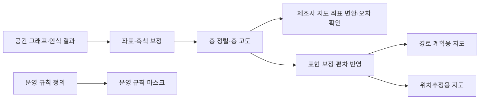
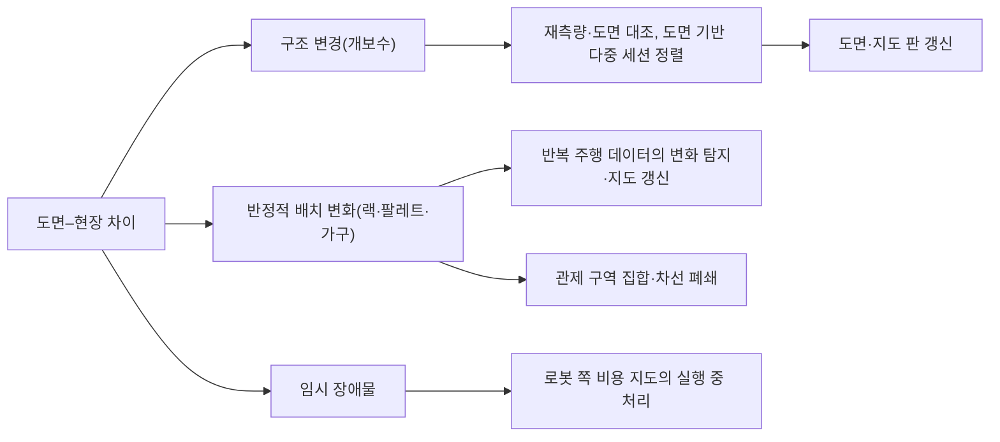
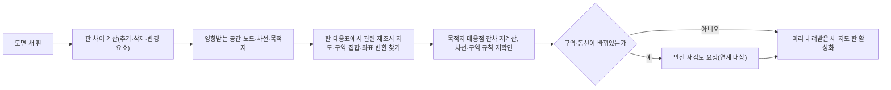

[홈](../../index.md) › 중점 연구 트랙 › [건축 도면 자동 인식](index.md) › 단계 4. 지도 변환 보정과 현장 정합

# 단계 4. 지도 변환 보정과 현장 정합

> 단계 상태: 진행 중 · 열린 질문: 9건 · 답한 질문: 4건 · 완료 조건: 충족 · 마지막 실행: 2026-09-25

## 1. 이 단계에서 밝힐 것

> 도면에서 얻은 공간 그래프를 로봇이 실제로 주행하는 지도로 바꿀 때 무엇을 보정하고, 도면과 현장의 차이를 어떻게 찾고 관리하는가.

위 문장은 트랙 정의의 "밝힐 것"이다(트랙 정의의 단계별 밝힐 것과 완료 조건은 [트랙 개요](index.md)의 단계 진행 현황에 정리되어 있다). 조사 결과는 [아이디어 3. 건축 도면 자동 인식](../../ideas/floorplan-recognition.md)과 [공간 그래프 스키마 초안](space-graph-schema-draft.md)으로 이어진다.

## 2. 질문 목록

이 단계의 시작 질문 4개와, 다른 실행에서 이 단계로 보낸 후속 질문이다. q4-01은 사용자 요청의 시작 질문 문구 그대로이고, q4-02~q4-04는 구축자가 이 단계의 밝힐 것에서 정한 시작 질문이다. [가정] 상태와 답 위치는 [질문 백로그](question-backlog.md)와 일치시키며, 백로그의 "조사 중"은 이 표에서 "열림"으로 표시하고 "폐기"(q4-06, 그리고 q4-13 과 같은 질문으로 중복 등록된 q4-14)는 표에서 빼고 백로그에만 남긴다. 답은 3절의 질문 id로 시작하는 소제목에 실리고, 답 위치 칸에는 그 앵커를 적는다. 제기 근거 칸에는 finding id(실행 id 병기) 또는 "사용자"만 쓴다.

| id | 질문 | 상태 | 제기 근거 | 답한 실행 id | 답 위치 |
|---|---|---|---|---|---|
| q4-01 | 인식 결과를 로봇 내비게이션 지도로 바꿀 때 필요한 보정은 무엇인가? | 답함 | 사용자 | 2026-09-25-72 | [q4-01 답](#q4-01) |
| q4-02 | 도면과 현장의 차이(개보수, 가구·랙 배치, 임시 장애물)를 어떻게 찾아 지도에 반영하는가? | 답함 | 사용자 | 2026-09-25-75 | [q4-02 답](#q4-02) |
| q4-03 | 도면 좌표계와 로봇별 지도 좌표계를 정렬하고 층·목적지 이름을 맞추는 방법은 무엇인가? | 답함 | 사용자 | 2026-09-25-76 | [q4-03 답](#q4-03) |
| q4-04 | 도면과 지도가 바뀔 때 버전 관리와 재검증은 어떻게 두는가? | 답함 | 사용자 | 2026-09-25-78 | [q4-04 답](#q4-04) |
| q4-05 | 축척 정보가 없는 래스터 평면도의 인식 결과를 로봇 지도 좌표(미터)로 옮기기 위해 축척을 어떻게 복원하는가(치수 문자 OCR, 문 폭 등 기준 요소, 현장 측정)? | 열림 | f21, 실행 2026-09-25-05 | | |
| q4-07 | VDA 5050 downloadMap 으로 배포하는 지도 파일의 내용 형식이 제조사마다 다를 때, 도면에서 만든 층별 지도를 제조사별 지도 파일로 변환·배포하고 mapVersion 을 맞추는 책임과 절차를 ROP 가 어떻게 둘 수 있는가? | 열림 | f4, 실행 2026-09-25-44 | | |
| q4-08 | 플릿 중립의 기본 공간 그래프에서 제조사 플릿별 주행 그래프(Open-RMF graph_idx)나 VDA 5050 관제 보유 통행 제한을 파생·동기화할 때, 로봇별 통행 가능 여부를 어디에 저장하고 도면·지도 판이 바뀌면 어떻게 다시 맞추는가? | 열림 | f16, 실행 2026-09-25-58 | | |
| q4-09 | 도면 한 장에서 경로 계획용 지도, 위치추정용 지도, 운영 규칙 마스크를 따로 만들 때 유리벽·창문·문·가구 같은 요소를 어느 지도에 어떻게 넣을지 정하는 규칙은 무엇이며, 그 규칙이 맞는지 시운전에서 어떻게 확인하는가? | 열림 | f18, 실행 2026-09-25-72 | | |
| q4-10 | 금지 구역·속도 제한 같은 운영 규칙을 도면 기반 공간 그래프에서 한 벌로 정의해 Nav2 필터 마스크와 VDA 5050 구역 집합처럼 형식이 다른 대상으로 내보낼 수 있는가, 내보낼 때 무엇이 빠지는가? | 열림 | f12, 실행 2026-09-25-72 | | |
| q4-11 | 로봇이 보고한 도달 불가(VDA 5050 NODE_UNREACHABLE)나 제조사 SLAM 의 변화 탐지 결과를 임시 막힘과 반정적 배치 변화로 가르고, 구역 집합·차선 폐쇄로 처리할지 지도 판을 올릴지 정하는 기준(지속 시간, 반복 횟수, 여러 로봇의 일치)은 무엇인가? (q4-02 에서 파생) | 열림 | f17, 실행 2026-09-25-75 | | |
| q4-12 | 제조사 SLAM 지도에 국소 왜곡이 있어 층당 유사 변환 하나의 목적지별 잔차가 노드 허용 편차(VDA 5050 allowedDeviationXY 등)를 넘을 때, 구역별 분할 변환이나 목적지별 보정점을 어떻게 두고 시운전 합격 기준을 무엇으로 정하는가? (q4-03 에서 파생) | 열림 | f20, 실행 2026-09-25-76 | | |
| q4-13 | 메자닌·중층·지하층·다른 건물 동이 섞인 물류센터에서 물리적 층 순번(IMDF ordinal 등)을 층 대응표의 기준 키로 쓰고 Open-RMF 층·승강기 층 이름, VDA 5050 mapId, 그리고 층 구분에 쓰일 수 있는 기준면 식별자로 보이는 MassRobotics planarDatum 을 별칭으로 매달 때, 같은 순번에 여러 표기가 있거나 층이 부분적으로 겹치는 경우를 어떻게 표현하는가? (q4-03 에서 파생) | 열림 | f19, 실행 2026-09-25-76 | | |
| q4-15 | 도면 개정의 판 차이(IfcDiff 의 추가·삭제·변경 요소)에서 영향받는 공간 노드·차선·목적지와 그 요소가 걸친 제조사별 지도 판·구역 집합·좌표 변환을 자동으로 추려 재검증 범위를 정하는 규칙은 무엇이며, GlobalId 가 없는 CAD·래스터 도면에서는 요소 대응을 어떻게 만드는가? (q4-04 에서 파생) | 열림 | f18, 실행 2026-09-25-78 | | |

## 3. 조사 결과

### q4-01 인식 결과를 로봇 내비게이션 지도로 바꿀 때 필요한 보정 {#q4-01}

확인한 자료를 이 위키가 묶으면, 인식 결과를 로봇 내비게이션 지도로 바꿀 때의 보정은 (1) 좌표·축척 보정(픽셀→미터, 세로축 반전, 원점·해상도), (2) 층 정렬과 층 고도, (3) 제조사·플릿별 로봇 지도 좌표계와의 변환과 변환 오차 확인, (4) 표현 보정(장애물 내부 채움, 점유 임계값, 유리처럼 센서가 잘 못 보는 요소의 처리), (5) 도면에 없는 가구·랙과 설계–시공 편차 반영, (6) 금지 구역·속도 제한 같은 운영 규칙 층 추가의 여섯 묶음으로 나뉘는 것으로 보인다. 이 묶음은 이 위키의 종합이며 이를 제시한 단일 출처는 확인하지 못했다. [추정][^ref-440][^ref-079][^ref-153][^ref-031][^ref-082][^ref-081][^ref-648][^ref-644][^ref-224]

위치추정·SLAM·비용 지도 인플레이션은 분류 원문 9장의 '로봇 자체 지능·제어' 쪽 연계 대상이다. 이 절은 그것들을 지도 형식·좌표·판 관리 관점으로만 다룬다([범위 경계](../../about/scope-boundary.md)).

아래 표는 검증된 발견 사항으로 이 위키가 구성한 종합([추정])이며 출처의 표를 옮긴 것이 아니다.

| 묶음 | 무엇을 맞추는가 | 확인한 근거 | 맡는 쪽(추정) |
|---|---|---|---|
| 좌표·축척 | 픽셀 좌표를 미터 좌표로, 세로축 방향, 원점·해상도 | Nav2 지도 YAML, traffic-editor 측정선[^ref-440][^ref-079] | ROP |
| 층 정렬 | 층 사이 이동·회전·축척, 층 고도 | traffic-editor 기준점·층 고도[^ref-079] | ROP |
| 제조사 좌표계 | 공통 좌표와 제조사 지도 좌표의 변환, 변환 오차 | 플릿 어댑터 대응 경유점, VDA 5050 좌표 규약[^ref-153][^ref-031] | ROP |
| 표현 보정 | 장애물 내부 채움, 점유 임계값, 유리 같은 요소 | Ogm2Pgbm, Nav2 지도 YAML, 유리 검출 연구[^ref-082][^ref-440][^ref-648] | 연계 대상(로봇 쪽) |
| 도면–현장 편차 | 가구·랙, 설계–시공 차이 | BIM 기반 위치추정 연구, 도면–라이다 결합 SLAM[^ref-081][^ref-224] | 연계 대상(로봇 쪽), 차이 확인은 q4-02 |
| 운영 규칙 층 | 금지 구역·속도 제한 | Nav2 비용 지도 필터[^ref-644][^ref-645] | 규칙 정의·배포는 ROP, 적용은 연계 대상 |

위 도식은 이 위키의 추정 구조이며 출처의 그림이 아니다.

#### 좌표·축척과 층 정렬

- Nav2 지도 서버는 점유 격자 지도를 이미지와 YAML 메타데이터 한 쌍으로 읽으며, 메타데이터는 이미지 파일, 해상도(셀당 미터), 원점 좌표, 색 반전 여부, 점유·빈 공간 판정 임계값을 담는다(발행일 미확인, 2026-09-25 확인). [사실][^ref-440] 이 형식은 로봇 쪽 내비게이션 스택의 입력이다.
- Open-RMF traffic-editor 는 평면도 배경 이미지의 픽셀 좌표(왼쪽 위 원점, +Y 아래 방향)로 편집하고 건물 지도 생성 단계에서 세로축을 뒤집어 직교 좌표로 바꾸며, 두 점 사이 실제 거리(미터)를 넣은 측정선으로 층의 축척을 정하고 층마다 고도(미터)를 둔다(발행일 미확인, 2026-09-25 확인). [사실][^ref-079]
- 같은 도구는 여러 층에서 수직으로 겹칠 것으로 기대되는 기준점 쌍으로 두 층 사이의 이동·회전·축척 변환을 구한다. 위 문장과 같은 문서라 독립 교차 확인은 아니다. [사실][^ref-079]

#### 관제 좌표 규약과 제조사 좌표계 변환

- VDA 5050 3.0.0 은 로봇 위치를 관제와 로봇 사이에 정한 프로젝트 고유 좌표계로 주고, 층·구역마다 고유한 mapId 를 쓰며, 지도 좌표계는 z 축이 위를 향하는 오른손 좌표계, 좌표는 미터, 방향은 −π~+π 라디안으로 정한다(명세 3.0.0, 발행일 미확인 — [열린 질문](../../open-questions.md) oq-005). [사실][^ref-031]
- Open-RMF 플릿 어댑터 튜토리얼은 로봇이 RMF 와 같은 좌표계를 쓰지 않을 때 층마다 대응 경유점 쌍으로 회전·축척·이동 변환을 추정하고(최소 4쌍 권장) 변환 오차 추정값을 계산해 정확도를 확인하게 한다(발행일 미확인, 2026-09-25 확인). [사실][^ref-153]
- Open-RMF 주행 지도 통합 문서는 경유점 위치를 층 이름과 그 층 안의 미터 좌표로 요구하고, 좌표계와 건물 구조의 정렬을 확인하는 데 화면 캡처 비교가 도움이 된다고 적는다. [사실][^ref-080]

#### 표현 보정과 도면–현장 편차

- 연계 대상: Ogm2Pgbm 공식 저장소 README 는 BIM·CAD 기반 점유 격자 지도를 변환하기 전에 장애물 내부에 흰 영역이 남지 않도록 장애물을 완전히 검게 채우라고 요구하고, 골격화·커버리지 경로 경유점·광선 추적으로 모의 센서 데이터를 만들어 포즈 그래프 지도를 생성한다(2026-09-25 확인). [사실][^ref-082] 포즈 그래프 위치추정 지도 생성 자체는 로봇 쪽 기술이다.
- 연계 대상: 유리는 라이다에 잘 보이지 않아 점유 격자 지도 작성을 어렵게 하며, 유리를 검출해 점유 격자 오류를 줄이는 연구가 있다(Sensors, 2021-04). [사실][^ref-648]
- 연계 대상: Vega-Torres 외는 BIM 에서 만든 점유 격자 지도로 AMCL 위치추정을 하는 연구들이 BIM 이 현실을 나타낸다고 가정하지만, 가구·잡동사니와 설계–시공 편차가 AMCL 정확도에 크게 영향을 준다고 보았다(2023-08). [사실][^ref-081] 같은 연구가 건물 요소 유형의 의미 정보로 창문·문·가구를 지도에서 제외했다는 내용은 검색 요약 기준이라 확인하지 못했다. [추정][^ref-081]
- IFC 파일에서 자율 로봇용 지도를 만드는 연구(Construction Robotics, 2023)는 IFC 에서 의미별 장애물 지도·시뮬레이션 환경·의미 정보 JSON·정지·주행 경유점을 자동 생성해 사전 지도 작성 주행 필요를 없애는 방법을 제안했다. [사실][^ref-647]
- 연계 대상: Lee·Woo·Shin(IJPEM, 2026)은 2D 건축 CAD 도면으로 3D 가상 환경을 만든 뒤 2D 점유 격자 지도를 자동 생성해 센서 주행 없이 AMCL 위치추정에 쓰고, 가상 지도의 평균 이동 RMSE 0.17±0.06 m, 회전 RMSE 3.59°±1.78°, 궤적 일관성 오차 0.10±0.08 m 로 SLAM 기반 지도와 비슷했다고 보고했다(저자 보고 단일 출처, 시험 환경 규모 미확인). [사실][^ref-628]
- 연계 대상: Shaheer 외는 건축 도면에서 만든 그래프와 라이다로 추정한 상황 그래프를 결합해 도면(as-planned)과 현장(as-built)의 전역 정렬과 구조 편차를 실시간으로 추정하는 방법을 제안했다(arXiv 2024-08 제출). [사실][^ref-224]
- 연계 대상: slam_toolbox 공식 README 는 저장된 포즈 그래프 지도를 불러와 계속 정제·재작성·확장하는 평생 지도 작성, 기존 지도 위 위치추정 모드, 여러 부분 지도를 대화형 표식으로 맞춰 하나의 전역 지도로 합치는 기능, 도킹 위치·노드·지정 자세에서 시작하는 초기화를 제공한다(2026-09-25 확인). [사실][^ref-270]

#### 운영 규칙 층

- BIM-to-Robot Mapping(IEEE 학술대회 논문, 저자·발행일 미확인)은 BIM 의 기하 위상과 기능 구획을 뽑아 점유 격자 지도와 의미 대응 사전을 만들고, 방화 구획·금지 구역 같은 BIM 의미 제약을 경로 비용으로 부호화해 경로가 건물 규정을 따르게 하는 틀을 제안했다(검색 요약 기준). [사실][^ref-646]
- 연계 대상: Nav2 비용 지도(costmap_2d)는 지도 위에 공간별 래스터 특성인 필터 마스크를 적용하는 비용 지도 필터로 금지 구역과 속도 제한 구역을 표현하고, 비용 지도는 로봇 외형(footprint)에 따른 인플레이션 반경으로 부풀려진다(2026-09-25 확인). [사실][^ref-644] 비용 지도 인플레이션과 필터 적용은 로봇 쪽 내비게이션 스택 기능이다.
- Nav2 문서는 필터 마스크를 일반 Nav2 2D 지도와 같은 PGM·PNG·BMP 래스터 파일과 YAML 메타데이터로 배포하며, 금지 구역 필터는 로봇이 금지 구역을 피하거나 선호 차선에 머물게 한다고 설명한다. 위 문장과 같은 Nav2 프로젝트라 독립 교차 확인은 아니다. [사실][^ref-645]

#### 종합: 용도별 지도와 ROP 경계

- 필터 마스크가 지도와 같은 형식의 별도 래스터이고 유리가 라이다에 잘 보이지 않으며 의미 정보로 요소를 거른 연구가 있다는 검색 요약을 보면, 도면 한 장에서 경로 계획용 지도, 위치추정용 지도, 운영 규칙 마스크를 따로 만들어야 할 것으로 보인다. 유리벽처럼 도면에는 벽이지만 라이다가 잘 못 보는 요소는 경로 계획용에서는 장애물로 두고 위치추정용에서는 빼는 식으로 용도별로 다르게 다뤄야 할 것으로 보인다. 이는 이 위키의 종합이며 단일 출처는 없다. [추정][^ref-644][^ref-645][^ref-648][^ref-081]
- 이종 제조사를 연결하는 ROP 가 직접 맡을 보정은 도면 좌표·축척·층 정렬, 제조사 지도 좌표계와의 변환과 오차 확인, 금지 구역·속도 제한 규칙의 공통 정의와 판 관리 쪽이고, 장애물 채움·인플레이션·SLAM 재정합·위치추정 지도 갱신은 로봇·제조사 쪽 연계 대상이 되는 경계로 보인다. [추정][^ref-153][^ref-031][^ref-644][^ref-270][^ref-082]

분류 원문의 질문은 다음과 같다.

> 제조사마다 다른 지도에서 ‘3층 출하 대기장’을 어떻게 동일한 장소로 인식할까? [분류원문]

- 이 질문에 비추면, 도면 좌표로 정한 대기장 경유점을 층별 변환으로 각 제조사 지도에 옮긴 뒤, 그 변환 오차가 해당 노드의 허용 편차(VDA 5050 의 allowedDeviationXY·allowedDeviationTheta) 안에 드는지 확인하는 단계가 도착 판정 전에 필요할 것으로 보인다. 오차와 허용 편차의 연결은 이 위키의 추정이다. [추정][^ref-153][^ref-031][^ref-079]

#### 현장 시나리오: ‘3층 출하 대기장’ 도착 판정

다음은 설명을 위한 가상의 시나리오이다.

**물류 흐름 단계:** 출하

**시나리오:** 도면에서 만든 대기장 경유점으로 제조사가 다른 로봇의 도착을 판정

| 항목 | 내용 |
|---|---|
| 시작 조건 | 해당 없음 |
| 작업 대상 | 해당 없음 |
| 수행 자원 | 제조사가 다른 이동로봇 두 대(한 대는 VDA 5050, 한 대는 Open-RMF 플릿 어댑터로 연동). 플릿 어댑터 쪽 로봇은 층마다 대응 경유점으로 추정한 변환으로 공통 좌표와 맞춘다. [사실][^ref-153] |
| 제약 | VDA 5050 로봇의 위치는 프로젝트 고유 좌표계와 층별 mapId 로 해석해야 한다. [사실][^ref-031] Nav2 를 쓰는 로봇에서는 금지 구역·속도 제한이 로봇 쪽 비용 지도 필터로 적용된다. [사실][^ref-644] |
| 완료·인계 | 대기장 경유점을 각 제조사 지도로 옮긴 변환 오차가 노드 허용 편차 안에 들어야 도착을 인정할 수 있을 것으로 보인다. [추정][^ref-153][^ref-031] |
| 예외·성과 | 변환 오차가 허용 편차를 넘으면 도착 판정을 보류하고 대응점을 다시 확인하는 흐름을 가정할 수 있다. [추정][^ref-153][^ref-031] 처리량·시간에 주는 영향은 미확인이다. |

이 시나리오의 제약·완료·인계 칸은 [6. 지도·공간·위치 모델](../../categories/b-common-information-and-environment-model/06-map-space-and-location-model.md)의 5절 시나리오와 같은 장소를 다루며, 좌표 정렬 절차 자체는 q4-03 에서 다룬다.

### q4-02 도면과 현장의 차이를 찾아 지도에 반영하는 방법 {#q4-02}

확인한 자료를 이 위키가 묶으면, 도면–현장 차이는 지속성에 따라 (1) 개보수 같은 구조 변경은 재측량이나 도면 기반 다중 세션 정렬로 찾아 도면·지도 판을 갱신하고, (2) 랙·팔레트·가구 같은 반정적 배치 변화는 반복 주행 데이터의 변화 탐지·지도 갱신과 관제의 구역·차선 규칙으로 반영하며, (3) 임시 장애물은 정적 지도에 넣지 않고 로봇 쪽 비용 지도가 실행 중에 처리하는 세 갈래로 나뉘는 것으로 보인다. 이는 이 위키의 종합이며 이 세 갈래를 제시한 단일 출처는 없다. [추정][^ref-651][^ref-221][^ref-224][^ref-653][^ref-652][^ref-654][^ref-649][^ref-031][^ref-569]

아래의 SLAM·다중 세션 정렬·변화 탐지·비용 지도는 분류 원문 9장의 '로봇 자체 지능·제어' 쪽 연계 대상이다. 이 절은 그것들을 차이를 찾는 방법의 근거로만 쓰고, ROP 쪽은 탐지된 차이를 반영하는 경로로 다룬다([범위 경계](../../about/scope-boundary.md)).

#### 재측량과 도면 대조: 구조 변경

- Bosché(2010)는 설계 3D CAD·BIM 모델(as-planned)을 현장 레이저 스캔 점군(as-built)에 정합한 뒤 모델 객체를 점군에서 자동 인식하고 시공된 치수를 계산해 치수 적합성을 관리하는 방법을 제안했다(Advanced Engineering Informatics 24(1), 2010-01, 건설 시공 품질 관리 대상). [사실][^ref-651]
- 이런 방식은 스캔 대 BIM 비교(scan-vs-BIM)로 불리는 것으로 보이나, 이 명칭은 위 출처에서 확인하지 못했다. [추정][^ref-651] 물류 시설에 적용한 사례는 미확인이다.
- 국내 연구(설비공학 논문집 36(5), 2024)는 노후 건축물에서 모바일 기기로 Scan-to-BIM 역설계 도면을 만들어, BIM 결과의 실 폭·깊이를 기존 건축도면과 비교했을 때 어린이집 3개소의 평균 오차율이 2.21%·5.99%·2.75%였다고 보고했다(저자 보고, 단일 출처, 원문 미열람). [사실][^ref-655] 좁은 공간에서 빠르게 스캔하거나 표면 장애물을 치우지 않으면 오차가 크게 늘었다는 내용은 검색 요약 기준이다. [사실][^ref-655] 대상은 물류 시설이 아닌 노후 건축물이다.

#### 도면·BIM 기반 다중 세션 정렬과 변화 탐지

- 연계 대상: BIM-SLAM(Vega Torres 외, arXiv 2024-08)은 BIM 에서 세션 데이터(포즈 그래프 지도·기술자)를 만들고 실제 3D 라이다 세션을 다중 세션 앵커링으로 정렬한 뒤, BIM 에 없는 새 요소를 양(+)의 변화로 탐지·분할해 BIM 옆에 재구성하는 3단계 틀을 제안했다. [사실][^ref-221]
- 연계 대상: SLAM2REF 공식 저장소 README 는 포즈 그래프 다중 세션 앵커링으로 라이다 데이터를 기준 지도나 다른 세션에 정렬하고, 기준 지도와 정렬된 갱신 지도를 시설의 현재 상태를 나타내는 지도 갱신에 쓸 수 있다고 적으며, 정밀 지상 레이저 스캔을 기준으로 하면 최대 3 cm 정확도라고 적는다(저자 측 보고, 2026-09-25 확인). [사실][^ref-650] 이 도구는 BIM-SLAM 과 같은 TUM 저자 그룹의 것이라 두 출처는 독립 교차 확인이 아니다.
- 도면 그래프와 라이다 상황 그래프를 결합해 도면–현장의 구조 편차를 실시간 추정하는 연구는 위 q4-01 절에 이미 실었다. [사실][^ref-224]

#### 반정적 배치 변화의 지도 갱신

- 연계 대상: Shaik 외(KI 2017, 2017-09)는 팔레트 등이 임시로 적치되어 물류 시설 환경이 정적이지 않다고 보고, 여러 로봇이 현재 지도와 비교해 변화를 감지해 임시 지도를 만들고 위치추정 정보와 지도의 선 특징으로 현재 지도에 병합하는 실시간 지도 갱신 방법을 제안했다. [사실][^ref-653]
- 연계 대상: Stefanini 외(Sensors 23(13), 2023-06-30)는 로봇 자세 추정의 불확실성을 고려하고 사람·다른 로봇 같은 동적 장애물의 일시적 변화에는 강건한 라이다 점유 격자 지도 갱신 알고리즘을 제안하고, 창고의 물품 배치가 시간에 따라 바뀌는 상황을 모사해 시험했다. [사실][^ref-652]
- 연계 대상: POV-SLAM(RSS 2023)은 반정적 객체의 객체 수준 변화를 추적·재구성하는 SLAM 이며, 가동 중인 100m×80m 공장·창고에서 4개월 간격으로 수집해 팔레트·상자 위치가 바뀐 실제 창고 데이터셋으로 평가했다. [사실][^ref-654]
- 연계 대상: Prakhya 외(2025-01)는 핸드헬드·로봇 탑재 라이다로 반복 수집한 3D 지도에서 시간에 따른 환경 변화를 탐지해 지도를 갱신하는 평생 3D 지도 작성 틀을 제안했다. [사실][^ref-160]
- 연계 대상: slam_toolbox 공식 README 는 평생 지도 작성으로 지도를 시간에 따라 정제·갱신할 수 있으나 노드 제거까지 지원하는 평생 지도 작성은 매우 실험적인 구현이라고 적고, 위치추정 모드에서는 최근 스캔을 순환 버퍼에 두었다가 만료되면 지우며 바탕 지도는 바뀌지 않는다고 설명한다(발행일 미확인, 2026-09-25 확인). [사실][^ref-270]

#### 임시 장애물의 실행 중 처리

- 연계 대상: Nav2 비용 지도의 장애물 층(ObstacleLayer)은 레이저·점군 관측을 받아 2D 비용 지도에 장애물을 표시하고 광선 추적으로 빈 공간을 지우는 관측 버퍼를 따로 두어, 임시 장애물을 정적 지도와 별도로 실행 중에 반영한다(발행일 미확인, 2026-09-25 확인). [사실][^ref-649][^ref-644] 두 출처는 같은 Nav2 프로젝트라 독립 교차 확인이 아니다.

#### 관제 쪽 반영 수단

- VDA 5050 3.0.0 은 특정 구역 개방이나 최대 속도 변경 같은 환경의 일시적 변경을 관제 기능으로 두고, 진입 금지(BLOCKED) 구역을 정의하며, 구역 집합의 내용은 바꿀 수 없어 변경이 필요하면 새 zoneSetId 로 참조해야 하고 지도(mapId)마다 활성 구역 집합은 하나라고 규정한다(명세 3.0.0, 발행일 미확인 — [열린 질문](../../open-questions.md) oq-005). [사실][^ref-031]
- 같은 명세는 지도를 mapId 와 mapVersion 의 조합으로 식별해 판 갱신을 mapVersion 으로 나타내고 새 판을 미리 내려받은 뒤 관제가 활성화하게 하며, 운용 모드 TEACH_IN 은 운영자가 지도 작성 같은 교시를 하는 동안 관제가 주문·동작을 보내지 않는 모드로 둔다. [사실][^ref-031]
- 같은 명세에서 로봇이 주문 실행 중 노드에 도달할 수 없음을 알게 되면 NODE_UNREACHABLE 오류(CRITICAL)를 보고하고 다시 시도하지 않은 채 관제의 결정을 기다린다. [사실][^ref-031] 이 규정 때문에 현장의 예기치 않은 막힘이 관제 쪽 신호로 올라오는 것으로 볼 수 있다. [추정][^ref-031]
- Open-RMF 의 차선 요청 메시지(LaneRequest)는 플릿 이름과 열 차선·닫을 차선 번호 목록만 담는다(발행일 미확인, 2026-09-25 확인). [사실][^ref-569] 이 요청으로 실행 중 차선 폐쇄·개방을 그래프 자체를 고치지 않고 반영하는 것으로 보이나, 메시지 정의는 그래프 수정 여부를 말하지 않는다. [추정][^ref-569]

#### 종합: 지속성별 반영 경로와 ROP 경계

위 도식은 이 위키의 추정 구조이며 이를 제시한 단일 출처는 없고 출처의 그림도 아니다.

- 차이를 찾는 경로는 시운전 전 재측량과 도면 대조, 시운전·운영 중 반복 주행 데이터의 다중 세션 정렬·변화 탐지, 운영 중 로봇이 보고하는 도달 불가 같은 예외 신호로 나뉘며, 이종 제조사를 연결하는 ROP 는 변화 탐지 계산은 로봇·제조사에 맡기고 탐지된 차이를 구역 집합·차선 폐쇄·지도 판으로 반영하고 도면 변경 이력을 관리하는 쪽을 맡는 경계가 될 것으로 보인다. 이는 이 위키의 종합이며 단일 출처는 없다. [추정][^ref-651][^ref-650][^ref-221][^ref-031][^ref-569][^ref-270]
- 이번에 확인한 도면–현장 차이 탐지 연구는 건설 품질 관리(scan-vs-BIM)와 단일 로봇·단일 플릿 SLAM 지도 갱신이 대부분이고, 여러 제조사 로봇 지도에 같은 현장 변화를 일관되게 반영하는 절차나 국내 물류센터 사례는 검색 범위에서 찾지 못했다(부재 확인 아님). 이 역시 이 위키의 종합이다. [추정][^ref-651][^ref-655][^ref-652][^ref-653][^ref-654]

#### 현장 시나리오: ‘3층 출하 대기장’의 임시 적치

다음은 설명을 위한 가상의 시나리오이다.

**물류 흐름 단계:** 출하

**시나리오:** 출하 대기장에 팔레트가 임시로 쌓여 로봇이 대기장 노드에 도달하지 못함

| 항목 | 내용 |
|---|---|
| 시작 조건 | 해당 없음 |
| 작업 대상 | 해당 없음 |
| 수행 자원 | 해당 없음 |
| 제약 | VDA 5050 로봇에는 지도마다 활성 구역 집합이 하나이고, 구역을 바꾸려면 새 zoneSetId 의 구역 집합을 보내야 한다. [사실][^ref-031] Open-RMF 플릿에는 차선 번호로 차선 폐쇄를 요청할 수 있다. [사실][^ref-569] |
| 완료·인계 | 해당 없음 |
| 예외·성과 | 로봇은 도달 불가를 보고하고 재시도 없이 관제의 결정을 기다린다. [사실][^ref-031] 짧은 막힘은 새 구역 집합의 진입 금지 구역이나 차선 폐쇄로 처리하고, 배치가 오래 유지되면 지도 판을 올리고 대기장 경유점과 제조사 지도 대응을 다시 확인하는 흐름이 필요할 것으로 보인다. 이는 이 위키의 종합이며, 두 처리를 가르는 기준(지속 시간 등)은 근거가 없어 후속 질문 q4-11 로 남긴다. [추정][^ref-031][^ref-569][^ref-653] 처리량·시간에 주는 영향은 미확인이다. |

좌표 정렬과 층·목적지 이름 맞춤은 q4-03 에서 다룬다.

### q4-03 도면 좌표계와 로봇별 지도 좌표계 정렬, 층·목적지 이름 맞춤 {#q4-03}

확인한 도구·규격을 이 위키가 묶으면, 도면 좌표계와 로봇별 지도 좌표계의 정렬은 (1) 시설 공통 좌표계의 원점과 층별 기준점을 도면 위 고정 지점에 정하고, (2) 측정선으로 도면 축척을, 층간 기준점으로 층 사이 변환을 정하며, (3) 제조사·플릿·층마다 대응점(최소 4쌍 권장)으로 유사 변환을 최소제곱 추정하고, (4) 잔차(변환 오차 추정값)를 확인한 뒤, (5) 층·장소 식별자 대응표를 등록하는 순서가 될 것으로 보인다. 이 절차는 이 위키의 종합이며 이를 제시한 단일 출처는 없다. [추정][^ref-670][^ref-345][^ref-079][^ref-153][^ref-105][^ref-668][^ref-669][^ref-031][^ref-230] 이 답의 핵심인 정합 절차 초안, 층·목적지 대응표, 목적지별 잔차 합격 기준, ROP 경계는 모두 이 위키의 종합 추정이어서 이 답의 종합 신뢰도는 low 이며, 근거 출처도 도구·규격마다 발행 주체가 한 곳이라 교차 확인된 주장이 없다.

아래의 제조사 지도 작성·위치추정과 격자 지도 병합·정합 알고리즘은 분류 원문 9장의 '로봇 자체 지능·제어' 쪽 연계 대상이다. 이 절은 그것들을 좌표 변환·식별자 대응 관점으로만 다룬다([범위 경계](../../about/scope-boundary.md)).

#### 공통 좌표계의 원점과 기준점

- ISO/FDIS 21423 소개 자료는 공통 좌표계(Common Coordinate System, CCS)의 원점을 시설 안에서 임의로 고른 한 점(벽·기둥·바닥 위의 점 등)으로 두고 이를 시설의 속성으로 보며, 공유되는 위치 데이터를 그 원점에 대한 미터 단위 위치로 정한다고 전한다. 이는 FDIS 미리보기(iTeh Standards) 검색 요약 기준이며, 발행판 문구·층별 원점 여부·기준점 개수는 미확인이다. [사실][^ref-670][^ref-159] 이 내용은 [열린 질문](../../open-questions.md) oq-027 의 근거 보강이며 그 질문을 해결하지 않는다.
- 국토교통부 고시 '실내공간정보 구축 작업규정'은 기준점을 바닥 중심의 고정 시설물이나 선의 교차점에 두고 가상 표시는 피하게 하며, 절대좌표는 지상기준점 측량 성과나 수치지형도 가운데 활용 목적에 맞게 골라 부여하게 한다. 이 조문은 2018-03-05 제정판 기준으로 검색됐고 현행 조문은 미확인이며, 2021-12-24 개정판(고시 제2021-1445호)이 존재한다(개정 내용 미확인). [사실][^ref-345][^ref-679]

#### 도면 축척과 층–기준층 변환

- Open-RMF traffic-editor 는 층마다 이름과 고도(미터)를 두고, 실제 거리를 넣은 측정선으로 도면 축척을 정하며, 층과 기준층 사이에 수직으로 겹칠 기준점 2쌍 이상으로 이동·회전·축척 변환을 구하고, 로봇이 작업 목적지로 끝낼 경유점에는 이름을 붙여야 한다고 적는다(발행일 미확인, 2026-09-25 확인). [사실][^ref-079]

#### 제조사 지도와 공통 좌표의 변환

- Open-RMF 플릿 어댑터 튜토리얼은 로봇 지도와 RMF 좌표의 변환을 층(지도)마다 따로 구하며, 대응 경유점을 최소 4쌍 권장하고 nudged 라이브러리로 회전·축척·이동을 추정한 뒤 층별 변환 오차 추정값(평균제곱오차)을 기록하게 한다(발행일 미확인, 2026-09-25 확인). [사실][^ref-153]
- 이 제조사 지도–공통 좌표 변환(같은 층 안에서 로봇 지도와 RMF 좌표를 맞춤, 대응 경유점 4쌍 권장)과 위 traffic-editor 의 층–기준층 변환(도면의 층과 기준층을 맞춤, 기준점 2쌍 이상)은 서로 다른 변환이다. [사실][^ref-153][^ref-079]
- Open-RMF 공식 플릿 어댑터 템플릿 설정은 reference_coordinates 를 층 이름(예: L1)을 키로 하고 그 아래 RMF 좌표 목록과 로봇 좌표 목록을 같은 순서의 대응점 4쌍으로 적게 한다. 위 튜토리얼과 같은 Open Robotics 계열이라 독립 교차 확인은 아니다. [사실][^ref-105]
- nudged 라이브러리 README 는 이 라이브러리를 반사 없는 유사 변환(이동·축척·회전)에 대한 최소제곱 추정기로 설명하고, 점 집합 크기에 선형인 시간으로 계산하며 평균제곱오차로 적합도를 분석하는 기능을 둔다. 이 README 는 JavaScript 판(2.x) 기준이며 Open-RMF 튜토리얼이 쓰는 Python 판과의 구현 동일성은 미확인이다. [사실][^ref-668]
- Umeyama(IEEE TPAMI 13(4), 1991)는 두 점 패턴 사이의 평균제곱오차를 최소화하는 유사 변환(회전·이동·축척)의 해를 제시했으며, 데이터가 크게 오염돼도 회전 대신 반사를 내는 기존 해의 문제를 피한다고 보고했다. [사실][^ref-669]

#### 관제·상호운용 규격의 좌표·층 표현

- VDA 5050 3.0.0 은 위치를 관제와 로봇 사이에 정한 프로젝트 고유 좌표계로 주고 층·구역 구분에 고유 mapId 를 쓰며, initializePosition 동작은 x·y·theta·mapId·lastNodeId 로 자세를 재설정해 승강기 노드에서도 쓸 수 있고, pick·drop 동작은 선택 파라미터 stationName 으로 스테이션을 가리킨다(명세 3.0.0, 발행일 미확인 — [열린 질문](../../open-questions.md) oq-005). [사실][^ref-031]
- MassRobotics AMR 상호운용 표준 JSON 스키마의 location 은 x·y·angle(쿼터니언)·planarDatum 을 필수로 두고 planarDatum 을 '로봇이 참조하는 planarDatum 의 id'(UUID)로 설명하며, 건물·층을 나타내는 별도 필드는 두지 않는다(2026-09-25 확인). [사실][^ref-230]
- Open-RMF 건물 지도 메시지에서 층(Level)은 이름·고도·이미지·장소·문·주행 그래프를 갖고, 승강기(Lift)는 운행 층을 층 이름 문자열 목록(levels)으로 두며 층 사이 정렬에 쓸 수 있는 칸 기준 방향(ref_x·ref_y·ref_yaw)을 둔다. 두 출처는 같은 저장소라 독립 교차 확인이 아니다. [사실][^ref-346][^ref-667]
- Open-RMF 승강기 상태 메시지(LiftState)는 현재 층·목적 층·운행 가능 층을 주석 없는 문자열(current_floor, destination_floor, available_floors)로만 나타낸다. [사실][^ref-286]
- IMDF 1.0.0 의 층(Level)은 지상 출입이 가능한 가장 낮은 층을 순번(ordinal) 0, 지하층을 음수로 두는 물리적 층 순번과 사람이 보는 약칭(short_name, 예: P1)을 따로 가진다(2021-02, 검색 요약 기준). [사실][^ref-338]

#### 도면–격자 지도 자동 정합 연구

아래 연구는 제조사 SLAM 지도(점유 격자 지도)를 입력으로 하는 격자 지도 병합·도면 정합 알고리즘이다. 연계 대상: 지도 작성·위치추정 자체는 분류 원문 9장 '로봇 자체 지능·제어'의 연계 대상이며, 이 위키는 이 알고리즘들을 시운전 보조 도구 후보로만 다룬다.

- Carpin(Autonomous Robots, 2008)은 여러 로봇의 점유 격자 지도를 합치기 위해 허프 스펙트럼의 순환 상호상관으로 회전 후보를, 축별 투영 스펙트럼으로 이동을 구해 가중치가 붙은 변환 후보 여러 개를 결정적·비반복적으로 내는 방법을 제안했다. [사실][^ref-671]
- Kakuma 외(2017)는 SLAM 으로 만든 점유 격자 지도와 건물 평면도를 그래프 매칭으로 대응시키고 정렬해, 로봇이 평면도가 가진 의미 정보(방 이름 등)에 접근하게 하는 방법을 제안했다. 검색 요약상 결과는 대략적 정렬 수준으로 보고됐다. [사실][^ref-672]
- Hou·Kuang·Schwertfeger(ROBIO 2019)는 2D 점유 격자 지도를 방 분할 기반 영역 그래프(Area Graph)로 바꾼 뒤 그 공간에서 투표로 두 지도를 맞추는 방법을 제안하고, 대규모 지도에서 기존 방법보다 성능과 계산 속도가 낫다고 보고했다(저자 보고). [사실][^ref-673]

#### 종합: 좌표 정렬 절차 초안과 잔차 판정

위 도식은 이 위키의 추정 구조이며 이를 제시한 단일 출처는 없고 출처의 그림도 아니다.

- 원점(ISO 21423 FDIS 요약)·기준점 선정(국내 작업규정)·측정선과 층간 기준점(traffic-editor)·층별 대응점 4쌍과 변환 오차(플릿 어댑터)를 한 절차로 묶은 위 순서는 이 위키의 종합이다. [추정][^ref-670][^ref-345][^ref-079][^ref-153][^ref-105][^ref-668][^ref-669][^ref-031][^ref-230]
- 확인한 추정 방법은 층마다 균일 축척·반사 없는 유사 변환 하나를 가정하므로, 제조사 SLAM 지도에 국소 왜곡이 있으면 층 전체 잔차가 작아도 특정 목적지의 오차가 노드 허용 편차를 넘을 수 있어, 합격 판정은 층 평균 잔차가 아니라 목적지 대응점별 잔차로 해야 할 것으로 보인다. 근거 사례는 없으며 후속 질문 q4-12 로 남긴다. [추정][^ref-153][^ref-668][^ref-669][^ref-031][^ref-224]

#### 층 이름과 목적지 이름 맞춤

- 층은 형식마다 Open-RMF 건물 지도 층 이름과 승강기 운행 층 이름 문자열, 승강기 상태의 주석 없는 층 문자열, VDA 5050 mapId, IMDF 순번·약칭으로 따로 표현되고, MassRobotics 는 층 필드 없이 층 구분에 쓰일 수 있는 기준면 식별자로 보이는 planarDatum 만 두어 공통 키가 없으므로, ROP 는 물리적 층 순번 같은 한 키에 시스템별 층 식별자를 별칭으로 매다는 층 대응표를 따로 두어야 할 것으로 보인다. [추정][^ref-346][^ref-667][^ref-286][^ref-031][^ref-230][^ref-338] 지도 층 이름과 승강기 층 이름이 같아야 한다는 명시 규정은 찾지 못했다([열린 질문](../../open-questions.md) oq-045, 미해결).
- GS1 GLN 은 확장 요소로 도크 문·보관 칸·판독 지점 같은 하위 위치를 식별할 수 있으나, 확장 요소는 조직 내부나 거래 당사자 간 합의로만 쓴다. [사실][^ref-162]
- 목적지 이름은 공간 그래프의 구역 노드 이름을 기준 키로 두고, 그 아래에 제조사별 경유점 이름(Open-RMF)·노드 id 와 스테이션 이름(VDA 5050)·업무 위치 식별자(GLN 하위 위치 또는 WMS 로케이션 코드)를 대응시키는 대응표로 맞추는 방식이 될 것으로 보인다. GLN·WMS 로케이션 코드의 부여·관리 자체는 상위 업무 시스템 쪽 연계 대상이고 ROP 는 대응표만 둔다. [추정][^ref-079][^ref-031][^ref-162][^ref-338] WMS 로케이션 코드를 로봇 경유점과 대응시킨 사례는 찾지 못했다([열린 질문](../../open-questions.md) oq-029, 미해결).

#### ROP 경계

- 이종 제조사를 연결하는 ROP 는 공통 좌표계 원점·층 대응표·목적지 대응표·제조사별 변환과 그 잔차 확인을 직접 맡고, 제조사 지도 작성과 위치추정은 로봇 쪽 연계 대상으로 두며, 격자 지도–도면 자동 정합 알고리즘은 대응점 입력을 줄이는 시운전 보조 도구 후보로 보는 경계가 될 것으로 보인다. 자동 정합을 물류 관제 시운전에 쓴 사례는 찾지 못했다. [추정][^ref-153][^ref-031][^ref-670][^ref-671][^ref-672][^ref-673]

#### 현장 시나리오: ‘3층 출하 대기장’ 목적지 해석

다음은 설명을 위한 가상의 시나리오이다.

**물류 흐름 단계:** 출하

**시나리오:** 제조사가 다른 로봇에게 ‘3층 출하 대기장’을 같은 층·같은 장소로 전달

| 항목 | 내용 |
|---|---|
| 시작 조건 | 해당 없음 |
| 작업 대상 | 해당 없음 |
| 수행 자원 | 제조사가 다른 이동로봇 두 대(한 대는 VDA 5050, 한 대는 Open-RMF 플릿 어댑터로 연동). 플릿 어댑터 쪽은 층마다 따로 구한 변환으로 로봇 지도와 RMF 좌표를 맞춘다. [사실][^ref-153] |
| 제약 | VDA 5050 로봇은 층·구역을 고유 mapId 로 구분하고 프로젝트 고유 좌표계로 위치를 준다. [사실][^ref-031] 승강기 상태의 층은 주석 없는 문자열이다. [사실][^ref-286] |
| 완료·인계 | 구역 노드 ‘3층 출하 대기장’ 아래 제조사별 경유점·스테이션 이름과 업무 위치 식별자를 대응표로 묶어 도착을 판정하는 방식이 될 것으로 보인다. [추정][^ref-079][^ref-031][^ref-162] GLN 확장 요소는 조직 내부나 거래 당사자 간 합의로만 쓴다. [사실][^ref-162] |
| 예외·성과 | 설명용 가정 사례로, 국내 층 표기상 ‘3층’이 지상 출입 최저층을 순번 0 으로 두는 IMDF 식 순번에서는 2 가 될 수 있어, 사람이 쓰는 층 이름과 순번·제조사 mapId 를 대응표로 명시하지 않으면 같은 이름이 다른 층으로 해석될 위험이 있어 보인다. 국내 층 표기('1층'이 지상 출입층)와 IMDF 순번의 대응은 출처로 확인하지 않은 가정이다. [추정][^ref-338][^ref-031][^ref-667] 목적지 대응점의 잔차가 노드 허용 편차를 넘으면 도착 판정을 보류하고 대응점을 다시 확인하는 흐름을 가정할 수 있다. [추정][^ref-153][^ref-031] 처리량·시간에 주는 영향은 미확인이다. |

이 좌표 정렬 절차와 q4-02 의 지속성별 반영 경로를 합친 도면–현장 정합 절차 초안(추정)은 [공간 그래프 스키마 초안](space-graph-schema-draft.md)의 6절과 [아이디어 3. 건축 도면 자동 인식](../../ideas/floorplan-recognition.md)의 5절에 실었다.

### q4-04 도면과 지도가 바뀔 때의 버전 관리와 재검증 {#q4-04}

확인한 자료를 이 위키가 묶으면, 도면과 지도가 바뀔 때는 도면 개정(공통 데이터 환경의 상태·개정 코드, IFC 요소 GlobalId), 공통 공간 그래프 판, 제조사별 지도 판(mapId·mapVersion), 구역 집합(zoneSetId), 제조사·층별 좌표 변환이 서로 다른 계보로 바뀌므로, ROP 는 이들을 한 행으로 묶는 판 대응표를 두고 도면 판 차이에서 영향받는 요소만 다시 확인하는 식으로 재검증 범위를 좁혀야 할 것으로 보인다. [추정][^ref-689][^ref-687][^ref-031][^ref-212][^ref-688][^ref-153] 이 답에서 지도 판 식별·배포 규칙과 판 비교 도구의 동작은 출처로 확인한 사실이지만, 판 대응표·재검증 범위·배포 순서·안전 재검토 구분은 이 위키의 종합이며 단일 출처가 없어 이 답의 종합 신뢰도는 low 이다.

아래의 라이다 지도 갱신 알고리즘과 보호 영역·안전 기능의 재검증은 분류 원문 9장의 '로봇 자체 지능·제어' 쪽 연계 대상이다. 이 절은 그것들을 판 관리와 재검증 요청 관점으로만 다룬다([범위 경계](../../about/scope-boundary.md)).

#### 로봇 쪽: 지도 판의 식별·배포·삭제

지도를 mapId 와 mapVersion 의 조합으로 식별하고 새 판을 미리 내려받은 뒤 관제가 활성화한다는 규칙, 구역 집합의 내용이 바뀌지 않아 새 zoneSetId 로 교체하고 지도마다 활성 구역 집합이 하나라는 규칙은 위 [q4-02 답](#q4-02)에, 새 지도의 특정 위치에 로봇을 두는 initializePosition 동작은 [q4-03 답](#q4-03)에 실었다. 아래는 이번에 더한 규칙이며 모두 VDA 5050 3.0.0 명세 기준이다(발행일 미확인 — [열린 질문](../../open-questions.md) oq-005).

- 로봇은 주문을 받기 전에 주문에 나온 mapId 마다 해당 지도를 가졌는지 확인하고, 없으면 UNKNOWN_MAP_ID 경고(WARNING)를 보고한다. 올바른 지도가 활성화되어 있도록 보장하는 책임은 관제에 있으며, 관제는 주문 노드 위치에 쓴 mapId 의 지도가 로봇에 활성화되어 있도록 해야 한다. [사실][^ref-031]
- 지도 내려받기(downloadMap)는 선택 파라미터로 지도 해시(mapHash)를 받을 수 있고, 내려받기와 활성화(enableMap)는 별개 절차다. 활성화하면 같은 mapId 의 다른 판은 비활성(DISABLED)이 되어 mapId 마다 한 판만 활성이며, 이미 가진 mapId·mapVersion 을 다시 내려받으려 하면 DUPLICATE_MAP 경고로 거부된다. [사실][^ref-031]
- 로봇은 지도를 스스로 지우지 않으며, 삭제는 관제가 deleteMap 으로 요청한다. [사실][^ref-031]
- 구역 집합은 mapId 에만 연결되고 mapVersion 은 참조하지 않아 한 지도의 여러 판에 같은 구역 집합을 쓸 수 있으며, 새로 추가된 구역 집합은 비활성(DISABLED) 상태로 시작해 enableZoneSet 으로 활성화된다. [사실][^ref-031]
- Open-RMF 건물 지도 메시지(BuildingMap)는 이름(name)·층 목록(levels)·승강기 목록(lifts) 세 필드만 두고 판·개정·시각·해시 필드는 두지 않는다(2026-09-25 확인). 이는 메시지 정의 한 파일의 관찰이며, building.yaml·주행 그래프 파일의 판 표기는 미확인이다. [사실][^ref-688]
- VDMA LIF 에 대한 제3자(continua-systems) JSON 스키마에서 레이아웃은 층과 함께 판(layoutVersion)을 가지며, 이를 LIF 공식 구조로 확정하지는 못했다. [사실][^ref-212]
- NODE Robotics 는 NODE.maps 가 연결된 로봇에 지도를 올리고 편집·유지·배포하며 개별 로봇의 실시간 갱신을 공유 지도로 합친다고 소개한다. [추정] 벤더 주장(원문 미열람)[^ref-694] 이 소개는 판 식별이나 아래 종합의 근거로 쓰지 않는다.

#### 도면 쪽: 개정 관리와 판 차이 계산

- 영국 BIM Framework 지침 Part C(2020-09, Edition 1, ISO 19650-2 영국 국가 부속서 기준)는 공통 데이터 환경(Common Data Environment, CDE)의 정보 컨테이너 메타데이터에 상태·개정 코드를 두며, 작업 중·공유·발행·보관 상태 목록은 BIM 소프트웨어 업체 블로그(벤더 문서) 요약 기준이다. ISO 19650 발행 기관 자료는 열지 못했고, Part C 의 이후 판 여부는 미확인이다. [추정][^ref-689][^ref-690]
- 이일곤·김현민·안준상·최재웅(2023, 게재지 미확인)은 ISO 19650 기반 한국형 공통 데이터 환경 개발을 위해 CDE 워크플로우와 정보 컨테이너 체계를 수립했다. [사실][^ref-691]
- IfcOpenShell 의 IfcDiff(v0.8.0 문서, 2026-09-25 확인)는 두 IFC 모델을 비교해 새 모델에만 있는 요소(추가)·옛 모델에만 있는 요소(삭제)·양쪽에 있으나 바뀐 요소(변경)의 GlobalId 목록을 JSON 파일로 내며, 같은 요소는 두 모델에서 GlobalId 가 같다고 가정하고, 형상·속성·관계 외에 유형·속성 세트·공간 컨테이너·집합·분류 비교를 선택할 수 있다. [사실][^ref-687]
- Liu·Gao·Gu(EG-ICE 2023 발표본, arXiv 프리프린트 2023-12)는 IFC 데이터의 그래프 구조에서 일어나는 등가 변환 때문에 IFC 파일의 판 비교와 증분 저장이 어렵다고 보고, 정규화한 IFC 파일을 Git 같은 도구로 판 비교·증분 저장할 수 있게 하는 병렬 정규화 방법을 제안했다. [사실][^ref-692]
- Esser·Vilgertshofer·Borrmann(Automation in Construction 155, 2023)은 BIM 모델을 그래프로 표현하고 그래프 변환으로 객체 수준의 증분 변경을 기술해, 동시에 수정된 모델의 충돌하지 않는 변경과 충돌하는 변경을 가려 병합하는 버전 관리 방법을 제안했다. [사실][^ref-693]
- 이 판 비교·버전 관리 방법을 로봇 지도의 재검증 범위 산정에 쓴 사례는 찾지 못했다. [추정][^ref-687][^ref-692][^ref-693]

#### 재검증 요구

- 연계 대상: Stefanini 외(Sensors 23(13), 2023-06-30)는 자세 추정이 틀리면 지도 갱신이 오류를 낳는다고 보고, 자세 추정 불확실성을 고려한 안전한 라이다 점유 격자 지도 갱신을 제안했다. [사실][^ref-652] 같은 논문의 다른 측면은 [q4-02 답](#q4-02)에 있다.
- 연계 대상: ISO 3691-4:2023 판 기준으로, 이 표준은 운용 구역의 상태가 무인 산업용 트럭의 안전한 운행에 큰 영향을 준다고 보고 운용 구역의 위험을 없애기 위한 준비를 부속서 A 에 규정한다(발행 기관 페이지 요약 기준). 변경 뒤 재검증을 정한 조문과 이후 개정 내용은 미확인이다. [사실][^ref-470]
- 연계 대상: ANSI/A3 R15.08-2-2023 기준으로, 이 표준은 산업용 이동로봇이나 그 플릿을 현장에 통합·설정·맞춤화할 때의 요구사항을 정하고 위험성평가를 반복 과정으로 강조한다(발행 기관 안내문 기준). 지도·경로 변경 시 재평가 조문과 후속 파트의 내용은 미확인이다. [사실][^ref-472]
- 좌표 변환을 층(지도)마다 대응 경유점으로 따로 구하고 층별 변환 오차를 기록하는 절차는 [q4-03 답](#q4-03)에 실었으며, 지도 판이 바뀌면 그 변환도 다시 확인할 대상이 될 것으로 보인다. [추정][^ref-153]

#### 종합: 판 대응표·재검증 범위·배포 순서 (추정)

- 판 대응표: 도면 개정(CDE 상태·개정 코드, IFC GlobalId), 공통 공간 그래프 판, 제조사별 지도 판(mapId·mapVersion), 구역 집합(zoneSetId), 제조사·층별 좌표 변환이 각기 다른 계보로 존재하므로, ROP 는 이들을 한 행으로 묶는 판 대응표를 따로 두어야 할 것으로 보인다. [추정][^ref-689][^ref-687][^ref-031][^ref-212][^ref-688][^ref-153]
- 재검증 범위: 도면 판 차이(추가·삭제·변경 요소)에서 영향받는 공간 노드·차선·목적지를 추리고, 그 요소가 걸친 제조사 지도·구역 집합·좌표 변환만 다시 확인(목적지 대응점 잔차 재계산, 해당 차선·구역 규칙 재확인)하는 식으로 좁힐 수 있을 것으로 보이며, GlobalId 가 없는 CAD·래스터 도면은 요소 대응을 따로 만들어야 할 것으로 보인다(후속 질문 q4-15). [추정][^ref-687][^ref-692][^ref-693][^ref-031][^ref-153]

위 도식은 이 위키의 추정 구조이며 이를 제시한 단일 출처는 없고 출처의 그림도 아니다.

- 배포 순서: VDA 5050 의 사전 적재·별도 활성화·mapId 당 단일 활성 판 규칙을 이용하면, 새 지도 판을 미리 내려받아 비활성 상태로 두고 재검증을 마친 뒤 같은 시점에 활성화하며 직전 판은 삭제 전까지 되돌림 후보로 남기는 순서가 가능해 보인다. 이번에 읽은 명세 6.3절 범위에서는 되돌림 절차를 따로 정하지 않은 것으로 보인다(명세 전체의 부재 확정 아님). [추정][^ref-031]
- 형식 밖 판 메타데이터: Open-RMF 건물 지도 메시지에 판 필드가 없고 LIF 판 필드는 제3자 스키마로만 확인되므로, 이종 제조사를 연결하는 ROP 는 공간 그래프·건물 지도의 판 식별자와 생성 이력을 형식 밖 메타데이터로 직접 관리해야 할 것으로 보인다. [추정][^ref-688][^ref-212][^ref-031]
- 안전 재검토 구분: 운용 구역 상태가 안전 운행에 영향을 주고 위험성평가가 반복 과정이라는 표준의 입장을 보면, 도면·지도 변경은 구역·동선 변경 여부에 따라 안전 재검토가 필요한 변경과 그렇지 않은 변경으로 나누어야 할 것으로 보인다. ROP 쪽은 변경 분류와 재검토 요청까지이고, 보호 영역·안전 기능의 재검증 자체는 로봇·통합자 쪽 연계 대상이다. 변경 분류 기준을 정한 조문은 미확인이다. [추정][^ref-470][^ref-472]
- 근거 공백: 이번 검색 범위(검색 13회, 한국어 3회)에서는 건축 도면 개정과 로봇 지도 판을 연결해 재검증 범위를 정한 표준·연구나 국내 물류센터 사례를 찾지 못했다(부재 확인 아님). [추정][^ref-691][^ref-689][^ref-031]

#### 현장 시나리오: ‘3층 출하 대기장’의 판 불일치

다음은 설명을 위한 가상의 시나리오이다.

**물류 흐름 단계:** 출하

**시나리오:** 랙 배치 변경으로 한 제조사 지도만 새 판으로 바뀐 뒤 ‘3층 출하 대기장’ 도착을 판정

| 항목 | 내용 |
|---|---|
| 시작 조건 | 해당 없음 |
| 작업 대상 | 해당 없음 |
| 수행 자원 | 해당 없음 |
| 제약 | 해당 없음 |
| 완료·인계 | ‘3층 출하 대기장’의 랙 배치가 바뀌어 한 제조사 지도만 새 판으로 바뀌면, 판 대응표의 해당 행(대기장 목적지·제조사 mapVersion·좌표 변환)이 활성 판과 일치하는지 확인하기 전까지 그 로봇의 대기장 도착 판정을 보류하는 규칙이 필요할 것으로 보인다(설명용 가정 사례). [추정][^ref-031][^ref-153] |
| 예외·성과 | 해당 없음 |

판 교체 시 재검증 단계는 [공간 그래프 스키마 초안](space-graph-schema-draft.md) 6절의 도면–현장 정합 절차 초안과 [아이디어 3. 건축 도면 자동 인식](../../ideas/floorplan-recognition.md) 5절에 7단계로 덧붙였다.

## 4. 결론과 남은 불확실성

**결론**
- 인식 결과를 로봇 내비게이션 지도로 바꿀 때의 보정은 좌표·축척, 층 정렬, 제조사 좌표계 변환과 오차 확인, 표현 보정, 도면–현장 편차 반영, 운영 규칙 층의 여섯 묶음으로 나뉘는 것으로 보인다. [추정][^ref-440][^ref-079][^ref-153][^ref-082][^ref-644]
- 도면 한 장에서 경로 계획용 지도, 위치추정용 지도, 운영 규칙 마스크를 용도별로 따로 만들어야 할 것으로 보인다. [추정][^ref-644][^ref-648]
- ROP 는 좌표·축척·층 정렬, 제조사 좌표계 변환과 오차 확인, 운영 규칙의 공통 정의와 판 관리를 맡고, 장애물 채움·인플레이션·SLAM 재정합·위치추정 지도 갱신은 로봇·제조사 쪽 연계 대상으로 두는 경계가 될 것으로 보인다. [추정][^ref-153][^ref-031][^ref-270]
- 도면–현장 차이는 지속성에 따라 구조 변경·반정적 배치 변화·임시 장애물의 세 갈래로 나누어 반영 경로를 달리해야 할 것으로 보인다. [추정][^ref-651][^ref-221][^ref-653][^ref-649][^ref-031][^ref-569]
- 차이를 찾는 경로는 재측량과 도면 대조, 반복 주행 데이터의 다중 세션 정렬·변화 탐지, 운영 중 도달 불가 같은 예외 신호로 나뉘고, ROP 는 탐지 계산을 로봇·제조사에 맡기고 탐지된 차이를 구역 집합·차선 폐쇄·지도 판으로 반영하며 도면 변경 이력을 관리하는 쪽을 맡을 것으로 보인다. [추정][^ref-651][^ref-650][^ref-031][^ref-569][^ref-270]
- 도면 좌표계와 로봇별 지도 좌표계의 정렬은 공통 좌표계 원점·층별 기준점 지정, 측정선 축척과 층–기준층 변환, 제조사·플릿·층별 대응점 유사 변환, 잔차 확인, 층·장소 식별자 대응표 등록의 순서가 될 것으로 보인다. [추정][^ref-670][^ref-079][^ref-153][^ref-668]
- 층과 목적지는 형식마다 따로 표현되고 공통 키가 없어, ROP 가 층 대응표와 목적지 대응표를 따로 두어야 할 것으로 보인다. [추정][^ref-031][^ref-667][^ref-286][^ref-338][^ref-162]
- 정렬의 합격 판정은 층 평균 잔차가 아니라 목적지 대응점별 잔차로 해야 할 것으로 보인다. [추정][^ref-153][^ref-031]
- q4-02 의 차이 탐지·반영 경로와 q4-03 의 좌표 정렬·대응표를 합치면 도면–현장 정합 절차 초안이 되며, 이 초안도 이 위키의 종합이다. [추정][^ref-651][^ref-153][^ref-031][^ref-079]
- 도면과 지도의 변경은 도면 개정, 공통 공간 그래프 판, 제조사별 지도 판, 구역 집합, 좌표 변환이 각기 다른 계보로 바뀌므로 ROP 가 이들을 묶는 판 대응표를 따로 두어야 할 것으로 보인다. [추정][^ref-689][^ref-687][^ref-031][^ref-688]
- 재검증 범위는 도면 판 차이에서 영향받는 공간 노드·차선·목적지와 그것이 걸친 제조사 지도·구역 집합·좌표 변환으로 좁힐 수 있을 것으로 보이며, 새 지도 판은 미리 내려받아 비활성으로 두고 재검증 뒤 활성화하는 순서가 가능해 보인다. [추정][^ref-687][^ref-031][^ref-153]
- 도면·지도 변경은 구역·동선 변경 여부로 안전 재검토 필요 여부를 나누고, 보호 영역·안전 기능 재검증은 로봇·통합자 쪽 연계 대상으로 두어야 할 것으로 보인다. [추정][^ref-470][^ref-472]
- 위 결론의 핵심은 모두 이 위키의 종합 [추정]이며, 이를 제시한 단일 출처가 없어 이 단계 페이지의 종합 신뢰도는 low 이다.

**남은 불확실성**
- 교차 확인된 주장이 없다. 층 정렬 근거 두 문장은 같은 traffic-editor 문서, 비용 지도 근거(ref-649·ref-644)는 같은 Nav2 프로젝트, BIM 기반 다중 세션 정렬 근거(ref-221·ref-650)는 같은 TUM 저자 그룹(Vega-Torres·Braun·Borrmann)에서 나왔다. q4-03 근거도 플릿 어댑터 튜토리얼과 템플릿 설정(ref-153·ref-105)이 같은 Open Robotics 계열, 층·승강기 메시지(ref-346·ref-667)가 같은 저장소다. q4-04 의 로봇 쪽 판 관리 근거는 VDA 5050 명세 한 곳이다.
- 원문을 열지 못한 출처(ref-081, ref-628, ref-224, ref-645, ref-646, ref-647, ref-648, ref-651, ref-652, ref-653, ref-654, ref-655, ref-160, ref-221, ref-669, ref-670, ref-671, ref-672, ref-673, ref-679, ref-338, ref-162, ref-345, ref-159, ref-212, ref-689, ref-690, ref-691, ref-692, ref-693, ref-472, ref-470, ref-694)는 검색 요약 범위에서만 썼다. Vega-Torres 외의 창문·문·가구 제외 여부와 유리 외 반사면(거울·금속)의 영향은 확인하지 못했다.
- ISO 21423 공통 좌표계 정의는 FDIS 미리보기 검색 요약 기준이며 발행판 문구·층별 원점 여부·기준점 개수는 미확인이다([열린 질문](../../open-questions.md) oq-027). 실내공간정보 구축 작업규정의 기준점 조문은 2018-03-05 제정판 기준으로 검색됐고 현행 조문과 2021-12-24 개정 내용은 미확인이다.
- nudged README 는 JavaScript 판 기준이라 Open-RMF 튜토리얼이 쓰는 Python 판과의 구현 동일성은 미확인이다. IMDF 에서 층 표기 관례가 다른 층을 같은 순번의 여러 Level 로 모델링할 수 있는지는 검증에서 확인되지 않아 싣지 않았다.
- 지도 층 이름과 승강기 층 이름이 같아야 하는지의 명시 규정(oq-045), 국내 물류센터에서 WMS 로케이션 코드·GLN 하위 위치를 로봇 경유점과 대응시킨 사례(oq-029), 격자 지도–도면 자동 정합을 물류 관제 시운전에 쓴 사례는 찾지 못했다(부재 확인 아님). Kakuma 외의 정렬은 대략적 정렬 수준으로 보고됐다.
- scan-vs-BIM 이라는 명칭은 Bosché(2010) 출처에서 확인하지 못했고, scan-vs-BIM·국내 Scan-to-BIM 연구는 건설·시설 분야 대상이라 물류 시설 적용은 미확인이다. 국내 연구의 오차율은 저자 보고 단일 출처이며, 좁은 공간·장애물 조건에서의 오차 증가는 검색 요약 기준이다.
- SLAM2REF 의 최대 3 cm 정확도와 Lee·Woo·Shin 의 위치추정 오차 수치는 저자 측 보고다.
- 여러 제조사 로봇 지도에 같은 현장 변화를 일관되게 반영하는 절차와, 임시 막힘을 구역·차선으로 처리할지 지도 판을 올릴지 가르는 기준(q4-11)은 확인하지 못했다. 국소 왜곡이 있을 때의 분할 변환·목적지별 보정점(q4-12)과 층 대응표의 기준 키(q4-13)도 근거가 없다.
- q4-04: ISO 19650 발행 기관 자료를 열지 못해 공통 데이터 환경의 상태·개정 코드 설명은 영국 지침과 업체 블로그 요약 기준의 추정이고 세부 코드 값은 싣지 않았다. ISO 3691-4 의 변경 뒤 재검증 조문, R15.08-2 의 지도·경로 변경 시 재평가 조문, 두 표준의 이후 개정·후속 파트 내용은 미확인이다. Open-RMF 판 필드 부재는 메시지 한 파일의 관찰이고, LIF layoutVersion 은 제3자 스키마 기준이며, VDA 5050 의 되돌림 절차 부재는 명세 6.3절 범위의 관찰이다. 국내 CDE 연구의 게재지와 워크플로우 세부도 미확인이다.
- 도면 개정과 로봇 지도 판을 이어 재검증 범위를 정한 표준·연구와 국내 물류센터 사례는 이번 검색 범위에서 찾지 못했다(부재 확인 아님). 제조사가 자사 지도 판을 바꿀 때 변경 내용과 판 식별자를 ROP 나 상위 관제에 알리는 계약·인터페이스 관행은 새 [열린 질문](../../open-questions.md)으로 올렸다.
- 국내 물류센터에서 도면 기반 지도를 보정하거나 도면–현장 차이를 확인한 사례는 찾지 못했다([열린 질문](../../open-questions.md) oq-022).
- 래스터 축척 복원(q4-05), 지도 파일 배포(q4-07), 플릿별 그래프 동기화(q4-08), 용도별 지도 규칙(q4-09), 운영 규칙 내보내기(q4-10), 변화 처리 기준(q4-11), 국소 왜곡 처리(q4-12), 층 대응표 기준 키(q4-13), 도면 판 차이 기반 재검증 범위 규칙(q4-15)은 아직 답하지 않았다.
- 공간 그래프 스키마 초안: 실행 2026-09-25-72 에서 v1.0 으로 올렸고 실행 2026-09-25-75 에서는 v1.0 을 유지했다. 실행 2026-09-25-76 에서 검증이 승인한 층 속성 '시스템별 층 식별자(별칭)'를 더해 v1.1 로 올렸고, 개념 '좌표계 정렬' 추가 제안은 VDA 5050 이 관제와 로봇이 공유하는 프로젝트 고유 좌표계를 쓰고 기존 개념 '층간 정렬 기준점'·용어집 '지도 정합'과의 범위 관계가 정해지지 않아 반영하지 않고 6절 정렬 정보 항목의 근거 보강으로 두었다. 실행 2026-09-25-78 에서 검증이 승인한 평면도 '버전' 값 후보(상태·개정 코드, 후보)와 IFC GlobalId 대응 메모를 더해 v1.2 로 올렸고, 층별 지도 '판 식별자(후보)' 속성은 실행 2026-09-25-44 에서 반영하지 않은 '지도 판' 속성과 같은 대상이며 이번 종합이 판 대응표를 별도 개념으로 두는 쪽을 가리켜 반영하지 않고 6절 근거 보강으로 두었다.

## 5. 이 단계가 낳은 후속 질문

| 새 질문 id | 질문 | 보낼 단계 | 근거 finding id | 상태 |
|---|---|---|---|---|
| q4-09 | 도면 한 장에서 경로 계획용 지도, 위치추정용 지도, 운영 규칙 마스크를 따로 만들 때 유리벽·창문·문·가구 같은 요소를 어느 지도에 어떻게 넣을지 정하는 규칙은 무엇이며, 그 규칙이 맞는지 시운전에서 어떻게 확인하는가? | 단계 4. 지도 변환 보정과 현장 정합 | f18 (실행 2026-09-25-72) | 열림 |
| q4-10 | 금지 구역·속도 제한 같은 운영 규칙을 도면 기반 공간 그래프에서 한 벌로 정의해 Nav2 필터 마스크와 VDA 5050 구역 집합처럼 형식이 다른 대상으로 내보낼 수 있는가, 내보낼 때 무엇이 빠지는가? | 단계 4. 지도 변환 보정과 현장 정합 | f12 (실행 2026-09-25-72) | 열림 |
| q4-11 | 로봇이 보고한 도달 불가(VDA 5050 NODE_UNREACHABLE)나 제조사 SLAM 의 변화 탐지 결과를 임시 막힘과 반정적 배치 변화로 가르고, 구역 집합·차선 폐쇄로 처리할지 지도 판을 올릴지 정하는 기준(지속 시간, 반복 횟수, 여러 로봇의 일치)은 무엇인가? | 단계 4. 지도 변환 보정과 현장 정합 | f17 (실행 2026-09-25-75) | 열림 |
| q5-07 | 도면–현장 차이 탐지 방법(재측량 대조, 다중 세션 변화 탐지)의 성능을 물류 현장에서 놓친 변화·잘못 탐지한 변화와 지도 갱신 지연으로 측정하려면 어떤 지표와 시험 절차가 필요한가? | 단계 5. 검증 방법과 가설 판정 | f8 (실행 2026-09-25-75) | 열림 |
| q4-12 | 제조사 SLAM 지도에 국소 왜곡이 있어 층당 유사 변환 하나의 목적지별 잔차가 노드 허용 편차(VDA 5050 allowedDeviationXY 등)를 넘을 때, 구역별 분할 변환이나 목적지별 보정점을 어떻게 두고 시운전 합격 기준을 무엇으로 정하는가? | 단계 4. 지도 변환 보정과 현장 정합 | f20 (실행 2026-09-25-76) | 열림 |
| q4-13 | 메자닌·중층·지하층·다른 건물 동이 섞인 물류센터에서 물리적 층 순번(IMDF ordinal 등)을 층 대응표의 기준 키로 쓰고 Open-RMF 층·승강기 층 이름, VDA 5050 mapId, 그리고 층 구분에 쓰일 수 있는 기준면 식별자로 보이는 MassRobotics planarDatum 을 별칭으로 매달 때, 같은 순번에 여러 표기가 있거나 층이 부분적으로 겹치는 경우를 어떻게 표현하는가? | 단계 4. 지도 변환 보정과 현장 정합 | f19 (실행 2026-09-25-76) | 열림 |
| q4-15 | 도면 개정의 판 차이(IfcDiff 의 추가·삭제·변경 요소)에서 영향받는 공간 노드·차선·목적지와 그 요소가 걸친 제조사별 지도 판·구역 집합·좌표 변환을 자동으로 추려 재검증 범위를 정하는 규칙은 무엇이며, GlobalId 가 없는 CAD·래스터 도면에서는 요소 대응을 어떻게 만드는가? | 단계 4. 지도 변환 보정과 현장 정합 | f18 (실행 2026-09-25-78) | 열림 |
| q5-08 | 지도 판을 교체한 뒤 재검증 시험(목적지 대응점 잔차, 영향받은 차선 주행, 구역 규칙 확인)의 합격 기준과 판 교체에 드는 중단 시간·재검증 공수를 어떤 지표로 측정하는가? | 단계 5. 검증 방법과 가설 판정 | f19 (실행 2026-09-25-78) | 열림 |

## 6. 완료 조건 충족 현황

충족 여부는 리서치 에이전트의 자체 평가를 스토리텔러 에이전트가 옮겨 적은 값이고, 최종 판정은 내용 검증 에이전트가 한다. 둘이 다르면 검증 판정을 따른다.

| 완료 조건 | 충족 여부 | 근거 | 검증 판정 |
|---|---|---|---|
| 보정 항목 목록이 [공간 그래프 스키마 초안](space-graph-schema-draft.md)의 미해결 모델링 질문과 [아이디어 3. 건축 도면 자동 인식](../../ideas/floorplan-recognition.md)의 "5. 구현 가설" 절에 반영됨 | 충족 | 두 페이지에 반영됨(q4-01 답, 종합은 추정) | 충족(2차 확인) |
| 도면–현장 정합 절차 초안이 [공간 그래프 스키마 초안](space-graph-schema-draft.md)의 미해결 모델링 질문과 [아이디어 3. 건축 도면 자동 인식](../../ideas/floorplan-recognition.md)의 "5. 구현 가설" 절에 반영됨 | 충족 | q4-02 답(차이 탐지·반영 경로)과 q4-03 답(좌표 정렬, 층·목적지 대응표)을 합친 도면–현장 정합 절차 초안(추정)을 두 페이지에 실음. 실행 2026-09-25-78 에서 q4-04 답(판 관리·재검증, 추정)을 판 교체 시 재검증 단계로 덧붙임 | 충족 · 미승인 |

다음 단계로 전환: 아니오(막힌 질문 q4-05·q4-07·q4-08·q4-09·q4-10·q4-11·q4-12·q4-13·q4-15)

## 7. 관련 세부영역

이 트랙은 분류를 바꾸지 않는다. 확인된 사실은 세부영역 페이지를 직접 고치지 않고 [트랙 로그](log.md)의 "세부영역 반영 제안"으로 남기며, 반영은 다음 해당 영역 실행에서 한다. 프런트매터 `related_areas`는 아래 목록과 같다.

- [6. 지도·공간·위치 모델](../../categories/b-common-information-and-environment-model/06-map-space-and-location-model.md) — 분류 원문 10장이 건축 도면 기반 이동 지도의 중심 연구영역으로 두며, BIM·CAD에서 이동 공간을 만들고 층·목적지를 정렬하는 일 자체다. 이번 실행은 6. 대표 접근법과 기술 절(보정 항목, 기존 ref-153 각주 재사용)과 9. ROP가 직접 맡는 것과 외부와 연계하는 것 절(보정의 ROP·로봇 쪽 경계)에 반영을 제안한다.
- [21. 온보딩·설정·현장 시운전](../../categories/f-deployment-verification-and-maintenance/21-onboarding-configuration-and-commissioning.md) — 분류 원문 10장의 함께 필요한 영역(시운전). '현장 모델링 시간을 줄이는' 적용처다. 이번 실행은 6. 대표 접근법과 기술 절(대응점으로 변환 오차를 확인하는 시운전 절차, 사전 지도 작성 주행을 줄인 연구)에 반영을 제안한다.
- [24. 자산·소프트웨어 수명주기 관리](../../categories/f-deployment-verification-and-maintenance/24-asset-and-software-lifecycle-management.md) — 도면 개정에 따른 지도 버전 관리가 필요하다(이 영역 정의의 지도 버전)
- [8. 실시간 세계 상태·데이터 일관성](../../categories/b-common-information-and-environment-model/08-real-time-world-state-and-data-consistency.md) — 공간 노드(문·엘리베이터)에 붙는 현재 상태를 실시간으로 갱신하는 쪽이다
- [9. 로봇·제조사 관제 연동](../../categories/c-connectivity-and-execution-foundation/09-robot-and-vendor-fleet-manager-integration.md) — 플릿 어댑터의 좌표 변환과 VDA 5050 좌표 규약이 제조사 지도와 공통 좌표를 잇는 지점이다
- [10. 설비·건물 시스템 연동](../../categories/c-connectivity-and-execution-foundation/10-facility-and-building-system-integration.md) — Open-RMF 승강기 상태가 층을 주석 없는 문자열로만 나타내므로, 지도 층 이름과 승강기 층 이름을 잇는 층 대응표가 필요할 것으로 보이는 지점이다([열린 질문](../../open-questions.md) oq-045). [추정][^ref-286][^ref-667]
- [15. 다중 로봇 경로·교통 관리 — MAPF](../../categories/d-planning-and-optimization/15-multi-robot-path-and-traffic-management-mapf.md) — 금지 구역·속도 제한 같은 운영 규칙 층이 경로·교통 조율의 제약이 된다
- [23. 시험·형식 검증·벤치마크](../../categories/f-deployment-verification-and-maintenance/23-testing-formal-verification-and-benchmarking.md) — 도면 판 차이(추가·삭제·변경 요소)로 재검증 범위를 좁히는 방법이 지도 판 교체 뒤 재검증과 이어지는 지점으로 보인다. [추정][^ref-687][^ref-031]
- [25. 안전·위험 관리](../../categories/g-safety-security-intelligence-and-governance/25-safety-and-risk-management.md) — 운용 구역 상태와 반복적 위험성평가를 다루는 표준이 도면·지도 변경의 안전 재검토와 이어지는 지점이며, 보호 영역·안전 기능 재검증 자체는 로봇·통합자 쪽 연계 대상이다. [추정][^ref-470][^ref-472]

실행 2026-09-25-75(q4-02)는 [6. 지도·공간·위치 모델](../../categories/b-common-information-and-environment-model/06-map-space-and-location-model.md)의 6. 대표 접근법과 기술 절(도면–현장 차이 탐지 방법과 지속성별 반영 경로, 추정)과 9. ROP가 직접 맡는 것과 외부와 연계하는 것 절(변화 탐지 계산은 연계 대상, 구역·차선·지도 판 반영은 ROP 쪽이라는 경계, 추정), [21. 온보딩·설정·현장 시운전](../../categories/f-deployment-verification-and-maintenance/21-onboarding-configuration-and-commissioning.md)의 6. 대표 접근법과 기술 절(시운전 전 재측량과 도면 대조, 기준 지도 정렬 도구), [24. 자산·소프트웨어 수명주기 관리](../../categories/f-deployment-verification-and-maintenance/24-asset-and-software-lifecycle-management.md)의 6. 대표 접근법과 기술 절(현장 변화에 따른 지도 판 갱신과 구역 집합 교체 규칙)에 반영을 제안한다.

실행 2026-09-25-76(q4-03)은 [6. 지도·공간·위치 모델](../../categories/b-common-information-and-environment-model/06-map-space-and-location-model.md)의 6. 대표 접근법과 기술 절(층별·플릿별 대응점 유사 변환과 잔차 확인, 층–기준층 변환과의 구분), 7. 관련 표준·프레임워크·오픈소스 절(ISO/FDIS 21423 공통 좌표계 원점 정의는 FDIS 요약 기준, MassRobotics planarDatum, IMDF 층 순번·약칭, Open-RMF 층·승강기 층 이름), 9. ROP가 직접 맡는 것과 외부와 연계하는 것 절(대응표·변환·잔차 확인은 ROP, 지도 작성·위치추정·자동 정합 알고리즘은 연계 대상이라는 경계, 추정), 11. 열린 질문 절(oq-027·oq-045·oq-029 근거 보강, 해결 아님), [21. 온보딩·설정·현장 시운전](../../categories/f-deployment-verification-and-maintenance/21-onboarding-configuration-and-commissioning.md)의 6. 대표 접근법과 기술 절(시운전의 대응점·목적지별 잔차 판정, 국내 작업규정의 기준점 선정, 격자 지도–도면 자동 정합 연구, oq-077 근거 보강), [10. 설비·건물 시스템 연동](../../categories/c-connectivity-and-execution-foundation/10-facility-and-building-system-integration.md)의 6. 대표 접근법과 기술 절(승강기 층 이름이 주석 없는 문자열이라 층 대응표가 필요하다는 점, oq-045)에 반영을 제안한다. 이 제안은 세부영역 페이지를 직접 고치지 않고 트랙 로그에만 남긴다.

실행 2026-09-25-78(q4-04)은 [24. 자산·소프트웨어 수명주기 관리](../../categories/f-deployment-verification-and-maintenance/24-asset-and-software-lifecycle-management.md)의 6. 대표 접근법과 기술 절(지도 판 식별·사전 적재·활성화·삭제 규칙, 공통 데이터 환경의 도면 개정 관리와 IFC 판 비교, 판 대응표와 차이 기반 재검증 범위(추정)), [6. 지도·공간·위치 모델](../../categories/b-common-information-and-environment-model/06-map-space-and-location-model.md)의 6. 대표 접근법과 기술 절(지도 판 관리와 판 대응표, 추정)과 9. ROP가 직접 맡는 것과 외부와 연계하는 것 절(판 대응표·재검증 범위 산정은 ROP, 지도 갱신 계산·안전 기능 재검증은 연계 대상이라는 경계, 추정), [23. 시험·형식 검증·벤치마크](../../categories/f-deployment-verification-and-maintenance/23-testing-formal-verification-and-benchmarking.md)의 6. 대표 접근법과 기술 절(도면 판 차이로 재검증 범위를 좁히는 방법과 안전 재검토가 필요한 변경의 구분, 추정, [열린 질문](../../open-questions.md) oq-090 근거 보강)에 반영을 제안한다. [25. 안전·위험 관리](../../categories/g-safety-security-intelligence-and-governance/25-safety-and-risk-management.md)는 운용 구역 상태와 반복적 위험성평가를 다루는 표준(ISO 3691-4:2023, ANSI/A3 R15.08-2-2023)이 도면·지도 변경의 안전 재검토와 이어지는 지점이며, 보호 영역·안전 기능 재검증 자체는 로봇·통합자 쪽 연계 대상이다. [추정][^ref-470][^ref-472] 이 제안은 세부영역 페이지를 직접 고치지 않고 트랙 로그에만 남긴다.

## 8. 출처

[^ref-440]: ROS Navigation (ros-navigation/navigation2 GitHub), nav2_map_server — README, 미확인, https://github.com/ros-navigation/navigation2/blob/main/nav2_map_server/README.md, 접근일 2026-09-25
[^ref-079]: Open Robotics, Traffic Editor - Programming Multiple Robots with ROS 2, 미확인, https://osrf.github.io/ros2multirobotbook/traffic-editor.html, 접근일 2026-09-25
[^ref-153]: Open Robotics, Fleet Adapter Tutorial - Programming Multiple Robots with ROS 2, 미확인, https://osrf.github.io/ros2multirobotbook/integration_fleets_adapter_tutorial.html, 접근일 2026-09-25
[^ref-080]: Open Robotics, Navigation Maps (integration_nav-maps) - Programming Multiple Robots with ROS 2, 미확인, https://osrf.github.io/ros2multirobotbook/integration_nav-maps.html, 접근일 2026-09-25
[^ref-031]: VDA / VDMA (VDA5050 GitHub), VDA5050/VDA5050_EN.md — Official Specification document for the VDA 5050, 미확인, https://github.com/VDA5050/VDA5050/blob/main/VDA5050_EN.md, 접근일 2026-09-25
[^ref-082]: Vega-Torres, M. A. (MigVega GitHub), Ogm2Pgbm — README (Robust BIM-based 2D-LiDAR Localization for Lifelong Indoor Navigation in Changing and Dynamic Environments), 미확인, https://github.com/MigVega/Ogm2Pgbm, 접근일 2026-09-25
[^ref-081]: Vega-Torres, M. A. 외, Occupancy Grid Map to Pose Graph-based Map: Robust BIM-based 2D-LiDAR Localization for Lifelong Indoor Navigation in Changing and Dynamic Environments, 2023-08, https://arxiv.org/abs/2308.05443, 접근일 2026-09-25 (원문 미열람)
[^ref-628]: Lee, H.-C., Woo, H.-M., & Shin, S. (International Journal of Precision Engineering and Manufacturing), Digital Twin-based Sensor-Free Virtual Mapping for Autonomous Mobile Robot Localization, 2026, https://link.springer.com/article/10.1007/s12541-026-01598-2, 접근일 2026-09-25 (원문 미열람)
[^ref-224]: Shaheer, M., Millan-Romera, J. A., Bavle, H., Giberna, M., Sanchez-Lopez, J. L., Civera, J., & Voos, H., Tightly Coupled SLAM with Imprecise Architectural Plans, 2024-08, https://arxiv.org/abs/2408.01737, 접근일 2026-09-25 (원문 미열람)
[^ref-270]: Macenski, S. (SteveMacenski GitHub), slam_toolbox — README (Slam Toolbox for lifelong mapping and localization in potentially massive maps with ROS), 미확인, https://github.com/SteveMacenski/slam_toolbox, 접근일 2026-09-25
[^ref-644]: ROS Navigation (ros-navigation/navigation2 GitHub), nav2_costmap_2d — README, 미확인, https://github.com/ros-navigation/navigation2/blob/main/nav2_costmap_2d/README.md, 접근일 2026-09-25
[^ref-645]: Open Navigation (Nav2 documentation), Navigating with Keepout Zones — Nav2 documentation, 미확인, https://docs.nav2.org/tutorials/docs/navigation2_with_keepout_filter.html, 접근일 2026-09-25 (원문 미열람)
[^ref-646]: IEEE 학술대회 논문 저자(미확인), BIM-to-Robot Mapping: Constructing IFC-Referenced Occupancy Grids and Semantic Metadata for Rule-Based Navigation, 미확인, https://ieeexplore.ieee.org/document/11019519/, 접근일 2026-09-25 (원문 미열람)
[^ref-647]: Construction Robotics(Springer) 게재 논문 저자(미확인), Improving autonomous robotic navigation using IFC files, 2023, https://link.springer.com/article/10.1007/s41693-023-00112-8, 접근일 2026-09-25 (원문 미열람)
[^ref-648]: Tibebu, H., Roche, J., De Silva, V., & Kondoz, A. (Loughborough University London, Sensors 21(7), 2263), LiDAR-Based Glass Detection for Improved Occupancy Grid Mapping, 2021-04, https://www.mdpi.com/1424-8220/21/7/2263, 접근일 2026-09-25 (원문 미열람)

[^ref-651]: Bosché, F. (Advanced Engineering Informatics), Automated recognition of 3D CAD model objects in laser scans and calculation of as-built dimensions for dimensional compliance control in construction (Advanced Engineering Informatics 24(1), 107-118), 2010-01, https://www.sciencedirect.com/science/article/abs/pii/S1474034609000482, 접근일 2026-09-25 (원문 미열람)
[^ref-655]: 윤동희, 백주미, 심지수, 이동근, 송두삼(설비공학 논문집 36(5), 251-261), 노후건축물에서 모바일기기를 이용한 Scan-to-BIM 역설계 도면생성 방안, 2024, https://www.kci.go.kr/kciportal/ci/sereArticleSearch/ciSereArtiView.kci?sereArticleSearchBean.artiId=ART003077202, 접근일 2026-09-25 (원문 미열람)
[^ref-221]: Vega Torres, M. A., Braun, A., & Borrmann, A., BIM-SLAM: Integrating BIM Models in Multi-session SLAM for Lifelong Mapping using 3D LiDAR, 2024-08, https://arxiv.org/abs/2408.15870, 접근일 2026-09-25 (원문 미열람)
[^ref-650]: Vega-Torres, M. A. (MigVega GitHub), SLAM2REF — README (연계 논문 Construction Robotics 8(2), 2024-07, DOI 10.1007/s41693-024-00126-w), 미확인, https://github.com/MigVega/SLAM2REF, 접근일 2026-09-25
[^ref-653]: Shaik, N., Liebig, T., Kirsch, C., & Müller, H. (KI 2017), Dynamic Map Update of Non-static Facility Logistics Environment with a Multi-robot System, 2017-09, https://link.springer.com/chapter/10.1007/978-3-319-67190-1_19, 접근일 2026-09-25 (원문 미열람)
[^ref-652]: Stefanini, E., Ciancolini, E., Settimi, A., & Pallottino, L., Safe and Robust Map Updating for Long-Term Operations in Dynamic Environments, 2023-06-30, https://www.mdpi.com/1424-8220/23/13/6066, 접근일 2026-09-25 (원문 미열람)
[^ref-654]: Qian, J. 외 (RSS 2023), POV-SLAM: Probabilistic Object-Aware Variational SLAM in Semi-Static Environments, 2023-07, https://arxiv.org/abs/2307.00488, 접근일 2026-09-25 (원문 미열람)
[^ref-160]: Prakhya, S. M., Yang, L., & Liu, Z., Lifelong 3D Mapping Framework for Hand-held & Robot-mounted LiDAR Mapping Systems, 2025-01, https://arxiv.org/abs/2501.18110, 접근일 2026-09-25 (원문 미열람)
[^ref-649]: ROS Navigation (ros-navigation/navigation2 GitHub), nav2_costmap_2d — include/nav2_costmap_2d/obstacle_layer.hpp, 미확인, https://github.com/ros-navigation/navigation2/blob/main/nav2_costmap_2d/include/nav2_costmap_2d/obstacle_layer.hpp, 접근일 2026-09-25
[^ref-569]: Open Robotics (open-rmf), rmf_internal_msgs — rmf_fleet_msgs/msg/LaneRequest.msg, 미확인, https://github.com/open-rmf/rmf_internal_msgs/blob/main/rmf_fleet_msgs/msg/LaneRequest.msg, 접근일 2026-09-25

[^ref-105]: Open Robotics (open-rmf), fleet_adapter_template — fleet_adapter_template/config.yaml, 미확인, https://github.com/open-rmf/fleet_adapter_template/blob/main/fleet_adapter_template/config.yaml, 접근일 2026-09-25
[^ref-668]: Palonen, A. (axelpale/nudged GitHub), nudged — README (Affine transformation estimator e.g. for multi-touch gestures and calibration), 미확인, https://github.com/axelpale/nudged, 접근일 2026-09-25
[^ref-669]: Umeyama, S. (IEEE Transactions on Pattern Analysis and Machine Intelligence 13(4), 376-380), Least-Squares Estimation of Transformation Parameters Between Two Point Patterns, 1991, https://ieeexplore.ieee.org/document/88573/, 접근일 2026-09-25 (원문 미열람)
[^ref-670]: ISO (iTeh Standards 미리보기), ISO/FDIS 21423 - Robotics — Industrial mobile robots — Communications and interoperability, 미확인, https://standards.iteh.ai/catalog/standards/iso/f772b16e-582a-4ed4-9f79-0a80ad376f40/iso-fdis-21423, 접근일 2026-09-25 (원문 미열람)
[^ref-159]: ISO, ISO 21423 - Robotics — Industrial mobile robots — Communications and interoperability, 미확인, https://www.iso.org/standard/86749.html, 접근일 2026-09-25 (원문 미열람)
[^ref-345]: 국토교통부(법제처 국가법령정보센터), 실내공간정보 구축 작업규정, 2018-03-05, https://law.go.kr/admRulLsInfoP.do?admRulSeq=2100000116559, 접근일 2026-09-25 (원문 미열람)
[^ref-679]: 국토교통부(법제처 국가법령정보센터), 실내공간정보구축작업규정 (고시 제2021-1445호, 2021-12-24), 2021-12-24, https://www.law.go.kr/%ED%96%89%EC%A0%95%EA%B7%9C%EC%B9%99/%EC%8B%A4%EB%82%B4%EA%B3%B5%EA%B0%84%EC%A0%95%EB%B3%B4%EA%B5%AC%EC%B6%95%EC%9E%91%EC%97%85%EA%B7%9C%EC%A0%95/(2021-1445,20211224), 접근일 2026-09-25 (원문 미열람)
[^ref-230]: MassRobotics, MassRobotics-AMR/AMR_Interop_Standard — AMR_Interop_Standard.json, 미확인, https://github.com/MassRobotics-AMR/AMR_Interop_Standard/blob/main/AMR_Interop_Standard.json, 접근일 2026-09-25
[^ref-346]: Open Robotics (open-rmf), rmf_building_map_msgs — rmf_building_map_msgs/msg/Level.msg, 미확인, https://github.com/open-rmf/rmf_building_map_msgs/blob/main/rmf_building_map_msgs/msg/Level.msg, 접근일 2026-09-25
[^ref-667]: Open Robotics (open-rmf), rmf_building_map_msgs — rmf_building_map_msgs/msg/Lift.msg, 미확인, https://github.com/open-rmf/rmf_building_map_msgs/blob/main/rmf_building_map_msgs/msg/Lift.msg, 접근일 2026-09-25
[^ref-286]: Open Robotics (open-rmf), rmf_internal_msgs — rmf_lift_msgs/msg/LiftState.msg, 미확인, https://github.com/open-rmf/rmf_internal_msgs/blob/main/rmf_lift_msgs/msg/LiftState.msg, 접근일 2026-09-25
[^ref-338]: OGC (Open Geospatial Consortium) / Apple, Indoor Mapping Data Format (1.0.0) — OGC Community Standard 20-094, 2021-02, https://docs.ogc.org/cs/20-094/, 접근일 2026-09-25 (원문 미열람)
[^ref-162]: GS1, Identifying a physical location - GLN, 미확인, https://www.gs1.org/standards/id-keys/gln/physical-location, 접근일 2026-09-25 (원문 미열람)
[^ref-671]: Carpin, S. (Autonomous Robots), Fast and accurate map merging for multi-robot systems, 2008, https://link.springer.com/article/10.1007/s10514-008-9097-4, 접근일 2026-09-25 (원문 미열람)
[^ref-672]: Kakuma, D., Tsuichihara, S., Garcia Ricardez, G. A., Takamatsu, J., & Ogasawara, T., Alignment of Occupancy Grid and Floor Maps Using Graph Matching, 2017, https://ieeexplore.ieee.org/document/7889504/, 접근일 2026-09-25 (원문 미열람)
[^ref-673]: Hou, J., Kuang, H., & Schwertfeger, S. (ROBIO 2019), Fast 2D Map Matching Based on Area Graphs, 2019, https://arxiv.org/abs/1911.07432, 접근일 2026-09-25 (원문 미열람)

[^ref-212]: continua-systems (GitHub), vdma-lif — schema/lif-schema.json (JSON parsers and models for the VDMA LIF, VDMA 공식 산출물이 아닌 제3자 스키마), 미확인, https://github.com/continua-systems/vdma-lif/blob/main/schema/lif-schema.json, 접근일 2026-09-25 (원문 미열람)
[^ref-687]: IfcOpenShell (IfcOpenShell GitHub), IfcDiff - IfcOpenShell documentation (src/ifcopenshell-python/docs/ifcdiff.rst, v0.8.0), 미확인, https://docs.ifcopenshell.org/ifcdiff.html, 접근일 2026-09-25
[^ref-688]: Open Robotics (open-rmf), rmf_building_map_msgs — rmf_building_map_msgs/msg/BuildingMap.msg, 미확인, https://github.com/open-rmf/rmf_building_map_msgs/blob/main/rmf_building_map_msgs/msg/BuildingMap.msg, 접근일 2026-09-25
[^ref-689]: UK BIM Framework, Information management according to BS EN ISO 19650 Guidance Part C: Facilitating the common data environment (workflow and technical solutions), Edition 1, 2020-09, https://ukbimframework.org/wp-content/uploads/2020/09/Guidance-Part-C_Facilitating-the-common-data-environment-workflow-and-technical-solutions_Edition-1.pdf, 접근일 2026-09-25 (원문 미열람)
[^ref-690]: ACCA software (BibLus), Container Information States ISO 19650: WIP, Shared, Published, Archived, 미확인, https://biblus.accasoftware.com/en/container-information-states-iso-19650-wip-shared-published-archived/, 접근일 2026-09-25 (원문 미열람)
[^ref-691]: 이일곤, 김현민, 안준상, 최재웅, ISO 19650 기반의 한국형 공통데이터환경(CDE) 개발을 위한 CDE 워크플로우와 정보컨테이너 체계 수립 연구, 2023, https://koreascience.kr/article/JAKO202309243229252.pdf, 접근일 2026-09-25 (원문 미열람)
[^ref-692]: Liu, H., Gao, G., & Gu, M. (EG-ICE 2023, 511-520), A Parallel IFC Normalization Algorithm for Incremental Storage and Version Control (arXiv 프리프린트), 2023-12, https://arxiv.org/abs/2312.14931, 접근일 2026-09-25 (원문 미열람)
[^ref-693]: Esser, S., Vilgertshofer, S., & Borrmann, A. (Automation in Construction 155, 105063), Version control for asynchronous BIM collaboration: Model merging through graph analysis and transformation, 2023-11, https://www.sciencedirect.com/science/article/pii/S0926580523003230, 접근일 2026-09-25 (원문 미열람)
[^ref-472]: A3 (Association for Advancing Automation), ANSI/A3 R15.08-2 Safety Standard for Industrial Mobile Robot Systems and Applications Now Available, 2023-10, https://www.automate.org/robotics/news/ansi-a3-r15-08-2-safety-standard-for-industrial-mobile-robot-systems-and-applications-now-available, 접근일 2026-09-25 (원문 미열람)
[^ref-470]: ISO, ISO 3691-4:2023 - Industrial trucks — Safety requirements and verification — Part 4: Driverless industrial trucks and their systems, 2023, https://www.iso.org/standard/83545.html, 접근일 2026-09-25 (원문 미열람)
[^ref-694]: NODE Robotics, Real-time Robot Map Management for Mobile Fleets (NODE.maps), 미확인, https://node-robotics.com/solutions/node-fleet-autonomy-services/nodemaps, 접근일 2026-09-25 (원문 미열람)

## 9. 이력

실행 id `build-2026-09-25`는 확장 아이디어 편입 때의 트랙 시드 생성을 나타내며, 파이프라인 실행이 아니므로 일일 로그가 없다.

| 날짜 | 실행 id | 답한 질문 | 새 질문 | 초안 변경 | 버전 |
|---|---|---|---|---|---|
| 2026-09-25 | 2026-09-25-78 | q4-04 | q4-15, q5-08 | v1.1 → v1.2 | 5 |
| 2026-09-25 | 2026-09-25-76 | q4-03 | q4-12, q4-13 | v1.0 → v1.1 | 4 |
| 2026-09-25 | 2026-09-25-75 | q4-02 | q4-11, q5-07 | 없음(v1.0 유지, 6절 근거 보강) | 3 |
| 2026-09-25 | 2026-09-25-72 | q4-01 | q4-09, q4-10 | v0.9 → v1.0 | 2 |
| 2026-09-25 | build-2026-09-25(트랙 시드, 파이프라인 실행 아님) | 없음 | 시드 q4-01~q4-04(4건, [질문 백로그](question-backlog.md)에 등록) | 없음(v0 시드는 [공간 그래프 스키마 초안](space-graph-schema-draft.md)에서 생성) | 1 |
