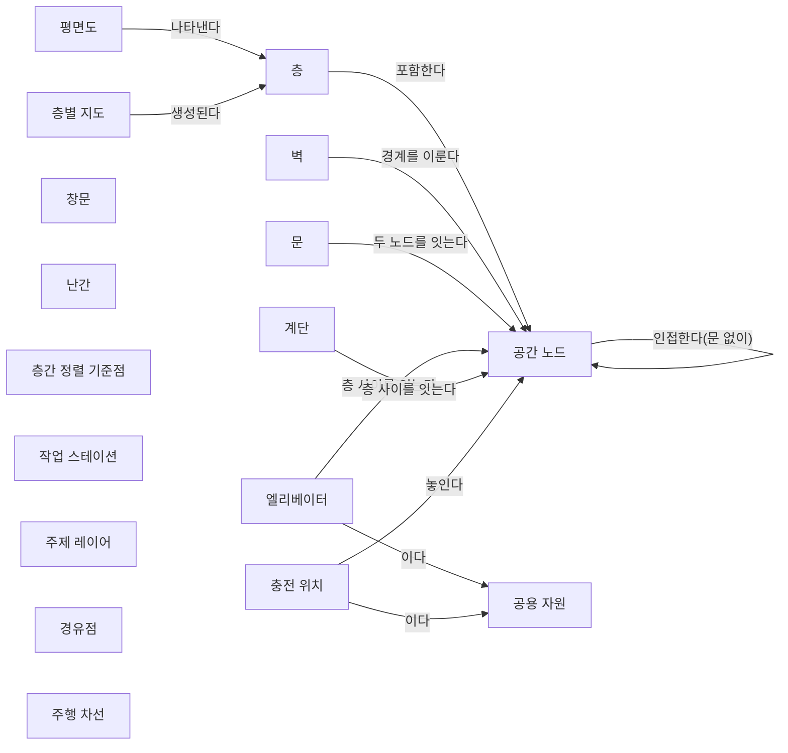
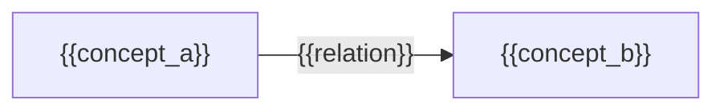

(너의 규칙은 시스템 프롬프트의 agents/shared-rules.md 와 agents/verifier.md 이다. 아래는 이번 실행의 컨텍스트와 입력이다.)

## 실행 컨텍스트

- run_id: 2026-09-25-80
- date: 2026-09-25
- run_type: track (트랙 실행)
- 대상: 트랙 floorplan-recognition (건축 도면 자동 인식) · 현재 단계: 단계 5. 검증 방법과 가설 판정 · 이번에 다룰 백로그 질문 id: q5-01 · 중심 세부영역: 6. 지도·공간·위치 모델 (B. 공통 정보·환경 모델)
- 예산:
    - max_search_queries: 40
    - max_sources_per_run: 20
    - new_topic_pages: 1
    - page_updates: 2
    - max_retries: 2
- 환경 알림: web_fetch_available: false · fetch_mode: mirror_only (일반 웹 페이지 열람은 네트워크 정책으로 막혀 있다. raw.githubusercontent.com 은 열린다: 공식 문서가 GitHub 에 있는 출처는 입력의 config/source_mirrors.yaml 경로를 WebFetch 로 열어 원문을 읽고 sources[].fetched=true, fetched_via=github_raw, fetch_url 을 적는다. 입력에 원문 텍스트(data/source_texts)가 있는 출처는 fetched_via=inbox. 그 밖의 출처는 fetched=false 이며 코드가 신뢰도 상한(medium)을 강제한다 — 공통 규칙 0절 6항)
- 언어: ko
- verification_stage: second
- verifier_budget:
    - max_search_queries: 40
    - max_sources_per_run: 20
    - new_topic_pages: 1
    - page_updates: 2
    - max_retries: 2

## 입력

### runs/2026-09-25-80/target.json

```json
{
  "run_id": "2026-09-25-80",
  "date": "2026-09-25",
  "weekday": "Fri",
  "run_number": 80,
  "run_type": "track",
  "forced": true,
  "target": {
    "area_no": 6,
    "area_name": "6. 지도·공간·위치 모델",
    "category": "B. 공통 정보·환경 모델",
    "category_letter": "B"
  },
  "topic": null,
  "track": {
    "slug": "floorplan-recognition",
    "name": "건축 도면 자동 인식",
    "stage": 5,
    "stages": 5,
    "stage_name": "검증 방법과 가설 판정",
    "question_ids": [
      "q5-01"
    ],
    "user_questions": [],
    "runs_per_week": 3,
    "question_rationale": "CLI 지정 질문 id"
  },
  "corrections": [],
  "budget": {
    "max_search_queries": 40,
    "max_sources_per_run": 20,
    "new_topic_pages": 1,
    "page_updates": 2,
    "max_retries": 2
  },
  "priority_reason": null,
  "priority_questions": [],
  "excluded_areas": [],
  "lifted_areas": [],
  "deferred": {
    "monthly_recheck": false,
    "weekly_review": true
  },
  "selection_rationale": "CLI 지정 run_type=track, area=6; 트랙 실행일(Fri, track_days 앞 3개) → 트랙 floorplan-recognition 단계 5, 질문 q5-01 (CLI 지정 질문 id)"
}
```

### runs/2026-09-25-80/research.json

```json
{
  "run_id": "2026-09-25-80",
  "date": "2026-09-25",
  "run_type": "track",
  "target": {
    "area_no": 6,
    "area_name": "6. 지도·공간·위치 모델",
    "category": "B. 공통 정보·환경 모델"
  },
  "gaps": [
    "단계 5 질문 q5-01 열림(target.json 지정, CLI 지정 질문 id). 단계 5 페이지는 seed 상태로 3~6·8절 비어 있음(단계 5 첫 실행)",
    "완료 조건: 평가 지표와 검증 절차가 아이디어 3. 건축 도면 자동 인식 6절에 없음(6절에는 q1-04 에서 온 가설 3 비교 기준 후보만 있음)",
    "완료 조건: 가설 판정표(q5-03)와 실험 계획이 없음 — 이번 실행 밖",
    "23. 시험·형식 검증·벤치마크 섹션 6에 도면 인식 결과·생성 지도의 품질 지표 근거 없음",
    "6. 지도·공간·위치 모델 11절: 도면 기반 지도의 품질을 무엇으로 합격 판정하는지 근거 없음(oq-077 과 연결)"
  ],
  "research_questions": [
    "제조사마다 다른 지도에서 ‘3층 출하 대기장’을 어떻게 동일한 장소로 인식할까? [분류원문]",
    "q5-01 요소별 인식 정확도(검출·위치 오차)와 지도 품질(주행 성공률, 경로 차이)을 어떤 지표로 측정하는가?",
    "평면도 인식·재구성 연구는 요소 검출과 위치 오차를 어떤 매칭 규칙·지표(정밀도·재현율·F1, IoU, 파놉틱 품질, 모서리 거리 임계값)로 재는가? (단계 5 페이지 3절, 27. AI·학습·적응과 모델 운영 겨냥)",
    "공간 그래프(방 연결·문) 수준의 구조 정확도는 어떤 지표로 재는가? (공간 그래프 스키마 초안 검증 겨냥)",
    "로봇 주행·지도 성능 표준과 시험법(ISO 18646-2, ASTM F3244, NIST AGV 시험)은 지도 정확도·경로 이탈·좁은 통로를 어떻게 측정하는가? (23. 시험·형식 검증·벤치마크 연결)",
    "주행 성공률과 경로 차이는 내비게이션 벤치마크(SPL, Arena-Bench)에서 어떻게 정의되며, 도면·BIM 기반 지도와 SLAM 지도를 비교한 연구는 무엇을 쟀는가?",
    "국내에 로봇 지도 작성·위치인식·주행 성능 평가 기술이나 표준화 자료가 있는가? (한국 자료 우선 규칙)"
  ],
  "findings": [
    {
      "id": "f1",
      "claim": "평면도 재구성 연구(Floor-SP, MonteFloor 등)는 모서리·방·각도 세 수준에서 정밀도·재현율·F1 을 재며, 모서리는 정답 모서리와 10픽셀 안이면 맞은 것으로 보고 가장 가까운 하나만 참 양성으로 세고, 방은 정답과의 IoU 가 임계값을 넘으면, 각도는 모서리가 맞고 정답 각도와 5° 미만 차이면 맞은 것으로 본다.",
      "tag": "사실",
      "source_ids": [
        "ref-743",
        "ref-744"
      ],
      "cross_checked": false,
      "confidence": "medium",
      "evidence_excerpt": "원문 미열람. 검색 요약: Room, Corner, Angle 각각 Precision·Recall·F1. 모서리는 10 pixels 안의 정답이 있으면 성공, 각도는 5° 미만. 어느 논문의 문구인지 요약에서 구분되지 않아 교차 확인으로 보지 않음",
      "as_of": "2019",
      "flow_step": null,
      "flow_item": null,
      "source_unopened": true
    },
    {
      "id": "f2",
      "claim": "FloorPlanCAD 계열의 파놉틱 심볼 스포팅은 파놉틱 품질(PQ)을 분할 품질(SQ, 참 양성의 평균 IoU)과 인식 품질(RQ, TP/(TP+0.5FP+0.5FN))의 곱으로 정의하고, 의미 라벨이 같고 IoU 가 0.5 를 넘으면 예측 심볼을 정답과 매칭한다.",
      "tag": "사실",
      "source_ids": [
        "ref-067"
      ],
      "cross_checked": false,
      "confidence": "medium",
      "evidence_excerpt": "원문 미열람. 검색 요약: PQ = SQ × RQ, matched if same semantic label and IoU > 0.5 (벡터 CAD 선 요소 단위)",
      "as_of": "2021-05",
      "flow_step": null,
      "flow_item": null,
      "source_unopened": true
    },
    {
      "id": "f3",
      "claim": "CubiCasa5K 논문은 방·아이콘(문·창문 포함) 클래스별 IoU 와 정확도를 보고하며, 분할 원시 결과보다 다각형화한 인스턴스 기반 점수가 낮은 이유로 벽·아이콘 접합점을 놓치거나 잘못 위치시키면 분할 품질과 상관없이 다각형을 만들 수 없다는 점을 든다.",
      "tag": "사실",
      "source_ids": [
        "ref-063"
      ],
      "cross_checked": false,
      "confidence": "medium",
      "evidence_excerpt": "원문 미열람. 검색 요약: raw segmentation scores clearly better than polygonized; if wall or icon junctions are missed or not correctly located the polygons cannot be created",
      "as_of": "2019-04",
      "flow_step": null,
      "flow_item": null,
      "source_unopened": true
    },
    {
      "id": "f4",
      "claim": "Raster-to-Graph 공식 README 는 구조 그래프 예측 성능을 정밀도·재현율로 계산한 엣지 F1(Edge F-1)으로 보고하며, 논문 값 96.1 과 저장소 값 96.2 의 차이는 정밀도·재현율 반올림 시점 차이라고 적는다.",
      "tag": "사실",
      "source_ids": [
        "ref-070"
      ],
      "cross_checked": false,
      "confidence": "medium",
      "evidence_excerpt": "README: Edge F-1 차이는 Prec·Recall 을 소수 한 자리로 반올림한 뒤 계산했는지 여부 때문(96.1 대 96.2)",
      "as_of": "2024",
      "flow_step": null,
      "flow_item": null
    },
    {
      "id": "f5",
      "claim": "Raster-to-Vector(FloorplanTransformation) 공식 README 는 저자들의 방법이 약 90% 의 정밀도와 재현율을 달성했다고 요소 유형별 구분 없이 적는다.",
      "tag": "사실",
      "source_ids": [
        "ref-065"
      ],
      "cross_checked": false,
      "confidence": "medium",
      "evidence_excerpt": "README: \"achieves around 90% precision and recall\" — 접합점·벽·문·방별 수치는 README 에 없음(저자 보고)",
      "as_of": "2017",
      "flow_step": null,
      "flow_item": null
    },
    {
      "id": "f6",
      "claim": "SSIG 공식 저장소 README 는 평면도 구조 유사도를 IoU 와 방 연결 그래프의 그래프 편집 거리(GED)의 가중합으로 정의하고, 시험한 평면도 세 쌍 조합의 38% 넘게에서 IoU 와 GED 의 순위가 서로 반대였다고 보고한다.",
      "tag": "사실",
      "source_ids": [
        "ref-745"
      ],
      "cross_checked": false,
      "confidence": "medium",
      "evidence_excerpt": "README: \"a weighted sum between IoU and GED\"; IoU 와 GED 가 38% 넘는 triplet 에서 상반. 접근 그래프의 연결 유형은 door·adjacent(검색 요약)",
      "as_of": "2023",
      "flow_step": null,
      "flow_item": null
    },
    {
      "id": "f7",
      "claim": "ISO 18646-2:2024(2판, 2019 판을 기술 개정)는 이동 서비스 로봇의 주행 성능을 자세 정확도·반복성, 장애물 감지·회피, 경로 이탈, 좁은 통로 통과, 지도 작성 정확도로 측정하며, 실내 환경을 다루고 안전 요구사항 검증에는 쓰지 않는다.",
      "tag": "사실",
      "source_ids": [
        "ref-746"
      ],
      "cross_checked": false,
      "confidence": "medium",
      "evidence_excerpt": "원문 미열람. ISO 소개문: measured by pose accuracy and repeatability, ability to detect and avoid obstacles, path deviation, narrow passage, and mapping accuracy. 시험 절차 세부는 미확인",
      "as_of": "2024-01",
      "flow_step": null,
      "flow_item": null,
      "source_unopened": true
    },
    {
      "id": "f8",
      "claim": "ASTM F3244(2021 개정)은 무인 지상 차량(A-UGV)이 여유가 제한된 정의 영역을 지나는 능력을 시험하며, 시험 영역을 물리 경계·가상 경계·바닥 표시 세 방식으로 만들고 2021 개정에서 통신 장애와 경로 위 장애물을 더했다.",
      "tag": "사실",
      "source_ids": [
        "ref-748"
      ],
      "cross_checked": false,
      "confidence": "medium",
      "evidence_excerpt": "원문 미열람. ASTM 소개: generic 2D area shapes; physical boundaries, virtual boundaries, floor markings; 2021 revision features communication impairments and obstacles",
      "as_of": "2021",
      "flow_step": null,
      "flow_item": null,
      "source_unopened": true
    },
    {
      "id": "f9",
      "claim": "NIST 의 Bostelman·Hong·Cheok(IEEE TePRA 2015)은 AGV 가 정해진 경로를 얼마나 잘 따르는지를 다중 카메라 기준값(ground truth) 측정과 지령 데이터를 비교해 평가하는 시험 절차와 지표를 제시하고 ASTM F45 에 시험법으로 권고했다.",
      "tag": "사실",
      "source_ids": [
        "ref-749"
      ],
      "cross_checked": false,
      "confidence": "medium",
      "evidence_excerpt": "원문 미열람. NIST 초록 요약: ground truth measurement comparison; generic test procedure and metrics recommended to ASTM F45; 측정계 거리 σ 0.26 mm, 각도 σ 0.10°",
      "as_of": "2015",
      "flow_step": null,
      "flow_item": null,
      "source_unopened": true
    },
    {
      "id": "f10",
      "claim": "Anderson 외(2018)의 작업반 권고는 내비게이션 평가의 주 지표로 경로 길이 가중 성공률(SPL)을 두고, 이를 에피소드마다 성공 여부에 최단 경로 길이/max(실제 경로 길이, 최단 경로 길이)를 곱한 평균으로 정의한다.",
      "tag": "사실",
      "source_ids": [
        "ref-750"
      ],
      "cross_checked": false,
      "confidence": "medium",
      "evidence_excerpt": "원문 미열람. 검색 요약: SPL = 1/N Σ S_i · ℓ_i / max(p_i, ℓ_i), ℓ_i 최단 경로, p_i 실제 경로, S_i 성공 여부",
      "as_of": "2018-07",
      "flow_step": null,
      "flow_item": null,
      "source_unopened": true
    },
    {
      "id": "f11",
      "claim": "Arena-Bench 는 ROS 내비게이션 방식을 성공률(충돌 2회 미만이고 시간 초과 없음), 충돌 수, 도착 시간, 경로 길이, 장애물 이격 거리, 가속도 변화·거칠기 같은 지표로 안전·강건성·효율·매끄러움을 나눠 비교한다.",
      "tag": "사실",
      "source_ids": [
        "ref-751"
      ],
      "cross_checked": false,
      "confidence": "medium",
      "evidence_excerpt": "원문 미열람. 검색 요약: Success Rate is the fraction of episodes with less than 2 collisions and no timeout; Path Length(m), Time to goal(s), Clearing Distance, Jerk",
      "as_of": "2022-06",
      "flow_step": null,
      "flow_item": null,
      "source_unopened": true
    },
    {
      "id": "f12",
      "claim": "Filatov 외(2017)는 2D SLAM 지도 비교를 위한 지표로, 기준 지도가 없어도 쓸 수 있는 점유 셀 비율, 모서리 수, 닫힌 영역 수를 제시해 겹침·번짐·어긋남 같은 지도 오류를 드러내게 했다.",
      "tag": "사실",
      "source_ids": [
        "ref-752"
      ],
      "cross_checked": false,
      "confidence": "low",
      "evidence_excerpt": "원문 미열람. arXiv 초록은 '세 지표'만 밝히고, 세 지표 이름(occupied proportion, corners, enclosed areas)은 이 논문을 인용한 다른 논문의 검색 요약 기준",
      "as_of": "2017-08",
      "flow_step": null,
      "flow_item": null,
      "source_unopened": true
    },
    {
      "id": "f13",
      "claim": "PRM-RL(Francis 외, 2019)은 건물 평면도로 만든 경로망과 같은 건물의 SLAM 지도로 만든 경로망에서 장거리 실내 주행을 평가해, SLAM 지도 경로망이 시뮬레이션과 실제 로봇 성능 차이를 좁힌다고 보고했다.",
      "tag": "사실",
      "source_ids": [
        "ref-753"
      ],
      "cross_checked": false,
      "confidence": "medium",
      "evidence_excerpt": "원문 미열람. 검색 요약: floor plans are not always available or up-to-date; roadmaps built from SLAM maps close the simulation to reality gap (저자 보고, 성공률 수치는 조건별로 요약마다 달라 넣지 않음)",
      "as_of": "2019-02",
      "flow_step": null,
      "flow_item": null,
      "source_unopened": true
    },
    {
      "id": "f14",
      "claim": "SLABIM 공식 README 는 설계 BIM 과 SLAM 센서 데이터를 묶은 데이터셋으로 라이다–BIM 전역 정합, BIM 위 로봇 자세 추적, 의미 지도 작성(바닥·벽·문·기둥) 세 과제를 검증하며, 라이다 스캔·지도의 BIM 좌표 기준 정답 자세를 제공한다.",
      "tag": "사실",
      "source_ids": [
        "ref-754"
      ],
      "cross_checked": false,
      "confidence": "medium",
      "evidence_excerpt": "README: LiDAR-to-BIM registration, robot pose tracking, semantic mapping(floor, wall, door, column); pose_*_to_bim.txt 정답 자세는 수동 초기값과 국소 점군 정렬로 조정. 대학 건물 대상",
      "as_of": "2025-02",
      "flow_step": null,
      "flow_item": null
    },
    {
      "id": "f15",
      "claim": "연계 대상: Lee·Woo·Shin(IJPEM, 2026)은 2D 건축 CAD 도면으로 자동 생성한 점유 격자 지도의 품질을 그 지도 위 위치추정의 이동·회전 RMSE 와 궤적 일관성 오차로 SLAM 지도와 비교해 평가했다.",
      "tag": "사실",
      "source_ids": [
        "ref-628"
      ],
      "cross_checked": false,
      "confidence": "medium",
      "evidence_excerpt": "원문 미열람. 평균 이동 RMSE 0.17±0.06 m, 회전 3.59°±1.78°, 궤적 일관성 0.10±0.08 m, SLAM 지도와 비슷(저자 보고) (재인용: 2026-09-25-72)",
      "as_of": "2026",
      "flow_step": null,
      "flow_item": null,
      "source_unopened": true
    },
    {
      "id": "f16",
      "claim": "VDA 5050 3.0.0 은 로봇이 노드를 지난 것으로 보려면 제어점이 노드의 허용 편차(allowedDeviationXY, 타원) 안에, 방향이 allowedDeviationTheta 안에 있어야 한다고 규정한다.",
      "tag": "사실",
      "source_ids": [
        "ref-031"
      ],
      "cross_checked": false,
      "confidence": "medium",
      "evidence_excerpt": "6.6.2: \"the mobile robot's control point shall be within the node's allowedDeviationXY and its orientation within allowedDeviationTheta\"",
      "as_of": "2026-09-25",
      "flow_step": "출하",
      "flow_item": "완료·인계"
    },
    {
      "id": "f17",
      "claim": "Open-RMF 플릿 어댑터 튜토리얼은 로봇 지도와 RMF 좌표의 변환을 층마다 대응 경유점(최소 4쌍 권장)으로 추정하고 층별 평균제곱오차(MSE)를 기록해 정렬 정확도를 확인하게 한다.",
      "tag": "사실",
      "source_ids": [
        "ref-153"
      ],
      "cross_checked": false,
      "confidence": "medium",
      "evidence_excerpt": "원문 미열람(이번 실행). 층별 nudged 변환과 MSE 기록 (재인용: 2026-09-25-76)",
      "as_of": "2026-09-25",
      "flow_step": null,
      "flow_item": null,
      "source_unopened": true
    },
    {
      "id": "f18",
      "claim": "국내 정부 R&D 보고서 '이동/조작/HRI/통신성능 등 서비스로봇 성능평가 및 표준화 기술개발'은 정형·비정형 실내외 환경의 위치인식·지도작성·주행경로 성능평가 기술과 실내 정형 환경 기반 주행 성능 평가기법·성능 지표 개발을 핵심 내용으로 둔다.",
      "tag": "사실",
      "source_ids": [
        "ref-747"
      ],
      "cross_checked": false,
      "confidence": "medium",
      "evidence_excerpt": "원문 미열람. ScienceON 요약: 위치인식, 지도작성, 주행경로 성능평가기술; 실내 정형 환경 기반 주행 성능 평가기법 및 성능 지표 개발. 세부 지표 미확인 (발행일 미확인, 확인일 기준)",
      "as_of": "2026-09-25",
      "flow_step": null,
      "flow_item": null,
      "source_unopened": true
    },
    {
      "id": "f19",
      "claim": "q5-01 에 대해 확인한 지표를 이 위키가 묶으면, 측정은 (1) 요소 인식: 클래스별(벽·문·엘리베이터·계단·충전 위치) 정밀도·재현율·F1 과 매칭 규칙(IoU 0.5 초과 또는 거리 임계값), 벡터 CAD 는 파놉틱 품질, 위치 오차는 미터 단위 모서리·문 중심 거리와 각도 오차, (2) 구조·그래프: 방 IoU, 공간 그래프의 엣지 F1·그래프 편집 거리(문·승강기 연결 포함), (3) 지도·주행: 기준 지도 대비 지도 정확도, 그 지도 위 위치추정 RMSE, 목적지 대응점 잔차, 주행 성공률·SPL·경로 이탈·좁은 통로 통과의 세 층으로 두는 구성이 근거가 가장 많은 것으로 보인다.",
      "tag": "추정",
      "source_ids": [
        "ref-743",
        "ref-744",
        "ref-067",
        "ref-063",
        "ref-070",
        "ref-745",
        "ref-746",
        "ref-750",
        "ref-751",
        "ref-628",
        "ref-153"
      ],
      "cross_checked": false,
      "confidence": "low",
      "evidence_excerpt": "이 위키의 종합. 세 층을 한 번에 제시한 단일 출처는 찾지 못함",
      "as_of": "2026-09-25",
      "flow_step": null,
      "flow_item": null
    },
    {
      "id": "f20",
      "claim": "확인한 인식 지표는 모서리 10픽셀·IoU 0.5 같은 이미지 기준 임계값을 쓰므로 로봇 지도 품질 판정에 쓰려면 축척으로 미터 단위로 바꾸고, 임계값은 VDA 5050 노드 허용 편차나 문 폭 대비 차체 여유 같은 운영 허용치에 맞춰 정해야 할 것으로 보인다.",
      "tag": "추정",
      "source_ids": [
        "ref-743",
        "ref-067",
        "ref-031",
        "ref-153"
      ],
      "cross_checked": false,
      "confidence": "low",
      "evidence_excerpt": "이 위키의 종합. 픽셀 임계값을 운영 허용치로 옮긴 출처는 찾지 못함",
      "as_of": "2026-09-25",
      "flow_step": null,
      "flow_item": "제약"
    },
    {
      "id": "f21",
      "claim": "'경로 차이'는 같은 출발–도착 쌍에 대해 도면 기반 지도와 기준 지도(측량 또는 현장 SLAM 지도)에서 구한 경로를 비교해, 길이 비율(SPL 식)과 지나는 공간·문·승강기의 순서가 같은지(그래프 편집 거리 식)를 함께 재는 방식으로 정의할 수 있을 것으로 보인다.",
      "tag": "추정",
      "source_ids": [
        "ref-750",
        "ref-745",
        "ref-753"
      ],
      "cross_checked": false,
      "confidence": "low",
      "evidence_excerpt": "이 위키의 종합. PRM-RL 은 평면도 경로망과 SLAM 경로망을 각각 평가했으나 같은 쌍의 경로 차이 지표는 확인하지 못함",
      "as_of": "2026-09-25",
      "flow_step": null,
      "flow_item": null
    },
    {
      "id": "f22",
      "claim": "‘3층 출하 대기장’의 경우 도면에서 얻은 대기장 목적지 좌표를 제조사별 지도로 옮긴 뒤, 목적지 대응점 잔차가 노드 허용 편차 안에 드는지와 각 제조사 로봇의 실제 도착 성공률을 함께 재야 지도 품질이 SCM 쪽 도착 인정 기준으로 이어질 것으로 보인다(설명용 가정 사례).",
      "tag": "추정",
      "source_ids": [
        "ref-031",
        "ref-153"
      ],
      "cross_checked": false,
      "confidence": "low",
      "evidence_excerpt": "이 위키의 종합(가정 사례)",
      "as_of": "2026-09-25",
      "flow_step": "출하",
      "flow_item": "완료·인계"
    },
    {
      "id": "f23",
      "claim": "연계 대상: 장애물 회피·좁은 통로 통과·경로 추종 같은 주행 시험 자체는 로봇·제조사 쪽 성능이므로, ROP 쪽 지표는 도면 인식·공간 그래프·좌표 정렬 품질과 도착 인정 판정에 한정하고 주행 시험 결과는 제조사 시험(ISO 18646-2, ASTM F3244 식)을 받아 쓰는 경계가 될 것으로 보인다.",
      "tag": "추정",
      "source_ids": [
        "ref-746",
        "ref-748",
        "ref-749",
        "ref-031"
      ],
      "cross_checked": false,
      "confidence": "low",
      "evidence_excerpt": "이 위키의 종합. 분류 원문 9장 '로봇 자체 지능·제어' 경계 적용",
      "as_of": "2026-09-25",
      "flow_step": null,
      "flow_item": null
    },
    {
      "id": "f24",
      "claim": "이번 검색 범위(한국어 3회 포함 17회)에서는 물류센터 평면도 인식 결과와 그 지도로 한 로봇 주행 품질을 함께 평가한 벤치마크나 국내 사례를 찾지 못했다(부재 확인 아님).",
      "tag": "추정",
      "source_ids": [
        "ref-747",
        "ref-754",
        "ref-753"
      ],
      "cross_checked": false,
      "confidence": "low",
      "evidence_excerpt": "검색 범위 관찰. 확인한 BIM–SLAM 평가는 대학 건물, 평면도 주행 평가는 사무 건물 대상",
      "as_of": "2026-09-25",
      "flow_step": null,
      "flow_item": null
    }
  ],
  "sources": [
    {
      "id": "ref-743",
      "org": "Chen, J., Liu, C., Wu, J., & Furukawa, Y.",
      "title": "Floor-SP: Inverse CAD for Floorplans by Sequential Room-wise Shortest Path",
      "published": "2019-08",
      "url": "https://arxiv.org/abs/1908.06702",
      "type": "논문",
      "reliability": "medium",
      "accessed": "2026-09-25",
      "summary": "원문 미열람. 3D 스캔에서 평면도를 재구성하고 모서리·방·각도 정밀도·재현율로 평가하는 연구.",
      "source_unopened": true,
      "fetched": false,
      "fetched_via": null,
      "fetch_url": null
    },
    {
      "id": "ref-744",
      "org": "Stekovic, S., Rad, M., Fraundorfer, F., & Lepetit, V.",
      "title": "MonteFloor: Extending MCTS for Reconstructing Accurate Large-Scale Floor Plans",
      "published": "2021-03",
      "url": "https://arxiv.org/abs/2103.11161",
      "type": "논문",
      "reliability": "medium",
      "accessed": "2026-09-25",
      "summary": "원문 미열람. 대규모 평면도 재구성 연구로 방·모서리·각도 지표로 평가한다.",
      "source_unopened": true,
      "fetched": false,
      "fetched_via": null,
      "fetch_url": null
    },
    {
      "id": "ref-745",
      "org": "van Engelenburg, C. 외 (caspervanengelenburg GitHub)",
      "title": "ssig — README (SSIG: A Visually-Guided Graph Edit Distance for Floor Plan Similarity, ICCVW 2023)",
      "published": "2023",
      "url": "https://github.com/caspervanengelenburg/ssig",
      "type": "오픈소스 문서",
      "reliability": "medium",
      "accessed": "2026-09-25",
      "summary": "평면도 구조 유사도를 IoU 와 그래프 편집 거리의 가중합으로 정의한 지표의 공식 저장소.",
      "fetched": true,
      "fetched_via": "github_raw",
      "fetch_url": "https://raw.githubusercontent.com/caspervanengelenburg/ssig/main/README.md",
      "source_unopened": false
    },
    {
      "id": "ref-746",
      "org": "ISO",
      "title": "ISO 18646-2:2024 - Robotics — Performance criteria and related test methods for service robots — Part 2: Navigation",
      "published": "2024-01",
      "url": "https://www.iso.org/standard/82643.html",
      "type": "표준",
      "reliability": "medium",
      "accessed": "2026-09-25",
      "summary": "원문 미열람. 이동 서비스 로봇의 주행 성능(자세 정확도, 장애물, 경로 이탈, 좁은 통로, 지도 작성 정확도) 시험 방법 표준 2판.",
      "source_unopened": true,
      "fetched": false,
      "fetched_via": null,
      "fetch_url": null
    },
    {
      "id": "ref-747",
      "org": "KISTI ScienceON(정부 R&D 보고서)",
      "title": "이동/조작/HRI/통신성능 등 서비스로봇 성능평가 및 표준화 기술개발",
      "published": null,
      "url": "https://scienceon.kisti.re.kr/srch/selectPORSrchReport.do?cn=TRKO201800040065",
      "type": "정부·연구기관",
      "reliability": "medium",
      "accessed": "2026-09-25",
      "summary": "원문 미열람. 서비스로봇의 위치인식·지도작성·주행경로 성능평가 기술과 표준화를 다룬 국내 R&D 보고서.",
      "source_unopened": true,
      "fetched": false,
      "fetched_via": null,
      "fetch_url": null
    },
    {
      "id": "ref-748",
      "org": "ASTM International",
      "title": "F3244 Standard Test Method for Navigation: Defined Area",
      "published": "2021",
      "url": "https://store.astm.org/f3244-21.html",
      "type": "표준",
      "reliability": "medium",
      "accessed": "2026-09-25",
      "summary": "원문 미열람. A-UGV 가 여유가 제한된 정의 영역을 지나는 능력을 시험하는 시험법.",
      "source_unopened": true,
      "fetched": false,
      "fetched_via": null,
      "fetch_url": null
    },
    {
      "id": "ref-749",
      "org": "Bostelman, R. V., Hong, T. H., & Cheok, G. S. (NIST)",
      "title": "Navigation Performance Evaluation for Automated Guided Vehicles",
      "published": "2015",
      "url": "https://www.nist.gov/publications/navigation-performance-evaluation-automated-guided-vehicles",
      "type": "정부·연구기관",
      "reliability": "medium",
      "accessed": "2026-09-25",
      "summary": "원문 미열람. 다중 카메라 기준값 측정으로 AGV 경로 추종 성능을 평가하는 시험 절차와 지표를 제시한 NIST 연구.",
      "source_unopened": true,
      "fetched": false,
      "fetched_via": null,
      "fetch_url": null
    },
    {
      "id": "ref-750",
      "org": "Anderson, P. 외",
      "title": "On Evaluation of Embodied Navigation Agents",
      "published": "2018-07",
      "url": "https://arxiv.org/abs/1807.06757",
      "type": "논문",
      "reliability": "medium",
      "accessed": "2026-09-25",
      "summary": "원문 미열람. 내비게이션 연구의 평가 방법 합의 권고. 경로 길이 가중 성공률(SPL)을 주 지표로 제안.",
      "source_unopened": true,
      "fetched": false,
      "fetched_via": null,
      "fetch_url": null
    },
    {
      "id": "ref-751",
      "org": "Kästner, L. 외",
      "title": "Arena-Bench: A Benchmarking Suite for Obstacle Avoidance Approaches in Highly Dynamic Environments",
      "published": "2022-06",
      "url": "https://arxiv.org/abs/2206.05728",
      "type": "논문",
      "reliability": "medium",
      "accessed": "2026-09-25",
      "summary": "원문 미열람. ROS 내비게이션 방식을 성공률·충돌·경로 길이·시간 등으로 비교하는 벤치마크.",
      "source_unopened": true,
      "fetched": false,
      "fetched_via": null,
      "fetch_url": null
    },
    {
      "id": "ref-752",
      "org": "Filatov, A. 외",
      "title": "2D SLAM Quality Evaluation Methods",
      "published": "2017-08",
      "url": "https://arxiv.org/abs/1708.02354",
      "type": "논문",
      "reliability": "medium",
      "accessed": "2026-09-25",
      "summary": "원문 미열람. 2D 지도 분석으로 SLAM 알고리즘을 비교하는 세 지표를 제시한 논문.",
      "source_unopened": true,
      "fetched": false,
      "fetched_via": null,
      "fetch_url": null
    },
    {
      "id": "ref-753",
      "org": "Francis, A. 외",
      "title": "Long-Range Indoor Navigation with PRM-RL",
      "published": "2019-02",
      "url": "https://arxiv.org/abs/1902.09458",
      "type": "논문",
      "reliability": "medium",
      "accessed": "2026-09-25",
      "summary": "원문 미열람. 평면도와 SLAM 지도로 만든 경로망에서 장거리 실내 주행을 평가한 연구.",
      "source_unopened": true,
      "fetched": false,
      "fetched_via": null,
      "fetch_url": null
    },
    {
      "id": "ref-754",
      "org": "HKUST Aerial Robotics Group (HKUST-Aerial-Robotics GitHub)",
      "title": "SLABIM — README (SLABIM: A SLAM-BIM Coupled Dataset in HKUST Main Building)",
      "published": "2025-02",
      "url": "https://github.com/HKUST-Aerial-Robotics/SLABIM",
      "type": "오픈소스 문서",
      "reliability": "medium",
      "accessed": "2026-09-25",
      "summary": "설계 BIM 과 SLAM 센서 데이터를 묶은 데이터셋. 라이다–BIM 정합, BIM 위 자세 추적, 의미 지도 작성 과제와 BIM 좌표 정답 자세 제공.",
      "fetched": true,
      "fetched_via": "github_raw",
      "fetch_url": "https://raw.githubusercontent.com/HKUST-Aerial-Robotics/SLABIM/main/README.md",
      "source_unopened": false
    },
    {
      "id": "ref-063",
      "org": "Kalervo, A., Ylioinas, J., Häikiö, M., Karhu, A., & Kannala, J.",
      "title": "CubiCasa5K: A Dataset and an Improved Multi-Task Model for Floorplan Image Analysis",
      "published": "2019-04",
      "url": "https://arxiv.org/abs/1904.01920",
      "type": "논문",
      "reliability": "medium",
      "accessed": "2026-09-25",
      "summary": "원문 미열람. 5,000장 평면도 데이터셋과 다중 과제 모델, 클래스별 IoU·정확도 평가.",
      "source_unopened": true,
      "fetched": false,
      "fetched_via": null,
      "fetch_url": null
    },
    {
      "id": "ref-067",
      "org": "Fan, Z., Zhu, L., Li, H., Chen, X., Zhu, S., & Tan, P.",
      "title": "FloorPlanCAD: A Large-Scale CAD Drawing Dataset for Panoptic Symbol Spotting",
      "published": "2021-05",
      "url": "https://arxiv.org/abs/2105.07147",
      "type": "논문",
      "reliability": "medium",
      "accessed": "2026-09-25",
      "summary": "원문 미열람. 벡터 CAD 파놉틱 심볼 스포팅 데이터셋과 파놉틱 품질 지표.",
      "source_unopened": true,
      "fetched": false,
      "fetched_via": null,
      "fetch_url": null
    },
    {
      "id": "ref-070",
      "org": "Hu, S. 외",
      "title": "Raster-to-Graph — README (Raster-to-Graph: Floorplan Recognition via Autoregressive Graph Prediction with an Attention Transformer)",
      "published": "2024",
      "url": "https://github.com/SizheHu/Raster-to-Graph",
      "type": "오픈소스 문서",
      "reliability": "medium",
      "accessed": "2026-09-25",
      "summary": "래스터 평면도를 벽 구조 그래프로 바꾸는 방법의 공식 저장소. 엣지 F1 로 성능 보고.",
      "fetched": true,
      "fetched_via": "github_raw",
      "fetch_url": "https://raw.githubusercontent.com/SizheHu/Raster-to-Graph/main/README.md",
      "source_unopened": false
    },
    {
      "id": "ref-065",
      "org": "Liu, C., Wu, J., Kohli, P., & Furukawa, Y.",
      "title": "FloorplanTransformation — README (Raster-to-Vector: Revisiting Floorplan Transformation)",
      "published": "2017",
      "url": "https://github.com/art-programmer/FloorplanTransformation",
      "type": "오픈소스 문서",
      "reliability": "medium",
      "accessed": "2026-09-25",
      "summary": "래스터 평면도의 벡터 변환 방법 공식 저장소. 약 90% 정밀도·재현율을 보고.",
      "fetched": true,
      "fetched_via": "github_raw",
      "fetch_url": "https://raw.githubusercontent.com/art-programmer/FloorplanTransformation/master/README.md",
      "source_unopened": false
    },
    {
      "id": "ref-628",
      "org": "Lee, H.-C., Woo, H.-M., & Shin, S. (International Journal of Precision Engineering and Manufacturing)",
      "title": "Digital Twin-based Sensor-Free Virtual Mapping for Autonomous Mobile Robot Localization",
      "published": "2026",
      "url": "https://link.springer.com/article/10.1007/s12541-026-01598-2",
      "type": "논문",
      "reliability": "medium",
      "accessed": "2026-09-25",
      "summary": "원문 미열람. 2D 건축 CAD 도면으로 가상 점유 격자 지도를 만들어 위치추정에 쓰고 SLAM 지도와 오차를 비교한 국내 저자 연구.",
      "source_unopened": true,
      "fetched": false,
      "fetched_via": null,
      "fetch_url": null
    },
    {
      "id": "ref-031",
      "org": "VDA / VDMA (VDA5050 GitHub)",
      "title": "VDA5050/VDA5050_EN.md — Official Specification document for the VDA 5050",
      "published": null,
      "url": "https://github.com/VDA5050/VDA5050/blob/main/VDA5050_EN.md",
      "type": "표준",
      "reliability": "medium",
      "accessed": "2026-09-25",
      "summary": "VDA 5050 3.0.0 공식 명세. 노드 통과 조건(허용 편차)과 지도 규약 확인.",
      "fetched": true,
      "fetched_via": "github_raw",
      "fetch_url": null,
      "source_unopened": false
    },
    {
      "id": "ref-153",
      "org": "Open Robotics",
      "title": "Fleet Adapter Tutorial - Programming Multiple Robots with ROS 2",
      "published": null,
      "url": "https://osrf.github.io/ros2multirobotbook/integration_fleets_adapter_tutorial.html",
      "type": "오픈소스 문서",
      "reliability": "medium",
      "accessed": "2026-09-25",
      "summary": "원문 미열람(이번 실행). 로봇 지도–RMF 좌표 변환을 층별 대응점으로 추정하고 MSE 를 기록하는 방법.",
      "source_unopened": true,
      "fetched": false,
      "fetched_via": null,
      "fetch_url": null
    }
  ],
  "page_proposals": [
    {
      "action": "update",
      "path": "docs/tracks/floorplan-recognition/stage-5-verification-and-hypotheses.md",
      "sections": [
        "2",
        "3",
        "4",
        "5",
        "6",
        "8",
        "9"
      ],
      "rationale": "q5-01 답: f1·f2·f3·f4·f5·f6·f7·f8·f9·f10·f11·f12·f13·f14·f15·f16·f17·f18·f19·f20·f21·f22·f23·f24 (신뢰도 low) — 2절 q5-01 상태 답함, 3절 q5-01 소제목 신설({#q5-01}): 요소 인식 지표(모서리·방·각도 f1, 파놉틱 품질 f2, 클래스별 IoU f3, 엣지 F1 f4, 저자 보고 정밀도·재현율 f5), 구조·그래프 지표(SSIG f6), 주행·지도 표준·시험법(ISO 18646-2 f7, ASTM F3244 f8, NIST AGV f9, 국내 R&D f18), 주행 지표(SPL f10, Arena-Bench f11), 지도 품질(기준 지도 없는 지표 f12, 평면도·SLAM 경로망 f13, BIM–SLAM 데이터셋 f14, CAD 지도 위치추정 RMSE f15 연계 대상), 운영 허용치(VDA 5050 허용 편차 f16, 층별 MSE f17), 종합: 세 층 지표 구성(f19, 표·mermaid 권장)·임계값 변환(f20)·경로 차이 정의(f21)·‘3층 출하 대기장’ 시나리오(f22)·ROP 경계(f23)·근거 공백(f24) / 4절 결론·불확실성 / 5절 후속 질문 / 6절 완료 조건 현황 / 8절 출처 / 9절 이력"
    },
    {
      "action": "update",
      "path": "docs/ideas/floorplan-recognition.md",
      "sections": [
        "6"
      ],
      "rationale": "아이디어 페이지 6절(트랙 산출물): '평가 지표' 소절 신설 — 세 층 지표(f19)·임계값의 운영 허용치 변환(f20)·경로 차이 정의(f21)·ROP 경계(f23)(모두 추정), 근거 f1·f2·f6·f7·f10·f11·f14·f16. 검증 절차(q5-02 시간 단축 측정)와 가설 판정(q5-03)은 미조사임을 명시"
    },
    {
      "action": "update",
      "path": "docs/categories/f-deployment-verification-and-maintenance/23-testing-formal-verification-and-benchmarking.md",
      "sections": [
        "6"
      ],
      "rationale": "트랙 floorplan-recognition 단계 5 반영 제안 (f7, f8, f9, f10, f11, f19, f23): 주행 성능 시험 표준(ISO 18646-2:2024, ASTM F3244, NIST AGV 시험)과 내비게이션 지표(SPL, 성공률·경로 길이), 도면 기반 지도의 세 층 품질 지표(추정)"
    },
    {
      "action": "update",
      "path": "docs/categories/b-common-information-and-environment-model/06-map-space-and-location-model.md",
      "sections": [
        "6",
        "8"
      ],
      "rationale": "트랙 floorplan-recognition 단계 5 반영 제안 (f12, f14, f15, f16, f20, f22): 지도 품질 지표(기준 지도 없는 지표, BIM 좌표 정답 자세 데이터셋, CAD 지도 위치추정 RMSE)와 목적지 잔차를 노드 허용 편차에 맞춰 판정하는 방법(추정). oq-077 근거 보강"
    },
    {
      "action": "update",
      "path": "docs/categories/g-safety-security-intelligence-and-governance/27-ai-learning-adaptation-and-model-operations.md",
      "sections": [
        "6"
      ],
      "rationale": "트랙 floorplan-recognition 단계 5 반영 제안 (f1, f2, f3, f6): 도면 해석 모델의 평가 지표(모서리·방 정밀도·재현율, 파놉틱 품질, 클래스별 IoU, 구조 유사도 SSIG). 교차 규칙에 따라 적용 대상 6. 지도·공간·위치 모델과 양쪽 연결"
    }
  ],
  "glossary_candidates": [
    {
      "term_ko": "경로 길이 가중 성공률",
      "term_en": "Success weighted by Path Length (SPL)",
      "definition": "내비게이션 에피소드마다 성공 여부에 최단 경로 길이를 실제 경로 길이(최단보다 짧으면 최단)로 나눈 비율을 곱해 평균한 지표로, 도착 여부와 경로 효율을 함께 잰다."
    },
    {
      "term_ko": "파놉틱 품질",
      "term_en": "Panoptic Quality (PQ)",
      "definition": "매칭된 인스턴스의 평균 IoU(분할 품질)와 TP/(TP+0.5FP+0.5FN)(인식 품질)의 곱으로, 요소를 맞게 찾았는지와 모양을 정확히 잡았는지를 함께 재는 지표다."
    },
    {
      "term_ko": "그래프 편집 거리",
      "term_en": "Graph Edit Distance (GED)",
      "definition": "한 그래프를 다른 그래프로 바꾸는 노드·엣지 추가·삭제·치환의 최소 비용으로, 평면도 방 연결 그래프의 구조 차이를 재는 데 쓴다."
    }
  ],
  "open_questions_new": [
    "ISO 18646-2:2024 의 지도 작성 정확도 시험은 무엇을 어떤 기준점과 절차로 측정하며, KS 로 부합화되어 국내 물류 로봇 시험에 쓰이는가? | 관련 영역: 23. 시험·형식 검증·벤치마크, 6. 지도·공간·위치 모델 | 근거: f7 | 종류: 일반"
  ],
  "open_questions_resolved": [],
  "self_check": {
    "source_count": 19,
    "cross_checked_count": 0,
    "unverified": [
      "모든 finding 교차 확인 없음: 지표 정의마다 단일 출처(f1 의 두 출처는 검색 요약에서 문구 출처가 구분되지 않음)",
      "f7 ISO 18646-2 지도 작성 정확도 시험 절차 세부 미확인(유료 원문 미열람)",
      "f12 세 지표 이름은 인용 논문 검색 요약 기준",
      "f13 PRM-RL 성공률 수치는 조건별로 요약마다 달라 넣지 않음",
      "ref-747 발행일·세부 지표 미확인, KS B ISO 18646-2 부합화 여부 미확인",
      "f19~f24 는 이 위키의 종합이며 세 층 지표를 한 번에 제시한 단일 출처는 찾지 못함"
    ],
    "scope_violations": [
      "f15: 도면 지도 위 위치추정은 로봇 자체 지능·제어 연계 영역이라 '연계 대상: '으로 표시하고 지도 품질 지표의 예로만 씀",
      "f7·f8·f9·f11: 장애물 회피·경로 추종 시험은 로봇 쪽 성능이며 f23 에서 ROP 는 결과를 받아 쓰는 것으로 경계를 적음"
    ],
    "budget_used": {
      "queries": 17,
      "sources": 12
    },
    "limits": "web_fetch_available: false · fetch_mode mirror_only. raw.githubusercontent.com 으로 원문을 연 출처: 신규 ref-745(SSIG README)·ref-754(SLABIM README), 재사용 ref-070(Raster-to-Graph README)·ref-065(FloorplanTransformation README). ref-031 은 입력 원문 텍스트(inbox). 나머지 신규 10건과 재사용 ref-063·ref-067·ref-628·ref-153 은 원문 미열람이라 신뢰도 상한 medium, high 는 주지 않음. 검색 17회/40(한국어 3회), 신규 출처 12건/20(ref-743~ref-754, 예약 구간 안), 재사용 7건. 질문 선택: target.json 지정 q5-01 1건. q5-01 은 요소 인식·구조 그래프·지도·주행 지표의 정의(사실)로 답했으나 세 층 구성·임계값 변환·경로 차이 정의(f19~f22)는 이 위키의 종합이라 질문 종합 신뢰도 low. 한국 자료: 서비스로봇 성능평가 R&D 보고서(ref-747) 1건, 국내 물류 사례는 찾지 못함. 교차 규칙: 도면 해석 모델 평가 지표는 27. AI·학습·적응과 모델 운영과 적용 대상 6. 지도·공간·위치 모델 양쪽에 반영 제안. 8. 실시간 세계 상태·데이터 일관성과 22. 시뮬레이션·예측용 디지털 트윈 관련 주장 없음(시뮬레이션 초기값 판정은 q5-06 범위). 정정 요청 없음. 온톨로지 변경 없음: 평가 지표는 공간 그래프 스키마의 개념·관계가 아니라 검증 방법이므로 아이디어 페이지 6절에 둔다. 후속 질문 2건. 일반 열린 질문 1건. 페이지 제안: 트랙 산출물 2건, 세부영역 반영 제안 3건(갱신 상한과 별도)."
  },
  "track": {
    "slug": "floorplan-recognition",
    "stage": 5,
    "answered_question_ids": [
      "q5-01"
    ],
    "new_questions": [
      {
        "question": "요소 검출 F1·위치 오차·목적지 잔차·도착 성공률 같은 지도 품질 지표의 합격 임계값을 이미지 픽셀 기준이 아니라 물류 로봇의 노드 허용 편차(VDA 5050 allowedDeviationXY)·문 폭 대비 차체 여유 같은 운영 허용치에서 어떻게 도출하는가? (q5-01 에서 파생)",
        "stage": 5,
        "rationale_finding_id": "f20"
      },
      {
        "question": "도면 기반 지도와 기준 지도(측량 또는 현장 SLAM 지도)에서 같은 출발–도착 쌍으로 경로 차이(길이 비율, 지나는 공간·문·승강기 순서)를 재는 시험 세트를 물류센터에서 어떻게 구성하는가(쌍 선택, 층간 이동 포함, 제조사별 반복)? (q5-01 에서 파생)",
        "stage": 5,
        "rationale_finding_id": "f21"
      }
    ],
    "ontology_changes": [],
    "stage_completion_self_assessment": {
      "met": false,
      "missing": [
        "평가 지표(q5-01 답 f19)는 검증 승인 전이며 아이디어 3. 건축 도면 자동 인식 6절에 아직 반영되지 않음",
        "검증 절차(현장 모델링 시간 단축 측정, q5-02) 미조사",
        "가설 판정표(q5-03)가 트랙 개요 3절에 없음",
        "사용자에게 제안하는 실험 계획이 실험 페이지에 없음",
        "열린 질문 q5-02~q5-08"
      ]
    }
  }
}
```

### runs/2026-09-25-80/verification.json

```json
{
  "run_id": "2026-09-25-80",
  "stage": "first",
  "verdict": "조건부 승인",
  "claim_checks": [
    {
      "finding_id": "f1",
      "source_exists": true,
      "supports_claim": true,
      "cross_checked": false,
      "tag_decision": "유지",
      "note": "원문 미열람. 검색 결과로 Floor-SP(arXiv 1908.06702)가 모서리 10픽셀 안 정답 있으면 성공, 각도는 모서리가 맞고 5° 미만이면 성공으로 정의함을 확인(방은 다른 방과 겹치지 않고 IoU 0.7 초과, Floor-SP 기준). '가장 가까운 하나만 참 양성으로 센다'는 이번 검증 검색에서 확인되지 않아 required_fixes 로 삭제 지시. MonteFloor 는 실재(arXiv 2103.11161) 확인했으나 같은 지표 문구의 출처 구분은 안 되므로 교차 확인 아님."
    },
    {
      "finding_id": "f2",
      "source_exists": true,
      "supports_claim": true,
      "cross_checked": true,
      "tag_decision": "유지",
      "note": "원문 미열람. FloorPlanCAD(ICCV 2021, arXiv 2105.07147) 검색 결과와 후속 논문(ArchCAD-400K 등) 요약이 PQ=SQ×RQ, 같은 의미 라벨·IoU>0.5 매칭을 같은 문구로 전함. 발행 2021-05."
    },
    {
      "finding_id": "f3",
      "source_exists": true,
      "supports_claim": true,
      "cross_checked": false,
      "tag_decision": "유지",
      "note": "원문 미열람. 기존 참고문헌 ref-063 재사용(실재 이전 실행에서 확인). 검색 스니펫 범위의 주장이며 단일 출처."
    },
    {
      "finding_id": "f4",
      "source_exists": true,
      "supports_claim": true,
      "cross_checked": false,
      "tag_decision": "유지",
      "note": "raw.githubusercontent.com 으로 README 열람 확인: 논문 96.1 과 저장소 96.2 차이는 Prec·Recall 을 계산 전에 소수 한 자리로 반올림했는지 여부. 저자 보고."
    },
    {
      "finding_id": "f5",
      "source_exists": true,
      "supports_claim": true,
      "cross_checked": false,
      "tag_decision": "유지",
      "note": "README 열람 확인: 'around 90% precision and recall'(저자 보고). 요소 유형별 수치 없음. 기존 ref-065 재사용."
    },
    {
      "finding_id": "f6",
      "source_exists": true,
      "supports_claim": true,
      "cross_checked": false,
      "tag_decision": "유지",
      "note": "README 열람 확인: SSIG 는 IoU 와 GED 의 가중합, 무작위 평면도 세 쌍의 38% 넘게에서 IoU 와 GED 가 상반(ICCV Workshops 2023)."
    },
    {
      "finding_id": "f7",
      "source_exists": true,
      "supports_claim": true,
      "cross_checked": false,
      "tag_decision": "유지",
      "note": "원문 미열람. ISO 소개 페이지(iso.org/standard/82643) 검색 결과로 측정 항목 5가지, 실내 환경 한정(부속서 A 실외 적용 가능), 안전 요구사항 검증에 비적용, 2019 판을 기술 개정한 2판임 확인. 재판매 사이트는 독립 출처가 아니어서 교차 확인 아님. 시험 절차 세부 미확인."
    },
    {
      "finding_id": "f8",
      "source_exists": true,
      "supports_claim": true,
      "cross_checked": false,
      "tag_decision": "유지",
      "note": "원문 미열람. ASTM 스토어·iTeh 요약으로 정의 영역 통과 능력 시험, 물리 경계·가상 경계·바닥 표시 세 방식, 장애 유형 두 가지(장애물·통신 장애) 확인. '2021 개정에서 더했다'는 이번 검색 요약에서 확인되지 않아 required_fixes 로 표현 수정 지시."
    },
    {
      "finding_id": "f9",
      "source_exists": true,
      "supports_claim": true,
      "cross_checked": false,
      "tag_decision": "유지",
      "note": "원문 미열람. NIST 출판물 페이지·Semantic Scholar 검색 결과로 TePRA 2015(2015-05), 기준값 측정 비교와 ASTM F45 권고 시험 절차·지표 확인. 연계 대상(로봇 주행 성능 시험)으로 서술해야 함."
    },
    {
      "finding_id": "f10",
      "source_exists": true,
      "supports_claim": true,
      "cross_checked": true,
      "tag_decision": "유지",
      "note": "원문 미열람. SPL 정의식이 Anderson 외(2018)로 귀속되어 여러 후속 논문·요약에서 같은 식으로 확인됨."
    },
    {
      "finding_id": "f11",
      "source_exists": true,
      "supports_claim": true,
      "cross_checked": false,
      "tag_decision": "유지",
      "note": "원문 미열람. arXiv 2206.05728 검색 결과로 성공률(충돌 2회 미만), 경로 길이·시간·이격 거리·저크 지표 확인. '시간 초과 없음' 조건은 판에 따라 요약이 달라 저자 판 기준임을 유지. 장애물 회피 벤치마크라 연계 대상으로 서술."
    },
    {
      "finding_id": "f12",
      "source_exists": true,
      "supports_claim": true,
      "cross_checked": false,
      "tag_decision": "유지",
      "note": "원문 미열람. arXiv 1708.02354 실재 확인, 세 지표(점유 셀 비율·모서리 수·닫힌 영역 수)는 인용 문헌 요약에서도 같은 이름으로 확인. 요약은 이 지표가 같은 데이터 시퀀스의 여러 SLAM 결과를 비교할 때만 쓰는 상대 지표라고 적으므로 그 한계를 병기하도록 지시. 신뢰도 low 유지."
    },
    {
      "finding_id": "f13",
      "source_exists": true,
      "supports_claim": true,
      "cross_checked": false,
      "tag_decision": "유지",
      "note": "원문 미열람. arXiv 1902.09458 검색 결과로 평면도 지도와 SLAM 지도로 경로망을 만들어 평가하고 SLAM 지도 사용이 sim2real 격차를 좁힌다고 보고함 확인(저자 보고). 강화학습 주행 자체는 로봇 쪽이라 '연계 대상: ' 표시 필요."
    },
    {
      "finding_id": "f14",
      "source_exists": true,
      "supports_claim": true,
      "cross_checked": false,
      "tag_decision": "유지",
      "note": "README 열람 확인: 세 과제(라이다–BIM 정합, BIM 위 자세 추적, 의미 지도 작성: floor·wall·door·column), pose_*_to_bim.txt 정답 자세는 수동 초기값과 국소 점군 정렬로 조정. README 는 ICRA 2025 채택(2025-01-28)을 적음."
    },
    {
      "finding_id": "f15",
      "source_exists": true,
      "supports_claim": true,
      "cross_checked": false,
      "tag_decision": "유지",
      "note": "원문 미열람. 기존 ref-628 재사용(실행 2026-09-25-70·72 에서 같은 논문 확인). 같은 연구의 기존 서술과 겹치므로 기존 각주 재사용. '연계 대상: ' 표시 유지."
    },
    {
      "finding_id": "f16",
      "source_exists": true,
      "supports_claim": true,
      "cross_checked": false,
      "tag_decision": "유지",
      "note": "입력 원문 텍스트(data/source_texts/ref-031.txt) 6.6.2 절에서 확인. 명세는 노드 통과 판단을 로봇이 하되 그 요건으로 허용 편차를 둔다고 적음. 기준일은 명세 3.0.0(발행일 미확인, oq-005)."
    },
    {
      "finding_id": "f17",
      "source_exists": true,
      "supports_claim": true,
      "cross_checked": false,
      "tag_decision": "유지",
      "note": "원문 미열람(이번 실행). 기존 ref-153 재사용, 같은 주장이 단계 4 페이지·스키마 초안 6절에 이미 있으므로 기존 문장·각주를 재사용."
    },
    {
      "finding_id": "f18",
      "source_exists": true,
      "supports_claim": true,
      "cross_checked": false,
      "tag_decision": "유지",
      "note": "원문 미열람. ScienceON 보고서(TRKO201800040065) 실재 확인. 검증 검색 요약은 위치·경로 정확도와 장애물 회피 성능 측정 방법을 전하며 브리프 스니펫과 방향이 일치. 발행일·세부 지표 미확인."
    },
    {
      "finding_id": "f19",
      "source_exists": true,
      "supports_claim": true,
      "cross_checked": false,
      "tag_decision": "유지",
      "note": "이 위키의 종합([추정], low). 근거 finding 들은 유지됨. 3층의 주행 지표(주행 성공률·SPL·경로 이탈·좁은 통로)는 f23 경계와 맞게 제조사·통합자 시험 결과를 받아 쓰는 연계 대상으로 표시하도록 지시."
    },
    {
      "finding_id": "f20",
      "source_exists": true,
      "supports_claim": true,
      "cross_checked": false,
      "tag_decision": "유지",
      "note": "이 위키의 종합([추정], low). '문 폭 대비 차체 여유'는 인용 출처 어디에도 근거가 없어 삭제하거나 구축자 의견으로 분리하도록 지시."
    },
    {
      "finding_id": "f21",
      "source_exists": true,
      "supports_claim": true,
      "cross_checked": false,
      "tag_decision": "유지",
      "note": "이 위키의 종합([추정], low). 같은 쌍 경로 차이 지표는 출처에서 확인되지 않았다는 한계가 브리프에 명시됨."
    },
    {
      "finding_id": "f22",
      "source_exists": true,
      "supports_claim": true,
      "cross_checked": false,
      "tag_decision": "유지",
      "note": "설명용 가정 사례([추정]). 수치 없음, 가정 사례임을 본문에 밝힐 것."
    },
    {
      "finding_id": "f23",
      "source_exists": true,
      "supports_claim": true,
      "cross_checked": false,
      "tag_decision": "유지",
      "note": "이 위키의 종합([추정]). 분류 원문 9장 '로봇 자체 지능·제어' 경계 적용과 일치."
    },
    {
      "finding_id": "f24",
      "source_exists": true,
      "supports_claim": true,
      "cross_checked": false,
      "tag_decision": "유지",
      "note": "검색 범위 관찰([추정]), 부재 확인 아님을 유지."
    }
  ],
  "category_fit": {
    "ok": true,
    "reassign_to": null
  },
  "scope_boundary": {
    "ok": true,
    "issues": [
      "f7·f8·f9·f11·f13: 주행 성능 시험·장애물 회피·강화학습 주행은 로봇 자체 지능·제어 쪽이므로 본문에서 '연계 대상'으로 짧게 다루고 ROP 는 결과를 받아 쓰는 쪽으로만 서술(편집으로 해결)",
      "f19: 3층(지도·주행) 지표 가운데 주행 성공률·SPL·경로 이탈·좁은 통로 통과를 ROP 측정 지표처럼 나열 — f23 경계와 맞게 연계 대상 표시 필요"
    ]
  },
  "duplication": {
    "ok": true,
    "overlaps": [
      "f15 는 실행 2026-09-25-70·72 에서 쓴 Lee·Woo·Shin(IJPEM 2026) 주장과 같다 — 기존 각주 ref-628 재사용",
      "f17 은 단계 4 페이지 q4-01·q4-03 과 스키마 초안 6절의 Open-RMF 층별 변환·MSE 서술(ref-153)과 같다 — 기존 문장·각주 재사용",
      "f16 의 allowedDeviationXY 는 q4-12·아이디어 페이지 정합 절차 초안 4단계와 이어진다 — 새 주장이 아니라 근거 연결로 처리",
      "새 질문 1(합격 임계값의 운영 허용치 도출)은 q4-12(목적지별 잔차와 노드 허용 편차)·q5-08(판 교체 뒤 재검증 합격 기준)과 부분적으로 겹치나 범위(모든 지도 품질 지표)가 넓어 중복으로 보지 않음"
    ]
  },
  "terminology": {
    "ok": true,
    "conflicts": []
  },
  "quotation_check": {
    "ok": true
  },
  "corrections_applied": [],
  "corrections_rejected": [],
  "required_fixes": [
    "f1: '가장 가까운 하나만 참 양성으로 센다' 구절을 삭제한다 — 검증 검색에서 Floor-SP 정의로 확인되지 않았다. 모서리 10픽셀·각도 5° 기준은 Floor-SP(ref-743) 기준으로 적고, 방 IoU 임계값은 수치 없이 '임계값'으로 둔다.",
    "f8: '2021 개정에서 통신 장애와 경로 위 장애물을 더했다'를 '시험에 쓸 장애 유형으로 장애물과 통신 장애 두 가지를 둔다'로 고친다 — 개정 시점에 추가됐다는 점은 검증 검색 요약에서 확인되지 않았다.",
    "f12: 세 지표가 같은 데이터 시퀀스에서 여러 SLAM 결과를 비교할 때만 쓰는 상대 지표라는 한계를 함께 적는다 — 기준 지도 없이 절대 품질을 판정하는 지표로 읽히지 않게 하기 위함.",
    "f7·f8·f9·f11·f13: 단계 5 페이지 3절에서 이 finding 들을 '연계 대상: '으로 시작하거나 연계 대상임을 밝히고, ROP 는 제조사·통합자의 시험 결과를 받아 쓰는 쪽(f23)이라고 연결한다 — 분류 원문 9장 '로봇 자체 지능·제어' 경계.",
    "f19: 세 층 지표 표·도식에서 3층의 주행 성공률·SPL·경로 이탈·좁은 통로 통과에 '연계 대상(제조사·통합자 시험 결과 수용)' 표시를 붙이고, ROP 쪽 측정은 기준 지도 대비 지도 정확도·목적지 대응점 잔차·경로 차이·도착 인정 판정으로 구분한다 — f23 과의 불일치 해소.",
    "f20: '문 폭 대비 차체 여유' 예시를 삭제한다 — 인용 출처(ref-743·ref-067·ref-031·ref-153) 어디에도 근거가 없다. 운영 허용치 예시는 VDA 5050 노드 허용 편차(f16)만 둔다.",
    "f22: 설명용 가상 시나리오임을 문장 안에 밝히고 수치를 넣지 않는다.",
    "f15·f17: 새 각주를 만들지 않고 기존 ref-628·ref-153 각주 정의 줄을 그대로 재사용한다(접근일 뒤 ' (원문 미열람)' 표기 포함).",
    "각주: 원문을 열지 못한 출처(ref-743·ref-744·ref-746·ref-747·ref-748·ref-749·ref-750·ref-751·ref-752·ref-753·ref-063·ref-067·ref-628·ref-153)의 각주 정의 접근일 뒤에 ' (원문 미열람)'을 붙이고 reference_updates 의 해당 항목에 source_unopened: true 를 넣는다. ref-745·ref-754·ref-070·ref-065 는 이번 실행에서 raw 로 열었으므로 미열람 표기를 붙이지 않는다.",
    "ref-754: 발행일은 README 가 적은 ICRA 2025 채택(2025-01-28) 기준으로 기준일을 적는다(브리프 as_of 2025-02 와 한 달 차이).",
    "단계 5 페이지 2절: 백로그에 있는 단계 5 질문 q5-04~q5-08 을 표에 '열림' 행으로 더하고(제기 근거는 백로그의 origin 값), 상태 줄의 열린 질문·답한 질문 수를 2절 표와 맞춘다.",
    "새 질문 1(합격 임계값의 운영 허용치 도출)은 백로그에 올리되 질문 끝에 '(관련: q4-12, q5-08)'을 병기한다 — 부분적으로 겹치는 기존 질문과의 관계를 밝히기 위함."
  ],
  "confidence": "low",
  "verification_note": "판정: 조건부 승인. 이번 실행은 원문 열람이 차단된 환경(mirror_only)에서 검증됐다. 확인 24건, 미확인 0건, 교차 확인 2건(f2 파놉틱 품질 정의, f10 SPL 정의). 강등: 없음(f1·f8 은 확인되지 않은 구절 삭제·수정, f19·f20 은 경계·근거 없는 예시 정리 지시). 원문 미열람 출처: ref-743, ref-744, ref-746, ref-747, ref-748, ref-749, ref-750, ref-751, ref-752, ref-753, ref-063, ref-067, ref-628, ref-153(raw 로 연 것은 ref-745·ref-754·ref-070·ref-065, 입력 원문은 ref-031). 주의: q5-01 의 답인 세 층 지표 구성(f19)·임계값 변환(f20)·경로 차이 정의(f21)는 이 위키의 종합이며 이를 제시한 단일 출처는 없다. 확인한 인식 지표는 주거 평면도·이미지 픽셀 기준이고 물류센터 도면에 적용한 평가는 찾지 못했다. 주행 시험 표준(ISO 18646-2:2024, ASTM F3244-21, NIST AGV 시험)은 로봇·제조사 쪽 연계 대상이다. 브리프 기록 메모: ref-031 은 입력 원문 텍스트로 열었는데 fetched_via 가 github_raw·fetch_url 이 null 로 적혀 있어 inbox 로 기록해야 맞다. 검증 검색 10회(리서치 17회와 합쳐 27/40). 정정 요청 없음. 온톨로지 변경 승인: 없음(제안 없음) / 거부: 없음. 단계 완료 조건: 미충족(부족: 평가 지표·검증 절차의 아이디어 3. 건축 도면 자동 인식 6절 반영은 이번 실행에서 예정되나 검증 절차(q5-02) 미조사, 가설 판정표(q5-03) 없음, 실험 계획 없음). 단계 전환: 미승인(막힌 질문 q5-02·q5-03·q5-04·q5-05·q5-06·q5-07·q5-08 과 이번 새 질문 2건이 열림).",
  "retry_reason": null,
  "track_checks": {
    "standard_sources_ok": true,
    "vendor_claims_tagged": true,
    "ontology_changes_grounded": true,
    "backlog_duplicates": [],
    "stage_tag_issues": [],
    "completeness_wording_ok": true,
    "stage_complete": false,
    "stage_transition_approved": false
  }
}
```

### runs/2026-09-25-80/pages.json

```json
{
  "run_id": "2026-09-25-80",
  "outline": [
    {
      "path": "docs/tracks/floorplan-recognition/stage-5-verification-and-hypotheses.md",
      "section": "2. 질문 목록",
      "budget_chars": 900,
      "summary": "q5-01 답함, 백로그의 q5-04~q5-08 과 새 질문 q5-09·q5-10 을 열림 행으로 더했다.",
      "planned_findings": []
    },
    {
      "path": "docs/tracks/floorplan-recognition/stage-5-verification-and-hypotheses.md",
      "section": "3. 조사 결과",
      "budget_chars": 5200,
      "summary": "요소별 인식 정확도와 지도 품질은 요소 인식, 구조·그래프, 지도·정렬과 주행의 세 층으로 나눠 재는 구성이 근거가 가장 많은 것으로 보이며 이는 이 위키의 종합이다. [추정][^ref-743][^ref-745][^ref-746]",
      "planned_findings": [
        "f1",
        "f2",
        "f3",
        "f4",
        "f5",
        "f6",
        "f7",
        "f8",
        "f9",
        "f10",
        "f11",
        "f12",
        "f13",
        "f14",
        "f15",
        "f16",
        "f17",
        "f18",
        "f19",
        "f20",
        "f21",
        "f22",
        "f23",
        "f24"
      ]
    },
    {
      "path": "docs/tracks/floorplan-recognition/stage-5-verification-and-hypotheses.md",
      "section": "4. 결론과 남은 불확실성",
      "budget_chars": 900,
      "summary": "인식·구조 지표는 선례가 있으나 세 층 구성과 운영 허용치 변환은 추정이다. [추정][^ref-743][^ref-031]",
      "planned_findings": [
        "f1",
        "f2",
        "f4",
        "f6",
        "f19",
        "f20",
        "f23"
      ]
    },
    {
      "path": "docs/tracks/floorplan-recognition/stage-5-verification-and-hypotheses.md",
      "section": "5. 이 단계가 낳은 후속 질문",
      "budget_chars": 500,
      "summary": "합격 임계값 도출(q5-09)과 경로 차이 시험 세트 구성(q5-10) 2건.",
      "planned_findings": [
        "f20",
        "f21"
      ]
    },
    {
      "path": "docs/tracks/floorplan-recognition/stage-5-verification-and-hypotheses.md",
      "section": "6. 완료 조건 충족 현황",
      "budget_chars": 600,
      "summary": "평가 지표만 아이디어 6절에 실렸고 검증 절차·가설 판정표·실험 계획이 없어 미충족.",
      "planned_findings": []
    },
    {
      "path": "docs/ideas/floorplan-recognition.md",
      "section": "6. 검증 방법",
      "budget_chars": 1400,
      "summary": "평가 지표 소절 신설: 세 층 지표(추정)와 ROP·연계 대상 경계. [추정][^ref-743][^ref-746]",
      "planned_findings": [
        "f1",
        "f2",
        "f6",
        "f7",
        "f10",
        "f19",
        "f20",
        "f21",
        "f23"
      ]
    }
  ],
  "pages": [
    {
      "path": "docs/tracks/floorplan-recognition/stage-5-verification-and-hypotheses.md",
      "action": "update",
      "status": "draft",
      "diff_summary": "q5-01 답함(3절 신설), 2절에 q5-04~q5-10 행 추가, 4·5·6·8·9절 갱신, 상태 줄 갱신(상태 줄이 H2 밖이라 패치로 고칠 수 없어 seed 페이지 전체를 content 로 보냄)"
    },
    {
      "path": "docs/ideas/floorplan-recognition.md",
      "action": "update",
      "status": "draft",
      "diff_summary": "6절에 '평가 지표 (q5-01)' 소절 추가(세 층 지표·운영 허용치 변환·경로 차이 정의·ROP 경계, 추정 중심)",
      "patches": [
        {
          "section": "6. 검증 방법",
          "action": "append",
          "frontmatter": {
            "sources": [
              "ref-031",
              "ref-062",
              "ref-063",
              "ref-064",
              "ref-065",
              "ref-066",
              "ref-067",
              "ref-068",
              "ref-069",
              "ref-070",
              "ref-071",
              "ref-072",
              "ref-073",
              "ref-074",
              "ref-075",
              "ref-076",
              "ref-077",
              "ref-078",
              "ref-079",
              "ref-081",
              "ref-082",
              "ref-083",
              "ref-084",
              "ref-085",
              "ref-086",
              "ref-109",
              "ref-120",
              "ref-220",
              "ref-221",
              "ref-222",
              "ref-223",
              "ref-224",
              "ref-225",
              "ref-226",
              "ref-227",
              "ref-046",
              "ref-212",
              "ref-213",
              "ref-214",
              "ref-215",
              "ref-216",
              "ref-217",
              "ref-218",
              "ref-219",
              "ref-241",
              "ref-105",
              "ref-163",
              "ref-265",
              "ref-267",
              "ref-268",
              "ref-271",
              "ref-274",
              "ref-156",
              "ref-157",
              "ref-158",
              "ref-331",
              "ref-332",
              "ref-333",
              "ref-334",
              "ref-335",
              "ref-336",
              "ref-338",
              "ref-339",
              "ref-340",
              "ref-341",
              "ref-342",
              "ref-345",
              "ref-419",
              "ref-420",
              "ref-421",
              "ref-422",
              "ref-423",
              "ref-424",
              "ref-425",
              "ref-426",
              "ref-427",
              "ref-428",
              "ref-429",
              "ref-430",
              "ref-432",
              "ref-433",
              "ref-434",
              "ref-435",
              "ref-436",
              "ref-440",
              "ref-441",
              "ref-442",
              "ref-456",
              "ref-457",
              "ref-458",
              "ref-459",
              "ref-462",
              "ref-463",
              "ref-536",
              "ref-413",
              "ref-641",
              "ref-642",
              "ref-228",
              "ref-572",
              "ref-573",
              "ref-574",
              "ref-229",
              "ref-038",
              "ref-575",
              "ref-576",
              "ref-315",
              "ref-314",
              "ref-283",
              "ref-348",
              "ref-461",
              "ref-406",
              "ref-629",
              "ref-632",
              "ref-153",
              "ref-644",
              "ref-645",
              "ref-648",
              "ref-270",
              "ref-651",
              "ref-653",
              "ref-649",
              "ref-569",
              "ref-230",
              "ref-346",
              "ref-667",
              "ref-286",
              "ref-668",
              "ref-670",
              "ref-159",
              "ref-162",
              "ref-671",
              "ref-672",
              "ref-673",
              "ref-687",
              "ref-688",
              "ref-689",
              "ref-690",
              "ref-692",
              "ref-693",
              "ref-472",
              "ref-470",
              "ref-743",
              "ref-745",
              "ref-746",
              "ref-748",
              "ref-749",
              "ref-750",
              "ref-751",
              "ref-628"
            ]
          },
          "content": "(절 본문 생략 — runs/2026-09-25-80/pages/ideas/floorplan-recognition.md 의 해당 절을 본다)"
        }
      ]
    },
    {
      "path": "docs/tracks/floorplan-recognition/index.md",
      "action": "update",
      "status": "draft",
      "diff_summary": "6절에 실행 2026-09-25-80(단계 5, q5-01) 산출물 요약 단락 추가",
      "patches": [
        {
          "section": "6. 살아있는 산출물 링크",
          "action": "append",
          "content": "(절 본문 생략 — runs/2026-09-25-80/pages/tracks/floorplan-recognition/index.md 의 해당 절을 본다)"
        }
      ]
    }
  ],
  "changelog_entry": "2026-09-25 | 건축 도면 자동 인식 단계 5 | q5-01 답함(요소 인식·구조·그래프·지도·정렬과 주행 세 층 평가 지표, 추정 종합), 후속 질문 2건, 1차 조건부 승인 수정 12건 이행 | run 2026-09-25-80",
  "index_updates": {
    "home_recent": "2026-09-25 — 건축 도면 자동 인식 단계 5: q5-01 답함 — 도면 인식·지도 품질을 요소 인식·구조·그래프·지도·정렬 세 층으로 재는 지표 구성(추정)과 주행 시험 표준(연계 대상) 정리",
    "category_recent": "2026-09-25 — 6. 지도·공간·위치 모델(건축 도면 자동 인식 트랙 단계 5): 도면 기반 지도의 품질 지표와 목적지 잔차를 노드 허용 편차로 판정하는 방법(추정) 정리, 세부영역 반영 제안",
    "area_recent": "2026-09-25 — 6. 지도·공간·위치 모델: 트랙 건축 도면 자동 인식 단계 5(q5-01)에서 지도 품질 지표(SLABIM 정답 자세, CAD 지도 위치추정 오차, 상대 지표의 한계)를 확인해 6·8절 반영을 제안"
  },
  "glossary_updates": [
    {
      "action": "new",
      "slug": "success-weighted-by-path-length",
      "term_ko": "경로 길이 가중 성공률",
      "term_en": "Success weighted by Path Length (SPL)",
      "definition": "내비게이션 에피소드마다 성공 여부에 최단 경로 길이를 실제 경로 길이(최단보다 짧으면 최단)로 나눈 비율을 곱해 평균한 지표로, 도착 여부와 경로 효율을 함께 잰다.",
      "description": "Anderson 외(2018)의 작업반 권고가 주 지표로 제안했다. 로봇 주행 성능 지표이므로 ROP 에서는 제조사·통합자 시험 결과를 받아 쓰는 연계 대상으로 본다.",
      "related_areas": [
        23,
        6
      ],
      "sources": [
        "ref-750"
      ]
    },
    {
      "action": "new",
      "slug": "panoptic-quality",
      "term_ko": "파놉틱 품질",
      "term_en": "Panoptic Quality (PQ)",
      "definition": "매칭된 인스턴스의 평균 IoU(분할 품질)와 TP/(TP+0.5FP+0.5FN)(인식 품질)의 곱으로, 요소를 맞게 찾았는지와 모양을 정확히 잡았는지를 함께 재는 지표다.",
      "description": "FloorPlanCAD 계열의 파놉틱 심볼 스포팅은 의미 라벨이 같고 IoU 가 0.5 를 넘으면 예측 심볼을 정답과 매칭한다.",
      "related_areas": [
        27,
        6
      ],
      "sources": [
        "ref-067"
      ]
    },
    {
      "action": "new",
      "slug": "graph-edit-distance",
      "term_ko": "그래프 편집 거리",
      "term_en": "Graph Edit Distance (GED)",
      "definition": "한 그래프를 다른 그래프로 바꾸는 노드·엣지 추가·삭제·치환의 최소 비용으로, 평면도 방 연결 그래프의 구조 차이를 재는 데 쓴다.",
      "description": "SSIG 는 평면도 구조 유사도를 IoU 와 방 연결 그래프의 GED 가중합으로 정의한다.",
      "related_areas": [
        6,
        27,
        23
      ],
      "sources": [
        "ref-745"
      ]
    }
  ],
  "reference_updates": [
    {
      "id": "ref-743",
      "org": "Chen, J., Liu, C., Wu, J., & Furukawa, Y.",
      "title": "Floor-SP: Inverse CAD for Floorplans by Sequential Room-wise Shortest Path",
      "published": "2019-08",
      "url": "https://arxiv.org/abs/1908.06702",
      "type": "논문",
      "reliability": "medium",
      "accessed": "2026-09-25",
      "summary": "원문 미열람. 3D 스캔에서 평면도를 재구성하고 모서리·방·각도 정밀도·재현율로 평가하는 연구.",
      "source_unopened": true,
      "cited_by": [
        "docs/tracks/floorplan-recognition/stage-5-verification-and-hypotheses.md",
        "docs/ideas/floorplan-recognition.md"
      ]
    },
    {
      "id": "ref-744",
      "org": "Stekovic, S., Rad, M., Fraundorfer, F., & Lepetit, V.",
      "title": "MonteFloor: Extending MCTS for Reconstructing Accurate Large-Scale Floor Plans",
      "published": "2021-03",
      "url": "https://arxiv.org/abs/2103.11161",
      "type": "논문",
      "reliability": "medium",
      "accessed": "2026-09-25",
      "summary": "원문 미열람. 대규모 평면도 재구성 연구로 방·모서리·각도 지표로 평가한다.",
      "source_unopened": true,
      "cited_by": [
        "docs/tracks/floorplan-recognition/stage-5-verification-and-hypotheses.md"
      ]
    },
    {
      "id": "ref-745",
      "org": "van Engelenburg, C. 외 (caspervanengelenburg GitHub)",
      "title": "ssig — README (SSIG: A Visually-Guided Graph Edit Distance for Floor Plan Similarity, ICCVW 2023)",
      "published": "2023",
      "url": "https://github.com/caspervanengelenburg/ssig",
      "type": "오픈소스 문서",
      "reliability": "medium",
      "accessed": "2026-09-25",
      "summary": "평면도 구조 유사도를 IoU 와 그래프 편집 거리의 가중합으로 정의한 지표의 공식 저장소.",
      "source_unopened": false,
      "cited_by": [
        "docs/tracks/floorplan-recognition/stage-5-verification-and-hypotheses.md",
        "docs/ideas/floorplan-recognition.md"
      ]
    },
    {
      "id": "ref-746",
      "org": "ISO",
      "title": "ISO 18646-2:2024 - Robotics — Performance criteria and related test methods for service robots — Part 2: Navigation",
      "published": "2024-01",
      "url": "https://www.iso.org/standard/82643.html",
      "type": "표준",
      "reliability": "medium",
      "accessed": "2026-09-25",
      "summary": "원문 미열람. 이동 서비스 로봇의 주행 성능(자세 정확도, 장애물, 경로 이탈, 좁은 통로, 지도 작성 정확도) 시험 방법 표준 2판.",
      "source_unopened": true,
      "cited_by": [
        "docs/tracks/floorplan-recognition/stage-5-verification-and-hypotheses.md",
        "docs/ideas/floorplan-recognition.md"
      ]
    },
    {
      "id": "ref-747",
      "org": "KISTI ScienceON(정부 R&D 보고서)",
      "title": "이동/조작/HRI/통신성능 등 서비스로봇 성능평가 및 표준화 기술개발",
      "published": null,
      "url": "https://scienceon.kisti.re.kr/srch/selectPORSrchReport.do?cn=TRKO201800040065",
      "type": "정부·연구기관",
      "reliability": "medium",
      "accessed": "2026-09-25",
      "summary": "원문 미열람. 서비스로봇의 위치인식·지도작성·주행경로 성능평가 기술과 표준화를 다룬 국내 R&D 보고서.",
      "source_unopened": true,
      "cited_by": [
        "docs/tracks/floorplan-recognition/stage-5-verification-and-hypotheses.md"
      ]
    },
    {
      "id": "ref-748",
      "org": "ASTM International",
      "title": "F3244 Standard Test Method for Navigation: Defined Area",
      "published": "2021",
      "url": "https://store.astm.org/f3244-21.html",
      "type": "표준",
      "reliability": "medium",
      "accessed": "2026-09-25",
      "summary": "원문 미열람. A-UGV 가 여유가 제한된 정의 영역을 지나는 능력을 시험하는 시험법.",
      "source_unopened": true,
      "cited_by": [
        "docs/tracks/floorplan-recognition/stage-5-verification-and-hypotheses.md",
        "docs/ideas/floorplan-recognition.md"
      ]
    },
    {
      "id": "ref-749",
      "org": "Bostelman, R. V., Hong, T. H., & Cheok, G. S. (NIST)",
      "title": "Navigation Performance Evaluation for Automated Guided Vehicles",
      "published": "2015",
      "url": "https://www.nist.gov/publications/navigation-performance-evaluation-automated-guided-vehicles",
      "type": "정부·연구기관",
      "reliability": "medium",
      "accessed": "2026-09-25",
      "summary": "원문 미열람. 다중 카메라 기준값 측정으로 AGV 경로 추종 성능을 평가하는 시험 절차와 지표를 제시한 NIST 연구.",
      "source_unopened": true,
      "cited_by": [
        "docs/tracks/floorplan-recognition/stage-5-verification-and-hypotheses.md",
        "docs/ideas/floorplan-recognition.md"
      ]
    },
    {
      "id": "ref-750",
      "org": "Anderson, P. 외",
      "title": "On Evaluation of Embodied Navigation Agents",
      "published": "2018-07",
      "url": "https://arxiv.org/abs/1807.06757",
      "type": "논문",
      "reliability": "medium",
      "accessed": "2026-09-25",
      "summary": "원문 미열람. 내비게이션 연구의 평가 방법 합의 권고. 경로 길이 가중 성공률(SPL)을 주 지표로 제안.",
      "source_unopened": true,
      "cited_by": [
        "docs/tracks/floorplan-recognition/stage-5-verification-and-hypotheses.md",
        "docs/ideas/floorplan-recognition.md"
      ]
    },
    {
      "id": "ref-751",
      "org": "Kästner, L. 외",
      "title": "Arena-Bench: A Benchmarking Suite for Obstacle Avoidance Approaches in Highly Dynamic Environments",
      "published": "2022-06",
      "url": "https://arxiv.org/abs/2206.05728",
      "type": "논문",
      "reliability": "medium",
      "accessed": "2026-09-25",
      "summary": "원문 미열람. ROS 내비게이션 방식을 성공률·충돌·경로 길이·시간 등으로 비교하는 벤치마크.",
      "source_unopened": true,
      "cited_by": [
        "docs/tracks/floorplan-recognition/stage-5-verification-and-hypotheses.md",
        "docs/ideas/floorplan-recognition.md"
      ]
    },
    {
      "id": "ref-752",
      "org": "Filatov, A. 외",
      "title": "2D SLAM Quality Evaluation Methods",
      "published": "2017-08",
      "url": "https://arxiv.org/abs/1708.02354",
      "type": "논문",
      "reliability": "medium",
      "accessed": "2026-09-25",
      "summary": "원문 미열람. 같은 데이터 시퀀스의 여러 SLAM 결과를 2D 지도 분석으로 비교하는 세 상대 지표를 제시한 논문.",
      "source_unopened": true,
      "cited_by": [
        "docs/tracks/floorplan-recognition/stage-5-verification-and-hypotheses.md"
      ]
    },
    {
      "id": "ref-753",
      "org": "Francis, A. 외",
      "title": "Long-Range Indoor Navigation with PRM-RL",
      "published": "2019-02",
      "url": "https://arxiv.org/abs/1902.09458",
      "type": "논문",
      "reliability": "medium",
      "accessed": "2026-09-25",
      "summary": "원문 미열람. 평면도와 SLAM 지도로 만든 경로망에서 장거리 실내 주행을 평가한 연구.",
      "source_unopened": true,
      "cited_by": [
        "docs/tracks/floorplan-recognition/stage-5-verification-and-hypotheses.md"
      ]
    },
    {
      "id": "ref-754",
      "org": "HKUST Aerial Robotics Group (HKUST-Aerial-Robotics GitHub)",
      "title": "SLABIM — README (SLABIM: A SLAM-BIM Coupled Dataset in HKUST Main Building)",
      "published": "2025-01-28",
      "url": "https://github.com/HKUST-Aerial-Robotics/SLABIM",
      "type": "오픈소스 문서",
      "reliability": "medium",
      "accessed": "2026-09-25",
      "summary": "설계 BIM 과 SLAM 센서 데이터를 묶은 데이터셋. 라이다–BIM 정합, BIM 위 자세 추적, 의미 지도 작성 과제와 BIM 좌표 정답 자세 제공(README 기준 ICRA 2025 채택 2025-01-28).",
      "source_unopened": false,
      "cited_by": [
        "docs/tracks/floorplan-recognition/stage-5-verification-and-hypotheses.md"
      ]
    },
    {
      "id": "ref-063",
      "org": "Kalervo, A., Ylioinas, J., Häikiö, M., Karhu, A., & Kannala, J.",
      "title": "CubiCasa5K: A Dataset and an Improved Multi-Task Model for Floorplan Image Analysis",
      "published": "2019-04",
      "url": "https://arxiv.org/abs/1904.01920",
      "type": "논문",
      "reliability": "medium",
      "accessed": "2026-09-25",
      "summary": "원문 미열람. 5,000장 평면도 데이터셋과 다중 과제 모델, 클래스별 IoU·정확도 평가.",
      "source_unopened": true,
      "cited_by": [
        "docs/tracks/floorplan-recognition/stage-5-verification-and-hypotheses.md"
      ]
    },
    {
      "id": "ref-067",
      "org": "Fan, Z., Zhu, L., Li, H., Chen, X., Zhu, S., & Tan, P.",
      "title": "FloorPlanCAD: A Large-Scale CAD Drawing Dataset for Panoptic Symbol Spotting",
      "published": "2021-05",
      "url": "https://arxiv.org/abs/2105.07147",
      "type": "논문",
      "reliability": "medium",
      "accessed": "2026-09-25",
      "summary": "원문 미열람. 벡터 CAD 파놉틱 심볼 스포팅 데이터셋과 파놉틱 품질 지표.",
      "source_unopened": true,
      "cited_by": [
        "docs/tracks/floorplan-recognition/stage-5-verification-and-hypotheses.md",
        "docs/ideas/floorplan-recognition.md"
      ]
    },
    {
      "id": "ref-070",
      "org": "Hu, S. 외",
      "title": "Raster-to-Graph — README (Raster-to-Graph: Floorplan Recognition via Autoregressive Graph Prediction with an Attention Transformer)",
      "published": "2024",
      "url": "https://github.com/SizheHu/Raster-to-Graph",
      "type": "오픈소스 문서",
      "reliability": "medium",
      "accessed": "2026-09-25",
      "summary": "래스터 평면도를 벽 구조 그래프로 바꾸는 방법의 공식 저장소. 엣지 F1 로 성능 보고.",
      "source_unopened": false,
      "cited_by": [
        "docs/tracks/floorplan-recognition/stage-5-verification-and-hypotheses.md",
        "docs/ideas/floorplan-recognition.md"
      ]
    },
    {
      "id": "ref-065",
      "org": "Liu, C., Wu, J., Kohli, P., & Furukawa, Y.",
      "title": "FloorplanTransformation — README (Raster-to-Vector: Revisiting Floorplan Transformation)",
      "published": "2017",
      "url": "https://github.com/art-programmer/FloorplanTransformation",
      "type": "오픈소스 문서",
      "reliability": "medium",
      "accessed": "2026-09-25",
      "summary": "래스터 평면도의 벡터 변환 방법 공식 저장소. 약 90% 정밀도·재현율을 보고.",
      "source_unopened": false,
      "cited_by": [
        "docs/tracks/floorplan-recognition/stage-5-verification-and-hypotheses.md"
      ]
    },
    {
      "id": "ref-628",
      "org": "Lee, H.-C., Woo, H.-M., & Shin, S. (International Journal of Precision Engineering and Manufacturing)",
      "title": "Digital Twin-based Sensor-Free Virtual Mapping for Autonomous Mobile Robot Localization",
      "published": "2026",
      "url": "https://link.springer.com/article/10.1007/s12541-026-01598-2",
      "type": "논문",
      "reliability": "medium",
      "accessed": "2026-09-25",
      "summary": "원문 미열람. 2D 건축 CAD 도면으로 가상 점유 격자 지도를 만들어 위치추정에 쓰고 SLAM 지도와 오차를 비교한 국내 저자 연구.",
      "source_unopened": true,
      "cited_by": [
        "docs/tracks/floorplan-recognition/stage-5-verification-and-hypotheses.md",
        "docs/ideas/floorplan-recognition.md"
      ]
    },
    {
      "id": "ref-031",
      "org": "VDA / VDMA (VDA5050 GitHub)",
      "title": "VDA5050/VDA5050_EN.md — Official Specification document for the VDA 5050",
      "published": null,
      "url": "https://github.com/VDA5050/VDA5050/blob/main/VDA5050_EN.md",
      "type": "표준",
      "reliability": "medium",
      "accessed": "2026-09-25",
      "summary": "VDA 5050 3.0.0 공식 명세. 노드 통과 조건(허용 편차)과 지도 규약 확인.",
      "source_unopened": false,
      "cited_by": [
        "docs/tracks/floorplan-recognition/stage-5-verification-and-hypotheses.md",
        "docs/ideas/floorplan-recognition.md"
      ]
    },
    {
      "id": "ref-153",
      "org": "Open Robotics",
      "title": "Fleet Adapter Tutorial - Programming Multiple Robots with ROS 2",
      "published": null,
      "url": "https://osrf.github.io/ros2multirobotbook/integration_fleets_adapter_tutorial.html",
      "type": "오픈소스 문서",
      "reliability": "medium",
      "accessed": "2026-09-25",
      "summary": "원문 미열람(이번 실행). 로봇 지도–RMF 좌표 변환을 층별 대응점으로 추정하고 MSE 를 기록하는 방법.",
      "source_unopened": true,
      "cited_by": [
        "docs/tracks/floorplan-recognition/stage-5-verification-and-hypotheses.md",
        "docs/ideas/floorplan-recognition.md"
      ]
    }
  ],
  "open_question_updates": [
    {
      "action": "new",
      "question": "ISO 18646-2:2024 의 지도 작성 정확도 시험은 무엇을 어떤 기준점과 절차로 측정하며, KS 로 부합화되어 국내 물류 로봇 시험에 쓰이는가?",
      "areas": [
        23,
        6
      ],
      "status": "열림",
      "link": null
    }
  ],
  "flow_matrix_updates": [
    {
      "step": "출하",
      "item": "제약",
      "link": "docs/tracks/floorplan-recognition/stage-5-verification-and-hypotheses.md#q5-01",
      "title": "단계 5. 검증 방법과 가설 판정"
    },
    {
      "step": "출하",
      "item": "완료·인계",
      "link": "docs/tracks/floorplan-recognition/stage-5-verification-and-hypotheses.md#q5-01",
      "title": "단계 5. 검증 방법과 가설 판정"
    }
  ],
  "additional_research_requests": [
    "단계 5 페이지 3절·4절: ISO 18646-2:2024 의 지도 작성 정확도·경로 이탈 시험 절차(기준점, 측정 방법)와 KS B ISO 18646-2 부합화 여부 — 원문 미열람으로 세부가 미확인이다",
    "단계 5 페이지 3절: Floor-SP 와 MonteFloor 가 각각 쓰는 모서리·방·각도 매칭 규칙(방 IoU 임계값 수치 포함)을 논문별로 구분해 확인 — 이번에는 문구 출처가 구분되지 않아 교차 확인으로 보지 않았다",
    "단계 5 q5-02: 현장 모델링 시간 단축을 수작업 대비 소요 시간·수정 횟수로 측정한 연구·사례 — 완료 조건 '검증 절차' 행을 채우는 데 필요하다",
    "단계 5 q5-03: 단계 1~4 결과로 가설 1~3 을 판정할 기준과 근거 — 가설 판정표 작성에 필요하다",
    "국내 R&D 보고서 ref-747 의 발행일과 세부 지표(위치인식·지도작성 성능 지표 정의)",
    "물류센터·창고 평면도에 인식 지표를 적용한 평가나 도면 기반 지도로 한 물류 로봇 주행 평가 사례 — 확인한 지표는 주거 평면도·대학·사무 건물 기준이다"
  ],
  "fixes_applied": [
    "f1: '가장 가까운 하나만 참 양성으로 센다' 구절 삭제 — 단계 5 페이지 3절 요소 인식 지표에서 모서리 10픽셀·각도 5° 기준을 Floor-SP(ref-743) 기준으로 적고 방 IoU 는 수치 없이 '임계값'으로 두었으며, MonteFloor(ref-744)는 같은 세 수준 지표로 평가한다는 문장만 남겼다(아이디어 페이지 6절도 같음)",
    "f8: '2021 개정에서 통신 장애와 경로 위 장애물을 더했다'를 '시험에 쓸 장애 유형으로 장애물과 통신 장애 두 가지를 둔다'로 고쳐 단계 5 페이지 3절에 실었다",
    "f12: 세 지표가 같은 데이터 시퀀스의 여러 SLAM 결과를 비교할 때만 쓰는 상대 지표이며 기준 지도 없이 절대 품질을 판정하는 지표가 아니라는 한계를 같은 항목에 병기했다",
    "f7·f8·f9·f11·f13: 단계 5 페이지 3절에서 각 항목을 '연계 대상: '으로 시작하고, 주행 시험 소절 머리에 로봇 자체 지능·제어 경계의 연계 대상임을 밝힌 뒤 ROP 는 제조사·통합자 시험 결과를 받아 쓴다는 f23 문장으로 연결했다",
    "f19: 세 층 지표 표에서 주행 성공률·SPL·경로 이탈·좁은 통로 통과(와 위치추정 오차)를 '3. 주행 — 연계 대상(제조사·통합자 시험 결과 수용)' 행으로 분리하고, ROP 쪽 측정은 '3. 지도·정렬' 행(기준 지도 대비 지도 정확도·목적지 대응점 잔차·경로 차이·도착 인정 판정)으로 구분했으며 Mermaid 도식에도 같은 구분을 반영했다(아이디어 페이지 6절 표도 같음)",
    "f20: '문 폭 대비 차체 여유' 예시를 삭제하고 운영 허용치 예시는 VDA 5050 노드 허용 편차만 두었다(단계 5 페이지 3절·시나리오 제약 칸, 아이디어 페이지 6절)",
    "f22: '다음은 설명을 위한 가상의 시나리오이다. 수치는 넣지 않았다.'로 시작하고 완료·인계 칸 문장에 '이 가정 사례에서는'을 넣어 가정 사례임을 밝혔으며 수치는 쓰지 않았다",
    "f15·f17: 새 각주를 만들지 않고 기존 ref-628·ref-153 각주 정의 줄을 재사용하고 접근일 뒤에 ' (원문 미열람)'을 붙였다",
    "각주: ref-743·ref-744·ref-746·ref-747·ref-748·ref-749·ref-750·ref-751·ref-752·ref-753·ref-063·ref-067·ref-628·ref-153 의 각주 정의에 ' (원문 미열람)'을 붙이고 reference_updates 에 source_unopened: true 를 넣었으며, ref-745·ref-754·ref-070·ref-065(와 inbox 원문 ref-031)에는 미열람 표기를 붙이지 않았다",
    "ref-754: 본문에 'README 기준 ICRA 2025 채택 2025-01-28'로 기준일을 적고 각주 정의와 reference_updates 의 발행일을 2025-01-28 로 두었다",
    "단계 5 페이지 2절: 백로그의 q5-04~q5-08 을 제기 근거(백로그 origin 과 origin_run_id: f2·f21·f14·f8·f19)와 함께 '열림' 행으로 더하고, 새 질문 q5-09·q5-10 행까지 포함해 상태 줄을 '열린 질문: 9건 · 답한 질문: 1건'으로 맞췄다",
    "새 질문 1(q5-09, 합격 임계값의 운영 허용치 도출)의 질문 끝에 '(관련: q4-12, q5-08)'을 병기해 단계 5 페이지 2·5절과 backlog_updates 에 실었다"
  ],
  "standards_updates": [
    {
      "name": "ISO 18646-2:2024 서비스 로봇 성능 기준과 시험 방법 — Part 2: 주행",
      "kind": "표준",
      "org": "ISO",
      "url": "https://www.iso.org/standard/82643.html",
      "related_areas": [
        23,
        6
      ],
      "summary": "이동 서비스 로봇의 주행 성능을 자세 정확도·반복성, 장애물 감지·회피, 경로 이탈, 좁은 통로 통과, 지도 작성 정확도로 측정하는 시험 방법 표준 2판(2024-01). 안전 요구사항 검증에는 쓰지 않는다(원문 미열람).",
      "ref_id": "ref-746"
    },
    {
      "name": "ASTM F3244 Standard Test Method for Navigation: Defined Area",
      "kind": "표준",
      "org": "ASTM International",
      "url": "https://store.astm.org/f3244-21.html",
      "related_areas": [
        23
      ],
      "summary": "A-UGV 가 여유가 제한된 정의 영역을 지나는 능력을 물리 경계·가상 경계·바닥 표시로 만든 시험 영역에서 시험하며, 장애 유형으로 장애물과 통신 장애를 둔다(2021 개정, 원문 미열람).",
      "ref_id": "ref-748"
    },
    {
      "name": "SSIG (평면도 구조 유사도 지표)",
      "kind": "오픈소스",
      "org": "van Engelenburg, C. 외 (caspervanengelenburg GitHub)",
      "url": "https://github.com/caspervanengelenburg/ssig",
      "related_areas": [
        6,
        27,
        23
      ],
      "summary": "평면도 구조 유사도를 IoU 와 방 연결 그래프의 그래프 편집 거리 가중합으로 정의한 지표의 공식 저장소(ICCV Workshops 2023).",
      "ref_id": "ref-745"
    },
    {
      "name": "SLABIM (SLAM–BIM 결합 데이터셋)",
      "kind": "오픈소스",
      "org": "HKUST Aerial Robotics Group",
      "url": "https://github.com/HKUST-Aerial-Robotics/SLABIM",
      "related_areas": [
        6,
        23
      ],
      "summary": "설계 BIM 과 SLAM 센서 데이터를 묶어 라이다–BIM 정합, BIM 위 자세 추적, 의미 지도 작성 과제와 BIM 좌표 정답 자세를 제공하는 데이터셋(README 기준 ICRA 2025 채택).",
      "ref_id": "ref-754"
    }
  ],
  "track_updates": {
    "stage_page": "docs/tracks/floorplan-recognition/stage-5-verification-and-hypotheses.md",
    "ontology_draft_version": "1.2",
    "backlog_updates": [
      {
        "id": "q5-01",
        "status": "답함",
        "answer_link": "docs/tracks/floorplan-recognition/stage-5-verification-and-hypotheses.md#q5-01"
      },
      {
        "id": "q5-09",
        "status": "열림",
        "answer_link": null,
        "question": "요소 검출 F1·위치 오차·목적지 잔차·도착 성공률 같은 지도 품질 지표의 합격 임계값을 이미지 픽셀 기준이 아니라 물류 로봇의 노드 허용 편차(VDA 5050 allowedDeviationXY)·문 폭 대비 차체 여유 같은 운영 허용치에서 어떻게 도출하는가? (q5-01 에서 파생) (관련: q4-12, q5-08)",
        "stage": 5,
        "origin": "f20"
      },
      {
        "id": "q5-10",
        "status": "열림",
        "answer_link": null,
        "question": "도면 기반 지도와 기준 지도(측량 또는 현장 SLAM 지도)에서 같은 출발–도착 쌍으로 경로 차이(길이 비율, 지나는 공간·문·승강기 순서)를 재는 시험 세트를 물류센터에서 어떻게 구성하는가(쌍 선택, 층간 이동 포함, 제조사별 반복)? (q5-01 에서 파생)",
        "stage": 5,
        "origin": "f21"
      }
    ],
    "log_entry": "답한 질문: q5-01(f1~f24, 세 층 지표 구성은 추정 종합) / 새 질문: q5-09(f20, 관련 q4-12·q5-08), q5-10(f21) / 온톨로지 변경: 없음(평가 지표는 공간 그래프 스키마의 개념·관계가 아니라 검증 방법이어서 제안 없음, v1.2 유지) / 완료 조건 평가: 미충족(부족: 검증 절차 q5-02 미조사, 가설 판정표 q5-03 없음, 실험 계획 없음; 평가 지표는 아이디어 3. 건축 도면 자동 인식 6절에 추정 중심으로 실음) / 세부영역 반영 제안: 23. 시험·형식 검증·벤치마크 1건, 6. 지도·공간·위치 모델 2건, 27. AI·학습·적응과 모델 운영 1건(총 4건) / 다음 실행 제안: q5-02, q5-03",
    "overview_progress": "단계 5 진행 중 — 열린 질문 9, 답함 1, 완료 조건 미충족"
  },
  "area_reflection_proposals": [
    {
      "area_no": 23,
      "section": "6. 대표 접근법과 기술",
      "summary": "연계 대상으로 주행 성능 시험 표준·시험법(ISO 18646-2:2024 의 자세 정확도·장애물·경로 이탈·좁은 통로·지도 작성 정확도, ASTM F3244 정의 영역 시험, NIST AGV 경로 추종 시험)과 내비게이션 지표(SPL, Arena-Bench 성공률·경로 길이 등)를 소개하고, 도면 기반 지도의 세 층 품질 지표(요소 인식·구조·그래프·지도·정렬, 추정)와 ROP 는 주행 시험 결과를 받아 쓴다는 경계(추정)를 반영 (근거 f7·f8·f9·f10·f11·f19·f23, 실행 2026-09-25-80)"
    },
    {
      "area_no": 6,
      "section": "6. 대표 접근법과 기술",
      "summary": "도면 기반 지도의 품질을 목적지 대응점 잔차가 VDA 5050 노드 허용 편차 안에 드는지로 판정하고 픽셀 기준 인식 임계값을 미터·운영 허용치로 옮기는 방법(추정), Open-RMF 층별 MSE 기록을 반영 (근거 f16·f17·f20·f22, 실행 2026-09-25-80). oq-077 근거 보강"
    },
    {
      "area_no": 6,
      "section": "8. 대표 연구와 자료",
      "summary": "지도 품질 평가 자료로 SLABIM(BIM 좌표 정답 자세 데이터셋), 연계 대상 Lee·Woo·Shin(2026, CAD 지도 위 위치추정 RMSE), Filatov 외(2017, 같은 시퀀스 비교용 상대 지표라는 한계 병기)를 추가 (근거 f12·f14·f15, 실행 2026-09-25-80)"
    },
    {
      "area_no": 27,
      "section": "6. 대표 접근법과 기술",
      "summary": "도면 해석 모델의 평가 지표: 모서리·방·각도 정밀도·재현율·F1(Floor-SP), 파놉틱 품질(FloorPlanCAD), 클래스별 IoU(CubiCasa5K), 엣지 F1(Raster-to-Graph), IoU·그래프 편집 거리 가중합(SSIG). 분류 원문 8장 교차 규칙에 따라 적용 대상 6. 지도·공간·위치 모델과 양쪽 연결 (근거 f1·f2·f3·f4·f6, 실행 2026-09-25-80)"
    }
  ]
}
```

### runs/2026-09-25-80/format_check.md

```markdown
# 형식 검증 결과(pages)

- 판정: 통과
- 차등 갱신 패치 적용:
    - docs/ideas/floorplan-recognition.md (1개 절)
    - docs/tracks/floorplan-recognition/index.md (1개 절)
```

### runs/2026-09-25-80/pages/tracks/floorplan-recognition/stage-5-verification-and-hypotheses.md

````markdown
---
title: "단계 5. 검증 방법과 가설 판정"
type: track-stage
track: floorplan-recognition
stage: 5
related_areas: [23, 21, 22, 6, 27]
tags: [인식 정확도, 지도 품질, 모델링 시간, 가설 판정, 평가 지표]
status: draft
confidence: low
created: 2026-09-25
updated: 2026-09-25
sources: [ref-743, ref-744, ref-067, ref-063, ref-065, ref-070, ref-745, ref-752, ref-754, ref-628, ref-753, ref-153, ref-746, ref-748, ref-749, ref-750, ref-751, ref-747, ref-031]
last_run: 2026-09-25
version: 2
---

[홈](../../index.md) › 중점 연구 트랙 › [건축 도면 자동 인식](index.md) › 단계 5. 검증 방법과 가설 판정

# 단계 5. 검증 방법과 가설 판정

> 단계 상태: 진행 중 · 열린 질문: 9건 · 답한 질문: 1건 · 완료 조건: 미충족 · 마지막 실행: 2026-09-25

## 1. 이 단계에서 밝힐 것

> 인식·지도 품질과 현장 모델링 시간 단축 효과를 어떻게 측정하고, 가설 1~3을 어떻게 판정하는가.

위 문장은 트랙 정의의 "밝힐 것"이다(트랙 정의의 단계별 밝힐 것과 완료 조건은 [트랙 개요](index.md)의 단계 진행 현황에 정리되어 있다). 조사 결과는 [아이디어 3. 건축 도면 자동 인식](../../ideas/floorplan-recognition.md)과 [공간 그래프 스키마 초안](space-graph-schema-draft.md)으로 이어진다.

## 2. 질문 목록

이 단계의 질문은 구축자가 이 단계의 밝힐 것에서 정한 시작 질문 3개(q5-01~q5-03)와, 앞 단계와 이번 실행에서 생긴 후속 질문이다. [가정] 상태와 답 위치는 [질문 백로그](question-backlog.md)와 일치시키며, 백로그의 "조사 중"은 이 표에서 "열림"으로 표시하고 "폐기"는 표에서 빼고 백로그에만 남긴다. 답은 3절의 질문 id로 시작하는 소제목에 실리고, 답 위치 칸에는 그 앵커 또는 주제 페이지 링크를 적는다. 제기 근거 칸에는 finding id(실행 id 병기) 또는 "사용자"만 쓴다.

| id | 질문 | 상태 | 제기 근거 | 답한 실행 id | 답 위치 |
|---|---|---|---|---|---|
| q5-01 | 요소별 인식 정확도(검출·위치 오차)와 지도 품질(주행 성공률, 경로 차이)을 어떤 지표로 측정하는가? | 답함 | 사용자 | 2026-09-25-80 | [답](#q5-01) |
| q5-02 | 현장 모델링 시간 단축 효과를 어떤 기준(수작업 대비 소요 시간, 수정 횟수)으로 측정하는가? | 열림 | 사용자 | | |
| q5-03 | 가설 1~3은 단계 1~4의 결과로 어떻게 판정되는가? | 열림 | 사용자 | | |
| q5-04 | PAN-Robots 과제가 보고한 설치 기간 6개월→2개월의 비교 조건(대상 공장 규모, 기준 시스템, 단계별 소요 시간)을 과제 결과 보고서·산출물로 확인해, 도면 기반 자동 생성의 시간 단축 효과를 판정할 기준 자료로 쓸 수 있는가? (q1-04 에서 파생) | 열림 | f2, 실행 2026-09-25-22 | | |
| q5-05 | 요구–제공 능력 매칭으로 만든 로봇별 통행 가능 판정이 실제 주행에서 틀리는 경우(통과 가능 판정 후 실패, 불가 판정의 과잉 제한)를 시뮬레이션·실기체 시험으로 어떻게 측정하고 임계값을 보정하는가? (q3-03 에서 파생) | 열림 | f21, 실행 2026-09-25-65 | | |
| q5-06 | 도면 기반으로 만든 시뮬레이션 월드로 예측한 처리량·혼잡 지점을 실제 현장 측정과 비교해, 가설 3 의 '시뮬레이션 초기값으로 쓸 수 있다'를 판정하는 지표와 허용 오차는 무엇인가? (q3-04 에서 파생) | 열림 | f14, 실행 2026-09-25-70 | | |
| q5-07 | 도면–현장 차이 탐지 방법(재측량 대조, 다중 세션 변화 탐지)의 성능을 물류 현장에서 놓친 변화·잘못 탐지한 변화와 지도 갱신 지연으로 측정하려면 어떤 지표와 시험 절차가 필요한가? (q4-02 에서 파생) | 열림 | f8, 실행 2026-09-25-75 | | |
| q5-08 | 지도 판을 교체한 뒤 재검증 시험(목적지 대응점 잔차, 영향받은 차선 주행, 구역 규칙 확인)의 합격 기준과 판 교체에 드는 중단 시간·재검증 공수를 어떤 지표로 측정하는가? (q4-04 에서 파생) | 열림 | f19, 실행 2026-09-25-78 | | |
| q5-09 | 요소 검출 F1·위치 오차·목적지 잔차·도착 성공률 같은 지도 품질 지표의 합격 임계값을 이미지 픽셀 기준이 아니라 물류 로봇의 노드 허용 편차(VDA 5050 allowedDeviationXY)·문 폭 대비 차체 여유 같은 운영 허용치에서 어떻게 도출하는가? (q5-01 에서 파생) (관련: q4-12, q5-08) | 열림 | f20, 실행 2026-09-25-80 | | |
| q5-10 | 도면 기반 지도와 기준 지도(측량 또는 현장 SLAM 지도)에서 같은 출발–도착 쌍으로 경로 차이(길이 비율, 지나는 공간·문·승강기 순서)를 재는 시험 세트를 물류센터에서 어떻게 구성하는가(쌍 선택, 층간 이동 포함, 제조사별 반복)? (q5-01 에서 파생) | 열림 | f21, 실행 2026-09-25-80 | | |

## 3. 조사 결과

### q5-01 요소별 인식 정확도와 지도 품질을 재는 지표 {#q5-01}

확인한 자료를 이 위키가 묶으면, 요소별 인식 정확도와 지도 품질은 (1) 요소 인식, (2) 공간 구조·그래프, (3) 지도·정렬과 주행의 세 층으로 나누어 재는 구성이 근거가 가장 많은 것으로 보인다. 세 층을 한 번에 제시한 단일 출처는 찾지 못했으며, 이는 이 위키의 종합이다. [추정][^ref-743][^ref-744][^ref-067][^ref-063][^ref-070][^ref-745][^ref-746][^ref-750][^ref-751][^ref-628][^ref-153]

이번 실행은 일반 웹 페이지 열람이 막힌 환경에서 진행되어 지표 정의 대부분은 검색 요약 기준이며, 교차 확인된 것은 파놉틱 품질과 SPL 정의 두 가지다. 확인한 인식 지표는 주거 평면도와 이미지 픽셀 기준이고, 물류센터 도면에 적용한 평가는 찾지 못했다.

#### 요소 인식 지표

- Floor-SP(2019-08)는 3D 스캔에서 재구성한 평면도를 모서리·방·각도 세 수준의 정밀도(precision)·재현율(recall)·F1 점수로 평가한다. 모서리는 정답 모서리와 10픽셀 안에 있으면, 각도는 모서리가 맞고 정답 각도와 5° 미만 차이면, 방은 정답과의 교집합 대 합집합 비(Intersection over Union, IoU)가 임계값을 넘으면 맞은 것으로 본다. [사실][^ref-743] MonteFloor(2021-03)도 방·모서리·각도 지표로 대규모 평면도 재구성을 평가한다. [사실][^ref-744]
- FloorPlanCAD(2021-05) 계열의 파놉틱 심볼 스포팅은 파놉틱 품질(Panoptic Quality, PQ)을 분할 품질(SQ, 참 양성의 평균 IoU)과 인식 품질(RQ, TP/(TP+0.5FP+0.5FN))의 곱으로 정의하고, 의미 라벨이 같고 IoU 가 0.5 를 넘으면 예측 심볼을 정답과 매칭한다(벡터 CAD 선 요소 단위). [사실][^ref-067]
- CubiCasa5K 논문(2019-04)은 방·아이콘(문·창문 포함)의 클래스별 IoU 와 정확도를 보고하며, 분할 원시 결과보다 다각형화한 인스턴스 기반 점수가 낮은 이유로 벽·아이콘 접합점을 놓치거나 잘못 위치시키면 분할 품질과 상관없이 다각형을 만들 수 없다는 점을 든다. [사실][^ref-063]
- Raster-to-Vector(FloorplanTransformation) 공식 README(2017)는 저자들의 방법이 약 90% 의 정밀도와 재현율을 달성했다고 요소 유형별 구분 없이 적는다(저자 보고). [사실][^ref-065]

#### 공간 구조·그래프 지표

- Raster-to-Graph 공식 README(2024)는 구조 그래프 예측 성능을 정밀도·재현율로 계산한 엣지 F1 로 보고하며, 논문 값 96.1 과 저장소 값 96.2 의 차이는 정밀도·재현율을 반올림한 시점의 차이라고 적는다. [사실][^ref-070]
- SSIG 공식 저장소 README(ICCV Workshops 2023)는 평면도 구조 유사도를 IoU 와 방 연결 그래프의 그래프 편집 거리(Graph Edit Distance, GED)의 가중합으로 정의하고, 시험한 평면도 세 쌍 조합의 38% 넘게에서 IoU 와 GED 가 매긴 순위가 서로 반대였다고 보고한다. [사실][^ref-745]

#### 지도 품질 지표

- Filatov 외(2017-08)는 2D SLAM 지도 비교 지표로 점유 셀 비율, 모서리 수, 닫힌 영역 수를 제시해 겹침·번짐·어긋남 같은 지도 오류를 드러내게 했다. 다만 이 지표는 같은 데이터 시퀀스에서 나온 여러 SLAM 결과를 서로 비교할 때 쓰는 상대 지표이며, 기준 지도 없이 지도의 절대 품질을 판정하는 지표가 아니다. 세 지표 이름은 이 논문을 인용한 문헌의 요약 기준이다. [사실][^ref-752]
- SLABIM 공식 README 는 설계 BIM 과 SLAM 센서 데이터를 묶은 데이터셋으로 라이다–BIM 전역 정합, BIM 위 로봇 자세 추적, 의미 지도 작성(바닥·벽·문·기둥) 세 과제를 검증하며, 라이다 스캔·지도의 BIM 좌표 기준 정답 자세를 제공한다(README 기준 ICRA 2025 채택 2025-01-28, 대학 건물 대상). [사실][^ref-754]
- 연계 대상: Lee·Woo·Shin(IJPEM, 2026)은 2D 건축 CAD 도면으로 자동 생성한 점유 격자 지도의 품질을 그 지도 위 위치추정의 이동·회전 RMSE 와 궤적 일관성 오차로 SLAM 지도와 비교해 평가했다. [사실][^ref-628]
- 연계 대상: PRM-RL(Francis 외, 2019-02)은 건물 평면도로 만든 경로망과 같은 건물의 SLAM 지도로 만든 경로망에서 장거리 실내 주행을 평가해, SLAM 지도 경로망이 시뮬레이션과 실제 로봇 성능 차이를 좁힌다고 보고했다(저자 보고). [사실][^ref-753]
- Open-RMF 플릿 어댑터 튜토리얼은 로봇 지도와 RMF 좌표의 변환을 층마다 대응 경유점(최소 4쌍 권장)으로 추정하고 층별 평균제곱오차(MSE)를 기록해 정렬 정확도를 확인하게 한다(발행일 미확인, 2026-09-25 확인). [사실][^ref-153]

#### 주행 성능 시험 표준과 지표

아래 시험과 지표는 로봇이 실제로 주행하는 성능을 재는 것이며, 분류 원문 9장의 로봇 자체 지능·제어 경계에 속하는 연계 대상이다. ROP 는 이 시험을 직접 하기보다 제조사·통합자의 시험 결과를 받아 쓰는 쪽이다(아래 경계 문장).

- 연계 대상: ISO 18646-2:2024(2판, 2019 판을 기술 개정, 2024-01)는 이동 서비스 로봇의 주행 성능을 자세 정확도·반복성, 장애물 감지·회피, 경로 이탈, 좁은 통로 통과, 지도 작성 정확도로 측정하며, 실내 환경을 다루고 안전 요구사항 검증에는 쓰지 않는다. 시험 절차 세부는 미확인이다. [사실][^ref-746]
- 연계 대상: ASTM F3244(2021 개정)은 무인 지상 차량(A-UGV)이 여유가 제한된 정의 영역을 지나는 능력을 시험하며, 시험 영역을 물리 경계·가상 경계·바닥 표시 세 방식으로 만들고 시험에 쓸 장애 유형으로 장애물과 통신 장애 두 가지를 둔다. [사실][^ref-748]
- 연계 대상: NIST 의 Bostelman·Hong·Cheok(IEEE TePRA 2015)은 AGV 가 정해진 경로를 얼마나 잘 따르는지를 다중 카메라 기준값(ground truth) 측정과 지령 데이터를 비교해 평가하는 시험 절차와 지표를 제시하고 ASTM F45 에 시험법으로 권고했다. [사실][^ref-749]
- Anderson 외(2018-07)의 작업반 권고는 내비게이션 평가의 주 지표로 경로 길이 가중 성공률(Success weighted by Path Length, SPL)을 두고, 이를 에피소드마다 성공 여부에 최단 경로 길이/max(실제 경로 길이, 최단 경로 길이)를 곱한 평균으로 정의한다. [사실][^ref-750]
- 연계 대상: Arena-Bench(2022-06)는 ROS 내비게이션 방식을 성공률(충돌 2회 미만이고 시간 초과 없음), 충돌 수, 도착 시간, 경로 길이, 장애물 이격 거리, 가속도 변화·거칠기 같은 지표로 안전·강건성·효율·매끄러움을 나눠 비교한다. [사실][^ref-751]
- 국내 정부 R&D 보고서 '이동/조작/HRI/통신성능 등 서비스로봇 성능평가 및 표준화 기술개발'은 정형·비정형 실내외 환경의 위치인식·지도작성·주행경로 성능평가 기술과 실내 정형 환경 기반 주행 성능 평가기법·성능 지표 개발을 핵심 내용으로 둔다. 발행일과 세부 지표는 미확인이다. [사실][^ref-747]
- 연계 대상: 장애물 회피·좁은 통로 통과·경로 추종 같은 주행 시험 자체는 로봇·제조사 쪽 성능이므로, ROP 쪽 지표는 도면 인식·공간 그래프·좌표 정렬 품질과 도착 인정 판정에 한정하고 주행 시험 결과는 제조사·통합자 시험(ISO 18646-2, ASTM F3244 식)을 받아 쓰는 경계가 될 것으로 보인다. [추정][^ref-746][^ref-748][^ref-749][^ref-031]

#### 운영 허용치와 임계값

- VDA 5050 3.0.0 은 로봇이 노드를 지난 것으로 보려면 제어점이 노드의 허용 편차(allowedDeviationXY, 타원) 안에, 방향이 allowedDeviationTheta 안에 있어야 한다고 규정한다(명세 3.0.0, 발행일 미확인 — [열린 질문](../../open-questions.md) oq-005). [사실][^ref-031]
- 확인한 인식 지표는 모서리 10픽셀·IoU 0.5 같은 이미지 기준 임계값을 쓰므로, 로봇 지도 품질 판정에 쓰려면 축척으로 미터 단위로 바꾸고 임계값은 VDA 5050 노드 허용 편차 같은 운영 허용치에 맞춰 정해야 할 것으로 보인다. 픽셀 임계값을 운영 허용치로 옮긴 출처는 찾지 못했다. [추정][^ref-743][^ref-067][^ref-031][^ref-153]

#### 경로 차이의 정의

- '경로 차이'는 같은 출발–도착 쌍에 대해 도면 기반 지도와 기준 지도(측량 또는 현장 SLAM 지도)에서 구한 경로를 비교해, 길이 비율(SPL 식)과 지나는 공간·문·승강기의 순서가 같은지(그래프 편집 거리 식)를 함께 재는 방식으로 정의할 수 있을 것으로 보인다. PRM-RL 은 두 경로망을 각각 평가했을 뿐 같은 쌍의 경로 차이 지표는 확인하지 못했다. [추정][^ref-750][^ref-745][^ref-753]

#### 세 층 지표 구성 (종합)

아래 표는 검증된 발견 사항으로 이 위키가 구성한 종합이며 출처의 표를 옮긴 것이 아니다. 3층의 주행 지표는 제조사·통합자의 시험 결과를 받아 쓰는 연계 대상으로 구분했다. [추정][^ref-743][^ref-067][^ref-070][^ref-745][^ref-746][^ref-750][^ref-751][^ref-628][^ref-153][^ref-031]

| 층 | 무엇을 재는가 | 지표 후보 | 측정 주체 |
|---|---|---|---|
| 1. 요소 인식 | 벽·문·엘리베이터·계단·충전 위치의 검출과 위치 | 클래스별 정밀도·재현율·F1(IoU 0.5 초과 또는 거리 임계값으로 매칭), 벡터 CAD 는 파놉틱 품질, 미터 단위 모서리·문 중심 거리와 각도 오차 | ROP 쪽(도면 인식 품질) |
| 2. 구조·그래프 | 방 분할과 공간 연결 | 방 IoU, 공간 그래프의 엣지 F1·그래프 편집 거리(문·승강기 연결 포함) | ROP 쪽 |
| 3. 지도·정렬 | 생성 지도와 기준·제조사 지도의 대응 | 기준 지도 대비 지도 정확도, 목적지 대응점 잔차, 경로 차이, 도착 인정 판정 | ROP 쪽 |
| 3. 주행 | 그 지도로 실제 주행한 결과 | 주행 성공률, SPL, 경로 이탈, 좁은 통로 통과, 그 지도 위 위치추정 오차 | 연계 대상(제조사·통합자 시험 결과 수용) |

```mermaid
flowchart LR
  plan["도면 인식 결과"] --> elem["요소 인식 지표"]
  plan --> graph["구조·그래프 지표"]
  elem --> maprop["지도·정렬 지표(ROP)"]
  graph --> maprop
  drive["주행 시험 결과(연계 대상: 제조사·통합자)"] --> accept["도착 인정 판정(ROP)"]
  maprop --> accept
```

#### 설명용 시나리오: ‘3층 출하 대기장’

다음은 설명을 위한 가상의 시나리오이다. 수치는 넣지 않았다.

**물류 흐름 단계:** 출하

**시나리오:** 도면에서 얻은 ‘3층 출하 대기장’ 목적지를 제조사가 다른 로봇들의 지도로 옮기고 도착 인정 기준을 확인

| 항목 | 내용 |
|---|---|
| 시작 조건 | 해당 없음 |
| 작업 대상 | 해당 없음 |
| 수행 자원 | 해당 없음 |
| 제약 | 인식 지표의 임계값은 이미지 픽셀 기준이라, 대기장 목적지 좌표의 합격 여부는 미터 단위로 바꾼 뒤 노드 허용 편차 같은 운영 허용치로 정해야 할 것으로 보인다. [추정][^ref-743][^ref-067][^ref-031][^ref-153] |
| 완료·인계 | VDA 5050 은 노드 통과를 제어점과 방향이 노드 허용 편차 안에 있는지로 본다. [사실][^ref-031] 이 가정 사례에서는 대기장 목적지 좌표를 제조사별 지도로 옮긴 뒤 목적지 대응점 잔차가 노드 허용 편차 안에 드는지와 각 제조사 로봇의 실제 도착 성공률을 함께 재야 지도 품질이 SCM 쪽 도착 인정 기준으로 이어질 것으로 보인다. [추정][^ref-031][^ref-153] |
| 예외·성과 | 해당 없음(잔차가 허용 편차를 넘을 때의 보정과 합격 기준은 후속 질문 q4-12 로 남아 있다) |

#### 근거 공백

- 이번 검색 범위(한국어 3회 포함 17회)에서는 물류센터 평면도 인식 결과와 그 지도로 한 로봇 주행 품질을 함께 평가한 벤치마크나 국내 사례를 찾지 못했다(부재 확인 아님). 확인한 BIM–SLAM 평가는 대학 건물, 평면도 주행 평가는 사무 건물 대상이다. [추정][^ref-747][^ref-754][^ref-753]

## 4. 결론과 남은 불확실성

**결론**

- 요소 인식은 클래스별 정밀도·재현율·F1(IoU 또는 거리 임계값 매칭)과 벡터 CAD 의 파놉틱 품질로, 공간 구조는 엣지 F1 과 IoU·그래프 편집 거리로 재는 선례가 있다. [사실][^ref-743][^ref-067][^ref-070][^ref-745]
- 지표를 요소 인식·구조·그래프·지도·정렬과 주행의 세 층으로 두고, 주행 지표는 제조사·통합자 시험 결과를 받아 쓰는 연계 대상으로 나누는 구성이 확인한 근거와 가장 잘 맞는 것으로 보인다. [추정][^ref-743][^ref-745][^ref-746][^ref-750][^ref-031]
- 픽셀 기준 인식 임계값은 미터 단위로 바꾸고 노드 허용 편차 같은 운영 허용치에 맞춰야 할 것으로 보인다. [추정][^ref-743][^ref-067][^ref-031][^ref-153]

**남은 불확실성**

- 지표 정의마다 단일 출처이며, 교차 확인된 것은 파놉틱 품질과 SPL 정의뿐이다. Floor-SP 와 MonteFloor 지표 문구의 출처는 검색 요약에서 구분되지 않았다.
- ISO 18646-2:2024 의 지도 작성 정확도 시험 절차와 KS 부합화 여부는 미확인이다(원문 미열람).
- Filatov 외의 세 지표 이름은 인용 문헌 요약 기준이고, PRM-RL 의 성공률 수치는 요약마다 달라 싣지 않았다.
- 국내 R&D 보고서(ref-747)의 발행일과 세부 지표는 미확인이다.
- 세 층 구성·임계값 변환·경로 차이 정의·‘3층 출하 대기장’ 사례는 이 위키의 종합이며, 확인한 인식 지표는 주거 평면도·이미지 픽셀 기준이다.
- 현장 모델링 시간 단축 측정(q5-02)과 가설 판정(q5-03)은 아직 조사하지 않았다.
- 공간 그래프 스키마 초안은 바꾸지 않았다(v1.2 유지). 평가 지표는 스키마의 개념·관계가 아니라 검증 방법이어서 변경 제안이 없었다.

## 5. 이 단계가 낳은 후속 질문

| 새 질문 id | 질문 | 보낼 단계 | 근거 finding id | 상태 |
|---|---|---|---|---|
| q5-09 | 요소 검출 F1·위치 오차·목적지 잔차·도착 성공률 같은 지도 품질 지표의 합격 임계값을 이미지 픽셀 기준이 아니라 물류 로봇의 노드 허용 편차(VDA 5050 allowedDeviationXY)·문 폭 대비 차체 여유 같은 운영 허용치에서 어떻게 도출하는가? (q5-01 에서 파생) (관련: q4-12, q5-08) | 단계 5. 검증 방법과 가설 판정 | f20 (실행 2026-09-25-80) | 열림 |
| q5-10 | 도면 기반 지도와 기준 지도(측량 또는 현장 SLAM 지도)에서 같은 출발–도착 쌍으로 경로 차이(길이 비율, 지나는 공간·문·승강기 순서)를 재는 시험 세트를 물류센터에서 어떻게 구성하는가(쌍 선택, 층간 이동 포함, 제조사별 반복)? (q5-01 에서 파생) | 단계 5. 검증 방법과 가설 판정 | f21 (실행 2026-09-25-80) | 열림 |

## 6. 완료 조건 충족 현황

충족 여부는 리서치 에이전트의 자체 평가를 스토리텔러 에이전트가 옮겨 적은 값이고, 최종 판정은 내용 검증 에이전트가 한다. 둘이 다르면 검증 판정을 따른다.

| 완료 조건 | 충족 여부 | 근거 | 검증 판정 |
|---|---|---|---|
| 평가 지표가 [아이디어 3. 건축 도면 자동 인식](../../ideas/floorplan-recognition.md)의 "6. 검증 방법" 절에 실림 | 충족 | 실행 2026-09-25-80 에서 6절에 '평가 지표' 소절(추정 중심, 신뢰도 low)을 실음 — [q5-01](#q5-01) | 미충족 · 미승인 |
| 검증 절차(현장 모델링 시간 단축 측정)가 같은 6절에 실림 | 미충족 | q5-02 미조사 | 미충족 · 미승인 |
| 가설 판정표가 [트랙 개요](index.md)의 "3. 가설과 판정 상태"에 실림 | 미충족 | q5-03 미조사 | 미충족 · 미승인 |
| 사용자에게 제안하는 실험 계획이 [실험](experiments.md)에 실림 | 미충족 | 제안된 실험 계획 없음 | 미충족 · 미승인 |

다음 단계로 전환: 아니오(막힌 질문 q5-02·q5-03·q5-04·q5-05·q5-06·q5-07·q5-08 과 이번 새 질문 q5-09·q5-10 이 열림)

## 7. 관련 세부영역

이 트랙은 분류를 바꾸지 않는다. 확인된 사실은 세부영역 페이지를 직접 고치지 않고 [트랙 로그](log.md)의 "세부영역 반영 제안"으로 남기며, 반영은 다음 해당 영역 실행에서 한다. 프런트매터 `related_areas`는 아래 목록과 같다.

- [23. 시험·형식 검증·벤치마크](../../categories/f-deployment-verification-and-maintenance/23-testing-formal-verification-and-benchmarking.md) — 인식 결과와 생성한 지도를 시뮬레이션·실기체 주행 시험으로 검증한다. 이번 실행의 주행 시험 표준(ISO 18646-2, ASTM F3244, NIST AGV 시험)과 내비게이션 지표(SPL 등), 세 층 지표를 "6. 대표 접근법과 기술"에 반영하도록 제안했다
- [21. 온보딩·설정·현장 시운전](../../categories/f-deployment-verification-and-maintenance/21-onboarding-configuration-and-commissioning.md) — 분류 원문 10장의 함께 필요한 영역(시운전). '현장 모델링 시간을 줄이는' 적용처다
- [22. 시뮬레이션·예측용 디지털 트윈](../../categories/f-deployment-verification-and-maintenance/22-simulation-and-predictive-digital-twin.md) — 분류 원문 10장의 함께 필요한 영역(시뮬레이션). 생성한 지도를 '시뮬레이션 초기값으로 사용'한다
- [6. 지도·공간·위치 모델](../../categories/b-common-information-and-environment-model/06-map-space-and-location-model.md) — 지도 품질 지표(SLABIM 정답 자세, CAD 지도 위치추정 오차, 상대 지표의 한계)와 목적지 잔차를 노드 허용 편차로 판정하는 방법(추정)을 "6. 대표 접근법과 기술"·"8. 대표 연구와 자료"에 반영하도록 제안했다
- [27. AI·학습·적응과 모델 운영](../../categories/g-safety-security-intelligence-and-governance/27-ai-learning-adaptation-and-model-operations.md) — 도면 해석 모델의 평가 지표(모서리·방 정밀도·재현율, 파놉틱 품질, 클래스별 IoU, SSIG)를 "6. 대표 접근법과 기술"에 반영하도록 제안했다(분류 원문 8장 교차 규칙: 도면 해석은 6. 지도·공간·위치 모델에 적용)

## 8. 출처

[^ref-743]: Chen, J., Liu, C., Wu, J., & Furukawa, Y., Floor-SP: Inverse CAD for Floorplans by Sequential Room-wise Shortest Path, 2019-08, https://arxiv.org/abs/1908.06702, 접근일 2026-09-25 (원문 미열람)
[^ref-744]: Stekovic, S., Rad, M., Fraundorfer, F., & Lepetit, V., MonteFloor: Extending MCTS for Reconstructing Accurate Large-Scale Floor Plans, 2021-03, https://arxiv.org/abs/2103.11161, 접근일 2026-09-25 (원문 미열람)
[^ref-067]: Fan, Z., Zhu, L., Li, H., Chen, X., Zhu, S., & Tan, P., FloorPlanCAD: A Large-Scale CAD Drawing Dataset for Panoptic Symbol Spotting, 2021-05, https://arxiv.org/abs/2105.07147, 접근일 2026-09-25 (원문 미열람)
[^ref-063]: Kalervo, A., Ylioinas, J., Häikiö, M., Karhu, A., & Kannala, J., CubiCasa5K: A Dataset and an Improved Multi-Task Model for Floorplan Image Analysis, 2019-04, https://arxiv.org/abs/1904.01920, 접근일 2026-09-25 (원문 미열람)
[^ref-065]: Liu, C., Wu, J., Kohli, P., & Furukawa, Y., FloorplanTransformation — README (Raster-to-Vector: Revisiting Floorplan Transformation), 2017, https://github.com/art-programmer/FloorplanTransformation, 접근일 2026-09-25
[^ref-070]: Hu, S. 외, Raster-to-Graph — README (Raster-to-Graph: Floorplan Recognition via Autoregressive Graph Prediction with an Attention Transformer), 2024, https://github.com/SizheHu/Raster-to-Graph, 접근일 2026-09-25
[^ref-745]: van Engelenburg, C. 외 (caspervanengelenburg GitHub), ssig — README (SSIG: A Visually-Guided Graph Edit Distance for Floor Plan Similarity, ICCVW 2023), 2023, https://github.com/caspervanengelenburg/ssig, 접근일 2026-09-25
[^ref-752]: Filatov, A. 외, 2D SLAM Quality Evaluation Methods, 2017-08, https://arxiv.org/abs/1708.02354, 접근일 2026-09-25 (원문 미열람)
[^ref-754]: HKUST Aerial Robotics Group (HKUST-Aerial-Robotics GitHub), SLABIM — README (SLABIM: A SLAM-BIM Coupled Dataset in HKUST Main Building), 2025-01-28, https://github.com/HKUST-Aerial-Robotics/SLABIM, 접근일 2026-09-25
[^ref-628]: Lee, H.-C., Woo, H.-M., & Shin, S. (International Journal of Precision Engineering and Manufacturing), Digital Twin-based Sensor-Free Virtual Mapping for Autonomous Mobile Robot Localization, 2026, https://link.springer.com/article/10.1007/s12541-026-01598-2, 접근일 2026-09-25 (원문 미열람)
[^ref-753]: Francis, A. 외, Long-Range Indoor Navigation with PRM-RL, 2019-02, https://arxiv.org/abs/1902.09458, 접근일 2026-09-25 (원문 미열람)
[^ref-153]: Open Robotics, Fleet Adapter Tutorial - Programming Multiple Robots with ROS 2, 미확인, https://osrf.github.io/ros2multirobotbook/integration_fleets_adapter_tutorial.html, 접근일 2026-09-25 (원문 미열람)
[^ref-746]: ISO, ISO 18646-2:2024 - Robotics — Performance criteria and related test methods for service robots — Part 2: Navigation, 2024-01, https://www.iso.org/standard/82643.html, 접근일 2026-09-25 (원문 미열람)
[^ref-748]: ASTM International, F3244 Standard Test Method for Navigation: Defined Area, 2021, https://store.astm.org/f3244-21.html, 접근일 2026-09-25 (원문 미열람)
[^ref-749]: Bostelman, R. V., Hong, T. H., & Cheok, G. S. (NIST), Navigation Performance Evaluation for Automated Guided Vehicles, 2015, https://www.nist.gov/publications/navigation-performance-evaluation-automated-guided-vehicles, 접근일 2026-09-25 (원문 미열람)
[^ref-750]: Anderson, P. 외, On Evaluation of Embodied Navigation Agents, 2018-07, https://arxiv.org/abs/1807.06757, 접근일 2026-09-25 (원문 미열람)
[^ref-751]: Kästner, L. 외, Arena-Bench: A Benchmarking Suite for Obstacle Avoidance Approaches in Highly Dynamic Environments, 2022-06, https://arxiv.org/abs/2206.05728, 접근일 2026-09-25 (원문 미열람)
[^ref-747]: KISTI ScienceON(정부 R&D 보고서), 이동/조작/HRI/통신성능 등 서비스로봇 성능평가 및 표준화 기술개발, 미확인, https://scienceon.kisti.re.kr/srch/selectPORSrchReport.do?cn=TRKO201800040065, 접근일 2026-09-25 (원문 미열람)
[^ref-031]: VDA / VDMA (VDA5050 GitHub), VDA5050/VDA5050_EN.md — Official Specification document for the VDA 5050, 미확인, https://github.com/VDA5050/VDA5050/blob/main/VDA5050_EN.md, 접근일 2026-09-25

## 9. 이력

실행 id `build-2026-09-25`는 확장 아이디어 편입 때의 트랙 시드 생성을 나타내며, 파이프라인 실행이 아니므로 일일 로그가 없다.

| 날짜 | 실행 id | 답한 질문 | 새 질문 | 초안 변경 | 버전 |
|---|---|---|---|---|---|
| 2026-09-25 | 2026-09-25-80 | q5-01 | q5-09, q5-10 | 없음(v1.2 유지) | 2 |
| 2026-09-25 | build-2026-09-25(트랙 시드, 파이프라인 실행 아님) | 없음 | 시드 q5-01~q5-03(3건, [질문 백로그](question-backlog.md)에 등록) | 없음(v0 시드는 [공간 그래프 스키마 초안](space-graph-schema-draft.md)에서 생성) | 1 |
````

### docs/tracks/floorplan-recognition/stage-5-verification-and-hypotheses.md

```markdown
---
title: "단계 5. 검증 방법과 가설 판정"
type: track-stage
track: floorplan-recognition
stage: 5
related_areas: [23, 21, 22]
tags: [인식 정확도, 지도 품질, 모델링 시간, 가설 판정]
status: seed
created: 2026-09-25
updated: 2026-09-25
sources: []
version: 1
---

[홈](../../index.md) › 중점 연구 트랙 › [건축 도면 자동 인식](index.md) › 단계 5. 검증 방법과 가설 판정

# 단계 5. 검증 방법과 가설 판정

> 단계 상태: 대기 · 열린 질문: 3건 · 답한 질문: 0건 · 완료 조건: 미충족 · 마지막 실행: 없음

## 1. 이 단계에서 밝힐 것

> 인식·지도 품질과 현장 모델링 시간 단축 효과를 어떻게 측정하고, 가설 1~3을 어떻게 판정하는가.

위 문장은 트랙 정의의 "밝힐 것"이다(트랙 정의의 단계별 밝힐 것과 완료 조건은 [트랙 개요](index.md)의 단계 진행 현황에 정리되어 있다). 조사 결과는 [아이디어 3. 건축 도면 자동 인식](../../ideas/floorplan-recognition.md)과 [공간 그래프 스키마 초안](space-graph-schema-draft.md)으로 이어진다.

## 2. 질문 목록

이 단계의 시작 질문 3개다. 모두 구축자가 이 단계의 밝힐 것에서 정한 시작 질문이다. [가정] 상태와 답 위치는 [질문 백로그](question-backlog.md)와 일치시키며, 백로그의 "조사 중"은 이 표에서 "열림"으로 표시하고 "폐기"는 표에서 빼고 백로그에만 남긴다. 답은 3절의 질문 id로 시작하는 소제목에 실리고, 답 위치 칸에는 그 앵커 또는 주제 페이지 링크를 적는다. 제기 근거 칸에는 finding id 또는 "사용자"만 쓴다.

| id | 질문 | 상태 | 제기 근거 | 답한 실행 id | 답 위치 |
|---|---|---|---|---|---|
| q5-01 | 요소별 인식 정확도(검출·위치 오차)와 지도 품질(주행 성공률, 경로 차이)을 어떤 지표로 측정하는가? | 열림 | 사용자 | | |
| q5-02 | 현장 모델링 시간 단축 효과를 어떤 기준(수작업 대비 소요 시간, 수정 횟수)으로 측정하는가? | 열림 | 사용자 | | |
| q5-03 | 가설 1~3은 단계 1~4의 결과로 어떻게 판정되는가? | 열림 | 사용자 | | |

## 3. 조사 결과

아직 조사되지 않음. 이 단계를 다룬 트랙 실행이 아직 없다.

트랙 실행에서 답한 질문마다 질문 id로 시작하는 소제목을 두고 그 아래에 답을 쓴다. 주장마다 `[사실]`/`[추정]`/`[의견]` 태그와 각주를 붙이고, 표준 이름에는 발행 기관과 현재 버전·기준일을 밝히며, 원문을 열지 못한 출처는 "원문 미열람"을 표시한다. 제품·제조사 자료에 적힌 기능·성능은 독립 출처로 확인되기 전까지 `[추정]`에 "벤더 주장"을 병기한다.

## 4. 결론과 남은 불확실성

아직 없음. 답한 질문이 없다.

## 5. 이 단계가 낳은 후속 질문

아직 없음. 이 단계를 다룬 트랙 실행이 아직 없다. 후속 질문이 생기면 새 질문 id / 질문 / 보낼 단계(번호와 이름) / 근거 finding id / 상태 열의 표로 적고 같은 내용을 [질문 백로그](question-backlog.md)에 올린다(백로그 반영은 퍼블리셔가 한다). 후속 질문이 없으면 "없음"과 이유를 남긴다.

## 6. 완료 조건 충족 현황

충족 여부는 리서치 에이전트의 자체 평가를 스토리텔러 에이전트가 옮겨 적은 값이고, 최종 판정은 내용 검증 에이전트가 한다. 둘이 다르면 검증 판정을 따른다.

| 완료 조건 | 충족 여부 | 근거 | 검증 판정 |
|---|---|---|---|
| 평가 지표와 검증 절차가 [아이디어 3. 건축 도면 자동 인식](../../ideas/floorplan-recognition.md)의 "6. 검증 방법" 절에 실림 | 미충족 | 이 단계를 다룬 트랙 실행이 아직 없다 | 없음(구축 시점, 판정 전) |
| 가설 판정표가 [트랙 개요](index.md)의 "3. 가설과 판정 상태"에 실림 | 미충족 | 이 단계를 다룬 트랙 실행이 아직 없다 | 없음(구축 시점, 판정 전) |
| 사용자에게 제안하는 실험 계획이 [실험](experiments.md)에 실림 | 미충족 | 이 단계를 다룬 트랙 실행이 아직 없다 | 없음(구축 시점, 판정 전) |

다음 단계로 전환: 아니오(이 단계를 다룬 트랙 실행이 아직 없다)

## 7. 관련 세부영역

이 트랙은 분류를 바꾸지 않는다. 확인된 사실은 세부영역 페이지를 직접 고치지 않고 [트랙 로그](log.md)의 "세부영역 반영 제안"으로 남기며, 반영은 다음 해당 영역 실행에서 한다. 프런트매터 `related_areas`는 아래 목록과 같다.

- [23. 시험·형식 검증·벤치마크](../../categories/f-deployment-verification-and-maintenance/23-testing-formal-verification-and-benchmarking.md) — 인식 결과와 생성한 지도를 시뮬레이션·실기체 주행 시험으로 검증한다
- [21. 온보딩·설정·현장 시운전](../../categories/f-deployment-verification-and-maintenance/21-onboarding-configuration-and-commissioning.md) — 분류 원문 10장의 함께 필요한 영역(시운전). '현장 모델링 시간을 줄이는' 적용처다
- [22. 시뮬레이션·예측용 디지털 트윈](../../categories/f-deployment-verification-and-maintenance/22-simulation-and-predictive-digital-twin.md) — 분류 원문 10장의 함께 필요한 영역(시뮬레이션). 생성한 지도를 '시뮬레이션 초기값으로 사용'한다

## 8. 출처

아직 없음. 이 단계의 조사 결과가 생기면 각주 정의를 여기에 두고 프런트매터 `sources`와 맞춘다.

## 9. 이력

실행 id `build-2026-09-25`는 확장 아이디어 편입 때의 트랙 시드 생성을 나타내며, 파이프라인 실행이 아니므로 일일 로그가 없다.

| 날짜 | 실행 id | 답한 질문 | 새 질문 | 초안 변경 | 버전 |
|---|---|---|---|---|---|
| 2026-09-25 | build-2026-09-25(트랙 시드, 파이프라인 실행 아님) | 없음 | 시드 q5-01~q5-03(3건, [질문 백로그](question-backlog.md)에 등록) | 없음(v0 시드는 [공간 그래프 스키마 초안](space-graph-schema-draft.md)에서 생성) | 1 |
```

### runs/2026-09-25-80/pages/ideas/floorplan-recognition.md

```markdown
---
title: "아이디어 3. 건축 도면 자동 인식"
type: idea
track: floorplan-recognition
related_areas: [3, 5, 6, 8, 10, 15, 16, 21, 22, 23, 24, 27, 28]
tags: [확장 아이디어, 평면도 인식, 건축 도면, 공간 그래프, 층별 지도, 공용 자원]
status: draft
confidence: low
created: 2026-09-25
updated: 2026-09-25
sources: [ref-031, ref-062, ref-063, ref-064, ref-065, ref-066, ref-067, ref-068, ref-069, ref-070, ref-071, ref-072, ref-073, ref-074, ref-075, ref-076, ref-077, ref-078, ref-079, ref-081, ref-082, ref-083, ref-084, ref-085, ref-086, ref-109, ref-120, ref-220, ref-221, ref-222, ref-223, ref-224, ref-225, ref-226, ref-227, ref-046, ref-212, ref-213, ref-214, ref-215, ref-216, ref-217, ref-218, ref-219, ref-241, ref-105, ref-163, ref-265, ref-267, ref-268, ref-271, ref-274, ref-156, ref-157, ref-158, ref-331, ref-332, ref-333, ref-334, ref-335, ref-336, ref-338, ref-339, ref-340, ref-341, ref-342, ref-345, ref-419, ref-420, ref-421, ref-422, ref-423, ref-424, ref-425, ref-426, ref-427, ref-428, ref-429, ref-430, ref-432, ref-433, ref-434, ref-435, ref-436, ref-440, ref-441, ref-442, ref-456, ref-457, ref-458, ref-459, ref-462, ref-463, ref-536, ref-413, ref-641, ref-642, ref-228, ref-572, ref-573, ref-574, ref-229, ref-038, ref-575, ref-576, ref-315, ref-314, ref-283, ref-348, ref-461, ref-406,
  ref-629, ref-632, ref-153, ref-644, ref-645, ref-648, ref-270, ref-651, ref-653, ref-649, ref-569, ref-230, ref-346, ref-667, ref-286, ref-668, ref-670, ref-159, ref-162, ref-671, ref-672, ref-673, ref-687, ref-688, ref-689, ref-690, ref-692, ref-693, ref-472, ref-470, ref-743, ref-745, ref-746, ref-748, ref-749, ref-750, ref-751, ref-628]
last_run: 2026-09-25
version: 17
---

[홈](../index.md) › [확장 아이디어](index.md) › 아이디어 3. 건축 도면 자동 인식

# 아이디어 3. 건축 도면 자동 인식

<!-- auto:page-status:start -->
> 페이지 상태: published · 신뢰도: low · 페이지 버전: 16 · 마지막 갱신: 2026-09-25 · 마지막 실행: 2026-09-25
<!-- auto:page-status:end -->

이 페이지는 확장 아이디어 3의 정리 페이지다. 이 아이디어는 새 중점 연구 트랙 [건축 도면 자동 인식](../tracks/floorplan-recognition/index.md)으로 연구하며, 트랙의 살아있는 산출물은 [공간 그래프 스키마 초안](../tracks/floorplan-recognition/space-graph-schema-draft.md)이다. 세 아이디어의 연결은 [확장 아이디어 연결 구조](index.md)에 있다. 3~6절은 트랙 실행이 출처와 함께 채우며, 그 전까지 조사하지 않은 내용은 쓰지 않는다.

## 1. 문제 정의

> 평면도에서 벽·문·엘리베이터·계단·충전 위치를 인식해 층별 지도와 공용 자원 목록을 자동 생성하고, 공간 그래프로 온톨로지에 적재. 현장 모델링 시간을 줄이고 시뮬레이션 초기값으로 사용

위 문장은 사용자가 정의한 아이디어 문구를 그대로 옮긴 것이다.

**풀려는 현장 문제.** 분류 원문에서 이 문제와 가장 가까운 질문은 [6. 지도·공간·위치 모델](../categories/b-common-information-and-environment-model/06-map-space-and-location-model.md), [21. 온보딩·설정·현장 시운전](../categories/f-deployment-verification-and-maintenance/21-onboarding-configuration-and-commissioning.md)의 SCM 관점 질문이다.

> 제조사마다 다른 지도에서 ‘3층 출하 대기장’을 어떻게 동일한 장소로 인식할까? [분류원문]

> 새 제조사나 새 물류센터를 추가할 때 반복 작업을 얼마나 줄일까? [분류원문]

로봇을 새 현장에 들일 때 층별 지도, 문·엘리베이터·계단 같은 통과 지점, 충전 위치 같은 공용 자원을 사람이 현장에서 하나씩 만들고 등록해야 하며, 이 모델링이 도입 시간을 늘린다는 것이 이 아이디어가 전제하는 현장 문제다. 이 아이디어는 이미 있는 평면도에서 그 정보를 자동으로 뽑아 초안을 만들고, 같은 결과를 온톨로지와 시뮬레이션에 함께 쓰려는 것이다. [가정]

## 2. 관련 세부 연구영역

매핑표 기준이다(● 중심 영역, ○ 함께 필요한 영역). 매핑은 연결을 더할 뿐 분류를 바꾸지 않으며, 원천은 트랙 정의 `config/tracks/floorplan-recognition.yaml`의 `idea_areas`·`idea_area_notes`다.

<!-- auto:idea-areas:start -->
**중심 영역(●)**

- [6. 지도·공간·위치 모델](../categories/b-common-information-and-environment-model/06-map-space-and-location-model.md) — 분류 원문 10장이 건축 도면 기반 이동 지도의 중심 연구영역으로 두며, BIM·CAD에서 이동 공간을 만들고 층·목적지를 정렬하는 일 자체다

**함께 필요한 영역(○)**

- [3. 처리능력·거점·설비 계획](../categories/a-business-supply-chain-design/03-capacity-site-and-facility-planning.md) — 층별 지도와 공용 자원 목록이 충전기·작업대 배치와 설비 계획의 입력이 된다
- [5. 로봇 능력·작업 온톨로지](../categories/b-common-information-and-environment-model/05-robot-capability-and-task-ontology.md) — '공간 그래프로 온톨로지에 적재'한 공간·시설이 로봇 능력(계단·도어 조작·충전)과 대조된다(아이디어 1과의 연결)
- [8. 실시간 세계 상태·데이터 일관성](../categories/b-common-information-and-environment-model/08-real-time-world-state-and-data-consistency.md) — 공간 노드(문·엘리베이터)에 붙는 현재 상태를 실시간으로 갱신하는 쪽이다
- [10. 설비·건물 시스템 연동](../categories/c-connectivity-and-execution-foundation/10-facility-and-building-system-integration.md) — 인식한 문·엘리베이터가 설비·건물 시스템 연동 지점이 된다
- [15. 다중 로봇 경로·교통 관리 — MAPF](../categories/d-planning-and-optimization/15-multi-robot-path-and-traffic-management-mapf.md) — 분류 원문 10장의 함께 필요한 영역(교통 관리). 공간 그래프가 경로·통로 조율의 바탕이다
- [16. 공용 자원·충전·에너지 최적화](../categories/d-planning-and-optimization/16-shared-resource-charging-and-energy-optimization.md) — 인식한 충전 위치·엘리베이터가 공용 자원 목록이 되어 예약·배분의 대상이 된다
- [21. 온보딩·설정·현장 시운전](../categories/f-deployment-verification-and-maintenance/21-onboarding-configuration-and-commissioning.md) — 분류 원문 10장의 함께 필요한 영역(시운전). '현장 모델링 시간을 줄이는' 적용처다
- [22. 시뮬레이션·예측용 디지털 트윈](../categories/f-deployment-verification-and-maintenance/22-simulation-and-predictive-digital-twin.md) — 분류 원문 10장의 함께 필요한 영역(시뮬레이션). 생성한 지도를 '시뮬레이션 초기값으로 사용'한다
- [23. 시험·형식 검증·벤치마크](../categories/f-deployment-verification-and-maintenance/23-testing-formal-verification-and-benchmarking.md) — 인식 결과와 생성한 지도를 시뮬레이션·실기체 주행 시험으로 검증한다
- [24. 자산·소프트웨어 수명주기 관리](../categories/f-deployment-verification-and-maintenance/24-asset-and-software-lifecycle-management.md) — 도면 개정에 따른 지도 버전 관리가 필요하다(이 영역 정의의 지도 버전)
- [27. AI·학습·적응과 모델 운영](../categories/g-safety-security-intelligence-and-governance/27-ai-learning-adaptation-and-model-operations.md) — 분류 원문 8장의 교차 규칙: 도면 해석은 이 영역의 방법이 6. 지도·공간·위치 모델에 적용되는 것이다
- [28. 표준·상호운용성·다사업자 거버넌스](../categories/g-safety-security-intelligence-and-governance/28-standards-interoperability-and-multi-vendor-governance.md) — 공간 그래프를 표현하는 표준(BIM·IFC, 실내 공간 표준)과 데이터 교환 형식을 본다

매핑 전체와 다른 아이디어와의 비교는 [확장 아이디어 연결 구조](index.md)의 매핑표에 있다.
<!-- auto:idea-areas:end -->

## 3. 선행 연구·제품 사례

평면도에서 벽·문·창문·계단을 인식하는 공개 데이터셋은 래스터 이미지, 벡터 CAD, 그래프 출력형으로 나뉘며, 엘리베이터 범주는 벡터 CAD 쪽에서만 제3자 자료로 확인됐다. [추정][^ref-068][^ref-073] 도면에서 로봇용 지도를 만드는 사례는 래스터 이미지는 사람이 주석하는 배경, 벡터 CAD는 위상 분할 자동화, BIM/IFC는 격자 지도·위상 그래프·IndoorGML 자동 생성으로 나뉘는 것으로 보이며, 제품 쪽 근거는 벤더 주장뿐이다. [추정][^ref-079][^ref-084][^ref-081][^ref-227] 이 절은 [단계 1. 선행 연구·제품 사례 조사](../tracks/floorplan-recognition/stage-1-prior-work-and-products.md#q1-01)의 실행 2026-09-25-05 결과와 [q1-02 답](../tracks/floorplan-recognition/stage-1-prior-work-and-products.md#q1-02)(실행 2026-09-25-11)이며, 문장별 태그와 상세는 그 단계 페이지에 있다.

### 공개 데이터셋 비교 (2026-09-25 기준)

아래 표는 검증된 발견 사항으로 직접 만든 것이며 출처의 표를 옮긴 것이 아니다. 각 행의 내용은 근거 열 출처에서 확인한 사실이고, FloorPlanCAD의 엘리베이터 칸만 제3자 카드에 기댄 추정이다. "미확인"은 이번 실행에서 확인하지 못했다는 뜻이다.

| 자료 | 입력 형식 | 규모 | 주요 인식 요소 | 엘리베이터·계단 | 접근 조건 | 근거 |
|---|---|---|---|---|---|---|
| CubiCasa5K | 래스터 이미지, 주석 SVG | 5,000장, 80여 범주 | 방, 창문·문 등 아이콘, 벽·난간·계단 등 | 계단 있음, 엘리베이터 미확인 | 미확인 | [^ref-062][^ref-063] |
| Raster-to-Vector(R2V) | 래스터 → 벡터 | 벡터 표현 10만 건 이상 공개 | 벽·문(개구부)·방 유형·아이콘 | 미확인 | 원 이미지 비공개(LIFULL 라이선스) | [^ref-065] |
| DeepFloorplan(R2V·R3D) | 래스터, 픽셀 주석 | R2V 815장 | 벽·문·창문·방 유형 | 미확인 | 미확인 | [^ref-064] |
| MLSTRUCT-FP | 래스터 + JSON | 954장, 벽 사각형 70,873개 | 벽·슬래브·축척(px/m) | 미확인 | 요청 양식으로 제공 | [^ref-069] |
| CVC-FP | 스캔 평면도 | 122장 | 요소와 공간·기능 관계 | 미확인 | 미확인 | [^ref-075] |
| FloorPlanCAD | 벡터 CAD(SVG) | 15,663장, 35개 범주 | 선 단위 범주 주석 | 엘리베이터·에스컬레이터 범주(제3자 카드 근거, 추정) | 주석 CC BY-NC 4.0, 2022년 초 종료 | [^ref-066][^ref-067][^ref-068] |
| ArchCAD-400K | 벡터 CAD 조각 | 도면 5,538장 → 413,062조각, 27개 범주 | 기둥·보, 문·창문 | 미확인 | 비상업 용도 제한 | [^ref-073] |
| Raster-to-Graph | 래스터 → 구조 그래프 | 1만 장 이상 | 벽 교차점·선분, 방 유형·문 | 미확인 | LIFULL 이용 신청 | [^ref-070] |
| ResPlan | 벡터 + 그래프 | 17,000건 | 벽·문·창문·방·발코니, 방 연결 엣지 4유형 | 미확인 | CC BY 4.0 | [^ref-071] |
| MSD(생성 벤치마크) | 그래프 | 5,300여 장 | 방 노드·연결 엣지 | 미확인 | 미확인 | [^ref-072] |
| AI Hub 건축 도면 데이터 | 평면도·입면도·단면도·구조도 | 미확인 | 벽체·창문 객체, 출입문·창호·벽체 분할, 도면 문자 | 미확인 | 미확인 | [^ref-074] |

### 관련 모델과 로봇 적용 연구

- Kratochvila 외(2024)는 다세대 래스터 평면도에서 벽·창문·계단·난간을 분할하고 벡터화해 3D 모델을 만드는 방법을 제안했다. [사실][^ref-078]
- DoorDet(2025) 저자들은 세분화된 문 검출용 공개 데이터셋이 드물다고 보고 객체 검출기·대규모 언어 모델(Large Language Model, LLM)·사람 검수를 잇는 반자동 구축 절차를 제안했다. [의견][^ref-077]
- DeFazio 외(2024)는 라벨을 덧붙인 평면도를 시각-언어 모델(Vision-Language Model, VLM)로 해석해 문 통과를 포함한 이동 계획을 만드는 지도 파싱을 제안했고, GPT-4o·조밀 라벨 평면도·최대 아홉 단계 과제 조건에서 성공률 0.96을 보고했다(단일 출처). [사실][^ref-076] 이 위키는 이를 도면 해석 방법으로만 다루며, 로컬 주행·경로 실행은 로봇 쪽 연계 대상이다.

### 도면에서 로봇용 지도·공간 모델을 만드는 연구와 도구 (2026-09-25 기준)

아래 표는 q1-02에서 검증된 발견 사항으로 직접 만든 것이며 출처의 표를 옮긴 것이 아니다. "미확인"은 이번 실행에서 확인하지 못했다는 뜻이다. 위치추정·SLAM을 쓰는 연구는 도면을 기준으로 한 지도 정합·도면 해석 방법으로만 소개하며, 위치추정 자체는 로봇 자체 지능·제어 쪽 연계 대상이다. Vega-Torres 외, Ogm2Pgbm, BIM-SLAM은 같은 TUM 저자 그룹의 근거다.

| 입력 형식 | 사례 | 구분 | 자동화하는 것 | 사람에게 남는 것 | 근거 |
|---|---|---|---|---|---|
| 래스터 평면도 이미지 | Open-RMF traffic-editor | 오픈소스 도구 | 주석 결과에서 시뮬레이션 월드 생성 | 벽·문·승강기·차선 주석, 측정으로 축척 맞춤, 층 기준점, 충전 정점(is_charger) 지정 | [^ref-079] |
| 건축 CAD 평면도 | Boniardi 외(2017) | 연구 | 도면을 기준 지도로 한 스캔–도면 정합 | 미확인 | [^ref-223] |
| 건축 평면도 + 카메라 영상 | Boniardi 외(2019) | 연구 | CNN 방 배치 경계 추출과 평면도 정합 | 미확인 | [^ref-120] |
| 벡터 CAD(DXF, DWG는 외부 변환) | osmAG(Zhang 외 2025, osmAG-from-cad) | 연구·오픈소스 도구 | 구조 레이어 분리, AreaGraph 위상 분할, 층 병합, OSM 형식 계층 지도 생성 | DWG 변환, 문자 기반 방 이름(기본 꺼짐) | [^ref-083][^ref-084] |
| BIM(IFC) | Vega-Torres 외(2022·2023) | 연구 | 구조 요소만 담은 2D 점유 격자 지도 생성 | 가구·설계–시공 편차는 담기지 않음 | [^ref-081] |
| BIM/CAD 기반 격자 지도 | Ogm2Pgbm | 오픈소스 도구 | 포즈 그래프 지도로 변환 | 장애물 내부 채우기 정리 | [^ref-082] |
| BIM + 실측 데이터 | BIM-SLAM(2024) | 연구 | BIM에서 세션 데이터 생성, 다중 세션 앵커링 정렬 | 미확인 | [^ref-221] |
| BIM(IFC) | BIRS(Braga 외 2025) | 연구 | 위상·거리 지도, 방향 하이퍼그래프 경로계획 | 미확인 | [^ref-085] |
| BIM(IFC) | Palacz 외(2019) | 연구 | 하이퍼그래프와 방 크기·문 방향·문 유형 속성, 통과 비용 경로 탐색 | 미확인 | [^ref-086] |
| BIM(IFC) | ifc2indoorgml(2022) | 오픈소스 도구 | IndoorGML 모델 자동 생성 | 미확인 | [^ref-225] |
| 건축 도면 + 3D 라이다 | A-Graph·S-Graph 결합(Shaheer 외) | 연구 | 도면–현장 전역 정렬·구조 편차 실시간 추정 | 미확인 | [^ref-224] |

### 제품 사례

- MiR Fleet Enterprise 문서(1.2판, 2025-01, 제조사 공식 사이트가 아닌 유통사 게재본)는 CAD에서 만든 평면도를 PNG로 올려 지도로 쓸 수 있고, 축척은 1m당 20픽셀이어야 하며 X-Y 위치와 회전을 조정할 수 있다고 설명한다. [추정] 벤더 주장[^ref-227]
- Navitec Systems는 자사 플릿 관제가 실제 CAD 파일을 렌더링해 시각화하고 지도 작성·경로·스테이션 계획을 서비스로 제공한다고 소개한다. CAD에서 경로·설비를 자동 추출하는지는 미확인이다. [추정] 벤더 주장[^ref-222]
- Pointr는 MapScale이 DWG·DXF·벡터 PDF·GeoJSON 도면을 사람용 실내 지도 형식(IMDF)으로 수작업 없이 변환하고 경로를 자동 생성한다고 소개한다. 사람 길안내용 지도이며 로봇 지도 사례가 아니다. [추정] 벤더 주장[^ref-220]
- 물류 로봇 관제 제품이 도면에서 문·승강기·충전 위치를 자동 추출해 지도와 공용 자원 목록을 만든다는 공개 근거는 이번 검색 범위에서 찾지 못했다(부재 확인은 아님, 후속 질문 q1-06). [추정][^ref-227][^ref-222][^ref-220]

### 한계

- 물류센터·창고 평면도와 충전 위치를 라벨로 담은 데이터셋은 이번 검색 범위에서 찾지 못했다(부재 확인은 아님). [추정][^ref-063][^ref-069][^ref-070][^ref-072][^ref-073][^ref-074]
- 비상업 라이선스·승인제 접근이 많아 상용 ROP에 쓰려면 라이선스 검토가 필요할 것으로 보인다. [추정][^ref-066][^ref-073][^ref-065][^ref-070]
- 확인한 사례 범위에서는 도면–현장 차이(설계–시공 편차, 가구·장비)와 주행 차선·충전 위치 같은 로봇 운영 요소가 자동 생성 결과에 담기지 않고 위치추정 쪽 보정이나 사람의 주석으로 남는 것으로 보인다. [추정][^ref-079][^ref-081][^ref-223][^ref-224][^ref-082]
- 국내 체계적 문헌고찰(2025)은 BIM–건설로봇 연계가 단방향 IFC 변환이 다수이고 현장 검증과 지표 보고가 부족하다고 정리했으며, 대상은 건설로봇이다. [사실][^ref-226] 물류 분야의 국내 도면 활용 사례는 이번 검색 범위에서 찾지 못했다(부재 확인 아님).

[^ref-062]: CubiCasa (Kalervo, A. 외), CubiCasa5k — README (CubiCasa5K: A Dataset and an Improved Multi-Task Model for Floorplan Image Analysis), 미확인, https://github.com/CubiCasa/CubiCasa5k, 접근일 2026-09-25
[^ref-063]: Kalervo, A., Ylioinas, J., Häikiö, M., Karhu, A., & Kannala, J., CubiCasa5K: A Dataset and an Improved Multi-Task Model for Floorplan Image Analysis, 2019-04, https://arxiv.org/abs/1904.01920, 접근일 2026-09-25 (원문 미열람)
[^ref-064]: Zeng, Z., Li, X., Yu, Y. K., & Fu, C.-W., DeepFloorplan — README (Deep Floor Plan Recognition using a Multi-task Network with Room-boundary-Guided Attention), 2019, https://github.com/zlzeng/DeepFloorplan, 접근일 2026-09-25
[^ref-065]: Liu, C., Wu, J., Kohli, P., & Furukawa, Y., FloorplanTransformation — README (Raster-to-Vector: Revisiting Floorplan Transformation), 2017, https://github.com/art-programmer/FloorplanTransformation, 접근일 2026-09-25
[^ref-066]: FloorPlanCAD 프로젝트(Fan, Z. 외), FloorPlanCAD Dataset — project page (floorplancad.github.io index.md), 2021, https://floorplancad.github.io/, 접근일 2026-09-25
[^ref-067]: Fan, Z., Zhu, L., Li, H., Chen, X., Zhu, S., & Tan, P., FloorPlanCAD: A Large-Scale CAD Drawing Dataset for Panoptic Symbol Spotting, 2021-05, https://arxiv.org/abs/2105.07147, 접근일 2026-09-25 (원문 미열람)
[^ref-068]: Voxel51 (Hugging Face), Voxel51/FloorPlanCAD · Datasets at Hugging Face, 미확인, https://huggingface.co/datasets/Voxel51/FloorPlanCAD, 접근일 2026-09-25 (원문 미열람)
[^ref-069]: Pizarro, P. N., Hitschfeld, N., & Sipiran, I. (MLSTRUCT), MLStructFP — README (Large-scale multi-unit floor plan dataset for architectural plan analysis and recognition), 2023, https://github.com/MLSTRUCT/MLStructFP, 접근일 2026-09-25
[^ref-070]: Hu, S. 외, Raster-to-Graph — README (Raster-to-Graph: Floorplan Recognition via Autoregressive Graph Prediction with an Attention Transformer), 2024, https://github.com/SizheHu/Raster-to-Graph, 접근일 2026-09-25
[^ref-071]: Agour, M. 외 (ResPlan), ResPlan — README (ResPlan: A Large-Scale Vector-Graph Dataset of 17,000 Residential Floor Plans), 2025-08, https://github.com/m-agour/ResPlan, 접근일 2026-09-25
[^ref-072]: van Engelenburg, C. 외 (MSD), msd — README (MSD: A Benchmark Dataset for Floor Plan Generation of Building Complexes), 2024, https://github.com/caspervanengelenburg/msd, 접근일 2026-09-25
[^ref-073]: Luo, R. 외, ArchCAD-400K: A Large-Scale CAD drawings Dataset and New Baseline for Panoptic Symbol Spotting, 2025-03, https://arxiv.org/abs/2503.22346, 접근일 2026-09-25 (원문 미열람)
[^ref-074]: 한국지능정보사회진흥원(AI Hub), 건축 도면 데이터, 미확인, https://aihub.or.kr/aihubdata/data/view.do?dataSetSn=71465, 접근일 2026-09-25 (원문 미열람)
[^ref-075]: de las Heras, L.-P., Terrades, O. R., Robles, S., & Sánchez, G., CVC-FP and SGT: a new database for structural floor plan analysis and its groundtruthing tool, 2015, https://www.researchgate.net/publication/270597635_CVC-FP_and_SGT_a_new_database_for_structural_floor_plan_analysis_and_its_groundtruthing_tool, 접근일 2026-09-25 (원문 미열람)
[^ref-076]: DeFazio, D., Mehta, H., Wang, M., Yang, P., Blackburn, J., & Zhang, S., Vision Language Models Can Parse Floor Plan Maps, 2024-09, https://arxiv.org/abs/2409.12842, 접근일 2026-09-25 (원문 미열람)
[^ref-077]: DoorDet 저자(arXiv 2508.07714), DoorDet: Semi-Automated Multi-Class Door Detection Dataset via Object Detection and Large Language Models, 2025-08, https://arxiv.org/abs/2508.07714, 접근일 2026-09-25 (원문 미열람)
[^ref-078]: Kratochvila, L., de Jong, G., Arkesteijn, M., Zemcik, T., Bilik, S., Horak, K., & Rellermeyer, J. S., Multi-Unit Floor Plan Recognition and Reconstruction Using Improved Semantic Segmentation of Raster-Wise Floor Plans, 2024-08, https://arxiv.org/abs/2408.01526, 접근일 2026-09-25 (원문 미열람)
[^ref-079]: Open Robotics, Traffic Editor - Programming Multiple Robots with ROS 2, 미확인, https://osrf.github.io/ros2multirobotbook/traffic-editor.html, 접근일 2026-09-25
[^ref-081]: Vega-Torres, M. A. 외, Occupancy Grid Map to Pose Graph-based Map: Robust BIM-based 2D-LiDAR Localization for Lifelong Indoor Navigation in Changing and Dynamic Environments, 2023-08, https://arxiv.org/abs/2308.05443, 접근일 2026-09-25 (원문 미열람)
[^ref-082]: Vega-Torres, M. A. (MigVega GitHub), Ogm2Pgbm — README (Robust BIM-based 2D-LiDAR Localization for Lifelong Indoor Navigation in Changing and Dynamic Environments), 미확인, https://github.com/MigVega/Ogm2Pgbm, 접근일 2026-09-25
[^ref-083]: Zhang, J. 외, Generation of Indoor Open Street Maps for Robot Navigation from CAD Files, 2025-07, https://arxiv.org/abs/2507.00552, 접근일 2026-09-25 (원문 미열람)
[^ref-084]: Zhang, J. (jiajiezhang7 GitHub), osmAG-from-cad — README (CAD-to-osmAG pipeline), 미확인, https://github.com/jiajiezhang7/osmAG-from-cad, 접근일 2026-09-25
[^ref-085]: Braga, R. G., Tahir, M. O., Karimi, S., Dah-Achinanon, U., Iordanova, I., & St-Onge, D., Intuitive BIM-aided robotic navigation and assets localization with semantic user interfaces, 2025-03-26, https://www.frontiersin.org/journals/robotics-and-ai/articles/10.3389/frobt.2025.1548684/full, 접근일 2026-09-25 (원문 미열람)
[^ref-086]: Palacz, W., Ślusarczyk, G., Strug, B., & Grabska, E., Indoor Robot Navigation Using Graph Models Based on BIM/IFC, 2019, https://www.researchgate.net/publication/333410520_Indoor_Robot_Navigation_Using_Graph_Models_Based_on_BIMIFC, 접근일 2026-09-25 (원문 미열람)
[^ref-120]: Boniardi, F., Valada, A., Mohan, R., Caselitz, T., & Burgard, W., Robot Localization in Floor Plans Using a Room Layout Edge Extraction Network, 2019-03, https://arxiv.org/abs/1903.01804, 접근일 2026-09-25 (원문 미열람)
[^ref-220]: Pointr, IMDF from Floor Plan & CAD Conversion Services, 미확인, https://www.pointr.tech/technology/imdf, 접근일 2026-09-25 (원문 미열람)
[^ref-221]: Vega Torres, M. A., Braun, A., & Borrmann, A., BIM-SLAM: Integrating BIM Models in Multi-session SLAM for Lifelong Mapping using 3D LiDAR, 2024-08, https://arxiv.org/abs/2408.15870, 접근일 2026-09-25 (원문 미열람)
[^ref-222]: Navitec Systems, Universal Fleet Control Software for AGVs & AMRs, 미확인, https://navitecsystems.com/universal-fleet-control/, 접근일 2026-09-25 (원문 미열람)
[^ref-223]: Boniardi, F., Caselitz, T., Kümmerle, R., & Burgard, W., Robust LiDAR-based localization in architectural floor plans, 2017, http://ais.informatik.uni-freiburg.de/publications/papers/boniardi17iros.pdf, 접근일 2026-09-25 (원문 미열람)
[^ref-224]: Shaheer, M., Millan-Romera, J. A., Bavle, H., Giberna, M., Sanchez-Lopez, J. L., Civera, J., & Voos, H., Tightly Coupled SLAM with Imprecise Architectural Plans (arXiv 2024-08 제출, 2025-06 개정), 2024-08, https://arxiv.org/abs/2408.01737, 접근일 2026-09-25 (원문 미열람)
[^ref-225]: Diakité, A. A., Díaz-Vilariño, L., Biljecki, F., Isikdag, Ü., Simmons, S., Li, K., & Zlatanova, S., IFC2INDOORGML: An Open-Source Tool for Generating IndoorGML from IFC, 2022, https://isprs-archives.copernicus.org/articles/XLIII-B4-2022/295/2022/, 접근일 2026-09-25 (원문 미열람)
[^ref-226]: 박근홍, 박병준, 이슬기(한국산학기술학회논문지), BIM-건설로봇 통합 연구의 체계적 문헌고찰 (한국산학기술학회논문지 26(11), 218-225, DOI 10.5762/KAIS.2025.26.11.218), 2025, https://www.kci.go.kr/kciportal/ci/sereArticleSearch/ciSereArtiView.kci?sereArticleSearchBean.artiId=ART003269295, 접근일 2026-09-25 (원문 미열람)
[^ref-227]: Mobile Industrial Robots(MiR), MiR Fleet Enterprise Documentation Version 1.2 (en) — 유통사(jk.de) 게재본, 2025-01, https://jk.de/media/a2/50/ce/1738939330/mir_fleet_enterprise_documentation_1.2_en.pdf?ts=1738939330, 접근일 2026-09-25 (원문 미열람)

### 운영 시설(충전소·작업 스테이션)을 도면 밖 정보로 보완한 사례 (2026-09-25 기준)

이 소절은 [q1-03 답](../tracks/floorplan-recognition/stage-1-prior-work-and-products.md#q1-03)(실행 2026-09-25-19)의 요약이며, 문장별 상세는 단계 페이지에 있다. 이번 검색 범위(한·영 검색 15회)에서 로봇 충전소·작업 스테이션을 건축 도면에서 자동 인식한 사례는 찾지 못했고, 확인한 사례는 아래 네 방식으로 도면 밖 정보를 채우는 것으로 보인다. 이 분류는 이 위키가 만든 것이며 MiR 마커는 벤더 주장이다. [추정][^ref-079][^ref-219][^ref-216][^ref-217][^ref-241][^ref-085][^ref-046][^ref-212][^ref-031][^ref-109]

**도면 배경 위 사람의 주석**

- Open-RMF traffic-editor 문서는 경유점 속성으로 충전소(is_charger), 주차 위치, 대기 지점, 도킹 이름(dock_name), 픽업 디스펜서·하역 인제스터 작업셀 이름을 두며, 이 값은 사람이 편집기에서 입력한다(발행일 미확인, 2026-09-25 확인). [사실][^ref-079]
- MiR 충전 스테이션(MiR Charge 24V) 운영 매뉴얼(제조사 공식 사이트가 아닌 매뉴얼 게재 사이트 사본)은 로봇을 충전기 1m 안으로 직접 몰고 가 충전기 마커를 만든 뒤 마커 감지로 위치·방향을 자동 설정한다고 설명한다. [추정] 벤더 주장[^ref-219]

**현장 감지·스캔·측위로 보완**

- 연계 대상: Nav2 도킹 프레임워크는 도크 위치를 파라미터나 도크 데이터베이스 YAML에 사람이 적고, 실행 시 검출기가 내는 검출 자세로 보정한다(발행일 미확인, 2026-09-25 확인). [사실][^ref-216]
- Beinschob 외(2017)는 3D 레이저 스캐너로 벽·문·랙을 담은 의미 지도를 만들어 다중 AGV 경로망을 자동 설계하는 반자동 방법을 제시했다. [사실][^ref-217]
- Digani 외(IROS 2014)는 산업 창고에서 커버리지·연결성·경로 중복성을 고려해 다중 AGV 경로망을 자동 생성하는 방법을 제안했다(입력 조건 미확인). [사실][^ref-218]
- Sommer 외(2023)는 현장 스캔과 객체 인식으로 생산 레이아웃과 설비 의미를 기록해 공장 계획용 디지털 트윈을 자동 생성하는 방법을 다뤘다(22. 시뮬레이션·예측용 디지털 트윈 쪽 연결). [사실][^ref-241]
- Braga 외(2025)의 BIRS는 UWB 비콘으로 BIM에 없는 현장 장비·자산 위치를 찾았다(건설 현장 대상). [사실][^ref-085]

**레이아웃 교환과 설비 계획**

- 통합사업자가 넘기는 레이아웃(VDMA LIF)과 VDA 5050의 충전·적재 동작은 4절에 정리했다.
- Stark 외(2024-06 프리프린트)는 전동 산업용 트럭 플릿 창고의 충전소 최적 위치를 페이지랭크형 그래프 모델로 정하는 방법을 제안했다. [사실][^ref-109] 충전기 배치는 [3. 처리능력·거점·설비 계획](../categories/a-business-supply-chain-design/03-capacity-site-and-facility-planning.md)으로 연결한다.

**시사점**

- 확인한 표현들에서 충전소·작업 스테이션은 시설 위치와 로봇이 접근·도킹하는 지점을 따로 두는 것으로 보여, 공간 그래프에서도 시설 위치와 접근 지점, 정보 출처를 구분해야 할 것으로 보인다. [추정][^ref-079][^ref-212][^ref-216]

[^ref-109]: Stark, H.-G. 외, A Page-Rank-like Approach to Optimal Placement of Charging Stations in a Warehouse, 2024-06, https://arxiv.org/abs/2406.17003, 접근일 2026-09-25 (원문 미열람)
[^ref-216]: ROS Navigation (ros-navigation/navigation2 GitHub), nav2_docking — README (Open Navigation's Nav2 Docking Framework), 미확인, https://github.com/ros-navigation/navigation2/blob/main/nav2_docking/README.md, 접근일 2026-09-25
[^ref-217]: Beinschob, P., Meyer, M., Reinke, C., Digani, V., Secchi, C., & Sabattini, L., Semi-automated map creation for fast deployment of AGV fleets in modern logistics, 2017, https://www.sciencedirect.com/science/article/abs/pii/S0921889015302724, 접근일 2026-09-25 (원문 미열람)
[^ref-218]: Digani, V., Sabattini, L., Secchi, C., & Fantuzzi, C., An automatic approach for the generation of the roadmap for multi-AGV systems in an industrial environment, 2014, https://www.researchgate.net/publication/286354583_An_automatic_approach_for_the_generation_of_the_roadmap_for_multi-AGV_systems_in_an_industrial_environment, 접근일 2026-09-25 (원문 미열람)
[^ref-219]: Mobile Industrial Robots(MiR) (ManualsLib 게재본), MiR Charge 24V Operating Manual — Setting charging station markers on the map (제조사 공식 사이트가 아닌 매뉴얼 게재 사이트 사본), 미확인, https://www.manualslib.com/manual/1941068/Mir-Mir-Charge-24v.html?page=23, 접근일 2026-09-25 (원문 미열람)
[^ref-241]: Sommer, M., Stjepandić, J., Stobrawa, S., & von Soden, M., Automated generation of digital twin for a built environment using scan and object detection as input for production planning, 2023, https://www.sciencedirect.com/science/article/abs/pii/S2452414X23000353, 접근일 2026-09-25 (원문 미열람)

### 현장 모델링 부담의 근거 (2026-09-25 기준)

이 소절은 [q1-04 답](../tracks/floorplan-recognition/stage-1-prior-work-and-products.md#q1-04)(실행 2026-09-25-22)의 요약이며, 문장별 상세는 단계 페이지에 있다. 현장 모델링 시간과 반복 작업은 정성 연구, 과제 측 보고값, 벤더 주장, 도구·형식 문서로만 확인되고, 단계별 소요 시간을 독립 측정한 자료는 이번 검색 범위에서 찾지 못한 것으로 보인다(부재 확인 아님). [추정][^ref-217][^ref-265][^ref-271][^ref-274]

- Beinschob 외(2017)는 다중 AGV 설치 병목으로 정밀 2D 지도 작성, 픽업·하역 위치 지정, 수작업 경로망 설계를 들고 하역 지점 위치를 현장에서 고치는 경우가 많다고 지적했다. [사실][^ref-217]
- 다중 AGV 경로망 자동 설계 연구(IEEE T-ASE 21(4), 2024)는 전문가 경로망 설계가 시간이 많이 들고 최적이 아닐 수 있다고 보고 개미 군집 최적화 기반 경로망 생성과 MAPF 시뮬레이터 평가를 다뤘다. [추정][^ref-267]
- Rüdt 외(KIT, 2025-11)는 수작업 경로망 생성의 시간·비용 문제를 지적하고 스테이션 상호작용 지점과 운송 수요를 반영한 자동 생성 방법을 제안했다. [사실][^ref-268]
- EU CORDIS 기사는 PAN-Robots 시스템이 AGV 설치 기간을 6개월에서 2개월로 줄일 수 있다고 전한다(과제 측 보고값, 비교 조건·측정 방법 미확인, 기준일 2015-04 재게재 기사 기준). [추정][^ref-265]
- OTTO Motors는 소프트웨어 2.28 판(2023)에서 시설 지도·작업 흐름 설정 시간이 내부 시험으로 50% 줄었다고 밝힌다(내부 시험, 측정 조건 미공개). [추정] 벤더 주장[^ref-271]
- ScaliRo는 다중 제조사 프로젝트에서 레이아웃 중복 작성 비용이 프로젝트당 수 인일에 이른다고 주장한다. [추정] 벤더 주장[^ref-274]

[^ref-265]: European Commission (CORDIS), PAN-ROBOTS: Automating logistics for the factory of the future, 미확인, https://cordis.europa.eu/article/id/160857-panrobots-automating-logistics-for-the-factory-of-the-future, 접근일 2026-09-25 (원문 미열람)
[^ref-267]: IEEE 게재 논문 저자(미확인), Simulation-Based Approach for Automatic Roadmap Design in Multi-AGV Systems (IEEE Transactions on Automation Science and Engineering 21(4), 2024 (2023 온라인 공개)), 2024, https://ieeexplore.ieee.org/document/10287275/, 접근일 2026-09-25 (원문 미열람)
[^ref-268]: Rüdt, M., Enke, C., & Furmans, K. (KIT), Automated Generation of Continuous-Space Roadmaps for Routing Mobile Robot Fleets (v2 제목: Continuous-Space Roadmap Generation for Mobile Robot Fleets with Distance Constraints and Geometry-Aware Discretization), 2025-11, https://arxiv.org/abs/2511.07175, 접근일 2026-09-25 (원문 미열람)
[^ref-271]: OTTO Motors (Rockwell Automation), Maximize AMR productivity and simplify commissioning with our latest software release, 2023, https://ottomotors.com/blog/amr-productivity-software-release/, 접근일 2026-09-25 (원문 미열람)
[^ref-274]: ScaliRo, LIF – Layout Interchange Format Explained, 미확인, https://scaliro.de/en/lif/, 접근일 2026-09-25 (원문 미열람)

## 4. 필요한 데이터와 표준

BIM(IFC 4.3)은 엘리베이터를 표준 클래스로 담을 수 있지만 이번에 확인한 유형 값에는 로봇 충전 설비가 없고, VDA 5050과 LIF는 충전소·적재 스테이션을 스테이션 유형이 아니라 노드에 걸린 동작과 이름으로 드러내는 것으로 보인다. [추정][^ref-213][^ref-214][^ref-031][^ref-212] 이 절의 첫 세 소절은 [단계 2. 필요한 데이터와 표준 조사](../tracks/floorplan-recognition/stage-2-data-and-standards.md) 전에 [q1-03 답](../tracks/floorplan-recognition/stage-1-prior-work-and-products.md#q1-03)(실행 2026-09-25-19)에서 확인한 선행 근거이며, 운영 시설(엘리베이터·충전소·작업 스테이션)을 표준·교환 형식이 어떻게 담는지에 한정한다. 공간 그래프 표준 목록은 '공간 그래프를 표현하는 표준' 소절(q2-01), 입력 형식별 정보 항목은 '입력 형식별 정보 항목' 소절(q2-02), 층별 지도·공용 자원 목록을 로봇 관제·ROP가 받아들이는 형식은 '관제·ROP 수용 형식' 소절(q2-03, 실행 2026-09-25-44)에 있다.

### BIM(IFC 4.3)

아래 근거는 buildingSMART 개발 저장소의 개발 브랜치(ifc4.3-main) 원본이며, 게시판 IFC 4.3 ADD2와 문구가 다를 수 있다.

- IfcTransportElement는 시설 안에서 사람·동물·물품을 옮기는 운송 관련 객체의 일반화로 정의되고 엘리베이터·에스컬레이터·무빙워크를 예로 들어, 엘리베이터는 표준 클래스로 담길 수 있다. [사실][^ref-213]
- 콘센트 유형 열거(IfcOutletTypeEnum)와 전기기기 유형 열거(IfcElectricApplianceTypeEnum)에는 차량·로봇 충전 설비를 뜻하는 값이 없고 USERDEFINED·NOTDEFINED만 남는다. 두 파일은 같은 발행 주체라 독립 교차 확인이 아니다. [사실][^ref-214][^ref-215]
- 따라서 로봇 충전소는 사용자 정의 유형·속성 세트로 따로 모델링되거나 설계 도면에 담기지 않을 가능성이 클 것으로 보인다. 다른 IFC 클래스·속성 세트와 작업대 표현은 미확인이다(후속 질문 q2-06). [추정][^ref-213][^ref-214][^ref-215]

### 레이아웃 교환 형식(VDMA LIF)

- VDMA의 LIF 공식 저장소 README는 LIF를 무인운반 차량 통합사업자가 주행 레이아웃(엣지·노드·스테이션)을 상위 관제에 넘기기 위한 구속력 없는 교환 형식으로 정의하고, 1.0.0 판을 2023-09로 적는다. [사실][^ref-046]
- VDA 5050 3.0.0 명세는 LIF를 'VDMA 2024-03'으로 인용한다. [사실][^ref-031] 두 출처의 판·발행일이 달라 한쪽을 고르지 않고 [열린 질문](../open-questions.md)으로 올렸다.
- VDMA 공식 산출물이 아닌 제3자(continua-systems) JSON 스키마에서는 스테이션이 식별자·상호작용 노드 목록·위치(x·y 미터, 선택 방향)·높이·이름·설명만 갖고 스테이션 유형 필드가 없으며, 레이아웃은 층·버전을 갖는다. 이를 LIF 표준 자체의 구조로 확정하지는 못했다. [사실][^ref-212]

### VDA 5050 3.0.0

- 충전은 즉시 동작(instantAction) 또는 노드 동작으로 쓰는 startCharging·stopCharging으로, 적재 스테이션은 pick·drop 동작의 선택 파라미터(stationType·stationName 등)로 표현되며, 구역 유형 10종에는 충전소·작업 스테이션 유형이 없다(공식 GitHub 저장소 main, 2026-09-25 확인). [사실][^ref-031]
- 지도는 mapId·mapVersion으로 식별하고 관제가 downloadMap·enableMap 동작으로 배포·활성화하며, 도입 단계에서 LIF로 경로를 관제에 가져올 수 있다. [사실][^ref-031]

### 시사점

- LIF는 통합사업자가 관제에 레이아웃을 넘기는 교환 형식으로 정의되므로, 스테이션·충전소 정보는 건물 도면에서 인식한 공간 그래프와는 별도 출처의 시설 정보가 될 것으로 보인다. 두 정보의 식별자·좌표 대응은 단계 4의 q4-03에서 다룬다. [추정][^ref-031][^ref-046][^ref-212]

[^ref-031]: VDA / VDMA (VDA5050 GitHub), VDA5050/VDA5050_EN.md — Official Specification document for the VDA 5050, 미확인, https://github.com/VDA5050/VDA5050/blob/main/VDA5050_EN.md, 접근일 2026-09-25
[^ref-046]: VDMA (Intralogistics-2X-LIF GitHub), Layout-Interchange-Format — README (Repository for the Layout Interchange Format (LIF) developed by the VDMA), 2023-09, https://github.com/Intralogistics-2X-LIF/Layout-Interchange-Format, 접근일 2026-09-25
[^ref-212]: continua-systems (GitHub), vdma-lif — schema/lif-schema.json (JSON parsers and models for the VDMA LIF, VDMA 공식 산출물이 아닌 제3자 스키마), 미확인, https://github.com/continua-systems/vdma-lif/blob/main/schema/lif-schema.json, 접근일 2026-09-25 (원문 미열람)
[^ref-213]: buildingSMART (IFC4.3.x-development GitHub), IFC 4.3 — IfcTransportElement (개발 브랜치 ifc4.3-main 원본, 게시판 IFC 4.3 ADD2와 문구가 다를 수 있음), 미확인, https://github.com/buildingSMART/IFC4.3.x-development/blob/ifc4.3-main/docs/schemas/core/IfcProductExtension/Entities/IfcTransportElement.md, 접근일 2026-09-25
[^ref-214]: buildingSMART (IFC4.3.x-development GitHub), IFC 4.3 — IfcOutletTypeEnum (개발 브랜치 ifc4.3-main 원본, 게시판 IFC 4.3 ADD2와 문구가 다를 수 있음), 미확인, https://github.com/buildingSMART/IFC4.3.x-development/blob/ifc4.3-main/docs/schemas/domain/IfcElectricalDomain/Types/IfcOutletTypeEnum.md, 접근일 2026-09-25
[^ref-215]: buildingSMART (IFC4.3.x-development GitHub), IFC 4.3 — IfcElectricApplianceTypeEnum (개발 브랜치 ifc4.3-main 원본, 게시판 IFC 4.3 ADD2와 문구가 다를 수 있음), 미확인, https://github.com/buildingSMART/IFC4.3.x-development/blob/ifc4.3-main/docs/schemas/domain/IfcElectricalDomain/Types/IfcElectricApplianceTypeEnum.md, 접근일 2026-09-25

### 공간 그래프를 표현하는 표준 (2026-09-25 기준)

확인한 표준 가운데 공간 연결을 노드–엣지 그래프로 명시하는 것은 IndoorGML이고, IFC 4.3·CityGML 3.0은 공간·층·경계를 담되 연결은 따로 도출해야 할 것으로 보이며, IndoorGML 2.0 인코딩은 아직 초안이다. 이 분류는 이 위키의 정리다. [추정][^ref-331][^ref-333][^ref-156][^ref-334][^ref-339] 이 소절은 [q2-01 답](../tracks/floorplan-recognition/stage-2-data-and-standards.md#q2-01)(실행 2026-09-25-28)의 요약이며, 문장별 상세는 단계 페이지에 있다. 입력 형식(벡터 CAD, BIM 모델, 래스터 스캔)별 정보 항목(q2-02)은 아래 '입력 형식별 정보 항목' 소절에, 층별 지도·공용 자원 목록을 로봇 관제·ROP가 받아들이는 형식(q2-03)은 아래 '관제·ROP 수용 형식' 소절에 있다.

아래 표는 검증된 발견 사항으로 직접 만든 것이며 출처의 표를 옮긴 것이 아니다. 각 칸은 근거 열 출처에서 확인한 사실이되, IFC의 '공간 사이 직접 연결 관계 없음'과 BOT의 '문 전용 클래스 없음'은 열람 범위 기준의 추정(부재 확정 아님)이다. 원문을 열지 못한 출처는 검색 요약 기준이며, "미확인"은 이번 실행에서 확인하지 못했다는 뜻이다.

| 표준 | 발행 주체와 상태 | 공간 | 공간 사이 연결 | 층 | 문 | 근거 |
|---|---|---|---|---|---|---|
| IndoorGML 2.0 | OGC. Part 1 개념 모델(22-045r5) 2025-08 발행, Part 2 인코딩(XML·JSON·SQL)은 초안(JSON v0.5.0, 2026-02-28 제출) | 셀 공간(CellSpace) | 쌍대 공간의 노드(Node)·엣지(Edge), 여러 주제 레이어와 레이어 간 연결 | 미확인 | 미확인(경계와 공간 가운데 어느 쪽으로 표현하는지 미확인) | [^ref-331][^ref-332][^ref-333][^ref-157] |
| IFC 4.3 | buildingSMART, ISO 16739-1:2024(기반시설 정보 추가). 근거는 개발 브랜치 원본 | IfcSpace | 공간–공간 직접 연결 관계 없음(추정). 공간 경계 관계 IfcRelSpaceBoundary(2차 A 유형은 반대편이 다른 공간) | IfcBuildingStorey(IfcRelAggregates로 묶음) | 개구부가 공간 경계 요소가 됨 | [^ref-156][^ref-334][^ref-335] |
| CityGML 3.0 | OGC 20-010, 2021 | BuildingRoom(비점유 공간의 하위 클래스) | 공간 경계(AbstractSpaceBoundary)와 가상 경계(ClosureSurface). 연결 표현 방식은 미확인 | Storey | DoorSurface(채움 면) | [^ref-339][^ref-340] |
| ISO 19164:2024 | ISO | 실내 지물의 핵심 의미 분류 | 기하·위상보다 의미에 초점 | 미확인 | 미확인 | [^ref-158] |
| BOT v0.3.2 | W3C 링크드 빌딩 데이터 커뮤니티 그룹(W3C 권고안 아님), 2020-07-31 수정 | Space | adjacentZone·adjacentElement 관계와 Interface | Storey | 전용 클래스 없음(추정) | [^ref-336] |
| Brick | Brick Consortium | brick:Location(방) | hasPart·isPartOf 계층, 정확한 기하는 담지 않음 | brick:Location(층) | 미확인 | [^ref-341] |
| IMDF 1.0.0 | OGC 커뮤니티 표준(2021-02-23), Apple 개발, 사람 길안내용 | unit | 미확인 | level | opening(접근성·출입통제 속성) | [^ref-338] |

- buildingSMART의 ifcOWL 저장소는 IFC 스키마를 RDF·TTL 온톨로지로 제공하며, README의 대상 판 목록은 IFC4_ADD2까지이고 IFC 4.3은 목록에 없다(2026-09-25 확인). [사실][^ref-342]
- ISO 19164:2024가 정보성 부속서로 CityGML 3.0·IFC·IndoorGML과의 클래스 수준 대응을 제시한다는 내용은 검색 요약 기준(원문 미열람)이다. [사실][^ref-158]
- 국토교통부 고시 '실내공간정보 구축 작업규정'(2018-03-05 제정판 기준)은 실내공간정보를 원칙적으로 CityGML 2.0 데이터 형식과 IndoorGML 공간 개념으로 제작하도록 한다. 현행 조문이 같은 원칙을 유지하는지는 미확인이다. [사실][^ref-345]
- 이 위키의 정리로는, 공간 노드는 IndoorGML CellSpace·IFC IfcSpace·CityGML BuildingRoom·BOT Space·IMDF unit에, 층은 IfcBuildingStorey·BOT Storey·IMDF level에 대응할 수 있으나, 로봇 충전 위치·작업 스테이션 전용 클래스는 이번에 확인한 표준들에서 찾지 못한 것으로 보인다. [추정][^ref-333][^ref-156][^ref-334][^ref-339][^ref-336][^ref-338] 검증이 승인한 대응 후보는 [공간 그래프 스키마 초안](../tracks/floorplan-recognition/space-graph-schema-draft.md) v0.4에 반영했다.

[^ref-156]: buildingSMART International, IFC 4.3 documentation — IfcSpace (IFC4.3.x-development), 미확인, https://github.com/buildingSMART/IFC4.3.x-development/blob/ifc4.3-main/docs/schemas/core/IfcProductExtension/Entities/IfcSpace.md, 접근일 2026-09-25
[^ref-157]: OGC IndoorGML SWG (opengeospatial/IndoorGML-SWG GitHub), IndoorGML-SWG — README and OGC IndoorGML 2.0 Part 2a – XML Encoding (26-042, Candidate SWG Draft), 미확인, https://github.com/opengeospatial/IndoorGML-SWG, 접근일 2026-09-25
[^ref-158]: ISO, ISO 19164:2024 - Geographic information — Indoor feature model, 2024, https://www.iso.org/standard/83153.html, 접근일 2026-09-25 (원문 미열람)
[^ref-331]: OGC (Open Geospatial Consortium), OGC IndoorGML 2.0 Part 1 – Conceptual Model (22-045r5), 2025-08, https://docs.ogc.org/is/22-045r5/22-045r5.html, 접근일 2026-09-25 (원문 미열람)
[^ref-332]: OGC (Open Geospatial Consortium), OGC Publishes IndoorGML 2.0 Part 1 Conceptual Model Standard, 2025-08-28, https://www.ogc.org/announcement/ogc-publishes-indoorgml-2-0-part-1-conceptual-model-standard/, 접근일 2026-09-25 (원문 미열람)
[^ref-333]: OGC IndoorGML SWG (opengeospatial/IndoorGML-SWG GitHub), OGC IndoorGML 2.0 Part 2b – JSON Encoding (26-043, Candidate SWG Draft v0.5.0), 2026-02-28, https://github.com/opengeospatial/IndoorGML-SWG/blob/master/26-043.html, 접근일 2026-09-25
[^ref-334]: buildingSMART (IFC4.3.x-development GitHub), IFC 4.3 — IfcRelSpaceBoundary (개발 브랜치 ifc4.3-main 원본, 게시판 IFC 4.3 ADD2와 문구가 다를 수 있음), 미확인, https://github.com/buildingSMART/IFC4.3.x-development/blob/ifc4.3-main/docs/schemas/core/IfcProductExtension/Entities/IfcRelSpaceBoundary.md, 접근일 2026-09-25
[^ref-335]: ISO, ISO 16739-1:2024 - Industry Foundation Classes (IFC) for data sharing in the construction and facility management industries — Part 1: Data schema, 2024, https://www.iso.org/standard/84123.html, 접근일 2026-09-25 (원문 미열람)
[^ref-336]: W3C Linked Building Data Community Group (w3c-lbd-cg GitHub), Building Topology Ontology (BOT) — bot.ttl (version 0.3.2), 2020-07-31, https://github.com/w3c-lbd-cg/bot/blob/master/bot.ttl, 접근일 2026-09-25
[^ref-338]: OGC (Open Geospatial Consortium) / Apple, Indoor Mapping Data Format (1.0.0) — OGC Community Standard 20-094, 2021-02, https://docs.ogc.org/cs/20-094/, 접근일 2026-09-25 (원문 미열람)
[^ref-339]: OGC (Open Geospatial Consortium), OGC City Geography Markup Language (CityGML) Part 1: Conceptual Model Standard (20-010), 2021, https://docs.ogc.org/is/20-010/20-010.html, 접근일 2026-09-25 (원문 미열람)
[^ref-340]: PFG(Journal of Photogrammetry, Remote Sensing and Geoinformation Science) 게재 논문 저자(미확인), CityGML 3.0: New Functions Open Up New Applications, 2020, https://link.springer.com/article/10.1007/s41064-020-00095-z, 접근일 2026-09-25 (원문 미열람)
[^ref-341]: Brick Consortium (Brick Schema), Relationships — Brick Ontology Documentation, 미확인, https://docs.brickschema.org/brick/relationships.html, 접근일 2026-09-25 (원문 미열람)
[^ref-342]: buildingSMART (buildingsmart-community GitHub), ifcOWL — README (ifcOWL standard), 미확인, https://github.com/buildingsmart-community/ifcOWL, 접근일 2026-09-25
[^ref-345]: 국토교통부(법제처 국가법령정보센터), 실내공간정보 구축 작업규정, 2018-03-05, https://law.go.kr/admRulLsInfoP.do?admRulSeq=2100000116559, 접근일 2026-09-25 (원문 미열람)

### 입력 형식별 정보 항목 (2026-09-25 기준)

이 위키의 정리로는, BIM(IFC 4.3) 입력은 벽·문·계단·엘리베이터·층을 유형 객체로 담아 세 입력 형식 가운데 정보가 가장 많지만 공간 사이 연결은 도출해야 하고 실무 모델에서는 프록시 오분류가 있을 수 있으며, 벡터 CAD는 요소 의미·단위가 레이어·블록·텍스트 관례에 기대고, 래스터 스캔은 의미·축척을 인식으로 복원해야 하며, 충전 위치는 세 형식 모두 표준 표현이 확인되지 않은 것으로 보인다. [추정][^ref-419][^ref-420][^ref-421][^ref-432][^ref-425][^ref-426][^ref-433][^ref-435][^ref-214] 이 소절은 [q2-02 답](../tracks/floorplan-recognition/stage-2-data-and-standards.md#q2-02)(실행 2026-09-25-36)의 요약이며, 문장별 상세는 단계 페이지에 있다.

아래 표는 검증된 발견 사항으로 직접 만든 이 위키의 정리이며 출처의 표를 옮긴 것이 아니다. BIM 열의 클래스·속성 이름과 데이터셋 라벨 유무는 출처에서 확인한 사실이고, '(추정)'을 붙인 칸은 이 위키의 추정이다. "미확인"은 이번 실행에서 확인하지 못했다는 뜻이다. DXF 설명은 Autodesk 공식 DXF 참조가 아닌 오픈소스 라이브러리 ezdxf 문서 기준이다.

| 요소 | BIM(IFC 4.3) | 벡터 CAD(DXF·DWG) | 래스터 스캔 |
|---|---|---|---|
| 벽 | IfcWall(공간을 둘러싸거나 나누는 수직 구조), 개구부는 IfcRelVoidsElement[^ref-422] | 선·폴리라인, 의미는 레이어 이름 관례에 기댐(추정)[^ref-425] | 기호 모양에서 인식(추정)[^ref-063] |
| 문 | IfcDoor(전체 높이·폭, 여닫는 방식), IfcRelFillsElement 로 벽 개구부를 채움[^ref-419] | 블록 참조·속성 텍스트, A-DOOR 같은 레이어 이름 관례(추정)[^ref-424][^ref-428] | 공개 데이터셋에 출입문 라벨 있음[^ref-074] |
| 엘리베이터 | 운송 요소 유형 값 ELEVATOR[^ref-421][^ref-213] | 레이어 코드 미확인 | 공개 데이터셋 라벨 미확인(추정)[^ref-063][^ref-074] |
| 계단 | IfcStair(계단 구간·참 슬래브·난간으로 분해 가능), 잇는 층 전용 속성 미확인[^ref-420] | 레이어 코드 미확인 | CubiCasa5K·Kratochvila 외 라벨 있음[^ref-063][^ref-078] |
| 층·축척 | IfcBuildingStorey, 층 고도는 속성 세트 사용 권고[^ref-423] | 좌표 값에 단위 없음, 모델 공간 단위는 선택 헤더 $INSUNITS[^ref-426] | 별도 메타데이터나 축척 표기·치수 문자 인식(추정)[^ref-069][^ref-435] |
| 충전 위치 | 확인한 콘센트·전기기기 유형 열거에 충전 설비 값 없음[^ref-214][^ref-215] | 레이어 코드 찾지 못함(추정)[^ref-427][^ref-428] | 공개 데이터셋 라벨 없음(추정)[^ref-063][^ref-073] |
| 주의할 점 | 실무 모델의 프록시 오분류 가능성[^ref-432], 공간 연결은 도출 필요(추정) | 표준을 따르지 않은 도면은 의미·축척 복원 필요(추정)[^ref-433] | 의미·축척 모두 인식으로 복원(추정)[^ref-435] |

- Noardo 외(Applied Sciences 11(5), 2021)는 실무 IFC 모델을 표준 정의와 대조해 점검하면서, 범용 요소 IfcBuildingElementProxy 가 유효한 IFC 엔터티가 있는 요소의 대체로 잘못 쓰일 수 있다고 보고 모델마다 그 사용을 점검했다. [사실][^ref-432]
- CAD 레이어 이름 표준으로는 ISO 13567-1:2017(책임 주체·요소·표현 등 고정 길이 필드)과 미국 NCS가 채택한 AIA 레이어 형식(하이픈으로 나눈 필드, A-DOOR·A-WALL 같은 이름, NCS V5 문서 기준이며 V6 판이 있음)이 있다. [사실][^ref-427][^ref-428]
- 국내에는 건설CALS/EC 전자도면 작성표준(V1.1 KCCS-0001-2006, 2006-12-26 한국건설기술연구원장 공고, 도면분류·파일명·선·색상·레이어·심벌 규정)과 국가표준 KS F 1542(CAD 도면 작성을 위한 레이어 원칙과 기준, 2020-12-21 확인)가 있다. 두 문서의 관계와 문·계단·승강기·충전 위치 레이어 코드 유무는 미확인이다. [사실][^ref-430][^ref-429]
- ArchCAD-400K 는 CAD 도면의 레이어·블록 계층을 자동 라벨링에 이용하고, 2026-07-14 공개된 프리프린트는 CAD 텍스트 주석의 유형·속성을 선 요소 단위 심볼 스포팅에 결합하는 다중 모달 방법을 제안했다. [사실][^ref-434][^ref-433]
- 래스터 평면도 연구(Buildings 15(7), 2025)는 치수선 검출과 문자 인식으로 축척을 계산해 정확도 95% 초과를 보고했다(저자 보고 단일 출처). [사실][^ref-435]
- 국토교통부는 2022-07 BIM 성과품의 작성·납품·활용 방법과 절차를 제시하는 '건설산업 BIM 시행지침'을 발표했다. [사실][^ref-436]

[^ref-419]: buildingSMART (IFC4.3.x-development GitHub), IFC 4.3 — IfcDoor (개발 브랜치 ifc4.3-main 원본, 게시판 IFC 4.3 ADD2와 문구가 다를 수 있음), 미확인, https://github.com/buildingSMART/IFC4.3.x-development/blob/ifc4.3-main/docs/schemas/shared/IfcSharedBldgElements/Entities/IfcDoor.md, 접근일 2026-09-25
[^ref-420]: buildingSMART (IFC4.3.x-development GitHub), IFC 4.3 — IfcStair (개발 브랜치 ifc4.3-main 원본, 게시판 IFC 4.3 ADD2와 문구가 다를 수 있음), 미확인, https://github.com/buildingSMART/IFC4.3.x-development/blob/ifc4.3-main/docs/schemas/shared/IfcSharedBldgElements/Entities/IfcStair.md, 접근일 2026-09-25
[^ref-421]: buildingSMART (IFC4.3.x-development GitHub), IFC 4.3 — IfcTransportElementTypeEnum (개발 브랜치 ifc4.3-main 원본, 게시판 IFC 4.3 ADD2와 문구가 다를 수 있음), 미확인, https://github.com/buildingSMART/IFC4.3.x-development/blob/ifc4.3-main/docs/schemas/core/IfcProductExtension/Types/IfcTransportElementTypeEnum.md, 접근일 2026-09-25
[^ref-422]: buildingSMART (IFC4.3.x-development GitHub), IFC 4.3 — IfcWall (개발 브랜치 ifc4.3-main 원본, 게시판 IFC 4.3 ADD2와 문구가 다를 수 있음), 미확인, https://github.com/buildingSMART/IFC4.3.x-development/blob/ifc4.3-main/docs/schemas/shared/IfcSharedBldgElements/Entities/IfcWall.md, 접근일 2026-09-25
[^ref-423]: buildingSMART (IFC4.3.x-development GitHub), IFC 4.3 — IfcBuildingStorey (개발 브랜치 ifc4.3-main 원본, 게시판 IFC 4.3 ADD2와 문구가 다를 수 있음), 미확인, https://github.com/buildingSMART/IFC4.3.x-development/blob/ifc4.3-main/docs/schemas/core/IfcProductExtension/Entities/IfcBuildingStorey.md, 접근일 2026-09-25
[^ref-424]: Moitzi, M. (mozman/ezdxf GitHub), ezdxf documentation — Concepts: Blocks (docs/source/concepts/blocks.rst, Autodesk 공식 DXF 참조 아님), 미확인, https://github.com/mozman/ezdxf/blob/master/docs/source/concepts/blocks.rst, 접근일 2026-09-25
[^ref-425]: Moitzi, M. (mozman/ezdxf GitHub), ezdxf documentation — Concepts: Layers (docs/source/concepts/layers.rst, Autodesk 공식 DXF 참조 아님), 미확인, https://github.com/mozman/ezdxf/blob/master/docs/source/concepts/layers.rst, 접근일 2026-09-25
[^ref-426]: Moitzi, M. (mozman/ezdxf GitHub), ezdxf documentation — Concepts: DXF Units (docs/source/concepts/units.rst, Autodesk 공식 DXF 참조 아님), 미확인, https://github.com/mozman/ezdxf/blob/master/docs/source/concepts/units.rst, 접근일 2026-09-25
[^ref-427]: ISO, ISO 13567-1:2017 - Technical product documentation — Organization and naming of layers for CAD — Part 1: Overview and principles, 2017, https://www.iso.org/standard/70181.html, 접근일 2026-09-25 (원문 미열람)
[^ref-428]: National Institute of Building Sciences (United States National CAD Standard), AIA CAD Layer Guidelines, Layer Name Format (NCS V5), 미확인, https://www.nationalcadstandard.org/ncs5/pdfs/ncs5_clg_lnf.pdf, 접근일 2026-09-25 (원문 미열람)
[^ref-429]: 국가표준인증통합정보시스템(KSSN), KS F 1542(2020 확인) CAD 도면 작성을 위한 레이어 원칙과 기준, 2020-12, https://www.kssn.net/search/stddetail.do?itemNo=K001010129900, 접근일 2026-09-25 (원문 미열람)
[^ref-430]: 국토교통부 건설사업정보시스템(CALS), 건설CALS 전자도면 작성표준, 미확인, https://www.calspia.go.kr/portal/intro/introStandard02.do, 접근일 2026-09-25 (원문 미열람)
[^ref-432]: Noardo, F., Arroyo Ohori, K., Krijnen, T., & Stoter, J. (Applied Sciences 11(5), 2232), An Inspection of IFC Models from Practice, 2021, https://www.mdpi.com/2076-3417/11/5/2232, 접근일 2026-09-25 (원문 미열람)
[^ref-433]: arXiv 2607.12678 저자(미확인), Text-Aided Multi-Modal Panoptic Symbol Spotting for CAD Floor Plan Drawings, 2026-07-14, https://arxiv.org/abs/2607.12678, 접근일 2026-09-25 (원문 미열람)
[^ref-434]: ArchiAI Lab (ArchCAD-400K 프로젝트), ArchCAD-400k: A Large-Scale CAD drawings Dataset and New Baseline for Panoptic Symbol Spotting — project page, 미확인, https://archiai-lab.github.io/ArchCAD.github.io/, 접근일 2026-09-25
[^ref-435]: Buildings(MDPI) 게재 논문 저자(미확인), Raster Image-Based House-Type Recognition and Three-Dimensional Reconstruction Technology, 2025, https://doi.org/10.3390/buildings15071178, 접근일 2026-09-25 (원문 미열람)
[^ref-436]: 국토교통부, 건설산업 BIM 시행지침 정책정보 상세보기, 2022-07, https://www.molit.go.kr/USR/policyData/m_34681/dtl.jsp?srch_usr_titl=Y&psize=10&lcmspage=1&id=4634, 접근일 2026-09-25 (원문 미열람)

### 관제·ROP 수용 형식 (2026-09-25 기준)

이 위키의 분류로는, 로봇 관제와 ROP가 받아들이는 형식은 (1) 이미지와 축척·원점 메타데이터로 된 격자 지도, (2) 노드·엣지·스테이션으로 된 레이아웃 교환 형식(VDMA LIF, Open-RMF building.yaml과 주행 그래프 파일), (3) 지도에 붙는 다각형 구역 집합(VDA 5050 zoneSet)으로 나뉘는 것으로 보이고, 충전소·승강기·스테이션 같은 공용 자원은 별도 목록 형식 없이 경유점 속성·스테이션·경로망 설정 안에 흩어져 표현되는 것으로 보인다. 이 3분류를 제시한 단일 출처는 확인하지 못했고, 공용 자원 목록 전용 교환 형식은 이번 검색 범위(검색 2회)에서 찾지 못했다(부재 확인 아님). [추정][^ref-440][^ref-441][^ref-046][^ref-031][^ref-442][^ref-079][^ref-227] VDA 5050 주문은 레이아웃 교환 형식이 아니라 주문마다 보내는 주행 구간 그래프이므로 이 분류에 넣지 않았다. [추정][^ref-031] 이 소절은 [q2-03 답](../tracks/floorplan-recognition/stage-2-data-and-standards.md#q2-03)(실행 2026-09-25-44)의 요약이며, 문장별 상세는 단계 페이지에 있다.

아래 비교는 검증된 발견 사항으로 이 위키가 구성한 것이며 출처(명세 포함)의 표를 옮긴 것이 아니다. 갈래 구분은 이 위키의 분류([추정])이고, 필드·절차 이름은 근거 열 출처에서 확인한 것이다. "미확인"은 이번 실행에서 확인하지 못했다는 뜻이다.

| 갈래 | 형식 | 담는 것 | 공용 자원 표현 | 근거 |
|---|---|---|---|---|
| 격자 지도 | Nav2 지도 서버(map_server) | YAML 메타데이터와 이미지 한 쌍의 점유 격자 지도, 로봇 쪽 내비게이션 스택의 입력 | 미확인 | [^ref-440] |
| 격자 지도 | MiR Fleet Enterprise | CAD 평면도를 PNG로 올린 지도(벤더 주장, 3절 제품 사례) | 미확인 | [^ref-227] |
| 레이아웃 교환 | Open-RMF traffic-editor .building.yaml | 편집 결과 파일, building_map_generator 로 주행 그래프 파일 생성 | 경유점 속성(3절 운영 시설 소절) | [^ref-441][^ref-079] |
| 레이아웃 교환 | VDMA LIF | 엣지·노드·스테이션 주행 레이아웃(위 LIF 소절) | 스테이션(유형 필드 없음, 제3자 스키마 기준) | [^ref-046][^ref-212] |
| 구역 집합 | VDA 5050 zoneSet | 지도(mapId)에 붙는 꼭짓점 3개 이상의 다각형 구역과 10종 유형 | 해당 없음 | [^ref-442][^ref-031] |
| 지도 배포 | VDA 5050 지도 배포 동작 | mapId·mapVersion 식별과 배포 절차, 파일 내용 형식은 6.3절 범위에서 정해지지 않은 것으로 보임(추정) | 경로망 설정(명세 범위 밖) | [^ref-031] |

- VDA 5050 3.0.0 의 구역 집합(zoneSet)은 구역 집합 식별자·지도 식별자(mapId)·구역 목록을 갖고, 각 구역은 구역 식별자, 10종 구역 유형(BLOCKED·LINE_GUIDED·RELEASE·COORDINATED_REPLANNING·SPEED_LIMIT·ACTION·PRIORITY·PENALTY·DIRECTED·BIDIRECTED), 3개 이상의 꼭짓점과 유형별 파라미터로 표현되며 zoneSet 토픽이나 downloadZoneSet 동작으로 전달된다. 두 출처는 같은 발행 주체라 독립 교차 확인이 아니다. [사실][^ref-442][^ref-031]
- 같은 명세는 경로망 설정에서 적재·하역 스테이션, 충전 스테이션, 주변 설비(게이트·승강기·차단기), 대기 위치, 버퍼 스테이션을 정의한다고 하면서, 이 경로·경로망 설정 자체는 명세 범위가 아니라고 밝힌다. [사실][^ref-031] 지도 식별·배포 동작은 위 'VDA 5050 3.0.0' 소절에 있다.
- 이번에 읽은 명세 범위(6.3절)에서는 지도 파일 자체의 내용 형식이 정해지지 않은 것으로 보여, 로봇이 내려받는 지도는 제조사별 형식일 수 있고 ROP가 형식 변환을 따로 맡아야 할 것으로 보인다(부재 확정 아님). [추정][^ref-031]
- 연계 대상: Nav2 지도 서버는 ROS 1 내비게이션과 같은 YAML 메타데이터(image, resolution, origin, negate, occupied_thresh, free_thresh)와 이미지 한 쌍으로 된 점유 격자 지도를 읽는다(2026-09-25 확인). [사실][^ref-440] 이는 로봇 쪽 내비게이션 스택의 입력 형식이며, 격자 지도 생성과 위치추정은 로봇 자체 지능·제어 쪽 연계 대상이다.
- Open-RMF traffic-editor 는 편집 결과를 .building.yaml 로 저장하고, building_map_generator 가 이 파일에서 주행 경로 그래프 파일과 시뮬레이션 월드를 생성한다(2026-09-25 확인). [사실][^ref-441] 시뮬레이션 활용은 [22. 시뮬레이션·예측용 디지털 트윈](../categories/f-deployment-verification-and-maintenance/22-simulation-and-predictive-digital-twin.md)의 주제다.
- LIF 판·발행일 충돌과 경유점 속성·MiR 평면도 업로드는 위 LIF 소절과 3절의 기존 문장을 따른다. 형식마다 층(mapId·layoutLevelId·Open-RMF 층 이름)과 장소(스테이션·경유점 이름) 식별자가 달라 ROP 쪽 대응 계층이 필요할 것으로 보이는 점은 단계 페이지와 [열린 질문](../open-questions.md) oq-027·oq-045에서 다룬다.

[^ref-440]: ROS Navigation (ros-navigation/navigation2 GitHub), nav2_map_server — README, 미확인, https://github.com/ros-navigation/navigation2/blob/main/nav2_map_server/README.md, 접근일 2026-09-25
[^ref-441]: Open Robotics (open-rmf), rmf_traffic_editor — README, 미확인, https://github.com/open-rmf/rmf_traffic_editor, 접근일 2026-09-25
[^ref-442]: VDA / VDMA (VDA5050 GitHub), VDA5050/VDA5050 — json_schemas/zoneSet.schema, 미확인, https://github.com/VDA5050/VDA5050/blob/main/json_schemas/zoneSet.schema, 접근일 2026-09-25

## 5. 구현 가설

도면 처리 흐름은 입력 정리 → 인식·벡터화 → 공간 그래프 생성 → 온톨로지 적재로 나눌 수 있고, BIM 입력은 인식·벡터화를 건너뛸 수 있으며, 충전소·스테이션 같은 운영 요소는 확인한 흐름 어디에서도 자동으로 채워지지 않는 것으로 보인다. 이 구분은 확인한 도구·연구를 이 위키가 묶은 것이다. [추정][^ref-084][^ref-070][^ref-463][^ref-441][^ref-225][^ref-456][^ref-459] 처리 흐름 소절은 [q3-01 답](../tracks/floorplan-recognition/stage-3-implementation-hypothesis.md#q3-01)(실행 2026-09-25-54), 핵심 구성 요소 가운데 공간 그래프 단위는 [q3-02 답](../tracks/floorplan-recognition/stage-3-implementation-hypothesis.md#q3-02)(실행 2026-09-25-58), 능력 대조와 다른 아이디어와의 연결은 [q3-03 답](../tracks/floorplan-recognition/stage-3-implementation-hypothesis.md#q3-03)(실행 2026-09-25-65), 시뮬레이션 초기값은 [q3-04 답](../tracks/floorplan-recognition/stage-3-implementation-hypothesis.md#q3-04)(실행 2026-09-25-70)의 요약이며, 문장별 상세는 단계 페이지에 있다. 나머지 핵심 구성 요소는 [단계 3. 구현 가설 설계](../tracks/floorplan-recognition/stage-3-implementation-hypothesis.md)와 [단계 4. 지도 변환 보정과 현장 정합](../tracks/floorplan-recognition/stage-4-map-conversion-and-site-alignment.md) 실행이 채운다.

### 처리 흐름과 사람 검토 지점 (2026-09-25 기준)

아래 표는 검증된 발견 사항으로 이 위키가 구성한 종합([추정])이며 출처의 표를 옮긴 것이 아니다.

| 단계 | 입력 → 출력 | 확인한 예 | 사람 검토 지점(추정) |
|---|---|---|---|
| 입력 정리 | 래스터·DXF·IFC → 정규화 이미지와 축척, 레이어를 가진 DXF, IFC 모델 | osmAG-from-cad, Raster-to-Graph[^ref-084][^ref-070] | 축척·좌표 기준점·레이어 대응 확정 |
| 인식·벡터화 | 정리한 도면 → 요소 목록 JSON 또는 벽 구조 그래프 | FloorplanVLM, Raster-to-Graph[^ref-463][^ref-070] | 불확실한 요소만 골라 벡터 공간에서 보정 |
| 공간 그래프 생성 | 벡터화 결과 또는 IFC → 방·구역 분할과 연결 | osmAG-from-cad, ifc2indoorgml, traffic-editor[^ref-084][^ref-225][^ref-441] | 운영 요소·장소 이름 주석 |
| 온톨로지 적재 | 공간 그래프·BIM → RDF와 검증 보고서 | IFCtoLBD, SHACL[^ref-456][^ref-459] | 검증 보고서의 위반 확인 |

**근거 사례**

- osmAG-from-cad README는 DXF → SVG·bounds.json → PNG → AreaGraph 분할 → osmAG(OSM XML) → 선택적 문자 기반 방 이름 붙이기로 흐름을 나누고, 해상도·문 폭·복도 폭·좌표 기준점을 사용자가 설정하게 하며 실행 기록을 남긴다(2026-09-25 확인). [사실][^ref-084]
- Raster-to-Graph README(2024)는 512×512로 정규화한 래스터 평면도를 벽 교차점·선분 구조 그래프로 바꾸며, 전처리가 다르면 다시 학습해야 할 수 있다고 적는다. [사실][^ref-070]
- FloorplanVLM(2026-02)은 래스터 평면도에서 벽·문·창문·방을 구조화 JSON으로 바로 출력하는 시각-언어 모델 벡터화를 제안하고 외벽 IoU 92.52%를 보고했다(저자 보고, 단일 출처). [사실][^ref-463]
- ArchCAD-400K는 레이어·블록 자동 라벨링 뒤 전문가가 벡터 공간에서 직접 보정하며, 자동 라벨링으로 비용을 50배 넘게 줄였다고 적는다(저자 보고, 단일 출처). [사실][^ref-434]
- Jakubik 외(AAAI 2022)는 기호별 불확실성으로 어려운 기호에만 전문가 판단을 받는 사람 참여 루프를 제안했다. [사실][^ref-458]
- Sketch2BIM(2025-10)은 LLM 다중 에이전트가 사람 피드백과 스키마 검증으로 JSON 레이아웃을 반복 보정해 BIM으로 바꾸며, 10장 실험에서 벽 검출이 첫 회 약 83%에서 피드백 뒤 거의 모두 맞았다고 보고했다(저자 보고, 단일 출처). [사실][^ref-457]
- DoorDet(2025)은 검출기 → LLM 문 유형 분류 → 사람 검수의 반자동 절차를 제안했다. [사실][^ref-077]
- Open-RMF traffic-editor는 사람이 주석한 .building.yaml에서 주행 그래프와 시뮬레이터 월드를 함께 만든다(2026-09-25 확인). [사실][^ref-441]
- IFCtoLBD(판 2.54.0)는 IFC를 BOT 등 링크드 빌딩 데이터 RDF로 바꾸고 SHACL 검증을 지원한다(2026-09-25 확인). [사실][^ref-456]
- SHACL(W3C 2017 권고안)은 RDF 그래프를 형상 조건으로 검증해 sh:conforms와 위반 결과를 담은 보고서를 낸다. 확인은 W3C data-shapes 저장소 편집자 초안으로 했다. [사실][^ref-459]

**종합**

- 사람 검토는 입력 파라미터 확정, 불확실 요소 보정, 운영 요소·장소 이름 주석, 적재 전 검증 보고서 확인의 네 지점에 둘 수 있을 것으로 보이며, 지점별 효과를 측정한 자료는 찾지 못했다. [추정][^ref-084][^ref-458][^ref-434][^ref-457][^ref-077][^ref-459][^ref-462]
- 방 이름은 CAD 문자 추출이 기본으로 꺼져 있거나 래스터 문자 인식에 기대므로, ‘3층 출하 대기장’ 같은 업무 장소 이름과 공간 노드를 잇는 일은 공간 그래프 생성 뒤 사람 확인 단계에 두어야 할 것으로 보인다. [추정][^ref-084][^ref-462]
- 인식·벡터화의 학습 모델은 [27. AI·학습·적응과 모델 운영](../categories/g-safety-security-intelligence-and-governance/27-ai-learning-adaptation-and-model-operations.md)의 방법을 [6. 지도·공간·위치 모델](../categories/b-common-information-and-environment-model/06-map-space-and-location-model.md)에 적용하는 것이다(분류 원문 8장 교차 규칙).

### 핵심 구성 요소

#### 공간 그래프의 두 층위와 자원 예약 단위 (2026-09-25 기준)

확인한 관제 형식과 실내 공간 연구를 이 위키가 묶으면, 공간 그래프는 배정·장소 이름 해석에 쓰는 구역 수준 노드(방·구역·업무 장소)와 경로 계획·교통에 쓰는 차선 수준 경유점·차선을 서로 다른 층위로 두고 포함 관계로 잇는 구조여야 배정·경로·자원 예약에 함께 쓰일 것으로 보인다. 이 구조를 제시한 단일 출처는 확인하지 못했다. [추정][^ref-536][^ref-079][^ref-413][^ref-642]

**근거 형식**

- Open-RMF rmf_traffic 의 경유점은 지도 이름·위치와 대기·통과 전용·주차·충전소 여부, 상호 배제 그룹, 승강기 안 위치 여부를 속성으로 갖고, 같은 상호 배제 그룹의 경유점·차선은 한 번에 로봇 한 대만 점유한다(발행일 미확인, 2026-09-25 확인). [사실][^ref-536]
- Open-RMF traffic-editor는 차선에 양방향 여부·그래프 번호·주행 방향 제약을 두고 플릿마다 자기 그래프로 허용 동작을 전달한다(기본 9개 그래프, 9개 플릿). [사실][^ref-079]
- VDA 5050 주문 스키마의 엣지는 최대 속도·로봇 최대 높이·적재장치 최소 높이·방향·궤적·통로 같은 통과 조건을 갖고, 3.0.0 명세에서 로봇별로 지날 수 있는 엣지의 제한은 관제가 보유해 로봇에 전달하지 않는다. [사실][^ref-413][^ref-031]
- 같은 명세에서 해제 구역(RELEASE)은 로봇의 접근 요청과 관제의 허가 응답으로 구역 단위 점유를 다루고, 충전은 노드 동작이나 즉시 동작인 startCharging 으로 표현된다. [사실][^ref-031]
- 실내 공간의 위계를 여러 수준의 노드–관계 구조로 표현하는 세분화(subspacing) 틀을 IndoorGML 핵심 모델 확장으로 제안한 국내 연구진 참여 연구가 있다(ISPRS IJGI 2022). [사실][^ref-642]

**구현 가설(추정)**

- 자원 예약의 단위는 그래프 노드 하나가 아니라 공용 자원 개체가 자신이 걸친 경유점·차선·구역을 가리키는 형태로 두어야 할 것으로 보인다. [추정][^ref-536][^ref-079][^ref-031]
- 공간 그래프는 플릿 중립의 기본 그래프와 로봇별 통행 가능 여부(계단 주행·문 조작 같은 능력 조건)를 분리해 두는 것이 맞아 보인다. [추정][^ref-413][^ref-031][^ref-079]
- ‘3층 출하 대기장’은 구역 수준 노드 하나로 두고 제조사 플릿마다 그 구역에 포함되는 경유점·스테이션을 대응시키면 제조사별 지도 차이를 흡수할 수 있을 것으로 보인다. [추정][^ref-079][^ref-413][^ref-212]
- 도면 인식으로 얻은 차선 수준 그래프는 최종 경로망이 아니라 경로망 자동 생성·최적화의 입력 초안으로 두는 것이 맞아 보인다. [추정][^ref-641][^ref-268]

검증이 승인한 개념(경유점·주행 차선)과 공용 자원 속성(상호 배제 여부)은 [공간 그래프 스키마 초안](../tracks/floorplan-recognition/space-graph-schema-draft.md) v0.7에 반영했다.

#### 능력 대조 (2026-09-25 기준)

확인한 자료를 이 위키가 묶으면, "이 로봇이 이 경로를 갈 수 있는가"는 공간 요소가 요구하는 통과 조건(문 폭·자동 구동 여부, 계단 단 높이, 승강기 칸 면적·통과 폭, 차선 높이 제한)을 로봇의 제공 능력 속성(폭·높이, 오를 수 있는 최대 단 높이, 문 조작·승강기 이용 가능 여부)과 맞추는 [능력 매칭](../glossary/capability-matchmaking.md), 곧 [요구 능력·제공 능력](../glossary/required-and-provided-capability.md)의 대조로 판단할 수 있을 것으로 보인다. 이렇게 정의한 단일 출처는 확인하지 못했다. [추정][^ref-573][^ref-574][^ref-461][^ref-348][^ref-229][^ref-228][^ref-413]

**근거**

- VDA 5050 팩트시트 JSON 스키마(main 브랜치, 발행일 미확인)는 로봇 유형 사양·물리 파라미터(속도·높이·폭·길이)·지원 동작을 두지만 계단·문·승강기 이용 능력 전용 필드는 두지 않는다. [사실][^ref-228] Open-RMF 플릿 어댑터 템플릿 설정도 속도 한계·차체 반경·후진 가능 여부·배터리·작업 유형·동작 목록을 두고 문·승강기 이용 능력 필드는 두지 않는다. [사실][^ref-105]
- Open-RMF 에서 문 여닫기는 로봇이 아니라 문 어댑터가 DoorRequest 를 받아 진행 중인 로봇 작업을 방해하지 않을 때만 문 노드에 지시한다. [사실][^ref-283]
- IFC 4.3.2 의 문 공통 속성 세트는 자동 구동 여부(HasDrive)와 장애인 접근 가능 여부(HandicapAccessible)를, 계단 공통 속성 세트는 단 높이·디딤판 길이·단 수를 속성으로 둔다(공식 문서 검색 요약 기준). [사실][^ref-573][^ref-574]
- BIM 기반 로봇 주행·점검 온톨로지 OBRNIT(2024)은 지상 로봇에 오를 수 있는 계단 단의 최대 높이 같은 이동 제약이 있다고 본다. [사실][^ref-461]
- 교통약자(사람) 대상의 IndoorGML 확장 연구(2020)는 엘리베이터 면적·통과 폭 같은 속성을 임계값으로 통과 가능·어려움·불가로 나눠 경로 계획에 썼다. [사실][^ref-348]
- 능력 기술 서브모델 IDTA 02020(1.0)은 요구 능력과 제공 능력을 모델링해 비교하게 하고 속성 제약을 전제조건으로 쓸 수 있게 한다. [사실][^ref-229]
- 연계 대상: 팔을 단 이동 로봇이 문을 열고 사람용 인터페이스로 승강기를 조작해 층을 옮기는 운반 서비스를 현장 시험한 연구가 있다(2025-02-25). [사실][^ref-575]
- 국가기술표준원은 2021-11-11 로봇의 엘리베이터 탑승 안전 요구사항 KS 제정을 알렸고, KS B 7317 이 등재되어 있다(단차·틈새 수치 기준 미확인). [사실][^ref-315][^ref-314]

**구현 가설(추정)**

- 문·승강기 통과는 로봇 쪽 능력으로도 건물 쪽 연동(문 어댑터·자동 구동 문, 승강기 연동)으로도 충족될 수 있으므로, 능력 대조 규칙은 '로봇 능력 또는 설비 연동 가능' 같은 선택 조건으로 두어야 할 것으로 보이며, 로봇 쪽 조작 기술 자체는 연계 대상이다. [추정][^ref-283][^ref-573][^ref-575][^ref-315]
- 확인한 관제 인터페이스에 계단·문·승강기 능력 필드가 없으므로 ROP 는 로봇별 능력 속성을 따로 두고 플릿 중립 공간 그래프에서 로봇별 통행 가능 부분 그래프를 파생하며, 차선 폐쇄·문 상태 같은 현재 상태는 별도 층으로 두어야 할 것으로 보인다. [추정][^ref-228][^ref-105][^ref-031][^ref-079] 현재 상태 층은 [8. 실시간 세계 상태·데이터 일관성](../categories/b-common-information-and-environment-model/08-real-time-world-state-and-data-consistency.md)의 몫이다.

검증이 승인한 문 속성(자동 구동 여부·장애인 접근 가능)과 계단 속성(단 높이·디딤판 길이·단 수)은 [공간 그래프 스키마 초안](../tracks/floorplan-recognition/space-graph-schema-draft.md) v0.8에 반영했고, 개념 '통과 요구 조건'은 그 초안의 미해결 모델링 질문으로 두었다.

#### 시뮬레이션 초기값 (2026-09-25 기준)

확인한 자료를 이 위키가 묶으면, 도면에서 만든 층별 지도를 시뮬레이션 초기값으로 쓰려면 평면 형상 외에 3차원·층 정보(벽 높이, 바닥, 층 고도), 설비 동작 정보(문 구동 유형·동작 범위, 승강기 칸 치수·운행 층), 로봇 모델(운동 파라미터·차체·배터리), 운영 요소(스폰 위치, 충전소, 적재·하역 작업셀), 업무 부하(주문 흐름, 초기 재고), 운영 중 예측이라면 현재 상태가 더 필요한 것으로 보인다. 이 여섯 묶음을 제시한 단일 출처는 확인하지 못했다. [추정][^ref-079][^ref-406][^ref-105][^ref-228][^ref-629][^ref-632]

**근거**

- Open-RMF building_map_generator 는 주석 파일에서 주행 그래프와 함께 바닥·벽 메시, 정적 모델, 문·승강기를 담은 시뮬레이션 월드를 만든다(발행일 미확인, 2026-09-25 확인). [사실][^ref-441][^ref-406]
- traffic-editor 문서는 시뮬레이션에 쓰이는 주석으로 바닥 다각형(시뮬레이션 지면으로 필수), 벽 높이·두께, 층 고도, 문 유형과 동작 범위, 승강기 칸 치수·운행 층, 로봇 스폰 정보와 충전소·작업셀 경유점 속성을 둔다. [사실][^ref-079]
- 로봇용 slotcar 플러그인은 2륜 차동 구동을 가정하고 속도·가속도·바퀴 반지름·차체 폭·정지 거리 같은 운동 파라미터를 요구한다. [사실][^ref-406] 이런 로봇 쪽 값의 원천으로 Open-RMF 플릿 어댑터 설정(속도·가속 한계, 차체 반경, 배터리·재충전 임계값)과 VDA 5050 팩트시트(physicalParameters 의 minimumSpeed·maximumSpeed·minimumHeight·maximumHeight·width·length, typeSpecification 의 maximumLoadMass)가 있다. [사실][^ref-105][^ref-228]
- 창고 시뮬레이션 SLAPStack 은 사용 사례를 레이아웃, 도착 시각을 가진 주문 흐름, 초기 충전 수준(README 가 WEPAStacks 사용 사례에 한정)으로 정의하며, 레이아웃 코드에는 충전 설비·차량 사양이 없다(설정 위치는 README 에서 미확인). [사실][^ref-629]
- IFAC 2024 논문은 운영 결정용 시뮬레이션 기반 디지털 트윈을 실제 부하 상태로 초기화하면 빈 상태에서 시작하는 기준 모델보다 과도 구간이 크게 줄어든다고 보고했다(SAP EWM 배송 센터 예, 저자 미확인). [사실][^ref-632]

**구현 가설(추정)**

- 도면 인식이 직접 채울 수 있는 것은 평면 형상과 문·승강기·계단의 위치 정도이고, 층 고도·벽 높이는 층 정보나 BIM, 설비 동작과 로봇 모델은 설비·제조사 자료, 주문 흐름·초기 재고는 창고 관리 시스템에서 와야 하며, 가구·랙 같은 비구조 요소는 빠질 수 있는 것으로 보인다. [추정][^ref-079][^ref-406][^ref-629][^ref-081]
- 설계·도입 검토용 시뮬레이션은 도면 기반 정적 초기값과 가정한 수요로 시작하고, 운영 중 예측용 시뮬레이션은 [8. 실시간 세계 상태·데이터 일관성](../categories/b-common-information-and-environment-model/08-real-time-world-state-and-data-consistency.md)이 표현하는 현재 상태(로봇 위치·배터리, 대기 작업, 재고)로 초기화하는 것으로 나누어야 [22. 시뮬레이션·예측용 디지털 트윈](../categories/f-deployment-verification-and-maintenance/22-simulation-and-predictive-digital-twin.md)의 초기값 요구가 섞이지 않을 것으로 보인다(분류 원문 7장의 현재 상태 표현 대 가정한 미래 실험 구분). [추정][^ref-632][^ref-406]
- 주문 흐름·초기 재고는 상위 업무 시스템에서 받는 입력이며, 이를 공간 그래프의 저장 위치·스테이션 노드에 붙이는 대응 규칙은 후속 질문 q3-11 로 남는다.

검증이 승인한 변경(층 '높이 기준'에 층 고도 값 후보, 문 '여닫는 방식' 값 후보와 '동작 범위', 엘리베이터 '칸 치수')은 [공간 그래프 스키마 초안](../tracks/floorplan-recognition/space-graph-schema-draft.md) v0.9에 반영했다.

#### 아직 조사되지 않은 구성 요소

적재 전 검증 형상(q3-07), 인식·벡터화 중간 산출물 형식(q3-08), 구역 수준 노드와 플릿별 경유점의 포함 관계 규칙(q3-09), 로봇 능력 속성 값의 획득과 단위 맞춤(q3-10), 주문 흐름·초기 재고와 공간 그래프 노드의 대응 규칙(q3-11)은 후속 실행이 다룬다.

### 다른 아이디어와의 연결

이 소절은 [q3-03 답](../tracks/floorplan-recognition/stage-3-implementation-hypothesis.md#q3-03)(실행 2026-09-25-65)에서 확인한 연결 지점만 적는다. 구축자가 제안한 전체 연결 구조는 [확장 아이디어 연결 구조](index.md)에 있다.

- **아이디어 1과의 연결([매뉴얼 기반 로봇 기능 온톨로지](../tracks/manual-capability-ontology/index.md) 트랙):** 능력 기술 모델은 요구 능력과 제공 능력을 속성·제약으로 비교하게 하고, 이종 자율 로봇의 기능을 일관되게 기술하는 온톨로지 기반 능력 모델도 제안되어 있다. [사실][^ref-229][^ref-038] 이를 이 위키가 묶으면, 아이디어 1의 온톨로지가 로봇 제공 능력 속성(최대 단 높이·폭·높이·문 조작·승강기 이용 가능 여부)을 가지면 이 아이디어의 공간 그래프가 가진 통과 조건과 요구–제공 능력 매칭으로 대조되고, 관제 인터페이스에 해당 필드가 없으므로 그 값은 매뉴얼 등에서 얻어 로봇별 통행 가능 부분 그래프를 만드는 입력이 될 것으로 보인다. [추정][^ref-229][^ref-038][^ref-228][^ref-105] 아이디어 1 온톨로지 초안의 능력 개념 이름과의 대응은 확인하지 못했다(후속 질문 q3-10). 공간 쪽은 [5. 로봇 능력·작업 온톨로지](../categories/b-common-information-and-environment-model/05-robot-capability-and-task-ontology.md)와 이어진다.
- **작업 배정으로 넘어가는 지점:** 연계 대상 사례로, 의미 지도에서 플랫폼별 통과 능력을 반영한 경로를 먼저 구해 이종 차량 경로·배정 문제에 넣는 틀이 제안되어 있다(점검 임무 대상, 환경 조건 미확인). [사실][^ref-576] 이를 바탕으로 보면 ‘3층 출하 대기장’에 보낼 로봇 후보는 승강기 엣지를 포함한 경로가 그 로봇의 통행 가능 부분 그래프 안에 있는지로 먼저 거른 뒤 [13. 작업 배정 — MRTA](../categories/d-planning-and-optimization/13-task-allocation-mrta.md)로 넘기는 방식이 될 것으로 보인다. [추정][^ref-576][^ref-572][^ref-031]
- **아이디어 2([자연어 업무 지시 챗봇](../tracks/nl-task-chatbot/index.md))와의 연결:** 이번 실행에서는 조사하지 않았다.

[^ref-456]: Oraskari, J. (jyrkioraskari GitHub), IFCtoLBD — README (IFCtoLBD converts IFC (Industry Foundation Classes STEP formatted files into the Linked Building Data ontologies), 미확인, https://github.com/jyrkioraskari/IFCtoLBD, 접근일 2026-09-25
[^ref-457]: Ratul, A. K., Acharjee, S., Park, S., & Sakib, M. N., Sketch2BIM: A Multi-Agent Human-AI Collaborative Pipeline to Convert Hand-Drawn Floor Plans to 3D BIM, 2025-10, https://arxiv.org/abs/2510.20838, 접근일 2026-09-25 (원문 미열람)
[^ref-458]: Jakubik, J., Hemmer, P., Vössing, M., Blumenstiel, B., Bartos, A., & Mohr, K., Designing a Human-in-the-Loop System for Object Detection in Floor Plans, 2022, https://ojs.aaai.org/index.php/AAAI/article/view/21522, 접근일 2026-09-25 (원문 미열람)
[^ref-459]: W3C RDF Data Shapes Working Group, Shapes Constraint Language (SHACL) (W3C data-shapes 저장소 편집자 초안으로 확인, 권고안(2017) 본문과 문구가 다를 수 있음), 2017, https://www.w3.org/TR/shacl/, 접근일 2026-09-25
[^ref-462]: arXiv 2507.11770 저자(미확인), Generating Actionable Robot Knowledge Bases by Combining 3D Scene Graphs with Robot Ontologies, 2025-07, https://arxiv.org/abs/2507.11770, 접근일 2026-09-25 (원문 미열람)
[^ref-463]: arXiv 2602.06507 저자(미확인), FloorplanVLM: A Vision-Language Model for Floorplan Vectorization, 2026-02, https://arxiv.org/abs/2602.06507, 접근일 2026-09-25 (원문 미열람)
[^ref-536]: Open Robotics (open-rmf), rmf_traffic — rmf_traffic/include/rmf_traffic/agv/Graph.hpp, 미확인, https://github.com/open-rmf/rmf_traffic/blob/main/rmf_traffic/include/rmf_traffic/agv/Graph.hpp, 접근일 2026-09-25
[^ref-413]: VDA / VDMA (VDA5050 GitHub), VDA5050/VDA5050 — json_schemas/order.schema, 미확인, https://github.com/VDA5050/VDA5050/blob/main/json_schemas/order.schema, 접근일 2026-09-25 (원문 미열람)
[^ref-641]: Henkel, C., & Toussaint, M., Optimized Directed Roadmap Graph for Multi-Agent Path Finding Using Stochastic Gradient Descent, 2020-03, https://arxiv.org/abs/2003.12924, 접근일 2026-09-25 (원문 미열람)
[^ref-642]: Claridades, A. R. C., Choi, H.-S., & Lee, J., An Indoor Space Subspacing Framework for Implementing a 3D Hierarchical Network-Based Topological Data Model, 2022, https://doi.org/10.3390/ijgi11020076, 접근일 2026-09-25 (원문 미열람)
[^ref-228]: VDA / VDMA (VDA5050 GitHub), VDA5050/VDA5050 — json_schemas/factsheet.schema, 미확인, https://github.com/VDA5050/VDA5050/blob/main/json_schemas/factsheet.schema, 접근일 2026-09-25
[^ref-283]: Open Robotics, Doors (integration_doors) - Programming Multiple Robots with ROS 2, 미확인, https://osrf.github.io/ros2multirobotbook/integration_doors.html, 접근일 2026-09-25
[^ref-573]: buildingSMART International, Pset_DoorCommon - IFC 4.3.2 Documentation, 미확인, https://ifc43-docs.standards.buildingsmart.org/IFC/RELEASE/IFC4x3/HTML/lexical/Pset_DoorCommon.htm, 접근일 2026-09-25 (원문 미열람)
[^ref-574]: buildingSMART International, Pset_StairCommon - IFC4.3.2.0 Documentation, 미확인, https://standards.buildingsmart.org/IFC/RELEASE/IFC4_3/HTML/lexical/Pset_StairCommon.htm, 접근일 2026-09-25 (원문 미열람)
[^ref-461]: Buildings(MDPI) 게재 논문 저자(Concordia University, 목록 미확인), Ontology for BIM-Based Robotic Navigation and Inspection Tasks, 2024, https://www.mdpi.com/2075-5309/14/8/2274, 접근일 2026-09-25 (원문 미열람)
[^ref-348]: ISPRS International Journal of Geo-Information(MDPI) 게재 논문 저자(미확인), Data Model for IndoorGML Extension to Support Indoor Navigation of People with Mobility Disabilities, 2020, https://www.mdpi.com/2220-9964/9/2/66, 접근일 2026-09-25 (원문 미열람)
[^ref-229]: IDTA (admin-shell-io/submodel-templates GitHub), IDTA 02020 Capability Description — README (Submodel Template, Version 1.0), 미확인, https://github.com/admin-shell-io/submodel-templates/tree/main/published/Capability%20Description, 접근일 2026-09-25 (원문 미열람)
[^ref-038]: Vieira da Silva, L. M. 외, A Capability and Skill Model for Heterogeneous Autonomous Robots, 2022-09, https://arxiv.org/abs/2209.10900, 접근일 2026-09-25 (원문 미열람)
[^ref-575]: Schulze, P. R., Müller, S., Müller, T., & Gross, H.-M. (TU Ilmenau), On realizing autonomous transport services in multi story buildings with doors and elevators, 2025-02-25, https://www.frontiersin.org/journals/robotics-and-ai/articles/10.3389/frobt.2025.1546894/full, 접근일 2026-09-25 (원문 미열람)
[^ref-576]: Morilla-Cabello, D., & Montijano, E., CHORAL: Traversal-Aware Planning for Safe and Efficient Heterogeneous Multi-Robot Routing, 2026-01, https://arxiv.org/abs/2601.10340, 접근일 2026-09-25 (원문 미열람)
[^ref-572]: Omer 외(Omer, de Vos, Pauwels, Torta, Monteriù; RoboCup 2024 심포지엄 논문집), Semantic Path Planning for Heterogeneous Robots from Building Digital Twin Data, 2025, https://link.springer.com/chapter/10.1007/978-3-031-85859-8_5, 접근일 2026-09-25 (원문 미열람)
[^ref-315]: 산업통상자원부 국가기술표준원(대한민국 정책브리핑), 국가표준(KS) 제정으로 로봇의 엘리베이터 탑승 돕는다, 2021-11-11, https://www.korea.kr/briefing/pressReleaseView.do?newsId=156480155, 접근일 2026-09-25 (원문 미열람)
[^ref-314]: 국가표준인증통합정보시스템(KSSN), KS B 7317 이동 로봇의 엘리베이터 탑승을 위한 안전 요구사항 및 평가 방법, 미확인, https://www.kssn.net/search/stddetail.do?itemNo=K001010135682, 접근일 2026-09-25 (원문 미열람)
[^ref-406]: Open Robotics, Simulation - Programming Multiple Robots with ROS 2, 미확인, https://osrf.github.io/ros2multirobotbook/simulation.html, 접근일 2026-09-25
[^ref-629]: Rinciog, A. 외 (malerinc/slapstack GitHub), slapstack — README (SLAPStack: storage location assignment simulation for block-stacking warehouses), 미확인, https://github.com/malerinc/slapstack, 접근일 2026-09-25
[^ref-632]: IFAC-PapersOnLine 게재 논문 저자(미확인), Initialization of Simulation-Based Digital Twins for Internal Transport Systems, 2024, https://www.sciencedirect.com/science/article/pii/S2405896324015374, 접근일 2026-09-25 (원문 미열람)

### 내비게이션 지도 변환 보정 (2026-09-25 기준)

확인한 자료를 이 위키가 묶으면, 인식 결과를 로봇 내비게이션 지도로 바꿀 때의 보정은 좌표·축척 보정, 층 정렬과 층 고도, 제조사·플릿별 로봇 지도 좌표계와의 변환과 변환 오차 확인, 표현 보정(장애물 내부 채움, 점유 임계값, 유리처럼 센서가 잘 못 보는 요소), 도면에 없는 가구·랙과 설계–시공 편차 반영, 금지 구역·속도 제한 같은 운영 규칙 층 추가의 여섯 묶음으로 나뉘는 것으로 보인다. 이 묶음을 제시한 단일 출처는 확인하지 못했다. [추정][^ref-440][^ref-079][^ref-153][^ref-031][^ref-082][^ref-081][^ref-648][^ref-644][^ref-224] 이 소절은 [q4-01 답](../tracks/floorplan-recognition/stage-4-map-conversion-and-site-alignment.md#q4-01)(실행 2026-09-25-72)의 요약이며, 문장별 상세는 단계 페이지에 있다.

**근거**

- Open-RMF traffic-editor 는 평면도 이미지의 픽셀 좌표로 편집하고 지도 생성 단계에서 세로축을 뒤집어 직교 좌표로 바꾸며, 실제 거리(미터)를 넣은 측정선으로 층 축척을 정하고 층마다 고도를 둔다. 여러 층에서 수직으로 겹칠 기준점 쌍으로 층 사이 이동·회전·축척 변환도 구한다(발행일 미확인, 2026-09-25 확인). [사실][^ref-079]
- Nav2 지도 서버의 점유 격자 지도 YAML 메타데이터는 이미지 파일, 해상도, 원점, 색 반전 여부, 점유·빈 공간 판정 임계값을 담는다. [사실][^ref-440]
- Open-RMF 플릿 어댑터 튜토리얼은 로봇이 RMF 와 같은 좌표계를 쓰지 않을 때 층마다 대응 경유점 쌍(최소 4쌍 권장)으로 회전·축척·이동 변환을 추정하고 변환 오차를 계산하게 한다. [사실][^ref-153]
- 연계 대상: Ogm2Pgbm README 는 BIM·CAD 기반 격자 지도를 변환하기 전에 장애물 내부를 완전히 검게 채우라고 요구한다. [사실][^ref-082]
- 연계 대상: BIM 에서 만든 점유 격자 지도로 위치추정을 할 때 가구·잡동사니와 설계–시공 편차가 정확도에 크게 영향을 준다는 연구가 있다(2023-08). [사실][^ref-081]
- 연계 대상: Nav2 비용 지도는 필터 마스크로 금지 구역·속도 제한 구역을 표현하고 로봇 외형에 따른 인플레이션을 적용한다. [사실][^ref-644] 필터 마스크는 일반 지도와 같은 래스터와 YAML 메타데이터로 배포된다. [사실][^ref-645]
- 연계 대상: slam_toolbox 는 저장한 포즈 그래프 지도를 계속 정제·확장하고 부분 지도를 합치는 기능을 제공한다. [사실][^ref-270]

**구현 가설(추정)**

- 도면 한 장에서 경로 계획용 지도, 위치추정용 지도, 운영 규칙 마스크를 따로 만들어야 할 것으로 보이며, 유리벽처럼 도면에는 벽이지만 라이다가 잘 못 보는 요소는 용도별로 다르게 다뤄야 할 것으로 보인다. [추정][^ref-644][^ref-645][^ref-648][^ref-081]
- 이종 제조사를 연결하는 ROP 는 도면 좌표·축척·층 정렬, 제조사 지도 좌표계와의 변환과 오차 확인, 운영 규칙의 공통 정의와 판 관리를 맡고, 장애물 채움·인플레이션·SLAM 재정합·위치추정 지도 갱신은 로봇·제조사 쪽 연계 대상으로 두는 경계가 될 것으로 보인다. [추정][^ref-153][^ref-031][^ref-644][^ref-270][^ref-082]

검증이 승인한 변경(층별 지도 교환 형식(후보)의 Nav2 격자 지도 값에 딸린 속성 '내비게이션 지도 메타데이터')은 [공간 그래프 스키마 초안](../tracks/floorplan-recognition/space-graph-schema-draft.md) v1.0에 반영했다. 도면–현장 차이 탐지(q4-02)는 실행 2026-09-25-75, 좌표 정렬과 층·목적지 이름 맞춤(q4-03)은 실행 2026-09-25-76에서 답했으며, 둘을 합친 도면–현장 정합 절차 초안(추정)은 아래 '도면–현장 정합 절차 초안 (추정)' 소절에 있다.

[^ref-153]: Open Robotics, Fleet Adapter Tutorial - Programming Multiple Robots with ROS 2, 미확인, https://osrf.github.io/ros2multirobotbook/integration_fleets_adapter_tutorial.html, 접근일 2026-09-25
[^ref-644]: ROS Navigation (ros-navigation/navigation2 GitHub), nav2_costmap_2d — README, 미확인, https://github.com/ros-navigation/navigation2/blob/main/nav2_costmap_2d/README.md, 접근일 2026-09-25
[^ref-645]: Open Navigation (Nav2 documentation), Navigating with Keepout Zones — Nav2 documentation, 미확인, https://docs.nav2.org/tutorials/docs/navigation2_with_keepout_filter.html, 접근일 2026-09-25 (원문 미열람)
[^ref-648]: Tibebu, H., Roche, J., De Silva, V., & Kondoz, A. (Loughborough University London, Sensors 21(7), 2263), LiDAR-Based Glass Detection for Improved Occupancy Grid Mapping, 2021-04, https://www.mdpi.com/1424-8220/21/7/2263, 접근일 2026-09-25 (원문 미열람)
[^ref-270]: Macenski, S. (SteveMacenski GitHub), slam_toolbox — README (Slam Toolbox for lifelong mapping and localization in potentially massive maps with ROS), 미확인, https://github.com/SteveMacenski/slam_toolbox, 접근일 2026-09-25

### 도면–현장 차이 탐지와 반영 (2026-09-25 기준)

확인한 자료를 이 위키가 묶으면, 도면–현장 차이는 지속성에 따라 구조 변경(개보수)은 재측량이나 도면 기반 다중 세션 정렬로 찾아 도면·지도 판을 갱신하고, 랙·팔레트·가구 같은 반정적 배치 변화는 반복 주행 데이터의 변화 탐지와 관제의 구역·차선 규칙으로 반영하며, 임시 장애물은 정적 지도에 넣지 않고 로봇 쪽 비용 지도가 실행 중에 처리하는 세 갈래로 나뉘는 것으로 보인다. 이는 이 위키의 종합이며 이를 제시한 단일 출처는 없다. [추정][^ref-651][^ref-221][^ref-653][^ref-649][^ref-031][^ref-569] 이 소절은 [q4-02 답](../tracks/floorplan-recognition/stage-4-map-conversion-and-site-alignment.md#q4-02)(실행 2026-09-25-75)의 요약이며, 문장별 상세는 단계 페이지에 있다.

**근거**

- Bosché(2010)는 설계 3D CAD·BIM 모델을 현장 레이저 스캔 점군에 정합한 뒤 모델 객체를 자동 인식하고 시공 치수를 계산해 치수 적합성을 관리하는 방법을 제안했다(건설 시공 품질 관리 대상). [사실][^ref-651] 이 방식은 scan-vs-BIM 으로 불리는 것으로 보이나 이 명칭은 위 출처에서 확인하지 못했고, 물류 시설 적용은 미확인이다. [추정][^ref-651]
- 연계 대상: BIM-SLAM(2024-08)은 BIM 에서 만든 세션 데이터와 실제 3D 라이다 세션을 다중 세션 앵커링으로 정렬한 뒤 BIM 에 없는 새 요소를 탐지·재구성한다. [사실][^ref-221]
- 연계 대상: Shaik 외(KI 2017)는 팔레트 임시 적치로 정적이지 않은 물류 시설에서 여러 로봇이 변화를 감지해 임시 지도를 만들고 현재 지도에 병합하는 실시간 지도 갱신을 제안했다. [사실][^ref-653]
- 연계 대상: Nav2 비용 지도의 장애물 층은 레이저·점군 관측으로 장애물을 표시하고 광선 추적으로 빈 공간을 지워 임시 장애물을 정적 지도와 별도로 실행 중에 반영한다. [사실][^ref-649][^ref-644] 두 출처는 같은 Nav2 프로젝트라 독립 교차 확인이 아니다.
- VDA 5050 3.0.0 은 환경의 일시적 변경을 관제 기능으로 두고, 구역 집합은 내용을 바꿀 수 없어 새 zoneSetId 로 교체해야 하며 지도마다 활성 구역 집합은 하나다. [사실][^ref-031] 로봇은 노드에 도달할 수 없으면 NODE_UNREACHABLE 오류를 보고하고 재시도 없이 관제의 결정을 기다린다. [사실][^ref-031] 그래서 현장의 예기치 않은 막힘이 관제 쪽 신호로 올라오는 것으로 볼 수 있다. [추정][^ref-031]
- Open-RMF 차선 요청 메시지는 플릿 이름과 열 차선·닫을 차선 번호 목록만 담는다. [사실][^ref-569] 이 요청이 그래프 자체를 고치지 않고 차선 폐쇄를 반영하는 것으로 보이나 메시지 정의는 이를 말하지 않는다. [추정][^ref-569]

**구현 가설(추정)**

- 차이를 찾는 경로는 시운전 전 재측량과 도면 대조, 반복 주행 데이터의 다중 세션 정렬·변화 탐지, 운영 중 도달 불가 같은 예외 신호로 나뉘며, 이종 제조사를 연결하는 ROP 는 변화 탐지 계산은 로봇·제조사에 맡기고 탐지된 차이를 구역 집합·차선 폐쇄·지도 판으로 반영하고 도면 변경 이력을 관리하는 쪽을 맡는 경계가 될 것으로 보인다. 이는 이 위키의 종합이다. [추정][^ref-651][^ref-221][^ref-031][^ref-569][^ref-270]
- 짧은 막힘을 구역·차선으로 처리할지 지도 판을 올릴지 가르는 기준은 근거가 없어 후속 질문 q4-11 로 남겼다.

좌표 정렬과 층·목적지 이름 맞춤(q4-03)은 실행 2026-09-25-76에서 답했으며, 이 소절과 합친 도면–현장 정합 절차 초안(추정)은 아래 소절에 있다. 실행 2026-09-25-75에서는 [공간 그래프 스키마 초안](../tracks/floorplan-recognition/space-graph-schema-draft.md)의 개념·관계가 바뀌지 않았다(v1.0 유지).

[^ref-651]: Bosché, F. (Advanced Engineering Informatics), Automated recognition of 3D CAD model objects in laser scans and calculation of as-built dimensions for dimensional compliance control in construction (Advanced Engineering Informatics 24(1), 107-118), 2010-01, https://www.sciencedirect.com/science/article/abs/pii/S1474034609000482, 접근일 2026-09-25 (원문 미열람)
[^ref-653]: Shaik, N., Liebig, T., Kirsch, C., & Müller, H. (KI 2017), Dynamic Map Update of Non-static Facility Logistics Environment with a Multi-robot System, 2017-09, https://link.springer.com/chapter/10.1007/978-3-319-67190-1_19, 접근일 2026-09-25 (원문 미열람)
[^ref-649]: ROS Navigation (ros-navigation/navigation2 GitHub), nav2_costmap_2d — include/nav2_costmap_2d/obstacle_layer.hpp, 미확인, https://github.com/ros-navigation/navigation2/blob/main/nav2_costmap_2d/include/nav2_costmap_2d/obstacle_layer.hpp, 접근일 2026-09-25
[^ref-569]: Open Robotics (open-rmf), rmf_internal_msgs — rmf_fleet_msgs/msg/LaneRequest.msg, 미확인, https://github.com/open-rmf/rmf_internal_msgs/blob/main/rmf_fleet_msgs/msg/LaneRequest.msg, 접근일 2026-09-25

### 좌표 정렬과 층·목적지 이름 맞춤 (2026-09-25 기준)

확인한 도구·규격을 이 위키가 묶으면, 도면 좌표계와 로봇별 지도 좌표계의 정렬은 공통 좌표계 원점·층별 기준점 지정, 측정선 축척과 층–기준층 변환, 제조사·플릿·층별 대응점(최소 4쌍 권장) 유사 변환의 최소제곱 추정, 잔차 확인, 층·장소 식별자 대응표 등록의 순서가 될 것으로 보인다. 이를 제시한 단일 출처는 없다. [추정][^ref-670][^ref-345][^ref-079][^ref-153][^ref-105][^ref-668][^ref-031] 이 소절은 [q4-03 답](../tracks/floorplan-recognition/stage-4-map-conversion-and-site-alignment.md#q4-03)(실행 2026-09-25-76)의 요약이며 문장별 상세는 단계 페이지에 있다.

**근거**

- ISO/FDIS 21423 소개 자료는 공통 좌표계(CCS)의 원점을 시설 안에서 임의로 고른 한 점으로 두고 시설의 속성으로 보며 공유 위치를 그 원점에 대한 미터 단위 위치로 정한다고 전한다. FDIS 미리보기(iTeh Standards) 검색 요약 기준이며 발행판 문구·층별 원점 여부·기준점 개수는 미확인이다. [사실][^ref-670][^ref-159]
- Open-RMF traffic-editor 는 측정선으로 도면 축척을, 기준점 2쌍 이상으로 층–기준층 변환을 구하며 작업 목적지 경유점에 이름을 요구한다. [사실][^ref-079] 플릿 어댑터 튜토리얼은 이와 다른 변환으로, 층마다 대응 경유점(최소 4쌍 권장)으로 로봇 지도와 RMF 좌표의 회전·축척·이동을 추정하고 변환 오차 추정값(평균제곱오차)을 기록하게 한다. [사실][^ref-153]
- VDA 5050 3.0.0 은 프로젝트 고유 좌표계와 층별 고유 mapId 를 쓰고 pick·drop 동작의 stationName 으로 스테이션을 가리킨다. [사실][^ref-031] MassRobotics 스키마의 location 은 planarDatum(UUID)을 필수로 두고 층 필드는 두지 않는다. [사실][^ref-230]
- Open-RMF 승강기 메시지는 운행 층을 층 이름 문자열 목록으로 두고 승강기 상태는 층을 주석 없는 문자열로만 나타내며, IMDF 1.0.0 은 물리적 층 순번(지상 출입 최저층 0, 지하 음수)과 약칭을 따로 둔다. [사실][^ref-667][^ref-286][^ref-338]
- GS1 GLN 확장 요소는 하위 위치를 식별할 수 있으나 조직 내부나 거래 당사자 간 합의로만 쓴다. [사실][^ref-162]

**구현 가설(추정)**

- 층은 공통 키가 없으므로 물리적 층 순번 같은 한 키에 Open-RMF 층·승강기 층 이름, VDA 5050 mapId, IMDF 순번·약칭을 별칭으로 매다는 층 대응표가 필요할 것으로 보이며, MassRobotics planarDatum 은 층 구분에 쓰일 수 있는 기준면 식별자로 보이는 값이라 대응표에 넣을지 별도로 정해야 한다. [추정][^ref-346][^ref-667][^ref-286][^ref-031][^ref-230][^ref-338]
- 목적지 이름은 구역 노드 이름을 기준 키로 두고 제조사별 경유점·스테이션 이름과 업무 위치 식별자를 잇는 대응표로 맞추는 방식이 될 것으로 보이며, GLN·WMS 로케이션 코드의 부여·관리는 상위 업무 시스템 쪽 연계 대상이다. WMS 대응 사례는 찾지 못했다([열린 질문](../open-questions.md) oq-029). [추정][^ref-079][^ref-031][^ref-162]
- ROP 는 원점·대응표·제조사별 변환과 잔차 확인을 맡고, 제조사 지도 작성·위치추정은 연계 대상으로 두며, 격자 지도–도면 자동 정합 알고리즘은 제조사 SLAM 지도를 입력으로 대응점 입력을 줄이는 시운전 보조 도구 후보로 보는 경계가 될 것으로 보인다(한 연구는 대략적 정렬 수준으로 보고됐다). [추정][^ref-153][^ref-031][^ref-670][^ref-671][^ref-672][^ref-673]

### 도면–현장 정합 절차 초안 (추정)

위 '도면–현장 차이 탐지와 반영' 소절(q4-02)과 '좌표 정렬과 층·목적지 이름 맞춤' 소절(q4-03)을 합치면 다음과 같은 도면–현장 정합 절차 초안이 된다. 이는 이 위키의 종합이며 단일 출처는 없고 신뢰도는 low 이다. [추정][^ref-670][^ref-345][^ref-079][^ref-153][^ref-651][^ref-031][^ref-569][^ref-649]

1. 시설 공통 좌표계의 원점과 층별 기준점을 도면 위 고정 지점에 정한다.
2. 측정선으로 도면 축척을, 층간 기준점으로 층–기준층 변환을 정한다.
3. 시운전 전 재측량·도면 대조로 구조 변경을 확인해 도면을 고친다.
4. 제조사·플릿·층마다 대응점(최소 4쌍 권장)으로 유사 변환을 추정하고, 층 평균이 아니라 목적지 대응점별 잔차로 합격을 판정한다.
5. 층·장소 식별자 대응표를 등록한다.
6. 운영 중 반정적 배치 변화는 관제의 구역 집합·차선 폐쇄로, 구조 변경은 도면·지도 판 갱신과 4~5단계 재확인으로, 임시 장애물은 로봇 쪽 비용 지도로 처리한다.

국소 왜곡이 있을 때의 분할 변환(q4-12)과 층 대응표의 기준 키(q4-13)는 후속 질문으로 남는다. 같은 초안은 [공간 그래프 스키마 초안](../tracks/floorplan-recognition/space-graph-schema-draft.md) 6절에 실었고, 검증이 승인한 층 속성 '시스템별 층 식별자(별칭)'를 반영해 그 초안을 v1.1로 올렸다.

[^ref-159]: ISO, ISO 21423 - Robotics — Industrial mobile robots — Communications and interoperability, 미확인, https://www.iso.org/standard/86749.html, 접근일 2026-09-25 (원문 미열람)
[^ref-162]: GS1, Identifying a physical location - GLN, 미확인, https://www.gs1.org/standards/id-keys/gln/physical-location, 접근일 2026-09-25 (원문 미열람)
[^ref-230]: MassRobotics, MassRobotics-AMR/AMR_Interop_Standard — AMR_Interop_Standard.json, 미확인, https://github.com/MassRobotics-AMR/AMR_Interop_Standard/blob/main/AMR_Interop_Standard.json, 접근일 2026-09-25
[^ref-286]: Open Robotics (open-rmf), rmf_internal_msgs — rmf_lift_msgs/msg/LiftState.msg, 미확인, https://github.com/open-rmf/rmf_internal_msgs/blob/main/rmf_lift_msgs/msg/LiftState.msg, 접근일 2026-09-25
[^ref-346]: Open Robotics (open-rmf), rmf_building_map_msgs — rmf_building_map_msgs/msg/Level.msg, 미확인, https://github.com/open-rmf/rmf_building_map_msgs/blob/main/rmf_building_map_msgs/msg/Level.msg, 접근일 2026-09-25
[^ref-667]: Open Robotics (open-rmf), rmf_building_map_msgs — rmf_building_map_msgs/msg/Lift.msg, 미확인, https://github.com/open-rmf/rmf_building_map_msgs/blob/main/rmf_building_map_msgs/msg/Lift.msg, 접근일 2026-09-25
[^ref-668]: Palonen, A. (axelpale/nudged GitHub), nudged — README (Affine transformation estimator e.g. for multi-touch gestures and calibration), 미확인, https://github.com/axelpale/nudged, 접근일 2026-09-25
[^ref-670]: ISO (iTeh Standards 미리보기), ISO/FDIS 21423 - Robotics — Industrial mobile robots — Communications and interoperability, 미확인, https://standards.iteh.ai/catalog/standards/iso/f772b16e-582a-4ed4-9f79-0a80ad376f40/iso-fdis-21423, 접근일 2026-09-25 (원문 미열람)
[^ref-671]: Carpin, S. (Autonomous Robots), Fast and accurate map merging for multi-robot systems, 2008, https://link.springer.com/article/10.1007/s10514-008-9097-4, 접근일 2026-09-25 (원문 미열람)
[^ref-672]: Kakuma, D., Tsuichihara, S., Garcia Ricardez, G. A., Takamatsu, J., & Ogasawara, T., Alignment of Occupancy Grid and Floor Maps Using Graph Matching, 2017, https://ieeexplore.ieee.org/document/7889504/, 접근일 2026-09-25 (원문 미열람)
[^ref-673]: Hou, J., Kuang, H., & Schwertfeger, S. (ROBIO 2019), Fast 2D Map Matching Based on Area Graphs, 2019, https://arxiv.org/abs/1911.07432, 접근일 2026-09-25 (원문 미열람)

### 도면·지도 판 관리와 재검증 (2026-09-25 기준)

확인한 자료를 이 위키가 묶으면, 도면 개정(공통 데이터 환경의 상태·개정 코드, IFC 요소 GlobalId), 공통 공간 그래프 판, 제조사별 지도 판(mapId·mapVersion), 구역 집합(zoneSetId), 제조사·층별 좌표 변환이 서로 다른 계보로 바뀌므로, ROP 는 이들을 한 행으로 묶는 판 대응표를 두고 도면 판 차이에서 영향받는 요소만 다시 확인하는 식으로 재검증 범위를 좁혀야 할 것으로 보인다. 이는 이 위키의 종합이며 단일 출처는 없다. [추정][^ref-689][^ref-687][^ref-031][^ref-212][^ref-688][^ref-153] 이 소절은 [q4-04 답](../tracks/floorplan-recognition/stage-4-map-conversion-and-site-alignment.md#q4-04)(실행 2026-09-25-78)의 요약이며, 문장별 상세는 단계 페이지에 있다.

**근거**

- VDA 5050 3.0.0 에서 로봇은 주문에 나온 mapId 의 지도가 없으면 UNKNOWN_MAP_ID 경고를 보고하고 올바른 지도의 활성화는 관제가 책임지며, 지도를 활성화하면 같은 mapId 의 다른 판은 비활성이 된다. 로봇은 지도를 스스로 지우지 않고 삭제는 관제가 deleteMap 으로 요청하며, 구역 집합은 mapVersion 을 참조하지 않아 한 지도의 여러 판에 쓸 수 있다(명세 3.0.0, 발행일 미확인 — [열린 질문](../open-questions.md) oq-005). [사실][^ref-031]
- Open-RMF 건물 지도 메시지는 이름·층 목록·승강기 목록만 두고 판 필드를 두지 않으며(메시지 한 파일 관찰), 제3자 LIF 스키마의 레이아웃은 layoutVersion 을 가진다(LIF 공식 구조로는 미확정). [사실][^ref-688][^ref-212]
- 영국 BIM Framework 지침 Part C(2020-09, ISO 19650-2 영국 국가 부속서 기준)는 CDE 정보 컨테이너 메타데이터에 상태·개정 코드를 두며, 작업 중·공유·발행·보관 상태 목록은 BIM 소프트웨어 업체 블로그(벤더 문서) 요약 기준이다. [추정][^ref-689][^ref-690]
- IfcOpenShell 의 IfcDiff 는 두 IFC 모델의 추가·삭제·변경 요소를 GlobalId 목록으로 내며 같은 요소의 GlobalId 가 두 모델에서 같다고 가정한다(v0.8.0 문서, 2026-09-25 확인). [사실][^ref-687] IFC 판 비교를 어렵게 하는 등가 변환을 정규화로 줄이는 연구와 그래프 변환으로 객체 수준 변경을 병합하는 연구도 있다(2023). [사실][^ref-692][^ref-693]
- 연계 대상: ISO 3691-4:2023 판은 운용 구역의 상태가 무인 산업용 트럭의 안전 운행에 큰 영향을 준다고 보고, ANSI/A3 R15.08-2-2023 은 위험성평가를 반복 과정으로 강조한다. 지도 변경 시 재검증·재평가 조문은 미확인이다. [사실][^ref-470][^ref-472]

**구현 가설(추정)**

- 새 지도 판을 미리 내려받아 비활성으로 두고 재검증을 마친 뒤 같은 시점에 활성화하며, 직전 판은 삭제 전까지 되돌림 후보로 남기는 배포 순서가 가능해 보인다. 명세를 읽은 범위에서는 되돌림 절차가 따로 정해져 있지 않은 것으로 보인다. [추정][^ref-031]
- 판 필드가 없는 형식을 쓰는 경우 이종 제조사를 연결하는 ROP 는 공간 그래프·건물 지도의 판 식별자와 생성 이력을 형식 밖 메타데이터로 직접 관리해야 할 것으로 보인다. [추정][^ref-688][^ref-212][^ref-031]
- 도면·지도 변경은 구역·동선 변경 여부에 따라 안전 재검토가 필요한 변경과 그렇지 않은 변경으로 나누고, 보호 영역·안전 기능의 재검증 자체는 로봇·통합자 쪽 연계 대상으로 두어야 할 것으로 보인다. [추정][^ref-470][^ref-472]

위 '도면–현장 정합 절차 초안 (추정)' 소절의 6단계 뒤에는 판 교체 시 재검증 단계를 이어 둘 수 있을 것으로 보인다. 이 역시 이 위키의 종합이다. [추정][^ref-687][^ref-031][^ref-153]

7. 도면·지도 판이 바뀌면 판 차이에서 영향받는 공간 노드·차선·목적지를 추리고, 판 대응표로 관련 제조사 지도·구역 집합·좌표 변환을 찾아 목적지 대응점 잔차와 차선·구역 규칙을 다시 확인한 뒤, 구역·동선이 바뀌었으면 안전 재검토를 요청하고, 미리 내려받아 둔 새 지도 판을 확인이 끝난 뒤 활성화한다.

GlobalId 가 없는 CAD·래스터 도면의 요소 대응과 재검증 범위 규칙은 후속 질문 q4-15, 판 교체 뒤 재검증 시험의 합격 기준과 공수 지표는 q5-08 로 남는다. 검증이 승인한 평면도 '버전' 값 후보(상태·개정 코드, 후보)와 IFC GlobalId 대응 메모는 [공간 그래프 스키마 초안](../tracks/floorplan-recognition/space-graph-schema-draft.md) v1.2에 반영했다.

[^ref-687]: IfcOpenShell (IfcOpenShell GitHub), IfcDiff - IfcOpenShell documentation (src/ifcopenshell-python/docs/ifcdiff.rst, v0.8.0), 미확인, https://docs.ifcopenshell.org/ifcdiff.html, 접근일 2026-09-25
[^ref-688]: Open Robotics (open-rmf), rmf_building_map_msgs — rmf_building_map_msgs/msg/BuildingMap.msg, 미확인, https://github.com/open-rmf/rmf_building_map_msgs/blob/main/rmf_building_map_msgs/msg/BuildingMap.msg, 접근일 2026-09-25
[^ref-689]: UK BIM Framework, Information management according to BS EN ISO 19650 Guidance Part C: Facilitating the common data environment (workflow and technical solutions), Edition 1, 2020-09, https://ukbimframework.org/wp-content/uploads/2020/09/Guidance-Part-C_Facilitating-the-common-data-environment-workflow-and-technical-solutions_Edition-1.pdf, 접근일 2026-09-25 (원문 미열람)
[^ref-690]: ACCA software (BibLus), Container Information States ISO 19650: WIP, Shared, Published, Archived, 미확인, https://biblus.accasoftware.com/en/container-information-states-iso-19650-wip-shared-published-archived/, 접근일 2026-09-25 (원문 미열람)
[^ref-692]: Liu, H., Gao, G., & Gu, M. (EG-ICE 2023, 511-520), A Parallel IFC Normalization Algorithm for Incremental Storage and Version Control (arXiv 프리프린트), 2023-12, https://arxiv.org/abs/2312.14931, 접근일 2026-09-25 (원문 미열람)
[^ref-693]: Esser, S., Vilgertshofer, S., & Borrmann, A. (Automation in Construction 155, 105063), Version control for asynchronous BIM collaboration: Model merging through graph analysis and transformation, 2023-11, https://www.sciencedirect.com/science/article/pii/S0926580523003230, 접근일 2026-09-25 (원문 미열람)
[^ref-472]: A3 (Association for Advancing Automation), ANSI/A3 R15.08-2 Safety Standard for Industrial Mobile Robot Systems and Applications Now Available, 2023-10, https://www.automate.org/robotics/news/ansi-a3-r15-08-2-safety-standard-for-industrial-mobile-robot-systems-and-applications-now-available, 접근일 2026-09-25 (원문 미열람)
[^ref-470]: ISO, ISO 3691-4:2023 - Industrial trucks — Safety requirements and verification — Part 4: Driverless industrial trucks and their systems, 2023, https://www.iso.org/standard/83545.html, 접근일 2026-09-25 (원문 미열람)

## 6. 검증 방법

이 절의 내용은 [단계 5. 검증 방법과 가설 판정](../tracks/floorplan-recognition/stage-5-verification-and-hypotheses.md) 조사 전의 선행 근거이며, [q1-04 답](../tracks/floorplan-recognition/stage-1-prior-work-and-products.md#q1-04)(실행 2026-09-25-22)에서 확인한 것이다. 평가 지표와 검증 절차는 단계 5(q5-02 등) 실행이 채운다.

### 가설 3 판정의 비교 기준 후보

- EU CORDIS 기사는 FP7 과제 PAN-Robots의 반자동 3D 지도 작성·경로망 자동 설계 시스템이 AGV 설치 기간을 6개월에서 2개월로 줄일 수 있다고 전한다. 과제 측 보고값이며 비교 조건·측정 방법은 미확인이다(기준일 2015-04, 재게재 기사 기준, CORDIS 원 게재일 미확인). [추정][^ref-265] 비교 조건 확인은 후속 질문 q5-04로 넘겼다.
- 기준 시간 자료를 독립적으로 측정한 연구는 이번 검색 범위(리서치 25회, 검증 11회)에서 찾지 못했다. 부재가 확인된 것은 아니다. [추정][^ref-217][^ref-265][^ref-271]
- 벤더 수치(OTTO Motors 내부 시험 50%, ScaliRo 프로젝트당 수 인일)는 측정 조건이 공개되지 않아 가설 3 판정 근거로 쓰지 않는다.

### 측정 대상 후보: 반복 작업 목록

확인한 자료에서 새 현장·새 제조사마다 반복되는 작업은 층마다의 지도 작성 주행, 픽업·하역·충전 위치 지정, 경로망 설계, 제조사 지도와 공통 지도의 좌표 대응, 제조사·관제 형식별 레이아웃 재입력으로 정리되며, 이 가운데 위치 지정·경로망 초안·좌표 대응이 도면 기반 자동 생성이 줄일 후보로 보인다. [추정][^ref-217][^ref-079][^ref-105][^ref-046][^ref-274][^ref-268][^ref-163] 연계 대상: 로봇 쪽 SLAM 지도 작성 주행은 분류 원문 9장의 연계 대상이므로, ROP 쪽 측정 대상은 공용 자원 등록, 좌표·층 이름 정렬, 레이아웃 전달·버전 관리 같은 설정 작업이 될 것으로 보인다. [추정][^ref-105][^ref-046]

[^ref-105]: Open Robotics (open-rmf), fleet_adapter_template — fleet_adapter_template/config.yaml, 미확인, https://github.com/open-rmf/fleet_adapter_template/blob/main/fleet_adapter_template/config.yaml, 접근일 2026-09-25
[^ref-163]: 노주형, 강규리, 김연찬, 심현철(로봇학회 논문지), 탐사 및 엘리베이터 연계를 이용한 완전 자율 다층 실내 지도 구축 시스템, 2026, https://www.kci.go.kr/kciportal/landing/article.kci?arti_id=ART003305667, 접근일 2026-09-25 (원문 미열람)

### 평가 지표 (q5-01, 2026-09-25 기준)

확인한 자료를 이 위키가 묶으면, 도면 인식과 생성 지도의 품질은 요소 인식, 공간 구조·그래프, 지도·정렬과 주행의 세 층으로 나누어 재는 구성이 근거가 가장 많은 것으로 보이며, 세 층을 한 번에 제시한 단일 출처는 없다. [추정][^ref-743][^ref-067][^ref-070][^ref-745][^ref-746][^ref-750][^ref-628][^ref-153] 이 소절은 [q5-01 답](../tracks/floorplan-recognition/stage-5-verification-and-hypotheses.md#q5-01)(실행 2026-09-25-80)의 요약이며, 문장별 상세는 단계 페이지에 있다.

아래 표는 검증된 발견 사항으로 이 위키가 구성한 종합([추정])이며 출처의 표를 옮긴 것이 아니다.

| 층 | 지표 후보 | 측정 주체 | 근거 |
|---|---|---|---|
| 1. 요소 인식 | 클래스별 정밀도·재현율·F1(IoU 0.5 초과 또는 거리 임계값 매칭), 벡터 CAD 는 파놉틱 품질, 미터 단위 모서리·문 중심 거리와 각도 오차 | ROP 쪽 | [^ref-743][^ref-067] |
| 2. 구조·그래프 | 방 IoU, 공간 그래프의 엣지 F1·그래프 편집 거리(문·승강기 연결 포함) | ROP 쪽 | [^ref-070][^ref-745] |
| 3. 지도·정렬 | 기준 지도 대비 지도 정확도, 목적지 대응점 잔차, 경로 차이, 도착 인정 판정 | ROP 쪽 | [^ref-153][^ref-031] |
| 3. 주행 | 주행 성공률, SPL, 경로 이탈, 좁은 통로 통과, 그 지도 위 위치추정 오차 | 연계 대상(제조사·통합자 시험 결과 수용) | [^ref-746][^ref-750][^ref-751][^ref-628] |

**근거**

- Floor-SP(2019-08)는 평면도 재구성을 모서리·방·각도 세 수준의 정밀도·재현율·F1 로 평가하며, 모서리는 정답과 10픽셀 안, 각도는 모서리가 맞고 5° 미만 차이, 방은 IoU 가 임계값을 넘을 때 맞은 것으로 본다. [사실][^ref-743]
- FloorPlanCAD(2021-05) 계열은 파놉틱 품질을 분할 품질과 인식 품질의 곱으로 정의하고, 의미 라벨이 같고 IoU 가 0.5 를 넘으면 예측 심볼을 정답과 매칭한다. [사실][^ref-067]
- SSIG(ICCV Workshops 2023)는 평면도 구조 유사도를 IoU 와 방 연결 그래프의 그래프 편집 거리의 가중합으로 정의하고, 시험한 세 쌍 조합의 38% 넘게에서 두 지표의 순위가 반대였다고 보고한다. [사실][^ref-745]
- 연계 대상: ISO 18646-2:2024 는 이동 서비스 로봇의 주행 성능을 자세 정확도·반복성, 장애물 감지·회피, 경로 이탈, 좁은 통로 통과, 지도 작성 정확도로 측정한다(시험 절차 세부 미확인). [사실][^ref-746] ASTM F3244(2021 개정)와 NIST 의 AGV 경로 추종 시험도 같은 로봇 쪽 주행 시험이다. [사실][^ref-748][^ref-749]
- 경로 길이 가중 성공률(SPL)은 에피소드마다 성공 여부에 최단 경로 길이/max(실제 경로 길이, 최단 경로 길이)를 곱한 평균이다. [사실][^ref-750]

**구현 가설(추정)**

- 확인한 인식 지표는 이미지 픽셀 기준 임계값을 쓰므로, 축척으로 미터 단위로 바꾸고 임계값은 VDA 5050 노드 허용 편차 같은 운영 허용치에 맞춰 정해야 할 것으로 보인다. [추정][^ref-743][^ref-067][^ref-031][^ref-153]
- '경로 차이'는 같은 출발–도착 쌍에서 도면 기반 지도와 기준 지도의 경로를 비교해 길이 비율과 지나는 공간·문·승강기 순서를 함께 재는 방식으로 정의할 수 있을 것으로 보인다. [추정][^ref-750][^ref-745]
- 주행 시험 자체는 로봇·제조사 쪽 성능이므로 ROP 쪽 지표는 도면 인식·공간 그래프·좌표 정렬 품질과 도착 인정 판정에 한정하고, 주행 시험 결과는 제조사·통합자 시험을 받아 쓰는 경계가 될 것으로 보인다. [추정][^ref-746][^ref-748][^ref-749][^ref-031]

확인한 인식 지표는 주거 평면도 기준이며 물류센터 도면에 적용한 평가는 이번 검색 범위에서 찾지 못했다(부재 확인 아님). 검증 절차(현장 모델링 시간 단축 측정, q5-02)와 가설 판정(q5-03)은 아직 조사하지 않았고, 합격 임계값 도출(q5-09)과 경로 차이 시험 세트 구성(q5-10)은 후속 질문으로 남는다.

[^ref-743]: Chen, J., Liu, C., Wu, J., & Furukawa, Y., Floor-SP: Inverse CAD for Floorplans by Sequential Room-wise Shortest Path, 2019-08, https://arxiv.org/abs/1908.06702, 접근일 2026-09-25 (원문 미열람)
[^ref-745]: van Engelenburg, C. 외 (caspervanengelenburg GitHub), ssig — README (SSIG: A Visually-Guided Graph Edit Distance for Floor Plan Similarity, ICCVW 2023), 2023, https://github.com/caspervanengelenburg/ssig, 접근일 2026-09-25
[^ref-746]: ISO, ISO 18646-2:2024 - Robotics — Performance criteria and related test methods for service robots — Part 2: Navigation, 2024-01, https://www.iso.org/standard/82643.html, 접근일 2026-09-25 (원문 미열람)
[^ref-748]: ASTM International, F3244 Standard Test Method for Navigation: Defined Area, 2021, https://store.astm.org/f3244-21.html, 접근일 2026-09-25 (원문 미열람)
[^ref-749]: Bostelman, R. V., Hong, T. H., & Cheok, G. S. (NIST), Navigation Performance Evaluation for Automated Guided Vehicles, 2015, https://www.nist.gov/publications/navigation-performance-evaluation-automated-guided-vehicles, 접근일 2026-09-25 (원문 미열람)
[^ref-750]: Anderson, P. 외, On Evaluation of Embodied Navigation Agents, 2018-07, https://arxiv.org/abs/1807.06757, 접근일 2026-09-25 (원문 미열람)
[^ref-751]: Kästner, L. 외, Arena-Bench: A Benchmarking Suite for Obstacle Avoidance Approaches in Highly Dynamic Environments, 2022-06, https://arxiv.org/abs/2206.05728, 접근일 2026-09-25 (원문 미열람)
[^ref-628]: Lee, H.-C., Woo, H.-M., & Shin, S. (International Journal of Precision Engineering and Manufacturing), Digital Twin-based Sensor-Free Virtual Mapping for Autonomous Mobile Robot Localization, 2026, https://link.springer.com/article/10.1007/s12541-026-01598-2, 접근일 2026-09-25 (원문 미열람)

## 7. 미해결 질문 백로그

아래 표는 퍼블리셔가 트랙 [질문 백로그](../tracks/floorplan-recognition/question-backlog.md)의 원천 데이터에서 상태순(열림 → 조사 중 → 답함 → 보류 → 폐기)으로 자동으로 만든다.

<!-- auto:idea-backlog:start -->
원천: [질문 백로그](../tracks/floorplan-recognition/question-backlog.md)([건축 도면 자동 인식](../tracks/floorplan-recognition/index.md) 트랙) · 열림 32건 · 답함 15건 · 폐기 4건

| 상태 | id | 질문 | 단계 | 제기 근거 | 답 |
|---|---|---|---|---|---|
| 열림 | q1-05 | 물류센터·창고 평면도(랙·도크·충전 구역 포함)를 대상으로 한 공개 평면도 인식 데이터셋이나 모델이 있는가, 없으면 주거·상업 데이터셋으로 학습한 모델이 물류 시설 도면에 얼마나 옮겨지는가? | [단계 1. 선행 연구·제품 사례 조사](../tracks/floorplan-recognition/stage-1-prior-work-and-products.md) | f18 | — |
| 열림 | q1-06 | 물류 로봇 관제 제품 가운데 CAD·BIM 도면에서 문·승강기·충전 위치를 자동으로 가져와 지도와 공용 자원 목록을 만드는 기능을 공개 매뉴얼·API 문서로 확인할 수 있는 것이 있는가? | [단계 1. 선행 연구·제품 사례 조사](../tracks/floorplan-recognition/stage-1-prior-work-and-products.md) | f21 | — |
| 열림 | q1-08 | 국내 물류센터에서 로봇 도입 시 지도 작성·충전소 등 공용 자원 등록·제조사별 좌표 정렬에 든 시간을 단계별로 공개한 공공·학술 자료나 사례가 있는가? (q1-04 에서 파생) | [단계 1. 선행 연구·제품 사례 조사](../tracks/floorplan-recognition/stage-1-prior-work-and-products.md) | f17 | — |
| 열림 | q2-04 | AI Hub 건축 도면 데이터와 CubiCasa5K 의 클래스 목록에 계단·엘리베이터가 포함되는지, 그리고 상업적 이용 조건은 무엇인가? | [단계 2. 필요한 데이터와 표준 조사](../tracks/floorplan-recognition/stage-2-data-and-standards.md) | f17 | — |
| 열림 | q2-06 | 로봇 충전소·작업 스테이션처럼 IFC 4.3 표준 유형 값에 없는 운영 시설을 BIM 에 담으려면 사용자 정의 유형·속성 세트로 표현해야 하는가, 이를 정한 IDS·속성 세트 관례나 사례가 있는가? (q1-03 에서 파생) | [단계 2. 필요한 데이터와 표준 조사](../tracks/floorplan-recognition/stage-2-data-and-standards.md) | f10 | — |
| 열림 | q2-07 | IndoorGML 2.0 Part 1 발행판은 문·엘리베이터·계단 같은 연결과 수직 이동을 NavigableBoundary·TransferSpace 등 어떤 클래스로 표현하며, 1.x 의 ConnectionSpace·TransitionSpace 구성과 무엇이 달라졌는가? (q2-01 에서 파생) | [단계 2. 필요한 데이터와 표준 조사](../tracks/floorplan-recognition/stage-2-data-and-standards.md) | f4 | — |
| 열림 | q2-08 | 국내 실무 건축 CAD 도면은 KS F 1542·건설CALS 전자도면 작성표준의 레이어 체계를 얼마나 따르며, 그 표준 레이어·심벌 코드에 문·계단·승강기·충전 위치를 구분하는 코드가 있는가? (q2-02 에서 파생) | [단계 2. 필요한 데이터와 표준 조사](../tracks/floorplan-recognition/stage-2-data-and-standards.md) | f15 | — |
| 열림 | q2-09 | 실무 IFC 모델에서 엘리베이터·문·계단이 IfcBuildingElementProxy 로 내보내지는 경우를 어떻게 찾아 보정하며(IDS 검사, 이름·형상 규칙 등), 그 빈도를 보고한 자료가 있는가? (q2-02 에서 파생) | [단계 2. 필요한 데이터와 표준 조사](../tracks/floorplan-recognition/stage-2-data-and-standards.md) | f7 | — |
| 열림 | q3-05 | IFC 에 공간 사이 수직 연결 관계가 없을 때, IfcRelConnectsSpace 같은 사용자 확장 없이 IfcStair·IfcTransportElement 와 층 소속·공간 경계 관계만으로 층간 연결 엣지를 도출하려면 어떤 규칙이 필요한가? (q2-01 에서 파생) | [단계 3. 구현 가설 설계](../tracks/floorplan-recognition/stage-3-implementation-hypothesis.md) | f9 | — |
| 열림 | q3-06 | 충전소·승강기·작업 스테이션 같은 공용 자원 목록을 관제 사이에 교환하는 전용 형식이 없을 때, LIF 스테이션·Open-RMF 경유점 속성·VDA 5050 경로망 설정 가운데 무엇을 기준으로 공용 자원 목록을 내보낼 수 있는가? (q2-03 에서 파생) | [단계 3. 구현 가설 설계](../tracks/floorplan-recognition/stage-3-implementation-hypothesis.md) | f12 | — |
| 열림 | q3-07 | 공간 그래프를 온톨로지에 적재하기 전 검증 관문으로 쓸 SHACL 형상(예: 모든 문은 두 공간 노드를 잇는다, 모든 공간 노드는 한 층에 속한다, 충전 위치는 접근 지점을 가진다)은 무엇이며, 위반 보고서를 누가 어떻게 처리하는가? (q3-01 에서 파생) | [단계 3. 구현 가설 설계](../tracks/floorplan-recognition/stage-3-implementation-hypothesis.md) | f11 | — |
| 열림 | q3-08 | 여러 인식 방법(구조 그래프 예측, 시각-언어 모델 JSON 출력, CAD 레이어 기반 분할, IFC 직접 변환)을 바꿔 끼울 수 있게 하려면 인식·벡터화 단계의 중간 산출물 형식을 무엇으로 정해야 하는가? (q3-01 에서 파생) | [단계 3. 구현 가설 설계](../tracks/floorplan-recognition/stage-3-implementation-hypothesis.md) | f16 | — |
| 열림 | q3-09 | 도면 인식은 방·구역 같은 구역 수준 노드를 주지만 주행 경유점·차선은 주지 않을 때, 구역 수준 노드와 제조사 플릿별 차선 수준 경유점·스테이션 사이의 포함 관계를 자동으로 만들거나 사람이 확인하는 규칙은 무엇인가? (q3-02 에서 파생) | [단계 3. 구현 가설 설계](../tracks/floorplan-recognition/stage-3-implementation-hypothesis.md) | f14 | — |
| 열림 | q3-10 | VDA 5050 팩트시트·Open-RMF 플릿 설정에 계단·문·승강기 능력 필드가 없을 때, 로봇별 최대 단 높이·문 조작·승강기 이용 가능 여부 같은 능력 속성 값을 매뉴얼이나 현장 시험에서 어떻게 얻어 공간 그래프의 통과 요구 조건과 같은 단위로 맞추는가? (q3-03 에서 파생, 매뉴얼 기반 로봇 기능 온톨로지 트랙과 연결) | [단계 3. 구현 가설 설계](../tracks/floorplan-recognition/stage-3-implementation-hypothesis.md) | f23 | — |
| 열림 | q3-11 | 시뮬레이션 초기값에 필요한 주문 흐름·초기 재고를 창고 관리 시스템의 로케이션 코드로 받아 공간 그래프의 저장 위치·스테이션 노드에 붙이려면 어떤 대응 규칙과 식별자가 필요한가? (q3-04 에서 파생) | [단계 3. 구현 가설 설계](../tracks/floorplan-recognition/stage-3-implementation-hypothesis.md) | f7 | — |
| 열림 | q4-05 | 축척 정보가 없는 래스터 평면도의 인식 결과를 로봇 지도 좌표(미터)로 옮기기 위해 축척을 어떻게 복원하는가(치수 문자 OCR, 문 폭 등 기준 요소, 현장 측정)? | [단계 4. 지도 변환 보정과 현장 정합](../tracks/floorplan-recognition/stage-4-map-conversion-and-site-alignment.md) | f21 | — |
| 열림 | q4-07 | VDA 5050 downloadMap 으로 배포하는 지도 파일의 내용 형식이 제조사마다 다를 때, 도면에서 만든 층별 지도를 제조사별 지도 파일로 변환·배포하고 mapVersion 을 맞추는 책임과 절차를 ROP 가 어떻게 둘 수 있는가? (q2-03 에서 파생) | [단계 4. 지도 변환 보정과 현장 정합](../tracks/floorplan-recognition/stage-4-map-conversion-and-site-alignment.md) | f4 | — |
| 열림 | q4-08 | 플릿 중립의 기본 공간 그래프에서 제조사 플릿별 주행 그래프(Open-RMF graph_idx)나 VDA 5050 관제 보유 통행 제한을 파생·동기화할 때, 로봇별 통행 가능 여부를 어디에 저장하고 도면·지도 판이 바뀌면 어떻게 다시 맞추는가? (q3-02 에서 파생) | [단계 4. 지도 변환 보정과 현장 정합](../tracks/floorplan-recognition/stage-4-map-conversion-and-site-alignment.md) | f16 | — |
| 열림 | q4-09 | 도면 한 장에서 경로 계획용 지도, 위치추정용 지도, 운영 규칙 마스크를 따로 만들 때 유리벽·창문·문·가구 같은 요소를 어느 지도에 어떻게 넣을지 정하는 규칙은 무엇이며, 그 규칙이 맞는지 시운전에서 어떻게 확인하는가? (q4-01 에서 파생) | [단계 4. 지도 변환 보정과 현장 정합](../tracks/floorplan-recognition/stage-4-map-conversion-and-site-alignment.md) | f18 | — |
| 열림 | q4-10 | 금지 구역·속도 제한 같은 운영 규칙을 도면 기반 공간 그래프에서 한 벌로 정의해 Nav2 필터 마스크와 VDA 5050 구역 집합처럼 형식이 다른 대상으로 내보낼 수 있는가, 내보낼 때 무엇이 빠지는가? (q4-01 에서 파생) | [단계 4. 지도 변환 보정과 현장 정합](../tracks/floorplan-recognition/stage-4-map-conversion-and-site-alignment.md) | f12 | — |
| 열림 | q4-11 | 로봇이 보고한 도달 불가(VDA 5050 NODE_UNREACHABLE)나 제조사 SLAM 의 변화 탐지 결과를 임시 막힘과 반정적 배치 변화로 가르고, 구역 집합·차선 폐쇄로 처리할지 지도 판을 올릴지 정하는 기준(지속 시간, 반복 횟수, 여러 로봇의 일치)은 무엇인가? (q4-02 에서 파생) | [단계 4. 지도 변환 보정과 현장 정합](../tracks/floorplan-recognition/stage-4-map-conversion-and-site-alignment.md) | f17 | — |
| 열림 | q4-12 | 제조사 SLAM 지도에 국소 왜곡이 있어 층당 유사 변환 하나의 목적지별 잔차가 노드 허용 편차(VDA 5050 allowedDeviationXY 등)를 넘을 때, 구역별 분할 변환이나 목적지별 보정점을 어떻게 두고 시운전 합격 기준을 무엇으로 정하는가? (q4-03 에서 파생) | [단계 4. 지도 변환 보정과 현장 정합](../tracks/floorplan-recognition/stage-4-map-conversion-and-site-alignment.md) | f20 | — |
| 열림 | q4-13 | 메자닌·중층·지하층·다른 건물 동이 섞인 물류센터에서 물리적 층 순번(IMDF ordinal 등)을 층 대응표의 기준 키로 쓰고 Open-RMF 층·승강기 층 이름, VDA 5050 mapId, 그리고 층 구분에 쓰일 수 있는 기준면 식별자로 보이는 MassRobotics planarDatum 을 별칭으로 매달 때, 같은 순번에 여러 표기가 있거나 층이 부분적으로 겹치는 경우를 어떻게 표현하는가? (q4-03 에서 파생) | [단계 4. 지도 변환 보정과 현장 정합](../tracks/floorplan-recognition/stage-4-map-conversion-and-site-alignment.md) | f19 | — |
| 열림 | q4-15 | 도면 개정의 판 차이(IfcDiff 의 추가·삭제·변경 요소)에서 영향받는 공간 노드·차선·목적지와 그 요소가 걸친 제조사별 지도 판·구역 집합·좌표 변환을 자동으로 추려 재검증 범위를 정하는 규칙은 무엇이며, GlobalId 가 없는 CAD·래스터 도면에서는 요소 대응을 어떻게 만드는가? (q4-04 에서 파생) | [단계 4. 지도 변환 보정과 현장 정합](../tracks/floorplan-recognition/stage-4-map-conversion-and-site-alignment.md) | f18 | — |
| 열림 | q5-01 | 요소별 인식 정확도(검출·위치 오차)와 지도 품질(주행 성공률, 경로 차이)을 어떤 지표로 측정하는가? | [단계 5. 검증 방법과 가설 판정](../tracks/floorplan-recognition/stage-5-verification-and-hypotheses.md) | 사용자 | — |
| 열림 | q5-02 | 현장 모델링 시간 단축 효과를 어떤 기준(수작업 대비 소요 시간, 수정 횟수)으로 측정하는가? | [단계 5. 검증 방법과 가설 판정](../tracks/floorplan-recognition/stage-5-verification-and-hypotheses.md) | 사용자 | — |
| 열림 | q5-03 | 가설 1~3은 단계 1~4의 결과로 어떻게 판정되는가? | [단계 5. 검증 방법과 가설 판정](../tracks/floorplan-recognition/stage-5-verification-and-hypotheses.md) | 사용자 | — |
| 열림 | q5-04 | PAN-Robots 과제가 보고한 설치 기간 6개월→2개월의 비교 조건(대상 공장 규모, 기준 시스템, 단계별 소요 시간)을 과제 결과 보고서·산출물로 확인해, 도면 기반 자동 생성의 시간 단축 효과를 판정할 기준 자료로 쓸 수 있는가? (q1-04 에서 파생) | [단계 5. 검증 방법과 가설 판정](../tracks/floorplan-recognition/stage-5-verification-and-hypotheses.md) | f2 | — |
| 열림 | q5-05 | 요구–제공 능력 매칭으로 만든 로봇별 통행 가능 판정이 실제 주행에서 틀리는 경우(통과 가능 판정 후 실패, 불가 판정의 과잉 제한)를 시뮬레이션·실기체 시험으로 어떻게 측정하고 임계값을 보정하는가? (q3-03 에서 파생) | [단계 5. 검증 방법과 가설 판정](../tracks/floorplan-recognition/stage-5-verification-and-hypotheses.md) | f21 | — |
| 열림 | q5-06 | 도면 기반으로 만든 시뮬레이션 월드로 예측한 처리량·혼잡 지점을 실제 현장 측정과 비교해, 가설 3 의 '시뮬레이션 초기값으로 쓸 수 있다'를 판정하는 지표와 허용 오차는 무엇인가? (q3-04 에서 파생) | [단계 5. 검증 방법과 가설 판정](../tracks/floorplan-recognition/stage-5-verification-and-hypotheses.md) | f14 | — |
| 열림 | q5-07 | 도면–현장 차이 탐지 방법(재측량 대조, 다중 세션 변화 탐지)의 성능을 물류 현장에서 놓친 변화·잘못 탐지한 변화와 지도 갱신 지연으로 측정하려면 어떤 지표와 시험 절차가 필요한가? (q4-02 에서 파생) | [단계 5. 검증 방법과 가설 판정](../tracks/floorplan-recognition/stage-5-verification-and-hypotheses.md) | f8 | — |
| 열림 | q5-08 | 지도 판을 교체한 뒤 재검증 시험(목적지 대응점 잔차, 영향받은 차선 주행, 구역 규칙 확인)의 합격 기준과 판 교체에 드는 중단 시간·재검증 공수를 어떤 지표로 측정하는가? (q4-04 에서 파생) | [단계 5. 검증 방법과 가설 판정](../tracks/floorplan-recognition/stage-5-verification-and-hypotheses.md) | f19 | — |
| 답함 | q1-01 | 평면도에서 벽·문·엘리베이터·계단을 인식하는 공개 데이터셋과 모델은 무엇이 있는가? | [단계 1. 선행 연구·제품 사례 조사](../tracks/floorplan-recognition/stage-1-prior-work-and-products.md) | 사용자 | [답](../tracks/floorplan-recognition/stage-1-prior-work-and-products.md#q1-01) |
| 답함 | q1-02 | 건축 도면(CAD·BIM·스캔 이미지)에서 로봇용 지도나 공간 모델을 자동으로 만드는 연구·제품 사례는 무엇이 있고, 입력 형식마다 무엇을 자동화하는가? | [단계 1. 선행 연구·제품 사례 조사](../tracks/floorplan-recognition/stage-1-prior-work-and-products.md) | 사용자 | [답](../tracks/floorplan-recognition/stage-1-prior-work-and-products.md#q1-02) |
| 답함 | q1-03 | 충전 위치·작업대처럼 로봇 운영에 쓰는 시설을 도면에서 인식하거나 도면 밖 정보로 보완한 사례가 있는가? | [단계 1. 선행 연구·제품 사례 조사](../tracks/floorplan-recognition/stage-1-prior-work-and-products.md) | 사용자 | [답](../tracks/floorplan-recognition/stage-1-prior-work-and-products.md#q1-03) |
| 답함 | q1-04 | 로봇을 새 현장에 들일 때 지도 작성과 공용 자원 등록에 드는 시간과 반복 작업은 어떤 자료로 확인할 수 있는가? | [단계 1. 선행 연구·제품 사례 조사](../tracks/floorplan-recognition/stage-1-prior-work-and-products.md) | 사용자 | [답](../tracks/floorplan-recognition/stage-1-prior-work-and-products.md#q1-04) |
| 답함 | q2-01 | 공간 그래프를 표현하는 기존 표준(예: BIM·IFC, 실내 공간 표준)은 무엇이 있는가? | [단계 2. 필요한 데이터와 표준 조사](../tracks/floorplan-recognition/stage-2-data-and-standards.md) | 사용자 | [답](../tracks/floorplan-recognition/stage-2-data-and-standards.md#q2-01) |
| 답함 | q2-02 | 도면 입력 형식(벡터 CAD, BIM 모델, 래스터 스캔)마다 벽·문·엘리베이터·계단·충전 위치 정보가 어떻게 들어 있고 무엇이 빠지는가? | [단계 2. 필요한 데이터와 표준 조사](../tracks/floorplan-recognition/stage-2-data-and-standards.md) | 사용자 | [답](../tracks/floorplan-recognition/stage-2-data-and-standards.md#q2-02) |
| 답함 | q2-03 | 층별 지도와 공용 자원 목록을 로봇 관제와 ROP가 받아들이는 형식(제조사 지도 형식, 지도 교환 형식)은 무엇이 있는가? | [단계 2. 필요한 데이터와 표준 조사](../tracks/floorplan-recognition/stage-2-data-and-standards.md) | 사용자 | [답](../tracks/floorplan-recognition/stage-2-data-and-standards.md#q2-03) |
| 답함 | q3-01 | 인식 → 벡터화 → 공간 그래프 생성 → 온톨로지 적재의 흐름에서 단계마다 입력·출력은 무엇이고 사람 검토는 어디에 두는가? | [단계 3. 구현 가설 설계](../tracks/floorplan-recognition/stage-3-implementation-hypothesis.md) | 사용자 | [답](../tracks/floorplan-recognition/stage-3-implementation-hypothesis.md#q3-01) |
| 답함 | q3-02 | 공간 그래프의 노드(방·구역·문·엘리베이터·계단·충전 위치)와 엣지(연결·통과 조건)를 어떤 단위로 정해야 배정·경로·자원 예약에 모두 쓰이는가? | [단계 3. 구현 가설 설계](../tracks/floorplan-recognition/stage-3-implementation-hypothesis.md) | 사용자 | [답](../tracks/floorplan-recognition/stage-3-implementation-hypothesis.md#q3-02) |
| 답함 | q3-03 | 인식한 공간·시설을 로봇 기능 온톨로지의 능력(계단·도어 조작·충전)과 어떻게 이어 "이 로봇이 이 경로를 갈 수 있는가"를 판단하게 하는가? | [단계 3. 구현 가설 설계](../tracks/floorplan-recognition/stage-3-implementation-hypothesis.md) | 사용자 | [답](../tracks/floorplan-recognition/stage-3-implementation-hypothesis.md#q3-03) |
| 답함 | q3-04 | 생성한 층별 지도를 시뮬레이션 초기값으로 쓰려면 어떤 정보가 더 필요한가? | [단계 3. 구현 가설 설계](../tracks/floorplan-recognition/stage-3-implementation-hypothesis.md) | 사용자 | [답](../tracks/floorplan-recognition/stage-3-implementation-hypothesis.md#q3-04) |
| 답함 | q4-01 | 인식 결과를 로봇 내비게이션 지도로 바꿀 때 필요한 보정은 무엇인가? | [단계 4. 지도 변환 보정과 현장 정합](../tracks/floorplan-recognition/stage-4-map-conversion-and-site-alignment.md) | 사용자 | [답](../tracks/floorplan-recognition/stage-4-map-conversion-and-site-alignment.md#q4-01) |
| 답함 | q4-02 | 도면과 현장의 차이(개보수, 가구·랙 배치, 임시 장애물)를 어떻게 찾아 지도에 반영하는가? | [단계 4. 지도 변환 보정과 현장 정합](../tracks/floorplan-recognition/stage-4-map-conversion-and-site-alignment.md) | 사용자 | [답](../tracks/floorplan-recognition/stage-4-map-conversion-and-site-alignment.md#q4-02) |
| 답함 | q4-03 | 도면 좌표계와 로봇별 지도 좌표계를 정렬하고 층·목적지 이름을 맞추는 방법은 무엇인가? | [단계 4. 지도 변환 보정과 현장 정합](../tracks/floorplan-recognition/stage-4-map-conversion-and-site-alignment.md) | 사용자 | [답](../tracks/floorplan-recognition/stage-4-map-conversion-and-site-alignment.md#q4-03) |
| 답함 | q4-04 | 도면과 지도가 바뀔 때 버전 관리와 재검증은 어떻게 두는가? | [단계 4. 지도 변환 보정과 현장 정합](../tracks/floorplan-recognition/stage-4-map-conversion-and-site-alignment.md) | 사용자 | [답](../tracks/floorplan-recognition/stage-4-map-conversion-and-site-alignment.md#q4-04) |
| 폐기 | q1-07 | 물류 로봇 관제 제품 가운데 CAD·BIM 도면에서 문·승강기·충전 위치를 자동으로 가져와 지도와 공용 자원 목록을 만드는 기능을 공개 매뉴얼·API 문서로 확인할 수 있는 것이 있는가? (q1-02 에서 파생) | [단계 1. 선행 연구·제품 사례 조사](../tracks/floorplan-recognition/stage-1-prior-work-and-products.md) | f21 | — |
| 폐기 | q2-05 | 공간 그래프 교환 형식으로 IndoorGML, osmAG(OSM XML), Open-RMF building.yaml 가운데 무엇을 기준으로 삼을 수 있고 서로 변환할 때 무엇이 빠지는가? (q1-02 에서 파생) | [단계 2. 필요한 데이터와 표준 조사](../tracks/floorplan-recognition/stage-2-data-and-standards.md) | f19 | — |
| 폐기 | q4-06 | 도면(as-planned)과 현장(as-built)의 구조 편차를 추정하는 방법(A-Graph·S-Graph 결합 등)을 ROP 지도 정합 절차에 넣으려면 허용 편차 기준과 사람 확인 지점을 어떻게 두는가? (q1-02 에서 파생) | [단계 4. 지도 변환 보정과 현장 정합](../tracks/floorplan-recognition/stage-4-map-conversion-and-site-alignment.md) | f17 | — |
| 폐기 | q4-14 | 메자닌·중층·지하층·다른 건물 동이 섞인 물류센터에서 물리적 층 순번(IMDF ordinal 등)을 층 대응표의 기준 키로 쓰고 Open-RMF 층·승강기 층 이름, VDA 5050 mapId, MassRobotics planarDatum 을 별칭으로 매달 때, 같은 순번에 여러 표기가 있거나 층이 부분적으로 겹치는 경우를 어떻게 표현하는가? (q4-03 에서 파생) | [단계 4. 지도 변환 보정과 현장 정합](../tracks/floorplan-recognition/stage-4-map-conversion-and-site-alignment.md) | f19 | — |
<!-- auto:idea-backlog:end -->
```

### docs/ideas/floorplan-recognition.md

```markdown
---
title: "아이디어 3. 건축 도면 자동 인식"
type: idea
track: floorplan-recognition
related_areas: [3, 5, 6, 8, 10, 15, 16, 21, 22, 23, 24, 27, 28]
tags: [확장 아이디어, 평면도 인식, 건축 도면, 공간 그래프, 층별 지도, 공용 자원]
status: published
confidence: low
created: 2026-09-25
updated: 2026-09-25
sources: [ref-031, ref-062, ref-063, ref-064, ref-065, ref-066, ref-067, ref-068, ref-069, ref-070, ref-071, ref-072, ref-073, ref-074, ref-075, ref-076, ref-077, ref-078, ref-079, ref-081, ref-082, ref-083, ref-084, ref-085, ref-086, ref-109, ref-120, ref-220, ref-221, ref-222, ref-223, ref-224, ref-225, ref-226, ref-227, ref-046, ref-212, ref-213, ref-214, ref-215, ref-216, ref-217, ref-218, ref-219, ref-241, ref-105, ref-163, ref-265, ref-267, ref-268, ref-271, ref-274, ref-156, ref-157, ref-158, ref-331, ref-332, ref-333, ref-334, ref-335, ref-336, ref-338, ref-339, ref-340, ref-341, ref-342, ref-345, ref-419, ref-420, ref-421, ref-422, ref-423, ref-424, ref-425, ref-426, ref-427, ref-428, ref-429, ref-430, ref-432, ref-433, ref-434, ref-435, ref-436, ref-440, ref-441, ref-442, ref-456, ref-457, ref-458, ref-459, ref-462, ref-463, ref-536, ref-413, ref-641, ref-642, ref-228, ref-572, ref-573, ref-574, ref-229, ref-038, ref-575, ref-576, ref-315, ref-314, ref-283, ref-348, ref-461, ref-406,
  ref-629, ref-632, ref-153, ref-644, ref-645, ref-648, ref-270, ref-651, ref-653, ref-649, ref-569, ref-230, ref-346, ref-667, ref-286, ref-668, ref-670, ref-159, ref-162, ref-671, ref-672, ref-673, ref-687, ref-688, ref-689, ref-690, ref-692, ref-693, ref-472, ref-470]
last_run: 2026-09-25
version: 16
---

[홈](../index.md) › [확장 아이디어](index.md) › 아이디어 3. 건축 도면 자동 인식

# 아이디어 3. 건축 도면 자동 인식

<!-- auto:page-status:start -->
> 페이지 상태: published · 신뢰도: low · 페이지 버전: 16 · 마지막 갱신: 2026-09-25 · 마지막 실행: 2026-09-25
<!-- auto:page-status:end -->

이 페이지는 확장 아이디어 3의 정리 페이지다. 이 아이디어는 새 중점 연구 트랙 [건축 도면 자동 인식](../tracks/floorplan-recognition/index.md)으로 연구하며, 트랙의 살아있는 산출물은 [공간 그래프 스키마 초안](../tracks/floorplan-recognition/space-graph-schema-draft.md)이다. 세 아이디어의 연결은 [확장 아이디어 연결 구조](index.md)에 있다. 3~6절은 트랙 실행이 출처와 함께 채우며, 그 전까지 조사하지 않은 내용은 쓰지 않는다.

## 1. 문제 정의

> 평면도에서 벽·문·엘리베이터·계단·충전 위치를 인식해 층별 지도와 공용 자원 목록을 자동 생성하고, 공간 그래프로 온톨로지에 적재. 현장 모델링 시간을 줄이고 시뮬레이션 초기값으로 사용

위 문장은 사용자가 정의한 아이디어 문구를 그대로 옮긴 것이다.

**풀려는 현장 문제.** 분류 원문에서 이 문제와 가장 가까운 질문은 [6. 지도·공간·위치 모델](../categories/b-common-information-and-environment-model/06-map-space-and-location-model.md), [21. 온보딩·설정·현장 시운전](../categories/f-deployment-verification-and-maintenance/21-onboarding-configuration-and-commissioning.md)의 SCM 관점 질문이다.

> 제조사마다 다른 지도에서 ‘3층 출하 대기장’을 어떻게 동일한 장소로 인식할까? [분류원문]

> 새 제조사나 새 물류센터를 추가할 때 반복 작업을 얼마나 줄일까? [분류원문]

로봇을 새 현장에 들일 때 층별 지도, 문·엘리베이터·계단 같은 통과 지점, 충전 위치 같은 공용 자원을 사람이 현장에서 하나씩 만들고 등록해야 하며, 이 모델링이 도입 시간을 늘린다는 것이 이 아이디어가 전제하는 현장 문제다. 이 아이디어는 이미 있는 평면도에서 그 정보를 자동으로 뽑아 초안을 만들고, 같은 결과를 온톨로지와 시뮬레이션에 함께 쓰려는 것이다. [가정]

## 2. 관련 세부 연구영역

매핑표 기준이다(● 중심 영역, ○ 함께 필요한 영역). 매핑은 연결을 더할 뿐 분류를 바꾸지 않으며, 원천은 트랙 정의 `config/tracks/floorplan-recognition.yaml`의 `idea_areas`·`idea_area_notes`다.

<!-- auto:idea-areas:start -->
**중심 영역(●)**

- [6. 지도·공간·위치 모델](../categories/b-common-information-and-environment-model/06-map-space-and-location-model.md) — 분류 원문 10장이 건축 도면 기반 이동 지도의 중심 연구영역으로 두며, BIM·CAD에서 이동 공간을 만들고 층·목적지를 정렬하는 일 자체다

**함께 필요한 영역(○)**

- [3. 처리능력·거점·설비 계획](../categories/a-business-supply-chain-design/03-capacity-site-and-facility-planning.md) — 층별 지도와 공용 자원 목록이 충전기·작업대 배치와 설비 계획의 입력이 된다
- [5. 로봇 능력·작업 온톨로지](../categories/b-common-information-and-environment-model/05-robot-capability-and-task-ontology.md) — '공간 그래프로 온톨로지에 적재'한 공간·시설이 로봇 능력(계단·도어 조작·충전)과 대조된다(아이디어 1과의 연결)
- [8. 실시간 세계 상태·데이터 일관성](../categories/b-common-information-and-environment-model/08-real-time-world-state-and-data-consistency.md) — 공간 노드(문·엘리베이터)에 붙는 현재 상태를 실시간으로 갱신하는 쪽이다
- [10. 설비·건물 시스템 연동](../categories/c-connectivity-and-execution-foundation/10-facility-and-building-system-integration.md) — 인식한 문·엘리베이터가 설비·건물 시스템 연동 지점이 된다
- [15. 다중 로봇 경로·교통 관리 — MAPF](../categories/d-planning-and-optimization/15-multi-robot-path-and-traffic-management-mapf.md) — 분류 원문 10장의 함께 필요한 영역(교통 관리). 공간 그래프가 경로·통로 조율의 바탕이다
- [16. 공용 자원·충전·에너지 최적화](../categories/d-planning-and-optimization/16-shared-resource-charging-and-energy-optimization.md) — 인식한 충전 위치·엘리베이터가 공용 자원 목록이 되어 예약·배분의 대상이 된다
- [21. 온보딩·설정·현장 시운전](../categories/f-deployment-verification-and-maintenance/21-onboarding-configuration-and-commissioning.md) — 분류 원문 10장의 함께 필요한 영역(시운전). '현장 모델링 시간을 줄이는' 적용처다
- [22. 시뮬레이션·예측용 디지털 트윈](../categories/f-deployment-verification-and-maintenance/22-simulation-and-predictive-digital-twin.md) — 분류 원문 10장의 함께 필요한 영역(시뮬레이션). 생성한 지도를 '시뮬레이션 초기값으로 사용'한다
- [23. 시험·형식 검증·벤치마크](../categories/f-deployment-verification-and-maintenance/23-testing-formal-verification-and-benchmarking.md) — 인식 결과와 생성한 지도를 시뮬레이션·실기체 주행 시험으로 검증한다
- [24. 자산·소프트웨어 수명주기 관리](../categories/f-deployment-verification-and-maintenance/24-asset-and-software-lifecycle-management.md) — 도면 개정에 따른 지도 버전 관리가 필요하다(이 영역 정의의 지도 버전)
- [27. AI·학습·적응과 모델 운영](../categories/g-safety-security-intelligence-and-governance/27-ai-learning-adaptation-and-model-operations.md) — 분류 원문 8장의 교차 규칙: 도면 해석은 이 영역의 방법이 6. 지도·공간·위치 모델에 적용되는 것이다
- [28. 표준·상호운용성·다사업자 거버넌스](../categories/g-safety-security-intelligence-and-governance/28-standards-interoperability-and-multi-vendor-governance.md) — 공간 그래프를 표현하는 표준(BIM·IFC, 실내 공간 표준)과 데이터 교환 형식을 본다

매핑 전체와 다른 아이디어와의 비교는 [확장 아이디어 연결 구조](index.md)의 매핑표에 있다.
<!-- auto:idea-areas:end -->

## 3. 선행 연구·제품 사례

평면도에서 벽·문·창문·계단을 인식하는 공개 데이터셋은 래스터 이미지, 벡터 CAD, 그래프 출력형으로 나뉘며, 엘리베이터 범주는 벡터 CAD 쪽에서만 제3자 자료로 확인됐다. [추정][^ref-068][^ref-073] 도면에서 로봇용 지도를 만드는 사례는 래스터 이미지는 사람이 주석하는 배경, 벡터 CAD는 위상 분할 자동화, BIM/IFC는 격자 지도·위상 그래프·IndoorGML 자동 생성으로 나뉘는 것으로 보이며, 제품 쪽 근거는 벤더 주장뿐이다. [추정][^ref-079][^ref-084][^ref-081][^ref-227] 이 절은 [단계 1. 선행 연구·제품 사례 조사](../tracks/floorplan-recognition/stage-1-prior-work-and-products.md#q1-01)의 실행 2026-09-25-05 결과와 [q1-02 답](../tracks/floorplan-recognition/stage-1-prior-work-and-products.md#q1-02)(실행 2026-09-25-11)이며, 문장별 태그와 상세는 그 단계 페이지에 있다.

### 공개 데이터셋 비교 (2026-09-25 기준)

아래 표는 검증된 발견 사항으로 직접 만든 것이며 출처의 표를 옮긴 것이 아니다. 각 행의 내용은 근거 열 출처에서 확인한 사실이고, FloorPlanCAD의 엘리베이터 칸만 제3자 카드에 기댄 추정이다. "미확인"은 이번 실행에서 확인하지 못했다는 뜻이다.

| 자료 | 입력 형식 | 규모 | 주요 인식 요소 | 엘리베이터·계단 | 접근 조건 | 근거 |
|---|---|---|---|---|---|---|
| CubiCasa5K | 래스터 이미지, 주석 SVG | 5,000장, 80여 범주 | 방, 창문·문 등 아이콘, 벽·난간·계단 등 | 계단 있음, 엘리베이터 미확인 | 미확인 | [^ref-062][^ref-063] |
| Raster-to-Vector(R2V) | 래스터 → 벡터 | 벡터 표현 10만 건 이상 공개 | 벽·문(개구부)·방 유형·아이콘 | 미확인 | 원 이미지 비공개(LIFULL 라이선스) | [^ref-065] |
| DeepFloorplan(R2V·R3D) | 래스터, 픽셀 주석 | R2V 815장 | 벽·문·창문·방 유형 | 미확인 | 미확인 | [^ref-064] |
| MLSTRUCT-FP | 래스터 + JSON | 954장, 벽 사각형 70,873개 | 벽·슬래브·축척(px/m) | 미확인 | 요청 양식으로 제공 | [^ref-069] |
| CVC-FP | 스캔 평면도 | 122장 | 요소와 공간·기능 관계 | 미확인 | 미확인 | [^ref-075] |
| FloorPlanCAD | 벡터 CAD(SVG) | 15,663장, 35개 범주 | 선 단위 범주 주석 | 엘리베이터·에스컬레이터 범주(제3자 카드 근거, 추정) | 주석 CC BY-NC 4.0, 2022년 초 종료 | [^ref-066][^ref-067][^ref-068] |
| ArchCAD-400K | 벡터 CAD 조각 | 도면 5,538장 → 413,062조각, 27개 범주 | 기둥·보, 문·창문 | 미확인 | 비상업 용도 제한 | [^ref-073] |
| Raster-to-Graph | 래스터 → 구조 그래프 | 1만 장 이상 | 벽 교차점·선분, 방 유형·문 | 미확인 | LIFULL 이용 신청 | [^ref-070] |
| ResPlan | 벡터 + 그래프 | 17,000건 | 벽·문·창문·방·발코니, 방 연결 엣지 4유형 | 미확인 | CC BY 4.0 | [^ref-071] |
| MSD(생성 벤치마크) | 그래프 | 5,300여 장 | 방 노드·연결 엣지 | 미확인 | 미확인 | [^ref-072] |
| AI Hub 건축 도면 데이터 | 평면도·입면도·단면도·구조도 | 미확인 | 벽체·창문 객체, 출입문·창호·벽체 분할, 도면 문자 | 미확인 | 미확인 | [^ref-074] |

### 관련 모델과 로봇 적용 연구

- Kratochvila 외(2024)는 다세대 래스터 평면도에서 벽·창문·계단·난간을 분할하고 벡터화해 3D 모델을 만드는 방법을 제안했다. [사실][^ref-078]
- DoorDet(2025) 저자들은 세분화된 문 검출용 공개 데이터셋이 드물다고 보고 객체 검출기·대규모 언어 모델(Large Language Model, LLM)·사람 검수를 잇는 반자동 구축 절차를 제안했다. [의견][^ref-077]
- DeFazio 외(2024)는 라벨을 덧붙인 평면도를 시각-언어 모델(Vision-Language Model, VLM)로 해석해 문 통과를 포함한 이동 계획을 만드는 지도 파싱을 제안했고, GPT-4o·조밀 라벨 평면도·최대 아홉 단계 과제 조건에서 성공률 0.96을 보고했다(단일 출처). [사실][^ref-076] 이 위키는 이를 도면 해석 방법으로만 다루며, 로컬 주행·경로 실행은 로봇 쪽 연계 대상이다.

### 도면에서 로봇용 지도·공간 모델을 만드는 연구와 도구 (2026-09-25 기준)

아래 표는 q1-02에서 검증된 발견 사항으로 직접 만든 것이며 출처의 표를 옮긴 것이 아니다. "미확인"은 이번 실행에서 확인하지 못했다는 뜻이다. 위치추정·SLAM을 쓰는 연구는 도면을 기준으로 한 지도 정합·도면 해석 방법으로만 소개하며, 위치추정 자체는 로봇 자체 지능·제어 쪽 연계 대상이다. Vega-Torres 외, Ogm2Pgbm, BIM-SLAM은 같은 TUM 저자 그룹의 근거다.

| 입력 형식 | 사례 | 구분 | 자동화하는 것 | 사람에게 남는 것 | 근거 |
|---|---|---|---|---|---|
| 래스터 평면도 이미지 | Open-RMF traffic-editor | 오픈소스 도구 | 주석 결과에서 시뮬레이션 월드 생성 | 벽·문·승강기·차선 주석, 측정으로 축척 맞춤, 층 기준점, 충전 정점(is_charger) 지정 | [^ref-079] |
| 건축 CAD 평면도 | Boniardi 외(2017) | 연구 | 도면을 기준 지도로 한 스캔–도면 정합 | 미확인 | [^ref-223] |
| 건축 평면도 + 카메라 영상 | Boniardi 외(2019) | 연구 | CNN 방 배치 경계 추출과 평면도 정합 | 미확인 | [^ref-120] |
| 벡터 CAD(DXF, DWG는 외부 변환) | osmAG(Zhang 외 2025, osmAG-from-cad) | 연구·오픈소스 도구 | 구조 레이어 분리, AreaGraph 위상 분할, 층 병합, OSM 형식 계층 지도 생성 | DWG 변환, 문자 기반 방 이름(기본 꺼짐) | [^ref-083][^ref-084] |
| BIM(IFC) | Vega-Torres 외(2022·2023) | 연구 | 구조 요소만 담은 2D 점유 격자 지도 생성 | 가구·설계–시공 편차는 담기지 않음 | [^ref-081] |
| BIM/CAD 기반 격자 지도 | Ogm2Pgbm | 오픈소스 도구 | 포즈 그래프 지도로 변환 | 장애물 내부 채우기 정리 | [^ref-082] |
| BIM + 실측 데이터 | BIM-SLAM(2024) | 연구 | BIM에서 세션 데이터 생성, 다중 세션 앵커링 정렬 | 미확인 | [^ref-221] |
| BIM(IFC) | BIRS(Braga 외 2025) | 연구 | 위상·거리 지도, 방향 하이퍼그래프 경로계획 | 미확인 | [^ref-085] |
| BIM(IFC) | Palacz 외(2019) | 연구 | 하이퍼그래프와 방 크기·문 방향·문 유형 속성, 통과 비용 경로 탐색 | 미확인 | [^ref-086] |
| BIM(IFC) | ifc2indoorgml(2022) | 오픈소스 도구 | IndoorGML 모델 자동 생성 | 미확인 | [^ref-225] |
| 건축 도면 + 3D 라이다 | A-Graph·S-Graph 결합(Shaheer 외) | 연구 | 도면–현장 전역 정렬·구조 편차 실시간 추정 | 미확인 | [^ref-224] |

### 제품 사례

- MiR Fleet Enterprise 문서(1.2판, 2025-01, 제조사 공식 사이트가 아닌 유통사 게재본)는 CAD에서 만든 평면도를 PNG로 올려 지도로 쓸 수 있고, 축척은 1m당 20픽셀이어야 하며 X-Y 위치와 회전을 조정할 수 있다고 설명한다. [추정] 벤더 주장[^ref-227]
- Navitec Systems는 자사 플릿 관제가 실제 CAD 파일을 렌더링해 시각화하고 지도 작성·경로·스테이션 계획을 서비스로 제공한다고 소개한다. CAD에서 경로·설비를 자동 추출하는지는 미확인이다. [추정] 벤더 주장[^ref-222]
- Pointr는 MapScale이 DWG·DXF·벡터 PDF·GeoJSON 도면을 사람용 실내 지도 형식(IMDF)으로 수작업 없이 변환하고 경로를 자동 생성한다고 소개한다. 사람 길안내용 지도이며 로봇 지도 사례가 아니다. [추정] 벤더 주장[^ref-220]
- 물류 로봇 관제 제품이 도면에서 문·승강기·충전 위치를 자동 추출해 지도와 공용 자원 목록을 만든다는 공개 근거는 이번 검색 범위에서 찾지 못했다(부재 확인은 아님, 후속 질문 q1-06). [추정][^ref-227][^ref-222][^ref-220]

### 한계

- 물류센터·창고 평면도와 충전 위치를 라벨로 담은 데이터셋은 이번 검색 범위에서 찾지 못했다(부재 확인은 아님). [추정][^ref-063][^ref-069][^ref-070][^ref-072][^ref-073][^ref-074]
- 비상업 라이선스·승인제 접근이 많아 상용 ROP에 쓰려면 라이선스 검토가 필요할 것으로 보인다. [추정][^ref-066][^ref-073][^ref-065][^ref-070]
- 확인한 사례 범위에서는 도면–현장 차이(설계–시공 편차, 가구·장비)와 주행 차선·충전 위치 같은 로봇 운영 요소가 자동 생성 결과에 담기지 않고 위치추정 쪽 보정이나 사람의 주석으로 남는 것으로 보인다. [추정][^ref-079][^ref-081][^ref-223][^ref-224][^ref-082]
- 국내 체계적 문헌고찰(2025)은 BIM–건설로봇 연계가 단방향 IFC 변환이 다수이고 현장 검증과 지표 보고가 부족하다고 정리했으며, 대상은 건설로봇이다. [사실][^ref-226] 물류 분야의 국내 도면 활용 사례는 이번 검색 범위에서 찾지 못했다(부재 확인 아님).

[^ref-062]: CubiCasa (Kalervo, A. 외), CubiCasa5k — README (CubiCasa5K: A Dataset and an Improved Multi-Task Model for Floorplan Image Analysis), 미확인, https://github.com/CubiCasa/CubiCasa5k, 접근일 2026-09-25
[^ref-063]: Kalervo, A., Ylioinas, J., Häikiö, M., Karhu, A., & Kannala, J., CubiCasa5K: A Dataset and an Improved Multi-Task Model for Floorplan Image Analysis, 2019-04, https://arxiv.org/abs/1904.01920, 접근일 2026-09-25 (원문 미열람)
[^ref-064]: Zeng, Z., Li, X., Yu, Y. K., & Fu, C.-W., DeepFloorplan — README (Deep Floor Plan Recognition using a Multi-task Network with Room-boundary-Guided Attention), 2019, https://github.com/zlzeng/DeepFloorplan, 접근일 2026-09-25
[^ref-065]: Liu, C., Wu, J., Kohli, P., & Furukawa, Y., FloorplanTransformation — README (Raster-to-Vector: Revisiting Floorplan Transformation), 2017, https://github.com/art-programmer/FloorplanTransformation, 접근일 2026-09-25
[^ref-066]: FloorPlanCAD 프로젝트(Fan, Z. 외), FloorPlanCAD Dataset — project page (floorplancad.github.io index.md), 2021, https://floorplancad.github.io/, 접근일 2026-09-25
[^ref-067]: Fan, Z., Zhu, L., Li, H., Chen, X., Zhu, S., & Tan, P., FloorPlanCAD: A Large-Scale CAD Drawing Dataset for Panoptic Symbol Spotting, 2021-05, https://arxiv.org/abs/2105.07147, 접근일 2026-09-25 (원문 미열람)
[^ref-068]: Voxel51 (Hugging Face), Voxel51/FloorPlanCAD · Datasets at Hugging Face, 미확인, https://huggingface.co/datasets/Voxel51/FloorPlanCAD, 접근일 2026-09-25 (원문 미열람)
[^ref-069]: Pizarro, P. N., Hitschfeld, N., & Sipiran, I. (MLSTRUCT), MLStructFP — README (Large-scale multi-unit floor plan dataset for architectural plan analysis and recognition), 2023, https://github.com/MLSTRUCT/MLStructFP, 접근일 2026-09-25
[^ref-070]: Hu, S. 외, Raster-to-Graph — README (Raster-to-Graph: Floorplan Recognition via Autoregressive Graph Prediction with an Attention Transformer), 2024, https://github.com/SizheHu/Raster-to-Graph, 접근일 2026-09-25
[^ref-071]: Agour, M. 외 (ResPlan), ResPlan — README (ResPlan: A Large-Scale Vector-Graph Dataset of 17,000 Residential Floor Plans), 2025-08, https://github.com/m-agour/ResPlan, 접근일 2026-09-25
[^ref-072]: van Engelenburg, C. 외 (MSD), msd — README (MSD: A Benchmark Dataset for Floor Plan Generation of Building Complexes), 2024, https://github.com/caspervanengelenburg/msd, 접근일 2026-09-25
[^ref-073]: Luo, R. 외, ArchCAD-400K: A Large-Scale CAD drawings Dataset and New Baseline for Panoptic Symbol Spotting, 2025-03, https://arxiv.org/abs/2503.22346, 접근일 2026-09-25 (원문 미열람)
[^ref-074]: 한국지능정보사회진흥원(AI Hub), 건축 도면 데이터, 미확인, https://aihub.or.kr/aihubdata/data/view.do?dataSetSn=71465, 접근일 2026-09-25 (원문 미열람)
[^ref-075]: de las Heras, L.-P., Terrades, O. R., Robles, S., & Sánchez, G., CVC-FP and SGT: a new database for structural floor plan analysis and its groundtruthing tool, 2015, https://www.researchgate.net/publication/270597635_CVC-FP_and_SGT_a_new_database_for_structural_floor_plan_analysis_and_its_groundtruthing_tool, 접근일 2026-09-25 (원문 미열람)
[^ref-076]: DeFazio, D., Mehta, H., Wang, M., Yang, P., Blackburn, J., & Zhang, S., Vision Language Models Can Parse Floor Plan Maps, 2024-09, https://arxiv.org/abs/2409.12842, 접근일 2026-09-25 (원문 미열람)
[^ref-077]: DoorDet 저자(arXiv 2508.07714), DoorDet: Semi-Automated Multi-Class Door Detection Dataset via Object Detection and Large Language Models, 2025-08, https://arxiv.org/abs/2508.07714, 접근일 2026-09-25 (원문 미열람)
[^ref-078]: Kratochvila, L., de Jong, G., Arkesteijn, M., Zemcik, T., Bilik, S., Horak, K., & Rellermeyer, J. S., Multi-Unit Floor Plan Recognition and Reconstruction Using Improved Semantic Segmentation of Raster-Wise Floor Plans, 2024-08, https://arxiv.org/abs/2408.01526, 접근일 2026-09-25 (원문 미열람)
[^ref-079]: Open Robotics, Traffic Editor - Programming Multiple Robots with ROS 2, 미확인, https://osrf.github.io/ros2multirobotbook/traffic-editor.html, 접근일 2026-09-25
[^ref-081]: Vega-Torres, M. A. 외, Occupancy Grid Map to Pose Graph-based Map: Robust BIM-based 2D-LiDAR Localization for Lifelong Indoor Navigation in Changing and Dynamic Environments, 2023-08, https://arxiv.org/abs/2308.05443, 접근일 2026-09-25 (원문 미열람)
[^ref-082]: Vega-Torres, M. A. (MigVega GitHub), Ogm2Pgbm — README (Robust BIM-based 2D-LiDAR Localization for Lifelong Indoor Navigation in Changing and Dynamic Environments), 미확인, https://github.com/MigVega/Ogm2Pgbm, 접근일 2026-09-25
[^ref-083]: Zhang, J. 외, Generation of Indoor Open Street Maps for Robot Navigation from CAD Files, 2025-07, https://arxiv.org/abs/2507.00552, 접근일 2026-09-25 (원문 미열람)
[^ref-084]: Zhang, J. (jiajiezhang7 GitHub), osmAG-from-cad — README (CAD-to-osmAG pipeline), 미확인, https://github.com/jiajiezhang7/osmAG-from-cad, 접근일 2026-09-25
[^ref-085]: Braga, R. G., Tahir, M. O., Karimi, S., Dah-Achinanon, U., Iordanova, I., & St-Onge, D., Intuitive BIM-aided robotic navigation and assets localization with semantic user interfaces, 2025-03-26, https://www.frontiersin.org/journals/robotics-and-ai/articles/10.3389/frobt.2025.1548684/full, 접근일 2026-09-25 (원문 미열람)
[^ref-086]: Palacz, W., Ślusarczyk, G., Strug, B., & Grabska, E., Indoor Robot Navigation Using Graph Models Based on BIM/IFC, 2019, https://www.researchgate.net/publication/333410520_Indoor_Robot_Navigation_Using_Graph_Models_Based_on_BIMIFC, 접근일 2026-09-25 (원문 미열람)
[^ref-120]: Boniardi, F., Valada, A., Mohan, R., Caselitz, T., & Burgard, W., Robot Localization in Floor Plans Using a Room Layout Edge Extraction Network, 2019-03, https://arxiv.org/abs/1903.01804, 접근일 2026-09-25 (원문 미열람)
[^ref-220]: Pointr, IMDF from Floor Plan & CAD Conversion Services, 미확인, https://www.pointr.tech/technology/imdf, 접근일 2026-09-25 (원문 미열람)
[^ref-221]: Vega Torres, M. A., Braun, A., & Borrmann, A., BIM-SLAM: Integrating BIM Models in Multi-session SLAM for Lifelong Mapping using 3D LiDAR, 2024-08, https://arxiv.org/abs/2408.15870, 접근일 2026-09-25 (원문 미열람)
[^ref-222]: Navitec Systems, Universal Fleet Control Software for AGVs & AMRs, 미확인, https://navitecsystems.com/universal-fleet-control/, 접근일 2026-09-25 (원문 미열람)
[^ref-223]: Boniardi, F., Caselitz, T., Kümmerle, R., & Burgard, W., Robust LiDAR-based localization in architectural floor plans, 2017, http://ais.informatik.uni-freiburg.de/publications/papers/boniardi17iros.pdf, 접근일 2026-09-25 (원문 미열람)
[^ref-224]: Shaheer, M., Millan-Romera, J. A., Bavle, H., Giberna, M., Sanchez-Lopez, J. L., Civera, J., & Voos, H., Tightly Coupled SLAM with Imprecise Architectural Plans (arXiv 2024-08 제출, 2025-06 개정), 2024-08, https://arxiv.org/abs/2408.01737, 접근일 2026-09-25 (원문 미열람)
[^ref-225]: Diakité, A. A., Díaz-Vilariño, L., Biljecki, F., Isikdag, Ü., Simmons, S., Li, K., & Zlatanova, S., IFC2INDOORGML: An Open-Source Tool for Generating IndoorGML from IFC, 2022, https://isprs-archives.copernicus.org/articles/XLIII-B4-2022/295/2022/, 접근일 2026-09-25 (원문 미열람)
[^ref-226]: 박근홍, 박병준, 이슬기(한국산학기술학회논문지), BIM-건설로봇 통합 연구의 체계적 문헌고찰 (한국산학기술학회논문지 26(11), 218-225, DOI 10.5762/KAIS.2025.26.11.218), 2025, https://www.kci.go.kr/kciportal/ci/sereArticleSearch/ciSereArtiView.kci?sereArticleSearchBean.artiId=ART003269295, 접근일 2026-09-25 (원문 미열람)
[^ref-227]: Mobile Industrial Robots(MiR), MiR Fleet Enterprise Documentation Version 1.2 (en) — 유통사(jk.de) 게재본, 2025-01, https://jk.de/media/a2/50/ce/1738939330/mir_fleet_enterprise_documentation_1.2_en.pdf?ts=1738939330, 접근일 2026-09-25 (원문 미열람)

### 운영 시설(충전소·작업 스테이션)을 도면 밖 정보로 보완한 사례 (2026-09-25 기준)

이 소절은 [q1-03 답](../tracks/floorplan-recognition/stage-1-prior-work-and-products.md#q1-03)(실행 2026-09-25-19)의 요약이며, 문장별 상세는 단계 페이지에 있다. 이번 검색 범위(한·영 검색 15회)에서 로봇 충전소·작업 스테이션을 건축 도면에서 자동 인식한 사례는 찾지 못했고, 확인한 사례는 아래 네 방식으로 도면 밖 정보를 채우는 것으로 보인다. 이 분류는 이 위키가 만든 것이며 MiR 마커는 벤더 주장이다. [추정][^ref-079][^ref-219][^ref-216][^ref-217][^ref-241][^ref-085][^ref-046][^ref-212][^ref-031][^ref-109]

**도면 배경 위 사람의 주석**

- Open-RMF traffic-editor 문서는 경유점 속성으로 충전소(is_charger), 주차 위치, 대기 지점, 도킹 이름(dock_name), 픽업 디스펜서·하역 인제스터 작업셀 이름을 두며, 이 값은 사람이 편집기에서 입력한다(발행일 미확인, 2026-09-25 확인). [사실][^ref-079]
- MiR 충전 스테이션(MiR Charge 24V) 운영 매뉴얼(제조사 공식 사이트가 아닌 매뉴얼 게재 사이트 사본)은 로봇을 충전기 1m 안으로 직접 몰고 가 충전기 마커를 만든 뒤 마커 감지로 위치·방향을 자동 설정한다고 설명한다. [추정] 벤더 주장[^ref-219]

**현장 감지·스캔·측위로 보완**

- 연계 대상: Nav2 도킹 프레임워크는 도크 위치를 파라미터나 도크 데이터베이스 YAML에 사람이 적고, 실행 시 검출기가 내는 검출 자세로 보정한다(발행일 미확인, 2026-09-25 확인). [사실][^ref-216]
- Beinschob 외(2017)는 3D 레이저 스캐너로 벽·문·랙을 담은 의미 지도를 만들어 다중 AGV 경로망을 자동 설계하는 반자동 방법을 제시했다. [사실][^ref-217]
- Digani 외(IROS 2014)는 산업 창고에서 커버리지·연결성·경로 중복성을 고려해 다중 AGV 경로망을 자동 생성하는 방법을 제안했다(입력 조건 미확인). [사실][^ref-218]
- Sommer 외(2023)는 현장 스캔과 객체 인식으로 생산 레이아웃과 설비 의미를 기록해 공장 계획용 디지털 트윈을 자동 생성하는 방법을 다뤘다(22. 시뮬레이션·예측용 디지털 트윈 쪽 연결). [사실][^ref-241]
- Braga 외(2025)의 BIRS는 UWB 비콘으로 BIM에 없는 현장 장비·자산 위치를 찾았다(건설 현장 대상). [사실][^ref-085]

**레이아웃 교환과 설비 계획**

- 통합사업자가 넘기는 레이아웃(VDMA LIF)과 VDA 5050의 충전·적재 동작은 4절에 정리했다.
- Stark 외(2024-06 프리프린트)는 전동 산업용 트럭 플릿 창고의 충전소 최적 위치를 페이지랭크형 그래프 모델로 정하는 방법을 제안했다. [사실][^ref-109] 충전기 배치는 [3. 처리능력·거점·설비 계획](../categories/a-business-supply-chain-design/03-capacity-site-and-facility-planning.md)으로 연결한다.

**시사점**

- 확인한 표현들에서 충전소·작업 스테이션은 시설 위치와 로봇이 접근·도킹하는 지점을 따로 두는 것으로 보여, 공간 그래프에서도 시설 위치와 접근 지점, 정보 출처를 구분해야 할 것으로 보인다. [추정][^ref-079][^ref-212][^ref-216]

[^ref-109]: Stark, H.-G. 외, A Page-Rank-like Approach to Optimal Placement of Charging Stations in a Warehouse, 2024-06, https://arxiv.org/abs/2406.17003, 접근일 2026-09-25 (원문 미열람)
[^ref-216]: ROS Navigation (ros-navigation/navigation2 GitHub), nav2_docking — README (Open Navigation's Nav2 Docking Framework), 미확인, https://github.com/ros-navigation/navigation2/blob/main/nav2_docking/README.md, 접근일 2026-09-25
[^ref-217]: Beinschob, P., Meyer, M., Reinke, C., Digani, V., Secchi, C., & Sabattini, L., Semi-automated map creation for fast deployment of AGV fleets in modern logistics, 2017, https://www.sciencedirect.com/science/article/abs/pii/S0921889015302724, 접근일 2026-09-25 (원문 미열람)
[^ref-218]: Digani, V., Sabattini, L., Secchi, C., & Fantuzzi, C., An automatic approach for the generation of the roadmap for multi-AGV systems in an industrial environment, 2014, https://www.researchgate.net/publication/286354583_An_automatic_approach_for_the_generation_of_the_roadmap_for_multi-AGV_systems_in_an_industrial_environment, 접근일 2026-09-25 (원문 미열람)
[^ref-219]: Mobile Industrial Robots(MiR) (ManualsLib 게재본), MiR Charge 24V Operating Manual — Setting charging station markers on the map (제조사 공식 사이트가 아닌 매뉴얼 게재 사이트 사본), 미확인, https://www.manualslib.com/manual/1941068/Mir-Mir-Charge-24v.html?page=23, 접근일 2026-09-25 (원문 미열람)
[^ref-241]: Sommer, M., Stjepandić, J., Stobrawa, S., & von Soden, M., Automated generation of digital twin for a built environment using scan and object detection as input for production planning, 2023, https://www.sciencedirect.com/science/article/abs/pii/S2452414X23000353, 접근일 2026-09-25 (원문 미열람)

### 현장 모델링 부담의 근거 (2026-09-25 기준)

이 소절은 [q1-04 답](../tracks/floorplan-recognition/stage-1-prior-work-and-products.md#q1-04)(실행 2026-09-25-22)의 요약이며, 문장별 상세는 단계 페이지에 있다. 현장 모델링 시간과 반복 작업은 정성 연구, 과제 측 보고값, 벤더 주장, 도구·형식 문서로만 확인되고, 단계별 소요 시간을 독립 측정한 자료는 이번 검색 범위에서 찾지 못한 것으로 보인다(부재 확인 아님). [추정][^ref-217][^ref-265][^ref-271][^ref-274]

- Beinschob 외(2017)는 다중 AGV 설치 병목으로 정밀 2D 지도 작성, 픽업·하역 위치 지정, 수작업 경로망 설계를 들고 하역 지점 위치를 현장에서 고치는 경우가 많다고 지적했다. [사실][^ref-217]
- 다중 AGV 경로망 자동 설계 연구(IEEE T-ASE 21(4), 2024)는 전문가 경로망 설계가 시간이 많이 들고 최적이 아닐 수 있다고 보고 개미 군집 최적화 기반 경로망 생성과 MAPF 시뮬레이터 평가를 다뤘다. [추정][^ref-267]
- Rüdt 외(KIT, 2025-11)는 수작업 경로망 생성의 시간·비용 문제를 지적하고 스테이션 상호작용 지점과 운송 수요를 반영한 자동 생성 방법을 제안했다. [사실][^ref-268]
- EU CORDIS 기사는 PAN-Robots 시스템이 AGV 설치 기간을 6개월에서 2개월로 줄일 수 있다고 전한다(과제 측 보고값, 비교 조건·측정 방법 미확인, 기준일 2015-04 재게재 기사 기준). [추정][^ref-265]
- OTTO Motors는 소프트웨어 2.28 판(2023)에서 시설 지도·작업 흐름 설정 시간이 내부 시험으로 50% 줄었다고 밝힌다(내부 시험, 측정 조건 미공개). [추정] 벤더 주장[^ref-271]
- ScaliRo는 다중 제조사 프로젝트에서 레이아웃 중복 작성 비용이 프로젝트당 수 인일에 이른다고 주장한다. [추정] 벤더 주장[^ref-274]

[^ref-265]: European Commission (CORDIS), PAN-ROBOTS: Automating logistics for the factory of the future, 미확인, https://cordis.europa.eu/article/id/160857-panrobots-automating-logistics-for-the-factory-of-the-future, 접근일 2026-09-25 (원문 미열람)
[^ref-267]: IEEE 게재 논문 저자(미확인), Simulation-Based Approach for Automatic Roadmap Design in Multi-AGV Systems (IEEE Transactions on Automation Science and Engineering 21(4), 2024 (2023 온라인 공개)), 2024, https://ieeexplore.ieee.org/document/10287275/, 접근일 2026-09-25 (원문 미열람)
[^ref-268]: Rüdt, M., Enke, C., & Furmans, K. (KIT), Automated Generation of Continuous-Space Roadmaps for Routing Mobile Robot Fleets (v2 제목: Continuous-Space Roadmap Generation for Mobile Robot Fleets with Distance Constraints and Geometry-Aware Discretization), 2025-11, https://arxiv.org/abs/2511.07175, 접근일 2026-09-25 (원문 미열람)
[^ref-271]: OTTO Motors (Rockwell Automation), Maximize AMR productivity and simplify commissioning with our latest software release, 2023, https://ottomotors.com/blog/amr-productivity-software-release/, 접근일 2026-09-25 (원문 미열람)
[^ref-274]: ScaliRo, LIF – Layout Interchange Format Explained, 미확인, https://scaliro.de/en/lif/, 접근일 2026-09-25 (원문 미열람)

## 4. 필요한 데이터와 표준

BIM(IFC 4.3)은 엘리베이터를 표준 클래스로 담을 수 있지만 이번에 확인한 유형 값에는 로봇 충전 설비가 없고, VDA 5050과 LIF는 충전소·적재 스테이션을 스테이션 유형이 아니라 노드에 걸린 동작과 이름으로 드러내는 것으로 보인다. [추정][^ref-213][^ref-214][^ref-031][^ref-212] 이 절의 첫 세 소절은 [단계 2. 필요한 데이터와 표준 조사](../tracks/floorplan-recognition/stage-2-data-and-standards.md) 전에 [q1-03 답](../tracks/floorplan-recognition/stage-1-prior-work-and-products.md#q1-03)(실행 2026-09-25-19)에서 확인한 선행 근거이며, 운영 시설(엘리베이터·충전소·작업 스테이션)을 표준·교환 형식이 어떻게 담는지에 한정한다. 공간 그래프 표준 목록은 '공간 그래프를 표현하는 표준' 소절(q2-01), 입력 형식별 정보 항목은 '입력 형식별 정보 항목' 소절(q2-02), 층별 지도·공용 자원 목록을 로봇 관제·ROP가 받아들이는 형식은 '관제·ROP 수용 형식' 소절(q2-03, 실행 2026-09-25-44)에 있다.

### BIM(IFC 4.3)

아래 근거는 buildingSMART 개발 저장소의 개발 브랜치(ifc4.3-main) 원본이며, 게시판 IFC 4.3 ADD2와 문구가 다를 수 있다.

- IfcTransportElement는 시설 안에서 사람·동물·물품을 옮기는 운송 관련 객체의 일반화로 정의되고 엘리베이터·에스컬레이터·무빙워크를 예로 들어, 엘리베이터는 표준 클래스로 담길 수 있다. [사실][^ref-213]
- 콘센트 유형 열거(IfcOutletTypeEnum)와 전기기기 유형 열거(IfcElectricApplianceTypeEnum)에는 차량·로봇 충전 설비를 뜻하는 값이 없고 USERDEFINED·NOTDEFINED만 남는다. 두 파일은 같은 발행 주체라 독립 교차 확인이 아니다. [사실][^ref-214][^ref-215]
- 따라서 로봇 충전소는 사용자 정의 유형·속성 세트로 따로 모델링되거나 설계 도면에 담기지 않을 가능성이 클 것으로 보인다. 다른 IFC 클래스·속성 세트와 작업대 표현은 미확인이다(후속 질문 q2-06). [추정][^ref-213][^ref-214][^ref-215]

### 레이아웃 교환 형식(VDMA LIF)

- VDMA의 LIF 공식 저장소 README는 LIF를 무인운반 차량 통합사업자가 주행 레이아웃(엣지·노드·스테이션)을 상위 관제에 넘기기 위한 구속력 없는 교환 형식으로 정의하고, 1.0.0 판을 2023-09로 적는다. [사실][^ref-046]
- VDA 5050 3.0.0 명세는 LIF를 'VDMA 2024-03'으로 인용한다. [사실][^ref-031] 두 출처의 판·발행일이 달라 한쪽을 고르지 않고 [열린 질문](../open-questions.md)으로 올렸다.
- VDMA 공식 산출물이 아닌 제3자(continua-systems) JSON 스키마에서는 스테이션이 식별자·상호작용 노드 목록·위치(x·y 미터, 선택 방향)·높이·이름·설명만 갖고 스테이션 유형 필드가 없으며, 레이아웃은 층·버전을 갖는다. 이를 LIF 표준 자체의 구조로 확정하지는 못했다. [사실][^ref-212]

### VDA 5050 3.0.0

- 충전은 즉시 동작(instantAction) 또는 노드 동작으로 쓰는 startCharging·stopCharging으로, 적재 스테이션은 pick·drop 동작의 선택 파라미터(stationType·stationName 등)로 표현되며, 구역 유형 10종에는 충전소·작업 스테이션 유형이 없다(공식 GitHub 저장소 main, 2026-09-25 확인). [사실][^ref-031]
- 지도는 mapId·mapVersion으로 식별하고 관제가 downloadMap·enableMap 동작으로 배포·활성화하며, 도입 단계에서 LIF로 경로를 관제에 가져올 수 있다. [사실][^ref-031]

### 시사점

- LIF는 통합사업자가 관제에 레이아웃을 넘기는 교환 형식으로 정의되므로, 스테이션·충전소 정보는 건물 도면에서 인식한 공간 그래프와는 별도 출처의 시설 정보가 될 것으로 보인다. 두 정보의 식별자·좌표 대응은 단계 4의 q4-03에서 다룬다. [추정][^ref-031][^ref-046][^ref-212]

[^ref-031]: VDA / VDMA (VDA5050 GitHub), VDA5050/VDA5050_EN.md — Official Specification document for the VDA 5050, 미확인, https://github.com/VDA5050/VDA5050/blob/main/VDA5050_EN.md, 접근일 2026-09-25
[^ref-046]: VDMA (Intralogistics-2X-LIF GitHub), Layout-Interchange-Format — README (Repository for the Layout Interchange Format (LIF) developed by the VDMA), 2023-09, https://github.com/Intralogistics-2X-LIF/Layout-Interchange-Format, 접근일 2026-09-25
[^ref-212]: continua-systems (GitHub), vdma-lif — schema/lif-schema.json (JSON parsers and models for the VDMA LIF, VDMA 공식 산출물이 아닌 제3자 스키마), 미확인, https://github.com/continua-systems/vdma-lif/blob/main/schema/lif-schema.json, 접근일 2026-09-25 (원문 미열람)
[^ref-213]: buildingSMART (IFC4.3.x-development GitHub), IFC 4.3 — IfcTransportElement (개발 브랜치 ifc4.3-main 원본, 게시판 IFC 4.3 ADD2와 문구가 다를 수 있음), 미확인, https://github.com/buildingSMART/IFC4.3.x-development/blob/ifc4.3-main/docs/schemas/core/IfcProductExtension/Entities/IfcTransportElement.md, 접근일 2026-09-25
[^ref-214]: buildingSMART (IFC4.3.x-development GitHub), IFC 4.3 — IfcOutletTypeEnum (개발 브랜치 ifc4.3-main 원본, 게시판 IFC 4.3 ADD2와 문구가 다를 수 있음), 미확인, https://github.com/buildingSMART/IFC4.3.x-development/blob/ifc4.3-main/docs/schemas/domain/IfcElectricalDomain/Types/IfcOutletTypeEnum.md, 접근일 2026-09-25
[^ref-215]: buildingSMART (IFC4.3.x-development GitHub), IFC 4.3 — IfcElectricApplianceTypeEnum (개발 브랜치 ifc4.3-main 원본, 게시판 IFC 4.3 ADD2와 문구가 다를 수 있음), 미확인, https://github.com/buildingSMART/IFC4.3.x-development/blob/ifc4.3-main/docs/schemas/domain/IfcElectricalDomain/Types/IfcElectricApplianceTypeEnum.md, 접근일 2026-09-25

### 공간 그래프를 표현하는 표준 (2026-09-25 기준)

확인한 표준 가운데 공간 연결을 노드–엣지 그래프로 명시하는 것은 IndoorGML이고, IFC 4.3·CityGML 3.0은 공간·층·경계를 담되 연결은 따로 도출해야 할 것으로 보이며, IndoorGML 2.0 인코딩은 아직 초안이다. 이 분류는 이 위키의 정리다. [추정][^ref-331][^ref-333][^ref-156][^ref-334][^ref-339] 이 소절은 [q2-01 답](../tracks/floorplan-recognition/stage-2-data-and-standards.md#q2-01)(실행 2026-09-25-28)의 요약이며, 문장별 상세는 단계 페이지에 있다. 입력 형식(벡터 CAD, BIM 모델, 래스터 스캔)별 정보 항목(q2-02)은 아래 '입력 형식별 정보 항목' 소절에, 층별 지도·공용 자원 목록을 로봇 관제·ROP가 받아들이는 형식(q2-03)은 아래 '관제·ROP 수용 형식' 소절에 있다.

아래 표는 검증된 발견 사항으로 직접 만든 것이며 출처의 표를 옮긴 것이 아니다. 각 칸은 근거 열 출처에서 확인한 사실이되, IFC의 '공간 사이 직접 연결 관계 없음'과 BOT의 '문 전용 클래스 없음'은 열람 범위 기준의 추정(부재 확정 아님)이다. 원문을 열지 못한 출처는 검색 요약 기준이며, "미확인"은 이번 실행에서 확인하지 못했다는 뜻이다.

| 표준 | 발행 주체와 상태 | 공간 | 공간 사이 연결 | 층 | 문 | 근거 |
|---|---|---|---|---|---|---|
| IndoorGML 2.0 | OGC. Part 1 개념 모델(22-045r5) 2025-08 발행, Part 2 인코딩(XML·JSON·SQL)은 초안(JSON v0.5.0, 2026-02-28 제출) | 셀 공간(CellSpace) | 쌍대 공간의 노드(Node)·엣지(Edge), 여러 주제 레이어와 레이어 간 연결 | 미확인 | 미확인(경계와 공간 가운데 어느 쪽으로 표현하는지 미확인) | [^ref-331][^ref-332][^ref-333][^ref-157] |
| IFC 4.3 | buildingSMART, ISO 16739-1:2024(기반시설 정보 추가). 근거는 개발 브랜치 원본 | IfcSpace | 공간–공간 직접 연결 관계 없음(추정). 공간 경계 관계 IfcRelSpaceBoundary(2차 A 유형은 반대편이 다른 공간) | IfcBuildingStorey(IfcRelAggregates로 묶음) | 개구부가 공간 경계 요소가 됨 | [^ref-156][^ref-334][^ref-335] |
| CityGML 3.0 | OGC 20-010, 2021 | BuildingRoom(비점유 공간의 하위 클래스) | 공간 경계(AbstractSpaceBoundary)와 가상 경계(ClosureSurface). 연결 표현 방식은 미확인 | Storey | DoorSurface(채움 면) | [^ref-339][^ref-340] |
| ISO 19164:2024 | ISO | 실내 지물의 핵심 의미 분류 | 기하·위상보다 의미에 초점 | 미확인 | 미확인 | [^ref-158] |
| BOT v0.3.2 | W3C 링크드 빌딩 데이터 커뮤니티 그룹(W3C 권고안 아님), 2020-07-31 수정 | Space | adjacentZone·adjacentElement 관계와 Interface | Storey | 전용 클래스 없음(추정) | [^ref-336] |
| Brick | Brick Consortium | brick:Location(방) | hasPart·isPartOf 계층, 정확한 기하는 담지 않음 | brick:Location(층) | 미확인 | [^ref-341] |
| IMDF 1.0.0 | OGC 커뮤니티 표준(2021-02-23), Apple 개발, 사람 길안내용 | unit | 미확인 | level | opening(접근성·출입통제 속성) | [^ref-338] |

- buildingSMART의 ifcOWL 저장소는 IFC 스키마를 RDF·TTL 온톨로지로 제공하며, README의 대상 판 목록은 IFC4_ADD2까지이고 IFC 4.3은 목록에 없다(2026-09-25 확인). [사실][^ref-342]
- ISO 19164:2024가 정보성 부속서로 CityGML 3.0·IFC·IndoorGML과의 클래스 수준 대응을 제시한다는 내용은 검색 요약 기준(원문 미열람)이다. [사실][^ref-158]
- 국토교통부 고시 '실내공간정보 구축 작업규정'(2018-03-05 제정판 기준)은 실내공간정보를 원칙적으로 CityGML 2.0 데이터 형식과 IndoorGML 공간 개념으로 제작하도록 한다. 현행 조문이 같은 원칙을 유지하는지는 미확인이다. [사실][^ref-345]
- 이 위키의 정리로는, 공간 노드는 IndoorGML CellSpace·IFC IfcSpace·CityGML BuildingRoom·BOT Space·IMDF unit에, 층은 IfcBuildingStorey·BOT Storey·IMDF level에 대응할 수 있으나, 로봇 충전 위치·작업 스테이션 전용 클래스는 이번에 확인한 표준들에서 찾지 못한 것으로 보인다. [추정][^ref-333][^ref-156][^ref-334][^ref-339][^ref-336][^ref-338] 검증이 승인한 대응 후보는 [공간 그래프 스키마 초안](../tracks/floorplan-recognition/space-graph-schema-draft.md) v0.4에 반영했다.

[^ref-156]: buildingSMART International, IFC 4.3 documentation — IfcSpace (IFC4.3.x-development), 미확인, https://github.com/buildingSMART/IFC4.3.x-development/blob/ifc4.3-main/docs/schemas/core/IfcProductExtension/Entities/IfcSpace.md, 접근일 2026-09-25
[^ref-157]: OGC IndoorGML SWG (opengeospatial/IndoorGML-SWG GitHub), IndoorGML-SWG — README and OGC IndoorGML 2.0 Part 2a – XML Encoding (26-042, Candidate SWG Draft), 미확인, https://github.com/opengeospatial/IndoorGML-SWG, 접근일 2026-09-25
[^ref-158]: ISO, ISO 19164:2024 - Geographic information — Indoor feature model, 2024, https://www.iso.org/standard/83153.html, 접근일 2026-09-25 (원문 미열람)
[^ref-331]: OGC (Open Geospatial Consortium), OGC IndoorGML 2.0 Part 1 – Conceptual Model (22-045r5), 2025-08, https://docs.ogc.org/is/22-045r5/22-045r5.html, 접근일 2026-09-25 (원문 미열람)
[^ref-332]: OGC (Open Geospatial Consortium), OGC Publishes IndoorGML 2.0 Part 1 Conceptual Model Standard, 2025-08-28, https://www.ogc.org/announcement/ogc-publishes-indoorgml-2-0-part-1-conceptual-model-standard/, 접근일 2026-09-25 (원문 미열람)
[^ref-333]: OGC IndoorGML SWG (opengeospatial/IndoorGML-SWG GitHub), OGC IndoorGML 2.0 Part 2b – JSON Encoding (26-043, Candidate SWG Draft v0.5.0), 2026-02-28, https://github.com/opengeospatial/IndoorGML-SWG/blob/master/26-043.html, 접근일 2026-09-25
[^ref-334]: buildingSMART (IFC4.3.x-development GitHub), IFC 4.3 — IfcRelSpaceBoundary (개발 브랜치 ifc4.3-main 원본, 게시판 IFC 4.3 ADD2와 문구가 다를 수 있음), 미확인, https://github.com/buildingSMART/IFC4.3.x-development/blob/ifc4.3-main/docs/schemas/core/IfcProductExtension/Entities/IfcRelSpaceBoundary.md, 접근일 2026-09-25
[^ref-335]: ISO, ISO 16739-1:2024 - Industry Foundation Classes (IFC) for data sharing in the construction and facility management industries — Part 1: Data schema, 2024, https://www.iso.org/standard/84123.html, 접근일 2026-09-25 (원문 미열람)
[^ref-336]: W3C Linked Building Data Community Group (w3c-lbd-cg GitHub), Building Topology Ontology (BOT) — bot.ttl (version 0.3.2), 2020-07-31, https://github.com/w3c-lbd-cg/bot/blob/master/bot.ttl, 접근일 2026-09-25
[^ref-338]: OGC (Open Geospatial Consortium) / Apple, Indoor Mapping Data Format (1.0.0) — OGC Community Standard 20-094, 2021-02, https://docs.ogc.org/cs/20-094/, 접근일 2026-09-25 (원문 미열람)
[^ref-339]: OGC (Open Geospatial Consortium), OGC City Geography Markup Language (CityGML) Part 1: Conceptual Model Standard (20-010), 2021, https://docs.ogc.org/is/20-010/20-010.html, 접근일 2026-09-25 (원문 미열람)
[^ref-340]: PFG(Journal of Photogrammetry, Remote Sensing and Geoinformation Science) 게재 논문 저자(미확인), CityGML 3.0: New Functions Open Up New Applications, 2020, https://link.springer.com/article/10.1007/s41064-020-00095-z, 접근일 2026-09-25 (원문 미열람)
[^ref-341]: Brick Consortium (Brick Schema), Relationships — Brick Ontology Documentation, 미확인, https://docs.brickschema.org/brick/relationships.html, 접근일 2026-09-25 (원문 미열람)
[^ref-342]: buildingSMART (buildingsmart-community GitHub), ifcOWL — README (ifcOWL standard), 미확인, https://github.com/buildingsmart-community/ifcOWL, 접근일 2026-09-25
[^ref-345]: 국토교통부(법제처 국가법령정보센터), 실내공간정보 구축 작업규정, 2018-03-05, https://law.go.kr/admRulLsInfoP.do?admRulSeq=2100000116559, 접근일 2026-09-25 (원문 미열람)

### 입력 형식별 정보 항목 (2026-09-25 기준)

이 위키의 정리로는, BIM(IFC 4.3) 입력은 벽·문·계단·엘리베이터·층을 유형 객체로 담아 세 입력 형식 가운데 정보가 가장 많지만 공간 사이 연결은 도출해야 하고 실무 모델에서는 프록시 오분류가 있을 수 있으며, 벡터 CAD는 요소 의미·단위가 레이어·블록·텍스트 관례에 기대고, 래스터 스캔은 의미·축척을 인식으로 복원해야 하며, 충전 위치는 세 형식 모두 표준 표현이 확인되지 않은 것으로 보인다. [추정][^ref-419][^ref-420][^ref-421][^ref-432][^ref-425][^ref-426][^ref-433][^ref-435][^ref-214] 이 소절은 [q2-02 답](../tracks/floorplan-recognition/stage-2-data-and-standards.md#q2-02)(실행 2026-09-25-36)의 요약이며, 문장별 상세는 단계 페이지에 있다.

아래 표는 검증된 발견 사항으로 직접 만든 이 위키의 정리이며 출처의 표를 옮긴 것이 아니다. BIM 열의 클래스·속성 이름과 데이터셋 라벨 유무는 출처에서 확인한 사실이고, '(추정)'을 붙인 칸은 이 위키의 추정이다. "미확인"은 이번 실행에서 확인하지 못했다는 뜻이다. DXF 설명은 Autodesk 공식 DXF 참조가 아닌 오픈소스 라이브러리 ezdxf 문서 기준이다.

| 요소 | BIM(IFC 4.3) | 벡터 CAD(DXF·DWG) | 래스터 스캔 |
|---|---|---|---|
| 벽 | IfcWall(공간을 둘러싸거나 나누는 수직 구조), 개구부는 IfcRelVoidsElement[^ref-422] | 선·폴리라인, 의미는 레이어 이름 관례에 기댐(추정)[^ref-425] | 기호 모양에서 인식(추정)[^ref-063] |
| 문 | IfcDoor(전체 높이·폭, 여닫는 방식), IfcRelFillsElement 로 벽 개구부를 채움[^ref-419] | 블록 참조·속성 텍스트, A-DOOR 같은 레이어 이름 관례(추정)[^ref-424][^ref-428] | 공개 데이터셋에 출입문 라벨 있음[^ref-074] |
| 엘리베이터 | 운송 요소 유형 값 ELEVATOR[^ref-421][^ref-213] | 레이어 코드 미확인 | 공개 데이터셋 라벨 미확인(추정)[^ref-063][^ref-074] |
| 계단 | IfcStair(계단 구간·참 슬래브·난간으로 분해 가능), 잇는 층 전용 속성 미확인[^ref-420] | 레이어 코드 미확인 | CubiCasa5K·Kratochvila 외 라벨 있음[^ref-063][^ref-078] |
| 층·축척 | IfcBuildingStorey, 층 고도는 속성 세트 사용 권고[^ref-423] | 좌표 값에 단위 없음, 모델 공간 단위는 선택 헤더 $INSUNITS[^ref-426] | 별도 메타데이터나 축척 표기·치수 문자 인식(추정)[^ref-069][^ref-435] |
| 충전 위치 | 확인한 콘센트·전기기기 유형 열거에 충전 설비 값 없음[^ref-214][^ref-215] | 레이어 코드 찾지 못함(추정)[^ref-427][^ref-428] | 공개 데이터셋 라벨 없음(추정)[^ref-063][^ref-073] |
| 주의할 점 | 실무 모델의 프록시 오분류 가능성[^ref-432], 공간 연결은 도출 필요(추정) | 표준을 따르지 않은 도면은 의미·축척 복원 필요(추정)[^ref-433] | 의미·축척 모두 인식으로 복원(추정)[^ref-435] |

- Noardo 외(Applied Sciences 11(5), 2021)는 실무 IFC 모델을 표준 정의와 대조해 점검하면서, 범용 요소 IfcBuildingElementProxy 가 유효한 IFC 엔터티가 있는 요소의 대체로 잘못 쓰일 수 있다고 보고 모델마다 그 사용을 점검했다. [사실][^ref-432]
- CAD 레이어 이름 표준으로는 ISO 13567-1:2017(책임 주체·요소·표현 등 고정 길이 필드)과 미국 NCS가 채택한 AIA 레이어 형식(하이픈으로 나눈 필드, A-DOOR·A-WALL 같은 이름, NCS V5 문서 기준이며 V6 판이 있음)이 있다. [사실][^ref-427][^ref-428]
- 국내에는 건설CALS/EC 전자도면 작성표준(V1.1 KCCS-0001-2006, 2006-12-26 한국건설기술연구원장 공고, 도면분류·파일명·선·색상·레이어·심벌 규정)과 국가표준 KS F 1542(CAD 도면 작성을 위한 레이어 원칙과 기준, 2020-12-21 확인)가 있다. 두 문서의 관계와 문·계단·승강기·충전 위치 레이어 코드 유무는 미확인이다. [사실][^ref-430][^ref-429]
- ArchCAD-400K 는 CAD 도면의 레이어·블록 계층을 자동 라벨링에 이용하고, 2026-07-14 공개된 프리프린트는 CAD 텍스트 주석의 유형·속성을 선 요소 단위 심볼 스포팅에 결합하는 다중 모달 방법을 제안했다. [사실][^ref-434][^ref-433]
- 래스터 평면도 연구(Buildings 15(7), 2025)는 치수선 검출과 문자 인식으로 축척을 계산해 정확도 95% 초과를 보고했다(저자 보고 단일 출처). [사실][^ref-435]
- 국토교통부는 2022-07 BIM 성과품의 작성·납품·활용 방법과 절차를 제시하는 '건설산업 BIM 시행지침'을 발표했다. [사실][^ref-436]

[^ref-419]: buildingSMART (IFC4.3.x-development GitHub), IFC 4.3 — IfcDoor (개발 브랜치 ifc4.3-main 원본, 게시판 IFC 4.3 ADD2와 문구가 다를 수 있음), 미확인, https://github.com/buildingSMART/IFC4.3.x-development/blob/ifc4.3-main/docs/schemas/shared/IfcSharedBldgElements/Entities/IfcDoor.md, 접근일 2026-09-25
[^ref-420]: buildingSMART (IFC4.3.x-development GitHub), IFC 4.3 — IfcStair (개발 브랜치 ifc4.3-main 원본, 게시판 IFC 4.3 ADD2와 문구가 다를 수 있음), 미확인, https://github.com/buildingSMART/IFC4.3.x-development/blob/ifc4.3-main/docs/schemas/shared/IfcSharedBldgElements/Entities/IfcStair.md, 접근일 2026-09-25
[^ref-421]: buildingSMART (IFC4.3.x-development GitHub), IFC 4.3 — IfcTransportElementTypeEnum (개발 브랜치 ifc4.3-main 원본, 게시판 IFC 4.3 ADD2와 문구가 다를 수 있음), 미확인, https://github.com/buildingSMART/IFC4.3.x-development/blob/ifc4.3-main/docs/schemas/core/IfcProductExtension/Types/IfcTransportElementTypeEnum.md, 접근일 2026-09-25
[^ref-422]: buildingSMART (IFC4.3.x-development GitHub), IFC 4.3 — IfcWall (개발 브랜치 ifc4.3-main 원본, 게시판 IFC 4.3 ADD2와 문구가 다를 수 있음), 미확인, https://github.com/buildingSMART/IFC4.3.x-development/blob/ifc4.3-main/docs/schemas/shared/IfcSharedBldgElements/Entities/IfcWall.md, 접근일 2026-09-25
[^ref-423]: buildingSMART (IFC4.3.x-development GitHub), IFC 4.3 — IfcBuildingStorey (개발 브랜치 ifc4.3-main 원본, 게시판 IFC 4.3 ADD2와 문구가 다를 수 있음), 미확인, https://github.com/buildingSMART/IFC4.3.x-development/blob/ifc4.3-main/docs/schemas/core/IfcProductExtension/Entities/IfcBuildingStorey.md, 접근일 2026-09-25
[^ref-424]: Moitzi, M. (mozman/ezdxf GitHub), ezdxf documentation — Concepts: Blocks (docs/source/concepts/blocks.rst, Autodesk 공식 DXF 참조 아님), 미확인, https://github.com/mozman/ezdxf/blob/master/docs/source/concepts/blocks.rst, 접근일 2026-09-25
[^ref-425]: Moitzi, M. (mozman/ezdxf GitHub), ezdxf documentation — Concepts: Layers (docs/source/concepts/layers.rst, Autodesk 공식 DXF 참조 아님), 미확인, https://github.com/mozman/ezdxf/blob/master/docs/source/concepts/layers.rst, 접근일 2026-09-25
[^ref-426]: Moitzi, M. (mozman/ezdxf GitHub), ezdxf documentation — Concepts: DXF Units (docs/source/concepts/units.rst, Autodesk 공식 DXF 참조 아님), 미확인, https://github.com/mozman/ezdxf/blob/master/docs/source/concepts/units.rst, 접근일 2026-09-25
[^ref-427]: ISO, ISO 13567-1:2017 - Technical product documentation — Organization and naming of layers for CAD — Part 1: Overview and principles, 2017, https://www.iso.org/standard/70181.html, 접근일 2026-09-25 (원문 미열람)
[^ref-428]: National Institute of Building Sciences (United States National CAD Standard), AIA CAD Layer Guidelines, Layer Name Format (NCS V5), 미확인, https://www.nationalcadstandard.org/ncs5/pdfs/ncs5_clg_lnf.pdf, 접근일 2026-09-25 (원문 미열람)
[^ref-429]: 국가표준인증통합정보시스템(KSSN), KS F 1542(2020 확인) CAD 도면 작성을 위한 레이어 원칙과 기준, 2020-12, https://www.kssn.net/search/stddetail.do?itemNo=K001010129900, 접근일 2026-09-25 (원문 미열람)
[^ref-430]: 국토교통부 건설사업정보시스템(CALS), 건설CALS 전자도면 작성표준, 미확인, https://www.calspia.go.kr/portal/intro/introStandard02.do, 접근일 2026-09-25 (원문 미열람)
[^ref-432]: Noardo, F., Arroyo Ohori, K., Krijnen, T., & Stoter, J. (Applied Sciences 11(5), 2232), An Inspection of IFC Models from Practice, 2021, https://www.mdpi.com/2076-3417/11/5/2232, 접근일 2026-09-25 (원문 미열람)
[^ref-433]: arXiv 2607.12678 저자(미확인), Text-Aided Multi-Modal Panoptic Symbol Spotting for CAD Floor Plan Drawings, 2026-07-14, https://arxiv.org/abs/2607.12678, 접근일 2026-09-25 (원문 미열람)
[^ref-434]: ArchiAI Lab (ArchCAD-400K 프로젝트), ArchCAD-400k: A Large-Scale CAD drawings Dataset and New Baseline for Panoptic Symbol Spotting — project page, 미확인, https://archiai-lab.github.io/ArchCAD.github.io/, 접근일 2026-09-25
[^ref-435]: Buildings(MDPI) 게재 논문 저자(미확인), Raster Image-Based House-Type Recognition and Three-Dimensional Reconstruction Technology, 2025, https://doi.org/10.3390/buildings15071178, 접근일 2026-09-25 (원문 미열람)
[^ref-436]: 국토교통부, 건설산업 BIM 시행지침 정책정보 상세보기, 2022-07, https://www.molit.go.kr/USR/policyData/m_34681/dtl.jsp?srch_usr_titl=Y&psize=10&lcmspage=1&id=4634, 접근일 2026-09-25 (원문 미열람)

### 관제·ROP 수용 형식 (2026-09-25 기준)

이 위키의 분류로는, 로봇 관제와 ROP가 받아들이는 형식은 (1) 이미지와 축척·원점 메타데이터로 된 격자 지도, (2) 노드·엣지·스테이션으로 된 레이아웃 교환 형식(VDMA LIF, Open-RMF building.yaml과 주행 그래프 파일), (3) 지도에 붙는 다각형 구역 집합(VDA 5050 zoneSet)으로 나뉘는 것으로 보이고, 충전소·승강기·스테이션 같은 공용 자원은 별도 목록 형식 없이 경유점 속성·스테이션·경로망 설정 안에 흩어져 표현되는 것으로 보인다. 이 3분류를 제시한 단일 출처는 확인하지 못했고, 공용 자원 목록 전용 교환 형식은 이번 검색 범위(검색 2회)에서 찾지 못했다(부재 확인 아님). [추정][^ref-440][^ref-441][^ref-046][^ref-031][^ref-442][^ref-079][^ref-227] VDA 5050 주문은 레이아웃 교환 형식이 아니라 주문마다 보내는 주행 구간 그래프이므로 이 분류에 넣지 않았다. [추정][^ref-031] 이 소절은 [q2-03 답](../tracks/floorplan-recognition/stage-2-data-and-standards.md#q2-03)(실행 2026-09-25-44)의 요약이며, 문장별 상세는 단계 페이지에 있다.

아래 비교는 검증된 발견 사항으로 이 위키가 구성한 것이며 출처(명세 포함)의 표를 옮긴 것이 아니다. 갈래 구분은 이 위키의 분류([추정])이고, 필드·절차 이름은 근거 열 출처에서 확인한 것이다. "미확인"은 이번 실행에서 확인하지 못했다는 뜻이다.

| 갈래 | 형식 | 담는 것 | 공용 자원 표현 | 근거 |
|---|---|---|---|---|
| 격자 지도 | Nav2 지도 서버(map_server) | YAML 메타데이터와 이미지 한 쌍의 점유 격자 지도, 로봇 쪽 내비게이션 스택의 입력 | 미확인 | [^ref-440] |
| 격자 지도 | MiR Fleet Enterprise | CAD 평면도를 PNG로 올린 지도(벤더 주장, 3절 제품 사례) | 미확인 | [^ref-227] |
| 레이아웃 교환 | Open-RMF traffic-editor .building.yaml | 편집 결과 파일, building_map_generator 로 주행 그래프 파일 생성 | 경유점 속성(3절 운영 시설 소절) | [^ref-441][^ref-079] |
| 레이아웃 교환 | VDMA LIF | 엣지·노드·스테이션 주행 레이아웃(위 LIF 소절) | 스테이션(유형 필드 없음, 제3자 스키마 기준) | [^ref-046][^ref-212] |
| 구역 집합 | VDA 5050 zoneSet | 지도(mapId)에 붙는 꼭짓점 3개 이상의 다각형 구역과 10종 유형 | 해당 없음 | [^ref-442][^ref-031] |
| 지도 배포 | VDA 5050 지도 배포 동작 | mapId·mapVersion 식별과 배포 절차, 파일 내용 형식은 6.3절 범위에서 정해지지 않은 것으로 보임(추정) | 경로망 설정(명세 범위 밖) | [^ref-031] |

- VDA 5050 3.0.0 의 구역 집합(zoneSet)은 구역 집합 식별자·지도 식별자(mapId)·구역 목록을 갖고, 각 구역은 구역 식별자, 10종 구역 유형(BLOCKED·LINE_GUIDED·RELEASE·COORDINATED_REPLANNING·SPEED_LIMIT·ACTION·PRIORITY·PENALTY·DIRECTED·BIDIRECTED), 3개 이상의 꼭짓점과 유형별 파라미터로 표현되며 zoneSet 토픽이나 downloadZoneSet 동작으로 전달된다. 두 출처는 같은 발행 주체라 독립 교차 확인이 아니다. [사실][^ref-442][^ref-031]
- 같은 명세는 경로망 설정에서 적재·하역 스테이션, 충전 스테이션, 주변 설비(게이트·승강기·차단기), 대기 위치, 버퍼 스테이션을 정의한다고 하면서, 이 경로·경로망 설정 자체는 명세 범위가 아니라고 밝힌다. [사실][^ref-031] 지도 식별·배포 동작은 위 'VDA 5050 3.0.0' 소절에 있다.
- 이번에 읽은 명세 범위(6.3절)에서는 지도 파일 자체의 내용 형식이 정해지지 않은 것으로 보여, 로봇이 내려받는 지도는 제조사별 형식일 수 있고 ROP가 형식 변환을 따로 맡아야 할 것으로 보인다(부재 확정 아님). [추정][^ref-031]
- 연계 대상: Nav2 지도 서버는 ROS 1 내비게이션과 같은 YAML 메타데이터(image, resolution, origin, negate, occupied_thresh, free_thresh)와 이미지 한 쌍으로 된 점유 격자 지도를 읽는다(2026-09-25 확인). [사실][^ref-440] 이는 로봇 쪽 내비게이션 스택의 입력 형식이며, 격자 지도 생성과 위치추정은 로봇 자체 지능·제어 쪽 연계 대상이다.
- Open-RMF traffic-editor 는 편집 결과를 .building.yaml 로 저장하고, building_map_generator 가 이 파일에서 주행 경로 그래프 파일과 시뮬레이션 월드를 생성한다(2026-09-25 확인). [사실][^ref-441] 시뮬레이션 활용은 [22. 시뮬레이션·예측용 디지털 트윈](../categories/f-deployment-verification-and-maintenance/22-simulation-and-predictive-digital-twin.md)의 주제다.
- LIF 판·발행일 충돌과 경유점 속성·MiR 평면도 업로드는 위 LIF 소절과 3절의 기존 문장을 따른다. 형식마다 층(mapId·layoutLevelId·Open-RMF 층 이름)과 장소(스테이션·경유점 이름) 식별자가 달라 ROP 쪽 대응 계층이 필요할 것으로 보이는 점은 단계 페이지와 [열린 질문](../open-questions.md) oq-027·oq-045에서 다룬다.

[^ref-440]: ROS Navigation (ros-navigation/navigation2 GitHub), nav2_map_server — README, 미확인, https://github.com/ros-navigation/navigation2/blob/main/nav2_map_server/README.md, 접근일 2026-09-25
[^ref-441]: Open Robotics (open-rmf), rmf_traffic_editor — README, 미확인, https://github.com/open-rmf/rmf_traffic_editor, 접근일 2026-09-25
[^ref-442]: VDA / VDMA (VDA5050 GitHub), VDA5050/VDA5050 — json_schemas/zoneSet.schema, 미확인, https://github.com/VDA5050/VDA5050/blob/main/json_schemas/zoneSet.schema, 접근일 2026-09-25

## 5. 구현 가설

도면 처리 흐름은 입력 정리 → 인식·벡터화 → 공간 그래프 생성 → 온톨로지 적재로 나눌 수 있고, BIM 입력은 인식·벡터화를 건너뛸 수 있으며, 충전소·스테이션 같은 운영 요소는 확인한 흐름 어디에서도 자동으로 채워지지 않는 것으로 보인다. 이 구분은 확인한 도구·연구를 이 위키가 묶은 것이다. [추정][^ref-084][^ref-070][^ref-463][^ref-441][^ref-225][^ref-456][^ref-459] 처리 흐름 소절은 [q3-01 답](../tracks/floorplan-recognition/stage-3-implementation-hypothesis.md#q3-01)(실행 2026-09-25-54), 핵심 구성 요소 가운데 공간 그래프 단위는 [q3-02 답](../tracks/floorplan-recognition/stage-3-implementation-hypothesis.md#q3-02)(실행 2026-09-25-58), 능력 대조와 다른 아이디어와의 연결은 [q3-03 답](../tracks/floorplan-recognition/stage-3-implementation-hypothesis.md#q3-03)(실행 2026-09-25-65), 시뮬레이션 초기값은 [q3-04 답](../tracks/floorplan-recognition/stage-3-implementation-hypothesis.md#q3-04)(실행 2026-09-25-70)의 요약이며, 문장별 상세는 단계 페이지에 있다. 나머지 핵심 구성 요소는 [단계 3. 구현 가설 설계](../tracks/floorplan-recognition/stage-3-implementation-hypothesis.md)와 [단계 4. 지도 변환 보정과 현장 정합](../tracks/floorplan-recognition/stage-4-map-conversion-and-site-alignment.md) 실행이 채운다.

### 처리 흐름과 사람 검토 지점 (2026-09-25 기준)

아래 표는 검증된 발견 사항으로 이 위키가 구성한 종합([추정])이며 출처의 표를 옮긴 것이 아니다.

| 단계 | 입력 → 출력 | 확인한 예 | 사람 검토 지점(추정) |
|---|---|---|---|
| 입력 정리 | 래스터·DXF·IFC → 정규화 이미지와 축척, 레이어를 가진 DXF, IFC 모델 | osmAG-from-cad, Raster-to-Graph[^ref-084][^ref-070] | 축척·좌표 기준점·레이어 대응 확정 |
| 인식·벡터화 | 정리한 도면 → 요소 목록 JSON 또는 벽 구조 그래프 | FloorplanVLM, Raster-to-Graph[^ref-463][^ref-070] | 불확실한 요소만 골라 벡터 공간에서 보정 |
| 공간 그래프 생성 | 벡터화 결과 또는 IFC → 방·구역 분할과 연결 | osmAG-from-cad, ifc2indoorgml, traffic-editor[^ref-084][^ref-225][^ref-441] | 운영 요소·장소 이름 주석 |
| 온톨로지 적재 | 공간 그래프·BIM → RDF와 검증 보고서 | IFCtoLBD, SHACL[^ref-456][^ref-459] | 검증 보고서의 위반 확인 |

**근거 사례**

- osmAG-from-cad README는 DXF → SVG·bounds.json → PNG → AreaGraph 분할 → osmAG(OSM XML) → 선택적 문자 기반 방 이름 붙이기로 흐름을 나누고, 해상도·문 폭·복도 폭·좌표 기준점을 사용자가 설정하게 하며 실행 기록을 남긴다(2026-09-25 확인). [사실][^ref-084]
- Raster-to-Graph README(2024)는 512×512로 정규화한 래스터 평면도를 벽 교차점·선분 구조 그래프로 바꾸며, 전처리가 다르면 다시 학습해야 할 수 있다고 적는다. [사실][^ref-070]
- FloorplanVLM(2026-02)은 래스터 평면도에서 벽·문·창문·방을 구조화 JSON으로 바로 출력하는 시각-언어 모델 벡터화를 제안하고 외벽 IoU 92.52%를 보고했다(저자 보고, 단일 출처). [사실][^ref-463]
- ArchCAD-400K는 레이어·블록 자동 라벨링 뒤 전문가가 벡터 공간에서 직접 보정하며, 자동 라벨링으로 비용을 50배 넘게 줄였다고 적는다(저자 보고, 단일 출처). [사실][^ref-434]
- Jakubik 외(AAAI 2022)는 기호별 불확실성으로 어려운 기호에만 전문가 판단을 받는 사람 참여 루프를 제안했다. [사실][^ref-458]
- Sketch2BIM(2025-10)은 LLM 다중 에이전트가 사람 피드백과 스키마 검증으로 JSON 레이아웃을 반복 보정해 BIM으로 바꾸며, 10장 실험에서 벽 검출이 첫 회 약 83%에서 피드백 뒤 거의 모두 맞았다고 보고했다(저자 보고, 단일 출처). [사실][^ref-457]
- DoorDet(2025)은 검출기 → LLM 문 유형 분류 → 사람 검수의 반자동 절차를 제안했다. [사실][^ref-077]
- Open-RMF traffic-editor는 사람이 주석한 .building.yaml에서 주행 그래프와 시뮬레이터 월드를 함께 만든다(2026-09-25 확인). [사실][^ref-441]
- IFCtoLBD(판 2.54.0)는 IFC를 BOT 등 링크드 빌딩 데이터 RDF로 바꾸고 SHACL 검증을 지원한다(2026-09-25 확인). [사실][^ref-456]
- SHACL(W3C 2017 권고안)은 RDF 그래프를 형상 조건으로 검증해 sh:conforms와 위반 결과를 담은 보고서를 낸다. 확인은 W3C data-shapes 저장소 편집자 초안으로 했다. [사실][^ref-459]

**종합**

- 사람 검토는 입력 파라미터 확정, 불확실 요소 보정, 운영 요소·장소 이름 주석, 적재 전 검증 보고서 확인의 네 지점에 둘 수 있을 것으로 보이며, 지점별 효과를 측정한 자료는 찾지 못했다. [추정][^ref-084][^ref-458][^ref-434][^ref-457][^ref-077][^ref-459][^ref-462]
- 방 이름은 CAD 문자 추출이 기본으로 꺼져 있거나 래스터 문자 인식에 기대므로, ‘3층 출하 대기장’ 같은 업무 장소 이름과 공간 노드를 잇는 일은 공간 그래프 생성 뒤 사람 확인 단계에 두어야 할 것으로 보인다. [추정][^ref-084][^ref-462]
- 인식·벡터화의 학습 모델은 [27. AI·학습·적응과 모델 운영](../categories/g-safety-security-intelligence-and-governance/27-ai-learning-adaptation-and-model-operations.md)의 방법을 [6. 지도·공간·위치 모델](../categories/b-common-information-and-environment-model/06-map-space-and-location-model.md)에 적용하는 것이다(분류 원문 8장 교차 규칙).

### 핵심 구성 요소

#### 공간 그래프의 두 층위와 자원 예약 단위 (2026-09-25 기준)

확인한 관제 형식과 실내 공간 연구를 이 위키가 묶으면, 공간 그래프는 배정·장소 이름 해석에 쓰는 구역 수준 노드(방·구역·업무 장소)와 경로 계획·교통에 쓰는 차선 수준 경유점·차선을 서로 다른 층위로 두고 포함 관계로 잇는 구조여야 배정·경로·자원 예약에 함께 쓰일 것으로 보인다. 이 구조를 제시한 단일 출처는 확인하지 못했다. [추정][^ref-536][^ref-079][^ref-413][^ref-642]

**근거 형식**

- Open-RMF rmf_traffic 의 경유점은 지도 이름·위치와 대기·통과 전용·주차·충전소 여부, 상호 배제 그룹, 승강기 안 위치 여부를 속성으로 갖고, 같은 상호 배제 그룹의 경유점·차선은 한 번에 로봇 한 대만 점유한다(발행일 미확인, 2026-09-25 확인). [사실][^ref-536]
- Open-RMF traffic-editor는 차선에 양방향 여부·그래프 번호·주행 방향 제약을 두고 플릿마다 자기 그래프로 허용 동작을 전달한다(기본 9개 그래프, 9개 플릿). [사실][^ref-079]
- VDA 5050 주문 스키마의 엣지는 최대 속도·로봇 최대 높이·적재장치 최소 높이·방향·궤적·통로 같은 통과 조건을 갖고, 3.0.0 명세에서 로봇별로 지날 수 있는 엣지의 제한은 관제가 보유해 로봇에 전달하지 않는다. [사실][^ref-413][^ref-031]
- 같은 명세에서 해제 구역(RELEASE)은 로봇의 접근 요청과 관제의 허가 응답으로 구역 단위 점유를 다루고, 충전은 노드 동작이나 즉시 동작인 startCharging 으로 표현된다. [사실][^ref-031]
- 실내 공간의 위계를 여러 수준의 노드–관계 구조로 표현하는 세분화(subspacing) 틀을 IndoorGML 핵심 모델 확장으로 제안한 국내 연구진 참여 연구가 있다(ISPRS IJGI 2022). [사실][^ref-642]

**구현 가설(추정)**

- 자원 예약의 단위는 그래프 노드 하나가 아니라 공용 자원 개체가 자신이 걸친 경유점·차선·구역을 가리키는 형태로 두어야 할 것으로 보인다. [추정][^ref-536][^ref-079][^ref-031]
- 공간 그래프는 플릿 중립의 기본 그래프와 로봇별 통행 가능 여부(계단 주행·문 조작 같은 능력 조건)를 분리해 두는 것이 맞아 보인다. [추정][^ref-413][^ref-031][^ref-079]
- ‘3층 출하 대기장’은 구역 수준 노드 하나로 두고 제조사 플릿마다 그 구역에 포함되는 경유점·스테이션을 대응시키면 제조사별 지도 차이를 흡수할 수 있을 것으로 보인다. [추정][^ref-079][^ref-413][^ref-212]
- 도면 인식으로 얻은 차선 수준 그래프는 최종 경로망이 아니라 경로망 자동 생성·최적화의 입력 초안으로 두는 것이 맞아 보인다. [추정][^ref-641][^ref-268]

검증이 승인한 개념(경유점·주행 차선)과 공용 자원 속성(상호 배제 여부)은 [공간 그래프 스키마 초안](../tracks/floorplan-recognition/space-graph-schema-draft.md) v0.7에 반영했다.

#### 능력 대조 (2026-09-25 기준)

확인한 자료를 이 위키가 묶으면, "이 로봇이 이 경로를 갈 수 있는가"는 공간 요소가 요구하는 통과 조건(문 폭·자동 구동 여부, 계단 단 높이, 승강기 칸 면적·통과 폭, 차선 높이 제한)을 로봇의 제공 능력 속성(폭·높이, 오를 수 있는 최대 단 높이, 문 조작·승강기 이용 가능 여부)과 맞추는 [능력 매칭](../glossary/capability-matchmaking.md), 곧 [요구 능력·제공 능력](../glossary/required-and-provided-capability.md)의 대조로 판단할 수 있을 것으로 보인다. 이렇게 정의한 단일 출처는 확인하지 못했다. [추정][^ref-573][^ref-574][^ref-461][^ref-348][^ref-229][^ref-228][^ref-413]

**근거**

- VDA 5050 팩트시트 JSON 스키마(main 브랜치, 발행일 미확인)는 로봇 유형 사양·물리 파라미터(속도·높이·폭·길이)·지원 동작을 두지만 계단·문·승강기 이용 능력 전용 필드는 두지 않는다. [사실][^ref-228] Open-RMF 플릿 어댑터 템플릿 설정도 속도 한계·차체 반경·후진 가능 여부·배터리·작업 유형·동작 목록을 두고 문·승강기 이용 능력 필드는 두지 않는다. [사실][^ref-105]
- Open-RMF 에서 문 여닫기는 로봇이 아니라 문 어댑터가 DoorRequest 를 받아 진행 중인 로봇 작업을 방해하지 않을 때만 문 노드에 지시한다. [사실][^ref-283]
- IFC 4.3.2 의 문 공통 속성 세트는 자동 구동 여부(HasDrive)와 장애인 접근 가능 여부(HandicapAccessible)를, 계단 공통 속성 세트는 단 높이·디딤판 길이·단 수를 속성으로 둔다(공식 문서 검색 요약 기준). [사실][^ref-573][^ref-574]
- BIM 기반 로봇 주행·점검 온톨로지 OBRNIT(2024)은 지상 로봇에 오를 수 있는 계단 단의 최대 높이 같은 이동 제약이 있다고 본다. [사실][^ref-461]
- 교통약자(사람) 대상의 IndoorGML 확장 연구(2020)는 엘리베이터 면적·통과 폭 같은 속성을 임계값으로 통과 가능·어려움·불가로 나눠 경로 계획에 썼다. [사실][^ref-348]
- 능력 기술 서브모델 IDTA 02020(1.0)은 요구 능력과 제공 능력을 모델링해 비교하게 하고 속성 제약을 전제조건으로 쓸 수 있게 한다. [사실][^ref-229]
- 연계 대상: 팔을 단 이동 로봇이 문을 열고 사람용 인터페이스로 승강기를 조작해 층을 옮기는 운반 서비스를 현장 시험한 연구가 있다(2025-02-25). [사실][^ref-575]
- 국가기술표준원은 2021-11-11 로봇의 엘리베이터 탑승 안전 요구사항 KS 제정을 알렸고, KS B 7317 이 등재되어 있다(단차·틈새 수치 기준 미확인). [사실][^ref-315][^ref-314]

**구현 가설(추정)**

- 문·승강기 통과는 로봇 쪽 능력으로도 건물 쪽 연동(문 어댑터·자동 구동 문, 승강기 연동)으로도 충족될 수 있으므로, 능력 대조 규칙은 '로봇 능력 또는 설비 연동 가능' 같은 선택 조건으로 두어야 할 것으로 보이며, 로봇 쪽 조작 기술 자체는 연계 대상이다. [추정][^ref-283][^ref-573][^ref-575][^ref-315]
- 확인한 관제 인터페이스에 계단·문·승강기 능력 필드가 없으므로 ROP 는 로봇별 능력 속성을 따로 두고 플릿 중립 공간 그래프에서 로봇별 통행 가능 부분 그래프를 파생하며, 차선 폐쇄·문 상태 같은 현재 상태는 별도 층으로 두어야 할 것으로 보인다. [추정][^ref-228][^ref-105][^ref-031][^ref-079] 현재 상태 층은 [8. 실시간 세계 상태·데이터 일관성](../categories/b-common-information-and-environment-model/08-real-time-world-state-and-data-consistency.md)의 몫이다.

검증이 승인한 문 속성(자동 구동 여부·장애인 접근 가능)과 계단 속성(단 높이·디딤판 길이·단 수)은 [공간 그래프 스키마 초안](../tracks/floorplan-recognition/space-graph-schema-draft.md) v0.8에 반영했고, 개념 '통과 요구 조건'은 그 초안의 미해결 모델링 질문으로 두었다.

#### 시뮬레이션 초기값 (2026-09-25 기준)

확인한 자료를 이 위키가 묶으면, 도면에서 만든 층별 지도를 시뮬레이션 초기값으로 쓰려면 평면 형상 외에 3차원·층 정보(벽 높이, 바닥, 층 고도), 설비 동작 정보(문 구동 유형·동작 범위, 승강기 칸 치수·운행 층), 로봇 모델(운동 파라미터·차체·배터리), 운영 요소(스폰 위치, 충전소, 적재·하역 작업셀), 업무 부하(주문 흐름, 초기 재고), 운영 중 예측이라면 현재 상태가 더 필요한 것으로 보인다. 이 여섯 묶음을 제시한 단일 출처는 확인하지 못했다. [추정][^ref-079][^ref-406][^ref-105][^ref-228][^ref-629][^ref-632]

**근거**

- Open-RMF building_map_generator 는 주석 파일에서 주행 그래프와 함께 바닥·벽 메시, 정적 모델, 문·승강기를 담은 시뮬레이션 월드를 만든다(발행일 미확인, 2026-09-25 확인). [사실][^ref-441][^ref-406]
- traffic-editor 문서는 시뮬레이션에 쓰이는 주석으로 바닥 다각형(시뮬레이션 지면으로 필수), 벽 높이·두께, 층 고도, 문 유형과 동작 범위, 승강기 칸 치수·운행 층, 로봇 스폰 정보와 충전소·작업셀 경유점 속성을 둔다. [사실][^ref-079]
- 로봇용 slotcar 플러그인은 2륜 차동 구동을 가정하고 속도·가속도·바퀴 반지름·차체 폭·정지 거리 같은 운동 파라미터를 요구한다. [사실][^ref-406] 이런 로봇 쪽 값의 원천으로 Open-RMF 플릿 어댑터 설정(속도·가속 한계, 차체 반경, 배터리·재충전 임계값)과 VDA 5050 팩트시트(physicalParameters 의 minimumSpeed·maximumSpeed·minimumHeight·maximumHeight·width·length, typeSpecification 의 maximumLoadMass)가 있다. [사실][^ref-105][^ref-228]
- 창고 시뮬레이션 SLAPStack 은 사용 사례를 레이아웃, 도착 시각을 가진 주문 흐름, 초기 충전 수준(README 가 WEPAStacks 사용 사례에 한정)으로 정의하며, 레이아웃 코드에는 충전 설비·차량 사양이 없다(설정 위치는 README 에서 미확인). [사실][^ref-629]
- IFAC 2024 논문은 운영 결정용 시뮬레이션 기반 디지털 트윈을 실제 부하 상태로 초기화하면 빈 상태에서 시작하는 기준 모델보다 과도 구간이 크게 줄어든다고 보고했다(SAP EWM 배송 센터 예, 저자 미확인). [사실][^ref-632]

**구현 가설(추정)**

- 도면 인식이 직접 채울 수 있는 것은 평면 형상과 문·승강기·계단의 위치 정도이고, 층 고도·벽 높이는 층 정보나 BIM, 설비 동작과 로봇 모델은 설비·제조사 자료, 주문 흐름·초기 재고는 창고 관리 시스템에서 와야 하며, 가구·랙 같은 비구조 요소는 빠질 수 있는 것으로 보인다. [추정][^ref-079][^ref-406][^ref-629][^ref-081]
- 설계·도입 검토용 시뮬레이션은 도면 기반 정적 초기값과 가정한 수요로 시작하고, 운영 중 예측용 시뮬레이션은 [8. 실시간 세계 상태·데이터 일관성](../categories/b-common-information-and-environment-model/08-real-time-world-state-and-data-consistency.md)이 표현하는 현재 상태(로봇 위치·배터리, 대기 작업, 재고)로 초기화하는 것으로 나누어야 [22. 시뮬레이션·예측용 디지털 트윈](../categories/f-deployment-verification-and-maintenance/22-simulation-and-predictive-digital-twin.md)의 초기값 요구가 섞이지 않을 것으로 보인다(분류 원문 7장의 현재 상태 표현 대 가정한 미래 실험 구분). [추정][^ref-632][^ref-406]
- 주문 흐름·초기 재고는 상위 업무 시스템에서 받는 입력이며, 이를 공간 그래프의 저장 위치·스테이션 노드에 붙이는 대응 규칙은 후속 질문 q3-11 로 남는다.

검증이 승인한 변경(층 '높이 기준'에 층 고도 값 후보, 문 '여닫는 방식' 값 후보와 '동작 범위', 엘리베이터 '칸 치수')은 [공간 그래프 스키마 초안](../tracks/floorplan-recognition/space-graph-schema-draft.md) v0.9에 반영했다.

#### 아직 조사되지 않은 구성 요소

적재 전 검증 형상(q3-07), 인식·벡터화 중간 산출물 형식(q3-08), 구역 수준 노드와 플릿별 경유점의 포함 관계 규칙(q3-09), 로봇 능력 속성 값의 획득과 단위 맞춤(q3-10), 주문 흐름·초기 재고와 공간 그래프 노드의 대응 규칙(q3-11)은 후속 실행이 다룬다.

### 다른 아이디어와의 연결

이 소절은 [q3-03 답](../tracks/floorplan-recognition/stage-3-implementation-hypothesis.md#q3-03)(실행 2026-09-25-65)에서 확인한 연결 지점만 적는다. 구축자가 제안한 전체 연결 구조는 [확장 아이디어 연결 구조](index.md)에 있다.

- **아이디어 1과의 연결([매뉴얼 기반 로봇 기능 온톨로지](../tracks/manual-capability-ontology/index.md) 트랙):** 능력 기술 모델은 요구 능력과 제공 능력을 속성·제약으로 비교하게 하고, 이종 자율 로봇의 기능을 일관되게 기술하는 온톨로지 기반 능력 모델도 제안되어 있다. [사실][^ref-229][^ref-038] 이를 이 위키가 묶으면, 아이디어 1의 온톨로지가 로봇 제공 능력 속성(최대 단 높이·폭·높이·문 조작·승강기 이용 가능 여부)을 가지면 이 아이디어의 공간 그래프가 가진 통과 조건과 요구–제공 능력 매칭으로 대조되고, 관제 인터페이스에 해당 필드가 없으므로 그 값은 매뉴얼 등에서 얻어 로봇별 통행 가능 부분 그래프를 만드는 입력이 될 것으로 보인다. [추정][^ref-229][^ref-038][^ref-228][^ref-105] 아이디어 1 온톨로지 초안의 능력 개념 이름과의 대응은 확인하지 못했다(후속 질문 q3-10). 공간 쪽은 [5. 로봇 능력·작업 온톨로지](../categories/b-common-information-and-environment-model/05-robot-capability-and-task-ontology.md)와 이어진다.
- **작업 배정으로 넘어가는 지점:** 연계 대상 사례로, 의미 지도에서 플랫폼별 통과 능력을 반영한 경로를 먼저 구해 이종 차량 경로·배정 문제에 넣는 틀이 제안되어 있다(점검 임무 대상, 환경 조건 미확인). [사실][^ref-576] 이를 바탕으로 보면 ‘3층 출하 대기장’에 보낼 로봇 후보는 승강기 엣지를 포함한 경로가 그 로봇의 통행 가능 부분 그래프 안에 있는지로 먼저 거른 뒤 [13. 작업 배정 — MRTA](../categories/d-planning-and-optimization/13-task-allocation-mrta.md)로 넘기는 방식이 될 것으로 보인다. [추정][^ref-576][^ref-572][^ref-031]
- **아이디어 2([자연어 업무 지시 챗봇](../tracks/nl-task-chatbot/index.md))와의 연결:** 이번 실행에서는 조사하지 않았다.

[^ref-456]: Oraskari, J. (jyrkioraskari GitHub), IFCtoLBD — README (IFCtoLBD converts IFC (Industry Foundation Classes STEP formatted files into the Linked Building Data ontologies), 미확인, https://github.com/jyrkioraskari/IFCtoLBD, 접근일 2026-09-25
[^ref-457]: Ratul, A. K., Acharjee, S., Park, S., & Sakib, M. N., Sketch2BIM: A Multi-Agent Human-AI Collaborative Pipeline to Convert Hand-Drawn Floor Plans to 3D BIM, 2025-10, https://arxiv.org/abs/2510.20838, 접근일 2026-09-25 (원문 미열람)
[^ref-458]: Jakubik, J., Hemmer, P., Vössing, M., Blumenstiel, B., Bartos, A., & Mohr, K., Designing a Human-in-the-Loop System for Object Detection in Floor Plans, 2022, https://ojs.aaai.org/index.php/AAAI/article/view/21522, 접근일 2026-09-25 (원문 미열람)
[^ref-459]: W3C RDF Data Shapes Working Group, Shapes Constraint Language (SHACL) (W3C data-shapes 저장소 편집자 초안으로 확인, 권고안(2017) 본문과 문구가 다를 수 있음), 2017, https://www.w3.org/TR/shacl/, 접근일 2026-09-25
[^ref-462]: arXiv 2507.11770 저자(미확인), Generating Actionable Robot Knowledge Bases by Combining 3D Scene Graphs with Robot Ontologies, 2025-07, https://arxiv.org/abs/2507.11770, 접근일 2026-09-25 (원문 미열람)
[^ref-463]: arXiv 2602.06507 저자(미확인), FloorplanVLM: A Vision-Language Model for Floorplan Vectorization, 2026-02, https://arxiv.org/abs/2602.06507, 접근일 2026-09-25 (원문 미열람)
[^ref-536]: Open Robotics (open-rmf), rmf_traffic — rmf_traffic/include/rmf_traffic/agv/Graph.hpp, 미확인, https://github.com/open-rmf/rmf_traffic/blob/main/rmf_traffic/include/rmf_traffic/agv/Graph.hpp, 접근일 2026-09-25
[^ref-413]: VDA / VDMA (VDA5050 GitHub), VDA5050/VDA5050 — json_schemas/order.schema, 미확인, https://github.com/VDA5050/VDA5050/blob/main/json_schemas/order.schema, 접근일 2026-09-25 (원문 미열람)
[^ref-641]: Henkel, C., & Toussaint, M., Optimized Directed Roadmap Graph for Multi-Agent Path Finding Using Stochastic Gradient Descent, 2020-03, https://arxiv.org/abs/2003.12924, 접근일 2026-09-25 (원문 미열람)
[^ref-642]: Claridades, A. R. C., Choi, H.-S., & Lee, J., An Indoor Space Subspacing Framework for Implementing a 3D Hierarchical Network-Based Topological Data Model, 2022, https://doi.org/10.3390/ijgi11020076, 접근일 2026-09-25 (원문 미열람)
[^ref-228]: VDA / VDMA (VDA5050 GitHub), VDA5050/VDA5050 — json_schemas/factsheet.schema, 미확인, https://github.com/VDA5050/VDA5050/blob/main/json_schemas/factsheet.schema, 접근일 2026-09-25
[^ref-283]: Open Robotics, Doors (integration_doors) - Programming Multiple Robots with ROS 2, 미확인, https://osrf.github.io/ros2multirobotbook/integration_doors.html, 접근일 2026-09-25
[^ref-573]: buildingSMART International, Pset_DoorCommon - IFC 4.3.2 Documentation, 미확인, https://ifc43-docs.standards.buildingsmart.org/IFC/RELEASE/IFC4x3/HTML/lexical/Pset_DoorCommon.htm, 접근일 2026-09-25 (원문 미열람)
[^ref-574]: buildingSMART International, Pset_StairCommon - IFC4.3.2.0 Documentation, 미확인, https://standards.buildingsmart.org/IFC/RELEASE/IFC4_3/HTML/lexical/Pset_StairCommon.htm, 접근일 2026-09-25 (원문 미열람)
[^ref-461]: Buildings(MDPI) 게재 논문 저자(Concordia University, 목록 미확인), Ontology for BIM-Based Robotic Navigation and Inspection Tasks, 2024, https://www.mdpi.com/2075-5309/14/8/2274, 접근일 2026-09-25 (원문 미열람)
[^ref-348]: ISPRS International Journal of Geo-Information(MDPI) 게재 논문 저자(미확인), Data Model for IndoorGML Extension to Support Indoor Navigation of People with Mobility Disabilities, 2020, https://www.mdpi.com/2220-9964/9/2/66, 접근일 2026-09-25 (원문 미열람)
[^ref-229]: IDTA (admin-shell-io/submodel-templates GitHub), IDTA 02020 Capability Description — README (Submodel Template, Version 1.0), 미확인, https://github.com/admin-shell-io/submodel-templates/tree/main/published/Capability%20Description, 접근일 2026-09-25 (원문 미열람)
[^ref-038]: Vieira da Silva, L. M. 외, A Capability and Skill Model for Heterogeneous Autonomous Robots, 2022-09, https://arxiv.org/abs/2209.10900, 접근일 2026-09-25 (원문 미열람)
[^ref-575]: Schulze, P. R., Müller, S., Müller, T., & Gross, H.-M. (TU Ilmenau), On realizing autonomous transport services in multi story buildings with doors and elevators, 2025-02-25, https://www.frontiersin.org/journals/robotics-and-ai/articles/10.3389/frobt.2025.1546894/full, 접근일 2026-09-25 (원문 미열람)
[^ref-576]: Morilla-Cabello, D., & Montijano, E., CHORAL: Traversal-Aware Planning for Safe and Efficient Heterogeneous Multi-Robot Routing, 2026-01, https://arxiv.org/abs/2601.10340, 접근일 2026-09-25 (원문 미열람)
[^ref-572]: Omer 외(Omer, de Vos, Pauwels, Torta, Monteriù; RoboCup 2024 심포지엄 논문집), Semantic Path Planning for Heterogeneous Robots from Building Digital Twin Data, 2025, https://link.springer.com/chapter/10.1007/978-3-031-85859-8_5, 접근일 2026-09-25 (원문 미열람)
[^ref-315]: 산업통상자원부 국가기술표준원(대한민국 정책브리핑), 국가표준(KS) 제정으로 로봇의 엘리베이터 탑승 돕는다, 2021-11-11, https://www.korea.kr/briefing/pressReleaseView.do?newsId=156480155, 접근일 2026-09-25 (원문 미열람)
[^ref-314]: 국가표준인증통합정보시스템(KSSN), KS B 7317 이동 로봇의 엘리베이터 탑승을 위한 안전 요구사항 및 평가 방법, 미확인, https://www.kssn.net/search/stddetail.do?itemNo=K001010135682, 접근일 2026-09-25 (원문 미열람)
[^ref-406]: Open Robotics, Simulation - Programming Multiple Robots with ROS 2, 미확인, https://osrf.github.io/ros2multirobotbook/simulation.html, 접근일 2026-09-25
[^ref-629]: Rinciog, A. 외 (malerinc/slapstack GitHub), slapstack — README (SLAPStack: storage location assignment simulation for block-stacking warehouses), 미확인, https://github.com/malerinc/slapstack, 접근일 2026-09-25
[^ref-632]: IFAC-PapersOnLine 게재 논문 저자(미확인), Initialization of Simulation-Based Digital Twins for Internal Transport Systems, 2024, https://www.sciencedirect.com/science/article/pii/S2405896324015374, 접근일 2026-09-25 (원문 미열람)

### 내비게이션 지도 변환 보정 (2026-09-25 기준)

확인한 자료를 이 위키가 묶으면, 인식 결과를 로봇 내비게이션 지도로 바꿀 때의 보정은 좌표·축척 보정, 층 정렬과 층 고도, 제조사·플릿별 로봇 지도 좌표계와의 변환과 변환 오차 확인, 표현 보정(장애물 내부 채움, 점유 임계값, 유리처럼 센서가 잘 못 보는 요소), 도면에 없는 가구·랙과 설계–시공 편차 반영, 금지 구역·속도 제한 같은 운영 규칙 층 추가의 여섯 묶음으로 나뉘는 것으로 보인다. 이 묶음을 제시한 단일 출처는 확인하지 못했다. [추정][^ref-440][^ref-079][^ref-153][^ref-031][^ref-082][^ref-081][^ref-648][^ref-644][^ref-224] 이 소절은 [q4-01 답](../tracks/floorplan-recognition/stage-4-map-conversion-and-site-alignment.md#q4-01)(실행 2026-09-25-72)의 요약이며, 문장별 상세는 단계 페이지에 있다.

**근거**

- Open-RMF traffic-editor 는 평면도 이미지의 픽셀 좌표로 편집하고 지도 생성 단계에서 세로축을 뒤집어 직교 좌표로 바꾸며, 실제 거리(미터)를 넣은 측정선으로 층 축척을 정하고 층마다 고도를 둔다. 여러 층에서 수직으로 겹칠 기준점 쌍으로 층 사이 이동·회전·축척 변환도 구한다(발행일 미확인, 2026-09-25 확인). [사실][^ref-079]
- Nav2 지도 서버의 점유 격자 지도 YAML 메타데이터는 이미지 파일, 해상도, 원점, 색 반전 여부, 점유·빈 공간 판정 임계값을 담는다. [사실][^ref-440]
- Open-RMF 플릿 어댑터 튜토리얼은 로봇이 RMF 와 같은 좌표계를 쓰지 않을 때 층마다 대응 경유점 쌍(최소 4쌍 권장)으로 회전·축척·이동 변환을 추정하고 변환 오차를 계산하게 한다. [사실][^ref-153]
- 연계 대상: Ogm2Pgbm README 는 BIM·CAD 기반 격자 지도를 변환하기 전에 장애물 내부를 완전히 검게 채우라고 요구한다. [사실][^ref-082]
- 연계 대상: BIM 에서 만든 점유 격자 지도로 위치추정을 할 때 가구·잡동사니와 설계–시공 편차가 정확도에 크게 영향을 준다는 연구가 있다(2023-08). [사실][^ref-081]
- 연계 대상: Nav2 비용 지도는 필터 마스크로 금지 구역·속도 제한 구역을 표현하고 로봇 외형에 따른 인플레이션을 적용한다. [사실][^ref-644] 필터 마스크는 일반 지도와 같은 래스터와 YAML 메타데이터로 배포된다. [사실][^ref-645]
- 연계 대상: slam_toolbox 는 저장한 포즈 그래프 지도를 계속 정제·확장하고 부분 지도를 합치는 기능을 제공한다. [사실][^ref-270]

**구현 가설(추정)**

- 도면 한 장에서 경로 계획용 지도, 위치추정용 지도, 운영 규칙 마스크를 따로 만들어야 할 것으로 보이며, 유리벽처럼 도면에는 벽이지만 라이다가 잘 못 보는 요소는 용도별로 다르게 다뤄야 할 것으로 보인다. [추정][^ref-644][^ref-645][^ref-648][^ref-081]
- 이종 제조사를 연결하는 ROP 는 도면 좌표·축척·층 정렬, 제조사 지도 좌표계와의 변환과 오차 확인, 운영 규칙의 공통 정의와 판 관리를 맡고, 장애물 채움·인플레이션·SLAM 재정합·위치추정 지도 갱신은 로봇·제조사 쪽 연계 대상으로 두는 경계가 될 것으로 보인다. [추정][^ref-153][^ref-031][^ref-644][^ref-270][^ref-082]

검증이 승인한 변경(층별 지도 교환 형식(후보)의 Nav2 격자 지도 값에 딸린 속성 '내비게이션 지도 메타데이터')은 [공간 그래프 스키마 초안](../tracks/floorplan-recognition/space-graph-schema-draft.md) v1.0에 반영했다. 도면–현장 차이 탐지(q4-02)는 실행 2026-09-25-75, 좌표 정렬과 층·목적지 이름 맞춤(q4-03)은 실행 2026-09-25-76에서 답했으며, 둘을 합친 도면–현장 정합 절차 초안(추정)은 아래 '도면–현장 정합 절차 초안 (추정)' 소절에 있다.

[^ref-153]: Open Robotics, Fleet Adapter Tutorial - Programming Multiple Robots with ROS 2, 미확인, https://osrf.github.io/ros2multirobotbook/integration_fleets_adapter_tutorial.html, 접근일 2026-09-25
[^ref-644]: ROS Navigation (ros-navigation/navigation2 GitHub), nav2_costmap_2d — README, 미확인, https://github.com/ros-navigation/navigation2/blob/main/nav2_costmap_2d/README.md, 접근일 2026-09-25
[^ref-645]: Open Navigation (Nav2 documentation), Navigating with Keepout Zones — Nav2 documentation, 미확인, https://docs.nav2.org/tutorials/docs/navigation2_with_keepout_filter.html, 접근일 2026-09-25 (원문 미열람)
[^ref-648]: Tibebu, H., Roche, J., De Silva, V., & Kondoz, A. (Loughborough University London, Sensors 21(7), 2263), LiDAR-Based Glass Detection for Improved Occupancy Grid Mapping, 2021-04, https://www.mdpi.com/1424-8220/21/7/2263, 접근일 2026-09-25 (원문 미열람)
[^ref-270]: Macenski, S. (SteveMacenski GitHub), slam_toolbox — README (Slam Toolbox for lifelong mapping and localization in potentially massive maps with ROS), 미확인, https://github.com/SteveMacenski/slam_toolbox, 접근일 2026-09-25

### 도면–현장 차이 탐지와 반영 (2026-09-25 기준)

확인한 자료를 이 위키가 묶으면, 도면–현장 차이는 지속성에 따라 구조 변경(개보수)은 재측량이나 도면 기반 다중 세션 정렬로 찾아 도면·지도 판을 갱신하고, 랙·팔레트·가구 같은 반정적 배치 변화는 반복 주행 데이터의 변화 탐지와 관제의 구역·차선 규칙으로 반영하며, 임시 장애물은 정적 지도에 넣지 않고 로봇 쪽 비용 지도가 실행 중에 처리하는 세 갈래로 나뉘는 것으로 보인다. 이는 이 위키의 종합이며 이를 제시한 단일 출처는 없다. [추정][^ref-651][^ref-221][^ref-653][^ref-649][^ref-031][^ref-569] 이 소절은 [q4-02 답](../tracks/floorplan-recognition/stage-4-map-conversion-and-site-alignment.md#q4-02)(실행 2026-09-25-75)의 요약이며, 문장별 상세는 단계 페이지에 있다.

**근거**

- Bosché(2010)는 설계 3D CAD·BIM 모델을 현장 레이저 스캔 점군에 정합한 뒤 모델 객체를 자동 인식하고 시공 치수를 계산해 치수 적합성을 관리하는 방법을 제안했다(건설 시공 품질 관리 대상). [사실][^ref-651] 이 방식은 scan-vs-BIM 으로 불리는 것으로 보이나 이 명칭은 위 출처에서 확인하지 못했고, 물류 시설 적용은 미확인이다. [추정][^ref-651]
- 연계 대상: BIM-SLAM(2024-08)은 BIM 에서 만든 세션 데이터와 실제 3D 라이다 세션을 다중 세션 앵커링으로 정렬한 뒤 BIM 에 없는 새 요소를 탐지·재구성한다. [사실][^ref-221]
- 연계 대상: Shaik 외(KI 2017)는 팔레트 임시 적치로 정적이지 않은 물류 시설에서 여러 로봇이 변화를 감지해 임시 지도를 만들고 현재 지도에 병합하는 실시간 지도 갱신을 제안했다. [사실][^ref-653]
- 연계 대상: Nav2 비용 지도의 장애물 층은 레이저·점군 관측으로 장애물을 표시하고 광선 추적으로 빈 공간을 지워 임시 장애물을 정적 지도와 별도로 실행 중에 반영한다. [사실][^ref-649][^ref-644] 두 출처는 같은 Nav2 프로젝트라 독립 교차 확인이 아니다.
- VDA 5050 3.0.0 은 환경의 일시적 변경을 관제 기능으로 두고, 구역 집합은 내용을 바꿀 수 없어 새 zoneSetId 로 교체해야 하며 지도마다 활성 구역 집합은 하나다. [사실][^ref-031] 로봇은 노드에 도달할 수 없으면 NODE_UNREACHABLE 오류를 보고하고 재시도 없이 관제의 결정을 기다린다. [사실][^ref-031] 그래서 현장의 예기치 않은 막힘이 관제 쪽 신호로 올라오는 것으로 볼 수 있다. [추정][^ref-031]
- Open-RMF 차선 요청 메시지는 플릿 이름과 열 차선·닫을 차선 번호 목록만 담는다. [사실][^ref-569] 이 요청이 그래프 자체를 고치지 않고 차선 폐쇄를 반영하는 것으로 보이나 메시지 정의는 이를 말하지 않는다. [추정][^ref-569]

**구현 가설(추정)**

- 차이를 찾는 경로는 시운전 전 재측량과 도면 대조, 반복 주행 데이터의 다중 세션 정렬·변화 탐지, 운영 중 도달 불가 같은 예외 신호로 나뉘며, 이종 제조사를 연결하는 ROP 는 변화 탐지 계산은 로봇·제조사에 맡기고 탐지된 차이를 구역 집합·차선 폐쇄·지도 판으로 반영하고 도면 변경 이력을 관리하는 쪽을 맡는 경계가 될 것으로 보인다. 이는 이 위키의 종합이다. [추정][^ref-651][^ref-221][^ref-031][^ref-569][^ref-270]
- 짧은 막힘을 구역·차선으로 처리할지 지도 판을 올릴지 가르는 기준은 근거가 없어 후속 질문 q4-11 로 남겼다.

좌표 정렬과 층·목적지 이름 맞춤(q4-03)은 실행 2026-09-25-76에서 답했으며, 이 소절과 합친 도면–현장 정합 절차 초안(추정)은 아래 소절에 있다. 실행 2026-09-25-75에서는 [공간 그래프 스키마 초안](../tracks/floorplan-recognition/space-graph-schema-draft.md)의 개념·관계가 바뀌지 않았다(v1.0 유지).

[^ref-651]: Bosché, F. (Advanced Engineering Informatics), Automated recognition of 3D CAD model objects in laser scans and calculation of as-built dimensions for dimensional compliance control in construction (Advanced Engineering Informatics 24(1), 107-118), 2010-01, https://www.sciencedirect.com/science/article/abs/pii/S1474034609000482, 접근일 2026-09-25 (원문 미열람)
[^ref-653]: Shaik, N., Liebig, T., Kirsch, C., & Müller, H. (KI 2017), Dynamic Map Update of Non-static Facility Logistics Environment with a Multi-robot System, 2017-09, https://link.springer.com/chapter/10.1007/978-3-319-67190-1_19, 접근일 2026-09-25 (원문 미열람)
[^ref-649]: ROS Navigation (ros-navigation/navigation2 GitHub), nav2_costmap_2d — include/nav2_costmap_2d/obstacle_layer.hpp, 미확인, https://github.com/ros-navigation/navigation2/blob/main/nav2_costmap_2d/include/nav2_costmap_2d/obstacle_layer.hpp, 접근일 2026-09-25
[^ref-569]: Open Robotics (open-rmf), rmf_internal_msgs — rmf_fleet_msgs/msg/LaneRequest.msg, 미확인, https://github.com/open-rmf/rmf_internal_msgs/blob/main/rmf_fleet_msgs/msg/LaneRequest.msg, 접근일 2026-09-25

### 좌표 정렬과 층·목적지 이름 맞춤 (2026-09-25 기준)

확인한 도구·규격을 이 위키가 묶으면, 도면 좌표계와 로봇별 지도 좌표계의 정렬은 공통 좌표계 원점·층별 기준점 지정, 측정선 축척과 층–기준층 변환, 제조사·플릿·층별 대응점(최소 4쌍 권장) 유사 변환의 최소제곱 추정, 잔차 확인, 층·장소 식별자 대응표 등록의 순서가 될 것으로 보인다. 이를 제시한 단일 출처는 없다. [추정][^ref-670][^ref-345][^ref-079][^ref-153][^ref-105][^ref-668][^ref-031] 이 소절은 [q4-03 답](../tracks/floorplan-recognition/stage-4-map-conversion-and-site-alignment.md#q4-03)(실행 2026-09-25-76)의 요약이며 문장별 상세는 단계 페이지에 있다.

**근거**

- ISO/FDIS 21423 소개 자료는 공통 좌표계(CCS)의 원점을 시설 안에서 임의로 고른 한 점으로 두고 시설의 속성으로 보며 공유 위치를 그 원점에 대한 미터 단위 위치로 정한다고 전한다. FDIS 미리보기(iTeh Standards) 검색 요약 기준이며 발행판 문구·층별 원점 여부·기준점 개수는 미확인이다. [사실][^ref-670][^ref-159]
- Open-RMF traffic-editor 는 측정선으로 도면 축척을, 기준점 2쌍 이상으로 층–기준층 변환을 구하며 작업 목적지 경유점에 이름을 요구한다. [사실][^ref-079] 플릿 어댑터 튜토리얼은 이와 다른 변환으로, 층마다 대응 경유점(최소 4쌍 권장)으로 로봇 지도와 RMF 좌표의 회전·축척·이동을 추정하고 변환 오차 추정값(평균제곱오차)을 기록하게 한다. [사실][^ref-153]
- VDA 5050 3.0.0 은 프로젝트 고유 좌표계와 층별 고유 mapId 를 쓰고 pick·drop 동작의 stationName 으로 스테이션을 가리킨다. [사실][^ref-031] MassRobotics 스키마의 location 은 planarDatum(UUID)을 필수로 두고 층 필드는 두지 않는다. [사실][^ref-230]
- Open-RMF 승강기 메시지는 운행 층을 층 이름 문자열 목록으로 두고 승강기 상태는 층을 주석 없는 문자열로만 나타내며, IMDF 1.0.0 은 물리적 층 순번(지상 출입 최저층 0, 지하 음수)과 약칭을 따로 둔다. [사실][^ref-667][^ref-286][^ref-338]
- GS1 GLN 확장 요소는 하위 위치를 식별할 수 있으나 조직 내부나 거래 당사자 간 합의로만 쓴다. [사실][^ref-162]

**구현 가설(추정)**

- 층은 공통 키가 없으므로 물리적 층 순번 같은 한 키에 Open-RMF 층·승강기 층 이름, VDA 5050 mapId, IMDF 순번·약칭을 별칭으로 매다는 층 대응표가 필요할 것으로 보이며, MassRobotics planarDatum 은 층 구분에 쓰일 수 있는 기준면 식별자로 보이는 값이라 대응표에 넣을지 별도로 정해야 한다. [추정][^ref-346][^ref-667][^ref-286][^ref-031][^ref-230][^ref-338]
- 목적지 이름은 구역 노드 이름을 기준 키로 두고 제조사별 경유점·스테이션 이름과 업무 위치 식별자를 잇는 대응표로 맞추는 방식이 될 것으로 보이며, GLN·WMS 로케이션 코드의 부여·관리는 상위 업무 시스템 쪽 연계 대상이다. WMS 대응 사례는 찾지 못했다([열린 질문](../open-questions.md) oq-029). [추정][^ref-079][^ref-031][^ref-162]
- ROP 는 원점·대응표·제조사별 변환과 잔차 확인을 맡고, 제조사 지도 작성·위치추정은 연계 대상으로 두며, 격자 지도–도면 자동 정합 알고리즘은 제조사 SLAM 지도를 입력으로 대응점 입력을 줄이는 시운전 보조 도구 후보로 보는 경계가 될 것으로 보인다(한 연구는 대략적 정렬 수준으로 보고됐다). [추정][^ref-153][^ref-031][^ref-670][^ref-671][^ref-672][^ref-673]

### 도면–현장 정합 절차 초안 (추정)

위 '도면–현장 차이 탐지와 반영' 소절(q4-02)과 '좌표 정렬과 층·목적지 이름 맞춤' 소절(q4-03)을 합치면 다음과 같은 도면–현장 정합 절차 초안이 된다. 이는 이 위키의 종합이며 단일 출처는 없고 신뢰도는 low 이다. [추정][^ref-670][^ref-345][^ref-079][^ref-153][^ref-651][^ref-031][^ref-569][^ref-649]

1. 시설 공통 좌표계의 원점과 층별 기준점을 도면 위 고정 지점에 정한다.
2. 측정선으로 도면 축척을, 층간 기준점으로 층–기준층 변환을 정한다.
3. 시운전 전 재측량·도면 대조로 구조 변경을 확인해 도면을 고친다.
4. 제조사·플릿·층마다 대응점(최소 4쌍 권장)으로 유사 변환을 추정하고, 층 평균이 아니라 목적지 대응점별 잔차로 합격을 판정한다.
5. 층·장소 식별자 대응표를 등록한다.
6. 운영 중 반정적 배치 변화는 관제의 구역 집합·차선 폐쇄로, 구조 변경은 도면·지도 판 갱신과 4~5단계 재확인으로, 임시 장애물은 로봇 쪽 비용 지도로 처리한다.

국소 왜곡이 있을 때의 분할 변환(q4-12)과 층 대응표의 기준 키(q4-13)는 후속 질문으로 남는다. 같은 초안은 [공간 그래프 스키마 초안](../tracks/floorplan-recognition/space-graph-schema-draft.md) 6절에 실었고, 검증이 승인한 층 속성 '시스템별 층 식별자(별칭)'를 반영해 그 초안을 v1.1로 올렸다.

[^ref-159]: ISO, ISO 21423 - Robotics — Industrial mobile robots — Communications and interoperability, 미확인, https://www.iso.org/standard/86749.html, 접근일 2026-09-25 (원문 미열람)
[^ref-162]: GS1, Identifying a physical location - GLN, 미확인, https://www.gs1.org/standards/id-keys/gln/physical-location, 접근일 2026-09-25 (원문 미열람)
[^ref-230]: MassRobotics, MassRobotics-AMR/AMR_Interop_Standard — AMR_Interop_Standard.json, 미확인, https://github.com/MassRobotics-AMR/AMR_Interop_Standard/blob/main/AMR_Interop_Standard.json, 접근일 2026-09-25
[^ref-286]: Open Robotics (open-rmf), rmf_internal_msgs — rmf_lift_msgs/msg/LiftState.msg, 미확인, https://github.com/open-rmf/rmf_internal_msgs/blob/main/rmf_lift_msgs/msg/LiftState.msg, 접근일 2026-09-25
[^ref-346]: Open Robotics (open-rmf), rmf_building_map_msgs — rmf_building_map_msgs/msg/Level.msg, 미확인, https://github.com/open-rmf/rmf_building_map_msgs/blob/main/rmf_building_map_msgs/msg/Level.msg, 접근일 2026-09-25
[^ref-667]: Open Robotics (open-rmf), rmf_building_map_msgs — rmf_building_map_msgs/msg/Lift.msg, 미확인, https://github.com/open-rmf/rmf_building_map_msgs/blob/main/rmf_building_map_msgs/msg/Lift.msg, 접근일 2026-09-25
[^ref-668]: Palonen, A. (axelpale/nudged GitHub), nudged — README (Affine transformation estimator e.g. for multi-touch gestures and calibration), 미확인, https://github.com/axelpale/nudged, 접근일 2026-09-25
[^ref-670]: ISO (iTeh Standards 미리보기), ISO/FDIS 21423 - Robotics — Industrial mobile robots — Communications and interoperability, 미확인, https://standards.iteh.ai/catalog/standards/iso/f772b16e-582a-4ed4-9f79-0a80ad376f40/iso-fdis-21423, 접근일 2026-09-25 (원문 미열람)
[^ref-671]: Carpin, S. (Autonomous Robots), Fast and accurate map merging for multi-robot systems, 2008, https://link.springer.com/article/10.1007/s10514-008-9097-4, 접근일 2026-09-25 (원문 미열람)
[^ref-672]: Kakuma, D., Tsuichihara, S., Garcia Ricardez, G. A., Takamatsu, J., & Ogasawara, T., Alignment of Occupancy Grid and Floor Maps Using Graph Matching, 2017, https://ieeexplore.ieee.org/document/7889504/, 접근일 2026-09-25 (원문 미열람)
[^ref-673]: Hou, J., Kuang, H., & Schwertfeger, S. (ROBIO 2019), Fast 2D Map Matching Based on Area Graphs, 2019, https://arxiv.org/abs/1911.07432, 접근일 2026-09-25 (원문 미열람)

### 도면·지도 판 관리와 재검증 (2026-09-25 기준)

확인한 자료를 이 위키가 묶으면, 도면 개정(공통 데이터 환경의 상태·개정 코드, IFC 요소 GlobalId), 공통 공간 그래프 판, 제조사별 지도 판(mapId·mapVersion), 구역 집합(zoneSetId), 제조사·층별 좌표 변환이 서로 다른 계보로 바뀌므로, ROP 는 이들을 한 행으로 묶는 판 대응표를 두고 도면 판 차이에서 영향받는 요소만 다시 확인하는 식으로 재검증 범위를 좁혀야 할 것으로 보인다. 이는 이 위키의 종합이며 단일 출처는 없다. [추정][^ref-689][^ref-687][^ref-031][^ref-212][^ref-688][^ref-153] 이 소절은 [q4-04 답](../tracks/floorplan-recognition/stage-4-map-conversion-and-site-alignment.md#q4-04)(실행 2026-09-25-78)의 요약이며, 문장별 상세는 단계 페이지에 있다.

**근거**

- VDA 5050 3.0.0 에서 로봇은 주문에 나온 mapId 의 지도가 없으면 UNKNOWN_MAP_ID 경고를 보고하고 올바른 지도의 활성화는 관제가 책임지며, 지도를 활성화하면 같은 mapId 의 다른 판은 비활성이 된다. 로봇은 지도를 스스로 지우지 않고 삭제는 관제가 deleteMap 으로 요청하며, 구역 집합은 mapVersion 을 참조하지 않아 한 지도의 여러 판에 쓸 수 있다(명세 3.0.0, 발행일 미확인 — [열린 질문](../open-questions.md) oq-005). [사실][^ref-031]
- Open-RMF 건물 지도 메시지는 이름·층 목록·승강기 목록만 두고 판 필드를 두지 않으며(메시지 한 파일 관찰), 제3자 LIF 스키마의 레이아웃은 layoutVersion 을 가진다(LIF 공식 구조로는 미확정). [사실][^ref-688][^ref-212]
- 영국 BIM Framework 지침 Part C(2020-09, ISO 19650-2 영국 국가 부속서 기준)는 CDE 정보 컨테이너 메타데이터에 상태·개정 코드를 두며, 작업 중·공유·발행·보관 상태 목록은 BIM 소프트웨어 업체 블로그(벤더 문서) 요약 기준이다. [추정][^ref-689][^ref-690]
- IfcOpenShell 의 IfcDiff 는 두 IFC 모델의 추가·삭제·변경 요소를 GlobalId 목록으로 내며 같은 요소의 GlobalId 가 두 모델에서 같다고 가정한다(v0.8.0 문서, 2026-09-25 확인). [사실][^ref-687] IFC 판 비교를 어렵게 하는 등가 변환을 정규화로 줄이는 연구와 그래프 변환으로 객체 수준 변경을 병합하는 연구도 있다(2023). [사실][^ref-692][^ref-693]
- 연계 대상: ISO 3691-4:2023 판은 운용 구역의 상태가 무인 산업용 트럭의 안전 운행에 큰 영향을 준다고 보고, ANSI/A3 R15.08-2-2023 은 위험성평가를 반복 과정으로 강조한다. 지도 변경 시 재검증·재평가 조문은 미확인이다. [사실][^ref-470][^ref-472]

**구현 가설(추정)**

- 새 지도 판을 미리 내려받아 비활성으로 두고 재검증을 마친 뒤 같은 시점에 활성화하며, 직전 판은 삭제 전까지 되돌림 후보로 남기는 배포 순서가 가능해 보인다. 명세를 읽은 범위에서는 되돌림 절차가 따로 정해져 있지 않은 것으로 보인다. [추정][^ref-031]
- 판 필드가 없는 형식을 쓰는 경우 이종 제조사를 연결하는 ROP 는 공간 그래프·건물 지도의 판 식별자와 생성 이력을 형식 밖 메타데이터로 직접 관리해야 할 것으로 보인다. [추정][^ref-688][^ref-212][^ref-031]
- 도면·지도 변경은 구역·동선 변경 여부에 따라 안전 재검토가 필요한 변경과 그렇지 않은 변경으로 나누고, 보호 영역·안전 기능의 재검증 자체는 로봇·통합자 쪽 연계 대상으로 두어야 할 것으로 보인다. [추정][^ref-470][^ref-472]

위 '도면–현장 정합 절차 초안 (추정)' 소절의 6단계 뒤에는 판 교체 시 재검증 단계를 이어 둘 수 있을 것으로 보인다. 이 역시 이 위키의 종합이다. [추정][^ref-687][^ref-031][^ref-153]

7. 도면·지도 판이 바뀌면 판 차이에서 영향받는 공간 노드·차선·목적지를 추리고, 판 대응표로 관련 제조사 지도·구역 집합·좌표 변환을 찾아 목적지 대응점 잔차와 차선·구역 규칙을 다시 확인한 뒤, 구역·동선이 바뀌었으면 안전 재검토를 요청하고, 미리 내려받아 둔 새 지도 판을 확인이 끝난 뒤 활성화한다.

GlobalId 가 없는 CAD·래스터 도면의 요소 대응과 재검증 범위 규칙은 후속 질문 q4-15, 판 교체 뒤 재검증 시험의 합격 기준과 공수 지표는 q5-08 로 남는다. 검증이 승인한 평면도 '버전' 값 후보(상태·개정 코드, 후보)와 IFC GlobalId 대응 메모는 [공간 그래프 스키마 초안](../tracks/floorplan-recognition/space-graph-schema-draft.md) v1.2에 반영했다.

[^ref-687]: IfcOpenShell (IfcOpenShell GitHub), IfcDiff - IfcOpenShell documentation (src/ifcopenshell-python/docs/ifcdiff.rst, v0.8.0), 미확인, https://docs.ifcopenshell.org/ifcdiff.html, 접근일 2026-09-25
[^ref-688]: Open Robotics (open-rmf), rmf_building_map_msgs — rmf_building_map_msgs/msg/BuildingMap.msg, 미확인, https://github.com/open-rmf/rmf_building_map_msgs/blob/main/rmf_building_map_msgs/msg/BuildingMap.msg, 접근일 2026-09-25
[^ref-689]: UK BIM Framework, Information management according to BS EN ISO 19650 Guidance Part C: Facilitating the common data environment (workflow and technical solutions), Edition 1, 2020-09, https://ukbimframework.org/wp-content/uploads/2020/09/Guidance-Part-C_Facilitating-the-common-data-environment-workflow-and-technical-solutions_Edition-1.pdf, 접근일 2026-09-25 (원문 미열람)
[^ref-690]: ACCA software (BibLus), Container Information States ISO 19650: WIP, Shared, Published, Archived, 미확인, https://biblus.accasoftware.com/en/container-information-states-iso-19650-wip-shared-published-archived/, 접근일 2026-09-25 (원문 미열람)
[^ref-692]: Liu, H., Gao, G., & Gu, M. (EG-ICE 2023, 511-520), A Parallel IFC Normalization Algorithm for Incremental Storage and Version Control (arXiv 프리프린트), 2023-12, https://arxiv.org/abs/2312.14931, 접근일 2026-09-25 (원문 미열람)
[^ref-693]: Esser, S., Vilgertshofer, S., & Borrmann, A. (Automation in Construction 155, 105063), Version control for asynchronous BIM collaboration: Model merging through graph analysis and transformation, 2023-11, https://www.sciencedirect.com/science/article/pii/S0926580523003230, 접근일 2026-09-25 (원문 미열람)
[^ref-472]: A3 (Association for Advancing Automation), ANSI/A3 R15.08-2 Safety Standard for Industrial Mobile Robot Systems and Applications Now Available, 2023-10, https://www.automate.org/robotics/news/ansi-a3-r15-08-2-safety-standard-for-industrial-mobile-robot-systems-and-applications-now-available, 접근일 2026-09-25 (원문 미열람)
[^ref-470]: ISO, ISO 3691-4:2023 - Industrial trucks — Safety requirements and verification — Part 4: Driverless industrial trucks and their systems, 2023, https://www.iso.org/standard/83545.html, 접근일 2026-09-25 (원문 미열람)

## 6. 검증 방법

이 절의 내용은 [단계 5. 검증 방법과 가설 판정](../tracks/floorplan-recognition/stage-5-verification-and-hypotheses.md) 조사 전의 선행 근거이며, [q1-04 답](../tracks/floorplan-recognition/stage-1-prior-work-and-products.md#q1-04)(실행 2026-09-25-22)에서 확인한 것이다. 평가 지표와 검증 절차는 단계 5(q5-02 등) 실행이 채운다.

### 가설 3 판정의 비교 기준 후보

- EU CORDIS 기사는 FP7 과제 PAN-Robots의 반자동 3D 지도 작성·경로망 자동 설계 시스템이 AGV 설치 기간을 6개월에서 2개월로 줄일 수 있다고 전한다. 과제 측 보고값이며 비교 조건·측정 방법은 미확인이다(기준일 2015-04, 재게재 기사 기준, CORDIS 원 게재일 미확인). [추정][^ref-265] 비교 조건 확인은 후속 질문 q5-04로 넘겼다.
- 기준 시간 자료를 독립적으로 측정한 연구는 이번 검색 범위(리서치 25회, 검증 11회)에서 찾지 못했다. 부재가 확인된 것은 아니다. [추정][^ref-217][^ref-265][^ref-271]
- 벤더 수치(OTTO Motors 내부 시험 50%, ScaliRo 프로젝트당 수 인일)는 측정 조건이 공개되지 않아 가설 3 판정 근거로 쓰지 않는다.

### 측정 대상 후보: 반복 작업 목록

확인한 자료에서 새 현장·새 제조사마다 반복되는 작업은 층마다의 지도 작성 주행, 픽업·하역·충전 위치 지정, 경로망 설계, 제조사 지도와 공통 지도의 좌표 대응, 제조사·관제 형식별 레이아웃 재입력으로 정리되며, 이 가운데 위치 지정·경로망 초안·좌표 대응이 도면 기반 자동 생성이 줄일 후보로 보인다. [추정][^ref-217][^ref-079][^ref-105][^ref-046][^ref-274][^ref-268][^ref-163] 연계 대상: 로봇 쪽 SLAM 지도 작성 주행은 분류 원문 9장의 연계 대상이므로, ROP 쪽 측정 대상은 공용 자원 등록, 좌표·층 이름 정렬, 레이아웃 전달·버전 관리 같은 설정 작업이 될 것으로 보인다. [추정][^ref-105][^ref-046]

[^ref-105]: Open Robotics (open-rmf), fleet_adapter_template — fleet_adapter_template/config.yaml, 미확인, https://github.com/open-rmf/fleet_adapter_template/blob/main/fleet_adapter_template/config.yaml, 접근일 2026-09-25
[^ref-163]: 노주형, 강규리, 김연찬, 심현철(로봇학회 논문지), 탐사 및 엘리베이터 연계를 이용한 완전 자율 다층 실내 지도 구축 시스템, 2026, https://www.kci.go.kr/kciportal/landing/article.kci?arti_id=ART003305667, 접근일 2026-09-25 (원문 미열람)

## 7. 미해결 질문 백로그

아래 표는 퍼블리셔가 트랙 [질문 백로그](../tracks/floorplan-recognition/question-backlog.md)의 원천 데이터에서 상태순(열림 → 조사 중 → 답함 → 보류 → 폐기)으로 자동으로 만든다.

<!-- auto:idea-backlog:start -->
원천: [질문 백로그](../tracks/floorplan-recognition/question-backlog.md)([건축 도면 자동 인식](../tracks/floorplan-recognition/index.md) 트랙) · 열림 32건 · 답함 15건 · 폐기 4건

| 상태 | id | 질문 | 단계 | 제기 근거 | 답 |
|---|---|---|---|---|---|
| 열림 | q1-05 | 물류센터·창고 평면도(랙·도크·충전 구역 포함)를 대상으로 한 공개 평면도 인식 데이터셋이나 모델이 있는가, 없으면 주거·상업 데이터셋으로 학습한 모델이 물류 시설 도면에 얼마나 옮겨지는가? | [단계 1. 선행 연구·제품 사례 조사](../tracks/floorplan-recognition/stage-1-prior-work-and-products.md) | f18 | — |
| 열림 | q1-06 | 물류 로봇 관제 제품 가운데 CAD·BIM 도면에서 문·승강기·충전 위치를 자동으로 가져와 지도와 공용 자원 목록을 만드는 기능을 공개 매뉴얼·API 문서로 확인할 수 있는 것이 있는가? | [단계 1. 선행 연구·제품 사례 조사](../tracks/floorplan-recognition/stage-1-prior-work-and-products.md) | f21 | — |
| 열림 | q1-08 | 국내 물류센터에서 로봇 도입 시 지도 작성·충전소 등 공용 자원 등록·제조사별 좌표 정렬에 든 시간을 단계별로 공개한 공공·학술 자료나 사례가 있는가? (q1-04 에서 파생) | [단계 1. 선행 연구·제품 사례 조사](../tracks/floorplan-recognition/stage-1-prior-work-and-products.md) | f17 | — |
| 열림 | q2-04 | AI Hub 건축 도면 데이터와 CubiCasa5K 의 클래스 목록에 계단·엘리베이터가 포함되는지, 그리고 상업적 이용 조건은 무엇인가? | [단계 2. 필요한 데이터와 표준 조사](../tracks/floorplan-recognition/stage-2-data-and-standards.md) | f17 | — |
| 열림 | q2-06 | 로봇 충전소·작업 스테이션처럼 IFC 4.3 표준 유형 값에 없는 운영 시설을 BIM 에 담으려면 사용자 정의 유형·속성 세트로 표현해야 하는가, 이를 정한 IDS·속성 세트 관례나 사례가 있는가? (q1-03 에서 파생) | [단계 2. 필요한 데이터와 표준 조사](../tracks/floorplan-recognition/stage-2-data-and-standards.md) | f10 | — |
| 열림 | q2-07 | IndoorGML 2.0 Part 1 발행판은 문·엘리베이터·계단 같은 연결과 수직 이동을 NavigableBoundary·TransferSpace 등 어떤 클래스로 표현하며, 1.x 의 ConnectionSpace·TransitionSpace 구성과 무엇이 달라졌는가? (q2-01 에서 파생) | [단계 2. 필요한 데이터와 표준 조사](../tracks/floorplan-recognition/stage-2-data-and-standards.md) | f4 | — |
| 열림 | q2-08 | 국내 실무 건축 CAD 도면은 KS F 1542·건설CALS 전자도면 작성표준의 레이어 체계를 얼마나 따르며, 그 표준 레이어·심벌 코드에 문·계단·승강기·충전 위치를 구분하는 코드가 있는가? (q2-02 에서 파생) | [단계 2. 필요한 데이터와 표준 조사](../tracks/floorplan-recognition/stage-2-data-and-standards.md) | f15 | — |
| 열림 | q2-09 | 실무 IFC 모델에서 엘리베이터·문·계단이 IfcBuildingElementProxy 로 내보내지는 경우를 어떻게 찾아 보정하며(IDS 검사, 이름·형상 규칙 등), 그 빈도를 보고한 자료가 있는가? (q2-02 에서 파생) | [단계 2. 필요한 데이터와 표준 조사](../tracks/floorplan-recognition/stage-2-data-and-standards.md) | f7 | — |
| 열림 | q3-05 | IFC 에 공간 사이 수직 연결 관계가 없을 때, IfcRelConnectsSpace 같은 사용자 확장 없이 IfcStair·IfcTransportElement 와 층 소속·공간 경계 관계만으로 층간 연결 엣지를 도출하려면 어떤 규칙이 필요한가? (q2-01 에서 파생) | [단계 3. 구현 가설 설계](../tracks/floorplan-recognition/stage-3-implementation-hypothesis.md) | f9 | — |
| 열림 | q3-06 | 충전소·승강기·작업 스테이션 같은 공용 자원 목록을 관제 사이에 교환하는 전용 형식이 없을 때, LIF 스테이션·Open-RMF 경유점 속성·VDA 5050 경로망 설정 가운데 무엇을 기준으로 공용 자원 목록을 내보낼 수 있는가? (q2-03 에서 파생) | [단계 3. 구현 가설 설계](../tracks/floorplan-recognition/stage-3-implementation-hypothesis.md) | f12 | — |
| 열림 | q3-07 | 공간 그래프를 온톨로지에 적재하기 전 검증 관문으로 쓸 SHACL 형상(예: 모든 문은 두 공간 노드를 잇는다, 모든 공간 노드는 한 층에 속한다, 충전 위치는 접근 지점을 가진다)은 무엇이며, 위반 보고서를 누가 어떻게 처리하는가? (q3-01 에서 파생) | [단계 3. 구현 가설 설계](../tracks/floorplan-recognition/stage-3-implementation-hypothesis.md) | f11 | — |
| 열림 | q3-08 | 여러 인식 방법(구조 그래프 예측, 시각-언어 모델 JSON 출력, CAD 레이어 기반 분할, IFC 직접 변환)을 바꿔 끼울 수 있게 하려면 인식·벡터화 단계의 중간 산출물 형식을 무엇으로 정해야 하는가? (q3-01 에서 파생) | [단계 3. 구현 가설 설계](../tracks/floorplan-recognition/stage-3-implementation-hypothesis.md) | f16 | — |
| 열림 | q3-09 | 도면 인식은 방·구역 같은 구역 수준 노드를 주지만 주행 경유점·차선은 주지 않을 때, 구역 수준 노드와 제조사 플릿별 차선 수준 경유점·스테이션 사이의 포함 관계를 자동으로 만들거나 사람이 확인하는 규칙은 무엇인가? (q3-02 에서 파생) | [단계 3. 구현 가설 설계](../tracks/floorplan-recognition/stage-3-implementation-hypothesis.md) | f14 | — |
| 열림 | q3-10 | VDA 5050 팩트시트·Open-RMF 플릿 설정에 계단·문·승강기 능력 필드가 없을 때, 로봇별 최대 단 높이·문 조작·승강기 이용 가능 여부 같은 능력 속성 값을 매뉴얼이나 현장 시험에서 어떻게 얻어 공간 그래프의 통과 요구 조건과 같은 단위로 맞추는가? (q3-03 에서 파생, 매뉴얼 기반 로봇 기능 온톨로지 트랙과 연결) | [단계 3. 구현 가설 설계](../tracks/floorplan-recognition/stage-3-implementation-hypothesis.md) | f23 | — |
| 열림 | q3-11 | 시뮬레이션 초기값에 필요한 주문 흐름·초기 재고를 창고 관리 시스템의 로케이션 코드로 받아 공간 그래프의 저장 위치·스테이션 노드에 붙이려면 어떤 대응 규칙과 식별자가 필요한가? (q3-04 에서 파생) | [단계 3. 구현 가설 설계](../tracks/floorplan-recognition/stage-3-implementation-hypothesis.md) | f7 | — |
| 열림 | q4-05 | 축척 정보가 없는 래스터 평면도의 인식 결과를 로봇 지도 좌표(미터)로 옮기기 위해 축척을 어떻게 복원하는가(치수 문자 OCR, 문 폭 등 기준 요소, 현장 측정)? | [단계 4. 지도 변환 보정과 현장 정합](../tracks/floorplan-recognition/stage-4-map-conversion-and-site-alignment.md) | f21 | — |
| 열림 | q4-07 | VDA 5050 downloadMap 으로 배포하는 지도 파일의 내용 형식이 제조사마다 다를 때, 도면에서 만든 층별 지도를 제조사별 지도 파일로 변환·배포하고 mapVersion 을 맞추는 책임과 절차를 ROP 가 어떻게 둘 수 있는가? (q2-03 에서 파생) | [단계 4. 지도 변환 보정과 현장 정합](../tracks/floorplan-recognition/stage-4-map-conversion-and-site-alignment.md) | f4 | — |
| 열림 | q4-08 | 플릿 중립의 기본 공간 그래프에서 제조사 플릿별 주행 그래프(Open-RMF graph_idx)나 VDA 5050 관제 보유 통행 제한을 파생·동기화할 때, 로봇별 통행 가능 여부를 어디에 저장하고 도면·지도 판이 바뀌면 어떻게 다시 맞추는가? (q3-02 에서 파생) | [단계 4. 지도 변환 보정과 현장 정합](../tracks/floorplan-recognition/stage-4-map-conversion-and-site-alignment.md) | f16 | — |
| 열림 | q4-09 | 도면 한 장에서 경로 계획용 지도, 위치추정용 지도, 운영 규칙 마스크를 따로 만들 때 유리벽·창문·문·가구 같은 요소를 어느 지도에 어떻게 넣을지 정하는 규칙은 무엇이며, 그 규칙이 맞는지 시운전에서 어떻게 확인하는가? (q4-01 에서 파생) | [단계 4. 지도 변환 보정과 현장 정합](../tracks/floorplan-recognition/stage-4-map-conversion-and-site-alignment.md) | f18 | — |
| 열림 | q4-10 | 금지 구역·속도 제한 같은 운영 규칙을 도면 기반 공간 그래프에서 한 벌로 정의해 Nav2 필터 마스크와 VDA 5050 구역 집합처럼 형식이 다른 대상으로 내보낼 수 있는가, 내보낼 때 무엇이 빠지는가? (q4-01 에서 파생) | [단계 4. 지도 변환 보정과 현장 정합](../tracks/floorplan-recognition/stage-4-map-conversion-and-site-alignment.md) | f12 | — |
| 열림 | q4-11 | 로봇이 보고한 도달 불가(VDA 5050 NODE_UNREACHABLE)나 제조사 SLAM 의 변화 탐지 결과를 임시 막힘과 반정적 배치 변화로 가르고, 구역 집합·차선 폐쇄로 처리할지 지도 판을 올릴지 정하는 기준(지속 시간, 반복 횟수, 여러 로봇의 일치)은 무엇인가? (q4-02 에서 파생) | [단계 4. 지도 변환 보정과 현장 정합](../tracks/floorplan-recognition/stage-4-map-conversion-and-site-alignment.md) | f17 | — |
| 열림 | q4-12 | 제조사 SLAM 지도에 국소 왜곡이 있어 층당 유사 변환 하나의 목적지별 잔차가 노드 허용 편차(VDA 5050 allowedDeviationXY 등)를 넘을 때, 구역별 분할 변환이나 목적지별 보정점을 어떻게 두고 시운전 합격 기준을 무엇으로 정하는가? (q4-03 에서 파생) | [단계 4. 지도 변환 보정과 현장 정합](../tracks/floorplan-recognition/stage-4-map-conversion-and-site-alignment.md) | f20 | — |
| 열림 | q4-13 | 메자닌·중층·지하층·다른 건물 동이 섞인 물류센터에서 물리적 층 순번(IMDF ordinal 등)을 층 대응표의 기준 키로 쓰고 Open-RMF 층·승강기 층 이름, VDA 5050 mapId, 그리고 층 구분에 쓰일 수 있는 기준면 식별자로 보이는 MassRobotics planarDatum 을 별칭으로 매달 때, 같은 순번에 여러 표기가 있거나 층이 부분적으로 겹치는 경우를 어떻게 표현하는가? (q4-03 에서 파생) | [단계 4. 지도 변환 보정과 현장 정합](../tracks/floorplan-recognition/stage-4-map-conversion-and-site-alignment.md) | f19 | — |
| 열림 | q4-15 | 도면 개정의 판 차이(IfcDiff 의 추가·삭제·변경 요소)에서 영향받는 공간 노드·차선·목적지와 그 요소가 걸친 제조사별 지도 판·구역 집합·좌표 변환을 자동으로 추려 재검증 범위를 정하는 규칙은 무엇이며, GlobalId 가 없는 CAD·래스터 도면에서는 요소 대응을 어떻게 만드는가? (q4-04 에서 파생) | [단계 4. 지도 변환 보정과 현장 정합](../tracks/floorplan-recognition/stage-4-map-conversion-and-site-alignment.md) | f18 | — |
| 열림 | q5-01 | 요소별 인식 정확도(검출·위치 오차)와 지도 품질(주행 성공률, 경로 차이)을 어떤 지표로 측정하는가? | [단계 5. 검증 방법과 가설 판정](../tracks/floorplan-recognition/stage-5-verification-and-hypotheses.md) | 사용자 | — |
| 열림 | q5-02 | 현장 모델링 시간 단축 효과를 어떤 기준(수작업 대비 소요 시간, 수정 횟수)으로 측정하는가? | [단계 5. 검증 방법과 가설 판정](../tracks/floorplan-recognition/stage-5-verification-and-hypotheses.md) | 사용자 | — |
| 열림 | q5-03 | 가설 1~3은 단계 1~4의 결과로 어떻게 판정되는가? | [단계 5. 검증 방법과 가설 판정](../tracks/floorplan-recognition/stage-5-verification-and-hypotheses.md) | 사용자 | — |
| 열림 | q5-04 | PAN-Robots 과제가 보고한 설치 기간 6개월→2개월의 비교 조건(대상 공장 규모, 기준 시스템, 단계별 소요 시간)을 과제 결과 보고서·산출물로 확인해, 도면 기반 자동 생성의 시간 단축 효과를 판정할 기준 자료로 쓸 수 있는가? (q1-04 에서 파생) | [단계 5. 검증 방법과 가설 판정](../tracks/floorplan-recognition/stage-5-verification-and-hypotheses.md) | f2 | — |
| 열림 | q5-05 | 요구–제공 능력 매칭으로 만든 로봇별 통행 가능 판정이 실제 주행에서 틀리는 경우(통과 가능 판정 후 실패, 불가 판정의 과잉 제한)를 시뮬레이션·실기체 시험으로 어떻게 측정하고 임계값을 보정하는가? (q3-03 에서 파생) | [단계 5. 검증 방법과 가설 판정](../tracks/floorplan-recognition/stage-5-verification-and-hypotheses.md) | f21 | — |
| 열림 | q5-06 | 도면 기반으로 만든 시뮬레이션 월드로 예측한 처리량·혼잡 지점을 실제 현장 측정과 비교해, 가설 3 의 '시뮬레이션 초기값으로 쓸 수 있다'를 판정하는 지표와 허용 오차는 무엇인가? (q3-04 에서 파생) | [단계 5. 검증 방법과 가설 판정](../tracks/floorplan-recognition/stage-5-verification-and-hypotheses.md) | f14 | — |
| 열림 | q5-07 | 도면–현장 차이 탐지 방법(재측량 대조, 다중 세션 변화 탐지)의 성능을 물류 현장에서 놓친 변화·잘못 탐지한 변화와 지도 갱신 지연으로 측정하려면 어떤 지표와 시험 절차가 필요한가? (q4-02 에서 파생) | [단계 5. 검증 방법과 가설 판정](../tracks/floorplan-recognition/stage-5-verification-and-hypotheses.md) | f8 | — |
| 열림 | q5-08 | 지도 판을 교체한 뒤 재검증 시험(목적지 대응점 잔차, 영향받은 차선 주행, 구역 규칙 확인)의 합격 기준과 판 교체에 드는 중단 시간·재검증 공수를 어떤 지표로 측정하는가? (q4-04 에서 파생) | [단계 5. 검증 방법과 가설 판정](../tracks/floorplan-recognition/stage-5-verification-and-hypotheses.md) | f19 | — |
| 답함 | q1-01 | 평면도에서 벽·문·엘리베이터·계단을 인식하는 공개 데이터셋과 모델은 무엇이 있는가? | [단계 1. 선행 연구·제품 사례 조사](../tracks/floorplan-recognition/stage-1-prior-work-and-products.md) | 사용자 | [답](../tracks/floorplan-recognition/stage-1-prior-work-and-products.md#q1-01) |
| 답함 | q1-02 | 건축 도면(CAD·BIM·스캔 이미지)에서 로봇용 지도나 공간 모델을 자동으로 만드는 연구·제품 사례는 무엇이 있고, 입력 형식마다 무엇을 자동화하는가? | [단계 1. 선행 연구·제품 사례 조사](../tracks/floorplan-recognition/stage-1-prior-work-and-products.md) | 사용자 | [답](../tracks/floorplan-recognition/stage-1-prior-work-and-products.md#q1-02) |
| 답함 | q1-03 | 충전 위치·작업대처럼 로봇 운영에 쓰는 시설을 도면에서 인식하거나 도면 밖 정보로 보완한 사례가 있는가? | [단계 1. 선행 연구·제품 사례 조사](../tracks/floorplan-recognition/stage-1-prior-work-and-products.md) | 사용자 | [답](../tracks/floorplan-recognition/stage-1-prior-work-and-products.md#q1-03) |
| 답함 | q1-04 | 로봇을 새 현장에 들일 때 지도 작성과 공용 자원 등록에 드는 시간과 반복 작업은 어떤 자료로 확인할 수 있는가? | [단계 1. 선행 연구·제품 사례 조사](../tracks/floorplan-recognition/stage-1-prior-work-and-products.md) | 사용자 | [답](../tracks/floorplan-recognition/stage-1-prior-work-and-products.md#q1-04) |
| 답함 | q2-01 | 공간 그래프를 표현하는 기존 표준(예: BIM·IFC, 실내 공간 표준)은 무엇이 있는가? | [단계 2. 필요한 데이터와 표준 조사](../tracks/floorplan-recognition/stage-2-data-and-standards.md) | 사용자 | [답](../tracks/floorplan-recognition/stage-2-data-and-standards.md#q2-01) |
| 답함 | q2-02 | 도면 입력 형식(벡터 CAD, BIM 모델, 래스터 스캔)마다 벽·문·엘리베이터·계단·충전 위치 정보가 어떻게 들어 있고 무엇이 빠지는가? | [단계 2. 필요한 데이터와 표준 조사](../tracks/floorplan-recognition/stage-2-data-and-standards.md) | 사용자 | [답](../tracks/floorplan-recognition/stage-2-data-and-standards.md#q2-02) |
| 답함 | q2-03 | 층별 지도와 공용 자원 목록을 로봇 관제와 ROP가 받아들이는 형식(제조사 지도 형식, 지도 교환 형식)은 무엇이 있는가? | [단계 2. 필요한 데이터와 표준 조사](../tracks/floorplan-recognition/stage-2-data-and-standards.md) | 사용자 | [답](../tracks/floorplan-recognition/stage-2-data-and-standards.md#q2-03) |
| 답함 | q3-01 | 인식 → 벡터화 → 공간 그래프 생성 → 온톨로지 적재의 흐름에서 단계마다 입력·출력은 무엇이고 사람 검토는 어디에 두는가? | [단계 3. 구현 가설 설계](../tracks/floorplan-recognition/stage-3-implementation-hypothesis.md) | 사용자 | [답](../tracks/floorplan-recognition/stage-3-implementation-hypothesis.md#q3-01) |
| 답함 | q3-02 | 공간 그래프의 노드(방·구역·문·엘리베이터·계단·충전 위치)와 엣지(연결·통과 조건)를 어떤 단위로 정해야 배정·경로·자원 예약에 모두 쓰이는가? | [단계 3. 구현 가설 설계](../tracks/floorplan-recognition/stage-3-implementation-hypothesis.md) | 사용자 | [답](../tracks/floorplan-recognition/stage-3-implementation-hypothesis.md#q3-02) |
| 답함 | q3-03 | 인식한 공간·시설을 로봇 기능 온톨로지의 능력(계단·도어 조작·충전)과 어떻게 이어 "이 로봇이 이 경로를 갈 수 있는가"를 판단하게 하는가? | [단계 3. 구현 가설 설계](../tracks/floorplan-recognition/stage-3-implementation-hypothesis.md) | 사용자 | [답](../tracks/floorplan-recognition/stage-3-implementation-hypothesis.md#q3-03) |
| 답함 | q3-04 | 생성한 층별 지도를 시뮬레이션 초기값으로 쓰려면 어떤 정보가 더 필요한가? | [단계 3. 구현 가설 설계](../tracks/floorplan-recognition/stage-3-implementation-hypothesis.md) | 사용자 | [답](../tracks/floorplan-recognition/stage-3-implementation-hypothesis.md#q3-04) |
| 답함 | q4-01 | 인식 결과를 로봇 내비게이션 지도로 바꿀 때 필요한 보정은 무엇인가? | [단계 4. 지도 변환 보정과 현장 정합](../tracks/floorplan-recognition/stage-4-map-conversion-and-site-alignment.md) | 사용자 | [답](../tracks/floorplan-recognition/stage-4-map-conversion-and-site-alignment.md#q4-01) |
| 답함 | q4-02 | 도면과 현장의 차이(개보수, 가구·랙 배치, 임시 장애물)를 어떻게 찾아 지도에 반영하는가? | [단계 4. 지도 변환 보정과 현장 정합](../tracks/floorplan-recognition/stage-4-map-conversion-and-site-alignment.md) | 사용자 | [답](../tracks/floorplan-recognition/stage-4-map-conversion-and-site-alignment.md#q4-02) |
| 답함 | q4-03 | 도면 좌표계와 로봇별 지도 좌표계를 정렬하고 층·목적지 이름을 맞추는 방법은 무엇인가? | [단계 4. 지도 변환 보정과 현장 정합](../tracks/floorplan-recognition/stage-4-map-conversion-and-site-alignment.md) | 사용자 | [답](../tracks/floorplan-recognition/stage-4-map-conversion-and-site-alignment.md#q4-03) |
| 답함 | q4-04 | 도면과 지도가 바뀔 때 버전 관리와 재검증은 어떻게 두는가? | [단계 4. 지도 변환 보정과 현장 정합](../tracks/floorplan-recognition/stage-4-map-conversion-and-site-alignment.md) | 사용자 | [답](../tracks/floorplan-recognition/stage-4-map-conversion-and-site-alignment.md#q4-04) |
| 폐기 | q1-07 | 물류 로봇 관제 제품 가운데 CAD·BIM 도면에서 문·승강기·충전 위치를 자동으로 가져와 지도와 공용 자원 목록을 만드는 기능을 공개 매뉴얼·API 문서로 확인할 수 있는 것이 있는가? (q1-02 에서 파생) | [단계 1. 선행 연구·제품 사례 조사](../tracks/floorplan-recognition/stage-1-prior-work-and-products.md) | f21 | — |
| 폐기 | q2-05 | 공간 그래프 교환 형식으로 IndoorGML, osmAG(OSM XML), Open-RMF building.yaml 가운데 무엇을 기준으로 삼을 수 있고 서로 변환할 때 무엇이 빠지는가? (q1-02 에서 파생) | [단계 2. 필요한 데이터와 표준 조사](../tracks/floorplan-recognition/stage-2-data-and-standards.md) | f19 | — |
| 폐기 | q4-06 | 도면(as-planned)과 현장(as-built)의 구조 편차를 추정하는 방법(A-Graph·S-Graph 결합 등)을 ROP 지도 정합 절차에 넣으려면 허용 편차 기준과 사람 확인 지점을 어떻게 두는가? (q1-02 에서 파생) | [단계 4. 지도 변환 보정과 현장 정합](../tracks/floorplan-recognition/stage-4-map-conversion-and-site-alignment.md) | f17 | — |
| 폐기 | q4-14 | 메자닌·중층·지하층·다른 건물 동이 섞인 물류센터에서 물리적 층 순번(IMDF ordinal 등)을 층 대응표의 기준 키로 쓰고 Open-RMF 층·승강기 층 이름, VDA 5050 mapId, MassRobotics planarDatum 을 별칭으로 매달 때, 같은 순번에 여러 표기가 있거나 층이 부분적으로 겹치는 경우를 어떻게 표현하는가? (q4-03 에서 파생) | [단계 4. 지도 변환 보정과 현장 정합](../tracks/floorplan-recognition/stage-4-map-conversion-and-site-alignment.md) | f19 | — |
<!-- auto:idea-backlog:end -->
```

### runs/2026-09-25-80/pages/tracks/floorplan-recognition/index.md

```markdown
---
title: "건축 도면 자동 인식"
type: track
track: floorplan-recognition
related_areas: [6, 15, 21, 22, 27, 3, 5, 8, 10, 16, 23, 24, 28]
tags: [평면도 인식, 건축 도면, 공간 그래프, 층별 지도, 공용 자원, 중점 연구 트랙, 확장 아이디어]
status: draft
created: 2026-09-25
updated: 2026-09-25
last_run: 2026-09-25
version: 17
---

[홈](../../index.md) › 중점 연구 트랙 › 건축 도면 자동 인식

# 건축 도면 자동 인식

> 트랙 상태: active · 현재 단계: 단계 4. 지도 변환 보정과 현장 정합 · 마지막 트랙 실행: 2026-09-25

이 페이지는 중점 연구 트랙 "건축 도면 자동 인식"의 개요다. 이 트랙은 [아이디어 3. 건축 도면 자동 인식](../../ideas/floorplan-recognition.md)(확장 아이디어 3)의 연구를 위해 2026-09-25에 추가되었다. 트랙(track)은 분류 원문의 7개 대분류·28개 세부 연구영역을 바꾸지 않고, 여러 세부영역을 가로지르는 하나의 연구 주제를 단계적으로 파고드는 집중 연구 프로그램이다. 페이지 구성·백로그 형식·단계 전환 규칙은 첫 트랙 [매뉴얼 기반 로봇 기능 온톨로지](../manual-capability-ontology/index.md)와 같고, 단계는 다섯 개다.

트랙 정의 파일은 `config/tracks/floorplan-recognition.yaml`이다. 트랙 공통 운영 규칙(트랙 실행 1회가 반드시 내는 결과, 단계 전환, 트랙 조사 비중 설정)은 [에이전트 소개](../../about/agents.md)의 "트랙 실행이 일반 실행과 다른 점" 절에 있다. 세 확장 아이디어가 이어지는 구조와 공통 데이터 모델은 [확장 아이디어 연결 구조](../../ideas/index.md)에 있다. 조사 결과는 각 단계 페이지와 아래 살아있는 산출물에 실리며, 모든 조사 내용은 트랙 실행이 출처와 함께 채운다. 첫 결과는 실행 2026-09-25-05에서 [단계 1. 선행 연구·제품 사례 조사](stage-1-prior-work-and-products.md)에 실렸다.

## 1. 컨셉

> 평면도에서 벽·문·엘리베이터·계단·충전 위치를 인식해 층별 지도와 공용 자원 목록을 자동 생성하고, 공간 그래프로 온톨로지에 적재. 현장 모델링 시간을 줄이고 시뮬레이션 초기값으로 사용

위 문장은 사용자가 정의한 확장 아이디어 3의 문구를 그대로 옮긴 것이다. 이 트랙은 분류 원문 10장의 "건축 도면 기반 이동 지도" 아이디어에서 출발한다([논의한 아이디어의 연구영역 매핑](../../about/idea-mapping.md)). 인식 결과(공간·시설)는 공간 그래프로 [매뉴얼 기반 로봇 기능 온톨로지](../manual-capability-ontology/index.md) 트랙(확장 아이디어 1)의 온톨로지에 들어가고, [자연어 업무 지시 챗봇](../nl-task-chatbot/index.md) 트랙(확장 아이디어 2)이 그 온톨로지를 질의해 장소를 해석하고 로봇을 고르는 구조를 전제로 한다. [가정] 도면을 로봇이 실제로 쓰는 지도로 바꿀 때의 보정과 도면–현장 차이는 [6. 지도·공간·위치 모델](../../categories/b-common-information-and-environment-model/06-map-space-and-location-model.md)의 원문 주석이 요구하는 범위와 겹친다.

## 2. 연구 목표

1. 평면도에서 벽·문·엘리베이터·계단·충전 위치를 인식하는 방법의 현재 수준과 한계를 밝힌다.
2. 인식 결과로 층별 지도와 공용 자원 목록을 자동 생성하고 공간 그래프로 온톨로지에 적재하는 방법을 밝힌다.
3. 인식 결과를 로봇 내비게이션 지도로 바꾸는 보정과 도면–현장 정합 방법을 밝힌다.
4. 현장 모델링 시간 단축과 시뮬레이션 초기값으로서의 쓸모를 측정하는 방법을 정한다.

목표 1은 단계 1·2, 목표 2는 단계 2·3, 목표 3은 단계 4, 목표 4는 단계 5에 주로 대응한다. [가정]

## 3. 가설과 판정 상태

| 가설 | 내용 | 판정 | 근거(단계·실행 id) |
|---|---|---|---|
| 가설 1 | 평면도 인식만으로 벽·문·엘리베이터·계단·충전 위치의 대부분을 추출해 층별 지도와 공용 자원 목록의 초안을 만들 수 있다. 무엇이 빠지고 사람이 어디를 보정해야 하는지가 핵심 질문이다. [가설] | 미판정 | 단계 5에서 판정 |
| 가설 2 | 인식 결과를 공간 그래프로 온톨로지에 적재하면 로봇 능력(계단·도어 조작·충전)과 공간 조건을 같은 기준으로 대조할 수 있다. [가설] | 미판정 | 단계 5에서 판정 |
| 가설 3 | 도면 기반 자동 생성은 현장 모델링 시간을 줄이고, 생성한 지도는 시뮬레이션 초기값으로 쓸 수 있다. [가설] | 미판정 | 단계 5에서 판정 |

판정 값은 지지 / 부분 지지 / 기각 / 미판정 네 가지다. 구축 시점에는 모두 미판정이며, 판정은 [단계 5. 검증 방법과 가설 판정](stage-5-verification-and-hypotheses.md)에서 내용 검증 에이전트의 승인을 받은 결과만 적는다. 가설은 `[사실]`로 승격되기 전까지 `[가설]` 태그를 유지한다. 가설 문장은 아이디어 정의에서 구축자가 도출한 것이다. [가정]

## 4. 관련 세부영역

이 트랙은 분류를 바꾸지 않는다. 아래 목록은 [확장 아이디어 연결 구조](../../ideas/index.md)의 매핑표(● 중심 영역, ○ 함께 필요한 영역)에서 자동으로 만들며, 원천은 트랙 정의의 `idea_areas`와 `idea_area_notes`다. 프런트매터 `related_areas`는 이 목록과 같다. 매핑은 구축자 제안이며 근거는 결정 기록에 남겼다. [가정]

<!-- auto:idea-areas:start -->
**중심 영역(●)**

- [6. 지도·공간·위치 모델](../../categories/b-common-information-and-environment-model/06-map-space-and-location-model.md) — 분류 원문 10장이 건축 도면 기반 이동 지도의 중심 연구영역으로 두며, BIM·CAD에서 이동 공간을 만들고 층·목적지를 정렬하는 일 자체다

**함께 필요한 영역(○)**

- [3. 처리능력·거점·설비 계획](../../categories/a-business-supply-chain-design/03-capacity-site-and-facility-planning.md) — 층별 지도와 공용 자원 목록이 충전기·작업대 배치와 설비 계획의 입력이 된다
- [5. 로봇 능력·작업 온톨로지](../../categories/b-common-information-and-environment-model/05-robot-capability-and-task-ontology.md) — '공간 그래프로 온톨로지에 적재'한 공간·시설이 로봇 능력(계단·도어 조작·충전)과 대조된다(아이디어 1과의 연결)
- [8. 실시간 세계 상태·데이터 일관성](../../categories/b-common-information-and-environment-model/08-real-time-world-state-and-data-consistency.md) — 공간 노드(문·엘리베이터)에 붙는 현재 상태를 실시간으로 갱신하는 쪽이다
- [10. 설비·건물 시스템 연동](../../categories/c-connectivity-and-execution-foundation/10-facility-and-building-system-integration.md) — 인식한 문·엘리베이터가 설비·건물 시스템 연동 지점이 된다
- [15. 다중 로봇 경로·교통 관리 — MAPF](../../categories/d-planning-and-optimization/15-multi-robot-path-and-traffic-management-mapf.md) — 분류 원문 10장의 함께 필요한 영역(교통 관리). 공간 그래프가 경로·통로 조율의 바탕이다
- [16. 공용 자원·충전·에너지 최적화](../../categories/d-planning-and-optimization/16-shared-resource-charging-and-energy-optimization.md) — 인식한 충전 위치·엘리베이터가 공용 자원 목록이 되어 예약·배분의 대상이 된다
- [21. 온보딩·설정·현장 시운전](../../categories/f-deployment-verification-and-maintenance/21-onboarding-configuration-and-commissioning.md) — 분류 원문 10장의 함께 필요한 영역(시운전). '현장 모델링 시간을 줄이는' 적용처다
- [22. 시뮬레이션·예측용 디지털 트윈](../../categories/f-deployment-verification-and-maintenance/22-simulation-and-predictive-digital-twin.md) — 분류 원문 10장의 함께 필요한 영역(시뮬레이션). 생성한 지도를 '시뮬레이션 초기값으로 사용'한다
- [23. 시험·형식 검증·벤치마크](../../categories/f-deployment-verification-and-maintenance/23-testing-formal-verification-and-benchmarking.md) — 인식 결과와 생성한 지도를 시뮬레이션·실기체 주행 시험으로 검증한다
- [24. 자산·소프트웨어 수명주기 관리](../../categories/f-deployment-verification-and-maintenance/24-asset-and-software-lifecycle-management.md) — 도면 개정에 따른 지도 버전 관리가 필요하다(이 영역 정의의 지도 버전)
- [27. AI·학습·적응과 모델 운영](../../categories/g-safety-security-intelligence-and-governance/27-ai-learning-adaptation-and-model-operations.md) — 분류 원문 8장의 교차 규칙: 도면 해석은 이 영역의 방법이 6. 지도·공간·위치 모델에 적용되는 것이다
- [28. 표준·상호운용성·다사업자 거버넌스](../../categories/g-safety-security-intelligence-and-governance/28-standards-interoperability-and-multi-vendor-governance.md) — 공간 그래프를 표현하는 표준(BIM·IFC, 실내 공간 표준)과 데이터 교환 형식을 본다

매핑 전체와 다른 아이디어와의 비교는 [확장 아이디어 연결 구조](../../ideas/index.md)의 매핑표에 있다.
<!-- auto:idea-areas:end -->

## 5. 단계 진행 현황 표

다섯 단계는 각각 시작 질문에 답하고, 답하는 과정에서 생긴 후속 질문을 [질문 백로그](question-backlog.md)에 쌓고, 완료 조건을 채우면 다음 단계로 넘어간다. 뒤 단계에서 생긴 질문이 앞 단계를 다시 열 수 있다. 단계별로 밝힐 것과 완료 조건은 다음과 같다.

| 단계 | 밝힐 것 | 완료 조건 | 시작 질문 수 |
|---|---|---|---|
| [단계 1. 선행 연구·제품 사례 조사](stage-1-prior-work-and-products.md) | 평면도·건축 도면에서 공간 요소를 인식하고 로봇용 지도·공간 모델을 만드는 기존 연구·데이터셋·제품은 무엇을 자동화하고 무엇을 남기는가. | 선행 연구·데이터셋·제품 사례 비교가 [아이디어 3. 건축 도면 자동 인식](../../ideas/floorplan-recognition.md)의 "3. 선행 연구·제품 사례" 절에 실림; 인식 대상 요소 목록이 [공간 그래프 스키마 초안](space-graph-schema-draft.md)에 반영됨 | 4 |
| [단계 2. 필요한 데이터와 표준 조사](stage-2-data-and-standards.md) | 도면 입력 형식마다 어떤 공간 정보가 들어 있고, 공간 그래프·층별 지도·공용 자원 목록을 어떤 표준·형식으로 표현하고 교환하는가. | 입력 형식별 정보 항목과 표준·형식 목록이 [아이디어 3. 건축 도면 자동 인식](../../ideas/floorplan-recognition.md)의 "4. 필요한 데이터와 표준" 절에 실림; 표준과 대응시킨 노드·엣지 유형이 [공간 그래프 스키마 초안](space-graph-schema-draft.md)의 개념·관계 목록 표에 반영됨 | 3 |
| [단계 3. 구현 가설 설계](stage-3-implementation-hypothesis.md) | 인식에서 온톨로지 적재까지의 처리 흐름은 어떻게 되고, 공간 그래프가 배정·경로·자원 예약·시뮬레이션에 모두 쓰이려면 어떤 구조여야 하는가. | 처리 흐름·핵심 구성 요소·다른 아이디어와의 연결이 [아이디어 3. 건축 도면 자동 인식](../../ideas/floorplan-recognition.md)의 "5. 구현 가설" 절에 실림; [공간 그래프 스키마 초안](space-graph-schema-draft.md)이 근거 finding과 함께 v0.1 이상으로 갱신됨; 사용자에게 제안하는 실험 계획이 [실험](experiments.md)에 실림 | 4 |
| [단계 4. 지도 변환 보정과 현장 정합](stage-4-map-conversion-and-site-alignment.md) | 도면에서 얻은 공간 그래프를 로봇이 실제로 주행하는 지도로 바꿀 때 무엇을 보정하고, 도면과 현장의 차이를 어떻게 찾고 관리하는가. | 보정 항목 목록과 도면–현장 정합 절차 초안이 [공간 그래프 스키마 초안](space-graph-schema-draft.md)의 미해결 모델링 질문과 [아이디어 3. 건축 도면 자동 인식](../../ideas/floorplan-recognition.md)의 "5. 구현 가설" 절에 반영됨 | 4 |
| [단계 5. 검증 방법과 가설 판정](stage-5-verification-and-hypotheses.md) | 인식·지도 품질과 현장 모델링 시간 단축 효과를 어떻게 측정하고, 가설 1~3을 어떻게 판정하는가. | 평가 지표와 검증 절차가 [아이디어 3. 건축 도면 자동 인식](../../ideas/floorplan-recognition.md)의 "6. 검증 방법" 절에 실림; 가설 판정표가 [트랙 개요](index.md)의 "3. 가설과 판정 상태"에 실림; 사용자에게 제안하는 실험 계획이 [실험](experiments.md)에 실림 | 3 |

아래 표는 퍼블리셔가 트랙 정의와 질문 백로그에서 자동으로 만든다(단계 / 상태 / 열린 질문 수 / 완료 조건 충족 여부).

<!-- auto:track-progress:start -->
| 단계 | 상태 | 열린 질문 수 | 완료 조건 충족 여부 |
|---|---|---|---|
| [단계 1. 선행 연구·제품 사례 조사](stage-1-prior-work-and-products.md) | 진행 중 | 3 | 미충족 |
| [단계 2. 필요한 데이터와 표준 조사](stage-2-data-and-standards.md) | 대기 | 5 | 미충족 |
| [단계 3. 구현 가설 설계](stage-3-implementation-hypothesis.md) | 대기 | 7 | 미충족 |
| [단계 4. 지도 변환 보정과 현장 정합](stage-4-map-conversion-and-site-alignment.md) | 대기 | 9 | 미충족 |
| [단계 5. 검증 방법과 가설 판정](stage-5-verification-and-hypotheses.md) | 대기 | 8 | 미충족 |

현재 단계: 단계 1. 선행 연구·제품 사례 조사 (1 / 5) · 트랙 상태: active
<!-- auto:track-progress:end -->

## 6. 살아있는 산출물 링크

- [공간 그래프 스키마 초안](space-graph-schema-draft.md) — 현재 버전 v1.2. 실행 2026-09-25-05에서 창문·난간 개념과 문 없는 인접 관계를 더하고 공간 노드에 방 유형 속성을 넣었으며 벽·문·계단·공간 노드를 확정했다. 실행 2026-09-25-11에서 층간 정렬 기준점을 더하고 층별 지도(축척·도면 대비 변환)와 평면도(형식 값 후보)를 확정했으며, 문 속성 추가 제안은 미해결 질문으로 두었다. 실행 2026-09-25-19에서 작업 스테이션 개념을 더하고 충전 위치(접근 지점 속성)·엘리베이터(BIM 대응 클래스 속성)를 확정했으며, 정보 출처 속성과 작업 스테이션의 공용 자원 포함 여부는 미해결 질문으로 두었다. 실행 2026-09-25-22에서는 변경이 없었다. 실행 2026-09-25-28에서 공간 노드·층에 표준 대응 클래스(후보) 속성을 더하고 층을 확정했으며 주제 레이어 개념을 더했고, 문의 표준 대응 클래스와 주제 레이어의 로봇·사람 레이어 구분은 미해결 질문으로 두었다. 실행 2026-09-25-36에서 문·계단에 BIM 대응 클래스(IfcDoor·IfcStair) 속성을, 평면도에 길이 단위·축척 정보 속성을 더하고 엘리베이터 유형 값 ELEVATOR를 확정했으며, 계단이 잇는 층의 도출과 래스터 축척 복원 방식은 미해결 질문으로 두었다. 실행 2026-09-25-44에서 층별 지도에 교환 형식(후보) 속성을 더했으며, 지도 판 속성과 VDA 5050 구역 집합의 개념화는 미해결 질문으로 두었다. 실행 2026-09-25-54(단계 3, q3-01)에서는 변경이 없었다. 실행 2026-09-25-58(단계 3, q3-02)에서 경유점·주행 차선 개념을 더하고 공용 자원에 상호 배제 여부 속성을 넣어 확정했으며, 공용 자원의 점유 요소 속성과 경유점·주행 차선과 공간 노드의 관계는 미해결 질문으로 두었다. 실행 2026-09-25-65(단계 3, q3-03)에서 문에 자동 구동 여부·장애인 접근 가능 속성을, 계단에 단 높이·디딤판 길이·단 수 속성을 더했으며, 개념 '통과 요구 조건'은 미해결 질문으로 두었다. 실행 2026-09-25-70(단계 3, q3-04)에서 층의 높이 기준에 층 고도 값 후보를 병기하고, 문의 여닫는 방식에 Open-RMF 문 유형 값 후보와 동작 범위 속성을, 엘리베이터에 칸 치수 속성을 더했으며, 로봇 스폰 위치·주문 흐름·초기 재고를 스키마 안에 둘지는 미해결 질문으로 두었다. 실행 2026-09-25-72(단계 4, q4-01)에서 층별 지도 교환 형식(후보)의 Nav2 격자 지도 값에 딸린 속성 '내비게이션 지도 메타데이터'를 더해 v1.0으로 올렸으며, 층별 지도 속성 '로봇 지도 좌표계 변환'은 반영하지 않고 정렬 정보 질문의 근거 보강으로 두었고, 보정 항목 목록·용도별 지도·운영 규칙 마스크를 미해결 질문으로 더했다.
- [아이디어 3. 건축 도면 자동 인식](../../ideas/floorplan-recognition.md) — 확장 아이디어 페이지. 3절(선행 연구·제품 사례)에 공개 데이터셋 비교(실행 2026-09-25-05), 도면→로봇 지도 연구·오픈소스 도구 비교와 제품 사례(벤더 주장 병기, 실행 2026-09-25-11), 운영 시설(충전소·작업 스테이션) 보완 사례(실행 2026-09-25-19), 현장 모델링 부담의 근거(실행 2026-09-25-22)가 실렸다. 4절에는 IFC 4.3·VDMA LIF·VDA 5050의 시설 표현(실행 2026-09-25-19), 공간 그래프를 표현하는 표준 비교(q2-01, 실행 2026-09-25-28), 입력 형식(BIM·벡터 CAD·래스터 스캔)별 정보 항목(q2-02, 실행 2026-09-25-36), 관제·ROP 수용 형식(q2-03, 실행 2026-09-25-44)이 실렸다. 5절(구현 가설)에는 처리 흐름의 단계별 입력·출력과 사람 검토 지점(q3-01, 실행 2026-09-25-54), 핵심 구성 요소 가운데 공간 그래프의 두 층위·자원 예약 단위·통과 조건 분리(q3-02, 실행 2026-09-25-58, 추정), 능력 대조와 다른 아이디어와의 연결(q3-03, 실행 2026-09-25-65, 추정), 시뮬레이션 초기값과 설계용·운영 예측용 초기화 구분(q3-04, 실행 2026-09-25-70, 추정), 내비게이션 지도 변환 보정(q4-01, 실행 2026-09-25-72, 추정)이 실렸고, 도면–현장 정합 절차와 나머지 핵심 구성 요소는 단계 3·4 실행이 채운다. 6절에는 단계 5 조사 전 선행 근거로 가설 3 판정의 비교 기준 후보와 측정 대상 반복 작업이 실렸다(실행 2026-09-25-22).
- [질문 백로그](question-backlog.md) — 시작 질문 18건과 후속 질문 23건(실행 2026-09-25-05의 3건, 실행 2026-09-25-11의 1건, 실행 2026-09-25-19의 1건, 실행 2026-09-25-22의 2건, 실행 2026-09-25-28의 2건, 실행 2026-09-25-36의 2건, 실행 2026-09-25-44의 2건, 실행 2026-09-25-54의 2건, 실행 2026-09-25-58의 2건, 실행 2026-09-25-65의 2건, 실행 2026-09-25-70의 2건, 실행 2026-09-25-72의 2건). 실행 2026-09-25-11에서 중복 등록된 q1-07·q2-05·q4-06은 실행 2026-09-25-19에서 폐기했다. q1-01·q1-02·q1-03·q1-04·q2-01·q2-02·q2-03·q3-01·q3-02·q3-03·q3-04·q4-01 답함. 최신 수치는 백로그 페이지의 자동 표를 따른다.
- [트랙 로그](log.md) — 실행별 기록
- [실험](experiments.md) — 제안된 실험 계획과 사용자 실험 결과 요약(선택). 현재 제안된 실험은 없다.

실행 2026-09-25-75(단계 4, q4-02)에서는 [공간 그래프 스키마 초안](space-graph-schema-draft.md)의 개념·관계에 변경이 없어 v1.0 을 유지하고 6절 정렬 정보·도면–현장 차이·지도 버전 항목의 근거를 보강했으며, [아이디어 3. 건축 도면 자동 인식](../../ideas/floorplan-recognition.md) 5절에 도면–현장 차이 탐지와 반영 소절(추정 중심)을 더했다. [질문 백로그](question-backlog.md)에는 q4-02 답함과 후속 질문 q4-11·q5-07 이 반영된다.

실행 2026-09-25-76(단계 4, q4-03)에서는 [공간 그래프 스키마 초안](space-graph-schema-draft.md)의 층에 속성 '시스템별 층 식별자(별칭)'를 더해 v1.1 로 올렸고, 개념 '좌표계 정렬' 추가 제안은 반영하지 않고 6절 정렬 정보 항목의 근거 보강으로 두었다. 스키마 초안 6절과 [아이디어 3. 건축 도면 자동 인식](../../ideas/floorplan-recognition.md) 5절에는 q4-02·q4-03 답을 합친 도면–현장 정합 절차 초안(추정)을 실었다. [질문 백로그](question-backlog.md)에는 q4-03 답함과 후속 질문 q4-12·q4-13 이 반영된다. 단계 전환은 승인되지 않았다.

실행 2026-09-25-78(단계 4, q4-04)에서는 [공간 그래프 스키마 초안](space-graph-schema-draft.md)의 평면도 '버전' 속성에 값 후보(상태·개정 코드, 후보)와 IFC GlobalId 대응 메모를 더해 v1.2 로 올렸고, 층별 지도 '판 식별자(후보)' 속성 제안은 반영하지 않고 6절 지도 버전 항목의 근거 보강으로 두었다. 스키마 초안 6절과 [아이디어 3. 건축 도면 자동 인식](../../ideas/floorplan-recognition.md) 5절의 정합 절차 초안에는 판 교체 시 재검증 단계(추정)를 덧붙였다. [질문 백로그](question-backlog.md)에는 q4-04 답함, 후속 질문 q4-15·q5-08, 그리고 q4-13 과 중복 등록된 q4-14 의 폐기가 반영된다. 단계 전환은 승인되지 않았다.

실행 2026-09-25-80(단계 5, q5-01)에서는 [단계 5. 검증 방법과 가설 판정](stage-5-verification-and-hypotheses.md) 3절에 요소 인식·구조·그래프·지도·정렬과 주행의 세 층 평가 지표(추정 종합, 주행 지표는 연계 대상)를 싣고, [아이디어 3. 건축 도면 자동 인식](../../ideas/floorplan-recognition.md) 6절에 '평가 지표' 소절을 더했다. [공간 그래프 스키마 초안](space-graph-schema-draft.md)은 변경이 없어 v1.2 를 유지했다. [질문 백로그](question-backlog.md)에는 q5-01 답함과 후속 질문 q5-09·q5-10 이 반영된다. 검증 절차(q5-02)·가설 판정표(q5-03)·실험 계획이 없어 단계 5 완료 조건은 미충족이다.

## 7. 최근 실행

<!-- auto:track-recent-runs:start -->
| 실행 id | 날짜 | 단계 | 판정(1차 / 2차) | 생성 / 갱신 | 일일 로그 |
|---|---|---|---|---|---|
| 2026-09-25-78 | 2026-09-25 | 단계 4. 지도 변환 보정과 현장 정합 | 조건부 승인 / 통과 | 0 / 4 | [로그](../../logs/daily/2026-09-25.md) |
| 2026-09-25-76 | 2026-09-25 | 단계 4. 지도 변환 보정과 현장 정합 | 조건부 승인 / 통과 | 0 / 4 | [로그](../../logs/daily/2026-09-25.md) |
| 2026-09-25-75 | 2026-09-25 | 단계 4. 지도 변환 보정과 현장 정합 | 조건부 승인 / 통과 | 0 / 4 | [로그](../../logs/daily/2026-09-25.md) |
| 2026-09-25-72 | 2026-09-25 | 단계 4. 지도 변환 보정과 현장 정합 | 조건부 승인 / 통과 | 0 / 4 | [로그](../../logs/daily/2026-09-25.md) |
| 2026-09-25-70 | 2026-09-25 | 단계 3. 구현 가설 설계 | 조건부 승인 / 통과 | 0 / 4 | [로그](../../logs/daily/2026-09-25.md) |
<!-- auto:track-recent-runs:end -->

## 8. 참고 자료

없음. 트랙 실행에서 출처가 생기면 각주 정의(`[^ref-NNN]: 기관, 제목, 발행일, URL, 접근일`)를 여기에 둔다.
```

### docs/tracks/floorplan-recognition/index.md

```markdown
---
title: "건축 도면 자동 인식"
type: track
track: floorplan-recognition
related_areas: [6, 15, 21, 22, 27, 3, 5, 8, 10, 16, 23, 24, 28]
tags: [평면도 인식, 건축 도면, 공간 그래프, 층별 지도, 공용 자원, 중점 연구 트랙, 확장 아이디어]
status: published
created: 2026-09-25
updated: 2026-09-25
last_run: 2026-09-25
version: 16
---

[홈](../../index.md) › 중점 연구 트랙 › 건축 도면 자동 인식

# 건축 도면 자동 인식

> 트랙 상태: active · 현재 단계: 단계 4. 지도 변환 보정과 현장 정합 · 마지막 트랙 실행: 2026-09-25

이 페이지는 중점 연구 트랙 "건축 도면 자동 인식"의 개요다. 이 트랙은 [아이디어 3. 건축 도면 자동 인식](../../ideas/floorplan-recognition.md)(확장 아이디어 3)의 연구를 위해 2026-09-25에 추가되었다. 트랙(track)은 분류 원문의 7개 대분류·28개 세부 연구영역을 바꾸지 않고, 여러 세부영역을 가로지르는 하나의 연구 주제를 단계적으로 파고드는 집중 연구 프로그램이다. 페이지 구성·백로그 형식·단계 전환 규칙은 첫 트랙 [매뉴얼 기반 로봇 기능 온톨로지](../manual-capability-ontology/index.md)와 같고, 단계는 다섯 개다.

트랙 정의 파일은 `config/tracks/floorplan-recognition.yaml`이다. 트랙 공통 운영 규칙(트랙 실행 1회가 반드시 내는 결과, 단계 전환, 트랙 조사 비중 설정)은 [에이전트 소개](../../about/agents.md)의 "트랙 실행이 일반 실행과 다른 점" 절에 있다. 세 확장 아이디어가 이어지는 구조와 공통 데이터 모델은 [확장 아이디어 연결 구조](../../ideas/index.md)에 있다. 조사 결과는 각 단계 페이지와 아래 살아있는 산출물에 실리며, 모든 조사 내용은 트랙 실행이 출처와 함께 채운다. 첫 결과는 실행 2026-09-25-05에서 [단계 1. 선행 연구·제품 사례 조사](stage-1-prior-work-and-products.md)에 실렸다.

## 1. 컨셉

> 평면도에서 벽·문·엘리베이터·계단·충전 위치를 인식해 층별 지도와 공용 자원 목록을 자동 생성하고, 공간 그래프로 온톨로지에 적재. 현장 모델링 시간을 줄이고 시뮬레이션 초기값으로 사용

위 문장은 사용자가 정의한 확장 아이디어 3의 문구를 그대로 옮긴 것이다. 이 트랙은 분류 원문 10장의 "건축 도면 기반 이동 지도" 아이디어에서 출발한다([논의한 아이디어의 연구영역 매핑](../../about/idea-mapping.md)). 인식 결과(공간·시설)는 공간 그래프로 [매뉴얼 기반 로봇 기능 온톨로지](../manual-capability-ontology/index.md) 트랙(확장 아이디어 1)의 온톨로지에 들어가고, [자연어 업무 지시 챗봇](../nl-task-chatbot/index.md) 트랙(확장 아이디어 2)이 그 온톨로지를 질의해 장소를 해석하고 로봇을 고르는 구조를 전제로 한다. [가정] 도면을 로봇이 실제로 쓰는 지도로 바꿀 때의 보정과 도면–현장 차이는 [6. 지도·공간·위치 모델](../../categories/b-common-information-and-environment-model/06-map-space-and-location-model.md)의 원문 주석이 요구하는 범위와 겹친다.

## 2. 연구 목표

1. 평면도에서 벽·문·엘리베이터·계단·충전 위치를 인식하는 방법의 현재 수준과 한계를 밝힌다.
2. 인식 결과로 층별 지도와 공용 자원 목록을 자동 생성하고 공간 그래프로 온톨로지에 적재하는 방법을 밝힌다.
3. 인식 결과를 로봇 내비게이션 지도로 바꾸는 보정과 도면–현장 정합 방법을 밝힌다.
4. 현장 모델링 시간 단축과 시뮬레이션 초기값으로서의 쓸모를 측정하는 방법을 정한다.

목표 1은 단계 1·2, 목표 2는 단계 2·3, 목표 3은 단계 4, 목표 4는 단계 5에 주로 대응한다. [가정]

## 3. 가설과 판정 상태

| 가설 | 내용 | 판정 | 근거(단계·실행 id) |
|---|---|---|---|
| 가설 1 | 평면도 인식만으로 벽·문·엘리베이터·계단·충전 위치의 대부분을 추출해 층별 지도와 공용 자원 목록의 초안을 만들 수 있다. 무엇이 빠지고 사람이 어디를 보정해야 하는지가 핵심 질문이다. [가설] | 미판정 | 단계 5에서 판정 |
| 가설 2 | 인식 결과를 공간 그래프로 온톨로지에 적재하면 로봇 능력(계단·도어 조작·충전)과 공간 조건을 같은 기준으로 대조할 수 있다. [가설] | 미판정 | 단계 5에서 판정 |
| 가설 3 | 도면 기반 자동 생성은 현장 모델링 시간을 줄이고, 생성한 지도는 시뮬레이션 초기값으로 쓸 수 있다. [가설] | 미판정 | 단계 5에서 판정 |

판정 값은 지지 / 부분 지지 / 기각 / 미판정 네 가지다. 구축 시점에는 모두 미판정이며, 판정은 [단계 5. 검증 방법과 가설 판정](stage-5-verification-and-hypotheses.md)에서 내용 검증 에이전트의 승인을 받은 결과만 적는다. 가설은 `[사실]`로 승격되기 전까지 `[가설]` 태그를 유지한다. 가설 문장은 아이디어 정의에서 구축자가 도출한 것이다. [가정]

## 4. 관련 세부영역

이 트랙은 분류를 바꾸지 않는다. 아래 목록은 [확장 아이디어 연결 구조](../../ideas/index.md)의 매핑표(● 중심 영역, ○ 함께 필요한 영역)에서 자동으로 만들며, 원천은 트랙 정의의 `idea_areas`와 `idea_area_notes`다. 프런트매터 `related_areas`는 이 목록과 같다. 매핑은 구축자 제안이며 근거는 결정 기록에 남겼다. [가정]

<!-- auto:idea-areas:start -->
**중심 영역(●)**

- [6. 지도·공간·위치 모델](../../categories/b-common-information-and-environment-model/06-map-space-and-location-model.md) — 분류 원문 10장이 건축 도면 기반 이동 지도의 중심 연구영역으로 두며, BIM·CAD에서 이동 공간을 만들고 층·목적지를 정렬하는 일 자체다

**함께 필요한 영역(○)**

- [3. 처리능력·거점·설비 계획](../../categories/a-business-supply-chain-design/03-capacity-site-and-facility-planning.md) — 층별 지도와 공용 자원 목록이 충전기·작업대 배치와 설비 계획의 입력이 된다
- [5. 로봇 능력·작업 온톨로지](../../categories/b-common-information-and-environment-model/05-robot-capability-and-task-ontology.md) — '공간 그래프로 온톨로지에 적재'한 공간·시설이 로봇 능력(계단·도어 조작·충전)과 대조된다(아이디어 1과의 연결)
- [8. 실시간 세계 상태·데이터 일관성](../../categories/b-common-information-and-environment-model/08-real-time-world-state-and-data-consistency.md) — 공간 노드(문·엘리베이터)에 붙는 현재 상태를 실시간으로 갱신하는 쪽이다
- [10. 설비·건물 시스템 연동](../../categories/c-connectivity-and-execution-foundation/10-facility-and-building-system-integration.md) — 인식한 문·엘리베이터가 설비·건물 시스템 연동 지점이 된다
- [15. 다중 로봇 경로·교통 관리 — MAPF](../../categories/d-planning-and-optimization/15-multi-robot-path-and-traffic-management-mapf.md) — 분류 원문 10장의 함께 필요한 영역(교통 관리). 공간 그래프가 경로·통로 조율의 바탕이다
- [16. 공용 자원·충전·에너지 최적화](../../categories/d-planning-and-optimization/16-shared-resource-charging-and-energy-optimization.md) — 인식한 충전 위치·엘리베이터가 공용 자원 목록이 되어 예약·배분의 대상이 된다
- [21. 온보딩·설정·현장 시운전](../../categories/f-deployment-verification-and-maintenance/21-onboarding-configuration-and-commissioning.md) — 분류 원문 10장의 함께 필요한 영역(시운전). '현장 모델링 시간을 줄이는' 적용처다
- [22. 시뮬레이션·예측용 디지털 트윈](../../categories/f-deployment-verification-and-maintenance/22-simulation-and-predictive-digital-twin.md) — 분류 원문 10장의 함께 필요한 영역(시뮬레이션). 생성한 지도를 '시뮬레이션 초기값으로 사용'한다
- [23. 시험·형식 검증·벤치마크](../../categories/f-deployment-verification-and-maintenance/23-testing-formal-verification-and-benchmarking.md) — 인식 결과와 생성한 지도를 시뮬레이션·실기체 주행 시험으로 검증한다
- [24. 자산·소프트웨어 수명주기 관리](../../categories/f-deployment-verification-and-maintenance/24-asset-and-software-lifecycle-management.md) — 도면 개정에 따른 지도 버전 관리가 필요하다(이 영역 정의의 지도 버전)
- [27. AI·학습·적응과 모델 운영](../../categories/g-safety-security-intelligence-and-governance/27-ai-learning-adaptation-and-model-operations.md) — 분류 원문 8장의 교차 규칙: 도면 해석은 이 영역의 방법이 6. 지도·공간·위치 모델에 적용되는 것이다
- [28. 표준·상호운용성·다사업자 거버넌스](../../categories/g-safety-security-intelligence-and-governance/28-standards-interoperability-and-multi-vendor-governance.md) — 공간 그래프를 표현하는 표준(BIM·IFC, 실내 공간 표준)과 데이터 교환 형식을 본다

매핑 전체와 다른 아이디어와의 비교는 [확장 아이디어 연결 구조](../../ideas/index.md)의 매핑표에 있다.
<!-- auto:idea-areas:end -->

## 5. 단계 진행 현황 표

다섯 단계는 각각 시작 질문에 답하고, 답하는 과정에서 생긴 후속 질문을 [질문 백로그](question-backlog.md)에 쌓고, 완료 조건을 채우면 다음 단계로 넘어간다. 뒤 단계에서 생긴 질문이 앞 단계를 다시 열 수 있다. 단계별로 밝힐 것과 완료 조건은 다음과 같다.

| 단계 | 밝힐 것 | 완료 조건 | 시작 질문 수 |
|---|---|---|---|
| [단계 1. 선행 연구·제품 사례 조사](stage-1-prior-work-and-products.md) | 평면도·건축 도면에서 공간 요소를 인식하고 로봇용 지도·공간 모델을 만드는 기존 연구·데이터셋·제품은 무엇을 자동화하고 무엇을 남기는가. | 선행 연구·데이터셋·제품 사례 비교가 [아이디어 3. 건축 도면 자동 인식](../../ideas/floorplan-recognition.md)의 "3. 선행 연구·제품 사례" 절에 실림; 인식 대상 요소 목록이 [공간 그래프 스키마 초안](space-graph-schema-draft.md)에 반영됨 | 4 |
| [단계 2. 필요한 데이터와 표준 조사](stage-2-data-and-standards.md) | 도면 입력 형식마다 어떤 공간 정보가 들어 있고, 공간 그래프·층별 지도·공용 자원 목록을 어떤 표준·형식으로 표현하고 교환하는가. | 입력 형식별 정보 항목과 표준·형식 목록이 [아이디어 3. 건축 도면 자동 인식](../../ideas/floorplan-recognition.md)의 "4. 필요한 데이터와 표준" 절에 실림; 표준과 대응시킨 노드·엣지 유형이 [공간 그래프 스키마 초안](space-graph-schema-draft.md)의 개념·관계 목록 표에 반영됨 | 3 |
| [단계 3. 구현 가설 설계](stage-3-implementation-hypothesis.md) | 인식에서 온톨로지 적재까지의 처리 흐름은 어떻게 되고, 공간 그래프가 배정·경로·자원 예약·시뮬레이션에 모두 쓰이려면 어떤 구조여야 하는가. | 처리 흐름·핵심 구성 요소·다른 아이디어와의 연결이 [아이디어 3. 건축 도면 자동 인식](../../ideas/floorplan-recognition.md)의 "5. 구현 가설" 절에 실림; [공간 그래프 스키마 초안](space-graph-schema-draft.md)이 근거 finding과 함께 v0.1 이상으로 갱신됨; 사용자에게 제안하는 실험 계획이 [실험](experiments.md)에 실림 | 4 |
| [단계 4. 지도 변환 보정과 현장 정합](stage-4-map-conversion-and-site-alignment.md) | 도면에서 얻은 공간 그래프를 로봇이 실제로 주행하는 지도로 바꿀 때 무엇을 보정하고, 도면과 현장의 차이를 어떻게 찾고 관리하는가. | 보정 항목 목록과 도면–현장 정합 절차 초안이 [공간 그래프 스키마 초안](space-graph-schema-draft.md)의 미해결 모델링 질문과 [아이디어 3. 건축 도면 자동 인식](../../ideas/floorplan-recognition.md)의 "5. 구현 가설" 절에 반영됨 | 4 |
| [단계 5. 검증 방법과 가설 판정](stage-5-verification-and-hypotheses.md) | 인식·지도 품질과 현장 모델링 시간 단축 효과를 어떻게 측정하고, 가설 1~3을 어떻게 판정하는가. | 평가 지표와 검증 절차가 [아이디어 3. 건축 도면 자동 인식](../../ideas/floorplan-recognition.md)의 "6. 검증 방법" 절에 실림; 가설 판정표가 [트랙 개요](index.md)의 "3. 가설과 판정 상태"에 실림; 사용자에게 제안하는 실험 계획이 [실험](experiments.md)에 실림 | 3 |

아래 표는 퍼블리셔가 트랙 정의와 질문 백로그에서 자동으로 만든다(단계 / 상태 / 열린 질문 수 / 완료 조건 충족 여부).

<!-- auto:track-progress:start -->
| 단계 | 상태 | 열린 질문 수 | 완료 조건 충족 여부 |
|---|---|---|---|
| [단계 1. 선행 연구·제품 사례 조사](stage-1-prior-work-and-products.md) | 진행 중 | 3 | 미충족 |
| [단계 2. 필요한 데이터와 표준 조사](stage-2-data-and-standards.md) | 대기 | 5 | 미충족 |
| [단계 3. 구현 가설 설계](stage-3-implementation-hypothesis.md) | 대기 | 7 | 미충족 |
| [단계 4. 지도 변환 보정과 현장 정합](stage-4-map-conversion-and-site-alignment.md) | 대기 | 9 | 미충족 |
| [단계 5. 검증 방법과 가설 판정](stage-5-verification-and-hypotheses.md) | 대기 | 8 | 미충족 |

현재 단계: 단계 1. 선행 연구·제품 사례 조사 (1 / 5) · 트랙 상태: active
<!-- auto:track-progress:end -->

## 6. 살아있는 산출물 링크

- [공간 그래프 스키마 초안](space-graph-schema-draft.md) — 현재 버전 v1.2. 실행 2026-09-25-05에서 창문·난간 개념과 문 없는 인접 관계를 더하고 공간 노드에 방 유형 속성을 넣었으며 벽·문·계단·공간 노드를 확정했다. 실행 2026-09-25-11에서 층간 정렬 기준점을 더하고 층별 지도(축척·도면 대비 변환)와 평면도(형식 값 후보)를 확정했으며, 문 속성 추가 제안은 미해결 질문으로 두었다. 실행 2026-09-25-19에서 작업 스테이션 개념을 더하고 충전 위치(접근 지점 속성)·엘리베이터(BIM 대응 클래스 속성)를 확정했으며, 정보 출처 속성과 작업 스테이션의 공용 자원 포함 여부는 미해결 질문으로 두었다. 실행 2026-09-25-22에서는 변경이 없었다. 실행 2026-09-25-28에서 공간 노드·층에 표준 대응 클래스(후보) 속성을 더하고 층을 확정했으며 주제 레이어 개념을 더했고, 문의 표준 대응 클래스와 주제 레이어의 로봇·사람 레이어 구분은 미해결 질문으로 두었다. 실행 2026-09-25-36에서 문·계단에 BIM 대응 클래스(IfcDoor·IfcStair) 속성을, 평면도에 길이 단위·축척 정보 속성을 더하고 엘리베이터 유형 값 ELEVATOR를 확정했으며, 계단이 잇는 층의 도출과 래스터 축척 복원 방식은 미해결 질문으로 두었다. 실행 2026-09-25-44에서 층별 지도에 교환 형식(후보) 속성을 더했으며, 지도 판 속성과 VDA 5050 구역 집합의 개념화는 미해결 질문으로 두었다. 실행 2026-09-25-54(단계 3, q3-01)에서는 변경이 없었다. 실행 2026-09-25-58(단계 3, q3-02)에서 경유점·주행 차선 개념을 더하고 공용 자원에 상호 배제 여부 속성을 넣어 확정했으며, 공용 자원의 점유 요소 속성과 경유점·주행 차선과 공간 노드의 관계는 미해결 질문으로 두었다. 실행 2026-09-25-65(단계 3, q3-03)에서 문에 자동 구동 여부·장애인 접근 가능 속성을, 계단에 단 높이·디딤판 길이·단 수 속성을 더했으며, 개념 '통과 요구 조건'은 미해결 질문으로 두었다. 실행 2026-09-25-70(단계 3, q3-04)에서 층의 높이 기준에 층 고도 값 후보를 병기하고, 문의 여닫는 방식에 Open-RMF 문 유형 값 후보와 동작 범위 속성을, 엘리베이터에 칸 치수 속성을 더했으며, 로봇 스폰 위치·주문 흐름·초기 재고를 스키마 안에 둘지는 미해결 질문으로 두었다. 실행 2026-09-25-72(단계 4, q4-01)에서 층별 지도 교환 형식(후보)의 Nav2 격자 지도 값에 딸린 속성 '내비게이션 지도 메타데이터'를 더해 v1.0으로 올렸으며, 층별 지도 속성 '로봇 지도 좌표계 변환'은 반영하지 않고 정렬 정보 질문의 근거 보강으로 두었고, 보정 항목 목록·용도별 지도·운영 규칙 마스크를 미해결 질문으로 더했다.
- [아이디어 3. 건축 도면 자동 인식](../../ideas/floorplan-recognition.md) — 확장 아이디어 페이지. 3절(선행 연구·제품 사례)에 공개 데이터셋 비교(실행 2026-09-25-05), 도면→로봇 지도 연구·오픈소스 도구 비교와 제품 사례(벤더 주장 병기, 실행 2026-09-25-11), 운영 시설(충전소·작업 스테이션) 보완 사례(실행 2026-09-25-19), 현장 모델링 부담의 근거(실행 2026-09-25-22)가 실렸다. 4절에는 IFC 4.3·VDMA LIF·VDA 5050의 시설 표현(실행 2026-09-25-19), 공간 그래프를 표현하는 표준 비교(q2-01, 실행 2026-09-25-28), 입력 형식(BIM·벡터 CAD·래스터 스캔)별 정보 항목(q2-02, 실행 2026-09-25-36), 관제·ROP 수용 형식(q2-03, 실행 2026-09-25-44)이 실렸다. 5절(구현 가설)에는 처리 흐름의 단계별 입력·출력과 사람 검토 지점(q3-01, 실행 2026-09-25-54), 핵심 구성 요소 가운데 공간 그래프의 두 층위·자원 예약 단위·통과 조건 분리(q3-02, 실행 2026-09-25-58, 추정), 능력 대조와 다른 아이디어와의 연결(q3-03, 실행 2026-09-25-65, 추정), 시뮬레이션 초기값과 설계용·운영 예측용 초기화 구분(q3-04, 실행 2026-09-25-70, 추정), 내비게이션 지도 변환 보정(q4-01, 실행 2026-09-25-72, 추정)이 실렸고, 도면–현장 정합 절차와 나머지 핵심 구성 요소는 단계 3·4 실행이 채운다. 6절에는 단계 5 조사 전 선행 근거로 가설 3 판정의 비교 기준 후보와 측정 대상 반복 작업이 실렸다(실행 2026-09-25-22).
- [질문 백로그](question-backlog.md) — 시작 질문 18건과 후속 질문 23건(실행 2026-09-25-05의 3건, 실행 2026-09-25-11의 1건, 실행 2026-09-25-19의 1건, 실행 2026-09-25-22의 2건, 실행 2026-09-25-28의 2건, 실행 2026-09-25-36의 2건, 실행 2026-09-25-44의 2건, 실행 2026-09-25-54의 2건, 실행 2026-09-25-58의 2건, 실행 2026-09-25-65의 2건, 실행 2026-09-25-70의 2건, 실행 2026-09-25-72의 2건). 실행 2026-09-25-11에서 중복 등록된 q1-07·q2-05·q4-06은 실행 2026-09-25-19에서 폐기했다. q1-01·q1-02·q1-03·q1-04·q2-01·q2-02·q2-03·q3-01·q3-02·q3-03·q3-04·q4-01 답함. 최신 수치는 백로그 페이지의 자동 표를 따른다.
- [트랙 로그](log.md) — 실행별 기록
- [실험](experiments.md) — 제안된 실험 계획과 사용자 실험 결과 요약(선택). 현재 제안된 실험은 없다.

실행 2026-09-25-75(단계 4, q4-02)에서는 [공간 그래프 스키마 초안](space-graph-schema-draft.md)의 개념·관계에 변경이 없어 v1.0 을 유지하고 6절 정렬 정보·도면–현장 차이·지도 버전 항목의 근거를 보강했으며, [아이디어 3. 건축 도면 자동 인식](../../ideas/floorplan-recognition.md) 5절에 도면–현장 차이 탐지와 반영 소절(추정 중심)을 더했다. [질문 백로그](question-backlog.md)에는 q4-02 답함과 후속 질문 q4-11·q5-07 이 반영된다.

실행 2026-09-25-76(단계 4, q4-03)에서는 [공간 그래프 스키마 초안](space-graph-schema-draft.md)의 층에 속성 '시스템별 층 식별자(별칭)'를 더해 v1.1 로 올렸고, 개념 '좌표계 정렬' 추가 제안은 반영하지 않고 6절 정렬 정보 항목의 근거 보강으로 두었다. 스키마 초안 6절과 [아이디어 3. 건축 도면 자동 인식](../../ideas/floorplan-recognition.md) 5절에는 q4-02·q4-03 답을 합친 도면–현장 정합 절차 초안(추정)을 실었다. [질문 백로그](question-backlog.md)에는 q4-03 답함과 후속 질문 q4-12·q4-13 이 반영된다. 단계 전환은 승인되지 않았다.

실행 2026-09-25-78(단계 4, q4-04)에서는 [공간 그래프 스키마 초안](space-graph-schema-draft.md)의 평면도 '버전' 속성에 값 후보(상태·개정 코드, 후보)와 IFC GlobalId 대응 메모를 더해 v1.2 로 올렸고, 층별 지도 '판 식별자(후보)' 속성 제안은 반영하지 않고 6절 지도 버전 항목의 근거 보강으로 두었다. 스키마 초안 6절과 [아이디어 3. 건축 도면 자동 인식](../../ideas/floorplan-recognition.md) 5절의 정합 절차 초안에는 판 교체 시 재검증 단계(추정)를 덧붙였다. [질문 백로그](question-backlog.md)에는 q4-04 답함, 후속 질문 q4-15·q5-08, 그리고 q4-13 과 중복 등록된 q4-14 의 폐기가 반영된다. 단계 전환은 승인되지 않았다.

## 7. 최근 실행

<!-- auto:track-recent-runs:start -->
| 실행 id | 날짜 | 단계 | 판정(1차 / 2차) | 생성 / 갱신 | 일일 로그 |
|---|---|---|---|---|---|
| 2026-09-25-78 | 2026-09-25 | 단계 4. 지도 변환 보정과 현장 정합 | 조건부 승인 / 통과 | 0 / 4 | [로그](../../logs/daily/2026-09-25.md) |
| 2026-09-25-76 | 2026-09-25 | 단계 4. 지도 변환 보정과 현장 정합 | 조건부 승인 / 통과 | 0 / 4 | [로그](../../logs/daily/2026-09-25.md) |
| 2026-09-25-75 | 2026-09-25 | 단계 4. 지도 변환 보정과 현장 정합 | 조건부 승인 / 통과 | 0 / 4 | [로그](../../logs/daily/2026-09-25.md) |
| 2026-09-25-72 | 2026-09-25 | 단계 4. 지도 변환 보정과 현장 정합 | 조건부 승인 / 통과 | 0 / 4 | [로그](../../logs/daily/2026-09-25.md) |
| 2026-09-25-70 | 2026-09-25 | 단계 3. 구현 가설 설계 | 조건부 승인 / 통과 | 0 / 4 | [로그](../../logs/daily/2026-09-25.md) |
<!-- auto:track-recent-runs:end -->

## 8. 참고 자료

없음. 트랙 실행에서 출처가 생기면 각주 정의(`[^ref-NNN]: 기관, 제목, 발행일, URL, 접근일`)를 여기에 둔다.
```

### docs/categories/b-common-information-and-environment-model/06-map-space-and-location-model.md

```markdown
---
title: "6. 지도·공간·위치 모델"
type: area
category: "B. 공통 정보·환경 모델"
area_no: 6
related_areas: [7, 8, 9, 10, 15, 21, 22, 24, 25, 27, 28]
tags: [좌표계 정렬, 지도 버전 관리, 위치추정 신뢰도, 실내 공간 모델, 평면도 인식]
status: published
confidence: medium
created: 2026-09-24
updated: 2026-09-25
sources: [ref-031, ref-051, ref-063, ref-064, ref-065, ref-066, ref-067, ref-069, ref-070, ref-071, ref-073, ref-074, ref-076, ref-078, ref-079, ref-080, ref-105, ref-148, ref-153, ref-154, ref-155, ref-156, ref-157, ref-158, ref-046, ref-159, ref-160, ref-161, ref-162, ref-163, ref-224, ref-230]
last_run: 2026-09-25
version: 2
---

[홈](../../index.md) › [B. 공통 정보·환경 모델](index.md) › 6. 지도·공간·위치 모델

# 6. 지도·공간·위치 모델

!!! info "소속 대분류"
    [B. 공통 정보·환경 모델](index.md) — 핵심 질문:
    로봇·물건·공간·상태를 어떻게 같은 의미로 이해할 것인가? [분류원문]

<!-- auto:area-tracks:start -->
!!! note "관련 연구 트랙"
    이 세부영역을 가로지르는 중점 연구 트랙과 확장 아이디어다. 트랙은 분류를 바꾸지 않으며, 트랙에서 확인된 사실은 이 페이지에 반영하도록 제안된다. 전체 매핑은 [확장 아이디어 연결 구조](../../ideas/index.md)에 있다.

    - [자연어 업무 지시 챗봇](../../tracks/nl-task-chatbot/index.md) — 함께 필요한 영역(○) · 확장 아이디어: [아이디어 2. 자연어 업무 지시 챗봇](../../ideas/nl-task-chatbot.md)
    - [건축 도면 자동 인식](../../tracks/floorplan-recognition/index.md) — 중심 영역(●) · 확장 아이디어: [아이디어 3. 건축 도면 자동 인식](../../ideas/floorplan-recognition.md)
<!-- auto:area-tracks:end -->

<!-- auto:page-status:start -->
> 페이지 상태: published · 신뢰도: medium · 페이지 버전: 2 · 마지막 갱신: 2026-09-25 · 마지막 실행: 2026-09-25
<!-- auto:page-status:end -->

## 1. 한 줄 정의

BIM·CAD·센서 지도에서 이동 공간과 경로를 만들고, 로봇별 좌표계·층·목적지를 정렬 [분류원문]

## 2. SCM 관점의 질문

제조사마다 다른 지도에서 ‘3층 출하 대기장’을 어떻게 동일한 장소로 인식할까? [분류원문]

> 원문 주석: 6번에는 지도 생성뿐 아니라 **현장과 도면의 차이 확인, 지도 버전 관리, 위치추정 결과의 신뢰도**도 포함해야 한다. [분류원문]

> 원문 주석: 27번의 AI는 특정 기능 하나에만 해당하지 않는다. **매뉴얼 해석은 5·21번, 도면 해석은 6번, 학습 기반 배차는 13번, 장애 분석은 19번**에 적용되는 연구 방법이다. [분류원문]

## 3. 왜 중요한가

제조사마다 로봇이 위치를 적는 좌표계와 지도 식별 방식이 달라서, 같은 장소를 가리키려면 좌표 변환·지도 식별자·업무 장소 식별자를 잇는 대응 계층이 필요할 것으로 보인다. [추정][^ref-153][^ref-031][^ref-162]

자세한 내용은 주제 페이지 [6. 지도·공간·위치 모델 — 왜 중요한가](../../topics/2026/2026-09-25-area06-s3.md)에 있다.

## 4. 핵심 개념과 용어

이 영역의 기본 단위는 좌표계이며, ROS 의 REP 105 는 이동로봇 좌표계를 연속적인 odom 과 장기 전역 기준인 map 으로 나눈다. [사실][^ref-155]

자세한 내용은 주제 페이지 [6. 지도·공간·위치 모델 — 핵심 개념과 용어](../../topics/2026/2026-09-25-area06-s4.md)에 있다.

## 5. 현장 시나리오 (물류 흐름의 어느 단계인지 명시)

다음은 설명을 위한 가상의 시나리오이다.

**물류 흐름 단계:** 출하

**시나리오:** 출고 팔레트를 제조사가 다른 로봇으로 ‘3층 출하 대기장’까지 운반

| 항목 | 내용 |
|---|---|
| 시작 조건 | 상위 업무 시스템이 출고 주문의 팔레트를 ‘3층 출하 대기장’으로 옮기라는 작업을 ROP에 내린다. |
| 작업 대상 | 출고 팔레트 한 개. 팔레트 식별과 인계 기록은 [7. 화물·재고·자산 식별과 추적](07-cargo-inventory-and-asset-identification-and-tracking.md)이 맡는다. |
| 수행 자원 | 제조사가 다른 이동로봇 두 대(한 대는 VDA 5050, 한 대는 Open-RMF 플릿 어댑터로 연동), 층을 옮기는 화물용 승강기, 대기장 담당 작업자. 경로 지도의 대기 지점·이름 붙은 장소는 traffic-editor 같은 도구로 사람이 주석한다. [사실][^ref-079] |
| 제약 | 두 로봇의 지도·좌표계가 다르고, VDA 5050 로봇은 지도마다 하나만 활성화되는 구역 집합의 통행 금지·속도 제한 구역을 따른다. [사실][^ref-031] 도면에서 만든 지도에는 대기 위치 같은 운영 요소와 도면–현장 편차가 자동으로 담기지 않아 사람의 주석·정렬 단계가 남는 것으로 보인다. [추정][^ref-079][^ref-080][^ref-224] |
| 완료·인계 | 로봇이 보고한 위치(지도 식별자와 좌표)가 대기장 경유점·스테이션과 대응되고, 그 장소가 업무 위치 식별자와 대응될 때 도착을 인정할 수 있을 것으로 보인다. [추정][^ref-031][^ref-153][^ref-162] GLN 은 도크 문·보관 위치 같은 하위 위치를 식별할 수 있고, GLN 확장 요소는 조직 내부나 거래 당사자 간 합의로만 쓴다. [사실][^ref-162] |
| 예외·성과 | 한 로봇은 위치추정 품질 점수를 보내고 다른 로봇은 신뢰도 필드 없이 위치만 보내면, 도착 판정을 같은 기준으로 받는 규칙을 ROP가 따로 정해야 할 것으로 보인다. [추정][^ref-031][^ref-051][^ref-230][^ref-154] 랙 배치 변경 뒤 한 제조사 지도만 새 판으로 바뀌면 같은 대기장의 좌표 대응이 판마다 어긋날 수 있다. [추정][^ref-031][^ref-160][^ref-153] |

이 시나리오에서 지도·공간·위치 모델이 관여하는 칸은 제약, 완료·인계, 예외·성과다. 작업자가 대기장에서 팔레트를 확인하기 전에 ROP는 두 로봇이 서로 다른 지도로 보고한 좌표를 같은 장소로 읽어야 한다.

대응 표에 없는 좌표가 보고되거나 활성 지도 판이 대응 표를 만들 때의 판과 다르면, 도착 판정을 보류하고 작업자 확인으로 넘기는 흐름을 가정할 수 있다. 이때 층 이동을 맡는 승강기 제어는 [10. 설비·건물 시스템 연동](../c-connectivity-and-execution-foundation/10-facility-and-building-system-integration.md)의 몫이다.

## 6. 대표 접근법과 기술

제조사 지도를 공통 기준에 맞추는 대표 방법은 같은 위치를 가리키는 좌표 쌍으로 두 좌표계 사이의 회전·축척·이동 변환을 추정하는 것이다. [사실][^ref-153]

자세한 내용은 주제 페이지 [6. 지도·공간·위치 모델 — 대표 접근법과 기술](../../topics/2026/2026-09-25-area06-s6.md)에 있다.

## 7. 관련 표준·프레임워크·오픈소스

위치·지도·좌표계를 표현하는 방식은 로봇 인터페이스 규격마다 다르고, 실내 공간 표준(IFC·IndoorGML·ISO 19164)과 업무 위치 식별자(GS1 GLN)는 각각 따로 정의돼 있다. [사실][^ref-031][^ref-154][^ref-230][^ref-156][^ref-157][^ref-162]

자세한 내용은 주제 페이지 [6. 지도·공간·위치 모델 — 관련 표준·프레임워크·오픈소스](../../topics/2026/2026-09-25-area06-s7.md)에 있다.

## 8. 대표 연구와 자료

이 영역의 연구는 지도 변화 관리, 위치추정 안전성, 도면–현장 정렬, 평면도 인식으로 나뉘며, 아래 가운데 SLAM·위치추정 기술 자체는 로봇 쪽 연계 대상으로 읽는다. [추정][^ref-160][^ref-161][^ref-224]

자세한 내용은 주제 페이지 [6. 지도·공간·위치 모델 — 대표 연구와 자료](../../topics/2026/2026-09-25-area06-s8.md)에 있다.

## 9. ROP가 직접 맡는 것과 외부와 연계하는 것 (부록 A 9장 기준)

이종 제조사를 연결하는 ROP는 위치를 계산하기보다 제조사들이 보고한 위치·지도를 공통 기준에 맞추고 받아들이는 쪽을 맡는 경계가 될 것으로 보인다. [추정][^ref-031][^ref-153]

| 경계 | ROP가 직접 맡는 것 | 외부와 연계하는 것 |
|---|---|---|
| 로봇 자체 지능·제어 | 제조사 지도와 공통 좌표계 사이 변환, 지도 판 관리, 보고된 위치 신뢰도의 수용 기준 [추정][^ref-031][^ref-153] | 연계 대상: 로컬 지도 작성·SLAM·위치추정 계산과 그 안전성 감시 [추정][^ref-155][^ref-161] |
| 상위 업무 시스템 | 층·지도 식별자와 업무 장소(GLN 하위 위치 등)의 대응 [추정][^ref-162][^ref-031] | 연계 대상: 업무 위치 식별자 자체의 부여·관리(GLN 확장 요소는 조직 내부나 거래 당사자 간 합의로만 쓴다) [추정][^ref-162] |

분류 원문 9장은 이 경계가 제품 전략에 따라 이동할 수 있고, 이종 제조사를 연결하는 ROP는 로컬 주행 같은 기능을 "제조사에 맡기고 인터페이스와 실행 보장을 담당할 수 있다"고 본다([범위 경계](../../about/scope-boundary.md)).

연계 대상: 8절의 평생 3D 지도 작성, 무결성 감시, 도면 기반 SLAM, 다층 지도 자율 구축과 REP 105 의 좌표계 운용은 로봇 자체 지능·제어 쪽 기술이며, 이 페이지는 이를 좌표계 규약·지도 판·신뢰도 수용 관점으로만 다룬다. [추정][^ref-155][^ref-160][^ref-161][^ref-224][^ref-163]

## 10. 다른 연구영역과의 연결 (번호와 이름을 함께 표기)

지도·공간·위치 모델은 로봇 인터페이스, 업무 위치, 현재 상태, 도면 해석을 잇는 기준 정보라 여러 영역과 맞닿는다. [추정][^ref-031][^ref-162]

자세한 내용은 주제 페이지 [6. 지도·공간·위치 모델 — 다른 연구영역과의 연결](../../topics/2026/2026-09-25-area06-s10.md)에 있다.

## 11. 열린 질문

이 영역에서는 공통 좌표계 규격의 확정 내용, 위치 신뢰도의 수용 기준, 업무 위치와 지도 장소의 대응 사례, 도면 활용 사례가 아직 확인되지 않았다. [추정][^ref-159][^ref-031][^ref-162]

- **oq-022** (상태: 열림 · 제기 2026-09-25 · 실행 2026-09-25-11) 국내 물류센터에서 설계 도면(CAD·BIM)을 로봇 지도 작성이나 시운전에 실제로 활용한 사례가 있는가, 있다면 도면–현장 차이를 어떻게 확인했는가?
- (신규 · 상태: 열림 · 제기 2026-09-25 · 실행 2026-09-25-17) ISO 21423 의 공통 좌표계(CCS)는 발행판에서 어떻게 정의되며, VDA 5050 mapId·Open-RMF 지도·층 이름·MassRobotics planarDatum 과 어떻게 대응하는가? 현재는 초안 해설 요약만 있고 기준점 개수는 미확인이다. [추정][^ref-159]
- (신규 · 상태: 열림 · 제기 2026-09-25 · 실행 2026-09-25-17) 제조사마다 계산 방식이 다른 위치추정 신뢰도(VDA 5050 localizationScore 등)나 신뢰도 필드가 없는 로봇의 위치 보고를 ROP 가 같은 기준으로 수용·거부하는 방법이 있는가?
- (신규 · 상태: 열림 · 제기 2026-09-25 · 실행 2026-09-25-17) 국내 물류센터에서 GLN 하위 위치나 WMS 로케이션 코드를 로봇 지도 위 경유점·스테이션과 대응시켜 목적지로 쓰는 사례가 있는가?
- 물류센터·창고 평면도를 대상으로 한 공개 데이터셋은 이전 실행이 정리한 목록에 없었다(부재 확인 아님). [추정][^ref-063][^ref-069][^ref-071][^ref-074] 관련 트랙 질문은 [건축 도면 자동 인식 질문 백로그](../../tracks/floorplan-recognition/question-backlog.md)에 있다.

전체 목록: [열린 질문](../../open-questions.md)

## 12. 최근 업데이트 (자동)

<!-- auto:area-recent:start -->
- 2026-09-25 · 갱신 · [6. 지도·공간·위치 모델](06-map-space-and-location-model.md) — 영역 심화: 섹션 3~11 신규 작성, 페이지 상태 자동 영역 표식 추가, 트랙 반영 제안 가운데 브리프 근거가 있는 것(평면도 인식·데이터셋·traffic-editor·경로 지도 요건·9절 경계)만 반영 (실행 2026-09-25-17)
- 2026-09-25 · 생성 · [6. 지도·공간·위치 모델 — 관련 표준·프레임워크·오픈소스](../../topics/2026/2026-09-25-area06-s7.md) — 자동 분리: 6. 지도·공간·위치 모델 의 "7. 관련 표준·프레임워크·오픈소스" 절을 옮겼다. 2차 수정: GS1 GLN 행을 [사실] 식별 문장과 [추정] 대응 문장으로 나눔 (실행 2026-09-25-17)
- 2026-09-25 · 생성 · [6. 지도·공간·위치 모델 — 대표 접근법과 기술](../../topics/2026/2026-09-25-area06-s6.md) — 자동 분리: 6. 지도·공간·위치 모델 의 "6. 대표 접근법과 기술" 절(1,863자)을 옮겼다. 형식 수정: 27. AI·학습·적응과 모델 운영 링크를 주제 페이지 위치 기준 경로로 고침 (실행 2026-09-25-17)
- 2026-09-25 · 생성 · [6. 지도·공간·위치 모델 — 대표 연구와 자료](../../topics/2026/2026-09-25-area06-s8.md) — 자동 분리: 6. 지도·공간·위치 모델 의 "8. 대표 연구와 자료" 절(1,701자)을 옮겼다 (실행 2026-09-25-17)
- 2026-09-25 · 생성 · [6. 지도·공간·위치 모델 — 핵심 개념과 용어](../../topics/2026/2026-09-25-area06-s4.md) — 자동 분리: 6. 지도·공간·위치 모델 의 "4. 핵심 개념과 용어" 절(1,382자)을 옮겼다 (실행 2026-09-25-17)
<!-- auto:area-recent:end -->

## 13. 참고 자료 (각주)

[^ref-031]: VDA / VDMA (VDA5050 GitHub), VDA5050/VDA5050_EN.md — Official Specification document for the VDA 5050, 미확인, https://github.com/VDA5050/VDA5050/blob/main/VDA5050_EN.md, 접근일 2026-09-25
[^ref-051]: VDA / VDMA (VDA5050 GitHub), VDA5050/VDA5050 — json_schemas/state.schema, 미확인, https://github.com/VDA5050/VDA5050/blob/main/json_schemas/state.schema, 접근일 2026-09-25
[^ref-063]: Kalervo, A., Ylioinas, J., Häikiö, M., Karhu, A., & Kannala, J., CubiCasa5K: A Dataset and an Improved Multi-Task Model for Floorplan Image Analysis, 2019-04, https://arxiv.org/abs/1904.01920, 접근일 2026-09-25 (원문 미열람)
[^ref-069]: Pizarro, P. N., Hitschfeld, N., & Sipiran, I. (MLSTRUCT), MLStructFP — README (Large-scale multi-unit floor plan dataset for architectural plan analysis and recognition), 2023, https://github.com/MLSTRUCT/MLStructFP, 접근일 2026-09-25 (원문 미열람)
[^ref-071]: Agour, M. 외 (ResPlan), ResPlan — README (ResPlan: A Large-Scale Vector-Graph Dataset of 17,000 Residential Floor Plans), 2025-08, https://github.com/m-agour/ResPlan, 접근일 2026-09-25 (원문 미열람)
[^ref-074]: 한국지능정보사회진흥원(AI Hub), 건축 도면 데이터, 미확인, https://aihub.or.kr/aihubdata/data/view.do?dataSetSn=71465, 접근일 2026-09-25 (원문 미열람)
[^ref-079]: Open Robotics, Traffic Editor - Programming Multiple Robots with ROS 2, 미확인, https://osrf.github.io/ros2multirobotbook/traffic-editor.html, 접근일 2026-09-25
[^ref-080]: Open Robotics, Navigation Maps (integration_nav-maps) - Programming Multiple Robots with ROS 2, 미확인, https://osrf.github.io/ros2multirobotbook/integration_nav-maps.html, 접근일 2026-09-25
[^ref-153]: Open Robotics, Fleet Adapter Tutorial - Programming Multiple Robots with ROS 2, 미확인, https://osrf.github.io/ros2multirobotbook/integration_fleets_adapter_tutorial.html, 접근일 2026-09-25
[^ref-154]: Open Robotics (open-rmf), rmf_api_msgs — rmf_api_msgs/schemas/location_2D.json, 미확인, https://github.com/open-rmf/rmf_api_msgs/blob/main/rmf_api_msgs/schemas/location_2D.json, 접근일 2026-09-25
[^ref-155]: ROS (ros-infrastructure/rep), REP 105 -- Coordinate Frames for Mobile Platforms, 미확인, https://www.ros.org/reps/rep-0105.html, 접근일 2026-09-25
[^ref-156]: buildingSMART International, IFC 4.3 documentation — IfcSpace (IFC4.3.x-development), 미확인, https://github.com/buildingSMART/IFC4.3.x-development/blob/ifc4.3-main/docs/schemas/core/IfcProductExtension/Entities/IfcSpace.md, 접근일 2026-09-25
[^ref-157]: OGC IndoorGML SWG (opengeospatial/IndoorGML-SWG GitHub), IndoorGML-SWG — README and OGC IndoorGML 2.0 Part 2a – XML Encoding (26-042, Candidate SWG Draft), 미확인, https://github.com/opengeospatial/IndoorGML-SWG, 접근일 2026-09-25
[^ref-159]: ISO, ISO 21423 - Robotics — Industrial mobile robots — Communications and interoperability, 미확인, https://www.iso.org/standard/86749.html, 접근일 2026-09-25 (원문 미열람)
[^ref-160]: Prakhya, S. M., Yang, L., & Liu, Z., Lifelong 3D Mapping Framework for Hand-held & Robot-mounted LiDAR Mapping Systems, 2025-01, https://arxiv.org/abs/2501.18110, 접근일 2026-09-25 (원문 미열람)
[^ref-161]: Abdul Hafez, O., Joerger, M., & Spenko, M., Quantifying mobile robot localization safety for an EKF-based SLAM estimator: An integrity monitoring approach, 2025-05, https://journals.sagepub.com/doi/10.1177/02783649241287797, 접근일 2026-09-25 (원문 미열람)
[^ref-162]: GS1, Identifying a physical location - GLN, 미확인, https://www.gs1.org/standards/id-keys/gln/physical-location, 접근일 2026-09-25 (원문 미열람)
[^ref-163]: 노주형, 강규리, 김연찬, 심현철(로봇학회 논문지), 탐사 및 엘리베이터 연계를 이용한 완전 자율 다층 실내 지도 구축 시스템, 2026, https://www.kci.go.kr/kciportal/landing/article.kci?arti_id=ART003305667, 접근일 2026-09-25 (원문 미열람)
[^ref-224]: Shaheer, M., Millan-Romera, J. A., Bavle, H., Giberna, M., Sanchez-Lopez, J. L., Civera, J., & Voos, H., Tightly Coupled SLAM with Imprecise Architectural Plans, 2024-08, https://arxiv.org/abs/2408.01737, 접근일 2026-09-25 (원문 미열람)
[^ref-230]: MassRobotics, MassRobotics-AMR/AMR_Interop_Standard — AMR_Interop_Standard.json, 미확인, https://github.com/MassRobotics-AMR/AMR_Interop_Standard/blob/main/AMR_Interop_Standard.json, 접근일 2026-09-25
```

### docs/references/index.md (요약: 이번 대상 페이지가 인용한 180건 / 전체 703건. 목록에 없는 출처는 새 id 로 적는다 — 같은 URL 이 이미 있으면 퍼블리셔가 기존 id 로 합친다)

```markdown
| id | 기관 | 제목 | 발행일 | URL | 접근일 | 원문 열람 |
|---|---|---|---|---|---|---|
| ref-031 | VDA / VDMA (VDA5050 GitHub) | VDA5050/VDA5050_EN.md — Official Specification document for the VDA 5050 | 미확인 | https://github.com/VDA5050/VDA5050/blob/main/VDA5050_EN.md | 2026-09-25 | 예 |
| ref-038 | Vieira da Silva, L. M., Köcher, A., & Fay, A. | A Capability and Skill Model for Heterogeneous Autonomous Robots | 2022-09 | https://arxiv.org/abs/2209.10900 | 2026-09-25 | 아니오 |
| ref-046 | VDMA (Intralogistics-2X-LIF GitHub) | Layout-Interchange-Format — README (Repository for the Layout Interchange Format (LIF) developed by the VDMA) | 2023-09 | https://github.com/Intralogistics-2X-LIF/Layout-Interchange-Format | 2026-09-25 | 아니오 |
| ref-051 | VDA / VDMA (VDA5050 GitHub) | VDA5050/VDA5050 — json_schemas/state.schema | 미확인 | https://github.com/VDA5050/VDA5050/blob/main/json_schemas/state.schema | 2026-09-25 | 예 |
| ref-062 | CubiCasa (Kalervo, A. 외) | CubiCasa5k — README (CubiCasa5K: A Dataset and an Improved Multi-Task Model for Floorplan Image Analysis) | 미확인 | https://github.com/CubiCasa/CubiCasa5k | 2026-09-25 | 아니오 |
| ref-063 | Kalervo, A., Ylioinas, J., Häikiö, M., Karhu, A., & Kannala, J. | CubiCasa5K: A Dataset and an Improved Multi-Task Model for Floorplan Image Analysis | 2019-04 | https://arxiv.org/abs/1904.01920 | 2026-09-25 | 아니오 |
| ref-064 | Zeng, Z., Li, X., Yu, Y. K., & Fu, C.-W. | DeepFloorplan — README (Deep Floor Plan Recognition using a Multi-task Network with Room-boundary-Guided Attention) | 2019 | https://github.com/zlzeng/DeepFloorplan | 2026-09-25 | 아니오 |
| ref-065 | Liu, C., Wu, J., Kohli, P., & Furukawa, Y. | FloorplanTransformation — README (Raster-to-Vector: Revisiting Floorplan Transformation) | 2017 | https://github.com/art-programmer/FloorplanTransformation | 2026-09-25 | 아니오 |
| ref-066 | FloorPlanCAD 프로젝트(Fan, Z. 외) | FloorPlanCAD Dataset — project page (floorplancad.github.io index.md) | 2021 | https://floorplancad.github.io/ | 2026-09-25 | 아니오 |
| ref-067 | Fan, Z., Zhu, L., Li, H., Chen, X., Zhu, S., & Tan, P. | FloorPlanCAD: A Large-Scale CAD Drawing Dataset for Panoptic Symbol Spotting | 2021-05 | https://arxiv.org/abs/2105.07147 | 2026-09-25 | 아니오 |
| ref-068 | Voxel51 (Hugging Face) | Voxel51/FloorPlanCAD · Datasets at Hugging Face | 미확인 | https://huggingface.co/datasets/Voxel51/FloorPlanCAD | 2026-09-25 | 아니오 |
| ref-069 | Pizarro, P. N., Hitschfeld, N., & Sipiran, I. (MLSTRUCT) | MLStructFP — README (Large-scale multi-unit floor plan dataset for architectural plan analysis and recognition) | 2023 | https://github.com/MLSTRUCT/MLStructFP | 2026-09-25 | 아니오 |
| ref-070 | Hu, S. 외 | Raster-to-Graph — README (Raster-to-Graph: Floorplan Recognition via Autoregressive Graph Prediction with an Attention Transformer) | 2024 | https://github.com/SizheHu/Raster-to-Graph | 2026-09-25 | 아니오 |
| ref-071 | Agour, M. 외 (ResPlan) | ResPlan — README (ResPlan: A Large-Scale Vector-Graph Dataset of 17,000 Residential Floor Plans) | 2025-08 | https://github.com/m-agour/ResPlan | 2026-09-25 | 아니오 |
| ref-072 | van Engelenburg, C. 외 (MSD) | msd — README (MSD: A Benchmark Dataset for Floor Plan Generation of Building Complexes) | 2024 | https://github.com/caspervanengelenburg/msd | 2026-09-25 | 아니오 |
| ref-073 | Luo, R. 외 | ArchCAD-400K: A Large-Scale CAD drawings Dataset and New Baseline for Panoptic Symbol Spotting | 2025-03 | https://arxiv.org/abs/2503.22346 | 2026-09-25 | 아니오 |
| ref-074 | 한국지능정보사회진흥원(AI Hub) | 건축 도면 데이터 | 미확인 | https://aihub.or.kr/aihubdata/data/view.do?dataSetSn=71465 | 2026-09-25 | 아니오 |
| ref-075 | de las Heras, L.-P., Terrades, O. R., Robles, S., & Sánchez, G. | CVC-FP and SGT: a new database for structural floor plan analysis and its groundtruthing tool | 2015 | https://www.researchgate.net/publication/270597635_CVC-FP_and_SGT_a_new_database_for_structural_floor_plan_analysis_and_its_groundtruthing_tool | 2026-09-25 | 아니오 |
| ref-076 | DeFazio, D., Mehta, H., Wang, M., Yang, P., Blackburn, J., & Zhang, S. | Vision Language Models Can Parse Floor Plan Maps | 2024-09 | https://arxiv.org/abs/2409.12842 | 2026-09-25 | 아니오 |
| ref-077 | DoorDet 저자(arXiv 2508.07714) | DoorDet: Semi-Automated Multi-Class Door Detection Dataset via Object Detection and Large Language Models | 2025-08 | https://arxiv.org/abs/2508.07714 | 2026-09-25 | 아니오 |
| ref-078 | Kratochvila, L., de Jong, G., Arkesteijn, M., Zemcik, T., Bilik, S., Horak, K., & Rellermeyer, J. S. | Multi-Unit Floor Plan Recognition and Reconstruction Using Improved Semantic Segmentation of Raster-Wise Floor Plans | 2024-08 | https://arxiv.org/abs/2408.01526 | 2026-09-25 | 아니오 |
| ref-079 | Open Robotics | Traffic Editor - Programming Multiple Robots with ROS 2 | 미확인 | https://osrf.github.io/ros2multirobotbook/traffic-editor.html | 2026-09-25 | 예 |
| ref-080 | Open Robotics | Navigation Maps (integration_nav-maps) - Programming Multiple Robots with ROS 2 | 미확인 | https://osrf.github.io/ros2multirobotbook/integration_nav-maps.html | 2026-09-25 | 예 |
| ref-081 | Vega-Torres, M. A. 외 | Occupancy Grid Map to Pose Graph-based Map: Robust BIM-based 2D-LiDAR Localization for Lifelong Indoor Navigation in Changing and Dynamic Environments | 2023-08 | https://arxiv.org/abs/2308.05443 | 2026-09-25 | 아니오 |
| ref-082 | Vega-Torres, M. A. (MigVega GitHub) | Ogm2Pgbm — README (Robust BIM-based 2D-LiDAR Localization for Lifelong Indoor Navigation in Changing and Dynamic Environments) | 미확인 | https://github.com/MigVega/Ogm2Pgbm | 2026-09-25 | 예 |
| ref-083 | Zhang, J. 외 | Generation of Indoor Open Street Maps for Robot Navigation from CAD Files | 2025-07 | https://arxiv.org/abs/2507.00552 | 2026-09-25 | 아니오 |
| ref-084 | Zhang, J. (jiajiezhang7 GitHub) | osmAG-from-cad — README (CAD-to-osmAG pipeline) | 미확인 | https://github.com/jiajiezhang7/osmAG-from-cad | 2026-09-25 | 예 |
| ref-085 | Braga, R. G., Tahir, M. O., Karimi, S., Dah-Achinanon, U., Iordanova, I., & St-Onge, D. | Intuitive BIM-aided robotic navigation and assets localization with semantic user interfaces | 2025-03-26 | https://www.frontiersin.org/journals/robotics-and-ai/articles/10.3389/frobt.2025.1548684/full | 2026-09-25 | 아니오 |
| ref-086 | Palacz, W., Ślusarczyk, G., Strug, B., & Grabska, E. | Indoor Robot Navigation Using Graph Models Based on BIM/IFC | 2019 | https://www.researchgate.net/publication/333410520_Indoor_Robot_Navigation_Using_Graph_Models_Based_on_BIMIFC | 2026-09-25 | 아니오 |
| ref-105 | Open Robotics (open-rmf) | fleet_adapter_template — fleet_adapter_template/config.yaml | 미확인 | https://github.com/open-rmf/fleet_adapter_template/blob/main/fleet_adapter_template/config.yaml | 2026-09-25 | 예 |
| ref-109 | Stark, H.-G. 외 | A Page-Rank-like Approach to Optimal Placement of Charging Stations in a Warehouse | 2024-06 | https://arxiv.org/abs/2406.17003 | 2026-09-25 | 아니오 |
| ref-120 | Boniardi, F., Valada, A., Mohan, R., Caselitz, T., & Burgard, W. | Robot Localization in Floor Plans Using a Room Layout Edge Extraction Network | 2019-03 | https://arxiv.org/abs/1903.01804 | 2026-09-25 | 아니오 |
| ref-148 | Open Robotics (open-rmf) | rmf_api_msgs — rmf_api_msgs/schemas/robot_state.json | 미확인 | https://github.com/open-rmf/rmf_api_msgs/blob/main/rmf_api_msgs/schemas/robot_state.json | 2026-09-25 | 예 |
| ref-153 | Open Robotics | Fleet Adapter Tutorial - Programming Multiple Robots with ROS 2 | 미확인 | https://osrf.github.io/ros2multirobotbook/integration_fleets_adapter_tutorial.html | 2026-09-25 | 예 |
| ref-154 | Open Robotics (open-rmf) | rmf_api_msgs — rmf_api_msgs/schemas/location_2D.json | 미확인 | https://github.com/open-rmf/rmf_api_msgs/blob/main/rmf_api_msgs/schemas/location_2D.json | 2026-09-25 | 예 |
| ref-155 | ROS (ros-infrastructure/rep) | REP 105 -- Coordinate Frames for Mobile Platforms | 미확인 | https://www.ros.org/reps/rep-0105.html | 2026-09-25 | 예 |
| ref-156 | buildingSMART International | IFC 4.3 documentation — IfcSpace (IFC4.3.x-development) | 미확인 | https://github.com/buildingSMART/IFC4.3.x-development/blob/ifc4.3-main/docs/schemas/core/IfcProductExtension/Entities/IfcSpace.md | 2026-09-25 | 예 |
| ref-157 | OGC IndoorGML SWG (opengeospatial/IndoorGML-SWG GitHub) | IndoorGML-SWG — README and OGC IndoorGML 2.0 Part 2a – XML Encoding (26-042, Candidate SWG Draft) | 미확인 | https://github.com/opengeospatial/IndoorGML-SWG | 2026-09-25 | 예 |
| ref-158 | ISO | ISO 19164:2024 - Geographic information — Indoor feature model | 2024 | https://www.iso.org/standard/83153.html | 2026-09-25 | 아니오 |
| ref-159 | ISO | ISO 21423 - Robotics — Industrial mobile robots — Communications and interoperability | 미확인 | https://www.iso.org/standard/86749.html | 2026-09-25 | 아니오 |
| ref-160 | Prakhya, S. M., Yang, L., & Liu, Z. | Lifelong 3D Mapping Framework for Hand-held & Robot-mounted LiDAR Mapping Systems | 2025-01 | https://arxiv.org/abs/2501.18110 | 2026-09-25 | 아니오 |
| ref-161 | Abdul Hafez, O., Joerger, M., & Spenko, M. | Quantifying mobile robot localization safety for an EKF-based SLAM estimator: An integrity monitoring approach | 2025-05 | https://journals.sagepub.com/doi/10.1177/02783649241287797 | 2026-09-25 | 아니오 |
| ref-162 | GS1 | Identifying a physical location - GLN | 미확인 | https://www.gs1.org/standards/id-keys/gln/physical-location | 2026-09-25 | 아니오 |
| ref-163 | 노주형, 강규리, 김연찬, 심현철(로봇학회 논문지) | 탐사 및 엘리베이터 연계를 이용한 완전 자율 다층 실내 지도 구축 시스템 | 2026 | https://www.kci.go.kr/kciportal/landing/article.kci?arti_id=ART003305667 | 2026-09-25 | 아니오 |
| ref-212 | continua-systems (GitHub) | vdma-lif — schema/lif-schema.json (JSON parsers and models for the VDMA LIF, VDMA 공식 산출물이 아닌 제3자 스키마) | 미확인 | https://github.com/continua-systems/vdma-lif/blob/main/schema/lif-schema.json | 2026-09-25 | 아니오 |
| ref-213 | buildingSMART (IFC4.3.x-development GitHub) | IFC 4.3 — IfcTransportElement (개발 브랜치 ifc4.3-main 원본, 게시판 IFC 4.3 ADD2와 문구가 다를 수 있음) | 미확인 | https://github.com/buildingSMART/IFC4.3.x-development/blob/ifc4.3-main/docs/schemas/core/IfcProductExtension/Entities/IfcTransportElement.md | 2026-09-25 | 아니오 |
| ref-214 | buildingSMART (IFC4.3.x-development GitHub) | IFC 4.3 — IfcOutletTypeEnum (개발 브랜치 ifc4.3-main 원본, 게시판 IFC 4.3 ADD2와 문구가 다를 수 있음) | 미확인 | https://github.com/buildingSMART/IFC4.3.x-development/blob/ifc4.3-main/docs/schemas/domain/IfcElectricalDomain/Types/IfcOutletTypeEnum.md | 2026-09-25 | 아니오 |
| ref-215 | buildingSMART (IFC4.3.x-development GitHub) | IFC 4.3 — IfcElectricApplianceTypeEnum (개발 브랜치 ifc4.3-main 원본, 게시판 IFC 4.3 ADD2와 문구가 다를 수 있음) | 미확인 | https://github.com/buildingSMART/IFC4.3.x-development/blob/ifc4.3-main/docs/schemas/domain/IfcElectricalDomain/Types/IfcElectricApplianceTypeEnum.md | 2026-09-25 | 아니오 |
| ref-216 | ROS Navigation (ros-navigation/navigation2 GitHub) | nav2_docking — README (Open Navigation's Nav2 Docking Framework) | 미확인 | https://github.com/ros-navigation/navigation2/blob/main/nav2_docking/README.md | 2026-09-25 | 아니오 |
| ref-217 | Beinschob, P., Meyer, M., Reinke, C., Digani, V., Secchi, C., & Sabattini, L. | Semi-automated map creation for fast deployment of AGV fleets in modern logistics | 2017 | https://www.sciencedirect.com/science/article/abs/pii/S0921889015302724 | 2026-09-25 | 아니오 |
| ref-218 | Digani, V., Sabattini, L., Secchi, C., & Fantuzzi, C. | An automatic approach for the generation of the roadmap for multi-AGV systems in an industrial environment | 2014 | https://www.researchgate.net/publication/286354583_An_automatic_approach_for_the_generation_of_the_roadmap_for_multi-AGV_systems_in_an_industrial_environment | 2026-09-25 | 아니오 |
| ref-219 | Mobile Industrial Robots(MiR) (ManualsLib 게재본) | MiR Charge 24V Operating Manual — Setting charging station markers on the map (제조사 공식 사이트가 아닌 매뉴얼 게재 사이트 사본) | 미확인 | https://www.manualslib.com/manual/1941068/Mir-Mir-Charge-24v.html?page=23 | 2026-09-25 | 아니오 |
| ref-220 | Pointr | IMDF from Floor Plan & CAD Conversion Services | 미확인 | https://www.pointr.tech/technology/imdf | 2026-09-25 | 아니오 |
| ref-221 | Vega Torres, M. A., Braun, A., & Borrmann, A. | BIM-SLAM: Integrating BIM Models in Multi-session SLAM for Lifelong Mapping using 3D LiDAR | 2024-08 | https://arxiv.org/abs/2408.15870 | 2026-09-25 | 아니오 |
| ref-222 | Navitec Systems | Universal Fleet Control Software for AGVs & AMRs | 미확인 | https://navitecsystems.com/universal-fleet-control/ | 2026-09-25 | 아니오 |
| ref-223 | Boniardi, F., Caselitz, T., Kümmerle, R., & Burgard, W. | Robust LiDAR-based localization in architectural floor plans | 2017 | http://ais.informatik.uni-freiburg.de/publications/papers/boniardi17iros.pdf | 2026-09-25 | 아니오 |
| ref-224 | Shaheer, M., Millan-Romera, J. A., Bavle, H., Giberna, M., Sanchez-Lopez, J. L., Civera, J., & Voos, H. | Tightly Coupled SLAM with Imprecise Architectural Plans | 2024-08 | https://arxiv.org/abs/2408.01737 | 2026-09-25 | 아니오 |
| ref-225 | Diakité, A. A., Díaz-Vilariño, L., Biljecki, F., Isikdag, Ü., Simmons, S., Li, K., & Zlatanova, S. | IFC2INDOORGML: An Open-Source Tool for Generating IndoorGML from IFC | 2022 | https://isprs-archives.copernicus.org/articles/XLIII-B4-2022/295/2022/ | 2026-09-25 | 아니오 |
| ref-226 | 박근홍, 박병준, 이슬기(한국산학기술학회논문지) | BIM-건설로봇 통합 연구의 체계적 문헌고찰 (한국산학기술학회논문지 26(11), 218-225, DOI 10.5762/KAIS.2025.26.11.218) | 2025 | https://www.kci.go.kr/kciportal/ci/sereArticleSearch/ciSereArtiView.kci?sereArticleSearchBean.artiId=ART003269295 | 2026-09-25 | 아니오 |
| ref-227 | Mobile Industrial Robots(MiR) | MiR Fleet Enterprise Documentation Version 1.2 (en) — 유통사(jk.de) 게재본 | 2025-01 | https://jk.de/media/a2/50/ce/1738939330/mir_fleet_enterprise_documentation_1.2_en.pdf?ts=1738939330 | 2026-09-25 | 아니오 |
| ref-228 | VDA / VDMA (VDA5050 GitHub) | VDA5050/VDA5050 — json_schemas/factsheet.schema | 미확인 | https://github.com/VDA5050/VDA5050/blob/main/json_schemas/factsheet.schema | 2026-09-25 | 예 |
| ref-229 | IDTA(Industrial Digital Twin Association) | IDTA 02020 Capability Description 1.0 — README (admin-shell-io/submodel-templates) | 미확인 | https://github.com/admin-shell-io/submodel-templates/tree/main/published/Capability%20Description | 2026-09-25 | 아니오 |
| ref-230 | MassRobotics | MassRobotics-AMR/AMR_Interop_Standard — AMR_Interop_Standard.json | 미확인 | https://github.com/MassRobotics-AMR/AMR_Interop_Standard/blob/main/AMR_Interop_Standard.json | 2026-09-25 | 예 |
| ref-241 | Sommer, M., Stjepandić, J., Stobrawa, S., & von Soden, M. | Automated generation of digital twin for a built environment using scan and object detection as input for production planning | 2023 | https://www.sciencedirect.com/science/article/abs/pii/S2452414X23000353 | 2026-09-25 | 아니오 |
| ref-265 | European Commission (CORDIS) | PAN-ROBOTS: Automating logistics for the factory of the future | 미확인 | https://cordis.europa.eu/article/id/160857-panrobots-automating-logistics-for-the-factory-of-the-future | 2026-09-25 | 아니오 |
| ref-266 | Beinschob, P., & Reinke, C. | Graph SLAM based mapping for AGV localization in large-scale warehouses | 2015 | https://ieeexplore.ieee.org/document/7312637/ | 2026-09-25 | 아니오 |
| ref-267 | IEEE 게재 논문 저자(미확인) | Simulation-Based Approach for Automatic Roadmap Design in Multi-AGV Systems (IEEE Transactions on Automation Science and Engineering 21(4), 2024 (2023 온라인 공개)) | 2024 | https://ieeexplore.ieee.org/document/10287275/ | 2026-09-25 | 아니오 |
| ref-268 | Rüdt, M., Enke, C., & Furmans, K. (KIT) | Automated Generation of Continuous-Space Roadmaps for Routing Mobile Robot Fleets (v2 제목: Continuous-Space Roadmap Generation for Mobile Robot Fleets with Distance Constraints and Geometry-Aware Discretization) | 2025-11 | https://arxiv.org/abs/2511.07175 | 2026-09-25 | 아니오 |
| ref-269 | Heselden, J. R., & Das, G. P. | Unified Map Handling for Robotic Systems: Enhancing Interoperability and Efficiency Across Diverse Environments | 2024-04 | https://arxiv.org/abs/2404.13499 | 2026-09-25 | 아니오 |
| ref-270 | Macenski, S. (SteveMacenski GitHub) | slam_toolbox — README (Slam Toolbox for lifelong mapping and localization in potentially massive maps with ROS) | 미확인 | https://github.com/SteveMacenski/slam_toolbox | 2026-09-25 | 예 |
| ref-271 | OTTO Motors (Rockwell Automation) | Maximize AMR productivity and simplify commissioning with our latest software release | 2023 | https://ottomotors.com/blog/amr-productivity-software-release/ | 2026-09-25 | 아니오 |
| ref-273 | Mobile Industrial Robots(MiR) (ManualsLib 게재본) | MiR250 User Manual — Creating and configuring a map (page 104, 제조사 공식 사이트가 아닌 매뉴얼 게재 사이트 사본) | 미확인 | https://www.manualslib.com/manual/1941073/Mir-Mir250.html?page=104 | 2026-09-25 | 아니오 |
| ref-274 | ScaliRo | LIF – Layout Interchange Format Explained | 미확인 | https://scaliro.de/en/lif/ | 2026-09-25 | 아니오 |
| ref-283 | Open Robotics | Doors (integration_doors) - Programming Multiple Robots with ROS 2 | 미확인 | https://osrf.github.io/ros2multirobotbook/integration_doors.html | 2026-09-25 | 예 |
| ref-286 | Open Robotics (open-rmf) | rmf_internal_msgs — rmf_lift_msgs/msg/LiftState.msg | 미확인 | https://github.com/open-rmf/rmf_internal_msgs/blob/main/rmf_lift_msgs/msg/LiftState.msg | 2026-09-25 | 예 |
| ref-314 | 국가표준인증통합정보시스템(KSSN) | KS B 7317 이동 로봇의 엘리베이터 탑승을 위한 안전 요구사항 및 평가 방법 | 2021-11 | https://www.kssn.net/search/stddetail.do?itemNo=K001010135682 | 2026-09-25 | 아니오 |
| ref-315 | 산업통상자원부 국가기술표준원(대한민국 정책브리핑) | 국가표준(KS) 제정으로 로봇의 엘리베이터 탑승 돕는다 | 2021-11 | https://www.korea.kr/briefing/pressReleaseView.do?newsId=156480155 | 2026-09-25 | 아니오 |
| ref-331 | OGC (Open Geospatial Consortium) | OGC IndoorGML 2.0 Part 1 – Conceptual Model (22-045r5) | 2025-08 | https://docs.ogc.org/is/22-045r5/22-045r5.html | 2026-09-25 | 아니오 |
| ref-332 | OGC (Open Geospatial Consortium) | OGC Publishes IndoorGML 2.0 Part 1 Conceptual Model Standard | 2025-08-28 | https://www.ogc.org/announcement/ogc-publishes-indoorgml-2-0-part-1-conceptual-model-standard/ | 2026-09-25 | 아니오 |
| ref-333 | OGC IndoorGML SWG (opengeospatial/IndoorGML-SWG GitHub) | OGC IndoorGML 2.0 Part 2b – JSON Encoding (26-043, Candidate SWG Draft v0.5.0) | 2026-02-28 | https://github.com/opengeospatial/IndoorGML-SWG/blob/master/26-043.html | 2026-09-25 | 예 |
| ref-334 | buildingSMART (IFC4.3.x-development GitHub) | IFC 4.3 — IfcRelSpaceBoundary (개발 브랜치 ifc4.3-main 원본, 게시판 IFC 4.3 ADD2와 문구가 다를 수 있음) | 미확인 | https://github.com/buildingSMART/IFC4.3.x-development/blob/ifc4.3-main/docs/schemas/core/IfcProductExtension/Entities/IfcRelSpaceBoundary.md | 2026-09-25 | 예 |
| ref-335 | ISO | ISO 16739-1:2024 - Industry Foundation Classes (IFC) for data sharing in the construction and facility management industries — Part 1: Data schema | 2024 | https://www.iso.org/standard/84123.html | 2026-09-25 | 아니오 |
| ref-336 | W3C Linked Building Data Community Group (w3c-lbd-cg GitHub) | Building Topology Ontology (BOT) — bot.ttl (version 0.3.2) | 2020-07-31 | https://github.com/w3c-lbd-cg/bot/blob/master/bot.ttl | 2026-09-25 | 예 |
| ref-337 | Rasmussen, M. H., Lefrançois, M., Schneider, G. F., & Pauwels, P. | BOT: The building topology ontology of the W3C linked building data group | 2020 | https://journals.sagepub.com/doi/10.3233/SW-200385 | 2026-09-25 | 아니오 |
| ref-338 | OGC (Open Geospatial Consortium) / Apple | Indoor Mapping Data Format (1.0.0) — OGC Community Standard 20-094 | 2021-02 | https://docs.ogc.org/cs/20-094/ | 2026-09-25 | 아니오 |
| ref-339 | OGC (Open Geospatial Consortium) | OGC City Geography Markup Language (CityGML) Part 1: Conceptual Model Standard (20-010) | 2021 | https://docs.ogc.org/is/20-010/20-010.html | 2026-09-25 | 아니오 |
| ref-340 | PFG(Journal of Photogrammetry, Remote Sensing and Geoinformation Science) 게재 논문 저자(미확인) | CityGML 3.0: New Functions Open Up New Applications | 2020 | https://link.springer.com/article/10.1007/s41064-020-00095-z | 2026-09-25 | 아니오 |
| ref-341 | Brick Consortium (Brick Schema) | Relationships — Brick Ontology Documentation | 미확인 | https://docs.brickschema.org/brick/relationships.html | 2026-09-25 | 아니오 |
| ref-342 | buildingSMART (buildingsmart-community GitHub) | ifcOWL — README (ifcOWL standard) | 미확인 | https://github.com/buildingsmart-community/ifcOWL | 2026-09-25 | 예 |
| ref-343 | Zhu, J., Wong, M. O., Nisbet, N., Xu, J., Kelly, T., Zlatanova, S., & Brilakis, I. | Semantics-based connectivity graph for indoor pathfinding powered by IFC-Graph | 2025 | https://www.sciencedirect.com/science/article/pii/S0926580525000597 | 2026-09-25 | 아니오 |
| ref-344 | 이기준, 이지영(한국공간정보학회지) | 실내공간 표준안 IndoorGML의 개념 및 활용 | 2013 | https://www.kci.go.kr/kciportal/ci/sereArticleSearch/ciSereArtiView.kci?sereArticleSearchBean.artiId=ART001786322 | 2026-09-25 | 아니오 |
| ref-345 | 국토교통부(법제처 국가법령정보센터) | 실내공간정보 구축 작업규정 | 2018-03-05 | https://law.go.kr/admRulLsInfoP.do?admRulSeq=2100000116559 | 2026-09-25 | 아니오 |
| ref-346 | Open Robotics (open-rmf) | rmf_building_map_msgs — rmf_building_map_msgs/msg/Level.msg | 미확인 | https://github.com/open-rmf/rmf_building_map_msgs/blob/main/rmf_building_map_msgs/msg/Level.msg | 2026-09-25 | 예 |
| ref-347 | Hughes, N., Chang, Y., Hu, S., Talak, R., Abdulhai, R., Strader, J., & Carlone, L. | Foundations of Spatial Perception for Robotics: Hierarchical Representations and Real-time Systems | 2023-05 | https://arxiv.org/abs/2305.07154 | 2026-09-25 | 아니오 |
| ref-348 | ISPRS International Journal of Geo-Information(MDPI) 게재 논문 저자(미확인) | Data Model for IndoorGML Extension to Support Indoor Navigation of People with Mobility Disabilities | 2020 | https://www.mdpi.com/2220-9964/9/2/66 | 2026-09-25 | 아니오 |
| ref-349 | Open Robotics (open-rmf) | rmf_building_map_msgs — rmf_building_map_msgs/msg/Graph.msg | 미확인 | https://github.com/open-rmf/rmf_building_map_msgs/blob/main/rmf_building_map_msgs/msg/Graph.msg | 2026-09-25 | 예 |
| ref-406 | Open Robotics | Simulation - Programming Multiple Robots with ROS 2 | 미확인 | https://osrf.github.io/ros2multirobotbook/simulation.html | 2026-09-25 | 예 |
| ref-413 | VDA / VDMA (VDA5050 GitHub) | VDA5050/VDA5050 — json_schemas/order.schema | 미확인 | https://github.com/VDA5050/VDA5050/blob/main/json_schemas/order.schema | 2026-09-25 | 예 |
| ref-414 | Open Robotics (open-rmf) | rmf_building_map_msgs — rmf_building_map_msgs/msg/GraphNode.msg | 미확인 | https://github.com/open-rmf/rmf_building_map_msgs/blob/main/rmf_building_map_msgs/msg/GraphNode.msg | 2026-09-25 | 예 |
| ref-419 | buildingSMART (IFC4.3.x-development GitHub) | IFC 4.3 — IfcDoor (개발 브랜치 ifc4.3-main 원본, 게시판 IFC 4.3 ADD2와 문구가 다를 수 있음) | 미확인 | https://github.com/buildingSMART/IFC4.3.x-development/blob/ifc4.3-main/docs/schemas/shared/IfcSharedBldgElements/Entities/IfcDoor.md | 2026-09-25 | 예 |
| ref-420 | buildingSMART (IFC4.3.x-development GitHub) | IFC 4.3 — IfcStair (개발 브랜치 ifc4.3-main 원본, 게시판 IFC 4.3 ADD2와 문구가 다를 수 있음) | 미확인 | https://github.com/buildingSMART/IFC4.3.x-development/blob/ifc4.3-main/docs/schemas/shared/IfcSharedBldgElements/Entities/IfcStair.md | 2026-09-25 | 예 |
| ref-421 | buildingSMART (IFC4.3.x-development GitHub) | IFC 4.3 — IfcTransportElementTypeEnum (개발 브랜치 ifc4.3-main 원본, 게시판 IFC 4.3 ADD2와 문구가 다를 수 있음) | 미확인 | https://github.com/buildingSMART/IFC4.3.x-development/blob/ifc4.3-main/docs/schemas/core/IfcProductExtension/Types/IfcTransportElementTypeEnum.md | 2026-09-25 | 예 |
| ref-422 | buildingSMART (IFC4.3.x-development GitHub) | IFC 4.3 — IfcWall (개발 브랜치 ifc4.3-main 원본, 게시판 IFC 4.3 ADD2와 문구가 다를 수 있음) | 미확인 | https://github.com/buildingSMART/IFC4.3.x-development/blob/ifc4.3-main/docs/schemas/shared/IfcSharedBldgElements/Entities/IfcWall.md | 2026-09-25 | 예 |
| ref-423 | buildingSMART (IFC4.3.x-development GitHub) | IFC 4.3 — IfcBuildingStorey (개발 브랜치 ifc4.3-main 원본, 게시판 IFC 4.3 ADD2와 문구가 다를 수 있음) | 미확인 | https://github.com/buildingSMART/IFC4.3.x-development/blob/ifc4.3-main/docs/schemas/core/IfcProductExtension/Entities/IfcBuildingStorey.md | 2026-09-25 | 예 |
| ref-424 | Moitzi, M. (mozman/ezdxf GitHub) | ezdxf documentation — Concepts: Blocks (docs/source/concepts/blocks.rst) | 미확인 | https://github.com/mozman/ezdxf/blob/master/docs/source/concepts/blocks.rst | 2026-09-25 | 예 |
| ref-425 | Moitzi, M. (mozman/ezdxf GitHub) | ezdxf documentation — Concepts: Layers (docs/source/concepts/layers.rst) | 미확인 | https://github.com/mozman/ezdxf/blob/master/docs/source/concepts/layers.rst | 2026-09-25 | 예 |
| ref-426 | Moitzi, M. (mozman/ezdxf GitHub) | ezdxf documentation — Concepts: DXF Units (docs/source/concepts/units.rst) | 미확인 | https://github.com/mozman/ezdxf/blob/master/docs/source/concepts/units.rst | 2026-09-25 | 예 |
| ref-427 | ISO | ISO 13567-1:2017 - Technical product documentation — Organization and naming of layers for CAD — Part 1: Overview and principles | 2017 | https://www.iso.org/standard/70181.html | 2026-09-25 | 아니오 |
| ref-428 | National Institute of Building Sciences (United States National CAD Standard) | AIA CAD Layer Guidelines, Layer Name Format (NCS V5) | 미확인 | https://www.nationalcadstandard.org/ncs5/pdfs/ncs5_clg_lnf.pdf | 2026-09-25 | 아니오 |
| ref-429 | 국가표준인증통합정보시스템(KSSN) | KS F 1542(2020 확인) CAD 도면 작성을 위한 레이어 원칙과 기준 | 2020-12 | https://www.kssn.net/search/stddetail.do?itemNo=K001010129900 | 2026-09-25 | 아니오 |
| ref-430 | 국토교통부 건설사업정보시스템(CALS) | 건설CALS 전자도면 작성표준 | 미확인 | https://www.calspia.go.kr/portal/intro/introStandard02.do | 2026-09-25 | 아니오 |
| ref-431 | 신동철(대한건축학회 논문집 계획계) | 건축 표준 캐드 레이어의 실무적용 실태 분석 연구 | 2009-11 | https://www.dbpia.co.kr/Journal/articleDetail?nodeId=NODE01288876 | 2026-09-25 | 아니오 |
| ref-432 | Noardo, F., Arroyo Ohori, K., Krijnen, T., & Stoter, J. (Applied Sciences 11(5), 2232) | An Inspection of IFC Models from Practice | 2021 | https://www.mdpi.com/2076-3417/11/5/2232 | 2026-09-25 | 아니오 |
| ref-433 | arXiv 2607.12678 저자(미확인) | Text-Aided Multi-Modal Panoptic Symbol Spotting for CAD Floor Plan Drawings | 2026-07-14 | https://arxiv.org/abs/2607.12678 | 2026-09-25 | 아니오 |
| ref-434 | ArchiAI Lab (ArchCAD-400K 프로젝트) | ArchCAD-400k: A Large-Scale CAD drawings Dataset and New Baseline for Panoptic Symbol Spotting — project page | 미확인 | https://archiai-lab.github.io/ArchCAD.github.io/ | 2026-09-25 | 예 |
| ref-435 | Buildings(MDPI) 게재 논문 저자(미확인) | Raster Image-Based House-Type Recognition and Three-Dimensional Reconstruction Technology | 2025 | https://doi.org/10.3390/buildings15071178 | 2026-09-25 | 아니오 |
| ref-436 | 국토교통부 | 건설산업 BIM 시행지침 정책정보 상세보기 | 2022-07 | https://www.molit.go.kr/USR/policyData/m_34681/dtl.jsp?srch_usr_titl=Y&psize=10&lcmspage=1&id=4634 | 2026-09-25 | 아니오 |
| ref-440 | ROS Navigation (ros-navigation/navigation2 GitHub) | nav2_map_server — README | 미확인 | https://github.com/ros-navigation/navigation2/blob/main/nav2_map_server/README.md | 2026-09-25 | 예 |
| ref-441 | Open Robotics (open-rmf) | rmf_traffic_editor — README | 미확인 | https://github.com/open-rmf/rmf_traffic_editor | 2026-09-25 | 예 |
| ref-442 | VDA / VDMA (VDA5050 GitHub) | VDA5050/VDA5050 — json_schemas/zoneSet.schema | 미확인 | https://github.com/VDA5050/VDA5050/blob/main/json_schemas/zoneSet.schema | 2026-09-25 | 예 |
| ref-456 | Oraskari, J. (jyrkioraskari GitHub) | IFCtoLBD — README (IFCtoLBD converts IFC (Industry Foundation Classes STEP formatted files into the Linked Building Data ontologies) | 미확인 | https://github.com/jyrkioraskari/IFCtoLBD | 2026-09-25 | 예 |
| ref-457 | Ratul, A. K., Acharjee, S., Park, S., & Sakib, M. N. | Sketch2BIM: A Multi-Agent Human-AI Collaborative Pipeline to Convert Hand-Drawn Floor Plans to 3D BIM | 2025-10 | https://arxiv.org/abs/2510.20838 | 2026-09-25 | 아니오 |
| ref-458 | Jakubik, J., Hemmer, P., Vössing, M., Blumenstiel, B., Bartos, A., & Mohr, K. | Designing a Human-in-the-Loop System for Object Detection in Floor Plans | 2022 | https://ojs.aaai.org/index.php/AAAI/article/view/21522 | 2026-09-25 | 아니오 |
| ref-459 | W3C RDF Data Shapes Working Group | Shapes Constraint Language (SHACL) (W3C data-shapes 저장소 편집자 초안으로 확인, 권고안(2017) 본문과 문구가 다를 수 있음) | 2017 | https://www.w3.org/TR/shacl/ | 2026-09-25 | 예 |
| ref-460 | 대한건축학회논문집 40(1), 297-303(DOI 10.5659/JAIK.2024.40.1.297) 게재 논문 저자(미확인) | 딥러닝과 경로계획 기반의 주택 평면도 3D 모델링 방법 | 2024 | https://www.kci.go.kr/kciportal/ci/sereArticleSearch/ciSereArtiView.kci?sereArticleSearchBean.artiId=ART003047128 | 2026-09-25 | 아니오 |
| ref-461 | Buildings(MDPI) 게재 논문 저자(Concordia University, 목록 미확인) | Ontology for BIM-Based Robotic Navigation and Inspection Tasks | 2024 | https://www.mdpi.com/2075-5309/14/8/2274 | 2026-09-25 | 아니오 |
| ref-462 | arXiv 2507.11770 저자(미확인) | Generating Actionable Robot Knowledge Bases by Combining 3D Scene Graphs with Robot Ontologies | 2025-07 | https://arxiv.org/abs/2507.11770 | 2026-09-25 | 아니오 |
| ref-463 | arXiv 2602.06507 저자(미확인) | FloorplanVLM: A Vision-Language Model for Floorplan Vectorization | 2026-02 | https://arxiv.org/abs/2602.06507 | 2026-09-25 | 아니오 |
| ref-464 | buildingSMART (buildingSMART/IDS GitHub) | IDS — README (Information Delivery Specification) | 미확인 | https://github.com/buildingSMART/IDS | 2026-09-25 | 예 |
| ref-470 | ISO | ISO 3691-4:2023 - Industrial trucks — Safety requirements and verification — Part 4: Driverless industrial trucks and their systems | 2023-06 | https://www.iso.org/standard/83545.html | 2026-09-25 | 아니오 |
| ref-472 | A3(Association for Advancing Automation) | ANSI/A3 R15.08-2 Safety Standard for Industrial Mobile Robot Systems and Applications Now Available | 2023-10 | https://www.automate.org/robotics/news/ansi-a3-r15-08-2-safety-standard-for-industrial-mobile-robot-systems-and-applications-now-available | 2026-09-25 | 아니오 |
| ref-536 | Open Robotics (open-rmf) | rmf_traffic — rmf_traffic/include/rmf_traffic/agv/Graph.hpp | 미확인 | https://github.com/open-rmf/rmf_traffic/blob/main/rmf_traffic/include/rmf_traffic/agv/Graph.hpp | 2026-09-25 | 예 |
| ref-569 | Open Robotics (open-rmf) | rmf_internal_msgs — rmf_fleet_msgs/msg/LaneRequest.msg | 미확인 | https://github.com/open-rmf/rmf_internal_msgs/blob/main/rmf_fleet_msgs/msg/LaneRequest.msg | 2026-09-25 | 예 |
| ref-570 | ROS Navigation (ros-navigation/navigation2 GitHub) | nav2_route — README (Nav2 Route Server) | 미확인 | https://github.com/ros-navigation/navigation2/blob/main/nav2_route/README.md | 2026-09-25 | 예 |
| ref-571 | de Vos, K., van den Brandt, G., Senden, J., Pauwels, P., van de Molengraft, R., & Torta, E. | Generation of skill-specific maps from graph world models for robotic systems | 2024-02 | https://arxiv.org/abs/2402.18174 | 2026-09-25 | 아니오 |
| ref-572 | Omer 외(Omer, de Vos, Pauwels, Torta, Monteriù; RoboCup 2024 심포지엄 논문집) | Semantic Path Planning for Heterogeneous Robots from Building Digital Twin Data | 2025 | https://link.springer.com/chapter/10.1007/978-3-031-85859-8_5 | 2026-09-25 | 아니오 |
| ref-573 | buildingSMART International | Pset_DoorCommon - IFC 4.3.2 Documentation | 미확인 | https://ifc43-docs.standards.buildingsmart.org/IFC/RELEASE/IFC4x3/HTML/lexical/Pset_DoorCommon.htm | 2026-09-25 | 아니오 |
| ref-574 | buildingSMART International | Pset_StairCommon - IFC4.3.2.0 Documentation | 미확인 | https://standards.buildingsmart.org/IFC/RELEASE/IFC4_3/HTML/lexical/Pset_StairCommon.htm | 2026-09-25 | 아니오 |
| ref-575 | Schulze, P. R., Müller, S., Müller, T., & Gross, H.-M. (TU Ilmenau) | On realizing autonomous transport services in multi story buildings with doors and elevators | 2025-02-25 | https://www.frontiersin.org/journals/robotics-and-ai/articles/10.3389/frobt.2025.1546894/full | 2026-09-25 | 아니오 |
| ref-576 | Morilla-Cabello, D., & Montijano, E. | CHORAL: Traversal-Aware Planning for Safe and Efficient Heterogeneous Multi-Robot Routing | 2026-01 | https://arxiv.org/abs/2601.10340 | 2026-09-25 | 아니오 |
| ref-577 | Halilovic, A., Hasic, V., & Krivic, S. | Ontology-Guided Reasoning for Affordance-Based Explanations of Robot Navigation | 2026-06 | https://arxiv.org/abs/2606.00117 | 2026-09-25 | 아니오 |
| ref-578 | 이관용, 구한민, 이윤서, 정민승, 윤동근, 김갑성(지적과 국토정보 52(2), 17-34) | 로봇 친화형 건축물 인증 지표 개발: 초점집단면접(FGI)과 분석적 계층화 과정(AHP)의 활용 | 2022 | https://www.kci.go.kr/kciportal/landing/article.kci?arti_id=ART002903574 | 2026-09-25 | 아니오 |
| ref-628 | Lee, H.-C., Woo, H.-M., & Shin, S. (International Journal of Precision Engineering and Manufacturing) | Digital Twin-based Sensor-Free Virtual Mapping for Autonomous Mobile Robot Localization | 2026 | https://link.springer.com/article/10.1007/s12541-026-01598-2 | 2026-09-25 | 아니오 |
| ref-629 | Rinciog, A. 외 (malerinc/slapstack GitHub) | slapstack — README (SLAPStack: storage location assignment simulation for block-stacking warehouses) | 미확인 | https://github.com/malerinc/slapstack | 2026-09-25 | 예 |
| ref-630 | Skoogh, A., & Johansson, B. | Time-consumption analysis of input data activities in discrete event simulation projects | 2007 | https://www.researchgate.net/publication/235719405_TIME-CONSUMPTION_ANALYSIS_OF_INPUT_DATA_ACTIVITIES_IN_DISCRETE_EVENT_SIMULATION_PROJECTS | 2026-09-25 | 아니오 |
| ref-631 | Lee, Y.-T. T. (NIST, Journal of Research of NIST) | A Journey in Standard Development: The Core Manufacturing Simulation Data (CMSD) Information Model | 2015 | https://pmc.ncbi.nlm.nih.gov/articles/PMC4730674/ | 2026-09-25 | 아니오 |
| ref-632 | IFAC-PapersOnLine 게재 논문 저자(미확인) | Initialization of Simulation-Based Digital Twins for Internal Transport Systems | 2024 | https://www.sciencedirect.com/science/article/pii/S2405896324015374 | 2026-09-25 | 아니오 |
| ref-633 | Oyediran, H., Turner, W., Kim, K., & Barrows, M. | Integration of 4D BIM and Robot Task Planning: Creation and Flow of Construction-Related Information for Action-Level Simulation of Indoor Wall Frame Installation | 2024-02 | https://arxiv.org/abs/2402.03602 | 2026-09-25 | 아니오 |
| ref-640 | Open Robotics (open-rmf) | rmf_building_map_msgs — rmf_building_map_msgs/msg/GraphEdge.msg | 미확인 | https://github.com/open-rmf/rmf_building_map_msgs/blob/main/rmf_building_map_msgs/msg/GraphEdge.msg | 2026-09-25 | 예 |
| ref-641 | Henkel, C., & Toussaint, M. | Optimized Directed Roadmap Graph for Multi-Agent Path Finding Using Stochastic Gradient Descent | 2020-03 | https://arxiv.org/abs/2003.12924 | 2026-09-25 | 아니오 |
| ref-642 | Claridades, A. R. C., Choi, H.-S., & Lee, J. | An Indoor Space Subspacing Framework for Implementing a 3D Hierarchical Network-Based Topological Data Model | 2022 | https://doi.org/10.3390/ijgi11020076 | 2026-09-25 | 아니오 |
| ref-643 | Ray, A., Bradley, C., Carlone, L., & Roy, N. | Task and Motion Planning in Hierarchical 3D Scene Graphs (ISRR 2024) | 2024-03 | https://arxiv.org/abs/2403.08094 | 2026-09-25 | 아니오 |
| ref-644 | ROS Navigation (ros-navigation/navigation2 GitHub) | nav2_costmap_2d — README | 미확인 | https://github.com/ros-navigation/navigation2/blob/main/nav2_costmap_2d/README.md | 2026-09-25 | 예 |
| ref-645 | Open Navigation (Nav2 documentation) | Navigating with Keepout Zones — Nav2 documentation | 미확인 | https://docs.nav2.org/tutorials/docs/navigation2_with_keepout_filter.html | 2026-09-25 | 아니오 |
| ref-646 | IEEE 학술대회 논문 저자(미확인) | BIM-to-Robot Mapping: Constructing IFC-Referenced Occupancy Grids and Semantic Metadata for Rule-Based Navigation | 미확인 | https://ieeexplore.ieee.org/document/11019519/ | 2026-09-25 | 아니오 |
| ref-647 | Construction Robotics(Springer) 게재 논문 저자(미확인) | Improving autonomous robotic navigation using IFC files | 2023 | https://link.springer.com/article/10.1007/s41693-023-00112-8 | 2026-09-25 | 아니오 |
| ref-648 | Tibebu, H., Roche, J., De Silva, V., & Kondoz, A. (Loughborough University London, Sensors 21(7), 2263) | LiDAR-Based Glass Detection for Improved Occupancy Grid Mapping | 2021-04 | https://www.mdpi.com/1424-8220/21/7/2263 | 2026-09-25 | 아니오 |
| ref-649 | ROS Navigation (ros-navigation/navigation2 GitHub) | nav2_costmap_2d — include/nav2_costmap_2d/obstacle_layer.hpp | 미확인 | https://github.com/ros-navigation/navigation2/blob/main/nav2_costmap_2d/include/nav2_costmap_2d/obstacle_layer.hpp | 2026-09-25 | 예 |
| ref-650 | Vega-Torres, M. A. (MigVega GitHub) | SLAM2REF — README (연계 논문 Construction Robotics 8(2), 2024-07, DOI 10.1007/s41693-024-00126-w) | 미확인 | https://github.com/MigVega/SLAM2REF | 2026-09-25 | 예 |
| ref-651 | Bosché, F. (Advanced Engineering Informatics) | Automated recognition of 3D CAD model objects in laser scans and calculation of as-built dimensions for dimensional compliance control in construction (Advanced Engineering Informatics 24(1), 107-118) | 2010-01 | https://www.sciencedirect.com/science/article/abs/pii/S1474034609000482 | 2026-09-25 | 아니오 |
| ref-652 | Stefanini, E., Ciancolini, E., Settimi, A., & Pallottino, L. | Safe and Robust Map Updating for Long-Term Operations in Dynamic Environments | 2023-06-30 | https://www.mdpi.com/1424-8220/23/13/6066 | 2026-09-25 | 아니오 |
| ref-653 | Shaik, N., Liebig, T., Kirsch, C., & Müller, H. (KI 2017) | Dynamic Map Update of Non-static Facility Logistics Environment with a Multi-robot System | 2017-09 | https://link.springer.com/chapter/10.1007/978-3-319-67190-1_19 | 2026-09-25 | 아니오 |
| ref-654 | Qian, J. 외 (RSS 2023) | POV-SLAM: Probabilistic Object-Aware Variational SLAM in Semi-Static Environments | 2023-07 | https://arxiv.org/abs/2307.00488 | 2026-09-25 | 아니오 |
| ref-655 | 윤동희, 백주미, 심지수, 이동근, 송두삼(설비공학 논문집 36(5), 251-261) | 노후건축물에서 모바일기기를 이용한 Scan-to-BIM 역설계 도면생성 방안 | 2024 | https://www.kci.go.kr/kciportal/ci/sereArticleSearch/ciSereArtiView.kci?sereArticleSearchBean.artiId=ART003077202 | 2026-09-25 | 아니오 |
| ref-667 | Open Robotics (open-rmf) | rmf_building_map_msgs — rmf_building_map_msgs/msg/Lift.msg | 미확인 | https://github.com/open-rmf/rmf_building_map_msgs/blob/main/rmf_building_map_msgs/msg/Lift.msg | 2026-09-25 | 예 |
| ref-668 | Palonen, A. (axelpale/nudged GitHub) | nudged — README (Affine transformation estimator e.g. for multi-touch gestures and calibration) | 미확인 | https://github.com/axelpale/nudged | 2026-09-25 | 예 |
| ref-669 | Umeyama, S. (IEEE Transactions on Pattern Analysis and Machine Intelligence 13(4), 376-380) | Least-Squares Estimation of Transformation Parameters Between Two Point Patterns | 1991 | https://ieeexplore.ieee.org/document/88573/ | 2026-09-25 | 아니오 |
| ref-670 | ISO (iTeh Standards 미리보기) | ISO/FDIS 21423 - Robotics — Industrial mobile robots — Communications and interoperability | 미확인 | https://standards.iteh.ai/catalog/standards/iso/f772b16e-582a-4ed4-9f79-0a80ad376f40/iso-fdis-21423 | 2026-09-25 | 아니오 |
| ref-671 | Carpin, S. (Autonomous Robots) | Fast and accurate map merging for multi-robot systems | 2008 | https://link.springer.com/article/10.1007/s10514-008-9097-4 | 2026-09-25 | 아니오 |
| ref-672 | Kakuma, D., Tsuichihara, S., Garcia Ricardez, G. A., Takamatsu, J., & Ogasawara, T. | Alignment of Occupancy Grid and Floor Maps Using Graph Matching | 2017 | https://ieeexplore.ieee.org/document/7889504/ | 2026-09-25 | 아니오 |
| ref-673 | Hou, J., Kuang, H., & Schwertfeger, S. (ROBIO 2019) | Fast 2D Map Matching Based on Area Graphs | 2019 | https://arxiv.org/abs/1911.07432 | 2026-09-25 | 아니오 |
| ref-679 | 국토교통부(법제처 국가법령정보센터) | 실내공간정보구축작업규정 (고시 제2021-1445호, 2021-12-24) | 2021-12-24 | https://www.law.go.kr/%ED%96%89%EC%A0%95%EA%B7%9C%EC%B9%99/%EC%8B%A4%EB%82%B4%EA%B3%B5%EA%B0%84%EC%A0%95%EB%B3%B4%EA%B5%AC%EC%B6%95%EC%9E%91%EC%97%85%EA%B7%9C%EC%A0%95/(2021-1445,20211224) | 2026-09-25 | 아니오 |
| ref-687 | IfcOpenShell (IfcOpenShell GitHub) | IfcDiff - IfcOpenShell documentation (src/ifcopenshell-python/docs/ifcdiff.rst, v0.8.0) | 미확인 | https://docs.ifcopenshell.org/ifcdiff.html | 2026-09-25 | 예 |
| ref-688 | Open Robotics (open-rmf) | rmf_building_map_msgs — rmf_building_map_msgs/msg/BuildingMap.msg | 미확인 | https://github.com/open-rmf/rmf_building_map_msgs/blob/main/rmf_building_map_msgs/msg/BuildingMap.msg | 2026-09-25 | 예 |
| ref-689 | UK BIM Framework | Information management according to BS EN ISO 19650 Guidance Part C: Facilitating the common data environment (workflow and technical solutions), Edition 1 | 2020-09 | https://ukbimframework.org/wp-content/uploads/2020/09/Guidance-Part-C_Facilitating-the-common-data-environment-workflow-and-technical-solutions_Edition-1.pdf | 2026-09-25 | 아니오 |
| ref-690 | ACCA software (BibLus) | Container Information States ISO 19650: WIP, Shared, Published, Archived | 미확인 | https://biblus.accasoftware.com/en/container-information-states-iso-19650-wip-shared-published-archived/ | 2026-09-25 | 아니오 |
| ref-691 | 이일곤, 김현민, 안준상, 최재웅 | ISO 19650 기반의 한국형 공통데이터환경(CDE) 개발을 위한 CDE 워크플로우와 정보컨테이너 체계 수립 연구 | 2023 | https://koreascience.kr/article/JAKO202309243229252.pdf | 2026-09-25 | 아니오 |
| ref-692 | Liu, H., Gao, G., & Gu, M. (EG-ICE 2023, 511-520) | A Parallel IFC Normalization Algorithm for Incremental Storage and Version Control (arXiv 프리프린트) | 2023-12 | https://arxiv.org/abs/2312.14931 | 2026-09-25 | 아니오 |
| ref-693 | Esser, S., Vilgertshofer, S., & Borrmann, A. (Automation in Construction 155, 105063) | Version control for asynchronous BIM collaboration: Model merging through graph analysis and transformation | 2023-11 | https://www.sciencedirect.com/science/article/pii/S0926580523003230 | 2026-09-25 | 아니오 |
| ref-694 | NODE Robotics | Real-time Robot Map Management for Mobile Fleets (NODE.maps) | 미확인 | https://node-robotics.com/solutions/node-fleet-autonomy-services/nodemaps | 2026-09-25 | 아니오 |
```

### docs/glossary/index.md (요약: 용어 180개, slug: 한국어 (영어). 정의는 docs/glossary/<slug>.md)

```markdown
- action-dependency-graph: 행동 의존 그래프 (Action Dependency Graph (ADG))
- age-of-information: 정보 나이 (Age of Information (AoI))
- aggregation-event: 집계 이벤트 (AggregationEvent)
- ariac: 산업 자동화용 민첩 로봇 경진대회 (Agile Robotics for Industrial Automation Competition (ARIAC))
- artificial-intelligence-management-system: AI 관리 시스템 (Artificial Intelligence Management System (AIMS))
- asset-administration-shell: 자산관리셸 (Asset Administration Shell (AAS))
- association-event: 연결 이벤트 (AssociationEvent)
- audit-trail: 감사 추적 (Audit Trail)
- b2mml: B2MML (Business To Manufacturing Markup Language (B2MML))
- battery-swapping: 배터리 교환 (Battery Swapping)
- behavior-tree: 행동 트리 (Behavior Tree)
- block-reference: 블록 참조 (Block Reference (INSERT))
- bpmn: 비즈니스 프로세스 모델 및 표기법 (Business Process Model and Notation (BPMN))
- building-information-modeling: 건물 정보 모델링 (Building Information Modeling (BIM))
- building-topology-ontology: 건물 위상 온톨로지 (Building Topology Ontology (BOT))
- business-continuity-management-system: 업무 연속성 관리 시스템 (Business Continuity Management System (BCMS))
- business-location: 업무 위치 (Business Location (EPCIS bizLocation))
- cap-theorem: CAP 정리 (CAP Theorem)
- capabilities-skills-services: 능력·스킬·서비스 모델 (Capabilities, Skills and Services (CSS) Model)
- capability-based-task-allocation: 능력 기반 작업 배정 (Capability-based Task Allocation)
- capability-matchmaking: 능력 매칭 (Capability Matchmaking)
- cbv: 핵심 업무 어휘 (Core Business Vocabulary (CBV))
- collaborative-application: 협동 적용 (Collaborative Application)
- collaborative-perception: 협동 인지 (Collaborative Perception)
- common-coordinate-system: 공통 좌표계 (Common Coordinate System (CCS, ISO 21423))
- common-data-environment: 공통 데이터 환경 (Common Data Environment (CDE))
- compensating-transaction: 보상 트랜잭션 (Compensating Transaction)
- condition-based-maintenance: 상태 기반 정비 (Condition-Based Maintenance (CBM))
- conflict-based-search: 충돌 기반 탐색 (Conflict-Based Search (CBS))
- conformal-prediction: 등각 예측 (Conformal Prediction)
- conformance-test: 적합성 시험 (Conformance Test)
- consensus-based-bundle-algorithm: 합의 기반 번들 알고리즘 (Consensus-Based Bundle Algorithm (CBBA))
- contrastive-explanation: 대조적 설명 (Contrastive Explanation)
- cooperative-object-transport: 협동 운반 (Cooperative Object Transport)
- cora: 로봇·자동화 핵심 온톨로지 (Core Ontology for Robotics and Automation (CORA))
- core-manufacturing-simulation-data: 핵심 제조 시뮬레이션 데이터 (Core Manufacturing Simulation Data (CMSD))
- costmap: 비용 지도 (Costmap)
- crdt: 무충돌 복제 데이터 타입 (Conflict-free Replicated Data Type (CRDT))
- cross-schedule-dependency: 스케줄 간 의존 (Cross-schedule Dependency (XD))
- dds-security: DDS 보안 규격 (DDS Security (DDS-Security))
- deadlock: 교착 (Deadlock)
- digital-shadow: 디지털 섀도 (Digital Shadow)
- digital-thread: 디지털 스레드 (Digital Thread)
- digital-twin-composition: 디지털 트윈 결합 (Digital Twin Composition)
- digital-twin: 디지털 트윈 (Digital Twin)
- discrete-event-simulation: 이산 사건 시뮬레이션 (Discrete Event Simulation (DES))
- dispenser-ingestor: 디스펜서·인제스터 (Dispenser / Ingestor)
- distributed-tracing: 분산 추적 (Distributed Tracing)
- drawing-exchange-format: 도면 교환 형식 (Drawing Exchange Format (DXF))
- eclass: ECLASS (ECLASS)
- enclave: 인클레이브 (Enclave (SROS 2))
- epcis-error-declaration: 오류 선언 (Error Declaration (EPCIS errorDeclaration))
- epcis: 전자 제품 코드 정보 서비스 (Electronic Product Code Information Services (EPCIS))
- event-driven-rescheduling: 사건 기반 재스케줄링 (Event-driven Rescheduling)
- fan-out: 팬아웃 (Fan-out (human-robot team))
- fault-detection-and-diagnosis-fdd: 고장 탐지·진단 (Fault Detection and Diagnosis (FDD))
- fault-injection: 장애 주입 (Fault Injection)
- filter-mask: 필터 마스크 (Filter Mask (Nav2 costmap filter))
- fleet-adapter: 플릿 어댑터 (Fleet Adapter)
- fleet-control-level: 플릿 제어 수준 (Fleet Control Level (Open-RMF: Full Control / Traffic Light / Read Only))
- fleet-management-system: 플릿 관리 시스템 (Fleet Management System (FMS))
- fleet-sizing: 차량 소요대수 산정 (Fleet Sizing)
- floor-plan-recognition: 평면도 인식 (Floor Plan Recognition)
- fog-computing: 포그 컴퓨팅 (Fog Computing)
- frozen-horizon: 동결 구간 (Frozen Horizon (Frozen Zone))
- giai: 글로벌 개별 자산 식별자 (Global Individual Asset Identifier (GIAI))
- goal-condition: 목표 조건 (Goal Condition)
- grai: 글로벌 반환형 자산 식별자 (Global Returnable Asset Identifier (GRAI))
- hallucination: 환각 (Hallucination)
- hddl: 계층 도메인 정의 언어 (Hierarchical Domain Definition Language (HDDL))
- hierarchical-task-network: 계층적 작업 네트워크 (Hierarchical Task Network (HTN))
- high-impact-ai: 고영향 인공지능 (High-impact AI (Korea AI Basic Act))
- human-in-the-loop: 사람 참여 루프 (Human-in-the-Loop (HITL))
- hungarian-method: 헝가리안 방법 (Hungarian Method)
- idempotency-key: 멱등성 키 (Idempotency Key)
- identity-report: 신원 보고 (Identity Report (MassRobotics identityReport))
- iec-common-data-dictionary: IEC 공통 데이터 사전 (IEC Common Data Dictionary (IEC CDD))
- ifc: 산업 기초 클래스 (Industry Foundation Classes (IFC))
- indoor-mapping-data-format: 실내 지도 데이터 형식 (Indoor Mapping Data Format (IMDF))
- indoor-space-subspacing: 공간 세분화 (Subspacing (Indoor Space Subdivision))
- indoorgml: IndoorGML (IndoorGML)
- industrial-data: 산업데이터 (Industrial Data)
- information-delivery-specification: 정보 전달 명세 (Information Delivery Specification (IDS))
- information-for-use: 사용 정보 (Information for Use (Instructions for Use))
- intent-recognition: 의도 인식 (Intent Recognition (Intent Detection))
- irdi: 국제 등록 데이터 식별자 (International Registration Data Identifier (IRDI))
- irreducible-infeasible-subset: 기약 불능 제약 집합 (Irreducible Infeasible Subset (IIS))
- isa-95: 기업–제어 시스템 통합 표준 (ISA-95 Enterprise-Control System Integration)
- job-shop-scheduling-problem: 작업장 스케줄링 문제 (Job Shop Scheduling Problem (JSSP))
- lane-closure: 차선 폐쇄 (Lane Closure)
- layout-interchange-format: 레이아웃 교환 형식 (Layout Interchange Format (LIF))
- lifelong-mapf: 지속형 다중 에이전트 경로 찾기 (Lifelong Multi-Agent Path Finding (Lifelong MAPF))
- lift-adapter: 승강기 어댑터 (Lift Adapter)
- linear-temporal-logic: 선형 시간 논리 (Linear Temporal Logic (LTL))
- littles-law: 리틀의 법칙 (Little's Law)
- llm-agent: LLM 에이전트 (LLM Agent)
- llm-modulo-framework: LLM-모듈로 프레임워크 (LLM-Modulo Framework)
- location-check-digit: 위치 체크 디지트 (Location Check Digit)
- managed-node: 관리형 노드 (Managed Node (ROS 2 Lifecycle Node))
- map-alignment: 지도 정합 (Map Alignment)
- mapf: 다중 에이전트 경로 찾기 (Multi-Agent Path Finding (MAPF))
- market-based-task-allocation: 시장 기반 작업 배정 (Market-based Task Allocation)
- milp: 혼합 정수 계획 (Mixed Integer Linear Programming (MILP))
- mobile-manipulator: 모바일 매니퓰레이터 (Mobile Manipulator)
- mobile-video-information-processing-device: 이동형 영상정보처리기기 (Mobile Video Information Processing Device)
- model-checking: 모델 검사 (Model Checking)
- model-context-protocol: 모델 컨텍스트 프로토콜 (Model Context Protocol (MCP))
- model-registry: 모델 레지스트리 (Model Registry)
- mqtt: 메시지 큐잉 원격 측정 전송 (Message Queuing Telemetry Transport (MQTT))
- mrta: 다중 로봇 작업 배정 (Multi-Robot Task Allocation (MRTA))
- multi-agent-pickup-and-delivery: 다중 에이전트 픽업·배송 (Multi-Agent Pickup and Delivery (MAPD))
- multi-fleet-orchestration: 다중 플릿 오케스트레이션 (Multi-Fleet Orchestration)
- nearest-vehicle-first-rule: 최근접 차량 우선 규칙 (Nearest Vehicle First (NVF) Rule)
- neuro-symbolic-ai: 신경-기호 AI (Neuro-symbolic AI)
- occupancy-grid-map: 점유 격자 지도 (Occupancy Grid Map (OGM))
- ocel: 객체 중심 이벤트 로그 (Object-Centric Event Log (OCEL))
- open-rmf: 오픈 RMF (Open-RMF (Open Robotics Middleware Framework))
- operating-mode: 운용 모드 (Operating Mode (VDA 5050 operatingMode))
- operating-zone: 운용 구역 (Operating Zone (ISO 3691-4))
- order-batching: 주문 배치 (Order Batching)
- over-the-air-update: 무선 업데이트 (Over-the-Air Update (OTA))
- overall-equipment-effectiveness: 종합설비효율 (Overall Equipment Effectiveness (OEE))
- panoptic-symbol-spotting: 파놉틱 심볼 스포팅 (Panoptic Symbol Spotting)
- pddl: 계획 도메인 정의 언어 (Planning Domain Definition Language (PDDL))
- perfect-order-fulfillment: 완전 주문 이행률 (Perfect Order Fulfillment)
- plug-and-produce: 플러그 앤 프로듀스 (Plug and Produce)
- precedence-constraint: 선후 제약 (Precedence Constraint)
- priority-inheritance-with-backtracking: 우선순위 상속·되돌림 (Priority Inheritance with Backtracking (PIBT))
- private-5g-network: 5G 특화망(이음5G) (Private 5G Network (e-Um 5G))
- process-mining: 프로세스 마이닝 (Process Mining)
- put-wall: 풋월 (Put Wall)
- raster-to-vector-conversion: 래스터–벡터 변환 (Raster-to-Vector Conversion)
- read-point: 판독 지점 (Read Point (EPCIS readPoint))
- regression-testing: 회귀 시험 (Regression Testing)
- release-zone: 해제 구역 (Release Zone)
- required-and-provided-capability: 요구 능력·제공 능력 (Required Capability / Provided (Offered) Capability)
- resource-constrained-project-scheduling-problem: 자원 제약 프로젝트 스케줄링 문제 (Resource-Constrained Project Scheduling Problem (RCPSP))
- risk-assessment: 위험성평가 (Risk Assessment (ISO 12100))
- roadmap: 경로망 (Roadmap)
- robotic-mobile-fulfillment-system: 로봇 이동형 풀필먼트 시스템 (Robotic Mobile Fulfillment System (RMFS))
- root-cause-analysis-rca: 근본 원인 분석 (Root Cause Analysis (RCA))
- runtime-verification: 런타임 검증 (Runtime Verification)
- safe-interval-path-planning: 안전 구간 경로 계획 (Safe Interval Path Planning (SIPP))
- saga: 사가 (Saga)
- scan-vs-bim: 스캔 대 BIM 비교 (Scan-vs-BIM)
- scor: 공급망 운영 참조 모델 (Supply Chain Operations Reference (SCOR))
- semantic-id: 의미 식별자 (Semantic ID (semanticId))
- semantic-versioning: 의미적 버전 관리 (Semantic Versioning (SemVer))
- semi-open-queueing-network: 반개방형 대기행렬 네트워크 (Semi-Open Queueing Network (SOQN))
- semi-static-object: 반정적 객체 (Semi-static Object)
- service-level-agreement: 서비스 수준 협약 (Service Level Agreement (SLA))
- shacl: 형상 제약 언어 (Shapes Constraint Language (SHACL))
- shifting-bottleneck-detection-active-period-method: 이동 병목 탐지 (Shifting Bottleneck Detection (Active Period Method))
- signal-temporal-logic: 신호 시간 논리 (Signal Temporal Logic (STL))
- similarity-transformation: 유사 변환 (Similarity Transformation)
- situation-awareness-based-agent-transparency: 상황 인식 기반 에이전트 투명성 (Situation Awareness-based Agent Transparency (SAT))
- skill: 스킬 (Skill)
- slot-filling: 슬롯 채우기 (Slot Filling)
- software-nameplate: 소프트웨어 명판 (Software Nameplate (IDTA 02007))
- space-graph: 공간 그래프 (Space Graph)
- sscc: 물류 단위 일련 코드 (Serial Shipping Container Code (SSCC))
- state-of-charge: 충전 상태 (State of Charge (SOC))
- state-of-health: 배터리 건강 상태 (State of Health (SOH))
- stpa: 시스템 이론적 프로세스 분석 (System-Theoretic Process Analysis (STPA))
- structured-output: 구조화 출력 (Structured Output)
- task-decomposition: 작업 분해 (Task Decomposition)
- time-window: 시간창 (Time Window)
- topological-map: 위상 지도 (Topological Map)
- traversability: 통과 가능성 (Traversability)
- vda-5050-cancel-order: 주문 취소 즉시 동작 (cancelOrder (VDA 5050 instant action))
- vda-5050-factsheet: VDA 5050 팩트시트 (VDA 5050 factsheet)
- vda-5050: VDA 5050 (VDA 5050)
- verification-and-validation-of-simulation-models: 시뮬레이션 모델 검증·타당성 확인 (Verification and Validation (V&V) of Simulation Models)
- virtual-commissioning: 가상 시운전 (Virtual Commissioning)
- voice-picking: 음성 피킹 (Voice-Directed Picking (Voice Picking))
- waveless-order-release: 웨이브리스 출고 지시 (Waveless Order Release)
- wes-wcs-wms-mes-tms: 창고 실행·창고 제어·창고 관리·제조 실행·운송 관리 시스템 (Warehouse Execution System / Warehouse Control System / Warehouse Management System / Manufacturing Execution System / Transportation Management System)
- workflow-net: 워크플로 넷 (Workflow Net (WF-net))
- zone-set: 구역 집합 (Zone Set (VDA 5050 zoneSet))
- zones-and-conduits: 보안 구역과 도관 (Zones and Conduits (IEC 62443))
```

### docs/open-questions.md (요약: 대상 영역 [3, 5, 6, 8, 10, 15, 16, 21, 22, 23, 24, 27, 28] 에 걸린 74건 / 전체 115건)

```markdown
- oq-004 [열림] IEEE 1872 계열 로봇 온톨로지 표준이나 AAS 능력 서브모델을 KS로 부합화했거나 국내 로봇 관제 사업에 적용한 사례가 있는가? (영역 28, 5)
- oq-005 [열림] 출처 충돌: VDA 5050 3.0.0의 정확한 발행일은 언제인가? 검색 요약은 3.0 발행을 2026-03-19, 보도자료를 2026-04-20로 전하지만 보도자료 URL은 2026-04-21 계열이다. (영역 9, 28)
- oq-008 [열림] 여러 거점 사이에서 로봇을 재배치·공유하거나 성수기에 임대로 보충하는 결정을 다룬 학술·공공 자료나 국내 사례가 있는가? (영역 3, 4)
- oq-009 [열림] 교대조별 작업자 수와 로봇·작업대 수를 함께 정하는 처리능력 계획 모델이나 사례가 있는가? (영역 3, 18)
- oq-010 [열림] 국내 다층 물류센터에서 화물용 승강기나 층간 반송 설비가 로봇 처리량의 병목이 된다는 정량 자료가 있는가, 병원·호텔 사례의 승강기 혼잡 결과를 물류센터에 옮길 수 있는가? (영역 3, 10)
- oq-011 [열림] 스마트물류센터 인증의 세부 평가 지표에 로봇 대수·가동률·처리능력 같은 설비 계획 지표가 포함되는가? (영역 3, 4)
- oq-016 [열림] 창고 이동로봇 플릿에 ISO 22400식 OEE(가용성·성능·품질)를 적용하는 합의된 정의가 있는가, 충전·대기·교통 정체 시간은 어느 손실로 분류해야 하는가? (영역 4, 16)
- oq-017 [열림] 벤더 발표가 아닌 공공·학술 자료로 국내 물류 로봇 도입의 투자 효과(생산성·비용·회수 기간)를 측정한 결과가 있는가? (영역 4, 3)
- oq-020 [열림] ISA-95 작업 지시·작업 응답(B2MML, OPC UA for ISA-95 Job Control)을 VDA 5050 주문·상태나 Open-RMF 작업 요청·상태로 옮기는 표준 매핑이나 공개 구현이 있는가? (영역 1, 9, 28)
- oq-022 [열림] 국내 물류센터에서 설계 도면(CAD·BIM)을 로봇 지도 작성이나 시운전에 실제로 활용한 사례가 있는가, 있다면 도면–현장 차이를 어떻게 확인했는가? (영역 6, 21)
- oq-023 [열림] VDA 5050 팩트시트의 loadType 과 MassRobotics 의 cargoType 이 자유 문자열일 때 팔레트·용기 같은 적재물 유형을 제조사 사이에 같은 의미로 맞출 공통 어휘나 코드 체계가 있는가? (영역 5, 7)
- oq-024 [열림] 제조사가 문서로 선언한 능력(팩트시트·매뉴얼)과 현장에서 관측한 운용 능력(적재 후 속도, 배터리 저하 등)이 다를 때 작업 배정은 어느 값을 기준으로 삼고 능력 모델을 어떻게 갱신하는가? (영역 5, 8, 13)
- oq-025 [열림] 출처 충돌: VDMA LIF 의 판과 발행일은 무엇인가(VDA 5050 3.0.0 은 VDMA 2024-03 으로 인용하고, LIF 공식 저장소 README 는 1.0.0 판을 2023-09 로 적는다)? (영역 28, 6)
- oq-026 [열림] KS B 7321-2(서비스 로봇 모듈용 정보 모델 — 소프트웨어 모듈)가 ISO 22166-202와 부합화된 표준인지, 국내 물류 로봇·관제 사업에 적용한 사례가 있는가? (IEEE 1872 계열·AAS 능력 서브모델의 KS 부합화를 묻는 oq-004와 연결된다) (영역 28, 5)
- oq-027 [열림] ISO 21423 의 공통 좌표계(CCS)는 발행판에서 어떻게 정의되며, VDA 5050 mapId·Open-RMF 지도·층 이름·MassRobotics planarDatum 과 어떻게 대응하는가? (영역 6, 28)
- oq-028 [열림] 제조사마다 계산 방식이 다른 위치추정 신뢰도(VDA 5050 localizationScore 등)나 신뢰도 필드가 없는 로봇의 위치 보고를 ROP 가 같은 기준으로 수용·거부하는 방법이 있는가? (영역 6, 8)
- oq-029 [열림] 국내 물류센터에서 GLN 하위 위치나 WMS 로케이션 코드를 로봇 지도 위 경유점·스테이션과 대응시켜 목적지로 쓰는 사례가 있는가? (영역 6, 7)
- oq-030 [열림] 출처 충돌: LTAA(arXiv 2512.02810) 초록 요약은 로봇 전문화가 강한 설정에서 LLM 배정이 작업 완료율 77%로 전통 기법을 모두 앞섰다고 하지만, 다른 2차 요약은 동적 계획법의 완료율이 더 높다고 적는다. 어느 쪽이 원문 결과인가? (영역 13, 27)
- oq-031 [열림] 국내 물류센터에서 로봇을 직접 제어하는 방식과 제조사 관제에 작업을 넘기는 방식 가운데 어느 쪽이 쓰이는지, 선택 기준이나 처리량·연동 비용을 비교한 공개 자료가 있는가? (영역 9, 3)
- oq-032 [열림] 제조사 관제가 일시정지·재개나 상태 보고만 허용할 때 공용 통로·승강기·문에서 다른 플릿과의 교착을 어떻게 막는가, 제어 수준에 따른 교통 성능 차이를 측정한 연구가 있는가? (영역 9, 15)
- oq-034 [열림] 문·승강기·충전기 같은 설비 상태 정보를 몇 초까지 믿고 통과·배정을 확정할지 정한 표준이나 국내 현장 기준이 있는가, 없으면 대상별 허용 경과 시간을 어떤 근거로 정할 것인가? (영역 8, 10)
- oq-035 [열림] 상태 보고 주기와 시각 체계가 다른 로봇(VDA 5050 최소 30초 주기의 ISO 8601 시각, Open-RMF 밀리초 시각)이 섞일 때 공통 세계 상태의 시각 동기화 방식과 허용 시계 오차를 규정한 자료나 사례가 있는가? (영역 8, 9, 11)
- oq-036 [열림] 로봇이 보고한 적재물 식별·판독 결과와 WMS 재고 기록이 어긋날 때 어느 쪽을 기준으로 삼고 정정 기록을 누가 발행하는가(국내 물류센터 사례 포함)? (영역 8, 7)
- oq-037 [열림] 출처 충돌: 김지형(2023) 'OPC UA를 활용한 이기종 로봇의 실시간 디지털 트윈 설계 및 구현'의 게재 학술지를 한 검색 요약은 지능정보논문지로, KoreaScience 는 한국인터넷방송통신학회논문지(DOI 10.7236/JIIBC.2023.23.4.189)로 적는다. 어느 쪽이 맞는가? (영역 8)
- oq-040 [열림] 여러 거점의 로봇 운영을 한곳에서 관리할 때 거점별 현장 서버와 중앙 클라우드 사이 역할 분담과 데이터 동기화를 공개한 오픈소스 구성이나 사례가 있는가? (영역 11, 3)
- oq-041 [열림] 대한승강기협회 '엘리베이터와 로봇의 상호 연동을 위한 가이드라인' 단체표준은 어떤 메시지·상태(호출·탑승·하차·세션 해제 등)를 정하며, Open-RMF 승강기 요청·상태 메시지와 어떻게 대응하는가? (영역 10, 28)
- oq-042 [열림] 컨베이어·작업대와 이동로봇 사이 적재물 인계 신호(준비·허가·이송·완료)를 제조사 중립으로 정한 공개 표준이나 규격이 있는가? (영역 10, 17)
- oq-043 [열림] 로봇 관제가 출입통제·건물 자동화 시스템(BACnet 등)을 통해 보안문을 여닫는 공개 설계나 국내 사례가 있고, 권한 확인은 누가 하는가? (영역 10, 26)
- oq-044 [열림] 국내에서 ISO 19164 나 IndoorGML 2.0 을 KS 로 부합화했거나, CityGML 2.0 과 IndoorGML 공간 개념을 원칙으로 둔 실내공간정보 구축 작업규정을 새 판 표준에 맞춰 개정한 사례가 있는가? (영역 6, 28)
- oq-045 [열림] 로봇 지도의 층(level) 이름과 승강기 상태의 층 이름(Open-RMF available_floors 등)을 서로 대응시키는 규칙을 정한 표준이나 공개 구현이 있는가? (영역 6, 10)
- oq-050 [열림] 로봇 작업대의 주문·랙 순서 최적화 연구가 보고한 로봇 대수·랙 방문 절감 효과를 이종 로봇과 사람 포장대가 섞인 국내 물류센터에서 검증한 자료가 있는가? (영역 14, 3)
- oq-055 [열림] VDA 5050 에 공식 적합성 시험·인증 절차가 있는가, 없다면 제3자 오픈소스 적합성 시험 도구의 결과를 새 로봇 연동 승인 기준으로 쓸 수 있는가? (영역 9, 23, 28)
- oq-056 [열림] 로봇 관제·플릿 어댑터·승강기·문 어댑터에 SROS 2 인클레이브와 권한 파일을 어떤 단위로 나눠 설비 명령 권한을 제한하는지 공개한 구성이나 사례가 있는가? (영역 10, 26)
- oq-057 [열림] VDA 5050 3.0.0 의 해제 구역·협조 재계획 구역과 Open-RMF 교통 스케줄·협상을 한 현장에서 함께 쓰는 공개 설계나 구현이 있는가? (영역 15, 9)
- oq-058 [열림] 격자·단위 시간 가정의 MAPF 벤치마크 성과(대회 결과 포함)가 실제 물류센터 로봇의 처리량으로 얼마나 이어지는지 측정한 공개 자료나 국내 사례가 있는가? (영역 15, 23)
- oq-059 [열림] 주문 납기·출하 마감 같은 업무 우선순위를 교통 협상·통로 양보의 우선권으로 옮기는 규칙을 정한 연구나 현장 기준이 있는가? (영역 15, 14)
- oq-060 [열림] 출처 충돌: IDTA 02047 1.0 에 충전 관련 요소(ChargingTimeAsSpecified, ChargingDeviceRequirements, BatteryInformation)가 있는가? 명세 PDF 검색 요약은 있다고 전하지만, 공식 저장소 템플릿 JSON 의 잘린 열람 응답에서는 확인되지 않았다. (영역 5, 16)
- oq-061 [열림] 로봇팔·워크셀의 인수 결과와 이동로봇의 적재 상태 보고가 어긋날 때(한쪽은 성공, 다른 쪽은 적재 유지) 어느 신호를 기준으로 인계 완료를 판정하는지 정한 표준이나 현장 사례가 있는가? (영역 17, 8)
- oq-062 [열림] 반도체 업종의 SEMI E84 같은 단계별 인계 신호를 물류센터의 이동로봇–컨베이어·작업대 인계에 적용하거나 옮긴 사례가 있는가? (영역 17, 10)
- oq-063 [열림] ASTM F3499·NIST RMMA 같은 도킹·위치 정밀도 시험 결과를 로봇팔 파지 허용 오차와 연결해 인계 가능 여부를 정하는 기준이 있는가? (영역 17, 23)
- oq-065 [열림] 제조사가 다른 이동로봇이 같은 충전기를 함께 쓸 수 있게 하는 충전 커넥터·충전 통신의 공통 규격이나 공개 사례가 있는가? (영역 16, 28)
- oq-066 [열림] 물류센터 로봇의 충전 시점을 시간대별 전기 요금이나 최대 수요 전력 기준으로 계획한 연구나 국내 사례가 있는가? (영역 16, 4)
- oq-067 [열림] 여러 제조사 플릿이 한 승강기를 함께 쓸 때 세션 순서·최대 점유 시간·목적층 묶음을 정하는 배분 규칙을 공개한 표준이나 구현이 있는가? (영역 16, 10)
- oq-068 [열림] 충전 하한을 제조사가 팩트시트로 선언한 값(criticalLowChargingLevel)과 ROP 운영 설정(recharge_threshold) 가운데 어느 것으로 삼고, 둘이 다르면 어떻게 조정하는가? (영역 16, 5)
- oq-069 [열림] 출처 충돌: Open-RMF 문서는 충전소 지정을 is_parking_spot(지원 작업 문서)과 is_charger(교통 편집기 문서·데모 README) 가운데 어느 속성으로 하는가? (영역 16, 6)
- oq-076 [열림] 국내 물류센터가 새 제조사 AMR 을 관제에 등록할 때 VDA 5050 팩트시트나 MassRobotics 신원 보고 같은 표준 등록 정보를 실제로 받은 사례가 있는가, 있다면 등록·설정 공수는 얼마나 줄었는가? (영역 21, 9)
- oq-077 [열림] 제조사 로봇 지도와 공통 관제 지도 사이 지도 정합(대응점 설정)의 오차를 현장 시운전에서 어떤 기준과 시험으로 합격 판정하는가? (영역 21, 6, 23)
- oq-078 [열림] 출처 충돌: 레이아웃 교환 형식(LIF)의 현행 판과 발행일(2023-09 1.0.0 대 VDMA 2024-03)은 무엇인가? (영역 21, 6)
- oq-081 [열림] 로봇 일부가 멈춘 제한 운영 상태의 처리량 저하를 미리 추정해 전환 결정에 쓰는 방법이나 사례가 있는가? (영역 20, 22)
- oq-084 [열림] 물류센터에서 로봇 오케스트레이션 정책을 디지털 트윈으로 미리 시험한 뒤 실제 처리량과 비교해 예측 오차를 공개한 사례(특히 국내 사례)가 있는가? (영역 22, 4)
- oq-085 [열림] 제조용 ISO 23247 디지털 트윈 프레임워크(참조 구조·디지털 트윈 결합)를 물류센터의 이종 로봇·설비에 그대로 적용할 수 있는가, 물류용 확장이 필요한가? (영역 22, 28)
- oq-086 [열림] 제조사 로봇을 단순화 모델(레일식 주행 등)로 시뮬레이션할 때 실제 거동과의 차이가 처리량·병목 예측에 주는 오차를 어떤 데이터로 보정하는가? (영역 22, 9)
- oq-087 [열림] 로봇 제조사 펌웨어나 플릿 어댑터를 업데이트한 뒤 회귀 시험의 최소 기준으로 삼을 장애 시나리오 집합에 대해 공개된 기준이나 국내 사례가 있는가? (영역 23, 24)
- oq-088 [열림] BDD·모델 검사 같은 교착 부재 형식 검증을 대규모 창고 레이아웃과 동적 작업 배정에 적용하면 계산 규모의 한계는 어디이며 운영 중 재검증에 쓸 수 있는가? (영역 23, 15)
- oq-089 [열림] 국내 시험기관(한국로봇산업진흥원 등)의 로봇 시험 항목에 다중 로봇 관제·오케스트레이션 소프트웨어 수준의 시험이 포함되는가, 없다면 누가 그 기준을 정하는가? (영역 23, 28)
- oq-090 [열림] 제조사 펌웨어가 바뀔 때 어느 현장·기능을 다시 검증할지 영향 범위를 산정하는 공개 절차나 표준이 있는가? (영역 24, 23)
- oq-091 [열림] VDA 5050 2.x 판과 3.0.0 판 로봇이 섞인 플릿에서 주 버전 차이를 어떻게 운영·이행하는가? (영역 24, 9, 28)
- oq-092 [열림] 국내 협동로봇 설치 작업장 안전인증에서 제어기 펌웨어·안전 파라미터 변경이 재심사 대상인지 공식 규정으로 확인할 수 있는가? (영역 24, 25)
- oq-093 [열림] EU 기계 규정의 실질적 변경 판단이 로봇 동작을 바꾸는 오케스트레이션 정책·어댑터 업데이트에도 적용되는가? (영역 24, 25)
- oq-094 [열림] Open-RMF 시뮬레이션의 lift_supervisor 처럼 여러 플릿의 승강기·문 요청 조율을 시뮬레이션에서 검증한 결과를 실제 설비 연동 시운전의 합격 기준으로 쓸 수 있는가, 쓴다면 시뮬레이션과 현장의 차이를 어떻게 확인하는가? (영역 22, 23, 10, 21)
- oq-096 [열림] 여러 제조사 로봇이 섞인 현장에서 R15.08-2 가 말하는 통합자의 시스템 수준 위험성평가를 ROP 사업자·제조사·설비업체 중 누가 수행하고 갱신하는가? (영역 25, 28)
- oq-098 [열림] KS B 7317 이 정한 이동 로봇의 승강기 탑승 단차·틈새 기준값은 무엇이며, 국내 물류센터의 화물용 승강기와 이종 제조사 로봇에 그대로 적용되는가? (영역 10, 6)
- oq-101 [열림] 여러 화주가 로봇 플릿을 공유하는 창고에서 고객별 작업·데이터 격리를 오케스트레이션 수준에서 규정한 표준이나 공개 설계가 있는가? (영역 26, 28)
- oq-104 [열림] 창고 이동로봇 플릿의 재배정·재스케줄링 주기에서 LLM 추론 지연이 허용되는 한계를 측정했거나, LLM 을 결정 루프 밖에 둔 운영 사례가 있는가? (영역 14, 27)
- oq-105 [열림] 물류 현장 로봇의 작업 계획·배정에 쓰는 AI 가 한국 인공지능 기본법의 고영향 인공지능 영역에 해당하는가, 해당하면 ROP 사업자와 현장 운영사 중 누가 책무를 지는가? (영역 27, 28)
- oq-106 [열림] LLM 이나 학습 모델이 ROP 의 정지·경로·구역 결정에 관여할 때 EU AI Act 가 말하는 제품 안전 구성요소로 볼 수 있는가? (영역 27, 25)
- oq-107 [열림] KnowNo 의 등각 예측 보장은 보정 데이터와 운영 분포가 같다는 조건에 기대는데, 물류 지시 분포가 계절·고객에 따라 바뀔 때 보정을 얼마나 자주 다시 해야 하는가? (영역 27, 18)
- oq-108 [열림] 제조용 CMSD 같은 중립 시뮬레이션 데이터 형식을 물류센터 로봇 시뮬레이션의 입력(레이아웃·주문 흐름·재고·로봇 자원)에 쓴 사례가 있는가, 없다면 물류용 확장이 필요한가? (영역 22, 28)
- oq-109 [열림] ROP 사업자·로봇 제조사·현장 운영사가 함께 만든 로봇 운행·상태 데이터의 사용·수익 권리를 산업디지털전환촉진법의 공동 생성 규정에 따라 계약에서 어떻게 나누는가, 국내 로봇 관제 계약 사례가 있는가? (영역 28)
- oq-110 [열림] EU 데이터법의 데이터 공유 의무가 이종 로봇 플릿에서 제조사가 ROP 사업자(제3자)에게 로봇 사용 데이터를 제공해야 하는 근거가 되는가, 된다면 그 범위는 무엇인가? (영역 28, 9)
- oq-111 [열림] KOROS 1148-8:2025 의 상호운용성 시험 절차는 어떤 시험 항목을 두며, 물류 로봇 관제 연동의 적합성 시험 기준으로 쓸 수 있는가? (영역 28, 23)
- oq-112 [열림] 이종 플릿 현장에서 ROP 가 고객과 맺는 가용성·응답 시간 목표를 제조사 관제·설비업체의 서비스 수준 목표와 어떻게 연쇄해 맞추며, 공개된 계약 구조나 사례가 있는가? (영역 28, 20)
- oq-113 [열림] ROP 가 VDA 5050 updateCertificate 같은 보안 명령으로 제조사 로봇의 인증서를 교체할 때, 교체 시점·대상 승인과 실패 시 되돌림 책임은 ROP 사업자·제조사·현장 IT 조직 중 누가 지는가? (영역 26, 9, 24)
- oq-115 [열림] 제조사가 자사 로봇 지도(SLAM 지도)의 판을 바꿀 때 변경 내용과 판 식별자를 ROP 나 상위 관제에 알리는 계약·인터페이스 관행이나 공개 사례가 있는가? (영역 24, 28)
```

### _source/ROP_SCM_연구분야_분류.md

```markdown
# SCM 관점의 로봇 오케스트레이션 플랫폼 연구분야

> 문서화: 2026-09-24  
> 범위: 7개 대분류·28개 세부 연구영역, ROP의 책임 경계, 기존 아이디어의 위치, SCM 기반 분석 방법  
> 이 문서는 앞선 대화의 분류 내용을 Markdown으로 정리한 자료다. 공식 단일 분류가 아니라 공급망 프레임워크·로봇 연구·실제 플랫폼 구조를 종합한 연구 범위 점검용 분류이며, 모든 항목을 직접 개발한다는 의미는 아니다.

## 1. 전체 관점

SCM 관점에서 ROP는 **주문·물류·생산 계획을 로봇과 현장 설비의 실제 행동으로 연결하고, 결과를 다시 업무 시스템에 반영하는 실행 플랫폼**으로 볼 수 있다.

연구 범위는 다음과 같이 구분한다.

| 대분류 | 핵심 질문 | 세부영역 |
|---|---|---|
| A. 업무·공급망 설계 | 무슨 일을 왜, 얼마나 해야 하는가? | 1–4 |
| B. 공통 정보·환경 모델 | 로봇·물건·공간·상태를 어떻게 같은 의미로 이해할 것인가? | 5–8 |
| C. 연결·실행 기반 | 계획한 작업을 실제 장비가 확실하게 수행하게 하려면? | 9–12 |
| D. 계획·최적화 | 누가, 언제, 어디로, 어떤 자원을 사용해 작업할 것인가? | 13–16 |
| E. 협업·현장 운영 | 계획과 실제가 달라지는 상황에서 일을 어떻게 계속할 것인가? | 17–20 |
| F. 도입·검증·유지관리 | 새 현장에 설치하고, 변경하면서, 오래 운영하려면? | 21–24 |
| G. 안전·보안·지능·거버넌스 | 전체 영역에 어떤 공통 제약과 관리 체계를 적용할 것인가? | 25–28 |

ASCM의 SCOR는 계획·주문·조달·생산/가공·이행·반품과 이를 아우르는 Orchestrate를 다룬다. **ROP는 이 중 물리적인 작업이 발생하는 부분을 연결하는 역할**로 접근할 수 있다. SCOR의 공급망 오케스트레이션과 로봇 오케스트레이션은 범위가 다르다. [1]

## 2. A — 업무·공급망 설계

**무슨 일을 왜, 얼마나 해야 하는가**를 연구한다. 로봇을 움직이기 전에 공급망의 요구를 실행 가능한 업무로 정의하는 영역이다.

| 세부 연구영역 | 무엇을 연구하는가 | SCM 관점의 질문 |
|---|---|---|
| **1. 주문·업무 시스템 연계** | ERP, WMS, MES, WES, TMS의 주문·재고·생산 요청을 받아 작업으로 변환하고, 변경·취소·완료를 다시 반영하는 방법 | 출고 우선순위가 바뀌면 이미 진행 중인 로봇 작업을 어떻게 바꿀까? |
| **2. 공정·워크플로 모델링** | 입고·검수·적치·보충·피킹·이송·생산·포장·출하·반품을 작업 단계로 분해하고, 선후관계와 완료 조건을 정의 | ‘운반 완료’와 ‘인수 확인·재고 반영 완료’를 어떻게 연결할까? |
| **3. 처리능력·거점·설비 계획** | 물동량에 필요한 로봇 수와 종류, 작업대·충전기 배치, 교대 운영, 여러 거점의 자원 배치를 결정 | 로봇을 늘려야 할까, 포장대나 엘리베이터가 병목일까? |
| **4. 성과·경제성·프로세스 개선** | 납기 준수율, 처리량, 리드타임, 재공품, 비용, 에너지 등을 측정하고 병목과 투자 효과를 분석 | 로봇 가동률 상승이 실제 출하량과 비용 개선으로 이어졌는가? |

핵심은 **로봇 개별 성능과 공급망 전체 성과를 구분하는 것**이다. 로봇이 물건을 더 빨리 가져와도 다음 공정이 막히면 대기 재고만 늘어날 수 있다.

기업 업무와 현장 운영·제어의 경계를 정리할 때는 ISA-95의 기업–제어 시스템 통합 관점이 참고가 된다. 실제 제품별로 WES·WCS·FMS·ROP의 책임은 겹칠 수 있다. [2]

## 3. B — 공통 정보·환경 모델

**로봇, 물건, 공간, 상태를 어떻게 같은 의미로 이해할 것인가**를 연구한다. 매뉴얼 온톨로지와 건축 도면 기반 지도가 주로 이 영역에 들어간다.

| 세부 연구영역 | 무엇을 연구하는가 | SCM 관점의 질문 |
|---|---|---|
| **5. 로봇 능력·작업 온톨로지** | 제조사별 기능·제약·장착 장비·실행 조건을 공통 모델로 표현하고, 작업 요구와 연결 | 같은 ‘운반 로봇’ 중 누가 이 화물을 실제로 취급할 수 있는가? |
| **6. 지도·공간·위치 모델** | BIM·CAD·센서 지도에서 이동 공간과 경로를 만들고, 로봇별 좌표계·층·목적지를 정렬 | 제조사마다 다른 지도에서 ‘3층 출하 대기장’을 어떻게 동일한 장소로 인식할까? |
| **7. 화물·재고·자산 식별과 추적** | 제품·박스·팔레트·운반구·로봇을 식별하고, 적재 관계·위치·인계 이력을 연결 | 로봇은 도착했는데 실제로 어떤 팔레트가 인계됐는가? |
| **8. 실시간 세계 상태·데이터 일관성** | 로봇·설비·공간·화물의 현재 상태를 통합하고, 시간 지연·누락·충돌·불확실성을 관리 | 문이 열려 있다는 정보가 30초 전이라면 지금도 통과 가능하다고 볼 수 있을까? |

**7번은 SCM 관점에서 특히 빠뜨리기 쉽다.** 로봇 위치를 추적하는 것과 화물의 위치·인계 책임을 추적하는 것은 다르다. GS1 EPCIS는 제품·자산의 상태, 위치, 이동, 인계에 관한 이벤트를 공유하는 참고 표준이다. [3]

6번에는 지도 생성뿐 아니라 **현장과 도면의 차이 확인, 지도 버전 관리, 위치추정 결과의 신뢰도**도 포함해야 한다.

## 4. C — 연결·실행 기반

**계획한 작업을 실제 장비가 확실하게 수행하게 하는 방법**을 연구한다. 공통 모델을 실제 명령·통신·실행으로 연결하는 영역이다.

| 세부 연구영역 | 무엇을 연구하는가 | SCM 관점의 질문 |
|---|---|---|
| **9. 로봇·제조사 관제 연동** | 제조사 API·SDK·표준 프로토콜을 연결하고 명령·상태·오류를 변환하는 어댑터 | 개별 로봇을 제어할까, 제조사 관제에 미션을 맡길까? |
| **10. 설비·건물 시스템 연동** | 컨베이어, 자동창고, 작업대, PLC, 문, 승강기, 출입통제 시스템과 작업을 연계 | 컨베이어 준비와 로봇 도착을 어떻게 맞출까? |
| **11. 분산 시스템·통신·컴퓨팅 구조** | 클라우드·현장 서버·로봇의 역할 분담, 네트워크 지연, 서비스 가용성, 데이터 전송 품질, 다거점 운영 | 인터넷이 끊겨도 현장에서 어디까지 계속 운영할 수 있을까? |
| **12. 명령·작업 실행의 신뢰성** | 접수·실행·완료·취소 상태, 제어권, 중복 요청 방지, 시간 초과, 재시작 후 상태 복원 | 응답이 끊긴 운반 요청을 다시 보내면 같은 화물을 두 번 처리하지 않을까? |

Open-RMF도 제조사별 Fleet Adapter와 건물 설비 인터페이스를 통해 로봇·문·승강기 등을 연결한다. **로봇 연결과 시설 연결을 함께 보는 것**이 필요하다. [4]

## 5. D — 계획·최적화

**누가, 언제, 어디로, 어떤 자원을 사용해 작업할 것인가**를 연구한다. 논문에서 작업 배정이나 경로 계획으로 많이 등장하는 영역이다. 네 항목은 분리해서 연구할 수 있지만 실제 운영에서는 서로 영향을 준다.

| 세부 연구영역 | 무엇을 연구하는가 | SCM 관점의 질문 |
|---|---|---|
| **13. 작업 배정 — MRTA** | 능력·위치·적재량·배터리·납기 등을 고려해 로봇 또는 로봇 팀에 작업을 배정 | 가장 가까운 로봇에 맡기는 것이 전체적으로도 유리한가? |
| **14. 작업 순서·스케줄링** | 주문 묶음, 작업 선후관계, 시간 제약, 공정 간 동기화, 긴급 작업 삽입 | 피킹·운반·포장이 서로 기다리지 않게 어떤 순서로 실행할까? |
| **15. 다중 로봇 경로·교통 관리 — MAPF** | 여러 로봇의 경로와 통과 시점을 조율하고, 혼잡·교착·우선권을 처리 | 서로 다른 제조사의 로봇이 좁은 통로에서 마주치면 누가 양보할까? |
| **16. 공용 자원·충전·에너지 최적화** | 충전기·승강기·작업대·대기 공간·버퍼의 예약과 배분, 충전 시점과 에너지 사용 계획 | 로봇들이 동시에 충전하거나 승강기를 기다리는 상황을 어떻게 줄일까? |

SCM에서는 **작업이 계속 새로 들어오는 조건**이 중요하다. 정해진 목적지까지 한 번 이동하는 문제와 지속적으로 주문이 들어오는 운영은 다르다. 이를 다루는 연구가 *Lifelong MAPF*, *Multi-Agent Pickup and Delivery*이다. [5][6]

## 6. E — 협업·현장 운영

**계획과 실제가 달라지는 상황에서 일을 어떻게 계속할 것인가**를 연구한다. 정상적인 시연과 실제 운영의 차이가 많이 드러나는 영역이다.

| 세부 연구영역 | 무엇을 연구하는가 | SCM 관점의 질문 |
|---|---|---|
| **17. 로봇 간 협업·물리적 인계** | 이동로봇–로봇팔 협업, 공동 운반, 작업 동기화, 인계 확인, 필요한 정보·인식 결과 공유 | AMR이 물건을 가져온 뒤 로봇팔이 안전하게 인수했음을 어떻게 확인할까? |
| **18. 사람–로봇 협업·운영 인터페이스** | 작업자에게 일 배정, 승인·수동 전환, 원격 조작, 설명 가능한 상태 표시, 인체공학 | 사람이 피킹하고 로봇이 운반할 때 서로 기다리지 않게 하려면? |
| **19. 모니터링·이상 탐지·원인 분석** | 로그·이벤트·성능 지표를 연결해 이상을 탐지하고, 로봇·설비·통신·공정 원인을 구분 | 지연 원인이 로봇 고장인지, 문인지, 앞 공정인지 어떻게 찾을까? |
| **20. 예외 복구·재계획·업무 연속성** | 고장·통신 단절·화물 누락·긴급 주문 등에 대해 재배정, 우회, 수동 처리, 제한 운영을 결정 | 운반 중 고장 난 로봇의 화물과 남은 주문은 어떻게 처리할까? |

17번의 협업은 이동로봇끼리 길을 양보하는 문제보다 넓다. **이동·조작·검사·사람 작업을 하나의 공정으로 묶는 문제**까지 포함한다. NIST도 이종 로봇과 사람의 협업 성능을 별도 연구·평가 대상으로 다룬다. [7]

## 7. F — 도입·검증·유지관리

**새 현장에 설치하고, 변경하면서, 오래 운영하는 방법**을 연구한다. 플랫폼 사업에서는 알고리즘 성능 못지않게 중요한 영역이다.

| 세부 연구영역 | 무엇을 연구하는가 | SCM 관점의 질문 |
|---|---|---|
| **21. 온보딩·설정·현장 시운전** | 로봇 등록, 기능 탐색, 문서 분석, 지도·설비 설정, 교정, 설치 절차 자동화 | 새 제조사나 새 물류센터를 추가할 때 반복 작업을 얼마나 줄일까? |
| **22. 시뮬레이션·예측용 디지털 트윈** | 로봇·설비·물동량을 가상 환경에서 재현하고, 배치·운영 정책·수요 변화의 효과를 예측 | 성수기 주문량이 늘면 어디가 먼저 막힐까? |
| **23. 시험·형식 검증·벤치마크** | 시뮬레이션·실기체 시험, 장애 주입, 교착·제약 위반 검증, 회귀시험, 성능 비교 | 업데이트 후 정상 상황뿐 아니라 장애 상황도 여전히 처리되는가? |
| **24. 자산·소프트웨어 수명주기 관리** | 고장 예측·정비, 배터리 열화, 펌웨어·어댑터·지도·모델 버전, 배포·복구, 장비 교체 | 제조사 펌웨어가 바뀌면 어떤 현장과 기능을 다시 검증해야 할까? |

8번의 실시간 모델이 **현재 상태를 표현**한다면, 22번은 그 모델을 이용해 **가정한 미래를 실험**한다. 구분해두면 디지털 트윈이라는 이름 아래 서로 다른 기능이 섞이지 않는다.

NIST의 ARIAC처럼 변화하는 제조 환경에서 로봇의 계획·인식·행동과 적응성을 평가하는 시험 환경도 참고할 수 있다. [8]

## 8. G — 안전·보안·지능·거버넌스

위 여섯 영역 전체에 적용되는 연구다. 마지막에 추가하는 부가기능으로 보면 누락되기 쉽다.

| 세부 연구영역 | 무엇을 연구하는가 | SCM 관점의 질문 |
|---|---|---|
| **25. 안전·위험 관리** | 로봇·사람·설비 상호작용의 위험, 안전 조건, 정지·재개 절차, 비상 상황 대응, 안전 책임 경계 | 여러 장비는 각각 안전해도 함께 움직일 때 새로운 위험이 생기지 않는가? |
| **26. 사이버보안·접근권한·개인정보** | 장비 인증, 통신 보호, 명령 권한, 원격 접속, 고객별 격리, 영상·작업자 데이터 보호 | 외부 유지보수 계정이 어느 로봇에 어떤 명령까지 내릴 수 있는가? |
| **27. AI·학습·적응과 모델 운영** | 문서·도면 해석, 수요·고장 예측, 학습 기반 계획, LLM 에이전트, 불확실성 평가, 모델 변경 관리 | AI가 만든 작업 계획이나 기능 해석을 어떤 기준으로 실행에 사용할까? |
| **28. 표준·상호운용성·다사업자 거버넌스** | 공통 규격, 적합성 시험, 제조사 간 책임, 데이터 소유권, API 변경 정책, 서비스 수준과 감사 이력 | 제조사·ROP·설비업체 중 누가 연동 오류를 수정하고 변경을 승인할까? |

ROS 2도 인증·암호화·접근권한과 보안 위협 모델을 별도로 다룬다. 기능 연동과 보안 연동은 함께 설계해야 하는 영역이다. [9][10]

27번의 AI는 특정 기능 하나에만 해당하지 않는다. **매뉴얼 해석은 5·21번, 도면 해석은 6번, 학습 기반 배차는 13번, 장애 분석은 19번**에 적용되는 연구 방법이다.

## 9. ROP가 직접 소유할 범위와 외부 연계 경계

전체를 연구하되 **ROP가 직접 소유할 범위는 별도로 정해야 한다.** 그렇지 않으면 SCM 시스템부터 로봇의 모터 제어까지 모두 만드는 프로젝트가 된다.

| 경계 | ROP에서 다룰 내용 | 주로 연계할 외부 영역 |
|---|---|---|
| **상위 업무 시스템** | 주문·납기·재고 제약을 받아 실행하고 결과 반영 | 수요예측, 구매, 재무, 전사 재고정책 |
| **로봇 자체 지능·제어** | 가능한 기능과 실행 조건, 상태·실패·완료 확인 | 센서 인식, SLAM, 로컬 회피, 파지, 모터·관절 제어 |
| **시설·설비 제어** | 작업 요청·예약·인계·상태 확인 | 승강기·컨베이어·PLC·설비 안전 제어 |
| **거점 간 운송** | 입출고 시간과 인계, 현장 작업 동기화 | 배차·운송계획·운임·국제물류 |
| **업종별 조건** | 해당 조건을 작업·경로·권한 제약으로 반영 | 의료·식품·위험물·실외 차량·드론 등의 전문 요구사항 |

이 경계는 제품 전략에 따라 이동할 수 있다. 자사 로봇까지 만드는 회사는 로컬 주행을 포함할 수 있지만, **이종 제조사를 연결하는 ROP는 그 기능을 제조사에 맡기고 인터페이스와 실행 보장을 담당할 수 있다.**

## 10. 논의한 아이디어의 연구영역 매핑

| 아이디어 | 중심 연구영역 | 함께 필요한 영역 |
|---|---|---|
| 매뉴얼 기반 로봇 온톨로지 | **5. 능력·작업 온톨로지** | 9. 어댑터, 21. 온보딩, 23. 검증, 24. 버전 관리 |
| 건축 도면 기반 이동 지도 | **6. 지도·공간 모델** | 15. 교통 관리, 21. 시운전, 22. 시뮬레이션 |
| 로봇과 건물 조건을 함께 판단 | **5+6+8. 능력·공간·현재 상태** | 13. 배정, 16. 자원, 25. 안전 |
| SCM 전체와 연결한 ROP | **1+2+4. 업무 연계·공정·성과** | C~G의 필요한 기능을 조합 |

## 11. SCM 관점의 연구 시작 방법

**기술 목록에 실제 물류 흐름을 교차해서 본다.**

첫 분석 대상으로 한 현장의 **입고 → 적치 → 보충 → 피킹 → 포장 → 출하 → 반품**을 잡고, 각 단계마다 다음 여섯 항목을 채운다.

1. **시작 조건:** 어떤 주문·재고·설비 이벤트가 작업을 발생시키는가?
2. **작업 대상:** 어떤 화물·운반구를 다루는가?
3. **수행 자원:** 로봇·사람·설비 중 누가 어떤 부분을 맡는가?
4. **제약:** 납기·공간·적재량·설비·권한 제약은 무엇인가?
5. **완료·인계:** 무엇이 확인돼야 업무 완료와 재고 변경을 인정하는가?
6. **예외·성과:** 실패하면 누가 복구하며, 처리량·시간·비용에 어떤 영향을 주는가?

예를 들어 **‘피킹한 박스를 포장대로 운반’**이라는 작업 하나에서도 로봇 배정, 경로, 포장대 수용능력, 화물 식별, 인계 확인, 고장 복구가 연결된다. 이 흐름을 먼저 정하면, 온톨로지와 지도 자동화가 **전체 공급망의 어느 비용과 병목을 줄이는 기술인지** 구체적으로 판단할 수 있다.

## 12. 참고 자료

아래는 앞선 답변에서 확인·인용한 공식 자료와 연구 논문이다. 분류표 전체를 단일 출처에서 가져온 것은 아니며, 세부 분류와 연구 질문은 이를 바탕으로 구성한 분석이다.

1. ASCM. [SCOR Digital Standard](https://www.ascm.org/corporate-solutions/standards-tools/scor-ds/). 공급망 프로세스 범위 참고.
2. ISA. [Update to ISA-95 Standard Addresses Integration of Enterprise and Manufacturing Control Systems](https://www.isa.org/news-press-releases/2025/april/update-to-isa-95-standard-addresses-integration-of), 2025. 기업 업무와 제조 운영·제어의 통합 경계 참고.
3. GS1. [EPCIS and CBV Linked Data Model](https://ref.gs1.org/epcis/). 제품·자산의 상태·위치·이동·인계 이벤트 모델 참고.
4. Open Robotics. [RMF Core Overview — Programming Multiple Robots with ROS 2](https://osrf.github.io/ros2multirobotbook/rmf-core.html). 작업·교통 조율, Fleet Adapter, 설비 연동 구조 참고.
5. Li, J., Tinka, A., Kiesel, S., Durham, J. W., Kumar, T. K. S., & Koenig, S. [Lifelong Multi-Agent Path Finding in Large-Scale Warehouses](https://arxiv.org/abs/2005.07371), 2020. 지속적으로 목표가 들어오는 다중 로봇 경로 계획 연구.
6. Ma, H., Li, J., Kumar, T. K. S., & Koenig, S. [Lifelong Multi-Agent Path Finding for Online Pickup and Delivery Tasks](https://arxiv.org/abs/1705.10868), 2017. 온라인 픽업·배송 작업의 배정과 충돌 없는 이동 연구.
7. NIST. [Performance of Collaborative Robot Systems](https://www.nist.gov/programs-projects/performance-collaborative-robot-systems). 사람–로봇 및 이종 로봇 협업 성능 평가 참고.
8. NIST. [ARIAC Documentation](https://pages.nist.gov/ARIAC_docs/en/latest/). 변화하는 제조 환경에서의 로봇 작업 수행·적응성 평가 참고.
9. ROS 2 Design. [ROS 2 DDS-Security Integration](https://design.ros2.org/articles/ros2_dds_security.html). 인증·암호화·접근통제 구조 참고.
10. ROS 2 Design. [ROS 2 Robotic Systems Threat Model](https://design.ros2.org/articles/ros2_threat_model.html). 로봇 시스템의 보안 위협과 대응 설계 참고.
```

### config/tracks/floorplan-recognition.yaml

```yaml
# 중점 연구 트랙 정의 — 건축 도면 자동 인식 (확장 아이디어 3, 2026-09-25 편입)
# 형식은 첫 트랙(config/tracks/manual-capability-ontology.yaml)과 같다(빌드 사양서 8.2 "트랙 정의 파일 형식" + 구축자 추가 필드).
# 트랙은 분류를 바꾸지 않으며, 이 파일은 세부영역을 추가·병합하지 않는다. 분류 원문 10장의 "건축 도면 기반 이동 지도"가 이 트랙의 출발점이다.
slug: floorplan-recognition
name: "건축 도면 자동 인식"
status: active                     # active | paused | done
primary_area: 6                    # 6. 지도·공간·위치 모델
related_areas: [15, 21, 22, 27, 3, 5, 8, 10, 16, 23, 24, 28]
# 중심(●): 6. 지도·공간·위치 모델 (분류 원문 10장)
# 함께 필요(○): 15. 다중 로봇 경로·교통 관리 — MAPF, 21. 온보딩·설정·현장 시운전, 22. 시뮬레이션·예측용 디지털 트윈(분류 원문 10장),
#   27. AI·학습·적응과 모델 운영(분류 원문 8장 교차 규칙: 도면 해석은 6. 지도·공간·위치 모델에 적용),
#   3. 처리능력·거점·설비 계획, 5. 로봇 능력·작업 온톨로지, 8. 실시간 세계 상태·데이터 일관성, 10. 설비·건물 시스템 연동,
#   16. 공용 자원·충전·에너지 최적화, 23. 시험·형식 검증·벤치마크, 24. 자산·소프트웨어 수명주기 관리, 28. 표준·상호운용성·다사업자 거버넌스 (구축자 제안, 근거는 idea_area_notes)
current_stage: 1
stages: 5
runs_per_week: null                # 비우면 settings.track_runs_per_week(트랙 전체의 주당 횟수)를 따르고, 트랙 사이 배분은 settings.track_weights 가 정한다
budget: {max_sources_per_run: 20, max_search_queries: 40}

stage_names:
  1: "선행 연구·제품 사례 조사"
  2: "필요한 데이터와 표준 조사"
  3: "구현 가설 설계"
  4: "지도 변환 보정과 현장 정합"
  5: "검증 방법과 가설 판정"
stage_pages:
  1: stage-1-prior-work-and-products.md
  2: stage-2-data-and-standards.md
  3: stage-3-implementation-hypothesis.md
  4: stage-4-map-conversion-and-site-alignment.md
  5: stage-5-verification-and-hypotheses.md

order: 3                           # 트랙 표시 순서
research_goals:
  - "평면도에서 벽·문·엘리베이터·계단·충전 위치를 인식하는 방법의 현재 수준과 한계를 밝힌다."
  - "인식 결과로 층별 지도와 공용 자원 목록을 자동 생성하고 공간 그래프로 온톨로지에 적재하는 방법을 밝힌다."
  - "인식 결과를 로봇 내비게이션 지도로 바꾸는 보정과 도면–현장 정합 방법을 밝힌다."
  - "현장 모델링 시간 단축과 시뮬레이션 초기값으로서의 쓸모를 측정하는 방법을 정한다."
draft_page: space-graph-schema-draft.md
draft_title: "공간 그래프 스키마 초안"
draft_template: track-draft.md
draft_versions: space_graph_versions.json
draft_version_label: "초안 버전"
stage_artifacts:
  3: [experiments.md]
  5: [experiments.md]
idea_no: 3
idea_name: "건축 도면 자동 인식"
idea_definition: "평면도에서 벽·문·엘리베이터·계단·충전 위치를 인식해 층별 지도와 공용 자원 목록을 자동 생성하고, 공간 그래프로 온톨로지에 적재. 현장 모델링 시간을 줄이고 시뮬레이션 초기값으로 사용"
idea_page: docs/ideas/floorplan-recognition.md
idea_areas:
  primary: [6]
  related: [3, 5, 8, 10, 15, 16, 21, 22, 23, 24, 27, 28]
idea_area_notes:
  6: "분류 원문 10장이 건축 도면 기반 이동 지도의 중심 연구영역으로 두며, BIM·CAD에서 이동 공간을 만들고 층·목적지를 정렬하는 일 자체다"
  3: "층별 지도와 공용 자원 목록이 충전기·작업대 배치와 설비 계획의 입력이 된다"
  5: "'공간 그래프로 온톨로지에 적재'한 공간·시설이 로봇 능력(계단·도어 조작·충전)과 대조된다(아이디어 1과의 연결)"
  8: "공간 노드(문·엘리베이터)에 붙는 현재 상태를 실시간으로 갱신하는 쪽이다"
  10: "인식한 문·엘리베이터가 설비·건물 시스템 연동 지점이 된다"
  15: "분류 원문 10장의 함께 필요한 영역(교통 관리). 공간 그래프가 경로·통로 조율의 바탕이다"
  16: "인식한 충전 위치·엘리베이터가 공용 자원 목록이 되어 예약·배분의 대상이 된다"
  21: "분류 원문 10장의 함께 필요한 영역(시운전). '현장 모델링 시간을 줄이는' 적용처다"
  22: "분류 원문 10장의 함께 필요한 영역(시뮬레이션). 생성한 지도를 '시뮬레이션 초기값으로 사용'한다"
  23: "인식 결과와 생성한 지도를 시뮬레이션·실기체 주행 시험으로 검증한다"
  24: "도면 개정에 따른 지도 버전 관리가 필요하다(이 영역 정의의 지도 버전)"
  27: "분류 원문 8장의 교차 규칙: 도면 해석은 이 영역의 방법이 6. 지도·공간·위치 모델에 적용되는 것이다"
  28: "공간 그래프를 표현하는 표준(BIM·IFC, 실내 공간 표준)과 데이터 교환 형식을 본다"
glossary_targets:
  - "평면도 인식(floor plan recognition)"
  - "래스터–벡터 변환(raster-to-vector)"
  - "BIM(Building Information Modeling)"
  - "IFC(Industry Foundation Classes)"
  - "IndoorGML"
  - "공간 그래프(space graph)"
  - "위상 지도(topological map)"
  - "점유 격자 지도(occupancy grid map)"
  - "지도 정합(map alignment)"
```

### docs/tracks/floorplan-recognition/index.md

```markdown
---
title: "건축 도면 자동 인식"
type: track
track: floorplan-recognition
related_areas: [6, 15, 21, 22, 27, 3, 5, 8, 10, 16, 23, 24, 28]
tags: [평면도 인식, 건축 도면, 공간 그래프, 층별 지도, 공용 자원, 중점 연구 트랙, 확장 아이디어]
status: published
created: 2026-09-25
updated: 2026-09-25
last_run: 2026-09-25
version: 16
---

[홈](../../index.md) › 중점 연구 트랙 › 건축 도면 자동 인식

# 건축 도면 자동 인식

> 트랙 상태: active · 현재 단계: 단계 4. 지도 변환 보정과 현장 정합 · 마지막 트랙 실행: 2026-09-25

이 페이지는 중점 연구 트랙 "건축 도면 자동 인식"의 개요다. 이 트랙은 [아이디어 3. 건축 도면 자동 인식](../../ideas/floorplan-recognition.md)(확장 아이디어 3)의 연구를 위해 2026-09-25에 추가되었다. 트랙(track)은 분류 원문의 7개 대분류·28개 세부 연구영역을 바꾸지 않고, 여러 세부영역을 가로지르는 하나의 연구 주제를 단계적으로 파고드는 집중 연구 프로그램이다. 페이지 구성·백로그 형식·단계 전환 규칙은 첫 트랙 [매뉴얼 기반 로봇 기능 온톨로지](../manual-capability-ontology/index.md)와 같고, 단계는 다섯 개다.

트랙 정의 파일은 `config/tracks/floorplan-recognition.yaml`이다. 트랙 공통 운영 규칙(트랙 실행 1회가 반드시 내는 결과, 단계 전환, 트랙 조사 비중 설정)은 [에이전트 소개](../../about/agents.md)의 "트랙 실행이 일반 실행과 다른 점" 절에 있다. 세 확장 아이디어가 이어지는 구조와 공통 데이터 모델은 [확장 아이디어 연결 구조](../../ideas/index.md)에 있다. 조사 결과는 각 단계 페이지와 아래 살아있는 산출물에 실리며, 모든 조사 내용은 트랙 실행이 출처와 함께 채운다. 첫 결과는 실행 2026-09-25-05에서 [단계 1. 선행 연구·제품 사례 조사](stage-1-prior-work-and-products.md)에 실렸다.

## 1. 컨셉

> 평면도에서 벽·문·엘리베이터·계단·충전 위치를 인식해 층별 지도와 공용 자원 목록을 자동 생성하고, 공간 그래프로 온톨로지에 적재. 현장 모델링 시간을 줄이고 시뮬레이션 초기값으로 사용

위 문장은 사용자가 정의한 확장 아이디어 3의 문구를 그대로 옮긴 것이다. 이 트랙은 분류 원문 10장의 "건축 도면 기반 이동 지도" 아이디어에서 출발한다([논의한 아이디어의 연구영역 매핑](../../about/idea-mapping.md)). 인식 결과(공간·시설)는 공간 그래프로 [매뉴얼 기반 로봇 기능 온톨로지](../manual-capability-ontology/index.md) 트랙(확장 아이디어 1)의 온톨로지에 들어가고, [자연어 업무 지시 챗봇](../nl-task-chatbot/index.md) 트랙(확장 아이디어 2)이 그 온톨로지를 질의해 장소를 해석하고 로봇을 고르는 구조를 전제로 한다. [가정] 도면을 로봇이 실제로 쓰는 지도로 바꿀 때의 보정과 도면–현장 차이는 [6. 지도·공간·위치 모델](../../categories/b-common-information-and-environment-model/06-map-space-and-location-model.md)의 원문 주석이 요구하는 범위와 겹친다.

## 2. 연구 목표

1. 평면도에서 벽·문·엘리베이터·계단·충전 위치를 인식하는 방법의 현재 수준과 한계를 밝힌다.
2. 인식 결과로 층별 지도와 공용 자원 목록을 자동 생성하고 공간 그래프로 온톨로지에 적재하는 방법을 밝힌다.
3. 인식 결과를 로봇 내비게이션 지도로 바꾸는 보정과 도면–현장 정합 방법을 밝힌다.
4. 현장 모델링 시간 단축과 시뮬레이션 초기값으로서의 쓸모를 측정하는 방법을 정한다.

목표 1은 단계 1·2, 목표 2는 단계 2·3, 목표 3은 단계 4, 목표 4는 단계 5에 주로 대응한다. [가정]

## 3. 가설과 판정 상태

| 가설 | 내용 | 판정 | 근거(단계·실행 id) |
|---|---|---|---|
| 가설 1 | 평면도 인식만으로 벽·문·엘리베이터·계단·충전 위치의 대부분을 추출해 층별 지도와 공용 자원 목록의 초안을 만들 수 있다. 무엇이 빠지고 사람이 어디를 보정해야 하는지가 핵심 질문이다. [가설] | 미판정 | 단계 5에서 판정 |
| 가설 2 | 인식 결과를 공간 그래프로 온톨로지에 적재하면 로봇 능력(계단·도어 조작·충전)과 공간 조건을 같은 기준으로 대조할 수 있다. [가설] | 미판정 | 단계 5에서 판정 |
| 가설 3 | 도면 기반 자동 생성은 현장 모델링 시간을 줄이고, 생성한 지도는 시뮬레이션 초기값으로 쓸 수 있다. [가설] | 미판정 | 단계 5에서 판정 |

판정 값은 지지 / 부분 지지 / 기각 / 미판정 네 가지다. 구축 시점에는 모두 미판정이며, 판정은 [단계 5. 검증 방법과 가설 판정](stage-5-verification-and-hypotheses.md)에서 내용 검증 에이전트의 승인을 받은 결과만 적는다. 가설은 `[사실]`로 승격되기 전까지 `[가설]` 태그를 유지한다. 가설 문장은 아이디어 정의에서 구축자가 도출한 것이다. [가정]

## 4. 관련 세부영역

이 트랙은 분류를 바꾸지 않는다. 아래 목록은 [확장 아이디어 연결 구조](../../ideas/index.md)의 매핑표(● 중심 영역, ○ 함께 필요한 영역)에서 자동으로 만들며, 원천은 트랙 정의의 `idea_areas`와 `idea_area_notes`다. 프런트매터 `related_areas`는 이 목록과 같다. 매핑은 구축자 제안이며 근거는 결정 기록에 남겼다. [가정]

<!-- auto:idea-areas:start -->
**중심 영역(●)**

- [6. 지도·공간·위치 모델](../../categories/b-common-information-and-environment-model/06-map-space-and-location-model.md) — 분류 원문 10장이 건축 도면 기반 이동 지도의 중심 연구영역으로 두며, BIM·CAD에서 이동 공간을 만들고 층·목적지를 정렬하는 일 자체다

**함께 필요한 영역(○)**

- [3. 처리능력·거점·설비 계획](../../categories/a-business-supply-chain-design/03-capacity-site-and-facility-planning.md) — 층별 지도와 공용 자원 목록이 충전기·작업대 배치와 설비 계획의 입력이 된다
- [5. 로봇 능력·작업 온톨로지](../../categories/b-common-information-and-environment-model/05-robot-capability-and-task-ontology.md) — '공간 그래프로 온톨로지에 적재'한 공간·시설이 로봇 능력(계단·도어 조작·충전)과 대조된다(아이디어 1과의 연결)
- [8. 실시간 세계 상태·데이터 일관성](../../categories/b-common-information-and-environment-model/08-real-time-world-state-and-data-consistency.md) — 공간 노드(문·엘리베이터)에 붙는 현재 상태를 실시간으로 갱신하는 쪽이다
- [10. 설비·건물 시스템 연동](../../categories/c-connectivity-and-execution-foundation/10-facility-and-building-system-integration.md) — 인식한 문·엘리베이터가 설비·건물 시스템 연동 지점이 된다
- [15. 다중 로봇 경로·교통 관리 — MAPF](../../categories/d-planning-and-optimization/15-multi-robot-path-and-traffic-management-mapf.md) — 분류 원문 10장의 함께 필요한 영역(교통 관리). 공간 그래프가 경로·통로 조율의 바탕이다
- [16. 공용 자원·충전·에너지 최적화](../../categories/d-planning-and-optimization/16-shared-resource-charging-and-energy-optimization.md) — 인식한 충전 위치·엘리베이터가 공용 자원 목록이 되어 예약·배분의 대상이 된다
- [21. 온보딩·설정·현장 시운전](../../categories/f-deployment-verification-and-maintenance/21-onboarding-configuration-and-commissioning.md) — 분류 원문 10장의 함께 필요한 영역(시운전). '현장 모델링 시간을 줄이는' 적용처다
- [22. 시뮬레이션·예측용 디지털 트윈](../../categories/f-deployment-verification-and-maintenance/22-simulation-and-predictive-digital-twin.md) — 분류 원문 10장의 함께 필요한 영역(시뮬레이션). 생성한 지도를 '시뮬레이션 초기값으로 사용'한다
- [23. 시험·형식 검증·벤치마크](../../categories/f-deployment-verification-and-maintenance/23-testing-formal-verification-and-benchmarking.md) — 인식 결과와 생성한 지도를 시뮬레이션·실기체 주행 시험으로 검증한다
- [24. 자산·소프트웨어 수명주기 관리](../../categories/f-deployment-verification-and-maintenance/24-asset-and-software-lifecycle-management.md) — 도면 개정에 따른 지도 버전 관리가 필요하다(이 영역 정의의 지도 버전)
- [27. AI·학습·적응과 모델 운영](../../categories/g-safety-security-intelligence-and-governance/27-ai-learning-adaptation-and-model-operations.md) — 분류 원문 8장의 교차 규칙: 도면 해석은 이 영역의 방법이 6. 지도·공간·위치 모델에 적용되는 것이다
- [28. 표준·상호운용성·다사업자 거버넌스](../../categories/g-safety-security-intelligence-and-governance/28-standards-interoperability-and-multi-vendor-governance.md) — 공간 그래프를 표현하는 표준(BIM·IFC, 실내 공간 표준)과 데이터 교환 형식을 본다

매핑 전체와 다른 아이디어와의 비교는 [확장 아이디어 연결 구조](../../ideas/index.md)의 매핑표에 있다.
<!-- auto:idea-areas:end -->

## 5. 단계 진행 현황 표

다섯 단계는 각각 시작 질문에 답하고, 답하는 과정에서 생긴 후속 질문을 [질문 백로그](question-backlog.md)에 쌓고, 완료 조건을 채우면 다음 단계로 넘어간다. 뒤 단계에서 생긴 질문이 앞 단계를 다시 열 수 있다. 단계별로 밝힐 것과 완료 조건은 다음과 같다.

| 단계 | 밝힐 것 | 완료 조건 | 시작 질문 수 |
|---|---|---|---|
| [단계 1. 선행 연구·제품 사례 조사](stage-1-prior-work-and-products.md) | 평면도·건축 도면에서 공간 요소를 인식하고 로봇용 지도·공간 모델을 만드는 기존 연구·데이터셋·제품은 무엇을 자동화하고 무엇을 남기는가. | 선행 연구·데이터셋·제품 사례 비교가 [아이디어 3. 건축 도면 자동 인식](../../ideas/floorplan-recognition.md)의 "3. 선행 연구·제품 사례" 절에 실림; 인식 대상 요소 목록이 [공간 그래프 스키마 초안](space-graph-schema-draft.md)에 반영됨 | 4 |
| [단계 2. 필요한 데이터와 표준 조사](stage-2-data-and-standards.md) | 도면 입력 형식마다 어떤 공간 정보가 들어 있고, 공간 그래프·층별 지도·공용 자원 목록을 어떤 표준·형식으로 표현하고 교환하는가. | 입력 형식별 정보 항목과 표준·형식 목록이 [아이디어 3. 건축 도면 자동 인식](../../ideas/floorplan-recognition.md)의 "4. 필요한 데이터와 표준" 절에 실림; 표준과 대응시킨 노드·엣지 유형이 [공간 그래프 스키마 초안](space-graph-schema-draft.md)의 개념·관계 목록 표에 반영됨 | 3 |
| [단계 3. 구현 가설 설계](stage-3-implementation-hypothesis.md) | 인식에서 온톨로지 적재까지의 처리 흐름은 어떻게 되고, 공간 그래프가 배정·경로·자원 예약·시뮬레이션에 모두 쓰이려면 어떤 구조여야 하는가. | 처리 흐름·핵심 구성 요소·다른 아이디어와의 연결이 [아이디어 3. 건축 도면 자동 인식](../../ideas/floorplan-recognition.md)의 "5. 구현 가설" 절에 실림; [공간 그래프 스키마 초안](space-graph-schema-draft.md)이 근거 finding과 함께 v0.1 이상으로 갱신됨; 사용자에게 제안하는 실험 계획이 [실험](experiments.md)에 실림 | 4 |
| [단계 4. 지도 변환 보정과 현장 정합](stage-4-map-conversion-and-site-alignment.md) | 도면에서 얻은 공간 그래프를 로봇이 실제로 주행하는 지도로 바꿀 때 무엇을 보정하고, 도면과 현장의 차이를 어떻게 찾고 관리하는가. | 보정 항목 목록과 도면–현장 정합 절차 초안이 [공간 그래프 스키마 초안](space-graph-schema-draft.md)의 미해결 모델링 질문과 [아이디어 3. 건축 도면 자동 인식](../../ideas/floorplan-recognition.md)의 "5. 구현 가설" 절에 반영됨 | 4 |
| [단계 5. 검증 방법과 가설 판정](stage-5-verification-and-hypotheses.md) | 인식·지도 품질과 현장 모델링 시간 단축 효과를 어떻게 측정하고, 가설 1~3을 어떻게 판정하는가. | 평가 지표와 검증 절차가 [아이디어 3. 건축 도면 자동 인식](../../ideas/floorplan-recognition.md)의 "6. 검증 방법" 절에 실림; 가설 판정표가 [트랙 개요](index.md)의 "3. 가설과 판정 상태"에 실림; 사용자에게 제안하는 실험 계획이 [실험](experiments.md)에 실림 | 3 |

아래 표는 퍼블리셔가 트랙 정의와 질문 백로그에서 자동으로 만든다(단계 / 상태 / 열린 질문 수 / 완료 조건 충족 여부).

<!-- auto:track-progress:start -->
| 단계 | 상태 | 열린 질문 수 | 완료 조건 충족 여부 |
|---|---|---|---|
| [단계 1. 선행 연구·제품 사례 조사](stage-1-prior-work-and-products.md) | 진행 중 | 3 | 미충족 |
| [단계 2. 필요한 데이터와 표준 조사](stage-2-data-and-standards.md) | 대기 | 5 | 미충족 |
| [단계 3. 구현 가설 설계](stage-3-implementation-hypothesis.md) | 대기 | 7 | 미충족 |
| [단계 4. 지도 변환 보정과 현장 정합](stage-4-map-conversion-and-site-alignment.md) | 대기 | 9 | 미충족 |
| [단계 5. 검증 방법과 가설 판정](stage-5-verification-and-hypotheses.md) | 대기 | 8 | 미충족 |

현재 단계: 단계 1. 선행 연구·제품 사례 조사 (1 / 5) · 트랙 상태: active
<!-- auto:track-progress:end -->

## 6. 살아있는 산출물 링크

- [공간 그래프 스키마 초안](space-graph-schema-draft.md) — 현재 버전 v1.2. 실행 2026-09-25-05에서 창문·난간 개념과 문 없는 인접 관계를 더하고 공간 노드에 방 유형 속성을 넣었으며 벽·문·계단·공간 노드를 확정했다. 실행 2026-09-25-11에서 층간 정렬 기준점을 더하고 층별 지도(축척·도면 대비 변환)와 평면도(형식 값 후보)를 확정했으며, 문 속성 추가 제안은 미해결 질문으로 두었다. 실행 2026-09-25-19에서 작업 스테이션 개념을 더하고 충전 위치(접근 지점 속성)·엘리베이터(BIM 대응 클래스 속성)를 확정했으며, 정보 출처 속성과 작업 스테이션의 공용 자원 포함 여부는 미해결 질문으로 두었다. 실행 2026-09-25-22에서는 변경이 없었다. 실행 2026-09-25-28에서 공간 노드·층에 표준 대응 클래스(후보) 속성을 더하고 층을 확정했으며 주제 레이어 개념을 더했고, 문의 표준 대응 클래스와 주제 레이어의 로봇·사람 레이어 구분은 미해결 질문으로 두었다. 실행 2026-09-25-36에서 문·계단에 BIM 대응 클래스(IfcDoor·IfcStair) 속성을, 평면도에 길이 단위·축척 정보 속성을 더하고 엘리베이터 유형 값 ELEVATOR를 확정했으며, 계단이 잇는 층의 도출과 래스터 축척 복원 방식은 미해결 질문으로 두었다. 실행 2026-09-25-44에서 층별 지도에 교환 형식(후보) 속성을 더했으며, 지도 판 속성과 VDA 5050 구역 집합의 개념화는 미해결 질문으로 두었다. 실행 2026-09-25-54(단계 3, q3-01)에서는 변경이 없었다. 실행 2026-09-25-58(단계 3, q3-02)에서 경유점·주행 차선 개념을 더하고 공용 자원에 상호 배제 여부 속성을 넣어 확정했으며, 공용 자원의 점유 요소 속성과 경유점·주행 차선과 공간 노드의 관계는 미해결 질문으로 두었다. 실행 2026-09-25-65(단계 3, q3-03)에서 문에 자동 구동 여부·장애인 접근 가능 속성을, 계단에 단 높이·디딤판 길이·단 수 속성을 더했으며, 개념 '통과 요구 조건'은 미해결 질문으로 두었다. 실행 2026-09-25-70(단계 3, q3-04)에서 층의 높이 기준에 층 고도 값 후보를 병기하고, 문의 여닫는 방식에 Open-RMF 문 유형 값 후보와 동작 범위 속성을, 엘리베이터에 칸 치수 속성을 더했으며, 로봇 스폰 위치·주문 흐름·초기 재고를 스키마 안에 둘지는 미해결 질문으로 두었다. 실행 2026-09-25-72(단계 4, q4-01)에서 층별 지도 교환 형식(후보)의 Nav2 격자 지도 값에 딸린 속성 '내비게이션 지도 메타데이터'를 더해 v1.0으로 올렸으며, 층별 지도 속성 '로봇 지도 좌표계 변환'은 반영하지 않고 정렬 정보 질문의 근거 보강으로 두었고, 보정 항목 목록·용도별 지도·운영 규칙 마스크를 미해결 질문으로 더했다.
- [아이디어 3. 건축 도면 자동 인식](../../ideas/floorplan-recognition.md) — 확장 아이디어 페이지. 3절(선행 연구·제품 사례)에 공개 데이터셋 비교(실행 2026-09-25-05), 도면→로봇 지도 연구·오픈소스 도구 비교와 제품 사례(벤더 주장 병기, 실행 2026-09-25-11), 운영 시설(충전소·작업 스테이션) 보완 사례(실행 2026-09-25-19), 현장 모델링 부담의 근거(실행 2026-09-25-22)가 실렸다. 4절에는 IFC 4.3·VDMA LIF·VDA 5050의 시설 표현(실행 2026-09-25-19), 공간 그래프를 표현하는 표준 비교(q2-01, 실행 2026-09-25-28), 입력 형식(BIM·벡터 CAD·래스터 스캔)별 정보 항목(q2-02, 실행 2026-09-25-36), 관제·ROP 수용 형식(q2-03, 실행 2026-09-25-44)이 실렸다. 5절(구현 가설)에는 처리 흐름의 단계별 입력·출력과 사람 검토 지점(q3-01, 실행 2026-09-25-54), 핵심 구성 요소 가운데 공간 그래프의 두 층위·자원 예약 단위·통과 조건 분리(q3-02, 실행 2026-09-25-58, 추정), 능력 대조와 다른 아이디어와의 연결(q3-03, 실행 2026-09-25-65, 추정), 시뮬레이션 초기값과 설계용·운영 예측용 초기화 구분(q3-04, 실행 2026-09-25-70, 추정), 내비게이션 지도 변환 보정(q4-01, 실행 2026-09-25-72, 추정)이 실렸고, 도면–현장 정합 절차와 나머지 핵심 구성 요소는 단계 3·4 실행이 채운다. 6절에는 단계 5 조사 전 선행 근거로 가설 3 판정의 비교 기준 후보와 측정 대상 반복 작업이 실렸다(실행 2026-09-25-22).
- [질문 백로그](question-backlog.md) — 시작 질문 18건과 후속 질문 23건(실행 2026-09-25-05의 3건, 실행 2026-09-25-11의 1건, 실행 2026-09-25-19의 1건, 실행 2026-09-25-22의 2건, 실행 2026-09-25-28의 2건, 실행 2026-09-25-36의 2건, 실행 2026-09-25-44의 2건, 실행 2026-09-25-54의 2건, 실행 2026-09-25-58의 2건, 실행 2026-09-25-65의 2건, 실행 2026-09-25-70의 2건, 실행 2026-09-25-72의 2건). 실행 2026-09-25-11에서 중복 등록된 q1-07·q2-05·q4-06은 실행 2026-09-25-19에서 폐기했다. q1-01·q1-02·q1-03·q1-04·q2-01·q2-02·q2-03·q3-01·q3-02·q3-03·q3-04·q4-01 답함. 최신 수치는 백로그 페이지의 자동 표를 따른다.
- [트랙 로그](log.md) — 실행별 기록
- [실험](experiments.md) — 제안된 실험 계획과 사용자 실험 결과 요약(선택). 현재 제안된 실험은 없다.

실행 2026-09-25-75(단계 4, q4-02)에서는 [공간 그래프 스키마 초안](space-graph-schema-draft.md)의 개념·관계에 변경이 없어 v1.0 을 유지하고 6절 정렬 정보·도면–현장 차이·지도 버전 항목의 근거를 보강했으며, [아이디어 3. 건축 도면 자동 인식](../../ideas/floorplan-recognition.md) 5절에 도면–현장 차이 탐지와 반영 소절(추정 중심)을 더했다. [질문 백로그](question-backlog.md)에는 q4-02 답함과 후속 질문 q4-11·q5-07 이 반영된다.

실행 2026-09-25-76(단계 4, q4-03)에서는 [공간 그래프 스키마 초안](space-graph-schema-draft.md)의 층에 속성 '시스템별 층 식별자(별칭)'를 더해 v1.1 로 올렸고, 개념 '좌표계 정렬' 추가 제안은 반영하지 않고 6절 정렬 정보 항목의 근거 보강으로 두었다. 스키마 초안 6절과 [아이디어 3. 건축 도면 자동 인식](../../ideas/floorplan-recognition.md) 5절에는 q4-02·q4-03 답을 합친 도면–현장 정합 절차 초안(추정)을 실었다. [질문 백로그](question-backlog.md)에는 q4-03 답함과 후속 질문 q4-12·q4-13 이 반영된다. 단계 전환은 승인되지 않았다.

실행 2026-09-25-78(단계 4, q4-04)에서는 [공간 그래프 스키마 초안](space-graph-schema-draft.md)의 평면도 '버전' 속성에 값 후보(상태·개정 코드, 후보)와 IFC GlobalId 대응 메모를 더해 v1.2 로 올렸고, 층별 지도 '판 식별자(후보)' 속성 제안은 반영하지 않고 6절 지도 버전 항목의 근거 보강으로 두었다. 스키마 초안 6절과 [아이디어 3. 건축 도면 자동 인식](../../ideas/floorplan-recognition.md) 5절의 정합 절차 초안에는 판 교체 시 재검증 단계(추정)를 덧붙였다. [질문 백로그](question-backlog.md)에는 q4-04 답함, 후속 질문 q4-15·q5-08, 그리고 q4-13 과 중복 등록된 q4-14 의 폐기가 반영된다. 단계 전환은 승인되지 않았다.

## 7. 최근 실행

<!-- auto:track-recent-runs:start -->
| 실행 id | 날짜 | 단계 | 판정(1차 / 2차) | 생성 / 갱신 | 일일 로그 |
|---|---|---|---|---|---|
| 2026-09-25-78 | 2026-09-25 | 단계 4. 지도 변환 보정과 현장 정합 | 조건부 승인 / 통과 | 0 / 4 | [로그](../../logs/daily/2026-09-25.md) |
| 2026-09-25-76 | 2026-09-25 | 단계 4. 지도 변환 보정과 현장 정합 | 조건부 승인 / 통과 | 0 / 4 | [로그](../../logs/daily/2026-09-25.md) |
| 2026-09-25-75 | 2026-09-25 | 단계 4. 지도 변환 보정과 현장 정합 | 조건부 승인 / 통과 | 0 / 4 | [로그](../../logs/daily/2026-09-25.md) |
| 2026-09-25-72 | 2026-09-25 | 단계 4. 지도 변환 보정과 현장 정합 | 조건부 승인 / 통과 | 0 / 4 | [로그](../../logs/daily/2026-09-25.md) |
| 2026-09-25-70 | 2026-09-25 | 단계 3. 구현 가설 설계 | 조건부 승인 / 통과 | 0 / 4 | [로그](../../logs/daily/2026-09-25.md) |
<!-- auto:track-recent-runs:end -->

## 8. 참고 자료

없음. 트랙 실행에서 출처가 생기면 각주 정의(`[^ref-NNN]: 기관, 제목, 발행일, URL, 접근일`)를 여기에 둔다.
```

### docs/tracks/floorplan-recognition/stage-5-verification-and-hypotheses.md

```markdown
---
title: "단계 5. 검증 방법과 가설 판정"
type: track-stage
track: floorplan-recognition
stage: 5
related_areas: [23, 21, 22]
tags: [인식 정확도, 지도 품질, 모델링 시간, 가설 판정]
status: seed
created: 2026-09-25
updated: 2026-09-25
sources: []
version: 1
---

[홈](../../index.md) › 중점 연구 트랙 › [건축 도면 자동 인식](index.md) › 단계 5. 검증 방법과 가설 판정

# 단계 5. 검증 방법과 가설 판정

> 단계 상태: 대기 · 열린 질문: 3건 · 답한 질문: 0건 · 완료 조건: 미충족 · 마지막 실행: 없음

## 1. 이 단계에서 밝힐 것

> 인식·지도 품질과 현장 모델링 시간 단축 효과를 어떻게 측정하고, 가설 1~3을 어떻게 판정하는가.

위 문장은 트랙 정의의 "밝힐 것"이다(트랙 정의의 단계별 밝힐 것과 완료 조건은 [트랙 개요](index.md)의 단계 진행 현황에 정리되어 있다). 조사 결과는 [아이디어 3. 건축 도면 자동 인식](../../ideas/floorplan-recognition.md)과 [공간 그래프 스키마 초안](space-graph-schema-draft.md)으로 이어진다.

## 2. 질문 목록

이 단계의 시작 질문 3개다. 모두 구축자가 이 단계의 밝힐 것에서 정한 시작 질문이다. [가정] 상태와 답 위치는 [질문 백로그](question-backlog.md)와 일치시키며, 백로그의 "조사 중"은 이 표에서 "열림"으로 표시하고 "폐기"는 표에서 빼고 백로그에만 남긴다. 답은 3절의 질문 id로 시작하는 소제목에 실리고, 답 위치 칸에는 그 앵커 또는 주제 페이지 링크를 적는다. 제기 근거 칸에는 finding id 또는 "사용자"만 쓴다.

| id | 질문 | 상태 | 제기 근거 | 답한 실행 id | 답 위치 |
|---|---|---|---|---|---|
| q5-01 | 요소별 인식 정확도(검출·위치 오차)와 지도 품질(주행 성공률, 경로 차이)을 어떤 지표로 측정하는가? | 열림 | 사용자 | | |
| q5-02 | 현장 모델링 시간 단축 효과를 어떤 기준(수작업 대비 소요 시간, 수정 횟수)으로 측정하는가? | 열림 | 사용자 | | |
| q5-03 | 가설 1~3은 단계 1~4의 결과로 어떻게 판정되는가? | 열림 | 사용자 | | |

## 3. 조사 결과

아직 조사되지 않음. 이 단계를 다룬 트랙 실행이 아직 없다.

트랙 실행에서 답한 질문마다 질문 id로 시작하는 소제목을 두고 그 아래에 답을 쓴다. 주장마다 `[사실]`/`[추정]`/`[의견]` 태그와 각주를 붙이고, 표준 이름에는 발행 기관과 현재 버전·기준일을 밝히며, 원문을 열지 못한 출처는 "원문 미열람"을 표시한다. 제품·제조사 자료에 적힌 기능·성능은 독립 출처로 확인되기 전까지 `[추정]`에 "벤더 주장"을 병기한다.

## 4. 결론과 남은 불확실성

아직 없음. 답한 질문이 없다.

## 5. 이 단계가 낳은 후속 질문

아직 없음. 이 단계를 다룬 트랙 실행이 아직 없다. 후속 질문이 생기면 새 질문 id / 질문 / 보낼 단계(번호와 이름) / 근거 finding id / 상태 열의 표로 적고 같은 내용을 [질문 백로그](question-backlog.md)에 올린다(백로그 반영은 퍼블리셔가 한다). 후속 질문이 없으면 "없음"과 이유를 남긴다.

## 6. 완료 조건 충족 현황

충족 여부는 리서치 에이전트의 자체 평가를 스토리텔러 에이전트가 옮겨 적은 값이고, 최종 판정은 내용 검증 에이전트가 한다. 둘이 다르면 검증 판정을 따른다.

| 완료 조건 | 충족 여부 | 근거 | 검증 판정 |
|---|---|---|---|
| 평가 지표와 검증 절차가 [아이디어 3. 건축 도면 자동 인식](../../ideas/floorplan-recognition.md)의 "6. 검증 방법" 절에 실림 | 미충족 | 이 단계를 다룬 트랙 실행이 아직 없다 | 없음(구축 시점, 판정 전) |
| 가설 판정표가 [트랙 개요](index.md)의 "3. 가설과 판정 상태"에 실림 | 미충족 | 이 단계를 다룬 트랙 실행이 아직 없다 | 없음(구축 시점, 판정 전) |
| 사용자에게 제안하는 실험 계획이 [실험](experiments.md)에 실림 | 미충족 | 이 단계를 다룬 트랙 실행이 아직 없다 | 없음(구축 시점, 판정 전) |

다음 단계로 전환: 아니오(이 단계를 다룬 트랙 실행이 아직 없다)

## 7. 관련 세부영역

이 트랙은 분류를 바꾸지 않는다. 확인된 사실은 세부영역 페이지를 직접 고치지 않고 [트랙 로그](log.md)의 "세부영역 반영 제안"으로 남기며, 반영은 다음 해당 영역 실행에서 한다. 프런트매터 `related_areas`는 아래 목록과 같다.

- [23. 시험·형식 검증·벤치마크](../../categories/f-deployment-verification-and-maintenance/23-testing-formal-verification-and-benchmarking.md) — 인식 결과와 생성한 지도를 시뮬레이션·실기체 주행 시험으로 검증한다
- [21. 온보딩·설정·현장 시운전](../../categories/f-deployment-verification-and-maintenance/21-onboarding-configuration-and-commissioning.md) — 분류 원문 10장의 함께 필요한 영역(시운전). '현장 모델링 시간을 줄이는' 적용처다
- [22. 시뮬레이션·예측용 디지털 트윈](../../categories/f-deployment-verification-and-maintenance/22-simulation-and-predictive-digital-twin.md) — 분류 원문 10장의 함께 필요한 영역(시뮬레이션). 생성한 지도를 '시뮬레이션 초기값으로 사용'한다

## 8. 출처

아직 없음. 이 단계의 조사 결과가 생기면 각주 정의를 여기에 두고 프런트매터 `sources`와 맞춘다.

## 9. 이력

실행 id `build-2026-09-25`는 확장 아이디어 편입 때의 트랙 시드 생성을 나타내며, 파이프라인 실행이 아니므로 일일 로그가 없다.

| 날짜 | 실행 id | 답한 질문 | 새 질문 | 초안 변경 | 버전 |
|---|---|---|---|---|---|
| 2026-09-25 | build-2026-09-25(트랙 시드, 파이프라인 실행 아님) | 없음 | 시드 q5-01~q5-03(3건, [질문 백로그](question-backlog.md)에 등록) | 없음(v0 시드는 [공간 그래프 스키마 초안](space-graph-schema-draft.md)에서 생성) | 1 |
```

### data/tracks/floorplan-recognition/backlog.json

```json
{
  "items": [
    {
      "id": "q1-01",
      "question": "평면도에서 벽·문·엘리베이터·계단을 인식하는 공개 데이터셋과 모델은 무엇이 있는가?",
      "stage": 1,
      "origin": "사용자",
      "status": "답함",
      "answered_run_id": "2026-09-25-05",
      "answer_link": "docs/tracks/floorplan-recognition/stage-1-prior-work-and-products.md#q1-01",
      "created": "2026-09-25"
    },
    {
      "id": "q1-02",
      "question": "건축 도면(CAD·BIM·스캔 이미지)에서 로봇용 지도나 공간 모델을 자동으로 만드는 연구·제품 사례는 무엇이 있고, 입력 형식마다 무엇을 자동화하는가?",
      "stage": 1,
      "origin": "사용자",
      "status": "답함",
      "answered_run_id": "2026-09-25-11",
      "answer_link": "docs/tracks/floorplan-recognition/stage-1-prior-work-and-products.md#q1-02",
      "created": "2026-09-25"
    },
    {
      "id": "q1-03",
      "question": "충전 위치·작업대처럼 로봇 운영에 쓰는 시설을 도면에서 인식하거나 도면 밖 정보로 보완한 사례가 있는가?",
      "stage": 1,
      "origin": "사용자",
      "status": "답함",
      "answered_run_id": "2026-09-25-19",
      "answer_link": "docs/tracks/floorplan-recognition/stage-1-prior-work-and-products.md#q1-03",
      "created": "2026-09-25"
    },
    {
      "id": "q1-04",
      "question": "로봇을 새 현장에 들일 때 지도 작성과 공용 자원 등록에 드는 시간과 반복 작업은 어떤 자료로 확인할 수 있는가?",
      "stage": 1,
      "origin": "사용자",
      "status": "답함",
      "answered_run_id": "2026-09-25-22",
      "answer_link": "docs/tracks/floorplan-recognition/stage-1-prior-work-and-products.md#q1-04",
      "created": "2026-09-25"
    },
    {
      "id": "q2-01",
      "question": "공간 그래프를 표현하는 기존 표준(예: BIM·IFC, 실내 공간 표준)은 무엇이 있는가?",
      "stage": 2,
      "origin": "사용자",
      "status": "답함",
      "answered_run_id": "2026-09-25-28",
      "answer_link": "docs/tracks/floorplan-recognition/stage-2-data-and-standards.md#q2-01",
      "created": "2026-09-25"
    },
    {
      "id": "q2-02",
      "question": "도면 입력 형식(벡터 CAD, BIM 모델, 래스터 스캔)마다 벽·문·엘리베이터·계단·충전 위치 정보가 어떻게 들어 있고 무엇이 빠지는가?",
      "stage": 2,
      "origin": "사용자",
      "status": "답함",
      "answered_run_id": "2026-09-25-36",
      "answer_link": "docs/tracks/floorplan-recognition/stage-2-data-and-standards.md#q2-02",
      "created": "2026-09-25"
    },
    {
      "id": "q2-03",
      "question": "층별 지도와 공용 자원 목록을 로봇 관제와 ROP가 받아들이는 형식(제조사 지도 형식, 지도 교환 형식)은 무엇이 있는가?",
      "stage": 2,
      "origin": "사용자",
      "status": "답함",
      "answered_run_id": "2026-09-25-44",
      "answer_link": "docs/tracks/floorplan-recognition/stage-2-data-and-standards.md#q2-03",
      "created": "2026-09-25"
    },
    {
      "id": "q3-01",
      "question": "인식 → 벡터화 → 공간 그래프 생성 → 온톨로지 적재의 흐름에서 단계마다 입력·출력은 무엇이고 사람 검토는 어디에 두는가?",
      "stage": 3,
      "origin": "사용자",
      "status": "답함",
      "answered_run_id": "2026-09-25-54",
      "answer_link": "docs/tracks/floorplan-recognition/stage-3-implementation-hypothesis.md#q3-01",
      "created": "2026-09-25"
    },
    {
      "id": "q3-02",
      "question": "공간 그래프의 노드(방·구역·문·엘리베이터·계단·충전 위치)와 엣지(연결·통과 조건)를 어떤 단위로 정해야 배정·경로·자원 예약에 모두 쓰이는가?",
      "stage": 3,
      "origin": "사용자",
      "status": "답함",
      "answered_run_id": "2026-09-25-58",
      "answer_link": "docs/tracks/floorplan-recognition/stage-3-implementation-hypothesis.md#q3-02",
      "created": "2026-09-25"
    },
    {
      "id": "q3-03",
      "question": "인식한 공간·시설을 로봇 기능 온톨로지의 능력(계단·도어 조작·충전)과 어떻게 이어 \"이 로봇이 이 경로를 갈 수 있는가\"를 판단하게 하는가?",
      "stage": 3,
      "origin": "사용자",
      "status": "답함",
      "answered_run_id": "2026-09-25-65",
      "answer_link": "docs/tracks/floorplan-recognition/stage-3-implementation-hypothesis.md#q3-03",
      "created": "2026-09-25"
    },
    {
      "id": "q3-04",
      "question": "생성한 층별 지도를 시뮬레이션 초기값으로 쓰려면 어떤 정보가 더 필요한가?",
      "stage": 3,
      "origin": "사용자",
      "status": "답함",
      "answered_run_id": "2026-09-25-70",
      "answer_link": "docs/tracks/floorplan-recognition/stage-3-implementation-hypothesis.md#q3-04",
      "created": "2026-09-25"
    },
    {
      "id": "q4-01",
      "question": "인식 결과를 로봇 내비게이션 지도로 바꿀 때 필요한 보정은 무엇인가?",
      "stage": 4,
      "origin": "사용자",
      "status": "답함",
      "answered_run_id": "2026-09-25-72",
      "answer_link": "docs/tracks/floorplan-recognition/stage-4-map-conversion-and-site-alignment.md#q4-01",
      "created": "2026-09-25"
    },
    {
      "id": "q4-02",
      "question": "도면과 현장의 차이(개보수, 가구·랙 배치, 임시 장애물)를 어떻게 찾아 지도에 반영하는가?",
      "stage": 4,
      "origin": "사용자",
      "status": "답함",
      "answered_run_id": "2026-09-25-75",
      "answer_link": "docs/tracks/floorplan-recognition/stage-4-map-conversion-and-site-alignment.md#q4-02",
      "created": "2026-09-25"
    },
    {
      "id": "q4-03",
      "question": "도면 좌표계와 로봇별 지도 좌표계를 정렬하고 층·목적지 이름을 맞추는 방법은 무엇인가?",
      "stage": 4,
      "origin": "사용자",
      "status": "답함",
      "answered_run_id": "2026-09-25-76",
      "answer_link": "docs/tracks/floorplan-recognition/stage-4-map-conversion-and-site-alignment.md#q4-03",
      "created": "2026-09-25"
    },
    {
      "id": "q4-04",
      "question": "도면과 지도가 바뀔 때 버전 관리와 재검증은 어떻게 두는가?",
      "stage": 4,
      "origin": "사용자",
      "status": "답함",
      "answered_run_id": "2026-09-25-78",
      "answer_link": "docs/tracks/floorplan-recognition/stage-4-map-conversion-and-site-alignment.md#q4-04",
      "created": "2026-09-25"
    },
    {
      "id": "q5-01",
      "question": "요소별 인식 정확도(검출·위치 오차)와 지도 품질(주행 성공률, 경로 차이)을 어떤 지표로 측정하는가?",
      "stage": 5,
      "origin": "사용자",
      "status": "열림",
      "answered_run_id": null,
      "answer_link": null,
      "created": "2026-09-25"
    },
    {
      "id": "q5-02",
      "question": "현장 모델링 시간 단축 효과를 어떤 기준(수작업 대비 소요 시간, 수정 횟수)으로 측정하는가?",
      "stage": 5,
      "origin": "사용자",
      "status": "열림",
      "answered_run_id": null,
      "answer_link": null,
      "created": "2026-09-25"
    },
    {
      "id": "q5-03",
      "question": "가설 1~3은 단계 1~4의 결과로 어떻게 판정되는가?",
      "stage": 5,
      "origin": "사용자",
      "status": "열림",
      "answered_run_id": null,
      "answer_link": null,
      "created": "2026-09-25"
    },
    {
      "id": "q1-05",
      "question": "물류센터·창고 평면도(랙·도크·충전 구역 포함)를 대상으로 한 공개 평면도 인식 데이터셋이나 모델이 있는가, 없으면 주거·상업 데이터셋으로 학습한 모델이 물류 시설 도면에 얼마나 옮겨지는가?",
      "stage": 1,
      "origin": "f18",
      "status": "열림",
      "answered_run_id": null,
      "answer_link": null,
      "created": "2026-09-25",
      "origin_run_id": "2026-09-25-05"
    },
    {
      "id": "q2-04",
      "question": "AI Hub 건축 도면 데이터와 CubiCasa5K 의 클래스 목록에 계단·엘리베이터가 포함되는지, 그리고 상업적 이용 조건은 무엇인가?",
      "stage": 2,
      "origin": "f17",
      "status": "열림",
      "answered_run_id": null,
      "answer_link": null,
      "created": "2026-09-25",
      "origin_run_id": "2026-09-25-05"
    },
    {
      "id": "q4-05",
      "question": "축척 정보가 없는 래스터 평면도의 인식 결과를 로봇 지도 좌표(미터)로 옮기기 위해 축척을 어떻게 복원하는가(치수 문자 OCR, 문 폭 등 기준 요소, 현장 측정)?",
      "stage": 4,
      "origin": "f21",
      "status": "열림",
      "answered_run_id": null,
      "answer_link": null,
      "created": "2026-09-25",
      "origin_run_id": "2026-09-25-05"
    },
    {
      "id": "q1-06",
      "question": "물류 로봇 관제 제품 가운데 CAD·BIM 도면에서 문·승강기·충전 위치를 자동으로 가져와 지도와 공용 자원 목록을 만드는 기능을 공개 매뉴얼·API 문서로 확인할 수 있는 것이 있는가?",
      "stage": 1,
      "origin": "f21",
      "status": "열림",
      "answered_run_id": null,
      "answer_link": null,
      "created": "2026-09-25",
      "origin_run_id": "2026-09-25-11"
    },
    {
      "id": "q1-07",
      "question": "물류 로봇 관제 제품 가운데 CAD·BIM 도면에서 문·승강기·충전 위치를 자동으로 가져와 지도와 공용 자원 목록을 만드는 기능을 공개 매뉴얼·API 문서로 확인할 수 있는 것이 있는가? (q1-02 에서 파생)",
      "stage": 1,
      "origin": "f21",
      "status": "폐기",
      "answered_run_id": null,
      "answer_link": null,
      "created": "2026-09-25",
      "origin_run_id": "2026-09-25-11"
    },
    {
      "id": "q2-05",
      "question": "공간 그래프 교환 형식으로 IndoorGML, osmAG(OSM XML), Open-RMF building.yaml 가운데 무엇을 기준으로 삼을 수 있고 서로 변환할 때 무엇이 빠지는가? (q1-02 에서 파생)",
      "stage": 2,
      "origin": "f19",
      "status": "폐기",
      "answered_run_id": null,
      "answer_link": null,
      "created": "2026-09-25",
      "origin_run_id": "2026-09-25-11"
    },
    {
      "id": "q4-06",
      "question": "도면(as-planned)과 현장(as-built)의 구조 편차를 추정하는 방법(A-Graph·S-Graph 결합 등)을 ROP 지도 정합 절차에 넣으려면 허용 편차 기준과 사람 확인 지점을 어떻게 두는가? (q1-02 에서 파생)",
      "stage": 4,
      "origin": "f17",
      "status": "폐기",
      "answered_run_id": null,
      "answer_link": null,
      "created": "2026-09-25",
      "origin_run_id": "2026-09-25-11"
    },
    {
      "id": "q2-06",
      "question": "로봇 충전소·작업 스테이션처럼 IFC 4.3 표준 유형 값에 없는 운영 시설을 BIM 에 담으려면 사용자 정의 유형·속성 세트로 표현해야 하는가, 이를 정한 IDS·속성 세트 관례나 사례가 있는가? (q1-03 에서 파생)",
      "stage": 2,
      "origin": "f10",
      "status": "열림",
      "answered_run_id": null,
      "answer_link": null,
      "created": "2026-09-25",
      "origin_run_id": "2026-09-25-19"
    },
    {
      "id": "q1-08",
      "question": "국내 물류센터에서 로봇 도입 시 지도 작성·충전소 등 공용 자원 등록·제조사별 좌표 정렬에 든 시간을 단계별로 공개한 공공·학술 자료나 사례가 있는가? (q1-04 에서 파생)",
      "stage": 1,
      "origin": "f17",
      "status": "열림",
      "answered_run_id": null,
      "answer_link": null,
      "created": "2026-09-25",
      "origin_run_id": "2026-09-25-22"
    },
    {
      "id": "q5-04",
      "question": "PAN-Robots 과제가 보고한 설치 기간 6개월→2개월의 비교 조건(대상 공장 규모, 기준 시스템, 단계별 소요 시간)을 과제 결과 보고서·산출물로 확인해, 도면 기반 자동 생성의 시간 단축 효과를 판정할 기준 자료로 쓸 수 있는가? (q1-04 에서 파생)",
      "stage": 5,
      "origin": "f2",
      "status": "열림",
      "answered_run_id": null,
      "answer_link": null,
      "created": "2026-09-25",
      "origin_run_id": "2026-09-25-22"
    },
    {
      "id": "q2-07",
      "question": "IndoorGML 2.0 Part 1 발행판은 문·엘리베이터·계단 같은 연결과 수직 이동을 NavigableBoundary·TransferSpace 등 어떤 클래스로 표현하며, 1.x 의 ConnectionSpace·TransitionSpace 구성과 무엇이 달라졌는가? (q2-01 에서 파생)",
      "stage": 2,
      "origin": "f4",
      "status": "열림",
      "answered_run_id": null,
      "answer_link": null,
      "created": "2026-09-25",
      "origin_run_id": "2026-09-25-28"
    },
    {
      "id": "q3-05",
      "question": "IFC 에 공간 사이 수직 연결 관계가 없을 때, IfcRelConnectsSpace 같은 사용자 확장 없이 IfcStair·IfcTransportElement 와 층 소속·공간 경계 관계만으로 층간 연결 엣지를 도출하려면 어떤 규칙이 필요한가? (q2-01 에서 파생)",
      "stage": 3,
      "origin": "f9",
      "status": "열림",
      "answered_run_id": null,
      "answer_link": null,
      "created": "2026-09-25",
      "origin_run_id": "2026-09-25-28"
    },
    {
      "id": "q2-08",
      "question": "국내 실무 건축 CAD 도면은 KS F 1542·건설CALS 전자도면 작성표준의 레이어 체계를 얼마나 따르며, 그 표준 레이어·심벌 코드에 문·계단·승강기·충전 위치를 구분하는 코드가 있는가? (q2-02 에서 파생)",
      "stage": 2,
      "origin": "f15",
      "status": "열림",
      "answered_run_id": null,
      "answer_link": null,
      "created": "2026-09-25",
      "origin_run_id": "2026-09-25-36"
    },
    {
      "id": "q2-09",
      "question": "실무 IFC 모델에서 엘리베이터·문·계단이 IfcBuildingElementProxy 로 내보내지는 경우를 어떻게 찾아 보정하며(IDS 검사, 이름·형상 규칙 등), 그 빈도를 보고한 자료가 있는가? (q2-02 에서 파생)",
      "stage": 2,
      "origin": "f7",
      "status": "열림",
      "answered_run_id": null,
      "answer_link": null,
      "created": "2026-09-25",
      "origin_run_id": "2026-09-25-36"
    },
    {
      "id": "q4-07",
      "question": "VDA 5050 downloadMap 으로 배포하는 지도 파일의 내용 형식이 제조사마다 다를 때, 도면에서 만든 층별 지도를 제조사별 지도 파일로 변환·배포하고 mapVersion 을 맞추는 책임과 절차를 ROP 가 어떻게 둘 수 있는가? (q2-03 에서 파생)",
      "stage": 4,
      "origin": "f4",
      "status": "열림",
      "answered_run_id": null,
      "answer_link": null,
      "created": "2026-09-25",
      "origin_run_id": "2026-09-25-44"
    },
    {
      "id": "q3-06",
      "question": "충전소·승강기·작업 스테이션 같은 공용 자원 목록을 관제 사이에 교환하는 전용 형식이 없을 때, LIF 스테이션·Open-RMF 경유점 속성·VDA 5050 경로망 설정 가운데 무엇을 기준으로 공용 자원 목록을 내보낼 수 있는가? (q2-03 에서 파생)",
      "stage": 3,
      "origin": "f12",
      "status": "열림",
      "answered_run_id": null,
      "answer_link": null,
      "created": "2026-09-25",
      "origin_run_id": "2026-09-25-44"
    },
    {
      "id": "q3-07",
      "question": "공간 그래프를 온톨로지에 적재하기 전 검증 관문으로 쓸 SHACL 형상(예: 모든 문은 두 공간 노드를 잇는다, 모든 공간 노드는 한 층에 속한다, 충전 위치는 접근 지점을 가진다)은 무엇이며, 위반 보고서를 누가 어떻게 처리하는가? (q3-01 에서 파생)",
      "stage": 3,
      "origin": "f11",
      "status": "열림",
      "answered_run_id": null,
      "answer_link": null,
      "created": "2026-09-25",
      "origin_run_id": "2026-09-25-54"
    },
    {
      "id": "q3-08",
      "question": "여러 인식 방법(구조 그래프 예측, 시각-언어 모델 JSON 출력, CAD 레이어 기반 분할, IFC 직접 변환)을 바꿔 끼울 수 있게 하려면 인식·벡터화 단계의 중간 산출물 형식을 무엇으로 정해야 하는가? (q3-01 에서 파생)",
      "stage": 3,
      "origin": "f16",
      "status": "열림",
      "answered_run_id": null,
      "answer_link": null,
      "created": "2026-09-25",
      "origin_run_id": "2026-09-25-54"
    },
    {
      "id": "q3-09",
      "question": "도면 인식은 방·구역 같은 구역 수준 노드를 주지만 주행 경유점·차선은 주지 않을 때, 구역 수준 노드와 제조사 플릿별 차선 수준 경유점·스테이션 사이의 포함 관계를 자동으로 만들거나 사람이 확인하는 규칙은 무엇인가? (q3-02 에서 파생)",
      "stage": 3,
      "origin": "f14",
      "status": "열림",
      "answered_run_id": null,
      "answer_link": null,
      "created": "2026-09-25",
      "origin_run_id": "2026-09-25-58"
    },
    {
      "id": "q4-08",
      "question": "플릿 중립의 기본 공간 그래프에서 제조사 플릿별 주행 그래프(Open-RMF graph_idx)나 VDA 5050 관제 보유 통행 제한을 파생·동기화할 때, 로봇별 통행 가능 여부를 어디에 저장하고 도면·지도 판이 바뀌면 어떻게 다시 맞추는가? (q3-02 에서 파생)",
      "stage": 4,
      "origin": "f16",
      "status": "열림",
      "answered_run_id": null,
      "answer_link": null,
      "created": "2026-09-25",
      "origin_run_id": "2026-09-25-58"
    },
    {
      "id": "q3-10",
      "question": "VDA 5050 팩트시트·Open-RMF 플릿 설정에 계단·문·승강기 능력 필드가 없을 때, 로봇별 최대 단 높이·문 조작·승강기 이용 가능 여부 같은 능력 속성 값을 매뉴얼이나 현장 시험에서 어떻게 얻어 공간 그래프의 통과 요구 조건과 같은 단위로 맞추는가? (q3-03 에서 파생, 매뉴얼 기반 로봇 기능 온톨로지 트랙과 연결)",
      "stage": 3,
      "origin": "f23",
      "status": "열림",
      "answered_run_id": null,
      "answer_link": null,
      "created": "2026-09-25",
      "origin_run_id": "2026-09-25-65"
    },
    {
      "id": "q5-05",
      "question": "요구–제공 능력 매칭으로 만든 로봇별 통행 가능 판정이 실제 주행에서 틀리는 경우(통과 가능 판정 후 실패, 불가 판정의 과잉 제한)를 시뮬레이션·실기체 시험으로 어떻게 측정하고 임계값을 보정하는가? (q3-03 에서 파생)",
      "stage": 5,
      "origin": "f21",
      "status": "열림",
      "answered_run_id": null,
      "answer_link": null,
      "created": "2026-09-25",
      "origin_run_id": "2026-09-25-65"
    },
    {
      "id": "q3-11",
      "question": "시뮬레이션 초기값에 필요한 주문 흐름·초기 재고를 창고 관리 시스템의 로케이션 코드로 받아 공간 그래프의 저장 위치·스테이션 노드에 붙이려면 어떤 대응 규칙과 식별자가 필요한가? (q3-04 에서 파생)",
      "stage": 3,
      "origin": "f7",
      "status": "열림",
      "answered_run_id": null,
      "answer_link": null,
      "created": "2026-09-25",
      "origin_run_id": "2026-09-25-70"
    },
    {
      "id": "q5-06",
      "question": "도면 기반으로 만든 시뮬레이션 월드로 예측한 처리량·혼잡 지점을 실제 현장 측정과 비교해, 가설 3 의 '시뮬레이션 초기값으로 쓸 수 있다'를 판정하는 지표와 허용 오차는 무엇인가? (q3-04 에서 파생)",
      "stage": 5,
      "origin": "f14",
      "status": "열림",
      "answered_run_id": null,
      "answer_link": null,
      "created": "2026-09-25",
      "origin_run_id": "2026-09-25-70"
    },
    {
      "id": "q4-09",
      "question": "도면 한 장에서 경로 계획용 지도, 위치추정용 지도, 운영 규칙 마스크를 따로 만들 때 유리벽·창문·문·가구 같은 요소를 어느 지도에 어떻게 넣을지 정하는 규칙은 무엇이며, 그 규칙이 맞는지 시운전에서 어떻게 확인하는가? (q4-01 에서 파생)",
      "stage": 4,
      "origin": "f18",
      "status": "열림",
      "answered_run_id": null,
      "answer_link": null,
      "created": "2026-09-25",
      "origin_run_id": "2026-09-25-72"
    },
    {
      "id": "q4-10",
      "question": "금지 구역·속도 제한 같은 운영 규칙을 도면 기반 공간 그래프에서 한 벌로 정의해 Nav2 필터 마스크와 VDA 5050 구역 집합처럼 형식이 다른 대상으로 내보낼 수 있는가, 내보낼 때 무엇이 빠지는가? (q4-01 에서 파생)",
      "stage": 4,
      "origin": "f12",
      "status": "열림",
      "answered_run_id": null,
      "answer_link": null,
      "created": "2026-09-25",
      "origin_run_id": "2026-09-25-72"
    },
    {
      "id": "q4-11",
      "question": "로봇이 보고한 도달 불가(VDA 5050 NODE_UNREACHABLE)나 제조사 SLAM 의 변화 탐지 결과를 임시 막힘과 반정적 배치 변화로 가르고, 구역 집합·차선 폐쇄로 처리할지 지도 판을 올릴지 정하는 기준(지속 시간, 반복 횟수, 여러 로봇의 일치)은 무엇인가? (q4-02 에서 파생)",
      "stage": 4,
      "origin": "f17",
      "status": "열림",
      "answered_run_id": null,
      "answer_link": null,
      "created": "2026-09-25",
      "origin_run_id": "2026-09-25-75"
    },
    {
      "id": "q5-07",
      "question": "도면–현장 차이 탐지 방법(재측량 대조, 다중 세션 변화 탐지)의 성능을 물류 현장에서 놓친 변화·잘못 탐지한 변화와 지도 갱신 지연으로 측정하려면 어떤 지표와 시험 절차가 필요한가? (q4-02 에서 파생)",
      "stage": 5,
      "origin": "f8",
      "status": "열림",
      "answered_run_id": null,
      "answer_link": null,
      "created": "2026-09-25",
      "origin_run_id": "2026-09-25-75"
    },
    {
      "id": "q4-12",
      "question": "제조사 SLAM 지도에 국소 왜곡이 있어 층당 유사 변환 하나의 목적지별 잔차가 노드 허용 편차(VDA 5050 allowedDeviationXY 등)를 넘을 때, 구역별 분할 변환이나 목적지별 보정점을 어떻게 두고 시운전 합격 기준을 무엇으로 정하는가? (q4-03 에서 파생)",
      "stage": 4,
      "origin": "f20",
      "status": "열림",
      "answered_run_id": null,
      "answer_link": null,
      "created": "2026-09-25",
      "origin_run_id": "2026-09-25-76"
    },
    {
      "id": "q4-13",
      "question": "메자닌·중층·지하층·다른 건물 동이 섞인 물류센터에서 물리적 층 순번(IMDF ordinal 등)을 층 대응표의 기준 키로 쓰고 Open-RMF 층·승강기 층 이름, VDA 5050 mapId, 그리고 층 구분에 쓰일 수 있는 기준면 식별자로 보이는 MassRobotics planarDatum 을 별칭으로 매달 때, 같은 순번에 여러 표기가 있거나 층이 부분적으로 겹치는 경우를 어떻게 표현하는가? (q4-03 에서 파생)",
      "stage": 4,
      "origin": "f19",
      "status": "열림",
      "answered_run_id": null,
      "answer_link": null,
      "created": "2026-09-25",
      "origin_run_id": "2026-09-25-76"
    },
    {
      "id": "q4-14",
      "question": "메자닌·중층·지하층·다른 건물 동이 섞인 물류센터에서 물리적 층 순번(IMDF ordinal 등)을 층 대응표의 기준 키로 쓰고 Open-RMF 층·승강기 층 이름, VDA 5050 mapId, MassRobotics planarDatum 을 별칭으로 매달 때, 같은 순번에 여러 표기가 있거나 층이 부분적으로 겹치는 경우를 어떻게 표현하는가? (q4-03 에서 파생)",
      "stage": 4,
      "origin": "f19",
      "status": "폐기",
      "answered_run_id": null,
      "answer_link": null,
      "created": "2026-09-25",
      "origin_run_id": "2026-09-25-76"
    },
    {
      "id": "q4-15",
      "question": "도면 개정의 판 차이(IfcDiff 의 추가·삭제·변경 요소)에서 영향받는 공간 노드·차선·목적지와 그 요소가 걸친 제조사별 지도 판·구역 집합·좌표 변환을 자동으로 추려 재검증 범위를 정하는 규칙은 무엇이며, GlobalId 가 없는 CAD·래스터 도면에서는 요소 대응을 어떻게 만드는가? (q4-04 에서 파생)",
      "stage": 4,
      "origin": "f18",
      "status": "열림",
      "answered_run_id": null,
      "answer_link": null,
      "created": "2026-09-25",
      "origin_run_id": "2026-09-25-78"
    },
    {
      "id": "q5-08",
      "question": "지도 판을 교체한 뒤 재검증 시험(목적지 대응점 잔차, 영향받은 차선 주행, 구역 규칙 확인)의 합격 기준과 판 교체에 드는 중단 시간·재검증 공수를 어떤 지표로 측정하는가? (q4-04 에서 파생)",
      "stage": 5,
      "origin": "f19",
      "status": "열림",
      "answered_run_id": null,
      "answer_link": null,
      "created": "2026-09-25",
      "origin_run_id": "2026-09-25-78"
    }
  ]
}
```

### docs/tracks/floorplan-recognition/space-graph-schema-draft.md

````markdown
---
title: "공간 그래프 스키마 초안"
type: ontology-draft
track: floorplan-recognition
ontology_version: '1.2'
related_areas: [6, 15, 21, 22, 27, 3, 5, 8, 10, 16, 23, 24, 28]
tags: [공간 그래프, 스키마, 층별 지도, 공용 자원, 확장 아이디어]
status: published
confidence: low
created: 2026-09-25
updated: 2026-09-25
sources: [ref-031, ref-063, ref-064, ref-065, ref-068, ref-069, ref-070, ref-071, ref-072, ref-078, ref-079, ref-080, ref-081, ref-082, ref-084, ref-085, ref-086, ref-223, ref-224, ref-046, ref-212, ref-213, ref-214, ref-215, ref-216, ref-156, ref-331, ref-332, ref-333, ref-334, ref-336, ref-338, ref-339, ref-343, ref-348, ref-419, ref-420, ref-421, ref-422, ref-426, ref-427, ref-428, ref-432, ref-435, ref-073, ref-346, ref-440, ref-441, ref-442, ref-536, ref-640, ref-414, ref-413, ref-642, ref-573, ref-574, ref-461, ref-229, ref-228, ref-283, ref-575, ref-315, ref-406, ref-629, ref-153, ref-644, ref-645, ref-648, ref-569, ref-651, ref-221, ref-653, ref-652, ref-654, ref-649, ref-105, ref-230, ref-667, ref-286, ref-670, ref-345, ref-668, ref-162, ref-687, ref-688, ref-689]
last_run: 2026-09-25
version: 14
---

[홈](../../index.md) › 중점 연구 트랙 › [건축 도면 자동 인식](index.md) › 공간 그래프 스키마 초안

# 공간 그래프 스키마 초안 (v1.2)

<!-- auto:page-status:start -->
> 초안 버전: v1.2 · 페이지 상태: published · 신뢰도: low · 페이지 버전: 14 · 마지막 갱신: 2026-09-25 · 마지막 실행: 2026-09-25
<!-- auto:page-status:end -->

## 1. 목적과 범위

이 페이지는 중점 연구 트랙 [건축 도면 자동 인식](index.md)의 살아있는 산출물이다. 평면도에서 인식한 벽·문·엘리베이터·계단·충전 위치를 층별 지도, 공용 자원 목록, 공간 그래프로 표현하는 스키마(개념과 관계)를 정하는 것이 목적이다. 이 공간 그래프는 로봇 기능 온톨로지에 적재되어 로봇 능력과 대조되고, 자연어 업무 지시 챗봇이 장소를 해석하는 기준이 된다. [가정]

v0은 확장 아이디어 3의 정의 문구(아래 인용)에 나오는 요소만으로 시드했다. 개념과 관계의 정의 문장은 구축자가 그 문구에서 도출한 것이므로 모두 "아이디어 정의 기반 [가정]"으로 표기했다. 출처 finding이 없는 개념·관계는 더 넣지 않는다. 이후 트랙 실행에서 리서치 에이전트가 근거 finding id와 함께 변경을 제안하고, 내용 검증 에이전트가 승인한 변경만 스토리텔러 에이전트가 반영하며 그때 초안 버전을 올린다.

> 평면도에서 벽·문·엘리베이터·계단·충전 위치를 인식해 층별 지도와 공용 자원 목록을 자동 생성하고, 공간 그래프로 온톨로지에 적재. 현장 모델링 시간을 줄이고 시뮬레이션 초기값으로 사용

초안 버전(프런트매터 `ontology_version`)은 페이지 버전(`version`)과 별개다. 키 이름은 첫 트랙의 온톨로지 초안과 같게 두어 파이프라인이 같은 방식으로 버전을 대조한다. [가정] 이 초안과 다른 아이디어의 공통 데이터 모델(공간 노드, 공용 자원, 로봇 능력, 작업)의 관계는 [확장 아이디어 연결 구조](../../ideas/index.md)에 있다.

## 2. 개념 목록 표

| 개념 | 정의 | 주요 속성 | 근거 출처 | 상태 |
|---|---|---|---|---|
| 평면도(Floor Plan) | 인식의 입력이 되는 층별 건축 도면. 모든 인식 요소의 근거 도면이 된다. 아이디어 정의 기반 [가정] | 도면 이름, 형식(값 후보: 래스터 이미지, 벡터 CAD(DXF·DWG), BIM 모델(IFC) — 단계 2에서 확정), 층, 버전(값 후보: 상태(용도 적합성) 코드·개정 코드 — 영국 BIM Framework 지침, ISO 19650-2 영국 국가 부속서 기준, 후보. 메모: IFC 입력은 요소 GlobalId 로 판 사이 요소를 대응시킬 수 있다 — IfcDiff 의 GlobalId 일관성 가정 기준), 길이 단위·축척 정보(DXF 는 선택 헤더 $INSUNITS, ezdxf 문서 기준) | 확장 아이디어 3의 정의 문구; 속성 '형식' 값 후보는 finding f1·f8·f11 (실행 2026-09-25-11)[^ref-079][^ref-084][^ref-081]; 속성 '길이 단위·축척 정보'는 finding f12 (실행 2026-09-25-36)[^ref-426]; 속성 '버전'의 값 후보와 GlobalId 대응 메모는 finding f7·f9 (실행 2026-09-25-78)[^ref-689][^ref-687] | 확정 |
| 층(Floor) | 건물의 한 층. 층별 지도와 공간 노드의 묶음 단위다. 아이디어 정의 기반 [가정] | 층 이름, 높이 기준(단계 4에서 확정; 값 후보: Open-RMF traffic-editor 층 고도(elevation, 미터)), 표준 대응 클래스(후보: IFC 4.3 IfcBuildingStorey — IfcSpace가 IfcRelAggregates로 묶임, BOT Storey, IMDF level), 시스템별 층 식별자(별칭: Open-RMF 건물 지도 층 이름·승강기 층 이름 문자열, VDA 5050 mapId, IMDF 순번(ordinal)·약칭(short_name)) | 확장 아이디어 3의 정의 문구; 확정 근거와 속성 '표준 대응 클래스(후보)'는 finding f6·f12·f15 (실행 2026-09-25-28)[^ref-156][^ref-336][^ref-338]; 속성 '높이 기준'의 값 후보 '층 고도'는 finding f2 (실행 2026-09-25-70)[^ref-079]; 속성 '시스템별 층 식별자(별칭)'는 finding f6·f9·f10·f11 (실행 2026-09-25-76)[^ref-031][^ref-346][^ref-667][^ref-286][^ref-338] | 확정 |
| 공간 노드(Space Node) | 로봇이 머물거나 지나가는 공간 단위(방·구역·통로 등). 공간 그래프의 노드다. 아이디어 정의 기반 [가정] | 종류, 층, 경계, 이름·별칭, 방 유형(부엌·침실·복도 등, 데이터셋마다 분류 체계가 다름), 표준 대응 클래스(후보: IndoorGML CellSpace(2.0 JSON 초안), IFC 4.3 IfcSpace, CityGML 3.0 BuildingRoom, BOT Space, IMDF unit — 1:1 대응 여부 미확정) | 확장 아이디어 3의 정의 문구; 속성 '방 유형'은 finding f3·f4·f9·f10 (실행 2026-09-25-05)[^ref-065][^ref-064][^ref-070][^ref-071]; 속성 '표준 대응 클래스(후보)'는 finding f3·f6·f12·f14·f15 (실행 2026-09-25-28)[^ref-333][^ref-156][^ref-336][^ref-339][^ref-338] | 확정 |
| 벽(Wall) | 공간 노드의 경계를 이루고 통과할 수 없는 요소. 아이디어 정의 기반 [가정] | 위치, 두께(단계 1·2에서 확정) | 확장 아이디어 3의 정의 문구; finding f2·f4·f8 (실행 2026-09-25-05)[^ref-063][^ref-064][^ref-069] | 확정 |
| 문(Door) | 두 공간 노드를 잇는 통과 지점. 아이디어 정의 기반 [가정] | 위치, 폭, 여닫는 방식·연동 여부(10. 설비·건물 시스템 연동; 여닫는 방식의 값 후보: Open-RMF 문 유형 hinged·double_hinged·sliding·double_sliding), 동작 범위(Open-RMF motion_degrees·motion_direction), BIM 대응 클래스(IFC 4.3 IfcDoor, 개발 브랜치 기준, IfcRelFillsElement 로 벽 개구부를 채움 — 폭·여닫는 방식의 IFC 원천은 OverallWidth·OperationType), 자동 구동 여부(IFC 4.3.2 Pset_DoorCommon.HasDrive), 장애인 접근 가능(IFC 4.3.2 Pset_DoorCommon.HandicapAccessible, 지역 건축 기준) | 확장 아이디어 3의 정의 문구; finding f4·f10 (실행 2026-09-25-05)[^ref-064][^ref-071]; 속성 'BIM 대응 클래스'는 finding f1 (실행 2026-09-25-36)[^ref-419]; 속성 '자동 구동 여부'·'장애인 접근 가능'은 finding f8 (실행 2026-09-25-65)[^ref-573]; '여닫는 방식' 값 후보(Open-RMF 문 유형)와 속성 '동작 범위'는 finding f2·f3 (실행 2026-09-25-70)[^ref-079][^ref-406] | 확정 |
| 창문(Window) | 공간 노드의 경계에 놓이는 개구부. 여러 평면도 인식 데이터셋의 인식 대상이며, ResPlan은 창문을 통한 방 연결(via_window)을 엣지 유형으로 둔다. 이 초안에서는 문과 달리 로봇이 지나는 연결로 쓰지 않는 경계 요소로 구분한다. | 위치 | finding f2·f4·f10 (실행 2026-09-25-05)[^ref-063][^ref-064][^ref-071] | 확정 |
| 난간(Railing) | 벽처럼 경계를 이루는 요소로 CubiCasa5K와 Kratochvila 외(2024)의 인식 대상이다. 벽과 같은 개념으로 묶을지는 6절 질문으로 둔다. | 위치 | finding f2·f14 (실행 2026-09-25-05)[^ref-063][^ref-078] | 확정 |
| 엘리베이터(Elevator) | 서로 다른 층의 공간 노드를 잇는 수직 이동 설비. 공용 자원이다. 아이디어 정의 기반 [가정] | 위치, 운행 층, 연동 여부, BIM 대응 클래스(IFC 4.3 IfcTransportElement, 유형 열거 값 ELEVATOR(IfcTransportElementTypeEnum), 개발 브랜치 기준), 칸 치수(Open-RMF 승강기 칸 폭·깊이, 미터) | 확장 아이디어 3의 정의 문구; 확정 근거와 속성 'BIM 대응 클래스'는 finding f8 (실행 2026-09-25-19)[^ref-213]; 유형 열거 값 ELEVATOR 는 finding f4 (실행 2026-09-25-36)[^ref-421]; 속성 '칸 치수'는 finding f2 (실행 2026-09-25-70)[^ref-079] | 확정 |
| 계단(Stairs) | 서로 다른 층의 공간 노드를 잇는 수직 이동 경로. 로봇의 계단 능력이 있어야 지날 수 있다. 아이디어 정의 기반 [가정] | 위치, 잇는 층, BIM 대응 클래스(IFC 4.3 IfcStair, 개발 브랜치 기준, IfcStairFlight·LANDING 슬래브·IfcRailing 으로 분해 가능, 기본 컨테이너 IfcBuildingStorey), 단 높이·디딤판 길이·단 수(IFC 4.3.2 Pset_StairCommon 의 RiserHeight·TreadLength·NumberOfRiser) | 확장 아이디어 3의 정의 문구; finding f2·f14 (실행 2026-09-25-05)[^ref-063][^ref-078]; 속성 'BIM 대응 클래스'는 finding f3 (실행 2026-09-25-36)[^ref-420]; 속성 '단 높이·디딤판 길이·단 수'는 finding f9 (실행 2026-09-25-65)[^ref-574] | 확정 |
| 충전 위치(Charging Location) | 로봇이 충전하는 자리. 공용 자원이다. 아이디어 정의 기반 [가정] | 위치, 수(단계 1·2에서 확정), 접근 지점(도킹 이름·접근 자세) | 확장 아이디어 3의 정의 문구; 확정 근거는 finding f1, 속성 '접근 지점'은 finding f1·f6·f14 (실행 2026-09-25-19)[^ref-079][^ref-212][^ref-216] | 확정 |
| 작업 스테이션(Work Station) | 로봇이 적재·하역·작업 인계를 하는 고정 시설(작업대·디스펜서·인제스터·적재 스테이션). Open-RMF의 픽업 디스펜서·하역 인제스터 작업셀 이름, VDA 5050 pick·drop 동작의 스테이션 파라미터, 제3자 LIF 스키마의 스테이션이 근거다. 아이디어 정의 문구에는 없는 개념이다. | 이름, 위치, 접근 지점(상호작용 노드), 관련 동작(pick·drop 등) | finding f1·f3·f6 (실행 2026-09-25-19)[^ref-079][^ref-031][^ref-212] | 확정 |
| 공용 자원(Shared Resource) | 여러 로봇이 나눠 쓰는 시설. 엘리베이터와 충전 위치가 시드 인스턴스다. 아이디어 정의 기반 [가정] | 종류, 위치(공간 노드), 수용량·예약 조건(16. 공용 자원·충전·에너지 최적화), 상호 배제 여부(Open-RMF 상호 배제 그룹 근거) | 확장 아이디어 3의 정의 문구; 확정 근거와 속성 '상호 배제 여부'는 finding f3·f9·f10 (실행 2026-09-25-58)[^ref-536][^ref-031] | 확정 |
| 층별 지도(Floor Map) | 한 층의 인식 결과로 자동 생성한 지도. 로봇 내비게이션 지도로 바꾸려면 보정이 필요하다(단계 4). 아이디어 정의 기반 [가정] | 층, 좌표계, 축척(미터당 픽셀), 도면 대비 변환(이동·회전), 생성 시각, 보정 이력, 교환 형식(후보: Nav2 격자 지도 YAML+이미지 — 딸린 속성 '내비게이션 지도 메타데이터(해상도·원점·점유/빈 공간 임계값)', Open-RMF building.yaml·주행 그래프 파일, VDMA LIF 레이아웃, VDA 5050 mapId·mapVersion으로 식별·배포되는 지도 파일 — 이 파일의 내용 형식은 명세 6.3절 범위에서 정해지지 않은 것으로 보임) | 확장 아이디어 3의 정의 문구; 속성 '축척'·'도면 대비 변환'은 finding f1·f2·f3 (실행 2026-09-25-11)[^ref-079][^ref-080]; 속성 '교환 형식(후보)'는 finding f1·f5·f7·f8 (실행 2026-09-25-44)[^ref-031][^ref-046][^ref-440][^ref-441]; 딸린 속성 '내비게이션 지도 메타데이터'는 finding f1 (실행 2026-09-25-72)[^ref-440]. 층 이름은 '층' 개념의 속성이며 관계 '층별 지도 / 층에서 생성된다'로 잇는다 | 확정 |
| 층간 정렬 기준점(Alignment Fiducial) | 여러 층 도면에서 수직으로 겹칠 것으로 기대되는 지점. 층 사이 축척과 정렬(좌표 변환)을 맞추는 데 쓴다(Open-RMF traffic-editor). 관제 쪽은 경유점마다 층 이름과 층 안의 미터 좌표를 요구한다. | 층, 도면 위 위치 | finding f1·f3 (실행 2026-09-25-11)[^ref-079][^ref-080] | 확정 |
| 주제 레이어(Thematic Layer) | 같은 실내를 서로 다른 기준으로 나눈 공간 셀 묶음. IndoorGML의 주제 레이어(ThematicLayer)와 레이어 간 연결(InterLayerConnection)이 근거다. 아이디어 정의 문구에는 없는 개념이다. | 나누는 기준, 포함하는 공간 셀, 다른 레이어와의 연결 | finding f2·f3 (실행 2026-09-25-28)[^ref-331][^ref-332][^ref-333] | 확정 |
| 경유점(Waypoint) | 로봇이 지나거나 머무는 좌표 지점. 아이디어 정의 문구에는 없는 개념이다. | 층·지도 식별자(Open-RMF 지도 이름, VDA 5050 mapId), 미터 좌표, 대기 가능·통과 전용·주차·충전 여부, 허용 편차(위치·방향), 승강기 안 여부 | finding f1·f5·f6·f7 (실행 2026-09-25-58)[^ref-536][^ref-414][^ref-080][^ref-413] | 확정 |
| 주행 차선(Lane) | 두 경유점을 잇는 주행 엣지. 아이디어 정의 문구에는 없는 개념이다. | 방향(양방향·단방향), 속도 제한, 로봇 최대 높이·적재장치 최소 높이, 주행 방향 제약, 이벤트(문·승강기·도킹·대기), 상호 배제 그룹, 플릿 그래프 번호 | finding f2·f4·f5·f7 (실행 2026-09-25-58)[^ref-536][^ref-079][^ref-640][^ref-413] | 확정 |

개념은 번호나 코드로 부르지 않고 이름으로 부른다. 상태 값은 초안(시드) / 제안(검증 승인 전) / 확정(검증 승인) / 폐기(이유 병기)이며, 폐기한 개념은 표에서 지우지 않고 상태만 바꾼다. 속성의 "(단계 n에서 확정)"은 그 단계의 조사 결과로 정한다는 뜻이다. v0.1(실행 2026-09-25-05)의 추가·확정은 내용 검증 에이전트가 승인한 변경만 반영한 것이다. v0.2(실행 2026-09-25-11)에서는 검증이 승인한 대로 층간 정렬 기준점을 추가하고 층별 지도·평면도를 확정했으며, 벤더 주장(MiR Fleet 축척 요건)과 추정(입력 형식별 자동화 수준 종합)은 근거 칸에 넣지 않았다. 문에 통과 방향·문 유형·통과 비용 속성을 더하는 제안은 반영하지 않고 6절 질문으로 두었다. v0.3(실행 2026-09-25-19)에서는 검증이 승인한 대로 작업 스테이션을 추가하고, 충전 위치에 접근 지점 속성을, 엘리베이터에 BIM 대응 클래스 속성을 더해 두 시드 개념을 확정했다. 충전 위치·작업 스테이션의 정보 출처 속성과 작업 스테이션을 공용 자원에 포함할지는 반영하지 않고 6절 질문으로 두었다. v0.4(실행 2026-09-25-28)에서는 검증이 승인한 대로 공간 노드와 층에 표준 대응 클래스(후보) 속성을 더하고 층을 확정했으며, 주제 레이어 개념을 더해 확정했다. 주제 레이어의 정의는 IndoorGML의 주제 레이어·레이어 간 연결이 근거인 범위로 한정했다. 문에 표준 대응 클래스를 더하는 제안과 주제 레이어로 로봇 주행 레이어와 사람 동선 레이어를 나눌지는 반영하지 않고 6절 질문으로 두었다. v0.5(실행 2026-09-25-36)에서는 검증이 승인한 대로 문에 BIM 대응 클래스(IfcDoor) 속성과 폭·여닫는 방식의 IFC 원천을, 계단에 BIM 대응 클래스(IfcStair) 속성을 더하고, 엘리베이터의 BIM 대응 클래스에 유형 열거 값 ELEVATOR를 확정했으며, 평면도에 길이 단위·축척 정보 속성을 더했다. 문의 BIM 대응 클래스는 IFC 한 표준에 한정한 것이며, IndoorGML 2.0에서 문을 어느 클래스로 표현하는지에 대한 6절 질문은 그대로 남는다. 계단이 잇는 층의 도출(추정)과 래스터 평면도의 축척 복원 방식은 반영하지 않고 6절 질문으로 두었다. v0.6(실행 2026-09-25-44)에서는 검증이 승인한 대로 층별 지도에 교환 형식(후보) 속성을 더하고 행 상태는 확정을 유지했다. 지도 판(mapVersion·layoutVersion) 속성은 6절의 지도 버전 질문을 근거 없이 결정하게 되어 반영하지 않고 그 항목의 근거를 보강했으며, VDA 5050 구역 집합을 공간 그래프 개념으로 두는 제안은 제안된 이름('제한 구역')이 근거의 우선·벌점·방향 유형과 맞지 않고 1절 범위와의 관계도 정해지지 않아 반영하지 않고 6절 질문으로 두었다. v0.7(실행 2026-09-25-58)에서는 검증이 승인한 대로 경유점과 주행 차선을 추가·확정하고, 공용 자원에 상호 배제 여부 속성을 더해 시드 개념을 확정했다. 두 새 개념의 정의는 좌표 경유점과 두 경유점을 잇는 주행 엣지로만 두었고 속성은 finding이 확인한 것만 넣었다. 공용 자원의 점유 요소(자원이 걸친 경유점·차선·구역) 속성은 추정 근거여서 반영하지 않았고, 경유점·주행 차선과 공간 노드의 관계와 경유점을 공간 노드와 다른 개념으로 둘지는 관계 변경 제안이 없어 6절 질문으로 두었다. v0.8(실행 2026-09-25-65)에서는 검증이 승인한 대로 문에 자동 구동 여부(Pset_DoorCommon.HasDrive)·장애인 접근 가능(HandicapAccessible) 속성을, 계단에 단 높이·디딤판 길이·단 수(Pset_StairCommon) 속성을 더하고 두 행의 상태는 확정을 유지했다. 두 속성 세트의 정의는 공식 문서 검색 요약 기준이다(원문 미열람). 개념 '통과 요구 조건'을 더하는 제안은 아이디어 정의 문구 밖 개념이고 관계가 정해지지 않았으며 매뉴얼 기반 로봇 기능 온톨로지 트랙의 '작업 요구'·'제약'·'실행 조건' 개념과의 중복 여부를 확인할 수 없어 반영하지 않고 6절 질문으로 두었다. v0.9(실행 2026-09-25-70)에서는 검증이 승인한 형태대로, 층에는 새 속성을 두지 않고 기존 속성 '높이 기준(단계 4에서 확정)'에 값 후보 'Open-RMF traffic-editor 층 고도(elevation, 미터)'를 병기했으며(단계 4 결정은 앞당기지 않음), 문에는 새 속성 '구동 유형'을 두지 않고 기존 속성 '여닫는 방식'의 값 후보로 Open-RMF 문 유형(hinged·double_hinged·sliding·double_sliding)을 더하고 '동작 범위(motion_degrees·motion_direction)' 속성을 추가했고, 엘리베이터에 '칸 치수(Open-RMF 승강기 칸 폭·깊이, 미터)' 속성을 추가했다. 세 행의 상태는 확정을 유지했다. 이번 문 값 후보는 통과 비용이 아니라 설비 동작 재현용이며, v0.2에서 반영하지 않은 문 유형·통과 비용 속성 제안과는 별개다. 로봇 스폰 위치·주문 흐름·초기 재고를 스키마 안의 개념으로 둘지는 6절 질문으로 두었다. v1.0(실행 2026-09-25-72)에서는 검증이 승인한 대로 층별 지도의 기존 속성 '교환 형식(후보)' 가운데 Nav2 격자 지도 값에 딸린 속성 '내비게이션 지도 메타데이터(해상도·원점·점유/빈 공간 임계값)'를 더하고 행 상태는 확정을 유지했다. 층별 지도에 '로봇 지도 좌표계 변환(제조사·플릿별 회전·축척·이동, 대응 경유점, 변환 오차 추정값)' 속성을 더하는 제안은 6절의 정렬 정보 질문(q4-03)을 근거 없이 결정하게 되어 반영하지 않고 그 항목의 근거 보강으로 두었다. v1.1(실행 2026-09-25-76)에서는 검증이 승인한 대로 층에 속성 '시스템별 층 식별자(별칭)'를 더하고 값 후보를 Open-RMF 건물 지도 층 이름·승강기 층 이름 문자열, VDA 5050 mapId, IMDF 순번(ordinal)·약칭(short_name)으로 두었으며 행 상태는 확정을 유지했다. MassRobotics planarDatum 은 층 필드가 아니라 로봇이 참조하는 기준면 id 로만 정의되므로 이 속성 값에 넣지 않고 6절 층·장소 식별자 대응 항목의 메모로 두었다. 기준 키를 무엇으로 둘지는 정의에 넣지 않았다. 개념 '좌표계 정렬(Coordinate Alignment)'을 더하는 제안은 반영하지 않고 6절 정렬 정보 항목의 근거 보강으로 두었다. v1.2(실행 2026-09-25-78)에서는 검증이 승인한 대로 평면도의 기존 속성 '버전'에 값 후보 '상태(용도 적합성) 코드·개정 코드(영국 BIM Framework 지침, ISO 19650-2 영국 국가 부속서 기준, 후보)'를 병기하고, IFC 입력은 요소 GlobalId 로 판 사이 요소를 대응시킬 수 있다는 메모(IfcDiff 의 GlobalId 일관성 가정)를 두었으며 행 상태는 확정을 유지했다. 상태·개정 코드의 세부 값은 업체 블로그 요약 근거라 넣지 않았다. 층별 지도에 속성 '판 식별자(후보)'(VDA 5050 mapId·mapVersion, 제3자 LIF 스키마의 layoutVersion, Open-RMF 건물 지도의 판 필드 부재)를 더하는 제안은 실행 2026-09-25-44 에서 반영하지 않은 '지도 판' 속성과 같은 대상이고, 이번 종합이 판 대응표를 별도 개념으로 두는 쪽을 가리켜 6절 지도 버전 질문을 근거 없이 결정하게 되므로 반영하지 않고 그 항목의 근거 보강으로 두었다.

## 3. 관계 목록 표

| 주어 | 관계 | 목적어 | 근거 |
|---|---|---|---|
| 평면도 | 층을 나타낸다 | 층 | 확장 아이디어 3의 정의 문구 — 아이디어 정의 기반 [가정] |
| 층 | 공간 노드를 포함한다 | 공간 노드 | 확장 아이디어 3의 정의 문구 — 아이디어 정의 기반 [가정] |
| 벽 | 공간 노드의 경계를 이룬다 | 공간 노드 | 확장 아이디어 3의 정의 문구 — 아이디어 정의 기반 [가정] |
| 문 | 두 공간 노드를 잇는다 | 공간 노드 | 확장 아이디어 3의 정의 문구 — 아이디어 정의 기반 [가정] |
| 공간 노드 | 인접한다(문 없이) | 공간 노드 | finding f10 (실행 2026-09-25-05)[^ref-071] — 문을 거치지 않고 경계를 맞대거나 개방되어 이어진 공간 사이 관계. ResPlan의 adjacency·direct 엣지에 대응하며 '문 / 두 공간 노드를 잇는다'와 구분한다 |
| 엘리베이터·계단 | 서로 다른 층의 공간 노드를 잇는다 | 공간 노드 | 확장 아이디어 3의 정의 문구 — 아이디어 정의 기반 [가정] |
| 충전 위치 | 공간 노드에 놓인다 | 공간 노드 | 확장 아이디어 3의 정의 문구 — 아이디어 정의 기반 [가정] |
| 엘리베이터·충전 위치 | 공용 자원이다 | 공용 자원 | 확장 아이디어 3의 정의 문구 — 아이디어 정의 기반 [가정] |
| 층별 지도 | 층에서 생성된다 | 층 | 확장 아이디어 3의 정의 문구 — 아이디어 정의 기반 [가정] |
| 모든 인식 요소 | 근거 평면도를 가리킨다 | 평면도 | 확장 아이디어 3의 정의 문구 — 아이디어 정의 기반 [가정] |

관계의 방향은 주어에서 목적어로 읽는다. 카디널리티는 정하지 않았으며 6절의 미해결 질문으로 둔다. 창문·난간과 공간 노드 사이의 관계는 아직 승인된 근거가 없어 표에 넣지 않았다(6절). 층간 정렬 기준점과 층·층별 지도 사이의 관계도 승인된 관계가 없어 넣지 않았다(6절). 작업 스테이션과 공간 노드·공용 자원 사이의 관계도 승인된 관계가 없어 넣지 않았다(6절). 주제 레이어와 공간 노드 사이의 관계, 그리고 표준에 대응시킨 관계(엣지) 유형도 이번에 승인된 변경이 없어 넣지 않았다(6절).

경유점·주행 차선과 공간 노드 사이의 관계(포함 관계 등)도 v0.7에서 승인된 관계 변경이 없어 넣지 않았다(6절). v0.9와 v1.0에서도 관계 변경은 없었다.

v1.1과 v1.2에서도 관계 변경은 없었다.

## 4. 다이어그램



도식은 2절의 개념과 3절의 관계만 그렸다. 창문·난간·층간 정렬 기준점·작업 스테이션·주제 레이어·경유점·주행 차선은 개념으로만 확정했고 관계가 정해지지 않아 연결선 없이 두었다.

## 5. 적용 예시

아직 없음. 단계 3(구현 가설 설계) 이후 공개 자료로 확인할 수 있는 사례 하나에 이 초안을 적용한 인스턴스 예를 둔다. 제품·제조사 자료에서 가져온 값은 `[추정]`에 "벤더 주장"을 병기한다.

## 6. 미해결 모델링 질문

v0을 아이디어 정의에서 도출하는 과정과 v0.1 갱신(실행 2026-09-25-05), v0.2 갱신(실행 2026-09-25-11), v0.3 갱신(실행 2026-09-25-19), v0.4 갱신(실행 2026-09-25-28), v0.5 갱신(실행 2026-09-25-36), v0.6 갱신(실행 2026-09-25-44)에서 생긴 질문이다. 관련 id는 [질문 백로그](question-backlog.md)의 질문이다.

- 공간 노드의 단위(방·구역·통로를 어디서 나누는가)와 엣지의 통과 조건(문 폭, 문 열림 필요, 엘리베이터 탑승)을 어떻게 정해야 배정·경로·자원 예약에 모두 쓰이는지 정해지지 않았다. — 관련: q3-02 [가정]
- 공간 그래프를 로봇 기능 온톨로지와 어떤 관계로 잇는가. "이 로봇이 이 경로를 갈 수 있는가"를 판단하려면 계단·도어 조작·충전 능력과 공간 요소의 대응 규칙이 필요하다. — 관련: q3-03 [가정]
- 표준(BIM·IFC, 실내 공간 표준)의 공간·시설 개념과 이 스키마의 개념을 어떻게 대응시키는가. — 관련: q2-01 [가정] 근거 보강(q2-01은 실행 2026-09-25-28에서 답함): 공간 노드와 층의 표준 대응 클래스(후보)는 v0.4에 반영했지만 1:1 대응 여부와 관계(엣지) 쪽 대응은 정해지지 않았다. 이 위키의 정리로는 로봇 충전 위치·작업 스테이션에 대응하는 전용 클래스를 이번에 확인한 표준들에서 찾지 못한 것으로 보인다. [추정][^ref-333][^ref-348][^ref-156][^ref-334][^ref-339][^ref-336][^ref-338][^ref-214]
- 문(Door)에 표준 대응 클래스를 둘지 정해지지 않았다(v0.4에서 반영하지 않음). IndoorGML 2.0에서 문을 경계(NavigableBoundary·CellBoundary)로 표현하는지 1.x의 연결 공간(ConnectionSpace) 계열처럼 공간으로 표현하는지 확인되지 않았다. [추정][^ref-333][^ref-348] 후보로 거론된 값은 IFC 문 요소와 IfcRelSpaceBoundary(2차 A 유형), CityGML DoorSurface, IMDF opening이며, 이 대응은 이 위키의 추정이다. [추정][^ref-334][^ref-339][^ref-338] — 관련: q2-07, q2-01
- 주제 레이어로 로봇 주행 가능 공간과 사람 동선을 서로 다른 레이어로 나눌지는 근거 finding이 없는 설계 제안이라 개념 정의에 넣지 않았다. 주제 레이어는 아이디어 정의 문구에 없는 개념이어서 1절 범위와의 관계도 함께 정해야 한다. — 관련: q3-02
- IFC에서 공간 그래프를 얻으려면 공간 경계(2차 A 유형)·문·층 소속 관계에서 연결을 도출해야 할 것으로 보인다. [추정][^ref-156][^ref-334] 층 사이 수직 연결은 사용자 정의 엔터티(IfcRelConnectsSpace)를 IFC에 더해 표현한 연구가 있다. [사실][^ref-343] 이 도출·확장 규칙은 개념·관계 표에 넣지 않았다. — 관련: q3-05, q2-01
- 도면 좌표계와 로봇별 지도 좌표계의 정렬 정보, 도면–현장 차이, 지도 버전을 층별 지도의 속성으로 둘지 별도 개념으로 둘지 정해지지 않았다. — 관련: q4-02, q4-03, q4-04 [가정] 근거 보강(실행 2026-09-25-44): VDA 5050은 mapId·mapVersion으로, 제3자 LIF 스키마는 layoutVersion으로 판을 식별한다. [사실][^ref-031][^ref-212] 지도 판을 층별 지도의 속성으로 두는 제안은 이 질문을 근거 없이 결정하게 되어 v0.6에 반영하지 않았다. 근거 보강(실행 2026-09-25-72): Open-RMF 플릿 어댑터 튜토리얼은 로봇이 RMF와 같은 좌표계를 쓰지 않을 때 층마다 대응 경유점 쌍(최소 4쌍 권장)으로 회전·축척·이동 변환을 추정하고 변환 오차 추정값을 계산하게 한다. [사실][^ref-153] 이를 층별 지도의 속성 '로봇 지도 좌표계 변환'으로 두는 제안도 이 질문을 근거 없이 결정하게 되어 v1.0에 반영하지 않았다.
- 작업대·대기 공간·버퍼처럼 정의 문구에 없는 공용 자원을 도면에서 인식할지, 도면 밖 정보로 보완할지 정해지지 않았다. — 관련: q1-03 [가정] 근거 보강(q1-03은 실행 2026-09-25-19에서 답함): 이번 검색 범위(한·영 검색 15회)에서는 운영 시설을 도면에서 자동 인식한 사례를 찾지 못했고, 확인한 사례는 사람의 주석·현장 감지·레이아웃 교환·설비 계획으로 도면 밖 정보를 채우는 것으로 보인다. [추정][^ref-079][^ref-216][^ref-046][^ref-212][^ref-031]
- 에스컬레이터(Escalator)를 층 사이를 잇는 개념으로 둘지 정하지 않았다. FloorPlanCAD의 설비 범주에 엘리베이터와 함께 있다는 근거가 제3자 데이터셋 카드의 검색 요약뿐이고, 로봇이 이용할 수 있는지에 대한 근거도 없어 v0.1에 반영하지 않았다. [추정][^ref-068] — 관련: q3-02
- 난간을 벽과 같은 개념으로 묶을지 별도로 둘지, 창문·난간이 공간 노드의 경계를 이루는 관계를 둘지 정해지지 않았다. — 관련: q3-02
- 공간 노드의 방 유형은 주거 중심 분류(부엌·침실·복도 등)라 물류 시설 구역 유형(출하 대기장 등)과의 대응이 정해지지 않았다. — 관련: q1-05, q3-02
- 그래프 출력형 평면도 인식 결과(Raster-to-Graph의 벽 구조 그래프, ResPlan의 방 연결 엣지, MSD의 방–연결 그래프)는 이 스키마의 '공간 노드–문–공간 노드' 구조와 가깝지만 층 간 연결(엘리베이터·계단)과 통과 조건은 담지 않는 것으로 보여 확장 방법이 필요하다. [추정][^ref-070][^ref-071][^ref-072] — 관련: q3-02
- 축척 정보가 없는 인식 결과(예: 512×512로 정규화한 Raster-to-Graph)를 층별 지도의 좌표계로 옮기려면 축척 복원이 필요할 것으로 보인다. [추정][^ref-069][^ref-071][^ref-070] — 관련: q4-05, q4-01, q4-03
- 문 통과 조건을 어디에 둘지 정해지지 않았다. BIRS는 통행 조건을 가중치로 담은 방향 하이퍼그래프에서 경로를 계획했다. [사실][^ref-085] Palacz 외는 방 크기·문 방향·문 유형을 하이퍼그래프 속성으로 두고 공간 통과·문 열기 비용을 고려했다. [사실][^ref-086] 통과 조건을 엣지에 둘지 문 속성에 둘지 정해지기 전까지 문 개념에 통과 방향·문 유형·통과 비용 속성을 더하지 않았다(v0.2, 실행 2026-09-25-11). — 관련: q3-02
- 층간 정렬 기준점을 층·층별 지도와 어떤 관계로 잇는지(어느 층 쌍의 변환을 정하는지) 정해지지 않았다. — 관련: q4-03
- 위 q4-02·q4-03 항목의 근거 보강: 건축 도면에서 만든 그래프와 라이다로 추정한 그래프를 결합해 도면(as-planned)과 현장(as-built)의 전역 정렬·구조 편차를 실시간 추정하는 연구가 있다(arXiv 2024-08 제출, 2025-06 개정). [사실][^ref-224] 확인한 사례 범위에서는 도면–현장 차이와 주행 차선·충전 위치가 자동 생성 결과에 담기지 않고 위치추정 쪽 보정이나 사람 주석으로 남는 것으로 보인다. [추정][^ref-079][^ref-081][^ref-223][^ref-224][^ref-082] 도면–현장 편차는 새 개념으로 넣지 않았다. — 관련: q4-02, q4-03
- 평면도 형식(래스터 이미지, 벡터 CAD, BIM 모델)마다 자동화 수준이 다를 것으로 보이나 입력 형식별 종합은 추정이어서 개념 근거 칸에 넣지 않았다. [추정][^ref-079][^ref-084][^ref-081] — 관련: q2-02
- 충전 위치에 '정보 출처(도면 인식 / 수동 주석 / 현장 감지 / 레이아웃 교환)' 속성을 둘지 정해지지 않았다. 확인한 표현들에서는 시설 위치와 접근 지점, 정보 출처를 구분해야 할 것으로 보이나 추정 근거여서 v0.3에 반영하지 않았다. [추정][^ref-079][^ref-212][^ref-216] — 관련: q3-02, q1-03
- 작업 스테이션을 공용 자원에 포함할지(16. 공용 자원·충전·에너지 최적화의 정의와의 관계)와 작업 스테이션에 정보 출처 속성을 둘지 정해지지 않았다(v0.3에서 반영하지 않음). 작업 스테이션은 아이디어 정의 문구에 없는 개념이어서 1절 범위와의 관계도 함께 정해야 한다. — 관련: q3-02
- 로봇 충전소는 이번에 확인한 IFC 4.3 유형 값(개발 브랜치 기준)에 없어, BIM 입력에서는 사용자 정의 유형·속성 세트로 따로 모델링되거나 도면에 담기지 않을 가능성이 클 것으로 보인다. [추정][^ref-213][^ref-214][^ref-215] — 관련: q2-06, q2-01
- 도면에서 만든 공간 그래프와 통합사업자가 넘기는 레이아웃(VDA 5050·LIF의 스테이션·노드)을 합칠 때 스테이션·충전소의 식별자·좌표를 어떻게 대응시킬지 정해지지 않았다. 두 정보는 별도 출처의 시설 정보가 될 것으로 보인다(스테이션 유형 필드 부재는 제3자 스키마 기준). [추정][^ref-031][^ref-046][^ref-212] — 관련: q4-03

- 계단·엘리베이터가 잇는 층을 계단·엘리베이터 개념의 속성 값으로 어떻게 채울지 정해지지 않았다. IFC 입력에서 계단·엘리베이터가 잇는 층은 직접 속성이 아니라 포함 관계·형상에서 도출해야 할 것으로 보여 v0.5의 개념 표에 넣지 않았다. [추정][^ref-419][^ref-422][^ref-420][^ref-334][^ref-156] — 관련: q3-05
- 래스터 평면도의 축척을 별도 메타데이터로 받을지, 도면 안 축척 표기·치수 문자 인식으로 복원할지 정해지지 않아 평면도의 길이 단위·축척 정보 속성 근거에는 DXF 헤더만 넣었다(v0.5). [추정][^ref-069][^ref-070][^ref-435] — 관련: q4-05
- 실무 IFC 모델에서 엘리베이터·문·계단이 범용 요소 IfcBuildingElementProxy 로 내보내지면 BIM 대응 클래스만으로는 해당 요소를 찾을 수 없을 것으로 보여, 입력 점검·보정 규칙을 어디에 둘지 정해야 한다. [추정][^ref-432][^ref-421][^ref-419] — 관련: q2-09
- 충전 위치의 표준 표현은 BIM뿐 아니라 확인한 CAD 레이어 표준 자료와 공개 평면도 데이터셋에서도 확인되지 않아, 세 입력 형식 모두에서 도면 밖 정보로 보완해야 할 것으로 보인다(레이어 표준 원문 미열람으로 부재 확정 아님). [추정][^ref-214][^ref-215][^ref-427][^ref-428][^ref-063][^ref-073] — 관련: q2-06, q2-08

- VDA 5050 구역 집합(zoneSet, 지도 mapId에 붙는 꼭짓점 3개 이상의 다각형 구역, 통행 금지·진입 허가·속도 제한·우선·벌점·방향 등 10종 유형)을 공간 그래프의 개념으로 둘지, 둔다면 이름과 층별 지도·공간 노드와의 관계를 어떻게 정할지 정해지지 않았다. [사실][^ref-442][^ref-031] 구역 집합은 도면이 아니라 관제가 만들어 배포하는 설정이다. [추정][^ref-442][^ref-031] v0.6에서는 제안된 이름('제한 구역')이 우선·벌점·방향 유형을 포함하는 근거와 맞지 않고 도면 인식 범위(1절)와의 관계도 정해지지 않아 개념으로 넣지 않았다. — 관련: q3-02
- 충전소·승강기·작업 스테이션 같은 공용 자원 목록을 관제에 내보내는 전용 교환 형식은 이번 검색 범위(검색 2회)에서 찾지 못했고(부재 확인 아님), 확인한 형식에서는 경유점 속성·스테이션·경로망 설정 안에 흩어져 있는 것으로 보여, 공용 자원 목록을 어느 형식을 기준으로 내보낼지 정해지지 않았다. [추정][^ref-046][^ref-079][^ref-031] — 관련: q3-06
- 확인한 형식들은 층을 VDA 5050 mapId·LIF layoutLevelId·Open-RMF 층 이름으로, 장소를 스테이션·경유점 이름으로 따로 표현하는 것으로 보여, 층별 지도·공간 노드를 관제에 넘길 때 형식별 층·장소 식별자 대응 규칙을 어디에 둘지 정해지지 않았다. [추정][^ref-031][^ref-212][^ref-346][^ref-079] — 관련: q4-03, q4-07

- 공용 자원에 '점유 요소(자원이 걸친 경유점·차선·구역)' 속성을 둘지 정해지지 않았다. 확인한 관제 형식에서 문·승강기는 차선 이벤트와 경유점 속성, 좁은 구역은 상호 배제 그룹이나 해제 구역 다각형, 충전은 노드 동작으로 흩어져 표현되어, 자원 예약 단위를 공용 자원 개체가 걸친 요소를 가리키는 형태로 두어야 할 것으로 보이나 추정 근거여서 v0.7에 반영하지 않았다. [추정][^ref-536][^ref-079][^ref-031] — 관련: q3-02, q3-06
- 경유점·주행 차선과 공간 노드의 관계(포함 관계로 이을지)와 경유점을 공간 노드와 다른 개념으로 둘지 정해지지 않았다. 확인한 표현을 종합하면 구역 수준 노드와 차선 수준 경유점·차선을 서로 다른 층위로 두고 포함 관계로 잇는 구조일 것으로 보이나, 이는 이 위키의 종합이며 이를 제시한 단일 출처는 없다. [추정][^ref-536][^ref-079][^ref-413][^ref-642] 관계 행은 v0.7에서 추가하지 않았다. — 관련: q3-02, q3-09
- 주행 차선의 통과 조건 가운데 로봇 능력 조건(계단 주행·문 조작)은 차선 속성이 아니라 플릿 중립 기본 그래프와 분리한 로봇별 통행 가능 여부로 두는 것이 맞아 보이나, 그 저장 위치와 도면·지도 판이 바뀔 때의 동기화 방법은 정해지지 않았다. [추정][^ref-413][^ref-031][^ref-079] — 관련: q3-03, q4-08
- 경유점의 충전 여부 속성은 rmf_traffic 그래프 정의의 충전소 속성과 주행 지도 문서의 충전소 플래그를 근거로 두었다. [사실][^ref-536][^ref-080] 충전소 지정 속성 이름을 둘러싼 출처 충돌([열린 질문](../../open-questions.md) oq-069)은 풀리지 않았다.

- 근거 보강(q3-03은 실행 2026-09-25-65에서 답했으나 이 항목은 해결로 바꾸지 않는다): 위 '공간 그래프를 로봇 기능 온톨로지와 어떤 관계로 잇는가' 항목에 대해, 확인한 자료를 종합하면 공간 요소의 통과 조건(문 폭·자동 구동 여부, 계단 단 높이, 승강기 칸 면적·통과 폭, 차선 높이 제한)과 로봇 제공 능력 속성을 맞추는 요구–제공 능력 매칭으로 판단할 수 있을 것으로 보이나, 이를 제시한 단일 출처는 없다. [추정][^ref-573][^ref-574][^ref-461][^ref-348][^ref-229][^ref-228][^ref-413] 문·승강기는 '로봇 능력 또는 설비 연동 가능' 같은 선택 조건으로 두어야 할 것으로 보인다. [추정][^ref-283][^ref-573][^ref-575][^ref-315] 매칭 규칙과 선택 조건은 추정 근거여서 개념·관계 표에 넣지 않았다. — 관련: q3-03, q3-10
- 개념 '통과 요구 조건(Traversal Requirement)'(문·계단·승강기·주행 차선을 지나기 위해 이동 주체가 갖춰야 하는 조건과 그 임계값)을 둘지 정해지지 않았다(v0.8에서 반영하지 않음). 아이디어 정의 문구 밖 개념이고 다른 개념과의 관계가 정해지지 않았으며, 매뉴얼 기반 로봇 기능 온톨로지 트랙의 '작업 요구'·'제약'·'실행 조건' 개념과 중복되는지 확인하지 못했다. 근거로 제안된 교통약자(사람) 대상의 임계 등급 판정과 제조 공정의 요구 능력·속성 제약을 로봇 공간 통과로 옮기는 것은 추정이다. [추정][^ref-348][^ref-229] — 관련: q3-03, q3-10

- 시뮬레이션 초기값에 필요하지만 도면이 주지 않는 입력(로봇 스폰 위치, 주문 흐름, 초기 재고)을 이 스키마 안의 개념으로 둘지, 스키마 밖 입력으로 둘지 정해지지 않았다(v0.9에서 반영하지 않음). Open-RMF traffic-editor 는 로봇 스폰 정보를 경유점 속성(spawn_robot_type·spawn_robot_name)으로 둔다. [사실][^ref-079] SLAPStack 은 사용 사례를 레이아웃·주문 흐름·초기 충전 수준으로 나누어 정의한다(초기 충전 수준은 README 가 WEPAStacks 사용 사례에 한정). [사실][^ref-629] 이 위키의 종합으로는 주문 흐름·초기 재고는 창고 관리 시스템에서, 로봇 모델은 제조사 자료에서 와야 할 것으로 보인다. [추정][^ref-079][^ref-406][^ref-629] — 관련: q3-04, q3-11
- 층의 '높이 기준'에 층 고도(elevation) 값 후보를 병기했지만, 층 고도를 높이 기준의 한 값으로 확정할지 별도 속성으로 둘지는 단계 4에서 정한다(v0.9). — 관련: q4-01, q4-03
- 문 '여닫는 방식'의 값 후보가 IFC OperationType 과 Open-RMF 문 유형(hinged·double_hinged·sliding·double_sliding)으로 둘이 되어, 두 값 체계를 어떻게 대응시킬지 정해지지 않았다. [추정][^ref-419][^ref-079] — 관련: q3-02

- 근거 보강(q4-01은 실행 2026-09-25-72에서 답함): 인식 결과를 로봇 내비게이션 지도로 바꿀 때의 보정 항목은 (1) 좌표·축척 보정(픽셀→미터, 세로축 반전, 원점·해상도), (2) 층 정렬과 층 고도, (3) 제조사·플릿별 로봇 지도 좌표계와의 변환과 변환 오차 확인, (4) 표현 보정(장애물 내부 채움, 점유 임계값, 유리처럼 센서가 잘 못 보는 요소의 처리), (5) 도면에 없는 가구·랙과 설계–시공 편차 반영, (6) 금지 구역·속도 제한 같은 운영 규칙 층 추가의 여섯 묶음으로 나뉘는 것으로 보이나, 이는 이 위키의 종합이며 이를 제시한 단일 출처는 없다. [추정][^ref-440][^ref-079][^ref-153][^ref-031][^ref-082][^ref-081][^ref-648][^ref-644][^ref-224] 이 보정 항목을 층별 지도의 속성(보정 이력 등)으로 둘지 별도 개념으로 둘지 정해지지 않았다. 상세는 [단계 4. 지도 변환 보정과 현장 정합](stage-4-map-conversion-and-site-alignment.md#q4-01)에 있다. — 관련: q4-01, q4-02, q4-03
- 도면 한 장에서 경로 계획용 지도, 위치추정용 지도, 운영 규칙 마스크를 따로 만들어야 할 것으로 보이며, 유리벽처럼 도면에는 벽이지만 라이다가 잘 못 보는 요소는 용도별로 다르게 다뤄야 할 것으로 보인다. 이는 이 위키의 종합이다. [추정][^ref-644][^ref-645][^ref-648][^ref-081] 층별 지도를 용도별로 나눈 개념을 둘지 정해지지 않았다. — 관련: q4-09
- 금지 구역·속도 제한 같은 운영 규칙 마스크를 이 스키마의 개념으로 둘지 정해지지 않았다. Nav2 는 금지 구역·속도 제한을 비용 지도 필터의 필터 마스크로 표현하며, 필터 마스크는 일반 지도와 같은 래스터와 YAML 메타데이터로 배포된다. [사실][^ref-644][^ref-645] 위의 VDA 5050 구역 집합 항목과 함께 정한다. — 관련: q4-10, q3-02

[^ref-573]: buildingSMART International, Pset_DoorCommon - IFC 4.3.2 Documentation, 미확인, https://ifc43-docs.standards.buildingsmart.org/IFC/RELEASE/IFC4x3/HTML/lexical/Pset_DoorCommon.htm, 접근일 2026-09-25 (원문 미열람)
[^ref-574]: buildingSMART International, Pset_StairCommon - IFC4.3.2.0 Documentation, 미확인, https://standards.buildingsmart.org/IFC/RELEASE/IFC4_3/HTML/lexical/Pset_StairCommon.htm, 접근일 2026-09-25 (원문 미열람)
[^ref-461]: Buildings(MDPI) 게재 논문 저자(Concordia University, 목록 미확인), Ontology for BIM-Based Robotic Navigation and Inspection Tasks, 2024, https://www.mdpi.com/2075-5309/14/8/2274, 접근일 2026-09-25 (원문 미열람)
[^ref-229]: IDTA (admin-shell-io/submodel-templates GitHub), IDTA 02020 Capability Description — README (Submodel Template, Version 1.0), 미확인, https://github.com/admin-shell-io/submodel-templates/tree/main/published/Capability%20Description, 접근일 2026-09-25 (원문 미열람)
[^ref-228]: VDA / VDMA (VDA5050 GitHub), VDA5050/VDA5050 — json_schemas/factsheet.schema, 미확인, https://github.com/VDA5050/VDA5050/blob/main/json_schemas/factsheet.schema, 접근일 2026-09-25
[^ref-283]: Open Robotics, Doors (integration_doors) - Programming Multiple Robots with ROS 2, 미확인, https://osrf.github.io/ros2multirobotbook/integration_doors.html, 접근일 2026-09-25
[^ref-575]: Schulze, P. R., Müller, S., Müller, T., & Gross, H.-M. (TU Ilmenau), On realizing autonomous transport services in multi story buildings with doors and elevators, 2025-02-25, https://www.frontiersin.org/journals/robotics-and-ai/articles/10.3389/frobt.2025.1546894/full, 접근일 2026-09-25 (원문 미열람)
[^ref-315]: 산업통상자원부 국가기술표준원(대한민국 정책브리핑), 국가표준(KS) 제정으로 로봇의 엘리베이터 탑승 돕는다, 2021-11-11, https://www.korea.kr/briefing/pressReleaseView.do?newsId=156480155, 접근일 2026-09-25 (원문 미열람)

- 위 '도면 좌표계와 로봇별 지도 좌표계의 정렬 정보, 도면–현장 차이, 지도 버전' 항목의 근거 보강(q4-02는 실행 2026-09-25-75에서 답했으나 이 항목은 해결로 바꾸지 않는다): VDA 5050 3.0.0 에서 구역 집합의 내용은 바꿀 수 없어 변경이 필요하면 새 zoneSetId 로 교체해야 하고 지도(mapId)마다 활성 구역 집합은 하나이며, 지도 판 갱신은 mapVersion 으로 나타내고 새 판을 미리 내려받은 뒤 관제가 활성화한다. [사실][^ref-031] Open-RMF 차선 요청 메시지는 플릿 이름과 열 차선·닫을 차선 번호 목록만 담으며, 그래프 수정 여부는 메시지 정의에서 확인되지 않는다. [사실][^ref-569] 이를 이 위키가 묶으면 도면–현장 차이는 지속성에 따라 구조 변경은 도면·지도 판 갱신, 반정적 배치 변화는 변화 탐지·지도 갱신과 관제의 구역·차선 규칙, 임시 장애물은 로봇 쪽 비용 지도의 실행 중 처리로 반영 경로가 나뉘는 것으로 보인다. 이는 이 위키의 종합이며 단일 출처는 없다. [추정][^ref-651][^ref-221][^ref-224][^ref-653][^ref-652][^ref-654][^ref-649][^ref-031][^ref-569] 이 근거는 방법·경로에 관한 것이어서 도면–현장 차이를 층별 지도의 속성으로 둘지 별도 개념으로 둘지를 정하지 않으며, 개념·관계 표는 바꾸지 않았다(v1.0 유지). 상세는 [단계 4. 지도 변환 보정과 현장 정합](stage-4-map-conversion-and-site-alignment.md#q4-02)에 있다. — 관련: q4-02, q4-03, q4-04, q4-11

[^ref-569]: Open Robotics (open-rmf), rmf_internal_msgs — rmf_fleet_msgs/msg/LaneRequest.msg, 미확인, https://github.com/open-rmf/rmf_internal_msgs/blob/main/rmf_fleet_msgs/msg/LaneRequest.msg, 접근일 2026-09-25
[^ref-651]: Bosché, F. (Advanced Engineering Informatics), Automated recognition of 3D CAD model objects in laser scans and calculation of as-built dimensions for dimensional compliance control in construction (Advanced Engineering Informatics 24(1), 107-118), 2010-01, https://www.sciencedirect.com/science/article/abs/pii/S1474034609000482, 접근일 2026-09-25 (원문 미열람)
[^ref-221]: Vega Torres, M. A., Braun, A., & Borrmann, A., BIM-SLAM: Integrating BIM Models in Multi-session SLAM for Lifelong Mapping using 3D LiDAR, 2024-08, https://arxiv.org/abs/2408.15870, 접근일 2026-09-25 (원문 미열람)
[^ref-653]: Shaik, N., Liebig, T., Kirsch, C., & Müller, H. (KI 2017), Dynamic Map Update of Non-static Facility Logistics Environment with a Multi-robot System, 2017-09, https://link.springer.com/chapter/10.1007/978-3-319-67190-1_19, 접근일 2026-09-25 (원문 미열람)
[^ref-652]: Stefanini, E., Ciancolini, E., Settimi, A., & Pallottino, L., Safe and Robust Map Updating for Long-Term Operations in Dynamic Environments, 2023-06-30, https://www.mdpi.com/1424-8220/23/13/6066, 접근일 2026-09-25 (원문 미열람)
[^ref-654]: Qian, J. 외 (RSS 2023), POV-SLAM: Probabilistic Object-Aware Variational SLAM in Semi-Static Environments, 2023-07, https://arxiv.org/abs/2307.00488, 접근일 2026-09-25 (원문 미열람)
[^ref-649]: ROS Navigation (ros-navigation/navigation2 GitHub), nav2_costmap_2d — include/nav2_costmap_2d/obstacle_layer.hpp, 미확인, https://github.com/ros-navigation/navigation2/blob/main/nav2_costmap_2d/include/nav2_costmap_2d/obstacle_layer.hpp, 접근일 2026-09-25

- 위 '도면 좌표계와 로봇별 지도 좌표계의 정렬 정보, 도면–현장 차이, 지도 버전' 항목의 근거 보강(q4-03은 실행 2026-09-25-76에서 답했으나 이 항목은 해결로 바꾸지 않는다): Open-RMF 플릿 어댑터는 로봇 지도와 RMF 좌표의 변환을 층(지도)마다 따로 구하고 층별 변환 오차 추정값을 기록하며, 템플릿 설정은 층 이름 키 아래에 RMF 좌표와 로봇 좌표를 대응점 4쌍으로 적는다. [사실][^ref-153][^ref-105] 설정이 층 키 아래 플릿별로 놓이므로 한 층에 제조사 수만큼 변환이 생길 수 있다는 점은 정렬 정보를 별도 개념으로 두는 쪽의 논거로 보인다. [추정][^ref-153][^ref-105] 반면 VDA 5050 3.0.0 은 관제와 로봇이 공유하는 프로젝트 고유 좌표계로 위치를 주므로 로봇별 변환 기록의 근거가 되지 않는다. [사실][^ref-031] traffic-editor 의 층–기준층 변환(기준점 2쌍 이상)은 제조사 지도–공통 좌표 변환과 다른 변환이다. [사실][^ref-079][^ref-153] 이 근거로 제안된 개념 '좌표계 정렬(Coordinate Alignment)'(대상 층, 대상 좌표계 식별자, 대응점 쌍, 변환, 잔차, 작성 시각)은 기존 개념 '층간 정렬 기준점'·용어집 [지도 정합](../../glossary/map-alignment.md)과의 범위 관계가 정해지지 않아 v1.1에 반영하지 않았다. 목적지별 잔차 합격 규칙은 추정이라 어느 정의에도 넣지 않는다. — 관련: q4-03, q4-12
- 위 '형식별 층·장소 식별자 대응 규칙' 항목의 근거 보강: 층 쪽 별칭 값 후보는 v1.1에서 층 속성 '시스템별 층 식별자(별칭)'로 반영했다. 층은 형식마다 따로 표현되고 공통 키가 없어, 물리적 층 순번 같은 한 키에 시스템별 층 식별자를 별칭으로 매다는 층 대응표가 필요할 것으로 보이나 기준 키를 무엇으로 둘지는 정해지지 않았다. [추정][^ref-346][^ref-667][^ref-286][^ref-031][^ref-338] 메모: MassRobotics AMR 상호운용 표준 스키마의 location 은 planarDatum 을 로봇이 참조하는 planarDatum 의 id(UUID)로만 두고 건물·층 필드는 두지 않는다. [사실][^ref-230] planarDatum 은 층 구분에 쓰일 수 있는 기준면 식별자로 보이나 층 필드가 아니어서 층 별칭 값에 넣지 않았다. [추정][^ref-230] 장소 쪽은 구역 노드 이름을 기준 키로 두고 제조사별 경유점 이름·스테이션 이름·업무 위치 식별자(GLN 하위 위치, WMS 로케이션 코드)를 대응시키는 대응표가 될 것으로 보이며, 업무 위치 식별자의 부여·관리는 상위 업무 시스템 쪽 연계 대상이다. [추정][^ref-079][^ref-031][^ref-162] WMS 로케이션 코드와의 대응 사례는 찾지 못했다([열린 질문](../../open-questions.md) oq-029), 지도 층 이름과 승강기 층 이름의 대응 규정도 찾지 못했다(oq-045). — 관련: q4-03, q4-07, q4-13
- 도면–현장 정합 절차 초안(추정, q4-02·q4-03 답을 합친 것): (1) 시설 공통 좌표계의 원점과 층별 기준점을 도면 위 고정 지점에 정하고, (2) 측정선으로 도면 축척을, 층간 기준점으로 층–기준층 변환을 정하며, (3) 시운전 전 재측량·도면 대조로 구조 변경을 확인해 도면을 고치고, (4) 제조사·플릿·층마다 대응점(최소 4쌍 권장)으로 유사 변환을 최소제곱 추정해 목적지 대응점별 잔차를 확인하고, (5) 층·장소 식별자 대응표를 등록하며, (6) 운영 중에는 반정적 배치 변화를 관제의 구역 집합·차선 폐쇄로, 구조 변경을 도면·지도 판 갱신과 (4)~(5)의 재확인으로, 임시 장애물을 로봇 쪽 비용 지도로 처리하는 순서가 될 것으로 보인다. 이는 이 위키의 종합이며 단일 출처는 없고 신뢰도는 low 이다. [추정][^ref-670][^ref-345][^ref-079][^ref-153][^ref-668][^ref-651][^ref-031][^ref-569][^ref-649] 이 절차의 결과(변환·잔차·대응표·판)를 층별 지도의 속성으로 둘지 별도 개념으로 둘지는 위 정렬 정보 항목과 함께 정한다. 상세는 [단계 4. 지도 변환 보정과 현장 정합](stage-4-map-conversion-and-site-alignment.md#q4-03)에 있다. — 관련: q4-02, q4-03, q4-04, q4-11, q4-12

- 위 '도면 좌표계와 로봇별 지도 좌표계의 정렬 정보, 도면–현장 차이, 지도 버전' 항목 가운데 지도 버전 부분의 근거 보강(q4-04는 실행 2026-09-25-78에서 답했으나 이 항목은 해결로 바꾸지 않는다): VDA 5050 3.0.0 에서 로봇은 주문에 나온 mapId 의 지도가 없으면 UNKNOWN_MAP_ID 경고를 보고하고 올바른 지도의 활성화는 관제가 책임지며, 활성화하면 같은 mapId 의 다른 판은 비활성이 되어 mapId 마다 한 판만 활성이다. 구역 집합은 mapId 에만 연결되고 mapVersion 은 참조하지 않아 한 지도의 여러 판에 같은 구역 집합을 쓸 수 있다(명세 3.0.0, 발행일 미확인 — [열린 질문](../../open-questions.md) oq-005). [사실][^ref-031] Open-RMF 건물 지도 메시지는 이름·층 목록·승강기 목록만 두고 판 필드를 두지 않는다(메시지 한 파일 관찰). [사실][^ref-688] 제3자 LIF 스키마의 레이아웃은 layoutVersion 을 가진다(LIF 공식 구조로는 미확정). [사실][^ref-212] 이를 이 위키가 묶으면 도면 개정·공통 공간 그래프 판·제조사별 지도 판·구역 집합·좌표 변환이 각기 다른 계보로 존재하므로 이들을 한 행으로 묶는 판 대응표가 따로 필요할 것으로 보이며, 이는 이 위키의 종합이다. [추정][^ref-689][^ref-687][^ref-031][^ref-212][^ref-688][^ref-153] 층별 지도에 '판 식별자(후보)' 속성을 두는 제안은 이 방향과 달라 v1.2에 반영하지 않았고, 판 대응표를 별도 개념으로 둘지는 이 항목과 함께 정한다. 상세는 [단계 4. 지도 변환 보정과 현장 정합](stage-4-map-conversion-and-site-alignment.md#q4-04)에 있다. — 관련: q4-04, q4-07, q4-08, q4-15
- 위 도면–현장 정합 절차 초안의 7단계(추정, q4-04 답): 도면·지도 판이 바뀌면 (7) 도면 판 차이(IFC 입력은 GlobalId 기준 추가·삭제·변경 요소)에서 영향받는 공간 노드·차선·목적지를 추리고, 판 대응표로 관련 제조사 지도·구역 집합·좌표 변환을 찾아 목적지 대응점 잔차와 차선·구역 규칙을 다시 확인한 뒤, 구역·동선이 바뀌었으면 안전 재검토를 요청하고, 새 지도 판은 미리 내려받아 비활성으로 두었다가 확인이 끝난 뒤 활성화하는 순서가 될 것으로 보인다. 보호 영역·안전 기능의 재검증 자체는 로봇·통합자 쪽 연계 대상이다. 이는 이 위키의 종합이며 단일 출처는 없고 신뢰도는 low 이다. [추정][^ref-687][^ref-031][^ref-153] 판 필드가 없는 형식을 쓰는 경우 공간 그래프·건물 지도의 판 식별자와 생성 이력은 ROP 가 형식 밖 메타데이터로 관리해야 할 것으로 보인다. [추정][^ref-688][^ref-212][^ref-031] GlobalId 가 없는 CAD·래스터 도면의 요소 대응 방법은 정해지지 않았다. — 관련: q4-04, q4-15

[^ref-687]: IfcOpenShell (IfcOpenShell GitHub), IfcDiff - IfcOpenShell documentation (src/ifcopenshell-python/docs/ifcdiff.rst, v0.8.0), 미확인, https://docs.ifcopenshell.org/ifcdiff.html, 접근일 2026-09-25
[^ref-688]: Open Robotics (open-rmf), rmf_building_map_msgs — rmf_building_map_msgs/msg/BuildingMap.msg, 미확인, https://github.com/open-rmf/rmf_building_map_msgs/blob/main/rmf_building_map_msgs/msg/BuildingMap.msg, 접근일 2026-09-25
[^ref-689]: UK BIM Framework, Information management according to BS EN ISO 19650 Guidance Part C: Facilitating the common data environment (workflow and technical solutions), Edition 1, 2020-09, https://ukbimframework.org/wp-content/uploads/2020/09/Guidance-Part-C_Facilitating-the-common-data-environment-workflow-and-technical-solutions_Edition-1.pdf, 접근일 2026-09-25 (원문 미열람)

## 7. 버전 이력

아래 표는 퍼블리셔가 원천 데이터 `data/tracks/floorplan-recognition/space_graph_versions.json`에서 만든다. [가정]

<!-- auto:ontology-version-history:start -->
| 버전 | 날짜 | 변경 내용 | 근거 실행 id |
|---|---|---|---|
| 0 | 2026-09-25 | v0 시드: 확장 아이디어 3의 정의 문구에서 도출한 개념 10개·관계 9개(아이디어 정의 기반 [가정]) | build-2026-09-25 |
| 0.1 | 2026-09-25 | v0 → v0.1(2026-09-25, 근거 실행 2026-09-25-05): 개념 '창문'(f2·f4·f10)·'난간'(f2·f14) 추가, 관계 '공간 노드 | 2026-09-25-05 |
| 0.2 | 2026-09-25 | v0.1 → v0.2(2026-09-25, 근거 실행 2026-09-25-11): 개념 '층간 정렬 기준점' 추가(f1·f3), '층별 지도' 속성 축척·도면 대비 변환 추가·확정(f1·f2·f3), '평면도' 형식 값 후보 추가·확정(f1·f8·f11). 거부: 문 속성 추가(f13·f14 → 6절 질문, q3-02) | 2026-09-25-11 |
| 0.3 | 2026-09-25 | v0.2 → v0.3(2026-09-25, 근거 실행 2026-09-25-19): 개념 '작업 스테이션' 추가·확정(f1·f3·f6), '충전 위치' 속성 접근 지점 추가·확정(f1·f6·f14), '엘리베이터' 속성 BIM 대응 클래스(IfcTransportElement, 개발 브랜치 기준) 추가·확정(f8). 거부: 충전 위치·작업 스테이션의 정보 출처 속성(f18·f19 추정)과 작업 스테이션의 공용 자원 포함 여부 → 6절 질문(q3-02) | 2026-09-25-19 |
| 0.4 | 2026-09-25 | v0.3 → v0.4: 공간 노드 속성 '표준 대응 클래스(후보)' 추가(f3·f6·f12·f14·f15), 층 속성 '표준 대응 클래스(후보)' 추가와 층 확정(f6·f12·f15), 개념 '주제 레이어' 추가·확정(f2·f3). 거부: 문 '표준 대응 클래스' 속성(IndoorGML 2.0 의 문 표현 미확인 → 6절 질문, q2-07·q2-01), 주제 레이어의 로봇·사람 레이어 구분(근거 없음 → 6절 질문). 근거 실행 2026-09-25-28 | 2026-09-25-28 |
| 0.5 | 2026-09-25 | v0.4 → v0.5: 문 BIM 대응 클래스 IfcDoor 추가(f1), 계단 BIM 대응 클래스 IfcStair 추가(f3), 엘리베이터 유형 값 ELEVATOR 확정(f4), 평면도 길이 단위·축척 정보 속성 추가(f12); 거부: 계단이 잇는 층 도출(f6 추정 → 6절 질문 q3-05), 래스터 축척 복원 방식(f22 강등 → 6절 질문 q4-05); 근거 실행 2026-09-25-36 | 2026-09-25-36 |
| 0.6 | 2026-09-25 | v0.5 → v0.6: 개념 '층별 지도'에 속성 '교환 형식(후보)' 추가(f1·f5·f7·f8, 근거 실행 2026-09-25-44); 거부: '지도 판' 속성(6절 지도 버전 질문 q4-02·q4-03·q4-04 근거 보강, f1·f6), 개념 '제한 구역'(6절 VDA 5050 구역 집합 질문, f2); H1 버전 표기 오류(v0.4) 수정 | 2026-09-25-44 |
| 0.7 | 2026-09-25 | v0.6 → v0.7(2026-09-25, 근거 실행 2026-09-25-58): 개념 '경유점' 추가·확정(f1·f5·f6·f7), '주행 차선' 추가·확정(f2·f4·f5·f7), '공용 자원' 속성 '상호 배제 여부' 추가와 확정(f3·f9·f10); 거부: 공용 자원 '점유 요소'(f15 추정 → 6절 질문), 관계 추가 없음(경유점·주행 차선–공간 노드 관계 → 6절 질문, f14) | 2026-09-25-58 |
| 0.8 | 2026-09-25 | v0.7 → v0.8: 문 속성 '자동 구동 여부'·'장애인 접근 가능' 추가(f8), 계단 속성 '단 높이·디딤판 길이·단 수' 추가(f9), 두 행 확정 유지; 거부: 개념 '통과 요구 조건'(f8·f9·f11·f14 → 6절 미해결 모델링 질문); 근거 실행 2026-09-25-65 | 2026-09-25-65 |
| 0.9 | 2026-09-25 | v0.8 → v0.9(2026-09-25, 근거 실행 2026-09-25-70): 층 '높이 기준'에 값 후보 층 고도(elevation) 병기(f2), 문 '여닫는 방식' 값 후보에 Open-RMF 문 유형 추가·'동작 범위' 속성 추가(f2·f3), 엘리베이터 '칸 치수' 속성 추가(f2); 거부 없음; H1 버전 표기 오류(v0.7) 수정 | 2026-09-25-70 |
| 1.0 | 2026-09-25 | v0.9 → v1.0: 층별 지도 교환 형식(후보)의 Nav2 격자 지도 값에 딸린 속성 '내비게이션 지도 메타데이터(해상도·원점·점유/빈 공간 임계값)' 추가(f1); 거부: 층별 지도 속성 '로봇 지도 좌표계 변환'(f5 → 6절 정렬 정보 질문 근거 보강, q4-03). 버전 이력 행: 1.0 | 2026-09-25-72 |
| 1.1 | 2026-09-25 | v1.0 → v1.1: 층 속성 '시스템별 층 식별자(별칭)' 추가(f6·f9·f10·f11, MassRobotics planarDatum 제외 — 6절 메모); 거부: 개념 '좌표계 정렬'(f1·f2·f5·f6·f8 → 6절 정렬 정보 항목 근거 보강). 버전 이력 행: 1.1 \| 2026-09-25 \| 층 속성 '시스템별 층 식별자(별칭)' 추가(f6·f9·f10·f11), 거부: 개념 '좌표계 정렬'(6절 근거 보강) \| 2026-09-25-76 | 2026-09-25-76 |
| 1.2 | 2026-09-25 | v1.1 → v1.2: 평면도 '버전' 값 후보(상태·개정 코드, 후보)와 IFC GlobalId 대응 메모 추가(f7·f9); 거부: 층별 지도 '판 식별자(후보)'(f1·f3·f5·f6 → 6절 지도 버전 항목 근거 보강). 버전 이력 행: 1.2 \| 2026-09-25 \| 평면도 '버전' 값 후보(상태·개정 코드)와 IFC GlobalId 대응 메모 추가(f7·f9), 거부: 층별 지도 '판 식별자(후보)'(6절 근거 보강) \| 2026-09-25-78 | 2026-09-25-78 |
<!-- auto:ontology-version-history:end -->

[^ref-031]: VDA / VDMA (VDA5050 GitHub), VDA5050/VDA5050_EN.md — Official Specification document for the VDA 5050, 미확인, https://github.com/VDA5050/VDA5050/blob/main/VDA5050_EN.md, 접근일 2026-09-25
[^ref-063]: Kalervo, A., Ylioinas, J., Häikiö, M., Karhu, A., & Kannala, J., CubiCasa5K: A Dataset and an Improved Multi-Task Model for Floorplan Image Analysis, 2019-04, https://arxiv.org/abs/1904.01920, 접근일 2026-09-25 (원문 미열람)
[^ref-064]: Zeng, Z., Li, X., Yu, Y. K., & Fu, C.-W., DeepFloorplan — README (Deep Floor Plan Recognition using a Multi-task Network with Room-boundary-Guided Attention), 2019, https://github.com/zlzeng/DeepFloorplan, 접근일 2026-09-25
[^ref-065]: Liu, C., Wu, J., Kohli, P., & Furukawa, Y., FloorplanTransformation — README (Raster-to-Vector: Revisiting Floorplan Transformation), 2017, https://github.com/art-programmer/FloorplanTransformation, 접근일 2026-09-25
[^ref-068]: Voxel51 (Hugging Face), Voxel51/FloorPlanCAD · Datasets at Hugging Face, 미확인, https://huggingface.co/datasets/Voxel51/FloorPlanCAD, 접근일 2026-09-25 (원문 미열람)
[^ref-069]: Pizarro, P. N., Hitschfeld, N., & Sipiran, I. (MLSTRUCT), MLStructFP — README (Large-scale multi-unit floor plan dataset for architectural plan analysis and recognition), 2023, https://github.com/MLSTRUCT/MLStructFP, 접근일 2026-09-25
[^ref-070]: Hu, S. 외, Raster-to-Graph — README (Raster-to-Graph: Floorplan Recognition via Autoregressive Graph Prediction with an Attention Transformer), 2024, https://github.com/SizheHu/Raster-to-Graph, 접근일 2026-09-25
[^ref-071]: Agour, M. 외 (ResPlan), ResPlan — README (ResPlan: A Large-Scale Vector-Graph Dataset of 17,000 Residential Floor Plans), 2025-08, https://github.com/m-agour/ResPlan, 접근일 2026-09-25
[^ref-072]: van Engelenburg, C. 외 (MSD), msd — README (MSD: A Benchmark Dataset for Floor Plan Generation of Building Complexes), 2024, https://github.com/caspervanengelenburg/msd, 접근일 2026-09-25
[^ref-078]: Kratochvila, L., de Jong, G., Arkesteijn, M., Zemcik, T., Bilik, S., Horak, K., & Rellermeyer, J. S., Multi-Unit Floor Plan Recognition and Reconstruction Using Improved Semantic Segmentation of Raster-Wise Floor Plans, 2024-08, https://arxiv.org/abs/2408.01526, 접근일 2026-09-25 (원문 미열람)
[^ref-079]: Open Robotics, Traffic Editor - Programming Multiple Robots with ROS 2, 미확인, https://osrf.github.io/ros2multirobotbook/traffic-editor.html, 접근일 2026-09-25
[^ref-080]: Open Robotics, Navigation Maps (integration_nav-maps) - Programming Multiple Robots with ROS 2, 미확인, https://osrf.github.io/ros2multirobotbook/integration_nav-maps.html, 접근일 2026-09-25
[^ref-081]: Vega-Torres, M. A. 외, Occupancy Grid Map to Pose Graph-based Map: Robust BIM-based 2D-LiDAR Localization for Lifelong Indoor Navigation in Changing and Dynamic Environments, 2023-08, https://arxiv.org/abs/2308.05443, 접근일 2026-09-25 (원문 미열람)
[^ref-082]: Vega-Torres, M. A. (MigVega GitHub), Ogm2Pgbm — README (Robust BIM-based 2D-LiDAR Localization for Lifelong Indoor Navigation in Changing and Dynamic Environments), 미확인, https://github.com/MigVega/Ogm2Pgbm, 접근일 2026-09-25
[^ref-084]: Zhang, J. (jiajiezhang7 GitHub), osmAG-from-cad — README (CAD-to-osmAG pipeline), 미확인, https://github.com/jiajiezhang7/osmAG-from-cad, 접근일 2026-09-25
[^ref-085]: Braga, R. G., Tahir, M. O., Karimi, S., Dah-Achinanon, U., Iordanova, I., & St-Onge, D., Intuitive BIM-aided robotic navigation and assets localization with semantic user interfaces, 2025-03-26, https://www.frontiersin.org/journals/robotics-and-ai/articles/10.3389/frobt.2025.1548684/full, 접근일 2026-09-25 (원문 미열람)
[^ref-086]: Palacz, W., Ślusarczyk, G., Strug, B., & Grabska, E., Indoor Robot Navigation Using Graph Models Based on BIM/IFC, 2019, https://www.researchgate.net/publication/333410520_Indoor_Robot_Navigation_Using_Graph_Models_Based_on_BIMIFC, 접근일 2026-09-25 (원문 미열람)
[^ref-223]: Boniardi, F., Caselitz, T., Kümmerle, R., & Burgard, W., Robust LiDAR-based localization in architectural floor plans, 2017, http://ais.informatik.uni-freiburg.de/publications/papers/boniardi17iros.pdf, 접근일 2026-09-25 (원문 미열람)
[^ref-224]: Shaheer, M., Millan-Romera, J. A., Bavle, H., Giberna, M., Sanchez-Lopez, J. L., Civera, J., & Voos, H., Tightly Coupled SLAM with Imprecise Architectural Plans (arXiv 2024-08 제출, 2025-06 개정), 2024-08, https://arxiv.org/abs/2408.01737, 접근일 2026-09-25 (원문 미열람)
[^ref-046]: VDMA (Intralogistics-2X-LIF GitHub), Layout-Interchange-Format — README (Repository for the Layout Interchange Format (LIF) developed by the VDMA), 2023-09, https://github.com/Intralogistics-2X-LIF/Layout-Interchange-Format, 접근일 2026-09-25
[^ref-212]: continua-systems (GitHub), vdma-lif — schema/lif-schema.json (JSON parsers and models for the VDMA LIF, VDMA 공식 산출물이 아닌 제3자 스키마), 미확인, https://github.com/continua-systems/vdma-lif/blob/main/schema/lif-schema.json, 접근일 2026-09-25 (원문 미열람)
[^ref-213]: buildingSMART (IFC4.3.x-development GitHub), IFC 4.3 — IfcTransportElement (개발 브랜치 ifc4.3-main 원본, 게시판 IFC 4.3 ADD2와 문구가 다를 수 있음), 미확인, https://github.com/buildingSMART/IFC4.3.x-development/blob/ifc4.3-main/docs/schemas/core/IfcProductExtension/Entities/IfcTransportElement.md, 접근일 2026-09-25
[^ref-214]: buildingSMART (IFC4.3.x-development GitHub), IFC 4.3 — IfcOutletTypeEnum (개발 브랜치 ifc4.3-main 원본, 게시판 IFC 4.3 ADD2와 문구가 다를 수 있음), 미확인, https://github.com/buildingSMART/IFC4.3.x-development/blob/ifc4.3-main/docs/schemas/domain/IfcElectricalDomain/Types/IfcOutletTypeEnum.md, 접근일 2026-09-25 (원문 미열람)
[^ref-215]: buildingSMART (IFC4.3.x-development GitHub), IFC 4.3 — IfcElectricApplianceTypeEnum (개발 브랜치 ifc4.3-main 원본, 게시판 IFC 4.3 ADD2와 문구가 다를 수 있음), 미확인, https://github.com/buildingSMART/IFC4.3.x-development/blob/ifc4.3-main/docs/schemas/domain/IfcElectricalDomain/Types/IfcElectricApplianceTypeEnum.md, 접근일 2026-09-25
[^ref-216]: ROS Navigation (ros-navigation/navigation2 GitHub), nav2_docking — README (Open Navigation's Nav2 Docking Framework), 미확인, https://github.com/ros-navigation/navigation2/blob/main/nav2_docking/README.md, 접근일 2026-09-25
[^ref-156]: buildingSMART International, IFC 4.3 documentation — IfcSpace (IFC4.3.x-development), 미확인, https://github.com/buildingSMART/IFC4.3.x-development/blob/ifc4.3-main/docs/schemas/core/IfcProductExtension/Entities/IfcSpace.md, 접근일 2026-09-25
[^ref-331]: OGC (Open Geospatial Consortium), OGC IndoorGML 2.0 Part 1 – Conceptual Model (22-045r5), 2025-08, https://docs.ogc.org/is/22-045r5/22-045r5.html, 접근일 2026-09-25 (원문 미열람)
[^ref-332]: OGC (Open Geospatial Consortium), OGC Publishes IndoorGML 2.0 Part 1 Conceptual Model Standard, 2025-08-28, https://www.ogc.org/announcement/ogc-publishes-indoorgml-2-0-part-1-conceptual-model-standard/, 접근일 2026-09-25 (원문 미열람)
[^ref-333]: OGC IndoorGML SWG (opengeospatial/IndoorGML-SWG GitHub), OGC IndoorGML 2.0 Part 2b – JSON Encoding (26-043, Candidate SWG Draft v0.5.0), 2026-02-28, https://github.com/opengeospatial/IndoorGML-SWG/blob/master/26-043.html, 접근일 2026-09-25
[^ref-334]: buildingSMART (IFC4.3.x-development GitHub), IFC 4.3 — IfcRelSpaceBoundary (개발 브랜치 ifc4.3-main 원본, 게시판 IFC 4.3 ADD2와 문구가 다를 수 있음), 미확인, https://github.com/buildingSMART/IFC4.3.x-development/blob/ifc4.3-main/docs/schemas/core/IfcProductExtension/Entities/IfcRelSpaceBoundary.md, 접근일 2026-09-25
[^ref-336]: W3C Linked Building Data Community Group (w3c-lbd-cg GitHub), Building Topology Ontology (BOT) — bot.ttl (version 0.3.2), 2020-07-31, https://github.com/w3c-lbd-cg/bot/blob/master/bot.ttl, 접근일 2026-09-25
[^ref-338]: OGC (Open Geospatial Consortium) / Apple, Indoor Mapping Data Format (1.0.0) — OGC Community Standard 20-094, 2021-02, https://docs.ogc.org/cs/20-094/, 접근일 2026-09-25 (원문 미열람)
[^ref-339]: OGC (Open Geospatial Consortium), OGC City Geography Markup Language (CityGML) Part 1: Conceptual Model Standard (20-010), 2021, https://docs.ogc.org/is/20-010/20-010.html, 접근일 2026-09-25 (원문 미열람)
[^ref-343]: Zhu, J., Wong, M. O., Nisbet, N., Xu, J., Kelly, T., Zlatanova, S., & Brilakis, I., Semantics-based connectivity graph for indoor pathfinding powered by IFC-Graph, 2025, https://www.sciencedirect.com/science/article/pii/S0926580525000597, 접근일 2026-09-25 (원문 미열람)
[^ref-348]: ISPRS International Journal of Geo-Information(MDPI) 게재 논문 저자(미확인), Data Model for IndoorGML Extension to Support Indoor Navigation of People with Mobility Disabilities, 2020, https://www.mdpi.com/2220-9964/9/2/66, 접근일 2026-09-25 (원문 미열람)
[^ref-073]: Luo, R. 외, ArchCAD-400K: A Large-Scale CAD drawings Dataset and New Baseline for Panoptic Symbol Spotting, 2025-03, https://arxiv.org/abs/2503.22346, 접근일 2026-09-25 (원문 미열람)
[^ref-419]: buildingSMART (IFC4.3.x-development GitHub), IFC 4.3 — IfcDoor (개발 브랜치 ifc4.3-main 원본, 게시판 IFC 4.3 ADD2와 문구가 다를 수 있음), 미확인, https://github.com/buildingSMART/IFC4.3.x-development/blob/ifc4.3-main/docs/schemas/shared/IfcSharedBldgElements/Entities/IfcDoor.md, 접근일 2026-09-25
[^ref-420]: buildingSMART (IFC4.3.x-development GitHub), IFC 4.3 — IfcStair (개발 브랜치 ifc4.3-main 원본, 게시판 IFC 4.3 ADD2와 문구가 다를 수 있음), 미확인, https://github.com/buildingSMART/IFC4.3.x-development/blob/ifc4.3-main/docs/schemas/shared/IfcSharedBldgElements/Entities/IfcStair.md, 접근일 2026-09-25
[^ref-421]: buildingSMART (IFC4.3.x-development GitHub), IFC 4.3 — IfcTransportElementTypeEnum (개발 브랜치 ifc4.3-main 원본, 게시판 IFC 4.3 ADD2와 문구가 다를 수 있음), 미확인, https://github.com/buildingSMART/IFC4.3.x-development/blob/ifc4.3-main/docs/schemas/core/IfcProductExtension/Types/IfcTransportElementTypeEnum.md, 접근일 2026-09-25
[^ref-422]: buildingSMART (IFC4.3.x-development GitHub), IFC 4.3 — IfcWall (개발 브랜치 ifc4.3-main 원본, 게시판 IFC 4.3 ADD2와 문구가 다를 수 있음), 미확인, https://github.com/buildingSMART/IFC4.3.x-development/blob/ifc4.3-main/docs/schemas/shared/IfcSharedBldgElements/Entities/IfcWall.md, 접근일 2026-09-25
[^ref-426]: Moitzi, M. (mozman/ezdxf GitHub), ezdxf documentation — Concepts: DXF Units (docs/source/concepts/units.rst, Autodesk 공식 DXF 참조 아님), 미확인, https://github.com/mozman/ezdxf/blob/master/docs/source/concepts/units.rst, 접근일 2026-09-25
[^ref-427]: ISO, ISO 13567-1:2017 - Technical product documentation — Organization and naming of layers for CAD — Part 1: Overview and principles, 2017, https://www.iso.org/standard/70181.html, 접근일 2026-09-25 (원문 미열람)
[^ref-428]: National Institute of Building Sciences (United States National CAD Standard), AIA CAD Layer Guidelines, Layer Name Format (NCS V5), 미확인, https://www.nationalcadstandard.org/ncs5/pdfs/ncs5_clg_lnf.pdf, 접근일 2026-09-25 (원문 미열람)
[^ref-432]: Noardo, F., Arroyo Ohori, K., Krijnen, T., & Stoter, J. (Applied Sciences 11(5), 2232), An Inspection of IFC Models from Practice, 2021, https://www.mdpi.com/2076-3417/11/5/2232, 접근일 2026-09-25 (원문 미열람)
[^ref-435]: Buildings(MDPI) 게재 논문 저자(미확인), Raster Image-Based House-Type Recognition and Three-Dimensional Reconstruction Technology, 2025, https://doi.org/10.3390/buildings15071178, 접근일 2026-09-25 (원문 미열람)
[^ref-346]: Open Robotics (open-rmf), rmf_building_map_msgs — rmf_building_map_msgs/msg/Level.msg, 미확인, https://github.com/open-rmf/rmf_building_map_msgs/blob/main/rmf_building_map_msgs/msg/Level.msg, 접근일 2026-09-25 (원문 미열람)
[^ref-440]: ROS Navigation (ros-navigation/navigation2 GitHub), nav2_map_server — README, 미확인, https://github.com/ros-navigation/navigation2/blob/main/nav2_map_server/README.md, 접근일 2026-09-25
[^ref-441]: Open Robotics (open-rmf), rmf_traffic_editor — README, 미확인, https://github.com/open-rmf/rmf_traffic_editor, 접근일 2026-09-25
[^ref-442]: VDA / VDMA (VDA5050 GitHub), VDA5050/VDA5050 — json_schemas/zoneSet.schema, 미확인, https://github.com/VDA5050/VDA5050/blob/main/json_schemas/zoneSet.schema, 접근일 2026-09-25

[^ref-536]: Open Robotics (open-rmf), rmf_traffic — rmf_traffic/include/rmf_traffic/agv/Graph.hpp, 미확인, https://github.com/open-rmf/rmf_traffic/blob/main/rmf_traffic/include/rmf_traffic/agv/Graph.hpp, 접근일 2026-09-25
[^ref-640]: Open Robotics (open-rmf), rmf_building_map_msgs — rmf_building_map_msgs/msg/GraphEdge.msg, 미확인, https://github.com/open-rmf/rmf_building_map_msgs/blob/main/rmf_building_map_msgs/msg/GraphEdge.msg, 접근일 2026-09-25
[^ref-414]: Open Robotics (open-rmf), rmf_building_map_msgs — rmf_building_map_msgs/msg/GraphNode.msg, 미확인, https://github.com/open-rmf/rmf_building_map_msgs/blob/main/rmf_building_map_msgs/msg/GraphNode.msg, 접근일 2026-09-25
[^ref-413]: VDA / VDMA (VDA5050 GitHub), VDA5050/VDA5050 — json_schemas/order.schema, 미확인, https://github.com/VDA5050/VDA5050/blob/main/json_schemas/order.schema, 접근일 2026-09-25
[^ref-642]: Claridades, A. R. C., Choi, H.-S., & Lee, J., An Indoor Space Subspacing Framework for Implementing a 3D Hierarchical Network-Based Topological Data Model, 2022, https://doi.org/10.3390/ijgi11020076, 접근일 2026-09-25 (원문 미열람)

[^ref-406]: Open Robotics, Simulation - Programming Multiple Robots with ROS 2, 미확인, https://osrf.github.io/ros2multirobotbook/simulation.html, 접근일 2026-09-25
[^ref-629]: Rinciog, A. 외 (malerinc/slapstack GitHub), slapstack — README (SLAPStack: storage location assignment simulation for block-stacking warehouses), 미확인, https://github.com/malerinc/slapstack, 접근일 2026-09-25

[^ref-153]: Open Robotics, Fleet Adapter Tutorial - Programming Multiple Robots with ROS 2, 미확인, https://osrf.github.io/ros2multirobotbook/integration_fleets_adapter_tutorial.html, 접근일 2026-09-25
[^ref-644]: ROS Navigation (ros-navigation/navigation2 GitHub), nav2_costmap_2d — README, 미확인, https://github.com/ros-navigation/navigation2/blob/main/nav2_costmap_2d/README.md, 접근일 2026-09-25
[^ref-645]: Open Navigation (Nav2 documentation), Navigating with Keepout Zones — Nav2 documentation, 미확인, https://docs.nav2.org/tutorials/docs/navigation2_with_keepout_filter.html, 접근일 2026-09-25 (원문 미열람)
[^ref-648]: Tibebu, H., Roche, J., De Silva, V., & Kondoz, A. (Loughborough University London, Sensors 21(7), 2263), LiDAR-Based Glass Detection for Improved Occupancy Grid Mapping, 2021-04, https://www.mdpi.com/1424-8220/21/7/2263, 접근일 2026-09-25 (원문 미열람)

[^ref-105]: Open Robotics (open-rmf), fleet_adapter_template — fleet_adapter_template/config.yaml, 미확인, https://github.com/open-rmf/fleet_adapter_template/blob/main/fleet_adapter_template/config.yaml, 접근일 2026-09-25
[^ref-162]: GS1, Identifying a physical location - GLN, 미확인, https://www.gs1.org/standards/id-keys/gln/physical-location, 접근일 2026-09-25 (원문 미열람)
[^ref-230]: MassRobotics, MassRobotics-AMR/AMR_Interop_Standard — AMR_Interop_Standard.json, 미확인, https://github.com/MassRobotics-AMR/AMR_Interop_Standard/blob/main/AMR_Interop_Standard.json, 접근일 2026-09-25
[^ref-286]: Open Robotics (open-rmf), rmf_internal_msgs — rmf_lift_msgs/msg/LiftState.msg, 미확인, https://github.com/open-rmf/rmf_internal_msgs/blob/main/rmf_lift_msgs/msg/LiftState.msg, 접근일 2026-09-25
[^ref-345]: 국토교통부(법제처 국가법령정보센터), 실내공간정보 구축 작업규정, 2018-03-05, https://law.go.kr/admRulLsInfoP.do?admRulSeq=2100000116559, 접근일 2026-09-25 (원문 미열람)
[^ref-667]: Open Robotics (open-rmf), rmf_building_map_msgs — rmf_building_map_msgs/msg/Lift.msg, 미확인, https://github.com/open-rmf/rmf_building_map_msgs/blob/main/rmf_building_map_msgs/msg/Lift.msg, 접근일 2026-09-25
[^ref-668]: Palonen, A. (axelpale/nudged GitHub), nudged — README (Affine transformation estimator e.g. for multi-touch gestures and calibration), 미확인, https://github.com/axelpale/nudged, 접근일 2026-09-25
[^ref-670]: ISO (iTeh Standards 미리보기), ISO/FDIS 21423 - Robotics — Industrial mobile robots — Communications and interoperability, 미확인, https://standards.iteh.ai/catalog/standards/iso/f772b16e-582a-4ed4-9f79-0a80ad376f40/iso-fdis-21423, 접근일 2026-09-25 (원문 미열람)
````

### docs/ideas/floorplan-recognition.md

```markdown
---
title: "아이디어 3. 건축 도면 자동 인식"
type: idea
track: floorplan-recognition
related_areas: [3, 5, 6, 8, 10, 15, 16, 21, 22, 23, 24, 27, 28]
tags: [확장 아이디어, 평면도 인식, 건축 도면, 공간 그래프, 층별 지도, 공용 자원]
status: published
confidence: low
created: 2026-09-25
updated: 2026-09-25
sources: [ref-031, ref-062, ref-063, ref-064, ref-065, ref-066, ref-067, ref-068, ref-069, ref-070, ref-071, ref-072, ref-073, ref-074, ref-075, ref-076, ref-077, ref-078, ref-079, ref-081, ref-082, ref-083, ref-084, ref-085, ref-086, ref-109, ref-120, ref-220, ref-221, ref-222, ref-223, ref-224, ref-225, ref-226, ref-227, ref-046, ref-212, ref-213, ref-214, ref-215, ref-216, ref-217, ref-218, ref-219, ref-241, ref-105, ref-163, ref-265, ref-267, ref-268, ref-271, ref-274, ref-156, ref-157, ref-158, ref-331, ref-332, ref-333, ref-334, ref-335, ref-336, ref-338, ref-339, ref-340, ref-341, ref-342, ref-345, ref-419, ref-420, ref-421, ref-422, ref-423, ref-424, ref-425, ref-426, ref-427, ref-428, ref-429, ref-430, ref-432, ref-433, ref-434, ref-435, ref-436, ref-440, ref-441, ref-442, ref-456, ref-457, ref-458, ref-459, ref-462, ref-463, ref-536, ref-413, ref-641, ref-642, ref-228, ref-572, ref-573, ref-574, ref-229, ref-038, ref-575, ref-576, ref-315, ref-314, ref-283, ref-348, ref-461, ref-406,
  ref-629, ref-632, ref-153, ref-644, ref-645, ref-648, ref-270, ref-651, ref-653, ref-649, ref-569, ref-230, ref-346, ref-667, ref-286, ref-668, ref-670, ref-159, ref-162, ref-671, ref-672, ref-673, ref-687, ref-688, ref-689, ref-690, ref-692, ref-693, ref-472, ref-470]
last_run: 2026-09-25
version: 16
---

[홈](../index.md) › [확장 아이디어](index.md) › 아이디어 3. 건축 도면 자동 인식

# 아이디어 3. 건축 도면 자동 인식

<!-- auto:page-status:start -->
> 페이지 상태: published · 신뢰도: low · 페이지 버전: 16 · 마지막 갱신: 2026-09-25 · 마지막 실행: 2026-09-25
<!-- auto:page-status:end -->

이 페이지는 확장 아이디어 3의 정리 페이지다. 이 아이디어는 새 중점 연구 트랙 [건축 도면 자동 인식](../tracks/floorplan-recognition/index.md)으로 연구하며, 트랙의 살아있는 산출물은 [공간 그래프 스키마 초안](../tracks/floorplan-recognition/space-graph-schema-draft.md)이다. 세 아이디어의 연결은 [확장 아이디어 연결 구조](index.md)에 있다. 3~6절은 트랙 실행이 출처와 함께 채우며, 그 전까지 조사하지 않은 내용은 쓰지 않는다.

## 1. 문제 정의

> 평면도에서 벽·문·엘리베이터·계단·충전 위치를 인식해 층별 지도와 공용 자원 목록을 자동 생성하고, 공간 그래프로 온톨로지에 적재. 현장 모델링 시간을 줄이고 시뮬레이션 초기값으로 사용

위 문장은 사용자가 정의한 아이디어 문구를 그대로 옮긴 것이다.

**풀려는 현장 문제.** 분류 원문에서 이 문제와 가장 가까운 질문은 [6. 지도·공간·위치 모델](../categories/b-common-information-and-environment-model/06-map-space-and-location-model.md), [21. 온보딩·설정·현장 시운전](../categories/f-deployment-verification-and-maintenance/21-onboarding-configuration-and-commissioning.md)의 SCM 관점 질문이다.

> 제조사마다 다른 지도에서 ‘3층 출하 대기장’을 어떻게 동일한 장소로 인식할까? [분류원문]

> 새 제조사나 새 물류센터를 추가할 때 반복 작업을 얼마나 줄일까? [분류원문]

로봇을 새 현장에 들일 때 층별 지도, 문·엘리베이터·계단 같은 통과 지점, 충전 위치 같은 공용 자원을 사람이 현장에서 하나씩 만들고 등록해야 하며, 이 모델링이 도입 시간을 늘린다는 것이 이 아이디어가 전제하는 현장 문제다. 이 아이디어는 이미 있는 평면도에서 그 정보를 자동으로 뽑아 초안을 만들고, 같은 결과를 온톨로지와 시뮬레이션에 함께 쓰려는 것이다. [가정]

## 2. 관련 세부 연구영역

매핑표 기준이다(● 중심 영역, ○ 함께 필요한 영역). 매핑은 연결을 더할 뿐 분류를 바꾸지 않으며, 원천은 트랙 정의 `config/tracks/floorplan-recognition.yaml`의 `idea_areas`·`idea_area_notes`다.

<!-- auto:idea-areas:start -->
**중심 영역(●)**

- [6. 지도·공간·위치 모델](../categories/b-common-information-and-environment-model/06-map-space-and-location-model.md) — 분류 원문 10장이 건축 도면 기반 이동 지도의 중심 연구영역으로 두며, BIM·CAD에서 이동 공간을 만들고 층·목적지를 정렬하는 일 자체다

**함께 필요한 영역(○)**

- [3. 처리능력·거점·설비 계획](../categories/a-business-supply-chain-design/03-capacity-site-and-facility-planning.md) — 층별 지도와 공용 자원 목록이 충전기·작업대 배치와 설비 계획의 입력이 된다
- [5. 로봇 능력·작업 온톨로지](../categories/b-common-information-and-environment-model/05-robot-capability-and-task-ontology.md) — '공간 그래프로 온톨로지에 적재'한 공간·시설이 로봇 능력(계단·도어 조작·충전)과 대조된다(아이디어 1과의 연결)
- [8. 실시간 세계 상태·데이터 일관성](../categories/b-common-information-and-environment-model/08-real-time-world-state-and-data-consistency.md) — 공간 노드(문·엘리베이터)에 붙는 현재 상태를 실시간으로 갱신하는 쪽이다
- [10. 설비·건물 시스템 연동](../categories/c-connectivity-and-execution-foundation/10-facility-and-building-system-integration.md) — 인식한 문·엘리베이터가 설비·건물 시스템 연동 지점이 된다
- [15. 다중 로봇 경로·교통 관리 — MAPF](../categories/d-planning-and-optimization/15-multi-robot-path-and-traffic-management-mapf.md) — 분류 원문 10장의 함께 필요한 영역(교통 관리). 공간 그래프가 경로·통로 조율의 바탕이다
- [16. 공용 자원·충전·에너지 최적화](../categories/d-planning-and-optimization/16-shared-resource-charging-and-energy-optimization.md) — 인식한 충전 위치·엘리베이터가 공용 자원 목록이 되어 예약·배분의 대상이 된다
- [21. 온보딩·설정·현장 시운전](../categories/f-deployment-verification-and-maintenance/21-onboarding-configuration-and-commissioning.md) — 분류 원문 10장의 함께 필요한 영역(시운전). '현장 모델링 시간을 줄이는' 적용처다
- [22. 시뮬레이션·예측용 디지털 트윈](../categories/f-deployment-verification-and-maintenance/22-simulation-and-predictive-digital-twin.md) — 분류 원문 10장의 함께 필요한 영역(시뮬레이션). 생성한 지도를 '시뮬레이션 초기값으로 사용'한다
- [23. 시험·형식 검증·벤치마크](../categories/f-deployment-verification-and-maintenance/23-testing-formal-verification-and-benchmarking.md) — 인식 결과와 생성한 지도를 시뮬레이션·실기체 주행 시험으로 검증한다
- [24. 자산·소프트웨어 수명주기 관리](../categories/f-deployment-verification-and-maintenance/24-asset-and-software-lifecycle-management.md) — 도면 개정에 따른 지도 버전 관리가 필요하다(이 영역 정의의 지도 버전)
- [27. AI·학습·적응과 모델 운영](../categories/g-safety-security-intelligence-and-governance/27-ai-learning-adaptation-and-model-operations.md) — 분류 원문 8장의 교차 규칙: 도면 해석은 이 영역의 방법이 6. 지도·공간·위치 모델에 적용되는 것이다
- [28. 표준·상호운용성·다사업자 거버넌스](../categories/g-safety-security-intelligence-and-governance/28-standards-interoperability-and-multi-vendor-governance.md) — 공간 그래프를 표현하는 표준(BIM·IFC, 실내 공간 표준)과 데이터 교환 형식을 본다

매핑 전체와 다른 아이디어와의 비교는 [확장 아이디어 연결 구조](index.md)의 매핑표에 있다.
<!-- auto:idea-areas:end -->

## 3. 선행 연구·제품 사례

평면도에서 벽·문·창문·계단을 인식하는 공개 데이터셋은 래스터 이미지, 벡터 CAD, 그래프 출력형으로 나뉘며, 엘리베이터 범주는 벡터 CAD 쪽에서만 제3자 자료로 확인됐다. [추정][^ref-068][^ref-073] 도면에서 로봇용 지도를 만드는 사례는 래스터 이미지는 사람이 주석하는 배경, 벡터 CAD는 위상 분할 자동화, BIM/IFC는 격자 지도·위상 그래프·IndoorGML 자동 생성으로 나뉘는 것으로 보이며, 제품 쪽 근거는 벤더 주장뿐이다. [추정][^ref-079][^ref-084][^ref-081][^ref-227] 이 절은 [단계 1. 선행 연구·제품 사례 조사](../tracks/floorplan-recognition/stage-1-prior-work-and-products.md#q1-01)의 실행 2026-09-25-05 결과와 [q1-02 답](../tracks/floorplan-recognition/stage-1-prior-work-and-products.md#q1-02)(실행 2026-09-25-11)이며, 문장별 태그와 상세는 그 단계 페이지에 있다.

### 공개 데이터셋 비교 (2026-09-25 기준)

아래 표는 검증된 발견 사항으로 직접 만든 것이며 출처의 표를 옮긴 것이 아니다. 각 행의 내용은 근거 열 출처에서 확인한 사실이고, FloorPlanCAD의 엘리베이터 칸만 제3자 카드에 기댄 추정이다. "미확인"은 이번 실행에서 확인하지 못했다는 뜻이다.

| 자료 | 입력 형식 | 규모 | 주요 인식 요소 | 엘리베이터·계단 | 접근 조건 | 근거 |
|---|---|---|---|---|---|---|
| CubiCasa5K | 래스터 이미지, 주석 SVG | 5,000장, 80여 범주 | 방, 창문·문 등 아이콘, 벽·난간·계단 등 | 계단 있음, 엘리베이터 미확인 | 미확인 | [^ref-062][^ref-063] |
| Raster-to-Vector(R2V) | 래스터 → 벡터 | 벡터 표현 10만 건 이상 공개 | 벽·문(개구부)·방 유형·아이콘 | 미확인 | 원 이미지 비공개(LIFULL 라이선스) | [^ref-065] |
| DeepFloorplan(R2V·R3D) | 래스터, 픽셀 주석 | R2V 815장 | 벽·문·창문·방 유형 | 미확인 | 미확인 | [^ref-064] |
| MLSTRUCT-FP | 래스터 + JSON | 954장, 벽 사각형 70,873개 | 벽·슬래브·축척(px/m) | 미확인 | 요청 양식으로 제공 | [^ref-069] |
| CVC-FP | 스캔 평면도 | 122장 | 요소와 공간·기능 관계 | 미확인 | 미확인 | [^ref-075] |
| FloorPlanCAD | 벡터 CAD(SVG) | 15,663장, 35개 범주 | 선 단위 범주 주석 | 엘리베이터·에스컬레이터 범주(제3자 카드 근거, 추정) | 주석 CC BY-NC 4.0, 2022년 초 종료 | [^ref-066][^ref-067][^ref-068] |
| ArchCAD-400K | 벡터 CAD 조각 | 도면 5,538장 → 413,062조각, 27개 범주 | 기둥·보, 문·창문 | 미확인 | 비상업 용도 제한 | [^ref-073] |
| Raster-to-Graph | 래스터 → 구조 그래프 | 1만 장 이상 | 벽 교차점·선분, 방 유형·문 | 미확인 | LIFULL 이용 신청 | [^ref-070] |
| ResPlan | 벡터 + 그래프 | 17,000건 | 벽·문·창문·방·발코니, 방 연결 엣지 4유형 | 미확인 | CC BY 4.0 | [^ref-071] |
| MSD(생성 벤치마크) | 그래프 | 5,300여 장 | 방 노드·연결 엣지 | 미확인 | 미확인 | [^ref-072] |
| AI Hub 건축 도면 데이터 | 평면도·입면도·단면도·구조도 | 미확인 | 벽체·창문 객체, 출입문·창호·벽체 분할, 도면 문자 | 미확인 | 미확인 | [^ref-074] |

### 관련 모델과 로봇 적용 연구

- Kratochvila 외(2024)는 다세대 래스터 평면도에서 벽·창문·계단·난간을 분할하고 벡터화해 3D 모델을 만드는 방법을 제안했다. [사실][^ref-078]
- DoorDet(2025) 저자들은 세분화된 문 검출용 공개 데이터셋이 드물다고 보고 객체 검출기·대규모 언어 모델(Large Language Model, LLM)·사람 검수를 잇는 반자동 구축 절차를 제안했다. [의견][^ref-077]
- DeFazio 외(2024)는 라벨을 덧붙인 평면도를 시각-언어 모델(Vision-Language Model, VLM)로 해석해 문 통과를 포함한 이동 계획을 만드는 지도 파싱을 제안했고, GPT-4o·조밀 라벨 평면도·최대 아홉 단계 과제 조건에서 성공률 0.96을 보고했다(단일 출처). [사실][^ref-076] 이 위키는 이를 도면 해석 방법으로만 다루며, 로컬 주행·경로 실행은 로봇 쪽 연계 대상이다.

### 도면에서 로봇용 지도·공간 모델을 만드는 연구와 도구 (2026-09-25 기준)

아래 표는 q1-02에서 검증된 발견 사항으로 직접 만든 것이며 출처의 표를 옮긴 것이 아니다. "미확인"은 이번 실행에서 확인하지 못했다는 뜻이다. 위치추정·SLAM을 쓰는 연구는 도면을 기준으로 한 지도 정합·도면 해석 방법으로만 소개하며, 위치추정 자체는 로봇 자체 지능·제어 쪽 연계 대상이다. Vega-Torres 외, Ogm2Pgbm, BIM-SLAM은 같은 TUM 저자 그룹의 근거다.

| 입력 형식 | 사례 | 구분 | 자동화하는 것 | 사람에게 남는 것 | 근거 |
|---|---|---|---|---|---|
| 래스터 평면도 이미지 | Open-RMF traffic-editor | 오픈소스 도구 | 주석 결과에서 시뮬레이션 월드 생성 | 벽·문·승강기·차선 주석, 측정으로 축척 맞춤, 층 기준점, 충전 정점(is_charger) 지정 | [^ref-079] |
| 건축 CAD 평면도 | Boniardi 외(2017) | 연구 | 도면을 기준 지도로 한 스캔–도면 정합 | 미확인 | [^ref-223] |
| 건축 평면도 + 카메라 영상 | Boniardi 외(2019) | 연구 | CNN 방 배치 경계 추출과 평면도 정합 | 미확인 | [^ref-120] |
| 벡터 CAD(DXF, DWG는 외부 변환) | osmAG(Zhang 외 2025, osmAG-from-cad) | 연구·오픈소스 도구 | 구조 레이어 분리, AreaGraph 위상 분할, 층 병합, OSM 형식 계층 지도 생성 | DWG 변환, 문자 기반 방 이름(기본 꺼짐) | [^ref-083][^ref-084] |
| BIM(IFC) | Vega-Torres 외(2022·2023) | 연구 | 구조 요소만 담은 2D 점유 격자 지도 생성 | 가구·설계–시공 편차는 담기지 않음 | [^ref-081] |
| BIM/CAD 기반 격자 지도 | Ogm2Pgbm | 오픈소스 도구 | 포즈 그래프 지도로 변환 | 장애물 내부 채우기 정리 | [^ref-082] |
| BIM + 실측 데이터 | BIM-SLAM(2024) | 연구 | BIM에서 세션 데이터 생성, 다중 세션 앵커링 정렬 | 미확인 | [^ref-221] |
| BIM(IFC) | BIRS(Braga 외 2025) | 연구 | 위상·거리 지도, 방향 하이퍼그래프 경로계획 | 미확인 | [^ref-085] |
| BIM(IFC) | Palacz 외(2019) | 연구 | 하이퍼그래프와 방 크기·문 방향·문 유형 속성, 통과 비용 경로 탐색 | 미확인 | [^ref-086] |
| BIM(IFC) | ifc2indoorgml(2022) | 오픈소스 도구 | IndoorGML 모델 자동 생성 | 미확인 | [^ref-225] |
| 건축 도면 + 3D 라이다 | A-Graph·S-Graph 결합(Shaheer 외) | 연구 | 도면–현장 전역 정렬·구조 편차 실시간 추정 | 미확인 | [^ref-224] |

### 제품 사례

- MiR Fleet Enterprise 문서(1.2판, 2025-01, 제조사 공식 사이트가 아닌 유통사 게재본)는 CAD에서 만든 평면도를 PNG로 올려 지도로 쓸 수 있고, 축척은 1m당 20픽셀이어야 하며 X-Y 위치와 회전을 조정할 수 있다고 설명한다. [추정] 벤더 주장[^ref-227]
- Navitec Systems는 자사 플릿 관제가 실제 CAD 파일을 렌더링해 시각화하고 지도 작성·경로·스테이션 계획을 서비스로 제공한다고 소개한다. CAD에서 경로·설비를 자동 추출하는지는 미확인이다. [추정] 벤더 주장[^ref-222]
- Pointr는 MapScale이 DWG·DXF·벡터 PDF·GeoJSON 도면을 사람용 실내 지도 형식(IMDF)으로 수작업 없이 변환하고 경로를 자동 생성한다고 소개한다. 사람 길안내용 지도이며 로봇 지도 사례가 아니다. [추정] 벤더 주장[^ref-220]
- 물류 로봇 관제 제품이 도면에서 문·승강기·충전 위치를 자동 추출해 지도와 공용 자원 목록을 만든다는 공개 근거는 이번 검색 범위에서 찾지 못했다(부재 확인은 아님, 후속 질문 q1-06). [추정][^ref-227][^ref-222][^ref-220]

### 한계

- 물류센터·창고 평면도와 충전 위치를 라벨로 담은 데이터셋은 이번 검색 범위에서 찾지 못했다(부재 확인은 아님). [추정][^ref-063][^ref-069][^ref-070][^ref-072][^ref-073][^ref-074]
- 비상업 라이선스·승인제 접근이 많아 상용 ROP에 쓰려면 라이선스 검토가 필요할 것으로 보인다. [추정][^ref-066][^ref-073][^ref-065][^ref-070]
- 확인한 사례 범위에서는 도면–현장 차이(설계–시공 편차, 가구·장비)와 주행 차선·충전 위치 같은 로봇 운영 요소가 자동 생성 결과에 담기지 않고 위치추정 쪽 보정이나 사람의 주석으로 남는 것으로 보인다. [추정][^ref-079][^ref-081][^ref-223][^ref-224][^ref-082]
- 국내 체계적 문헌고찰(2025)은 BIM–건설로봇 연계가 단방향 IFC 변환이 다수이고 현장 검증과 지표 보고가 부족하다고 정리했으며, 대상은 건설로봇이다. [사실][^ref-226] 물류 분야의 국내 도면 활용 사례는 이번 검색 범위에서 찾지 못했다(부재 확인 아님).

[^ref-062]: CubiCasa (Kalervo, A. 외), CubiCasa5k — README (CubiCasa5K: A Dataset and an Improved Multi-Task Model for Floorplan Image Analysis), 미확인, https://github.com/CubiCasa/CubiCasa5k, 접근일 2026-09-25
[^ref-063]: Kalervo, A., Ylioinas, J., Häikiö, M., Karhu, A., & Kannala, J., CubiCasa5K: A Dataset and an Improved Multi-Task Model for Floorplan Image Analysis, 2019-04, https://arxiv.org/abs/1904.01920, 접근일 2026-09-25 (원문 미열람)
[^ref-064]: Zeng, Z., Li, X., Yu, Y. K., & Fu, C.-W., DeepFloorplan — README (Deep Floor Plan Recognition using a Multi-task Network with Room-boundary-Guided Attention), 2019, https://github.com/zlzeng/DeepFloorplan, 접근일 2026-09-25
[^ref-065]: Liu, C., Wu, J., Kohli, P., & Furukawa, Y., FloorplanTransformation — README (Raster-to-Vector: Revisiting Floorplan Transformation), 2017, https://github.com/art-programmer/FloorplanTransformation, 접근일 2026-09-25
[^ref-066]: FloorPlanCAD 프로젝트(Fan, Z. 외), FloorPlanCAD Dataset — project page (floorplancad.github.io index.md), 2021, https://floorplancad.github.io/, 접근일 2026-09-25
[^ref-067]: Fan, Z., Zhu, L., Li, H., Chen, X., Zhu, S., & Tan, P., FloorPlanCAD: A Large-Scale CAD Drawing Dataset for Panoptic Symbol Spotting, 2021-05, https://arxiv.org/abs/2105.07147, 접근일 2026-09-25 (원문 미열람)
[^ref-068]: Voxel51 (Hugging Face), Voxel51/FloorPlanCAD · Datasets at Hugging Face, 미확인, https://huggingface.co/datasets/Voxel51/FloorPlanCAD, 접근일 2026-09-25 (원문 미열람)
[^ref-069]: Pizarro, P. N., Hitschfeld, N., & Sipiran, I. (MLSTRUCT), MLStructFP — README (Large-scale multi-unit floor plan dataset for architectural plan analysis and recognition), 2023, https://github.com/MLSTRUCT/MLStructFP, 접근일 2026-09-25
[^ref-070]: Hu, S. 외, Raster-to-Graph — README (Raster-to-Graph: Floorplan Recognition via Autoregressive Graph Prediction with an Attention Transformer), 2024, https://github.com/SizheHu/Raster-to-Graph, 접근일 2026-09-25
[^ref-071]: Agour, M. 외 (ResPlan), ResPlan — README (ResPlan: A Large-Scale Vector-Graph Dataset of 17,000 Residential Floor Plans), 2025-08, https://github.com/m-agour/ResPlan, 접근일 2026-09-25
[^ref-072]: van Engelenburg, C. 외 (MSD), msd — README (MSD: A Benchmark Dataset for Floor Plan Generation of Building Complexes), 2024, https://github.com/caspervanengelenburg/msd, 접근일 2026-09-25
[^ref-073]: Luo, R. 외, ArchCAD-400K: A Large-Scale CAD drawings Dataset and New Baseline for Panoptic Symbol Spotting, 2025-03, https://arxiv.org/abs/2503.22346, 접근일 2026-09-25 (원문 미열람)
[^ref-074]: 한국지능정보사회진흥원(AI Hub), 건축 도면 데이터, 미확인, https://aihub.or.kr/aihubdata/data/view.do?dataSetSn=71465, 접근일 2026-09-25 (원문 미열람)
[^ref-075]: de las Heras, L.-P., Terrades, O. R., Robles, S., & Sánchez, G., CVC-FP and SGT: a new database for structural floor plan analysis and its groundtruthing tool, 2015, https://www.researchgate.net/publication/270597635_CVC-FP_and_SGT_a_new_database_for_structural_floor_plan_analysis_and_its_groundtruthing_tool, 접근일 2026-09-25 (원문 미열람)
[^ref-076]: DeFazio, D., Mehta, H., Wang, M., Yang, P., Blackburn, J., & Zhang, S., Vision Language Models Can Parse Floor Plan Maps, 2024-09, https://arxiv.org/abs/2409.12842, 접근일 2026-09-25 (원문 미열람)
[^ref-077]: DoorDet 저자(arXiv 2508.07714), DoorDet: Semi-Automated Multi-Class Door Detection Dataset via Object Detection and Large Language Models, 2025-08, https://arxiv.org/abs/2508.07714, 접근일 2026-09-25 (원문 미열람)
[^ref-078]: Kratochvila, L., de Jong, G., Arkesteijn, M., Zemcik, T., Bilik, S., Horak, K., & Rellermeyer, J. S., Multi-Unit Floor Plan Recognition and Reconstruction Using Improved Semantic Segmentation of Raster-Wise Floor Plans, 2024-08, https://arxiv.org/abs/2408.01526, 접근일 2026-09-25 (원문 미열람)
[^ref-079]: Open Robotics, Traffic Editor - Programming Multiple Robots with ROS 2, 미확인, https://osrf.github.io/ros2multirobotbook/traffic-editor.html, 접근일 2026-09-25
[^ref-081]: Vega-Torres, M. A. 외, Occupancy Grid Map to Pose Graph-based Map: Robust BIM-based 2D-LiDAR Localization for Lifelong Indoor Navigation in Changing and Dynamic Environments, 2023-08, https://arxiv.org/abs/2308.05443, 접근일 2026-09-25 (원문 미열람)
[^ref-082]: Vega-Torres, M. A. (MigVega GitHub), Ogm2Pgbm — README (Robust BIM-based 2D-LiDAR Localization for Lifelong Indoor Navigation in Changing and Dynamic Environments), 미확인, https://github.com/MigVega/Ogm2Pgbm, 접근일 2026-09-25
[^ref-083]: Zhang, J. 외, Generation of Indoor Open Street Maps for Robot Navigation from CAD Files, 2025-07, https://arxiv.org/abs/2507.00552, 접근일 2026-09-25 (원문 미열람)
[^ref-084]: Zhang, J. (jiajiezhang7 GitHub), osmAG-from-cad — README (CAD-to-osmAG pipeline), 미확인, https://github.com/jiajiezhang7/osmAG-from-cad, 접근일 2026-09-25
[^ref-085]: Braga, R. G., Tahir, M. O., Karimi, S., Dah-Achinanon, U., Iordanova, I., & St-Onge, D., Intuitive BIM-aided robotic navigation and assets localization with semantic user interfaces, 2025-03-26, https://www.frontiersin.org/journals/robotics-and-ai/articles/10.3389/frobt.2025.1548684/full, 접근일 2026-09-25 (원문 미열람)
[^ref-086]: Palacz, W., Ślusarczyk, G., Strug, B., & Grabska, E., Indoor Robot Navigation Using Graph Models Based on BIM/IFC, 2019, https://www.researchgate.net/publication/333410520_Indoor_Robot_Navigation_Using_Graph_Models_Based_on_BIMIFC, 접근일 2026-09-25 (원문 미열람)
[^ref-120]: Boniardi, F., Valada, A., Mohan, R., Caselitz, T., & Burgard, W., Robot Localization in Floor Plans Using a Room Layout Edge Extraction Network, 2019-03, https://arxiv.org/abs/1903.01804, 접근일 2026-09-25 (원문 미열람)
[^ref-220]: Pointr, IMDF from Floor Plan & CAD Conversion Services, 미확인, https://www.pointr.tech/technology/imdf, 접근일 2026-09-25 (원문 미열람)
[^ref-221]: Vega Torres, M. A., Braun, A., & Borrmann, A., BIM-SLAM: Integrating BIM Models in Multi-session SLAM for Lifelong Mapping using 3D LiDAR, 2024-08, https://arxiv.org/abs/2408.15870, 접근일 2026-09-25 (원문 미열람)
[^ref-222]: Navitec Systems, Universal Fleet Control Software for AGVs & AMRs, 미확인, https://navitecsystems.com/universal-fleet-control/, 접근일 2026-09-25 (원문 미열람)
[^ref-223]: Boniardi, F., Caselitz, T., Kümmerle, R., & Burgard, W., Robust LiDAR-based localization in architectural floor plans, 2017, http://ais.informatik.uni-freiburg.de/publications/papers/boniardi17iros.pdf, 접근일 2026-09-25 (원문 미열람)
[^ref-224]: Shaheer, M., Millan-Romera, J. A., Bavle, H., Giberna, M., Sanchez-Lopez, J. L., Civera, J., & Voos, H., Tightly Coupled SLAM with Imprecise Architectural Plans (arXiv 2024-08 제출, 2025-06 개정), 2024-08, https://arxiv.org/abs/2408.01737, 접근일 2026-09-25 (원문 미열람)
[^ref-225]: Diakité, A. A., Díaz-Vilariño, L., Biljecki, F., Isikdag, Ü., Simmons, S., Li, K., & Zlatanova, S., IFC2INDOORGML: An Open-Source Tool for Generating IndoorGML from IFC, 2022, https://isprs-archives.copernicus.org/articles/XLIII-B4-2022/295/2022/, 접근일 2026-09-25 (원문 미열람)
[^ref-226]: 박근홍, 박병준, 이슬기(한국산학기술학회논문지), BIM-건설로봇 통합 연구의 체계적 문헌고찰 (한국산학기술학회논문지 26(11), 218-225, DOI 10.5762/KAIS.2025.26.11.218), 2025, https://www.kci.go.kr/kciportal/ci/sereArticleSearch/ciSereArtiView.kci?sereArticleSearchBean.artiId=ART003269295, 접근일 2026-09-25 (원문 미열람)
[^ref-227]: Mobile Industrial Robots(MiR), MiR Fleet Enterprise Documentation Version 1.2 (en) — 유통사(jk.de) 게재본, 2025-01, https://jk.de/media/a2/50/ce/1738939330/mir_fleet_enterprise_documentation_1.2_en.pdf?ts=1738939330, 접근일 2026-09-25 (원문 미열람)

### 운영 시설(충전소·작업 스테이션)을 도면 밖 정보로 보완한 사례 (2026-09-25 기준)

이 소절은 [q1-03 답](../tracks/floorplan-recognition/stage-1-prior-work-and-products.md#q1-03)(실행 2026-09-25-19)의 요약이며, 문장별 상세는 단계 페이지에 있다. 이번 검색 범위(한·영 검색 15회)에서 로봇 충전소·작업 스테이션을 건축 도면에서 자동 인식한 사례는 찾지 못했고, 확인한 사례는 아래 네 방식으로 도면 밖 정보를 채우는 것으로 보인다. 이 분류는 이 위키가 만든 것이며 MiR 마커는 벤더 주장이다. [추정][^ref-079][^ref-219][^ref-216][^ref-217][^ref-241][^ref-085][^ref-046][^ref-212][^ref-031][^ref-109]

**도면 배경 위 사람의 주석**

- Open-RMF traffic-editor 문서는 경유점 속성으로 충전소(is_charger), 주차 위치, 대기 지점, 도킹 이름(dock_name), 픽업 디스펜서·하역 인제스터 작업셀 이름을 두며, 이 값은 사람이 편집기에서 입력한다(발행일 미확인, 2026-09-25 확인). [사실][^ref-079]
- MiR 충전 스테이션(MiR Charge 24V) 운영 매뉴얼(제조사 공식 사이트가 아닌 매뉴얼 게재 사이트 사본)은 로봇을 충전기 1m 안으로 직접 몰고 가 충전기 마커를 만든 뒤 마커 감지로 위치·방향을 자동 설정한다고 설명한다. [추정] 벤더 주장[^ref-219]

**현장 감지·스캔·측위로 보완**

- 연계 대상: Nav2 도킹 프레임워크는 도크 위치를 파라미터나 도크 데이터베이스 YAML에 사람이 적고, 실행 시 검출기가 내는 검출 자세로 보정한다(발행일 미확인, 2026-09-25 확인). [사실][^ref-216]
- Beinschob 외(2017)는 3D 레이저 스캐너로 벽·문·랙을 담은 의미 지도를 만들어 다중 AGV 경로망을 자동 설계하는 반자동 방법을 제시했다. [사실][^ref-217]
- Digani 외(IROS 2014)는 산업 창고에서 커버리지·연결성·경로 중복성을 고려해 다중 AGV 경로망을 자동 생성하는 방법을 제안했다(입력 조건 미확인). [사실][^ref-218]
- Sommer 외(2023)는 현장 스캔과 객체 인식으로 생산 레이아웃과 설비 의미를 기록해 공장 계획용 디지털 트윈을 자동 생성하는 방법을 다뤘다(22. 시뮬레이션·예측용 디지털 트윈 쪽 연결). [사실][^ref-241]
- Braga 외(2025)의 BIRS는 UWB 비콘으로 BIM에 없는 현장 장비·자산 위치를 찾았다(건설 현장 대상). [사실][^ref-085]

**레이아웃 교환과 설비 계획**

- 통합사업자가 넘기는 레이아웃(VDMA LIF)과 VDA 5050의 충전·적재 동작은 4절에 정리했다.
- Stark 외(2024-06 프리프린트)는 전동 산업용 트럭 플릿 창고의 충전소 최적 위치를 페이지랭크형 그래프 모델로 정하는 방법을 제안했다. [사실][^ref-109] 충전기 배치는 [3. 처리능력·거점·설비 계획](../categories/a-business-supply-chain-design/03-capacity-site-and-facility-planning.md)으로 연결한다.

**시사점**

- 확인한 표현들에서 충전소·작업 스테이션은 시설 위치와 로봇이 접근·도킹하는 지점을 따로 두는 것으로 보여, 공간 그래프에서도 시설 위치와 접근 지점, 정보 출처를 구분해야 할 것으로 보인다. [추정][^ref-079][^ref-212][^ref-216]

[^ref-109]: Stark, H.-G. 외, A Page-Rank-like Approach to Optimal Placement of Charging Stations in a Warehouse, 2024-06, https://arxiv.org/abs/2406.17003, 접근일 2026-09-25 (원문 미열람)
[^ref-216]: ROS Navigation (ros-navigation/navigation2 GitHub), nav2_docking — README (Open Navigation's Nav2 Docking Framework), 미확인, https://github.com/ros-navigation/navigation2/blob/main/nav2_docking/README.md, 접근일 2026-09-25
[^ref-217]: Beinschob, P., Meyer, M., Reinke, C., Digani, V., Secchi, C., & Sabattini, L., Semi-automated map creation for fast deployment of AGV fleets in modern logistics, 2017, https://www.sciencedirect.com/science/article/abs/pii/S0921889015302724, 접근일 2026-09-25 (원문 미열람)
[^ref-218]: Digani, V., Sabattini, L., Secchi, C., & Fantuzzi, C., An automatic approach for the generation of the roadmap for multi-AGV systems in an industrial environment, 2014, https://www.researchgate.net/publication/286354583_An_automatic_approach_for_the_generation_of_the_roadmap_for_multi-AGV_systems_in_an_industrial_environment, 접근일 2026-09-25 (원문 미열람)
[^ref-219]: Mobile Industrial Robots(MiR) (ManualsLib 게재본), MiR Charge 24V Operating Manual — Setting charging station markers on the map (제조사 공식 사이트가 아닌 매뉴얼 게재 사이트 사본), 미확인, https://www.manualslib.com/manual/1941068/Mir-Mir-Charge-24v.html?page=23, 접근일 2026-09-25 (원문 미열람)
[^ref-241]: Sommer, M., Stjepandić, J., Stobrawa, S., & von Soden, M., Automated generation of digital twin for a built environment using scan and object detection as input for production planning, 2023, https://www.sciencedirect.com/science/article/abs/pii/S2452414X23000353, 접근일 2026-09-25 (원문 미열람)

### 현장 모델링 부담의 근거 (2026-09-25 기준)

이 소절은 [q1-04 답](../tracks/floorplan-recognition/stage-1-prior-work-and-products.md#q1-04)(실행 2026-09-25-22)의 요약이며, 문장별 상세는 단계 페이지에 있다. 현장 모델링 시간과 반복 작업은 정성 연구, 과제 측 보고값, 벤더 주장, 도구·형식 문서로만 확인되고, 단계별 소요 시간을 독립 측정한 자료는 이번 검색 범위에서 찾지 못한 것으로 보인다(부재 확인 아님). [추정][^ref-217][^ref-265][^ref-271][^ref-274]

- Beinschob 외(2017)는 다중 AGV 설치 병목으로 정밀 2D 지도 작성, 픽업·하역 위치 지정, 수작업 경로망 설계를 들고 하역 지점 위치를 현장에서 고치는 경우가 많다고 지적했다. [사실][^ref-217]
- 다중 AGV 경로망 자동 설계 연구(IEEE T-ASE 21(4), 2024)는 전문가 경로망 설계가 시간이 많이 들고 최적이 아닐 수 있다고 보고 개미 군집 최적화 기반 경로망 생성과 MAPF 시뮬레이터 평가를 다뤘다. [추정][^ref-267]
- Rüdt 외(KIT, 2025-11)는 수작업 경로망 생성의 시간·비용 문제를 지적하고 스테이션 상호작용 지점과 운송 수요를 반영한 자동 생성 방법을 제안했다. [사실][^ref-268]
- EU CORDIS 기사는 PAN-Robots 시스템이 AGV 설치 기간을 6개월에서 2개월로 줄일 수 있다고 전한다(과제 측 보고값, 비교 조건·측정 방법 미확인, 기준일 2015-04 재게재 기사 기준). [추정][^ref-265]
- OTTO Motors는 소프트웨어 2.28 판(2023)에서 시설 지도·작업 흐름 설정 시간이 내부 시험으로 50% 줄었다고 밝힌다(내부 시험, 측정 조건 미공개). [추정] 벤더 주장[^ref-271]
- ScaliRo는 다중 제조사 프로젝트에서 레이아웃 중복 작성 비용이 프로젝트당 수 인일에 이른다고 주장한다. [추정] 벤더 주장[^ref-274]

[^ref-265]: European Commission (CORDIS), PAN-ROBOTS: Automating logistics for the factory of the future, 미확인, https://cordis.europa.eu/article/id/160857-panrobots-automating-logistics-for-the-factory-of-the-future, 접근일 2026-09-25 (원문 미열람)
[^ref-267]: IEEE 게재 논문 저자(미확인), Simulation-Based Approach for Automatic Roadmap Design in Multi-AGV Systems (IEEE Transactions on Automation Science and Engineering 21(4), 2024 (2023 온라인 공개)), 2024, https://ieeexplore.ieee.org/document/10287275/, 접근일 2026-09-25 (원문 미열람)
[^ref-268]: Rüdt, M., Enke, C., & Furmans, K. (KIT), Automated Generation of Continuous-Space Roadmaps for Routing Mobile Robot Fleets (v2 제목: Continuous-Space Roadmap Generation for Mobile Robot Fleets with Distance Constraints and Geometry-Aware Discretization), 2025-11, https://arxiv.org/abs/2511.07175, 접근일 2026-09-25 (원문 미열람)
[^ref-271]: OTTO Motors (Rockwell Automation), Maximize AMR productivity and simplify commissioning with our latest software release, 2023, https://ottomotors.com/blog/amr-productivity-software-release/, 접근일 2026-09-25 (원문 미열람)
[^ref-274]: ScaliRo, LIF – Layout Interchange Format Explained, 미확인, https://scaliro.de/en/lif/, 접근일 2026-09-25 (원문 미열람)

## 4. 필요한 데이터와 표준

BIM(IFC 4.3)은 엘리베이터를 표준 클래스로 담을 수 있지만 이번에 확인한 유형 값에는 로봇 충전 설비가 없고, VDA 5050과 LIF는 충전소·적재 스테이션을 스테이션 유형이 아니라 노드에 걸린 동작과 이름으로 드러내는 것으로 보인다. [추정][^ref-213][^ref-214][^ref-031][^ref-212] 이 절의 첫 세 소절은 [단계 2. 필요한 데이터와 표준 조사](../tracks/floorplan-recognition/stage-2-data-and-standards.md) 전에 [q1-03 답](../tracks/floorplan-recognition/stage-1-prior-work-and-products.md#q1-03)(실행 2026-09-25-19)에서 확인한 선행 근거이며, 운영 시설(엘리베이터·충전소·작업 스테이션)을 표준·교환 형식이 어떻게 담는지에 한정한다. 공간 그래프 표준 목록은 '공간 그래프를 표현하는 표준' 소절(q2-01), 입력 형식별 정보 항목은 '입력 형식별 정보 항목' 소절(q2-02), 층별 지도·공용 자원 목록을 로봇 관제·ROP가 받아들이는 형식은 '관제·ROP 수용 형식' 소절(q2-03, 실행 2026-09-25-44)에 있다.

### BIM(IFC 4.3)

아래 근거는 buildingSMART 개발 저장소의 개발 브랜치(ifc4.3-main) 원본이며, 게시판 IFC 4.3 ADD2와 문구가 다를 수 있다.

- IfcTransportElement는 시설 안에서 사람·동물·물품을 옮기는 운송 관련 객체의 일반화로 정의되고 엘리베이터·에스컬레이터·무빙워크를 예로 들어, 엘리베이터는 표준 클래스로 담길 수 있다. [사실][^ref-213]
- 콘센트 유형 열거(IfcOutletTypeEnum)와 전기기기 유형 열거(IfcElectricApplianceTypeEnum)에는 차량·로봇 충전 설비를 뜻하는 값이 없고 USERDEFINED·NOTDEFINED만 남는다. 두 파일은 같은 발행 주체라 독립 교차 확인이 아니다. [사실][^ref-214][^ref-215]
- 따라서 로봇 충전소는 사용자 정의 유형·속성 세트로 따로 모델링되거나 설계 도면에 담기지 않을 가능성이 클 것으로 보인다. 다른 IFC 클래스·속성 세트와 작업대 표현은 미확인이다(후속 질문 q2-06). [추정][^ref-213][^ref-214][^ref-215]

### 레이아웃 교환 형식(VDMA LIF)

- VDMA의 LIF 공식 저장소 README는 LIF를 무인운반 차량 통합사업자가 주행 레이아웃(엣지·노드·스테이션)을 상위 관제에 넘기기 위한 구속력 없는 교환 형식으로 정의하고, 1.0.0 판을 2023-09로 적는다. [사실][^ref-046]
- VDA 5050 3.0.0 명세는 LIF를 'VDMA 2024-03'으로 인용한다. [사실][^ref-031] 두 출처의 판·발행일이 달라 한쪽을 고르지 않고 [열린 질문](../open-questions.md)으로 올렸다.
- VDMA 공식 산출물이 아닌 제3자(continua-systems) JSON 스키마에서는 스테이션이 식별자·상호작용 노드 목록·위치(x·y 미터, 선택 방향)·높이·이름·설명만 갖고 스테이션 유형 필드가 없으며, 레이아웃은 층·버전을 갖는다. 이를 LIF 표준 자체의 구조로 확정하지는 못했다. [사실][^ref-212]

### VDA 5050 3.0.0

- 충전은 즉시 동작(instantAction) 또는 노드 동작으로 쓰는 startCharging·stopCharging으로, 적재 스테이션은 pick·drop 동작의 선택 파라미터(stationType·stationName 등)로 표현되며, 구역 유형 10종에는 충전소·작업 스테이션 유형이 없다(공식 GitHub 저장소 main, 2026-09-25 확인). [사실][^ref-031]
- 지도는 mapId·mapVersion으로 식별하고 관제가 downloadMap·enableMap 동작으로 배포·활성화하며, 도입 단계에서 LIF로 경로를 관제에 가져올 수 있다. [사실][^ref-031]

### 시사점

- LIF는 통합사업자가 관제에 레이아웃을 넘기는 교환 형식으로 정의되므로, 스테이션·충전소 정보는 건물 도면에서 인식한 공간 그래프와는 별도 출처의 시설 정보가 될 것으로 보인다. 두 정보의 식별자·좌표 대응은 단계 4의 q4-03에서 다룬다. [추정][^ref-031][^ref-046][^ref-212]

[^ref-031]: VDA / VDMA (VDA5050 GitHub), VDA5050/VDA5050_EN.md — Official Specification document for the VDA 5050, 미확인, https://github.com/VDA5050/VDA5050/blob/main/VDA5050_EN.md, 접근일 2026-09-25
[^ref-046]: VDMA (Intralogistics-2X-LIF GitHub), Layout-Interchange-Format — README (Repository for the Layout Interchange Format (LIF) developed by the VDMA), 2023-09, https://github.com/Intralogistics-2X-LIF/Layout-Interchange-Format, 접근일 2026-09-25
[^ref-212]: continua-systems (GitHub), vdma-lif — schema/lif-schema.json (JSON parsers and models for the VDMA LIF, VDMA 공식 산출물이 아닌 제3자 스키마), 미확인, https://github.com/continua-systems/vdma-lif/blob/main/schema/lif-schema.json, 접근일 2026-09-25 (원문 미열람)
[^ref-213]: buildingSMART (IFC4.3.x-development GitHub), IFC 4.3 — IfcTransportElement (개발 브랜치 ifc4.3-main 원본, 게시판 IFC 4.3 ADD2와 문구가 다를 수 있음), 미확인, https://github.com/buildingSMART/IFC4.3.x-development/blob/ifc4.3-main/docs/schemas/core/IfcProductExtension/Entities/IfcTransportElement.md, 접근일 2026-09-25
[^ref-214]: buildingSMART (IFC4.3.x-development GitHub), IFC 4.3 — IfcOutletTypeEnum (개발 브랜치 ifc4.3-main 원본, 게시판 IFC 4.3 ADD2와 문구가 다를 수 있음), 미확인, https://github.com/buildingSMART/IFC4.3.x-development/blob/ifc4.3-main/docs/schemas/domain/IfcElectricalDomain/Types/IfcOutletTypeEnum.md, 접근일 2026-09-25
[^ref-215]: buildingSMART (IFC4.3.x-development GitHub), IFC 4.3 — IfcElectricApplianceTypeEnum (개발 브랜치 ifc4.3-main 원본, 게시판 IFC 4.3 ADD2와 문구가 다를 수 있음), 미확인, https://github.com/buildingSMART/IFC4.3.x-development/blob/ifc4.3-main/docs/schemas/domain/IfcElectricalDomain/Types/IfcElectricApplianceTypeEnum.md, 접근일 2026-09-25

### 공간 그래프를 표현하는 표준 (2026-09-25 기준)

확인한 표준 가운데 공간 연결을 노드–엣지 그래프로 명시하는 것은 IndoorGML이고, IFC 4.3·CityGML 3.0은 공간·층·경계를 담되 연결은 따로 도출해야 할 것으로 보이며, IndoorGML 2.0 인코딩은 아직 초안이다. 이 분류는 이 위키의 정리다. [추정][^ref-331][^ref-333][^ref-156][^ref-334][^ref-339] 이 소절은 [q2-01 답](../tracks/floorplan-recognition/stage-2-data-and-standards.md#q2-01)(실행 2026-09-25-28)의 요약이며, 문장별 상세는 단계 페이지에 있다. 입력 형식(벡터 CAD, BIM 모델, 래스터 스캔)별 정보 항목(q2-02)은 아래 '입력 형식별 정보 항목' 소절에, 층별 지도·공용 자원 목록을 로봇 관제·ROP가 받아들이는 형식(q2-03)은 아래 '관제·ROP 수용 형식' 소절에 있다.

아래 표는 검증된 발견 사항으로 직접 만든 것이며 출처의 표를 옮긴 것이 아니다. 각 칸은 근거 열 출처에서 확인한 사실이되, IFC의 '공간 사이 직접 연결 관계 없음'과 BOT의 '문 전용 클래스 없음'은 열람 범위 기준의 추정(부재 확정 아님)이다. 원문을 열지 못한 출처는 검색 요약 기준이며, "미확인"은 이번 실행에서 확인하지 못했다는 뜻이다.

| 표준 | 발행 주체와 상태 | 공간 | 공간 사이 연결 | 층 | 문 | 근거 |
|---|---|---|---|---|---|---|
| IndoorGML 2.0 | OGC. Part 1 개념 모델(22-045r5) 2025-08 발행, Part 2 인코딩(XML·JSON·SQL)은 초안(JSON v0.5.0, 2026-02-28 제출) | 셀 공간(CellSpace) | 쌍대 공간의 노드(Node)·엣지(Edge), 여러 주제 레이어와 레이어 간 연결 | 미확인 | 미확인(경계와 공간 가운데 어느 쪽으로 표현하는지 미확인) | [^ref-331][^ref-332][^ref-333][^ref-157] |
| IFC 4.3 | buildingSMART, ISO 16739-1:2024(기반시설 정보 추가). 근거는 개발 브랜치 원본 | IfcSpace | 공간–공간 직접 연결 관계 없음(추정). 공간 경계 관계 IfcRelSpaceBoundary(2차 A 유형은 반대편이 다른 공간) | IfcBuildingStorey(IfcRelAggregates로 묶음) | 개구부가 공간 경계 요소가 됨 | [^ref-156][^ref-334][^ref-335] |
| CityGML 3.0 | OGC 20-010, 2021 | BuildingRoom(비점유 공간의 하위 클래스) | 공간 경계(AbstractSpaceBoundary)와 가상 경계(ClosureSurface). 연결 표현 방식은 미확인 | Storey | DoorSurface(채움 면) | [^ref-339][^ref-340] |
| ISO 19164:2024 | ISO | 실내 지물의 핵심 의미 분류 | 기하·위상보다 의미에 초점 | 미확인 | 미확인 | [^ref-158] |
| BOT v0.3.2 | W3C 링크드 빌딩 데이터 커뮤니티 그룹(W3C 권고안 아님), 2020-07-31 수정 | Space | adjacentZone·adjacentElement 관계와 Interface | Storey | 전용 클래스 없음(추정) | [^ref-336] |
| Brick | Brick Consortium | brick:Location(방) | hasPart·isPartOf 계층, 정확한 기하는 담지 않음 | brick:Location(층) | 미확인 | [^ref-341] |
| IMDF 1.0.0 | OGC 커뮤니티 표준(2021-02-23), Apple 개발, 사람 길안내용 | unit | 미확인 | level | opening(접근성·출입통제 속성) | [^ref-338] |

- buildingSMART의 ifcOWL 저장소는 IFC 스키마를 RDF·TTL 온톨로지로 제공하며, README의 대상 판 목록은 IFC4_ADD2까지이고 IFC 4.3은 목록에 없다(2026-09-25 확인). [사실][^ref-342]
- ISO 19164:2024가 정보성 부속서로 CityGML 3.0·IFC·IndoorGML과의 클래스 수준 대응을 제시한다는 내용은 검색 요약 기준(원문 미열람)이다. [사실][^ref-158]
- 국토교통부 고시 '실내공간정보 구축 작업규정'(2018-03-05 제정판 기준)은 실내공간정보를 원칙적으로 CityGML 2.0 데이터 형식과 IndoorGML 공간 개념으로 제작하도록 한다. 현행 조문이 같은 원칙을 유지하는지는 미확인이다. [사실][^ref-345]
- 이 위키의 정리로는, 공간 노드는 IndoorGML CellSpace·IFC IfcSpace·CityGML BuildingRoom·BOT Space·IMDF unit에, 층은 IfcBuildingStorey·BOT Storey·IMDF level에 대응할 수 있으나, 로봇 충전 위치·작업 스테이션 전용 클래스는 이번에 확인한 표준들에서 찾지 못한 것으로 보인다. [추정][^ref-333][^ref-156][^ref-334][^ref-339][^ref-336][^ref-338] 검증이 승인한 대응 후보는 [공간 그래프 스키마 초안](../tracks/floorplan-recognition/space-graph-schema-draft.md) v0.4에 반영했다.

[^ref-156]: buildingSMART International, IFC 4.3 documentation — IfcSpace (IFC4.3.x-development), 미확인, https://github.com/buildingSMART/IFC4.3.x-development/blob/ifc4.3-main/docs/schemas/core/IfcProductExtension/Entities/IfcSpace.md, 접근일 2026-09-25
[^ref-157]: OGC IndoorGML SWG (opengeospatial/IndoorGML-SWG GitHub), IndoorGML-SWG — README and OGC IndoorGML 2.0 Part 2a – XML Encoding (26-042, Candidate SWG Draft), 미확인, https://github.com/opengeospatial/IndoorGML-SWG, 접근일 2026-09-25
[^ref-158]: ISO, ISO 19164:2024 - Geographic information — Indoor feature model, 2024, https://www.iso.org/standard/83153.html, 접근일 2026-09-25 (원문 미열람)
[^ref-331]: OGC (Open Geospatial Consortium), OGC IndoorGML 2.0 Part 1 – Conceptual Model (22-045r5), 2025-08, https://docs.ogc.org/is/22-045r5/22-045r5.html, 접근일 2026-09-25 (원문 미열람)
[^ref-332]: OGC (Open Geospatial Consortium), OGC Publishes IndoorGML 2.0 Part 1 Conceptual Model Standard, 2025-08-28, https://www.ogc.org/announcement/ogc-publishes-indoorgml-2-0-part-1-conceptual-model-standard/, 접근일 2026-09-25 (원문 미열람)
[^ref-333]: OGC IndoorGML SWG (opengeospatial/IndoorGML-SWG GitHub), OGC IndoorGML 2.0 Part 2b – JSON Encoding (26-043, Candidate SWG Draft v0.5.0), 2026-02-28, https://github.com/opengeospatial/IndoorGML-SWG/blob/master/26-043.html, 접근일 2026-09-25
[^ref-334]: buildingSMART (IFC4.3.x-development GitHub), IFC 4.3 — IfcRelSpaceBoundary (개발 브랜치 ifc4.3-main 원본, 게시판 IFC 4.3 ADD2와 문구가 다를 수 있음), 미확인, https://github.com/buildingSMART/IFC4.3.x-development/blob/ifc4.3-main/docs/schemas/core/IfcProductExtension/Entities/IfcRelSpaceBoundary.md, 접근일 2026-09-25
[^ref-335]: ISO, ISO 16739-1:2024 - Industry Foundation Classes (IFC) for data sharing in the construction and facility management industries — Part 1: Data schema, 2024, https://www.iso.org/standard/84123.html, 접근일 2026-09-25 (원문 미열람)
[^ref-336]: W3C Linked Building Data Community Group (w3c-lbd-cg GitHub), Building Topology Ontology (BOT) — bot.ttl (version 0.3.2), 2020-07-31, https://github.com/w3c-lbd-cg/bot/blob/master/bot.ttl, 접근일 2026-09-25
[^ref-338]: OGC (Open Geospatial Consortium) / Apple, Indoor Mapping Data Format (1.0.0) — OGC Community Standard 20-094, 2021-02, https://docs.ogc.org/cs/20-094/, 접근일 2026-09-25 (원문 미열람)
[^ref-339]: OGC (Open Geospatial Consortium), OGC City Geography Markup Language (CityGML) Part 1: Conceptual Model Standard (20-010), 2021, https://docs.ogc.org/is/20-010/20-010.html, 접근일 2026-09-25 (원문 미열람)
[^ref-340]: PFG(Journal of Photogrammetry, Remote Sensing and Geoinformation Science) 게재 논문 저자(미확인), CityGML 3.0: New Functions Open Up New Applications, 2020, https://link.springer.com/article/10.1007/s41064-020-00095-z, 접근일 2026-09-25 (원문 미열람)
[^ref-341]: Brick Consortium (Brick Schema), Relationships — Brick Ontology Documentation, 미확인, https://docs.brickschema.org/brick/relationships.html, 접근일 2026-09-25 (원문 미열람)
[^ref-342]: buildingSMART (buildingsmart-community GitHub), ifcOWL — README (ifcOWL standard), 미확인, https://github.com/buildingsmart-community/ifcOWL, 접근일 2026-09-25
[^ref-345]: 국토교통부(법제처 국가법령정보센터), 실내공간정보 구축 작업규정, 2018-03-05, https://law.go.kr/admRulLsInfoP.do?admRulSeq=2100000116559, 접근일 2026-09-25 (원문 미열람)

### 입력 형식별 정보 항목 (2026-09-25 기준)

이 위키의 정리로는, BIM(IFC 4.3) 입력은 벽·문·계단·엘리베이터·층을 유형 객체로 담아 세 입력 형식 가운데 정보가 가장 많지만 공간 사이 연결은 도출해야 하고 실무 모델에서는 프록시 오분류가 있을 수 있으며, 벡터 CAD는 요소 의미·단위가 레이어·블록·텍스트 관례에 기대고, 래스터 스캔은 의미·축척을 인식으로 복원해야 하며, 충전 위치는 세 형식 모두 표준 표현이 확인되지 않은 것으로 보인다. [추정][^ref-419][^ref-420][^ref-421][^ref-432][^ref-425][^ref-426][^ref-433][^ref-435][^ref-214] 이 소절은 [q2-02 답](../tracks/floorplan-recognition/stage-2-data-and-standards.md#q2-02)(실행 2026-09-25-36)의 요약이며, 문장별 상세는 단계 페이지에 있다.

아래 표는 검증된 발견 사항으로 직접 만든 이 위키의 정리이며 출처의 표를 옮긴 것이 아니다. BIM 열의 클래스·속성 이름과 데이터셋 라벨 유무는 출처에서 확인한 사실이고, '(추정)'을 붙인 칸은 이 위키의 추정이다. "미확인"은 이번 실행에서 확인하지 못했다는 뜻이다. DXF 설명은 Autodesk 공식 DXF 참조가 아닌 오픈소스 라이브러리 ezdxf 문서 기준이다.

| 요소 | BIM(IFC 4.3) | 벡터 CAD(DXF·DWG) | 래스터 스캔 |
|---|---|---|---|
| 벽 | IfcWall(공간을 둘러싸거나 나누는 수직 구조), 개구부는 IfcRelVoidsElement[^ref-422] | 선·폴리라인, 의미는 레이어 이름 관례에 기댐(추정)[^ref-425] | 기호 모양에서 인식(추정)[^ref-063] |
| 문 | IfcDoor(전체 높이·폭, 여닫는 방식), IfcRelFillsElement 로 벽 개구부를 채움[^ref-419] | 블록 참조·속성 텍스트, A-DOOR 같은 레이어 이름 관례(추정)[^ref-424][^ref-428] | 공개 데이터셋에 출입문 라벨 있음[^ref-074] |
| 엘리베이터 | 운송 요소 유형 값 ELEVATOR[^ref-421][^ref-213] | 레이어 코드 미확인 | 공개 데이터셋 라벨 미확인(추정)[^ref-063][^ref-074] |
| 계단 | IfcStair(계단 구간·참 슬래브·난간으로 분해 가능), 잇는 층 전용 속성 미확인[^ref-420] | 레이어 코드 미확인 | CubiCasa5K·Kratochvila 외 라벨 있음[^ref-063][^ref-078] |
| 층·축척 | IfcBuildingStorey, 층 고도는 속성 세트 사용 권고[^ref-423] | 좌표 값에 단위 없음, 모델 공간 단위는 선택 헤더 $INSUNITS[^ref-426] | 별도 메타데이터나 축척 표기·치수 문자 인식(추정)[^ref-069][^ref-435] |
| 충전 위치 | 확인한 콘센트·전기기기 유형 열거에 충전 설비 값 없음[^ref-214][^ref-215] | 레이어 코드 찾지 못함(추정)[^ref-427][^ref-428] | 공개 데이터셋 라벨 없음(추정)[^ref-063][^ref-073] |
| 주의할 점 | 실무 모델의 프록시 오분류 가능성[^ref-432], 공간 연결은 도출 필요(추정) | 표준을 따르지 않은 도면은 의미·축척 복원 필요(추정)[^ref-433] | 의미·축척 모두 인식으로 복원(추정)[^ref-435] |

- Noardo 외(Applied Sciences 11(5), 2021)는 실무 IFC 모델을 표준 정의와 대조해 점검하면서, 범용 요소 IfcBuildingElementProxy 가 유효한 IFC 엔터티가 있는 요소의 대체로 잘못 쓰일 수 있다고 보고 모델마다 그 사용을 점검했다. [사실][^ref-432]
- CAD 레이어 이름 표준으로는 ISO 13567-1:2017(책임 주체·요소·표현 등 고정 길이 필드)과 미국 NCS가 채택한 AIA 레이어 형식(하이픈으로 나눈 필드, A-DOOR·A-WALL 같은 이름, NCS V5 문서 기준이며 V6 판이 있음)이 있다. [사실][^ref-427][^ref-428]
- 국내에는 건설CALS/EC 전자도면 작성표준(V1.1 KCCS-0001-2006, 2006-12-26 한국건설기술연구원장 공고, 도면분류·파일명·선·색상·레이어·심벌 규정)과 국가표준 KS F 1542(CAD 도면 작성을 위한 레이어 원칙과 기준, 2020-12-21 확인)가 있다. 두 문서의 관계와 문·계단·승강기·충전 위치 레이어 코드 유무는 미확인이다. [사실][^ref-430][^ref-429]
- ArchCAD-400K 는 CAD 도면의 레이어·블록 계층을 자동 라벨링에 이용하고, 2026-07-14 공개된 프리프린트는 CAD 텍스트 주석의 유형·속성을 선 요소 단위 심볼 스포팅에 결합하는 다중 모달 방법을 제안했다. [사실][^ref-434][^ref-433]
- 래스터 평면도 연구(Buildings 15(7), 2025)는 치수선 검출과 문자 인식으로 축척을 계산해 정확도 95% 초과를 보고했다(저자 보고 단일 출처). [사실][^ref-435]
- 국토교통부는 2022-07 BIM 성과품의 작성·납품·활용 방법과 절차를 제시하는 '건설산업 BIM 시행지침'을 발표했다. [사실][^ref-436]

[^ref-419]: buildingSMART (IFC4.3.x-development GitHub), IFC 4.3 — IfcDoor (개발 브랜치 ifc4.3-main 원본, 게시판 IFC 4.3 ADD2와 문구가 다를 수 있음), 미확인, https://github.com/buildingSMART/IFC4.3.x-development/blob/ifc4.3-main/docs/schemas/shared/IfcSharedBldgElements/Entities/IfcDoor.md, 접근일 2026-09-25
[^ref-420]: buildingSMART (IFC4.3.x-development GitHub), IFC 4.3 — IfcStair (개발 브랜치 ifc4.3-main 원본, 게시판 IFC 4.3 ADD2와 문구가 다를 수 있음), 미확인, https://github.com/buildingSMART/IFC4.3.x-development/blob/ifc4.3-main/docs/schemas/shared/IfcSharedBldgElements/Entities/IfcStair.md, 접근일 2026-09-25
[^ref-421]: buildingSMART (IFC4.3.x-development GitHub), IFC 4.3 — IfcTransportElementTypeEnum (개발 브랜치 ifc4.3-main 원본, 게시판 IFC 4.3 ADD2와 문구가 다를 수 있음), 미확인, https://github.com/buildingSMART/IFC4.3.x-development/blob/ifc4.3-main/docs/schemas/core/IfcProductExtension/Types/IfcTransportElementTypeEnum.md, 접근일 2026-09-25
[^ref-422]: buildingSMART (IFC4.3.x-development GitHub), IFC 4.3 — IfcWall (개발 브랜치 ifc4.3-main 원본, 게시판 IFC 4.3 ADD2와 문구가 다를 수 있음), 미확인, https://github.com/buildingSMART/IFC4.3.x-development/blob/ifc4.3-main/docs/schemas/shared/IfcSharedBldgElements/Entities/IfcWall.md, 접근일 2026-09-25
[^ref-423]: buildingSMART (IFC4.3.x-development GitHub), IFC 4.3 — IfcBuildingStorey (개발 브랜치 ifc4.3-main 원본, 게시판 IFC 4.3 ADD2와 문구가 다를 수 있음), 미확인, https://github.com/buildingSMART/IFC4.3.x-development/blob/ifc4.3-main/docs/schemas/core/IfcProductExtension/Entities/IfcBuildingStorey.md, 접근일 2026-09-25
[^ref-424]: Moitzi, M. (mozman/ezdxf GitHub), ezdxf documentation — Concepts: Blocks (docs/source/concepts/blocks.rst, Autodesk 공식 DXF 참조 아님), 미확인, https://github.com/mozman/ezdxf/blob/master/docs/source/concepts/blocks.rst, 접근일 2026-09-25
[^ref-425]: Moitzi, M. (mozman/ezdxf GitHub), ezdxf documentation — Concepts: Layers (docs/source/concepts/layers.rst, Autodesk 공식 DXF 참조 아님), 미확인, https://github.com/mozman/ezdxf/blob/master/docs/source/concepts/layers.rst, 접근일 2026-09-25
[^ref-426]: Moitzi, M. (mozman/ezdxf GitHub), ezdxf documentation — Concepts: DXF Units (docs/source/concepts/units.rst, Autodesk 공식 DXF 참조 아님), 미확인, https://github.com/mozman/ezdxf/blob/master/docs/source/concepts/units.rst, 접근일 2026-09-25
[^ref-427]: ISO, ISO 13567-1:2017 - Technical product documentation — Organization and naming of layers for CAD — Part 1: Overview and principles, 2017, https://www.iso.org/standard/70181.html, 접근일 2026-09-25 (원문 미열람)
[^ref-428]: National Institute of Building Sciences (United States National CAD Standard), AIA CAD Layer Guidelines, Layer Name Format (NCS V5), 미확인, https://www.nationalcadstandard.org/ncs5/pdfs/ncs5_clg_lnf.pdf, 접근일 2026-09-25 (원문 미열람)
[^ref-429]: 국가표준인증통합정보시스템(KSSN), KS F 1542(2020 확인) CAD 도면 작성을 위한 레이어 원칙과 기준, 2020-12, https://www.kssn.net/search/stddetail.do?itemNo=K001010129900, 접근일 2026-09-25 (원문 미열람)
[^ref-430]: 국토교통부 건설사업정보시스템(CALS), 건설CALS 전자도면 작성표준, 미확인, https://www.calspia.go.kr/portal/intro/introStandard02.do, 접근일 2026-09-25 (원문 미열람)
[^ref-432]: Noardo, F., Arroyo Ohori, K., Krijnen, T., & Stoter, J. (Applied Sciences 11(5), 2232), An Inspection of IFC Models from Practice, 2021, https://www.mdpi.com/2076-3417/11/5/2232, 접근일 2026-09-25 (원문 미열람)
[^ref-433]: arXiv 2607.12678 저자(미확인), Text-Aided Multi-Modal Panoptic Symbol Spotting for CAD Floor Plan Drawings, 2026-07-14, https://arxiv.org/abs/2607.12678, 접근일 2026-09-25 (원문 미열람)
[^ref-434]: ArchiAI Lab (ArchCAD-400K 프로젝트), ArchCAD-400k: A Large-Scale CAD drawings Dataset and New Baseline for Panoptic Symbol Spotting — project page, 미확인, https://archiai-lab.github.io/ArchCAD.github.io/, 접근일 2026-09-25
[^ref-435]: Buildings(MDPI) 게재 논문 저자(미확인), Raster Image-Based House-Type Recognition and Three-Dimensional Reconstruction Technology, 2025, https://doi.org/10.3390/buildings15071178, 접근일 2026-09-25 (원문 미열람)
[^ref-436]: 국토교통부, 건설산업 BIM 시행지침 정책정보 상세보기, 2022-07, https://www.molit.go.kr/USR/policyData/m_34681/dtl.jsp?srch_usr_titl=Y&psize=10&lcmspage=1&id=4634, 접근일 2026-09-25 (원문 미열람)

### 관제·ROP 수용 형식 (2026-09-25 기준)

이 위키의 분류로는, 로봇 관제와 ROP가 받아들이는 형식은 (1) 이미지와 축척·원점 메타데이터로 된 격자 지도, (2) 노드·엣지·스테이션으로 된 레이아웃 교환 형식(VDMA LIF, Open-RMF building.yaml과 주행 그래프 파일), (3) 지도에 붙는 다각형 구역 집합(VDA 5050 zoneSet)으로 나뉘는 것으로 보이고, 충전소·승강기·스테이션 같은 공용 자원은 별도 목록 형식 없이 경유점 속성·스테이션·경로망 설정 안에 흩어져 표현되는 것으로 보인다. 이 3분류를 제시한 단일 출처는 확인하지 못했고, 공용 자원 목록 전용 교환 형식은 이번 검색 범위(검색 2회)에서 찾지 못했다(부재 확인 아님). [추정][^ref-440][^ref-441][^ref-046][^ref-031][^ref-442][^ref-079][^ref-227] VDA 5050 주문은 레이아웃 교환 형식이 아니라 주문마다 보내는 주행 구간 그래프이므로 이 분류에 넣지 않았다. [추정][^ref-031] 이 소절은 [q2-03 답](../tracks/floorplan-recognition/stage-2-data-and-standards.md#q2-03)(실행 2026-09-25-44)의 요약이며, 문장별 상세는 단계 페이지에 있다.

아래 비교는 검증된 발견 사항으로 이 위키가 구성한 것이며 출처(명세 포함)의 표를 옮긴 것이 아니다. 갈래 구분은 이 위키의 분류([추정])이고, 필드·절차 이름은 근거 열 출처에서 확인한 것이다. "미확인"은 이번 실행에서 확인하지 못했다는 뜻이다.

| 갈래 | 형식 | 담는 것 | 공용 자원 표현 | 근거 |
|---|---|---|---|---|
| 격자 지도 | Nav2 지도 서버(map_server) | YAML 메타데이터와 이미지 한 쌍의 점유 격자 지도, 로봇 쪽 내비게이션 스택의 입력 | 미확인 | [^ref-440] |
| 격자 지도 | MiR Fleet Enterprise | CAD 평면도를 PNG로 올린 지도(벤더 주장, 3절 제품 사례) | 미확인 | [^ref-227] |
| 레이아웃 교환 | Open-RMF traffic-editor .building.yaml | 편집 결과 파일, building_map_generator 로 주행 그래프 파일 생성 | 경유점 속성(3절 운영 시설 소절) | [^ref-441][^ref-079] |
| 레이아웃 교환 | VDMA LIF | 엣지·노드·스테이션 주행 레이아웃(위 LIF 소절) | 스테이션(유형 필드 없음, 제3자 스키마 기준) | [^ref-046][^ref-212] |
| 구역 집합 | VDA 5050 zoneSet | 지도(mapId)에 붙는 꼭짓점 3개 이상의 다각형 구역과 10종 유형 | 해당 없음 | [^ref-442][^ref-031] |
| 지도 배포 | VDA 5050 지도 배포 동작 | mapId·mapVersion 식별과 배포 절차, 파일 내용 형식은 6.3절 범위에서 정해지지 않은 것으로 보임(추정) | 경로망 설정(명세 범위 밖) | [^ref-031] |

- VDA 5050 3.0.0 의 구역 집합(zoneSet)은 구역 집합 식별자·지도 식별자(mapId)·구역 목록을 갖고, 각 구역은 구역 식별자, 10종 구역 유형(BLOCKED·LINE_GUIDED·RELEASE·COORDINATED_REPLANNING·SPEED_LIMIT·ACTION·PRIORITY·PENALTY·DIRECTED·BIDIRECTED), 3개 이상의 꼭짓점과 유형별 파라미터로 표현되며 zoneSet 토픽이나 downloadZoneSet 동작으로 전달된다. 두 출처는 같은 발행 주체라 독립 교차 확인이 아니다. [사실][^ref-442][^ref-031]
- 같은 명세는 경로망 설정에서 적재·하역 스테이션, 충전 스테이션, 주변 설비(게이트·승강기·차단기), 대기 위치, 버퍼 스테이션을 정의한다고 하면서, 이 경로·경로망 설정 자체는 명세 범위가 아니라고 밝힌다. [사실][^ref-031] 지도 식별·배포 동작은 위 'VDA 5050 3.0.0' 소절에 있다.
- 이번에 읽은 명세 범위(6.3절)에서는 지도 파일 자체의 내용 형식이 정해지지 않은 것으로 보여, 로봇이 내려받는 지도는 제조사별 형식일 수 있고 ROP가 형식 변환을 따로 맡아야 할 것으로 보인다(부재 확정 아님). [추정][^ref-031]
- 연계 대상: Nav2 지도 서버는 ROS 1 내비게이션과 같은 YAML 메타데이터(image, resolution, origin, negate, occupied_thresh, free_thresh)와 이미지 한 쌍으로 된 점유 격자 지도를 읽는다(2026-09-25 확인). [사실][^ref-440] 이는 로봇 쪽 내비게이션 스택의 입력 형식이며, 격자 지도 생성과 위치추정은 로봇 자체 지능·제어 쪽 연계 대상이다.
- Open-RMF traffic-editor 는 편집 결과를 .building.yaml 로 저장하고, building_map_generator 가 이 파일에서 주행 경로 그래프 파일과 시뮬레이션 월드를 생성한다(2026-09-25 확인). [사실][^ref-441] 시뮬레이션 활용은 [22. 시뮬레이션·예측용 디지털 트윈](../categories/f-deployment-verification-and-maintenance/22-simulation-and-predictive-digital-twin.md)의 주제다.
- LIF 판·발행일 충돌과 경유점 속성·MiR 평면도 업로드는 위 LIF 소절과 3절의 기존 문장을 따른다. 형식마다 층(mapId·layoutLevelId·Open-RMF 층 이름)과 장소(스테이션·경유점 이름) 식별자가 달라 ROP 쪽 대응 계층이 필요할 것으로 보이는 점은 단계 페이지와 [열린 질문](../open-questions.md) oq-027·oq-045에서 다룬다.

[^ref-440]: ROS Navigation (ros-navigation/navigation2 GitHub), nav2_map_server — README, 미확인, https://github.com/ros-navigation/navigation2/blob/main/nav2_map_server/README.md, 접근일 2026-09-25
[^ref-441]: Open Robotics (open-rmf), rmf_traffic_editor — README, 미확인, https://github.com/open-rmf/rmf_traffic_editor, 접근일 2026-09-25
[^ref-442]: VDA / VDMA (VDA5050 GitHub), VDA5050/VDA5050 — json_schemas/zoneSet.schema, 미확인, https://github.com/VDA5050/VDA5050/blob/main/json_schemas/zoneSet.schema, 접근일 2026-09-25

## 5. 구현 가설

도면 처리 흐름은 입력 정리 → 인식·벡터화 → 공간 그래프 생성 → 온톨로지 적재로 나눌 수 있고, BIM 입력은 인식·벡터화를 건너뛸 수 있으며, 충전소·스테이션 같은 운영 요소는 확인한 흐름 어디에서도 자동으로 채워지지 않는 것으로 보인다. 이 구분은 확인한 도구·연구를 이 위키가 묶은 것이다. [추정][^ref-084][^ref-070][^ref-463][^ref-441][^ref-225][^ref-456][^ref-459] 처리 흐름 소절은 [q3-01 답](../tracks/floorplan-recognition/stage-3-implementation-hypothesis.md#q3-01)(실행 2026-09-25-54), 핵심 구성 요소 가운데 공간 그래프 단위는 [q3-02 답](../tracks/floorplan-recognition/stage-3-implementation-hypothesis.md#q3-02)(실행 2026-09-25-58), 능력 대조와 다른 아이디어와의 연결은 [q3-03 답](../tracks/floorplan-recognition/stage-3-implementation-hypothesis.md#q3-03)(실행 2026-09-25-65), 시뮬레이션 초기값은 [q3-04 답](../tracks/floorplan-recognition/stage-3-implementation-hypothesis.md#q3-04)(실행 2026-09-25-70)의 요약이며, 문장별 상세는 단계 페이지에 있다. 나머지 핵심 구성 요소는 [단계 3. 구현 가설 설계](../tracks/floorplan-recognition/stage-3-implementation-hypothesis.md)와 [단계 4. 지도 변환 보정과 현장 정합](../tracks/floorplan-recognition/stage-4-map-conversion-and-site-alignment.md) 실행이 채운다.

### 처리 흐름과 사람 검토 지점 (2026-09-25 기준)

아래 표는 검증된 발견 사항으로 이 위키가 구성한 종합([추정])이며 출처의 표를 옮긴 것이 아니다.

| 단계 | 입력 → 출력 | 확인한 예 | 사람 검토 지점(추정) |
|---|---|---|---|
| 입력 정리 | 래스터·DXF·IFC → 정규화 이미지와 축척, 레이어를 가진 DXF, IFC 모델 | osmAG-from-cad, Raster-to-Graph[^ref-084][^ref-070] | 축척·좌표 기준점·레이어 대응 확정 |
| 인식·벡터화 | 정리한 도면 → 요소 목록 JSON 또는 벽 구조 그래프 | FloorplanVLM, Raster-to-Graph[^ref-463][^ref-070] | 불확실한 요소만 골라 벡터 공간에서 보정 |
| 공간 그래프 생성 | 벡터화 결과 또는 IFC → 방·구역 분할과 연결 | osmAG-from-cad, ifc2indoorgml, traffic-editor[^ref-084][^ref-225][^ref-441] | 운영 요소·장소 이름 주석 |
| 온톨로지 적재 | 공간 그래프·BIM → RDF와 검증 보고서 | IFCtoLBD, SHACL[^ref-456][^ref-459] | 검증 보고서의 위반 확인 |

**근거 사례**

- osmAG-from-cad README는 DXF → SVG·bounds.json → PNG → AreaGraph 분할 → osmAG(OSM XML) → 선택적 문자 기반 방 이름 붙이기로 흐름을 나누고, 해상도·문 폭·복도 폭·좌표 기준점을 사용자가 설정하게 하며 실행 기록을 남긴다(2026-09-25 확인). [사실][^ref-084]
- Raster-to-Graph README(2024)는 512×512로 정규화한 래스터 평면도를 벽 교차점·선분 구조 그래프로 바꾸며, 전처리가 다르면 다시 학습해야 할 수 있다고 적는다. [사실][^ref-070]
- FloorplanVLM(2026-02)은 래스터 평면도에서 벽·문·창문·방을 구조화 JSON으로 바로 출력하는 시각-언어 모델 벡터화를 제안하고 외벽 IoU 92.52%를 보고했다(저자 보고, 단일 출처). [사실][^ref-463]
- ArchCAD-400K는 레이어·블록 자동 라벨링 뒤 전문가가 벡터 공간에서 직접 보정하며, 자동 라벨링으로 비용을 50배 넘게 줄였다고 적는다(저자 보고, 단일 출처). [사실][^ref-434]
- Jakubik 외(AAAI 2022)는 기호별 불확실성으로 어려운 기호에만 전문가 판단을 받는 사람 참여 루프를 제안했다. [사실][^ref-458]
- Sketch2BIM(2025-10)은 LLM 다중 에이전트가 사람 피드백과 스키마 검증으로 JSON 레이아웃을 반복 보정해 BIM으로 바꾸며, 10장 실험에서 벽 검출이 첫 회 약 83%에서 피드백 뒤 거의 모두 맞았다고 보고했다(저자 보고, 단일 출처). [사실][^ref-457]
- DoorDet(2025)은 검출기 → LLM 문 유형 분류 → 사람 검수의 반자동 절차를 제안했다. [사실][^ref-077]
- Open-RMF traffic-editor는 사람이 주석한 .building.yaml에서 주행 그래프와 시뮬레이터 월드를 함께 만든다(2026-09-25 확인). [사실][^ref-441]
- IFCtoLBD(판 2.54.0)는 IFC를 BOT 등 링크드 빌딩 데이터 RDF로 바꾸고 SHACL 검증을 지원한다(2026-09-25 확인). [사실][^ref-456]
- SHACL(W3C 2017 권고안)은 RDF 그래프를 형상 조건으로 검증해 sh:conforms와 위반 결과를 담은 보고서를 낸다. 확인은 W3C data-shapes 저장소 편집자 초안으로 했다. [사실][^ref-459]

**종합**

- 사람 검토는 입력 파라미터 확정, 불확실 요소 보정, 운영 요소·장소 이름 주석, 적재 전 검증 보고서 확인의 네 지점에 둘 수 있을 것으로 보이며, 지점별 효과를 측정한 자료는 찾지 못했다. [추정][^ref-084][^ref-458][^ref-434][^ref-457][^ref-077][^ref-459][^ref-462]
- 방 이름은 CAD 문자 추출이 기본으로 꺼져 있거나 래스터 문자 인식에 기대므로, ‘3층 출하 대기장’ 같은 업무 장소 이름과 공간 노드를 잇는 일은 공간 그래프 생성 뒤 사람 확인 단계에 두어야 할 것으로 보인다. [추정][^ref-084][^ref-462]
- 인식·벡터화의 학습 모델은 [27. AI·학습·적응과 모델 운영](../categories/g-safety-security-intelligence-and-governance/27-ai-learning-adaptation-and-model-operations.md)의 방법을 [6. 지도·공간·위치 모델](../categories/b-common-information-and-environment-model/06-map-space-and-location-model.md)에 적용하는 것이다(분류 원문 8장 교차 규칙).

### 핵심 구성 요소

#### 공간 그래프의 두 층위와 자원 예약 단위 (2026-09-25 기준)

확인한 관제 형식과 실내 공간 연구를 이 위키가 묶으면, 공간 그래프는 배정·장소 이름 해석에 쓰는 구역 수준 노드(방·구역·업무 장소)와 경로 계획·교통에 쓰는 차선 수준 경유점·차선을 서로 다른 층위로 두고 포함 관계로 잇는 구조여야 배정·경로·자원 예약에 함께 쓰일 것으로 보인다. 이 구조를 제시한 단일 출처는 확인하지 못했다. [추정][^ref-536][^ref-079][^ref-413][^ref-642]

**근거 형식**

- Open-RMF rmf_traffic 의 경유점은 지도 이름·위치와 대기·통과 전용·주차·충전소 여부, 상호 배제 그룹, 승강기 안 위치 여부를 속성으로 갖고, 같은 상호 배제 그룹의 경유점·차선은 한 번에 로봇 한 대만 점유한다(발행일 미확인, 2026-09-25 확인). [사실][^ref-536]
- Open-RMF traffic-editor는 차선에 양방향 여부·그래프 번호·주행 방향 제약을 두고 플릿마다 자기 그래프로 허용 동작을 전달한다(기본 9개 그래프, 9개 플릿). [사실][^ref-079]
- VDA 5050 주문 스키마의 엣지는 최대 속도·로봇 최대 높이·적재장치 최소 높이·방향·궤적·통로 같은 통과 조건을 갖고, 3.0.0 명세에서 로봇별로 지날 수 있는 엣지의 제한은 관제가 보유해 로봇에 전달하지 않는다. [사실][^ref-413][^ref-031]
- 같은 명세에서 해제 구역(RELEASE)은 로봇의 접근 요청과 관제의 허가 응답으로 구역 단위 점유를 다루고, 충전은 노드 동작이나 즉시 동작인 startCharging 으로 표현된다. [사실][^ref-031]
- 실내 공간의 위계를 여러 수준의 노드–관계 구조로 표현하는 세분화(subspacing) 틀을 IndoorGML 핵심 모델 확장으로 제안한 국내 연구진 참여 연구가 있다(ISPRS IJGI 2022). [사실][^ref-642]

**구현 가설(추정)**

- 자원 예약의 단위는 그래프 노드 하나가 아니라 공용 자원 개체가 자신이 걸친 경유점·차선·구역을 가리키는 형태로 두어야 할 것으로 보인다. [추정][^ref-536][^ref-079][^ref-031]
- 공간 그래프는 플릿 중립의 기본 그래프와 로봇별 통행 가능 여부(계단 주행·문 조작 같은 능력 조건)를 분리해 두는 것이 맞아 보인다. [추정][^ref-413][^ref-031][^ref-079]
- ‘3층 출하 대기장’은 구역 수준 노드 하나로 두고 제조사 플릿마다 그 구역에 포함되는 경유점·스테이션을 대응시키면 제조사별 지도 차이를 흡수할 수 있을 것으로 보인다. [추정][^ref-079][^ref-413][^ref-212]
- 도면 인식으로 얻은 차선 수준 그래프는 최종 경로망이 아니라 경로망 자동 생성·최적화의 입력 초안으로 두는 것이 맞아 보인다. [추정][^ref-641][^ref-268]

검증이 승인한 개념(경유점·주행 차선)과 공용 자원 속성(상호 배제 여부)은 [공간 그래프 스키마 초안](../tracks/floorplan-recognition/space-graph-schema-draft.md) v0.7에 반영했다.

#### 능력 대조 (2026-09-25 기준)

확인한 자료를 이 위키가 묶으면, "이 로봇이 이 경로를 갈 수 있는가"는 공간 요소가 요구하는 통과 조건(문 폭·자동 구동 여부, 계단 단 높이, 승강기 칸 면적·통과 폭, 차선 높이 제한)을 로봇의 제공 능력 속성(폭·높이, 오를 수 있는 최대 단 높이, 문 조작·승강기 이용 가능 여부)과 맞추는 [능력 매칭](../glossary/capability-matchmaking.md), 곧 [요구 능력·제공 능력](../glossary/required-and-provided-capability.md)의 대조로 판단할 수 있을 것으로 보인다. 이렇게 정의한 단일 출처는 확인하지 못했다. [추정][^ref-573][^ref-574][^ref-461][^ref-348][^ref-229][^ref-228][^ref-413]

**근거**

- VDA 5050 팩트시트 JSON 스키마(main 브랜치, 발행일 미확인)는 로봇 유형 사양·물리 파라미터(속도·높이·폭·길이)·지원 동작을 두지만 계단·문·승강기 이용 능력 전용 필드는 두지 않는다. [사실][^ref-228] Open-RMF 플릿 어댑터 템플릿 설정도 속도 한계·차체 반경·후진 가능 여부·배터리·작업 유형·동작 목록을 두고 문·승강기 이용 능력 필드는 두지 않는다. [사실][^ref-105]
- Open-RMF 에서 문 여닫기는 로봇이 아니라 문 어댑터가 DoorRequest 를 받아 진행 중인 로봇 작업을 방해하지 않을 때만 문 노드에 지시한다. [사실][^ref-283]
- IFC 4.3.2 의 문 공통 속성 세트는 자동 구동 여부(HasDrive)와 장애인 접근 가능 여부(HandicapAccessible)를, 계단 공통 속성 세트는 단 높이·디딤판 길이·단 수를 속성으로 둔다(공식 문서 검색 요약 기준). [사실][^ref-573][^ref-574]
- BIM 기반 로봇 주행·점검 온톨로지 OBRNIT(2024)은 지상 로봇에 오를 수 있는 계단 단의 최대 높이 같은 이동 제약이 있다고 본다. [사실][^ref-461]
- 교통약자(사람) 대상의 IndoorGML 확장 연구(2020)는 엘리베이터 면적·통과 폭 같은 속성을 임계값으로 통과 가능·어려움·불가로 나눠 경로 계획에 썼다. [사실][^ref-348]
- 능력 기술 서브모델 IDTA 02020(1.0)은 요구 능력과 제공 능력을 모델링해 비교하게 하고 속성 제약을 전제조건으로 쓸 수 있게 한다. [사실][^ref-229]
- 연계 대상: 팔을 단 이동 로봇이 문을 열고 사람용 인터페이스로 승강기를 조작해 층을 옮기는 운반 서비스를 현장 시험한 연구가 있다(2025-02-25). [사실][^ref-575]
- 국가기술표준원은 2021-11-11 로봇의 엘리베이터 탑승 안전 요구사항 KS 제정을 알렸고, KS B 7317 이 등재되어 있다(단차·틈새 수치 기준 미확인). [사실][^ref-315][^ref-314]

**구현 가설(추정)**

- 문·승강기 통과는 로봇 쪽 능력으로도 건물 쪽 연동(문 어댑터·자동 구동 문, 승강기 연동)으로도 충족될 수 있으므로, 능력 대조 규칙은 '로봇 능력 또는 설비 연동 가능' 같은 선택 조건으로 두어야 할 것으로 보이며, 로봇 쪽 조작 기술 자체는 연계 대상이다. [추정][^ref-283][^ref-573][^ref-575][^ref-315]
- 확인한 관제 인터페이스에 계단·문·승강기 능력 필드가 없으므로 ROP 는 로봇별 능력 속성을 따로 두고 플릿 중립 공간 그래프에서 로봇별 통행 가능 부분 그래프를 파생하며, 차선 폐쇄·문 상태 같은 현재 상태는 별도 층으로 두어야 할 것으로 보인다. [추정][^ref-228][^ref-105][^ref-031][^ref-079] 현재 상태 층은 [8. 실시간 세계 상태·데이터 일관성](../categories/b-common-information-and-environment-model/08-real-time-world-state-and-data-consistency.md)의 몫이다.

검증이 승인한 문 속성(자동 구동 여부·장애인 접근 가능)과 계단 속성(단 높이·디딤판 길이·단 수)은 [공간 그래프 스키마 초안](../tracks/floorplan-recognition/space-graph-schema-draft.md) v0.8에 반영했고, 개념 '통과 요구 조건'은 그 초안의 미해결 모델링 질문으로 두었다.

#### 시뮬레이션 초기값 (2026-09-25 기준)

확인한 자료를 이 위키가 묶으면, 도면에서 만든 층별 지도를 시뮬레이션 초기값으로 쓰려면 평면 형상 외에 3차원·층 정보(벽 높이, 바닥, 층 고도), 설비 동작 정보(문 구동 유형·동작 범위, 승강기 칸 치수·운행 층), 로봇 모델(운동 파라미터·차체·배터리), 운영 요소(스폰 위치, 충전소, 적재·하역 작업셀), 업무 부하(주문 흐름, 초기 재고), 운영 중 예측이라면 현재 상태가 더 필요한 것으로 보인다. 이 여섯 묶음을 제시한 단일 출처는 확인하지 못했다. [추정][^ref-079][^ref-406][^ref-105][^ref-228][^ref-629][^ref-632]

**근거**

- Open-RMF building_map_generator 는 주석 파일에서 주행 그래프와 함께 바닥·벽 메시, 정적 모델, 문·승강기를 담은 시뮬레이션 월드를 만든다(발행일 미확인, 2026-09-25 확인). [사실][^ref-441][^ref-406]
- traffic-editor 문서는 시뮬레이션에 쓰이는 주석으로 바닥 다각형(시뮬레이션 지면으로 필수), 벽 높이·두께, 층 고도, 문 유형과 동작 범위, 승강기 칸 치수·운행 층, 로봇 스폰 정보와 충전소·작업셀 경유점 속성을 둔다. [사실][^ref-079]
- 로봇용 slotcar 플러그인은 2륜 차동 구동을 가정하고 속도·가속도·바퀴 반지름·차체 폭·정지 거리 같은 운동 파라미터를 요구한다. [사실][^ref-406] 이런 로봇 쪽 값의 원천으로 Open-RMF 플릿 어댑터 설정(속도·가속 한계, 차체 반경, 배터리·재충전 임계값)과 VDA 5050 팩트시트(physicalParameters 의 minimumSpeed·maximumSpeed·minimumHeight·maximumHeight·width·length, typeSpecification 의 maximumLoadMass)가 있다. [사실][^ref-105][^ref-228]
- 창고 시뮬레이션 SLAPStack 은 사용 사례를 레이아웃, 도착 시각을 가진 주문 흐름, 초기 충전 수준(README 가 WEPAStacks 사용 사례에 한정)으로 정의하며, 레이아웃 코드에는 충전 설비·차량 사양이 없다(설정 위치는 README 에서 미확인). [사실][^ref-629]
- IFAC 2024 논문은 운영 결정용 시뮬레이션 기반 디지털 트윈을 실제 부하 상태로 초기화하면 빈 상태에서 시작하는 기준 모델보다 과도 구간이 크게 줄어든다고 보고했다(SAP EWM 배송 센터 예, 저자 미확인). [사실][^ref-632]

**구현 가설(추정)**

- 도면 인식이 직접 채울 수 있는 것은 평면 형상과 문·승강기·계단의 위치 정도이고, 층 고도·벽 높이는 층 정보나 BIM, 설비 동작과 로봇 모델은 설비·제조사 자료, 주문 흐름·초기 재고는 창고 관리 시스템에서 와야 하며, 가구·랙 같은 비구조 요소는 빠질 수 있는 것으로 보인다. [추정][^ref-079][^ref-406][^ref-629][^ref-081]
- 설계·도입 검토용 시뮬레이션은 도면 기반 정적 초기값과 가정한 수요로 시작하고, 운영 중 예측용 시뮬레이션은 [8. 실시간 세계 상태·데이터 일관성](../categories/b-common-information-and-environment-model/08-real-time-world-state-and-data-consistency.md)이 표현하는 현재 상태(로봇 위치·배터리, 대기 작업, 재고)로 초기화하는 것으로 나누어야 [22. 시뮬레이션·예측용 디지털 트윈](../categories/f-deployment-verification-and-maintenance/22-simulation-and-predictive-digital-twin.md)의 초기값 요구가 섞이지 않을 것으로 보인다(분류 원문 7장의 현재 상태 표현 대 가정한 미래 실험 구분). [추정][^ref-632][^ref-406]
- 주문 흐름·초기 재고는 상위 업무 시스템에서 받는 입력이며, 이를 공간 그래프의 저장 위치·스테이션 노드에 붙이는 대응 규칙은 후속 질문 q3-11 로 남는다.

검증이 승인한 변경(층 '높이 기준'에 층 고도 값 후보, 문 '여닫는 방식' 값 후보와 '동작 범위', 엘리베이터 '칸 치수')은 [공간 그래프 스키마 초안](../tracks/floorplan-recognition/space-graph-schema-draft.md) v0.9에 반영했다.

#### 아직 조사되지 않은 구성 요소

적재 전 검증 형상(q3-07), 인식·벡터화 중간 산출물 형식(q3-08), 구역 수준 노드와 플릿별 경유점의 포함 관계 규칙(q3-09), 로봇 능력 속성 값의 획득과 단위 맞춤(q3-10), 주문 흐름·초기 재고와 공간 그래프 노드의 대응 규칙(q3-11)은 후속 실행이 다룬다.

### 다른 아이디어와의 연결

이 소절은 [q3-03 답](../tracks/floorplan-recognition/stage-3-implementation-hypothesis.md#q3-03)(실행 2026-09-25-65)에서 확인한 연결 지점만 적는다. 구축자가 제안한 전체 연결 구조는 [확장 아이디어 연결 구조](index.md)에 있다.

- **아이디어 1과의 연결([매뉴얼 기반 로봇 기능 온톨로지](../tracks/manual-capability-ontology/index.md) 트랙):** 능력 기술 모델은 요구 능력과 제공 능력을 속성·제약으로 비교하게 하고, 이종 자율 로봇의 기능을 일관되게 기술하는 온톨로지 기반 능력 모델도 제안되어 있다. [사실][^ref-229][^ref-038] 이를 이 위키가 묶으면, 아이디어 1의 온톨로지가 로봇 제공 능력 속성(최대 단 높이·폭·높이·문 조작·승강기 이용 가능 여부)을 가지면 이 아이디어의 공간 그래프가 가진 통과 조건과 요구–제공 능력 매칭으로 대조되고, 관제 인터페이스에 해당 필드가 없으므로 그 값은 매뉴얼 등에서 얻어 로봇별 통행 가능 부분 그래프를 만드는 입력이 될 것으로 보인다. [추정][^ref-229][^ref-038][^ref-228][^ref-105] 아이디어 1 온톨로지 초안의 능력 개념 이름과의 대응은 확인하지 못했다(후속 질문 q3-10). 공간 쪽은 [5. 로봇 능력·작업 온톨로지](../categories/b-common-information-and-environment-model/05-robot-capability-and-task-ontology.md)와 이어진다.
- **작업 배정으로 넘어가는 지점:** 연계 대상 사례로, 의미 지도에서 플랫폼별 통과 능력을 반영한 경로를 먼저 구해 이종 차량 경로·배정 문제에 넣는 틀이 제안되어 있다(점검 임무 대상, 환경 조건 미확인). [사실][^ref-576] 이를 바탕으로 보면 ‘3층 출하 대기장’에 보낼 로봇 후보는 승강기 엣지를 포함한 경로가 그 로봇의 통행 가능 부분 그래프 안에 있는지로 먼저 거른 뒤 [13. 작업 배정 — MRTA](../categories/d-planning-and-optimization/13-task-allocation-mrta.md)로 넘기는 방식이 될 것으로 보인다. [추정][^ref-576][^ref-572][^ref-031]
- **아이디어 2([자연어 업무 지시 챗봇](../tracks/nl-task-chatbot/index.md))와의 연결:** 이번 실행에서는 조사하지 않았다.

[^ref-456]: Oraskari, J. (jyrkioraskari GitHub), IFCtoLBD — README (IFCtoLBD converts IFC (Industry Foundation Classes STEP formatted files into the Linked Building Data ontologies), 미확인, https://github.com/jyrkioraskari/IFCtoLBD, 접근일 2026-09-25
[^ref-457]: Ratul, A. K., Acharjee, S., Park, S., & Sakib, M. N., Sketch2BIM: A Multi-Agent Human-AI Collaborative Pipeline to Convert Hand-Drawn Floor Plans to 3D BIM, 2025-10, https://arxiv.org/abs/2510.20838, 접근일 2026-09-25 (원문 미열람)
[^ref-458]: Jakubik, J., Hemmer, P., Vössing, M., Blumenstiel, B., Bartos, A., & Mohr, K., Designing a Human-in-the-Loop System for Object Detection in Floor Plans, 2022, https://ojs.aaai.org/index.php/AAAI/article/view/21522, 접근일 2026-09-25 (원문 미열람)
[^ref-459]: W3C RDF Data Shapes Working Group, Shapes Constraint Language (SHACL) (W3C data-shapes 저장소 편집자 초안으로 확인, 권고안(2017) 본문과 문구가 다를 수 있음), 2017, https://www.w3.org/TR/shacl/, 접근일 2026-09-25
[^ref-462]: arXiv 2507.11770 저자(미확인), Generating Actionable Robot Knowledge Bases by Combining 3D Scene Graphs with Robot Ontologies, 2025-07, https://arxiv.org/abs/2507.11770, 접근일 2026-09-25 (원문 미열람)
[^ref-463]: arXiv 2602.06507 저자(미확인), FloorplanVLM: A Vision-Language Model for Floorplan Vectorization, 2026-02, https://arxiv.org/abs/2602.06507, 접근일 2026-09-25 (원문 미열람)
[^ref-536]: Open Robotics (open-rmf), rmf_traffic — rmf_traffic/include/rmf_traffic/agv/Graph.hpp, 미확인, https://github.com/open-rmf/rmf_traffic/blob/main/rmf_traffic/include/rmf_traffic/agv/Graph.hpp, 접근일 2026-09-25
[^ref-413]: VDA / VDMA (VDA5050 GitHub), VDA5050/VDA5050 — json_schemas/order.schema, 미확인, https://github.com/VDA5050/VDA5050/blob/main/json_schemas/order.schema, 접근일 2026-09-25 (원문 미열람)
[^ref-641]: Henkel, C., & Toussaint, M., Optimized Directed Roadmap Graph for Multi-Agent Path Finding Using Stochastic Gradient Descent, 2020-03, https://arxiv.org/abs/2003.12924, 접근일 2026-09-25 (원문 미열람)
[^ref-642]: Claridades, A. R. C., Choi, H.-S., & Lee, J., An Indoor Space Subspacing Framework for Implementing a 3D Hierarchical Network-Based Topological Data Model, 2022, https://doi.org/10.3390/ijgi11020076, 접근일 2026-09-25 (원문 미열람)
[^ref-228]: VDA / VDMA (VDA5050 GitHub), VDA5050/VDA5050 — json_schemas/factsheet.schema, 미확인, https://github.com/VDA5050/VDA5050/blob/main/json_schemas/factsheet.schema, 접근일 2026-09-25
[^ref-283]: Open Robotics, Doors (integration_doors) - Programming Multiple Robots with ROS 2, 미확인, https://osrf.github.io/ros2multirobotbook/integration_doors.html, 접근일 2026-09-25
[^ref-573]: buildingSMART International, Pset_DoorCommon - IFC 4.3.2 Documentation, 미확인, https://ifc43-docs.standards.buildingsmart.org/IFC/RELEASE/IFC4x3/HTML/lexical/Pset_DoorCommon.htm, 접근일 2026-09-25 (원문 미열람)
[^ref-574]: buildingSMART International, Pset_StairCommon - IFC4.3.2.0 Documentation, 미확인, https://standards.buildingsmart.org/IFC/RELEASE/IFC4_3/HTML/lexical/Pset_StairCommon.htm, 접근일 2026-09-25 (원문 미열람)
[^ref-461]: Buildings(MDPI) 게재 논문 저자(Concordia University, 목록 미확인), Ontology for BIM-Based Robotic Navigation and Inspection Tasks, 2024, https://www.mdpi.com/2075-5309/14/8/2274, 접근일 2026-09-25 (원문 미열람)
[^ref-348]: ISPRS International Journal of Geo-Information(MDPI) 게재 논문 저자(미확인), Data Model for IndoorGML Extension to Support Indoor Navigation of People with Mobility Disabilities, 2020, https://www.mdpi.com/2220-9964/9/2/66, 접근일 2026-09-25 (원문 미열람)
[^ref-229]: IDTA (admin-shell-io/submodel-templates GitHub), IDTA 02020 Capability Description — README (Submodel Template, Version 1.0), 미확인, https://github.com/admin-shell-io/submodel-templates/tree/main/published/Capability%20Description, 접근일 2026-09-25 (원문 미열람)
[^ref-038]: Vieira da Silva, L. M. 외, A Capability and Skill Model for Heterogeneous Autonomous Robots, 2022-09, https://arxiv.org/abs/2209.10900, 접근일 2026-09-25 (원문 미열람)
[^ref-575]: Schulze, P. R., Müller, S., Müller, T., & Gross, H.-M. (TU Ilmenau), On realizing autonomous transport services in multi story buildings with doors and elevators, 2025-02-25, https://www.frontiersin.org/journals/robotics-and-ai/articles/10.3389/frobt.2025.1546894/full, 접근일 2026-09-25 (원문 미열람)
[^ref-576]: Morilla-Cabello, D., & Montijano, E., CHORAL: Traversal-Aware Planning for Safe and Efficient Heterogeneous Multi-Robot Routing, 2026-01, https://arxiv.org/abs/2601.10340, 접근일 2026-09-25 (원문 미열람)
[^ref-572]: Omer 외(Omer, de Vos, Pauwels, Torta, Monteriù; RoboCup 2024 심포지엄 논문집), Semantic Path Planning for Heterogeneous Robots from Building Digital Twin Data, 2025, https://link.springer.com/chapter/10.1007/978-3-031-85859-8_5, 접근일 2026-09-25 (원문 미열람)
[^ref-315]: 산업통상자원부 국가기술표준원(대한민국 정책브리핑), 국가표준(KS) 제정으로 로봇의 엘리베이터 탑승 돕는다, 2021-11-11, https://www.korea.kr/briefing/pressReleaseView.do?newsId=156480155, 접근일 2026-09-25 (원문 미열람)
[^ref-314]: 국가표준인증통합정보시스템(KSSN), KS B 7317 이동 로봇의 엘리베이터 탑승을 위한 안전 요구사항 및 평가 방법, 미확인, https://www.kssn.net/search/stddetail.do?itemNo=K001010135682, 접근일 2026-09-25 (원문 미열람)
[^ref-406]: Open Robotics, Simulation - Programming Multiple Robots with ROS 2, 미확인, https://osrf.github.io/ros2multirobotbook/simulation.html, 접근일 2026-09-25
[^ref-629]: Rinciog, A. 외 (malerinc/slapstack GitHub), slapstack — README (SLAPStack: storage location assignment simulation for block-stacking warehouses), 미확인, https://github.com/malerinc/slapstack, 접근일 2026-09-25
[^ref-632]: IFAC-PapersOnLine 게재 논문 저자(미확인), Initialization of Simulation-Based Digital Twins for Internal Transport Systems, 2024, https://www.sciencedirect.com/science/article/pii/S2405896324015374, 접근일 2026-09-25 (원문 미열람)

### 내비게이션 지도 변환 보정 (2026-09-25 기준)

확인한 자료를 이 위키가 묶으면, 인식 결과를 로봇 내비게이션 지도로 바꿀 때의 보정은 좌표·축척 보정, 층 정렬과 층 고도, 제조사·플릿별 로봇 지도 좌표계와의 변환과 변환 오차 확인, 표현 보정(장애물 내부 채움, 점유 임계값, 유리처럼 센서가 잘 못 보는 요소), 도면에 없는 가구·랙과 설계–시공 편차 반영, 금지 구역·속도 제한 같은 운영 규칙 층 추가의 여섯 묶음으로 나뉘는 것으로 보인다. 이 묶음을 제시한 단일 출처는 확인하지 못했다. [추정][^ref-440][^ref-079][^ref-153][^ref-031][^ref-082][^ref-081][^ref-648][^ref-644][^ref-224] 이 소절은 [q4-01 답](../tracks/floorplan-recognition/stage-4-map-conversion-and-site-alignment.md#q4-01)(실행 2026-09-25-72)의 요약이며, 문장별 상세는 단계 페이지에 있다.

**근거**

- Open-RMF traffic-editor 는 평면도 이미지의 픽셀 좌표로 편집하고 지도 생성 단계에서 세로축을 뒤집어 직교 좌표로 바꾸며, 실제 거리(미터)를 넣은 측정선으로 층 축척을 정하고 층마다 고도를 둔다. 여러 층에서 수직으로 겹칠 기준점 쌍으로 층 사이 이동·회전·축척 변환도 구한다(발행일 미확인, 2026-09-25 확인). [사실][^ref-079]
- Nav2 지도 서버의 점유 격자 지도 YAML 메타데이터는 이미지 파일, 해상도, 원점, 색 반전 여부, 점유·빈 공간 판정 임계값을 담는다. [사실][^ref-440]
- Open-RMF 플릿 어댑터 튜토리얼은 로봇이 RMF 와 같은 좌표계를 쓰지 않을 때 층마다 대응 경유점 쌍(최소 4쌍 권장)으로 회전·축척·이동 변환을 추정하고 변환 오차를 계산하게 한다. [사실][^ref-153]
- 연계 대상: Ogm2Pgbm README 는 BIM·CAD 기반 격자 지도를 변환하기 전에 장애물 내부를 완전히 검게 채우라고 요구한다. [사실][^ref-082]
- 연계 대상: BIM 에서 만든 점유 격자 지도로 위치추정을 할 때 가구·잡동사니와 설계–시공 편차가 정확도에 크게 영향을 준다는 연구가 있다(2023-08). [사실][^ref-081]
- 연계 대상: Nav2 비용 지도는 필터 마스크로 금지 구역·속도 제한 구역을 표현하고 로봇 외형에 따른 인플레이션을 적용한다. [사실][^ref-644] 필터 마스크는 일반 지도와 같은 래스터와 YAML 메타데이터로 배포된다. [사실][^ref-645]
- 연계 대상: slam_toolbox 는 저장한 포즈 그래프 지도를 계속 정제·확장하고 부분 지도를 합치는 기능을 제공한다. [사실][^ref-270]

**구현 가설(추정)**

- 도면 한 장에서 경로 계획용 지도, 위치추정용 지도, 운영 규칙 마스크를 따로 만들어야 할 것으로 보이며, 유리벽처럼 도면에는 벽이지만 라이다가 잘 못 보는 요소는 용도별로 다르게 다뤄야 할 것으로 보인다. [추정][^ref-644][^ref-645][^ref-648][^ref-081]
- 이종 제조사를 연결하는 ROP 는 도면 좌표·축척·층 정렬, 제조사 지도 좌표계와의 변환과 오차 확인, 운영 규칙의 공통 정의와 판 관리를 맡고, 장애물 채움·인플레이션·SLAM 재정합·위치추정 지도 갱신은 로봇·제조사 쪽 연계 대상으로 두는 경계가 될 것으로 보인다. [추정][^ref-153][^ref-031][^ref-644][^ref-270][^ref-082]

검증이 승인한 변경(층별 지도 교환 형식(후보)의 Nav2 격자 지도 값에 딸린 속성 '내비게이션 지도 메타데이터')은 [공간 그래프 스키마 초안](../tracks/floorplan-recognition/space-graph-schema-draft.md) v1.0에 반영했다. 도면–현장 차이 탐지(q4-02)는 실행 2026-09-25-75, 좌표 정렬과 층·목적지 이름 맞춤(q4-03)은 실행 2026-09-25-76에서 답했으며, 둘을 합친 도면–현장 정합 절차 초안(추정)은 아래 '도면–현장 정합 절차 초안 (추정)' 소절에 있다.

[^ref-153]: Open Robotics, Fleet Adapter Tutorial - Programming Multiple Robots with ROS 2, 미확인, https://osrf.github.io/ros2multirobotbook/integration_fleets_adapter_tutorial.html, 접근일 2026-09-25
[^ref-644]: ROS Navigation (ros-navigation/navigation2 GitHub), nav2_costmap_2d — README, 미확인, https://github.com/ros-navigation/navigation2/blob/main/nav2_costmap_2d/README.md, 접근일 2026-09-25
[^ref-645]: Open Navigation (Nav2 documentation), Navigating with Keepout Zones — Nav2 documentation, 미확인, https://docs.nav2.org/tutorials/docs/navigation2_with_keepout_filter.html, 접근일 2026-09-25 (원문 미열람)
[^ref-648]: Tibebu, H., Roche, J., De Silva, V., & Kondoz, A. (Loughborough University London, Sensors 21(7), 2263), LiDAR-Based Glass Detection for Improved Occupancy Grid Mapping, 2021-04, https://www.mdpi.com/1424-8220/21/7/2263, 접근일 2026-09-25 (원문 미열람)
[^ref-270]: Macenski, S. (SteveMacenski GitHub), slam_toolbox — README (Slam Toolbox for lifelong mapping and localization in potentially massive maps with ROS), 미확인, https://github.com/SteveMacenski/slam_toolbox, 접근일 2026-09-25

### 도면–현장 차이 탐지와 반영 (2026-09-25 기준)

확인한 자료를 이 위키가 묶으면, 도면–현장 차이는 지속성에 따라 구조 변경(개보수)은 재측량이나 도면 기반 다중 세션 정렬로 찾아 도면·지도 판을 갱신하고, 랙·팔레트·가구 같은 반정적 배치 변화는 반복 주행 데이터의 변화 탐지와 관제의 구역·차선 규칙으로 반영하며, 임시 장애물은 정적 지도에 넣지 않고 로봇 쪽 비용 지도가 실행 중에 처리하는 세 갈래로 나뉘는 것으로 보인다. 이는 이 위키의 종합이며 이를 제시한 단일 출처는 없다. [추정][^ref-651][^ref-221][^ref-653][^ref-649][^ref-031][^ref-569] 이 소절은 [q4-02 답](../tracks/floorplan-recognition/stage-4-map-conversion-and-site-alignment.md#q4-02)(실행 2026-09-25-75)의 요약이며, 문장별 상세는 단계 페이지에 있다.

**근거**

- Bosché(2010)는 설계 3D CAD·BIM 모델을 현장 레이저 스캔 점군에 정합한 뒤 모델 객체를 자동 인식하고 시공 치수를 계산해 치수 적합성을 관리하는 방법을 제안했다(건설 시공 품질 관리 대상). [사실][^ref-651] 이 방식은 scan-vs-BIM 으로 불리는 것으로 보이나 이 명칭은 위 출처에서 확인하지 못했고, 물류 시설 적용은 미확인이다. [추정][^ref-651]
- 연계 대상: BIM-SLAM(2024-08)은 BIM 에서 만든 세션 데이터와 실제 3D 라이다 세션을 다중 세션 앵커링으로 정렬한 뒤 BIM 에 없는 새 요소를 탐지·재구성한다. [사실][^ref-221]
- 연계 대상: Shaik 외(KI 2017)는 팔레트 임시 적치로 정적이지 않은 물류 시설에서 여러 로봇이 변화를 감지해 임시 지도를 만들고 현재 지도에 병합하는 실시간 지도 갱신을 제안했다. [사실][^ref-653]
- 연계 대상: Nav2 비용 지도의 장애물 층은 레이저·점군 관측으로 장애물을 표시하고 광선 추적으로 빈 공간을 지워 임시 장애물을 정적 지도와 별도로 실행 중에 반영한다. [사실][^ref-649][^ref-644] 두 출처는 같은 Nav2 프로젝트라 독립 교차 확인이 아니다.
- VDA 5050 3.0.0 은 환경의 일시적 변경을 관제 기능으로 두고, 구역 집합은 내용을 바꿀 수 없어 새 zoneSetId 로 교체해야 하며 지도마다 활성 구역 집합은 하나다. [사실][^ref-031] 로봇은 노드에 도달할 수 없으면 NODE_UNREACHABLE 오류를 보고하고 재시도 없이 관제의 결정을 기다린다. [사실][^ref-031] 그래서 현장의 예기치 않은 막힘이 관제 쪽 신호로 올라오는 것으로 볼 수 있다. [추정][^ref-031]
- Open-RMF 차선 요청 메시지는 플릿 이름과 열 차선·닫을 차선 번호 목록만 담는다. [사실][^ref-569] 이 요청이 그래프 자체를 고치지 않고 차선 폐쇄를 반영하는 것으로 보이나 메시지 정의는 이를 말하지 않는다. [추정][^ref-569]

**구현 가설(추정)**

- 차이를 찾는 경로는 시운전 전 재측량과 도면 대조, 반복 주행 데이터의 다중 세션 정렬·변화 탐지, 운영 중 도달 불가 같은 예외 신호로 나뉘며, 이종 제조사를 연결하는 ROP 는 변화 탐지 계산은 로봇·제조사에 맡기고 탐지된 차이를 구역 집합·차선 폐쇄·지도 판으로 반영하고 도면 변경 이력을 관리하는 쪽을 맡는 경계가 될 것으로 보인다. 이는 이 위키의 종합이다. [추정][^ref-651][^ref-221][^ref-031][^ref-569][^ref-270]
- 짧은 막힘을 구역·차선으로 처리할지 지도 판을 올릴지 가르는 기준은 근거가 없어 후속 질문 q4-11 로 남겼다.

좌표 정렬과 층·목적지 이름 맞춤(q4-03)은 실행 2026-09-25-76에서 답했으며, 이 소절과 합친 도면–현장 정합 절차 초안(추정)은 아래 소절에 있다. 실행 2026-09-25-75에서는 [공간 그래프 스키마 초안](../tracks/floorplan-recognition/space-graph-schema-draft.md)의 개념·관계가 바뀌지 않았다(v1.0 유지).

[^ref-651]: Bosché, F. (Advanced Engineering Informatics), Automated recognition of 3D CAD model objects in laser scans and calculation of as-built dimensions for dimensional compliance control in construction (Advanced Engineering Informatics 24(1), 107-118), 2010-01, https://www.sciencedirect.com/science/article/abs/pii/S1474034609000482, 접근일 2026-09-25 (원문 미열람)
[^ref-653]: Shaik, N., Liebig, T., Kirsch, C., & Müller, H. (KI 2017), Dynamic Map Update of Non-static Facility Logistics Environment with a Multi-robot System, 2017-09, https://link.springer.com/chapter/10.1007/978-3-319-67190-1_19, 접근일 2026-09-25 (원문 미열람)
[^ref-649]: ROS Navigation (ros-navigation/navigation2 GitHub), nav2_costmap_2d — include/nav2_costmap_2d/obstacle_layer.hpp, 미확인, https://github.com/ros-navigation/navigation2/blob/main/nav2_costmap_2d/include/nav2_costmap_2d/obstacle_layer.hpp, 접근일 2026-09-25
[^ref-569]: Open Robotics (open-rmf), rmf_internal_msgs — rmf_fleet_msgs/msg/LaneRequest.msg, 미확인, https://github.com/open-rmf/rmf_internal_msgs/blob/main/rmf_fleet_msgs/msg/LaneRequest.msg, 접근일 2026-09-25

### 좌표 정렬과 층·목적지 이름 맞춤 (2026-09-25 기준)

확인한 도구·규격을 이 위키가 묶으면, 도면 좌표계와 로봇별 지도 좌표계의 정렬은 공통 좌표계 원점·층별 기준점 지정, 측정선 축척과 층–기준층 변환, 제조사·플릿·층별 대응점(최소 4쌍 권장) 유사 변환의 최소제곱 추정, 잔차 확인, 층·장소 식별자 대응표 등록의 순서가 될 것으로 보인다. 이를 제시한 단일 출처는 없다. [추정][^ref-670][^ref-345][^ref-079][^ref-153][^ref-105][^ref-668][^ref-031] 이 소절은 [q4-03 답](../tracks/floorplan-recognition/stage-4-map-conversion-and-site-alignment.md#q4-03)(실행 2026-09-25-76)의 요약이며 문장별 상세는 단계 페이지에 있다.

**근거**

- ISO/FDIS 21423 소개 자료는 공통 좌표계(CCS)의 원점을 시설 안에서 임의로 고른 한 점으로 두고 시설의 속성으로 보며 공유 위치를 그 원점에 대한 미터 단위 위치로 정한다고 전한다. FDIS 미리보기(iTeh Standards) 검색 요약 기준이며 발행판 문구·층별 원점 여부·기준점 개수는 미확인이다. [사실][^ref-670][^ref-159]
- Open-RMF traffic-editor 는 측정선으로 도면 축척을, 기준점 2쌍 이상으로 층–기준층 변환을 구하며 작업 목적지 경유점에 이름을 요구한다. [사실][^ref-079] 플릿 어댑터 튜토리얼은 이와 다른 변환으로, 층마다 대응 경유점(최소 4쌍 권장)으로 로봇 지도와 RMF 좌표의 회전·축척·이동을 추정하고 변환 오차 추정값(평균제곱오차)을 기록하게 한다. [사실][^ref-153]
- VDA 5050 3.0.0 은 프로젝트 고유 좌표계와 층별 고유 mapId 를 쓰고 pick·drop 동작의 stationName 으로 스테이션을 가리킨다. [사실][^ref-031] MassRobotics 스키마의 location 은 planarDatum(UUID)을 필수로 두고 층 필드는 두지 않는다. [사실][^ref-230]
- Open-RMF 승강기 메시지는 운행 층을 층 이름 문자열 목록으로 두고 승강기 상태는 층을 주석 없는 문자열로만 나타내며, IMDF 1.0.0 은 물리적 층 순번(지상 출입 최저층 0, 지하 음수)과 약칭을 따로 둔다. [사실][^ref-667][^ref-286][^ref-338]
- GS1 GLN 확장 요소는 하위 위치를 식별할 수 있으나 조직 내부나 거래 당사자 간 합의로만 쓴다. [사실][^ref-162]

**구현 가설(추정)**

- 층은 공통 키가 없으므로 물리적 층 순번 같은 한 키에 Open-RMF 층·승강기 층 이름, VDA 5050 mapId, IMDF 순번·약칭을 별칭으로 매다는 층 대응표가 필요할 것으로 보이며, MassRobotics planarDatum 은 층 구분에 쓰일 수 있는 기준면 식별자로 보이는 값이라 대응표에 넣을지 별도로 정해야 한다. [추정][^ref-346][^ref-667][^ref-286][^ref-031][^ref-230][^ref-338]
- 목적지 이름은 구역 노드 이름을 기준 키로 두고 제조사별 경유점·스테이션 이름과 업무 위치 식별자를 잇는 대응표로 맞추는 방식이 될 것으로 보이며, GLN·WMS 로케이션 코드의 부여·관리는 상위 업무 시스템 쪽 연계 대상이다. WMS 대응 사례는 찾지 못했다([열린 질문](../open-questions.md) oq-029). [추정][^ref-079][^ref-031][^ref-162]
- ROP 는 원점·대응표·제조사별 변환과 잔차 확인을 맡고, 제조사 지도 작성·위치추정은 연계 대상으로 두며, 격자 지도–도면 자동 정합 알고리즘은 제조사 SLAM 지도를 입력으로 대응점 입력을 줄이는 시운전 보조 도구 후보로 보는 경계가 될 것으로 보인다(한 연구는 대략적 정렬 수준으로 보고됐다). [추정][^ref-153][^ref-031][^ref-670][^ref-671][^ref-672][^ref-673]

### 도면–현장 정합 절차 초안 (추정)

위 '도면–현장 차이 탐지와 반영' 소절(q4-02)과 '좌표 정렬과 층·목적지 이름 맞춤' 소절(q4-03)을 합치면 다음과 같은 도면–현장 정합 절차 초안이 된다. 이는 이 위키의 종합이며 단일 출처는 없고 신뢰도는 low 이다. [추정][^ref-670][^ref-345][^ref-079][^ref-153][^ref-651][^ref-031][^ref-569][^ref-649]

1. 시설 공통 좌표계의 원점과 층별 기준점을 도면 위 고정 지점에 정한다.
2. 측정선으로 도면 축척을, 층간 기준점으로 층–기준층 변환을 정한다.
3. 시운전 전 재측량·도면 대조로 구조 변경을 확인해 도면을 고친다.
4. 제조사·플릿·층마다 대응점(최소 4쌍 권장)으로 유사 변환을 추정하고, 층 평균이 아니라 목적지 대응점별 잔차로 합격을 판정한다.
5. 층·장소 식별자 대응표를 등록한다.
6. 운영 중 반정적 배치 변화는 관제의 구역 집합·차선 폐쇄로, 구조 변경은 도면·지도 판 갱신과 4~5단계 재확인으로, 임시 장애물은 로봇 쪽 비용 지도로 처리한다.

국소 왜곡이 있을 때의 분할 변환(q4-12)과 층 대응표의 기준 키(q4-13)는 후속 질문으로 남는다. 같은 초안은 [공간 그래프 스키마 초안](../tracks/floorplan-recognition/space-graph-schema-draft.md) 6절에 실었고, 검증이 승인한 층 속성 '시스템별 층 식별자(별칭)'를 반영해 그 초안을 v1.1로 올렸다.

[^ref-159]: ISO, ISO 21423 - Robotics — Industrial mobile robots — Communications and interoperability, 미확인, https://www.iso.org/standard/86749.html, 접근일 2026-09-25 (원문 미열람)
[^ref-162]: GS1, Identifying a physical location - GLN, 미확인, https://www.gs1.org/standards/id-keys/gln/physical-location, 접근일 2026-09-25 (원문 미열람)
[^ref-230]: MassRobotics, MassRobotics-AMR/AMR_Interop_Standard — AMR_Interop_Standard.json, 미확인, https://github.com/MassRobotics-AMR/AMR_Interop_Standard/blob/main/AMR_Interop_Standard.json, 접근일 2026-09-25
[^ref-286]: Open Robotics (open-rmf), rmf_internal_msgs — rmf_lift_msgs/msg/LiftState.msg, 미확인, https://github.com/open-rmf/rmf_internal_msgs/blob/main/rmf_lift_msgs/msg/LiftState.msg, 접근일 2026-09-25
[^ref-346]: Open Robotics (open-rmf), rmf_building_map_msgs — rmf_building_map_msgs/msg/Level.msg, 미확인, https://github.com/open-rmf/rmf_building_map_msgs/blob/main/rmf_building_map_msgs/msg/Level.msg, 접근일 2026-09-25
[^ref-667]: Open Robotics (open-rmf), rmf_building_map_msgs — rmf_building_map_msgs/msg/Lift.msg, 미확인, https://github.com/open-rmf/rmf_building_map_msgs/blob/main/rmf_building_map_msgs/msg/Lift.msg, 접근일 2026-09-25
[^ref-668]: Palonen, A. (axelpale/nudged GitHub), nudged — README (Affine transformation estimator e.g. for multi-touch gestures and calibration), 미확인, https://github.com/axelpale/nudged, 접근일 2026-09-25
[^ref-670]: ISO (iTeh Standards 미리보기), ISO/FDIS 21423 - Robotics — Industrial mobile robots — Communications and interoperability, 미확인, https://standards.iteh.ai/catalog/standards/iso/f772b16e-582a-4ed4-9f79-0a80ad376f40/iso-fdis-21423, 접근일 2026-09-25 (원문 미열람)
[^ref-671]: Carpin, S. (Autonomous Robots), Fast and accurate map merging for multi-robot systems, 2008, https://link.springer.com/article/10.1007/s10514-008-9097-4, 접근일 2026-09-25 (원문 미열람)
[^ref-672]: Kakuma, D., Tsuichihara, S., Garcia Ricardez, G. A., Takamatsu, J., & Ogasawara, T., Alignment of Occupancy Grid and Floor Maps Using Graph Matching, 2017, https://ieeexplore.ieee.org/document/7889504/, 접근일 2026-09-25 (원문 미열람)
[^ref-673]: Hou, J., Kuang, H., & Schwertfeger, S. (ROBIO 2019), Fast 2D Map Matching Based on Area Graphs, 2019, https://arxiv.org/abs/1911.07432, 접근일 2026-09-25 (원문 미열람)

### 도면·지도 판 관리와 재검증 (2026-09-25 기준)

확인한 자료를 이 위키가 묶으면, 도면 개정(공통 데이터 환경의 상태·개정 코드, IFC 요소 GlobalId), 공통 공간 그래프 판, 제조사별 지도 판(mapId·mapVersion), 구역 집합(zoneSetId), 제조사·층별 좌표 변환이 서로 다른 계보로 바뀌므로, ROP 는 이들을 한 행으로 묶는 판 대응표를 두고 도면 판 차이에서 영향받는 요소만 다시 확인하는 식으로 재검증 범위를 좁혀야 할 것으로 보인다. 이는 이 위키의 종합이며 단일 출처는 없다. [추정][^ref-689][^ref-687][^ref-031][^ref-212][^ref-688][^ref-153] 이 소절은 [q4-04 답](../tracks/floorplan-recognition/stage-4-map-conversion-and-site-alignment.md#q4-04)(실행 2026-09-25-78)의 요약이며, 문장별 상세는 단계 페이지에 있다.

**근거**

- VDA 5050 3.0.0 에서 로봇은 주문에 나온 mapId 의 지도가 없으면 UNKNOWN_MAP_ID 경고를 보고하고 올바른 지도의 활성화는 관제가 책임지며, 지도를 활성화하면 같은 mapId 의 다른 판은 비활성이 된다. 로봇은 지도를 스스로 지우지 않고 삭제는 관제가 deleteMap 으로 요청하며, 구역 집합은 mapVersion 을 참조하지 않아 한 지도의 여러 판에 쓸 수 있다(명세 3.0.0, 발행일 미확인 — [열린 질문](../open-questions.md) oq-005). [사실][^ref-031]
- Open-RMF 건물 지도 메시지는 이름·층 목록·승강기 목록만 두고 판 필드를 두지 않으며(메시지 한 파일 관찰), 제3자 LIF 스키마의 레이아웃은 layoutVersion 을 가진다(LIF 공식 구조로는 미확정). [사실][^ref-688][^ref-212]
- 영국 BIM Framework 지침 Part C(2020-09, ISO 19650-2 영국 국가 부속서 기준)는 CDE 정보 컨테이너 메타데이터에 상태·개정 코드를 두며, 작업 중·공유·발행·보관 상태 목록은 BIM 소프트웨어 업체 블로그(벤더 문서) 요약 기준이다. [추정][^ref-689][^ref-690]
- IfcOpenShell 의 IfcDiff 는 두 IFC 모델의 추가·삭제·변경 요소를 GlobalId 목록으로 내며 같은 요소의 GlobalId 가 두 모델에서 같다고 가정한다(v0.8.0 문서, 2026-09-25 확인). [사실][^ref-687] IFC 판 비교를 어렵게 하는 등가 변환을 정규화로 줄이는 연구와 그래프 변환으로 객체 수준 변경을 병합하는 연구도 있다(2023). [사실][^ref-692][^ref-693]
- 연계 대상: ISO 3691-4:2023 판은 운용 구역의 상태가 무인 산업용 트럭의 안전 운행에 큰 영향을 준다고 보고, ANSI/A3 R15.08-2-2023 은 위험성평가를 반복 과정으로 강조한다. 지도 변경 시 재검증·재평가 조문은 미확인이다. [사실][^ref-470][^ref-472]

**구현 가설(추정)**

- 새 지도 판을 미리 내려받아 비활성으로 두고 재검증을 마친 뒤 같은 시점에 활성화하며, 직전 판은 삭제 전까지 되돌림 후보로 남기는 배포 순서가 가능해 보인다. 명세를 읽은 범위에서는 되돌림 절차가 따로 정해져 있지 않은 것으로 보인다. [추정][^ref-031]
- 판 필드가 없는 형식을 쓰는 경우 이종 제조사를 연결하는 ROP 는 공간 그래프·건물 지도의 판 식별자와 생성 이력을 형식 밖 메타데이터로 직접 관리해야 할 것으로 보인다. [추정][^ref-688][^ref-212][^ref-031]
- 도면·지도 변경은 구역·동선 변경 여부에 따라 안전 재검토가 필요한 변경과 그렇지 않은 변경으로 나누고, 보호 영역·안전 기능의 재검증 자체는 로봇·통합자 쪽 연계 대상으로 두어야 할 것으로 보인다. [추정][^ref-470][^ref-472]

위 '도면–현장 정합 절차 초안 (추정)' 소절의 6단계 뒤에는 판 교체 시 재검증 단계를 이어 둘 수 있을 것으로 보인다. 이 역시 이 위키의 종합이다. [추정][^ref-687][^ref-031][^ref-153]

7. 도면·지도 판이 바뀌면 판 차이에서 영향받는 공간 노드·차선·목적지를 추리고, 판 대응표로 관련 제조사 지도·구역 집합·좌표 변환을 찾아 목적지 대응점 잔차와 차선·구역 규칙을 다시 확인한 뒤, 구역·동선이 바뀌었으면 안전 재검토를 요청하고, 미리 내려받아 둔 새 지도 판을 확인이 끝난 뒤 활성화한다.

GlobalId 가 없는 CAD·래스터 도면의 요소 대응과 재검증 범위 규칙은 후속 질문 q4-15, 판 교체 뒤 재검증 시험의 합격 기준과 공수 지표는 q5-08 로 남는다. 검증이 승인한 평면도 '버전' 값 후보(상태·개정 코드, 후보)와 IFC GlobalId 대응 메모는 [공간 그래프 스키마 초안](../tracks/floorplan-recognition/space-graph-schema-draft.md) v1.2에 반영했다.

[^ref-687]: IfcOpenShell (IfcOpenShell GitHub), IfcDiff - IfcOpenShell documentation (src/ifcopenshell-python/docs/ifcdiff.rst, v0.8.0), 미확인, https://docs.ifcopenshell.org/ifcdiff.html, 접근일 2026-09-25
[^ref-688]: Open Robotics (open-rmf), rmf_building_map_msgs — rmf_building_map_msgs/msg/BuildingMap.msg, 미확인, https://github.com/open-rmf/rmf_building_map_msgs/blob/main/rmf_building_map_msgs/msg/BuildingMap.msg, 접근일 2026-09-25
[^ref-689]: UK BIM Framework, Information management according to BS EN ISO 19650 Guidance Part C: Facilitating the common data environment (workflow and technical solutions), Edition 1, 2020-09, https://ukbimframework.org/wp-content/uploads/2020/09/Guidance-Part-C_Facilitating-the-common-data-environment-workflow-and-technical-solutions_Edition-1.pdf, 접근일 2026-09-25 (원문 미열람)
[^ref-690]: ACCA software (BibLus), Container Information States ISO 19650: WIP, Shared, Published, Archived, 미확인, https://biblus.accasoftware.com/en/container-information-states-iso-19650-wip-shared-published-archived/, 접근일 2026-09-25 (원문 미열람)
[^ref-692]: Liu, H., Gao, G., & Gu, M. (EG-ICE 2023, 511-520), A Parallel IFC Normalization Algorithm for Incremental Storage and Version Control (arXiv 프리프린트), 2023-12, https://arxiv.org/abs/2312.14931, 접근일 2026-09-25 (원문 미열람)
[^ref-693]: Esser, S., Vilgertshofer, S., & Borrmann, A. (Automation in Construction 155, 105063), Version control for asynchronous BIM collaboration: Model merging through graph analysis and transformation, 2023-11, https://www.sciencedirect.com/science/article/pii/S0926580523003230, 접근일 2026-09-25 (원문 미열람)
[^ref-472]: A3 (Association for Advancing Automation), ANSI/A3 R15.08-2 Safety Standard for Industrial Mobile Robot Systems and Applications Now Available, 2023-10, https://www.automate.org/robotics/news/ansi-a3-r15-08-2-safety-standard-for-industrial-mobile-robot-systems-and-applications-now-available, 접근일 2026-09-25 (원문 미열람)
[^ref-470]: ISO, ISO 3691-4:2023 - Industrial trucks — Safety requirements and verification — Part 4: Driverless industrial trucks and their systems, 2023, https://www.iso.org/standard/83545.html, 접근일 2026-09-25 (원문 미열람)

## 6. 검증 방법

이 절의 내용은 [단계 5. 검증 방법과 가설 판정](../tracks/floorplan-recognition/stage-5-verification-and-hypotheses.md) 조사 전의 선행 근거이며, [q1-04 답](../tracks/floorplan-recognition/stage-1-prior-work-and-products.md#q1-04)(실행 2026-09-25-22)에서 확인한 것이다. 평가 지표와 검증 절차는 단계 5(q5-02 등) 실행이 채운다.

### 가설 3 판정의 비교 기준 후보

- EU CORDIS 기사는 FP7 과제 PAN-Robots의 반자동 3D 지도 작성·경로망 자동 설계 시스템이 AGV 설치 기간을 6개월에서 2개월로 줄일 수 있다고 전한다. 과제 측 보고값이며 비교 조건·측정 방법은 미확인이다(기준일 2015-04, 재게재 기사 기준, CORDIS 원 게재일 미확인). [추정][^ref-265] 비교 조건 확인은 후속 질문 q5-04로 넘겼다.
- 기준 시간 자료를 독립적으로 측정한 연구는 이번 검색 범위(리서치 25회, 검증 11회)에서 찾지 못했다. 부재가 확인된 것은 아니다. [추정][^ref-217][^ref-265][^ref-271]
- 벤더 수치(OTTO Motors 내부 시험 50%, ScaliRo 프로젝트당 수 인일)는 측정 조건이 공개되지 않아 가설 3 판정 근거로 쓰지 않는다.

### 측정 대상 후보: 반복 작업 목록

확인한 자료에서 새 현장·새 제조사마다 반복되는 작업은 층마다의 지도 작성 주행, 픽업·하역·충전 위치 지정, 경로망 설계, 제조사 지도와 공통 지도의 좌표 대응, 제조사·관제 형식별 레이아웃 재입력으로 정리되며, 이 가운데 위치 지정·경로망 초안·좌표 대응이 도면 기반 자동 생성이 줄일 후보로 보인다. [추정][^ref-217][^ref-079][^ref-105][^ref-046][^ref-274][^ref-268][^ref-163] 연계 대상: 로봇 쪽 SLAM 지도 작성 주행은 분류 원문 9장의 연계 대상이므로, ROP 쪽 측정 대상은 공용 자원 등록, 좌표·층 이름 정렬, 레이아웃 전달·버전 관리 같은 설정 작업이 될 것으로 보인다. [추정][^ref-105][^ref-046]

[^ref-105]: Open Robotics (open-rmf), fleet_adapter_template — fleet_adapter_template/config.yaml, 미확인, https://github.com/open-rmf/fleet_adapter_template/blob/main/fleet_adapter_template/config.yaml, 접근일 2026-09-25
[^ref-163]: 노주형, 강규리, 김연찬, 심현철(로봇학회 논문지), 탐사 및 엘리베이터 연계를 이용한 완전 자율 다층 실내 지도 구축 시스템, 2026, https://www.kci.go.kr/kciportal/landing/article.kci?arti_id=ART003305667, 접근일 2026-09-25 (원문 미열람)

## 7. 미해결 질문 백로그

아래 표는 퍼블리셔가 트랙 [질문 백로그](../tracks/floorplan-recognition/question-backlog.md)의 원천 데이터에서 상태순(열림 → 조사 중 → 답함 → 보류 → 폐기)으로 자동으로 만든다.

<!-- auto:idea-backlog:start -->
원천: [질문 백로그](../tracks/floorplan-recognition/question-backlog.md)([건축 도면 자동 인식](../tracks/floorplan-recognition/index.md) 트랙) · 열림 32건 · 답함 15건 · 폐기 4건

| 상태 | id | 질문 | 단계 | 제기 근거 | 답 |
|---|---|---|---|---|---|
| 열림 | q1-05 | 물류센터·창고 평면도(랙·도크·충전 구역 포함)를 대상으로 한 공개 평면도 인식 데이터셋이나 모델이 있는가, 없으면 주거·상업 데이터셋으로 학습한 모델이 물류 시설 도면에 얼마나 옮겨지는가? | [단계 1. 선행 연구·제품 사례 조사](../tracks/floorplan-recognition/stage-1-prior-work-and-products.md) | f18 | — |
| 열림 | q1-06 | 물류 로봇 관제 제품 가운데 CAD·BIM 도면에서 문·승강기·충전 위치를 자동으로 가져와 지도와 공용 자원 목록을 만드는 기능을 공개 매뉴얼·API 문서로 확인할 수 있는 것이 있는가? | [단계 1. 선행 연구·제품 사례 조사](../tracks/floorplan-recognition/stage-1-prior-work-and-products.md) | f21 | — |
| 열림 | q1-08 | 국내 물류센터에서 로봇 도입 시 지도 작성·충전소 등 공용 자원 등록·제조사별 좌표 정렬에 든 시간을 단계별로 공개한 공공·학술 자료나 사례가 있는가? (q1-04 에서 파생) | [단계 1. 선행 연구·제품 사례 조사](../tracks/floorplan-recognition/stage-1-prior-work-and-products.md) | f17 | — |
| 열림 | q2-04 | AI Hub 건축 도면 데이터와 CubiCasa5K 의 클래스 목록에 계단·엘리베이터가 포함되는지, 그리고 상업적 이용 조건은 무엇인가? | [단계 2. 필요한 데이터와 표준 조사](../tracks/floorplan-recognition/stage-2-data-and-standards.md) | f17 | — |
| 열림 | q2-06 | 로봇 충전소·작업 스테이션처럼 IFC 4.3 표준 유형 값에 없는 운영 시설을 BIM 에 담으려면 사용자 정의 유형·속성 세트로 표현해야 하는가, 이를 정한 IDS·속성 세트 관례나 사례가 있는가? (q1-03 에서 파생) | [단계 2. 필요한 데이터와 표준 조사](../tracks/floorplan-recognition/stage-2-data-and-standards.md) | f10 | — |
| 열림 | q2-07 | IndoorGML 2.0 Part 1 발행판은 문·엘리베이터·계단 같은 연결과 수직 이동을 NavigableBoundary·TransferSpace 등 어떤 클래스로 표현하며, 1.x 의 ConnectionSpace·TransitionSpace 구성과 무엇이 달라졌는가? (q2-01 에서 파생) | [단계 2. 필요한 데이터와 표준 조사](../tracks/floorplan-recognition/stage-2-data-and-standards.md) | f4 | — |
| 열림 | q2-08 | 국내 실무 건축 CAD 도면은 KS F 1542·건설CALS 전자도면 작성표준의 레이어 체계를 얼마나 따르며, 그 표준 레이어·심벌 코드에 문·계단·승강기·충전 위치를 구분하는 코드가 있는가? (q2-02 에서 파생) | [단계 2. 필요한 데이터와 표준 조사](../tracks/floorplan-recognition/stage-2-data-and-standards.md) | f15 | — |
| 열림 | q2-09 | 실무 IFC 모델에서 엘리베이터·문·계단이 IfcBuildingElementProxy 로 내보내지는 경우를 어떻게 찾아 보정하며(IDS 검사, 이름·형상 규칙 등), 그 빈도를 보고한 자료가 있는가? (q2-02 에서 파생) | [단계 2. 필요한 데이터와 표준 조사](../tracks/floorplan-recognition/stage-2-data-and-standards.md) | f7 | — |
| 열림 | q3-05 | IFC 에 공간 사이 수직 연결 관계가 없을 때, IfcRelConnectsSpace 같은 사용자 확장 없이 IfcStair·IfcTransportElement 와 층 소속·공간 경계 관계만으로 층간 연결 엣지를 도출하려면 어떤 규칙이 필요한가? (q2-01 에서 파생) | [단계 3. 구현 가설 설계](../tracks/floorplan-recognition/stage-3-implementation-hypothesis.md) | f9 | — |
| 열림 | q3-06 | 충전소·승강기·작업 스테이션 같은 공용 자원 목록을 관제 사이에 교환하는 전용 형식이 없을 때, LIF 스테이션·Open-RMF 경유점 속성·VDA 5050 경로망 설정 가운데 무엇을 기준으로 공용 자원 목록을 내보낼 수 있는가? (q2-03 에서 파생) | [단계 3. 구현 가설 설계](../tracks/floorplan-recognition/stage-3-implementation-hypothesis.md) | f12 | — |
| 열림 | q3-07 | 공간 그래프를 온톨로지에 적재하기 전 검증 관문으로 쓸 SHACL 형상(예: 모든 문은 두 공간 노드를 잇는다, 모든 공간 노드는 한 층에 속한다, 충전 위치는 접근 지점을 가진다)은 무엇이며, 위반 보고서를 누가 어떻게 처리하는가? (q3-01 에서 파생) | [단계 3. 구현 가설 설계](../tracks/floorplan-recognition/stage-3-implementation-hypothesis.md) | f11 | — |
| 열림 | q3-08 | 여러 인식 방법(구조 그래프 예측, 시각-언어 모델 JSON 출력, CAD 레이어 기반 분할, IFC 직접 변환)을 바꿔 끼울 수 있게 하려면 인식·벡터화 단계의 중간 산출물 형식을 무엇으로 정해야 하는가? (q3-01 에서 파생) | [단계 3. 구현 가설 설계](../tracks/floorplan-recognition/stage-3-implementation-hypothesis.md) | f16 | — |
| 열림 | q3-09 | 도면 인식은 방·구역 같은 구역 수준 노드를 주지만 주행 경유점·차선은 주지 않을 때, 구역 수준 노드와 제조사 플릿별 차선 수준 경유점·스테이션 사이의 포함 관계를 자동으로 만들거나 사람이 확인하는 규칙은 무엇인가? (q3-02 에서 파생) | [단계 3. 구현 가설 설계](../tracks/floorplan-recognition/stage-3-implementation-hypothesis.md) | f14 | — |
| 열림 | q3-10 | VDA 5050 팩트시트·Open-RMF 플릿 설정에 계단·문·승강기 능력 필드가 없을 때, 로봇별 최대 단 높이·문 조작·승강기 이용 가능 여부 같은 능력 속성 값을 매뉴얼이나 현장 시험에서 어떻게 얻어 공간 그래프의 통과 요구 조건과 같은 단위로 맞추는가? (q3-03 에서 파생, 매뉴얼 기반 로봇 기능 온톨로지 트랙과 연결) | [단계 3. 구현 가설 설계](../tracks/floorplan-recognition/stage-3-implementation-hypothesis.md) | f23 | — |
| 열림 | q3-11 | 시뮬레이션 초기값에 필요한 주문 흐름·초기 재고를 창고 관리 시스템의 로케이션 코드로 받아 공간 그래프의 저장 위치·스테이션 노드에 붙이려면 어떤 대응 규칙과 식별자가 필요한가? (q3-04 에서 파생) | [단계 3. 구현 가설 설계](../tracks/floorplan-recognition/stage-3-implementation-hypothesis.md) | f7 | — |
| 열림 | q4-05 | 축척 정보가 없는 래스터 평면도의 인식 결과를 로봇 지도 좌표(미터)로 옮기기 위해 축척을 어떻게 복원하는가(치수 문자 OCR, 문 폭 등 기준 요소, 현장 측정)? | [단계 4. 지도 변환 보정과 현장 정합](../tracks/floorplan-recognition/stage-4-map-conversion-and-site-alignment.md) | f21 | — |
| 열림 | q4-07 | VDA 5050 downloadMap 으로 배포하는 지도 파일의 내용 형식이 제조사마다 다를 때, 도면에서 만든 층별 지도를 제조사별 지도 파일로 변환·배포하고 mapVersion 을 맞추는 책임과 절차를 ROP 가 어떻게 둘 수 있는가? (q2-03 에서 파생) | [단계 4. 지도 변환 보정과 현장 정합](../tracks/floorplan-recognition/stage-4-map-conversion-and-site-alignment.md) | f4 | — |
| 열림 | q4-08 | 플릿 중립의 기본 공간 그래프에서 제조사 플릿별 주행 그래프(Open-RMF graph_idx)나 VDA 5050 관제 보유 통행 제한을 파생·동기화할 때, 로봇별 통행 가능 여부를 어디에 저장하고 도면·지도 판이 바뀌면 어떻게 다시 맞추는가? (q3-02 에서 파생) | [단계 4. 지도 변환 보정과 현장 정합](../tracks/floorplan-recognition/stage-4-map-conversion-and-site-alignment.md) | f16 | — |
| 열림 | q4-09 | 도면 한 장에서 경로 계획용 지도, 위치추정용 지도, 운영 규칙 마스크를 따로 만들 때 유리벽·창문·문·가구 같은 요소를 어느 지도에 어떻게 넣을지 정하는 규칙은 무엇이며, 그 규칙이 맞는지 시운전에서 어떻게 확인하는가? (q4-01 에서 파생) | [단계 4. 지도 변환 보정과 현장 정합](../tracks/floorplan-recognition/stage-4-map-conversion-and-site-alignment.md) | f18 | — |
| 열림 | q4-10 | 금지 구역·속도 제한 같은 운영 규칙을 도면 기반 공간 그래프에서 한 벌로 정의해 Nav2 필터 마스크와 VDA 5050 구역 집합처럼 형식이 다른 대상으로 내보낼 수 있는가, 내보낼 때 무엇이 빠지는가? (q4-01 에서 파생) | [단계 4. 지도 변환 보정과 현장 정합](../tracks/floorplan-recognition/stage-4-map-conversion-and-site-alignment.md) | f12 | — |
| 열림 | q4-11 | 로봇이 보고한 도달 불가(VDA 5050 NODE_UNREACHABLE)나 제조사 SLAM 의 변화 탐지 결과를 임시 막힘과 반정적 배치 변화로 가르고, 구역 집합·차선 폐쇄로 처리할지 지도 판을 올릴지 정하는 기준(지속 시간, 반복 횟수, 여러 로봇의 일치)은 무엇인가? (q4-02 에서 파생) | [단계 4. 지도 변환 보정과 현장 정합](../tracks/floorplan-recognition/stage-4-map-conversion-and-site-alignment.md) | f17 | — |
| 열림 | q4-12 | 제조사 SLAM 지도에 국소 왜곡이 있어 층당 유사 변환 하나의 목적지별 잔차가 노드 허용 편차(VDA 5050 allowedDeviationXY 등)를 넘을 때, 구역별 분할 변환이나 목적지별 보정점을 어떻게 두고 시운전 합격 기준을 무엇으로 정하는가? (q4-03 에서 파생) | [단계 4. 지도 변환 보정과 현장 정합](../tracks/floorplan-recognition/stage-4-map-conversion-and-site-alignment.md) | f20 | — |
| 열림 | q4-13 | 메자닌·중층·지하층·다른 건물 동이 섞인 물류센터에서 물리적 층 순번(IMDF ordinal 등)을 층 대응표의 기준 키로 쓰고 Open-RMF 층·승강기 층 이름, VDA 5050 mapId, 그리고 층 구분에 쓰일 수 있는 기준면 식별자로 보이는 MassRobotics planarDatum 을 별칭으로 매달 때, 같은 순번에 여러 표기가 있거나 층이 부분적으로 겹치는 경우를 어떻게 표현하는가? (q4-03 에서 파생) | [단계 4. 지도 변환 보정과 현장 정합](../tracks/floorplan-recognition/stage-4-map-conversion-and-site-alignment.md) | f19 | — |
| 열림 | q4-15 | 도면 개정의 판 차이(IfcDiff 의 추가·삭제·변경 요소)에서 영향받는 공간 노드·차선·목적지와 그 요소가 걸친 제조사별 지도 판·구역 집합·좌표 변환을 자동으로 추려 재검증 범위를 정하는 규칙은 무엇이며, GlobalId 가 없는 CAD·래스터 도면에서는 요소 대응을 어떻게 만드는가? (q4-04 에서 파생) | [단계 4. 지도 변환 보정과 현장 정합](../tracks/floorplan-recognition/stage-4-map-conversion-and-site-alignment.md) | f18 | — |
| 열림 | q5-01 | 요소별 인식 정확도(검출·위치 오차)와 지도 품질(주행 성공률, 경로 차이)을 어떤 지표로 측정하는가? | [단계 5. 검증 방법과 가설 판정](../tracks/floorplan-recognition/stage-5-verification-and-hypotheses.md) | 사용자 | — |
| 열림 | q5-02 | 현장 모델링 시간 단축 효과를 어떤 기준(수작업 대비 소요 시간, 수정 횟수)으로 측정하는가? | [단계 5. 검증 방법과 가설 판정](../tracks/floorplan-recognition/stage-5-verification-and-hypotheses.md) | 사용자 | — |
| 열림 | q5-03 | 가설 1~3은 단계 1~4의 결과로 어떻게 판정되는가? | [단계 5. 검증 방법과 가설 판정](../tracks/floorplan-recognition/stage-5-verification-and-hypotheses.md) | 사용자 | — |
| 열림 | q5-04 | PAN-Robots 과제가 보고한 설치 기간 6개월→2개월의 비교 조건(대상 공장 규모, 기준 시스템, 단계별 소요 시간)을 과제 결과 보고서·산출물로 확인해, 도면 기반 자동 생성의 시간 단축 효과를 판정할 기준 자료로 쓸 수 있는가? (q1-04 에서 파생) | [단계 5. 검증 방법과 가설 판정](../tracks/floorplan-recognition/stage-5-verification-and-hypotheses.md) | f2 | — |
| 열림 | q5-05 | 요구–제공 능력 매칭으로 만든 로봇별 통행 가능 판정이 실제 주행에서 틀리는 경우(통과 가능 판정 후 실패, 불가 판정의 과잉 제한)를 시뮬레이션·실기체 시험으로 어떻게 측정하고 임계값을 보정하는가? (q3-03 에서 파생) | [단계 5. 검증 방법과 가설 판정](../tracks/floorplan-recognition/stage-5-verification-and-hypotheses.md) | f21 | — |
| 열림 | q5-06 | 도면 기반으로 만든 시뮬레이션 월드로 예측한 처리량·혼잡 지점을 실제 현장 측정과 비교해, 가설 3 의 '시뮬레이션 초기값으로 쓸 수 있다'를 판정하는 지표와 허용 오차는 무엇인가? (q3-04 에서 파생) | [단계 5. 검증 방법과 가설 판정](../tracks/floorplan-recognition/stage-5-verification-and-hypotheses.md) | f14 | — |
| 열림 | q5-07 | 도면–현장 차이 탐지 방법(재측량 대조, 다중 세션 변화 탐지)의 성능을 물류 현장에서 놓친 변화·잘못 탐지한 변화와 지도 갱신 지연으로 측정하려면 어떤 지표와 시험 절차가 필요한가? (q4-02 에서 파생) | [단계 5. 검증 방법과 가설 판정](../tracks/floorplan-recognition/stage-5-verification-and-hypotheses.md) | f8 | — |
| 열림 | q5-08 | 지도 판을 교체한 뒤 재검증 시험(목적지 대응점 잔차, 영향받은 차선 주행, 구역 규칙 확인)의 합격 기준과 판 교체에 드는 중단 시간·재검증 공수를 어떤 지표로 측정하는가? (q4-04 에서 파생) | [단계 5. 검증 방법과 가설 판정](../tracks/floorplan-recognition/stage-5-verification-and-hypotheses.md) | f19 | — |
| 답함 | q1-01 | 평면도에서 벽·문·엘리베이터·계단을 인식하는 공개 데이터셋과 모델은 무엇이 있는가? | [단계 1. 선행 연구·제품 사례 조사](../tracks/floorplan-recognition/stage-1-prior-work-and-products.md) | 사용자 | [답](../tracks/floorplan-recognition/stage-1-prior-work-and-products.md#q1-01) |
| 답함 | q1-02 | 건축 도면(CAD·BIM·스캔 이미지)에서 로봇용 지도나 공간 모델을 자동으로 만드는 연구·제품 사례는 무엇이 있고, 입력 형식마다 무엇을 자동화하는가? | [단계 1. 선행 연구·제품 사례 조사](../tracks/floorplan-recognition/stage-1-prior-work-and-products.md) | 사용자 | [답](../tracks/floorplan-recognition/stage-1-prior-work-and-products.md#q1-02) |
| 답함 | q1-03 | 충전 위치·작업대처럼 로봇 운영에 쓰는 시설을 도면에서 인식하거나 도면 밖 정보로 보완한 사례가 있는가? | [단계 1. 선행 연구·제품 사례 조사](../tracks/floorplan-recognition/stage-1-prior-work-and-products.md) | 사용자 | [답](../tracks/floorplan-recognition/stage-1-prior-work-and-products.md#q1-03) |
| 답함 | q1-04 | 로봇을 새 현장에 들일 때 지도 작성과 공용 자원 등록에 드는 시간과 반복 작업은 어떤 자료로 확인할 수 있는가? | [단계 1. 선행 연구·제품 사례 조사](../tracks/floorplan-recognition/stage-1-prior-work-and-products.md) | 사용자 | [답](../tracks/floorplan-recognition/stage-1-prior-work-and-products.md#q1-04) |
| 답함 | q2-01 | 공간 그래프를 표현하는 기존 표준(예: BIM·IFC, 실내 공간 표준)은 무엇이 있는가? | [단계 2. 필요한 데이터와 표준 조사](../tracks/floorplan-recognition/stage-2-data-and-standards.md) | 사용자 | [답](../tracks/floorplan-recognition/stage-2-data-and-standards.md#q2-01) |
| 답함 | q2-02 | 도면 입력 형식(벡터 CAD, BIM 모델, 래스터 스캔)마다 벽·문·엘리베이터·계단·충전 위치 정보가 어떻게 들어 있고 무엇이 빠지는가? | [단계 2. 필요한 데이터와 표준 조사](../tracks/floorplan-recognition/stage-2-data-and-standards.md) | 사용자 | [답](../tracks/floorplan-recognition/stage-2-data-and-standards.md#q2-02) |
| 답함 | q2-03 | 층별 지도와 공용 자원 목록을 로봇 관제와 ROP가 받아들이는 형식(제조사 지도 형식, 지도 교환 형식)은 무엇이 있는가? | [단계 2. 필요한 데이터와 표준 조사](../tracks/floorplan-recognition/stage-2-data-and-standards.md) | 사용자 | [답](../tracks/floorplan-recognition/stage-2-data-and-standards.md#q2-03) |
| 답함 | q3-01 | 인식 → 벡터화 → 공간 그래프 생성 → 온톨로지 적재의 흐름에서 단계마다 입력·출력은 무엇이고 사람 검토는 어디에 두는가? | [단계 3. 구현 가설 설계](../tracks/floorplan-recognition/stage-3-implementation-hypothesis.md) | 사용자 | [답](../tracks/floorplan-recognition/stage-3-implementation-hypothesis.md#q3-01) |
| 답함 | q3-02 | 공간 그래프의 노드(방·구역·문·엘리베이터·계단·충전 위치)와 엣지(연결·통과 조건)를 어떤 단위로 정해야 배정·경로·자원 예약에 모두 쓰이는가? | [단계 3. 구현 가설 설계](../tracks/floorplan-recognition/stage-3-implementation-hypothesis.md) | 사용자 | [답](../tracks/floorplan-recognition/stage-3-implementation-hypothesis.md#q3-02) |
| 답함 | q3-03 | 인식한 공간·시설을 로봇 기능 온톨로지의 능력(계단·도어 조작·충전)과 어떻게 이어 "이 로봇이 이 경로를 갈 수 있는가"를 판단하게 하는가? | [단계 3. 구현 가설 설계](../tracks/floorplan-recognition/stage-3-implementation-hypothesis.md) | 사용자 | [답](../tracks/floorplan-recognition/stage-3-implementation-hypothesis.md#q3-03) |
| 답함 | q3-04 | 생성한 층별 지도를 시뮬레이션 초기값으로 쓰려면 어떤 정보가 더 필요한가? | [단계 3. 구현 가설 설계](../tracks/floorplan-recognition/stage-3-implementation-hypothesis.md) | 사용자 | [답](../tracks/floorplan-recognition/stage-3-implementation-hypothesis.md#q3-04) |
| 답함 | q4-01 | 인식 결과를 로봇 내비게이션 지도로 바꿀 때 필요한 보정은 무엇인가? | [단계 4. 지도 변환 보정과 현장 정합](../tracks/floorplan-recognition/stage-4-map-conversion-and-site-alignment.md) | 사용자 | [답](../tracks/floorplan-recognition/stage-4-map-conversion-and-site-alignment.md#q4-01) |
| 답함 | q4-02 | 도면과 현장의 차이(개보수, 가구·랙 배치, 임시 장애물)를 어떻게 찾아 지도에 반영하는가? | [단계 4. 지도 변환 보정과 현장 정합](../tracks/floorplan-recognition/stage-4-map-conversion-and-site-alignment.md) | 사용자 | [답](../tracks/floorplan-recognition/stage-4-map-conversion-and-site-alignment.md#q4-02) |
| 답함 | q4-03 | 도면 좌표계와 로봇별 지도 좌표계를 정렬하고 층·목적지 이름을 맞추는 방법은 무엇인가? | [단계 4. 지도 변환 보정과 현장 정합](../tracks/floorplan-recognition/stage-4-map-conversion-and-site-alignment.md) | 사용자 | [답](../tracks/floorplan-recognition/stage-4-map-conversion-and-site-alignment.md#q4-03) |
| 답함 | q4-04 | 도면과 지도가 바뀔 때 버전 관리와 재검증은 어떻게 두는가? | [단계 4. 지도 변환 보정과 현장 정합](../tracks/floorplan-recognition/stage-4-map-conversion-and-site-alignment.md) | 사용자 | [답](../tracks/floorplan-recognition/stage-4-map-conversion-and-site-alignment.md#q4-04) |
| 폐기 | q1-07 | 물류 로봇 관제 제품 가운데 CAD·BIM 도면에서 문·승강기·충전 위치를 자동으로 가져와 지도와 공용 자원 목록을 만드는 기능을 공개 매뉴얼·API 문서로 확인할 수 있는 것이 있는가? (q1-02 에서 파생) | [단계 1. 선행 연구·제품 사례 조사](../tracks/floorplan-recognition/stage-1-prior-work-and-products.md) | f21 | — |
| 폐기 | q2-05 | 공간 그래프 교환 형식으로 IndoorGML, osmAG(OSM XML), Open-RMF building.yaml 가운데 무엇을 기준으로 삼을 수 있고 서로 변환할 때 무엇이 빠지는가? (q1-02 에서 파생) | [단계 2. 필요한 데이터와 표준 조사](../tracks/floorplan-recognition/stage-2-data-and-standards.md) | f19 | — |
| 폐기 | q4-06 | 도면(as-planned)과 현장(as-built)의 구조 편차를 추정하는 방법(A-Graph·S-Graph 결합 등)을 ROP 지도 정합 절차에 넣으려면 허용 편차 기준과 사람 확인 지점을 어떻게 두는가? (q1-02 에서 파생) | [단계 4. 지도 변환 보정과 현장 정합](../tracks/floorplan-recognition/stage-4-map-conversion-and-site-alignment.md) | f17 | — |
| 폐기 | q4-14 | 메자닌·중층·지하층·다른 건물 동이 섞인 물류센터에서 물리적 층 순번(IMDF ordinal 등)을 층 대응표의 기준 키로 쓰고 Open-RMF 층·승강기 층 이름, VDA 5050 mapId, MassRobotics planarDatum 을 별칭으로 매달 때, 같은 순번에 여러 표기가 있거나 층이 부분적으로 겹치는 경우를 어떻게 표현하는가? (q4-03 에서 파생) | [단계 4. 지도 변환 보정과 현장 정합](../tracks/floorplan-recognition/stage-4-map-conversion-and-site-alignment.md) | f19 | — |
<!-- auto:idea-backlog:end -->
```

### docs/tracks/floorplan-recognition/experiments.md

```markdown
---
title: "실험"
type: track
subtype: experiments
track: floorplan-recognition
status: published
created: 2026-09-25
updated: 2026-09-25
version: 1
---

[홈](../../index.md) › 중점 연구 트랙 › [건축 도면 자동 인식](index.md) › 실험

# 실험

이 페이지는 중점 연구 트랙 [건축 도면 자동 인식](index.md)에서 스토리텔러 에이전트가 제안한 실험 계획과, 사용자가 직접 수행해 저장소의 `experiments/` 폴더에 넣은 실험 결과의 요약을 모은다. 선택 페이지이며, 실험이 없어도 트랙은 진행된다.

## 실험 규칙

- 실험은 사용자가 직접 수행한다. 에이전트는 계획을 제안하고, 사용자가 넣은 결과를 읽어 반영한다.
- 이 트랙에서 계획은 단계 3·5에서 제안한다(트랙 정의의 `stage_artifacts`). [가정]
- 결과는 `experiments/<날짜>-<이름>/`에 넣고 `README.md` 머리에 트랙(`floorplan-recognition`), 단계, 답하려는 질문 id를 적는다. 다음 트랙 실행에서 `[사용자 실험]` 태그로 반영되며, `[사실]`로 올라가려면 내용 검증 에이전트의 판정이 필요하다.
- 계획 형식(계획 번호 `E<단계>-<두 자리>`, 목적, 방법, 측정 지표와 조건, 필요한 자료, 제안한 실행 id, 상태)과 결과 입력 형식은 첫 트랙의 [실험](../manual-capability-ontology/experiments.md) 페이지와 [기여·정정 방법](../../about/how-to-contribute.md)을 따른다.

## 제안된 실험 계획

현재 제안된 실험 없음.

## 사용자 실험 결과 요약

아직 없음.
```

### templates/track-draft.md

````markdown
---
title: "{{draft_title}}"                    # 트랙의 살아있는 초안 문서 이름. 트랙 정의(config/tracks/<slug>.yaml)의 draft_title. 예: "업무 분해·배정 설계 초안", "공간 그래프 스키마 초안". H1·이동 경로의 마지막 항목과 같은 문자열
type: ontology-draft                        # 트랙 초안 문서 유형. 첫 트랙의 온톨로지 초안과 같은 유형을 써서 퍼블리셔·검사가 같은 방식으로 다룬다 [가정]
track: {{track_slug}}                       # 예: nl-task-chatbot
ontology_version: "{{draft_version}}"       # 초안 버전(문자열). v0 시드는 "0", 검증이 승인한 변경을 반영할 때마다 "0.1", "0.2", … 로 올린다(pages.json 의 track_updates.ontology_draft_version 과 같은 값). 키 이름은 첫 트랙과 같게 둔다 [가정]
related_areas: [{{related_areas}}]          # 트랙 정의의 primary_area 와 related_areas
tags: [{{tags}}]
status: {{status}}                          # seed(v0) | draft | verified | published | needs_update | deprecated
confidence: {{confidence}}                  # high | medium | low. v0 시드는 이 줄을 뺀다
created: {{created}}                        # YYYY-MM-DD
updated: {{updated}}                        # YYYY-MM-DD
sources: [{{sources}}]                      # 개념·관계의 근거 참고문헌 id
last_run: {{last_run}}                      # 마지막으로 이 페이지를 바꾼 트랙 실행 날짜. 없으면 이 줄을 뺀다
version: {{version}}                        # 페이지 버전(정수). 초안 버전(ontology_version)과 별개
---
<!--
[템플릿] 트랙 초안 문서 (type: ontology-draft, 두 번째 이후 트랙용 일반 템플릿) [가정]
경로: docs/tracks/<트랙 slug>/<draft_page> — 파일명은 트랙 정의의 draft_page(예: task-model-draft.md, space-graph-schema-draft.md). 트랙 정의의 draft_template 이 이 파일(track-draft.md)을 가리킨다. 첫 트랙은 templates/ontology-draft.md 를 쓴다.
쓰임: 구축 시 v0 시드(그 트랙이 연구하는 확장 아이디어의 정의 문구에 나오는 요소만. 개념·관계의 근거 칸은 "아이디어 정의 기반 [가정]"). 이후 트랙 실행에서 스토리텔러가 내용 검증 에이전트가 승인한 변경(verification.json 의 ontology_changes_grounded 가 true 인 research.json 의 track.ontology_changes)만 반영하고 ontology_version 을 올린다. 주로 단계 2(필요한 데이터와 표준)·3(구현 가설 설계)·4의 결과로 갱신된다.
일곱 섹션: 목적과 범위 / 개념 목록 표 / 관계 목록 표 / 다이어그램 / 적용 예시 / 미해결 모델링 질문 / 버전 이력. 첫 트랙의 온톨로지 초안(사양서 5.4)과 같은 제목·순서이며 고정이다. 7절은 퍼블리셔가 원천 데이터 data/tracks/<slug>/<draft_versions>(트랙 정의의 draft_versions)에서 자동 갱신한다(auto key 는 첫 트랙과 같은 ontology-version-history).
상태 줄: H1 아래에 auto:page-status 마커만 둔다. 퍼블리셔가 "> 초안 버전: v… · 페이지 상태: … · 신뢰도: … · 페이지 버전: … · 마지막 갱신: … · 마지막 실행: …" 한 줄을 만든다(라벨은 트랙 정의의 draft_version_label). 마커 밖에 "페이지 상태:" 줄을 쓰면 check_frontmatter 가 반려한다.
규칙: 개념·관계의 추가·변경·삭제에는 근거 finding id 와 출처 각주가 있어야 한다. 근거 없는 개념·관계를 넣지 않는다. 기존 개념·관계와 충돌하는 변경은 검증이 승인하기 전에는 6절의 질문으로만 둔다. 삭제한 개념은 표에서 지우지 않고 상태를 "폐기"로 바꾸고 이유를 적는다. 다른 아이디어의 공통 데이터 모델(공간 노드, 공용 자원, 로봇 능력, 작업)과 겹치는 개념은 docs/ideas/index.md 의 정의와 같은 이름을 쓰고, 달라지면 6절 질문으로 올린다.

[공통 규칙] 모든 템플릿에 같은 규칙이 적용된다.
1. 자리 표시: {{...}} 는 모두 실제 값으로 바꾼다. 자리 표시({{ }})가 남은 페이지는 퍼블리셔가 반려한다. 값이 없는 선택 필드는 줄 자체를 지운다.
2. 섹션 제목과 순서는 고정이다. 제목 문구를 바꾸거나, 섹션을 빼거나, 순서를 바꾸지 않는다. 채울 근거가 없는 섹션은 제목 아래에 "아직 작성되지 않음" 한 줄만 둔다. 섹션 안의 소제목(###)은 자유롭게 둘 수 있다.
3. 자동 갱신 영역: auto:<key>:start 와 auto:<key>:end 마커 사이는 퍼블리셔 스크립트가 다시 쓴다. 마커를 지우거나 옮기지 않으며, 마커 사이의 내용은 손대지 않는다(새 페이지에서는 템플릿의 안내 문구를 그대로 둔다). 마커 밖의 본문은 스크립트가 건드리지 않는다.
4. 안내 주석 처리: 이 블록을 포함한 HTML 주석과 프런트매터의 # 주석은 완성 페이지에서 지운다. auto 마커 주석만 남긴다.
5. 문체: 한국어 평서체("~이다/~한다"), 짧은 단락, 전문용어는 첫 등장 시 영문 병기, 약어는 첫 등장 시 풀어 쓴다. 마케팅 표현 금지, 근거 없는 단정 금지. 독자는 SCM·로봇·기획 실무자이며 전문가가 아니어도 이해할 수 있어야 한다.
6. 항목 호칭: 대분류·세부영역은 항상 번호와 이름을 함께 쓴다. 예: "7. 화물·재고·자산 식별과 추적", "B. 공통 정보·환경 모델". "B-7", "2-1", "7번"처럼 코드·번호만으로 부르지 않는다. 표·도식·링크 텍스트 안에서도 같다.
7. 사실 표기: 주장 문장의 끝에 [사실] / [추정] / [의견] 중 하나와 각주를 함께 붙인다. 예: "GS1 EPCIS는 제품·자산의 상태·위치·이동·인계 이벤트를 공유하는 표준이다. [사실][^ref-003]". 트랙 가설은 [가설], 사용자가 experiments/ 에 넣은 실험 결과는 [사용자 실험]으로 표기하고, 둘 다 [사실]로 올리려면 내용 검증 에이전트의 판정이 필요하다. 벤더의 기능·성능 주장은 독립 출처로 확인되기 전까지 [추정]에 "벤더 주장"을 병기한다. 출처 없는 수치·사례는 쓰지 않는다. 핵심 수치는 2개 이상 출처로 교차 확인한다. 확인하지 못한 것은 지어내지 않고 "미확인"으로 남기거나 열린 질문으로 보낸다. 모든 사실에는 기준일(발행일 또는 확인일)을 남긴다. 서로 다른 출처가 충돌하면 한쪽을 고르지 않고 둘 다 제시하고 열린 질문에 올린다. "빠짐없이", "완전", "모든 기능" 같은 표현은 측정 결과(커버리지 지표)가 있을 때만 쓴다.
8. 분류 원문: _source/ROP_SCM_연구분야_분류.md 에서 가져온 문장은 한 글자도 바꾸지 않고(굵게·기울임 같은 마크다운 표기와 원문의 [1]~[10] 번호 표기 포함) 문장(또는 표) 끝에 [분류원문] 을 붙인다. 원문의 대분류·세부영역 명칭·번호·정의·질문은 변경·축약·병합하지 않는다. 세부영역을 새로 만들거나 분류를 확장하지 않는다. 필요해 보이면 열린 질문에 "분류 확장 제안"으로만 기록한다.
9. 각주: 본문에서는 [^ref-003] 형식으로 쓴다. 각주 정의는 페이지 마지막 "참고 자료" 또는 "출처" 섹션에 "[^ref-003]: 기관, 제목, 발행일, URL, 접근일 YYYY-MM-DD" 형식으로 둔다(시드 docs/references/ref-003.md·docs/about/what-is-rop.md 와 같은 형식. 예: "[^ref-003]: GS1, EPCIS and CBV Linked Data Model, 미확인, https://ref.gs1.org/epcis/, 접근일 2026-09-24"). 발행일을 모르면 발행일 자리에 "미확인"을 쓰고, 접근일은 날짜 앞에 "접근일 "을 붙인다. 원문을 열지 못한 출처는 접근일 뒤에 " (원문 미열람)"을 붙인다. 참고문헌 id 는 ref-001 ~ ref-010 이 분류 원문 12장의 1~10번에 대응한다(ref-001 ASCM SCOR, ref-002 ISA-95, ref-003 GS1 EPCIS, ref-004 Open-RMF, ref-005 Li et al. Lifelong MAPF, ref-006 Ma et al. MAPD, ref-007 NIST 협업 로봇 성능, ref-008 NIST ARIAC, ref-009 ROS 2 DDS-Security, ref-010 ROS 2 위협 모델). 새 출처는 ref-011 부터 리서치 브리프가 준 id 를 그대로 쓴다. 같은 주장에는 기존 각주를 재사용한다. 출처 원문 직접 인용은 출처당 1회, 짧은 구절만 허용하고 나머지는 요약·재서술한다. 표·그림은 복제하지 않고 필요하면 Mermaid로 직접 그린다.
10. 링크: 이 페이지의 위치 기준 상대 경로 마크다운 링크를 쓰고 .md 확장자를 포함한다. 링크 텍스트는 원문 명칭 그대로 쓴다.
11. 도식: mermaid 코드 펜스를 쓴다. 노드 id 는 영문으로, 표시 이름은 한국어 이름으로 쓴다. 도식 안에서도 번호만 쓰지 말고 이름을 쓴다.
12. 범위 경계: 분류 원문 9장을 기준으로 한다. 외부 연계 영역(수요예측·구매·재무·전사 재고정책 / 센서 인식·SLAM·로컬 회피·파지·모터·관절 제어 / 승강기·컨베이어·PLC·설비 안전 제어 / 배차·운송계획·운임·국제물류 / 의료·식품·위험물·실외 차량·드론 등의 전문 요구사항)은 "연계 대상"으로 짧게 다루고 ROP 직접 범위처럼 서술하지 않는다.
13. 교차 규칙: 27. AI·학습·적응과 모델 운영의 AI는 매뉴얼 해석은 5. 로봇 능력·작업 온톨로지와 21. 온보딩·설정·현장 시운전, 도면 해석은 6. 지도·공간·위치 모델, 학습 기반 배차는 13. 작업 배정 — MRTA, 장애 분석은 19. 모니터링·이상 탐지·원인 분석에 적용되는 연구 방법이다. AI 관련 내용은 27. AI·학습·적응과 모델 운영 페이지와 적용 대상 영역 페이지 양쪽에 연결한다. 8. 실시간 세계 상태·데이터 일관성(현재 상태를 표현)과 22. 시뮬레이션·예측용 디지털 트윈(가정한 미래를 실험)의 구분을 지킨다.
14. 날짜는 YYYY-MM-DD(Asia/Seoul). 실행 id 는 YYYY-MM-DD-NN(예 2026-09-25-01). 열린 질문 id 는 oq-001 부터, 트랙 백로그 질문 id 는 q<단계>-<두 자리>(예 q1-01), 참고문헌 id 는 ref-NNN.

[경로 규약] 이 페이지에서 홈은 ../../index.md, 트랙 개요는 index.md, 단계 페이지·산출물은 <파일>.md, 세부영역은 ../../categories/<대분류 slug>/<파일>.md, 용어집은 ../../glossary/<slug>.md 이다.
| 번호 | 세부영역(원문 명칭) | 대분류 | 파일 (docs/categories/ 아래) |
|-|-|-|-|
| 1 | 1. 주문·업무 시스템 연계 | A. 업무·공급망 설계 | a-business-supply-chain-design/01-order-and-business-system-integration.md |
| 2 | 2. 공정·워크플로 모델링 | A. 업무·공급망 설계 | a-business-supply-chain-design/02-process-and-workflow-modeling.md |
| 3 | 3. 처리능력·거점·설비 계획 | A. 업무·공급망 설계 | a-business-supply-chain-design/03-capacity-site-and-facility-planning.md |
| 4 | 4. 성과·경제성·프로세스 개선 | A. 업무·공급망 설계 | a-business-supply-chain-design/04-performance-economics-and-process-improvement.md |
| 5 | 5. 로봇 능력·작업 온톨로지 | B. 공통 정보·환경 모델 | b-common-information-and-environment-model/05-robot-capability-and-task-ontology.md |
| 6 | 6. 지도·공간·위치 모델 | B. 공통 정보·환경 모델 | b-common-information-and-environment-model/06-map-space-and-location-model.md |
| 7 | 7. 화물·재고·자산 식별과 추적 | B. 공통 정보·환경 모델 | b-common-information-and-environment-model/07-cargo-inventory-and-asset-identification-and-tracking.md |
| 8 | 8. 실시간 세계 상태·데이터 일관성 | B. 공통 정보·환경 모델 | b-common-information-and-environment-model/08-real-time-world-state-and-data-consistency.md |
| 9 | 9. 로봇·제조사 관제 연동 | C. 연결·실행 기반 | c-connectivity-and-execution-foundation/09-robot-and-vendor-fleet-manager-integration.md |
| 10 | 10. 설비·건물 시스템 연동 | C. 연결·실행 기반 | c-connectivity-and-execution-foundation/10-facility-and-building-system-integration.md |
| 11 | 11. 분산 시스템·통신·컴퓨팅 구조 | C. 연결·실행 기반 | c-connectivity-and-execution-foundation/11-distributed-systems-communication-and-computing.md |
| 12 | 12. 명령·작업 실행의 신뢰성 | C. 연결·실행 기반 | c-connectivity-and-execution-foundation/12-command-and-task-execution-reliability.md |
| 13 | 13. 작업 배정 — MRTA | D. 계획·최적화 | d-planning-and-optimization/13-task-allocation-mrta.md |
| 14 | 14. 작업 순서·스케줄링 | D. 계획·최적화 | d-planning-and-optimization/14-task-sequencing-and-scheduling.md |
| 15 | 15. 다중 로봇 경로·교통 관리 — MAPF | D. 계획·최적화 | d-planning-and-optimization/15-multi-robot-path-and-traffic-management-mapf.md |
| 16 | 16. 공용 자원·충전·에너지 최적화 | D. 계획·최적화 | d-planning-and-optimization/16-shared-resource-charging-and-energy-optimization.md |
| 17 | 17. 로봇 간 협업·물리적 인계 | E. 협업·현장 운영 | e-collaboration-and-field-operations/17-robot-to-robot-collaboration-and-physical-handover.md |
| 18 | 18. 사람–로봇 협업·운영 인터페이스 | E. 협업·현장 운영 | e-collaboration-and-field-operations/18-human-robot-collaboration-and-operator-interface.md |
| 19 | 19. 모니터링·이상 탐지·원인 분석 | E. 협업·현장 운영 | e-collaboration-and-field-operations/19-monitoring-anomaly-detection-and-root-cause-analysis.md |
| 20 | 20. 예외 복구·재계획·업무 연속성 | E. 협업·현장 운영 | e-collaboration-and-field-operations/20-exception-recovery-replanning-and-business-continuity.md |
| 21 | 21. 온보딩·설정·현장 시운전 | F. 도입·검증·유지관리 | f-deployment-verification-and-maintenance/21-onboarding-configuration-and-commissioning.md |
| 22 | 22. 시뮬레이션·예측용 디지털 트윈 | F. 도입·검증·유지관리 | f-deployment-verification-and-maintenance/22-simulation-and-predictive-digital-twin.md |
| 23 | 23. 시험·형식 검증·벤치마크 | F. 도입·검증·유지관리 | f-deployment-verification-and-maintenance/23-testing-formal-verification-and-benchmarking.md |
| 24 | 24. 자산·소프트웨어 수명주기 관리 | F. 도입·검증·유지관리 | f-deployment-verification-and-maintenance/24-asset-and-software-lifecycle-management.md |
| 25 | 25. 안전·위험 관리 | G. 안전·보안·지능·거버넌스 | g-safety-security-intelligence-and-governance/25-safety-and-risk-management.md |
| 26 | 26. 사이버보안·접근권한·개인정보 | G. 안전·보안·지능·거버넌스 | g-safety-security-intelligence-and-governance/26-cybersecurity-access-control-and-privacy.md |
| 27 | 27. AI·학습·적응과 모델 운영 | G. 안전·보안·지능·거버넌스 | g-safety-security-intelligence-and-governance/27-ai-learning-adaptation-and-model-operations.md |
| 28 | 28. 표준·상호운용성·다사업자 거버넌스 | G. 안전·보안·지능·거버넌스 | g-safety-security-intelligence-and-governance/28-standards-interoperability-and-multi-vendor-governance.md |
-->
[홈](../../index.md) › 중점 연구 트랙 › [{{track_name}}](index.md) › {{draft_title}}

# {{draft_title}} (v{{draft_version}})

<!-- auto:page-status:start -->
<!-- auto:page-status:end -->

## 1. 목적과 범위

{{purpose_and_scope}}
<!-- 이 초안이 무엇을 표현하는지, 어느 트랙·아이디어의 살아있는 산출물인지, v0 을 무엇에서 시드했는지(아이디어 정의 문구 인용), 범위 밖(분류 원문 9장 경계). 한두 단락. -->

## 2. 개념 목록 표

| 개념 | 정의 | 주요 속성 | 근거 출처 | 상태 |
|---|---|---|---|---|
| {{concept_name}} | {{definition}} | {{attributes}} | {{evidence}} | {{concept_status}} |
<!-- 개념 이름은 한국어(영문 병기). 근거 출처: v0 은 "아이디어 정의 기반 [가정]", 이후는 finding id 와 각주. 상태: 초안 | 제안 | 확정 | 폐기 -->

## 3. 관계 목록 표

| 주어 | 관계 | 목적어 | 근거 |
|---|---|---|---|
| {{subject}} | {{relation}} | {{object}} | {{evidence}} |

## 4. 다이어그램


<!-- 2절의 개념과 3절의 관계만 그린다. 노드 id 는 영문, 표시 이름은 한국어 개념 이름. -->

## 5. 적용 예시

{{example_or_아직 없음}}
<!-- 공개 자료로 확인할 수 있는 사례 하나에 이 초안을 적용한 인스턴스 예. 제품·제조사 자료의 값은 [추정]에 "벤더 주장" 병기. 없으면 "아직 없음"과 언제 채우는지. -->

## 6. 미해결 모델링 질문

- {{question}} — 관련: {{backlog_ids}}
<!-- 질문 백로그(question-backlog.md)의 id 를 쓴다. 검증이 승인하지 않은 제안도 여기에 질문으로 둔다. -->

## 7. 버전 이력

아래 표는 퍼블리셔가 원천 데이터 `data/tracks/{{track_slug}}/{{draft_versions}}`에서 만든다.

<!-- auto:ontology-version-history:start -->
퍼블리셔가 자동으로 채운다.
<!-- auto:ontology-version-history:end -->
````
