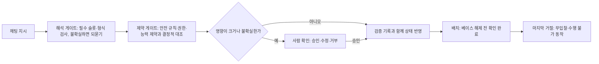

[홈](../../index.md) › 중점 연구 트랙 › [자연어 업무 지시 챗봇](index.md) › 단계 4. 오해석 방지와 확인 절차

# 단계 4. 오해석 방지와 확인 절차

> 단계 상태: 진행 중 · 열린 질문: 13건 · 답한 질문: 1건 · 완료 조건: 미충족 · 마지막 실행: 2026-09-25

## 1. 이 단계에서 밝힐 것

> LLM의 잘못된 해석이 배정·실행으로 이어지기 전에 어디서, 어떤 방법으로 멈추는가.

위 문장은 트랙 정의의 "밝힐 것"이다(트랙 정의의 단계별 밝힐 것과 완료 조건은 [트랙 개요](index.md)의 단계 진행 현황에 정리되어 있다). 조사 결과는 [아이디어 2. 자연어 업무 지시 챗봇](../../ideas/nl-task-chatbot.md)과 [업무 분해·배정 설계 초안](task-model-draft.md)으로 이어진다.

## 2. 질문 목록

이 단계의 시작 질문 4개(q4-01~q4-04)와 앞 단계 실행에서 이 단계로 보낸 질문(q4-05~q4-12), 실행 2026-09-25-79 의 후속 질문(q4-13·q4-14), 실행 2026-09-25-81 의 후속 질문(q4-15·q4-16)이다. q4-01은 사용자 요청의 시작 질문 문구 그대로이고, q4-02~q4-04는 구축자가 이 단계의 밝힐 것에서 정한 시작 질문이다. [가정] 질문 문구와 상태, 답 위치는 [질문 백로그](question-backlog.md)와 일치시키며, 백로그의 "조사 중"은 이 표에서 "열림"으로 표시하고 "폐기"는 표에서 빼고 백로그에만 남긴다. 제기 근거 칸에는 finding id 또는 "사용자"만 쓰고, finding 이 나온 실행 id 는 백로그에 있다. q4-09와 q4-10은 같은 질문이 백로그에 두 번 등록된 것이어서 백로그 정리가 필요하다.

| id | 질문 | 상태 | 제기 근거 | 답한 실행 id | 답 위치 |
|---|---|---|---|---|---|
| q4-01 | LLM의 잘못된 해석이 로봇 배정으로 이어지지 않게 하는 확인 절차는 어떻게 두는가? | 답함 | 사용자 | 2026-09-25-79 | [q4-01 답](#q4-01) |
| q4-02 | 해석 결과를 실행 전에 검증하는 방법(스키마 검증, 온톨로지 제약 대조, 사람 확인, 모의 실행)에는 무엇이 있고 각각 어떤 오류를 잡는가? | 답함 | 사용자 | 2026-09-25-81 | [q4-02 답](#q4-02) |
| q4-03 | 채팅 사용자별 명령 권한(어느 로봇·구역·작업까지 지시할 수 있는가)과 지시·확인의 감사 기록은 어떻게 두는가? | 열림 | 사용자 | | |
| q4-04 | 해석의 불확실성이 클 때 되묻기·사람 승인·실행 보류 같은 제한 운영으로 넘기는 기준은 무엇인가? | 열림 | 사용자 | | |
| q4-05 | LLM 이 허용 동작 목록에 없는 동작이나 존재하지 않는 대상을 분해 결과에 넣을 때, 허용 동작 대응(Huang 외)·assertion(ProgPrompt)·계획기 검사(LLM+P) 같은 기존 장치는 각각 어떤 오류를 걸러내고 무엇을 놓치는가? (q1-01 에서 파생) | 열림 | f14 | | |
| q4-06 | 작업자 음성 피킹의 체크 디지트·스캔처럼 동작 하나하나를 현장에서 확인받는 방식과, 자연어 지시의 해석 결과(작업·대상·로봇)를 배정 전에 요약해 확인받는 방식을 함께 둘 때 각각 어떤 오류를 잡고 확인 부담은 얼마나 늘어나는가? (q1-03 에서 파생) | 열림 | f9 | | |
| q4-07 | 필수 슬롯 누락은 규칙(스키마)으로 검사하고 지시의 모호성은 KnowNo·CLARA 같은 불확실성 추정으로 판단하는 식으로 두 방식을 나눠 쓸 때, 가정용 벤치마크(AmbiK)에서 보고된 모호성 탐지의 낮은 구분 성능이 물류 지시(화물·장소·기한)에서도 나타나는가, 되묻기 횟수와 오배정은 어떻게 달라지는가? (q1-04 에서 파생) | 열림 | f11 | | |
| q4-08 | RACE-Sched·Li·Li 처럼 LLM 이 루프 밖에서 만든 배정·스케줄 규칙을 시뮬레이션·샌드박스에서 검증한 뒤 운영 정책으로 반영할 때, 어떤 검증 기준을 통과해야 반영을 허용하는가? (q3-01 에서 파생) | 열림 | f13 | | |
| q4-09 | 채팅 LLM 에 노출할 도구를 작업 요청 제출 같은 상위 도구로 한정할 때, 어떤 도구 목록과 사용자별 권한을 두어야 능력 질의·배정·검증 게이트를 우회하지 않는가? (q3-02 에서 파생) (관련: q4-03) | 열림 | f20 | | |
| q4-10 | 채팅 LLM 에 노출할 도구를 작업 요청 제출 같은 상위 도구로 한정할 때, 어떤 도구 목록과 사용자별 권한을 두어야 능력 질의·배정·검증 게이트를 우회하지 않는가? (q3-02 에서 파생) | 열림 | f20 | | |
| q4-11 | 배정 실패 원인(능력 부재·일시적 가용 불가·제약 조합 불능·해석 오류)마다 챗봇이 사용자에게 제시할 완화 선택지(기한 완화, 장소·대상 변경, 사람 작업자 처리 전환, 대기)를 어떤 목록으로 두고, 사람 처리 전환이나 기한 완화는 누가 승인하는가? (q3-03 에서 파생) | 열림 | f22 | | |
| q4-12 | 화물을 이미 실었거나 옮긴 작업을 채팅으로 취소할 때 되돌림 보상 작업의 생성·실행을 누가 승인하고, 지시 변경 요약 확인(무엇을 취소하고 무엇이 영향받는가)은 어떤 형식으로 보여 주는가? (q3-04 에서 파생) (관련: oq-021, q4-11) | 열림 | f23 | | |
| q4-13 | 물류 지시에서 사람의 명시적 확인이 필요한 영향이 큰 작업(위험 구역 진입, 적재 화물 취소·되돌림, 일괄 정지, 다른 사람의 진행 작업 우선순위 변경 등)과 암시적 확인으로 충분한 일상 작업을 어떤 기준으로 가르고, 그 기준 목록은 누가 정하고 갱신하는가? (q4-01 에서 파생) (관련: q4-04) | 열림 | f22 | | |
| q4-14 | 현장 안전·권한 규칙(금지 구역, 시간대 제한, 적재 제한)을 Safety Chip·RoboGuard 처럼 시간 논리 제약으로 옮겨 작업·배정 수준에서 대조하려면, 규칙을 공간 그래프·로봇 기능 온톨로지의 어떤 개념으로 표현해야 하는가? (q4-01 에서 파생) | 열림 | f5 | | |
| q4-15 | 해석 결과가 스키마·온톨로지 제약·모의 실행을 모두 통과했지만 사용자 의도와 다른 경우(예: 존재하는 다른 도크를 가리킨 해석)를 사람 확인 외에 해석 되말하기나 SELP 식 동치 투표 같은 방법으로 얼마나 잡을 수 있으며, 그 결과를 사람 확인 대상 선정(q4-13)에 어떻게 쓰는가? (q4-02 에서 파생) | 열림 | f22 | | |
| q4-16 | 배치 전 모의 실행에 허용할 시간 예산(배치 지연 한계) 안에서 무엇을 모의할지(경로 점유, 도크·승강기 예약, 충전 여유), 모의 실행의 초기 상태를 8. 실시간 세계 상태·데이터 일관성의 어느 시점 상태로 잡는지는 어떻게 정하는가? (q4-02 에서 파생) (관련: oq-104) | 열림 | f23 | | |

## 3. 조사 결과

이 단계를 다룬 첫 트랙 실행(2026-09-25-79)이 q4-01 에 답했다. 이 실행은 단계 3 완료가 승인되지 않은 상태에서 지정된 질문으로 단계 4 를 다뤘다.

### q4-01 LLM의 잘못된 해석이 로봇 배정으로 이어지지 않게 하는 확인 절차 {#q4-01}

확인한 자료를 이 위키가 묶으면, 확인 절차는 (1) 해석 게이트: 필수 슬롯·형식 검사와 불확실성 기준에 따른 되묻기, (2) 제약 게이트: 해석 결과·계획·배정을 안전 규칙·권한·능력 제약과 결정적으로 대조, (3) 사람 확인: 영향이 크거나 불확실할 때만 해석 요약을 승인·수정·거부로 받기, (4) 검증 뒤 기록과 함께 상태에 반영, (5) 디스패처·로봇 쪽의 마지막 거절의 다섯 겹으로 두는 구성이 근거가 가장 많은 것으로 보인다. 다섯 겹을 한 번에 제시한 단일 출처는 찾지 못했고, 근거 조건이 가정·실험실 로봇, 소프트웨어 에이전트, 로봇 관제 규격이어서 신뢰도가 낮다. [추정][^ref-356][^ref-350][^ref-698][^ref-700][^ref-702][^ref-417][^ref-695][^ref-696][^ref-697][^ref-711][^ref-656][^ref-031]

위 흐름도는 이 위키가 직접 그린 가설 구성이며 출처의 그림을 옮긴 것이 아니다.

#### 에이전트 설계 지침·도구 규격이 요구하는 사람 확인

- OWASP LLM 애플리케이션 Top 10(2025판, 발행일 2024-11 은 문서 안에서 확인하지 못함)의 과도한 에이전시(Excessive Agency) 항목은 원인을 과도한 기능·과도한 권한·과도한 자율성 셋으로 나누고, 대응으로 영향이 큰 행동 전 사람 승인, 최소 권한, 완전한 중재(complete mediation)를 든다. [사실][^ref-695]
- [모델 컨텍스트 프로토콜](../../glossary/model-context-protocol.md)(Model Context Protocol, MCP) 명세(2025-06-18판) 도구 절은 도구 호출을 거부할 수 있는 사람이 항상 루프에 있어야 한다고(SHOULD) 적고, 클라이언트가 민감한 작업에 사용자 확인을 묻고 서버 호출 전 도구 입력을 사용자에게 보여 주며 도구 사용 감사 기록을 남기도록 권고한다. [사실][^ref-696]
- LangChain 의 [사람 참여 루프(Human-in-the-Loop, HITL)](../../glossary/human-in-the-loop.md) 미들웨어는 설정한 도구 호출에서 에이전트 실행을 멈추고 사람이 승인·인자 수정·거부(피드백 포함)·직접 응답 가운데 하나로 결정하게 하며, 중단 상태를 보존하려면 체크포인터가 필요하다(발행일 미확인, 확인일 2026-09-25 기준). [사실][^ref-697]

#### 로봇 계획·배정 출력의 가드레일

- Safety Chip(Yang 외, ICRA 2024)은 자연어로 준 금지 제약을 선형 시간 논리(LTL) 식으로 옮겨 오토마톤으로 두고, LLM 에이전트의 결정을 감시해 안전하지 않은 동작을 걸러내는 질의 가능한 제약 모듈이며 VirtualHome 과 실제 로봇(Spot)에서 실험했다. 위반 이유를 설명해 재프롬프트에 쓰는 부분은 원문 미열람 논문 요약 기준이고, 논문과 저장소는 같은 저자라 독립 교차가 아니다. [사실][^ref-698][^ref-699]
- RoboGuard 는 미리 정한 안전 규칙을 신뢰 기반 LLM 이 로봇 환경의 의미 그래프에 접지해 시간 논리 안전 명세를 만들고, 후보 계획이 명세와 충돌하면 시간 논리 제어 합성으로 해소하는 2단계 가드레일이다. 저자들은 탈옥 공격 조건에서 안전하지 않은 계획 실행을 92% → 2.5% 미만(저자 보고값, 원문 미열람)으로 줄였다고 보고했다. [사실][^ref-700][^ref-701]
- SafePlan 은 LLM 이 여러 로봇·사람에게 작업 계획·팀 구성·작업 배정을 만드는 시스템에서 프롬프트 건전성 추론기와 불변·전제·사후 조건 추론기로 지시·계획·배정 결과의 안전성을 검사하며, 저자들은 전문가가 만든 지시 벤치마크(621개, 검증 미재확인)에서 유해 작업 수용을 90.5% 줄였다고 보고했다(저자 보고값, 원문 미열람). [사실][^ref-702]
- SafeGate 는 자연어 명령의 안전 속성을 뽑아 결정적 판정으로 실행을 승인·거부하고, 통과한 명령을 불변 조건·가드·중단 조건으로 된 작업 안전 계약으로 분해하는 실행 전 게이트다. 판정 기준인 ISO 13482 는 개인 돌봄 로봇 안전 표준이어서 물류 적용은 미확인이다. [사실][^ref-417]
- 이 연구들은 가정·실험실 로봇 조건이다. 보호 정지 같은 로봇 쪽 안전 기능과 로봇 내부 안전 모듈은 분류 원문 9장의 로봇 자체 지능·제어 경계에 속하는 연계 대상이며, ROP 는 작업·배정 수준의 제약 대조만 맡는 것으로 본다. [추정][^ref-698][^ref-700][^ref-417]

#### 해석 게이트와 검증 뒤 반영

- Rasa 폼은 필수 슬롯을 정해 두고 비어 있는 다음 필수 슬롯을 사용자에게 묻고, 추출한 값을 사용자 정의 검증 동작으로 검사한다(확인일 2026-09-25 기준). [사실][^ref-356]
- KnowNo 는 LLM 계획기가 낸 선택지 가운데 등각 예측으로 정한 문턱을 넘는 것이 둘 이상이면 사람에게 도움을 요청하고 하나면 스스로 실행한다. [사실][^ref-350]
- Tang 외(2026-06)는 산업용 다중 로봇에서 에이전트의 제안을 결정적 검증과 원자적 반영(atomic commit)을 거쳐야만 작업 숲·관리형 블랙보드에 받아들이고 검증 기록을 남기는 구조를 제안했다. [사실][^ref-711]

#### 디스패처·로봇 쪽의 마지막 거절

- VDA 5050 3.0.0(공식 저장소 main 브랜치, 확인일 2026-09-25)은 관제가 로봇에 풀어 준 베이스는 바꿀 수 없어 관제가 이를 이미 실행된 것으로 가정해야 하고 주문 취소도 통신 한계로 신뢰할 수 없다고 보며, 로봇은 수행할 수 없는 동작이 든 주문을 내부 버퍼에 받지 않고 INVALID_ORDER_ACTION 경고로 거절한다. [사실][^ref-031] 이 거절은 로봇 쪽 기능인 연계 대상이며, ROP 는 거절 오류를 받아 확인 절차의 마지막 결과로 처리하는 쪽만 맡는 것으로 본다. [추정][^ref-031]
- Open-RMF 디스패처는 입찰 기간에 어떤 플릿 어댑터도 입찰하지 않으면 작업의 배정 상태를 FailedToAssign 으로 두고 오류를 기록하며, 그 작업은 수행되지 않는다(확인일 2026-09-25 기준). [사실][^ref-656]

#### 사람 승인의 한계와 규제

- He·Demartini·Gadiraju(CHI 2025)는 LLM 에이전트를 계획 후 실행 방식으로 쓰는 일상 비서 과제(위험도가 다른 6개 과제, 참가자 248명)에서 사용자 참여를 조사해, 계획 품질이 높고 실행 단계 사용자 참여가 있을 때는 잘 작동하지만 그럴듯해 보이는 계획에 대해 사용자의 신뢰가 잘못 보정되기 쉬웠다고 보고했다. 물류·로봇 조건은 아니다. [사실][^ref-703][^ref-713]
- 컴퓨터 사용 에이전트의 사람 감독 전략(행동마다 확인, 위험 기반 선택적 승인, 계획 수준 감독)을 비교한 연구(arXiv 2604.04918)는 모든 전략에서 최종 공격 성공률이 상당히 남았고, 감독 전략이 문제 행동을 보이게 하는 데는 영향을 주었지만 보인 뒤 멈추게 하는 데는 영향이 작았다고 보고한 것으로 보인다. 저자 미확인, 원문 미열람, 조건별 수치 미확인이다. [추정][^ref-714]
- EU AI Act 제14조 제4항 (b)호는 고위험 AI 시스템을 감독하는 사람이 시스템 출력에 자동으로·과도하게 의존하는 경향(자동화 편향)을 계속 인식할 수 있게 설계하도록 요구하는 것으로 보인다. EU 공식 관보(EUR-Lex) 원문 미확인, 제3자 조문 게재본·법학 논문 기준이며, 물류 로봇 배정 AI 의 고위험 해당 여부도 미확인이다. [추정][^ref-715][^ref-716]
- 한국 인공지능 발전과 신뢰 기반 조성 등에 관한 기본법(법률 제20676호, 2025-01-21 제정) 제34조는 고영향 인공지능 사업자가 위험관리방안, 설명 방안, 이용자 보호 방안과 함께 사람의 관리·감독 조치를 이행하도록 정한다. [사실][^ref-620] 물류 로봇 배정 AI 가 [고영향 인공지능](../../glossary/high-impact-ai.md)에 해당하는지는 [열린 질문](../../open-questions.md) oq-105 로 남아 있다.
- Sagawa 외(INTERSPEECH 2004)는 음성 대화 시스템의 오류 처리에서 명시적 확인, 최종 확인, 암시적 확인 세 방식을 비교해 사용자 만족과 효율을 평가했다. 결과 우열과 수치는 미확인이다. [사실][^ref-717]

#### 확인 시점·사람 확인의 범위·차등 확인 (이 위키의 종합)

- VDA 5050 에서 풀어 준 베이스는 바꿀 수 없고 취소도 신뢰할 수 없으므로, 해석 확인은 배정 계산 전에, 배정 결과 확인은 배치(베이스 해제) 전에 끝나야 하며, 사람 확인이 필요한 작업은 확인이 날 때까지 배치를 보류하는 중단점으로 두는 것이 선택지로 보인다. [추정][^ref-031][^ref-697][^ref-711]
- 사람 승인만으로 오해석을 걸러내기 어려울 수 있다는 근거는 계획에 대한 신뢰 보정 문제(사실)와, [추정]으로 강등된 감독 전략 비교 요약·자동화 편향 인식 요구 조문 게재본이다. 이를 함께 보면 결정적 게이트를 먼저 두고 사람 확인은 영향이 큰 작업에 한정해 해석 결과와 결정적 검사 결과의 차이를 드러내는 형태로 두는 편이 선택지로 보이나, 근거가 일상 비서·컴퓨터 사용 에이전트 조건이고 물류 관제 요원의 승인 행동을 잰 자료는 찾지 못했다. [추정][^ref-703][^ref-713][^ref-714][^ref-715][^ref-716][^ref-695]
- 확인 방식은 작업의 영향도와 해석 불확실성에 따라 나누어, 영향이 큰 작업은 명시적 확인(승인 전 대기)으로, 일상적 운반 지시는 응답에 해석 결과를 되풀이해 보여 주는 암시적 확인으로 두는 차등 구성이 선택지로 보인다. 영향이 큰 작업의 예(위험 구역 진입·적재 화물 취소·일괄 정지)는 이 위키가 든 설명용 예시(출처 없음)다. [추정][^ref-717][^ref-695][^ref-696][^ref-350]

분류 원문의 이 영역 질문은 다음과 같다.

> 가장 가까운 로봇에 맡기는 것이 전체적으로도 유리한가? [분류원문]

이와 관련해, 확인 화면이 사용자에게 로봇 선택 자체를 고르게 하기보다 해석한 업무(대상·장소·기한)와 디스패처가 쓴 배정 기준(가장 빨리 끝남 등)을 보여 주면, 사람은 해석 오류를 확인하고 배정의 전체 기준 일관성은 결정적 배정기가 지키는 분담이 가능해 보인다. [추정][^ref-656][^ref-697][^ref-696]

상위 업무 시스템 쪽 사례로 Mecalux 는 WMS 에 통합한 대화형 비서가 긴급 주문 출고 같은 WMS 작업을 채팅 요청으로 실행하되 실행 전에 동작과 영향 항목의 요약을 보여 주고 확인을 받는다고 밝힌다. 이는 WMS 제품 기능이며 ROP 에게는 연계 대상의 사례다. [추정] 벤더 주장[^ref-418]

이번에 확인한 확인·가드레일 근거의 평가 환경은 가정 시뮬레이터·실험실 로봇, 일상 비서·컴퓨터 사용 에이전트, 음성 대화 시스템이었고, 물류 창고 로봇에 채팅으로 준 지시의 확인 절차를 평가한 연구와 국내 사례는 한국어 검색을 포함한 검색 범위에서 찾지 못했다(부재의 확인은 아님). [추정][^ref-698][^ref-700][^ref-702][^ref-713][^ref-714]

#### 설명용 시나리오

**물류 흐름 단계:** 피킹

**시나리오:** 피킹 구역 관리자가 채팅으로 준 운반 지시를 확인 절차에 통과시키기

| 항목 | 내용 |
|---|---|
| 시작 조건 | 관리자가 채팅으로 '피킹 끝난 토트를 10시 전까지 2번 도크로'라고 지시한다(설명용 가정 사례). 해석 게이트가 대상·장소·기한 슬롯을 검사해 빠진 값을 되묻는다. [추정][^ref-356][^ref-696] |
| 작업 대상 | 피킹이 끝난 토트(설명용 가정) |
| 수행 자원 | 챗봇은 해석을, 결정적 게이트와 디스패처는 검사와 배정을, 사람은 영향이 큰 작업의 승인을 맡는 분담이 가능해 보인다. [추정][^ref-656][^ref-697][^ref-696] |
| 제약 | 제약 게이트가 지시자의 구역·작업 권한과 도크 도달 가능성을 대조하고, 확인은 베이스 해제 전에 끝낸다. [추정][^ref-696][^ref-711][^ref-031] |
| 완료·인계 | 해당 없음 |
| 예외·성과 | 어떤 플릿도 입찰하지 않으면 배정 상태가 FailedToAssign 으로 기록되고 작업은 수행되지 않는다. [사실][^ref-656] 사람 승인만으로는 오해석을 걸러내기 어려울 수 있다. [추정][^ref-703][^ref-714] |

다음은 설명을 위한 가상의 시나리오이다. 일상 운반이면 챗봇은 해석 요약을 응답에 보여 주고 바로 반영하며, 지시가 다른 사람의 진행 작업 취소를 포함하면 명시적 승인을 받을 때까지 배치를 보류한다. [추정][^ref-356][^ref-696][^ref-711][^ref-031] 지어낸 현장 수치는 쓰지 않았다.

실행 2026-09-25-81 이 q4-02 에 답했다. 이 실행도 단계 3 완료와 단계 전환이 승인되지 않은 상태에서 지정된 질문으로 단계 4 를 다뤘다.

### q4-02 해석 결과를 실행 전에 검증하는 방법과 각 방법이 잡는 오류 {#q4-02}

확인한 자료를 이 위키가 묶으면, 스키마 검증은 형식·필수 항목 누락·허용 값 밖 오류를, 온톨로지·제약 대조는 능력 불일치·필수 정보 누락·안전 불변 조건 위반을, 계획 검증기·형식 논리 검증은 전제 조건 위반·순서 오류·빠진 단계·중복 행동을, 모의 실행은 실행 불가 동작·잠재 실패·물리적 불가능을, 사람 확인은 형식·제약은 맞지만 사용자 의도와 다른 해석을 주로 잡고, 로봇 관제 쪽 거절(연계 대상)은 형식·능력·경로·지도·운용 모드 오류를 마지막으로 잡는 분담으로 정리되는 것으로 보인다. [추정][^ref-773][^ref-362][^ref-459][^ref-785][^ref-702][^ref-777][^ref-778][^ref-416][^ref-781][^ref-782][^ref-713][^ref-031] 다섯 방법을 같은 조건에서 비교한 단일 출처는 찾지 못했고 근거 환경이 물류 플릿 조건이 아니어서 신뢰도가 낮다. 이 방법들은 [q4-01 답](#q4-01)의 다섯 겹 확인 절차 가운데 해석 게이트·제약 게이트·사람 확인·마지막 거절에 들어가는 검사 수단에 해당한다.

아래 표는 각 출처의 보고를 이 위키가 대응시켜 구성한 것이다. [추정][^ref-773][^ref-362][^ref-785][^ref-777][^ref-786][^ref-416][^ref-781][^ref-713][^ref-031]

| 방법 | 주로 잡는 오류 | 놓칠 수 있는 오류 | 맡는 쪽 |
|---|---|---|---|
| 스키마 검증 | 형식, 필수 항목 누락, 허용 값 밖 | 형식은 맞지만 값이 틀린 해석(존재하는 다른 도크 번호 등) | ROP(해석 게이트) |
| 온톨로지·제약 대조 | 능력 불일치, 필수 정보 누락, 안전 불변 조건 위반 | 온톨로지·명세 자체가 틀린 경우 | ROP(제약 게이트) |
| 계획 검증기·형식 논리 검증 | 전제 조건 위반, 순서 오류, 빠진 단계, 중복 행동 | 명세가 틀리거나 LLM 이 명세를 잘못 옮긴 경우 | ROP(제약 게이트) |
| 모의 실행 | 실행 불가 동작, 잠재 실패, 물리적 불가능 | 모델 충실도 밖의 상황 | ROP(가정한 미래를 실험하는 기능) |
| 사람 확인 | 형식·제약은 맞지만 사용자 의도와 다른 해석 | 그럴듯한 계획에 대한 잘못된 신뢰 | 사람 |
| 로봇 관제 쪽 거절 — 연계 대상(로봇 쪽 기능) | 형식, 쓸 수 없는 선택 필드, 수행 불가 동작, 도달 불가 노드, 모르는 지도, 주문을 받지 않는 운용 모드 | 미확인 | 로봇(ROP 는 오류를 받아 처리하는 쪽만) |

위 표는 출처별 보고를 이 위키가 대응시킨 종합이며 같은 조건에서 비교한 출처는 없다. 출처의 표를 옮긴 것이 아니다.

#### 스키마 검증

- JSON Schema 검증 어휘(json-schema-spec 저장소 main 브랜치의 차기판 초안, 발행일 미확인, 확인일 2026-09-25 기준)는 인스턴스의 자료형, 허용 값(enum·const), 수치 범위, 문자열 패턴, 필수 속성(required), 조건부 필수 속성(dependentRequired), 배열·객체 크기 제한을 검사한다. 게시된 2020-12 판과의 문구 차이는 미확인이다. [사실][^ref-773]
- OpenAI 는 구조화 출력이 모델 출력을 개발자가 준 JSON 스키마에 맞추도록 보장한다고 설명하면서도, 모델이 JSON 객체의 값 안에서는 여전히 실수할 수 있다고 밝힌다(2024-08 발표). [추정] 벤더 주장[^ref-362]
- JSONSchemaBench 는 실제 JSON 스키마 약 1만 개로 제약 디코딩(constrained decoding) 프레임워크를 효율·범위(지원하는 스키마 기능)·품질(과제 정확도에 주는 영향) 세 측면에서 평가하는 벤치마크다(2025-01). [사실][^ref-774][^ref-775] 평가 대상 여섯 프레임워크(Guidance·Outlines·Llamacpp·XGrammar·OpenAI·Gemini) 목록은 원문을 열지 못한 논문 요약 기준이며, README 와 논문은 같은 저자 그룹이라 독립 교차 확인이 아니다.

#### 온톨로지·제약 대조

- W3C SHACL(2017 권고안, 이번 실행에서는 원문 미열람)은 검증 결과를 적합 여부와 결과 목록으로 된 검증 보고로 내고, 결과마다 초점 노드·속성 경로·문제 값·사람이 읽는 메시지·심각도를 담을 수 있다. [사실][^ref-459]
- Köcher·da Silva·Fay(IEEE INDIN 2021, 원문 미열람)는 온톨로지로 기술한 기계 스킬에 SHACL 제약을 걸어, 실행에 필요한 필수 정보가 빠진 잘못 모델링된 스킬을 가려내 수정 대상으로 표시하는 방법을 제시했다. [사실][^ref-785]
- Electronics(2026-08-11, 원문 미열람) 논문은 이종 로봇 배정에서 플릿 구성과 물품의 적재 상태가 실행 가능성에 영향을 준다고 보고, 온톨로지 기반 판정 결과(ReasonerOutput)가 여러 배정기에서 공통 실행 가능성 제약으로 작동했다고 보고했다(저자 보고). [사실][^ref-236]
- [q4-01 답](#q4-01)에서 본 SafePlan 은 LLM 이 만든 지시·작업 계획·작업 배정 결과를 프롬프트 건전성 추론기와 불변·전제·사후 조건 추론기로 각각 검사한다. [사실][^ref-702]

#### 계획 검증기·형식 논리 검증

- Guan 외(NeurIPS 2023)는 LLM 이 PDDL 도메인 모델을 만들고 건전한 도메인 독립 계획기로 계획하되, LLM 이 처음부터 완전한 모델을 만들지 못하는 문제를 PDDL 검증기와 사람의 교정 피드백으로 다뤘고, 교정한 모델로 48개 계획 과제를 풀었다고 보고했다(저자 보고, 원문 미열람, 48개 과제 조건). [사실][^ref-777]
- KCL-Planning 의 VAL 저장소는 PDDL 계획과 계획 모델(연속 효과·파생 술어·시간 지정 초기 리터럴 포함)을 다루는 계획 검증 도구를 공개한다(발행일 미확인, 확인일 2026-09-25 기준). 검증 실패 시 보고 형식은 README 에서 확인하지 못했다. [사실][^ref-776]
- VerifyLLM(2025-07)은 과제 기술을 선형 시간 논리(LTL) 식으로 옮긴 뒤 LLM 이 행동 순서를 슬라이딩 윈도로 분석해 실행 전에 위치 오류·빠진 전제 행동·중복 행동을 찾아 재정렬·추가·삭제로 고친다(저자 보고, 원문 미열람, 가정 환경 평가). [사실][^ref-778]
- SELP(2024-09)는 자연어 명령에서 여러 LTL 식을 뽑아 동치인 식끼리 묶는 동치 투표와, LTL 식을 뷔히 오토마톤으로 바꿔 명세와 어긋나는 토큰을 가리는 제약 디코딩을 쓰며, 저자들은 드론 항법에서 안전율 10.8%, 로봇 조작에서 20.4% 개선을 보고했다(저자 보고, 원문 미열람, 드론 항법·로봇 조작 조건). [사실][^ref-786]

#### 모의 실행

- SayPlan(2023-07)은 LLM 이 만든 초기 계획을 장면 그래프 시뮬레이터의 피드백으로 반복 검증·수정해 환경의 술어·제약과 맞지 않는 실행 불가 동작을 고치며, 저자들은 거의 완전한 실행 가능성(near-perfect executability)을 보고했다(사무실·가정 3D 장면 그래프 조건, 원문 미열람). [사실][^ref-416]
- CAPE(ICRA 2024)는 동작을 실행할 수 없을 때 전제 조건 오류 정보를 LLM 에 다시 주어 교정 동작을 얻으며, VirtualHome 에서 사람 주석 계획 정확도를 SayCan 대비 28.89% 에서 49.63% 로 높였다고 보고했다(저자 보고, 원문 미열람, VirtualHome·Spot 로봇 조건). [사실][^ref-780]
- SIMMER(2026-06)는 실행을 즉시 멈추지 않지만 목표 달성을 조용히 해치는 잠재 실패(latent failure)를 주방 기호 세계 모델(동작 77개·객체 262개)로 평가하며, 저자들은 오류 없는 계획이 20% 미만, 잠재 실패를 포함한 계획이 29~56% 였고 반사실적 예견 시뮬레이션으로 잠재 실패를 최대 72% 줄였다고 보고한 것으로 보인다. 동료심사 전 프리프린트의 저자 보고이며 원문 미열람, 평가한 모델 수는 미확인이다. [추정][^ref-781]
- Lee 외(Applied Sciences 16(8), 2026-04, 원문 미열람)는 LLM 이 만든 로봇 프로그램이 공간적으로 일관되지 않은 명령과 동역학적으로 불가능한 동작 같은 물리적 환각에 취약하다고 보고, 구조화된 중간 작업 표현으로 공간 접지·로봇 선택·실행 전 동역학 검증을 거친 뒤 제조사별 코드를 만드는 디지털 트윈 통합 검증 틀을 제안했다. [사실][^ref-782] 실행 전 동역학 검증·동작 스케일링은 분류 원문 9장의 로봇 자체 지능·제어 경계에 속하는 연계 대상이며, ROP 쪽 검증은 로봇 선택·공간 접지 수준으로 보는 것이 맞아 보인다. [추정][^ref-782]
- Ko·Lin(2026-09, 프리프린트, 원문 미열람)의 제안–검증–결정 흐름은 로컬 LLM 이 운영자 의도를 구조화 요구로 바꾸고 후보 전략을 낸 뒤 의미 검사·시뮬레이션 실행·운영 제약 검사를 거쳐 사람이 결정하게 하며, 잘못된 입력의 올바른 거부 7/8, 자율 전략 성공 3/10 을 보고했다(저자 보고값, 검증 미재확인, 가상 분류 라인 30개 고정 시험 기록). [사실][^ref-784]
- Deng 외(2025-06, 원문 미열람)는 건설 현장 다중 로봇 배정을 정수계획으로 풀고 LLM 이 자연어 상황 서술에서 최적화 제약·파라미터를 갱신하며 디지털 트윈이 현장과 동기화되는 틀을 제안했고, 상위 LLM 들이 제약·파라미터 추출에서 97% 넘는 정확도를 보였다고 보고했다(저자 보고, 건설 사례라 업종별 조건이며 방법 근거로만 쓴다). [사실][^ref-783]
- 개별 지시의 실행 전 모의 실행은 가정한 미래를 실험하는 기능이므로 [22. 시뮬레이션·예측용 디지털 트윈](../../categories/f-deployment-verification-and-maintenance/22-simulation-and-predictive-digital-twin.md)에 속하고, 그 초기 상태는 [8. 실시간 세계 상태·데이터 일관성](../../categories/b-common-information-and-environment-model/08-real-time-world-state-and-data-consistency.md)이 표현하는 현재 상태에서 가져오되 모의 실행 결과를 현재 상태처럼 반영하지 않도록 구분해야 할 것으로 보인다. [추정][^ref-416][^ref-782][^ref-784][^ref-783]

#### 사람 확인과 LLM 판정자

- Hariharan 외(NeurIPS 2025 워크숍)는 판정자 LLM 이 행동 순서를 비평하고 계획자 LLM 이 고치는 반복 검증으로 불필요한 행동·모순·빠진 단계를 찾아 재현율 최대 90%, 정밀도 100% 를 보고했다(저자 보고, 원문 미열람, TEACh 수동 주석 행동 조건). [사실][^ref-779]
- 사람 확인이 잡는 오류와 그 한계는 새로 서술하지 않고 [q4-01 답](#q4-01)의 사람 승인의 한계 서술로 연결한다.[^ref-713][^ref-697]

#### 로봇 관제 쪽 마지막 거절 (연계 대상)

- VDA 5050 3.0.0(공식 저장소 main 브랜치, 확인일 2026-09-25)은 로봇이 주문을 받기 전 형식 오류(VALIDATION_FAILURE), 쓸 수 없는 선택 필드(UNSUPPORTED_PARAMETER), 수행할 수 없는 동작(INVALID_ORDER_ACTION), 도달할 수 없는 노드(NO_ROUTE_TO_TARGET), 모르는 지도(UNKNOWN_MAP_ID), 범위 밖 시작 노드(START_NODE_OUT_OF_RANGE), 주문을 받지 않는 운용 모드(MOBILE_ROBOT_NOT_AVAILABLE)를 서로 다른 오류 유형으로 보고하고 주문을 내부 버퍼에 받지 않게 한다. 오류 수준은 UNSUPPORTED_PARAMETER 만 CRITICAL 이고 나머지는 WARNING 이다. [사실][^ref-031]
- 주문 거절은 로봇 쪽 기능인 연계 대상이며, ROP 는 이 오류 유형을 받아 확인 절차의 마지막 결과로 처리하는 쪽만 맡는 것으로 본다. [추정][^ref-031]

#### 방법별로 놓치는 오류 (이 위키의 종합)

- 스키마 검증은 형식은 맞지만 값이 틀린 해석을, 제약 대조와 계획 검증은 온톨로지·명세 자체가 틀리거나 LLM 이 명세를 잘못 옮긴 경우를, 모의 실행은 모델 충실도 밖의 상황을, 사람 확인은 그럴듯한 계획에 대한 잘못된 신뢰를 놓칠 수 있어, 한 방법만으로는 해석 오류를 걸러내기 어려운 것으로 보인다. '존재하는 다른 도크 번호'는 설명용 예시다. [추정][^ref-362][^ref-777][^ref-786][^ref-781][^ref-713]

#### 설명용 시나리오

다음은 설명을 위한 가상의 시나리오이다(설명용 가정 사례, 현장 수치 없음).

**물류 흐름 단계:** 피킹

**시나리오:** 피킹 구역 관리자의 운반 지시를 검증 방법별로 거르기

| 항목 | 내용 |
|---|---|
| 시작 조건 | 관리자가 채팅으로 '피킹 끝난 토트를 10시 전까지 2번 도크로'라고 지시한다. 스키마 검증은 기한 슬롯 누락 같은 형식 오류를 잡을 수 있어 보인다. [추정][^ref-773] |
| 작업 대상 | 피킹이 끝난 토트(설명용 가정) |
| 수행 자원 | 온톨로지 제약 대조는 토트를 운반할 수 없는 로봇 후보를 거를 수 있어 보인다. [추정][^ref-785] 배정 결과를 배치 전에 모의 실행이나 최적화 모델의 제약 검사로 확인하면 최근접 배정이 뒤이은 요청의 대기·충돌을 키우는지 드러낼 수 있어 보이나, 물류 플릿에서 잰 자료는 찾지 못했다. [추정][^ref-783][^ref-784][^ref-416] |
| 제약 | 모의 실행은 도착 예정 시각의 도크 점유·경로 차단을 잡을 수 있어 보인다. [추정][^ref-416] |
| 완료·인계 | 해당 없음 |
| 예외·성과 | 관리자가 실제로 뜻한 도크가 3번이면 사람 확인이, 모르는 지도·도달 불가 노드는 로봇 관제 쪽 거절(연계 대상)이 잡을 수 있어 보인다. [추정][^ref-713][^ref-031] |

한 지시에서도 오류 종류마다 잡는 방법이 달라, 확인 절차는 여러 검사를 겹쳐 두는 구성이 선택지로 보인다. [추정][^ref-773][^ref-785][^ref-416][^ref-713][^ref-031]

#### 분류 원문 질문과의 연결

> 가장 가까운 로봇에 맡기는 것이 전체적으로도 유리한가? [분류원문]

배정 결과를 배치 전에 모의 실행이나 최적화 모델의 제약 검사로 확인하면 최근접 배정이 뒤이은 요청의 대기·충돌을 키우는지 실행 전에 드러낼 수 있어 보이나, 이를 물류 플릿에서 잰 자료는 찾지 못했다([열린 질문](../../open-questions.md) oq-052 와 같은 방향). [추정][^ref-783][^ref-784][^ref-416]

#### 근거 공백

이번에 확인한 실행 전 검증 근거의 평가 환경은 가정·주방 시뮬레이터, 도구 호출 JSON 스키마, 건설 현장, 다품종 소량 생산 셀, 가상 분류 라인이었고, 물류 창고 로봇에 채팅으로 준 지시의 검증 방법을 비교한 연구와 국내 연구·사례는 한국어 검색 2회를 포함한 검색 범위에서 찾지 못했다(부재의 확인은 아님). [추정][^ref-778][^ref-781][^ref-782][^ref-783][^ref-784]

## 4. 결론과 남은 불확실성

**결론**
- 에이전트 설계 지침과 도구 규격(OWASP 과도한 에이전시 항목, MCP 도구 명세, LangChain 사람 참여 미들웨어)은 영향이 큰 행동 전 사람 승인·호출 전 입력 표시·승인·수정·거부 결정을 요구하거나 제공한다. [사실][^ref-695][^ref-696][^ref-697]
- LLM 로봇 계획·배정 출력을 형식 논리·결정적 판정으로 거르는 가드레일 연구(Safety Chip, RoboGuard, SafePlan, SafeGate)가 있으며, 그중 SafePlan 은 배정 결과까지 검사한다. [사실][^ref-698][^ref-700][^ref-702][^ref-417]
- 확인 절차는 다섯 겹(해석 게이트, 제약 게이트, 사람 확인, 검증 뒤 반영, 마지막 거절)으로 두고, 확인은 배치(베이스 해제) 전에 끝내며, 사람 확인은 영향이 크거나 불확실한 작업에 한정하는 구성이 선택지로 보인다(이 위키의 종합, 신뢰도 low). [추정][^ref-356][^ref-695][^ref-711][^ref-031][^ref-656]
- JSON Schema 검증 어휘는 자료형·허용 값·수치 범위·필수 속성 같은 구조를 검사하고 [사실][^ref-773] VDA 5050 3.0.0 은 로봇의 주문 거절 사유를 서로 다른 오류 유형으로 보고한다. [사실][^ref-031]
- 실행 전 검증 방법(스키마 검증, 온톨로지·제약 대조, 계획 검증기·형식 논리 검증, 모의 실행, 사람 확인)은 서로 다른 오류를 잡고 각각 놓치는 오류가 있어 한 방법만으로는 해석 오류를 걸러내기 어려운 것으로 보인다(이 위키의 종합, 신뢰도 low). [추정][^ref-773][^ref-785][^ref-777][^ref-416][^ref-713][^ref-031]
- 개별 지시의 모의 실행은 22. 시뮬레이션·예측용 디지털 트윈의 기능이고 초기 상태는 8. 실시간 세계 상태·데이터 일관성에서 가져오는 구분이 분류 원문 7장과 맞는 것으로 보인다. [추정][^ref-416][^ref-782]

**남은 불확실성**
- 다섯 겹 확인 절차와 방법별 포착·놓침 분담을 한 번에 제시한 단일 출처가 없고, 근거가 물류 플릿 조건이 아니다.
- RoboGuard 수치(92% → 2.5% 미만)와 SafePlan 수치(90.5%, 621개)는 원문 미열람 저자 보고값이며 SafePlan 저자는 미확인이다.
- q4-02 근거 수치(SELP, CAPE, Guan 외, Hariharan 외, SIMMER, Ko·Lin, Deng 외)는 모두 원문 미열람 저자 보고값이다. SIMMER 는 동료심사 전 프리프린트이며 평가한 모델 수는 미확인이고, Ko·Lin 의 거부·성공 수치는 검증에서 다시 확인하지 못했다.
- JSONSchemaBench 의 여섯 프레임워크 목록은 원문 미열람 논문 요약 기준이고, README 와 논문은 같은 저자 그룹이라 독립 교차 확인이 아니다.
- JSON Schema 는 main 브랜치 차기판 초안 기준이며 게시된 2020-12 판과의 문구 차이는 미확인이다. VAL 의 검증 실패 보고 형식도 미확인이다. VerifyLLM·SELP 의 저자 목록은 미확인이다.
- OWASP 문서의 발행일(2024-11)은 문서 안에서 확인하지 못했다.
- 감독 전략 비교 연구의 내용과 조건별 수치, Sagawa 외 비교의 우열은 미확인이다.
- EU AI Act 제14조는 공식 관보 원문을 확인하지 못했고, 인공지능기본법 제34조의 시행령 세부와 물류 배정 AI 의 고영향 해당 여부(oq-105)는 미확인이다.
- 명령 권한(q4-03)과 제한 운영 기준(q4-04)은 아직 조사하지 않았다.
- [업무 분해·배정 설계 초안](task-model-draft.md)은 v0.8 그대로다. 제안된 개념 '사용자 확인'(실행 2026-09-25-79)과 결정적 검사만 담도록 경계를 좁혀 다시 제안된 개념 '검증 기록'(실행 2026-09-25-81)은 서로의 경계와 배정 속성 '확인 여부'와의 경계가 정해지지 않았고 근거에 추정·원문 미열람이 섞여 초안 6절의 질문으로 두었다.

## 5. 이 단계가 낳은 후속 질문

| 새 질문 id | 질문 | 보낼 단계 | 근거 finding id | 상태 |
|---|---|---|---|---|
| q4-13 | 물류 지시에서 사람의 명시적 확인이 필요한 영향이 큰 작업(위험 구역 진입, 적재 화물 취소·되돌림, 일괄 정지, 다른 사람의 진행 작업 우선순위 변경 등)과 암시적 확인으로 충분한 일상 작업을 어떤 기준으로 가르고, 그 기준 목록은 누가 정하고 갱신하는가? (관련: q4-04) | 단계 4. 오해석 방지와 확인 절차 | f22(실행 2026-09-25-79) | 열림 |
| q4-14 | 현장 안전·권한 규칙(금지 구역, 시간대 제한, 적재 제한)을 Safety Chip·RoboGuard 처럼 시간 논리 제약으로 옮겨 작업·배정 수준에서 대조하려면, 규칙을 공간 그래프·로봇 기능 온톨로지의 어떤 개념으로 표현해야 하는가? | 단계 4. 오해석 방지와 확인 절차 | f5(실행 2026-09-25-79) | 열림 |
| q5-10 | 물류 지시 시나리오에서 관제 요원의 승인 지연 시간·거부율·수정률을 재어 승인 피로와 자동화 편향이 나타나는지, 확인 요약에 결정적 검사 결과를 함께 보이면 잘못된 지시를 멈추는 비율이 달라지는지를 어떤 실험으로 측정하는가? | 단계 5. 검증 방법과 가설 판정 | f21(실행 2026-09-25-79) | 열림 |
| q4-15 | 해석 결과가 스키마·온톨로지 제약·모의 실행을 모두 통과했지만 사용자 의도와 다른 경우(예: 존재하는 다른 도크를 가리킨 해석)를 사람 확인 외에 해석 되말하기나 SELP 식 동치 투표 같은 방법으로 얼마나 잡을 수 있으며, 그 결과를 사람 확인 대상 선정(q4-13)에 어떻게 쓰는가? | 단계 4. 오해석 방지와 확인 절차 | f22(실행 2026-09-25-81) | 열림 |
| q4-16 | 배치 전 모의 실행에 허용할 시간 예산(배치 지연 한계) 안에서 무엇을 모의할지(경로 점유, 도크·승강기 예약, 충전 여유), 모의 실행의 초기 상태를 8. 실시간 세계 상태·데이터 일관성의 어느 시점 상태로 잡는지는 어떻게 정하는가? (관련: oq-104) | 단계 4. 오해석 방지와 확인 절차 | f23(실행 2026-09-25-81) | 열림 |
| q5-11 | 물류 지시에 오류(기한 누락, 없는 도크, 운반 불가 화물, 뜻과 다른 도크, 점유된 경로)를 주입한 시험 세트로 스키마 검증·온톨로지 제약 대조·계획 검증·모의 실행·사람 확인 각각의 오류 포착률과 확인 비용을 어떻게 재는가? | 단계 5. 검증 방법과 가설 판정 | f21(실행 2026-09-25-81) | 열림 |

## 6. 완료 조건 충족 현황

충족 여부는 리서치 에이전트의 자체 평가를 스토리텔러 에이전트가 옮겨 적은 값이고, 최종 판정은 내용 검증 에이전트가 한다. 둘이 다르면 검증 판정을 따른다.

| 완료 조건 | 충족 여부 | 근거 | 검증 판정 |
|---|---|---|---|
| 실행 전 검증 단계를 담은 확인 절차 초안이 [업무 분해·배정 설계 초안](task-model-draft.md)의 미해결 모델링 질문과 [아이디어 2. 자연어 업무 지시 챗봇](../../ideas/nl-task-chatbot.md)의 "5. 구현 가설" 절에 반영됨 | 미충족 | [q4-01 답](#q4-01)의 다섯 겹 확인 절차와 [q4-02 답](#q4-02)의 검증 방법별 포착 오류를 초안 6절 질문과 아이디어 5절 소절로 반영했으나 2차 검증 전이고 근거가 추정(신뢰도 low)이다 | 미충족 · 미승인 |
| 명령 권한을 담은 확인 절차 초안이 같은 두 곳에 반영됨 | 미충족 | q4-03 미조사 | 미충족 · 미승인 |
| 제한 운영 기준을 담은 확인 절차 초안이 같은 두 곳에 반영됨 | 미충족 | q4-04 미조사 | 미충족 · 미승인 |

다음 단계로 전환: 아니오(명령 권한 q4-03·제한 운영 기준 q4-04 미조사, 열린 질문 q4-03~q4-14)

## 7. 관련 세부영역

이 트랙은 분류를 바꾸지 않는다. 확인된 사실은 세부영역 페이지를 직접 고치지 않고 [트랙 로그](log.md)의 "세부영역 반영 제안"으로 남기며, 반영은 다음 해당 영역 실행에서 한다. 교차 규칙에 따라 LLM 가드레일·확인 절차와 LLM 출력 검증은 27. AI·학습·적응과 모델 운영과 적용 대상 13. 작업 배정 — MRTA·18. 사람–로봇 협업·운영 인터페이스 양쪽에 연결한다. 프런트매터 `related_areas`는 아래 목록과 같다.

- [27. AI·학습·적응과 모델 운영](../../categories/g-safety-security-intelligence-and-governance/27-ai-learning-adaptation-and-model-operations.md) — LLM 로봇 계획의 형식 논리 가드레일과 사람의 관리·감독 규정(실행 2026-09-25-79), 구조화 출력·제약 디코딩의 범위와 한계·LTL 제약 디코딩·판정자 LLM 과 방법별로 놓치는 오류(실행 2026-09-25-81)를 6. 대표 접근법과 기술에 반영 제안
- [13. 작업 배정 — MRTA](../../categories/d-planning-and-optimization/13-task-allocation-mrta.md) — 배정 출력의 실행 전 검사와 디스패처·로봇 쪽 마지막 거절, 실행 가능성 판정·불변 조건 추론·정수계획 배정과 배치 전 모의 실행으로 최근접 배정의 영향을 드러내는 가능성을 6. 대표 접근법과 기술에 반영 제안
- [18. 사람–로봇 협업·운영 인터페이스](../../categories/e-collaboration-and-field-operations/18-human-robot-collaboration-and-operator-interface.md) — 승인·수정·거부 확인 인터페이스와 사람 승인의 한계, 명시적·암시적 확인을 6. 대표 접근법과 기술에 반영 제안
- [23. 시험·형식 검증·벤치마크](../../categories/f-deployment-verification-and-maintenance/23-testing-formal-verification-and-benchmarking.md) — LLM 계획의 실행 전 검증 방법(PDDL 계획 검증기, LTL 기반 검증, 제약 디코딩 벤치마크, 잠재 실패 벤치마크, LLM 판정자)을 6. 대표 접근법과 기술에 반영 제안
- [22. 시뮬레이션·예측용 디지털 트윈](../../categories/f-deployment-verification-and-maintenance/22-simulation-and-predictive-digital-twin.md) — 개별 지시·계획의 실행 전 모의 실행(장면 그래프 시뮬레이터, 디지털 트윈 검증)을 초기 상태는 8. 실시간 세계 상태·데이터 일관성에서 받는다는 구분과 함께 6. 대표 접근법과 기술에 반영 제안
- [8. 실시간 세계 상태·데이터 일관성](../../categories/b-common-information-and-environment-model/08-real-time-world-state-and-data-consistency.md) — 모의 실행의 초기 상태가 되는 현재 상태를 표현한다(이번 실행 반영 제안 없음, 22. 시뮬레이션·예측용 디지털 트윈 제안에 구분을 함께 적음)
- [26. 사이버보안·접근권한·개인정보](../../categories/g-safety-security-intelligence-and-governance/26-cybersecurity-access-control-and-privacy.md) — 과도한 에이전시의 원인과 최소 권한·완전한 중재, 도구 명세의 접근 통제·감사 기록을 6. 대표 접근법과 기술에 반영 제안(실행 2026-09-25-79)
- [25. 안전·위험 관리](../../categories/g-safety-security-intelligence-and-governance/25-safety-and-risk-management.md) — 오해석이 위험한 동작으로 이어지지 않게 안전 조건을 확인 절차에 넣는다(이번 실행 반영 제안 없음)
- [12. 명령·작업 실행의 신뢰성](../../categories/c-connectivity-and-execution-foundation/12-command-and-task-execution-reliability.md) — 베이스 해제 뒤 변경 불가·취소 불신이 확인 시점을 정한다(이번 실행 반영 제안 없음)

## 8. 출처

[^ref-031]: VDA / VDMA (VDA5050 GitHub), VDA5050/VDA5050_EN.md — Official Specification document for the VDA 5050, 미확인, https://github.com/VDA5050/VDA5050/blob/main/VDA5050_EN.md, 접근일 2026-09-25
[^ref-350]: Ren, A. Z. 외(Google DeepMind·Princeton University, KnowNo 프로젝트), Robots That Ask For Help: Uncertainty Alignment for Large Language Model Planners — project page (robot-help.github.io), 미확인, https://robot-help.github.io/, 접근일 2026-09-25 (원문 미열람)
[^ref-356]: Rasa Technologies (RasaHQ/rasa GitHub), Forms — Rasa documentation (docs/docs/forms.mdx), 미확인, https://github.com/RasaHQ/rasa/blob/main/docs/docs/forms.mdx, 접근일 2026-09-25 (원문 미열람)
[^ref-417]: Obi, I., Venkatesh, V. L. N., Wang, W., Wang, R., Suh, D., Amosa, T. I., Jo, W., & Min, B.-C.(Purdue University SMART Lab), Pre-Execution Safety Gate & Task Safety Contracts for LLM-Controlled Robot Systems, 2026-04, https://arxiv.org/abs/2604.05427, 접근일 2026-09-25 (원문 미열람)
[^ref-418]: Mecalux, Mecalux integrates generative AI into Easy WMS, 미확인, https://www.mecalux.com/news/generative-ai-easy-wms-mecalux, 접근일 2026-09-25 (원문 미열람)
[^ref-656]: Open Robotics (open-rmf), rmf_ros2 — rmf_task_ros2/src/rmf_task_ros2/Dispatcher.cpp, 미확인, https://github.com/open-rmf/rmf_ros2/blob/main/rmf_task_ros2/src/rmf_task_ros2/Dispatcher.cpp, 접근일 2026-09-25 (원문 미열람)
[^ref-711]: Tang, G. 외(arXiv 2606.31339), Verification-Gated Agentic Mission-State Governance for Intelligent Industrial Multi-Robot Systems, 2026-06, https://arxiv.org/abs/2606.31339, 접근일 2026-09-25 (원문 미열람)
[^ref-695]: OWASP Top 10 for LLM Applications 프로젝트 (OWASP GitHub), LLM06:2025 Excessive Agency (2_0_vulns/LLM06_ExcessiveAgency.md), 2024-11, https://github.com/OWASP/www-project-top-10-for-large-language-model-applications/blob/main/2_0_vulns/LLM06_ExcessiveAgency.md, 접근일 2026-09-25
[^ref-696]: Model Context Protocol (modelcontextprotocol GitHub), Specification 2025-06-18 — Server Features: Tools (docs/specification/2025-06-18/server/tools.mdx), 2025-06-18, https://github.com/modelcontextprotocol/modelcontextprotocol/blob/main/docs/specification/2025-06-18/server/tools.mdx, 접근일 2026-09-25
[^ref-697]: LangChain (langchain-ai/docs GitHub), Human-in-the-loop — LangChain docs (src/oss/langchain/human-in-the-loop.mdx), 미확인, https://docs.langchain.com/oss/python/langchain/human-in-the-loop, 접근일 2026-09-25
[^ref-698]: Yang, Z. 외(Brown University H2R Lab), Plug in the Safety Chip: Enforcing Constraints for LLM-driven Robot Agents, 2023-09, https://arxiv.org/abs/2309.09919, 접근일 2026-09-25 (원문 미열람)
[^ref-699]: YzyLmc (Safety Chip 공식 저장소), ltl_safety — README (Plug in the Safety Chip), 미확인, https://github.com/YzyLmc/ltl_safety, 접근일 2026-09-25
[^ref-700]: Ravichandran, Z., Robey, A., Kumar, V., Pappas, G. J., & Hassani, H.(IEEE RA-L 2026 채택 표기), Safety Guardrails for LLM-Enabled Robots, 2025-03, https://arxiv.org/abs/2503.07885, 접근일 2026-09-25 (원문 미열람)
[^ref-701]: KumarRobotics (RoboGuard 공식 저장소), RoboGuard — Safety guardrails for LLM-enabled robots (GitHub README), 미확인, https://github.com/KumarRobotics/RoboGuard, 접근일 2026-09-25
[^ref-702]: SafePlan 저자(arXiv 2503.06892, 저자 미확인), SafePlan: Leveraging Formal Logic and Chain-of-Thought Reasoning for Enhanced Safety in LLM-based Robotic Task Planning, 2025-03, https://arxiv.org/abs/2503.06892, 접근일 2026-09-25 (원문 미열람)
[^ref-703]: RichardHGL (CHI 2025 Plan-then-Execute 공식 저장소), CHI2025_Plan-then-Execute_LLMAgent — README, 미확인, https://github.com/RichardHGL/CHI2025_Plan-then-Execute_LLMAgent, 접근일 2026-09-25
[^ref-713]: He, G., Demartini, G., & Gadiraju, U., Plan-Then-Execute: An Empirical Study of User Trust and Team Performance When Using LLM Agents As A Daily Assistant, 2025-04, https://dl.acm.org/doi/10.1145/3706598.3713218, 접근일 2026-09-25 (원문 미열람)
[^ref-714]: arXiv 2604.04918 저자(미확인), Comparing Human Oversight Strategies for Computer-Use Agents, 2026-04, https://arxiv.org/abs/2604.04918, 접근일 2026-09-25 (원문 미열람)
[^ref-715]: Future of Life Institute (artificialintelligenceact.eu, EU 규정 2024/1689 조문 게재본), Article 14: Human Oversight — EU Artificial Intelligence Act, 2024, https://artificialintelligenceact.eu/article/14/, 접근일 2026-09-25 (원문 미열람)
[^ref-716]: arXiv 2502.10036 저자(미확인), Automation Bias in the AI Act: On the Legal Implications of Attempting to De-Bias Human Oversight of AI, 2025-02, https://arxiv.org/abs/2502.10036, 접근일 2026-09-25 (원문 미열람)
[^ref-620]: 국가법령정보센터(법제처), 인공지능 발전과 신뢰 기반 조성 등에 관한 기본법 (법률 제20676호, 2025-01-21), 2025-01-21, https://www.law.go.kr/lsInfoP.do?lsiSeq=268543, 접근일 2026-09-25 (원문 미열람)
[^ref-717]: Sagawa, H., Mitamura, T., & Nyberg, E. (INTERSPEECH 2004-ICSLP), A comparison of confirmation styles for error handling in a speech dialog system, 2004-10, https://www.isca-archive.org/interspeech_2004/sagawa04_interspeech.pdf, 접근일 2026-09-25 (원문 미열람)

## 9. 이력

실행 id `build-2026-09-25`는 확장 아이디어 편입 때의 트랙 시드 생성을 나타내며, 파이프라인 실행이 아니므로 일일 로그가 없다.

| 날짜 | 실행 id | 답한 질문 | 새 질문 | 초안 변경 | 버전 |
|---|---|---|---|---|---|
| 2026-09-25 | 2026-09-25-81 | q4-02 | q4-15, q4-16, q5-11 | 없음(v0.8 유지, 개념 '검증 기록' 재제안은 초안 6절 질문) | 3 |
| 2026-09-25 | 2026-09-25-79 | q4-01 | q4-13, q4-14, q5-10 | 없음(v0.8 유지, 개념 '사용자 확인' 제안은 초안 6절 질문) | 2 |
| 2026-09-25 | build-2026-09-25(트랙 시드, 파이프라인 실행 아님) | 없음 | 시드 q4-01~q4-04(4건, [질문 백로그](question-backlog.md)에 등록) | 없음(v0 시드는 [업무 분해·배정 설계 초안](task-model-draft.md)에서 생성) | 1 |

[^ref-236]: Electronics(MDPI) 게재 논문(저자 미확인), Semantic Feasibility Reasoning for Heterogeneous Multi-Robot Task Allocation, 2026-08-11, https://doi.org/10.3390/electronics15163562, 접근일 2026-09-25 (원문 미열람)
[^ref-362]: OpenAI, Introducing Structured Outputs in the API, 2024-08, https://openai.com/index/introducing-structured-outputs-in-the-api/, 접근일 2026-09-25 (원문 미열람)
[^ref-416]: Rana, K. 외, SayPlan: Grounding Large Language Models using 3D Scene Graphs for Scalable Robot Task Planning, 2023-07, https://arxiv.org/abs/2307.06135, 접근일 2026-09-25 (원문 미열람)
[^ref-459]: W3C RDF Data Shapes Working Group, Shapes Constraint Language (SHACL) (W3C data-shapes 저장소 편집자 초안으로 확인, 권고안(2017) 본문과 문구가 다를 수 있음), 2017, https://www.w3.org/TR/shacl/, 접근일 2026-09-25 (원문 미열람)
[^ref-773]: JSON Schema (json-schema-org/json-schema-spec GitHub), json-schema-spec — specs/jsonschema-validation.md (JSON Schema Validation: A Vocabulary for Structural Validation of JSON), 미확인, https://github.com/json-schema-org/json-schema-spec/blob/main/specs/jsonschema-validation.md, 접근일 2026-09-25
[^ref-774]: guidance-ai (JSONSchemaBench GitHub), jsonschemabench — README (JSONSchemaBench), 미확인, https://github.com/guidance-ai/jsonschemabench, 접근일 2026-09-25
[^ref-775]: Geng, S. 외(JSONSchemaBench 저자, arXiv 2501.10868), JSONSchemaBench: A Rigorous Benchmark of Structured Outputs for Language Models, 2025-01, https://arxiv.org/abs/2501.10868, 접근일 2026-09-25 (원문 미열람)
[^ref-776]: KCL-Planning (VAL GitHub), VAL — The plan validation system (README), 미확인, https://github.com/KCL-Planning/VAL, 접근일 2026-09-25
[^ref-777]: Guan, L., Valmeekam, K., Sreedharan, S., & Kambhampati, S., Leveraging Pre-trained Large Language Models to Construct and Utilize World Models for Model-based Task Planning, 2023-05, https://arxiv.org/abs/2305.14909, 접근일 2026-09-25 (원문 미열람)
[^ref-778]: VerifyLLM 저자(arXiv 2507.05118), VerifyLLM: LLM-Based Pre-Execution Task Plan Verification for Robots, 2025-07, https://arxiv.org/abs/2507.05118, 접근일 2026-09-25 (원문 미열람)
[^ref-779]: Hariharan, A., Dongre, V., Hakkani-Tür, D., & Tur, G., Plan Verification for LLM-Based Embodied Task Completion Agents, 2025-09, https://arxiv.org/abs/2509.02761, 접근일 2026-09-25 (원문 미열람)
[^ref-780]: Raman, S. S., Cohen, V., Idrees, I., Rosen, E., Mooney, R., Tellex, S., & Paulius, D., CAPE: Corrective Actions from Precondition Errors using Large Language Models, 2022-11, https://arxiv.org/abs/2211.09935, 접근일 2026-09-25 (원문 미열람)
[^ref-781]: Lu, X., Zhang, R. H., & Zhang, R.(Pennsylvania State University), SIMMER: Benchmarking Latent Failures in LLM Executable Planning with a World Model, 2026-06, https://arxiv.org/abs/2606.14574, 접근일 2026-09-25 (원문 미열람)
[^ref-782]: Lee, Y.-H., Nam, T., Cho, D.-S., & Kim, W.-T., LLM-Based Adaptive Control Code Generation Framework with Digital Twin-Integrated Verification for Heterogeneous Robot Systems, 2026, https://doi.org/10.3390/app16083883, 접근일 2026-09-25 (원문 미열람)
[^ref-783]: Deng, M., Fu, B., Li, L., & Wang, X., Integrating LLMs and Digital Twins for Adaptive Multi-Robot Task Allocation in Construction, 2025-06, https://arxiv.org/abs/2506.18178, 접근일 2026-09-25 (원문 미열람)
[^ref-784]: Ko, T.-H., & Lin, C.-T.(National Central University), Human-AI Collaboration for Multi-Line Task Adjustment Using Local Large Language Models and a Digital Twin, 2026-09, https://arxiv.org/abs/2609.29061, 접근일 2026-09-25 (원문 미열람)
[^ref-785]: Köcher, A., da Silva, L. M. V., & Fay, A.(Helmut Schmidt University), Constraint Checking of Skills using SHACL, 2021-07, https://ieeexplore.ieee.org/abstract/document/9557549/, 접근일 2026-09-25 (원문 미열람)
[^ref-786]: SELP 저자(arXiv 2409.19471), SELP: Generating Safe and Efficient Task Plans for Robot Agents with Large Language Models, 2024-09, https://arxiv.org/abs/2409.19471, 접근일 2026-09-25 (원문 미열람)
