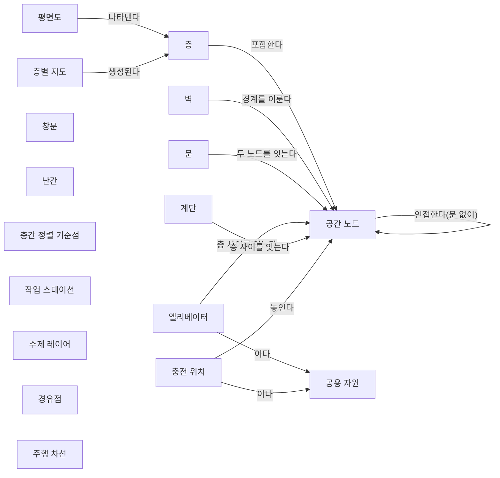
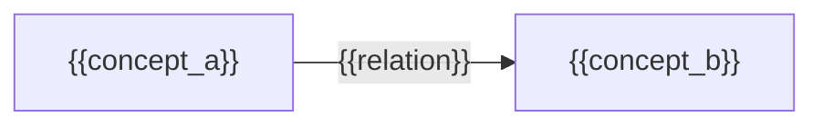

(너의 규칙은 시스템 프롬프트의 agents/shared-rules.md 와 agents/verifier.md 이다. 아래는 이번 실행의 컨텍스트와 입력이다.)

## 실행 컨텍스트

- run_id: 2026-09-25-82
- date: 2026-09-25
- run_type: track (트랙 실행)
- 대상: 트랙 floorplan-recognition (건축 도면 자동 인식) · 현재 단계: 단계 5. 검증 방법과 가설 판정 · 이번에 다룰 백로그 질문 id: q5-02 · 중심 세부영역: 6. 지도·공간·위치 모델 (B. 공통 정보·환경 모델)
- 예산:
    - max_search_queries: 40
    - max_sources_per_run: 20
    - new_topic_pages: 1
    - page_updates: 2
    - max_retries: 2
- 환경 알림: web_fetch_available: false · fetch_mode: mirror_only (일반 웹 페이지 열람은 네트워크 정책으로 막혀 있다. raw.githubusercontent.com 은 열린다: 공식 문서가 GitHub 에 있는 출처는 입력의 config/source_mirrors.yaml 경로를 WebFetch 로 열어 원문을 읽고 sources[].fetched=true, fetched_via=github_raw, fetch_url 을 적는다. 입력에 원문 텍스트(data/source_texts)가 있는 출처는 fetched_via=inbox. 그 밖의 출처는 fetched=false 이며 코드가 신뢰도 상한(medium)을 강제한다 — 공통 규칙 0절 6항)
- 언어: ko
- verification_stage: first
- verifier_budget:
    - max_search_queries: 40
    - max_sources_per_run: 20
    - new_topic_pages: 1
    - page_updates: 2
    - max_retries: 2

## 입력

### runs/2026-09-25-82/target.json

```json
{
  "run_id": "2026-09-25-82",
  "date": "2026-09-25",
  "weekday": "Fri",
  "run_number": 82,
  "run_type": "track",
  "forced": true,
  "target": {
    "area_no": 6,
    "area_name": "6. 지도·공간·위치 모델",
    "category": "B. 공통 정보·환경 모델",
    "category_letter": "B"
  },
  "topic": null,
  "track": {
    "slug": "floorplan-recognition",
    "name": "건축 도면 자동 인식",
    "stage": 5,
    "stages": 5,
    "stage_name": "검증 방법과 가설 판정",
    "question_ids": [
      "q5-02"
    ],
    "user_questions": [],
    "runs_per_week": 3,
    "question_rationale": "CLI 지정 질문 id"
  },
  "corrections": [],
  "budget": {
    "max_search_queries": 40,
    "max_sources_per_run": 20,
    "new_topic_pages": 1,
    "page_updates": 2,
    "max_retries": 2
  },
  "priority_reason": null,
  "priority_questions": [],
  "excluded_areas": [],
  "lifted_areas": [],
  "deferred": {
    "monthly_recheck": false,
    "weekly_review": true
  },
  "selection_rationale": "CLI 지정 run_type=track, area=6; 트랙 실행일(Fri, track_days 앞 3개) → 트랙 floorplan-recognition 단계 5, 질문 q5-02 (CLI 지정 질문 id)"
}
```

### runs/2026-09-25-82/research.json

```json
{
  "run_id": "2026-09-25-82",
  "date": "2026-09-25",
  "run_type": "track",
  "target": {
    "area_no": 6,
    "area_name": "6. 지도·공간·위치 모델",
    "category": "B. 공통 정보·환경 모델"
  },
  "gaps": [
    "단계 5 질문 q5-02 열림(target.json 지정, CLI 지정 질문 id). 단계 5 페이지 3절에 q5-02 소제목 없음",
    "완료 조건: 검증 절차(현장 모델링 시간 단축 측정)가 아이디어 3. 건축 도면 자동 인식 6절에 없음(6절에는 평가 지표 소절과 q1-04 선행 근거만 있음)",
    "완료 조건: 가설 판정표(q5-03)와 실험 계획이 없음 — 이번 실행 밖",
    "아이디어 3. 건축 도면 자동 인식 6절 '측정 대상 후보: 반복 작업 목록'은 무엇을 셀지(작업 목록)만 있고 어떻게 잴지(시간·수정 횟수의 정의와 비교 설계)가 비어 있음",
    "21. 온보딩·설정·현장 시운전 섹션 6에 시운전·설정 공수를 수작업 대비로 측정하는 방법 근거 없음",
    "23. 시험·형식 검증·벤치마크 섹션 6에 자동 생성 결과의 사람 수정 노력(편집 비용·클릭 수) 지표 근거 없음"
  ],
  "research_questions": [
    "제조사마다 다른 지도에서 ‘3층 출하 대기장’을 어떻게 동일한 장소로 인식할까? [분류원문]",
    "새 제조사나 새 물류센터를 추가할 때 반복 작업을 얼마나 줄일까? [분류원문]",
    "q5-02 현장 모델링 시간 단축 효과를 어떤 기준(수작업 대비 소요 시간, 수정 횟수)으로 측정하는가?",
    "도면 인식·벡터화 결과를 사람이 고치는 수고를 정확도 지표와 따로 재는 지표(편집 비용, 클릭 수, 수정 시간)에는 무엇이 있는가? (단계 5 페이지 3절, 23. 시험·형식 검증·벤치마크, 27. AI·학습·적응과 모델 운영 겨냥)",
    "수작업 대비 '자동 생성+사람 보정'의 소요 시간 비교는 Scan-to-BIM·도면→BIM·가상 시운전 연구에서 어떻게 설계·보고되며 국내 실증이 있는가? (21. 온보딩·설정·현장 시운전, 한국 자료 우선 규칙)",
    "수정 횟수와 실제 소요 시간은 얼마나 일치하며, 현장 측정이 어려울 때 작업 시간을 추정하는 모델은 무엇인가? (아이디어 3. 건축 도면 자동 인식 6절 검증 절차 겨냥)"
  ],
  "findings": [
    {
      "id": "f1",
      "claim": "He Zhang(arXiv 2608.25608)은 래스터 평면도 벡터화 결과를 사람이 고치는 데 드는 일을 벽·방·개구부에 대한 편집기 연산 유형별 비용으로 채점하는 편집 비용 지표를 제시하고, 정밀도·재현율·F1 이 수정 노력을 좌우하는 실패 유형에 둔감하다고 보았다.",
      "tag": "사실",
      "source_ids": [
        "ref-730"
      ],
      "cross_checked": false,
      "confidence": "medium",
      "evidence_excerpt": "검색 요약 기준: 편집 비용은 초안을 고치는 데 필요한 사람의 일로 점수를 매기며, 연산별 분해로 한 방식이 평면도당 벽 삭제 약 3회, 개구부 생성·삭제 약 6회를 더 필요로 함을 보였다(CubiCasa5K 등, 저자 단독 프리프린트).",
      "as_of": "2026-08",
      "flow_step": null,
      "flow_item": null,
      "source_unopened": true
    },
    {
      "id": "f2",
      "claim": "Opiela·Hrehová(IPIN-WiP 2023)는 평면도 이미지에서 벽·문·구역을 주석해 지도 모델을 만드는 작업에서, IPIN 2019 대회 지도를 숙련 사용자가 수작업으로 주석하는 데 40분이 걸린 반면 자동 주석 뒤 수정에는 5분이 걸렸다고 보고했다.",
      "tag": "사실",
      "source_ids": [
        "ref-731"
      ],
      "cross_checked": false,
      "confidence": "medium",
      "evidence_excerpt": "검색 요약 기준: 수작업 주석 40분 대신 5분의 수정만 필요했다(IPIN 2019 대회 지도 1건, 저자 보고, 자동 처리 시간 포함 여부 미확인).",
      "as_of": "2023",
      "flow_step": null,
      "flow_item": null,
      "source_unopened": true
    },
    {
      "id": "f3",
      "claim": "Polygon-RNN(CVPR 2017)과 Polygon-RNN++(CVPR 2018)는 반자동 다각형 주석의 사람 노력을, 예측 꼭짓점이 정답에서 임계값 이상 벗어날 때마다 고치는 가상 주석자를 두고 그 수정 횟수(클릭 수)로 재며, Polygon-RNN++ 는 원 모델보다 클릭을 약 50% 줄였다고 보고했다.",
      "tag": "사실",
      "source_ids": [
        "ref-733",
        "ref-732"
      ],
      "cross_checked": false,
      "confidence": "medium",
      "evidence_excerpt": "검색 요약 기준: 생성 다각형의 IoU 와 예측을 고치는 데 필요한 주석자 클릭 수 두 가지로 평가하며, 수정은 임계값을 넘는 꼭짓점마다 시뮬레이션한다(Cityscapes 조건, 저자 보고).",
      "as_of": "2018-03",
      "flow_step": null,
      "flow_item": null,
      "source_unopened": true
    },
    {
      "id": "f4",
      "claim": "대화형 분할 연구의 NoC@90 지표는 목표 IoU 90% 에 이르는 데 필요한 평균 사용자 클릭 수로 정의되며, 보통 최대 클릭 수(예: 20회)를 상한으로 둔다.",
      "tag": "사실",
      "source_ids": [
        "ref-744"
      ],
      "cross_checked": false,
      "confidence": "medium",
      "evidence_excerpt": "검색 요약 기준: NoC@x 는 관행적 85%·90% IoU 임계값에 도달하는 데 드는 평균 클릭 수이며 NoC20@90 처럼 상한을 둔다.",
      "as_of": "2020-03",
      "flow_step": null,
      "flow_item": null,
      "source_unopened": true
    },
    {
      "id": "f5",
      "claim": "A-Scan2BIM(BMVC 2023)은 전문 건축가가 Revit 에서 수행한 Scan-to-BIM 모델링 과정을 편집 연산 이력으로 기록한 데이터셋(16개 장면, 89시간)을 만들고, 복원 품질 지표와 함께 연산 순서의 자연스러움과 다음 벽 예측 정확도를 평가했다.",
      "tag": "사실",
      "source_ids": [
        "ref-734",
        "ref-735"
      ],
      "cross_checked": false,
      "confidence": "medium",
      "evidence_excerpt": "README(원문 열람)는 reconstruction metrics·order metrics·next wall prediction 정확도를 평가 항목으로 둔다. 89시간·16장면은 논문 검색 요약 기준이며 README 에서는 확인되지 않았다.",
      "as_of": "2023-11",
      "flow_step": null,
      "flow_item": null,
      "source_unopened": false
    },
    {
      "id": "f6",
      "claim": "기계번역 분야의 HTER(Snover 외, 2006)는 시스템 출력과 사람이 최소한으로 고친 결과 사이의 삽입·삭제·치환·이동 편집 수로 사후 편집 노력을 잰다.",
      "tag": "사실",
      "source_ids": [
        "ref-736"
      ],
      "cross_checked": false,
      "confidence": "medium",
      "evidence_excerpt": "검색 요약 기준: HTER 는 MT 출력과 그 최소 사후 편집본 사이의 편집 거리(단어 삽입·삭제·치환, 단어열 이동)이다.",
      "as_of": "2006-08",
      "flow_step": null,
      "flow_item": null,
      "source_unopened": true
    },
    {
      "id": "f7",
      "claim": "기계번역 사후 편집 연구는 편집 노력을 시간적·기술적(편집 수)·인지적 노력의 세 차원(Krings 2001)으로 나누며, 세 차원의 상관이 약해 HTER 같은 편집 수 지표만으로는 노력을 다 잡지 못한다고 보고하고, 사후 편집 시간을 인지적 노력의 척도로 쓰는 연구도 있다.",
      "tag": "사실",
      "source_ids": [
        "ref-738",
        "ref-737"
      ],
      "cross_checked": false,
      "confidence": "medium",
      "evidence_excerpt": "검색 요약 기준: 세 차원은 밀접하지만 상관이 약하며 HTER 는 사후 편집에 드는 노력을 다 담지 못한다(EAMT 2020); 사후 편집 시간을 인지적 노력 척도로 제안(AMTA 2012 워크숍).",
      "as_of": "2020-11",
      "flow_step": null,
      "flow_item": null,
      "source_unopened": true
    },
    {
      "id": "f8",
      "claim": "키 입력 수준 모델(KLM, Card·Moran·Newell 1983)은 숙련 사용자가 오류 없이 과제를 수행하는 시간을 키 입력·포인팅·손 이동·정신적 준비·시스템 응답 같은 연산자 시간의 합으로 예측한다.",
      "tag": "사실",
      "source_ids": [
        "ref-739"
      ],
      "cross_checked": false,
      "confidence": "low",
      "evidence_excerpt": "검색 요약 기준: 사용자가 해야 할 키 입력 수준 동작의 순서를 나열하고 각 동작 시간을 더해 실행 시간을 예측한다(숙련자·무오류 가정). 확인한 사본은 강의 사이트 게재본(발행일 미확인, 확인일 기준).",
      "as_of": "2026-09-25",
      "flow_step": null,
      "flow_item": null,
      "source_unopened": true
    },
    {
      "id": "f9",
      "claim": "Beinschob 외(2017)는 새 AGV 시스템 설치에서 벽·문·랙 같은 기반 요소의 정밀 측정, 적재·하역 지점(운영 지점) 계산, 대개 수작업인 경로망 설계가 시간이 많이 드는 작업이라고 보고 이를 반자동화했다.",
      "tag": "사실",
      "source_ids": [
        "ref-217"
      ],
      "cross_checked": false,
      "confidence": "medium",
      "evidence_excerpt": "검색 요약 기준: 새 AGV 시스템 구축은 기반 요소의 정밀 측정과 운영 지점 계산이 필요해 매우 시간이 들고, 경로망 설계는 보통 수작업이다. (재인용: 2026-09-25-22)",
      "as_of": "2017",
      "flow_step": null,
      "flow_item": null,
      "source_unopened": true
    },
    {
      "id": "f10",
      "claim": "도면 인식·선–문자 추출로 BIM 을 자동 생성한 연구(JAABE, 2020)는 8,500㎡ 건물에서 기본 BIM 생성 15분과, 그 전에 필요한 2D CAD 도면 수작업 준비 약 1시간을 따로 보고했다.",
      "tag": "사실",
      "source_ids": [
        "ref-742"
      ],
      "cross_checked": false,
      "confidence": "medium",
      "evidence_excerpt": "검색 요약 기준: 8,500㎡ 건물 사례에서 기본 BIM 15분, BIM 생성 전 2D CAD 도면 수작업 준비 평균 약 1시간(저자 보고, 저자 미확인). 두 번째 검색 요약에서는 수치가 재확인되지 않았다.",
      "as_of": "2020",
      "flow_step": null,
      "flow_item": null,
      "source_unopened": true
    },
    {
      "id": "f11",
      "claim": "2024 년 연구는 BIM 기반 시설 관리를 위한 as-built 모델링에서 점군을 BIM 소프트웨어로 수작업 모델링하는 방식과 AI 기반 반자동 모델링을 시간과 투입 인력 면에서 비교하는 시간–편익 분석을 수행했다.",
      "tag": "사실",
      "source_ids": [
        "ref-743"
      ],
      "cross_checked": false,
      "confidence": "low",
      "evidence_excerpt": "검색 요약 기준: 수작업 모델링은 정밀하지만 시간이 많이 들고, 반자동 모델링은 시간과 인력 요구를 줄일 수 있다고 비교했다(수치·비교 조건 미확인, 저자 미확인).",
      "as_of": "2024-06",
      "flow_step": null,
      "flow_item": null,
      "source_unopened": true
    },
    {
      "id": "f12",
      "claim": "가상 시운전 연구 36건을 검토한 2026 년 구조적 리뷰는 이 연구들이 기술적으로는 발전했지만 그 능력을 검증된 시운전 결과(시운전 시간 등)와 일관되게 연결한 근거는 부족하다고 평가했다.",
      "tag": "의견",
      "source_ids": [
        "ref-740"
      ],
      "cross_checked": false,
      "confidence": "medium",
      "evidence_excerpt": "검색 요약 기준: 검토한 연구들은 상호운용·동기화·행동 모델링에서 진보했으나 이를 검증된 시운전 결과에 묶는 일관된 근거를 주지 못한다(36건 구조적 리뷰, 저자 미확인).",
      "as_of": "2026",
      "flow_step": null,
      "flow_item": null,
      "source_unopened": true
    },
    {
      "id": "f13",
      "claim": "국내 연구(박준우 외, KIBIM Magazine 11(4), 2021)는 딥러닝·매개변수 알고리즘·Dynamo 를 활용한 Scan-to-BIM 자동화로 강원소방학교 건물 단위 BIM 모델 생성을 실증했으며, 수작업 대비 소요 시간을 보고했는지는 확인하지 못했다.",
      "tag": "사실",
      "source_ids": [
        "ref-741"
      ],
      "cross_checked": false,
      "confidence": "medium",
      "evidence_excerpt": "검색 요약 기준: KIBIM Magazine 2021, 11(4), 53-62, 키워드 Scan-to-BIM·자동화·딥러닝·매개변수 알고리즘·Dynamo·공간 관계. 시간 비교 수치 미확인.",
      "as_of": "2021",
      "flow_step": null,
      "flow_item": null,
      "source_unopened": true
    },
    {
      "id": "f14",
      "claim": "q5-02 에 대해 확인한 자료를 이 위키가 묶으면, 현장 모델링 시간 단축은 같은 도면·현장을 두 조건(수작업 기준 대 자동 생성+사람 보정)으로 처리해 (1) 시간: 입력 준비·자동 처리·사람 보정 시간을 단계별로 따로 기록한 총 소요 시간, (2) 수정: 요소 유형(벽·문·엘리베이터·계단·충전 위치·목적지)별 추가·삭제·이동 편집 연산 수와 가중 편집 비용, (3) 결과 품질: 보정 후 결과가 q5-01 의 합격 기준을 만족하는지를 함께 재는 구성이 근거가 가장 많은 것으로 보인다.",
      "tag": "추정",
      "source_ids": [
        "ref-730",
        "ref-731",
        "ref-732",
        "ref-736",
        "ref-738",
        "ref-742",
        "ref-217"
      ],
      "cross_checked": false,
      "confidence": "low",
      "evidence_excerpt": "이 위키의 종합이며 단일 출처는 없다. 편집 비용(f1)·클릭 수(f3)·HTER(f6)는 편집 수, 40분 대 5분(f2)·15분+준비 1시간(f10)은 단계별 시간 보고의 예다.",
      "as_of": "2026-09-25",
      "flow_step": null,
      "flow_item": null,
      "source_unopened": true
    },
    {
      "id": "f15",
      "claim": "편집 수 지표와 실제 소요 시간의 상관이 약하다는 기계번역 연구와 F1 이 수정 노력에 둔감하다는 평면도 연구를 보면, 수정 횟수는 소요 시간의 대용치로 쓰지 말고 시간과 함께 기록하며, 편집 비용의 연산별 가중치는 측정한 연산별 평균 시간으로 보정해야 할 것으로 보인다.",
      "tag": "추정",
      "source_ids": [
        "ref-738",
        "ref-737",
        "ref-730"
      ],
      "cross_checked": false,
      "confidence": "low",
      "evidence_excerpt": "이 위키의 추정: 기계번역 결과(f7)를 도면 보정 작업에 옮긴 것이며, 도면 보정에서 편집 수와 시간의 상관을 잰 자료는 찾지 못했다.",
      "as_of": "2026-09-25",
      "flow_step": null,
      "flow_item": null,
      "source_unopened": true
    },
    {
      "id": "f16",
      "claim": "현장 수작업 기준 시간을 실측하기 어려우면, 수작업과 보정 작업의 편집 연산 순서를 나열해 키 입력 수준 모델로 숙련자 무오류 시간을 추정하는 방법을 보조로 쓸 수 있어 보이나, 이 추정은 판단·확인 시간과 오류 수정 시간을 빼므로 실측을 대신하지 못할 것으로 보인다.",
      "tag": "추정",
      "source_ids": [
        "ref-739",
        "ref-734"
      ],
      "cross_checked": false,
      "confidence": "low",
      "evidence_excerpt": "이 위키의 추정: KLM 은 숙련·무오류 가정(f8)이며, 실제 전문가 편집 이력 데이터셋(f5)은 연산 순서를 기록하는 방식의 예다.",
      "as_of": "2026-09-25",
      "flow_step": null,
      "flow_item": null,
      "source_unopened": true
    },
    {
      "id": "f17",
      "claim": "이종 제조사를 연결하는 ROP 의 측정 대상은 도면 인식 결과 보정, 공용 자원 등록, 좌표·층 정렬, 목적지 대응표 작성, 레이아웃 전달 같은 설정 작업의 시간·수정 횟수로 한정하고, 연계 대상: 로봇 쪽 지도 작성 주행·위치추정 조정 시간은 제조사·통합자의 기록을 받아 전체 시운전 기간의 구성 요소로만 합산하는 경계가 될 것으로 보인다.",
      "tag": "추정",
      "source_ids": [
        "ref-217",
        "ref-105"
      ],
      "cross_checked": false,
      "confidence": "low",
      "evidence_excerpt": "이 위키의 추정: 설치 병목(f9)과 Open-RMF 플릿 어댑터 설정(층 이름 아래 대응점 등록 등, 재인용: 2026-09-25-76)을 경계 판단에 썼다.",
      "as_of": "2026-09-25",
      "flow_step": null,
      "flow_item": null,
      "source_unopened": true
    },
    {
      "id": "f18",
      "claim": "‘3층 출하 대기장’을 제조사가 다른 두 로봇의 목적지로 쓰게 하는 작업을 예로 들면, 도면 수신부터 대기장 구역 노드·승강기·충전 위치 등록, 두 제조사 지도와의 좌표 대응, 목적지 대응표 작성까지를 수작업과 자동 생성+보정 조건에서 각각 시간·수정 횟수로 재고, 첫 출하 작업에서 도착이 인정될 때까지 걸린 기간을 성과 지표로 볼 수 있을 것으로 보인다(설명용 가정 사례).",
      "tag": "추정",
      "source_ids": [
        "ref-731",
        "ref-730",
        "ref-105"
      ],
      "cross_checked": false,
      "confidence": "low",
      "evidence_excerpt": "이 위키의 설명용 가정 사례이며 실제 측정값은 없다.",
      "as_of": "2026-09-25",
      "flow_step": "출하",
      "flow_item": "예외·성과",
      "source_unopened": true
    },
    {
      "id": "f19",
      "claim": "이번 검색 범위(한국어 6회 포함 30회)에서는 물류센터 로봇 도입에서 도면 기반 자동 생성이 지도·공용 자원 설정 시간을 얼마나 줄였는지 같은 조건으로 잰 연구나 국내 사례, 실내공간정보 구축 공수를 정한 공개 품셈을 찾지 못했다(부재 확인 아님).",
      "tag": "추정",
      "source_ids": [
        "ref-741",
        "ref-740",
        "ref-731"
      ],
      "cross_checked": false,
      "confidence": "low",
      "evidence_excerpt": "확인한 시간 비교는 평면도 주석 1건(f2), 도면→BIM(f10), Scan-to-BIM(f11), 가상 시운전 리뷰(f12)이며 물류 로봇 설정 작업 대상이 아니다.",
      "as_of": "2026-09-25",
      "flow_step": null,
      "flow_item": null,
      "source_unopened": true
    }
  ],
  "sources": [
    {
      "id": "ref-730",
      "org": "Zhang, H. (Independent Researcher, arXiv 2608.25608)",
      "title": "When Should a Network Emit Geometry, and When Should It Detect It? Readout, Reconciliation, and Representation in Floorplan Vectorization",
      "published": "2026-08",
      "url": "https://arxiv.org/abs/2608.25608",
      "type": "논문",
      "reliability": "medium",
      "accessed": "2026-09-25",
      "summary": "원문 미열람. 평면도 벡터화에서 좌표 생성 방식과 검출 방식을 비교하고, 초안을 고치는 사람의 일로 점수를 매기는 편집 비용 지표를 제시한 프리프린트.",
      "source_unopened": true,
      "fetched": false,
      "fetched_via": null,
      "fetch_url": null
    },
    {
      "id": "ref-731",
      "org": "Opiela, M., & Hrehová, M. (Pavol Jozef Šafárik University, IPIN-WiP 2023, CEUR-WS Vol-3581)",
      "title": "Map Model Extraction from Image Floor Plans",
      "published": "2023",
      "url": "https://ceur-ws.org/Vol-3581/194_WiP.pdf",
      "type": "논문",
      "reliability": "medium",
      "accessed": "2026-09-25",
      "summary": "원문 미열람. 평면도 이미지의 벽·문·구역 주석으로 볼록 다각형 지도 모델을 만들고, 자동 주석 뒤 수정 시간을 수작업 주석 시간과 비교한 진행 중 연구.",
      "source_unopened": true,
      "fetched": false,
      "fetched_via": null,
      "fetch_url": null
    },
    {
      "id": "ref-732",
      "org": "Acuna, D., Ling, H., Kar, A., & Fidler, S. (CVPR 2018)",
      "title": "Efficient Interactive Annotation of Segmentation Datasets with Polygon-RNN++",
      "published": "2018-03",
      "url": "https://arxiv.org/abs/1803.09693",
      "type": "논문",
      "reliability": "medium",
      "accessed": "2026-09-25",
      "summary": "원문 미열람. 대화형 다각형 주석 모델로, IoU 와 수정에 필요한 주석자 클릭 수로 평가하고 원 모델 대비 클릭 감소를 보고했다.",
      "source_unopened": true,
      "fetched": false,
      "fetched_via": null,
      "fetch_url": null
    },
    {
      "id": "ref-733",
      "org": "Castrejón, L., Kundu, K., Urtasun, R., & Fidler, S. (CVPR 2017)",
      "title": "Annotating Object Instances with a Polygon-RNN",
      "published": "2017-04",
      "url": "https://arxiv.org/abs/1704.05548",
      "type": "논문",
      "reliability": "medium",
      "accessed": "2026-09-25",
      "summary": "원문 미열람. 반자동 다각형 주석을 제안하고, 임계값을 넘는 꼭짓점을 고치는 가상 주석자의 수정 횟수로 사람 노력을 평가했다.",
      "source_unopened": true,
      "fetched": false,
      "fetched_via": null,
      "fetch_url": null
    },
    {
      "id": "ref-734",
      "org": "Song, W. 외 (BMVC 2023, arXiv 2311.18166)",
      "title": "A-Scan2BIM: Assistive Scan to Building Information Modeling",
      "published": "2023-11",
      "url": "https://arxiv.org/abs/2311.18166",
      "type": "논문",
      "reliability": "medium",
      "accessed": "2026-09-25",
      "summary": "원문 미열람. 전문 건축가의 Revit 편집 이력을 기록한 Scan-to-BIM 데이터셋과 다음 편집 연산을 예측하는 보조 시스템, 연산 순서 지표를 제안했다.",
      "source_unopened": true,
      "fetched": false,
      "fetched_via": null,
      "fetch_url": null
    },
    {
      "id": "ref-735",
      "org": "Song, W. (weiliansong/A-Scan2BIM GitHub)",
      "title": "A-Scan2BIM — README (Official implementation of the paper A-Scan2BIM: Assistive Scan to Building Information Modeling)",
      "published": null,
      "url": "https://github.com/weiliansong/A-Scan2BIM",
      "type": "오픈소스 문서",
      "reliability": "medium",
      "accessed": "2026-09-25",
      "summary": "공식 구현 저장소 README. 후보 벽 열거·다음 벽 예측 네트워크와 복원 지표·순서 지표·다음 벽 예측 정확도 평가 명령을 안내한다.",
      "fetched": true,
      "fetched_via": "github_raw",
      "fetch_url": "https://raw.githubusercontent.com/weiliansong/A-Scan2BIM/main/README.md",
      "source_unopened": false
    },
    {
      "id": "ref-736",
      "org": "Snover, M., Dorr, B., Schwartz, R., Micciulla, L., & Makhoul, J. (AMTA 2006)",
      "title": "A Study of Translation Edit Rate with Targeted Human Annotation",
      "published": "2006-08",
      "url": "https://aclanthology.org/2006.amta-papers.25/",
      "type": "논문",
      "reliability": "medium",
      "accessed": "2026-09-25",
      "summary": "원문 미열람. 번역 편집률(TER)과 사람이 최소로 고친 번역을 기준으로 한 HTER 를 정의했다.",
      "source_unopened": true,
      "fetched": false,
      "fetched_via": null,
      "fetch_url": null
    },
    {
      "id": "ref-737",
      "org": "Koponen, M., Aziz, W., Ramos, L., & Specia, L. (AMTA 2012 WPTP)",
      "title": "Post-editing time as a measure of cognitive effort",
      "published": "2012-10",
      "url": "https://aclanthology.org/2012.amta-wptp.2/",
      "type": "논문",
      "reliability": "medium",
      "accessed": "2026-09-25",
      "summary": "원문 미열람. 기계번역 사후 편집 시간을 인지적 노력의 척도로 쓰는 방법을 다룬 워크숍 논문.",
      "source_unopened": true,
      "fetched": false,
      "fetched_via": null,
      "fetch_url": null
    },
    {
      "id": "ref-738",
      "org": "Alvarez-Vidal, S., Oliver, A., & Badia, T. (EAMT 2020)",
      "title": "Quantitative Analysis of Post-Editing Effort Indicators for NMT",
      "published": "2020-11",
      "url": "https://aclanthology.org/2020.eamt-1.44.pdf",
      "type": "논문",
      "reliability": "medium",
      "accessed": "2026-09-25",
      "summary": "원문 미열람. 사후 편집 노력의 시간적·기술적·인지적 차원(Krings)과 지표 사이의 약한 상관을 분석했다.",
      "source_unopened": true,
      "fetched": false,
      "fetched_via": null,
      "fetch_url": null
    },
    {
      "id": "ref-739",
      "org": "Kieras, D. (University of Michigan)",
      "title": "Using the Keystroke-Level Model to Estimate Execution Times",
      "published": null,
      "url": "https://www.cs.umd.edu/~golbeck/INST631/KSM.pdf",
      "type": "논문",
      "reliability": "low",
      "accessed": "2026-09-25",
      "summary": "원문 미열람. 키 입력 수준 모델로 숙련 사용자의 무오류 과제 실행 시간을 연산자 시간의 합으로 추정하는 방법 해설. 강의 사이트 게재본.",
      "source_unopened": true,
      "fetched": false,
      "fetched_via": null,
      "fetch_url": null
    },
    {
      "id": "ref-740",
      "org": "ScienceDirect 게재 논문 저자(미확인)",
      "title": "A structured review of virtual commissioning: simulation fidelity, industrial validation, and design-oriented decision-making",
      "published": "2026",
      "url": "https://www.sciencedirect.com/science/article/pii/S2590123026038491",
      "type": "논문",
      "reliability": "medium",
      "accessed": "2026-09-25",
      "summary": "원문 미열람. 가상 시운전 연구 36건을 검토해 시뮬레이션 능력과 검증된 시운전 결과를 잇는 근거가 부족하다고 평가한 구조적 리뷰.",
      "source_unopened": true,
      "fetched": false,
      "fetched_via": null,
      "fetch_url": null
    },
    {
      "id": "ref-741",
      "org": "박준우, 김재홍, 김소현, 이지민, 최창순, 정광복, 이재욱(KIBIM Magazine 11(4), 53-62)",
      "title": "Scan-to-BIM 자동화 기술을 활용한 건축물 단위의 BIM 모델 생성 - 강원소방학교 BIM 모델링 실증을 중심으로 -",
      "published": "2021",
      "url": "https://www.kci.go.kr/kciportal/ci/sereArticleSearch/ciSereArtiView.kci?sereArticleSearchBean.artiId=ART002801297",
      "type": "논문",
      "reliability": "medium",
      "accessed": "2026-09-25",
      "summary": "원문 미열람. 딥러닝·매개변수 알고리즘·Dynamo 기반 Scan-to-BIM 자동화로 건물 단위 BIM 모델을 생성한 국내 실증 연구.",
      "source_unopened": true,
      "fetched": false,
      "fetched_via": null,
      "fetch_url": null
    },
    {
      "id": "ref-742",
      "org": "Journal of Asian Architecture and Building Engineering 게재 논문 저자(미확인)",
      "title": "Automated BIM generation using drawing recognition and line-text extraction",
      "published": "2020",
      "url": "https://www.tandfonline.com/doi/full/10.1080/13467581.2020.1806071",
      "type": "논문",
      "reliability": "medium",
      "accessed": "2026-09-25",
      "summary": "원문 미열람. 2D 도면의 선·문자를 분리 추출해 객체 BIM 을 준자동 생성하는 방법과 건물 사례의 생성 시간을 보고했다.",
      "source_unopened": true,
      "fetched": false,
      "fetched_via": null,
      "fetch_url": null
    },
    {
      "id": "ref-743",
      "org": "ResearchGate 게재 논문 저자(미확인)",
      "title": "Time-Benefit Analysis of Semiautomatic 3D Laser Scanning for BIM-based Facility Management",
      "published": "2024-06",
      "url": "https://www.researchgate.net/publication/381549957_Time-Benefit_Analysis_of_Semiautomatic_3D_Laser_Scanning_for_BIM-_based_Facility_Management",
      "type": "논문",
      "reliability": "low",
      "accessed": "2026-09-25",
      "summary": "원문 미열람. 시설 관리용 as-built BIM 에서 수작업 모델링과 AI 기반 반자동 모델링의 시간·인력을 비교한 분석. 게재지 미확인.",
      "source_unopened": true,
      "fetched": false,
      "fetched_via": null,
      "fetch_url": null
    },
    {
      "id": "ref-744",
      "org": "Forte, M., Price, B., Cohen, S., Xu, N., & Pitié, F. (arXiv 2003.07932)",
      "title": "Getting to 99% Accuracy in Interactive Segmentation",
      "published": "2020-03",
      "url": "https://arxiv.org/abs/2003.07932",
      "type": "논문",
      "reliability": "medium",
      "accessed": "2026-09-25",
      "summary": "원문 미열람. 대화형 분할의 클릭 수 기반 평가(NoC@85·90)와 고정확도 목표를 다룬 연구.",
      "source_unopened": true,
      "fetched": false,
      "fetched_via": null,
      "fetch_url": null
    },
    {
      "id": "ref-217",
      "org": "Beinschob, P., Meyer, M., Reinke, C., Digani, V., Secchi, C., & Sabattini, L.",
      "title": "Semi-automated map creation for fast deployment of AGV fleets in modern logistics",
      "published": "2017",
      "url": "https://www.sciencedirect.com/science/article/abs/pii/S0921889015302724",
      "type": "논문",
      "reliability": "medium",
      "accessed": "2026-09-25",
      "summary": "원문 미열람. 3D 레이저 스캔 의미 지도와 경로망 자동 설계로 다중 AGV 설치 시간을 줄이는 반자동 방법.",
      "source_unopened": true,
      "fetched": false,
      "fetched_via": null,
      "fetch_url": null
    },
    {
      "id": "ref-105",
      "org": "Open Robotics (open-rmf)",
      "title": "fleet_adapter_template — fleet_adapter_template/config.yaml",
      "published": null,
      "url": "https://github.com/open-rmf/fleet_adapter_template/blob/main/fleet_adapter_template/config.yaml",
      "type": "오픈소스 문서",
      "reliability": "medium",
      "accessed": "2026-09-25",
      "summary": "원문 미열람. Open-RMF 플릿 어댑터 템플릿 설정(층 이름별 대응점, 속도·차체·배터리 등). 이번 실행에서는 다시 열지 않았다.",
      "source_unopened": true,
      "fetched": false,
      "fetched_via": null,
      "fetch_url": null
    }
  ],
  "page_proposals": [
    {
      "action": "update",
      "path": "docs/tracks/floorplan-recognition/stage-5-verification-and-hypotheses.md",
      "sections": [
        "2",
        "3",
        "4",
        "5",
        "6",
        "8",
        "9"
      ],
      "rationale": "q5-02 답: f1·f2·f3·f4·f5·f6·f7·f8·f9·f10·f11·f12·f13·f14·f15·f16·f17·f18·f19 (신뢰도 low) — 2절 q5-02 상태 답함, 3절 q5-02 소제목 신설({#q5-02}): 수정 노력 지표(편집 비용 f1, 클릭 수 f3, NoC f4, 편집 이력 데이터셋 f5, HTER f6), 수작업 대비 시간 비교 사례(평면도 주석 40분 대 5분 f2, 도면→BIM 생성과 준비 시간 분리 f10, Scan-to-BIM 시간–편익 f11, 국내 Scan-to-BIM 실증 f13), 편집 수와 시간의 관계(f7), 시간 추정 모델(f8), 설치 병목 작업(f9), 가상 시운전 근거 한계(f12 의견), 종합: 시간·수정·결과 품질 세 축 측정 구성(f14, 표 권장)·편집 수를 시간 대용치로 쓰지 않음(f15)·KLM 보조 추정(f16)·ROP 측정 경계(f17 연계 대상 포함)·‘3층 출하 대기장’ 시나리오(f18)·근거 공백(f19) / 4절 결론·불확실성 / 5절 후속 질문 / 6절 완료 조건 현황(검증 절차 행) / 8절 출처 / 9절 이력"
    },
    {
      "action": "update",
      "path": "docs/ideas/floorplan-recognition.md",
      "sections": [
        "6"
      ],
      "rationale": "아이디어 페이지 6절(트랙 산출물): '검증 절차: 현장 모델링 시간 단축 측정' 소절 신설 — 세 축 측정 구성 f14·f15·f16·f17(추정), 근거 f1·f2·f3·f6·f7·f10. 기존 '측정 대상 후보: 반복 작업 목록' 소절과 연결하고 PAN-Robots 비교 조건(q5-04)·가설 판정(q5-03)은 미조사임을 명시"
    },
    {
      "action": "update",
      "path": "docs/categories/f-deployment-verification-and-maintenance/21-onboarding-configuration-and-commissioning.md",
      "sections": [
        "6"
      ],
      "rationale": "트랙 floorplan-recognition 단계 5 반영 제안 (f2, f9, f10, f12, f14, f17): 시운전·설정 공수를 수작업 대비로 재는 방법(단계별 시간·수정 횟수, 추정)과 가상 시운전 시간 단축 근거의 한계, 분류 원문 질문 '반복 작업을 얼마나 줄일까' 연결"
    },
    {
      "action": "update",
      "path": "docs/categories/f-deployment-verification-and-maintenance/23-testing-formal-verification-and-benchmarking.md",
      "sections": [
        "6"
      ],
      "rationale": "트랙 floorplan-recognition 단계 5 반영 제안 (f1, f3, f4, f6, f7, f15): 자동 생성 결과의 사람 수정 노력 지표(편집 비용, 클릭 수·NoC, HTER 유사 지표)와 편집 수·시간의 약한 상관"
    },
    {
      "action": "update",
      "path": "docs/categories/g-safety-security-intelligence-and-governance/27-ai-learning-adaptation-and-model-operations.md",
      "sections": [
        "6"
      ],
      "rationale": "트랙 floorplan-recognition 단계 5 반영 제안 (f1, f3, f5): 도면 해석 모델을 정확도가 아니라 사람 수정 노력(편집 비용·클릭 수·편집 이력)으로 평가하는 방법. 교차 규칙에 따라 적용 대상 6. 지도·공간·위치 모델과 양쪽 연결"
    }
  ],
  "glossary_candidates": [
    {
      "term_ko": "편집 비용",
      "term_en": "Edit Cost",
      "definition": "자동 생성 결과를 정답 수준으로 고치는 데 필요한 사람의 편집 연산(추가·삭제·이동 등)을 요소 유형별로 세거나 가중해 합한 수정 노력 지표다."
    },
    {
      "term_ko": "클릭 수 지표",
      "term_en": "Number of Clicks (NoC)",
      "definition": "대화형 주석·분할에서 목표 정확도(예: IoU 90%)에 이르거나 예측을 고치는 데 필요한 평균 사용자 클릭 수로, 사람 노력을 재는 지표다."
    },
    {
      "term_ko": "키 입력 수준 모델",
      "term_en": "Keystroke-Level Model (KLM)",
      "definition": "숙련 사용자가 오류 없이 과제를 수행하는 시간을 키 입력·포인팅·정신적 준비 같은 연산자 시간의 합으로 예측하는 GOMS 계열 모델이다."
    }
  ],
  "open_questions_new": [
    "국내에서 실내공간정보 구축이나 로봇 도입 시 지도·공용 자원 설정 공수(인·일)를 산정하는 품셈이나 공공 기준이 있는가? | 관련 영역: 21. 온보딩·설정·현장 시운전, 4. 성과·경제성·프로세스 개선 | 근거: f19 | 종류: 일반"
  ],
  "open_questions_resolved": [],
  "self_check": {
    "source_count": 17,
    "cross_checked_count": 0,
    "unverified": [
      "모든 finding 교차 확인 없음: 지표·사례마다 단일 출처(f3 의 두 출처는 같은 연구 그룹, f5 의 논문과 README 는 같은 저자, f7 의 두 출처는 서로 다른 주장을 뒷받침)",
      "f2 의 40분 대 5분은 지도 1건 저자 보고이며 자동 처리 시간 포함 여부 미확인",
      "f10 수치(15분, 준비 약 1시간)는 첫 검색 요약에만 있고 재검색에서 재확인되지 않음, 저자 미확인",
      "f11 비교 수치·조건과 게재지 미확인",
      "f13 국내 연구의 시간 비교 수치 미확인",
      "f5 의 89시간·16장면은 README 에서 확인되지 않음",
      "f8 KLM 출처는 강의 사이트 게재본",
      "q5-02 부분: 물류 로봇 설정 작업을 같은 조건으로 잰 측정 사례 없음 — 측정 구성(f14~f18)은 이 위키의 종합"
    ],
    "scope_violations": [
      "f17: 로봇 쪽 지도 작성 주행·위치추정 조정은 분류 원문 9장 '로봇 자체 지능·제어' 연계 영역이라 '연계 대상: '으로 표시하고 ROP 측정 대상에서 제외하도록 서술",
      "f11·f13: Scan-to-BIM 은 건설·시설 관리 영역 연구라 측정 방식의 사례로만 제안",
      "f6·f7: 기계번역 분야 지표를 도면 보정에 옮기는 것은 추정(f15)으로만 서술"
    ],
    "budget_used": {
      "queries": 30,
      "sources": 15
    },
    "limits": "web_fetch_available: false · fetch_mode mirror_only. raw.githubusercontent.com 으로 원문을 연 출처: 신규 ref-735(A-Scan2BIM README). 나머지 신규 14건(ref-730~ref-734, ref-736~ref-744)과 재사용 ref-217·ref-105 는 원문 미열람이라 신뢰도 상한 medium, high 없음. CEUR·arXiv·ScienceDirect 원문은 정책 차단. 검색 30회/40(한국어 6회), 신규 출처 15건/20(ref-730~ref-744, 예약 구간 안), 재사용 2건. 질문 선택: target.json 지정 q5-02 1건. q5-02 는 수정 노력 지표·수작업 대비 시간 비교 사례·편집 수와 시간의 관계(사실)로 답했으나 측정 구성·경계·시나리오(f14~f18)는 이 위키의 종합이고 물류 로봇 설정 작업 근거가 없어 질문 종합 신뢰도 low. 한국 자료: 국내 Scan-to-BIM 실증(ref-741) 1건, 품셈·물류 사례는 찾지 못함(일반 열린 질문 1건). 교차 규칙: 도면 해석 모델의 수정 노력 평가는 27. AI·학습·적응과 모델 운영과 적용 대상 6. 지도·공간·위치 모델 양쪽에 반영 제안. 8. 실시간 세계 상태·데이터 일관성과 22. 시뮬레이션·예측용 디지털 트윈 관련 주장 없음(f12 가상 시운전은 21. 온보딩·설정·현장 시운전 쪽 근거로만 씀). 정정 요청 없음. 온톨로지 변경 없음: 시간·수정 측정은 공간 그래프 스키마의 개념·관계가 아니라 검증 방법이므로 아이디어 페이지 6절에 둔다. 후속 질문 2건. 페이지 제안: 트랙 산출물 2건, 세부영역 반영 제안 3건(갱신 상한과 별도). 백로그 참고: q5-11 이 q5-09 와 같은 질문으로 중복 등록되어 정리 필요."
  },
  "track": {
    "slug": "floorplan-recognition",
    "stage": 5,
    "answered_question_ids": [
      "q5-02"
    ],
    "new_questions": [
      {
        "question": "같은 물류센터 층을 ROP 운영자가 수작업과 '도면 자동 생성+보정' 두 조건으로 모델링하는 비교 실험에서, 학습 효과(같은 도면 반복)와 숙련도 차이를 어떻게 통제하고(참가자·층 배정, 순서 균형), 입력 준비·자동 처리·보정·검증 시간을 어떤 단위로 기록하는가? (q5-02 에서 파생)",
        "stage": 5,
        "rationale_finding_id": "f14"
      },
      {
        "question": "편집 비용 지표의 연산별 가중치(벽 삭제, 문·엘리베이터·충전 위치 추가, 목적지 이름 수정 등)를 실제 보정 작업의 연산별 평균 소요 시간으로 보정하려면 어떤 기록(편집 로그·화면 기록)이 필요하며, 편집 수와 시간의 상관을 어떻게 확인하는가? (q5-02 에서 파생)",
        "stage": 5,
        "rationale_finding_id": "f15"
      }
    ],
    "ontology_changes": [],
    "stage_completion_self_assessment": {
      "met": false,
      "missing": [
        "검증 절차(q5-02 답 f14~f17)는 검증 승인 전이며 아이디어 3. 건축 도면 자동 인식 6절에 아직 반영되지 않음",
        "가설 판정표(q5-03)가 트랙 개요 3절에 없음",
        "사용자에게 제안하는 실험 계획이 실험 페이지에 없음",
        "열린 질문 q5-03~q5-10(q5-11 중복 정리 필요)"
      ]
    }
  }
}
```

### docs/categories/b-common-information-and-environment-model/06-map-space-and-location-model.md

```markdown
---
title: "6. 지도·공간·위치 모델"
type: area
category: "B. 공통 정보·환경 모델"
area_no: 6
related_areas: [7, 8, 9, 10, 15, 21, 22, 24, 25, 27, 28]
tags: [좌표계 정렬, 지도 버전 관리, 위치추정 신뢰도, 실내 공간 모델, 평면도 인식]
status: published
confidence: medium
created: 2026-09-24
updated: 2026-09-25
sources: [ref-031, ref-051, ref-063, ref-064, ref-065, ref-066, ref-067, ref-069, ref-070, ref-071, ref-073, ref-074, ref-076, ref-078, ref-079, ref-080, ref-105, ref-148, ref-153, ref-154, ref-155, ref-156, ref-157, ref-158, ref-046, ref-159, ref-160, ref-161, ref-162, ref-163, ref-224, ref-230]
last_run: 2026-09-25
version: 2
---

[홈](../../index.md) › [B. 공통 정보·환경 모델](index.md) › 6. 지도·공간·위치 모델

# 6. 지도·공간·위치 모델

!!! info "소속 대분류"
    [B. 공통 정보·환경 모델](index.md) — 핵심 질문:
    로봇·물건·공간·상태를 어떻게 같은 의미로 이해할 것인가? [분류원문]

<!-- auto:area-tracks:start -->
!!! note "관련 연구 트랙"
    이 세부영역을 가로지르는 중점 연구 트랙과 확장 아이디어다. 트랙은 분류를 바꾸지 않으며, 트랙에서 확인된 사실은 이 페이지에 반영하도록 제안된다. 전체 매핑은 [확장 아이디어 연결 구조](../../ideas/index.md)에 있다.

    - [자연어 업무 지시 챗봇](../../tracks/nl-task-chatbot/index.md) — 함께 필요한 영역(○) · 확장 아이디어: [아이디어 2. 자연어 업무 지시 챗봇](../../ideas/nl-task-chatbot.md)
    - [건축 도면 자동 인식](../../tracks/floorplan-recognition/index.md) — 중심 영역(●) · 확장 아이디어: [아이디어 3. 건축 도면 자동 인식](../../ideas/floorplan-recognition.md)
<!-- auto:area-tracks:end -->

<!-- auto:page-status:start -->
> 페이지 상태: published · 신뢰도: medium · 페이지 버전: 2 · 마지막 갱신: 2026-09-25 · 마지막 실행: 2026-09-25
<!-- auto:page-status:end -->

## 1. 한 줄 정의

BIM·CAD·센서 지도에서 이동 공간과 경로를 만들고, 로봇별 좌표계·층·목적지를 정렬 [분류원문]

## 2. SCM 관점의 질문

제조사마다 다른 지도에서 ‘3층 출하 대기장’을 어떻게 동일한 장소로 인식할까? [분류원문]

> 원문 주석: 6번에는 지도 생성뿐 아니라 **현장과 도면의 차이 확인, 지도 버전 관리, 위치추정 결과의 신뢰도**도 포함해야 한다. [분류원문]

> 원문 주석: 27번의 AI는 특정 기능 하나에만 해당하지 않는다. **매뉴얼 해석은 5·21번, 도면 해석은 6번, 학습 기반 배차는 13번, 장애 분석은 19번**에 적용되는 연구 방법이다. [분류원문]

## 3. 왜 중요한가

제조사마다 로봇이 위치를 적는 좌표계와 지도 식별 방식이 달라서, 같은 장소를 가리키려면 좌표 변환·지도 식별자·업무 장소 식별자를 잇는 대응 계층이 필요할 것으로 보인다. [추정][^ref-153][^ref-031][^ref-162]

자세한 내용은 주제 페이지 [6. 지도·공간·위치 모델 — 왜 중요한가](../../topics/2026/2026-09-25-area06-s3.md)에 있다.

## 4. 핵심 개념과 용어

이 영역의 기본 단위는 좌표계이며, ROS 의 REP 105 는 이동로봇 좌표계를 연속적인 odom 과 장기 전역 기준인 map 으로 나눈다. [사실][^ref-155]

자세한 내용은 주제 페이지 [6. 지도·공간·위치 모델 — 핵심 개념과 용어](../../topics/2026/2026-09-25-area06-s4.md)에 있다.

## 5. 현장 시나리오 (물류 흐름의 어느 단계인지 명시)

다음은 설명을 위한 가상의 시나리오이다.

**물류 흐름 단계:** 출하

**시나리오:** 출고 팔레트를 제조사가 다른 로봇으로 ‘3층 출하 대기장’까지 운반

| 항목 | 내용 |
|---|---|
| 시작 조건 | 상위 업무 시스템이 출고 주문의 팔레트를 ‘3층 출하 대기장’으로 옮기라는 작업을 ROP에 내린다. |
| 작업 대상 | 출고 팔레트 한 개. 팔레트 식별과 인계 기록은 [7. 화물·재고·자산 식별과 추적](07-cargo-inventory-and-asset-identification-and-tracking.md)이 맡는다. |
| 수행 자원 | 제조사가 다른 이동로봇 두 대(한 대는 VDA 5050, 한 대는 Open-RMF 플릿 어댑터로 연동), 층을 옮기는 화물용 승강기, 대기장 담당 작업자. 경로 지도의 대기 지점·이름 붙은 장소는 traffic-editor 같은 도구로 사람이 주석한다. [사실][^ref-079] |
| 제약 | 두 로봇의 지도·좌표계가 다르고, VDA 5050 로봇은 지도마다 하나만 활성화되는 구역 집합의 통행 금지·속도 제한 구역을 따른다. [사실][^ref-031] 도면에서 만든 지도에는 대기 위치 같은 운영 요소와 도면–현장 편차가 자동으로 담기지 않아 사람의 주석·정렬 단계가 남는 것으로 보인다. [추정][^ref-079][^ref-080][^ref-224] |
| 완료·인계 | 로봇이 보고한 위치(지도 식별자와 좌표)가 대기장 경유점·스테이션과 대응되고, 그 장소가 업무 위치 식별자와 대응될 때 도착을 인정할 수 있을 것으로 보인다. [추정][^ref-031][^ref-153][^ref-162] GLN 은 도크 문·보관 위치 같은 하위 위치를 식별할 수 있고, GLN 확장 요소는 조직 내부나 거래 당사자 간 합의로만 쓴다. [사실][^ref-162] |
| 예외·성과 | 한 로봇은 위치추정 품질 점수를 보내고 다른 로봇은 신뢰도 필드 없이 위치만 보내면, 도착 판정을 같은 기준으로 받는 규칙을 ROP가 따로 정해야 할 것으로 보인다. [추정][^ref-031][^ref-051][^ref-230][^ref-154] 랙 배치 변경 뒤 한 제조사 지도만 새 판으로 바뀌면 같은 대기장의 좌표 대응이 판마다 어긋날 수 있다. [추정][^ref-031][^ref-160][^ref-153] |

이 시나리오에서 지도·공간·위치 모델이 관여하는 칸은 제약, 완료·인계, 예외·성과다. 작업자가 대기장에서 팔레트를 확인하기 전에 ROP는 두 로봇이 서로 다른 지도로 보고한 좌표를 같은 장소로 읽어야 한다.

대응 표에 없는 좌표가 보고되거나 활성 지도 판이 대응 표를 만들 때의 판과 다르면, 도착 판정을 보류하고 작업자 확인으로 넘기는 흐름을 가정할 수 있다. 이때 층 이동을 맡는 승강기 제어는 [10. 설비·건물 시스템 연동](../c-connectivity-and-execution-foundation/10-facility-and-building-system-integration.md)의 몫이다.

## 6. 대표 접근법과 기술

제조사 지도를 공통 기준에 맞추는 대표 방법은 같은 위치를 가리키는 좌표 쌍으로 두 좌표계 사이의 회전·축척·이동 변환을 추정하는 것이다. [사실][^ref-153]

자세한 내용은 주제 페이지 [6. 지도·공간·위치 모델 — 대표 접근법과 기술](../../topics/2026/2026-09-25-area06-s6.md)에 있다.

## 7. 관련 표준·프레임워크·오픈소스

위치·지도·좌표계를 표현하는 방식은 로봇 인터페이스 규격마다 다르고, 실내 공간 표준(IFC·IndoorGML·ISO 19164)과 업무 위치 식별자(GS1 GLN)는 각각 따로 정의돼 있다. [사실][^ref-031][^ref-154][^ref-230][^ref-156][^ref-157][^ref-162]

자세한 내용은 주제 페이지 [6. 지도·공간·위치 모델 — 관련 표준·프레임워크·오픈소스](../../topics/2026/2026-09-25-area06-s7.md)에 있다.

## 8. 대표 연구와 자료

이 영역의 연구는 지도 변화 관리, 위치추정 안전성, 도면–현장 정렬, 평면도 인식으로 나뉘며, 아래 가운데 SLAM·위치추정 기술 자체는 로봇 쪽 연계 대상으로 읽는다. [추정][^ref-160][^ref-161][^ref-224]

자세한 내용은 주제 페이지 [6. 지도·공간·위치 모델 — 대표 연구와 자료](../../topics/2026/2026-09-25-area06-s8.md)에 있다.

## 9. ROP가 직접 맡는 것과 외부와 연계하는 것 (부록 A 9장 기준)

이종 제조사를 연결하는 ROP는 위치를 계산하기보다 제조사들이 보고한 위치·지도를 공통 기준에 맞추고 받아들이는 쪽을 맡는 경계가 될 것으로 보인다. [추정][^ref-031][^ref-153]

| 경계 | ROP가 직접 맡는 것 | 외부와 연계하는 것 |
|---|---|---|
| 로봇 자체 지능·제어 | 제조사 지도와 공통 좌표계 사이 변환, 지도 판 관리, 보고된 위치 신뢰도의 수용 기준 [추정][^ref-031][^ref-153] | 연계 대상: 로컬 지도 작성·SLAM·위치추정 계산과 그 안전성 감시 [추정][^ref-155][^ref-161] |
| 상위 업무 시스템 | 층·지도 식별자와 업무 장소(GLN 하위 위치 등)의 대응 [추정][^ref-162][^ref-031] | 연계 대상: 업무 위치 식별자 자체의 부여·관리(GLN 확장 요소는 조직 내부나 거래 당사자 간 합의로만 쓴다) [추정][^ref-162] |

분류 원문 9장은 이 경계가 제품 전략에 따라 이동할 수 있고, 이종 제조사를 연결하는 ROP는 로컬 주행 같은 기능을 "제조사에 맡기고 인터페이스와 실행 보장을 담당할 수 있다"고 본다([범위 경계](../../about/scope-boundary.md)).

연계 대상: 8절의 평생 3D 지도 작성, 무결성 감시, 도면 기반 SLAM, 다층 지도 자율 구축과 REP 105 의 좌표계 운용은 로봇 자체 지능·제어 쪽 기술이며, 이 페이지는 이를 좌표계 규약·지도 판·신뢰도 수용 관점으로만 다룬다. [추정][^ref-155][^ref-160][^ref-161][^ref-224][^ref-163]

## 10. 다른 연구영역과의 연결 (번호와 이름을 함께 표기)

지도·공간·위치 모델은 로봇 인터페이스, 업무 위치, 현재 상태, 도면 해석을 잇는 기준 정보라 여러 영역과 맞닿는다. [추정][^ref-031][^ref-162]

자세한 내용은 주제 페이지 [6. 지도·공간·위치 모델 — 다른 연구영역과의 연결](../../topics/2026/2026-09-25-area06-s10.md)에 있다.

## 11. 열린 질문

이 영역에서는 공통 좌표계 규격의 확정 내용, 위치 신뢰도의 수용 기준, 업무 위치와 지도 장소의 대응 사례, 도면 활용 사례가 아직 확인되지 않았다. [추정][^ref-159][^ref-031][^ref-162]

- **oq-022** (상태: 열림 · 제기 2026-09-25 · 실행 2026-09-25-11) 국내 물류센터에서 설계 도면(CAD·BIM)을 로봇 지도 작성이나 시운전에 실제로 활용한 사례가 있는가, 있다면 도면–현장 차이를 어떻게 확인했는가?
- (신규 · 상태: 열림 · 제기 2026-09-25 · 실행 2026-09-25-17) ISO 21423 의 공통 좌표계(CCS)는 발행판에서 어떻게 정의되며, VDA 5050 mapId·Open-RMF 지도·층 이름·MassRobotics planarDatum 과 어떻게 대응하는가? 현재는 초안 해설 요약만 있고 기준점 개수는 미확인이다. [추정][^ref-159]
- (신규 · 상태: 열림 · 제기 2026-09-25 · 실행 2026-09-25-17) 제조사마다 계산 방식이 다른 위치추정 신뢰도(VDA 5050 localizationScore 등)나 신뢰도 필드가 없는 로봇의 위치 보고를 ROP 가 같은 기준으로 수용·거부하는 방법이 있는가?
- (신규 · 상태: 열림 · 제기 2026-09-25 · 실행 2026-09-25-17) 국내 물류센터에서 GLN 하위 위치나 WMS 로케이션 코드를 로봇 지도 위 경유점·스테이션과 대응시켜 목적지로 쓰는 사례가 있는가?
- 물류센터·창고 평면도를 대상으로 한 공개 데이터셋은 이전 실행이 정리한 목록에 없었다(부재 확인 아님). [추정][^ref-063][^ref-069][^ref-071][^ref-074] 관련 트랙 질문은 [건축 도면 자동 인식 질문 백로그](../../tracks/floorplan-recognition/question-backlog.md)에 있다.

전체 목록: [열린 질문](../../open-questions.md)

## 12. 최근 업데이트 (자동)

<!-- auto:area-recent:start -->
- 2026-09-25 · 갱신 · [6. 지도·공간·위치 모델](06-map-space-and-location-model.md) — 영역 심화: 섹션 3~11 신규 작성, 페이지 상태 자동 영역 표식 추가, 트랙 반영 제안 가운데 브리프 근거가 있는 것(평면도 인식·데이터셋·traffic-editor·경로 지도 요건·9절 경계)만 반영 (실행 2026-09-25-17)
- 2026-09-25 · 생성 · [6. 지도·공간·위치 모델 — 관련 표준·프레임워크·오픈소스](../../topics/2026/2026-09-25-area06-s7.md) — 자동 분리: 6. 지도·공간·위치 모델 의 "7. 관련 표준·프레임워크·오픈소스" 절을 옮겼다. 2차 수정: GS1 GLN 행을 [사실] 식별 문장과 [추정] 대응 문장으로 나눔 (실행 2026-09-25-17)
- 2026-09-25 · 생성 · [6. 지도·공간·위치 모델 — 대표 접근법과 기술](../../topics/2026/2026-09-25-area06-s6.md) — 자동 분리: 6. 지도·공간·위치 모델 의 "6. 대표 접근법과 기술" 절(1,863자)을 옮겼다. 형식 수정: 27. AI·학습·적응과 모델 운영 링크를 주제 페이지 위치 기준 경로로 고침 (실행 2026-09-25-17)
- 2026-09-25 · 생성 · [6. 지도·공간·위치 모델 — 대표 연구와 자료](../../topics/2026/2026-09-25-area06-s8.md) — 자동 분리: 6. 지도·공간·위치 모델 의 "8. 대표 연구와 자료" 절(1,701자)을 옮겼다 (실행 2026-09-25-17)
- 2026-09-25 · 생성 · [6. 지도·공간·위치 모델 — 핵심 개념과 용어](../../topics/2026/2026-09-25-area06-s4.md) — 자동 분리: 6. 지도·공간·위치 모델 의 "4. 핵심 개념과 용어" 절(1,382자)을 옮겼다 (실행 2026-09-25-17)
<!-- auto:area-recent:end -->

## 13. 참고 자료 (각주)

[^ref-031]: VDA / VDMA (VDA5050 GitHub), VDA5050/VDA5050_EN.md — Official Specification document for the VDA 5050, 미확인, https://github.com/VDA5050/VDA5050/blob/main/VDA5050_EN.md, 접근일 2026-09-25
[^ref-051]: VDA / VDMA (VDA5050 GitHub), VDA5050/VDA5050 — json_schemas/state.schema, 미확인, https://github.com/VDA5050/VDA5050/blob/main/json_schemas/state.schema, 접근일 2026-09-25
[^ref-063]: Kalervo, A., Ylioinas, J., Häikiö, M., Karhu, A., & Kannala, J., CubiCasa5K: A Dataset and an Improved Multi-Task Model for Floorplan Image Analysis, 2019-04, https://arxiv.org/abs/1904.01920, 접근일 2026-09-25 (원문 미열람)
[^ref-069]: Pizarro, P. N., Hitschfeld, N., & Sipiran, I. (MLSTRUCT), MLStructFP — README (Large-scale multi-unit floor plan dataset for architectural plan analysis and recognition), 2023, https://github.com/MLSTRUCT/MLStructFP, 접근일 2026-09-25 (원문 미열람)
[^ref-071]: Agour, M. 외 (ResPlan), ResPlan — README (ResPlan: A Large-Scale Vector-Graph Dataset of 17,000 Residential Floor Plans), 2025-08, https://github.com/m-agour/ResPlan, 접근일 2026-09-25 (원문 미열람)
[^ref-074]: 한국지능정보사회진흥원(AI Hub), 건축 도면 데이터, 미확인, https://aihub.or.kr/aihubdata/data/view.do?dataSetSn=71465, 접근일 2026-09-25 (원문 미열람)
[^ref-079]: Open Robotics, Traffic Editor - Programming Multiple Robots with ROS 2, 미확인, https://osrf.github.io/ros2multirobotbook/traffic-editor.html, 접근일 2026-09-25
[^ref-080]: Open Robotics, Navigation Maps (integration_nav-maps) - Programming Multiple Robots with ROS 2, 미확인, https://osrf.github.io/ros2multirobotbook/integration_nav-maps.html, 접근일 2026-09-25
[^ref-153]: Open Robotics, Fleet Adapter Tutorial - Programming Multiple Robots with ROS 2, 미확인, https://osrf.github.io/ros2multirobotbook/integration_fleets_adapter_tutorial.html, 접근일 2026-09-25
[^ref-154]: Open Robotics (open-rmf), rmf_api_msgs — rmf_api_msgs/schemas/location_2D.json, 미확인, https://github.com/open-rmf/rmf_api_msgs/blob/main/rmf_api_msgs/schemas/location_2D.json, 접근일 2026-09-25
[^ref-155]: ROS (ros-infrastructure/rep), REP 105 -- Coordinate Frames for Mobile Platforms, 미확인, https://www.ros.org/reps/rep-0105.html, 접근일 2026-09-25
[^ref-156]: buildingSMART International, IFC 4.3 documentation — IfcSpace (IFC4.3.x-development), 미확인, https://github.com/buildingSMART/IFC4.3.x-development/blob/ifc4.3-main/docs/schemas/core/IfcProductExtension/Entities/IfcSpace.md, 접근일 2026-09-25
[^ref-157]: OGC IndoorGML SWG (opengeospatial/IndoorGML-SWG GitHub), IndoorGML-SWG — README and OGC IndoorGML 2.0 Part 2a – XML Encoding (26-042, Candidate SWG Draft), 미확인, https://github.com/opengeospatial/IndoorGML-SWG, 접근일 2026-09-25
[^ref-159]: ISO, ISO 21423 - Robotics — Industrial mobile robots — Communications and interoperability, 미확인, https://www.iso.org/standard/86749.html, 접근일 2026-09-25 (원문 미열람)
[^ref-160]: Prakhya, S. M., Yang, L., & Liu, Z., Lifelong 3D Mapping Framework for Hand-held & Robot-mounted LiDAR Mapping Systems, 2025-01, https://arxiv.org/abs/2501.18110, 접근일 2026-09-25 (원문 미열람)
[^ref-161]: Abdul Hafez, O., Joerger, M., & Spenko, M., Quantifying mobile robot localization safety for an EKF-based SLAM estimator: An integrity monitoring approach, 2025-05, https://journals.sagepub.com/doi/10.1177/02783649241287797, 접근일 2026-09-25 (원문 미열람)
[^ref-162]: GS1, Identifying a physical location - GLN, 미확인, https://www.gs1.org/standards/id-keys/gln/physical-location, 접근일 2026-09-25 (원문 미열람)
[^ref-163]: 노주형, 강규리, 김연찬, 심현철(로봇학회 논문지), 탐사 및 엘리베이터 연계를 이용한 완전 자율 다층 실내 지도 구축 시스템, 2026, https://www.kci.go.kr/kciportal/landing/article.kci?arti_id=ART003305667, 접근일 2026-09-25 (원문 미열람)
[^ref-224]: Shaheer, M., Millan-Romera, J. A., Bavle, H., Giberna, M., Sanchez-Lopez, J. L., Civera, J., & Voos, H., Tightly Coupled SLAM with Imprecise Architectural Plans, 2024-08, https://arxiv.org/abs/2408.01737, 접근일 2026-09-25 (원문 미열람)
[^ref-230]: MassRobotics, MassRobotics-AMR/AMR_Interop_Standard — AMR_Interop_Standard.json, 미확인, https://github.com/MassRobotics-AMR/AMR_Interop_Standard/blob/main/AMR_Interop_Standard.json, 접근일 2026-09-25
```

### docs/categories/d-planning-and-optimization/15-multi-robot-path-and-traffic-management-mapf.md (요약)

```markdown
# 15. 다중 로봇 경로·교통 관리 — MAPF

소속 대분류: D. 계획·최적화 · 상태: published · 신뢰도: medium · 마지막 갱신: 2026-09-25 · 버전: 2

## 1. 한 줄 정의

여러 로봇의 경로와 통과 시점을 조율하고, 혼잡·교착·우선권을 처리 [분류원문]

## 2. SCM 관점의 질문

서로 다른 제조사의 로봇이 좁은 통로에서 마주치면 누가 양보할까? [분류원문]
```

### docs/categories/f-deployment-verification-and-maintenance/21-onboarding-configuration-and-commissioning.md (요약)

```markdown
# 21. 온보딩·설정·현장 시운전

소속 대분류: F. 도입·검증·유지관리 · 상태: published · 신뢰도: medium · 마지막 갱신: 2026-09-25 · 버전: 2

## 1. 한 줄 정의

로봇 등록, 기능 탐색, 문서 분석, 지도·설비 설정, 교정, 설치 절차 자동화 [분류원문]

## 2. SCM 관점의 질문

새 제조사나 새 물류센터를 추가할 때 반복 작업을 얼마나 줄일까? [분류원문]

> 원문 주석: 27번의 AI는 특정 기능 하나에만 해당하지 않는다. **매뉴얼 해석은 5·21번, 도면 해석은 6번, 학습 기반 배차는 13번, 장애 분석은 19번**에 적용되는 연구 방법이다. [분류원문]
```

### docs/categories/f-deployment-verification-and-maintenance/22-simulation-and-predictive-digital-twin.md (요약)

```markdown
# 22. 시뮬레이션·예측용 디지털 트윈

소속 대분류: F. 도입·검증·유지관리 · 상태: published · 신뢰도: medium · 마지막 갱신: 2026-09-25 · 버전: 2

## 1. 한 줄 정의

로봇·설비·물동량을 가상 환경에서 재현하고, 배치·운영 정책·수요 변화의 효과를 예측 [분류원문]

## 2. SCM 관점의 질문

성수기 주문량이 늘면 어디가 먼저 막힐까? [분류원문]

> 원문 주석: 8번의 실시간 모델이 **현재 상태를 표현**한다면, 22번은 그 모델을 이용해 **가정한 미래를 실험**한다. 구분해두면 디지털 트윈이라는 이름 아래 서로 다른 기능이 섞이지 않는다. [분류원문]
```

### docs/categories/g-safety-security-intelligence-and-governance/27-ai-learning-adaptation-and-model-operations.md (요약)

```markdown
# 27. AI·학습·적응과 모델 운영

소속 대분류: G. 안전·보안·지능·거버넌스 · 상태: published · 신뢰도: medium · 마지막 갱신: 2026-09-25 · 버전: 2

## 1. 한 줄 정의

문서·도면 해석, 수요·고장 예측, 학습 기반 계획, LLM 에이전트, 불확실성 평가, 모델 변경 관리 [분류원문]

## 2. SCM 관점의 질문

AI가 만든 작업 계획이나 기능 해석을 어떤 기준으로 실행에 사용할까? [분류원문]

> 원문 주석: 27번의 AI는 특정 기능 하나에만 해당하지 않는다. **매뉴얼 해석은 5·21번, 도면 해석은 6번, 학습 기반 배차는 13번, 장애 분석은 19번**에 적용되는 연구 방법이다. [분류원문]
```

### docs/categories/a-business-supply-chain-design/03-capacity-site-and-facility-planning.md (요약)

```markdown
# 3. 처리능력·거점·설비 계획

소속 대분류: A. 업무·공급망 설계 · 상태: published · 신뢰도: medium · 마지막 갱신: 2026-09-25 · 버전: 2

## 1. 한 줄 정의

물동량에 필요한 로봇 수와 종류, 작업대·충전기 배치, 교대 운영, 여러 거점의 자원 배치를 결정 [분류원문]

## 2. SCM 관점의 질문

로봇을 늘려야 할까, 포장대나 엘리베이터가 병목일까? [분류원문]
```

### docs/categories/b-common-information-and-environment-model/05-robot-capability-and-task-ontology.md (요약)

```markdown
# 5. 로봇 능력·작업 온톨로지

소속 대분류: B. 공통 정보·환경 모델 · 상태: published · 신뢰도: medium · 마지막 갱신: 2026-09-25 · 버전: 2

## 1. 한 줄 정의

제조사별 기능·제약·장착 장비·실행 조건을 공통 모델로 표현하고, 작업 요구와 연결 [분류원문]

## 2. SCM 관점의 질문

같은 ‘운반 로봇’ 중 누가 이 화물을 실제로 취급할 수 있는가? [분류원문]

> 원문 주석: 27번의 AI는 특정 기능 하나에만 해당하지 않는다. **매뉴얼 해석은 5·21번, 도면 해석은 6번, 학습 기반 배차는 13번, 장애 분석은 19번**에 적용되는 연구 방법이다. [분류원문]
```

### docs/categories/b-common-information-and-environment-model/08-real-time-world-state-and-data-consistency.md (요약)

```markdown
# 8. 실시간 세계 상태·데이터 일관성

소속 대분류: B. 공통 정보·환경 모델 · 상태: published · 신뢰도: low · 마지막 갱신: 2026-09-25 · 버전: 2

## 1. 한 줄 정의

로봇·설비·공간·화물의 현재 상태를 통합하고, 시간 지연·누락·충돌·불확실성을 관리 [분류원문]

## 2. SCM 관점의 질문

문이 열려 있다는 정보가 30초 전이라면 지금도 통과 가능하다고 볼 수 있을까? [분류원문]

> 원문 주석: 8번의 실시간 모델이 **현재 상태를 표현**한다면, 22번은 그 모델을 이용해 **가정한 미래를 실험**한다. 구분해두면 디지털 트윈이라는 이름 아래 서로 다른 기능이 섞이지 않는다. [분류원문]
```

### docs/categories/c-connectivity-and-execution-foundation/10-facility-and-building-system-integration.md (요약)

```markdown
# 10. 설비·건물 시스템 연동

소속 대분류: C. 연결·실행 기반 · 상태: published · 신뢰도: medium · 마지막 갱신: 2026-09-25 · 버전: 2

## 1. 한 줄 정의

컨베이어, 자동창고, 작업대, PLC, 문, 승강기, 출입통제 시스템과 작업을 연계 [분류원문]

## 2. SCM 관점의 질문

컨베이어 준비와 로봇 도착을 어떻게 맞출까? [분류원문]
```

### docs/categories/d-planning-and-optimization/16-shared-resource-charging-and-energy-optimization.md (요약)

```markdown
# 16. 공용 자원·충전·에너지 최적화

소속 대분류: D. 계획·최적화 · 상태: published · 신뢰도: medium · 마지막 갱신: 2026-09-25 · 버전: 2

## 1. 한 줄 정의

충전기·승강기·작업대·대기 공간·버퍼의 예약과 배분, 충전 시점과 에너지 사용 계획 [분류원문]

## 2. SCM 관점의 질문

로봇들이 동시에 충전하거나 승강기를 기다리는 상황을 어떻게 줄일까? [분류원문]
```

### docs/categories/f-deployment-verification-and-maintenance/23-testing-formal-verification-and-benchmarking.md (요약)

```markdown
# 23. 시험·형식 검증·벤치마크

소속 대분류: F. 도입·검증·유지관리 · 상태: published · 신뢰도: medium · 마지막 갱신: 2026-09-25 · 버전: 2

## 1. 한 줄 정의

시뮬레이션·실기체 시험, 장애 주입, 교착·제약 위반 검증, 회귀시험, 성능 비교 [분류원문]

## 2. SCM 관점의 질문

업데이트 후 정상 상황뿐 아니라 장애 상황도 여전히 처리되는가? [분류원문]
```

### docs/categories/f-deployment-verification-and-maintenance/24-asset-and-software-lifecycle-management.md (요약)

```markdown
# 24. 자산·소프트웨어 수명주기 관리

소속 대분류: F. 도입·검증·유지관리 · 상태: published · 신뢰도: medium · 마지막 갱신: 2026-09-25 · 버전: 2

## 1. 한 줄 정의

고장 예측·정비, 배터리 열화, 펌웨어·어댑터·지도·모델 버전, 배포·복구, 장비 교체 [분류원문]

## 2. SCM 관점의 질문

제조사 펌웨어가 바뀌면 어떤 현장과 기능을 다시 검증해야 할까? [분류원문]
```

### docs/categories/g-safety-security-intelligence-and-governance/28-standards-interoperability-and-multi-vendor-governance.md (요약)

```markdown
# 28. 표준·상호운용성·다사업자 거버넌스

소속 대분류: G. 안전·보안·지능·거버넌스 · 상태: published · 신뢰도: medium · 마지막 갱신: 2026-09-25 · 버전: 2

## 1. 한 줄 정의

공통 규격, 적합성 시험, 제조사 간 책임, 데이터 소유권, API 변경 정책, 서비스 수준과 감사 이력 [분류원문]

## 2. SCM 관점의 질문

제조사·ROP·설비업체 중 누가 연동 오류를 수정하고 변경을 승인할까? [분류원문]
```

### docs/categories/b-common-information-and-environment-model/07-cargo-inventory-and-asset-identification-and-tracking.md (요약)

```markdown
# 7. 화물·재고·자산 식별과 추적

소속 대분류: B. 공통 정보·환경 모델 · 상태: published · 신뢰도: medium · 마지막 갱신: 2026-09-25 · 버전: 4

## 1. 한 줄 정의

제품·박스·팔레트·운반구·로봇을 식별하고, 적재 관계·위치·인계 이력을 연결 [분류원문]

## 2. SCM 관점의 질문

로봇은 도착했는데 실제로 어떤 팔레트가 인계됐는가? [분류원문]

> 원문 주석: **7번은 SCM 관점에서 특히 빠뜨리기 쉽다.** 로봇 위치를 추적하는 것과 화물의 위치·인계 책임을 추적하는 것은 다르다. GS1 EPCIS는 제품·자산의 상태, 위치, 이동, 인계에 관한 이벤트를 공유하는 참고 표준이다. [3] [분류원문]

원문의 [3]은 참고문헌 [ref-003](../../references/ref-003.md)에 해당한다.[^ref-003]
```

### docs/categories/c-connectivity-and-execution-foundation/09-robot-and-vendor-fleet-manager-integration.md (요약)

```markdown
# 9. 로봇·제조사 관제 연동

소속 대분류: C. 연결·실행 기반 · 상태: published · 신뢰도: medium · 마지막 갱신: 2026-09-25 · 버전: 2

## 1. 한 줄 정의

제조사 API·SDK·표준 프로토콜을 연결하고 명령·상태·오류를 변환하는 어댑터 [분류원문]

## 2. SCM 관점의 질문

개별 로봇을 제어할까, 제조사 관제에 미션을 맡길까? [분류원문]
```

### docs/categories/g-safety-security-intelligence-and-governance/25-safety-and-risk-management.md (요약)

```markdown
# 25. 안전·위험 관리

소속 대분류: G. 안전·보안·지능·거버넌스 · 상태: published · 신뢰도: medium · 마지막 갱신: 2026-09-25 · 버전: 2

## 1. 한 줄 정의

로봇·사람·설비 상호작용의 위험, 안전 조건, 정지·재개 절차, 비상 상황 대응, 안전 책임 경계 [분류원문]

## 2. SCM 관점의 질문

여러 장비는 각각 안전해도 함께 움직일 때 새로운 위험이 생기지 않는가? [분류원문]
```

### docs/references/index.md (요약: 이번 대상 페이지가 인용한 192건 / 전체 729건. 목록에 없는 출처는 새 id 로 적는다 — 같은 URL 이 이미 있으면 퍼블리셔가 기존 id 로 합친다)

```markdown
| id | 기관 | 제목 | 발행일 | URL | 접근일 | 원문 열람 |
|---|---|---|---|---|---|---|
| ref-031 | VDA / VDMA (VDA5050 GitHub) | VDA5050/VDA5050_EN.md — Official Specification document for the VDA 5050 | 미확인 | https://github.com/VDA5050/VDA5050/blob/main/VDA5050_EN.md | 2026-09-25 | 예 |
| ref-038 | Vieira da Silva, L. M., Köcher, A., & Fay, A. | A Capability and Skill Model for Heterogeneous Autonomous Robots | 2022-09 | https://arxiv.org/abs/2209.10900 | 2026-09-25 | 아니오 |
| ref-046 | VDMA (Intralogistics-2X-LIF GitHub) | Layout-Interchange-Format — README (Repository for the Layout Interchange Format (LIF) developed by the VDMA) | 2023-09 | https://github.com/Intralogistics-2X-LIF/Layout-Interchange-Format | 2026-09-25 | 아니오 |
| ref-051 | VDA / VDMA (VDA5050 GitHub) | VDA5050/VDA5050 — json_schemas/state.schema | 미확인 | https://github.com/VDA5050/VDA5050/blob/main/json_schemas/state.schema | 2026-09-25 | 예 |
| ref-062 | CubiCasa (Kalervo, A. 외) | CubiCasa5k — README (CubiCasa5K: A Dataset and an Improved Multi-Task Model for Floorplan Image Analysis) | 미확인 | https://github.com/CubiCasa/CubiCasa5k | 2026-09-25 | 아니오 |
| ref-063 | Kalervo, A., Ylioinas, J., Häikiö, M., Karhu, A., & Kannala, J. | CubiCasa5K: A Dataset and an Improved Multi-Task Model for Floorplan Image Analysis | 2019-04 | https://arxiv.org/abs/1904.01920 | 2026-09-25 | 아니오 |
| ref-064 | Zeng, Z., Li, X., Yu, Y. K., & Fu, C.-W. | DeepFloorplan — README (Deep Floor Plan Recognition using a Multi-task Network with Room-boundary-Guided Attention) | 2019 | https://github.com/zlzeng/DeepFloorplan | 2026-09-25 | 아니오 |
| ref-065 | Liu, C., Wu, J., Kohli, P., & Furukawa, Y. | FloorplanTransformation — README (Raster-to-Vector: Revisiting Floorplan Transformation) | 2017 | https://github.com/art-programmer/FloorplanTransformation | 2026-09-25 | 아니오 |
| ref-066 | FloorPlanCAD 프로젝트(Fan, Z. 외) | FloorPlanCAD Dataset — project page (floorplancad.github.io index.md) | 2021 | https://floorplancad.github.io/ | 2026-09-25 | 아니오 |
| ref-067 | Fan, Z., Zhu, L., Li, H., Chen, X., Zhu, S., & Tan, P. | FloorPlanCAD: A Large-Scale CAD Drawing Dataset for Panoptic Symbol Spotting | 2021-05 | https://arxiv.org/abs/2105.07147 | 2026-09-25 | 아니오 |
| ref-068 | Voxel51 (Hugging Face) | Voxel51/FloorPlanCAD · Datasets at Hugging Face | 미확인 | https://huggingface.co/datasets/Voxel51/FloorPlanCAD | 2026-09-25 | 아니오 |
| ref-069 | Pizarro, P. N., Hitschfeld, N., & Sipiran, I. (MLSTRUCT) | MLStructFP — README (Large-scale multi-unit floor plan dataset for architectural plan analysis and recognition) | 2023 | https://github.com/MLSTRUCT/MLStructFP | 2026-09-25 | 아니오 |
| ref-070 | Hu, S. 외 | Raster-to-Graph — README (Raster-to-Graph: Floorplan Recognition via Autoregressive Graph Prediction with an Attention Transformer) | 2024 | https://github.com/SizheHu/Raster-to-Graph | 2026-09-25 | 아니오 |
| ref-071 | Agour, M. 외 (ResPlan) | ResPlan — README (ResPlan: A Large-Scale Vector-Graph Dataset of 17,000 Residential Floor Plans) | 2025-08 | https://github.com/m-agour/ResPlan | 2026-09-25 | 아니오 |
| ref-072 | van Engelenburg, C. 외 (MSD) | msd — README (MSD: A Benchmark Dataset for Floor Plan Generation of Building Complexes) | 2024 | https://github.com/caspervanengelenburg/msd | 2026-09-25 | 아니오 |
| ref-073 | Luo, R. 외 | ArchCAD-400K: A Large-Scale CAD drawings Dataset and New Baseline for Panoptic Symbol Spotting | 2025-03 | https://arxiv.org/abs/2503.22346 | 2026-09-25 | 아니오 |
| ref-074 | 한국지능정보사회진흥원(AI Hub) | 건축 도면 데이터 | 미확인 | https://aihub.or.kr/aihubdata/data/view.do?dataSetSn=71465 | 2026-09-25 | 아니오 |
| ref-075 | de las Heras, L.-P., Terrades, O. R., Robles, S., & Sánchez, G. | CVC-FP and SGT: a new database for structural floor plan analysis and its groundtruthing tool | 2015 | https://www.researchgate.net/publication/270597635_CVC-FP_and_SGT_a_new_database_for_structural_floor_plan_analysis_and_its_groundtruthing_tool | 2026-09-25 | 아니오 |
| ref-076 | DeFazio, D., Mehta, H., Wang, M., Yang, P., Blackburn, J., & Zhang, S. | Vision Language Models Can Parse Floor Plan Maps | 2024-09 | https://arxiv.org/abs/2409.12842 | 2026-09-25 | 아니오 |
| ref-077 | DoorDet 저자(arXiv 2508.07714) | DoorDet: Semi-Automated Multi-Class Door Detection Dataset via Object Detection and Large Language Models | 2025-08 | https://arxiv.org/abs/2508.07714 | 2026-09-25 | 아니오 |
| ref-078 | Kratochvila, L., de Jong, G., Arkesteijn, M., Zemcik, T., Bilik, S., Horak, K., & Rellermeyer, J. S. | Multi-Unit Floor Plan Recognition and Reconstruction Using Improved Semantic Segmentation of Raster-Wise Floor Plans | 2024-08 | https://arxiv.org/abs/2408.01526 | 2026-09-25 | 아니오 |
| ref-079 | Open Robotics | Traffic Editor - Programming Multiple Robots with ROS 2 | 미확인 | https://osrf.github.io/ros2multirobotbook/traffic-editor.html | 2026-09-25 | 예 |
| ref-080 | Open Robotics | Navigation Maps (integration_nav-maps) - Programming Multiple Robots with ROS 2 | 미확인 | https://osrf.github.io/ros2multirobotbook/integration_nav-maps.html | 2026-09-25 | 예 |
| ref-081 | Vega-Torres, M. A. 외 | Occupancy Grid Map to Pose Graph-based Map: Robust BIM-based 2D-LiDAR Localization for Lifelong Indoor Navigation in Changing and Dynamic Environments | 2023-08 | https://arxiv.org/abs/2308.05443 | 2026-09-25 | 아니오 |
| ref-082 | Vega-Torres, M. A. (MigVega GitHub) | Ogm2Pgbm — README (Robust BIM-based 2D-LiDAR Localization for Lifelong Indoor Navigation in Changing and Dynamic Environments) | 미확인 | https://github.com/MigVega/Ogm2Pgbm | 2026-09-25 | 예 |
| ref-083 | Zhang, J. 외 | Generation of Indoor Open Street Maps for Robot Navigation from CAD Files | 2025-07 | https://arxiv.org/abs/2507.00552 | 2026-09-25 | 아니오 |
| ref-084 | Zhang, J. (jiajiezhang7 GitHub) | osmAG-from-cad — README (CAD-to-osmAG pipeline) | 미확인 | https://github.com/jiajiezhang7/osmAG-from-cad | 2026-09-25 | 예 |
| ref-085 | Braga, R. G., Tahir, M. O., Karimi, S., Dah-Achinanon, U., Iordanova, I., & St-Onge, D. | Intuitive BIM-aided robotic navigation and assets localization with semantic user interfaces | 2025-03-26 | https://www.frontiersin.org/journals/robotics-and-ai/articles/10.3389/frobt.2025.1548684/full | 2026-09-25 | 아니오 |
| ref-086 | Palacz, W., Ślusarczyk, G., Strug, B., & Grabska, E. | Indoor Robot Navigation Using Graph Models Based on BIM/IFC | 2019 | https://www.researchgate.net/publication/333410520_Indoor_Robot_Navigation_Using_Graph_Models_Based_on_BIMIFC | 2026-09-25 | 아니오 |
| ref-105 | Open Robotics (open-rmf) | fleet_adapter_template — fleet_adapter_template/config.yaml | 미확인 | https://github.com/open-rmf/fleet_adapter_template/blob/main/fleet_adapter_template/config.yaml | 2026-09-25 | 예 |
| ref-109 | Stark, H.-G. 외 | A Page-Rank-like Approach to Optimal Placement of Charging Stations in a Warehouse | 2024-06 | https://arxiv.org/abs/2406.17003 | 2026-09-25 | 아니오 |
| ref-120 | Boniardi, F., Valada, A., Mohan, R., Caselitz, T., & Burgard, W. | Robot Localization in Floor Plans Using a Room Layout Edge Extraction Network | 2019-03 | https://arxiv.org/abs/1903.01804 | 2026-09-25 | 아니오 |
| ref-148 | Open Robotics (open-rmf) | rmf_api_msgs — rmf_api_msgs/schemas/robot_state.json | 미확인 | https://github.com/open-rmf/rmf_api_msgs/blob/main/rmf_api_msgs/schemas/robot_state.json | 2026-09-25 | 예 |
| ref-153 | Open Robotics | Fleet Adapter Tutorial - Programming Multiple Robots with ROS 2 | 미확인 | https://osrf.github.io/ros2multirobotbook/integration_fleets_adapter_tutorial.html | 2026-09-25 | 예 |
| ref-154 | Open Robotics (open-rmf) | rmf_api_msgs — rmf_api_msgs/schemas/location_2D.json | 미확인 | https://github.com/open-rmf/rmf_api_msgs/blob/main/rmf_api_msgs/schemas/location_2D.json | 2026-09-25 | 예 |
| ref-155 | ROS (ros-infrastructure/rep) | REP 105 -- Coordinate Frames for Mobile Platforms | 미확인 | https://www.ros.org/reps/rep-0105.html | 2026-09-25 | 예 |
| ref-156 | buildingSMART International | IFC 4.3 documentation — IfcSpace (IFC4.3.x-development) | 미확인 | https://github.com/buildingSMART/IFC4.3.x-development/blob/ifc4.3-main/docs/schemas/core/IfcProductExtension/Entities/IfcSpace.md | 2026-09-25 | 예 |
| ref-157 | OGC IndoorGML SWG (opengeospatial/IndoorGML-SWG GitHub) | IndoorGML-SWG — README and OGC IndoorGML 2.0 Part 2a – XML Encoding (26-042, Candidate SWG Draft) | 미확인 | https://github.com/opengeospatial/IndoorGML-SWG | 2026-09-25 | 예 |
| ref-158 | ISO | ISO 19164:2024 - Geographic information — Indoor feature model | 2024 | https://www.iso.org/standard/83153.html | 2026-09-25 | 아니오 |
| ref-159 | ISO | ISO 21423 - Robotics — Industrial mobile robots — Communications and interoperability | 미확인 | https://www.iso.org/standard/86749.html | 2026-09-25 | 아니오 |
| ref-160 | Prakhya, S. M., Yang, L., & Liu, Z. | Lifelong 3D Mapping Framework for Hand-held & Robot-mounted LiDAR Mapping Systems | 2025-01 | https://arxiv.org/abs/2501.18110 | 2026-09-25 | 아니오 |
| ref-161 | Abdul Hafez, O., Joerger, M., & Spenko, M. | Quantifying mobile robot localization safety for an EKF-based SLAM estimator: An integrity monitoring approach | 2025-05 | https://journals.sagepub.com/doi/10.1177/02783649241287797 | 2026-09-25 | 아니오 |
| ref-162 | GS1 | Identifying a physical location - GLN | 미확인 | https://www.gs1.org/standards/id-keys/gln/physical-location | 2026-09-25 | 아니오 |
| ref-163 | 노주형, 강규리, 김연찬, 심현철(로봇학회 논문지) | 탐사 및 엘리베이터 연계를 이용한 완전 자율 다층 실내 지도 구축 시스템 | 2026 | https://www.kci.go.kr/kciportal/landing/article.kci?arti_id=ART003305667 | 2026-09-25 | 아니오 |
| ref-212 | continua-systems (GitHub) | vdma-lif — schema/lif-schema.json (JSON parsers and models for the VDMA LIF, VDMA 공식 산출물이 아닌 제3자 스키마) | 미확인 | https://github.com/continua-systems/vdma-lif/blob/main/schema/lif-schema.json | 2026-09-25 | 아니오 |
| ref-213 | buildingSMART (IFC4.3.x-development GitHub) | IFC 4.3 — IfcTransportElement (개발 브랜치 ifc4.3-main 원본, 게시판 IFC 4.3 ADD2와 문구가 다를 수 있음) | 미확인 | https://github.com/buildingSMART/IFC4.3.x-development/blob/ifc4.3-main/docs/schemas/core/IfcProductExtension/Entities/IfcTransportElement.md | 2026-09-25 | 아니오 |
| ref-214 | buildingSMART (IFC4.3.x-development GitHub) | IFC 4.3 — IfcOutletTypeEnum (개발 브랜치 ifc4.3-main 원본, 게시판 IFC 4.3 ADD2와 문구가 다를 수 있음) | 미확인 | https://github.com/buildingSMART/IFC4.3.x-development/blob/ifc4.3-main/docs/schemas/domain/IfcElectricalDomain/Types/IfcOutletTypeEnum.md | 2026-09-25 | 아니오 |
| ref-215 | buildingSMART (IFC4.3.x-development GitHub) | IFC 4.3 — IfcElectricApplianceTypeEnum (개발 브랜치 ifc4.3-main 원본, 게시판 IFC 4.3 ADD2와 문구가 다를 수 있음) | 미확인 | https://github.com/buildingSMART/IFC4.3.x-development/blob/ifc4.3-main/docs/schemas/domain/IfcElectricalDomain/Types/IfcElectricApplianceTypeEnum.md | 2026-09-25 | 아니오 |
| ref-216 | ROS Navigation (ros-navigation/navigation2 GitHub) | nav2_docking — README (Open Navigation's Nav2 Docking Framework) | 미확인 | https://github.com/ros-navigation/navigation2/blob/main/nav2_docking/README.md | 2026-09-25 | 아니오 |
| ref-217 | Beinschob, P., Meyer, M., Reinke, C., Digani, V., Secchi, C., & Sabattini, L. | Semi-automated map creation for fast deployment of AGV fleets in modern logistics | 2017 | https://www.sciencedirect.com/science/article/abs/pii/S0921889015302724 | 2026-09-25 | 아니오 |
| ref-218 | Digani, V., Sabattini, L., Secchi, C., & Fantuzzi, C. | An automatic approach for the generation of the roadmap for multi-AGV systems in an industrial environment | 2014 | https://www.researchgate.net/publication/286354583_An_automatic_approach_for_the_generation_of_the_roadmap_for_multi-AGV_systems_in_an_industrial_environment | 2026-09-25 | 아니오 |
| ref-219 | Mobile Industrial Robots(MiR) (ManualsLib 게재본) | MiR Charge 24V Operating Manual — Setting charging station markers on the map (제조사 공식 사이트가 아닌 매뉴얼 게재 사이트 사본) | 미확인 | https://www.manualslib.com/manual/1941068/Mir-Mir-Charge-24v.html?page=23 | 2026-09-25 | 아니오 |
| ref-220 | Pointr | IMDF from Floor Plan & CAD Conversion Services | 미확인 | https://www.pointr.tech/technology/imdf | 2026-09-25 | 아니오 |
| ref-221 | Vega Torres, M. A., Braun, A., & Borrmann, A. | BIM-SLAM: Integrating BIM Models in Multi-session SLAM for Lifelong Mapping using 3D LiDAR | 2024-08 | https://arxiv.org/abs/2408.15870 | 2026-09-25 | 아니오 |
| ref-222 | Navitec Systems | Universal Fleet Control Software for AGVs & AMRs | 미확인 | https://navitecsystems.com/universal-fleet-control/ | 2026-09-25 | 아니오 |
| ref-223 | Boniardi, F., Caselitz, T., Kümmerle, R., & Burgard, W. | Robust LiDAR-based localization in architectural floor plans | 2017 | http://ais.informatik.uni-freiburg.de/publications/papers/boniardi17iros.pdf | 2026-09-25 | 아니오 |
| ref-224 | Shaheer, M., Millan-Romera, J. A., Bavle, H., Giberna, M., Sanchez-Lopez, J. L., Civera, J., & Voos, H. | Tightly Coupled SLAM with Imprecise Architectural Plans | 2024-08 | https://arxiv.org/abs/2408.01737 | 2026-09-25 | 아니오 |
| ref-225 | Diakité, A. A., Díaz-Vilariño, L., Biljecki, F., Isikdag, Ü., Simmons, S., Li, K., & Zlatanova, S. | IFC2INDOORGML: An Open-Source Tool for Generating IndoorGML from IFC | 2022 | https://isprs-archives.copernicus.org/articles/XLIII-B4-2022/295/2022/ | 2026-09-25 | 아니오 |
| ref-226 | 박근홍, 박병준, 이슬기(한국산학기술학회논문지) | BIM-건설로봇 통합 연구의 체계적 문헌고찰 (한국산학기술학회논문지 26(11), 218-225, DOI 10.5762/KAIS.2025.26.11.218) | 2025 | https://www.kci.go.kr/kciportal/ci/sereArticleSearch/ciSereArtiView.kci?sereArticleSearchBean.artiId=ART003269295 | 2026-09-25 | 아니오 |
| ref-227 | Mobile Industrial Robots(MiR) | MiR Fleet Enterprise Documentation Version 1.2 (en) — 유통사(jk.de) 게재본 | 2025-01 | https://jk.de/media/a2/50/ce/1738939330/mir_fleet_enterprise_documentation_1.2_en.pdf?ts=1738939330 | 2026-09-25 | 아니오 |
| ref-228 | VDA / VDMA (VDA5050 GitHub) | VDA5050/VDA5050 — json_schemas/factsheet.schema | 미확인 | https://github.com/VDA5050/VDA5050/blob/main/json_schemas/factsheet.schema | 2026-09-25 | 예 |
| ref-229 | IDTA(Industrial Digital Twin Association) | IDTA 02020 Capability Description 1.0 — README (admin-shell-io/submodel-templates) | 미확인 | https://github.com/admin-shell-io/submodel-templates/tree/main/published/Capability%20Description | 2026-09-25 | 아니오 |
| ref-230 | MassRobotics | MassRobotics-AMR/AMR_Interop_Standard — AMR_Interop_Standard.json | 미확인 | https://github.com/MassRobotics-AMR/AMR_Interop_Standard/blob/main/AMR_Interop_Standard.json | 2026-09-25 | 예 |
| ref-241 | Sommer, M., Stjepandić, J., Stobrawa, S., & von Soden, M. | Automated generation of digital twin for a built environment using scan and object detection as input for production planning | 2023 | https://www.sciencedirect.com/science/article/abs/pii/S2452414X23000353 | 2026-09-25 | 아니오 |
| ref-265 | European Commission (CORDIS) | PAN-ROBOTS: Automating logistics for the factory of the future | 미확인 | https://cordis.europa.eu/article/id/160857-panrobots-automating-logistics-for-the-factory-of-the-future | 2026-09-25 | 아니오 |
| ref-266 | Beinschob, P., & Reinke, C. | Graph SLAM based mapping for AGV localization in large-scale warehouses | 2015 | https://ieeexplore.ieee.org/document/7312637/ | 2026-09-25 | 아니오 |
| ref-267 | IEEE 게재 논문 저자(미확인) | Simulation-Based Approach for Automatic Roadmap Design in Multi-AGV Systems (IEEE Transactions on Automation Science and Engineering 21(4), 2024 (2023 온라인 공개)) | 2024 | https://ieeexplore.ieee.org/document/10287275/ | 2026-09-25 | 아니오 |
| ref-268 | Rüdt, M., Enke, C., & Furmans, K. (KIT) | Automated Generation of Continuous-Space Roadmaps for Routing Mobile Robot Fleets (v2 제목: Continuous-Space Roadmap Generation for Mobile Robot Fleets with Distance Constraints and Geometry-Aware Discretization) | 2025-11 | https://arxiv.org/abs/2511.07175 | 2026-09-25 | 아니오 |
| ref-269 | Heselden, J. R., & Das, G. P. | Unified Map Handling for Robotic Systems: Enhancing Interoperability and Efficiency Across Diverse Environments | 2024-04 | https://arxiv.org/abs/2404.13499 | 2026-09-25 | 아니오 |
| ref-270 | Macenski, S. (SteveMacenski GitHub) | slam_toolbox — README (Slam Toolbox for lifelong mapping and localization in potentially massive maps with ROS) | 미확인 | https://github.com/SteveMacenski/slam_toolbox | 2026-09-25 | 예 |
| ref-271 | OTTO Motors (Rockwell Automation) | Maximize AMR productivity and simplify commissioning with our latest software release | 2023 | https://ottomotors.com/blog/amr-productivity-software-release/ | 2026-09-25 | 아니오 |
| ref-273 | Mobile Industrial Robots(MiR) (ManualsLib 게재본) | MiR250 User Manual — Creating and configuring a map (page 104, 제조사 공식 사이트가 아닌 매뉴얼 게재 사이트 사본) | 미확인 | https://www.manualslib.com/manual/1941073/Mir-Mir250.html?page=104 | 2026-09-25 | 아니오 |
| ref-274 | ScaliRo | LIF – Layout Interchange Format Explained | 미확인 | https://scaliro.de/en/lif/ | 2026-09-25 | 아니오 |
| ref-283 | Open Robotics | Doors (integration_doors) - Programming Multiple Robots with ROS 2 | 미확인 | https://osrf.github.io/ros2multirobotbook/integration_doors.html | 2026-09-25 | 예 |
| ref-286 | Open Robotics (open-rmf) | rmf_internal_msgs — rmf_lift_msgs/msg/LiftState.msg | 미확인 | https://github.com/open-rmf/rmf_internal_msgs/blob/main/rmf_lift_msgs/msg/LiftState.msg | 2026-09-25 | 예 |
| ref-314 | 국가표준인증통합정보시스템(KSSN) | KS B 7317 이동 로봇의 엘리베이터 탑승을 위한 안전 요구사항 및 평가 방법 | 2021-11 | https://www.kssn.net/search/stddetail.do?itemNo=K001010135682 | 2026-09-25 | 아니오 |
| ref-315 | 산업통상자원부 국가기술표준원(대한민국 정책브리핑) | 국가표준(KS) 제정으로 로봇의 엘리베이터 탑승 돕는다 | 2021-11 | https://www.korea.kr/briefing/pressReleaseView.do?newsId=156480155 | 2026-09-25 | 아니오 |
| ref-331 | OGC (Open Geospatial Consortium) | OGC IndoorGML 2.0 Part 1 – Conceptual Model (22-045r5) | 2025-08 | https://docs.ogc.org/is/22-045r5/22-045r5.html | 2026-09-25 | 아니오 |
| ref-332 | OGC (Open Geospatial Consortium) | OGC Publishes IndoorGML 2.0 Part 1 Conceptual Model Standard | 2025-08-28 | https://www.ogc.org/announcement/ogc-publishes-indoorgml-2-0-part-1-conceptual-model-standard/ | 2026-09-25 | 아니오 |
| ref-333 | OGC IndoorGML SWG (opengeospatial/IndoorGML-SWG GitHub) | OGC IndoorGML 2.0 Part 2b – JSON Encoding (26-043, Candidate SWG Draft v0.5.0) | 2026-02-28 | https://github.com/opengeospatial/IndoorGML-SWG/blob/master/26-043.html | 2026-09-25 | 예 |
| ref-334 | buildingSMART (IFC4.3.x-development GitHub) | IFC 4.3 — IfcRelSpaceBoundary (개발 브랜치 ifc4.3-main 원본, 게시판 IFC 4.3 ADD2와 문구가 다를 수 있음) | 미확인 | https://github.com/buildingSMART/IFC4.3.x-development/blob/ifc4.3-main/docs/schemas/core/IfcProductExtension/Entities/IfcRelSpaceBoundary.md | 2026-09-25 | 예 |
| ref-335 | ISO | ISO 16739-1:2024 - Industry Foundation Classes (IFC) for data sharing in the construction and facility management industries — Part 1: Data schema | 2024 | https://www.iso.org/standard/84123.html | 2026-09-25 | 아니오 |
| ref-336 | W3C Linked Building Data Community Group (w3c-lbd-cg GitHub) | Building Topology Ontology (BOT) — bot.ttl (version 0.3.2) | 2020-07-31 | https://github.com/w3c-lbd-cg/bot/blob/master/bot.ttl | 2026-09-25 | 예 |
| ref-337 | Rasmussen, M. H., Lefrançois, M., Schneider, G. F., & Pauwels, P. | BOT: The building topology ontology of the W3C linked building data group | 2020 | https://journals.sagepub.com/doi/10.3233/SW-200385 | 2026-09-25 | 아니오 |
| ref-338 | OGC (Open Geospatial Consortium) / Apple | Indoor Mapping Data Format (1.0.0) — OGC Community Standard 20-094 | 2021-02 | https://docs.ogc.org/cs/20-094/ | 2026-09-25 | 아니오 |
| ref-339 | OGC (Open Geospatial Consortium) | OGC City Geography Markup Language (CityGML) Part 1: Conceptual Model Standard (20-010) | 2021 | https://docs.ogc.org/is/20-010/20-010.html | 2026-09-25 | 아니오 |
| ref-340 | PFG(Journal of Photogrammetry, Remote Sensing and Geoinformation Science) 게재 논문 저자(미확인) | CityGML 3.0: New Functions Open Up New Applications | 2020 | https://link.springer.com/article/10.1007/s41064-020-00095-z | 2026-09-25 | 아니오 |
| ref-341 | Brick Consortium (Brick Schema) | Relationships — Brick Ontology Documentation | 미확인 | https://docs.brickschema.org/brick/relationships.html | 2026-09-25 | 아니오 |
| ref-342 | buildingSMART (buildingsmart-community GitHub) | ifcOWL — README (ifcOWL standard) | 미확인 | https://github.com/buildingsmart-community/ifcOWL | 2026-09-25 | 예 |
| ref-343 | Zhu, J., Wong, M. O., Nisbet, N., Xu, J., Kelly, T., Zlatanova, S., & Brilakis, I. | Semantics-based connectivity graph for indoor pathfinding powered by IFC-Graph | 2025 | https://www.sciencedirect.com/science/article/pii/S0926580525000597 | 2026-09-25 | 아니오 |
| ref-344 | 이기준, 이지영(한국공간정보학회지) | 실내공간 표준안 IndoorGML의 개념 및 활용 | 2013 | https://www.kci.go.kr/kciportal/ci/sereArticleSearch/ciSereArtiView.kci?sereArticleSearchBean.artiId=ART001786322 | 2026-09-25 | 아니오 |
| ref-345 | 국토교통부(법제처 국가법령정보센터) | 실내공간정보 구축 작업규정 | 2018-03-05 | https://law.go.kr/admRulLsInfoP.do?admRulSeq=2100000116559 | 2026-09-25 | 아니오 |
| ref-346 | Open Robotics (open-rmf) | rmf_building_map_msgs — rmf_building_map_msgs/msg/Level.msg | 미확인 | https://github.com/open-rmf/rmf_building_map_msgs/blob/main/rmf_building_map_msgs/msg/Level.msg | 2026-09-25 | 예 |
| ref-347 | Hughes, N., Chang, Y., Hu, S., Talak, R., Abdulhai, R., Strader, J., & Carlone, L. | Foundations of Spatial Perception for Robotics: Hierarchical Representations and Real-time Systems | 2023-05 | https://arxiv.org/abs/2305.07154 | 2026-09-25 | 아니오 |
| ref-348 | ISPRS International Journal of Geo-Information(MDPI) 게재 논문 저자(미확인) | Data Model for IndoorGML Extension to Support Indoor Navigation of People with Mobility Disabilities | 2020 | https://www.mdpi.com/2220-9964/9/2/66 | 2026-09-25 | 아니오 |
| ref-349 | Open Robotics (open-rmf) | rmf_building_map_msgs — rmf_building_map_msgs/msg/Graph.msg | 미확인 | https://github.com/open-rmf/rmf_building_map_msgs/blob/main/rmf_building_map_msgs/msg/Graph.msg | 2026-09-25 | 예 |
| ref-406 | Open Robotics | Simulation - Programming Multiple Robots with ROS 2 | 미확인 | https://osrf.github.io/ros2multirobotbook/simulation.html | 2026-09-25 | 예 |
| ref-413 | VDA / VDMA (VDA5050 GitHub) | VDA5050/VDA5050 — json_schemas/order.schema | 미확인 | https://github.com/VDA5050/VDA5050/blob/main/json_schemas/order.schema | 2026-09-25 | 예 |
| ref-414 | Open Robotics (open-rmf) | rmf_building_map_msgs — rmf_building_map_msgs/msg/GraphNode.msg | 미확인 | https://github.com/open-rmf/rmf_building_map_msgs/blob/main/rmf_building_map_msgs/msg/GraphNode.msg | 2026-09-25 | 예 |
| ref-419 | buildingSMART (IFC4.3.x-development GitHub) | IFC 4.3 — IfcDoor (개발 브랜치 ifc4.3-main 원본, 게시판 IFC 4.3 ADD2와 문구가 다를 수 있음) | 미확인 | https://github.com/buildingSMART/IFC4.3.x-development/blob/ifc4.3-main/docs/schemas/shared/IfcSharedBldgElements/Entities/IfcDoor.md | 2026-09-25 | 예 |
| ref-420 | buildingSMART (IFC4.3.x-development GitHub) | IFC 4.3 — IfcStair (개발 브랜치 ifc4.3-main 원본, 게시판 IFC 4.3 ADD2와 문구가 다를 수 있음) | 미확인 | https://github.com/buildingSMART/IFC4.3.x-development/blob/ifc4.3-main/docs/schemas/shared/IfcSharedBldgElements/Entities/IfcStair.md | 2026-09-25 | 예 |
| ref-421 | buildingSMART (IFC4.3.x-development GitHub) | IFC 4.3 — IfcTransportElementTypeEnum (개발 브랜치 ifc4.3-main 원본, 게시판 IFC 4.3 ADD2와 문구가 다를 수 있음) | 미확인 | https://github.com/buildingSMART/IFC4.3.x-development/blob/ifc4.3-main/docs/schemas/core/IfcProductExtension/Types/IfcTransportElementTypeEnum.md | 2026-09-25 | 예 |
| ref-422 | buildingSMART (IFC4.3.x-development GitHub) | IFC 4.3 — IfcWall (개발 브랜치 ifc4.3-main 원본, 게시판 IFC 4.3 ADD2와 문구가 다를 수 있음) | 미확인 | https://github.com/buildingSMART/IFC4.3.x-development/blob/ifc4.3-main/docs/schemas/shared/IfcSharedBldgElements/Entities/IfcWall.md | 2026-09-25 | 예 |
| ref-423 | buildingSMART (IFC4.3.x-development GitHub) | IFC 4.3 — IfcBuildingStorey (개발 브랜치 ifc4.3-main 원본, 게시판 IFC 4.3 ADD2와 문구가 다를 수 있음) | 미확인 | https://github.com/buildingSMART/IFC4.3.x-development/blob/ifc4.3-main/docs/schemas/core/IfcProductExtension/Entities/IfcBuildingStorey.md | 2026-09-25 | 예 |
| ref-424 | Moitzi, M. (mozman/ezdxf GitHub) | ezdxf documentation — Concepts: Blocks (docs/source/concepts/blocks.rst) | 미확인 | https://github.com/mozman/ezdxf/blob/master/docs/source/concepts/blocks.rst | 2026-09-25 | 예 |
| ref-425 | Moitzi, M. (mozman/ezdxf GitHub) | ezdxf documentation — Concepts: Layers (docs/source/concepts/layers.rst) | 미확인 | https://github.com/mozman/ezdxf/blob/master/docs/source/concepts/layers.rst | 2026-09-25 | 예 |
| ref-426 | Moitzi, M. (mozman/ezdxf GitHub) | ezdxf documentation — Concepts: DXF Units (docs/source/concepts/units.rst) | 미확인 | https://github.com/mozman/ezdxf/blob/master/docs/source/concepts/units.rst | 2026-09-25 | 예 |
| ref-427 | ISO | ISO 13567-1:2017 - Technical product documentation — Organization and naming of layers for CAD — Part 1: Overview and principles | 2017 | https://www.iso.org/standard/70181.html | 2026-09-25 | 아니오 |
| ref-428 | National Institute of Building Sciences (United States National CAD Standard) | AIA CAD Layer Guidelines, Layer Name Format (NCS V5) | 미확인 | https://www.nationalcadstandard.org/ncs5/pdfs/ncs5_clg_lnf.pdf | 2026-09-25 | 아니오 |
| ref-429 | 국가표준인증통합정보시스템(KSSN) | KS F 1542(2020 확인) CAD 도면 작성을 위한 레이어 원칙과 기준 | 2020-12 | https://www.kssn.net/search/stddetail.do?itemNo=K001010129900 | 2026-09-25 | 아니오 |
| ref-430 | 국토교통부 건설사업정보시스템(CALS) | 건설CALS 전자도면 작성표준 | 미확인 | https://www.calspia.go.kr/portal/intro/introStandard02.do | 2026-09-25 | 아니오 |
| ref-431 | 신동철(대한건축학회 논문집 계획계) | 건축 표준 캐드 레이어의 실무적용 실태 분석 연구 | 2009-11 | https://www.dbpia.co.kr/Journal/articleDetail?nodeId=NODE01288876 | 2026-09-25 | 아니오 |
| ref-432 | Noardo, F., Arroyo Ohori, K., Krijnen, T., & Stoter, J. (Applied Sciences 11(5), 2232) | An Inspection of IFC Models from Practice | 2021 | https://www.mdpi.com/2076-3417/11/5/2232 | 2026-09-25 | 아니오 |
| ref-433 | arXiv 2607.12678 저자(미확인) | Text-Aided Multi-Modal Panoptic Symbol Spotting for CAD Floor Plan Drawings | 2026-07-14 | https://arxiv.org/abs/2607.12678 | 2026-09-25 | 아니오 |
| ref-434 | ArchiAI Lab (ArchCAD-400K 프로젝트) | ArchCAD-400k: A Large-Scale CAD drawings Dataset and New Baseline for Panoptic Symbol Spotting — project page | 미확인 | https://archiai-lab.github.io/ArchCAD.github.io/ | 2026-09-25 | 예 |
| ref-435 | Buildings(MDPI) 게재 논문 저자(미확인) | Raster Image-Based House-Type Recognition and Three-Dimensional Reconstruction Technology | 2025 | https://doi.org/10.3390/buildings15071178 | 2026-09-25 | 아니오 |
| ref-436 | 국토교통부 | 건설산업 BIM 시행지침 정책정보 상세보기 | 2022-07 | https://www.molit.go.kr/USR/policyData/m_34681/dtl.jsp?srch_usr_titl=Y&psize=10&lcmspage=1&id=4634 | 2026-09-25 | 아니오 |
| ref-440 | ROS Navigation (ros-navigation/navigation2 GitHub) | nav2_map_server — README | 미확인 | https://github.com/ros-navigation/navigation2/blob/main/nav2_map_server/README.md | 2026-09-25 | 예 |
| ref-441 | Open Robotics (open-rmf) | rmf_traffic_editor — README | 미확인 | https://github.com/open-rmf/rmf_traffic_editor | 2026-09-25 | 예 |
| ref-442 | VDA / VDMA (VDA5050 GitHub) | VDA5050/VDA5050 — json_schemas/zoneSet.schema | 미확인 | https://github.com/VDA5050/VDA5050/blob/main/json_schemas/zoneSet.schema | 2026-09-25 | 예 |
| ref-456 | Oraskari, J. (jyrkioraskari GitHub) | IFCtoLBD — README (IFCtoLBD converts IFC (Industry Foundation Classes STEP formatted files into the Linked Building Data ontologies) | 미확인 | https://github.com/jyrkioraskari/IFCtoLBD | 2026-09-25 | 예 |
| ref-457 | Ratul, A. K., Acharjee, S., Park, S., & Sakib, M. N. | Sketch2BIM: A Multi-Agent Human-AI Collaborative Pipeline to Convert Hand-Drawn Floor Plans to 3D BIM | 2025-10 | https://arxiv.org/abs/2510.20838 | 2026-09-25 | 아니오 |
| ref-458 | Jakubik, J., Hemmer, P., Vössing, M., Blumenstiel, B., Bartos, A., & Mohr, K. | Designing a Human-in-the-Loop System for Object Detection in Floor Plans | 2022 | https://ojs.aaai.org/index.php/AAAI/article/view/21522 | 2026-09-25 | 아니오 |
| ref-459 | W3C RDF Data Shapes Working Group | Shapes Constraint Language (SHACL) (W3C data-shapes 저장소 편집자 초안으로 확인, 권고안(2017) 본문과 문구가 다를 수 있음) | 2017 | https://www.w3.org/TR/shacl/ | 2026-09-25 | 예 |
| ref-460 | 대한건축학회논문집 40(1), 297-303(DOI 10.5659/JAIK.2024.40.1.297) 게재 논문 저자(미확인) | 딥러닝과 경로계획 기반의 주택 평면도 3D 모델링 방법 | 2024 | https://www.kci.go.kr/kciportal/ci/sereArticleSearch/ciSereArtiView.kci?sereArticleSearchBean.artiId=ART003047128 | 2026-09-25 | 아니오 |
| ref-461 | Buildings(MDPI) 게재 논문 저자(Concordia University, 목록 미확인) | Ontology for BIM-Based Robotic Navigation and Inspection Tasks | 2024 | https://www.mdpi.com/2075-5309/14/8/2274 | 2026-09-25 | 아니오 |
| ref-462 | arXiv 2507.11770 저자(미확인) | Generating Actionable Robot Knowledge Bases by Combining 3D Scene Graphs with Robot Ontologies | 2025-07 | https://arxiv.org/abs/2507.11770 | 2026-09-25 | 아니오 |
| ref-463 | arXiv 2602.06507 저자(미확인) | FloorplanVLM: A Vision-Language Model for Floorplan Vectorization | 2026-02 | https://arxiv.org/abs/2602.06507 | 2026-09-25 | 아니오 |
| ref-464 | buildingSMART (buildingSMART/IDS GitHub) | IDS — README (Information Delivery Specification) | 미확인 | https://github.com/buildingSMART/IDS | 2026-09-25 | 예 |
| ref-470 | ISO | ISO 3691-4:2023 - Industrial trucks — Safety requirements and verification — Part 4: Driverless industrial trucks and their systems | 2023-06 | https://www.iso.org/standard/83545.html | 2026-09-25 | 아니오 |
| ref-472 | A3(Association for Advancing Automation) | ANSI/A3 R15.08-2 Safety Standard for Industrial Mobile Robot Systems and Applications Now Available | 2023-10 | https://www.automate.org/robotics/news/ansi-a3-r15-08-2-safety-standard-for-industrial-mobile-robot-systems-and-applications-now-available | 2026-09-25 | 아니오 |
| ref-536 | Open Robotics (open-rmf) | rmf_traffic — rmf_traffic/include/rmf_traffic/agv/Graph.hpp | 미확인 | https://github.com/open-rmf/rmf_traffic/blob/main/rmf_traffic/include/rmf_traffic/agv/Graph.hpp | 2026-09-25 | 예 |
| ref-569 | Open Robotics (open-rmf) | rmf_internal_msgs — rmf_fleet_msgs/msg/LaneRequest.msg | 미확인 | https://github.com/open-rmf/rmf_internal_msgs/blob/main/rmf_fleet_msgs/msg/LaneRequest.msg | 2026-09-25 | 예 |
| ref-570 | ROS Navigation (ros-navigation/navigation2 GitHub) | nav2_route — README (Nav2 Route Server) | 미확인 | https://github.com/ros-navigation/navigation2/blob/main/nav2_route/README.md | 2026-09-25 | 예 |
| ref-571 | de Vos, K., van den Brandt, G., Senden, J., Pauwels, P., van de Molengraft, R., & Torta, E. | Generation of skill-specific maps from graph world models for robotic systems | 2024-02 | https://arxiv.org/abs/2402.18174 | 2026-09-25 | 아니오 |
| ref-572 | Omer 외(Omer, de Vos, Pauwels, Torta, Monteriù; RoboCup 2024 심포지엄 논문집) | Semantic Path Planning for Heterogeneous Robots from Building Digital Twin Data | 2025 | https://link.springer.com/chapter/10.1007/978-3-031-85859-8_5 | 2026-09-25 | 아니오 |
| ref-573 | buildingSMART International | Pset_DoorCommon - IFC 4.3.2 Documentation | 미확인 | https://ifc43-docs.standards.buildingsmart.org/IFC/RELEASE/IFC4x3/HTML/lexical/Pset_DoorCommon.htm | 2026-09-25 | 아니오 |
| ref-574 | buildingSMART International | Pset_StairCommon - IFC4.3.2.0 Documentation | 미확인 | https://standards.buildingsmart.org/IFC/RELEASE/IFC4_3/HTML/lexical/Pset_StairCommon.htm | 2026-09-25 | 아니오 |
| ref-575 | Schulze, P. R., Müller, S., Müller, T., & Gross, H.-M. (TU Ilmenau) | On realizing autonomous transport services in multi story buildings with doors and elevators | 2025-02-25 | https://www.frontiersin.org/journals/robotics-and-ai/articles/10.3389/frobt.2025.1546894/full | 2026-09-25 | 아니오 |
| ref-576 | Morilla-Cabello, D., & Montijano, E. | CHORAL: Traversal-Aware Planning for Safe and Efficient Heterogeneous Multi-Robot Routing | 2026-01 | https://arxiv.org/abs/2601.10340 | 2026-09-25 | 아니오 |
| ref-577 | Halilovic, A., Hasic, V., & Krivic, S. | Ontology-Guided Reasoning for Affordance-Based Explanations of Robot Navigation | 2026-06 | https://arxiv.org/abs/2606.00117 | 2026-09-25 | 아니오 |
| ref-578 | 이관용, 구한민, 이윤서, 정민승, 윤동근, 김갑성(지적과 국토정보 52(2), 17-34) | 로봇 친화형 건축물 인증 지표 개발: 초점집단면접(FGI)과 분석적 계층화 과정(AHP)의 활용 | 2022 | https://www.kci.go.kr/kciportal/landing/article.kci?arti_id=ART002903574 | 2026-09-25 | 아니오 |
| ref-628 | Lee, H.-C., Woo, H.-M., & Shin, S. (International Journal of Precision Engineering and Manufacturing) | Digital Twin-based Sensor-Free Virtual Mapping for Autonomous Mobile Robot Localization | 2026 | https://link.springer.com/article/10.1007/s12541-026-01598-2 | 2026-09-25 | 아니오 |
| ref-629 | Rinciog, A. 외 (malerinc/slapstack GitHub) | slapstack — README (SLAPStack: storage location assignment simulation for block-stacking warehouses) | 미확인 | https://github.com/malerinc/slapstack | 2026-09-25 | 예 |
| ref-630 | Skoogh, A., & Johansson, B. | Time-consumption analysis of input data activities in discrete event simulation projects | 2007 | https://www.researchgate.net/publication/235719405_TIME-CONSUMPTION_ANALYSIS_OF_INPUT_DATA_ACTIVITIES_IN_DISCRETE_EVENT_SIMULATION_PROJECTS | 2026-09-25 | 아니오 |
| ref-631 | Lee, Y.-T. T. (NIST, Journal of Research of NIST) | A Journey in Standard Development: The Core Manufacturing Simulation Data (CMSD) Information Model | 2015 | https://pmc.ncbi.nlm.nih.gov/articles/PMC4730674/ | 2026-09-25 | 아니오 |
| ref-632 | IFAC-PapersOnLine 게재 논문 저자(미확인) | Initialization of Simulation-Based Digital Twins for Internal Transport Systems | 2024 | https://www.sciencedirect.com/science/article/pii/S2405896324015374 | 2026-09-25 | 아니오 |
| ref-633 | Oyediran, H., Turner, W., Kim, K., & Barrows, M. | Integration of 4D BIM and Robot Task Planning: Creation and Flow of Construction-Related Information for Action-Level Simulation of Indoor Wall Frame Installation | 2024-02 | https://arxiv.org/abs/2402.03602 | 2026-09-25 | 아니오 |
| ref-640 | Open Robotics (open-rmf) | rmf_building_map_msgs — rmf_building_map_msgs/msg/GraphEdge.msg | 미확인 | https://github.com/open-rmf/rmf_building_map_msgs/blob/main/rmf_building_map_msgs/msg/GraphEdge.msg | 2026-09-25 | 예 |
| ref-641 | Henkel, C., & Toussaint, M. | Optimized Directed Roadmap Graph for Multi-Agent Path Finding Using Stochastic Gradient Descent | 2020-03 | https://arxiv.org/abs/2003.12924 | 2026-09-25 | 아니오 |
| ref-642 | Claridades, A. R. C., Choi, H.-S., & Lee, J. | An Indoor Space Subspacing Framework for Implementing a 3D Hierarchical Network-Based Topological Data Model | 2022 | https://doi.org/10.3390/ijgi11020076 | 2026-09-25 | 아니오 |
| ref-643 | Ray, A., Bradley, C., Carlone, L., & Roy, N. | Task and Motion Planning in Hierarchical 3D Scene Graphs (ISRR 2024) | 2024-03 | https://arxiv.org/abs/2403.08094 | 2026-09-25 | 아니오 |
| ref-644 | ROS Navigation (ros-navigation/navigation2 GitHub) | nav2_costmap_2d — README | 미확인 | https://github.com/ros-navigation/navigation2/blob/main/nav2_costmap_2d/README.md | 2026-09-25 | 예 |
| ref-645 | Open Navigation (Nav2 documentation) | Navigating with Keepout Zones — Nav2 documentation | 미확인 | https://docs.nav2.org/tutorials/docs/navigation2_with_keepout_filter.html | 2026-09-25 | 아니오 |
| ref-646 | IEEE 학술대회 논문 저자(미확인) | BIM-to-Robot Mapping: Constructing IFC-Referenced Occupancy Grids and Semantic Metadata for Rule-Based Navigation | 미확인 | https://ieeexplore.ieee.org/document/11019519/ | 2026-09-25 | 아니오 |
| ref-647 | Construction Robotics(Springer) 게재 논문 저자(미확인) | Improving autonomous robotic navigation using IFC files | 2023 | https://link.springer.com/article/10.1007/s41693-023-00112-8 | 2026-09-25 | 아니오 |
| ref-648 | Tibebu, H., Roche, J., De Silva, V., & Kondoz, A. (Loughborough University London, Sensors 21(7), 2263) | LiDAR-Based Glass Detection for Improved Occupancy Grid Mapping | 2021-04 | https://www.mdpi.com/1424-8220/21/7/2263 | 2026-09-25 | 아니오 |
| ref-649 | ROS Navigation (ros-navigation/navigation2 GitHub) | nav2_costmap_2d — include/nav2_costmap_2d/obstacle_layer.hpp | 미확인 | https://github.com/ros-navigation/navigation2/blob/main/nav2_costmap_2d/include/nav2_costmap_2d/obstacle_layer.hpp | 2026-09-25 | 예 |
| ref-650 | Vega-Torres, M. A. (MigVega GitHub) | SLAM2REF — README (연계 논문 Construction Robotics 8(2), 2024-07, DOI 10.1007/s41693-024-00126-w) | 미확인 | https://github.com/MigVega/SLAM2REF | 2026-09-25 | 예 |
| ref-651 | Bosché, F. (Advanced Engineering Informatics) | Automated recognition of 3D CAD model objects in laser scans and calculation of as-built dimensions for dimensional compliance control in construction (Advanced Engineering Informatics 24(1), 107-118) | 2010-01 | https://www.sciencedirect.com/science/article/abs/pii/S1474034609000482 | 2026-09-25 | 아니오 |
| ref-652 | Stefanini, E., Ciancolini, E., Settimi, A., & Pallottino, L. | Safe and Robust Map Updating for Long-Term Operations in Dynamic Environments | 2023-06-30 | https://www.mdpi.com/1424-8220/23/13/6066 | 2026-09-25 | 아니오 |
| ref-653 | Shaik, N., Liebig, T., Kirsch, C., & Müller, H. (KI 2017) | Dynamic Map Update of Non-static Facility Logistics Environment with a Multi-robot System | 2017-09 | https://link.springer.com/chapter/10.1007/978-3-319-67190-1_19 | 2026-09-25 | 아니오 |
| ref-654 | Qian, J. 외 (RSS 2023) | POV-SLAM: Probabilistic Object-Aware Variational SLAM in Semi-Static Environments | 2023-07 | https://arxiv.org/abs/2307.00488 | 2026-09-25 | 아니오 |
| ref-655 | 윤동희, 백주미, 심지수, 이동근, 송두삼(설비공학 논문집 36(5), 251-261) | 노후건축물에서 모바일기기를 이용한 Scan-to-BIM 역설계 도면생성 방안 | 2024 | https://www.kci.go.kr/kciportal/ci/sereArticleSearch/ciSereArtiView.kci?sereArticleSearchBean.artiId=ART003077202 | 2026-09-25 | 아니오 |
| ref-667 | Open Robotics (open-rmf) | rmf_building_map_msgs — rmf_building_map_msgs/msg/Lift.msg | 미확인 | https://github.com/open-rmf/rmf_building_map_msgs/blob/main/rmf_building_map_msgs/msg/Lift.msg | 2026-09-25 | 예 |
| ref-668 | Palonen, A. (axelpale/nudged GitHub) | nudged — README (Affine transformation estimator e.g. for multi-touch gestures and calibration) | 미확인 | https://github.com/axelpale/nudged | 2026-09-25 | 예 |
| ref-669 | Umeyama, S. (IEEE Transactions on Pattern Analysis and Machine Intelligence 13(4), 376-380) | Least-Squares Estimation of Transformation Parameters Between Two Point Patterns | 1991 | https://ieeexplore.ieee.org/document/88573/ | 2026-09-25 | 아니오 |
| ref-670 | ISO (iTeh Standards 미리보기) | ISO/FDIS 21423 - Robotics — Industrial mobile robots — Communications and interoperability | 미확인 | https://standards.iteh.ai/catalog/standards/iso/f772b16e-582a-4ed4-9f79-0a80ad376f40/iso-fdis-21423 | 2026-09-25 | 아니오 |
| ref-671 | Carpin, S. (Autonomous Robots) | Fast and accurate map merging for multi-robot systems | 2008 | https://link.springer.com/article/10.1007/s10514-008-9097-4 | 2026-09-25 | 아니오 |
| ref-672 | Kakuma, D., Tsuichihara, S., Garcia Ricardez, G. A., Takamatsu, J., & Ogasawara, T. | Alignment of Occupancy Grid and Floor Maps Using Graph Matching | 2017 | https://ieeexplore.ieee.org/document/7889504/ | 2026-09-25 | 아니오 |
| ref-673 | Hou, J., Kuang, H., & Schwertfeger, S. (ROBIO 2019) | Fast 2D Map Matching Based on Area Graphs | 2019 | https://arxiv.org/abs/1911.07432 | 2026-09-25 | 아니오 |
| ref-679 | 국토교통부(법제처 국가법령정보센터) | 실내공간정보구축작업규정 (고시 제2021-1445호, 2021-12-24) | 2021-12-24 | https://www.law.go.kr/%ED%96%89%EC%A0%95%EA%B7%9C%EC%B9%99/%EC%8B%A4%EB%82%B4%EA%B3%B5%EA%B0%84%EC%A0%95%EB%B3%B4%EA%B5%AC%EC%B6%95%EC%9E%91%EC%97%85%EA%B7%9C%EC%A0%95/(2021-1445,20211224) | 2026-09-25 | 아니오 |
| ref-687 | IfcOpenShell (IfcOpenShell GitHub) | IfcDiff - IfcOpenShell documentation (src/ifcopenshell-python/docs/ifcdiff.rst, v0.8.0) | 미확인 | https://docs.ifcopenshell.org/ifcdiff.html | 2026-09-25 | 예 |
| ref-688 | Open Robotics (open-rmf) | rmf_building_map_msgs — rmf_building_map_msgs/msg/BuildingMap.msg | 미확인 | https://github.com/open-rmf/rmf_building_map_msgs/blob/main/rmf_building_map_msgs/msg/BuildingMap.msg | 2026-09-25 | 예 |
| ref-689 | UK BIM Framework | Information management according to BS EN ISO 19650 Guidance Part C: Facilitating the common data environment (workflow and technical solutions), Edition 1 | 2020-09 | https://ukbimframework.org/wp-content/uploads/2020/09/Guidance-Part-C_Facilitating-the-common-data-environment-workflow-and-technical-solutions_Edition-1.pdf | 2026-09-25 | 아니오 |
| ref-690 | ACCA software (BibLus) | Container Information States ISO 19650: WIP, Shared, Published, Archived | 미확인 | https://biblus.accasoftware.com/en/container-information-states-iso-19650-wip-shared-published-archived/ | 2026-09-25 | 아니오 |
| ref-691 | 이일곤, 김현민, 안준상, 최재웅 | ISO 19650 기반의 한국형 공통데이터환경(CDE) 개발을 위한 CDE 워크플로우와 정보컨테이너 체계 수립 연구 | 2023 | https://koreascience.kr/article/JAKO202309243229252.pdf | 2026-09-25 | 아니오 |
| ref-692 | Liu, H., Gao, G., & Gu, M. (EG-ICE 2023, 511-520) | A Parallel IFC Normalization Algorithm for Incremental Storage and Version Control (arXiv 프리프린트) | 2023-12 | https://arxiv.org/abs/2312.14931 | 2026-09-25 | 아니오 |
| ref-693 | Esser, S., Vilgertshofer, S., & Borrmann, A. (Automation in Construction 155, 105063) | Version control for asynchronous BIM collaboration: Model merging through graph analysis and transformation | 2023-11 | https://www.sciencedirect.com/science/article/pii/S0926580523003230 | 2026-09-25 | 아니오 |
| ref-694 | NODE Robotics | Real-time Robot Map Management for Mobile Fleets (NODE.maps) | 미확인 | https://node-robotics.com/solutions/node-fleet-autonomy-services/nodemaps | 2026-09-25 | 아니오 |
| ref-718 | Chen, J., Liu, C., Wu, J., & Furukawa, Y. | Floor-SP: Inverse CAD for Floorplans by Sequential Room-wise Shortest Path | 2019-08 | https://arxiv.org/abs/1908.06702 | 2026-09-25 | 아니오 |
| ref-719 | Stekovic, S., Rad, M., Fraundorfer, F., & Lepetit, V. | MonteFloor: Extending MCTS for Reconstructing Accurate Large-Scale Floor Plans | 2021-03 | https://arxiv.org/abs/2103.11161 | 2026-09-25 | 아니오 |
| ref-720 | van Engelenburg, C. 외 (caspervanengelenburg GitHub) | ssig — README (SSIG: A Visually-Guided Graph Edit Distance for Floor Plan Similarity, ICCVW 2023) | 2023 | https://github.com/caspervanengelenburg/ssig | 2026-09-25 | 예 |
| ref-721 | ISO | ISO 18646-2:2024 - Robotics — Performance criteria and related test methods for service robots — Part 2: Navigation | 2024-01 | https://www.iso.org/standard/82643.html | 2026-09-25 | 아니오 |
| ref-722 | KISTI ScienceON(정부 R&D 보고서) | 이동/조작/HRI/통신성능 등 서비스로봇 성능평가 및 표준화 기술개발 | 미확인 | https://scienceon.kisti.re.kr/srch/selectPORSrchReport.do?cn=TRKO201800040065 | 2026-09-25 | 아니오 |
| ref-723 | ASTM International | F3244 Standard Test Method for Navigation: Defined Area | 2021 | https://store.astm.org/f3244-21.html | 2026-09-25 | 아니오 |
| ref-724 | Bostelman, R. V., Hong, T. H., & Cheok, G. S. (NIST) | Navigation Performance Evaluation for Automated Guided Vehicles | 2015 | https://www.nist.gov/publications/navigation-performance-evaluation-automated-guided-vehicles | 2026-09-25 | 아니오 |
| ref-725 | Anderson, P. 외 | On Evaluation of Embodied Navigation Agents | 2018-07 | https://arxiv.org/abs/1807.06757 | 2026-09-25 | 아니오 |
| ref-726 | Kästner, L. 외 | Arena-Bench: A Benchmarking Suite for Obstacle Avoidance Approaches in Highly Dynamic Environments | 2022-06 | https://arxiv.org/abs/2206.05728 | 2026-09-25 | 아니오 |
| ref-727 | Filatov, A. 외 | 2D SLAM Quality Evaluation Methods | 2017-08 | https://arxiv.org/abs/1708.02354 | 2026-09-25 | 아니오 |
| ref-728 | Francis, A. 외 | Long-Range Indoor Navigation with PRM-RL | 2019-02 | https://arxiv.org/abs/1902.09458 | 2026-09-25 | 아니오 |
| ref-729 | HKUST Aerial Robotics Group (HKUST-Aerial-Robotics GitHub) | SLABIM — README (SLABIM: A SLAM-BIM Coupled Dataset in HKUST Main Building) | 2025-01-28 | https://github.com/HKUST-Aerial-Robotics/SLABIM | 2026-09-25 | 예 |
```

### docs/glossary/index.md (요약: 용어 186개, slug: 한국어 (영어). 정의는 docs/glossary/<slug>.md)

```markdown
- action-dependency-graph: 행동 의존 그래프 (Action Dependency Graph (ADG))
- age-of-information: 정보 나이 (Age of Information (AoI))
- aggregation-event: 집계 이벤트 (AggregationEvent)
- ariac: 산업 자동화용 민첩 로봇 경진대회 (Agile Robotics for Industrial Automation Competition (ARIAC))
- artificial-intelligence-management-system: AI 관리 시스템 (Artificial Intelligence Management System (AIMS))
- asset-administration-shell: 자산관리셸 (Asset Administration Shell (AAS))
- association-event: 연결 이벤트 (AssociationEvent)
- audit-trail: 감사 추적 (Audit Trail)
- automation-bias: 자동화 편향 (Automation Bias)
- b2mml: B2MML (Business To Manufacturing Markup Language (B2MML))
- battery-swapping: 배터리 교환 (Battery Swapping)
- behavior-tree: 행동 트리 (Behavior Tree)
- block-reference: 블록 참조 (Block Reference (INSERT))
- bpmn: 비즈니스 프로세스 모델 및 표기법 (Business Process Model and Notation (BPMN))
- building-information-modeling: 건물 정보 모델링 (Building Information Modeling (BIM))
- building-topology-ontology: 건물 위상 온톨로지 (Building Topology Ontology (BOT))
- business-continuity-management-system: 업무 연속성 관리 시스템 (Business Continuity Management System (BCMS))
- business-location: 업무 위치 (Business Location (EPCIS bizLocation))
- cap-theorem: CAP 정리 (CAP Theorem)
- capabilities-skills-services: 능력·스킬·서비스 모델 (Capabilities, Skills and Services (CSS) Model)
- capability-based-task-allocation: 능력 기반 작업 배정 (Capability-based Task Allocation)
- capability-matchmaking: 능력 매칭 (Capability Matchmaking)
- cbv: 핵심 업무 어휘 (Core Business Vocabulary (CBV))
- collaborative-application: 협동 적용 (Collaborative Application)
- collaborative-perception: 협동 인지 (Collaborative Perception)
- common-coordinate-system: 공통 좌표계 (Common Coordinate System (CCS, ISO 21423))
- common-data-environment: 공통 데이터 환경 (Common Data Environment (CDE))
- compensating-transaction: 보상 트랜잭션 (Compensating Transaction)
- condition-based-maintenance: 상태 기반 정비 (Condition-Based Maintenance (CBM))
- conflict-based-search: 충돌 기반 탐색 (Conflict-Based Search (CBS))
- conformal-prediction: 등각 예측 (Conformal Prediction)
- conformance-test: 적합성 시험 (Conformance Test)
- consensus-based-bundle-algorithm: 합의 기반 번들 알고리즘 (Consensus-Based Bundle Algorithm (CBBA))
- contrastive-explanation: 대조적 설명 (Contrastive Explanation)
- cooperative-object-transport: 협동 운반 (Cooperative Object Transport)
- cora: 로봇·자동화 핵심 온톨로지 (Core Ontology for Robotics and Automation (CORA))
- core-manufacturing-simulation-data: 핵심 제조 시뮬레이션 데이터 (Core Manufacturing Simulation Data (CMSD))
- costmap: 비용 지도 (Costmap)
- crdt: 무충돌 복제 데이터 타입 (Conflict-free Replicated Data Type (CRDT))
- cross-schedule-dependency: 스케줄 간 의존 (Cross-schedule Dependency (XD))
- dds-security: DDS 보안 규격 (DDS Security (DDS-Security))
- deadlock: 교착 (Deadlock)
- digital-shadow: 디지털 섀도 (Digital Shadow)
- digital-thread: 디지털 스레드 (Digital Thread)
- digital-twin-composition: 디지털 트윈 결합 (Digital Twin Composition)
- digital-twin: 디지털 트윈 (Digital Twin)
- discrete-event-simulation: 이산 사건 시뮬레이션 (Discrete Event Simulation (DES))
- dispenser-ingestor: 디스펜서·인제스터 (Dispenser / Ingestor)
- distributed-tracing: 분산 추적 (Distributed Tracing)
- drawing-exchange-format: 도면 교환 형식 (Drawing Exchange Format (DXF))
- eclass: ECLASS (ECLASS)
- enclave: 인클레이브 (Enclave (SROS 2))
- epcis-error-declaration: 오류 선언 (Error Declaration (EPCIS errorDeclaration))
- epcis: 전자 제품 코드 정보 서비스 (Electronic Product Code Information Services (EPCIS))
- event-driven-rescheduling: 사건 기반 재스케줄링 (Event-driven Rescheduling)
- excessive-agency: 과도한 에이전시 (Excessive Agency)
- explicit-implicit-confirmation: 명시적 확인·암시적 확인 (Explicit / Implicit Confirmation)
- fan-out: 팬아웃 (Fan-out (human-robot team))
- fault-detection-and-diagnosis-fdd: 고장 탐지·진단 (Fault Detection and Diagnosis (FDD))
- fault-injection: 장애 주입 (Fault Injection)
- filter-mask: 필터 마스크 (Filter Mask (Nav2 costmap filter))
- fleet-adapter: 플릿 어댑터 (Fleet Adapter)
- fleet-control-level: 플릿 제어 수준 (Fleet Control Level (Open-RMF: Full Control / Traffic Light / Read Only))
- fleet-management-system: 플릿 관리 시스템 (Fleet Management System (FMS))
- fleet-sizing: 차량 소요대수 산정 (Fleet Sizing)
- floor-plan-recognition: 평면도 인식 (Floor Plan Recognition)
- fog-computing: 포그 컴퓨팅 (Fog Computing)
- frozen-horizon: 동결 구간 (Frozen Horizon (Frozen Zone))
- giai: 글로벌 개별 자산 식별자 (Global Individual Asset Identifier (GIAI))
- goal-condition: 목표 조건 (Goal Condition)
- grai: 글로벌 반환형 자산 식별자 (Global Returnable Asset Identifier (GRAI))
- graph-edit-distance: 그래프 편집 거리 (Graph Edit Distance (GED))
- hallucination: 환각 (Hallucination)
- hddl: 계층 도메인 정의 언어 (Hierarchical Domain Definition Language (HDDL))
- hierarchical-task-network: 계층적 작업 네트워크 (Hierarchical Task Network (HTN))
- high-impact-ai: 고영향 인공지능 (High-impact AI (Korea AI Basic Act))
- human-in-the-loop: 사람 참여 루프 (Human-in-the-Loop (HITL))
- hungarian-method: 헝가리안 방법 (Hungarian Method)
- idempotency-key: 멱등성 키 (Idempotency Key)
- identity-report: 신원 보고 (Identity Report (MassRobotics identityReport))
- iec-common-data-dictionary: IEC 공통 데이터 사전 (IEC Common Data Dictionary (IEC CDD))
- ifc: 산업 기초 클래스 (Industry Foundation Classes (IFC))
- indoor-mapping-data-format: 실내 지도 데이터 형식 (Indoor Mapping Data Format (IMDF))
- indoor-space-subspacing: 공간 세분화 (Subspacing (Indoor Space Subdivision))
- indoorgml: IndoorGML (IndoorGML)
- industrial-data: 산업데이터 (Industrial Data)
- information-delivery-specification: 정보 전달 명세 (Information Delivery Specification (IDS))
- information-for-use: 사용 정보 (Information for Use (Instructions for Use))
- intent-recognition: 의도 인식 (Intent Recognition (Intent Detection))
- irdi: 국제 등록 데이터 식별자 (International Registration Data Identifier (IRDI))
- irreducible-infeasible-subset: 기약 불능 제약 집합 (Irreducible Infeasible Subset (IIS))
- isa-95: 기업–제어 시스템 통합 표준 (ISA-95 Enterprise-Control System Integration)
- job-shop-scheduling-problem: 작업장 스케줄링 문제 (Job Shop Scheduling Problem (JSSP))
- lane-closure: 차선 폐쇄 (Lane Closure)
- layout-interchange-format: 레이아웃 교환 형식 (Layout Interchange Format (LIF))
- lifelong-mapf: 지속형 다중 에이전트 경로 찾기 (Lifelong Multi-Agent Path Finding (Lifelong MAPF))
- lift-adapter: 승강기 어댑터 (Lift Adapter)
- linear-temporal-logic: 선형 시간 논리 (Linear Temporal Logic (LTL))
- littles-law: 리틀의 법칙 (Little's Law)
- llm-agent: LLM 에이전트 (LLM Agent)
- llm-modulo-framework: LLM-모듈로 프레임워크 (LLM-Modulo Framework)
- location-check-digit: 위치 체크 디지트 (Location Check Digit)
- managed-node: 관리형 노드 (Managed Node (ROS 2 Lifecycle Node))
- map-alignment: 지도 정합 (Map Alignment)
- mapf: 다중 에이전트 경로 찾기 (Multi-Agent Path Finding (MAPF))
- market-based-task-allocation: 시장 기반 작업 배정 (Market-based Task Allocation)
- milp: 혼합 정수 계획 (Mixed Integer Linear Programming (MILP))
- mobile-manipulator: 모바일 매니퓰레이터 (Mobile Manipulator)
- mobile-video-information-processing-device: 이동형 영상정보처리기기 (Mobile Video Information Processing Device)
- model-checking: 모델 검사 (Model Checking)
- model-context-protocol: 모델 컨텍스트 프로토콜 (Model Context Protocol (MCP))
- model-registry: 모델 레지스트리 (Model Registry)
- mqtt: 메시지 큐잉 원격 측정 전송 (Message Queuing Telemetry Transport (MQTT))
- mrta: 다중 로봇 작업 배정 (Multi-Robot Task Allocation (MRTA))
- multi-agent-pickup-and-delivery: 다중 에이전트 픽업·배송 (Multi-Agent Pickup and Delivery (MAPD))
- multi-fleet-orchestration: 다중 플릿 오케스트레이션 (Multi-Fleet Orchestration)
- nearest-vehicle-first-rule: 최근접 차량 우선 규칙 (Nearest Vehicle First (NVF) Rule)
- neuro-symbolic-ai: 신경-기호 AI (Neuro-symbolic AI)
- occupancy-grid-map: 점유 격자 지도 (Occupancy Grid Map (OGM))
- ocel: 객체 중심 이벤트 로그 (Object-Centric Event Log (OCEL))
- open-rmf: 오픈 RMF (Open-RMF (Open Robotics Middleware Framework))
- operating-mode: 운용 모드 (Operating Mode (VDA 5050 operatingMode))
- operating-zone: 운용 구역 (Operating Zone (ISO 3691-4))
- order-batching: 주문 배치 (Order Batching)
- over-the-air-update: 무선 업데이트 (Over-the-Air Update (OTA))
- overall-equipment-effectiveness: 종합설비효율 (Overall Equipment Effectiveness (OEE))
- panoptic-quality: 파놉틱 품질 (Panoptic Quality (PQ))
- panoptic-symbol-spotting: 파놉틱 심볼 스포팅 (Panoptic Symbol Spotting)
- pddl: 계획 도메인 정의 언어 (Planning Domain Definition Language (PDDL))
- perfect-order-fulfillment: 완전 주문 이행률 (Perfect Order Fulfillment)
- plug-and-produce: 플러그 앤 프로듀스 (Plug and Produce)
- precedence-constraint: 선후 제약 (Precedence Constraint)
- priority-inheritance-with-backtracking: 우선순위 상속·되돌림 (Priority Inheritance with Backtracking (PIBT))
- private-5g-network: 5G 특화망(이음5G) (Private 5G Network (e-Um 5G))
- process-mining: 프로세스 마이닝 (Process Mining)
- put-wall: 풋월 (Put Wall)
- raster-to-vector-conversion: 래스터–벡터 변환 (Raster-to-Vector Conversion)
- read-point: 판독 지점 (Read Point (EPCIS readPoint))
- regression-testing: 회귀 시험 (Regression Testing)
- release-zone: 해제 구역 (Release Zone)
- required-and-provided-capability: 요구 능력·제공 능력 (Required Capability / Provided (Offered) Capability)
- resource-constrained-project-scheduling-problem: 자원 제약 프로젝트 스케줄링 문제 (Resource-Constrained Project Scheduling Problem (RCPSP))
- risk-assessment: 위험성평가 (Risk Assessment (ISO 12100))
- roadmap: 경로망 (Roadmap)
- robotic-mobile-fulfillment-system: 로봇 이동형 풀필먼트 시스템 (Robotic Mobile Fulfillment System (RMFS))
- root-cause-analysis-rca: 근본 원인 분석 (Root Cause Analysis (RCA))
- runtime-verification: 런타임 검증 (Runtime Verification)
- safe-interval-path-planning: 안전 구간 경로 계획 (Safe Interval Path Planning (SIPP))
- saga: 사가 (Saga)
- scan-vs-bim: 스캔 대 BIM 비교 (Scan-vs-BIM)
- scor: 공급망 운영 참조 모델 (Supply Chain Operations Reference (SCOR))
- semantic-id: 의미 식별자 (Semantic ID (semanticId))
- semantic-versioning: 의미적 버전 관리 (Semantic Versioning (SemVer))
- semi-open-queueing-network: 반개방형 대기행렬 네트워크 (Semi-Open Queueing Network (SOQN))
- semi-static-object: 반정적 객체 (Semi-static Object)
- service-level-agreement: 서비스 수준 협약 (Service Level Agreement (SLA))
- shacl: 형상 제약 언어 (Shapes Constraint Language (SHACL))
- shifting-bottleneck-detection-active-period-method: 이동 병목 탐지 (Shifting Bottleneck Detection (Active Period Method))
- signal-temporal-logic: 신호 시간 논리 (Signal Temporal Logic (STL))
- similarity-transformation: 유사 변환 (Similarity Transformation)
- situation-awareness-based-agent-transparency: 상황 인식 기반 에이전트 투명성 (Situation Awareness-based Agent Transparency (SAT))
- skill: 스킬 (Skill)
- slot-filling: 슬롯 채우기 (Slot Filling)
- software-nameplate: 소프트웨어 명판 (Software Nameplate (IDTA 02007))
- space-graph: 공간 그래프 (Space Graph)
- sscc: 물류 단위 일련 코드 (Serial Shipping Container Code (SSCC))
- state-of-charge: 충전 상태 (State of Charge (SOC))
- state-of-health: 배터리 건강 상태 (State of Health (SOH))
- stpa: 시스템 이론적 프로세스 분석 (System-Theoretic Process Analysis (STPA))
- structured-output: 구조화 출력 (Structured Output)
- success-weighted-by-path-length: 경로 길이 가중 성공률 (Success weighted by Path Length (SPL))
- task-decomposition: 작업 분해 (Task Decomposition)
- time-window: 시간창 (Time Window)
- topological-map: 위상 지도 (Topological Map)
- traversability: 통과 가능성 (Traversability)
- vda-5050-cancel-order: 주문 취소 즉시 동작 (cancelOrder (VDA 5050 instant action))
- vda-5050-factsheet: VDA 5050 팩트시트 (VDA 5050 factsheet)
- vda-5050: VDA 5050 (VDA 5050)
- verification-and-validation-of-simulation-models: 시뮬레이션 모델 검증·타당성 확인 (Verification and Validation (V&V) of Simulation Models)
- virtual-commissioning: 가상 시운전 (Virtual Commissioning)
- voice-picking: 음성 피킹 (Voice-Directed Picking (Voice Picking))
- waveless-order-release: 웨이브리스 출고 지시 (Waveless Order Release)
- wes-wcs-wms-mes-tms: 창고 실행·창고 제어·창고 관리·제조 실행·운송 관리 시스템 (Warehouse Execution System / Warehouse Control System / Warehouse Management System / Manufacturing Execution System / Transportation Management System)
- workflow-net: 워크플로 넷 (Workflow Net (WF-net))
- zone-set: 구역 집합 (Zone Set (VDA 5050 zoneSet))
- zones-and-conduits: 보안 구역과 도관 (Zones and Conduits (IEC 62443))
```

### docs/open-questions.md (요약: 대상 영역 [3, 5, 6, 8, 10, 15, 16, 21, 22, 23, 24, 27, 28] 에 걸린 75건 / 전체 116건)

```markdown
- oq-004 [열림] IEEE 1872 계열 로봇 온톨로지 표준이나 AAS 능력 서브모델을 KS로 부합화했거나 국내 로봇 관제 사업에 적용한 사례가 있는가? (영역 28, 5)
- oq-005 [열림] 출처 충돌: VDA 5050 3.0.0의 정확한 발행일은 언제인가? 검색 요약은 3.0 발행을 2026-03-19, 보도자료를 2026-04-20로 전하지만 보도자료 URL은 2026-04-21 계열이다. (영역 9, 28)
- oq-008 [열림] 여러 거점 사이에서 로봇을 재배치·공유하거나 성수기에 임대로 보충하는 결정을 다룬 학술·공공 자료나 국내 사례가 있는가? (영역 3, 4)
- oq-009 [열림] 교대조별 작업자 수와 로봇·작업대 수를 함께 정하는 처리능력 계획 모델이나 사례가 있는가? (영역 3, 18)
- oq-010 [열림] 국내 다층 물류센터에서 화물용 승강기나 층간 반송 설비가 로봇 처리량의 병목이 된다는 정량 자료가 있는가, 병원·호텔 사례의 승강기 혼잡 결과를 물류센터에 옮길 수 있는가? (영역 3, 10)
- oq-011 [열림] 스마트물류센터 인증의 세부 평가 지표에 로봇 대수·가동률·처리능력 같은 설비 계획 지표가 포함되는가? (영역 3, 4)
- oq-016 [열림] 창고 이동로봇 플릿에 ISO 22400식 OEE(가용성·성능·품질)를 적용하는 합의된 정의가 있는가, 충전·대기·교통 정체 시간은 어느 손실로 분류해야 하는가? (영역 4, 16)
- oq-017 [열림] 벤더 발표가 아닌 공공·학술 자료로 국내 물류 로봇 도입의 투자 효과(생산성·비용·회수 기간)를 측정한 결과가 있는가? (영역 4, 3)
- oq-020 [열림] ISA-95 작업 지시·작업 응답(B2MML, OPC UA for ISA-95 Job Control)을 VDA 5050 주문·상태나 Open-RMF 작업 요청·상태로 옮기는 표준 매핑이나 공개 구현이 있는가? (영역 1, 9, 28)
- oq-022 [열림] 국내 물류센터에서 설계 도면(CAD·BIM)을 로봇 지도 작성이나 시운전에 실제로 활용한 사례가 있는가, 있다면 도면–현장 차이를 어떻게 확인했는가? (영역 6, 21)
- oq-023 [열림] VDA 5050 팩트시트의 loadType 과 MassRobotics 의 cargoType 이 자유 문자열일 때 팔레트·용기 같은 적재물 유형을 제조사 사이에 같은 의미로 맞출 공통 어휘나 코드 체계가 있는가? (영역 5, 7)
- oq-024 [열림] 제조사가 문서로 선언한 능력(팩트시트·매뉴얼)과 현장에서 관측한 운용 능력(적재 후 속도, 배터리 저하 등)이 다를 때 작업 배정은 어느 값을 기준으로 삼고 능력 모델을 어떻게 갱신하는가? (영역 5, 8, 13)
- oq-025 [열림] 출처 충돌: VDMA LIF 의 판과 발행일은 무엇인가(VDA 5050 3.0.0 은 VDMA 2024-03 으로 인용하고, LIF 공식 저장소 README 는 1.0.0 판을 2023-09 로 적는다)? (영역 28, 6)
- oq-026 [열림] KS B 7321-2(서비스 로봇 모듈용 정보 모델 — 소프트웨어 모듈)가 ISO 22166-202와 부합화된 표준인지, 국내 물류 로봇·관제 사업에 적용한 사례가 있는가? (IEEE 1872 계열·AAS 능력 서브모델의 KS 부합화를 묻는 oq-004와 연결된다) (영역 28, 5)
- oq-027 [열림] ISO 21423 의 공통 좌표계(CCS)는 발행판에서 어떻게 정의되며, VDA 5050 mapId·Open-RMF 지도·층 이름·MassRobotics planarDatum 과 어떻게 대응하는가? (영역 6, 28)
- oq-028 [열림] 제조사마다 계산 방식이 다른 위치추정 신뢰도(VDA 5050 localizationScore 등)나 신뢰도 필드가 없는 로봇의 위치 보고를 ROP 가 같은 기준으로 수용·거부하는 방법이 있는가? (영역 6, 8)
- oq-029 [열림] 국내 물류센터에서 GLN 하위 위치나 WMS 로케이션 코드를 로봇 지도 위 경유점·스테이션과 대응시켜 목적지로 쓰는 사례가 있는가? (영역 6, 7)
- oq-030 [열림] 출처 충돌: LTAA(arXiv 2512.02810) 초록 요약은 로봇 전문화가 강한 설정에서 LLM 배정이 작업 완료율 77%로 전통 기법을 모두 앞섰다고 하지만, 다른 2차 요약은 동적 계획법의 완료율이 더 높다고 적는다. 어느 쪽이 원문 결과인가? (영역 13, 27)
- oq-031 [열림] 국내 물류센터에서 로봇을 직접 제어하는 방식과 제조사 관제에 작업을 넘기는 방식 가운데 어느 쪽이 쓰이는지, 선택 기준이나 처리량·연동 비용을 비교한 공개 자료가 있는가? (영역 9, 3)
- oq-032 [열림] 제조사 관제가 일시정지·재개나 상태 보고만 허용할 때 공용 통로·승강기·문에서 다른 플릿과의 교착을 어떻게 막는가, 제어 수준에 따른 교통 성능 차이를 측정한 연구가 있는가? (영역 9, 15)
- oq-034 [열림] 문·승강기·충전기 같은 설비 상태 정보를 몇 초까지 믿고 통과·배정을 확정할지 정한 표준이나 국내 현장 기준이 있는가, 없으면 대상별 허용 경과 시간을 어떤 근거로 정할 것인가? (영역 8, 10)
- oq-035 [열림] 상태 보고 주기와 시각 체계가 다른 로봇(VDA 5050 최소 30초 주기의 ISO 8601 시각, Open-RMF 밀리초 시각)이 섞일 때 공통 세계 상태의 시각 동기화 방식과 허용 시계 오차를 규정한 자료나 사례가 있는가? (영역 8, 9, 11)
- oq-036 [열림] 로봇이 보고한 적재물 식별·판독 결과와 WMS 재고 기록이 어긋날 때 어느 쪽을 기준으로 삼고 정정 기록을 누가 발행하는가(국내 물류센터 사례 포함)? (영역 8, 7)
- oq-037 [열림] 출처 충돌: 김지형(2023) 'OPC UA를 활용한 이기종 로봇의 실시간 디지털 트윈 설계 및 구현'의 게재 학술지를 한 검색 요약은 지능정보논문지로, KoreaScience 는 한국인터넷방송통신학회논문지(DOI 10.7236/JIIBC.2023.23.4.189)로 적는다. 어느 쪽이 맞는가? (영역 8)
- oq-040 [열림] 여러 거점의 로봇 운영을 한곳에서 관리할 때 거점별 현장 서버와 중앙 클라우드 사이 역할 분담과 데이터 동기화를 공개한 오픈소스 구성이나 사례가 있는가? (영역 11, 3)
- oq-041 [열림] 대한승강기협회 '엘리베이터와 로봇의 상호 연동을 위한 가이드라인' 단체표준은 어떤 메시지·상태(호출·탑승·하차·세션 해제 등)를 정하며, Open-RMF 승강기 요청·상태 메시지와 어떻게 대응하는가? (영역 10, 28)
- oq-042 [열림] 컨베이어·작업대와 이동로봇 사이 적재물 인계 신호(준비·허가·이송·완료)를 제조사 중립으로 정한 공개 표준이나 규격이 있는가? (영역 10, 17)
- oq-043 [열림] 로봇 관제가 출입통제·건물 자동화 시스템(BACnet 등)을 통해 보안문을 여닫는 공개 설계나 국내 사례가 있고, 권한 확인은 누가 하는가? (영역 10, 26)
- oq-044 [열림] 국내에서 ISO 19164 나 IndoorGML 2.0 을 KS 로 부합화했거나, CityGML 2.0 과 IndoorGML 공간 개념을 원칙으로 둔 실내공간정보 구축 작업규정을 새 판 표준에 맞춰 개정한 사례가 있는가? (영역 6, 28)
- oq-045 [열림] 로봇 지도의 층(level) 이름과 승강기 상태의 층 이름(Open-RMF available_floors 등)을 서로 대응시키는 규칙을 정한 표준이나 공개 구현이 있는가? (영역 6, 10)
- oq-050 [열림] 로봇 작업대의 주문·랙 순서 최적화 연구가 보고한 로봇 대수·랙 방문 절감 효과를 이종 로봇과 사람 포장대가 섞인 국내 물류센터에서 검증한 자료가 있는가? (영역 14, 3)
- oq-055 [열림] VDA 5050 에 공식 적합성 시험·인증 절차가 있는가, 없다면 제3자 오픈소스 적합성 시험 도구의 결과를 새 로봇 연동 승인 기준으로 쓸 수 있는가? (영역 9, 23, 28)
- oq-056 [열림] 로봇 관제·플릿 어댑터·승강기·문 어댑터에 SROS 2 인클레이브와 권한 파일을 어떤 단위로 나눠 설비 명령 권한을 제한하는지 공개한 구성이나 사례가 있는가? (영역 10, 26)
- oq-057 [열림] VDA 5050 3.0.0 의 해제 구역·협조 재계획 구역과 Open-RMF 교통 스케줄·협상을 한 현장에서 함께 쓰는 공개 설계나 구현이 있는가? (영역 15, 9)
- oq-058 [열림] 격자·단위 시간 가정의 MAPF 벤치마크 성과(대회 결과 포함)가 실제 물류센터 로봇의 처리량으로 얼마나 이어지는지 측정한 공개 자료나 국내 사례가 있는가? (영역 15, 23)
- oq-059 [열림] 주문 납기·출하 마감 같은 업무 우선순위를 교통 협상·통로 양보의 우선권으로 옮기는 규칙을 정한 연구나 현장 기준이 있는가? (영역 15, 14)
- oq-060 [열림] 출처 충돌: IDTA 02047 1.0 에 충전 관련 요소(ChargingTimeAsSpecified, ChargingDeviceRequirements, BatteryInformation)가 있는가? 명세 PDF 검색 요약은 있다고 전하지만, 공식 저장소 템플릿 JSON 의 잘린 열람 응답에서는 확인되지 않았다. (영역 5, 16)
- oq-061 [열림] 로봇팔·워크셀의 인수 결과와 이동로봇의 적재 상태 보고가 어긋날 때(한쪽은 성공, 다른 쪽은 적재 유지) 어느 신호를 기준으로 인계 완료를 판정하는지 정한 표준이나 현장 사례가 있는가? (영역 17, 8)
- oq-062 [열림] 반도체 업종의 SEMI E84 같은 단계별 인계 신호를 물류센터의 이동로봇–컨베이어·작업대 인계에 적용하거나 옮긴 사례가 있는가? (영역 17, 10)
- oq-063 [열림] ASTM F3499·NIST RMMA 같은 도킹·위치 정밀도 시험 결과를 로봇팔 파지 허용 오차와 연결해 인계 가능 여부를 정하는 기준이 있는가? (영역 17, 23)
- oq-065 [열림] 제조사가 다른 이동로봇이 같은 충전기를 함께 쓸 수 있게 하는 충전 커넥터·충전 통신의 공통 규격이나 공개 사례가 있는가? (영역 16, 28)
- oq-066 [열림] 물류센터 로봇의 충전 시점을 시간대별 전기 요금이나 최대 수요 전력 기준으로 계획한 연구나 국내 사례가 있는가? (영역 16, 4)
- oq-067 [열림] 여러 제조사 플릿이 한 승강기를 함께 쓸 때 세션 순서·최대 점유 시간·목적층 묶음을 정하는 배분 규칙을 공개한 표준이나 구현이 있는가? (영역 16, 10)
- oq-068 [열림] 충전 하한을 제조사가 팩트시트로 선언한 값(criticalLowChargingLevel)과 ROP 운영 설정(recharge_threshold) 가운데 어느 것으로 삼고, 둘이 다르면 어떻게 조정하는가? (영역 16, 5)
- oq-069 [열림] 출처 충돌: Open-RMF 문서는 충전소 지정을 is_parking_spot(지원 작업 문서)과 is_charger(교통 편집기 문서·데모 README) 가운데 어느 속성으로 하는가? (영역 16, 6)
- oq-076 [열림] 국내 물류센터가 새 제조사 AMR 을 관제에 등록할 때 VDA 5050 팩트시트나 MassRobotics 신원 보고 같은 표준 등록 정보를 실제로 받은 사례가 있는가, 있다면 등록·설정 공수는 얼마나 줄었는가? (영역 21, 9)
- oq-077 [열림] 제조사 로봇 지도와 공통 관제 지도 사이 지도 정합(대응점 설정)의 오차를 현장 시운전에서 어떤 기준과 시험으로 합격 판정하는가? (영역 21, 6, 23)
- oq-078 [열림] 출처 충돌: 레이아웃 교환 형식(LIF)의 현행 판과 발행일(2023-09 1.0.0 대 VDMA 2024-03)은 무엇인가? (영역 21, 6)
- oq-081 [열림] 로봇 일부가 멈춘 제한 운영 상태의 처리량 저하를 미리 추정해 전환 결정에 쓰는 방법이나 사례가 있는가? (영역 20, 22)
- oq-084 [열림] 물류센터에서 로봇 오케스트레이션 정책을 디지털 트윈으로 미리 시험한 뒤 실제 처리량과 비교해 예측 오차를 공개한 사례(특히 국내 사례)가 있는가? (영역 22, 4)
- oq-085 [열림] 제조용 ISO 23247 디지털 트윈 프레임워크(참조 구조·디지털 트윈 결합)를 물류센터의 이종 로봇·설비에 그대로 적용할 수 있는가, 물류용 확장이 필요한가? (영역 22, 28)
- oq-086 [열림] 제조사 로봇을 단순화 모델(레일식 주행 등)로 시뮬레이션할 때 실제 거동과의 차이가 처리량·병목 예측에 주는 오차를 어떤 데이터로 보정하는가? (영역 22, 9)
- oq-087 [열림] 로봇 제조사 펌웨어나 플릿 어댑터를 업데이트한 뒤 회귀 시험의 최소 기준으로 삼을 장애 시나리오 집합에 대해 공개된 기준이나 국내 사례가 있는가? (영역 23, 24)
- oq-088 [열림] BDD·모델 검사 같은 교착 부재 형식 검증을 대규모 창고 레이아웃과 동적 작업 배정에 적용하면 계산 규모의 한계는 어디이며 운영 중 재검증에 쓸 수 있는가? (영역 23, 15)
- oq-089 [열림] 국내 시험기관(한국로봇산업진흥원 등)의 로봇 시험 항목에 다중 로봇 관제·오케스트레이션 소프트웨어 수준의 시험이 포함되는가, 없다면 누가 그 기준을 정하는가? (영역 23, 28)
- oq-090 [열림] 제조사 펌웨어가 바뀔 때 어느 현장·기능을 다시 검증할지 영향 범위를 산정하는 공개 절차나 표준이 있는가? (영역 24, 23)
- oq-091 [열림] VDA 5050 2.x 판과 3.0.0 판 로봇이 섞인 플릿에서 주 버전 차이를 어떻게 운영·이행하는가? (영역 24, 9, 28)
- oq-092 [열림] 국내 협동로봇 설치 작업장 안전인증에서 제어기 펌웨어·안전 파라미터 변경이 재심사 대상인지 공식 규정으로 확인할 수 있는가? (영역 24, 25)
- oq-093 [열림] EU 기계 규정의 실질적 변경 판단이 로봇 동작을 바꾸는 오케스트레이션 정책·어댑터 업데이트에도 적용되는가? (영역 24, 25)
- oq-094 [열림] Open-RMF 시뮬레이션의 lift_supervisor 처럼 여러 플릿의 승강기·문 요청 조율을 시뮬레이션에서 검증한 결과를 실제 설비 연동 시운전의 합격 기준으로 쓸 수 있는가, 쓴다면 시뮬레이션과 현장의 차이를 어떻게 확인하는가? (영역 22, 23, 10, 21)
- oq-096 [열림] 여러 제조사 로봇이 섞인 현장에서 R15.08-2 가 말하는 통합자의 시스템 수준 위험성평가를 ROP 사업자·제조사·설비업체 중 누가 수행하고 갱신하는가? (영역 25, 28)
- oq-098 [열림] KS B 7317 이 정한 이동 로봇의 승강기 탑승 단차·틈새 기준값은 무엇이며, 국내 물류센터의 화물용 승강기와 이종 제조사 로봇에 그대로 적용되는가? (영역 10, 6)
- oq-101 [열림] 여러 화주가 로봇 플릿을 공유하는 창고에서 고객별 작업·데이터 격리를 오케스트레이션 수준에서 규정한 표준이나 공개 설계가 있는가? (영역 26, 28)
- oq-104 [열림] 창고 이동로봇 플릿의 재배정·재스케줄링 주기에서 LLM 추론 지연이 허용되는 한계를 측정했거나, LLM 을 결정 루프 밖에 둔 운영 사례가 있는가? (영역 14, 27)
- oq-105 [열림] 물류 현장 로봇의 작업 계획·배정에 쓰는 AI 가 한국 인공지능 기본법의 고영향 인공지능 영역에 해당하는가, 해당하면 ROP 사업자와 현장 운영사 중 누가 책무를 지는가? (영역 27, 28)
- oq-106 [열림] LLM 이나 학습 모델이 ROP 의 정지·경로·구역 결정에 관여할 때 EU AI Act 가 말하는 제품 안전 구성요소로 볼 수 있는가? (영역 27, 25)
- oq-107 [열림] KnowNo 의 등각 예측 보장은 보정 데이터와 운영 분포가 같다는 조건에 기대는데, 물류 지시 분포가 계절·고객에 따라 바뀔 때 보정을 얼마나 자주 다시 해야 하는가? (영역 27, 18)
- oq-108 [열림] 제조용 CMSD 같은 중립 시뮬레이션 데이터 형식을 물류센터 로봇 시뮬레이션의 입력(레이아웃·주문 흐름·재고·로봇 자원)에 쓴 사례가 있는가, 없다면 물류용 확장이 필요한가? (영역 22, 28)
- oq-109 [열림] ROP 사업자·로봇 제조사·현장 운영사가 함께 만든 로봇 운행·상태 데이터의 사용·수익 권리를 산업디지털전환촉진법의 공동 생성 규정에 따라 계약에서 어떻게 나누는가, 국내 로봇 관제 계약 사례가 있는가? (영역 28)
- oq-110 [열림] EU 데이터법의 데이터 공유 의무가 이종 로봇 플릿에서 제조사가 ROP 사업자(제3자)에게 로봇 사용 데이터를 제공해야 하는 근거가 되는가, 된다면 그 범위는 무엇인가? (영역 28, 9)
- oq-111 [열림] KOROS 1148-8:2025 의 상호운용성 시험 절차는 어떤 시험 항목을 두며, 물류 로봇 관제 연동의 적합성 시험 기준으로 쓸 수 있는가? (영역 28, 23)
- oq-112 [열림] 이종 플릿 현장에서 ROP 가 고객과 맺는 가용성·응답 시간 목표를 제조사 관제·설비업체의 서비스 수준 목표와 어떻게 연쇄해 맞추며, 공개된 계약 구조나 사례가 있는가? (영역 28, 20)
- oq-113 [열림] ROP 가 VDA 5050 updateCertificate 같은 보안 명령으로 제조사 로봇의 인증서를 교체할 때, 교체 시점·대상 승인과 실패 시 되돌림 책임은 ROP 사업자·제조사·현장 IT 조직 중 누가 지는가? (영역 26, 9, 24)
- oq-115 [열림] 제조사가 자사 로봇 지도(SLAM 지도)의 판을 바꿀 때 변경 내용과 판 식별자를 ROP 나 상위 관제에 알리는 계약·인터페이스 관행이나 공개 사례가 있는가? (영역 24, 28)
- oq-116 [열림] ISO 18646-2:2024 의 지도 작성 정확도 시험은 무엇을 어떤 기준점과 절차로 측정하며, KS 로 부합화되어 국내 물류 로봇 시험에 쓰이는가? (영역 23, 6)
```

### inbox/corrections.md

````markdown
# 정정 요청함 (inbox/corrections.md)

이 파일은 위키 내용에 대한 정정 요청을 모으는 곳이다. 형식, 처리 흐름, 거부되는 경우는 docs/corrections.md(정정 요청 안내)에 있다.

- 한 요청은 `## corr-NNN` 제목으로 시작하는 블록 하나다. id 는 corr-001 부터 순서대로 늘리며, 아래 "요청 목록"에 새 블록을 덧붙인다.
- 필드는 서식의 여섯 줄(페이지, 문제 문장, 근거, 요청일, 요청자, 상태)을 그대로 쓰고 값만 채운다. 각 필드는 한 줄로 쓴다. 페이지·문제 문장·근거·요청일은 빌드 사양서 7.4 의 필드이고, 요청자·상태는 구축자가 더한 것이다. [가정]
- 상태는 요청자가 `open` 으로 쓴다. `applied`(반영됨)·`rejected`(반영하지 않음)는 퍼블리셔가 바꾸고, 그때 "처리 실행"과 "처리 메모" 줄을 덧붙인다.
- 리서치 에이전트는 다음 실행에서 이 파일 전체를 읽는다. 대상 페이지에 걸린 `open` 요청은 반드시 조사 질문에 들어가고, 내용 검증 에이전트가 1차 검증 항목 11(정정 요청 반영 여부)로 확인하며, 처리 결과는 docs/changelog.md(변경 이력)에 남는다.
- 분류 원문의 명칭·번호·정의·질문은 정정 대상이 아니다. 새 주제나 우선 영역은 config/priority.yaml 에 적는다.

## 서식

아래 블록을 복사해 "요청 목록" 끝에 붙이고, 제목의 `corr-NNN` 을 실제 id 로 바꾼 뒤 값을 채운다. 코드 펜스 안의 서식은 요청으로 읽히지 않는다(정정 요청을 읽는 스크립트는 코드 펜스 안의 `## corr-` 줄을 제외해야 한다). [가정]

```markdown
## corr-NNN

- 페이지: docs/<경로>/<파일>.md
- 문제 문장: "페이지에 있는 문장을 태그까지 그대로 옮긴다"
- 근거: 출처 URL 또는 설명
- 요청일: YYYY-MM-DD
- 요청자: 이름 또는 역할
- 상태: open
```

## 요청 목록

(아직 요청이 없다.)
````

### config/priority.yaml

```yaml
# config/priority.yaml — 사용자가 지정하는 우선 영역·주제·질문 (빌드 사양서 7.1, 7.4, 8.2)
#
# 비어 있으면 순환 규칙(config/rotation.yaml)만 따른다. 항목이 없는 키는 빈 목록([])으로 둔다.
# 네 키(areas, topics, questions, track_questions)는 빈 목록이라도 모두 있어야 하고, 항목의 필드 이름은 아래 예시와 같아야 한다.
# 항목의 뜻과 반영 시점은 config/README.md 와 docs/about/how-to-contribute.md 에 있다.
#
# 읽는 주체:
#   - pipeline/select_target.*  : areas·topics·questions 로 그날의 대상을 정한다(순환보다 우선, 7.1). questions 는 area_no 영역을 대상으로 올리고, 2주기에는 그 영역의 점수에도 더한다
#   - 리서치·검증 에이전트       : 이 파일 전문이 프롬프트의 "## 입력"에 들어간다. 대상 영역의 questions 는 조사 질문에 포함된다
#   - pipeline/select_target.*  : 트랙 실행의 대상 선정에서 track_questions 를 트랙 백로그(data/tracks/<slug>/backlog.json)에 제기 근거 "사용자"로 먼저 등록하고 그 실행의 질문으로 고른다
#   - 퍼블리셔                   : 대상 선정 뒤에 더해진 track_questions 를 같은 방식으로 등록한다(보완)
#
# area_no 는 1~28 의 세부영역 번호다. 사람이 읽기 쉽도록 주석에 영역 이름을 함께 적는다(예: 7. 화물·재고·자산 식별과 추적).
# 지정한 항목이 처리되면 목록에서 지워도 된다. 지우지 않으면 rotation.yaml 의 priority.skip_if_targeted_within_days 가 지난 뒤 다시 우선된다.
# 우선 지정은 조사 대상을 정할 뿐 검증 규칙과 하루 예산(daily_budget)을 바꾸지 않는다.

# 세부영역을 먼저 다루게 한다. weight 는 대상 선정 점수에 더하는 가중치, reason 은 로그(target.json·일일 로그)에 남는 지정 사유다.
areas: []
# 작성 예시:
# areas:
#   - area_no: 7            # 7. 화물·재고·자산 식별과 추적
#     weight: 10            # 대상 선정 점수에 더하는 가중치
#     reason: "인계 확인 사례가 부족하다"

# 특정 주제로 주제 조사(run_type topic)를 실행하게 한다. area_no 는 주 연구영역이다.
topics: []
# 작성 예시:
# topics:
#   - title: "팔레트 인계 확인에 EPCIS 이벤트를 쓰는 방법"
#     area_no: 7            # 주 연구영역: 7. 화물·재고·자산 식별과 추적
#     weight: 8

# 답을 찾게 할 질문이다. area_no 영역을 areas 와 같이 순환보다 먼저 대상으로 올리고(가중치는 rotation.yaml 의 priority.question_weight), 그 영역이 대상이 되면 리서치 에이전트의 조사 질문에 포함된다.
questions: []
# 작성 예시:
# questions:
#   - question: "로봇 도착과 실제 팔레트 인계를 어떤 이벤트로 구분해 기록하는가?"
#     area_no: 7            # 7. 화물·재고·자산 식별과 추적

# 트랙 백로그에 넣을 질문이다(8.2). 다음 트랙 실행의 대상 선정이 제기 근거 "사용자"로 백로그에 등록해 우선순위를 올린다(8.2).
# 처리 순서: 리서치 에이전트는 트랙 실행마다 현재 단계의 열린 질문 가운데 사용자 지정 → 앞 단계로 되돌아온 질문 → 오래된 순으로 1~3개를 고르므로(6.1),
# 현재 단계에 넣은 사용자 질문이 가장 앞에 온다. 사용자 질문이 여럿이면 priority(high → normal → low), 같으면 파일에 적힌 순이다 [가정].
# stage 가 현재 단계보다 앞이면 되돌아온 질문과 같이 다음 트랙 실행에서 우선 처리하고(8.2), 뒤이면 그 단계가 현재 단계가 될 때 다룬다 [가정].
track_questions: []
# 작성 예시:
# track_questions:
#   - track: manual-capability-ontology   # config/tracks/<slug>.yaml 의 slug
#     stage: 1              # 질문을 넣을 단계 번호(1~7). 예: 단계 1. 기존 능력 표현 모델과 표준 조사
#     question: "산업 상호운용 규격의 팩트시트는 적재 제약을 어떤 필드로 기술하는가?"
#     priority: high        # high / normal / low. 사용자 지정 질문이 여럿일 때 고르는 순서에만 쓴다 [가정]
```

### runs/2026-09-25-81/research.md

```markdown
# 리서치 브리프 2026-09-25-81

| 항목 | 값 |
|---|---|
| 실행 id | 2026-09-25-81 |
| 날짜 | 2026-09-25 |
| 실행 유형 | track (트랙 실행) |
| 대상 영역 | 13. 작업 배정 — MRTA |
| 대분류 | D. 계획·최적화 |

트랙 실행: 트랙 `nl-task-chatbot` · 단계 4 · 답한 질문 q4-02

## 갭(비어 있거나 약한 섹션)

- 단계 4 질문 q4-02 열림(target.json 지정, CLI 지정 질문 id). 단계 4 페이지 3절에 q4-02 소제목 없음
- 단계 4 페이지 3절 q4-01 답은 다섯 겹 확인 절차의 배치만 다루고, 검증 방법(스키마 검증·온톨로지 제약 대조·계획 검증·모의 실행·사람 확인)별로 어떤 오류를 잡고 무엇을 놓치는지는 비어 있음
- 완료 조건: 실행 전 검증 단계를 담은 확인 절차 초안이 업무 분해·배정 설계 초안 6절과 아이디어 2. 자연어 업무 지시 챗봇 5절에 검증 승인 상태로 반영되지 않음(명령 권한 q4-03·제한 운영 기준 q4-04 미조사)
- 업무 분해·배정 설계 초안 6절: 개념 '검증 기록'(실행 2026-09-25-71 미반영)과 '사용자 확인'(실행 2026-09-25-79 미반영)의 경계 미해결 — 검증 방법별 기록 항목 근거 없음
- 13. 작업 배정 — MRTA 섹션 6에 배정 결과를 실행 전에 모의 실행·제약 대조로 검사하는 방법 근거 없음
- 23. 시험·형식 검증·벤치마크 섹션 6에 LLM 계획의 실행 전 검증(계획 검증기, LTL 검증, 잠재 실패 벤치마크) 근거 없음
- 22. 시뮬레이션·예측용 디지털 트윈 섹션 6에 개별 지시의 실행 전 모의 실행(dry run) 용도 근거 없음

## 조사 질문

1. 가장 가까운 로봇에 맡기는 것이 전체적으로도 유리한가? [분류원문]
2. q4-02 해석 결과를 실행 전에 검증하는 방법(스키마 검증, 온톨로지 제약 대조, 사람 확인, 모의 실행)에는 무엇이 있고 각각 어떤 오류를 잡는가?
3. 스키마 검증(JSON Schema, 구조화 출력·제약 디코딩)은 해석 결과의 어떤 오류(형식·필수 항목·허용 값)를 잡고, 어떤 오류(형식은 맞지만 값이 틀린 경우)를 놓치는가? (단계 4 페이지 3절, 27. AI·학습·적응과 모델 운영 겨냥)
4. 온톨로지·제약 대조(SHACL 검증 보고, 스킬 제약 검사, 실행 가능성 판정)와 계획 검증기·형식 논리 검증(VAL, LTL 기반 검증)은 능력 불일치·전제 조건 위반·순서 오류 가운데 무엇을 잡는가? (5. 로봇 능력·작업 온톨로지, 13. 작업 배정 — MRTA 섹션 6 겨냥)
5. 모의 실행(장면 그래프 시뮬레이터, 디지털 트윈, 기호 세계 모델)은 실행 불가 동작·잠재 실패·물리적 불가능을 어디까지 잡으며, 8. 실시간 세계 상태·데이터 일관성과 22. 시뮬레이션·예측용 디지털 트윈 가운데 어디에 속하는가? (22. 시뮬레이션·예측용 디지털 트윈, 23. 시험·형식 검증·벤치마크 연결)
6. 사람 확인과 LLM 판정자(judge)는 결정적 검사가 놓치는 오류(형식·제약은 맞지만 사용자 의도와 다른 해석)를 잡는가, 로봇 관제 쪽(VDA 5050)의 마지막 거절은 어떤 오류 유형을 구분하는가? (18. 사람–로봇 협업·운영 인터페이스, 12. 명령·작업 실행의 신뢰성 연결)
7. 국내에 LLM 로봇 지시·배정 결과를 실행 전에 검증하는 방법을 비교한 연구·사례가 있는가? (한국 자료 우선 규칙)

## 발견 사항

| id | 태그 | 주장 | 출처 | 교차 확인 | 신뢰도 | 기준일 | 흐름 단계 / 항목 | 표시 |
|---|---|---|---|---|---|---|---|---|
| f1 | [사실] | JSON Schema 검증 어휘(json-schema-spec 저장소 main 브랜치 판)는 인스턴스의 자료형(type), 허용 값(enum·const), 수치 범위(minimum·maximum), 문자열 패턴(pattern), 필수 속성(required), 조건부 필수 속성(dependentRequired), 배열·객체 크기 제한을 검사한다. | ref-773 | 아니오 | medium | 2026-09-25 | — | — |
| f2 | [추정] | OpenAI 는 구조화 출력(Structured Outputs)이 모델 출력을 개발자가 준 JSON 스키마에 맞추도록 보장한다고 설명하면서도, 모델이 JSON 객체의 값 안에서는 여전히 실수할 수 있다고 밝힌다. | ref-362 | 아니오 | low | 2024-08 | — | 원문 미열람, 벤더 주장 |
| f3 | [사실] | JSONSchemaBench 는 실제 JSON 스키마 약 1만 개로 제약 디코딩(constrained decoding) 프레임워크를 효율(생성 속도)·범위(지원하는 스키마 기능)·품질(과제 정확도에 주는 영향) 세 측면에서 평가하는 벤치마크이며, 논문은 Guidance·Outlines·Llamacpp·XGrammar·OpenAI·Gemini 여섯 프레임워크를 평가했다. | ref-774, ref-775 | 아니오 | medium | 2025-01 | — | — |
| f4 | [사실] | VDA 5050 3.0.0 은 로봇이 주문을 받기 전 형식 오류(VALIDATION_FAILURE), 쓸 수 없는 선택 필드(UNSUPPORTED_PARAMETER), 수행할 수 없는 동작(INVALID_ORDER_ACTION), 도달할 수 없는 노드(NO_ROUTE_TO_TARGET), 모르는 지도(UNKNOWN_MAP_ID), 범위 밖 시작 노드(START_NODE_OUT_OF_RANGE), 주문을 받지 않는 운용 모드(MOBILE_ROBOT_NOT_AVAILABLE)를 서로 다른 오류 유형으로 보고하고 주문을 내부 버퍼에 받지 않게 한다. | ref-031 | 아니오 | medium | 2026-09-25 | 예외·성과 | — |
| f5 | [사실] | W3C SHACL 은 검증 결과를 적합 여부(sh:conforms)와 결과 목록으로 된 검증 보고로 내고, 각 결과에 원인이 된 초점 노드·속성 경로·문제 값·사람이 읽는 메시지·심각도를 담을 수 있다. | ref-459 | 아니오 | medium | 2017 | — | 원문 미열람 |
| f6 | [사실] | Köcher·da Silva·Fay(IEEE INDIN 2021)는 온톨로지로 기술한 기계 스킬에 SHACL 제약을 걸어, 새 스킬을 생산 시스템에 추가할 때 실행에 필요한 필수 정보가 빠진 잘못 모델링된 스킬을 가려내 수정 대상으로 표시하는 방법을 제시했다. | ref-785 | 아니오 | medium | 2021-07 | — | 원문 미열람 |
| f7 | [사실] | Electronics(2026) 논문은 이종 로봇 배정에서 플릿 구성과 대상 물품의 적재 상태가 배정 실행 가능성에 영향을 준다고 보고, 온톨로지 기반 판정 결과(ReasonerOutput)가 여러 배정기에서 공통 실행 가능성 제약으로 작동했다고 보고했다. | ref-236 | 아니오 | medium | 2026-08-11 | 수행 자원 | 원문 미열람 |
| f8 | [사실] | SafePlan 은 LLM 이 만든 자연어 지시·작업 계획·작업 배정 결과를 프롬프트 건전성 추론기와 불변·전제·사후 조건 추론기로 각각 검사한다. | ref-702 | 아니오 | medium | 2025-03 | — | 원문 미열람 |
| f9 | [사실] | Guan 외(NeurIPS 2023)는 LLM 이 PDDL 도메인 모델을 만들고 건전한 도메인 독립 계획기로 계획하되, LLM 이 처음부터 완전한 모델을 만들지 못하는 문제를 PDDL 검증기와 사람의 교정 피드백을 LLM 이 모델에 반영하는 방식으로 다뤘으며, 교정한 모델로 48개 계획 과제를 풀었다고 보고했다. | ref-777 | 아니오 | medium | 2023-05 | — | 원문 미열람 |
| f10 | [사실] | KCL-Planning 의 VAL 저장소는 AI 계획의 계획과 계획 모델(PDDL, 연속 효과·파생 술어·시간 지정 초기 리터럴 포함)을 다루는 계획 검증 도구를 공개한다. | ref-776 | 아니오 | medium | 2026-09-25 | — | — |
| f11 | [사실] | VerifyLLM 은 과제 기술을 선형 시간 논리(LTL) 식으로 옮긴 뒤 LLM 이 행동 순서를 슬라이딩 윈도(최적 크기 5개 행동)로 분석해, 실행 전에 위치 오류·빠진 전제 행동·중복 행동의 세 가지 계획 불일치를 찾고 재정렬·추가·삭제로 고치는 틀이다. | ref-778 | 아니오 | medium | 2025-07 | — | 원문 미열람 |
| f12 | [사실] | SELP 는 자연어 명령에서 여러 LTL 식을 뽑아 동치인 식끼리 묶어 다수 묶음을 고르는 동치 투표와, LTL 식을 뷔히 오토마톤으로 바꿔 명세와 어긋나는 토큰을 가려 계획을 다시 뽑게 하는 제약 디코딩을 쓰며, 저자들은 드론 항법에서 안전율 10.8%, 로봇 조작에서 20.4% 개선을 보고했다. | ref-786 | 아니오 | medium | 2024-09 | — | 원문 미열람 |
| f13 | [사실] | SayPlan 은 LLM 이 만든 초기 계획을 장면 그래프 시뮬레이터의 피드백으로 반복 검증·수정해 환경이 부과하는 술어·제약과 맞지 않는 실행 불가 동작을 고치며, 이 반복 재계획으로 실행 가능성이 거의 완전해졌다고 저자들이 보고했다. | ref-416 | 아니오 | medium | 2023-07 | — | 원문 미열람 |
| f14 | [사실] | CAPE 는 동작을 실행할 수 없을 때 전제 조건 오류 정보를 LLM 에 다시 주어 교정 동작을 얻는 방식으로, VirtualHome 에서 사람 주석 계획 정확도를 SayCan 대비 28.89% 에서 49.63% 로 높였다고 저자들이 보고했다. | ref-780 | 아니오 | medium | 2022-11 | 예외·성과 | 원문 미열람 |
| f15 | [사실] | SIMMER 는 실행을 즉시 멈추지 않지만 목표 달성을 조용히 해치는 잠재 실패(latent failure)를 주방 기호 세계 모델(동작 77개, 객체 262개)로 평가하며, 저자들은 여섯 LLM 가운데 오류 없는 계획이 최대 17%, 잠재 실패를 포함한 계획이 최대 56%였고 반사실적 예견 시뮬레이션으로 잠재 실패를 최대 72% 줄였다고 보고했다. | ref-781 | 아니오 | medium | 2026-06 | 예외·성과 | 원문 미열람 |
| f16 | [사실] | Lee 외(Applied Sciences 16(8), 2026)는 LLM 이 만든 로봇 프로그램이 공간적으로 일관되지 않은 명령과 동역학적으로 불가능한 동작 같은 물리적 환각에 취약하다고 보고, 구조화된 중간 작업 표현으로 공간 접지·로봇 선택·실행 전 동역학 검증을 거친 뒤 제조사별 코드를 생성하는 디지털 트윈 통합 검증 틀을 제안했다. | ref-782 | 아니오 | medium | 2026 | — | 원문 미열람 |
| f17 | [사실] | Ko·Lin(arXiv 2609.29061)의 제안–검증–결정(Propose-Verify-Decide) 흐름은 로컬 LLM 이 운영자 의도를 구조화 요구로 바꾸고 후보 전략을 낸 뒤 의미 검사·시뮬레이션 실행·운영 제약 검사를 거쳐 사람이 결정하게 하며, 가상 분류 라인 시험 기록에서 잘못된 입력의 올바른 거부 7/8, 자율 전략 성공 3/10 을 보고했다. | ref-784 | 아니오 | medium | 2026-09 | — | 원문 미열람 |
| f18 | [사실] | Deng 외(arXiv 2506.18178)는 건설 현장 다중 로봇 배정을 정수계획으로 풀고 LLM 이 자연어 상황 서술에서 최적화 제약·파라미터를 갱신하며 디지털 트윈이 현장과 동기화되는 틀을 제안했고, 상위 LLM 들이 제약·파라미터 추출에서 97% 넘는 정확도를 보였다고 보고했다. | ref-783 | 아니오 | medium | 2025-06 | — | 원문 미열람 |
| f19 | [사실] | Hariharan 외(NeurIPS 2025 워크숍)는 판정자 LLM 이 행동 순서를 비평하고 계획자 LLM 이 고치는 반복 검증으로 불필요한 행동·모순·빠진 단계를 찾아, TEACh 수동 주석 행동에서 재현율 최대 90%, 정밀도 100% 를 보고했다. | ref-779 | 아니오 | medium | 2025-09 | — | 원문 미열람 |
| f20 | [사실] | He·Demartini·Gadiraju(CHI 2025)는 계획 후 실행 방식의 LLM 에이전트에서 사용자가 그럴듯해 보이는 계획을 쉽게 잘못 신뢰했다고 보고했고, LangChain 사람 참여 미들웨어는 도구 호출 전에 사람이 승인·인자 수정·거부를 고르게 한다. | ref-713, ref-697 | 아니오 | medium | 2025-04 | — | 원문 미열람 |
| f21 | [추정] | q4-02 에 대해 확인한 자료를 이 위키가 묶으면, 스키마 검증은 형식·필수 항목 누락·허용 값 밖 오류를, 온톨로지·제약 대조는 능력 불일치·필수 정보 누락·안전 불변 조건 위반을, 계획 검증기·형식 논리 검증은 전제 조건 위반·순서 오류·빠진 단계·중복 행동을, 모의 실행은 실행 불가 동작·잠재 실패·물리적 불가능을, 사람 확인은 형식·제약은 맞지만 사용자 의도와 다른 해석을 주로 잡고, 로봇 관제 쪽 거절은 형식·능력·경로·지도·운용 모드 오류를 마지막으로 잡는 분담으로 정리되는 것으로 보인다. | ref-773, ref-362, ref-459, ref-785, ref-702, ref-777, ref-778, ref-416, ref-781, ref-782, ref-713, ref-031 | 아니오 | low | 2026-09-25 | — | — |
| f22 | [추정] | 확인한 자료로는 각 방법이 놓치는 오류도 나뉘는 것으로 보인다: 스키마 검증은 형식은 맞지만 값이 틀린 해석(존재하는 다른 도크 번호 등)을, 제약 대조와 계획 검증은 온톨로지·명세 자체가 틀리거나 LLM 이 명세를 잘못 옮긴 경우를, 모의 실행은 모델 충실도 밖의 상황을, 사람 확인은 그럴듯한 계획에 대한 잘못된 신뢰를 놓칠 수 있어, 한 방법만으로는 해석 오류를 걸러내기 어렵다. | ref-362, ref-777, ref-786, ref-781, ref-713 | 아니오 | low | 2026-09-25 | — | 원문 미열람 |
| f23 | [추정] | 개별 지시의 실행 전 모의 실행은 가정한 미래를 실험하는 기능이므로 22. 시뮬레이션·예측용 디지털 트윈에 속하고, 그 초기 상태는 8. 실시간 세계 상태·데이터 일관성이 표현하는 현재 상태에서 가져와야 하며, 모의 실행 결과를 현재 상태처럼 반영하지 않도록 구분해야 할 것으로 보인다. | ref-416, ref-782, ref-784, ref-783 | 아니오 | low | 2026-09-25 | — | 원문 미열람 |
| f24 | [추정] | 피킹 구역 관리자가 '피킹 끝난 토트를 10시 전까지 2번 도크로'라고 지시하면, 스키마 검증은 기한 슬롯 누락을, 온톨로지 제약 대조는 토트를 운반할 수 없는 로봇 후보를, 모의 실행은 도착 예정 시각의 도크 점유·경로 차단을, 사람 확인은 관리자가 실제로 뜻한 도크가 3번인 경우를, 로봇 관제 쪽 거절은 모르는 지도·도달 불가 노드를 잡는 식으로 나뉠 수 있어 보인다(설명용 가정 사례). | ref-773, ref-785, ref-416, ref-713, ref-031 | 아니오 | low | 2026-09-25 | 피킹 / 시작 조건 | — |
| f25 | [추정] | 분류 원문 질문(가장 가까운 로봇에 맡기는 것이 전체적으로도 유리한가)과 관련해, 배정 결과를 배치 전에 모의 실행이나 최적화 모델의 제약 검사로 확인하면 최근접 배정이 뒤이은 요청의 대기·충돌을 키우는지 실행 전에 드러낼 수 있어 보이나, 이를 물류 플릿에서 잰 자료는 찾지 못했다. | ref-783, ref-784, ref-416 | 아니오 | low | 2026-09-25 | 피킹 / 수행 자원 | 원문 미열람 |
| f26 | [추정] | 이번에 확인한 실행 전 검증 근거의 평가 환경은 가정·주방 시뮬레이터, 도구 호출 JSON 스키마, 건설 현장, 다품종 소량 생산 셀, 가상 분류 라인이었고, 물류 창고 로봇에 채팅으로 준 지시의 검증 방법을 비교한 연구와 국내 연구·사례는 한국어 검색 2회를 포함한 검색 범위에서 찾지 못했다(부재의 확인은 아님). | ref-778, ref-781, ref-782, ref-783, ref-784 | 아니오 | low | 2026-09-25 | — | 원문 미열람 |

### 근거 발췌

(이전 브리프 요약: 이 소절은 생략했다)
## 출처

| id | 기관 | 제목 | 발행일 | 유형 | 신뢰도 | 접근일 | URL | 원문 미열람 |
|---|---|---|---|---|---|---|---|---|
| ref-773 | JSON Schema (json-schema-org/json-schema-spec GitHub) | json-schema-spec — specs/jsonschema-validation.md (JSON Schema Validation: A Vocabulary for Structural Validation of JSON) | 미확인 | 표준 | medium | 2026-09-25 | https://github.com/json-schema-org/json-schema-spec/blob/main/specs/jsonschema-validation.md | 아니오 |
| ref-774 | guidance-ai (JSONSchemaBench GitHub) | jsonschemabench — README (JSONSchemaBench) | 미확인 | 오픈소스 문서 | medium | 2026-09-25 | https://github.com/guidance-ai/jsonschemabench | 아니오 |
| ref-775 | Geng, S. 외(JSONSchemaBench 저자, arXiv 2501.10868) | JSONSchemaBench: A Rigorous Benchmark of Structured Outputs for Language Models | 2025-01 | 논문 | medium | 2026-09-25 | https://arxiv.org/abs/2501.10868 | 예 |
| ref-776 | KCL-Planning (VAL GitHub) | VAL — The plan validation system (README) | 미확인 | 오픈소스 문서 | medium | 2026-09-25 | https://github.com/KCL-Planning/VAL | 아니오 |
| ref-777 | Guan, L., Valmeekam, K., Sreedharan, S., & Kambhampati, S. | Leveraging Pre-trained Large Language Models to Construct and Utilize World Models for Model-based Task Planning | 2023-05 | 논문 | medium | 2026-09-25 | https://arxiv.org/abs/2305.14909 | 예 |
| ref-778 | VerifyLLM 저자(arXiv 2507.05118) | VerifyLLM: LLM-Based Pre-Execution Task Plan Verification for Robots | 2025-07 | 논문 | medium | 2026-09-25 | https://arxiv.org/abs/2507.05118 | 예 |
| ref-779 | Hariharan, A., Dongre, V., Hakkani-Tür, D., & Tur, G. | Plan Verification for LLM-Based Embodied Task Completion Agents | 2025-09 | 논문 | medium | 2026-09-25 | https://arxiv.org/abs/2509.02761 | 예 |
| ref-780 | Raman, S. S., Cohen, V., Idrees, I., Rosen, E., Mooney, R., Tellex, S., & Paulius, D. | CAPE: Corrective Actions from Precondition Errors using Large Language Models | 2022-11 | 논문 | medium | 2026-09-25 | https://arxiv.org/abs/2211.09935 | 예 |
| ref-781 | Lu, X., Zhang, R. H., & Zhang, R.(Pennsylvania State University) | SIMMER: Benchmarking Latent Failures in LLM Executable Planning with a World Model | 2026-06 | 논문 | medium | 2026-09-25 | https://arxiv.org/abs/2606.14574 | 예 |
| ref-782 | Lee, Y.-H., Nam, T., Cho, D.-S., & Kim, W.-T. | LLM-Based Adaptive Control Code Generation Framework with Digital Twin-Integrated Verification for Heterogeneous Robot Systems | 2026 | 논문 | medium | 2026-09-25 | https://doi.org/10.3390/app16083883 | 예 |
| ref-783 | Deng, M., Fu, B., Li, L., & Wang, X. | Integrating LLMs and Digital Twins for Adaptive Multi-Robot Task Allocation in Construction | 2025-06 | 논문 | medium | 2026-09-25 | https://arxiv.org/abs/2506.18178 | 예 |
| ref-784 | Ko, T.-H., & Lin, C.-T.(National Central University) | Human-AI Collaboration for Multi-Line Task Adjustment Using Local Large Language Models and a Digital Twin | 2026-09 | 논문 | medium | 2026-09-25 | https://arxiv.org/abs/2609.29061 | 예 |
| ref-785 | Köcher, A., da Silva, L. M. V., & Fay, A.(Helmut Schmidt University) | Constraint Checking of Skills using SHACL | 2021-07 | 논문 | medium | 2026-09-25 | https://ieeexplore.ieee.org/abstract/document/9557549/ | 예 |
| ref-786 | SELP 저자(arXiv 2409.19471) | SELP: Generating Safe and Efficient Task Plans for Robot Agents with Large Language Models | 2024-09 | 논문 | medium | 2026-09-25 | https://arxiv.org/abs/2409.19471 | 예 |
| ref-031 | VDA / VDMA (VDA5050 GitHub) | VDA5050/VDA5050_EN.md — Official Specification document for the VDA 5050 | 미확인 | 표준 | medium | 2026-09-25 | https://github.com/VDA5050/VDA5050/blob/main/VDA5050_EN.md | 아니오 |
| ref-362 | OpenAI | Introducing Structured Outputs in the API | 2024-08 | 벤더 문서 | low | 2026-09-25 | https://openai.com/index/introducing-structured-outputs-in-the-api/ | 예 |
| ref-416 | Rana, K. 외 | SayPlan: Grounding Large Language Models using 3D Scene Graphs for Scalable Robot Task Planning | 2023-07 | 논문 | medium | 2026-09-25 | https://arxiv.org/abs/2307.06135 | 예 |
| ref-459 | W3C RDF Data Shapes Working Group | Shapes Constraint Language (SHACL) (W3C data-shapes 저장소 편집자 초안으로 확인, 권고안(2017) 본문과 문구가 다를 수 있음) | 2017 | 표준 | medium | 2026-09-25 | https://www.w3.org/TR/shacl/ | 예 |
| ref-236 | Electronics(MDPI) 게재 논문(저자 미확인) | Semantic Feasibility Reasoning for Heterogeneous Multi-Robot Task Allocation | 2026-08-11 | 논문 | medium | 2026-09-25 | https://doi.org/10.3390/electronics15163562 | 예 |
| ref-702 | SafePlan 저자(arXiv 2503.06892, 저자 미확인) | SafePlan: Leveraging Formal Logic and Chain-of-Thought Reasoning for Enhanced Safety in LLM-based Robotic Task Planning | 2025-03 | 논문 | medium | 2026-09-25 | https://arxiv.org/abs/2503.06892 | 예 |
| ref-697 | LangChain (langchain-ai/docs GitHub) | Human-in-the-loop — LangChain docs (src/oss/langchain/human-in-the-loop.mdx) | 미확인 | 오픈소스 문서 | medium | 2026-09-25 | https://docs.langchain.com/oss/python/langchain/human-in-the-loop | 예 |
| ref-713 | He, G., Demartini, G., & Gadiraju, U. | Plan-Then-Execute: An Empirical Study of User Trust and Team Performance When Using LLM Agents As A Daily Assistant | 2025-04 | 논문 | medium | 2026-09-25 | https://dl.acm.org/doi/10.1145/3706598.3713218 | 예 |

### 출처 요약

(이전 브리프 요약: 이 소절은 생략했다)
## 페이지 제안

| 동작 | 경로 | 섹션 | 이유 |
|---|---|---|---|
| update | docs/tracks/nl-task-chatbot/stage-4-misinterpretation-safeguards.md | 2, 3, 4, 5, 6, 8, 9 | q4-02 답: f1·f2·f3·f4·f5·f6·f7·f8·f9·f10·f11·f12·f13·f14·f15·f16·f17·f18·f19·f20·f21·f22·f23·f24·f25·f26 (신뢰도 low) — 2절 q4-02 상태 답함, 3절 q4-02 소제목 신설({#q4-02}): 스키마 검증(JSON Schema 어휘 f1, 구조화 출력의 한계 f2 벤더 주장, 제약 디코딩 벤치마크 f3), 온톨로지·제약 대조(SHACL 검증 보고 f5, 스킬 제약 검사 f6, 실행 가능성 판정 f7, 불변·전제·사후 조건 f8), 계획 검증기·형식 논리(PDDL 검증기 교정 f9·f10, LTL 기반 VerifyLLM f11, SELP 동치 투표·제약 디코딩 f12), 모의 실행(장면 그래프 시뮬레이터 f13, 전제 조건 오류 피드백 f14, 잠재 실패 f15, 디지털 트윈 검증 f16·f17·f18), LLM 판정자 f19, 사람 확인 f20, 로봇 관제 쪽 거절 오류 유형 f4, 종합: 방법별 포착 오류 표(f21, 표 권장)·방법별 놓치는 오류(f22)·8. 실시간 세계 상태·데이터 일관성 대 22. 시뮬레이션·예측용 디지털 트윈 구분(f23)·피킹 시나리오(f24)·SCM 질문 연결(f25)·근거 공백(f26) / 4절 결론·불확실성 / 5절 후속 질문 / 6절 완료 조건 현황 / 8절 출처 / 9절 이력 |
| update | docs/ideas/nl-task-chatbot.md | 5 | 아이디어 페이지 5절(트랙 산출물): '오해석 방지 확인 절차' 소절에 '검증 방법별로 잡는 오류' 하위 내용 추가 — 방법별 포착·놓침 표(f21·f22, 추정), 근거 f1·f4·f5·f9·f11·f13·f15·f17·f20. 모의 실행은 22. 시뮬레이션·예측용 디지털 트윈 기능이며 초기 상태는 8. 실시간 세계 상태·데이터 일관성에서 가져온다는 구분(f23) 명시. 명령 권한(q4-03)·제한 운영 기준(q4-04)은 미조사로 유지 |
| update | docs/tracks/nl-task-chatbot/task-model-draft.md | 2, 6 | 트랙 산출물 갱신: track.ontology_changes(개념 '검증 기록' 재제안, 속성 '검증 방법'·'검출 오류 유형')가 승인되면 2절 반영과 초안 버전 인상(f4·f5·f17·f21). 미승인 시 6절 '검증 기록' 질문에 q4-02 답(f21·f22) 연결하고, 사람 확인은 '사용자 확인' 질문과 따로 두는 경계 메모 |
| update | docs/categories/d-planning-and-optimization/13-task-allocation-mrta.md | 6 | 트랙 nl-task-chatbot 단계 4 반영 제안 (f7, f8, f18, f21, f25): 배정 결과의 실행 전 검사(실행 가능성 판정, 불변 조건 추론, 정수계획 배정과 LLM 제약 갱신), 배치 전 모의 실행으로 최근접 배정의 영향을 드러내는 가능성과 분류 원문 질문 연결. 27. AI·학습·적응과 모델 운영과 양쪽 연결 |
| update | docs/categories/f-deployment-verification-and-maintenance/23-testing-formal-verification-and-benchmarking.md | 6 | 트랙 nl-task-chatbot 단계 4 반영 제안 (f3, f10, f11, f12, f15, f19): LLM 계획의 실행 전 검증 방법(PDDL 계획 검증기, LTL 기반 검증, 제약 디코딩 벤치마크, 잠재 실패 벤치마크, LLM 판정자) |
| update | docs/categories/f-deployment-verification-and-maintenance/22-simulation-and-predictive-digital-twin.md | 6 | 트랙 nl-task-chatbot 단계 4 반영 제안 (f13, f16, f17, f23): 개별 지시·계획의 실행 전 모의 실행(장면 그래프 시뮬레이터, 디지털 트윈 검증)과 8. 실시간 세계 상태·데이터 일관성에서 초기 상태를 받는 구분 |
| update | docs/categories/g-safety-security-intelligence-and-governance/27-ai-learning-adaptation-and-model-operations.md | 6 | 트랙 nl-task-chatbot 단계 4 반영 제안 (f2, f3, f12, f19, f22): LLM 출력 검증 방법(구조화 출력·제약 디코딩의 범위와 한계, LTL 제약 디코딩, 판정자 LLM)과 방법별로 놓치는 오류. 적용 대상 13. 작업 배정 — MRTA·18. 사람–로봇 협업·운영 인터페이스와 함께 연결 |

## 용어 후보

| 용어(한글) | 용어(영문) | 한 줄 정의 |
|---|---|---|
| 제약 디코딩 | Constrained Decoding | 언어 모델이 토큰을 생성할 때 스키마·문법·오토마톤에 맞지 않는 토큰을 가려, 출력이 정해진 형식이나 명세를 벗어나지 않게 하는 생성 방식이다. |
| JSON 스키마 | JSON Schema | JSON 데이터의 자료형·허용 값·필수 속성·수치 범위 같은 구조 제약을 기술하고 인스턴스가 이를 따르는지 검증하는 명세다. |
| 잠재 실패 | Latent Failure | 계획 실행을 즉시 멈추지는 않지만 목표 달성을 조용히 해치고 때로 되돌릴 수 없는 결과로 이어지는 계획 오류다. |

## 열린 질문

새로 생긴 질문:

- 국내 물류센터 로봇 관제에서 작업 지시나 배정 결과를 배치 전에 시뮬레이션(디지털 트윈)으로 모의 실행해 확인하는 운영 사례나 연구가 있는가? | 관련 영역: 22. 시뮬레이션·예측용 디지털 트윈, 13. 작업 배정 — MRTA | 근거: f26 | 종류: 일반

해결 제안(판정은 검증 에이전트):

- 없음

## 자체 점검

- 출처 수: 22 · 교차 확인: 0
- 예산 사용량: 검색 25회 · 신규 출처 14건
- 미확인 항목:
    - 모든 finding 교차 확인 없음: 방법마다 단일 논문·단일 문서이며 f3 의 README 와 논문은 같은 저자 그룹
    - f2 OpenAI 구조화 출력의 보장·한계 문구는 검색 요약 기준(원문 미열람, 벤더 주장)
    - f6·f9·f11~f19 는 검색 요약 기준 원문 미열람, 수치는 저자 보고값
    - f10 VAL 의 검증 실패 보고 형식(수리 조언 등) 미확인
    - f1 JSON Schema 는 main 브랜치 차기판 초안 기준이며 게시된 2020-12 판과의 문구 차이 미확인
    - ref-778·ref-786 저자 목록 미확인
    - f21~f26 은 이 위키의 종합이며 다섯 검증 방법을 같은 조건에서 비교한 단일 출처는 찾지 못함
    - 물류 창고 로봇 채팅 지시의 검증 방법 비교 연구·국내 사례 부재는 검색 범위 관찰
- 범위 경계 위반 의심:
    - f16: 동역학 검증·동작 스케일링은 분류 원문 9장 '로봇 자체 지능·제어' 연계 영역이며, ROP 쪽은 로봇 선택·공간 접지 수준의 검증만 서술하도록 제안
    - f4: 로봇의 주문 거절은 로봇 쪽 기능(연계 대상)이며 ROP 는 거절 오류를 받아 확인 절차의 마지막 결과로 다루는 쪽만 서술
    - f18: 건설 현장 사례는 업종별 조건이라 방법 근거로만 제안
    - f23: 모의 실행을 22. 시뮬레이션·예측용 디지털 트윈으로, 초기 상태를 8. 실시간 세계 상태·데이터 일관성으로 구분해 두 영역을 섞지 않도록 명시
- 한계: web_fetch_available: false · fetch_mode mirror_only. raw.githubusercontent.com 으로 원문을 연 신규 출처: ref-773(JSON Schema 검증 어휘)·ref-774(JSONSchemaBench README)·ref-776(VAL README). ref-031 은 입력 원문 텍스트(inbox). 나머지 신규 11건과 재사용 ref-362·ref-416·ref-459·ref-236·ref-702·ref-697·ref-713 은 이번 실행에서 원문을 열지 않아 신뢰도 상한 medium, 원문을 연 출처도 공통 규칙 0절 6항에 따라 high 를 주지 않음. 검색 25회/40(한국어 2회), 신규 출처 14건/20(ref-773~ref-786, 예약 구간 안), 재사용 8건. 질문 선택: target.json 지정 q4-02 1건. q4-02 는 방법별 근거(사실)로 답했으나 방법별 포착·놓침 분담(f21·f22)과 시나리오(f24)는 이 위키의 종합이고 근거가 물류 플릿 조건이 아니라 질문 종합 신뢰도 low. 이 실행도 단계 3 완료가 승인되지 않은 상태에서 지정된 질문으로 단계 4 를 다룸. 한국 자료: 한국어 검색 2회는 해외 논문 번역 페이지만 나와 국내 연구·사례를 찾지 못함(일반 열린 질문 1건). 교차 규칙: LLM 출력 검증 finding 은 27. AI·학습·적응과 모델 운영과 적용 대상 13. 작업 배정 — MRTA 양쪽에 반영 제안. 8. 실시간 세계 상태·데이터 일관성과 22. 시뮬레이션·예측용 디지털 트윈: 모의 실행은 22, 초기 상태는 8 로 구분(f23). 정정 요청 없음. 후속 질문 3건. 온톨로지 변경 제안 1건('검증 기록' 재제안, 이전 미반영 사유와 경계를 description 에 명시). 페이지 제안: 트랙 산출물 3건, 세부영역 반영 제안 4건(갱신 상한과 별도). 백로그 참고: q4-09·q4-10, q3-12·q3-13, q3-09·q3-10, q5-05·q5-06, q1-05·q1-06 중복 등록 정리 필요.

## 트랙 블록

- 트랙: nl-task-chatbot · 단계: 4
- 답한 질문 id: q4-02

### 새 질문

| 제안 id | 질문 | 보낼 단계 | 근거 finding |
|---|---|---|---|
| — | 해석 결과가 스키마·온톨로지 제약·모의 실행을 모두 통과했지만 사용자 의도와 다른 경우(예: 존재하는 다른 도크를 가리킨 해석)를 사람 확인 외에 해석 되말하기나 SELP 식 동치 투표 같은 방법으로 얼마나 잡을 수 있으며, 그 결과를 사람 확인 대상 선정(q4-13)에 어떻게 쓰는가? (q4-02 에서 파생) | 4 | f22 |
| — | 배치 전 모의 실행에 허용할 시간 예산(배치 지연 한계) 안에서 무엇을 모의할지(경로 점유, 도크·승강기 예약, 충전 여유), 모의 실행의 초기 상태를 8. 실시간 세계 상태·데이터 일관성의 어느 시점 상태로 잡는지는 어떻게 정하는가? (q4-02 에서 파생) (관련: oq-104) | 4 | f23 |
| — | 물류 지시에 오류(기한 누락, 없는 도크, 운반 불가 화물, 뜻과 다른 도크, 점유된 경로)를 주입한 시험 세트로 스키마 검증·온톨로지 제약 대조·계획 검증·모의 실행·사람 확인 각각의 오류 포착률과 확인 비용을 어떻게 재는가? (q4-02 에서 파생) | 5 | f21 |

### 온톨로지 초안 변경 제안

| 동작 | 종류 | 이름 | 근거 finding | 설명 |
|---|---|---|---|---|
| add | concept | 검증 기록 (Verification Record) | f4, f5, f17, f21 | 해석 결과·계획·배정이 실행 전 결정적 검사를 거친 결과의 기록. 속성 후보: 검증 방법(값 후보: 스키마 검증 / 온톨로지·제약 대조 / 계획 검증 / 모의 실행 / 로봇 관제 거절), 결과(적합 / 위반), 위반 위치·사유(SHACL 검증 보고의 초점 노드·속성 경로·메시지 f5, VDA 5050 오류 유형 f4), 검사 시각. 실행 2026-09-25-71 에서 같은 이름의 제안이 배정 속성 '확인 여부'·'사용자 확인' 질문과 겹쳐 반영되지 않았으므로, 이번 제안은 사람 확인을 담지 않고 결정적 검사만 담는 것으로 경계를 좁혔다(사람 확인은 초안 6절의 '사용자 확인' 질문으로 남김). 요청–검증 근거–결정을 잇는 추적 기록의 사례는 f17. 검증 방법 값의 분담(f21)은 추정이라 값 목록은 후보로만 둔다. |

### 단계 완료 조건 자체 평가

- 충족 여부(자체 평가): 미충족
- 못 채운 조건:
    - 실행 전 검증 단계 초안(q4-01 다섯 겹 절차, 이번 q4-02 방법별 포착 오류)이 검증 승인 전이며 업무 분해·배정 설계 초안 6절·아이디어 2. 자연어 업무 지시 챗봇 5절에 확정 반영되지 않음
    - 명령 권한(q4-03) 미조사
    - 제한 운영 기준(q4-04) 미조사
    - 열린 질문 q4-03~q4-14(q4-09·q4-10 중복 정리 필요)
```

### runs/2026-09-25-80/research.md

```markdown
# 리서치 브리프 2026-09-25-80

| 항목 | 값 |
|---|---|
| 실행 id | 2026-09-25-80 |
| 날짜 | 2026-09-25 |
| 실행 유형 | track (트랙 실행) |
| 대상 영역 | 6. 지도·공간·위치 모델 |
| 대분류 | B. 공통 정보·환경 모델 |

트랙 실행: 트랙 `floorplan-recognition` · 단계 5 · 답한 질문 q5-01

## 갭(비어 있거나 약한 섹션)

- 단계 5 질문 q5-01 열림(target.json 지정, CLI 지정 질문 id). 단계 5 페이지는 seed 상태로 3~6·8절 비어 있음(단계 5 첫 실행)
- 완료 조건: 평가 지표와 검증 절차가 아이디어 3. 건축 도면 자동 인식 6절에 없음(6절에는 q1-04 에서 온 가설 3 비교 기준 후보만 있음)
- 완료 조건: 가설 판정표(q5-03)와 실험 계획이 없음 — 이번 실행 밖
- 23. 시험·형식 검증·벤치마크 섹션 6에 도면 인식 결과·생성 지도의 품질 지표 근거 없음
- 6. 지도·공간·위치 모델 11절: 도면 기반 지도의 품질을 무엇으로 합격 판정하는지 근거 없음(oq-077 과 연결)

## 조사 질문

1. 제조사마다 다른 지도에서 ‘3층 출하 대기장’을 어떻게 동일한 장소로 인식할까? [분류원문]
2. q5-01 요소별 인식 정확도(검출·위치 오차)와 지도 품질(주행 성공률, 경로 차이)을 어떤 지표로 측정하는가?
3. 평면도 인식·재구성 연구는 요소 검출과 위치 오차를 어떤 매칭 규칙·지표(정밀도·재현율·F1, IoU, 파놉틱 품질, 모서리 거리 임계값)로 재는가? (단계 5 페이지 3절, 27. AI·학습·적응과 모델 운영 겨냥)
4. 공간 그래프(방 연결·문) 수준의 구조 정확도는 어떤 지표로 재는가? (공간 그래프 스키마 초안 검증 겨냥)
5. 로봇 주행·지도 성능 표준과 시험법(ISO 18646-2, ASTM F3244, NIST AGV 시험)은 지도 정확도·경로 이탈·좁은 통로를 어떻게 측정하는가? (23. 시험·형식 검증·벤치마크 연결)
6. 주행 성공률과 경로 차이는 내비게이션 벤치마크(SPL, Arena-Bench)에서 어떻게 정의되며, 도면·BIM 기반 지도와 SLAM 지도를 비교한 연구는 무엇을 쟀는가?
7. 국내에 로봇 지도 작성·위치인식·주행 성능 평가 기술이나 표준화 자료가 있는가? (한국 자료 우선 규칙)

## 발견 사항

| id | 태그 | 주장 | 출처 | 교차 확인 | 신뢰도 | 기준일 | 흐름 단계 / 항목 | 표시 |
|---|---|---|---|---|---|---|---|---|
| f1 | [사실] | 평면도 재구성 연구(Floor-SP, MonteFloor 등)는 모서리·방·각도 세 수준에서 정밀도·재현율·F1 을 재며, 모서리는 정답 모서리와 10픽셀 안이면 맞은 것으로 보고 가장 가까운 하나만 참 양성으로 세고, 방은 정답과의 IoU 가 임계값을 넘으면, 각도는 모서리가 맞고 정답 각도와 5° 미만 차이면 맞은 것으로 본다. | ref-743, ref-744 | 아니오 | medium | 2019 | — | 원문 미열람 |
| f2 | [사실] | FloorPlanCAD 계열의 파놉틱 심볼 스포팅은 파놉틱 품질(PQ)을 분할 품질(SQ, 참 양성의 평균 IoU)과 인식 품질(RQ, TP/(TP+0.5FP+0.5FN))의 곱으로 정의하고, 의미 라벨이 같고 IoU 가 0.5 를 넘으면 예측 심볼을 정답과 매칭한다. | ref-067 | 아니오 | medium | 2021-05 | — | 원문 미열람 |
| f3 | [사실] | CubiCasa5K 논문은 방·아이콘(문·창문 포함) 클래스별 IoU 와 정확도를 보고하며, 분할 원시 결과보다 다각형화한 인스턴스 기반 점수가 낮은 이유로 벽·아이콘 접합점을 놓치거나 잘못 위치시키면 분할 품질과 상관없이 다각형을 만들 수 없다는 점을 든다. | ref-063 | 아니오 | medium | 2019-04 | — | 원문 미열람 |
| f4 | [사실] | Raster-to-Graph 공식 README 는 구조 그래프 예측 성능을 정밀도·재현율로 계산한 엣지 F1(Edge F-1)으로 보고하며, 논문 값 96.1 과 저장소 값 96.2 의 차이는 정밀도·재현율 반올림 시점 차이라고 적는다. | ref-070 | 아니오 | medium | 2024 | — | — |
| f5 | [사실] | Raster-to-Vector(FloorplanTransformation) 공식 README 는 저자들의 방법이 약 90% 의 정밀도와 재현율을 달성했다고 요소 유형별 구분 없이 적는다. | ref-065 | 아니오 | medium | 2017 | — | — |
| f6 | [사실] | SSIG 공식 저장소 README 는 평면도 구조 유사도를 IoU 와 방 연결 그래프의 그래프 편집 거리(GED)의 가중합으로 정의하고, 시험한 평면도 세 쌍 조합의 38% 넘게에서 IoU 와 GED 의 순위가 서로 반대였다고 보고한다. | ref-745 | 아니오 | medium | 2023 | — | — |
| f7 | [사실] | ISO 18646-2:2024(2판, 2019 판을 기술 개정)는 이동 서비스 로봇의 주행 성능을 자세 정확도·반복성, 장애물 감지·회피, 경로 이탈, 좁은 통로 통과, 지도 작성 정확도로 측정하며, 실내 환경을 다루고 안전 요구사항 검증에는 쓰지 않는다. | ref-746 | 아니오 | medium | 2024-01 | — | 원문 미열람 |
| f8 | [사실] | ASTM F3244(2021 개정)은 무인 지상 차량(A-UGV)이 여유가 제한된 정의 영역을 지나는 능력을 시험하며, 시험 영역을 물리 경계·가상 경계·바닥 표시 세 방식으로 만들고 2021 개정에서 통신 장애와 경로 위 장애물을 더했다. | ref-748 | 아니오 | medium | 2021 | — | 원문 미열람 |
| f9 | [사실] | NIST 의 Bostelman·Hong·Cheok(IEEE TePRA 2015)은 AGV 가 정해진 경로를 얼마나 잘 따르는지를 다중 카메라 기준값(ground truth) 측정과 지령 데이터를 비교해 평가하는 시험 절차와 지표를 제시하고 ASTM F45 에 시험법으로 권고했다. | ref-749 | 아니오 | medium | 2015 | — | 원문 미열람 |
| f10 | [사실] | Anderson 외(2018)의 작업반 권고는 내비게이션 평가의 주 지표로 경로 길이 가중 성공률(SPL)을 두고, 이를 에피소드마다 성공 여부에 최단 경로 길이/max(실제 경로 길이, 최단 경로 길이)를 곱한 평균으로 정의한다. | ref-750 | 아니오 | medium | 2018-07 | — | 원문 미열람 |
| f11 | [사실] | Arena-Bench 는 ROS 내비게이션 방식을 성공률(충돌 2회 미만이고 시간 초과 없음), 충돌 수, 도착 시간, 경로 길이, 장애물 이격 거리, 가속도 변화·거칠기 같은 지표로 안전·강건성·효율·매끄러움을 나눠 비교한다. | ref-751 | 아니오 | medium | 2022-06 | — | 원문 미열람 |
| f12 | [사실] | Filatov 외(2017)는 2D SLAM 지도 비교를 위한 지표로, 기준 지도가 없어도 쓸 수 있는 점유 셀 비율, 모서리 수, 닫힌 영역 수를 제시해 겹침·번짐·어긋남 같은 지도 오류를 드러내게 했다. | ref-752 | 아니오 | low | 2017-08 | — | 원문 미열람 |
| f13 | [사실] | PRM-RL(Francis 외, 2019)은 건물 평면도로 만든 경로망과 같은 건물의 SLAM 지도로 만든 경로망에서 장거리 실내 주행을 평가해, SLAM 지도 경로망이 시뮬레이션과 실제 로봇 성능 차이를 좁힌다고 보고했다. | ref-753 | 아니오 | medium | 2019-02 | — | 원문 미열람 |
| f14 | [사실] | SLABIM 공식 README 는 설계 BIM 과 SLAM 센서 데이터를 묶은 데이터셋으로 라이다–BIM 전역 정합, BIM 위 로봇 자세 추적, 의미 지도 작성(바닥·벽·문·기둥) 세 과제를 검증하며, 라이다 스캔·지도의 BIM 좌표 기준 정답 자세를 제공한다. | ref-754 | 아니오 | medium | 2025-02 | — | — |
| f15 | [사실] | 연계 대상: Lee·Woo·Shin(IJPEM, 2026)은 2D 건축 CAD 도면으로 자동 생성한 점유 격자 지도의 품질을 그 지도 위 위치추정의 이동·회전 RMSE 와 궤적 일관성 오차로 SLAM 지도와 비교해 평가했다. | ref-628 | 아니오 | medium | 2026 | — | 원문 미열람 |
| f16 | [사실] | VDA 5050 3.0.0 은 로봇이 노드를 지난 것으로 보려면 제어점이 노드의 허용 편차(allowedDeviationXY, 타원) 안에, 방향이 allowedDeviationTheta 안에 있어야 한다고 규정한다. | ref-031 | 아니오 | medium | 2026-09-25 | 출하 / 완료·인계 | — |
| f17 | [사실] | Open-RMF 플릿 어댑터 튜토리얼은 로봇 지도와 RMF 좌표의 변환을 층마다 대응 경유점(최소 4쌍 권장)으로 추정하고 층별 평균제곱오차(MSE)를 기록해 정렬 정확도를 확인하게 한다. | ref-153 | 아니오 | medium | 2026-09-25 | — | 원문 미열람 |
| f18 | [사실] | 국내 정부 R&D 보고서 '이동/조작/HRI/통신성능 등 서비스로봇 성능평가 및 표준화 기술개발'은 정형·비정형 실내외 환경의 위치인식·지도작성·주행경로 성능평가 기술과 실내 정형 환경 기반 주행 성능 평가기법·성능 지표 개발을 핵심 내용으로 둔다. | ref-747 | 아니오 | medium | 2026-09-25 | — | 원문 미열람 |
| f19 | [추정] | q5-01 에 대해 확인한 지표를 이 위키가 묶으면, 측정은 (1) 요소 인식: 클래스별(벽·문·엘리베이터·계단·충전 위치) 정밀도·재현율·F1 과 매칭 규칙(IoU 0.5 초과 또는 거리 임계값), 벡터 CAD 는 파놉틱 품질, 위치 오차는 미터 단위 모서리·문 중심 거리와 각도 오차, (2) 구조·그래프: 방 IoU, 공간 그래프의 엣지 F1·그래프 편집 거리(문·승강기 연결 포함), (3) 지도·주행: 기준 지도 대비 지도 정확도, 그 지도 위 위치추정 RMSE, 목적지 대응점 잔차, 주행 성공률·SPL·경로 이탈·좁은 통로 통과의 세 층으로 두는 구성이 근거가 가장 많은 것으로 보인다. | ref-743, ref-744, ref-067, ref-063, ref-070, ref-745, ref-746, ref-750, ref-751, ref-628, ref-153 | 아니오 | low | 2026-09-25 | — | — |
| f20 | [추정] | 확인한 인식 지표는 모서리 10픽셀·IoU 0.5 같은 이미지 기준 임계값을 쓰므로 로봇 지도 품질 판정에 쓰려면 축척으로 미터 단위로 바꾸고, 임계값은 VDA 5050 노드 허용 편차나 문 폭 대비 차체 여유 같은 운영 허용치에 맞춰 정해야 할 것으로 보인다. | ref-743, ref-067, ref-031, ref-153 | 아니오 | low | 2026-09-25 | 제약 | — |
| f21 | [추정] | '경로 차이'는 같은 출발–도착 쌍에 대해 도면 기반 지도와 기준 지도(측량 또는 현장 SLAM 지도)에서 구한 경로를 비교해, 길이 비율(SPL 식)과 지나는 공간·문·승강기의 순서가 같은지(그래프 편집 거리 식)를 함께 재는 방식으로 정의할 수 있을 것으로 보인다. | ref-750, ref-745, ref-753 | 아니오 | low | 2026-09-25 | — | — |
| f22 | [추정] | ‘3층 출하 대기장’의 경우 도면에서 얻은 대기장 목적지 좌표를 제조사별 지도로 옮긴 뒤, 목적지 대응점 잔차가 노드 허용 편차 안에 드는지와 각 제조사 로봇의 실제 도착 성공률을 함께 재야 지도 품질이 SCM 쪽 도착 인정 기준으로 이어질 것으로 보인다(설명용 가정 사례). | ref-031, ref-153 | 아니오 | low | 2026-09-25 | 출하 / 완료·인계 | — |
| f23 | [추정] | 연계 대상: 장애물 회피·좁은 통로 통과·경로 추종 같은 주행 시험 자체는 로봇·제조사 쪽 성능이므로, ROP 쪽 지표는 도면 인식·공간 그래프·좌표 정렬 품질과 도착 인정 판정에 한정하고 주행 시험 결과는 제조사 시험(ISO 18646-2, ASTM F3244 식)을 받아 쓰는 경계가 될 것으로 보인다. | ref-746, ref-748, ref-749, ref-031 | 아니오 | low | 2026-09-25 | — | — |
| f24 | [추정] | 이번 검색 범위(한국어 3회 포함 17회)에서는 물류센터 평면도 인식 결과와 그 지도로 한 로봇 주행 품질을 함께 평가한 벤치마크나 국내 사례를 찾지 못했다(부재 확인 아님). | ref-747, ref-754, ref-753 | 아니오 | low | 2026-09-25 | — | — |

### 근거 발췌

(이전 브리프 요약: 이 소절은 생략했다)
## 출처

| id | 기관 | 제목 | 발행일 | 유형 | 신뢰도 | 접근일 | URL | 원문 미열람 |
|---|---|---|---|---|---|---|---|---|
| ref-743 | Chen, J., Liu, C., Wu, J., & Furukawa, Y. | Floor-SP: Inverse CAD for Floorplans by Sequential Room-wise Shortest Path | 2019-08 | 논문 | medium | 2026-09-25 | https://arxiv.org/abs/1908.06702 | 예 |
| ref-744 | Stekovic, S., Rad, M., Fraundorfer, F., & Lepetit, V. | MonteFloor: Extending MCTS for Reconstructing Accurate Large-Scale Floor Plans | 2021-03 | 논문 | medium | 2026-09-25 | https://arxiv.org/abs/2103.11161 | 예 |
| ref-745 | van Engelenburg, C. 외 (caspervanengelenburg GitHub) | ssig — README (SSIG: A Visually-Guided Graph Edit Distance for Floor Plan Similarity, ICCVW 2023) | 2023 | 오픈소스 문서 | medium | 2026-09-25 | https://github.com/caspervanengelenburg/ssig | 아니오 |
| ref-746 | ISO | ISO 18646-2:2024 - Robotics — Performance criteria and related test methods for service robots — Part 2: Navigation | 2024-01 | 표준 | medium | 2026-09-25 | https://www.iso.org/standard/82643.html | 예 |
| ref-747 | KISTI ScienceON(정부 R&D 보고서) | 이동/조작/HRI/통신성능 등 서비스로봇 성능평가 및 표준화 기술개발 | 미확인 | 정부·연구기관 | medium | 2026-09-25 | https://scienceon.kisti.re.kr/srch/selectPORSrchReport.do?cn=TRKO201800040065 | 예 |
| ref-748 | ASTM International | F3244 Standard Test Method for Navigation: Defined Area | 2021 | 표준 | medium | 2026-09-25 | https://store.astm.org/f3244-21.html | 예 |
| ref-749 | Bostelman, R. V., Hong, T. H., & Cheok, G. S. (NIST) | Navigation Performance Evaluation for Automated Guided Vehicles | 2015 | 정부·연구기관 | medium | 2026-09-25 | https://www.nist.gov/publications/navigation-performance-evaluation-automated-guided-vehicles | 예 |
| ref-750 | Anderson, P. 외 | On Evaluation of Embodied Navigation Agents | 2018-07 | 논문 | medium | 2026-09-25 | https://arxiv.org/abs/1807.06757 | 예 |
| ref-751 | Kästner, L. 외 | Arena-Bench: A Benchmarking Suite for Obstacle Avoidance Approaches in Highly Dynamic Environments | 2022-06 | 논문 | medium | 2026-09-25 | https://arxiv.org/abs/2206.05728 | 예 |
| ref-752 | Filatov, A. 외 | 2D SLAM Quality Evaluation Methods | 2017-08 | 논문 | medium | 2026-09-25 | https://arxiv.org/abs/1708.02354 | 예 |
| ref-753 | Francis, A. 외 | Long-Range Indoor Navigation with PRM-RL | 2019-02 | 논문 | medium | 2026-09-25 | https://arxiv.org/abs/1902.09458 | 예 |
| ref-754 | HKUST Aerial Robotics Group (HKUST-Aerial-Robotics GitHub) | SLABIM — README (SLABIM: A SLAM-BIM Coupled Dataset in HKUST Main Building) | 2025-02 | 오픈소스 문서 | medium | 2026-09-25 | https://github.com/HKUST-Aerial-Robotics/SLABIM | 아니오 |
| ref-063 | Kalervo, A., Ylioinas, J., Häikiö, M., Karhu, A., & Kannala, J. | CubiCasa5K: A Dataset and an Improved Multi-Task Model for Floorplan Image Analysis | 2019-04 | 논문 | medium | 2026-09-25 | https://arxiv.org/abs/1904.01920 | 예 |
| ref-067 | Fan, Z., Zhu, L., Li, H., Chen, X., Zhu, S., & Tan, P. | FloorPlanCAD: A Large-Scale CAD Drawing Dataset for Panoptic Symbol Spotting | 2021-05 | 논문 | medium | 2026-09-25 | https://arxiv.org/abs/2105.07147 | 예 |
| ref-070 | Hu, S. 외 | Raster-to-Graph — README (Raster-to-Graph: Floorplan Recognition via Autoregressive Graph Prediction with an Attention Transformer) | 2024 | 오픈소스 문서 | medium | 2026-09-25 | https://github.com/SizheHu/Raster-to-Graph | 아니오 |
| ref-065 | Liu, C., Wu, J., Kohli, P., & Furukawa, Y. | FloorplanTransformation — README (Raster-to-Vector: Revisiting Floorplan Transformation) | 2017 | 오픈소스 문서 | medium | 2026-09-25 | https://github.com/art-programmer/FloorplanTransformation | 아니오 |
| ref-628 | Lee, H.-C., Woo, H.-M., & Shin, S. (International Journal of Precision Engineering and Manufacturing) | Digital Twin-based Sensor-Free Virtual Mapping for Autonomous Mobile Robot Localization | 2026 | 논문 | medium | 2026-09-25 | https://link.springer.com/article/10.1007/s12541-026-01598-2 | 예 |
| ref-031 | VDA / VDMA (VDA5050 GitHub) | VDA5050/VDA5050_EN.md — Official Specification document for the VDA 5050 | 미확인 | 표준 | medium | 2026-09-25 | https://github.com/VDA5050/VDA5050/blob/main/VDA5050_EN.md | 아니오 |
| ref-153 | Open Robotics | Fleet Adapter Tutorial - Programming Multiple Robots with ROS 2 | 미확인 | 오픈소스 문서 | medium | 2026-09-25 | https://osrf.github.io/ros2multirobotbook/integration_fleets_adapter_tutorial.html | 예 |

### 출처 요약

(이전 브리프 요약: 이 소절은 생략했다)
## 페이지 제안

| 동작 | 경로 | 섹션 | 이유 |
|---|---|---|---|
| update | docs/tracks/floorplan-recognition/stage-5-verification-and-hypotheses.md | 2, 3, 4, 5, 6, 8, 9 | q5-01 답: f1·f2·f3·f4·f5·f6·f7·f8·f9·f10·f11·f12·f13·f14·f15·f16·f17·f18·f19·f20·f21·f22·f23·f24 (신뢰도 low) — 2절 q5-01 상태 답함, 3절 q5-01 소제목 신설({#q5-01}): 요소 인식 지표(모서리·방·각도 f1, 파놉틱 품질 f2, 클래스별 IoU f3, 엣지 F1 f4, 저자 보고 정밀도·재현율 f5), 구조·그래프 지표(SSIG f6), 주행·지도 표준·시험법(ISO 18646-2 f7, ASTM F3244 f8, NIST AGV f9, 국내 R&D f18), 주행 지표(SPL f10, Arena-Bench f11), 지도 품질(기준 지도 없는 지표 f12, 평면도·SLAM 경로망 f13, BIM–SLAM 데이터셋 f14, CAD 지도 위치추정 RMSE f15 연계 대상), 운영 허용치(VDA 5050 허용 편차 f16, 층별 MSE f17), 종합: 세 층 지표 구성(f19, 표·mermaid 권장)·임계값 변환(f20)·경로 차이 정의(f21)·‘3층 출하 대기장’ 시나리오(f22)·ROP 경계(f23)·근거 공백(f24) / 4절 결론·불확실성 / 5절 후속 질문 / 6절 완료 조건 현황 / 8절 출처 / 9절 이력 |
| update | docs/ideas/floorplan-recognition.md | 6 | 아이디어 페이지 6절(트랙 산출물): '평가 지표' 소절 신설 — 세 층 지표(f19)·임계값의 운영 허용치 변환(f20)·경로 차이 정의(f21)·ROP 경계(f23)(모두 추정), 근거 f1·f2·f6·f7·f10·f11·f14·f16. 검증 절차(q5-02 시간 단축 측정)와 가설 판정(q5-03)은 미조사임을 명시 |
| update | docs/categories/f-deployment-verification-and-maintenance/23-testing-formal-verification-and-benchmarking.md | 6 | 트랙 floorplan-recognition 단계 5 반영 제안 (f7, f8, f9, f10, f11, f19, f23): 주행 성능 시험 표준(ISO 18646-2:2024, ASTM F3244, NIST AGV 시험)과 내비게이션 지표(SPL, 성공률·경로 길이), 도면 기반 지도의 세 층 품질 지표(추정) |
| update | docs/categories/b-common-information-and-environment-model/06-map-space-and-location-model.md | 6, 8 | 트랙 floorplan-recognition 단계 5 반영 제안 (f12, f14, f15, f16, f20, f22): 지도 품질 지표(기준 지도 없는 지표, BIM 좌표 정답 자세 데이터셋, CAD 지도 위치추정 RMSE)와 목적지 잔차를 노드 허용 편차에 맞춰 판정하는 방법(추정). oq-077 근거 보강 |
| update | docs/categories/g-safety-security-intelligence-and-governance/27-ai-learning-adaptation-and-model-operations.md | 6 | 트랙 floorplan-recognition 단계 5 반영 제안 (f1, f2, f3, f6): 도면 해석 모델의 평가 지표(모서리·방 정밀도·재현율, 파놉틱 품질, 클래스별 IoU, 구조 유사도 SSIG). 교차 규칙에 따라 적용 대상 6. 지도·공간·위치 모델과 양쪽 연결 |

## 용어 후보

| 용어(한글) | 용어(영문) | 한 줄 정의 |
|---|---|---|
| 경로 길이 가중 성공률 | Success weighted by Path Length (SPL) | 내비게이션 에피소드마다 성공 여부에 최단 경로 길이를 실제 경로 길이(최단보다 짧으면 최단)로 나눈 비율을 곱해 평균한 지표로, 도착 여부와 경로 효율을 함께 잰다. |
| 파놉틱 품질 | Panoptic Quality (PQ) | 매칭된 인스턴스의 평균 IoU(분할 품질)와 TP/(TP+0.5FP+0.5FN)(인식 품질)의 곱으로, 요소를 맞게 찾았는지와 모양을 정확히 잡았는지를 함께 재는 지표다. |
| 그래프 편집 거리 | Graph Edit Distance (GED) | 한 그래프를 다른 그래프로 바꾸는 노드·엣지 추가·삭제·치환의 최소 비용으로, 평면도 방 연결 그래프의 구조 차이를 재는 데 쓴다. |

## 열린 질문

새로 생긴 질문:

- ISO 18646-2:2024 의 지도 작성 정확도 시험은 무엇을 어떤 기준점과 절차로 측정하며, KS 로 부합화되어 국내 물류 로봇 시험에 쓰이는가? | 관련 영역: 23. 시험·형식 검증·벤치마크, 6. 지도·공간·위치 모델 | 근거: f7 | 종류: 일반

해결 제안(판정은 검증 에이전트):

- 없음

## 자체 점검

- 출처 수: 19 · 교차 확인: 0
- 예산 사용량: 검색 17회 · 신규 출처 12건
- 미확인 항목:
    - 모든 finding 교차 확인 없음: 지표 정의마다 단일 출처(f1 의 두 출처는 검색 요약에서 문구 출처가 구분되지 않음)
    - f7 ISO 18646-2 지도 작성 정확도 시험 절차 세부 미확인(유료 원문 미열람)
    - f12 세 지표 이름은 인용 논문 검색 요약 기준
    - f13 PRM-RL 성공률 수치는 조건별로 요약마다 달라 넣지 않음
    - ref-747 발행일·세부 지표 미확인, KS B ISO 18646-2 부합화 여부 미확인
    - f19~f24 는 이 위키의 종합이며 세 층 지표를 한 번에 제시한 단일 출처는 찾지 못함
- 범위 경계 위반 의심:
    - f15: 도면 지도 위 위치추정은 로봇 자체 지능·제어 연계 영역이라 '연계 대상: '으로 표시하고 지도 품질 지표의 예로만 씀
    - f7·f8·f9·f11: 장애물 회피·경로 추종 시험은 로봇 쪽 성능이며 f23 에서 ROP 는 결과를 받아 쓰는 것으로 경계를 적음
- 한계: web_fetch_available: false · fetch_mode mirror_only. raw.githubusercontent.com 으로 원문을 연 출처: 신규 ref-745(SSIG README)·ref-754(SLABIM README), 재사용 ref-070(Raster-to-Graph README)·ref-065(FloorplanTransformation README). ref-031 은 입력 원문 텍스트(inbox). 나머지 신규 10건과 재사용 ref-063·ref-067·ref-628·ref-153 은 원문 미열람이라 신뢰도 상한 medium, high 는 주지 않음. 검색 17회/40(한국어 3회), 신규 출처 12건/20(ref-743~ref-754, 예약 구간 안), 재사용 7건. 질문 선택: target.json 지정 q5-01 1건. q5-01 은 요소 인식·구조 그래프·지도·주행 지표의 정의(사실)로 답했으나 세 층 구성·임계값 변환·경로 차이 정의(f19~f22)는 이 위키의 종합이라 질문 종합 신뢰도 low. 한국 자료: 서비스로봇 성능평가 R&D 보고서(ref-747) 1건, 국내 물류 사례는 찾지 못함. 교차 규칙: 도면 해석 모델 평가 지표는 27. AI·학습·적응과 모델 운영과 적용 대상 6. 지도·공간·위치 모델 양쪽에 반영 제안. 8. 실시간 세계 상태·데이터 일관성과 22. 시뮬레이션·예측용 디지털 트윈 관련 주장 없음(시뮬레이션 초기값 판정은 q5-06 범위). 정정 요청 없음. 온톨로지 변경 없음: 평가 지표는 공간 그래프 스키마의 개념·관계가 아니라 검증 방법이므로 아이디어 페이지 6절에 둔다. 후속 질문 2건. 일반 열린 질문 1건. 페이지 제안: 트랙 산출물 2건, 세부영역 반영 제안 3건(갱신 상한과 별도).

## 트랙 블록

- 트랙: floorplan-recognition · 단계: 5
- 답한 질문 id: q5-01

### 새 질문

| 제안 id | 질문 | 보낼 단계 | 근거 finding |
|---|---|---|---|
| — | 요소 검출 F1·위치 오차·목적지 잔차·도착 성공률 같은 지도 품질 지표의 합격 임계값을 이미지 픽셀 기준이 아니라 물류 로봇의 노드 허용 편차(VDA 5050 allowedDeviationXY)·문 폭 대비 차체 여유 같은 운영 허용치에서 어떻게 도출하는가? (q5-01 에서 파생) | 5 | f20 |
| — | 도면 기반 지도와 기준 지도(측량 또는 현장 SLAM 지도)에서 같은 출발–도착 쌍으로 경로 차이(길이 비율, 지나는 공간·문·승강기 순서)를 재는 시험 세트를 물류센터에서 어떻게 구성하는가(쌍 선택, 층간 이동 포함, 제조사별 반복)? (q5-01 에서 파생) | 5 | f21 |

### 온톨로지 초안 변경 제안

- 없음

### 단계 완료 조건 자체 평가

- 충족 여부(자체 평가): 미충족
- 못 채운 조건:
    - 평가 지표(q5-01 답 f19)는 검증 승인 전이며 아이디어 3. 건축 도면 자동 인식 6절에 아직 반영되지 않음
    - 검증 절차(현장 모델링 시간 단축 측정, q5-02) 미조사
    - 가설 판정표(q5-03)가 트랙 개요 3절에 없음
    - 사용자에게 제안하는 실험 계획이 실험 페이지에 없음
    - 열린 질문 q5-02~q5-08
```

### runs/2026-09-25-79/research.md

```markdown
# 리서치 브리프 2026-09-25-79

| 항목 | 값 |
|---|---|
| 실행 id | 2026-09-25-79 |
| 날짜 | 2026-09-25 |
| 실행 유형 | track (트랙 실행) |
| 대상 영역 | 13. 작업 배정 — MRTA |
| 대분류 | D. 계획·최적화 |

트랙 실행: 트랙 `nl-task-chatbot` · 단계 4 · 답한 질문 q4-01

## 갭(비어 있거나 약한 섹션)

- 단계 4 질문 q4-01 열림(target.json 지정, CLI 지정 질문 id). 단계 4 페이지는 seed 상태로 3~6·8절 비어 있음(단계 4 첫 실행)
- 완료 조건: 실행 전 검증 단계·명령 권한·제한 운영 기준을 담은 확인 절차 초안이 업무 분해·배정 설계 초안 6절과 아이디어 2. 자연어 업무 지시 챗봇 5절에 없음
- 업무 분해·배정 설계 초안 6절: '사용자 확인(승인)을 별도 개념으로 둘지, 배정의 속성(확인 여부)으로 둘지' 미해결(q4-01·q4-04 관련), 실행 2026-09-25-71 에서 개념 '검증 기록' 제안 미반영
- 13. 작업 배정 — MRTA 섹션 6에 배정 결과를 실행 전에 검증·확인하는 단계의 근거 없음
- 18. 사람–로봇 협업·운영 인터페이스 섹션 6에 승인 절차와 자동화 편향(승인 피로) 근거 약함
- 27. AI·학습·적응과 모델 운영 섹션 6에 LLM 출력의 실행 전 안전 가드레일(형식 논리 기반) 근거 약함

## 조사 질문

1. 가장 가까운 로봇에 맡기는 것이 전체적으로도 유리한가? [분류원문]
2. q4-01 LLM의 잘못된 해석이 로봇 배정으로 이어지지 않게 하는 확인 절차는 어떻게 두는가?
3. LLM 로봇 계획·배정 출력을 실행 전에 거르는 가드레일(형식 논리 기반 안전 모듈, 규칙 추론기, 결정적 게이트)은 어느 단계에서 무엇을 검사하는가? (단계 4 페이지 3절, 27. AI·학습·적응과 모델 운영 겨냥)
4. LLM 에이전트 설계 지침·도구 규격(OWASP LLM Top 10, 모델 컨텍스트 프로토콜, LangChain 사람 참여 미들웨어)은 사람 확인을 어떤 행동에, 어떤 형태(승인·수정·거부)로 요구하는가? (18. 사람–로봇 협업·운영 인터페이스, 26. 사이버보안·접근권한·개인정보 연결)
5. 로봇 관제 인터페이스(VDA 5050, Open-RMF)에서 확인이 어느 시점 전에 끝나야 하며, 로봇·디스패처 쪽의 마지막 거절 장치는 무엇인가? (12. 명령·작업 실행의 신뢰성 연결)
6. 사람 승인은 실제로 오류를 걸러내는가 — 계획 승인·행동 확인의 사용자 연구, 자동화 편향과 이를 다루는 규제(EU AI Act 제14조, 한국 인공지능기본법 제34조)는 무엇을 말하는가? (25. 안전·위험 관리 연결, 한국 자료 우선 규칙)
7. 대화 시스템의 명시적·암시적 확인 방식은 확인 부담과 오류 교정 사이에서 어떻게 나뉘는가?

## 발견 사항

| id | 태그 | 주장 | 출처 | 교차 확인 | 신뢰도 | 기준일 | 흐름 단계 / 항목 | 표시 |
|---|---|---|---|---|---|---|---|---|
| f1 | [사실] | OWASP LLM 애플리케이션 Top 10(2025판)의 과도한 에이전시(Excessive Agency) 항목은 원인을 과도한 기능·과도한 권한·과도한 자율성 셋으로 나누고, 대응으로 영향이 큰 행동 전 사람 승인, 최소 권한, 완전한 중재(complete mediation)를 든다. | ref-713 | 아니오 | medium | 2024-11 | — | — |
| f2 | [사실] | 모델 컨텍스트 프로토콜(MCP) 명세(2025-06-18판) 도구 절은 도구 호출을 거부할 수 있는 사람이 항상 루프에 있어야 한다고(SHOULD) 적고, 클라이언트가 민감한 작업에 사용자 확인을 묻고 서버 호출 전 도구 입력을 사용자에게 보여 주며 도구 사용 감사 기록을 남기도록 권고한다. | ref-714 | 아니오 | medium | 2025-06-18 | — | — |
| f3 | [사실] | LangChain 의 사람 참여(Human-in-the-Loop) 미들웨어는 설정한 도구 호출에서 에이전트 실행을 멈추고 사람이 승인(approve)·인자 수정(edit)·거부(reject, 피드백 포함)·직접 응답(respond) 가운데 하나로 결정하게 하며, 중단 상태를 보존하려면 체크포인터가 필요하다. | ref-715 | 아니오 | medium | 2026-09-25 | — | — |
| f4 | [사실] | Safety Chip(Yang 외, ICRA 2024)은 자연어로 준 금지 제약을 선형 시간 논리(LTL) 식으로 옮겨 오토마톤으로 두고, LLM 에이전트의 결정을 감시해 안전하지 않은 동작을 걸러내고 위반 이유를 설명·재프롬프트에 쓰는 질의 가능한 제약 모듈이며, VirtualHome 과 실제 로봇(Spot)에서 실험했다. | ref-716, ref-717 | 아니오 | medium | 2023-09 | — | — |
| f5 | [사실] | RoboGuard 는 미리 정한 안전 규칙을 신뢰 기반(root-of-trust) LLM 이 로봇 환경의 의미 그래프에 접지해 시간 논리 안전 명세를 만들고, 후보 계획(사람 또는 LLM 이 만든)과 명세가 충돌하면 시간 논리 제어 합성으로 해소하는 2단계 가드레일이며, 저자들은 탈옥 공격 조건에서 안전하지 않은 계획 실행을 92% 넘음에서 3% 미만으로 줄였다고 보고했다. | ref-718, ref-719 | 아니오 | medium | 2025-03 | — | — |
| f6 | [사실] | SafePlan 은 LLM 이 여러 로봇·사람에게 작업 계획, 팀 구성, 작업 배정을 만드는 시스템에서 프롬프트 건전성 추론기와 불변·전제·사후 조건 추론기로 자연어 지시, 작업 계획, 배정 결과의 안전성을 각각 검사하며, 저자들은 전문가가 만든 621개 지시 벤치마크에서 유해 작업 수용을 90.5% 줄였다고 보고했다. | ref-720 | 아니오 | medium | 2025-03 | — | 원문 미열람 |
| f7 | [사실] | SafeGate 는 자연어 명령의 안전 속성을 뽑아 결정적 판정으로 실행을 승인·거부하고, 통과한 명령을 불변 조건·가드·중단 조건으로 된 작업 안전 계약으로 분해하는 실행 전 게이트다. | ref-417 | 아니오 | medium | 2026-04 | 제약 | 원문 미열람 |
| f8 | [사실] | Tang 외는 산업용 다중 로봇에서 에이전트의 제안을 결정적 검증과 원자적 반영(atomic commit)을 거쳐야만 작업 숲·관리형 블랙보드에 받아들이고 검증 기록을 남기는 구조를 제안했다. | ref-711 | 아니오 | medium | 2026-06 | — | 원문 미열람 |
| f9 | [사실] | Rasa 폼은 필수 슬롯을 정해 두고 비어 있는 다음 필수 슬롯을 사용자에게 묻고, 추출한 값을 사용자 정의 검증 동작으로 검사한다. | ref-356 | 아니오 | medium | 2026-09-25 | 시작 조건 | 원문 미열람 |
| f10 | [사실] | VDA 5050 3.0.0 은 관제가 로봇에 풀어 준 베이스는 바꿀 수 없어 관제가 이를 이미 실행된 것으로 가정해야 하고 주문 취소도 통신 한계로 신뢰할 수 없다고 보며, 로봇은 수행할 수 없는 동작이 든 주문을 내부 버퍼에 받지 않고 INVALID_ORDER_ACTION 경고로 거절한다. | ref-031 | 아니오 | medium | 2026-09-25 | 제약 | — |
| f11 | [사실] | Open-RMF 디스패처는 입찰 기간에 어떤 플릿 어댑터도 입찰하지 않으면 작업의 배정 상태를 FailedToAssign 으로 두고 오류를 기록하며, 그 작업은 수행되지 않는다. | ref-656 | 아니오 | medium | 2026-09-25 | 예외·성과 | 원문 미열람 |
| f12 | [사실] | He·Demartini·Gadiraju(CHI 2025)는 LLM 에이전트를 계획 후 실행 방식으로 쓰는 일상 비서 과제(위험도가 다른 6개 과제, 참가자 248명, 시뮬레이션 환경)에서 사용자 참여를 조사해, 계획 품질이 높고 실행 단계 사용자 참여가 있을 때는 잘 작동하지만 그럴듯해 보이는 계획을 사용자가 쉽게 잘못 신뢰했다고 보고했다. | ref-721, ref-722 | 아니오 | medium | 2025-04 | — | — |
| f13 | [사실] | 컴퓨터 사용 에이전트의 사람 감독 전략(행동마다 확인, 위험 기반 선택적 승인, 계획 수준 감독)을 비교한 연구(arXiv 2604.04918)는 모든 전략에서 최종 공격 성공률이 상당히 남았고, 감독 전략은 문제 행동이 사용자에게 보이게 하는 데는 영향을 주었지만 보인 뒤 사용자가 멈추게 하는 데는 영향이 작았다고 보고했다. | ref-723 | 아니오 | low | 2026-04 | — | 원문 미열람 |
| f14 | [사실] | EU AI Act 제14조 제4항 (b)호는 고위험 AI 시스템을 감독하는 사람이 시스템 출력에 자동으로 의존하거나 과도하게 의존하는 경향(자동화 편향)을 계속 인식할 수 있게 설계하도록 요구한다. | ref-724, ref-725 | 예 | medium | 2024 | — | 원문 미열람 |
| f15 | [사실] | 한국 인공지능 발전과 신뢰 기반 조성 등에 관한 기본법(법률 제20676호, 2025-01-21 제정) 제34조는 고영향 인공지능 사업자가 위험관리방안, 설명 방안, 이용자 보호 방안과 함께 사람의 관리·감독 조치를 이행하도록 정한다. | ref-620 | 아니오 | medium | 2025-01-21 | — | 원문 미열람 |
| f16 | [사실] | Sagawa(INTERSPEECH 2004)는 음성 대화 시스템의 오류 처리에서 명시적 확인, 최종 확인, 암시적 확인 세 방식을 비교해 사용자 만족과 효율을 평가했다. | ref-727 | 아니오 | low | 2004-10 | — | 원문 미열람 |
| f17 | [추정] | Mecalux 는 WMS 에 통합한 대화형 비서가 긴급 주문 출고 같은 WMS 작업을 채팅 요청으로 실행하되 실행 전에 동작과 영향 항목의 요약을 보여 주고 확인을 받는다고 밝힌다. | ref-418 | 아니오 | low | 2026-09-25 | 출하 / 시작 조건 | 원문 미열람, 벤더 주장 |
| f18 | [사실] | KnowNo 는 LLM 계획기가 낸 선택지 가운데 등각 예측으로 정한 문턱을 넘는 것이 둘 이상이면 사람에게 도움을 요청하고 하나면 스스로 실행한다. | ref-350 | 아니오 | medium | 2023-07 | — | 원문 미열람 |
| f19 | [추정] | q4-01 에 대해 확인한 자료를 이 위키가 묶으면, 확인 절차는 (1) 해석 게이트: 필수 슬롯·형식 검사와 불확실성 기준에 따른 되묻기, (2) 제약 게이트: 해석 결과·계획·배정을 안전 규칙·권한·능력 제약과 결정적으로 대조, (3) 사람 확인: 영향이 크거나 불확실할 때만 해석 요약을 승인·수정·거부로 받기, (4) 검증 뒤 기록과 함께 상태에 반영, (5) 디스패처·로봇 쪽의 마지막 거절(무입찰·수행 불가 동작 거절)의 다섯 겹으로 두는 구성이 근거가 가장 많은 것으로 보인다. | ref-356, ref-350, ref-716, ref-718, ref-720, ref-417, ref-713, ref-714, ref-715, ref-711, ref-656, ref-031 | 아니오 | low | 2026-09-25 | — | — |
| f20 | [추정] | VDA 5050 에서 로봇에 풀어 준 베이스는 바꿀 수 없고 취소도 신뢰할 수 없으므로, 해석 확인은 배정 계산 전에, 배정 결과 확인은 배치(베이스 해제) 전에 끝나야 하며, 사람 확인이 필요한 작업은 확인이 날 때까지 배치를 보류하는 중단점(체크포인트)으로 두는 것이 선택지로 보인다. | ref-031, ref-715, ref-711 | 아니오 | low | 2026-09-25 | 제약 | — |
| f21 | [추정] | 사람 승인만으로는 오해석을 걸러내기 어렵다는 보고(그럴듯한 계획에 대한 잘못된 신뢰, 문제 행동이 보여도 멈추지 못함)와 자동화 편향 인식을 요구하는 규정을 보면, 결정적 게이트를 먼저 두고 사람 확인은 영향이 큰 작업에 한정해 해석 결과와 결정적 검사 결과의 차이를 드러내는 형태로 두는 편이 맞는 것으로 보인다. | ref-721, ref-722, ref-723, ref-724, ref-725, ref-713 | 아니오 | low | 2026-09-25 | 예외·성과 | — |
| f22 | [추정] | 확인 방식은 작업의 영향도와 해석 불확실성에 따라 나누어, 위험 구역 진입·적재 화물 취소·일괄 정지 같은 영향이 큰 작업은 명시적 확인(승인 전 대기)으로, 일상적 운반 지시는 응답에 해석 결과를 되풀이해 보여 주는 암시적 확인으로 두는 차등 구성이 선택지로 보인다. | ref-727, ref-713, ref-714, ref-350 | 아니오 | low | 2026-09-25 | 제약 | — |
| f23 | [추정] | 분류 원문 질문(가장 가까운 로봇에 맡기는 것이 전체적으로도 유리한가)과 관련해, 확인 화면이 사용자에게 로봇 선택 자체를 고르게 하기보다 해석한 업무(대상·장소·기한)와 디스패처가 쓴 배정 기준(가장 빨리 끝남 등)을 보여 주면, 사람은 해석 오류를 확인하고 배정의 전체 기준 일관성은 결정적 배정기가 지키는 분담이 가능해 보인다. | ref-656, ref-715, ref-714 | 아니오 | low | 2026-09-25 | 피킹 / 수행 자원 | — |
| f24 | [추정] | 피킹 구역 관리자가 채팅으로 '피킹 끝난 토트를 10시 전까지 2번 도크로'라고 지시하면, 해석 게이트가 대상·장소·기한 슬롯을 검사해 빠진 값을 되묻고, 제약 게이트가 지시자의 구역·작업 권한과 도크 도달 가능성을 대조한 뒤, 일상 운반이면 해석 요약을 응답에 보여 주고 바로 반영하며 다른 사람의 진행 작업 취소를 포함하면 명시적 승인을 받을 때까지 배치를 보류하는 흐름이 가능해 보인다(설명용 가정 사례). | ref-356, ref-714, ref-711, ref-031 | 아니오 | low | 2026-09-25 | 피킹 / 시작 조건 | — |
| f25 | [추정] | 이번에 확인한 확인·가드레일 근거의 평가 환경은 가정 시뮬레이터·실험실 로봇, 일상 비서·컴퓨터 사용 에이전트, 음성 대화 시스템이었고, 물류 창고 로봇에 채팅으로 준 지시의 확인 절차를 평가한 연구와 국내 사례는 한국어 검색 3회를 포함한 검색 범위에서 찾지 못했다(부재의 확인은 아님). | ref-716, ref-718, ref-720, ref-722, ref-723 | 아니오 | low | 2026-09-25 | — | 원문 미열람 |

### 근거 발췌

(이전 브리프 요약: 이 소절은 생략했다)
## 출처

| id | 기관 | 제목 | 발행일 | 유형 | 신뢰도 | 접근일 | URL | 원문 미열람 |
|---|---|---|---|---|---|---|---|---|
| ref-713 | OWASP Top 10 for LLM Applications 프로젝트 (OWASP GitHub) | LLM06:2025 Excessive Agency (2_0_vulns/LLM06_ExcessiveAgency.md) | 2024-11 | 오픈소스 문서 | medium | 2026-09-25 | https://github.com/OWASP/www-project-top-10-for-large-language-model-applications/blob/main/2_0_vulns/LLM06_ExcessiveAgency.md | 아니오 |
| ref-714 | Model Context Protocol (modelcontextprotocol GitHub) | Specification 2025-06-18 — Server Features: Tools (docs/specification/2025-06-18/server/tools.mdx) | 2025-06-18 | 표준 | medium | 2026-09-25 | https://github.com/modelcontextprotocol/modelcontextprotocol/blob/main/docs/specification/2025-06-18/server/tools.mdx | 아니오 |
| ref-715 | LangChain (langchain-ai/docs GitHub) | Human-in-the-loop — LangChain docs (src/oss/langchain/human-in-the-loop.mdx) | 미확인 | 오픈소스 문서 | medium | 2026-09-25 | https://docs.langchain.com/oss/python/langchain/human-in-the-loop | 아니오 |
| ref-716 | Yang, Z. 외(Brown University H2R Lab) | Plug in the Safety Chip: Enforcing Constraints for LLM-driven Robot Agents | 2023-09 | 논문 | medium | 2026-09-25 | https://arxiv.org/abs/2309.09919 | 예 |
| ref-717 | YzyLmc (Safety Chip 공식 저장소) | ltl_safety — README (Plug in the Safety Chip) | 미확인 | 오픈소스 문서 | medium | 2026-09-25 | https://github.com/YzyLmc/ltl_safety | 아니오 |
| ref-718 | RoboGuard 저자(KumarRobotics, arXiv 2503.07885) | Safety Guardrails for LLM-Enabled Robots | 2025-03 | 논문 | medium | 2026-09-25 | https://arxiv.org/abs/2503.07885 | 예 |
| ref-719 | KumarRobotics (RoboGuard 공식 저장소) | RoboGuard — Safety guardrails for LLM-enabled robots (GitHub README) | 미확인 | 오픈소스 문서 | medium | 2026-09-25 | https://github.com/KumarRobotics/RoboGuard | 아니오 |
| ref-720 | SafePlan 저자(arXiv 2503.06892, 저자 미확인) | SafePlan: Leveraging Formal Logic and Chain-of-Thought Reasoning for Enhanced Safety in LLM-based Robotic Task Planning | 2025-03 | 논문 | medium | 2026-09-25 | https://arxiv.org/abs/2503.06892 | 예 |
| ref-721 | RichardHGL (CHI 2025 Plan-then-Execute 공식 저장소) | CHI2025_Plan-then-Execute_LLMAgent — README | 미확인 | 오픈소스 문서 | medium | 2026-09-25 | https://github.com/RichardHGL/CHI2025_Plan-then-Execute_LLMAgent | 아니오 |
| ref-722 | He, G., Demartini, G., & Gadiraju, U. | Plan-Then-Execute: An Empirical Study of User Trust and Team Performance When Using LLM Agents As A Daily Assistant | 2025-04 | 논문 | medium | 2026-09-25 | https://dl.acm.org/doi/10.1145/3706598.3713218 | 예 |
| ref-723 | arXiv 2604.04918 저자(미확인) | Comparing Human Oversight Strategies for Computer-Use Agents | 2026-04 | 논문 | medium | 2026-09-25 | https://arxiv.org/abs/2604.04918 | 예 |
| ref-724 | Future of Life Institute (artificialintelligenceact.eu, EU 규정 2024/1689 조문 게재본) | Article 14: Human Oversight \| EU Artificial Intelligence Act | 2024 | 정부·연구기관 | medium | 2026-09-25 | https://artificialintelligenceact.eu/article/14/ | 예 |
| ref-725 | arXiv 2502.10036 저자(미확인) | Automation Bias in the AI Act: On the Legal Implications of Attempting to De-Bias Human Oversight of AI | 2025-02 | 논문 | medium | 2026-09-25 | https://arxiv.org/abs/2502.10036 | 예 |
| ref-620 | 국가법령정보센터(법제처) | 인공지능 발전과 신뢰 기반 조성 등에 관한 기본법 (법률 제20676호, 2025-01-21) | 2025-01-21 | 정부·연구기관 | medium | 2026-09-25 | https://www.law.go.kr/lsInfoP.do?lsiSeq=268543 | 예 |
| ref-727 | Sagawa, H. (INTERSPEECH 2004) | A comparison of confirmation styles for error handling in a speech dialog system | 2004-10 | 논문 | medium | 2026-09-25 | https://www.isca-archive.org/interspeech_2004/sagawa04_interspeech.pdf | 예 |
| ref-031 | VDA / VDMA (VDA5050 GitHub) | VDA5050/VDA5050_EN.md — Official Specification document for the VDA 5050 | 미확인 | 표준 | medium | 2026-09-25 | https://github.com/VDA5050/VDA5050/blob/main/VDA5050_EN.md | 아니오 |
| ref-350 | Ren, A. Z. 외(Google DeepMind·Princeton University, KnowNo 프로젝트) | Robots That Ask For Help: Uncertainty Alignment for Large Language Model Planners — project page (robot-help.github.io) | 미확인 | 오픈소스 문서 | medium | 2026-09-25 | https://robot-help.github.io/ | 예 |
| ref-356 | Rasa Technologies (RasaHQ/rasa GitHub) | Forms — Rasa documentation (docs/docs/forms.mdx) | 미확인 | 오픈소스 문서 | medium | 2026-09-25 | https://github.com/RasaHQ/rasa/blob/main/docs/docs/forms.mdx | 예 |
| ref-417 | Obi, I., Venkatesh, V. L. N., Wang, W., Wang, R., Suh, D., Amosa, T. I., Jo, W., & Min, B.-C.(Purdue University SMART Lab) | Pre-Execution Safety Gate & Task Safety Contracts for LLM-Controlled Robot Systems | 2026-04 | 논문 | medium | 2026-09-25 | https://arxiv.org/abs/2604.05427 | 예 |
| ref-418 | Mecalux | Mecalux integrates generative AI into Easy WMS | 미확인 | 벤더 문서 | low | 2026-09-25 | https://www.mecalux.com/news/generative-ai-easy-wms-mecalux | 예 |
| ref-656 | Open Robotics (open-rmf) | rmf_ros2 — rmf_task_ros2/src/rmf_task_ros2/Dispatcher.cpp | 미확인 | 오픈소스 문서 | medium | 2026-09-25 | https://github.com/open-rmf/rmf_ros2/blob/main/rmf_task_ros2/src/rmf_task_ros2/Dispatcher.cpp | 예 |
| ref-711 | Tang, G. 외(arXiv 2606.31339) | Verification-Gated Agentic Mission-State Governance for Intelligent Industrial Multi-Robot Systems | 2026-06 | 논문 | medium | 2026-09-25 | https://arxiv.org/abs/2606.31339 | 예 |

### 출처 요약

(이전 브리프 요약: 이 소절은 생략했다)
## 페이지 제안

| 동작 | 경로 | 섹션 | 이유 |
|---|---|---|---|
| update | docs/tracks/nl-task-chatbot/stage-4-misinterpretation-safeguards.md | 2, 3, 4, 5, 6, 8, 9 | q4-01 답: f1·f2·f3·f4·f5·f6·f7·f8·f9·f10·f11·f12·f13·f14·f15·f16·f17·f18·f19·f20·f21·f22·f23·f24·f25 (신뢰도 low) — 2절 q4-01 상태 답함, 3절 q4-01 소제목 신설({#q4-01}): 에이전트 설계 지침·도구 규격의 사람 확인(OWASP f1, MCP f2, LangChain f3), 로봇 가드레일(Safety Chip f4, RoboGuard f5, SafePlan f6 — 배정 출력 검사 포함, SafeGate f7), 검증 뒤 반영(f8), 해석 게이트(f9·f18), 로봇·디스패처 쪽 마지막 거절과 베이스 불변(f10·f11), 사람 승인의 한계(f12·f13)와 규제(EU AI Act f14, 한국 인공지능기본법 f15), 확인 방식(f16), 벤더 사례(f17 벤더 주장), 종합: 다섯 겹 확인 절차(f19, mermaid 흐름 권장)·확인 시점(f20)·사람 확인 한정(f21)·차등 확인 방식(f22)·SCM 질문 연결(f23)·피킹 시나리오(f24)·근거 공백(f25) / 4절 결론·불확실성 / 5절 후속 질문 / 6절 완료 조건 현황 / 8절 출처 / 9절 이력 |
| update | docs/ideas/nl-task-chatbot.md | 5 | 아이디어 페이지 5절(트랙 산출물): '오해석 방지 확인 절차' 소절 신설 — 다섯 겹 확인 절차 f19, 확인 시점 f20, 사람 확인 한정과 자동화 편향 f21, 차등 확인 방식 f22(모두 추정), 근거 f1·f2·f3·f4·f5·f6·f10·f12·f13·f14. 명령 권한(q4-03)·제한 운영 기준(q4-04)은 미조사임을 명시 |
| update | docs/tracks/nl-task-chatbot/task-model-draft.md | 2, 6 | 트랙 산출물 갱신: track.ontology_changes(개념 '사용자 확인' 추가)가 승인되면 2절 반영과 초안 버전 인상(f2·f3·f16·f19·f22). 미승인 시 6절 '사용자 확인(승인)을 별도 개념으로 둘지, 배정의 속성(확인 여부)으로 둘지' 질문에 q4-01 답(f19·f20) 연결, 실행 2026-09-25-71 의 '검증 기록' 질문과의 경계 메모 |
| update | docs/categories/d-planning-and-optimization/13-task-allocation-mrta.md | 6 | 트랙 nl-task-chatbot 단계 4 반영 제안 (f6, f10, f11, f19, f23): LLM 배정 출력의 실행 전 검사(SafePlan), 디스패처 무입찰·로봇 수행 불가 거절을 마지막 거절 장치로, 확인 화면에 배정 기준을 보이는 분담과 분류 원문 질문 연결. 27. AI·학습·적응과 모델 운영과 양쪽 연결 |
| update | docs/categories/e-collaboration-and-field-operations/18-human-robot-collaboration-and-operator-interface.md | 6 | 트랙 nl-task-chatbot 단계 4 반영 제안 (f3, f12, f13, f16, f21, f22): 승인·수정·거부 확인 인터페이스, 계획 승인 사용자 연구와 감독 전략 비교에서 드러난 사람 승인의 한계, 명시적·암시적 확인의 차등 적용 |
| update | docs/categories/g-safety-security-intelligence-and-governance/27-ai-learning-adaptation-and-model-operations.md | 6, 8 | 트랙 nl-task-chatbot 단계 4 반영 제안 (f4, f5, f6, f14, f15): LLM 로봇 계획의 형식 논리 가드레일(Safety Chip, RoboGuard, SafePlan), 자동화 편향 인식 요구(EU AI Act 제14조)와 인공지능기본법 제34조 사람의 관리·감독. 적용 대상 13. 작업 배정 — MRTA·18. 사람–로봇 협업·운영 인터페이스와 함께 연결 |
| update | docs/categories/g-safety-security-intelligence-and-governance/26-cybersecurity-access-control-and-privacy.md | 6 | 트랙 nl-task-chatbot 단계 4 반영 제안 (f1, f2): 과도한 에이전시의 세 원인과 최소 권한·완전한 중재, MCP 도구 명세의 접근 통제·감사 기록 권고(q4-03 명령 권한 조사와 이어짐) |

## 용어 후보

| 용어(한글) | 용어(영문) | 한 줄 정의 |
|---|---|---|
| 과도한 에이전시 | Excessive Agency | LLM 기반 시스템이 필요 이상의 기능·권한·자율성을 가져 잘못되거나 조작된 출력이 해로운 행동으로 이어지는 위험으로, OWASP LLM Top 10(2025)의 한 항목이다. |
| 자동화 편향 | Automation Bias | 사람이 자동화 시스템의 출력이나 권고를 충분히 따져 보지 않고 과도하게 믿고 따르는 경향으로, 사람 승인 절차를 형식적 확인으로 만들 수 있다. |
| 명시적 확인·암시적 확인 | Explicit / Implicit Confirmation | 대화 시스템이 이해한 내용을 사용자에게 직접 물어 승인받는 방식(명시적)과, 다음 응답 속에 이해한 내용을 되풀이해 보여 주고 사용자가 고치지 않으면 진행하는 방식(암시적)이다. |

## 열린 질문

새로 생긴 질문:

- 없음

해결 제안(판정은 검증 에이전트):

- 없음

## 자체 점검

- 출처 수: 22 · 교차 확인: 1
- 예산 사용량: 검색 18회 · 신규 출처 15건
- 미확인 항목:
    - f5 RoboGuard 수치(>92%→<3%)는 arXiv 초록 요약 기준 저자 보고값, 원문 미열람
    - f6 SafePlan 수치(90.5%, 621개)는 검색 요약 기준 저자 보고값, 저자 목록 미확인
    - f13 감독 전략 비교 연구의 조건별 수치는 요약마다 달라 넣지 않음, 저자 미확인
    - f16 Sagawa 2004 의 비교 결과(우열·수치) 미확인
    - f14 EU AI Act 조문은 공식 관보(EUR-Lex)가 아닌 게재본·논문 요약 기준
    - f15 인공지능기본법 제34조 조문 문구는 검색 요약 기준, 시행령의 구체 조치 미확인, 물류 배정 AI 의 고영향 해당 여부 미확인(oq-105)
    - f19~f25 는 이 위키의 종합이며 다섯 겹 확인 절차를 한 번에 제시한 단일 출처는 찾지 못함
    - 물류 창고 로봇 채팅 지시의 확인 절차 평가 연구·국내 사례 부재는 검색 범위 관찰
- 범위 경계 위반 의심:
    - f10: 로봇의 주문 거절은 로봇 쪽 기능(연계 대상)이며, ROP 는 거절 오류를 받아 확인 절차의 마지막 결과로 다루는 쪽만 서술하도록 제안
    - f4·f5: 로봇 쪽 안전 모듈·가드레일 연구는 가정·실험실 로봇 조건이며, 보호 정지 같은 안전 기능 자체는 로봇·통합자 쪽 연계 대상. ROP 는 작업·배정 수준의 제약 대조만 맡는 것으로 서술
    - f17: WMS 대화형 비서는 상위 업무 시스템 제품 기능(연계 대상) 사례로만 제안
- 한계: web_fetch_available: false · fetch_mode mirror_only. raw.githubusercontent.com 으로 원문을 연 신규 출처: ref-713(OWASP LLM06)·ref-714(MCP 도구 명세)·ref-715(LangChain HITL 문서)·ref-717(Safety Chip README)·ref-719(RoboGuard README)·ref-721(CHI 2025 저장소 README). ref-031 은 입력 원문 텍스트(inbox). 나머지 신규 9건(ref-716·ref-718·ref-720·ref-722~ref-727)과 재사용 ref-350·ref-356·ref-417·ref-418·ref-656·ref-711 은 이번 실행에서 원문을 열지 않아 신뢰도 상한 medium. 원문을 연 출처도 공통 규칙 0절 6항에 따라 high 를 주지 않음. 검색 18회/40(한국어 3회), 신규 출처 15건/20(ref-713~ref-727, 예약 구간 안), 재사용 7건. 질문 선택: target.json 지정 q4-01 1건. q4-01 은 에이전트 설계 지침·도구 규격의 사람 확인(사실), 로봇 가드레일 연구(사실), 로봇 관제의 확인 시점 제약(사실), 사람 승인의 한계와 규제(사실)로 답했으나 다섯 겹 확인 절차·확인 시점·차등 확인(f19~f24)은 이 위키의 종합이고 근거가 물류 플릿 조건이 아니라 질문 종합 신뢰도 low. 교차 확인은 f14 1건(EU AI Act 제14조 제4항 (b)호, 게재본과 법학 논문 요약). 한국 자료: 인공지능기본법 제34조(ref-620); 국내 물류 사례는 찾지 못함. 교차 규칙: LLM 가드레일·확인 finding 은 27. AI·학습·적응과 모델 운영과 적용 대상 13. 작업 배정 — MRTA·18. 사람–로봇 협업·운영 인터페이스 양쪽에 반영 제안. 8. 실시간 세계 상태·데이터 일관성과 22. 시뮬레이션·예측용 디지털 트윈 관련 주장 없음(모의 실행 검증은 q4-02 범위로 남김). 정정 요청 없음. 새 일반 열린 질문 없음: 고영향 AI 해당 여부는 기존 oq-105, 배정 실패의 상위 반환은 oq-114 와 겹친다. 후속 질문 3건, 온톨로지 변경 제안 1건. 페이지 제안: 트랙 산출물 3건, 세부영역 반영 제안 4건(갱신 상한과 별도). 백로그 참고: q4-09·q4-10, q3-12·q3-13, q3-09·q3-10, q5-05·q5-06, q1-05·q1-06 중복 등록 정리 필요.

## 트랙 블록

- 트랙: nl-task-chatbot · 단계: 4
- 답한 질문 id: q4-01

### 새 질문

| 제안 id | 질문 | 보낼 단계 | 근거 finding |
|---|---|---|---|
| — | 물류 지시에서 사람의 명시적 확인이 필요한 영향이 큰 작업(위험 구역 진입, 적재 화물 취소·되돌림, 일괄 정지, 다른 사람의 진행 작업 우선순위 변경 등)과 암시적 확인으로 충분한 일상 작업을 어떤 기준으로 가르고, 그 기준 목록은 누가 정하고 갱신하는가? (q4-01 에서 파생) (관련: q4-04) | 4 | f22 |
| — | 현장 안전·권한 규칙(금지 구역, 시간대 제한, 적재 제한)을 Safety Chip·RoboGuard 처럼 시간 논리 제약으로 옮겨 작업·배정 수준에서 대조하려면, 규칙을 공간 그래프·로봇 기능 온톨로지의 어떤 개념으로 표현해야 하는가? (q4-01 에서 파생) | 4 | f5 |
| — | 물류 지시 시나리오에서 관제 요원의 승인 지연 시간·거부율·수정률을 재어 승인 피로와 자동화 편향이 나타나는지, 확인 요약에 결정적 검사 결과를 함께 보이면 잘못된 지시를 멈추는 비율이 달라지는지를 어떤 실험으로 측정하는가? (q4-01 에서 파생) | 5 | f21 |

### 온톨로지 초안 변경 제안

| 동작 | 종류 | 이름 | 근거 finding | 설명 |
|---|---|---|---|---|
| add | concept | 사용자 확인 (Confirmation) | f2, f3, f16, f19 | 해석 결과·배정·지시 변경을 실행 전에 사람이 확인한 기록. 속성 후보: 확인 대상(해석 결과 / 배정 / 지시 변경), 확인 방식(명시적 / 암시적, f16), 응답(승인 / 수정 / 거부, f3), 확인자, 확인 시각, 보여 준 입력 요약(f2). 초안 6절 질문 '사용자 확인을 별도 개념으로 둘지, 배정의 속성(확인 여부)으로 둘지'에 대한 제안이며 배정 속성 '확인 여부'와 겹친다. 실행 2026-09-25-71 에서 반영되지 않은 '검증 기록'(결정적 검사 기록)과는 사람 확인만 담는 것으로 경계를 나누는 안이다. 확인이 필요한 작업의 기준(f22)은 추정이라 정의에 넣지 않는다. |

### 단계 완료 조건 자체 평가

- 충족 여부(자체 평가): 미충족
- 못 채운 조건:
    - 확인 절차 초안(이번 q4-01 답 f19·f20)은 검증 승인 전이며 업무 분해·배정 설계 초안 6절과 아이디어 2. 자연어 업무 지시 챗봇 5절에 아직 반영되지 않음
    - 명령 권한(q4-03)과 제한 운영 기준(q4-04) 미조사
    - 열린 질문 q4-02~q4-12(q4-09·q4-10 중복 정리 필요)
```

### runs/2026-09-25-78/research.md

```markdown
# 리서치 브리프 2026-09-25-78

| 항목 | 값 |
|---|---|
| 실행 id | 2026-09-25-78 |
| 날짜 | 2026-09-25 |
| 실행 유형 | track (트랙 실행) |
| 대상 영역 | 6. 지도·공간·위치 모델 |
| 대분류 | B. 공통 정보·환경 모델 |

트랙 실행: 트랙 `floorplan-recognition` · 단계 4 · 답한 질문 q4-04

## 갭(비어 있거나 약한 섹션)

- 단계 4 질문 q4-04 열림(target.json 지정, CLI 지정 질문 id). 단계 4 페이지 3절에 q4-04 소제목 없음
- 공간 그래프 스키마 초안 6절: '정렬 정보·도면–현장 차이·지도 버전을 층별 지도 속성으로 둘지 별도 개념으로 둘지' 항목 가운데 지도 버전 부분 미해결(실행 2026-09-25-44 에서 '지도 판' 속성 제안 거부)
- 공간 그래프 스키마 초안 2절: 평면도 '버전' 속성의 값 체계(도면 개정 식별 방식) 근거 없음
- 도면–현장 정합 절차 초안(실행 2026-09-25-76)에 도면·지도 판이 바뀔 때 무엇을 다시 확인하는지(재검증 범위)가 없음
- 24. 자산·소프트웨어 수명주기 관리 섹션 6에 지도 판 관리·재검증 근거 약함(이 영역 정의의 '지도' 버전)

## 조사 질문

1. 제조사마다 다른 지도에서 ‘3층 출하 대기장’을 어떻게 동일한 장소로 인식할까? [분류원문]
2. q4-04 도면과 지도가 바뀔 때 버전 관리와 재검증은 어떻게 두는가?
3. 로봇 관제·교환 형식(VDA 5050 3.0.0 지도·구역 집합 배포, Open-RMF 건물 지도 메시지, VDMA LIF)은 지도·레이아웃의 판을 무엇으로 식별하고 새 판의 배포·활성화·삭제를 어떻게 다루는가? (단계 4 페이지 3절, 스키마 초안 6절 겨냥)
4. 건축 도면·BIM 쪽은 도면 개정을 어떻게 식별·관리하고(ISO 19650 공통 데이터 환경의 상태·개정 코드, 국내 CDE 연구) 두 판의 차이를 어떻게 계산하는가(IFC 비교 도구, 버전 관리 연구)? (한국 자료 우선 규칙)
5. 지도가 바뀐 뒤 무엇을 다시 검증해야 하는가 — 지도 갱신의 안전장치, 운용 구역 변경과 위험성평가 갱신(ISO 3691-4, ANSI/A3 R15.08-2)은 재검증에 무엇을 요구하는가? (25. 안전·위험 관리, 23. 시험·형식 검증·벤치마크 연결)
6. 도면 판·공간 그래프 판·제조사 지도 판·구역 집합·좌표 변환을 어떻게 서로 대응시켜 재검증 범위를 좁히는가? (24. 자산·소프트웨어 수명주기 관리 섹션 6 겨냥)

## 발견 사항

| id | 태그 | 주장 | 출처 | 교차 확인 | 신뢰도 | 기준일 | 흐름 단계 / 항목 | 표시 |
|---|---|---|---|---|---|---|---|---|
| f1 | [사실] | VDA 5050 3.0.0 은 지도를 지도 식별자(mapId, 로봇 작업 공간의 특정 구역)와 지도 판(mapVersion, 이전 판의 갱신)의 조합으로 유일하게 식별하고, 로봇은 주문을 받기 전에 주문의 각 mapId 에 해당하는 지도가 있는지 확인해 없으면 UNKNOWN_MAP_ID 경고를 보고하며, 올바른 지도가 활성화되었는지 보장하는 책임은 관제에 둔다. | ref-031 | 아니오 | medium | 2026-09-25 | — | — |
| f2 | [사실] | VDA 5050 3.0.0 은 지도 파일을 지도 서버에서 로봇이 미리 내려받게 하고(downloadMap, 선택 파라미터 mapHash) 내려받기와 활성화(enableMap)를 별개 절차로 두며, 활성화 시 같은 mapId 의 다른 판은 비활성화되어 mapId 마다 한 판만 활성이고, 같은 mapId·mapVersion 의 재다운로드는 DUPLICATE_MAP 으로 거부되며, 로봇은 지도를 스스로 지우지 않고 삭제는 관제가 deleteMap 으로 요청한다. | ref-031 | 아니오 | medium | 2026-09-25 | — | — |
| f3 | [사실] | VDA 5050 3.0.0 에서 구역 집합(zoneSet)은 mapId 에만 연결되고 mapVersion 은 참조하지 않아 같은 구역 집합을 한 지도의 여러 판에 쓸 수 있으며, 구역 집합의 내용은 바뀌지 않아 변경 시 새 zoneSetId 를 쓰고, 새로 추가된 구역 집합은 DISABLED 상태였다가 enableZoneSet 으로 활성화되며 mapId 마다 하나만 활성이다. | ref-031 | 아니오 | medium | 2026-09-25 | 제약 | — |
| f4 | [사실] | VDA 5050 3.0.0 은 관제가 주문의 노드 위치에 mapId 를 보낼 때 해당 지도가 로봇에 활성화되어 있도록 보장하게 하고, 로봇을 새 지도의 특정 위치에 놓아야 하면 initializePosition 즉시 동작(x·y·theta·mapId·lastNodeId)을 쓰게 한다. | ref-031 | 아니오 | medium | 2026-09-25 | — | — |
| f5 | [사실] | Open-RMF 건물 지도 메시지(BuildingMap)는 이름(name)·층 목록(levels)·승강기 목록(lifts) 세 필드만 두고 판·개정·시각·해시 필드는 두지 않는다. | ref-744 | 아니오 | medium | 2026-09-25 | — | — |
| f6 | [사실] | VDMA LIF 에 대한 제3자(continua-systems) JSON 스키마에서 레이아웃은 층과 함께 판(layoutVersion)을 가지며, 이를 LIF 공식 구조로 확정하지는 못했다. | ref-212 | 아니오 | low | 2026-09-25 | — | 원문 미열람 |
| f7 | [사실] | ISO 19650 을 따르는 공통 데이터 환경(Common Data Environment, CDE)에서는 도면·모델 같은 정보 컨테이너가 작업 중(WIP)·공유·발행·보관 상태를 거치며, 컨테이너마다 상태(용도 적합성) 코드와 개정(revision) 코드를 메타데이터로 붙인다. | ref-745, ref-746 | 아니오 | medium | 2020-09 | — | 원문 미열람 |
| f8 | [사실] | 국내 연구(이일곤·김현민·안준상·최재웅, 2023)는 ISO 19650 기반 한국형 공통 데이터 환경 개발을 위해 CDE 워크플로우와 정보 컨테이너 체계를 수립했다. | ref-747 | 아니오 | medium | 2023 | — | 원문 미열람 |
| f9 | [사실] | IfcOpenShell 의 IfcDiff 는 두 IFC 모델을 비교해 새 모델에만 있는 요소(추가)·옛 모델에만 있는 요소(삭제)·양쪽에 있으나 바뀐 요소(변경)의 GlobalId 목록을 JSON 으로 내며, 같은 요소는 두 모델에서 GlobalId 가 같다고 가정하고, 형상·속성·관계 외에 유형·속성 세트·공간 컨테이너·집합·분류 비교를 선택할 수 있다. | ref-743 | 아니오 | medium | 2026-09-25 | — | — |
| f10 | [사실] | Liu 외(arXiv 2312.14931)는 IFC 데이터의 그래프 구조에서 일어나는 등가 변환 때문에 IFC 파일의 판 비교와 증분 저장이 어렵다고 보고, 정규화한 IFC 파일을 Git 같은 도구로 판 비교·증분 저장할 수 있게 하는 병렬 정규화 방법을 제안했다. | ref-748 | 아니오 | medium | 2023-12 | — | 원문 미열람 |
| f11 | [사실] | Esser·Vilgertshofer·Borrmann(Automation in Construction 155, 2023-11)은 BIM 모델을 그래프로 표현하고 그래프 변환으로 객체 수준의 증분 변경을 기술해, 동시에 수정된 모델의 충돌하지 않는 변경과 충돌하는 변경을 가려 병합하는 버전 관리 방법을 제안했다. | ref-749 | 아니오 | medium | 2023-11 | — | 원문 미열람 |
| f12 | [사실] | 연계 대상: Stefanini 외(2023)의 라이다 지도 갱신 방법은 위치추정 오차가 커질 때 잘못된 지도 갱신을 막는 위치추정 성능 기반 안전장치를 둔다. | ref-652 | 아니오 | medium | 2023-06-30 | — | 원문 미열람 |
| f13 | [사실] | ISO 3691-4 는 운용 구역의 상태가 무인 산업용 트럭의 안전한 운행에 큰 영향을 준다고 보고, 운용 구역의 위험을 없애기 위한 준비를 부속서 A 에 규정한다. | ref-470 | 아니오 | medium | 2023 | 제약 | 원문 미열람 |
| f14 | [사실] | ANSI/A3 R15.08-2-2023 은 산업용 이동로봇이나 그 플릿을 현장에 통합·설정·맞춤화할 때의 요구사항을 정하고, 위험성평가를 반복 과정으로 강조한다. | ref-472 | 아니오 | medium | 2023-10 | — | 원문 미열람 |
| f15 | [추정] | NODE Robotics 는 NODE.maps 가 연결된 모든 로봇에 지도를 올리고 편집·유지·배포하며 개별 로봇의 실시간 갱신을 공유 지도로 합친다고 소개한다. | ref-752 | 아니오 | low | 2026-09-25 | — | 원문 미열람, 벤더 주장 |
| f16 | [사실] | Open-RMF 플릿 어댑터는 로봇 지도와 RMF 좌표의 변환을 층(지도)마다 대응 경유점(최소 4쌍 권장)으로 따로 추정하고 층별 변환 오차 추정값을 기록하게 한다. | ref-153 | 아니오 | medium | 2026-09-25 | — | 원문 미열람 |
| f17 | [추정] | 확인한 식별 방식을 이 위키가 묶으면, 도면–지도 체계에는 도면 개정(CDE 상태·개정 코드, IFC GlobalId), 공통 공간 그래프 판, 제조사별 지도 판(mapId·mapVersion), 구역 집합(zoneSetId), 제조사·층별 좌표 변환이 각기 다른 계보로 존재하므로, ROP 는 이들을 한 행으로 묶는 판 대응표를 따로 두어야 할 것으로 보인다. | ref-745, ref-743, ref-031, ref-212, ref-744, ref-153 | 아니오 | low | 2026-09-25 | — | — |
| f18 | [추정] | 재검증 범위는 도면 판 차이(추가·삭제·변경 요소)에서 영향받는 공간 노드·차선·목적지를 추리고, 그 요소가 걸친 제조사 지도·구역 집합·좌표 변환만 다시 확인(목적지 대응점 잔차 재계산, 해당 차선·구역 규칙 재확인)하는 식으로 좁힐 수 있을 것으로 보이며, GlobalId 가 없는 CAD·래스터 도면은 요소 대응을 따로 만들어야 할 것으로 보인다. | ref-743, ref-748, ref-749, ref-031, ref-153 | 아니오 | low | 2026-09-25 | — | — |
| f19 | [추정] | VDA 5050 의 사전 적재·별도 활성화·mapId 당 단일 활성 판 규칙을 이용하면, 새 지도 판을 미리 내려받아 비활성 상태로 두고 재검증을 마친 뒤 같은 시점에 활성화하며 직전 판은 삭제 전까지 되돌림 후보로 남기는 배포 순서가 가능해 보이지만, 명세는 되돌림 절차를 따로 정하지 않는다. | ref-031 | 아니오 | low | 2026-09-25 | — | — |
| f20 | [추정] | Open-RMF 건물 지도 메시지에 판 필드가 없고 LIF 판 필드는 제3자 스키마로만 확인되므로, 이종 제조사를 연결하는 ROP 는 공간 그래프·건물 지도의 판 식별자와 생성 이력을 형식 밖 메타데이터로 직접 관리해야 할 것으로 보인다. | ref-744, ref-212, ref-031 | 아니오 | low | 2026-09-25 | — | — |
| f21 | [추정] | 운용 구역 상태가 안전 운행에 영향을 주고 위험성평가가 반복 과정이라는 표준의 입장을 보면, 도면·지도 변경은 구역·동선 변경 여부에 따라 안전 재검토가 필요한 변경과 그렇지 않은 변경으로 나누어야 할 것으로 보이며, 보호 영역·안전 기능의 재검증 자체는 로봇·통합자 쪽 연계 대상이다. | ref-470, ref-472 | 아니오 | low | 2026-09-25 | 예외·성과 | 원문 미열람 |
| f22 | [추정] | ‘3층 출하 대기장’의 랙 배치가 바뀌어 한 제조사 지도만 새 판으로 바뀌면, 판 대응표의 해당 행(대기장 목적지·제조사 mapVersion·좌표 변환)이 활성 판과 일치하는지 확인하기 전까지 그 로봇의 대기장 도착 판정을 보류하는 규칙이 필요할 것으로 보인다(설명용 가정 사례). | ref-031, ref-153 | 아니오 | low | 2026-09-25 | 출하 / 완료·인계 | — |
| f23 | [추정] | 이번 검색 범위(한국어 2회 포함 13회)에서는 건축 도면 개정과 로봇 지도 판을 연결해 재검증 범위를 정한 표준·연구나 국내 물류센터 사례를 찾지 못했다(부재 확인 아님). | ref-747, ref-745, ref-031 | 아니오 | low | 2026-09-25 | — | — |

### 근거 발췌

(이전 브리프 요약: 이 소절은 생략했다)
## 출처

| id | 기관 | 제목 | 발행일 | 유형 | 신뢰도 | 접근일 | URL | 원문 미열람 |
|---|---|---|---|---|---|---|---|---|
| ref-031 | VDA / VDMA (VDA5050 GitHub) | VDA5050/VDA5050_EN.md — Official Specification document for the VDA 5050 | 미확인 | 표준 | medium | 2026-09-25 | https://github.com/VDA5050/VDA5050/blob/main/VDA5050_EN.md | 아니오 |
| ref-212 | continua-systems (GitHub) | vdma-lif — schema/lif-schema.json (JSON parsers and models for the VDMA LIF, VDMA 공식 산출물이 아닌 제3자 스키마) | 미확인 | 오픈소스 문서 | medium | 2026-09-25 | https://github.com/continua-systems/vdma-lif/blob/main/schema/lif-schema.json | 예 |
| ref-652 | Stefanini, E., Ciancolini, E., Settimi, A., & Pallottino, L. | Safe and Robust Map Updating for Long-Term Operations in Dynamic Environments | 2023-06-30 | 논문 | medium | 2026-09-25 | https://www.mdpi.com/1424-8220/23/13/6066 | 예 |
| ref-153 | Open Robotics | Fleet Adapter Tutorial - Programming Multiple Robots with ROS 2 | 미확인 | 오픈소스 문서 | medium | 2026-09-25 | https://osrf.github.io/ros2multirobotbook/integration_fleets_adapter_tutorial.html | 예 |
| ref-743 | IfcOpenShell (IfcOpenShell GitHub) | IfcDiff - IfcOpenShell documentation (src/ifcopenshell-python/docs/ifcdiff.rst, v0.8.0) | 미확인 | 오픈소스 문서 | medium | 2026-09-25 | https://docs.ifcopenshell.org/ifcdiff.html | 아니오 |
| ref-744 | Open Robotics (open-rmf) | rmf_building_map_msgs — rmf_building_map_msgs/msg/BuildingMap.msg | 미확인 | 오픈소스 문서 | medium | 2026-09-25 | https://github.com/open-rmf/rmf_building_map_msgs/blob/main/rmf_building_map_msgs/msg/BuildingMap.msg | 아니오 |
| ref-745 | UK BIM Framework | Information management according to BS EN ISO 19650 Guidance Part C: Facilitating the common data environment (workflow and technical solutions), Edition 1 | 2020-09 | 정부·연구기관 | medium | 2026-09-25 | https://ukbimframework.org/wp-content/uploads/2020/09/Guidance-Part-C_Facilitating-the-common-data-environment-workflow-and-technical-solutions_Edition-1.pdf | 예 |
| ref-746 | ACCA software (BibLus) | Container Information States ISO 19650: WIP, Shared, Published, Archived | 미확인 | 벤더 문서 | low | 2026-09-25 | https://biblus.accasoftware.com/en/container-information-states-iso-19650-wip-shared-published-archived/ | 예 |
| ref-747 | 이일곤, 김현민, 안준상, 최재웅 | ISO 19650 기반의 한국형 공통데이터환경(CDE) 개발을 위한 CDE 워크플로우와 정보컨테이너 체계 수립 연구 | 2023 | 논문 | medium | 2026-09-25 | https://koreascience.kr/article/JAKO202309243229252.pdf | 예 |
| ref-748 | Liu, H. 외 | A Parallel IFC Normalization Algorithm for Incremental Storage and Version Control | 2023-12 | 논문 | medium | 2026-09-25 | https://arxiv.org/abs/2312.14931 | 예 |
| ref-749 | Esser, S., Vilgertshofer, S., & Borrmann, A. (Automation in Construction 155, 105063) | Version control for asynchronous BIM collaboration: Model merging through graph analysis and transformation | 2023-11 | 논문 | medium | 2026-09-25 | https://www.sciencedirect.com/science/article/pii/S0926580523003230 | 예 |
| ref-472 | A3 (Association for Advancing Automation) | ANSI/A3 R15.08-2 Safety Standard for Industrial Mobile Robot Systems and Applications Now Available | 2023-10 | 표준 | medium | 2026-09-25 | https://www.automate.org/robotics/news/ansi-a3-r15-08-2-safety-standard-for-industrial-mobile-robot-systems-and-applications-now-available | 예 |
| ref-470 | ISO | ISO 3691-4:2023 - Industrial trucks — Safety requirements and verification — Part 4: Driverless industrial trucks and their systems | 2023 | 표준 | medium | 2026-09-25 | https://www.iso.org/standard/83545.html | 예 |
| ref-752 | NODE Robotics | Real-time Robot Map Management for Mobile Fleets (NODE.maps) | 미확인 | 벤더 문서 | low | 2026-09-25 | https://node-robotics.com/solutions/node-fleet-autonomy-services/nodemaps | 예 |

### 출처 요약

(이전 브리프 요약: 이 소절은 생략했다)
## 페이지 제안

| 동작 | 경로 | 섹션 | 이유 |
|---|---|---|---|
| update | docs/tracks/floorplan-recognition/stage-4-map-conversion-and-site-alignment.md | 2, 3, 4, 5, 6, 8, 9 | q4-04 답: f1·f2·f3·f4·f5·f6·f7·f8·f9·f10·f11·f12·f13·f14·f15·f16·f17·f18·f19·f20·f21·f22·f23 (신뢰도 low) — 2절 q4-04 상태 답함, 3절 q4-04 소제목 신설({#q4-04}): 로봇 쪽 지도 판 식별·배포(VDA 5050 mapId·mapVersion·사전 적재·활성화·삭제 f1·f2·f4, 구역 집합과 판 f3, Open-RMF 건물 지도 판 필드 부재 f5, LIF layoutVersion f6, 벤더 지도 관리 f15 벤더 주장), 도면 쪽 개정 관리(ISO 19650 CDE 상태·개정 f7, 국내 CDE 연구 f8), 판 차이 계산(IfcDiff f9, IFC 정규화 f10, 그래프 기반 병합 f11), 재검증 요구(지도 갱신 안전장치 f12 연계 대상, 운용 구역·위험성평가 f13·f14, 층별 변환 f16), 종합: 판 대응표(f17)·차이 기반 재검증 범위(f18, mermaid 흐름 권장)·사전 적재 후 활성화 배포 순서(f19)·형식 밖 판 메타데이터(f20)·안전 재검토 구분(f21)·‘3층 출하 대기장’ 판 불일치 시나리오(f22)·근거 공백(f23) / 4절 결론·불확실성 / 5절 후속 질문 / 6절 완료 조건 현황 / 8절 출처 / 9절 이력 |
| update | docs/ideas/floorplan-recognition.md | 5 | 아이디어 페이지 5절(트랙 산출물): '도면·지도 판 관리와 재검증' 소절 신설 — 근거 f1·f2·f3·f5·f7·f9, 구현 가설 f17·f18·f19·f20(추정). 도면–현장 정합 절차 초안의 6단계(운영 중 처리) 뒤에 판 교체 시 재검증 단계를 잇는 형태로 제안 |
| update | docs/tracks/floorplan-recognition/space-graph-schema-draft.md | 2, 6 | 트랙 산출물 갱신: track.ontology_changes 가 승인되면 2절 평면도 '버전' 속성 값 후보(ISO 19650 상태·개정 코드, f7)와 층별 지도 '판 식별자(후보)' 속성(f1·f5·f6) 반영. 미승인 시 6절 '정렬 정보·도면–현장 차이·지도 버전' 항목의 지도 버전 부분 근거 보강(f1·f2·f3·f5·f17·f19·f20) |
| update | docs/categories/f-deployment-verification-and-maintenance/24-asset-and-software-lifecycle-management.md | 6 | 트랙 floorplan-recognition 단계 4 반영 제안 (f1, f2, f3, f7, f9, f17, f18, f19): 지도 판 식별·사전 적재·활성화·삭제 규칙, 도면 개정 관리(CDE)와 IFC 판 비교, 판 대응표와 차이 기반 재검증 범위(추정) |
| update | docs/categories/b-common-information-and-environment-model/06-map-space-and-location-model.md | 6, 9 | 트랙 floorplan-recognition 단계 4 반영 제안 (f1, f5, f17, f20, f22): 6절(주제 페이지 area06-s6)에 지도 판 관리와 판 대응표(추정), 9절에 판 대응표·재검증 범위 산정은 ROP, 지도 갱신 계산·안전 기능 재검증은 연계 대상이라는 경계(추정) |
| update | docs/categories/f-deployment-verification-and-maintenance/23-testing-formal-verification-and-benchmarking.md | 6 | 트랙 floorplan-recognition 단계 4 반영 제안 (f9, f18, f21): 도면 판 차이(추가·삭제·변경)에서 재검증 범위를 좁히는 방법과 안전 재검토가 필요한 변경의 구분(추정), oq-090 근거 보강 |

## 용어 후보

| 용어(한글) | 용어(영문) | 한 줄 정의 |
|---|---|---|
| 공통 데이터 환경 | Common Data Environment (CDE) | ISO 19650 이 정한, 프로젝트·자산의 정보 컨테이너를 합의된 절차로 모으고 관리·배포하는 단일 정보원으로, 컨테이너를 작업 중·공유·발행·보관 상태로 다루고 상태·개정 메타데이터를 붙인다. |
| 정보 컨테이너 | Information Container | 파일·시스템·응용 저장소에서 꺼낼 수 있는 이름 붙은 지속적 정보 묶음으로, 도면·모델·문서가 이에 해당하며 공통 데이터 환경에서 상태와 개정이 관리된다. |

## 열린 질문

새로 생긴 질문:

- 제조사가 자사 로봇 지도(SLAM 지도)의 판을 바꿀 때 변경 내용과 판 식별자를 ROP 나 상위 관제에 알리는 계약·인터페이스 관행이나 공개 사례가 있는가? | 관련 영역: 24. 자산·소프트웨어 수명주기 관리, 28. 표준·상호운용성·다사업자 거버넌스 | 근거: f5 | 종류: 일반

해결 제안(판정은 검증 에이전트):

- 없음

## 자체 점검

- 출처 수: 14 · 교차 확인: 0
- 예산 사용량: 검색 13회 · 신규 출처 10건
- 미확인 항목:
    - 모든 finding 교차 확인 없음: 로봇 쪽 판 관리 근거(f1~f4)는 VDA 5050 명세 한 곳, f7 의 두 출처 가운데 상태 목록은 벤더 블로그 요약 기준
    - f6 LIF layoutVersion 은 제3자 스키마 재인용이며 공식 LIF 저장소 README 는 명세 머리말만 읽혀 필드를 확인하지 못함
    - f7 ISO 19650 상태·개정 코드(S0~S7, P01·C01 등) 세부 값은 블로그 검색 요약에만 있어 finding 에 넣지 않음
    - f8 국내 CDE 연구의 게재지와 워크플로우 세부 미확인
    - f13 ISO 3691-4 의 변경 후 재검증 조문, f14 R15.08-2 의 지도·경로 변경 시 재평가 조문은 원문 미열람으로 미확인(재검증 의무를 말한 자료는 업체 블로그뿐이라 넣지 않음)
    - f5 판 필드 부재는 BuildingMap.msg 한 파일 관찰이며 Open-RMF 주행 그래프 파일·building.yaml 의 판 표기는 미확인
    - f17~f23 은 이 위키의 종합이며 도면 개정과 로봇 지도 판을 잇는 단일 출처는 찾지 못함
- 범위 경계 위반 의심:
    - f12: 라이다 지도 갱신 알고리즘은 분류 원문 9장 '로봇 자체 지능·제어' 연계 영역이라 '연계 대상: '으로 표시하고 재검증 안전장치의 사례로만 씀
    - f13·f14·f21: 보호 영역·안전 기능 재검증은 로봇·통합자 쪽이며 ROP 쪽은 변경 분류와 재검토 요청까지로 한정해 서술
- 한계: web_fetch_available: false · fetch_mode mirror_only. 원문을 연 출처: ref-031(입력 원문 텍스트, inbox), raw.githubusercontent.com 으로 신규 ref-743(IfcOpenShell ifcdiff.rst v0.8.0)·ref-744(BuildingMap.msg). LIF 공식 README 는 열었으나 명세 머리말만 읽혀 출처로 쓰지 않음. 나머지 신규 8건과 재사용 ref-212·ref-652·ref-153 은 원문 미열람이라 신뢰도 상한 medium, 원문을 연 출처도 공통 규칙 0절 6항에 따라 high 를 주지 않음. 검색 13회/40(한국어 3회), 신규 출처 10건/20(ref-743~ref-752, 예약 구간 안), 재사용 4건. 질문 선택: target.json 지정 q4-04 1건. q4-04 는 로봇 쪽 지도 판 식별·배포 규칙(사실)과 도면 쪽 개정 관리·판 비교(사실)로 답했으나, 판 대응표·차이 기반 재검증 범위·배포 순서(f17~f22)는 이 위키의 종합이라 질문 종합 신뢰도 low. 한국 자료: 국내 CDE 연구(ref-747) 1건, 국내 물류센터의 지도 판 관리 사례는 찾지 못함. 교차 규칙: 27. AI·학습·적응과 모델 운영 관련 finding 없음. 8. 실시간 세계 상태·데이터 일관성과 22. 시뮬레이션·예측용 디지털 트윈 관련 주장 없음. 정정 요청 없음. 후속 질문 2건, 온톨로지 변경 제안 2건(층별 지도 판 식별자 제안은 실행 2026-09-25-44 의 '지도 판' 속성 거부와 같은 대상이라 description 에 충돌 명시). 일반 열린 질문 1건. 페이지 제안: 트랙 산출물 3건, 세부영역 반영 제안 3건(갱신 상한과 별도). 백로그 참고: q4-13 과 q4-14 가 같은 질문으로 중복 등록되어 정리 필요.

## 트랙 블록

- 트랙: floorplan-recognition · 단계: 4
- 답한 질문 id: q4-04

### 새 질문

| 제안 id | 질문 | 보낼 단계 | 근거 finding |
|---|---|---|---|
| — | 도면 개정의 판 차이(IfcDiff 의 추가·삭제·변경 요소)에서 영향받는 공간 노드·차선·목적지와 그 요소가 걸친 제조사별 지도 판·구역 집합·좌표 변환을 자동으로 추려 재검증 범위를 정하는 규칙은 무엇이며, GlobalId 가 없는 CAD·래스터 도면에서는 요소 대응을 어떻게 만드는가? (q4-04 에서 파생) | 4 | f18 |
| — | 지도 판을 교체한 뒤 재검증 시험(목적지 대응점 잔차, 영향받은 차선 주행, 구역 규칙 확인)의 합격 기준과 판 교체에 드는 중단 시간·재검증 공수를 어떤 지표로 측정하는가? (q4-04 에서 파생) | 5 | f19 |

### 온톨로지 초안 변경 제안

| 동작 | 종류 | 이름 | 근거 finding | 설명 |
|---|---|---|---|---|
| modify | concept | 평면도 (Floor Plan) | f7, f9 | 기존 속성 '버전'에 값 후보 'ISO 19650 공통 데이터 환경의 상태(용도 적합성) 코드·개정 코드'를 병기하고, IFC 입력은 요소 GlobalId 로 판 사이 요소를 대응시킬 수 있다는 메모를 둔다. 기존 속성과 충돌하지 않는다. 상태·개정 코드의 세부 값(S0~S7, P01·C01)은 블로그 요약 근거라 넣지 않는다. |
| modify | concept | 층별 지도 (Floor Map) | f1, f3, f5, f6 | 속성 '판 식별자(후보)'를 더한다: VDA 5050 mapId·mapVersion(구역 집합은 mapVersion 이 아니라 mapId 에 연결), 제3자 LIF 스키마의 layoutVersion, Open-RMF 건물 지도는 판 필드 없음. 실행 2026-09-25-44 에서 '지도 판' 속성 제안이 6절 지도 버전 질문을 근거 없이 결정한다는 이유로 거부된 것과 같은 대상이며, 이번 제안은 q4-04 답으로 그 질문의 판 식별 부분에 근거를 더한 것이다. 판 대응표를 별도 개념으로 둘지(f17 추정)는 정의에 넣지 않고 6절 질문으로 둔다. |

### 단계 완료 조건 자체 평가

- 충족 여부(자체 평가): 미충족
- 못 채운 조건:
    - 도면–현장 정합 절차 초안의 검증 판정이 '충족 · 미승인' 상태이며 이번 q4-04 답(판 관리·재검증)도 검증 승인 전
    - 열린 질문 q4-05·q4-07·q4-08·q4-09·q4-10·q4-11·q4-12·q4-13(q4-14 중복)
```

### runs/2026-09-25-76/research.md

```markdown
# 리서치 브리프 2026-09-25-76

| 항목 | 값 |
|---|---|
| 실행 id | 2026-09-25-76 |
| 날짜 | 2026-09-25 |
| 실행 유형 | track (트랙 실행) |
| 대상 영역 | 6. 지도·공간·위치 모델 |
| 대분류 | B. 공통 정보·환경 모델 |

트랙 실행: 트랙 `floorplan-recognition` · 단계 4 · 답한 질문 q4-03

## 갭(비어 있거나 약한 섹션)

- 단계 4 질문 q4-03 열림(target.json 지정, CLI 지정 질문 id). 단계 4 페이지 3절에 q4-03 소제목 없음
- 완료 조건: 도면–현장 정합 절차 초안이 공간 그래프 스키마 초안 6절과 아이디어 3. 건축 도면 자동 인식 5절에 없음 — q4-02(차이 탐지·반영)는 실행 2026-09-25-75 에서 답했고 좌표 정렬과 층·목적지 이름 맞춤(q4-03)만 남음
- 공간 그래프 스키마 초안 6절: 정렬 정보(제조사·플릿별 좌표 변환)를 층별 지도 속성으로 둘지 별도 개념으로 둘지 미해결(실행 2026-09-25-72 에서 '로봇 지도 좌표계 변환' 속성 제안 거부)
- 공간 그래프 스키마 초안 6절: 형식별 층·장소 식별자(VDA 5050 mapId, Open-RMF 층 이름, MassRobotics planarDatum, LIF layoutLevelId) 대응 규칙 미해결(q4-03·q4-07 관련)
- 6. 지도·공간·위치 모델 11절 열린 질문 oq-027(ISO 21423 공통 좌표계 정의와 대응)·oq-045(지도 층 이름과 승강기 층 이름 대응)·oq-029(GLN 하위 위치·WMS 로케이션 코드와 경유점 대응) 미해결

## 조사 질문

1. 제조사마다 다른 지도에서 ‘3층 출하 대기장’을 어떻게 동일한 장소로 인식할까? [분류원문]
2. q4-03 도면 좌표계와 로봇별 지도 좌표계를 정렬하고 층·목적지 이름을 맞추는 방법은 무엇인가?
3. 관제·상호운용 규격(Open-RMF 플릿 어댑터·traffic-editor, VDA 5050 3.0.0, MassRobotics AMR 상호운용 표준, ISO 21423)은 공통 좌표계의 원점·층 구분과 제조사 지도 좌표 변환을 무엇으로 정하는가? (단계 4 페이지 3절, oq-027 겨냥)
4. 대응점으로 두 좌표계의 변환을 추정하는 방법(유사 변환 최소제곱)과 도면–격자 지도 자동 정합 연구는 무엇을 가정하고 어떤 오차 지표를 주는가? (단계 4 페이지 3절, 21. 온보딩·설정·현장 시운전 oq-077 연결)
5. 층 이름(지도 층, 승강기 층, 실내 지도 표준의 층 순번·약칭)과 목적지 이름(경유점 이름, 스테이션 이름, GLN 하위 위치)은 형식마다 어떻게 표현되며 공통 키가 있는가? (oq-045·oq-029, 10. 설비·건물 시스템 연동·7. 화물·재고·자산 식별과 추적 연결)
6. 국내 실내공간정보 규정은 기준점 선정과 좌표 부여를 어떻게 정하는가? (한국 자료 우선 규칙, oq-044 관련)

## 발견 사항

| id | 태그 | 주장 | 출처 | 교차 확인 | 신뢰도 | 기준일 | 흐름 단계 / 항목 | 표시 |
|---|---|---|---|---|---|---|---|---|
| f1 | [사실] | Open-RMF 플릿 어댑터 튜토리얼은 로봇 지도와 RMF 좌표의 변환을 층(지도)마다 따로 구하며, 대응 경유점을 최소 4쌍 권장하고 nudged 라이브러리로 회전·축척·이동을 추정한 뒤 층별 평균제곱오차(MSE)를 기록하게 한다. | ref-153 | 아니오 | medium | 2026-09-25 | — | — |
| f2 | [사실] | Open-RMF 공식 플릿 어댑터 템플릿 설정은 reference_coordinates 를 층 이름(예: L1)을 키로 하고 그 아래 RMF 좌표 목록과 로봇 좌표 목록을 같은 순서의 대응점 4쌍으로 적게 한다. | ref-105 | 아니오 | medium | 2026-09-25 | — | — |
| f3 | [사실] | nudged 라이브러리 README 는 이 라이브러리를 반사 없는 유사 변환(이동·축척·회전)에 대한 최소제곱 추정기로 설명하고, 점 집합 크기에 선형인 시간으로 계산하며 평균제곱오차로 적합도를 분석하는 기능을 둔다. | ref-744 | 아니오 | medium | 2026-09-25 | — | — |
| f4 | [사실] | Umeyama(IEEE TPAMI 13(4), 1991)는 두 점 패턴 사이의 평균제곱오차를 최소화하는 유사 변환(회전·이동·축척)의 해를 제시했으며, 데이터가 크게 오염돼도 회전 대신 반사를 내는 기존 해의 문제를 피한다고 보고했다. | ref-745 | 아니오 | medium | 1991 | — | 원문 미열람 |
| f5 | [사실] | Open-RMF traffic-editor 는 층마다 이름과 고도(미터)를 두고, 실제 거리를 넣은 측정선으로 도면 축척을 정하며, 층 사이 수직으로 겹칠 기준점 2쌍 이상으로 이동·회전·축척 변환을 구하고, 로봇이 작업 목적지로 끝낼 경유점에는 이름을 붙여야 한다고 적는다. | ref-079 | 아니오 | medium | 2026-09-25 | — | — |
| f6 | [사실] | VDA 5050 3.0.0 은 위치를 관제와 로봇 사이에 정한 프로젝트 고유 좌표계로 주고 층·구역 구분에 고유 mapId 를 쓰며, initializePosition 동작은 x·y·theta·mapId·lastNodeId 로 자세를 재설정해 승강기 노드에서도 쓸 수 있고, pick·drop 동작은 선택 파라미터 stationName 으로 스테이션을 가리킨다. | ref-031 | 아니오 | medium | 2026-09-25 | — | — |
| f7 | [사실] | ISO/FDIS 21423 소개 자료는 공통 좌표계(CCS)의 원점을 시설 안에서 임의로 고른 한 점(벽·기둥·바닥 위의 점 등)으로 두고 이를 시설의 속성으로 보며, 공유되는 모든 위치 데이터를 그 원점에 대한 미터 단위 위치로 정한다고 전한다. | ref-746 | 아니오 | medium | 2026-09-25 | — | 원문 미열람 |
| f8 | [사실] | MassRobotics AMR 상호운용 표준 JSON 스키마의 location 은 x·y·angle(쿼터니언)·planarDatum 을 필수로 두고 planarDatum 을 '로봇이 참조하는 planarDatum 의 id'(UUID)로 설명하며, 건물·층을 나타내는 별도 필드는 두지 않는다. | ref-230 | 아니오 | medium | 2026-09-25 | — | — |
| f9 | [사실] | Open-RMF 건물 지도 메시지에서 층(Level)은 이름·고도·이미지·장소·문·주행 그래프를 갖고, 승강기(Lift)는 운행 층을 '층 이름' 문자열 목록(levels)으로 두며 층 사이 정렬에 쓸 수 있는 칸 기준 방향(ref_x·ref_y·ref_yaw)을 둔다. | ref-346, ref-743 | 아니오 | medium | 2026-09-25 | — | — |
| f10 | [사실] | Open-RMF 승강기 상태 메시지(LiftState)는 현재 층·목적 층·운행 가능 층을 주석 없는 문자열(current_floor, destination_floor, available_floors)로만 나타낸다. | ref-286 | 아니오 | medium | 2026-09-25 | — | — |
| f11 | [사실] | IMDF 1.0.0 의 층(Level)은 지상 출입이 가능한 가장 낮은 층을 순번(ordinal) 0, 지하층을 음수로 두는 물리적 층 순번과 사람이 보는 약칭(short_name, 예: P1)을 따로 가지며, 층 표기 관례가 다른 층을 같은 순번의 여러 Level 로 모델링할 수 있다. | ref-338 | 아니오 | medium | 2021-02 | — | 원문 미열람 |
| f12 | [사실] | GS1 GLN 은 확장 요소로 도크 문·보관 칸·판독 지점 같은 하위 위치를 식별할 수 있으나, 확장 요소는 조직 내부나 거래 당사자 간 합의로만 쓴다. | ref-162 | 아니오 | medium | 2026-09-25 | 출하 / 완료·인계 | 원문 미열람 |
| f13 | [사실] | Carpin(Autonomous Robots, 2008)은 여러 로봇의 점유 격자 지도를 합치기 위해 허프 스펙트럼의 순환 상호상관으로 회전 후보를, 축별 투영 스펙트럼으로 이동을 구해 가중치가 붙은 변환 후보 여러 개를 결정적·비반복적으로 내는 방법을 제안했다. | ref-747 | 아니오 | medium | 2008 | — | 원문 미열람 |
| f14 | [사실] | Kakuma 외(2017)는 SLAM 으로 만든 점유 격자 지도와 건물 평면도를 그래프 매칭으로 대응시키고 정렬해, 로봇이 평면도가 가진 의미 정보(방 이름 등)에 접근하게 하는 방법을 제안했다. | ref-748 | 아니오 | medium | 2017 | — | 원문 미열람 |
| f15 | [사실] | Hou·Kuang·Schwertfeger(ROBIO 2019)는 2D 점유 격자 지도를 방 분할 기반 영역 그래프(Area Graph)로 바꾼 뒤 그 공간에서 투표로 두 지도를 맞추는 방법을 제안하고, 대규모 지도에서 기존 방법보다 성능과 계산 속도가 낫다고 보고했다. | ref-749 | 아니오 | medium | 2019 | — | 원문 미열람 |
| f16 | [사실] | 국토교통부 고시 '실내공간정보 구축 작업규정'은 기준점을 바닥 중심의 고정 시설물이나 선의 교차점에 두고 가상 표시는 피하게 하며, 절대좌표는 지상기준점 측량 성과나 수치지형도 가운데 활용 목적에 맞게 골라 부여하게 한다. | ref-345 | 아니오 | low | 2018-03-05 | — | 원문 미열람 |
| f17 | [사실] | 국가법령정보센터에는 '실내공간정보구축작업규정'의 2021-12-24 판(고시 제2021-1445호) 항목이 있어, 2018-03-05 제정 이후 개정판이 있는 것으로 확인된다. | ref-750 | 아니오 | low | 2021-12-24 | — | 원문 미열람 |
| f18 | [추정] | 확인한 도구·규격을 이 위키가 묶으면 도면–로봇 지도 좌표 정렬 절차 초안은 (1) 시설 공통 좌표계의 원점과 층별 기준점을 도면 위 고정 지점에 정하고, (2) 측정선으로 도면 축척을, 층간 기준점으로 층 사이 변환을 정하며, (3) 제조사·플릿·층마다 대응점(최소 4쌍 권장)으로 유사 변환을 최소제곱 추정하고, (4) 잔차(MSE)를 확인한 뒤, (5) 층·장소 식별자 대응표를 등록하는 순서가 될 것으로 보인다. | ref-746, ref-345, ref-079, ref-153, ref-105, ref-744, ref-745, ref-031, ref-230 | 아니오 | low | 2026-09-25 | — | — |
| f19 | [추정] | 층은 형식마다 Open-RMF 층 이름·승강기 층 이름 문자열, VDA 5050 mapId, MassRobotics planarDatum UUID, IMDF 순번·약칭으로 따로 표현되고 공통 키가 없으므로, ROP 는 물리적 층 순번 같은 한 키에 시스템별 층 식별자를 별칭으로 매다는 층 대응표를 따로 두어야 할 것으로 보인다. | ref-346, ref-743, ref-286, ref-031, ref-230, ref-338 | 아니오 | low | 2026-09-25 | — | — |
| f20 | [추정] | 확인한 추정 방법은 층마다 균일 축척·반사 없는 유사 변환 하나를 가정하므로, 제조사 SLAM 지도에 국소 왜곡이 있으면 층 전체 잔차가 작아도 특정 목적지의 오차가 노드 허용 편차를 넘을 수 있어, 합격 판정은 층 평균 잔차가 아니라 목적지 대응점별 잔차로 해야 할 것으로 보인다. | ref-153, ref-744, ref-745, ref-031, ref-224 | 아니오 | low | 2026-09-25 | — | — |
| f21 | [추정] | 목적지 이름은 공간 그래프의 구역 노드 이름을 기준 키로 두고, 그 아래에 제조사별 경유점 이름(Open-RMF)·노드 id 와 스테이션 이름(VDA 5050)·업무 위치 식별자(GLN 하위 위치 또는 WMS 로케이션 코드)를 대응시키는 대응표로 맞추는 방식이 될 것으로 보인다. | ref-079, ref-031, ref-162, ref-338 | 아니오 | low | 2026-09-25 | 출하 / 완료·인계 | — |
| f22 | [추정] | ‘3층 출하 대기장’의 경우, 국내 층 표기상 ‘3층’이 지상 1층을 순번 0 으로 두는 IMDF 식 순번에서는 2 가 될 수 있으므로, 사람이 쓰는 층 이름과 순번·제조사 mapId 를 대응표로 명시하지 않으면 같은 이름이 다른 층으로 해석될 위험이 있어 보인다(설명용 가정 사례). | ref-338, ref-031, ref-743 | 아니오 | low | 2026-09-25 | 출하 / 완료·인계 | — |
| f23 | [추정] | 이종 제조사를 연결하는 ROP 는 공통 좌표계 원점·층 대응표·목적지 대응표·제조사별 변환과 그 잔차 확인을 직접 맡고, 제조사 지도 작성과 위치추정은 로봇 쪽 연계 대상으로 두며, 격자 지도–도면 자동 정합 알고리즘은 대응점 입력을 줄이는 시운전 보조 도구 후보로 보는 경계가 될 것으로 보인다. | ref-153, ref-031, ref-746, ref-747, ref-748, ref-749 | 아니오 | low | 2026-09-25 | — | — |

### 근거 발췌

(이전 브리프 요약: 이 소절은 생략했다)
## 출처

| id | 기관 | 제목 | 발행일 | 유형 | 신뢰도 | 접근일 | URL | 원문 미열람 |
|---|---|---|---|---|---|---|---|---|
| ref-153 | Open Robotics | Fleet Adapter Tutorial - Programming Multiple Robots with ROS 2 | 미확인 | 오픈소스 문서 | medium | 2026-09-25 | https://osrf.github.io/ros2multirobotbook/integration_fleets_adapter_tutorial.html | 아니오 |
| ref-105 | Open Robotics (open-rmf) | fleet_adapter_template — fleet_adapter_template/config.yaml | 미확인 | 오픈소스 문서 | medium | 2026-09-25 | https://github.com/open-rmf/fleet_adapter_template/blob/main/fleet_adapter_template/config.yaml | 아니오 |
| ref-079 | Open Robotics | Traffic Editor - Programming Multiple Robots with ROS 2 | 미확인 | 오픈소스 문서 | medium | 2026-09-25 | https://osrf.github.io/ros2multirobotbook/traffic-editor.html | 아니오 |
| ref-031 | VDA / VDMA (VDA5050 GitHub) | VDA5050/VDA5050_EN.md — Official Specification document for the VDA 5050 | 미확인 | 표준 | medium | 2026-09-25 | https://github.com/VDA5050/VDA5050/blob/main/VDA5050_EN.md | 아니오 |
| ref-230 | MassRobotics | MassRobotics-AMR/AMR_Interop_Standard — AMR_Interop_Standard.json | 미확인 | 표준 | medium | 2026-09-25 | https://github.com/MassRobotics-AMR/AMR_Interop_Standard/blob/main/AMR_Interop_Standard.json | 아니오 |
| ref-346 | Open Robotics (open-rmf) | rmf_building_map_msgs — rmf_building_map_msgs/msg/Level.msg | 미확인 | 오픈소스 문서 | medium | 2026-09-25 | https://github.com/open-rmf/rmf_building_map_msgs/blob/main/rmf_building_map_msgs/msg/Level.msg | 아니오 |
| ref-286 | Open Robotics (open-rmf) | rmf_internal_msgs — rmf_lift_msgs/msg/LiftState.msg | 미확인 | 오픈소스 문서 | medium | 2026-09-25 | https://github.com/open-rmf/rmf_internal_msgs/blob/main/rmf_lift_msgs/msg/LiftState.msg | 아니오 |
| ref-338 | OGC (Open Geospatial Consortium) / Apple | Indoor Mapping Data Format (1.0.0) — OGC Community Standard 20-094 | 2021-02 | 표준 | medium | 2026-09-25 | https://docs.ogc.org/cs/20-094/ | 예 |
| ref-162 | GS1 | Identifying a physical location - GLN | 미확인 | 표준 | medium | 2026-09-25 | https://www.gs1.org/standards/id-keys/gln/physical-location | 예 |
| ref-345 | 국토교통부(법제처 국가법령정보센터) | 실내공간정보 구축 작업규정 | 2018-03-05 | 정부·연구기관 | medium | 2026-09-25 | https://law.go.kr/admRulLsInfoP.do?admRulSeq=2100000116559 | 예 |
| ref-224 | Shaheer, M., Millan-Romera, J. A., Bavle, H., Giberna, M., Sanchez-Lopez, J. L., Civera, J., & Voos, H. | Tightly Coupled SLAM with Imprecise Architectural Plans | 2024-08 | 논문 | medium | 2026-09-25 | https://arxiv.org/abs/2408.01737 | 예 |
| ref-743 | Open Robotics (open-rmf) | rmf_building_map_msgs — rmf_building_map_msgs/msg/Lift.msg | 미확인 | 오픈소스 문서 | medium | 2026-09-25 | https://github.com/open-rmf/rmf_building_map_msgs/blob/main/rmf_building_map_msgs/msg/Lift.msg | 아니오 |
| ref-744 | Palonen, A. (axelpale/nudged GitHub) | nudged — README (Affine transformation estimator e.g. for multi-touch gestures and calibration) | 미확인 | 오픈소스 문서 | medium | 2026-09-25 | https://github.com/axelpale/nudged | 아니오 |
| ref-745 | Umeyama, S. (IEEE Transactions on Pattern Analysis and Machine Intelligence 13(4), 376-380) | Least-Squares Estimation of Transformation Parameters Between Two Point Patterns | 1991 | 논문 | medium | 2026-09-25 | https://ieeexplore.ieee.org/document/88573/ | 예 |
| ref-746 | ISO (iTeh Standards 미리보기) | ISO/FDIS 21423 - Robotics — Industrial mobile robots — Communications and interoperability | 미확인 | 표준 | medium | 2026-09-25 | https://standards.iteh.ai/catalog/standards/iso/f772b16e-582a-4ed4-9f79-0a80ad376f40/iso-fdis-21423 | 예 |
| ref-747 | Carpin, S. (Autonomous Robots) | Fast and accurate map merging for multi-robot systems | 2008 | 논문 | medium | 2026-09-25 | https://link.springer.com/article/10.1007/s10514-008-9097-4 | 예 |
| ref-748 | Kakuma, D., Tsuichihara, S., Garcia Ricardez, G. A., Takamatsu, J., & Ogasawara, T. | Alignment of Occupancy Grid and Floor Maps Using Graph Matching | 2017 | 논문 | medium | 2026-09-25 | https://ieeexplore.ieee.org/document/7889504/ | 예 |
| ref-749 | Hou, J., Kuang, H., & Schwertfeger, S. (ROBIO 2019) | Fast 2D Map Matching Based on Area Graphs | 2019 | 논문 | medium | 2026-09-25 | https://arxiv.org/abs/1911.07432 | 예 |
| ref-750 | 국토교통부(법제처 국가법령정보센터) | 실내공간정보구축작업규정 (고시 제2021-1445호, 2021-12-24) | 2021-12-24 | 정부·연구기관 | medium | 2026-09-25 | https://www.law.go.kr/%ED%96%89%EC%A0%95%EA%B7%9C%EC%B9%99/%EC%8B%A4%EB%82%B4%EA%B3%B5%EA%B0%84%EC%A0%95%EB%B3%B4%EA%B5%AC%EC%B6%95%EC%9E%91%EC%97%85%EA%B7%9C%EC%A0%95/(2021-1445,20211224) | 예 |

### 출처 요약

(이전 브리프 요약: 이 소절은 생략했다)
## 페이지 제안

| 동작 | 경로 | 섹션 | 이유 |
|---|---|---|---|
| update | docs/tracks/floorplan-recognition/stage-4-map-conversion-and-site-alignment.md | 2, 3, 4, 5, 6, 8, 9 | q4-03 답: f1·f2·f3·f4·f5·f6·f7·f8·f9·f10·f11·f12·f13·f14·f15·f16·f17·f18·f19·f20·f21·f22·f23 (신뢰도 low) — 2절 q4-03 상태 답함, 3절 q4-03 소제목 신설({#q4-03}): 공통 좌표계 원점(ISO 21423 FDIS f7, 국내 작업규정 기준점 f16·f17), 도면 축척·층간 기준점(f5), 제조사별 대응점 유사 변환과 잔차(f1·f2·f3·f4), 관제 규격의 좌표·층 표현(f6·f8·f9·f10), 자동 정합 연구(f13·f14·f15), 층 이름(f11·f19)·목적지 이름(f12·f21), 종합: 정합 절차 초안(f18, mermaid 절차도 권장)·잔차 합격 기준(f20)·‘3층 출하 대기장’ 층 표기 시나리오(f22)·ROP 경계(f23) / 4절 결론·불확실성 / 5절 후속 질문 / 6절 완료 조건(정합 절차 초안 생성, 검증 승인 전) / 8절 출처 / 9절 이력 |
| update | docs/ideas/floorplan-recognition.md | 5 | 아이디어 페이지 5절(트랙 산출물): '좌표 정렬과 층·목적지 이름 맞춤' 소절 신설 — 근거 f1·f5·f6·f7·f8·f9·f11·f12, 구현 가설 f18(정합 절차 초안)·f19·f21·f23(추정). q4-02 소절과 합쳐 도면–현장 정합 절차 초안이 됨을 명시 |
| update | docs/tracks/floorplan-recognition/space-graph-schema-draft.md | 2, 6 | 트랙 산출물 갱신: track.ontology_changes(개념 '좌표계 정렬' 추가, 층 '시스템별 층 식별자' 속성)가 승인되면 2절 반영과 v1.1 인상(f1·f2·f5·f6·f8·f9·f10·f11). 미승인 시 6절 '정렬 정보를 층별 지도 속성으로 둘지 별도 개념으로 둘지' 항목과 '형식별 층·장소 식별자 대응 규칙' 항목의 근거 보강(f18·f19·f21) |
| update | docs/categories/b-common-information-and-environment-model/06-map-space-and-location-model.md | 6, 7, 9 | 트랙 floorplan-recognition 단계 4 반영 제안 (f1, f7, f8, f11, f18, f19, f21, f23): 6절(주제 페이지 area06-s6)에 대응점 유사 변환과 잔차 확인·층/목적지 대응표(추정), 7절(주제 페이지 area06-s7)에 ISO 21423 CCS 원점 정의(FDIS 요약)·MassRobotics planarDatum·IMDF 층 순번, 9절에 대응표·변환은 ROP, 지도 작성·위치추정은 연계 대상이라는 경계(추정). oq-027·oq-045 근거 보강 |
| update | docs/categories/f-deployment-verification-and-maintenance/21-onboarding-configuration-and-commissioning.md | 6 | 트랙 floorplan-recognition 단계 4 반영 제안 (f1, f16, f20, f14, f15): 시운전에서 층별 대응점 4쌍 이상과 목적지별 잔차로 정렬을 합격 판정하는 방법(추정)과 도면–격자 지도 자동 정합 연구, 국내 작업규정의 기준점 선정. oq-077 근거 보강 |
| update | docs/categories/c-connectivity-and-execution-foundation/10-facility-and-building-system-integration.md | 6 | 트랙 floorplan-recognition 단계 4 반영 제안 (f9, f10, f19): 승강기 층 이름이 주석 없는 문자열이라 지도 층 이름과의 대응표가 필요하다는 점(oq-045 근거 보강) |

## 용어 후보

| 용어(한글) | 용어(영문) | 한 줄 정의 |
|---|---|---|
| 유사 변환 | Similarity Transformation | 회전·이동·균일 축척만으로 한 좌표계의 점을 다른 좌표계로 옮기는 변환으로, 대응점 쌍에서 최소제곱으로 추정해 도면·관제 지도와 제조사 로봇 지도를 맞추는 데 쓴다. |
| 공통 좌표계 | Common Coordinate System (CCS, ISO 21423) | ISO 21423 이 시설 안의 한 점을 원점으로 정해 여러 제조사 이동로봇이 위치를 미터 단위로 함께 표현하게 하는 시설 공통 좌표계다(최종안 요약 기준). |

## 열린 질문

새로 생긴 질문:

- 없음

해결 제안(판정은 검증 에이전트):

- 없음

## 자체 점검

- 출처 수: 19 · 교차 확인: 0
- 예산 사용량: 검색 16회 · 신규 출처 8건
- 미확인 항목:
    - 모든 finding 교차 확인 없음: 도구·규격마다 발행 주체 한 곳(f9 의 두 출처는 같은 Open-RMF 저장소)
    - f3 nudged README 는 JavaScript 판 기준이며 Open-RMF 가 쓰는 Python 판과의 구현 동일성 미확인
    - f7 ISO 21423 CCS 정의는 FDIS 미리보기 검색 요약 기준, 발행판 문구·층별 원점 여부·기준점 개수 미확인(oq-027 미해결)
    - f11 IMDF 층 규칙, f12 GLN, f13~f15 논문은 원문 미열람(검색 요약 범위)
    - f16 작업규정 조문의 판(2018 제정판 또는 2021 개정판) 미확인, f17 개정 내용 미확인
    - f18~f23 은 이 위키의 종합이며 정합 절차·층/목적지 대응표를 제시한 단일 출처는 찾지 못함
    - Open-RMF 승강기 층 이름과 건물 지도 층 이름이 같아야 하는지의 명시 규정은 찾지 못함(oq-045 미해결)
    - 국내 물류센터에서 WMS 로케이션 코드·GLN 하위 위치를 로봇 경유점과 대응시킨 사례는 한국어 검색 2회에서 찾지 못함(oq-029 미해결)
- 범위 경계 위반 의심:
    - f13·f14·f15: 점유 격자 지도 병합·정합 알고리즘은 로봇 쪽 SLAM 과 맞닿지만, 제조사 지도와 도면을 시운전 때 오프라인으로 맞추는 도구 후보로만 제안하고 로봇의 위치추정 자체는 f23 에서 연계 대상으로 명시
    - f12·f21: GLN·WMS 로케이션 코드의 부여·관리 자체는 상위 업무 시스템 경계의 연계 대상이며, ROP 는 대응표만 둔다고 서술
- 한계: web_fetch_available: false · fetch_mode mirror_only. raw.githubusercontent.com 으로 원문을 연 출처: 재사용 ref-153(fleet adapter tutorial)·ref-105(config.yaml)·ref-079(traffic-editor)·ref-230(MassRobotics JSON)·ref-346(Level.msg)·ref-286(LiftState.msg), 신규 ref-743(Lift.msg)·ref-744(nudged README). ref-031 은 입력 원문 텍스트(inbox). MassRobotics README 는 열었으나 좌표 관련 내용이 없어 출처로 쓰지 않음. 나머지 신규 6건(ref-745~ref-750)과 재사용 ref-338·ref-162·ref-345·ref-224 는 원문 미열람이라 신뢰도 상한 medium. 원문을 연 출처도 공통 규칙 0절 6항에 따라 high 를 주지 않음. 검색 16회/40(한국어 3회), 신규 출처 8건/20(ref-743~ref-750, 예약 구간 안), 재사용 11건. 질문 선택: target.json 지정 q4-03 1건. q4-03 은 좌표 정렬(공통 원점 → 도면 축척·층간 기준점 → 제조사·층별 대응점 유사 변환 → 잔차 확인)과 층·목적지 대응표로 답했으나 핵심 종합(f18~f23)이 추정이라 종합 신뢰도 low. 이번 답과 q4-02 답을 합치면 도면–현장 정합 절차 초안이 되지만 반영은 검증 승인 뒤다. 한국 자료: 실내공간정보 구축 작업규정의 기준점 선정(ref-345)과 2021 개정판 존재(ref-750); 국내 물류센터 사례는 찾지 못함. oq-027·oq-045·oq-029 는 근거 보강만 되고 해결로 올리지 않음. 교차 규칙: 27. AI·학습·적응과 모델 운영 관련 finding 없음. 8. 실시간 세계 상태·데이터 일관성과 22. 시뮬레이션·예측용 디지털 트윈 관련 주장 없음. 일반 열린 질문 신규 없음(새 질문은 트랙 전용). 후속 질문 2건. 온톨로지 변경 제안 2건. 정정 요청 없음. 페이지 제안: 트랙 산출물 3건, 세부영역 반영 제안 3건(갱신 상한과 별도).

## 트랙 블록

- 트랙: floorplan-recognition · 단계: 4
- 답한 질문 id: q4-03

### 새 질문

| 제안 id | 질문 | 보낼 단계 | 근거 finding |
|---|---|---|---|
| — | 제조사 SLAM 지도에 국소 왜곡이 있어 층당 유사 변환 하나의 목적지별 잔차가 노드 허용 편차(VDA 5050 allowedDeviationXY 등)를 넘을 때, 구역별 분할 변환이나 목적지별 보정점을 어떻게 두고 시운전 합격 기준을 무엇으로 정하는가? (q4-03 에서 파생) | 4 | f20 |
| — | 메자닌·중층·지하층·다른 건물 동이 섞인 물류센터에서 물리적 층 순번(IMDF ordinal 등)을 층 대응표의 기준 키로 쓰고 Open-RMF 층·승강기 층 이름, VDA 5050 mapId, MassRobotics planarDatum 을 별칭으로 매달 때, 같은 순번에 여러 표기가 있거나 층이 부분적으로 겹치는 경우를 어떻게 표현하는가? (q4-03 에서 파생) | 4 | f19 |

### 온톨로지 초안 변경 제안

| 동작 | 종류 | 이름 | 근거 finding | 설명 |
|---|---|---|---|---|
| add | concept | 좌표계 정렬 (Coordinate Alignment) | f1, f2, f5, f6, f8 | 한 층에서 공통(도면·관제) 좌표계와 특정 제조사·플릿 로봇 지도 좌표계 사이의 변환 기록. 속성 후보: 대상 층, 대상 좌표계 식별자(Open-RMF 층 키, VDA 5050 mapId, MassRobotics planarDatum), 대응점 쌍 목록(최소 4쌍 권장), 변환(회전·축척·이동), 잔차(MSE), 작성 시각. 한 층별 지도에 제조사 수만큼 생기므로 층별 지도 속성보다 별도 개념이 맞다는 근거는 f1·f2(층 키 아래 플릿별 설정)이며, 실행 2026-09-25-72 에서 거부된 층별 지도 속성 '로봇 지도 좌표계 변환' 제안과 같은 대상을 다르게 모델링한 것이라 6절 정렬 정보 질문의 결정이 필요하다. 목적지별 잔차 합격 규칙(f20)은 추정이라 정의에 넣지 않는다. |
| modify | concept | 층 (Floor) | f6, f8, f9, f10, f11 | 속성 '시스템별 층 식별자(별칭)'를 더한다: Open-RMF 건물 지도 층 이름·승강기 층 이름 문자열, VDA 5050 mapId, MassRobotics planarDatum UUID, IMDF 순번(ordinal)·약칭(short_name). 기존 속성 '층 이름'·'표준 대응 클래스(후보)'와 충돌하지 않으며, 기준 키를 무엇으로 둘지(f19 추정)는 정의에 넣지 않고 6절 질문으로 둔다. |

### 단계 완료 조건 자체 평가

- 충족 여부(자체 평가): 미충족
- 못 채운 조건:
    - 도면–현장 정합 절차 초안(q4-02 답 + 이번 q4-03 답 f18)은 검증 승인 전이며 공간 그래프 스키마 초안 6절과 아이디어 3. 건축 도면 자동 인식 5절에 아직 반영되지 않음
    - 열린 질문 q4-04·q4-05·q4-07·q4-08·q4-09·q4-10·q4-11
```

### runs/2026-09-25-75/research.md

```markdown
# 리서치 브리프 2026-09-25-75

| 항목 | 값 |
|---|---|
| 실행 id | 2026-09-25-75 |
| 날짜 | 2026-09-25 |
| 실행 유형 | track (트랙 실행) |
| 대상 영역 | 6. 지도·공간·위치 모델 |
| 대분류 | B. 공통 정보·환경 모델 |

트랙 실행: 트랙 `floorplan-recognition` · 단계 4 · 답한 질문 q4-02

## 갭(비어 있거나 약한 섹션)

- 단계 4 질문 q4-02 열림(target.json 지정, CLI 지정 질문 id). 단계 4 페이지 3절에 q4-02 소제목 없음
- 완료 조건: 도면–현장 정합 절차 초안이 공간 그래프 스키마 초안 6절과 아이디어 3. 건축 도면 자동 인식 5절에 없음(q4-02·q4-03 미답) — 이번 실행은 그 가운데 차이 탐지·반영(q4-02) 부분만 다룸
- 단계 4 페이지 3절 q4-01 답은 도면–현장 편차를 '연계 대상(로봇 쪽)'으로만 두고 차이를 찾는 방법·반영 경로를 비워 둠
- 공간 그래프 스키마 초안 6절: 도면–현장 차이를 층별 지도 속성으로 둘지 별도 개념으로 둘지 미해결(근거 부족)
- 6. 지도·공간·위치 모델 11절 oq-022(국내 물류센터 도면 활용 사례와 도면–현장 차이 확인) 미해결

## 조사 질문

1. 제조사마다 다른 지도에서 ‘3층 출하 대기장’을 어떻게 동일한 장소로 인식할까? [분류원문]
2. q4-02 도면과 현장의 차이(개보수, 가구·랙 배치, 임시 장애물)를 어떻게 찾아 지도에 반영하는가?
3. 설계 도면·BIM(as-planned)과 현장(as-built)의 구조 편차를 레이저 스캔·라이다로 찾는 방법(scan-vs-BIM, 도면 기반 다중 세션 정렬)은 무엇을 자동화하는가? (단계 4 페이지 3절, 국내 연구 포함)
4. 팔레트·랙·가구처럼 옮겨지는 반정적(semi-static) 요소의 변화를 물류 현장 로봇 지도에서 탐지·갱신하는 연구와 오픈소스 도구는 무엇인가? (9절 경계 겨냥: 로봇 쪽 연계 대상 여부)
5. 임시 장애물과 일시적 통행 제한은 로봇 쪽 비용 지도와 관제 인터페이스(VDA 5050 구역 집합·지도 판, Open-RMF 차선 폐쇄)에서 어떻게 반영되는가? (15. 다중 로봇 경로·교통 관리 — MAPF, 24. 자산·소프트웨어 수명주기 관리 연결)
6. 변화의 지속성(구조 변경·반정적 배치·임시 장애물)에 따라 ROP 가 직접 맡을 반영 경로와 로봇·제조사에 맡길 부분은 어떻게 나뉘는가?

## 발견 사항

| id | 태그 | 주장 | 출처 | 교차 확인 | 신뢰도 | 기준일 | 흐름 단계 / 항목 | 표시 |
|---|---|---|---|---|---|---|---|---|
| f1 | [사실] | Bosché(2010)는 설계 3D CAD·BIM 모델(as-planned)을 현장 레이저 스캔 점군(as-built)에 정합한 뒤 모델 객체를 점군에서 자동 인식하고 시공된 치수를 계산해 치수 적합성을 관리하는 방법을 제안했으며, 이 개념은 scan-vs-BIM 으로 불린다(건설 현장 대상). | ref-745 | 아니오 | medium | 2010 | — | 원문 미열람 |
| f2 | [사실] | 국내 연구(설비공학 논문집 36(5), 2024)는 노후 건축물에서 모바일 기기로 Scan-to-BIM 역설계 도면을 만들어 기존 건축도면과 비교했고, 어린이집 3개소의 평균 오차율이 2.21%·5.99%·2.75%였으며 좁은 공간에서 빠르게 스캔하거나 표면 장애물을 치우지 않으면 오차가 크게 늘었다고 보고했다. | ref-749 | 아니오 | low | 2024 | — | 원문 미열람 |
| f3 | [사실] | 연계 대상: BIM-SLAM(Vega Torres 외)은 BIM 에서 세션 데이터(포즈 그래프 지도·기술자)를 만들고 실제 3D 라이다 세션을 다중 세션 앵커링으로 정렬한 뒤, BIM 에 없는 새 요소를 양(+)의 변화로 탐지·분할해 BIM 옆에 재구성하는 3단계 틀을 제안했다. | ref-221 | 아니오 | medium | 2024-08 | — | 원문 미열람 |
| f4 | [사실] | 연계 대상: SLAM2REF 공식 저장소 README 는 포즈 그래프 다중 세션 앵커링으로 라이다 데이터를 기준 지도나 다른 세션에 정렬하고, 시설 디지털 트윈 갱신 등에 쓸 수 있도록 기준 지도와 정렬된 갱신 지도를 얻는다고 적는다. | ref-744 | 아니오 | medium | 2024 | — | — |
| f5 | [사실] | 연계 대상: Shaheer 외는 건축 도면에서 만든 그래프와 라이다로 추정한 상황 그래프를 결합해 도면과 현장의 전역 정렬과 구조 편차를 실시간으로 추정하는 방법을 제안했다. | ref-224 | 아니오 | medium | 2024-08 | — | 원문 미열람 |
| f6 | [사실] | 연계 대상: Shaik 외(KI 2017)는 팔레트 등이 임시로 적치되어 물류 시설 환경이 정적이지 않다고 보고, 여러 로봇이 현재 지도와 비교해 변화를 감지해 임시 지도를 만들고 위치추정 정보와 지도의 선 특징으로 현재 지도에 병합하는 실시간 지도 갱신 방법을 제안했다. | ref-747 | 아니오 | medium | 2017 | 적치 / 예외·성과 | 원문 미열람 |
| f7 | [사실] | 연계 대상: Stefanini 외(Sensors 23(13), 2023)는 로봇 자세 추정의 불확실성을 고려하고 사람·다른 로봇 같은 동적 장애물의 일시적 변화에는 강건한 라이다 점유 격자 지도 갱신 알고리즘을 제안하고, 창고의 물품 배치가 시간에 따라 바뀌는 상황을 모사해 시험했다. | ref-746 | 아니오 | medium | 2023-06 | — | 원문 미열람 |
| f8 | [사실] | 연계 대상: POV-SLAM(RSS 2023)은 반정적 객체의 객체 수준 변화를 추적·재구성하는 객체 인식 인자 그래프 SLAM 이며, 가동 중인 100m×80m 공장·창고에서 4개월 간격으로 수집해 팔레트·상자 위치가 바뀐 실제 창고 데이터셋으로 평가했다. | ref-748 | 아니오 | medium | 2023-07 | — | 원문 미열람 |
| f9 | [사실] | 연계 대상: Prakhya 외(2025-01)는 핸드헬드·로봇 탑재 라이다로 반복 수집한 3D 지도에서 시간에 따른 환경 변화를 탐지해 지도를 갱신하는 평생 3D 지도 작성 틀을 제안했다. | ref-160 | 아니오 | medium | 2025-01 | — | 원문 미열람 |
| f10 | [사실] | 연계 대상: slam_toolbox 공식 README 는 평생 지도 작성으로 지도를 시간에 따라 정제·갱신할 수 있으나 노드 제거를 지원하는 '진정한 평생' 지도 작성은 매우 실험적인 구현이라고 적고, 위치추정 모드에서는 최근 스캔을 순환 버퍼에 두었다가 만료되면 지우며 바탕 지도는 바뀌지 않는다고 설명한다. | ref-270 | 아니오 | medium | 2026-09-25 | — | — |
| f11 | [사실] | 연계 대상: Nav2 비용 지도의 장애물 층(ObstacleLayer)은 레이저·점군 관측을 받아 2D 비용 지도에 장애물을 표시(marking)하고 광선 추적으로 빈 공간을 지우는(clearing) 관측 버퍼를 따로 두어, 임시 장애물을 정적 지도와 별도로 실행 중에 반영한다. | ref-743, ref-644 | 아니오 | medium | 2026-09-25 | 제약 | — |
| f12 | [사실] | VDA 5050 3.0.0 은 특정 구역 개방이나 최대 속도 변경 같은 환경의 (일시적) 변경을 관제 기능으로 두고, 진입 금지(BLOCKED) 구역을 정의하며, 구역 집합의 내용은 바꿀 수 없어 변경이 필요하면 새 zoneSetId 로 참조해야 하고 지도(mapId)마다 활성 구역 집합은 하나라고 규정한다. | ref-031 | 아니오 | medium | 2026-09-25 | 제약 | — |
| f13 | [사실] | VDA 5050 3.0.0 은 지도를 mapId 와 mapVersion 의 조합으로 식별해 판 갱신을 mapVersion 으로 나타내고 새 판을 미리 내려받은 뒤 관제가 활성화하게 하며, 운용 모드 TEACH_IN 은 운영자가 지도 작성을 하는 동안 관제가 주문·동작을 보내지 않는 모드로 둔다. | ref-031 | 아니오 | medium | 2026-09-25 | — | — |
| f14 | [사실] | VDA 5050 3.0.0 에서 로봇이 주문 실행 중 노드에 도달할 수 없음을 알게 되면 NODE_UNREACHABLE 오류(CRITICAL)를 보고하고 다시 시도하지 않은 채 관제의 결정을 기다리므로, 현장의 예기치 않은 막힘이 관제 쪽 신호로 올라온다. | ref-031 | 아니오 | medium | 2026-09-25 | 예외·성과 | — |
| f15 | [사실] | Open-RMF 의 차선 요청 메시지(LaneRequest)는 플릿 이름과 열 차선·닫을 차선 번호 목록만 담아, 실행 중 차선 폐쇄·개방을 그래프 자체를 고치지 않고 요청으로 반영한다. | ref-569 | 아니오 | medium | 2026-09-25 | 제약 | — |
| f16 | [추정] | 확인한 자료를 이 위키가 묶으면, 도면–현장 차이는 지속성에 따라 (1) 개보수 같은 구조 변경은 재측량(scan-vs-BIM)이나 도면 기반 다중 세션 정렬로 찾아 도면·지도 판을 갱신하고, (2) 랙·팔레트·가구 같은 반정적 배치 변화는 반복 주행 데이터의 변화 탐지·지도 갱신과 관제의 구역·차선 규칙으로 반영하며, (3) 임시 장애물은 정적 지도에 넣지 않고 로봇 쪽 비용 지도가 실행 중에 처리하는 세 갈래로 나뉘는 것으로 보인다. | ref-745, ref-221, ref-224, ref-747, ref-746, ref-748, ref-743, ref-031, ref-569 | 아니오 | low | 2026-09-25 | — | — |
| f17 | [추정] | 차이를 찾는 경로는 시운전 전 재측량과 도면 대조, 시운전·운영 중 반복 주행 데이터의 다중 세션 정렬·변화 탐지, 운영 중 로봇이 보고하는 도달 불가 같은 예외 신호로 나뉘며, 이종 제조사를 연결하는 ROP 는 변화 탐지 계산은 로봇·제조사에 맡기고 탐지된 차이를 구역 집합·차선 폐쇄·지도 판으로 반영하고 도면 변경 이력을 관리하는 쪽을 맡는 경계가 될 것으로 보인다. | ref-745, ref-744, ref-221, ref-031, ref-569, ref-270 | 아니오 | low | 2026-09-25 | — | — |
| f18 | [추정] | ‘3층 출하 대기장’에 팔레트가 임시로 쌓여 로봇이 도달 불가를 보고하면, 짧은 막힘은 새 구역 집합의 진입 금지 구역이나 차선 폐쇄로 처리하고, 배치가 오래 유지되면 지도 판을 올리고 대기장 경유점과 제조사 지도 대응을 다시 확인하는 흐름이 필요할 것으로 보인다(설명용 가정 사례). | ref-031, ref-569, ref-747 | 아니오 | low | 2026-09-25 | 출하 / 예외·성과 | — |
| f19 | [추정] | 이번에 확인한 도면–현장 차이 탐지 연구는 건설 품질 관리(scan-vs-BIM)와 단일 로봇·단일 플릿 SLAM 지도 갱신이 대부분이고, 여러 제조사 로봇 지도에 같은 현장 변화를 일관되게 반영하는 절차나 국내 물류센터 사례는 검색 범위에서 찾지 못했다(부재 확인 아님). | ref-745, ref-749, ref-746, ref-747, ref-748 | 아니오 | low | 2026-09-25 | — | 원문 미열람 |

### 근거 발췌

(이전 브리프 요약: 이 소절은 생략했다)
## 출처

| id | 기관 | 제목 | 발행일 | 유형 | 신뢰도 | 접근일 | URL | 원문 미열람 |
|---|---|---|---|---|---|---|---|---|
| ref-031 | VDA / VDMA (VDA5050 GitHub) | VDA5050/VDA5050_EN.md — Official Specification document for the VDA 5050 | 미확인 | 표준 | medium | 2026-09-25 | https://github.com/VDA5050/VDA5050/blob/main/VDA5050_EN.md | 아니오 |
| ref-160 | Prakhya, S. M., Yang, L., & Liu, Z. | Lifelong 3D Mapping Framework for Hand-held & Robot-mounted LiDAR Mapping Systems | 2025-01 | 논문 | medium | 2026-09-25 | https://arxiv.org/abs/2501.18110 | 예 |
| ref-221 | Vega Torres, M. A., Braun, A., & Borrmann, A. | BIM-SLAM: Integrating BIM Models in Multi-session SLAM for Lifelong Mapping using 3D LiDAR | 2024-08 | 논문 | medium | 2026-09-25 | https://arxiv.org/abs/2408.15870 | 예 |
| ref-224 | Shaheer, M., Millan-Romera, J. A., Bavle, H., Giberna, M., Sanchez-Lopez, J. L., Civera, J., & Voos, H. | Tightly Coupled SLAM with Imprecise Architectural Plans | 2024-08 | 논문 | medium | 2026-09-25 | https://arxiv.org/abs/2408.01737 | 예 |
| ref-270 | Macenski, S. (SteveMacenski GitHub) | slam_toolbox — README (Slam Toolbox for lifelong mapping and localization in potentially massive maps with ROS) | 미확인 | 오픈소스 문서 | medium | 2026-09-25 | https://github.com/SteveMacenski/slam_toolbox | 아니오 |
| ref-569 | Open Robotics (open-rmf) | rmf_internal_msgs — rmf_fleet_msgs/msg/LaneRequest.msg | 미확인 | 오픈소스 문서 | medium | 2026-09-25 | https://github.com/open-rmf/rmf_internal_msgs/blob/main/rmf_fleet_msgs/msg/LaneRequest.msg | 아니오 |
| ref-644 | ROS Navigation (ros-navigation/navigation2 GitHub) | nav2_costmap_2d — README | 미확인 | 오픈소스 문서 | medium | 2026-09-25 | https://github.com/ros-navigation/navigation2/blob/main/nav2_costmap_2d/README.md | 아니오 |
| ref-743 | ROS Navigation (ros-navigation/navigation2 GitHub) | nav2_costmap_2d — include/nav2_costmap_2d/obstacle_layer.hpp | 미확인 | 오픈소스 문서 | medium | 2026-09-25 | https://github.com/ros-navigation/navigation2/blob/main/nav2_costmap_2d/include/nav2_costmap_2d/obstacle_layer.hpp | 아니오 |
| ref-744 | Vega-Torres, M. A. (MigVega GitHub) | SLAM2REF — README | 미확인 | 오픈소스 문서 | medium | 2026-09-25 | https://github.com/MigVega/SLAM2REF | 아니오 |
| ref-745 | Bosché, F. (Advanced Engineering Informatics) | Automated recognition of 3D CAD model objects in laser scans and calculation of as-built dimensions for dimensional compliance control in construction | 2010 | 논문 | medium | 2026-09-25 | https://www.sciencedirect.com/science/article/abs/pii/S1474034609000482 | 예 |
| ref-746 | Stefanini, E., Ciancolini, E., Settimi, A., & Pallottino, L. | Safe and Robust Map Updating for Long-Term Operations in Dynamic Environments | 2023-06-30 | 논문 | medium | 2026-09-25 | https://www.mdpi.com/1424-8220/23/13/6066 | 예 |
| ref-747 | Shaik, N. 외 (KI 2017, 저자 목록 미확인) | Dynamic Map Update of Non-static Facility Logistics Environment with a Multi-robot System | 2017 | 논문 | medium | 2026-09-25 | https://link.springer.com/chapter/10.1007/978-3-319-67190-1_19 | 예 |
| ref-748 | Qian, J. 외 (RSS 2023) | POV-SLAM: Probabilistic Object-Aware Variational SLAM in Semi-Static Environments | 2023-07 | 논문 | medium | 2026-09-25 | https://arxiv.org/abs/2307.00488 | 예 |
| ref-749 | 윤동희, 백주미, 심지수, 이동근, 송두삼(설비공학 논문집 36(5), 251-261) | 노후건축물에서 모바일기기를 이용한 Scan-to-BIM 역설계 도면생성 방안 | 2024 | 논문 | medium | 2026-09-25 | https://www.kci.go.kr/kciportal/ci/sereArticleSearch/ciSereArtiView.kci?sereArticleSearchBean.artiId=ART003077202 | 예 |

### 출처 요약

(이전 브리프 요약: 이 소절은 생략했다)
## 페이지 제안

| 동작 | 경로 | 섹션 | 이유 |
|---|---|---|---|
| update | docs/tracks/floorplan-recognition/stage-4-map-conversion-and-site-alignment.md | 2, 3, 4, 5, 6, 8, 9 | q4-02 답: f1·f2·f3·f4·f5·f6·f7·f8·f9·f10·f11·f12·f13·f14·f15·f16·f17·f18·f19 (신뢰도 low) — 2절 q4-02 상태 답함, 3절 q4-02 소제목 신설({#q4-02}): 재측량·도면 대조(scan-vs-BIM f1, 국내 노후 건축물 Scan-to-BIM f2), 도면·BIM 기반 다중 세션 정렬·변화 탐지(f3·f4·f5 연계 대상), 반정적 배치 변화의 지도 갱신(f6·f7·f8·f9·f10 연계 대상), 임시 장애물의 실행 중 처리(f11 연계 대상), 관제 쪽 반영 수단(구역 집합·지도 판·도달 불가 신호 f12·f13·f14, 차선 폐쇄 f15), 종합: 지속성별 세 갈래(f16, mermaid 도식 권장)·탐지 경로와 ROP 경계(f17)·‘3층 출하 대기장’ 시나리오(f18)·근거 공백(f19) / 4절 결론·불확실성 / 5절 후속 질문 / 6절 완료 조건 현황(정합 절차 초안은 q4-03 미답으로 미충족) / 8절 출처 / 9절 이력 |
| update | docs/ideas/floorplan-recognition.md | 5 | 아이디어 페이지 5절(트랙 산출물): '도면–현장 차이 탐지와 반영' 소절 신설 — 근거 f1·f3·f6·f11·f12·f14·f15, 구현 가설 f16·f17(추정), 좌표 정렬과 층·목적지 이름 맞춤(q4-03)은 아직 조사되지 않음을 명시 |
| update | docs/tracks/floorplan-recognition/space-graph-schema-draft.md | 6 | 트랙 산출물 갱신(온톨로지 변경 없음): 6절 '도면–현장 차이·지도 버전을 층별 지도 속성으로 둘지 별도 개념으로 둘지' 항목의 근거 보강 — 지속성별 세 갈래(f16 추정), 구역 집합은 내용 불변·새 zoneSetId 로 교체(f12), 지도 판(f13), 차선 폐쇄는 그래프 수정이 아닌 요청(f15) |
| update | docs/categories/b-common-information-and-environment-model/06-map-space-and-location-model.md | 6, 9 | 트랙 floorplan-recognition 단계 4 반영 제안 (f1, f3, f16, f17): 6절(주제 페이지 area06-s6)에 도면–현장 차이 탐지 방법(scan-vs-BIM, BIM 기반 다중 세션 변화 탐지)과 지속성별 반영 경로(추정), 9절에 변화 탐지 계산은 연계 대상이고 구역·차선·지도 판 반영은 ROP 쪽이라는 경계(추정) |
| update | docs/categories/f-deployment-verification-and-maintenance/24-asset-and-software-lifecycle-management.md | 6 | 트랙 floorplan-recognition 단계 4 반영 제안 (f12, f13, f18): 현장 변화에 따른 지도 판(mapVersion) 갱신과 구역 집합 교체(새 zoneSetId) 규칙 |
| update | docs/categories/f-deployment-verification-and-maintenance/21-onboarding-configuration-and-commissioning.md | 6 | 트랙 floorplan-recognition 단계 4 반영 제안 (f1, f2, f4): 시운전 전 재측량으로 도면과 현장을 대조하는 방법(scan-vs-BIM, 국내 노후 건축물 Scan-to-BIM 연구)과 기준 지도 정렬 도구 |

## 용어 후보

| 용어(한글) | 용어(영문) | 한 줄 정의 |
|---|---|---|
| 스캔 대 BIM 비교 | Scan-vs-BIM | 설계 BIM·3D 모델을 현장 레이저 스캔 점군에 정합해 모델 객체의 시공 상태와 설계 대비 편차를 찾는 방법이다. |
| 반정적 객체 | Semi-static Object | 팔레트·랙·가구처럼 로봇이 관측하는 동안은 움직이지 않지만 시간이 지나면 위치가 바뀌거나 나타나고 사라져 정적 지도를 낡게 만드는 물체다. |

## 열린 질문

새로 생긴 질문:

- 없음

해결 제안(판정은 검증 에이전트):

- 없음

## 자체 점검

- 출처 수: 14 · 교차 확인: 0
- 예산 사용량: 검색 17회 · 신규 출처 7건
- 미확인 항목:
    - 모든 finding 교차 확인 없음: 방법마다 단일 연구 또는 같은 저자 그룹·같은 프로젝트 출처(f3·f4 는 같은 TUM 그룹, f11 의 두 출처는 같은 Nav2 프로젝트)
    - f2 오차율의 비교 기준(기존 건축도면 대 에너지 모델)과 측정 방법은 검색 요약 간 표현이 달라 미확인, 신뢰도 low
    - f1·f3·f5~f9 원문 미열람(검색 요약 범위), ref-747 저자 목록 미확인
    - f4 SLAM2REF 의 3 cm 정확도는 저자 측 보고
    - f16~f19 는 이 위키의 종합이며 도면–현장 차이를 지속성별로 나누어 반영 경로를 제시한 단일 출처는 찾지 못함
    - Nav2 문서 사이트(docs.nav2.org) 원본 raw 경로 2회 404 로 장애물 층 파라미터 설명은 헤더 주석 기준
- 범위 경계 위반 의심:
    - f3~f11: SLAM·다중 세션 정렬·변화 탐지·비용 지도 장애물 층은 분류 원문 9장 '로봇 자체 지능·제어' 연계 영역이라 '연계 대상: '으로 표시하고 차이 탐지 방법의 근거로만 씀
    - f1·f2: scan-vs-BIM·역설계는 건설·시설 관리 영역 연구라 물류 적용은 미확인으로 f19 에 명시
- 한계: web_fetch_available: false · fetch_mode mirror_only. 원문을 연 출처: ref-031(입력 원문 텍스트, inbox), raw.githubusercontent.com 으로 재사용 ref-270(slam_toolbox README)·ref-569(LaneRequest.msg)·ref-644(nav2_costmap_2d README), 신규 ref-743(obstacle_layer.hpp)·ref-744(SLAM2REF README). 나머지 신규 5건과 재사용 ref-160·ref-221·ref-224 는 원문 미열람이라 신뢰도 상한 medium, high 는 주지 않았다. 검색 17회/40(한국어 4회), 신규 출처 7건/20(ref-743~ref-749, 예약 구간 안), 재사용 7건. 질문 선택: target.json 지정 q4-02 1건. q4-02 는 차이 탐지 방법(재측량 대조, 다중 세션 변화 탐지, 운영 중 예외 신호)과 지속성별 반영 경로로 답했으나 핵심 종합(f16~f18)이 추정이라 종합 신뢰도 low. 한국 자료: 노후 건축물 Scan-to-BIM 국내 연구(ref-749) 1건, 국내 물류센터 도면–현장 차이 확인 사례는 찾지 못해 oq-022 는 해결로 올리지 않았다. 교차 규칙: 27. AI·학습·적응과 모델 운영 관련 finding 없음. 8. 실시간 세계 상태·데이터 일관성과 22. 시뮬레이션·예측용 디지털 트윈: 임시 장애물·차선 폐쇄는 현재 상태 쪽으로만 서술했고 22 관련 주장은 없음(f4 의 디지털 트윈 갱신은 README 문구 인용). 온톨로지 변경 없음: 도면–현장 차이를 층별 지도 속성으로 둘지 별도 개념으로 둘지는 스키마 초안 6절의 미해결 질문이며, 이번 finding 은 방법·경로에 관한 것으로 개념 결정을 뒷받침하지 않아 6절 근거 보강으로만 제안했다. 후속 질문 2건. 일반 열린 질문 신규 없음(새 질문은 트랙 전용). 정정 요청 없음. 페이지 제안: 트랙 산출물 3건, 세부영역 반영 제안 3건(갱신 상한과 별도).

## 트랙 블록

- 트랙: floorplan-recognition · 단계: 4
- 답한 질문 id: q4-02

### 새 질문

| 제안 id | 질문 | 보낼 단계 | 근거 finding |
|---|---|---|---|
| — | 로봇이 보고한 도달 불가(VDA 5050 NODE_UNREACHABLE)나 제조사 SLAM 의 변화 탐지 결과를 임시 막힘과 반정적 배치 변화로 가르고, 구역 집합·차선 폐쇄로 처리할지 지도 판을 올릴지 정하는 기준(지속 시간, 반복 횟수, 여러 로봇의 일치)은 무엇인가? (q4-02 에서 파생) | 4 | f17 |
| — | 도면–현장 차이 탐지 방법(재측량 대조, 다중 세션 변화 탐지)의 성능을 물류 현장에서 놓친 변화·잘못 탐지한 변화와 지도 갱신 지연으로 측정하려면 어떤 지표와 시험 절차가 필요한가? (q4-02 에서 파생) | 5 | f8 |

### 온톨로지 초안 변경 제안

- 없음

### 단계 완료 조건 자체 평가

- 충족 여부(자체 평가): 미충족
- 못 채운 조건:
    - 도면–현장 정합 절차 초안이 공간 그래프 스키마 초안 6절과 아이디어 3. 건축 도면 자동 인식 5절에 아직 없음(이번 q4-02 제안은 검증 승인 전이며 좌표 정렬·이름 맞춤 q4-03 미답)
    - 열린 질문 q4-03·q4-04·q4-05·q4-07·q4-08·q4-09·q4-10
```

### runs/2026-09-25-72/research.md

```markdown
# 리서치 브리프 2026-09-25-72

| 항목 | 값 |
|---|---|
| 실행 id | 2026-09-25-72 |
| 날짜 | 2026-09-25 |
| 실행 유형 | track (트랙 실행) |
| 대상 영역 | 6. 지도·공간·위치 모델 |
| 대분류 | B. 공통 정보·환경 모델 |

트랙 실행: 트랙 `floorplan-recognition` · 단계 4 · 답한 질문 q4-01

## 갭(비어 있거나 약한 섹션)

- 단계 4 질문 q4-01 열림(target.json 지정, CLI 지정 질문 id). 단계 4 페이지는 seed 상태로 3절 조사 결과·4절 결론·5절 후속 질문이 비어 있음
- 완료 조건: 보정 항목 목록이 공간 그래프 스키마 초안 6절(미해결 모델링 질문)과 아이디어 3. 건축 도면 자동 인식 5절(구현 가설)에 없음
- 완료 조건: 도면–현장 정합 절차 초안 없음(q4-02·q4-03 범위, 이번 실행 밖)
- 공간 그래프 스키마 초안 v0.9: 층별 지도에 '도면 대비 변환'만 있고 제조사·플릿별 로봇 지도 좌표계와의 변환과 그 오차, 내비게이션 지도 메타데이터(해상도·점유 임계값) 속성이 없음
- 6. 지도·공간·위치 모델 6절(주제 페이지 area06-s6)에 도면에서 만든 지도를 로봇 내비게이션 지도로 쓰기 전 보정 항목 정리가 없음

## 조사 질문

1. 제조사마다 다른 지도에서 ‘3층 출하 대기장’을 어떻게 동일한 장소로 인식할까? [분류원문]
2. q4-01 인식 결과를 로봇 내비게이션 지도로 바꿀 때 필요한 보정은 무엇인가?
3. 로봇 내비게이션 스택과 관제(Nav2 지도 서버, Open-RMF traffic-editor·플릿 어댑터, VDA 5050 3.0.0)는 지도의 좌표·축척·층·좌표계 변환을 어떤 값과 절차로 요구하는가? (단계 4 페이지 3절, 스키마 초안 2절 겨냥)
4. BIM·CAD 도면에서 만든 점유 격자 지도를 위치추정·주행에 쓴 연구는 어떤 보정(장애물 채움, 센서가 못 보는 요소 제외, 도면–현장 편차)을 요구하고 결과는 어떠했는가? (국내 연구 포함, 한국 자료 우선 규칙)
5. 금지 구역·속도 제한·로봇 크기 여유(인플레이션)처럼 도면에 없는 운영 규칙은 내비게이션 지도에 어떤 층으로 더해지는가? (16. 공용 자원·충전·에너지 최적화, 15. 다중 로봇 경로·교통 관리 — MAPF 연결)
6. 도면 기반 지도를 로봇 쪽 SLAM 지도와 합치거나 계속 갱신하는 도구·연구는 무엇이며, 보정 가운데 무엇이 ROP 직접 범위이고 무엇이 로봇 쪽 연계 대상인가? (9절 경계 겨냥)

## 발견 사항

| id | 태그 | 주장 | 출처 | 교차 확인 | 신뢰도 | 기준일 | 흐름 단계 / 항목 | 표시 |
|---|---|---|---|---|---|---|---|---|
| f1 | [사실] | ROS 2 Nav2 지도 서버는 점유 격자 지도를 이미지와 YAML 메타데이터 한 쌍으로 읽으며, 메타데이터는 이미지 파일, 해상도(셀당 미터), 원점 좌표, 색 반전 여부, 점유·빈 공간 판정 임계값을 담는다. | ref-440 | 아니오 | medium | 2026-09-25 | — | — |
| f2 | [사실] | Open-RMF traffic-editor 는 평면도 배경 이미지의 픽셀 좌표(왼쪽 위 원점, +Y 아래 방향)로 편집하고 건물 지도 생성 단계에서 세로축을 뒤집어 직교 좌표로 바꾸며, 두 점 사이 실제 거리(미터)를 넣은 측정선으로 층의 축척을 정하고 층마다 고도(미터)를 둔다. | ref-079 | 아니오 | medium | 2026-09-25 | — | — |
| f3 | [사실] | Open-RMF traffic-editor 는 여러 층에서 수직으로 겹칠 것으로 기대되는 기준점(fiducial) 쌍으로 두 층 사이의 이동·회전·축척 변환을 구한다. | ref-079 | 아니오 | medium | 2026-09-25 | — | — |
| f4 | [사실] | VDA 5050 3.0.0 은 로봇 위치를 관제와 로봇 사이에 정한 프로젝트 고유 좌표계로 주고, 층·구역마다 고유한 mapId 를 쓰며, 지도 좌표계는 z 축이 위를 향하는 오른손 좌표계, 좌표는 미터, 방향은 −π~+π 라디안으로 정한다. | ref-031 | 아니오 | medium | 2026-09-25 | — | — |
| f5 | [사실] | Open-RMF 플릿 어댑터 튜토리얼은 로봇이 RMF 와 같은 좌표계를 쓰지 않을 때 층마다 대응 경유점 쌍으로 회전·축척·이동 변환을 추정하고(최소 4쌍 권장) 변환 오차 추정값을 계산해 정확도를 확인하게 한다. | ref-153 | 아니오 | medium | 2026-09-25 | — | — |
| f6 | [사실] | Open-RMF 주행 지도 통합 문서는 경유점 위치를 층 이름과 그 층 안의 미터 좌표로 요구하고, 좌표계와 건물 구조의 정렬을 확인하는 데 화면 캡처 비교가 도움이 된다고 적는다. | ref-080 | 아니오 | medium | 2026-09-25 | — | — |
| f7 | [사실] | Vega-Torres 외는 BIM 에서 만든 점유 격자 지도로 AMCL 위치추정을 하는 연구들이 BIM 이 현실을 정확히 나타낸다고 가정하지만 가구·잡동사니와 설계–시공 편차로 인한 차이가 위치추정 정확도를 크게 떨어뜨린다고 보고, 건물 요소 유형의 의미 정보로 라이다가 잘 못 보는 창문이나 현장에서 위치가 바뀌기 쉬운 문·가구를 지도에서 제외했다. | ref-081 | 아니오 | medium | 2023-08 | — | 원문 미열람 |
| f8 | [사실] | Ogm2Pgbm 공식 저장소 README 는 BIM·CAD 기반 점유 격자 지도를 변환하기 전에 장애물 내부에 흰 영역이 남지 않도록 장애물을 완전히 검게 채우라고 요구하고, 골격화·커버리지 경로 경유점·광선 추적으로 모의 센서 데이터를 만들어 포즈 그래프 지도를 생성한다. | ref-082 | 아니오 | medium | 2026-09-25 | — | — |
| f9 | [사실] | 연계 대상: Lee·Woo·Shin(IJPEM, 2026)은 2D 건축 CAD 도면으로 3D 가상 환경을 만든 뒤 2D 점유 격자 지도를 자동 생성해 센서 주행 없이 AMCL 위치추정에 쓰고, 가상 지도의 평균 이동 RMSE 0.17±0.06 m, 회전 RMSE 3.59°±1.78°, 궤적 일관성 오차 0.10±0.08 m 로 SLAM 기반 지도와 비슷했다고 보고했다. | ref-628 | 아니오 | medium | 2026 | — | 원문 미열람 |
| f10 | [사실] | IFC 파일에서 자율 로봇용 지도를 만드는 연구(Construction Robotics, 2023)는 IFC 에서 의미별 색을 입힌 장애물 지도를 자동 생성해 사전 지도 작성 주행을 없애고, 배치 시에는 장애물과 진입 불가 공간을 검게, 나머지를 희게 한 흑백 점유 지도로 불러오며, 정지·주행 임무용 경유점을 제안한다. | ref-647 | 아니오 | medium | 2023 | — | 원문 미열람 |
| f11 | [사실] | BIM-to-Robot Mapping(IEEE 학술대회 논문)은 BIM 의 기하 위상과 기능 구획을 뽑아 점유 격자 지도와 의미 대응 사전을 만들고, 방화 구획·금지 구역 같은 BIM 의미 제약을 경로 비용으로 부호화해 경로가 건물 규정을 따르게 하는 틀을 제안했다. | ref-646 | 아니오 | low | 2026-09-25 | — | 원문 미열람 |
| f12 | [사실] | Nav2 비용 지도(costmap_2d)는 지도 위에 공간별 래스터 특성인 필터 마스크를 적용하는 비용 지도 필터로 로봇이 들어가지 않는 금지 구역과 속도 제한 구역을 표현하고, 비용 지도는 로봇 외형(footprint)에 따른 인플레이션 반경으로 부풀려진다. | ref-644 | 아니오 | medium | 2026-09-25 | 제약 | — |
| f13 | [사실] | Nav2 문서는 필터 마스크를 일반 Nav2 2D 지도와 같은 PGM·PNG·BMP 래스터 파일과 YAML 메타데이터로 배포하며, 금지 구역 필터는 로봇이 금지 구역을 피하거나 선호 차선에 머물게 한다고 설명한다. | ref-645 | 아니오 | medium | 2026-09-25 | 제약 | 원문 미열람 |
| f14 | [사실] | 연계 대상: 유리문·유리벽·창문과 거울·광택 금속 면은 대부분의 각도에서 라이다에 보이지 않거나 반사 잡음을 만들어 점유 격자 지도 작성과 주행에 문제를 일으킨다고 보고된다. | ref-648 | 아니오 | medium | 2021 | — | 원문 미열람 |
| f15 | [사실] | 연계 대상: slam_toolbox 공식 README 는 저장(직렬화)된 포즈 그래프 지도를 불러와 계속 정제·재작성·확장하는 평생 지도 작성, 기존 지도 위 위치추정 모드, 여러 부분 지도를 대화형 표식으로 맞춰 하나의 전역 지도로 합치는 기능, 도킹 위치·노드·지정 자세에서 시작하는 초기화를 제공한다. | ref-270 | 아니오 | medium | 2026-09-25 | — | — |
| f16 | [사실] | Shaheer 외는 건축 도면에서 만든 그래프와 라이다로 추정한 상황 그래프를 결합해 도면(as-planned)과 현장(as-built)의 전역 정렬과 구조 편차를 실시간으로 추정하는 방법을 제안했다. | ref-224 | 아니오 | medium | 2024-08 | — | 원문 미열람 |
| f17 | [추정] | q4-01 에 대해 확인한 자료를 이 위키가 묶으면, 인식 결과를 로봇 내비게이션 지도로 바꿀 때의 보정은 (1) 좌표·축척 보정(픽셀→미터, 세로축 반전, 원점·해상도), (2) 층 정렬과 층 고도, (3) 제조사·플릿별 로봇 지도 좌표계와의 변환과 변환 오차 확인, (4) 표현 보정(장애물 내부 채움, 점유 임계값, 센서가 못 보는 창·유리 요소 처리), (5) 도면에 없는 가구·랙과 설계–시공 편차 반영, (6) 금지 구역·속도 제한 같은 운영 규칙 층 추가의 여섯 묶음으로 나뉘는 것으로 보인다. | ref-440, ref-079, ref-153, ref-031, ref-082, ref-081, ref-648, ref-644, ref-224 | 아니오 | low | 2026-09-25 | — | — |
| f18 | [추정] | 확인한 도구 구조를 보면 도면 한 장에서 경로 계획용 지도, 위치추정용 지도, 운영 규칙 마스크를 따로 만들어야 할 것으로 보이며, 유리벽처럼 도면에는 벽이지만 라이다가 못 보는 요소는 경로 계획용에서는 장애물로 두고 위치추정용에서는 빼는 식으로 용도별로 다르게 다뤄야 할 것으로 보인다. | ref-081, ref-648, ref-644, ref-645, ref-647 | 아니오 | low | 2026-09-25 | — | — |
| f19 | [추정] | 이종 제조사를 연결하는 ROP 가 직접 맡을 보정은 도면 좌표·축척·층 정렬, 제조사 지도 좌표계와의 변환과 오차 확인, 금지 구역·속도 제한 규칙의 공통 정의와 판 관리 쪽이고, 장애물 채움·인플레이션·SLAM 재정합·위치추정 지도 갱신은 로봇·제조사 쪽 연계 대상이 되는 경계로 보인다. | ref-153, ref-031, ref-644, ref-270, ref-082 | 아니오 | low | 2026-09-25 | — | — |
| f20 | [추정] | 분류 원문 질문의 ‘3층 출하 대기장’을 제조사가 다른 로봇이 같은 장소로 인식하려면, 도면 좌표로 정한 대기장 경유점을 층별 변환으로 각 제조사 지도에 옮긴 뒤 그 변환 오차가 해당 노드의 허용 편차 안에 드는지 확인하는 단계가 도착 판정 전에 필요할 것으로 보인다. | ref-153, ref-031, ref-079 | 아니오 | low | 2026-09-25 | 출하 / 완료·인계 | — |

### 근거 발췌

(이전 브리프 요약: 이 소절은 생략했다)
## 출처

| id | 기관 | 제목 | 발행일 | 유형 | 신뢰도 | 접근일 | URL | 원문 미열람 |
|---|---|---|---|---|---|---|---|---|
| ref-440 | ROS Navigation (ros-navigation/navigation2 GitHub) | nav2_map_server — README | 미확인 | 오픈소스 문서 | medium | 2026-09-25 | https://github.com/ros-navigation/navigation2/blob/main/nav2_map_server/README.md | 아니오 |
| ref-079 | Open Robotics | Traffic Editor - Programming Multiple Robots with ROS 2 | 미확인 | 오픈소스 문서 | medium | 2026-09-25 | https://osrf.github.io/ros2multirobotbook/traffic-editor.html | 아니오 |
| ref-153 | Open Robotics | Fleet Adapter Tutorial - Programming Multiple Robots with ROS 2 | 미확인 | 오픈소스 문서 | medium | 2026-09-25 | https://osrf.github.io/ros2multirobotbook/integration_fleets_adapter_tutorial.html | 아니오 |
| ref-080 | Open Robotics | Navigation Maps (integration_nav-maps) - Programming Multiple Robots with ROS 2 | 미확인 | 오픈소스 문서 | medium | 2026-09-25 | https://osrf.github.io/ros2multirobotbook/integration_nav-maps.html | 아니오 |
| ref-031 | VDA / VDMA (VDA5050 GitHub) | VDA5050/VDA5050_EN.md — Official Specification document for the VDA 5050 | 미확인 | 표준 | medium | 2026-09-25 | https://github.com/VDA5050/VDA5050/blob/main/VDA5050_EN.md | 아니오 |
| ref-081 | Vega-Torres, M. A. 외 | Occupancy Grid Map to Pose Graph-based Map: Robust BIM-based 2D-LiDAR Localization for Lifelong Indoor Navigation in Changing and Dynamic Environments | 2023-08 | 논문 | medium | 2026-09-25 | https://arxiv.org/abs/2308.05443 | 예 |
| ref-082 | Vega-Torres, M. A. (MigVega GitHub) | Ogm2Pgbm — README (Robust BIM-based 2D-LiDAR Localization for Lifelong Indoor Navigation in Changing and Dynamic Environments) | 미확인 | 오픈소스 문서 | medium | 2026-09-25 | https://github.com/MigVega/Ogm2Pgbm | 아니오 |
| ref-628 | Lee, H.-C., Woo, H.-M., & Shin, S. (International Journal of Precision Engineering and Manufacturing) | Digital Twin-based Sensor-Free Virtual Mapping for Autonomous Mobile Robot Localization | 2026 | 논문 | medium | 2026-09-25 | https://link.springer.com/article/10.1007/s12541-026-01598-2 | 예 |
| ref-224 | Shaheer, M., Millan-Romera, J. A., Bavle, H., Giberna, M., Sanchez-Lopez, J. L., Civera, J., & Voos, H. | Tightly Coupled SLAM with Imprecise Architectural Plans | 2024-08 | 논문 | medium | 2026-09-25 | https://arxiv.org/abs/2408.01737 | 예 |
| ref-270 | Macenski, S. (SteveMacenski GitHub) | slam_toolbox — README (Slam Toolbox for lifelong mapping and localization in potentially massive maps with ROS) | 미확인 | 오픈소스 문서 | medium | 2026-09-25 | https://github.com/SteveMacenski/slam_toolbox | 아니오 |
| ref-644 | ROS Navigation (ros-navigation/navigation2 GitHub) | nav2_costmap_2d — README | 미확인 | 오픈소스 문서 | medium | 2026-09-25 | https://github.com/ros-navigation/navigation2/blob/main/nav2_costmap_2d/README.md | 아니오 |
| ref-645 | Open Navigation (Nav2 documentation) | Navigating with Keepout Zones — Nav2 documentation | 미확인 | 오픈소스 문서 | medium | 2026-09-25 | https://docs.nav2.org/tutorials/docs/navigation2_with_keepout_filter.html | 예 |
| ref-646 | IEEE 학술대회 논문 저자(미확인) | BIM-to-Robot Mapping: Constructing IFC-Referenced Occupancy Grids and Semantic Metadata for Rule-Based Navigation | 미확인 | 논문 | medium | 2026-09-25 | https://ieeexplore.ieee.org/document/11019519/ | 예 |
| ref-647 | Construction Robotics(Springer) 게재 논문 저자(미확인) | Improving autonomous robotic navigation using IFC files | 2023 | 논문 | medium | 2026-09-25 | https://link.springer.com/article/10.1007/s41693-023-00112-8 | 예 |
| ref-648 | Sensors(MDPI) 게재 논문 저자(미확인) | LiDAR-Based Glass Detection for Improved Occupancy Grid Mapping | 2021 | 논문 | medium | 2026-09-25 | https://www.mdpi.com/1424-8220/21/7/2263 | 예 |

### 출처 요약

(이전 브리프 요약: 이 소절은 생략했다)
## 페이지 제안

| 동작 | 경로 | 섹션 | 이유 |
|---|---|---|---|
| update | docs/tracks/floorplan-recognition/stage-4-map-conversion-and-site-alignment.md | 2, 3, 4, 5, 6, 8, 9 | q4-01 답: f1·f2·f3·f4·f5·f6·f7·f8·f9·f10·f11·f12·f13·f14·f15·f16·f17·f18·f19·f20 (신뢰도 low) — 2절 q4-01 상태 답함, 3절 q4-01 소제목 신설({#q4-01}): 내비게이션 지도 형식과 메타데이터(f1), 좌표·축척·축 반전·층 고도(f2), 층 정렬(f3), 관제 좌표 규약(f4), 제조사 좌표계 변환과 오차(f5·f6), BIM·CAD 기반 지도의 보정 사례(f7·f8·f9 연계 대상·f10·f11), 운영 규칙 층(f12·f13), 센서가 못 보는 요소(f14 연계 대상), 지도 갱신·병합(f15 연계 대상), 도면–현장 편차 추정(f16), 종합: 보정 여섯 묶음(f17)·용도별 지도 분리(f18)·ROP 경계(f19)·분류 원문 질문(f20) / 4절 결론·불확실성 / 5절 후속 질문 / 6절 완료 조건 현황 / 8절 출처 / 9절 이력 |
| update | docs/ideas/floorplan-recognition.md | 5 | 아이디어 페이지 5절(트랙 산출물): '핵심 구성 요소'에 '내비게이션 지도 변환 보정' 소절 신설 — 근거 f1·f2·f3·f5·f7·f8·f12, 구현 가설 f17·f18·f19(추정). '아직 조사되지 않은 구성 요소'에 도면–현장 정합 절차(q4-02·q4-03)가 남음을 명시 |
| update | docs/tracks/floorplan-recognition/space-graph-schema-draft.md | 2, 6 | 트랙 산출물 갱신: track.ontology_changes 가 검증 승인되면 층별 지도에 '로봇 지도 좌표계 변환(플릿별, 대응점·변환 오차)'(f5)과 '내비게이션 지도 메타데이터(해상도·원점·점유 임계값)'(f1) 속성 반영. 6절에 보정 항목 목록(f17 추정)과 용도별 지도 분리(f18 추정), 운영 규칙 마스크를 스키마 개념으로 둘지(f12·f13, VDA 5050 구역 집합 질문과 연결) 질문 추가 |
| update | docs/categories/b-common-information-and-environment-model/06-map-space-and-location-model.md | 6, 9 | 트랙 floorplan-recognition 단계 4 반영 제안 (f2, f3, f5, f7, f17, f19): 6절(주제 페이지 area06-s6)에 도면 기반 지도를 로봇 내비게이션 지도로 쓰기 전 보정 항목(추정)과 대응점 기반 좌표 변환·오차 확인, 9절에 장애물 채움·인플레이션·SLAM 재정합은 연계 대상이고 좌표 변환·층 정렬·규칙 층 판 관리는 ROP 쪽이라는 경계(추정) |
| update | docs/categories/f-deployment-verification-and-maintenance/21-onboarding-configuration-and-commissioning.md | 6 | 트랙 floorplan-recognition 단계 4 반영 제안 (f5, f9, f10, f20): 시운전에서 도면 기반 지도의 좌표 변환 오차를 대응점으로 확인하는 절차와 사전 지도 작성 주행을 줄인 연구 사례(연계 대상 포함) |

## 용어 후보

| 용어(한글) | 용어(영문) | 한 줄 정의 |
|---|---|---|
| 비용 지도 | Costmap | 로봇 경로 계획을 위해 점유 격자 지도에 장애물·로봇 크기 여유(인플레이션)·금지 구역 같은 비용을 겹쳐 칸마다 통과 비용을 매긴 격자 지도다. |
| 필터 마스크 | Filter Mask (Nav2 costmap filter) | Nav2 에서 금지 구역·속도 제한처럼 공간별 동작 규칙을 표시하는 별도 래스터 지도로, 일반 지도와 같은 이미지+YAML 형식으로 배포되어 비용 지도에 적용된다. |

## 열린 질문

새로 생긴 질문:

- 없음

해결 제안(판정은 검증 에이전트):

- 없음

## 자체 점검

- 출처 수: 15 · 교차 확인: 0
- 예산 사용량: 검색 9회 · 신규 출처 5건
- 미확인 항목:
    - 모든 finding 교차 확인 없음: 보정 항목마다 발행 주체 한 곳의 자료만 있음(f2·f3 은 같은 traffic-editor 문서, f12·f13 은 같은 Nav2 계열)
    - f7·f10·f11·f13·f14·f16 원문 미열람(검색 요약 범위), ref-646·ref-647·ref-648 저자 미확인, ref-646 발행일 미확인
    - f7 의 창문·문·가구 제외 설명은 arXiv 2308.05443 검색 요약이 전한 문장이며 ECPPM 2022 판과의 구분 미확인
    - f8 의 78% 개선, f9 의 위치추정 오차 수치는 저자 보고 단일 출처
    - f17~f20 은 이 위키의 종합이며 도면→내비게이션 지도 보정 항목을 묶어 제시한 단일 출처는 찾지 못함
    - Nav2 문서 사이트 원본(docs.nav2.org 저장소)의 raw 경로를 찾지 못해 ref-645 는 검색 요약 기준
    - 국내 물류센터에서 도면 기반 지도를 보정해 운영한 사례는 찾지 못함(oq-022 미해결)
- 범위 경계 위반 의심:
    - f9·f14·f15: 도면 기반 지도로 하는 위치추정, 라이다 유리 검출, SLAM 지도 갱신·병합은 분류 원문 9장 '로봇 자체 지능·제어' 연계 영역이라 '연계 대상: '으로 표시하고 보정 항목의 근거로만 씀
    - f12: 비용 지도 인플레이션·필터 적용은 로봇 쪽 내비게이션 스택 기능이며, ROP 쪽은 규칙(금지 구역·속도 제한)의 공통 정의와 배포까지로 한정해 f19 에 경계를 적음
- 한계: web_fetch_available: false · fetch_mode mirror_only. raw.githubusercontent.com 으로 원문을 연 출처: 재사용 ref-440(nav2_map_server README)·ref-079(traffic-editor.md)·ref-153(integration_fleets_adapter_tutorial.md)·ref-080(integration_nav-maps.md)·ref-082(Ogm2Pgbm README)·ref-270(slam_toolbox README), 신규 ref-644(nav2_costmap_2d README). ref-031 은 입력 원문 텍스트(inbox). docs.nav2.org 원본 raw 경로 2회 시도는 404. 나머지 신규 4건과 재사용 ref-081·ref-628·ref-224 는 원문 미열람이라 신뢰도 상한 medium. 원문을 연 출처가 있어도 공통 규칙 0절 6항에 따라 high 는 주지 않았다. 검색 9회/40, 신규 출처 5건/20(ref-644~ref-648, 예약 구간 안), 재사용 10건. 질문 선택: target.json 지정 q4-01 1건. q4-01 은 보정 여섯 묶음(f17)·용도별 지도 분리(f18)·ROP 경계(f19)로 답했으나 핵심 종합이 추정이라 종합 신뢰도 low. 도면–현장 차이 탐지(q4-02)·좌표 정렬 절차(q4-03)·버전 관리(q4-04)·래스터 축척 복원(q4-05)은 이번 범위 밖. 한국 자료: IJPEM 국내 저자 연구(ref-628 재사용). 한국어 검색 2회는 일반 자율주행 논문·특허만 나와 쓰지 않았다. 교차 규칙: 27. AI·학습·적응과 모델 운영 관련 finding 없음. 8. 실시간 세계 상태·데이터 일관성과 22. 시뮬레이션·예측용 디지털 트윈 관련 주장 없음(f8 의 모의 센서 데이터는 지도 변환 도구 설명). 일반 열린 질문 신규 없음(새 질문은 트랙 전용). 후속 질문 2건. 온톨로지 변경 제안 1건. 정정 요청 없음. 페이지 제안: 트랙 산출물 3건, 세부영역 반영 제안 2건(갱신 상한과 별도).

## 트랙 블록

- 트랙: floorplan-recognition · 단계: 4
- 답한 질문 id: q4-01

### 새 질문

| 제안 id | 질문 | 보낼 단계 | 근거 finding |
|---|---|---|---|
| — | 도면 한 장에서 경로 계획용 지도, 위치추정용 지도, 운영 규칙 마스크를 따로 만들 때 유리벽·창문·문·가구 같은 요소를 어느 지도에 어떻게 넣을지 정하는 규칙은 무엇이며, 그 규칙이 맞는지 시운전에서 어떻게 확인하는가? (q4-01 에서 파생) | 4 | f18 |
| — | 금지 구역·속도 제한 같은 운영 규칙을 도면 기반 공간 그래프에서 한 벌로 정의해 Nav2 필터 마스크와 VDA 5050 구역 집합처럼 형식이 다른 대상으로 내보낼 수 있는가, 내보낼 때 무엇이 빠지는가? (q4-01 에서 파생) | 4 | f12 |

### 온톨로지 초안 변경 제안

| 동작 | 종류 | 이름 | 근거 finding | 설명 |
|---|---|---|---|---|
| modify | concept | 층별 지도 (Floor Map) | f1, f5 | 속성 '로봇 지도 좌표계 변환(제조사·플릿별 회전·축척·이동, 대응 경유점 최소 4쌍 권장, 변환 오차 추정값; Open-RMF 플릿 어댑터 근거)'과 '내비게이션 지도 메타데이터(해상도·원점·점유/빈 공간 임계값; Nav2 지도 YAML 근거)'를 더한다. 기존 속성 '도면 대비 변환(이동·회전)'은 도면→층별 지도이고 이번 제안은 층별 지도→로봇 지도라 충돌하지 않으나, 6절의 '정렬 정보를 층별 지도 속성으로 둘지 별도 개념으로 둘지' 질문(q4-03)과 겹치므로 검증이 판단한다. |

### 단계 완료 조건 자체 평가

- 충족 여부(자체 평가): 미충족
- 못 채운 조건:
    - 보정 항목 목록(f17)은 이번 제안의 검증 승인 전이며 공간 그래프 스키마 초안 6절과 아이디어 3. 건축 도면 자동 인식 5절에 아직 반영되지 않음
    - 도면–현장 정합 절차 초안 없음(q4-02·q4-03 미답)
    - 열린 질문 q4-02·q4-03·q4-04·q4-05·q4-07·q4-08
```

### runs/2026-09-25-70/research.md

```markdown
# 리서치 브리프 2026-09-25-70

| 항목 | 값 |
|---|---|
| 실행 id | 2026-09-25-70 |
| 날짜 | 2026-09-25 |
| 실행 유형 | track (트랙 실행) |
| 대상 영역 | 6. 지도·공간·위치 모델 |
| 대분류 | B. 공통 정보·환경 모델 |

트랙 실행: 트랙 `floorplan-recognition` · 단계 3 · 답한 질문 q3-04

## 갭(비어 있거나 약한 섹션)

- 단계 3 질문 q3-04 열림(target.json 지정, CLI 지정 질문 id). 단계 3 페이지 3절에 q3-04 소제목 없음
- 완료 조건: 아이디어 3. 건축 도면 자동 인식 5절 '핵심 구성 요소' 가운데 시뮬레이션 초기값이 '아직 조사되지 않은 구성 요소'로 남아 있음
- 완료 조건: 실험 페이지에 사용자에게 제안하는 실험 계획 없음(이번 실행 범위 밖, 스토리텔러 몫)
- 공간 그래프 스키마 초안 v0.8: 층 고도, 문 구동 유형, 엘리베이터 칸 치수처럼 시뮬레이션 월드 생성에 쓰이는 속성이 없음
- 22. 시뮬레이션·예측용 디지털 트윈 쪽에 도면에서 만든 층별 지도가 시뮬레이션 초기값으로 쓰이려면 무엇이 더 필요한지의 근거 없음

## 조사 질문

1. 제조사마다 다른 지도에서 ‘3층 출하 대기장’을 어떻게 동일한 장소로 인식할까? [분류원문]
2. q3-04 생성한 층별 지도를 시뮬레이션 초기값으로 쓰려면 어떤 정보가 더 필요한가?
3. Open-RMF traffic-editor·building_map_generator 는 층별 주석에서 시뮬레이션 월드를 만들 때 어떤 주석(벽 높이·바닥·층 고도·문·승강기·스폰 위치)과 플러그인·로봇 모델 파라미터를 요구하는가? (단계 3 페이지 3절, 아이디어 페이지 5절 겨냥)
4. BIM·CAD 도면에서 로봇 시뮬레이션 환경이나 가상 지도를 자동 생성한 연구(국내 포함)는 무엇을 자동화하고 무엇이 빠지는가? (22. 시뮬레이션·예측용 디지털 트윈, 한국 자료 우선 규칙)
5. 성수기 주문량이 늘면 어디가 먼저 막힐까? [분류원문]
6. 물류 시뮬레이션의 입력 데이터(주문 흐름·초기 재고·자원·일정)는 레이아웃 외에 무엇이며, 이를 표준화하거나 수집 부담을 측정한 자료가 있는가? (28. 표준·상호운용성·다사업자 거버넌스 연결)
7. 운영 중 예측용 시뮬레이션은 현재 상태로 초기화해야 하는가, 8. 실시간 세계 상태·데이터 일관성의 현재 상태와 도면 기반 정적 초기값은 어떻게 구분되는가?

## 발견 사항

| id | 태그 | 주장 | 출처 | 교차 확인 | 신뢰도 | 기준일 | 흐름 단계 / 항목 | 표시 |
|---|---|---|---|---|---|---|---|---|
| f1 | [사실] | Open-RMF 의 building_map_generator 는 traffic-editor 주석에서 바닥·벽 메시, 정적 객체 모델, 문·승강기 같은 동적 설비를 담은 Gazebo·Ignition 월드 파일과, 플릿 어댑터가 계획에 쓰는 플릿별 주행 그래프 YAML 파일을 함께 만든다. | ref-406, ref-441 | 아니오 | medium | 2026-09-25 | — | — |
| f2 | [사실] | Open-RMF traffic-editor 문서는 시뮬레이션에 쓰이는 주석으로 질감을 가진 바닥 다각형(시뮬레이션의 지면으로 필수), 높이·두께를 가진 벽, 층 고도, 모델 라이브러리의 정적 모델, 유형(hinged·double_hinged·sliding·double_sliding)과 동작 범위를 가진 문, 칸 치수·문·운행 층을 가진 승강기, 로봇 스폰 정보(spawn_robot_type·spawn_robot_name)와 충전소·작업셀 경유점 속성을 둔다. | ref-079 | 아니오 | medium | 2026-09-25 | — | — |
| f3 | [사실] | Open-RMF 시뮬레이션은 로봇·설비 동작을 플러그인으로 재현하며, 로봇용 slotcar 플러그인은 2륜 차동 구동을 가정하고 주행·회전 속도와 가속도, 바퀴 반지름, 차체 폭, 정지 거리·반경 같은 운동 파라미터를 요구하고, 문·승강기 플러그인과 적재·하역을 순간 이동으로 흉내 내는 디스펜서·인제스터 플러그인을 따로 둔다. | ref-406 | 아니오 | medium | 2026-09-25 | 수행 자원 | — |
| f4 | [사실] | Open-RMF 시뮬레이션 문서는 시뮬레이션으로 하드웨어 비용 없이 장시간·가속 조건의 시험을 할 수 있고, 실제 하드웨어 기록으로 상황을 시뮬레이션에서 재현해 디버깅할 수 있다고 설명한다. | ref-406 | 아니오 | medium | 2026-09-25 | — | — |
| f5 | [사실] | Open-RMF 플릿 어댑터 템플릿 설정은 최대 선·각속도와 가속도, 차체 반경·근접 반경, 후진 가능 여부, 배터리·재충전 임계값, 수행 가능 작업 유형을 요구해, 도면이 주지 않는 로봇 쪽 시뮬레이션 파라미터의 원천이 된다. | ref-105 | 아니오 | medium | 2026-09-25 | 수행 자원 | 원문 미열람 |
| f6 | [사실] | VDA 5050 팩트시트 JSON 스키마는 로봇의 최소·최대 속도, 최소·최대 높이, 폭, 길이, 최대 적재 질량 같은 물리 파라미터를 두어, 제조사가 선언한 값을 시뮬레이션 로봇 모델 파라미터 후보로 쓸 수 있는 형식을 제공한다. | ref-228 | 아니오 | medium | 2026-09-25 | 수행 자원 | 원문 미열람 |
| f7 | [사실] | 창고 저장 위치 배정 시뮬레이션 SLAPStack 은 사용 사례 하나를 창고 레이아웃, 도착 시각을 가진 입고·출고 주문 흐름, 시작 시점의 SKU별 재고(초기 충전 수준)의 세 요소로 정의하고, 레이아웃 파일(CSV 격자 코드: 주행 경로·입고·출고 지점·통로·경계·저장 위치)에는 충전 설비와 차량 사양을 두지 않고 별도 파라미터로 설정한다. | ref-645 | 아니오 | medium | 2026-09-25 | 적치 / 시작 조건 | — |
| f8 | [사실] | SISO 의 핵심 제조 시뮬레이션 데이터(Core Manufacturing Simulation Data, CMSD) 표준은 시뮬레이션과 다른 정보 시스템 사이 데이터 교환을 위한 중립 정보 모델로, 레이아웃·자원·주문·재고·일정·달력·분포 같은 엔터티를 두며 UML 판(SISO-STD-008-2010)과 XML 판(SISO-STD-008-01-2012)으로 발행되었다. | ref-647 | 아니오 | medium | 2012 | — | 원문 미열람 |
| f9 | [사실] | Skoogh·Johansson 의 실증 연구는 이산 사건 시뮬레이션 프로젝트에서 입력 데이터 수집이 평균적으로 전체 프로젝트 시간의 31% 를 차지한다고 보고했다. | ref-646 | 아니오 | medium | 2007 | 예외·성과 | 원문 미열람 |
| f10 | [사실] | IFAC 2024 논문은 운영 결정을 돕는 시뮬레이션 기반 디지털 트윈은 실제 시스템의 부하 상태와 빠르고 정확하게 동기화해야 한다고 보고, 창고 관리 시스템(SAP EWM)을 쓰는 배송 센터 예에서 실제 상태로 초기화한 모델이 빈 상태에서 시작하는 기준 모델보다 과도 구간을 크게 줄인다고 보고했다. | ref-648 | 아니오 | medium | 2024 | 시작 조건 | 원문 미열람 |
| f11 | [사실] | 연계 대상: Lee·Woo·Shin(IJPEM, 2026)은 2D 건축 CAD 도면으로 3D 가상 환경을 만든 뒤 2D 점유 격자 지도를 자동 생성해 센서 주행 없이 AMCL 위치추정에 쓰고, 가상 지도의 평균 이동 오차 0.17±0.06 m, 회전 오차 3.59°±1.78°, 궤적 일관성 오차 0.10±0.08 m 로 SLAM 기반 지도와 비슷했다고 보고했다. | ref-644 | 아니오 | medium | 2026 | — | 원문 미열람 |
| f12 | [사실] | 4D BIM 과 로봇 작업 계획을 잇는 연구(arXiv 2402.03602)는 BIM 요소를 FBX 로 내보낸 뒤 상태 속성에 따라 이미 시공된 요소는 현장 환경 SDF 하나로 묶고 로봇이 시공할 요소는 개별 SDF 로 바꾸며, 로봇 URDF 도 SDF 로 바꿔 Gazebo 시뮬레이션에 넣는다(건설 로봇 대상). | ref-649 | 아니오 | medium | 2024-02 | — | 원문 미열람 |
| f13 | [사실] | Vega-Torres 외는 BIM 에서 자동 생성한 2D 점유 격자 지도가 구조 요소만 담으며, 가구·잡동사니와 설계–시공 편차 때문에 BIM 이 현실을 정확히 나타낸다는 가정이 성립하지 않는다고 지적했다. | ref-081 | 아니오 | medium | 2023-08 | — | 원문 미열람 |
| f14 | [추정] | q3-04 에 대해 확인한 자료를 이 위키가 묶으면, 도면에서 만든 층별 지도를 시뮬레이션 초기값으로 쓰려면 평면 형상 외에 (1) 3차원·층 정보(벽 높이, 바닥, 층 고도), (2) 설비 동작 정보(문 구동 유형·동작 범위, 승강기 칸 치수·운행 층), (3) 로봇 모델(운동 파라미터·차체·배터리), (4) 운영 요소(스폰 위치, 충전소, 적재·하역 작업셀), (5) 업무 부하(주문 흐름, 초기 재고), (6) 운영 중 예측이라면 현재 상태가 더 필요한 것으로 보인다. | ref-079, ref-406, ref-105, ref-228, ref-645, ref-648 | 아니오 | low | 2026-09-25 | — | — |
| f15 | [추정] | 위 여섯 묶음 가운데 도면 인식이 직접 채울 수 있는 것은 평면 형상과 문·승강기·계단의 위치 정도이고, 층 고도·벽 높이는 층 정보나 BIM 에서, 문·승강기 동작 파라미터와 로봇 모델은 설비·제조사 자료에서, 주문 흐름·초기 재고는 창고 관리 시스템에서 와야 하며, 가구·랙 같은 비구조 요소는 도면 기반 결과에 빠질 수 있는 것으로 보인다. | ref-079, ref-406, ref-645, ref-081, ref-644 | 아니오 | low | 2026-09-25 | — | — |
| f16 | [추정] | 분류 원문 7장의 구분에 따라, 설계·도입 검토용 시뮬레이션은 도면 기반 정적 초기값과 가정한 수요로 시작하고, 운영 중 예측용 시뮬레이션은 8. 실시간 세계 상태·데이터 일관성이 표현하는 현재 상태(로봇 위치·배터리, 대기 작업, 재고)로 초기화하는 것으로 나누어야 22. 시뮬레이션·예측용 디지털 트윈의 초기값 요구가 섞이지 않을 것으로 보인다. | ref-648, ref-406 | 아니오 | low | 2026-09-25 | 시작 조건 | — |
| f17 | [추정] | 출하 성수기 병목(‘성수기 주문량이 늘면 어디가 먼저 막힐까?’)을 도면 기반 시뮬레이션으로 보려면 층별 지도만으로는 부족하고, 출고 주문 흐름과 초기 재고, 충전소·승강기의 수용량과 동작 시간, 로봇 대수·배터리 파라미터가 함께 주어져야 할 것으로 보인다. | ref-645, ref-406, ref-105, ref-647 | 아니오 | low | 2026-09-25 | 출하 / 예외·성과 | — |
| f18 | [추정] | 시뮬레이션 입력 데이터 수집이 프로젝트 시간의 큰 몫을 차지한다는 보고와 레이아웃 외 입력이 따로 정의되는 사례를 보면, 도면 기반 자동 생성은 입력 준비 가운데 레이아웃 부분만 줄이고, 주문·자원·재고 데이터를 중립 구조로 잇는 일은 별도 과제로 남을 것으로 보인다. | ref-646, ref-647, ref-645 | 아니오 | low | 2026-09-25 | 예외·성과 | — |
| f19 | [추정] | 분류 원문 질문의 ‘3층 출하 대기장’을 시뮬레이션에서 재현하려면 그 구역 노드와 경유점이 층 고도를 가진 층에 속하고 승강기 칸·운행 층과 이어져 있어야 하며, 대기장에 스폰하거나 도착하는 로봇이 같은 이름으로 참조되어야 할 것으로 보인다. | ref-079, ref-406 | 아니오 | low | 2026-09-25 | 출하 / 완료·인계 | — |

### 근거 발췌

(이전 브리프 요약: 이 소절은 생략했다)
## 출처

| id | 기관 | 제목 | 발행일 | 유형 | 신뢰도 | 접근일 | URL | 원문 미열람 |
|---|---|---|---|---|---|---|---|---|
| ref-406 | Open Robotics | Simulation - Programming Multiple Robots with ROS 2 | 미확인 | 오픈소스 문서 | medium | 2026-09-25 | https://osrf.github.io/ros2multirobotbook/simulation.html | 아니오 |
| ref-079 | Open Robotics | Traffic Editor - Programming Multiple Robots with ROS 2 | 미확인 | 오픈소스 문서 | medium | 2026-09-25 | https://osrf.github.io/ros2multirobotbook/traffic-editor.html | 아니오 |
| ref-441 | Open Robotics (open-rmf) | rmf_traffic_editor — README | 미확인 | 오픈소스 문서 | medium | 2026-09-25 | https://github.com/open-rmf/rmf_traffic_editor | 예 |
| ref-105 | Open Robotics (open-rmf) | fleet_adapter_template — fleet_adapter_template/config.yaml | 미확인 | 오픈소스 문서 | medium | 2026-09-25 | https://github.com/open-rmf/fleet_adapter_template/blob/main/fleet_adapter_template/config.yaml | 예 |
| ref-228 | VDA / VDMA (VDA5050 GitHub) | VDA5050/VDA5050 — json_schemas/factsheet.schema | 미확인 | 표준 | medium | 2026-09-25 | https://github.com/VDA5050/VDA5050/blob/main/json_schemas/factsheet.schema | 예 |
| ref-081 | Vega-Torres, M. A. 외 | Occupancy Grid Map to Pose Graph-based Map: Robust BIM-based 2D-LiDAR Localization for Lifelong Indoor Navigation in Changing and Dynamic Environments | 2023-08 | 논문 | medium | 2026-09-25 | https://arxiv.org/abs/2308.05443 | 예 |
| ref-644 | Lee, H.-C., Woo, H.-M., & Shin, S. (International Journal of Precision Engineering and Manufacturing) | Digital Twin-based Sensor-Free Virtual Mapping for Autonomous Mobile Robot Localization | 2026 | 논문 | medium | 2026-09-25 | https://link.springer.com/article/10.1007/s12541-026-01598-2 | 예 |
| ref-645 | Rinciog, A. 외 (malerinc/slapstack GitHub) | slapstack — README (SLAPStack: storage location assignment simulation for block-stacking warehouses) | 미확인 | 오픈소스 문서 | medium | 2026-09-25 | https://github.com/malerinc/slapstack | 아니오 |
| ref-646 | Skoogh, A., & Johansson, B. | Time-consumption analysis of input data activities in discrete event simulation projects | 2007 | 논문 | medium | 2026-09-25 | https://www.researchgate.net/publication/235719405_TIME-CONSUMPTION_ANALYSIS_OF_INPUT_DATA_ACTIVITIES_IN_DISCRETE_EVENT_SIMULATION_PROJECTS | 예 |
| ref-647 | NIST (Journal of Research of the National Institute of Standards and Technology) | A Journey in Standard Development: The Core Manufacturing Simulation Data (CMSD) Information Model | 미확인 | 정부·연구기관 | medium | 2026-09-25 | https://pmc.ncbi.nlm.nih.gov/articles/PMC4730674/ | 예 |
| ref-648 | IFAC-PapersOnLine 게재 논문 저자(미확인) | Initialization of Simulation-Based Digital Twins for Internal Transport Systems | 2024 | 논문 | medium | 2026-09-25 | https://www.sciencedirect.com/science/article/pii/S2405896324015374 | 예 |
| ref-649 | arXiv 2402.03602 저자(미확인) | Integration of 4D BIM and Robot Task Planning: Creation and Flow of Construction-Related Information for Action-Level Simulation of Indoor Wall Frame Installation | 2024-02 | 논문 | medium | 2026-09-25 | https://arxiv.org/abs/2402.03602 | 예 |

### 출처 요약

(이전 브리프 요약: 이 소절은 생략했다)
## 페이지 제안

| 동작 | 경로 | 섹션 | 이유 |
|---|---|---|---|
| update | docs/tracks/floorplan-recognition/stage-3-implementation-hypothesis.md | 2, 3, 4, 5, 6, 8, 9 | q3-04 답: f1·f2·f3·f4·f5·f6·f7·f8·f9·f10·f11·f12·f13·f14·f15·f16·f17·f18·f19 (신뢰도 low) — 2절 q3-04 상태 답함, 3절 q3-04 소제목 신설({#q3-04}): Open-RMF 시뮬레이션 월드 생성과 주석(f1·f2), 플러그인·로봇 파라미터(f3·f4), 로봇 모델 원천(f5·f6), 업무 부하 입력(f7·f8), 입력 데이터 부담(f9), 현재 상태 초기화(f10), 도면·BIM 기반 가상 환경 연구(f11 연계 대상, f12 건설 대상, f13), 종합: 여섯 묶음(f14)·도면이 채우는 몫(f15)·8과 22 구분(f16)·출하 성수기 시나리오(f17)·입력 준비 부담(f18)·분류 원문 질문(f19) / 4절 결론·불확실성 / 5절 후속 질문 / 6절 완료 조건 현황(시뮬레이션 초기값 행) / 8절 출처 / 9절 이력 |
| update | docs/ideas/floorplan-recognition.md | 5 | 아이디어 페이지 5절(트랙 산출물): '핵심 구성 요소'에 '시뮬레이션 초기값' 소절 신설 — 근거 f1·f2·f3·f7·f10, 구현 가설 f14·f15·f16(추정), '아직 조사되지 않은 구성 요소' 목록에서 q3-04 제거 |
| update | docs/tracks/floorplan-recognition/space-graph-schema-draft.md | 2, 6 | 트랙 산출물 갱신: track.ontology_changes 가 검증 승인되면 층 '고도'(f2), 문 '구동 유형·동작 범위'(f2·f3), 엘리베이터 '칸 치수'(f2) 속성 반영. 미승인 제안과 로봇 스폰 위치·주문 흐름·초기 재고를 스키마 밖 입력으로 둘지(f14·f15)는 6절 질문으로 |
| update | docs/categories/f-deployment-verification-and-maintenance/22-simulation-and-predictive-digital-twin.md | 6, 8 | 트랙 floorplan-recognition 단계 3 반영 제안 (f1, f3, f7, f8, f10, f14, f16, f17): 도면 주석에서 시뮬레이션 월드를 만드는 방식과 추가로 필요한 입력(로봇 모델·주문 흐름·초기 재고·현재 상태), 설계용과 운영 예측용 초기화의 구분(추정), CMSD·SLAPStack·IFAC 2024 초기화 연구 |
| update | docs/categories/b-common-information-and-environment-model/06-map-space-and-location-model.md | 6, 8 | 트랙 floorplan-recognition 단계 3 반영 제안 (f11, f13, f15): 2D 건축 CAD 도면에서 가상 환경·점유 격자 지도를 자동 생성한 국내 저자 연구(연계 대상), 도면 기반 결과에 빠지는 비구조 요소(추정) |
| update | docs/categories/b-common-information-and-environment-model/08-real-time-world-state-and-data-consistency.md | 10 | 트랙 floorplan-recognition 단계 3 반영 제안 (f10, f16): 운영 중 예측 시뮬레이션은 현재 상태(부하 상태)로 초기화한다는 연구와, 8. 실시간 세계 상태·데이터 일관성이 그 초기값을 공급하는 쪽이라는 구분(추정) |

## 용어 후보

| 용어(한글) | 용어(영문) | 한 줄 정의 |
|---|---|---|
| 워밍업 기간 | Warm-up Period | 빈 상태에서 시작한 시뮬레이션이 안정 상태에 이를 때까지 결과 집계에서 제외하는 초기 구간으로, 실제 부하 상태로 초기화하면 줄일 수 있다. |
| 핵심 제조 시뮬레이션 데이터 | Core Manufacturing Simulation Data (CMSD) | SISO 가 표준화한, 시뮬레이션과 다른 정보 시스템 사이에서 레이아웃·자원·주문·재고·일정 등을 교환하기 위한 중립 정보 모델이다. |

## 열린 질문

새로 생긴 질문:

- 제조용 CMSD 같은 중립 시뮬레이션 데이터 형식을 물류센터 로봇 시뮬레이션의 입력(레이아웃·주문 흐름·재고·로봇 자원)에 쓴 사례가 있는가, 없다면 물류용 확장이 필요한가? | 관련 영역: 22. 시뮬레이션·예측용 디지털 트윈, 28. 표준·상호운용성·다사업자 거버넌스 | 근거: f8 | 종류: 일반

해결 제안(판정은 검증 에이전트):

- 없음

## 자체 점검

- 출처 수: 12 · 교차 확인: 0
- 예산 사용량: 검색 16회 · 신규 출처 6건
- 미확인 항목:
    - 모든 finding 교차 확인 없음: f1 의 두 출처는 같은 Open Robotics 자료이고 나머지는 단일 출처
    - f8·f9·f10·f11·f12 원문 미열람(검색 요약 범위), ref-648·ref-649 저자 미확인, ref-647 발행일 미확인
    - f9 의 31% 는 제조 시뮬레이션 대상 조사이며 표본 규모·물류 적용 미확인
    - f11 위치추정 오차 수치는 저자 보고 단일 출처, 시험 환경 규모 미확인
    - f14~f19 는 이 위키의 종합이며 시뮬레이션 초기값 요구를 여섯 묶음으로 제시한 단일 출처는 찾지 못함
    - ref-406·ref-079 원문은 WebFetch 요약 모델이 전한 문구 기준
    - Isaac Sim·FlexSim·AnyLogic 등 상용 도구의 CAD 가져오기 기능은 벤더 자료만 있어 넣지 않음
    - 국내 물류센터에서 도면 기반 시뮬레이션 월드를 만들어 쓴 사례는 찾지 못함(기사·업체 소개만 확인)
- 범위 경계 위반 의심:
    - f11: 도면 기반 점유 격자 지도로 하는 AMCL 위치추정은 분류 원문 9장 '로봇 자체 지능·제어' 연계 영역이라 '연계 대상: '으로 표시하고 도면에서 가상 지도를 만드는 근거로만 제안
    - f12: 건설 로봇 대상 연구라 물류 적용은 미확인으로 명시
    - f7·f17: 주문 흐름·재고 자체는 상위 업무 시스템(창고 관리 시스템) 쪽이며, ROP·시뮬레이션은 이를 입력으로 받는 쪽으로만 서술
- 한계: web_fetch_available: false · fetch_mode mirror_only. raw.githubusercontent.com 으로 원문을 연 출처: 재사용 ref-406(simulation.md)·ref-079(traffic-editor.md), 신규 ref-645(SLAPStack README). PMC(CMSD) 열람은 프록시가 거부했다. 나머지 신규 5건과 재사용 ref-441·ref-105·ref-228·ref-081 은 원문 미열람이라 신뢰도 상한 medium, 모든 출처·finding 에 high 없음. 검색 16회/40, 신규 출처 6건/20(ref-644~ref-649, 예약 구간 안), 재사용 6건. 질문 선택: target.json 지정 q3-04 1건. q3-04 는 시뮬레이션 초기값에 더 필요한 정보를 여섯 묶음(3차원·층, 설비 동작, 로봇 모델, 운영 요소, 업무 부하, 현재 상태)으로 답했으나 핵심 종합(f14~f19)이 추정이라 종합 신뢰도 low. 한국 자료: 한국정밀공학회 학술지 IJPEM 게재 국내 저자 연구(ref-644). 한국어 검색 1회는 기사·업체 소개만 나와 쓰지 않았다. 교차 규칙: 27. AI·학습·적응과 모델 운영 관련 finding 없음. 8. 실시간 세계 상태·데이터 일관성과 22. 시뮬레이션·예측용 디지털 트윈은 f16 에서 원문 구분(현재 상태 표현 대 가정한 미래 실험)대로 나눴다. 온톨로지 변경 제안 3건(층 고도, 문 구동 유형, 엘리베이터 칸 치수). 후속 질문 2건. 일반 열린 질문 1건. 정정 요청 없음. 페이지 제안: 트랙 산출물 3건, 세부영역 반영 제안 3건(갱신 상한과 별도). 실험 계획 작성은 스토리텔러 몫이라 이번 브리프에서 다루지 않았다.

## 트랙 블록

- 트랙: floorplan-recognition · 단계: 3
- 답한 질문 id: q3-04

### 새 질문

| 제안 id | 질문 | 보낼 단계 | 근거 finding |
|---|---|---|---|
| — | 시뮬레이션 초기값에 필요한 주문 흐름·초기 재고를 창고 관리 시스템의 로케이션 코드로 받아 공간 그래프의 저장 위치·스테이션 노드에 붙이려면 어떤 대응 규칙과 식별자가 필요한가? (q3-04 에서 파생) | 3 | f7 |
| — | 도면 기반으로 만든 시뮬레이션 월드로 예측한 처리량·혼잡 지점을 실제 현장 측정과 비교해, 가설 3 의 '시뮬레이션 초기값으로 쓸 수 있다'를 판정하는 지표와 허용 오차는 무엇인가? (q3-04 에서 파생) | 5 | f14 |

### 온톨로지 초안 변경 제안

| 동작 | 종류 | 이름 | 근거 finding | 설명 |
|---|---|---|---|---|
| modify | concept | 층 (Floor) | f2, f19 | 속성 '층 고도(Open-RMF traffic-editor level elevation)'를 더한다. 기존 속성 '높이 기준(단계 4에서 확정)'과 겹칠 수 있어, 높이 기준의 한 값으로 둘지 별도 속성으로 둘지는 검증이 판단한다. |
| modify | concept | 문 (Door) | f2, f3 | 속성 '구동 유형·동작 범위(Open-RMF 문: hinged·double_hinged·sliding·double_sliding, 시뮬레이션 문 플러그인이 사용)'를 더한다. v0.2 에서 '문 유형' 속성 추가가 통과 조건 위치 미결정으로 거부된 이력과 충돌할 수 있으나, 이번 제안은 통과 비용이 아니라 설비 동작 재현용 속성이다. |
| modify | concept | 엘리베이터 (Elevator) | f2, f3 | 속성 '칸 치수(Open-RMF 승강기 cabin dimensions)'를 더한다. 기존 속성 '운행 층'과 충돌하지 않으며, 시뮬레이션 승강기 플러그인과 능력 대조(칸 면적·통과 폭)에 함께 쓰일 수 있다. |

### 단계 완료 조건 자체 평가

- 충족 여부(자체 평가): 미충족
- 못 채운 조건:
    - 핵심 구성 요소 가운데 시뮬레이션 초기값(q3-04)은 이번 제안의 검증 승인 전
    - 사용자에게 제안하는 실험 계획이 실험 페이지에 없음
    - 열린 질문 q3-05·q3-06·q3-07·q3-08·q3-09·q3-10
```

### runs/2026-09-25-65/research.md

```markdown
# 리서치 브리프 2026-09-25-65

| 항목 | 값 |
|---|---|
| 실행 id | 2026-09-25-65 |
| 날짜 | 2026-09-25 |
| 실행 유형 | track (트랙 실행) |
| 대상 영역 | 6. 지도·공간·위치 모델 |
| 대분류 | B. 공통 정보·환경 모델 |

트랙 실행: 트랙 `floorplan-recognition` · 단계 3 · 답한 질문 q3-03

## 갭(비어 있거나 약한 섹션)

- 단계 3 질문 q3-03 열림(target.json 지정, CLI 지정 질문 id). 단계 3 페이지 3절에 q3-03 소제목 없음
- 완료 조건: 아이디어 3. 건축 도면 자동 인식 5절 '핵심 구성 요소' 가운데 능력 대조가 '아직 조사되지 않은 구성 요소'로 남아 있음
- 완료 조건: 아이디어 3. 건축 도면 자동 인식 5절 '다른 아이디어와의 연결'이 '아직 조사되지 않음'(아이디어 1. 로봇 기능 온톨로지와의 연결 근거 없음)
- 공간 그래프 스키마 초안 v0.7: 문·계단·주행 차선에 로봇 능력과 대조할 통과 요구 조건 속성이 없고, 6절 질문 '공간 그래프를 로봇 기능 온톨로지와 어떤 관계로 잇는가'(q3-03) 미해결
- 5. 로봇 능력·작업 온톨로지 쪽에 공간 요소(문·계단·승강기)와 로봇 능력의 대응 근거 없음
- 10. 설비·건물 시스템 연동 쪽에 문·승강기 통과를 로봇 능력과 설비 연동 가운데 무엇으로 충족하는지에 대한 근거 없음

## 조사 질문

1. 제조사마다 다른 지도에서 ‘3층 출하 대기장’을 어떻게 동일한 장소로 인식할까? [분류원문]
2. q3-03 인식한 공간·시설을 로봇 기능 온톨로지의 능력(계단·도어 조작·충전)과 어떻게 이어 "이 로봇이 이 경로를 갈 수 있는가"를 판단하게 하는가?
3. 로봇 상호운용 규격과 오픈소스 관제(VDA 5050 팩트시트·주문, Open-RMF 플릿 설정·차선 폐쇄, Nav2 경로 서버)는 로봇별 통행 가능 여부를 어떤 필드와 구조로 표현하는가? (단계 3 페이지 3절, 스키마 초안 2·6절 겨냥)
4. BIM(IFC 4.3)과 실내 공간 표준 확장은 문·계단·승강기의 통과 조건(폭, 자동 구동, 단 높이)을 어떤 속성으로 담고, 이동 주체의 능력과 어떻게 대조하는가? (스키마 초안 2절 겨냥)
5. BIM·건물 디지털 트윈에서 로봇 능력별 지도·경로를 만드는 연구와 능력 모델(AAS 능력 기술, 이종 로봇 능력·스킬 모델)은 요구 능력과 제공 능력을 어떻게 맞추는가? (아이디어 페이지 5절, 5. 로봇 능력·작업 온톨로지 연결)
6. 국내에는 로봇의 승강기 탑승·건물 이동을 위한 표준이나 인증 기준(KS, 로봇 친화형 건축물 인증)이 있고, 무엇을 요구하는가? (한국 자료 우선 규칙, 10. 설비·건물 시스템 연동 연결)
7. 능력별로 걸러 낸 경로를 작업 배정에 어떻게 쓰는가, 그리고 문 닫힘 같은 현재 상태는 정적 능력 대조와 어떻게 구분하는가? (13. 작업 배정 — MRTA, 8. 실시간 세계 상태·데이터 일관성 연결)

## 발견 사항

| id | 태그 | 주장 | 출처 | 교차 확인 | 신뢰도 | 기준일 | 흐름 단계 / 항목 | 표시 |
|---|---|---|---|---|---|---|---|---|
| f1 | [사실] | VDA 5050 공식 저장소의 팩트시트 JSON 스키마는 로봇 유형 사양(기구학·등급·최대 적재 질량·위치추정 방식·주행 방식·지원 구역 유형), 물리 파라미터(최소·최대 속도, 최소·최대 높이, 폭, 길이), 지원 동작과 동작 범위(즉시·노드·엣지·구역)를 두지만 계단·문·승강기 이용 능력을 뜻하는 전용 필드는 두지 않는다. | ref-228 | 아니오 | medium | 2026-09-25 | 수행 자원 | — |
| f2 | [사실] | VDA 5050 3.0.0 명세는 도입 단계에서 경로를 로봇 크기 비율에 따라 특정 로봇 그룹으로 제한할 수 있다고 적고, 관제의 경로 계산이 로봇마다 크기·기동성 같은 물리적 특성의 한계를 고려하며, 관제가 보유한 전체 그래프의 로봇별 통행 제한은 로봇에 전달하지 않고 허용 엣지만 주문에 넣는다고 규정한다. | ref-031 | 아니오 | medium | 2026-09-25 | 제약 | — |
| f3 | [추정] | VDA 5050 주문 스키마의 엣지 통과 조건(로봇 최대 높이·적재장치 최소 높이·최대 속도 등)과 팩트시트의 로봇 물리 파라미터(높이·폭·길이·속도)는 같은 단위의 값이어서, 관제 쪽에서 둘을 비교해 로봇별 통행 가능 엣지를 거를 수 있을 것으로 보인다. | ref-413, ref-228 | 아니오 | low | 2026-09-25 | 제약 | — |
| f4 | [사실] | Open-RMF 는 플릿마다 자기 주행 그래프(traffic-editor 의 그래프 번호)로 허용 동작을 전달하고, 플릿 어댑터 설정은 속도·가속 한계, 차체 반경(footprint)·근접 반경(vicinity), 후진 가능 여부, 배터리, 수행 가능 작업 유형, 동작 목록을 두지만 문·승강기 이용 능력 필드는 두지 않는다. | ref-079, ref-105 | 아니오 | medium | 2026-09-25 | 수행 자원 | — |
| f5 | [사실] | Open-RMF rmf_traffic 의 그래프 정의에는 로봇별·플릿별 차선 필터나 차선 폐쇄 상태가 없고, 실행 중 차선 폐쇄·개방은 플릿 이름과 열 차선·닫을 차선 번호 목록을 담는 별도 메시지(LaneRequest)로 요청한다. | ref-536, ref-645 | 아니오 | medium | 2026-09-25 | 제약 | — |
| f6 | [사실] | Open-RMF 에서 문은 traffic-editor 로 주행 그래프에 이름과 함께 그려야 하고, 문 여닫기는 로봇이 아니라 문 어댑터가 DoorRequest 를 받아 진행 중인 로봇 작업을 방해하지 않을 때만 문 노드에 지시하며 문 노드는 DoorState 를 낸다. | ref-283 | 아니오 | medium | 2026-09-25 | 수행 자원 | — |
| f7 | [사실] | Nav2 경로 서버(Route Server)는 GeoJSON 경로 그래프의 노드·방향 엣지에 임의 메타데이터를 달고, 벌점·의미 분류·동적 엣지(로봇이 막힌 엣지를 보고해 닫음) 같은 채점 플러그인으로 엣지 비용을 계산하며, 엣지 진입·이탈이나 노드 도달 때 문 열기 같은 동작(operation)을 실행하게 한다. | ref-646 | 아니오 | medium | 2026-09-25 | 제약 | — |
| f8 | [사실] | IFC 4.3 의 문 공통 속성 세트(Pset_DoorCommon)는 자동 구동 장치가 있는지(HasDrive)와 지역 건축 기준상 장애인 접근 가능 여부(HandicapAccessible)를 속성으로 두며, IfcDoor 자체는 전체 폭(OverallWidth)을 갖는다. | ref-649, ref-419 | 아니오 | medium | 2026-09-25 | 제약 | 원문 미열람 |
| f9 | [사실] | IFC 4.3 의 계단 공통 속성 세트(Pset_StairCommon)는 단 높이(RiserHeight), 디딤판 길이(TreadLength), 단 수(NumberOfRiser)를 속성으로 두어, 계단의 통과 난이도를 수치로 담을 수 있다. | ref-650 | 아니오 | medium | 2026-09-25 | 제약 | 원문 미열람 |
| f10 | [사실] | BIM 기반 로봇 주행·점검 온톨로지 OBRNIT 는 로봇 개념에 유형·크기, 이동 방식·자유도, 안전 거리 같은 제약, 센서를 두고, 지상 로봇에는 오를 수 있는 계단 단의 최대 높이 같은 이동 제약이 있다고 본다. | ref-461 | 아니오 | medium | 2024 | 수행 자원 | 원문 미열람 |
| f11 | [사실] | 교통약자 실내 길찾기를 위한 IndoorGML 확장 연구는 경사로에 경사, 엘리베이터에 면적·통과 폭 속성을 두고 이 값을 사전 정한 임계값으로 통과 가능·어려움·불가의 세 단계로 나눠 경로 계획에 써, 이동 주체에 따라 경로가 크게 달라짐을 보였다. | ref-348 | 아니오 | medium | 2020 | 제약 | 원문 미열람 |
| f12 | [사실] | de Vos 외(2024)는 BIM 에서 건물 요소의 3D 형상과 의미(재질·요소 유형 등)를 뽑아 RDF 그래프 세계 모델에 저장하고, 요청한 로봇의 스킬에 맞춘 지도를 SPARQL 질의로 생성하는 방법을 제안했다(예: 유리가 아닌 요소만 골라 지도 생성). | ref-647 | 아니오 | medium | 2024-02 | — | 원문 미열람 |
| f13 | [사실] | Omer 외(RoboCup 2024 심포지엄, 2025)는 건물 디지털 트윈의 의미·거리 정보로 연결 그래프에 가중치를 주고 A* 로 경로를 구해, 주행 능력이 서로 다른 로봇마다 로봇별 지도·경로를 만드는 의미 기반 경로 계획을 제안했다. | ref-648 | 아니오 | medium | 2025 | — | 원문 미열람 |
| f14 | [사실] | IDTA 02020 능력 기술(Capability Description) 서브모델 1.0 은 공정·제품의 요구 능력과 자원의 제공 능력을 모델링해 비교하게 하며, 능력을 속성(최대 속도·허용 공차 등)으로 상세화하고 속성 제약을 전제조건으로 쓸 수 있게 한다. | ref-229 | 아니오 | medium | 2026-09-25 | 수행 자원 | 원문 미열람 |
| f15 | [사실] | Vieira da Silva 외는 이종 자율 로봇이 제공하는 기능을 일관되게 기술하는 방법이 없다고 보고, 제조 분야의 능력·스킬 모델을 자율 로봇·다중 로봇 시스템으로 확장하는 온톨로지 기반 능력 모델을 제안했다. | ref-038 | 아니오 | medium | 2022-09 | — | 원문 미열람 |
| f16 | [사실] | 연계 대상: Schulze 외(2025)는 7자유도 팔을 단 이동 로봇이 닫힌 문을 스스로 열고 사람용 인터페이스로 승강기를 조작해 층을 옮기는 운반 서비스를 요양 시설과 대학 건물에서 현장 시험했다. | ref-653 | 아니오 | medium | 2025-02-25 | 수행 자원 | 원문 미열람 |
| f17 | [사실] | 국가기술표준원은 2021-11-11 로봇의 엘리베이터 탑승 안전 요구사항과 실내 배송 로봇에 관한 KS 제정을 알리며, 로봇이 건물 안을 이동하려면 속도 제어, 위험 상황의 보호 정지, 높낮이 차·틈새 극복, 추락·넘어짐 방지 기준이 필요하다고 밝혔고, 관련 표준으로 KS B 7317(이동 로봇의 엘리베이터 탑승을 위한 안전 요구사항 및 평가 방법)이 등재되어 있다. | ref-315, ref-314 | 아니오 | medium | 2021-11-11 | 제약 | 원문 미열람 |
| f18 | [사실] | 국내 연구(지적과 국토정보, 2022)는 업무 시설을 대상으로 초점집단면접과 계층화 분석으로 로봇 친화형 건축물 인증 지표 23개 평가 항목의 상대 중요도를 정했으며, 요구사항을 운영 시설·시스템의 적정성과 건축·로봇 운영 시스템·네트워크의 적정성으로 나눴다. | ref-658 | 아니오 | medium | 2022 | 제약 | 원문 미열람 |
| f19 | [사실] | 연계 대상: CHORAL(arXiv 2601.10340)은 의미 지도에서 플랫폼마다 통과 능력을 반영한 경로를 먼저 구하고 이를 이종 차량 경로 문제에 넣어 점검 작업 배정과 경로를 함께 계산하는 틀을 제안했다(실외 점검 임무 대상). | ref-654 | 아니오 | medium | 2026-01 | 수행 자원 | 원문 미열람 |
| f20 | [사실] | Halilovic 외(arXiv 2606.00117)는 주변 개체의 어포던스(affordance)와 그 상태, 정성적 공간 관계를 지역 어포던스 온톨로지로 표현하고 가상의 상태 변화를 평가해, 경로가 막힌 이유와 무엇이 바뀌면 계속 갈 수 있는지를 설명하는 방법을 제안했다. | ref-655 | 아니오 | medium | 2026-05 | 예외·성과 | 원문 미열람 |
| f21 | [추정] | q3-03 에 대해 확인한 자료를 이 위키가 묶으면, '이 로봇이 이 경로를 갈 수 있는가'는 공간 요소가 요구하는 통과 조건(문 폭·자동 구동 여부, 계단 단 높이, 승강기 칸 면적·통과 폭, 차선 높이 제한)을 로봇의 제공 능력 속성(폭·높이, 오를 수 있는 최대 단 높이, 문 조작·승강기 이용 가능 여부)과 비교하는 요구 능력–제공 능력 매칭으로 판단할 수 있을 것으로 보인다. | ref-649, ref-650, ref-461, ref-348, ref-229, ref-228, ref-413 | 아니오 | low | 2026-09-25 | 제약 | — |
| f22 | [추정] | 문·승강기 통과는 로봇 쪽 능력(팔로 문 열기·버튼 조작)으로도, 건물 쪽 연동(문 어댑터·자동 구동 문, 승강기 연동)으로도 충족될 수 있으므로, 능력 대조 규칙은 '로봇 능력 또는 설비 연동 가능' 같은 선택 조건으로 두어야 할 것으로 보이며, 로봇 쪽 조작 기술 자체는 연계 대상이다. | ref-283, ref-649, ref-653, ref-315 | 아니오 | low | 2026-09-25 | 수행 자원 | — |
| f23 | [추정] | 확인한 관제 인터페이스(VDA 5050 팩트시트, Open-RMF 플릿 설정)에는 계단·문·승강기 능력 필드가 없고 통행 제한은 관제가 보유한 플릿·로봇별 그래프로 처리되므로, ROP 는 매뉴얼 등에서 얻은 로봇별 능력 속성을 따로 두고 플릿 중립 공간 그래프에서 로봇별 통행 가능 부분 그래프를 파생해야 하며, 차선 폐쇄·문 상태 같은 현재 상태는 이와 분리한 별도 층으로 두어야 할 것으로 보인다. | ref-228, ref-105, ref-031, ref-079, ref-645, ref-646 | 아니오 | low | 2026-09-25 | 제약 | — |
| f24 | [추정] | 분류 원문 질문의 ‘3층 출하 대기장’에 어느 로봇을 보낼 수 있는지는 그 구역 노드까지 승강기 엣지를 포함한 경로가 그 로봇의 통행 가능 부분 그래프 안에 있는지로 걸러 낸 뒤 작업 배정 후보로 넘기는 방식이 될 것으로 보이며, 능력별 경로를 먼저 구해 배정 문제에 넣는 연구가 이 구조의 예다. | ref-654, ref-648, ref-031 | 아니오 | low | 2026-09-25 | 출하 / 수행 자원 | — |

### 근거 발췌

(이전 브리프 요약: 이 소절은 생략했다)
## 출처

| id | 기관 | 제목 | 발행일 | 유형 | 신뢰도 | 접근일 | URL | 원문 미열람 |
|---|---|---|---|---|---|---|---|---|
| ref-031 | VDA / VDMA (VDA5050 GitHub) | VDA5050/VDA5050_EN.md — Official Specification document for the VDA 5050 | 미확인 | 표준 | medium | 2026-09-25 | https://github.com/VDA5050/VDA5050/blob/main/VDA5050_EN.md | 아니오 |
| ref-079 | Open Robotics | Traffic Editor - Programming Multiple Robots with ROS 2 | 미확인 | 오픈소스 문서 | medium | 2026-09-25 | https://osrf.github.io/ros2multirobotbook/traffic-editor.html | 예 |
| ref-105 | Open Robotics (open-rmf) | fleet_adapter_template — fleet_adapter_template/config.yaml | 미확인 | 오픈소스 문서 | medium | 2026-09-25 | https://github.com/open-rmf/fleet_adapter_template/blob/main/fleet_adapter_template/config.yaml | 아니오 |
| ref-348 | ISPRS International Journal of Geo-Information(MDPI) 게재 논문 저자(미확인) | Data Model for IndoorGML Extension to Support Indoor Navigation of People with Mobility Disabilities | 2020 | 논문 | medium | 2026-09-25 | https://www.mdpi.com/2220-9964/9/2/66 | 예 |
| ref-413 | VDA / VDMA (VDA5050 GitHub) | VDA5050/VDA5050 — json_schemas/order.schema | 미확인 | 표준 | medium | 2026-09-25 | https://github.com/VDA5050/VDA5050/blob/main/json_schemas/order.schema | 예 |
| ref-419 | buildingSMART (IFC4.3.x-development GitHub) | IFC 4.3 — IfcDoor (개발 브랜치 ifc4.3-main 원본, 게시판 IFC 4.3 ADD2와 문구가 다를 수 있음) | 미확인 | 표준 | medium | 2026-09-25 | https://github.com/buildingSMART/IFC4.3.x-development/blob/ifc4.3-main/docs/schemas/shared/IfcSharedBldgElements/Entities/IfcDoor.md | 예 |
| ref-461 | Buildings(MDPI) 게재 논문 저자(Concordia University, 목록 미확인) | Ontology for BIM-Based Robotic Navigation and Inspection Tasks | 2024 | 논문 | medium | 2026-09-25 | https://www.mdpi.com/2075-5309/14/8/2274 | 예 |
| ref-536 | Open Robotics (open-rmf) | rmf_traffic — rmf_traffic/include/rmf_traffic/agv/Graph.hpp | 미확인 | 오픈소스 문서 | medium | 2026-09-25 | https://github.com/open-rmf/rmf_traffic/blob/main/rmf_traffic/include/rmf_traffic/agv/Graph.hpp | 아니오 |
| ref-228 | VDA / VDMA (VDA5050 GitHub) | VDA5050/VDA5050 — json_schemas/factsheet.schema | 미확인 | 표준 | medium | 2026-09-25 | https://github.com/VDA5050/VDA5050/blob/main/json_schemas/factsheet.schema | 아니오 |
| ref-645 | Open Robotics (open-rmf) | rmf_internal_msgs — rmf_fleet_msgs/msg/LaneRequest.msg | 미확인 | 오픈소스 문서 | medium | 2026-09-25 | https://github.com/open-rmf/rmf_internal_msgs/blob/main/rmf_fleet_msgs/msg/LaneRequest.msg | 아니오 |
| ref-646 | ROS Navigation (ros-navigation/navigation2 GitHub) | nav2_route — README (Nav2 Route Server) | 미확인 | 오픈소스 문서 | medium | 2026-09-25 | https://github.com/ros-navigation/navigation2/blob/main/nav2_route/README.md | 아니오 |
| ref-647 | de Vos, K., van den Brandt, G., Senden, J., Pauwels, P., van de Molengraft, R., & Torta, E. | Generation of skill-specific maps from graph world models for robotic systems | 2024-02 | 논문 | medium | 2026-09-25 | https://arxiv.org/abs/2402.18174 | 예 |
| ref-648 | Omer 외(Omer, de Vos, Pauwels, Torta, Monteriù; RoboCup 2024 심포지엄 논문집) | Semantic Path Planning for Heterogeneous Robots from Building Digital Twin Data | 2025 | 논문 | medium | 2026-09-25 | https://link.springer.com/chapter/10.1007/978-3-031-85859-8_5 | 예 |
| ref-649 | buildingSMART International | Pset_DoorCommon - IFC 4.3.2 Documentation | 미확인 | 표준 | medium | 2026-09-25 | https://ifc43-docs.standards.buildingsmart.org/IFC/RELEASE/IFC4x3/HTML/lexical/Pset_DoorCommon.htm | 예 |
| ref-650 | buildingSMART International | Pset_StairCommon - IFC4.3.2.0 Documentation | 미확인 | 표준 | medium | 2026-09-25 | https://standards.buildingsmart.org/IFC/RELEASE/IFC4_3/HTML/lexical/Pset_StairCommon.htm | 예 |
| ref-229 | IDTA (admin-shell-io/submodel-templates GitHub) | IDTA 02020 Capability Description — README (Submodel Template, Version 1.0) | 미확인 | 표준 | medium | 2026-09-25 | https://github.com/admin-shell-io/submodel-templates/tree/main/published/Capability%20Description | 예 |
| ref-038 | Vieira da Silva, L. M. 외 | A Capability and Skill Model for Heterogeneous Autonomous Robots | 2022-09 | 논문 | medium | 2026-09-25 | https://arxiv.org/abs/2209.10900 | 예 |
| ref-653 | Schulze, P. R., Müller, S., Müller, T., & Gross, H.-M. (TU Ilmenau) | On realizing autonomous transport services in multi story buildings with doors and elevators | 2025-02-25 | 논문 | medium | 2026-09-25 | https://www.frontiersin.org/journals/robotics-and-ai/articles/10.3389/frobt.2025.1546894/full | 예 |
| ref-654 | arXiv 2601.10340 저자(미확인) | CHORAL: Traversal-Aware Planning for Safe and Efficient Heterogeneous Multi-Robot Routing | 2026-01 | 논문 | medium | 2026-09-25 | https://arxiv.org/abs/2601.10340 | 예 |
| ref-655 | Halilovic, A., Hasic, V., & Krivic, S. | Ontology-Guided Reasoning for Affordance-Based Explanations of Robot Navigation | 2026-05 | 논문 | medium | 2026-09-25 | https://arxiv.org/abs/2606.00117 | 예 |
| ref-315 | 산업통상자원부 국가기술표준원(대한민국 정책브리핑) | 국가표준(KS) 제정으로 로봇의 엘리베이터 탑승 돕는다 | 2021-11-11 | 정부·연구기관 | medium | 2026-09-25 | https://www.korea.kr/briefing/pressReleaseView.do?newsId=156480155 | 예 |
| ref-314 | 국가표준인증통합정보시스템(KSSN) | KS B 7317 이동 로봇의 엘리베이터 탑승을 위한 안전 요구사항 및 평가 방법 | 미확인 | 표준 | medium | 2026-09-25 | https://www.kssn.net/search/stddetail.do?itemNo=K001010135682 | 예 |
| ref-658 | 지적과 국토정보(한국국토정보공사 공간정보연구원) 게재 논문 저자(미확인) | 로봇 친화형 건축물 인증 지표 개발: 초점집단면접(FGI)과 분석적 계층화 과정(AHP)의 활용 | 2022 | 논문 | medium | 2026-09-25 | https://www.kci.go.kr/kciportal/landing/article.kci?arti_id=ART002903574 | 예 |
| ref-283 | Open Robotics | Doors (integration_doors) - Programming Multiple Robots with ROS 2 | 미확인 | 오픈소스 문서 | medium | 2026-09-25 | https://osrf.github.io/ros2multirobotbook/integration_doors.html | 아니오 |

### 출처 요약

(이전 브리프 요약: 이 소절은 생략했다)
## 페이지 제안

| 동작 | 경로 | 섹션 | 이유 |
|---|---|---|---|
| update | docs/tracks/floorplan-recognition/stage-3-implementation-hypothesis.md | 2, 3, 4, 5, 6, 8, 9 | q3-03 답: f1·f2·f3·f4·f5·f6·f7·f8·f9·f10·f11·f12·f13·f14·f15·f16·f17·f18·f19·f20·f21·f22·f23·f24 (신뢰도 low) — 2절 q3-03 상태 답함, 3절 q3-03 소제목 신설({#q3-03}): 관제 인터페이스의 능력·통행 제한 표현(VDA 5050 팩트시트 f1, 관제 보유 통행 제한 f2, 엣지 조건–물리 파라미터 비교 f3 추정, Open-RMF 플릿 설정·플릿별 그래프 f4, 차선 폐쇄 메시지 f5, 문 어댑터 f6, Nav2 경로 서버 f7), 공간 요소의 통과 조건 속성(IFC Pset_DoorCommon f8, Pset_StairCommon f9, IndoorGML 교통약자 확장 f11), 로봇 능력 표현(OBRNIT f10, IDTA 02020 f14, 이종 로봇 능력 모델 f15), 능력별 지도·경로 연구(f12·f13·f19 연계 대상), 문·승강기 통과 방식(f16 연계 대상, 국내 KS f17, 로봇 친화형 건축물 인증 f18), 현재 상태와의 구분(f20), 종합: 요구–제공 능력 매칭(f21), 로봇 능력 또는 설비 연동(f22), 로봇별 통행 가능 부분 그래프와 현재 상태 층 분리(f23), 분류 원문 질문(f24) / 4절 결론·불확실성 / 5절 후속 질문 / 6절 완료 조건 현황 / 8절 출처 / 9절 이력 |
| update | docs/ideas/floorplan-recognition.md | 5 | 아이디어 페이지 5절(트랙 산출물): '핵심 구성 요소'에 '능력 대조' 소절 신설 — 공간 요소 통과 조건(f8·f9·f11)과 로봇 제공 능력(f1·f4·f10·f14)의 매칭(f21 추정), 설비 연동 선택 조건(f22), 로봇별 부분 그래프와 현재 상태 분리(f23). '다른 아이디어와의 연결'에 아이디어 1(로봇 기능 온톨로지)의 능력 속성이 공간 그래프 통과 조건과 대조되는 지점(f14·f15·f21·f23, 추정), 13. 작업 배정 — MRTA 로 넘어가는 지점(f19·f24) |
| update | docs/tracks/floorplan-recognition/space-graph-schema-draft.md | 2, 6 | 트랙 산출물 갱신: track.ontology_changes 가 검증 승인되면 문에 '자동 구동 여부(HasDrive)·장애인 접근 가능' 속성(f8), 계단에 '단 높이·디딤판 길이·단 수' 속성(f9), 개념 '통과 요구 조건' 추가(f8·f9·f11·f14). 미승인 제안과 f21~f23(매칭 규칙·설비 연동 선택 조건·부분 그래프 파생)은 6절 질문(q3-03 항목 근거 보강)으로 |
| update | docs/categories/b-common-information-and-environment-model/05-robot-capability-and-task-ontology.md | 6 | 트랙 floorplan-recognition 단계 3 반영 제안 (f1, f10, f14, f15, f21, f23): 로봇 능력 속성(최대 단 높이·폭·높이·문 조작·승강기 이용)을 공간 요소의 통과 조건과 요구–제공 능력으로 대조하는 접근(추정)과 관제 인터페이스에 해당 필드가 없다는 점 |
| update | docs/categories/c-connectivity-and-execution-foundation/10-facility-and-building-system-integration.md | 6 | 트랙 floorplan-recognition 단계 3 반영 제안 (f6, f8, f17, f22): 문·승강기 통과를 설비 연동(Open-RMF 문 어댑터, IFC 자동 구동 문)으로 충족하는 방식, 국내 KS B 7317 승강기 탑승 기준(단차·틈새), 로봇 조작과 설비 연동의 선택 조건(추정) |
| update | docs/categories/d-planning-and-optimization/13-task-allocation-mrta.md | 6 | 트랙 floorplan-recognition 단계 3 반영 제안 (f19, f24): 능력별 통행 가능 경로를 먼저 구해 배정 후보를 거르거나 이종 차량 경로·배정 문제에 넣는 접근(CHORAL, 연계 대상 사례) |
| update | docs/categories/b-common-information-and-environment-model/06-map-space-and-location-model.md | 6 | 트랙 floorplan-recognition 단계 3 반영 제안 (f7, f12, f13, f23): BIM·건물 디지털 트윈에서 로봇 스킬별 지도·경로를 생성하는 연구, 경로 그래프 엣지 메타데이터·동적 폐쇄, 플릿 중립 공간 그래프에서 로봇별 통행 가능 부분 그래프 파생(추정) |

## 용어 후보

| 용어(한글) | 용어(영문) | 한 줄 정의 |
|---|---|---|
| 통과 가능성 | Traversability | 특정 로봇이 공간 그래프의 구역·차선·문·계단·승강기를 자신의 능력과 현재 상태로 지나갈 수 있는지의 여부나 정도를 말한다. |
| 차선 폐쇄 | Lane Closure | 관제가 실행 중에 주행 그래프의 특정 차선을 일시적으로 쓰지 못하게 닫는 조치로, Open-RMF 에서는 플릿 이름과 닫을 차선 번호 목록을 담은 요청 메시지로 한다. |

## 열린 질문

새로 생긴 질문:

- KS B 7317 이 정한 이동 로봇의 승강기 탑승 단차·틈새 기준값은 무엇이며, 국내 물류센터의 화물용 승강기와 이종 제조사 로봇에 그대로 적용되는가? | 관련 영역: 10. 설비·건물 시스템 연동, 6. 지도·공간·위치 모델 | 근거: f17 | 종류: 일반

해결 제안(판정은 검증 에이전트):

- 없음

## 자체 점검

- 출처 수: 24 · 교차 확인: 0
- 예산 사용량: 검색 22회 · 신규 출처 16건
- 미확인 항목:
    - 모든 finding 교차 확인 없음: 자료마다 발행 주체 한 곳의 근거만 있음(f5 의 두 출처는 같은 Open Robotics, f17 의 두 출처는 보도자료와 표준 등재 정보로 내용 확인은 보도자료뿐)
    - f8·f9 IFC 4.3 Pset 속성 정의는 공식 문서 검색 요약 기준. 개발 저장소의 Pset_DoorCommon.md·Pset_StairCommon.md 는 열었으나 속성 정의를 담지 않아 확인하지 못함
    - f10·f11·f12·f13·f15·f16·f19·f20 논문 원문 미열람(검색 요약 범위), ref-648·ref-654 세부 방법·평가 조건 미확인
    - f17 KS B 7317 의 단차·틈새 수치 기준 미확인(표준 원문 유료·미열람)
    - f18 로봇 친화형 건축물 인증 지표의 세부 항목(출입문 폭·단차 등) 미확인
    - f21~f24 는 이 위키의 종합이며 로봇 경로 통과성을 요구–제공 능력 매칭으로 정의한 단일 출처는 찾지 못함
    - 매뉴얼 기반 로봇 기능 온톨로지 트랙의 능력 개념(계단·도어 조작·충전)과의 이름 대응은 그 트랙 온톨로지 초안이 입력에 없어 확인하지 못함
- 범위 경계 위반 의심:
    - f16: 팔로 문을 열고 승강기 버튼을 누르는 조작은 분류 원문 9장 '로봇 자체 지능·제어'(파지·관절 제어) 연계 영역이라 '연계 대상: '으로 표시하고 문·승강기 통과 방식의 한 갈래로만 씀
    - f19: CHORAL 은 실외 점검 임무의 인식 기반 통과성 연구(업종별 조건·센서 인식 연계)라 '연계 대상: '으로 표시하고 능력별 경로를 배정에 넣는 구조의 사례로만 씀
    - f17·f22: 승강기 안전 제어 자체는 분류 원문 9장 '시설·설비 제어' 연계 영역이며, ROP 쪽은 통과 조건 대조와 연동 요청까지로 한정해 제안
- 한계: web_fetch_available: false · fetch_mode mirror_only. raw.githubusercontent.com 으로 원문을 연 출처: 신규 ref-228(VDA 5050 factsheet.schema)·ref-645(LaneRequest.msg)·ref-646(nav2_route README)·ref-229(IDTA 02020 README)·ref-283(integration_doors), 재사용 ref-105(플릿 어댑터 config.yaml)·ref-536(Graph.hpp). ref-031 은 입력 원문 텍스트(inbox). 나머지 신규 10건과 재사용 ref-079·ref-348·ref-413·ref-419·ref-461 은 원문 미열람이라 신뢰도 상한 medium. IFC Pset 파일 2건(raw)은 열었으나 속성 정의가 없어 출처로 쓰지 않았다. 검색 22회/40, 신규 출처 16건/20(ref-228~ref-283, 예약 구간 안), 재사용 8건. 질문 선택: target.json 지정 q3-03 1건. q3-03 은 공간 요소의 통과 조건 속성과 로봇 능력 속성의 요구–제공 능력 매칭, 설비 연동 선택 조건, 로봇별 통행 가능 부분 그래프 파생으로 답했으나 핵심 종합(f21~f24)이 추정이라 종합 신뢰도 low. 충전 능력은 이전 실행의 충전 동작(startCharging)·충전소 속성 외에 새 근거를 찾지 못해 이번 답은 계단·문·승강기 중심이다. 한국 자료: 국가기술표준원 보도자료(ref-315), KS B 7317(ref-314), 로봇 친화형 건축물 인증 지표 연구(ref-658). 교차 규칙: 27. AI·학습·적응과 모델 운영 관련 finding 없음(f20 온톨로지 추론은 설명 방법이며 학습 모델이 아님). 8. 실시간 세계 상태·데이터 일관성과 22. 시뮬레이션·예측용 디지털 트윈: 문 상태·차선 폐쇄는 현재 상태로 8 쪽에 두도록(f20·f23) 구분했고 22 관련 주장 없음. 정정 요청 없음. 후속 질문 2건, 온톨로지 변경 제안 3건. 일반 열린 질문 1건. 페이지 제안: 트랙 산출물 3건, 세부영역 반영 제안 4건(갱신 상한과 별도).

## 트랙 블록

- 트랙: floorplan-recognition · 단계: 3
- 답한 질문 id: q3-03

### 새 질문

| 제안 id | 질문 | 보낼 단계 | 근거 finding |
|---|---|---|---|
| — | VDA 5050 팩트시트·Open-RMF 플릿 설정에 계단·문·승강기 능력 필드가 없을 때, 로봇별 최대 단 높이·문 조작·승강기 이용 가능 여부 같은 능력 속성 값을 매뉴얼이나 현장 시험에서 어떻게 얻어 공간 그래프의 통과 요구 조건과 같은 단위로 맞추는가? (q3-03 에서 파생, 매뉴얼 기반 로봇 기능 온톨로지 트랙과 연결) | 3 | f23 |
| — | 요구–제공 능력 매칭으로 만든 로봇별 통행 가능 판정이 실제 주행에서 틀리는 경우(통과 가능 판정 후 실패, 불가 판정의 과잉 제한)를 시뮬레이션·실기체 시험으로 어떻게 측정하고 임계값을 보정하는가? (q3-03 에서 파생) | 5 | f21 |

### 온톨로지 초안 변경 제안

| 동작 | 종류 | 이름 | 근거 finding | 설명 |
|---|---|---|---|---|
| modify | concept | 문 (Door) | f8 | 속성에 '자동 구동 여부(IFC 4.3.2 Pset_DoorCommon.HasDrive)'와 '장애인 접근 가능(HandicapAccessible)'을 더한다. 로봇 능력(문 조작)과 대조할 때 자동 구동 문이면 설비 연동으로 통과할 수 있는 근거가 된다. Pset 정의는 공식 문서 검색 요약 기준(원문 미열람). |
| modify | concept | 계단 (Stairs) | f9, f10 | 속성에 '단 높이·디딤판 길이·단 수(IFC 4.3.2 Pset_StairCommon 의 RiserHeight·TreadLength·NumberOfRiser)'를 더한다. OBRNIT 가 지상 로봇의 제약으로 둔 '오를 수 있는 최대 단 높이'와 대조하는 값이다. 기존 속성 '잇는 층'과 충돌하지 않는다. |
| add | concept | 통과 요구 조건 (Traversal Requirement) | f8, f9, f11, f14 | 문·계단·승강기·주행 차선을 지나기 위해 이동 주체가 갖춰야 하는 조건(최소 통과 폭, 최대 단 높이, 문 조작 또는 자동 구동, 승강기 칸 면적·통과 폭, 높이 제한)과 그 임계값. IndoorGML 교통약자 확장의 임계 등급 판정과 IDTA 02020 의 요구 능력·속성 제약이 근거다. 로봇 능력과의 매칭 규칙(f21)과 설비 연동 선택 조건(f22)은 추정이라 정의에 넣지 않고 6절 질문으로 둔다. 아이디어 정의 문구에 없는 개념이어서 1절 범위와의 관계, 아이디어 1 온톨로지의 '제약'·'실행 조건' 개념과의 중복 여부를 검토해야 한다. |

### 단계 완료 조건 자체 평가

- 충족 여부(자체 평가): 미충족
- 못 채운 조건:
    - 아이디어 3. 건축 도면 자동 인식 5절 핵심 구성 요소 가운데 능력 대조는 이번 제안(q3-03)의 검증 승인 전이며 시뮬레이션 초기값(q3-04) 미답
    - 다른 아이디어와의 연결은 이번 제안(f21·f23 추정)의 검증 승인 전
    - 공간 그래프 스키마 초안의 이번 온톨로지 변경 제안은 검증 승인 전
    - 실험 페이지에 사용자에게 제안하는 실험 계획 없음
    - 열린 질문 q3-04·q3-05·q3-06·q3-07·q3-08·q3-09
```

### _source/ROP_SCM_연구분야_분류.md

```markdown
# SCM 관점의 로봇 오케스트레이션 플랫폼 연구분야

> 문서화: 2026-09-24  
> 범위: 7개 대분류·28개 세부 연구영역, ROP의 책임 경계, 기존 아이디어의 위치, SCM 기반 분석 방법  
> 이 문서는 앞선 대화의 분류 내용을 Markdown으로 정리한 자료다. 공식 단일 분류가 아니라 공급망 프레임워크·로봇 연구·실제 플랫폼 구조를 종합한 연구 범위 점검용 분류이며, 모든 항목을 직접 개발한다는 의미는 아니다.

## 1. 전체 관점

SCM 관점에서 ROP는 **주문·물류·생산 계획을 로봇과 현장 설비의 실제 행동으로 연결하고, 결과를 다시 업무 시스템에 반영하는 실행 플랫폼**으로 볼 수 있다.

연구 범위는 다음과 같이 구분한다.

| 대분류 | 핵심 질문 | 세부영역 |
|---|---|---|
| A. 업무·공급망 설계 | 무슨 일을 왜, 얼마나 해야 하는가? | 1–4 |
| B. 공통 정보·환경 모델 | 로봇·물건·공간·상태를 어떻게 같은 의미로 이해할 것인가? | 5–8 |
| C. 연결·실행 기반 | 계획한 작업을 실제 장비가 확실하게 수행하게 하려면? | 9–12 |
| D. 계획·최적화 | 누가, 언제, 어디로, 어떤 자원을 사용해 작업할 것인가? | 13–16 |
| E. 협업·현장 운영 | 계획과 실제가 달라지는 상황에서 일을 어떻게 계속할 것인가? | 17–20 |
| F. 도입·검증·유지관리 | 새 현장에 설치하고, 변경하면서, 오래 운영하려면? | 21–24 |
| G. 안전·보안·지능·거버넌스 | 전체 영역에 어떤 공통 제약과 관리 체계를 적용할 것인가? | 25–28 |

ASCM의 SCOR는 계획·주문·조달·생산/가공·이행·반품과 이를 아우르는 Orchestrate를 다룬다. **ROP는 이 중 물리적인 작업이 발생하는 부분을 연결하는 역할**로 접근할 수 있다. SCOR의 공급망 오케스트레이션과 로봇 오케스트레이션은 범위가 다르다. [1]

## 2. A — 업무·공급망 설계

**무슨 일을 왜, 얼마나 해야 하는가**를 연구한다. 로봇을 움직이기 전에 공급망의 요구를 실행 가능한 업무로 정의하는 영역이다.

| 세부 연구영역 | 무엇을 연구하는가 | SCM 관점의 질문 |
|---|---|---|
| **1. 주문·업무 시스템 연계** | ERP, WMS, MES, WES, TMS의 주문·재고·생산 요청을 받아 작업으로 변환하고, 변경·취소·완료를 다시 반영하는 방법 | 출고 우선순위가 바뀌면 이미 진행 중인 로봇 작업을 어떻게 바꿀까? |
| **2. 공정·워크플로 모델링** | 입고·검수·적치·보충·피킹·이송·생산·포장·출하·반품을 작업 단계로 분해하고, 선후관계와 완료 조건을 정의 | ‘운반 완료’와 ‘인수 확인·재고 반영 완료’를 어떻게 연결할까? |
| **3. 처리능력·거점·설비 계획** | 물동량에 필요한 로봇 수와 종류, 작업대·충전기 배치, 교대 운영, 여러 거점의 자원 배치를 결정 | 로봇을 늘려야 할까, 포장대나 엘리베이터가 병목일까? |
| **4. 성과·경제성·프로세스 개선** | 납기 준수율, 처리량, 리드타임, 재공품, 비용, 에너지 등을 측정하고 병목과 투자 효과를 분석 | 로봇 가동률 상승이 실제 출하량과 비용 개선으로 이어졌는가? |

핵심은 **로봇 개별 성능과 공급망 전체 성과를 구분하는 것**이다. 로봇이 물건을 더 빨리 가져와도 다음 공정이 막히면 대기 재고만 늘어날 수 있다.

기업 업무와 현장 운영·제어의 경계를 정리할 때는 ISA-95의 기업–제어 시스템 통합 관점이 참고가 된다. 실제 제품별로 WES·WCS·FMS·ROP의 책임은 겹칠 수 있다. [2]

## 3. B — 공통 정보·환경 모델

**로봇, 물건, 공간, 상태를 어떻게 같은 의미로 이해할 것인가**를 연구한다. 매뉴얼 온톨로지와 건축 도면 기반 지도가 주로 이 영역에 들어간다.

| 세부 연구영역 | 무엇을 연구하는가 | SCM 관점의 질문 |
|---|---|---|
| **5. 로봇 능력·작업 온톨로지** | 제조사별 기능·제약·장착 장비·실행 조건을 공통 모델로 표현하고, 작업 요구와 연결 | 같은 ‘운반 로봇’ 중 누가 이 화물을 실제로 취급할 수 있는가? |
| **6. 지도·공간·위치 모델** | BIM·CAD·센서 지도에서 이동 공간과 경로를 만들고, 로봇별 좌표계·층·목적지를 정렬 | 제조사마다 다른 지도에서 ‘3층 출하 대기장’을 어떻게 동일한 장소로 인식할까? |
| **7. 화물·재고·자산 식별과 추적** | 제품·박스·팔레트·운반구·로봇을 식별하고, 적재 관계·위치·인계 이력을 연결 | 로봇은 도착했는데 실제로 어떤 팔레트가 인계됐는가? |
| **8. 실시간 세계 상태·데이터 일관성** | 로봇·설비·공간·화물의 현재 상태를 통합하고, 시간 지연·누락·충돌·불확실성을 관리 | 문이 열려 있다는 정보가 30초 전이라면 지금도 통과 가능하다고 볼 수 있을까? |

**7번은 SCM 관점에서 특히 빠뜨리기 쉽다.** 로봇 위치를 추적하는 것과 화물의 위치·인계 책임을 추적하는 것은 다르다. GS1 EPCIS는 제품·자산의 상태, 위치, 이동, 인계에 관한 이벤트를 공유하는 참고 표준이다. [3]

6번에는 지도 생성뿐 아니라 **현장과 도면의 차이 확인, 지도 버전 관리, 위치추정 결과의 신뢰도**도 포함해야 한다.

## 4. C — 연결·실행 기반

**계획한 작업을 실제 장비가 확실하게 수행하게 하는 방법**을 연구한다. 공통 모델을 실제 명령·통신·실행으로 연결하는 영역이다.

| 세부 연구영역 | 무엇을 연구하는가 | SCM 관점의 질문 |
|---|---|---|
| **9. 로봇·제조사 관제 연동** | 제조사 API·SDK·표준 프로토콜을 연결하고 명령·상태·오류를 변환하는 어댑터 | 개별 로봇을 제어할까, 제조사 관제에 미션을 맡길까? |
| **10. 설비·건물 시스템 연동** | 컨베이어, 자동창고, 작업대, PLC, 문, 승강기, 출입통제 시스템과 작업을 연계 | 컨베이어 준비와 로봇 도착을 어떻게 맞출까? |
| **11. 분산 시스템·통신·컴퓨팅 구조** | 클라우드·현장 서버·로봇의 역할 분담, 네트워크 지연, 서비스 가용성, 데이터 전송 품질, 다거점 운영 | 인터넷이 끊겨도 현장에서 어디까지 계속 운영할 수 있을까? |
| **12. 명령·작업 실행의 신뢰성** | 접수·실행·완료·취소 상태, 제어권, 중복 요청 방지, 시간 초과, 재시작 후 상태 복원 | 응답이 끊긴 운반 요청을 다시 보내면 같은 화물을 두 번 처리하지 않을까? |

Open-RMF도 제조사별 Fleet Adapter와 건물 설비 인터페이스를 통해 로봇·문·승강기 등을 연결한다. **로봇 연결과 시설 연결을 함께 보는 것**이 필요하다. [4]

## 5. D — 계획·최적화

**누가, 언제, 어디로, 어떤 자원을 사용해 작업할 것인가**를 연구한다. 논문에서 작업 배정이나 경로 계획으로 많이 등장하는 영역이다. 네 항목은 분리해서 연구할 수 있지만 실제 운영에서는 서로 영향을 준다.

| 세부 연구영역 | 무엇을 연구하는가 | SCM 관점의 질문 |
|---|---|---|
| **13. 작업 배정 — MRTA** | 능력·위치·적재량·배터리·납기 등을 고려해 로봇 또는 로봇 팀에 작업을 배정 | 가장 가까운 로봇에 맡기는 것이 전체적으로도 유리한가? |
| **14. 작업 순서·스케줄링** | 주문 묶음, 작업 선후관계, 시간 제약, 공정 간 동기화, 긴급 작업 삽입 | 피킹·운반·포장이 서로 기다리지 않게 어떤 순서로 실행할까? |
| **15. 다중 로봇 경로·교통 관리 — MAPF** | 여러 로봇의 경로와 통과 시점을 조율하고, 혼잡·교착·우선권을 처리 | 서로 다른 제조사의 로봇이 좁은 통로에서 마주치면 누가 양보할까? |
| **16. 공용 자원·충전·에너지 최적화** | 충전기·승강기·작업대·대기 공간·버퍼의 예약과 배분, 충전 시점과 에너지 사용 계획 | 로봇들이 동시에 충전하거나 승강기를 기다리는 상황을 어떻게 줄일까? |

SCM에서는 **작업이 계속 새로 들어오는 조건**이 중요하다. 정해진 목적지까지 한 번 이동하는 문제와 지속적으로 주문이 들어오는 운영은 다르다. 이를 다루는 연구가 *Lifelong MAPF*, *Multi-Agent Pickup and Delivery*이다. [5][6]

## 6. E — 협업·현장 운영

**계획과 실제가 달라지는 상황에서 일을 어떻게 계속할 것인가**를 연구한다. 정상적인 시연과 실제 운영의 차이가 많이 드러나는 영역이다.

| 세부 연구영역 | 무엇을 연구하는가 | SCM 관점의 질문 |
|---|---|---|
| **17. 로봇 간 협업·물리적 인계** | 이동로봇–로봇팔 협업, 공동 운반, 작업 동기화, 인계 확인, 필요한 정보·인식 결과 공유 | AMR이 물건을 가져온 뒤 로봇팔이 안전하게 인수했음을 어떻게 확인할까? |
| **18. 사람–로봇 협업·운영 인터페이스** | 작업자에게 일 배정, 승인·수동 전환, 원격 조작, 설명 가능한 상태 표시, 인체공학 | 사람이 피킹하고 로봇이 운반할 때 서로 기다리지 않게 하려면? |
| **19. 모니터링·이상 탐지·원인 분석** | 로그·이벤트·성능 지표를 연결해 이상을 탐지하고, 로봇·설비·통신·공정 원인을 구분 | 지연 원인이 로봇 고장인지, 문인지, 앞 공정인지 어떻게 찾을까? |
| **20. 예외 복구·재계획·업무 연속성** | 고장·통신 단절·화물 누락·긴급 주문 등에 대해 재배정, 우회, 수동 처리, 제한 운영을 결정 | 운반 중 고장 난 로봇의 화물과 남은 주문은 어떻게 처리할까? |

17번의 협업은 이동로봇끼리 길을 양보하는 문제보다 넓다. **이동·조작·검사·사람 작업을 하나의 공정으로 묶는 문제**까지 포함한다. NIST도 이종 로봇과 사람의 협업 성능을 별도 연구·평가 대상으로 다룬다. [7]

## 7. F — 도입·검증·유지관리

**새 현장에 설치하고, 변경하면서, 오래 운영하는 방법**을 연구한다. 플랫폼 사업에서는 알고리즘 성능 못지않게 중요한 영역이다.

| 세부 연구영역 | 무엇을 연구하는가 | SCM 관점의 질문 |
|---|---|---|
| **21. 온보딩·설정·현장 시운전** | 로봇 등록, 기능 탐색, 문서 분석, 지도·설비 설정, 교정, 설치 절차 자동화 | 새 제조사나 새 물류센터를 추가할 때 반복 작업을 얼마나 줄일까? |
| **22. 시뮬레이션·예측용 디지털 트윈** | 로봇·설비·물동량을 가상 환경에서 재현하고, 배치·운영 정책·수요 변화의 효과를 예측 | 성수기 주문량이 늘면 어디가 먼저 막힐까? |
| **23. 시험·형식 검증·벤치마크** | 시뮬레이션·실기체 시험, 장애 주입, 교착·제약 위반 검증, 회귀시험, 성능 비교 | 업데이트 후 정상 상황뿐 아니라 장애 상황도 여전히 처리되는가? |
| **24. 자산·소프트웨어 수명주기 관리** | 고장 예측·정비, 배터리 열화, 펌웨어·어댑터·지도·모델 버전, 배포·복구, 장비 교체 | 제조사 펌웨어가 바뀌면 어떤 현장과 기능을 다시 검증해야 할까? |

8번의 실시간 모델이 **현재 상태를 표현**한다면, 22번은 그 모델을 이용해 **가정한 미래를 실험**한다. 구분해두면 디지털 트윈이라는 이름 아래 서로 다른 기능이 섞이지 않는다.

NIST의 ARIAC처럼 변화하는 제조 환경에서 로봇의 계획·인식·행동과 적응성을 평가하는 시험 환경도 참고할 수 있다. [8]

## 8. G — 안전·보안·지능·거버넌스

위 여섯 영역 전체에 적용되는 연구다. 마지막에 추가하는 부가기능으로 보면 누락되기 쉽다.

| 세부 연구영역 | 무엇을 연구하는가 | SCM 관점의 질문 |
|---|---|---|
| **25. 안전·위험 관리** | 로봇·사람·설비 상호작용의 위험, 안전 조건, 정지·재개 절차, 비상 상황 대응, 안전 책임 경계 | 여러 장비는 각각 안전해도 함께 움직일 때 새로운 위험이 생기지 않는가? |
| **26. 사이버보안·접근권한·개인정보** | 장비 인증, 통신 보호, 명령 권한, 원격 접속, 고객별 격리, 영상·작업자 데이터 보호 | 외부 유지보수 계정이 어느 로봇에 어떤 명령까지 내릴 수 있는가? |
| **27. AI·학습·적응과 모델 운영** | 문서·도면 해석, 수요·고장 예측, 학습 기반 계획, LLM 에이전트, 불확실성 평가, 모델 변경 관리 | AI가 만든 작업 계획이나 기능 해석을 어떤 기준으로 실행에 사용할까? |
| **28. 표준·상호운용성·다사업자 거버넌스** | 공통 규격, 적합성 시험, 제조사 간 책임, 데이터 소유권, API 변경 정책, 서비스 수준과 감사 이력 | 제조사·ROP·설비업체 중 누가 연동 오류를 수정하고 변경을 승인할까? |

ROS 2도 인증·암호화·접근권한과 보안 위협 모델을 별도로 다룬다. 기능 연동과 보안 연동은 함께 설계해야 하는 영역이다. [9][10]

27번의 AI는 특정 기능 하나에만 해당하지 않는다. **매뉴얼 해석은 5·21번, 도면 해석은 6번, 학습 기반 배차는 13번, 장애 분석은 19번**에 적용되는 연구 방법이다.

## 9. ROP가 직접 소유할 범위와 외부 연계 경계

전체를 연구하되 **ROP가 직접 소유할 범위는 별도로 정해야 한다.** 그렇지 않으면 SCM 시스템부터 로봇의 모터 제어까지 모두 만드는 프로젝트가 된다.

| 경계 | ROP에서 다룰 내용 | 주로 연계할 외부 영역 |
|---|---|---|
| **상위 업무 시스템** | 주문·납기·재고 제약을 받아 실행하고 결과 반영 | 수요예측, 구매, 재무, 전사 재고정책 |
| **로봇 자체 지능·제어** | 가능한 기능과 실행 조건, 상태·실패·완료 확인 | 센서 인식, SLAM, 로컬 회피, 파지, 모터·관절 제어 |
| **시설·설비 제어** | 작업 요청·예약·인계·상태 확인 | 승강기·컨베이어·PLC·설비 안전 제어 |
| **거점 간 운송** | 입출고 시간과 인계, 현장 작업 동기화 | 배차·운송계획·운임·국제물류 |
| **업종별 조건** | 해당 조건을 작업·경로·권한 제약으로 반영 | 의료·식품·위험물·실외 차량·드론 등의 전문 요구사항 |

이 경계는 제품 전략에 따라 이동할 수 있다. 자사 로봇까지 만드는 회사는 로컬 주행을 포함할 수 있지만, **이종 제조사를 연결하는 ROP는 그 기능을 제조사에 맡기고 인터페이스와 실행 보장을 담당할 수 있다.**

## 10. 논의한 아이디어의 연구영역 매핑

| 아이디어 | 중심 연구영역 | 함께 필요한 영역 |
|---|---|---|
| 매뉴얼 기반 로봇 온톨로지 | **5. 능력·작업 온톨로지** | 9. 어댑터, 21. 온보딩, 23. 검증, 24. 버전 관리 |
| 건축 도면 기반 이동 지도 | **6. 지도·공간 모델** | 15. 교통 관리, 21. 시운전, 22. 시뮬레이션 |
| 로봇과 건물 조건을 함께 판단 | **5+6+8. 능력·공간·현재 상태** | 13. 배정, 16. 자원, 25. 안전 |
| SCM 전체와 연결한 ROP | **1+2+4. 업무 연계·공정·성과** | C~G의 필요한 기능을 조합 |

## 11. SCM 관점의 연구 시작 방법

**기술 목록에 실제 물류 흐름을 교차해서 본다.**

첫 분석 대상으로 한 현장의 **입고 → 적치 → 보충 → 피킹 → 포장 → 출하 → 반품**을 잡고, 각 단계마다 다음 여섯 항목을 채운다.

1. **시작 조건:** 어떤 주문·재고·설비 이벤트가 작업을 발생시키는가?
2. **작업 대상:** 어떤 화물·운반구를 다루는가?
3. **수행 자원:** 로봇·사람·설비 중 누가 어떤 부분을 맡는가?
4. **제약:** 납기·공간·적재량·설비·권한 제약은 무엇인가?
5. **완료·인계:** 무엇이 확인돼야 업무 완료와 재고 변경을 인정하는가?
6. **예외·성과:** 실패하면 누가 복구하며, 처리량·시간·비용에 어떤 영향을 주는가?

예를 들어 **‘피킹한 박스를 포장대로 운반’**이라는 작업 하나에서도 로봇 배정, 경로, 포장대 수용능력, 화물 식별, 인계 확인, 고장 복구가 연결된다. 이 흐름을 먼저 정하면, 온톨로지와 지도 자동화가 **전체 공급망의 어느 비용과 병목을 줄이는 기술인지** 구체적으로 판단할 수 있다.

## 12. 참고 자료

아래는 앞선 답변에서 확인·인용한 공식 자료와 연구 논문이다. 분류표 전체를 단일 출처에서 가져온 것은 아니며, 세부 분류와 연구 질문은 이를 바탕으로 구성한 분석이다.

1. ASCM. [SCOR Digital Standard](https://www.ascm.org/corporate-solutions/standards-tools/scor-ds/). 공급망 프로세스 범위 참고.
2. ISA. [Update to ISA-95 Standard Addresses Integration of Enterprise and Manufacturing Control Systems](https://www.isa.org/news-press-releases/2025/april/update-to-isa-95-standard-addresses-integration-of), 2025. 기업 업무와 제조 운영·제어의 통합 경계 참고.
3. GS1. [EPCIS and CBV Linked Data Model](https://ref.gs1.org/epcis/). 제품·자산의 상태·위치·이동·인계 이벤트 모델 참고.
4. Open Robotics. [RMF Core Overview — Programming Multiple Robots with ROS 2](https://osrf.github.io/ros2multirobotbook/rmf-core.html). 작업·교통 조율, Fleet Adapter, 설비 연동 구조 참고.
5. Li, J., Tinka, A., Kiesel, S., Durham, J. W., Kumar, T. K. S., & Koenig, S. [Lifelong Multi-Agent Path Finding in Large-Scale Warehouses](https://arxiv.org/abs/2005.07371), 2020. 지속적으로 목표가 들어오는 다중 로봇 경로 계획 연구.
6. Ma, H., Li, J., Kumar, T. K. S., & Koenig, S. [Lifelong Multi-Agent Path Finding for Online Pickup and Delivery Tasks](https://arxiv.org/abs/1705.10868), 2017. 온라인 픽업·배송 작업의 배정과 충돌 없는 이동 연구.
7. NIST. [Performance of Collaborative Robot Systems](https://www.nist.gov/programs-projects/performance-collaborative-robot-systems). 사람–로봇 및 이종 로봇 협업 성능 평가 참고.
8. NIST. [ARIAC Documentation](https://pages.nist.gov/ARIAC_docs/en/latest/). 변화하는 제조 환경에서의 로봇 작업 수행·적응성 평가 참고.
9. ROS 2 Design. [ROS 2 DDS-Security Integration](https://design.ros2.org/articles/ros2_dds_security.html). 인증·암호화·접근통제 구조 참고.
10. ROS 2 Design. [ROS 2 Robotic Systems Threat Model](https://design.ros2.org/articles/ros2_threat_model.html). 로봇 시스템의 보안 위협과 대응 설계 참고.
```

### data/source_texts/ref-031.txt (원문 텍스트, fetched_via=inbox 또는 github_raw)

````text


# Interface for the Communication between Mobile Robots and a Fleet Control

## VDA 5050

## Version 3.0.0


# Disclaimer
The following explanations are intended to provide guidance for implementing an interface that enables communication between mobile robots and a fleet management system. They are intended to be freely accessible to all users and are non-binding. Any party choosing to apply these guidelines is responsible for ensuring their correct and appropriate use in each specific case.
Users must consider the applicable state of the art at the time the guidelines are applied. The use of these proposals does not relieve any party of responsibility for its own actions. These statements do not claim to be exhaustive, nor do they constitute an authoritative interpretation of existing laws. They do not replace the need to review and comply with relevant policies, legislation, or regulations.
In addition, the specific characteristics of the respective products and their various potential applications must be considered. All users act at their own risk. Any liability on the part of the VDA and VDMA or any individuals involved in the development or application of these proposals is excluded.
If you identify any inaccuracies in the application of these proposals or potential risks of misinterpretation, please notify the VDA immediately so that any necessary corrections can be made.

**Publisher**
Verband der Automobilindustrie e. V. (VDA)
Behrenstraße 35, 10117 Berlin,
Germany
www.vda.de

**Copyright**
Association of the Automotive Industry (VDA)
Reproduction and any other form of reproduction is only permitted with specification of the source.

Version 3.0.0

## Table of contents
[0 Foreword](#0-foreword)<br>
[1 Introduction](#1-introduction)<br>
[2 Scope](#2-scope)<br>
[3 Definitions](#3-definitions)<br>
  [3.1 Mobile Robot](#31-mobile-robot)<br>
  [3.2 Moving](#32-moving)<br>
  [3.3 Driving](#33-driving)<br>
  [3.4 Automatic driving](#34-automatic-driving)<br>
  [3.5 Manual driving](#35-manual-driving)<br>
  [3.6 Line-guided mobile robot](#36-line-guided-mobile-robot)<br>
  [3.7 Freely navigating mobile robot](#37-freely-navigating-mobile-robot)<br>
[4 Transport protocol](#4-transport-protocol)<br>
  [4.1 Connection handling, security and QoS](#41-connection-handling-security-and-qos)<br>
  [4.2 Topic levels](#42-topic-levels)<br>
  [4.3 Topics for communication](#43-topics-for-communication)<br>
[5 Process and content of communication](#5-process-and-content-of-communication)<br>
  [5.1 General](#51-general)<br>
  [5.2 Implementation Phase](#52-implementation-phase)<br>
  [5.3 Functions of the fleet control](#53-functions-of-the-fleet-control)<br>
  [5.4 Functions of the mobile robots](#54-functions-of-the-mobile-robots)<br>
[6 Protocol specification](#6-protocol-specification)<br>
  [6.1 Order](#61-order)<br>
    [6.1.1 Concept and logic](#611-concept-and-logic)<br>
    [6.1.2 Orders and order updates](#612-orders-and-order-update)<br>
    [6.1.3 Order cancellation](#613-order-cancellation)<br>
    [6.1.4 Order rejection](#614-order-rejection)<br>
    [6.1.5 Corridors](#615-corridors)<br>
  [6.2 Actions](#62-actions)<br>
    [6.2.1 Instant actions](#621-instant-actions)<br>
    [6.2.2 Action blocking types and sequence](#622-action-blocking-types-and-sequence)<br>
    [6.2.3 Predefined actions](#623-predefined-actions)<br>
  [6.3 Maps](#63-maps)<br>
    [6.3.1 Map distribution](#631-map-distribution)<br>
    [6.3.2 Maps in mobile robot state](#632-maps-in-the-mobile-robot-state)<br>
    [6.3.3 Map download](#633-map-download)<br>
    [6.3.4 Enable downloaded maps](#634-enable-downloaded-maps)<br>
    [6.3.5 Delete maps on the mobile robot](#635-delete-maps-on-the-mobile-robot)<br>
  [6.4 Zones](#64-zones)<br>
    [6.4.1 Zone types](#641-zone-types)<br>
    [6.4.2 Zone set transfer](#642-zone-set-transfer)<br>
    [6.4.3 Communication for interactive zones](#643-communication-for-interactive-zones)<br>
    [6.4.4 Interaction between zones](#644-interactions-between-zones)<br>
    [6.4.5 Error handling within zones](#645-error-handling-within-zones)<br>
  [6.5 Connection](#65-connection)<br>
  [6.6 State](#66-state)<br>
    [6.6.1 Concept and logic](#661-concept-and-logic)<br>
    [6.6.2 Traversal of nodes and edges](#662-traversal-of-nodes-and-edges)<br>
    [6.6.3 Base request](#663-base-request)<br>
    [6.6.4 Information](#664-information)<br>
    [6.6.5 Errors](#665-errors)<br>
    [6.6.6 Operating Mode](#666-operating-mode)<br>
    [6.6.7 Clearing the order on the mobile robot](#667-clearing-the-order-on-the-mobile-robot)<br>
    [6.6.8 Idle state of the mobile robot](#668-idle-state-of-the-mobile-robot)<br>
    [6.6.9 Action states](#669-action-states)<br>
    [6.6.10 Request use of Corridors](#6610-request-use-of-corridors)<br>
  [6.7 Visualization](#67-visualization)<br>
  [6.8 Sharing of planned paths for freely navigating mobile robots](#68-sharing-of-planned-paths-for-freely-navigating-mobile-robots)<br>
  [6.9 Request/response mechanism](#69-requestresponse-mechanism)<br>
  [6.10 Factsheet](#610-factsheet)<br>
[7 Message specification](#7-message-specification)<br>
  [7.1 Symbols of the tables and meaning of formatting](#71-symbols-of-the-tables-and-meaning-of-formatting)<br>
    [7.1.1 Optional fields](#711-optional-fields)<br>
    [7.1.2 Permitted characters and field lengths](#712-permitted-characters-and-field-lengths)<br>
    [7.1.3 Notation of fields, topics and enumerations](#713-notation-of-fields-topics-and-enumerations)<br>
    [7.1.4 JSON data types](#714-json-data-types)<br>
  [7.2 Protocol header](#72-protocol-header)<br>
  [7.3 Implementation of the order message](#73-implementation-of-the-order-message)<br>
    [7.3.1 Format of action parameters](#731-format-of-action-parameters)<br>
  [7.4 Implementation of the instantAction message](#74-implementation-of-the-instantaction-message)<br>
  [7.5 Implementation of the response message](#75-implementation-of-the-response-message)<br>
  [7.6 Implementation of the zoneSet message](#76-implementation-of-the-zoneset-message)<br>
  [7.7 Implementation of the connection message](#77-implementation-of-the-connection-message)<br>
  [7.8 Implementation of the state message](#78-implementation-of-the-state-message)<br>
  [7.9 Implementation of the visualization message](#79-implementation-of-the-visualization-message)<br>
  [7.10 Implementation of the factsheet message](#710-implementation-of-the-factsheet-message)<br>

# 0 Foreword

The specification for this interface has been jointly developed by the Verband der Automobilindustrie e. V. (VDA) and the VDMA e. V. (Mechanical Engineering Industry Association).
The VDA represents the German automotive sector, including OEMs and Tier‑1/Tier‑n suppliers, and contributes its expertise in vehicle architectures, system integration, and safety‑critical communication.
The VDMA represents companies across the European mechanical and plant engineering industry and brings extensive knowledge in automation technology, machinery interoperability, and production system standardization.
Both organizations collaborate to ensure that the interface specification reflects current engineering requirements, supports robust and scalable system integration, and enables consistent data exchange across heterogeneous environments. Their joint development process emphasizes harmonized communication models, compatibility with established industrial standards, and long‑term maintainability of cross‑domain interfaces. This cooperation ensures that the resulting specification can be reliably implemented in automotive, machinery, and mixed‑industry applications, supporting high interoperability, operational safety, and future-proof system architectures.
The Institute for Material Handling and Logistics (IFL) at Karlsruhe Institute of Technology (KIT) is part of the department of mechanical engineering and focuses on combining research, teaching, and industrial application. Its interdisciplinary team works on future logistics challenges, including material flow analysis, automation, robotics, digitalization, AI, sustainability, and system design.
The Institute has been commissioned by the VDA and the VDMA to oversee the development of the VDA 5050. It contributes to this process by taking the lead in development, supporting issue review, and managing the official GitHub repository.

# 1 Introduction
This recommendation describes the communication interface for exchanging information between central fleet control and mobile robots.
The objective of this recommendation is to support the integration and efficient operation of mobile robot fleets under the supervision of a centralized fleet control system. This is achieved through the implementation of a standardized, vendor neutral communication interface that ensures interoperability between the fleet control system and individual mobile robots.
Various national technical guidelines and legal frameworks may offer general orientation in this context. They could provide indicative information on aspects such as planning, operation, safety, or coordination of automated systems. In addition, national standards and regulatory provisions may help ensure that technical processes and terminology are considered within a consistent overall framework.
The recommendation uses a semantic versioning schema. Major version changes (x.0.0) typically involve breaking changes, such as the introduction of new non optional fields. Minor version changes (3.x.0) generally introduce new features, for example the addition of an optional parameter for visualization. Patch version changes (3.0.x) usually address smaller corrections, such as fixing typographical errors in the documentation.
Stakeholders are invited to submit proposals for modifications or enhancements to the interface. Such proposals shall be submitted via the GitHub repository at: <https://github.com/vda5050/vda5050>.

# 2 Scope

This document describes a standardized and vendor-neutral communication interface between a fleet control system and mobile robots. Its purpose is to provide a common reference that supports interoperability in environments where multiple mobile robots operate under the coordination of a fleet control system. The use of this specification is optional and non-binding, and its application is at the discretion of the respective stakeholders.

The objectives of this specification are:

- to reduce complexity when connecting mobile robots to a fleet control system.
- to enable the coordinated operation of heterogeneous mobile robot fleets from different manufacturers within a shared physical environment.
- to provide a generic and domain independent set of interface definitions applicable to mobile robots with varying navigation principles, physical dimensions, load handling or manipulation capabilities, and autonomy levels.

This specification does not address the following topics:

- Safety Requirements: This document does not define functional, operational, or system safety requirements and shall not be regarded or applied as a safety standard.
- Traffic Management Logic: Strategies, algorithms, or decision making processes for traffic coordination (e.g., routing, prioritization, congestion handling, or deadlock resolution) are not included.
- Other Communication Interfaces: Interfaces unrelated to the communication between a fleet control system and mobile robots are excluded, such as interfaces to peripheral equipment, infrastructure components, or external IT systems.
- Project Coordination and Implementation Procedures: Project management activities, integration methodologies, commissioning workflows, validation and acceptance procedures, and similar organizational processes are not covered.
- Operational Responsibilities: This document does not allocate responsibilities among operators, system integrators, vehicle manufacturers, or fleet control providers with respect to planning, operation, maintenance, or safety.
- Cybersecurity Measures: Mechanisms, technologies, or processes for secure communication or data protection are not specified.

# 3 Definitions
The following terms and definitions apply for the purposes of this document. Terms that are not officially defined by standardization organizations may be interpreted differently in other contexts.

## 3.1 Mobile Robot
A driverless system for material transport primarily in operational settings, controlled by automation independently of their level of autonomy [Source ISO 3691-4]

## 3.2 Moving
State in which a mobile robot or any of its components undergoes a change in spatial position or orientation, including movement of wheels, load handling devices, or the robot body.

## 3.3 Driving
Operating state in which the mobile robot has a non zero translational and/or rotational velocity.

## 3.4 Automatic driving
Driving state in which the mobile robot operates without human intervention.

## 3.5 Manual driving
Driving state in which the mobile robot operates under direct human control.

## 3.6 Line-guided mobile robot
Mobile robots that follow predefined trajectories. Predefined trajectories are sent by fleet control as part of the order or defined on the robot, either explicitly or implicitly as the direct connection between nodes.

## 3.7 Freely navigating mobile robot
Mobile robots that plan their own trajectories. If fleet control sends a trajectory within the order, the robot shall follow this trajectory.

# 4 Transport protocol

Communication is expected to be done via wireless networks, considering the effects of connection failures and potential loss of messages.

The message protocol is Message Queuing Telemetry Transport (MQTT), which is to be used in combination with a JSON format.
MQTT 3.1.1 is the minimum required version for compatibility.
MQTT allows the distribution of messages to subchannels, which are called "topics".
Participants in the MQTT network subscribe to these topics and receive information that concerns them.

The JSON format allows for future extensions of the protocol with additional parameters as well as validation against schemas.

### 4.1 Connection handling, security and QoS

The MQTT protocol provides the option of setting a last will message for a client.
If the client disconnects unexpectedly for any reason, the last will is distributed by the broker to other subscribed clients.
The use of this feature is described in Section [6.5 Connection](#65-connection).

If the mobile robot disconnects from the broker, it keeps all the order information and fulfills the order up to the last released node.

To reduce the communication overhead, the MQTT QoS level 0 (Best Effort) shall be used for the topics `order`, `instantActions`, `state`, `factsheet`, `zoneSet`, `responses` and `visualization`. QoS level 1 (At Least Once) shall be used for the topic `connection`.

Protocol security needs to be taken into account by broker configuration, but is not addressed within this guideline.

### 4.2 Topic levels

The MQTT topic structure is not strictly defined due to the mandatory topic structure of cloud providers.
For a cloud-based MQTT broker the topic structure might have to be adapted individually, but it should roughly follow the proposed structure.
The topic names defined in the following sections are mandatory.

For a local broker the MQTT topic levels are suggested as followed:

**interfaceName/majorVersion/manufacturer/serialNumber/topic**

Example:
```
vda5050/v3/KIT/0001/order
```

MQTT Topic Level | Data type | Description
---|---|---
interfaceName | string | Name of the used interface
majorVersion | string | Major version number of the VDA 5050 recommendation, preceded by "v"
manufacturer | string | Manufacturer of the mobile robot.
serialNumber | string | Unique mobile robot serial number consisting of the following characters: <br>A-Z <br>a-z <br>0-9 <br>_ <br>. <br>: <br>-
topic | string | Topic (e.g., order or state) see Section [4.4 Topics for Communication](#43-topics-for-communication)

>Table 1 Explanation of suggested MQTT topic levels

Since the `/` character is used to define topic hierarchies, it shall not be used in any of the aforementioned fields.
Wildcard characters `+` and `#` as well as the character `$` that is reserved for broker internal topics should not be used either.

### 4.3 Topics for communication

The protocol uses the following topics for information exchange between fleet control and mobile robots.

Topic name | Published by | Subscribed by | Used for | Implementation | Schema
---|---|---|---|---|---
order | fleet control | mobile robot | Communication of orders | mandatory | order.schema
instantActions | fleet control | mobile robot | Communication of the actions that are to be executed immediately | mandatory | instantActions.schema
state | mobile robot | fleet control | Communication of the mobile robot state | mandatory | state.schema
visualization | mobile robot | visualization systems | High frequency communication of position and planned path | optional | visualization.schema
connection | broker / mobile robot | fleet control | Indicates when mobile robot connection is lost. Not to be used by fleet control for checking the mobile robot health, added for an MQTT protocol level check of connection | mandatory | connection.schema
factsheet | mobile robot | fleet control | Parameters or vendor-specific information to assist set-up of the mobile robot in fleet control | mandatory | factsheet.schema
zoneSet | fleet control | mobile robot | Transfer of zone sets from fleet control to the mobile robot | optional | zoneSet.schema
responses | fleet control | mobile robot | Fleet control's responses to requests from within the mobile robot's state | optional | responses.schema

>Table 2 Topics for communication between fleet control and mobile robot

# 5 Process and content of communication

## 5.1 General

There are at least the following participants for the operation of driverless transport system:

- The operator of the DTS provides basic information
- The fleet control organizes and manages the operation
- The mobile robot carries out the orders

Figure 1 describes the communication content during the operational phase.
During implementation or modification, the mobile robot and the fleet control are manually configured.


>Figure 1 - Structure of the information flow

## 5.2 Implementation Phase

During the implementation phase, the DTS consisting of fleet control and mobile robots is set up.
The necessary framework conditions are defined by the operator and the required information is either entered manually by them or stored in the fleet control by importing from other systems.
Essentially, this concerns the following content:

- Definition of routes:
Using the Layout Interchange Format (LIF), routes can be imported to the fleet control. The LIF is a file format of track layouts for exchange between the integrator of the driverless transport mobile robots and a (third-party) fleet control system (LIF – Layout Interchange Format, VDMA 2024-03).
Alternatively, routes can also be implemented manually in the fleet control by the operator.
Routes can be one-way streets, restricted for certain mobile robot groups (based on the size ratios), etc.
- Route network configuration:
Within the routes, stations for loading and unloading, battery charging stations, peripheral environments (gates, elevators, barriers), waiting positions, buffer stations, etc. are defined.
- Mobile robot configuration: The physical properties of a mobile robot (size, available load carrier mounts, etc.) are stored by the operator.
The mobile robot shall communicate this information via the topic `factsheet` in a specific way that is defined in Section [7.10 Implementation of the factsheet message](#710-implementation-of-the-factsheet-message) of this document.

The configuration of routes and the route network described above are not part of this document.
They form the basis for enabling order control and driving course assignment by the fleet control based on this information and the transport requirements to be completed.
The resulting orders to be executed by the robotic fleet are transferred to the individual mobile robots via MQTT.
The mobile robot then continuously reports its status to the fleet control in parallel with the execution of the order, also using MQTT.

## 5.3 Functions of the fleet control

The fleet control system performs, at minimum, the following functions:

- Assignment of orders to the mobile robots
- Route calculation and guidance of line-guided mobile robots (taking into account the limitations of the individual physical properties of each mobile robot, e.g., size, maneuverability, etc.)
- Detection and resolution of blockages ("deadlocks")
- Energy management: Charging orders can interrupt transfer orders
- Traffic control: Buffer routes and waiting positions
- (Temporary) changes in the environment, such as freeing certain areas or changing the maximum speed
- Communication with peripheral systems such as doors, gates, elevators, etc.
- Detection and resolution of communication errors

## 5.4 Functions of the mobile robots

Each mobile robot shall perform the following functions:

- Localization
- Execution of associated routes (line-guided or freely navigating)
- Execution of actions
- Continuous transmission of its status

# 6 Protocol specification

The following section describes the details of the communication protocol.
The protocol specifies the communication between the fleet control and the mobile robot.

## 6.1 Order

The topic `order` is the MQTT topic via which the mobile robot receives an order, containing instructions for the robot to move or execute actions.

### 6.1.1 Concept and logic

The core of a transport order is a node-edge-graph segment defining the route to be travelled.
The mobile robot is expected to traverse the nodes and edges to fulfill the order.
The full graph of all connected nodes and edges is held by fleet control. It may contain restrictions, e.g., which mobile robot is allowed to traverse which edge.
These restrictions will not be communicated to the mobile robot.
The fleet control only includes edges in an order which the concerning mobile robot is allowed to traverse.


>Figure 2 - Graph representation in fleet control and graph transmitted in orders

The nodes and edges are passed as two lists in the order message.
The order of the nodes and edges within those lists also governs the sequence in which the nodes and edges shall be traversed. The 'sequenceId' is shared between nodes and edges and defines the sequence of traversal. The first node has a `sequenceId` of 0, the first edge has a `sequenceId` of 1, the second node has a `sequenceId` of 2, etc. An edge with `sequenceId` n connects the nodes with `sequenceId` n-1 and n+1. The `sequenceId` shall be continuous within an order.

For a valid order, there shall be at least one node and the number of edges shall be equal to the number of nodes minus one.

The first node of an order (`sequenceId` = 0) shall be trivially reachable for the mobile robot and always be released.
This means either that the mobile robot is already standing on the node, or that the mobile robot is in the node's deviation range. As such, the first node shall not be reported in the `nodeStates`.

Nodes and edges both have a boolean attribute `released`.
If a node or edge is released, the mobile robot is expected to traverse it.
If a node or edge is not released, the mobile robot shall not traverse it.

An edge can be released only if both the start and the end node of the edge are released.

After an unreleased edge, no released nodes or edges can follow in the sequence.

The set of released nodes and edges are called the "base".
The set of unreleased nodes and edges are called the "horizon".

It is valid to send an order without a horizon.

An order message does not necessarily describe the full transport order.
For traffic control and to accommodate resource constrained mobile robots, the full transport order (which might consist of many nodes and edges) can be split up into many sub-orders, which are connected via their `orderId` and `orderUpdateId`.
The process of updating an order is described in the next section.

### 6.1.2 Orders and order update

To support traffic management, fleet control can split the path communicated via order into two parts:

- *"Base"*: This is the defined route that the mobile robot is allowed to travel. All nodes and edges of the base route have already been released by the fleet control for the mobile robot. The last node of the base is called decision point.
- *"Horizon"*: This is the route currently planned by fleet control for the mobile robot to travel after the decision point. The horizon route has not yet been released by the fleet control.

The mobile robot shall stop at the decision point if no further nodes and edges are added to the base. In order to ensure a fluent movement, the fleet control should extend the base before the mobile robot reaches the decision point, if the traffic situation allows for it.

Since MQTT is an asynchronous protocol and transmission via wireless networks is not reliable, the base cannot be changed. The fleet control shall therefore assume that the base has already been executed by the mobile robot. A later section describes a procedure to cancel an order, but this is also considered unreliable due to the communication limitations mentioned above.

The fleet control can change the horizon by sending an updated route to the mobile robot which includes the changed list of nodes and edges. The procedure for changing the horizon route is shown in Figure 3.


>Figure 3 - Procedure for expanding the driving route "Horizon"

In Figure 3, an initial order is first sent by the fleet control at time t = 0.
Figure 4 shows the pseudocode of a possible order.
For the sake of readability, a complete JSON example has been omitted here.

```
{
	orderId: "1234",
	orderUpdateId:0,
	nodes: [
	 	 f {released: true},
	 	 d {released: true},
	 	 g {released: true},
	 	 b {released: false},
	 	 h {released: false}
	],
	edges: [
		e1 {released: true},
		e3 {released: true},
		e8 {released: false},
		e9 {released: false}
	]
}
```
>Figure 4 Pseudocode of an order.

At a later point in time, the order is extended by sending an order update (see pseudocode in Figure 5).
Note that the `orderUpdateId` is incremented and that the first node of the order update corresponds to the last base node of the previous order message, the stitching node. The other nodes and edges from the previous base are not resent.

This ensures that the mobile robot can also perform the order update, i.e., that the first node of the order update is reachable by executing the edges already known to the mobile robot.

```
{
	orderId: "1234",
	orderUpdateId: 1,
	nodes: [
		g {released: true},
		b {released: true},
		h {released: true},
		i {released: false}
	],
	edges: [
		e8 {released: true},
		e9 {released: true},
		e10 {released: false}
	]
}
```
>Figure 5 Pseudocode of an order update. Note the change of the `orderUpdateId`.

This also aids in the event that an order update is lost (e.g., due to an unreliable wireless network).
The mobile robot can always check that the last known base node has the same `nodeId` (and `sequenceId`) as the first node of a new order update.

Also note that node g is the only base node that is sent again.
Since the base cannot be changed, a retransmission of nodes f and d is not valid.


>Figure 6 - Regular update process - order extension.

Figure 6 describes how an order should be extended.
It shows the information that is currently available on the mobile robot.
The `orderId` stays the same and the `orderUpdateId` is incremented.

It is important that the contents of the decision point (node g in Figure 6) are not changed. This means actions, deviation range, etc., shall be resent (see Figure 7, `orderUpdateId` 1).
In order to release actions for the mobile robot to execute on a node it is already positioned on through an order update, the fleet control shall re-send this node once with all meta-data (including potentially already 'FINISHED'/'RUNNING' actions) from the previous order update, which will not be executed again by the mobile robot, and then add a node with the now newly released actions to be executed with this order update. This node can have the same `nodeId` as the decision node or a different `nodeId` but the same position as the decision node. The `sequenceId` of the new node is always the `sequenceId` of the decision node plus 2.


>Figure 7 - Order update with additional stitching node (e.g., to execute new actions on decision point)

The horizon may be modified or deleted entirely with any order update, or the base may be extended in a way different from the previous horizon.

Once a `sequenceId` is assigned and the node is released, it does not change with order updates (see Figure 6).

Figure 8 describes the process of accepting an order or order update.


>Figure 8 - The process of accepting an order or order update.

1) **Is received order valid?**:
All formatting and JSON data types are correct?

2) **Is received order new or an update of the current order?**:
Is `orderId` of the received order different to `orderId` of order the mobile robot currently holds?

3) **Is mobile robot idle and not waiting for an update?**:
Is the mobile robot in an idle state according to [6.6.8 Idle state of the mobile robot](#668-idle-state-of-the-mobile-robot) and not waiting for an update? Since nodes and edges and the corresponding action states of the order horizon are also included inside the state, the mobile robot might still have a horizon and therefore is waiting for an update and executing an order.

4) **Is OrderUpdateId 0?**: Is the `orderUpdateId` of the new order 0?

5) **Is start of new order close enough to current position?**:	Is the mobile robot already standing on the node, or is it in the node's deviation range ([6.1.1 Concept and logic](#611-concept-and-logic))?

6) **Is received order update deprecated?**: Is `orderUpdateId` less than or equal to one currently on the mobile robot?

7) **Is order update following cancelOrder?**: No further order updates to the cancelled order shall be sent by the fleet control or accepted by the mobile robot.

8) **Is received order update currently on mobile robot?**: Is `orderUpdateId` equal to the one currently on the mobile robot?

9) **Is the received update a valid continuation of the currently still running order?**:	Is the first node of the received order the current decision point according to the order update chapter? The mobile robot is still moving or executing actions related to the base released in previous order updates or still has a horizon and is therefore waiting for a continuation of the order. In this case, the order update is only accepted if the first node of the new base is equal to the last node of the previous base.

10) **Is the received update a valid continuation of the previously completed order?**: Is the first node of the received order the current decision point according to the order update chapter? The mobile robot is not executing any actions anymore neither is it waiting for a continuation of the order (meaning that it has completed its base with all related actions and does not have a horizon). In this case, the order update is only accepted if the first node of the new base is equal to the last node of the previous base.

11) **Populate/append** new states to the `actionStates`/`nodeStates`/`edgeStates`.

#### 6.1.2.1 Finishing an order

After the mobile robot has traversed the last node of an order and has finished all order related movement and actions, it is idle and shall be ready to receive a new order (see [6.6.8 Idle state of the mobile robot](#668-idle-state-of-the-mobile-robot)).

### 6.1.3 Order cancellation

Fleet control can cancel an active order using the instantAction `cancelOrder`.

Fleet control can optionally pass an `orderId` to reference which order shall be canceled.
After receiving the instantAction `cancelOrder`, the mobile robot shall attempt to stop as soon as possible.
For line-guided mobile robots, this could be the next feasible node. A freely navigating mobile robot shall stop as soon as possible, not merely at the next node.

If there are actions in the `actionStates` scheduled, these actions shall be cancelled and report 'FAILED' in their `actionState`.
If there are actions in the `actionStates` running, those actions should be cancelled and also be reported as 'FAILED'.
If the action cannot be cancelled, the `actionState` of that action should reflect that by reporting 'RUNNING' while it is running, and after that the respective state ('FINISHED', if successful and 'FAILED', if not).
While there are running actions in the `actionStates`, the cancelOrder action shall report 'RUNNING' until all actions are cancelled/finished. Actions that cannot be cancelled (cancelAllowed = false) shall be finished.
After all movement of the mobile robot and all of the actions in the `actionStates` are stopped, the `cancelOrder` action status shall report 'FINISHED'.
The mobile robot shall then be idle and ready to receive new orders.

The `orderId` and `orderUpdateId` are kept.

Figure 9 shows the expected behavior for different mobile robot capabilities.


>Figure 9 - Expected behavior after a `cancelOrder`.

#### 6.1.3.1 Receiving a new order after cancellation

After the cancellation of an order, the mobile robot is idle and shall be ready to receive a new order. No further order updates to the cancelled order shall be sent by the fleet control. If the mobile robot receives an order update it shall report an error of type 'ORDER_UPDATE_FOLLOWING_CANCEL' and level 'WARNING'.

In the case of a mobile robot that can only localize itself on a node, the new order shall begin on the node the mobile robot is now standing on (see also Figure 4).

In case of a mobile robot that can stop in between nodes, fleet control can decide how to start the next order.
The mobile robot shall accept both methods.

There are two options:

- The first node of the new order is a temporary node that is positioned at the mobile robot's current position. The mobile robot shall then recognize that this node is trivially reachable and accept the order.
- The first node of the new order is the last traversed node of the previous order. The allowed deviation of this node is set large enough to ensure that the mobile robot is within this range. Thus, the mobile robot shall immediately treat this node as traversed and accept the order.

#### 6.1.3.2 Receiving a cancelOrder action when mobile robot is idle

If the mobile robot receives a `cancelOrder` instant action but the mobile robot is currently idle, or the `orderId` specified in the action does not match the `orderId` of the mobile robot’s currently active order, the `cancelOrder` action shall be reported as 'FAILED'.

The mobile robot shall report an error of type 'NO_ORDER_TO_CANCEL' with the level set to 'WARNING'. The `actionId` of the `instantAction` shall be passed as an `errorReference`.

### 6.1.4 Order rejection

There are several scenarios, when an order shall be rejected.
These scenarios are shown in Figure 8 and described below.

#### 6.1.4.1 Mobile robot receives a malformed order

Resolution:

1. The mobile robot shall not take over the new order in its internal buffer.
2. The mobile robot shall report an error of type 'VALIDATION_FAILURE' and level 'WARNING‘
3. The warning shall be reported until the mobile robot has accepted a new order.

#### 6.1.4.2 Mobile robot receives an order with optional fields it cannot use

Resolution:

1. The mobile robot shall not take over the new order in its internal buffer
2. The mobile robot shall report an error of type 'UNSUPPORTED_PARAMETER' with level 'CRITICAL' and the erroneous fields as errorReferences
3. The error shall be reported until the mobile robot has accepted a new order.

#### 6.1.4.3 Mobile robot receives an order with actions it cannot perform

Example:

- lifting height higher than maximum lifting height
- lifting actions although no stroke is installed, etc.

Resolution:

1. The mobile robot shall not take over the new order in its internal buffer
2. The mobile robot shall report an error of type 'INVALID_ORDER_ACTION' with level 'WARNING' and the erroneous fields as errorReferences
3. The warning shall be reported until the mobile robot has accepted a new order.

#### 6.1.4.4 Mobile robot receives an order with the same orderId, but a lower orderUpdateId than the current orderUpdateId

Resolution:

1. The mobile robot shall not take over the new order in its internal buffer.
2. The mobile robot shall keep the previous order in its buffer.
3. The mobile robot shall report an error of type 'OUTDATED_ORDER_UPDATE' and level 'WARNING'.
4. The mobile robot shall continue with executing the previous order.
5. The warning shall be reported until the mobile robot has accepted a new order.

#### 6.1.4.5 Mobile robot receives an order with the same orderId and same orderUpdateId as the current orderUpdateId

Example:

- Fleet control resends the order because it did not yet receive any state message with the respective `orderUpdateId`.

Resolution:

1. The mobile robot shall not take over the new order in its internal buffer.
2. The mobile robot shall keep the previous order in its buffer.
3. Reporting depends on the content of the message:
	- If the content of the new order is the same as the content of the previous one, the mobile robot shall ignore the new order.
	- If the content of the new order differs, the mobile robot shall report an error of type 'SAME_ORDER_UPDATE_ID' and level 'WARNING'.
4. The mobile robot shall continue with executing the previous order.
5. The warning shall be reported until the mobile robot has accepted a new order.

#### 6.1.4.6 Mobile robot receives an order with orderId different to the orderId of an active order

Resolution:

1. The mobile robot shall not take over the new order in its internal buffer.
2. The mobile robot keeps the previous order in its buffer.
3. The mobile robot shall report an error of type 'OTHER_ORDER_ACTIVE' and level 'WARNING'.
4. The mobile robot shall continue with executing the previous order.
5. The warning shall be reported until the mobile robot has accepted a new order.

#### 6.1.4.7 Mobile robot receives an order with the start node being out of range

Resolution:

1. The mobile robot shall not take over the new order in its internal buffer.
2. The mobile robot shall report an error of type 'START_NODE_OUT_OF_RANGE' and level 'WARNING'.
3. The warning shall be reported until the mobile robot has accepted a new order.

#### 6.1.4.8 Mobile robot receives an order with at least one node not being reachable

Resolution:

1. The mobile robot shall not take over the new order in its internal buffer.
2. The mobile robot shall report an error of type 'NO_ROUTE_TO_TARGET' and level 'WARNING'.
3. The warning shall be reported until the mobile robot has accepted a new order.

#### 6.1.4.9 Mobile robot receives an order while in an operating mode that does not allow new orders

Resolution:

1. The mobile robot shall not take over the new order in its internal buffer.
2. The mobile robot shall report an error of type 'MOBILE_ROBOT_NOT_AVAILABLE' and level 'WARNING'.
3. The warning shall be reported until the mobile robot is in an order mode that allows for new orders.

#### 6.1.4.10 Mobile robot receives an order containing nodes with unknown mapId

Resolution:

1. The mobile robot shall not take over the new order in its internal buffer.
2. The mobile robot shall report an error of type 'UNKNOWN_MAP_ID' and level 'WARNING'.
3. The warning shall be reported until the mobile robot has accepted a new order.

### 6.1.5 Corridors

The optional `corridor` edge attribute allows the mobile robot to deviate from the edge trajectory for obstacle avoidance and defines the boundaries within which the mobile robot is allowed to operate.
To use the `corridor` attribute, a predefined trajectory is required that the mobile robot would follow if no `corridor` attribute was defined. This can be either the trajectory defined on the mobile robot known to the fleet control or the trajectory sent in an order. The behavior of a mobile robot using the `corridor` attribute is still the behavior of a line-guided mobile robot, except that it is allowed to temporarily deviate from a trajectory to avoid obstacles.
Note that a corridor communicated within an order is released for the mobile robot by default. If the `releaseRequired` flag is set to true, the mobile robot shall request approval from fleet control before using the corridor as described in chapter [6.6.10 Request use of Corridors](#6610-request-use-of-corridors).

*Remark:
An edge inside an order defines a logical connection between two nodes and not necessarily the (real) trajectory that a mobile robot follows when driving from the start node to the end node.
Depending on the mobile robot type, the trajectory that a mobile robot takes between the start and end nodes is either defined by fleet control via the trajectory edge attribute or assigned to the mobile robot as a predefined trajectory.
Depending on the internal state of the mobile robot, the selected trajectory may vary.*


>Figure 10 - Edges with a `corridor` attribute that defines the left and right boundaries within which a mobile robot is allowed to deviate from its predefined trajectory to avoid obstacles. On the left, the kinematic center defines the allowed deviation, while on the right, the contour of the mobile robot, possibly extended by the load, defines the allowed deviation. This is defined by the `corridorReferencePoint` parameter.
The area in which the mobile robot is allowed to navigate independently (and deviate from the original edge trajectory) is defined by a left and a right boundary.
The optional `corridorReferencePoint` field specifies whether the mobile robot control point or the mobile robot contour should be inside the defined boundary.
The boundaries of the edges shall be defined in such a way that the mobile robot is inside the boundaries of the new and now current edge as soon as it passes a node.
Instead of setting the corridor boundaries to zero, fleet control shall not use the `corridor` attribute if the mobile robot shall not deviate from the trajectory.

The mobile robot's motion control software shall constantly check that the mobile robot is within the defined boundaries.
If not, the mobile robot shall stop because it is out of the allowed navigation space and report an error of type 'OUTSIDE_OF_CORRIDOR' with level 'CRITICAL'.
The fleet control can decide if user interaction is required or if the mobile robot can continue by canceling the current order and sending a new order to the mobile robot with corridor information that allows the mobile robot to move again.

*Remark: Allowing the mobile robot to deviate from the trajectory increases the possible footprint of the mobile robot during driving. This circumstance shall be considered during initial operation, and when the fleet control makes a traffic control decision based on the mobile robot's footprint.*
See also Section [6.6.2 Traversal of nodes and edges](#662-traversal-of-nodes-and-edges) for further information.

## 6.2 Actions

If the mobile robot supports actions other than driving, these actions are instructed via the `actions` array that is attached to a node or an edge, sent via the separate topic `instantActions` (see section [6.2.1 Instant actions](#621-instant-actions)) or configured via action zones (see section [6.4.1 Zone types](#641-zone-types)).
Actions that are to be executed on an edge shall only run while the mobile robot is on the edge (see Section [6.6.2 Traversal of nodes and entering/leaving edges, triggering of actions](#662-traversal-of-nodes-and-enteringleaving-edges-triggering-of-actions)).

Actions that are triggered on nodes can run as long as they need to run and should be self-terminating (e.g., an audio signal that lasts for five seconds or a pick action, that is finished after picking up a load) or formulated pairwise (e.g., "activateWarningLights" and "deactivateWarningLights").

### 6.2.1 Instant Actions

In certain cases, it is necessary to send actions to the mobile robot that need to be performed immediately.
This is possible by publishing an `instantAction` message to the topic `instantActions`.
These actions shall not conflict with the content of the mobile robot's current order (e.g., `instantAction` to lower fork, while order says to raise fork).

Some examples for which instant actions could be relevant are:

- pause the mobile robot without changing anything in the current order
- resume order after pause
- activate signal (optical, audio, etc.)

When a mobile robot receives an `instantAction`, an appropriate `actionStatus` shall be added to the `instantActionStates` array of the mobile robot's state.
The `actionStatus` shall be updated according to the progress of the action.
See also Figure 11 for the different transitions of an `actionStatus`.
The `blockingType` of an instant action is always 'NONE'.

When the mobile robot receives an `instantAction` it cannot execute, it shall report an 'INVALID_INSTANT_ACTION' error with level 'WARNING' and the `actionId` of the `instantAction` as `errorReference`.

### 6.2.2 Action blocking types and sequence

The order of multiple actions in a list defines the sequence in which the mobile robot shall execute them.

The parallel execution of actions is governed by their respective `blockingType`.
Actions can have four distinct blocking types, described in Table 3.

-| Parallel execution allowed | Parallel execution not allowed
---|---|---
Automatic driving allowed | NONE | SINGLE
Automatic driving not allowed | SOFT | HARD

>Table 3 Definition of action blocking types dependent on driving and parallel execution

Figure 11 describes how the mobile robot shall handle the blocking type of actions. Whenever the mobile robot arrives at a point where new actions are to be executed (i.e., when it reaches a node, edge, or action zone), the actions are enqueued in the same sequence as the actions array. This queue is continually processed as shown in Figure 11. If the blocking type of any action in the queue is 'SOFT' or 'HARD', the mobile robot shall stop automatic driving. Actions are collected for parallel execution if the action's blocking type is 'NONE' or 'SOFT'. If an action with blocking type 'SINGLE' or 'HARD' is to be executed, all collected parallel actions shall be 'FINISHED' or 'FAILED' before starting the action. If there are no more actions with blocking type 'SOFT' or 'HARD' in the queue, the mobile robot can resume automatic driving. 'FINISHED' or 'FAILED' actions shall be removed from the queue.


>Figure 11 - Handling multiple actions

### 6.2.3 Predefined Actions

This section presents predefined actions that shall be used by the mobile robot, if the mobile robot's capabilities map to the action description.
If there is a sensible way to use the defined parameters, they shall be used.
Additional parameters can be defined, if they are needed to execute an action successfully.
The actions `cancelOrder`, `startPause` and `stopPause` shall be supported by every mobile robot.

If there is no way to map some action to one of the actions of the following section, the mobile robot manufacturer can define additional actions that shall be used by fleet control.

#### 6.2.3.1 Definition, parameters, effects and scope

action type | counter action | description | idempotent | parameters | linked state | instant | node | edge | zone
---|---|---|---|---|---|---|---|---|---
startPause | stopPause | Activates the pause mode. <br>A linked state is required, because many mobile robots can be paused by using a hardware switch. <br>No more automatic driving - reaching next node is not necessary. Actions that can be paused (`pauseAllowed`=`true`), shall be paused, other actions continue. Order execution is resumed after stopPause. | yes | - | paused | yes | no | no | no
stopPause | startPause | Deactivates the pause mode. <br>Movement and all other actions will be resumed (if any). <br>A linked state is required because many mobile robots can be paused by using a hardware switch. <br>stopPause can also restart mobile robots that were stopped with a hardware button that triggered startPause (if configured). | yes | - | paused | yes | no | no | no
startHibernation | stopHibernation | Initiates hibernate mode, in which the mobile robot shall remain connected to the MQTT broker but no longer needs to send state messages. The mobile robot shall report this action as 'FINISHED' before discontinuing publishing state messages and publish a connection state of 'HIBERNATING'. If the mobile robot has an active order, it shall clear it. Reaching the next node is not required.<br>While in 'HIBERNATING' connection state, mobile robot shall not be moving. The mobile robot shall only receive and respond to the instant action 'stopHibernation' and shall not respond to any other commands, such as orders or additional instant actions. <br>If the mobile robot's battery becomes critically low while in this mode, the mobile robot may stop 'HIBERNATING' autonomously to report an error. In case a wake‑up time is set, the mobile robot is able to autonomously exit the 'HIBERNATING' connection state at the specified time and will publish the corresponding connection state transition before resuming normal operation. | yes | wakeUpTime (string, optional) | - | yes | no | no
stopHibernation | startHibernation | Ends hibernate mode. To initiate wake‑up while the mobile robot is in the 'HIBERNATING' state, a control device (onboard or external) shall subscribe to the `instantAction` topic and remain connected to the MQTT broker. Because the mobile robots standard control device may be partially shut down during hibernation, the wake‑up may be triggered by a distinct MQTT client (separate from the mobile robots usual communication client).<br>Upon success, the mobile robot shall publish the connection state ONLINE.| yes | - | - | yes | no | no
shutdown | - | Initiates a coordinated shutdown of the mobile robot, where it disconnects from the MQTT broker. The execution of the shutdown action requires the mobile robot to be in an idle state. There is no way using the VDA 5050 protocol to automatically restart due to the connection being terminated.<br>If a mobile robot is in hibernate mode but should be shut down, it shall first exit hibernation (via stopHibernation) before executing shutdown.| yes | - | - | yes | no | no | no
startCharging | stopCharging | Activates the charging process. <br>Charging can be done on a charging spot (mobile robot stopped) or on a charging lane (while driving). <br>Protection against overcharging is the responsibility of the mobile robot. | yes | - | powerSupply.charging | yes | yes | no | no
stopCharging | startCharging | Discontinues the charging process. <br>The charging process can also be interrupted by the mobile robot or the charging station, e.g., if the battery is full. | yes | - | powerSupply.charging | yes | yes | no | no
initializePosition | - | Resets (overrides) the pose of the mobile robot with the given parameters. | yes | x (float64)<br>y (float64)<br>theta (float64)<br>mapId (string)<br>lastNodeId (string) | mobileRobotPosition.x<br>mobileRobotPosition.y<br>mobileRobotPosition.theta<br>mobileRobotPosition.mapId<br>lastNodeId<br> maps | yes | yes<br>(Elevator) | no | no
enableMap | - | Enable a previously downloaded map explicitly to be used in orders without initializing a new position. | yes | mapId (string)<br>mapVersion (string) | maps | yes | yes | no | no
downloadMap | - | Trigger the download of a new map. Active during the download. Errors reported in mobile robot state. Finished after verifying the successful download, preparing the map for use and setting the map in the state. | yes | mapId (string)<br>mapVersion (string)<br>mapDownloadLink (string)<br>mapHash (string, optional) | maps | yes | no | no | no
deleteMap | - | Trigger the removal of a map from the mobile robot's memory. | yes | mapId (string)<br>mapVersion (string) | maps | yes | no | no | no
downloadZoneSet | - | Trigger the download of a zone set. Active during the download. Errors reported in mobile robot state. Finished after verifying the successful download, preparing the zone set for use and setting the zone set in the state. | yes | zoneSetId (string)<br>zoneSetDownloadLink (string)<br>zoneSetHash (string, optional) | zoneSets | yes | no | no | no
enableZoneSet | - | Enable a previously downloaded zone set explicitly to be used in orders. | yes | zoneSetId (string)<br> | zoneSets | yes | yes | no | no
deleteZoneSet | - | Trigger the removal of a zone set from the mobile robot's memory. | yes | zoneSetId (string) | zoneSets | yes | no | no | no
clearInstantActions | - | Removes all finished or failed instant actions from the mobile robot state. | yes | - | instantActionStates | yes | yes | no | no
clearZoneActions | - | Removes all finished or failed zone actions from the mobile robot's state. | yes | - | zoneActionStates | yes | yes | no | no
stateRequest | - | Requests the mobile robot to send a new state message. | yes | - | - | yes | no | no | no
logReport | - | Requests the mobile robot to generate and store a log report. | yes | reason<br>(string) | - | yes | no | no | no
pick | drop<br><br>(if automated) | Request the mobile robot to pick a load. <br>Mobile robots with multiple load handling devices can process multiple pick operations in parallel. <br>In this case, the parameter lhd needs to be present (e.g., LHD1). <br>The parameter stationType informs how the pick operation is handled in detail (e.g., floor location, rack location, passive conveyor, active conveyor, etc.). <br>The load type informs about the load unit and can be used to switch field for example (e.g., EPAL, INDU, etc). <br>For preparing the load handling device (e.g., pre-lift operations based on the height parameter), the action could be announced in the horizon in advance. <br>But, pre-Lift operations, etc., are not reported as 'RUNNING' in the mobile robot state, because the associated node is not released yet.<br>If on an edge, the mobile robot can use its sensing device to detect the position for picking the node. | no |lhd (string, optional)<br>stationType (string, optional)<br>stationName (string, optional)<br>loadType (string, optional) <br>loadId (string, optional)<br>height (float64, optional)<br>defines bottom of the load related to the floor<br>depth (float64, optional) for forklifts<br>side (string, optional) e.g., conveyor | .load | no | yes | yes | no
drop | pick<br><br>(if automated) | Request the mobile robot to drop a load. <br>See action pick for more details. | no | lhd (string, optional)<br>stationType (string, optional)<br>stationName (string, optional)<br>loadType (string, optional)<br>loadId (string, optional)<br>height (float64, optional)<br>depth (float64, optional) <br>… | .load | no | yes | yes | no
detectObject | - | Mobile robot detects object (e.g., load, charging spot, free parking position). | yes | objectType (string, optional) | - | no | yes | yes | yes
finePositioning | - | On a node, mobile robot will position exactly on a target.<br>The mobile robot is allowed to deviate from its node position.<br>On an edge, the mobile robot will e.g., align on stationary equipment while traversing an edge. | yes | stationType (string, optional)<br>stationName (string, optional) | - | no | yes | yes | yes
waitForTrigger | - | Mobile robot shall wait for a trigger of the type defined specified in the triggerType parameter, which is an array of strings. Two predefined values shall be used when semantically appropriate: 'FLEET_CONTROL' if the trigger originates from the fleet control, and 'LOCAL' if the trigger comes from an input on the mobile robot (e.g., button press, manual loading). If none of the predefined values meet the specific requirements, custom values can be defined. <br>Fleet control is responsible for handling the timeout and shall cancel the order if necessary. | yes | triggerType [string] (array) | - | no | yes | no | yes
trigger | - | Fleet control system notifies the mobile robot that a waitForTrigger action has been released. Typically, this occurs when the fleet control system receives information from a third-party system indicating that the process the mobile robot was waiting for has completed. | yes | - | - | yes | no | no | no
retry | - | Mobile robot retries action defined via actionId that is currently in state RETRIABLE. | yes | actionId (string) | - | yes | no | no | no
skipRetry | - | Mobile robot shall skip the action defined via actionId that is currently in state RETRIABLE, setting action to FAILED. | yes | actionId (string) | - | yes | no | no | no
cancelOrder | - | Mobile robot stops as soon as possible. This could be immediately or on the next node. See Chapter 6.1.3 Order cancellation. | yes | orderId (string, optional) | - | yes | no | no | no
factsheetRequest | - | Requests the mobile robot to send a factsheet | yes | - | - | yes | no | no | no
updateCertificate | - | Request the mobile robot to download and activate a new certificate set, the service parameter is an extensible enum with the predefined parameter 'MQTT' to be used for mqtt connection. | yes | service (string)<br>keyDownloadLink (string)<br>certificateDownloadLink (string)<br>certificateAuthorityDownloadLink (string, optional) | - | yes | no | no | no

>Table 4 - Predefined actions and their scope (instant, node, edge, zone)

#### 6.2.3.2 Action states

action type | 'INITIALIZING' | 'RUNNING' | 'PAUSED' | 'FINISHED' | 'FAILED' | 'RETRIABLE'
---|---|---|---|---|---|---
startPause | - | Activation of the mode is in preparation.<br>If the mobile robot supports an instant transition, this state can be omitted. | - | Mobile robot is not moving. <br>All pauseable actions are paused. <br> The pause mode has been activated. <br>The mobile robot reports paused: "true". | The pause mode cannot be activated for some reason (e.g., overridden by hardware switch).
stopPause | - | Deactivation of the mode is in preparation. <br>If the mobile robot supports an instant transition, this state can be omitted. | - | The pause mode has been deactivated. <br>All paused actions are resumed. <br>The mobile robot reports paused: "false". | The pause mode cannot be deactivated for some reason (e.g., overridden by hardware switch). | -
startHibernation | - | Activation of the hibernate mode is in preparation. If the mobile robot supports an instant transition, this state can be omitted.| - | Mobile robot is not moving. The active order has been cleared, if any. No state messages are sent by the mobile robot. <br>Hibernate mode has been activated. The mobile robot reports connection state "HIBERNATING".| The HIBERNATING connection state could not be published (e.g., overridden by a hardware switch).| -
stopHibernation | - | Deactivation of the hibernate mode is in preparation. If the mobile robot supports an instant transition, this state can be omitted.| - | Hibernate mode has been deactivated.<br>The mobile robot reports connectionState "ONLINE".| The hibernate mode could not be deactivated (e.g., overridden by a hardware switch).| -
shutdown | - | Activation of the OFFLINE connection state is in preparation. If the mobile robot supports an instant transition, this state can be omitted.| - | Mobile robot is not moving. The connection between mobile robot and broker is terminated in a coordinated way.<br>The mobile robot reports connection state "OFFLINE".| The shutdown cannot be executed for some reason (e.g., mobile robot is not in idle state, overridden by a hardware switch).| -
startCharging | - | Activation of the charging process is in progress (communication with charger is running). <br>If the mobile robot supports an instant transition, this state can be omitted. | - | The charging process has been started. <br>The mobile robot reports powerSupply.charging: "true". | The charging process could not be started for some reason (e.g., not aligned to charger). Charging problems should correspond with an error. | The charging process could not be initiated. The mobile robot is waiting for intervention from fleet control or an operator.
stopCharging | - | Deactivation of the charging process is in progress (communication with charger is running). <br>If the mobile robot supports an instant transition, this state can be omitted. | - | The charging process has been stopped. <br>The mobile robot reports powerSupply.charging: "false" | The charging process could not be stopped for some reason (e.g., not aligned to charger).<br> Charging problems should correspond with an error. | -
initializePosition | - | Initializing of the new pose in progress (confidence checks, etc.). <br>If the mobile robot supports an instant transition, this state can be omitted. | - | The pose has been reset. <br>The mobile robot reports <br>mobileRobotPosition.x = x, <br>mobileRobotPosition.y = y, <br>mobileRobotPosition.theta = theta <br>mobileRobotPosition.mapId = mapId <br>mobileRobotPosition.lastNodeId = lastNodeId | The pose is not valid or cannot be reset. <br>General localization problems should correspond with an error. | -
downloadMap | Initialize the connection to the map server. | Mobile robot is downloading the map. | - | The download has finished. Mobile robot updates its state by setting the mapId/mapVersion and the corresponding mapStatus to 'DISABLED'. | The download failed, updated in mobile robot state (e.g., connection lost, Map server unreachable, mapId/mapVersion not existing on map server). | Download failed or was interrupted. The mobile robot is waiting for intervention from fleet control.
enableMap | - | The mobile robot enables the map with the requested mapId and mapVersion and disables any other map with the same mapId. | - | The map has been enabled. The mobile robot updates the corresponding mapStatus of the requested map to 'ENABLED' and the other versions with same mapId to 'DISABLED'. | The requested combination of mapId/mapVersion does not exist.| -
deleteMap | - | Mobile robot deletes map with requested mapId and mapVersion from its internal memory. | - | The map has been deleted. The mobile robot removes mapId/mapVersion from its state. | The map could not be deleted, e.g., because map is currently in use or requested combination of mapId/mapVersion has already been deleted before. | -
downloadZoneSet | Initialize the connection to the zone set server. | Mobile robot is downloading the zone set. | - | The download has finished. The mobile robot updates its state by setting a corresponding zoneSet object in its state with zoneSetStatus 'DISABLED'. | The download failed, updated in mobile robot state (e.g., connection lost, server unreachable, zone set not existing, zone set with same zoneSetId already on mobile robot). | Download failed or was interrupted. The mobile robot is waiting for intervention from fleet control.
enableZoneSet | - | Mobile robot enables the zone set with the requested zoneSetId and disables any other zone set for the same mapId. | - | The zone set has been enabled. The mobile robot updates the corresponding zoneSetStatus of the requested zoneSet to 'ENABLED' and the other zone sets for the same mapId to 'DISABLED'. | The requested zone set does not exist.| -
deleteZoneSet | - | Mobile robot deletes the zone set with requested zoneSetId from its internal memory. | - | The zone set has been deleted. The mobile robot removes zoneSet object from its state. | The zone set could not be deleted, deleted, e.g., because zone set is currently in use or the requested zone set has already been deleted before. | -
clearInstantActions | - | | - | The instant actions array has been cleaned from all FINISHED or FAILED instantActions. | - | -
clearZoneActions | - | | - | The zone actions array has been cleaned from all FINISHED or FAILED instantActions. | - | -
stateRequest | - | - | - | The state has been communicated | - | -
logReport | - | The report is being generated. <br>If the mobile robot supports an instant generation, this state can be omitted. | - | The report has been stored. <br>The name of the log is reported as part of the action state. | The report can not be stored (e.g., no space).| -
pick | Initializing of the pick process, e.g., outstanding lift operations. | The pick process is running (mobile robot is moving into station, load handling device is busy, communication with station is running, etc.). | The pick process is being paused, e.g., if a safety field is violated. <br>After removing the violation, the pick process continues. | Pick has been done. <br>Load has entered the mobile robot and mobile robot reports new load state. | Pick failed, e.g., station is unexpected empty. <br> Failed pick operations should correspond with an error. | Pick failed, but is retriable. The mobile robot is waiting for intervention from fleet control or an operator.
drop | Initializing of the drop process, e.g., outstanding lift operations. | The drop process is running (mobile robot is moving into station, load handling device is busy, communication with station is running, etc.). | The drop process is being paused, e.g., if a safety field is violated. <br>After removing the violation the drop process continues. | Drop has been done. <br>Load has left the mobile robot and mobile robot reports new load state. | Drop failed, e.g., station is unexpected occupied. <br>Failed drop operations should correspond with an error. | Drop failed, but is retriable. The mobile robot is waiting for intervention from fleet control or an operator.
detectObject | - | Object detection is running. | - | Object has been detected. | Could not detect the object. | Object detection failed, but is retriable. The mobile robot is waiting for intervention from fleet control or an operator.
finePositioning | - | Mobile robot positions itself exactly on a target. | The fine positioning process is being paused, e.g., if a safety field is violated. <br> The fine positioning continues after e.g. the violation had been resolved. | Goal position in reference to the station has been reached. | Goal position in reference to the station could not be reached. | Fine positioning failed but is retriable. The mobile robot is waiting for intervention from fleet control or an operator.
waitForTrigger | - | Mobile robot is waiting for the trigger | - | Trigger has been triggered. | waitForTrigger fails, if order has been canceled. | -
cancelOrder | - | Mobile robot is stopping or driving, until it reaches the next node. | - | Mobile robot is not moving. Mobile robot has canceled executing the order and is in idle state. | <br>Mobile robot has no active order<br>The previous order has already been canceled.<br>Passed orderId does not match the currently active orderId. | -
factsheetRequest | - | - | - | The factsheet has been communicated | - | -
updateCertificate | - | Mobile robot is downloading and installing certificates | - | Certificates have been downloaded, installed and are active. | Download or installation failed. | -

>Table 5 - Expected behavior in action states of predefined actions

#### 6.2.3.3 Update mobile robot certificate

For security reasons, mobile robot communication (at least for fleet management) should be secured. Typically, communication to the MQTT broker is secured via TLS, which requires one or more root certificates and a mobile robot-specific key pair. The parameter `service` specifies the service (e.g., 'MQTT') for which the certificates are to be used. The parameter `certificateAuthorityDownloadLink` specifies the URL for the root certificate(s). The parameters `certificateDownloadLink` and `keyDownloadLink` specify the URLs for the mobile robot-specific public and private keys.

The download shall be secured via TLS as well, since the sender of the instantAction cannot be verified. It is also advisable to validate the certificate chain before it is activated.

## 6.3 Maps

To ensure consistent navigation among different types of mobile robots, the position is always specified in reference to the project-specific coordinate system (see Figure 12). The project-specific coordinate system is referring to the coordinate system that is defined for the interaction between fleet control and the mobile robot.
For the differentiation between different levels of a site or location, a unique `mapId` is used.
The map coordinate system is to be specified as a right-handed coordinate system with the z-axis pointing skywards.
A positive rotation therefore is to be understood as a counterclockwise rotation.
The mobile robot coordinate system is also specified as a right-handed coordinate system (ISO 9787 4.1) with the x-axis pointing in the forward direction of the mobile robot and the z-axis pointing upward (ISO 9787 5.5). The mobile robot reference point is defined as (0,0,0) in the mobile robot reference frame, unless specified otherwise.


>Figure 12 - Coordinate system with sample mobile robot and orientation

The X, Y, and Z coordinates shall be given in meters.
The orientation shall be in radians and shall be within -Pi and +Pi.

### 6.3.1 Map distribution

To enable an automatic map distribution and intelligent management of restarting the mobile robots if necessary, fleet control can manage the maps on the mobile robot.

The map files to be distributed are stored on a dedicated map server that is accessible by the mobile robots. To ensure efficient transmission, each transmission should consist of a single file. If multiple maps or files are required, they should be bundled or packed into a single file. The process of transferring a map from the map server to a mobile robot is a pull operation, initiated by the fleet control triggering a download command using an `instantAction`.

Each map is uniquely identified by a combination of a map identifier (field `mapId`) and a map version (field `mapVersion`). The map identifier describes a specific area of the mobile robot's physical workspace, and the map version indicates updates to previous versions. Before accepting a new order, the mobile robot shall check that there is a map on the mobile robot for each map identifier in the requested order. If a corresponding `mapId` is missing in the list of available maps, the mobile robot shall report an error of type 'UNKNOWN_MAP_ID' and level 'WARNING'. It is the responsibility of the fleet control to ensure that the correct maps are enabled to operate the mobile robot.

In order to minimize downtime and make it easier for the fleet control to synchronize the process of enabling of new maps, maps shall be pre-loaded or buffered on the mobile robots. The status of the maps on the mobile robot is reflected in the mobile robot's state. Transferring a map to a mobile robot and enabling the map are different processes. To enable a pre-loaded map on a mobile robot, the fleet control shall send an instant action. As a result, any other map with the same map identifier but a different map version shall be disabled by the mobile robot.

Deletion of maps can also be done by the fleet control via an instant action.

The map distribution process is shown in Figure 13.


>Figure 13 - Communication required between fleet control, mobile robot and map server to download, enable, and delete a map.

### 6.3.2 Maps in the mobile robot state

The `mapId` field in the `mobileRobotPosition` of the state represents the currently active map.

Information about the maps available on a mobile robot is presented in the `maps` array, which is a component of the state message. Each entry in this array is a JSON object consisting of the mandatory fields `mapId`, `mapVersion`, and `mapStatus`, which can be either 'ENABLED' or 'DISABLED'. An 'ENABLED' map can be used by the mobile robot if necessary. A 'DISABLED' map shall not be used. The status of the download process is indicated by the current action not being completed. Errors are also reported in the state.
Note that multiple maps with different `mapId` can be enabled at the same time. There shall only be one version of maps with the same `mapId` enabled at a time. If the `maps` array is empty, no maps are currently available on the mobile robot.

### 6.3.3 Map download

The map download shall be triggered by the `downloadMap` instant action from the fleet control. It shall contain the mandatory parameters `mapId` and `mapDownloadLink` under which the map is stored on the map server and which can be accessed by the mobile robot.

The mobile robot sets the `actionStatus` to 'RUNNING' as soon as it starts downloading the map file. If the download is successful, the `actionStatus` is updated to 'FINISHED'. If the download is unsuccessful, the status is set to 'FAILED'. Once the download has been successfully completed, the map shall be added to the array of `maps` in the state. Maps shall not be reported in the state until they are ready to be enabled.

The process of downloading a map shall not modify, delete, enable, or disable any existing maps on the mobile robot.
The mobile robot shall reject the download of a map with a `mapId` and `mapVersion` that is already on the mobile robot. An error of type 'DUPLICATE_MAP' and level 'WARNING' shall be reported, and the status of the instant action shall be set to 'FAILED'. The fleet control shall first delete the map on the mobile robot and then restart the download.

### 6.3.4 Enable downloaded maps

There are two ways to enable a map on a mobile robot:

1. **Fleet control enables map**: Use the `enableMap` instant action to set a map to 'ENABLED' on the mobile robot. Other Versions of the same `mapId` with different `mapVersion` are set to 'DISABLED'.
2. **Manually enable a map on the mobile robot**: In some cases, it might be necessary to enable the maps on the mobile robot directly. The result shall be reported in the mobile robot state.

Fleet control shall ensure that the correct maps are activated on the mobile robot when sending the corresponding `mapId` as part of a `nodePosition` in an order.
If the mobile robot is to be set to a specific position on a new map, the `initializePosition` instant action shall be used.

### 6.3.5 Delete maps on the mobile robot

The fleet control can request the deletion of a specific map from a mobile robot. This shall be done by using the instant action `deleteMap`. When a mobile robot runs out of memory, it should report this to the fleet control, which can then initiate the deletion of maps. The mobile robot itself shall not delete maps.
After successfully deleting a map, the mobile robot shall remove the corresponding entry from its `maps` array in the state message.

## 6.4 Zones

Zones are used to define rules for specific areas of the mobile robot workspace. In this way, zones allow mobile robots to navigate freely between nodes while giving the fleet control the ability to manage traffic. Zones can be used to locally deny mobile robots access to areas or to link access to conditions (zone types: 'BLOCKED' and 'RELEASE'). It is also possible to enforce specific behavior while within the zone (zone types: 'LINE_GUIDED', 'SPEED_LIMIT', 'COORDINATED_REPLANNING', and 'ACTION') or influence the driving behavior by incentivizing or penalizing certain areas (zone types: 'PRIORITY' and 'PENALTY') or giving a predefined driving direction (zone types: 'DIRECTED', 'BIDIRECTED'). The zone types are defined in the following sections.

Potential conflicts in orders due to overlapping of zones or combination of zone and edge properties and how to resolve them are addressed in section [6.4.4 Interaction between zones](#644-interactions-between-zones). For released nodes that are part of the order but are restricted due to zones (e.g., node located within a 'BLOCKED' or 'RELEASE' zone), the robot is expected to act according to the zones (e.g., not enter or wait for 'GRANTED' state of the request).
Some mobile robots cannot process zones at all, while other mobile robots might only be able to work with a certain subset of zone types, such as 'BLOCKED'. All mobile robots shall therefore report to fleet control which zones they are able to understand by adding the according zone names to the `supportedZones` array under `typeSpecifications` in their factsheet.
Also (virtually) line-guided mobile robots can choose to support zone-based navigation if they can implement the logic of the corresponding zone types defined in the following.
A zone set shall only be changed and distributed by fleet control to keep consistency in the system.

### 6.4.1 Zone types

Two categories of zones are distinguished: contour-based zones and kinematic center-based zones. This distinction is based on the different conditions for when the mobile robot is considered to be entering and exiting zones.

#### 6.4.1.1 Contour-based zones

For contour-based zones, the contour of the mobile robot (including its load) determines zone entry and exit. Any part of the contour entering the zone is a zone entry. As soon as no part of the mobile robot's contour remains within the zone, it is a zone exit.


>Figure 14 - Depiction of a mobile robot entering a zone based on its contour (left) and a loaded mobile robot with corresponding extended bounding box exiting a zone (right)

The following contour-based zones are defined:

| **Zone Type**| **Zone Parameters** | **Data type** | **Description** |
| --- | --- | --- | --- |
| BLOCKED | none | | Mobile robots shall not enter this zone. If a mobile robot has entered the zone or finds itself within one, it shall stop and throw an 'BLOCKED_ZONE_VIOLATION' error with level set to 'CRITICAL'.|
| LINE_GUIDED | none | | No free navigation is allowed in this zone, mobile robots shall follow the predefined trajectories on edges. Mobile robots may only enter this zone if the route is explicitly specified by the fleet control in the form of a node-edge graph. Any movement of the mobile robot that requires it to enter this zone shall follow a predefined trajectory. When entering the zone, the mobile robot shall be on the trajectory of the edge that crosses the zone. The edges that enter and are inside the line-guided zone require a trajectory sent from the fleet control or a predefined trajectory on the mobile robot. A corridor can be sent to allow the mobile robot to deviate from the trajectory. |
| RELEASE | | - | Mobile robots are only allowed entering this zone once they have been granted access through fleet control. |
| | releaseLossBehavior | string | Enum {'STOP', 'CONTINUE', 'EVACUATE'}<br>When the access to this zone is revoked or expired, the mobile robot can either 'STOP', 'CONTINUE', or 'EVACUATE' the zone. This action is only executed, when the mobile robot is already in the zone and the release expires or is revoked. If not defined, the mobile robot is expected to STOP and report an error.<br>'STOP': Mobile robot stops and sends a 'RELEASE_LOST' error with level 'CRITICAL'.<br>'EVACUATE': Execute the evacuation behavior of the mobile robot to leave the zone, keeping the `zoneRequest` object granting release in its state until the zone is left.<br>'CONTINUE': If the release is revoked or expires after the mobile robot has already entered the zone, the mobile robot continues its path, keeping the `zoneRequest` object granting the zone release in its state. If the order ends inside the zone, the mobile robot waits for a new order.|
| COORDINATED_REPLANNING | none | | No autonomous replanning is allowed within this zone. Mobile robots are only allowed adjusting their path if granted permission by fleet control. |
| SPEED_LIMIT | | | Mobile robots shall not drive faster than the defined maximum speed within this zone. |
| | maximumSpeed | float64 | Maximum permitted speed for mobile robot within the zone in m/s. The speed limit shall already be reached upon entering the zone.|
| ACTION | | | The mobile robot shall perform predefined actions when entering, traversing, or exiting the zone. The factsheet defines which actions can be executed when. |
| | entryActions[action] | array | Actions to be triggered when entering the zone. Empty array, if no actions required. |
| | duringActions[action] | array | Actions to be executed while crossing the zone. Empty array, if no actions required. |
| | exitActions[action] | array | Actions to be triggered when leaving the zone. Empty array, if no actions required. |

>Table 6 - Contour-based zone types and their parameters

#### 6.4.1.2 Kinematic center-based zones

In kinematic center-based zones, the mobile robot's kinematic center determines its entry and exit of the zones. When the mobile robot's kinematic center is inside a zone, the mobile robot shall follow the defined behavior.
'PRIORITY' and 'PENALTY' zones are zones which only influence the path planning of mobile robots.
'DIRECTED' zones define a preferred direction of travel within the zone. 'BIDIRECTED' zones define a travel direction and its opposite direction to be used. Other directions shall be avoided. The `directedLimitation` and `bidirectedLimitation` enums specify the limits within which the mobile robot may deviate from its direction of travel. The direction of travel is the velocity vector in the project-specific coordinate system.


>Figure 15 - Depiction of a mobile robot entering a zone based on its kinematic center (left) and a loaded mobile robot exiting a zone based on its kinematic center (right)

| **Zone Type**| **Zone Parameters** | **Data type** | **Description** |
| --- | --- | --- | --- |
| PRIORITY | | | The workspace encompassed by this zone is associated with an incentive for the mobile robot to plan its route through this zone compared to an otherwise equivalent area without such a zone on the map.|
| | priorityFactor | float64 | [0.0...1.0]<br>Relative factor that determines the preference of the zone over a workspace without a zone. 0.0 means no preference, as if there was no zone, 1.0 is maximum preference.|
| PENALTY | | | The workspace encompassed by this zone is associated with a disincentive for the mobile robot to plan its route through this zone compared to an otherwise equivalent area without such a zone on the map.|
| | penaltyFactor | float64 | [0.0...1.0]<br> Relative factor that determines the penalty of the zone compared to a workspace without that zone. 0.0 means no penalty, as if there was no zone, 1.0 is the maximum penalty, causing the mobile robot to take this path only if it cannot find any other feasible route. |
| DIRECTED | | | Mobile robots shall traverse this zone in a specific direction of travel. |
| | direction | float64 | Preferred direction of travel within the zone in radians. The direction of travel is the angular orientation of the mobile robot's velocity vector in the project-specific coordinate system. |
| | directedLimitation | string | Enum {'SOFT','RESTRICTED','STRICT'}<br>SOFT: Mobile robots may deviate from the defined direction of travel, but should avoid it, RESTRICTED: The mobile robot may deviate from the defined direction of travel, e.g., to avoid an obstacle, but shall never traverse opposite to the defined direction of travel, STRICT: The mobile robot shall maintain the defined direction of travel as precisely as its technical capabilities allow. |
| BIDIRECTED | | | While in this zone, mobile robots shall only move in the defined direction of travel and its direct opposite (+ Pi), mobile robots should not cross this zone in any other direction. |
 | direction | float64 | Preferred direction of travel within the zone in radians. The direction of travel is the angular orientation of the mobile robot's velocity vector in the project-specific coordinate system.|
| | bidirectedLimitation | string | Enum {'SOFT', 'RESTRICTED'}<\br>SOFT: Mobile robots may deviate from the defined directions of travel, but should avoid it, RESTRICTED: The mobile robot shall not traverse in any other direction than the directions of travel, except for obstacle avoidance. |

>Table 7 - Kinematic center-based zone types and their parameters

### 6.4.2 Zone set transfer

Zone sets shall only be changed and distributed by fleet control to keep consistency in the system. The preferred way to distribute zone sets is via the `zoneSet` topic. If the mobile robot supports zones, the update via the `zoneSet` topic shall be supported. Larger zone sets can also be shared through the `downloadZoneSet` instant action, following the map distribution concept in figure 13.

A `zoneSet` is an array of `zone` objects with a globally unique identifier, `zoneSetId`. It is associated with a single map referenced through the `mapId`. The `mapVersion` shall not be referenced, as the same zone set might be intended to be used for several versions of one map. In general, several zone sets can be defined in addition to a single map and it is upon fleet control to ensure that the right zone set is enabled for each map on the mobile robot. As with maps, the `zoneSetStatus` indicates which zone set is currently used by the mobile robot. Only a single zone set can be active at once for each `mapId` on the mobile robot. Zones shall not extend beyond the spatial boundaries of a map.
The content of a zone set with a unique `zoneSetId` shall not change. If changes are required within a zone set, it shall be referenced with a new `zoneSetId`.

The `zoneSetStatus` of a newly added zone set shall always be set to 'DISABLED' and shall be enabled through the `enableZoneSet` instant action before use.

If the mobile robot receives a new zone set via the `zoneSet` topic or `downloadZoneSet` instant action with the same `zoneSetId` as an existing one, it shall not take over the zone set in its internal memory and report an error of type 'DUPLICATE_ZONE_SET' and level 'WARNING' for a reasonable amount of time for the fleet control to notice that the zone update failed.

## 6.4.3 Communication for interactive zones

For communicating requests for the interactive zones 'RELEASE' and 'COORDINATED_REPLANNING', the field `zoneRequests` in the state message is used. The separate topic `responses` is used by fleet control to respond to these requests.

Before entering an interactive zone, the mobile robot shall state a request.
A request before entry of an interactive zone is necessary, even if the order contains released nodes within the zone.
The mobile robot decides at which point before entering the zone to make its requests.
If the response is not received in time, the mobile robot shall not enter the zone.

Requests shall only be made for zones of enabled zone sets. Zone requests can also be made for zone sets belonging to maps that the mobile robot is not currently on.

The `requestId` allows fleet control to distinguish between different requests and allows the mobile robot to issue several alternative requests for the same zone at the same time.
Each request attempt shall use a unique identifier per mobile robot. Ids can be reused after a mobile robot restart.

For requests to enter a 'RELEASE' zone, a `zoneRequest` object of `requestType` 'ACCESS' shall be added to the state message.
For permission to enter a 'COORINATED_REPLANNING' zone with a planned path or for replanning its path within the zone, the `requestType` shall be set to 'REPLANNING'.
For a 'REPLANNING' request, the planned path shall be added as NURBS to the `trajectory` field of the `zoneRequest`. Multiple requests with different trajectories for the same zone can be made. Each path shall be requested with its own `zoneRequest` object.
If a mobile robot requires access to a workspace covered by two or more 'RELEASE' zones, it shall request access and receive approval for all necessary zones before entering the area.
If a mobile robot navigates through a workspace on the map that is covered by two or more 'COORDINATED REPLANNING' zones, it shall request its path within this area individually for each zone and receive approval from the fleet control before entering or changing paths.

The parameter `requestStatus` shall be initially set to 'REQUESTED' by the mobile robot when stating its request.

Fleet control responds to zone requests via the `responses` topic.
The response message contains an array of `response` objects. Each `response` shall only respond to a single request referenced by the `requestId`.
Each response has a `responseType` that is either 'GRANTED', 'QUEUED', 'REVOKED', or 'REJECTED'.
If the `responseType` is 'GRANTED', the mobile robot is allowed to enter the zone or use the requested trajectory.
Fleet control can set the `responseType` to 'QUEUED' to acknowledge the mobile robot's request without giving permission, informing the mobile robot that its request is being processed.
If the `responseType` is 'REJECTED', the mobile robot shall not enter the zone or use the requested trajectory.
The `responseType` 'REVOKED' indicates that the permission is no longer valid. The fleet control shall assume a 'REVOKED' request as still being 'GRANTED', until the `requestStatus` of the mobile robot is set to 'REVOKED'.
The `response` object can include a `leaseExpiry` which specifies until when a 'GRANTED' request is valid. To extend the `leaseExpiry` fleet control can resend a response message with an updated `leaseExpiry` time.

The mobile robot shall acknowledge the fleet controls response by setting the `requestStatus` accordingly and keep the request for as long as it considers the information relevant. See also Section [6.9 Request/response mechanism](#69-requestresponse-mechanism).

The interaction between the mobile robot and the fleet control for 'RELEASE' zones shall be according to Figure 16.

While the mobile robot remains in the 'RELEASE' zone, it keeps the `zoneRequest` object in its state and continues to report `requestStatus` as 'GRANTED' to inform fleet control that it is still inside the zone. After mobile robot has exited the zone, it shall remove the corresponding `zoneRequest` entry from its state message.
When receiving a response with `responseType` 'REVOKED', the mobile robot shall remove the request from its state. When the `leaseExpiry` has passed, the requestStatus shall be set to 'EXPIRED' and the zone shall not be entered. If the mobile robot is already inside the 'RELEASE' zone when the `leaseExpiry` has passed or the request is 'REVOKED', it shall report a warning and react according to the `releaseLossBehavior` defined in the zone definition.


>Figure 16 - Zone request behavior for a RELEASE zone.

The interaction between the mobile robot and the fleet control for 'COORDINATED_REPLANNING' zones shall be according to Figure 17.

The mobile robot shall choose one of the trajectories of all 'GRANTED' requests to the zone and set the corresponding `requestStatus`to 'GRANTED' while removing all other requests from its state.
When receiving a response with `responseType` 'REVOKED', the mobile robot shall remove the request from its state and not enter the 'COORDINATED_REPLANNING' zone. When the `leaseExpiry` has passed, the `requestStatus` shall be set to 'EXPIRED' and the zone shall not be entered. If the mobile robot is already inside the 'RELEASE' zone when the `leaseExpiry` has passed or the request is 'REVOKED', it shall stop driving and report a warning. To continue, the mobile robot shall state a new request.


>Figure 17 - Zone request behavior for a COORDINATED_REPLANNING zone.

### 6.4.4 Interactions between zones

In the following matrix possible interactions between zones are described. The matrix is symmetric, as the interaction between two zones is the same, regardless of the order in which they are considered. For each combination, there is either a zone behavior that is overrulling the other (e.g., a 'BLOCKED' zone overrules a 'LINE_GUIDED' zone) or there is no conflict (e.g., a 'LINE_GUIDED' zone and a 'COORDINATED_REPLANNING' zone). 'DIRECTED' and 'BIDIRECTED' zones shall not overlap, since this might lead to an undefined behavior. The column No Zone defines the behavior for contour-based zones, where mobile robots can be inside a defined zone type and an area without a zone at the same time. For kinematic center-based zones the mobile robot can only be completely within or outside the zone, so there is no possible interaction.

| |**BLOCKED**|**RELEASE**|**LINE_GUIDED**|**COORDINATED_REPLANNING**|**SPEED_LIMIT**|**ACTION**|**PRIORITY**|**PENALTY**|**DIRECTED**|**BIDIRECTED**|**No Zone**|**EDGE-PROPERTIES**
---|---|---|---|---|---|---|---|---|---|---|---|---
**BLOCKED**|BLOCKED|BLOCKED|BLOCKED|BLOCKED|BLOCKED|BLOCKED|BLOCKED|BLOCKED|BLOCKED|BLOCKED|BLOCKED|BLOCKED|
**RELEASE**||No Conflict|No Conflict|No Conflict|No Conflict|No Conflict|No Conflict|No Conflict|No Conflict|No Conflict|No Conflict|No Conflict
**LINE_GUIDED**|||No conflict|LINE_GUIDED|No Conflict| (1) |LINE_GUIDED|LINE_GUIDED|LINE_GUIDED|No conflict|LINE_GUIDED|No conflict
**COORDINATED_REPLANNING**||||(2)|No conflict|(1)|No conflict|No conflict|No conflict|No conflict|COORDINATED_REPLANNING|(3)
**SPEED_LIMIT** |||||(4)|No conflict|No conflict|No conflict|No conflict|No conflict|SPEED_LIMIT|(4)
**ACTION** ||||||(5)|No conflict|No conflict|No conflict|No conflict|ACTION|(5)
**PRIORITY** |||||||(6)|(6)|No conflict|No conflict|(7)|No conflict
**PENALTY** ||||||||(6)|No conflict|No conflict|(7)|No conflict
**DIRECTED** |||||||||(8)|(8)|(7)|(9)
**BIDIRECTED** ||||||||||(8)|(7)|(9)

>Table 8 - Interaction matrix for zones

1) If actions would conflict with other zones' behavior, report a 'ZONE_ACTION_CONFLICT' error with level 'CRITICAL' (order error) and stop the mobile robot.
2) Planned trajectory required to be granted for all 'COORDINATED_REPLANNING' zones.
3) If a trajectory is predefined for the edge, it shall be sent in the zone request.
4) The lowest of the competing `maximumSpeed` values applies.
5) Execute all actions.
6) The most restrictive one is always selected here; for PRIORITY zones, the lowest `priorityFactor` is used; for overlapping PRIORITY and PENALTY zones, the highest `penaltyFactor` is used; for overlapping PENALTY zones, the highest `penaltyFactor` is used.
7) For kinematic center-based zones the mobile robot can only be completely within or outside the zone, so this overlap is not possible.
8) Zones shall not overlap, since the behavior is not defined.
9) A `trajectory` as part of the edge properties shall override the directed and bidirected zones.

### 6.4.5 Error handling within zones

If at any point of the order execution, a mobile robot realizes, that it can not reach a node in its order, it shall report a 'NODE_UNREACHABLE' error with level 'CRITICAL' to the fleet control. The fleet control shall then decide how to proceed. The mobile robot shall not try to reach the node again, but wait for further instructions from the fleet control.

## 6.5 Connection

During the connection of a mobile robot client to the broker, a last will topic and message shall be set, which is published by the broker upon disconnection of the mobile robot client from the broker.
Thus, the fleet control can detect a disconnection event by subscribing the connection topics of all mobile robots.
The disconnection is detected via a heartbeat that is exchanged between the broker and the client.
Thus, the fleet control can detect a disconnection event by subscribing to the `connection` topic of each mobile robot.

As a result, the timestamp and headerId fields will always be outdated.

Mobile robot wants to disconnect gracefully:

1. Mobile robot sends "vda5050/v3/manufacturer/serialNumber/connection" with `connectionState` set to `OFFLINE`.
2. Disconnect the MQTT connection with a disconnect command.

Mobile robot comes online:

1. Set the last will to "vda5050/v3/manufacturer/serialNumber/connection" with the field `connectionState` set to 'CONNECTION_BROKEN', when the MQTT connection is created.
2. Send the topic "vda5050/v3/manufacturer/serialNumber/connection" with `connectionState` set to 'ONLINE'.

All messages on this topic shall be sent with a `retained` flag.

When connection between the mobile robot and the broker stops unexpectedly, the broker will send the last will to the topic: "vda5050/v3/manufacturer/serialNumber/connection" with the field `connectionState` set to 'CONNECTION_BROKEN'.

## 6.6 State

The mobile robot state shall be published on a single topic.
Compared to separate messages (e.g., for current order progress, battery state and errors), using a single topic reduces the workload of both the broker and the fleet control system when handling messages, while also keeping the mobile robot state information synchronized.

The mobile robot state message shall be published when relevant events occur or at least every 30 seconds.

The following events shall trigger a transmission of the state message:

- Receiving an order
- Receiving an order update
- Changes in the `load` object
- Change in the `errors` array
- Change in the `operatingMode` field
- Change in the `driving` field
- Change in the `paused` field
- Change in the `safetyState` object
- Change in the `newBaseRequest` field
- Change in the `lastNodeId` or `lastNodeSequenceId` field
- Change in the `edgeRequests` or `zoneRequests` arrays
- Change in the `powerSupply.charging` field
- Change in the `nodeStates` or `edgeStates` arrays
- Change in the `actionStates`, `instantActionStates` or `zoneActionStates` arrays
- Change in the `zoneSets` array
- Change in the `maps` array

*Remark: For above mentioned arrays, changes in the individual items of the array as well as adding or removing entries shall trigger a state message transmission.*

There should be an effort to curb the amount of communication.
If two events correlate with each other (e.g., the receiving of a new order usually forces an update of the `nodeStates` and `edgeStates`; as does the driving over a node), it is sensible to trigger one state update instead of multiple. The minimum time between two consecutive state messages is defined by the factsheet ([7.10 Implementation of the factsheet message](#710-implementation-of-the-factsheet-message) `protocolLimits.timing.minimumStateInterval`) .

### 6.6.1 Concept and logic

The order progress is tracked by the `nodeStates` and `edgeStates`.
Additionally, if the mobile robot is capable of determining its current position, it shall publish it via the `mobileRobotPosition` field.

The `nodeStates` and `edgeStates` include all upcoming nodes and edges for the mobile robot to traverse.


>Figure 18 - Order information provided by the state topic. Only the ID of the last node and the remaining nodes and edges are transmitted

### 6.6.2 Traversal of nodes and edges

The mobile robot decides on its own when a node should count as traversed.
A requirement for the traversal is that the mobile robot's control point shall be within the node's `allowedDeviationXY` and its orientation within `allowedDeviationTheta`.
The `allowedDeviationXY` defines at what point a line-guided mobile robot can deviate from its predefined trajectory, to cut the corner along a smoother path rather than reaching the node's exact position. When leaving the `allowedDeviationXY` the mobile robot shall be back on its predefined trajectory of the subsequent edge.
If the edge attribute `corridor` of the subsequent edge is set, these boundaries should be met additionally.

In case the mobile robot is located too far away from the first node of an order, the fleet control can add an extended `allowedDeviationXY` to this node to include the mobile robot's current position.

The mobile robot shall report the traversal of a node by removing its `nodeState` from the `nodeStates` array and setting the `lastNodeId` and `lastNodeSequenceId` to the traversed node's values.

As soon as the mobile robot reports the node as traversed, the mobile robot shall trigger the actions associated with the node, if any.
The traversal of a node also necessarily implies leaving the edge that is leading up to the node.
The edge shall then also be removed from the `edgeStates` and the actions that were active on the edge shall be finished.

The traversal of the node also marks the moment when the mobile robot enters the following edge, if there is one.
The edge's actions shall be triggered, if any.
An exception to this rule is if the mobile robot shall stop on the node (because of a soft or hard blocking action) – then the mobile robot only enters the following edge once it begins driving again.

When an active order exists, the fields `lastNodeId` and `lastNodeSequenceId` shall be updated only when the mobile robot traverses a released node that is part of this order. For example if a physically line‑guided mobile robot detects a physical marker/tag that is not part of the active order’s `nodes`, this detection shall not lead to a change of `lastNodeId` or `lastNodeSequenceId`.


>Figure 19 - Depiction of `nodeStates`, `edgeStates`, and `actionStates` during order handling

#### 6.6.2.1 Definition of allowedDeviationXY as an ellipse

The allowedDeviationXY is defined as an ellipse around the node position to allow more flexible approaches to the node.


>Figure 20 - allowedDeviation ellipse

### 6.6.3 Base request

If the mobile robot detects that its base is running short, it can set the `newBaseRequest` flag to "true" to attempt to prevent unnecessary braking.

### 6.6.4 Information

The mobile robot can submit arbitrary additional information to the fleet control via the `information` array.
It is up to the mobile robot to decide how long it reports information via an information message.

The fleet control shall not use the information for logic; they shall only be used for visualization and debugging purposes.

### 6.6.5 Errors

The mobile robot reports any issues via the `errors` array.

#### 6.6.5.1 Error levels

The issues can have four levels: 'WARNING', 'URGENT', 'CRITICAL', and 'FATAL'.

- A 'WARNING' level issue does not require immediate attention. The mobile robot can continue its current order and is able to take new orders. The error might be self-resolving, e.g., a dirty LiDar-scanner.
- An 'URGENT' level issue, e.g., a low battery level, requires immediate attention. The mobile robot can continue its current order and is able to take new orders.
- A 'CRITICAL' level issue requires immediate attention, e.g., trying to pick an object, that is not there. The mobile robot shall not continue driving since it can not continue its current order but is able to take new orders.
- A 'FATAL' level issue requires user intervention, e.g., losing localization. The mobile robot shall not continue driving since it can neither continue its currently active order nor take any new orders.

The mobile robot can add references that help with finding the cause of the error via the `errorReferences` array.
The fields `errorDescription` and `errorHint` may provide human-readable text explaining the error or suggesting a possible resolution.

Regardless of the level of the issue, the mobile robot shall never clear its order due to it.

#### 6.6.5.2 Error references

If an error occurs due to an erroneous order or execution failure, the mobile robot can return meaningful error references in the field `errorReferences` to support finding the cause of the error.
This can include the following information:

- `headerId`
- Topic (`order` or `instantAction`)
- `orderId` and `orderUpdateId` if error was caused by an order update
- `actionId` if error was caused by an action
- List of parameters if error was caused by erroneous action parameters

#### 6.6.5.3 Error translations

For both `errorDescription` and `errorHint`, the mobile robot can provide translations by using the `errorDescriptionTranslations` and `errorHintTranslations` arrays.
Each translation consists of an ISO 639-1 language code and the corresponding translated text.

#### 6.6.5.4 Predefined error types

The mobile robot shall use predefined error types to report specific issues. The following table lists the predefined error types and their description.

Error Type | Error level | Description | Reference | Report duration
---|---|---|---|---
'UNSUPPORTED_PARAMETER' | 'CRITICAL' | Receival of message with an unsupported optional parameter. | Name of parameter | Until new order is accepted.
'NO_ORDER_TO_CANCEL' | 'WARNING'  | The mobile robot received a `cancelOrder` action, but it does not have an active order to cancel. | `actionId` of `cancelOrder` | Until new order is accepted.
'VALIDATION_FAILURE'|'WARNING'| Receival of malformed order. | If possible, `orderId` and `orderUpdateId` of rejected message. | Until new order is accepted.
'INVALID_ORDER_ACTION' | 'WARNING' | Receival of an order containing unsupported actions. | `orderId` and `orderUpdateId` of rejected message. | Until new order is accepted.
'INVALID_INSTANT_ACTION' | 'WARNING' | Receival of an unsupported instant action. | `actionId` of `instantAction` | Until new instant action is accepted.
'OUTDATED_ORDER_UPDATE'| 'WARNING' | Receival of an order with correct `orderId` but outdated `orderUpdateId`. | `orderId` and `orderUpdateId` of rejected message. | Until new order is accepted.
'SAME_ORDER_UPDATE_ID' | 'WARNING' | Receival of a duplicate order message (same `orderId` and `orderUpdateId`) | `orderId` and `orderUpdateId` of rejected message. | Until new order is accepted.
'ORDER_UPDATE_FOLLOWING_CANCEL' | 'WARNING' | Receival of an order update for an order that has already been cancelled. | `orderId` and `orderUpdateId` of rejected message. | Until new order is accepted.
'OUTSIDE_OF_CORRIDOR' | 'CRITICAL' | Leaving the corridor defined for an edge. | `edgeId` | Until the mobile robot is no longer violating the corridor boundaries.
'INSUFFICIENT_MEMORY' | 'URGENT' | Mobile robot does not have enough memory to process received order. | If possible, `orderId` and `orderUpdateId` of rejected message. | Until new order is accepted.
'DUPLICATE_MAP' | 'WARNING' | Receival of a map with `mapId` and `mapVersion` already existing. | `mapId` and `mapVersion` of duplicate | Until a new map related instantAction was accepted.
'BLOCKED_ZONE_VIOLATION' | 'CRITICAL' | Entering a 'BLOCKED' zone. | `zoneId` | Until the mobile robot is no longer violating the blocked zone.
'DUPLICATE_ZONE_SET' | 'WARNING' | Receival of a zone set with `zoneSetId` already existing. | `zoneSetId` or `actionId` of `instantAction` | Reasonable amount of time for the fleet control to notice that the zone update failed.
'RELEASE_LOST' | 'CRITICAL' | Losing the release for a 'RELEASE' zone. | `zoneId` | Until the mobile robot is no longer within the 'RELEASE' zone or is granted a the release again.
'ZONE_ACTION_CONFLICT' | 'CRITICAL' | Conflict between zone behavior and zone actions. | `zoneId` of 'ACTION' zone | Until the mobile robot is no longer violating the zone behavior.
'NODE_UNREACHABLE'|'CRITICAL'| The mobile robot cannot reach a node in its order. | `nodeId` | Until new order is accepted.
'LOCALIZATION_ERROR'|'FATAL'| The mobile robot is not localized. | | Until localization is regained.
'NO_ROUTE_TO_TARGET' | 'WARNING' | Receival of an order with at least one unreachable node. | `orderId` | Until new order is accepted.
'OTHER_ORDER_ACTIVE' | 'WARNING' | Receival of a new order while another order is still active. | `orderId` | Until new order is accepted.
'START_NODE_OUT_OF_RANGE' | 'WARNING' | Receival of an order with unreachable first node. | `orderId` | Until new order is accepted.
'MOBILE_ROBOT_NOT_AVAILABLE' | 'WARNING' | Receival of an order while not in 'AUTOMATIC', 'SEMIAUTOMATIC' or 'INTERVENED' operating mode. | `orderId` | Until operating mode allows for new orders
'UNKNOWN_MAP_ID' | 'WARNING' | Receival of an order containing nodes referencing an unknown `mapId`. | `orderId` | Until new order is accepted.

> Table 9 - Predefined error types

### 6.6.6 Operating Mode

For regular order execution, fleet control shall be in full control of the mobile robot. There are however situations where this is not possible, e.g., when manual interaction on the mobile robot is required. The mobile robot shall report this using the field `operatingMode`.

The following lists describe the values of the field `operatingMode`, their meaning, and implications on the interaction between mobile robot and fleet control:

Operating Mode | Description
---|---
AUTOMATIC | Fleet control is in full control of the mobile robot. <br>Mobile robot moves and executes actions based on orders from the fleet control.
SEMIAUTOMATIC | Fleet control is in control of the mobile robot.<br> Mobile robot moves and executes actions based on orders from the fleet control. <br>The driving speed is controlled by the HMI.<br>The steering is under automatic control.
INTERVENED | Fleet control is not in control of the mobile robot. The mobile robot is reporting its state correctly.<br>HMI can be used to control the steering, velocity and handling devices of the mobile robot.<br>Fleet control is allowed to send orders or order updates to the mobile robot to be executed after changing back into operating mode 'AUTOMATIC' or 'SEMI-AUTOMATIC'. Fleet control shall not send any instant action except `cancelOrder`.<br>The mobile robot shall not clear the order but shall remove all zone requests from the state, also if the mobile robot is already inside a 'RELEASE' zone. (*Remark: If necessary, the fleet control can continue to track the position of the mobile robot and decide whether clearance for other mobile robots is possible.*) The mobile robot shall not request any permissions to enter a 'RELEASE' zone or for replanning inside a 'COORDINATED_REPLANNING' zone.<br>If entering operating mode 'INTERVENED' has any impact on running actions the mobile robot shall reflect this in the state message accordingly.<br>If the mobile robot leaves this operating mode and does not directly switch into 'AUTOMATIC' or 'SEMI-AUTOMATIC' mode it shall act according to new operating mode. If the mobile robot leaves this operating mode and switches directly into 'AUTOMATIC' or 'SEMI-AUTOMATIC' mode the mobile robot shall continue executing any current order. If the mobile robot detects during operating mode 'INTERVENED' that a continuation of the current order is not possible the mobile robot shall switch into operating mode 'MANUAL' and act accordingly.
MANUAL | Fleet control is not in control of the mobile robot. <br>Fleet control shall not send orders or actions to the mobile robot. <br>HMI can be used to control the steering, velocity and handling devices of the mobile robot.<br>The position of the mobile robot is sent to the fleet control.<br>When the mobile robot enters this mode, it immediately clears any current order.<br>If, while being in this mode, the mobile robot detects that it is being moved to a position where the current value of `lastNodeId` cannot be used as a start node of a new order, it shall set `lastNodeId` to an empty string ("").
STARTUP | Fleet control is not in control of the mobile robot. The mobile robot is starting up and not ready to receive orders. State message parameters may be incomplete or invalid until startup is finished.
SERVICE | Fleet control is not in control of the mobile robot. <br>Fleet control shall not send orders or actions to the mobile robot. <br>When the mobile robot enters this mode, it immediately clears any current order.<br>The mobile robot shall set `lastNodeId` to an empty string ("").<br>Authorized personnel can reconfigure the mobile robot.
TEACH_IN | Fleet control is not in control of the mobile robot. <br>Fleet control shall not send orders or actions to the mobile robot. <br>When the mobile robot enters this mode, it immediately clears any current order.<br>The mobile robot shall set `lastNodeId` to an empty string ("").<br>The mobile robot is being taught, e.g., mapping is done by an operator.

>Table 10 - Operating modes of the mobile robot

Operating Mode | Fleet Control in control | Valid state message content | Clear order when entering | Set `lastNodeId` to empty | Clear zone requests when entering | Sending instant actions allowed | Sending orders allowed
--- | --- | --- | --- | --- | --- | --- | ---
AUTOMATIC | YES | YES | NO | NO | NO | YES | YES
SEMIAUTOMATIC | YES | YES | NO | NO | NO | YES | YES
INTERVENED | NO | YES | NO | NO | YES | Only `cancelOrder` allowed | YES
MANUAL | NO | YES | YES | YES, if continuation of order is not possible | YES | NO | NO
STARTUP | NO | NO | YES | YES | YES | NO | NO
SERVICE | NO | YES | YES | YES | YES | NO | NO
TEACH_IN | NO | YES | YES | YES | YES | NO | NO

>Table 11 - Overview of operating modes and their implications

### 6.6.7 Clearing the order on the mobile robot

In response to one of the following events, the mobile robot shall stop executing the current order:

- The mobile robot is changing the operating mode to 'MANUAL', 'STARTUP', 'SERVICE' or 'TEACH_IN' (see also [6.6.6 Operating Mode](#666-operating-mode)).
- The mobile robot receives a `cancelOrder` instant action from fleet control.
- The mobile robot receives a `startHibernation` instant action.

In these cases the mobile robot shall clear its current order which means that:

- Any scheduled actions in the `actionStates` shall be cancelled and be reported as 'FAILED' in `actionStates`.
- Any running action in the `actionStates` that
	- can be cancelled (cancelAllowed = true) shall be cancelled and be reported as 'FAILED' in `actionStates`.
	- cannot be cancelled (cancelAllowed = false) shall be reflected by reporting 'RUNNING' while being executed, and afterwards as the respective state ('FINISHED' if successful, 'FAILED' otherwise).
- The value of `orderId`, `orderUpdateId`, `lastNodeId` and `lastNodeSequenceId` remain unchanged.
- The arrays `nodeStates` and `edgeStates` are set to empty lists.
- Any requests shall be removed from the state.

As long as the actions of an order are not in state 'FINISHED' or 'FAILED' the mobile robot shall not report operating mode 'MANUAL', 'SERVICE' or 'TEACH_IN'. `nodesStates` and `edgeStates` shall not be emptied before the operating mode 'MANUAL', 'SERVICE' or 'TEACH_IN' is reported.

An order cancellation can only be triggered by fleet control.

### 6.6.8 Idle state of the mobile robot

A mobile robot is idle if its `nodeStates` and `edgeStates` are empty and all actions in the `actionStates` are either 'FINISHED' or 'FAILED'. A new order shall only be accepted if the mobile robot is idle. An order update can be accepted when the mobile robot is idle or during order execution. When idle, a mobile robot can execute instantActions.

### 6.6.9 Action states

When a mobile robot receives an `action` as part of the order (attached to a `node` or `edge` of an order), it shall report this `action` with an `actionState` in its `actionStates` array.
When a mobile robot receives an `instantAction`, it shall report this `action` with an `actionState` in its `instantActionStates` array.
When a mobile robot executes a `zoneAction`, it shall report this `action` with an `actionState` in its `zoneActionStates` array. Optionally, a mobile robot can report any planned `zoneAction` here.

The current stage of an action shall be reflected in the field `actionStatus` of the corresponding `actionState` (see Table 2).

actionStatus | Description
---|---
'WAITING' | Action was received by the mobile robot but the corresponding node was not yet traversed or the corresponding edge was not yet entered.
'INITIALIZING' | Action was triggered, preparatory measures are initiated.
'RUNNING' | The action is running.
'PAUSED' | The action is paused because of a pause instantAction or external trigger (pause button on the mobile robot)
'RETRIABLE' | Actions that failed, but can be retried, specified by the retriable parameter in the action of an order. Transition from this state is triggered by a retry or skipRetry instantAction or an external trigger.
'FINISHED' | The action is finished. <br>A result is reported via the `actionResult`.
'FAILED' | Action could not be finished for whatever reason.

>Table 12 - Feasible values for the `actionStatus` field

All possible action state transitions are visualized in Figure 21 and examples are given in the following matrix:
…(발췌: 전체 207,642자 중 앞 119,109자)
````

### config/tracks/floorplan-recognition.yaml

```yaml
# 중점 연구 트랙 정의 — 건축 도면 자동 인식 (확장 아이디어 3, 2026-09-25 편입)
# 형식은 첫 트랙(config/tracks/manual-capability-ontology.yaml)과 같다(빌드 사양서 8.2 "트랙 정의 파일 형식" + 구축자 추가 필드).
# 트랙은 분류를 바꾸지 않으며, 이 파일은 세부영역을 추가·병합하지 않는다. 분류 원문 10장의 "건축 도면 기반 이동 지도"가 이 트랙의 출발점이다.
slug: floorplan-recognition
name: "건축 도면 자동 인식"
status: active                     # active | paused | done
primary_area: 6                    # 6. 지도·공간·위치 모델
related_areas: [15, 21, 22, 27, 3, 5, 8, 10, 16, 23, 24, 28]
# 중심(●): 6. 지도·공간·위치 모델 (분류 원문 10장)
# 함께 필요(○): 15. 다중 로봇 경로·교통 관리 — MAPF, 21. 온보딩·설정·현장 시운전, 22. 시뮬레이션·예측용 디지털 트윈(분류 원문 10장),
#   27. AI·학습·적응과 모델 운영(분류 원문 8장 교차 규칙: 도면 해석은 6. 지도·공간·위치 모델에 적용),
#   3. 처리능력·거점·설비 계획, 5. 로봇 능력·작업 온톨로지, 8. 실시간 세계 상태·데이터 일관성, 10. 설비·건물 시스템 연동,
#   16. 공용 자원·충전·에너지 최적화, 23. 시험·형식 검증·벤치마크, 24. 자산·소프트웨어 수명주기 관리, 28. 표준·상호운용성·다사업자 거버넌스 (구축자 제안, 근거는 idea_area_notes)
current_stage: 1
stages: 5
runs_per_week: null                # 비우면 settings.track_runs_per_week(트랙 전체의 주당 횟수)를 따르고, 트랙 사이 배분은 settings.track_weights 가 정한다
budget: {max_sources_per_run: 20, max_search_queries: 40}

stage_names:
  1: "선행 연구·제품 사례 조사"
  2: "필요한 데이터와 표준 조사"
  3: "구현 가설 설계"
  4: "지도 변환 보정과 현장 정합"
  5: "검증 방법과 가설 판정"
stage_pages:
  1: stage-1-prior-work-and-products.md
  2: stage-2-data-and-standards.md
  3: stage-3-implementation-hypothesis.md
  4: stage-4-map-conversion-and-site-alignment.md
  5: stage-5-verification-and-hypotheses.md

order: 3                           # 트랙 표시 순서
research_goals:
  - "평면도에서 벽·문·엘리베이터·계단·충전 위치를 인식하는 방법의 현재 수준과 한계를 밝힌다."
  - "인식 결과로 층별 지도와 공용 자원 목록을 자동 생성하고 공간 그래프로 온톨로지에 적재하는 방법을 밝힌다."
  - "인식 결과를 로봇 내비게이션 지도로 바꾸는 보정과 도면–현장 정합 방법을 밝힌다."
  - "현장 모델링 시간 단축과 시뮬레이션 초기값으로서의 쓸모를 측정하는 방법을 정한다."
draft_page: space-graph-schema-draft.md
draft_title: "공간 그래프 스키마 초안"
draft_template: track-draft.md
draft_versions: space_graph_versions.json
draft_version_label: "초안 버전"
stage_artifacts:
  3: [experiments.md]
  5: [experiments.md]
idea_no: 3
idea_name: "건축 도면 자동 인식"
idea_definition: "평면도에서 벽·문·엘리베이터·계단·충전 위치를 인식해 층별 지도와 공용 자원 목록을 자동 생성하고, 공간 그래프로 온톨로지에 적재. 현장 모델링 시간을 줄이고 시뮬레이션 초기값으로 사용"
idea_page: docs/ideas/floorplan-recognition.md
idea_areas:
  primary: [6]
  related: [3, 5, 8, 10, 15, 16, 21, 22, 23, 24, 27, 28]
idea_area_notes:
  6: "분류 원문 10장이 건축 도면 기반 이동 지도의 중심 연구영역으로 두며, BIM·CAD에서 이동 공간을 만들고 층·목적지를 정렬하는 일 자체다"
  3: "층별 지도와 공용 자원 목록이 충전기·작업대 배치와 설비 계획의 입력이 된다"
  5: "'공간 그래프로 온톨로지에 적재'한 공간·시설이 로봇 능력(계단·도어 조작·충전)과 대조된다(아이디어 1과의 연결)"
  8: "공간 노드(문·엘리베이터)에 붙는 현재 상태를 실시간으로 갱신하는 쪽이다"
  10: "인식한 문·엘리베이터가 설비·건물 시스템 연동 지점이 된다"
  15: "분류 원문 10장의 함께 필요한 영역(교통 관리). 공간 그래프가 경로·통로 조율의 바탕이다"
  16: "인식한 충전 위치·엘리베이터가 공용 자원 목록이 되어 예약·배분의 대상이 된다"
  21: "분류 원문 10장의 함께 필요한 영역(시운전). '현장 모델링 시간을 줄이는' 적용처다"
  22: "분류 원문 10장의 함께 필요한 영역(시뮬레이션). 생성한 지도를 '시뮬레이션 초기값으로 사용'한다"
  23: "인식 결과와 생성한 지도를 시뮬레이션·실기체 주행 시험으로 검증한다"
  24: "도면 개정에 따른 지도 버전 관리가 필요하다(이 영역 정의의 지도 버전)"
  27: "분류 원문 8장의 교차 규칙: 도면 해석은 이 영역의 방법이 6. 지도·공간·위치 모델에 적용되는 것이다"
  28: "공간 그래프를 표현하는 표준(BIM·IFC, 실내 공간 표준)과 데이터 교환 형식을 본다"
glossary_targets:
  - "평면도 인식(floor plan recognition)"
  - "래스터–벡터 변환(raster-to-vector)"
  - "BIM(Building Information Modeling)"
  - "IFC(Industry Foundation Classes)"
  - "IndoorGML"
  - "공간 그래프(space graph)"
  - "위상 지도(topological map)"
  - "점유 격자 지도(occupancy grid map)"
  - "지도 정합(map alignment)"
```

### docs/tracks/floorplan-recognition/index.md

```markdown
---
title: "건축 도면 자동 인식"
type: track
track: floorplan-recognition
related_areas: [6, 15, 21, 22, 27, 3, 5, 8, 10, 16, 23, 24, 28]
tags: [평면도 인식, 건축 도면, 공간 그래프, 층별 지도, 공용 자원, 중점 연구 트랙, 확장 아이디어]
status: published
created: 2026-09-25
updated: 2026-09-25
last_run: 2026-09-25
version: 17
---

[홈](../../index.md) › 중점 연구 트랙 › 건축 도면 자동 인식

# 건축 도면 자동 인식

> 트랙 상태: active · 현재 단계: 단계 4. 지도 변환 보정과 현장 정합 · 마지막 트랙 실행: 2026-09-25

이 페이지는 중점 연구 트랙 "건축 도면 자동 인식"의 개요다. 이 트랙은 [아이디어 3. 건축 도면 자동 인식](../../ideas/floorplan-recognition.md)(확장 아이디어 3)의 연구를 위해 2026-09-25에 추가되었다. 트랙(track)은 분류 원문의 7개 대분류·28개 세부 연구영역을 바꾸지 않고, 여러 세부영역을 가로지르는 하나의 연구 주제를 단계적으로 파고드는 집중 연구 프로그램이다. 페이지 구성·백로그 형식·단계 전환 규칙은 첫 트랙 [매뉴얼 기반 로봇 기능 온톨로지](../manual-capability-ontology/index.md)와 같고, 단계는 다섯 개다.

트랙 정의 파일은 `config/tracks/floorplan-recognition.yaml`이다. 트랙 공통 운영 규칙(트랙 실행 1회가 반드시 내는 결과, 단계 전환, 트랙 조사 비중 설정)은 [에이전트 소개](../../about/agents.md)의 "트랙 실행이 일반 실행과 다른 점" 절에 있다. 세 확장 아이디어가 이어지는 구조와 공통 데이터 모델은 [확장 아이디어 연결 구조](../../ideas/index.md)에 있다. 조사 결과는 각 단계 페이지와 아래 살아있는 산출물에 실리며, 모든 조사 내용은 트랙 실행이 출처와 함께 채운다. 첫 결과는 실행 2026-09-25-05에서 [단계 1. 선행 연구·제품 사례 조사](stage-1-prior-work-and-products.md)에 실렸다.

## 1. 컨셉

> 평면도에서 벽·문·엘리베이터·계단·충전 위치를 인식해 층별 지도와 공용 자원 목록을 자동 생성하고, 공간 그래프로 온톨로지에 적재. 현장 모델링 시간을 줄이고 시뮬레이션 초기값으로 사용

위 문장은 사용자가 정의한 확장 아이디어 3의 문구를 그대로 옮긴 것이다. 이 트랙은 분류 원문 10장의 "건축 도면 기반 이동 지도" 아이디어에서 출발한다([논의한 아이디어의 연구영역 매핑](../../about/idea-mapping.md)). 인식 결과(공간·시설)는 공간 그래프로 [매뉴얼 기반 로봇 기능 온톨로지](../manual-capability-ontology/index.md) 트랙(확장 아이디어 1)의 온톨로지에 들어가고, [자연어 업무 지시 챗봇](../nl-task-chatbot/index.md) 트랙(확장 아이디어 2)이 그 온톨로지를 질의해 장소를 해석하고 로봇을 고르는 구조를 전제로 한다. [가정] 도면을 로봇이 실제로 쓰는 지도로 바꿀 때의 보정과 도면–현장 차이는 [6. 지도·공간·위치 모델](../../categories/b-common-information-and-environment-model/06-map-space-and-location-model.md)의 원문 주석이 요구하는 범위와 겹친다.

## 2. 연구 목표

1. 평면도에서 벽·문·엘리베이터·계단·충전 위치를 인식하는 방법의 현재 수준과 한계를 밝힌다.
2. 인식 결과로 층별 지도와 공용 자원 목록을 자동 생성하고 공간 그래프로 온톨로지에 적재하는 방법을 밝힌다.
3. 인식 결과를 로봇 내비게이션 지도로 바꾸는 보정과 도면–현장 정합 방법을 밝힌다.
4. 현장 모델링 시간 단축과 시뮬레이션 초기값으로서의 쓸모를 측정하는 방법을 정한다.

목표 1은 단계 1·2, 목표 2는 단계 2·3, 목표 3은 단계 4, 목표 4는 단계 5에 주로 대응한다. [가정]

## 3. 가설과 판정 상태

| 가설 | 내용 | 판정 | 근거(단계·실행 id) |
|---|---|---|---|
| 가설 1 | 평면도 인식만으로 벽·문·엘리베이터·계단·충전 위치의 대부분을 추출해 층별 지도와 공용 자원 목록의 초안을 만들 수 있다. 무엇이 빠지고 사람이 어디를 보정해야 하는지가 핵심 질문이다. [가설] | 미판정 | 단계 5에서 판정 |
| 가설 2 | 인식 결과를 공간 그래프로 온톨로지에 적재하면 로봇 능력(계단·도어 조작·충전)과 공간 조건을 같은 기준으로 대조할 수 있다. [가설] | 미판정 | 단계 5에서 판정 |
| 가설 3 | 도면 기반 자동 생성은 현장 모델링 시간을 줄이고, 생성한 지도는 시뮬레이션 초기값으로 쓸 수 있다. [가설] | 미판정 | 단계 5에서 판정 |

판정 값은 지지 / 부분 지지 / 기각 / 미판정 네 가지다. 구축 시점에는 모두 미판정이며, 판정은 [단계 5. 검증 방법과 가설 판정](stage-5-verification-and-hypotheses.md)에서 내용 검증 에이전트의 승인을 받은 결과만 적는다. 가설은 `[사실]`로 승격되기 전까지 `[가설]` 태그를 유지한다. 가설 문장은 아이디어 정의에서 구축자가 도출한 것이다. [가정]

## 4. 관련 세부영역

이 트랙은 분류를 바꾸지 않는다. 아래 목록은 [확장 아이디어 연결 구조](../../ideas/index.md)의 매핑표(● 중심 영역, ○ 함께 필요한 영역)에서 자동으로 만들며, 원천은 트랙 정의의 `idea_areas`와 `idea_area_notes`다. 프런트매터 `related_areas`는 이 목록과 같다. 매핑은 구축자 제안이며 근거는 결정 기록에 남겼다. [가정]

<!-- auto:idea-areas:start -->
**중심 영역(●)**

- [6. 지도·공간·위치 모델](../../categories/b-common-information-and-environment-model/06-map-space-and-location-model.md) — 분류 원문 10장이 건축 도면 기반 이동 지도의 중심 연구영역으로 두며, BIM·CAD에서 이동 공간을 만들고 층·목적지를 정렬하는 일 자체다

**함께 필요한 영역(○)**

- [3. 처리능력·거점·설비 계획](../../categories/a-business-supply-chain-design/03-capacity-site-and-facility-planning.md) — 층별 지도와 공용 자원 목록이 충전기·작업대 배치와 설비 계획의 입력이 된다
- [5. 로봇 능력·작업 온톨로지](../../categories/b-common-information-and-environment-model/05-robot-capability-and-task-ontology.md) — '공간 그래프로 온톨로지에 적재'한 공간·시설이 로봇 능력(계단·도어 조작·충전)과 대조된다(아이디어 1과의 연결)
- [8. 실시간 세계 상태·데이터 일관성](../../categories/b-common-information-and-environment-model/08-real-time-world-state-and-data-consistency.md) — 공간 노드(문·엘리베이터)에 붙는 현재 상태를 실시간으로 갱신하는 쪽이다
- [10. 설비·건물 시스템 연동](../../categories/c-connectivity-and-execution-foundation/10-facility-and-building-system-integration.md) — 인식한 문·엘리베이터가 설비·건물 시스템 연동 지점이 된다
- [15. 다중 로봇 경로·교통 관리 — MAPF](../../categories/d-planning-and-optimization/15-multi-robot-path-and-traffic-management-mapf.md) — 분류 원문 10장의 함께 필요한 영역(교통 관리). 공간 그래프가 경로·통로 조율의 바탕이다
- [16. 공용 자원·충전·에너지 최적화](../../categories/d-planning-and-optimization/16-shared-resource-charging-and-energy-optimization.md) — 인식한 충전 위치·엘리베이터가 공용 자원 목록이 되어 예약·배분의 대상이 된다
- [21. 온보딩·설정·현장 시운전](../../categories/f-deployment-verification-and-maintenance/21-onboarding-configuration-and-commissioning.md) — 분류 원문 10장의 함께 필요한 영역(시운전). '현장 모델링 시간을 줄이는' 적용처다
- [22. 시뮬레이션·예측용 디지털 트윈](../../categories/f-deployment-verification-and-maintenance/22-simulation-and-predictive-digital-twin.md) — 분류 원문 10장의 함께 필요한 영역(시뮬레이션). 생성한 지도를 '시뮬레이션 초기값으로 사용'한다
- [23. 시험·형식 검증·벤치마크](../../categories/f-deployment-verification-and-maintenance/23-testing-formal-verification-and-benchmarking.md) — 인식 결과와 생성한 지도를 시뮬레이션·실기체 주행 시험으로 검증한다
- [24. 자산·소프트웨어 수명주기 관리](../../categories/f-deployment-verification-and-maintenance/24-asset-and-software-lifecycle-management.md) — 도면 개정에 따른 지도 버전 관리가 필요하다(이 영역 정의의 지도 버전)
- [27. AI·학습·적응과 모델 운영](../../categories/g-safety-security-intelligence-and-governance/27-ai-learning-adaptation-and-model-operations.md) — 분류 원문 8장의 교차 규칙: 도면 해석은 이 영역의 방법이 6. 지도·공간·위치 모델에 적용되는 것이다
- [28. 표준·상호운용성·다사업자 거버넌스](../../categories/g-safety-security-intelligence-and-governance/28-standards-interoperability-and-multi-vendor-governance.md) — 공간 그래프를 표현하는 표준(BIM·IFC, 실내 공간 표준)과 데이터 교환 형식을 본다

매핑 전체와 다른 아이디어와의 비교는 [확장 아이디어 연결 구조](../../ideas/index.md)의 매핑표에 있다.
<!-- auto:idea-areas:end -->

## 5. 단계 진행 현황 표

다섯 단계는 각각 시작 질문에 답하고, 답하는 과정에서 생긴 후속 질문을 [질문 백로그](question-backlog.md)에 쌓고, 완료 조건을 채우면 다음 단계로 넘어간다. 뒤 단계에서 생긴 질문이 앞 단계를 다시 열 수 있다. 단계별로 밝힐 것과 완료 조건은 다음과 같다.

| 단계 | 밝힐 것 | 완료 조건 | 시작 질문 수 |
|---|---|---|---|
| [단계 1. 선행 연구·제품 사례 조사](stage-1-prior-work-and-products.md) | 평면도·건축 도면에서 공간 요소를 인식하고 로봇용 지도·공간 모델을 만드는 기존 연구·데이터셋·제품은 무엇을 자동화하고 무엇을 남기는가. | 선행 연구·데이터셋·제품 사례 비교가 [아이디어 3. 건축 도면 자동 인식](../../ideas/floorplan-recognition.md)의 "3. 선행 연구·제품 사례" 절에 실림; 인식 대상 요소 목록이 [공간 그래프 스키마 초안](space-graph-schema-draft.md)에 반영됨 | 4 |
| [단계 2. 필요한 데이터와 표준 조사](stage-2-data-and-standards.md) | 도면 입력 형식마다 어떤 공간 정보가 들어 있고, 공간 그래프·층별 지도·공용 자원 목록을 어떤 표준·형식으로 표현하고 교환하는가. | 입력 형식별 정보 항목과 표준·형식 목록이 [아이디어 3. 건축 도면 자동 인식](../../ideas/floorplan-recognition.md)의 "4. 필요한 데이터와 표준" 절에 실림; 표준과 대응시킨 노드·엣지 유형이 [공간 그래프 스키마 초안](space-graph-schema-draft.md)의 개념·관계 목록 표에 반영됨 | 3 |
| [단계 3. 구현 가설 설계](stage-3-implementation-hypothesis.md) | 인식에서 온톨로지 적재까지의 처리 흐름은 어떻게 되고, 공간 그래프가 배정·경로·자원 예약·시뮬레이션에 모두 쓰이려면 어떤 구조여야 하는가. | 처리 흐름·핵심 구성 요소·다른 아이디어와의 연결이 [아이디어 3. 건축 도면 자동 인식](../../ideas/floorplan-recognition.md)의 "5. 구현 가설" 절에 실림; [공간 그래프 스키마 초안](space-graph-schema-draft.md)이 근거 finding과 함께 v0.1 이상으로 갱신됨; 사용자에게 제안하는 실험 계획이 [실험](experiments.md)에 실림 | 4 |
| [단계 4. 지도 변환 보정과 현장 정합](stage-4-map-conversion-and-site-alignment.md) | 도면에서 얻은 공간 그래프를 로봇이 실제로 주행하는 지도로 바꿀 때 무엇을 보정하고, 도면과 현장의 차이를 어떻게 찾고 관리하는가. | 보정 항목 목록과 도면–현장 정합 절차 초안이 [공간 그래프 스키마 초안](space-graph-schema-draft.md)의 미해결 모델링 질문과 [아이디어 3. 건축 도면 자동 인식](../../ideas/floorplan-recognition.md)의 "5. 구현 가설" 절에 반영됨 | 4 |
| [단계 5. 검증 방법과 가설 판정](stage-5-verification-and-hypotheses.md) | 인식·지도 품질과 현장 모델링 시간 단축 효과를 어떻게 측정하고, 가설 1~3을 어떻게 판정하는가. | 평가 지표와 검증 절차가 [아이디어 3. 건축 도면 자동 인식](../../ideas/floorplan-recognition.md)의 "6. 검증 방법" 절에 실림; 가설 판정표가 [트랙 개요](index.md)의 "3. 가설과 판정 상태"에 실림; 사용자에게 제안하는 실험 계획이 [실험](experiments.md)에 실림 | 3 |

아래 표는 퍼블리셔가 트랙 정의와 질문 백로그에서 자동으로 만든다(단계 / 상태 / 열린 질문 수 / 완료 조건 충족 여부).

<!-- auto:track-progress:start -->
| 단계 | 상태 | 열린 질문 수 | 완료 조건 충족 여부 |
|---|---|---|---|
| [단계 1. 선행 연구·제품 사례 조사](stage-1-prior-work-and-products.md) | 진행 중 | 3 | 미충족 |
| [단계 2. 필요한 데이터와 표준 조사](stage-2-data-and-standards.md) | 대기 | 5 | 미충족 |
| [단계 3. 구현 가설 설계](stage-3-implementation-hypothesis.md) | 대기 | 7 | 미충족 |
| [단계 4. 지도 변환 보정과 현장 정합](stage-4-map-conversion-and-site-alignment.md) | 대기 | 9 | 미충족 |
| [단계 5. 검증 방법과 가설 판정](stage-5-verification-and-hypotheses.md) | 대기 | 10 | 미충족 |

현재 단계: 단계 1. 선행 연구·제품 사례 조사 (1 / 5) · 트랙 상태: active
<!-- auto:track-progress:end -->

## 6. 살아있는 산출물 링크

- [공간 그래프 스키마 초안](space-graph-schema-draft.md) — 현재 버전 v1.2. 실행 2026-09-25-05에서 창문·난간 개념과 문 없는 인접 관계를 더하고 공간 노드에 방 유형 속성을 넣었으며 벽·문·계단·공간 노드를 확정했다. 실행 2026-09-25-11에서 층간 정렬 기준점을 더하고 층별 지도(축척·도면 대비 변환)와 평면도(형식 값 후보)를 확정했으며, 문 속성 추가 제안은 미해결 질문으로 두었다. 실행 2026-09-25-19에서 작업 스테이션 개념을 더하고 충전 위치(접근 지점 속성)·엘리베이터(BIM 대응 클래스 속성)를 확정했으며, 정보 출처 속성과 작업 스테이션의 공용 자원 포함 여부는 미해결 질문으로 두었다. 실행 2026-09-25-22에서는 변경이 없었다. 실행 2026-09-25-28에서 공간 노드·층에 표준 대응 클래스(후보) 속성을 더하고 층을 확정했으며 주제 레이어 개념을 더했고, 문의 표준 대응 클래스와 주제 레이어의 로봇·사람 레이어 구분은 미해결 질문으로 두었다. 실행 2026-09-25-36에서 문·계단에 BIM 대응 클래스(IfcDoor·IfcStair) 속성을, 평면도에 길이 단위·축척 정보 속성을 더하고 엘리베이터 유형 값 ELEVATOR를 확정했으며, 계단이 잇는 층의 도출과 래스터 축척 복원 방식은 미해결 질문으로 두었다. 실행 2026-09-25-44에서 층별 지도에 교환 형식(후보) 속성을 더했으며, 지도 판 속성과 VDA 5050 구역 집합의 개념화는 미해결 질문으로 두었다. 실행 2026-09-25-54(단계 3, q3-01)에서는 변경이 없었다. 실행 2026-09-25-58(단계 3, q3-02)에서 경유점·주행 차선 개념을 더하고 공용 자원에 상호 배제 여부 속성을 넣어 확정했으며, 공용 자원의 점유 요소 속성과 경유점·주행 차선과 공간 노드의 관계는 미해결 질문으로 두었다. 실행 2026-09-25-65(단계 3, q3-03)에서 문에 자동 구동 여부·장애인 접근 가능 속성을, 계단에 단 높이·디딤판 길이·단 수 속성을 더했으며, 개념 '통과 요구 조건'은 미해결 질문으로 두었다. 실행 2026-09-25-70(단계 3, q3-04)에서 층의 높이 기준에 층 고도 값 후보를 병기하고, 문의 여닫는 방식에 Open-RMF 문 유형 값 후보와 동작 범위 속성을, 엘리베이터에 칸 치수 속성을 더했으며, 로봇 스폰 위치·주문 흐름·초기 재고를 스키마 안에 둘지는 미해결 질문으로 두었다. 실행 2026-09-25-72(단계 4, q4-01)에서 층별 지도 교환 형식(후보)의 Nav2 격자 지도 값에 딸린 속성 '내비게이션 지도 메타데이터'를 더해 v1.0으로 올렸으며, 층별 지도 속성 '로봇 지도 좌표계 변환'은 반영하지 않고 정렬 정보 질문의 근거 보강으로 두었고, 보정 항목 목록·용도별 지도·운영 규칙 마스크를 미해결 질문으로 더했다.
- [아이디어 3. 건축 도면 자동 인식](../../ideas/floorplan-recognition.md) — 확장 아이디어 페이지. 3절(선행 연구·제품 사례)에 공개 데이터셋 비교(실행 2026-09-25-05), 도면→로봇 지도 연구·오픈소스 도구 비교와 제품 사례(벤더 주장 병기, 실행 2026-09-25-11), 운영 시설(충전소·작업 스테이션) 보완 사례(실행 2026-09-25-19), 현장 모델링 부담의 근거(실행 2026-09-25-22)가 실렸다. 4절에는 IFC 4.3·VDMA LIF·VDA 5050의 시설 표현(실행 2026-09-25-19), 공간 그래프를 표현하는 표준 비교(q2-01, 실행 2026-09-25-28), 입력 형식(BIM·벡터 CAD·래스터 스캔)별 정보 항목(q2-02, 실행 2026-09-25-36), 관제·ROP 수용 형식(q2-03, 실행 2026-09-25-44)이 실렸다. 5절(구현 가설)에는 처리 흐름의 단계별 입력·출력과 사람 검토 지점(q3-01, 실행 2026-09-25-54), 핵심 구성 요소 가운데 공간 그래프의 두 층위·자원 예약 단위·통과 조건 분리(q3-02, 실행 2026-09-25-58, 추정), 능력 대조와 다른 아이디어와의 연결(q3-03, 실행 2026-09-25-65, 추정), 시뮬레이션 초기값과 설계용·운영 예측용 초기화 구분(q3-04, 실행 2026-09-25-70, 추정), 내비게이션 지도 변환 보정(q4-01, 실행 2026-09-25-72, 추정)이 실렸고, 도면–현장 정합 절차와 나머지 핵심 구성 요소는 단계 3·4 실행이 채운다. 6절에는 단계 5 조사 전 선행 근거로 가설 3 판정의 비교 기준 후보와 측정 대상 반복 작업이 실렸다(실행 2026-09-25-22).
- [질문 백로그](question-backlog.md) — 시작 질문 18건과 후속 질문 23건(실행 2026-09-25-05의 3건, 실행 2026-09-25-11의 1건, 실행 2026-09-25-19의 1건, 실행 2026-09-25-22의 2건, 실행 2026-09-25-28의 2건, 실행 2026-09-25-36의 2건, 실행 2026-09-25-44의 2건, 실행 2026-09-25-54의 2건, 실행 2026-09-25-58의 2건, 실행 2026-09-25-65의 2건, 실행 2026-09-25-70의 2건, 실행 2026-09-25-72의 2건). 실행 2026-09-25-11에서 중복 등록된 q1-07·q2-05·q4-06은 실행 2026-09-25-19에서 폐기했다. q1-01·q1-02·q1-03·q1-04·q2-01·q2-02·q2-03·q3-01·q3-02·q3-03·q3-04·q4-01 답함. 최신 수치는 백로그 페이지의 자동 표를 따른다.
- [트랙 로그](log.md) — 실행별 기록
- [실험](experiments.md) — 제안된 실험 계획과 사용자 실험 결과 요약(선택). 현재 제안된 실험은 없다.

실행 2026-09-25-75(단계 4, q4-02)에서는 [공간 그래프 스키마 초안](space-graph-schema-draft.md)의 개념·관계에 변경이 없어 v1.0 을 유지하고 6절 정렬 정보·도면–현장 차이·지도 버전 항목의 근거를 보강했으며, [아이디어 3. 건축 도면 자동 인식](../../ideas/floorplan-recognition.md) 5절에 도면–현장 차이 탐지와 반영 소절(추정 중심)을 더했다. [질문 백로그](question-backlog.md)에는 q4-02 답함과 후속 질문 q4-11·q5-07 이 반영된다.

실행 2026-09-25-76(단계 4, q4-03)에서는 [공간 그래프 스키마 초안](space-graph-schema-draft.md)의 층에 속성 '시스템별 층 식별자(별칭)'를 더해 v1.1 로 올렸고, 개념 '좌표계 정렬' 추가 제안은 반영하지 않고 6절 정렬 정보 항목의 근거 보강으로 두었다. 스키마 초안 6절과 [아이디어 3. 건축 도면 자동 인식](../../ideas/floorplan-recognition.md) 5절에는 q4-02·q4-03 답을 합친 도면–현장 정합 절차 초안(추정)을 실었다. [질문 백로그](question-backlog.md)에는 q4-03 답함과 후속 질문 q4-12·q4-13 이 반영된다. 단계 전환은 승인되지 않았다.

실행 2026-09-25-78(단계 4, q4-04)에서는 [공간 그래프 스키마 초안](space-graph-schema-draft.md)의 평면도 '버전' 속성에 값 후보(상태·개정 코드, 후보)와 IFC GlobalId 대응 메모를 더해 v1.2 로 올렸고, 층별 지도 '판 식별자(후보)' 속성 제안은 반영하지 않고 6절 지도 버전 항목의 근거 보강으로 두었다. 스키마 초안 6절과 [아이디어 3. 건축 도면 자동 인식](../../ideas/floorplan-recognition.md) 5절의 정합 절차 초안에는 판 교체 시 재검증 단계(추정)를 덧붙였다. [질문 백로그](question-backlog.md)에는 q4-04 답함, 후속 질문 q4-15·q5-08, 그리고 q4-13 과 중복 등록된 q4-14 의 폐기가 반영된다. 단계 전환은 승인되지 않았다.

실행 2026-09-25-80(단계 5, q5-01)에서는 [단계 5. 검증 방법과 가설 판정](stage-5-verification-and-hypotheses.md) 3절에 요소 인식·구조·그래프·지도·정렬과 주행의 세 층 평가 지표(추정 종합, 주행 지표는 연계 대상)를 싣고, [아이디어 3. 건축 도면 자동 인식](../../ideas/floorplan-recognition.md) 6절에 '평가 지표' 소절을 더했다. [공간 그래프 스키마 초안](space-graph-schema-draft.md)은 변경이 없어 v1.2 를 유지했다. [질문 백로그](question-backlog.md)에는 q5-01 답함과 후속 질문 q5-09·q5-10 이 반영된다. 검증 절차(q5-02)·가설 판정표(q5-03)·실험 계획이 없어 단계 5 완료 조건은 미충족이다.

## 7. 최근 실행

<!-- auto:track-recent-runs:start -->
| 실행 id | 날짜 | 단계 | 판정(1차 / 2차) | 생성 / 갱신 | 일일 로그 |
|---|---|---|---|---|---|
| 2026-09-25-80 | 2026-09-25 | 단계 5. 검증 방법과 가설 판정 | 조건부 승인 / 통과 | 0 / 3 | [로그](../../logs/daily/2026-09-25.md) |
| 2026-09-25-78 | 2026-09-25 | 단계 4. 지도 변환 보정과 현장 정합 | 조건부 승인 / 통과 | 0 / 4 | [로그](../../logs/daily/2026-09-25.md) |
| 2026-09-25-76 | 2026-09-25 | 단계 4. 지도 변환 보정과 현장 정합 | 조건부 승인 / 통과 | 0 / 4 | [로그](../../logs/daily/2026-09-25.md) |
| 2026-09-25-75 | 2026-09-25 | 단계 4. 지도 변환 보정과 현장 정합 | 조건부 승인 / 통과 | 0 / 4 | [로그](../../logs/daily/2026-09-25.md) |
| 2026-09-25-72 | 2026-09-25 | 단계 4. 지도 변환 보정과 현장 정합 | 조건부 승인 / 통과 | 0 / 4 | [로그](../../logs/daily/2026-09-25.md) |
<!-- auto:track-recent-runs:end -->

## 8. 참고 자료

없음. 트랙 실행에서 출처가 생기면 각주 정의(`[^ref-NNN]: 기관, 제목, 발행일, URL, 접근일`)를 여기에 둔다.
```

### docs/tracks/floorplan-recognition/stage-5-verification-and-hypotheses.md

````markdown
---
title: "단계 5. 검증 방법과 가설 판정"
type: track-stage
track: floorplan-recognition
stage: 5
related_areas: [23, 21, 22, 6, 27]
tags: [인식 정확도, 지도 품질, 모델링 시간, 가설 판정, 평가 지표]
status: published
confidence: low
created: 2026-09-25
updated: 2026-09-25
sources: [ref-718, ref-719, ref-067, ref-063, ref-065, ref-070, ref-720, ref-727, ref-729, ref-628, ref-728, ref-153, ref-721, ref-723, ref-724, ref-725, ref-726, ref-722, ref-031]
last_run: 2026-09-25
version: 2
---

[홈](../../index.md) › 중점 연구 트랙 › [건축 도면 자동 인식](index.md) › 단계 5. 검증 방법과 가설 판정

# 단계 5. 검증 방법과 가설 판정

> 단계 상태: 진행 중 · 열린 질문: 9건 · 답한 질문: 1건 · 완료 조건: 미충족 · 마지막 실행: 2026-09-25

## 1. 이 단계에서 밝힐 것

> 인식·지도 품질과 현장 모델링 시간 단축 효과를 어떻게 측정하고, 가설 1~3을 어떻게 판정하는가.

위 문장은 트랙 정의의 "밝힐 것"이다(트랙 정의의 단계별 밝힐 것과 완료 조건은 [트랙 개요](index.md)의 단계 진행 현황에 정리되어 있다). 조사 결과는 [아이디어 3. 건축 도면 자동 인식](../../ideas/floorplan-recognition.md)과 [공간 그래프 스키마 초안](space-graph-schema-draft.md)으로 이어진다.

## 2. 질문 목록

이 단계의 질문은 구축자가 이 단계의 밝힐 것에서 정한 시작 질문 3개(q5-01~q5-03)와, 앞 단계와 이번 실행에서 생긴 후속 질문이다. [가정] 상태와 답 위치는 [질문 백로그](question-backlog.md)와 일치시키며, 백로그의 "조사 중"은 이 표에서 "열림"으로 표시하고 "폐기"는 표에서 빼고 백로그에만 남긴다. 답은 3절의 질문 id로 시작하는 소제목에 실리고, 답 위치 칸에는 그 앵커 또는 주제 페이지 링크를 적는다. 제기 근거 칸에는 finding id(실행 id 병기) 또는 "사용자"만 쓴다.

| id | 질문 | 상태 | 제기 근거 | 답한 실행 id | 답 위치 |
|---|---|---|---|---|---|
| q5-01 | 요소별 인식 정확도(검출·위치 오차)와 지도 품질(주행 성공률, 경로 차이)을 어떤 지표로 측정하는가? | 답함 | 사용자 | 2026-09-25-80 | [답](#q5-01) |
| q5-02 | 현장 모델링 시간 단축 효과를 어떤 기준(수작업 대비 소요 시간, 수정 횟수)으로 측정하는가? | 열림 | 사용자 | | |
| q5-03 | 가설 1~3은 단계 1~4의 결과로 어떻게 판정되는가? | 열림 | 사용자 | | |
| q5-04 | PAN-Robots 과제가 보고한 설치 기간 6개월→2개월의 비교 조건(대상 공장 규모, 기준 시스템, 단계별 소요 시간)을 과제 결과 보고서·산출물로 확인해, 도면 기반 자동 생성의 시간 단축 효과를 판정할 기준 자료로 쓸 수 있는가? (q1-04 에서 파생) | 열림 | f2, 실행 2026-09-25-22 | | |
| q5-05 | 요구–제공 능력 매칭으로 만든 로봇별 통행 가능 판정이 실제 주행에서 틀리는 경우(통과 가능 판정 후 실패, 불가 판정의 과잉 제한)를 시뮬레이션·실기체 시험으로 어떻게 측정하고 임계값을 보정하는가? (q3-03 에서 파생) | 열림 | f21, 실행 2026-09-25-65 | | |
| q5-06 | 도면 기반으로 만든 시뮬레이션 월드로 예측한 처리량·혼잡 지점을 실제 현장 측정과 비교해, 가설 3 의 '시뮬레이션 초기값으로 쓸 수 있다'를 판정하는 지표와 허용 오차는 무엇인가? (q3-04 에서 파생) | 열림 | f14, 실행 2026-09-25-70 | | |
| q5-07 | 도면–현장 차이 탐지 방법(재측량 대조, 다중 세션 변화 탐지)의 성능을 물류 현장에서 놓친 변화·잘못 탐지한 변화와 지도 갱신 지연으로 측정하려면 어떤 지표와 시험 절차가 필요한가? (q4-02 에서 파생) | 열림 | f8, 실행 2026-09-25-75 | | |
| q5-08 | 지도 판을 교체한 뒤 재검증 시험(목적지 대응점 잔차, 영향받은 차선 주행, 구역 규칙 확인)의 합격 기준과 판 교체에 드는 중단 시간·재검증 공수를 어떤 지표로 측정하는가? (q4-04 에서 파생) | 열림 | f19, 실행 2026-09-25-78 | | |
| q5-09 | 요소 검출 F1·위치 오차·목적지 잔차·도착 성공률 같은 지도 품질 지표의 합격 임계값을 이미지 픽셀 기준이 아니라 물류 로봇의 노드 허용 편차(VDA 5050 allowedDeviationXY)·문 폭 대비 차체 여유 같은 운영 허용치에서 어떻게 도출하는가? (q5-01 에서 파생) (관련: q4-12, q5-08) | 열림 | f20, 실행 2026-09-25-80 | | |
| q5-10 | 도면 기반 지도와 기준 지도(측량 또는 현장 SLAM 지도)에서 같은 출발–도착 쌍으로 경로 차이(길이 비율, 지나는 공간·문·승강기 순서)를 재는 시험 세트를 물류센터에서 어떻게 구성하는가(쌍 선택, 층간 이동 포함, 제조사별 반복)? (q5-01 에서 파생) | 열림 | f21, 실행 2026-09-25-80 | | |

## 3. 조사 결과

### q5-01 요소별 인식 정확도와 지도 품질을 재는 지표 {#q5-01}

확인한 자료를 이 위키가 묶으면, 요소별 인식 정확도와 지도 품질은 (1) 요소 인식, (2) 공간 구조·그래프, (3) 지도·정렬과 주행의 세 층으로 나누어 재는 구성이 근거가 가장 많은 것으로 보인다. 세 층을 한 번에 제시한 단일 출처는 찾지 못했으며, 이는 이 위키의 종합이다. [추정][^ref-718][^ref-719][^ref-067][^ref-063][^ref-070][^ref-720][^ref-721][^ref-725][^ref-726][^ref-628][^ref-153]

이번 실행은 일반 웹 페이지 열람이 막힌 환경에서 진행되어 지표 정의 대부분은 검색 요약 기준이며, 교차 확인된 것은 파놉틱 품질과 SPL 정의 두 가지다. 확인한 인식 지표는 주거 평면도와 이미지 픽셀 기준이고, 물류센터 도면에 적용한 평가는 찾지 못했다.

#### 요소 인식 지표

- Floor-SP(2019-08)는 3D 스캔에서 재구성한 평면도를 모서리·방·각도 세 수준의 정밀도(precision)·재현율(recall)·F1 점수로 평가한다. 모서리는 정답 모서리와 10픽셀 안에 있으면, 각도는 모서리가 맞고 정답 각도와 5° 미만 차이면, 방은 정답과의 교집합 대 합집합 비(Intersection over Union, IoU)가 임계값을 넘으면 맞은 것으로 본다. [사실][^ref-718] MonteFloor(2021-03)도 방·모서리·각도 지표로 대규모 평면도 재구성을 평가한다. [사실][^ref-719]
- FloorPlanCAD(2021-05) 계열의 파놉틱 심볼 스포팅은 파놉틱 품질(Panoptic Quality, PQ)을 분할 품질(SQ, 참 양성의 평균 IoU)과 인식 품질(RQ, TP/(TP+0.5FP+0.5FN))의 곱으로 정의하고, 의미 라벨이 같고 IoU 가 0.5 를 넘으면 예측 심볼을 정답과 매칭한다(벡터 CAD 선 요소 단위). [사실][^ref-067]
- CubiCasa5K 논문(2019-04)은 방·아이콘(문·창문 포함)의 클래스별 IoU 와 정확도를 보고하며, 분할 원시 결과보다 다각형화한 인스턴스 기반 점수가 낮은 이유로 벽·아이콘 접합점을 놓치거나 잘못 위치시키면 분할 품질과 상관없이 다각형을 만들 수 없다는 점을 든다. [사실][^ref-063]
- Raster-to-Vector(FloorplanTransformation) 공식 README(2017)는 저자들의 방법이 약 90% 의 정밀도와 재현율을 달성했다고 요소 유형별 구분 없이 적는다(저자 보고). [사실][^ref-065]

#### 공간 구조·그래프 지표

- Raster-to-Graph 공식 README(2024)는 구조 그래프 예측 성능을 정밀도·재현율로 계산한 엣지 F1 로 보고하며, 논문 값 96.1 과 저장소 값 96.2 의 차이는 정밀도·재현율을 반올림한 시점의 차이라고 적는다. [사실][^ref-070]
- SSIG 공식 저장소 README(ICCV Workshops 2023)는 평면도 구조 유사도를 IoU 와 방 연결 그래프의 그래프 편집 거리(Graph Edit Distance, GED)의 가중합으로 정의하고, 시험한 평면도 세 쌍 조합의 38% 넘게에서 IoU 와 GED 가 매긴 순위가 서로 반대였다고 보고한다. [사실][^ref-720]

#### 지도 품질 지표

- Filatov 외(2017-08)는 2D SLAM 지도 비교 지표로 점유 셀 비율, 모서리 수, 닫힌 영역 수를 제시해 겹침·번짐·어긋남 같은 지도 오류를 드러내게 했다. 다만 이 지표는 같은 데이터 시퀀스에서 나온 여러 SLAM 결과를 서로 비교할 때 쓰는 상대 지표이며, 기준 지도 없이 지도의 절대 품질을 판정하는 지표가 아니다. 세 지표 이름은 이 논문을 인용한 문헌의 요약 기준이다. [사실][^ref-727]
- SLABIM 공식 README 는 설계 BIM 과 SLAM 센서 데이터를 묶은 데이터셋으로 라이다–BIM 전역 정합, BIM 위 로봇 자세 추적, 의미 지도 작성(바닥·벽·문·기둥) 세 과제를 검증하며, 라이다 스캔·지도의 BIM 좌표 기준 정답 자세를 제공한다(README 기준 ICRA 2025 채택 2025-01-28, 대학 건물 대상). [사실][^ref-729]
- 연계 대상: Lee·Woo·Shin(IJPEM, 2026)은 2D 건축 CAD 도면으로 자동 생성한 점유 격자 지도의 품질을 그 지도 위 위치추정의 이동·회전 RMSE 와 궤적 일관성 오차로 SLAM 지도와 비교해 평가했다. [사실][^ref-628]
- 연계 대상: PRM-RL(Francis 외, 2019-02)은 건물 평면도로 만든 경로망과 같은 건물의 SLAM 지도로 만든 경로망에서 장거리 실내 주행을 평가해, SLAM 지도 경로망이 시뮬레이션과 실제 로봇 성능 차이를 좁힌다고 보고했다(저자 보고). [사실][^ref-728]
- Open-RMF 플릿 어댑터 튜토리얼은 로봇 지도와 RMF 좌표의 변환을 층마다 대응 경유점(최소 4쌍 권장)으로 추정하고 층별 평균제곱오차(MSE)를 기록해 정렬 정확도를 확인하게 한다(발행일 미확인, 2026-09-25 확인). [사실][^ref-153]

#### 주행 성능 시험 표준과 지표

아래 시험과 지표는 로봇이 실제로 주행하는 성능을 재는 것이며, 분류 원문 9장의 로봇 자체 지능·제어 경계에 속하는 연계 대상이다. ROP 는 이 시험을 직접 하기보다 제조사·통합자의 시험 결과를 받아 쓰는 쪽이다(아래 경계 문장).

- 연계 대상: ISO 18646-2:2024(2판, 2019 판을 기술 개정, 2024-01)는 이동 서비스 로봇의 주행 성능을 자세 정확도·반복성, 장애물 감지·회피, 경로 이탈, 좁은 통로 통과, 지도 작성 정확도로 측정하며, 실내 환경을 다루고 안전 요구사항 검증에는 쓰지 않는다. 시험 절차 세부는 미확인이다. [사실][^ref-721]
- 연계 대상: ASTM F3244(2021 개정)은 무인 지상 차량(A-UGV)이 여유가 제한된 정의 영역을 지나는 능력을 시험하며, 시험 영역을 물리 경계·가상 경계·바닥 표시 세 방식으로 만들고 시험에 쓸 장애 유형으로 장애물과 통신 장애 두 가지를 둔다. [사실][^ref-723]
- 연계 대상: NIST 의 Bostelman·Hong·Cheok(IEEE TePRA 2015)은 AGV 가 정해진 경로를 얼마나 잘 따르는지를 다중 카메라 기준값(ground truth) 측정과 지령 데이터를 비교해 평가하는 시험 절차와 지표를 제시하고 ASTM F45 에 시험법으로 권고했다. [사실][^ref-724]
- Anderson 외(2018-07)의 작업반 권고는 내비게이션 평가의 주 지표로 경로 길이 가중 성공률(Success weighted by Path Length, SPL)을 두고, 이를 에피소드마다 성공 여부에 최단 경로 길이/max(실제 경로 길이, 최단 경로 길이)를 곱한 평균으로 정의한다. [사실][^ref-725]
- 연계 대상: Arena-Bench(2022-06)는 ROS 내비게이션 방식을 성공률(충돌 2회 미만이고 시간 초과 없음), 충돌 수, 도착 시간, 경로 길이, 장애물 이격 거리, 가속도 변화·거칠기 같은 지표로 안전·강건성·효율·매끄러움을 나눠 비교한다. [사실][^ref-726]
- 국내 정부 R&D 보고서 '이동/조작/HRI/통신성능 등 서비스로봇 성능평가 및 표준화 기술개발'은 정형·비정형 실내외 환경의 위치인식·지도작성·주행경로 성능평가 기술과 실내 정형 환경 기반 주행 성능 평가기법·성능 지표 개발을 핵심 내용으로 둔다. 발행일과 세부 지표는 미확인이다. [사실][^ref-722]
- 연계 대상: 장애물 회피·좁은 통로 통과·경로 추종 같은 주행 시험 자체는 로봇·제조사 쪽 성능이므로, ROP 쪽 지표는 도면 인식·공간 그래프·좌표 정렬 품질과 도착 인정 판정에 한정하고 주행 시험 결과는 제조사·통합자 시험(ISO 18646-2, ASTM F3244 식)을 받아 쓰는 경계가 될 것으로 보인다. [추정][^ref-721][^ref-723][^ref-724][^ref-031]

#### 운영 허용치와 임계값

- VDA 5050 3.0.0 은 로봇이 노드를 지난 것으로 보려면 제어점이 노드의 허용 편차(allowedDeviationXY, 타원) 안에, 방향이 allowedDeviationTheta 안에 있어야 한다고 규정한다(명세 3.0.0, 발행일 미확인 — [열린 질문](../../open-questions.md) oq-005). [사실][^ref-031]
- 확인한 인식 지표는 모서리 10픽셀·IoU 0.5 같은 이미지 기준 임계값을 쓰므로, 로봇 지도 품질 판정에 쓰려면 축척으로 미터 단위로 바꾸고 임계값은 VDA 5050 노드 허용 편차 같은 운영 허용치에 맞춰 정해야 할 것으로 보인다. 픽셀 임계값을 운영 허용치로 옮긴 출처는 찾지 못했다. [추정][^ref-718][^ref-067][^ref-031][^ref-153]

#### 경로 차이의 정의

- '경로 차이'는 같은 출발–도착 쌍에 대해 도면 기반 지도와 기준 지도(측량 또는 현장 SLAM 지도)에서 구한 경로를 비교해, 길이 비율(SPL 식)과 지나는 공간·문·승강기의 순서가 같은지(그래프 편집 거리 식)를 함께 재는 방식으로 정의할 수 있을 것으로 보인다. PRM-RL 은 두 경로망을 각각 평가했을 뿐 같은 쌍의 경로 차이 지표는 확인하지 못했다. [추정][^ref-725][^ref-720][^ref-728]

#### 세 층 지표 구성 (종합)

아래 표는 검증된 발견 사항으로 이 위키가 구성한 종합이며 출처의 표를 옮긴 것이 아니다. 3층의 주행 지표는 제조사·통합자의 시험 결과를 받아 쓰는 연계 대상으로 구분했다. [추정][^ref-718][^ref-067][^ref-070][^ref-720][^ref-721][^ref-725][^ref-726][^ref-628][^ref-153][^ref-031]

| 층 | 무엇을 재는가 | 지표 후보 | 측정 주체 |
|---|---|---|---|
| 1. 요소 인식 | 벽·문·엘리베이터·계단·충전 위치의 검출과 위치 | 클래스별 정밀도·재현율·F1(IoU 0.5 초과 또는 거리 임계값으로 매칭), 벡터 CAD 는 파놉틱 품질, 미터 단위 모서리·문 중심 거리와 각도 오차 | ROP 쪽(도면 인식 품질) |
| 2. 구조·그래프 | 방 분할과 공간 연결 | 방 IoU, 공간 그래프의 엣지 F1·그래프 편집 거리(문·승강기 연결 포함) | ROP 쪽 |
| 3. 지도·정렬 | 생성 지도와 기준·제조사 지도의 대응 | 기준 지도 대비 지도 정확도, 목적지 대응점 잔차, 경로 차이, 도착 인정 판정 | ROP 쪽 |
| 3. 주행 | 그 지도로 실제 주행한 결과 | 주행 성공률, SPL, 경로 이탈, 좁은 통로 통과, 그 지도 위 위치추정 오차 | 연계 대상(제조사·통합자 시험 결과 수용) |

```mermaid
flowchart LR
  plan["도면 인식 결과"] --> elem["요소 인식 지표"]
  plan --> graph["구조·그래프 지표"]
  elem --> maprop["지도·정렬 지표(ROP)"]
  graph --> maprop
  drive["주행 시험 결과(연계 대상: 제조사·통합자)"] --> accept["도착 인정 판정(ROP)"]
  maprop --> accept
```

#### 설명용 시나리오: ‘3층 출하 대기장’

다음은 설명을 위한 가상의 시나리오이다. 수치는 넣지 않았다.

**물류 흐름 단계:** 출하

**시나리오:** 도면에서 얻은 ‘3층 출하 대기장’ 목적지를 제조사가 다른 로봇들의 지도로 옮기고 도착 인정 기준을 확인

| 항목 | 내용 |
|---|---|
| 시작 조건 | 해당 없음 |
| 작업 대상 | 해당 없음 |
| 수행 자원 | 해당 없음 |
| 제약 | 인식 지표의 임계값은 이미지 픽셀 기준이라, 대기장 목적지 좌표의 합격 여부는 미터 단위로 바꾼 뒤 노드 허용 편차 같은 운영 허용치로 정해야 할 것으로 보인다. [추정][^ref-718][^ref-067][^ref-031][^ref-153] |
| 완료·인계 | VDA 5050 은 노드 통과를 제어점과 방향이 노드 허용 편차 안에 있는지로 본다. [사실][^ref-031] 이 가정 사례에서는 대기장 목적지 좌표를 제조사별 지도로 옮긴 뒤 목적지 대응점 잔차가 노드 허용 편차 안에 드는지와 각 제조사 로봇의 실제 도착 성공률을 함께 재야 지도 품질이 SCM 쪽 도착 인정 기준으로 이어질 것으로 보인다. [추정][^ref-031][^ref-153] |
| 예외·성과 | 해당 없음(잔차가 허용 편차를 넘을 때의 보정과 합격 기준은 후속 질문 q4-12 로 남아 있다) |

#### 근거 공백

- 이번 검색 범위(한국어 3회 포함 17회)에서는 물류센터 평면도 인식 결과와 그 지도로 한 로봇 주행 품질을 함께 평가한 벤치마크나 국내 사례를 찾지 못했다(부재 확인 아님). 확인한 BIM–SLAM 평가는 대학 건물, 평면도 주행 평가는 사무 건물 대상이다. [추정][^ref-722][^ref-729][^ref-728]

## 4. 결론과 남은 불확실성

**결론**

- 요소 인식은 정밀도·재현율·F1(IoU 또는 거리 임계값 매칭)과 벡터 CAD 의 파놉틱 품질로, 공간 구조는 엣지 F1 과 IoU·그래프 편집 거리로 재는 선례가 있다. [사실][^ref-718][^ref-067][^ref-070][^ref-720]
- 지표를 요소 인식·구조·그래프·지도·정렬과 주행의 세 층으로 두고, 주행 지표는 제조사·통합자 시험 결과를 받아 쓰는 연계 대상으로 나누는 구성이 확인한 근거와 가장 잘 맞는 것으로 보인다. [추정][^ref-718][^ref-720][^ref-721][^ref-725][^ref-031]
- 픽셀 기준 인식 임계값은 미터 단위로 바꾸고 노드 허용 편차 같은 운영 허용치에 맞춰야 할 것으로 보인다. [추정][^ref-718][^ref-067][^ref-031][^ref-153]

**남은 불확실성**

- 지표 정의마다 단일 출처이며, 교차 확인된 것은 파놉틱 품질과 SPL 정의뿐이다. Floor-SP 와 MonteFloor 지표 문구의 출처는 검색 요약에서 구분되지 않았다.
- ISO 18646-2:2024 의 지도 작성 정확도 시험 절차와 KS 부합화 여부는 미확인이다(원문 미열람).
- Filatov 외의 세 지표 이름은 인용 문헌 요약 기준이고, PRM-RL 의 성공률 수치는 요약마다 달라 싣지 않았다.
- 국내 R&D 보고서(ref-722)의 발행일과 세부 지표는 미확인이다.
- 세 층 구성·임계값 변환·경로 차이 정의·‘3층 출하 대기장’ 사례는 이 위키의 종합이며, 확인한 인식 지표는 주거 평면도·이미지 픽셀 기준이다.
- 현장 모델링 시간 단축 측정(q5-02)과 가설 판정(q5-03)은 아직 조사하지 않았다.
- 공간 그래프 스키마 초안은 바꾸지 않았다(v1.2 유지). 평가 지표는 스키마의 개념·관계가 아니라 검증 방법이어서 변경 제안이 없었다.

## 5. 이 단계가 낳은 후속 질문

| 새 질문 id | 질문 | 보낼 단계 | 근거 finding id | 상태 |
|---|---|---|---|---|
| q5-09 | 요소 검출 F1·위치 오차·목적지 잔차·도착 성공률 같은 지도 품질 지표의 합격 임계값을 이미지 픽셀 기준이 아니라 물류 로봇의 노드 허용 편차(VDA 5050 allowedDeviationXY)·문 폭 대비 차체 여유 같은 운영 허용치에서 어떻게 도출하는가? (q5-01 에서 파생) (관련: q4-12, q5-08) | 단계 5. 검증 방법과 가설 판정 | f20 (실행 2026-09-25-80) | 열림 |
| q5-10 | 도면 기반 지도와 기준 지도(측량 또는 현장 SLAM 지도)에서 같은 출발–도착 쌍으로 경로 차이(길이 비율, 지나는 공간·문·승강기 순서)를 재는 시험 세트를 물류센터에서 어떻게 구성하는가(쌍 선택, 층간 이동 포함, 제조사별 반복)? (q5-01 에서 파생) | 단계 5. 검증 방법과 가설 판정 | f21 (실행 2026-09-25-80) | 열림 |

## 6. 완료 조건 충족 현황

충족 여부는 리서치 에이전트의 자체 평가를 스토리텔러 에이전트가 옮겨 적은 값이고, 최종 판정은 내용 검증 에이전트가 한다. 둘이 다르면 검증 판정을 따른다.

| 완료 조건 | 충족 여부 | 근거 | 검증 판정 |
|---|---|---|---|
| 평가 지표와 검증 절차가 [아이디어 3. 건축 도면 자동 인식](../../ideas/floorplan-recognition.md)의 "6. 검증 방법" 절에 실림 | 미충족 | 평가 지표 소절만 실림(실행 2026-09-25-80, 추정 중심), 검증 절차(q5-02) 미조사 | 미충족 · 미승인 |
| 가설 판정표가 [트랙 개요](index.md)의 "3. 가설과 판정 상태"에 실림 | 미충족 | q5-03 미조사 | 미충족 · 미승인 |
| 사용자에게 제안하는 실험 계획이 [실험](experiments.md)에 실림 | 미충족 | 제안된 실험 계획 없음 | 미충족 · 미승인 |

다음 단계로 전환: 아니오(막힌 질문 q5-02·q5-03·q5-04·q5-05·q5-06·q5-07·q5-08 과 이번 새 질문 q5-09·q5-10 이 열림)

## 7. 관련 세부영역

이 트랙은 분류를 바꾸지 않는다. 확인된 사실은 세부영역 페이지를 직접 고치지 않고 [트랙 로그](log.md)의 "세부영역 반영 제안"으로 남기며, 반영은 다음 해당 영역 실행에서 한다. 프런트매터 `related_areas`는 아래 목록과 같다.

- [23. 시험·형식 검증·벤치마크](../../categories/f-deployment-verification-and-maintenance/23-testing-formal-verification-and-benchmarking.md) — 인식 결과와 생성한 지도를 시뮬레이션·실기체 주행 시험으로 검증한다. 이번 실행의 주행 시험 표준(ISO 18646-2, ASTM F3244, NIST AGV 시험)과 내비게이션 지표(SPL 등), 세 층 지표를 "6. 대표 접근법과 기술"에 반영하도록 제안했다
- [21. 온보딩·설정·현장 시운전](../../categories/f-deployment-verification-and-maintenance/21-onboarding-configuration-and-commissioning.md) — 분류 원문 10장의 함께 필요한 영역(시운전). '현장 모델링 시간을 줄이는' 적용처다
- [22. 시뮬레이션·예측용 디지털 트윈](../../categories/f-deployment-verification-and-maintenance/22-simulation-and-predictive-digital-twin.md) — 분류 원문 10장의 함께 필요한 영역(시뮬레이션). 생성한 지도를 '시뮬레이션 초기값으로 사용'한다
- [6. 지도·공간·위치 모델](../../categories/b-common-information-and-environment-model/06-map-space-and-location-model.md) — 지도 품질 지표(SLABIM 정답 자세, CAD 지도 위치추정 오차, 상대 지표의 한계)와 목적지 잔차를 노드 허용 편차로 판정하는 방법(추정)을 "6. 대표 접근법과 기술"·"8. 대표 연구와 자료"에 반영하도록 제안했다
- [27. AI·학습·적응과 모델 운영](../../categories/g-safety-security-intelligence-and-governance/27-ai-learning-adaptation-and-model-operations.md) — 도면 해석 모델의 평가 지표(모서리·방 정밀도·재현율, 파놉틱 품질, 클래스별 IoU, SSIG)를 "6. 대표 접근법과 기술"에 반영하도록 제안했다(분류 원문 8장 교차 규칙: 도면 해석은 6. 지도·공간·위치 모델에 적용)

## 8. 출처

[^ref-718]: Chen, J., Liu, C., Wu, J., & Furukawa, Y., Floor-SP: Inverse CAD for Floorplans by Sequential Room-wise Shortest Path, 2019-08, https://arxiv.org/abs/1908.06702, 접근일 2026-09-25 (원문 미열람)
[^ref-719]: Stekovic, S., Rad, M., Fraundorfer, F., & Lepetit, V., MonteFloor: Extending MCTS for Reconstructing Accurate Large-Scale Floor Plans, 2021-03, https://arxiv.org/abs/2103.11161, 접근일 2026-09-25 (원문 미열람)
[^ref-067]: Fan, Z., Zhu, L., Li, H., Chen, X., Zhu, S., & Tan, P., FloorPlanCAD: A Large-Scale CAD Drawing Dataset for Panoptic Symbol Spotting, 2021-05, https://arxiv.org/abs/2105.07147, 접근일 2026-09-25 (원문 미열람)
[^ref-063]: Kalervo, A., Ylioinas, J., Häikiö, M., Karhu, A., & Kannala, J., CubiCasa5K: A Dataset and an Improved Multi-Task Model for Floorplan Image Analysis, 2019-04, https://arxiv.org/abs/1904.01920, 접근일 2026-09-25 (원문 미열람)
[^ref-065]: Liu, C., Wu, J., Kohli, P., & Furukawa, Y., FloorplanTransformation — README (Raster-to-Vector: Revisiting Floorplan Transformation), 2017, https://github.com/art-programmer/FloorplanTransformation, 접근일 2026-09-25
[^ref-070]: Hu, S. 외, Raster-to-Graph — README (Raster-to-Graph: Floorplan Recognition via Autoregressive Graph Prediction with an Attention Transformer), 2024, https://github.com/SizheHu/Raster-to-Graph, 접근일 2026-09-25
[^ref-720]: van Engelenburg, C. 외 (caspervanengelenburg GitHub), ssig — README (SSIG: A Visually-Guided Graph Edit Distance for Floor Plan Similarity, ICCVW 2023), 2023, https://github.com/caspervanengelenburg/ssig, 접근일 2026-09-25
[^ref-727]: Filatov, A. 외, 2D SLAM Quality Evaluation Methods, 2017-08, https://arxiv.org/abs/1708.02354, 접근일 2026-09-25 (원문 미열람)
[^ref-729]: HKUST Aerial Robotics Group (HKUST-Aerial-Robotics GitHub), SLABIM — README (SLABIM: A SLAM-BIM Coupled Dataset in HKUST Main Building), 2025-01-28, https://github.com/HKUST-Aerial-Robotics/SLABIM, 접근일 2026-09-25
[^ref-628]: Lee, H.-C., Woo, H.-M., & Shin, S. (International Journal of Precision Engineering and Manufacturing), Digital Twin-based Sensor-Free Virtual Mapping for Autonomous Mobile Robot Localization, 2026, https://link.springer.com/article/10.1007/s12541-026-01598-2, 접근일 2026-09-25 (원문 미열람)
[^ref-728]: Francis, A. 외, Long-Range Indoor Navigation with PRM-RL, 2019-02, https://arxiv.org/abs/1902.09458, 접근일 2026-09-25 (원문 미열람)
[^ref-153]: Open Robotics, Fleet Adapter Tutorial - Programming Multiple Robots with ROS 2, 미확인, https://osrf.github.io/ros2multirobotbook/integration_fleets_adapter_tutorial.html, 접근일 2026-09-25 (원문 미열람)
[^ref-721]: ISO, ISO 18646-2:2024 - Robotics — Performance criteria and related test methods for service robots — Part 2: Navigation, 2024-01, https://www.iso.org/standard/82643.html, 접근일 2026-09-25 (원문 미열람)
[^ref-723]: ASTM International, F3244 Standard Test Method for Navigation: Defined Area, 2021, https://store.astm.org/f3244-21.html, 접근일 2026-09-25 (원문 미열람)
[^ref-724]: Bostelman, R. V., Hong, T. H., & Cheok, G. S. (NIST), Navigation Performance Evaluation for Automated Guided Vehicles, 2015, https://www.nist.gov/publications/navigation-performance-evaluation-automated-guided-vehicles, 접근일 2026-09-25 (원문 미열람)
[^ref-725]: Anderson, P. 외, On Evaluation of Embodied Navigation Agents, 2018-07, https://arxiv.org/abs/1807.06757, 접근일 2026-09-25 (원문 미열람)
[^ref-726]: Kästner, L. 외, Arena-Bench: A Benchmarking Suite for Obstacle Avoidance Approaches in Highly Dynamic Environments, 2022-06, https://arxiv.org/abs/2206.05728, 접근일 2026-09-25 (원문 미열람)
[^ref-722]: KISTI ScienceON(정부 R&D 보고서), 이동/조작/HRI/통신성능 등 서비스로봇 성능평가 및 표준화 기술개발, 미확인, https://scienceon.kisti.re.kr/srch/selectPORSrchReport.do?cn=TRKO201800040065, 접근일 2026-09-25 (원문 미열람)
[^ref-031]: VDA / VDMA (VDA5050 GitHub), VDA5050/VDA5050_EN.md — Official Specification document for the VDA 5050, 미확인, https://github.com/VDA5050/VDA5050/blob/main/VDA5050_EN.md, 접근일 2026-09-25

## 9. 이력

실행 id `build-2026-09-25`는 확장 아이디어 편입 때의 트랙 시드 생성을 나타내며, 파이프라인 실행이 아니므로 일일 로그가 없다.

| 날짜 | 실행 id | 답한 질문 | 새 질문 | 초안 변경 | 버전 |
|---|---|---|---|---|---|
| 2026-09-25 | 2026-09-25-80 | q5-01 | q5-09, q5-10 | 없음(v1.2 유지) | 2 |
| 2026-09-25 | build-2026-09-25(트랙 시드, 파이프라인 실행 아님) | 없음 | 시드 q5-01~q5-03(3건, [질문 백로그](question-backlog.md)에 등록) | 없음(v0 시드는 [공간 그래프 스키마 초안](space-graph-schema-draft.md)에서 생성) | 1 |
````

### data/tracks/floorplan-recognition/backlog.json

```json
{
  "items": [
    {
      "id": "q1-01",
      "question": "평면도에서 벽·문·엘리베이터·계단을 인식하는 공개 데이터셋과 모델은 무엇이 있는가?",
      "stage": 1,
      "origin": "사용자",
      "status": "답함",
      "answered_run_id": "2026-09-25-05",
      "answer_link": "docs/tracks/floorplan-recognition/stage-1-prior-work-and-products.md#q1-01",
      "created": "2026-09-25"
    },
    {
      "id": "q1-02",
      "question": "건축 도면(CAD·BIM·스캔 이미지)에서 로봇용 지도나 공간 모델을 자동으로 만드는 연구·제품 사례는 무엇이 있고, 입력 형식마다 무엇을 자동화하는가?",
      "stage": 1,
      "origin": "사용자",
      "status": "답함",
      "answered_run_id": "2026-09-25-11",
      "answer_link": "docs/tracks/floorplan-recognition/stage-1-prior-work-and-products.md#q1-02",
      "created": "2026-09-25"
    },
    {
      "id": "q1-03",
      "question": "충전 위치·작업대처럼 로봇 운영에 쓰는 시설을 도면에서 인식하거나 도면 밖 정보로 보완한 사례가 있는가?",
      "stage": 1,
      "origin": "사용자",
      "status": "답함",
      "answered_run_id": "2026-09-25-19",
      "answer_link": "docs/tracks/floorplan-recognition/stage-1-prior-work-and-products.md#q1-03",
      "created": "2026-09-25"
    },
    {
      "id": "q1-04",
      "question": "로봇을 새 현장에 들일 때 지도 작성과 공용 자원 등록에 드는 시간과 반복 작업은 어떤 자료로 확인할 수 있는가?",
      "stage": 1,
      "origin": "사용자",
      "status": "답함",
      "answered_run_id": "2026-09-25-22",
      "answer_link": "docs/tracks/floorplan-recognition/stage-1-prior-work-and-products.md#q1-04",
      "created": "2026-09-25"
    },
    {
      "id": "q2-01",
      "question": "공간 그래프를 표현하는 기존 표준(예: BIM·IFC, 실내 공간 표준)은 무엇이 있는가?",
      "stage": 2,
      "origin": "사용자",
      "status": "답함",
      "answered_run_id": "2026-09-25-28",
      "answer_link": "docs/tracks/floorplan-recognition/stage-2-data-and-standards.md#q2-01",
      "created": "2026-09-25"
    },
    {
      "id": "q2-02",
      "question": "도면 입력 형식(벡터 CAD, BIM 모델, 래스터 스캔)마다 벽·문·엘리베이터·계단·충전 위치 정보가 어떻게 들어 있고 무엇이 빠지는가?",
      "stage": 2,
      "origin": "사용자",
      "status": "답함",
      "answered_run_id": "2026-09-25-36",
      "answer_link": "docs/tracks/floorplan-recognition/stage-2-data-and-standards.md#q2-02",
      "created": "2026-09-25"
    },
    {
      "id": "q2-03",
      "question": "층별 지도와 공용 자원 목록을 로봇 관제와 ROP가 받아들이는 형식(제조사 지도 형식, 지도 교환 형식)은 무엇이 있는가?",
      "stage": 2,
      "origin": "사용자",
      "status": "답함",
      "answered_run_id": "2026-09-25-44",
      "answer_link": "docs/tracks/floorplan-recognition/stage-2-data-and-standards.md#q2-03",
      "created": "2026-09-25"
    },
    {
      "id": "q3-01",
      "question": "인식 → 벡터화 → 공간 그래프 생성 → 온톨로지 적재의 흐름에서 단계마다 입력·출력은 무엇이고 사람 검토는 어디에 두는가?",
      "stage": 3,
      "origin": "사용자",
      "status": "답함",
      "answered_run_id": "2026-09-25-54",
      "answer_link": "docs/tracks/floorplan-recognition/stage-3-implementation-hypothesis.md#q3-01",
      "created": "2026-09-25"
    },
    {
      "id": "q3-02",
      "question": "공간 그래프의 노드(방·구역·문·엘리베이터·계단·충전 위치)와 엣지(연결·통과 조건)를 어떤 단위로 정해야 배정·경로·자원 예약에 모두 쓰이는가?",
      "stage": 3,
      "origin": "사용자",
      "status": "답함",
      "answered_run_id": "2026-09-25-58",
      "answer_link": "docs/tracks/floorplan-recognition/stage-3-implementation-hypothesis.md#q3-02",
      "created": "2026-09-25"
    },
    {
      "id": "q3-03",
      "question": "인식한 공간·시설을 로봇 기능 온톨로지의 능력(계단·도어 조작·충전)과 어떻게 이어 \"이 로봇이 이 경로를 갈 수 있는가\"를 판단하게 하는가?",
      "stage": 3,
      "origin": "사용자",
      "status": "답함",
      "answered_run_id": "2026-09-25-65",
      "answer_link": "docs/tracks/floorplan-recognition/stage-3-implementation-hypothesis.md#q3-03",
      "created": "2026-09-25"
    },
    {
      "id": "q3-04",
      "question": "생성한 층별 지도를 시뮬레이션 초기값으로 쓰려면 어떤 정보가 더 필요한가?",
      "stage": 3,
      "origin": "사용자",
      "status": "답함",
      "answered_run_id": "2026-09-25-70",
      "answer_link": "docs/tracks/floorplan-recognition/stage-3-implementation-hypothesis.md#q3-04",
      "created": "2026-09-25"
    },
    {
      "id": "q4-01",
      "question": "인식 결과를 로봇 내비게이션 지도로 바꿀 때 필요한 보정은 무엇인가?",
      "stage": 4,
      "origin": "사용자",
      "status": "답함",
      "answered_run_id": "2026-09-25-72",
      "answer_link": "docs/tracks/floorplan-recognition/stage-4-map-conversion-and-site-alignment.md#q4-01",
      "created": "2026-09-25"
    },
    {
      "id": "q4-02",
      "question": "도면과 현장의 차이(개보수, 가구·랙 배치, 임시 장애물)를 어떻게 찾아 지도에 반영하는가?",
      "stage": 4,
      "origin": "사용자",
      "status": "답함",
      "answered_run_id": "2026-09-25-75",
      "answer_link": "docs/tracks/floorplan-recognition/stage-4-map-conversion-and-site-alignment.md#q4-02",
      "created": "2026-09-25"
    },
    {
      "id": "q4-03",
      "question": "도면 좌표계와 로봇별 지도 좌표계를 정렬하고 층·목적지 이름을 맞추는 방법은 무엇인가?",
      "stage": 4,
      "origin": "사용자",
      "status": "답함",
      "answered_run_id": "2026-09-25-76",
      "answer_link": "docs/tracks/floorplan-recognition/stage-4-map-conversion-and-site-alignment.md#q4-03",
      "created": "2026-09-25"
    },
    {
      "id": "q4-04",
      "question": "도면과 지도가 바뀔 때 버전 관리와 재검증은 어떻게 두는가?",
      "stage": 4,
      "origin": "사용자",
      "status": "답함",
      "answered_run_id": "2026-09-25-78",
      "answer_link": "docs/tracks/floorplan-recognition/stage-4-map-conversion-and-site-alignment.md#q4-04",
      "created": "2026-09-25"
    },
    {
      "id": "q5-01",
      "question": "요소별 인식 정확도(검출·위치 오차)와 지도 품질(주행 성공률, 경로 차이)을 어떤 지표로 측정하는가?",
      "stage": 5,
      "origin": "사용자",
      "status": "답함",
      "answered_run_id": "2026-09-25-80",
      "answer_link": "docs/tracks/floorplan-recognition/stage-5-verification-and-hypotheses.md#q5-01",
      "created": "2026-09-25"
    },
    {
      "id": "q5-02",
      "question": "현장 모델링 시간 단축 효과를 어떤 기준(수작업 대비 소요 시간, 수정 횟수)으로 측정하는가?",
      "stage": 5,
      "origin": "사용자",
      "status": "열림",
      "answered_run_id": null,
      "answer_link": null,
      "created": "2026-09-25"
    },
    {
      "id": "q5-03",
      "question": "가설 1~3은 단계 1~4의 결과로 어떻게 판정되는가?",
      "stage": 5,
      "origin": "사용자",
      "status": "열림",
      "answered_run_id": null,
      "answer_link": null,
      "created": "2026-09-25"
    },
    {
      "id": "q1-05",
      "question": "물류센터·창고 평면도(랙·도크·충전 구역 포함)를 대상으로 한 공개 평면도 인식 데이터셋이나 모델이 있는가, 없으면 주거·상업 데이터셋으로 학습한 모델이 물류 시설 도면에 얼마나 옮겨지는가?",
      "stage": 1,
      "origin": "f18",
      "status": "열림",
      "answered_run_id": null,
      "answer_link": null,
      "created": "2026-09-25",
      "origin_run_id": "2026-09-25-05"
    },
    {
      "id": "q2-04",
      "question": "AI Hub 건축 도면 데이터와 CubiCasa5K 의 클래스 목록에 계단·엘리베이터가 포함되는지, 그리고 상업적 이용 조건은 무엇인가?",
      "stage": 2,
      "origin": "f17",
      "status": "열림",
      "answered_run_id": null,
      "answer_link": null,
      "created": "2026-09-25",
      "origin_run_id": "2026-09-25-05"
    },
    {
      "id": "q4-05",
      "question": "축척 정보가 없는 래스터 평면도의 인식 결과를 로봇 지도 좌표(미터)로 옮기기 위해 축척을 어떻게 복원하는가(치수 문자 OCR, 문 폭 등 기준 요소, 현장 측정)?",
      "stage": 4,
      "origin": "f21",
      "status": "열림",
      "answered_run_id": null,
      "answer_link": null,
      "created": "2026-09-25",
      "origin_run_id": "2026-09-25-05"
    },
    {
      "id": "q1-06",
      "question": "물류 로봇 관제 제품 가운데 CAD·BIM 도면에서 문·승강기·충전 위치를 자동으로 가져와 지도와 공용 자원 목록을 만드는 기능을 공개 매뉴얼·API 문서로 확인할 수 있는 것이 있는가?",
      "stage": 1,
      "origin": "f21",
      "status": "열림",
      "answered_run_id": null,
      "answer_link": null,
      "created": "2026-09-25",
      "origin_run_id": "2026-09-25-11"
    },
    {
      "id": "q1-07",
      "question": "물류 로봇 관제 제품 가운데 CAD·BIM 도면에서 문·승강기·충전 위치를 자동으로 가져와 지도와 공용 자원 목록을 만드는 기능을 공개 매뉴얼·API 문서로 확인할 수 있는 것이 있는가? (q1-02 에서 파생)",
      "stage": 1,
      "origin": "f21",
      "status": "폐기",
      "answered_run_id": null,
      "answer_link": null,
      "created": "2026-09-25",
      "origin_run_id": "2026-09-25-11"
    },
    {
      "id": "q2-05",
      "question": "공간 그래프 교환 형식으로 IndoorGML, osmAG(OSM XML), Open-RMF building.yaml 가운데 무엇을 기준으로 삼을 수 있고 서로 변환할 때 무엇이 빠지는가? (q1-02 에서 파생)",
      "stage": 2,
      "origin": "f19",
      "status": "폐기",
      "answered_run_id": null,
      "answer_link": null,
      "created": "2026-09-25",
      "origin_run_id": "2026-09-25-11"
    },
    {
      "id": "q4-06",
      "question": "도면(as-planned)과 현장(as-built)의 구조 편차를 추정하는 방법(A-Graph·S-Graph 결합 등)을 ROP 지도 정합 절차에 넣으려면 허용 편차 기준과 사람 확인 지점을 어떻게 두는가? (q1-02 에서 파생)",
      "stage": 4,
      "origin": "f17",
      "status": "폐기",
      "answered_run_id": null,
      "answer_link": null,
      "created": "2026-09-25",
      "origin_run_id": "2026-09-25-11"
    },
    {
      "id": "q2-06",
      "question": "로봇 충전소·작업 스테이션처럼 IFC 4.3 표준 유형 값에 없는 운영 시설을 BIM 에 담으려면 사용자 정의 유형·속성 세트로 표현해야 하는가, 이를 정한 IDS·속성 세트 관례나 사례가 있는가? (q1-03 에서 파생)",
      "stage": 2,
      "origin": "f10",
      "status": "열림",
      "answered_run_id": null,
      "answer_link": null,
      "created": "2026-09-25",
      "origin_run_id": "2026-09-25-19"
    },
    {
      "id": "q1-08",
      "question": "국내 물류센터에서 로봇 도입 시 지도 작성·충전소 등 공용 자원 등록·제조사별 좌표 정렬에 든 시간을 단계별로 공개한 공공·학술 자료나 사례가 있는가? (q1-04 에서 파생)",
      "stage": 1,
      "origin": "f17",
      "status": "열림",
      "answered_run_id": null,
      "answer_link": null,
      "created": "2026-09-25",
      "origin_run_id": "2026-09-25-22"
    },
    {
      "id": "q5-04",
      "question": "PAN-Robots 과제가 보고한 설치 기간 6개월→2개월의 비교 조건(대상 공장 규모, 기준 시스템, 단계별 소요 시간)을 과제 결과 보고서·산출물로 확인해, 도면 기반 자동 생성의 시간 단축 효과를 판정할 기준 자료로 쓸 수 있는가? (q1-04 에서 파생)",
      "stage": 5,
      "origin": "f2",
      "status": "열림",
      "answered_run_id": null,
      "answer_link": null,
      "created": "2026-09-25",
      "origin_run_id": "2026-09-25-22"
    },
    {
      "id": "q2-07",
      "question": "IndoorGML 2.0 Part 1 발행판은 문·엘리베이터·계단 같은 연결과 수직 이동을 NavigableBoundary·TransferSpace 등 어떤 클래스로 표현하며, 1.x 의 ConnectionSpace·TransitionSpace 구성과 무엇이 달라졌는가? (q2-01 에서 파생)",
      "stage": 2,
      "origin": "f4",
      "status": "열림",
      "answered_run_id": null,
      "answer_link": null,
      "created": "2026-09-25",
      "origin_run_id": "2026-09-25-28"
    },
    {
      "id": "q3-05",
      "question": "IFC 에 공간 사이 수직 연결 관계가 없을 때, IfcRelConnectsSpace 같은 사용자 확장 없이 IfcStair·IfcTransportElement 와 층 소속·공간 경계 관계만으로 층간 연결 엣지를 도출하려면 어떤 규칙이 필요한가? (q2-01 에서 파생)",
      "stage": 3,
      "origin": "f9",
      "status": "열림",
      "answered_run_id": null,
      "answer_link": null,
      "created": "2026-09-25",
      "origin_run_id": "2026-09-25-28"
    },
    {
      "id": "q2-08",
      "question": "국내 실무 건축 CAD 도면은 KS F 1542·건설CALS 전자도면 작성표준의 레이어 체계를 얼마나 따르며, 그 표준 레이어·심벌 코드에 문·계단·승강기·충전 위치를 구분하는 코드가 있는가? (q2-02 에서 파생)",
      "stage": 2,
      "origin": "f15",
      "status": "열림",
      "answered_run_id": null,
      "answer_link": null,
      "created": "2026-09-25",
      "origin_run_id": "2026-09-25-36"
    },
    {
      "id": "q2-09",
      "question": "실무 IFC 모델에서 엘리베이터·문·계단이 IfcBuildingElementProxy 로 내보내지는 경우를 어떻게 찾아 보정하며(IDS 검사, 이름·형상 규칙 등), 그 빈도를 보고한 자료가 있는가? (q2-02 에서 파생)",
      "stage": 2,
      "origin": "f7",
      "status": "열림",
      "answered_run_id": null,
      "answer_link": null,
      "created": "2026-09-25",
      "origin_run_id": "2026-09-25-36"
    },
    {
      "id": "q4-07",
      "question": "VDA 5050 downloadMap 으로 배포하는 지도 파일의 내용 형식이 제조사마다 다를 때, 도면에서 만든 층별 지도를 제조사별 지도 파일로 변환·배포하고 mapVersion 을 맞추는 책임과 절차를 ROP 가 어떻게 둘 수 있는가? (q2-03 에서 파생)",
      "stage": 4,
      "origin": "f4",
      "status": "열림",
      "answered_run_id": null,
      "answer_link": null,
      "created": "2026-09-25",
      "origin_run_id": "2026-09-25-44"
    },
    {
      "id": "q3-06",
      "question": "충전소·승강기·작업 스테이션 같은 공용 자원 목록을 관제 사이에 교환하는 전용 형식이 없을 때, LIF 스테이션·Open-RMF 경유점 속성·VDA 5050 경로망 설정 가운데 무엇을 기준으로 공용 자원 목록을 내보낼 수 있는가? (q2-03 에서 파생)",
      "stage": 3,
      "origin": "f12",
      "status": "열림",
      "answered_run_id": null,
      "answer_link": null,
      "created": "2026-09-25",
      "origin_run_id": "2026-09-25-44"
    },
    {
      "id": "q3-07",
      "question": "공간 그래프를 온톨로지에 적재하기 전 검증 관문으로 쓸 SHACL 형상(예: 모든 문은 두 공간 노드를 잇는다, 모든 공간 노드는 한 층에 속한다, 충전 위치는 접근 지점을 가진다)은 무엇이며, 위반 보고서를 누가 어떻게 처리하는가? (q3-01 에서 파생)",
      "stage": 3,
      "origin": "f11",
      "status": "열림",
      "answered_run_id": null,
      "answer_link": null,
      "created": "2026-09-25",
      "origin_run_id": "2026-09-25-54"
    },
    {
      "id": "q3-08",
      "question": "여러 인식 방법(구조 그래프 예측, 시각-언어 모델 JSON 출력, CAD 레이어 기반 분할, IFC 직접 변환)을 바꿔 끼울 수 있게 하려면 인식·벡터화 단계의 중간 산출물 형식을 무엇으로 정해야 하는가? (q3-01 에서 파생)",
      "stage": 3,
      "origin": "f16",
      "status": "열림",
      "answered_run_id": null,
      "answer_link": null,
      "created": "2026-09-25",
      "origin_run_id": "2026-09-25-54"
    },
    {
      "id": "q3-09",
      "question": "도면 인식은 방·구역 같은 구역 수준 노드를 주지만 주행 경유점·차선은 주지 않을 때, 구역 수준 노드와 제조사 플릿별 차선 수준 경유점·스테이션 사이의 포함 관계를 자동으로 만들거나 사람이 확인하는 규칙은 무엇인가? (q3-02 에서 파생)",
      "stage": 3,
      "origin": "f14",
      "status": "열림",
      "answered_run_id": null,
      "answer_link": null,
      "created": "2026-09-25",
      "origin_run_id": "2026-09-25-58"
    },
    {
      "id": "q4-08",
      "question": "플릿 중립의 기본 공간 그래프에서 제조사 플릿별 주행 그래프(Open-RMF graph_idx)나 VDA 5050 관제 보유 통행 제한을 파생·동기화할 때, 로봇별 통행 가능 여부를 어디에 저장하고 도면·지도 판이 바뀌면 어떻게 다시 맞추는가? (q3-02 에서 파생)",
      "stage": 4,
      "origin": "f16",
      "status": "열림",
      "answered_run_id": null,
      "answer_link": null,
      "created": "2026-09-25",
      "origin_run_id": "2026-09-25-58"
    },
    {
      "id": "q3-10",
      "question": "VDA 5050 팩트시트·Open-RMF 플릿 설정에 계단·문·승강기 능력 필드가 없을 때, 로봇별 최대 단 높이·문 조작·승강기 이용 가능 여부 같은 능력 속성 값을 매뉴얼이나 현장 시험에서 어떻게 얻어 공간 그래프의 통과 요구 조건과 같은 단위로 맞추는가? (q3-03 에서 파생, 매뉴얼 기반 로봇 기능 온톨로지 트랙과 연결)",
      "stage": 3,
      "origin": "f23",
      "status": "열림",
      "answered_run_id": null,
      "answer_link": null,
      "created": "2026-09-25",
      "origin_run_id": "2026-09-25-65"
    },
    {
      "id": "q5-05",
      "question": "요구–제공 능력 매칭으로 만든 로봇별 통행 가능 판정이 실제 주행에서 틀리는 경우(통과 가능 판정 후 실패, 불가 판정의 과잉 제한)를 시뮬레이션·실기체 시험으로 어떻게 측정하고 임계값을 보정하는가? (q3-03 에서 파생)",
      "stage": 5,
      "origin": "f21",
      "status": "열림",
      "answered_run_id": null,
      "answer_link": null,
      "created": "2026-09-25",
      "origin_run_id": "2026-09-25-65"
    },
    {
      "id": "q3-11",
      "question": "시뮬레이션 초기값에 필요한 주문 흐름·초기 재고를 창고 관리 시스템의 로케이션 코드로 받아 공간 그래프의 저장 위치·스테이션 노드에 붙이려면 어떤 대응 규칙과 식별자가 필요한가? (q3-04 에서 파생)",
      "stage": 3,
      "origin": "f7",
      "status": "열림",
      "answered_run_id": null,
      "answer_link": null,
      "created": "2026-09-25",
      "origin_run_id": "2026-09-25-70"
    },
    {
      "id": "q5-06",
      "question": "도면 기반으로 만든 시뮬레이션 월드로 예측한 처리량·혼잡 지점을 실제 현장 측정과 비교해, 가설 3 의 '시뮬레이션 초기값으로 쓸 수 있다'를 판정하는 지표와 허용 오차는 무엇인가? (q3-04 에서 파생)",
      "stage": 5,
      "origin": "f14",
      "status": "열림",
      "answered_run_id": null,
      "answer_link": null,
      "created": "2026-09-25",
      "origin_run_id": "2026-09-25-70"
    },
    {
      "id": "q4-09",
      "question": "도면 한 장에서 경로 계획용 지도, 위치추정용 지도, 운영 규칙 마스크를 따로 만들 때 유리벽·창문·문·가구 같은 요소를 어느 지도에 어떻게 넣을지 정하는 규칙은 무엇이며, 그 규칙이 맞는지 시운전에서 어떻게 확인하는가? (q4-01 에서 파생)",
      "stage": 4,
      "origin": "f18",
      "status": "열림",
      "answered_run_id": null,
      "answer_link": null,
      "created": "2026-09-25",
      "origin_run_id": "2026-09-25-72"
    },
    {
      "id": "q4-10",
      "question": "금지 구역·속도 제한 같은 운영 규칙을 도면 기반 공간 그래프에서 한 벌로 정의해 Nav2 필터 마스크와 VDA 5050 구역 집합처럼 형식이 다른 대상으로 내보낼 수 있는가, 내보낼 때 무엇이 빠지는가? (q4-01 에서 파생)",
      "stage": 4,
      "origin": "f12",
      "status": "열림",
      "answered_run_id": null,
      "answer_link": null,
      "created": "2026-09-25",
      "origin_run_id": "2026-09-25-72"
    },
    {
      "id": "q4-11",
      "question": "로봇이 보고한 도달 불가(VDA 5050 NODE_UNREACHABLE)나 제조사 SLAM 의 변화 탐지 결과를 임시 막힘과 반정적 배치 변화로 가르고, 구역 집합·차선 폐쇄로 처리할지 지도 판을 올릴지 정하는 기준(지속 시간, 반복 횟수, 여러 로봇의 일치)은 무엇인가? (q4-02 에서 파생)",
      "stage": 4,
      "origin": "f17",
      "status": "열림",
      "answered_run_id": null,
      "answer_link": null,
      "created": "2026-09-25",
      "origin_run_id": "2026-09-25-75"
    },
    {
      "id": "q5-07",
      "question": "도면–현장 차이 탐지 방법(재측량 대조, 다중 세션 변화 탐지)의 성능을 물류 현장에서 놓친 변화·잘못 탐지한 변화와 지도 갱신 지연으로 측정하려면 어떤 지표와 시험 절차가 필요한가? (q4-02 에서 파생)",
      "stage": 5,
      "origin": "f8",
      "status": "열림",
      "answered_run_id": null,
      "answer_link": null,
      "created": "2026-09-25",
      "origin_run_id": "2026-09-25-75"
    },
    {
      "id": "q4-12",
      "question": "제조사 SLAM 지도에 국소 왜곡이 있어 층당 유사 변환 하나의 목적지별 잔차가 노드 허용 편차(VDA 5050 allowedDeviationXY 등)를 넘을 때, 구역별 분할 변환이나 목적지별 보정점을 어떻게 두고 시운전 합격 기준을 무엇으로 정하는가? (q4-03 에서 파생)",
      "stage": 4,
      "origin": "f20",
      "status": "열림",
      "answered_run_id": null,
      "answer_link": null,
      "created": "2026-09-25",
      "origin_run_id": "2026-09-25-76"
    },
    {
      "id": "q4-13",
      "question": "메자닌·중층·지하층·다른 건물 동이 섞인 물류센터에서 물리적 층 순번(IMDF ordinal 등)을 층 대응표의 기준 키로 쓰고 Open-RMF 층·승강기 층 이름, VDA 5050 mapId, 그리고 층 구분에 쓰일 수 있는 기준면 식별자로 보이는 MassRobotics planarDatum 을 별칭으로 매달 때, 같은 순번에 여러 표기가 있거나 층이 부분적으로 겹치는 경우를 어떻게 표현하는가? (q4-03 에서 파생)",
      "stage": 4,
      "origin": "f19",
      "status": "열림",
      "answered_run_id": null,
      "answer_link": null,
      "created": "2026-09-25",
      "origin_run_id": "2026-09-25-76"
    },
    {
      "id": "q4-14",
      "question": "메자닌·중층·지하층·다른 건물 동이 섞인 물류센터에서 물리적 층 순번(IMDF ordinal 등)을 층 대응표의 기준 키로 쓰고 Open-RMF 층·승강기 층 이름, VDA 5050 mapId, MassRobotics planarDatum 을 별칭으로 매달 때, 같은 순번에 여러 표기가 있거나 층이 부분적으로 겹치는 경우를 어떻게 표현하는가? (q4-03 에서 파생)",
      "stage": 4,
      "origin": "f19",
      "status": "폐기",
      "answered_run_id": null,
      "answer_link": null,
      "created": "2026-09-25",
      "origin_run_id": "2026-09-25-76"
    },
    {
      "id": "q4-15",
      "question": "도면 개정의 판 차이(IfcDiff 의 추가·삭제·변경 요소)에서 영향받는 공간 노드·차선·목적지와 그 요소가 걸친 제조사별 지도 판·구역 집합·좌표 변환을 자동으로 추려 재검증 범위를 정하는 규칙은 무엇이며, GlobalId 가 없는 CAD·래스터 도면에서는 요소 대응을 어떻게 만드는가? (q4-04 에서 파생)",
      "stage": 4,
      "origin": "f18",
      "status": "열림",
      "answered_run_id": null,
      "answer_link": null,
      "created": "2026-09-25",
      "origin_run_id": "2026-09-25-78"
    },
    {
      "id": "q5-08",
      "question": "지도 판을 교체한 뒤 재검증 시험(목적지 대응점 잔차, 영향받은 차선 주행, 구역 규칙 확인)의 합격 기준과 판 교체에 드는 중단 시간·재검증 공수를 어떤 지표로 측정하는가? (q4-04 에서 파생)",
      "stage": 5,
      "origin": "f19",
      "status": "열림",
      "answered_run_id": null,
      "answer_link": null,
      "created": "2026-09-25",
      "origin_run_id": "2026-09-25-78"
    },
    {
      "id": "q5-09",
      "question": "요소 검출 F1·위치 오차·목적지 잔차·도착 성공률 같은 지도 품질 지표의 합격 임계값을 이미지 픽셀 기준이 아니라 물류 로봇의 노드 허용 편차(VDA 5050 allowedDeviationXY)·문 폭 대비 차체 여유 같은 운영 허용치에서 어떻게 도출하는가? (q5-01 에서 파생) (관련: q4-12, q5-08)",
      "stage": 5,
      "origin": "f20",
      "status": "열림",
      "answered_run_id": null,
      "answer_link": null,
      "created": "2026-09-25",
      "origin_run_id": "2026-09-25-80"
    },
    {
      "id": "q5-10",
      "question": "도면 기반 지도와 기준 지도(측량 또는 현장 SLAM 지도)에서 같은 출발–도착 쌍으로 경로 차이(길이 비율, 지나는 공간·문·승강기 순서)를 재는 시험 세트를 물류센터에서 어떻게 구성하는가(쌍 선택, 층간 이동 포함, 제조사별 반복)? (q5-01 에서 파생)",
      "stage": 5,
      "origin": "f21",
      "status": "열림",
      "answered_run_id": null,
      "answer_link": null,
      "created": "2026-09-25",
      "origin_run_id": "2026-09-25-80"
    },
    {
      "id": "q5-11",
      "question": "요소 검출 F1·위치 오차·목적지 잔차·도착 성공률 같은 지도 품질 지표의 합격 임계값을 이미지 픽셀 기준이 아니라 물류 로봇의 노드 허용 편차(VDA 5050 allowedDeviationXY)·문 폭 대비 차체 여유 같은 운영 허용치에서 어떻게 도출하는가? (q5-01 에서 파생)",
      "stage": 5,
      "origin": "f20",
      "status": "열림",
      "answered_run_id": null,
      "answer_link": null,
      "created": "2026-09-25",
      "origin_run_id": "2026-09-25-80"
    }
  ]
}
```

### docs/tracks/floorplan-recognition/space-graph-schema-draft.md

````markdown
---
title: "공간 그래프 스키마 초안"
type: ontology-draft
track: floorplan-recognition
ontology_version: '1.2'
related_areas: [6, 15, 21, 22, 27, 3, 5, 8, 10, 16, 23, 24, 28]
tags: [공간 그래프, 스키마, 층별 지도, 공용 자원, 확장 아이디어]
status: published
confidence: low
created: 2026-09-25
updated: 2026-09-25
sources: [ref-031, ref-063, ref-064, ref-065, ref-068, ref-069, ref-070, ref-071, ref-072, ref-078, ref-079, ref-080, ref-081, ref-082, ref-084, ref-085, ref-086, ref-223, ref-224, ref-046, ref-212, ref-213, ref-214, ref-215, ref-216, ref-156, ref-331, ref-332, ref-333, ref-334, ref-336, ref-338, ref-339, ref-343, ref-348, ref-419, ref-420, ref-421, ref-422, ref-426, ref-427, ref-428, ref-432, ref-435, ref-073, ref-346, ref-440, ref-441, ref-442, ref-536, ref-640, ref-414, ref-413, ref-642, ref-573, ref-574, ref-461, ref-229, ref-228, ref-283, ref-575, ref-315, ref-406, ref-629, ref-153, ref-644, ref-645, ref-648, ref-569, ref-651, ref-221, ref-653, ref-652, ref-654, ref-649, ref-105, ref-230, ref-667, ref-286, ref-670, ref-345, ref-668, ref-162, ref-687, ref-688, ref-689]
last_run: 2026-09-25
version: 14
---

[홈](../../index.md) › 중점 연구 트랙 › [건축 도면 자동 인식](index.md) › 공간 그래프 스키마 초안

# 공간 그래프 스키마 초안 (v1.2)

<!-- auto:page-status:start -->
> 초안 버전: v1.2 · 페이지 상태: published · 신뢰도: low · 페이지 버전: 14 · 마지막 갱신: 2026-09-25 · 마지막 실행: 2026-09-25
<!-- auto:page-status:end -->

## 1. 목적과 범위

이 페이지는 중점 연구 트랙 [건축 도면 자동 인식](index.md)의 살아있는 산출물이다. 평면도에서 인식한 벽·문·엘리베이터·계단·충전 위치를 층별 지도, 공용 자원 목록, 공간 그래프로 표현하는 스키마(개념과 관계)를 정하는 것이 목적이다. 이 공간 그래프는 로봇 기능 온톨로지에 적재되어 로봇 능력과 대조되고, 자연어 업무 지시 챗봇이 장소를 해석하는 기준이 된다. [가정]

v0은 확장 아이디어 3의 정의 문구(아래 인용)에 나오는 요소만으로 시드했다. 개념과 관계의 정의 문장은 구축자가 그 문구에서 도출한 것이므로 모두 "아이디어 정의 기반 [가정]"으로 표기했다. 출처 finding이 없는 개념·관계는 더 넣지 않는다. 이후 트랙 실행에서 리서치 에이전트가 근거 finding id와 함께 변경을 제안하고, 내용 검증 에이전트가 승인한 변경만 스토리텔러 에이전트가 반영하며 그때 초안 버전을 올린다.

> 평면도에서 벽·문·엘리베이터·계단·충전 위치를 인식해 층별 지도와 공용 자원 목록을 자동 생성하고, 공간 그래프로 온톨로지에 적재. 현장 모델링 시간을 줄이고 시뮬레이션 초기값으로 사용

초안 버전(프런트매터 `ontology_version`)은 페이지 버전(`version`)과 별개다. 키 이름은 첫 트랙의 온톨로지 초안과 같게 두어 파이프라인이 같은 방식으로 버전을 대조한다. [가정] 이 초안과 다른 아이디어의 공통 데이터 모델(공간 노드, 공용 자원, 로봇 능력, 작업)의 관계는 [확장 아이디어 연결 구조](../../ideas/index.md)에 있다.

## 2. 개념 목록 표

| 개념 | 정의 | 주요 속성 | 근거 출처 | 상태 |
|---|---|---|---|---|
| 평면도(Floor Plan) | 인식의 입력이 되는 층별 건축 도면. 모든 인식 요소의 근거 도면이 된다. 아이디어 정의 기반 [가정] | 도면 이름, 형식(값 후보: 래스터 이미지, 벡터 CAD(DXF·DWG), BIM 모델(IFC) — 단계 2에서 확정), 층, 버전(값 후보: 상태(용도 적합성) 코드·개정 코드 — 영국 BIM Framework 지침, ISO 19650-2 영국 국가 부속서 기준, 후보. 메모: IFC 입력은 요소 GlobalId 로 판 사이 요소를 대응시킬 수 있다 — IfcDiff 의 GlobalId 일관성 가정 기준), 길이 단위·축척 정보(DXF 는 선택 헤더 $INSUNITS, ezdxf 문서 기준) | 확장 아이디어 3의 정의 문구; 속성 '형식' 값 후보는 finding f1·f8·f11 (실행 2026-09-25-11)[^ref-079][^ref-084][^ref-081]; 속성 '길이 단위·축척 정보'는 finding f12 (실행 2026-09-25-36)[^ref-426]; 속성 '버전'의 값 후보와 GlobalId 대응 메모는 finding f7·f9 (실행 2026-09-25-78)[^ref-689][^ref-687] | 확정 |
| 층(Floor) | 건물의 한 층. 층별 지도와 공간 노드의 묶음 단위다. 아이디어 정의 기반 [가정] | 층 이름, 높이 기준(단계 4에서 확정; 값 후보: Open-RMF traffic-editor 층 고도(elevation, 미터)), 표준 대응 클래스(후보: IFC 4.3 IfcBuildingStorey — IfcSpace가 IfcRelAggregates로 묶임, BOT Storey, IMDF level), 시스템별 층 식별자(별칭: Open-RMF 건물 지도 층 이름·승강기 층 이름 문자열, VDA 5050 mapId, IMDF 순번(ordinal)·약칭(short_name)) | 확장 아이디어 3의 정의 문구; 확정 근거와 속성 '표준 대응 클래스(후보)'는 finding f6·f12·f15 (실행 2026-09-25-28)[^ref-156][^ref-336][^ref-338]; 속성 '높이 기준'의 값 후보 '층 고도'는 finding f2 (실행 2026-09-25-70)[^ref-079]; 속성 '시스템별 층 식별자(별칭)'는 finding f6·f9·f10·f11 (실행 2026-09-25-76)[^ref-031][^ref-346][^ref-667][^ref-286][^ref-338] | 확정 |
| 공간 노드(Space Node) | 로봇이 머물거나 지나가는 공간 단위(방·구역·통로 등). 공간 그래프의 노드다. 아이디어 정의 기반 [가정] | 종류, 층, 경계, 이름·별칭, 방 유형(부엌·침실·복도 등, 데이터셋마다 분류 체계가 다름), 표준 대응 클래스(후보: IndoorGML CellSpace(2.0 JSON 초안), IFC 4.3 IfcSpace, CityGML 3.0 BuildingRoom, BOT Space, IMDF unit — 1:1 대응 여부 미확정) | 확장 아이디어 3의 정의 문구; 속성 '방 유형'은 finding f3·f4·f9·f10 (실행 2026-09-25-05)[^ref-065][^ref-064][^ref-070][^ref-071]; 속성 '표준 대응 클래스(후보)'는 finding f3·f6·f12·f14·f15 (실행 2026-09-25-28)[^ref-333][^ref-156][^ref-336][^ref-339][^ref-338] | 확정 |
| 벽(Wall) | 공간 노드의 경계를 이루고 통과할 수 없는 요소. 아이디어 정의 기반 [가정] | 위치, 두께(단계 1·2에서 확정) | 확장 아이디어 3의 정의 문구; finding f2·f4·f8 (실행 2026-09-25-05)[^ref-063][^ref-064][^ref-069] | 확정 |
| 문(Door) | 두 공간 노드를 잇는 통과 지점. 아이디어 정의 기반 [가정] | 위치, 폭, 여닫는 방식·연동 여부(10. 설비·건물 시스템 연동; 여닫는 방식의 값 후보: Open-RMF 문 유형 hinged·double_hinged·sliding·double_sliding), 동작 범위(Open-RMF motion_degrees·motion_direction), BIM 대응 클래스(IFC 4.3 IfcDoor, 개발 브랜치 기준, IfcRelFillsElement 로 벽 개구부를 채움 — 폭·여닫는 방식의 IFC 원천은 OverallWidth·OperationType), 자동 구동 여부(IFC 4.3.2 Pset_DoorCommon.HasDrive), 장애인 접근 가능(IFC 4.3.2 Pset_DoorCommon.HandicapAccessible, 지역 건축 기준) | 확장 아이디어 3의 정의 문구; finding f4·f10 (실행 2026-09-25-05)[^ref-064][^ref-071]; 속성 'BIM 대응 클래스'는 finding f1 (실행 2026-09-25-36)[^ref-419]; 속성 '자동 구동 여부'·'장애인 접근 가능'은 finding f8 (실행 2026-09-25-65)[^ref-573]; '여닫는 방식' 값 후보(Open-RMF 문 유형)와 속성 '동작 범위'는 finding f2·f3 (실행 2026-09-25-70)[^ref-079][^ref-406] | 확정 |
| 창문(Window) | 공간 노드의 경계에 놓이는 개구부. 여러 평면도 인식 데이터셋의 인식 대상이며, ResPlan은 창문을 통한 방 연결(via_window)을 엣지 유형으로 둔다. 이 초안에서는 문과 달리 로봇이 지나는 연결로 쓰지 않는 경계 요소로 구분한다. | 위치 | finding f2·f4·f10 (실행 2026-09-25-05)[^ref-063][^ref-064][^ref-071] | 확정 |
| 난간(Railing) | 벽처럼 경계를 이루는 요소로 CubiCasa5K와 Kratochvila 외(2024)의 인식 대상이다. 벽과 같은 개념으로 묶을지는 6절 질문으로 둔다. | 위치 | finding f2·f14 (실행 2026-09-25-05)[^ref-063][^ref-078] | 확정 |
| 엘리베이터(Elevator) | 서로 다른 층의 공간 노드를 잇는 수직 이동 설비. 공용 자원이다. 아이디어 정의 기반 [가정] | 위치, 운행 층, 연동 여부, BIM 대응 클래스(IFC 4.3 IfcTransportElement, 유형 열거 값 ELEVATOR(IfcTransportElementTypeEnum), 개발 브랜치 기준), 칸 치수(Open-RMF 승강기 칸 폭·깊이, 미터) | 확장 아이디어 3의 정의 문구; 확정 근거와 속성 'BIM 대응 클래스'는 finding f8 (실행 2026-09-25-19)[^ref-213]; 유형 열거 값 ELEVATOR 는 finding f4 (실행 2026-09-25-36)[^ref-421]; 속성 '칸 치수'는 finding f2 (실행 2026-09-25-70)[^ref-079] | 확정 |
| 계단(Stairs) | 서로 다른 층의 공간 노드를 잇는 수직 이동 경로. 로봇의 계단 능력이 있어야 지날 수 있다. 아이디어 정의 기반 [가정] | 위치, 잇는 층, BIM 대응 클래스(IFC 4.3 IfcStair, 개발 브랜치 기준, IfcStairFlight·LANDING 슬래브·IfcRailing 으로 분해 가능, 기본 컨테이너 IfcBuildingStorey), 단 높이·디딤판 길이·단 수(IFC 4.3.2 Pset_StairCommon 의 RiserHeight·TreadLength·NumberOfRiser) | 확장 아이디어 3의 정의 문구; finding f2·f14 (실행 2026-09-25-05)[^ref-063][^ref-078]; 속성 'BIM 대응 클래스'는 finding f3 (실행 2026-09-25-36)[^ref-420]; 속성 '단 높이·디딤판 길이·단 수'는 finding f9 (실행 2026-09-25-65)[^ref-574] | 확정 |
| 충전 위치(Charging Location) | 로봇이 충전하는 자리. 공용 자원이다. 아이디어 정의 기반 [가정] | 위치, 수(단계 1·2에서 확정), 접근 지점(도킹 이름·접근 자세) | 확장 아이디어 3의 정의 문구; 확정 근거는 finding f1, 속성 '접근 지점'은 finding f1·f6·f14 (실행 2026-09-25-19)[^ref-079][^ref-212][^ref-216] | 확정 |
| 작업 스테이션(Work Station) | 로봇이 적재·하역·작업 인계를 하는 고정 시설(작업대·디스펜서·인제스터·적재 스테이션). Open-RMF의 픽업 디스펜서·하역 인제스터 작업셀 이름, VDA 5050 pick·drop 동작의 스테이션 파라미터, 제3자 LIF 스키마의 스테이션이 근거다. 아이디어 정의 문구에는 없는 개념이다. | 이름, 위치, 접근 지점(상호작용 노드), 관련 동작(pick·drop 등) | finding f1·f3·f6 (실행 2026-09-25-19)[^ref-079][^ref-031][^ref-212] | 확정 |
| 공용 자원(Shared Resource) | 여러 로봇이 나눠 쓰는 시설. 엘리베이터와 충전 위치가 시드 인스턴스다. 아이디어 정의 기반 [가정] | 종류, 위치(공간 노드), 수용량·예약 조건(16. 공용 자원·충전·에너지 최적화), 상호 배제 여부(Open-RMF 상호 배제 그룹 근거) | 확장 아이디어 3의 정의 문구; 확정 근거와 속성 '상호 배제 여부'는 finding f3·f9·f10 (실행 2026-09-25-58)[^ref-536][^ref-031] | 확정 |
| 층별 지도(Floor Map) | 한 층의 인식 결과로 자동 생성한 지도. 로봇 내비게이션 지도로 바꾸려면 보정이 필요하다(단계 4). 아이디어 정의 기반 [가정] | 층, 좌표계, 축척(미터당 픽셀), 도면 대비 변환(이동·회전), 생성 시각, 보정 이력, 교환 형식(후보: Nav2 격자 지도 YAML+이미지 — 딸린 속성 '내비게이션 지도 메타데이터(해상도·원점·점유/빈 공간 임계값)', Open-RMF building.yaml·주행 그래프 파일, VDMA LIF 레이아웃, VDA 5050 mapId·mapVersion으로 식별·배포되는 지도 파일 — 이 파일의 내용 형식은 명세 6.3절 범위에서 정해지지 않은 것으로 보임) | 확장 아이디어 3의 정의 문구; 속성 '축척'·'도면 대비 변환'은 finding f1·f2·f3 (실행 2026-09-25-11)[^ref-079][^ref-080]; 속성 '교환 형식(후보)'는 finding f1·f5·f7·f8 (실행 2026-09-25-44)[^ref-031][^ref-046][^ref-440][^ref-441]; 딸린 속성 '내비게이션 지도 메타데이터'는 finding f1 (실행 2026-09-25-72)[^ref-440]. 층 이름은 '층' 개념의 속성이며 관계 '층별 지도 / 층에서 생성된다'로 잇는다 | 확정 |
| 층간 정렬 기준점(Alignment Fiducial) | 여러 층 도면에서 수직으로 겹칠 것으로 기대되는 지점. 층 사이 축척과 정렬(좌표 변환)을 맞추는 데 쓴다(Open-RMF traffic-editor). 관제 쪽은 경유점마다 층 이름과 층 안의 미터 좌표를 요구한다. | 층, 도면 위 위치 | finding f1·f3 (실행 2026-09-25-11)[^ref-079][^ref-080] | 확정 |
| 주제 레이어(Thematic Layer) | 같은 실내를 서로 다른 기준으로 나눈 공간 셀 묶음. IndoorGML의 주제 레이어(ThematicLayer)와 레이어 간 연결(InterLayerConnection)이 근거다. 아이디어 정의 문구에는 없는 개념이다. | 나누는 기준, 포함하는 공간 셀, 다른 레이어와의 연결 | finding f2·f3 (실행 2026-09-25-28)[^ref-331][^ref-332][^ref-333] | 확정 |
| 경유점(Waypoint) | 로봇이 지나거나 머무는 좌표 지점. 아이디어 정의 문구에는 없는 개념이다. | 층·지도 식별자(Open-RMF 지도 이름, VDA 5050 mapId), 미터 좌표, 대기 가능·통과 전용·주차·충전 여부, 허용 편차(위치·방향), 승강기 안 여부 | finding f1·f5·f6·f7 (실행 2026-09-25-58)[^ref-536][^ref-414][^ref-080][^ref-413] | 확정 |
| 주행 차선(Lane) | 두 경유점을 잇는 주행 엣지. 아이디어 정의 문구에는 없는 개념이다. | 방향(양방향·단방향), 속도 제한, 로봇 최대 높이·적재장치 최소 높이, 주행 방향 제약, 이벤트(문·승강기·도킹·대기), 상호 배제 그룹, 플릿 그래프 번호 | finding f2·f4·f5·f7 (실행 2026-09-25-58)[^ref-536][^ref-079][^ref-640][^ref-413] | 확정 |

개념은 번호나 코드로 부르지 않고 이름으로 부른다. 상태 값은 초안(시드) / 제안(검증 승인 전) / 확정(검증 승인) / 폐기(이유 병기)이며, 폐기한 개념은 표에서 지우지 않고 상태만 바꾼다. 속성의 "(단계 n에서 확정)"은 그 단계의 조사 결과로 정한다는 뜻이다. v0.1(실행 2026-09-25-05)의 추가·확정은 내용 검증 에이전트가 승인한 변경만 반영한 것이다. v0.2(실행 2026-09-25-11)에서는 검증이 승인한 대로 층간 정렬 기준점을 추가하고 층별 지도·평면도를 확정했으며, 벤더 주장(MiR Fleet 축척 요건)과 추정(입력 형식별 자동화 수준 종합)은 근거 칸에 넣지 않았다. 문에 통과 방향·문 유형·통과 비용 속성을 더하는 제안은 반영하지 않고 6절 질문으로 두었다. v0.3(실행 2026-09-25-19)에서는 검증이 승인한 대로 작업 스테이션을 추가하고, 충전 위치에 접근 지점 속성을, 엘리베이터에 BIM 대응 클래스 속성을 더해 두 시드 개념을 확정했다. 충전 위치·작업 스테이션의 정보 출처 속성과 작업 스테이션을 공용 자원에 포함할지는 반영하지 않고 6절 질문으로 두었다. v0.4(실행 2026-09-25-28)에서는 검증이 승인한 대로 공간 노드와 층에 표준 대응 클래스(후보) 속성을 더하고 층을 확정했으며, 주제 레이어 개념을 더해 확정했다. 주제 레이어의 정의는 IndoorGML의 주제 레이어·레이어 간 연결이 근거인 범위로 한정했다. 문에 표준 대응 클래스를 더하는 제안과 주제 레이어로 로봇 주행 레이어와 사람 동선 레이어를 나눌지는 반영하지 않고 6절 질문으로 두었다. v0.5(실행 2026-09-25-36)에서는 검증이 승인한 대로 문에 BIM 대응 클래스(IfcDoor) 속성과 폭·여닫는 방식의 IFC 원천을, 계단에 BIM 대응 클래스(IfcStair) 속성을 더하고, 엘리베이터의 BIM 대응 클래스에 유형 열거 값 ELEVATOR를 확정했으며, 평면도에 길이 단위·축척 정보 속성을 더했다. 문의 BIM 대응 클래스는 IFC 한 표준에 한정한 것이며, IndoorGML 2.0에서 문을 어느 클래스로 표현하는지에 대한 6절 질문은 그대로 남는다. 계단이 잇는 층의 도출(추정)과 래스터 평면도의 축척 복원 방식은 반영하지 않고 6절 질문으로 두었다. v0.6(실행 2026-09-25-44)에서는 검증이 승인한 대로 층별 지도에 교환 형식(후보) 속성을 더하고 행 상태는 확정을 유지했다. 지도 판(mapVersion·layoutVersion) 속성은 6절의 지도 버전 질문을 근거 없이 결정하게 되어 반영하지 않고 그 항목의 근거를 보강했으며, VDA 5050 구역 집합을 공간 그래프 개념으로 두는 제안은 제안된 이름('제한 구역')이 근거의 우선·벌점·방향 유형과 맞지 않고 1절 범위와의 관계도 정해지지 않아 반영하지 않고 6절 질문으로 두었다. v0.7(실행 2026-09-25-58)에서는 검증이 승인한 대로 경유점과 주행 차선을 추가·확정하고, 공용 자원에 상호 배제 여부 속성을 더해 시드 개념을 확정했다. 두 새 개념의 정의는 좌표 경유점과 두 경유점을 잇는 주행 엣지로만 두었고 속성은 finding이 확인한 것만 넣었다. 공용 자원의 점유 요소(자원이 걸친 경유점·차선·구역) 속성은 추정 근거여서 반영하지 않았고, 경유점·주행 차선과 공간 노드의 관계와 경유점을 공간 노드와 다른 개념으로 둘지는 관계 변경 제안이 없어 6절 질문으로 두었다. v0.8(실행 2026-09-25-65)에서는 검증이 승인한 대로 문에 자동 구동 여부(Pset_DoorCommon.HasDrive)·장애인 접근 가능(HandicapAccessible) 속성을, 계단에 단 높이·디딤판 길이·단 수(Pset_StairCommon) 속성을 더하고 두 행의 상태는 확정을 유지했다. 두 속성 세트의 정의는 공식 문서 검색 요약 기준이다(원문 미열람). 개념 '통과 요구 조건'을 더하는 제안은 아이디어 정의 문구 밖 개념이고 관계가 정해지지 않았으며 매뉴얼 기반 로봇 기능 온톨로지 트랙의 '작업 요구'·'제약'·'실행 조건' 개념과의 중복 여부를 확인할 수 없어 반영하지 않고 6절 질문으로 두었다. v0.9(실행 2026-09-25-70)에서는 검증이 승인한 형태대로, 층에는 새 속성을 두지 않고 기존 속성 '높이 기준(단계 4에서 확정)'에 값 후보 'Open-RMF traffic-editor 층 고도(elevation, 미터)'를 병기했으며(단계 4 결정은 앞당기지 않음), 문에는 새 속성 '구동 유형'을 두지 않고 기존 속성 '여닫는 방식'의 값 후보로 Open-RMF 문 유형(hinged·double_hinged·sliding·double_sliding)을 더하고 '동작 범위(motion_degrees·motion_direction)' 속성을 추가했고, 엘리베이터에 '칸 치수(Open-RMF 승강기 칸 폭·깊이, 미터)' 속성을 추가했다. 세 행의 상태는 확정을 유지했다. 이번 문 값 후보는 통과 비용이 아니라 설비 동작 재현용이며, v0.2에서 반영하지 않은 문 유형·통과 비용 속성 제안과는 별개다. 로봇 스폰 위치·주문 흐름·초기 재고를 스키마 안의 개념으로 둘지는 6절 질문으로 두었다. v1.0(실행 2026-09-25-72)에서는 검증이 승인한 대로 층별 지도의 기존 속성 '교환 형식(후보)' 가운데 Nav2 격자 지도 값에 딸린 속성 '내비게이션 지도 메타데이터(해상도·원점·점유/빈 공간 임계값)'를 더하고 행 상태는 확정을 유지했다. 층별 지도에 '로봇 지도 좌표계 변환(제조사·플릿별 회전·축척·이동, 대응 경유점, 변환 오차 추정값)' 속성을 더하는 제안은 6절의 정렬 정보 질문(q4-03)을 근거 없이 결정하게 되어 반영하지 않고 그 항목의 근거 보강으로 두었다. v1.1(실행 2026-09-25-76)에서는 검증이 승인한 대로 층에 속성 '시스템별 층 식별자(별칭)'를 더하고 값 후보를 Open-RMF 건물 지도 층 이름·승강기 층 이름 문자열, VDA 5050 mapId, IMDF 순번(ordinal)·약칭(short_name)으로 두었으며 행 상태는 확정을 유지했다. MassRobotics planarDatum 은 층 필드가 아니라 로봇이 참조하는 기준면 id 로만 정의되므로 이 속성 값에 넣지 않고 6절 층·장소 식별자 대응 항목의 메모로 두었다. 기준 키를 무엇으로 둘지는 정의에 넣지 않았다. 개념 '좌표계 정렬(Coordinate Alignment)'을 더하는 제안은 반영하지 않고 6절 정렬 정보 항목의 근거 보강으로 두었다. v1.2(실행 2026-09-25-78)에서는 검증이 승인한 대로 평면도의 기존 속성 '버전'에 값 후보 '상태(용도 적합성) 코드·개정 코드(영국 BIM Framework 지침, ISO 19650-2 영국 국가 부속서 기준, 후보)'를 병기하고, IFC 입력은 요소 GlobalId 로 판 사이 요소를 대응시킬 수 있다는 메모(IfcDiff 의 GlobalId 일관성 가정)를 두었으며 행 상태는 확정을 유지했다. 상태·개정 코드의 세부 값은 업체 블로그 요약 근거라 넣지 않았다. 층별 지도에 속성 '판 식별자(후보)'(VDA 5050 mapId·mapVersion, 제3자 LIF 스키마의 layoutVersion, Open-RMF 건물 지도의 판 필드 부재)를 더하는 제안은 실행 2026-09-25-44 에서 반영하지 않은 '지도 판' 속성과 같은 대상이고, 이번 종합이 판 대응표를 별도 개념으로 두는 쪽을 가리켜 6절 지도 버전 질문을 근거 없이 결정하게 되므로 반영하지 않고 그 항목의 근거 보강으로 두었다.

## 3. 관계 목록 표

| 주어 | 관계 | 목적어 | 근거 |
|---|---|---|---|
| 평면도 | 층을 나타낸다 | 층 | 확장 아이디어 3의 정의 문구 — 아이디어 정의 기반 [가정] |
| 층 | 공간 노드를 포함한다 | 공간 노드 | 확장 아이디어 3의 정의 문구 — 아이디어 정의 기반 [가정] |
| 벽 | 공간 노드의 경계를 이룬다 | 공간 노드 | 확장 아이디어 3의 정의 문구 — 아이디어 정의 기반 [가정] |
| 문 | 두 공간 노드를 잇는다 | 공간 노드 | 확장 아이디어 3의 정의 문구 — 아이디어 정의 기반 [가정] |
| 공간 노드 | 인접한다(문 없이) | 공간 노드 | finding f10 (실행 2026-09-25-05)[^ref-071] — 문을 거치지 않고 경계를 맞대거나 개방되어 이어진 공간 사이 관계. ResPlan의 adjacency·direct 엣지에 대응하며 '문 / 두 공간 노드를 잇는다'와 구분한다 |
| 엘리베이터·계단 | 서로 다른 층의 공간 노드를 잇는다 | 공간 노드 | 확장 아이디어 3의 정의 문구 — 아이디어 정의 기반 [가정] |
| 충전 위치 | 공간 노드에 놓인다 | 공간 노드 | 확장 아이디어 3의 정의 문구 — 아이디어 정의 기반 [가정] |
| 엘리베이터·충전 위치 | 공용 자원이다 | 공용 자원 | 확장 아이디어 3의 정의 문구 — 아이디어 정의 기반 [가정] |
| 층별 지도 | 층에서 생성된다 | 층 | 확장 아이디어 3의 정의 문구 — 아이디어 정의 기반 [가정] |
| 모든 인식 요소 | 근거 평면도를 가리킨다 | 평면도 | 확장 아이디어 3의 정의 문구 — 아이디어 정의 기반 [가정] |

관계의 방향은 주어에서 목적어로 읽는다. 카디널리티는 정하지 않았으며 6절의 미해결 질문으로 둔다. 창문·난간과 공간 노드 사이의 관계는 아직 승인된 근거가 없어 표에 넣지 않았다(6절). 층간 정렬 기준점과 층·층별 지도 사이의 관계도 승인된 관계가 없어 넣지 않았다(6절). 작업 스테이션과 공간 노드·공용 자원 사이의 관계도 승인된 관계가 없어 넣지 않았다(6절). 주제 레이어와 공간 노드 사이의 관계, 그리고 표준에 대응시킨 관계(엣지) 유형도 이번에 승인된 변경이 없어 넣지 않았다(6절).

경유점·주행 차선과 공간 노드 사이의 관계(포함 관계 등)도 v0.7에서 승인된 관계 변경이 없어 넣지 않았다(6절). v0.9와 v1.0에서도 관계 변경은 없었다.

v1.1과 v1.2에서도 관계 변경은 없었다.

## 4. 다이어그램



도식은 2절의 개념과 3절의 관계만 그렸다. 창문·난간·층간 정렬 기준점·작업 스테이션·주제 레이어·경유점·주행 차선은 개념으로만 확정했고 관계가 정해지지 않아 연결선 없이 두었다.

## 5. 적용 예시

아직 없음. 단계 3(구현 가설 설계) 이후 공개 자료로 확인할 수 있는 사례 하나에 이 초안을 적용한 인스턴스 예를 둔다. 제품·제조사 자료에서 가져온 값은 `[추정]`에 "벤더 주장"을 병기한다.

## 6. 미해결 모델링 질문

v0을 아이디어 정의에서 도출하는 과정과 v0.1 갱신(실행 2026-09-25-05), v0.2 갱신(실행 2026-09-25-11), v0.3 갱신(실행 2026-09-25-19), v0.4 갱신(실행 2026-09-25-28), v0.5 갱신(실행 2026-09-25-36), v0.6 갱신(실행 2026-09-25-44)에서 생긴 질문이다. 관련 id는 [질문 백로그](question-backlog.md)의 질문이다.

- 공간 노드의 단위(방·구역·통로를 어디서 나누는가)와 엣지의 통과 조건(문 폭, 문 열림 필요, 엘리베이터 탑승)을 어떻게 정해야 배정·경로·자원 예약에 모두 쓰이는지 정해지지 않았다. — 관련: q3-02 [가정]
- 공간 그래프를 로봇 기능 온톨로지와 어떤 관계로 잇는가. "이 로봇이 이 경로를 갈 수 있는가"를 판단하려면 계단·도어 조작·충전 능력과 공간 요소의 대응 규칙이 필요하다. — 관련: q3-03 [가정]
- 표준(BIM·IFC, 실내 공간 표준)의 공간·시설 개념과 이 스키마의 개념을 어떻게 대응시키는가. — 관련: q2-01 [가정] 근거 보강(q2-01은 실행 2026-09-25-28에서 답함): 공간 노드와 층의 표준 대응 클래스(후보)는 v0.4에 반영했지만 1:1 대응 여부와 관계(엣지) 쪽 대응은 정해지지 않았다. 이 위키의 정리로는 로봇 충전 위치·작업 스테이션에 대응하는 전용 클래스를 이번에 확인한 표준들에서 찾지 못한 것으로 보인다. [추정][^ref-333][^ref-348][^ref-156][^ref-334][^ref-339][^ref-336][^ref-338][^ref-214]
- 문(Door)에 표준 대응 클래스를 둘지 정해지지 않았다(v0.4에서 반영하지 않음). IndoorGML 2.0에서 문을 경계(NavigableBoundary·CellBoundary)로 표현하는지 1.x의 연결 공간(ConnectionSpace) 계열처럼 공간으로 표현하는지 확인되지 않았다. [추정][^ref-333][^ref-348] 후보로 거론된 값은 IFC 문 요소와 IfcRelSpaceBoundary(2차 A 유형), CityGML DoorSurface, IMDF opening이며, 이 대응은 이 위키의 추정이다. [추정][^ref-334][^ref-339][^ref-338] — 관련: q2-07, q2-01
- 주제 레이어로 로봇 주행 가능 공간과 사람 동선을 서로 다른 레이어로 나눌지는 근거 finding이 없는 설계 제안이라 개념 정의에 넣지 않았다. 주제 레이어는 아이디어 정의 문구에 없는 개념이어서 1절 범위와의 관계도 함께 정해야 한다. — 관련: q3-02
- IFC에서 공간 그래프를 얻으려면 공간 경계(2차 A 유형)·문·층 소속 관계에서 연결을 도출해야 할 것으로 보인다. [추정][^ref-156][^ref-334] 층 사이 수직 연결은 사용자 정의 엔터티(IfcRelConnectsSpace)를 IFC에 더해 표현한 연구가 있다. [사실][^ref-343] 이 도출·확장 규칙은 개념·관계 표에 넣지 않았다. — 관련: q3-05, q2-01
- 도면 좌표계와 로봇별 지도 좌표계의 정렬 정보, 도면–현장 차이, 지도 버전을 층별 지도의 속성으로 둘지 별도 개념으로 둘지 정해지지 않았다. — 관련: q4-02, q4-03, q4-04 [가정] 근거 보강(실행 2026-09-25-44): VDA 5050은 mapId·mapVersion으로, 제3자 LIF 스키마는 layoutVersion으로 판을 식별한다. [사실][^ref-031][^ref-212] 지도 판을 층별 지도의 속성으로 두는 제안은 이 질문을 근거 없이 결정하게 되어 v0.6에 반영하지 않았다. 근거 보강(실행 2026-09-25-72): Open-RMF 플릿 어댑터 튜토리얼은 로봇이 RMF와 같은 좌표계를 쓰지 않을 때 층마다 대응 경유점 쌍(최소 4쌍 권장)으로 회전·축척·이동 변환을 추정하고 변환 오차 추정값을 계산하게 한다. [사실][^ref-153] 이를 층별 지도의 속성 '로봇 지도 좌표계 변환'으로 두는 제안도 이 질문을 근거 없이 결정하게 되어 v1.0에 반영하지 않았다.
- 작업대·대기 공간·버퍼처럼 정의 문구에 없는 공용 자원을 도면에서 인식할지, 도면 밖 정보로 보완할지 정해지지 않았다. — 관련: q1-03 [가정] 근거 보강(q1-03은 실행 2026-09-25-19에서 답함): 이번 검색 범위(한·영 검색 15회)에서는 운영 시설을 도면에서 자동 인식한 사례를 찾지 못했고, 확인한 사례는 사람의 주석·현장 감지·레이아웃 교환·설비 계획으로 도면 밖 정보를 채우는 것으로 보인다. [추정][^ref-079][^ref-216][^ref-046][^ref-212][^ref-031]
- 에스컬레이터(Escalator)를 층 사이를 잇는 개념으로 둘지 정하지 않았다. FloorPlanCAD의 설비 범주에 엘리베이터와 함께 있다는 근거가 제3자 데이터셋 카드의 검색 요약뿐이고, 로봇이 이용할 수 있는지에 대한 근거도 없어 v0.1에 반영하지 않았다. [추정][^ref-068] — 관련: q3-02
- 난간을 벽과 같은 개념으로 묶을지 별도로 둘지, 창문·난간이 공간 노드의 경계를 이루는 관계를 둘지 정해지지 않았다. — 관련: q3-02
- 공간 노드의 방 유형은 주거 중심 분류(부엌·침실·복도 등)라 물류 시설 구역 유형(출하 대기장 등)과의 대응이 정해지지 않았다. — 관련: q1-05, q3-02
- 그래프 출력형 평면도 인식 결과(Raster-to-Graph의 벽 구조 그래프, ResPlan의 방 연결 엣지, MSD의 방–연결 그래프)는 이 스키마의 '공간 노드–문–공간 노드' 구조와 가깝지만 층 간 연결(엘리베이터·계단)과 통과 조건은 담지 않는 것으로 보여 확장 방법이 필요하다. [추정][^ref-070][^ref-071][^ref-072] — 관련: q3-02
- 축척 정보가 없는 인식 결과(예: 512×512로 정규화한 Raster-to-Graph)를 층별 지도의 좌표계로 옮기려면 축척 복원이 필요할 것으로 보인다. [추정][^ref-069][^ref-071][^ref-070] — 관련: q4-05, q4-01, q4-03
- 문 통과 조건을 어디에 둘지 정해지지 않았다. BIRS는 통행 조건을 가중치로 담은 방향 하이퍼그래프에서 경로를 계획했다. [사실][^ref-085] Palacz 외는 방 크기·문 방향·문 유형을 하이퍼그래프 속성으로 두고 공간 통과·문 열기 비용을 고려했다. [사실][^ref-086] 통과 조건을 엣지에 둘지 문 속성에 둘지 정해지기 전까지 문 개념에 통과 방향·문 유형·통과 비용 속성을 더하지 않았다(v0.2, 실행 2026-09-25-11). — 관련: q3-02
- 층간 정렬 기준점을 층·층별 지도와 어떤 관계로 잇는지(어느 층 쌍의 변환을 정하는지) 정해지지 않았다. — 관련: q4-03
- 위 q4-02·q4-03 항목의 근거 보강: 건축 도면에서 만든 그래프와 라이다로 추정한 그래프를 결합해 도면(as-planned)과 현장(as-built)의 전역 정렬·구조 편차를 실시간 추정하는 연구가 있다(arXiv 2024-08 제출, 2025-06 개정). [사실][^ref-224] 확인한 사례 범위에서는 도면–현장 차이와 주행 차선·충전 위치가 자동 생성 결과에 담기지 않고 위치추정 쪽 보정이나 사람 주석으로 남는 것으로 보인다. [추정][^ref-079][^ref-081][^ref-223][^ref-224][^ref-082] 도면–현장 편차는 새 개념으로 넣지 않았다. — 관련: q4-02, q4-03
- 평면도 형식(래스터 이미지, 벡터 CAD, BIM 모델)마다 자동화 수준이 다를 것으로 보이나 입력 형식별 종합은 추정이어서 개념 근거 칸에 넣지 않았다. [추정][^ref-079][^ref-084][^ref-081] — 관련: q2-02
- 충전 위치에 '정보 출처(도면 인식 / 수동 주석 / 현장 감지 / 레이아웃 교환)' 속성을 둘지 정해지지 않았다. 확인한 표현들에서는 시설 위치와 접근 지점, 정보 출처를 구분해야 할 것으로 보이나 추정 근거여서 v0.3에 반영하지 않았다. [추정][^ref-079][^ref-212][^ref-216] — 관련: q3-02, q1-03
- 작업 스테이션을 공용 자원에 포함할지(16. 공용 자원·충전·에너지 최적화의 정의와의 관계)와 작업 스테이션에 정보 출처 속성을 둘지 정해지지 않았다(v0.3에서 반영하지 않음). 작업 스테이션은 아이디어 정의 문구에 없는 개념이어서 1절 범위와의 관계도 함께 정해야 한다. — 관련: q3-02
- 로봇 충전소는 이번에 확인한 IFC 4.3 유형 값(개발 브랜치 기준)에 없어, BIM 입력에서는 사용자 정의 유형·속성 세트로 따로 모델링되거나 도면에 담기지 않을 가능성이 클 것으로 보인다. [추정][^ref-213][^ref-214][^ref-215] — 관련: q2-06, q2-01
- 도면에서 만든 공간 그래프와 통합사업자가 넘기는 레이아웃(VDA 5050·LIF의 스테이션·노드)을 합칠 때 스테이션·충전소의 식별자·좌표를 어떻게 대응시킬지 정해지지 않았다. 두 정보는 별도 출처의 시설 정보가 될 것으로 보인다(스테이션 유형 필드 부재는 제3자 스키마 기준). [추정][^ref-031][^ref-046][^ref-212] — 관련: q4-03

- 계단·엘리베이터가 잇는 층을 계단·엘리베이터 개념의 속성 값으로 어떻게 채울지 정해지지 않았다. IFC 입력에서 계단·엘리베이터가 잇는 층은 직접 속성이 아니라 포함 관계·형상에서 도출해야 할 것으로 보여 v0.5의 개념 표에 넣지 않았다. [추정][^ref-419][^ref-422][^ref-420][^ref-334][^ref-156] — 관련: q3-05
- 래스터 평면도의 축척을 별도 메타데이터로 받을지, 도면 안 축척 표기·치수 문자 인식으로 복원할지 정해지지 않아 평면도의 길이 단위·축척 정보 속성 근거에는 DXF 헤더만 넣었다(v0.5). [추정][^ref-069][^ref-070][^ref-435] — 관련: q4-05
- 실무 IFC 모델에서 엘리베이터·문·계단이 범용 요소 IfcBuildingElementProxy 로 내보내지면 BIM 대응 클래스만으로는 해당 요소를 찾을 수 없을 것으로 보여, 입력 점검·보정 규칙을 어디에 둘지 정해야 한다. [추정][^ref-432][^ref-421][^ref-419] — 관련: q2-09
- 충전 위치의 표준 표현은 BIM뿐 아니라 확인한 CAD 레이어 표준 자료와 공개 평면도 데이터셋에서도 확인되지 않아, 세 입력 형식 모두에서 도면 밖 정보로 보완해야 할 것으로 보인다(레이어 표준 원문 미열람으로 부재 확정 아님). [추정][^ref-214][^ref-215][^ref-427][^ref-428][^ref-063][^ref-073] — 관련: q2-06, q2-08

- VDA 5050 구역 집합(zoneSet, 지도 mapId에 붙는 꼭짓점 3개 이상의 다각형 구역, 통행 금지·진입 허가·속도 제한·우선·벌점·방향 등 10종 유형)을 공간 그래프의 개념으로 둘지, 둔다면 이름과 층별 지도·공간 노드와의 관계를 어떻게 정할지 정해지지 않았다. [사실][^ref-442][^ref-031] 구역 집합은 도면이 아니라 관제가 만들어 배포하는 설정이다. [추정][^ref-442][^ref-031] v0.6에서는 제안된 이름('제한 구역')이 우선·벌점·방향 유형을 포함하는 근거와 맞지 않고 도면 인식 범위(1절)와의 관계도 정해지지 않아 개념으로 넣지 않았다. — 관련: q3-02
- 충전소·승강기·작업 스테이션 같은 공용 자원 목록을 관제에 내보내는 전용 교환 형식은 이번 검색 범위(검색 2회)에서 찾지 못했고(부재 확인 아님), 확인한 형식에서는 경유점 속성·스테이션·경로망 설정 안에 흩어져 있는 것으로 보여, 공용 자원 목록을 어느 형식을 기준으로 내보낼지 정해지지 않았다. [추정][^ref-046][^ref-079][^ref-031] — 관련: q3-06
- 확인한 형식들은 층을 VDA 5050 mapId·LIF layoutLevelId·Open-RMF 층 이름으로, 장소를 스테이션·경유점 이름으로 따로 표현하는 것으로 보여, 층별 지도·공간 노드를 관제에 넘길 때 형식별 층·장소 식별자 대응 규칙을 어디에 둘지 정해지지 않았다. [추정][^ref-031][^ref-212][^ref-346][^ref-079] — 관련: q4-03, q4-07

- 공용 자원에 '점유 요소(자원이 걸친 경유점·차선·구역)' 속성을 둘지 정해지지 않았다. 확인한 관제 형식에서 문·승강기는 차선 이벤트와 경유점 속성, 좁은 구역은 상호 배제 그룹이나 해제 구역 다각형, 충전은 노드 동작으로 흩어져 표현되어, 자원 예약 단위를 공용 자원 개체가 걸친 요소를 가리키는 형태로 두어야 할 것으로 보이나 추정 근거여서 v0.7에 반영하지 않았다. [추정][^ref-536][^ref-079][^ref-031] — 관련: q3-02, q3-06
- 경유점·주행 차선과 공간 노드의 관계(포함 관계로 이을지)와 경유점을 공간 노드와 다른 개념으로 둘지 정해지지 않았다. 확인한 표현을 종합하면 구역 수준 노드와 차선 수준 경유점·차선을 서로 다른 층위로 두고 포함 관계로 잇는 구조일 것으로 보이나, 이는 이 위키의 종합이며 이를 제시한 단일 출처는 없다. [추정][^ref-536][^ref-079][^ref-413][^ref-642] 관계 행은 v0.7에서 추가하지 않았다. — 관련: q3-02, q3-09
- 주행 차선의 통과 조건 가운데 로봇 능력 조건(계단 주행·문 조작)은 차선 속성이 아니라 플릿 중립 기본 그래프와 분리한 로봇별 통행 가능 여부로 두는 것이 맞아 보이나, 그 저장 위치와 도면·지도 판이 바뀔 때의 동기화 방법은 정해지지 않았다. [추정][^ref-413][^ref-031][^ref-079] — 관련: q3-03, q4-08
- 경유점의 충전 여부 속성은 rmf_traffic 그래프 정의의 충전소 속성과 주행 지도 문서의 충전소 플래그를 근거로 두었다. [사실][^ref-536][^ref-080] 충전소 지정 속성 이름을 둘러싼 출처 충돌([열린 질문](../../open-questions.md) oq-069)은 풀리지 않았다.

- 근거 보강(q3-03은 실행 2026-09-25-65에서 답했으나 이 항목은 해결로 바꾸지 않는다): 위 '공간 그래프를 로봇 기능 온톨로지와 어떤 관계로 잇는가' 항목에 대해, 확인한 자료를 종합하면 공간 요소의 통과 조건(문 폭·자동 구동 여부, 계단 단 높이, 승강기 칸 면적·통과 폭, 차선 높이 제한)과 로봇 제공 능력 속성을 맞추는 요구–제공 능력 매칭으로 판단할 수 있을 것으로 보이나, 이를 제시한 단일 출처는 없다. [추정][^ref-573][^ref-574][^ref-461][^ref-348][^ref-229][^ref-228][^ref-413] 문·승강기는 '로봇 능력 또는 설비 연동 가능' 같은 선택 조건으로 두어야 할 것으로 보인다. [추정][^ref-283][^ref-573][^ref-575][^ref-315] 매칭 규칙과 선택 조건은 추정 근거여서 개념·관계 표에 넣지 않았다. — 관련: q3-03, q3-10
- 개념 '통과 요구 조건(Traversal Requirement)'(문·계단·승강기·주행 차선을 지나기 위해 이동 주체가 갖춰야 하는 조건과 그 임계값)을 둘지 정해지지 않았다(v0.8에서 반영하지 않음). 아이디어 정의 문구 밖 개념이고 다른 개념과의 관계가 정해지지 않았으며, 매뉴얼 기반 로봇 기능 온톨로지 트랙의 '작업 요구'·'제약'·'실행 조건' 개념과 중복되는지 확인하지 못했다. 근거로 제안된 교통약자(사람) 대상의 임계 등급 판정과 제조 공정의 요구 능력·속성 제약을 로봇 공간 통과로 옮기는 것은 추정이다. [추정][^ref-348][^ref-229] — 관련: q3-03, q3-10

- 시뮬레이션 초기값에 필요하지만 도면이 주지 않는 입력(로봇 스폰 위치, 주문 흐름, 초기 재고)을 이 스키마 안의 개념으로 둘지, 스키마 밖 입력으로 둘지 정해지지 않았다(v0.9에서 반영하지 않음). Open-RMF traffic-editor 는 로봇 스폰 정보를 경유점 속성(spawn_robot_type·spawn_robot_name)으로 둔다. [사실][^ref-079] SLAPStack 은 사용 사례를 레이아웃·주문 흐름·초기 충전 수준으로 나누어 정의한다(초기 충전 수준은 README 가 WEPAStacks 사용 사례에 한정). [사실][^ref-629] 이 위키의 종합으로는 주문 흐름·초기 재고는 창고 관리 시스템에서, 로봇 모델은 제조사 자료에서 와야 할 것으로 보인다. [추정][^ref-079][^ref-406][^ref-629] — 관련: q3-04, q3-11
- 층의 '높이 기준'에 층 고도(elevation) 값 후보를 병기했지만, 층 고도를 높이 기준의 한 값으로 확정할지 별도 속성으로 둘지는 단계 4에서 정한다(v0.9). — 관련: q4-01, q4-03
- 문 '여닫는 방식'의 값 후보가 IFC OperationType 과 Open-RMF 문 유형(hinged·double_hinged·sliding·double_sliding)으로 둘이 되어, 두 값 체계를 어떻게 대응시킬지 정해지지 않았다. [추정][^ref-419][^ref-079] — 관련: q3-02

- 근거 보강(q4-01은 실행 2026-09-25-72에서 답함): 인식 결과를 로봇 내비게이션 지도로 바꿀 때의 보정 항목은 (1) 좌표·축척 보정(픽셀→미터, 세로축 반전, 원점·해상도), (2) 층 정렬과 층 고도, (3) 제조사·플릿별 로봇 지도 좌표계와의 변환과 변환 오차 확인, (4) 표현 보정(장애물 내부 채움, 점유 임계값, 유리처럼 센서가 잘 못 보는 요소의 처리), (5) 도면에 없는 가구·랙과 설계–시공 편차 반영, (6) 금지 구역·속도 제한 같은 운영 규칙 층 추가의 여섯 묶음으로 나뉘는 것으로 보이나, 이는 이 위키의 종합이며 이를 제시한 단일 출처는 없다. [추정][^ref-440][^ref-079][^ref-153][^ref-031][^ref-082][^ref-081][^ref-648][^ref-644][^ref-224] 이 보정 항목을 층별 지도의 속성(보정 이력 등)으로 둘지 별도 개념으로 둘지 정해지지 않았다. 상세는 [단계 4. 지도 변환 보정과 현장 정합](stage-4-map-conversion-and-site-alignment.md#q4-01)에 있다. — 관련: q4-01, q4-02, q4-03
- 도면 한 장에서 경로 계획용 지도, 위치추정용 지도, 운영 규칙 마스크를 따로 만들어야 할 것으로 보이며, 유리벽처럼 도면에는 벽이지만 라이다가 잘 못 보는 요소는 용도별로 다르게 다뤄야 할 것으로 보인다. 이는 이 위키의 종합이다. [추정][^ref-644][^ref-645][^ref-648][^ref-081] 층별 지도를 용도별로 나눈 개념을 둘지 정해지지 않았다. — 관련: q4-09
- 금지 구역·속도 제한 같은 운영 규칙 마스크를 이 스키마의 개념으로 둘지 정해지지 않았다. Nav2 는 금지 구역·속도 제한을 비용 지도 필터의 필터 마스크로 표현하며, 필터 마스크는 일반 지도와 같은 래스터와 YAML 메타데이터로 배포된다. [사실][^ref-644][^ref-645] 위의 VDA 5050 구역 집합 항목과 함께 정한다. — 관련: q4-10, q3-02

[^ref-573]: buildingSMART International, Pset_DoorCommon - IFC 4.3.2 Documentation, 미확인, https://ifc43-docs.standards.buildingsmart.org/IFC/RELEASE/IFC4x3/HTML/lexical/Pset_DoorCommon.htm, 접근일 2026-09-25 (원문 미열람)
[^ref-574]: buildingSMART International, Pset_StairCommon - IFC4.3.2.0 Documentation, 미확인, https://standards.buildingsmart.org/IFC/RELEASE/IFC4_3/HTML/lexical/Pset_StairCommon.htm, 접근일 2026-09-25 (원문 미열람)
[^ref-461]: Buildings(MDPI) 게재 논문 저자(Concordia University, 목록 미확인), Ontology for BIM-Based Robotic Navigation and Inspection Tasks, 2024, https://www.mdpi.com/2075-5309/14/8/2274, 접근일 2026-09-25 (원문 미열람)
[^ref-229]: IDTA (admin-shell-io/submodel-templates GitHub), IDTA 02020 Capability Description — README (Submodel Template, Version 1.0), 미확인, https://github.com/admin-shell-io/submodel-templates/tree/main/published/Capability%20Description, 접근일 2026-09-25 (원문 미열람)
[^ref-228]: VDA / VDMA (VDA5050 GitHub), VDA5050/VDA5050 — json_schemas/factsheet.schema, 미확인, https://github.com/VDA5050/VDA5050/blob/main/json_schemas/factsheet.schema, 접근일 2026-09-25
[^ref-283]: Open Robotics, Doors (integration_doors) - Programming Multiple Robots with ROS 2, 미확인, https://osrf.github.io/ros2multirobotbook/integration_doors.html, 접근일 2026-09-25
[^ref-575]: Schulze, P. R., Müller, S., Müller, T., & Gross, H.-M. (TU Ilmenau), On realizing autonomous transport services in multi story buildings with doors and elevators, 2025-02-25, https://www.frontiersin.org/journals/robotics-and-ai/articles/10.3389/frobt.2025.1546894/full, 접근일 2026-09-25 (원문 미열람)
[^ref-315]: 산업통상자원부 국가기술표준원(대한민국 정책브리핑), 국가표준(KS) 제정으로 로봇의 엘리베이터 탑승 돕는다, 2021-11-11, https://www.korea.kr/briefing/pressReleaseView.do?newsId=156480155, 접근일 2026-09-25 (원문 미열람)

- 위 '도면 좌표계와 로봇별 지도 좌표계의 정렬 정보, 도면–현장 차이, 지도 버전' 항목의 근거 보강(q4-02는 실행 2026-09-25-75에서 답했으나 이 항목은 해결로 바꾸지 않는다): VDA 5050 3.0.0 에서 구역 집합의 내용은 바꿀 수 없어 변경이 필요하면 새 zoneSetId 로 교체해야 하고 지도(mapId)마다 활성 구역 집합은 하나이며, 지도 판 갱신은 mapVersion 으로 나타내고 새 판을 미리 내려받은 뒤 관제가 활성화한다. [사실][^ref-031] Open-RMF 차선 요청 메시지는 플릿 이름과 열 차선·닫을 차선 번호 목록만 담으며, 그래프 수정 여부는 메시지 정의에서 확인되지 않는다. [사실][^ref-569] 이를 이 위키가 묶으면 도면–현장 차이는 지속성에 따라 구조 변경은 도면·지도 판 갱신, 반정적 배치 변화는 변화 탐지·지도 갱신과 관제의 구역·차선 규칙, 임시 장애물은 로봇 쪽 비용 지도의 실행 중 처리로 반영 경로가 나뉘는 것으로 보인다. 이는 이 위키의 종합이며 단일 출처는 없다. [추정][^ref-651][^ref-221][^ref-224][^ref-653][^ref-652][^ref-654][^ref-649][^ref-031][^ref-569] 이 근거는 방법·경로에 관한 것이어서 도면–현장 차이를 층별 지도의 속성으로 둘지 별도 개념으로 둘지를 정하지 않으며, 개념·관계 표는 바꾸지 않았다(v1.0 유지). 상세는 [단계 4. 지도 변환 보정과 현장 정합](stage-4-map-conversion-and-site-alignment.md#q4-02)에 있다. — 관련: q4-02, q4-03, q4-04, q4-11

[^ref-569]: Open Robotics (open-rmf), rmf_internal_msgs — rmf_fleet_msgs/msg/LaneRequest.msg, 미확인, https://github.com/open-rmf/rmf_internal_msgs/blob/main/rmf_fleet_msgs/msg/LaneRequest.msg, 접근일 2026-09-25
[^ref-651]: Bosché, F. (Advanced Engineering Informatics), Automated recognition of 3D CAD model objects in laser scans and calculation of as-built dimensions for dimensional compliance control in construction (Advanced Engineering Informatics 24(1), 107-118), 2010-01, https://www.sciencedirect.com/science/article/abs/pii/S1474034609000482, 접근일 2026-09-25 (원문 미열람)
[^ref-221]: Vega Torres, M. A., Braun, A., & Borrmann, A., BIM-SLAM: Integrating BIM Models in Multi-session SLAM for Lifelong Mapping using 3D LiDAR, 2024-08, https://arxiv.org/abs/2408.15870, 접근일 2026-09-25 (원문 미열람)
[^ref-653]: Shaik, N., Liebig, T., Kirsch, C., & Müller, H. (KI 2017), Dynamic Map Update of Non-static Facility Logistics Environment with a Multi-robot System, 2017-09, https://link.springer.com/chapter/10.1007/978-3-319-67190-1_19, 접근일 2026-09-25 (원문 미열람)
[^ref-652]: Stefanini, E., Ciancolini, E., Settimi, A., & Pallottino, L., Safe and Robust Map Updating for Long-Term Operations in Dynamic Environments, 2023-06-30, https://www.mdpi.com/1424-8220/23/13/6066, 접근일 2026-09-25 (원문 미열람)
[^ref-654]: Qian, J. 외 (RSS 2023), POV-SLAM: Probabilistic Object-Aware Variational SLAM in Semi-Static Environments, 2023-07, https://arxiv.org/abs/2307.00488, 접근일 2026-09-25 (원문 미열람)
[^ref-649]: ROS Navigation (ros-navigation/navigation2 GitHub), nav2_costmap_2d — include/nav2_costmap_2d/obstacle_layer.hpp, 미확인, https://github.com/ros-navigation/navigation2/blob/main/nav2_costmap_2d/include/nav2_costmap_2d/obstacle_layer.hpp, 접근일 2026-09-25

- 위 '도면 좌표계와 로봇별 지도 좌표계의 정렬 정보, 도면–현장 차이, 지도 버전' 항목의 근거 보강(q4-03은 실행 2026-09-25-76에서 답했으나 이 항목은 해결로 바꾸지 않는다): Open-RMF 플릿 어댑터는 로봇 지도와 RMF 좌표의 변환을 층(지도)마다 따로 구하고 층별 변환 오차 추정값을 기록하며, 템플릿 설정은 층 이름 키 아래에 RMF 좌표와 로봇 좌표를 대응점 4쌍으로 적는다. [사실][^ref-153][^ref-105] 설정이 층 키 아래 플릿별로 놓이므로 한 층에 제조사 수만큼 변환이 생길 수 있다는 점은 정렬 정보를 별도 개념으로 두는 쪽의 논거로 보인다. [추정][^ref-153][^ref-105] 반면 VDA 5050 3.0.0 은 관제와 로봇이 공유하는 프로젝트 고유 좌표계로 위치를 주므로 로봇별 변환 기록의 근거가 되지 않는다. [사실][^ref-031] traffic-editor 의 층–기준층 변환(기준점 2쌍 이상)은 제조사 지도–공통 좌표 변환과 다른 변환이다. [사실][^ref-079][^ref-153] 이 근거로 제안된 개념 '좌표계 정렬(Coordinate Alignment)'(대상 층, 대상 좌표계 식별자, 대응점 쌍, 변환, 잔차, 작성 시각)은 기존 개념 '층간 정렬 기준점'·용어집 [지도 정합](../../glossary/map-alignment.md)과의 범위 관계가 정해지지 않아 v1.1에 반영하지 않았다. 목적지별 잔차 합격 규칙은 추정이라 어느 정의에도 넣지 않는다. — 관련: q4-03, q4-12
- 위 '형식별 층·장소 식별자 대응 규칙' 항목의 근거 보강: 층 쪽 별칭 값 후보는 v1.1에서 층 속성 '시스템별 층 식별자(별칭)'로 반영했다. 층은 형식마다 따로 표현되고 공통 키가 없어, 물리적 층 순번 같은 한 키에 시스템별 층 식별자를 별칭으로 매다는 층 대응표가 필요할 것으로 보이나 기준 키를 무엇으로 둘지는 정해지지 않았다. [추정][^ref-346][^ref-667][^ref-286][^ref-031][^ref-338] 메모: MassRobotics AMR 상호운용 표준 스키마의 location 은 planarDatum 을 로봇이 참조하는 planarDatum 의 id(UUID)로만 두고 건물·층 필드는 두지 않는다. [사실][^ref-230] planarDatum 은 층 구분에 쓰일 수 있는 기준면 식별자로 보이나 층 필드가 아니어서 층 별칭 값에 넣지 않았다. [추정][^ref-230] 장소 쪽은 구역 노드 이름을 기준 키로 두고 제조사별 경유점 이름·스테이션 이름·업무 위치 식별자(GLN 하위 위치, WMS 로케이션 코드)를 대응시키는 대응표가 될 것으로 보이며, 업무 위치 식별자의 부여·관리는 상위 업무 시스템 쪽 연계 대상이다. [추정][^ref-079][^ref-031][^ref-162] WMS 로케이션 코드와의 대응 사례는 찾지 못했다([열린 질문](../../open-questions.md) oq-029), 지도 층 이름과 승강기 층 이름의 대응 규정도 찾지 못했다(oq-045). — 관련: q4-03, q4-07, q4-13
- 도면–현장 정합 절차 초안(추정, q4-02·q4-03 답을 합친 것): (1) 시설 공통 좌표계의 원점과 층별 기준점을 도면 위 고정 지점에 정하고, (2) 측정선으로 도면 축척을, 층간 기준점으로 층–기준층 변환을 정하며, (3) 시운전 전 재측량·도면 대조로 구조 변경을 확인해 도면을 고치고, (4) 제조사·플릿·층마다 대응점(최소 4쌍 권장)으로 유사 변환을 최소제곱 추정해 목적지 대응점별 잔차를 확인하고, (5) 층·장소 식별자 대응표를 등록하며, (6) 운영 중에는 반정적 배치 변화를 관제의 구역 집합·차선 폐쇄로, 구조 변경을 도면·지도 판 갱신과 (4)~(5)의 재확인으로, 임시 장애물을 로봇 쪽 비용 지도로 처리하는 순서가 될 것으로 보인다. 이는 이 위키의 종합이며 단일 출처는 없고 신뢰도는 low 이다. [추정][^ref-670][^ref-345][^ref-079][^ref-153][^ref-668][^ref-651][^ref-031][^ref-569][^ref-649] 이 절차의 결과(변환·잔차·대응표·판)를 층별 지도의 속성으로 둘지 별도 개념으로 둘지는 위 정렬 정보 항목과 함께 정한다. 상세는 [단계 4. 지도 변환 보정과 현장 정합](stage-4-map-conversion-and-site-alignment.md#q4-03)에 있다. — 관련: q4-02, q4-03, q4-04, q4-11, q4-12

- 위 '도면 좌표계와 로봇별 지도 좌표계의 정렬 정보, 도면–현장 차이, 지도 버전' 항목 가운데 지도 버전 부분의 근거 보강(q4-04는 실행 2026-09-25-78에서 답했으나 이 항목은 해결로 바꾸지 않는다): VDA 5050 3.0.0 에서 로봇은 주문에 나온 mapId 의 지도가 없으면 UNKNOWN_MAP_ID 경고를 보고하고 올바른 지도의 활성화는 관제가 책임지며, 활성화하면 같은 mapId 의 다른 판은 비활성이 되어 mapId 마다 한 판만 활성이다. 구역 집합은 mapId 에만 연결되고 mapVersion 은 참조하지 않아 한 지도의 여러 판에 같은 구역 집합을 쓸 수 있다(명세 3.0.0, 발행일 미확인 — [열린 질문](../../open-questions.md) oq-005). [사실][^ref-031] Open-RMF 건물 지도 메시지는 이름·층 목록·승강기 목록만 두고 판 필드를 두지 않는다(메시지 한 파일 관찰). [사실][^ref-688] 제3자 LIF 스키마의 레이아웃은 layoutVersion 을 가진다(LIF 공식 구조로는 미확정). [사실][^ref-212] 이를 이 위키가 묶으면 도면 개정·공통 공간 그래프 판·제조사별 지도 판·구역 집합·좌표 변환이 각기 다른 계보로 존재하므로 이들을 한 행으로 묶는 판 대응표가 따로 필요할 것으로 보이며, 이는 이 위키의 종합이다. [추정][^ref-689][^ref-687][^ref-031][^ref-212][^ref-688][^ref-153] 층별 지도에 '판 식별자(후보)' 속성을 두는 제안은 이 방향과 달라 v1.2에 반영하지 않았고, 판 대응표를 별도 개념으로 둘지는 이 항목과 함께 정한다. 상세는 [단계 4. 지도 변환 보정과 현장 정합](stage-4-map-conversion-and-site-alignment.md#q4-04)에 있다. — 관련: q4-04, q4-07, q4-08, q4-15
- 위 도면–현장 정합 절차 초안의 7단계(추정, q4-04 답): 도면·지도 판이 바뀌면 (7) 도면 판 차이(IFC 입력은 GlobalId 기준 추가·삭제·변경 요소)에서 영향받는 공간 노드·차선·목적지를 추리고, 판 대응표로 관련 제조사 지도·구역 집합·좌표 변환을 찾아 목적지 대응점 잔차와 차선·구역 규칙을 다시 확인한 뒤, 구역·동선이 바뀌었으면 안전 재검토를 요청하고, 새 지도 판은 미리 내려받아 비활성으로 두었다가 확인이 끝난 뒤 활성화하는 순서가 될 것으로 보인다. 보호 영역·안전 기능의 재검증 자체는 로봇·통합자 쪽 연계 대상이다. 이는 이 위키의 종합이며 단일 출처는 없고 신뢰도는 low 이다. [추정][^ref-687][^ref-031][^ref-153] 판 필드가 없는 형식을 쓰는 경우 공간 그래프·건물 지도의 판 식별자와 생성 이력은 ROP 가 형식 밖 메타데이터로 관리해야 할 것으로 보인다. [추정][^ref-688][^ref-212][^ref-031] GlobalId 가 없는 CAD·래스터 도면의 요소 대응 방법은 정해지지 않았다. — 관련: q4-04, q4-15

[^ref-687]: IfcOpenShell (IfcOpenShell GitHub), IfcDiff - IfcOpenShell documentation (src/ifcopenshell-python/docs/ifcdiff.rst, v0.8.0), 미확인, https://docs.ifcopenshell.org/ifcdiff.html, 접근일 2026-09-25
[^ref-688]: Open Robotics (open-rmf), rmf_building_map_msgs — rmf_building_map_msgs/msg/BuildingMap.msg, 미확인, https://github.com/open-rmf/rmf_building_map_msgs/blob/main/rmf_building_map_msgs/msg/BuildingMap.msg, 접근일 2026-09-25
[^ref-689]: UK BIM Framework, Information management according to BS EN ISO 19650 Guidance Part C: Facilitating the common data environment (workflow and technical solutions), Edition 1, 2020-09, https://ukbimframework.org/wp-content/uploads/2020/09/Guidance-Part-C_Facilitating-the-common-data-environment-workflow-and-technical-solutions_Edition-1.pdf, 접근일 2026-09-25 (원문 미열람)

## 7. 버전 이력

아래 표는 퍼블리셔가 원천 데이터 `data/tracks/floorplan-recognition/space_graph_versions.json`에서 만든다. [가정]

<!-- auto:ontology-version-history:start -->
| 버전 | 날짜 | 변경 내용 | 근거 실행 id |
|---|---|---|---|
| 0 | 2026-09-25 | v0 시드: 확장 아이디어 3의 정의 문구에서 도출한 개념 10개·관계 9개(아이디어 정의 기반 [가정]) | build-2026-09-25 |
| 0.1 | 2026-09-25 | v0 → v0.1(2026-09-25, 근거 실행 2026-09-25-05): 개념 '창문'(f2·f4·f10)·'난간'(f2·f14) 추가, 관계 '공간 노드 | 2026-09-25-05 |
| 0.2 | 2026-09-25 | v0.1 → v0.2(2026-09-25, 근거 실행 2026-09-25-11): 개념 '층간 정렬 기준점' 추가(f1·f3), '층별 지도' 속성 축척·도면 대비 변환 추가·확정(f1·f2·f3), '평면도' 형식 값 후보 추가·확정(f1·f8·f11). 거부: 문 속성 추가(f13·f14 → 6절 질문, q3-02) | 2026-09-25-11 |
| 0.3 | 2026-09-25 | v0.2 → v0.3(2026-09-25, 근거 실행 2026-09-25-19): 개념 '작업 스테이션' 추가·확정(f1·f3·f6), '충전 위치' 속성 접근 지점 추가·확정(f1·f6·f14), '엘리베이터' 속성 BIM 대응 클래스(IfcTransportElement, 개발 브랜치 기준) 추가·확정(f8). 거부: 충전 위치·작업 스테이션의 정보 출처 속성(f18·f19 추정)과 작업 스테이션의 공용 자원 포함 여부 → 6절 질문(q3-02) | 2026-09-25-19 |
| 0.4 | 2026-09-25 | v0.3 → v0.4: 공간 노드 속성 '표준 대응 클래스(후보)' 추가(f3·f6·f12·f14·f15), 층 속성 '표준 대응 클래스(후보)' 추가와 층 확정(f6·f12·f15), 개념 '주제 레이어' 추가·확정(f2·f3). 거부: 문 '표준 대응 클래스' 속성(IndoorGML 2.0 의 문 표현 미확인 → 6절 질문, q2-07·q2-01), 주제 레이어의 로봇·사람 레이어 구분(근거 없음 → 6절 질문). 근거 실행 2026-09-25-28 | 2026-09-25-28 |
| 0.5 | 2026-09-25 | v0.4 → v0.5: 문 BIM 대응 클래스 IfcDoor 추가(f1), 계단 BIM 대응 클래스 IfcStair 추가(f3), 엘리베이터 유형 값 ELEVATOR 확정(f4), 평면도 길이 단위·축척 정보 속성 추가(f12); 거부: 계단이 잇는 층 도출(f6 추정 → 6절 질문 q3-05), 래스터 축척 복원 방식(f22 강등 → 6절 질문 q4-05); 근거 실행 2026-09-25-36 | 2026-09-25-36 |
| 0.6 | 2026-09-25 | v0.5 → v0.6: 개념 '층별 지도'에 속성 '교환 형식(후보)' 추가(f1·f5·f7·f8, 근거 실행 2026-09-25-44); 거부: '지도 판' 속성(6절 지도 버전 질문 q4-02·q4-03·q4-04 근거 보강, f1·f6), 개념 '제한 구역'(6절 VDA 5050 구역 집합 질문, f2); H1 버전 표기 오류(v0.4) 수정 | 2026-09-25-44 |
| 0.7 | 2026-09-25 | v0.6 → v0.7(2026-09-25, 근거 실행 2026-09-25-58): 개념 '경유점' 추가·확정(f1·f5·f6·f7), '주행 차선' 추가·확정(f2·f4·f5·f7), '공용 자원' 속성 '상호 배제 여부' 추가와 확정(f3·f9·f10); 거부: 공용 자원 '점유 요소'(f15 추정 → 6절 질문), 관계 추가 없음(경유점·주행 차선–공간 노드 관계 → 6절 질문, f14) | 2026-09-25-58 |
| 0.8 | 2026-09-25 | v0.7 → v0.8: 문 속성 '자동 구동 여부'·'장애인 접근 가능' 추가(f8), 계단 속성 '단 높이·디딤판 길이·단 수' 추가(f9), 두 행 확정 유지; 거부: 개념 '통과 요구 조건'(f8·f9·f11·f14 → 6절 미해결 모델링 질문); 근거 실행 2026-09-25-65 | 2026-09-25-65 |
| 0.9 | 2026-09-25 | v0.8 → v0.9(2026-09-25, 근거 실행 2026-09-25-70): 층 '높이 기준'에 값 후보 층 고도(elevation) 병기(f2), 문 '여닫는 방식' 값 후보에 Open-RMF 문 유형 추가·'동작 범위' 속성 추가(f2·f3), 엘리베이터 '칸 치수' 속성 추가(f2); 거부 없음; H1 버전 표기 오류(v0.7) 수정 | 2026-09-25-70 |
| 1.0 | 2026-09-25 | v0.9 → v1.0: 층별 지도 교환 형식(후보)의 Nav2 격자 지도 값에 딸린 속성 '내비게이션 지도 메타데이터(해상도·원점·점유/빈 공간 임계값)' 추가(f1); 거부: 층별 지도 속성 '로봇 지도 좌표계 변환'(f5 → 6절 정렬 정보 질문 근거 보강, q4-03). 버전 이력 행: 1.0 | 2026-09-25-72 |
| 1.1 | 2026-09-25 | v1.0 → v1.1: 층 속성 '시스템별 층 식별자(별칭)' 추가(f6·f9·f10·f11, MassRobotics planarDatum 제외 — 6절 메모); 거부: 개념 '좌표계 정렬'(f1·f2·f5·f6·f8 → 6절 정렬 정보 항목 근거 보강). 버전 이력 행: 1.1 \| 2026-09-25 \| 층 속성 '시스템별 층 식별자(별칭)' 추가(f6·f9·f10·f11), 거부: 개념 '좌표계 정렬'(6절 근거 보강) \| 2026-09-25-76 | 2026-09-25-76 |
| 1.2 | 2026-09-25 | v1.1 → v1.2: 평면도 '버전' 값 후보(상태·개정 코드, 후보)와 IFC GlobalId 대응 메모 추가(f7·f9); 거부: 층별 지도 '판 식별자(후보)'(f1·f3·f5·f6 → 6절 지도 버전 항목 근거 보강). 버전 이력 행: 1.2 \| 2026-09-25 \| 평면도 '버전' 값 후보(상태·개정 코드)와 IFC GlobalId 대응 메모 추가(f7·f9), 거부: 층별 지도 '판 식별자(후보)'(6절 근거 보강) \| 2026-09-25-78 | 2026-09-25-78 |
<!-- auto:ontology-version-history:end -->

[^ref-031]: VDA / VDMA (VDA5050 GitHub), VDA5050/VDA5050_EN.md — Official Specification document for the VDA 5050, 미확인, https://github.com/VDA5050/VDA5050/blob/main/VDA5050_EN.md, 접근일 2026-09-25
[^ref-063]: Kalervo, A., Ylioinas, J., Häikiö, M., Karhu, A., & Kannala, J., CubiCasa5K: A Dataset and an Improved Multi-Task Model for Floorplan Image Analysis, 2019-04, https://arxiv.org/abs/1904.01920, 접근일 2026-09-25 (원문 미열람)
[^ref-064]: Zeng, Z., Li, X., Yu, Y. K., & Fu, C.-W., DeepFloorplan — README (Deep Floor Plan Recognition using a Multi-task Network with Room-boundary-Guided Attention), 2019, https://github.com/zlzeng/DeepFloorplan, 접근일 2026-09-25
[^ref-065]: Liu, C., Wu, J., Kohli, P., & Furukawa, Y., FloorplanTransformation — README (Raster-to-Vector: Revisiting Floorplan Transformation), 2017, https://github.com/art-programmer/FloorplanTransformation, 접근일 2026-09-25
[^ref-068]: Voxel51 (Hugging Face), Voxel51/FloorPlanCAD · Datasets at Hugging Face, 미확인, https://huggingface.co/datasets/Voxel51/FloorPlanCAD, 접근일 2026-09-25 (원문 미열람)
[^ref-069]: Pizarro, P. N., Hitschfeld, N., & Sipiran, I. (MLSTRUCT), MLStructFP — README (Large-scale multi-unit floor plan dataset for architectural plan analysis and recognition), 2023, https://github.com/MLSTRUCT/MLStructFP, 접근일 2026-09-25
[^ref-070]: Hu, S. 외, Raster-to-Graph — README (Raster-to-Graph: Floorplan Recognition via Autoregressive Graph Prediction with an Attention Transformer), 2024, https://github.com/SizheHu/Raster-to-Graph, 접근일 2026-09-25
[^ref-071]: Agour, M. 외 (ResPlan), ResPlan — README (ResPlan: A Large-Scale Vector-Graph Dataset of 17,000 Residential Floor Plans), 2025-08, https://github.com/m-agour/ResPlan, 접근일 2026-09-25
[^ref-072]: van Engelenburg, C. 외 (MSD), msd — README (MSD: A Benchmark Dataset for Floor Plan Generation of Building Complexes), 2024, https://github.com/caspervanengelenburg/msd, 접근일 2026-09-25
[^ref-078]: Kratochvila, L., de Jong, G., Arkesteijn, M., Zemcik, T., Bilik, S., Horak, K., & Rellermeyer, J. S., Multi-Unit Floor Plan Recognition and Reconstruction Using Improved Semantic Segmentation of Raster-Wise Floor Plans, 2024-08, https://arxiv.org/abs/2408.01526, 접근일 2026-09-25 (원문 미열람)
[^ref-079]: Open Robotics, Traffic Editor - Programming Multiple Robots with ROS 2, 미확인, https://osrf.github.io/ros2multirobotbook/traffic-editor.html, 접근일 2026-09-25
[^ref-080]: Open Robotics, Navigation Maps (integration_nav-maps) - Programming Multiple Robots with ROS 2, 미확인, https://osrf.github.io/ros2multirobotbook/integration_nav-maps.html, 접근일 2026-09-25
[^ref-081]: Vega-Torres, M. A. 외, Occupancy Grid Map to Pose Graph-based Map: Robust BIM-based 2D-LiDAR Localization for Lifelong Indoor Navigation in Changing and Dynamic Environments, 2023-08, https://arxiv.org/abs/2308.05443, 접근일 2026-09-25 (원문 미열람)
[^ref-082]: Vega-Torres, M. A. (MigVega GitHub), Ogm2Pgbm — README (Robust BIM-based 2D-LiDAR Localization for Lifelong Indoor Navigation in Changing and Dynamic Environments), 미확인, https://github.com/MigVega/Ogm2Pgbm, 접근일 2026-09-25
[^ref-084]: Zhang, J. (jiajiezhang7 GitHub), osmAG-from-cad — README (CAD-to-osmAG pipeline), 미확인, https://github.com/jiajiezhang7/osmAG-from-cad, 접근일 2026-09-25
[^ref-085]: Braga, R. G., Tahir, M. O., Karimi, S., Dah-Achinanon, U., Iordanova, I., & St-Onge, D., Intuitive BIM-aided robotic navigation and assets localization with semantic user interfaces, 2025-03-26, https://www.frontiersin.org/journals/robotics-and-ai/articles/10.3389/frobt.2025.1548684/full, 접근일 2026-09-25 (원문 미열람)
[^ref-086]: Palacz, W., Ślusarczyk, G., Strug, B., & Grabska, E., Indoor Robot Navigation Using Graph Models Based on BIM/IFC, 2019, https://www.researchgate.net/publication/333410520_Indoor_Robot_Navigation_Using_Graph_Models_Based_on_BIMIFC, 접근일 2026-09-25 (원문 미열람)
[^ref-223]: Boniardi, F., Caselitz, T., Kümmerle, R., & Burgard, W., Robust LiDAR-based localization in architectural floor plans, 2017, http://ais.informatik.uni-freiburg.de/publications/papers/boniardi17iros.pdf, 접근일 2026-09-25 (원문 미열람)
[^ref-224]: Shaheer, M., Millan-Romera, J. A., Bavle, H., Giberna, M., Sanchez-Lopez, J. L., Civera, J., & Voos, H., Tightly Coupled SLAM with Imprecise Architectural Plans (arXiv 2024-08 제출, 2025-06 개정), 2024-08, https://arxiv.org/abs/2408.01737, 접근일 2026-09-25 (원문 미열람)
[^ref-046]: VDMA (Intralogistics-2X-LIF GitHub), Layout-Interchange-Format — README (Repository for the Layout Interchange Format (LIF) developed by the VDMA), 2023-09, https://github.com/Intralogistics-2X-LIF/Layout-Interchange-Format, 접근일 2026-09-25
[^ref-212]: continua-systems (GitHub), vdma-lif — schema/lif-schema.json (JSON parsers and models for the VDMA LIF, VDMA 공식 산출물이 아닌 제3자 스키마), 미확인, https://github.com/continua-systems/vdma-lif/blob/main/schema/lif-schema.json, 접근일 2026-09-25 (원문 미열람)
[^ref-213]: buildingSMART (IFC4.3.x-development GitHub), IFC 4.3 — IfcTransportElement (개발 브랜치 ifc4.3-main 원본, 게시판 IFC 4.3 ADD2와 문구가 다를 수 있음), 미확인, https://github.com/buildingSMART/IFC4.3.x-development/blob/ifc4.3-main/docs/schemas/core/IfcProductExtension/Entities/IfcTransportElement.md, 접근일 2026-09-25
[^ref-214]: buildingSMART (IFC4.3.x-development GitHub), IFC 4.3 — IfcOutletTypeEnum (개발 브랜치 ifc4.3-main 원본, 게시판 IFC 4.3 ADD2와 문구가 다를 수 있음), 미확인, https://github.com/buildingSMART/IFC4.3.x-development/blob/ifc4.3-main/docs/schemas/domain/IfcElectricalDomain/Types/IfcOutletTypeEnum.md, 접근일 2026-09-25 (원문 미열람)
[^ref-215]: buildingSMART (IFC4.3.x-development GitHub), IFC 4.3 — IfcElectricApplianceTypeEnum (개발 브랜치 ifc4.3-main 원본, 게시판 IFC 4.3 ADD2와 문구가 다를 수 있음), 미확인, https://github.com/buildingSMART/IFC4.3.x-development/blob/ifc4.3-main/docs/schemas/domain/IfcElectricalDomain/Types/IfcElectricApplianceTypeEnum.md, 접근일 2026-09-25
[^ref-216]: ROS Navigation (ros-navigation/navigation2 GitHub), nav2_docking — README (Open Navigation's Nav2 Docking Framework), 미확인, https://github.com/ros-navigation/navigation2/blob/main/nav2_docking/README.md, 접근일 2026-09-25
[^ref-156]: buildingSMART International, IFC 4.3 documentation — IfcSpace (IFC4.3.x-development), 미확인, https://github.com/buildingSMART/IFC4.3.x-development/blob/ifc4.3-main/docs/schemas/core/IfcProductExtension/Entities/IfcSpace.md, 접근일 2026-09-25
[^ref-331]: OGC (Open Geospatial Consortium), OGC IndoorGML 2.0 Part 1 – Conceptual Model (22-045r5), 2025-08, https://docs.ogc.org/is/22-045r5/22-045r5.html, 접근일 2026-09-25 (원문 미열람)
[^ref-332]: OGC (Open Geospatial Consortium), OGC Publishes IndoorGML 2.0 Part 1 Conceptual Model Standard, 2025-08-28, https://www.ogc.org/announcement/ogc-publishes-indoorgml-2-0-part-1-conceptual-model-standard/, 접근일 2026-09-25 (원문 미열람)
[^ref-333]: OGC IndoorGML SWG (opengeospatial/IndoorGML-SWG GitHub), OGC IndoorGML 2.0 Part 2b – JSON Encoding (26-043, Candidate SWG Draft v0.5.0), 2026-02-28, https://github.com/opengeospatial/IndoorGML-SWG/blob/master/26-043.html, 접근일 2026-09-25
[^ref-334]: buildingSMART (IFC4.3.x-development GitHub), IFC 4.3 — IfcRelSpaceBoundary (개발 브랜치 ifc4.3-main 원본, 게시판 IFC 4.3 ADD2와 문구가 다를 수 있음), 미확인, https://github.com/buildingSMART/IFC4.3.x-development/blob/ifc4.3-main/docs/schemas/core/IfcProductExtension/Entities/IfcRelSpaceBoundary.md, 접근일 2026-09-25
[^ref-336]: W3C Linked Building Data Community Group (w3c-lbd-cg GitHub), Building Topology Ontology (BOT) — bot.ttl (version 0.3.2), 2020-07-31, https://github.com/w3c-lbd-cg/bot/blob/master/bot.ttl, 접근일 2026-09-25
[^ref-338]: OGC (Open Geospatial Consortium) / Apple, Indoor Mapping Data Format (1.0.0) — OGC Community Standard 20-094, 2021-02, https://docs.ogc.org/cs/20-094/, 접근일 2026-09-25 (원문 미열람)
[^ref-339]: OGC (Open Geospatial Consortium), OGC City Geography Markup Language (CityGML) Part 1: Conceptual Model Standard (20-010), 2021, https://docs.ogc.org/is/20-010/20-010.html, 접근일 2026-09-25 (원문 미열람)
[^ref-343]: Zhu, J., Wong, M. O., Nisbet, N., Xu, J., Kelly, T., Zlatanova, S., & Brilakis, I., Semantics-based connectivity graph for indoor pathfinding powered by IFC-Graph, 2025, https://www.sciencedirect.com/science/article/pii/S0926580525000597, 접근일 2026-09-25 (원문 미열람)
[^ref-348]: ISPRS International Journal of Geo-Information(MDPI) 게재 논문 저자(미확인), Data Model for IndoorGML Extension to Support Indoor Navigation of People with Mobility Disabilities, 2020, https://www.mdpi.com/2220-9964/9/2/66, 접근일 2026-09-25 (원문 미열람)
[^ref-073]: Luo, R. 외, ArchCAD-400K: A Large-Scale CAD drawings Dataset and New Baseline for Panoptic Symbol Spotting, 2025-03, https://arxiv.org/abs/2503.22346, 접근일 2026-09-25 (원문 미열람)
[^ref-419]: buildingSMART (IFC4.3.x-development GitHub), IFC 4.3 — IfcDoor (개발 브랜치 ifc4.3-main 원본, 게시판 IFC 4.3 ADD2와 문구가 다를 수 있음), 미확인, https://github.com/buildingSMART/IFC4.3.x-development/blob/ifc4.3-main/docs/schemas/shared/IfcSharedBldgElements/Entities/IfcDoor.md, 접근일 2026-09-25
[^ref-420]: buildingSMART (IFC4.3.x-development GitHub), IFC 4.3 — IfcStair (개발 브랜치 ifc4.3-main 원본, 게시판 IFC 4.3 ADD2와 문구가 다를 수 있음), 미확인, https://github.com/buildingSMART/IFC4.3.x-development/blob/ifc4.3-main/docs/schemas/shared/IfcSharedBldgElements/Entities/IfcStair.md, 접근일 2026-09-25
[^ref-421]: buildingSMART (IFC4.3.x-development GitHub), IFC 4.3 — IfcTransportElementTypeEnum (개발 브랜치 ifc4.3-main 원본, 게시판 IFC 4.3 ADD2와 문구가 다를 수 있음), 미확인, https://github.com/buildingSMART/IFC4.3.x-development/blob/ifc4.3-main/docs/schemas/core/IfcProductExtension/Types/IfcTransportElementTypeEnum.md, 접근일 2026-09-25
[^ref-422]: buildingSMART (IFC4.3.x-development GitHub), IFC 4.3 — IfcWall (개발 브랜치 ifc4.3-main 원본, 게시판 IFC 4.3 ADD2와 문구가 다를 수 있음), 미확인, https://github.com/buildingSMART/IFC4.3.x-development/blob/ifc4.3-main/docs/schemas/shared/IfcSharedBldgElements/Entities/IfcWall.md, 접근일 2026-09-25
[^ref-426]: Moitzi, M. (mozman/ezdxf GitHub), ezdxf documentation — Concepts: DXF Units (docs/source/concepts/units.rst, Autodesk 공식 DXF 참조 아님), 미확인, https://github.com/mozman/ezdxf/blob/master/docs/source/concepts/units.rst, 접근일 2026-09-25
[^ref-427]: ISO, ISO 13567-1:2017 - Technical product documentation — Organization and naming of layers for CAD — Part 1: Overview and principles, 2017, https://www.iso.org/standard/70181.html, 접근일 2026-09-25 (원문 미열람)
[^ref-428]: National Institute of Building Sciences (United States National CAD Standard), AIA CAD Layer Guidelines, Layer Name Format (NCS V5), 미확인, https://www.nationalcadstandard.org/ncs5/pdfs/ncs5_clg_lnf.pdf, 접근일 2026-09-25 (원문 미열람)
[^ref-432]: Noardo, F., Arroyo Ohori, K., Krijnen, T., & Stoter, J. (Applied Sciences 11(5), 2232), An Inspection of IFC Models from Practice, 2021, https://www.mdpi.com/2076-3417/11/5/2232, 접근일 2026-09-25 (원문 미열람)
[^ref-435]: Buildings(MDPI) 게재 논문 저자(미확인), Raster Image-Based House-Type Recognition and Three-Dimensional Reconstruction Technology, 2025, https://doi.org/10.3390/buildings15071178, 접근일 2026-09-25 (원문 미열람)
[^ref-346]: Open Robotics (open-rmf), rmf_building_map_msgs — rmf_building_map_msgs/msg/Level.msg, 미확인, https://github.com/open-rmf/rmf_building_map_msgs/blob/main/rmf_building_map_msgs/msg/Level.msg, 접근일 2026-09-25 (원문 미열람)
[^ref-440]: ROS Navigation (ros-navigation/navigation2 GitHub), nav2_map_server — README, 미확인, https://github.com/ros-navigation/navigation2/blob/main/nav2_map_server/README.md, 접근일 2026-09-25
[^ref-441]: Open Robotics (open-rmf), rmf_traffic_editor — README, 미확인, https://github.com/open-rmf/rmf_traffic_editor, 접근일 2026-09-25
[^ref-442]: VDA / VDMA (VDA5050 GitHub), VDA5050/VDA5050 — json_schemas/zoneSet.schema, 미확인, https://github.com/VDA5050/VDA5050/blob/main/json_schemas/zoneSet.schema, 접근일 2026-09-25

[^ref-536]: Open Robotics (open-rmf), rmf_traffic — rmf_traffic/include/rmf_traffic/agv/Graph.hpp, 미확인, https://github.com/open-rmf/rmf_traffic/blob/main/rmf_traffic/include/rmf_traffic/agv/Graph.hpp, 접근일 2026-09-25
[^ref-640]: Open Robotics (open-rmf), rmf_building_map_msgs — rmf_building_map_msgs/msg/GraphEdge.msg, 미확인, https://github.com/open-rmf/rmf_building_map_msgs/blob/main/rmf_building_map_msgs/msg/GraphEdge.msg, 접근일 2026-09-25
[^ref-414]: Open Robotics (open-rmf), rmf_building_map_msgs — rmf_building_map_msgs/msg/GraphNode.msg, 미확인, https://github.com/open-rmf/rmf_building_map_msgs/blob/main/rmf_building_map_msgs/msg/GraphNode.msg, 접근일 2026-09-25
[^ref-413]: VDA / VDMA (VDA5050 GitHub), VDA5050/VDA5050 — json_schemas/order.schema, 미확인, https://github.com/VDA5050/VDA5050/blob/main/json_schemas/order.schema, 접근일 2026-09-25
[^ref-642]: Claridades, A. R. C., Choi, H.-S., & Lee, J., An Indoor Space Subspacing Framework for Implementing a 3D Hierarchical Network-Based Topological Data Model, 2022, https://doi.org/10.3390/ijgi11020076, 접근일 2026-09-25 (원문 미열람)

[^ref-406]: Open Robotics, Simulation - Programming Multiple Robots with ROS 2, 미확인, https://osrf.github.io/ros2multirobotbook/simulation.html, 접근일 2026-09-25
[^ref-629]: Rinciog, A. 외 (malerinc/slapstack GitHub), slapstack — README (SLAPStack: storage location assignment simulation for block-stacking warehouses), 미확인, https://github.com/malerinc/slapstack, 접근일 2026-09-25

[^ref-153]: Open Robotics, Fleet Adapter Tutorial - Programming Multiple Robots with ROS 2, 미확인, https://osrf.github.io/ros2multirobotbook/integration_fleets_adapter_tutorial.html, 접근일 2026-09-25
[^ref-644]: ROS Navigation (ros-navigation/navigation2 GitHub), nav2_costmap_2d — README, 미확인, https://github.com/ros-navigation/navigation2/blob/main/nav2_costmap_2d/README.md, 접근일 2026-09-25
[^ref-645]: Open Navigation (Nav2 documentation), Navigating with Keepout Zones — Nav2 documentation, 미확인, https://docs.nav2.org/tutorials/docs/navigation2_with_keepout_filter.html, 접근일 2026-09-25 (원문 미열람)
[^ref-648]: Tibebu, H., Roche, J., De Silva, V., & Kondoz, A. (Loughborough University London, Sensors 21(7), 2263), LiDAR-Based Glass Detection for Improved Occupancy Grid Mapping, 2021-04, https://www.mdpi.com/1424-8220/21/7/2263, 접근일 2026-09-25 (원문 미열람)

[^ref-105]: Open Robotics (open-rmf), fleet_adapter_template — fleet_adapter_template/config.yaml, 미확인, https://github.com/open-rmf/fleet_adapter_template/blob/main/fleet_adapter_template/config.yaml, 접근일 2026-09-25
[^ref-162]: GS1, Identifying a physical location - GLN, 미확인, https://www.gs1.org/standards/id-keys/gln/physical-location, 접근일 2026-09-25 (원문 미열람)
[^ref-230]: MassRobotics, MassRobotics-AMR/AMR_Interop_Standard — AMR_Interop_Standard.json, 미확인, https://github.com/MassRobotics-AMR/AMR_Interop_Standard/blob/main/AMR_Interop_Standard.json, 접근일 2026-09-25
[^ref-286]: Open Robotics (open-rmf), rmf_internal_msgs — rmf_lift_msgs/msg/LiftState.msg, 미확인, https://github.com/open-rmf/rmf_internal_msgs/blob/main/rmf_lift_msgs/msg/LiftState.msg, 접근일 2026-09-25
[^ref-345]: 국토교통부(법제처 국가법령정보센터), 실내공간정보 구축 작업규정, 2018-03-05, https://law.go.kr/admRulLsInfoP.do?admRulSeq=2100000116559, 접근일 2026-09-25 (원문 미열람)
[^ref-667]: Open Robotics (open-rmf), rmf_building_map_msgs — rmf_building_map_msgs/msg/Lift.msg, 미확인, https://github.com/open-rmf/rmf_building_map_msgs/blob/main/rmf_building_map_msgs/msg/Lift.msg, 접근일 2026-09-25
[^ref-668]: Palonen, A. (axelpale/nudged GitHub), nudged — README (Affine transformation estimator e.g. for multi-touch gestures and calibration), 미확인, https://github.com/axelpale/nudged, 접근일 2026-09-25
[^ref-670]: ISO (iTeh Standards 미리보기), ISO/FDIS 21423 - Robotics — Industrial mobile robots — Communications and interoperability, 미확인, https://standards.iteh.ai/catalog/standards/iso/f772b16e-582a-4ed4-9f79-0a80ad376f40/iso-fdis-21423, 접근일 2026-09-25 (원문 미열람)
````

### docs/ideas/floorplan-recognition.md

```markdown
---
title: "아이디어 3. 건축 도면 자동 인식"
type: idea
track: floorplan-recognition
related_areas: [3, 5, 6, 8, 10, 15, 16, 21, 22, 23, 24, 27, 28]
tags: [확장 아이디어, 평면도 인식, 건축 도면, 공간 그래프, 층별 지도, 공용 자원]
status: published
confidence: low
created: 2026-09-25
updated: 2026-09-25
sources: [ref-031, ref-062, ref-063, ref-064, ref-065, ref-066, ref-067, ref-068, ref-069, ref-070, ref-071, ref-072, ref-073, ref-074, ref-075, ref-076, ref-077, ref-078, ref-079, ref-081, ref-082, ref-083, ref-084, ref-085, ref-086, ref-109, ref-120, ref-220, ref-221, ref-222, ref-223, ref-224, ref-225, ref-226, ref-227, ref-046, ref-212, ref-213, ref-214, ref-215, ref-216, ref-217, ref-218, ref-219, ref-241, ref-105, ref-163, ref-265, ref-267, ref-268, ref-271, ref-274, ref-156, ref-157, ref-158, ref-331, ref-332, ref-333, ref-334, ref-335, ref-336, ref-338, ref-339, ref-340, ref-341, ref-342, ref-345, ref-419, ref-420, ref-421, ref-422, ref-423, ref-424, ref-425, ref-426, ref-427, ref-428, ref-429, ref-430, ref-432, ref-433, ref-434, ref-435, ref-436, ref-440, ref-441, ref-442, ref-456, ref-457, ref-458, ref-459, ref-462, ref-463, ref-536, ref-413, ref-641, ref-642, ref-228, ref-572, ref-573, ref-574, ref-229, ref-038, ref-575, ref-576, ref-315, ref-314, ref-283, ref-348, ref-461, ref-406,
  ref-629, ref-632, ref-153, ref-644, ref-645, ref-648, ref-270, ref-651, ref-653, ref-649, ref-569, ref-230, ref-346, ref-667, ref-286, ref-668, ref-670, ref-159, ref-162, ref-671, ref-672, ref-673, ref-687, ref-688, ref-689, ref-690, ref-692, ref-693, ref-472, ref-470, ref-718, ref-720, ref-721, ref-723, ref-724, ref-725, ref-726, ref-628, ref-722, ref-728, ref-729]
last_run: 2026-09-25
version: 17
---

[홈](../index.md) › [확장 아이디어](index.md) › 아이디어 3. 건축 도면 자동 인식

# 아이디어 3. 건축 도면 자동 인식

<!-- auto:page-status:start -->
> 페이지 상태: published · 신뢰도: low · 페이지 버전: 17 · 마지막 갱신: 2026-09-25 · 마지막 실행: 2026-09-25
<!-- auto:page-status:end -->

이 페이지는 확장 아이디어 3의 정리 페이지다. 이 아이디어는 새 중점 연구 트랙 [건축 도면 자동 인식](../tracks/floorplan-recognition/index.md)으로 연구하며, 트랙의 살아있는 산출물은 [공간 그래프 스키마 초안](../tracks/floorplan-recognition/space-graph-schema-draft.md)이다. 세 아이디어의 연결은 [확장 아이디어 연결 구조](index.md)에 있다. 3~6절은 트랙 실행이 출처와 함께 채우며, 그 전까지 조사하지 않은 내용은 쓰지 않는다.

## 1. 문제 정의

> 평면도에서 벽·문·엘리베이터·계단·충전 위치를 인식해 층별 지도와 공용 자원 목록을 자동 생성하고, 공간 그래프로 온톨로지에 적재. 현장 모델링 시간을 줄이고 시뮬레이션 초기값으로 사용

위 문장은 사용자가 정의한 아이디어 문구를 그대로 옮긴 것이다.

**풀려는 현장 문제.** 분류 원문에서 이 문제와 가장 가까운 질문은 [6. 지도·공간·위치 모델](../categories/b-common-information-and-environment-model/06-map-space-and-location-model.md), [21. 온보딩·설정·현장 시운전](../categories/f-deployment-verification-and-maintenance/21-onboarding-configuration-and-commissioning.md)의 SCM 관점 질문이다.

> 제조사마다 다른 지도에서 ‘3층 출하 대기장’을 어떻게 동일한 장소로 인식할까? [분류원문]

> 새 제조사나 새 물류센터를 추가할 때 반복 작업을 얼마나 줄일까? [분류원문]

로봇을 새 현장에 들일 때 층별 지도, 문·엘리베이터·계단 같은 통과 지점, 충전 위치 같은 공용 자원을 사람이 현장에서 하나씩 만들고 등록해야 하며, 이 모델링이 도입 시간을 늘린다는 것이 이 아이디어가 전제하는 현장 문제다. 이 아이디어는 이미 있는 평면도에서 그 정보를 자동으로 뽑아 초안을 만들고, 같은 결과를 온톨로지와 시뮬레이션에 함께 쓰려는 것이다. [가정]

## 2. 관련 세부 연구영역

매핑표 기준이다(● 중심 영역, ○ 함께 필요한 영역). 매핑은 연결을 더할 뿐 분류를 바꾸지 않으며, 원천은 트랙 정의 `config/tracks/floorplan-recognition.yaml`의 `idea_areas`·`idea_area_notes`다.

<!-- auto:idea-areas:start -->
**중심 영역(●)**

- [6. 지도·공간·위치 모델](../categories/b-common-information-and-environment-model/06-map-space-and-location-model.md) — 분류 원문 10장이 건축 도면 기반 이동 지도의 중심 연구영역으로 두며, BIM·CAD에서 이동 공간을 만들고 층·목적지를 정렬하는 일 자체다

**함께 필요한 영역(○)**

- [3. 처리능력·거점·설비 계획](../categories/a-business-supply-chain-design/03-capacity-site-and-facility-planning.md) — 층별 지도와 공용 자원 목록이 충전기·작업대 배치와 설비 계획의 입력이 된다
- [5. 로봇 능력·작업 온톨로지](../categories/b-common-information-and-environment-model/05-robot-capability-and-task-ontology.md) — '공간 그래프로 온톨로지에 적재'한 공간·시설이 로봇 능력(계단·도어 조작·충전)과 대조된다(아이디어 1과의 연결)
- [8. 실시간 세계 상태·데이터 일관성](../categories/b-common-information-and-environment-model/08-real-time-world-state-and-data-consistency.md) — 공간 노드(문·엘리베이터)에 붙는 현재 상태를 실시간으로 갱신하는 쪽이다
- [10. 설비·건물 시스템 연동](../categories/c-connectivity-and-execution-foundation/10-facility-and-building-system-integration.md) — 인식한 문·엘리베이터가 설비·건물 시스템 연동 지점이 된다
- [15. 다중 로봇 경로·교통 관리 — MAPF](../categories/d-planning-and-optimization/15-multi-robot-path-and-traffic-management-mapf.md) — 분류 원문 10장의 함께 필요한 영역(교통 관리). 공간 그래프가 경로·통로 조율의 바탕이다
- [16. 공용 자원·충전·에너지 최적화](../categories/d-planning-and-optimization/16-shared-resource-charging-and-energy-optimization.md) — 인식한 충전 위치·엘리베이터가 공용 자원 목록이 되어 예약·배분의 대상이 된다
- [21. 온보딩·설정·현장 시운전](../categories/f-deployment-verification-and-maintenance/21-onboarding-configuration-and-commissioning.md) — 분류 원문 10장의 함께 필요한 영역(시운전). '현장 모델링 시간을 줄이는' 적용처다
- [22. 시뮬레이션·예측용 디지털 트윈](../categories/f-deployment-verification-and-maintenance/22-simulation-and-predictive-digital-twin.md) — 분류 원문 10장의 함께 필요한 영역(시뮬레이션). 생성한 지도를 '시뮬레이션 초기값으로 사용'한다
- [23. 시험·형식 검증·벤치마크](../categories/f-deployment-verification-and-maintenance/23-testing-formal-verification-and-benchmarking.md) — 인식 결과와 생성한 지도를 시뮬레이션·실기체 주행 시험으로 검증한다
- [24. 자산·소프트웨어 수명주기 관리](../categories/f-deployment-verification-and-maintenance/24-asset-and-software-lifecycle-management.md) — 도면 개정에 따른 지도 버전 관리가 필요하다(이 영역 정의의 지도 버전)
- [27. AI·학습·적응과 모델 운영](../categories/g-safety-security-intelligence-and-governance/27-ai-learning-adaptation-and-model-operations.md) — 분류 원문 8장의 교차 규칙: 도면 해석은 이 영역의 방법이 6. 지도·공간·위치 모델에 적용되는 것이다
- [28. 표준·상호운용성·다사업자 거버넌스](../categories/g-safety-security-intelligence-and-governance/28-standards-interoperability-and-multi-vendor-governance.md) — 공간 그래프를 표현하는 표준(BIM·IFC, 실내 공간 표준)과 데이터 교환 형식을 본다

매핑 전체와 다른 아이디어와의 비교는 [확장 아이디어 연결 구조](index.md)의 매핑표에 있다.
<!-- auto:idea-areas:end -->

## 3. 선행 연구·제품 사례

평면도에서 벽·문·창문·계단을 인식하는 공개 데이터셋은 래스터 이미지, 벡터 CAD, 그래프 출력형으로 나뉘며, 엘리베이터 범주는 벡터 CAD 쪽에서만 제3자 자료로 확인됐다. [추정][^ref-068][^ref-073] 도면에서 로봇용 지도를 만드는 사례는 래스터 이미지는 사람이 주석하는 배경, 벡터 CAD는 위상 분할 자동화, BIM/IFC는 격자 지도·위상 그래프·IndoorGML 자동 생성으로 나뉘는 것으로 보이며, 제품 쪽 근거는 벤더 주장뿐이다. [추정][^ref-079][^ref-084][^ref-081][^ref-227] 이 절은 [단계 1. 선행 연구·제품 사례 조사](../tracks/floorplan-recognition/stage-1-prior-work-and-products.md#q1-01)의 실행 2026-09-25-05 결과와 [q1-02 답](../tracks/floorplan-recognition/stage-1-prior-work-and-products.md#q1-02)(실행 2026-09-25-11)이며, 문장별 태그와 상세는 그 단계 페이지에 있다.

### 공개 데이터셋 비교 (2026-09-25 기준)

아래 표는 검증된 발견 사항으로 직접 만든 것이며 출처의 표를 옮긴 것이 아니다. 각 행의 내용은 근거 열 출처에서 확인한 사실이고, FloorPlanCAD의 엘리베이터 칸만 제3자 카드에 기댄 추정이다. "미확인"은 이번 실행에서 확인하지 못했다는 뜻이다.

| 자료 | 입력 형식 | 규모 | 주요 인식 요소 | 엘리베이터·계단 | 접근 조건 | 근거 |
|---|---|---|---|---|---|---|
| CubiCasa5K | 래스터 이미지, 주석 SVG | 5,000장, 80여 범주 | 방, 창문·문 등 아이콘, 벽·난간·계단 등 | 계단 있음, 엘리베이터 미확인 | 미확인 | [^ref-062][^ref-063] |
| Raster-to-Vector(R2V) | 래스터 → 벡터 | 벡터 표현 10만 건 이상 공개 | 벽·문(개구부)·방 유형·아이콘 | 미확인 | 원 이미지 비공개(LIFULL 라이선스) | [^ref-065] |
| DeepFloorplan(R2V·R3D) | 래스터, 픽셀 주석 | R2V 815장 | 벽·문·창문·방 유형 | 미확인 | 미확인 | [^ref-064] |
| MLSTRUCT-FP | 래스터 + JSON | 954장, 벽 사각형 70,873개 | 벽·슬래브·축척(px/m) | 미확인 | 요청 양식으로 제공 | [^ref-069] |
| CVC-FP | 스캔 평면도 | 122장 | 요소와 공간·기능 관계 | 미확인 | 미확인 | [^ref-075] |
| FloorPlanCAD | 벡터 CAD(SVG) | 15,663장, 35개 범주 | 선 단위 범주 주석 | 엘리베이터·에스컬레이터 범주(제3자 카드 근거, 추정) | 주석 CC BY-NC 4.0, 2022년 초 종료 | [^ref-066][^ref-067][^ref-068] |
| ArchCAD-400K | 벡터 CAD 조각 | 도면 5,538장 → 413,062조각, 27개 범주 | 기둥·보, 문·창문 | 미확인 | 비상업 용도 제한 | [^ref-073] |
| Raster-to-Graph | 래스터 → 구조 그래프 | 1만 장 이상 | 벽 교차점·선분, 방 유형·문 | 미확인 | LIFULL 이용 신청 | [^ref-070] |
| ResPlan | 벡터 + 그래프 | 17,000건 | 벽·문·창문·방·발코니, 방 연결 엣지 4유형 | 미확인 | CC BY 4.0 | [^ref-071] |
| MSD(생성 벤치마크) | 그래프 | 5,300여 장 | 방 노드·연결 엣지 | 미확인 | 미확인 | [^ref-072] |
| AI Hub 건축 도면 데이터 | 평면도·입면도·단면도·구조도 | 미확인 | 벽체·창문 객체, 출입문·창호·벽체 분할, 도면 문자 | 미확인 | 미확인 | [^ref-074] |

### 관련 모델과 로봇 적용 연구

- Kratochvila 외(2024)는 다세대 래스터 평면도에서 벽·창문·계단·난간을 분할하고 벡터화해 3D 모델을 만드는 방법을 제안했다. [사실][^ref-078]
- DoorDet(2025) 저자들은 세분화된 문 검출용 공개 데이터셋이 드물다고 보고 객체 검출기·대규모 언어 모델(Large Language Model, LLM)·사람 검수를 잇는 반자동 구축 절차를 제안했다. [의견][^ref-077]
- DeFazio 외(2024)는 라벨을 덧붙인 평면도를 시각-언어 모델(Vision-Language Model, VLM)로 해석해 문 통과를 포함한 이동 계획을 만드는 지도 파싱을 제안했고, GPT-4o·조밀 라벨 평면도·최대 아홉 단계 과제 조건에서 성공률 0.96을 보고했다(단일 출처). [사실][^ref-076] 이 위키는 이를 도면 해석 방법으로만 다루며, 로컬 주행·경로 실행은 로봇 쪽 연계 대상이다.

### 도면에서 로봇용 지도·공간 모델을 만드는 연구와 도구 (2026-09-25 기준)

아래 표는 q1-02에서 검증된 발견 사항으로 직접 만든 것이며 출처의 표를 옮긴 것이 아니다. "미확인"은 이번 실행에서 확인하지 못했다는 뜻이다. 위치추정·SLAM을 쓰는 연구는 도면을 기준으로 한 지도 정합·도면 해석 방법으로만 소개하며, 위치추정 자체는 로봇 자체 지능·제어 쪽 연계 대상이다. Vega-Torres 외, Ogm2Pgbm, BIM-SLAM은 같은 TUM 저자 그룹의 근거다.

| 입력 형식 | 사례 | 구분 | 자동화하는 것 | 사람에게 남는 것 | 근거 |
|---|---|---|---|---|---|
| 래스터 평면도 이미지 | Open-RMF traffic-editor | 오픈소스 도구 | 주석 결과에서 시뮬레이션 월드 생성 | 벽·문·승강기·차선 주석, 측정으로 축척 맞춤, 층 기준점, 충전 정점(is_charger) 지정 | [^ref-079] |
| 건축 CAD 평면도 | Boniardi 외(2017) | 연구 | 도면을 기준 지도로 한 스캔–도면 정합 | 미확인 | [^ref-223] |
| 건축 평면도 + 카메라 영상 | Boniardi 외(2019) | 연구 | CNN 방 배치 경계 추출과 평면도 정합 | 미확인 | [^ref-120] |
| 벡터 CAD(DXF, DWG는 외부 변환) | osmAG(Zhang 외 2025, osmAG-from-cad) | 연구·오픈소스 도구 | 구조 레이어 분리, AreaGraph 위상 분할, 층 병합, OSM 형식 계층 지도 생성 | DWG 변환, 문자 기반 방 이름(기본 꺼짐) | [^ref-083][^ref-084] |
| BIM(IFC) | Vega-Torres 외(2022·2023) | 연구 | 구조 요소만 담은 2D 점유 격자 지도 생성 | 가구·설계–시공 편차는 담기지 않음 | [^ref-081] |
| BIM/CAD 기반 격자 지도 | Ogm2Pgbm | 오픈소스 도구 | 포즈 그래프 지도로 변환 | 장애물 내부 채우기 정리 | [^ref-082] |
| BIM + 실측 데이터 | BIM-SLAM(2024) | 연구 | BIM에서 세션 데이터 생성, 다중 세션 앵커링 정렬 | 미확인 | [^ref-221] |
| BIM(IFC) | BIRS(Braga 외 2025) | 연구 | 위상·거리 지도, 방향 하이퍼그래프 경로계획 | 미확인 | [^ref-085] |
| BIM(IFC) | Palacz 외(2019) | 연구 | 하이퍼그래프와 방 크기·문 방향·문 유형 속성, 통과 비용 경로 탐색 | 미확인 | [^ref-086] |
| BIM(IFC) | ifc2indoorgml(2022) | 오픈소스 도구 | IndoorGML 모델 자동 생성 | 미확인 | [^ref-225] |
| 건축 도면 + 3D 라이다 | A-Graph·S-Graph 결합(Shaheer 외) | 연구 | 도면–현장 전역 정렬·구조 편차 실시간 추정 | 미확인 | [^ref-224] |

### 제품 사례

- MiR Fleet Enterprise 문서(1.2판, 2025-01, 제조사 공식 사이트가 아닌 유통사 게재본)는 CAD에서 만든 평면도를 PNG로 올려 지도로 쓸 수 있고, 축척은 1m당 20픽셀이어야 하며 X-Y 위치와 회전을 조정할 수 있다고 설명한다. [추정] 벤더 주장[^ref-227]
- Navitec Systems는 자사 플릿 관제가 실제 CAD 파일을 렌더링해 시각화하고 지도 작성·경로·스테이션 계획을 서비스로 제공한다고 소개한다. CAD에서 경로·설비를 자동 추출하는지는 미확인이다. [추정] 벤더 주장[^ref-222]
- Pointr는 MapScale이 DWG·DXF·벡터 PDF·GeoJSON 도면을 사람용 실내 지도 형식(IMDF)으로 수작업 없이 변환하고 경로를 자동 생성한다고 소개한다. 사람 길안내용 지도이며 로봇 지도 사례가 아니다. [추정] 벤더 주장[^ref-220]
- 물류 로봇 관제 제품이 도면에서 문·승강기·충전 위치를 자동 추출해 지도와 공용 자원 목록을 만든다는 공개 근거는 이번 검색 범위에서 찾지 못했다(부재 확인은 아님, 후속 질문 q1-06). [추정][^ref-227][^ref-222][^ref-220]

### 한계

- 물류센터·창고 평면도와 충전 위치를 라벨로 담은 데이터셋은 이번 검색 범위에서 찾지 못했다(부재 확인은 아님). [추정][^ref-063][^ref-069][^ref-070][^ref-072][^ref-073][^ref-074]
- 비상업 라이선스·승인제 접근이 많아 상용 ROP에 쓰려면 라이선스 검토가 필요할 것으로 보인다. [추정][^ref-066][^ref-073][^ref-065][^ref-070]
- 확인한 사례 범위에서는 도면–현장 차이(설계–시공 편차, 가구·장비)와 주행 차선·충전 위치 같은 로봇 운영 요소가 자동 생성 결과에 담기지 않고 위치추정 쪽 보정이나 사람의 주석으로 남는 것으로 보인다. [추정][^ref-079][^ref-081][^ref-223][^ref-224][^ref-082]
- 국내 체계적 문헌고찰(2025)은 BIM–건설로봇 연계가 단방향 IFC 변환이 다수이고 현장 검증과 지표 보고가 부족하다고 정리했으며, 대상은 건설로봇이다. [사실][^ref-226] 물류 분야의 국내 도면 활용 사례는 이번 검색 범위에서 찾지 못했다(부재 확인 아님).

[^ref-062]: CubiCasa (Kalervo, A. 외), CubiCasa5k — README (CubiCasa5K: A Dataset and an Improved Multi-Task Model for Floorplan Image Analysis), 미확인, https://github.com/CubiCasa/CubiCasa5k, 접근일 2026-09-25
[^ref-063]: Kalervo, A., Ylioinas, J., Häikiö, M., Karhu, A., & Kannala, J., CubiCasa5K: A Dataset and an Improved Multi-Task Model for Floorplan Image Analysis, 2019-04, https://arxiv.org/abs/1904.01920, 접근일 2026-09-25 (원문 미열람)
[^ref-064]: Zeng, Z., Li, X., Yu, Y. K., & Fu, C.-W., DeepFloorplan — README (Deep Floor Plan Recognition using a Multi-task Network with Room-boundary-Guided Attention), 2019, https://github.com/zlzeng/DeepFloorplan, 접근일 2026-09-25
[^ref-065]: Liu, C., Wu, J., Kohli, P., & Furukawa, Y., FloorplanTransformation — README (Raster-to-Vector: Revisiting Floorplan Transformation), 2017, https://github.com/art-programmer/FloorplanTransformation, 접근일 2026-09-25
[^ref-066]: FloorPlanCAD 프로젝트(Fan, Z. 외), FloorPlanCAD Dataset — project page (floorplancad.github.io index.md), 2021, https://floorplancad.github.io/, 접근일 2026-09-25
[^ref-067]: Fan, Z., Zhu, L., Li, H., Chen, X., Zhu, S., & Tan, P., FloorPlanCAD: A Large-Scale CAD Drawing Dataset for Panoptic Symbol Spotting, 2021-05, https://arxiv.org/abs/2105.07147, 접근일 2026-09-25 (원문 미열람)
[^ref-068]: Voxel51 (Hugging Face), Voxel51/FloorPlanCAD · Datasets at Hugging Face, 미확인, https://huggingface.co/datasets/Voxel51/FloorPlanCAD, 접근일 2026-09-25 (원문 미열람)
[^ref-069]: Pizarro, P. N., Hitschfeld, N., & Sipiran, I. (MLSTRUCT), MLStructFP — README (Large-scale multi-unit floor plan dataset for architectural plan analysis and recognition), 2023, https://github.com/MLSTRUCT/MLStructFP, 접근일 2026-09-25
[^ref-070]: Hu, S. 외, Raster-to-Graph — README (Raster-to-Graph: Floorplan Recognition via Autoregressive Graph Prediction with an Attention Transformer), 2024, https://github.com/SizheHu/Raster-to-Graph, 접근일 2026-09-25
[^ref-071]: Agour, M. 외 (ResPlan), ResPlan — README (ResPlan: A Large-Scale Vector-Graph Dataset of 17,000 Residential Floor Plans), 2025-08, https://github.com/m-agour/ResPlan, 접근일 2026-09-25
[^ref-072]: van Engelenburg, C. 외 (MSD), msd — README (MSD: A Benchmark Dataset for Floor Plan Generation of Building Complexes), 2024, https://github.com/caspervanengelenburg/msd, 접근일 2026-09-25
[^ref-073]: Luo, R. 외, ArchCAD-400K: A Large-Scale CAD drawings Dataset and New Baseline for Panoptic Symbol Spotting, 2025-03, https://arxiv.org/abs/2503.22346, 접근일 2026-09-25 (원문 미열람)
[^ref-074]: 한국지능정보사회진흥원(AI Hub), 건축 도면 데이터, 미확인, https://aihub.or.kr/aihubdata/data/view.do?dataSetSn=71465, 접근일 2026-09-25 (원문 미열람)
[^ref-075]: de las Heras, L.-P., Terrades, O. R., Robles, S., & Sánchez, G., CVC-FP and SGT: a new database for structural floor plan analysis and its groundtruthing tool, 2015, https://www.researchgate.net/publication/270597635_CVC-FP_and_SGT_a_new_database_for_structural_floor_plan_analysis_and_its_groundtruthing_tool, 접근일 2026-09-25 (원문 미열람)
[^ref-076]: DeFazio, D., Mehta, H., Wang, M., Yang, P., Blackburn, J., & Zhang, S., Vision Language Models Can Parse Floor Plan Maps, 2024-09, https://arxiv.org/abs/2409.12842, 접근일 2026-09-25 (원문 미열람)
[^ref-077]: DoorDet 저자(arXiv 2508.07714), DoorDet: Semi-Automated Multi-Class Door Detection Dataset via Object Detection and Large Language Models, 2025-08, https://arxiv.org/abs/2508.07714, 접근일 2026-09-25 (원문 미열람)
[^ref-078]: Kratochvila, L., de Jong, G., Arkesteijn, M., Zemcik, T., Bilik, S., Horak, K., & Rellermeyer, J. S., Multi-Unit Floor Plan Recognition and Reconstruction Using Improved Semantic Segmentation of Raster-Wise Floor Plans, 2024-08, https://arxiv.org/abs/2408.01526, 접근일 2026-09-25 (원문 미열람)
[^ref-079]: Open Robotics, Traffic Editor - Programming Multiple Robots with ROS 2, 미확인, https://osrf.github.io/ros2multirobotbook/traffic-editor.html, 접근일 2026-09-25
[^ref-081]: Vega-Torres, M. A. 외, Occupancy Grid Map to Pose Graph-based Map: Robust BIM-based 2D-LiDAR Localization for Lifelong Indoor Navigation in Changing and Dynamic Environments, 2023-08, https://arxiv.org/abs/2308.05443, 접근일 2026-09-25 (원문 미열람)
[^ref-082]: Vega-Torres, M. A. (MigVega GitHub), Ogm2Pgbm — README (Robust BIM-based 2D-LiDAR Localization for Lifelong Indoor Navigation in Changing and Dynamic Environments), 미확인, https://github.com/MigVega/Ogm2Pgbm, 접근일 2026-09-25
[^ref-083]: Zhang, J. 외, Generation of Indoor Open Street Maps for Robot Navigation from CAD Files, 2025-07, https://arxiv.org/abs/2507.00552, 접근일 2026-09-25 (원문 미열람)
[^ref-084]: Zhang, J. (jiajiezhang7 GitHub), osmAG-from-cad — README (CAD-to-osmAG pipeline), 미확인, https://github.com/jiajiezhang7/osmAG-from-cad, 접근일 2026-09-25
[^ref-085]: Braga, R. G., Tahir, M. O., Karimi, S., Dah-Achinanon, U., Iordanova, I., & St-Onge, D., Intuitive BIM-aided robotic navigation and assets localization with semantic user interfaces, 2025-03-26, https://www.frontiersin.org/journals/robotics-and-ai/articles/10.3389/frobt.2025.1548684/full, 접근일 2026-09-25 (원문 미열람)
[^ref-086]: Palacz, W., Ślusarczyk, G., Strug, B., & Grabska, E., Indoor Robot Navigation Using Graph Models Based on BIM/IFC, 2019, https://www.researchgate.net/publication/333410520_Indoor_Robot_Navigation_Using_Graph_Models_Based_on_BIMIFC, 접근일 2026-09-25 (원문 미열람)
[^ref-120]: Boniardi, F., Valada, A., Mohan, R., Caselitz, T., & Burgard, W., Robot Localization in Floor Plans Using a Room Layout Edge Extraction Network, 2019-03, https://arxiv.org/abs/1903.01804, 접근일 2026-09-25 (원문 미열람)
[^ref-220]: Pointr, IMDF from Floor Plan & CAD Conversion Services, 미확인, https://www.pointr.tech/technology/imdf, 접근일 2026-09-25 (원문 미열람)
[^ref-221]: Vega Torres, M. A., Braun, A., & Borrmann, A., BIM-SLAM: Integrating BIM Models in Multi-session SLAM for Lifelong Mapping using 3D LiDAR, 2024-08, https://arxiv.org/abs/2408.15870, 접근일 2026-09-25 (원문 미열람)
[^ref-222]: Navitec Systems, Universal Fleet Control Software for AGVs & AMRs, 미확인, https://navitecsystems.com/universal-fleet-control/, 접근일 2026-09-25 (원문 미열람)
[^ref-223]: Boniardi, F., Caselitz, T., Kümmerle, R., & Burgard, W., Robust LiDAR-based localization in architectural floor plans, 2017, http://ais.informatik.uni-freiburg.de/publications/papers/boniardi17iros.pdf, 접근일 2026-09-25 (원문 미열람)
[^ref-224]: Shaheer, M., Millan-Romera, J. A., Bavle, H., Giberna, M., Sanchez-Lopez, J. L., Civera, J., & Voos, H., Tightly Coupled SLAM with Imprecise Architectural Plans (arXiv 2024-08 제출, 2025-06 개정), 2024-08, https://arxiv.org/abs/2408.01737, 접근일 2026-09-25 (원문 미열람)
[^ref-225]: Diakité, A. A., Díaz-Vilariño, L., Biljecki, F., Isikdag, Ü., Simmons, S., Li, K., & Zlatanova, S., IFC2INDOORGML: An Open-Source Tool for Generating IndoorGML from IFC, 2022, https://isprs-archives.copernicus.org/articles/XLIII-B4-2022/295/2022/, 접근일 2026-09-25 (원문 미열람)
[^ref-226]: 박근홍, 박병준, 이슬기(한국산학기술학회논문지), BIM-건설로봇 통합 연구의 체계적 문헌고찰 (한국산학기술학회논문지 26(11), 218-225, DOI 10.5762/KAIS.2025.26.11.218), 2025, https://www.kci.go.kr/kciportal/ci/sereArticleSearch/ciSereArtiView.kci?sereArticleSearchBean.artiId=ART003269295, 접근일 2026-09-25 (원문 미열람)
[^ref-227]: Mobile Industrial Robots(MiR), MiR Fleet Enterprise Documentation Version 1.2 (en) — 유통사(jk.de) 게재본, 2025-01, https://jk.de/media/a2/50/ce/1738939330/mir_fleet_enterprise_documentation_1.2_en.pdf?ts=1738939330, 접근일 2026-09-25 (원문 미열람)

### 운영 시설(충전소·작업 스테이션)을 도면 밖 정보로 보완한 사례 (2026-09-25 기준)

이 소절은 [q1-03 답](../tracks/floorplan-recognition/stage-1-prior-work-and-products.md#q1-03)(실행 2026-09-25-19)의 요약이며, 문장별 상세는 단계 페이지에 있다. 이번 검색 범위(한·영 검색 15회)에서 로봇 충전소·작업 스테이션을 건축 도면에서 자동 인식한 사례는 찾지 못했고, 확인한 사례는 아래 네 방식으로 도면 밖 정보를 채우는 것으로 보인다. 이 분류는 이 위키가 만든 것이며 MiR 마커는 벤더 주장이다. [추정][^ref-079][^ref-219][^ref-216][^ref-217][^ref-241][^ref-085][^ref-046][^ref-212][^ref-031][^ref-109]

**도면 배경 위 사람의 주석**

- Open-RMF traffic-editor 문서는 경유점 속성으로 충전소(is_charger), 주차 위치, 대기 지점, 도킹 이름(dock_name), 픽업 디스펜서·하역 인제스터 작업셀 이름을 두며, 이 값은 사람이 편집기에서 입력한다(발행일 미확인, 2026-09-25 확인). [사실][^ref-079]
- MiR 충전 스테이션(MiR Charge 24V) 운영 매뉴얼(제조사 공식 사이트가 아닌 매뉴얼 게재 사이트 사본)은 로봇을 충전기 1m 안으로 직접 몰고 가 충전기 마커를 만든 뒤 마커 감지로 위치·방향을 자동 설정한다고 설명한다. [추정] 벤더 주장[^ref-219]

**현장 감지·스캔·측위로 보완**

- 연계 대상: Nav2 도킹 프레임워크는 도크 위치를 파라미터나 도크 데이터베이스 YAML에 사람이 적고, 실행 시 검출기가 내는 검출 자세로 보정한다(발행일 미확인, 2026-09-25 확인). [사실][^ref-216]
- Beinschob 외(2017)는 3D 레이저 스캐너로 벽·문·랙을 담은 의미 지도를 만들어 다중 AGV 경로망을 자동 설계하는 반자동 방법을 제시했다. [사실][^ref-217]
- Digani 외(IROS 2014)는 산업 창고에서 커버리지·연결성·경로 중복성을 고려해 다중 AGV 경로망을 자동 생성하는 방법을 제안했다(입력 조건 미확인). [사실][^ref-218]
- Sommer 외(2023)는 현장 스캔과 객체 인식으로 생산 레이아웃과 설비 의미를 기록해 공장 계획용 디지털 트윈을 자동 생성하는 방법을 다뤘다(22. 시뮬레이션·예측용 디지털 트윈 쪽 연결). [사실][^ref-241]
- Braga 외(2025)의 BIRS는 UWB 비콘으로 BIM에 없는 현장 장비·자산 위치를 찾았다(건설 현장 대상). [사실][^ref-085]

**레이아웃 교환과 설비 계획**

- 통합사업자가 넘기는 레이아웃(VDMA LIF)과 VDA 5050의 충전·적재 동작은 4절에 정리했다.
- Stark 외(2024-06 프리프린트)는 전동 산업용 트럭 플릿 창고의 충전소 최적 위치를 페이지랭크형 그래프 모델로 정하는 방법을 제안했다. [사실][^ref-109] 충전기 배치는 [3. 처리능력·거점·설비 계획](../categories/a-business-supply-chain-design/03-capacity-site-and-facility-planning.md)으로 연결한다.

**시사점**

- 확인한 표현들에서 충전소·작업 스테이션은 시설 위치와 로봇이 접근·도킹하는 지점을 따로 두는 것으로 보여, 공간 그래프에서도 시설 위치와 접근 지점, 정보 출처를 구분해야 할 것으로 보인다. [추정][^ref-079][^ref-212][^ref-216]

[^ref-109]: Stark, H.-G. 외, A Page-Rank-like Approach to Optimal Placement of Charging Stations in a Warehouse, 2024-06, https://arxiv.org/abs/2406.17003, 접근일 2026-09-25 (원문 미열람)
[^ref-216]: ROS Navigation (ros-navigation/navigation2 GitHub), nav2_docking — README (Open Navigation's Nav2 Docking Framework), 미확인, https://github.com/ros-navigation/navigation2/blob/main/nav2_docking/README.md, 접근일 2026-09-25
[^ref-217]: Beinschob, P., Meyer, M., Reinke, C., Digani, V., Secchi, C., & Sabattini, L., Semi-automated map creation for fast deployment of AGV fleets in modern logistics, 2017, https://www.sciencedirect.com/science/article/abs/pii/S0921889015302724, 접근일 2026-09-25 (원문 미열람)
[^ref-218]: Digani, V., Sabattini, L., Secchi, C., & Fantuzzi, C., An automatic approach for the generation of the roadmap for multi-AGV systems in an industrial environment, 2014, https://www.researchgate.net/publication/286354583_An_automatic_approach_for_the_generation_of_the_roadmap_for_multi-AGV_systems_in_an_industrial_environment, 접근일 2026-09-25 (원문 미열람)
[^ref-219]: Mobile Industrial Robots(MiR) (ManualsLib 게재본), MiR Charge 24V Operating Manual — Setting charging station markers on the map (제조사 공식 사이트가 아닌 매뉴얼 게재 사이트 사본), 미확인, https://www.manualslib.com/manual/1941068/Mir-Mir-Charge-24v.html?page=23, 접근일 2026-09-25 (원문 미열람)
[^ref-241]: Sommer, M., Stjepandić, J., Stobrawa, S., & von Soden, M., Automated generation of digital twin for a built environment using scan and object detection as input for production planning, 2023, https://www.sciencedirect.com/science/article/abs/pii/S2452414X23000353, 접근일 2026-09-25 (원문 미열람)

### 현장 모델링 부담의 근거 (2026-09-25 기준)

이 소절은 [q1-04 답](../tracks/floorplan-recognition/stage-1-prior-work-and-products.md#q1-04)(실행 2026-09-25-22)의 요약이며, 문장별 상세는 단계 페이지에 있다. 현장 모델링 시간과 반복 작업은 정성 연구, 과제 측 보고값, 벤더 주장, 도구·형식 문서로만 확인되고, 단계별 소요 시간을 독립 측정한 자료는 이번 검색 범위에서 찾지 못한 것으로 보인다(부재 확인 아님). [추정][^ref-217][^ref-265][^ref-271][^ref-274]

- Beinschob 외(2017)는 다중 AGV 설치 병목으로 정밀 2D 지도 작성, 픽업·하역 위치 지정, 수작업 경로망 설계를 들고 하역 지점 위치를 현장에서 고치는 경우가 많다고 지적했다. [사실][^ref-217]
- 다중 AGV 경로망 자동 설계 연구(IEEE T-ASE 21(4), 2024)는 전문가 경로망 설계가 시간이 많이 들고 최적이 아닐 수 있다고 보고 개미 군집 최적화 기반 경로망 생성과 MAPF 시뮬레이터 평가를 다뤘다. [추정][^ref-267]
- Rüdt 외(KIT, 2025-11)는 수작업 경로망 생성의 시간·비용 문제를 지적하고 스테이션 상호작용 지점과 운송 수요를 반영한 자동 생성 방법을 제안했다. [사실][^ref-268]
- EU CORDIS 기사는 PAN-Robots 시스템이 AGV 설치 기간을 6개월에서 2개월로 줄일 수 있다고 전한다(과제 측 보고값, 비교 조건·측정 방법 미확인, 기준일 2015-04 재게재 기사 기준). [추정][^ref-265]
- OTTO Motors는 소프트웨어 2.28 판(2023)에서 시설 지도·작업 흐름 설정 시간이 내부 시험으로 50% 줄었다고 밝힌다(내부 시험, 측정 조건 미공개). [추정] 벤더 주장[^ref-271]
- ScaliRo는 다중 제조사 프로젝트에서 레이아웃 중복 작성 비용이 프로젝트당 수 인일에 이른다고 주장한다. [추정] 벤더 주장[^ref-274]

[^ref-265]: European Commission (CORDIS), PAN-ROBOTS: Automating logistics for the factory of the future, 미확인, https://cordis.europa.eu/article/id/160857-panrobots-automating-logistics-for-the-factory-of-the-future, 접근일 2026-09-25 (원문 미열람)
[^ref-267]: IEEE 게재 논문 저자(미확인), Simulation-Based Approach for Automatic Roadmap Design in Multi-AGV Systems (IEEE Transactions on Automation Science and Engineering 21(4), 2024 (2023 온라인 공개)), 2024, https://ieeexplore.ieee.org/document/10287275/, 접근일 2026-09-25 (원문 미열람)
[^ref-268]: Rüdt, M., Enke, C., & Furmans, K. (KIT), Automated Generation of Continuous-Space Roadmaps for Routing Mobile Robot Fleets (v2 제목: Continuous-Space Roadmap Generation for Mobile Robot Fleets with Distance Constraints and Geometry-Aware Discretization), 2025-11, https://arxiv.org/abs/2511.07175, 접근일 2026-09-25 (원문 미열람)
[^ref-271]: OTTO Motors (Rockwell Automation), Maximize AMR productivity and simplify commissioning with our latest software release, 2023, https://ottomotors.com/blog/amr-productivity-software-release/, 접근일 2026-09-25 (원문 미열람)
[^ref-274]: ScaliRo, LIF – Layout Interchange Format Explained, 미확인, https://scaliro.de/en/lif/, 접근일 2026-09-25 (원문 미열람)

## 4. 필요한 데이터와 표준

BIM(IFC 4.3)은 엘리베이터를 표준 클래스로 담을 수 있지만 이번에 확인한 유형 값에는 로봇 충전 설비가 없고, VDA 5050과 LIF는 충전소·적재 스테이션을 스테이션 유형이 아니라 노드에 걸린 동작과 이름으로 드러내는 것으로 보인다. [추정][^ref-213][^ref-214][^ref-031][^ref-212] 이 절의 첫 세 소절은 [단계 2. 필요한 데이터와 표준 조사](../tracks/floorplan-recognition/stage-2-data-and-standards.md) 전에 [q1-03 답](../tracks/floorplan-recognition/stage-1-prior-work-and-products.md#q1-03)(실행 2026-09-25-19)에서 확인한 선행 근거이며, 운영 시설(엘리베이터·충전소·작업 스테이션)을 표준·교환 형식이 어떻게 담는지에 한정한다. 공간 그래프 표준 목록은 '공간 그래프를 표현하는 표준' 소절(q2-01), 입력 형식별 정보 항목은 '입력 형식별 정보 항목' 소절(q2-02), 층별 지도·공용 자원 목록을 로봇 관제·ROP가 받아들이는 형식은 '관제·ROP 수용 형식' 소절(q2-03, 실행 2026-09-25-44)에 있다.

### BIM(IFC 4.3)

아래 근거는 buildingSMART 개발 저장소의 개발 브랜치(ifc4.3-main) 원본이며, 게시판 IFC 4.3 ADD2와 문구가 다를 수 있다.

- IfcTransportElement는 시설 안에서 사람·동물·물품을 옮기는 운송 관련 객체의 일반화로 정의되고 엘리베이터·에스컬레이터·무빙워크를 예로 들어, 엘리베이터는 표준 클래스로 담길 수 있다. [사실][^ref-213]
- 콘센트 유형 열거(IfcOutletTypeEnum)와 전기기기 유형 열거(IfcElectricApplianceTypeEnum)에는 차량·로봇 충전 설비를 뜻하는 값이 없고 USERDEFINED·NOTDEFINED만 남는다. 두 파일은 같은 발행 주체라 독립 교차 확인이 아니다. [사실][^ref-214][^ref-215]
- 따라서 로봇 충전소는 사용자 정의 유형·속성 세트로 따로 모델링되거나 설계 도면에 담기지 않을 가능성이 클 것으로 보인다. 다른 IFC 클래스·속성 세트와 작업대 표현은 미확인이다(후속 질문 q2-06). [추정][^ref-213][^ref-214][^ref-215]

### 레이아웃 교환 형식(VDMA LIF)

- VDMA의 LIF 공식 저장소 README는 LIF를 무인운반 차량 통합사업자가 주행 레이아웃(엣지·노드·스테이션)을 상위 관제에 넘기기 위한 구속력 없는 교환 형식으로 정의하고, 1.0.0 판을 2023-09로 적는다. [사실][^ref-046]
- VDA 5050 3.0.0 명세는 LIF를 'VDMA 2024-03'으로 인용한다. [사실][^ref-031] 두 출처의 판·발행일이 달라 한쪽을 고르지 않고 [열린 질문](../open-questions.md)으로 올렸다.
- VDMA 공식 산출물이 아닌 제3자(continua-systems) JSON 스키마에서는 스테이션이 식별자·상호작용 노드 목록·위치(x·y 미터, 선택 방향)·높이·이름·설명만 갖고 스테이션 유형 필드가 없으며, 레이아웃은 층·버전을 갖는다. 이를 LIF 표준 자체의 구조로 확정하지는 못했다. [사실][^ref-212]

### VDA 5050 3.0.0

- 충전은 즉시 동작(instantAction) 또는 노드 동작으로 쓰는 startCharging·stopCharging으로, 적재 스테이션은 pick·drop 동작의 선택 파라미터(stationType·stationName 등)로 표현되며, 구역 유형 10종에는 충전소·작업 스테이션 유형이 없다(공식 GitHub 저장소 main, 2026-09-25 확인). [사실][^ref-031]
- 지도는 mapId·mapVersion으로 식별하고 관제가 downloadMap·enableMap 동작으로 배포·활성화하며, 도입 단계에서 LIF로 경로를 관제에 가져올 수 있다. [사실][^ref-031]

### 시사점

- LIF는 통합사업자가 관제에 레이아웃을 넘기는 교환 형식으로 정의되므로, 스테이션·충전소 정보는 건물 도면에서 인식한 공간 그래프와는 별도 출처의 시설 정보가 될 것으로 보인다. 두 정보의 식별자·좌표 대응은 단계 4의 q4-03에서 다룬다. [추정][^ref-031][^ref-046][^ref-212]

[^ref-031]: VDA / VDMA (VDA5050 GitHub), VDA5050/VDA5050_EN.md — Official Specification document for the VDA 5050, 미확인, https://github.com/VDA5050/VDA5050/blob/main/VDA5050_EN.md, 접근일 2026-09-25
[^ref-046]: VDMA (Intralogistics-2X-LIF GitHub), Layout-Interchange-Format — README (Repository for the Layout Interchange Format (LIF) developed by the VDMA), 2023-09, https://github.com/Intralogistics-2X-LIF/Layout-Interchange-Format, 접근일 2026-09-25
[^ref-212]: continua-systems (GitHub), vdma-lif — schema/lif-schema.json (JSON parsers and models for the VDMA LIF, VDMA 공식 산출물이 아닌 제3자 스키마), 미확인, https://github.com/continua-systems/vdma-lif/blob/main/schema/lif-schema.json, 접근일 2026-09-25 (원문 미열람)
[^ref-213]: buildingSMART (IFC4.3.x-development GitHub), IFC 4.3 — IfcTransportElement (개발 브랜치 ifc4.3-main 원본, 게시판 IFC 4.3 ADD2와 문구가 다를 수 있음), 미확인, https://github.com/buildingSMART/IFC4.3.x-development/blob/ifc4.3-main/docs/schemas/core/IfcProductExtension/Entities/IfcTransportElement.md, 접근일 2026-09-25
[^ref-214]: buildingSMART (IFC4.3.x-development GitHub), IFC 4.3 — IfcOutletTypeEnum (개발 브랜치 ifc4.3-main 원본, 게시판 IFC 4.3 ADD2와 문구가 다를 수 있음), 미확인, https://github.com/buildingSMART/IFC4.3.x-development/blob/ifc4.3-main/docs/schemas/domain/IfcElectricalDomain/Types/IfcOutletTypeEnum.md, 접근일 2026-09-25
[^ref-215]: buildingSMART (IFC4.3.x-development GitHub), IFC 4.3 — IfcElectricApplianceTypeEnum (개발 브랜치 ifc4.3-main 원본, 게시판 IFC 4.3 ADD2와 문구가 다를 수 있음), 미확인, https://github.com/buildingSMART/IFC4.3.x-development/blob/ifc4.3-main/docs/schemas/domain/IfcElectricalDomain/Types/IfcElectricApplianceTypeEnum.md, 접근일 2026-09-25

### 공간 그래프를 표현하는 표준 (2026-09-25 기준)

확인한 표준 가운데 공간 연결을 노드–엣지 그래프로 명시하는 것은 IndoorGML이고, IFC 4.3·CityGML 3.0은 공간·층·경계를 담되 연결은 따로 도출해야 할 것으로 보이며, IndoorGML 2.0 인코딩은 아직 초안이다. 이 분류는 이 위키의 정리다. [추정][^ref-331][^ref-333][^ref-156][^ref-334][^ref-339] 이 소절은 [q2-01 답](../tracks/floorplan-recognition/stage-2-data-and-standards.md#q2-01)(실행 2026-09-25-28)의 요약이며, 문장별 상세는 단계 페이지에 있다. 입력 형식(벡터 CAD, BIM 모델, 래스터 스캔)별 정보 항목(q2-02)은 아래 '입력 형식별 정보 항목' 소절에, 층별 지도·공용 자원 목록을 로봇 관제·ROP가 받아들이는 형식(q2-03)은 아래 '관제·ROP 수용 형식' 소절에 있다.

아래 표는 검증된 발견 사항으로 직접 만든 것이며 출처의 표를 옮긴 것이 아니다. 각 칸은 근거 열 출처에서 확인한 사실이되, IFC의 '공간 사이 직접 연결 관계 없음'과 BOT의 '문 전용 클래스 없음'은 열람 범위 기준의 추정(부재 확정 아님)이다. 원문을 열지 못한 출처는 검색 요약 기준이며, "미확인"은 이번 실행에서 확인하지 못했다는 뜻이다.

| 표준 | 발행 주체와 상태 | 공간 | 공간 사이 연결 | 층 | 문 | 근거 |
|---|---|---|---|---|---|---|
| IndoorGML 2.0 | OGC. Part 1 개념 모델(22-045r5) 2025-08 발행, Part 2 인코딩(XML·JSON·SQL)은 초안(JSON v0.5.0, 2026-02-28 제출) | 셀 공간(CellSpace) | 쌍대 공간의 노드(Node)·엣지(Edge), 여러 주제 레이어와 레이어 간 연결 | 미확인 | 미확인(경계와 공간 가운데 어느 쪽으로 표현하는지 미확인) | [^ref-331][^ref-332][^ref-333][^ref-157] |
| IFC 4.3 | buildingSMART, ISO 16739-1:2024(기반시설 정보 추가). 근거는 개발 브랜치 원본 | IfcSpace | 공간–공간 직접 연결 관계 없음(추정). 공간 경계 관계 IfcRelSpaceBoundary(2차 A 유형은 반대편이 다른 공간) | IfcBuildingStorey(IfcRelAggregates로 묶음) | 개구부가 공간 경계 요소가 됨 | [^ref-156][^ref-334][^ref-335] |
| CityGML 3.0 | OGC 20-010, 2021 | BuildingRoom(비점유 공간의 하위 클래스) | 공간 경계(AbstractSpaceBoundary)와 가상 경계(ClosureSurface). 연결 표현 방식은 미확인 | Storey | DoorSurface(채움 면) | [^ref-339][^ref-340] |
| ISO 19164:2024 | ISO | 실내 지물의 핵심 의미 분류 | 기하·위상보다 의미에 초점 | 미확인 | 미확인 | [^ref-158] |
| BOT v0.3.2 | W3C 링크드 빌딩 데이터 커뮤니티 그룹(W3C 권고안 아님), 2020-07-31 수정 | Space | adjacentZone·adjacentElement 관계와 Interface | Storey | 전용 클래스 없음(추정) | [^ref-336] |
| Brick | Brick Consortium | brick:Location(방) | hasPart·isPartOf 계층, 정확한 기하는 담지 않음 | brick:Location(층) | 미확인 | [^ref-341] |
| IMDF 1.0.0 | OGC 커뮤니티 표준(2021-02-23), Apple 개발, 사람 길안내용 | unit | 미확인 | level | opening(접근성·출입통제 속성) | [^ref-338] |

- buildingSMART의 ifcOWL 저장소는 IFC 스키마를 RDF·TTL 온톨로지로 제공하며, README의 대상 판 목록은 IFC4_ADD2까지이고 IFC 4.3은 목록에 없다(2026-09-25 확인). [사실][^ref-342]
- ISO 19164:2024가 정보성 부속서로 CityGML 3.0·IFC·IndoorGML과의 클래스 수준 대응을 제시한다는 내용은 검색 요약 기준(원문 미열람)이다. [사실][^ref-158]
- 국토교통부 고시 '실내공간정보 구축 작업규정'(2018-03-05 제정판 기준)은 실내공간정보를 원칙적으로 CityGML 2.0 데이터 형식과 IndoorGML 공간 개념으로 제작하도록 한다. 현행 조문이 같은 원칙을 유지하는지는 미확인이다. [사실][^ref-345]
- 이 위키의 정리로는, 공간 노드는 IndoorGML CellSpace·IFC IfcSpace·CityGML BuildingRoom·BOT Space·IMDF unit에, 층은 IfcBuildingStorey·BOT Storey·IMDF level에 대응할 수 있으나, 로봇 충전 위치·작업 스테이션 전용 클래스는 이번에 확인한 표준들에서 찾지 못한 것으로 보인다. [추정][^ref-333][^ref-156][^ref-334][^ref-339][^ref-336][^ref-338] 검증이 승인한 대응 후보는 [공간 그래프 스키마 초안](../tracks/floorplan-recognition/space-graph-schema-draft.md) v0.4에 반영했다.

[^ref-156]: buildingSMART International, IFC 4.3 documentation — IfcSpace (IFC4.3.x-development), 미확인, https://github.com/buildingSMART/IFC4.3.x-development/blob/ifc4.3-main/docs/schemas/core/IfcProductExtension/Entities/IfcSpace.md, 접근일 2026-09-25
[^ref-157]: OGC IndoorGML SWG (opengeospatial/IndoorGML-SWG GitHub), IndoorGML-SWG — README and OGC IndoorGML 2.0 Part 2a – XML Encoding (26-042, Candidate SWG Draft), 미확인, https://github.com/opengeospatial/IndoorGML-SWG, 접근일 2026-09-25
[^ref-158]: ISO, ISO 19164:2024 - Geographic information — Indoor feature model, 2024, https://www.iso.org/standard/83153.html, 접근일 2026-09-25 (원문 미열람)
[^ref-331]: OGC (Open Geospatial Consortium), OGC IndoorGML 2.0 Part 1 – Conceptual Model (22-045r5), 2025-08, https://docs.ogc.org/is/22-045r5/22-045r5.html, 접근일 2026-09-25 (원문 미열람)
[^ref-332]: OGC (Open Geospatial Consortium), OGC Publishes IndoorGML 2.0 Part 1 Conceptual Model Standard, 2025-08-28, https://www.ogc.org/announcement/ogc-publishes-indoorgml-2-0-part-1-conceptual-model-standard/, 접근일 2026-09-25 (원문 미열람)
[^ref-333]: OGC IndoorGML SWG (opengeospatial/IndoorGML-SWG GitHub), OGC IndoorGML 2.0 Part 2b – JSON Encoding (26-043, Candidate SWG Draft v0.5.0), 2026-02-28, https://github.com/opengeospatial/IndoorGML-SWG/blob/master/26-043.html, 접근일 2026-09-25
[^ref-334]: buildingSMART (IFC4.3.x-development GitHub), IFC 4.3 — IfcRelSpaceBoundary (개발 브랜치 ifc4.3-main 원본, 게시판 IFC 4.3 ADD2와 문구가 다를 수 있음), 미확인, https://github.com/buildingSMART/IFC4.3.x-development/blob/ifc4.3-main/docs/schemas/core/IfcProductExtension/Entities/IfcRelSpaceBoundary.md, 접근일 2026-09-25
[^ref-335]: ISO, ISO 16739-1:2024 - Industry Foundation Classes (IFC) for data sharing in the construction and facility management industries — Part 1: Data schema, 2024, https://www.iso.org/standard/84123.html, 접근일 2026-09-25 (원문 미열람)
[^ref-336]: W3C Linked Building Data Community Group (w3c-lbd-cg GitHub), Building Topology Ontology (BOT) — bot.ttl (version 0.3.2), 2020-07-31, https://github.com/w3c-lbd-cg/bot/blob/master/bot.ttl, 접근일 2026-09-25
[^ref-338]: OGC (Open Geospatial Consortium) / Apple, Indoor Mapping Data Format (1.0.0) — OGC Community Standard 20-094, 2021-02, https://docs.ogc.org/cs/20-094/, 접근일 2026-09-25 (원문 미열람)
[^ref-339]: OGC (Open Geospatial Consortium), OGC City Geography Markup Language (CityGML) Part 1: Conceptual Model Standard (20-010), 2021, https://docs.ogc.org/is/20-010/20-010.html, 접근일 2026-09-25 (원문 미열람)
[^ref-340]: PFG(Journal of Photogrammetry, Remote Sensing and Geoinformation Science) 게재 논문 저자(미확인), CityGML 3.0: New Functions Open Up New Applications, 2020, https://link.springer.com/article/10.1007/s41064-020-00095-z, 접근일 2026-09-25 (원문 미열람)
[^ref-341]: Brick Consortium (Brick Schema), Relationships — Brick Ontology Documentation, 미확인, https://docs.brickschema.org/brick/relationships.html, 접근일 2026-09-25 (원문 미열람)
[^ref-342]: buildingSMART (buildingsmart-community GitHub), ifcOWL — README (ifcOWL standard), 미확인, https://github.com/buildingsmart-community/ifcOWL, 접근일 2026-09-25
[^ref-345]: 국토교통부(법제처 국가법령정보센터), 실내공간정보 구축 작업규정, 2018-03-05, https://law.go.kr/admRulLsInfoP.do?admRulSeq=2100000116559, 접근일 2026-09-25 (원문 미열람)

### 입력 형식별 정보 항목 (2026-09-25 기준)

이 위키의 정리로는, BIM(IFC 4.3) 입력은 벽·문·계단·엘리베이터·층을 유형 객체로 담아 세 입력 형식 가운데 정보가 가장 많지만 공간 사이 연결은 도출해야 하고 실무 모델에서는 프록시 오분류가 있을 수 있으며, 벡터 CAD는 요소 의미·단위가 레이어·블록·텍스트 관례에 기대고, 래스터 스캔은 의미·축척을 인식으로 복원해야 하며, 충전 위치는 세 형식 모두 표준 표현이 확인되지 않은 것으로 보인다. [추정][^ref-419][^ref-420][^ref-421][^ref-432][^ref-425][^ref-426][^ref-433][^ref-435][^ref-214] 이 소절은 [q2-02 답](../tracks/floorplan-recognition/stage-2-data-and-standards.md#q2-02)(실행 2026-09-25-36)의 요약이며, 문장별 상세는 단계 페이지에 있다.

아래 표는 검증된 발견 사항으로 직접 만든 이 위키의 정리이며 출처의 표를 옮긴 것이 아니다. BIM 열의 클래스·속성 이름과 데이터셋 라벨 유무는 출처에서 확인한 사실이고, '(추정)'을 붙인 칸은 이 위키의 추정이다. "미확인"은 이번 실행에서 확인하지 못했다는 뜻이다. DXF 설명은 Autodesk 공식 DXF 참조가 아닌 오픈소스 라이브러리 ezdxf 문서 기준이다.

| 요소 | BIM(IFC 4.3) | 벡터 CAD(DXF·DWG) | 래스터 스캔 |
|---|---|---|---|
| 벽 | IfcWall(공간을 둘러싸거나 나누는 수직 구조), 개구부는 IfcRelVoidsElement[^ref-422] | 선·폴리라인, 의미는 레이어 이름 관례에 기댐(추정)[^ref-425] | 기호 모양에서 인식(추정)[^ref-063] |
| 문 | IfcDoor(전체 높이·폭, 여닫는 방식), IfcRelFillsElement 로 벽 개구부를 채움[^ref-419] | 블록 참조·속성 텍스트, A-DOOR 같은 레이어 이름 관례(추정)[^ref-424][^ref-428] | 공개 데이터셋에 출입문 라벨 있음[^ref-074] |
| 엘리베이터 | 운송 요소 유형 값 ELEVATOR[^ref-421][^ref-213] | 레이어 코드 미확인 | 공개 데이터셋 라벨 미확인(추정)[^ref-063][^ref-074] |
| 계단 | IfcStair(계단 구간·참 슬래브·난간으로 분해 가능), 잇는 층 전용 속성 미확인[^ref-420] | 레이어 코드 미확인 | CubiCasa5K·Kratochvila 외 라벨 있음[^ref-063][^ref-078] |
| 층·축척 | IfcBuildingStorey, 층 고도는 속성 세트 사용 권고[^ref-423] | 좌표 값에 단위 없음, 모델 공간 단위는 선택 헤더 $INSUNITS[^ref-426] | 별도 메타데이터나 축척 표기·치수 문자 인식(추정)[^ref-069][^ref-435] |
| 충전 위치 | 확인한 콘센트·전기기기 유형 열거에 충전 설비 값 없음[^ref-214][^ref-215] | 레이어 코드 찾지 못함(추정)[^ref-427][^ref-428] | 공개 데이터셋 라벨 없음(추정)[^ref-063][^ref-073] |
| 주의할 점 | 실무 모델의 프록시 오분류 가능성[^ref-432], 공간 연결은 도출 필요(추정) | 표준을 따르지 않은 도면은 의미·축척 복원 필요(추정)[^ref-433] | 의미·축척 모두 인식으로 복원(추정)[^ref-435] |

- Noardo 외(Applied Sciences 11(5), 2021)는 실무 IFC 모델을 표준 정의와 대조해 점검하면서, 범용 요소 IfcBuildingElementProxy 가 유효한 IFC 엔터티가 있는 요소의 대체로 잘못 쓰일 수 있다고 보고 모델마다 그 사용을 점검했다. [사실][^ref-432]
- CAD 레이어 이름 표준으로는 ISO 13567-1:2017(책임 주체·요소·표현 등 고정 길이 필드)과 미국 NCS가 채택한 AIA 레이어 형식(하이픈으로 나눈 필드, A-DOOR·A-WALL 같은 이름, NCS V5 문서 기준이며 V6 판이 있음)이 있다. [사실][^ref-427][^ref-428]
- 국내에는 건설CALS/EC 전자도면 작성표준(V1.1 KCCS-0001-2006, 2006-12-26 한국건설기술연구원장 공고, 도면분류·파일명·선·색상·레이어·심벌 규정)과 국가표준 KS F 1542(CAD 도면 작성을 위한 레이어 원칙과 기준, 2020-12-21 확인)가 있다. 두 문서의 관계와 문·계단·승강기·충전 위치 레이어 코드 유무는 미확인이다. [사실][^ref-430][^ref-429]
- ArchCAD-400K 는 CAD 도면의 레이어·블록 계층을 자동 라벨링에 이용하고, 2026-07-14 공개된 프리프린트는 CAD 텍스트 주석의 유형·속성을 선 요소 단위 심볼 스포팅에 결합하는 다중 모달 방법을 제안했다. [사실][^ref-434][^ref-433]
- 래스터 평면도 연구(Buildings 15(7), 2025)는 치수선 검출과 문자 인식으로 축척을 계산해 정확도 95% 초과를 보고했다(저자 보고 단일 출처). [사실][^ref-435]
- 국토교통부는 2022-07 BIM 성과품의 작성·납품·활용 방법과 절차를 제시하는 '건설산업 BIM 시행지침'을 발표했다. [사실][^ref-436]

[^ref-419]: buildingSMART (IFC4.3.x-development GitHub), IFC 4.3 — IfcDoor (개발 브랜치 ifc4.3-main 원본, 게시판 IFC 4.3 ADD2와 문구가 다를 수 있음), 미확인, https://github.com/buildingSMART/IFC4.3.x-development/blob/ifc4.3-main/docs/schemas/shared/IfcSharedBldgElements/Entities/IfcDoor.md, 접근일 2026-09-25
[^ref-420]: buildingSMART (IFC4.3.x-development GitHub), IFC 4.3 — IfcStair (개발 브랜치 ifc4.3-main 원본, 게시판 IFC 4.3 ADD2와 문구가 다를 수 있음), 미확인, https://github.com/buildingSMART/IFC4.3.x-development/blob/ifc4.3-main/docs/schemas/shared/IfcSharedBldgElements/Entities/IfcStair.md, 접근일 2026-09-25
[^ref-421]: buildingSMART (IFC4.3.x-development GitHub), IFC 4.3 — IfcTransportElementTypeEnum (개발 브랜치 ifc4.3-main 원본, 게시판 IFC 4.3 ADD2와 문구가 다를 수 있음), 미확인, https://github.com/buildingSMART/IFC4.3.x-development/blob/ifc4.3-main/docs/schemas/core/IfcProductExtension/Types/IfcTransportElementTypeEnum.md, 접근일 2026-09-25
[^ref-422]: buildingSMART (IFC4.3.x-development GitHub), IFC 4.3 — IfcWall (개발 브랜치 ifc4.3-main 원본, 게시판 IFC 4.3 ADD2와 문구가 다를 수 있음), 미확인, https://github.com/buildingSMART/IFC4.3.x-development/blob/ifc4.3-main/docs/schemas/shared/IfcSharedBldgElements/Entities/IfcWall.md, 접근일 2026-09-25
[^ref-423]: buildingSMART (IFC4.3.x-development GitHub), IFC 4.3 — IfcBuildingStorey (개발 브랜치 ifc4.3-main 원본, 게시판 IFC 4.3 ADD2와 문구가 다를 수 있음), 미확인, https://github.com/buildingSMART/IFC4.3.x-development/blob/ifc4.3-main/docs/schemas/core/IfcProductExtension/Entities/IfcBuildingStorey.md, 접근일 2026-09-25
[^ref-424]: Moitzi, M. (mozman/ezdxf GitHub), ezdxf documentation — Concepts: Blocks (docs/source/concepts/blocks.rst, Autodesk 공식 DXF 참조 아님), 미확인, https://github.com/mozman/ezdxf/blob/master/docs/source/concepts/blocks.rst, 접근일 2026-09-25
[^ref-425]: Moitzi, M. (mozman/ezdxf GitHub), ezdxf documentation — Concepts: Layers (docs/source/concepts/layers.rst, Autodesk 공식 DXF 참조 아님), 미확인, https://github.com/mozman/ezdxf/blob/master/docs/source/concepts/layers.rst, 접근일 2026-09-25
[^ref-426]: Moitzi, M. (mozman/ezdxf GitHub), ezdxf documentation — Concepts: DXF Units (docs/source/concepts/units.rst, Autodesk 공식 DXF 참조 아님), 미확인, https://github.com/mozman/ezdxf/blob/master/docs/source/concepts/units.rst, 접근일 2026-09-25
[^ref-427]: ISO, ISO 13567-1:2017 - Technical product documentation — Organization and naming of layers for CAD — Part 1: Overview and principles, 2017, https://www.iso.org/standard/70181.html, 접근일 2026-09-25 (원문 미열람)
[^ref-428]: National Institute of Building Sciences (United States National CAD Standard), AIA CAD Layer Guidelines, Layer Name Format (NCS V5), 미확인, https://www.nationalcadstandard.org/ncs5/pdfs/ncs5_clg_lnf.pdf, 접근일 2026-09-25 (원문 미열람)
[^ref-429]: 국가표준인증통합정보시스템(KSSN), KS F 1542(2020 확인) CAD 도면 작성을 위한 레이어 원칙과 기준, 2020-12, https://www.kssn.net/search/stddetail.do?itemNo=K001010129900, 접근일 2026-09-25 (원문 미열람)
[^ref-430]: 국토교통부 건설사업정보시스템(CALS), 건설CALS 전자도면 작성표준, 미확인, https://www.calspia.go.kr/portal/intro/introStandard02.do, 접근일 2026-09-25 (원문 미열람)
[^ref-432]: Noardo, F., Arroyo Ohori, K., Krijnen, T., & Stoter, J. (Applied Sciences 11(5), 2232), An Inspection of IFC Models from Practice, 2021, https://www.mdpi.com/2076-3417/11/5/2232, 접근일 2026-09-25 (원문 미열람)
[^ref-433]: arXiv 2607.12678 저자(미확인), Text-Aided Multi-Modal Panoptic Symbol Spotting for CAD Floor Plan Drawings, 2026-07-14, https://arxiv.org/abs/2607.12678, 접근일 2026-09-25 (원문 미열람)
[^ref-434]: ArchiAI Lab (ArchCAD-400K 프로젝트), ArchCAD-400k: A Large-Scale CAD drawings Dataset and New Baseline for Panoptic Symbol Spotting — project page, 미확인, https://archiai-lab.github.io/ArchCAD.github.io/, 접근일 2026-09-25
[^ref-435]: Buildings(MDPI) 게재 논문 저자(미확인), Raster Image-Based House-Type Recognition and Three-Dimensional Reconstruction Technology, 2025, https://doi.org/10.3390/buildings15071178, 접근일 2026-09-25 (원문 미열람)
[^ref-436]: 국토교통부, 건설산업 BIM 시행지침 정책정보 상세보기, 2022-07, https://www.molit.go.kr/USR/policyData/m_34681/dtl.jsp?srch_usr_titl=Y&psize=10&lcmspage=1&id=4634, 접근일 2026-09-25 (원문 미열람)

### 관제·ROP 수용 형식 (2026-09-25 기준)

이 위키의 분류로는, 로봇 관제와 ROP가 받아들이는 형식은 (1) 이미지와 축척·원점 메타데이터로 된 격자 지도, (2) 노드·엣지·스테이션으로 된 레이아웃 교환 형식(VDMA LIF, Open-RMF building.yaml과 주행 그래프 파일), (3) 지도에 붙는 다각형 구역 집합(VDA 5050 zoneSet)으로 나뉘는 것으로 보이고, 충전소·승강기·스테이션 같은 공용 자원은 별도 목록 형식 없이 경유점 속성·스테이션·경로망 설정 안에 흩어져 표현되는 것으로 보인다. 이 3분류를 제시한 단일 출처는 확인하지 못했고, 공용 자원 목록 전용 교환 형식은 이번 검색 범위(검색 2회)에서 찾지 못했다(부재 확인 아님). [추정][^ref-440][^ref-441][^ref-046][^ref-031][^ref-442][^ref-079][^ref-227] VDA 5050 주문은 레이아웃 교환 형식이 아니라 주문마다 보내는 주행 구간 그래프이므로 이 분류에 넣지 않았다. [추정][^ref-031] 이 소절은 [q2-03 답](../tracks/floorplan-recognition/stage-2-data-and-standards.md#q2-03)(실행 2026-09-25-44)의 요약이며, 문장별 상세는 단계 페이지에 있다.

아래 비교는 검증된 발견 사항으로 이 위키가 구성한 것이며 출처(명세 포함)의 표를 옮긴 것이 아니다. 갈래 구분은 이 위키의 분류([추정])이고, 필드·절차 이름은 근거 열 출처에서 확인한 것이다. "미확인"은 이번 실행에서 확인하지 못했다는 뜻이다.

| 갈래 | 형식 | 담는 것 | 공용 자원 표현 | 근거 |
|---|---|---|---|---|
| 격자 지도 | Nav2 지도 서버(map_server) | YAML 메타데이터와 이미지 한 쌍의 점유 격자 지도, 로봇 쪽 내비게이션 스택의 입력 | 미확인 | [^ref-440] |
| 격자 지도 | MiR Fleet Enterprise | CAD 평면도를 PNG로 올린 지도(벤더 주장, 3절 제품 사례) | 미확인 | [^ref-227] |
| 레이아웃 교환 | Open-RMF traffic-editor .building.yaml | 편집 결과 파일, building_map_generator 로 주행 그래프 파일 생성 | 경유점 속성(3절 운영 시설 소절) | [^ref-441][^ref-079] |
| 레이아웃 교환 | VDMA LIF | 엣지·노드·스테이션 주행 레이아웃(위 LIF 소절) | 스테이션(유형 필드 없음, 제3자 스키마 기준) | [^ref-046][^ref-212] |
| 구역 집합 | VDA 5050 zoneSet | 지도(mapId)에 붙는 꼭짓점 3개 이상의 다각형 구역과 10종 유형 | 해당 없음 | [^ref-442][^ref-031] |
| 지도 배포 | VDA 5050 지도 배포 동작 | mapId·mapVersion 식별과 배포 절차, 파일 내용 형식은 6.3절 범위에서 정해지지 않은 것으로 보임(추정) | 경로망 설정(명세 범위 밖) | [^ref-031] |

- VDA 5050 3.0.0 의 구역 집합(zoneSet)은 구역 집합 식별자·지도 식별자(mapId)·구역 목록을 갖고, 각 구역은 구역 식별자, 10종 구역 유형(BLOCKED·LINE_GUIDED·RELEASE·COORDINATED_REPLANNING·SPEED_LIMIT·ACTION·PRIORITY·PENALTY·DIRECTED·BIDIRECTED), 3개 이상의 꼭짓점과 유형별 파라미터로 표현되며 zoneSet 토픽이나 downloadZoneSet 동작으로 전달된다. 두 출처는 같은 발행 주체라 독립 교차 확인이 아니다. [사실][^ref-442][^ref-031]
- 같은 명세는 경로망 설정에서 적재·하역 스테이션, 충전 스테이션, 주변 설비(게이트·승강기·차단기), 대기 위치, 버퍼 스테이션을 정의한다고 하면서, 이 경로·경로망 설정 자체는 명세 범위가 아니라고 밝힌다. [사실][^ref-031] 지도 식별·배포 동작은 위 'VDA 5050 3.0.0' 소절에 있다.
- 이번에 읽은 명세 범위(6.3절)에서는 지도 파일 자체의 내용 형식이 정해지지 않은 것으로 보여, 로봇이 내려받는 지도는 제조사별 형식일 수 있고 ROP가 형식 변환을 따로 맡아야 할 것으로 보인다(부재 확정 아님). [추정][^ref-031]
- 연계 대상: Nav2 지도 서버는 ROS 1 내비게이션과 같은 YAML 메타데이터(image, resolution, origin, negate, occupied_thresh, free_thresh)와 이미지 한 쌍으로 된 점유 격자 지도를 읽는다(2026-09-25 확인). [사실][^ref-440] 이는 로봇 쪽 내비게이션 스택의 입력 형식이며, 격자 지도 생성과 위치추정은 로봇 자체 지능·제어 쪽 연계 대상이다.
- Open-RMF traffic-editor 는 편집 결과를 .building.yaml 로 저장하고, building_map_generator 가 이 파일에서 주행 경로 그래프 파일과 시뮬레이션 월드를 생성한다(2026-09-25 확인). [사실][^ref-441] 시뮬레이션 활용은 [22. 시뮬레이션·예측용 디지털 트윈](../categories/f-deployment-verification-and-maintenance/22-simulation-and-predictive-digital-twin.md)의 주제다.
- LIF 판·발행일 충돌과 경유점 속성·MiR 평면도 업로드는 위 LIF 소절과 3절의 기존 문장을 따른다. 형식마다 층(mapId·layoutLevelId·Open-RMF 층 이름)과 장소(스테이션·경유점 이름) 식별자가 달라 ROP 쪽 대응 계층이 필요할 것으로 보이는 점은 단계 페이지와 [열린 질문](../open-questions.md) oq-027·oq-045에서 다룬다.

[^ref-440]: ROS Navigation (ros-navigation/navigation2 GitHub), nav2_map_server — README, 미확인, https://github.com/ros-navigation/navigation2/blob/main/nav2_map_server/README.md, 접근일 2026-09-25
[^ref-441]: Open Robotics (open-rmf), rmf_traffic_editor — README, 미확인, https://github.com/open-rmf/rmf_traffic_editor, 접근일 2026-09-25
[^ref-442]: VDA / VDMA (VDA5050 GitHub), VDA5050/VDA5050 — json_schemas/zoneSet.schema, 미확인, https://github.com/VDA5050/VDA5050/blob/main/json_schemas/zoneSet.schema, 접근일 2026-09-25

## 5. 구현 가설

도면 처리 흐름은 입력 정리 → 인식·벡터화 → 공간 그래프 생성 → 온톨로지 적재로 나눌 수 있고, BIM 입력은 인식·벡터화를 건너뛸 수 있으며, 충전소·스테이션 같은 운영 요소는 확인한 흐름 어디에서도 자동으로 채워지지 않는 것으로 보인다. 이 구분은 확인한 도구·연구를 이 위키가 묶은 것이다. [추정][^ref-084][^ref-070][^ref-463][^ref-441][^ref-225][^ref-456][^ref-459] 처리 흐름 소절은 [q3-01 답](../tracks/floorplan-recognition/stage-3-implementation-hypothesis.md#q3-01)(실행 2026-09-25-54), 핵심 구성 요소 가운데 공간 그래프 단위는 [q3-02 답](../tracks/floorplan-recognition/stage-3-implementation-hypothesis.md#q3-02)(실행 2026-09-25-58), 능력 대조와 다른 아이디어와의 연결은 [q3-03 답](../tracks/floorplan-recognition/stage-3-implementation-hypothesis.md#q3-03)(실행 2026-09-25-65), 시뮬레이션 초기값은 [q3-04 답](../tracks/floorplan-recognition/stage-3-implementation-hypothesis.md#q3-04)(실행 2026-09-25-70)의 요약이며, 문장별 상세는 단계 페이지에 있다. 나머지 핵심 구성 요소는 [단계 3. 구현 가설 설계](../tracks/floorplan-recognition/stage-3-implementation-hypothesis.md)와 [단계 4. 지도 변환 보정과 현장 정합](../tracks/floorplan-recognition/stage-4-map-conversion-and-site-alignment.md) 실행이 채운다.

### 처리 흐름과 사람 검토 지점 (2026-09-25 기준)

아래 표는 검증된 발견 사항으로 이 위키가 구성한 종합([추정])이며 출처의 표를 옮긴 것이 아니다.

| 단계 | 입력 → 출력 | 확인한 예 | 사람 검토 지점(추정) |
|---|---|---|---|
| 입력 정리 | 래스터·DXF·IFC → 정규화 이미지와 축척, 레이어를 가진 DXF, IFC 모델 | osmAG-from-cad, Raster-to-Graph[^ref-084][^ref-070] | 축척·좌표 기준점·레이어 대응 확정 |
| 인식·벡터화 | 정리한 도면 → 요소 목록 JSON 또는 벽 구조 그래프 | FloorplanVLM, Raster-to-Graph[^ref-463][^ref-070] | 불확실한 요소만 골라 벡터 공간에서 보정 |
| 공간 그래프 생성 | 벡터화 결과 또는 IFC → 방·구역 분할과 연결 | osmAG-from-cad, ifc2indoorgml, traffic-editor[^ref-084][^ref-225][^ref-441] | 운영 요소·장소 이름 주석 |
| 온톨로지 적재 | 공간 그래프·BIM → RDF와 검증 보고서 | IFCtoLBD, SHACL[^ref-456][^ref-459] | 검증 보고서의 위반 확인 |

**근거 사례**

- osmAG-from-cad README는 DXF → SVG·bounds.json → PNG → AreaGraph 분할 → osmAG(OSM XML) → 선택적 문자 기반 방 이름 붙이기로 흐름을 나누고, 해상도·문 폭·복도 폭·좌표 기준점을 사용자가 설정하게 하며 실행 기록을 남긴다(2026-09-25 확인). [사실][^ref-084]
- Raster-to-Graph README(2024)는 512×512로 정규화한 래스터 평면도를 벽 교차점·선분 구조 그래프로 바꾸며, 전처리가 다르면 다시 학습해야 할 수 있다고 적는다. [사실][^ref-070]
- FloorplanVLM(2026-02)은 래스터 평면도에서 벽·문·창문·방을 구조화 JSON으로 바로 출력하는 시각-언어 모델 벡터화를 제안하고 외벽 IoU 92.52%를 보고했다(저자 보고, 단일 출처). [사실][^ref-463]
- ArchCAD-400K는 레이어·블록 자동 라벨링 뒤 전문가가 벡터 공간에서 직접 보정하며, 자동 라벨링으로 비용을 50배 넘게 줄였다고 적는다(저자 보고, 단일 출처). [사실][^ref-434]
- Jakubik 외(AAAI 2022)는 기호별 불확실성으로 어려운 기호에만 전문가 판단을 받는 사람 참여 루프를 제안했다. [사실][^ref-458]
- Sketch2BIM(2025-10)은 LLM 다중 에이전트가 사람 피드백과 스키마 검증으로 JSON 레이아웃을 반복 보정해 BIM으로 바꾸며, 10장 실험에서 벽 검출이 첫 회 약 83%에서 피드백 뒤 거의 모두 맞았다고 보고했다(저자 보고, 단일 출처). [사실][^ref-457]
- DoorDet(2025)은 검출기 → LLM 문 유형 분류 → 사람 검수의 반자동 절차를 제안했다. [사실][^ref-077]
- Open-RMF traffic-editor는 사람이 주석한 .building.yaml에서 주행 그래프와 시뮬레이터 월드를 함께 만든다(2026-09-25 확인). [사실][^ref-441]
- IFCtoLBD(판 2.54.0)는 IFC를 BOT 등 링크드 빌딩 데이터 RDF로 바꾸고 SHACL 검증을 지원한다(2026-09-25 확인). [사실][^ref-456]
- SHACL(W3C 2017 권고안)은 RDF 그래프를 형상 조건으로 검증해 sh:conforms와 위반 결과를 담은 보고서를 낸다. 확인은 W3C data-shapes 저장소 편집자 초안으로 했다. [사실][^ref-459]

**종합**

- 사람 검토는 입력 파라미터 확정, 불확실 요소 보정, 운영 요소·장소 이름 주석, 적재 전 검증 보고서 확인의 네 지점에 둘 수 있을 것으로 보이며, 지점별 효과를 측정한 자료는 찾지 못했다. [추정][^ref-084][^ref-458][^ref-434][^ref-457][^ref-077][^ref-459][^ref-462]
- 방 이름은 CAD 문자 추출이 기본으로 꺼져 있거나 래스터 문자 인식에 기대므로, ‘3층 출하 대기장’ 같은 업무 장소 이름과 공간 노드를 잇는 일은 공간 그래프 생성 뒤 사람 확인 단계에 두어야 할 것으로 보인다. [추정][^ref-084][^ref-462]
- 인식·벡터화의 학습 모델은 [27. AI·학습·적응과 모델 운영](../categories/g-safety-security-intelligence-and-governance/27-ai-learning-adaptation-and-model-operations.md)의 방법을 [6. 지도·공간·위치 모델](../categories/b-common-information-and-environment-model/06-map-space-and-location-model.md)에 적용하는 것이다(분류 원문 8장 교차 규칙).

### 핵심 구성 요소

#### 공간 그래프의 두 층위와 자원 예약 단위 (2026-09-25 기준)

확인한 관제 형식과 실내 공간 연구를 이 위키가 묶으면, 공간 그래프는 배정·장소 이름 해석에 쓰는 구역 수준 노드(방·구역·업무 장소)와 경로 계획·교통에 쓰는 차선 수준 경유점·차선을 서로 다른 층위로 두고 포함 관계로 잇는 구조여야 배정·경로·자원 예약에 함께 쓰일 것으로 보인다. 이 구조를 제시한 단일 출처는 확인하지 못했다. [추정][^ref-536][^ref-079][^ref-413][^ref-642]

**근거 형식**

- Open-RMF rmf_traffic 의 경유점은 지도 이름·위치와 대기·통과 전용·주차·충전소 여부, 상호 배제 그룹, 승강기 안 위치 여부를 속성으로 갖고, 같은 상호 배제 그룹의 경유점·차선은 한 번에 로봇 한 대만 점유한다(발행일 미확인, 2026-09-25 확인). [사실][^ref-536]
- Open-RMF traffic-editor는 차선에 양방향 여부·그래프 번호·주행 방향 제약을 두고 플릿마다 자기 그래프로 허용 동작을 전달한다(기본 9개 그래프, 9개 플릿). [사실][^ref-079]
- VDA 5050 주문 스키마의 엣지는 최대 속도·로봇 최대 높이·적재장치 최소 높이·방향·궤적·통로 같은 통과 조건을 갖고, 3.0.0 명세에서 로봇별로 지날 수 있는 엣지의 제한은 관제가 보유해 로봇에 전달하지 않는다. [사실][^ref-413][^ref-031]
- 같은 명세에서 해제 구역(RELEASE)은 로봇의 접근 요청과 관제의 허가 응답으로 구역 단위 점유를 다루고, 충전은 노드 동작이나 즉시 동작인 startCharging 으로 표현된다. [사실][^ref-031]
- 실내 공간의 위계를 여러 수준의 노드–관계 구조로 표현하는 세분화(subspacing) 틀을 IndoorGML 핵심 모델 확장으로 제안한 국내 연구진 참여 연구가 있다(ISPRS IJGI 2022). [사실][^ref-642]

**구현 가설(추정)**

- 자원 예약의 단위는 그래프 노드 하나가 아니라 공용 자원 개체가 자신이 걸친 경유점·차선·구역을 가리키는 형태로 두어야 할 것으로 보인다. [추정][^ref-536][^ref-079][^ref-031]
- 공간 그래프는 플릿 중립의 기본 그래프와 로봇별 통행 가능 여부(계단 주행·문 조작 같은 능력 조건)를 분리해 두는 것이 맞아 보인다. [추정][^ref-413][^ref-031][^ref-079]
- ‘3층 출하 대기장’은 구역 수준 노드 하나로 두고 제조사 플릿마다 그 구역에 포함되는 경유점·스테이션을 대응시키면 제조사별 지도 차이를 흡수할 수 있을 것으로 보인다. [추정][^ref-079][^ref-413][^ref-212]
- 도면 인식으로 얻은 차선 수준 그래프는 최종 경로망이 아니라 경로망 자동 생성·최적화의 입력 초안으로 두는 것이 맞아 보인다. [추정][^ref-641][^ref-268]

검증이 승인한 개념(경유점·주행 차선)과 공용 자원 속성(상호 배제 여부)은 [공간 그래프 스키마 초안](../tracks/floorplan-recognition/space-graph-schema-draft.md) v0.7에 반영했다.

#### 능력 대조 (2026-09-25 기준)

확인한 자료를 이 위키가 묶으면, "이 로봇이 이 경로를 갈 수 있는가"는 공간 요소가 요구하는 통과 조건(문 폭·자동 구동 여부, 계단 단 높이, 승강기 칸 면적·통과 폭, 차선 높이 제한)을 로봇의 제공 능력 속성(폭·높이, 오를 수 있는 최대 단 높이, 문 조작·승강기 이용 가능 여부)과 맞추는 [능력 매칭](../glossary/capability-matchmaking.md), 곧 [요구 능력·제공 능력](../glossary/required-and-provided-capability.md)의 대조로 판단할 수 있을 것으로 보인다. 이렇게 정의한 단일 출처는 확인하지 못했다. [추정][^ref-573][^ref-574][^ref-461][^ref-348][^ref-229][^ref-228][^ref-413]

**근거**

- VDA 5050 팩트시트 JSON 스키마(main 브랜치, 발행일 미확인)는 로봇 유형 사양·물리 파라미터(속도·높이·폭·길이)·지원 동작을 두지만 계단·문·승강기 이용 능력 전용 필드는 두지 않는다. [사실][^ref-228] Open-RMF 플릿 어댑터 템플릿 설정도 속도 한계·차체 반경·후진 가능 여부·배터리·작업 유형·동작 목록을 두고 문·승강기 이용 능력 필드는 두지 않는다. [사실][^ref-105]
- Open-RMF 에서 문 여닫기는 로봇이 아니라 문 어댑터가 DoorRequest 를 받아 진행 중인 로봇 작업을 방해하지 않을 때만 문 노드에 지시한다. [사실][^ref-283]
- IFC 4.3.2 의 문 공통 속성 세트는 자동 구동 여부(HasDrive)와 장애인 접근 가능 여부(HandicapAccessible)를, 계단 공통 속성 세트는 단 높이·디딤판 길이·단 수를 속성으로 둔다(공식 문서 검색 요약 기준). [사실][^ref-573][^ref-574]
- BIM 기반 로봇 주행·점검 온톨로지 OBRNIT(2024)은 지상 로봇에 오를 수 있는 계단 단의 최대 높이 같은 이동 제약이 있다고 본다. [사실][^ref-461]
- 교통약자(사람) 대상의 IndoorGML 확장 연구(2020)는 엘리베이터 면적·통과 폭 같은 속성을 임계값으로 통과 가능·어려움·불가로 나눠 경로 계획에 썼다. [사실][^ref-348]
- 능력 기술 서브모델 IDTA 02020(1.0)은 요구 능력과 제공 능력을 모델링해 비교하게 하고 속성 제약을 전제조건으로 쓸 수 있게 한다. [사실][^ref-229]
- 연계 대상: 팔을 단 이동 로봇이 문을 열고 사람용 인터페이스로 승강기를 조작해 층을 옮기는 운반 서비스를 현장 시험한 연구가 있다(2025-02-25). [사실][^ref-575]
- 국가기술표준원은 2021-11-11 로봇의 엘리베이터 탑승 안전 요구사항 KS 제정을 알렸고, KS B 7317 이 등재되어 있다(단차·틈새 수치 기준 미확인). [사실][^ref-315][^ref-314]

**구현 가설(추정)**

- 문·승강기 통과는 로봇 쪽 능력으로도 건물 쪽 연동(문 어댑터·자동 구동 문, 승강기 연동)으로도 충족될 수 있으므로, 능력 대조 규칙은 '로봇 능력 또는 설비 연동 가능' 같은 선택 조건으로 두어야 할 것으로 보이며, 로봇 쪽 조작 기술 자체는 연계 대상이다. [추정][^ref-283][^ref-573][^ref-575][^ref-315]
- 확인한 관제 인터페이스에 계단·문·승강기 능력 필드가 없으므로 ROP 는 로봇별 능력 속성을 따로 두고 플릿 중립 공간 그래프에서 로봇별 통행 가능 부분 그래프를 파생하며, 차선 폐쇄·문 상태 같은 현재 상태는 별도 층으로 두어야 할 것으로 보인다. [추정][^ref-228][^ref-105][^ref-031][^ref-079] 현재 상태 층은 [8. 실시간 세계 상태·데이터 일관성](../categories/b-common-information-and-environment-model/08-real-time-world-state-and-data-consistency.md)의 몫이다.

검증이 승인한 문 속성(자동 구동 여부·장애인 접근 가능)과 계단 속성(단 높이·디딤판 길이·단 수)은 [공간 그래프 스키마 초안](../tracks/floorplan-recognition/space-graph-schema-draft.md) v0.8에 반영했고, 개념 '통과 요구 조건'은 그 초안의 미해결 모델링 질문으로 두었다.

#### 시뮬레이션 초기값 (2026-09-25 기준)

확인한 자료를 이 위키가 묶으면, 도면에서 만든 층별 지도를 시뮬레이션 초기값으로 쓰려면 평면 형상 외에 3차원·층 정보(벽 높이, 바닥, 층 고도), 설비 동작 정보(문 구동 유형·동작 범위, 승강기 칸 치수·운행 층), 로봇 모델(운동 파라미터·차체·배터리), 운영 요소(스폰 위치, 충전소, 적재·하역 작업셀), 업무 부하(주문 흐름, 초기 재고), 운영 중 예측이라면 현재 상태가 더 필요한 것으로 보인다. 이 여섯 묶음을 제시한 단일 출처는 확인하지 못했다. [추정][^ref-079][^ref-406][^ref-105][^ref-228][^ref-629][^ref-632]

**근거**

- Open-RMF building_map_generator 는 주석 파일에서 주행 그래프와 함께 바닥·벽 메시, 정적 모델, 문·승강기를 담은 시뮬레이션 월드를 만든다(발행일 미확인, 2026-09-25 확인). [사실][^ref-441][^ref-406]
- traffic-editor 문서는 시뮬레이션에 쓰이는 주석으로 바닥 다각형(시뮬레이션 지면으로 필수), 벽 높이·두께, 층 고도, 문 유형과 동작 범위, 승강기 칸 치수·운행 층, 로봇 스폰 정보와 충전소·작업셀 경유점 속성을 둔다. [사실][^ref-079]
- 로봇용 slotcar 플러그인은 2륜 차동 구동을 가정하고 속도·가속도·바퀴 반지름·차체 폭·정지 거리 같은 운동 파라미터를 요구한다. [사실][^ref-406] 이런 로봇 쪽 값의 원천으로 Open-RMF 플릿 어댑터 설정(속도·가속 한계, 차체 반경, 배터리·재충전 임계값)과 VDA 5050 팩트시트(physicalParameters 의 minimumSpeed·maximumSpeed·minimumHeight·maximumHeight·width·length, typeSpecification 의 maximumLoadMass)가 있다. [사실][^ref-105][^ref-228]
- 창고 시뮬레이션 SLAPStack 은 사용 사례를 레이아웃, 도착 시각을 가진 주문 흐름, 초기 충전 수준(README 가 WEPAStacks 사용 사례에 한정)으로 정의하며, 레이아웃 코드에는 충전 설비·차량 사양이 없다(설정 위치는 README 에서 미확인). [사실][^ref-629]
- IFAC 2024 논문은 운영 결정용 시뮬레이션 기반 디지털 트윈을 실제 부하 상태로 초기화하면 빈 상태에서 시작하는 기준 모델보다 과도 구간이 크게 줄어든다고 보고했다(SAP EWM 배송 센터 예, 저자 미확인). [사실][^ref-632]

**구현 가설(추정)**

- 도면 인식이 직접 채울 수 있는 것은 평면 형상과 문·승강기·계단의 위치 정도이고, 층 고도·벽 높이는 층 정보나 BIM, 설비 동작과 로봇 모델은 설비·제조사 자료, 주문 흐름·초기 재고는 창고 관리 시스템에서 와야 하며, 가구·랙 같은 비구조 요소는 빠질 수 있는 것으로 보인다. [추정][^ref-079][^ref-406][^ref-629][^ref-081]
- 설계·도입 검토용 시뮬레이션은 도면 기반 정적 초기값과 가정한 수요로 시작하고, 운영 중 예측용 시뮬레이션은 [8. 실시간 세계 상태·데이터 일관성](../categories/b-common-information-and-environment-model/08-real-time-world-state-and-data-consistency.md)이 표현하는 현재 상태(로봇 위치·배터리, 대기 작업, 재고)로 초기화하는 것으로 나누어야 [22. 시뮬레이션·예측용 디지털 트윈](../categories/f-deployment-verification-and-maintenance/22-simulation-and-predictive-digital-twin.md)의 초기값 요구가 섞이지 않을 것으로 보인다(분류 원문 7장의 현재 상태 표현 대 가정한 미래 실험 구분). [추정][^ref-632][^ref-406]
- 주문 흐름·초기 재고는 상위 업무 시스템에서 받는 입력이며, 이를 공간 그래프의 저장 위치·스테이션 노드에 붙이는 대응 규칙은 후속 질문 q3-11 로 남는다.

검증이 승인한 변경(층 '높이 기준'에 층 고도 값 후보, 문 '여닫는 방식' 값 후보와 '동작 범위', 엘리베이터 '칸 치수')은 [공간 그래프 스키마 초안](../tracks/floorplan-recognition/space-graph-schema-draft.md) v0.9에 반영했다.

#### 아직 조사되지 않은 구성 요소

적재 전 검증 형상(q3-07), 인식·벡터화 중간 산출물 형식(q3-08), 구역 수준 노드와 플릿별 경유점의 포함 관계 규칙(q3-09), 로봇 능력 속성 값의 획득과 단위 맞춤(q3-10), 주문 흐름·초기 재고와 공간 그래프 노드의 대응 규칙(q3-11)은 후속 실행이 다룬다.

### 다른 아이디어와의 연결

이 소절은 [q3-03 답](../tracks/floorplan-recognition/stage-3-implementation-hypothesis.md#q3-03)(실행 2026-09-25-65)에서 확인한 연결 지점만 적는다. 구축자가 제안한 전체 연결 구조는 [확장 아이디어 연결 구조](index.md)에 있다.

- **아이디어 1과의 연결([매뉴얼 기반 로봇 기능 온톨로지](../tracks/manual-capability-ontology/index.md) 트랙):** 능력 기술 모델은 요구 능력과 제공 능력을 속성·제약으로 비교하게 하고, 이종 자율 로봇의 기능을 일관되게 기술하는 온톨로지 기반 능력 모델도 제안되어 있다. [사실][^ref-229][^ref-038] 이를 이 위키가 묶으면, 아이디어 1의 온톨로지가 로봇 제공 능력 속성(최대 단 높이·폭·높이·문 조작·승강기 이용 가능 여부)을 가지면 이 아이디어의 공간 그래프가 가진 통과 조건과 요구–제공 능력 매칭으로 대조되고, 관제 인터페이스에 해당 필드가 없으므로 그 값은 매뉴얼 등에서 얻어 로봇별 통행 가능 부분 그래프를 만드는 입력이 될 것으로 보인다. [추정][^ref-229][^ref-038][^ref-228][^ref-105] 아이디어 1 온톨로지 초안의 능력 개념 이름과의 대응은 확인하지 못했다(후속 질문 q3-10). 공간 쪽은 [5. 로봇 능력·작업 온톨로지](../categories/b-common-information-and-environment-model/05-robot-capability-and-task-ontology.md)와 이어진다.
- **작업 배정으로 넘어가는 지점:** 연계 대상 사례로, 의미 지도에서 플랫폼별 통과 능력을 반영한 경로를 먼저 구해 이종 차량 경로·배정 문제에 넣는 틀이 제안되어 있다(점검 임무 대상, 환경 조건 미확인). [사실][^ref-576] 이를 바탕으로 보면 ‘3층 출하 대기장’에 보낼 로봇 후보는 승강기 엣지를 포함한 경로가 그 로봇의 통행 가능 부분 그래프 안에 있는지로 먼저 거른 뒤 [13. 작업 배정 — MRTA](../categories/d-planning-and-optimization/13-task-allocation-mrta.md)로 넘기는 방식이 될 것으로 보인다. [추정][^ref-576][^ref-572][^ref-031]
- **아이디어 2([자연어 업무 지시 챗봇](../tracks/nl-task-chatbot/index.md))와의 연결:** 이번 실행에서는 조사하지 않았다.

[^ref-456]: Oraskari, J. (jyrkioraskari GitHub), IFCtoLBD — README (IFCtoLBD converts IFC (Industry Foundation Classes STEP formatted files into the Linked Building Data ontologies), 미확인, https://github.com/jyrkioraskari/IFCtoLBD, 접근일 2026-09-25
[^ref-457]: Ratul, A. K., Acharjee, S., Park, S., & Sakib, M. N., Sketch2BIM: A Multi-Agent Human-AI Collaborative Pipeline to Convert Hand-Drawn Floor Plans to 3D BIM, 2025-10, https://arxiv.org/abs/2510.20838, 접근일 2026-09-25 (원문 미열람)
[^ref-458]: Jakubik, J., Hemmer, P., Vössing, M., Blumenstiel, B., Bartos, A., & Mohr, K., Designing a Human-in-the-Loop System for Object Detection in Floor Plans, 2022, https://ojs.aaai.org/index.php/AAAI/article/view/21522, 접근일 2026-09-25 (원문 미열람)
[^ref-459]: W3C RDF Data Shapes Working Group, Shapes Constraint Language (SHACL) (W3C data-shapes 저장소 편집자 초안으로 확인, 권고안(2017) 본문과 문구가 다를 수 있음), 2017, https://www.w3.org/TR/shacl/, 접근일 2026-09-25
[^ref-462]: arXiv 2507.11770 저자(미확인), Generating Actionable Robot Knowledge Bases by Combining 3D Scene Graphs with Robot Ontologies, 2025-07, https://arxiv.org/abs/2507.11770, 접근일 2026-09-25 (원문 미열람)
[^ref-463]: arXiv 2602.06507 저자(미확인), FloorplanVLM: A Vision-Language Model for Floorplan Vectorization, 2026-02, https://arxiv.org/abs/2602.06507, 접근일 2026-09-25 (원문 미열람)
[^ref-536]: Open Robotics (open-rmf), rmf_traffic — rmf_traffic/include/rmf_traffic/agv/Graph.hpp, 미확인, https://github.com/open-rmf/rmf_traffic/blob/main/rmf_traffic/include/rmf_traffic/agv/Graph.hpp, 접근일 2026-09-25
[^ref-413]: VDA / VDMA (VDA5050 GitHub), VDA5050/VDA5050 — json_schemas/order.schema, 미확인, https://github.com/VDA5050/VDA5050/blob/main/json_schemas/order.schema, 접근일 2026-09-25 (원문 미열람)
[^ref-641]: Henkel, C., & Toussaint, M., Optimized Directed Roadmap Graph for Multi-Agent Path Finding Using Stochastic Gradient Descent, 2020-03, https://arxiv.org/abs/2003.12924, 접근일 2026-09-25 (원문 미열람)
[^ref-642]: Claridades, A. R. C., Choi, H.-S., & Lee, J., An Indoor Space Subspacing Framework for Implementing a 3D Hierarchical Network-Based Topological Data Model, 2022, https://doi.org/10.3390/ijgi11020076, 접근일 2026-09-25 (원문 미열람)
[^ref-228]: VDA / VDMA (VDA5050 GitHub), VDA5050/VDA5050 — json_schemas/factsheet.schema, 미확인, https://github.com/VDA5050/VDA5050/blob/main/json_schemas/factsheet.schema, 접근일 2026-09-25
[^ref-283]: Open Robotics, Doors (integration_doors) - Programming Multiple Robots with ROS 2, 미확인, https://osrf.github.io/ros2multirobotbook/integration_doors.html, 접근일 2026-09-25
[^ref-573]: buildingSMART International, Pset_DoorCommon - IFC 4.3.2 Documentation, 미확인, https://ifc43-docs.standards.buildingsmart.org/IFC/RELEASE/IFC4x3/HTML/lexical/Pset_DoorCommon.htm, 접근일 2026-09-25 (원문 미열람)
[^ref-574]: buildingSMART International, Pset_StairCommon - IFC4.3.2.0 Documentation, 미확인, https://standards.buildingsmart.org/IFC/RELEASE/IFC4_3/HTML/lexical/Pset_StairCommon.htm, 접근일 2026-09-25 (원문 미열람)
[^ref-461]: Buildings(MDPI) 게재 논문 저자(Concordia University, 목록 미확인), Ontology for BIM-Based Robotic Navigation and Inspection Tasks, 2024, https://www.mdpi.com/2075-5309/14/8/2274, 접근일 2026-09-25 (원문 미열람)
[^ref-348]: ISPRS International Journal of Geo-Information(MDPI) 게재 논문 저자(미확인), Data Model for IndoorGML Extension to Support Indoor Navigation of People with Mobility Disabilities, 2020, https://www.mdpi.com/2220-9964/9/2/66, 접근일 2026-09-25 (원문 미열람)
[^ref-229]: IDTA (admin-shell-io/submodel-templates GitHub), IDTA 02020 Capability Description — README (Submodel Template, Version 1.0), 미확인, https://github.com/admin-shell-io/submodel-templates/tree/main/published/Capability%20Description, 접근일 2026-09-25 (원문 미열람)
[^ref-038]: Vieira da Silva, L. M. 외, A Capability and Skill Model for Heterogeneous Autonomous Robots, 2022-09, https://arxiv.org/abs/2209.10900, 접근일 2026-09-25 (원문 미열람)
[^ref-575]: Schulze, P. R., Müller, S., Müller, T., & Gross, H.-M. (TU Ilmenau), On realizing autonomous transport services in multi story buildings with doors and elevators, 2025-02-25, https://www.frontiersin.org/journals/robotics-and-ai/articles/10.3389/frobt.2025.1546894/full, 접근일 2026-09-25 (원문 미열람)
[^ref-576]: Morilla-Cabello, D., & Montijano, E., CHORAL: Traversal-Aware Planning for Safe and Efficient Heterogeneous Multi-Robot Routing, 2026-01, https://arxiv.org/abs/2601.10340, 접근일 2026-09-25 (원문 미열람)
[^ref-572]: Omer 외(Omer, de Vos, Pauwels, Torta, Monteriù; RoboCup 2024 심포지엄 논문집), Semantic Path Planning for Heterogeneous Robots from Building Digital Twin Data, 2025, https://link.springer.com/chapter/10.1007/978-3-031-85859-8_5, 접근일 2026-09-25 (원문 미열람)
[^ref-315]: 산업통상자원부 국가기술표준원(대한민국 정책브리핑), 국가표준(KS) 제정으로 로봇의 엘리베이터 탑승 돕는다, 2021-11-11, https://www.korea.kr/briefing/pressReleaseView.do?newsId=156480155, 접근일 2026-09-25 (원문 미열람)
[^ref-314]: 국가표준인증통합정보시스템(KSSN), KS B 7317 이동 로봇의 엘리베이터 탑승을 위한 안전 요구사항 및 평가 방법, 미확인, https://www.kssn.net/search/stddetail.do?itemNo=K001010135682, 접근일 2026-09-25 (원문 미열람)
[^ref-406]: Open Robotics, Simulation - Programming Multiple Robots with ROS 2, 미확인, https://osrf.github.io/ros2multirobotbook/simulation.html, 접근일 2026-09-25
[^ref-629]: Rinciog, A. 외 (malerinc/slapstack GitHub), slapstack — README (SLAPStack: storage location assignment simulation for block-stacking warehouses), 미확인, https://github.com/malerinc/slapstack, 접근일 2026-09-25
[^ref-632]: IFAC-PapersOnLine 게재 논문 저자(미확인), Initialization of Simulation-Based Digital Twins for Internal Transport Systems, 2024, https://www.sciencedirect.com/science/article/pii/S2405896324015374, 접근일 2026-09-25 (원문 미열람)

### 내비게이션 지도 변환 보정 (2026-09-25 기준)

확인한 자료를 이 위키가 묶으면, 인식 결과를 로봇 내비게이션 지도로 바꿀 때의 보정은 좌표·축척 보정, 층 정렬과 층 고도, 제조사·플릿별 로봇 지도 좌표계와의 변환과 변환 오차 확인, 표현 보정(장애물 내부 채움, 점유 임계값, 유리처럼 센서가 잘 못 보는 요소), 도면에 없는 가구·랙과 설계–시공 편차 반영, 금지 구역·속도 제한 같은 운영 규칙 층 추가의 여섯 묶음으로 나뉘는 것으로 보인다. 이 묶음을 제시한 단일 출처는 확인하지 못했다. [추정][^ref-440][^ref-079][^ref-153][^ref-031][^ref-082][^ref-081][^ref-648][^ref-644][^ref-224] 이 소절은 [q4-01 답](../tracks/floorplan-recognition/stage-4-map-conversion-and-site-alignment.md#q4-01)(실행 2026-09-25-72)의 요약이며, 문장별 상세는 단계 페이지에 있다.

**근거**

- Open-RMF traffic-editor 는 평면도 이미지의 픽셀 좌표로 편집하고 지도 생성 단계에서 세로축을 뒤집어 직교 좌표로 바꾸며, 실제 거리(미터)를 넣은 측정선으로 층 축척을 정하고 층마다 고도를 둔다. 여러 층에서 수직으로 겹칠 기준점 쌍으로 층 사이 이동·회전·축척 변환도 구한다(발행일 미확인, 2026-09-25 확인). [사실][^ref-079]
- Nav2 지도 서버의 점유 격자 지도 YAML 메타데이터는 이미지 파일, 해상도, 원점, 색 반전 여부, 점유·빈 공간 판정 임계값을 담는다. [사실][^ref-440]
- Open-RMF 플릿 어댑터 튜토리얼은 로봇이 RMF 와 같은 좌표계를 쓰지 않을 때 층마다 대응 경유점 쌍(최소 4쌍 권장)으로 회전·축척·이동 변환을 추정하고 변환 오차를 계산하게 한다. [사실][^ref-153]
- 연계 대상: Ogm2Pgbm README 는 BIM·CAD 기반 격자 지도를 변환하기 전에 장애물 내부를 완전히 검게 채우라고 요구한다. [사실][^ref-082]
- 연계 대상: BIM 에서 만든 점유 격자 지도로 위치추정을 할 때 가구·잡동사니와 설계–시공 편차가 정확도에 크게 영향을 준다는 연구가 있다(2023-08). [사실][^ref-081]
- 연계 대상: Nav2 비용 지도는 필터 마스크로 금지 구역·속도 제한 구역을 표현하고 로봇 외형에 따른 인플레이션을 적용한다. [사실][^ref-644] 필터 마스크는 일반 지도와 같은 래스터와 YAML 메타데이터로 배포된다. [사실][^ref-645]
- 연계 대상: slam_toolbox 는 저장한 포즈 그래프 지도를 계속 정제·확장하고 부분 지도를 합치는 기능을 제공한다. [사실][^ref-270]

**구현 가설(추정)**

- 도면 한 장에서 경로 계획용 지도, 위치추정용 지도, 운영 규칙 마스크를 따로 만들어야 할 것으로 보이며, 유리벽처럼 도면에는 벽이지만 라이다가 잘 못 보는 요소는 용도별로 다르게 다뤄야 할 것으로 보인다. [추정][^ref-644][^ref-645][^ref-648][^ref-081]
- 이종 제조사를 연결하는 ROP 는 도면 좌표·축척·층 정렬, 제조사 지도 좌표계와의 변환과 오차 확인, 운영 규칙의 공통 정의와 판 관리를 맡고, 장애물 채움·인플레이션·SLAM 재정합·위치추정 지도 갱신은 로봇·제조사 쪽 연계 대상으로 두는 경계가 될 것으로 보인다. [추정][^ref-153][^ref-031][^ref-644][^ref-270][^ref-082]

검증이 승인한 변경(층별 지도 교환 형식(후보)의 Nav2 격자 지도 값에 딸린 속성 '내비게이션 지도 메타데이터')은 [공간 그래프 스키마 초안](../tracks/floorplan-recognition/space-graph-schema-draft.md) v1.0에 반영했다. 도면–현장 차이 탐지(q4-02)는 실행 2026-09-25-75, 좌표 정렬과 층·목적지 이름 맞춤(q4-03)은 실행 2026-09-25-76에서 답했으며, 둘을 합친 도면–현장 정합 절차 초안(추정)은 아래 '도면–현장 정합 절차 초안 (추정)' 소절에 있다.

[^ref-153]: Open Robotics, Fleet Adapter Tutorial - Programming Multiple Robots with ROS 2, 미확인, https://osrf.github.io/ros2multirobotbook/integration_fleets_adapter_tutorial.html, 접근일 2026-09-25
[^ref-644]: ROS Navigation (ros-navigation/navigation2 GitHub), nav2_costmap_2d — README, 미확인, https://github.com/ros-navigation/navigation2/blob/main/nav2_costmap_2d/README.md, 접근일 2026-09-25
[^ref-645]: Open Navigation (Nav2 documentation), Navigating with Keepout Zones — Nav2 documentation, 미확인, https://docs.nav2.org/tutorials/docs/navigation2_with_keepout_filter.html, 접근일 2026-09-25 (원문 미열람)
[^ref-648]: Tibebu, H., Roche, J., De Silva, V., & Kondoz, A. (Loughborough University London, Sensors 21(7), 2263), LiDAR-Based Glass Detection for Improved Occupancy Grid Mapping, 2021-04, https://www.mdpi.com/1424-8220/21/7/2263, 접근일 2026-09-25 (원문 미열람)
[^ref-270]: Macenski, S. (SteveMacenski GitHub), slam_toolbox — README (Slam Toolbox for lifelong mapping and localization in potentially massive maps with ROS), 미확인, https://github.com/SteveMacenski/slam_toolbox, 접근일 2026-09-25

### 도면–현장 차이 탐지와 반영 (2026-09-25 기준)

확인한 자료를 이 위키가 묶으면, 도면–현장 차이는 지속성에 따라 구조 변경(개보수)은 재측량이나 도면 기반 다중 세션 정렬로 찾아 도면·지도 판을 갱신하고, 랙·팔레트·가구 같은 반정적 배치 변화는 반복 주행 데이터의 변화 탐지와 관제의 구역·차선 규칙으로 반영하며, 임시 장애물은 정적 지도에 넣지 않고 로봇 쪽 비용 지도가 실행 중에 처리하는 세 갈래로 나뉘는 것으로 보인다. 이는 이 위키의 종합이며 이를 제시한 단일 출처는 없다. [추정][^ref-651][^ref-221][^ref-653][^ref-649][^ref-031][^ref-569] 이 소절은 [q4-02 답](../tracks/floorplan-recognition/stage-4-map-conversion-and-site-alignment.md#q4-02)(실행 2026-09-25-75)의 요약이며, 문장별 상세는 단계 페이지에 있다.

**근거**

- Bosché(2010)는 설계 3D CAD·BIM 모델을 현장 레이저 스캔 점군에 정합한 뒤 모델 객체를 자동 인식하고 시공 치수를 계산해 치수 적합성을 관리하는 방법을 제안했다(건설 시공 품질 관리 대상). [사실][^ref-651] 이 방식은 scan-vs-BIM 으로 불리는 것으로 보이나 이 명칭은 위 출처에서 확인하지 못했고, 물류 시설 적용은 미확인이다. [추정][^ref-651]
- 연계 대상: BIM-SLAM(2024-08)은 BIM 에서 만든 세션 데이터와 실제 3D 라이다 세션을 다중 세션 앵커링으로 정렬한 뒤 BIM 에 없는 새 요소를 탐지·재구성한다. [사실][^ref-221]
- 연계 대상: Shaik 외(KI 2017)는 팔레트 임시 적치로 정적이지 않은 물류 시설에서 여러 로봇이 변화를 감지해 임시 지도를 만들고 현재 지도에 병합하는 실시간 지도 갱신을 제안했다. [사실][^ref-653]
- 연계 대상: Nav2 비용 지도의 장애물 층은 레이저·점군 관측으로 장애물을 표시하고 광선 추적으로 빈 공간을 지워 임시 장애물을 정적 지도와 별도로 실행 중에 반영한다. [사실][^ref-649][^ref-644] 두 출처는 같은 Nav2 프로젝트라 독립 교차 확인이 아니다.
- VDA 5050 3.0.0 은 환경의 일시적 변경을 관제 기능으로 두고, 구역 집합은 내용을 바꿀 수 없어 새 zoneSetId 로 교체해야 하며 지도마다 활성 구역 집합은 하나다. [사실][^ref-031] 로봇은 노드에 도달할 수 없으면 NODE_UNREACHABLE 오류를 보고하고 재시도 없이 관제의 결정을 기다린다. [사실][^ref-031] 그래서 현장의 예기치 않은 막힘이 관제 쪽 신호로 올라오는 것으로 볼 수 있다. [추정][^ref-031]
- Open-RMF 차선 요청 메시지는 플릿 이름과 열 차선·닫을 차선 번호 목록만 담는다. [사실][^ref-569] 이 요청이 그래프 자체를 고치지 않고 차선 폐쇄를 반영하는 것으로 보이나 메시지 정의는 이를 말하지 않는다. [추정][^ref-569]

**구현 가설(추정)**

- 차이를 찾는 경로는 시운전 전 재측량과 도면 대조, 반복 주행 데이터의 다중 세션 정렬·변화 탐지, 운영 중 도달 불가 같은 예외 신호로 나뉘며, 이종 제조사를 연결하는 ROP 는 변화 탐지 계산은 로봇·제조사에 맡기고 탐지된 차이를 구역 집합·차선 폐쇄·지도 판으로 반영하고 도면 변경 이력을 관리하는 쪽을 맡는 경계가 될 것으로 보인다. 이는 이 위키의 종합이다. [추정][^ref-651][^ref-221][^ref-031][^ref-569][^ref-270]
- 짧은 막힘을 구역·차선으로 처리할지 지도 판을 올릴지 가르는 기준은 근거가 없어 후속 질문 q4-11 로 남겼다.

좌표 정렬과 층·목적지 이름 맞춤(q4-03)은 실행 2026-09-25-76에서 답했으며, 이 소절과 합친 도면–현장 정합 절차 초안(추정)은 아래 소절에 있다. 실행 2026-09-25-75에서는 [공간 그래프 스키마 초안](../tracks/floorplan-recognition/space-graph-schema-draft.md)의 개념·관계가 바뀌지 않았다(v1.0 유지).

[^ref-651]: Bosché, F. (Advanced Engineering Informatics), Automated recognition of 3D CAD model objects in laser scans and calculation of as-built dimensions for dimensional compliance control in construction (Advanced Engineering Informatics 24(1), 107-118), 2010-01, https://www.sciencedirect.com/science/article/abs/pii/S1474034609000482, 접근일 2026-09-25 (원문 미열람)
[^ref-653]: Shaik, N., Liebig, T., Kirsch, C., & Müller, H. (KI 2017), Dynamic Map Update of Non-static Facility Logistics Environment with a Multi-robot System, 2017-09, https://link.springer.com/chapter/10.1007/978-3-319-67190-1_19, 접근일 2026-09-25 (원문 미열람)
[^ref-649]: ROS Navigation (ros-navigation/navigation2 GitHub), nav2_costmap_2d — include/nav2_costmap_2d/obstacle_layer.hpp, 미확인, https://github.com/ros-navigation/navigation2/blob/main/nav2_costmap_2d/include/nav2_costmap_2d/obstacle_layer.hpp, 접근일 2026-09-25
[^ref-569]: Open Robotics (open-rmf), rmf_internal_msgs — rmf_fleet_msgs/msg/LaneRequest.msg, 미확인, https://github.com/open-rmf/rmf_internal_msgs/blob/main/rmf_fleet_msgs/msg/LaneRequest.msg, 접근일 2026-09-25

### 좌표 정렬과 층·목적지 이름 맞춤 (2026-09-25 기준)

확인한 도구·규격을 이 위키가 묶으면, 도면 좌표계와 로봇별 지도 좌표계의 정렬은 공통 좌표계 원점·층별 기준점 지정, 측정선 축척과 층–기준층 변환, 제조사·플릿·층별 대응점(최소 4쌍 권장) 유사 변환의 최소제곱 추정, 잔차 확인, 층·장소 식별자 대응표 등록의 순서가 될 것으로 보인다. 이를 제시한 단일 출처는 없다. [추정][^ref-670][^ref-345][^ref-079][^ref-153][^ref-105][^ref-668][^ref-031] 이 소절은 [q4-03 답](../tracks/floorplan-recognition/stage-4-map-conversion-and-site-alignment.md#q4-03)(실행 2026-09-25-76)의 요약이며 문장별 상세는 단계 페이지에 있다.

**근거**

- ISO/FDIS 21423 소개 자료는 공통 좌표계(CCS)의 원점을 시설 안에서 임의로 고른 한 점으로 두고 시설의 속성으로 보며 공유 위치를 그 원점에 대한 미터 단위 위치로 정한다고 전한다. FDIS 미리보기(iTeh Standards) 검색 요약 기준이며 발행판 문구·층별 원점 여부·기준점 개수는 미확인이다. [사실][^ref-670][^ref-159]
- Open-RMF traffic-editor 는 측정선으로 도면 축척을, 기준점 2쌍 이상으로 층–기준층 변환을 구하며 작업 목적지 경유점에 이름을 요구한다. [사실][^ref-079] 플릿 어댑터 튜토리얼은 이와 다른 변환으로, 층마다 대응 경유점(최소 4쌍 권장)으로 로봇 지도와 RMF 좌표의 회전·축척·이동을 추정하고 변환 오차 추정값(평균제곱오차)을 기록하게 한다. [사실][^ref-153]
- VDA 5050 3.0.0 은 프로젝트 고유 좌표계와 층별 고유 mapId 를 쓰고 pick·drop 동작의 stationName 으로 스테이션을 가리킨다. [사실][^ref-031] MassRobotics 스키마의 location 은 planarDatum(UUID)을 필수로 두고 층 필드는 두지 않는다. [사실][^ref-230]
- Open-RMF 승강기 메시지는 운행 층을 층 이름 문자열 목록으로 두고 승강기 상태는 층을 주석 없는 문자열로만 나타내며, IMDF 1.0.0 은 물리적 층 순번(지상 출입 최저층 0, 지하 음수)과 약칭을 따로 둔다. [사실][^ref-667][^ref-286][^ref-338]
- GS1 GLN 확장 요소는 하위 위치를 식별할 수 있으나 조직 내부나 거래 당사자 간 합의로만 쓴다. [사실][^ref-162]

**구현 가설(추정)**

- 층은 공통 키가 없으므로 물리적 층 순번 같은 한 키에 Open-RMF 층·승강기 층 이름, VDA 5050 mapId, IMDF 순번·약칭을 별칭으로 매다는 층 대응표가 필요할 것으로 보이며, MassRobotics planarDatum 은 층 구분에 쓰일 수 있는 기준면 식별자로 보이는 값이라 대응표에 넣을지 별도로 정해야 한다. [추정][^ref-346][^ref-667][^ref-286][^ref-031][^ref-230][^ref-338]
- 목적지 이름은 구역 노드 이름을 기준 키로 두고 제조사별 경유점·스테이션 이름과 업무 위치 식별자를 잇는 대응표로 맞추는 방식이 될 것으로 보이며, GLN·WMS 로케이션 코드의 부여·관리는 상위 업무 시스템 쪽 연계 대상이다. WMS 대응 사례는 찾지 못했다([열린 질문](../open-questions.md) oq-029). [추정][^ref-079][^ref-031][^ref-162]
- ROP 는 원점·대응표·제조사별 변환과 잔차 확인을 맡고, 제조사 지도 작성·위치추정은 연계 대상으로 두며, 격자 지도–도면 자동 정합 알고리즘은 제조사 SLAM 지도를 입력으로 대응점 입력을 줄이는 시운전 보조 도구 후보로 보는 경계가 될 것으로 보인다(한 연구는 대략적 정렬 수준으로 보고됐다). [추정][^ref-153][^ref-031][^ref-670][^ref-671][^ref-672][^ref-673]

### 도면–현장 정합 절차 초안 (추정)

위 '도면–현장 차이 탐지와 반영' 소절(q4-02)과 '좌표 정렬과 층·목적지 이름 맞춤' 소절(q4-03)을 합치면 다음과 같은 도면–현장 정합 절차 초안이 된다. 이는 이 위키의 종합이며 단일 출처는 없고 신뢰도는 low 이다. [추정][^ref-670][^ref-345][^ref-079][^ref-153][^ref-651][^ref-031][^ref-569][^ref-649]

1. 시설 공통 좌표계의 원점과 층별 기준점을 도면 위 고정 지점에 정한다.
2. 측정선으로 도면 축척을, 층간 기준점으로 층–기준층 변환을 정한다.
3. 시운전 전 재측량·도면 대조로 구조 변경을 확인해 도면을 고친다.
4. 제조사·플릿·층마다 대응점(최소 4쌍 권장)으로 유사 변환을 추정하고, 층 평균이 아니라 목적지 대응점별 잔차로 합격을 판정한다.
5. 층·장소 식별자 대응표를 등록한다.
6. 운영 중 반정적 배치 변화는 관제의 구역 집합·차선 폐쇄로, 구조 변경은 도면·지도 판 갱신과 4~5단계 재확인으로, 임시 장애물은 로봇 쪽 비용 지도로 처리한다.

국소 왜곡이 있을 때의 분할 변환(q4-12)과 층 대응표의 기준 키(q4-13)는 후속 질문으로 남는다. 같은 초안은 [공간 그래프 스키마 초안](../tracks/floorplan-recognition/space-graph-schema-draft.md) 6절에 실었고, 검증이 승인한 층 속성 '시스템별 층 식별자(별칭)'를 반영해 그 초안을 v1.1로 올렸다.

[^ref-159]: ISO, ISO 21423 - Robotics — Industrial mobile robots — Communications and interoperability, 미확인, https://www.iso.org/standard/86749.html, 접근일 2026-09-25 (원문 미열람)
[^ref-162]: GS1, Identifying a physical location - GLN, 미확인, https://www.gs1.org/standards/id-keys/gln/physical-location, 접근일 2026-09-25 (원문 미열람)
[^ref-230]: MassRobotics, MassRobotics-AMR/AMR_Interop_Standard — AMR_Interop_Standard.json, 미확인, https://github.com/MassRobotics-AMR/AMR_Interop_Standard/blob/main/AMR_Interop_Standard.json, 접근일 2026-09-25
[^ref-286]: Open Robotics (open-rmf), rmf_internal_msgs — rmf_lift_msgs/msg/LiftState.msg, 미확인, https://github.com/open-rmf/rmf_internal_msgs/blob/main/rmf_lift_msgs/msg/LiftState.msg, 접근일 2026-09-25
[^ref-346]: Open Robotics (open-rmf), rmf_building_map_msgs — rmf_building_map_msgs/msg/Level.msg, 미확인, https://github.com/open-rmf/rmf_building_map_msgs/blob/main/rmf_building_map_msgs/msg/Level.msg, 접근일 2026-09-25
[^ref-667]: Open Robotics (open-rmf), rmf_building_map_msgs — rmf_building_map_msgs/msg/Lift.msg, 미확인, https://github.com/open-rmf/rmf_building_map_msgs/blob/main/rmf_building_map_msgs/msg/Lift.msg, 접근일 2026-09-25
[^ref-668]: Palonen, A. (axelpale/nudged GitHub), nudged — README (Affine transformation estimator e.g. for multi-touch gestures and calibration), 미확인, https://github.com/axelpale/nudged, 접근일 2026-09-25
[^ref-670]: ISO (iTeh Standards 미리보기), ISO/FDIS 21423 - Robotics — Industrial mobile robots — Communications and interoperability, 미확인, https://standards.iteh.ai/catalog/standards/iso/f772b16e-582a-4ed4-9f79-0a80ad376f40/iso-fdis-21423, 접근일 2026-09-25 (원문 미열람)
[^ref-671]: Carpin, S. (Autonomous Robots), Fast and accurate map merging for multi-robot systems, 2008, https://link.springer.com/article/10.1007/s10514-008-9097-4, 접근일 2026-09-25 (원문 미열람)
[^ref-672]: Kakuma, D., Tsuichihara, S., Garcia Ricardez, G. A., Takamatsu, J., & Ogasawara, T., Alignment of Occupancy Grid and Floor Maps Using Graph Matching, 2017, https://ieeexplore.ieee.org/document/7889504/, 접근일 2026-09-25 (원문 미열람)
[^ref-673]: Hou, J., Kuang, H., & Schwertfeger, S. (ROBIO 2019), Fast 2D Map Matching Based on Area Graphs, 2019, https://arxiv.org/abs/1911.07432, 접근일 2026-09-25 (원문 미열람)

### 도면·지도 판 관리와 재검증 (2026-09-25 기준)

확인한 자료를 이 위키가 묶으면, 도면 개정(공통 데이터 환경의 상태·개정 코드, IFC 요소 GlobalId), 공통 공간 그래프 판, 제조사별 지도 판(mapId·mapVersion), 구역 집합(zoneSetId), 제조사·층별 좌표 변환이 서로 다른 계보로 바뀌므로, ROP 는 이들을 한 행으로 묶는 판 대응표를 두고 도면 판 차이에서 영향받는 요소만 다시 확인하는 식으로 재검증 범위를 좁혀야 할 것으로 보인다. 이는 이 위키의 종합이며 단일 출처는 없다. [추정][^ref-689][^ref-687][^ref-031][^ref-212][^ref-688][^ref-153] 이 소절은 [q4-04 답](../tracks/floorplan-recognition/stage-4-map-conversion-and-site-alignment.md#q4-04)(실행 2026-09-25-78)의 요약이며, 문장별 상세는 단계 페이지에 있다.

**근거**

- VDA 5050 3.0.0 에서 로봇은 주문에 나온 mapId 의 지도가 없으면 UNKNOWN_MAP_ID 경고를 보고하고 올바른 지도의 활성화는 관제가 책임지며, 지도를 활성화하면 같은 mapId 의 다른 판은 비활성이 된다. 로봇은 지도를 스스로 지우지 않고 삭제는 관제가 deleteMap 으로 요청하며, 구역 집합은 mapVersion 을 참조하지 않아 한 지도의 여러 판에 쓸 수 있다(명세 3.0.0, 발행일 미확인 — [열린 질문](../open-questions.md) oq-005). [사실][^ref-031]
- Open-RMF 건물 지도 메시지는 이름·층 목록·승강기 목록만 두고 판 필드를 두지 않으며(메시지 한 파일 관찰), 제3자 LIF 스키마의 레이아웃은 layoutVersion 을 가진다(LIF 공식 구조로는 미확정). [사실][^ref-688][^ref-212]
- 영국 BIM Framework 지침 Part C(2020-09, ISO 19650-2 영국 국가 부속서 기준)는 CDE 정보 컨테이너 메타데이터에 상태·개정 코드를 두며, 작업 중·공유·발행·보관 상태 목록은 BIM 소프트웨어 업체 블로그(벤더 문서) 요약 기준이다. [추정][^ref-689][^ref-690]
- IfcOpenShell 의 IfcDiff 는 두 IFC 모델의 추가·삭제·변경 요소를 GlobalId 목록으로 내며 같은 요소의 GlobalId 가 두 모델에서 같다고 가정한다(v0.8.0 문서, 2026-09-25 확인). [사실][^ref-687] IFC 판 비교를 어렵게 하는 등가 변환을 정규화로 줄이는 연구와 그래프 변환으로 객체 수준 변경을 병합하는 연구도 있다(2023). [사실][^ref-692][^ref-693]
- 연계 대상: ISO 3691-4:2023 판은 운용 구역의 상태가 무인 산업용 트럭의 안전 운행에 큰 영향을 준다고 보고, ANSI/A3 R15.08-2-2023 은 위험성평가를 반복 과정으로 강조한다. 지도 변경 시 재검증·재평가 조문은 미확인이다. [사실][^ref-470][^ref-472]

**구현 가설(추정)**

- 새 지도 판을 미리 내려받아 비활성으로 두고 재검증을 마친 뒤 같은 시점에 활성화하며, 직전 판은 삭제 전까지 되돌림 후보로 남기는 배포 순서가 가능해 보인다. 명세를 읽은 범위에서는 되돌림 절차가 따로 정해져 있지 않은 것으로 보인다. [추정][^ref-031]
- 판 필드가 없는 형식을 쓰는 경우 이종 제조사를 연결하는 ROP 는 공간 그래프·건물 지도의 판 식별자와 생성 이력을 형식 밖 메타데이터로 직접 관리해야 할 것으로 보인다. [추정][^ref-688][^ref-212][^ref-031]
- 도면·지도 변경은 구역·동선 변경 여부에 따라 안전 재검토가 필요한 변경과 그렇지 않은 변경으로 나누고, 보호 영역·안전 기능의 재검증 자체는 로봇·통합자 쪽 연계 대상으로 두어야 할 것으로 보인다. [추정][^ref-470][^ref-472]

위 '도면–현장 정합 절차 초안 (추정)' 소절의 6단계 뒤에는 판 교체 시 재검증 단계를 이어 둘 수 있을 것으로 보인다. 이 역시 이 위키의 종합이다. [추정][^ref-687][^ref-031][^ref-153]

7. 도면·지도 판이 바뀌면 판 차이에서 영향받는 공간 노드·차선·목적지를 추리고, 판 대응표로 관련 제조사 지도·구역 집합·좌표 변환을 찾아 목적지 대응점 잔차와 차선·구역 규칙을 다시 확인한 뒤, 구역·동선이 바뀌었으면 안전 재검토를 요청하고, 미리 내려받아 둔 새 지도 판을 확인이 끝난 뒤 활성화한다.

GlobalId 가 없는 CAD·래스터 도면의 요소 대응과 재검증 범위 규칙은 후속 질문 q4-15, 판 교체 뒤 재검증 시험의 합격 기준과 공수 지표는 q5-08 로 남는다. 검증이 승인한 평면도 '버전' 값 후보(상태·개정 코드, 후보)와 IFC GlobalId 대응 메모는 [공간 그래프 스키마 초안](../tracks/floorplan-recognition/space-graph-schema-draft.md) v1.2에 반영했다.

[^ref-687]: IfcOpenShell (IfcOpenShell GitHub), IfcDiff - IfcOpenShell documentation (src/ifcopenshell-python/docs/ifcdiff.rst, v0.8.0), 미확인, https://docs.ifcopenshell.org/ifcdiff.html, 접근일 2026-09-25
[^ref-688]: Open Robotics (open-rmf), rmf_building_map_msgs — rmf_building_map_msgs/msg/BuildingMap.msg, 미확인, https://github.com/open-rmf/rmf_building_map_msgs/blob/main/rmf_building_map_msgs/msg/BuildingMap.msg, 접근일 2026-09-25
[^ref-689]: UK BIM Framework, Information management according to BS EN ISO 19650 Guidance Part C: Facilitating the common data environment (workflow and technical solutions), Edition 1, 2020-09, https://ukbimframework.org/wp-content/uploads/2020/09/Guidance-Part-C_Facilitating-the-common-data-environment-workflow-and-technical-solutions_Edition-1.pdf, 접근일 2026-09-25 (원문 미열람)
[^ref-690]: ACCA software (BibLus), Container Information States ISO 19650: WIP, Shared, Published, Archived, 미확인, https://biblus.accasoftware.com/en/container-information-states-iso-19650-wip-shared-published-archived/, 접근일 2026-09-25 (원문 미열람)
[^ref-692]: Liu, H., Gao, G., & Gu, M. (EG-ICE 2023, 511-520), A Parallel IFC Normalization Algorithm for Incremental Storage and Version Control (arXiv 프리프린트), 2023-12, https://arxiv.org/abs/2312.14931, 접근일 2026-09-25 (원문 미열람)
[^ref-693]: Esser, S., Vilgertshofer, S., & Borrmann, A. (Automation in Construction 155, 105063), Version control for asynchronous BIM collaboration: Model merging through graph analysis and transformation, 2023-11, https://www.sciencedirect.com/science/article/pii/S0926580523003230, 접근일 2026-09-25 (원문 미열람)
[^ref-472]: A3 (Association for Advancing Automation), ANSI/A3 R15.08-2 Safety Standard for Industrial Mobile Robot Systems and Applications Now Available, 2023-10, https://www.automate.org/robotics/news/ansi-a3-r15-08-2-safety-standard-for-industrial-mobile-robot-systems-and-applications-now-available, 접근일 2026-09-25 (원문 미열람)
[^ref-470]: ISO, ISO 3691-4:2023 - Industrial trucks — Safety requirements and verification — Part 4: Driverless industrial trucks and their systems, 2023, https://www.iso.org/standard/83545.html, 접근일 2026-09-25 (원문 미열람)

## 6. 검증 방법

이 절의 앞 두 소절('가설 3 판정의 비교 기준 후보', '측정 대상 후보: 반복 작업 목록')은 [단계 5. 검증 방법과 가설 판정](../tracks/floorplan-recognition/stage-5-verification-and-hypotheses.md) 조사 전의 선행 근거로 [q1-04 답](../tracks/floorplan-recognition/stage-1-prior-work-and-products.md#q1-04)(실행 2026-09-25-22)에서 확인한 것이고, '평가 지표' 소절은 단계 5의 [q5-01 답](../tracks/floorplan-recognition/stage-5-verification-and-hypotheses.md#q5-01)(실행 2026-09-25-80)의 요약이다. 검증 절차(현장 모델링 시간 단축 측정)는 q5-02 이후 실행이 채운다.

### 가설 3 판정의 비교 기준 후보

- EU CORDIS 기사는 FP7 과제 PAN-Robots의 반자동 3D 지도 작성·경로망 자동 설계 시스템이 AGV 설치 기간을 6개월에서 2개월로 줄일 수 있다고 전한다. 과제 측 보고값이며 비교 조건·측정 방법은 미확인이다(기준일 2015-04, 재게재 기사 기준, CORDIS 원 게재일 미확인). [추정][^ref-265] 비교 조건 확인은 후속 질문 q5-04로 넘겼다.
- 기준 시간 자료를 독립적으로 측정한 연구는 이번 검색 범위(리서치 25회, 검증 11회)에서 찾지 못했다. 부재가 확인된 것은 아니다. [추정][^ref-217][^ref-265][^ref-271]
- 벤더 수치(OTTO Motors 내부 시험 50%, ScaliRo 프로젝트당 수 인일)는 측정 조건이 공개되지 않아 가설 3 판정 근거로 쓰지 않는다.

### 측정 대상 후보: 반복 작업 목록

확인한 자료에서 새 현장·새 제조사마다 반복되는 작업은 층마다의 지도 작성 주행, 픽업·하역·충전 위치 지정, 경로망 설계, 제조사 지도와 공통 지도의 좌표 대응, 제조사·관제 형식별 레이아웃 재입력으로 정리되며, 이 가운데 위치 지정·경로망 초안·좌표 대응이 도면 기반 자동 생성이 줄일 후보로 보인다. [추정][^ref-217][^ref-079][^ref-105][^ref-046][^ref-274][^ref-268][^ref-163] 연계 대상: 로봇 쪽 SLAM 지도 작성 주행은 분류 원문 9장의 연계 대상이므로, ROP 쪽 측정 대상은 공용 자원 등록, 좌표·층 이름 정렬, 레이아웃 전달·버전 관리 같은 설정 작업이 될 것으로 보인다. [추정][^ref-105][^ref-046]

[^ref-105]: Open Robotics (open-rmf), fleet_adapter_template — fleet_adapter_template/config.yaml, 미확인, https://github.com/open-rmf/fleet_adapter_template/blob/main/fleet_adapter_template/config.yaml, 접근일 2026-09-25
[^ref-163]: 노주형, 강규리, 김연찬, 심현철(로봇학회 논문지), 탐사 및 엘리베이터 연계를 이용한 완전 자율 다층 실내 지도 구축 시스템, 2026, https://www.kci.go.kr/kciportal/landing/article.kci?arti_id=ART003305667, 접근일 2026-09-25 (원문 미열람)

### 평가 지표 (q5-01, 2026-09-25 기준)

확인한 자료를 이 위키가 묶으면, 도면 인식과 생성 지도의 품질은 요소 인식, 공간 구조·그래프, 지도·정렬과 주행의 세 층으로 나누어 재는 구성이 근거가 가장 많은 것으로 보이며, 세 층을 한 번에 제시한 단일 출처는 없다. [추정][^ref-718][^ref-067][^ref-070][^ref-720][^ref-721][^ref-725][^ref-628][^ref-153] 이 소절은 [q5-01 답](../tracks/floorplan-recognition/stage-5-verification-and-hypotheses.md#q5-01)(실행 2026-09-25-80)의 요약이며, 문장별 상세는 단계 페이지에 있다.

아래 표는 검증된 발견 사항으로 이 위키가 구성한 종합([추정])이며 출처의 표를 옮긴 것이 아니다.

| 층 | 지표 후보 | 측정 주체 | 근거 |
|---|---|---|---|
| 1. 요소 인식 | 클래스별 정밀도·재현율·F1(IoU 0.5 초과 또는 거리 임계값 매칭), 벡터 CAD 는 파놉틱 품질, 미터 단위 모서리·문 중심 거리와 각도 오차 | ROP 쪽 | [^ref-718][^ref-067] |
| 2. 구조·그래프 | 방 IoU, 공간 그래프의 엣지 F1·그래프 편집 거리(문·승강기 연결 포함) | ROP 쪽 | [^ref-070][^ref-720] |
| 3. 지도·정렬 | 기준 지도 대비 지도 정확도, 목적지 대응점 잔차, 경로 차이, 도착 인정 판정 | ROP 쪽 | [^ref-153][^ref-031] |
| 3. 주행 | 주행 성공률, SPL, 경로 이탈, 좁은 통로 통과, 그 지도 위 위치추정 오차 | 연계 대상(제조사·통합자 시험 결과 수용) | [^ref-721][^ref-725][^ref-726][^ref-628] |

**근거**

- Floor-SP(2019-08)는 평면도 재구성을 모서리·방·각도 세 수준의 정밀도·재현율·F1 로 평가하며, 모서리는 정답과 10픽셀 안, 각도는 모서리가 맞고 5° 미만 차이, 방은 IoU 가 임계값을 넘을 때 맞은 것으로 본다. [사실][^ref-718]
- FloorPlanCAD(2021-05) 계열은 파놉틱 품질을 분할 품질과 인식 품질의 곱으로 정의하고, 의미 라벨이 같고 IoU 가 0.5 를 넘으면 예측 심볼을 정답과 매칭한다. [사실][^ref-067]
- SSIG(ICCV Workshops 2023)는 평면도 구조 유사도를 IoU 와 방 연결 그래프의 그래프 편집 거리의 가중합으로 정의하고, 시험한 세 쌍 조합의 38% 넘게에서 두 지표의 순위가 반대였다고 보고한다. [사실][^ref-720]
- 연계 대상: ISO 18646-2:2024 는 이동 서비스 로봇의 주행 성능을 자세 정확도·반복성, 장애물 감지·회피, 경로 이탈, 좁은 통로 통과, 지도 작성 정확도로 측정한다(시험 절차 세부 미확인). [사실][^ref-721] ASTM F3244(2021 개정)와 NIST 의 AGV 경로 추종 시험도 같은 로봇 쪽 주행 시험이다. [사실][^ref-723][^ref-724]
- 경로 길이 가중 성공률(SPL)은 에피소드마다 성공 여부에 최단 경로 길이/max(실제 경로 길이, 최단 경로 길이)를 곱한 평균이다. [사실][^ref-725]

**구현 가설(추정)**

- 확인한 인식 지표는 이미지 픽셀 기준 임계값을 쓰므로, 축척으로 미터 단위로 바꾸고 임계값은 VDA 5050 노드 허용 편차 같은 운영 허용치에 맞춰 정해야 할 것으로 보인다. [추정][^ref-718][^ref-067][^ref-031][^ref-153]
- '경로 차이'는 같은 출발–도착 쌍에서 도면 기반 지도와 기준 지도의 경로를 비교해 길이 비율과 지나는 공간·문·승강기 순서를 함께 재는 방식으로 정의할 수 있을 것으로 보인다. [추정][^ref-725][^ref-720]
- 주행 시험 자체는 로봇·제조사 쪽 성능이므로 ROP 쪽 지표는 도면 인식·공간 그래프·좌표 정렬 품질과 도착 인정 판정에 한정하고, 주행 시험 결과는 제조사·통합자 시험을 받아 쓰는 경계가 될 것으로 보인다. [추정][^ref-721][^ref-723][^ref-724][^ref-031]

확인한 인식 지표는 주거 평면도 기준이며 물류센터 도면에 적용한 평가는 이번 검색 범위에서 찾지 못했다(부재 확인 아님). [추정][^ref-722][^ref-729][^ref-728] 검증 절차(현장 모델링 시간 단축 측정, q5-02)와 가설 판정(q5-03)은 아직 조사하지 않았고, 합격 임계값 도출(q5-09)과 경로 차이 시험 세트 구성(q5-10)은 후속 질문으로 남는다.

[^ref-718]: Chen, J., Liu, C., Wu, J., & Furukawa, Y., Floor-SP: Inverse CAD for Floorplans by Sequential Room-wise Shortest Path, 2019-08, https://arxiv.org/abs/1908.06702, 접근일 2026-09-25 (원문 미열람)
[^ref-720]: van Engelenburg, C. 외 (caspervanengelenburg GitHub), ssig — README (SSIG: A Visually-Guided Graph Edit Distance for Floor Plan Similarity, ICCVW 2023), 2023, https://github.com/caspervanengelenburg/ssig, 접근일 2026-09-25
[^ref-721]: ISO, ISO 18646-2:2024 - Robotics — Performance criteria and related test methods for service robots — Part 2: Navigation, 2024-01, https://www.iso.org/standard/82643.html, 접근일 2026-09-25 (원문 미열람)
[^ref-723]: ASTM International, F3244 Standard Test Method for Navigation: Defined Area, 2021, https://store.astm.org/f3244-21.html, 접근일 2026-09-25 (원문 미열람)
[^ref-724]: Bostelman, R. V., Hong, T. H., & Cheok, G. S. (NIST), Navigation Performance Evaluation for Automated Guided Vehicles, 2015, https://www.nist.gov/publications/navigation-performance-evaluation-automated-guided-vehicles, 접근일 2026-09-25 (원문 미열람)
[^ref-725]: Anderson, P. 외, On Evaluation of Embodied Navigation Agents, 2018-07, https://arxiv.org/abs/1807.06757, 접근일 2026-09-25 (원문 미열람)
[^ref-726]: Kästner, L. 외, Arena-Bench: A Benchmarking Suite for Obstacle Avoidance Approaches in Highly Dynamic Environments, 2022-06, https://arxiv.org/abs/2206.05728, 접근일 2026-09-25 (원문 미열람)
[^ref-628]: Lee, H.-C., Woo, H.-M., & Shin, S. (International Journal of Precision Engineering and Manufacturing), Digital Twin-based Sensor-Free Virtual Mapping for Autonomous Mobile Robot Localization, 2026, https://link.springer.com/article/10.1007/s12541-026-01598-2, 접근일 2026-09-25 (원문 미열람)
[^ref-722]: KISTI ScienceON(정부 R&D 보고서), 이동/조작/HRI/통신성능 등 서비스로봇 성능평가 및 표준화 기술개발, 미확인, https://scienceon.kisti.re.kr/srch/selectPORSrchReport.do?cn=TRKO201800040065, 접근일 2026-09-25 (원문 미열람)
[^ref-728]: Francis, A. 외, Long-Range Indoor Navigation with PRM-RL, 2019-02, https://arxiv.org/abs/1902.09458, 접근일 2026-09-25 (원문 미열람)
[^ref-729]: HKUST Aerial Robotics Group (HKUST-Aerial-Robotics GitHub), SLABIM — README (SLABIM: A SLAM-BIM Coupled Dataset in HKUST Main Building), 2025-01-28, https://github.com/HKUST-Aerial-Robotics/SLABIM, 접근일 2026-09-25

## 7. 미해결 질문 백로그

아래 표는 퍼블리셔가 트랙 [질문 백로그](../tracks/floorplan-recognition/question-backlog.md)의 원천 데이터에서 상태순(열림 → 조사 중 → 답함 → 보류 → 폐기)으로 자동으로 만든다.

<!-- auto:idea-backlog:start -->
원천: [질문 백로그](../tracks/floorplan-recognition/question-backlog.md)([건축 도면 자동 인식](../tracks/floorplan-recognition/index.md) 트랙) · 열림 34건 · 답함 16건 · 폐기 4건

| 상태 | id | 질문 | 단계 | 제기 근거 | 답 |
|---|---|---|---|---|---|
| 열림 | q1-05 | 물류센터·창고 평면도(랙·도크·충전 구역 포함)를 대상으로 한 공개 평면도 인식 데이터셋이나 모델이 있는가, 없으면 주거·상업 데이터셋으로 학습한 모델이 물류 시설 도면에 얼마나 옮겨지는가? | [단계 1. 선행 연구·제품 사례 조사](../tracks/floorplan-recognition/stage-1-prior-work-and-products.md) | f18 | — |
| 열림 | q1-06 | 물류 로봇 관제 제품 가운데 CAD·BIM 도면에서 문·승강기·충전 위치를 자동으로 가져와 지도와 공용 자원 목록을 만드는 기능을 공개 매뉴얼·API 문서로 확인할 수 있는 것이 있는가? | [단계 1. 선행 연구·제품 사례 조사](../tracks/floorplan-recognition/stage-1-prior-work-and-products.md) | f21 | — |
| 열림 | q1-08 | 국내 물류센터에서 로봇 도입 시 지도 작성·충전소 등 공용 자원 등록·제조사별 좌표 정렬에 든 시간을 단계별로 공개한 공공·학술 자료나 사례가 있는가? (q1-04 에서 파생) | [단계 1. 선행 연구·제품 사례 조사](../tracks/floorplan-recognition/stage-1-prior-work-and-products.md) | f17 | — |
| 열림 | q2-04 | AI Hub 건축 도면 데이터와 CubiCasa5K 의 클래스 목록에 계단·엘리베이터가 포함되는지, 그리고 상업적 이용 조건은 무엇인가? | [단계 2. 필요한 데이터와 표준 조사](../tracks/floorplan-recognition/stage-2-data-and-standards.md) | f17 | — |
| 열림 | q2-06 | 로봇 충전소·작업 스테이션처럼 IFC 4.3 표준 유형 값에 없는 운영 시설을 BIM 에 담으려면 사용자 정의 유형·속성 세트로 표현해야 하는가, 이를 정한 IDS·속성 세트 관례나 사례가 있는가? (q1-03 에서 파생) | [단계 2. 필요한 데이터와 표준 조사](../tracks/floorplan-recognition/stage-2-data-and-standards.md) | f10 | — |
| 열림 | q2-07 | IndoorGML 2.0 Part 1 발행판은 문·엘리베이터·계단 같은 연결과 수직 이동을 NavigableBoundary·TransferSpace 등 어떤 클래스로 표현하며, 1.x 의 ConnectionSpace·TransitionSpace 구성과 무엇이 달라졌는가? (q2-01 에서 파생) | [단계 2. 필요한 데이터와 표준 조사](../tracks/floorplan-recognition/stage-2-data-and-standards.md) | f4 | — |
| 열림 | q2-08 | 국내 실무 건축 CAD 도면은 KS F 1542·건설CALS 전자도면 작성표준의 레이어 체계를 얼마나 따르며, 그 표준 레이어·심벌 코드에 문·계단·승강기·충전 위치를 구분하는 코드가 있는가? (q2-02 에서 파생) | [단계 2. 필요한 데이터와 표준 조사](../tracks/floorplan-recognition/stage-2-data-and-standards.md) | f15 | — |
| 열림 | q2-09 | 실무 IFC 모델에서 엘리베이터·문·계단이 IfcBuildingElementProxy 로 내보내지는 경우를 어떻게 찾아 보정하며(IDS 검사, 이름·형상 규칙 등), 그 빈도를 보고한 자료가 있는가? (q2-02 에서 파생) | [단계 2. 필요한 데이터와 표준 조사](../tracks/floorplan-recognition/stage-2-data-and-standards.md) | f7 | — |
| 열림 | q3-05 | IFC 에 공간 사이 수직 연결 관계가 없을 때, IfcRelConnectsSpace 같은 사용자 확장 없이 IfcStair·IfcTransportElement 와 층 소속·공간 경계 관계만으로 층간 연결 엣지를 도출하려면 어떤 규칙이 필요한가? (q2-01 에서 파생) | [단계 3. 구현 가설 설계](../tracks/floorplan-recognition/stage-3-implementation-hypothesis.md) | f9 | — |
| 열림 | q3-06 | 충전소·승강기·작업 스테이션 같은 공용 자원 목록을 관제 사이에 교환하는 전용 형식이 없을 때, LIF 스테이션·Open-RMF 경유점 속성·VDA 5050 경로망 설정 가운데 무엇을 기준으로 공용 자원 목록을 내보낼 수 있는가? (q2-03 에서 파생) | [단계 3. 구현 가설 설계](../tracks/floorplan-recognition/stage-3-implementation-hypothesis.md) | f12 | — |
| 열림 | q3-07 | 공간 그래프를 온톨로지에 적재하기 전 검증 관문으로 쓸 SHACL 형상(예: 모든 문은 두 공간 노드를 잇는다, 모든 공간 노드는 한 층에 속한다, 충전 위치는 접근 지점을 가진다)은 무엇이며, 위반 보고서를 누가 어떻게 처리하는가? (q3-01 에서 파생) | [단계 3. 구현 가설 설계](../tracks/floorplan-recognition/stage-3-implementation-hypothesis.md) | f11 | — |
| 열림 | q3-08 | 여러 인식 방법(구조 그래프 예측, 시각-언어 모델 JSON 출력, CAD 레이어 기반 분할, IFC 직접 변환)을 바꿔 끼울 수 있게 하려면 인식·벡터화 단계의 중간 산출물 형식을 무엇으로 정해야 하는가? (q3-01 에서 파생) | [단계 3. 구현 가설 설계](../tracks/floorplan-recognition/stage-3-implementation-hypothesis.md) | f16 | — |
| 열림 | q3-09 | 도면 인식은 방·구역 같은 구역 수준 노드를 주지만 주행 경유점·차선은 주지 않을 때, 구역 수준 노드와 제조사 플릿별 차선 수준 경유점·스테이션 사이의 포함 관계를 자동으로 만들거나 사람이 확인하는 규칙은 무엇인가? (q3-02 에서 파생) | [단계 3. 구현 가설 설계](../tracks/floorplan-recognition/stage-3-implementation-hypothesis.md) | f14 | — |
| 열림 | q3-10 | VDA 5050 팩트시트·Open-RMF 플릿 설정에 계단·문·승강기 능력 필드가 없을 때, 로봇별 최대 단 높이·문 조작·승강기 이용 가능 여부 같은 능력 속성 값을 매뉴얼이나 현장 시험에서 어떻게 얻어 공간 그래프의 통과 요구 조건과 같은 단위로 맞추는가? (q3-03 에서 파생, 매뉴얼 기반 로봇 기능 온톨로지 트랙과 연결) | [단계 3. 구현 가설 설계](../tracks/floorplan-recognition/stage-3-implementation-hypothesis.md) | f23 | — |
| 열림 | q3-11 | 시뮬레이션 초기값에 필요한 주문 흐름·초기 재고를 창고 관리 시스템의 로케이션 코드로 받아 공간 그래프의 저장 위치·스테이션 노드에 붙이려면 어떤 대응 규칙과 식별자가 필요한가? (q3-04 에서 파생) | [단계 3. 구현 가설 설계](../tracks/floorplan-recognition/stage-3-implementation-hypothesis.md) | f7 | — |
| 열림 | q4-05 | 축척 정보가 없는 래스터 평면도의 인식 결과를 로봇 지도 좌표(미터)로 옮기기 위해 축척을 어떻게 복원하는가(치수 문자 OCR, 문 폭 등 기준 요소, 현장 측정)? | [단계 4. 지도 변환 보정과 현장 정합](../tracks/floorplan-recognition/stage-4-map-conversion-and-site-alignment.md) | f21 | — |
| 열림 | q4-07 | VDA 5050 downloadMap 으로 배포하는 지도 파일의 내용 형식이 제조사마다 다를 때, 도면에서 만든 층별 지도를 제조사별 지도 파일로 변환·배포하고 mapVersion 을 맞추는 책임과 절차를 ROP 가 어떻게 둘 수 있는가? (q2-03 에서 파생) | [단계 4. 지도 변환 보정과 현장 정합](../tracks/floorplan-recognition/stage-4-map-conversion-and-site-alignment.md) | f4 | — |
| 열림 | q4-08 | 플릿 중립의 기본 공간 그래프에서 제조사 플릿별 주행 그래프(Open-RMF graph_idx)나 VDA 5050 관제 보유 통행 제한을 파생·동기화할 때, 로봇별 통행 가능 여부를 어디에 저장하고 도면·지도 판이 바뀌면 어떻게 다시 맞추는가? (q3-02 에서 파생) | [단계 4. 지도 변환 보정과 현장 정합](../tracks/floorplan-recognition/stage-4-map-conversion-and-site-alignment.md) | f16 | — |
| 열림 | q4-09 | 도면 한 장에서 경로 계획용 지도, 위치추정용 지도, 운영 규칙 마스크를 따로 만들 때 유리벽·창문·문·가구 같은 요소를 어느 지도에 어떻게 넣을지 정하는 규칙은 무엇이며, 그 규칙이 맞는지 시운전에서 어떻게 확인하는가? (q4-01 에서 파생) | [단계 4. 지도 변환 보정과 현장 정합](../tracks/floorplan-recognition/stage-4-map-conversion-and-site-alignment.md) | f18 | — |
| 열림 | q4-10 | 금지 구역·속도 제한 같은 운영 규칙을 도면 기반 공간 그래프에서 한 벌로 정의해 Nav2 필터 마스크와 VDA 5050 구역 집합처럼 형식이 다른 대상으로 내보낼 수 있는가, 내보낼 때 무엇이 빠지는가? (q4-01 에서 파생) | [단계 4. 지도 변환 보정과 현장 정합](../tracks/floorplan-recognition/stage-4-map-conversion-and-site-alignment.md) | f12 | — |
| 열림 | q4-11 | 로봇이 보고한 도달 불가(VDA 5050 NODE_UNREACHABLE)나 제조사 SLAM 의 변화 탐지 결과를 임시 막힘과 반정적 배치 변화로 가르고, 구역 집합·차선 폐쇄로 처리할지 지도 판을 올릴지 정하는 기준(지속 시간, 반복 횟수, 여러 로봇의 일치)은 무엇인가? (q4-02 에서 파생) | [단계 4. 지도 변환 보정과 현장 정합](../tracks/floorplan-recognition/stage-4-map-conversion-and-site-alignment.md) | f17 | — |
| 열림 | q4-12 | 제조사 SLAM 지도에 국소 왜곡이 있어 층당 유사 변환 하나의 목적지별 잔차가 노드 허용 편차(VDA 5050 allowedDeviationXY 등)를 넘을 때, 구역별 분할 변환이나 목적지별 보정점을 어떻게 두고 시운전 합격 기준을 무엇으로 정하는가? (q4-03 에서 파생) | [단계 4. 지도 변환 보정과 현장 정합](../tracks/floorplan-recognition/stage-4-map-conversion-and-site-alignment.md) | f20 | — |
| 열림 | q4-13 | 메자닌·중층·지하층·다른 건물 동이 섞인 물류센터에서 물리적 층 순번(IMDF ordinal 등)을 층 대응표의 기준 키로 쓰고 Open-RMF 층·승강기 층 이름, VDA 5050 mapId, 그리고 층 구분에 쓰일 수 있는 기준면 식별자로 보이는 MassRobotics planarDatum 을 별칭으로 매달 때, 같은 순번에 여러 표기가 있거나 층이 부분적으로 겹치는 경우를 어떻게 표현하는가? (q4-03 에서 파생) | [단계 4. 지도 변환 보정과 현장 정합](../tracks/floorplan-recognition/stage-4-map-conversion-and-site-alignment.md) | f19 | — |
| 열림 | q4-15 | 도면 개정의 판 차이(IfcDiff 의 추가·삭제·변경 요소)에서 영향받는 공간 노드·차선·목적지와 그 요소가 걸친 제조사별 지도 판·구역 집합·좌표 변환을 자동으로 추려 재검증 범위를 정하는 규칙은 무엇이며, GlobalId 가 없는 CAD·래스터 도면에서는 요소 대응을 어떻게 만드는가? (q4-04 에서 파생) | [단계 4. 지도 변환 보정과 현장 정합](../tracks/floorplan-recognition/stage-4-map-conversion-and-site-alignment.md) | f18 | — |
| 열림 | q5-02 | 현장 모델링 시간 단축 효과를 어떤 기준(수작업 대비 소요 시간, 수정 횟수)으로 측정하는가? | [단계 5. 검증 방법과 가설 판정](../tracks/floorplan-recognition/stage-5-verification-and-hypotheses.md) | 사용자 | — |
| 열림 | q5-03 | 가설 1~3은 단계 1~4의 결과로 어떻게 판정되는가? | [단계 5. 검증 방법과 가설 판정](../tracks/floorplan-recognition/stage-5-verification-and-hypotheses.md) | 사용자 | — |
| 열림 | q5-04 | PAN-Robots 과제가 보고한 설치 기간 6개월→2개월의 비교 조건(대상 공장 규모, 기준 시스템, 단계별 소요 시간)을 과제 결과 보고서·산출물로 확인해, 도면 기반 자동 생성의 시간 단축 효과를 판정할 기준 자료로 쓸 수 있는가? (q1-04 에서 파생) | [단계 5. 검증 방법과 가설 판정](../tracks/floorplan-recognition/stage-5-verification-and-hypotheses.md) | f2 | — |
| 열림 | q5-05 | 요구–제공 능력 매칭으로 만든 로봇별 통행 가능 판정이 실제 주행에서 틀리는 경우(통과 가능 판정 후 실패, 불가 판정의 과잉 제한)를 시뮬레이션·실기체 시험으로 어떻게 측정하고 임계값을 보정하는가? (q3-03 에서 파생) | [단계 5. 검증 방법과 가설 판정](../tracks/floorplan-recognition/stage-5-verification-and-hypotheses.md) | f21 | — |
| 열림 | q5-06 | 도면 기반으로 만든 시뮬레이션 월드로 예측한 처리량·혼잡 지점을 실제 현장 측정과 비교해, 가설 3 의 '시뮬레이션 초기값으로 쓸 수 있다'를 판정하는 지표와 허용 오차는 무엇인가? (q3-04 에서 파생) | [단계 5. 검증 방법과 가설 판정](../tracks/floorplan-recognition/stage-5-verification-and-hypotheses.md) | f14 | — |
| 열림 | q5-07 | 도면–현장 차이 탐지 방법(재측량 대조, 다중 세션 변화 탐지)의 성능을 물류 현장에서 놓친 변화·잘못 탐지한 변화와 지도 갱신 지연으로 측정하려면 어떤 지표와 시험 절차가 필요한가? (q4-02 에서 파생) | [단계 5. 검증 방법과 가설 판정](../tracks/floorplan-recognition/stage-5-verification-and-hypotheses.md) | f8 | — |
| 열림 | q5-08 | 지도 판을 교체한 뒤 재검증 시험(목적지 대응점 잔차, 영향받은 차선 주행, 구역 규칙 확인)의 합격 기준과 판 교체에 드는 중단 시간·재검증 공수를 어떤 지표로 측정하는가? (q4-04 에서 파생) | [단계 5. 검증 방법과 가설 판정](../tracks/floorplan-recognition/stage-5-verification-and-hypotheses.md) | f19 | — |
| 열림 | q5-09 | 요소 검출 F1·위치 오차·목적지 잔차·도착 성공률 같은 지도 품질 지표의 합격 임계값을 이미지 픽셀 기준이 아니라 물류 로봇의 노드 허용 편차(VDA 5050 allowedDeviationXY)·문 폭 대비 차체 여유 같은 운영 허용치에서 어떻게 도출하는가? (q5-01 에서 파생) (관련: q4-12, q5-08) | [단계 5. 검증 방법과 가설 판정](../tracks/floorplan-recognition/stage-5-verification-and-hypotheses.md) | f20 | — |
| 열림 | q5-10 | 도면 기반 지도와 기준 지도(측량 또는 현장 SLAM 지도)에서 같은 출발–도착 쌍으로 경로 차이(길이 비율, 지나는 공간·문·승강기 순서)를 재는 시험 세트를 물류센터에서 어떻게 구성하는가(쌍 선택, 층간 이동 포함, 제조사별 반복)? (q5-01 에서 파생) | [단계 5. 검증 방법과 가설 판정](../tracks/floorplan-recognition/stage-5-verification-and-hypotheses.md) | f21 | — |
| 열림 | q5-11 | 요소 검출 F1·위치 오차·목적지 잔차·도착 성공률 같은 지도 품질 지표의 합격 임계값을 이미지 픽셀 기준이 아니라 물류 로봇의 노드 허용 편차(VDA 5050 allowedDeviationXY)·문 폭 대비 차체 여유 같은 운영 허용치에서 어떻게 도출하는가? (q5-01 에서 파생) | [단계 5. 검증 방법과 가설 판정](../tracks/floorplan-recognition/stage-5-verification-and-hypotheses.md) | f20 | — |
| 답함 | q1-01 | 평면도에서 벽·문·엘리베이터·계단을 인식하는 공개 데이터셋과 모델은 무엇이 있는가? | [단계 1. 선행 연구·제품 사례 조사](../tracks/floorplan-recognition/stage-1-prior-work-and-products.md) | 사용자 | [답](../tracks/floorplan-recognition/stage-1-prior-work-and-products.md#q1-01) |
| 답함 | q1-02 | 건축 도면(CAD·BIM·스캔 이미지)에서 로봇용 지도나 공간 모델을 자동으로 만드는 연구·제품 사례는 무엇이 있고, 입력 형식마다 무엇을 자동화하는가? | [단계 1. 선행 연구·제품 사례 조사](../tracks/floorplan-recognition/stage-1-prior-work-and-products.md) | 사용자 | [답](../tracks/floorplan-recognition/stage-1-prior-work-and-products.md#q1-02) |
| 답함 | q1-03 | 충전 위치·작업대처럼 로봇 운영에 쓰는 시설을 도면에서 인식하거나 도면 밖 정보로 보완한 사례가 있는가? | [단계 1. 선행 연구·제품 사례 조사](../tracks/floorplan-recognition/stage-1-prior-work-and-products.md) | 사용자 | [답](../tracks/floorplan-recognition/stage-1-prior-work-and-products.md#q1-03) |
| 답함 | q1-04 | 로봇을 새 현장에 들일 때 지도 작성과 공용 자원 등록에 드는 시간과 반복 작업은 어떤 자료로 확인할 수 있는가? | [단계 1. 선행 연구·제품 사례 조사](../tracks/floorplan-recognition/stage-1-prior-work-and-products.md) | 사용자 | [답](../tracks/floorplan-recognition/stage-1-prior-work-and-products.md#q1-04) |
| 답함 | q2-01 | 공간 그래프를 표현하는 기존 표준(예: BIM·IFC, 실내 공간 표준)은 무엇이 있는가? | [단계 2. 필요한 데이터와 표준 조사](../tracks/floorplan-recognition/stage-2-data-and-standards.md) | 사용자 | [답](../tracks/floorplan-recognition/stage-2-data-and-standards.md#q2-01) |
| 답함 | q2-02 | 도면 입력 형식(벡터 CAD, BIM 모델, 래스터 스캔)마다 벽·문·엘리베이터·계단·충전 위치 정보가 어떻게 들어 있고 무엇이 빠지는가? | [단계 2. 필요한 데이터와 표준 조사](../tracks/floorplan-recognition/stage-2-data-and-standards.md) | 사용자 | [답](../tracks/floorplan-recognition/stage-2-data-and-standards.md#q2-02) |
| 답함 | q2-03 | 층별 지도와 공용 자원 목록을 로봇 관제와 ROP가 받아들이는 형식(제조사 지도 형식, 지도 교환 형식)은 무엇이 있는가? | [단계 2. 필요한 데이터와 표준 조사](../tracks/floorplan-recognition/stage-2-data-and-standards.md) | 사용자 | [답](../tracks/floorplan-recognition/stage-2-data-and-standards.md#q2-03) |
| 답함 | q3-01 | 인식 → 벡터화 → 공간 그래프 생성 → 온톨로지 적재의 흐름에서 단계마다 입력·출력은 무엇이고 사람 검토는 어디에 두는가? | [단계 3. 구현 가설 설계](../tracks/floorplan-recognition/stage-3-implementation-hypothesis.md) | 사용자 | [답](../tracks/floorplan-recognition/stage-3-implementation-hypothesis.md#q3-01) |
| 답함 | q3-02 | 공간 그래프의 노드(방·구역·문·엘리베이터·계단·충전 위치)와 엣지(연결·통과 조건)를 어떤 단위로 정해야 배정·경로·자원 예약에 모두 쓰이는가? | [단계 3. 구현 가설 설계](../tracks/floorplan-recognition/stage-3-implementation-hypothesis.md) | 사용자 | [답](../tracks/floorplan-recognition/stage-3-implementation-hypothesis.md#q3-02) |
| 답함 | q3-03 | 인식한 공간·시설을 로봇 기능 온톨로지의 능력(계단·도어 조작·충전)과 어떻게 이어 "이 로봇이 이 경로를 갈 수 있는가"를 판단하게 하는가? | [단계 3. 구현 가설 설계](../tracks/floorplan-recognition/stage-3-implementation-hypothesis.md) | 사용자 | [답](../tracks/floorplan-recognition/stage-3-implementation-hypothesis.md#q3-03) |
| 답함 | q3-04 | 생성한 층별 지도를 시뮬레이션 초기값으로 쓰려면 어떤 정보가 더 필요한가? | [단계 3. 구현 가설 설계](../tracks/floorplan-recognition/stage-3-implementation-hypothesis.md) | 사용자 | [답](../tracks/floorplan-recognition/stage-3-implementation-hypothesis.md#q3-04) |
| 답함 | q4-01 | 인식 결과를 로봇 내비게이션 지도로 바꿀 때 필요한 보정은 무엇인가? | [단계 4. 지도 변환 보정과 현장 정합](../tracks/floorplan-recognition/stage-4-map-conversion-and-site-alignment.md) | 사용자 | [답](../tracks/floorplan-recognition/stage-4-map-conversion-and-site-alignment.md#q4-01) |
| 답함 | q4-02 | 도면과 현장의 차이(개보수, 가구·랙 배치, 임시 장애물)를 어떻게 찾아 지도에 반영하는가? | [단계 4. 지도 변환 보정과 현장 정합](../tracks/floorplan-recognition/stage-4-map-conversion-and-site-alignment.md) | 사용자 | [답](../tracks/floorplan-recognition/stage-4-map-conversion-and-site-alignment.md#q4-02) |
| 답함 | q4-03 | 도면 좌표계와 로봇별 지도 좌표계를 정렬하고 층·목적지 이름을 맞추는 방법은 무엇인가? | [단계 4. 지도 변환 보정과 현장 정합](../tracks/floorplan-recognition/stage-4-map-conversion-and-site-alignment.md) | 사용자 | [답](../tracks/floorplan-recognition/stage-4-map-conversion-and-site-alignment.md#q4-03) |
| 답함 | q4-04 | 도면과 지도가 바뀔 때 버전 관리와 재검증은 어떻게 두는가? | [단계 4. 지도 변환 보정과 현장 정합](../tracks/floorplan-recognition/stage-4-map-conversion-and-site-alignment.md) | 사용자 | [답](../tracks/floorplan-recognition/stage-4-map-conversion-and-site-alignment.md#q4-04) |
| 답함 | q5-01 | 요소별 인식 정확도(검출·위치 오차)와 지도 품질(주행 성공률, 경로 차이)을 어떤 지표로 측정하는가? | [단계 5. 검증 방법과 가설 판정](../tracks/floorplan-recognition/stage-5-verification-and-hypotheses.md) | 사용자 | [답](../tracks/floorplan-recognition/stage-5-verification-and-hypotheses.md#q5-01) |
| 폐기 | q1-07 | 물류 로봇 관제 제품 가운데 CAD·BIM 도면에서 문·승강기·충전 위치를 자동으로 가져와 지도와 공용 자원 목록을 만드는 기능을 공개 매뉴얼·API 문서로 확인할 수 있는 것이 있는가? (q1-02 에서 파생) | [단계 1. 선행 연구·제품 사례 조사](../tracks/floorplan-recognition/stage-1-prior-work-and-products.md) | f21 | — |
| 폐기 | q2-05 | 공간 그래프 교환 형식으로 IndoorGML, osmAG(OSM XML), Open-RMF building.yaml 가운데 무엇을 기준으로 삼을 수 있고 서로 변환할 때 무엇이 빠지는가? (q1-02 에서 파생) | [단계 2. 필요한 데이터와 표준 조사](../tracks/floorplan-recognition/stage-2-data-and-standards.md) | f19 | — |
| 폐기 | q4-06 | 도면(as-planned)과 현장(as-built)의 구조 편차를 추정하는 방법(A-Graph·S-Graph 결합 등)을 ROP 지도 정합 절차에 넣으려면 허용 편차 기준과 사람 확인 지점을 어떻게 두는가? (q1-02 에서 파생) | [단계 4. 지도 변환 보정과 현장 정합](../tracks/floorplan-recognition/stage-4-map-conversion-and-site-alignment.md) | f17 | — |
| 폐기 | q4-14 | 메자닌·중층·지하층·다른 건물 동이 섞인 물류센터에서 물리적 층 순번(IMDF ordinal 등)을 층 대응표의 기준 키로 쓰고 Open-RMF 층·승강기 층 이름, VDA 5050 mapId, MassRobotics planarDatum 을 별칭으로 매달 때, 같은 순번에 여러 표기가 있거나 층이 부분적으로 겹치는 경우를 어떻게 표현하는가? (q4-03 에서 파생) | [단계 4. 지도 변환 보정과 현장 정합](../tracks/floorplan-recognition/stage-4-map-conversion-and-site-alignment.md) | f19 | — |
<!-- auto:idea-backlog:end -->
```

### docs/tracks/floorplan-recognition/experiments.md

```markdown
---
title: "실험"
type: track
subtype: experiments
track: floorplan-recognition
status: published
created: 2026-09-25
updated: 2026-09-25
version: 1
---

[홈](../../index.md) › 중점 연구 트랙 › [건축 도면 자동 인식](index.md) › 실험

# 실험

이 페이지는 중점 연구 트랙 [건축 도면 자동 인식](index.md)에서 스토리텔러 에이전트가 제안한 실험 계획과, 사용자가 직접 수행해 저장소의 `experiments/` 폴더에 넣은 실험 결과의 요약을 모은다. 선택 페이지이며, 실험이 없어도 트랙은 진행된다.

## 실험 규칙

- 실험은 사용자가 직접 수행한다. 에이전트는 계획을 제안하고, 사용자가 넣은 결과를 읽어 반영한다.
- 이 트랙에서 계획은 단계 3·5에서 제안한다(트랙 정의의 `stage_artifacts`). [가정]
- 결과는 `experiments/<날짜>-<이름>/`에 넣고 `README.md` 머리에 트랙(`floorplan-recognition`), 단계, 답하려는 질문 id를 적는다. 다음 트랙 실행에서 `[사용자 실험]` 태그로 반영되며, `[사실]`로 올라가려면 내용 검증 에이전트의 판정이 필요하다.
- 계획 형식(계획 번호 `E<단계>-<두 자리>`, 목적, 방법, 측정 지표와 조건, 필요한 자료, 제안한 실행 id, 상태)과 결과 입력 형식은 첫 트랙의 [실험](../manual-capability-ontology/experiments.md) 페이지와 [기여·정정 방법](../../about/how-to-contribute.md)을 따른다.

## 제안된 실험 계획

현재 제안된 실험 없음.

## 사용자 실험 결과 요약

아직 없음.
```

### templates/track-draft.md

````markdown
---
title: "{{draft_title}}"                    # 트랙의 살아있는 초안 문서 이름. 트랙 정의(config/tracks/<slug>.yaml)의 draft_title. 예: "업무 분해·배정 설계 초안", "공간 그래프 스키마 초안". H1·이동 경로의 마지막 항목과 같은 문자열
type: ontology-draft                        # 트랙 초안 문서 유형. 첫 트랙의 온톨로지 초안과 같은 유형을 써서 퍼블리셔·검사가 같은 방식으로 다룬다 [가정]
track: {{track_slug}}                       # 예: nl-task-chatbot
ontology_version: "{{draft_version}}"       # 초안 버전(문자열). v0 시드는 "0", 검증이 승인한 변경을 반영할 때마다 "0.1", "0.2", … 로 올린다(pages.json 의 track_updates.ontology_draft_version 과 같은 값). 키 이름은 첫 트랙과 같게 둔다 [가정]
related_areas: [{{related_areas}}]          # 트랙 정의의 primary_area 와 related_areas
tags: [{{tags}}]
status: {{status}}                          # seed(v0) | draft | verified | published | needs_update | deprecated
confidence: {{confidence}}                  # high | medium | low. v0 시드는 이 줄을 뺀다
created: {{created}}                        # YYYY-MM-DD
updated: {{updated}}                        # YYYY-MM-DD
sources: [{{sources}}]                      # 개념·관계의 근거 참고문헌 id
last_run: {{last_run}}                      # 마지막으로 이 페이지를 바꾼 트랙 실행 날짜. 없으면 이 줄을 뺀다
version: {{version}}                        # 페이지 버전(정수). 초안 버전(ontology_version)과 별개
---
<!--
[템플릿] 트랙 초안 문서 (type: ontology-draft, 두 번째 이후 트랙용 일반 템플릿) [가정]
경로: docs/tracks/<트랙 slug>/<draft_page> — 파일명은 트랙 정의의 draft_page(예: task-model-draft.md, space-graph-schema-draft.md). 트랙 정의의 draft_template 이 이 파일(track-draft.md)을 가리킨다. 첫 트랙은 templates/ontology-draft.md 를 쓴다.
쓰임: 구축 시 v0 시드(그 트랙이 연구하는 확장 아이디어의 정의 문구에 나오는 요소만. 개념·관계의 근거 칸은 "아이디어 정의 기반 [가정]"). 이후 트랙 실행에서 스토리텔러가 내용 검증 에이전트가 승인한 변경(verification.json 의 ontology_changes_grounded 가 true 인 research.json 의 track.ontology_changes)만 반영하고 ontology_version 을 올린다. 주로 단계 2(필요한 데이터와 표준)·3(구현 가설 설계)·4의 결과로 갱신된다.
일곱 섹션: 목적과 범위 / 개념 목록 표 / 관계 목록 표 / 다이어그램 / 적용 예시 / 미해결 모델링 질문 / 버전 이력. 첫 트랙의 온톨로지 초안(사양서 5.4)과 같은 제목·순서이며 고정이다. 7절은 퍼블리셔가 원천 데이터 data/tracks/<slug>/<draft_versions>(트랙 정의의 draft_versions)에서 자동 갱신한다(auto key 는 첫 트랙과 같은 ontology-version-history).
상태 줄: H1 아래에 auto:page-status 마커만 둔다. 퍼블리셔가 "> 초안 버전: v… · 페이지 상태: … · 신뢰도: … · 페이지 버전: … · 마지막 갱신: … · 마지막 실행: …" 한 줄을 만든다(라벨은 트랙 정의의 draft_version_label). 마커 밖에 "페이지 상태:" 줄을 쓰면 check_frontmatter 가 반려한다.
규칙: 개념·관계의 추가·변경·삭제에는 근거 finding id 와 출처 각주가 있어야 한다. 근거 없는 개념·관계를 넣지 않는다. 기존 개념·관계와 충돌하는 변경은 검증이 승인하기 전에는 6절의 질문으로만 둔다. 삭제한 개념은 표에서 지우지 않고 상태를 "폐기"로 바꾸고 이유를 적는다. 다른 아이디어의 공통 데이터 모델(공간 노드, 공용 자원, 로봇 능력, 작업)과 겹치는 개념은 docs/ideas/index.md 의 정의와 같은 이름을 쓰고, 달라지면 6절 질문으로 올린다.

[공통 규칙] 모든 템플릿에 같은 규칙이 적용된다.
1. 자리 표시: {{...}} 는 모두 실제 값으로 바꾼다. 자리 표시({{ }})가 남은 페이지는 퍼블리셔가 반려한다. 값이 없는 선택 필드는 줄 자체를 지운다.
2. 섹션 제목과 순서는 고정이다. 제목 문구를 바꾸거나, 섹션을 빼거나, 순서를 바꾸지 않는다. 채울 근거가 없는 섹션은 제목 아래에 "아직 작성되지 않음" 한 줄만 둔다. 섹션 안의 소제목(###)은 자유롭게 둘 수 있다.
3. 자동 갱신 영역: auto:<key>:start 와 auto:<key>:end 마커 사이는 퍼블리셔 스크립트가 다시 쓴다. 마커를 지우거나 옮기지 않으며, 마커 사이의 내용은 손대지 않는다(새 페이지에서는 템플릿의 안내 문구를 그대로 둔다). 마커 밖의 본문은 스크립트가 건드리지 않는다.
4. 안내 주석 처리: 이 블록을 포함한 HTML 주석과 프런트매터의 # 주석은 완성 페이지에서 지운다. auto 마커 주석만 남긴다.
5. 문체: 한국어 평서체("~이다/~한다"), 짧은 단락, 전문용어는 첫 등장 시 영문 병기, 약어는 첫 등장 시 풀어 쓴다. 마케팅 표현 금지, 근거 없는 단정 금지. 독자는 SCM·로봇·기획 실무자이며 전문가가 아니어도 이해할 수 있어야 한다.
6. 항목 호칭: 대분류·세부영역은 항상 번호와 이름을 함께 쓴다. 예: "7. 화물·재고·자산 식별과 추적", "B. 공통 정보·환경 모델". "B-7", "2-1", "7번"처럼 코드·번호만으로 부르지 않는다. 표·도식·링크 텍스트 안에서도 같다.
7. 사실 표기: 주장 문장의 끝에 [사실] / [추정] / [의견] 중 하나와 각주를 함께 붙인다. 예: "GS1 EPCIS는 제품·자산의 상태·위치·이동·인계 이벤트를 공유하는 표준이다. [사실][^ref-003]". 트랙 가설은 [가설], 사용자가 experiments/ 에 넣은 실험 결과는 [사용자 실험]으로 표기하고, 둘 다 [사실]로 올리려면 내용 검증 에이전트의 판정이 필요하다. 벤더의 기능·성능 주장은 독립 출처로 확인되기 전까지 [추정]에 "벤더 주장"을 병기한다. 출처 없는 수치·사례는 쓰지 않는다. 핵심 수치는 2개 이상 출처로 교차 확인한다. 확인하지 못한 것은 지어내지 않고 "미확인"으로 남기거나 열린 질문으로 보낸다. 모든 사실에는 기준일(발행일 또는 확인일)을 남긴다. 서로 다른 출처가 충돌하면 한쪽을 고르지 않고 둘 다 제시하고 열린 질문에 올린다. "빠짐없이", "완전", "모든 기능" 같은 표현은 측정 결과(커버리지 지표)가 있을 때만 쓴다.
8. 분류 원문: _source/ROP_SCM_연구분야_분류.md 에서 가져온 문장은 한 글자도 바꾸지 않고(굵게·기울임 같은 마크다운 표기와 원문의 [1]~[10] 번호 표기 포함) 문장(또는 표) 끝에 [분류원문] 을 붙인다. 원문의 대분류·세부영역 명칭·번호·정의·질문은 변경·축약·병합하지 않는다. 세부영역을 새로 만들거나 분류를 확장하지 않는다. 필요해 보이면 열린 질문에 "분류 확장 제안"으로만 기록한다.
9. 각주: 본문에서는 [^ref-003] 형식으로 쓴다. 각주 정의는 페이지 마지막 "참고 자료" 또는 "출처" 섹션에 "[^ref-003]: 기관, 제목, 발행일, URL, 접근일 YYYY-MM-DD" 형식으로 둔다(시드 docs/references/ref-003.md·docs/about/what-is-rop.md 와 같은 형식. 예: "[^ref-003]: GS1, EPCIS and CBV Linked Data Model, 미확인, https://ref.gs1.org/epcis/, 접근일 2026-09-24"). 발행일을 모르면 발행일 자리에 "미확인"을 쓰고, 접근일은 날짜 앞에 "접근일 "을 붙인다. 원문을 열지 못한 출처는 접근일 뒤에 " (원문 미열람)"을 붙인다. 참고문헌 id 는 ref-001 ~ ref-010 이 분류 원문 12장의 1~10번에 대응한다(ref-001 ASCM SCOR, ref-002 ISA-95, ref-003 GS1 EPCIS, ref-004 Open-RMF, ref-005 Li et al. Lifelong MAPF, ref-006 Ma et al. MAPD, ref-007 NIST 협업 로봇 성능, ref-008 NIST ARIAC, ref-009 ROS 2 DDS-Security, ref-010 ROS 2 위협 모델). 새 출처는 ref-011 부터 리서치 브리프가 준 id 를 그대로 쓴다. 같은 주장에는 기존 각주를 재사용한다. 출처 원문 직접 인용은 출처당 1회, 짧은 구절만 허용하고 나머지는 요약·재서술한다. 표·그림은 복제하지 않고 필요하면 Mermaid로 직접 그린다.
10. 링크: 이 페이지의 위치 기준 상대 경로 마크다운 링크를 쓰고 .md 확장자를 포함한다. 링크 텍스트는 원문 명칭 그대로 쓴다.
11. 도식: mermaid 코드 펜스를 쓴다. 노드 id 는 영문으로, 표시 이름은 한국어 이름으로 쓴다. 도식 안에서도 번호만 쓰지 말고 이름을 쓴다.
12. 범위 경계: 분류 원문 9장을 기준으로 한다. 외부 연계 영역(수요예측·구매·재무·전사 재고정책 / 센서 인식·SLAM·로컬 회피·파지·모터·관절 제어 / 승강기·컨베이어·PLC·설비 안전 제어 / 배차·운송계획·운임·국제물류 / 의료·식품·위험물·실외 차량·드론 등의 전문 요구사항)은 "연계 대상"으로 짧게 다루고 ROP 직접 범위처럼 서술하지 않는다.
13. 교차 규칙: 27. AI·학습·적응과 모델 운영의 AI는 매뉴얼 해석은 5. 로봇 능력·작업 온톨로지와 21. 온보딩·설정·현장 시운전, 도면 해석은 6. 지도·공간·위치 모델, 학습 기반 배차는 13. 작업 배정 — MRTA, 장애 분석은 19. 모니터링·이상 탐지·원인 분석에 적용되는 연구 방법이다. AI 관련 내용은 27. AI·학습·적응과 모델 운영 페이지와 적용 대상 영역 페이지 양쪽에 연결한다. 8. 실시간 세계 상태·데이터 일관성(현재 상태를 표현)과 22. 시뮬레이션·예측용 디지털 트윈(가정한 미래를 실험)의 구분을 지킨다.
14. 날짜는 YYYY-MM-DD(Asia/Seoul). 실행 id 는 YYYY-MM-DD-NN(예 2026-09-25-01). 열린 질문 id 는 oq-001 부터, 트랙 백로그 질문 id 는 q<단계>-<두 자리>(예 q1-01), 참고문헌 id 는 ref-NNN.

[경로 규약] 이 페이지에서 홈은 ../../index.md, 트랙 개요는 index.md, 단계 페이지·산출물은 <파일>.md, 세부영역은 ../../categories/<대분류 slug>/<파일>.md, 용어집은 ../../glossary/<slug>.md 이다.
| 번호 | 세부영역(원문 명칭) | 대분류 | 파일 (docs/categories/ 아래) |
|-|-|-|-|
| 1 | 1. 주문·업무 시스템 연계 | A. 업무·공급망 설계 | a-business-supply-chain-design/01-order-and-business-system-integration.md |
| 2 | 2. 공정·워크플로 모델링 | A. 업무·공급망 설계 | a-business-supply-chain-design/02-process-and-workflow-modeling.md |
| 3 | 3. 처리능력·거점·설비 계획 | A. 업무·공급망 설계 | a-business-supply-chain-design/03-capacity-site-and-facility-planning.md |
| 4 | 4. 성과·경제성·프로세스 개선 | A. 업무·공급망 설계 | a-business-supply-chain-design/04-performance-economics-and-process-improvement.md |
| 5 | 5. 로봇 능력·작업 온톨로지 | B. 공통 정보·환경 모델 | b-common-information-and-environment-model/05-robot-capability-and-task-ontology.md |
| 6 | 6. 지도·공간·위치 모델 | B. 공통 정보·환경 모델 | b-common-information-and-environment-model/06-map-space-and-location-model.md |
| 7 | 7. 화물·재고·자산 식별과 추적 | B. 공통 정보·환경 모델 | b-common-information-and-environment-model/07-cargo-inventory-and-asset-identification-and-tracking.md |
| 8 | 8. 실시간 세계 상태·데이터 일관성 | B. 공통 정보·환경 모델 | b-common-information-and-environment-model/08-real-time-world-state-and-data-consistency.md |
| 9 | 9. 로봇·제조사 관제 연동 | C. 연결·실행 기반 | c-connectivity-and-execution-foundation/09-robot-and-vendor-fleet-manager-integration.md |
| 10 | 10. 설비·건물 시스템 연동 | C. 연결·실행 기반 | c-connectivity-and-execution-foundation/10-facility-and-building-system-integration.md |
| 11 | 11. 분산 시스템·통신·컴퓨팅 구조 | C. 연결·실행 기반 | c-connectivity-and-execution-foundation/11-distributed-systems-communication-and-computing.md |
| 12 | 12. 명령·작업 실행의 신뢰성 | C. 연결·실행 기반 | c-connectivity-and-execution-foundation/12-command-and-task-execution-reliability.md |
| 13 | 13. 작업 배정 — MRTA | D. 계획·최적화 | d-planning-and-optimization/13-task-allocation-mrta.md |
| 14 | 14. 작업 순서·스케줄링 | D. 계획·최적화 | d-planning-and-optimization/14-task-sequencing-and-scheduling.md |
| 15 | 15. 다중 로봇 경로·교통 관리 — MAPF | D. 계획·최적화 | d-planning-and-optimization/15-multi-robot-path-and-traffic-management-mapf.md |
| 16 | 16. 공용 자원·충전·에너지 최적화 | D. 계획·최적화 | d-planning-and-optimization/16-shared-resource-charging-and-energy-optimization.md |
| 17 | 17. 로봇 간 협업·물리적 인계 | E. 협업·현장 운영 | e-collaboration-and-field-operations/17-robot-to-robot-collaboration-and-physical-handover.md |
| 18 | 18. 사람–로봇 협업·운영 인터페이스 | E. 협업·현장 운영 | e-collaboration-and-field-operations/18-human-robot-collaboration-and-operator-interface.md |
| 19 | 19. 모니터링·이상 탐지·원인 분석 | E. 협업·현장 운영 | e-collaboration-and-field-operations/19-monitoring-anomaly-detection-and-root-cause-analysis.md |
| 20 | 20. 예외 복구·재계획·업무 연속성 | E. 협업·현장 운영 | e-collaboration-and-field-operations/20-exception-recovery-replanning-and-business-continuity.md |
| 21 | 21. 온보딩·설정·현장 시운전 | F. 도입·검증·유지관리 | f-deployment-verification-and-maintenance/21-onboarding-configuration-and-commissioning.md |
| 22 | 22. 시뮬레이션·예측용 디지털 트윈 | F. 도입·검증·유지관리 | f-deployment-verification-and-maintenance/22-simulation-and-predictive-digital-twin.md |
| 23 | 23. 시험·형식 검증·벤치마크 | F. 도입·검증·유지관리 | f-deployment-verification-and-maintenance/23-testing-formal-verification-and-benchmarking.md |
| 24 | 24. 자산·소프트웨어 수명주기 관리 | F. 도입·검증·유지관리 | f-deployment-verification-and-maintenance/24-asset-and-software-lifecycle-management.md |
| 25 | 25. 안전·위험 관리 | G. 안전·보안·지능·거버넌스 | g-safety-security-intelligence-and-governance/25-safety-and-risk-management.md |
| 26 | 26. 사이버보안·접근권한·개인정보 | G. 안전·보안·지능·거버넌스 | g-safety-security-intelligence-and-governance/26-cybersecurity-access-control-and-privacy.md |
| 27 | 27. AI·학습·적응과 모델 운영 | G. 안전·보안·지능·거버넌스 | g-safety-security-intelligence-and-governance/27-ai-learning-adaptation-and-model-operations.md |
| 28 | 28. 표준·상호운용성·다사업자 거버넌스 | G. 안전·보안·지능·거버넌스 | g-safety-security-intelligence-and-governance/28-standards-interoperability-and-multi-vendor-governance.md |
-->
[홈](../../index.md) › 중점 연구 트랙 › [{{track_name}}](index.md) › {{draft_title}}

# {{draft_title}} (v{{draft_version}})

<!-- auto:page-status:start -->
<!-- auto:page-status:end -->

## 1. 목적과 범위

{{purpose_and_scope}}
<!-- 이 초안이 무엇을 표현하는지, 어느 트랙·아이디어의 살아있는 산출물인지, v0 을 무엇에서 시드했는지(아이디어 정의 문구 인용), 범위 밖(분류 원문 9장 경계). 한두 단락. -->

## 2. 개념 목록 표

| 개념 | 정의 | 주요 속성 | 근거 출처 | 상태 |
|---|---|---|---|---|
| {{concept_name}} | {{definition}} | {{attributes}} | {{evidence}} | {{concept_status}} |
<!-- 개념 이름은 한국어(영문 병기). 근거 출처: v0 은 "아이디어 정의 기반 [가정]", 이후는 finding id 와 각주. 상태: 초안 | 제안 | 확정 | 폐기 -->

## 3. 관계 목록 표

| 주어 | 관계 | 목적어 | 근거 |
|---|---|---|---|
| {{subject}} | {{relation}} | {{object}} | {{evidence}} |

## 4. 다이어그램


<!-- 2절의 개념과 3절의 관계만 그린다. 노드 id 는 영문, 표시 이름은 한국어 개념 이름. -->

## 5. 적용 예시

{{example_or_아직 없음}}
<!-- 공개 자료로 확인할 수 있는 사례 하나에 이 초안을 적용한 인스턴스 예. 제품·제조사 자료의 값은 [추정]에 "벤더 주장" 병기. 없으면 "아직 없음"과 언제 채우는지. -->

## 6. 미해결 모델링 질문

- {{question}} — 관련: {{backlog_ids}}
<!-- 질문 백로그(question-backlog.md)의 id 를 쓴다. 검증이 승인하지 않은 제안도 여기에 질문으로 둔다. -->

## 7. 버전 이력

아래 표는 퍼블리셔가 원천 데이터 `data/tracks/{{track_slug}}/{{draft_versions}}`에서 만든다.

<!-- auto:ontology-version-history:start -->
퍼블리셔가 자동으로 채운다.
<!-- auto:ontology-version-history:end -->
````
