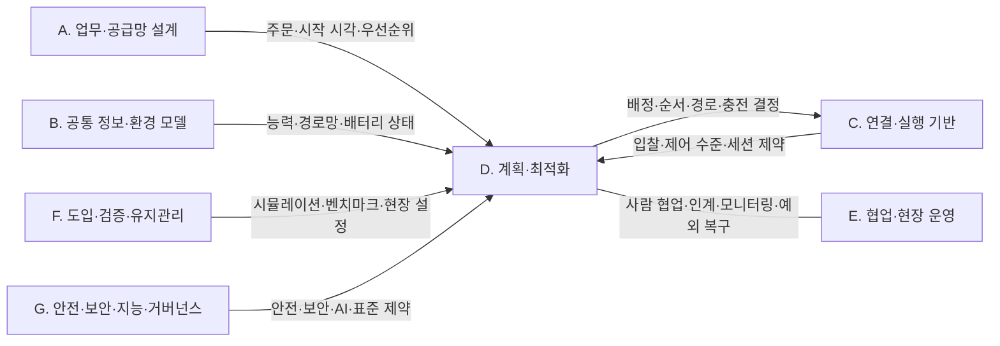
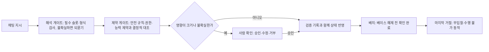
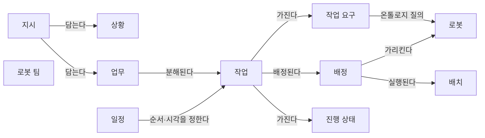
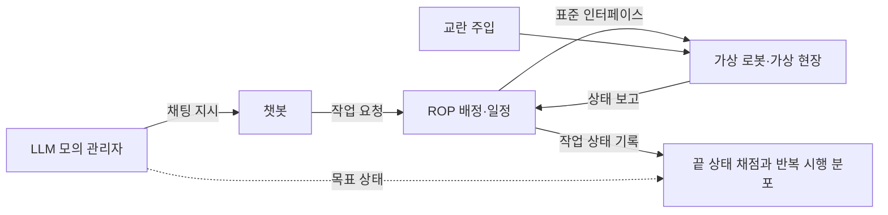
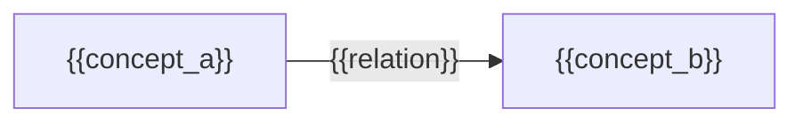
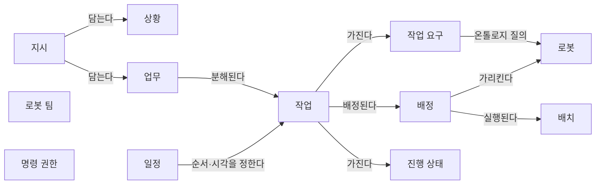

(너의 규칙은 시스템 프롬프트의 agents/shared-rules.md 와 agents/storyteller.md 이다. 아래는 이번 실행의 컨텍스트와 입력이다.)

## 실행 컨텍스트

- run_id: 2026-09-25-83
- date: 2026-09-25
- run_type: track (트랙 실행)
- 대상: 트랙 nl-task-chatbot (자연어 업무 지시 챗봇) · 현재 단계: 단계 4. 오해석 방지와 확인 절차 · 이번에 다룰 백로그 질문 id: q4-03 · 중심 세부영역: 13. 작업 배정 — MRTA (D. 계획·최적화)
- 예산:
    - max_search_queries: 40
    - max_sources_per_run: 20
    - new_topic_pages: 1
    - page_updates: 2
    - max_retries: 2
- 환경 알림: web_fetch_available: false · fetch_mode: mirror_only (일반 웹 페이지 열람은 네트워크 정책으로 막혀 있다. raw.githubusercontent.com 은 열린다: 공식 문서가 GitHub 에 있는 출처는 입력의 config/source_mirrors.yaml 경로를 WebFetch 로 열어 원문을 읽고 sources[].fetched=true, fetched_via=github_raw, fetch_url 을 적는다. 입력에 원문 텍스트(data/source_texts)가 있는 출처는 fetched_via=inbox. 그 밖의 출처는 fetched=false 이며 코드가 신뢰도 상한(medium)을 강제한다 — 공통 규칙 0절 6항)
- 언어: ko
- retry_count: 1
- max_retries: 2

## 입력

### runs/2026-09-25-83/target.json

```json
{
  "run_id": "2026-09-25-83",
  "date": "2026-09-25",
  "weekday": "Fri",
  "run_number": 84,
  "run_type": "track",
  "forced": true,
  "target": {
    "area_no": 13,
    "area_name": "13. 작업 배정 — MRTA",
    "category": "D. 계획·최적화",
    "category_letter": "D"
  },
  "topic": null,
  "track": {
    "slug": "nl-task-chatbot",
    "name": "자연어 업무 지시 챗봇",
    "stage": 4,
    "stages": 5,
    "stage_name": "오해석 방지와 확인 절차",
    "question_ids": [
      "q4-03"
    ],
    "user_questions": [],
    "runs_per_week": 3,
    "question_rationale": "CLI 지정 질문 id"
  },
  "corrections": [],
  "budget": {
    "max_search_queries": 40,
    "max_sources_per_run": 20,
    "new_topic_pages": 1,
    "page_updates": 2,
    "max_retries": 2
  },
  "priority_reason": null,
  "priority_questions": [],
  "excluded_areas": [],
  "lifted_areas": [],
  "deferred": {
    "monthly_recheck": false,
    "weekly_review": true
  },
  "selection_rationale": "CLI 지정 run_type=track, area=13; 트랙 실행일(Fri, track_days 앞 3개) → 트랙 nl-task-chatbot 단계 4, 질문 q4-03 (CLI 지정 질문 id)"
}
```

### runs/2026-09-25-83/research.json

```json
{
  "run_id": "2026-09-25-83",
  "date": "2026-09-25",
  "run_type": "track",
  "target": {
    "area_no": 13,
    "area_name": "13. 작업 배정 — MRTA",
    "category": "D. 계획·최적화"
  },
  "gaps": [
    "단계 4 질문 q4-03 열림(target.json 지정, CLI 지정 질문 id). 단계 4 페이지 3절에 q4-03 소제목 없음",
    "완료 조건: 명령 권한을 담은 확인 절차 초안이 업무 분해·배정 설계 초안 6절과 아이디어 2. 자연어 업무 지시 챗봇 5절에 없음",
    "업무 분해·배정 설계 초안: 지시 개념의 '입력자'가 인증된 사용자 식별인지, 권한 판정 결과를 어디에 남기는지 정해지지 않음",
    "13. 작업 배정 — MRTA 섹션 6에 사용자 권한이 배정 후보를 거르는 제약으로 들어가는 근거 없음",
    "26. 사이버보안·접근권한·개인정보 섹션 6에 채팅 지시(LLM 에이전트)의 명령 권한·감사 기록 근거 약함"
  ],
  "research_questions": [
    "가장 가까운 로봇에 맡기는 것이 전체적으로도 유리한가? [분류원문]",
    "q4-03 채팅 사용자별 명령 권한(어느 로봇·구역·작업까지 지시할 수 있는가)과 지시·확인의 감사 기록은 어떻게 두는가?",
    "로봇 관제 쪽 규격·구현(SROS 2 접근 통제 정책, Open-RMF API 서버, VDA 5050)은 누가 어떤 명령을 내릴 수 있는지를 어떤 단위(역할·그룹·자원)로 표현하고 집행하는가? (단계 4 페이지 3절, 26. 사이버보안·접근권한·개인정보 연결)",
    "LLM 에이전트 설계 지침·도구 규격(OWASP LLM06, MCP 인가·도구 명세)과 에이전트 권한 통제 연구(Progent, Conseca, AgentGuard, 인증된 위임)는 사용자 대신 행동하는 에이전트의 권한을 어디서, 어떤 형식으로 제한하는가? (27. AI·학습·적응과 모델 운영 연결)",
    "산업 제어 보안 표준(IEC 62443-3-3)과 규제(EU AI Act 제12·19조, 개인정보의 안전성 확보조치 기준)는 권한 집행과 감사 기록(기록 항목·보관 기간)에 무엇을 요구하는가? (한국 자료 우선 규칙)",
    "사용자 권한이 배정 후보를 거르는 제약이 될 때 배정 기준과 어떻게 나뉘는가? (13. 작업 배정 — MRTA 섹션 6)"
  ],
  "findings": [
    {
      "id": "f1",
      "claim": "ROS 2 설계 문서의 SROS 2 접근 통제 정책은 인클레이브(enclave)와 노드별 프로필 단위로 토픽 발행·구독, 서비스 요청·응답, 액션 호출·실행 권한을 허용·거부로 적고, 기본 거부이며 거부 권한이 허용 권한보다 우선한다.",
      "tag": "사실",
      "source_ids": [
        "ref-579"
      ],
      "cross_checked": false,
      "confidence": "medium",
      "evidence_excerpt": "원문: \"the priority of denied privileges conservatively supersedes allowed privileges, avoiding potential lapses in PoLP\". 문서에는 접근 감사·로그 기능 서술이 없음 (발행일 미확인, 확인일 기준)",
      "as_of": "2026-09-25",
      "flow_step": null,
      "flow_item": null
    },
    {
      "id": "f2",
      "claim": "Open-RMF 웹 API 서버(rmf-web api-server)는 OpenID Connect JWT 로 사용자를 식별하고, 역할(role)·동작(action, 예: task_submit)·인가 그룹(authorization group)의 조합으로 사용자가 어떤 자원에 어떤 동작을 할 수 있는지 정하며, 관리자는 모든 그룹에 모든 동작 권한을 가진다.",
      "tag": "사실",
      "source_ids": [
        "ref-763"
      ],
      "cross_checked": false,
      "confidence": "medium",
      "evidence_excerpt": "README: 사용자는 자신의 역할 가운데 하나가 자원이 속한 인가 그룹에 대해 그 동작 권한을 가지면 동작할 수 있다. 첫 API 접근 때 최소 권한 사용자로 자동 생성 (발행일 미확인, 확인일 기준)",
      "as_of": "2026-09-25",
      "flow_step": null,
      "flow_item": null
    },
    {
      "id": "f3",
      "claim": "이번에 연 Open-RMF 웹 API 서버 README 범위에서는 사용자 동작의 감사 기록(audit trail) 기능 설명이 확인되지 않았다.",
      "tag": "추정",
      "source_ids": [
        "ref-763"
      ],
      "cross_checked": false,
      "confidence": "low",
      "evidence_excerpt": "README 는 인증·역할·인가 그룹·관리자 엔드포인트를 설명하나 로그·감사 기록 서술 없음. 저장소 전체의 부재 확인은 아님 (발행일 미확인, 확인일 기준)",
      "as_of": "2026-09-25",
      "flow_step": null,
      "flow_item": null
    },
    {
      "id": "f4",
      "claim": "Open-RMF 작업 요청 스키마의 requester 는 요청한 주체를 가리키는 선택 식별자 문자열일 뿐 인증 필드가 없고, fleet_name 으로 작업을 수행할 수 있는 플릿을 지정하면 그 플릿만 입찰한다.",
      "tag": "사실",
      "source_ids": [
        "ref-125"
      ],
      "cross_checked": false,
      "confidence": "medium",
      "evidence_excerpt": "requester(선택): \"An identifier for the entity that requested this task\". 인증·사용자 필드는 스키마에 정의되지 않음 (발행일 미확인, 확인일 기준)",
      "as_of": "2026-09-25",
      "flow_step": "피킹",
      "flow_item": "수행 자원"
    },
    {
      "id": "f5",
      "claim": "VDA 5050 3.0.0 은 사이버보안 조치와 운영자·통합자·제조사·관제 공급자 사이 책임 배분을 범위에서 제외하고, 프로토콜 보안은 브로커 설정에서 다루며, 인증서 갱신 절에서 순간 동작(instantAction)의 발신자를 검증할 수 없다고 적는다.",
      "tag": "사실",
      "source_ids": [
        "ref-031"
      ],
      "cross_checked": false,
      "confidence": "medium",
      "evidence_excerpt": "원문: \"The download shall be secured via TLS as well, since the sender of the instantAction cannot be verified.\" 2장 범위에 Cybersecurity Measures·Operational Responsibilities 제외 (공식 저장소 main 판, 확인일 기준)",
      "as_of": "2026-09-25",
      "flow_step": null,
      "flow_item": null
    },
    {
      "id": "f6",
      "claim": "OWASP LLM06:2025 과도한 에이전시 항목은 사용자 대신 한 행동을 그 사용자의 권한 맥락과 최소 권한으로 하위 시스템에서 실행하고, 허용 여부를 LLM 이 판단하게 하지 말고 하위 시스템에서 인가를 집행(완전한 중재)하며, 확장 활동 로깅·감시와 빈도 제한을 두라고 권고한다.",
      "tag": "사실",
      "source_ids": [
        "ref-695"
      ],
      "cross_checked": false,
      "confidence": "medium",
      "evidence_excerpt": "원문: \"Track user authorization and security scope to ensure actions taken on behalf of a user are executed on downstream systems in the context of that specific user\" (문서 안 발행일 미확인)",
      "as_of": "2024-11",
      "flow_step": null,
      "flow_item": null
    },
    {
      "id": "f7",
      "claim": "MCP 명세(2025-06-18판) 인가 절은 인가를 선택 사항으로 두되 HTTP 전송은 OAuth 2.1 일부를 따르게 하고, 서버가 자신을 대상으로 발급된 토큰인지 확인하게 하며, 받은 토큰을 상위 API 로 그대로 넘기는 것(token passthrough)을 금지하고 혼란된 대리인(confused deputy) 위험을 경고한다.",
      "tag": "사실",
      "source_ids": [
        "ref-764"
      ],
      "cross_checked": false,
      "confidence": "medium",
      "evidence_excerpt": "원문 요지: MCP servers must validate that access tokens were specifically issued for them as the intended audience; 상위 요청에는 별도 토큰 사용, 자원 표시자(RFC 8707) 필수",
      "as_of": "2025-06-18",
      "flow_step": null,
      "flow_item": null
    },
    {
      "id": "f8",
      "claim": "MCP 명세(2025-06-18판) 도구 절은 서버가 도구 입력 검증·접근 통제·호출 빈도 제한을 두고, 클라이언트가 민감한 작업에 사용자 확인을 묻고 도구 사용을 감사 목적으로 기록하며, 신뢰하지 않는 서버의 도구 주석(annotations)은 신뢰하지 말라고 적는다.",
      "tag": "사실",
      "source_ids": [
        "ref-696"
      ],
      "cross_checked": false,
      "confidence": "medium",
      "evidence_excerpt": "원문: \"clients MUST consider tool annotations to be untrusted unless they come from trusted servers\"; 서버 보안 요구에 proper access controls, rate limit tool invocations",
      "as_of": "2025-06-18",
      "flow_step": null,
      "flow_item": null
    },
    {
      "id": "f9",
      "claim": "NIST SP 800-162 는 속성 기반 접근 통제(ABAC)를 주체·객체·요청 동작의 속성과 시간·위치 같은 환경 조건을 정책에 대조해 허용 여부를 정하는 방식으로 정의한다.",
      "tag": "사실",
      "source_ids": [
        "ref-769"
      ],
      "cross_checked": false,
      "confidence": "medium",
      "evidence_excerpt": "검색 요약: 주체(사람·프로세스·장치), 객체, 요청 동작, 환경 조건(시간·위치·위협 수준 등) 속성을 정책·규칙과 대조",
      "as_of": "2014-01",
      "flow_step": null,
      "flow_item": null,
      "source_unopened": true
    },
    {
      "id": "f10",
      "claim": "IEC 62443-3-3(2013)의 사용 통제 요구(FR 2)는 인증된 주체가 인가된 동작만 하도록 하는 인가 집행(SR 2.1), 감사 가능 사건 기록(SR 2.8), 타임스탬프(SR 2.11), 특정 사용자가 특정 동작을 했는지 판별하는 부인 방지(SR 2.12)를 둔다.",
      "tag": "사실",
      "source_ids": [
        "ref-768"
      ],
      "cross_checked": false,
      "confidence": "medium",
      "evidence_excerpt": "검색 요약(2차 요약 기준): SR 2.12 는 사람·소프트웨어 프로세스·장치 중 누가 특정 동작을 했는지 판별하는 능력을 요구. 표준 본문 유료, 원문 미열람",
      "as_of": "2013-08",
      "flow_step": null,
      "flow_item": null,
      "source_unopened": true
    },
    {
      "id": "f11",
      "claim": "MiR 는 MiR Fleet(Enterprise)이 사용자 그룹 단위 권한과 개인별 로그인, 단일 로그인(SSO), 역할 기반 접근 권한, 감사 로깅을 제공하고 IEC 62443-4-2(SL-C 3)를 고려해 설계되었다고 밝힌다.",
      "tag": "추정",
      "source_ids": [
        "ref-775",
        "ref-776"
      ],
      "cross_checked": false,
      "confidence": "low",
      "evidence_excerpt": "벤더 주장: role-based access permissions, audit logging, single sign-on; 권한은 사용자 그룹별, 로그인 자격은 개인별. 기사는 벤더 발표를 옮긴 것으로 독립 확인 아님 (발행일 미확인, 확인일 기준)",
      "as_of": "2026-09-25",
      "flow_step": null,
      "flow_item": null,
      "source_unopened": true,
      "vendor_claim": true
    },
    {
      "id": "f12",
      "claim": "Progent 는 도구 이름과 인자에 대한 기호 규칙으로 된 권한 정책 언어로 LLM 에이전트의 도구 호출을 실행 시점에 결정적으로 허용·차단하고 차단 시 대체 동작과 정책 갱신을 두며, 저자들은 AgentDojo 등 벤치마크에서 공격 성공률을 0%로 낮췄다고 보고했다.",
      "tag": "사실",
      "source_ids": [
        "ref-770"
      ],
      "cross_checked": false,
      "confidence": "medium",
      "evidence_excerpt": "검색 요약: 사용자마다 권한 수준이 다를 때 격리된 권한 통제에 쓸 수 있고, 정책을 LLM 이 사용자 질의로부터 생성·갱신할 수도 있음. 수치는 저자 보고(AgentDojo·ASB·AgentPoison 조건)",
      "as_of": "2025-04",
      "flow_step": null,
      "flow_item": null,
      "source_unopened": true
    },
    {
      "id": "f13",
      "claim": "Conseca(Tsai·Bagdasarian, HotOS 2025)는 사용자 과제를 받으면 신뢰할 수 있는 맥락만으로 그 과제에 맞춘 즉시(just-in-time) 보안 정책을 만들고, 계획기가 낸 각 동작을 실행 전에 그 정책으로 결정적으로 판정한다.",
      "tag": "사실",
      "source_ids": [
        "ref-772"
      ],
      "cross_checked": false,
      "confidence": "medium",
      "evidence_excerpt": "검색 요약: 수작업 정적 정책은 모든 맥락을 담지 못해 과도한 제한이나 과도한 허용으로 이어진다고 보고, 결정적 집행으로 프롬프트 주입에 강하다고 주장",
      "as_of": "2025-01",
      "flow_step": null,
      "flow_item": null,
      "source_unopened": true
    },
    {
      "id": "f14",
      "claim": "MiniScope(arXiv 2512.11147) 저자들은 LLM 이 보안 정책을 생성하는 방식은 엄격한 보장이 없다고 보고 도구 호출 에이전트의 최소 권한 틀을 제안한 것으로 보인다.",
      "tag": "추정",
      "source_ids": [
        "ref-774"
      ],
      "cross_checked": false,
      "confidence": "low",
      "evidence_excerpt": "검색 결과의 제3자 요약(alphaXiv) 기준. 원문 미열람, 방법·평가 조건 미확인",
      "as_of": "2025-12",
      "flow_step": null,
      "flow_item": null,
      "source_unopened": true
    },
    {
      "id": "f15",
      "claim": "AgentGuard(arXiv 2605.28071)는 도구 사용 LLM 에이전트용 속성 기반 접근 통제 틀로, LLM 이 도구를 부를 때마다 클라이언트가 요청을 가로채 서버의 판정을 받은 뒤에만 실행하고 서버가 정책 저장소와 모든 활동의 감사 로그를 둔다.",
      "tag": "사실",
      "source_ids": [
        "ref-773"
      ],
      "cross_checked": false,
      "confidence": "medium",
      "evidence_excerpt": "검색 결과 요약 기준(원문 미열람, 저자·평가 조건 미확인)",
      "as_of": "2026-05",
      "flow_step": null,
      "flow_item": null,
      "source_unopened": true
    },
    {
      "id": "f16",
      "claim": "South 외(arXiv 2501.09674)는 사용자가 AI 에이전트에 위임 자격 증명(에이전트 식별, 맥락별 범위를 제한한 위임 권한, 사용자 메타데이터, 서명)을 발급해 제3자가 에이전트가 어느 사용자를 대신해 어떤 권한으로 행동하는지 검증하게 하는, OAuth 2.0·OpenID Connect 확장 기반 인증된 위임 틀을 제안했다.",
      "tag": "사실",
      "source_ids": [
        "ref-771"
      ],
      "cross_checked": false,
      "confidence": "medium",
      "evidence_excerpt": "검색 요약: 인증·인가·감사 가능한 위임으로 책임의 연쇄를 유지. 구현·평가 세부 미확인",
      "as_of": "2025-01",
      "flow_step": null,
      "flow_item": null,
      "source_unopened": true
    },
    {
      "id": "f17",
      "claim": "LLM 에이전트의 증거 추적·실행 출처(provenance) 서베이(arXiv 2606.04990)는 도구 호출 출처를 어떤 도구를 골랐는지, 어떤 인자를 넘겼는지, 무엇이 반환되었는지, 그 결과가 뒤의 추론·행동에 어떻게 영향을 주었는지의 기록으로 설명한다.",
      "tag": "사실",
      "source_ids": [
        "ref-777"
      ],
      "cross_checked": false,
      "confidence": "medium",
      "evidence_excerpt": "검색 요약 기준. 서베이는 에이전트 관측·출처 연구가 분절되어 있고 감사·귀속·거버넌스가 열린 문제라고 정리 (원문 미열람)",
      "as_of": "2026-06",
      "flow_step": null,
      "flow_item": null,
      "source_unopened": true
    },
    {
      "id": "f18",
      "claim": "EU AI Act 제12조는 고위험 AI 시스템이 수명 동안 사건 기록(로그)을 자동으로 남길 수 있게 요구하고, 제19조·제26조 제6항은 공급자와 배포자가 자기 관리 아래의 로그를 법에 달리 정함이 없으면 최소 6개월 보관하게 하는 것으로 보인다.",
      "tag": "추정",
      "source_ids": [
        "ref-765",
        "ref-766"
      ],
      "cross_checked": false,
      "confidence": "low",
      "evidence_excerpt": "제3자 조문 게재본(artificialintelligenceact.eu) 검색 요약 기준, EUR-Lex 원문 미확인. 물류 로봇 배정 AI 의 고위험 해당 여부 미확인",
      "as_of": "2024",
      "flow_step": null,
      "flow_item": null,
      "source_unopened": true
    },
    {
      "id": "f19",
      "claim": "개인정보의 안전성 확보조치 기준은 개인정보처리시스템 접근권한을 업무에 필요한 최소 범위로 개인정보취급자별 계정에 차등 부여하고, 권한 부여·변경·말소 내역을 최소 3년, 접속기록을 1년 이상(5만 명 이상 정보주체 또는 고유식별·민감정보 처리 시 2년 이상) 보관하도록 정한다.",
      "tag": "사실",
      "source_ids": [
        "ref-767"
      ],
      "cross_checked": false,
      "confidence": "medium",
      "evidence_excerpt": "검색 요약 기준(국가법령정보센터 고시, 원문 미열람). 개정판마다 조문 번호가 다를 수 있어 현행 조문 번호 미확인 (발행일 미확인, 확인일 기준)",
      "as_of": "2026-09-25",
      "flow_step": null,
      "flow_item": null,
      "source_unopened": true
    },
    {
      "id": "f20",
      "claim": "채팅 지시 기록에 작업자 이름·사번 같은 개인 식별 정보가 담기면 챗봇·ROP 가 개인정보처리시스템으로 보아 접근권한 기록·접속기록 보관 기준을 적용받을 수 있어 보이나, 공식 해석은 확인하지 못했다.",
      "tag": "추정",
      "source_ids": [
        "ref-767"
      ],
      "cross_checked": false,
      "confidence": "low",
      "evidence_excerpt": "이 위키의 적용 추론. 개인정보처리시스템 해당 여부에 관한 개인정보보호위원회 해석 미확인",
      "as_of": "2026-09-25",
      "flow_step": null,
      "flow_item": null,
      "source_unopened": true
    },
    {
      "id": "f21",
      "claim": "q4-03 에 대해 확인한 자료를 이 위키가 묶으면, 명령 권한은 LLM 의 판단이 아니라 ROP 의 결정적 인가 계층이 집행하고(완전한 중재), 챗봇은 인증된 채팅 사용자의 권한 맥락으로만 작업 요청을 내며, 권한은 사용자 역할·그룹, 동작(작업 종류·취소·우선순위 변경), 자원 그룹(로봇·플릿·구역), 환경 조건(교대조·시간대)을 대조하는 기본 거부 규칙으로 두는 구성이 근거가 가장 많은 것으로 보인다.",
      "tag": "추정",
      "source_ids": [
        "ref-695",
        "ref-763",
        "ref-579",
        "ref-769",
        "ref-764",
        "ref-771",
        "ref-770",
        "ref-772"
      ],
      "cross_checked": false,
      "confidence": "low",
      "evidence_excerpt": "이 위키의 종합. 근거는 LLM 보안 지침·에이전트 권한 연구·로봇 미들웨어 접근 통제·ABAC 정의이며, 물류 챗봇의 명령 권한을 직접 다룬 출처는 찾지 못함",
      "as_of": "2026-09-25",
      "flow_step": null,
      "flow_item": null,
      "source_unopened": false
    },
    {
      "id": "f22",
      "claim": "감사 기록은 지시마다 인증된 사용자 식별, 원문 메시지, 해석 결과, 권한 판정(허용·거부와 적용 규칙), 사용자 확인 응답, 배치한 작업 요청 id, 로봇·관제 쪽 결과·오류를 타임스탬프와 함께 잇는 형태로 두고, 보관 기간은 적용 법규의 최소 기준을 따르는 것이 선택지로 보인다.",
      "tag": "추정",
      "source_ids": [
        "ref-696",
        "ref-768",
        "ref-777",
        "ref-125",
        "ref-031",
        "ref-765",
        "ref-767"
      ],
      "cross_checked": false,
      "confidence": "low",
      "evidence_excerpt": "이 위키의 종합. 기록 항목은 IEC 62443 SR 2.8·2.11·2.12, MCP 도구 감사 권고, 도구 호출 출처 서베이를 대응시킨 것",
      "as_of": "2026-09-25",
      "flow_step": null,
      "flow_item": null,
      "source_unopened": false
    },
    {
      "id": "f23",
      "claim": "Open-RMF 작업 요청의 requester 는 인증되지 않은 선택 문자열이고 VDA 5050 은 사이버보안을 범위에서 빼므로, 채팅 사용자 신원과 권한 판정은 로봇 관제 인터페이스가 아니라 ROP 경계에서 묶어 두고 작업 요청 id 와 연결해 보관해야 할 것으로 보인다.",
      "tag": "추정",
      "source_ids": [
        "ref-125",
        "ref-031",
        "ref-763"
      ],
      "cross_checked": false,
      "confidence": "low",
      "evidence_excerpt": "이 위키의 추론. 로봇·제조사 관제 쪽 인증·권한 구현은 연계 대상",
      "as_of": "2026-09-25",
      "flow_step": null,
      "flow_item": null
    },
    {
      "id": "f24",
      "claim": "피킹 구역 관리자가 채팅으로 자기 구역 로봇에 토트 운반을 지시하면 허용하되, 다른 구역 플릿 지시·다른 사람의 진행 작업 취소·출입 제한 구역 진입은 상위 역할 권한이나 승인이 있어야 허용하고, 거부한 지시도 판정 사유와 함께 감사 기록에 남기는 흐름이 가능해 보인다(설명용 가정 사례).",
      "tag": "추정",
      "source_ids": [
        "ref-763",
        "ref-769",
        "ref-695"
      ],
      "cross_checked": false,
      "confidence": "low",
      "evidence_excerpt": "설명용 가정 사례. 역할·구역 구분은 이 위키의 예시이며 현장 기준 출처 없음",
      "as_of": "2026-09-25",
      "flow_step": "피킹",
      "flow_item": "제약",
      "source_unopened": false
    },
    {
      "id": "f25",
      "claim": "분류 원문 질문(가장 가까운 로봇에 맡기는 것이 전체적으로도 유리한가)과 관련해, 사용자 권한이 지시할 수 있는 플릿·구역을 제한하면 가장 가까운 로봇이 후보에서 빠질 수 있으므로, 권한은 Open-RMF fleet_name 처럼 배정 전 후보를 거르는 제약으로 넘기고 후보 가운데 선택 기준은 디스패처가 지키는 분담이 선택지로 보인다.",
      "tag": "추정",
      "source_ids": [
        "ref-125",
        "ref-763",
        "ref-769"
      ],
      "cross_checked": false,
      "confidence": "low",
      "evidence_excerpt": "이 위키의 추론. 권한 제약이 배정 최적성에 주는 손실을 잰 자료는 찾지 못함",
      "as_of": "2026-09-25",
      "flow_step": "피킹",
      "flow_item": "수행 자원",
      "source_unopened": false
    },
    {
      "id": "f26",
      "claim": "이번 검색 범위(한국어 3회 포함 15회)에서는 물류 창고 로봇에 채팅으로 지시하는 사용자의 명령 권한·감사 기록을 다룬 연구나 국내 사례를 찾지 못했다(부재 확인 아님).",
      "tag": "추정",
      "source_ids": [
        "ref-770",
        "ref-772",
        "ref-773"
      ],
      "cross_checked": false,
      "confidence": "low",
      "evidence_excerpt": "확인한 에이전트 권한 연구의 평가 환경은 웹·업무 도구 에이전트 벤치마크였음",
      "as_of": "2026-09-25",
      "flow_step": null,
      "flow_item": null,
      "source_unopened": true
    }
  ],
  "sources": [
    {
      "id": "ref-579",
      "org": "Open Robotics (ros2/design GitHub)",
      "title": "ROS 2 Access Control Policies (design.ros2.org articles/ros2_access_control_policies)",
      "published": null,
      "url": "https://design.ros2.org/articles/ros2_access_control_policies.html",
      "type": "오픈소스 문서",
      "reliability": "medium",
      "accessed": "2026-09-25",
      "summary": "SROS 2 접근 통제 정책의 구조(인클레이브·프로필, 토픽·서비스·액션 허용·거부, 기본 거부와 거부 우선)를 설명한다.",
      "fetched": true,
      "fetched_via": "github_raw",
      "fetch_url": "https://raw.githubusercontent.com/ros2/design/gh-pages/articles/181_ros2_access_control_policies.md",
      "source_unopened": false
    },
    {
      "id": "ref-763",
      "org": "Open Robotics (open-rmf)",
      "title": "rmf-web — packages/api-server/README.md",
      "published": null,
      "url": "https://github.com/open-rmf/rmf-web/blob/main/packages/api-server/README.md",
      "type": "오픈소스 문서",
      "reliability": "medium",
      "accessed": "2026-09-25",
      "summary": "Open-RMF 웹 API 서버의 OIDC 인증과 역할·동작·인가 그룹 기반 접근 통제, 관리자 권한을 설명한다.",
      "fetched": true,
      "fetched_via": "github_raw",
      "fetch_url": "https://raw.githubusercontent.com/open-rmf/rmf-web/main/packages/api-server/README.md",
      "source_unopened": false
    },
    {
      "id": "ref-764",
      "org": "Model Context Protocol (modelcontextprotocol GitHub)",
      "title": "Specification 2025-06-18 — Basic: Authorization (docs/specification/2025-06-18/basic/authorization.mdx)",
      "published": "2025-06-18",
      "url": "https://github.com/modelcontextprotocol/modelcontextprotocol/blob/main/docs/specification/2025-06-18/basic/authorization.mdx",
      "type": "표준",
      "reliability": "medium",
      "accessed": "2026-09-25",
      "summary": "MCP 의 OAuth 2.1 기반 인가 절차, 토큰 대상 검증, 토큰 전달 금지, 혼란된 대리인 위험을 규정한다.",
      "fetched": true,
      "fetched_via": "github_raw",
      "fetch_url": "https://raw.githubusercontent.com/modelcontextprotocol/modelcontextprotocol/main/docs/specification/2025-06-18/basic/authorization.mdx",
      "source_unopened": false
    },
    {
      "id": "ref-765",
      "org": "Future of Life Institute (artificialintelligenceact.eu, EU 규정 2024/1689 조문 게재본)",
      "title": "Article 12: Record-Keeping | EU Artificial Intelligence Act",
      "published": "2024",
      "url": "https://artificialintelligenceact.eu/article/12/",
      "type": "정부·연구기관",
      "reliability": "medium",
      "accessed": "2026-09-25",
      "summary": "원문 미열람. 고위험 AI 시스템의 자동 사건 기록(로그) 요구 조문 게재본.",
      "fetched": false,
      "fetched_via": null,
      "fetch_url": null,
      "source_unopened": true
    },
    {
      "id": "ref-766",
      "org": "Future of Life Institute (artificialintelligenceact.eu, EU 규정 2024/1689 조문 게재본)",
      "title": "Article 19: Automatically Generated Logs | EU Artificial Intelligence Act",
      "published": "2024",
      "url": "https://artificialintelligenceact.eu/article/19/",
      "type": "정부·연구기관",
      "reliability": "medium",
      "accessed": "2026-09-25",
      "summary": "원문 미열람. 자동 생성 로그를 최소 6개월 보관하도록 하는 조문 게재본.",
      "fetched": false,
      "fetched_via": null,
      "fetch_url": null,
      "source_unopened": true
    },
    {
      "id": "ref-767",
      "org": "국가법령정보센터(개인정보보호위원회 고시)",
      "title": "개인정보의 안전성 확보조치 기준",
      "published": null,
      "url": "https://www.law.go.kr/admRulLsInfoP.do?chrClsCd=010202&admRulSeq=2100000229672",
      "type": "정부·연구기관",
      "reliability": "medium",
      "accessed": "2026-09-25",
      "summary": "원문 미열람. 개인정보처리시스템 접근권한 차등 부여, 권한 변경 기록 3년 보관, 접속기록 보관·점검을 정한 고시.",
      "fetched": false,
      "fetched_via": null,
      "fetch_url": null,
      "source_unopened": true
    },
    {
      "id": "ref-768",
      "org": "IEC",
      "title": "IEC 62443-3-3:2013 Industrial communication networks — Network and system security — Part 3-3: System security requirements and security levels",
      "published": "2013-08",
      "url": "https://standards.iteh.ai/catalog/standards/iec/c32e05fe-78a2-467e-a24d-0fc422289f55/iec-62443-3-3-2013",
      "type": "표준",
      "reliability": "medium",
      "accessed": "2026-09-25",
      "summary": "원문 미열람. 산업 제어 시스템의 시스템 보안 요구(사용 통제 FR 2: 인가 집행, 감사 가능 사건, 타임스탬프, 부인 방지 등)를 정한 표준(유료).",
      "fetched": false,
      "fetched_via": null,
      "fetch_url": null,
      "source_unopened": true
    },
    {
      "id": "ref-769",
      "org": "NIST",
      "title": "Guide to Attribute Based Access Control (ABAC) Definition and Considerations (NIST SP 800-162)",
      "published": "2014-01",
      "url": "https://nvlpubs.nist.gov/nistpubs/specialpublications/nist.sp.800-162.pdf",
      "type": "정부·연구기관",
      "reliability": "medium",
      "accessed": "2026-09-25",
      "summary": "원문 미열람. 주체·객체·동작·환경 조건 속성을 정책과 대조하는 속성 기반 접근 통제의 정의와 고려 사항.",
      "fetched": false,
      "fetched_via": null,
      "fetch_url": null,
      "source_unopened": true
    },
    {
      "id": "ref-770",
      "org": "Shi, T. 외(UC Berkeley·UC Santa Barbara·NUS, Progent 저자)",
      "title": "Progent: Programmable Privilege Control for LLM Agents",
      "published": "2025-04",
      "url": "https://arxiv.org/abs/2504.11703",
      "type": "논문",
      "reliability": "medium",
      "accessed": "2026-09-25",
      "summary": "원문 미열람. 도구 이름·인자 규칙으로 된 권한 정책을 결정적으로 집행하는 LLM 에이전트 권한 통제 틀.",
      "fetched": false,
      "fetched_via": null,
      "fetch_url": null,
      "source_unopened": true
    },
    {
      "id": "ref-771",
      "org": "South, T., Marro, S., Hardjono, T., Mahari, R., Whitney, C. D., Greenwood, D., Chan, A., & Pentland, A.",
      "title": "Authenticated Delegation and Authorized AI Agents",
      "published": "2025-01",
      "url": "https://arxiv.org/abs/2501.09674",
      "type": "논문",
      "reliability": "medium",
      "accessed": "2026-09-25",
      "summary": "원문 미열람. OAuth 2.0·OIDC 를 확장해 사용자가 AI 에이전트에 범위를 제한한 권한을 위임하고 제3자가 검증하게 하는 틀.",
      "fetched": false,
      "fetched_via": null,
      "fetch_url": null,
      "source_unopened": true
    },
    {
      "id": "ref-772",
      "org": "Tsai, L., & Bagdasarian, E.(Google, HotOS 2025)",
      "title": "Contextual Agent Security: A Policy for Every Purpose",
      "published": "2025-01",
      "url": "https://arxiv.org/abs/2501.17070",
      "type": "논문",
      "reliability": "medium",
      "accessed": "2026-09-25",
      "summary": "원문 미열람. 과제마다 신뢰 맥락으로 즉시 보안 정책을 만들고 결정적으로 집행하는 Conseca 틀.",
      "fetched": false,
      "fetched_via": null,
      "fetch_url": null,
      "source_unopened": true
    },
    {
      "id": "ref-773",
      "org": "AgentGuard 저자(arXiv 2605.28071, 저자 미확인)",
      "title": "AgentGuard: An Attribute-Based Access Control Framework for Tool-Using LLM-Based Agents",
      "published": "2026-05",
      "url": "https://arxiv.org/abs/2605.28071",
      "type": "논문",
      "reliability": "medium",
      "accessed": "2026-09-25",
      "summary": "원문 미열람. 도구 호출을 가로채 서버가 속성 기반으로 판정하고 활동 감사 로그를 두는 에이전트 접근 통제 틀(제목은 검색 요약의 번역 제목 기준).",
      "fetched": false,
      "fetched_via": null,
      "fetch_url": null,
      "source_unopened": true
    },
    {
      "id": "ref-774",
      "org": "MiniScope 저자(arXiv 2512.11147, 저자 미확인)",
      "title": "MiniScope: A Least-Privilege Framework for Authorizing Tool-Calling Agents",
      "published": "2025-12",
      "url": "https://arxiv.org/abs/2512.11147",
      "type": "논문",
      "reliability": "medium",
      "accessed": "2026-09-25",
      "summary": "원문 미열람. 도구 호출 에이전트의 최소 권한 인가 틀이며 LLM 생성 정책의 보장 부족을 지적한다(제목은 검색 요약의 번역 제목 기준).",
      "fetched": false,
      "fetched_via": null,
      "fetch_url": null,
      "source_unopened": true
    },
    {
      "id": "ref-775",
      "org": "Mobile Industrial Robots(MiR)",
      "title": "MiR Fleet",
      "published": null,
      "url": "https://mobile-industrial-robots.com/products/software/mir-fleet",
      "type": "벤더 문서",
      "reliability": "low",
      "accessed": "2026-09-25",
      "summary": "원문 미열람. MiR 플릿 관리 소프트웨어 제품 페이지(사용자 그룹 권한·감사 로깅 등 기능 소개, 벤더 주장).",
      "fetched": false,
      "fetched_via": null,
      "fetch_url": null,
      "source_unopened": true
    },
    {
      "id": "ref-776",
      "org": "Automated Warehouse",
      "title": "MiR Fleet Enterprise includes scalability, cybersecurity features for mobile robots",
      "published": null,
      "url": "https://www.automatedwarehouseonline.com/mir-fleet-enterprise-includes-scalability-cybersecurity-features-mobile-robots/",
      "type": "기사",
      "reliability": "low",
      "accessed": "2026-09-25",
      "summary": "원문 미열람. MiR Fleet Enterprise 의 SSO·역할 기반 권한·감사 로깅·IEC 62443-4-2 고려 설계를 전하는 기사(벤더 발표 기반).",
      "fetched": false,
      "fetched_via": null,
      "fetch_url": null,
      "source_unopened": true
    },
    {
      "id": "ref-777",
      "org": "arXiv 2606.04990 저자(미확인)",
      "title": "From Agent Traces to Trust: A Survey of Evidence Tracing and Execution Provenance in LLM Agents",
      "published": "2026-06",
      "url": "https://arxiv.org/abs/2606.04990",
      "type": "논문",
      "reliability": "medium",
      "accessed": "2026-09-25",
      "summary": "원문 미열람. LLM 에이전트의 증거 추적·도구 호출 출처 기록 연구를 정리한 서베이.",
      "fetched": false,
      "fetched_via": null,
      "fetch_url": null,
      "source_unopened": true
    },
    {
      "id": "ref-695",
      "org": "OWASP Top 10 for LLM Applications 프로젝트 (OWASP GitHub)",
      "title": "LLM06:2025 Excessive Agency (2_0_vulns/LLM06_ExcessiveAgency.md)",
      "published": "2024-11",
      "url": "https://github.com/OWASP/www-project-top-10-for-large-language-model-applications/blob/main/2_0_vulns/LLM06_ExcessiveAgency.md",
      "type": "오픈소스 문서",
      "reliability": "medium",
      "accessed": "2026-09-25",
      "summary": "과도한 에이전시의 원인과 대응(사용자 맥락 실행, 완전한 중재, 로깅·감시, 빈도 제한)을 정리한 OWASP 항목.",
      "fetched": true,
      "fetched_via": "github_raw",
      "fetch_url": "https://raw.githubusercontent.com/OWASP/www-project-top-10-for-large-language-model-applications/main/2_0_vulns/LLM06_ExcessiveAgency.md",
      "source_unopened": false
    },
    {
      "id": "ref-696",
      "org": "Model Context Protocol (modelcontextprotocol GitHub)",
      "title": "Specification 2025-06-18 — Server Features: Tools (docs/specification/2025-06-18/server/tools.mdx)",
      "published": "2025-06-18",
      "url": "https://github.com/modelcontextprotocol/modelcontextprotocol/blob/main/docs/specification/2025-06-18/server/tools.mdx",
      "type": "표준",
      "reliability": "medium",
      "accessed": "2026-09-25",
      "summary": "MCP 도구 명세의 사람 확인·접근 통제·빈도 제한·감사 기록 권고와 도구 주석 신뢰 규칙.",
      "fetched": true,
      "fetched_via": "github_raw",
      "fetch_url": "https://raw.githubusercontent.com/modelcontextprotocol/modelcontextprotocol/main/docs/specification/2025-06-18/server/tools.mdx",
      "source_unopened": false
    },
    {
      "id": "ref-125",
      "org": "Open Robotics (open-rmf)",
      "title": "rmf_api_msgs — rmf_api_msgs/schemas/task_request.json",
      "published": null,
      "url": "https://github.com/open-rmf/rmf_api_msgs/blob/main/rmf_api_msgs/schemas/task_request.json",
      "type": "오픈소스 문서",
      "reliability": "medium",
      "accessed": "2026-09-25",
      "summary": "Open-RMF 작업 요청 스키마(범주·기술 필수, requester·fleet_name·우선순위 등 선택).",
      "fetched": true,
      "fetched_via": "github_raw",
      "fetch_url": "https://raw.githubusercontent.com/open-rmf/rmf_api_msgs/main/rmf_api_msgs/schemas/task_request.json",
      "source_unopened": false
    },
    {
      "id": "ref-031",
      "org": "VDA / VDMA (VDA5050 GitHub)",
      "title": "VDA5050/VDA5050_EN.md — Official Specification document for the VDA 5050",
      "published": null,
      "url": "https://github.com/VDA5050/VDA5050/blob/main/VDA5050_EN.md",
      "type": "표준",
      "reliability": "medium",
      "accessed": "2026-09-25",
      "summary": "VDA 5050 3.0.0 명세 원문(범위, 주문·순간 동작, 인증서 갱신, 오류 유형).",
      "fetched": true,
      "fetched_via": "github_raw",
      "fetch_url": null,
      "source_unopened": false
    }
  ],
  "page_proposals": [
    {
      "action": "update",
      "path": "docs/tracks/nl-task-chatbot/stage-4-misinterpretation-safeguards.md",
      "sections": [
        "2",
        "3",
        "4",
        "5",
        "6",
        "8",
        "9"
      ],
      "rationale": "q4-03 답: f1·f2·f3·f4·f5·f6·f7·f8·f9·f10·f11·f12·f13·f14·f15·f16·f17·f18·f19·f20·f21·f22·f23·f24·f25·f26 (신뢰도 low) — 2절 q4-03 상태 답함, 3절 q4-03 소제목 신설({#q4-03}): 로봇 관제 쪽 권한 표현(SROS 2 f1, Open-RMF API 서버 RBAC f2·f3, requester 필드 f4, VDA 5050 범위 f5, 벤더 사례 f11 벤더 주장), LLM 에이전트 지침·규격(OWASP f6, MCP 인가 f7, MCP 도구 f8), 접근 통제 모델(ABAC f9), 에이전트 권한 연구(Progent f12, Conseca f13, MiniScope f14 추정, AgentGuard f15, 인증된 위임 f16), 감사 기록 근거(IEC 62443 f10, 도구 호출 출처 f17, EU AI Act f18 추정, 개인정보 안전성 확보조치 기준 f19·f20), 종합: 권한 모델 구성(f21, 표 권장)·감사 기록 항목(f22, 표 권장)·ROP 경계에서의 신원 결합(f23, 연계 대상 명시)·피킹 시나리오(f24)·SCM 질문 연결(f25)·근거 공백(f26) / 4절 결론·불확실성 / 5절 후속 질문 / 6절 완료 조건 현황(명령 권한 행) / 8절 출처 / 9절 이력"
    },
    {
      "action": "update",
      "path": "docs/ideas/nl-task-chatbot.md",
      "sections": [
        "5"
      ],
      "rationale": "아이디어 페이지 5절(트랙 산출물): '명령 권한과 감사 기록' 소절 신설 — 권한 모델 f21, 감사 기록 항목 f22, ROP 경계 f23(모두 추정), 근거 f2·f5·f6·f7·f10·f12·f16·f19. 제한 운영 기준(q4-04)은 미조사임을 명시"
    },
    {
      "action": "update",
      "path": "docs/tracks/nl-task-chatbot/task-model-draft.md",
      "sections": [
        "2",
        "6"
      ],
      "rationale": "트랙 산출물 갱신: track.ontology_changes(개념 '명령 권한' 추가, 지시 개념의 '입력자'를 인증된 사용자 식별로 정리)가 승인되면 2절 반영과 초안 버전 인상(f2·f4·f6·f9·f23). 미승인 시 6절 질문으로 두고 '검증 기록'·'사용자 확인' 질문과의 경계(권한 판정 기록을 어디에 둘지) 메모"
    },
    {
      "action": "update",
      "path": "docs/categories/g-safety-security-intelligence-and-governance/26-cybersecurity-access-control-and-privacy.md",
      "sections": [
        "6"
      ],
      "rationale": "트랙 nl-task-chatbot 단계 4 반영 제안 (f1, f2, f6, f7, f10, f16, f19, f21, f22): 채팅 지시의 명령 권한(역할·자원 그룹·환경 조건, 기본 거부, 하위 시스템 집행)과 감사 기록 항목·보관 기준, 에이전트 위임 권한"
    },
    {
      "action": "update",
      "path": "docs/categories/d-planning-and-optimization/13-task-allocation-mrta.md",
      "sections": [
        "6"
      ],
      "rationale": "트랙 nl-task-chatbot 단계 4 반영 제안 (f4, f25): 사용자 권한을 배정 전 후보를 거르는 제약(fleet_name 등)으로 넘기고 선택 기준은 디스패처가 지키는 분담, 분류 원문 질문 연결"
    },
    {
      "action": "update",
      "path": "docs/categories/g-safety-security-intelligence-and-governance/27-ai-learning-adaptation-and-model-operations.md",
      "sections": [
        "6"
      ],
      "rationale": "트랙 nl-task-chatbot 단계 4 반영 제안 (f6, f12, f13, f14, f15, f16): LLM 에이전트 권한 통제(결정적 정책 집행, 즉시 정책, LLM 생성 정책의 한계, 인증된 위임). 적용 대상 13. 작업 배정 — MRTA·18. 사람–로봇 협업·운영 인터페이스와 양쪽 연결"
    }
  ],
  "glossary_candidates": [
    {
      "term_ko": "역할 기반 접근 통제",
      "term_en": "Role-Based Access Control (RBAC)",
      "definition": "사용자에게 역할을 주고 역할에 동작 권한을 묶어, 사용자가 가진 역할에 따라 어떤 자원에 어떤 동작을 할 수 있는지 정하는 접근 통제 방식이다."
    },
    {
      "term_ko": "속성 기반 접근 통제",
      "term_en": "Attribute-Based Access Control (ABAC)",
      "definition": "주체·객체·요청 동작의 속성과 시간·위치 같은 환경 조건을 정책에 대조해 허용 여부를 정하는 접근 통제 방식이다."
    },
    {
      "term_ko": "혼란된 대리인",
      "term_en": "Confused Deputy",
      "definition": "더 큰 권한을 가진 중개 프로그램이 요청자의 권한을 확인하지 않고 대신 행동해, 요청자가 원래 할 수 없는 동작이 실행되는 보안 문제다."
    }
  ],
  "open_questions_new": [
    "로봇 관제 챗봇의 채팅 지시 기록에 작업자 식별 정보가 담길 때 그 시스템이 개인정보의 안전성 확보조치 기준의 개인정보처리시스템에 해당해 접근권한 기록·접속기록 보관 기준을 적용받는지 공식 해석이 있는가? | 관련 영역: 26. 사이버보안·접근권한·개인정보, 18. 사람–로봇 협업·운영 인터페이스 | 근거: f20 | 종류: 일반"
  ],
  "open_questions_resolved": [],
  "self_check": {
    "source_count": 20,
    "cross_checked_count": 0,
    "unverified": [
      "모든 finding 교차 확인 없음: 규격·연구마다 단일 출처이며 MiR 제품 페이지와 기사는 같은 벤더 발표 기반",
      "f10 IEC 62443-3-3 SR 번호·내용은 2차 요약 기준(표준 본문 유료, 원문 미열람)",
      "f12~f17 에이전트 권한·출처 연구는 검색 요약 기준 원문 미열람, 수치는 저자 보고",
      "f14 MiniScope·f15 AgentGuard 는 제3자 요약(alphaXiv) 기준이며 원 제목·저자 미확인",
      "f18 EU AI Act 제12·19·26조는 제3자 조문 게재본 기준, EUR-Lex 원문 미확인",
      "f19 개인정보의 안전성 확보조치 기준의 현행 조문 번호·점검 주기 미확인",
      "f3 Open-RMF 감사 기록 부재는 README 범위 관찰",
      "f21~f25 는 이 위키의 종합이며 물류 챗봇의 명령 권한·감사 기록을 직접 다룬 출처는 찾지 못함"
    ],
    "scope_violations": [
      "f5·f23: 로봇·제조사 관제 쪽 인증·통신 보안 구현은 분류 원문 9장 로봇 자체 지능·제어 및 설비 경계의 연계 대상이며, ROP 는 자기 경계에서의 사용자 신원 결합·권한 판정만 맡는 것으로 서술",
      "f11: 벤더 제품 기능은 벤더 주장으로만 제안",
      "f18·f19: 규제 적용 여부는 추정으로만 서술"
    ],
    "budget_used": {
      "queries": 15,
      "sources": 16
    },
    "limits": "web_fetch_available: false · fetch_mode mirror_only. raw.githubusercontent.com 으로 원문을 연 출처: 신규 ref-579(SROS 2 접근 통제 정책 설계 문서)·ref-763(rmf-web api-server README)·ref-764(MCP 인가 명세), 재사용 ref-695(OWASP LLM06)·ref-696(MCP 도구 명세)·ref-125(Open-RMF task_request). ref-031 은 입력 원문 텍스트(inbox). 나머지 신규 13건은 원문 미열람이라 신뢰도 상한 medium, 원문을 연 출처도 공통 규칙 0절 6항에 따라 high 를 주지 않음. Open-RMF booking 스키마 raw 경로는 404 로 열지 못함. 검색 15회/40(한국어 3회), 신규 출처 16건/20(ref-579~ref-777, 예약 구간 안), 재사용 4건. 질문 선택: target.json 지정 q4-03 1건. q4-03 은 권한 표현·집행 규격과 에이전트 권한 연구, 감사 기록 요구(사실)로 답했으나 권한 모델·감사 기록 항목·경계(f21~f25)는 이 위키의 종합이고 물류 조건 근거가 없어 질문 종합 신뢰도 low. 한국 자료: 개인정보의 안전성 확보조치 기준(ref-767) 1건, 국내 로봇 관제 권한 사례는 찾지 못함(일반 열린 질문 1건). 교차 규칙: LLM 에이전트 권한 통제 finding 은 27. AI·학습·적응과 모델 운영과 적용 대상 13. 작업 배정 — MRTA 양쪽에 반영 제안. 8. 실시간 세계 상태·데이터 일관성과 22. 시뮬레이션·예측용 디지털 트윈 관련 주장 없음. 정정 요청 없음. 후속 질문 3건. 온톨로지 변경 제안 2건. 페이지 제안: 트랙 산출물 3건, 세부영역 반영 제안 3건(갱신 상한과 별도). 백로그 참고: q4-09·q4-10 중복 등록 정리 필요(둘 다 q4-03 과 관련)."
  },
  "track": {
    "slug": "nl-task-chatbot",
    "stage": 4,
    "answered_question_ids": [
      "q4-03"
    ],
    "new_questions": [
      {
        "question": "교대 인계·부재 대리처럼 채팅 사용자가 다른 사람의 권한을 대신 쓰거나, 비상 시 권한 밖 지시를 먼저 실행하고 사후 검토하는 예외(긴급 권한)를 둘 때 위임 범위·유효 시간·사후 감사 기록을 어떻게 정하는가? (q4-03 에서 파생) (관련: q4-13)",
        "stage": 4,
        "rationale_finding_id": "f21"
      },
      {
        "question": "채팅 지시 감사 기록을 Open-RMF 작업 요청 id·VDA 5050 orderId 와 어떤 키로 연결하고, 개인정보 보관 기준과 EU AI Act 로그 보관 기준이 함께 걸릴 때 보관 기간·접근 권한·위변조 방지(해시 연쇄 등)를 어떻게 정하는가? (q4-03 에서 파생)",
        "stage": 4,
        "rationale_finding_id": "f22"
      },
      {
        "question": "권한 밖 지시와 프롬프트 주입이 섞인 물류 지시 시험 세트로, LLM 단의 거절과 ROP 인가 계층의 결정적 거부가 각각 권한 밖 작업 요청을 얼마나 막는지와 정상 지시의 오거부율을 어떻게 재는가? (q4-03 에서 파생) (관련: q5-13)",
        "stage": 5,
        "rationale_finding_id": "f6"
      }
    ],
    "ontology_changes": [
      {
        "op": "add",
        "kind": "concept",
        "name": "명령 권한 (Command Authorization)",
        "evidence_finding_ids": [
          "f2",
          "f6",
          "f9",
          "f21"
        ],
        "description": "채팅 사용자가 어떤 작업을 어느 자원에 지시할 수 있는지를 정한 규칙. 속성 후보: 주체(역할·사용자 그룹, f2), 동작(작업 종류·취소·우선순위 변경), 자원 그룹(로봇·플릿·구역, f2의 인가 그룹), 환경 조건(교대조·시간대, f9), 효과(허용/거부, 기본 거부 — f1 은 로봇 미들웨어 근거라 참고). 집행 위치는 LLM 이 아니라 ROP 인가 계층(f6). 속성 구성은 f21(추정)의 종합이라 후보로만 둔다. 배정 속성 '확인 여부', 6절 '사용자 확인'·'검증 기록' 질문과 겹치지 않도록 권한 판정 결과의 기록 위치는 정하지 않는다."
      },
      {
        "op": "modify",
        "kind": "concept",
        "name": "지시 (Instruction)",
        "evidence_finding_ids": [
          "f4",
          "f23",
          "f16"
        ],
        "description": "기존 속성 '입력자'를 인증된 사용자 식별(ROP 경계에서 결합)로 정리하는 제안. Open-RMF requester 는 인증되지 않은 선택 문자열(f4)이므로 외부 표현으로 쓰지 않는다는 메모를 더한다. 에이전트가 사용자를 대신해 행동한다는 위임 관계(f16)는 속성 후보 '위임 범위'로만 둔다. 기존 속성과 충돌하지 않는다."
      }
    ],
    "stage_completion_self_assessment": {
      "met": false,
      "missing": [
        "명령 권한(q4-03 답 f21~f23)은 검증 승인 전이며 업무 분해·배정 설계 초안 6절·아이디어 2. 자연어 업무 지시 챗봇 5절에 아직 반영되지 않음",
        "제한 운영 기준(q4-04) 미조사",
        "실행 전 검증 단계 초안(q4-01·q4-02)의 확정 반영이 검증 승인 전",
        "열린 질문 q4-04~q4-16(q4-09·q4-10 중복 정리 필요)"
      ]
    }
  }
}
```

### runs/2026-09-25-83/verification.json

```json
{
  "run_id": "2026-09-25-83",
  "stage": "first",
  "verdict": "조건부 승인",
  "claim_checks": [
    {
      "finding_id": "f1",
      "source_exists": true,
      "supports_claim": true,
      "cross_checked": false,
      "tag_decision": "유지",
      "note": "확인: raw.githubusercontent.com(ros2/design gh-pages)을 열어 봄. 인클레이브·프로필별 토픽 발행·구독, 서비스 요청·응답, 액션 호출·실행 규칙, 기본 거부와 거부 우선 문장('the priority of denied privileges conservatively supersedes allowed privileges') 확인. 저자 Ruffin White·Kyle Fazzari, 2019-08 작성·2021-06 최종 수정. 감사·로그 서술 없음도 확인. 단일 출처."
    },
    {
      "finding_id": "f2",
      "source_exists": true,
      "supports_claim": true,
      "cross_checked": false,
      "tag_decision": "유지",
      "note": "확인: rmf-web api-server README 를 raw 로 열어 봄. OIDC·JWT(preferred_username), 역할·동작(task_submit)·인가 그룹 조합, 관리자는 제한 없음, 첫 접근 때 역할·권한 없는 사용자로 자동 생성 확인. 발행일 미확인."
    },
    {
      "finding_id": "f3",
      "source_exists": true,
      "supports_claim": true,
      "cross_checked": false,
      "tag_decision": "유지",
      "note": "확인: 같은 README 에 감사 기록 서술 없음. 문서 범위에서 본 것이며 저장소 전체에 없다는 확인은 아님([추정] 유지). 용어는 용어집의 '감사 추적(Audit Trail)'에 맞춘다."
    },
    {
      "finding_id": "f4",
      "source_exists": true,
      "supports_claim": true,
      "cross_checked": false,
      "tag_decision": "유지",
      "note": "확인: task_request.json 을 raw 로 열어 봄. requester 는 '(Optional) An identifier for the entity that requested this task', fleet_name 은 이 작업을 수행하도록 허용된 플릿이다. 인증 필드는 없음. '그 플릿만 입찰한다'는 '허용된 플릿' 서술을 옮긴 것이며 기존 검증 실행(2026-09-25-74)과 같은 판단이다."
    },
    {
      "finding_id": "f5",
      "source_exists": true,
      "supports_claim": true,
      "cross_checked": false,
      "tag_decision": "유지",
      "note": "확인: 입력 원문 data/source_texts/ref-031.txt 에 2장 범위의 Cybersecurity Measures·Operational Responsibilities 제외, 4.1절 'Protocol security needs to be taken into account by broker configuration', 6.2.3.3절 인용 문장이 있음. VDA 5050 3.0.0 공식 저장소 main 판, 확인일 2026-09-25. 브리프 출처 항목의 fetched_via 가 github_raw 이고 fetch_url 이 null 인데, 실제로는 입력 원문(inbox)으로 봐야 한다."
    },
    {
      "finding_id": "f6",
      "source_exists": true,
      "supports_claim": true,
      "cross_checked": false,
      "tag_decision": "유지",
      "note": "확인: OWASP LLM06 을 raw 로 열어 봄. 사용자 권한 맥락·최소 권한('Track user authorization and security scope…'), LLM 대신 하위 시스템 인가·완전한 중재, 로깅·감시, 빈도 제한 권고 확인. 문서 안 발행일은 미확인이다(as_of 2024-11)."
    },
    {
      "finding_id": "f7",
      "source_exists": true,
      "supports_claim": true,
      "cross_checked": false,
      "tag_decision": "유지",
      "note": "확인: MCP 2025-06-18 authorization.mdx 를 raw 로 열어 봄. 인가는 OPTIONAL, HTTP 전송은 OAuth 2.1 일부를 SHOULD 로 따름, 서버의 토큰 대상 검증 MUST, token passthrough 금지(MUST NOT), 혼란된 대리인 절, resource 파라미터(RFC 8707) MUST 확인. 'OAuth 2.1 일부를 따르게 하고'는 SHOULD 수준임을 본문에서 밝혀야 한다."
    },
    {
      "finding_id": "f8",
      "source_exists": true,
      "supports_claim": true,
      "cross_checked": false,
      "tag_decision": "유지",
      "note": "확인: MCP 2025-06-18 tools.mdx 를 raw 로 열어 봄. 서버의 입력 검증·접근 통제·호출 빈도 제한, 클라이언트의 민감 작업 확인·감사 로깅, 신뢰하지 않는 서버의 도구 주석 불신(MUST) 확인. 클라이언트 권고는 SHOULD 수준이다."
    },
    {
      "finding_id": "f9",
      "source_exists": true,
      "supports_claim": true,
      "cross_checked": false,
      "tag_decision": "유지",
      "note": "원문 미열람. 검색 결과로 NIST CSRC·nvlpubs 에 SP 800-162(2014-01, 이후 갱신판 있음)가 있고 기관·제목·URL 이 일치함. ABAC 정의(주체·객체·요청 동작 속성과 환경 조건을 정책과 대조, 환경 예: 시간·위치·위협 수준)는 검색 요약에 나타남. 갱신판(upd2)이 있으니 판을 밝힌다."
    },
    {
      "finding_id": "f10",
      "source_exists": true,
      "supports_claim": true,
      "cross_checked": false,
      "tag_decision": "강등",
      "note": "사실 → 추정. 원문 미열람. IEC 62443-3-3:2013 은 IEC 웹스토어와 iTeh 표본에서 실재 확인. SR 2.11(타임스탬프)·SR 2.12(누가 특정 동작을 했는지 판별)는 검색 요약에 나타나나, 그 요약은 벤더·제3자 자료(Fortinet 등)이다. 브리프 스스로 '2차 요약 기준'이라 밝혔다. 표준 주장의 근거가 발행 기관 자료가 아니므로 강등하고 발행 기관 자료로 재확인을 요청한다. 발행일 2013-08."
    },
    {
      "finding_id": "f11",
      "source_exists": true,
      "supports_claim": true,
      "cross_checked": false,
      "tag_decision": "유지",
      "note": "원문 미열람. 검색 결과로 MiR 제품 페이지와 보도(Business Wire 2024-10-18 발표 기반)가 확인됨. SSO·역할 기반 권한·감사 로깅·IEC 62443-4-2(SL-C 3) 정렬 문구는 검색 요약에 나타남. '사용자 그룹별 권한·개인별 로그인'은 이번 검색 요약에서 재확인하지 못함. 벤더 주장 표시(vendor_claim: true)와 [추정] 유지. 기사는 벤더 발표를 옮긴 것이라 독립 출처가 아니다."
    },
    {
      "finding_id": "f12",
      "source_exists": true,
      "supports_claim": false,
      "cross_checked": false,
      "tag_decision": "강등",
      "note": "사실 → 추정. 원문 미열람. Progent(arXiv 2504.11703)는 실재하며 도구 이름·인자 기호 규칙 정책, LLM 이 정책을 생성·갱신하는 부분은 검색 요약에 나타남. 수치는 요약마다 다르다. 한 요약은 공격 성공률을 0%로 낮췄다고 하고, 다른 요약은 AgentDojo 39.9% → 1.0%, ASB 70.3% → 3.9% 라고 한다. 판 차이로 보이며 현재 arXiv 제목도 'Progent: Securing AI Agents with Privilege Control'로 바뀌었다. 저자 소속(UC Berkeley·UCSB·NUS)은 미확인이다."
    },
    {
      "finding_id": "f13",
      "source_exists": true,
      "supports_claim": true,
      "cross_checked": false,
      "tag_decision": "유지",
      "note": "원문 미열람. Conseca(Tsai·Bagdasarian, HotOS '25, ACM DL 수록)가 실재함. 과제별로 신뢰 맥락만 써서 즉시 정책을 만들고 결정적으로 집행한다는 내용이 검색 요약에 나타남. 발행: arXiv 2025-01, HotOS 2025-05."
    },
    {
      "finding_id": "f14",
      "source_exists": true,
      "supports_claim": true,
      "cross_checked": false,
      "tag_decision": "유지",
      "note": "원문 미열람. MiniScope(arXiv 2512.11147, 2025-12-11 제출)가 실재함. 저자는 Zhu, J., Tseng, K., Vernik, G., Huang, X., Patil, S. G., Fang, V., Popa, R. A. 로 확인되어 '저자 미확인'은 고쳐야 한다. LLM 을 가둠 루프에 두는 방식은 엄격한 보장이 없다는 문제 제기와 계층적 권한 모델은 검색 요약에 나타남. [추정] 유지(태그를 올리지 않음)."
    },
    {
      "finding_id": "f15",
      "source_exists": true,
      "supports_claim": false,
      "cross_checked": false,
      "tag_decision": "강등",
      "note": "사실 → 추정. 원문 미열람. AgentGuard(arXiv 2605.28071, 2026-05-27 제출)가 실재함. 저자는 Luo, J. 외(Fudan University·Shanghai Innovation Institute)이고 정식 제목은 'AgentGuard: An Attribute-Based Access Control Framework for Tool-Use LLM-Based Agent'이다. 클라이언트–서버 구조와 여러 감사 메커니즘은 검색 요약에 나타난다. 그러나 '도구 호출마다 가로채 서버 판정 뒤 실행'의 세부와 '모든 활동의 감사 로그'는 요약에서 확인되지 않았다."
    },
    {
      "finding_id": "f16",
      "source_exists": true,
      "supports_claim": true,
      "cross_checked": false,
      "tag_decision": "유지",
      "note": "원문 미열람. South 외(arXiv 2501.09674, 2025-01-16 제출)가 실재함. OAuth 2.0·OIDC 확장, 위임 자격 증명(에이전트 식별·맥락 범위 권한·사용자 메타데이터·서명), 인증·인가·감사 가능한 위임이 검색 요약에 나타남."
    },
    {
      "finding_id": "f17",
      "source_exists": true,
      "supports_claim": false,
      "cross_checked": false,
      "tag_decision": "강등",
      "note": "사실 → 추정. 원문 미열람. 서베이(arXiv 2606.04990, 2026-06)가 실재함. 저자는 Wang, Y. 외로 확인되어 '저자 미확인'은 고쳐야 한다. 검색 요약은 실행 출처를 에이전트 실행의 유형 그래프로 정의하고, 도구 호출이 정당했는지 등을 과정 수준 책임성의 질문으로 든다. 도구 호출 출처를 '도구 선택·인자·반환·후속 영향의 기록'으로 설명한다는 네 요소 정의는 요약에서 직접 확인되지 않았다."
    },
    {
      "finding_id": "f18",
      "source_exists": true,
      "supports_claim": true,
      "cross_checked": false,
      "tag_decision": "유지",
      "note": "원문 미열람. 제3자 게재본(artificialintelligenceact.eu)에 더해 EU 집행위 AI Act Service Desk 에도 제19조·제26조가 검색됨. 제19조(공급자)·제26조 제6항(배포자)의 '법에 달리 정함이 없으면 최소 6개월 보관'이 검색 요약에 나타남. 제12조 자동 기록 요구는 제3자 게재본 기준이며 EUR-Lex 원문은 미확인이다. 물류 배정 AI 의 고위험 해당 여부도 미확인이라 [추정] 유지."
    },
    {
      "finding_id": "f19",
      "source_exists": true,
      "supports_claim": false,
      "cross_checked": false,
      "tag_decision": "강등",
      "note": "사실 → 추정(부분). 원문 미열람. 고시는 국가법령정보센터·개인정보보호위원회 자료로 실재함. 권한 부여·변경·말소 내역의 최소 3년 보관은 검색 요약에서 확인했다. 접속기록 1년 이상(5만 명 이상·고유식별·민감정보 처리 시 2년 이상)은 이번 검색 요약에서 확인하지 못했다. 브리프 URL(admRulSeq=2100000229672)이 현행판인지도 미확인이며, 검색에서는 다른 admRulSeq(2100000265956)도 나온다."
    },
    {
      "finding_id": "f20",
      "source_exists": true,
      "supports_claim": true,
      "cross_checked": false,
      "tag_decision": "유지",
      "note": "이 위키의 적용 추론으로 [추정] 유지. 공식 해석 미확인은 열린 질문(open_questions_new)으로 올라가 있다. 기존 oq-099(작업자 촬영의 개인정보 보호법 적용)와 인접하나 대상이 다르다."
    },
    {
      "finding_id": "f21",
      "source_exists": true,
      "supports_claim": true,
      "cross_checked": false,
      "tag_decision": "유지",
      "note": "이 위키의 종합으로 [추정] 유지. 근거 f2·f6·f9·f13·f16 은 남는다. f12 는 강등되었으나 정책 집행 방식의 근거로는 남는다. 물류 챗봇 명령 권한을 직접 다룬 출처가 없다는 한계를 본문에 밝혀야 한다."
    },
    {
      "finding_id": "f22",
      "source_exists": true,
      "supports_claim": true,
      "cross_checked": false,
      "tag_decision": "유지",
      "note": "이 위키의 종합으로 [추정] 유지. 기록 항목 대응 가운데 IEC 62443(f10)·출처 서베이(f17)는 강등된 근거이고 보관 기간(f18·f19)도 추정이다. 보관 기간을 수치로 단정하지 않는다."
    },
    {
      "finding_id": "f23",
      "source_exists": true,
      "supports_claim": true,
      "cross_checked": false,
      "tag_decision": "유지",
      "note": "이 위키의 추론으로 [추정] 유지. 근거 f4·f5·f2 는 원문을 열어 확인했다. 로봇·제조사 관제 쪽 인증·통신 보안은 연계 대상으로 서술된 것을 확인했다."
    },
    {
      "finding_id": "f24",
      "source_exists": true,
      "supports_claim": true,
      "cross_checked": false,
      "tag_decision": "유지",
      "note": "설명용 가정 사례로 [추정] 유지. 역할·구역 구분은 이 위키의 예시다. 수치 없음."
    },
    {
      "finding_id": "f25",
      "source_exists": true,
      "supports_claim": true,
      "cross_checked": false,
      "tag_decision": "유지",
      "note": "이 위키의 추론으로 [추정] 유지. fleet_name 의 '허용 플릿' 필드(f4, 원문 확인)에 기댄다. 권한 제약의 최적성 손실을 잰 자료가 없다는 서술을 유지한다."
    },
    {
      "finding_id": "f26",
      "source_exists": true,
      "supports_claim": true,
      "cross_checked": false,
      "tag_decision": "유지",
      "note": "검색 범위의 관찰로 [추정] 유지(부재 확인 아님). 한국어 검색 3회 포함."
    }
  ],
  "category_fit": {
    "ok": true,
    "reassign_to": null
  },
  "scope_boundary": {
    "ok": true,
    "issues": []
  },
  "duplication": {
    "ok": true,
    "overlaps": [
      "q4-03 답은 백로그 q4-09·q4-10(채팅 LLM 에 노출할 도구와 사용자별 권한, 서로 중복 등록)과 인접한다. q4-03 을 답함으로 바꾸어도 두 질문은 열림으로 둔다.",
      "f21·f23 의 명령 권한 구성은 열린 질문 oq-100(외부 유지보수 계정의 로봇·명령 단위 권한 매트릭스), oq-056(SROS 2 인클레이브·권한 파일 단위), oq-043(출입통제 연동의 권한 확인 주체)과 겹친다. 해결로 처리하지 않고 관련 질문으로 연결한다.",
      "f6·f8 은 단계 4 페이지 q4-01 답의 OWASP·MCP 도구 명세 서술(같은 ref-695·ref-696)과 겹친다. 새 각주를 만들지 않고 기존 각주를 재사용한다.",
      "새 질문 3(권한 밖 지시·프롬프트 주입 시험)은 q5-13(정상·교란·위험·권한 밖 지시 시나리오 집합)·q5-16(오류 주입 시험 세트)과 인접하나 LLM 거절과 결정적 거부의 비교라는 초점이 달라 중복으로 보지 않는다."
    ]
  },
  "terminology": {
    "ok": false,
    "conflicts": [
      "f3 과 f22 의 '감사 기록(audit trail)': 용어집에는 audit-trail 이 '감사 추적 (Audit Trail)'으로 등록되어 있다. 영문 병기가 필요한 자리에서는 용어집 표기 '감사 추적'을 쓴다."
    ]
  },
  "quotation_check": {
    "ok": true
  },
  "corrections_applied": [],
  "corrections_rejected": [],
  "required_fixes": [
    "f10: [사실] → [추정]으로 강등한다. 'IEC 62443-3-3 SR 번호·내용은 제3자 요약 기준이며 발행 기관 원문 미확인(2013-08 판)'을 본문에 밝힌다. 이유: 표준 요구 조항의 근거가 발행 기관 자료가 아니다.",
    "f12: [사실] → [추정]으로 강등한다. 공격 성공률 수치는 '0%'만 쓰지 말고, 판에 따라 요약이 다르다(AgentDojo 39.9% → 1.0%, ASB 70.3% → 3.9% 라는 요약도 있음)고 적거나 수치를 빼고 '저자 보고, 판 차이 미확인'으로 둔다. ref-770 저자 소속(UC Berkeley·UCSB·NUS)은 '미확인'으로 고친다. 이유: 출처 요약 간 수치가 충돌한다.",
    "f15: [사실] → [추정]으로 강등한다. '모든 활동의 감사 로그'는 '감사 기능을 둔다(세부 미확인)' 수준으로 줄인다. ref-773 제목을 'AgentGuard: An Attribute-Based Access Control Framework for Tool-Use LLM-Based Agent'로, 기관을 'Luo, J. 외(Fudan University·Shanghai Innovation Institute)'로 고친다. 이유: 세부 동작이 검색 요약에서 확인되지 않았다.",
    "f17: [사실] → [추정]으로 강등한다. 도구 호출 출처의 네 요소 정의는 '서베이 요약 기준, 원문 미확인'으로 밝힌다. ref-777 기관을 'Wang, Y. 외(arXiv 2606.04990)'로 고친다.",
    "f19: 한 문장을 둘로 나눈다. 권한 부여·변경·말소 내역의 최소 3년 보관은 [사실]로 두고 원문 미열람·현행판 미확인을 표시한다. 접속기록 보관 기간(1년 이상, 5만 명 이상 등 조건에서 2년 이상)은 [추정]으로 두고 '미확인'을 병기한다. 이유: 접속기록 기간은 이번 검증 검색에서 확인되지 않았고 인용한 고시 URL 이 현행판인지 미확인이다.",
    "f14: ref-774 기관 칸의 '저자 미확인'을 'Zhu, J., …, Popa, R. A.(arXiv 2512.11147)'로 고친다. 태그는 [추정]을 유지한다.",
    "f22: 보관 기간 문장에는 6개월·3년 같은 수치를 단정하지 말고 '적용 법규의 최소 기준(미확인 포함)'으로 둔다. 감사 기록 항목의 근거 가운데 f10·f17 이 [추정]임을 반영해 문장 전체를 [추정]으로 유지한다.",
    "f7·f8: MCP 인가 절의 'OAuth 2.1 일부를 따르게 하고'와 도구 절의 클라이언트 권고는 규범 수준이 SHOULD 임을 본문에 밝힌다(토큰 대상 검증·토큰 전달 금지는 MUST).",
    "f3·f22 등 본문에서 audit trail 을 영문 병기할 때는 용어집 표기 '감사 추적(Audit Trail)'을 쓰고 용어집 링크를 건다. 용어 후보 RBAC·ABAC·혼란된 대리인은 신규 등록한다.",
    "f11: 본문에서 [추정]에 '벤더 주장'을 병기하고, 기사(ref-776)는 벤더 발표를 옮긴 것이라 독립 확인이 아님을 밝힌다.",
    "각주 정의: ref-765~ref-777 은 모든 각주 정의의 접근일 뒤에 ' (원문 미열람)'을 붙이고 reference_updates 의 해당 항목에 source_unopened: true 를 넣는다. ref-579·ref-763·ref-764·ref-695·ref-696·ref-125·ref-031 은 원문 열람 출처로 둔다.",
    "ref-695·ref-696·ref-125·ref-031 은 단계 4 페이지와 초안에 이미 있는 각주를 재사용하고 새 각주를 만들지 않는다.",
    "온톨로지 초안(업무 분해·배정 설계 초안): 개념 '명령 권한 (Command Authorization)' 추가를 승인한다. 근거는 f2·f6·f9 이다. 상태는 '확정'으로 둔다. 속성 가운데 주체(역할·사용자 그룹)·동작·자원 그룹은 f2, 환경 조건은 f9, 집행 위치(LLM 이 아닌 하위 시스템)는 f6 을 근거로 적는다. 속성 구성 전체와 기본 거부 규칙은 f21(추정)에 기대므로 '후보'로 표시하고, f1 은 로봇 미들웨어 참고 근거로만 적는다. 권한 판정 결과의 기록 위치는 정하지 않았음을 명시하고, 기존 6절 '사용자 확인'·'검증 기록' 질문과의 경계를 한 줄로 적는다.",
    "온톨로지 초안: 개념 '지시 (Instruction)' 수정을 승인한다. 근거는 f4·f16 이다. 속성 '입력자'를 '입력자(인증된 사용자 식별)'로 정리하고, Open-RMF requester 는 인증되지 않은 선택 문자열이라 외부 표현으로 쓰지 않는다는 메모(f4, [사실])를 더한다. 'ROP 경계에서 결합'은 f23(추정) 메모로만, '위임 범위'는 f16 근거의 후보 속성으로 둔다. 상태는 '확정'을 유지한다.",
    "온톨로지 초안 버전을 0.8 → 0.9 로 올리고 H1 제목·상태 줄·프런트매터 ontology_version·track_updates.ontology_draft_version 네 곳을 같게 맞춘다. 버전 이력에는 '명령 권한 추가(f2·f6·f9), 지시 입력자 정리(f4·f16)'를 적는다.",
    "단계 4 페이지: q4-03 을 2절에서 '답함'으로 바꾸고 3절에 '### q4-03 … {#q4-03}' 소제목을 둔다. 6절 완료 조건표의 '명령 권한' 행은 초안 반영이 2차 검증 전이므로 '미충족'으로 두고, '다음 단계로 전환: 아니오(제한 운영 기준 q4-04 미조사, 열린 질문 q4-04~q4-16 등)'를 유지한다.",
    "새 질문 3건은 백로그에 등록한다. 새 질문 1은 단계 4(origin f21), 새 질문 2는 단계 4(origin f22), 새 질문 3은 단계 5(origin f6)로 한다. 백로그 origin 에는 finding id 만 쓴다. q4-09·q4-10 중복은 이번 실행에서 상태를 바꾸지 않는다.",
    "세부영역 반영 제안(26. 사이버보안·접근권한·개인정보, 13. 작업 배정 — MRTA, 27. AI·학습·적응과 모델 운영)은 세부영역 페이지를 직접 고치지 않고 트랙 로그의 반영 제안으로만 남긴다. 27. AI·학습·적응과 모델 운영 제안에서 강등된 f12·f15·f17 은 [추정]으로 옮긴다.",
    "열린 질문(open_questions_new 1건)은 질문 문장만 question 으로, areas 는 [26, 18] 로 옮긴다. 관련 기존 질문 oq-099 를 문장 끝 '(관련: oq-099)'로 연결한다."
  ],
  "confidence": "low",
  "verification_note": "판정: 1차 조건부 승인. 이번 실행은 원문 열람이 차단된 환경(mirror_only)에서 검증됐다. 확인 22건, 미확인 4건(f12·f15·f17·f19, 출처가 주장의 일부만 뒷받침), 교차 확인 0건. 강등: f10·f12·f15·f17·f19 사실 → 추정(f19 는 권한 변경 기록 3년 부분만 사실로 남김). 원문 미열람 출처: ref-765, ref-766, ref-767, ref-768, ref-769, ref-770, ref-771, ref-772, ref-773, ref-774, ref-775, ref-776, ref-777. 원문 열람: ref-579, ref-763, ref-764, ref-695, ref-696, ref-125(GitHub raw), ref-031(입력 원문; 브리프는 fetched_via 를 github_raw 로 적었으나 fetch_url 이 없어 입력 원문으로 봄). 주의: q4-03 의 권한 모델·감사 기록 항목·ROP 경계 결론(f21~f25)은 LLM 보안 지침, 에이전트 권한 연구, 로봇 미들웨어 접근 통제, ABAC 정의를 이 위키가 묶은 것이다. 물류 챗봇의 명령 권한·감사 기록을 직접 다룬 출처와 국내 사례는 찾지 못했다. IEC 62443-3-3 과 개인정보 접속기록 보관 기간은 발행 기관 원문으로 확인하지 못했다. Progent 수치는 판마다 요약이 다르다. ref-579~ref-777 은 기존 참고문헌 구간과 번호가 겹칠 수 있어 퍼블리셔가 URL 기준으로 재부여할 수 있다. 검증 검색 11회(리서치 15회와 합쳐 26/40). 정정 요청 없음. 온톨로지 변경 승인: 개념 '명령 권한' 추가(f2·f6·f9, 속성 구성은 f21 추정 후보), 개념 '지시'의 입력자를 인증된 사용자 식별로 정리(f4·f16, ROP 경계 결합은 f23 추정 메모) / 거부: 없음. 단계 완료 조건: 미충족(부족: 명령 권한·실행 전 검증 단계 확인 절차가 초안 6절과 아이디어 2. 자연어 업무 지시 챗봇 5절에 검증 승인 상태로 반영되지 않음, 제한 운영 기준 q4-04 미조사). 단계 전환: 미승인(막힌 질문 q4-04~q4-16 열림; 단계 3 완료도 승인되지 않은 상태에서 지정 질문으로 단계 4 를 다룸).",
  "retry_reason": null,
  "track_checks": {
    "standard_sources_ok": false,
    "vendor_claims_tagged": true,
    "ontology_changes_grounded": true,
    "backlog_duplicates": [],
    "stage_tag_issues": [],
    "completeness_wording_ok": true,
    "stage_complete": false,
    "stage_transition_approved": false
  }
}
```

### docs/categories/d-planning-and-optimization/13-task-allocation-mrta.md

```markdown
---
title: "13. 작업 배정 — MRTA"
type: area
category: "D. 계획·최적화"
area_no: 13
related_areas: [1, 5, 9, 14, 15, 16, 22, 27]
tags: [MRTA, 작업 배정, 시장 기반 배정, 최근접 배정, Open-RMF, LLM 기반 배정]
status: published
confidence: medium
created: 2026-09-24
updated: 2026-09-25
sources: [ref-006, ref-031, ref-059, ref-089, ref-090, ref-101, ref-105, ref-132, ref-152, ref-166, ref-167, ref-168, ref-181, ref-236, ref-237, ref-242, ref-393, ref-394, ref-395, ref-396, ref-397, ref-398, ref-399, ref-400, ref-376, ref-401, ref-402, ref-403, ref-404]
last_run: 2026-09-25
version: 2
---

[홈](../../index.md) › [D. 계획·최적화](index.md) › 13. 작업 배정 — MRTA

# 13. 작업 배정 — MRTA

!!! info "소속 대분류"
    [D. 계획·최적화](index.md) — 핵심 질문:
    누가, 언제, 어디로, 어떤 자원을 사용해 작업할 것인가? [분류원문]

<!-- auto:area-tracks:start -->
!!! note "관련 연구 트랙"
    이 세부영역을 가로지르는 중점 연구 트랙과 확장 아이디어다. 트랙은 분류를 바꾸지 않으며, 트랙에서 확인된 사실은 이 페이지에 반영하도록 제안된다. 전체 매핑은 [확장 아이디어 연결 구조](../../ideas/index.md)에 있다.

    - [매뉴얼 기반 로봇 기능 온톨로지](../../tracks/manual-capability-ontology/index.md) — 함께 필요한 영역(○) · 확장 아이디어: [아이디어 1. 로봇 기능 온톨로지](../../ideas/robot-capability-ontology.md)
    - [자연어 업무 지시 챗봇](../../tracks/nl-task-chatbot/index.md) — 중심 영역(●) · 확장 아이디어: [아이디어 2. 자연어 업무 지시 챗봇](../../ideas/nl-task-chatbot.md)
<!-- auto:area-tracks:end -->

<!-- auto:page-status:start -->
> 페이지 상태: published · 신뢰도: medium · 페이지 버전: 2 · 마지막 갱신: 2026-09-25 · 마지막 실행: 2026-09-25
<!-- auto:page-status:end -->

## 1. 한 줄 정의

능력·위치·적재량·배터리·납기 등을 고려해 로봇 또는 로봇 팀에 작업을 배정 [분류원문]

## 2. SCM 관점의 질문

가장 가까운 로봇에 맡기는 것이 전체적으로도 유리한가? [분류원문]

> 원문 주석: 27번의 AI는 특정 기능 하나에만 해당하지 않는다. **매뉴얼 해석은 5·21번, 도면 해석은 6번, 학습 기반 배차는 13번, 장애 분석은 19번**에 적용되는 연구 방법이다. [분류원문]

## 3. 왜 중요한가

[로봇 이동형 풀필먼트 시스템(RMFS)](../../glossary/robotic-mobile-fulfillment-system.md)의 이산 사건 시뮬레이션에서 피킹 주문을 작업대에 배정하는 규칙은 단위 처리량을 크게 바꾸었다고 보고됐다. [사실][^ref-398] 배정은 개별 로봇의 문제가 아니라 창고 전체 처리량의 문제가 될 수 있다. [추정][^ref-398]

2절의 질문처럼 가장 가까운 로봇에 맡기는 최근접 배정은 단순해서 다중 에이전트 픽업·배송 알고리즘과 국내 자동물류센터 시뮬레이션에서 기본 규칙으로 쓰였다. [사실][^ref-006][^ref-402] 그러나 작업장(shop floor) 사례 연구에서 앞으로의 운반 요청을 고려한 조합 최적화 배차가 무작위·최근접 규칙보다 작업 대기 시간을 더 잘 통제했다고 저자가 보고했다(2019). [사실][^ref-400]

두 결과를 함께 보면 최근접 배정이 전체 최적이라는 보장은 없다. 다만 근거는 작업장 사례 연구(지표: 작업 대기 시간)와 시뮬레이션뿐이며, 창고 현장에서 둘을 직접 비교한 실측 자료는 이번 조사에서 찾지 못했다. [추정][^ref-006][^ref-400][^ref-402][^ref-398]

## 4. 핵심 개념과 용어

**MRTA 분류 체계(Gerkey–Matarić taxonomy)** — [다중 로봇 작업 배정(MRTA)](../../glossary/mrta.md)을 단일 작업 로봇(ST)/다중 작업 로봇(MT), 단일 로봇 작업(SR)/다중 로봇 작업(MR), 즉시 배정(IA)/시간 확장 배정(TA)의 세 축으로 나누는 도메인 독립 분류다(2004). [사실][^ref-393]
- **최적 배정 문제(Optimal Assignment Problem)** — ST-SR-IA 유형은 이 문제의 한 사례로, 헝가리안 방법(Hungarian Method) 같은 다항 시간 해법으로 최적해를 구할 수 있다. [사실][^ref-393]

자세한 내용은 주제 페이지 [13. 작업 배정 — MRTA — 핵심 개념과 용어](../../topics/2026/2026-09-25-area13-s4.md)에 있다.

## 5. 현장 시나리오 (물류 흐름의 어느 단계인지 명시)

**물류 흐름 단계:** 피킹

**시나리오:** 피킹한 토트의 운반 작업을 여러 제조사 로봇 가운데 누구에게 맡길지 정하기

| 항목 | 내용 |
|---|---|
| 시작 조건 | 상위 업무 시스템(WMS 등)이 피킹 주문을 내려 운반 작업이 생긴다. 주문·납기·재고 정책 자체는 ROP 밖의 연계 대상이다. [추정][^ref-031] |
| 작업 대상 | 피킹한 상품을 담은 토트(설명용 가정) |
| 수행 자원 | 작업자가 피킹하고 AMR(Autonomous Mobile Robot, 자율이동로봇)이 운반하는 협업 설정이 연구되어 있다. [사실][^ref-132] ROP 는 플릿별 입찰을 비교해 작업을 줄 플릿을 고르는 역할을 맡을 수 있다. [추정][^ref-376][^ref-031] |
| 제약 | 배터리가 설정 임계값(Open-RMF 템플릿 예시값 0.10) 아래인 로봇은 작업하지 않도록 해 배정 후보에서 빠진다. [사실][^ref-105] 출하 마감을 배정 목적함수에 넣는 방법은 미확인이다. |
| 완료·인계 | 해당 없음 |
| 예외·성과 | RMFS 이산 사건 시뮬레이션에서 피킹 주문 배정 규칙이 단위 처리량을 크게 바꾸었다. [사실][^ref-398] 최근접 배정이 전체 최적이라는 보장은 없다. [추정][^ref-400] |

다음은 설명을 위한 가상의 시나리오이다. 두 제조사의 AMR 플릿이 같은 피킹 구역을 쓰고, 작업자가 피킹한 토트를 다음 공정으로 옮길 운반 작업이 계속 들어온다. 이 영역이 관여하는 칸은 수행 자원(누구에게 맡길지), 제약(배터리·능력으로 후보 거르기), 예외·성과(배정 규칙이 처리량에 주는 영향)다.

Open-RMF 방식이라면 디스패처가 각 플릿 어댑터에 입찰 공고를 보내고, 처리할 수 있는 플릿이 비용을 담아 입찰하면 가장 빨리 끝나는 것 같은 설정 기준으로 비교해 작업을 준다. [사실][^ref-376] 가장 가까운 로봇을 고르는 규칙은 계산이 가볍지만 뒤이어 들어올 요청을 고려하지 않으므로 전체 이동이나 대기가 늘 수 있다. [추정][^ref-400]

## 6. 대표 접근법과 기술

이동로봇 플릿 작업 배정 연구를 알고리즘 계열별로 정리한 문헌 검토가 있으나(2025-01), 검토 편수·계열 구분·실험 플릿 규모에 관한 수치는 이 위키에서 확인하지 못했다(미확인). [추정][^ref-152] 주제 페이지에 여섯 갈래(중앙 최적화, 시장 기반 경매·분산 합의, 최근접 규칙, 학습 기반 배차, LLM 기반 배정, 배터리·충전 결합)로 정리했다.

자세한 내용은 주제 페이지 [13. 작업 배정 — MRTA — 대표 접근법과 기술](../../topics/2026/2026-09-25-area13-s6.md)에 있다.

## 7. 관련 표준·프레임워크·오픈소스

표준과 오픈소스는 배정을 어느 구성요소의 책임으로 두는지 보여 주며, Open-RMF 는 입찰 기반 배정을 구현하고 VDA 5050 은 배정을 관제의 기능으로만 규정한다. [사실][^ref-376][^ref-031]

자세한 내용은 주제 페이지 [13. 작업 배정 — MRTA — 관련 표준·프레임워크·오픈소스](../../topics/2026/2026-09-25-area13-s7.md)에 있다.

## 8. 대표 연구와 자료

분류 체계와 시장 기반 방법의 고전 연구, 창고 결정 규칙의 시뮬레이션 연구, 국내 자료를 이 영역의 대표 자료로 골랐다(이 위키의 선정).

자세한 내용은 주제 페이지 [13. 작업 배정 — MRTA — 대표 연구와 자료](../../topics/2026/2026-09-25-area13-s8.md)에 있다.

## 9. ROP가 직접 맡는 것과 외부와 연계하는 것 (부록 A 9장 기준)

이종 제조사를 잇는 ROP 는 어느 플릿·로봇에 작업을 줄지의 배정 결정과 기준을 맡고, 플릿 내부 경로·주행은 제조사 관제나 로봇에 맡기는 분담이 가능할 것으로 보인다. [추정][^ref-376][^ref-031]

| 경계 | ROP가 직접 맡는 것 | 외부와 연계하는 것 |
|---|---|---|
| 상위 업무 시스템 | 주문·납기·재고 제약을 배정의 입력으로 받아 쓰고 결과를 되돌린다. [추정][^ref-031] | 수요예측·전사 재고정책(연계 대상) |
| 로봇 자체 지능·제어 | 플릿·로봇 사이 배정 결정과 기준(비용·완료 시각). [추정][^ref-376][^ref-031] | 플릿 내부 경로·주행, 로컬 회피(제조사 관제·로봇) |

VDA 5050 은 주문 배정을 관제의 기능으로 두지만 배정 알고리즘 자체는 규정하지 않는다. [사실][^ref-031] 두 수준으로 나눈 배정이 전체 최적성을 얼마나 잃는지는 확인하지 못해 11절에 질문으로 둔다.

연계 대상: VDA 5050 은 관제–이동로봇 통신과 무관한 외부 IT 시스템 인터페이스를 범위에서 제외하므로, 배정 입력이 되는 주문·납기·재고 제약은 WMS 등 상위 업무 시스템에서 오고 그 정책은 ROP 밖에 있다. [추정][^ref-031] 이 경계는 제품 전략에 따라 이동할 수 있다([범위 경계](../../about/scope-boundary.md)).

## 10. 다른 연구영역과의 연결 (번호와 이름을 함께 표기)

배정은 로봇 능력 정보를 입력으로 받고 순서·경로·충전 결정과 맞물린다. 교차 규칙(분류 원문 8장)에 따라 학습·LLM 기반 배차는 27. AI·학습·적응과 모델 운영과 이 영역 양쪽에 연결한다.

- [5. 로봇 능력·작업 온톨로지](../b-common-information-and-environment-model/05-robot-capability-and-task-ontology.md) — 능력 온톨로지로 이종 로봇·자원의 작업 수행 가능성을 추론해 배정 후보를 정하는 연구가 있다(2022, 2026). [사실][^ref-236][^ref-237]
- [9. 로봇·제조사 관제 연동](../c-connectivity-and-execution-foundation/09-robot-and-vendor-fleet-manager-integration.md) — Open-RMF 플릿 어댑터 입찰과 VDA 5050 관제 기능이 배정의 인터페이스가 된다. [사실][^ref-376][^ref-031]
- [14. 작업 순서·스케줄링](14-task-sequencing-and-scheduling.md) — 작업 간 의존(ID·XD)과 rmf_task 의 배정·순서 동시 결정이 두 영역을 잇는다. [사실][^ref-394][^ref-404]
- [15. 다중 로봇 경로·교통 관리 — MAPF](15-multi-robot-path-and-traffic-management-mapf.md) — MAPD 토큰 패싱은 작업 선택과 충돌 없는 경로 계획을 함께 다룬다. [사실][^ref-006]
- [16. 공용 자원·충전·에너지 최적화](16-shared-resource-charging-and-energy-optimization.md) — 배터리 임계값·충전 작업 삽입·충전기 조율이 배정 후보와 일정에 들어간다. [사실][^ref-105][^ref-404][^ref-403]
- [22. 시뮬레이션·예측용 디지털 트윈](../f-deployment-verification-and-maintenance/22-simulation-and-predictive-digital-twin.md) — RMFS·자동물류센터 시뮬레이션은 배정 규칙을 가정한 미래에서 실험하는 도구다. [사실][^ref-398][^ref-402]
- [27. AI·학습·적응과 모델 운영](../g-safety-security-intelligence-and-governance/27-ai-learning-adaptation-and-model-operations.md) — 학습 기반 배차(ScheduleNet)와 LLM 기반 배정은 27. AI·학습·적응과 모델 운영의 연구 방법이 이 영역에 적용된 것이다. [사실][^ref-399][^ref-090][^ref-168]
- [1. 주문·업무 시스템 연계](../a-business-supply-chain-design/01-order-and-business-system-integration.md) — 배정 입력인 주문·납기 제약이 상위 업무 시스템에서 온다. [추정][^ref-031]

## 11. 열린 질문

이 위키의 열린 질문 현황이다. LLM 배정 결과의 출처 충돌과 선언·관측 능력 차이가 아직 풀리지 않았고, 창고 비교 실측·두 수준 배정·납기 결합에 관한 질문을 새로 올렸다.

자세한 내용은 주제 페이지 [13. 작업 배정 — MRTA — 열린 질문](../../topics/2026/2026-09-25-area13-s11.md)에 있다.

## 12. 최근 업데이트 (자동)

<!-- auto:area-recent:start -->
- 2026-09-25 · 갱신 · [13. 작업 배정 — MRTA](13-task-allocation-mrta.md) — 섹션 3~11 신규 작성(분류 체계·배정 방식·Open-RMF 입찰·LLM 기반 배정·열린 질문), 트랙 반영 제안 반영, 페이지 상태 마커 추가. 2차 수정: 6·8·10·11절 첫 문장의 표기·태그 정리 (실행 2026-09-25-33)
- 2026-09-25 · 생성 · [13. 작업 배정 — MRTA — 대표 접근법과 기술](../../topics/2026/2026-09-25-area13-s6.md) — 자동 분리: 13. 작업 배정 — MRTA 의 "6. 대표 접근법과 기술" 절을 옮겼다. 2차 수정: 내부 용어 '브리프' 삭제, 원 페이지 3절 참조를 링크로 명시 (실행 2026-09-25-33)
- 2026-09-25 · 생성 · [13. 작업 배정 — MRTA — 대표 연구와 자료](../../topics/2026/2026-09-25-area13-s8.md) — 자동 분리: 13. 작업 배정 — MRTA 의 "8. 대표 연구와 자료" 절을 옮겼다. 2차 수정: '대표 자료' 선정 문장을 이 위키의 선정으로 밝힌 안내 문장으로 고침 (실행 2026-09-25-33)
- 2026-09-25 · 생성 · [13. 작업 배정 — MRTA — 열린 질문](../../topics/2026/2026-09-25-area13-s11.md) — 자동 분리: 13. 작업 배정 — MRTA 의 "11. 열린 질문" 절을 옮겼다. 2차 수정: 안내 문장의 태그·각주 제거, oq-024 항목의 단정을 [추정] 문장으로 고침 (실행 2026-09-25-33)
- 2026-09-25 · 생성 · [13. 작업 배정 — MRTA — 관련 표준·프레임워크·오픈소스](../../topics/2026/2026-09-25-area13-s7.md) — 자동 분리: 13. 작업 배정 — MRTA 의 "7. 관련 표준·프레임워크·오픈소스" 절을 옮겼다(2차 수정 대상 아님, 변경 없음) (실행 2026-09-25-33)
<!-- auto:area-recent:end -->

## 13. 참고 자료 (각주)

[^ref-006]: Ma, H., Li, J., Kumar, T. K. S., & Koenig, S., Lifelong Multi-Agent Path Finding for Online Pickup and Delivery Tasks, 2017, https://arxiv.org/abs/1705.10868, 접근일 2026-09-24 (원문 미열람)
[^ref-031]: VDA / VDMA (VDA5050 GitHub), VDA5050/VDA5050_EN.md — Official Specification document for the VDA 5050, 미확인, https://github.com/VDA5050/VDA5050/blob/main/VDA5050_EN.md, 접근일 2026-09-25
[^ref-090]: Kannan, S. S., Venkatesh, V. L. N., & Min, B.-C., SMART-LLM: Smart Multi-Agent Robot Task Planning using Large Language Models, 2023-09, https://arxiv.org/abs/2309.10062, 접근일 2026-09-25 (원문 미열람)
[^ref-105]: Open Robotics (open-rmf), fleet_adapter_template — fleet_adapter_template/config.yaml, 미확인, https://github.com/open-rmf/fleet_adapter_template/blob/main/fleet_adapter_template/config.yaml, 접근일 2026-09-25 (원문 미열람)
[^ref-132]: Yu, S., & Srinivas, S., Collaborative Human–Robot Teaming for Dynamic Order Picking: Interventionist strategies for improving warehouse intralogistics operations, 2025, https://www.sciencedirect.com/science/article/abs/pii/S1366554525001231, 접근일 2026-09-25 (원문 미열람)
[^ref-152]: Meseguer Valenzuela, A., & Blanes Noguera, F., Task Allocation in Mobile Robot Fleets: A review, 2025-01, https://arxiv.org/abs/2501.08726, 접근일 2026-09-25 (원문 미열람)
[^ref-168]: Kaitha, S., & Yu, S. 외(arXiv 2512.02810), Phase-Adaptive LLM Framework with Multi-Stage Validation for Construction Robot Task Allocation: A Systematic Benchmark Against Traditional Optimization Algorithms, 2025-12, https://arxiv.org/abs/2512.02810, 접근일 2026-09-25 (원문 미열람)
[^ref-236]: Electronics(MDPI) 게재 논문(저자 미확인), Semantic Feasibility Reasoning for Heterogeneous Multi-Robot Task Allocation, 2026-08-11, https://doi.org/10.3390/electronics15163562, 접근일 2026-09-25 (원문 미열람)
[^ref-237]: Kluge-Wilkes, A. 외(RWTH Aachen WZL), Ontology-based task allocation for heterogeneous resources in Line-less Mobile Assembly Systems, 2022, https://www.techrxiv.org/users/685235/articles/679210-ontology-based-task-allocation-for-heterogeneous-resources-in-line-less-mobile-assembly-systems, 접근일 2026-09-25 (원문 미열람)
[^ref-393]: Gerkey, B. P., & Matarić, M. J., A Formal Analysis and Taxonomy of Task Allocation in Multi-Robot Systems, 2004-09, https://journals.sagepub.com/doi/10.1177/0278364904045564, 접근일 2026-09-25 (원문 미열람)
[^ref-394]: Korsah, G. A., Stentz, A., & Dias, M. B., A comprehensive taxonomy for multi-robot task allocation, 2013, https://journals.sagepub.com/doi/10.1177/0278364913496484, 접근일 2026-09-25 (원문 미열람)
[^ref-398]: Merschformann, M., Lamballais, T., de Koster, R., & Suhl, L., Decision rules for robotic mobile fulfillment systems (arXiv 2018-01 공개, Operations Research Perspectives 2019 게재, 이산 사건 시뮬레이션 조건), 2019, https://www.sciencedirect.com/science/article/pii/S2214716019300946, 접근일 2026-09-25 (원문 미열람)
[^ref-399]: Wang, Z., & Gombolay, M., Heterogeneous graph attention networks for scalable multi-robot scheduling with temporospatial constraints, 미확인, https://link.springer.com/article/10.1007/s10514-021-09997-2, 접근일 2026-09-25 (원문 미열람)
[^ref-400]: International Journal of Planning and Scheduling 게재 논문(저자 미확인), Automated guided vehicle dispatching based on combinatorial optimisation to minimise job waiting time on shop floors, 2019, https://www.inderscience.com/info/inarticle.php?artid=103016, 접근일 2026-09-25 (원문 미열람)
[^ref-376]: Open Robotics, Tasks in RMF (task) - Programming Multiple Robots with ROS 2, 미확인, https://osrf.github.io/ros2multirobotbook/task.html, 접근일 2026-09-25
[^ref-402]: KISTI ScienceON 수록 논문(저자 미확인), 시뮬레이션과 메타모델을 이용한 자동물류센터 설계 최적화, 미확인, https://scienceon.kisti.re.kr/srch/selectPORSrchArticle.do?cn=JAKO200634515151716, 접근일 2026-09-25 (원문 미열람)
[^ref-403]: Li, J., Li, S., Chu, J., Li, W., & Chen, D.(UT Austin), Fleet-Level Battery-Health-Aware Scheduling for Autonomous Mobile Robots, 2026-03, https://arxiv.org/abs/2603.22731, 접근일 2026-09-25 (원문 미열람)
[^ref-404]: Open Robotics (open-rmf), rmf_task — README, 미확인, https://github.com/open-rmf/rmf_task, 접근일 2026-09-25
```

### docs/categories/d-planning-and-optimization/index.md

````markdown
---
title: "D. 계획·최적화"
type: category
status: published
created: 2026-09-24
updated: 2026-09-25
version: 2
sources: [ref-005, ref-006, ref-004, ref-031, ref-051, ref-079, ref-090, ref-104, ref-105, ref-109, ref-117, ref-125, ref-132, ref-133, ref-134, ref-146, ref-168, ref-186, ref-188, ref-199, ref-228, ref-236, ref-237, ref-267, ref-286, ref-312, ref-376, ref-381, ref-385, ref-388, ref-398, ref-399, ref-401, ref-402, ref-403, ref-405, ref-531, ref-533, ref-493, ref-494]
---

[홈](../../index.md) › D. 계획·최적화

# D. 계획·최적화

## 핵심 질문

누가, 언제, 어디로, 어떤 자원을 사용해 작업할 것인가? [분류원문]

## 개요

**누가, 언제, 어디로, 어떤 자원을 사용해 작업할 것인가**를 연구한다. 논문에서 작업 배정이나 경로 계획으로 많이 등장하는 영역이다. 네 항목은 분리해서 연구할 수 있지만 실제 운영에서는 서로 영향을 준다. [분류원문]

## 세부 연구영역

표의 세부 연구영역·무엇을 연구하는가·SCM 관점의 질문 열은 원문 그대로이고, 페이지·현재 상태 열은 위키에서 덧붙인 것이다. 현재 상태는 퍼블리셔가 자동으로 갱신한다.

<!-- auto:category-area-table:start -->
| 세부 연구영역 | 무엇을 연구하는가 | SCM 관점의 질문 | 페이지 | 현재 상태 |
|---|---|---|---|---|
| **13. 작업 배정 — MRTA** | 능력·위치·적재량·배터리·납기 등을 고려해 로봇 또는 로봇 팀에 작업을 배정 | 가장 가까운 로봇에 맡기는 것이 전체적으로도 유리한가? | [13. 작업 배정 — MRTA](13-task-allocation-mrta.md) | published |
| **14. 작업 순서·스케줄링** | 주문 묶음, 작업 선후관계, 시간 제약, 공정 간 동기화, 긴급 작업 삽입 | 피킹·운반·포장이 서로 기다리지 않게 어떤 순서로 실행할까? | [14. 작업 순서·스케줄링](14-task-sequencing-and-scheduling.md) | published |
| **15. 다중 로봇 경로·교통 관리 — MAPF** | 여러 로봇의 경로와 통과 시점을 조율하고, 혼잡·교착·우선권을 처리 | 서로 다른 제조사의 로봇이 좁은 통로에서 마주치면 누가 양보할까? | [15. 다중 로봇 경로·교통 관리 — MAPF](15-multi-robot-path-and-traffic-management-mapf.md) | published |
| **16. 공용 자원·충전·에너지 최적화** | 충전기·승강기·작업대·대기 공간·버퍼의 예약과 배분, 충전 시점과 에너지 사용 계획 | 로봇들이 동시에 충전하거나 승강기를 기다리는 상황을 어떻게 줄일까? | [16. 공용 자원·충전·에너지 최적화](16-shared-resource-charging-and-energy-optimization.md) | published |

[분류원문]
<!-- auto:category-area-table:end -->

## 이 대분류의 핵심 포인트

SCM에서는 **작업이 계속 새로 들어오는 조건**이 중요하다. 정해진 목적지까지 한 번 이동하는 문제와 지속적으로 주문이 들어오는 운영은 다르다. 이를 다루는 연구가 *Lifelong MAPF*, *Multi-Agent Pickup and Delivery*이다. [5][6] [분류원문]

## 다른 대분류와의 연결

D. 계획·최적화의 네 세부영역은 다른 대분류에서 주문·능력·지도·상태를 입력으로 받고, 결정한 배정·순서·경로·충전 계획을 실행 기반에 넘긴다. 아래 연결은 게시된 세부영역 페이지의 검증된 주장과, 이번 실행에서 공식 저장소 원문을 다시 연 자료(확인일 2026-09-25)에 기댄다. 연결 대부분은 단일 출처에 기대고 교차 확인되지 않았다. E. 협업·현장 운영, F. 도입·검증·유지관리, G. 안전·보안·지능·거버넌스의 세부영역 다수가 아직 심화되지 않아 그쪽 연결은 D. 계획·최적화 쪽 근거에 기댄다.



### [A. 업무·공급망 설계](../a-business-supply-chain-design/index.md)

- **[13. 작업 배정 — MRTA](13-task-allocation-mrta.md) ↔ [1. 주문·업무 시스템 연계](../a-business-supply-chain-design/01-order-and-business-system-integration.md)**: VDA 5050 명세(3.0.0 판)는 이동로봇에 대한 주문 배정을 관제(fleet control)의 기능으로 두면서, 주변 설비·인프라·외부 IT 시스템과의 인터페이스는 명세 범위에서 뺀다. [사실][^ref-031] 로봇 인터페이스 표준이 상위 시스템 연동을 범위 밖에 두고 Open-RMF 작업 요청에도 마감 필드가 없으므로, 배정의 입력인 주문·납기·출하 마감 제약은 창고 관리 시스템(Warehouse Management System, WMS) 같은 상위 업무 시스템에서 받아 ROP가 배정 기준으로 옮겨야 할 것으로 보인다. [추정][^ref-031][^ref-125] 납기·출하 마감을 정하는 일 자체는 분류 원문 9장의 상위 업무 시스템 경계에 속하는 연계 대상이며, 결합 방법은 [열린 질문](../../open-questions.md) oq-054 로 남아 있다.
- **[14. 작업 순서·스케줄링](14-task-sequencing-and-scheduling.md) ↔ 1. 주문·업무 시스템 연계**: Open-RMF 작업 요청 스키마는 시각·순서 관련 필드로 가장 이른 시작 시각과 우선순위를 두고, 마감 시각이나 다른 작업과의 선후를 지정하는 필드는 두지 않는다(2026-09-25 확인). [사실][^ref-125] 웨이브·웨이브리스 출고 지시 정책 연구(2010)와 동적으로 도착하는 주문의 피킹 재최적화 연구(2025)는 상위 시스템의 출고 지시·우선순위 변경이 작업 순서 결정 문제로 넘어가는 지점을 다루는 것으로 보인다. [추정][^ref-134][^ref-133]
- **14. 작업 순서·스케줄링 ↔ [2. 공정·워크플로 모델링](../a-business-supply-chain-design/02-process-and-workflow-modeling.md)**: B2MML 공통 스키마의 Dependency1Type 은 두 요소 사이 실행 의존(선후·병행 금지·시작 후 간격 등)을 표현하며, 창고 물류 작업에 적용한 사례는 확인되지 않았다(oq-013). [사실][^ref-117]
- **14. 작업 순서·스케줄링 ↔ [3. 처리능력·거점·설비 계획](../a-business-supply-chain-design/03-capacity-site-and-facility-planning.md)**: 랙 이동 로봇 작업대의 주문 배치·순서와 랙 도착 순서를 함께 정한 2017년 연구는, 최적화된 주문 처리가 흔한 단순 규칙보다 필요한 로봇 대수를 절반 넘게 줄였다고 보고했다. 이는 저자 계산 실험 조건의 보고값이며 독립 재현은 확인되지 않았다. [사실][^ref-381]
- **14. 작업 순서·스케줄링 ↔ [4. 성과·경제성·프로세스 개선](../a-business-supply-chain-design/04-performance-economics-and-process-improvement.md)**: 풋월 주문 통합 연구(2019)는 빈 방출 순서가 맞지 않으면 포장 작업자가 유휴 대기한다고 보아, 포장 작업자 대기가 순서 결정의 성과 지표로 이어진다(지표 정의는 oq-051). [사실][^ref-385]
- **[16. 공용 자원·충전·에너지 최적화](16-shared-resource-charging-and-energy-optimization.md) ↔ 3. 처리능력·거점·설비 계획**: 충전 정책 연구(2024)와 창고 충전소 배치 최적화 연구(2024)가 있어, 충전 정책 결정이 충전기 수·위치 같은 설비 계획으로 이어지는 것으로 보인다. [추정][^ref-533][^ref-109]
- **16. 공용 자원·충전·에너지 최적화 ↔ 4. 성과·경제성·프로세스 개선**: Omega 게재 연구(2024)는 로봇 이동형 풀필먼트 시스템에서 동적 우선순위 규칙이 선착순보다 에너지 소비를 3.41% 줄이고 처리량을 26.07% 높였다고 보고했다. 이 값은 모델·시뮬레이션 조건의 저자 보고값으로 현장 실측이 아니며 독립 재현은 확인되지 않았다. [사실][^ref-146]

### [B. 공통 정보·환경 모델](../b-common-information-and-environment-model/index.md)

- **13. 작업 배정 — MRTA ↔ [5. 로봇 능력·작업 온톨로지](../b-common-information-and-environment-model/05-robot-capability-and-task-ontology.md)**: 능력 온톨로지로 이종 로봇·자원의 작업 수행 가능성을 추론해 배정 후보를 정하는 연구가 있다(2022, 2026-08). [사실][^ref-236][^ref-237]
- **16. 공용 자원·충전·에너지 최적화 ↔ 5. 로봇 능력·작업 온톨로지**: VDA 5050 팩트시트는 임계 저충전 수준(criticalLowChargingLevel)과 최소·최대 희망 충전 수준·최소 충전 시간을 로봇 선언으로 두고, Open-RMF 플릿 어댑터 템플릿은 운영 설정 recharge_threshold(예시값 0.10)와 충전 목표 recharge_soc(예시값 1.0)를 둔다(2026-09-25 확인). [사실][^ref-228][^ref-105] 두 값 가운데 무엇을 충전 하한으로 삼을지는 oq-068 로 남아 있다.
- **[15. 다중 로봇 경로·교통 관리 — MAPF](15-multi-robot-path-and-traffic-management-mapf.md) ↔ [6. 지도·공간·위치 모델](../b-common-information-and-environment-model/06-map-space-and-location-model.md)**: Open-RMF traffic-editor 는 차선의 양방향 여부와 대기 지점·충전소·주차 지점 같은 경유점 속성, 문·승강기를 주석하게 하고, 이 그래프를 building_map_generator 로 주행 그래프로 내보내 플릿 어댑터의 경로 계획에 쓰게 한다. [사실][^ref-079]
- **16. 공용 자원·충전·에너지 최적화 ↔ [8. 실시간 세계 상태·데이터 일관성](../b-common-information-and-environment-model/08-real-time-world-state-and-data-consistency.md)**: Open-RMF 는 로봇이 작업을 끝낼 충전량이 부족하면 충전 작업을 일정에 끼워 넣으므로, 충전 시점 계획은 로봇이 보고하는 현재 배터리 상태를 입력으로 쓰며, 이 현재 상태 표현은 8. 실시간 세계 상태·데이터 일관성 쪽에 속하는 것으로 보인다. [추정][^ref-104][^ref-051] 이 연결은 현재 상태를 표현하는 쪽이며, 가정한 미래를 실험하는 22. 시뮬레이션·예측용 디지털 트윈 연결(아래 F. 도입·검증·유지관리)과 구분한다.

### [C. 연결·실행 기반](../c-connectivity-and-execution-foundation/index.md)

- **13. 작업 배정 — MRTA ↔ [9. 로봇·제조사 관제 연동](../c-connectivity-and-execution-foundation/09-robot-and-vendor-fleet-manager-integration.md)**: Open-RMF 디스패처는 작업 요청을 받으면 모든 플릿 어댑터에 입찰 공고(BidNotice)를 보내고, 처리 가능한 플릿이 비용을 담은 입찰(BidProposal)을 내면 가장 빨리 끝나는 것·가장 낮은 비용 같은 설정 기준으로 비교해 작업을 줄 플릿을 정한다. [사실][^ref-376] 작업 요청 스키마의 fleet_name 필드는 작업을 수행할 수 있는 플릿 이름(하나 또는 목록)을 지정해, 요청 단계에서 배정 후보 플릿을 제한할 수 있게 한다. [사실][^ref-125]
- **15. 다중 로봇 경로·교통 관리 — MAPF ↔ 9. 로봇·제조사 관제 연동**: Open-RMF 는 플릿 연동을 전체 제어·신호등(일시정지·재개)·읽기 전용으로 나누고 공유 공간마다 읽기 전용 플릿을 최대 하나만 허용하며, 충돌이 나면 플릿들이 선호 경로와 상대를 수용하는 경로를 내고 시스템 통합사가 배치한 제3자 판정자가 조합을 고른다. [사실][^ref-004] VDA 5050 은 경로 결정·우선순위·혼잡 처리·교착 해소 같은 교통 조율 전략과 알고리즘을 명세에서 빼면서도, 막힘 탐지·해소와 교통 제어(버퍼 경로·대기 위치)를 관제 기능으로 둔다. [사실][^ref-031]
- **16. 공용 자원·충전·에너지 최적화 ↔ 9. 로봇·제조사 관제 연동**: VDA 5050 은 충전 주문이 운반 주문을 중단시킬 수 있다는 것을 관제의 에너지 관리 기능으로 두고, 과충전 보호는 이동로봇의 책임으로 명시한다. [사실][^ref-031] 과충전 보호는 분류 원문 9장의 로봇 자체 지능·제어 경계에 속하는 연계 대상이며, ROP는 충전 시작·중지 요청과 상태 확인만 맡는다.
- **16. 공용 자원·충전·에너지 최적화 ↔ [10. 설비·건물 시스템 연동](../c-connectivity-and-execution-foundation/10-facility-and-building-system-integration.md)**: Open-RMF 승강기 요청은 요청자 사이에서 유일한 세션 id 로 승강기를 점유하고 세션 종료 요청을 보낼 때까지 제어권이 그 세션에 남으며, AGV 모드에서는 승강기가 정지해 있는 동안 문이 열린 채 유지된다. [사실][^ref-312][^ref-286] 승강기 운행과 설비 안전 제어는 분류 원문 9장의 시설·설비 제어 경계에 속하는 연계 대상이며, ROP는 승강기 세션 요청과 운영 모드 확인만 맡는다.
- **14. 작업 순서·스케줄링 ↔ [12. 명령·작업 실행의 신뢰성](../c-connectivity-and-execution-foundation/12-command-and-task-execution-reliability.md)**: VDA 5050 에서 이미 로봇에 넘긴 기반(base) 경로는 바꿀 수 없으므로, 우선순위 변경에 따른 재정렬은 아직 해제하지 않은 호라이즌 구간과 새 주문에만 적용할 수 있을 것으로 보인다. [추정][^ref-031]
- **13. 작업 배정 — MRTA ↔ [11. 분산 시스템·통신·컴퓨팅 구조](../c-connectivity-and-execution-foundation/11-distributed-systems-communication-and-computing.md)**: Lott·Honary(2026-09, 프리프린트, 원문 미열람)는 분산 작업 배정기 6종(CBAA, ACBBA, PI, HIPC, DMCHBA, DGA)을 패킷 손실·페이딩 등 통신 저하 조건에서 비교했다. [사실][^ref-493] 이 비교와 클라우드에 연결된 로봇·로봇그룹의 작업 계획을 다룬 국내 과제 보고서가 있어, 배정 계산을 클라우드·현장 서버·로봇 가운데 어디에 둘지가 두 영역을 잇는 설계 쟁점이 될 것으로 보이나, 물류센터 적용 근거는 없다. [추정][^ref-493][^ref-401]

### [E. 협업·현장 운영](../e-collaboration-and-field-operations/index.md)

- **13. 작업 배정 — MRTA ↔ [18. 사람–로봇 협업·운영 인터페이스](../e-collaboration-and-field-operations/18-human-robot-collaboration-and-operator-interface.md)**: 작업자가 피킹하고 자율이동로봇이 운반하는 동적 주문 피킹 연구(2025)가 있어, 로봇 배정이 사람 작업자의 배치와 맞물린다. [사실][^ref-132]
- **14. 작업 순서·스케줄링 ↔ 18. 사람–로봇 협업·운영 인터페이스**: 복수 포장대와 피킹-패킹 전환 정책(작업자가 피킹과 포장 사이를 옮겨 감)의 작업자 스케줄링을 다룬 국내 연구(2025)가 있다(결과 수치는 미확인). [사실][^ref-388]
- **14. 작업 순서·스케줄링 ↔ [17. 로봇 간 협업·물리적 인계](../e-collaboration-and-field-operations/17-robot-to-robot-collaboration-and-physical-handover.md)**: Open-RMF 배정이 플릿 단위 입찰로 이루어지고 작업 요청 스키마에 작업 간 선후 필드가 없으므로, 피킹 로봇 완료 뒤 운반 로봇 출발 같은 제조사 간 인계 선후는 ROP가 작업 흐름 수준에서 관리해야 할 것으로 보인다(oq-049). [추정][^ref-376][^ref-125]
- **15. 다중 로봇 경로·교통 관리 — MAPF ↔ [20. 예외 복구·재계획·업무 연속성](../e-collaboration-and-field-operations/20-exception-recovery-replanning-and-business-continuity.md)**: 창고 MAPF 실행 연구(2019)는 지연이 쌓일 때 행동 의존 그래프로 순서를 지키며 실행을 이어가는 방법을 다루어, 계획 유지와 재계획의 판단이 두 영역을 잇는다. [사실][^ref-188]
- **13. 작업 배정 — MRTA ↔ 20. 예외 복구·재계획·업무 연속성**: VDA 5050 에서 브로커 연결이 끊긴 로봇은 받은 주문 정보를 유지한 채 마지막으로 해제된 노드까지 주문을 수행하므로, 통신 단절 때 ROP가 다시 배정할 수 있는 몫은 아직 해제하지 않은 구간과 새 작업으로 한정될 것으로 보인다. [추정][^ref-031]
- **13. 작업 배정 — MRTA ↔ [19. 모니터링·이상 탐지·원인 분석](../e-collaboration-and-field-operations/19-monitoring-anomaly-detection-and-root-cause-analysis.md)**: 위치 스푸핑을 다룬 2026-08 프리프린트의 신뢰 인지 모니터는 위치 신뢰도와 작업 실행 행동 증거를 결합해 에이전트를 분류하므로, 실행 기록으로 이상 로봇을 가려 배정 입력에서 빼는 일이 모니터링과 배정을 잇는 지점이 될 것으로 보인다. 이 연구는 GPS 스푸핑 데이터와 택시 수요로 실험했으며 물류센터 적용은 확인되지 않았다. [추정][^ref-494]

### [F. 도입·검증·유지관리](../f-deployment-verification-and-maintenance/index.md)

- **13. 작업 배정 — MRTA ↔ [22. 시뮬레이션·예측용 디지털 트윈](../f-deployment-verification-and-maintenance/22-simulation-and-predictive-digital-twin.md)**: 로봇 이동형 풀필먼트 시스템(2019)과 국내 자동물류센터의 이산 사건 시뮬레이션 연구가 배정 규칙을 가정한 미래에서 실험하는 도구로 쓰였고, 한 연구에서는 피킹 주문 배정 규칙이 단위 처리량을 크게 바꾸었다. [사실][^ref-398][^ref-402]
- **15. 다중 로봇 경로·교통 관리 — MAPF ↔ 22. 시뮬레이션·예측용 디지털 트윈**: 다중 AGV 시스템의 경로망을 시뮬레이션으로 자동 설계하는 연구(2024)가 있어, 경로망 설계 평가는 가정한 미래를 실험하는 쪽에 속하는 것으로 보인다. [추정][^ref-267]
- **15. 다중 로봇 경로·교통 관리 — MAPF ↔ [21. 온보딩·설정·현장 시운전](../f-deployment-verification-and-maintenance/21-onboarding-configuration-and-commissioning.md)**: 현장 도입 때 플릿별 경로망과 차선 방향, 대기·충전·주차 경유점을 traffic-editor 로 주석해 설정하는 일이 온보딩 작업이 될 것으로 보인다. [추정][^ref-079]
- **15. 다중 로봇 경로·교통 관리 — MAPF ↔ [23. 시험·형식 검증·벤치마크](../f-deployment-verification-and-maintenance/23-testing-formal-verification-and-benchmarking.md)**: MAPF 연구는 정의·변형·벤치마크를 정리한 공통 틀(2019)을 가지고 있으나, 격자·단위 시간 가정의 벤치마크 성과가 실제 물류센터 처리량으로 얼마나 이어지는지는 확인되지 않았다(oq-058). [사실][^ref-186]
- **13. 작업 배정 — MRTA ↔ 23. 시험·형식 검증·벤치마크**: 분산 배정기를 같은 사례 묶음과 통신 조건에서 이동 거리·안정성·계산 부담으로 비교하는 벤치마크(2026-09, 프리프린트)가 있어, 배정 방식 선택을 시험 조건과 함께 평가하는 틀이 된다. [사실][^ref-493]
- **16. 공용 자원·충전·에너지 최적화 ↔ [24. 자산·소프트웨어 수명주기 관리](../f-deployment-verification-and-maintenance/24-asset-and-software-lifecycle-management.md)**: 플릿 수준에서 배터리 건강(열화)을 고려해 자율이동로봇의 일정을 정하는 연구(2026-03)가 있어, 충전·배정 계획이 배터리 열화 관리와 이어진다. [사실][^ref-403]

### [G. 안전·보안·지능·거버넌스](../g-safety-security-intelligence-and-governance/index.md)

- **16. 공용 자원·충전·에너지 최적화 ↔ [25. 안전·위험 관리](../g-safety-security-intelligence-and-governance/25-safety-and-risk-management.md)**: Open-RMF 승강기 상태의 운영 모드에는 사람·AGV·화재·오프라인·비상이 있고(설정은 사람·AGV 모드만 가능), Open-RMF 데모는 비상 경보가 켜지면 모든 로봇을 가장 가까운 주차 위치로 보낸다. [사실][^ref-286][^ref-104] 설비 안전 제어는 분류 원문 9장의 시설·설비 제어 경계에 속하는 연계 대상이며, ROP는 운영 모드를 확인해 계획에 반영하는 쪽을 맡는다.
- **15. 다중 로봇 경로·교통 관리 — MAPF ↔ 25. 안전·위험 관리**: VDA 5050 은 진입 금지·속도 제한·해제·우선·벌점 등 구역 유형을 교통 관리 수단으로 정의하면서, 이 문서가 기능·운영·시스템 안전 요구를 정하지 않으며 안전 표준으로 적용해서는 안 된다고 밝힌다. [사실][^ref-031] 따라서 이 연결은 교통 관리 수단과 안전 기능을 구분하는 지점으로만 다룬다.
- **13. 작업 배정 — MRTA ↔ [26. 사이버보안·접근권한·개인정보](../g-safety-security-intelligence-and-governance/26-cybersecurity-access-control-and-privacy.md)**: 2026-08 프리프린트는 위치 스푸핑으로 오염된 에이전트가 계획 정보와 실행을 어긋나게 하면 롤아웃 기반 다중 로봇 배정·경로 계획의 비용 개선이 사라질 수 있다고 보고, 스푸핑 공격 모델과 탐지된 적대 에이전트를 이후 계획에서 빼는 방법을 제안한다. 실험은 GPS 스푸핑 데이터와 택시 수요로 했으며 물류센터 적용은 확인되지 않았다. [사실][^ref-494] Open-RMF 문서는 같은 신원과 접근통제 규칙을 공유하는 프로세스 묶음인 SROS 2 인클레이브로 구성요소의 권한을 나누고, 웹 대시보드는 TLS 로 제공하며 OIDC 로 사용자 역할을 담은 서명 토큰을 API 서버에 보내 역할에 따라 접근을 허용한다고 설명한다. [사실][^ref-405] 작업 요청이 대시보드·API 서버를 거쳐 디스패처로 들어가고 배정이 플릿의 입찰 비용과 위치 보고에 기대므로, 누가 작업을 요청·우선 지정할 수 있는지와 입찰·위치 보고를 얼마나 믿을지가 배정의 보안 경계가 될 것으로 보인다. 창고 배정의 보안 사례는 찾지 못했다. [추정][^ref-405][^ref-376][^ref-494]
- **13. 작업 배정 — MRTA ↔ [27. AI·학습·적응과 모델 운영](../g-safety-security-intelligence-and-governance/27-ai-learning-adaptation-and-model-operations.md)**: 분류 원문 8장의 교차 규칙은 학습 기반 배차를 13. 작업 배정 — MRTA에 적용되는 27. AI·학습·적응과 모델 운영의 연구 방법으로 둔다. 학습 기반 배차(이종 그래프 어텐션 스케줄러)와 대규모 언어 모델(Large Language Model, LLM) 기반 다중 로봇 작업 배정 연구가 있어 이 교차 규칙에 따라 두 영역이 이어진다. [사실][^ref-399][^ref-090][^ref-168] LLM 배정의 결과 수치는 출처가 충돌해(oq-030) 여기서 쓰지 않는다.
- **15. 다중 로봇 경로·교통 관리 — MAPF ↔ 27. AI·학습·적응과 모델 운영**: 모방 학습을 적용한 지속형 MAPF 연구(2024-10)가 있어, 학습 기반 경로 계획이 두 영역을 잇는다. [사실][^ref-199]
- **16. 공용 자원·충전·에너지 최적화 ↔ 27. AI·학습·적응과 모델 운영**: 자율 피킹 로봇의 충전소 선택·충전 시간 결정에 심층 강화학습을 쓰는 연구(2026-07)가 있어, 학습 기반 충전 결정이 두 영역을 잇는 것으로 보인다. [추정][^ref-531]
- **15. 다중 로봇 경로·교통 관리 — MAPF ↔ [28. 표준·상호운용성·다사업자 거버넌스](../g-safety-security-intelligence-and-governance/28-standards-interoperability-and-multi-vendor-governance.md)**: VDA 5050 은 구역·경로 해제로 교통 규칙을 정하되 조율 전략은 빼고, Open-RMF 는 여러 플릿의 교통 협상에서 시스템 통합사가 배치한 판정자가 조합을 고르게 하므로, 한 현장에서 우선권 판정 규칙을 누가 정하고 승인하는지가 거버넌스 과제로 넘어갈 것으로 보인다(oq-057). [추정][^ref-031][^ref-004]

### 아직 다루지 않은 연결

- [7. 화물·재고·자산 식별과 추적](../b-common-information-and-environment-model/07-cargo-inventory-and-asset-identification-and-tracking.md)과 D. 계획·최적화를 잇는 근거는 이번 조사에서 확보하지 못했다.
- 11. 분산 시스템·통신·컴퓨팅 구조, 19. 모니터링·이상 탐지·원인 분석, 26. 사이버보안·접근권한·개인정보와의 연결은 물류센터 조건이 아닌 2026년 프리프린트 두 편에 기대므로, 물류 현장 근거가 나오면 다시 확인한다.

## 최근 업데이트

<!-- auto:category-recent:start -->
- 2026-09-25 · 갱신 · [D. 계획·최적화](index.md) — '다른 대분류와의 연결' 절 신규 작성(A·B·C·E·F·G 여섯 대분류, 아직 다루지 않은 연결에 7. 화물·재고·자산 식별과 추적 명시), '참고 자료' 끝에 새 각주 정의 38건 추가 (실행 2026-09-25-55)
- 2026-09-25 · 요약 · [D. 계획·최적화](index.md) — D. 계획·최적화: '다른 대분류와의 연결' 절 신규 작성(A·B·C·E·F·G 여섯 대분류, 1차 수정 지시 14건 이행) (실행 2026-09-25-55)
- 2026-09-25 · 갱신 · [16. 공용 자원·충전·에너지 최적화](16-shared-resource-charging-and-energy-optimization.md) — 섹션 3~11 신규 작성(트랙 반영 제안 4건 반영, 1차 수정 지시 13건 이행), 2차 수정: 4·8절 연결 문장 태그 제거, 5절 조사 한계 문장 태그·각주 제거와 oq-010 연결, 6절 첫 문장을 출처 범위로 좁힘 (실행 2026-09-25-40)
- 2026-09-25 · 생성 · [16. 공용 자원·충전·에너지 최적화 — 대표 접근법과 기술](../../topics/2026/2026-09-25-area16-s6.md) — 자동 분리: 16. 공용 자원·충전·에너지 최적화 의 "6. 대표 접근법과 기술" 절을 옮겼다. 2차 수정: 세 줄 요약·본문 첫 문장을 출처 범위(충전 작업 삽입·뮤텍스 그룹·승강기 세션)로 좁혔다 (실행 2026-09-25-40)
- 2026-09-25 · 생성 · [16. 공용 자원·충전·에너지 최적화 — 대표 연구와 자료](../../topics/2026/2026-09-25-area16-s8.md) — 자동 분리: 16. 공용 자원·충전·에너지 최적화 의 "8. 대표 연구와 자료" 절을 옮겼다. 2차 수정: 첫 문장 태그 제거, 병원·호텔 연구 문구를 연관 관계로 고침, ref-535 제목 원문 복원 (실행 2026-09-25-40)
<!-- auto:category-recent:end -->

## 참고 자료

원문의 [5]는 참고문헌 [ref-005](../../references/ref-005.md)에 해당한다.[^ref-005] 원문의 [6]은 참고문헌 [ref-006](../../references/ref-006.md)에 해당한다.[^ref-006]

[^ref-005]: Li, J., Tinka, A., Kiesel, S., Durham, J. W., Kumar, T. K. S., & Koenig, S., Lifelong Multi-Agent Path Finding in Large-Scale Warehouses, 2020, https://arxiv.org/abs/2005.07371, 접근일 2026-09-24
[^ref-006]: Ma, H., Li, J., Kumar, T. K. S., & Koenig, S., Lifelong Multi-Agent Path Finding for Online Pickup and Delivery Tasks, 2017, https://arxiv.org/abs/1705.10868, 접근일 2026-09-24

[^ref-004]: Open Robotics, RMF Core Overview — Programming Multiple Robots with ROS 2, 미확인, https://osrf.github.io/ros2multirobotbook/rmf-core.html, 접근일 2026-09-25
[^ref-031]: VDA / VDMA (VDA5050 GitHub), VDA5050/VDA5050_EN.md — Official Specification document for the VDA 5050, 미확인, https://github.com/VDA5050/VDA5050/blob/main/VDA5050_EN.md, 접근일 2026-09-25
[^ref-051]: VDA / VDMA (VDA5050 GitHub), VDA5050/VDA5050 — json_schemas/state.schema, 미확인, https://github.com/VDA5050/VDA5050/blob/main/json_schemas/state.schema, 접근일 2026-09-25 (원문 미열람)
[^ref-079]: Open Robotics, Traffic Editor - Programming Multiple Robots with ROS 2, 미확인, https://osrf.github.io/ros2multirobotbook/traffic-editor.html, 접근일 2026-09-25
[^ref-090]: Kannan, S. S., Venkatesh, V. L. N., & Min, B.-C., SMART-LLM: Smart Multi-Agent Robot Task Planning using Large Language Models, 2023-09, https://arxiv.org/abs/2309.10062, 접근일 2026-09-25 (원문 미열람)
[^ref-104]: Open Robotics (open-rmf), rmf_demos — Demonstrations of Open-RMF (README), 미확인, https://github.com/open-rmf/rmf_demos, 접근일 2026-09-25
[^ref-105]: Open Robotics (open-rmf), fleet_adapter_template — fleet_adapter_template/config.yaml, 미확인, https://github.com/open-rmf/fleet_adapter_template/blob/main/fleet_adapter_template/config.yaml, 접근일 2026-09-25
[^ref-109]: Stark, H.-G. 외, A Page-Rank-like Approach to Optimal Placement of Charging Stations in a Warehouse, 2024-06, https://arxiv.org/abs/2406.17003, 접근일 2026-09-25 (원문 미열람)
[^ref-117]: MESA International, B2MML-BatchML — Schema/B2MML-Common.xsd, 2023, https://github.com/MESAInternational/B2MML-BatchML/blob/master/Schema/B2MML-Common.xsd, 접근일 2026-09-25 (원문 미열람)
[^ref-125]: Open Robotics (open-rmf), rmf_api_msgs — rmf_api_msgs/schemas/task_request.json, 미확인, https://github.com/open-rmf/rmf_api_msgs/blob/main/rmf_api_msgs/schemas/task_request.json, 접근일 2026-09-25
[^ref-132]: Yu, S., & Srinivas, S., Collaborative Human–Robot Teaming for Dynamic Order Picking: Interventionist strategies for improving warehouse intralogistics operations, 2025, https://www.sciencedirect.com/science/article/abs/pii/S1366554525001231, 접근일 2026-09-25 (원문 미열람)
[^ref-133]: Lorenz, Otto, & Gendreau (Networks, Wiley), Picking Operations in Warehouses With Dynamically Arriving Orders: How Good is Reoptimization?, 2025, https://onlinelibrary.wiley.com/doi/full/10.1002/net.22281, 접근일 2026-09-25 (원문 미열람)
[^ref-134]: Gallien, J., & Weber, T. G., To Wave or Not to Wave? Order Release Policies for Warehouses with an Automated Sorter, 2010, https://pubsonline.informs.org/doi/abs/10.1287/msom.1100.0291, 접근일 2026-09-25 (원문 미열람)
[^ref-146]: Omega 게재 논문(저자 미확인), The role of energy consumption in robotic mobile fulfillment systems: Performance evaluation and operating policies with dynamic priority, 2024, https://www.sciencedirect.com/science/article/abs/pii/S0305048324001336, 접근일 2026-09-25 (원문 미열람)
[^ref-168]: Kaitha, S., & Yu, S. 외(arXiv 2512.02810), Phase-Adaptive LLM Framework with Multi-Stage Validation for Construction Robot Task Allocation: A Systematic Benchmark Against Traditional Optimization Algorithms, 2025-12, https://arxiv.org/abs/2512.02810, 접근일 2026-09-25 (원문 미열람)
[^ref-186]: Stern, R., Sturtevant, N. R., Felner, A., Koenig, S. 외, Multi-Agent Pathfinding: Definitions, Variants, and Benchmarks, 2019-06, https://arxiv.org/abs/1906.08291, 접근일 2026-09-25 (원문 미열람)
[^ref-188]: Hönig, W., Kiesel, S. 외, Persistent and Robust Execution of MAPF Schedules in Warehouses, 2019, https://ieeexplore.ieee.org/abstract/document/8620328/, 접근일 2026-09-25 (원문 미열람)
[^ref-199]: arXiv 2410.21415 저자(미확인), Deploying Ten Thousand Robots: Scalable Imitation Learning for Lifelong Multi-Agent Path Finding, 2024-10, https://arxiv.org/abs/2410.21415, 접근일 2026-09-25 (원문 미열람)
[^ref-228]: VDA / VDMA (VDA5050 GitHub), VDA5050/VDA5050 — json_schemas/factsheet.schema, 미확인, https://github.com/VDA5050/VDA5050/blob/main/json_schemas/factsheet.schema, 접근일 2026-09-25
[^ref-236]: Electronics(MDPI) 게재 논문(저자 미확인), Semantic Feasibility Reasoning for Heterogeneous Multi-Robot Task Allocation, 2026-08-11, https://doi.org/10.3390/electronics15163562, 접근일 2026-09-25 (원문 미열람)
[^ref-237]: Kluge-Wilkes, A. 외(RWTH Aachen WZL), Ontology-based task allocation for heterogeneous resources in Line-less Mobile Assembly Systems, 2022, https://www.techrxiv.org/users/685235/articles/679210-ontology-based-task-allocation-for-heterogeneous-resources-in-line-less-mobile-assembly-systems, 접근일 2026-09-25 (원문 미열람)
[^ref-267]: IEEE 게재 논문 저자(미확인), Simulation-Based Approach for Automatic Roadmap Design in Multi-AGV Systems (IEEE Transactions on Automation Science and Engineering 21(4), 2024 (2023 온라인 공개)), 2024, https://ieeexplore.ieee.org/document/10287275/, 접근일 2026-09-25 (원문 미열람)
[^ref-286]: Open Robotics (open-rmf), rmf_internal_msgs — rmf_lift_msgs/msg/LiftState.msg, 미확인, https://github.com/open-rmf/rmf_internal_msgs/blob/main/rmf_lift_msgs/msg/LiftState.msg, 접근일 2026-09-25
[^ref-312]: Open Robotics (open-rmf), rmf_internal_msgs — rmf_lift_msgs/msg/LiftRequest.msg, 미확인, https://github.com/open-rmf/rmf_internal_msgs/blob/main/rmf_lift_msgs/msg/LiftRequest.msg, 접근일 2026-09-25
[^ref-376]: Open Robotics, Tasks in RMF (task) - Programming Multiple Robots with ROS 2, 미확인, https://osrf.github.io/ros2multirobotbook/task.html, 접근일 2026-09-25
[^ref-381]: Boysen, N., Briskorn, D., & Emde, S., Parts-to-picker based order processing in a rack-moving mobile robots environment, 2017, https://www.sciencedirect.com/science/article/abs/pii/S0377221717302758, 접근일 2026-09-25 (원문 미열람)
[^ref-385]: Boysen, N., Stephan, K., & Weidinger, F., Manual order consolidation with put walls: the batched order bin sequencing problem, 2019, https://www.sciencedirect.com/science/article/pii/S2192437620300315, 접근일 2026-09-25 (원문 미열람)
[^ref-388]: Tran Bo Tao Huong, 이광헌, 홍순도(대한산업공학회지), 복수 포장대와 피킹-패킹 전환 정책을 운영하는 물류센터에서의 작업자 스케줄링, 2025, https://www.kci.go.kr/kciportal/ci/sereArticleSearch/ciSereArtiView.kci?sereArticleSearchBean.artiId=ART003194570, 접근일 2026-09-25 (원문 미열람)
[^ref-398]: Merschformann, M., Lamballais, T., de Koster, R., & Suhl, L., Decision rules for robotic mobile fulfillment systems, 2019, https://www.sciencedirect.com/science/article/pii/S2214716019300946, 접근일 2026-09-25 (원문 미열람)
[^ref-399]: Wang, Z., & Gombolay, M., Heterogeneous graph attention networks for scalable multi-robot scheduling with temporospatial constraints, 미확인, https://link.springer.com/article/10.1007/s10514-021-09997-2, 접근일 2026-09-25 (원문 미열람)
[^ref-401]: KISTI ScienceON 수록 국가R&D 과제 보고서(수행기관 미확인), 클라우드에 연결된 개별 로봇 및 로봇그룹의 작업 계획 기술 개발, 미확인, https://scienceon.kisti.re.kr/srch/selectPORSrchReport.do?cn=TRKO202400003952, 접근일 2026-09-25 (원문 미열람)
[^ref-402]: KISTI ScienceON 수록 논문(저자 미확인), 시뮬레이션과 메타모델을 이용한 자동물류센터 설계 최적화, 미확인, https://scienceon.kisti.re.kr/srch/selectPORSrchArticle.do?cn=JAKO200634515151716, 접근일 2026-09-25 (원문 미열람)
[^ref-403]: Li, J., Li, S., Chu, J., Li, W., & Chen, D.(UT Austin), Fleet-Level Battery-Health-Aware Scheduling for Autonomous Mobile Robots, 2026-03, https://arxiv.org/abs/2603.22731, 접근일 2026-09-25 (원문 미열람)
[^ref-405]: Open Robotics, Security - Programming Multiple Robots with ROS 2, 미확인, https://osrf.github.io/ros2multirobotbook/security.html, 접근일 2026-09-25
[^ref-531]: arXiv 2607.05683 저자(미확인), Deep Reinforcement Learning for Dynamic Battery Management of Autonomous Order Pickers, 2026-07, https://arxiv.org/abs/2607.05683, 접근일 2026-09-25 (원문 미열람)
[^ref-533]: Chen, W., Gong, Y., Chen, Q., & Wang, H., Does battery management matter? Performance evaluation and operating policies in a self-climbing robotic warehouse, 2024-01, https://www.sciencedirect.com/science/article/abs/pii/S0377221723004770, 접근일 2026-09-25 (원문 미열람)
[^ref-493]: Lott, J., & Honary, V.(University of San Diego), Decentralized Multi-Robot Task Allocation Under Degraded Communication: A Benchmark of Performance, Reliability, and Computation, 2026-09, https://arxiv.org/abs/2609.13711, 접근일 2026-09-25 (원문 미열람)
[^ref-494]: Francos, R. M., Garces, D., Akgün, O. E., Bastian, N. D., & Gil, S.(Harvard·JHU), Trust-Aware Sequential Decision Making and Rollout Planning for Resilient Multi-Robot Systems, 2026-08, https://arxiv.org/abs/2608.25690, 접근일 2026-09-25 (원문 미열람)
````

### templates/track-stage.md

```markdown
---
title: "단계 {{stage_no}}. {{stage_name}}"   # 예: "단계 1. 기존 능력 표현 모델과 표준 조사"
type: track-stage
track: {{track_slug}}                       # 예: manual-capability-ontology
stage: {{stage_no}}                         # 1~7 정수
related_areas: [{{related_areas}}]          # 이 단계와 연결되는 세부영역 번호. 예: [5, 9, 28]
tags: [{{tags}}]                            # 예: [능력 온톨로지, VDA 5050, AAS]
status: {{status}}                          # seed(시작 질문만 있음) | draft | verified | published | needs_update | deprecated
confidence: {{confidence}}                  # high | medium | low. 3절 조사 결과가 생긴 뒤 내용 검증 에이전트가 부여. 시드면 이 줄을 뺀다
created: {{created}}                        # YYYY-MM-DD
updated: {{updated}}                        # YYYY-MM-DD
sources: [{{sources}}]                      # 8절 각주의 참고문헌 id
last_run: {{last_run}}                      # 이 단계를 마지막으로 다룬 트랙 실행 날짜. 없으면 이 줄을 뺀다
version: {{version}}                        # 정수
---
<!--
[템플릿] 트랙 단계 페이지 (type: track-stage)
경로: docs/tracks/<트랙 slug>/stage-<n>-<slug>.md. 첫 트랙의 일곱 단계: stage-1-existing-models-and-standards.md(단계 1. 기존 능력 표현 모델과 표준 조사), stage-2-document-types.md(단계 2. 로봇 문서 유형과 정보 구조 조사), stage-3-extraction-methods.md(단계 3. 비정형 문서에서 온톨로지를 추출하는 방법 조사), stage-4-execution-grounding.md(단계 4. 온톨로지를 실행에 연결하는 방법 조사), stage-5-completeness-verification.md(단계 5. 완전성과 정확성을 검증하는 방법 조사), stage-6-lifecycle-governance.md(단계 6. 변경 관리·운영·거버넌스 조사), stage-7-rop-scenarios-and-hypotheses.md(단계 7. ROP 활용 시나리오 종합과 가설 판정).
쓰임: 구축 시 시드(1절 밝힐 것, 2절에 트랙 정의의 시작 질문을 백로그 id 와 함께 수록, 6절에 완료 조건, 7절 관련 세부영역). 트랙 실행마다 스토리텔러가 2~6절·8절·9절을 갱신한다.
아홉 섹션(5.4): 이 단계에서 밝힐 것 / 질문 목록 / 조사 결과 / 결론과 남은 불확실성 / 이 단계가 낳은 후속 질문 / 완료 조건 충족 현황 / 관련 세부영역 / 출처 / 이력. 제목·순서 고정.
트랙 실행 1회의 필수 결과: (1) 현재 단계의 열린 질문 1~3개에 답한다 (2) 후속 질문을 근거와 함께 백로그에 올린다(없으면 "없음"과 이유) (3) 온톨로지 초안 변경 여부를 판단하고 근거를 남긴다 (4) 완료 조건 충족 여부를 평가한다(최종 판정은 내용 검증 에이전트) (5) 관련 세부영역 페이지에 반영할 내용을 제안한다 (6) 트랙 로그에 기록한다.
트랙 출처 규칙: 표준·규격은 발행 기관의 공식 자료를 우선하고 원문을 못 열면 "원문 미열람" 표기. 제조사 문서는 문서 구조·정보 형태의 사례로만 인용하고 기능·성능은 [추정]에 "벤더 주장" 병기. 온톨로지 초안의 개념·관계 변경에는 근거 finding id 가 있어야 한다. "빠짐없이·완전·모든 기능"은 측정 결과가 있을 때만 쓴다.
분량: 3절이 길어지면(단계 전체 6,000자 초과 기준 [가정 — 사양서 5.4 에 없는 구축자 기준. 5.4 는 주제 페이지 1,500~2,500자·세부영역 페이지 4,000자만 정한다]) 질문 단위로 주제 페이지(docs/topics/, 프런트매터 track 포함)로 분리하고 3절에서 링크한다.

[공통 규칙] 모든 템플릿에 같은 규칙이 적용된다.
1. 자리 표시: {{...}} 는 모두 실제 값으로 바꾼다. 자리 표시({{ }})가 남은 페이지는 퍼블리셔가 반려한다. 값이 없는 선택 필드는 줄 자체를 지운다.
2. 섹션 제목과 순서는 고정이다. 제목 문구를 바꾸거나, 섹션을 빼거나, 순서를 바꾸지 않는다. 채울 근거가 없는 섹션은 제목 아래에 "아직 작성되지 않음" 한 줄만 둔다. 섹션 안의 소제목(###)은 자유롭게 둘 수 있다.
3. 자동 갱신 영역: auto:<key>:start 와 auto:<key>:end 마커 사이는 퍼블리셔 스크립트가 다시 쓴다. 마커를 지우거나 옮기지 않으며, 마커 사이의 내용은 손대지 않는다(새 페이지에서는 템플릿의 안내 문구를 그대로 둔다). 마커 밖의 본문은 스크립트가 건드리지 않는다.
4. 안내 주석 처리: 이 블록을 포함한 HTML 주석과 프런트매터의 # 주석은 완성 페이지에서 지운다. auto 마커 주석만 남긴다.
5. 문체: 한국어 평서체("~이다/~한다"), 짧은 단락, 전문용어는 첫 등장 시 영문 병기, 약어는 첫 등장 시 풀어 쓴다. 마케팅 표현 금지, 근거 없는 단정 금지. 독자는 SCM·로봇·기획 실무자이며 전문가가 아니어도 이해할 수 있어야 한다.
6. 항목 호칭: 대분류·세부영역은 항상 번호와 이름을 함께 쓴다. 예: "7. 화물·재고·자산 식별과 추적", "B. 공통 정보·환경 모델". "B-7", "2-1", "7번"처럼 코드·번호만으로 부르지 않는다. 표·도식·링크 텍스트 안에서도 같다.
7. 사실 표기: 주장 문장의 끝에 [사실] / [추정] / [의견] 중 하나와 각주를 함께 붙인다. 예: "GS1 EPCIS는 제품·자산의 상태·위치·이동·인계 이벤트를 공유하는 표준이다. [사실][^ref-003]". 트랙 가설은 [가설], 사용자가 experiments/ 에 넣은 실험 결과는 [사용자 실험]으로 표기하고, 둘 다 [사실]로 올리려면 내용 검증 에이전트의 판정이 필요하다. 벤더의 기능·성능 주장은 독립 출처로 확인되기 전까지 [추정]에 "벤더 주장"을 병기한다. 출처 없는 수치·사례는 쓰지 않는다. 핵심 수치는 2개 이상 출처로 교차 확인한다. 확인하지 못한 것은 지어내지 않고 "미확인"으로 남기거나 열린 질문으로 보낸다. 모든 사실에는 기준일(발행일 또는 확인일)을 남긴다. 서로 다른 출처가 충돌하면 한쪽을 고르지 않고 둘 다 제시하고 열린 질문에 올린다. "빠짐없이", "완전", "모든 기능" 같은 표현은 측정 결과(커버리지 지표)가 있을 때만 쓴다.
8. 분류 원문: _source/ROP_SCM_연구분야_분류.md 에서 가져온 문장은 한 글자도 바꾸지 않고(굵게·기울임 같은 마크다운 표기와 원문의 [1]~[10] 번호 표기 포함) 문장(또는 표) 끝에 [분류원문] 을 붙인다. 원문의 대분류·세부영역 명칭·번호·정의·질문은 변경·축약·병합하지 않는다. 세부영역을 새로 만들거나 분류를 확장하지 않는다. 필요해 보이면 열린 질문에 "분류 확장 제안"으로만 기록한다.
9. 각주: 본문에서는 [^ref-003] 형식으로 쓴다. 각주 정의는 페이지 마지막 "참고 자료" 또는 "출처" 섹션에 "[^ref-003]: 기관, 제목, 발행일, URL, 접근일 YYYY-MM-DD" 형식으로 둔다(시드 docs/references/ref-003.md·docs/about/what-is-rop.md 와 같은 형식. 예: "[^ref-003]: GS1, EPCIS and CBV Linked Data Model, 미확인, https://ref.gs1.org/epcis/, 접근일 2026-09-24"). 발행일을 모르면 발행일 자리에 "미확인"을 쓰고, 접근일은 날짜 앞에 "접근일 "을 붙인다. 원문을 열지 못한 출처는 접근일 뒤에 " (원문 미열람)"을 붙인다. 참고문헌 id 는 ref-001 ~ ref-010 이 분류 원문 12장의 1~10번에 대응한다(ref-001 ASCM SCOR, ref-002 ISA-95, ref-003 GS1 EPCIS, ref-004 Open-RMF, ref-005 Li et al. Lifelong MAPF, ref-006 Ma et al. MAPD, ref-007 NIST 협업 로봇 성능, ref-008 NIST ARIAC, ref-009 ROS 2 DDS-Security, ref-010 ROS 2 위협 모델). 새 출처는 ref-011 부터 리서치 브리프가 준 id 를 그대로 쓴다. 같은 주장에는 기존 각주를 재사용한다. 출처 원문 직접 인용은 출처당 1회, 짧은 구절만 허용하고 나머지는 요약·재서술한다. 표·그림은 복제하지 않고 필요하면 Mermaid로 직접 그린다.
10. 링크: 이 페이지의 위치 기준 상대 경로 마크다운 링크를 쓰고 .md 확장자를 포함한다. 링크 텍스트는 원문 명칭 그대로 쓴다.
11. 도식: mermaid 코드 펜스를 쓴다. 노드 id 는 영문으로, 표시 이름은 한국어 이름으로 쓴다. 도식 안에서도 번호만 쓰지 말고 이름을 쓴다.
12. 범위 경계: 분류 원문 9장을 기준으로 한다. 외부 연계 영역(수요예측·구매·재무·전사 재고정책 / 센서 인식·SLAM·로컬 회피·파지·모터·관절 제어 / 승강기·컨베이어·PLC·설비 안전 제어 / 배차·운송계획·운임·국제물류 / 의료·식품·위험물·실외 차량·드론 등의 전문 요구사항)은 "연계 대상"으로 짧게 다루고 ROP 직접 범위처럼 서술하지 않는다.
13. 교차 규칙: 27. AI·학습·적응과 모델 운영의 AI는 매뉴얼 해석은 5. 로봇 능력·작업 온톨로지와 21. 온보딩·설정·현장 시운전, 도면 해석은 6. 지도·공간·위치 모델, 학습 기반 배차는 13. 작업 배정 — MRTA, 장애 분석은 19. 모니터링·이상 탐지·원인 분석에 적용되는 연구 방법이다. AI 관련 내용은 27. AI·학습·적응과 모델 운영 페이지와 적용 대상 영역 페이지 양쪽에 연결한다. 8. 실시간 세계 상태·데이터 일관성(현재 상태를 표현)과 22. 시뮬레이션·예측용 디지털 트윈(가정한 미래를 실험)의 구분을 지킨다.
14. 날짜는 YYYY-MM-DD(Asia/Seoul). 실행 id 는 YYYY-MM-DD-NN(예 2026-09-25-01). 열린 질문 id 는 oq-001 부터, 트랙 백로그 질문 id 는 q<단계>-<두 자리>(예 q1-01), 참고문헌 id 는 ref-NNN.

[경로 규약] 이 페이지에서 홈은 ../../index.md, 트랙 개요는 index.md, 다른 단계·산출물은 <파일>.md(ontology-draft.md, model-standard-comparison.md, document-type-matrix.md, evaluation-and-verification.md, question-backlog.md, log.md, experiments.md), 세부영역은 ../../categories/<대분류 slug>/<파일>.md, 주제 페이지는 ../../topics/YYYY/<파일>.md, 열린 질문은 ../../open-questions.md 이다.
| 번호 | 세부영역(원문 명칭) | 대분류 | 파일 (docs/categories/ 아래) |
|-|-|-|-|
| 1 | 1. 주문·업무 시스템 연계 | A. 업무·공급망 설계 | a-business-supply-chain-design/01-order-and-business-system-integration.md |
| 2 | 2. 공정·워크플로 모델링 | A. 업무·공급망 설계 | a-business-supply-chain-design/02-process-and-workflow-modeling.md |
| 3 | 3. 처리능력·거점·설비 계획 | A. 업무·공급망 설계 | a-business-supply-chain-design/03-capacity-site-and-facility-planning.md |
| 4 | 4. 성과·경제성·프로세스 개선 | A. 업무·공급망 설계 | a-business-supply-chain-design/04-performance-economics-and-process-improvement.md |
| 5 | 5. 로봇 능력·작업 온톨로지 | B. 공통 정보·환경 모델 | b-common-information-and-environment-model/05-robot-capability-and-task-ontology.md |
| 6 | 6. 지도·공간·위치 모델 | B. 공통 정보·환경 모델 | b-common-information-and-environment-model/06-map-space-and-location-model.md |
| 7 | 7. 화물·재고·자산 식별과 추적 | B. 공통 정보·환경 모델 | b-common-information-and-environment-model/07-cargo-inventory-and-asset-identification-and-tracking.md |
| 8 | 8. 실시간 세계 상태·데이터 일관성 | B. 공통 정보·환경 모델 | b-common-information-and-environment-model/08-real-time-world-state-and-data-consistency.md |
| 9 | 9. 로봇·제조사 관제 연동 | C. 연결·실행 기반 | c-connectivity-and-execution-foundation/09-robot-and-vendor-fleet-manager-integration.md |
| 10 | 10. 설비·건물 시스템 연동 | C. 연결·실행 기반 | c-connectivity-and-execution-foundation/10-facility-and-building-system-integration.md |
| 11 | 11. 분산 시스템·통신·컴퓨팅 구조 | C. 연결·실행 기반 | c-connectivity-and-execution-foundation/11-distributed-systems-communication-and-computing.md |
| 12 | 12. 명령·작업 실행의 신뢰성 | C. 연결·실행 기반 | c-connectivity-and-execution-foundation/12-command-and-task-execution-reliability.md |
| 13 | 13. 작업 배정 — MRTA | D. 계획·최적화 | d-planning-and-optimization/13-task-allocation-mrta.md |
| 14 | 14. 작업 순서·스케줄링 | D. 계획·최적화 | d-planning-and-optimization/14-task-sequencing-and-scheduling.md |
| 15 | 15. 다중 로봇 경로·교통 관리 — MAPF | D. 계획·최적화 | d-planning-and-optimization/15-multi-robot-path-and-traffic-management-mapf.md |
| 16 | 16. 공용 자원·충전·에너지 최적화 | D. 계획·최적화 | d-planning-and-optimization/16-shared-resource-charging-and-energy-optimization.md |
| 17 | 17. 로봇 간 협업·물리적 인계 | E. 협업·현장 운영 | e-collaboration-and-field-operations/17-robot-to-robot-collaboration-and-physical-handover.md |
| 18 | 18. 사람–로봇 협업·운영 인터페이스 | E. 협업·현장 운영 | e-collaboration-and-field-operations/18-human-robot-collaboration-and-operator-interface.md |
| 19 | 19. 모니터링·이상 탐지·원인 분석 | E. 협업·현장 운영 | e-collaboration-and-field-operations/19-monitoring-anomaly-detection-and-root-cause-analysis.md |
| 20 | 20. 예외 복구·재계획·업무 연속성 | E. 협업·현장 운영 | e-collaboration-and-field-operations/20-exception-recovery-replanning-and-business-continuity.md |
| 21 | 21. 온보딩·설정·현장 시운전 | F. 도입·검증·유지관리 | f-deployment-verification-and-maintenance/21-onboarding-configuration-and-commissioning.md |
| 22 | 22. 시뮬레이션·예측용 디지털 트윈 | F. 도입·검증·유지관리 | f-deployment-verification-and-maintenance/22-simulation-and-predictive-digital-twin.md |
| 23 | 23. 시험·형식 검증·벤치마크 | F. 도입·검증·유지관리 | f-deployment-verification-and-maintenance/23-testing-formal-verification-and-benchmarking.md |
| 24 | 24. 자산·소프트웨어 수명주기 관리 | F. 도입·검증·유지관리 | f-deployment-verification-and-maintenance/24-asset-and-software-lifecycle-management.md |
| 25 | 25. 안전·위험 관리 | G. 안전·보안·지능·거버넌스 | g-safety-security-intelligence-and-governance/25-safety-and-risk-management.md |
| 26 | 26. 사이버보안·접근권한·개인정보 | G. 안전·보안·지능·거버넌스 | g-safety-security-intelligence-and-governance/26-cybersecurity-access-control-and-privacy.md |
| 27 | 27. AI·학습·적응과 모델 운영 | G. 안전·보안·지능·거버넌스 | g-safety-security-intelligence-and-governance/27-ai-learning-adaptation-and-model-operations.md |
| 28 | 28. 표준·상호운용성·다사업자 거버넌스 | G. 안전·보안·지능·거버넌스 | g-safety-security-intelligence-and-governance/28-standards-interoperability-and-multi-vendor-governance.md |
-->
[홈](../../index.md) › 중점 연구 트랙 › [{{track_name}}](index.md) › 단계 {{stage_no}}. {{stage_name}}

# 단계 {{stage_no}}. {{stage_name}}

> 단계 상태: {{stage_status}} · 열린 질문: {{open_count}}건 · 답한 질문: {{answered_count}}건 · 완료 조건: {{completion_status}} · 마지막 실행: {{last_run_or_없음}}
<!-- 단계 상태 값: 대기 | 진행 중 | 완료 | 재개(뒤 단계에서 되돌아온 질문이 있음) [가정 — 사양서에 없는 구축자 정의 값. 퍼블리셔(pipeline/lib/render.py render_track_progress)와 config/tracks/<slug>.yaml 의 stage_status 가 같은 값을 쓴다]. 완료 조건 값: 충족(검증 승인) | 미충족 두 값뿐이다. 퍼블리셔의 진행 현황 표(트랙 개요 5절)와 같은 값이며, 완료 조건 가운데 일부만 채운 경우도 이 줄은 "미충족"이다(어느 항목이 채워졌는지는 6절 표의 행으로 나타낸다). 숫자는 2절·6절과 맞춘다. 이 줄과 트랙 개요 5절 자동 표가 다르면 그 표를 따른다(시드 단계 페이지와 같다). -->

## 1. 이 단계에서 밝힐 것

{{stage_goal}}
<!-- 트랙 정의의 "밝힐 것" 문장을 그대로 쓴다(사용자·구축자 정의이므로 태그 없음). 예: 단계 1 "로봇의 능력·스킬·작업을 표현하는 기존 온톨로지와 표준이 무엇을 담고 무엇을 못 담는가." 이어서 이 단계가 분류 원문의 어느 세부영역(번호와 이름)과 연결되는지 한 문장. -->

## 2. 질문 목록

| id | 질문 | 상태 | 제기 근거 | 답한 실행 id | 답 위치 |
|---|---|---|---|---|---|
| {{q_id}} | {{question}} | {{q_status}} | {{origin}} | {{answered_run_id}} | {{answer_link}} |
<!--
id 는 백로그 id(q<단계>-<두 자리>, 예 q1-01). 시작 질문은 트랙 정의의 문장을 그대로 쓰고 괄호 안의 출처 후보 이름도 유지한다. 상태 값: 답함 | 열림 | 보류(사양서 5.4). 백로그의 "조사 중"은 이 표에서 "열림"으로, "폐기"는 표에서 빼고 백로그에만 남긴다 [가정]. 제기 근거 값은 사양서 8.2 대로 두 가지뿐이다: finding id(예 "f3, 실행 2026-09-26-01" — finding id 는 실행마다 f1 부터 다시 시작하므로 실행 id 를 함께 적는다) | "사용자"(트랙 정의의 시작 질문과 config/priority.yaml 의 track_questions 로 들어온 질문). 시드 질문도 사용자가 정의한 시작 질문이므로 "사용자"로 적는다(시드 단계 페이지·data/tracks/<slug>/backlog.json 의 origin 값과 같고, schemas/pages.schema.json 의 backlog_updates[].origin 패턴 "f<숫자> | 사용자"와 같다). 이 두 가지 밖의 값은 쓰지 않는다. 뒤 단계에서 앞 단계로 되돌아온 질문은 제기 근거가 아니라 단계 태그로 나타낸다: 그 질문은 앞 단계 태그(백로그의 stage 값과 id 의 단계 부분)로 이 표에 들어가고, 제기 근거 칸에는 그 질문을 낳은 finding id 와 실행 id 를 적는다. 답 위치: 3절의 소제목 앵커(#q1-01) 또는 주제 페이지 링크. 열린 질문은 답한 실행 id·답 위치를 비워 둔다("").
뒤 단계에서 되돌아온 질문은 이 단계 태그로 여기에 추가하고 다음 트랙 실행에서 우선 처리한다. 백로그(question-backlog.md)와 상태를 일치시키고, 변경은 pages.json 의 track_updates.backlog_updates 로 낸다.
-->

## 3. 조사 결과

### {{q_id}} {{question_short}}

{{answer}}
<!--
답한 질문마다 소제목 하나("### q1-01 … {#q1-01}" 형식, 질문 id 로 시작하고 끝에 명시 id 를 붙여 2절의 답 위치 앵커 `#q1-01` 로 쓴다). 소제목 아래에 답(2~5단락)을 쓰고 주장마다 태그·각주를 붙인다. 근거 finding id 는 문장에 쓰지 않고 각주와 트랙 로그에만 남긴다. 표준 이름은 발행 기관과 현재 버전·기준일을 밝힌다. 제조사 문서 인용은 문서 구조·정보 형태의 사례로만.
답이 주제 페이지로 분리됐으면 세 줄 요약과 링크만 둔다. 이 단계에서 나온 주제 페이지(프런트매터 track 포함)는 모두 여기서 링크한다.
단계 7. ROP 활용 시나리오 종합과 가설 판정에서는 온보딩(21. 온보딩·설정·현장 시운전), 능력 기반 배정(13. 작업 배정 — MRTA), 안전 제약 반영(25. 안전·위험 관리), 이종 제조사 통합(9. 로봇·제조사 관제 연동)의 시나리오 4종을 각각 여섯 항목 표(시작 조건 / 작업 대상 / 수행 자원 / 제약 / 완료·인계 / 예외·성과)로 쓰고 온톨로지가 어느 항목을 바꾸는지 표시한다. 가설 판정표(가설 / 판정 / 근거 단계·실행 id)를 이 절 끝에 두고, 판정은 검증 승인을 받은 것만 적는다.
-->

## 4. 결론과 남은 불확실성

**결론**
- {{conclusion}}

**남은 불확실성**
- {{uncertainty}}
<!-- 결론은 이번 실행까지 답한 질문에서 확인된 것만 목록으로, 각 항목 끝에 태그·각주. 불확실성은 미확인 항목, 출처 충돌, 원문 미열람 표준, 벤더 주장에 기댄 부분을 적는다. 온톨로지 초안에 반영한 변경(버전)과 반영하지 않은 이유를 한 줄로 쓴다. -->

## 5. 이 단계가 낳은 후속 질문

| 새 질문 id | 질문 | 보낼 단계 | 근거 finding id | 상태 |
|---|---|---|---|---|
| {{new_q_id}} | {{new_question}} | {{target_stage}} | {{finding_id}} | {{status}} |
<!-- 보낼 단계는 번호와 이름(예: "단계 3. 비정형 문서에서 온톨로지를 추출하는 방법 조사"). 앞 단계로 보내는 질문은 그 단계 태그로 백로그에 들어가 다음 실행에서 우선 처리된다. 백로그와 중복되는 질문은 만들지 않는다. 없으면 표 대신 "없음"과 이유(예: "이번 실행의 답이 모두 시작 질문 범위 안에 있었다"). pages.json 의 track_updates.backlog_updates 로도 낸다. -->

## 6. 완료 조건 충족 현황

| 완료 조건 | 충족 여부 | 근거 | 검증 판정 |
|---|---|---|---|
| {{completion_criterion}} | {{met_or_not}} | {{evidence_link}} | {{verifier_decision}} |

{{completion_note}}
<!--
완료 조건은 트랙 정의에서 그대로 옮긴다. 첫 트랙: 단계 1 "모델·표준 비교표 작성, ROP용 능력 개념 요구 목록 초안이 온톨로지 초안에 반영됨" / 단계 2 "문서 유형 × 정보 항목 매트릭스, 공개 문서 샘플 목록" / 단계 3 "추출 방법 비교표, 추출 파이프라인 후보안 2~3개와 비교 기준" / 단계 4 "능력→명령 매핑 규칙 초안이 온톨로지 초안에 반영됨" / 단계 5 "평가 지표 정의와 검증 절차 초안" / 단계 6 "온톨로지 수명주기 절차 초안" / 단계 7 "시나리오 4종, 가설 판정표, 사용자에게 제안하는 실험 계획". 조건이 여러 항목이면 행을 나눈다.
충족 여부 값: 충족 | 미충족 두 값뿐이다(퍼블리셔 진행 현황 표와 같은 값). 한 조건의 일부만 채웠으면 조건을 더 작은 항목으로 나눠 행마다 충족 | 미충족을 적고, 채운 부분과 모자란 부분은 근거 칸에 쓴다. "부분 충족" 같은 세 번째 값은 쓰지 않는다. 근거는 산출물 페이지 링크. 검증 판정: 내용 검증 에이전트의 stage_complete 값(true → "충족", false → "미충족")과 stage_transition_approved(true → "전환 승인", false → "미승인") [가정]. 구축 시점처럼 판정이 없으면 "없음(구축 시점, 판정 전)"(시드와 같다), 판정 전인 트랙 실행에서는 "없음(판정 전)". 표 아래에 "다음 단계로 전환: 예 | 아니오(막힌 질문 id)" 를 한 줄로 쓴다. 스토리텔러의 자체 평가와 검증 판정이 다르면 검증 판정을 따른다.
-->

## 7. 관련 세부영역

{{related_area_links}}
<!-- 목록 형식: "- [5. 로봇 능력·작업 온톨로지](../../categories/b-common-information-and-environment-model/05-robot-capability-and-task-ontology.md) — 이 단계에서 확인된 사실 중 그 영역 페이지의 어느 절(예: 7. 관련 표준·프레임워크·오픈소스)에 반영을 제안하는지". 번호와 이름을 함께 쓴다. 반영 제안은 pages.json 의 area_reflection_proposals 로 내고, 반영은 다음 해당 영역 실행에서 한다. 프런트매터 related_areas 와 일치시킨다. -->

## 8. 출처

{{footnotes}}
<!-- 각주 정의만 둔다. 형식: "[^ref-011]: 기관, 제목, 발행일, URL, 접근일 YYYY-MM-DD". 원문 미열람은 접근일 뒤에 " (원문 미열람)". 프런트매터 sources 와 일치시킨다. -->

## 9. 이력

| 날짜 | 실행 id | 답한 질문 | 새 질문 | 온톨로지 변경 | 버전 |
|---|---|---|---|---|---|
| {{date}} | {{run_id}} | {{answered_ids}} | {{new_ids_or_없음}} | {{ontology_change_or_없음}} | {{version}} |
<!-- 시드 생성은 실행 id "구축", 답한 질문 "없음". 트랙 실행마다 한 행을 위에 추가하고 프런트매터 version 을 올린다. 온톨로지 변경 칸에는 "v0.1 → v0.2" 처럼 버전 변화 또는 "없음". -->
```

### templates/track-overview.md

```markdown
---
title: "{{track_name}}"                     # 트랙 이름. 예: "매뉴얼 기반 로봇 기능 온톨로지"
type: track
track: {{track_slug}}                       # 예: manual-capability-ontology (config/tracks/<slug>.yaml 의 slug)
related_areas: [{{related_areas}}]          # 트랙 정의의 primary_area 와 related_areas. 예: [5, 9, 21, 23, 24, 27, 8, 12, 13, 25, 28]
tags: [{{tags}}]                            # 예: [온톨로지, 매뉴얼, 로봇 능력]
status: {{status}}                          # 페이지 상태. 구축 시 published
confidence: {{confidence}}                  # 선택. 3절 가설 판정이 나오기 전에는 이 줄을 뺀다
created: {{created}}                        # YYYY-MM-DD
updated: {{updated}}                        # YYYY-MM-DD
sources: [{{sources}}]                      # 8절 각주의 참고문헌 id
last_run: {{last_run}}                      # 마지막 트랙 실행 날짜. 없으면 이 줄을 뺀다
version: {{version}}                        # 정수
---
<!--
[템플릿] 트랙 개요 페이지 (type: track)
경로: docs/tracks/<트랙 slug>/index.md
쓰임: 구축 시 트랙 정의(config/tracks/<slug>.yaml 과 사양서 8장)로 1~4절·6절·8절을 만든다. 스토리텔러는 트랙 실행에서 3절(가설 판정, 단계 7 이후)과 4절·6절·8절을 갱신한다. 5절(단계 진행 현황)과 7절(최근 실행)은 퍼블리셔가 자동 갱신한다.
여덟 섹션(5.4): 컨셉 / 연구 목표 / 가설과 판정 상태 / 관련 세부영역 / 단계 진행 현황 표 / 살아있는 산출물 링크 / 최근 실행 / 참고 자료. 제목·순서 고정. H2 는 아래 문자열 그대로이며 시드 docs/tracks/manual-capability-ontology/index.md 의 H2 와 같다(5절 제목의 "표"는 사양서 5.4 제목 본문이므로 뺄 수 없다. 괄호 안 설명구 "(단계 / 상태 / …)"·"(자동)" 은 제목에 넣지 않는다).
트랙은 분류를 바꾸지 않는다. 트랙 페이지도 관련 세부영역에 연결하고, 트랙에서 확인된 사실은 세부영역 페이지에 반영하도록 제안(pages.json 의 area_reflection_proposals)한다.
첫 트랙(manual-capability-ontology)의 기본값을 아래 각 절의 안내에 적어 두었다. 다른 트랙은 그 트랙의 정의로 바꾼다.

[공통 규칙] 모든 템플릿에 같은 규칙이 적용된다.
1. 자리 표시: {{...}} 는 모두 실제 값으로 바꾼다. 자리 표시({{ }})가 남은 페이지는 퍼블리셔가 반려한다. 값이 없는 선택 필드는 줄 자체를 지운다.
2. 섹션 제목과 순서는 고정이다. 제목 문구를 바꾸거나, 섹션을 빼거나, 순서를 바꾸지 않는다. 채울 근거가 없는 섹션은 제목 아래에 "아직 작성되지 않음" 한 줄만 둔다. 섹션 안의 소제목(###)은 자유롭게 둘 수 있다.
3. 자동 갱신 영역: auto:<key>:start 와 auto:<key>:end 마커 사이는 퍼블리셔 스크립트가 다시 쓴다. 마커를 지우거나 옮기지 않으며, 마커 사이의 내용은 손대지 않는다(새 페이지에서는 템플릿의 안내 문구를 그대로 둔다). 마커 밖의 본문은 스크립트가 건드리지 않는다.
4. 안내 주석 처리: 이 블록을 포함한 HTML 주석과 프런트매터의 # 주석은 완성 페이지에서 지운다. auto 마커 주석만 남긴다.
5. 문체: 한국어 평서체("~이다/~한다"), 짧은 단락, 전문용어는 첫 등장 시 영문 병기, 약어는 첫 등장 시 풀어 쓴다. 마케팅 표현 금지, 근거 없는 단정 금지. 독자는 SCM·로봇·기획 실무자이며 전문가가 아니어도 이해할 수 있어야 한다.
6. 항목 호칭: 대분류·세부영역은 항상 번호와 이름을 함께 쓴다. 예: "7. 화물·재고·자산 식별과 추적", "B. 공통 정보·환경 모델". "B-7", "2-1", "7번"처럼 코드·번호만으로 부르지 않는다. 표·도식·링크 텍스트 안에서도 같다.
7. 사실 표기: 주장 문장의 끝에 [사실] / [추정] / [의견] 중 하나와 각주를 함께 붙인다. 예: "GS1 EPCIS는 제품·자산의 상태·위치·이동·인계 이벤트를 공유하는 표준이다. [사실][^ref-003]". 트랙 가설은 [가설], 사용자가 experiments/ 에 넣은 실험 결과는 [사용자 실험]으로 표기하고, 둘 다 [사실]로 올리려면 내용 검증 에이전트의 판정이 필요하다. 벤더의 기능·성능 주장은 독립 출처로 확인되기 전까지 [추정]에 "벤더 주장"을 병기한다. 출처 없는 수치·사례는 쓰지 않는다. 핵심 수치는 2개 이상 출처로 교차 확인한다. 확인하지 못한 것은 지어내지 않고 "미확인"으로 남기거나 열린 질문으로 보낸다. 모든 사실에는 기준일(발행일 또는 확인일)을 남긴다. 서로 다른 출처가 충돌하면 한쪽을 고르지 않고 둘 다 제시하고 열린 질문에 올린다. "빠짐없이", "완전", "모든 기능" 같은 표현은 측정 결과(커버리지 지표)가 있을 때만 쓴다.
8. 분류 원문: _source/ROP_SCM_연구분야_분류.md 에서 가져온 문장은 한 글자도 바꾸지 않고(굵게·기울임 같은 마크다운 표기와 원문의 [1]~[10] 번호 표기 포함) 문장(또는 표) 끝에 [분류원문] 을 붙인다. 원문의 대분류·세부영역 명칭·번호·정의·질문은 변경·축약·병합하지 않는다. 세부영역을 새로 만들거나 분류를 확장하지 않는다. 필요해 보이면 열린 질문에 "분류 확장 제안"으로만 기록한다.
9. 각주: 본문에서는 [^ref-003] 형식으로 쓴다. 각주 정의는 페이지 마지막 "참고 자료" 또는 "출처" 섹션에 "[^ref-003]: 기관, 제목, 발행일, URL, 접근일 YYYY-MM-DD" 형식으로 둔다(시드 docs/references/ref-003.md·docs/about/what-is-rop.md 와 같은 형식. 예: "[^ref-003]: GS1, EPCIS and CBV Linked Data Model, 미확인, https://ref.gs1.org/epcis/, 접근일 2026-09-24"). 발행일을 모르면 발행일 자리에 "미확인"을 쓰고, 접근일은 날짜 앞에 "접근일 "을 붙인다. 원문을 열지 못한 출처는 접근일 뒤에 " (원문 미열람)"을 붙인다. 참고문헌 id 는 ref-001 ~ ref-010 이 분류 원문 12장의 1~10번에 대응한다(ref-001 ASCM SCOR, ref-002 ISA-95, ref-003 GS1 EPCIS, ref-004 Open-RMF, ref-005 Li et al. Lifelong MAPF, ref-006 Ma et al. MAPD, ref-007 NIST 협업 로봇 성능, ref-008 NIST ARIAC, ref-009 ROS 2 DDS-Security, ref-010 ROS 2 위협 모델). 새 출처는 ref-011 부터 리서치 브리프가 준 id 를 그대로 쓴다. 같은 주장에는 기존 각주를 재사용한다. 출처 원문 직접 인용은 출처당 1회, 짧은 구절만 허용하고 나머지는 요약·재서술한다. 표·그림은 복제하지 않고 필요하면 Mermaid로 직접 그린다.
10. 링크: 이 페이지의 위치 기준 상대 경로 마크다운 링크를 쓰고 .md 확장자를 포함한다. 링크 텍스트는 원문 명칭 그대로 쓴다.
11. 도식: mermaid 코드 펜스를 쓴다. 노드 id 는 영문으로, 표시 이름은 한국어 이름으로 쓴다. 도식 안에서도 번호만 쓰지 말고 이름을 쓴다.
12. 범위 경계: 분류 원문 9장을 기준으로 한다. 외부 연계 영역(수요예측·구매·재무·전사 재고정책 / 센서 인식·SLAM·로컬 회피·파지·모터·관절 제어 / 승강기·컨베이어·PLC·설비 안전 제어 / 배차·운송계획·운임·국제물류 / 의료·식품·위험물·실외 차량·드론 등의 전문 요구사항)은 "연계 대상"으로 짧게 다루고 ROP 직접 범위처럼 서술하지 않는다.
13. 교차 규칙: 27. AI·학습·적응과 모델 운영의 AI는 매뉴얼 해석은 5. 로봇 능력·작업 온톨로지와 21. 온보딩·설정·현장 시운전, 도면 해석은 6. 지도·공간·위치 모델, 학습 기반 배차는 13. 작업 배정 — MRTA, 장애 분석은 19. 모니터링·이상 탐지·원인 분석에 적용되는 연구 방법이다. AI 관련 내용은 27. AI·학습·적응과 모델 운영 페이지와 적용 대상 영역 페이지 양쪽에 연결한다. 8. 실시간 세계 상태·데이터 일관성(현재 상태를 표현)과 22. 시뮬레이션·예측용 디지털 트윈(가정한 미래를 실험)의 구분을 지킨다.
14. 날짜는 YYYY-MM-DD(Asia/Seoul). 실행 id 는 YYYY-MM-DD-NN(예 2026-09-25-01). 열린 질문 id 는 oq-001 부터, 트랙 백로그 질문 id 는 q<단계>-<두 자리>(예 q1-01), 참고문헌 id 는 ref-NNN.

[경로 규약] 이 페이지에서 홈은 ../../index.md, 트랙 페이지는 <파일>.md(stage-1-existing-models-and-standards.md, stage-2-document-types.md, stage-3-extraction-methods.md, stage-4-execution-grounding.md, stage-5-completeness-verification.md, stage-6-lifecycle-governance.md, stage-7-rop-scenarios-and-hypotheses.md, ontology-draft.md, model-standard-comparison.md, document-type-matrix.md, evaluation-and-verification.md, question-backlog.md, log.md, experiments.md), 세부영역은 ../../categories/<대분류 slug>/<파일>.md, 열린 질문은 ../../open-questions.md, 소개의 아이디어 매핑은 ../../about/idea-mapping.md 이다.
| 번호 | 세부영역(원문 명칭) | 대분류 | 파일 (docs/categories/ 아래) |
|-|-|-|-|
| 1 | 1. 주문·업무 시스템 연계 | A. 업무·공급망 설계 | a-business-supply-chain-design/01-order-and-business-system-integration.md |
| 2 | 2. 공정·워크플로 모델링 | A. 업무·공급망 설계 | a-business-supply-chain-design/02-process-and-workflow-modeling.md |
| 3 | 3. 처리능력·거점·설비 계획 | A. 업무·공급망 설계 | a-business-supply-chain-design/03-capacity-site-and-facility-planning.md |
| 4 | 4. 성과·경제성·프로세스 개선 | A. 업무·공급망 설계 | a-business-supply-chain-design/04-performance-economics-and-process-improvement.md |
| 5 | 5. 로봇 능력·작업 온톨로지 | B. 공통 정보·환경 모델 | b-common-information-and-environment-model/05-robot-capability-and-task-ontology.md |
| 6 | 6. 지도·공간·위치 모델 | B. 공통 정보·환경 모델 | b-common-information-and-environment-model/06-map-space-and-location-model.md |
| 7 | 7. 화물·재고·자산 식별과 추적 | B. 공통 정보·환경 모델 | b-common-information-and-environment-model/07-cargo-inventory-and-asset-identification-and-tracking.md |
| 8 | 8. 실시간 세계 상태·데이터 일관성 | B. 공통 정보·환경 모델 | b-common-information-and-environment-model/08-real-time-world-state-and-data-consistency.md |
| 9 | 9. 로봇·제조사 관제 연동 | C. 연결·실행 기반 | c-connectivity-and-execution-foundation/09-robot-and-vendor-fleet-manager-integration.md |
| 10 | 10. 설비·건물 시스템 연동 | C. 연결·실행 기반 | c-connectivity-and-execution-foundation/10-facility-and-building-system-integration.md |
| 11 | 11. 분산 시스템·통신·컴퓨팅 구조 | C. 연결·실행 기반 | c-connectivity-and-execution-foundation/11-distributed-systems-communication-and-computing.md |
| 12 | 12. 명령·작업 실행의 신뢰성 | C. 연결·실행 기반 | c-connectivity-and-execution-foundation/12-command-and-task-execution-reliability.md |
| 13 | 13. 작업 배정 — MRTA | D. 계획·최적화 | d-planning-and-optimization/13-task-allocation-mrta.md |
| 14 | 14. 작업 순서·스케줄링 | D. 계획·최적화 | d-planning-and-optimization/14-task-sequencing-and-scheduling.md |
| 15 | 15. 다중 로봇 경로·교통 관리 — MAPF | D. 계획·최적화 | d-planning-and-optimization/15-multi-robot-path-and-traffic-management-mapf.md |
| 16 | 16. 공용 자원·충전·에너지 최적화 | D. 계획·최적화 | d-planning-and-optimization/16-shared-resource-charging-and-energy-optimization.md |
| 17 | 17. 로봇 간 협업·물리적 인계 | E. 협업·현장 운영 | e-collaboration-and-field-operations/17-robot-to-robot-collaboration-and-physical-handover.md |
| 18 | 18. 사람–로봇 협업·운영 인터페이스 | E. 협업·현장 운영 | e-collaboration-and-field-operations/18-human-robot-collaboration-and-operator-interface.md |
| 19 | 19. 모니터링·이상 탐지·원인 분석 | E. 협업·현장 운영 | e-collaboration-and-field-operations/19-monitoring-anomaly-detection-and-root-cause-analysis.md |
| 20 | 20. 예외 복구·재계획·업무 연속성 | E. 협업·현장 운영 | e-collaboration-and-field-operations/20-exception-recovery-replanning-and-business-continuity.md |
| 21 | 21. 온보딩·설정·현장 시운전 | F. 도입·검증·유지관리 | f-deployment-verification-and-maintenance/21-onboarding-configuration-and-commissioning.md |
| 22 | 22. 시뮬레이션·예측용 디지털 트윈 | F. 도입·검증·유지관리 | f-deployment-verification-and-maintenance/22-simulation-and-predictive-digital-twin.md |
| 23 | 23. 시험·형식 검증·벤치마크 | F. 도입·검증·유지관리 | f-deployment-verification-and-maintenance/23-testing-formal-verification-and-benchmarking.md |
| 24 | 24. 자산·소프트웨어 수명주기 관리 | F. 도입·검증·유지관리 | f-deployment-verification-and-maintenance/24-asset-and-software-lifecycle-management.md |
| 25 | 25. 안전·위험 관리 | G. 안전·보안·지능·거버넌스 | g-safety-security-intelligence-and-governance/25-safety-and-risk-management.md |
| 26 | 26. 사이버보안·접근권한·개인정보 | G. 안전·보안·지능·거버넌스 | g-safety-security-intelligence-and-governance/26-cybersecurity-access-control-and-privacy.md |
| 27 | 27. AI·학습·적응과 모델 운영 | G. 안전·보안·지능·거버넌스 | g-safety-security-intelligence-and-governance/27-ai-learning-adaptation-and-model-operations.md |
| 28 | 28. 표준·상호운용성·다사업자 거버넌스 | G. 안전·보안·지능·거버넌스 | g-safety-security-intelligence-and-governance/28-standards-interoperability-and-multi-vendor-governance.md |
-->
[홈](../../index.md) › 중점 연구 트랙 › {{track_name}}

# {{track_name}}

> 트랙 상태: {{track_status}} · 현재 단계: 단계 {{current_stage_no}}. {{current_stage_name}} · 마지막 트랙 실행: {{last_run_or_없음}}
<!-- 시드와 같은 형식이다(예: "> 트랙 상태: active · 현재 단계: 단계 1. 기존 능력 표현 모델과 표준 조사 · 마지막 트랙 실행: 없음"). 트랙 상태는 config/tracks/<slug>.yaml 의 status(active | paused | done). 현재 단계는 "단계 " + 번호 + ". " + 이름. 이 줄은 auto 마커 밖이므로 퍼블리셔가 고치지 않는다. 스토리텔러가 트랙 실행마다 개요 페이지를 pages 에 넣어 이 줄의 현재 단계·마지막 트랙 실행을 갱신한다(agents/storyteller.md 7절). -->

## 1. 컨셉

> {{concept_sentence}}

<!-- 사용자 정의 문장을 그대로 인용한다. 첫 트랙의 문장: "로봇 매뉴얼과 기타 기술 설명서 같은 비정형 문서를 온톨로지로 구현해, ROP에서 로봇 기능을 빠짐없이 활용한다." 이 문장 안의 "빠짐없이"는 사용자 정의의 인용이므로 그대로 두되, 에이전트 자신의 문장에서는 측정 결과가 있을 때만 쓴다. 인용 아래에 한두 문장으로 이 컨셉이 어느 세부영역(번호와 이름)에서 출발하는지 쓴다. -->

## 2. 연구 목표

1. {{goal_1}}
2. {{goal_2}}
3. {{goal_3}}
<!-- 트랙 정의의 목표를 번호 목록으로. 첫 트랙: (1) 비정형 문서에서 로봇의 기능·실행 조건·제약·인터페이스 정보를 온톨로지로 구조화하는 방법을 밝힌다 (2) 그 온톨로지를 ROP의 온보딩·작업 배정·실행·검증에 연결하는 방법을 밝힌다 (3) "빠짐없이"를 측정하고 검증하는 방법을 정한다. 목표는 태그 없이 쓴다. -->

## 3. 가설과 판정 상태

| 가설 | 내용 | 판정 | 근거(단계·실행 id) |
|---|---|---|---|
| 가설 1 | {{hypothesis_1}} [가설] | {{verdict}} | {{evidence}} |
| 가설 2 | {{hypothesis_2}} [가설] | {{verdict}} | {{evidence}} |
| 가설 3 | {{hypothesis_3}} [가설] | {{verdict}} | {{evidence}} |

{{hypothesis_notes}}
<!--
내용 칸의 문장 끝에 [가설] 을 붙인다. 판정 값: 지지 | 부분 지지 | 기각 | 미판정. 구축 시에는 모두 "미판정"이고 근거 칸은 "단계 7에서 판정". 판정은 단계 7. ROP 활용 시나리오 종합과 가설 판정에서 내용 검증 에이전트의 승인을 받은 결과만 적고, 근거 칸에 단계 페이지 링크와 실행 id 를 쓴다. 판정이 바뀌면 표 아래에 날짜·실행 id·바뀐 이유를 한 줄씩 남긴다.
첫 트랙의 가설: 가설 1 "매뉴얼·기술 설명서만으로 실행에 필요한 기능 정보의 대부분을 구조화할 수 있다. 어디까지 가능하고 무엇이 빠지는지가 핵심 질문이다." / 가설 2 "공통 능력 온톨로지가 있으면 제조사·기종이 달라도 작업 요구와 기능을 같은 기준으로 맞출 수 있다." / 가설 3 "문서 기반 온톨로지는 새 로봇 온보딩의 반복 작업과 기능 누락을 줄인다."
-->

## 4. 관련 세부영역

**중심 영역**
- {{primary_area_link}}

**함께 필요한 영역** (분류 원문 10장의 매핑)
- {{mapped_area_links}}

**교차 규칙으로 연결되는 영역** (분류 원문 8장)
- {{cross_rule_area_links}}

**활용처로 추가 연결하는 영역** (구축자 제안이며 분류 변경이 아님)
- {{additional_area_links}}
<!--
목록 형식: "- [5. 로봇 능력·작업 온톨로지](../../categories/b-common-information-and-environment-model/05-robot-capability-and-task-ontology.md) — 이 트랙에서의 역할 한 줄". 번호와 이름을 함께 쓴다.
첫 트랙: 중심 5. 로봇 능력·작업 온톨로지 / 함께 필요한 영역 9. 로봇·제조사 관제 연동, 21. 온보딩·설정·현장 시운전, 23. 시험·형식 검증·벤치마크, 24. 자산·소프트웨어 수명주기 관리 / 교차 규칙 27. AI·학습·적응과 모델 운영(매뉴얼 해석은 5. 로봇 능력·작업 온톨로지와 21. 온보딩·설정·현장 시운전에 적용되는 방법) / 추가 연결 8. 실시간 세계 상태·데이터 일관성(실행 조건의 실시간 판단), 12. 명령·작업 실행의 신뢰성(능력과 명령의 연결), 13. 작업 배정 — MRTA(능력 기반 배정), 25. 안전·위험 관리(문서에 적힌 안전 제약), 28. 표준·상호운용성·다사업자 거버넌스(능력 기술 표준과 책임).
프런트매터 related_areas 와 일치시킨다. 세부영역을 추가·병합하지 않는다.
-->

## 5. 단계 진행 현황 표

<!-- auto:track-progress:start -->
퍼블리셔가 자동으로 채운다.
<!-- auto:track-progress:end -->
<!--
퍼블리셔(pipeline/lib/render.py render_track_progress)가 data/tracks/<slug>/backlog.json 과 트랙 정의(config/tracks/<slug>.yaml)에서 표를 만든다: | 단계 | 상태 | 열린 질문 수 | 완료 조건 충족 여부 |. 단계 칸은 번호와 이름 + 단계 페이지 링크(예: "[단계 1. 기존 능력 표현 모델과 표준 조사](stage-1-existing-models-and-standards.md)"). 상태 값: 대기 | 진행 중 | 완료 | 재개(뒤 단계에서 되돌아온 질문이 있음) [가정 — 사양서에 없는 구축자 정의 값. 트랙 정의의 stage_status 가 없으면 current_stage 앞은 완료, 현재는 진행 중, 뒤는 대기로 계산한다]. 완료 조건 충족 여부: 충족 | 미충족 [가정 — 트랙 정의의 stage_completion(내용 검증 에이전트의 stage_complete 판정)에서 가져오고, 없으면 current_stage 앞 단계만 충족으로 본다]. 표 아래에 "현재 단계: 단계 n. <단계 이름> (n / <전체 단계 수>) · 트랙 상태: <status>" 한 줄(시드 예: "현재 단계: 단계 1. 기존 능력 표현 모델과 표준 조사 (1 / 7) · 트랙 상태: active"). 마커 사이는 스토리텔러가 건드리지 않는다. 구축 시에는 마커 위(마커 밖)에 단계별 밝힐 것·완료 조건·시작 질문 수 표를 둘 수 있다(시드와 같다).
-->

## 6. 살아있는 산출물 링크

- [{{ontology_title}}](ontology-draft.md) — 현재 버전 v{{ontology_version}}. {{one_line}}
- [모델·표준 비교표](model-standard-comparison.md) — 단계 1 산출물. {{one_line}}
- [문서 유형 매트릭스](document-type-matrix.md) — 단계 2 산출물. {{one_line}}
- [평가 지표와 검증 절차](evaluation-and-verification.md) — 단계 5 산출물. {{one_line}}
- [질문 백로그](question-backlog.md) — 열린 질문 {{open_count}}건 · 답한 질문 {{answered_count}}건
- [트랙 로그](log.md) — 실행별 기록
- [실험](experiments.md) — 제안된 실험 계획과 사용자 실험 결과 요약(선택)
<!-- {{ontology_title}} 은 온톨로지 초안 페이지의 title(첫 트랙은 "능력 온톨로지 초안"). 네 산출물(온톨로지 초안, 비교표, 매트릭스, 평가 절차)은 필수 링크. 각 줄 끝에 현재 상태 한 줄(예: "빈 틀", "v0 시드", "단계 1 실행 2026-09-26-01 에서 초안 작성"). 숫자는 백로그 페이지와 맞춘다. -->

## 7. 최근 실행

<!-- auto:track-recent-runs:start -->
퍼블리셔가 자동으로 채운다.
<!-- auto:track-recent-runs:end -->
<!-- 퍼블리셔가 최근 트랙 실행 5건을 넣는다(날짜 | 실행 id | 단계 | 답한 질문 id | 새 질문 수 | 온톨로지 변경 | 트랙 로그 링크). 마커 사이는 건드리지 않는다. -->

## 8. 참고 자료

{{footnotes}}
<!-- 각주 정의만 둔다. 형식: "[^ref-003]: 기관, 제목, 발행일, URL, 접근일 YYYY-MM-DD". 트랙 정의 문서(사양서 8장)는 출처가 아니라 설정이므로 각주로 달지 않는다. 구축 시 각주가 없으면 "없음". -->
```

### templates/topic.md

```markdown
---
title: "{{title}}"                          # 주제 제목. 질문형 또는 명사구. 예: "로봇 도착과 팔레트 인계 확인은 어떻게 다른가"
type: topic
category: "{{category}}"                    # 주 연구영역이 속한 대분류 원문 명칭. 예: "B. 공통 정보·환경 모델"
primary_area_no: {{primary_area_no}}        # 주 연구영역 번호(1~28). 반드시 하나
track: {{track_slug}}                       # 트랙 실행에서 나온 주제 페이지만. 예: manual-capability-ontology. 아니면 이 줄을 뺀다
related_areas: [{{related_areas}}]          # 관련 영역 번호 0개 이상. 예: [8, 12]. 없으면 []
tags: [{{tags}}]                            # 핵심 용어 3~6개
status: {{status}}                          # draft | verified | published | needs_update | deprecated
confidence: {{confidence}}                  # high | medium | low. 내용 검증 에이전트가 부여
created: {{created}}                        # YYYY-MM-DD
updated: {{updated}}                        # YYYY-MM-DD
sources: [{{sources}}]                      # 이 페이지 각주에 쓴 참고문헌 id
last_run: {{last_run}}                      # 이 페이지를 마지막으로 다룬 실행 날짜
version: {{version}}                        # 정수. 신규 1, 갱신마다 +1
---
<!--
[템플릿] 주제 페이지 (type: topic)
경로: docs/topics/YYYY/YYYY-MM-DD-slug.md  (YYYY-MM-DD 는 생성한 실행 날짜, slug 는 영문 소문자·하이픈)
쓰임: 파이프라인 2주기부터의 주제 조사 실행, 세부영역 페이지가 4,000자를 넘어 분리한 글, 트랙 실행에서 하나의 질문을 깊게 다룬 글. 하루 신규 주제 페이지 상한은 daily_budget.new_topic_pages 를 따른다.
필수: 주 연구영역 하나(primary_area_no)와 0개 이상의 관련 영역. 트랙 실행에서 나온 페이지는 프런트매터에 track 을 넣고, 해당 트랙 단계 페이지의 3절(조사 결과)에서 이 페이지를 링크한다.
분량: 1~7절 텍스트 합계(공백 포함, 표 구분 기호·각주 정의·프런트매터 제외) 1,500~2,500자.
서사 골격: 왜 중요한가 → 현장에서 무슨 일이 벌어지는가(시나리오) → 무엇이 알려져 있는가(검증된 사실) → ROP는 무엇을 맡고 무엇을 연계하는가 → 다른 영역과 어떻게 이어지는가 → 아직 모르는 것.
브리프의 발견 사항(finding)만 쓴다. 새 사실을 더하지 않는다. 필요한 사실이 브리프에 없으면 본문에 넣지 않고 pages.json 의 additional_research_requests 에 기록한다.

[공통 규칙] 모든 템플릿에 같은 규칙이 적용된다.
1. 자리 표시: {{...}} 는 모두 실제 값으로 바꾼다. 자리 표시({{ }})가 남은 페이지는 퍼블리셔가 반려한다. 값이 없는 선택 필드는 줄 자체를 지운다.
2. 섹션 제목과 순서는 고정이다. 제목 문구를 바꾸거나, 섹션을 빼거나, 순서를 바꾸지 않는다. 채울 근거가 없는 섹션은 제목 아래에 "아직 작성되지 않음" 한 줄만 둔다. 섹션 안의 소제목(###)은 자유롭게 둘 수 있다.
3. 자동 갱신 영역: auto:<key>:start 와 auto:<key>:end 마커 사이는 퍼블리셔 스크립트가 다시 쓴다. 마커를 지우거나 옮기지 않으며, 마커 사이의 내용은 손대지 않는다(새 페이지에서는 템플릿의 안내 문구를 그대로 둔다). 마커 밖의 본문은 스크립트가 건드리지 않는다.
4. 안내 주석 처리: 이 블록을 포함한 HTML 주석과 프런트매터의 # 주석은 완성 페이지에서 지운다. auto 마커 주석만 남긴다.
5. 문체: 한국어 평서체("~이다/~한다"), 짧은 단락, 전문용어는 첫 등장 시 영문 병기, 약어는 첫 등장 시 풀어 쓴다. 마케팅 표현 금지, 근거 없는 단정 금지. 독자는 SCM·로봇·기획 실무자이며 전문가가 아니어도 이해할 수 있어야 한다.
6. 항목 호칭: 대분류·세부영역은 항상 번호와 이름을 함께 쓴다. 예: "7. 화물·재고·자산 식별과 추적", "B. 공통 정보·환경 모델". "B-7", "2-1", "7번"처럼 코드·번호만으로 부르지 않는다. 표·도식·링크 텍스트 안에서도 같다.
7. 사실 표기: 주장 문장의 끝에 [사실] / [추정] / [의견] 중 하나와 각주를 함께 붙인다. 예: "GS1 EPCIS는 제품·자산의 상태·위치·이동·인계 이벤트를 공유하는 표준이다. [사실][^ref-003]". 트랙 가설은 [가설], 사용자가 experiments/ 에 넣은 실험 결과는 [사용자 실험]으로 표기하고, 둘 다 [사실]로 올리려면 내용 검증 에이전트의 판정이 필요하다. 벤더의 기능·성능 주장은 독립 출처로 확인되기 전까지 [추정]에 "벤더 주장"을 병기한다. 출처 없는 수치·사례는 쓰지 않는다. 핵심 수치는 2개 이상 출처로 교차 확인한다. 확인하지 못한 것은 지어내지 않고 "미확인"으로 남기거나 열린 질문으로 보낸다. 모든 사실에는 기준일(발행일 또는 확인일)을 남긴다. 서로 다른 출처가 충돌하면 한쪽을 고르지 않고 둘 다 제시하고 열린 질문에 올린다. "빠짐없이", "완전", "모든 기능" 같은 표현은 측정 결과(커버리지 지표)가 있을 때만 쓴다.
8. 분류 원문: _source/ROP_SCM_연구분야_분류.md 에서 가져온 문장은 한 글자도 바꾸지 않고(굵게·기울임 같은 마크다운 표기와 원문의 [1]~[10] 번호 표기 포함) 문장(또는 표) 끝에 [분류원문] 을 붙인다. 원문의 대분류·세부영역 명칭·번호·정의·질문은 변경·축약·병합하지 않는다. 세부영역을 새로 만들거나 분류를 확장하지 않는다. 필요해 보이면 열린 질문에 "분류 확장 제안"으로만 기록한다.
9. 각주: 본문에서는 [^ref-003] 형식으로 쓴다. 각주 정의는 페이지 마지막 "참고 자료" 또는 "출처" 섹션에 "[^ref-003]: 기관, 제목, 발행일, URL, 접근일 YYYY-MM-DD" 형식으로 둔다(시드 docs/references/ref-003.md·docs/about/what-is-rop.md 와 같은 형식. 예: "[^ref-003]: GS1, EPCIS and CBV Linked Data Model, 미확인, https://ref.gs1.org/epcis/, 접근일 2026-09-24"). 발행일을 모르면 발행일 자리에 "미확인"을 쓰고, 접근일은 날짜 앞에 "접근일 "을 붙인다. 원문을 열지 못한 출처는 접근일 뒤에 " (원문 미열람)"을 붙인다. 참고문헌 id 는 ref-001 ~ ref-010 이 분류 원문 12장의 1~10번에 대응한다(ref-001 ASCM SCOR, ref-002 ISA-95, ref-003 GS1 EPCIS, ref-004 Open-RMF, ref-005 Li et al. Lifelong MAPF, ref-006 Ma et al. MAPD, ref-007 NIST 협업 로봇 성능, ref-008 NIST ARIAC, ref-009 ROS 2 DDS-Security, ref-010 ROS 2 위협 모델). 새 출처는 ref-011 부터 리서치 브리프가 준 id 를 그대로 쓴다. 같은 주장에는 기존 각주를 재사용한다. 출처 원문 직접 인용은 출처당 1회, 짧은 구절만 허용하고 나머지는 요약·재서술한다. 표·그림은 복제하지 않고 필요하면 Mermaid로 직접 그린다.
10. 링크: 이 페이지의 위치 기준 상대 경로 마크다운 링크를 쓰고 .md 확장자를 포함한다. 링크 텍스트는 원문 명칭 그대로 쓴다.
11. 도식: mermaid 코드 펜스를 쓴다. 노드 id 는 영문으로, 표시 이름은 한국어 이름으로 쓴다. 도식 안에서도 번호만 쓰지 말고 이름을 쓴다.
12. 범위 경계: 분류 원문 9장을 기준으로 한다. 외부 연계 영역(수요예측·구매·재무·전사 재고정책 / 센서 인식·SLAM·로컬 회피·파지·모터·관절 제어 / 승강기·컨베이어·PLC·설비 안전 제어 / 배차·운송계획·운임·국제물류 / 의료·식품·위험물·실외 차량·드론 등의 전문 요구사항)은 "연계 대상"으로 짧게 다루고 ROP 직접 범위처럼 서술하지 않는다.
13. 교차 규칙: 27. AI·학습·적응과 모델 운영의 AI는 매뉴얼 해석은 5. 로봇 능력·작업 온톨로지와 21. 온보딩·설정·현장 시운전, 도면 해석은 6. 지도·공간·위치 모델, 학습 기반 배차는 13. 작업 배정 — MRTA, 장애 분석은 19. 모니터링·이상 탐지·원인 분석에 적용되는 연구 방법이다. AI 관련 내용은 27. AI·학습·적응과 모델 운영 페이지와 적용 대상 영역 페이지 양쪽에 연결한다. 8. 실시간 세계 상태·데이터 일관성(현재 상태를 표현)과 22. 시뮬레이션·예측용 디지털 트윈(가정한 미래를 실험)의 구분을 지킨다.
14. 날짜는 YYYY-MM-DD(Asia/Seoul). 실행 id 는 YYYY-MM-DD-NN(예 2026-09-25-01). 열린 질문 id 는 oq-001 부터, 트랙 백로그 질문 id 는 q<단계>-<두 자리>(예 q1-01), 참고문헌 id 는 ref-NNN.

[경로 규약] 이 페이지에서 홈은 ../../index.md, 주제 목록은 ../index.md, 세부영역 페이지는 ../../categories/<대분류 slug>/<파일>, 대분류 페이지는 ../../categories/<대분류 slug>/index.md, 용어집은 ../../glossary/<slug>.md, 참고문헌은 ../../references/ref-NNN.md, 열린 질문은 ../../open-questions.md, 흐름 매트릭스는 ../../flow-matrix.md, 트랙은 ../../tracks/manual-capability-ontology/<파일>.md 이다.
| 대분류 | 핵심 질문 | 폴더 (docs/categories/ 아래, index.md 가 대분류 페이지) |
|-|-|-|
| A. 업무·공급망 설계 | 무슨 일을 왜, 얼마나 해야 하는가? | a-business-supply-chain-design/ |
| B. 공통 정보·환경 모델 | 로봇·물건·공간·상태를 어떻게 같은 의미로 이해할 것인가? | b-common-information-and-environment-model/ |
| C. 연결·실행 기반 | 계획한 작업을 실제 장비가 확실하게 수행하게 하려면? | c-connectivity-and-execution-foundation/ |
| D. 계획·최적화 | 누가, 언제, 어디로, 어떤 자원을 사용해 작업할 것인가? | d-planning-and-optimization/ |
| E. 협업·현장 운영 | 계획과 실제가 달라지는 상황에서 일을 어떻게 계속할 것인가? | e-collaboration-and-field-operations/ |
| F. 도입·검증·유지관리 | 새 현장에 설치하고, 변경하면서, 오래 운영하려면? | f-deployment-verification-and-maintenance/ |
| G. 안전·보안·지능·거버넌스 | 전체 영역에 어떤 공통 제약과 관리 체계를 적용할 것인가? | g-safety-security-intelligence-and-governance/ |

| 번호 | 세부영역(원문 명칭) | 대분류 | 파일 (docs/categories/ 아래) |
|-|-|-|-|
| 1 | 1. 주문·업무 시스템 연계 | A. 업무·공급망 설계 | a-business-supply-chain-design/01-order-and-business-system-integration.md |
| 2 | 2. 공정·워크플로 모델링 | A. 업무·공급망 설계 | a-business-supply-chain-design/02-process-and-workflow-modeling.md |
| 3 | 3. 처리능력·거점·설비 계획 | A. 업무·공급망 설계 | a-business-supply-chain-design/03-capacity-site-and-facility-planning.md |
| 4 | 4. 성과·경제성·프로세스 개선 | A. 업무·공급망 설계 | a-business-supply-chain-design/04-performance-economics-and-process-improvement.md |
| 5 | 5. 로봇 능력·작업 온톨로지 | B. 공통 정보·환경 모델 | b-common-information-and-environment-model/05-robot-capability-and-task-ontology.md |
| 6 | 6. 지도·공간·위치 모델 | B. 공통 정보·환경 모델 | b-common-information-and-environment-model/06-map-space-and-location-model.md |
| 7 | 7. 화물·재고·자산 식별과 추적 | B. 공통 정보·환경 모델 | b-common-information-and-environment-model/07-cargo-inventory-and-asset-identification-and-tracking.md |
| 8 | 8. 실시간 세계 상태·데이터 일관성 | B. 공통 정보·환경 모델 | b-common-information-and-environment-model/08-real-time-world-state-and-data-consistency.md |
| 9 | 9. 로봇·제조사 관제 연동 | C. 연결·실행 기반 | c-connectivity-and-execution-foundation/09-robot-and-vendor-fleet-manager-integration.md |
| 10 | 10. 설비·건물 시스템 연동 | C. 연결·실행 기반 | c-connectivity-and-execution-foundation/10-facility-and-building-system-integration.md |
| 11 | 11. 분산 시스템·통신·컴퓨팅 구조 | C. 연결·실행 기반 | c-connectivity-and-execution-foundation/11-distributed-systems-communication-and-computing.md |
| 12 | 12. 명령·작업 실행의 신뢰성 | C. 연결·실행 기반 | c-connectivity-and-execution-foundation/12-command-and-task-execution-reliability.md |
| 13 | 13. 작업 배정 — MRTA | D. 계획·최적화 | d-planning-and-optimization/13-task-allocation-mrta.md |
| 14 | 14. 작업 순서·스케줄링 | D. 계획·최적화 | d-planning-and-optimization/14-task-sequencing-and-scheduling.md |
| 15 | 15. 다중 로봇 경로·교통 관리 — MAPF | D. 계획·최적화 | d-planning-and-optimization/15-multi-robot-path-and-traffic-management-mapf.md |
| 16 | 16. 공용 자원·충전·에너지 최적화 | D. 계획·최적화 | d-planning-and-optimization/16-shared-resource-charging-and-energy-optimization.md |
| 17 | 17. 로봇 간 협업·물리적 인계 | E. 협업·현장 운영 | e-collaboration-and-field-operations/17-robot-to-robot-collaboration-and-physical-handover.md |
| 18 | 18. 사람–로봇 협업·운영 인터페이스 | E. 협업·현장 운영 | e-collaboration-and-field-operations/18-human-robot-collaboration-and-operator-interface.md |
| 19 | 19. 모니터링·이상 탐지·원인 분석 | E. 협업·현장 운영 | e-collaboration-and-field-operations/19-monitoring-anomaly-detection-and-root-cause-analysis.md |
| 20 | 20. 예외 복구·재계획·업무 연속성 | E. 협업·현장 운영 | e-collaboration-and-field-operations/20-exception-recovery-replanning-and-business-continuity.md |
| 21 | 21. 온보딩·설정·현장 시운전 | F. 도입·검증·유지관리 | f-deployment-verification-and-maintenance/21-onboarding-configuration-and-commissioning.md |
| 22 | 22. 시뮬레이션·예측용 디지털 트윈 | F. 도입·검증·유지관리 | f-deployment-verification-and-maintenance/22-simulation-and-predictive-digital-twin.md |
| 23 | 23. 시험·형식 검증·벤치마크 | F. 도입·검증·유지관리 | f-deployment-verification-and-maintenance/23-testing-formal-verification-and-benchmarking.md |
| 24 | 24. 자산·소프트웨어 수명주기 관리 | F. 도입·검증·유지관리 | f-deployment-verification-and-maintenance/24-asset-and-software-lifecycle-management.md |
| 25 | 25. 안전·위험 관리 | G. 안전·보안·지능·거버넌스 | g-safety-security-intelligence-and-governance/25-safety-and-risk-management.md |
| 26 | 26. 사이버보안·접근권한·개인정보 | G. 안전·보안·지능·거버넌스 | g-safety-security-intelligence-and-governance/26-cybersecurity-access-control-and-privacy.md |
| 27 | 27. AI·학습·적응과 모델 운영 | G. 안전·보안·지능·거버넌스 | g-safety-security-intelligence-and-governance/27-ai-learning-adaptation-and-model-operations.md |
| 28 | 28. 표준·상호운용성·다사업자 거버넌스 | G. 안전·보안·지능·거버넌스 | g-safety-security-intelligence-and-governance/28-standards-interoperability-and-multi-vendor-governance.md |
-->
[홈](../../index.md) › [주제](../index.md) › {{title}}

# {{title}}

**주 연구영역:** [{{primary_area_no}}. {{primary_area_name}}](../../categories/{{category_slug}}/{{area_file}}.md) · **관련 영역:** {{related_area_links_or_없음}} · **실행:** {{run_id}}
<!-- 관련 영역 링크는 "[8. 실시간 세계 상태·데이터 일관성](../../categories/b-common-information-and-environment-model/08-real-time-world-state-and-data-consistency.md)" 형식으로 쉼표 구분. 트랙 페이지면 "· **트랙:** [매뉴얼 기반 로봇 기능 온톨로지](../../tracks/manual-capability-ontology/index.md) 단계 n" 을 덧붙인다. -->

<!-- auto:page-status:start -->
<!-- auto:page-status:end -->
<!-- 페이지 상태 줄은 손으로 쓰지 않는다. 상태의 단일 원천은 프런트매터이며, 퍼블리셔가 이 마커 안에 "> 페이지 상태: … · 신뢰도: … · 페이지 버전: … · 마지막 갱신: … · 마지막 실행: …" 한 줄을 만든다. 마커 밖에 "페이지 상태:" 나 "> 상태: draft …" 같은 줄을 쓰면 check_frontmatter 가 반려한다. 새 페이지에는 빈 마커 두 줄만 둔다. -->

## 1. 세 줄 요약

- {{summary_line_1}}
- {{summary_line_2}}
- {{summary_line_3}}
<!-- 정확히 세 줄. 각 줄은 한 문장. 첫 줄은 무엇을 밝혔는가, 둘째 줄은 ROP 운영에 무엇을 뜻하는가, 셋째 줄은 무엇이 아직 확인되지 않았는가. 요약에도 핵심 주장에는 태그를 붙인다. -->

## 2. 배경

{{background}}
<!--
어느 연구영역의 어떤 질문에서 출발했는지 쓴다. 주 연구영역의 원문 "SCM 관점의 질문"을 인용하면 그대로 옮기고 [분류원문] 을 붙인다. 출발점이 열린 질문(oq-NNN)이나 트랙 백로그 질문(q1-01), 정정 요청, priority.yaml 의 우선 주제이면 그 id 와 링크를 적는다. 1~2단락.
-->

## 3. 본문

### {{subheading_1}}

{{body_1}}

### {{subheading_2}}

{{body_2}}
<!--
소제목은 자유(2~5개). 주장마다 태그·각주. 검증된 발견 사항만 쓰고 순서는 서사 골격을 따른다. 출처가 충돌하면 둘 다 제시하고 7절 열린 질문에 올린다.
표·그림 복제 금지. 도식이 필요하면 mermaid 로 그리고 도식 안에서도 이름을 쓴다. 벤더 주장은 [추정]에 "벤더 주장" 병기. 조건부 승인의 수정 목록을 모두 반영하고 pages.json 의 fixes_applied 에 표시한다.
-->

## 4. 현장 시나리오

**물류 흐름 단계:** {{flow_steps}}

**시나리오:** {{scenario_title}}

| 항목 | 내용 |
|---|---|
| 시작 조건 | {{trigger}} |
| 작업 대상 | {{object}} |
| 수행 자원 | {{resources}} |
| 제약 | {{constraints}} |
| 완료·인계 | {{completion_handover}} |
| 예외·성과 | {{exception_performance}} |

{{scenario_narrative}}
<!--
분류 원문 11장의 흐름(입고 → 적치 → 보충 → 피킹 → 포장 → 출하 → 반품)에서 단계를 이름으로 명시하고, 여섯 항목(시작 조건 / 작업 대상 / 수행 자원 / 제약 / 완료·인계 / 예외·성과)을 채운다. 이 주제와 직접 관련 없는 항목은 "해당 없음"으로 둔다. 설명용 가상 시나리오임을 첫 문장에 밝히고 지어낸 수치는 쓰지 않는다. 다룬 칸은 pages.json 의 flow_matrix_updates 로 낸다.
-->

## 5. ROP 관점의 시사점

**직접 범위:**
{{direct_scope_implications}}

**연계 범위:**
{{external_scope_implications}}
<!-- 분류 원문 9장의 경계를 기준으로 ROP가 직접 맡는 것과 외부와 연계하는 것을 나누어 쓴다. 각 항목은 목록으로, 주장마다 태그·각주. 외부 연계 영역을 ROP 직접 범위처럼 쓰지 않는다. -->

## 6. 연결되는 연구영역

{{connected_areas}}
<!-- 목록 형식: "- [13. 작업 배정 — MRTA](../../categories/d-planning-and-optimization/13-task-allocation-mrta.md) — 연결 이유 한 문장". 주 연구영역을 첫 줄에, 관련 영역을 그 아래에. 번호와 이름을 함께 쓴다. 여기 적은 번호는 프런트매터 primary_area_no·related_areas 와 일치시킨다. AI를 다루면 27. AI·학습·적응과 모델 운영을 함께 연결한다. -->

## 7. 열린 질문

{{open_questions}}
<!-- 목록 형식: "- **oq-012** (상태: 열림 · 제기 2026-09-25 · 실행 2026-09-25-01) 질문 문장". 이 글에서 새로 생긴 질문과 답한(해결한) 질문을 나누어 적고, 해결한 질문에는 답이 있는 절을 표시한다. 트랙 질문(q1-01)은 트랙 백로그 링크만 둔다. pages.json 의 open_question_updates 로도 낸다. 없으면 "없음"과 이유. -->

## 8. 출처

{{footnotes}}
<!-- 각주 정의만 둔다. 형식: "[^ref-003]: 기관, 제목, 발행일, URL, 접근일 YYYY-MM-DD". 본문의 각주와 프런트매터 sources 를 일치시킨다. 새 출처는 pages.json 의 reference_updates 로도 낸다. -->

## 9. 검증 노트

- 판정: 1차 {{first_verdict}} / 2차 {{second_verdict}}
- 확인·미확인: 확인 {{confirmed_count}}건 · 미확인 {{unconfirmed_count}}건 · 교차 확인 {{cross_checked_count}}건
- 강등된 주장: {{downgraded_claims_or_없음}}
- 검증자 주의: {{verification_note}}
- 신뢰도: {{confidence}}
<!-- 내용 검증 에이전트의 verification.json 에서 옮긴다. 판정 값: 1차 = 승인 | 조건부 승인 | 반려, 2차 = 통과 | 수정 후 재검증 | 불통과. 강등된 주장은 finding id 와 "사실 → 추정" 같은 변경을 적는다. "검증자 주의"는 verification_note 문구를 그대로 쓴다. 스토리텔러는 여기에 자기 의견을 넣지 않는다. -->

## 10. 이력

| 날짜 | 실행 id | 변경 | 버전 |
|---|---|---|---|
| {{date}} | {{run_id}} | {{change_summary}} | {{version}} |
<!-- 신규 작성은 "신규 작성". 갱신마다 한 행을 위에 추가하고 프런트매터 version 을 올린다. 정정 요청을 반영했으면 corr-NNN id 를 적는다. -->
```

### docs/references/index.md (요약: 이번 대상 페이지가 인용한 212건 / 전체 776건. 목록에 없는 출처는 새 id 로 적는다 — 같은 URL 이 이미 있으면 퍼블리셔가 기존 id 로 합친다)

```markdown
| id | 기관 | 제목 | 발행일 | URL | 접근일 | 원문 열람 |
|---|---|---|---|---|---|---|
| ref-006 | Ma, H., Li, J., Kumar, T. K. S., & Koenig, S. | Lifelong Multi-Agent Path Finding for Online Pickup and Delivery Tasks | 2017 | https://arxiv.org/abs/1705.10868 | 2026-09-24 | 아니오 |
| ref-008 | NIST | ARIAC Documentation | 미확인 | https://pages.nist.gov/ARIAC_docs/en/latest/ | 2026-09-25 | 예 |
| ref-015 | GS1 | EPCIS and CBV Implementation Guideline | 미확인 | https://www.gs1.org/docs/epc/EPCIS_Guideline.pdf | 2026-09-25 | 아니오 |
| ref-031 | VDA / VDMA (VDA5050 GitHub) | VDA5050/VDA5050_EN.md — Official Specification document for the VDA 5050 | 미확인 | https://github.com/VDA5050/VDA5050/blob/main/VDA5050_EN.md | 2026-09-25 | 예 |
| ref-039 | Open Robotics | Currently supported Tasks - Programming Multiple Robots with ROS 2 | 미확인 | https://osrf.github.io/ros2multirobotbook/task_types.html | 2026-09-25 | 예 |
| ref-041 | Naqvi, M. R. 외(Scientific Reports) | Ontology-driven integration of advertised and operational capabilities in robots | 2025-10-02 | https://www.nature.com/articles/s41598-025-16649-3 | 2026-09-25 | 아니오 |
| ref-053 | NVIDIA Research (NVlabs) | progprompt-vh — ProgPrompt: Generating Situated Robot Task Plans using Large Language Models (GitHub README) | 미확인 | https://github.com/NVlabs/progprompt-vh | 2026-09-25 | 예 |
| ref-054 | Singh, I. 외 | ProgPrompt: Generating Situated Robot Task Plans using Large Language Models | 2022-09 | https://arxiv.org/abs/2209.11302 | 2026-09-25 | 아니오 |
| ref-055 | Brown University H2R Lab | Lang2LTL — Code for paper Lang2LTL: Grounding Complex Natural Language Commands for Temporal Tasks in Unseen Environments (GitHub README) | 미확인 | https://github.com/h2r/Lang2LTL | 2026-09-25 | 예 |
| ref-056 | Liu, J. X. 외 | Grounding Complex Natural Language Commands for Temporal Tasks in Unseen Environments | 2023-02 | https://arxiv.org/abs/2302.11649 | 2026-09-25 | 아니오 |
| ref-057 | Tellex, S. 외 | Understanding Natural Language Commands for Robotic Navigation and Mobile Manipulation | 2011-08 | https://ojs.aaai.org/index.php/AAAI/article/view/7979 | 2026-09-25 | 아니오 |
| ref-058 | Cohen, V., Liu, J. X., Mooney, R., Tellex, S., & Watkins, D. | A Survey of Robotic Language Grounding: Tradeoffs between Symbols and Embeddings | 2024-08 | https://www.ijcai.org/proceedings/2024/885 | 2026-09-25 | 아니오 |
| ref-059 | Wang, Y. 외(DART-LLM 저자) | DART-LLM: Dependency-Aware Multi-Robot Task Decomposition and Execution using Large Language Models | 2024-11 | https://arxiv.org/abs/2411.09022 | 2026-09-25 | 아니오 |
| ref-061 | Izzo, R. A., Bardaro, G., & Matteucci, M. (Politecnico di Milano AIRLab) | BTGenBot: Behavior Tree Generation for Robotic Tasks with Lightweight LLMs | 2024-03 | https://arxiv.org/abs/2403.12761 | 2026-09-25 | 아니오 |
| ref-087 | Google Research | SayCan (google-research/saycan README) | 미확인 | https://github.com/google-research/google-research/blob/master/saycan/README.md | 2026-09-25 | 아니오 |
| ref-088 | Ahn, M. 외(Google) | Do As I Can, Not As I Say: Grounding Language in Robotic Affordances | 2022-04 | https://arxiv.org/abs/2204.01691 | 2026-09-25 | 아니오 |
| ref-089 | SMARTlab-Purdue (Purdue University) | SMART-LLM: Smart Multi-Agent Robot Task Planning using Large Language Models (GitHub README) | 미확인 | https://github.com/SMARTlab-Purdue/SMART-LLM | 2026-09-25 | 아니오 |
| ref-090 | Kannan, S. S., Venkatesh, V. L. N., & Min, B.-C. | SMART-LLM: Smart Multi-Agent Robot Task Planning using Large Language Models | 2023-09 | https://arxiv.org/abs/2309.10062 | 2026-09-25 | 아니오 |
| ref-091 | Cranial-XIX (LLM+P 저자) | llm-pddl — LLM+P: Empowering Large Language Models with Optimal Planning Proficiency (GitHub README) | 미확인 | https://github.com/Cranial-XIX/llm-pddl | 2026-09-25 | 아니오 |
| ref-092 | Liu, B., Jiang, Y., Zhang, X., Liu, Q., Zhang, S., Biswas, J., & Stone, P. | LLM+P: Empowering Large Language Models with Optimal Planning Proficiency | 2023-04 | https://arxiv.org/abs/2304.11477 | 2026-09-25 | 아니오 |
| ref-093 | Huang, W., Abbeel, P., Pathak, D., & Mordatch, I. | Language Models as Zero-Shot Planners: Extracting Actionable Knowledge for Embodied Agents | 2022-07 | https://proceedings.mlr.press/v162/huang22a.html | 2026-09-25 | 아니오 |
| ref-094 | Huang, W. (language-planner 공식 저장소) | language-planner — Official Code for "Language Models as Zero-Shot Planners" (GitHub README) | 미확인 | https://github.com/huangwl18/language-planner | 2026-09-25 | 아니오 |
| ref-095 | Google Research | Code as Policies: Language Model Programs for Embodied Control (google-research/code_as_policies README) | 미확인 | https://github.com/google-research/google-research/blob/master/code_as_policies/README.md | 2026-09-25 | 아니오 |
| ref-101 | Merschformann, M. (RAWSim-O GitHub) | RAWSim-O: A simulation framework for Robotic Mobile Fulfillment Systems (README) | 미확인 | https://github.com/merschformann/RAWSim-O | 2026-09-25 | 예 |
| ref-104 | Open Robotics (open-rmf) | rmf_demos — Demonstrations of Open-RMF (README) | 미확인 | https://github.com/open-rmf/rmf_demos | 2026-09-25 | 예 |
| ref-105 | Open Robotics (open-rmf) | fleet_adapter_template — fleet_adapter_template/config.yaml | 미확인 | https://github.com/open-rmf/fleet_adapter_template/blob/main/fleet_adapter_template/config.yaml | 2026-09-25 | 예 |
| ref-111 | Open Robotics (open-rmf) | rmf_api_msgs — rmf_api_msgs/schemas/task_state.json | 미확인 | https://github.com/open-rmf/rmf_api_msgs/blob/main/rmf_api_msgs/schemas/task_state.json | 2026-09-25 | 예 |
| ref-116 | Filippone, G., Pettinari, S., & Pelliccione, P. | Formalisms for Robotic Mission Specification and Execution: A Comparative Analysis | 2026-03 | https://arxiv.org/abs/2603.15427 | 2026-09-25 | 아니오 |
| ref-125 | Open Robotics (open-rmf) | rmf_api_msgs — rmf_api_msgs/schemas/task_request.json | 미확인 | https://github.com/open-rmf/rmf_api_msgs/blob/main/rmf_api_msgs/schemas/task_request.json | 2026-09-25 | 아니오 |
| ref-126 | Open Robotics (open-rmf) | rmf_api_msgs — rmf_api_msgs/schemas/cancel_task_request.json | 미확인 | https://github.com/open-rmf/rmf_api_msgs/blob/main/rmf_api_msgs/schemas/cancel_task_request.json | 2026-09-25 | 아니오 |
| ref-127 | Open Robotics (open-rmf) | rmf_api_msgs — rmf_api_msgs/schemas/interrupt_task_request.json | 미확인 | https://github.com/open-rmf/rmf_api_msgs/blob/main/rmf_api_msgs/schemas/interrupt_task_request.json | 2026-09-25 | 아니오 |
| ref-130 | OPC Foundation | UA-Nodeset ISA95-JOBCONTROL — opc.ua.isa95-jobcontrol.nodeset2 (NodeSet2.xml·documentation.csv) | 2024-01-31 | https://github.com/OPCFoundation/UA-Nodeset/tree/latest/ISA95-JOBCONTROL | 2026-09-25 | 아니오 |
| ref-132 | Yu, S., & Srinivas, S. | Collaborative Human–Robot Teaming for Dynamic Order Picking: Interventionist strategies for improving warehouse intralogistics operations | 2025 | https://www.sciencedirect.com/science/article/abs/pii/S1366554525001231 | 2026-09-25 | 아니오 |
| ref-152 | Meseguer Valenzuela, A., & Blanes Noguera, F. | Task Allocation in Mobile Robot Fleets: A review | 2025-01 | https://arxiv.org/abs/2501.08726 | 2026-09-25 | 아니오 |
| ref-164 | TASL Lab (LaMMA-P 저자) | LaMMA-P: Generalizable Multi-Agent Long-Horizon Task Allocation and Planning with LM-Driven PDDL Planner (GitHub README) | 미확인 | https://github.com/tasl-lab/LaMMA-P | 2026-09-25 | 예 |
| ref-165 | Autonomous Robots 게재 서베이(arXiv 2502.03814) 저자 | Large Language Models for Multi-Robot Systems: A Survey | 2025-02 | https://arxiv.org/abs/2502.03814 | 2026-09-25 | 아니오 |
| ref-166 | Obata, K., Aoki, T., Horii, T., Taniguchi, T., & Nagai, T. | LiP-LLM: Integrating Linear Programming and dependency graph with Large Language Models for multi-robot task planning | 2024-10 | https://arxiv.org/abs/2410.21040 | 2026-09-25 | 아니오 |
| ref-167 | Peng, M., Chen, Z., Yang, J., Huang, J., Shi, Z., Liu, Q., Li, X., & Gao, L. | Automatic MILP Model Construction for Multi-Robot Task Allocation and Scheduling Based on Large Language Models | 2025-03 | https://arxiv.org/abs/2503.13813 | 2026-09-25 | 아니오 |
| ref-168 | Kaitha, S., & Yu, S. 외(arXiv 2512.02810) | Phase-Adaptive LLM Framework with Multi-Stage Validation for Construction Robot Task Allocation: A Systematic Benchmark Against Traditional Optimization Algorithms | 2025-12 | https://arxiv.org/abs/2512.02810 | 2026-09-25 | 아니오 |
| ref-169 | SHAILAB-IPEC (COHERENT 저자) | COHERENT: Collaboration of Heterogeneous Multi-Robot System with Large Language Models (GitHub README) | 미확인 | https://github.com/SHAILAB-IPEC/COHERENT | 2026-09-25 | 예 |
| ref-170 | Su, X., Xu, J., van Kaick, O., Xu, K., & Hu, R. | IMR-LLM: Industrial Multi-Robot Task Planning and Program Generation using Large Language Models | 2026-03 | https://arxiv.org/abs/2603.02669 | 2026-09-25 | 아니오 |
| ref-171 | NASA Jet Propulsion Laboratory (nasa-jpl) | ROSA — ROS Agent (GitHub README) | 미확인 | https://github.com/nasa-jpl/rosa | 2026-09-25 | 예 |
| ref-172 | NASA Jet Propulsion Laboratory (nasa-jpl) | Custom Agents · nasa-jpl/rosa Wiki | 미확인 | https://github.com/nasa-jpl/rosa/wiki/Custom-Agents | 2026-09-25 | 예 |
| ref-173 | Microsoft | PromptCraft-Robotics (GitHub README) | 미확인 | https://github.com/microsoft/PromptCraft-Robotics | 2026-09-25 | 예 |
| ref-174 | Vemprala, S., Bonatti, R., Bucker, A., & Kapoor, A. (Microsoft) | ChatGPT for Robotics: Design Principles and Model Abilities | 2023-07 | https://arxiv.org/abs/2306.17582 | 2026-09-25 | 아니오 |
| ref-175 | Robotec.ai (RobotecAI) | RAI — vendor agnostic agentic framework for Physical AI robotics (GitHub README) | 미확인 | https://github.com/RobotecAI/rai | 2026-09-25 | 예 |
| ref-176 | InOrbit.AI | InOrbit Unveils RobOps Copilot for AI-Powered Robot Optimization at Automate 2024 | 2024-05 | https://www.inorbit.ai/press/inorbit-robops-copilot | 2026-09-25 | 아니오 |
| ref-177 | InOrbit.AI (RoboticsTomorrow 게재 보도자료) | InOrbit.AI Demonstrates the Future of Multi-Vendor Robot Orchestration and Physical AI at Automate 2026 | 2026-06-22 | https://www.roboticstomorrow.com/news/2026/06/22/inorbitai-demonstrates-the-future-of-multi-vendor-robot-orchestration-and-physical-ai-at-automate-2026/26757/ | 2026-09-25 | 아니오 |
| ref-178 | Formant (Business Wire 보도자료) | Formant F3 Brings Generative AI and Agentic Reasoning to Robot Ops | 2025-06-30 | https://www.businesswire.com/news/home/20250630008190/en/Formant-F3-Brings-Generative-AI-and-Agentic-Reasoning-to-Robot-Ops | 2026-09-25 | 아니오 |
| ref-179 | 와우테일 | 다임리서치, 중기부-인텔 '인지니어스' 글로벌 협업 기업 선정 | 2026-08-27 | https://wowtale.net/2026/08/27/263530/ | 2026-09-25 | 아니오 |
| ref-180 | 이종록, 황정훈, 박민철(한국전자기술연구원) | LLM 기반 로봇관제시스템의 Agent AI 구축 | 미확인 | https://d2j16w31g89z0j.cloudfront.net/site/2026w/abs/0560-YDVVV.pdf | 2026-09-25 | 아니오 |
| ref-181 | Shi, G., Wu, Y., Kumar, V., & Sukhatme, G. S. | PIP-LLM: Integrating PDDL-Integer Programming with LLMs for Coordinating Multi-Robot Teams Using Natural Language | 2025-10 | https://arxiv.org/abs/2510.22784 | 2026-09-25 | 아니오 |
| ref-228 | VDA / VDMA (VDA5050 GitHub) | VDA5050/VDA5050 — json_schemas/factsheet.schema | 미확인 | https://github.com/VDA5050/VDA5050/blob/main/json_schemas/factsheet.schema | 2026-09-25 | 예 |
| ref-230 | MassRobotics | MassRobotics-AMR/AMR_Interop_Standard — AMR_Interop_Standard.json | 미확인 | https://github.com/MassRobotics-AMR/AMR_Interop_Standard/blob/main/AMR_Interop_Standard.json | 2026-09-25 | 예 |
| ref-236 | Electronics(MDPI) 게재 논문(저자 미확인) | Semantic Feasibility Reasoning for Heterogeneous Multi-Robot Task Allocation | 2026-08-11 | https://doi.org/10.3390/electronics15163562 | 2026-09-25 | 아니오 |
| ref-237 | Kluge-Wilkes, A. 외(RWTH Aachen WZL) | Ontology-based task allocation for heterogeneous resources in Line-less Mobile Assembly Systems | 2022 | https://www.techrxiv.org/users/685235/articles/679210-ontology-based-task-allocation-for-heterogeneous-resources-in-line-less-mobile-assembly-systems | 2026-09-25 | 아니오 |
| ref-242 | Rivera, C., Byrd, G., Booker, M., Kemp, B., Gaines, A., Holmes, E., Uplinger, J., de Melo, C. M., & Handelman, D.(JHU APL·JHU·DEVCOM ARL) | FLEET: Formal Language-Grounded Scheduling for Heterogeneous Robot Teams | 2025-10 | https://arxiv.org/abs/2510.07417 | 2026-09-25 | 아니오 |
| ref-272 | Lucas Systems | Voice-Directed Warehousing - Solutions | Lucas Systems | 미확인 | https://www.lucasware.com/voice-directed-warehousing/ | 2026-09-25 | 아니오 |
| ref-275 | USPTO(미국 특허 공보, 양수인 VOCOLLECT, INC.) | System and method for generating and updating location check digits (US 8868519) | 미확인 | https://image-ppubs.uspto.gov/dirsearch-public/print/downloadPdf/8868519 | 2026-09-25 | 아니오 |
| ref-276 | Amazon | Amazon unveils next-gen Proteus robot as part of €10 billion European investment in its fulfillment network | 2026-06 | https://www.aboutamazon.com/news/operations/amazon-proteus-robot-europe-investment-employee-support | 2026-09-25 | 아니오 |
| ref-277 | The Robot Report | Proteus gets natural-language ability as Amazon expands European robot deployments | 2026-06 | https://www.therobotreport.com/proteus-gets-natural-language-ability-amazon-expands-europe-robot-deployments/ | 2026-09-25 | 아니오 |
| ref-278 | InOrbit.AI | InOrbit RobOps Copilot - Bring AI power to robot operations | 미확인 | https://www.inorbit.ai/robopscopilot | 2026-09-25 | 아니오 |
| ref-279 | Locus Robotics | Efficient Robot Interface for Seamless Human-Robot Collaboration (LocusONE user interface) | 미확인 | https://locusrobotics.com/locusone/automated-warehouse-software/user-interface | 2026-09-25 | 아니오 |
| ref-280 | Aila Technologies | Locus Robotics leverages Aila's scanning to increase productivity (case study) | 미확인 | https://www.ailatech.com/blog/case-study-locus-robotics/ | 2026-09-25 | 아니오 |
| ref-281 | 뉴스핌 | 현대로템, 무인로봇 국책과제 2건 수주 | 2026-05-26 | https://www.newspim.com/news/view/20260526000361 | 2026-09-25 | 아니오 |
| ref-350 | Ren, A. Z. 외(Google DeepMind·Princeton University, KnowNo 프로젝트) | Robots That Ask For Help: Uncertainty Alignment for Large Language Model Planners — project page (robot-help.github.io) | 미확인 | https://robot-help.github.io/ | 2026-09-25 | 예 |
| ref-351 | Ren, A. Z. 외 | Robots That Ask For Help: Uncertainty Alignment for Large Language Model Planners | 2023-07 | https://arxiv.org/abs/2307.01928 | 2026-09-25 | 아니오 |
| ref-352 | Park, J. 외(고려대학교·연세대학교·Google Research, CLARA 프로젝트) | CLARA: Classifying and Disambiguating User Commands for Reliable Interactive Robotic Agents — project page (clararobot.github.io) | 미확인 | https://clararobot.github.io/ | 2026-09-25 | 예 |
| ref-353 | Park, J., Lim, S., Lee, J., Park, S., Chang, M., Yu, Y., & Choi, S. | CLARA: Classifying and Disambiguating User Commands for Reliable Interactive Robotic Agents | 2024 | https://arxiv.org/abs/2306.10376 | 2026-09-25 | 아니오 |
| ref-354 | cog-model (AmbiK 저자) | AmbiK-dataset — README (AmbiK: Dataset of Ambiguous Tasks in Kitchen Environment) | 미확인 | https://github.com/cog-model/AmbiK-dataset | 2026-09-25 | 예 |
| ref-355 | Ivanova, A. 외(AmbiK 저자, dblp 기록 기준) | AmbiK: Dataset of Ambiguous Tasks in Kitchen Environment | 2025 | https://aclanthology.org/2025.acl-long.1593/ | 2026-09-25 | 아니오 |
| ref-356 | Rasa Technologies (RasaHQ/rasa GitHub) | Forms — Rasa documentation (docs/docs/forms.mdx) | 미확인 | https://github.com/RasaHQ/rasa/blob/main/docs/docs/forms.mdx | 2026-09-25 | 예 |
| ref-357 | Weld, H., Huang, X., Long, S., Poon, J., & Han, S. C. | A Survey of Joint Intent Detection and Slot Filling Models in Natural Language Understanding | 2022-12 | https://dl.acm.org/doi/10.1145/3547138 | 2026-09-25 | 아니오 |
| ref-358 | Chen, H. 외 | Enabling Robots to Understand Incomplete Natural Language Instructions Using Commonsense Reasoning | 2019-04 | https://arxiv.org/abs/1904.12907 | 2026-09-25 | 아니오 |
| ref-359 | Wang, W. 외 | Learning to Ask: When LLM Agents Meet Unclear Instruction | 2024-09 | https://arxiv.org/abs/2409.00557 | 2026-09-25 | 아니오 |
| ref-360 | arXiv 2508.19114 저자(미확인) | DELIVER: A System for LLM-Guided Coordinated Multi-Robot Pickup and Delivery using Voronoi-Based Relay Planning | 2025-08 | https://arxiv.org/abs/2508.19114 | 2026-09-25 | 아니오 |
| ref-361 | Sucker, S., Neubauer, M., & Henrich, D. | Robot Tasks with Fuzzy Time Requirements from Natural Language Instructions | 2024-11 | https://arxiv.org/abs/2411.09436 | 2026-09-25 | 아니오 |
| ref-362 | OpenAI | Introducing Structured Outputs in the API | 2024-08 | https://openai.com/index/introducing-structured-outputs-in-the-api/ | 2026-09-25 | 아니오 |
| ref-373 | Garcia-Molina, H., & Salem, K. | Sagas | 1987 | https://dl.acm.org/doi/10.1145/38713.38742 | 2026-09-25 | 아니오 |
| ref-376 | Open Robotics | Tasks in RMF (task) - Programming Multiple Robots with ROS 2 | 미확인 | https://osrf.github.io/ros2multirobotbook/task.html | 2026-09-25 | 예 |
| ref-377 | Open Robotics (open-rmf) | rmf_task — rmf_task/include/rmf_task/TaskPlanner.hpp | 미확인 | https://github.com/open-rmf/rmf_task/blob/main/rmf_task/include/rmf_task/TaskPlanner.hpp | 2026-09-25 | 예 |
| ref-393 | Gerkey, B. P., & Matarić, M. J. | A Formal Analysis and Taxonomy of Task Allocation in Multi-Robot Systems | 2004-09 | https://journals.sagepub.com/doi/10.1177/0278364904045564 | 2026-09-25 | 아니오 |
| ref-394 | Korsah, G. A., Stentz, A., & Dias, M. B. | A comprehensive taxonomy for multi-robot task allocation | 2013 | https://journals.sagepub.com/doi/10.1177/0278364913496484 | 2026-09-25 | 아니오 |
| ref-395 | Choi, H.-L., Brunet, L., & How, J. P. | Consensus-Based Decentralized Auctions for Robust Task Allocation | 2009 | https://dl.acm.org/doi/10.1109/tro.2009.2022423 | 2026-09-25 | 아니오 |
| ref-396 | Dias, M. B., Zlot, R., Kalra, N., & Stentz, A. | Market-Based Multirobot Coordination: A Survey and Analysis | 2006-07 | https://www.ri.cmu.edu/pub_files/2006/7/01677943-1.pdf | 2026-09-25 | 아니오 |
| ref-397 | Aziz, H., Chan, H., Cseh, Á., Li, B., Ramezani, F., & Wang, C. | Multi-Robot Task Allocation—Complexity and Approximation | 2021-05 | https://arxiv.org/abs/2103.12370 | 2026-09-25 | 아니오 |
| ref-398 | Merschformann, M., Lamballais, T., de Koster, R., & Suhl, L. | Decision rules for robotic mobile fulfillment systems | 2019 | https://www.sciencedirect.com/science/article/pii/S2214716019300946 | 2026-09-25 | 아니오 |
| ref-399 | Wang, Z., & Gombolay, M. | Heterogeneous graph attention networks for scalable multi-robot scheduling with temporospatial constraints | 미확인 | https://link.springer.com/article/10.1007/s10514-021-09997-2 | 2026-09-25 | 아니오 |
| ref-400 | International Journal of Planning and Scheduling 게재 논문(저자 미확인) | Automated guided vehicle dispatching based on combinatorial optimisation to minimise job waiting time on shop floors | 2019 | https://www.inderscience.com/info/inarticle.php?artid=103016 | 2026-09-25 | 아니오 |
| ref-401 | KISTI ScienceON 수록 국가R&D 과제 보고서(수행기관 미확인) | 클라우드에 연결된 개별 로봇 및 로봇그룹의 작업 계획 기술 개발 | 미확인 | https://scienceon.kisti.re.kr/srch/selectPORSrchReport.do?cn=TRKO202400003952 | 2026-09-25 | 아니오 |
| ref-402 | KISTI ScienceON 수록 논문(저자 미확인) | 시뮬레이션과 메타모델을 이용한 자동물류센터 설계 최적화 | 미확인 | https://scienceon.kisti.re.kr/srch/selectPORSrchArticle.do?cn=JAKO200634515151716 | 2026-09-25 | 아니오 |
| ref-403 | Li, J., Li, S., Chu, J., Li, W., & Chen, D.(UT Austin) | Fleet-Level Battery-Health-Aware Scheduling for Autonomous Mobile Robots | 2026-03 | https://arxiv.org/abs/2603.22731 | 2026-09-25 | 아니오 |
| ref-404 | Open Robotics (open-rmf) | rmf_task — README | 미확인 | https://github.com/open-rmf/rmf_task | 2026-09-25 | 예 |
| ref-406 | Open Robotics | Simulation - Programming Multiple Robots with ROS 2 | 미확인 | https://osrf.github.io/ros2multirobotbook/simulation.html | 2026-09-25 | 예 |
| ref-407 | gpue (GitHub) | vda5050-sim — README (Standards-compliant VDA5050 (v3.0.0) robot fleet simulator — MQTT or NATS) | 미확인 | https://github.com/gpue/vda5050-sim | 2026-09-25 | 예 |
| ref-410 | Open Robotics (open-rmf) | rmf_ros2 — rmf_fleet_adapter/schemas/task_description__delivery.json | 미확인 | https://github.com/open-rmf/rmf_ros2/blob/main/rmf_fleet_adapter/schemas/task_description__delivery.json | 2026-09-25 | 예 |
| ref-411 | Open Robotics (open-rmf) | rmf_ros2 — rmf_fleet_adapter/schemas/event_description__payload_transfer.json | 미확인 | https://github.com/open-rmf/rmf_ros2/blob/main/rmf_fleet_adapter/schemas/event_description__payload_transfer.json | 2026-09-25 | 예 |
| ref-412 | Open Robotics (open-rmf) | rmf_ros2 — rmf_fleet_adapter/schemas/place.json | 미확인 | https://github.com/open-rmf/rmf_ros2/blob/main/rmf_fleet_adapter/schemas/place.json | 2026-09-25 | 예 |
| ref-413 | VDA / VDMA (VDA5050 GitHub) | VDA5050/VDA5050 — json_schemas/order.schema | 미확인 | https://github.com/VDA5050/VDA5050/blob/main/json_schemas/order.schema | 2026-09-25 | 예 |
| ref-414 | Open Robotics (open-rmf) | rmf_building_map_msgs — rmf_building_map_msgs/msg/GraphNode.msg | 미확인 | https://github.com/open-rmf/rmf_building_map_msgs/blob/main/rmf_building_map_msgs/msg/GraphNode.msg | 2026-09-25 | 예 |
| ref-415 | Martins, P. H., Custódio, L., & Ventura, R. | A deep learning approach for understanding natural language commands for mobile service robots | 2018-07 | https://arxiv.org/abs/1807.03053 | 2026-09-25 | 아니오 |
| ref-416 | Rana, K. 외 | SayPlan: Grounding Large Language Models using 3D Scene Graphs for Scalable Robot Task Planning | 2023-07 | https://arxiv.org/abs/2307.06135 | 2026-09-25 | 아니오 |
| ref-417 | Obi, I., Venkatesh, V. L. N., Wang, W., Wang, R., Suh, D., Amosa, T. I., Jo, W., & Min, B.-C.(Purdue University SMART Lab) | Pre-Execution Safety Gate & Task Safety Contracts for LLM-Controlled Robot Systems | 2026-04 | https://arxiv.org/abs/2604.05427 | 2026-09-25 | 아니오 |
| ref-418 | Mecalux | Mecalux integrates generative AI into Easy WMS | 미확인 | https://www.mecalux.com/news/generative-ai-easy-wms-mecalux | 2026-09-25 | 아니오 |
| ref-459 | W3C RDF Data Shapes Working Group | Shapes Constraint Language (SHACL) (W3C data-shapes 저장소 편집자 초안으로 확인, 권고안(2017) 본문과 문구가 다를 수 있음) | 2017 | https://www.w3.org/TR/shacl/ | 2026-09-25 | 예 |
| ref-495 | Open Robotics (open-rmf) | rmf_ros2 — rmf_fleet_adapter/schemas/task_description__compose.json | 미확인 | https://github.com/open-rmf/rmf_ros2/blob/main/rmf_fleet_adapter/schemas/task_description__compose.json | 2026-09-25 | 예 |
| ref-496 | CNCF Serverless Workflow (serverlessworkflow/specification GitHub) | Serverless Workflow Specification — dsl.md | 미확인 | https://github.com/serverlessworkflow/specification/blob/main/dsl.md | 2026-09-25 | 예 |
| ref-500 | BehaviorTree.CPP (BehaviorTree GitHub) | BehaviorTree.CPP — README | 미확인 | https://github.com/BehaviorTree/BehaviorTree.CPP | 2026-09-25 | 예 |
| ref-501 | Höller, D., Behnke, G., Bercher, P., Biundo, S., Fiorino, H., Pellier, D., & Alford, R. | HDDL – A Language to Describe Hierarchical Planning Problems | 2019-11 | https://arxiv.org/abs/1911.05499 | 2026-09-25 | 아니오 |
| ref-502 | OMG(Object Management Group) | Business Process Model and Notation (BPMN), Version 2.0.2 | 2014-01 | https://www.omg.org/spec/BPMN/2.0.2/ | 2026-09-25 | 아니오 |
| ref-503 | Pettinari, S. (FaMe 공식 저장소, UNICAM PROS) | FaMe — a BPMN-driven framework for Multi-Robot System development (GitHub README) | 미확인 | https://github.com/SaraPettinari/fame | 2026-09-25 | 예 |
| ref-504 | IEEE Standards Association | IEEE 1872.1-2024 — IEEE Standard for Robot Task Representation | 2024-06-18 | https://standards.ieee.org/ieee/1872.1/6993/ | 2026-09-25 | 아니오 |
| ref-528 | NIST (usnistgov/ARIAC_docs) | ARIAC 2025 Documentation — Challenges | 미확인 | https://pages.nist.gov/ARIAC_docs/en/latest/pages/challenges.html | 2026-09-25 | 예 |
| ref-537 | Open Robotics (open-rmf) | rmf_ros2 — rmf_fleet_adapter/include/rmf_fleet_adapter/agv/RobotUpdateHandle.hpp | 미확인 | https://github.com/open-rmf/rmf_ros2/blob/main/rmf_fleet_adapter/include/rmf_fleet_adapter/agv/RobotUpdateHandle.hpp | 2026-09-25 | 예 |
| ref-539 | askforalfred (ALFRED 공식 저장소) | ALFRED — A Benchmark for Interpreting Grounded Instructions for Everyday Tasks (GitHub README) | 미확인 | https://github.com/askforalfred/alfred | 2026-09-25 | 예 |
| ref-540 | Shridhar, M. 외 | ALFRED: A Benchmark for Interpreting Grounded Instructions for Everyday Tasks | 2020 | https://openaccess.thecvf.com/content_CVPR_2020/html/Shridhar_ALFRED_A_Benchmark_for_Interpreting_Grounded_Instructions_for_Everyday_Tasks_CVPR_2020_paper.html | 2026-09-25 | 아니오 |
| ref-541 | lbaa2022 (LoTa-Bench 공식 저장소) | LLMTaskPlanning — LoTa-Bench: Benchmarking Language-oriented Task Planners for Embodied Agents (ICLR 2024) (GitHub README) | 미확인 | https://github.com/lbaa2022/LLMTaskPlanning | 2026-09-25 | 예 |
| ref-542 | LoTa-Bench 저자(arXiv 2402.08178) | LoTa-Bench: Benchmarking Language-oriented Task Planners for Embodied Agents | 2024-02 | https://arxiv.org/abs/2402.08178 | 2026-09-25 | 아니오 |
| ref-543 | Amazon Alexa (alexa/teach GitHub) | TEACh: Task-driven Embodied Agents that Chat (GitHub README) | 미확인 | https://github.com/alexa/teach | 2026-09-25 | 예 |
| ref-544 | Zhang, X. 외(LaMMA-P 저자) | LaMMA-P: Generalizable Multi-Agent Long-Horizon Task Allocation and Planning with LM-Driven PDDL Planner | 2024-09 | https://arxiv.org/abs/2409.20560 | 2026-09-25 | 아니오 |
| ref-545 | Snips (sonos/nlu-benchmark GitHub) | nlu-benchmark — 2017-06-custom-intent-engines (README) | 2017-06 | https://github.com/sonos/nlu-benchmark/tree/master/2017-06-custom-intent-engines | 2026-09-25 | 예 |
| ref-546 | 한국지능정보사회진흥원(AI Hub) | 일상생활 작업 및 명령 수행 데이터(임무수행 명령어) | 미확인 | https://aihub.or.kr/aihubdata/data/view.do?dataSetSn=71547 | 2026-09-25 | 아니오 |
| ref-547 | OpenBench 저자(arXiv 2502.09238) | OpenBench: A New Benchmark and Baseline for Semantic Navigation in Smart Logistics | 2025-02 | https://arxiv.org/abs/2502.09238 | 2026-09-25 | 아니오 |
| ref-548 | Högskolan Väst (DiVA 학위논문, 저자 미확인) | An LLM- Interface for Robot Mission Specification in Logistics | 미확인 | https://hv.diva-portal.org/smash/get/diva2:2080486/FULLTEXT01.pdf | 2026-09-25 | 아니오 |
| ref-586 | Kambhampati, S., Valmeekam, K., Guan, L., Verma, M., Stechly, K., Bhambri, S., Saldyt, L., & Murthy, A. | LLMs Can't Plan, But Can Help Planning in LLM-Modulo Frameworks | 2024-02 | https://arxiv.org/abs/2402.01817 | 2026-09-25 | 아니오 |
| ref-592 | ConstraintBench 저자(arXiv 2602.22465, 저자 미확인) | ConstraintBench: Benchmarking LLM Constraint Reasoning on Direct Optimization | 2026-02 | https://arxiv.org/abs/2602.22465 | 2026-09-25 | 아니오 |
| ref-593 | Jain, R. 외(R-ConstraintBench 저자) | R-ConstraintBench: Evaluating LLMs on NP-Complete Scheduling | 2025-08 | https://arxiv.org/abs/2508.15204 | 2026-09-25 | 아니오 |
| ref-594 | SCHEDBench 저자(arXiv 2608.00991, 저자 미확인) | SCHEDBench: A Benchmark for Evaluating LLM Constraint Faithfulness in Natural-Language Combinatorial Scheduling | 2026-08 | https://arxiv.org/abs/2608.00991 | 2026-09-25 | 아니오 |
| ref-595 | Starjob 저자(arXiv 2503.01877, 저자 미확인) | Starjob: Dataset for LLM-Driven Job Shop Scheduling | 2025-03 | https://arxiv.org/abs/2503.01877 | 2026-09-25 | 아니오 |
| ref-596 | teshnizi (OptiMUS 공식 저장소) | OptiMUS — Optimization Modeling Using mip Solvers and large language models (GitHub README) | 미확인 | https://github.com/teshnizi/OptiMUS | 2026-09-25 | 예 |
| ref-597 | AhmadiTeshnizi, A. 외(OptiMUS 저자) | OptiMUS-0.3: Using Large Language Models to Model and Solve Optimization Problems at Scale | 2024-07 | https://arxiv.org/abs/2407.19633 | 2026-09-25 | 아니오 |
| ref-598 | Kuroki, S., Nakagawa, M., Yoshida, S., Koyama, Y., & Kozuno, T.(OMRON SINIC X 등, IEEE Access 2026) | LAPPI: Interactive Optimization with LLM-Assisted Preference-Based Problem Instantiation | 2025-12 | https://arxiv.org/abs/2512.14138 | 2026-09-25 | 아니오 |
| ref-610 | DynaSchedBench 저자(arXiv 2605.27566, 저자 미확인) | DynaSchedBench: Calibrated Dynamic Scheduling Benchmarks and Observability Paradox in LLM-based Scheduling Agents | 2026-05 | https://arxiv.org/abs/2605.27566 | 2026-09-25 | 아니오 |
| ref-611 | RACE-Sched 저자(arXiv 2605.29262, 저자 미확인) | Harmonizing Real-Time Constraints and Long-Horizon Reasoning: An Asynchronous Agentic Framework for Dynamic Scheduling | 2026-05 | https://arxiv.org/abs/2605.29262 | 2026-09-25 | 아니오 |
| ref-612 | Li, J., & Li, C.(소속 미확인) | LLM-Guided Heuristic Design from Simulation Traces: A Case Study in Dynamic Production and AGV Scheduling | 2026-08 | https://arxiv.org/abs/2608.09343 | 2026-09-25 | 아니오 |
| ref-613 | Hu, J., Li, J., Lin, W., Jia, P., Ji, Y., & Lai, J. | PortAgent: LLM-driven Vehicle Dispatching Agent for Port Terminals | 2025-12 | https://arxiv.org/abs/2512.14417 | 2026-09-25 | 아니오 |
| ref-614 | Wang, Y., & Li, K. | Large Language Models in Operations Research: Methods, Applications, and Challenges | 2025-09 | https://arxiv.org/abs/2509.18180 | 2026-09-25 | 아니오 |
| ref-615 | Powell, C. 외(University of Strathclyde) | Generating textual explanations for scheduling systems leveraging the reasoning capabilities of large language models | 2025 | https://link.springer.com/article/10.1007/s10844-025-00940-w | 2026-09-25 | 아니오 |
| ref-616 | Saha, S., Das, S., Duan, H., & Liu, X.-Y. | Hybrid LLM-based Intelligent Framework for Robot Task Scheduling | 2026-05 | https://arxiv.org/abs/2605.15486 | 2026-09-25 | 아니오 |
| ref-620 | 국가법령정보센터(과학기술정보통신부) | 인공지능 발전과 신뢰 기반 조성 등에 관한 기본법 | 미확인 | https://www.law.go.kr/lsInfoP.do?lsiSeq=268543 | 2026-09-25 | 아니오 |
| ref-623 | Agrawal, A. 외 | RTAW: An Attention Inspired Reinforcement Learning Method for Multi-Robot Task Allocation in Warehouse Environments | 2022-09 | https://arxiv.org/abs/2209.05738 | 2026-09-25 | 아니오 |
| ref-656 | Open Robotics (open-rmf) | rmf_ros2 — rmf_task_ros2/src/rmf_task_ros2/Dispatcher.cpp | 미확인 | https://github.com/open-rmf/rmf_ros2/blob/main/rmf_task_ros2/src/rmf_task_ros2/Dispatcher.cpp | 2026-09-25 | 예 |
| ref-657 | Open Robotics (open-rmf) | rmf_ros2 — rmf_task_ros2/include/rmf_task_ros2/bidding/Auctioneer.hpp | 미확인 | https://github.com/open-rmf/rmf_ros2/blob/main/rmf_task_ros2/include/rmf_task_ros2/bidding/Auctioneer.hpp | 2026-09-25 | 예 |
| ref-658 | Rasa Technologies (RasaHQ/rasa GitHub) | Fallback and Human Handoff — Rasa documentation (docs/docs/fallback-handoff.mdx) | 미확인 | https://github.com/RasaHQ/rasa/blob/main/docs/docs/fallback-handoff.mdx | 2026-09-25 | 예 |
| ref-659 | Göbelbecker, M., Keller, T., Eyerich, P., Brenner, M., & Nebel, B. | Coming Up With Good Excuses: What to do When no Plan Can be Found | 2010 | https://ojs.aaai.org/index.php/ICAPS/article/view/13421 | 2026-09-25 | 아니오 |
| ref-660 | Sreedharan, S., Srivastava, S., Smith, D., & Kambhampati, S. | Why Couldn't You do that? Explaining Unsolvability of Classical Planning Problems in the Presence of Plan Advice | 2019-03 | https://arxiv.org/abs/1903.08218 | 2026-09-25 | 아니오 |
| ref-661 | Chen, H. 외(OptiChat 저자) | Diagnosing Infeasible Optimization Problems Using Large Language Models | 2023-08 | https://arxiv.org/abs/2308.12923 | 2026-09-25 | 아니오 |
| ref-662 | Schneider, E. 외(CE-MRS 저자) | CE-MRS: Contrastive Explanations for Multi-Robot Systems | 2024-10 | https://arxiv.org/abs/2410.08408 | 2026-09-25 | 아니오 |
| ref-663 | Liang, K. 외(Introspective Planning 저자) | Introspective Planning: Aligning Robots' Uncertainty with Inherent Task Ambiguity | 2024-02 | https://arxiv.org/abs/2402.06529 | 2026-09-25 | 아니오 |
| ref-664 | Suri, M. 외(University of Maryland·Adobe Research) | Structured Uncertainty guided Clarification for LLM Agents | 2025-11 | https://arxiv.org/abs/2511.08798 | 2026-09-25 | 아니오 |
| ref-665 | Shida, Y. 외 | Reinforcement Learning of Multi-robot Task Allocation for Multi-object Transportation with Infeasible Tasks | 2024-04 | https://arxiv.org/abs/2404.11817 | 2026-09-25 | 아니오 |
| ref-666 | Kazmi, M. (plan-failure-bench GitHub) | plan-failure-bench — README (Benchmark measuring how LLM planners fail at robot tasks) | 미확인 | https://github.com/munawarkazmi/plan-failure-bench | 2026-09-25 | 예 |
| ref-674 | Liu, Z., Fernandez-Ayala, V. N., Wang, T., Qin, Q., Wang, X. V., Dimarogonas, D. V., & Wang, L.(KTH) | Agentic Neuro-Symbolic Planning and Commissioning for Human-in-the-Loop Industrial Robotics with Digital Twins | 2026-06 | https://arxiv.org/abs/2606.08214 | 2026-09-25 | 아니오 |
| ref-675 | Pesjak, D., & Žabkar, J. | Robot Planning via LLM Proposals and Symbolic Verification | 2026 | https://www.mdpi.com/2504-4990/8/1/22 | 2026-09-25 | 아니오 |
| ref-676 | Pesjak, D. (minigrid-crewai 공식 저장소) | minigrid-crewai — Sense–Plan–Code–Act (SPCA) framework (GitHub README) | 미확인 | https://github.com/DrejcPesjak/minigrid-crewai | 2026-09-25 | 예 |
| ref-677 | CoMuRoS 저자(arXiv 2511.22354, Frontiers in Robotics and AI 게재) | LLM-Based Generalizable Hierarchical Task Planning and Execution for Heterogeneous Robot Teams with Event-Driven Replanning | 2025-11 | https://arxiv.org/abs/2511.22354 | 2026-09-25 | 아니오 |
| ref-678 | Park, J., & Kim, J. S.(소속 미확인) | STRAP-LLM: structured task allocation and planning for heterogeneous robots using large language models | 미확인 | https://link.springer.com/article/10.1007/s11370-025-00676-0 | 2026-09-25 | 아니오 |
| ref-680 | Open Robotics (open-rmf) | rmf_api_msgs — rmf_api_msgs/schemas/skip_phase_request.json | 미확인 | https://github.com/open-rmf/rmf_api_msgs/blob/main/rmf_api_msgs/schemas/skip_phase_request.json | 2026-09-25 | 예 |
| ref-681 | OPC Foundation | OPC UA for ISA-95 - Part 4: Job Control (OPC 10031-4) — 6 ISA-95 Data Representation Model | 미확인 | https://reference.opcfoundation.org/ISA95JOBCONTROL/v200/docs/6 | 2026-09-25 | 아니오 |
| ref-682 | Vieira, G. E., Herrmann, J. W., & Lin, E. (Journal of Scheduling 6(1), 35-58) | Rescheduling Manufacturing Systems: A Framework of Strategies, Policies, and Methods | 2003 | https://link.springer.com/article/10.1023/A:1022235519958 | 2026-09-25 | 아니오 |
| ref-683 | Sridharan, S. V., Berry, W. L., & Udayabhanu, V. (Management Science 33(9), 1137-1149) | Freezing the Master Production Schedule Under Rolling Planning Horizons | 1987-09 | https://pubsonline.informs.org/doi/10.1287/mnsc.33.9.1137 | 2026-09-25 | 아니오 |
| ref-684 | InterruptBench 저자(arXiv 2604.00892, 저자 미확인) | When Users Change Their Mind: Evaluating Interruptible Agents in Long-Horizon Web Navigation | 2026-04 | https://arxiv.org/abs/2604.00892 | 2026-09-25 | 아니오 |
| ref-685 | Rasa Technologies (RasaHQ/rasa-calm-demo GitHub) | rasa-calm-demo — data/flows/patterns.yml | 미확인 | https://github.com/RasaHQ/rasa-calm-demo/blob/main/data/flows/patterns.yml | 2026-09-25 | 예 |
| ref-686 | 양진홍, 유남현(한국정보전자통신기술학회논문지 18(3), 155-171) | AI 기반 멀티 에이전트 시스템 제조 환경 도입 방법론 연구(A Study on the Methodology for Implementing AI-based Multi-Agent Systems in Manufacturing Environments) | 2025-06 | https://www.koreascience.kr/article/JAKO202519736002981.page | 2026-09-25 | 아니오 |
| ref-695 | OWASP Top 10 for LLM Applications 프로젝트 (OWASP GitHub) | LLM06:2025 Excessive Agency (2_0_vulns/LLM06_ExcessiveAgency.md) | 2024-11 | https://github.com/OWASP/www-project-top-10-for-large-language-model-applications/blob/main/2_0_vulns/LLM06_ExcessiveAgency.md | 2026-09-25 | 예 |
| ref-696 | Model Context Protocol (modelcontextprotocol GitHub) | Specification 2025-06-18 — Server Features: Tools (docs/specification/2025-06-18/server/tools.mdx) | 2025-06-18 | https://github.com/modelcontextprotocol/modelcontextprotocol/blob/main/docs/specification/2025-06-18/server/tools.mdx | 2026-09-25 | 예 |
| ref-697 | LangChain (langchain-ai/docs GitHub) | Human-in-the-loop — LangChain docs (src/oss/langchain/human-in-the-loop.mdx) | 미확인 | https://docs.langchain.com/oss/python/langchain/human-in-the-loop | 2026-09-25 | 예 |
| ref-698 | Yang, Z. 외(Brown University H2R Lab) | Plug in the Safety Chip: Enforcing Constraints for LLM-driven Robot Agents | 2023-09 | https://arxiv.org/abs/2309.09919 | 2026-09-25 | 아니오 |
| ref-699 | YzyLmc (Safety Chip 공식 저장소) | ltl_safety — README (Plug in the Safety Chip) | 미확인 | https://github.com/YzyLmc/ltl_safety | 2026-09-25 | 예 |
| ref-700 | Ravichandran, Z., Robey, A., Kumar, V., Pappas, G. J., & Hassani, H.(IEEE RA-L 2026 채택 표기) | Safety Guardrails for LLM-Enabled Robots | 2025-03 | https://arxiv.org/abs/2503.07885 | 2026-09-25 | 아니오 |
| ref-701 | KumarRobotics (RoboGuard 공식 저장소) | RoboGuard — Safety guardrails for LLM-enabled robots (GitHub README) | 미확인 | https://github.com/KumarRobotics/RoboGuard | 2026-09-25 | 예 |
| ref-702 | SafePlan 저자(arXiv 2503.06892, 저자 미확인) | SafePlan: Leveraging Formal Logic and Chain-of-Thought Reasoning for Enhanced Safety in LLM-based Robotic Task Planning | 2025-03 | https://arxiv.org/abs/2503.06892 | 2026-09-25 | 아니오 |
| ref-703 | RichardHGL (CHI 2025 Plan-then-Execute 공식 저장소) | CHI2025_Plan-then-Execute_LLMAgent — README | 미확인 | https://github.com/RichardHGL/CHI2025_Plan-then-Execute_LLMAgent | 2026-09-25 | 예 |
| ref-711 | Tang, G. 외(arXiv 2606.31339) | Verification-Gated Agentic Mission-State Governance for Intelligent Industrial Multi-Robot Systems | 2026-06 | https://arxiv.org/abs/2606.31339 | 2026-09-25 | 아니오 |
| ref-712 | robotmcp (ROS-MCP-Server 공식 저장소) | ros-mcp-server — Connect AI models like Claude & GPT with robots using MCP and ROS (GitHub README) | 미확인 | https://github.com/robotmcp/ros-mcp-server | 2026-09-25 | 예 |
| ref-713 | He, G., Demartini, G., & Gadiraju, U. | Plan-Then-Execute: An Empirical Study of User Trust and Team Performance When Using LLM Agents As A Daily Assistant | 2025-04 | https://dl.acm.org/doi/10.1145/3706598.3713218 | 2026-09-25 | 아니오 |
| ref-714 | arXiv 2604.04918 저자(미확인) | Comparing Human Oversight Strategies for Computer-Use Agents | 2026-04 | https://arxiv.org/abs/2604.04918 | 2026-09-25 | 아니오 |
| ref-715 | Future of Life Institute (artificialintelligenceact.eu, EU 규정 2024/1689 조문 게재본) | Article 14: Human Oversight | EU Artificial Intelligence Act | 2024 | https://artificialintelligenceact.eu/article/14/ | 2026-09-25 | 아니오 |
| ref-716 | arXiv 2502.10036 저자(미확인) | Automation Bias in the AI Act: On the Legal Implications of Attempting to De-Bias Human Oversight of AI | 2025-02 | https://arxiv.org/abs/2502.10036 | 2026-09-25 | 아니오 |
| ref-717 | Sagawa, H., Mitamura, T., & Nyberg, E. (INTERSPEECH 2004-ICSLP) | A comparison of confirmation styles for error handling in a speech dialog system | 2004-10 | https://www.isca-archive.org/interspeech_2004/sagawa04_interspeech.pdf | 2026-09-25 | 아니오 |
| ref-730 | Kim, T., Yoon, H., Lee, Y., Kang, P., Bang, J., & Kim, M.(ACL 2022 Short Papers, 소속 미확인) | Mismatch between Multi-turn Dialogue and its Evaluation Metric in Dialogue State Tracking | 2022-05 | https://aclanthology.org/2022.acl-short.33/ | 2026-09-25 | 아니오 |
| ref-731 | Qin, L., Xie, T., Che, W., & Liu, T.(IJCAI 2021) | A Survey on Spoken Language Understanding: Recent Advances and New Frontiers | 2021 | https://www.ijcai.org/proceedings/2021/0622.pdf | 2026-09-25 | 아니오 |
| ref-732 | Gramopadhye, M., & Szafir, D. | Generating Executable Action Plans with Environmentally-Aware Language Models | 2022-10 | https://arxiv.org/abs/2210.04964 | 2026-09-25 | 아니오 |
| ref-733 | Goren, S., & Sabuncuoglu, I.(IIE Transactions 40(1), 66-83) | Robustness and stability measures for scheduling: single-machine environment | 2008 | https://www.tandfonline.com/doi/full/10.1080/07408170701283198 | 2026-09-25 | 아니오 |
| ref-734 | Rangsaritratsamee, R., Ferrell Jr., W. G., & Kurz, M. B.(Computers & Industrial Engineering 46) | Dynamic rescheduling that simultaneously considers efficiency and stability | 2004 | https://www.sciencedirect.com/science/article/abs/pii/S0360835203000950 | 2026-09-25 | 아니오 |
| ref-735 | Aakriti05 (RTAW 공식 저장소) | RTAW-Centralised-multi-robot-task-allocation — README | 미확인 | https://github.com/Aakriti05/RTAW-Centralised-multi-robot-task-allocation | 2026-09-25 | 예 |
| ref-736 | Patil, S. G. 외(Gorilla/BFCL 저자, ICML 2025 PMLR v267) | The Berkeley Function Calling Leaderboard (BFCL): From Tool Use to Agentic Evaluation of Large Language Models | 2025 | https://proceedings.mlr.press/v267/patil25a.html | 2026-09-25 | 아니오 |
| ref-737 | ShishirPatil (gorilla GitHub) | berkeley-function-call-leaderboard — README | 미확인 | https://github.com/ShishirPatil/gorilla/tree/main/berkeley-function-call-leaderboard | 2026-09-25 | 예 |
| ref-738 | Yao, S. 외(Sierra, τ-bench 저자) | τ-bench: A Benchmark for Tool-Agent-User Interaction in Real-World Domains | 2024-06 | https://arxiv.org/abs/2406.12045 | 2026-09-25 | 아니오 |
| ref-739 | sierra-research (tau-bench GitHub) | tau-bench — README | 미확인 | https://github.com/sierra-research/tau-bench | 2026-09-25 | 예 |
| ref-740 | Lost in Simulation 저자(arXiv 2601.17087, 게재처 미확인) | Lost in Simulation: LLM-Simulated Users are Unreliable Proxies for Human Users in Agentic Evaluations | 2026-01 | https://arxiv.org/abs/2601.17087 | 2026-09-25 | 아니오 |
| ref-741 | Aljalbout, E. 외(University of Zurich·NVIDIA·University of Washington) | The Reality Gap in Robotics: Challenges, Solutions, and Best Practices | 2025-10 | https://arxiv.org/abs/2510.20808 | 2026-09-25 | 아니오 |
| ref-742 | coatyio (vda-5050-lib.js GitHub) | vda-5050-lib.js — Universal VDA 5050 library for Node.js and browsers (README) | 미확인 | https://github.com/coatyio/vda-5050-lib.js | 2026-09-25 | 예 |
| ref-743 | Wu, J., Lu, C., Arrieta, A., & Ali, S. 외(Simula Research Laboratory·Mondragon University·PAL Robotics) | Vision Language Model-based Testing of Industrial Autonomous Mobile Robots | 2025-08 | https://arxiv.org/abs/2508.02338 | 2026-09-25 | 아니오 |
| ref-744 | Yin, S. 외(SafeAgentBench 저자) | SafeAgentBench: A Benchmark for Safe Task Planning of Embodied LLM Agents | 2024-12 | https://arxiv.org/abs/2412.13178 | 2026-09-25 | 아니오 |
| ref-745 | shengyin1224 (SafeAgentBench 공식 저장소) | SafeAgentBench — README | 미확인 | https://github.com/shengyin1224/SafeAgentBench | 2026-09-25 | 예 |
| ref-746 | Atil, B. 외 | Non-Determinism of "Deterministic" LLM Settings | 2024-08 | https://arxiv.org/abs/2408.04667 | 2026-09-25 | 아니오 |
| ref-747 | 인더스트리뉴스 | 다임리서치, 가상검증 기술로 물류자동화 실현 | 미확인 | https://www.industrynews.co.kr/news/articleView.html?idxno=56677 | 2026-09-25 | 아니오 |
| ref-748 | JSON Schema (json-schema-org/json-schema-spec GitHub) | json-schema-spec — specs/jsonschema-validation.md (JSON Schema Validation: A Vocabulary for Structural Validation of JSON) | 미확인 | https://github.com/json-schema-org/json-schema-spec/blob/main/specs/jsonschema-validation.md | 2026-09-25 | 예 |
| ref-749 | guidance-ai (JSONSchemaBench GitHub) | jsonschemabench — README (JSONSchemaBench) | 미확인 | https://github.com/guidance-ai/jsonschemabench | 2026-09-25 | 예 |
| ref-750 | Geng, S. 외(JSONSchemaBench 저자, arXiv 2501.10868) | JSONSchemaBench: A Rigorous Benchmark of Structured Outputs for Language Models | 2025-01 | https://arxiv.org/abs/2501.10868 | 2026-09-25 | 아니오 |
| ref-751 | KCL-Planning (VAL GitHub) | VAL — The plan validation system (README) | 미확인 | https://github.com/KCL-Planning/VAL | 2026-09-25 | 예 |
| ref-752 | Guan, L., Valmeekam, K., Sreedharan, S., & Kambhampati, S. | Leveraging Pre-trained Large Language Models to Construct and Utilize World Models for Model-based Task Planning | 2023-05 | https://arxiv.org/abs/2305.14909 | 2026-09-25 | 아니오 |
| ref-753 | VerifyLLM 저자(arXiv 2507.05118) | VerifyLLM: LLM-Based Pre-Execution Task Plan Verification for Robots | 2025-07 | https://arxiv.org/abs/2507.05118 | 2026-09-25 | 아니오 |
| ref-754 | Hariharan, A., Dongre, V., Hakkani-Tür, D., & Tur, G. | Plan Verification for LLM-Based Embodied Task Completion Agents | 2025-09 | https://arxiv.org/abs/2509.02761 | 2026-09-25 | 아니오 |
| ref-755 | Raman, S. S., Cohen, V., Idrees, I., Rosen, E., Mooney, R., Tellex, S., & Paulius, D. | CAPE: Corrective Actions from Precondition Errors using Large Language Models | 2022-11 | https://arxiv.org/abs/2211.09935 | 2026-09-25 | 아니오 |
| ref-756 | Lu, X., Zhang, R. H., & Zhang, R.(Pennsylvania State University) | SIMMER: Benchmarking Latent Failures in LLM Executable Planning with a World Model | 2026-06 | https://arxiv.org/abs/2606.14574 | 2026-09-25 | 아니오 |
| ref-757 | Lee, Y.-H., Nam, T., Cho, D.-S., & Kim, W.-T. | LLM-Based Adaptive Control Code Generation Framework with Digital Twin-Integrated Verification for Heterogeneous Robot Systems | 2026-04 | https://doi.org/10.3390/app16083883 | 2026-09-25 | 아니오 |
| ref-758 | Deng, M., Fu, B., Li, L., & Wang, X. | Integrating LLMs and Digital Twins for Adaptive Multi-Robot Task Allocation in Construction | 2025-06 | https://arxiv.org/abs/2506.18178 | 2026-09-25 | 아니오 |
| ref-759 | Ko, T.-H., & Lin, C.-T.(National Central University) | Human-AI Collaboration for Multi-Line Task Adjustment Using Local Large Language Models and a Digital Twin | 2026-09 | https://arxiv.org/abs/2609.29061 | 2026-09-25 | 아니오 |
| ref-760 | Köcher, A., da Silva, L. M. V., & Fay, A.(Helmut Schmidt University) | Constraint Checking of Skills using SHACL | 2021-07 | https://ieeexplore.ieee.org/abstract/document/9557549/ | 2026-09-25 | 아니오 |
| ref-761 | SELP 저자(arXiv 2409.19471) | SELP: Generating Safe and Efficient Task Plans for Robot Agents with Large Language Models | 2024-09 | https://arxiv.org/abs/2409.19471 | 2026-09-25 | 아니오 |
```

### docs/glossary/index.md (요약: 용어 198개, slug: 한국어 (영어). 정의는 docs/glossary/<slug>.md)

```markdown
- action-dependency-graph: 행동 의존 그래프 (Action Dependency Graph (ADG))
- age-of-information: 정보 나이 (Age of Information (AoI))
- aggregation-event: 집계 이벤트 (AggregationEvent)
- ariac: 산업 자동화용 민첩 로봇 경진대회 (Agile Robotics for Industrial Automation Competition (ARIAC))
- artificial-intelligence-management-system: AI 관리 시스템 (Artificial Intelligence Management System (AIMS))
- asset-administration-shell: 자산관리셸 (Asset Administration Shell (AAS))
- association-event: 연결 이벤트 (AssociationEvent)
- audit-trail: 감사 추적 (Audit Trail)
- automation-bias: 자동화 편향 (Automation Bias)
- b2mml: B2MML (Business To Manufacturing Markup Language (B2MML))
- battery-swapping: 배터리 교환 (Battery Swapping)
- behavior-tree: 행동 트리 (Behavior Tree)
- block-reference: 블록 참조 (Block Reference (INSERT))
- bpmn: 비즈니스 프로세스 모델 및 표기법 (Business Process Model and Notation (BPMN))
- building-information-modeling: 건물 정보 모델링 (Building Information Modeling (BIM))
- building-topology-ontology: 건물 위상 온톨로지 (Building Topology Ontology (BOT))
- business-continuity-management-system: 업무 연속성 관리 시스템 (Business Continuity Management System (BCMS))
- business-location: 업무 위치 (Business Location (EPCIS bizLocation))
- cap-theorem: CAP 정리 (CAP Theorem)
- capabilities-skills-services: 능력·스킬·서비스 모델 (Capabilities, Skills and Services (CSS) Model)
- capability-based-task-allocation: 능력 기반 작업 배정 (Capability-based Task Allocation)
- capability-matchmaking: 능력 매칭 (Capability Matchmaking)
- cbv: 핵심 업무 어휘 (Core Business Vocabulary (CBV))
- collaborative-application: 협동 적용 (Collaborative Application)
- collaborative-perception: 협동 인지 (Collaborative Perception)
- common-coordinate-system: 공통 좌표계 (Common Coordinate System (CCS, ISO 21423))
- common-data-environment: 공통 데이터 환경 (Common Data Environment (CDE))
- compensating-transaction: 보상 트랜잭션 (Compensating Transaction)
- condition-based-maintenance: 상태 기반 정비 (Condition-Based Maintenance (CBM))
- conflict-based-search: 충돌 기반 탐색 (Conflict-Based Search (CBS))
- conformal-prediction: 등각 예측 (Conformal Prediction)
- conformance-test: 적합성 시험 (Conformance Test)
- consensus-based-bundle-algorithm: 합의 기반 번들 알고리즘 (Consensus-Based Bundle Algorithm (CBBA))
- constrained-decoding: 제약 디코딩 (Constrained Decoding)
- contrastive-explanation: 대조적 설명 (Contrastive Explanation)
- cooperative-object-transport: 협동 운반 (Cooperative Object Transport)
- cora: 로봇·자동화 핵심 온톨로지 (Core Ontology for Robotics and Automation (CORA))
- core-manufacturing-simulation-data: 핵심 제조 시뮬레이션 데이터 (Core Manufacturing Simulation Data (CMSD))
- costmap: 비용 지도 (Costmap)
- crdt: 무충돌 복제 데이터 타입 (Conflict-free Replicated Data Type (CRDT))
- cross-schedule-dependency: 스케줄 간 의존 (Cross-schedule Dependency (XD))
- dds-security: DDS 보안 규격 (DDS Security (DDS-Security))
- deadlock: 교착 (Deadlock)
- digital-shadow: 디지털 섀도 (Digital Shadow)
- digital-thread: 디지털 스레드 (Digital Thread)
- digital-twin-composition: 디지털 트윈 결합 (Digital Twin Composition)
- digital-twin: 디지털 트윈 (Digital Twin)
- discrete-event-simulation: 이산 사건 시뮬레이션 (Discrete Event Simulation (DES))
- dispenser-ingestor: 디스펜서·인제스터 (Dispenser / Ingestor)
- distributed-tracing: 분산 추적 (Distributed Tracing)
- drawing-exchange-format: 도면 교환 형식 (Drawing Exchange Format (DXF))
- eclass: ECLASS (ECLASS)
- edit-cost: 편집 비용 (Edit Cost)
- enclave: 인클레이브 (Enclave (SROS 2))
- epcis-error-declaration: 오류 선언 (Error Declaration (EPCIS errorDeclaration))
- epcis: 전자 제품 코드 정보 서비스 (Electronic Product Code Information Services (EPCIS))
- event-driven-rescheduling: 사건 기반 재스케줄링 (Event-driven Rescheduling)
- excessive-agency: 과도한 에이전시 (Excessive Agency)
- explicit-implicit-confirmation: 명시적 확인·암시적 확인 (Explicit / Implicit Confirmation)
- fan-out: 팬아웃 (Fan-out (human-robot team))
- fault-detection-and-diagnosis-fdd: 고장 탐지·진단 (Fault Detection and Diagnosis (FDD))
- fault-injection: 장애 주입 (Fault Injection)
- filter-mask: 필터 마스크 (Filter Mask (Nav2 costmap filter))
- fleet-adapter: 플릿 어댑터 (Fleet Adapter)
- fleet-control-level: 플릿 제어 수준 (Fleet Control Level (Open-RMF: Full Control / Traffic Light / Read Only))
- fleet-management-system: 플릿 관리 시스템 (Fleet Management System (FMS))
- fleet-sizing: 차량 소요대수 산정 (Fleet Sizing)
- floor-plan-recognition: 평면도 인식 (Floor Plan Recognition)
- fog-computing: 포그 컴퓨팅 (Fog Computing)
- frozen-horizon: 동결 구간 (Frozen Horizon (Frozen Zone))
- giai: 글로벌 개별 자산 식별자 (Global Individual Asset Identifier (GIAI))
- goal-condition: 목표 조건 (Goal Condition)
- grai: 글로벌 반환형 자산 식별자 (Global Returnable Asset Identifier (GRAI))
- graph-edit-distance: 그래프 편집 거리 (Graph Edit Distance (GED))
- hallucination: 환각 (Hallucination)
- hddl: 계층 도메인 정의 언어 (Hierarchical Domain Definition Language (HDDL))
- hierarchical-task-network: 계층적 작업 네트워크 (Hierarchical Task Network (HTN))
- high-impact-ai: 고영향 인공지능 (High-impact AI (Korea AI Basic Act))
- human-in-the-loop: 사람 참여 루프 (Human-in-the-Loop (HITL))
- hungarian-method: 헝가리안 방법 (Hungarian Method)
- idempotency-key: 멱등성 키 (Idempotency Key)
- identity-report: 신원 보고 (Identity Report (MassRobotics identityReport))
- iec-common-data-dictionary: IEC 공통 데이터 사전 (IEC Common Data Dictionary (IEC CDD))
- ifc: 산업 기초 클래스 (Industry Foundation Classes (IFC))
- indoor-mapping-data-format: 실내 지도 데이터 형식 (Indoor Mapping Data Format (IMDF))
- indoor-space-subspacing: 공간 세분화 (Subspacing (Indoor Space Subdivision))
- indoorgml: IndoorGML (IndoorGML)
- industrial-data: 산업데이터 (Industrial Data)
- information-delivery-specification: 정보 전달 명세 (Information Delivery Specification (IDS))
- information-for-use: 사용 정보 (Information for Use (Instructions for Use))
- intent-recognition: 의도 인식 (Intent Recognition (Intent Detection))
- irdi: 국제 등록 데이터 식별자 (International Registration Data Identifier (IRDI))
- irreducible-infeasible-subset: 기약 불능 제약 집합 (Irreducible Infeasible Subset (IIS))
- isa-95: 기업–제어 시스템 통합 표준 (ISA-95 Enterprise-Control System Integration)
- job-shop-scheduling-problem: 작업장 스케줄링 문제 (Job Shop Scheduling Problem (JSSP))
- joint-goal-accuracy: 결합 목표 정확도 (Joint Goal Accuracy (JGA))
- json-schema: JSON 스키마 (JSON Schema)
- keystroke-level-model: 키 입력 수준 모델 (Keystroke-Level Model (KLM))
- lane-closure: 차선 폐쇄 (Lane Closure)
- latent-failure: 잠재 실패 (Latent Failure)
- layout-interchange-format: 레이아웃 교환 형식 (Layout Interchange Format (LIF))
- lifelong-mapf: 지속형 다중 에이전트 경로 찾기 (Lifelong Multi-Agent Path Finding (Lifelong MAPF))
- lift-adapter: 승강기 어댑터 (Lift Adapter)
- linear-temporal-logic: 선형 시간 논리 (Linear Temporal Logic (LTL))
- littles-law: 리틀의 법칙 (Little's Law)
- llm-agent: LLM 에이전트 (LLM Agent)
- llm-modulo-framework: LLM-모듈로 프레임워크 (LLM-Modulo Framework)
- location-check-digit: 위치 체크 디지트 (Location Check Digit)
- managed-node: 관리형 노드 (Managed Node (ROS 2 Lifecycle Node))
- map-alignment: 지도 정합 (Map Alignment)
- mapf: 다중 에이전트 경로 찾기 (Multi-Agent Path Finding (MAPF))
- market-based-task-allocation: 시장 기반 작업 배정 (Market-based Task Allocation)
- milp: 혼합 정수 계획 (Mixed Integer Linear Programming (MILP))
- mobile-manipulator: 모바일 매니퓰레이터 (Mobile Manipulator)
- mobile-video-information-processing-device: 이동형 영상정보처리기기 (Mobile Video Information Processing Device)
- model-checking: 모델 검사 (Model Checking)
- model-context-protocol: 모델 컨텍스트 프로토콜 (Model Context Protocol (MCP))
- model-registry: 모델 레지스트리 (Model Registry)
- mqtt: 메시지 큐잉 원격 측정 전송 (Message Queuing Telemetry Transport (MQTT))
- mrta: 다중 로봇 작업 배정 (Multi-Robot Task Allocation (MRTA))
- multi-agent-pickup-and-delivery: 다중 에이전트 픽업·배송 (Multi-Agent Pickup and Delivery (MAPD))
- multi-fleet-orchestration: 다중 플릿 오케스트레이션 (Multi-Fleet Orchestration)
- nearest-vehicle-first-rule: 최근접 차량 우선 규칙 (Nearest Vehicle First (NVF) Rule)
- neuro-symbolic-ai: 신경-기호 AI (Neuro-symbolic AI)
- number-of-clicks: 클릭 수 지표 (Number of Clicks (NoC))
- occupancy-grid-map: 점유 격자 지도 (Occupancy Grid Map (OGM))
- ocel: 객체 중심 이벤트 로그 (Object-Centric Event Log (OCEL))
- open-rmf: 오픈 RMF (Open-RMF (Open Robotics Middleware Framework))
- operating-mode: 운용 모드 (Operating Mode (VDA 5050 operatingMode))
- operating-zone: 운용 구역 (Operating Zone (ISO 3691-4))
- optimality-gap: 최적성 간격 (Optimality Gap)
- order-batching: 주문 배치 (Order Batching)
- over-the-air-update: 무선 업데이트 (Over-the-Air Update (OTA))
- overall-equipment-effectiveness: 종합설비효율 (Overall Equipment Effectiveness (OEE))
- panoptic-quality: 파놉틱 품질 (Panoptic Quality (PQ))
- panoptic-symbol-spotting: 파놉틱 심볼 스포팅 (Panoptic Symbol Spotting)
- pass-k: pass^k 지표 (pass^k)
- pddl: 계획 도메인 정의 언어 (Planning Domain Definition Language (PDDL))
- perfect-order-fulfillment: 완전 주문 이행률 (Perfect Order Fulfillment)
- plug-and-produce: 플러그 앤 프로듀스 (Plug and Produce)
- precedence-constraint: 선후 제약 (Precedence Constraint)
- priority-inheritance-with-backtracking: 우선순위 상속·되돌림 (Priority Inheritance with Backtracking (PIBT))
- private-5g-network: 5G 특화망(이음5G) (Private 5G Network (e-Um 5G))
- process-mining: 프로세스 마이닝 (Process Mining)
- put-wall: 풋월 (Put Wall)
- raster-to-vector-conversion: 래스터–벡터 변환 (Raster-to-Vector Conversion)
- read-point: 판독 지점 (Read Point (EPCIS readPoint))
- reality-gap: 현실 격차 (Reality Gap (Sim-to-Real Gap))
- regression-testing: 회귀 시험 (Regression Testing)
- release-zone: 해제 구역 (Release Zone)
- required-and-provided-capability: 요구 능력·제공 능력 (Required Capability / Provided (Offered) Capability)
- resource-constrained-project-scheduling-problem: 자원 제약 프로젝트 스케줄링 문제 (Resource-Constrained Project Scheduling Problem (RCPSP))
- risk-assessment: 위험성평가 (Risk Assessment (ISO 12100))
- roadmap: 경로망 (Roadmap)
- robotic-mobile-fulfillment-system: 로봇 이동형 풀필먼트 시스템 (Robotic Mobile Fulfillment System (RMFS))
- root-cause-analysis-rca: 근본 원인 분석 (Root Cause Analysis (RCA))
- runtime-verification: 런타임 검증 (Runtime Verification)
- safe-interval-path-planning: 안전 구간 경로 계획 (Safe Interval Path Planning (SIPP))
- saga: 사가 (Saga)
- scan-vs-bim: 스캔 대 BIM 비교 (Scan-vs-BIM)
- schedule-stability: 일정 안정성 (Schedule Stability)
- scor: 공급망 운영 참조 모델 (Supply Chain Operations Reference (SCOR))
- semantic-id: 의미 식별자 (Semantic ID (semanticId))
- semantic-versioning: 의미적 버전 관리 (Semantic Versioning (SemVer))
- semi-open-queueing-network: 반개방형 대기행렬 네트워크 (Semi-Open Queueing Network (SOQN))
- semi-static-object: 반정적 객체 (Semi-static Object)
- service-level-agreement: 서비스 수준 협약 (Service Level Agreement (SLA))
- shacl: 형상 제약 언어 (Shapes Constraint Language (SHACL))
- shifting-bottleneck-detection-active-period-method: 이동 병목 탐지 (Shifting Bottleneck Detection (Active Period Method))
- signal-temporal-logic: 신호 시간 논리 (Signal Temporal Logic (STL))
- similarity-transformation: 유사 변환 (Similarity Transformation)
- situation-awareness-based-agent-transparency: 상황 인식 기반 에이전트 투명성 (Situation Awareness-based Agent Transparency (SAT))
- skill: 스킬 (Skill)
- slot-filling: 슬롯 채우기 (Slot Filling)
- software-nameplate: 소프트웨어 명판 (Software Nameplate (IDTA 02007))
- space-graph: 공간 그래프 (Space Graph)
- sscc: 물류 단위 일련 코드 (Serial Shipping Container Code (SSCC))
- state-of-charge: 충전 상태 (State of Charge (SOC))
- state-of-health: 배터리 건강 상태 (State of Health (SOH))
- stpa: 시스템 이론적 프로세스 분석 (System-Theoretic Process Analysis (STPA))
- structured-output: 구조화 출력 (Structured Output)
- success-weighted-by-path-length: 경로 길이 가중 성공률 (Success weighted by Path Length (SPL))
- task-decomposition: 작업 분해 (Task Decomposition)
- time-window: 시간창 (Time Window)
- topological-map: 위상 지도 (Topological Map)
- traversability: 통과 가능성 (Traversability)
- user-simulator: 사용자 시뮬레이터 (User Simulator)
- vda-5050-cancel-order: 주문 취소 즉시 동작 (cancelOrder (VDA 5050 instant action))
- vda-5050-factsheet: VDA 5050 팩트시트 (VDA 5050 factsheet)
- vda-5050: VDA 5050 (VDA 5050)
- verification-and-validation-of-simulation-models: 시뮬레이션 모델 검증·타당성 확인 (Verification and Validation (V&V) of Simulation Models)
- virtual-commissioning: 가상 시운전 (Virtual Commissioning)
- voice-picking: 음성 피킹 (Voice-Directed Picking (Voice Picking))
- waveless-order-release: 웨이브리스 출고 지시 (Waveless Order Release)
- wes-wcs-wms-mes-tms: 창고 실행·창고 제어·창고 관리·제조 실행·운송 관리 시스템 (Warehouse Execution System / Warehouse Control System / Warehouse Management System / Manufacturing Execution System / Transportation Management System)
- workflow-net: 워크플로 넷 (Workflow Net (WF-net))
- zone-set: 구역 집합 (Zone Set (VDA 5050 zoneSet))
- zones-and-conduits: 보안 구역과 도관 (Zones and Conduits (IEC 62443))
```

### docs/open-questions.md (요약: 대상 영역 [1, 2, 5, 6, 8, 12, 13, 14, 16, 18, 19, 20, 23, 25, 26, 27] 에 걸린 92건 / 전체 119건)

```markdown
- oq-002 [열림] 국내 물류센터에서 SSCC 라벨이나 EPCIS 이벤트를 로봇 작업 결과(적재·하역 완료)와 연결해 운영하는 사례가 있는가? (영역 7, 1)
- oq-003 [열림] 로봇·게이트의 바코드·RFID 판독 실패나 오판독이 생기면 인계 확정을 보류·재스캔·사람 확인 중 어떤 기준으로 처리해야 하는가? (영역 7, 20)
- oq-004 [열림] IEEE 1872 계열 로봇 온톨로지 표준이나 AAS 능력 서브모델을 KS로 부합화했거나 국내 로봇 관제 사업에 적용한 사례가 있는가? (영역 28, 5)
- oq-009 [열림] 교대조별 작업자 수와 로봇·작업대 수를 함께 정하는 처리능력 계획 모델이나 사례가 있는가? (영역 3, 18)
- oq-012 [열림] 국내 물류센터는 로봇의 운반 완료와 WMS의 입고·인수 확정을 별도 단계로 두는가, 그렇다면 두 단계를 잇는 식별 키와 확정 대기 시간 기준은 무엇인가? (영역 2, 1)
- oq-013 [열림] ISA-95 세그먼트 의존 유형(B2MML DependencyType)을 입고·적치·피킹·출하 같은 창고 물류 작업의 선후관계 표현에 적용한 사례나 확장이 있는가? (영역 2, 14)
- oq-014 [열림] 업무 프로세스 모델(BPMN 등)의 단계 상태와 로봇 작업 상태(Open-RMF 작업 상태, VDA 5050 동작 상태)를 동기화하는 표준 매핑이나 공개 구현이 있는가? (영역 2, 9, 12)
- oq-015 [열림] 로봇 상태 기록(작업 중·유휴·충전·오류)과 WMS·ERP의 주문 이행 지표(완전 주문 이행률, 주문 이행 사이클 타임)를 같은 기간·같은 주문 단위로 연결해 로봇 도입이 출하량·비용 개선으로 이어졌는지 검증한 공개 사례가 있는가? (영역 4, 1)
- oq-016 [열림] 창고 이동로봇 플릿에 ISO 22400식 OEE(가용성·성능·품질)를 적용하는 합의된 정의가 있는가, 충전·대기·교통 정체 시간은 어느 손실로 분류해야 하는가? (영역 4, 16)
- oq-018 [열림] 이동로봇·작업대·승강기가 섞인 창고 흐름에 활성 구간 기반 이동 병목 탐지나 객체 중심 프로세스 마이닝을 적용한 연구가 있는가? (영역 4, 19)
- oq-019 [열림] 상위 시스템의 출고 우선순위(납기·운송 마감)를 Open-RMF 우선순위 스키마나 ROP 작업 대기열 규칙으로 옮겨 진행 중 작업을 재정렬하는 공개 설계나 사례가 있는가? (영역 1, 14)
- oq-020 [열림] ISA-95 작업 지시·작업 응답(B2MML, OPC UA for ISA-95 Job Control)을 VDA 5050 주문·상태나 Open-RMF 작업 요청·상태로 옮기는 표준 매핑이나 공개 구현이 있는가? (영역 1, 9, 28)
- oq-021 [열림] 로봇이 이미 화물을 싣거나 옮긴 뒤 상위 시스템이 주문을 취소·변경하면 되돌림 작업과 재고 반영을 누가 어떤 규칙으로 정하는가(국내 물류센터 사례 포함)? (영역 1, 20)
- oq-022 [열림] 국내 물류센터에서 설계 도면(CAD·BIM)을 로봇 지도 작성이나 시운전에 실제로 활용한 사례가 있는가, 있다면 도면–현장 차이를 어떻게 확인했는가? (영역 6, 21)
- oq-023 [열림] VDA 5050 팩트시트의 loadType 과 MassRobotics 의 cargoType 이 자유 문자열일 때 팔레트·용기 같은 적재물 유형을 제조사 사이에 같은 의미로 맞출 공통 어휘나 코드 체계가 있는가? (영역 5, 7)
- oq-024 [열림] 제조사가 문서로 선언한 능력(팩트시트·매뉴얼)과 현장에서 관측한 운용 능력(적재 후 속도, 배터리 저하 등)이 다를 때 작업 배정은 어느 값을 기준으로 삼고 능력 모델을 어떻게 갱신하는가? (영역 5, 8, 13)
- oq-025 [열림] 출처 충돌: VDMA LIF 의 판과 발행일은 무엇인가(VDA 5050 3.0.0 은 VDMA 2024-03 으로 인용하고, LIF 공식 저장소 README 는 1.0.0 판을 2023-09 로 적는다)? (영역 28, 6)
- oq-026 [열림] KS B 7321-2(서비스 로봇 모듈용 정보 모델 — 소프트웨어 모듈)가 ISO 22166-202와 부합화된 표준인지, 국내 물류 로봇·관제 사업에 적용한 사례가 있는가? (IEEE 1872 계열·AAS 능력 서브모델의 KS 부합화를 묻는 oq-004와 연결된다) (영역 28, 5)
- oq-027 [열림] ISO 21423 의 공통 좌표계(CCS)는 발행판에서 어떻게 정의되며, VDA 5050 mapId·Open-RMF 지도·층 이름·MassRobotics planarDatum 과 어떻게 대응하는가? (영역 6, 28)
- oq-028 [열림] 제조사마다 계산 방식이 다른 위치추정 신뢰도(VDA 5050 localizationScore 등)나 신뢰도 필드가 없는 로봇의 위치 보고를 ROP 가 같은 기준으로 수용·거부하는 방법이 있는가? (영역 6, 8)
- oq-029 [열림] 국내 물류센터에서 GLN 하위 위치나 WMS 로케이션 코드를 로봇 지도 위 경유점·스테이션과 대응시켜 목적지로 쓰는 사례가 있는가? (영역 6, 7)
- oq-030 [열림] 출처 충돌: LTAA(arXiv 2512.02810) 초록 요약은 로봇 전문화가 강한 설정에서 LLM 배정이 작업 완료율 77%로 전통 기법을 모두 앞섰다고 하지만, 다른 2차 요약은 동적 계획법의 완료율이 더 높다고 적는다. 어느 쪽이 원문 결과인가? (영역 13, 27)
- oq-033 [열림] Open-RMF 로봇 상태, VDA 5050 action 상태·오류, MassRobotics 운용 상태를 하나의 공통 상태·오류 어휘로 옮기는 표준 매핑이나 공개 구현이 있는가? (영역 9, 12, 19)
- oq-034 [열림] 문·승강기·충전기 같은 설비 상태 정보를 몇 초까지 믿고 통과·배정을 확정할지 정한 표준이나 국내 현장 기준이 있는가, 없으면 대상별 허용 경과 시간을 어떤 근거로 정할 것인가? (영역 8, 10)
- oq-035 [열림] 상태 보고 주기와 시각 체계가 다른 로봇(VDA 5050 최소 30초 주기의 ISO 8601 시각, Open-RMF 밀리초 시각)이 섞일 때 공통 세계 상태의 시각 동기화 방식과 허용 시계 오차를 규정한 자료나 사례가 있는가? (영역 8, 9, 11)
- oq-036 [열림] 로봇이 보고한 적재물 식별·판독 결과와 WMS 재고 기록이 어긋날 때 어느 쪽을 기준으로 삼고 정정 기록을 누가 발행하는가(국내 물류센터 사례 포함)? (영역 8, 7)
- oq-037 [열림] 출처 충돌: 김지형(2023) 'OPC UA를 활용한 이기종 로봇의 실시간 디지털 트윈 설계 및 구현'의 게재 학술지를 한 검색 요약은 지능정보논문지로, KoreaScience 는 한국인터넷방송통신학회논문지(DOI 10.7236/JIIBC.2023.23.4.189)로 적는다. 어느 쪽이 맞는가? (영역 8)
- oq-038 [열림] 외부망이 끊겨 클라우드 WMS 와 단절된 동안 현장 ROP 가 이미 받은 주문·작업을 어디까지 계속 실행하고, 재연결 뒤 재고·완료 기록을 어떻게 맞추는지 정한 국내 물류센터 운영 기준이나 사례가 있는가? (영역 11, 1, 20)
- oq-043 [열림] 로봇 관제가 출입통제·건물 자동화 시스템(BACnet 등)을 통해 보안문을 여닫는 공개 설계나 국내 사례가 있고, 권한 확인은 누가 하는가? (영역 10, 26)
- oq-044 [열림] 국내에서 ISO 19164 나 IndoorGML 2.0 을 KS 로 부합화했거나, CityGML 2.0 과 IndoorGML 공간 개념을 원칙으로 둔 실내공간정보 구축 작업규정을 새 판 표준에 맞춰 개정한 사례가 있는가? (영역 6, 28)
- oq-045 [열림] 로봇 지도의 층(level) 이름과 승강기 상태의 층 이름(Open-RMF available_floors 등)을 서로 대응시키는 규칙을 정한 표준이나 공개 구현이 있는가? (영역 6, 10)
- oq-046 [열림] 상위 시스템 요청의 중복을 판별하는 키(멱등성 키나 상위 요청 id)를 ROP 가 얼마 동안 보존해야 하는가, 운반 작업의 재전송 가능 기간에 맞춘 만료 기준을 정한 표준이나 사례가 있는가? (영역 12, 1)
- oq-047 [열림] VDA 5050 로봇이 재부팅되면 받아 둔 주문을 유지하는지에 대한 규정이 명세에서 확인되지 않는데, 제조사 구현이나 공개 사례는 재부팅 뒤 주문·동작 상태를 어떻게 복원하거나 폐기하는가? (영역 12, 9)
- oq-048 [열림] Open-RMF 플릿 어댑터 재시작 시 작업 유실을 막는 작업 백업·복원 기능(SQLite 저장 제안)이 현재 배포판에 반영되었는가, 반영되었다면 복원 뒤 로봇의 실제 위치·적재 상태와 어떻게 대조하는가? (영역 12, 20)
- oq-049 [열림] 제조사가 다른 로봇 플릿 사이의 작업 선후(예: 피킹 로봇 완료 뒤 운반 로봇 출발)를 작업 요청 수준에서 표현·집행하는 표준 필드나 공개 구현이 있는가? (영역 14, 13, 9)
- oq-050 [열림] 로봇 작업대의 주문·랙 순서 최적화 연구가 보고한 로봇 대수·랙 방문 절감 효과를 이종 로봇과 사람 포장대가 섞인 국내 물류센터에서 검증한 자료가 있는가? (영역 14, 3)
- oq-051 [열림] 피킹–포장 동기화의 성과를 포장 작업자 대기시간이나 주문 완료 시간 분산 같은 지표로 재는 합의된 정의가 있는가, ROP 가 순서 결정의 목적함수로 쓸 수 있는가? (영역 14, 4)
- oq-052 [열림] 국내외 물류센터에서 최근접 배정 규칙과 전역 최적화(또는 LLM 기반) 배정을 같은 조건에서 비교해 총 이동거리·처리량·납기 준수를 실측한 자료가 있는가? (영역 13, 4)
- oq-053 [열림] ROP 가 플릿 단위로 작업을 입찰·배정하고 제조사 관제가 플릿 안에서 다시 로봇을 고르는 두 수준 배정에서 전체 최적성이 얼마나 손실되며, 이를 줄이려면 제조사 관제가 어떤 비용·상태 정보를 내야 하는가? (관련 기존 질문: oq-031) (영역 13, 9)
- oq-054 [열림] 출하 마감·납기 같은 상위 업무 제약을 배정 목적함수(완료 시각 최소화, 비용 최소화)와 어떻게 결합하는지 정한 공개 설계나 창고 사례가 있는가? (관련 기존 질문: oq-019) (영역 13, 14, 1)
- oq-055 [열림] VDA 5050 에 공식 적합성 시험·인증 절차가 있는가, 없다면 제3자 오픈소스 적합성 시험 도구의 결과를 새 로봇 연동 승인 기준으로 쓸 수 있는가? (영역 9, 23, 28)
- oq-056 [열림] 로봇 관제·플릿 어댑터·승강기·문 어댑터에 SROS 2 인클레이브와 권한 파일을 어떤 단위로 나눠 설비 명령 권한을 제한하는지 공개한 구성이나 사례가 있는가? (영역 10, 26)
- oq-058 [열림] 격자·단위 시간 가정의 MAPF 벤치마크 성과(대회 결과 포함)가 실제 물류센터 로봇의 처리량으로 얼마나 이어지는지 측정한 공개 자료나 국내 사례가 있는가? (영역 15, 23)
- oq-059 [열림] 주문 납기·출하 마감 같은 업무 우선순위를 교통 협상·통로 양보의 우선권으로 옮기는 규칙을 정한 연구나 현장 기준이 있는가? (영역 15, 14)
- oq-060 [열림] 출처 충돌: IDTA 02047 1.0 에 충전 관련 요소(ChargingTimeAsSpecified, ChargingDeviceRequirements, BatteryInformation)가 있는가? 명세 PDF 검색 요약은 있다고 전하지만, 공식 저장소 템플릿 JSON 의 잘린 열람 응답에서는 확인되지 않았다. (영역 5, 16)
- oq-061 [열림] 로봇팔·워크셀의 인수 결과와 이동로봇의 적재 상태 보고가 어긋날 때(한쪽은 성공, 다른 쪽은 적재 유지) 어느 신호를 기준으로 인계 완료를 판정하는지 정한 표준이나 현장 사례가 있는가? (영역 17, 8)
- oq-063 [열림] ASTM F3499·NIST RMMA 같은 도킹·위치 정밀도 시험 결과를 로봇팔 파지 허용 오차와 연결해 인계 가능 여부를 정하는 기준이 있는가? (영역 17, 23)
- oq-064 [열림] 국내에 ANSI/A3 R15.08-2 의 유형 C(모바일 매니퓰레이터) 통합 안전 요구에 대응하는 KS 표준이나 인증 기준이 있는가? (영역 17, 25)
- oq-065 [열림] 제조사가 다른 이동로봇이 같은 충전기를 함께 쓸 수 있게 하는 충전 커넥터·충전 통신의 공통 규격이나 공개 사례가 있는가? (영역 16, 28)
- oq-066 [열림] 물류센터 로봇의 충전 시점을 시간대별 전기 요금이나 최대 수요 전력 기준으로 계획한 연구나 국내 사례가 있는가? (영역 16, 4)
- oq-067 [열림] 여러 제조사 플릿이 한 승강기를 함께 쓸 때 세션 순서·최대 점유 시간·목적층 묶음을 정하는 배분 규칙을 공개한 표준이나 구현이 있는가? (영역 16, 10)
- oq-068 [열림] 충전 하한을 제조사가 팩트시트로 선언한 값(criticalLowChargingLevel)과 ROP 운영 설정(recharge_threshold) 가운데 어느 것으로 삼고, 둘이 다르면 어떻게 조정하는가? (영역 16, 5)
- oq-069 [열림] 출처 충돌: Open-RMF 문서는 충전소 지정을 is_parking_spot(지원 작업 문서)과 is_charger(교통 편집기 문서·데모 README) 가운데 어느 속성으로 하는가? (영역 16, 6)
- oq-070 [열림] 2024-11 제정된 이동식 협동로봇 안전기준 KS 의 표준 번호와 내용은 무엇이며, ISO 10218-2:2025·ISO 3691-4:2023 과 어떻게 대응하는가? (영역 18, 25)
- oq-071 [열림] 국내 물류센터에서 사람 피커와 운반 로봇이 서로 기다리는 시간(피커 유휴·로봇 대기)을 실측해 공개한 자료가 있는가? (영역 18, 4)
- oq-072 [열림] 물류센터 관제 요원 한 명이 감독할 수 있는 이동로봇 수를 팬아웃이나 인지 부하 기준으로 측정한 연구나 현장 기준이 있는가? (영역 18, 19)
- oq-073 [열림] VDA 5050 3.0.0 판의 네 단계 오류 수준(WARNING·URGENT·CRITICAL·FATAL)과 이전 판(2.x)의 오류 수준이 다를 때, 두 판이 섞인 이종 플릿에서 오류 수준을 어떻게 맞춰 해석하는가? (영역 19, 9)
- oq-074 [열림] 물류 로봇 작업 지연을 로봇·설비·통신·공정 원인으로 나누는 공개 원인 분류 체계나 현장 데이터셋이 있는가? (영역 19, 4)
- oq-075 [열림] 국내 물류센터에서 로봇 정지·지연의 원인별 발생 비율이나 이상 대응 시간을 실측해 공개한 자료가 있는가? (영역 19, 20)
- oq-077 [열림] 제조사 로봇 지도와 공통 관제 지도 사이 지도 정합(대응점 설정)의 오차를 현장 시운전에서 어떤 기준과 시험으로 합격 판정하는가? (영역 21, 6, 23)
- oq-078 [열림] 출처 충돌: 레이아웃 교환 형식(LIF)의 현행 판과 발행일(2023-09 1.0.0 대 VDMA 2024-03)은 무엇인가? (영역 21, 6)
- oq-079 [열림] 운반 중 고장 난 로봇에 실린 화물을 사람이나 다른 로봇이 회수할 때 어떤 확인(스캔·무게·위치)으로 재고 위치를 바로잡는지 정한 운영 기준이나 국내 사례가 있는가? (영역 20, 7)
- oq-080 [열림] 국내 물류센터가 로봇·관제 장애 때 수동 운영이나 제한 운영으로 전환하는 기준(허용 중단 시간, 전환·복귀 절차)을 BCP 에 정한 사례가 있는가? (영역 20, 18)
- oq-081 [열림] 로봇 일부가 멈춘 제한 운영 상태의 처리량 저하를 미리 추정해 전환 결정에 쓰는 방법이나 사례가 있는가? (영역 20, 22)
- oq-082 [열림] 로봇·제조사 관제가 보고하는 위치·배터리·입찰 비용이 오염되거나 위조되었을 때 ROP 는 배정 전에 이를 어떻게 검증하고, 의심 로봇을 배정 후보에서 뺄 기준은 무엇인가? (영역 13, 26, 19)
- oq-083 [열림] 현장 서버·클라우드·로봇 사이 통신이 나빠질 때 물류센터의 작업 배정을 중앙 방식으로 유지할지 분산 방식으로 전환할지 정한 기준이나 실측 자료가 있는가? (영역 13, 11)
- oq-087 [열림] 로봇 제조사 펌웨어나 플릿 어댑터를 업데이트한 뒤 회귀 시험의 최소 기준으로 삼을 장애 시나리오 집합에 대해 공개된 기준이나 국내 사례가 있는가? (영역 23, 24)
- oq-088 [열림] BDD·모델 검사 같은 교착 부재 형식 검증을 대규모 창고 레이아웃과 동적 작업 배정에 적용하면 계산 규모의 한계는 어디이며 운영 중 재검증에 쓸 수 있는가? (영역 23, 15)
- oq-089 [열림] 국내 시험기관(한국로봇산업진흥원 등)의 로봇 시험 항목에 다중 로봇 관제·오케스트레이션 소프트웨어 수준의 시험이 포함되는가, 없다면 누가 그 기준을 정하는가? (영역 23, 28)
- oq-090 [열림] 제조사 펌웨어가 바뀔 때 어느 현장·기능을 다시 검증할지 영향 범위를 산정하는 공개 절차나 표준이 있는가? (영역 24, 23)
- oq-092 [열림] 국내 협동로봇 설치 작업장 안전인증에서 제어기 펌웨어·안전 파라미터 변경이 재심사 대상인지 공식 규정으로 확인할 수 있는가? (영역 24, 25)
- oq-093 [열림] EU 기계 규정의 실질적 변경 판단이 로봇 동작을 바꾸는 오케스트레이션 정책·어댑터 업데이트에도 적용되는가? (영역 24, 25)
- oq-094 [열림] Open-RMF 시뮬레이션의 lift_supervisor 처럼 여러 플릿의 승강기·문 요청 조율을 시뮬레이션에서 검증한 결과를 실제 설비 연동 시운전의 합격 기준으로 쓸 수 있는가, 쓴다면 시뮬레이션과 현장의 차이를 어떻게 확인하는가? (영역 22, 23, 10, 21)
- oq-095 [열림] ROP 가 VDA 5050 의 원격(REMOTE) 비상정지나 플릿 일괄 정지를 지시할 때 그 지시 경로가 안전 기능으로서 성능 수준(PL) 요구를 받는가, 아니면 운영 조율로만 보는가? (영역 25, 12)
- oq-096 [열림] 여러 제조사 로봇이 섞인 현장에서 R15.08-2 가 말하는 통합자의 시스템 수준 위험성평가를 ROP 사업자·제조사·설비업체 중 누가 수행하고 갱신하는가? (영역 25, 28)
- oq-097 [열림] 산업안전보건기준에 관한 규칙 제223조의 울타리 생략 인정이 물류센터의 자율이동로봇(AMR) 플릿에도 적용되며, 어떤 KS·국제 기준 부합이 요구되는가? (영역 25, 18)
- oq-098 [열림] KS B 7317 이 정한 이동 로봇의 승강기 탑승 단차·틈새 기준값은 무엇이며, 국내 물류센터의 화물용 승강기와 이종 제조사 로봇에 그대로 적용되는가? (영역 10, 6)
- oq-099 [열림] 물류센터 내부처럼 공개되지 않은 작업장에서 카메라를 단 로봇이 작업자를 촬영할 때 개인정보 보호법 제25조의2와 근로자 감시 설비 협의 가운데 무엇이 적용되는지 공식 해석이 있는가? (영역 26, 18)
- oq-100 [열림] 외부 유지보수 계정의 권한을 로봇·명령 단위로 나눈 매트릭스(예: 진단은 허용, 이동은 불허)를 공개한 로봇 관제·ROP 구성이나 표준이 있는가? (영역 26, 9)
- oq-101 [열림] 여러 화주가 로봇 플릿을 공유하는 창고에서 고객별 작업·데이터 격리를 오케스트레이션 수준에서 규정한 표준이나 공개 설계가 있는가? (영역 26, 28)
- oq-102 [열림] ISO 10218-1:2025 의 사이버보안 요구는 어느 조항에서 무엇(접근 제한·원격 접속·로그 등)을 요구하며 로봇 관제 연동에 어떤 조건을 주는가? (영역 26, 25)
- oq-103 [열림] EU 기계 규정 부속서 III 1.1.9 의 적용일이 사이버 복원력법(2027-12-11)에 맞춰 연기되는지 확정됐는가? (영역 26, 25)
- oq-104 [열림] 창고 이동로봇 플릿의 재배정·재스케줄링 주기에서 LLM 추론 지연이 허용되는 한계를 측정했거나, LLM 을 결정 루프 밖에 둔 운영 사례가 있는가? (영역 14, 27)
- oq-105 [열림] 물류 현장 로봇의 작업 계획·배정에 쓰는 AI 가 한국 인공지능 기본법의 고영향 인공지능 영역에 해당하는가, 해당하면 ROP 사업자와 현장 운영사 중 누가 책무를 지는가? (영역 27, 28)
- oq-106 [열림] LLM 이나 학습 모델이 ROP 의 정지·경로·구역 결정에 관여할 때 EU AI Act 가 말하는 제품 안전 구성요소로 볼 수 있는가? (영역 27, 25)
- oq-107 [열림] KnowNo 의 등각 예측 보장은 보정 데이터와 운영 분포가 같다는 조건에 기대는데, 물류 지시 분포가 계절·고객에 따라 바뀔 때 보정을 얼마나 자주 다시 해야 하는가? (영역 27, 18)
- oq-111 [열림] KOROS 1148-8:2025 의 상호운용성 시험 절차는 어떤 시험 항목을 두며, 물류 로봇 관제 연동의 적합성 시험 기준으로 쓸 수 있는가? (영역 28, 23)
- oq-112 [열림] 이종 플릿 현장에서 ROP 가 고객과 맺는 가용성·응답 시간 목표를 제조사 관제·설비업체의 서비스 수준 목표와 어떻게 연쇄해 맞추며, 공개된 계약 구조나 사례가 있는가? (영역 28, 20)
- oq-113 [열림] ROP 가 VDA 5050 updateCertificate 같은 보안 명령으로 제조사 로봇의 인증서를 교체할 때, 교체 시점·대상 승인과 실패 시 되돌림 책임은 ROP 사업자·제조사·현장 IT 조직 중 누가 지는가? (영역 26, 9, 24)
- oq-114 [열림] 로봇 관제가 배정 실패(수행 가능한 로봇·플릿 없음)를 WMS 등 상위 업무 시스템에 어떤 필드로 되돌리고, 상위 시스템이 이를 사람 작업 지시로 전환하는 표준이나 국내 물류센터 사례가 있는가? (영역 13, 1)
- oq-116 [열림] ISO 18646-2:2024 의 지도 작성 정확도 시험은 무엇을 어떤 기준점과 절차로 측정하며, KS 로 부합화되어 국내 물류 로봇 시험에 쓰이는가? (영역 23, 6)
- oq-118 [열림] 국내 물류센터 로봇 관제에서 작업 지시나 배정 결과를 배치 전에 시뮬레이션(디지털 트윈)으로 모의 실행해 확인하는 운영 사례나 연구가 있는가? (영역 22, 13)
```

### docs/standards/index.md (요약: 207개 — 이름 · 종류 · 발행 기관)

```markdown
- SCOR (SCOR Digital Standard) · 표준 · ASCM(Association for Supply Chain Management)
- ISA-95 (ANSI/ISA-95) · 표준 · ISA(International Society of Automation)
- GS1 EPCIS · 표준 · GS1
- Open-RMF · 오픈소스 · Open Robotics
- ROS 2 DDS-Security (ROS 2 DDS-Security Integration) · 프레임워크 · ROS 2 Design
- ROS 2 위협 모델 (ROS 2 Robotic Systems Threat Model) · 프레임워크 · ROS 2 Design
- NIST 협업 로봇 성능 (Performance of Collaborative Robot Systems) · 평가 프로그램 · NIST(National Institute of Standards and Technology)
- ARIAC · 평가 프로그램 · NIST
- GS1 EPCIS 2.0 (ISO/IEC 19987:2024) · ISO/IEC · GS1 · 표준
- GS1 CBV (Core Business Vocabulary) · GS1 · 표준
- SSCC (Serial Shipping Container Code) · GS1 · 표준
- GS1 Logistic Label Guideline · GS1 · 표준
- GRAI (Global Returnable Asset Identifier) · GS1 · 표준
- GIAI (Global Individual Asset Identifier) · GS1 · 표준
- EPC Tag Data Standard (1.11판) · GS1 · 표준
- VDA 5050 (2.0.0) · VDA(Verband der Automobilindustrie) · 표준
- OpenEPCIS · OpenEPCIS · 오픈소스
- IEEE 1872-2015 Standard Ontologies for Robotics and Automation (CORA) · IEEE · 표준
- IEEE 1872.2-2021 Standard for Autonomous Robotics (AuR) Ontology · IEEE · 표준
- W3C/OGC Semantic Sensor Network Ontology (SSN/SOSA) · W3C / OGC · 표준
- VDA 5050 (3.0.0) · VDA(Verband der Automobilindustrie) · 표준
- MassRobotics AMR Interoperability Standard (1.0) · MassRobotics · 표준
- OPC UA for Robotics Part 1: Vertical Integration (OPC 40010-1) · OPC Foundation / VDMA · 표준
- Information Model for Capabilities, Skills & Services (CSS) · Plattform Industrie 4.0 · 프레임워크
- Oliot EPCIS (GS1 EPCIS/CBV 2.0 오픈소스 구현) · Auto-ID Labs Korea(세종대학교) · 오픈소스
- RAWSim-O · Merschformann, M. (RAWSim-O GitHub) · 오픈소스
- 스마트물류센터 인증제 · 한국교통연구원(인증스마트물류센터) · 평가 프로그램
- BPMN 2.0 (ISO/IEC 19510:2013) · OMG(Object Management Group) · ISO/IEC · 표준
- IEC 62264-3:2016 (ISA-95 Part 3) 제조 운영 관리 활동 모델 · IEC / ISO · 표준
- B2MML (Business To Manufacturing Markup Language, 판 0701) · MESA International · 표준
- OCEL 2.0 (Object-Centric Event Log) · arXiv:2403.01975 저자(미확인) · 표준
- ISO 22400-2:2014 제조 운영 관리 KPI 정의 · ISO · 표준
- WERC DC Measures · WERC(Warehousing Education and Research Council) · 평가 프로그램
- PM4Py · Process Intelligence Solutions · 오픈소스
- OPC UA for ISA-95 Part 4: Job Control (OPC 10031-4, 노드셋 2.0.0) · OPC Foundation / ISA · 표준
- osmAG-from-cad (CAD-to-osmAG 파이프라인) · Zhang, J. (jiajiezhang7 GitHub) · 오픈소스
- Ogm2Pgbm · Vega-Torres, M. A. (MigVega GitHub) · 오픈소스
- ifc2indoorgml · Diakité, A. A. 외 · 오픈소스
- IDTA 02020 Capability Description 1.0 · IDTA(Industrial Digital Twin Association) · 표준
- IDTA 02047 Technical Data for Automated Guided Vehicles 1.0 · IDTA(Industrial Digital Twin Association) · 표준
- CaSkMan · CaSkade-Automation (GitHub) · 오픈소스
- SOMA (Socio-physical Model of Activities) · EASE CRC · 오픈소스
- IEEE 1872.2 AuR 온톨로지 OWL 구현(IndustrialStandard-ODP-IEEE1872-2) · Helmut Schmidt University, Institute of Automation Technology · 오픈소스
- ISO 22166-201:2024 서비스 로봇 모듈 공통 정보 모델 · ISO · 표준
- KS B 7321-2 서비스 로봇 모듈용 정보 모델 — 제2부: 소프트웨어 모듈용 정보 모델 · 국가표준인증통합정보시스템(KSSN) · 표준
- VDMA LIF (Layout Interchange Format) · VDMA · 표준
- IFC 4.3 (Industry Foundation Classes, 개발 저장소 ifc4.3-main) · buildingSMART · 표준
- Nav2 Docking Framework (nav2_docking) · ROS Navigation (Open Navigation) · 오픈소스
- IDTA 02020 Capability Description (AAS 서브모델 1.0) · IDTA(Industrial Digital Twin Association) · 표준
- IDTA 02047 Technical Data for Automated Guided Vehicles (1.0) · IDTA(Industrial Digital Twin Association) · 표준
- AAS Part 3a: Data Specification – IEC 61360 (IDTA-01003-a 3.0.2) · IDTA(Industrial Digital Twin Association) · 표준
- ISO 22166-202:2025 서비스 로봇 소프트웨어 모듈 정보 모델 · ISO · 표준
- KS B 7321-2 로봇 — 서비스 로봇 모듈용 정보 모델 — 제2부: 소프트웨어 모듈용 정보 모델 · 국가표준인증통합정보시스템(KSSN) · 표준
- SkiROS2 · RVMI lab, Aalborg University · 오픈소스
- LIF (Layout Interchange Format) 1.0.0 · VDMA · 표준
- ISO 21423 Industrial mobile robots — Communications and interoperability · ISO · 표준
- IFC 4.3 (IfcSpace) · buildingSMART International · 표준
- OGC IndoorGML 2.0 · OGC · 표준
- ISO 19164:2024 Indoor feature model · ISO · 표준
- GS1 GLN (Global Location Number) · GS1 · 표준
- REP 105 Coordinate Frames for Mobile Platforms · ROS (ros-infrastructure/rep) · 프레임워크
- ROSA (ROS Agent) · NASA Jet Propulsion Laboratory · 오픈소스
- RAI · Robotec.ai · 오픈소스
- free_fleet (Open-RMF 플릿 어댑터) · Open Robotics (open-rmf) · 오픈소스
- ros_amr_interop (VDA5050 커넥터·MassRobotics 송신 노드) · InOrbit · 오픈소스
- Open-RMF fleet_adapter_template · Open Robotics (open-rmf) · 오픈소스
- SLAM Toolbox · Macenski, S. (SteveMacenski GitHub) · 오픈소스
- ROS 2 QoS 정책 (Deadline·Lifespan·Liveliness, Jazzy 문서) · Open Robotics (ROS 2 Documentation) · 오픈소스
- Eclipse Sparkplug (Chapter 5 Operational Behavior) · Eclipse Foundation · 표준
- OPC UA Part 4: Services (7.11 DataValue) · OPC Foundation · 표준
- ISO 23247 제조 디지털 트윈 프레임워크 · ISO (NIST 해설 경유) · 표준
- ROS 2 설계 문서 — ROS on DDS · QoS 정책 · ROS 2 Design · 프레임워크
- rmw_zenoh (Zenoh 기반 ROS 2 미들웨어) · ROS 2 (ros2/rmw_zenoh) · 오픈소스
- KubeEdge · KubeEdge (CNCF) · 오픈소스
- Open-RMF rmf-web (대시보드·API 서버) · Open Robotics (open-rmf) · 오픈소스
- MQTT Version 5.0 · OASIS · 표준
- NIST SP 500-325 Fog Computing Conceptual Model · NIST · 프레임워크
- KS B 7317 이동 로봇의 엘리베이터 탑승을 위한 안전 요구사항 및 평가 방법 · 산업통상자원부 국가기술표준원 · 표준
- Open-RMF 승강기·문 메시지(rmf_internal_msgs의 rmf_lift_msgs·rmf_door_msgs) · Open Robotics (open-rmf) · 오픈소스
- KnowRob (하이브리드 지식 베이스) · KnowRob (knowrob GitHub) · 오픈소스
- IEEE1872-owl (CORA 공개 OWL 번역, 제3자) · srfiorini (IEEE1872-owl GitHub) · 오픈소스
- CityGML 3.0 Part 1: Conceptual Model (OGC 20-010) · OGC · 표준
- IMDF (Indoor Mapping Data Format) 1.0.0 · OGC / Apple · 표준
- BOT (Building Topology Ontology) 0.3.2 · W3C Linked Building Data Community Group · 프레임워크
- ifcOWL · buildingSMART · 표준
- Brick Schema · Brick Consortium · 오픈소스
- ISO 16739-1:2024 (IFC 4.3) · ISO · 표준
- Rasa 폼(Forms, Rasa 3.x) · Rasa Technologies · 오픈소스
- ROS 2 액션 설계(Actions) · ROS 2 Design · 프레임워크
- ROS 2 관리형 노드 수명주기(Managed nodes) · ROS 2 Design · 프레임워크
- Open-RMF rmf_task · Open Robotics (open-rmf) · 오픈소스
- IETF Idempotency-Key HTTP 헤더 초안(draft-ietf-httpapi-idempotency-key-header) · IETF HTTPAPI Working Group · 표준
- OPC UA Part 10: Programs (v1.04) · OPC Foundation · 표준
- ISA-TR88.00.02 Machine and Unit States (PackML) · ISA · 표준
- BehaviorTree.CPP · BehaviorTree (GitHub) · 오픈소스
- OR-Tools CP-SAT (스케줄링 레시피) · Google · 오픈소스
- Open-RMF rmf_task (TaskPlanner·BinaryPriorityScheme) · Open Robotics (open-rmf) · 오픈소스
- rmf_task (Open-RMF 작업 계획기 TaskPlanner) · Open Robotics (open-rmf) · 오픈소스
- ISO 13567-1:2017 CAD 레이어 구성·명명 — Part 1: 개요와 원칙 · ISO · 표준
- 미국 국가 CAD 표준(NCS) AIA CAD 레이어 이름 형식(V5, V6 판 있음) · National Institute of Building Sciences · 표준
- KS F 1542 CAD 도면 작성을 위한 레이어 원칙과 기준 · 국가표준인증통합정보시스템(KSSN) · 표준
- 건설CALS/EC 전자도면 작성표준(V1.1, KCCS-0001-2006) · 한국건설기술연구원(건설CALS 체계) · 표준
- ezdxf (DXF 읽기·쓰기 라이브러리) · Moitzi, M. (mozman/ezdxf GitHub) · 오픈소스
- ECLASS (제품·서비스 분류·속성 사전, Release 15.0·16.0) · ECLASS e.V. · 표준
- IEC 공통 데이터 사전(IEC CDD) · IEC · 표준
- rmf_traffic (Open-RMF 교통 스케줄링·협상 패키지) · Open Robotics (open-rmf) · 오픈소스
- Open-RMF Traffic Editor · Open Robotics · 오픈소스
- MAPF-LRR2023 (League of Robot Runners 2023 팀 해법 WPPL) · DiligentPanda (Team Pikachu, GitHub) · 오픈소스
- SEMI E84 Enhanced Carrier Handoff Parallel I/O Interface · SEMI · 표준
- ASTM F3499-21 A-UGV 도킹 성능 시험 방법 · ASTM International · 표준
- ANSI/A3 R15.08-2-2023 Industrial Mobile Robots — Safety Requirements — Part 2 · ANSI / A3 · 표준
- KS B ISO 10218-2 산업용 로봇의 안전 — 제2부: 로봇 시스템 및 통합 · 국가표준인증통합정보시스템(KSSN) · 표준
- Open-RMF 디스펜서·인제스터 메시지(rmf_internal_msgs의 rmf_dispenser_msgs) · Open Robotics (open-rmf) · 오픈소스
- Open-RMF rmf_traffic (교통 그래프·뮤텍스 그룹) · Open Robotics (open-rmf) · 오픈소스
- Open-RMF rmf_reservation (실험적 예약 라이브러리) · Open Robotics (open-rmf) · 오픈소스
- ISO 3691-4:2023 무인 산업용 트럭과 그 시스템의 안전 요구·검증 · ISO · 표준
- ISO 10218-1·10218-2:2025 산업용 로봇 안전(협동 적용 통합) · ISO (A3 해설 경유) · 표준
- ANSI/A3 R15.08-2 산업용 이동로봇 시스템·적용 안전 표준 · A3(Association for Advancing Automation) · 표준
- 고정식·이동식 산업용 로봇의 협동작업 안전 가이드 · 고용노동부·한국산업안전보건공단 · 프레임워크
- 이동식 협동로봇 안전기준 KS(표준 번호 미확인) · 중소벤처기업부 발표(대구 이동식 협동로봇 규제자유특구) · 표준
- Open-RMF rmf_demos · Open Robotics (open-rmf) · 오픈소스
- IEC 61360-7:2024 교차 도메인 개념 데이터 사전(General items) · IEC · 표준
- IDTA 02003 Generic Frame for Technical Data for Industrial Equipment in Manufacturing (1.2) · IDTA(Industrial Digital Twin Association) · 표준
- Nav2 map_server (ROS 2 지도 서버, 점유 격자 지도 YAML 형식) · ROS Navigation (ros-navigation/navigation2) · 오픈소스
- ROS 2 diagnostics · ROS (ros/diagnostics GitHub) · 오픈소스
- ros2_tracing · ROS 2 (ros2/ros2_tracing GitHub) · 오픈소스
- OpenTelemetry Specification · OpenTelemetry (CNCF) · 오픈소스
- Open-RMF 작업 상태 스키마(rmf_api_msgs task_state) · Open Robotics (open-rmf) · 오픈소스
- Open-RMF 경보 메시지(rmf_task_msgs Alert) · Open Robotics (open-rmf) · 오픈소스
- IFCtoLBD (IFC → 링크드 빌딩 데이터 변환기, 판 2.54.0) · Oraskari, J. (jyrkioraskari GitHub) · 오픈소스
- SHACL (Shapes Constraint Language) · W3C · 표준
- IDS (Information Delivery Specification) · buildingSMART · 표준
- RMF Site Editor (rmf_site) · Open Robotics (open-rmf) · 오픈소스
- ISO 22301:2019 업무 연속성 관리 시스템 요구사항(개정 1:2024 별도) · ISO · 표준
- 기업재난관리표준·재해경감 우수기업 인증제 · 행정안전부 · 평가 프로그램
- 중소규모 사업장 기능연속성계획(BCP) 수립 가이드(2022) · 고용노동부 · 프레임워크
- 보상 트랜잭션 패턴(Compensating Transaction pattern) · Microsoft (Azure Architecture Center) · 프레임워크
- Open-RMF rmf_ros2 플릿 어댑터(RobotUpdateHandle) · Open Robotics (open-rmf) · 오픈소스
- IEEE 1872.1-2024 Standard for Robot Task Representation · IEEE Standards Association · 표준
- Serverless Workflow (Open Workflow Specification) DSL · CNCF Serverless Workflow · 오픈소스
- HDDL (Hierarchical Domain Definition Language) · Höller 외(IPC 2020 계층 계획 부문) · 프레임워크
- FaMe (BPMN 기반 다중 로봇 시스템 개발 틀) · Pettinari, S. (UNICAM PROS) · 오픈소스
- ISO 20607:2019 기계 안전 — 설명서 일반 작성 원칙 · ISO · 표준
- IEC/IEEE 82079-1:2019 제품 사용 정보 작성 — Part 1: 원칙과 일반 요구사항 · IEC / IEEE / ISO · 표준
- OmniDocBench (PDF 문서 파싱 벤치마크) · OpenDataLab · 오픈소스
- ISO 23247-6:2026 제조 디지털 트윈 프레임워크 — 제6부: 디지털 트윈 결합 · ISO · 표준
- KS X ISO 23247 제조를 위한 디지털 트윈 프레임워크(제1부 개요 및 일반 원리 등) · 국가표준인증종합정보센터(KSSN) · 표준
- Open-RMF rmf_simulation (시뮬레이션 플러그인) · Open Robotics (open-rmf) · 오픈소스
- OFacT (Open Factory Twin) · OpenFactoryTwin (Fraunhofer ISST, HSBI, FH Dortmund) · 오픈소스
- League of Robot Runners · League of Robot Runners (Amazon Robotics 후원) · 평가 프로그램
- ASTM F45 위원회(무인 자동 유도 산업 차량) · ASTM International (NIST 참여) · 표준
- KS B ISO 18646-1 서비스 로봇 성능 기준 및 시험방법 — 제1부: 바퀴형 로봇의 이동능력 · 국가표준인증종합정보센터(KSSN) · 표준
- 한국로봇산업진흥원 로봇 시험평가 · 한국로봇산업진흥원(KIRIA) · 평가 프로그램
- ros2_fault_injection · reeceholland (GitHub) · 오픈소스
- ROSMonitoring · University of Liverpool Autonomy and Verification · 오픈소스
- LSMART (Lifelong Scalable Multi-Agent Realistic Testbed) · Yan, J. 외(arXiv 2602.15721) · 오픈소스
- IDTA 02007 Nameplate for Software in Manufacturing (Software Nameplate 1.0) · IDTA(Industrial Digital Twin Association) · 표준
- ISO 17359:2018 기계 상태 감시·진단 일반 지침 · ISO · 표준
- ISO 55000:2024 자산 관리 — 용어·개요·원칙 · ISO (ISO/TC 251) · 표준
- IEC TR 62443-2-3:2015 IACS 환경의 패치 관리 · IEC · 표준
- REP 2000 ROS 2 Releases and Target Platforms · Open Robotics (ROS REP) · 프레임워크
- rmf_simulation (Open-RMF 시뮬레이션 플러그인) · Open Robotics (open-rmf) · 오픈소스
- 협동로봇 설치 작업장 안전인증 · 한국로봇사용자협회 · 평가 프로그램
- ISO 12100:2010 기계 안전 — 설계 일반 원칙 — 위험성평가와 위험 감소 · ISO (CEN EN ISO 12100:2010) · 표준
- KS B ISO/TS 15066 로봇 및 로봇 장치 — 협동로봇 · 국가기술표준원(KSSN) · 표준
- Nav2 Route Server (nav2_route) · ROS Navigation (ros-navigation/navigation2) · 오픈소스
- NIST SP 800-82 Rev. 3 Guide to Operational Technology (OT) Security · NIST · 프레임워크
- Eclipse Mosquitto (MQTT 브로커, mosquitto.conf ACL·인증서 인증) · Eclipse Foundation · 오픈소스
- SROS 2 접근 제어 정책(ROS 2 Access Control Policies) · ROS 2 Design · 프레임워크
- ROS 2 보안 인클레이브(ROS 2 Security Enclaves) · ROS 2 Design · 프레임워크
- KISA 로봇 보안취약점 점검 체크리스트 해설서 · 한국인터넷진흥원(KISA) · 프레임워크
- NIST AI RMF 1.0 (NIST AI 100-1) · NIST · 프레임워크
- ISO/IEC 42001:2023 AI 관리 시스템 · ISO/IEC · 표준
- ISO/IEC 23894:2023 AI 위험관리 지침 · ISO/IEC · 표준
- MLflow 모델 레지스트리 · MLflow (Linux Foundation 오픈소스 프로젝트) · 오픈소스
- LoTa-Bench · lbaa2022 (LoTa-Bench 공식 저장소) · 오픈소스
- AmbiK 데이터셋 · cog-model (AmbiK 저자) · 오픈소스
- SISO CMSD (Core Manufacturing Simulation Data, SISO-STD-008-2010·SISO-STD-008-01-2012) · SISO(Simulation Interoperability Standards Organization) · 표준
- SLAPStack (블록 적재 창고 저장 위치 배정 시뮬레이션) · Rinciog, A. 외 (malerinc/slapstack GitHub) · 오픈소스
- Semantic Versioning 2.0.0 · Semantic Versioning (semver.org) · 프레임워크
- IETF RFC 9745 The Deprecation HTTP Response Header Field · IETF · 표준
- IEC 62443-3-3:2013 시스템 보안 요구사항과 보안 수준 · IEC · 표준
- ISO/IEC 20000-1:2018 서비스 관리 시스템 요구사항 · ISO/IEC · 표준
- KOROS 1148-8:2025 서비스 로봇을 위한 모듈 — 제2-8부: 소프트웨어 모듈용 정보모델 상호운용성 시험 절차 · 한국지능형로봇표준포럼(KOROS) · 표준
- OPC Foundation 인증 프로그램(적합성 시험 도구 CTT·독립 시험소 인증) · OPC Foundation · 평가 프로그램
- Nav2 costmap_2d (비용 지도·비용 지도 필터: 금지 구역·속도 제한) · ROS Navigation (ros-navigation/navigation2) · 오픈소스
- SLAM2REF (라이다 데이터의 기준 지도 다중 세션 정렬 도구) · Vega-Torres, M. A. (MigVega GitHub) · 오픈소스
- Open-RMF rmf_task_ros2 디스패처·입찰 경매자(평가기) · Open Robotics (open-rmf) · 오픈소스
- Rasa 폴백·사람 인계(Fallback and Human Handoff, Rasa 3.x) · Rasa Technologies · 오픈소스
- nudged (2D 유사 변환 추정 라이브러리) · Palonen, A. (axelpale/nudged GitHub) · 오픈소스
- Rasa CALM 대화 복구 패턴(rasa-calm-demo patterns.yml) · Rasa Technologies · 오픈소스
- IfcDiff (IfcOpenShell IFC 모델 비교 도구, v0.8.0 문서) · IfcOpenShell · 오픈소스
- BS EN ISO 19650 Guidance Part C: 공통 데이터 환경(Edition 1) · UK BIM Framework · 프레임워크
- OWASP Top 10 for LLM Applications 2025 (LLM06 Excessive Agency) · OWASP · 프레임워크
- Model Context Protocol 명세 2025-06-18 (Server Features: Tools) · Model Context Protocol (modelcontextprotocol GitHub) · 표준
- LangChain Human-in-the-loop 미들웨어 · LangChain · 오픈소스
- ISO 18646-2:2024 서비스 로봇 성능 기준과 시험 방법 — Part 2: 주행 · ISO · 표준
- ASTM F3244 Standard Test Method for Navigation: Defined Area · ASTM International · 표준
- SSIG (평면도 구조 유사도 지표) · van Engelenburg, C. 외 (caspervanengelenburg GitHub) · 오픈소스
- SLABIM (SLAM–BIM 결합 데이터셋) · HKUST Aerial Robotics Group · 오픈소스
- vda5050-sim (VDA 5050 가상 로봇 플릿 시뮬레이터) · gpue (vda5050-sim GitHub, 개인 저장소) · 오픈소스
- vda-5050-lib.js (가상 AGV 어댑터 포함 VDA 5050 라이브러리) · coatyio · 오픈소스
- τ-bench (도구–에이전트–사용자 상호작용 벤치마크) · sierra-research · 평가 프로그램
- SafeAgentBench (LLM 체화 에이전트 안전 계획 벤치마크) · SafeAgentBench 저자(shengyin1224 공식 저장소) · 평가 프로그램
- JSON Schema Validation (json-schema-spec, main 브랜치 차기판 초안) · JSON Schema (json-schema-org) · 표준
- VAL (PDDL 계획 검증 도구) · KCL-Planning · 오픈소스
- JSONSchemaBench · guidance-ai · 오픈소스
```

### runs/2026-09-25-83/docs_tree.txt

```text
about/agents.md
about/how-to-contribute.md
about/idea-mapping.md
about/reading-guide.md
about/research-method.md
about/scope-boundary.md
about/what-is-rop.md
categories/a-business-supply-chain-design/01-order-and-business-system-integration.md
categories/a-business-supply-chain-design/02-process-and-workflow-modeling.md
categories/a-business-supply-chain-design/03-capacity-site-and-facility-planning.md
categories/a-business-supply-chain-design/04-performance-economics-and-process-improvement.md
categories/a-business-supply-chain-design/index.md
categories/b-common-information-and-environment-model/05-robot-capability-and-task-ontology.md
categories/b-common-information-and-environment-model/06-map-space-and-location-model.md
categories/b-common-information-and-environment-model/07-cargo-inventory-and-asset-identification-and-tracking.md
categories/b-common-information-and-environment-model/08-real-time-world-state-and-data-consistency.md
categories/b-common-information-and-environment-model/index.md
categories/c-connectivity-and-execution-foundation/09-robot-and-vendor-fleet-manager-integration.md
categories/c-connectivity-and-execution-foundation/10-facility-and-building-system-integration.md
categories/c-connectivity-and-execution-foundation/11-distributed-systems-communication-and-computing.md
categories/c-connectivity-and-execution-foundation/12-command-and-task-execution-reliability.md
categories/c-connectivity-and-execution-foundation/index.md
categories/d-planning-and-optimization/13-task-allocation-mrta.md
categories/d-planning-and-optimization/14-task-sequencing-and-scheduling.md
categories/d-planning-and-optimization/15-multi-robot-path-and-traffic-management-mapf.md
categories/d-planning-and-optimization/16-shared-resource-charging-and-energy-optimization.md
categories/d-planning-and-optimization/index.md
categories/e-collaboration-and-field-operations/17-robot-to-robot-collaboration-and-physical-handover.md
categories/e-collaboration-and-field-operations/18-human-robot-collaboration-and-operator-interface.md
categories/e-collaboration-and-field-operations/19-monitoring-anomaly-detection-and-root-cause-analysis.md
categories/e-collaboration-and-field-operations/20-exception-recovery-replanning-and-business-continuity.md
categories/e-collaboration-and-field-operations/index.md
categories/f-deployment-verification-and-maintenance/21-onboarding-configuration-and-commissioning.md
categories/f-deployment-verification-and-maintenance/22-simulation-and-predictive-digital-twin.md
categories/f-deployment-verification-and-maintenance/23-testing-formal-verification-and-benchmarking.md
categories/f-deployment-verification-and-maintenance/24-asset-and-software-lifecycle-management.md
categories/f-deployment-verification-and-maintenance/index.md
categories/g-safety-security-intelligence-and-governance/25-safety-and-risk-management.md
categories/g-safety-security-intelligence-and-governance/26-cybersecurity-access-control-and-privacy.md
categories/g-safety-security-intelligence-and-governance/27-ai-learning-adaptation-and-model-operations.md
categories/g-safety-security-intelligence-and-governance/28-standards-interoperability-and-multi-vendor-governance.md
categories/g-safety-security-intelligence-and-governance/index.md
changelog.md
corrections.md
flow-matrix.md
glossary/action-dependency-graph.md
glossary/age-of-information.md
glossary/aggregation-event.md
glossary/ariac.md
glossary/artificial-intelligence-management-system.md
glossary/asset-administration-shell.md
glossary/association-event.md
glossary/audit-trail.md
glossary/automation-bias.md
glossary/b2mml.md
glossary/battery-swapping.md
glossary/behavior-tree.md
glossary/block-reference.md
glossary/bpmn.md
glossary/building-information-modeling.md
glossary/building-topology-ontology.md
glossary/business-continuity-management-system.md
glossary/business-location.md
glossary/cap-theorem.md
glossary/capabilities-skills-services.md
glossary/capability-based-task-allocation.md
glossary/capability-matchmaking.md
glossary/cbv.md
glossary/collaborative-application.md
glossary/collaborative-perception.md
glossary/common-coordinate-system.md
glossary/common-data-environment.md
glossary/compensating-transaction.md
glossary/condition-based-maintenance.md
glossary/conflict-based-search.md
glossary/conformal-prediction.md
glossary/conformance-test.md
glossary/consensus-based-bundle-algorithm.md
glossary/constrained-decoding.md
glossary/contrastive-explanation.md
glossary/cooperative-object-transport.md
glossary/cora.md
glossary/core-manufacturing-simulation-data.md
glossary/costmap.md
glossary/crdt.md
glossary/cross-schedule-dependency.md
glossary/dds-security.md
glossary/deadlock.md
glossary/digital-shadow.md
glossary/digital-thread.md
glossary/digital-twin-composition.md
glossary/digital-twin.md
glossary/discrete-event-simulation.md
glossary/dispenser-ingestor.md
glossary/distributed-tracing.md
glossary/drawing-exchange-format.md
glossary/eclass.md
glossary/enclave.md
glossary/epcis-error-declaration.md
glossary/epcis.md
glossary/event-driven-rescheduling.md
glossary/excessive-agency.md
glossary/explicit-implicit-confirmation.md
glossary/fan-out.md
glossary/fault-detection-and-diagnosis-fdd.md
glossary/fault-injection.md
glossary/filter-mask.md
glossary/fleet-adapter.md
glossary/fleet-control-level.md
glossary/fleet-management-system.md
glossary/fleet-sizing.md
glossary/floor-plan-recognition.md
glossary/fog-computing.md
glossary/frozen-horizon.md
glossary/giai.md
glossary/goal-condition.md
glossary/grai.md
glossary/graph-edit-distance.md
glossary/hallucination.md
glossary/hddl.md
glossary/hierarchical-task-network.md
glossary/high-impact-ai.md
glossary/human-in-the-loop.md
glossary/hungarian-method.md
glossary/idempotency-key.md
glossary/identity-report.md
glossary/iec-common-data-dictionary.md
glossary/ifc.md
glossary/index.md
glossary/indoor-mapping-data-format.md
glossary/indoor-space-subspacing.md
glossary/indoorgml.md
glossary/industrial-data.md
glossary/information-delivery-specification.md
glossary/information-for-use.md
glossary/intent-recognition.md
glossary/irdi.md
glossary/irreducible-infeasible-subset.md
glossary/isa-95.md
glossary/job-shop-scheduling-problem.md
glossary/joint-goal-accuracy.md
glossary/json-schema.md
glossary/lane-closure.md
glossary/latent-failure.md
glossary/layout-interchange-format.md
glossary/lifelong-mapf.md
glossary/lift-adapter.md
glossary/linear-temporal-logic.md
glossary/littles-law.md
glossary/llm-agent.md
glossary/llm-modulo-framework.md
glossary/location-check-digit.md
glossary/managed-node.md
glossary/map-alignment.md
glossary/mapf.md
glossary/market-based-task-allocation.md
glossary/milp.md
glossary/mobile-manipulator.md
glossary/mobile-video-information-processing-device.md
glossary/model-checking.md
glossary/model-context-protocol.md
glossary/model-registry.md
glossary/mqtt.md
glossary/mrta.md
glossary/multi-agent-pickup-and-delivery.md
glossary/multi-fleet-orchestration.md
glossary/nearest-vehicle-first-rule.md
glossary/neuro-symbolic-ai.md
glossary/occupancy-grid-map.md
glossary/ocel.md
glossary/open-rmf.md
glossary/operating-mode.md
glossary/operating-zone.md
glossary/optimality-gap.md
glossary/order-batching.md
glossary/over-the-air-update.md
glossary/overall-equipment-effectiveness.md
glossary/panoptic-quality.md
glossary/panoptic-symbol-spotting.md
glossary/pass-k.md
glossary/pddl.md
glossary/perfect-order-fulfillment.md
glossary/plug-and-produce.md
glossary/precedence-constraint.md
glossary/priority-inheritance-with-backtracking.md
glossary/private-5g-network.md
glossary/process-mining.md
glossary/put-wall.md
glossary/raster-to-vector-conversion.md
glossary/read-point.md
glossary/reality-gap.md
glossary/regression-testing.md
glossary/release-zone.md
glossary/required-and-provided-capability.md
glossary/resource-constrained-project-scheduling-problem.md
glossary/risk-assessment.md
glossary/roadmap.md
glossary/robotic-mobile-fulfillment-system.md
glossary/root-cause-analysis-rca.md
glossary/runtime-verification.md
glossary/safe-interval-path-planning.md
glossary/saga.md
glossary/scan-vs-bim.md
glossary/schedule-stability.md
glossary/scor.md
glossary/semantic-id.md
glossary/semantic-versioning.md
glossary/semi-open-queueing-network.md
glossary/semi-static-object.md
glossary/service-level-agreement.md
glossary/shacl.md
glossary/shifting-bottleneck-detection-active-period-method.md
glossary/signal-temporal-logic.md
glossary/similarity-transformation.md
glossary/situation-awareness-based-agent-transparency.md
glossary/skill.md
glossary/slot-filling.md
glossary/software-nameplate.md
glossary/space-graph.md
glossary/sscc.md
glossary/state-of-charge.md
glossary/state-of-health.md
glossary/stpa.md
glossary/structured-output.md
glossary/success-weighted-by-path-length.md
glossary/task-decomposition.md
glossary/time-window.md
glossary/topological-map.md
glossary/traversability.md
glossary/user-simulator.md
glossary/vda-5050-cancel-order.md
glossary/vda-5050-factsheet.md
glossary/vda-5050.md
glossary/verification-and-validation-of-simulation-models.md
glossary/virtual-commissioning.md
glossary/voice-picking.md
glossary/waveless-order-release.md
glossary/wes-wcs-wms-mes-tms.md
glossary/workflow-net.md
glossary/zone-set.md
glossary/zones-and-conduits.md
ideas/floorplan-recognition.md
ideas/index.md
ideas/nl-task-chatbot.md
ideas/robot-capability-ontology.md
index.md
logs/daily/2026-09-25.md
logs/index.md
metrics.md
open-questions.md
references/index.md
references/ref-001.md
references/ref-002.md
references/ref-003.md
references/ref-004.md
references/ref-005.md
references/ref-006.md
references/ref-007.md
references/ref-008.md
references/ref-009.md
references/ref-010.md
references/ref-011.md
references/ref-012.md
references/ref-013.md
references/ref-014.md
references/ref-015.md
references/ref-016.md
references/ref-017.md
references/ref-018.md
references/ref-019.md
references/ref-020.md
references/ref-021.md
references/ref-022.md
references/ref-023.md
references/ref-024.md
references/ref-025.md
references/ref-026.md
references/ref-027.md
references/ref-028.md
references/ref-029.md
references/ref-030.md
references/ref-031.md
references/ref-032.md
references/ref-033.md
references/ref-034.md
references/ref-035.md
references/ref-036.md
references/ref-037.md
references/ref-038.md
references/ref-039.md
references/ref-040.md
references/ref-041.md
references/ref-042.md
references/ref-043.md
references/ref-044.md
references/ref-045.md
references/ref-046.md
references/ref-047.md
references/ref-048.md
references/ref-049.md
references/ref-050.md
references/ref-051.md
references/ref-052.md
references/ref-053.md
references/ref-054.md
references/ref-055.md
references/ref-056.md
references/ref-057.md
references/ref-058.md
references/ref-059.md
references/ref-060.md
references/ref-061.md
references/ref-062.md
references/ref-063.md
references/ref-064.md
references/ref-065.md
references/ref-066.md
references/ref-067.md
references/ref-068.md
references/ref-069.md
references/ref-070.md
references/ref-071.md
references/ref-072.md
references/ref-073.md
references/ref-074.md
references/ref-075.md
references/ref-076.md
references/ref-077.md
references/ref-078.md
references/ref-079.md
references/ref-080.md
references/ref-081.md
references/ref-082.md
references/ref-083.md
references/ref-084.md
references/ref-085.md
references/ref-086.md
references/ref-087.md
references/ref-088.md
references/ref-089.md
references/ref-090.md
references/ref-091.md
references/ref-092.md
references/ref-093.md
references/ref-094.md
references/ref-095.md
references/ref-096.md
references/ref-097.md
references/ref-098.md
references/ref-099.md
references/ref-100.md
references/ref-101.md
references/ref-102.md
references/ref-103.md
references/ref-104.md
references/ref-105.md
references/ref-106.md
references/ref-107.md
references/ref-108.md
references/ref-109.md
references/ref-110.md
references/ref-111.md
references/ref-112.md
references/ref-113.md
references/ref-114.md
references/ref-115.md
references/ref-116.md
references/ref-117.md
references/ref-118.md
references/ref-119.md
references/ref-120.md
references/ref-121.md
references/ref-122.md
references/ref-123.md
references/ref-124.md
references/ref-125.md
references/ref-126.md
references/ref-127.md
references/ref-128.md
references/ref-129.md
references/ref-130.md
references/ref-131.md
references/ref-132.md
references/ref-133.md
references/ref-134.md
references/ref-135.md
references/ref-136.md
references/ref-137.md
references/ref-138.md
references/ref-139.md
references/ref-140.md
references/ref-141.md
references/ref-142.md
references/ref-143.md
references/ref-144.md
references/ref-145.md
references/ref-146.md
references/ref-147.md
references/ref-148.md
references/ref-149.md
references/ref-150.md
references/ref-151.md
references/ref-152.md
references/ref-153.md
references/ref-154.md
references/ref-155.md
references/ref-156.md
references/ref-157.md
references/ref-158.md
references/ref-159.md
references/ref-160.md
references/ref-161.md
references/ref-162.md
references/ref-163.md
references/ref-164.md
references/ref-165.md
references/ref-166.md
references/ref-167.md
references/ref-168.md
references/ref-169.md
references/ref-170.md
references/ref-171.md
references/ref-172.md
references/ref-173.md
references/ref-174.md
references/ref-175.md
references/ref-176.md
references/ref-177.md
references/ref-178.md
references/ref-179.md
references/ref-180.md
references/ref-181.md
references/ref-182.md
references/ref-183.md
references/ref-184.md
references/ref-185.md
references/ref-186.md
references/ref-187.md
references/ref-188.md
references/ref-189.md
references/ref-190.md
references/ref-191.md
references/ref-192.md
references/ref-193.md
references/ref-194.md
references/ref-195.md
references/ref-196.md
references/ref-197.md
references/ref-198.md
references/ref-199.md
references/ref-200.md
references/ref-201.md
references/ref-202.md
references/ref-203.md
references/ref-204.md
references/ref-205.md
references/ref-206.md
references/ref-207.md
references/ref-208.md
references/ref-209.md
references/ref-210.md
references/ref-211.md
references/ref-212.md
references/ref-213.md
references/ref-214.md
references/ref-215.md
references/ref-216.md
references/ref-217.md
references/ref-218.md
references/ref-219.md
references/ref-220.md
references/ref-221.md
references/ref-222.md
references/ref-223.md
references/ref-224.md
references/ref-225.md
references/ref-226.md
references/ref-227.md
references/ref-228.md
references/ref-229.md
references/ref-230.md
references/ref-231.md
references/ref-232.md
references/ref-233.md
references/ref-234.md
references/ref-235.md
references/ref-236.md
references/ref-237.md
references/ref-238.md
references/ref-239.md
references/ref-240.md
references/ref-241.md
references/ref-242.md
references/ref-243.md
references/ref-244.md
references/ref-245.md
references/ref-246.md
references/ref-247.md
references/ref-248.md
references/ref-249.md
references/ref-250.md
references/ref-251.md
references/ref-252.md
references/ref-253.md
references/ref-254.md
references/ref-255.md
references/ref-256.md
references/ref-257.md
references/ref-258.md
references/ref-259.md
references/ref-260.md
references/ref-261.md
references/ref-262.md
references/ref-263.md
references/ref-264.md
references/ref-265.md
references/ref-266.md
references/ref-267.md
references/ref-268.md
references/ref-269.md
references/ref-270.md
references/ref-271.md
references/ref-272.md
references/ref-273.md
references/ref-274.md
references/ref-275.md
references/ref-276.md
references/ref-277.md
references/ref-278.md
references/ref-279.md
references/ref-280.md
references/ref-281.md
references/ref-282.md
references/ref-283.md
references/ref-284.md
references/ref-285.md
references/ref-286.md
references/ref-287.md
references/ref-288.md
references/ref-289.md
references/ref-290.md
references/ref-291.md
references/ref-292.md
references/ref-293.md
references/ref-294.md
references/ref-295.md
references/ref-296.md
references/ref-297.md
references/ref-298.md
references/ref-299.md
references/ref-300.md
references/ref-301.md
references/ref-302.md
references/ref-303.md
references/ref-304.md
references/ref-305.md
references/ref-306.md
references/ref-307.md
references/ref-308.md
references/ref-309.md
references/ref-310.md
references/ref-311.md
references/ref-312.md
references/ref-313.md
references/ref-314.md
references/ref-315.md
references/ref-316.md
references/ref-317.md
references/ref-318.md
references/ref-319.md
references/ref-320.md
references/ref-321.md
references/ref-322.md
references/ref-323.md
references/ref-324.md
references/ref-325.md
references/ref-326.md
references/ref-327.md
references/ref-328.md
references/ref-329.md
references/ref-330.md
references/ref-331.md
references/ref-332.md
references/ref-333.md
references/ref-334.md
references/ref-335.md
references/ref-336.md
references/ref-337.md
references/ref-338.md
references/ref-339.md
references/ref-340.md
references/ref-341.md
references/ref-342.md
references/ref-343.md
references/ref-344.md
references/ref-345.md
references/ref-346.md
references/ref-347.md
references/ref-348.md
references/ref-349.md
references/ref-350.md
references/ref-351.md
references/ref-352.md
references/ref-353.md
references/ref-354.md
references/ref-355.md
references/ref-356.md
references/ref-357.md
references/ref-358.md
references/ref-359.md
references/ref-360.md
references/ref-361.md
references/ref-362.md
references/ref-363.md
references/ref-364.md
references/ref-365.md
references/ref-366.md
references/ref-367.md
references/ref-368.md
references/ref-369.md
references/ref-370.md
references/ref-371.md
references/ref-372.md
references/ref-373.md
references/ref-374.md
references/ref-375.md
references/ref-376.md
references/ref-377.md
references/ref-378.md
references/ref-379.md
references/ref-380.md
references/ref-381.md
references/ref-382.md
references/ref-383.md
references/ref-384.md
references/ref-385.md
references/ref-386.md
references/ref-387.md
references/ref-388.md
references/ref-389.md
references/ref-390.md
references/ref-391.md
references/ref-392.md
references/ref-393.md
references/ref-394.md
references/ref-395.md
references/ref-396.md
references/ref-397.md
references/ref-398.md
references/ref-399.md
references/ref-400.md
references/ref-401.md
references/ref-402.md
references/ref-403.md
references/ref-404.md
references/ref-405.md
references/ref-406.md
references/ref-407.md
references/ref-408.md
references/ref-409.md
references/ref-410.md
references/ref-411.md
references/ref-412.md
references/ref-413.md
references/ref-414.md
references/ref-415.md
references/ref-416.md
references/ref-417.md
references/ref-418.md
references/ref-419.md
references/ref-420.md
references/ref-421.md
references/ref-422.md
references/ref-423.md
references/ref-424.md
references/ref-425.md
references/ref-426.md
references/ref-427.md
references/ref-428.md
references/ref-429.md
references/ref-430.md
references/ref-431.md
references/ref-432.md
references/ref-433.md
references/ref-434.md
references/ref-435.md
references/ref-436.md
references/ref-437.md
references/ref-438.md
references/ref-439.md
references/ref-440.md
references/ref-441.md
references/ref-442.md
references/ref-443.md
references/ref-444.md
references/ref-445.md
references/ref-446.md
references/ref-447.md
references/ref-448.md
references/ref-449.md
references/ref-450.md
references/ref-451.md
references/ref-452.md
references/ref-453.md
references/ref-454.md
references/ref-455.md
references/ref-456.md
references/ref-457.md
references/ref-458.md
references/ref-459.md
references/ref-460.md
references/ref-461.md
references/ref-462.md
references/ref-463.md
references/ref-464.md
references/ref-465.md
references/ref-466.md
references/ref-467.md
references/ref-468.md
references/ref-469.md
references/ref-470.md
references/ref-471.md
references/ref-472.md
references/ref-473.md
references/ref-474.md
references/ref-475.md
references/ref-476.md
references/ref-477.md
references/ref-478.md
references/ref-479.md
references/ref-480.md
references/ref-481.md
references/ref-482.md
references/ref-483.md
references/ref-484.md
references/ref-485.md
references/ref-486.md
references/ref-487.md
references/ref-488.md
references/ref-489.md
references/ref-490.md
references/ref-491.md
references/ref-492.md
references/ref-493.md
references/ref-494.md
references/ref-495.md
references/ref-496.md
references/ref-497.md
references/ref-498.md
references/ref-499.md
references/ref-500.md
references/ref-501.md
references/ref-502.md
references/ref-503.md
references/ref-504.md
references/ref-505.md
references/ref-506.md
references/ref-507.md
references/ref-508.md
references/ref-509.md
references/ref-510.md
references/ref-511.md
references/ref-512.md
references/ref-513.md
references/ref-514.md
references/ref-515.md
references/ref-516.md
references/ref-517.md
references/ref-518.md
references/ref-519.md
references/ref-520.md
references/ref-521.md
references/ref-522.md
references/ref-523.md
references/ref-524.md
references/ref-525.md
references/ref-526.md
references/ref-527.md
references/ref-528.md
references/ref-529.md
references/ref-530.md
references/ref-531.md
references/ref-532.md
references/ref-533.md
references/ref-534.md
references/ref-535.md
references/ref-536.md
references/ref-537.md
references/ref-538.md
references/ref-539.md
references/ref-540.md
references/ref-541.md
references/ref-542.md
references/ref-543.md
references/ref-544.md
references/ref-545.md
references/ref-546.md
references/ref-547.md
references/ref-548.md
references/ref-549.md
references/ref-550.md
references/ref-551.md
references/ref-552.md
references/ref-553.md
references/ref-554.md
references/ref-555.md
references/ref-556.md
references/ref-557.md
references/ref-558.md
references/ref-559.md
references/ref-560.md
references/ref-561.md
references/ref-562.md
references/ref-563.md
references/ref-564.md
references/ref-565.md
references/ref-566.md
references/ref-567.md
references/ref-568.md
references/ref-569.md
references/ref-570.md
references/ref-571.md
references/ref-572.md
references/ref-573.md
references/ref-574.md
references/ref-575.md
references/ref-576.md
references/ref-577.md
references/ref-578.md
references/ref-579.md
references/ref-580.md
references/ref-581.md
references/ref-582.md
references/ref-583.md
references/ref-584.md
references/ref-585.md
references/ref-586.md
references/ref-587.md
references/ref-588.md
references/ref-589.md
references/ref-590.md
references/ref-591.md
references/ref-592.md
references/ref-593.md
references/ref-594.md
references/ref-595.md
references/ref-596.md
references/ref-597.md
references/ref-598.md
references/ref-599.md
references/ref-600.md
references/ref-601.md
references/ref-602.md
references/ref-603.md
references/ref-604.md
references/ref-605.md
references/ref-606.md
references/ref-607.md
references/ref-608.md
references/ref-609.md
references/ref-610.md
references/ref-611.md
references/ref-612.md
references/ref-613.md
references/ref-614.md
references/ref-615.md
references/ref-616.md
references/ref-617.md
references/ref-618.md
references/ref-619.md
references/ref-620.md
references/ref-621.md
references/ref-622.md
references/ref-623.md
references/ref-624.md
references/ref-625.md
references/ref-626.md
references/ref-627.md
references/ref-628.md
references/ref-629.md
references/ref-630.md
references/ref-631.md
references/ref-632.md
references/ref-633.md
references/ref-634.md
references/ref-635.md
references/ref-636.md
references/ref-637.md
references/ref-638.md
references/ref-639.md
references/ref-640.md
references/ref-641.md
references/ref-642.md
references/ref-643.md
references/ref-644.md
references/ref-645.md
references/ref-646.md
references/ref-647.md
references/ref-648.md
references/ref-649.md
references/ref-650.md
references/ref-651.md
references/ref-652.md
references/ref-653.md
references/ref-654.md
references/ref-655.md
references/ref-656.md
references/ref-657.md
references/ref-658.md
references/ref-659.md
references/ref-660.md
references/ref-661.md
references/ref-662.md
references/ref-663.md
references/ref-664.md
references/ref-665.md
references/ref-666.md
references/ref-667.md
references/ref-668.md
references/ref-669.md
references/ref-670.md
references/ref-671.md
references/ref-672.md
references/ref-673.md
references/ref-674.md
references/ref-675.md
references/ref-676.md
references/ref-677.md
references/ref-678.md
references/ref-679.md
references/ref-680.md
references/ref-681.md
references/ref-682.md
references/ref-683.md
references/ref-684.md
references/ref-685.md
references/ref-686.md
references/ref-687.md
references/ref-688.md
references/ref-689.md
references/ref-690.md
references/ref-691.md
references/ref-692.md
references/ref-693.md
references/ref-694.md
references/ref-695.md
references/ref-696.md
references/ref-697.md
references/ref-698.md
references/ref-699.md
references/ref-700.md
references/ref-701.md
references/ref-702.md
references/ref-703.md
references/ref-704.md
references/ref-705.md
references/ref-706.md
references/ref-707.md
references/ref-708.md
references/ref-709.md
references/ref-710.md
references/ref-711.md
references/ref-712.md
references/ref-713.md
references/ref-714.md
references/ref-715.md
references/ref-716.md
references/ref-717.md
references/ref-718.md
references/ref-719.md
references/ref-720.md
references/ref-721.md
references/ref-722.md
references/ref-723.md
references/ref-724.md
references/ref-725.md
references/ref-726.md
references/ref-727.md
references/ref-728.md
references/ref-729.md
references/ref-730.md
references/ref-731.md
references/ref-732.md
references/ref-733.md
references/ref-734.md
references/ref-735.md
references/ref-736.md
references/ref-737.md
references/ref-738.md
references/ref-739.md
references/ref-740.md
references/ref-741.md
references/ref-742.md
references/ref-743.md
references/ref-744.md
references/ref-745.md
references/ref-746.md
references/ref-747.md
references/ref-748.md
references/ref-749.md
references/ref-750.md
references/ref-751.md
references/ref-752.md
references/ref-753.md
references/ref-754.md
references/ref-755.md
references/ref-756.md
references/ref-757.md
references/ref-758.md
references/ref-759.md
references/ref-760.md
references/ref-761.md
standards/index.md
topics/2026/2026-09-25-area01-s11.md
topics/2026/2026-09-25-area01-s3.md
topics/2026/2026-09-25-area01-s4.md
topics/2026/2026-09-25-area01-s6.md
topics/2026/2026-09-25-area01-s7.md
topics/2026/2026-09-25-area01-s8.md
topics/2026/2026-09-25-area02-s10.md
topics/2026/2026-09-25-area02-s11.md
topics/2026/2026-09-25-area02-s4.md
topics/2026/2026-09-25-area02-s6.md
topics/2026/2026-09-25-area02-s7.md
topics/2026/2026-09-25-area02-s8.md
topics/2026/2026-09-25-area03-s11.md
topics/2026/2026-09-25-area03-s6.md
topics/2026/2026-09-25-area03-s7.md
topics/2026/2026-09-25-area03-s8.md
topics/2026/2026-09-25-area04-s11.md
topics/2026/2026-09-25-area04-s4.md
topics/2026/2026-09-25-area04-s6.md
topics/2026/2026-09-25-area04-s7.md
topics/2026/2026-09-25-area04-s8.md
topics/2026/2026-09-25-area05-s4.md
topics/2026/2026-09-25-area05-s6.md
topics/2026/2026-09-25-area05-s7.md
topics/2026/2026-09-25-area05-s8.md
topics/2026/2026-09-25-area06-s10.md
topics/2026/2026-09-25-area06-s3.md
topics/2026/2026-09-25-area06-s4.md
topics/2026/2026-09-25-area06-s6.md
topics/2026/2026-09-25-area06-s7.md
topics/2026/2026-09-25-area06-s8.md
topics/2026/2026-09-25-area07-s6.md
topics/2026/2026-09-25-area07-s7.md
topics/2026/2026-09-25-area08-s10.md
topics/2026/2026-09-25-area08-s11.md
topics/2026/2026-09-25-area08-s3.md
topics/2026/2026-09-25-area08-s4.md
topics/2026/2026-09-25-area08-s6.md
topics/2026/2026-09-25-area08-s7.md
topics/2026/2026-09-25-area08-s8.md
topics/2026/2026-09-25-area09-s10.md
topics/2026/2026-09-25-area09-s11.md
topics/2026/2026-09-25-area09-s4.md
topics/2026/2026-09-25-area09-s6.md
topics/2026/2026-09-25-area09-s7.md
topics/2026/2026-09-25-area09-s8.md
topics/2026/2026-09-25-area10-s10.md
topics/2026/2026-09-25-area10-s11.md
topics/2026/2026-09-25-area10-s4.md
topics/2026/2026-09-25-area10-s7.md
topics/2026/2026-09-25-area10-s8.md
topics/2026/2026-09-25-area11-s10.md
topics/2026/2026-09-25-area11-s4.md
topics/2026/2026-09-25-area11-s6.md
topics/2026/2026-09-25-area11-s7.md
topics/2026/2026-09-25-area11-s8.md
topics/2026/2026-09-25-area12-s11.md
topics/2026/2026-09-25-area12-s4.md
topics/2026/2026-09-25-area12-s6.md
topics/2026/2026-09-25-area12-s7.md
topics/2026/2026-09-25-area12-s8.md
topics/2026/2026-09-25-area13-s11.md
topics/2026/2026-09-25-area13-s4.md
topics/2026/2026-09-25-area13-s6.md
topics/2026/2026-09-25-area13-s7.md
topics/2026/2026-09-25-area13-s8.md
topics/2026/2026-09-25-area14-s11.md
topics/2026/2026-09-25-area14-s4.md
topics/2026/2026-09-25-area14-s6.md
topics/2026/2026-09-25-area14-s8.md
topics/2026/2026-09-25-area15-s3.md
topics/2026/2026-09-25-area15-s4.md
topics/2026/2026-09-25-area15-s6.md
topics/2026/2026-09-25-area15-s7.md
topics/2026/2026-09-25-area15-s8.md
topics/2026/2026-09-25-area16-s11.md
topics/2026/2026-09-25-area16-s4.md
topics/2026/2026-09-25-area16-s6.md
topics/2026/2026-09-25-area16-s7.md
topics/2026/2026-09-25-area16-s8.md
topics/2026/2026-09-25-area17-s10.md
topics/2026/2026-09-25-area17-s11.md
topics/2026/2026-09-25-area17-s4.md
topics/2026/2026-09-25-area17-s6.md
topics/2026/2026-09-25-area17-s7.md
topics/2026/2026-09-25-area17-s8.md
topics/2026/2026-09-25-area18-s4.md
topics/2026/2026-09-25-area18-s6.md
topics/2026/2026-09-25-area18-s7.md
topics/2026/2026-09-25-area18-s8.md
topics/2026/2026-09-25-area19-s11.md
topics/2026/2026-09-25-area19-s4.md
topics/2026/2026-09-25-area19-s6.md
topics/2026/2026-09-25-area19-s7.md
topics/2026/2026-09-25-area19-s8.md
topics/2026/2026-09-25-area20-s10.md
topics/2026/2026-09-25-area20-s11.md
topics/2026/2026-09-25-area20-s4.md
topics/2026/2026-09-25-area20-s6.md
topics/2026/2026-09-25-area20-s7.md
topics/2026/2026-09-25-area21-s4.md
topics/2026/2026-09-25-area21-s6.md
topics/2026/2026-09-25-area21-s7.md
topics/2026/2026-09-25-area21-s8.md
topics/2026/2026-09-25-area22-s10.md
topics/2026/2026-09-25-area22-s4.md
topics/2026/2026-09-25-area22-s6.md
topics/2026/2026-09-25-area22-s7.md
topics/2026/2026-09-25-area22-s8.md
topics/2026/2026-09-25-area23-s10.md
topics/2026/2026-09-25-area23-s11.md
topics/2026/2026-09-25-area23-s4.md
topics/2026/2026-09-25-area23-s6.md
topics/2026/2026-09-25-area23-s7.md
topics/2026/2026-09-25-area24-s10.md
topics/2026/2026-09-25-area24-s3.md
topics/2026/2026-09-25-area24-s4.md
topics/2026/2026-09-25-area24-s6.md
topics/2026/2026-09-25-area24-s7.md
topics/2026/2026-09-25-area25-s11.md
topics/2026/2026-09-25-area25-s3.md
topics/2026/2026-09-25-area25-s6.md
topics/2026/2026-09-25-area25-s7.md
topics/2026/2026-09-25-area25-s8.md
topics/2026/2026-09-25-area26-s10.md
topics/2026/2026-09-25-area26-s11.md
topics/2026/2026-09-25-area26-s3.md
topics/2026/2026-09-25-area26-s4.md
topics/2026/2026-09-25-area26-s6.md
topics/2026/2026-09-25-area26-s7.md
topics/2026/2026-09-25-area26-s8.md
topics/2026/2026-09-25-area27-s10.md
topics/2026/2026-09-25-area27-s4.md
topics/2026/2026-09-25-area27-s6.md
topics/2026/2026-09-25-area27-s7.md
topics/2026/2026-09-25-area27-s8.md
topics/2026/2026-09-25-area28-s11.md
topics/2026/2026-09-25-area28-s3.md
topics/2026/2026-09-25-area28-s4.md
topics/2026/2026-09-25-area28-s6.md
topics/2026/2026-09-25-area28-s7.md
topics/2026/2026-09-25-epcis-event-design-for-robot-handover.md
topics/2026/2026-09-25-robot-load-reporting-handover-confirmation.md
topics/index.md
tracks/floorplan-recognition/experiments.md
tracks/floorplan-recognition/index.md
tracks/floorplan-recognition/log.md
tracks/floorplan-recognition/question-backlog.md
tracks/floorplan-recognition/space-graph-schema-draft.md
tracks/floorplan-recognition/stage-1-prior-work-and-products.md
tracks/floorplan-recognition/stage-2-data-and-standards.md
tracks/floorplan-recognition/stage-3-implementation-hypothesis.md
tracks/floorplan-recognition/stage-4-map-conversion-and-site-alignment.md
tracks/floorplan-recognition/stage-5-verification-and-hypotheses.md
tracks/manual-capability-ontology/document-type-matrix.md
tracks/manual-capability-ontology/evaluation-and-verification.md
tracks/manual-capability-ontology/experiments.md
tracks/manual-capability-ontology/index.md
tracks/manual-capability-ontology/log.md
tracks/manual-capability-ontology/model-standard-comparison.md
tracks/manual-capability-ontology/ontology-draft.md
tracks/manual-capability-ontology/question-backlog.md
tracks/manual-capability-ontology/stage-1-existing-models-and-standards.md
tracks/manual-capability-ontology/stage-2-document-types.md
tracks/manual-capability-ontology/stage-3-extraction-methods.md
tracks/manual-capability-ontology/stage-4-execution-grounding.md
tracks/manual-capability-ontology/stage-5-completeness-verification.md
tracks/manual-capability-ontology/stage-6-lifecycle-governance.md
tracks/manual-capability-ontology/stage-7-rop-scenarios-and-hypotheses.md
tracks/nl-task-chatbot/experiments.md
tracks/nl-task-chatbot/index.md
tracks/nl-task-chatbot/log.md
tracks/nl-task-chatbot/question-backlog.md
tracks/nl-task-chatbot/stage-1-prior-work-and-products.md
tracks/nl-task-chatbot/stage-2-data-and-standards.md
tracks/nl-task-chatbot/stage-3-implementation-hypothesis.md
tracks/nl-task-chatbot/stage-4-misinterpretation-safeguards.md
tracks/nl-task-chatbot/stage-5-verification-and-hypotheses.md
tracks/nl-task-chatbot/task-model-draft.md
```

### inbox/corrections.md

````markdown
# 정정 요청함 (inbox/corrections.md)

이 파일은 위키 내용에 대한 정정 요청을 모으는 곳이다. 형식, 처리 흐름, 거부되는 경우는 docs/corrections.md(정정 요청 안내)에 있다.

- 한 요청은 `## corr-NNN` 제목으로 시작하는 블록 하나다. id 는 corr-001 부터 순서대로 늘리며, 아래 "요청 목록"에 새 블록을 덧붙인다.
- 필드는 서식의 여섯 줄(페이지, 문제 문장, 근거, 요청일, 요청자, 상태)을 그대로 쓰고 값만 채운다. 각 필드는 한 줄로 쓴다. 페이지·문제 문장·근거·요청일은 빌드 사양서 7.4 의 필드이고, 요청자·상태는 구축자가 더한 것이다. [가정]
- 상태는 요청자가 `open` 으로 쓴다. `applied`(반영됨)·`rejected`(반영하지 않음)는 퍼블리셔가 바꾸고, 그때 "처리 실행"과 "처리 메모" 줄을 덧붙인다.
- 리서치 에이전트는 다음 실행에서 이 파일 전체를 읽는다. 대상 페이지에 걸린 `open` 요청은 반드시 조사 질문에 들어가고, 내용 검증 에이전트가 1차 검증 항목 11(정정 요청 반영 여부)로 확인하며, 처리 결과는 docs/changelog.md(변경 이력)에 남는다.
- 분류 원문의 명칭·번호·정의·질문은 정정 대상이 아니다. 새 주제나 우선 영역은 config/priority.yaml 에 적는다.

## 서식

아래 블록을 복사해 "요청 목록" 끝에 붙이고, 제목의 `corr-NNN` 을 실제 id 로 바꾼 뒤 값을 채운다. 코드 펜스 안의 서식은 요청으로 읽히지 않는다(정정 요청을 읽는 스크립트는 코드 펜스 안의 `## corr-` 줄을 제외해야 한다). [가정]

```markdown
## corr-NNN

- 페이지: docs/<경로>/<파일>.md
- 문제 문장: "페이지에 있는 문장을 태그까지 그대로 옮긴다"
- 근거: 출처 URL 또는 설명
- 요청일: YYYY-MM-DD
- 요청자: 이름 또는 역할
- 상태: open
```

## 요청 목록

(아직 요청이 없다.)
````

### config/tracks/nl-task-chatbot.yaml

```yaml
# 중점 연구 트랙 정의 — 자연어 업무 지시 챗봇 (확장 아이디어 2, 2026-09-25 편입)
# 형식은 첫 트랙(config/tracks/manual-capability-ontology.yaml)과 같다(빌드 사양서 8.2 "트랙 정의 파일 형식" + 구축자 추가 필드).
# 트랙은 분류를 바꾸지 않으며, 이 파일은 세부영역을 추가·병합하지 않는다. 세부영역은 데이터로는 번호로 적지만 페이지에서는 번호와 이름을 함께 쓴다.
slug: nl-task-chatbot
name: "자연어 업무 지시 챗봇"
status: active                     # active | paused | done
primary_area: 13                   # 13. 작업 배정 — MRTA
related_areas: [14, 18, 27, 1, 2, 5, 6, 8, 12, 16, 19, 20, 23, 25, 26]
# 중심(●): 13. 작업 배정 — MRTA, 14. 작업 순서·스케줄링, 18. 사람–로봇 협업·운영 인터페이스, 27. AI·학습·적응과 모델 운영
# 함께 필요(○): 1. 주문·업무 시스템 연계, 2. 공정·워크플로 모델링, 5. 로봇 능력·작업 온톨로지, 6. 지도·공간·위치 모델,
#   8. 실시간 세계 상태·데이터 일관성, 12. 명령·작업 실행의 신뢰성, 16. 공용 자원·충전·에너지 최적화, 19. 모니터링·이상 탐지·원인 분석,
#   20. 예외 복구·재계획·업무 연속성, 23. 시험·형식 검증·벤치마크, 25. 안전·위험 관리, 26. 사이버보안·접근권한·개인정보 (근거는 idea_area_notes)
current_stage: 1
stages: 5
runs_per_week: null                # 비우면 settings.track_runs_per_week(트랙 전체의 주당 횟수)를 따르고, 트랙 사이 배분은 settings.track_weights 가 정한다
budget: {max_sources_per_run: 20, max_search_queries: 40}

stage_names:
  1: "선행 연구·제품 사례 조사"
  2: "필요한 데이터와 표준 조사"
  3: "구현 가설 설계"
  4: "오해석 방지와 확인 절차"
  5: "검증 방법과 가설 판정"
stage_pages:
  1: stage-1-prior-work-and-products.md
  2: stage-2-data-and-standards.md
  3: stage-3-implementation-hypothesis.md
  4: stage-4-misinterpretation-safeguards.md
  5: stage-5-verification-and-hypotheses.md

order: 2                           # 트랙 표시 순서
research_goals:
  - "자연어 지시(상황과 처리할 일)를 ROP가 실행할 수 있는 작업 단위로 파악·분해하는 방법을 밝힌다."
  - "분해한 작업을 로봇 기능 온톨로지 질의로 적합한 로봇에 배정·배치하는 연결 방법을 밝힌다."
  - "LLM의 잘못된 해석이 로봇 배정과 실행으로 이어지지 않게 하는 확인 절차와 권한 경계를 정한다."
  - "작업 진행 관리와 스케줄링 결정을 LLM과 최적화 엔진 사이에 어떻게 나눌지 정한다."
  - "해석·분해 정확도와 배정 적합성을 검증하는 지표와 절차를 정한다."
draft_page: task-model-draft.md
draft_title: "업무 분해·배정 설계 초안"
draft_template: track-draft.md
draft_versions: task_model_versions.json
draft_version_label: "초안 버전"
stage_artifacts:
  3: [experiments.md]
  5: [experiments.md]
idea_no: 2
idea_name: "자연어 업무 지시 챗봇"
idea_definition: "사용자가 채팅으로 상황과 처리할 일을 입력하면 AI가 업무를 파악·분해하고, 온톨로지로 적합한 로봇을 찾아 배정·배치한 뒤 작업 진행과 스케줄링을 자동으로 관리"
idea_page: docs/ideas/nl-task-chatbot.md
idea_areas:
  primary: [13, 14, 18, 27]
  related: [1, 2, 5, 6, 8, 12, 16, 19, 20, 23, 25, 26]
idea_area_notes:
  13: "'온톨로지로 적합한 로봇을 찾아 배정'하는 일이 이 영역의 배정 문제다"
  14: "'작업 진행과 스케줄링을 자동으로 관리'하는 일이 이 영역의 순서·시간 제약·긴급 작업 삽입 문제다"
  18: "채팅은 작업자·관리자가 일을 지시하고 확인·승인하는 운영 인터페이스다"
  27: "이 영역 정의의 LLM 에이전트와, AI가 만든 작업 계획을 실행에 쓰는 기준을 묻는 이 영역의 질문이 해석과 오해석 방지 단계에 그대로 걸린다"
  1: "채팅 지시는 업무 시스템의 주문·요청과 나란히 들어오는 업무 요청이므로 변경·취소·완료 반영 규칙을 함께 본다"
  2: "분해 결과가 들어갈 작업 단계·선후관계·완료 조건의 틀을 이 영역이 정의한다"
  5: "'온톨로지로 적합한 로봇을 찾는' 질의의 대상이다(아이디어 1의 산출물)"
  6: "지시 속 장소 표현(예: 층·구역 이름)을 공간 노드로 해석한다(아이디어 3의 산출물)"
  8: "배정 시점의 로봇 위치·배터리·가용 상태를 현재 상태로 확인한다"
  12: "배정 뒤 명령의 접수·실행·완료·취소 상태와 같은 지시의 중복 처리 방지가 필요하다"
  16: "배치할 때 승강기·충전기 같은 공용 자원 예약을 함께 정한다"
  19: "'작업 진행 관리'에서 지연·이상을 탐지하고 원인을 설명한다"
  20: "진행 중 고장·지시 변경 때 재배정·재계획을 한다"
  23: "해석·배정 결과를 지시 시나리오 시험과 모델·프롬프트 변경 뒤 회귀시험으로 검증한다"
  25: "오해석이 위험한 동작으로 이어지지 않게 안전 조건을 확인 절차에 넣는다"
  26: "채팅 사용자가 어느 로봇·구역에 어떤 작업까지 지시할 수 있는지(명령 권한)와 대화 기록 보호를 정한다"
glossary_targets:
  - "작업 분해(task decomposition)"
  - "LLM 에이전트(LLM agent)"
  - "구조화 출력(structured output)"
  - "의도 인식(intent recognition)"
  - "슬롯 채우기(slot filling)"
  - "사람 확인 루프(human-in-the-loop)"
  - "혼합 정수 계획(Mixed Integer Linear Programming, MILP)"
  - "환각(hallucination)"
```

### docs/tracks/nl-task-chatbot/index.md

```markdown
---
title: "자연어 업무 지시 챗봇"
type: track
track: nl-task-chatbot
related_areas: [13, 14, 18, 27, 1, 2, 5, 6, 8, 12, 16, 19, 20, 23, 25, 26]
tags: [자연어 지시, 챗봇, LLM, 작업 분해, 작업 배정, 스케줄링, 중점 연구 트랙, 확장 아이디어]
status: published
created: 2026-09-25
updated: 2026-09-25
last_run: 2026-09-25
version: 15
---

[홈](../../index.md) › 중점 연구 트랙 › 자연어 업무 지시 챗봇

# 자연어 업무 지시 챗봇

> 트랙 상태: active · 현재 단계: 단계 3. 구현 가설 설계 · 마지막 트랙 실행: 2026-09-25

이 페이지는 중점 연구 트랙 "자연어 업무 지시 챗봇"의 개요다. 이 트랙은 [아이디어 2. 자연어 업무 지시 챗봇](../../ideas/nl-task-chatbot.md)(확장 아이디어 2)의 연구를 위해 2026-09-25에 추가되었다. 트랙(track)은 분류 원문의 7개 대분류·28개 세부 연구영역을 바꾸지 않고, 여러 세부영역을 가로지르는 하나의 연구 주제를 단계적으로 파고드는 집중 연구 프로그램이다. 페이지 구성·백로그 형식·단계 전환 규칙은 첫 트랙 [매뉴얼 기반 로봇 기능 온톨로지](../manual-capability-ontology/index.md)와 같고, 단계는 다섯 개다.

트랙 정의 파일은 `config/tracks/nl-task-chatbot.yaml`이다. 트랙 공통 운영 규칙(트랙 실행 1회가 반드시 내는 결과, 단계 전환, 트랙 조사 비중 설정)은 [에이전트 소개](../../about/agents.md)의 "트랙 실행이 일반 실행과 다른 점" 절에 있다. 세 확장 아이디어가 이어지는 구조와 공통 데이터 모델은 [확장 아이디어 연결 구조](../../ideas/index.md)에 있다. 첫 트랙 실행(2026-09-25-04)의 조사 결과는 [단계 1. 선행 연구·제품 사례 조사](stage-1-prior-work-and-products.md)에 있으며, 모든 조사 내용은 트랙 실행이 출처와 함께 채운다.

## 1. 컨셉

> 사용자가 채팅으로 상황과 처리할 일을 입력하면 AI가 업무를 파악·분해하고, 온톨로지로 적합한 로봇을 찾아 배정·배치한 뒤 작업 진행과 스케줄링을 자동으로 관리

위 문장은 사용자가 정의한 확장 아이디어 2의 문구를 그대로 옮긴 것이다. 문장의 "온톨로지"는 [매뉴얼 기반 로봇 기능 온톨로지](../manual-capability-ontology/index.md) 트랙(확장 아이디어 1)이 만드는 로봇 기능 온톨로지이며, [건축 도면 자동 인식](../floorplan-recognition/index.md) 트랙(확장 아이디어 3)이 공간 그래프로 적재하는 공간·시설도 함께 담는 것으로 본다. [가정] 이 트랙은 그 온톨로지를 만드는 쪽이 아니라 질의해 쓰는 쪽이다. 지시의 해석과 분해, 로봇 배정과 배치, 진행 관리와 스케줄링을 어디까지 자동화할 수 있는지, 그리고 대규모 언어 모델(Large Language Model, LLM)의 잘못된 해석이 로봇 배정으로 이어지지 않게 하려면 무엇이 필요한지를 묻는다.

## 2. 연구 목표

1. 자연어 지시(상황과 처리할 일)를 ROP가 실행할 수 있는 작업 단위로 파악·분해하는 방법을 밝힌다.
2. 분해한 작업을 로봇 기능 온톨로지 질의로 적합한 로봇에 배정·배치하는 연결 방법을 밝힌다.
3. LLM의 잘못된 해석이 로봇 배정과 실행으로 이어지지 않게 하는 확인 절차와 권한 경계를 정한다.
4. 작업 진행 관리와 스케줄링 결정을 LLM과 최적화 엔진 사이에 어떻게 나눌지 정한다.
5. 해석·분해 정확도와 배정 적합성을 검증하는 지표와 절차를 정한다.

목표 1은 단계 1·2·3, 목표 2는 단계 2·3, 목표 3은 단계 4, 목표 4는 단계 3, 목표 5는 단계 5에 주로 대응한다. [가정]

## 3. 가설과 판정 상태

| 가설 | 내용 | 판정 | 근거(단계·실행 id) |
|---|---|---|---|
| 가설 1 | 자연어 지시를 정해진 작업 모델([업무 분해·배정 설계 초안](task-model-draft.md))로 먼저 구조화하면, LLM이 로봇 명령을 직접 만드는 방식보다 잘못된 배정이 줄어든다. [가설] | 미판정 | 단계 5에서 판정 |
| 가설 2 | 적합한 로봇의 선택을 LLM의 판단 대신 온톨로지 질의(능력·제약 대조)에 맡기면 배정 근거를 설명하고 재현할 수 있다. [가설] | 미판정 | 단계 5에서 판정 |
| 가설 3 | 스케줄링 결정은 최적화 엔진이 맡고 LLM은 지시 해석·확인 대화·진행 설명을 맡는 분담이 운영을 더 안정적으로 만든다. [가설] | 미판정 | 단계 5에서 판정 |

판정 값은 지지 / 부분 지지 / 기각 / 미판정 네 가지다. 구축 시점에는 모두 미판정이며, 판정은 [단계 5. 검증 방법과 가설 판정](stage-5-verification-and-hypotheses.md)에서 내용 검증 에이전트의 승인을 받은 결과만 적는다. 가설은 `[사실]`로 승격되기 전까지 `[가설]` 태그를 유지한다. 가설 문장은 아이디어 정의에서 구축자가 도출한 것이다. [가정]

## 4. 관련 세부영역

이 트랙은 분류를 바꾸지 않는다. 아래 목록은 [확장 아이디어 연결 구조](../../ideas/index.md)의 매핑표(● 중심 영역, ○ 함께 필요한 영역)에서 자동으로 만들며, 원천은 트랙 정의의 `idea_areas`와 `idea_area_notes`다. 프런트매터 `related_areas`는 이 목록과 같다. 매핑은 구축자 제안이며 근거는 결정 기록에 남겼다. [가정]

<!-- auto:idea-areas:start -->
**중심 영역(●)**

- [13. 작업 배정 — MRTA](../../categories/d-planning-and-optimization/13-task-allocation-mrta.md) — '온톨로지로 적합한 로봇을 찾아 배정'하는 일이 이 영역의 배정 문제다
- [14. 작업 순서·스케줄링](../../categories/d-planning-and-optimization/14-task-sequencing-and-scheduling.md) — '작업 진행과 스케줄링을 자동으로 관리'하는 일이 이 영역의 순서·시간 제약·긴급 작업 삽입 문제다
- [18. 사람–로봇 협업·운영 인터페이스](../../categories/e-collaboration-and-field-operations/18-human-robot-collaboration-and-operator-interface.md) — 채팅은 작업자·관리자가 일을 지시하고 확인·승인하는 운영 인터페이스다
- [27. AI·학습·적응과 모델 운영](../../categories/g-safety-security-intelligence-and-governance/27-ai-learning-adaptation-and-model-operations.md) — 이 영역 정의의 LLM 에이전트와, AI가 만든 작업 계획을 실행에 쓰는 기준을 묻는 이 영역의 질문이 해석과 오해석 방지 단계에 그대로 걸린다

**함께 필요한 영역(○)**

- [1. 주문·업무 시스템 연계](../../categories/a-business-supply-chain-design/01-order-and-business-system-integration.md) — 채팅 지시는 업무 시스템의 주문·요청과 나란히 들어오는 업무 요청이므로 변경·취소·완료 반영 규칙을 함께 본다
- [2. 공정·워크플로 모델링](../../categories/a-business-supply-chain-design/02-process-and-workflow-modeling.md) — 분해 결과가 들어갈 작업 단계·선후관계·완료 조건의 틀을 이 영역이 정의한다
- [5. 로봇 능력·작업 온톨로지](../../categories/b-common-information-and-environment-model/05-robot-capability-and-task-ontology.md) — '온톨로지로 적합한 로봇을 찾는' 질의의 대상이다(아이디어 1의 산출물)
- [6. 지도·공간·위치 모델](../../categories/b-common-information-and-environment-model/06-map-space-and-location-model.md) — 지시 속 장소 표현(예: 층·구역 이름)을 공간 노드로 해석한다(아이디어 3의 산출물)
- [8. 실시간 세계 상태·데이터 일관성](../../categories/b-common-information-and-environment-model/08-real-time-world-state-and-data-consistency.md) — 배정 시점의 로봇 위치·배터리·가용 상태를 현재 상태로 확인한다
- [12. 명령·작업 실행의 신뢰성](../../categories/c-connectivity-and-execution-foundation/12-command-and-task-execution-reliability.md) — 배정 뒤 명령의 접수·실행·완료·취소 상태와 같은 지시의 중복 처리 방지가 필요하다
- [16. 공용 자원·충전·에너지 최적화](../../categories/d-planning-and-optimization/16-shared-resource-charging-and-energy-optimization.md) — 배치할 때 승강기·충전기 같은 공용 자원 예약을 함께 정한다
- [19. 모니터링·이상 탐지·원인 분석](../../categories/e-collaboration-and-field-operations/19-monitoring-anomaly-detection-and-root-cause-analysis.md) — '작업 진행 관리'에서 지연·이상을 탐지하고 원인을 설명한다
- [20. 예외 복구·재계획·업무 연속성](../../categories/e-collaboration-and-field-operations/20-exception-recovery-replanning-and-business-continuity.md) — 진행 중 고장·지시 변경 때 재배정·재계획을 한다
- [23. 시험·형식 검증·벤치마크](../../categories/f-deployment-verification-and-maintenance/23-testing-formal-verification-and-benchmarking.md) — 해석·배정 결과를 지시 시나리오 시험과 모델·프롬프트 변경 뒤 회귀시험으로 검증한다
- [25. 안전·위험 관리](../../categories/g-safety-security-intelligence-and-governance/25-safety-and-risk-management.md) — 오해석이 위험한 동작으로 이어지지 않게 안전 조건을 확인 절차에 넣는다
- [26. 사이버보안·접근권한·개인정보](../../categories/g-safety-security-intelligence-and-governance/26-cybersecurity-access-control-and-privacy.md) — 채팅 사용자가 어느 로봇·구역에 어떤 작업까지 지시할 수 있는지(명령 권한)와 대화 기록 보호를 정한다

매핑 전체와 다른 아이디어와의 비교는 [확장 아이디어 연결 구조](../../ideas/index.md)의 매핑표에 있다.
<!-- auto:idea-areas:end -->

## 5. 단계 진행 현황 표

다섯 단계는 각각 시작 질문에 답하고, 답하는 과정에서 생긴 후속 질문을 [질문 백로그](question-backlog.md)에 쌓고, 완료 조건을 채우면 다음 단계로 넘어간다. 뒤 단계에서 생긴 질문이 앞 단계를 다시 열 수 있다. 단계별로 밝힐 것과 완료 조건은 다음과 같다.

| 단계 | 밝힐 것 | 완료 조건 | 시작 질문 수 |
|---|---|---|---|
| [단계 1. 선행 연구·제품 사례 조사](stage-1-prior-work-and-products.md) | 자연어 지시를 작업으로 바꾸고 로봇에 배정하는 기존 연구와 제품은 무엇을 자동화하고 무엇을 사람에게 남기는가. | 선행 연구·제품 사례 비교가 [아이디어 2. 자연어 업무 지시 챗봇](../../ideas/nl-task-chatbot.md)의 "3. 선행 연구·제품 사례" 절에 실림; 지시 분해 접근의 유형 목록이 [업무 분해·배정 설계 초안](task-model-draft.md)에 반영됨 | 4 |
| [단계 2. 필요한 데이터와 표준 조사](stage-2-data-and-standards.md) | 지시를 작업으로 바꾸고 배정·스케줄링하는 데 필요한 정보 항목과, 그 정보를 표현·교환하는 기존 표준·형식은 무엇인가. | 필요한 데이터 항목과 표준·형식 목록이 [아이디어 2. 자연어 업무 지시 챗봇](../../ideas/nl-task-chatbot.md)의 "4. 필요한 데이터와 표준" 절에 실림; 작업 모델의 정보 항목이 [업무 분해·배정 설계 초안](task-model-draft.md)의 개념 목록 표에 반영됨 | 3 |
| [단계 3. 구현 가설 설계](stage-3-implementation-hypothesis.md) | 지시 해석부터 진행 관리까지의 처리 흐름에서 어느 부분을 LLM이 맡고 어느 부분을 온톨로지 질의와 최적화 엔진이 맡는가. | 처리 흐름·핵심 구성 요소·다른 아이디어와의 연결이 [아이디어 2. 자연어 업무 지시 챗봇](../../ideas/nl-task-chatbot.md)의 "5. 구현 가설" 절에 실림; [업무 분해·배정 설계 초안](task-model-draft.md)이 근거 finding과 함께 v0.1 이상으로 갱신됨; 사용자에게 제안하는 실험 계획이 [실험](experiments.md)에 실림 | 4 |
| [단계 4. 오해석 방지와 확인 절차](stage-4-misinterpretation-safeguards.md) | LLM의 잘못된 해석이 배정·실행으로 이어지기 전에 어디서, 어떤 방법으로 멈추는가. | 실행 전 검증 단계, 명령 권한, 제한 운영 기준을 담은 확인 절차 초안이 [업무 분해·배정 설계 초안](task-model-draft.md)의 미해결 모델링 질문과 [아이디어 2. 자연어 업무 지시 챗봇](../../ideas/nl-task-chatbot.md)의 "5. 구현 가설" 절에 반영됨 | 4 |
| [단계 5. 검증 방법과 가설 판정](stage-5-verification-and-hypotheses.md) | 챗봇이 지시를 맞게 해석하고 적합한 로봇을 배정했는지를 어떻게 측정하고, 가설 1~3을 어떻게 판정하는가. | 평가 지표와 검증 절차가 [아이디어 2. 자연어 업무 지시 챗봇](../../ideas/nl-task-chatbot.md)의 "6. 검증 방법" 절에 실림; 가설 판정표가 [트랙 개요](index.md)의 "3. 가설과 판정 상태"에 실림; 사용자에게 제안하는 실험 계획이 [실험](experiments.md)에 실림 | 3 |

아래 표는 퍼블리셔가 트랙 정의와 질문 백로그에서 자동으로 만든다(단계 / 상태 / 열린 질문 수 / 완료 조건 충족 여부).

<!-- auto:track-progress:start -->
| 단계 | 상태 | 열린 질문 수 | 완료 조건 충족 여부 |
|---|---|---|---|
| [단계 1. 선행 연구·제품 사례 조사](stage-1-prior-work-and-products.md) | 진행 중 | 2 | 미충족 |
| [단계 2. 필요한 데이터와 표준 조사](stage-2-data-and-standards.md) | 대기 | 4 | 미충족 |
| [단계 3. 구현 가설 설계](stage-3-implementation-hypothesis.md) | 대기 | 11 | 미충족 |
| [단계 4. 오해석 방지와 확인 절차](stage-4-misinterpretation-safeguards.md) | 대기 | 14 | 미충족 |
| [단계 5. 검증 방법과 가설 판정](stage-5-verification-and-hypotheses.md) | 대기 | 13 | 미충족 |

현재 단계: 단계 1. 선행 연구·제품 사례 조사 (1 / 5) · 트랙 상태: active
<!-- auto:track-progress:end -->

## 6. 살아있는 산출물 링크

- [업무 분해·배정 설계 초안](task-model-draft.md) — 현재 버전 v0.8. 아이디어 정의에서 도출한 v0 개념 10개·관계 9개에 검증을 거친 개념 로봇 팀을 더했고(v0.1, 실행 2026-09-25-04), 배정 개념에 속성 '배정 산출 방식'을 더해 확정했으며(v0.2, 실행 2026-09-25-21), 상황 개념에 속성 '값 출처'를 더해 확정했고(v0.3, 실행 2026-09-25-30), 상황의 장소 표현에 해석 결과 '공간 노드 참조'를 짝으로 더하고 업무 개념의 기한·우선순위 값 원천을 정리해 확정했으며(v0.4, 실행 2026-09-25-37), 진행 상태 개념에 외부 표현 원천 메모를 더해 확정하고 배정 개념에 외부 표현 대응 메모를 더했다(v0.5, 실행 2026-09-25-51). 일정 개념에 속성 '일정 산출 방식'을 더해 확정했고(v0.6, 실행 2026-09-25-66), 배정 개념의 배정 산출 방식에 값 후보 '입찰 비교'를 더했으며(v0.7, 실행 2026-09-25-71), 지시 개념에 속성 '변경 유형'·'원 지시 참조'를, 작업 개념에 속성 '변경 허용 상태'·'취소 시 보상 활동'을 더해 두 개념을 확정했다(v0.8, 실행 2026-09-25-77). 실행 2026-09-25-26, 2026-09-25-62, 2026-09-25-74, 2026-09-25-79, 2026-09-25-81, 2026-09-25-98, 2026-09-25-99 에서는 변경이 없었다(2026-09-25-74 에서 제안된 개념 '배정 실패'와 2026-09-25-79 에서 제안된 개념 '사용자 확인', 2026-09-25-81 에서 다시 제안된 개념 '검증 기록'은 초안 6절의 질문으로 남았고, 2026-09-25-98 의 평가 지표는 작업 모델의 개념이 아니라 검증 방법이라 초안에 넣지 않았다). 트랙 실행이 근거 finding과 함께 갱신한다.
- [아이디어 2. 자연어 업무 지시 챗봇](../../ideas/nl-task-chatbot.md) — 확장 아이디어 페이지. 3~6절(선행 연구·제품 사례, 필요한 데이터와 표준, 구현 가설, 검증 방법)을 이 트랙의 단계 1·2·3·4·5 실행이 채운다. 3절은 선행 연구와 제품 사례(벤더 주장 수준), 채팅·음성 지시 제품의 확인·승인 방식 비교(q1-03, 실행 2026-09-25-26)에 더해 상황 정보 추출과 되묻기(q1-04, 실행 2026-09-25-30)가 작성되었다. 로봇에 자연어로 일을 지시하는 제품의 해석 결과 확인·승인 절차와 물류 지시를 대상으로 한 추출·되묻기 연구는 공개 자료·검색 범위에서 확인되지 않았다(부재의 확인은 아님). 4절은 필요한 데이터 항목과 원천(q2-01, 실행 2026-09-25-37), 작업·배정 결과를 표현하는 표준·형식 비교(q2-02, 실행 2026-09-25-51), 해석·분해 평가 데이터(q2-03, 실행 2026-09-25-62)가 작성되었다. 물류 창고 지시를 정답과 짝지은 공개 데이터셋은 검색 범위에서 찾지 못했다(부재의 확인은 아님). 5절은 스케줄링 결정의 분담(q3-01, 실행 2026-09-25-66), 처리 흐름·핵심 구성 요소(q3-02, 실행 2026-09-25-71), 온톨로지 질의 결과에 따른 되묻기(q3-03, 실행 2026-09-25-74), 지시 변경 반영(q3-04, 실행 2026-09-25-77)이 작성되어 단계 3 시작 질문 4개가 모두 답해졌고, 다른 아이디어와의 연결은 구조 언급 수준이다. 실행 2026-09-25-79 에서는 단계 4 의 q4-01 에 답해 5절에 '오해석 방지 확인 절차' 소절(다섯 겹 확인 절차 가설, 신뢰도 low)을 더했고, 실행 2026-09-25-81 에서는 q4-02 에 답해 '검증 방법별로 잡는 오류' 소절(신뢰도 low)을 더했다. 명령 권한(q4-03)과 제한 운영 기준(q4-04)은 아직 조사하지 않았다. 실행 2026-09-25-98 에서는 CLI 로 지정된 질문으로 단계 5 의 q5-01 에 답해 6절에 '평가 지표' 소절(해석·분해·배정 적합성·일정 품질 네 층 지표 구성, 신뢰도 low)을 더했다. 실행 2026-09-25-99 에서 CLI 로 지정된 질문으로 q5-02 에 답해 6절에 검증 절차 소절(지시·실행·교란·반복 네 층 가상 시험 구성, 신뢰도 low)을 더했다. 가설 판정(q5-03)은 아직 조사하지 않았다. 실행 2026-09-25-79, 2026-09-25-81, 2026-09-25-98, 2026-09-25-99 는 단계 3·4 완료와 단계 전환이 승인되지 않은 상태에서 지정된 질문으로 뒤 단계를 다뤘으므로, 현재 단계는 단계 3 으로 둔다.
- [질문 백로그](question-backlog.md) — 최신 수치는 백로그 페이지의 자동 표를 따른다.
- [트랙 로그](log.md) — 실행별 기록
- [실험](experiments.md) — 제안된 실험 계획과 사용자 실험 결과 요약(선택). 현재 제안된 실험은 없다.

## 7. 최근 실행

<!-- auto:track-recent-runs:start -->
| 실행 id | 날짜 | 단계 | 판정(1차 / 2차) | 생성 / 갱신 | 일일 로그 |
|---|---|---|---|---|---|
| 2026-09-25-99 | 2026-09-25 | 단계 5. 검증 방법과 가설 판정 | 조건부 승인 / 통과 | 0 / 3 | [로그](../../logs/daily/2026-09-25.md) |
| 2026-09-25-98 | 2026-09-25 | 단계 5. 검증 방법과 가설 판정 | 조건부 승인 / 통과 | 0 / 3 | [로그](../../logs/daily/2026-09-25.md) |
| 2026-09-25-81 | 2026-09-25 | 단계 4. 오해석 방지와 확인 절차 | 조건부 승인 / 통과 | 0 / 4 | [로그](../../logs/daily/2026-09-25.md) |
| 2026-09-25-79 | 2026-09-25 | 단계 4. 오해석 방지와 확인 절차 | 조건부 승인 / 통과 | 0 / 4 | [로그](../../logs/daily/2026-09-25.md) |
| 2026-09-25-77 | 2026-09-25 | 단계 3. 구현 가설 설계 | 조건부 승인 / 통과 | 0 / 4 | [로그](../../logs/daily/2026-09-25.md) |
<!-- auto:track-recent-runs:end -->

## 8. 참고 자료

없음. 트랙 실행에서 출처가 생기면 각주 정의(`[^ref-NNN]: 기관, 제목, 발행일, URL, 접근일`)를 여기에 둔다. 이번 실행의 출처는 [단계 1. 선행 연구·제품 사례 조사](stage-1-prior-work-and-products.md)의 출처 절에 있다.
```

### docs/tracks/nl-task-chatbot/stage-4-misinterpretation-safeguards.md

````markdown
---
title: "단계 4. 오해석 방지와 확인 절차"
type: track-stage
track: nl-task-chatbot
stage: 4
related_areas: [27, 18, 25, 26, 12, 13, 23, 22, 8]
tags: [오해석 방지, 확인 절차, 명령 권한, 제한 운영, 가드레일, 사람 참여 루프]
status: published
confidence: low
created: 2026-09-25
updated: 2026-09-25
sources: [ref-031, ref-350, ref-356, ref-417, ref-418, ref-656, ref-711, ref-695, ref-696, ref-697, ref-698, ref-699, ref-700, ref-701, ref-702, ref-703, ref-713, ref-714, ref-715, ref-716, ref-620, ref-717, ref-748, ref-749, ref-750, ref-751, ref-752, ref-753, ref-754, ref-755, ref-756, ref-757, ref-758, ref-759, ref-760, ref-761, ref-362, ref-459, ref-236, ref-416]
last_run: 2026-09-25
version: 3
---

[홈](../../index.md) › 중점 연구 트랙 › [자연어 업무 지시 챗봇](index.md) › 단계 4. 오해석 방지와 확인 절차

# 단계 4. 오해석 방지와 확인 절차

> 단계 상태: 진행 중 · 열린 질문: 13건 · 답한 질문: 1건 · 완료 조건: 미충족 · 마지막 실행: 2026-09-25

## 1. 이 단계에서 밝힐 것

> LLM의 잘못된 해석이 배정·실행으로 이어지기 전에 어디서, 어떤 방법으로 멈추는가.

위 문장은 트랙 정의의 "밝힐 것"이다(트랙 정의의 단계별 밝힐 것과 완료 조건은 [트랙 개요](index.md)의 단계 진행 현황에 정리되어 있다). 조사 결과는 [아이디어 2. 자연어 업무 지시 챗봇](../../ideas/nl-task-chatbot.md)과 [업무 분해·배정 설계 초안](task-model-draft.md)으로 이어진다.

## 2. 질문 목록

이 단계의 시작 질문 4개(q4-01~q4-04)와 앞 단계 실행에서 이 단계로 보낸 질문(q4-05~q4-12), 실행 2026-09-25-79 의 후속 질문(q4-13·q4-14), 실행 2026-09-25-81 의 후속 질문(q4-15·q4-16)이다. q4-01은 사용자 요청의 시작 질문 문구 그대로이고, q4-02~q4-04는 구축자가 이 단계의 밝힐 것에서 정한 시작 질문이다. [가정] 질문 문구와 상태, 답 위치는 [질문 백로그](question-backlog.md)와 일치시키며, 백로그의 "조사 중"은 이 표에서 "열림"으로 표시하고 "폐기"는 표에서 빼고 백로그에만 남긴다. 제기 근거 칸에는 finding id 또는 "사용자"만 쓰고, finding 이 나온 실행 id 는 백로그에 있다. q4-09와 q4-10은 같은 질문이 백로그에 두 번 등록된 것이어서 백로그 정리가 필요하다.

| id | 질문 | 상태 | 제기 근거 | 답한 실행 id | 답 위치 |
|---|---|---|---|---|---|
| q4-01 | LLM의 잘못된 해석이 로봇 배정으로 이어지지 않게 하는 확인 절차는 어떻게 두는가? | 답함 | 사용자 | 2026-09-25-79 | [q4-01 답](#q4-01) |
| q4-02 | 해석 결과를 실행 전에 검증하는 방법(스키마 검증, 온톨로지 제약 대조, 사람 확인, 모의 실행)에는 무엇이 있고 각각 어떤 오류를 잡는가? | 답함 | 사용자 | 2026-09-25-81 | [q4-02 답](#q4-02) |
| q4-03 | 채팅 사용자별 명령 권한(어느 로봇·구역·작업까지 지시할 수 있는가)과 지시·확인의 감사 기록은 어떻게 두는가? | 열림 | 사용자 | | |
| q4-04 | 해석의 불확실성이 클 때 되묻기·사람 승인·실행 보류 같은 제한 운영으로 넘기는 기준은 무엇인가? | 열림 | 사용자 | | |
| q4-05 | LLM 이 허용 동작 목록에 없는 동작이나 존재하지 않는 대상을 분해 결과에 넣을 때, 허용 동작 대응(Huang 외)·assertion(ProgPrompt)·계획기 검사(LLM+P) 같은 기존 장치는 각각 어떤 오류를 걸러내고 무엇을 놓치는가? (q1-01 에서 파생) | 열림 | f14 | | |
| q4-06 | 작업자 음성 피킹의 체크 디지트·스캔처럼 동작 하나하나를 현장에서 확인받는 방식과, 자연어 지시의 해석 결과(작업·대상·로봇)를 배정 전에 요약해 확인받는 방식을 함께 둘 때 각각 어떤 오류를 잡고 확인 부담은 얼마나 늘어나는가? (q1-03 에서 파생) | 열림 | f9 | | |
| q4-07 | 필수 슬롯 누락은 규칙(스키마)으로 검사하고 지시의 모호성은 KnowNo·CLARA 같은 불확실성 추정으로 판단하는 식으로 두 방식을 나눠 쓸 때, 가정용 벤치마크(AmbiK)에서 보고된 모호성 탐지의 낮은 구분 성능이 물류 지시(화물·장소·기한)에서도 나타나는가, 되묻기 횟수와 오배정은 어떻게 달라지는가? (q1-04 에서 파생) | 열림 | f11 | | |
| q4-08 | RACE-Sched·Li·Li 처럼 LLM 이 루프 밖에서 만든 배정·스케줄 규칙을 시뮬레이션·샌드박스에서 검증한 뒤 운영 정책으로 반영할 때, 어떤 검증 기준을 통과해야 반영을 허용하는가? (q3-01 에서 파생) | 열림 | f13 | | |
| q4-09 | 채팅 LLM 에 노출할 도구를 작업 요청 제출 같은 상위 도구로 한정할 때, 어떤 도구 목록과 사용자별 권한을 두어야 능력 질의·배정·검증 게이트를 우회하지 않는가? (q3-02 에서 파생) (관련: q4-03) | 열림 | f20 | | |
| q4-10 | 채팅 LLM 에 노출할 도구를 작업 요청 제출 같은 상위 도구로 한정할 때, 어떤 도구 목록과 사용자별 권한을 두어야 능력 질의·배정·검증 게이트를 우회하지 않는가? (q3-02 에서 파생) | 열림 | f20 | | |
| q4-11 | 배정 실패 원인(능력 부재·일시적 가용 불가·제약 조합 불능·해석 오류)마다 챗봇이 사용자에게 제시할 완화 선택지(기한 완화, 장소·대상 변경, 사람 작업자 처리 전환, 대기)를 어떤 목록으로 두고, 사람 처리 전환이나 기한 완화는 누가 승인하는가? (q3-03 에서 파생) | 열림 | f22 | | |
| q4-12 | 화물을 이미 실었거나 옮긴 작업을 채팅으로 취소할 때 되돌림 보상 작업의 생성·실행을 누가 승인하고, 지시 변경 요약 확인(무엇을 취소하고 무엇이 영향받는가)은 어떤 형식으로 보여 주는가? (q3-04 에서 파생) (관련: oq-021, q4-11) | 열림 | f23 | | |
| q4-13 | 물류 지시에서 사람의 명시적 확인이 필요한 영향이 큰 작업(위험 구역 진입, 적재 화물 취소·되돌림, 일괄 정지, 다른 사람의 진행 작업 우선순위 변경 등)과 암시적 확인으로 충분한 일상 작업을 어떤 기준으로 가르고, 그 기준 목록은 누가 정하고 갱신하는가? (q4-01 에서 파생) (관련: q4-04) | 열림 | f22 | | |
| q4-14 | 현장 안전·권한 규칙(금지 구역, 시간대 제한, 적재 제한)을 Safety Chip·RoboGuard 처럼 시간 논리 제약으로 옮겨 작업·배정 수준에서 대조하려면, 규칙을 공간 그래프·로봇 기능 온톨로지의 어떤 개념으로 표현해야 하는가? (q4-01 에서 파생) | 열림 | f5 | | |
| q4-15 | 해석 결과가 스키마·온톨로지 제약·모의 실행을 모두 통과했지만 사용자 의도와 다른 경우(예: 존재하는 다른 도크를 가리킨 해석)를 사람 확인 외에 해석 되말하기나 SELP 식 동치 투표 같은 방법으로 얼마나 잡을 수 있으며, 그 결과를 사람 확인 대상 선정(q4-13)에 어떻게 쓰는가? (q4-02 에서 파생) | 열림 | f22 | | |
| q4-16 | 배치 전 모의 실행에 허용할 시간 예산(배치 지연 한계) 안에서 무엇을 모의할지(경로 점유, 도크·승강기 예약, 충전 여유), 모의 실행의 초기 상태를 8. 실시간 세계 상태·데이터 일관성의 어느 시점 상태로 잡는지는 어떻게 정하는가? (q4-02 에서 파생) (관련: oq-104) | 열림 | f23 | | |

## 3. 조사 결과

이 단계를 다룬 첫 트랙 실행(2026-09-25-79)이 q4-01 에 답했다. 이 실행은 단계 3 완료가 승인되지 않은 상태에서 지정된 질문으로 단계 4 를 다뤘다.

### q4-01 LLM의 잘못된 해석이 로봇 배정으로 이어지지 않게 하는 확인 절차 {#q4-01}

확인한 자료를 이 위키가 묶으면, 확인 절차는 (1) 해석 게이트: 필수 슬롯·형식 검사와 불확실성 기준에 따른 되묻기, (2) 제약 게이트: 해석 결과·계획·배정을 안전 규칙·권한·능력 제약과 결정적으로 대조, (3) 사람 확인: 영향이 크거나 불확실할 때만 해석 요약을 승인·수정·거부로 받기, (4) 검증 뒤 기록과 함께 상태에 반영, (5) 디스패처·로봇 쪽의 마지막 거절의 다섯 겹으로 두는 구성이 근거가 가장 많은 것으로 보인다. 다섯 겹을 한 번에 제시한 단일 출처는 찾지 못했고, 근거 조건이 가정·실험실 로봇, 소프트웨어 에이전트, 로봇 관제 규격이어서 신뢰도가 낮다. [추정][^ref-356][^ref-350][^ref-698][^ref-700][^ref-702][^ref-417][^ref-695][^ref-696][^ref-697][^ref-711][^ref-656][^ref-031]



위 흐름도는 이 위키가 직접 그린 가설 구성이며 출처의 그림을 옮긴 것이 아니다.

#### 에이전트 설계 지침·도구 규격이 요구하는 사람 확인

- OWASP LLM 애플리케이션 Top 10(2025판, 발행일 2024-11 은 문서 안에서 확인하지 못함)의 과도한 에이전시(Excessive Agency) 항목은 원인을 과도한 기능·과도한 권한·과도한 자율성 셋으로 나누고, 대응으로 영향이 큰 행동 전 사람 승인, 최소 권한, 완전한 중재(complete mediation)를 든다. [사실][^ref-695]
- [모델 컨텍스트 프로토콜](../../glossary/model-context-protocol.md)(Model Context Protocol, MCP) 명세(2025-06-18판) 도구 절은 도구 호출을 거부할 수 있는 사람이 항상 루프에 있어야 한다고(SHOULD) 적고, 클라이언트가 민감한 작업에 사용자 확인을 묻고 서버 호출 전 도구 입력을 사용자에게 보여 주며 도구 사용 감사 기록을 남기도록 권고한다. [사실][^ref-696]
- LangChain 의 [사람 참여 루프(Human-in-the-Loop, HITL)](../../glossary/human-in-the-loop.md) 미들웨어는 설정한 도구 호출에서 에이전트 실행을 멈추고 사람이 승인·인자 수정·거부(피드백 포함)·직접 응답 가운데 하나로 결정하게 하며, 중단 상태를 보존하려면 체크포인터가 필요하다(발행일 미확인, 확인일 2026-09-25 기준). [사실][^ref-697]

#### 로봇 계획·배정 출력의 가드레일

- Safety Chip(Yang 외, ICRA 2024)은 자연어로 준 금지 제약을 선형 시간 논리(LTL) 식으로 옮겨 오토마톤으로 두고, LLM 에이전트의 결정을 감시해 안전하지 않은 동작을 걸러내는 질의 가능한 제약 모듈이며 VirtualHome 과 실제 로봇(Spot)에서 실험했다. 위반 이유를 설명해 재프롬프트에 쓰는 부분은 원문 미열람 논문 요약 기준이고, 논문과 저장소는 같은 저자라 독립 교차가 아니다. [사실][^ref-698][^ref-699]
- RoboGuard 는 미리 정한 안전 규칙을 신뢰 기반 LLM 이 로봇 환경의 의미 그래프에 접지해 시간 논리 안전 명세를 만들고, 후보 계획이 명세와 충돌하면 시간 논리 제어 합성으로 해소하는 2단계 가드레일이다. 저자들은 탈옥 공격 조건에서 안전하지 않은 계획 실행을 92% → 2.5% 미만(저자 보고값, 원문 미열람)으로 줄였다고 보고했다. [사실][^ref-700][^ref-701]
- SafePlan 은 LLM 이 여러 로봇·사람에게 작업 계획·팀 구성·작업 배정을 만드는 시스템에서 프롬프트 건전성 추론기와 불변·전제·사후 조건 추론기로 지시·계획·배정 결과의 안전성을 검사하며, 저자들은 전문가가 만든 지시 벤치마크(621개, 검증 미재확인)에서 유해 작업 수용을 90.5% 줄였다고 보고했다(저자 보고값, 원문 미열람). [사실][^ref-702]
- SafeGate 는 자연어 명령의 안전 속성을 뽑아 결정적 판정으로 실행을 승인·거부하고, 통과한 명령을 불변 조건·가드·중단 조건으로 된 작업 안전 계약으로 분해하는 실행 전 게이트다. 판정 기준인 ISO 13482 는 개인 돌봄 로봇 안전 표준이어서 물류 적용은 미확인이다. [사실][^ref-417]
- 이 연구들은 가정·실험실 로봇 조건이다. 보호 정지 같은 로봇 쪽 안전 기능과 로봇 내부 안전 모듈은 분류 원문 9장의 로봇 자체 지능·제어 경계에 속하는 연계 대상이며, ROP 는 작업·배정 수준의 제약 대조만 맡는 것으로 본다. [추정][^ref-698][^ref-700][^ref-417]

#### 해석 게이트와 검증 뒤 반영

- Rasa 폼은 필수 슬롯을 정해 두고 비어 있는 다음 필수 슬롯을 사용자에게 묻고, 추출한 값을 사용자 정의 검증 동작으로 검사한다(확인일 2026-09-25 기준). [사실][^ref-356]
- KnowNo 는 LLM 계획기가 낸 선택지 가운데 등각 예측으로 정한 문턱을 넘는 것이 둘 이상이면 사람에게 도움을 요청하고 하나면 스스로 실행한다. [사실][^ref-350]
- Tang 외(2026-06)는 산업용 다중 로봇에서 에이전트의 제안을 결정적 검증과 원자적 반영(atomic commit)을 거쳐야만 작업 숲·관리형 블랙보드에 받아들이고 검증 기록을 남기는 구조를 제안했다. [사실][^ref-711]

#### 디스패처·로봇 쪽의 마지막 거절

- VDA 5050 3.0.0(공식 저장소 main 브랜치, 확인일 2026-09-25)은 관제가 로봇에 풀어 준 베이스는 바꿀 수 없어 관제가 이를 이미 실행된 것으로 가정해야 하고 주문 취소도 통신 한계로 신뢰할 수 없다고 보며, 로봇은 수행할 수 없는 동작이 든 주문을 내부 버퍼에 받지 않고 INVALID_ORDER_ACTION 경고로 거절한다. [사실][^ref-031] 이 거절은 로봇 쪽 기능인 연계 대상이며, ROP 는 거절 오류를 받아 확인 절차의 마지막 결과로 처리하는 쪽만 맡는 것으로 본다. [추정][^ref-031]
- Open-RMF 디스패처는 입찰 기간에 어떤 플릿 어댑터도 입찰하지 않으면 작업의 배정 상태를 FailedToAssign 으로 두고 오류를 기록하며, 그 작업은 수행되지 않는다(확인일 2026-09-25 기준). [사실][^ref-656]

#### 사람 승인의 한계와 규제

- He·Demartini·Gadiraju(CHI 2025)는 LLM 에이전트를 계획 후 실행 방식으로 쓰는 일상 비서 과제(위험도가 다른 6개 과제, 참가자 248명)에서 사용자 참여를 조사해, 계획 품질이 높고 실행 단계 사용자 참여가 있을 때는 잘 작동하지만 그럴듯해 보이는 계획에 대해 사용자의 신뢰가 잘못 보정되기 쉬웠다고 보고했다. 물류·로봇 조건은 아니다. [사실][^ref-703][^ref-713]
- 컴퓨터 사용 에이전트의 사람 감독 전략(행동마다 확인, 위험 기반 선택적 승인, 계획 수준 감독)을 비교한 연구(arXiv 2604.04918)는 모든 전략에서 최종 공격 성공률이 상당히 남았고, 감독 전략이 문제 행동을 보이게 하는 데는 영향을 주었지만 보인 뒤 멈추게 하는 데는 영향이 작았다고 보고한 것으로 보인다. 저자 미확인, 원문 미열람, 조건별 수치 미확인이다. [추정][^ref-714]
- EU AI Act 제14조 제4항 (b)호는 고위험 AI 시스템을 감독하는 사람이 시스템 출력에 자동으로·과도하게 의존하는 경향(자동화 편향)을 계속 인식할 수 있게 설계하도록 요구하는 것으로 보인다. EU 공식 관보(EUR-Lex) 원문 미확인, 제3자 조문 게재본·법학 논문 기준이며, 물류 로봇 배정 AI 의 고위험 해당 여부도 미확인이다. [추정][^ref-715][^ref-716]
- 한국 인공지능 발전과 신뢰 기반 조성 등에 관한 기본법(법률 제20676호, 2025-01-21 제정) 제34조는 고영향 인공지능 사업자가 위험관리방안, 설명 방안, 이용자 보호 방안과 함께 사람의 관리·감독 조치를 이행하도록 정한다. [사실][^ref-620] 물류 로봇 배정 AI 가 [고영향 인공지능](../../glossary/high-impact-ai.md)에 해당하는지는 [열린 질문](../../open-questions.md) oq-105 로 남아 있다.
- Sagawa 외(INTERSPEECH 2004)는 음성 대화 시스템의 오류 처리에서 명시적 확인, 최종 확인, 암시적 확인 세 방식을 비교해 사용자 만족과 효율을 평가했다. 결과 우열과 수치는 미확인이다. [사실][^ref-717]

#### 확인 시점·사람 확인의 범위·차등 확인 (이 위키의 종합)

- VDA 5050 에서 풀어 준 베이스는 바꿀 수 없고 취소도 신뢰할 수 없으므로, 해석 확인은 배정 계산 전에, 배정 결과 확인은 배치(베이스 해제) 전에 끝나야 하며, 사람 확인이 필요한 작업은 확인이 날 때까지 배치를 보류하는 중단점으로 두는 것이 선택지로 보인다. [추정][^ref-031][^ref-697][^ref-711]
- 사람 승인만으로 오해석을 걸러내기 어려울 수 있다는 근거는 계획에 대한 신뢰 보정 문제(사실)와, [추정]으로 강등된 감독 전략 비교 요약·자동화 편향 인식 요구 조문 게재본이다. 이를 함께 보면 결정적 게이트를 먼저 두고 사람 확인은 영향이 큰 작업에 한정해 해석 결과와 결정적 검사 결과의 차이를 드러내는 형태로 두는 편이 선택지로 보이나, 근거가 일상 비서·컴퓨터 사용 에이전트 조건이고 물류 관제 요원의 승인 행동을 잰 자료는 찾지 못했다. [추정][^ref-703][^ref-713][^ref-714][^ref-715][^ref-716][^ref-695]
- 확인 방식은 작업의 영향도와 해석 불확실성에 따라 나누어, 영향이 큰 작업은 명시적 확인(승인 전 대기)으로, 일상적 운반 지시는 응답에 해석 결과를 되풀이해 보여 주는 암시적 확인으로 두는 차등 구성이 선택지로 보인다. 영향이 큰 작업의 예(위험 구역 진입·적재 화물 취소·일괄 정지)는 이 위키가 든 설명용 예시(출처 없음)다. [추정][^ref-717][^ref-695][^ref-696][^ref-350]

분류 원문의 이 영역 질문은 다음과 같다.

> 가장 가까운 로봇에 맡기는 것이 전체적으로도 유리한가? [분류원문]

이와 관련해, 확인 화면이 사용자에게 로봇 선택 자체를 고르게 하기보다 해석한 업무(대상·장소·기한)와 디스패처가 쓴 배정 기준(가장 빨리 끝남 등)을 보여 주면, 사람은 해석 오류를 확인하고 배정의 전체 기준 일관성은 결정적 배정기가 지키는 분담이 가능해 보인다. [추정][^ref-656][^ref-697][^ref-696]

상위 업무 시스템 쪽 사례로 Mecalux 는 WMS 에 통합한 대화형 비서가 긴급 주문 출고 같은 WMS 작업을 채팅 요청으로 실행하되 실행 전에 동작과 영향 항목의 요약을 보여 주고 확인을 받는다고 밝힌다. 이는 WMS 제품 기능이며 ROP 에게는 연계 대상의 사례다. [추정] 벤더 주장[^ref-418]

이번에 확인한 확인·가드레일 근거의 평가 환경은 가정 시뮬레이터·실험실 로봇, 일상 비서·컴퓨터 사용 에이전트, 음성 대화 시스템이었고, 물류 창고 로봇에 채팅으로 준 지시의 확인 절차를 평가한 연구와 국내 사례는 한국어 검색을 포함한 검색 범위에서 찾지 못했다(부재의 확인은 아님). [추정][^ref-698][^ref-700][^ref-702][^ref-713][^ref-714]

#### 설명용 시나리오

**물류 흐름 단계:** 피킹

**시나리오:** 피킹 구역 관리자가 채팅으로 준 운반 지시를 확인 절차에 통과시키기

| 항목 | 내용 |
|---|---|
| 시작 조건 | 관리자가 채팅으로 '피킹 끝난 토트를 10시 전까지 2번 도크로'라고 지시한다(설명용 가정 사례). 해석 게이트가 대상·장소·기한 슬롯을 검사해 빠진 값을 되묻는다. [추정][^ref-356][^ref-696] |
| 작업 대상 | 피킹이 끝난 토트(설명용 가정) |
| 수행 자원 | 챗봇은 해석을, 결정적 게이트와 디스패처는 검사와 배정을, 사람은 영향이 큰 작업의 승인을 맡는 분담이 가능해 보인다. [추정][^ref-656][^ref-697][^ref-696] |
| 제약 | 제약 게이트가 지시자의 구역·작업 권한과 도크 도달 가능성을 대조하고, 확인은 베이스 해제 전에 끝낸다. [추정][^ref-696][^ref-711][^ref-031] |
| 완료·인계 | 해당 없음 |
| 예외·성과 | 어떤 플릿도 입찰하지 않으면 배정 상태가 FailedToAssign 으로 기록되고 작업은 수행되지 않는다. [사실][^ref-656] 사람 승인만으로는 오해석을 걸러내기 어려울 수 있다. [추정][^ref-703][^ref-714] |

다음은 설명을 위한 가상의 시나리오이다. 일상 운반이면 챗봇은 해석 요약을 응답에 보여 주고 바로 반영하며, 지시가 다른 사람의 진행 작업 취소를 포함하면 명시적 승인을 받을 때까지 배치를 보류한다. [추정][^ref-356][^ref-696][^ref-711][^ref-031] 지어낸 현장 수치는 쓰지 않았다.

실행 2026-09-25-81 이 q4-02 에 답했다. 이 실행도 단계 3 완료와 단계 전환이 승인되지 않은 상태에서 지정된 질문으로 단계 4 를 다뤘다.

### q4-02 해석 결과를 실행 전에 검증하는 방법과 각 방법이 잡는 오류 {#q4-02}

확인한 자료를 이 위키가 묶으면, 스키마 검증은 형식·필수 항목 누락·허용 값 밖 오류를, 온톨로지·제약 대조는 능력 불일치·필수 정보 누락·안전 불변 조건 위반을, 계획 검증기·형식 논리 검증은 전제 조건 위반·순서 오류·빠진 단계·중복 행동을, 모의 실행은 실행 불가 동작·잠재 실패·물리적 불가능을, 사람 확인은 형식·제약은 맞지만 사용자 의도와 다른 해석을 주로 잡고, 로봇 관제 쪽 거절(연계 대상)은 형식·능력·경로·지도·운용 모드 오류를 마지막으로 잡는 분담으로 정리되는 것으로 보인다. [추정][^ref-748][^ref-362][^ref-459][^ref-760][^ref-702][^ref-752][^ref-753][^ref-416][^ref-756][^ref-757][^ref-713][^ref-031] 다섯 방법을 같은 조건에서 비교한 단일 출처는 찾지 못했고 근거 환경이 물류 플릿 조건이 아니어서 신뢰도가 낮다. 이 방법들은 [q4-01 답](#q4-01)의 다섯 겹 확인 절차 가운데 해석 게이트·제약 게이트·사람 확인·마지막 거절에 들어가는 검사 수단에 해당한다.

아래 표는 각 출처의 보고를 이 위키가 대응시켜 구성한 것이다. [추정][^ref-748][^ref-362][^ref-760][^ref-752][^ref-761][^ref-416][^ref-756][^ref-713][^ref-031]

| 방법 | 주로 잡는 오류 | 놓칠 수 있는 오류 | 맡는 쪽 |
|---|---|---|---|
| 스키마 검증 | 형식, 필수 항목 누락, 허용 값 밖 | 형식은 맞지만 값이 틀린 해석(존재하는 다른 도크 번호 등) | ROP(해석 게이트) |
| 온톨로지·제약 대조 | 능력 불일치, 필수 정보 누락, 안전 불변 조건 위반 | 온톨로지·명세 자체가 틀린 경우 | ROP(제약 게이트) |
| 계획 검증기·형식 논리 검증 | 전제 조건 위반, 순서 오류, 빠진 단계, 중복 행동 | 명세가 틀리거나 LLM 이 명세를 잘못 옮긴 경우 | ROP(제약 게이트) |
| 모의 실행 | 실행 불가 동작, 잠재 실패, 물리적 불가능 | 모델 충실도 밖의 상황 | ROP(가정한 미래를 실험하는 기능) |
| 사람 확인 | 형식·제약은 맞지만 사용자 의도와 다른 해석 | 그럴듯한 계획에 대한 잘못된 신뢰 | 사람 |
| 로봇 관제 쪽 거절 — 연계 대상(로봇 쪽 기능) | 형식, 쓸 수 없는 선택 필드, 수행 불가 동작, 도달 불가 노드, 모르는 지도, 주문을 받지 않는 운용 모드 | 미확인 | 로봇(ROP 는 오류를 받아 처리하는 쪽만) |

위 표는 출처별 보고를 이 위키가 대응시킨 종합이며 같은 조건에서 비교한 출처는 없다. 출처의 표를 옮긴 것이 아니다.

#### 스키마 검증

- JSON Schema 검증 어휘(json-schema-spec 저장소 main 브랜치의 차기판 초안, 발행일 미확인, 확인일 2026-09-25 기준)는 인스턴스의 자료형, 허용 값(enum·const), 수치 범위, 문자열 패턴, 필수 속성(required), 조건부 필수 속성(dependentRequired), 배열·객체 크기 제한을 검사한다. 게시된 2020-12 판과의 문구 차이는 미확인이다. [사실][^ref-748]
- OpenAI 는 구조화 출력이 모델 출력을 개발자가 준 JSON 스키마에 맞추도록 보장한다고 설명하면서도, 모델이 JSON 객체의 값 안에서는 여전히 실수할 수 있다고 밝힌다(2024-08 발표). [추정] 벤더 주장[^ref-362]
- JSONSchemaBench 는 실제 JSON 스키마 약 1만 개로 제약 디코딩(constrained decoding) 프레임워크를 효율·범위(지원하는 스키마 기능)·품질(과제 정확도에 주는 영향) 세 측면에서 평가하는 벤치마크다(2025-01). [사실][^ref-749][^ref-750] 평가 대상 여섯 프레임워크(Guidance·Outlines·Llamacpp·XGrammar·OpenAI·Gemini) 목록은 원문을 열지 못한 논문 요약 기준이며, README 와 논문은 같은 저자 그룹이라 독립 교차 확인이 아니다.

#### 온톨로지·제약 대조

- W3C SHACL(2017 권고안, 이번 실행에서는 원문 미열람)은 검증 결과를 적합 여부와 결과 목록으로 된 검증 보고로 내고, 결과마다 초점 노드·속성 경로·문제 값·사람이 읽는 메시지·심각도를 담을 수 있다. [사실][^ref-459]
- Köcher·da Silva·Fay(IEEE INDIN 2021, 원문 미열람)는 온톨로지로 기술한 기계 스킬에 SHACL 제약을 걸어, 실행에 필요한 필수 정보가 빠진 잘못 모델링된 스킬을 가려내 수정 대상으로 표시하는 방법을 제시했다. [사실][^ref-760]
- Electronics(2026-08-11, 원문 미열람) 논문은 이종 로봇 배정에서 플릿 구성과 물품의 적재 상태가 실행 가능성에 영향을 준다고 보고, 온톨로지 기반 판정 결과(ReasonerOutput)가 여러 배정기에서 공통 실행 가능성 제약으로 작동했다고 보고했다(저자 보고). [사실][^ref-236]
- [q4-01 답](#q4-01)에서 본 SafePlan 은 LLM 이 만든 지시·작업 계획·작업 배정 결과를 프롬프트 건전성 추론기와 불변·전제·사후 조건 추론기로 각각 검사한다. [사실][^ref-702]

#### 계획 검증기·형식 논리 검증

- Guan 외(NeurIPS 2023)는 LLM 이 PDDL 도메인 모델을 만들고 건전한 도메인 독립 계획기로 계획하되, LLM 이 처음부터 완전한 모델을 만들지 못하는 문제를 PDDL 검증기와 사람의 교정 피드백으로 다뤘고, 교정한 모델로 48개 계획 과제를 풀었다고 보고했다(저자 보고, 원문 미열람, 48개 과제 조건). [사실][^ref-752]
- KCL-Planning 의 VAL 저장소는 PDDL 계획과 계획 모델(연속 효과·파생 술어·시간 지정 초기 리터럴 포함)을 다루는 계획 검증 도구를 공개한다(발행일 미확인, 확인일 2026-09-25 기준). 검증 실패 시 보고 형식은 README 에서 확인하지 못했다. [사실][^ref-751]
- VerifyLLM(2025-07)은 과제 기술을 선형 시간 논리(LTL) 식으로 옮긴 뒤 LLM 이 행동 순서를 슬라이딩 윈도로 분석해 실행 전에 위치 오류·빠진 전제 행동·중복 행동을 찾아 재정렬·추가·삭제로 고친다(저자 보고, 원문 미열람, 가정 환경 평가). [사실][^ref-753]
- SELP(2024-09)는 자연어 명령에서 여러 LTL 식을 뽑아 동치인 식끼리 묶는 동치 투표와, LTL 식을 뷔히 오토마톤으로 바꿔 명세와 어긋나는 토큰을 가리는 제약 디코딩을 쓰며, 저자들은 드론 항법에서 안전율 10.8%, 로봇 조작에서 20.4% 개선을 보고했다(저자 보고, 원문 미열람, 드론 항법·로봇 조작 조건). [사실][^ref-761]

#### 모의 실행

- SayPlan(2023-07)은 LLM 이 만든 초기 계획을 장면 그래프 시뮬레이터의 피드백으로 반복 검증·수정해 환경의 술어·제약과 맞지 않는 실행 불가 동작을 고치며, 저자들은 거의 완전한 실행 가능성(near-perfect executability)을 보고했다(사무실·가정 3D 장면 그래프 조건, 원문 미열람). [사실][^ref-416]
- CAPE(ICRA 2024)는 동작을 실행할 수 없을 때 전제 조건 오류 정보를 LLM 에 다시 주어 교정 동작을 얻으며, VirtualHome 에서 사람 주석 계획 정확도를 SayCan 대비 28.89% 에서 49.63% 로 높였다고 보고했다(저자 보고, 원문 미열람, VirtualHome·Spot 로봇 조건). [사실][^ref-755]
- SIMMER(2026-06)는 실행을 즉시 멈추지 않지만 목표 달성을 조용히 해치는 잠재 실패(latent failure)를 주방 기호 세계 모델(동작 77개·객체 262개)로 평가하며, 저자들은 오류 없는 계획이 20% 미만, 잠재 실패를 포함한 계획이 29~56% 였고 반사실적 예견 시뮬레이션으로 잠재 실패를 최대 72% 줄였다고 보고한 것으로 보인다. 동료심사 전 프리프린트의 저자 보고이며 원문 미열람, 평가한 모델 수는 미확인이다. [추정][^ref-756]
- Lee 외(Applied Sciences 16(8), 2026-04, 원문 미열람)는 LLM 이 만든 로봇 프로그램이 공간적으로 일관되지 않은 명령과 동역학적으로 불가능한 동작 같은 물리적 환각에 취약하다고 보고, 구조화된 중간 작업 표현으로 공간 접지·로봇 선택·실행 전 동역학 검증을 거친 뒤 제조사별 코드를 만드는 디지털 트윈 통합 검증 틀을 제안했다. [사실][^ref-757] 실행 전 동역학 검증·동작 스케일링은 분류 원문 9장의 로봇 자체 지능·제어 경계에 속하는 연계 대상이며, ROP 쪽 검증은 로봇 선택·공간 접지 수준으로 보는 것이 맞아 보인다. [추정][^ref-757]
- Ko·Lin(2026-09, 프리프린트, 원문 미열람)의 제안–검증–결정 흐름은 로컬 LLM 이 운영자 의도를 구조화 요구로 바꾸고 후보 전략을 낸 뒤 의미 검사·시뮬레이션 실행·운영 제약 검사를 거쳐 사람이 결정하게 하며, 잘못된 입력의 올바른 거부 7/8, 자율 전략 성공 3/10 을 보고했다(저자 보고값, 검증 미재확인, 가상 분류 라인 30개 고정 시험 기록). [사실][^ref-759]
- Deng 외(2025-06, 원문 미열람)는 건설 현장 다중 로봇 배정을 정수계획으로 풀고 LLM 이 자연어 상황 서술에서 최적화 제약·파라미터를 갱신하며 디지털 트윈이 현장과 동기화되는 틀을 제안했고, 상위 LLM 들이 제약·파라미터 추출에서 97% 넘는 정확도를 보였다고 보고했다(저자 보고, 건설 사례라 업종별 조건이며 방법 근거로만 쓴다). [사실][^ref-758]
- 개별 지시의 실행 전 모의 실행은 가정한 미래를 실험하는 기능이므로 [22. 시뮬레이션·예측용 디지털 트윈](../../categories/f-deployment-verification-and-maintenance/22-simulation-and-predictive-digital-twin.md)에 속하고, 그 초기 상태는 [8. 실시간 세계 상태·데이터 일관성](../../categories/b-common-information-and-environment-model/08-real-time-world-state-and-data-consistency.md)이 표현하는 현재 상태에서 가져오되 모의 실행 결과를 현재 상태처럼 반영하지 않도록 구분해야 할 것으로 보인다. [추정][^ref-416][^ref-757][^ref-759][^ref-758]

#### 사람 확인과 LLM 판정자

- Hariharan 외(NeurIPS 2025 워크숍)는 판정자 LLM 이 행동 순서를 비평하고 계획자 LLM 이 고치는 반복 검증으로 불필요한 행동·모순·빠진 단계를 찾아 재현율 최대 90%, 정밀도 100% 를 보고했다(저자 보고, 원문 미열람, TEACh 수동 주석 행동 조건). [사실][^ref-754]
- 사람 확인이 잡는 오류와 그 한계는 새로 서술하지 않고 [q4-01 답](#q4-01)의 사람 승인의 한계 서술로 연결한다.[^ref-713][^ref-697]

#### 로봇 관제 쪽 마지막 거절 (연계 대상)

- VDA 5050 3.0.0(공식 저장소 main 브랜치, 확인일 2026-09-25)은 로봇이 주문을 받기 전 형식 오류(VALIDATION_FAILURE), 쓸 수 없는 선택 필드(UNSUPPORTED_PARAMETER), 수행할 수 없는 동작(INVALID_ORDER_ACTION), 도달할 수 없는 노드(NO_ROUTE_TO_TARGET), 모르는 지도(UNKNOWN_MAP_ID), 범위 밖 시작 노드(START_NODE_OUT_OF_RANGE), 주문을 받지 않는 운용 모드(MOBILE_ROBOT_NOT_AVAILABLE)를 서로 다른 오류 유형으로 보고하고 주문을 내부 버퍼에 받지 않게 한다. 오류 수준은 UNSUPPORTED_PARAMETER 만 CRITICAL 이고 나머지는 WARNING 이다. [사실][^ref-031]
- 주문 거절은 로봇 쪽 기능인 연계 대상이며, ROP 는 이 오류 유형을 받아 확인 절차의 마지막 결과로 처리하는 쪽만 맡는 것으로 본다. [추정][^ref-031]

#### 방법별로 놓치는 오류 (이 위키의 종합)

- 스키마 검증은 형식은 맞지만 값이 틀린 해석을, 제약 대조와 계획 검증은 온톨로지·명세 자체가 틀리거나 LLM 이 명세를 잘못 옮긴 경우를, 모의 실행은 모델 충실도 밖의 상황을, 사람 확인은 그럴듯한 계획에 대한 잘못된 신뢰를 놓칠 수 있어, 한 방법만으로는 해석 오류를 걸러내기 어려운 것으로 보인다. '존재하는 다른 도크 번호'는 설명용 예시다. [추정][^ref-362][^ref-752][^ref-761][^ref-756][^ref-713]

#### 설명용 시나리오

다음은 설명을 위한 가상의 시나리오이다(설명용 가정 사례, 현장 수치 없음).

**물류 흐름 단계:** 피킹

**시나리오:** 피킹 구역 관리자의 운반 지시를 검증 방법별로 거르기

| 항목 | 내용 |
|---|---|
| 시작 조건 | 관리자가 채팅으로 '피킹 끝난 토트를 10시 전까지 2번 도크로'라고 지시한다. 스키마 검증은 기한 슬롯 누락 같은 형식 오류를 잡을 수 있어 보인다. [추정][^ref-748] |
| 작업 대상 | 피킹이 끝난 토트(설명용 가정) |
| 수행 자원 | 온톨로지 제약 대조는 토트를 운반할 수 없는 로봇 후보를 거를 수 있어 보인다. [추정][^ref-760] 배정 결과를 배치 전에 모의 실행이나 최적화 모델의 제약 검사로 확인하면 최근접 배정이 뒤이은 요청의 대기·충돌을 키우는지 드러낼 수 있어 보이나, 물류 플릿에서 잰 자료는 찾지 못했다. [추정][^ref-758][^ref-759][^ref-416] |
| 제약 | 모의 실행은 도착 예정 시각의 도크 점유·경로 차단을 잡을 수 있어 보인다. [추정][^ref-416] |
| 완료·인계 | 해당 없음 |
| 예외·성과 | 관리자가 실제로 뜻한 도크가 3번이면 사람 확인이, 모르는 지도·도달 불가 노드는 로봇 관제 쪽 거절(연계 대상)이 잡을 수 있어 보인다. [추정][^ref-713][^ref-031] |

한 지시에서도 오류 종류마다 잡는 방법이 달라, 확인 절차는 여러 검사를 겹쳐 두는 구성이 선택지로 보인다. [추정][^ref-748][^ref-760][^ref-416][^ref-713][^ref-031]

#### 분류 원문 질문과의 연결

> 가장 가까운 로봇에 맡기는 것이 전체적으로도 유리한가? [분류원문]

배정 결과를 배치 전에 모의 실행이나 최적화 모델의 제약 검사로 확인하면 최근접 배정이 뒤이은 요청의 대기·충돌을 키우는지 실행 전에 드러낼 수 있어 보이나, 이를 물류 플릿에서 잰 자료는 찾지 못했다([열린 질문](../../open-questions.md) oq-052 와 같은 방향). [추정][^ref-758][^ref-759][^ref-416]

#### 근거 공백

이번에 확인한 실행 전 검증 근거의 평가 환경은 가정·주방 시뮬레이터, 도구 호출 JSON 스키마, 건설 현장, 다품종 소량 생산 셀, 가상 분류 라인이었고, 물류 창고 로봇에 채팅으로 준 지시의 검증 방법을 비교한 연구와 국내 연구·사례는 한국어 검색 2회를 포함한 검색 범위에서 찾지 못했다(부재의 확인은 아님). [추정][^ref-753][^ref-756][^ref-757][^ref-758][^ref-759]

## 4. 결론과 남은 불확실성

**결론**
- 에이전트 설계 지침과 도구 규격(OWASP 과도한 에이전시 항목, MCP 도구 명세, LangChain 사람 참여 미들웨어)은 영향이 큰 행동 전 사람 승인·호출 전 입력 표시·승인·수정·거부 결정을 요구하거나 제공한다. [사실][^ref-695][^ref-696][^ref-697]
- LLM 로봇 계획·배정 출력을 형식 논리·결정적 판정으로 거르는 가드레일 연구(Safety Chip, RoboGuard, SafePlan, SafeGate)가 있으며, 그중 SafePlan 은 배정 결과까지 검사한다. [사실][^ref-698][^ref-700][^ref-702][^ref-417]
- 확인 절차는 다섯 겹(해석 게이트, 제약 게이트, 사람 확인, 검증 뒤 반영, 마지막 거절)으로 두고, 확인은 배치(베이스 해제) 전에 끝내며, 사람 확인은 영향이 크거나 불확실한 작업에 한정하는 구성이 선택지로 보인다(이 위키의 종합, 신뢰도 low). [추정][^ref-356][^ref-695][^ref-711][^ref-031][^ref-656]
- JSON Schema 검증 어휘는 자료형·허용 값·수치 범위·필수 속성 같은 구조를 검사하고 [사실][^ref-748] VDA 5050 3.0.0 은 로봇의 주문 거절 사유를 서로 다른 오류 유형으로 보고한다. [사실][^ref-031]
- 실행 전 검증 방법(스키마 검증, 온톨로지·제약 대조, 계획 검증기·형식 논리 검증, 모의 실행, 사람 확인)은 서로 다른 오류를 잡고 각각 놓치는 오류가 있어 한 방법만으로는 해석 오류를 걸러내기 어려운 것으로 보인다(이 위키의 종합, 신뢰도 low). [추정][^ref-748][^ref-760][^ref-752][^ref-416][^ref-713][^ref-031]
- 개별 지시의 모의 실행은 22. 시뮬레이션·예측용 디지털 트윈의 기능이고 초기 상태는 8. 실시간 세계 상태·데이터 일관성에서 가져오는 구분이 분류 원문 7장과 맞는 것으로 보인다. [추정][^ref-416][^ref-757]

**남은 불확실성**
- 다섯 겹 확인 절차와 방법별 포착·놓침 분담을 한 번에 제시한 단일 출처가 없고, 근거가 물류 플릿 조건이 아니다.
- RoboGuard 수치(92% → 2.5% 미만)와 SafePlan 수치(90.5%, 621개)는 원문 미열람 저자 보고값이며 SafePlan 저자는 미확인이다.
- q4-02 근거 수치(SELP, CAPE, Guan 외, Hariharan 외, SIMMER, Ko·Lin, Deng 외)는 모두 원문 미열람 저자 보고값이다. SIMMER 는 동료심사 전 프리프린트이며 평가한 모델 수는 미확인이고, Ko·Lin 의 거부·성공 수치는 검증에서 다시 확인하지 못했다.
- JSONSchemaBench 의 여섯 프레임워크 목록은 원문 미열람 논문 요약 기준이고, README 와 논문은 같은 저자 그룹이라 독립 교차 확인이 아니다.
- JSON Schema 는 main 브랜치 차기판 초안 기준이며 게시된 2020-12 판과의 문구 차이는 미확인이다. VAL 의 검증 실패 보고 형식도 미확인이다. VerifyLLM·SELP 의 저자 목록은 미확인이다.
- OWASP 문서의 발행일(2024-11)은 문서 안에서 확인하지 못했다.
- 감독 전략 비교 연구의 내용과 조건별 수치, Sagawa 외 비교의 우열은 미확인이다.
- EU AI Act 제14조는 공식 관보 원문을 확인하지 못했고, 인공지능기본법 제34조의 시행령 세부와 물류 배정 AI 의 고영향 해당 여부(oq-105)는 미확인이다.
- 명령 권한(q4-03)과 제한 운영 기준(q4-04)은 아직 조사하지 않았다.
- [업무 분해·배정 설계 초안](task-model-draft.md)은 v0.8 그대로다. 제안된 개념 '사용자 확인'(실행 2026-09-25-79)과 결정적 검사만 담도록 경계를 좁혀 다시 제안된 개념 '검증 기록'(실행 2026-09-25-81)은 서로의 경계와 배정 속성 '확인 여부'와의 경계가 정해지지 않았고 근거에 추정·원문 미열람이 섞여 초안 6절의 질문으로 두었다.

## 5. 이 단계가 낳은 후속 질문

| 새 질문 id | 질문 | 보낼 단계 | 근거 finding id | 상태 |
|---|---|---|---|---|
| q4-13 | 물류 지시에서 사람의 명시적 확인이 필요한 영향이 큰 작업(위험 구역 진입, 적재 화물 취소·되돌림, 일괄 정지, 다른 사람의 진행 작업 우선순위 변경 등)과 암시적 확인으로 충분한 일상 작업을 어떤 기준으로 가르고, 그 기준 목록은 누가 정하고 갱신하는가? (관련: q4-04) | 단계 4. 오해석 방지와 확인 절차 | f22(실행 2026-09-25-79) | 열림 |
| q4-14 | 현장 안전·권한 규칙(금지 구역, 시간대 제한, 적재 제한)을 Safety Chip·RoboGuard 처럼 시간 논리 제약으로 옮겨 작업·배정 수준에서 대조하려면, 규칙을 공간 그래프·로봇 기능 온톨로지의 어떤 개념으로 표현해야 하는가? | 단계 4. 오해석 방지와 확인 절차 | f5(실행 2026-09-25-79) | 열림 |
| q5-10 | 물류 지시 시나리오에서 관제 요원의 승인 지연 시간·거부율·수정률을 재어 승인 피로와 자동화 편향이 나타나는지, 확인 요약에 결정적 검사 결과를 함께 보이면 잘못된 지시를 멈추는 비율이 달라지는지를 어떤 실험으로 측정하는가? | 단계 5. 검증 방법과 가설 판정 | f21(실행 2026-09-25-79) | 열림 |
| q4-15 | 해석 결과가 스키마·온톨로지 제약·모의 실행을 모두 통과했지만 사용자 의도와 다른 경우(예: 존재하는 다른 도크를 가리킨 해석)를 사람 확인 외에 해석 되말하기나 SELP 식 동치 투표 같은 방법으로 얼마나 잡을 수 있으며, 그 결과를 사람 확인 대상 선정(q4-13)에 어떻게 쓰는가? | 단계 4. 오해석 방지와 확인 절차 | f22(실행 2026-09-25-81) | 열림 |
| q4-16 | 배치 전 모의 실행에 허용할 시간 예산(배치 지연 한계) 안에서 무엇을 모의할지(경로 점유, 도크·승강기 예약, 충전 여유), 모의 실행의 초기 상태를 8. 실시간 세계 상태·데이터 일관성의 어느 시점 상태로 잡는지는 어떻게 정하는가? (관련: oq-104) | 단계 4. 오해석 방지와 확인 절차 | f23(실행 2026-09-25-81) | 열림 |
| q5-16 | 물류 지시에 오류(기한 누락, 없는 도크, 운반 불가 화물, 뜻과 다른 도크, 점유된 경로)를 주입한 시험 세트로 스키마 검증·온톨로지 제약 대조·계획 검증·모의 실행·사람 확인 각각의 오류 포착률과 확인 비용을 어떻게 재는가? | 단계 5. 검증 방법과 가설 판정 | f21(실행 2026-09-25-81) | 열림 |

## 6. 완료 조건 충족 현황

충족 여부는 리서치 에이전트의 자체 평가를 스토리텔러 에이전트가 옮겨 적은 값이고, 최종 판정은 내용 검증 에이전트가 한다. 둘이 다르면 검증 판정을 따른다.

| 완료 조건 | 충족 여부 | 근거 | 검증 판정 |
|---|---|---|---|
| 실행 전 검증 단계를 담은 확인 절차 초안이 [업무 분해·배정 설계 초안](task-model-draft.md)의 미해결 모델링 질문과 [아이디어 2. 자연어 업무 지시 챗봇](../../ideas/nl-task-chatbot.md)의 "5. 구현 가설" 절에 반영됨 | 미충족 | [q4-01 답](#q4-01)의 다섯 겹 확인 절차와 [q4-02 답](#q4-02)의 검증 방법별 포착 오류를 초안 6절 질문과 아이디어 5절 소절로 반영했으나 2차 검증 전이고 근거가 추정(신뢰도 low)이다 | 미충족 · 미승인 |
| 명령 권한을 담은 확인 절차 초안이 같은 두 곳에 반영됨 | 미충족 | q4-03 미조사 | 미충족 · 미승인 |
| 제한 운영 기준을 담은 확인 절차 초안이 같은 두 곳에 반영됨 | 미충족 | q4-04 미조사 | 미충족 · 미승인 |

다음 단계로 전환: 아니오(명령 권한 q4-03·제한 운영 기준 q4-04 미조사, 열린 질문 q4-03~q4-16)

## 7. 관련 세부영역

이 트랙은 분류를 바꾸지 않는다. 확인된 사실은 세부영역 페이지를 직접 고치지 않고 [트랙 로그](log.md)의 "세부영역 반영 제안"으로 남기며, 반영은 다음 해당 영역 실행에서 한다. 교차 규칙에 따라 LLM 가드레일·확인 절차와 LLM 출력 검증은 27. AI·학습·적응과 모델 운영과 적용 대상 13. 작업 배정 — MRTA·18. 사람–로봇 협업·운영 인터페이스 양쪽에 연결한다. 프런트매터 `related_areas`는 아래 목록과 같다.

- [27. AI·학습·적응과 모델 운영](../../categories/g-safety-security-intelligence-and-governance/27-ai-learning-adaptation-and-model-operations.md) — LLM 로봇 계획의 형식 논리 가드레일과 사람의 관리·감독 규정(실행 2026-09-25-79), 구조화 출력·제약 디코딩의 범위와 한계·LTL 제약 디코딩·판정자 LLM 과 방법별로 놓치는 오류(실행 2026-09-25-81)를 6. 대표 접근법과 기술에 반영 제안
- [13. 작업 배정 — MRTA](../../categories/d-planning-and-optimization/13-task-allocation-mrta.md) — 배정 출력의 실행 전 검사와 디스패처·로봇 쪽 마지막 거절, 실행 가능성 판정·불변 조건 추론·정수계획 배정과 배치 전 모의 실행으로 최근접 배정의 영향을 드러내는 가능성을 6. 대표 접근법과 기술에 반영 제안
- [18. 사람–로봇 협업·운영 인터페이스](../../categories/e-collaboration-and-field-operations/18-human-robot-collaboration-and-operator-interface.md) — 승인·수정·거부 확인 인터페이스와 사람 승인의 한계, 명시적·암시적 확인을 6. 대표 접근법과 기술에 반영 제안
- [23. 시험·형식 검증·벤치마크](../../categories/f-deployment-verification-and-maintenance/23-testing-formal-verification-and-benchmarking.md) — LLM 계획의 실행 전 검증 방법(PDDL 계획 검증기, LTL 기반 검증, 제약 디코딩 벤치마크, 잠재 실패 벤치마크, LLM 판정자)을 6. 대표 접근법과 기술에 반영 제안
- [22. 시뮬레이션·예측용 디지털 트윈](../../categories/f-deployment-verification-and-maintenance/22-simulation-and-predictive-digital-twin.md) — 개별 지시·계획의 실행 전 모의 실행(장면 그래프 시뮬레이터, 디지털 트윈 검증)을 초기 상태는 8. 실시간 세계 상태·데이터 일관성에서 받는다는 구분과 함께 6. 대표 접근법과 기술에 반영 제안
- [8. 실시간 세계 상태·데이터 일관성](../../categories/b-common-information-and-environment-model/08-real-time-world-state-and-data-consistency.md) — 모의 실행의 초기 상태가 되는 현재 상태를 표현한다(이번 실행 반영 제안 없음, 22. 시뮬레이션·예측용 디지털 트윈 제안에 구분을 함께 적음)
- [26. 사이버보안·접근권한·개인정보](../../categories/g-safety-security-intelligence-and-governance/26-cybersecurity-access-control-and-privacy.md) — 과도한 에이전시의 원인과 최소 권한·완전한 중재, 도구 명세의 접근 통제·감사 기록을 6. 대표 접근법과 기술에 반영 제안(실행 2026-09-25-79)
- [25. 안전·위험 관리](../../categories/g-safety-security-intelligence-and-governance/25-safety-and-risk-management.md) — 오해석이 위험한 동작으로 이어지지 않게 안전 조건을 확인 절차에 넣는다(이번 실행 반영 제안 없음)
- [12. 명령·작업 실행의 신뢰성](../../categories/c-connectivity-and-execution-foundation/12-command-and-task-execution-reliability.md) — 베이스 해제 뒤 변경 불가·취소 불신이 확인 시점을 정한다(이번 실행 반영 제안 없음)

## 8. 출처

[^ref-031]: VDA / VDMA (VDA5050 GitHub), VDA5050/VDA5050_EN.md — Official Specification document for the VDA 5050, 미확인, https://github.com/VDA5050/VDA5050/blob/main/VDA5050_EN.md, 접근일 2026-09-25
[^ref-350]: Ren, A. Z. 외(Google DeepMind·Princeton University, KnowNo 프로젝트), Robots That Ask For Help: Uncertainty Alignment for Large Language Model Planners — project page (robot-help.github.io), 미확인, https://robot-help.github.io/, 접근일 2026-09-25 (원문 미열람)
[^ref-356]: Rasa Technologies (RasaHQ/rasa GitHub), Forms — Rasa documentation (docs/docs/forms.mdx), 미확인, https://github.com/RasaHQ/rasa/blob/main/docs/docs/forms.mdx, 접근일 2026-09-25 (원문 미열람)
[^ref-417]: Obi, I., Venkatesh, V. L. N., Wang, W., Wang, R., Suh, D., Amosa, T. I., Jo, W., & Min, B.-C.(Purdue University SMART Lab), Pre-Execution Safety Gate & Task Safety Contracts for LLM-Controlled Robot Systems, 2026-04, https://arxiv.org/abs/2604.05427, 접근일 2026-09-25 (원문 미열람)
[^ref-418]: Mecalux, Mecalux integrates generative AI into Easy WMS, 미확인, https://www.mecalux.com/news/generative-ai-easy-wms-mecalux, 접근일 2026-09-25 (원문 미열람)
[^ref-656]: Open Robotics (open-rmf), rmf_ros2 — rmf_task_ros2/src/rmf_task_ros2/Dispatcher.cpp, 미확인, https://github.com/open-rmf/rmf_ros2/blob/main/rmf_task_ros2/src/rmf_task_ros2/Dispatcher.cpp, 접근일 2026-09-25 (원문 미열람)
[^ref-711]: Tang, G. 외(arXiv 2606.31339), Verification-Gated Agentic Mission-State Governance for Intelligent Industrial Multi-Robot Systems, 2026-06, https://arxiv.org/abs/2606.31339, 접근일 2026-09-25 (원문 미열람)
[^ref-695]: OWASP Top 10 for LLM Applications 프로젝트 (OWASP GitHub), LLM06:2025 Excessive Agency (2_0_vulns/LLM06_ExcessiveAgency.md), 2024-11, https://github.com/OWASP/www-project-top-10-for-large-language-model-applications/blob/main/2_0_vulns/LLM06_ExcessiveAgency.md, 접근일 2026-09-25
[^ref-696]: Model Context Protocol (modelcontextprotocol GitHub), Specification 2025-06-18 — Server Features: Tools (docs/specification/2025-06-18/server/tools.mdx), 2025-06-18, https://github.com/modelcontextprotocol/modelcontextprotocol/blob/main/docs/specification/2025-06-18/server/tools.mdx, 접근일 2026-09-25
[^ref-697]: LangChain (langchain-ai/docs GitHub), Human-in-the-loop — LangChain docs (src/oss/langchain/human-in-the-loop.mdx), 미확인, https://docs.langchain.com/oss/python/langchain/human-in-the-loop, 접근일 2026-09-25
[^ref-698]: Yang, Z. 외(Brown University H2R Lab), Plug in the Safety Chip: Enforcing Constraints for LLM-driven Robot Agents, 2023-09, https://arxiv.org/abs/2309.09919, 접근일 2026-09-25 (원문 미열람)
[^ref-699]: YzyLmc (Safety Chip 공식 저장소), ltl_safety — README (Plug in the Safety Chip), 미확인, https://github.com/YzyLmc/ltl_safety, 접근일 2026-09-25
[^ref-700]: Ravichandran, Z., Robey, A., Kumar, V., Pappas, G. J., & Hassani, H.(IEEE RA-L 2026 채택 표기), Safety Guardrails for LLM-Enabled Robots, 2025-03, https://arxiv.org/abs/2503.07885, 접근일 2026-09-25 (원문 미열람)
[^ref-701]: KumarRobotics (RoboGuard 공식 저장소), RoboGuard — Safety guardrails for LLM-enabled robots (GitHub README), 미확인, https://github.com/KumarRobotics/RoboGuard, 접근일 2026-09-25
[^ref-702]: SafePlan 저자(arXiv 2503.06892, 저자 미확인), SafePlan: Leveraging Formal Logic and Chain-of-Thought Reasoning for Enhanced Safety in LLM-based Robotic Task Planning, 2025-03, https://arxiv.org/abs/2503.06892, 접근일 2026-09-25 (원문 미열람)
[^ref-703]: RichardHGL (CHI 2025 Plan-then-Execute 공식 저장소), CHI2025_Plan-then-Execute_LLMAgent — README, 미확인, https://github.com/RichardHGL/CHI2025_Plan-then-Execute_LLMAgent, 접근일 2026-09-25
[^ref-713]: He, G., Demartini, G., & Gadiraju, U., Plan-Then-Execute: An Empirical Study of User Trust and Team Performance When Using LLM Agents As A Daily Assistant, 2025-04, https://dl.acm.org/doi/10.1145/3706598.3713218, 접근일 2026-09-25 (원문 미열람)
[^ref-714]: arXiv 2604.04918 저자(미확인), Comparing Human Oversight Strategies for Computer-Use Agents, 2026-04, https://arxiv.org/abs/2604.04918, 접근일 2026-09-25 (원문 미열람)
[^ref-715]: Future of Life Institute (artificialintelligenceact.eu, EU 규정 2024/1689 조문 게재본), Article 14: Human Oversight — EU Artificial Intelligence Act, 2024, https://artificialintelligenceact.eu/article/14/, 접근일 2026-09-25 (원문 미열람)
[^ref-716]: arXiv 2502.10036 저자(미확인), Automation Bias in the AI Act: On the Legal Implications of Attempting to De-Bias Human Oversight of AI, 2025-02, https://arxiv.org/abs/2502.10036, 접근일 2026-09-25 (원문 미열람)
[^ref-620]: 국가법령정보센터(법제처), 인공지능 발전과 신뢰 기반 조성 등에 관한 기본법 (법률 제20676호, 2025-01-21), 2025-01-21, https://www.law.go.kr/lsInfoP.do?lsiSeq=268543, 접근일 2026-09-25 (원문 미열람)
[^ref-717]: Sagawa, H., Mitamura, T., & Nyberg, E. (INTERSPEECH 2004-ICSLP), A comparison of confirmation styles for error handling in a speech dialog system, 2004-10, https://www.isca-archive.org/interspeech_2004/sagawa04_interspeech.pdf, 접근일 2026-09-25 (원문 미열람)

[^ref-236]: Electronics(MDPI) 게재 논문(저자 미확인), Semantic Feasibility Reasoning for Heterogeneous Multi-Robot Task Allocation, 2026-08-11, https://doi.org/10.3390/electronics15163562, 접근일 2026-09-25 (원문 미열람)
[^ref-362]: OpenAI, Introducing Structured Outputs in the API, 2024-08, https://openai.com/index/introducing-structured-outputs-in-the-api/, 접근일 2026-09-25 (원문 미열람)
[^ref-416]: Rana, K. 외, SayPlan: Grounding Large Language Models using 3D Scene Graphs for Scalable Robot Task Planning, 2023-07, https://arxiv.org/abs/2307.06135, 접근일 2026-09-25 (원문 미열람)
[^ref-459]: W3C RDF Data Shapes Working Group, Shapes Constraint Language (SHACL) (W3C data-shapes 저장소 편집자 초안으로 확인, 권고안(2017) 본문과 문구가 다를 수 있음), 2017, https://www.w3.org/TR/shacl/, 접근일 2026-09-25 (원문 미열람)
[^ref-748]: JSON Schema (json-schema-org/json-schema-spec GitHub), json-schema-spec — specs/jsonschema-validation.md (JSON Schema Validation: A Vocabulary for Structural Validation of JSON), 미확인, https://github.com/json-schema-org/json-schema-spec/blob/main/specs/jsonschema-validation.md, 접근일 2026-09-25
[^ref-749]: guidance-ai (JSONSchemaBench GitHub), jsonschemabench — README (JSONSchemaBench), 미확인, https://github.com/guidance-ai/jsonschemabench, 접근일 2026-09-25
[^ref-750]: Geng, S. 외(JSONSchemaBench 저자, arXiv 2501.10868), JSONSchemaBench: A Rigorous Benchmark of Structured Outputs for Language Models, 2025-01, https://arxiv.org/abs/2501.10868, 접근일 2026-09-25 (원문 미열람)
[^ref-751]: KCL-Planning (VAL GitHub), VAL — The plan validation system (README), 미확인, https://github.com/KCL-Planning/VAL, 접근일 2026-09-25
[^ref-752]: Guan, L., Valmeekam, K., Sreedharan, S., & Kambhampati, S., Leveraging Pre-trained Large Language Models to Construct and Utilize World Models for Model-based Task Planning, 2023-05, https://arxiv.org/abs/2305.14909, 접근일 2026-09-25 (원문 미열람)
[^ref-753]: VerifyLLM 저자(arXiv 2507.05118), VerifyLLM: LLM-Based Pre-Execution Task Plan Verification for Robots, 2025-07, https://arxiv.org/abs/2507.05118, 접근일 2026-09-25 (원문 미열람)
[^ref-754]: Hariharan, A., Dongre, V., Hakkani-Tür, D., & Tur, G., Plan Verification for LLM-Based Embodied Task Completion Agents, 2025-09, https://arxiv.org/abs/2509.02761, 접근일 2026-09-25 (원문 미열람)
[^ref-755]: Raman, S. S., Cohen, V., Idrees, I., Rosen, E., Mooney, R., Tellex, S., & Paulius, D., CAPE: Corrective Actions from Precondition Errors using Large Language Models, 2022-11, https://arxiv.org/abs/2211.09935, 접근일 2026-09-25 (원문 미열람)
[^ref-756]: Lu, X., Zhang, R. H., & Zhang, R.(Pennsylvania State University), SIMMER: Benchmarking Latent Failures in LLM Executable Planning with a World Model, 2026-06, https://arxiv.org/abs/2606.14574, 접근일 2026-09-25 (원문 미열람)
[^ref-757]: Lee, Y.-H., Nam, T., Cho, D.-S., & Kim, W.-T., LLM-Based Adaptive Control Code Generation Framework with Digital Twin-Integrated Verification for Heterogeneous Robot Systems, 2026-04, https://doi.org/10.3390/app16083883, 접근일 2026-09-25 (원문 미열람)
[^ref-758]: Deng, M., Fu, B., Li, L., & Wang, X., Integrating LLMs and Digital Twins for Adaptive Multi-Robot Task Allocation in Construction, 2025-06, https://arxiv.org/abs/2506.18178, 접근일 2026-09-25 (원문 미열람)
[^ref-759]: Ko, T.-H., & Lin, C.-T.(National Central University), Human-AI Collaboration for Multi-Line Task Adjustment Using Local Large Language Models and a Digital Twin, 2026-09, https://arxiv.org/abs/2609.29061, 접근일 2026-09-25 (원문 미열람)
[^ref-760]: Köcher, A., da Silva, L. M. V., & Fay, A.(Helmut Schmidt University), Constraint Checking of Skills using SHACL, 2021-07, https://ieeexplore.ieee.org/abstract/document/9557549/, 접근일 2026-09-25 (원문 미열람)
[^ref-761]: SELP 저자(arXiv 2409.19471), SELP: Generating Safe and Efficient Task Plans for Robot Agents with Large Language Models, 2024-09, https://arxiv.org/abs/2409.19471, 접근일 2026-09-25 (원문 미열람)

## 9. 이력

실행 id `build-2026-09-25`는 확장 아이디어 편입 때의 트랙 시드 생성을 나타내며, 파이프라인 실행이 아니므로 일일 로그가 없다.

| 날짜 | 실행 id | 답한 질문 | 새 질문 | 초안 변경 | 버전 |
|---|---|---|---|---|---|
| 2026-09-25 | 2026-09-25-81 | q4-02 | q4-15, q4-16, q5-16 | 없음(v0.8 유지, 개념 '검증 기록' 재제안은 초안 6절 질문) | 3 |
| 2026-09-25 | 2026-09-25-79 | q4-01 | q4-13, q4-14, q5-10 | 없음(v0.8 유지, 개념 '사용자 확인' 제안은 초안 6절 질문) | 2 |
| 2026-09-25 | build-2026-09-25(트랙 시드, 파이프라인 실행 아님) | 없음 | 시드 q4-01~q4-04(4건, [질문 백로그](question-backlog.md)에 등록) | 없음(v0 시드는 [업무 분해·배정 설계 초안](task-model-draft.md)에서 생성) | 1 |
````

### data/tracks/nl-task-chatbot/backlog.json

```json
{
  "items": [
    {
      "id": "q1-01",
      "question": "자연어 지시를 작업 단위로 분해하는 기존 접근은 무엇이 있는가?",
      "stage": 1,
      "origin": "사용자",
      "status": "답함",
      "answered_run_id": "2026-09-25-04",
      "answer_link": "docs/tracks/nl-task-chatbot/stage-1-prior-work-and-products.md#q1-01",
      "created": "2026-09-25"
    },
    {
      "id": "q1-02",
      "question": "LLM을 로봇 작업 계획이나 여러 로봇의 작업 배정에 쓴 연구·제품 사례는 무엇이 있고, 각각 LLM이 맡는 범위(해석·분해·배정·명령 생성)는 어디까지인가?",
      "stage": 1,
      "origin": "사용자",
      "status": "답함",
      "answered_run_id": "2026-09-25-21",
      "answer_link": "docs/tracks/nl-task-chatbot/stage-1-prior-work-and-products.md#q1-02",
      "created": "2026-09-25"
    },
    {
      "id": "q1-03",
      "question": "물류·시설 현장에서 채팅이나 음성으로 로봇·작업자에게 일을 지시하는 운영 인터페이스 제품은 무엇이 있고, 지시를 받은 뒤 확인·승인을 어떻게 받는가?",
      "stage": 1,
      "origin": "사용자",
      "status": "답함",
      "answered_run_id": "2026-09-25-26",
      "answer_link": "docs/tracks/nl-task-chatbot/stage-1-prior-work-and-products.md#q1-03",
      "created": "2026-09-25"
    },
    {
      "id": "q1-04",
      "question": "자연어 지시에서 장소·대상 화물·긴급도·기한 같은 상황 정보를 뽑아내는 기존 방법은 무엇이고, 빠진 정보는 어떻게 되묻는가?",
      "stage": 1,
      "origin": "사용자",
      "status": "답함",
      "answered_run_id": "2026-09-25-30",
      "answer_link": "docs/tracks/nl-task-chatbot/stage-1-prior-work-and-products.md#q1-04",
      "created": "2026-09-25"
    },
    {
      "id": "q2-01",
      "question": "채팅 지시를 작업으로 바꾸려면 어떤 정보(작업 종류, 장소, 대상 화물, 기한, 우선순위, 완료 조건)가 필요하고, 그 가운데 무엇을 로봇 기능 온톨로지·공간 그래프·업무 시스템에서 가져오는가?",
      "stage": 2,
      "origin": "사용자",
      "status": "답함",
      "answered_run_id": "2026-09-25-37",
      "answer_link": "docs/tracks/nl-task-chatbot/stage-2-data-and-standards.md#q2-01",
      "created": "2026-09-25"
    },
    {
      "id": "q2-02",
      "question": "분해한 작업과 배정 결과를 표현하는 기존 표준·형식(작업·미션 기술, 워크플로 기술)은 무엇이 있고, ROP의 작업 모델에 비해 무엇이 빠지는가?",
      "stage": 2,
      "origin": "사용자",
      "status": "답함",
      "answered_run_id": "2026-09-25-51",
      "answer_link": "docs/tracks/nl-task-chatbot/stage-2-data-and-standards.md#q2-02",
      "created": "2026-09-25"
    },
    {
      "id": "q2-03",
      "question": "해석·분해의 정확도를 평가하려면 어떤 지시–정답 작업 쌍 데이터가 필요하며, 쓸 수 있는 공개 데이터셋이 있는가?",
      "stage": 2,
      "origin": "사용자",
      "status": "답함",
      "answered_run_id": "2026-09-25-62",
      "answer_link": "docs/tracks/nl-task-chatbot/stage-2-data-and-standards.md#q2-03",
      "created": "2026-09-25"
    },
    {
      "id": "q3-01",
      "question": "스케줄링 결정은 LLM과 최적화 엔진 중 어디에 맡기는가?",
      "stage": 3,
      "origin": "사용자",
      "status": "답함",
      "answered_run_id": "2026-09-25-66",
      "answer_link": "docs/tracks/nl-task-chatbot/stage-3-implementation-hypothesis.md#q3-01",
      "created": "2026-09-25"
    },
    {
      "id": "q3-02",
      "question": "지시 해석 → 작업 분해 → 능력 질의 → 배정 → 스케줄링 → 진행 관리의 흐름에서 단계마다 입력·출력은 무엇이고, 규칙·최적화처럼 결과가 정해진(결정적) 구성 요소는 어디에 두는가?",
      "stage": 3,
      "origin": "사용자",
      "status": "답함",
      "answered_run_id": "2026-09-25-71",
      "answer_link": "docs/tracks/nl-task-chatbot/stage-3-implementation-hypothesis.md#q3-02",
      "created": "2026-09-25"
    },
    {
      "id": "q3-03",
      "question": "온톨로지 질의가 수행 가능한 로봇을 찾지 못하거나 후보를 여럿 낼 때, 챗봇은 무엇을 사용자에게 되묻고 무엇을 스스로 정하는가?",
      "stage": 3,
      "origin": "사용자",
      "status": "답함",
      "answered_run_id": "2026-09-25-74",
      "answer_link": "docs/tracks/nl-task-chatbot/stage-3-implementation-hypothesis.md#q3-03",
      "created": "2026-09-25"
    },
    {
      "id": "q3-04",
      "question": "진행 중인 작업에 새 지시가 들어오거나 지시가 바뀌면(취소·우선순위 변경) 작업 모델과 일정은 어떻게 갱신하는가?",
      "stage": 3,
      "origin": "사용자",
      "status": "답함",
      "answered_run_id": "2026-09-25-77",
      "answer_link": "docs/tracks/nl-task-chatbot/stage-3-implementation-hypothesis.md#q3-04",
      "created": "2026-09-25"
    },
    {
      "id": "q4-01",
      "question": "LLM의 잘못된 해석이 로봇 배정으로 이어지지 않게 하는 확인 절차는 어떻게 두는가?",
      "stage": 4,
      "origin": "사용자",
      "status": "답함",
      "answered_run_id": "2026-09-25-79",
      "answer_link": "docs/tracks/nl-task-chatbot/stage-4-misinterpretation-safeguards.md#q4-01",
      "created": "2026-09-25"
    },
    {
      "id": "q4-02",
      "question": "해석 결과를 실행 전에 검증하는 방법(스키마 검증, 온톨로지 제약 대조, 사람 확인, 모의 실행)에는 무엇이 있고 각각 어떤 오류를 잡는가?",
      "stage": 4,
      "origin": "사용자",
      "status": "답함",
      "answered_run_id": "2026-09-25-81",
      "answer_link": "docs/tracks/nl-task-chatbot/stage-4-misinterpretation-safeguards.md#q4-02",
      "created": "2026-09-25"
    },
    {
      "id": "q4-03",
      "question": "채팅 사용자별 명령 권한(어느 로봇·구역·작업까지 지시할 수 있는가)과 지시·확인의 감사 기록은 어떻게 두는가?",
      "stage": 4,
      "origin": "사용자",
      "status": "열림",
      "answered_run_id": null,
      "answer_link": null,
      "created": "2026-09-25"
    },
    {
      "id": "q4-04",
      "question": "해석의 불확실성이 클 때 되묻기·사람 승인·실행 보류 같은 제한 운영으로 넘기는 기준은 무엇인가?",
      "stage": 4,
      "origin": "사용자",
      "status": "열림",
      "answered_run_id": null,
      "answer_link": null,
      "created": "2026-09-25"
    },
    {
      "id": "q5-01",
      "question": "해석·분해 정확도, 배정 적합성, 일정 품질을 각각 어떤 지표로 측정하는가?",
      "stage": 5,
      "origin": "사용자",
      "status": "답함",
      "answered_run_id": "2026-09-25-98",
      "answer_link": "docs/tracks/nl-task-chatbot/stage-5-verification-and-hypotheses.md#q5-01",
      "created": "2026-09-25"
    },
    {
      "id": "q5-02",
      "question": "가상 현장·가상 로봇으로 지시 시나리오를 재현해 챗봇을 시험하는 방법과 그 한계는 무엇인가?",
      "stage": 5,
      "origin": "사용자",
      "status": "답함",
      "answered_run_id": "2026-09-25-99",
      "answer_link": "docs/tracks/nl-task-chatbot/stage-5-verification-and-hypotheses.md#q5-02",
      "created": "2026-09-25"
    },
    {
      "id": "q5-03",
      "question": "가설 1~3은 단계 1~4의 결과로 어떻게 판정되는가?",
      "stage": 5,
      "origin": "사용자",
      "status": "열림",
      "answered_run_id": null,
      "answer_link": null,
      "created": "2026-09-25"
    },
    {
      "id": "q1-05",
      "question": "물류·창고 현장 지시를 다룬 LLM 작업 분해 연구가 있는가, 가정용 시뮬레이터 결과를 물류 지시로 옮길 때 무엇이 달라지는가?",
      "stage": 1,
      "origin": "f15",
      "status": "열림",
      "answered_run_id": null,
      "answer_link": null,
      "created": "2026-09-25",
      "origin_run_id": "2026-09-25-04"
    },
    {
      "id": "q1-06",
      "question": "팔레트 이동·출하 준비 같은 물류·창고 현장 지시를 대상으로 한 LLM 작업 분해 연구나 지시–작업 데이터셋이 있는가, 가정용 시뮬레이터(VirtualHome, AI2-THOR) 결과를 물류 지시로 옮길 때 무엇이 달라지는가? (q1-01 에서 파생)",
      "stage": 1,
      "origin": "f15",
      "status": "열림",
      "answered_run_id": null,
      "answer_link": null,
      "created": "2026-09-25",
      "origin_run_id": "2026-09-25-04"
    },
    {
      "id": "q2-04",
      "question": "분해 결과의 중간 표현(PDDL, LTL, 행동 트리, 의존 DAG) 가운데 업무 분해·배정 설계 초안의 작업 모델과 로봇 관제 인터페이스(VDA 5050 주문, Open-RMF 작업)로 옮기기 쉬운 것은 무엇이고 옮길 때 무엇이 빠지는가? (q1-01 에서 파생)",
      "stage": 2,
      "origin": "f13",
      "status": "열림",
      "answered_run_id": null,
      "answer_link": null,
      "created": "2026-09-25",
      "origin_run_id": "2026-09-25-04"
    },
    {
      "id": "q4-05",
      "question": "LLM 이 허용 동작 목록에 없는 동작이나 존재하지 않는 대상을 분해 결과에 넣을 때, 허용 동작 대응(Huang 외)·assertion(ProgPrompt)·계획기 검사(LLM+P) 같은 기존 장치는 각각 어떤 오류를 걸러내고 무엇을 놓치는가? (q1-01 에서 파생)",
      "stage": 4,
      "origin": "f14",
      "status": "열림",
      "answered_run_id": null,
      "answer_link": null,
      "created": "2026-09-25",
      "origin_run_id": "2026-09-25-04"
    },
    {
      "id": "q3-05",
      "question": "같은 다중 로봇 배정 작업에서 LLM이 직접 배정하는 방식과 LLM이 정식화하고 선형계획·정수계획·MILP 해법기가 배정하는 방식을 배정 오류율·일정 품질·계산 시간으로 비교한 연구가 있는가, 창고 작업에서도 같은 결과가 나오는가? (q1-02 에서 파생)",
      "stage": 3,
      "origin": "f10",
      "status": "열림",
      "answered_run_id": null,
      "answer_link": null,
      "created": "2026-09-25",
      "origin_run_id": "2026-09-25-21"
    },
    {
      "id": "q3-06",
      "question": "FLEET처럼 LLM이 만든 로봇–작업 적합도 행렬 대신 로봇 기능 온톨로지 질의(능력·제약 대조)로 적합도를 정해 최적화 해법기에 넘기면 배정 근거의 설명·재현성이 달라지는가, 이를 시도한 연구가 있는가? (q1-02 에서 파생)",
      "stage": 3,
      "origin": "f8",
      "status": "열림",
      "answered_run_id": null,
      "answer_link": null,
      "created": "2026-09-25",
      "origin_run_id": "2026-09-25-21"
    },
    {
      "id": "q4-06",
      "question": "작업자 음성 피킹의 체크 디지트·스캔처럼 동작 하나하나를 현장에서 확인받는 방식과, 자연어 지시의 해석 결과(작업·대상·로봇)를 배정 전에 요약해 확인받는 방식을 함께 둘 때 각각 어떤 오류를 잡고 확인 부담은 얼마나 늘어나는가? (q1-03 에서 파생)",
      "stage": 4,
      "origin": "f9",
      "status": "열림",
      "answered_run_id": null,
      "answer_link": null,
      "created": "2026-09-25",
      "origin_run_id": "2026-09-25-26"
    },
    {
      "id": "q4-07",
      "question": "필수 슬롯 누락은 규칙(스키마)으로 검사하고 지시의 모호성은 KnowNo·CLARA 같은 불확실성 추정으로 판단하는 식으로 두 방식을 나눠 쓸 때, 가정용 벤치마크(AmbiK)에서 보고된 모호성 탐지의 낮은 구분 성능이 물류 지시(화물·장소·기한)에서도 나타나는가, 되묻기 횟수와 오배정은 어떻게 달라지는가? (q1-04 에서 파생)",
      "stage": 4,
      "origin": "f11",
      "status": "열림",
      "answered_run_id": null,
      "answer_link": null,
      "created": "2026-09-25",
      "origin_run_id": "2026-09-25-30"
    },
    {
      "id": "q3-07",
      "question": "LMCR 처럼 환경 관찰·상식으로 빠진 정보를 스스로 채워도 되는 상황 항목(예: 가장 가까운 출하 도크)과 반드시 사용자에게 되물어야 하는 항목(예: 기한·대상 화물)을 어떤 기준으로 나누는가? (q1-04 에서 파생)",
      "stage": 3,
      "origin": "f6",
      "status": "열림",
      "answered_run_id": null,
      "answer_link": null,
      "created": "2026-09-25",
      "origin_run_id": "2026-09-25-30"
    },
    {
      "id": "q2-05",
      "question": "지시 속 현장 장소 용어(예: 3층 출하 대기장, 2번 도크)와 공간 그래프 경유점 이름·지도 id·WMS 로케이션 코드를 대응시키는 이름 사전은 어떤 형식으로 두고 누가 관리하는가? (q2-01 에서 파생)",
      "stage": 2,
      "origin": "f16",
      "status": "열림",
      "answered_run_id": null,
      "answer_link": null,
      "created": "2026-09-25",
      "origin_run_id": "2026-09-25-37"
    },
    {
      "id": "q2-06",
      "question": "채팅 지시의 '대상 화물'을 품목 단위(sku·수량)로 받을지 적재 단위(loadId·SSCC)로 받을지, 둘 사이 대응은 어느 시스템에서 가져오는가? (q2-01 에서 파생)",
      "stage": 2,
      "origin": "f17",
      "status": "열림",
      "answered_run_id": null,
      "answer_link": null,
      "created": "2026-09-25",
      "origin_run_id": "2026-09-25-37"
    },
    {
      "id": "q2-07",
      "question": "IEEE 1872.1-2024 로봇 작업 표현 온톨로지는 작업 분해·선후 의존·배정 대상을 어떤 개념으로 표현하며, 업무 분해·배정 설계 초안의 업무·작업·배정 개념과 어떻게 대응하는가? (q2-02 에서 파생)",
      "stage": 2,
      "origin": "f15",
      "status": "열림",
      "answered_run_id": null,
      "answer_link": null,
      "created": "2026-09-25",
      "origin_run_id": "2026-09-25-51"
    },
    {
      "id": "q3-08",
      "question": "ROP 가 업무→작업 분해 구조를 내부에 둘 때 BPMN·Serverless Workflow·HDDL 같은 기존 형식을 표준 표현으로 채택할지, 자체 작업 모델 스키마를 두고 Open-RMF 복합 작업·VDA 5050 주문으로 변환할지, 변환 때 배정 근거·확인 여부는 어디에 남기는가? (q2-02 에서 파생)",
      "stage": 3,
      "origin": "f17",
      "status": "열림",
      "answered_run_id": null,
      "answer_link": null,
      "created": "2026-09-25",
      "origin_run_id": "2026-09-25-51"
    },
    {
      "id": "q3-09",
      "question": "ROP 가 VDA 5050 관제 역할을 맡는 구성에서 Open-RMF 복합 작업의 단계와 VDA 5050 waitForTrigger–trigger 를 조합해 제조사가 다른 플릿 사이 작업 선후(예: 피킹 로봇 완료 뒤 운반 로봇 출발)를 집행할 수 있는가, 트리거 누락·시간 초과 때 누가 복구하는가? (q2-02 에서 파생)",
      "stage": 3,
      "origin": "f18",
      "status": "열림",
      "answered_run_id": null,
      "answer_link": null,
      "created": "2026-09-25",
      "origin_run_id": "2026-09-25-51"
    },
    {
      "id": "q3-10",
      "question": "Open-RMF 복합 작업의 단계와 VDA 5050 waitForTrigger–trigger 를 조합해 제조사가 다른 플릿 사이 작업 선후(예: 피킹 로봇 완료 뒤 운반 로봇 출발)를 집행할 수 있는가, 트리거 누락·시간 초과 때 누가 복구하는가? (q2-02 에서 파생)",
      "stage": 3,
      "origin": "f18",
      "status": "열림",
      "answered_run_id": null,
      "answer_link": null,
      "created": "2026-09-25",
      "origin_run_id": "2026-09-25-51"
    },
    {
      "id": "q5-04",
      "question": "물류 지시 평가 자료를 자체 구축할 때 지시–정답 쌍의 정답을 무엇(업무 분해·배정 설계 초안의 작업 모델 인스턴스, 최종 상태·목표 조건, 배정 결과)으로 두고, ALFRED 목표 조건·SMART-LLM 최종 상태·AmbiK 명확화 질문 형식을 화물·로케이션·기한 항목으로 어떻게 확장하는가? (q2-03 에서 파생)",
      "stage": 5,
      "origin": "f16",
      "status": "열림",
      "answered_run_id": null,
      "answer_link": null,
      "created": "2026-09-25",
      "origin_run_id": "2026-09-25-62"
    },
    {
      "id": "q5-05",
      "question": "배정 적합성을 평가하려면 목표 상태 달성 외에 정답 배정이나 목적함수 기준값이 필요한데, 이를 최적화 해법기(MILP 등)로 생성해 LLM 배정 결과와 비교하는 정답으로 쓸 수 있는가? (q2-03 에서 파생) (관련: q3-05, q5-01)",
      "stage": 5,
      "origin": "f17",
      "status": "열림",
      "answered_run_id": null,
      "answer_link": null,
      "created": "2026-09-25",
      "origin_run_id": "2026-09-25-62"
    },
    {
      "id": "q5-06",
      "question": "배정 적합성을 평가하려면 목표 상태 달성 외에 정답 배정이나 목적함수 기준값이 필요한데, 이를 최적화 해법기(MILP 등)로 생성해 LLM 배정 결과와 비교하는 정답으로 쓸 수 있는가? (q2-03 에서 파생)",
      "stage": 5,
      "origin": "f17",
      "status": "폐기",
      "answered_run_id": null,
      "answer_link": null,
      "created": "2026-09-25",
      "origin_run_id": "2026-09-25-62"
    },
    {
      "id": "q3-11",
      "question": "채팅 지시에서 LLM 이 뽑은 기한·우선순위·선호(목적 가중치)를 rmf_task 비용 계산기나 MILP 목적함수·제약으로 넘기는 인터페이스는 어떤 형식으로 두고, LAPPI 처럼 사용자가 결과를 보고 가중치를 고치는 반복을 어떻게 설계하는가? (q3-01 에서 파생)",
      "stage": 3,
      "origin": "f16",
      "status": "열림",
      "answered_run_id": null,
      "answer_link": null,
      "created": "2026-09-25",
      "origin_run_id": "2026-09-25-66"
    },
    {
      "id": "q4-08",
      "question": "RACE-Sched·Li·Li 처럼 LLM 이 루프 밖에서 만든 배정·스케줄 규칙을 시뮬레이션·샌드박스에서 검증한 뒤 운영 정책으로 반영할 때, 어떤 검증 기준을 통과해야 반영을 허용하는가? (q3-01 에서 파생)",
      "stage": 4,
      "origin": "f13",
      "status": "열림",
      "answered_run_id": null,
      "answer_link": null,
      "created": "2026-09-25",
      "origin_run_id": "2026-09-25-66"
    },
    {
      "id": "q3-12",
      "question": "ROP 가 온톨로지 기반 실행 가능성 판정(배정기 독립 출력)으로 후보를 거른 뒤 Open-RMF 처럼 플릿 단위 입찰로 배정할 때, 판정은 플릿 단위로 넘기는가 로봇 단위로 넘기는가, 제조사 관제가 플릿 안에서 다시 로봇을 고르면 판정 결과와 어긋날 때 누가 조정하는가? (q3-02 에서 파생) (관련: oq-053)",
      "stage": 3,
      "origin": "f4",
      "status": "열림",
      "answered_run_id": null,
      "answer_link": null,
      "created": "2026-09-25",
      "origin_run_id": "2026-09-25-71"
    },
    {
      "id": "q4-09",
      "question": "채팅 LLM 에 노출할 도구를 작업 요청 제출 같은 상위 도구로 한정할 때, 어떤 도구 목록과 사용자별 권한을 두어야 능력 질의·배정·검증 게이트를 우회하지 않는가? (q3-02 에서 파생) (관련: q4-03)",
      "stage": 4,
      "origin": "f20",
      "status": "열림",
      "answered_run_id": null,
      "answer_link": null,
      "created": "2026-09-25",
      "origin_run_id": "2026-09-25-71"
    },
    {
      "id": "q5-07",
      "question": "SDI 절제 실험처럼 결정적 검증기를 LLM 비평자로 바꿨을 때의 성공률 차이를 물류 지시(피킹·운반·출하) 시나리오로 재면 어떤 결과가 나오며, 어느 단계의 검증기가 가장 큰 차이를 만드는가? (q3-02 에서 파생)",
      "stage": 5,
      "origin": "f7",
      "status": "열림",
      "answered_run_id": null,
      "answer_link": null,
      "created": "2026-09-25",
      "origin_run_id": "2026-09-25-71"
    },
    {
      "id": "q3-13",
      "question": "ROP 가 온톨로지 기반 실행 가능성 판정(배정기 독립 출력)으로 후보를 거른 뒤 Open-RMF 처럼 플릿 단위 입찰로 배정할 때, 판정은 플릿 단위로 넘기는가 로봇 단위로 넘기는가, 제조사 관제가 플릿 안에서 다시 로봇을 고르면 판정 결과와 어긋날 때 누가 조정하는가? (q3-02 에서 파생)",
      "stage": 3,
      "origin": "f4",
      "status": "열림",
      "answered_run_id": null,
      "answer_link": null,
      "created": "2026-09-25",
      "origin_run_id": "2026-09-25-71"
    },
    {
      "id": "q4-10",
      "question": "채팅 LLM 에 노출할 도구를 작업 요청 제출 같은 상위 도구로 한정할 때, 어떤 도구 목록과 사용자별 권한을 두어야 능력 질의·배정·검증 게이트를 우회하지 않는가? (q3-02 에서 파생)",
      "stage": 4,
      "origin": "f20",
      "status": "열림",
      "answered_run_id": null,
      "answer_link": null,
      "created": "2026-09-25",
      "origin_run_id": "2026-09-25-71"
    },
    {
      "id": "q4-11",
      "question": "배정 실패 원인(능력 부재·일시적 가용 불가·제약 조합 불능·해석 오류)마다 챗봇이 사용자에게 제시할 완화 선택지(기한 완화, 장소·대상 변경, 사람 작업자 처리 전환, 대기)를 어떤 목록으로 두고, 사람 처리 전환이나 기한 완화는 누가 승인하는가? (q3-03 에서 파생)",
      "stage": 4,
      "origin": "f22",
      "status": "열림",
      "answered_run_id": null,
      "answer_link": null,
      "created": "2026-09-25",
      "origin_run_id": "2026-09-25-74"
    },
    {
      "id": "q3-14",
      "question": "온톨로지 기반 실행 가능성 판정이 후보를 하나도 내지 않을 때, 어느 능력·제약 때문인지를 SHACL 검증 보고처럼 제약 단위로 돌려주는 형식을 배정기 독립 출력(ReasonerOutput)에 둘 수 있는가, 그 형식에서 챗봇이 사용자에게 보여 줄 설명을 만들 수 있는가? (q3-03 에서 파생)",
      "stage": 3,
      "origin": "f8",
      "status": "열림",
      "answered_run_id": null,
      "answer_link": null,
      "created": "2026-09-25",
      "origin_run_id": "2026-09-25-74"
    },
    {
      "id": "q5-08",
      "question": "후보가 여럿일 때 '시스템이 계산할 수 있는 차이는 자동 결정, 사용자만 아는 정보에 걸린 차이만 되묻기' 규칙을 물류 지시 시나리오에 적용하면 되묻기 횟수와 오배정은 모든 경우를 묻거나 묻지 않는 방식에 비해 어떻게 달라지는가? (q3-03 에서 파생)",
      "stage": 5,
      "origin": "f23",
      "status": "열림",
      "answered_run_id": null,
      "answer_link": null,
      "created": "2026-09-25",
      "origin_run_id": "2026-09-25-74"
    },
    {
      "id": "q3-15",
      "question": "로봇 작업의 변경 허용 상태(바꿀 수 없는 부분과 바꿀 수 있는 부분)의 경계를 어디에 둘 것인가 — VDA 5050 베이스를 얼마나 앞서 풀어 줄지, Open-RMF 단계 가운데 어디부터 동결할지, 기준생산계획의 동결 구간처럼 시간으로 둘지 단계로 둘지에 따라 지시 변경 반영 가능 범위와 이동 연속성은 어떻게 달라지는가? (q3-04 에서 파생)",
      "stage": 3,
      "origin": "f20",
      "status": "열림",
      "answered_run_id": null,
      "answer_link": null,
      "created": "2026-09-25",
      "origin_run_id": "2026-09-25-77"
    },
    {
      "id": "q4-12",
      "question": "화물을 이미 실었거나 옮긴 작업을 채팅으로 취소할 때 되돌림 보상 작업의 생성·실행을 누가 승인하고, 지시 변경 요약 확인(무엇을 취소하고 무엇이 영향받는가)은 어떤 형식으로 보여 주는가? (q3-04 에서 파생) (관련: oq-021, q4-11)",
      "stage": 4,
      "origin": "f23",
      "status": "열림",
      "answered_run_id": null,
      "answer_link": null,
      "created": "2026-09-25",
      "origin_run_id": "2026-09-25-77"
    },
    {
      "id": "q5-09",
      "question": "InterruptBench 의 추가·수정·철회 끼어들기 유형을 물류 지시(피킹·운반·출하) 시나리오로 옮겨, 챗봇이 변경을 올바른 작업에 적용하는 비율과 재계획 뒤 일정 변동량을 어떤 지표로 재는가? (q3-04 에서 파생)",
      "stage": 5,
      "origin": "f15",
      "status": "열림",
      "answered_run_id": null,
      "answer_link": null,
      "created": "2026-09-25",
      "origin_run_id": "2026-09-25-77"
    },
    {
      "id": "q4-13",
      "question": "물류 지시에서 사람의 명시적 확인이 필요한 영향이 큰 작업(위험 구역 진입, 적재 화물 취소·되돌림, 일괄 정지, 다른 사람의 진행 작업 우선순위 변경 등)과 암시적 확인으로 충분한 일상 작업을 어떤 기준으로 가르고, 그 기준 목록은 누가 정하고 갱신하는가? (q4-01 에서 파생) (관련: q4-04)",
      "stage": 4,
      "origin": "f22",
      "status": "열림",
      "answered_run_id": null,
      "answer_link": null,
      "created": "2026-09-25",
      "origin_run_id": "2026-09-25-79"
    },
    {
      "id": "q4-14",
      "question": "현장 안전·권한 규칙(금지 구역, 시간대 제한, 적재 제한)을 Safety Chip·RoboGuard 처럼 시간 논리 제약으로 옮겨 작업·배정 수준에서 대조하려면, 규칙을 공간 그래프·로봇 기능 온톨로지의 어떤 개념으로 표현해야 하는가? (q4-01 에서 파생)",
      "stage": 4,
      "origin": "f5",
      "status": "열림",
      "answered_run_id": null,
      "answer_link": null,
      "created": "2026-09-25",
      "origin_run_id": "2026-09-25-79"
    },
    {
      "id": "q5-10",
      "question": "물류 지시 시나리오에서 관제 요원의 승인 지연 시간·거부율·수정률을 재어 승인 피로와 자동화 편향이 나타나는지, 확인 요약에 결정적 검사 결과를 함께 보이면 잘못된 지시를 멈추는 비율이 달라지는지를 어떤 실험으로 측정하는가? (q4-01 에서 파생)",
      "stage": 5,
      "origin": "f21",
      "status": "열림",
      "answered_run_id": null,
      "answer_link": null,
      "created": "2026-09-25",
      "origin_run_id": "2026-09-25-79"
    },
    {
      "id": "q5-11",
      "question": "물류 지시 해석 평가에서 슬롯별 오류 비용(기한·대상 화물·장소 오류가 오배정·납기 지연으로 이어지는 정도)을 어떻게 추정해 슬롯 가중치나 치명 오류 집계 기준으로 정하며, 모두 맞아야 정답인 전체 정확도와 어떻게 함께 보고하는가? (q5-01 에서 파생)",
      "stage": 5,
      "origin": "f15",
      "status": "열림",
      "answered_run_id": null,
      "answer_link": null,
      "created": "2026-09-25",
      "origin_run_id": "2026-09-25-98"
    },
    {
      "id": "q5-12",
      "question": "배정 적합성의 최적성 간격을 재기 위한 해법기 기준값을 창고 규모 사례에서 시간 제한 때문에 최적해로 인증하지 못할 때, 최선 해·하한 가운데 무엇을 기준으로 삼고 최근접 배정 기준선과 함께 어떻게 보고하는가? (q5-01 에서 파생) (관련: q5-05, oq-052)",
      "stage": 5,
      "origin": "f13",
      "status": "열림",
      "answered_run_id": null,
      "answer_link": null,
      "created": "2026-09-25",
      "origin_run_id": "2026-09-25-98"
    },
    {
      "id": "q5-13",
      "question": "가상 현장 시험에 쓸 창고 레이아웃(피킹 구역·도크·승강기·충전기)과 지시 시나리오 집합(정상·교란·위험·권한 밖 지시)을 q5-04 의 지시–정답 쌍과 어떻게 묶어 구성하고, 시나리오 수와 교란 조합의 범위를 어떤 기준으로 정하는가? (q5-02 에서 파생)",
      "stage": 5,
      "origin": "f23",
      "status": "열림",
      "answered_run_id": null,
      "answer_link": null,
      "created": "2026-09-25",
      "origin_run_id": "2026-09-25-99"
    },
    {
      "id": "q5-14",
      "question": "LLM 모의 관리자로 얻은 챗봇 성과를 실제 관제 요원·현장 관리자 소수 표본의 시험으로 보정하려면 표본 규모와 비교 지표(성공률, 되묻기 횟수, 오배정)를 어떻게 정하는가? (q5-02 에서 파생) (관련: q5-10)",
      "stage": 5,
      "origin": "f20",
      "status": "열림",
      "answered_run_id": null,
      "answer_link": null,
      "created": "2026-09-25",
      "origin_run_id": "2026-09-25-99"
    },
    {
      "id": "q5-15",
      "question": "LLM 비결정성을 고려해 모델·프롬프트 변경 뒤 회귀 시험에서 같은 시나리오를 몇 번 반복하고(pass^k 의 k), 어떤 분포 차이를 합격·불합격 기준으로 삼는가? (q5-02 에서 파생)",
      "stage": 5,
      "origin": "f15",
      "status": "열림",
      "answered_run_id": null,
      "answer_link": null,
      "created": "2026-09-25",
      "origin_run_id": "2026-09-25-99"
    },
    {
      "id": "q4-15",
      "question": "해석 결과가 스키마·온톨로지 제약·모의 실행을 모두 통과했지만 사용자 의도와 다른 경우(예: 존재하는 다른 도크를 가리킨 해석)를 사람 확인 외에 해석 되말하기나 SELP 식 동치 투표 같은 방법으로 얼마나 잡을 수 있으며, 그 결과를 사람 확인 대상 선정(q4-13)에 어떻게 쓰는가? (q4-02 에서 파생)",
      "stage": 4,
      "origin": "f22",
      "status": "열림",
      "answered_run_id": null,
      "answer_link": null,
      "created": "2026-09-25",
      "origin_run_id": "2026-09-25-81"
    },
    {
      "id": "q4-16",
      "question": "배치 전 모의 실행에 허용할 시간 예산(배치 지연 한계) 안에서 무엇을 모의할지(경로 점유, 도크·승강기 예약, 충전 여유), 모의 실행의 초기 상태를 8. 실시간 세계 상태·데이터 일관성의 어느 시점 상태로 잡는지는 어떻게 정하는가? (q4-02 에서 파생) (관련: oq-104)",
      "stage": 4,
      "origin": "f23",
      "status": "열림",
      "answered_run_id": null,
      "answer_link": null,
      "created": "2026-09-25",
      "origin_run_id": "2026-09-25-81"
    },
    {
      "id": "q5-16",
      "question": "물류 지시에 오류(기한 누락, 없는 도크, 운반 불가 화물, 뜻과 다른 도크, 점유된 경로)를 주입한 시험 세트로 스키마 검증·온톨로지 제약 대조·계획 검증·모의 실행·사람 확인 각각의 오류 포착률과 확인 비용을 어떻게 재는가? (q4-02 에서 파생)",
      "stage": 5,
      "origin": "f21",
      "status": "열림",
      "answered_run_id": null,
      "answer_link": null,
      "created": "2026-09-25",
      "origin_run_id": "2026-09-25-81"
    }
  ]
}
```

### docs/tracks/nl-task-chatbot/task-model-draft.md

````markdown
---
title: "업무 분해·배정 설계 초안"
type: ontology-draft
track: nl-task-chatbot
ontology_version: '0.8'
related_areas: [13, 14, 18, 27, 1, 2, 5, 6, 8, 12, 16, 19, 20, 23, 25, 26]
tags: [작업 모델, 업무 분해, 배정, 배치, 스케줄, 확장 아이디어]
status: published
confidence: low
created: 2026-09-25
updated: 2026-09-25
sources: [ref-031, ref-054, ref-055, ref-059, ref-089, ref-090, ref-091, ref-093, ref-125, ref-130, ref-166, ref-167, ref-169, ref-181, ref-242, ref-350, ref-352, ref-356, ref-357, ref-358, ref-359, ref-361, ref-411, ref-412, ref-413, ref-414, ref-111, ref-495, ref-230, ref-496, ref-501, ref-502, ref-504, ref-404, ref-377, ref-596, ref-597, ref-611, ref-612, ref-592, ref-594, ref-595, ref-598, ref-615, ref-616, ref-376, ref-236, ref-674, ref-711, ref-656, ref-039, ref-126, ref-681, ref-683, ref-684, ref-373, ref-685, ref-677, ref-696, ref-697, ref-717, ref-748, ref-760, ref-752, ref-416, ref-756, ref-713, ref-459]
last_run: 2026-09-25
version: 12
---

[홈](../../index.md) › 중점 연구 트랙 › [자연어 업무 지시 챗봇](index.md) › 업무 분해·배정 설계 초안

# 업무 분해·배정 설계 초안 (v0.8)

<!-- auto:page-status:start -->
> 초안 버전: v0.8 · 페이지 상태: published · 신뢰도: low · 페이지 버전: 12 · 마지막 갱신: 2026-09-25 · 마지막 실행: 2026-09-25
<!-- auto:page-status:end -->

## 1. 목적과 범위

이 페이지는 중점 연구 트랙 [자연어 업무 지시 챗봇](index.md)의 살아있는 산출물이다. 사용자가 채팅으로 준 지시가 어떤 단위로 파악·분해되고, 어떤 작업 요구를 거쳐 로봇에 배정·배치되며, 진행과 일정이 어떻게 관리되는지를 하나의 작업 모델로 표현하는 것이 목적이다. 이 작업 모델은 챗봇(LLM)이 내놓는 해석 결과의 형식이자, 온톨로지 질의와 최적화 엔진이 받는 입력의 형식이 된다. [가정]

v0은 확장 아이디어 2의 정의 문구(아래 인용)에 나오는 요소만으로 시드했다. 개념과 관계의 정의 문장은 구축자가 그 문구에서 도출한 것이므로 모두 "아이디어 정의 기반 [가정]"으로 표기했다. 출처 finding이 없는 개념·관계는 더 넣지 않는다. 이후 트랙 실행에서 리서치 에이전트가 근거 finding id와 함께 변경을 제안하고, 내용 검증 에이전트가 승인한 변경만 스토리텔러 에이전트가 반영하며 그때 초안 버전을 올린다. v0.1(실행 2026-09-25-04)에서는 검증이 승인한 개념 1개(로봇 팀)를 더했고, 승인되지 않은 제안 3건은 6절의 질문으로 두었다. v0.2(실행 2026-09-25-21)에서는 검증이 승인한 배정 개념의 수정(속성 '배정 산출 방식' 추가, 상태 초안 → 확정)을 반영했고, 같은 제안 가운데 값 후보 '규칙'은 근거 finding이 없어 6절의 질문으로 두었다. v0.3(실행 2026-09-25-30)에서는 검증이 승인한 상황 개념의 수정(속성 '값 출처' 추가, 상태 초안 → 확정)을 반영했고, 상황의 시간 조건에 모호한 시간 표현을 담는 제안은 일정 개념과 겹쳐 6절의 질문으로 두었다. v0.4(실행 2026-09-25-37)에서는 검증이 승인한 상황 개념의 수정(장소 표현에 해석 결과 '공간 노드 참조'를 짝으로 추가, 상태 확정 유지)과 업무 개념의 수정(기한·우선순위의 값 원천 후보와 로봇 인터페이스의 기한 필드 부재 메모, 상태 초안 → 확정)을 반영했다. 작업 요구에 적재물 식별과 적재물 유형·치수·중량을 더하는 제안은 능력 온톨로지 초안의 작업 요구와 충돌하는지 확인하지 못해 검증이 거부했고, 6절의 질문으로 두었다. v0.5(실행 2026-09-25-51)에서는 검증이 승인한 진행 상태 개념의 수정(상태 값·갱신 시각의 외부 표현 원천 메모, 상태 초안 → 확정)과 배정 개념의 수정(배정 결과의 외부 표현 대응 메모, 상태 확정 유지)을 반영했다. 외부 형식에 선택 근거·배정 산출 방식·확인 여부 필드가 확인되지 않았다는 관찰은 속성 정의가 아니라 추정 메모로만 적었고, 진행 상태 값의 대응 규칙, 플릿 사이 작업 선행 의존, IEEE 1872.1-2024 작업 개념과의 대응은 6절의 질문으로 두었다. v0.6(실행 2026-09-25-66)에서는 검증이 승인한 일정 개념의 수정(속성 '일정 산출 방식' 추가, 상태 초안 → 확정)을 반영했고, 같은 제안 가운데 값 후보 'LLM 직접 생성'은 근거 finding 이 지정되지 않아 6절의 질문으로 두었다. v0.7(실행 2026-09-25-71)에서는 검증이 승인한 배정 개념의 수정(속성 '배정 산출 방식'에 값 후보 '입찰 비교' 추가, 상태 확정 유지)을 반영했고, 같은 실행에서 제안된 개념 '실행 가능성 판정'과 '검증 기록'의 추가는 검증이 반영하지 않아 6절의 질문으로 두었다.

> 사용자가 채팅으로 상황과 처리할 일을 입력하면 AI가 업무를 파악·분해하고, 온톨로지로 적합한 로봇을 찾아 배정·배치한 뒤 작업 진행과 스케줄링을 자동으로 관리

초안 버전(프런트매터 `ontology_version`)은 페이지 버전(`version`)과 별개다. 키 이름은 첫 트랙의 온톨로지 초안과 같게 두어 파이프라인이 같은 방식으로 버전을 대조한다. [가정] 이 초안과 다른 아이디어의 공통 데이터 모델(공간 노드, 공용 자원, 로봇 능력, 작업)의 관계는 [확장 아이디어 연결 구조](../../ideas/index.md)에 있다.

v0.8(실행 2026-09-25-77)에서는 검증이 승인한 지시 개념의 수정(속성 '변경 유형'·'원 지시 참조' 추가, 상태 초안 → 확정)과 작업 개념의 수정(속성 '변경 허용 상태'·'취소 시 보상 활동' 추가, 상태 초안 → 확정)을 반영했다. 원 지시를 덮어쓰지 않고 별도 기록으로 남기는 이력 방식, 변경 허용 상태의 경계를 정하는 규칙, 보상 작업의 승인 주체는 정의에 넣지 않고 6절의 질문으로 두었다.

## 2. 개념 목록 표

| 개념 | 정의 | 주요 속성 | 근거 출처 | 상태 |
|---|---|---|---|---|
| 지시(Instruction) | 사용자가 채팅으로 입력한 메시지 하나 또는 한 대화의 묶음. 상황과 처리할 일을 담는다. 아이디어 정의 기반 [가정] 진행 중인 작업에 대한 지시는 새 요구를 더하거나(추가), 목표를 고치거나(수정), 앞선 지시를 거두는(철회) 끼어들기일 수 있다. InterruptBench 는 긴 웹 탐색 과제 도중의 사용자 끼어들기를 요구 추가·목표 수정·철회 세 유형으로 형식화했다(웹 탐색 조건이라 로봇·물류 지시 적용은 미확인, 원문 미열람). [사실][^ref-684] Rasa CALM 공식 데모의 대화 복구 패턴은 앞서 준 슬롯 값의 수정을 확인받아 적용하는 패턴과 진행 중 흐름이 취소될 때 시작되는 메타 흐름을 업무 흐름과 분리해 둔다(확인일 2026-09-25 기준). [사실][^ref-685] | 원문 메시지, 입력자, 입력 시각, 대화 id, 변경 유형(값 후보: 새 지시 / 추가 / 수정 / 철회), 원 지시 참조(수정·철회 지시가 가리키는 이전 지시, 후보) | 확장 아이디어 2의 정의 문구; 변경 유형: finding f15·f16·f19 (실행 2026-09-25-77)[^ref-684][^ref-685]; 원 지시 참조: finding f22 (실행 2026-09-25-77, 추정 근거라 후보) | 확정 |
| 상황(Situation) | 지시가 전제하는 현장 조건. 장소·대상·시간 조건 같은 맥락이다. 아이디어 정의 기반 [가정] 상황의 값은 얻는 경로가 다를 수 있다. 작업 지향 대화 시스템은 발화에서 인자 값을 뽑는 슬롯 채우기(slot filling)를 쓰고 [사실][^ref-357] Rasa 폼은 비어 있는 필수 슬롯을 사용자에게 묻는다. [사실][^ref-356] LMCR은 빠진 정보를 주변 관찰 객체와 언어 모델의 상식 추론으로 채운다. [사실][^ref-358] CLARA는 모호한 명령에 질문을 만들어 사용자와 대화하고, KnowNo는 불확실할 때 사람에게 도움을 요청한다. [사실][^ref-352][^ref-350] 로봇 관제 인터페이스는 장소를 경유점 이름·번호나 경유점과 방향을 담은 객체(Open-RMF, 확인일 2026-09-25 기준), 지도 id(mapId)가 있는 노드(VDA 5050 3.0.0, 공식 저장소 main 브랜치, 확인일 2026-09-25)로 받는다. [사실][^ref-412][^ref-413] Open-RMF 건물 지도 그래프의 노드는 x·y 좌표, 이름, 파라미터 목록을 가진다. [사실][^ref-414] | 장소 표현과 그 해석 결과인 공간 노드 참조(지도 id, 경유점 이름 또는 번호), 대상 표현, 시간 조건(단계 2에서 확정), 값 출처(값 후보: 지시 원문에서 추출 / 환경·상식으로 추론 / 사용자 되묻기 응답) | 확장 아이디어 2의 정의 문구; 값 출처: finding f1·f2 (실행 2026-09-25-30)[^ref-357][^ref-356], finding f6 (실행 2026-09-25-30)[^ref-358], finding f2·f7·f8 (실행 2026-09-25-30)[^ref-356][^ref-352][^ref-350]; 공간 노드 참조: finding f3·f4 (실행 2026-09-25-37)[^ref-412][^ref-414][^ref-413] | 확정 |
| 업무(Job) | 지시에서 파악한 처리할 일. 하나 이상의 작업으로 분해된다. 아이디어 정의 기반 [가정] 업무 시스템 작업 지시(OPC UA for ISA-95 작업 제어 노드셋, 모델 발행일 2024-01-31)는 종료 시각(EndTime)과 우선순위(Priority)를 선택 필드로 둔다. [사실][^ref-130] 로봇 인터페이스(Open-RMF 작업 요청, VDA 5050 3.0.0 주문)에는 기한 필드가 없다(확인일 2026-09-25 기준). [사실][^ref-125][^ref-413] 그래서 기한은 로봇 쪽이 아니라 작업 모델이 보유하는 것으로 본다. [추정][^ref-125][^ref-413][^ref-130] | 목표, 기한(값 원천 후보: 채팅 지시 / 업무 시스템 작업 지시(ISA-95 EndTime)), 우선순위(값 원천 후보: 채팅 지시 / 업무 시스템 작업 지시(ISA-95 Priority)), 완료 조건(단계 2에서 확정) | 확장 아이디어 2의 정의 문구; 값 원천 후보: finding f7 (실행 2026-09-25-37)[^ref-130]; 기한 필드 부재: finding f1·f4 (실행 2026-09-25-37)[^ref-125][^ref-413]; 작업 모델의 기한 보유: finding f15 (실행 2026-09-25-37) | 확정 |
| 작업(Task) | 업무를 분해한 실행 단위. 한 로봇(또는 로봇 팀)에 배정되는 크기다. 아이디어 정의 기반 [가정] 진행 중인 작업은 이미 실행되어 바꿀 수 없는 부분과 아직 바꿀 수 있는 부분으로 나뉠 수 있다. VDA 5050 3.0.0 에서 관제가 이미 로봇에 풀어 준 베이스는 바꿀 수 없고 풀어 주지 않은 호라이즌만 주문 갱신으로 바꿀 수 있다(공식 저장소 main 브랜치, 확인일 2026-09-25). [사실][^ref-031] Open-RMF 작업 상태 스키마는 완료·실행 중·대기 단계를 나누어 기록한다(확인일 2026-09-25 기준). [사실][^ref-111] OPC UA for ISA-95 작업 제어는 작업 지시를 실행 전 상태(NotAllowedToStart·AllowedToStart)에서만 Update 로 바꿀 수 있게 한다(원문 미열람, 발행일 미확인). [사실][^ref-681] Open-RMF 복합 작업 기술의 on_cancel 은 단계 도중 작업이 취소되면 수행할 활동 목록이다. [사실][^ref-495] | 작업 종류, 장소, 선후관계, 진행 상태, 변경 허용 상태(이미 실행되어 바꿀 수 없는 부분과 바꿀 수 있는 부분의 경계; 외부 표현 원천 후보: VDA 5050 베이스·호라이즌 / Open-RMF 완료·실행 중·대기 단계 / ISA-95 NotAllowedToStart·AllowedToStart 대 Running), 취소 시 보상 활동(Open-RMF on_cancel 에 해당) | 확장 아이디어 2의 정의 문구; 변경 허용 상태: finding f1·f4·f10·f20 (실행 2026-09-25-77)[^ref-031][^ref-111][^ref-681]; 취소 시 보상 활동: finding f5·f23 (실행 2026-09-25-77)[^ref-495] | 확정 |
| 작업 요구(Task Requirement) | 작업이 요구하는 능력과 제약. 온톨로지 질의의 입력이며 [능력 온톨로지 초안](../manual-capability-ontology/ontology-draft.md)의 작업 요구와 같은 개념으로 본다. 아이디어 정의 기반 [가정] | 필요 능력, 제약(적재량·층·통과 조건) | 확장 아이디어 2의 정의 문구 | 초안 |
| 로봇(Robot) | 배정 대상. 능력과 제약은 로봇 기능 온톨로지에서 가져온다. 아이디어 정의 기반 [가정] | 식별자, 능력(온톨로지 참조), 현재 상태(8. 실시간 세계 상태·데이터 일관성에서 확인) | 확장 아이디어 2의 정의 문구 | 초안 |
| 로봇 팀(Coalition) | 하나의 작업을 함께 맡도록 구성된 로봇 묶음. 배정의 대상은 로봇 또는 로봇 팀일 수 있다. SMART-LLM은 작업 분해 뒤 팀 구성(coalition formation)과 작업 할당을 차례로 수행한다. [사실][^ref-089][^ref-090] | 구성 로봇, 맡은 작업 | finding f9 (실행 2026-09-25-04)[^ref-089] | 확정 |
| 배정(Assignment) | 작업과 로봇의 짝. 온톨로지 질의 결과(수행 가능한 로봇 후보) 가운데에서 고른다. 아이디어 정의 기반 [가정] 배정을 무엇이 산출하는지는 연구마다 다르다. COHERENT는 중앙 배정자 LLM이 하위 작업을 로봇에 배정한다. [사실][^ref-169] LiP-LLM은 선형계획, PIP-LLM은 정수계획, FLEET은 makespan(모든 작업이 끝나는 데 걸리는 전체 시간) 최소화 문제, Peng 외는 혼합 정수 계획(Mixed Integer Linear Programming, MILP) 모델로 배정·일정을 푼다. [사실][^ref-166][^ref-181][^ref-242][^ref-167] Open-RMF 에서는 디스패처가 플릿 어댑터들이 낸 비용 입찰을 가장 빨리 끝나는 것·가장 낮은 비용 같은 설정 기준으로 비교해 이긴 플릿에 배치 요청을 보낸다(확인일 2026-09-25 기준). [사실][^ref-376] 외부 형식에서 배정 결과는 Open-RMF 작업 상태의 assigned_to(그룹·이름)와 dispatch 상태로(확인일 2026-09-25 기준), VDA 5050 3.0.0 에서는 관제가 주문을 배정하는 이동로봇으로 표현된다. [사실][^ref-111][^ref-031] 이번에 연 형식에서는 선택 근거·배정 산출 방식·확인 여부를 담는 필드가 확인되지 않아 이 세 속성은 작업 모델이 보유하는 것으로 본다. [추정][^ref-111][^ref-495][^ref-130] | 작업, 로봇, 선택 근거, 배정 산출 방식(값 후보: LLM 직접 추론 / 최적화 해법(선형계획·정수계획·MILP·makespan 최소화) / 입찰 비교(플릿이 낸 비용 입찰을 설정 기준—가장 빨리 끝남·가장 낮은 비용—으로 비교, Open-RMF 디스패처)), 확인 여부 (외부 표현 대응 메모: Open-RMF assigned_to·dispatch 상태, VDA 5050 주문 수신 로봇) | 확장 아이디어 2의 정의 문구; 배정 산출 방식: finding f9 (실행 2026-09-25-21)[^ref-169], finding f3·f5·f7·f8 (실행 2026-09-25-21)[^ref-166][^ref-167][^ref-181][^ref-242], finding f1 (실행 2026-09-25-71)[^ref-376]; 외부 표현 대응: finding f2·f4 (실행 2026-09-25-51)[^ref-111][^ref-031]; 필드 부재 메모: finding f3·f19 (실행 2026-09-25-51) | 확정 |
| 배치(Dispatch) | 배정된 로봇에게 작업을 실제로 내보내는 실행 지시. 아이디어 정의 기반 [가정] | 명령, 보낸 시각, 실행 상태 | 확장 아이디어 2의 정의 문구 | 초안 |
| 일정(Schedule) | 작업들의 순서와 시각. 새 지시·지시 변경·예외에 따라 다시 계산된다. 아이디어 정의 기반 [가정] 일정을 무엇이 산출하는지는 구현마다 다르다. Open-RMF rmf_task 의 작업 계획기는 요청된 시작 시각을 지키며 작업이 가장 빨리 끝나도록 로봇별 작업 순서를 정하고, 탐욕 방식과 A* 기반 방식 가운데 하나로 푼다(확인일 2026-09-25 기준). [사실][^ref-404][^ref-377] LiP-LLM·PIP-LLM·FLEET·Peng 외는 LLM 이 정식화하고 선형계획·정수계획·makespan 최소화·MILP 해법이 배정·일정을 푼다. [사실][^ref-166][^ref-181][^ref-242][^ref-167] OptiMUS 는 LLM 이 정식화한 모델을 MIP·LP 해법기로 푼다. [사실][^ref-596][^ref-597] RACE-Sched 와 Li·Li 는 LLM 이 개별 일정이 아니라 규칙·휴리스틱(정책 코드)을 만들고 그 규칙을 적용하는 실행기가 결정을 맡는다. [사실][^ref-611][^ref-612] | 작업 순서, 시작·종료 예정 시각, 갱신 이유, 일정 산출 방식(값 후보: 최적화·계획 해법(rmf_task 탐욕·A*, 선형·정수계획·MILP·makespan 최소화, MIP 해법기) / LLM 이 만든 규칙·휴리스틱을 결정적 실행기가 적용) | 확장 아이디어 2의 정의 문구; 일정 산출 방식: finding f1·f2 (실행 2026-09-25-66)[^ref-404][^ref-377], finding f21 (실행 2026-09-25-66)[^ref-166][^ref-181][^ref-242][^ref-167], finding f15 (실행 2026-09-25-66)[^ref-596][^ref-597], finding f13·f14 (실행 2026-09-25-66)[^ref-611][^ref-612] | 확정 |
| 진행 상태(Progress) | 작업이 접수·실행·완료·취소 가운데 어디에 있는지와 지연 여부. 아이디어 정의 기반 [가정] 외부 형식에서 Open-RMF 작업 상태 스키마는 진행을 queued·underway·delayed·completed·canceled·failed 등 12개 status 값으로, 배정 과정을 queued·selected·dispatched·failed_to_assign·canceled_in_flight 의 dispatch 값으로 나타낸다(확인일 2026-09-25 기준). [사실][^ref-111] OPC UA for ISA-95 작업 응답(모델 발행일 2024-01-31)은 작업 상태(JobState)와 실제 시작·종료 시각을 둔다. [사실][^ref-130] | 상태 값(외부 표현 원천 후보: Open-RMF status·dispatch 값 / ISA-95 JobState), 갱신 시각(외부 원천 후보: Open-RMF 시작·종료 시각 / ISA-95 실제 시작·종료 시각), 지연 사유 | 확장 아이디어 2의 정의 문구; 외부 표현 원천: finding f2·f7 (실행 2026-09-25-51)[^ref-111][^ref-130] | 확정 |

개념은 번호나 코드로 부르지 않고 이름으로 부른다. 상태 값은 초안(시드) / 제안(검증 승인 전) / 확정(검증 승인) / 폐기(이유 병기)이며, 폐기한 개념은 표에서 지우지 않고 상태만 바꾼다. 속성의 "(단계 n에서 확정)"은 그 단계의 조사 결과로 정한다는 뜻이다. 배정 산출 방식은 기존 속성 '선택 근거'(왜 그 로봇인가)와 합치지 않은 별도 속성(무엇이 배정을 계산했는가)이다. 배정 산출 방식의 값 '입찰 비교'는 작업을 줄 플릿을 고르는 방식이며, 기존 값(LLM 직접 추론 / 최적화 해법)과 함께 후보로 두고, 6절의 '규칙' 값 질문과는 별개다. 온톨로지 판정과 플릿 입찰을 어느 단위로 잇는지는 질문 백로그 q3-12 로 둔다. 일정 산출 방식은 배정 산출 방식과 같은 구조의 별도 속성(무엇이 순서·시각을 계산했는가)이며 기존 속성(작업 순서, 시작·종료 예정 시각, 갱신 이유)을 바꾸지 않는다. 상황의 값 출처는 장소 표현·대상 표현·시간 조건 같은 각 값을 어떤 경로로 얻었는지를 적는 속성이다. 상황의 공간 노드 참조는 장소 표현을 대체하지 않고 짝으로 두어, 지시 원문의 표현과 그것을 접지한 결과를 함께 기록한다. 업무의 기한·우선순위 값 원천은 후보이며, 작업 모델이 보유한 기한을 로봇 쪽 필드로 바꾸는 규칙은 6절의 질문으로 둔다. 진행 상태의 외부 표현 원천도 후보이며, 초안의 네 값(접수·실행·완료·취소)과 외부 값의 대응 규칙은 6절의 질문으로 둔다. 배정의 외부 표현 대응은 기존 속성을 바꾸지 않는 메모다. 지시의 변경 유형(새 지시 / 추가 / 수정 / 철회)과 원 지시 참조는 v0.8 에서 더한 속성이며, 원 지시 참조는 후보로 둔다. 원 지시를 덮어쓰지 않고 별도 기록으로 남기는 방식은 추정 근거라 정의에 넣지 않고 6절 질문에 둔다. 작업의 변경 허용 상태는 진행 상태 개념이 아니라 작업의 속성으로 둔다(진행 상태는 작업이 어디에 있는지, 변경 허용 상태는 어디까지 바꿀 수 있는지를 나타낸다). 변경 허용 상태의 경계를 정하는 규칙과 보상 작업의 승인 주체는 6절 질문으로 둔다.

[^ref-681]: OPC Foundation, OPC UA for ISA-95 - Part 4: Job Control (OPC 10031-4) — 6 ISA-95 Data Representation Model, 미확인, https://reference.opcfoundation.org/ISA95JOBCONTROL/v200/docs/6, 접근일 2026-09-25 (원문 미열람)
[^ref-684]: InterruptBench 저자(arXiv 2604.00892, 저자 미확인), When Users Change Their Mind: Evaluating Interruptible Agents in Long-Horizon Web Navigation, 2026-04, https://arxiv.org/abs/2604.00892, 접근일 2026-09-25 (원문 미열람)
[^ref-685]: Rasa Technologies (RasaHQ/rasa-calm-demo GitHub), rasa-calm-demo — data/flows/patterns.yml, 미확인, https://github.com/RasaHQ/rasa-calm-demo/blob/main/data/flows/patterns.yml, 접근일 2026-09-25

## 3. 관계 목록 표

| 주어 | 관계 | 목적어 | 근거 |
|---|---|---|---|
| 지시 | 상황과 업무를 담는다 | 상황, 업무 | 확장 아이디어 2의 정의 문구 — 아이디어 정의 기반 [가정] |
| 업무 | 작업으로 분해된다 | 작업 | 확장 아이디어 2의 정의 문구 — 아이디어 정의 기반 [가정] |
| 작업 | 작업 요구를 가진다 | 작업 요구 | 확장 아이디어 2의 정의 문구 — 아이디어 정의 기반 [가정] |
| 작업 요구 | 온톨로지 질의로 후보 로봇을 찾는다 | 로봇 | 확장 아이디어 2의 정의 문구 — 아이디어 정의 기반 [가정] |
| 작업 | 배정된다 | 배정 | 확장 아이디어 2의 정의 문구 — 아이디어 정의 기반 [가정] |
| 배정 | 로봇을 가리킨다 | 로봇 | 확장 아이디어 2의 정의 문구 — 아이디어 정의 기반 [가정] |
| 배정 | 배치로 실행된다 | 배치 | 확장 아이디어 2의 정의 문구 — 아이디어 정의 기반 [가정] |
| 일정 | 작업의 순서와 시각을 정한다 | 작업 | 확장 아이디어 2의 정의 문구 — 아이디어 정의 기반 [가정] |
| 작업 | 진행 상태를 가진다 | 진행 상태 | 확장 아이디어 2의 정의 문구 — 아이디어 정의 기반 [가정] |

관계의 방향은 주어에서 목적어로 읽는다. 카디널리티는 정하지 않았으며 6절의 미해결 질문으로 둔다. 로봇 팀과 다른 개념 사이의 관계(배정이 로봇 팀을 가리키는지 등)는 아직 검증된 근거가 없어 넣지 않았다.

## 4. 다이어그램



도식은 2절의 개념과 3절의 관계만 그렸다. 로봇 팀은 관계가 아직 정해지지 않아 따로 두었다. 배정 산출 방식과 일정 산출 방식, 상황의 값 출처와 공간 노드 참조, 업무의 기한·우선순위 값 원천, 진행 상태의 외부 표현 원천과 배정의 외부 표현 대응은 각 개념의 속성·메모이므로 도식에 별도 노드로 그리지 않았다.

## 5. 적용 예시

아직 없음. 단계 3(구현 가설 설계) 이후 공개 자료로 확인할 수 있는 사례 하나에 이 초안을 적용한 인스턴스 예를 둔다. 제품·제조사 자료에서 가져온 값은 `[추정]`에 "벤더 주장"을 병기한다.

## 6. 미해결 모델링 질문

v0을 아이디어 정의에서 도출하는 과정과 이후 트랙 실행에서 생긴 질문이다. 관련 id는 [질문 백로그](question-backlog.md)의 질문이다.

- 작업의 단위 크기를 어디서 끊는가. 업무 하나가 작업 몇 개로 나뉘어야 배정(13. 작업 배정 — MRTA)과 스케줄링(14. 작업 순서·스케줄링)에 모두 쓰이는지 정해지지 않았다. — 관련: q1-01, q3-02 [가정] 단계 1 조사에서는 기존 분해 연구가 기술·허용 동작 순서, 프로그램 코드, 형식 명세, 실행 구조 그래프 등 서로 다른 크기의 단위를 쓰며, 조사한 일곱 LLM 기반 접근에서는 실행 단위를 사람이 미리 정해 둔다는 정리가 나왔다(이 위키의 정리, [단계 1 조사 결과](stage-1-prior-work-and-products.md#q1-01)). [추정][^ref-093][^ref-054][^ref-089]
- 상황의 항목(장소·대상·긴급도·기한)과, 그 가운데 무엇을 지시에서 읽고 무엇을 업무 시스템·공간 그래프·온톨로지에서 가져오는지 정해지지 않았다. — 관련: q1-04, q2-01, q2-05, q3-07 [가정] 실행 2026-09-25-30에서 상황에 속성 '값 출처'를 두었다(v0.3). 상황 속성을 필수 슬롯으로 두면 값마다 지시 원문에서 읽었는지, 환경·상식으로 추론했는지, 사용자에게 되물어 얻었는지를 구분해 기록할 수 있고, 추론으로 채운 값(LMCR 방식)은 Wang 외가 지적한 빠진 인자 지어내기와 구분되지 않아 확인 대상으로 표시해야 할 것으로 보인다. 이는 설계 추론이라 속성 정의에는 넣지 않았다([단계 1 조사 결과](stage-1-prior-work-and-products.md#q1-04)). [추정][^ref-356][^ref-358][^ref-359] 실행 2026-09-25-37에서 장소 표현에 해석 결과 '공간 노드 참조'를 짝으로 두었다(v0.4). 현장 장소 용어와 경유점 이름·지도 id·WMS 로케이션 코드를 잇는 이름 대응 규칙은 정해지지 않았으며 열린 질문 [oq-029](../../open-questions.md)와 겹친다([단계 2 조사 결과](stage-2-data-and-standards.md#q2-01)).
- 작업 요구에 적재물 식별(품목 코드·수량 또는 적재물 id)과 적재물 유형·치수·중량을 더해 팩트시트 적재 명세(loadSets)와 대조할 것인가. 능력 온톨로지 초안의 작업 요구와 같은 개념이므로 그쪽 정의와 대조한 뒤 결정한다(근거 f2·f5·f6·f17, 실행 2026-09-25-37 검증 미승인). 로봇 쪽 인터페이스는 Open-RMF 배송이 품목 코드와 수량을, VDA 5050 3.0.0 이 적재물 유형·id 를 쓰는 식으로 화물 식별 단위가 다르다(이 위키의 정리). [추정][^ref-411][^ref-031] — 관련: q2-01, q2-06
- 업무가 보유한 기한을 로봇 쪽의 가장 이른 시작 시각·우선순위·배정 순서로 바꾸는 규칙을 LLM 과 최적화 엔진 가운데 어디에 둘 것인가(근거 f15, 실행 2026-09-25-37). 상위 시스템 출고 우선순위를 옮기는 설계를 묻는 열린 질문 [oq-019](../../open-questions.md)와 같은 방향이다. — 관련: q3-01
- 진행 상태의 네 값(접수·실행·완료·취소)을 Open-RMF status·dispatch 값(예: delayed, failed_to_assign, canceled_in_flight)과 ISA-95 작업 상태(JobState)에 어떻게 대응시킬 것인가. 외부 형식은 초안보다 값이 많고(Open-RMF status 12개) ISA-95 작업 상태의 값 목록은 확인하지 못했다(근거 f2·f7·f8, 실행 2026-09-25-51). — 관련: q2-02, q2-04
- 모호한 시간 표현(예: 몇 분 뒤)을 상황의 시간 조건과 일정 개념 가운데 어디에 만족도 함수(허용 창)로 둘 것인가. Sucker 외(IEEE IRC 2024)는 모호한 시간 요구를 시작 시각별 사용자 만족도를 나타내는 만족도 함수를 가진 퍼지 스킬(fuzzy skill)로 표현했다. [사실][^ref-361] 일정 개념의 속성과 겹치고 일정 계산 주체(q3-01)가 정해지지 않았으며 근거가 원문 미열람 단일 출처라 실행 2026-09-25-30 검증에서 반영하지 않았다. — 관련: q3-01, q2-01
- 일정을 누가 계산하는가. 스케줄링 결정을 LLM과 최적화 엔진 가운데 어디에 맡기는지에 따라 일정 개념의 속성이 달라진다. — 관련: q3-01 [가정] 실행 2026-09-25-66 에서 일정 개념에 속성 '일정 산출 방식'을 두었다(v0.6). [단계 3 조사 결과](stage-3-implementation-hypothesis.md#q3-01)는 LLM 이 스케줄을 직접 만들면 제약이 겹치거나 문장 표현이 바뀔 때 실행 가능성이 흔들린다는 보고를 근거로, 순서·시각·충전 삽입은 결정적 최적화·계획 해법이 맡고 LLM 은 지시에서 목적·제약·기한을 뽑아 문제를 인스턴스화하고 결과를 설명하는 분담이 근거가 가장 많은 것으로 보인다고 정리했다(신뢰도 low). [추정][^ref-592][^ref-594][^ref-377][^ref-598][^ref-615] 근거가 작업장·프로젝트·운영과학 일반 문제 조건이고 물류 플릿 비교 자료가 없어 이 질문은 해결로 닫지 않는다.
- 일정 산출 방식에 'LLM 직접 생성' 값을 둘 것인가. 미세 조정한 LLM 이 작업장 스케줄링에서 규칙·초기 신경망 방법을 앞섰다는 보고(Starjob)와 LLM 두 개가 건설 로봇 스케줄을 직접 만든 연구(Saha 외)가 있으나, 비교 대상이 정확 해법기가 아니거나 확인되지 않아 해법기 대체의 근거로는 약한 것으로 보인다. [추정][^ref-595][^ref-616][^ref-592] 실행 2026-09-25-66 검증은 이 값을 뒷받침하는 근거 finding 이 지정되지 않아 넣지 않았다(관련 f11·f20·f23). — 관련: q3-01, q3-05
- 배정 산출 방식에 '규칙'(사람이 정한 배정 규칙) 값을 둘 것인가. 실행 2026-09-25-21 검증은 이 값을 뒷받침하는 finding이 없어 넣지 않았다. — 관련: q3-01, q3-05
- 사용자 확인(승인)을 별도 개념으로 둘지, 배정의 속성(확인 여부)으로 둘지 정해지지 않았다. 확인 절차의 설계(단계 4)에 따른다. — 관련: q4-01, q4-04 [가정]
- 진행 중인 작업에 지시 변경(취소·우선순위 변경)이 들어올 때 지시·업무·작업 사이의 이력을 어떻게 남기는지 정해지지 않았다. — 관련: q3-04 [가정]
- 업무의 완료 조건을 무엇으로 표현할 것인가. 이번에 연 로봇 요청·주문 스키마에는 완료 조건 필드가 없었고, 작업 상태 스키마·EPCIS 이벤트 쪽 원천은 아직 확인하지 않았다(실행 2026-09-25-37). — 관련: q2-01, q2-02
- 허용 동작 목록(Admissible Action Set)을 개념으로 둘 것인가. Huang 외, SayCan, ProgPrompt, Code as Policies, LLM+P, Lang2LTL, SMART-LLM 일곱 접근은 사람이 미리 정한 허용 동작·가용 동작·기술 목록 안에서 분해하는 것으로 보인다(이 위키의 정리). [추정][^ref-093][^ref-054][^ref-089] 이 목록이 매뉴얼 기반 로봇 기능 온톨로지의 기능, 공통 데이터 모델의 로봇 능력과 같은 대상일 수 있어 표에 넣지 않았다(실행 2026-09-25-04 검증 미승인). — 관련: q1-01, q2-01
- 형식 작업 명세(Formal Task Specification)를 업무와 작업 사이에 둘 것인가. LLM+P는 자연어 문제를 [계획 도메인 정의 언어(Planning Domain Definition Language, PDDL)](../../glossary/pddl.md) 문제 파일로 바꿔 고전 계획기에 넘기고, Lang2LTL은 명령을 선형 시간 논리(Linear Temporal Logic, LTL) 식으로 옮긴다. [사실][^ref-091][^ref-055] 이 중간 표현의 배치 위치는 단계 3에서 판단한다(실행 2026-09-25-04 검증 미승인). — 관련: q3-02
- 작업 사이 선행 의존을 관계(작업 / 선행 의존한다 / 작업)로 드러낼 것인가, 제조사가 다른 플릿 사이의 선행 의존은 어디서 표현·집행할 것인가. DART-LLM은 하위 작업 사이 의존을 방향 비순환 그래프로 표현한다. [사실][^ref-059] v0 작업 속성 '선후관계'와 중복되므로 둘 중 하나로 정리해야 한다(실행 2026-09-25-04 검증 미승인). 실행 2026-09-25-51 에서 확인한 로봇 관제·보고 형식(Open-RMF 복합 작업·작업 상태, VDA 5050, MassRobotics)과 ISA-95 작업 제어 노드셋에서는 제조사가 다른 로봇·플릿의 작업 사이 선행 의존을 담는 필드를 찾지 못했고, 워크플로·계획 형식(BPMN 순서 흐름, Serverless Workflow do·fork, HDDL 하위 작업 순서)은 작업 사이 순서를 표현하지만 수행 플릿에 묶는 필드는 확인되지 않았다(이 위키의 정리, 근거 f18). [추정][^ref-111][^ref-031][^ref-230][^ref-130][^ref-502][^ref-496][^ref-501] 작업 모델의 관계로 둘지, VDA 5050 waitForTrigger–trigger 같은 관제 동작으로 집행할지는 열린 질문 [oq-049](../../open-questions.md)와 함께 정한다. — 관련: q3-02, q3-09
- IEEE 1872.1-2024(로봇 작업 표현 표준, 2024-06-18 발행)는 작업 지식의 표현·추론·교환을 위한 온톨로지를 정의한다. [사실][^ref-504] 표준 본문을 열람하지 못해 이 초안의 업무·작업·배정 개념과 어떻게 대응하는지 대조하지 못했다(근거 f15, 실행 2026-09-25-51). — 관련: q2-07

- 실행 가능성 판정(Feasibility Result)을 개념으로 둘 것인가. Electronics(2026-08-11 게재) 논문은 로봇·작업·장소의 의미 모델에 대한 판정 결과를 특정 배정기에 묶이지 않는 ReasonerOutput 으로 정형화해 여러 배정 알고리즘의 공통 입력으로 쓴다고 제안했다(원문 미열람). [사실][^ref-236] 이 결과물을 개념으로 드러내고 관계를 작업 요구 → 실행 가능성 판정 → 배정으로 재구성하는 제안(근거 f4·f17, 실행 2026-09-25-71)은 근거가 원문 미열람 단일 논문과 이 위키의 종합이고, [능력 온톨로지 초안](../manual-capability-ontology/ontology-draft.md)의 작업 요구·질의 결과 개념과 겹치는지 대조하지 못했으며, 관계 재구성의 근거가 없어 검증이 반영하지 않았다. — 관련: q3-02, q3-06, q3-12
- 검증 기록(Verification Record)을 개념으로 둘 것인가. 관리형 블랙보드 구조(Tang 외)는 실행 상태·자원 잠금·제안과 함께 검증 기록을 두고 에이전트·휴리스틱·최적화 모듈의 제안을 결정적 검증과 원자적 반영을 거쳐서만 받아들인다(원문 미열람). [사실][^ref-711] SDI 구조(Liu 외)도 LLM 비평자 대신 기호 검증기를 둔다(원문 미열람). [사실][^ref-674] LLM 이 낸 해석·분해·재계획 제안이 결정적 검사를 통과했는지와 반영 시각을 남기는 이 개념의 제안(근거 f9·f6·f18, 실행 2026-09-25-71)은 배정 속성 '확인 여부', 위의 사용자 확인 질문과 겹쳐 개념 경계가 정해지지 않았고 근거가 원문 미열람·추정이라 검증이 반영하지 않았다. 사람 확인까지 포함할지는 단계 4 의 확인 절차 설계와 함께 정한다. — 관련: q4-01, q4-04, q3-02

- 배정 실패(Assignment Failure)를 개념으로 둘 것인가, 진행 상태·배정 개념의 속성으로 둘 것인가. Open-RMF 디스패처는 어떤 플릿도 입찰하지 않으면 배정 상태를 FailedToAssign 으로 두고 오류를 기록하며(확인일 2026-09-25 기준) [사실][^ref-656] 작업 상태 스키마의 dispatch 필드는 failed_to_assign 상태와 오류 배열(errors)을 둔다. [사실][^ref-111] VDA 5050 3.0.0 은 수행할 수 없는 동작(INVALID_ORDER_ACTION)과 새 주문을 받지 않는 운용 모드(MOBILE_ROBOT_NOT_AVAILABLE)를 서로 다른 오류 유형으로 정의한다. [사실][^ref-031] 이 결과를 사유 유형(값 후보: 능력 부재 / 일시적 가용 불가 / 제약 조합 불능 / 해석 오류), 오류 기록 원천, 사용자에게 제시한 대안과 응답을 속성으로 가진 개념으로 두자는 제안(근거 f1·f3·f6·f22, 실행 2026-09-25-74)은 검증이 반영하지 않았다. 진행 상태 개념의 외부 표현 메모(dispatch 값 failed_to_assign·errors) 및 배정 개념과 경계가 겹치고, 사유 유형 값은 여러 출처를 이 위키가 묶은 종합이라 추정 근거이기 때문이다. [추정][^ref-656][^ref-039][^ref-031][^ref-236] 사용자에게 제시한 대안·응답을 위의 사용자 확인 질문과 어떻게 나눌지도 함께 정한다. — 관련: q3-03, q4-01, q4-04, q4-11

[^ref-656]: Open Robotics (open-rmf), rmf_ros2 — rmf_task_ros2/src/rmf_task_ros2/Dispatcher.cpp, 미확인, https://github.com/open-rmf/rmf_ros2/blob/main/rmf_task_ros2/src/rmf_task_ros2/Dispatcher.cpp, 접근일 2026-09-25
[^ref-039]: Open Robotics, Currently supported Tasks (task_types) - Programming Multiple Robots with ROS 2, 미확인, https://osrf.github.io/ros2multirobotbook/task_types.html, 접근일 2026-09-25

- 위 '진행 중인 작업에 지시 변경(취소·우선순위 변경)이 들어올 때 지시·업무·작업 사이의 이력을 어떻게 남기는지' 항목에 대해 실행 2026-09-25-77 에서 [q3-04 답](stage-3-implementation-hypothesis.md#q3-04)이 나왔다. 원 지시를 덮어쓰지 않고 수정·철회 지시를 원 지시를 참조하는 별도 기록으로 남기고, 영향받은 작업마다 취소·중단 요청의 도착 시각과 사유 라벨을 연결하는 방식이 확인한 형식(Open-RMF 취소·중단 기록, ISA-95 Update, 대화 수정 패턴)과 맞는 것으로 보인다. [추정][^ref-111][^ref-126][^ref-681][^ref-685] 이 방식은 설계 추론이라 지시 개념의 정의에는 넣지 않고 속성 '원 지시 참조'만 후보로 두었다(근거 f22, 실행 2026-09-25-77). — 관련: q3-04
- 작업의 변경 허용 상태의 경계를 어디에 둘 것인가(시간으로 둘지 단계로 둘지). 확인한 형식들은 모두 작업을 이미 실행되어 바꿀 수 없는 부분과 아직 바꿀 수 있는 부분으로 나누며, 이는 기준생산계획의 동결 구간과 같은 발상으로 보인다. [추정][^ref-031][^ref-111][^ref-681][^ref-677][^ref-683] 동결 구간의 근거는 기준생산계획 조건이어서 로봇 작업 적용은 미확인이고, 경계 결정 규칙은 정의에 넣지 않았다(근거 f20, 실행 2026-09-25-77). — 관련: q3-15
- 취소 시 보상 활동(되돌림 작업)을 누가 승인하고 되돌림 뒤 재고 반영은 누가 정하는가. 화물을 이미 실었거나 옮긴 뒤의 취소는 사가의 보상 트랜잭션처럼 보상 작업을 새로 만드는 일로 보인다. [추정][^ref-373][^ref-495][^ref-031] 재고 반영은 상위 업무 시스템 경계의 연계 대상이며 [열린 질문](../../open-questions.md) oq-021 과 같은 방향이다(근거 f23, 실행 2026-09-25-77). — 관련: q4-12, q4-11

[^ref-126]: Open Robotics (open-rmf), rmf_api_msgs — rmf_api_msgs/schemas/cancel_task_request.json, 미확인, https://github.com/open-rmf/rmf_api_msgs/blob/main/rmf_api_msgs/schemas/cancel_task_request.json, 접근일 2026-09-25
[^ref-373]: Garcia-Molina, H., & Salem, K. (ACM SIGMOD 1987), Sagas, 1987, https://dl.acm.org/doi/10.1145/38713.38742, 접근일 2026-09-25 (원문 미열람)
[^ref-677]: CoMuRoS 저자(arXiv 2511.22354, Frontiers in Robotics and AI 게재), LLM-Based Generalizable Hierarchical Task Planning and Execution for Heterogeneous Robot Teams with Event-Driven Replanning, 2025-11, https://arxiv.org/abs/2511.22354, 접근일 2026-09-25 (원문 미열람)
[^ref-683]: Sridharan, S. V., Berry, W. L., & Udayabhanu, V. (Management Science 33(9), 1137-1149), Freezing the Master Production Schedule Under Rolling Planning Horizons, 1987-09, https://pubsonline.informs.org/doi/10.1287/mnsc.33.9.1137, 접근일 2026-09-25 (원문 미열람)

- 위 '사용자 확인(승인)을 별도 개념으로 둘지, 배정의 속성(확인 여부)으로 둘지' 항목에 대해 실행 2026-09-25-79 에서 [q4-01 답](stage-4-misinterpretation-safeguards.md#q4-01)이 나왔다. 확인한 자료를 이 위키가 묶으면 사람 확인은 결정적 게이트 뒤에 두되 영향이 크거나 불확실한 작업에 한정하고, 배치(베이스 해제) 전에 끝내며 확인이 날 때까지 배치를 보류하는 중단점으로 두는 구성이 선택지로 보인다. [추정][^ref-696][^ref-697][^ref-031][^ref-711] [모델 컨텍스트 프로토콜](../../glossary/model-context-protocol.md)(Model Context Protocol, MCP) 도구 명세(2025-06-18판)는 서버 호출 전 도구 입력을 사용자에게 보여 주고 도구 사용 감사 기록을 남기도록 권고하고 [사실][^ref-696] LangChain 의 [사람 참여 루프(Human-in-the-Loop, HITL)](../../glossary/human-in-the-loop.md) 미들웨어는 승인·인자 수정·거부·직접 응답 네 결정을 둔다(확인일 2026-09-25 기준). [사실][^ref-697] 음성 대화 시스템 연구는 명시적·최종·암시적 확인 방식을 비교했다(우열 미확인). [사실][^ref-717] 이를 근거로 개념 '사용자 확인(Confirmation)'을 속성 후보(확인 대상: 해석 결과 / 배정 / 지시 변경, 확인 방식: 명시적 / 암시적, 응답: 승인 / 수정 / 거부, 확인자, 확인 시각, 보여 준 입력 요약)와 함께 두자는 제안(근거 f2·f3·f16·f19, 실행 2026-09-25-79)은 검증이 반영하지 않았다. 배정 속성 '확인 여부', 반영되지 않은 '검증 기록'(결정적 검사 기록)과의 경계가 정해지지 않았고, 결정 근거인 다섯 겹 확인 절차가 이 위키의 종합([추정])이기 때문이다. 속성 후보를 별도 개념으로 묶을지, 배정·지시 변경의 속성으로 나눠 둘지, '검증 기록'은 결정적 검사만 담고 사람 확인은 따로 두는 식으로 경계를 나눌지를 이 질문으로 남긴다(초안 v0.8 유지). — 관련: q4-01, q4-04, q4-12, q4-13

[^ref-696]: Model Context Protocol (modelcontextprotocol GitHub), Specification 2025-06-18 — Server Features: Tools (docs/specification/2025-06-18/server/tools.mdx), 2025-06-18, https://github.com/modelcontextprotocol/modelcontextprotocol/blob/main/docs/specification/2025-06-18/server/tools.mdx, 접근일 2026-09-25
[^ref-697]: LangChain (langchain-ai/docs GitHub), Human-in-the-loop — LangChain docs (src/oss/langchain/human-in-the-loop.mdx), 미확인, https://docs.langchain.com/oss/python/langchain/human-in-the-loop, 접근일 2026-09-25
[^ref-717]: Sagawa, H., Mitamura, T., & Nyberg, E. (INTERSPEECH 2004-ICSLP), A comparison of confirmation styles for error handling in a speech dialog system, 2004-10, https://www.isca-archive.org/interspeech_2004/sagawa04_interspeech.pdf, 접근일 2026-09-25 (원문 미열람)

- 위 '검증 기록(Verification Record)을 개념으로 둘 것인가' 항목에 대해 실행 2026-09-25-81 에서 [q4-02 답](stage-4-misinterpretation-safeguards.md#q4-02)이 나왔다. 확인한 자료를 이 위키가 묶으면 실행 전 검증 방법은 스키마 검증, 온톨로지·제약 대조, 계획 검증기·형식 논리 검증, 모의 실행, 사람 확인으로 나뉘어 서로 다른 오류를 잡고 각각 놓치는 오류도 있는 것으로 보인다. [추정][^ref-748][^ref-760][^ref-752][^ref-416][^ref-756][^ref-713] W3C SHACL 검증 보고는 결과마다 초점 노드·속성 경로·문제 값·메시지·심각도를 담을 수 있고(원문 미열람) [사실][^ref-459] VDA 5050 3.0.0 은 로봇의 주문 거절 사유를 서로 다른 오류 유형으로 보고한다(확인일 2026-09-25). [사실][^ref-031] 이를 근거로 개념 '검증 기록'을 결정적 검사만 담도록 경계를 좁혀(속성 후보: 검증 방법, 결과(적합 / 위반), 위반 위치·사유, 검사 시각) 다시 제안했으나(근거 f4·f5·f17·f21, 실행 2026-09-25-81) 검증이 반영하지 않았다. 방법별 분담은 이 위키의 종합([추정])이고 SHACL·제안–검증–결정 흐름 근거는 원문 미열람이며, 사람 확인을 위 '사용자 확인' 질문처럼 따로 둘지 정해지지 않았는데 이 제안이 그 경계를 먼저 정하게 되고, 로봇 관제 쪽 거절을 ROP 의 검증 방법 값으로 두는 것은 연계 대상 경계와 맞지 않기 때문이다. 초안은 v0.8 을 유지하고 이 항목을 미해결 모델링 질문으로 둔다. — 관련: q4-02, q4-01, q4-13, q4-15

[^ref-416]: Rana, K. 외, SayPlan: Grounding Large Language Models using 3D Scene Graphs for Scalable Robot Task Planning, 2023-07, https://arxiv.org/abs/2307.06135, 접근일 2026-09-25 (원문 미열람)
[^ref-459]: W3C RDF Data Shapes Working Group, Shapes Constraint Language (SHACL) (W3C data-shapes 저장소 편집자 초안으로 확인, 권고안(2017) 본문과 문구가 다를 수 있음), 2017, https://www.w3.org/TR/shacl/, 접근일 2026-09-25 (원문 미열람)
[^ref-713]: He, G., Demartini, G., & Gadiraju, U., Plan-Then-Execute: An Empirical Study of User Trust and Team Performance When Using LLM Agents As A Daily Assistant, 2025-04, https://dl.acm.org/doi/10.1145/3706598.3713218, 접근일 2026-09-25 (원문 미열람)
[^ref-748]: JSON Schema (json-schema-org/json-schema-spec GitHub), json-schema-spec — specs/jsonschema-validation.md (JSON Schema Validation: A Vocabulary for Structural Validation of JSON), 미확인, https://github.com/json-schema-org/json-schema-spec/blob/main/specs/jsonschema-validation.md, 접근일 2026-09-25
[^ref-752]: Guan, L., Valmeekam, K., Sreedharan, S., & Kambhampati, S., Leveraging Pre-trained Large Language Models to Construct and Utilize World Models for Model-based Task Planning, 2023-05, https://arxiv.org/abs/2305.14909, 접근일 2026-09-25 (원문 미열람)
[^ref-756]: Lu, X., Zhang, R. H., & Zhang, R.(Pennsylvania State University), SIMMER: Benchmarking Latent Failures in LLM Executable Planning with a World Model, 2026-06, https://arxiv.org/abs/2606.14574, 접근일 2026-09-25 (원문 미열람)
[^ref-760]: Köcher, A., da Silva, L. M. V., & Fay, A.(Helmut Schmidt University), Constraint Checking of Skills using SHACL, 2021-07, https://ieeexplore.ieee.org/abstract/document/9557549/, 접근일 2026-09-25 (원문 미열람)

## 7. 버전 이력

아래 표는 퍼블리셔가 원천 데이터 `data/tracks/nl-task-chatbot/task_model_versions.json`에서 만든다. [가정]

<!-- auto:ontology-version-history:start -->
| 버전 | 날짜 | 변경 내용 | 근거 실행 id |
|---|---|---|---|
| 0 | 2026-09-25 | v0 시드: 확장 아이디어 2의 정의 문구에서 도출한 개념 10개·관계 9개(아이디어 정의 기반 [가정]) | build-2026-09-25 |
| 0.1 | 2026-09-25 | v0 → v0.1: 개념 '로봇 팀 (Coalition)' 추가(f9, 실행 2026-09-25-04). 거부 3건(허용 동작 목록, 형식 작업 명세, 작업 | 2026-09-25-04 |
| 0.2 | 2026-09-25 | v0.1 → v0.2: 개념 '배정 (Assignment)'에 속성 '배정 산출 방식'(값 후보 LLM 직접 추론 f9 | 2026-09-25-21 |
| 0.3 | 2026-09-25 | v0.2 → v0.3: 개념 '상황 (Situation)'에 속성 '값 출처'(지시 원문에서 추출 f1·f2 | 2026-09-25-30 |
| 0.4 | 2026-09-25 | v0.3 → v0.4: 개념 '상황 (Situation)' 장소 표현에 해석 결과 '공간 노드 참조(지도 id, 경유점 이름 또는 번호)' 짝 추가(f3·f4, 상태 확정 유지), 개념 '업무 (Job)' 기한·우선순위 값 원천 후보(채팅 지시 | 2026-09-25-37 |
| 0.5 | 2026-09-25 | v0.4 → v0.5: 개념 '진행 상태 (Progress)' 외부 표현 원천 메모(Open-RMF status·dispatch 값, ISA-95 JobState·실제 시작·종료 시각) 추가·초안 → 확정(f2·f7), 개념 '배정 (Assignment)' 외부 표현 대응 메모(Open-RMF assigned_to·dispatch 상태, VDA 5050 주문 수신 로봇) 추가·확정 유지(f2·f4; 필드 부재는 추정 메모 f3·f19), 근거 실행 2026-09-25-51 | 2026-09-25-51 |
| 0.6 | 2026-09-25 | v0.5 → v0.6: 개념 '일정 (Schedule)'에 속성 '일정 산출 방식'(최적화·계획 해법 | 2026-09-25-66 |
| 0.7 | 2026-09-25 | v0.6 → v0.7: 개념 '배정 (Assignment)' 속성 '배정 산출 방식'에 값 후보 '입찰 비교' 추가(f1, 상태 확정 유지, 근거 실행 2026-09-25-71); 거부: 개념 '실행 가능성 판정'(f4·f17), '검증 기록'(f9·f6·f18) → 초안 6절 질문 | 2026-09-25-71 |
| 0.8 | 2026-09-25 | v0.7 → v0.8: 개념 '지시'에 속성 '변경 유형'(f15·f16·f19)·'원 지시 참조'(후보, f22) 추가·초안 → 확정, 개념 '작업'에 속성 '변경 허용 상태'(f1·f4·f10·f20)·'취소 시 보상 활동'(f5·f23) 추가·초안 → 확정, 근거 실행 2026-09-25-77; 거부 없음(이력 방식 f22, 경계 결정 규칙 f20, 보상 작업 승인 주체는 초안 6절 질문) | 2026-09-25-77 |
<!-- auto:ontology-version-history:end -->

[^ref-031]: VDA / VDMA (VDA5050 GitHub), VDA5050/VDA5050_EN.md — Official Specification document for the VDA 5050, 미확인, https://github.com/VDA5050/VDA5050/blob/main/VDA5050_EN.md, 접근일 2026-09-25
[^ref-054]: Singh, I. 외, ProgPrompt: Generating Situated Robot Task Plans using Large Language Models, 2022-09, https://arxiv.org/abs/2209.11302, 접근일 2026-09-25 (원문 미열람)
[^ref-055]: Brown University H2R Lab, Lang2LTL — Code for paper Lang2LTL: Grounding Complex Natural Language Commands for Temporal Tasks in Unseen Environments (GitHub README), 미확인, https://github.com/h2r/Lang2LTL, 접근일 2026-09-25
[^ref-059]: Wang, Y. 외(DART-LLM 저자), DART-LLM: Dependency-Aware Multi-Robot Task Decomposition and Execution using Large Language Models, 2024-11, https://arxiv.org/abs/2411.09022, 접근일 2026-09-25 (원문 미열람)
[^ref-089]: SMARTlab-Purdue (Purdue University), SMART-LLM: Smart Multi-Agent Robot Task Planning using Large Language Models (GitHub README), 미확인, https://github.com/SMARTlab-Purdue/SMART-LLM, 접근일 2026-09-25 (원문 미열람)
[^ref-090]: Kannan, S. S., Venkatesh, V. L. N., & Min, B.-C., SMART-LLM: Smart Multi-Agent Robot Task Planning using Large Language Models, 2023-09, https://arxiv.org/abs/2309.10062, 접근일 2026-09-25 (원문 미열람)
[^ref-091]: Cranial-XIX (LLM+P 저자), llm-pddl — LLM+P: Empowering Large Language Models with Optimal Planning Proficiency (GitHub README), 미확인, https://github.com/Cranial-XIX/llm-pddl, 접근일 2026-09-25 (원문 미열람)
[^ref-093]: Huang, W., Abbeel, P., Pathak, D., & Mordatch, I., Language Models as Zero-Shot Planners: Extracting Actionable Knowledge for Embodied Agents, 2022-07, https://proceedings.mlr.press/v162/huang22a.html, 접근일 2026-09-25 (원문 미열람)
[^ref-125]: Open Robotics (open-rmf), rmf_api_msgs — rmf_api_msgs/schemas/task_request.json, 미확인, https://github.com/open-rmf/rmf_api_msgs/blob/main/rmf_api_msgs/schemas/task_request.json, 접근일 2026-09-25
[^ref-130]: OPC Foundation, UA-Nodeset ISA95-JOBCONTROL — opc.ua.isa95-jobcontrol.nodeset2 (NodeSet2.xml·documentation.csv), 2024-01-31, https://github.com/OPCFoundation/UA-Nodeset/tree/latest/ISA95-JOBCONTROL, 접근일 2026-09-25
[^ref-166]: Obata, K., Aoki, T., Horii, T., Taniguchi, T., & Nagai, T., LiP-LLM: Integrating Linear Programming and dependency graph with Large Language Models for multi-robot task planning, 2024-10, https://arxiv.org/abs/2410.21040, 접근일 2026-09-25 (원문 미열람)
[^ref-167]: Peng, M., Chen, Z., Yang, J., Huang, J., Shi, Z., Liu, Q., Li, X., & Gao, L., Automatic MILP Model Construction for Multi-Robot Task Allocation and Scheduling Based on Large Language Models, 2025-03, https://arxiv.org/abs/2503.13813, 접근일 2026-09-25 (원문 미열람)
[^ref-169]: SHAILAB-IPEC (COHERENT 저자), COHERENT: Collaboration of Heterogeneous Multi-Robot System with Large Language Models (GitHub README), 미확인, https://github.com/SHAILAB-IPEC/COHERENT, 접근일 2026-09-25
[^ref-181]: Shi, G., Wu, Y., Kumar, V., & Sukhatme, G. S., PIP-LLM: Integrating PDDL-Integer Programming with LLMs for Coordinating Multi-Robot Teams Using Natural Language, 2025-10, https://arxiv.org/abs/2510.22784, 접근일 2026-09-25 (원문 미열람)
[^ref-242]: Rivera, C., Byrd, G., Booker, M., Kemp, B., Gaines, A., Holmes, E., Uplinger, J., de Melo, C. M., & Handelman, D.(JHU APL·JHU·DEVCOM ARL), FLEET: Formal Language-Grounded Scheduling for Heterogeneous Robot Teams, 2025-10, https://arxiv.org/abs/2510.07417, 접근일 2026-09-25 (원문 미열람)
[^ref-350]: Ren, A. Z. 외(Google DeepMind·Princeton University, KnowNo 프로젝트), Robots That Ask For Help: Uncertainty Alignment for Large Language Model Planners — project page (robot-help.github.io), 미확인, https://robot-help.github.io/, 접근일 2026-09-25
[^ref-352]: Park, J. 외(고려대학교·연세대학교·Google Research, CLARA 프로젝트), CLARA: Classifying and Disambiguating User Commands for Reliable Interactive Robotic Agents — project page (clararobot.github.io), 미확인, https://clararobot.github.io/, 접근일 2026-09-25
[^ref-356]: Rasa Technologies (RasaHQ/rasa GitHub), Forms — Rasa documentation (docs/docs/forms.mdx), 미확인, https://github.com/RasaHQ/rasa/blob/main/docs/docs/forms.mdx, 접근일 2026-09-25
[^ref-357]: Weld, H., Huang, X., Long, S., Poon, J., & Han, S. C., A Survey of Joint Intent Detection and Slot Filling Models in Natural Language Understanding, 2022-12, https://dl.acm.org/doi/10.1145/3547138, 접근일 2026-09-25 (원문 미열람)
[^ref-358]: Chen, H. 외, Enabling Robots to Understand Incomplete Natural Language Instructions Using Commonsense Reasoning, 2019-04, https://arxiv.org/abs/1904.12907, 접근일 2026-09-25 (원문 미열람)
[^ref-359]: Wang, W. 외, Learning to Ask: When LLM Agents Meet Unclear Instruction, 2024-09, https://arxiv.org/abs/2409.00557, 접근일 2026-09-25 (원문 미열람)
[^ref-361]: Sucker, S., Neubauer, M., & Henrich, D., Robot Tasks with Fuzzy Time Requirements from Natural Language Instructions, 2024-11, https://arxiv.org/abs/2411.09436, 접근일 2026-09-25 (원문 미열람)
[^ref-411]: Open Robotics (open-rmf), rmf_ros2 — rmf_fleet_adapter/schemas/event_description__payload_transfer.json, 미확인, https://github.com/open-rmf/rmf_ros2/blob/main/rmf_fleet_adapter/schemas/event_description__payload_transfer.json, 접근일 2026-09-25
[^ref-412]: Open Robotics (open-rmf), rmf_ros2 — rmf_fleet_adapter/schemas/place.json, 미확인, https://github.com/open-rmf/rmf_ros2/blob/main/rmf_fleet_adapter/schemas/place.json, 접근일 2026-09-25
[^ref-413]: VDA / VDMA (VDA5050 GitHub), VDA5050/VDA5050 — json_schemas/order.schema, 미확인, https://github.com/VDA5050/VDA5050/blob/main/json_schemas/order.schema, 접근일 2026-09-25
[^ref-414]: Open Robotics (open-rmf), rmf_building_map_msgs — rmf_building_map_msgs/msg/GraphNode.msg, 미확인, https://github.com/open-rmf/rmf_building_map_msgs/blob/main/rmf_building_map_msgs/msg/GraphNode.msg, 접근일 2026-09-25
[^ref-111]: Open Robotics (open-rmf), rmf_api_msgs — rmf_api_msgs/schemas/task_state.json, 미확인, https://github.com/open-rmf/rmf_api_msgs/blob/main/rmf_api_msgs/schemas/task_state.json, 접근일 2026-09-25
[^ref-495]: Open Robotics (open-rmf), rmf_ros2 — rmf_fleet_adapter/schemas/task_description__compose.json, 미확인, https://github.com/open-rmf/rmf_ros2/blob/main/rmf_fleet_adapter/schemas/task_description__compose.json, 접근일 2026-09-25
[^ref-230]: MassRobotics, MassRobotics-AMR/AMR_Interop_Standard — AMR_Interop_Standard.json, 미확인, https://github.com/MassRobotics-AMR/AMR_Interop_Standard/blob/main/AMR_Interop_Standard.json, 접근일 2026-09-25
[^ref-496]: CNCF Serverless Workflow (serverlessworkflow/specification GitHub), Serverless Workflow Specification — dsl.md, 미확인, https://github.com/serverlessworkflow/specification/blob/main/dsl.md, 접근일 2026-09-25
[^ref-501]: Höller, D., Behnke, G., Bercher, P., Biundo, S., Fiorino, H., Pellier, D., & Alford, R., HDDL – A Language to Describe Hierarchical Planning Problems, 2019-11, https://arxiv.org/abs/1911.05499, 접근일 2026-09-25 (원문 미열람)
[^ref-502]: OMG(Object Management Group), Business Process Model and Notation (BPMN), Version 2.0.2, 2014-01, https://www.omg.org/spec/BPMN/2.0.2/, 접근일 2026-09-25 (원문 미열람)
[^ref-504]: IEEE Standards Association, IEEE 1872.1-2024 — IEEE Standard for Robot Task Representation, 2024-06-18, https://standards.ieee.org/ieee/1872.1/6993/, 접근일 2026-09-25 (원문 미열람)
[^ref-404]: Open Robotics (open-rmf), rmf_task — README, 미확인, https://github.com/open-rmf/rmf_task, 접근일 2026-09-25
[^ref-377]: Open Robotics (open-rmf), rmf_task — rmf_task/include/rmf_task/TaskPlanner.hpp, 미확인, https://github.com/open-rmf/rmf_task/blob/main/rmf_task/include/rmf_task/TaskPlanner.hpp, 접근일 2026-09-25
[^ref-596]: teshnizi (OptiMUS 공식 저장소), OptiMUS — Optimization Modeling Using mip Solvers and large language models (GitHub README), 미확인, https://github.com/teshnizi/OptiMUS, 접근일 2026-09-25
[^ref-597]: AhmadiTeshnizi, A. 외(OptiMUS 저자), OptiMUS-0.3: Using Large Language Models to Model and Solve Optimization Problems at Scale, 2024-07, https://arxiv.org/abs/2407.19633, 접근일 2026-09-25 (원문 미열람)
[^ref-611]: RACE-Sched 저자(arXiv 2605.29262, 저자 미확인), Harmonizing Real-Time Constraints and Long-Horizon Reasoning: An Asynchronous Agentic Framework for Dynamic Scheduling, 2026-05, https://arxiv.org/abs/2605.29262, 접근일 2026-09-25 (원문 미열람)
[^ref-612]: Li, J., & Li, C.(소속 미확인), LLM-Guided Heuristic Design from Simulation Traces: A Case Study in Dynamic Production and AGV Scheduling, 2026-08, https://arxiv.org/abs/2608.09343, 접근일 2026-09-25 (원문 미열람)
[^ref-592]: ConstraintBench 저자(arXiv 2602.22465, 저자 미확인), ConstraintBench: Benchmarking LLM Constraint Reasoning on Direct Optimization, 2026-02, https://arxiv.org/abs/2602.22465, 접근일 2026-09-25 (원문 미열람)
[^ref-594]: SCHEDBench 저자(arXiv 2608.00991, 저자 미확인), SCHEDBench: A Benchmark for Evaluating LLM Constraint Faithfulness in Natural-Language Combinatorial Scheduling, 2026-08, https://arxiv.org/abs/2608.00991, 접근일 2026-09-25 (원문 미열람)
[^ref-595]: Starjob 저자(arXiv 2503.01877, 저자 미확인), Starjob: Dataset for LLM-Driven Job Shop Scheduling, 2025-03, https://arxiv.org/abs/2503.01877, 접근일 2026-09-25 (원문 미열람)
[^ref-598]: Kuroki, S., Nakagawa, M., Yoshida, S., Koyama, Y., & Kozuno, T.(OMRON SINIC X 등, IEEE Access 2026), LAPPI: Interactive Optimization with LLM-Assisted Preference-Based Problem Instantiation, 2025-12, https://arxiv.org/abs/2512.14138, 접근일 2026-09-25 (원문 미열람)
[^ref-615]: Powell, C. 외(University of Strathclyde), Generating textual explanations for scheduling systems leveraging the reasoning capabilities of large language models, 2025, https://link.springer.com/article/10.1007/s10844-025-00940-w, 접근일 2026-09-25 (원문 미열람)
[^ref-616]: Saha, S., Das, S., Duan, H., & Liu, X.-Y., Hybrid LLM-based Intelligent Framework for Robot Task Scheduling, 2026-05, https://arxiv.org/abs/2605.15486, 접근일 2026-09-25 (원문 미열람)

[^ref-236]: Electronics(MDPI) 게재 논문(저자 미확인), Semantic Feasibility Reasoning for Heterogeneous Multi-Robot Task Allocation, 2026-08-11, https://doi.org/10.3390/electronics15163562, 접근일 2026-09-25 (원문 미열람)
[^ref-376]: Open Robotics, Tasks in RMF (task) - Programming Multiple Robots with ROS 2, 미확인, https://osrf.github.io/ros2multirobotbook/task.html, 접근일 2026-09-25
[^ref-674]: Liu, Z., Fernandez-Ayala, V. N., Wang, T., Qin, Q., Wang, X. V., Dimarogonas, D. V., & Wang, L.(KTH), Agentic Neuro-Symbolic Planning and Commissioning for Human-in-the-Loop Industrial Robotics with Digital Twins, 2026-06, https://arxiv.org/abs/2606.08214, 접근일 2026-09-25 (원문 미열람)
[^ref-711]: Tang, G. 외(arXiv 2606.31339), Verification-Gated Agentic Mission-State Governance for Intelligent Industrial Multi-Robot Systems, 2026-06, https://arxiv.org/abs/2606.31339, 접근일 2026-09-25 (원문 미열람)
````

### docs/ideas/nl-task-chatbot.md

````markdown
---
title: "아이디어 2. 자연어 업무 지시 챗봇"
type: idea
track: nl-task-chatbot
related_areas: [1, 2, 5, 6, 8, 12, 13, 14, 16, 18, 19, 20, 23, 25, 26, 27]
tags: [확장 아이디어, 자연어 지시, 챗봇, LLM, 작업 배정, 스케줄링]
status: published
created: 2026-09-25
updated: 2026-09-25
version: 16
sources: [ref-054, ref-055, ref-057, ref-058, ref-059, ref-061, ref-089, ref-090, ref-091, ref-093, ref-094, ref-095, ref-087, ref-164, ref-166, ref-167, ref-168, ref-169, ref-170, ref-171, ref-172, ref-174, ref-175, ref-176, ref-177, ref-178, ref-179, ref-180, ref-181, ref-242, ref-272, ref-275, ref-276, ref-277, ref-278, ref-279, ref-280, ref-350, ref-351, ref-352, ref-353, ref-354, ref-355, ref-356, ref-357, ref-358, ref-359, ref-360, ref-362, ref-015, ref-031, ref-125, ref-130, ref-228, ref-411, ref-413, ref-418, ref-111, ref-495, ref-230, ref-496, ref-500, ref-501, ref-502, ref-116, ref-504, ref-539, ref-540, ref-541, ref-542, ref-543, ref-544, ref-545, ref-546, ref-547, ref-548, ref-056, ref-404, ref-377, ref-592, ref-593, ref-594, ref-595, ref-596, ref-598, ref-611, ref-612, ref-615, ref-616, ref-376, ref-236, ref-417, ref-586, ref-674, ref-675, ref-676, ref-711, ref-677, ref-712, ref-678, ref-656, ref-657, ref-039, ref-658, ref-659, ref-660, ref-661, ref-662, ref-663, ref-664, ref-041,
  ref-126, ref-127, ref-680, ref-537, ref-681, ref-682, ref-683, ref-684, ref-373, ref-685, ref-695, ref-696, ref-697, ref-698, ref-699, ref-700, ref-701, ref-702, ref-703, ref-713, ref-714, ref-715, ref-716, ref-717, ref-730, ref-731, ref-732, ref-733, ref-734, ref-623, ref-735, ref-736, ref-737, ref-406, ref-528, ref-738, ref-739, ref-740, ref-741, ref-407, ref-743, ref-744, ref-745, ref-746, ref-416, ref-459, ref-748, ref-752, ref-753, ref-756, ref-757, ref-759, ref-760, ref-761]
confidence: low
last_run: 2026-09-25
---

[홈](../index.md) › [확장 아이디어](index.md) › 아이디어 2. 자연어 업무 지시 챗봇

# 아이디어 2. 자연어 업무 지시 챗봇

<!-- auto:page-status:start -->
> 페이지 상태: published · 신뢰도: low · 페이지 버전: 16 · 마지막 갱신: 2026-09-25 · 마지막 실행: 2026-09-25
<!-- auto:page-status:end -->

이 페이지는 확장 아이디어 2의 정리 페이지다. 이 아이디어는 새 중점 연구 트랙 [자연어 업무 지시 챗봇](../tracks/nl-task-chatbot/index.md)으로 연구하며, 트랙의 살아있는 산출물은 [업무 분해·배정 설계 초안](../tracks/nl-task-chatbot/task-model-draft.md)이다. 세 아이디어의 연결은 [확장 아이디어 연결 구조](index.md)에 있다. 3~6절은 트랙 실행이 출처와 함께 채우며, 그 전까지 조사하지 않은 내용은 쓰지 않는다.

## 1. 문제 정의

> 사용자가 채팅으로 상황과 처리할 일을 입력하면 AI가 업무를 파악·분해하고, 온톨로지로 적합한 로봇을 찾아 배정·배치한 뒤 작업 진행과 스케줄링을 자동으로 관리

위 문장은 사용자가 정의한 아이디어 문구를 그대로 옮긴 것이다.

**풀려는 현장 문제.** 분류 원문에서 이 문제와 가장 가까운 질문은 [13. 작업 배정 — MRTA](../categories/d-planning-and-optimization/13-task-allocation-mrta.md), [27. AI·학습·적응과 모델 운영](../categories/g-safety-security-intelligence-and-governance/27-ai-learning-adaptation-and-model-operations.md)의 SCM 관점 질문이다.

> 가장 가까운 로봇에 맡기는 것이 전체적으로도 유리한가? [분류원문]

> AI가 만든 작업 계획이나 기능 해석을 어떤 기준으로 실행에 사용할까? [분류원문]

현장에서 처리할 일은 주문·업무 시스템 밖에서도 말이나 메시지로 생기는데, 그 일을 로봇이 실행할 수 있는 작업으로 바꾸고 맞는 로봇을 고르고 순서를 정하는 일은 사람이 관제 화면에서 직접 해야 한다는 것이 이 아이디어가 전제하는 현장 문제다. 이 아이디어는 채팅 한 번으로 그 과정을 자동화하되, AI의 잘못된 해석이 로봇 배정으로 이어지지 않게 하려는 것이다. [가정]

## 2. 관련 세부 연구영역

매핑표 기준이다(● 중심 영역, ○ 함께 필요한 영역). 매핑은 연결을 더할 뿐 분류를 바꾸지 않으며, 원천은 트랙 정의 `config/tracks/nl-task-chatbot.yaml`의 `idea_areas`·`idea_area_notes`다.

<!-- auto:idea-areas:start -->
**중심 영역(●)**

- [13. 작업 배정 — MRTA](../categories/d-planning-and-optimization/13-task-allocation-mrta.md) — '온톨로지로 적합한 로봇을 찾아 배정'하는 일이 이 영역의 배정 문제다
- [14. 작업 순서·스케줄링](../categories/d-planning-and-optimization/14-task-sequencing-and-scheduling.md) — '작업 진행과 스케줄링을 자동으로 관리'하는 일이 이 영역의 순서·시간 제약·긴급 작업 삽입 문제다
- [18. 사람–로봇 협업·운영 인터페이스](../categories/e-collaboration-and-field-operations/18-human-robot-collaboration-and-operator-interface.md) — 채팅은 작업자·관리자가 일을 지시하고 확인·승인하는 운영 인터페이스다
- [27. AI·학습·적응과 모델 운영](../categories/g-safety-security-intelligence-and-governance/27-ai-learning-adaptation-and-model-operations.md) — 이 영역 정의의 LLM 에이전트와, AI가 만든 작업 계획을 실행에 쓰는 기준을 묻는 이 영역의 질문이 해석과 오해석 방지 단계에 그대로 걸린다

**함께 필요한 영역(○)**

- [1. 주문·업무 시스템 연계](../categories/a-business-supply-chain-design/01-order-and-business-system-integration.md) — 채팅 지시는 업무 시스템의 주문·요청과 나란히 들어오는 업무 요청이므로 변경·취소·완료 반영 규칙을 함께 본다
- [2. 공정·워크플로 모델링](../categories/a-business-supply-chain-design/02-process-and-workflow-modeling.md) — 분해 결과가 들어갈 작업 단계·선후관계·완료 조건의 틀을 이 영역이 정의한다
- [5. 로봇 능력·작업 온톨로지](../categories/b-common-information-and-environment-model/05-robot-capability-and-task-ontology.md) — '온톨로지로 적합한 로봇을 찾는' 질의의 대상이다(아이디어 1의 산출물)
- [6. 지도·공간·위치 모델](../categories/b-common-information-and-environment-model/06-map-space-and-location-model.md) — 지시 속 장소 표현(예: 층·구역 이름)을 공간 노드로 해석한다(아이디어 3의 산출물)
- [8. 실시간 세계 상태·데이터 일관성](../categories/b-common-information-and-environment-model/08-real-time-world-state-and-data-consistency.md) — 배정 시점의 로봇 위치·배터리·가용 상태를 현재 상태로 확인한다
- [12. 명령·작업 실행의 신뢰성](../categories/c-connectivity-and-execution-foundation/12-command-and-task-execution-reliability.md) — 배정 뒤 명령의 접수·실행·완료·취소 상태와 같은 지시의 중복 처리 방지가 필요하다
- [16. 공용 자원·충전·에너지 최적화](../categories/d-planning-and-optimization/16-shared-resource-charging-and-energy-optimization.md) — 배치할 때 승강기·충전기 같은 공용 자원 예약을 함께 정한다
- [19. 모니터링·이상 탐지·원인 분석](../categories/e-collaboration-and-field-operations/19-monitoring-anomaly-detection-and-root-cause-analysis.md) — '작업 진행 관리'에서 지연·이상을 탐지하고 원인을 설명한다
- [20. 예외 복구·재계획·업무 연속성](../categories/e-collaboration-and-field-operations/20-exception-recovery-replanning-and-business-continuity.md) — 진행 중 고장·지시 변경 때 재배정·재계획을 한다
- [23. 시험·형식 검증·벤치마크](../categories/f-deployment-verification-and-maintenance/23-testing-formal-verification-and-benchmarking.md) — 해석·배정 결과를 지시 시나리오 시험과 모델·프롬프트 변경 뒤 회귀시험으로 검증한다
- [25. 안전·위험 관리](../categories/g-safety-security-intelligence-and-governance/25-safety-and-risk-management.md) — 오해석이 위험한 동작으로 이어지지 않게 안전 조건을 확인 절차에 넣는다
- [26. 사이버보안·접근권한·개인정보](../categories/g-safety-security-intelligence-and-governance/26-cybersecurity-access-control-and-privacy.md) — 채팅 사용자가 어느 로봇·구역에 어떤 작업까지 지시할 수 있는지(명령 권한)와 대화 기록 보호를 정한다

매핑 전체와 다른 아이디어와의 비교는 [확장 아이디어 연결 구조](index.md)의 매핑표에 있다.
<!-- auto:idea-areas:end -->

## 3. 선행 연구·제품 사례

이 절은 선행 연구, 제품 사례, 채팅·음성 지시 제품의 확인·승인 방식 비교를 담는다. 제품 사례는 보도자료·제품 페이지 수준의 벤더 주장이며, 로봇에 자연어로 일을 지시하는 제품이 해석 결과를 실행 전에 확인·승인받는 절차는 공개 자료에서 확인되지 않았다. 자세한 내용과 출처는 [단계 1. 선행 연구·제품 사례 조사](../tracks/nl-task-chatbot/stage-1-prior-work-and-products.md#q1-01)의 q1-01, [q1-02](../tracks/nl-task-chatbot/stage-1-prior-work-and-products.md#q1-02), [q1-03](../tracks/nl-task-chatbot/stage-1-prior-work-and-products.md#q1-03)에 있다.

### 선행 연구: 분해 결과의 형태

자연어 지시를 작업으로 나누는 기존 연구는 분해 결과의 형태에 따라 여섯 유형으로 묶을 수 있다는 것이 이 위키의 정리(추론)이며, 이 분류를 제시한 출처는 확인하지 못했다. [추정][^ref-057][^ref-093][^ref-087][^ref-054][^ref-095][^ref-091][^ref-055][^ref-061][^ref-059][^ref-089]

| 유형 | 분해 결과의 형태 | 대표 연구 |
|---|---|---|
| 확률 그래프 접지 | 명령 구조에 맞춘 확률 그래프 모델 | G3(Tellex 외 2011) |
| 기술·허용 동작 순서 | 미리 정한 기술·허용 동작의 순서 | Huang 외 2022, SayCan |
| 프로그램 코드 | 실행 가능한 계획 프로그램·정책 코드 | ProgPrompt, Code as Policies |
| 형식 명세를 계획기에 넘김 | [계획 도메인 정의 언어(Planning Domain Definition Language, PDDL)](../glossary/pddl.md) 문제 파일, 선형 시간 논리(Linear Temporal Logic, LTL) 식 | LLM+P, Lang2LTL |
| 실행 구조 그래프 | 행동 트리, 하위 작업 의존 그래프 | BTGenBot, DART-LLM |
| 다중 로봇 파이프라인 | 분해·팀 구성·할당을 잇는 단계 | SMART-LLM, DART-LLM |

여러 로봇을 다룬 연구로 SMART-LLM은 LLM이 프로그램형 few-shot 프롬프트로 작업 분해, 팀 구성, 작업 할당을 차례로 수행한다. [사실][^ref-089][^ref-090] 이 할당에서 이동 거리·납기·부하 같은 비용을 최적화 엔진으로 푸는 구조는 공식 저장소 README 기준으로 확인되지 않으며 논문 본문의 할당 세부는 미확인이다. [추정][^ref-089][^ref-090]

### 선행 연구: LLM이 맡는 범위

다중 로봇 작업 계획·배정 연구에서 LLM이 맡는 범위는 (1) 분해와 배정을 LLM이 함께 맡는 방식, (2) LLM은 분해·의존 그래프·정식화를 만들고 배정·일정·계획은 결정적 해법이 맡는 방식, (3) 사람이 정한 로봇 API·도구 안에서 LLM이 명령·코드를 생성하는 방식으로 나눌 수 있다는 것이 이 위키의 정리다. [추정][^ref-089][^ref-169][^ref-168][^ref-164][^ref-166][^ref-181][^ref-242][^ref-167][^ref-170][^ref-091][^ref-174][^ref-171][^ref-175][^ref-180] 이 분류를 제시한 단일 출처는 확인하지 못했고, 위 여섯 유형(분해 결과의 형태)과는 기준 축(LLM이 맡는 범위)이 다르다.

두 번째 방식의 사례는 다음과 같다.

- LiP-LLM은 LLM이 기술 목록과 선후 의존 그래프를 만들고 로봇 배정은 선형계획으로 푼다. [사실][^ref-166] 저자들은 LLM 기반 배정이 추적 한계로 어려움을 겪은 반면 선형계획 배정은 배정 실패가 거의 없었다고 보고했다(저자 보고, 독립 재현과 실험 조건 미확인). [사실][^ref-166]
- PIP-LLM은 자연어 명령을 팀 수준 PDDL 문제와 하위 작업 의존 그래프로 옮긴 뒤 이동 비용·작업 부하를 최적화하는 정수계획 배정 문제를 푼다. [사실][^ref-181]
- FLEET은 LLM이 작업 그래프와 로봇–작업 적합도 행렬을 만들고, 형식적 뒷단이 makespan(모든 작업이 끝나는 데 걸리는 전체 시간) 최소화 문제를 푼다. [사실][^ref-242]
- Peng 외는 로컬 LLM으로 자연어 작업 기술을 혼합 정수 계획(Mixed Integer Linear Programming, MILP) 모델과 실행 코드로 바꾼다. [사실][^ref-167] 항공기 외피 제조 작업(makespan 최소화)에서 제약 추출 평균 정확도 82%, MILP 코드 생성 평균 정확도 90%는 저자 보고값이며 독립 재현은 확인되지 않았다. [사실][^ref-167]

LLM이 직접 배정하는 LTAA 연구는 TEACh 건설 작업에서 전통 기법을 앞섰다는 초록 요약(저자 보고값, 독립 재현 미확인)과, 동적 계획법이 더 높았다는 다른 2차 요약이 충돌해 비교 우위가 확정되지 않았다. [추정][^ref-168]

### 무엇을 자동화하고 무엇을 사람에게 남기는가

- Huang 외, SayCan, ProgPrompt, Code as Policies, LLM+P, Lang2LTL, SMART-LLM 일곱 접근은 실행 가능한 단위(기술 목록, 가용 동작·객체, 제어 API, PDDL 도메인, 랜드마크 목록, 로봇 능력 목록)를 사람이 미리 정의해 두고 LLM은 그 어휘 안에서 분해하므로, 실행 단위의 정의와 예시 작성은 사람에게 남는 일로 보인다(이 위키의 정리). [추정][^ref-094][^ref-087][^ref-054][^ref-095][^ref-091][^ref-055][^ref-089]
- LLM이 형식 명세만 만들고 계획·검증은 결정적 계획기나 논리 검사에 맡기는 구조(LLM+P, Lang2LTL)는 LLM 출력을 실행 전에 형식적으로 점검할 수 있어 오해석 방지와 이어지는 선행 사례로 보인다. 잘못된 배정을 실제로 줄이는지는 확인하지 못했다(이 위키의 정리). [추정][^ref-091][^ref-055][^ref-058]
- 조사한 LLM 기반 분해·배정 연구의 평가 환경은 가정·주방 시뮬레이터, 실내·도시 내비게이션, 건설 기계 시나리오, 건설 작업, 항공기 외피 제조, 산업 조립 벤치마크였고, 물류 지시를 직접 다룬 예는 이번 검색 범위에서 LLM 이전 연구인 G3뿐이었다. 부재의 확인은 아니다(이 위키의 정리). [추정][^ref-094][^ref-054][^ref-089][^ref-055][^ref-059][^ref-057][^ref-168][^ref-167][^ref-170]

### 제품 사례

#### 공개 에이전트 프레임워크

- NASA JPL의 ROSA는 LangChain 기반 에이전트로 ROS 1·ROS 2 시스템을 자연어로 조회·진단·조작하며, 개발자가 도구 함수 목록을 넘겨 에이전트가 쓸 수 있는 행동을 정한다(공식 README·위키, 확인일 2026-09-25 기준). [사실][^ref-171][^ref-172]
- Robotec.ai의 RAI는 ROS 2용 에이전트 프레임워크로 음성 인식·음성 합성·인식·시뮬레이션 연동·벤치마크 패키지를 Apache 2.0 라이선스로 공개하며, README 범위에서는 안전·사람 승인·도구 제한 설명이 없다(확인일 2026-09-25 기준). [사실][^ref-175]
- 국내에서는 한국전자기술연구원 연구진이 LangChain 에이전트의 도구를 ROS 2 토픽·서비스 인터페이스로 정의해 자연어 명령을 로봇 제어 명령으로 바꾸고 로봇별 위치·상태를 모니터링하는 다중 로봇 관제 시스템을 구현했다고 발표했다(학술대회 이름·일자 미확인). [사실][^ref-180]

#### 로봇 운영 제품 (모두 벤더 주장)

- InOrbit은 2024년 RobOps Copilot을 LLM으로 로봇 운영 데이터에 대해 사용자가 선호하는 언어로 질문하고 설명·분석을 받는 도구로 발표했다. [추정] 벤더 주장[^ref-176]
- InOrbit은 2026년 RobOps Copilot을 음성을 포함한 자연어로 로봇 동작 정의, 실시간 데이터 조회, 성능 분석, 로봇 미션 실행, 보고서 생성을 하는 에이전트형 AI 계층으로 소개했다. [추정] 벤더 주장[^ref-177]
- Formant는 2025년 F3를 자연어 인터페이스가 답·시각화·로봇 직접 제어로 응답하고 에이전트 계층이 플릿을 감시·분석·권고하는 로봇 운영 플랫폼으로 발표했으며, 제어 범위와 승인 방식은 미확인이다. [추정] 벤더 주장[^ref-178]
- 국내 로봇 통합관제 기업 다임리서치는 통합관제 xMS 운영 데이터로 자연어 질의응답과 장애 원인·대응 방안 제시를 하는 온프레미스 AI 에이전트 다비스(DARVIS)를 개발 중이며 2027년 상반기 1.0 출시를 계획한다고 밝혔다. 제품 기능이 아니라 개발 계획이다. [추정] 벤더 주장[^ref-179]
- 이 제품 자료에서 LLM의 역할은 운영 데이터 질의·설명·진단에서 자연어 미션 실행·제어로 넓어지는 흐름이 보이지만, 미션이 미리 정의된 것을 호출하는지 지시를 새로 분해하는지와 실행 전 확인·권한 장치는 공개 자료에서 확인되지 않는다. [추정] 벤더 주장[^ref-176][^ref-177][^ref-178][^ref-179]

### 채팅·음성 지시의 확인·승인 방식

작업자에게 일을 지시하는 제품은 동작 하나하나를 현장에서 확인받는 방식이 확인되지만, 로봇에 자연어로 일을 지시하는 제품은 해석 결과를 실행 전에 확인받는 방식이 공개 자료에서 드러나지 않는다(이 위키의 정리). [추정][^ref-272][^ref-275][^ref-279][^ref-276][^ref-177][^ref-178] 이 결론은 검색 요약 범위의 자료에 기대므로 신뢰도가 낮다.

#### 작업자 대상 지시

- 음성 피킹(voice-directed picking)에서는 시스템이 작업자에게 갈 위치와 할 일을 음성으로 지시하고, 작업자는 위치 라벨의 체크 디지트나 수량 같은 짧은 음성 응답으로 각 동작을 확인한다(확인일 2026-09-25 기준). [사실][^ref-272][^ref-275] Lucas Systems는 자사 음성 비서 Jennifer가 이런 방식으로 작업자를 안내한다고 설명한다. [추정] 벤더 주장[^ref-272]
- 위치 체크 디지트에 관한 미국 특허 공보 US 8868519(양수인 VOCOLLECT, INC., 출원 2011-05-27, 검색 요약 기준)는 작업자가 말하거나 입력한 체크 디지트가 그 위치에 저장된 확인 값과 맞지 않으면 경고하는 방식을 기술한다. 특허 공보의 기술 내용이며 제품 동작을 확인한 것은 아니다. [사실][^ref-275]
- Locus Robotics는 협업 피킹 로봇의 화면이 품목·위치·수량을 보여 주고, 선택 기능인 피킹 검증에서는 위치나 용기 바코드를 스캔하게 한 뒤 작업자가 확인하면 로봇이 다음 목적지로 이동한다고 소개한다(Locus와 협력사 Aila 자료, 독립 교차 아님). [추정] 벤더 주장[^ref-279][^ref-280]

#### 로봇 대상 자연어 지시

- Amazon은 2026-06-04(발표일, 검색 요약 기준) 차세대 Proteus를 직원이 일상 언어로 할 일을 말하면 로봇이 우선순위·경로·시점을 스스로 정하는 자율이동로봇으로 발표했으며, 발표 시점에는 실험실 파일럿 단계이고 유럽 배치는 2027년 상반기로 계획했다. [추정] 벤더 주장[^ref-276][^ref-277]
- InOrbit은 RobOps Copilot 제품 페이지에서 대화형으로 자율 주행 사건·미션 성과·로봇 상태를 탐색하게 한다고 설명하고, 같은 제품 페이지 요약 기준으로 InOrbit Connect에서 WMS·다제조사 AMR과 연계한 미션을 정의·실행·분석한다고 밝힌다. [추정] 벤더 주장[^ref-278]
- InOrbit RobOps Copilot(2026 발표)과 Formant F3의 공개 자료에서는 이번 검색 범위에서도 실행 전 확인·승인이나 명령 권한 제한 장치 설명을 찾지 못했다. 검색 요약 범위의 관찰이며 부재의 확인이 아니다. [추정][^ref-177][^ref-178][^ref-278]

#### 두 확인 방식의 비교

아래 표는 위 사례를 대응시켜 이 위키가 직접 구성한 것이다. [추정][^ref-272][^ref-279][^ref-276][^ref-278]

| 지시 대상 | 지시 수단 | 확인하는 것 | 확인 시점 | 확인한 사례 |
|---|---|---|---|---|
| 작업자 | 음성 | 도착 위치(체크 디지트)와 수량 | 동작마다 현장에서 | 음성 피킹 일반 관행, Lucas Systems(벤더 주장) |
| 작업자 | 협업 피킹 로봇의 화면 | 위치·용기 바코드 스캔 뒤 화면 확인 | 피킹 동작마다 | Locus Robotics(벤더 주장) |
| 로봇 | 일상 언어·자연어(음성 포함) | 해석 결과 확인 절차가 공개 자료에서 드러나지 않음 | 미확인 | Amazon 차세대 Proteus, InOrbit RobOps Copilot, Formant F3(벤더 주장) |

작업자 대상 확인은 지시받은 동작을 제대로 수행했는지를 보는 수행 확인에 가깝고, 챗봇이 필요로 하는 확인은 지시를 제대로 해석했는지(무엇을 어느 로봇이 할지)를 배정 전에 보는 지시 확인이라서, 두 확인은 대상과 시점이 다른 것으로 보인다(이 위키의 정리). [추정][^ref-272][^ref-276] 두 방식을 함께 둘 때 각각 잡는 오류와 확인 부담은 [단계 4. 오해석 방지와 확인 절차](../tracks/nl-task-chatbot/stage-4-misinterpretation-safeguards.md)의 질문(q4-01, q4-06)으로 이어진다.

[^ref-054]: Singh, I. 외, ProgPrompt: Generating Situated Robot Task Plans using Large Language Models, 2022-09, https://arxiv.org/abs/2209.11302, 접근일 2026-09-25 (원문 미열람)
[^ref-055]: Brown University H2R Lab, Lang2LTL — Code for paper Lang2LTL: Grounding Complex Natural Language Commands for Temporal Tasks in Unseen Environments (GitHub README), 미확인, https://github.com/h2r/Lang2LTL, 접근일 2026-09-25
[^ref-057]: Tellex, S. 외, Understanding Natural Language Commands for Robotic Navigation and Mobile Manipulation, 2011-08, https://ojs.aaai.org/index.php/AAAI/article/view/7979, 접근일 2026-09-25 (원문 미열람)
[^ref-058]: Cohen, V., Liu, J. X., Mooney, R., Tellex, S., & Watkins, D., A Survey of Robotic Language Grounding: Tradeoffs between Symbols and Embeddings, 2024-08, https://www.ijcai.org/proceedings/2024/885, 접근일 2026-09-25 (원문 미열람)
[^ref-059]: Wang, Y. 외(DART-LLM 저자), DART-LLM: Dependency-Aware Multi-Robot Task Decomposition and Execution using Large Language Models, 2024-11, https://arxiv.org/abs/2411.09022, 접근일 2026-09-25 (원문 미열람)
[^ref-061]: Izzo, R. A., Bardaro, G., & Matteucci, M. (Politecnico di Milano AIRLab), BTGenBot: Behavior Tree Generation for Robotic Tasks with Lightweight LLMs, 2024-03, https://arxiv.org/abs/2403.12761, 접근일 2026-09-25 (원문 미열람)
[^ref-089]: SMARTlab-Purdue (Purdue University), SMART-LLM: Smart Multi-Agent Robot Task Planning using Large Language Models (GitHub README), 미확인, https://github.com/SMARTlab-Purdue/SMART-LLM, 접근일 2026-09-25 (원문 미열람)
[^ref-090]: Kannan, S. S., Venkatesh, V. L. N., & Min, B.-C., SMART-LLM: Smart Multi-Agent Robot Task Planning using Large Language Models, 2023-09, https://arxiv.org/abs/2309.10062, 접근일 2026-09-25 (원문 미열람)
[^ref-091]: Cranial-XIX (LLM+P 저자), llm-pddl — LLM+P: Empowering Large Language Models with Optimal Planning Proficiency (GitHub README), 미확인, https://github.com/Cranial-XIX/llm-pddl, 접근일 2026-09-25 (원문 미열람)
[^ref-093]: Huang, W., Abbeel, P., Pathak, D., & Mordatch, I., Language Models as Zero-Shot Planners: Extracting Actionable Knowledge for Embodied Agents, 2022-07, https://proceedings.mlr.press/v162/huang22a.html, 접근일 2026-09-25 (원문 미열람)
[^ref-094]: Huang, W. (language-planner 공식 저장소), language-planner — Official Code for "Language Models as Zero-Shot Planners" (GitHub README), 미확인, https://github.com/huangwl18/language-planner, 접근일 2026-09-25
[^ref-095]: Google Research, Code as Policies: Language Model Programs for Embodied Control (google-research/code_as_policies README), 미확인, https://github.com/google-research/google-research/blob/master/code_as_policies/README.md, 접근일 2026-09-25
[^ref-087]: Google Research, SayCan (google-research/saycan README), 미확인, https://github.com/google-research/google-research/blob/master/saycan/README.md, 접근일 2026-09-25
[^ref-164]: TASL Lab (LaMMA-P 저자), LaMMA-P: Generalizable Multi-Agent Long-Horizon Task Allocation and Planning with LM-Driven PDDL Planner (GitHub README), 미확인, https://github.com/tasl-lab/LaMMA-P, 접근일 2026-09-25
[^ref-166]: Obata, K., Aoki, T., Horii, T., Taniguchi, T., & Nagai, T., LiP-LLM: Integrating Linear Programming and dependency graph with Large Language Models for multi-robot task planning, 2024-10, https://arxiv.org/abs/2410.21040, 접근일 2026-09-25 (원문 미열람)
[^ref-167]: Peng, M., Chen, Z., Yang, J., Huang, J., Shi, Z., Liu, Q., Li, X., & Gao, L., Automatic MILP Model Construction for Multi-Robot Task Allocation and Scheduling Based on Large Language Models, 2025-03, https://arxiv.org/abs/2503.13813, 접근일 2026-09-25 (원문 미열람)
[^ref-168]: Kaitha, S., & Yu, S. 외(arXiv 2512.02810), Phase-Adaptive LLM Framework with Multi-Stage Validation for Construction Robot Task Allocation: A Systematic Benchmark Against Traditional Optimization Algorithms, 2025-12, https://arxiv.org/abs/2512.02810, 접근일 2026-09-25 (원문 미열람)
[^ref-169]: SHAILAB-IPEC (COHERENT 저자), COHERENT: Collaboration of Heterogeneous Multi-Robot System with Large Language Models (GitHub README), 미확인, https://github.com/SHAILAB-IPEC/COHERENT, 접근일 2026-09-25
[^ref-170]: Su, X., Xu, J., van Kaick, O., Xu, K., & Hu, R., IMR-LLM: Industrial Multi-Robot Task Planning and Program Generation using Large Language Models, 2026-03, https://arxiv.org/abs/2603.02669, 접근일 2026-09-25 (원문 미열람)
[^ref-171]: NASA Jet Propulsion Laboratory (nasa-jpl), ROSA — ROS Agent (GitHub README), 미확인, https://github.com/nasa-jpl/rosa, 접근일 2026-09-25
[^ref-172]: NASA Jet Propulsion Laboratory (nasa-jpl), Custom Agents · nasa-jpl/rosa Wiki, 미확인, https://github.com/nasa-jpl/rosa/wiki/Custom-Agents, 접근일 2026-09-25
[^ref-174]: Vemprala, S., Bonatti, R., Bucker, A., & Kapoor, A. (Microsoft), ChatGPT for Robotics: Design Principles and Model Abilities, 2023-07, https://arxiv.org/abs/2306.17582, 접근일 2026-09-25 (원문 미열람)
[^ref-175]: Robotec.ai (RobotecAI), RAI — vendor agnostic agentic framework for Physical AI robotics (GitHub README), 미확인, https://github.com/RobotecAI/rai, 접근일 2026-09-25
[^ref-176]: InOrbit.AI, InOrbit Unveils RobOps Copilot for AI-Powered Robot Optimization at Automate 2024, 2024-05, https://www.inorbit.ai/press/inorbit-robops-copilot, 접근일 2026-09-25 (원문 미열람)
[^ref-177]: InOrbit.AI (RoboticsTomorrow 게재 보도자료), InOrbit.AI Demonstrates the Future of Multi-Vendor Robot Orchestration and Physical AI at Automate 2026, 2026-06-22, https://www.roboticstomorrow.com/news/2026/06/22/inorbitai-demonstrates-the-future-of-multi-vendor-robot-orchestration-and-physical-ai-at-automate-2026/26757/, 접근일 2026-09-25 (원문 미열람)
[^ref-178]: Formant (Business Wire 보도자료), Formant F3 Brings Generative AI and Agentic Reasoning to Robot Ops, 2025-06-30, https://www.businesswire.com/news/home/20250630008190/en/Formant-F3-Brings-Generative-AI-and-Agentic-Reasoning-to-Robot-Ops, 접근일 2026-09-25 (원문 미열람)
[^ref-179]: 와우테일, 다임리서치, 중기부-인텔 '인지니어스' 글로벌 협업 기업 선정, 2026-08-27, https://wowtale.net/2026/08/27/263530/, 접근일 2026-09-25 (원문 미열람)
[^ref-180]: 이종록, 황정훈, 박민철(한국전자기술연구원), LLM 기반 로봇관제시스템의 Agent AI 구축, 미확인, https://d2j16w31g89z0j.cloudfront.net/site/2026w/abs/0560-YDVVV.pdf, 접근일 2026-09-25 (원문 미열람)
[^ref-181]: Shi, G., Wu, Y., Kumar, V., & Sukhatme, G. S., PIP-LLM: Integrating PDDL-Integer Programming with LLMs for Coordinating Multi-Robot Teams Using Natural Language, 2025-10, https://arxiv.org/abs/2510.22784, 접근일 2026-09-25 (원문 미열람)
[^ref-242]: Rivera, C., Byrd, G., Booker, M., Kemp, B., Gaines, A., Holmes, E., Uplinger, J., de Melo, C. M., & Handelman, D.(JHU APL·JHU·DEVCOM ARL), FLEET: Formal Language-Grounded Scheduling for Heterogeneous Robot Teams, 2025-10, https://arxiv.org/abs/2510.07417, 접근일 2026-09-25 (원문 미열람)
[^ref-272]: Lucas Systems, Voice-Directed Warehousing - Solutions (Lucas Systems), 미확인, https://www.lucasware.com/voice-directed-warehousing/, 접근일 2026-09-25 (원문 미열람)
[^ref-275]: USPTO(미국 특허 공보, 양수인 VOCOLLECT, INC.), System and method for generating and updating location check digits (US 8868519), 미확인, https://image-ppubs.uspto.gov/dirsearch-public/print/downloadPdf/8868519, 접근일 2026-09-25 (원문 미열람)
[^ref-276]: Amazon, Amazon unveils next-gen Proteus robot as part of €10 billion European investment in its fulfillment network, 2026-06, https://www.aboutamazon.com/news/operations/amazon-proteus-robot-europe-investment-employee-support, 접근일 2026-09-25 (원문 미열람)
[^ref-277]: The Robot Report, Proteus gets natural-language ability as Amazon expands European robot deployments, 2026-06, https://www.therobotreport.com/proteus-gets-natural-language-ability-amazon-expands-europe-robot-deployments/, 접근일 2026-09-25 (원문 미열람)
[^ref-278]: InOrbit.AI, InOrbit RobOps Copilot - Bring AI power to robot operations, 미확인, https://www.inorbit.ai/robopscopilot, 접근일 2026-09-25 (원문 미열람)
[^ref-279]: Locus Robotics, Efficient Robot Interface for Seamless Human-Robot Collaboration (LocusONE user interface), 미확인, https://locusrobotics.com/locusone/automated-warehouse-software/user-interface, 접근일 2026-09-25 (원문 미열람)
[^ref-280]: Aila Technologies, Locus Robotics leverages Aila's scanning to increase productivity (case study), 미확인, https://www.ailatech.com/blog/case-study-locus-robotics/, 접근일 2026-09-25 (원문 미열람)

### 상황 정보 추출과 되묻기

지시에서 장소·대상·시간 같은 상황 정보를 뽑은 뒤 빠진 정보를 다루는 기존 방법은 (1) 의도·슬롯을 미리 정하고 비어 있는 필수 슬롯을 차례로 묻는 방식, (2) 빠진 정보를 환경 관찰과 상식 추론으로 스스로 채우는 방식, (3) LLM의 불확실성이나 빠진 인자를 탐지해 필요할 때만 되묻는 방식으로 나뉘는 것으로 보인다는 것이 이 위키의 정리이며, 이 분류를 제시한 단일 출처는 확인하지 못했다. [추정][^ref-357][^ref-356][^ref-358][^ref-350][^ref-352][^ref-359] 위의 여섯 유형(분해 결과의 형태), 세 방식(LLM이 맡는 범위)과는 기준 축(빠진 정보 처리 방식)이 다르다. 이 소절은 가정·주방, 도구 호출, 내비게이션 조건의 연구에 기대므로 신뢰도가 낮다. 자세한 내용과 출처는 [단계 1. 선행 연구·제품 사례 조사](../tracks/nl-task-chatbot/stage-1-prior-work-and-products.md#q1-04)의 q1-04에 있다.

- **필수 슬롯 되묻기**: 작업 지향 대화 시스템(task-oriented dialogue system)의 자연어 이해는 의도 인식(intent detection)과 슬롯 채우기(slot filling)의 두 하위 과제로 이루어지며, 두 과제를 함께 학습하는 결합 모델이 연구되어 왔다. [사실][^ref-357] Rasa의 폼은 필수 슬롯을 정해 두고 비어 있는 다음 필수 슬롯을 사용자에게 묻고, 추출한 값을 검증 동작으로 검사하며, 필수 슬롯이 모두 채워지면 비활성화된다(Rasa 3.x 문서, main 브랜치, 확인일 2026-09-25 기준). [사실][^ref-356]
- **추론으로 채움**: LMCR(ICRA 2020)은 지시를 동사 프레임으로 파싱한 뒤 빠진 정보를 주변 관찰 객체와 언어 모델의 상식 추론으로 자동으로 채운다. [사실][^ref-358]
- **불확실성 기반 되묻기**: KnowNo(CoRL 2023)는 등각 예측(conformal prediction)으로 정한 문턱을 넘는 선택지가 둘 이상이면 사람에게 도움을 요청한다. [사실][^ref-350][^ref-351] 국내 연구인 고려대 등의 CLARA(IEEE RA-L 2024)는 LLM 불확실성과 상황 맥락으로 명령을 명확·모호·수행 불가로 나누고, 모호한 명령에는 질문을 만들어 사용자와 대화한다. [사실][^ref-352][^ref-353] Wang 외(EMNLP 2025)는 [LLM 에이전트](../glossary/llm-agent.md)가 불명확한 지시에서 빠진 도구 호출 인자를 임의로 지어내는 경향을 보고하고, 필요할 때 사용자에게 묻게 하는 Ask-when-Needed 프롬프트 틀을 제안했다. [사실][^ref-359]
- **되묻기 판단의 한계**: AmbiK 논문 저자들은 기존 모호성 탐지 방법이 모호한 작업과 모호하지 않은 작업을 대부분 구분하지 못해 구분 점수가 대부분 10% 미만이고 가장 높은 값도 Llama-3-8B에서 LofreeCP 44%, KnowNo 40%였다고 보고했으며, 이는 저자 보고값이고 독립 재현 미확인이며 주방 텍스트 작업(AmbiK) 조건의 결과다. [사실][^ref-355] KnowNo의 통계적 보장(작업 성공 수준)과 이 점수(모호성 구분)는 평가 조건과 지표가 달라 서로를 반박하는 결과로 읽지 않는다. [추정][^ref-350][^ref-355]
- **구조화 출력**: OpenAI는 구조화 출력(structured output) 기능이 모델 출력을 개발자가 준 JSON 스키마에 맞추도록 보장해 필수 키 누락을 막는다고 설명한다(2024-08 발표). [추정] 벤더 주장[^ref-362]
- **물류 적용 공백**: 이번에 확인한 연구의 평가 환경은 주방·가정, 도구 호출 API, 실내·도시 내비게이션이었고, 물류에 가까운 예는 픽업·배송 위치만 뽑는 DELIVER뿐이어서 화물 식별자·긴급도·기한을 필수 항목으로 둔 물류 지시 추출·되묻기 연구나 데이터셋은 이번 검색 범위에서 찾지 못했다. 부재의 확인은 아니다. [추정][^ref-354][^ref-352][^ref-359][^ref-055][^ref-360]

이 결과 가운데 검증이 승인한 부분은 [업무 분해·배정 설계 초안](../tracks/nl-task-chatbot/task-model-draft.md)의 상황 개념에 속성 '값 출처'(지시 원문에서 추출 / 환경·상식으로 추론 / 사용자 되묻기 응답)로 반영되었다(v0.3).

[^ref-350]: Ren, A. Z. 외(Google DeepMind·Princeton University, KnowNo 프로젝트), Robots That Ask For Help: Uncertainty Alignment for Large Language Model Planners — project page (robot-help.github.io), 미확인, https://robot-help.github.io/, 접근일 2026-09-25
[^ref-351]: Ren, A. Z. 외, Robots That Ask For Help: Uncertainty Alignment for Large Language Model Planners, 2023-07, https://arxiv.org/abs/2307.01928, 접근일 2026-09-25 (원문 미열람)
[^ref-352]: Park, J. 외(고려대학교·연세대학교·Google Research, CLARA 프로젝트), CLARA: Classifying and Disambiguating User Commands for Reliable Interactive Robotic Agents — project page (clararobot.github.io), 미확인, https://clararobot.github.io/, 접근일 2026-09-25
[^ref-353]: Park, J., Lim, S., Lee, J., Park, S., Chang, M., Yu, Y., & Choi, S., CLARA: Classifying and Disambiguating User Commands for Reliable Interactive Robotic Agents, 2024, https://arxiv.org/abs/2306.10376, 접근일 2026-09-25 (원문 미열람)
[^ref-354]: cog-model (AmbiK 저자), AmbiK-dataset — README (AmbiK: Dataset of Ambiguous Tasks in Kitchen Environment), 미확인, https://github.com/cog-model/AmbiK-dataset, 접근일 2026-09-25
[^ref-355]: Ivanova, A. 외(AmbiK 저자, dblp 기록 기준), AmbiK: Dataset of Ambiguous Tasks in Kitchen Environment, 2025, https://aclanthology.org/2025.acl-long.1593/, 접근일 2026-09-25 (원문 미열람)
[^ref-356]: Rasa Technologies (RasaHQ/rasa GitHub), Forms — Rasa documentation (docs/docs/forms.mdx), 미확인, https://github.com/RasaHQ/rasa/blob/main/docs/docs/forms.mdx, 접근일 2026-09-25
[^ref-357]: Weld, H., Huang, X., Long, S., Poon, J., & Han, S. C., A Survey of Joint Intent Detection and Slot Filling Models in Natural Language Understanding, 2022-12, https://dl.acm.org/doi/10.1145/3547138, 접근일 2026-09-25 (원문 미열람)
[^ref-358]: Chen, H. 외, Enabling Robots to Understand Incomplete Natural Language Instructions Using Commonsense Reasoning, 2019-04, https://arxiv.org/abs/1904.12907, 접근일 2026-09-25 (원문 미열람)
[^ref-359]: Wang, W. 외, Learning to Ask: When LLM Agents Meet Unclear Instruction, 2024-09, https://arxiv.org/abs/2409.00557, 접근일 2026-09-25 (원문 미열람)
[^ref-360]: arXiv 2508.19114 저자(미확인), DELIVER: A System for LLM-Guided Coordinated Multi-Robot Pickup and Delivery using Voronoi-Based Relay Planning, 2025-08, https://arxiv.org/abs/2508.19114, 접근일 2026-09-25 (원문 미열람)
[^ref-362]: OpenAI, Introducing Structured Outputs in the API, 2024-08, https://openai.com/index/introducing-structured-outputs-in-the-api/, 접근일 2026-09-25 (원문 미열람)

## 4. 필요한 데이터와 표준

이 절은 [단계 2. 필요한 데이터와 표준 조사](../tracks/nl-task-chatbot/stage-2-data-and-standards.md)의 결과를 싣는다. q2-01 의 답인 필요한 데이터 항목과 그 원천(실행 2026-09-25-37), q2-02 의 답인 작업·배정 결과를 표현하는 표준·형식 비교(실행 2026-09-25-51), q2-03 의 답인 해석·분해 평가 데이터(실행 2026-09-25-62)를 아래 세 소절에 실었다.

### 필요한 데이터 항목과 원천

로봇 관제 인터페이스는 작업 종류·장소·화물을 받지만 기한 필드는 없고, 기한·우선순위는 업무 시스템 작업 지시에 선택 필드로 있다. [사실][^ref-125][^ref-411][^ref-413][^ref-130] 로봇 기능 온톨로지와 공간 그래프는 아직 트랙 산출물이 없어, VDA 5050 팩트시트와 Open-RMF 건물 지도 그래프를 대리 원천으로 썼다. 자세한 근거는 [단계 2 조사 결과](../tracks/nl-task-chatbot/stage-2-data-and-standards.md#q2-01)에 있다.

아래 표는 로봇 관제 인터페이스와 업무 시스템 표준의 필드를 채팅 지시의 여섯 정보 항목에 대응시켜 이 위키가 구성한 것이며, 이 대응을 제시한 단일 출처는 확인하지 못했다. [추정][^ref-125][^ref-411][^ref-413][^ref-228][^ref-130][^ref-015]

| 정보 항목 | 로봇 인터페이스 쪽 필드 | 업무 시스템 쪽 필드 |
|---|---|---|
| 작업 종류 | Open-RMF 작업 범주, VDA 5050 동작 유형, 팩트시트 지원 동작 | 미확인 |
| 장소 | 경유점 이름·번호(Open-RMF), 지도 id 가 있는 노드(VDA 5050) | 미확인 |
| 대상 화물 | sku·수량(Open-RMF), 적재물 id·유형(VDA 5050), 팩트시트 적재 명세 | 자재 정의·로트(ISA-95), SSCC 같은 식별자(EPCIS) |
| 기한 | 필드 없음 | 종료 시각(ISA-95) |
| 우선순위 | 우선순위(Open-RMF 선택 필드), VDA 5050 주문 수준에는 없음 | 우선순위(ISA-95) |
| 완료 조건 | 이번에 연 요청·주문 스키마에 필드 없음 | 미확인 |

- Open-RMF 작업 요청은 작업 범주와 작업 기술만 필수로 두고 가장 이른 시작 시각·우선순위 등을 선택 필드로 두며 기한 필드가 없다. VDA 5050 3.0.0(공식 저장소 main 브랜치, 확인일 2026-09-25) 주문에도 주문 수준의 기한·우선순위 필드가 없다. [사실][^ref-125][^ref-413]
- OPC UA for ISA-95 작업 제어 노드셋(모델 발행일 2024-01-31)의 작업 지시는 작업 지시 id 만 필수이고 시작·종료 시각, 우선순위, 자재 요구 등은 선택이며, 자재 데이터형은 자재 정의 id·로트 id·수량·단위 등을 둔다(자재 클래스·하위 로트 id 도 있음, 모두 선택). [사실][^ref-130]
- VDA 5050 3.0.0(공식 저장소 main 브랜치, 확인일 2026-09-25) 팩트시트는 적재 명세와 지원 동작 목록을 로봇이 선언하게 한다. [사실][^ref-228] 이번 실행은 이를 로봇 기능 온톨로지의 대리 원천으로 썼다.
- 기한은 로봇 쪽에 필드가 없으므로 ROP 의 작업 모델이 보유하고 로봇에는 가장 이른 시작 시각·우선순위·배정 순서로 바꿔 넘겨야 할 것으로 보인다(열린 질문 [oq-019](../open-questions.md)와 같은 방향). [추정][^ref-125][^ref-413][^ref-130]
- 대상 화물은 인터페이스마다 식별 단위(품목 코드·수량, 적재물 id, 자재·로트, SSCC)가 달라 어느 단위로 받을지와 대응을 정해야 할 것으로 보인다(열린 질문 [oq-007](../open-questions.md)·[oq-023](../open-questions.md)). [추정][^ref-411][^ref-031][^ref-130][^ref-015]
- 상위 업무 시스템 쪽에서는 Mecalux 가 WMS 에 통합한 대화형 비서가 긴급 주문 출고나 통로 잠금 해제 같은 WMS 작업을 채팅 요청으로 실행하되 실행 전에 동작·영향 항목 요약을 보여 주고 확인을 받는다고 밝힌다. 이는 WMS 제품 기능이며 ROP 에게는 연계 대상의 사례다. [추정] 벤더 주장[^ref-418]
- 완료 조건의 표현 원천(작업 상태 스키마, EPCIS 이벤트)은 아직 확인하지 않았다.

검증이 승인한 부분은 [업무 분해·배정 설계 초안](../tracks/nl-task-chatbot/task-model-draft.md)의 상황(장소 표현의 공간 노드 참조)과 업무(기한·우선순위 값 원천) 속성으로 반영되었다(v0.4).

### 작업·배정 결과를 표현하는 표준·형식

확인한 형식들은 작업의 분해·순서 구조, 배정 결과, 진행 상태, 기한·우선순위를 나누어 담지만, 지시 원문과 상황 값의 출처, 배정 근거·산출 방식, 사용자 확인 여부를 함께 담는 형식은 이번 조사 범위에서 찾지 못했다. [추정][^ref-111][^ref-495][^ref-031][^ref-130][^ref-502][^ref-496][^ref-501][^ref-500][^ref-504] 자세한 근거와 출처별 필드는 [단계 2 조사 결과](../tracks/nl-task-chatbot/stage-2-data-and-standards.md#q2-02)에 있다.

아래 표는 각 형식의 공식 파일·명세에서 관찰한 필드를 이 위키가 대응시켜 구성한 것이며, 출처의 표·그림을 옮긴 것이 아니다. "확인되지 않음"은 연 문서 범위의 부재 관찰이고, IEEE 1872.1-2024·BPMN 2.0.2·HDDL 은 원문을 열람하지 못했다. [추정][^ref-111][^ref-495][^ref-031][^ref-230][^ref-130][^ref-502][^ref-496][^ref-501][^ref-500][^ref-504]

| 형식 | 담는 것 | 초안 대비 확인되지 않은 것 |
|---|---|---|
| Open-RMF 복합 작업·작업 상태 | 순서 있는 단계, 배정 결과(assigned_to), 배정 과정(dispatch)·진행(status) 상태, 시작·종료 시각 | 작업 사이 선행 의존, 배정 근거, 확인 여부 |
| VDA 5050 3.0.0 | 로봇 한 대의 노드–간선 그래프 주문, 하위 주문, 관제의 주문 배정, waitForTrigger 대기 | 업무·작업 수준 구조, 배정 근거 |
| MassRobotics AMR 상호운용 표준 | 로봇의 식별·상태 보고(작업 전송 메시지 없음) | 작업 표현 전반 |
| OPC UA for ISA-95 작업 지시·응답 | 시작·종료 시각, 우선순위, 자원 요구, 실적, 작업 상태 | 작업 지시 사이 선후, 상태 값 목록(미확인) |
| BPMN 2.0.2 | 사람 수행자·잠재 담당자, 자원 배정 식 | 로봇 배정 근거(미확인) |
| Serverless Workflow DSL | 순차·병렬 작업, 시간 초과, 일정 | 수행자 배정, 우선순위·기한 |
| HDDL | 작업과 분해 방법, 하위 작업의 부분·전체 순서 | 배정(미확인) |
| BehaviorTree.CPP 행동 트리 XML | 트리 구조, 상태 전이 기록 | 배정(미확인) |
| IEEE 1872.1-2024 | 작업 지식 표현 온톨로지(본문 미열람) | 미확인 |

- Open-RMF 작업 상태 스키마는 배정 결과를 그룹·이름으로 된 assigned_to 로, 배정 과정을 queued·selected·dispatched·failed_to_assign·canceled_in_flight 의 dispatch 상태로 나타낸다(확인일 2026-09-25 기준). [사실][^ref-111] OPC UA for ISA-95 작업 응답(모델 발행일 2024-01-31)은 작업 상태와 실제 시작·종료 시각, 인원·설비·물리 자산·자재 실적을 둔다. [사실][^ref-130]
- 초안 대비 빠진 항목(지시 원문·값 출처, 배정 근거·산출 방식, 확인 여부)은 ROP 가 자체 작업 모델에 두고 외부 형식으로 옮겨야 할 것으로 보인다. 이는 형식별 필드 관찰을 이 위키가 대응시킨 추론이며, IEEE 1872.1 은 본문을 열람하지 못해 대조하지 못했다. [추정][^ref-111][^ref-495][^ref-031][^ref-130][^ref-504]
- 로봇·다중 로봇 임무 기술 형식으로 행동 트리, 상태 기계, 계층적 작업 네트워크, BPMN 네 가지를 제어 구조·임무 개념·표현력·도구 지원 측면에서 비교 분석한 연구(Filippone 외, arXiv v1 2026-03, v2 2026-08-17, 원문 미열람)가 있다. [사실][^ref-116]
- 해석·분해의 정확도를 평가할 지시–정답 작업 쌍 데이터(q2-03)는 아래 "해석·분해 평가 데이터" 소절에 있다.

검증이 승인한 부분은 [업무 분해·배정 설계 초안](../tracks/nl-task-chatbot/task-model-draft.md)의 진행 상태(외부 표현 원천 메모)와 배정(외부 표현 대응 메모)에 반영되었다(v0.5).

### 해석·분해 평가 데이터

확인한 공개 데이터셋은 지시에 목표 조건·최종 상태·형식 명세·의도와 슬롯 같은 정답을 짝지우지만 환경이 가정·주방·도구 호출·개인 비서·내비게이션이었고, 물류 창고 지시를 정답과 짝지은 데이터셋은 이번 검색 범위에서 찾지 못했다(이 위키의 정리(추론), 부재의 확인은 아님). [추정][^ref-539][^ref-543][^ref-089][^ref-544][^ref-354][^ref-545][^ref-547][^ref-548] 수치와 원문 열람 여부를 포함한 자세한 근거는 [단계 2 조사 결과](../tracks/nl-task-chatbot/stage-2-data-and-standards.md#q2-03)에 있다.

아래 표는 각 데이터셋의 README·논문 요약에서 관찰한 형식을 이 위키가 구성한 비교표이며, README·논문의 표를 옮긴 것이 아니다. 논문에만 기댄 칸은 원문 미열람이다. [추정][^ref-539][^ref-540][^ref-541][^ref-542][^ref-543][^ref-089][^ref-090][^ref-164][^ref-544][^ref-354][^ref-359][^ref-545][^ref-056][^ref-546]

| 데이터셋 | 환경 | 지시 형태 | 정답·평가 형태 |
|---|---|---|---|
| ALFRED | 가정(AI2-THOR) | 상위 목표 기술·단계별 지시 | PDDL 목표 조건과 전문가 시연(논문 기준) |
| LoTa-Bench | 가정(ALFRED·AI2-THOR, Watch-And-Help 확장·VirtualHome) | 작업 지시 | 시뮬레이터 자동 정량화, 성공률(논문 기준) |
| TEACh | 가정(AI2-THOR) | 지시자–수행자 대화 | 작업 완수 대화 세션(EDH·TfD) |
| SMART-LLM 데이터셋 | 가정(AI2-THOR), 다중 로봇 | 네 범주 상위 지시 | 가용 로봇, 작업 후 최종 상태 |
| MAT-THOR(LaMMA-P) | 가정(AI2-THOR), 다중 에이전트 | 자연어 지시(모호한 지시 포함, 논문 기준) | 정답 PDDL 도메인·목표 조건(논문 기준) |
| AmbiK | 주방 | 모호·비모호 지시 쌍 | 모호성 유형, 명확화 질문·답, 작업 계획 |
| NoisyToolBench | 도구 호출 API | 불완전 지시 | 정확도·되묻기 효율(ToolEvaluator, 논문 기준) |
| Snips NLU 벤치마크 | 개인 비서 | 의도별 질의 | 슬롯별 정밀도·재현율 |
| Lang2LTL 말뭉치 | 내비게이션 | 영어 발화 | LTL 식(논문 기준) |
| AI Hub 일상생활 작업 및 명령 수행 데이터 | 3D 일상생활 공간 | 자연어 명령 | 행동 순서·객체 위치(정답 형식 미확인) |

- 이 데이터셋들을 종합하면 해석·분해 평가용 지시–정답 쌍은 지시문, 초기 환경 상태, 정답 목표 조건·최종 상태 또는 형식 명세(PDDL·LTL), 선택적으로 정답 계획·전이 수, 모호 지시의 경우 모호성 유형과 명확화 질문·답을 담는 구조로 보인다(이 위키의 정리(추론)). [추정][^ref-540][^ref-541][^ref-090][^ref-544][^ref-354][^ref-056]
- 물류에 가까운 자료는 실외 배송 항법 벤치마크(연계 대상)와 물류 AMR 임무 명세를 다룬 학위논문뿐이었고 공개 지시–정답 데이터셋 형태인지는 미확인이어서, ROP 는 화물·로케이션·기한·배정 로봇을 정답에 담은 물류 지시 평가 자료를 자체 구축해야 할 것으로 보인다(이 위키의 정리(추론), 부재의 확인은 아님). [추정][^ref-547][^ref-548] 위 3절의 물류 적용 공백과 같은 방향의 관찰이다.
- 확인한 다중 로봇 벤치마크는 목표 상태 달성과 정답 전이 수 대비 로봇 활용도를 재지만 배정의 전체 최적성(이동거리·납기)을 정답으로 두지 않는 것으로 보여, 배정 적합성 평가에는 정답 배정이나 목적함수 기준값이 따로 필요할 것으로 보인다(이 위키의 정리(추론)). [추정][^ref-090][^ref-544]
- 이 데이터를 쓰는 평가 지표(해석 정확도와 분해·배정 결과의 목표 달성도를 나눠 재는 방식 등)와 검증 절차는 6. 검증 방법 절에서 [단계 5. 검증 방법과 가설 판정](../tracks/nl-task-chatbot/stage-5-verification-and-hypotheses.md)의 결과로 다룬다.

## 5. 구현 가설

이 절은 [단계 3. 구현 가설 설계](../tracks/nl-task-chatbot/stage-3-implementation-hypothesis.md)와 [단계 4. 오해석 방지와 확인 절차](../tracks/nl-task-chatbot/stage-4-misinterpretation-safeguards.md)의 결과를 싣는다. 지금까지 q3-02 의 답인 처리 흐름과 핵심 구성 요소(실행 2026-09-25-71), q3-01 의 답인 스케줄링 결정의 분담(실행 2026-09-25-66), q3-03 의 답인 온톨로지 질의 결과에 따른 되묻기(실행 2026-09-25-74)를 실었고, 지시 변경 반영(q3-04)과 확인 절차(단계 4)는 아직 조사되지 않았다. 다른 아이디어와의 연결 구조(구축자 제안)는 [확장 아이디어 연결 구조](index.md)에 있다.

### 처리 흐름과 핵심 구성 요소

확인한 자료를 이 위키가 묶으면, 처리 흐름은 지시 해석 → 작업 분해 → 능력 질의 → 배정 → 스케줄링 → 진행 관리의 여섯 단계로 나눌 수 있고, LLM 은 지시 해석·작업 분해의 제안과 결과 설명을, 결정적 구성 요소는 분해 결과의 검사와 능력 질의·배정·스케줄링·진행 관리를 맡는 배치가 근거가 가장 많은 것으로 보인다. [추정][^ref-356][^ref-166][^ref-675][^ref-236][^ref-376][^ref-377][^ref-111][^ref-674] 이 흐름을 한 번에 제시한 단일 출처는 찾지 못했고, 근거가 산업용 로봇 셀·조작 시뮬레이션·공장·실험실 조건이어서 신뢰도가 낮다. 자세한 근거는 [단계 3 조사 결과](../tracks/nl-task-chatbot/stage-3-implementation-hypothesis.md#q3-02)에 있다.

아래 표는 위 근거를 이 위키가 대응시켜 구성한 처리 흐름 가설이다. [추정][^ref-356][^ref-166][^ref-236][^ref-376][^ref-377][^ref-111]

| 단계 | 입력 | 출력 | 맡는 쪽 | 결정적 검사·근거 사례 |
|---|---|---|---|---|
| 지시 해석 | 채팅·대화 맥락 | 의도·슬롯 | LLM 제안 | 필수 슬롯 규칙 검사(Rasa 폼) |
| 작업 분해 | 슬롯 | 작업 목록·의존 그래프 또는 형식 명세 | LLM 제안 | 계획기·검증기 검사(LiP-LLM, SDI, SPCA 하이브리드 구성) |
| 능력 질의 | 작업 요구 | 배정기에 묶이지 않는 실행 가능성 판정 | 온톨로지 추론 | ReasonerOutput(Electronics 2026) |
| 배정 | 판정·비용 | 로봇 또는 플릿 | 최적화·입찰 비교 | Open-RMF 입찰, 선형계획(LiP-LLM) |
| 스케줄링 | 배정·시각 제약 | 로봇별 순서·충전 삽입 | 작업 계획기 | rmf_task |
| 진행 관리 | 로봇·플릿 상태 보고 | 진행 상태 기록·재계획 요청 | 결정적 상태 기록 | Open-RMF 작업 상태 |

- **결정적 검증기의 역할**: Liu 외(KTH, 2026-06)의 Specifier–Designer–Inspector 구조는 언어 이해·맥락 추론만 LLM 에 맡기고 검증·순서·실행을 결정적으로 두며, 5개 난이도 70개 자연어 명령에서 100% 성공을 보고했다(저자 보고, 원문 미열람). [사실][^ref-674] 기호 검증기를 같은 방식으로 프롬프트한 LLM 으로 바꾸면 성공률이 98.1% 에서 3.8% 로 떨어졌다고 보고했는데, 이는 그룹 A–D 의 52개 명령 부분집합 조건의 저자 보고값이며 독립 재현은 확인되지 않았다. [사실][^ref-674]
- **상태 반영의 관문**: Tang 외(2026-06)는 에이전트·휴리스틱·최적화 모듈의 제안을 결정적 검증과 원자적 반영(atomic commit)을 거쳐야만 작업 숲·관리형 블랙보드에 받아들이는 구조를 제안했다(검색 요약 기준 평가 조건은 실내 공장 시나리오·원격 건설 벤치마크, 원문 미열람). [사실][^ref-711]
- **분해 뒤 검사**: SPCA 틀의 공식 README 는 Plan 단계를 PDDL·LLM·하이브리드 가운데 고르는 틀로 적고 컴파일·시뮬레이션 검증을 두며, 'LLM → PDDL → 휴리스틱 계획기 → 두 번째 LLM 코드 생성' 구조는 그 하이브리드 구성을 원문 미열람 논문 요약 기준으로 서술한 것으로 보인다. [추정][^ref-675][^ref-676]
- **능력 질의의 출력**: Electronics(2026-08-11) 논문은 온톨로지 기반 판정 결과를 특정 배정기에 묶이지 않는 ReasonerOutput 으로 정형화해 여러 배정 알고리즘의 공통 입력으로 쓴다고 제안했다(원문 미열람, 필드 구성 미확인). [사실][^ref-236]
- **배정·진행의 결정적 구성 요소**: Open-RMF 디스패처는 플릿 어댑터들의 비용 입찰을 가장 빨리 끝나는 것·가장 낮은 비용 같은 설정 기준으로 비교해 이긴 플릿에 배치 요청을 보낸다(확인일 2026-09-25 기준). [사실][^ref-376] 작업 상태 스키마는 배정 결과(assigned_to)·배정 과정(dispatch 상태)·진행(status 값)을 나타낸다. [사실][^ref-111]
- **해석 뒤 규칙 검사와 실행 전 게이트**: Rasa 폼은 비어 있는 필수 슬롯을 묻고 추출값을 검증 동작으로 검사한다. [사실][^ref-356] SafeGate(2026-04)는 자연어 명령의 안전 속성을 뽑아 ISO 13482 기반 결정적 판정으로 실행을 승인·거부하는 실행 전 게이트다(원문 미열람). [사실][^ref-417] ISO 13482 는 개인 돌봄 로봇 안전 표준이어서 물류 이동로봇 적용은 미확인이다.
- **검증 게이트 배치**: 확인한 구조들이 LLM 출력이 상태·실행에 반영되기 직전마다 결정적 검사를 두므로(SPCA 부분은 추정 근거, 관리형 블랙보드의 제안 주체는 LLM 에 한정되지 않음), ROP 에서도 단계 사이 경계에 검증 게이트를 두는 것이 선택지로 보인다. [추정][^ref-674][^ref-675][^ref-711][^ref-417][^ref-356][^ref-586]
- **도구 노출 경계**: ROS-MCP-Server 는 rosbridge 로 ROS·ROS 2 의 토픽·서비스·액션·파라미터를 LLM 도구로 노출하며 README 에 현재의 권한·제한 장치 설명이 없다(확인일 2026-09-25 기준). [사실][^ref-712] 채팅 LLM 에 저수준 로봇 도구를 열면 능력 질의·배정·검증 게이트를 우회할 수 있어 ROP 는 작업 요청 제출 같은 상위 도구만 노출해야 할 것으로 보인다. [추정][^ref-712][^ref-180] 로봇 토픽·액션의 직접 제어는 분류 원문 9장의 로봇 자체 지능·제어 경계에 속하는 연계 대상이다.
- **반례**: CoMuRoS 는 작업 관리자 LLM 이 해석·배정·재계획을 맡는 구조로 정답률(correctness) 최대 0.91(22개 시나리오·54개 작업·약 20대 로봇 벤치마크, 저자 보고)을 보고했다. [사실][^ref-677] 다만 이런 LLM 배정 연구는 실험실·텍스트 벤치마크 조건이고 결정적 배정기와 같은 조건의 비교가 확인되지 않아, 위 배치의 반박 근거로는 약한 것으로 보인다. [추정][^ref-677][^ref-678][^ref-674]

이 결과 가운데 검증이 승인한 부분은 [업무 분해·배정 설계 초안](../tracks/nl-task-chatbot/task-model-draft.md)의 배정 개념 속성 '배정 산출 방식'에 값 후보 '입찰 비교'로 반영되었다(v0.7). 개념 '실행 가능성 판정'과 '검증 기록'은 초안 6절의 질문으로 남았다.

### 스케줄링 결정의 분담

확인한 자료로는 순서·시각·충전 삽입 같은 스케줄링 결정은 결정적 최적화·계획 해법이 맡고, LLM 은 지시에서 목적·제약·기한을 뽑아 문제를 인스턴스화하는 일과 결과 설명을 맡는 분담이 근거가 가장 많은 것으로 보인다. [추정][^ref-592][^ref-594][^ref-377][^ref-596][^ref-598][^ref-615] 이는 이 위키의 종합이며, 근거가 작업장·프로젝트·운영과학 일반·건설·항만·여행 계획 조건이고 이종 제조사 창고 플릿 비교 자료는 검색 범위에서 찾지 못해 신뢰도가 낮다. 자세한 근거는 [단계 3 조사 결과](../tracks/nl-task-chatbot/stage-3-implementation-hypothesis.md#q3-01)에 있다.

- **LLM 직접 생성의 한계**: ConstraintBench 저자들은 10개 운영과학 영역 200개 과제에서 6개 모델을 평가해 가장 좋은 모델의 실행 가능 해 비율이 65.0%였고, 실행 가능성과 최적성(솔버 기준 0.1% 이내)을 함께 만족한 비율은 어느 모델도 30.5%를 넘지 못했다고 보고했다(저자 보고값, 원문 미열람). [사실][^ref-592] SCHEDBench 저자들은 같은 스케줄링 문제를 의미가 같은 다른 문장 표현으로 주면 실행 가능 비율이 떨어지고 제약 위반이 달라진다고 보고했다. [사실][^ref-594] 자원 제약 프로젝트 스케줄링에서 여러 제약이 함께 걸리면 실행 가능성이 급락한다는 보고도 있는 것으로 보인다(저자 보고, 검증 미재확인). [추정][^ref-593]
- **정식화와 해법기의 결합**: OptiMUS 는 LLM 이 정식화한 모델을 MIP·LP 해법기로 푼다. [사실][^ref-596] LAPPI 는 LLM 이 대화로 선호를 후보·점수·제약으로 바꿔 최적화 문제를 인스턴스화하고 풀이는 해법기에 맡긴다. [사실][^ref-598] 다중 로봇 연구 LiP-LLM·PIP-LLM·FLEET·Peng 외도 LLM 이 정식화하고 결정적 해법이 배정·일정을 푼다. [사실][^ref-166][^ref-181][^ref-242][^ref-167]
- **오케스트레이션 도구의 위치**: Open-RMF rmf_task 의 작업 계획기는 요청된 시작 시각을 지키며 작업이 가장 빨리 끝나도록 로봇별 작업 순서를 정하고, 탐욕 방식과 A* 기반 방식 가운데 하나로 푼다. [사실][^ref-404][^ref-377] rmf_task 는 배터리 같은 자원 제약을 고려해 충전 작업을 일정에 자동으로 끼워 넣는다. [사실][^ref-404]
- **반례**: 미세 조정한 LLM 이 작업장 스케줄링에서 규칙·초기 신경망 방법을 앞섰다는 보고와 LLM 두 개가 건설 로봇 스케줄을 직접 만든 연구가 있으나, 비교 대상이 정확 해법기가 아니거나 확인되지 않아 해법기 대체의 근거로는 약한 것으로 보인다. [추정][^ref-595][^ref-616][^ref-592]
- **동적 재스케줄링**: LLM 추론 지연 때문에 결정 루프 안에 LLM 을 두기 어렵고, LLM 은 규칙·정책을 루프 밖에서 만들어 시뮬레이션·검증을 거쳐 반영하며 실시간 재계산은 해법이 맡는 구조가 선택지로 보인다. [추정][^ref-611][^ref-612][^ref-404]
- **설명 역할**: 스케줄링 시스템이 낸 결과를 사람에게 설명하는 텍스트를 LLM 으로 생성하는 연구가 있다. [사실][^ref-615]

이 결과 가운데 검증이 승인한 부분은 [업무 분해·배정 설계 초안](../tracks/nl-task-chatbot/task-model-draft.md)의 일정 개념에 속성 '일정 산출 방식'(최적화·계획 해법 / LLM 이 만든 규칙·휴리스틱을 결정적 실행기가 적용)으로 반영되었다(v0.6). 이 분담은 트랙 개요의 가설 3과 같은 방향이지만, 가설 판정은 단계 5에서 한다.

### 온톨로지 질의 결과에 따른 되묻기

확인한 자료를 이 위키가 묶으면, 수행 가능한 로봇·플릿이 없을 때(후보 없음) 챗봇은 원인을 설명하고 사용자가 바꿀 수 있는 항목(기한 완화, 장소·대상 변경, 사람 처리 전환)만 되묻고 재질의·대기·재입찰은 시스템이 정하며, 후보가 여럿일 때는 차이가 완료 시각·비용처럼 시스템이 계산할 수 있는 목적 기준뿐이면 평가기·최적화로 스스로 정하고 사용자만 아는 정보·선호에 걸리거나 해석이 여러 갈래일 때만 되묻는 분담이 근거가 가장 많은 것으로 보인다. [추정][^ref-656][^ref-039][^ref-031][^ref-236][^ref-659][^ref-660][^ref-661][^ref-350][^ref-664][^ref-663][^ref-598][^ref-662] 이 분담을 한 번에 제시한 단일 출처는 찾지 못했고, 근거가 물류 플릿 조건이 아니어서 신뢰도가 낮다. 자세한 근거는 [단계 3 조사 결과](../tracks/nl-task-chatbot/stage-3-implementation-hypothesis.md#q3-03)에 있다.

- **후보 없음의 기록**: Open-RMF 디스패처는 어떤 플릿 어댑터도 입찰하지 않으면 배정 상태를 FailedToAssign 으로 두고 오류를 기록하며, 그 작업은 수행되지 않는다(확인일 2026-09-25 기준). [사실][^ref-656] 작업 상태 스키마의 dispatch 필드는 failed_to_assign 상태와 오류 배열(errors)을 두어 배정 실패의 사유를 기록할 자리를 제공한다. [사실][^ref-111] 플릿 어댑터는 해당 작업 유형을 받도록 설정되어 있지 않으면 입찰하지 않는다. [사실][^ref-039]
- **로봇 쪽 거절 오류**: VDA 5050 3.0.0 은 수행할 수 없는 동작(INVALID_ORDER_ACTION, WARNING), 쓸 수 없는 선택 필드(UNSUPPORTED_PARAMETER, CRITICAL), 새 주문을 받지 않는 운용 모드(MOBILE_ROBOT_NOT_AVAILABLE, WARNING)를 서로 다른 오류 유형으로 정의한다. [사실][^ref-031] 주문 거절은 로봇 쪽 기능인 연계 대상이며, ROP 는 그 오류를 받아 원인을 구분·설명하는 쪽을 맡는 것으로 본다. [추정][^ref-031]
- **후보 여럿의 자동 결정**: Open-RMF 디스패처는 여러 입찰 가운데 평가기로 하나를 고른다. 디스패처는 경매자를 만들 때 QuickestFinishEvaluator 를 지정하고, Auctioneer.hpp 문서 주석은 평가기를 지정하지 않을 때의 기본을 LeastFleetDiffCostEvaluator 로 적으며, 사용자 정의 평가기 인터페이스가 있고 세 평가기의 순위 기준은 미확인이다. [사실][^ref-656][^ref-657]
- **해결 불가 설명**: 계획을 찾지 못할 때 과제를 풀 수 있게 만드는 반사실적 변경(excuse)을 찾는 연구(ICAPS 2010) [사실][^ref-659]와, 사용자 제약이 해결 불가의 원인일 수 있다고 보는 연구가 있다. [사실][^ref-660] OptiChat 은 LLM 이 해법기와 연결되어 기약 불능 제약 집합(Irreducible Infeasible Subset, IIS)을 찾고 불능 원인을 자연어로 설명하며 수정 제안을 낸다(원문 미열람). [사실][^ref-661] CE-MRS 는 다중 로봇의 해를 대조적으로 설명하며, 22명 참가 대면 사용자 연구(수색·구조 영역, IEEE RA-L 9권 2024)에서 명세 오류를 찾아 고치는 능력이 좋아졌다고 저자들이 보고했다(원문 미열람). [사실][^ref-662]
- **되묻기 기준**: KnowNo 는 등각 예측으로 정한 문턱을 넘는 선택지가 둘 이상이면 도움을 요청한다. [사실][^ref-350] 내성적 계획은 불필요한 되묻기를 줄였다고 저자들이 보고했다. [사실][^ref-663] SAGE-Agent(arXiv 2511.08798, 게재처 미확인)는 질문마다 완전 정보의 기대 가치(EVPI)와 질문 비용을 따져 되물을 질문을 고르며 질문 수를 1.5~2.7배 줄였다고 보고했다(저자 보고값, 원문 미열람). [사실][^ref-664] Rasa 는 두 단계 폴백에서 추정한 의도를 확인받고 거부되면 재진술을 요청하며, 최종 폴백의 기본 동작은 기본 응답과 대화 상태 초기화이고 사람 인계는 사용자 정의로 구성하는 예로 제시되는 것으로 보인다. [추정][^ref-658] LAPPI 는 대화로 선호를 최적화 문제에 반영한다. [사실][^ref-598]
- **분담 가설**: 후보 없음의 원인은 능력 부재·일시적 가용 불가·제약 조합 불능·해석 오류로 나눌 수 있어 보이며, 이 분류는 이 위키의 종합이다. [추정][^ref-656][^ref-039][^ref-031][^ref-236][^ref-661] 후보 여럿일 때 '가장 가까운 로봇'은 평가기 선택지의 하나이므로, 운영 조직이 평가 기준을 미리 정하고 채팅에서는 그 기준에 따른 선택 이유를 설명하는 편이 전체 기준의 일관성에 맞는 것으로 보인다(평가 기준을 누가 정하는지는 출처에 없음). [추정][^ref-656][^ref-657][^ref-662][^ref-376]
- **다른 아이디어와의 연결(구조 언급 수준)**: 후보 없음의 원인 가운데 능력 부재는 [아이디어 1. 로봇 기능 온톨로지](robot-capability-ontology.md)가 다루는 선언 능력과 운용 능력의 차이와 이어질 수 있다. 제조사가 광고한 능력과 측정한 운용 능력을 함께 표현하고 비교하는 로봇 능력 온톨로지(RCO) 연구가 있다(Scientific Reports 2025, 원문 미열람). [사실][^ref-041] 장소·대상 변경을 되물을 때 제시할 장소 후보가 [아이디어 3. 건축 도면 자동 인식](floorplan-recognition.md)의 공간 그래프와 이어지는지는 조사하지 않았고 구조만 언급한다. 이 연결은 구조 언급 수준이어서 단계 3 완료 조건의 '다른 아이디어와의 연결'은 아직 충족되지 않았다.

이번 실행에서 제안된 개념 '배정 실패'는 검증이 반영하지 않아 [업무 분해·배정 설계 초안](../tracks/nl-task-chatbot/task-model-draft.md) 6절의 질문으로 남았다(초안 v0.7 유지).

[^ref-404]: Open Robotics (open-rmf), rmf_task — README, 미확인, https://github.com/open-rmf/rmf_task, 접근일 2026-09-25 (원문 미열람)
[^ref-377]: Open Robotics (open-rmf), rmf_task — rmf_task/include/rmf_task/TaskPlanner.hpp, 미확인, https://github.com/open-rmf/rmf_task/blob/main/rmf_task/include/rmf_task/TaskPlanner.hpp, 접근일 2026-09-25 (원문 미열람)
[^ref-592]: ConstraintBench 저자(arXiv 2602.22465, 저자 미확인), ConstraintBench: Benchmarking LLM Constraint Reasoning on Direct Optimization, 2026-02, https://arxiv.org/abs/2602.22465, 접근일 2026-09-25 (원문 미열람)
[^ref-593]: Jain, R. 외(R-ConstraintBench 저자), R-ConstraintBench: Evaluating LLMs on NP-Complete Scheduling, 2025-08, https://arxiv.org/abs/2508.15204, 접근일 2026-09-25 (원문 미열람)
[^ref-594]: SCHEDBench 저자(arXiv 2608.00991, 저자 미확인), SCHEDBench: A Benchmark for Evaluating LLM Constraint Faithfulness in Natural-Language Combinatorial Scheduling, 2026-08, https://arxiv.org/abs/2608.00991, 접근일 2026-09-25 (원문 미열람)
[^ref-595]: Starjob 저자(arXiv 2503.01877, 저자 미확인), Starjob: Dataset for LLM-Driven Job Shop Scheduling, 2025-03, https://arxiv.org/abs/2503.01877, 접근일 2026-09-25 (원문 미열람)
[^ref-596]: teshnizi (OptiMUS 공식 저장소), OptiMUS — Optimization Modeling Using mip Solvers and large language models (GitHub README), 미확인, https://github.com/teshnizi/OptiMUS, 접근일 2026-09-25
[^ref-598]: Kuroki, S., Nakagawa, M., Yoshida, S., Koyama, Y., & Kozuno, T.(OMRON SINIC X 등, IEEE Access 2026), LAPPI: Interactive Optimization with LLM-Assisted Preference-Based Problem Instantiation, 2025-12, https://arxiv.org/abs/2512.14138, 접근일 2026-09-25 (원문 미열람)
[^ref-611]: RACE-Sched 저자(arXiv 2605.29262, 저자 미확인), Harmonizing Real-Time Constraints and Long-Horizon Reasoning: An Asynchronous Agentic Framework for Dynamic Scheduling, 2026-05, https://arxiv.org/abs/2605.29262, 접근일 2026-09-25 (원문 미열람)
[^ref-612]: Li, J., & Li, C.(소속 미확인), LLM-Guided Heuristic Design from Simulation Traces: A Case Study in Dynamic Production and AGV Scheduling, 2026-08, https://arxiv.org/abs/2608.09343, 접근일 2026-09-25 (원문 미열람)
[^ref-615]: Powell, C. 외(University of Strathclyde), Generating textual explanations for scheduling systems leveraging the reasoning capabilities of large language models, 2025, https://link.springer.com/article/10.1007/s10844-025-00940-w, 접근일 2026-09-25 (원문 미열람)
[^ref-616]: Saha, S., Das, S., Duan, H., & Liu, X.-Y., Hybrid LLM-based Intelligent Framework for Robot Task Scheduling, 2026-05, https://arxiv.org/abs/2605.15486, 접근일 2026-09-25 (원문 미열람)
[^ref-376]: Open Robotics, Tasks in RMF (task) - Programming Multiple Robots with ROS 2, 미확인, https://osrf.github.io/ros2multirobotbook/task.html, 접근일 2026-09-25
[^ref-236]: Electronics(MDPI) 게재 논문(저자 미확인), Semantic Feasibility Reasoning for Heterogeneous Multi-Robot Task Allocation, 2026-08-11, https://doi.org/10.3390/electronics15163562, 접근일 2026-09-25 (원문 미열람)
[^ref-417]: Obi, I., Venkatesh, V. L. N., Wang, W., Wang, R., Suh, D., Amosa, T. I., Jo, W., & Min, B.-C.(Purdue University SMART Lab), Pre-Execution Safety Gate & Task Safety Contracts for LLM-Controlled Robot Systems, 2026-04, https://arxiv.org/abs/2604.05427, 접근일 2026-09-25 (원문 미열람)
[^ref-586]: Kambhampati, S., Valmeekam, K., Guan, L., Verma, M., Stechly, K., Bhambri, S., Saldyt, L., & Murthy, A., LLMs Can't Plan, But Can Help Planning in LLM-Modulo Frameworks, 2024-02, https://arxiv.org/abs/2402.01817, 접근일 2026-09-25 (원문 미열람)
[^ref-674]: Liu, Z., Fernandez-Ayala, V. N., Wang, T., Qin, Q., Wang, X. V., Dimarogonas, D. V., & Wang, L.(KTH), Agentic Neuro-Symbolic Planning and Commissioning for Human-in-the-Loop Industrial Robotics with Digital Twins, 2026-06, https://arxiv.org/abs/2606.08214, 접근일 2026-09-25 (원문 미열람)
[^ref-675]: Pesjak, D., & Žabkar, J., Robot Planning via LLM Proposals and Symbolic Verification, 2026, https://www.mdpi.com/2504-4990/8/1/22, 접근일 2026-09-25 (원문 미열람)
[^ref-676]: Pesjak, D. (minigrid-crewai 공식 저장소), minigrid-crewai — Sense–Plan–Code–Act (SPCA) framework (GitHub README), 미확인, https://github.com/DrejcPesjak/minigrid-crewai, 접근일 2026-09-25
[^ref-711]: Tang, G. 외(arXiv 2606.31339), Verification-Gated Agentic Mission-State Governance for Intelligent Industrial Multi-Robot Systems, 2026-06, https://arxiv.org/abs/2606.31339, 접근일 2026-09-25 (원문 미열람)
[^ref-677]: CoMuRoS 저자(arXiv 2511.22354, Frontiers in Robotics and AI 게재), LLM-Based Generalizable Hierarchical Task Planning and Execution for Heterogeneous Robot Teams with Event-Driven Replanning, 2025-11, https://arxiv.org/abs/2511.22354, 접근일 2026-09-25 (원문 미열람)
[^ref-712]: robotmcp (ROS-MCP-Server 공식 저장소), ros-mcp-server — Connect AI models like Claude & GPT with robots using MCP and ROS (GitHub README), 미확인, https://github.com/robotmcp/ros-mcp-server, 접근일 2026-09-25
[^ref-678]: Park, J., & Kim, J. S.(소속 미확인), STRAP-LLM: structured task allocation and planning for heterogeneous robots using large language models, 미확인, https://link.springer.com/article/10.1007/s11370-025-00676-0, 접근일 2026-09-25 (원문 미열람)
[^ref-656]: Open Robotics (open-rmf), rmf_ros2 — rmf_task_ros2/src/rmf_task_ros2/Dispatcher.cpp, 미확인, https://github.com/open-rmf/rmf_ros2/blob/main/rmf_task_ros2/src/rmf_task_ros2/Dispatcher.cpp, 접근일 2026-09-25
[^ref-657]: Open Robotics (open-rmf), rmf_ros2 — rmf_task_ros2/include/rmf_task_ros2/bidding/Auctioneer.hpp, 미확인, https://github.com/open-rmf/rmf_ros2/blob/main/rmf_task_ros2/include/rmf_task_ros2/bidding/Auctioneer.hpp, 접근일 2026-09-25
[^ref-039]: Open Robotics, Currently supported Tasks (task_types) - Programming Multiple Robots with ROS 2, 미확인, https://osrf.github.io/ros2multirobotbook/task_types.html, 접근일 2026-09-25
[^ref-658]: Rasa Technologies (RasaHQ/rasa GitHub), Fallback and Human Handoff — Rasa documentation (docs/docs/fallback-handoff.mdx), 미확인, https://github.com/RasaHQ/rasa/blob/main/docs/docs/fallback-handoff.mdx, 접근일 2026-09-25
[^ref-659]: Göbelbecker, M., Keller, T., Eyerich, P., Brenner, M., & Nebel, B., Coming Up With Good Excuses: What to do When no Plan Can be Found, 2010, https://ojs.aaai.org/index.php/ICAPS/article/view/13421, 접근일 2026-09-25 (원문 미열람)
[^ref-660]: Sreedharan, S., Srivastava, S., Smith, D., & Kambhampati, S., Why Couldn't You do that? Explaining Unsolvability of Classical Planning Problems in the Presence of Plan Advice, 2019-03, https://arxiv.org/abs/1903.08218, 접근일 2026-09-25 (원문 미열람)
[^ref-661]: Chen, H. 외(OptiChat 저자), Diagnosing Infeasible Optimization Problems Using Large Language Models, 2023-08, https://arxiv.org/abs/2308.12923, 접근일 2026-09-25 (원문 미열람)
[^ref-662]: Schneider, E. 외(CE-MRS 저자), CE-MRS: Contrastive Explanations for Multi-Robot Systems, 2024-10, https://arxiv.org/abs/2410.08408, 접근일 2026-09-25 (원문 미열람)
[^ref-663]: Liang, K. 외(Introspective Planning 저자), Introspective Planning: Aligning Robots' Uncertainty with Inherent Task Ambiguity, 2024-02, https://arxiv.org/abs/2402.06529, 접근일 2026-09-25 (원문 미열람)
[^ref-664]: Suri, M. 외(University of Maryland·Adobe Research), Structured Uncertainty guided Clarification for LLM Agents, 2025-11, https://arxiv.org/abs/2511.08798, 접근일 2026-09-25 (원문 미열람)
[^ref-041]: Scientific Reports 게재 논문(저자 미확인), Ontology-driven integration of advertised and operational capabilities in robots, 2025, https://www.nature.com/articles/s41598-025-16649-3, 접근일 2026-09-25 (원문 미열람)

### 지시 변경 반영

이 절 머리의 '지시 변경 반영(q3-04)은 아직 조사되지 않았다'는 서술은 실행 2026-09-25-74 기준이며, 실행 2026-09-25-77 에서 q3-04 에 답했다. 이로써 단계 3 의 시작 질문 4개(q3-01~q3-04)는 모두 답해졌지만, 단계 3 완료 조건 가운데 다른 아이디어와의 연결은 여전히 구조 언급 수준이어서 완료 조건은 미충족이다.

확인한 자료를 이 위키가 묶으면, 지시 변경은 추가·수정·철회로 나눌 수 있고, 작업마다 이미 실행되어 바꿀 수 없는 부분과 아직 바꿀 수 있는 부분(변경 허용 상태)을 두어 변경을 바꿀 수 있는 부분에만 적용하며, 일정은 결정적 작업 계획기가 지시 변경을 사건으로 삼아 다시 계산하고 LLM 은 변경을 요청 조작(추가·취소·중단·재제출)으로 옮기고 확인받는 데 그치는 분담이 근거가 가장 많은 것으로 보인다. [추정][^ref-684][^ref-031][^ref-111][^ref-681][^ref-126][^ref-495][^ref-377][^ref-682] 근거가 로봇 관제 규격·제조 재스케줄링·기준생산계획·웹 탐색 LLM·실험실 로봇 조건이어서 신뢰도가 낮다. 자세한 근거는 [단계 3 조사 결과](../tracks/nl-task-chatbot/stage-3-implementation-hypothesis.md#q3-04)에 있다.

- **바꿀 수 없는 부분**: VDA 5050 3.0.0 에서 관제가 이미 풀어 준 베이스는 바꿀 수 없고 풀어 주지 않은 호라이즌만 주문 갱신으로 바꿀 수 있다(확인일 2026-09-25). [사실][^ref-031] Open-RMF 작업 상태 스키마는 완료·실행 중·대기 단계를 나누어 기록한다. [사실][^ref-111] OPC UA for ISA-95 작업 제어는 작업 지시를 실행 전 상태에서만 Update 로 바꾸게 하고 실행 중·중단·미시작 작업 지시는 Abort 로 Aborted 상태로 보낸다(원문 미열람, 발행일 미확인). [사실][^ref-681]
- **변경 수단**: Open-RMF API 는 취소·중단(재개 가능)·단계 건너뛰기 요청을 둔다(확인일 2026-09-25 기준). [사실][^ref-126][^ref-127][^ref-680] 플릿 어댑터의 재배정은 헤더 주석이 밝힌 현재 구현 기준으로 같은 플릿 안의 로봇으로만 이루어진다. [사실][^ref-537] VDA 5050 에서 cancelOrder 를 받은 로봇은 가능한 한 빨리 멈추되 취소 불가 동작은 끝까지 수행한다. [사실][^ref-031] 이 로봇 쪽 실행은 분류 원문 9장의 로봇 자체 지능·제어 경계에 속하는 연계 대상이며, ROP 는 취소 지시와 결과(동작 상태·오류) 반영만 맡는 것으로 본다. [추정][^ref-031]
- **변경 허용 상태**: 확인한 형식들이 모두 작업을 바꿀 수 없는 부분과 바꿀 수 있는 부분으로 나누므로 작업마다 변경 허용 상태를 두는 것이 선택지로 보이며, 이는 기준생산계획의 동결 구간과 같은 발상이다. [추정][^ref-031][^ref-111][^ref-681][^ref-677][^ref-683] 동결 구간의 근거는 기준생산계획 조건이어서 로봇 작업 적용은 미확인이다.
- **사건 기반 재스케줄링 분담**: 재스케줄링 연구는 정책으로 주기적 재스케줄링과 사건 기반 재스케줄링을 구분한다(원문 미열람). [사실][^ref-682] rmf_task 작업 계획기는 계획 요청 시각, 로봇 초기 상태, 요청 집합을 받아 배정을 새로 생성한다. [사실][^ref-377] 채팅 지시 변경을 사건으로 삼아 계획기가 남은 요청으로 재계산하고 가까운 시각의 배정은 동결하며 LLM 은 일정을 직접 다시 짜지 않는 분담이 근거가 가장 많은 것으로 보인다. [추정][^ref-682][^ref-377][^ref-683][^ref-611][^ref-537] LLM 추론 지연의 허용 한계는 [열린 질문](../open-questions.md) oq-104 로 남아 있다.
- **보상 작업**: 사가는 모두 끝나지 못한 긴 트랜잭션의 이미 실행된 부분을 보상 트랜잭션으로 바로잡게 한다(원문 미열람). [사실][^ref-373] Open-RMF 복합 작업의 on_cancel 은 단계 도중 취소되면 수행할 활동 목록이다. [사실][^ref-495] 화물을 이미 실었거나 옮긴 뒤의 취소는 되돌림 보상 작업을 새로 만드는 일로 다루는 것이 선택지로 보인다. [추정][^ref-373][^ref-495][^ref-031] 되돌림 뒤 재고 반영은 상위 업무 시스템의 연계 대상이며 oq-021 로 남아 있다.
- **변경 확인**: CoMuRoS 는 채팅으로 새 명령·중단·의도 변경을 받아 재계획하고 완료되지 않은 작업만 다시 고려한다(실험실 이종 로봇 팀 조건, 저자 보고, 원문 미열람). [사실][^ref-677] InterruptBench 저자들은 LLM 에이전트가 추가·수정·철회 끼어들기에 적응하는 데 어려움을 겪는다고 보고했다(웹 탐색 조건, 원문 미열람). [사실][^ref-684] 그래서 챗봇은 변경을 적용하기 전에 대상 작업·변경 유형·영향을 요약해 확인받는 절차를 두는 것이 선택지로 보이며, 이는 대화 수정 패턴의 확인과 같은 방향이다. [추정][^ref-684][^ref-685][^ref-677] 로봇·물류 지시 적용은 미확인이다.
- **다른 아이디어와의 연결(구조 언급 수준)**: 변경 허용 상태와 취소 시 보상 활동이 [아이디어 1. 로봇 기능 온톨로지](robot-capability-ontology.md)의 로봇 능력 정보(취소 가능한 동작 등)와 어떻게 이어지는지는 조사하지 않았고 구조만 언급한다.

이 결과 가운데 검증이 승인한 부분은 [업무 분해·배정 설계 초안](../tracks/nl-task-chatbot/task-model-draft.md)의 지시 개념(속성 '변경 유형'·'원 지시 참조')과 작업 개념(속성 '변경 허용 상태'·'취소 시 보상 활동')에 반영되었다(v0.8).

[^ref-126]: Open Robotics (open-rmf), rmf_api_msgs — rmf_api_msgs/schemas/cancel_task_request.json, 미확인, https://github.com/open-rmf/rmf_api_msgs/blob/main/rmf_api_msgs/schemas/cancel_task_request.json, 접근일 2026-09-25
[^ref-127]: Open Robotics (open-rmf), rmf_api_msgs — rmf_api_msgs/schemas/interrupt_task_request.json, 미확인, https://github.com/open-rmf/rmf_api_msgs/blob/main/rmf_api_msgs/schemas/interrupt_task_request.json, 접근일 2026-09-25
[^ref-680]: Open Robotics (open-rmf), rmf_api_msgs — rmf_api_msgs/schemas/skip_phase_request.json, 미확인, https://github.com/open-rmf/rmf_api_msgs/blob/main/rmf_api_msgs/schemas/skip_phase_request.json, 접근일 2026-09-25
[^ref-537]: Open Robotics (open-rmf), rmf_ros2 — rmf_fleet_adapter/include/rmf_fleet_adapter/agv/RobotUpdateHandle.hpp, 미확인, https://github.com/open-rmf/rmf_ros2/blob/main/rmf_fleet_adapter/include/rmf_fleet_adapter/agv/RobotUpdateHandle.hpp, 접근일 2026-09-25
[^ref-681]: OPC Foundation, OPC UA for ISA-95 - Part 4: Job Control (OPC 10031-4) — 6 ISA-95 Data Representation Model, 미확인, https://reference.opcfoundation.org/ISA95JOBCONTROL/v200/docs/6, 접근일 2026-09-25 (원문 미열람)
[^ref-682]: Vieira, G. E., Herrmann, J. W., & Lin, E. (Journal of Scheduling 6(1), 35-58), Rescheduling Manufacturing Systems: A Framework of Strategies, Policies, and Methods, 2003, https://link.springer.com/article/10.1023/A:1022235519958, 접근일 2026-09-25 (원문 미열람)
[^ref-683]: Sridharan, S. V., Berry, W. L., & Udayabhanu, V. (Management Science 33(9), 1137-1149), Freezing the Master Production Schedule Under Rolling Planning Horizons, 1987-09, https://pubsonline.informs.org/doi/10.1287/mnsc.33.9.1137, 접근일 2026-09-25 (원문 미열람)
[^ref-684]: InterruptBench 저자(arXiv 2604.00892, 저자 미확인), When Users Change Their Mind: Evaluating Interruptible Agents in Long-Horizon Web Navigation, 2026-04, https://arxiv.org/abs/2604.00892, 접근일 2026-09-25 (원문 미열람)
[^ref-373]: Garcia-Molina, H., & Salem, K. (ACM SIGMOD 1987), Sagas, 1987, https://dl.acm.org/doi/10.1145/38713.38742, 접근일 2026-09-25 (원문 미열람)
[^ref-685]: Rasa Technologies (RasaHQ/rasa-calm-demo GitHub), rasa-calm-demo — data/flows/patterns.yml, 미확인, https://github.com/RasaHQ/rasa-calm-demo/blob/main/data/flows/patterns.yml, 접근일 2026-09-25

### 오해석 방지 확인 절차

이 절 머리의 '확인 절차(단계 4)는 아직 조사되지 않았다'는 서술은 실행 2026-09-25-74 기준이며, 실행 2026-09-25-79 에서 [단계 4. 오해석 방지와 확인 절차](../tracks/nl-task-chatbot/stage-4-misinterpretation-safeguards.md#q4-01)의 q4-01 에 답했다. 이 소절은 그 가운데 실행 전 검증 단계만 다루며, 명령 권한(q4-03)과 제한 운영 기준(q4-04)은 아직 조사하지 않았다.

확인한 자료를 이 위키가 묶으면, 확인 절차는 해석 게이트, 제약 게이트, 사람 확인, 검증 뒤 반영, 디스패처·로봇 쪽 마지막 거절의 다섯 겹으로 두는 구성이 근거가 가장 많은 것으로 보인다. 다섯 겹을 한 번에 제시한 단일 출처는 찾지 못했고, 근거 조건이 가정·실험실 로봇, 소프트웨어 에이전트, 로봇 관제 규격이어서 신뢰도가 낮다. [추정][^ref-356][^ref-350][^ref-698][^ref-700][^ref-702][^ref-417][^ref-695][^ref-696][^ref-697][^ref-711][^ref-656][^ref-031]

아래 표는 위 근거를 이 위키가 대응시켜 구성한 가설이다. [추정][^ref-356][^ref-698][^ref-695][^ref-711][^ref-656][^ref-031]

| 겹 | 검사하는 것 | 맡는 쪽 | 근거 사례 |
|---|---|---|---|
| 해석 게이트 | 필수 슬롯·형식, 불확실하면 되묻기 | 결정적 규칙·불확실성 기준 | Rasa 폼, KnowNo |
| 제약 게이트 | 해석 결과·계획·배정을 안전 규칙·권한·능력 제약과 대조 | 결정적 검사 | Safety Chip, RoboGuard, SafePlan, SafeGate |
| 사람 확인 | 영향이 크거나 불확실할 때 해석 요약을 승인·수정·거부 | 사람 | OWASP 과도한 에이전시 항목, [모델 컨텍스트 프로토콜](../glossary/model-context-protocol.md)(Model Context Protocol, MCP) 도구 명세, LangChain 사람 참여 미들웨어 |
| 검증 뒤 반영 | 검증 기록과 함께 상태 반영 | 결정적 상태 관리 | Tang 외 관리형 블랙보드 |
| 마지막 거절 | 무입찰·수행 불가 동작 | 디스패처, 로봇(로봇 쪽은 연계 대상) | Open-RMF 디스패처, VDA 5050 |

- **사람 확인을 요구하는 규격**: OWASP LLM 애플리케이션 Top 10(2025판)의 과도한 에이전시 항목은 영향이 큰 행동 전 사람 승인, 최소 권한, 완전한 중재를 대응으로 든다. [사실][^ref-695] MCP 명세(2025-06-18판) 도구 절은 도구 호출을 거부할 수 있는 사람이 루프에 있어야 한다고 적고 호출 전 입력 표시·감사 기록을 권고한다. [사실][^ref-696] LangChain 의 [사람 참여 루프(Human-in-the-Loop, HITL)](../glossary/human-in-the-loop.md) 미들웨어는 승인·인자 수정·거부·직접 응답 결정을 둔다. [사실][^ref-697]
- **로봇 가드레일**: Safety Chip 은 자연어 제약을 선형 시간 논리 오토마톤으로 두고 불안전 동작을 걸러내며 [사실][^ref-698][^ref-699] RoboGuard 저자들은 탈옥 공격 조건에서 불안전 계획 실행을 92% → 2.5% 미만(저자 보고값, 원문 미열람)으로 줄였다고 보고했다. [사실][^ref-700][^ref-701] SafePlan 은 배정 결과까지 검사하며 저자들은 유해 작업 수용을 90.5% 줄였다고 보고했다(저자 보고값, 원문 미열람). [사실][^ref-702] 로봇 쪽 안전 기능 자체는 연계 대상이고 ROP 는 작업·배정 수준의 제약 대조만 맡는 것으로 본다. [추정][^ref-698][^ref-700]
- **확인 시점**: VDA 5050 에서 풀어 준 베이스는 바꿀 수 없고 취소도 신뢰할 수 없으므로, 해석 확인은 배정 계산 전에, 배정 결과 확인은 배치(베이스 해제) 전에 끝나야 하며, 사람 확인이 필요한 작업은 확인이 날 때까지 배치를 보류하는 중단점으로 두는 것이 선택지로 보인다. [추정][^ref-031][^ref-697][^ref-711]
- **사람 확인의 범위**: 그럴듯해 보이는 계획에 대해 사용자의 신뢰가 잘못 보정되기 쉬웠다는 보고(일상 비서 조건) [사실][^ref-703][^ref-713]와, [추정] 수준인 감독 전략 비교 요약과 EU AI Act 의 자동화 편향 인식 요구(제3자 조문 게재본 기준)를 함께 보면, 결정적 게이트를 먼저 두고 사람 확인은 영향이 큰 작업에 한정하는 편이 선택지로 보인다. [추정][^ref-714][^ref-715][^ref-716][^ref-695]
- **차등 확인**: 영향이 큰 작업은 명시적 확인으로, 일상 운반 지시는 해석 결과를 응답에 되풀이해 보여 주는 암시적 확인으로 두는 차등 구성이 선택지로 보인다. 영향이 큰 작업의 예(위험 구역 진입·적재 화물 취소·일괄 정지)는 이 위키가 든 설명용 예시(출처 없음)다. [추정][^ref-717][^ref-695][^ref-696][^ref-350]

이번 실행에서 제안된 개념 '사용자 확인'은 검증이 반영하지 않아 [업무 분해·배정 설계 초안](../tracks/nl-task-chatbot/task-model-draft.md) 6절의 질문으로 남았다(초안 v0.8 유지).

[^ref-695]: OWASP Top 10 for LLM Applications 프로젝트 (OWASP GitHub), LLM06:2025 Excessive Agency (2_0_vulns/LLM06_ExcessiveAgency.md), 2024-11, https://github.com/OWASP/www-project-top-10-for-large-language-model-applications/blob/main/2_0_vulns/LLM06_ExcessiveAgency.md, 접근일 2026-09-25
[^ref-696]: Model Context Protocol (modelcontextprotocol GitHub), Specification 2025-06-18 — Server Features: Tools (docs/specification/2025-06-18/server/tools.mdx), 2025-06-18, https://github.com/modelcontextprotocol/modelcontextprotocol/blob/main/docs/specification/2025-06-18/server/tools.mdx, 접근일 2026-09-25
[^ref-697]: LangChain (langchain-ai/docs GitHub), Human-in-the-loop — LangChain docs (src/oss/langchain/human-in-the-loop.mdx), 미확인, https://docs.langchain.com/oss/python/langchain/human-in-the-loop, 접근일 2026-09-25
[^ref-698]: Yang, Z. 외(Brown University H2R Lab), Plug in the Safety Chip: Enforcing Constraints for LLM-driven Robot Agents, 2023-09, https://arxiv.org/abs/2309.09919, 접근일 2026-09-25 (원문 미열람)
[^ref-699]: YzyLmc (Safety Chip 공식 저장소), ltl_safety — README (Plug in the Safety Chip), 미확인, https://github.com/YzyLmc/ltl_safety, 접근일 2026-09-25
[^ref-700]: Ravichandran, Z., Robey, A., Kumar, V., Pappas, G. J., & Hassani, H.(IEEE RA-L 2026 채택 표기), Safety Guardrails for LLM-Enabled Robots, 2025-03, https://arxiv.org/abs/2503.07885, 접근일 2026-09-25 (원문 미열람)
[^ref-701]: KumarRobotics (RoboGuard 공식 저장소), RoboGuard — Safety guardrails for LLM-enabled robots (GitHub README), 미확인, https://github.com/KumarRobotics/RoboGuard, 접근일 2026-09-25
[^ref-702]: SafePlan 저자(arXiv 2503.06892, 저자 미확인), SafePlan: Leveraging Formal Logic and Chain-of-Thought Reasoning for Enhanced Safety in LLM-based Robotic Task Planning, 2025-03, https://arxiv.org/abs/2503.06892, 접근일 2026-09-25 (원문 미열람)
[^ref-703]: RichardHGL (CHI 2025 Plan-then-Execute 공식 저장소), CHI2025_Plan-then-Execute_LLMAgent — README, 미확인, https://github.com/RichardHGL/CHI2025_Plan-then-Execute_LLMAgent, 접근일 2026-09-25
[^ref-713]: He, G., Demartini, G., & Gadiraju, U., Plan-Then-Execute: An Empirical Study of User Trust and Team Performance When Using LLM Agents As A Daily Assistant, 2025-04, https://dl.acm.org/doi/10.1145/3706598.3713218, 접근일 2026-09-25 (원문 미열람)
[^ref-714]: arXiv 2604.04918 저자(미확인), Comparing Human Oversight Strategies for Computer-Use Agents, 2026-04, https://arxiv.org/abs/2604.04918, 접근일 2026-09-25 (원문 미열람)
[^ref-715]: Future of Life Institute (artificialintelligenceact.eu, EU 규정 2024/1689 조문 게재본), Article 14: Human Oversight — EU Artificial Intelligence Act, 2024, https://artificialintelligenceact.eu/article/14/, 접근일 2026-09-25 (원문 미열람)
[^ref-716]: arXiv 2502.10036 저자(미확인), Automation Bias in the AI Act: On the Legal Implications of Attempting to De-Bias Human Oversight of AI, 2025-02, https://arxiv.org/abs/2502.10036, 접근일 2026-09-25 (원문 미열람)
[^ref-717]: Sagawa, H., Mitamura, T., & Nyberg, E. (INTERSPEECH 2004-ICSLP), A comparison of confirmation styles for error handling in a speech dialog system, 2004-10, https://www.isca-archive.org/interspeech_2004/sagawa04_interspeech.pdf, 접근일 2026-09-25 (원문 미열람)

### 검증 방법별로 잡는 오류

실행 2026-09-25-81 에서 [단계 4. 오해석 방지와 확인 절차](../tracks/nl-task-chatbot/stage-4-misinterpretation-safeguards.md#q4-02)의 q4-02 에 답했다. 확인한 자료를 이 위키가 묶으면 실행 전 검증 방법은 서로 다른 오류를 잡고 각각 놓치는 오류도 있어, 위 다섯 겹 확인 절차에서 한 방법만으로는 해석 오류를 걸러내기 어려운 것으로 보인다. [추정][^ref-748][^ref-362][^ref-760][^ref-752][^ref-761][^ref-416][^ref-756][^ref-713][^ref-031] 다섯 방법을 같은 조건에서 비교한 출처는 찾지 못했고 근거가 물류 플릿 조건이 아니어서 신뢰도가 낮다. 명령 권한(q4-03)과 제한 운영 기준(q4-04)은 아직 조사하지 않았다.

| 방법 | 주로 잡는 오류 | 놓칠 수 있는 오류 |
|---|---|---|
| 스키마 검증 | 형식, 필수 항목 누락, 허용 값 밖 | 형식은 맞지만 값이 틀린 해석 |
| 온톨로지·제약 대조 | 능력 불일치, 필수 정보 누락, 안전 불변 조건 위반 | 온톨로지·명세 자체의 오류 |
| 계획 검증기·형식 논리 검증 | 전제 조건 위반, 순서 오류, 빠진 단계, 중복 행동 | 명세 오류, LLM 의 명세 번역 오류 |
| 모의 실행 | 실행 불가 동작, 잠재 실패, 물리적 불가능 | 모델 충실도 밖의 상황 |
| 사람 확인 | 사용자 의도와 다른 해석 | 그럴듯한 계획에 대한 잘못된 신뢰 |
| 로봇 관제 쪽 거절 — 연계 대상(로봇 쪽 기능) | 형식, 수행 불가 동작, 도달 불가 노드, 모르는 지도, 운용 모드 | 미확인 |

위 표는 출처별 보고를 이 위키가 대응시킨 종합이며 같은 조건에서 비교한 출처는 없다.

- **근거 사례**: JSON Schema 검증 어휘(main 브랜치 차기판 초안, 확인일 2026-09-25 기준)는 자료형·허용 값·수치 범위·필수 속성 등을 검사한다. [사실][^ref-748] VDA 5050 3.0.0 은 로봇의 주문 거절 사유를 서로 다른 오류 유형으로 보고하며, 이 거절은 로봇 쪽 기능인 연계 대상이다. [사실][^ref-031] SHACL 검증 보고는 결과마다 초점 노드·속성 경로·메시지·심각도를 담을 수 있다. [사실][^ref-459] 계획 검증은 PDDL 검증기와 사람의 교정 피드백(Guan 외, 저자 보고, 원문 미열람) [사실][^ref-752]과 LTL 기반 실행 전 검증(VerifyLLM, 원문 미열람) [사실][^ref-753]으로, 모의 실행은 장면 그래프 시뮬레이터 피드백(SayPlan, 원문 미열람) [사실][^ref-416]으로 확인된다. 잠재 실패를 포함한 계획이 29~56% 였다는 SIMMER 의 보고는 동료심사 전 프리프린트의 원문 미열람 저자 보고다. [추정][^ref-756]
- **8·22 구분**: 개별 지시의 모의 실행은 가정한 미래를 실험하는 [22. 시뮬레이션·예측용 디지털 트윈](../categories/f-deployment-verification-and-maintenance/22-simulation-and-predictive-digital-twin.md)의 기능이고, 초기 상태는 [8. 실시간 세계 상태·데이터 일관성](../categories/b-common-information-and-environment-model/08-real-time-world-state-and-data-consistency.md)의 현재 상태에서 가져오되 결과를 현재 상태처럼 반영하지 않도록 구분해야 할 것으로 보인다. [추정][^ref-416][^ref-757][^ref-759]
- **사람 확인**: 사람 확인의 한계는 위 '오해석 방지 확인 절차' 소절의 서술과 같다.[^ref-713][^ref-697]

이번 실행에서 다시 제안된 개념 '검증 기록'은 검증이 반영하지 않아 [업무 분해·배정 설계 초안](../tracks/nl-task-chatbot/task-model-draft.md) 6절의 질문으로 남았다(초안 v0.8 유지).

[^ref-416]: Rana, K. 외, SayPlan: Grounding Large Language Models using 3D Scene Graphs for Scalable Robot Task Planning, 2023-07, https://arxiv.org/abs/2307.06135, 접근일 2026-09-25 (원문 미열람)
[^ref-459]: W3C RDF Data Shapes Working Group, Shapes Constraint Language (SHACL) (W3C data-shapes 저장소 편집자 초안으로 확인, 권고안(2017) 본문과 문구가 다를 수 있음), 2017, https://www.w3.org/TR/shacl/, 접근일 2026-09-25 (원문 미열람)
[^ref-748]: JSON Schema (json-schema-org/json-schema-spec GitHub), json-schema-spec — specs/jsonschema-validation.md (JSON Schema Validation: A Vocabulary for Structural Validation of JSON), 미확인, https://github.com/json-schema-org/json-schema-spec/blob/main/specs/jsonschema-validation.md, 접근일 2026-09-25
[^ref-752]: Guan, L., Valmeekam, K., Sreedharan, S., & Kambhampati, S., Leveraging Pre-trained Large Language Models to Construct and Utilize World Models for Model-based Task Planning, 2023-05, https://arxiv.org/abs/2305.14909, 접근일 2026-09-25 (원문 미열람)
[^ref-753]: VerifyLLM 저자(arXiv 2507.05118), VerifyLLM: LLM-Based Pre-Execution Task Plan Verification for Robots, 2025-07, https://arxiv.org/abs/2507.05118, 접근일 2026-09-25 (원문 미열람)
[^ref-756]: Lu, X., Zhang, R. H., & Zhang, R.(Pennsylvania State University), SIMMER: Benchmarking Latent Failures in LLM Executable Planning with a World Model, 2026-06, https://arxiv.org/abs/2606.14574, 접근일 2026-09-25 (원문 미열람)
[^ref-757]: Lee, Y.-H., Nam, T., Cho, D.-S., & Kim, W.-T., LLM-Based Adaptive Control Code Generation Framework with Digital Twin-Integrated Verification for Heterogeneous Robot Systems, 2026-04, https://doi.org/10.3390/app16083883, 접근일 2026-09-25 (원문 미열람)
[^ref-759]: Ko, T.-H., & Lin, C.-T.(National Central University), Human-AI Collaboration for Multi-Line Task Adjustment Using Local Large Language Models and a Digital Twin, 2026-09, https://arxiv.org/abs/2609.29061, 접근일 2026-09-25 (원문 미열람)
[^ref-760]: Köcher, A., da Silva, L. M. V., & Fay, A.(Helmut Schmidt University), Constraint Checking of Skills using SHACL, 2021-07, https://ieeexplore.ieee.org/abstract/document/9557549/, 접근일 2026-09-25 (원문 미열람)
[^ref-761]: SELP 저자(arXiv 2409.19471), SELP: Generating Safe and Efficient Task Plans for Robot Agents with Large Language Models, 2024-09, https://arxiv.org/abs/2409.19471, 접근일 2026-09-25 (원문 미열람)

## 6. 검증 방법

이 절은 [단계 5. 검증 방법과 가설 판정](../tracks/nl-task-chatbot/stage-5-verification-and-hypotheses.md)의 결과를 싣는다. 지금까지 q5-01 의 답인 평가 지표(실행 2026-09-25-98)를 실었다. 검증 절차(q5-02, 가상 현장·가상 로봇으로 지시 시나리오를 재현하는 시험)와 가설 판정(q5-03)은 아직 조사되지 않았다.

### 평가 지표

확인한 지표를 이 위키가 묶으면, 챗봇의 측정은 해석·분해·배정 적합성·일정 품질의 네 층으로 두는 구성이 근거가 가장 많은 것으로 보인다. [추정][^ref-731][^ref-730][^ref-736][^ref-540][^ref-732][^ref-592][^ref-623][^ref-734][^ref-733] 네 층을 한 번에 제시한 출처는 없고, 근거 환경이 가정 시뮬레이터·대화·도구 호출·운영과학 일반·창고 배정 시뮬레이션·제조 작업장이라 물류 지시 조건이 아니어서 신뢰도가 낮다. 평가에 쓸 지시–정답 데이터는 4절의 [해석·분해 평가 데이터](#해석분해-평가-데이터) 소절에, 자세한 근거는 [단계 5 조사 결과](../tracks/nl-task-chatbot/stage-5-verification-and-hypotheses.md#q5-01)에 있다.

| 층 | 지표 후보 | 근거 환경 |
|---|---|---|
| 해석 | 의도 정확도, 슬롯별 정밀도·재현율·F1, 전체 정확도; 여러 턴이면 결합 목표 정확도·상대 슬롯 정확도; 구조화 출력이면 필드 값 대조(AST식) | 음성 비서·대화·일반 API |
| 분해 | 성공률, 목표 조건 달성률, LCS 순서 일치, 실행 가능 동작 비율 | 가정 시뮬레이터 |
| 배정 적합성 | 실행 가능 배정 비율, 해법기 기준값 대비 최적성 간격 | 운영과학 일반 |
| 일정 품질 | makespan, 납기 지연, 총 이동 지연, 재스케줄 뒤 시작 시각 편차 | 창고 배정 시뮬레이션, 제조 작업장 |

위 표는 이 위키의 종합이며 네 층을 한 번에 제시한 출처는 없고, 근거 환경이 물류 지시 조건이 아니다. [추정][^ref-731][^ref-540][^ref-592][^ref-734]

- **해석**: SLU 서베이(IJCAI 2021)는 [슬롯 채우기](../glossary/slot-filling.md)의 F1, [의도 인식](../glossary/intent-recognition.md)의 의도 정확도, 의도와 슬롯을 모두 맞힌 문장 비율인 전체 정확도를 대표 지표로 든다(원문 미열람). [사실][^ref-731] 대화 상태 추적 연구(ACL 2022)는 결합 목표 정확도가 성능을 과소평가하고 슬롯 정확도가 과대평가한다고 지적하고 상대 슬롯 정확도를 제안했다(MultiWOZ 조건, 저자 보고, 원문 미열람). [사실][^ref-730] BFCL 은 함수 호출을 AST 대조와 실행으로 채점한다(README 확인일 2026-09-25; 2,000개 넘는 쌍은 논문 기준, 원문 미열람, 같은 저자 자료). [사실][^ref-737][^ref-736]
- **분해**: ALFRED 는 성공률과 [목표 조건](../glossary/goal-condition.md) 성공률을 쓰고(가정 환경, 원문 미열람) [사실][^ref-540], Gramopadhye·Szafir(2022-10)는 정답 계획과의 최장 공통 부분수열(LCS) 비율로 행동 순서 일치를 잰다(VirtualHome 조건, 원문 미열람). [사실][^ref-732]
- **배정 적합성**: ConstraintBench 의 시설 입지 영역은 평균 실행 가능 비율 85.0%였지만 실행 가능성과 최적성을 함께 만족한 비율은 모든 모델에서 0%, 실행 가능 해의 중앙 최적성 간격은 9.41%였다(저자 보고, 원문 미열람; 전체 결과는 5절). [사실][^ref-592] 창고 배정 연구 RTAW(ICRA 2023)는 총 이동 지연(TTD)을 탐욕 픽업 거리·후회 기반 기준선과 비교했다(시뮬레이션 조건, 저자 보고). [사실][^ref-623][^ref-735]
- **일정 품질**: 동적 작업장 재스케줄링 연구(2004)는 효율을 makespan·납기 지연으로, 안정성을 작업 시작 시각 편차로 잰다(원문 미열람). [사실][^ref-734] 단일 기계 연구(2008)는 강건성·안정성 대리 척도 두 가지를 개발했으나 두 개념 정의의 원문 문구는 확인하지 못했다. [사실][^ref-733] 두 연구의 물류 적용은 미확인이다.
- **배정의 분리 보고**: 배정 적합성은 실행 가능성과 최적성이 따로 움직이므로 실행 가능 배정 비율과 해법기(예: [혼합 정수 계획(MILP)](../glossary/milp.md)) 최적값(또는 최선 해) 대비 목적함수 격차를 분리해 보고해야 할 것으로 보인다. [추정][^ref-592][^ref-090]
- **슬롯별 지표 병행**: 모두 맞아야 정답인 지표는 화물·장소·기한 슬롯 하나만 틀려도 0점이 되므로, 슬롯별 지표를 함께 두고 오배정 비용이 큰 슬롯의 오류를 따로 집계해야 할 것으로 보인다. [추정][^ref-730][^ref-731][^ref-545] 슬롯 가중치의 근거는 없어 백로그 q5-11 로 남겼다.

검증 절차(q5-02)와 가설 판정(q5-03)은 아직 조사되지 않았고, 사용자에게 제안하는 실험 계획도 아직 없다.

[^ref-730]: Kim, T., Yoon, H., Lee, Y., Kang, P., Bang, J., & Kim, M.(ACL 2022 Short Papers, 소속 미확인), Mismatch between Multi-turn Dialogue and its Evaluation Metric in Dialogue State Tracking, 2022-05, https://aclanthology.org/2022.acl-short.33/, 접근일 2026-09-25 (원문 미열람)
[^ref-731]: Qin, L., Xie, T., Che, W., & Liu, T.(IJCAI 2021), A Survey on Spoken Language Understanding: Recent Advances and New Frontiers, 2021, https://www.ijcai.org/proceedings/2021/0622.pdf, 접근일 2026-09-25 (원문 미열람)
[^ref-732]: Gramopadhye, M., & Szafir, D., Generating Executable Action Plans with Environmentally-Aware Language Models, 2022-10, https://arxiv.org/abs/2210.04964, 접근일 2026-09-25 (원문 미열람)
[^ref-733]: Goren, S., & Sabuncuoglu, I.(IIE Transactions 40(1), 66-83), Robustness and stability measures for scheduling: single-machine environment, 2008, https://www.tandfonline.com/doi/full/10.1080/07408170701283198, 접근일 2026-09-25 (원문 미열람)
[^ref-734]: Rangsaritratsamee, R., Ferrell Jr., W. G., & Kurz, M. B.(Computers & Industrial Engineering 46), Dynamic rescheduling that simultaneously considers efficiency and stability, 2004, https://www.sciencedirect.com/science/article/abs/pii/S0360835203000950, 접근일 2026-09-25 (원문 미열람)
[^ref-623]: Agrawal, A. 외(RTAW 저자, ICRA 2023), RTAW: An Attention Inspired Reinforcement Learning Method for Multi-Robot Task Allocation in Warehouse Environments, 2022-09, https://arxiv.org/abs/2209.05738, 접근일 2026-09-25 (원문 미열람)
[^ref-735]: Aakriti05 (RTAW 공식 저장소), RTAW-Centralised-multi-robot-task-allocation — README, 미확인, https://github.com/Aakriti05/RTAW-Centralised-multi-robot-task-allocation, 접근일 2026-09-25
[^ref-736]: Patil, S. G. 외(Gorilla/BFCL 저자, ICML 2025 PMLR v267), The Berkeley Function Calling Leaderboard (BFCL): From Tool Use to Agentic Evaluation of Large Language Models, 2025, https://proceedings.mlr.press/v267/patil25a.html, 접근일 2026-09-25 (원문 미열람)
[^ref-737]: ShishirPatil (gorilla GitHub), berkeley-function-call-leaderboard — README, 미확인, https://github.com/ShishirPatil/gorilla/tree/main/berkeley-function-call-leaderboard, 접근일 2026-09-25

### 검증 절차: 가상 현장·가상 로봇 시나리오 시험

이 절 머리와 평가 지표 소절 끝의 '검증 절차(q5-02)는 아직 조사되지 않았다'는 서술은 실행 2026-09-25-98 기준이며, 실행 2026-09-25-99 에서 [단계 5 의 q5-02](../tracks/nl-task-chatbot/stage-5-verification-and-hypotheses.md#q5-02)에 답했다. 가설 판정(q5-03)과 사용자에게 제안하는 실험 계획은 아직 조사되지 않았다. 이 시험이 산출하는 지표는 위 [평가 지표](#평가-지표) 소절의 네 층 지표다.

확인한 자료를 이 위키가 묶으면, 가상 현장 시험은 지시 층·실행 층·교란 층·반복 층의 네 층으로 구성하는 것이 근거가 가장 많은 것으로 보인다. [추정][^ref-738][^ref-407][^ref-406][^ref-528][^ref-031][^ref-746] 네 층을 한 번에 제시한 출처는 없고, 근거 조건이 소매·항공 대화, 개인 저장소의 가상 AGV, 호텔·클리닉·제조 데모, 제조 키팅이라 물류 지시 조건이 아니어서 신뢰도가 낮다.

| 층 | 하는 일 | 근거 사례 |
|---|---|---|
| 지시 층 | LLM 모의 관리자가 시나리오별 목표로 지시하고 끝 상태를 목표 상태와 비교해 채점 | τ-bench |
| 실행 층 | ROP 를 VDA 5050 가상 로봇이나 Open-RMF 시뮬레이션(문·승강기·워크셀)에 표준 인터페이스로 연결 | vda5050-sim, Open-RMF 시뮬레이션 |
| 교란 층 | 시작 시각 또는 발생 조건을 정한 교란(고장·통신 손실·비상정지·긴급 주문) 주입 | ARIAC, vda5050-sim |
| 반복 층 | 같은 시나리오를 여러 번 돌려 pass^k 와 평가 지표를 작업 상태 기록에서 산출 | τ-bench, Atil 외 |



- **가상 현장의 모사 범위**: Open-RMF 공식 도서의 시뮬레이션 장은 문·여러 층 승강기·워크셀을 모사해 다중 플릿을 시험하게 하지만, slotcar 로봇은 장애물 없는 경로를 가정하고 개별 주행보다 교통 관리 시험을 우선한다(확인일 2026-09-25). [사실][^ref-406]
- **가상 로봇**: vda5050-sim 은 README 가 VDA 5050 3.0.0 준수를 표명하는(저장소 자기 표명, 적합성 시험 결과 미확인) 가상 플릿에 로봇별 확률로 연결 끊김·오류·비상정지 등을 주입하지만 이동은 노드 사이 직선 운동학뿐이다(개인 저장소). [사실][^ref-407]
- **교란 주입**: [장애 주입](../glossary/fault-injection.md)(Fault Injection)의 예로, ARIAC 문서(2025 판 기준)는 컨베이어 고장·전압 시험기 고장·고우선순위 주문을 시작 시각(START_TIME)으로, 진공 도구 고장을 잡기 시도 횟수(GRASP_OCCURRENCE)로 발생시킨다(제조 키팅 조건). [추정][^ref-528]
- **모의 사용자와 채점**: τ-bench 는 LLM 이 모사한 사용자와 에이전트의 대화 끝 데이터베이스 상태를 목표 상태와 비교해 채점하고 pass^k 로 일관성을 잰다. [사실][^ref-738][^ref-739] Lost in Simulation(arXiv 2601.17087, 게재처 미확인) 저자들은 모의 사용자 LLM 에 따라 성공률이 최대 9%p 달라지고 난이도별 체계적 보정 오차가 있다고 보고했다(소매 과제, 저자 보고, 원문 미열람). [사실][^ref-740]
- **비결정성과 현실 격차**: 결정적으로 설정한 LLM 도 반복 실행에서 정확도가 최대 15% 달라졌다는 보고가 있고(arXiv 판 기준, 저자 보고, 원문 미열람) [사실][^ref-746], 시뮬레이션의 추상화·근사 때문에 현실 격차를 피할 수 없다는 리뷰가 있다(Annual Review of Control, Robotics, and Autonomous Systems 2026 게재, 권 미확인, 원문 미열람). [사실][^ref-741]
- **시험 경계**: 확인한 가상 로봇이 직선 운동학이나 장애물 없는 경로를 가정하므로 가상 현장 시험은 지시 해석·배정·일정·예외 처리 같은 ROP 쪽 결정을 재는 데 한정되는 것으로 보인다. [추정][^ref-407][^ref-406][^ref-741][^ref-743] 연계 대상: 로봇 쪽 주행·회피·파지 성능과 현실 격차는 제조사 시험과 실기 시험으로 따로 확인해야 할 것으로 보인다.
- **보정과 반복**: 모의 관리자 시험 결과는 실제 관리자 소수 표본의 시험으로 보정하고, 챗봇 쪽과 모의 사용자 쪽 모두 반복 시행 분포로 보고해야 할 것으로 보인다(근거 조건은 소매 대화·일반 NLP 과제). [추정][^ref-740][^ref-746][^ref-738]
- **위험 지시 포함**: SafeAgentBench 에서 가장 나은 기준 에이전트의 위험 과제 거부율은 5%, 가장 안전 의식이 높은 기준 에이전트의 세부 위험 과제 거부율은 10%로 보고되었으므로(가정 환경, 저자 보고) [사실][^ref-745][^ref-744], 시나리오 집합에 위험·권한 밖·수행 불가 지시를 의도적으로 넣어 게이트가 멈추는 비율을 재야 할 것으로 보이며, 이를 실제 위험 없이 할 수 있는 것이 가상 시험의 장점으로 보인다. [추정][^ref-745][^ref-744][^ref-743]

가설 판정(q5-03)과 사용자에게 제안하는 실험 계획은 아직 없다.

[^ref-406]: Open Robotics, Simulation - Programming Multiple Robots with ROS 2, 미확인, https://osrf.github.io/ros2multirobotbook/simulation.html, 접근일 2026-09-25
[^ref-528]: NIST (usnistgov/ARIAC_docs), ARIAC documentation — Challenges (ref-008 ARIAC 문서와 같은 문서 사이트의 challenges 페이지), 미확인, https://pages.nist.gov/ARIAC_docs/en/latest/pages/challenges.html, 접근일 2026-09-25
[^ref-738]: Yao, S. 외(Sierra, τ-bench 저자), τ-bench: A Benchmark for Tool-Agent-User Interaction in Real-World Domains, 2024-06, https://arxiv.org/abs/2406.12045, 접근일 2026-09-25 (원문 미열람)
[^ref-739]: sierra-research (tau-bench GitHub), tau-bench — README, 미확인, https://github.com/sierra-research/tau-bench, 접근일 2026-09-25
[^ref-740]: Lost in Simulation 저자(arXiv 2601.17087, 게재처 미확인), Lost in Simulation: LLM-Simulated Users are Unreliable Proxies for Human Users in Agentic Evaluations, 2026-01, https://arxiv.org/abs/2601.17087, 접근일 2026-09-25 (원문 미열람)
[^ref-741]: Aljalbout, E. 외(University of Zurich·NVIDIA·University of Washington), The Reality Gap in Robotics: Challenges, Solutions, and Best Practices (Annual Review of Control, Robotics, and Autonomous Systems 2026 게재, 권 미확인), 2025-10, https://arxiv.org/abs/2510.20808, 접근일 2026-09-25 (원문 미열람)
[^ref-407]: gpue (vda5050-sim GitHub, 개인 저장소), vda5050-sim — Standards-compliant VDA5050 (v3.0.0) robot fleet simulator (README), 미확인, https://github.com/gpue/vda5050-sim, 접근일 2026-09-25
[^ref-743]: Wu, J., Lu, C., Arrieta, A., & Ali, S. 외(Simula Research Laboratory·Mondragon University·PAL Robotics), Vision Language Model-based Testing of Industrial Autonomous Mobile Robots, 2025-08, https://arxiv.org/abs/2508.02338, 접근일 2026-09-25 (원문 미열람)
[^ref-744]: Yin, S. 외(SafeAgentBench 저자), SafeAgentBench: A Benchmark for Safe Task Planning of Embodied LLM Agents, 2024-12, https://arxiv.org/abs/2412.13178, 접근일 2026-09-25 (원문 미열람)
[^ref-745]: shengyin1224 (SafeAgentBench 공식 저장소), SafeAgentBench — README, 미확인, https://github.com/shengyin1224/SafeAgentBench, 접근일 2026-09-25
[^ref-746]: Atil, B. 외, Non-Determinism of "Deterministic" LLM Settings (Eval4NLP 2025 게재판 제목: Non-Determinism of "Deterministic" LLM System Settings in Hosted Environments, 수치는 arXiv 판 기준), 2024-08, https://arxiv.org/abs/2408.04667, 접근일 2026-09-25 (원문 미열람)

## 7. 미해결 질문 백로그

아래 표는 퍼블리셔가 트랙 [질문 백로그](../tracks/nl-task-chatbot/question-backlog.md)의 원천 데이터에서 상태순(열림 → 조사 중 → 답함 → 보류 → 폐기)으로 자동으로 만든다.

<!-- auto:idea-backlog:start -->
원천: [질문 백로그](../tracks/nl-task-chatbot/question-backlog.md)([자연어 업무 지시 챗봇](../tracks/nl-task-chatbot/index.md) 트랙) · 열림 44건 · 답함 15건 · 폐기 1건

| 상태 | id | 질문 | 단계 | 제기 근거 | 답 |
|---|---|---|---|---|---|
| 열림 | q1-05 | 물류·창고 현장 지시를 다룬 LLM 작업 분해 연구가 있는가, 가정용 시뮬레이터 결과를 물류 지시로 옮길 때 무엇이 달라지는가? | [단계 1. 선행 연구·제품 사례 조사](../tracks/nl-task-chatbot/stage-1-prior-work-and-products.md) | f15 | — |
| 열림 | q1-06 | 팔레트 이동·출하 준비 같은 물류·창고 현장 지시를 대상으로 한 LLM 작업 분해 연구나 지시–작업 데이터셋이 있는가, 가정용 시뮬레이터(VirtualHome, AI2-THOR) 결과를 물류 지시로 옮길 때 무엇이 달라지는가? (q1-01 에서 파생) | [단계 1. 선행 연구·제품 사례 조사](../tracks/nl-task-chatbot/stage-1-prior-work-and-products.md) | f15 | — |
| 열림 | q2-04 | 분해 결과의 중간 표현(PDDL, LTL, 행동 트리, 의존 DAG) 가운데 업무 분해·배정 설계 초안의 작업 모델과 로봇 관제 인터페이스(VDA 5050 주문, Open-RMF 작업)로 옮기기 쉬운 것은 무엇이고 옮길 때 무엇이 빠지는가? (q1-01 에서 파생) | [단계 2. 필요한 데이터와 표준 조사](../tracks/nl-task-chatbot/stage-2-data-and-standards.md) | f13 | — |
| 열림 | q2-05 | 지시 속 현장 장소 용어(예: 3층 출하 대기장, 2번 도크)와 공간 그래프 경유점 이름·지도 id·WMS 로케이션 코드를 대응시키는 이름 사전은 어떤 형식으로 두고 누가 관리하는가? (q2-01 에서 파생) | [단계 2. 필요한 데이터와 표준 조사](../tracks/nl-task-chatbot/stage-2-data-and-standards.md) | f16 | — |
| 열림 | q2-06 | 채팅 지시의 '대상 화물'을 품목 단위(sku·수량)로 받을지 적재 단위(loadId·SSCC)로 받을지, 둘 사이 대응은 어느 시스템에서 가져오는가? (q2-01 에서 파생) | [단계 2. 필요한 데이터와 표준 조사](../tracks/nl-task-chatbot/stage-2-data-and-standards.md) | f17 | — |
| 열림 | q2-07 | IEEE 1872.1-2024 로봇 작업 표현 온톨로지는 작업 분해·선후 의존·배정 대상을 어떤 개념으로 표현하며, 업무 분해·배정 설계 초안의 업무·작업·배정 개념과 어떻게 대응하는가? (q2-02 에서 파생) | [단계 2. 필요한 데이터와 표준 조사](../tracks/nl-task-chatbot/stage-2-data-and-standards.md) | f15 | — |
| 열림 | q3-05 | 같은 다중 로봇 배정 작업에서 LLM이 직접 배정하는 방식과 LLM이 정식화하고 선형계획·정수계획·MILP 해법기가 배정하는 방식을 배정 오류율·일정 품질·계산 시간으로 비교한 연구가 있는가, 창고 작업에서도 같은 결과가 나오는가? (q1-02 에서 파생) | [단계 3. 구현 가설 설계](../tracks/nl-task-chatbot/stage-3-implementation-hypothesis.md) | f10 | — |
| 열림 | q3-06 | FLEET처럼 LLM이 만든 로봇–작업 적합도 행렬 대신 로봇 기능 온톨로지 질의(능력·제약 대조)로 적합도를 정해 최적화 해법기에 넘기면 배정 근거의 설명·재현성이 달라지는가, 이를 시도한 연구가 있는가? (q1-02 에서 파생) | [단계 3. 구현 가설 설계](../tracks/nl-task-chatbot/stage-3-implementation-hypothesis.md) | f8 | — |
| 열림 | q3-07 | LMCR 처럼 환경 관찰·상식으로 빠진 정보를 스스로 채워도 되는 상황 항목(예: 가장 가까운 출하 도크)과 반드시 사용자에게 되물어야 하는 항목(예: 기한·대상 화물)을 어떤 기준으로 나누는가? (q1-04 에서 파생) | [단계 3. 구현 가설 설계](../tracks/nl-task-chatbot/stage-3-implementation-hypothesis.md) | f6 | — |
| 열림 | q3-08 | ROP 가 업무→작업 분해 구조를 내부에 둘 때 BPMN·Serverless Workflow·HDDL 같은 기존 형식을 표준 표현으로 채택할지, 자체 작업 모델 스키마를 두고 Open-RMF 복합 작업·VDA 5050 주문으로 변환할지, 변환 때 배정 근거·확인 여부는 어디에 남기는가? (q2-02 에서 파생) | [단계 3. 구현 가설 설계](../tracks/nl-task-chatbot/stage-3-implementation-hypothesis.md) | f17 | — |
| 열림 | q3-09 | ROP 가 VDA 5050 관제 역할을 맡는 구성에서 Open-RMF 복합 작업의 단계와 VDA 5050 waitForTrigger–trigger 를 조합해 제조사가 다른 플릿 사이 작업 선후(예: 피킹 로봇 완료 뒤 운반 로봇 출발)를 집행할 수 있는가, 트리거 누락·시간 초과 때 누가 복구하는가? (q2-02 에서 파생) | [단계 3. 구현 가설 설계](../tracks/nl-task-chatbot/stage-3-implementation-hypothesis.md) | f18 | — |
| 열림 | q3-10 | Open-RMF 복합 작업의 단계와 VDA 5050 waitForTrigger–trigger 를 조합해 제조사가 다른 플릿 사이 작업 선후(예: 피킹 로봇 완료 뒤 운반 로봇 출발)를 집행할 수 있는가, 트리거 누락·시간 초과 때 누가 복구하는가? (q2-02 에서 파생) | [단계 3. 구현 가설 설계](../tracks/nl-task-chatbot/stage-3-implementation-hypothesis.md) | f18 | — |
| 열림 | q3-11 | 채팅 지시에서 LLM 이 뽑은 기한·우선순위·선호(목적 가중치)를 rmf_task 비용 계산기나 MILP 목적함수·제약으로 넘기는 인터페이스는 어떤 형식으로 두고, LAPPI 처럼 사용자가 결과를 보고 가중치를 고치는 반복을 어떻게 설계하는가? (q3-01 에서 파생) | [단계 3. 구현 가설 설계](../tracks/nl-task-chatbot/stage-3-implementation-hypothesis.md) | f16 | — |
| 열림 | q3-12 | ROP 가 온톨로지 기반 실행 가능성 판정(배정기 독립 출력)으로 후보를 거른 뒤 Open-RMF 처럼 플릿 단위 입찰로 배정할 때, 판정은 플릿 단위로 넘기는가 로봇 단위로 넘기는가, 제조사 관제가 플릿 안에서 다시 로봇을 고르면 판정 결과와 어긋날 때 누가 조정하는가? (q3-02 에서 파생) (관련: oq-053) | [단계 3. 구현 가설 설계](../tracks/nl-task-chatbot/stage-3-implementation-hypothesis.md) | f4 | — |
| 열림 | q3-13 | ROP 가 온톨로지 기반 실행 가능성 판정(배정기 독립 출력)으로 후보를 거른 뒤 Open-RMF 처럼 플릿 단위 입찰로 배정할 때, 판정은 플릿 단위로 넘기는가 로봇 단위로 넘기는가, 제조사 관제가 플릿 안에서 다시 로봇을 고르면 판정 결과와 어긋날 때 누가 조정하는가? (q3-02 에서 파생) | [단계 3. 구현 가설 설계](../tracks/nl-task-chatbot/stage-3-implementation-hypothesis.md) | f4 | — |
| 열림 | q3-14 | 온톨로지 기반 실행 가능성 판정이 후보를 하나도 내지 않을 때, 어느 능력·제약 때문인지를 SHACL 검증 보고처럼 제약 단위로 돌려주는 형식을 배정기 독립 출력(ReasonerOutput)에 둘 수 있는가, 그 형식에서 챗봇이 사용자에게 보여 줄 설명을 만들 수 있는가? (q3-03 에서 파생) | [단계 3. 구현 가설 설계](../tracks/nl-task-chatbot/stage-3-implementation-hypothesis.md) | f8 | — |
| 열림 | q3-15 | 로봇 작업의 변경 허용 상태(바꿀 수 없는 부분과 바꿀 수 있는 부분)의 경계를 어디에 둘 것인가 — VDA 5050 베이스를 얼마나 앞서 풀어 줄지, Open-RMF 단계 가운데 어디부터 동결할지, 기준생산계획의 동결 구간처럼 시간으로 둘지 단계로 둘지에 따라 지시 변경 반영 가능 범위와 이동 연속성은 어떻게 달라지는가? (q3-04 에서 파생) | [단계 3. 구현 가설 설계](../tracks/nl-task-chatbot/stage-3-implementation-hypothesis.md) | f20 | — |
| 열림 | q4-03 | 채팅 사용자별 명령 권한(어느 로봇·구역·작업까지 지시할 수 있는가)과 지시·확인의 감사 기록은 어떻게 두는가? | [단계 4. 오해석 방지와 확인 절차](../tracks/nl-task-chatbot/stage-4-misinterpretation-safeguards.md) | 사용자 | — |
| 열림 | q4-04 | 해석의 불확실성이 클 때 되묻기·사람 승인·실행 보류 같은 제한 운영으로 넘기는 기준은 무엇인가? | [단계 4. 오해석 방지와 확인 절차](../tracks/nl-task-chatbot/stage-4-misinterpretation-safeguards.md) | 사용자 | — |
| 열림 | q4-05 | LLM 이 허용 동작 목록에 없는 동작이나 존재하지 않는 대상을 분해 결과에 넣을 때, 허용 동작 대응(Huang 외)·assertion(ProgPrompt)·계획기 검사(LLM+P) 같은 기존 장치는 각각 어떤 오류를 걸러내고 무엇을 놓치는가? (q1-01 에서 파생) | [단계 4. 오해석 방지와 확인 절차](../tracks/nl-task-chatbot/stage-4-misinterpretation-safeguards.md) | f14 | — |
| 열림 | q4-06 | 작업자 음성 피킹의 체크 디지트·스캔처럼 동작 하나하나를 현장에서 확인받는 방식과, 자연어 지시의 해석 결과(작업·대상·로봇)를 배정 전에 요약해 확인받는 방식을 함께 둘 때 각각 어떤 오류를 잡고 확인 부담은 얼마나 늘어나는가? (q1-03 에서 파생) | [단계 4. 오해석 방지와 확인 절차](../tracks/nl-task-chatbot/stage-4-misinterpretation-safeguards.md) | f9 | — |
| 열림 | q4-07 | 필수 슬롯 누락은 규칙(스키마)으로 검사하고 지시의 모호성은 KnowNo·CLARA 같은 불확실성 추정으로 판단하는 식으로 두 방식을 나눠 쓸 때, 가정용 벤치마크(AmbiK)에서 보고된 모호성 탐지의 낮은 구분 성능이 물류 지시(화물·장소·기한)에서도 나타나는가, 되묻기 횟수와 오배정은 어떻게 달라지는가? (q1-04 에서 파생) | [단계 4. 오해석 방지와 확인 절차](../tracks/nl-task-chatbot/stage-4-misinterpretation-safeguards.md) | f11 | — |
| 열림 | q4-08 | RACE-Sched·Li·Li 처럼 LLM 이 루프 밖에서 만든 배정·스케줄 규칙을 시뮬레이션·샌드박스에서 검증한 뒤 운영 정책으로 반영할 때, 어떤 검증 기준을 통과해야 반영을 허용하는가? (q3-01 에서 파생) | [단계 4. 오해석 방지와 확인 절차](../tracks/nl-task-chatbot/stage-4-misinterpretation-safeguards.md) | f13 | — |
| 열림 | q4-09 | 채팅 LLM 에 노출할 도구를 작업 요청 제출 같은 상위 도구로 한정할 때, 어떤 도구 목록과 사용자별 권한을 두어야 능력 질의·배정·검증 게이트를 우회하지 않는가? (q3-02 에서 파생) (관련: q4-03) | [단계 4. 오해석 방지와 확인 절차](../tracks/nl-task-chatbot/stage-4-misinterpretation-safeguards.md) | f20 | — |
| 열림 | q4-10 | 채팅 LLM 에 노출할 도구를 작업 요청 제출 같은 상위 도구로 한정할 때, 어떤 도구 목록과 사용자별 권한을 두어야 능력 질의·배정·검증 게이트를 우회하지 않는가? (q3-02 에서 파생) | [단계 4. 오해석 방지와 확인 절차](../tracks/nl-task-chatbot/stage-4-misinterpretation-safeguards.md) | f20 | — |
| 열림 | q4-11 | 배정 실패 원인(능력 부재·일시적 가용 불가·제약 조합 불능·해석 오류)마다 챗봇이 사용자에게 제시할 완화 선택지(기한 완화, 장소·대상 변경, 사람 작업자 처리 전환, 대기)를 어떤 목록으로 두고, 사람 처리 전환이나 기한 완화는 누가 승인하는가? (q3-03 에서 파생) | [단계 4. 오해석 방지와 확인 절차](../tracks/nl-task-chatbot/stage-4-misinterpretation-safeguards.md) | f22 | — |
| 열림 | q4-12 | 화물을 이미 실었거나 옮긴 작업을 채팅으로 취소할 때 되돌림 보상 작업의 생성·실행을 누가 승인하고, 지시 변경 요약 확인(무엇을 취소하고 무엇이 영향받는가)은 어떤 형식으로 보여 주는가? (q3-04 에서 파생) (관련: oq-021, q4-11) | [단계 4. 오해석 방지와 확인 절차](../tracks/nl-task-chatbot/stage-4-misinterpretation-safeguards.md) | f23 | — |
| 열림 | q4-13 | 물류 지시에서 사람의 명시적 확인이 필요한 영향이 큰 작업(위험 구역 진입, 적재 화물 취소·되돌림, 일괄 정지, 다른 사람의 진행 작업 우선순위 변경 등)과 암시적 확인으로 충분한 일상 작업을 어떤 기준으로 가르고, 그 기준 목록은 누가 정하고 갱신하는가? (q4-01 에서 파생) (관련: q4-04) | [단계 4. 오해석 방지와 확인 절차](../tracks/nl-task-chatbot/stage-4-misinterpretation-safeguards.md) | f22 | — |
| 열림 | q4-14 | 현장 안전·권한 규칙(금지 구역, 시간대 제한, 적재 제한)을 Safety Chip·RoboGuard 처럼 시간 논리 제약으로 옮겨 작업·배정 수준에서 대조하려면, 규칙을 공간 그래프·로봇 기능 온톨로지의 어떤 개념으로 표현해야 하는가? (q4-01 에서 파생) | [단계 4. 오해석 방지와 확인 절차](../tracks/nl-task-chatbot/stage-4-misinterpretation-safeguards.md) | f5 | — |
| 열림 | q4-15 | 해석 결과가 스키마·온톨로지 제약·모의 실행을 모두 통과했지만 사용자 의도와 다른 경우(예: 존재하는 다른 도크를 가리킨 해석)를 사람 확인 외에 해석 되말하기나 SELP 식 동치 투표 같은 방법으로 얼마나 잡을 수 있으며, 그 결과를 사람 확인 대상 선정(q4-13)에 어떻게 쓰는가? (q4-02 에서 파생) | [단계 4. 오해석 방지와 확인 절차](../tracks/nl-task-chatbot/stage-4-misinterpretation-safeguards.md) | f22 | — |
| 열림 | q4-16 | 배치 전 모의 실행에 허용할 시간 예산(배치 지연 한계) 안에서 무엇을 모의할지(경로 점유, 도크·승강기 예약, 충전 여유), 모의 실행의 초기 상태를 8. 실시간 세계 상태·데이터 일관성의 어느 시점 상태로 잡는지는 어떻게 정하는가? (q4-02 에서 파생) (관련: oq-104) | [단계 4. 오해석 방지와 확인 절차](../tracks/nl-task-chatbot/stage-4-misinterpretation-safeguards.md) | f23 | — |
| 열림 | q5-03 | 가설 1~3은 단계 1~4의 결과로 어떻게 판정되는가? | [단계 5. 검증 방법과 가설 판정](../tracks/nl-task-chatbot/stage-5-verification-and-hypotheses.md) | 사용자 | — |
| 열림 | q5-04 | 물류 지시 평가 자료를 자체 구축할 때 지시–정답 쌍의 정답을 무엇(업무 분해·배정 설계 초안의 작업 모델 인스턴스, 최종 상태·목표 조건, 배정 결과)으로 두고, ALFRED 목표 조건·SMART-LLM 최종 상태·AmbiK 명확화 질문 형식을 화물·로케이션·기한 항목으로 어떻게 확장하는가? (q2-03 에서 파생) | [단계 5. 검증 방법과 가설 판정](../tracks/nl-task-chatbot/stage-5-verification-and-hypotheses.md) | f16 | — |
| 열림 | q5-05 | 배정 적합성을 평가하려면 목표 상태 달성 외에 정답 배정이나 목적함수 기준값이 필요한데, 이를 최적화 해법기(MILP 등)로 생성해 LLM 배정 결과와 비교하는 정답으로 쓸 수 있는가? (q2-03 에서 파생) (관련: q3-05, q5-01) | [단계 5. 검증 방법과 가설 판정](../tracks/nl-task-chatbot/stage-5-verification-and-hypotheses.md) | f17 | — |
| 열림 | q5-07 | SDI 절제 실험처럼 결정적 검증기를 LLM 비평자로 바꿨을 때의 성공률 차이를 물류 지시(피킹·운반·출하) 시나리오로 재면 어떤 결과가 나오며, 어느 단계의 검증기가 가장 큰 차이를 만드는가? (q3-02 에서 파생) | [단계 5. 검증 방법과 가설 판정](../tracks/nl-task-chatbot/stage-5-verification-and-hypotheses.md) | f7 | — |
| 열림 | q5-08 | 후보가 여럿일 때 '시스템이 계산할 수 있는 차이는 자동 결정, 사용자만 아는 정보에 걸린 차이만 되묻기' 규칙을 물류 지시 시나리오에 적용하면 되묻기 횟수와 오배정은 모든 경우를 묻거나 묻지 않는 방식에 비해 어떻게 달라지는가? (q3-03 에서 파생) | [단계 5. 검증 방법과 가설 판정](../tracks/nl-task-chatbot/stage-5-verification-and-hypotheses.md) | f23 | — |
| 열림 | q5-09 | InterruptBench 의 추가·수정·철회 끼어들기 유형을 물류 지시(피킹·운반·출하) 시나리오로 옮겨, 챗봇이 변경을 올바른 작업에 적용하는 비율과 재계획 뒤 일정 변동량을 어떤 지표로 재는가? (q3-04 에서 파생) | [단계 5. 검증 방법과 가설 판정](../tracks/nl-task-chatbot/stage-5-verification-and-hypotheses.md) | f15 | — |
| 열림 | q5-10 | 물류 지시 시나리오에서 관제 요원의 승인 지연 시간·거부율·수정률을 재어 승인 피로와 자동화 편향이 나타나는지, 확인 요약에 결정적 검사 결과를 함께 보이면 잘못된 지시를 멈추는 비율이 달라지는지를 어떤 실험으로 측정하는가? (q4-01 에서 파생) | [단계 5. 검증 방법과 가설 판정](../tracks/nl-task-chatbot/stage-5-verification-and-hypotheses.md) | f21 | — |
| 열림 | q5-11 | 물류 지시 해석 평가에서 슬롯별 오류 비용(기한·대상 화물·장소 오류가 오배정·납기 지연으로 이어지는 정도)을 어떻게 추정해 슬롯 가중치나 치명 오류 집계 기준으로 정하며, 모두 맞아야 정답인 전체 정확도와 어떻게 함께 보고하는가? (q5-01 에서 파생) | [단계 5. 검증 방법과 가설 판정](../tracks/nl-task-chatbot/stage-5-verification-and-hypotheses.md) | f15 | — |
| 열림 | q5-12 | 배정 적합성의 최적성 간격을 재기 위한 해법기 기준값을 창고 규모 사례에서 시간 제한 때문에 최적해로 인증하지 못할 때, 최선 해·하한 가운데 무엇을 기준으로 삼고 최근접 배정 기준선과 함께 어떻게 보고하는가? (q5-01 에서 파생) (관련: q5-05, oq-052) | [단계 5. 검증 방법과 가설 판정](../tracks/nl-task-chatbot/stage-5-verification-and-hypotheses.md) | f13 | — |
| 열림 | q5-13 | 가상 현장 시험에 쓸 창고 레이아웃(피킹 구역·도크·승강기·충전기)과 지시 시나리오 집합(정상·교란·위험·권한 밖 지시)을 q5-04 의 지시–정답 쌍과 어떻게 묶어 구성하고, 시나리오 수와 교란 조합의 범위를 어떤 기준으로 정하는가? (q5-02 에서 파생) | [단계 5. 검증 방법과 가설 판정](../tracks/nl-task-chatbot/stage-5-verification-and-hypotheses.md) | f23 | — |
| 열림 | q5-14 | LLM 모의 관리자로 얻은 챗봇 성과를 실제 관제 요원·현장 관리자 소수 표본의 시험으로 보정하려면 표본 규모와 비교 지표(성공률, 되묻기 횟수, 오배정)를 어떻게 정하는가? (q5-02 에서 파생) (관련: q5-10) | [단계 5. 검증 방법과 가설 판정](../tracks/nl-task-chatbot/stage-5-verification-and-hypotheses.md) | f20 | — |
| 열림 | q5-15 | LLM 비결정성을 고려해 모델·프롬프트 변경 뒤 회귀 시험에서 같은 시나리오를 몇 번 반복하고(pass^k 의 k), 어떤 분포 차이를 합격·불합격 기준으로 삼는가? (q5-02 에서 파생) | [단계 5. 검증 방법과 가설 판정](../tracks/nl-task-chatbot/stage-5-verification-and-hypotheses.md) | f15 | — |
| 열림 | q5-16 | 물류 지시에 오류(기한 누락, 없는 도크, 운반 불가 화물, 뜻과 다른 도크, 점유된 경로)를 주입한 시험 세트로 스키마 검증·온톨로지 제약 대조·계획 검증·모의 실행·사람 확인 각각의 오류 포착률과 확인 비용을 어떻게 재는가? (q4-02 에서 파생) | [단계 5. 검증 방법과 가설 판정](../tracks/nl-task-chatbot/stage-5-verification-and-hypotheses.md) | f21 | — |
| 답함 | q1-01 | 자연어 지시를 작업 단위로 분해하는 기존 접근은 무엇이 있는가? | [단계 1. 선행 연구·제품 사례 조사](../tracks/nl-task-chatbot/stage-1-prior-work-and-products.md) | 사용자 | [답](../tracks/nl-task-chatbot/stage-1-prior-work-and-products.md#q1-01) |
| 답함 | q1-02 | LLM을 로봇 작업 계획이나 여러 로봇의 작업 배정에 쓴 연구·제품 사례는 무엇이 있고, 각각 LLM이 맡는 범위(해석·분해·배정·명령 생성)는 어디까지인가? | [단계 1. 선행 연구·제품 사례 조사](../tracks/nl-task-chatbot/stage-1-prior-work-and-products.md) | 사용자 | [답](../tracks/nl-task-chatbot/stage-1-prior-work-and-products.md#q1-02) |
| 답함 | q1-03 | 물류·시설 현장에서 채팅이나 음성으로 로봇·작업자에게 일을 지시하는 운영 인터페이스 제품은 무엇이 있고, 지시를 받은 뒤 확인·승인을 어떻게 받는가? | [단계 1. 선행 연구·제품 사례 조사](../tracks/nl-task-chatbot/stage-1-prior-work-and-products.md) | 사용자 | [답](../tracks/nl-task-chatbot/stage-1-prior-work-and-products.md#q1-03) |
| 답함 | q1-04 | 자연어 지시에서 장소·대상 화물·긴급도·기한 같은 상황 정보를 뽑아내는 기존 방법은 무엇이고, 빠진 정보는 어떻게 되묻는가? | [단계 1. 선행 연구·제품 사례 조사](../tracks/nl-task-chatbot/stage-1-prior-work-and-products.md) | 사용자 | [답](../tracks/nl-task-chatbot/stage-1-prior-work-and-products.md#q1-04) |
| 답함 | q2-01 | 채팅 지시를 작업으로 바꾸려면 어떤 정보(작업 종류, 장소, 대상 화물, 기한, 우선순위, 완료 조건)가 필요하고, 그 가운데 무엇을 로봇 기능 온톨로지·공간 그래프·업무 시스템에서 가져오는가? | [단계 2. 필요한 데이터와 표준 조사](../tracks/nl-task-chatbot/stage-2-data-and-standards.md) | 사용자 | [답](../tracks/nl-task-chatbot/stage-2-data-and-standards.md#q2-01) |
| 답함 | q2-02 | 분해한 작업과 배정 결과를 표현하는 기존 표준·형식(작업·미션 기술, 워크플로 기술)은 무엇이 있고, ROP의 작업 모델에 비해 무엇이 빠지는가? | [단계 2. 필요한 데이터와 표준 조사](../tracks/nl-task-chatbot/stage-2-data-and-standards.md) | 사용자 | [답](../tracks/nl-task-chatbot/stage-2-data-and-standards.md#q2-02) |
| 답함 | q2-03 | 해석·분해의 정확도를 평가하려면 어떤 지시–정답 작업 쌍 데이터가 필요하며, 쓸 수 있는 공개 데이터셋이 있는가? | [단계 2. 필요한 데이터와 표준 조사](../tracks/nl-task-chatbot/stage-2-data-and-standards.md) | 사용자 | [답](../tracks/nl-task-chatbot/stage-2-data-and-standards.md#q2-03) |
| 답함 | q3-01 | 스케줄링 결정은 LLM과 최적화 엔진 중 어디에 맡기는가? | [단계 3. 구현 가설 설계](../tracks/nl-task-chatbot/stage-3-implementation-hypothesis.md) | 사용자 | [답](../tracks/nl-task-chatbot/stage-3-implementation-hypothesis.md#q3-01) |
| 답함 | q3-02 | 지시 해석 → 작업 분해 → 능력 질의 → 배정 → 스케줄링 → 진행 관리의 흐름에서 단계마다 입력·출력은 무엇이고, 규칙·최적화처럼 결과가 정해진(결정적) 구성 요소는 어디에 두는가? | [단계 3. 구현 가설 설계](../tracks/nl-task-chatbot/stage-3-implementation-hypothesis.md) | 사용자 | [답](../tracks/nl-task-chatbot/stage-3-implementation-hypothesis.md#q3-02) |
| 답함 | q3-03 | 온톨로지 질의가 수행 가능한 로봇을 찾지 못하거나 후보를 여럿 낼 때, 챗봇은 무엇을 사용자에게 되묻고 무엇을 스스로 정하는가? | [단계 3. 구현 가설 설계](../tracks/nl-task-chatbot/stage-3-implementation-hypothesis.md) | 사용자 | [답](../tracks/nl-task-chatbot/stage-3-implementation-hypothesis.md#q3-03) |
| 답함 | q3-04 | 진행 중인 작업에 새 지시가 들어오거나 지시가 바뀌면(취소·우선순위 변경) 작업 모델과 일정은 어떻게 갱신하는가? | [단계 3. 구현 가설 설계](../tracks/nl-task-chatbot/stage-3-implementation-hypothesis.md) | 사용자 | [답](../tracks/nl-task-chatbot/stage-3-implementation-hypothesis.md#q3-04) |
| 답함 | q4-01 | LLM의 잘못된 해석이 로봇 배정으로 이어지지 않게 하는 확인 절차는 어떻게 두는가? | [단계 4. 오해석 방지와 확인 절차](../tracks/nl-task-chatbot/stage-4-misinterpretation-safeguards.md) | 사용자 | [답](../tracks/nl-task-chatbot/stage-4-misinterpretation-safeguards.md#q4-01) |
| 답함 | q4-02 | 해석 결과를 실행 전에 검증하는 방법(스키마 검증, 온톨로지 제약 대조, 사람 확인, 모의 실행)에는 무엇이 있고 각각 어떤 오류를 잡는가? | [단계 4. 오해석 방지와 확인 절차](../tracks/nl-task-chatbot/stage-4-misinterpretation-safeguards.md) | 사용자 | [답](../tracks/nl-task-chatbot/stage-4-misinterpretation-safeguards.md#q4-02) |
| 답함 | q5-01 | 해석·분해 정확도, 배정 적합성, 일정 품질을 각각 어떤 지표로 측정하는가? | [단계 5. 검증 방법과 가설 판정](../tracks/nl-task-chatbot/stage-5-verification-and-hypotheses.md) | 사용자 | [답](../tracks/nl-task-chatbot/stage-5-verification-and-hypotheses.md#q5-01) |
| 답함 | q5-02 | 가상 현장·가상 로봇으로 지시 시나리오를 재현해 챗봇을 시험하는 방법과 그 한계는 무엇인가? | [단계 5. 검증 방법과 가설 판정](../tracks/nl-task-chatbot/stage-5-verification-and-hypotheses.md) | 사용자 | [답](../tracks/nl-task-chatbot/stage-5-verification-and-hypotheses.md#q5-02) |
| 폐기 | q5-06 | 배정 적합성을 평가하려면 목표 상태 달성 외에 정답 배정이나 목적함수 기준값이 필요한데, 이를 최적화 해법기(MILP 등)로 생성해 LLM 배정 결과와 비교하는 정답으로 쓸 수 있는가? (q2-03 에서 파생) | [단계 5. 검증 방법과 가설 판정](../tracks/nl-task-chatbot/stage-5-verification-and-hypotheses.md) | f17 | — |
<!-- auto:idea-backlog:end -->

[^ref-015]: GS1, EPCIS and CBV Implementation Guideline, 미확인, https://www.gs1.org/docs/epc/EPCIS_Guideline.pdf, 접근일 2026-09-25 (원문 미열람)
[^ref-031]: VDA / VDMA (VDA5050 GitHub), VDA5050/VDA5050_EN.md — Official Specification document for the VDA 5050, 미확인, https://github.com/VDA5050/VDA5050/blob/main/VDA5050_EN.md, 접근일 2026-09-25
[^ref-125]: Open Robotics (open-rmf), rmf_api_msgs — rmf_api_msgs/schemas/task_request.json, 미확인, https://github.com/open-rmf/rmf_api_msgs/blob/main/rmf_api_msgs/schemas/task_request.json, 접근일 2026-09-25
[^ref-130]: OPC Foundation, UA-Nodeset ISA95-JOBCONTROL — opc.ua.isa95-jobcontrol.nodeset2 (NodeSet2.xml·documentation.csv), 2024-01-31, https://github.com/OPCFoundation/UA-Nodeset/tree/latest/ISA95-JOBCONTROL, 접근일 2026-09-25
[^ref-228]: VDA / VDMA (VDA5050 GitHub), VDA5050/VDA5050 — json_schemas/factsheet.schema, 미확인, https://github.com/VDA5050/VDA5050/blob/main/json_schemas/factsheet.schema, 접근일 2026-09-25
[^ref-411]: Open Robotics (open-rmf), rmf_ros2 — rmf_fleet_adapter/schemas/event_description__payload_transfer.json, 미확인, https://github.com/open-rmf/rmf_ros2/blob/main/rmf_fleet_adapter/schemas/event_description__payload_transfer.json, 접근일 2026-09-25
[^ref-413]: VDA / VDMA (VDA5050 GitHub), VDA5050/VDA5050 — json_schemas/order.schema, 미확인, https://github.com/VDA5050/VDA5050/blob/main/json_schemas/order.schema, 접근일 2026-09-25
[^ref-418]: Mecalux, Mecalux integrates generative AI into Easy WMS, 미확인, https://www.mecalux.com/news/generative-ai-easy-wms-mecalux, 접근일 2026-09-25 (원문 미열람)
[^ref-111]: Open Robotics (open-rmf), rmf_api_msgs — rmf_api_msgs/schemas/task_state.json, 미확인, https://github.com/open-rmf/rmf_api_msgs/blob/main/rmf_api_msgs/schemas/task_state.json, 접근일 2026-09-25
[^ref-116]: Filippone, G., Pettinari, S., & Pelliccione, P.(GSSI), Formalisms for Robotic Mission Specification and Execution: A Comparative Analysis, 2026-03, https://arxiv.org/abs/2603.15427, 접근일 2026-09-25 (원문 미열람)
[^ref-230]: MassRobotics, MassRobotics-AMR/AMR_Interop_Standard — AMR_Interop_Standard.json, 미확인, https://github.com/MassRobotics-AMR/AMR_Interop_Standard/blob/main/AMR_Interop_Standard.json, 접근일 2026-09-25
[^ref-495]: Open Robotics (open-rmf), rmf_ros2 — rmf_fleet_adapter/schemas/task_description__compose.json, 미확인, https://github.com/open-rmf/rmf_ros2/blob/main/rmf_fleet_adapter/schemas/task_description__compose.json, 접근일 2026-09-25
[^ref-496]: CNCF Serverless Workflow (serverlessworkflow/specification GitHub), Serverless Workflow Specification — dsl.md, 미확인, https://github.com/serverlessworkflow/specification/blob/main/dsl.md, 접근일 2026-09-25
[^ref-500]: BehaviorTree.CPP (BehaviorTree GitHub), BehaviorTree.CPP — README, 미확인, https://github.com/BehaviorTree/BehaviorTree.CPP, 접근일 2026-09-25
[^ref-501]: Höller, D., Behnke, G., Bercher, P., Biundo, S., Fiorino, H., Pellier, D., & Alford, R., HDDL – A Language to Describe Hierarchical Planning Problems, 2019-11, https://arxiv.org/abs/1911.05499, 접근일 2026-09-25 (원문 미열람)
[^ref-502]: OMG(Object Management Group), Business Process Model and Notation (BPMN), Version 2.0.2, 2014-01, https://www.omg.org/spec/BPMN/2.0.2/, 접근일 2026-09-25 (원문 미열람)
[^ref-504]: IEEE Standards Association, IEEE 1872.1-2024 — IEEE Standard for Robot Task Representation, 2024-06-18, https://standards.ieee.org/ieee/1872.1/6993/, 접근일 2026-09-25 (원문 미열람)

[^ref-539]: askforalfred (ALFRED 공식 저장소), ALFRED — A Benchmark for Interpreting Grounded Instructions for Everyday Tasks (GitHub README), 미확인, https://github.com/askforalfred/alfred, 접근일 2026-09-25
[^ref-540]: Shridhar, M. 외, ALFRED: A Benchmark for Interpreting Grounded Instructions for Everyday Tasks, 2020, https://openaccess.thecvf.com/content_CVPR_2020/html/Shridhar_ALFRED_A_Benchmark_for_Interpreting_Grounded_Instructions_for_Everyday_Tasks_CVPR_2020_paper.html, 접근일 2026-09-25 (원문 미열람)
[^ref-541]: lbaa2022 (LoTa-Bench 공식 저장소), LLMTaskPlanning — LoTa-Bench: Benchmarking Language-oriented Task Planners for Embodied Agents (ICLR 2024) (GitHub README), 미확인, https://github.com/lbaa2022/LLMTaskPlanning, 접근일 2026-09-25
[^ref-542]: LoTa-Bench 저자(arXiv 2402.08178), LoTa-Bench: Benchmarking Language-oriented Task Planners for Embodied Agents, 2024-02, https://arxiv.org/abs/2402.08178, 접근일 2026-09-25 (원문 미열람)
[^ref-543]: Amazon Alexa (alexa/teach GitHub), TEACh: Task-driven Embodied Agents that Chat (GitHub README), 미확인, https://github.com/alexa/teach, 접근일 2026-09-25
[^ref-544]: Zhang, X. 외(LaMMA-P 저자), LaMMA-P: Generalizable Multi-Agent Long-Horizon Task Allocation and Planning with LM-Driven PDDL Planner, 2024-09, https://arxiv.org/abs/2409.20560, 접근일 2026-09-25 (원문 미열람)
[^ref-545]: Snips (sonos/nlu-benchmark GitHub), nlu-benchmark — 2017-06-custom-intent-engines (README), 2017-06, https://github.com/sonos/nlu-benchmark/tree/master/2017-06-custom-intent-engines, 접근일 2026-09-25
[^ref-546]: 한국지능정보사회진흥원(AI Hub), 일상생활 작업 및 명령 수행 데이터(임무수행 명령어), 미확인, https://aihub.or.kr/aihubdata/data/view.do?dataSetSn=71547, 접근일 2026-09-25 (원문 미열람)
[^ref-547]: OpenBench 저자(arXiv 2502.09238), OpenBench: A New Benchmark and Baseline for Semantic Navigation in Smart Logistics, 2025-02, https://arxiv.org/abs/2502.09238, 접근일 2026-09-25 (원문 미열람)
[^ref-548]: Högskolan Väst (DiVA 학위논문, 저자 미확인), An LLM- Interface for Robot Mission Specification in Logistics, 미확인, https://hv.diva-portal.org/smash/get/diva2:2080486/FULLTEXT01.pdf, 접근일 2026-09-25 (원문 미열람)
[^ref-056]: Liu, J. X. 외, Grounding Complex Natural Language Commands for Temporal Tasks in Unseen Environments, 2023-02, https://arxiv.org/abs/2302.11649, 접근일 2026-09-25 (원문 미열람)
````

### templates/track-draft.md

````markdown
---
title: "{{draft_title}}"                    # 트랙의 살아있는 초안 문서 이름. 트랙 정의(config/tracks/<slug>.yaml)의 draft_title. 예: "업무 분해·배정 설계 초안", "공간 그래프 스키마 초안". H1·이동 경로의 마지막 항목과 같은 문자열
type: ontology-draft                        # 트랙 초안 문서 유형. 첫 트랙의 온톨로지 초안과 같은 유형을 써서 퍼블리셔·검사가 같은 방식으로 다룬다 [가정]
track: {{track_slug}}                       # 예: nl-task-chatbot
ontology_version: "{{draft_version}}"       # 초안 버전(문자열). v0 시드는 "0", 검증이 승인한 변경을 반영할 때마다 "0.1", "0.2", … 로 올린다(pages.json 의 track_updates.ontology_draft_version 과 같은 값). 키 이름은 첫 트랙과 같게 둔다 [가정]
related_areas: [{{related_areas}}]          # 트랙 정의의 primary_area 와 related_areas
tags: [{{tags}}]
status: {{status}}                          # seed(v0) | draft | verified | published | needs_update | deprecated
confidence: {{confidence}}                  # high | medium | low. v0 시드는 이 줄을 뺀다
created: {{created}}                        # YYYY-MM-DD
updated: {{updated}}                        # YYYY-MM-DD
sources: [{{sources}}]                      # 개념·관계의 근거 참고문헌 id
last_run: {{last_run}}                      # 마지막으로 이 페이지를 바꾼 트랙 실행 날짜. 없으면 이 줄을 뺀다
version: {{version}}                        # 페이지 버전(정수). 초안 버전(ontology_version)과 별개
---
<!--
[템플릿] 트랙 초안 문서 (type: ontology-draft, 두 번째 이후 트랙용 일반 템플릿) [가정]
경로: docs/tracks/<트랙 slug>/<draft_page> — 파일명은 트랙 정의의 draft_page(예: task-model-draft.md, space-graph-schema-draft.md). 트랙 정의의 draft_template 이 이 파일(track-draft.md)을 가리킨다. 첫 트랙은 templates/ontology-draft.md 를 쓴다.
쓰임: 구축 시 v0 시드(그 트랙이 연구하는 확장 아이디어의 정의 문구에 나오는 요소만. 개념·관계의 근거 칸은 "아이디어 정의 기반 [가정]"). 이후 트랙 실행에서 스토리텔러가 내용 검증 에이전트가 승인한 변경(verification.json 의 ontology_changes_grounded 가 true 인 research.json 의 track.ontology_changes)만 반영하고 ontology_version 을 올린다. 주로 단계 2(필요한 데이터와 표준)·3(구현 가설 설계)·4의 결과로 갱신된다.
일곱 섹션: 목적과 범위 / 개념 목록 표 / 관계 목록 표 / 다이어그램 / 적용 예시 / 미해결 모델링 질문 / 버전 이력. 첫 트랙의 온톨로지 초안(사양서 5.4)과 같은 제목·순서이며 고정이다. 7절은 퍼블리셔가 원천 데이터 data/tracks/<slug>/<draft_versions>(트랙 정의의 draft_versions)에서 자동 갱신한다(auto key 는 첫 트랙과 같은 ontology-version-history).
상태 줄: H1 아래에 auto:page-status 마커만 둔다. 퍼블리셔가 "> 초안 버전: v… · 페이지 상태: … · 신뢰도: … · 페이지 버전: … · 마지막 갱신: … · 마지막 실행: …" 한 줄을 만든다(라벨은 트랙 정의의 draft_version_label). 마커 밖에 "페이지 상태:" 줄을 쓰면 check_frontmatter 가 반려한다.
규칙: 개념·관계의 추가·변경·삭제에는 근거 finding id 와 출처 각주가 있어야 한다. 근거 없는 개념·관계를 넣지 않는다. 기존 개념·관계와 충돌하는 변경은 검증이 승인하기 전에는 6절의 질문으로만 둔다. 삭제한 개념은 표에서 지우지 않고 상태를 "폐기"로 바꾸고 이유를 적는다. 다른 아이디어의 공통 데이터 모델(공간 노드, 공용 자원, 로봇 능력, 작업)과 겹치는 개념은 docs/ideas/index.md 의 정의와 같은 이름을 쓰고, 달라지면 6절 질문으로 올린다.

[공통 규칙] 모든 템플릿에 같은 규칙이 적용된다.
1. 자리 표시: {{...}} 는 모두 실제 값으로 바꾼다. 자리 표시({{ }})가 남은 페이지는 퍼블리셔가 반려한다. 값이 없는 선택 필드는 줄 자체를 지운다.
2. 섹션 제목과 순서는 고정이다. 제목 문구를 바꾸거나, 섹션을 빼거나, 순서를 바꾸지 않는다. 채울 근거가 없는 섹션은 제목 아래에 "아직 작성되지 않음" 한 줄만 둔다. 섹션 안의 소제목(###)은 자유롭게 둘 수 있다.
3. 자동 갱신 영역: auto:<key>:start 와 auto:<key>:end 마커 사이는 퍼블리셔 스크립트가 다시 쓴다. 마커를 지우거나 옮기지 않으며, 마커 사이의 내용은 손대지 않는다(새 페이지에서는 템플릿의 안내 문구를 그대로 둔다). 마커 밖의 본문은 스크립트가 건드리지 않는다.
4. 안내 주석 처리: 이 블록을 포함한 HTML 주석과 프런트매터의 # 주석은 완성 페이지에서 지운다. auto 마커 주석만 남긴다.
5. 문체: 한국어 평서체("~이다/~한다"), 짧은 단락, 전문용어는 첫 등장 시 영문 병기, 약어는 첫 등장 시 풀어 쓴다. 마케팅 표현 금지, 근거 없는 단정 금지. 독자는 SCM·로봇·기획 실무자이며 전문가가 아니어도 이해할 수 있어야 한다.
6. 항목 호칭: 대분류·세부영역은 항상 번호와 이름을 함께 쓴다. 예: "7. 화물·재고·자산 식별과 추적", "B. 공통 정보·환경 모델". "B-7", "2-1", "7번"처럼 코드·번호만으로 부르지 않는다. 표·도식·링크 텍스트 안에서도 같다.
7. 사실 표기: 주장 문장의 끝에 [사실] / [추정] / [의견] 중 하나와 각주를 함께 붙인다. 예: "GS1 EPCIS는 제품·자산의 상태·위치·이동·인계 이벤트를 공유하는 표준이다. [사실][^ref-003]". 트랙 가설은 [가설], 사용자가 experiments/ 에 넣은 실험 결과는 [사용자 실험]으로 표기하고, 둘 다 [사실]로 올리려면 내용 검증 에이전트의 판정이 필요하다. 벤더의 기능·성능 주장은 독립 출처로 확인되기 전까지 [추정]에 "벤더 주장"을 병기한다. 출처 없는 수치·사례는 쓰지 않는다. 핵심 수치는 2개 이상 출처로 교차 확인한다. 확인하지 못한 것은 지어내지 않고 "미확인"으로 남기거나 열린 질문으로 보낸다. 모든 사실에는 기준일(발행일 또는 확인일)을 남긴다. 서로 다른 출처가 충돌하면 한쪽을 고르지 않고 둘 다 제시하고 열린 질문에 올린다. "빠짐없이", "완전", "모든 기능" 같은 표현은 측정 결과(커버리지 지표)가 있을 때만 쓴다.
8. 분류 원문: _source/ROP_SCM_연구분야_분류.md 에서 가져온 문장은 한 글자도 바꾸지 않고(굵게·기울임 같은 마크다운 표기와 원문의 [1]~[10] 번호 표기 포함) 문장(또는 표) 끝에 [분류원문] 을 붙인다. 원문의 대분류·세부영역 명칭·번호·정의·질문은 변경·축약·병합하지 않는다. 세부영역을 새로 만들거나 분류를 확장하지 않는다. 필요해 보이면 열린 질문에 "분류 확장 제안"으로만 기록한다.
9. 각주: 본문에서는 [^ref-003] 형식으로 쓴다. 각주 정의는 페이지 마지막 "참고 자료" 또는 "출처" 섹션에 "[^ref-003]: 기관, 제목, 발행일, URL, 접근일 YYYY-MM-DD" 형식으로 둔다(시드 docs/references/ref-003.md·docs/about/what-is-rop.md 와 같은 형식. 예: "[^ref-003]: GS1, EPCIS and CBV Linked Data Model, 미확인, https://ref.gs1.org/epcis/, 접근일 2026-09-24"). 발행일을 모르면 발행일 자리에 "미확인"을 쓰고, 접근일은 날짜 앞에 "접근일 "을 붙인다. 원문을 열지 못한 출처는 접근일 뒤에 " (원문 미열람)"을 붙인다. 참고문헌 id 는 ref-001 ~ ref-010 이 분류 원문 12장의 1~10번에 대응한다(ref-001 ASCM SCOR, ref-002 ISA-95, ref-003 GS1 EPCIS, ref-004 Open-RMF, ref-005 Li et al. Lifelong MAPF, ref-006 Ma et al. MAPD, ref-007 NIST 협업 로봇 성능, ref-008 NIST ARIAC, ref-009 ROS 2 DDS-Security, ref-010 ROS 2 위협 모델). 새 출처는 ref-011 부터 리서치 브리프가 준 id 를 그대로 쓴다. 같은 주장에는 기존 각주를 재사용한다. 출처 원문 직접 인용은 출처당 1회, 짧은 구절만 허용하고 나머지는 요약·재서술한다. 표·그림은 복제하지 않고 필요하면 Mermaid로 직접 그린다.
10. 링크: 이 페이지의 위치 기준 상대 경로 마크다운 링크를 쓰고 .md 확장자를 포함한다. 링크 텍스트는 원문 명칭 그대로 쓴다.
11. 도식: mermaid 코드 펜스를 쓴다. 노드 id 는 영문으로, 표시 이름은 한국어 이름으로 쓴다. 도식 안에서도 번호만 쓰지 말고 이름을 쓴다.
12. 범위 경계: 분류 원문 9장을 기준으로 한다. 외부 연계 영역(수요예측·구매·재무·전사 재고정책 / 센서 인식·SLAM·로컬 회피·파지·모터·관절 제어 / 승강기·컨베이어·PLC·설비 안전 제어 / 배차·운송계획·운임·국제물류 / 의료·식품·위험물·실외 차량·드론 등의 전문 요구사항)은 "연계 대상"으로 짧게 다루고 ROP 직접 범위처럼 서술하지 않는다.
13. 교차 규칙: 27. AI·학습·적응과 모델 운영의 AI는 매뉴얼 해석은 5. 로봇 능력·작업 온톨로지와 21. 온보딩·설정·현장 시운전, 도면 해석은 6. 지도·공간·위치 모델, 학습 기반 배차는 13. 작업 배정 — MRTA, 장애 분석은 19. 모니터링·이상 탐지·원인 분석에 적용되는 연구 방법이다. AI 관련 내용은 27. AI·학습·적응과 모델 운영 페이지와 적용 대상 영역 페이지 양쪽에 연결한다. 8. 실시간 세계 상태·데이터 일관성(현재 상태를 표현)과 22. 시뮬레이션·예측용 디지털 트윈(가정한 미래를 실험)의 구분을 지킨다.
14. 날짜는 YYYY-MM-DD(Asia/Seoul). 실행 id 는 YYYY-MM-DD-NN(예 2026-09-25-01). 열린 질문 id 는 oq-001 부터, 트랙 백로그 질문 id 는 q<단계>-<두 자리>(예 q1-01), 참고문헌 id 는 ref-NNN.

[경로 규약] 이 페이지에서 홈은 ../../index.md, 트랙 개요는 index.md, 단계 페이지·산출물은 <파일>.md, 세부영역은 ../../categories/<대분류 slug>/<파일>.md, 용어집은 ../../glossary/<slug>.md 이다.
| 번호 | 세부영역(원문 명칭) | 대분류 | 파일 (docs/categories/ 아래) |
|-|-|-|-|
| 1 | 1. 주문·업무 시스템 연계 | A. 업무·공급망 설계 | a-business-supply-chain-design/01-order-and-business-system-integration.md |
| 2 | 2. 공정·워크플로 모델링 | A. 업무·공급망 설계 | a-business-supply-chain-design/02-process-and-workflow-modeling.md |
| 3 | 3. 처리능력·거점·설비 계획 | A. 업무·공급망 설계 | a-business-supply-chain-design/03-capacity-site-and-facility-planning.md |
| 4 | 4. 성과·경제성·프로세스 개선 | A. 업무·공급망 설계 | a-business-supply-chain-design/04-performance-economics-and-process-improvement.md |
| 5 | 5. 로봇 능력·작업 온톨로지 | B. 공통 정보·환경 모델 | b-common-information-and-environment-model/05-robot-capability-and-task-ontology.md |
| 6 | 6. 지도·공간·위치 모델 | B. 공통 정보·환경 모델 | b-common-information-and-environment-model/06-map-space-and-location-model.md |
| 7 | 7. 화물·재고·자산 식별과 추적 | B. 공통 정보·환경 모델 | b-common-information-and-environment-model/07-cargo-inventory-and-asset-identification-and-tracking.md |
| 8 | 8. 실시간 세계 상태·데이터 일관성 | B. 공통 정보·환경 모델 | b-common-information-and-environment-model/08-real-time-world-state-and-data-consistency.md |
| 9 | 9. 로봇·제조사 관제 연동 | C. 연결·실행 기반 | c-connectivity-and-execution-foundation/09-robot-and-vendor-fleet-manager-integration.md |
| 10 | 10. 설비·건물 시스템 연동 | C. 연결·실행 기반 | c-connectivity-and-execution-foundation/10-facility-and-building-system-integration.md |
| 11 | 11. 분산 시스템·통신·컴퓨팅 구조 | C. 연결·실행 기반 | c-connectivity-and-execution-foundation/11-distributed-systems-communication-and-computing.md |
| 12 | 12. 명령·작업 실행의 신뢰성 | C. 연결·실행 기반 | c-connectivity-and-execution-foundation/12-command-and-task-execution-reliability.md |
| 13 | 13. 작업 배정 — MRTA | D. 계획·최적화 | d-planning-and-optimization/13-task-allocation-mrta.md |
| 14 | 14. 작업 순서·스케줄링 | D. 계획·최적화 | d-planning-and-optimization/14-task-sequencing-and-scheduling.md |
| 15 | 15. 다중 로봇 경로·교통 관리 — MAPF | D. 계획·최적화 | d-planning-and-optimization/15-multi-robot-path-and-traffic-management-mapf.md |
| 16 | 16. 공용 자원·충전·에너지 최적화 | D. 계획·최적화 | d-planning-and-optimization/16-shared-resource-charging-and-energy-optimization.md |
| 17 | 17. 로봇 간 협업·물리적 인계 | E. 협업·현장 운영 | e-collaboration-and-field-operations/17-robot-to-robot-collaboration-and-physical-handover.md |
| 18 | 18. 사람–로봇 협업·운영 인터페이스 | E. 협업·현장 운영 | e-collaboration-and-field-operations/18-human-robot-collaboration-and-operator-interface.md |
| 19 | 19. 모니터링·이상 탐지·원인 분석 | E. 협업·현장 운영 | e-collaboration-and-field-operations/19-monitoring-anomaly-detection-and-root-cause-analysis.md |
| 20 | 20. 예외 복구·재계획·업무 연속성 | E. 협업·현장 운영 | e-collaboration-and-field-operations/20-exception-recovery-replanning-and-business-continuity.md |
| 21 | 21. 온보딩·설정·현장 시운전 | F. 도입·검증·유지관리 | f-deployment-verification-and-maintenance/21-onboarding-configuration-and-commissioning.md |
| 22 | 22. 시뮬레이션·예측용 디지털 트윈 | F. 도입·검증·유지관리 | f-deployment-verification-and-maintenance/22-simulation-and-predictive-digital-twin.md |
| 23 | 23. 시험·형식 검증·벤치마크 | F. 도입·검증·유지관리 | f-deployment-verification-and-maintenance/23-testing-formal-verification-and-benchmarking.md |
| 24 | 24. 자산·소프트웨어 수명주기 관리 | F. 도입·검증·유지관리 | f-deployment-verification-and-maintenance/24-asset-and-software-lifecycle-management.md |
| 25 | 25. 안전·위험 관리 | G. 안전·보안·지능·거버넌스 | g-safety-security-intelligence-and-governance/25-safety-and-risk-management.md |
| 26 | 26. 사이버보안·접근권한·개인정보 | G. 안전·보안·지능·거버넌스 | g-safety-security-intelligence-and-governance/26-cybersecurity-access-control-and-privacy.md |
| 27 | 27. AI·학습·적응과 모델 운영 | G. 안전·보안·지능·거버넌스 | g-safety-security-intelligence-and-governance/27-ai-learning-adaptation-and-model-operations.md |
| 28 | 28. 표준·상호운용성·다사업자 거버넌스 | G. 안전·보안·지능·거버넌스 | g-safety-security-intelligence-and-governance/28-standards-interoperability-and-multi-vendor-governance.md |
-->
[홈](../../index.md) › 중점 연구 트랙 › [{{track_name}}](index.md) › {{draft_title}}

# {{draft_title}} (v{{draft_version}})

<!-- auto:page-status:start -->
<!-- auto:page-status:end -->

## 1. 목적과 범위

{{purpose_and_scope}}
<!-- 이 초안이 무엇을 표현하는지, 어느 트랙·아이디어의 살아있는 산출물인지, v0 을 무엇에서 시드했는지(아이디어 정의 문구 인용), 범위 밖(분류 원문 9장 경계). 한두 단락. -->

## 2. 개념 목록 표

| 개념 | 정의 | 주요 속성 | 근거 출처 | 상태 |
|---|---|---|---|---|
| {{concept_name}} | {{definition}} | {{attributes}} | {{evidence}} | {{concept_status}} |
<!-- 개념 이름은 한국어(영문 병기). 근거 출처: v0 은 "아이디어 정의 기반 [가정]", 이후는 finding id 와 각주. 상태: 초안 | 제안 | 확정 | 폐기 -->

## 3. 관계 목록 표

| 주어 | 관계 | 목적어 | 근거 |
|---|---|---|---|
| {{subject}} | {{relation}} | {{object}} | {{evidence}} |

## 4. 다이어그램


<!-- 2절의 개념과 3절의 관계만 그린다. 노드 id 는 영문, 표시 이름은 한국어 개념 이름. -->

## 5. 적용 예시

{{example_or_아직 없음}}
<!-- 공개 자료로 확인할 수 있는 사례 하나에 이 초안을 적용한 인스턴스 예. 제품·제조사 자료의 값은 [추정]에 "벤더 주장" 병기. 없으면 "아직 없음"과 언제 채우는지. -->

## 6. 미해결 모델링 질문

- {{question}} — 관련: {{backlog_ids}}
<!-- 질문 백로그(question-backlog.md)의 id 를 쓴다. 검증이 승인하지 않은 제안도 여기에 질문으로 둔다. -->

## 7. 버전 이력

아래 표는 퍼블리셔가 원천 데이터 `data/tracks/{{track_slug}}/{{draft_versions}}`에서 만든다.

<!-- auto:ontology-version-history:start -->
퍼블리셔가 자동으로 채운다.
<!-- auto:ontology-version-history:end -->
````

### runs/2026-09-25-83/pages.json

````json
{
  "run_id": "2026-09-25-83",
  "outline": [
    {
      "path": "docs/tracks/nl-task-chatbot/stage-4-misinterpretation-safeguards.md",
      "section": "3. 조사 결과 (q4-03 추가)",
      "budget_chars": 6500,
      "summary": "명령 권한은 LLM 이 아니라 ROP 의 결정적 인가 계층이 역할·동작·자원 그룹·환경 조건을 대조하는 기본 거부 규칙으로 집행하는 구성이 근거가 가장 많은 것으로 보인다. [추정][^ref-695][^ref-763][^ref-769]",
      "planned_findings": [
        "f1",
        "f2",
        "f3",
        "f4",
        "f5",
        "f6",
        "f7",
        "f8",
        "f9",
        "f10",
        "f11",
        "f12",
        "f13",
        "f14",
        "f15",
        "f16",
        "f17",
        "f18",
        "f19",
        "f20",
        "f21",
        "f22",
        "f23",
        "f24",
        "f25",
        "f26"
      ]
    },
    {
      "path": "docs/tracks/nl-task-chatbot/stage-4-misinterpretation-safeguards.md",
      "section": "4. 결론과 남은 불확실성",
      "budget_chars": 2600,
      "summary": "로봇 관제 구현과 LLM 보안 지침은 권한을 역할·자원 단위로 표현하고 하위 시스템에서 집행하게 한다. [사실][^ref-763][^ref-695]",
      "planned_findings": [
        "f1",
        "f2",
        "f6",
        "f21",
        "f23"
      ]
    },
    {
      "path": "docs/tracks/nl-task-chatbot/task-model-draft.md",
      "section": "2. 개념 목록 표",
      "budget_chars": 1500,
      "summary": "개념 '명령 권한' 추가와 지시 개념의 입력자 정리(v0.9). [사실][^ref-763][^ref-125]",
      "planned_findings": [
        "f2",
        "f4",
        "f6",
        "f9",
        "f16",
        "f21",
        "f23"
      ]
    },
    {
      "path": "docs/ideas/nl-task-chatbot.md",
      "section": "5. 구현 가설 (명령 권한과 감사 추적 소절)",
      "budget_chars": 2500,
      "summary": "명령 권한 구성과 감사 추적 항목은 이 위키의 종합이며 신뢰도가 낮다. [추정][^ref-695][^ref-696]",
      "planned_findings": [
        "f2",
        "f5",
        "f6",
        "f7",
        "f10",
        "f12",
        "f16",
        "f19",
        "f21",
        "f22",
        "f23"
      ]
    }
  ],
  "pages": [
    {
      "path": "docs/tracks/nl-task-chatbot/stage-4-misinterpretation-safeguards.md",
      "action": "update",
      "status": "draft",
      "diff_summary": "q4-03 답함(명령 권한·감사 추적), 후속 질문 3건(q4-17·q4-18·q5-17), 결론·완료 조건·출처·이력 갱신",
      "patches": [
        {
          "section": "2. 질문 목록",
          "action": "replace",
          "frontmatter": {
            "sources": [
              "ref-031",
              "ref-350",
              "ref-356",
              "ref-417",
              "ref-418",
              "ref-656",
              "ref-711",
              "ref-695",
              "ref-696",
              "ref-697",
              "ref-698",
              "ref-699",
              "ref-700",
              "ref-701",
              "ref-702",
              "ref-703",
              "ref-713",
              "ref-714",
              "ref-715",
              "ref-716",
              "ref-620",
              "ref-717",
              "ref-748",
              "ref-749",
              "ref-750",
              "ref-751",
              "ref-752",
              "ref-753",
              "ref-754",
              "ref-755",
              "ref-756",
              "ref-757",
              "ref-758",
              "ref-759",
              "ref-760",
              "ref-761",
              "ref-362",
              "ref-459",
              "ref-236",
              "ref-416",
              "ref-125",
              "ref-579",
              "ref-763",
              "ref-764",
              "ref-765",
              "ref-766",
              "ref-767",
              "ref-768",
              "ref-769",
              "ref-770",
              "ref-771",
              "ref-772",
              "ref-773",
              "ref-774",
              "ref-775",
              "ref-776",
              "ref-777"
            ],
            "last_run": "2026-09-25"
          },
          "content": "이 단계의 시작 질문 4개(q4-01~q4-04)와 앞 단계 실행에서 이 단계로 보낸 질문(q4-05~q4-12), 실행 2026-09-25-79 의 후속 질문(q4-13·q4-14), 실행 2026-09-25-81 의 후속 질문(q4-15·q4-16), 실행 2026-09-25-83 의 후속 질문(q4-17·q4-18)이다. q4-01은 사용자 요청의 시작 질문 문구 그대로이고, q4-02~q4-04는 구축자가 이 단계의 밝힐 것에서 정한 시작 질문이다. [가정] 질문 문구와 상태, 답 위치는 [질문 백로그](question-backlog.md)와 일치시키며, 백로그의 \"조사 중\"은 이 표에서 \"열림\"으로 표시하고 \"폐기\"는 표에서 빼고 백로그에만 남긴다. 제기 근거 칸에는 finding id 또는 \"사용자\"만 쓰고, finding 이 나온 실행 id 는 백로그에 있다. q4-09와 q4-10은 같은 질문이 백로그에 두 번 등록된 것이어서 백로그 정리가 필요하다.\n\n| id | 질문 | 상태 | 제기 근거 | 답한 실행 id | 답 위치 |\n|---|---|---|---|---|---|\n| q4-01 | LLM의 잘못된 해석이 로봇 배정으로 이어지지 않게 하는 확인 절차는 어떻게 두는가? | 답함 | 사용자 | 2026-09-25-79 | [q4-01 답](#q4-01) |\n| q4-02 | 해석 결과를 실행 전에 검증하는 방법(스키마 검증, 온톨로지 제약 대조, 사람 확인, 모의 실행)에는 무엇이 있고 각각 어떤 오류를 잡는가? | 답함 | 사용자 | 2026-09-25-81 | [q4-02 답](#q4-02) |\n| q4-03 | 채팅 사용자별 명령 권한(어느 로봇·구역·작업까지 지시할 수 있는가)과 지시·확인의 감사 기록은 어떻게 두는가? | 답함 | 사용자 | 2026-09-25-83 | [q4-03 답](#q4-03) |\n| q4-04 | 해석의 불확실성이 클 때 되묻기·사람 승인·실행 보류 같은 제한 운영으로 넘기는 기준은 무엇인가? | 열림 | 사용자 | | |\n| q4-05 | LLM 이 허용 동작 목록에 없는 동작이나 존재하지 않는 대상을 분해 결과에 넣을 때, 허용 동작 대응(Huang 외)·assertion(ProgPrompt)·계획기 검사(LLM+P) 같은 기존 장치는 각각 어떤 오류를 걸러내고 무엇을 놓치는가? (q1-01 에서 파생) | 열림 | f14 | | |\n| q4-06 | 작업자 음성 피킹의 체크 디지트·스캔처럼 동작 하나하나를 현장에서 확인받는 방식과, 자연어 지시의 해석 결과(작업·대상·로봇)를 배정 전에 요약해 확인받는 방식을 함께 둘 때 각각 어떤 오류를 잡고 확인 부담은 얼마나 늘어나는가? (q1-03 에서 파생) | 열림 | f9 | | |\n| q4-07 | 필수 슬롯 누락은 규칙(스키마)으로 검사하고 지시의 모호성은 KnowNo·CLARA 같은 불확실성 추정으로 판단하는 식으로 두 방식을 나눠 쓸 때, 가정용 벤치마크(AmbiK)에서 보고된 모호성 탐지의 낮은 구분 성능이 물류 지시(화물·장소·기한)에서도 나타나는가, 되묻기 횟수와 오배정은 어떻게 달라지는가? (q1-04 에서 파생) | 열림 | f11 | | |\n| q4-08 | RACE-Sched·Li·Li 처럼 LLM 이 루프 밖에서 만든 배정·스케줄 규칙을 시뮬레이션·샌드박스에서 검증한 뒤 운영 정책으로 반영할 때, 어떤 검증 기준을 통과해야 반영을 허용하는가? (q3-01 에서 파생) | 열림 | f13 | | |\n| q4-09 | 채팅 LLM 에 노출할 도구를 작업 요청 제출 같은 상위 도구로 한정할 때, 어떤 도구 목록과 사용자별 권한을 두어야 능력 질의·배정·검증 게이트를 우회하지 않는가? (q3-02 에서 파생) (관련: q4-03) | 열림 | f20 | | |\n| q4-10 | 채팅 LLM 에 노출할 도구를 작업 요청 제출 같은 상위 도구로 한정할 때, 어떤 도구 목록과 사용자별 권한을 두어야 능력 질의·배정·검증 게이트를 우회하지 않는가? (q3-02 에서 파생) | 열림 | f20 | | |\n| q4-11 | 배정 실패 원인(능력 부재·일시적 가용 불가·제약 조합 불능·해석 오류)마다 챗봇이 사용자에게 제시할 완화 선택지(기한 완화, 장소·대상 변경, 사람 작업자 처리 전환, 대기)를 어떤 목록으로 두고, 사람 처리 전환이나 기한 완화는 누가 승인하는가? (q3-03 에서 파생) | 열림 | f22 | | |\n| q4-12 | 화물을 이미 실었거나 옮긴 작업을 채팅으로 취소할 때 되돌림 보상 작업의 생성·실행을 누가 승인하고, 지시 변경 요약 확인(무엇을 취소하고 무엇이 영향받는가)은 어떤 형식으로 보여 주는가? (q3-04 에서 파생) (관련: oq-021, q4-11) | 열림 | f23 | | |\n| q4-13 | 물류 지시에서 사람의 명시적 확인이 필요한 영향이 큰 작업(위험 구역 진입, 적재 화물 취소·되돌림, 일괄 정지, 다른 사람의 진행 작업 우선순위 변경 등)과 암시적 확인으로 충분한 일상 작업을 어떤 기준으로 가르고, 그 기준 목록은 누가 정하고 갱신하는가? (q4-01 에서 파생) (관련: q4-04) | 열림 | f22 | | |\n| q4-14 | 현장 안전·권한 규칙(금지 구역, 시간대 제한, 적재 제한)을 Safety Chip·RoboGuard 처럼 시간 논리 제약으로 옮겨 작업·배정 수준에서 대조하려면, 규칙을 공간 그래프·로봇 기능 온톨로지의 어떤 개념으로 표현해야 하는가? (q4-01 에서 파생) | 열림 | f5 | | |\n| q4-15 | 해석 결과가 스키마·온톨로지 제약·모의 실행을 모두 통과했지만 사용자 의도와 다른 경우(예: 존재하는 다른 도크를 가리킨 해석)를 사람 확인 외에 해석 되말하기나 SELP 식 동치 투표 같은 방법으로 얼마나 잡을 수 있으며, 그 결과를 사람 확인 대상 선정(q4-13)에 어떻게 쓰는가? (q4-02 에서 파생) | 열림 | f22 | | |\n| q4-16 | 배치 전 모의 실행에 허용할 시간 예산(배치 지연 한계) 안에서 무엇을 모의할지(경로 점유, 도크·승강기 예약, 충전 여유), 모의 실행의 초기 상태를 8. 실시간 세계 상태·데이터 일관성의 어느 시점 상태로 잡는지는 어떻게 정하는가? (q4-02 에서 파생) (관련: oq-104) | 열림 | f23 | | |\n| q4-17 | 교대 인계·부재 대리처럼 채팅 사용자가 다른 사람의 권한을 대신 쓰거나, 비상 시 권한 밖 지시를 먼저 실행하고 사후 검토하는 예외(긴급 권한)를 둘 때 위임 범위·유효 시간·사후 감사 기록을 어떻게 정하는가? (q4-03 에서 파생) (관련: q4-13) | 열림 | f21 | | |\n| q4-18 | 채팅 지시 감사 기록을 Open-RMF 작업 요청 id·VDA 5050 orderId 와 어떤 키로 연결하고, 개인정보 보관 기준과 EU AI Act 로그 보관 기준이 함께 걸릴 때 보관 기간·접근 권한·위변조 방지(해시 연쇄 등)를 어떻게 정하는가? (q4-03 에서 파생) | 열림 | f22 | | |"
        },
        {
          "section": "3. 조사 결과",
          "action": "append",
          "content": "실행 2026-09-25-83 이 q4-03 에 답했다. 이 실행도 단계 3 완료와 단계 전환이 승인되지 않은 상태에서 지정된 질문으로 단계 4 를 다뤘다.\n\n### q4-03 채팅 사용자별 명령 권한과 지시·확인의 감사 기록 {#q4-03}\n\n확인한 자료를 이 위키가 묶으면, 명령 권한은 LLM 의 판단이 아니라 ROP 의 결정적 인가 계층이 집행하고(완전한 중재), 챗봇은 인증된 채팅 사용자의 권한 맥락으로만 작업 요청을 내며, 권한은 사용자 역할·그룹, 동작(작업 종류·취소·우선순위 변경), 자원 그룹(로봇·플릿·구역), 환경 조건(교대조·시간대)을 대조하는 기본 거부 규칙으로 두는 구성이 근거가 가장 많은 것으로 보인다. [추정][^ref-695][^ref-763][^ref-579][^ref-769][^ref-764][^ref-771][^ref-770][^ref-772] 근거는 LLM 보안 지침, 에이전트 권한 연구, 로봇 미들웨어 접근 통제, 속성 기반 접근 통제 정의이며, 물류 챗봇의 명령 권한·감사 기록을 직접 다룬 출처는 찾지 못해 신뢰도가 낮다. 이 답은 [q4-01 답](#q4-01)의 제약 게이트가 대조하는 권한의 내용을 다룬다.\n\n#### 로봇 관제 쪽 규격·구현의 권한 표현\n\n- ROS 2 설계 문서의 SROS 2 접근 통제 정책은 [인클레이브](../../glossary/enclave.md)(enclave)와 노드별 프로필 단위로 토픽 발행·구독, 서비스 요청·응답, 액션 호출·실행 권한을 허용·거부로 적고, 기본 거부이며 거부 권한이 허용 권한보다 우선한다. 문서에는 접근 감사·로그 서술이 없다(발행일 미확인, 확인일 2026-09-25 기준). [사실][^ref-579]\n- Open-RMF 웹 API 서버(rmf-web api-server) README 는 OpenID Connect JWT 로 사용자를 식별하고, 역할(role)·동작(action, 예: task_submit)·인가 그룹(authorization group)의 조합으로 사용자가 어떤 자원에 어떤 동작을 할 수 있는지 정하며, 관리자는 모든 그룹에 모든 동작 권한을 가진다고 설명한다(발행일 미확인, 확인일 2026-09-25 기준). [사실][^ref-763] 이번에 연 README 범위에서는 사용자 동작의 [감사 추적(Audit Trail)](../../glossary/audit-trail.md) 기능 설명이 확인되지 않았다(저장소 전체의 부재 확인은 아님). [추정][^ref-763]\n- Open-RMF 작업 요청 스키마의 requester 는 요청한 주체를 가리키는 선택 식별자 문자열일 뿐 인증 필드가 없고, fleet_name 으로 작업을 수행할 수 있는 플릿을 지정하면 그 플릿만 입찰한다(확인일 2026-09-25 기준). [사실][^ref-125]\n- VDA 5050 3.0.0(공식 저장소 main 판, 확인일 2026-09-25)은 사이버보안 조치와 운영자·통합자·제조사·관제 공급자 사이 책임 배분을 범위에서 제외하고, 프로토콜 보안은 브로커 설정에서 다루며, 인증서 갱신 절에서 순간 동작(instantAction)의 발신자를 검증할 수 없다고 적는다. [사실][^ref-031] 로봇·제조사 관제 쪽 인증·통신 보안 구현은 분류 원문 9장의 로봇 자체 지능·제어 경계에 속하는 연계 대상으로 본다. [추정][^ref-031]\n- MiR 는 MiR Fleet(Enterprise)이 사용자 그룹 단위 권한과 개인별 로그인, 단일 로그인(SSO), 역할 기반 접근 권한, 감사 로깅을 제공하고 IEC 62443-4-2(SL-C 3)를 고려해 설계되었다고 밝힌다. 이 기능을 전한 기사는 벤더 발표를 옮긴 것이라 독립 확인이 아니다. [추정] 벤더 주장[^ref-775][^ref-776]\n\n#### LLM 에이전트 설계 지침·도구 규격\n\n- OWASP LLM06:2025 [과도한 에이전시](../../glossary/excessive-agency.md) 항목(문서 안 발행일 미확인)은 사용자 대신 한 행동을 그 사용자의 권한 맥락과 최소 권한으로 하위 시스템에서 실행하고, 허용 여부를 LLM 이 판단하게 하지 말고 하위 시스템에서 인가를 집행(완전한 중재)하며, 확장 활동 로깅·감시와 빈도 제한을 두라고 권고한다. [사실][^ref-695]\n- [모델 컨텍스트 프로토콜](../../glossary/model-context-protocol.md) 명세(2025-06-18판) 인가 절은 인가를 선택 사항으로 두고, HTTP 전송은 OAuth 2.1 일부를 따르도록 권고(SHOULD)한다. 서버가 자신을 대상으로 발급된 토큰인지 확인하는 것과 받은 토큰을 상위 API 로 그대로 넘기지 않는 것(token passthrough 금지)은 필수(MUST)이며, 혼란된 대리인(confused deputy) 위험을 경고한다. [사실][^ref-764]\n- 같은 명세(2025-06-18판)의 도구 절은 서버가 도구 입력 검증·접근 통제·호출 빈도 제한을 두게 하고, 클라이언트가 민감한 작업에 사용자 확인을 묻고 도구 사용을 감사 목적으로 기록하도록 권고(SHOULD)하며, 신뢰하지 않는 서버의 도구 주석(annotations)은 신뢰하지 말라고 요구(MUST)한다. [사실][^ref-696]\n\n#### 접근 통제 모델과 에이전트 권한 연구\n\n- NIST SP 800-162(2014-01 판 기준, 원문 미열람)는 속성 기반 접근 통제(Attribute-Based Access Control, ABAC)를 주체·객체·요청 동작의 속성과 시간·위치 같은 환경 조건을 정책에 대조해 허용 여부를 정하는 방식으로 정의한다. [사실][^ref-769]\n- Progent 는 도구 이름과 인자에 대한 기호 규칙으로 된 권한 정책 언어로 LLM 에이전트의 도구 호출을 실행 시점에 결정적으로 허용·차단하고 차단 시 대체 동작과 정책 갱신을 두는 것으로 보인다. 공격 성공률 수치는 요약마다 달라, 0%로 낮췄다는 요약과 AgentDojo 39.9% → 1.0%, ASB 70.3% → 3.9% 라는 요약이 있으며, 모두 저자 보고값이고 판 차이는 미확인이다(원문 미열람). [추정][^ref-770]\n- Conseca(Tsai·Bagdasarian, HotOS 2025, 원문 미열람)는 사용자 과제를 받으면 신뢰할 수 있는 맥락만으로 그 과제에 맞춘 즉시(just-in-time) 보안 정책을 만들고, 계획기가 낸 각 동작을 실행 전에 그 정책으로 결정적으로 판정한다. [사실][^ref-772]\n- MiniScope(arXiv 2512.11147) 저자들은 LLM 이 보안 정책을 생성하는 방식은 엄격한 보장이 없다고 보고 도구 호출 에이전트의 최소 권한 틀을 제안한 것으로 보인다(제3자 요약 기준, 원문 미열람, 방법·평가 조건 미확인). [추정][^ref-774]\n- AgentGuard(arXiv 2605.28071)는 도구 사용 LLM 에이전트용 속성 기반 접근 통제 틀로, 클라이언트–서버 구조로 도구 호출을 판정하고 감사 기능을 두는 것으로 보인다(세부 미확인, 원문 미열람). [추정][^ref-773]\n- South 외(arXiv 2501.09674, 원문 미열람)는 사용자가 AI 에이전트에 위임 자격 증명(에이전트 식별, 맥락별 범위를 제한한 위임 권한, 사용자 메타데이터, 서명)을 발급해 제3자가 에이전트가 어느 사용자를 대신해 어떤 권한으로 행동하는지 검증하게 하는, OAuth 2.0·OpenID Connect 확장 기반 인증된 위임 틀을 제안했다. [사실][^ref-771]\n\n#### 감사 기록에 대한 요구\n\n- IEC 62443-3-3(2013-08 판)의 사용 통제 요구(FR 2)는 인증된 주체가 인가된 동작만 하도록 하는 인가 집행(SR 2.1), 감사 가능 사건 기록(SR 2.8), 타임스탬프(SR 2.11), 특정 사용자가 특정 동작을 했는지 판별하는 부인 방지(SR 2.12)를 두는 것으로 보인다. SR 번호·내용은 제3자 요약 기준이며 발행 기관 원문은 미확인이다(2013-08 판). [추정][^ref-768]\n- LLM 에이전트의 증거 추적·실행 출처 서베이(arXiv 2606.04990)는 도구 호출 출처를 어떤 도구를 골랐는지, 어떤 인자를 넘겼는지, 무엇이 반환되었는지, 그 결과가 뒤의 추론·행동에 어떻게 영향을 주었는지의 기록으로 설명하는 것으로 보인다. 네 요소 정의는 서베이 요약 기준이며 원문 미확인이다. [추정][^ref-777]\n- EU AI Act 제12조는 고위험 AI 시스템이 수명 동안 사건 기록(로그)을 자동으로 남길 수 있게 요구하고, 제19조·제26조 제6항은 공급자와 배포자가 자기 관리 아래의 로그를 법에 달리 정함이 없으면 최소 6개월 보관하게 하는 것으로 보인다. 제3자 조문 게재본 기준이며 EUR-Lex 원문과 물류 로봇 배정 AI 의 고위험 해당 여부는 미확인이다. [추정][^ref-765][^ref-766]\n- 개인정보의 안전성 확보조치 기준(개인정보보호위원회 고시)은 개인정보처리시스템 접근권한을 업무에 필요한 최소 범위로 개인정보취급자별 계정에 차등 부여하고, 권한 부여·변경·말소 내역을 최소 3년 보관하도록 정한다. 원문 미열람이며 인용한 고시 URL 이 현행판인지와 현행 조문 번호는 미확인이다. [사실][^ref-767]\n- 같은 고시가 접속기록을 1년 이상(5만 명 이상 정보주체 또는 고유식별·민감정보 처리 시 2년 이상) 보관하도록 정한다는 요약도 있으나, 이번 검증에서는 확인하지 못했다(미확인). [추정][^ref-767]\n- 채팅 지시 기록에 작업자 이름·사번 같은 개인 식별 정보가 담기면 챗봇·ROP 가 개인정보처리시스템으로 보아 접근권한 기록·접속기록 보관 기준을 적용받을 수 있어 보이나, 공식 해석은 확인하지 못해 [열린 질문](../../open-questions.md)으로 올렸다. [추정][^ref-767]\n\n#### 권한 규칙과 감사 추적의 구성 (이 위키의 종합)\n\n아래 두 표는 위 근거를 이 위키가 대응시켜 구성한 가설이며, 출처의 표를 옮긴 것이 아니다. [추정][^ref-763][^ref-769][^ref-579][^ref-695]\n\n| 권한 규칙 구성 요소 | 예 | 근거 사례 |\n|---|---|---|\n| 주체 | 인증된 채팅 사용자의 역할·그룹 | Open-RMF 웹 API 서버의 역할 |\n| 동작 | 작업 종류, 취소, 우선순위 변경 | Open-RMF 웹 API 서버의 동작(task_submit 등) |\n| 자원 그룹 | 로봇·플릿·구역 | Open-RMF 웹 API 서버의 인가 그룹 |\n| 환경 조건 | 교대조·시간대 | ABAC 의 환경 조건 |\n| 효과 | 허용·거부, 기본 거부 | SROS 2 기본 거부(로봇 미들웨어 참고 근거) |\n| 집행 위치 | LLM 이 아닌 ROP 인가 계층(완전한 중재) | OWASP LLM06:2025 |\n\n감사 추적은 지시마다 아래 항목을 타임스탬프와 함께 잇는 형태로 두는 것이 선택지로 보인다. 기록 항목의 근거 가운데 IEC 62443-3-3 과 도구 호출 출처 서베이는 [추정] 근거다. [추정][^ref-696][^ref-768][^ref-777][^ref-125][^ref-031]\n\n| 기록 항목 | 대응 근거 |\n|---|---|\n| 인증된 사용자 식별 | 부인 방지(IEC 62443-3-3 SR 2.12, 제3자 요약) |\n| 원문 메시지, 해석 결과 | 도구 호출 출처 기록(서베이 요약) |\n| 권한 판정(허용·거부와 적용 규칙) | 인가 집행(SR 2.1, 제3자 요약) |\n| 사용자 확인 응답 | MCP 도구 명세의 확인·감사 권고 |\n| 배치한 작업 요청 id | Open-RMF 작업 요청 |\n| 로봇·관제 쪽 결과·오류 | VDA 5050 오류 보고 |\n| 타임스탬프 | SR 2.11(제3자 요약) |\n\n- 보관 기간은 적용 법규의 최소 기준(미확인 포함)을 따르는 것이 선택지로 보이며, 여기서는 수치를 정하지 않는다. [추정][^ref-765][^ref-767]\n- Open-RMF 작업 요청의 requester 는 인증되지 않은 선택 문자열이고 VDA 5050 은 사이버보안을 범위에서 빼므로, 채팅 사용자 신원과 권한 판정은 로봇 관제 인터페이스가 아니라 ROP 경계에서 묶어 두고 작업 요청 id 와 연결해 보관해야 할 것으로 보인다. [추정][^ref-125][^ref-031][^ref-763] 로봇·제조사 관제 쪽 인증·권한 구현은 연계 대상이다.\n\n#### 분류 원문 질문과의 연결\n\n> 가장 가까운 로봇에 맡기는 것이 전체적으로도 유리한가? [분류원문]\n\n사용자 권한이 지시할 수 있는 플릿·구역을 제한하면 가장 가까운 로봇이 후보에서 빠질 수 있으므로, 권한은 Open-RMF fleet_name 처럼 배정 전 후보를 거르는 제약으로 넘기고 후보 가운데 선택 기준은 디스패처가 지키는 분담이 선택지로 보인다. 권한 제약이 배정 최적성에 주는 손실을 잰 자료는 찾지 못했다. [추정][^ref-125][^ref-763][^ref-769]\n\n#### 설명용 시나리오\n\n다음은 설명을 위한 가상의 시나리오이다(설명용 가정 사례, 현장 수치 없음).\n\n**물류 흐름 단계:** 피킹\n\n**시나리오:** 피킹 구역 관리자의 채팅 지시를 명령 권한으로 판정하고 감사 추적에 남기기\n\n| 항목 | 내용 |\n|---|---|\n| 시작 조건 | 피킹 구역 관리자가 채팅으로 자기 구역 로봇에 토트 운반을 지시한다(설명용 가정 사례). [추정][^ref-763][^ref-769][^ref-695] |\n| 작업 대상 | 피킹이 끝난 토트(설명용 가정) |\n| 수행 자원 | 챗봇은 인증된 사용자의 권한 맥락으로 작업 요청만 내고, 권한이 허용한 플릿·구역으로 배정 후보를 거른 뒤 후보 가운데 선택은 디스패처가 맡는 분담이 선택지로 보인다. [추정][^ref-125][^ref-763][^ref-769] |\n| 제약 | 다른 구역 플릿 지시·다른 사람의 진행 작업 취소·출입 제한 구역 진입은 상위 역할 권한이나 승인이 있어야 허용하는 흐름이 가능해 보인다(설명용 가정 사례). [추정][^ref-763][^ref-769][^ref-695] |\n| 완료·인계 | 해당 없음 |\n| 예외·성과 | 거부한 지시도 판정 사유와 함께 감사 추적에 남기는 흐름이 가능해 보인다. [추정][^ref-763][^ref-769][^ref-695] 권한 제약이 처리량에 주는 영향을 잰 자료는 찾지 못했다. [추정][^ref-125][^ref-763][^ref-769] |\n\n#### 근거 공백\n\n이번 검색 범위(한국어 3회 포함 15회)에서는 물류 창고 로봇에 채팅으로 지시하는 사용자의 명령 권한·감사 기록을 다룬 연구나 국내 사례를 찾지 못했고, 확인한 에이전트 권한 연구의 평가 환경은 웹·업무 도구 에이전트 벤치마크였다(부재 확인 아님). [추정][^ref-770][^ref-772][^ref-773]"
        },
        {
          "section": "4. 결론과 남은 불확실성",
          "action": "replace",
          "content": "**결론**\n- 에이전트 설계 지침과 도구 규격(OWASP 과도한 에이전시 항목, MCP 도구 명세, LangChain 사람 참여 미들웨어)은 영향이 큰 행동 전 사람 승인·호출 전 입력 표시·승인·수정·거부 결정을 요구하거나 제공한다. [사실][^ref-695][^ref-696][^ref-697]\n- LLM 로봇 계획·배정 출력을 형식 논리·결정적 판정으로 거르는 가드레일 연구(Safety Chip, RoboGuard, SafePlan, SafeGate)가 있으며, 그중 SafePlan 은 배정 결과까지 검사한다. [사실][^ref-698][^ref-700][^ref-702][^ref-417]\n- 확인 절차는 다섯 겹(해석 게이트, 제약 게이트, 사람 확인, 검증 뒤 반영, 마지막 거절)으로 두고, 확인은 배치(베이스 해제) 전에 끝내며, 사람 확인은 영향이 크거나 불확실한 작업에 한정하는 구성이 선택지로 보인다(이 위키의 종합, 신뢰도 low). [추정][^ref-356][^ref-695][^ref-711][^ref-031][^ref-656]\n- JSON Schema 검증 어휘는 자료형·허용 값·수치 범위·필수 속성 같은 구조를 검사하고 [사실][^ref-748] VDA 5050 3.0.0 은 로봇의 주문 거절 사유를 서로 다른 오류 유형으로 보고한다. [사실][^ref-031]\n- 실행 전 검증 방법(스키마 검증, 온톨로지·제약 대조, 계획 검증기·형식 논리 검증, 모의 실행, 사람 확인)은 서로 다른 오류를 잡고 각각 놓치는 오류가 있어 한 방법만으로는 해석 오류를 걸러내기 어려운 것으로 보인다(이 위키의 종합, 신뢰도 low). [추정][^ref-748][^ref-760][^ref-752][^ref-416][^ref-713][^ref-031]\n- 개별 지시의 모의 실행은 22. 시뮬레이션·예측용 디지털 트윈의 기능이고 초기 상태는 8. 실시간 세계 상태·데이터 일관성에서 가져오는 구분이 분류 원문 7장과 맞는 것으로 보인다. [추정][^ref-416][^ref-757]\n- 로봇 관제 쪽 구현은 명령 권한을 역할·동작·인가 그룹(Open-RMF 웹 API 서버)이나 인클레이브·노드별 허용·거부 규칙(SROS 2, 기본 거부)으로 표현하고, OWASP LLM06:2025 는 허용 여부를 LLM 이 아니라 하위 시스템에서 사용자 권한 맥락으로 집행하라고 권고한다. [사실][^ref-763][^ref-579][^ref-695]\n- 명령 권한은 ROP 의 결정적 인가 계층이 역할·동작·자원 그룹·환경 조건을 대조하는 기본 거부 규칙으로 집행하고, 채팅 사용자 신원과 권한 판정은 ROP 경계에서 작업 요청 id 와 연결해 감사 추적으로 남기는 구성이 선택지로 보인다(이 위키의 종합, 신뢰도 low). [추정][^ref-695][^ref-763][^ref-769][^ref-125][^ref-031]\n\n**남은 불확실성**\n- 다섯 겹 확인 절차와 방법별 포착·놓침 분담을 한 번에 제시한 단일 출처가 없고, 근거가 물류 플릿 조건이 아니다.\n- RoboGuard 수치(92% → 2.5% 미만)와 SafePlan 수치(90.5%, 621개)는 원문 미열람 저자 보고값이며 SafePlan 저자는 미확인이다.\n- q4-02 근거 수치(SELP, CAPE, Guan 외, Hariharan 외, SIMMER, Ko·Lin, Deng 외)는 모두 원문 미열람 저자 보고값이다. SIMMER 는 동료심사 전 프리프린트이며 평가한 모델 수는 미확인이고, Ko·Lin 의 거부·성공 수치는 검증에서 다시 확인하지 못했다.\n- JSONSchemaBench 의 여섯 프레임워크 목록은 원문 미열람 논문 요약 기준이고, README 와 논문은 같은 저자 그룹이라 독립 교차 확인이 아니다.\n- JSON Schema 는 main 브랜치 차기판 초안 기준이며 게시된 2020-12 판과의 문구 차이는 미확인이다. VAL 의 검증 실패 보고 형식도 미확인이다. VerifyLLM·SELP 의 저자 목록은 미확인이다.\n- OWASP 문서의 발행일(2024-11)은 문서 안에서 확인하지 못했다.\n- 감독 전략 비교 연구의 내용과 조건별 수치, Sagawa 외 비교의 우열은 미확인이다.\n- EU AI Act 제14조는 공식 관보 원문을 확인하지 못했고, 인공지능기본법 제34조의 시행령 세부와 물류 배정 AI 의 고영향 해당 여부(oq-105)는 미확인이다.\n- 명령 권한 구성과 감사 추적 항목(q4-03)은 이 위키의 종합이며, 물류 챗봇의 명령 권한·감사 기록을 직접 다룬 출처와 국내 사례는 찾지 못했다.\n- IEC 62443-3-3 의 SR 번호·내용은 제3자 요약 기준이고, 개인정보 접속기록 보관 기간과 고시 현행판은 미확인이다. EU AI Act 로그 조문(제12·19·26조)은 제3자 게재본 기준이며, 채팅 지시 기록의 개인정보처리시스템 해당 여부는 열린 질문으로 올렸다.\n- Progent 공격 성공률 수치는 요약마다 다르고(판 차이 미확인), AgentGuard·도구 호출 출처 서베이의 세부와 MiniScope 의 방법은 원문 미열람이다. MiR 의 권한·감사 기능은 벤더 주장이다.\n- 제한 운영 기준(q4-04)은 아직 조사하지 않았다.\n- [업무 분해·배정 설계 초안](task-model-draft.md)은 v0.9 로 올라 개념 '명령 권한'이 더해지고 지시의 입력자가 인증된 사용자 식별로 정리되었으나, 권한 판정 결과의 기록 위치는 정하지 않았다. 제안된 개념 '사용자 확인'(실행 2026-09-25-79)과 결정적 검사만 담도록 경계를 좁혀 다시 제안된 개념 '검증 기록'(실행 2026-09-25-81)은 서로의 경계와 배정 속성 '확인 여부'와의 경계가 정해지지 않았고 근거에 추정·원문 미열람이 섞여 초안 6절의 질문으로 두었다."
        },
        {
          "section": "5. 이 단계가 낳은 후속 질문",
          "action": "replace",
          "content": "| 새 질문 id | 질문 | 보낼 단계 | 근거 finding id | 상태 |\n|---|---|---|---|---|\n| q4-13 | 물류 지시에서 사람의 명시적 확인이 필요한 영향이 큰 작업(위험 구역 진입, 적재 화물 취소·되돌림, 일괄 정지, 다른 사람의 진행 작업 우선순위 변경 등)과 암시적 확인으로 충분한 일상 작업을 어떤 기준으로 가르고, 그 기준 목록은 누가 정하고 갱신하는가? (관련: q4-04) | 단계 4. 오해석 방지와 확인 절차 | f22(실행 2026-09-25-79) | 열림 |\n| q4-14 | 현장 안전·권한 규칙(금지 구역, 시간대 제한, 적재 제한)을 Safety Chip·RoboGuard 처럼 시간 논리 제약으로 옮겨 작업·배정 수준에서 대조하려면, 규칙을 공간 그래프·로봇 기능 온톨로지의 어떤 개념으로 표현해야 하는가? | 단계 4. 오해석 방지와 확인 절차 | f5(실행 2026-09-25-79) | 열림 |\n| q5-10 | 물류 지시 시나리오에서 관제 요원의 승인 지연 시간·거부율·수정률을 재어 승인 피로와 자동화 편향이 나타나는지, 확인 요약에 결정적 검사 결과를 함께 보이면 잘못된 지시를 멈추는 비율이 달라지는지를 어떤 실험으로 측정하는가? | 단계 5. 검증 방법과 가설 판정 | f21(실행 2026-09-25-79) | 열림 |\n| q4-15 | 해석 결과가 스키마·온톨로지 제약·모의 실행을 모두 통과했지만 사용자 의도와 다른 경우(예: 존재하는 다른 도크를 가리킨 해석)를 사람 확인 외에 해석 되말하기나 SELP 식 동치 투표 같은 방법으로 얼마나 잡을 수 있으며, 그 결과를 사람 확인 대상 선정(q4-13)에 어떻게 쓰는가? | 단계 4. 오해석 방지와 확인 절차 | f22(실행 2026-09-25-81) | 열림 |\n| q4-16 | 배치 전 모의 실행에 허용할 시간 예산(배치 지연 한계) 안에서 무엇을 모의할지(경로 점유, 도크·승강기 예약, 충전 여유), 모의 실행의 초기 상태를 8. 실시간 세계 상태·데이터 일관성의 어느 시점 상태로 잡는지는 어떻게 정하는가? (관련: oq-104) | 단계 4. 오해석 방지와 확인 절차 | f23(실행 2026-09-25-81) | 열림 |\n| q5-16 | 물류 지시에 오류(기한 누락, 없는 도크, 운반 불가 화물, 뜻과 다른 도크, 점유된 경로)를 주입한 시험 세트로 스키마 검증·온톨로지 제약 대조·계획 검증·모의 실행·사람 확인 각각의 오류 포착률과 확인 비용을 어떻게 재는가? | 단계 5. 검증 방법과 가설 판정 | f21(실행 2026-09-25-81) | 열림 |\n| q4-17 | 교대 인계·부재 대리처럼 채팅 사용자가 다른 사람의 권한을 대신 쓰거나, 비상 시 권한 밖 지시를 먼저 실행하고 사후 검토하는 예외(긴급 권한)를 둘 때 위임 범위·유효 시간·사후 감사 기록을 어떻게 정하는가? (관련: q4-13) | 단계 4. 오해석 방지와 확인 절차 | f21(실행 2026-09-25-83) | 열림 |\n| q4-18 | 채팅 지시 감사 기록을 Open-RMF 작업 요청 id·VDA 5050 orderId 와 어떤 키로 연결하고, 개인정보 보관 기준과 EU AI Act 로그 보관 기준이 함께 걸릴 때 보관 기간·접근 권한·위변조 방지(해시 연쇄 등)를 어떻게 정하는가? | 단계 4. 오해석 방지와 확인 절차 | f22(실행 2026-09-25-83) | 열림 |\n| q5-17 | 권한 밖 지시와 프롬프트 주입이 섞인 물류 지시 시험 세트로, LLM 단의 거절과 ROP 인가 계층의 결정적 거부가 각각 권한 밖 작업 요청을 얼마나 막는지와 정상 지시의 오거부율을 어떻게 재는가? (관련: q5-13) | 단계 5. 검증 방법과 가설 판정 | f6(실행 2026-09-25-83) | 열림 |"
        },
        {
          "section": "6. 완료 조건 충족 현황",
          "action": "replace",
          "content": "충족 여부는 리서치 에이전트의 자체 평가를 스토리텔러 에이전트가 옮겨 적은 값이고, 최종 판정은 내용 검증 에이전트가 한다. 둘이 다르면 검증 판정을 따른다.\n\n| 완료 조건 | 충족 여부 | 근거 | 검증 판정 |\n|---|---|---|---|\n| 실행 전 검증 단계를 담은 확인 절차 초안이 [업무 분해·배정 설계 초안](task-model-draft.md)의 미해결 모델링 질문과 [아이디어 2. 자연어 업무 지시 챗봇](../../ideas/nl-task-chatbot.md)의 \"5. 구현 가설\" 절에 반영됨 | 미충족 | [q4-01 답](#q4-01)의 다섯 겹 확인 절차와 [q4-02 답](#q4-02)의 검증 방법별 포착 오류를 초안 6절 질문과 아이디어 5절 소절로 반영했으나 검증 승인 상태가 아니고 근거가 추정(신뢰도 low)이다 | 미충족 · 미승인 |\n| 명령 권한을 담은 확인 절차 초안이 같은 두 곳에 반영됨 | 미충족 | [q4-03 답](#q4-03)의 권한 규칙 구성과 감사 추적 항목을 초안(개념 '명령 권한', v0.9, 6절 질문)과 아이디어 5절 소절로 반영했으나 2차 검증 전이고 근거가 추정(신뢰도 low)이다 | 미충족 · 미승인 |\n| 제한 운영 기준을 담은 확인 절차 초안이 같은 두 곳에 반영됨 | 미충족 | q4-04 미조사 | 미충족 · 미승인 |\n\n다음 단계로 전환: 아니오(제한 운영 기준 q4-04 미조사, 열린 질문 q4-04~q4-18)"
        },
        {
          "section": "7. 관련 세부영역",
          "action": "append",
          "content": "실행 2026-09-25-83 에서는 q4-03 결과를 26. 사이버보안·접근권한·개인정보(명령 권한 구성·감사 추적 항목·에이전트 위임 권한), 13. 작업 배정 — MRTA(사용자 권한을 배정 전 후보 제약으로 넘기고 선택 기준은 디스패처가 지키는 분담), 27. AI·학습·적응과 모델 운영(LLM 에이전트 권한 통제 연구)의 6. 대표 접근법과 기술에 반영하도록 트랙 로그에 제안했다. 교차 규칙에 따라 에이전트 권한 통제는 27. AI·학습·적응과 모델 운영과 적용 대상 13. 작업 배정 — MRTA 양쪽에 연결한다."
        },
        {
          "section": "8. 출처",
          "action": "append",
          "content": "[^ref-125]: Open Robotics (open-rmf), rmf_api_msgs — rmf_api_msgs/schemas/task_request.json, 미확인, https://github.com/open-rmf/rmf_api_msgs/blob/main/rmf_api_msgs/schemas/task_request.json, 접근일 2026-09-25\n[^ref-579]: Open Robotics (ros2/design GitHub), ROS 2 Access Control Policies (design.ros2.org articles/ros2_access_control_policies), 미확인, https://design.ros2.org/articles/ros2_access_control_policies.html, 접근일 2026-09-25\n[^ref-763]: Open Robotics (open-rmf), rmf-web — packages/api-server/README.md, 미확인, https://github.com/open-rmf/rmf-web/blob/main/packages/api-server/README.md, 접근일 2026-09-25\n[^ref-764]: Model Context Protocol (modelcontextprotocol GitHub), Specification 2025-06-18 — Basic: Authorization (docs/specification/2025-06-18/basic/authorization.mdx), 2025-06-18, https://github.com/modelcontextprotocol/modelcontextprotocol/blob/main/docs/specification/2025-06-18/basic/authorization.mdx, 접근일 2026-09-25\n[^ref-765]: Future of Life Institute (artificialintelligenceact.eu, EU 규정 2024/1689 조문 게재본), Article 12: Record-Keeping — EU Artificial Intelligence Act, 2024, https://artificialintelligenceact.eu/article/12/, 접근일 2026-09-25 (원문 미열람)\n[^ref-766]: Future of Life Institute (artificialintelligenceact.eu, EU 규정 2024/1689 조문 게재본), Article 19: Automatically Generated Logs — EU Artificial Intelligence Act, 2024, https://artificialintelligenceact.eu/article/19/, 접근일 2026-09-25 (원문 미열람)\n[^ref-767]: 국가법령정보센터(개인정보보호위원회 고시), 개인정보의 안전성 확보조치 기준, 미확인, https://www.law.go.kr/admRulLsInfoP.do?chrClsCd=010202&admRulSeq=2100000229672, 접근일 2026-09-25 (원문 미열람)\n[^ref-768]: IEC, IEC 62443-3-3:2013 Industrial communication networks — Network and system security — Part 3-3: System security requirements and security levels, 2013-08, https://standards.iteh.ai/catalog/standards/iec/c32e05fe-78a2-467e-a24d-0fc422289f55/iec-62443-3-3-2013, 접근일 2026-09-25 (원문 미열람)\n[^ref-769]: NIST, Guide to Attribute Based Access Control (ABAC) Definition and Considerations (NIST SP 800-162), 2014-01, https://nvlpubs.nist.gov/nistpubs/specialpublications/nist.sp.800-162.pdf, 접근일 2026-09-25 (원문 미열람)\n[^ref-770]: Shi, T. 외(Progent 저자, 소속 미확인), Progent: Programmable Privilege Control for LLM Agents, 2025-04, https://arxiv.org/abs/2504.11703, 접근일 2026-09-25 (원문 미열람)\n[^ref-771]: South, T., Marro, S., Hardjono, T., Mahari, R., Whitney, C. D., Greenwood, D., Chan, A., & Pentland, A., Authenticated Delegation and Authorized AI Agents, 2025-01, https://arxiv.org/abs/2501.09674, 접근일 2026-09-25 (원문 미열람)\n[^ref-772]: Tsai, L., & Bagdasarian, E.(Google, HotOS 2025), Contextual Agent Security: A Policy for Every Purpose, 2025-01, https://arxiv.org/abs/2501.17070, 접근일 2026-09-25 (원문 미열람)\n[^ref-773]: Luo, J. 외(Fudan University·Shanghai Innovation Institute), AgentGuard: An Attribute-Based Access Control Framework for Tool-Use LLM-Based Agent, 2026-05, https://arxiv.org/abs/2605.28071, 접근일 2026-09-25 (원문 미열람)\n[^ref-774]: Zhu, J., Tseng, K., Vernik, G., Huang, X., Patil, S. G., Fang, V., & Popa, R. A.(arXiv 2512.11147), MiniScope: A Least-Privilege Framework for Authorizing Tool-Calling Agents, 2025-12, https://arxiv.org/abs/2512.11147, 접근일 2026-09-25 (원문 미열람)\n[^ref-775]: Mobile Industrial Robots(MiR), MiR Fleet, 미확인, https://mobile-industrial-robots.com/products/software/mir-fleet, 접근일 2026-09-25 (원문 미열람)\n[^ref-776]: Automated Warehouse, MiR Fleet Enterprise includes scalability, cybersecurity features for mobile robots, 미확인, https://www.automatedwarehouseonline.com/mir-fleet-enterprise-includes-scalability-cybersecurity-features-mobile-robots/, 접근일 2026-09-25 (원문 미열람)\n[^ref-777]: Wang, Y. 외(arXiv 2606.04990), From Agent Traces to Trust: A Survey of Evidence Tracing and Execution Provenance in LLM Agents, 2026-06, https://arxiv.org/abs/2606.04990, 접근일 2026-09-25 (원문 미열람)"
        },
        {
          "section": "9. 이력",
          "action": "replace",
          "content": "실행 id `build-2026-09-25`는 확장 아이디어 편입 때의 트랙 시드 생성을 나타내며, 파이프라인 실행이 아니므로 일일 로그가 없다.\n\n| 날짜 | 실행 id | 답한 질문 | 새 질문 | 초안 변경 | 버전 |\n|---|---|---|---|---|---|\n| 2026-09-25 | 2026-09-25-83 | q4-03 | q4-17, q4-18, q5-17 | v0.8 → v0.9(개념 '명령 권한' 추가, 지시 개념의 입력자를 인증된 사용자 식별로 정리) | 4 |\n| 2026-09-25 | 2026-09-25-81 | q4-02 | q4-15, q4-16, q5-16 | 없음(v0.8 유지, 개념 '검증 기록' 재제안은 초안 6절 질문) | 3 |\n| 2026-09-25 | 2026-09-25-79 | q4-01 | q4-13, q4-14, q5-10 | 없음(v0.8 유지, 개념 '사용자 확인' 제안은 초안 6절 질문) | 2 |\n| 2026-09-25 | build-2026-09-25(트랙 시드, 파이프라인 실행 아님) | 없음 | 시드 q4-01~q4-04(4건, [질문 백로그](question-backlog.md)에 등록) | 없음(v0 시드는 [업무 분해·배정 설계 초안](task-model-draft.md)에서 생성) | 1 |"
        }
      ]
    },
    {
      "path": "docs/tracks/nl-task-chatbot/task-model-draft.md",
      "action": "update",
      "status": "draft",
      "diff_summary": "초안 v0.8 → v0.9: 개념 '명령 권한' 추가(확정, 속성 구성·기본 거부는 후보), 지시 개념 입력자를 인증된 사용자 식별로 정리, 다이어그램·6절 질문 갱신",
      "patches": [
        {
          "section": "1. 목적과 범위",
          "action": "append",
          "frontmatter": {
            "ontology_version": "0.9",
            "sources": [
              "ref-031",
              "ref-054",
              "ref-055",
              "ref-059",
              "ref-089",
              "ref-090",
              "ref-091",
              "ref-093",
              "ref-125",
              "ref-130",
              "ref-166",
              "ref-167",
              "ref-169",
              "ref-181",
              "ref-242",
              "ref-350",
              "ref-352",
              "ref-356",
              "ref-357",
              "ref-358",
              "ref-359",
              "ref-361",
              "ref-411",
              "ref-412",
              "ref-413",
              "ref-414",
              "ref-111",
              "ref-495",
              "ref-230",
              "ref-496",
              "ref-501",
              "ref-502",
              "ref-504",
              "ref-404",
              "ref-377",
              "ref-596",
              "ref-597",
              "ref-611",
              "ref-612",
              "ref-592",
              "ref-594",
              "ref-595",
              "ref-598",
              "ref-615",
              "ref-616",
              "ref-376",
              "ref-236",
              "ref-674",
              "ref-711",
              "ref-656",
              "ref-039",
              "ref-126",
              "ref-681",
              "ref-683",
              "ref-684",
              "ref-373",
              "ref-685",
              "ref-677",
              "ref-696",
              "ref-697",
              "ref-717",
              "ref-748",
              "ref-760",
              "ref-752",
              "ref-416",
              "ref-756",
              "ref-713",
              "ref-459",
              "ref-579",
              "ref-763",
              "ref-695",
              "ref-769",
              "ref-771"
            ],
            "last_run": "2026-09-25"
          },
          "content": "v0.9(실행 2026-09-25-83)에서는 검증이 승인한 개념 '명령 권한' 추가(상태 확정, 속성 구성 전체와 기본 거부 규칙은 후보)와 지시 개념의 수정(속성 '입력자'를 '입력자(인증된 사용자 식별)'로 정리, 위임 범위를 후보 속성으로 추가, 상태 확정 유지)을 반영했다. 권한 판정 결과의 기록 위치는 정하지 않고 6절의 질문으로 두었다."
        },
        {
          "section": "2. 개념 목록 표",
          "action": "replace",
          "content": "| 개념 | 정의 | 주요 속성 | 근거 출처 | 상태 |\n|---|---|---|---|---|\n| 지시(Instruction) | 사용자가 채팅으로 입력한 메시지 하나 또는 한 대화의 묶음. 상황과 처리할 일을 담는다. 아이디어 정의 기반 [가정] 진행 중인 작업에 대한 지시는 새 요구를 더하거나(추가), 목표를 고치거나(수정), 앞선 지시를 거두는(철회) 끼어들기일 수 있다. InterruptBench 는 긴 웹 탐색 과제 도중의 사용자 끼어들기를 요구 추가·목표 수정·철회 세 유형으로 형식화했다(웹 탐색 조건이라 로봇·물류 지시 적용은 미확인, 원문 미열람). [사실][^ref-684] Rasa CALM 공식 데모의 대화 복구 패턴은 앞서 준 슬롯 값의 수정을 확인받아 적용하는 패턴과 진행 중 흐름이 취소될 때 시작되는 메타 흐름을 업무 흐름과 분리해 둔다(확인일 2026-09-25 기준). [사실][^ref-685] Open-RMF 작업 요청의 requester 는 요청한 주체를 가리키는 선택 식별자 문자열일 뿐 인증 필드가 없으므로(확인일 2026-09-25 기준), 입력자의 외부 표현으로 쓰지 않는다는 메모를 둔다. [사실][^ref-125] 채팅 사용자 신원은 로봇 관제 인터페이스가 아니라 ROP 경계에서 묶어 작업 요청 id 와 연결해 두어야 할 것으로 보인다(메모). [추정][^ref-125][^ref-031][^ref-763] 사용자가 AI 에이전트에 범위를 제한한 위임 자격 증명을 발급해 제3자가 검증하게 하는 인증된 위임 틀이 제안되어 있다(원문 미열람). [사실][^ref-771] | 원문 메시지, 입력자(인증된 사용자 식별), 입력 시각, 대화 id, 변경 유형(값 후보: 새 지시 / 추가 / 수정 / 철회), 원 지시 참조(수정·철회 지시가 가리키는 이전 지시, 후보), 위임 범위(에이전트가 사용자를 대신해 행동하는 범위, 후보) | 확장 아이디어 2의 정의 문구; 변경 유형: finding f15·f16·f19 (실행 2026-09-25-77)[^ref-684][^ref-685]; 원 지시 참조: finding f22 (실행 2026-09-25-77, 추정 근거라 후보); 입력자(인증된 사용자 식별): finding f4·f16 (실행 2026-09-25-83)[^ref-125][^ref-771]; ROP 경계 결합 메모: finding f23 (실행 2026-09-25-83, 추정); 위임 범위: finding f16 (실행 2026-09-25-83, 후보)[^ref-771] | 확정 |\n| 상황(Situation) | 지시가 전제하는 현장 조건. 장소·대상·시간 조건 같은 맥락이다. 아이디어 정의 기반 [가정] 상황의 값은 얻는 경로가 다를 수 있다. 작업 지향 대화 시스템은 발화에서 인자 값을 뽑는 슬롯 채우기(slot filling)를 쓰고 [사실][^ref-357] Rasa 폼은 비어 있는 필수 슬롯을 사용자에게 묻는다. [사실][^ref-356] LMCR은 빠진 정보를 주변 관찰 객체와 언어 모델의 상식 추론으로 채운다. [사실][^ref-358] CLARA는 모호한 명령에 질문을 만들어 사용자와 대화하고, KnowNo는 불확실할 때 사람에게 도움을 요청한다. [사실][^ref-352][^ref-350] 로봇 관제 인터페이스는 장소를 경유점 이름·번호나 경유점과 방향을 담은 객체(Open-RMF, 확인일 2026-09-25 기준), 지도 id(mapId)가 있는 노드(VDA 5050 3.0.0, 공식 저장소 main 브랜치, 확인일 2026-09-25)로 받는다. [사실][^ref-412][^ref-413] Open-RMF 건물 지도 그래프의 노드는 x·y 좌표, 이름, 파라미터 목록을 가진다. [사실][^ref-414] | 장소 표현과 그 해석 결과인 공간 노드 참조(지도 id, 경유점 이름 또는 번호), 대상 표현, 시간 조건(단계 2에서 확정), 값 출처(값 후보: 지시 원문에서 추출 / 환경·상식으로 추론 / 사용자 되묻기 응답) | 확장 아이디어 2의 정의 문구; 값 출처: finding f1·f2 (실행 2026-09-25-30)[^ref-357][^ref-356], finding f6 (실행 2026-09-25-30)[^ref-358], finding f2·f7·f8 (실행 2026-09-25-30)[^ref-356][^ref-352][^ref-350]; 공간 노드 참조: finding f3·f4 (실행 2026-09-25-37)[^ref-412][^ref-414][^ref-413] | 확정 |\n| 업무(Job) | 지시에서 파악한 처리할 일. 하나 이상의 작업으로 분해된다. 아이디어 정의 기반 [가정] 업무 시스템 작업 지시(OPC UA for ISA-95 작업 제어 노드셋, 모델 발행일 2024-01-31)는 종료 시각(EndTime)과 우선순위(Priority)를 선택 필드로 둔다. [사실][^ref-130] 로봇 인터페이스(Open-RMF 작업 요청, VDA 5050 3.0.0 주문)에는 기한 필드가 없다(확인일 2026-09-25 기준). [사실][^ref-125][^ref-413] 그래서 기한은 로봇 쪽이 아니라 작업 모델이 보유하는 것으로 본다. [추정][^ref-125][^ref-413][^ref-130] | 목표, 기한(값 원천 후보: 채팅 지시 / 업무 시스템 작업 지시(ISA-95 EndTime)), 우선순위(값 원천 후보: 채팅 지시 / 업무 시스템 작업 지시(ISA-95 Priority)), 완료 조건(단계 2에서 확정) | 확장 아이디어 2의 정의 문구; 값 원천 후보: finding f7 (실행 2026-09-25-37)[^ref-130]; 기한 필드 부재: finding f1·f4 (실행 2026-09-25-37)[^ref-125][^ref-413]; 작업 모델의 기한 보유: finding f15 (실행 2026-09-25-37) | 확정 |\n| 작업(Task) | 업무를 분해한 실행 단위. 한 로봇(또는 로봇 팀)에 배정되는 크기다. 아이디어 정의 기반 [가정] 진행 중인 작업은 이미 실행되어 바꿀 수 없는 부분과 아직 바꿀 수 있는 부분으로 나뉠 수 있다. VDA 5050 3.0.0 에서 관제가 이미 로봇에 풀어 준 베이스는 바꿀 수 없고 풀어 주지 않은 호라이즌만 주문 갱신으로 바꿀 수 있다(공식 저장소 main 브랜치, 확인일 2026-09-25). [사실][^ref-031] Open-RMF 작업 상태 스키마는 완료·실행 중·대기 단계를 나누어 기록한다(확인일 2026-09-25 기준). [사실][^ref-111] OPC UA for ISA-95 작업 제어는 작업 지시를 실행 전 상태(NotAllowedToStart·AllowedToStart)에서만 Update 로 바꿀 수 있게 한다(원문 미열람, 발행일 미확인). [사실][^ref-681] Open-RMF 복합 작업 기술의 on_cancel 은 단계 도중 작업이 취소되면 수행할 활동 목록이다. [사실][^ref-495] | 작업 종류, 장소, 선후관계, 진행 상태, 변경 허용 상태(이미 실행되어 바꿀 수 없는 부분과 바꿀 수 있는 부분의 경계; 외부 표현 원천 후보: VDA 5050 베이스·호라이즌 / Open-RMF 완료·실행 중·대기 단계 / ISA-95 NotAllowedToStart·AllowedToStart 대 Running), 취소 시 보상 활동(Open-RMF on_cancel 에 해당) | 확장 아이디어 2의 정의 문구; 변경 허용 상태: finding f1·f4·f10·f20 (실행 2026-09-25-77)[^ref-031][^ref-111][^ref-681]; 취소 시 보상 활동: finding f5·f23 (실행 2026-09-25-77)[^ref-495] | 확정 |\n| 작업 요구(Task Requirement) | 작업이 요구하는 능력과 제약. 온톨로지 질의의 입력이며 [능력 온톨로지 초안](../manual-capability-ontology/ontology-draft.md)의 작업 요구와 같은 개념으로 본다. 아이디어 정의 기반 [가정] | 필요 능력, 제약(적재량·층·통과 조건) | 확장 아이디어 2의 정의 문구 | 초안 |\n| 로봇(Robot) | 배정 대상. 능력과 제약은 로봇 기능 온톨로지에서 가져온다. 아이디어 정의 기반 [가정] | 식별자, 능력(온톨로지 참조), 현재 상태(8. 실시간 세계 상태·데이터 일관성에서 확인) | 확장 아이디어 2의 정의 문구 | 초안 |\n| 로봇 팀(Coalition) | 하나의 작업을 함께 맡도록 구성된 로봇 묶음. 배정의 대상은 로봇 또는 로봇 팀일 수 있다. SMART-LLM은 작업 분해 뒤 팀 구성(coalition formation)과 작업 할당을 차례로 수행한다. [사실][^ref-089][^ref-090] | 구성 로봇, 맡은 작업 | finding f9 (실행 2026-09-25-04)[^ref-089] | 확정 |\n| 배정(Assignment) | 작업과 로봇의 짝. 온톨로지 질의 결과(수행 가능한 로봇 후보) 가운데에서 고른다. 아이디어 정의 기반 [가정] 배정을 무엇이 산출하는지는 연구마다 다르다. COHERENT는 중앙 배정자 LLM이 하위 작업을 로봇에 배정한다. [사실][^ref-169] LiP-LLM은 선형계획, PIP-LLM은 정수계획, FLEET은 makespan(모든 작업이 끝나는 데 걸리는 전체 시간) 최소화 문제, Peng 외는 혼합 정수 계획(Mixed Integer Linear Programming, MILP) 모델로 배정·일정을 푼다. [사실][^ref-166][^ref-181][^ref-242][^ref-167] Open-RMF 에서는 디스패처가 플릿 어댑터들이 낸 비용 입찰을 가장 빨리 끝나는 것·가장 낮은 비용 같은 설정 기준으로 비교해 이긴 플릿에 배치 요청을 보낸다(확인일 2026-09-25 기준). [사실][^ref-376] 외부 형식에서 배정 결과는 Open-RMF 작업 상태의 assigned_to(그룹·이름)와 dispatch 상태로(확인일 2026-09-25 기준), VDA 5050 3.0.0 에서는 관제가 주문을 배정하는 이동로봇으로 표현된다. [사실][^ref-111][^ref-031] 이번에 연 형식에서는 선택 근거·배정 산출 방식·확인 여부를 담는 필드가 확인되지 않아 이 세 속성은 작업 모델이 보유하는 것으로 본다. [추정][^ref-111][^ref-495][^ref-130] | 작업, 로봇, 선택 근거, 배정 산출 방식(값 후보: LLM 직접 추론 / 최적화 해법(선형계획·정수계획·MILP·makespan 최소화) / 입찰 비교(플릿이 낸 비용 입찰을 설정 기준—가장 빨리 끝남·가장 낮은 비용—으로 비교, Open-RMF 디스패처)), 확인 여부 (외부 표현 대응 메모: Open-RMF assigned_to·dispatch 상태, VDA 5050 주문 수신 로봇) | 확장 아이디어 2의 정의 문구; 배정 산출 방식: finding f9 (실행 2026-09-25-21)[^ref-169], finding f3·f5·f7·f8 (실행 2026-09-25-21)[^ref-166][^ref-167][^ref-181][^ref-242], finding f1 (실행 2026-09-25-71)[^ref-376]; 외부 표현 대응: finding f2·f4 (실행 2026-09-25-51)[^ref-111][^ref-031]; 필드 부재 메모: finding f3·f19 (실행 2026-09-25-51) | 확정 |\n| 배치(Dispatch) | 배정된 로봇에게 작업을 실제로 내보내는 실행 지시. 아이디어 정의 기반 [가정] | 명령, 보낸 시각, 실행 상태 | 확장 아이디어 2의 정의 문구 | 초안 |\n| 일정(Schedule) | 작업들의 순서와 시각. 새 지시·지시 변경·예외에 따라 다시 계산된다. 아이디어 정의 기반 [가정] 일정을 무엇이 산출하는지는 구현마다 다르다. Open-RMF rmf_task 의 작업 계획기는 요청된 시작 시각을 지키며 작업이 가장 빨리 끝나도록 로봇별 작업 순서를 정하고, 탐욕 방식과 A* 기반 방식 가운데 하나로 푼다(확인일 2026-09-25 기준). [사실][^ref-404][^ref-377] LiP-LLM·PIP-LLM·FLEET·Peng 외는 LLM 이 정식화하고 선형계획·정수계획·makespan 최소화·MILP 해법이 배정·일정을 푼다. [사실][^ref-166][^ref-181][^ref-242][^ref-167] OptiMUS 는 LLM 이 정식화한 모델을 MIP·LP 해법기로 푼다. [사실][^ref-596][^ref-597] RACE-Sched 와 Li·Li 는 LLM 이 개별 일정이 아니라 규칙·휴리스틱(정책 코드)을 만들고 그 규칙을 적용하는 실행기가 결정을 맡는다. [사실][^ref-611][^ref-612] | 작업 순서, 시작·종료 예정 시각, 갱신 이유, 일정 산출 방식(값 후보: 최적화·계획 해법(rmf_task 탐욕·A*, 선형·정수계획·MILP·makespan 최소화, MIP 해법기) / LLM 이 만든 규칙·휴리스틱을 결정적 실행기가 적용) | 확장 아이디어 2의 정의 문구; 일정 산출 방식: finding f1·f2 (실행 2026-09-25-66)[^ref-404][^ref-377], finding f21 (실행 2026-09-25-66)[^ref-166][^ref-181][^ref-242][^ref-167], finding f15 (실행 2026-09-25-66)[^ref-596][^ref-597], finding f13·f14 (실행 2026-09-25-66)[^ref-611][^ref-612] | 확정 |\n| 진행 상태(Progress) | 작업이 접수·실행·완료·취소 가운데 어디에 있는지와 지연 여부. 아이디어 정의 기반 [가정] 외부 형식에서 Open-RMF 작업 상태 스키마는 진행을 queued·underway·delayed·completed·canceled·failed 등 12개 status 값으로, 배정 과정을 queued·selected·dispatched·failed_to_assign·canceled_in_flight 의 dispatch 값으로 나타낸다(확인일 2026-09-25 기준). [사실][^ref-111] OPC UA for ISA-95 작업 응답(모델 발행일 2024-01-31)은 작업 상태(JobState)와 실제 시작·종료 시각을 둔다. [사실][^ref-130] | 상태 값(외부 표현 원천 후보: Open-RMF status·dispatch 값 / ISA-95 JobState), 갱신 시각(외부 원천 후보: Open-RMF 시작·종료 시각 / ISA-95 실제 시작·종료 시각), 지연 사유 | 확장 아이디어 2의 정의 문구; 외부 표현 원천: finding f2·f7 (실행 2026-09-25-51)[^ref-111][^ref-130] | 확정 |\n| 명령 권한(Command Authorization) | 채팅 사용자가 어떤 작업을 어느 자원에 지시할 수 있는지를 정한 규칙. Open-RMF 웹 API 서버는 OpenID Connect JWT 로 사용자를 식별하고 역할·동작(예: task_submit)·인가 그룹의 조합으로 사용자가 어떤 자원에 어떤 동작을 할 수 있는지 정한다(확인일 2026-09-25 기준). [사실][^ref-763] NIST SP 800-162(2014-01 판)는 속성 기반 접근 통제를 주체·객체·요청 동작의 속성과 시간·위치 같은 환경 조건을 정책에 대조해 허용 여부를 정하는 방식으로 정의한다(원문 미열람). [사실][^ref-769] OWASP LLM06:2025 는 허용 여부를 LLM 이 판단하게 하지 말고 하위 시스템에서 사용자 권한 맥락으로 인가를 집행하라고 권고한다. [사실][^ref-695] 로봇 미들웨어의 참고 근거로 SROS 2 접근 통제 정책은 기본 거부이며 거부 권한이 허용 권한보다 우선한다. [사실][^ref-579] 속성 구성 전체와 기본 거부 규칙은 이 위키의 종합이라 후보로 둔다. [추정][^ref-695][^ref-763][^ref-769] 권한 판정 결과의 기록 위치는 정하지 않았다. | 주체(역할·사용자 그룹), 동작(작업 종류·취소·우선순위 변경), 자원 그룹(로봇·플릿·구역), 환경 조건(교대조·시간대), 효과(허용 / 거부; 기본 거부는 후보), 집행 위치(LLM 이 아닌 ROP 인가 계층) — 속성 구성은 후보 | 주체·동작·자원 그룹: finding f2 (실행 2026-09-25-83)[^ref-763]; 환경 조건: finding f9 (실행 2026-09-25-83)[^ref-769]; 집행 위치: finding f6 (실행 2026-09-25-83)[^ref-695]; 속성 구성·기본 거부: finding f21 (실행 2026-09-25-83, 추정, 후보); 참고: finding f1 (실행 2026-09-25-83, 로봇 미들웨어)[^ref-579] | 확정 |\n\n개념은 번호나 코드로 부르지 않고 이름으로 부른다. 상태 값은 초안(시드) / 제안(검증 승인 전) / 확정(검증 승인) / 폐기(이유 병기)이며, 폐기한 개념은 표에서 지우지 않고 상태만 바꾼다. 속성의 \"(단계 n에서 확정)\"은 그 단계의 조사 결과로 정한다는 뜻이다. 배정 산출 방식은 기존 속성 '선택 근거'(왜 그 로봇인가)와 합치지 않은 별도 속성(무엇이 배정을 계산했는가)이다. 배정 산출 방식의 값 '입찰 비교'는 작업을 줄 플릿을 고르는 방식이며, 기존 값(LLM 직접 추론 / 최적화 해법)과 함께 후보로 두고, 6절의 '규칙' 값 질문과는 별개다. 온톨로지 판정과 플릿 입찰을 어느 단위로 잇는지는 질문 백로그 q3-12 로 둔다. 일정 산출 방식은 배정 산출 방식과 같은 구조의 별도 속성(무엇이 순서·시각을 계산했는가)이며 기존 속성(작업 순서, 시작·종료 예정 시각, 갱신 이유)을 바꾸지 않는다. 상황의 값 출처는 장소 표현·대상 표현·시간 조건 같은 각 값을 어떤 경로로 얻었는지를 적는 속성이다. 상황의 공간 노드 참조는 장소 표현을 대체하지 않고 짝으로 두어, 지시 원문의 표현과 그것을 접지한 결과를 함께 기록한다. 업무의 기한·우선순위 값 원천은 후보이며, 작업 모델이 보유한 기한을 로봇 쪽 필드로 바꾸는 규칙은 6절의 질문으로 둔다. 진행 상태의 외부 표현 원천도 후보이며, 초안의 네 값(접수·실행·완료·취소)과 외부 값의 대응 규칙은 6절의 질문으로 둔다. 배정의 외부 표현 대응은 기존 속성을 바꾸지 않는 메모다. 지시의 변경 유형(새 지시 / 추가 / 수정 / 철회)과 원 지시 참조는 v0.8 에서 더한 속성이며, 원 지시 참조는 후보로 둔다. 원 지시를 덮어쓰지 않고 별도 기록으로 남기는 방식은 추정 근거라 정의에 넣지 않고 6절 질문에 둔다. 작업의 변경 허용 상태는 진행 상태 개념이 아니라 작업의 속성으로 둔다(진행 상태는 작업이 어디에 있는지, 변경 허용 상태는 어디까지 바꿀 수 있는지를 나타낸다). 변경 허용 상태의 경계를 정하는 규칙과 보상 작업의 승인 주체는 6절 질문으로 둔다. 명령 권한은 v0.9 에서 더한 개념으로, 권한 규칙 자체(누가 무엇을 어디에 지시할 수 있는가)를 담는다는 점에서 6절의 '사용자 확인'(사람의 승인)·'검증 기록'(결정적 검사의 기록) 질문과 구분하며, 권한 판정 결과를 어디에 기록할지는 6절 질문으로 남긴다. 지시의 입력자는 v0.9 에서 인증된 사용자 식별로 정리했으며, ROP 경계에서의 결합은 추정 메모이고 위임 범위는 후보 속성이다.\n\n[^ref-681]: OPC Foundation, OPC UA for ISA-95 - Part 4: Job Control (OPC 10031-4) — 6 ISA-95 Data Representation Model, 미확인, https://reference.opcfoundation.org/ISA95JOBCONTROL/v200/docs/6, 접근일 2026-09-25 (원문 미열람)\n[^ref-684]: InterruptBench 저자(arXiv 2604.00892, 저자 미확인), When Users Change Their Mind: Evaluating Interruptible Agents in Long-Horizon Web Navigation, 2026-04, https://arxiv.org/abs/2604.00892, 접근일 2026-09-25 (원문 미열람)\n[^ref-685]: Rasa Technologies (RasaHQ/rasa-calm-demo GitHub), rasa-calm-demo — data/flows/patterns.yml, 미확인, https://github.com/RasaHQ/rasa-calm-demo/blob/main/data/flows/patterns.yml, 접근일 2026-09-25\n[^ref-579]: Open Robotics (ros2/design GitHub), ROS 2 Access Control Policies (design.ros2.org articles/ros2_access_control_policies), 미확인, https://design.ros2.org/articles/ros2_access_control_policies.html, 접근일 2026-09-25\n[^ref-763]: Open Robotics (open-rmf), rmf-web — packages/api-server/README.md, 미확인, https://github.com/open-rmf/rmf-web/blob/main/packages/api-server/README.md, 접근일 2026-09-25\n[^ref-695]: OWASP Top 10 for LLM Applications 프로젝트 (OWASP GitHub), LLM06:2025 Excessive Agency (2_0_vulns/LLM06_ExcessiveAgency.md), 2024-11, https://github.com/OWASP/www-project-top-10-for-large-language-model-applications/blob/main/2_0_vulns/LLM06_ExcessiveAgency.md, 접근일 2026-09-25\n[^ref-769]: NIST, Guide to Attribute Based Access Control (ABAC) Definition and Considerations (NIST SP 800-162), 2014-01, https://nvlpubs.nist.gov/nistpubs/specialpublications/nist.sp.800-162.pdf, 접근일 2026-09-25 (원문 미열람)\n[^ref-771]: South, T., Marro, S., Hardjono, T., Mahari, R., Whitney, C. D., Greenwood, D., Chan, A., & Pentland, A., Authenticated Delegation and Authorized AI Agents, 2025-01, https://arxiv.org/abs/2501.09674, 접근일 2026-09-25 (원문 미열람)"
        },
        {
          "section": "4. 다이어그램",
          "action": "replace",
          "content": "```mermaid\nflowchart LR\n  instr[지시] -->|담는다| situ[상황]\n  instr -->|담는다| job[업무]\n  job -->|분해된다| task[작업]\n  task -->|가진다| req[작업 요구]\n  req -->|온톨로지 질의| robot[로봇]\n  task -->|배정된다| assign[배정]\n  assign -->|가리킨다| robot\n  assign -->|실행된다| dispatch[배치]\n  sched[일정] -->|순서·시각을 정한다| task\n  task -->|가진다| prog[진행 상태]\n  team[로봇 팀]\n  auth[명령 권한]\n```\n\n도식은 2절의 개념과 3절의 관계만 그렸다. 로봇 팀과 명령 권한은 다른 개념과의 관계가 아직 정해지지 않아 따로 두었다. 배정 산출 방식과 일정 산출 방식, 상황의 값 출처와 공간 노드 참조, 업무의 기한·우선순위 값 원천, 진행 상태의 외부 표현 원천과 배정의 외부 표현 대응, 지시의 입력자·위임 범위는 각 개념의 속성·메모이므로 도식에 별도 노드로 그리지 않았다."
        },
        {
          "section": "6. 미해결 모델링 질문",
          "action": "append",
          "content": "- 명령 권한의 판정 결과(허용·거부와 적용 규칙)를 어디에 기록할 것인가. 실행 2026-09-25-83 에서 개념 '명령 권한'을 더했지만(v0.9) 판정 결과의 기록 위치는 정하지 않았다. 위 '검증 기록'(결정적 검사 기록)의 한 결과로 둘지, 위 '사용자 확인'과 함께 감사 추적 항목으로 둘지는 이 질문으로 남긴다. [q4-03 답](stage-4-misinterpretation-safeguards.md#q4-03)은 지시마다 인증된 사용자 식별, 원문 메시지, 해석 결과, 권한 판정, 사용자 확인 응답, 배치한 작업 요청 id, 로봇·관제 쪽 결과·오류를 타임스탬프와 함께 잇는 형태를 선택지로 정리했으나 이 위키의 종합이다. [추정][^ref-696][^ref-125][^ref-031] 명령 권한과 지시 속성 사이의 관계(지시 / 권한으로 판정된다 / 명령 권한)는 근거가 없어 넣지 않았다. — 관련: q4-03, q4-18, q4-01, q4-02\n- 교대 인계·부재 대리·긴급 권한처럼 다른 사람의 권한을 대신 쓰는 경우를 지시 개념의 후보 속성 '위임 범위'로 표현할지, 명령 권한 개념의 속성으로 둘지 정해지지 않았다. — 관련: q4-17 [가정]"
        }
      ]
    },
    {
      "path": "docs/ideas/nl-task-chatbot.md",
      "action": "update",
      "status": "draft",
      "diff_summary": "5절에 '명령 권한과 감사 추적' 소절 신설(q4-03, 실행 2026-09-25-83, 신뢰도 low)",
      "patches": [
        {
          "section": "5. 구현 가설",
          "action": "append",
          "frontmatter": {
            "sources": [
              "ref-054",
              "ref-055",
              "ref-057",
              "ref-058",
              "ref-059",
              "ref-061",
              "ref-089",
              "ref-090",
              "ref-091",
              "ref-093",
              "ref-094",
              "ref-095",
              "ref-087",
              "ref-164",
              "ref-166",
              "ref-167",
              "ref-168",
              "ref-169",
              "ref-170",
              "ref-171",
              "ref-172",
              "ref-174",
              "ref-175",
              "ref-176",
              "ref-177",
              "ref-178",
              "ref-179",
              "ref-180",
              "ref-181",
              "ref-242",
              "ref-272",
              "ref-275",
              "ref-276",
              "ref-277",
              "ref-278",
              "ref-279",
              "ref-280",
              "ref-350",
              "ref-351",
              "ref-352",
              "ref-353",
              "ref-354",
              "ref-355",
              "ref-356",
              "ref-357",
              "ref-358",
              "ref-359",
              "ref-360",
              "ref-362",
              "ref-015",
              "ref-031",
              "ref-125",
              "ref-130",
              "ref-228",
              "ref-411",
              "ref-413",
              "ref-418",
              "ref-111",
              "ref-495",
              "ref-230",
              "ref-496",
              "ref-500",
              "ref-501",
              "ref-502",
              "ref-116",
              "ref-504",
              "ref-539",
              "ref-540",
              "ref-541",
              "ref-542",
              "ref-543",
              "ref-544",
              "ref-545",
              "ref-546",
              "ref-547",
              "ref-548",
              "ref-056",
              "ref-404",
              "ref-377",
              "ref-592",
              "ref-593",
              "ref-594",
              "ref-595",
              "ref-596",
              "ref-598",
              "ref-611",
              "ref-612",
              "ref-615",
              "ref-616",
              "ref-376",
              "ref-236",
              "ref-417",
              "ref-586",
              "ref-674",
              "ref-675",
              "ref-676",
              "ref-711",
              "ref-677",
              "ref-712",
              "ref-678",
              "ref-656",
              "ref-657",
              "ref-039",
              "ref-658",
              "ref-659",
              "ref-660",
              "ref-661",
              "ref-662",
              "ref-663",
              "ref-664",
              "ref-041",
              "ref-126",
              "ref-127",
              "ref-680",
              "ref-537",
              "ref-681",
              "ref-682",
              "ref-683",
              "ref-684",
              "ref-373",
              "ref-685",
              "ref-695",
              "ref-696",
              "ref-697",
              "ref-698",
              "ref-699",
              "ref-700",
              "ref-701",
              "ref-702",
              "ref-703",
              "ref-713",
              "ref-714",
              "ref-715",
              "ref-716",
              "ref-717",
              "ref-730",
              "ref-731",
              "ref-732",
              "ref-733",
              "ref-734",
              "ref-623",
              "ref-735",
              "ref-736",
              "ref-737",
              "ref-406",
              "ref-528",
              "ref-738",
              "ref-739",
              "ref-740",
              "ref-741",
              "ref-407",
              "ref-743",
              "ref-744",
              "ref-745",
              "ref-746",
              "ref-416",
              "ref-459",
              "ref-748",
              "ref-752",
              "ref-753",
              "ref-756",
              "ref-757",
              "ref-759",
              "ref-760",
              "ref-761",
              "ref-579",
              "ref-763",
              "ref-764",
              "ref-765",
              "ref-767",
              "ref-768",
              "ref-769",
              "ref-770",
              "ref-771",
              "ref-772",
              "ref-777"
            ],
            "last_run": "2026-09-25"
          },
          "content": "### 명령 권한과 감사 추적\n\n실행 2026-09-25-83 에서 [단계 4 의 q4-03](../tracks/nl-task-chatbot/stage-4-misinterpretation-safeguards.md#q4-03)에 답했다. 이로써 단계 4 완료 조건 가운데 명령 권한을 다뤘고, 제한 운영 기준(q4-04)은 아직 조사하지 않았다.\n\n확인한 자료를 이 위키가 묶으면, 명령 권한은 LLM 의 판단이 아니라 ROP 의 결정적 인가 계층이 집행하고(완전한 중재), 챗봇은 인증된 채팅 사용자의 권한 맥락으로만 작업 요청을 내며, 권한은 사용자 역할·그룹, 동작, 자원 그룹, 환경 조건을 대조하는 기본 거부 규칙으로 두는 구성이 근거가 가장 많은 것으로 보인다. [추정][^ref-695][^ref-763][^ref-579][^ref-769][^ref-764][^ref-771][^ref-770][^ref-772] 물류 챗봇의 명령 권한·감사 기록을 직접 다룬 출처는 찾지 못해 신뢰도가 낮다.\n\n| 권한 규칙 구성 요소 | 예 | 근거 사례 |\n|---|---|---|\n| 주체 | 인증된 채팅 사용자의 역할·그룹 | Open-RMF 웹 API 서버의 역할 |\n| 동작 | 작업 종류, 취소, 우선순위 변경 | Open-RMF 웹 API 서버의 동작 |\n| 자원 그룹 | 로봇·플릿·구역 | Open-RMF 웹 API 서버의 인가 그룹 |\n| 환경 조건 | 교대조·시간대 | ABAC 의 환경 조건 |\n| 효과 | 허용·거부, 기본 거부 | SROS 2 기본 거부(참고 근거) |\n| 집행 위치 | LLM 이 아닌 ROP 인가 계층 | OWASP LLM06:2025 |\n\n위 표는 이 위키의 종합이며 출처의 표를 옮긴 것이 아니다. [추정][^ref-763][^ref-769][^ref-579][^ref-695]\n\n- **권한 표현 근거**: Open-RMF 웹 API 서버는 OpenID Connect JWT 로 사용자를 식별하고 역할·동작·인가 그룹의 조합으로 권한을 정한다(확인일 2026-09-25 기준). [사실][^ref-763] SROS 2 접근 통제 정책은 기본 거부이며 거부가 허용보다 우선한다. [사실][^ref-579] OWASP LLM06:2025 는 허용 여부를 LLM 이 아니라 하위 시스템에서 사용자 권한 맥락으로 집행하라고 권고한다. [사실][^ref-695] MCP 인가 절(2025-06-18판)은 HTTP 전송에서 OAuth 2.1 일부를 따르도록 권고(SHOULD)하고, 토큰 대상 검증과 토큰 전달 금지는 필수(MUST)로 둔다. [사실][^ref-764] 사용자가 AI 에이전트에 범위를 제한한 권한을 위임하고 제3자가 검증하게 하는 인증된 위임 틀이 제안되어 있다(원문 미열람). [사실][^ref-771]\n- **ROP 경계**: Open-RMF 작업 요청의 requester 는 인증되지 않은 선택 문자열이고 VDA 5050 은 사이버보안을 범위에서 빼므로, 채팅 사용자 신원과 권한 판정은 ROP 경계에서 묶어 작업 요청 id 와 연결해 보관해야 할 것으로 보인다. [추정][^ref-125][^ref-031][^ref-763] 로봇·제조사 관제 쪽 인증·통신 보안은 연계 대상이다.\n- **감사 추적**: 지시마다 인증된 사용자 식별, 원문 메시지, 해석 결과, 권한 판정(허용·거부와 적용 규칙), 사용자 확인 응답, 배치한 작업 요청 id, 로봇·관제 쪽 결과·오류를 타임스탬프와 함께 잇는 형태가 선택지로 보이며, 근거 가운데 IEC 62443-3-3 과 도구 호출 출처 서베이는 [추정] 근거다. [추정][^ref-696][^ref-768][^ref-777][^ref-125][^ref-031] 보관 기간은 적용 법규의 최소 기준(미확인 포함)을 따르는 것이 선택지로 보이며 여기서 수치를 정하지 않는다. [추정][^ref-765][^ref-767]\n- **감사 요구 근거**: IEC 62443-3-3(2013-08 판)의 인가 집행·감사 가능 사건·타임스탬프·부인 방지 요구는 제3자 요약 기준이며 발행 기관 원문은 미확인이다. [추정][^ref-768] 개인정보의 안전성 확보조치 기준은 권한 부여·변경·말소 내역을 최소 3년 보관하도록 정한다(원문 미열람, 현행판 미확인). [사실][^ref-767] 접속기록 보관 기간은 미확인이다. [추정][^ref-767]\n\n이 결과 가운데 검증이 승인한 부분은 [업무 분해·배정 설계 초안](../tracks/nl-task-chatbot/task-model-draft.md)의 개념 '명령 권한' 추가와 지시 개념의 입력자 정리(인증된 사용자 식별)로 반영되었다(v0.9). 권한 판정 결과의 기록 위치는 초안 6절의 질문으로 남았다.\n\n[^ref-579]: Open Robotics (ros2/design GitHub), ROS 2 Access Control Policies (design.ros2.org articles/ros2_access_control_policies), 미확인, https://design.ros2.org/articles/ros2_access_control_policies.html, 접근일 2026-09-25\n[^ref-763]: Open Robotics (open-rmf), rmf-web — packages/api-server/README.md, 미확인, https://github.com/open-rmf/rmf-web/blob/main/packages/api-server/README.md, 접근일 2026-09-25\n[^ref-764]: Model Context Protocol (modelcontextprotocol GitHub), Specification 2025-06-18 — Basic: Authorization (docs/specification/2025-06-18/basic/authorization.mdx), 2025-06-18, https://github.com/modelcontextprotocol/modelcontextprotocol/blob/main/docs/specification/2025-06-18/basic/authorization.mdx, 접근일 2026-09-25\n[^ref-765]: Future of Life Institute (artificialintelligenceact.eu, EU 규정 2024/1689 조문 게재본), Article 12: Record-Keeping — EU Artificial Intelligence Act, 2024, https://artificialintelligenceact.eu/article/12/, 접근일 2026-09-25 (원문 미열람)\n[^ref-767]: 국가법령정보센터(개인정보보호위원회 고시), 개인정보의 안전성 확보조치 기준, 미확인, https://www.law.go.kr/admRulLsInfoP.do?chrClsCd=010202&admRulSeq=2100000229672, 접근일 2026-09-25 (원문 미열람)\n[^ref-768]: IEC, IEC 62443-3-3:2013 Industrial communication networks — Network and system security — Part 3-3: System security requirements and security levels, 2013-08, https://standards.iteh.ai/catalog/standards/iec/c32e05fe-78a2-467e-a24d-0fc422289f55/iec-62443-3-3-2013, 접근일 2026-09-25 (원문 미열람)\n[^ref-769]: NIST, Guide to Attribute Based Access Control (ABAC) Definition and Considerations (NIST SP 800-162), 2014-01, https://nvlpubs.nist.gov/nistpubs/specialpublications/nist.sp.800-162.pdf, 접근일 2026-09-25 (원문 미열람)\n[^ref-770]: Shi, T. 외(Progent 저자, 소속 미확인), Progent: Programmable Privilege Control for LLM Agents, 2025-04, https://arxiv.org/abs/2504.11703, 접근일 2026-09-25 (원문 미열람)\n[^ref-771]: South, T., Marro, S., Hardjono, T., Mahari, R., Whitney, C. D., Greenwood, D., Chan, A., & Pentland, A., Authenticated Delegation and Authorized AI Agents, 2025-01, https://arxiv.org/abs/2501.09674, 접근일 2026-09-25 (원문 미열람)\n[^ref-772]: Tsai, L., & Bagdasarian, E.(Google, HotOS 2025), Contextual Agent Security: A Policy for Every Purpose, 2025-01, https://arxiv.org/abs/2501.17070, 접근일 2026-09-25 (원문 미열람)\n[^ref-777]: Wang, Y. 외(arXiv 2606.04990), From Agent Traces to Trust: A Survey of Evidence Tracing and Execution Provenance in LLM Agents, 2026-06, https://arxiv.org/abs/2606.04990, 접근일 2026-09-25 (원문 미열람)"
        }
      ]
    },
    {
      "path": "docs/tracks/nl-task-chatbot/index.md",
      "action": "update",
      "status": "draft",
      "diff_summary": "6절 산출물 링크 갱신: 초안 v0.9(명령 권한 추가), 아이디어 5절 명령 권한 소절(q4-03) 반영",
      "patches": [
        {
          "section": "6. 살아있는 산출물 링크",
          "action": "replace",
          "content": "- [업무 분해·배정 설계 초안](task-model-draft.md) — 현재 버전 v0.9. 아이디어 정의에서 도출한 v0 개념 10개·관계 9개에 검증을 거친 개념 로봇 팀을 더했고(v0.1, 실행 2026-09-25-04), 배정 개념에 속성 '배정 산출 방식'을 더해 확정했으며(v0.2, 실행 2026-09-25-21), 상황 개념에 속성 '값 출처'를 더해 확정했고(v0.3, 실행 2026-09-25-30), 상황의 장소 표현에 해석 결과 '공간 노드 참조'를 짝으로 더하고 업무 개념의 기한·우선순위 값 원천을 정리해 확정했으며(v0.4, 실행 2026-09-25-37), 진행 상태 개념에 외부 표현 원천 메모를 더해 확정하고 배정 개념에 외부 표현 대응 메모를 더했다(v0.5, 실행 2026-09-25-51). 일정 개념에 속성 '일정 산출 방식'을 더해 확정했고(v0.6, 실행 2026-09-25-66), 배정 개념의 배정 산출 방식에 값 후보 '입찰 비교'를 더했으며(v0.7, 실행 2026-09-25-71), 지시 개념에 속성 '변경 유형'·'원 지시 참조'를, 작업 개념에 속성 '변경 허용 상태'·'취소 시 보상 활동'을 더해 두 개념을 확정했다(v0.8, 실행 2026-09-25-77). 개념 '명령 권한'을 더해 확정하고(속성 구성·기본 거부는 후보) 지시 개념의 속성 '입력자'를 인증된 사용자 식별로 정리했다(v0.9, 실행 2026-09-25-83). 실행 2026-09-25-26, 2026-09-25-62, 2026-09-25-74, 2026-09-25-79, 2026-09-25-81, 2026-09-25-98, 2026-09-25-99 에서는 변경이 없었다(2026-09-25-74 에서 제안된 개념 '배정 실패'와 2026-09-25-79 에서 제안된 개념 '사용자 확인', 2026-09-25-81 에서 다시 제안된 개념 '검증 기록'은 초안 6절의 질문으로 남았고, 2026-09-25-98 의 평가 지표는 작업 모델의 개념이 아니라 검증 방법이라 초안에 넣지 않았다). 트랙 실행이 근거 finding과 함께 갱신한다.\n- [아이디어 2. 자연어 업무 지시 챗봇](../../ideas/nl-task-chatbot.md) — 확장 아이디어 페이지. 3~6절(선행 연구·제품 사례, 필요한 데이터와 표준, 구현 가설, 검증 방법)을 이 트랙의 단계 1·2·3·4·5 실행이 채운다. 3절은 선행 연구와 제품 사례(벤더 주장 수준), 채팅·음성 지시 제품의 확인·승인 방식 비교(q1-03, 실행 2026-09-25-26)에 더해 상황 정보 추출과 되묻기(q1-04, 실행 2026-09-25-30)가 작성되었다. 로봇에 자연어로 일을 지시하는 제품의 해석 결과 확인·승인 절차와 물류 지시를 대상으로 한 추출·되묻기 연구는 공개 자료·검색 범위에서 확인되지 않았다(부재의 확인은 아님). 4절은 필요한 데이터 항목과 원천(q2-01, 실행 2026-09-25-37), 작업·배정 결과를 표현하는 표준·형식 비교(q2-02, 실행 2026-09-25-51), 해석·분해 평가 데이터(q2-03, 실행 2026-09-25-62)가 작성되었다. 물류 창고 지시를 정답과 짝지은 공개 데이터셋은 검색 범위에서 찾지 못했다(부재의 확인은 아님). 5절은 스케줄링 결정의 분담(q3-01, 실행 2026-09-25-66), 처리 흐름·핵심 구성 요소(q3-02, 실행 2026-09-25-71), 온톨로지 질의 결과에 따른 되묻기(q3-03, 실행 2026-09-25-74), 지시 변경 반영(q3-04, 실행 2026-09-25-77)이 작성되어 단계 3 시작 질문 4개가 모두 답해졌고, 다른 아이디어와의 연결은 구조 언급 수준이다. 실행 2026-09-25-79 에서는 단계 4 의 q4-01 에 답해 5절에 '오해석 방지 확인 절차' 소절(다섯 겹 확인 절차 가설, 신뢰도 low)을 더했고, 실행 2026-09-25-81 에서는 q4-02 에 답해 '검증 방법별로 잡는 오류' 소절(신뢰도 low)을 더했다. 실행 2026-09-25-83 에서는 CLI 로 지정된 질문으로 q4-03 에 답해 5절에 '명령 권한과 감사 추적' 소절(신뢰도 low)을 더했다. 제한 운영 기준(q4-04)은 아직 조사하지 않았다. 실행 2026-09-25-98 에서는 CLI 로 지정된 질문으로 단계 5 의 q5-01 에 답해 6절에 '평가 지표' 소절(해석·분해·배정 적합성·일정 품질 네 층 지표 구성, 신뢰도 low)을 더했다. 실행 2026-09-25-99 에서 CLI 로 지정된 질문으로 q5-02 에 답해 6절에 검증 절차 소절(지시·실행·교란·반복 네 층 가상 시험 구성, 신뢰도 low)을 더했다. 가설 판정(q5-03)은 아직 조사하지 않았다. 실행 2026-09-25-79, 2026-09-25-81, 2026-09-25-83, 2026-09-25-98, 2026-09-25-99 는 단계 3·4 완료와 단계 전환이 승인되지 않은 상태에서 지정된 질문으로 뒤 단계를 다뤘으므로, 현재 단계는 단계 3 으로 둔다.\n- [질문 백로그](question-backlog.md) — 최신 수치는 백로그 페이지의 자동 표를 따른다.\n- [트랙 로그](log.md) — 실행별 기록\n- [실험](experiments.md) — 제안된 실험 계획과 사용자 실험 결과 요약(선택). 현재 제안된 실험은 없다."
        }
      ]
    }
  ],
  "changelog_entry": "2026-09-25 | 자연어 업무 지시 챗봇 단계 4 | q4-03 답함(명령 권한·감사 추적), 업무 분해·배정 설계 초안 v0.8 → v0.9(개념 '명령 권한' 추가, 지시 입력자 정리), 후속 질문 3건 | run 2026-09-25-83",
  "index_updates": {
    "home_recent": "2026-09-25 — 자연어 업무 지시 챗봇 단계 4: 채팅 사용자별 명령 권한과 감사 추적 구성(q4-03, 신뢰도 low), 업무 분해·배정 설계 초안 v0.9",
    "category_recent": "2026-09-25 — 13. 작업 배정 — MRTA: 트랙 자연어 업무 지시 챗봇이 사용자 명령 권한을 배정 전 후보 제약으로 넘기는 분담을 반영 제안(q4-03)",
    "area_recent": "2026-09-25 — 13. 작업 배정 — MRTA: 트랙 반영 제안 — 사용자 권한은 fleet_name 처럼 배정 전 후보를 거르는 제약, 선택 기준은 디스패처(6. 대표 접근법과 기술, 추정)"
  },
  "glossary_updates": [
    {
      "action": "new",
      "slug": "role-based-access-control",
      "term_ko": "역할 기반 접근 통제",
      "term_en": "Role-Based Access Control (RBAC)",
      "definition": "사용자에게 역할을 주고 역할에 동작 권한을 묶어, 사용자가 가진 역할에 따라 어떤 자원에 어떤 동작을 할 수 있는지 정하는 접근 통제 방식이다.",
      "description": "Open-RMF 웹 API 서버는 역할·동작·인가 그룹의 조합으로 사용자의 작업 제출 등 동작 권한을 정한다.",
      "related_areas": [
        26,
        13,
        18
      ],
      "sources": [
        "ref-763"
      ]
    },
    {
      "action": "new",
      "slug": "attribute-based-access-control",
      "term_ko": "속성 기반 접근 통제",
      "term_en": "Attribute-Based Access Control (ABAC)",
      "definition": "주체·객체·요청 동작의 속성과 시간·위치 같은 환경 조건을 정책에 대조해 허용 여부를 정하는 접근 통제 방식이다.",
      "description": "NIST SP 800-162(2014-01 판)가 정의한다. 채팅 지시의 명령 권한에서 교대조·시간대 같은 환경 조건을 대조하는 근거로 쓰인다.",
      "related_areas": [
        26,
        27,
        13
      ],
      "sources": [
        "ref-769"
      ]
    },
    {
      "action": "new",
      "slug": "confused-deputy",
      "term_ko": "혼란된 대리인",
      "term_en": "Confused Deputy",
      "definition": "더 큰 권한을 가진 중개 프로그램이 요청자의 권한을 확인하지 않고 대신 행동해, 요청자가 원래 할 수 없는 동작이 실행되는 보안 문제다.",
      "description": "MCP 명세(2025-06-18판) 인가 절이 이 위험을 경고하고 토큰 대상 검증과 토큰 전달 금지를 필수로 둔다.",
      "related_areas": [
        26,
        27
      ],
      "sources": [
        "ref-764"
      ]
    }
  ],
  "reference_updates": [
    {
      "id": "ref-579",
      "org": "Open Robotics (ros2/design GitHub)",
      "title": "ROS 2 Access Control Policies (design.ros2.org articles/ros2_access_control_policies)",
      "published": null,
      "url": "https://design.ros2.org/articles/ros2_access_control_policies.html",
      "type": "오픈소스 문서",
      "reliability": "medium",
      "accessed": "2026-09-25",
      "summary": "SROS 2 접근 통제 정책의 구조(인클레이브·프로필, 토픽·서비스·액션 허용·거부, 기본 거부와 거부 우선)를 설명한다.",
      "source_unopened": false,
      "cited_by": [
        "docs/tracks/nl-task-chatbot/stage-4-misinterpretation-safeguards.md",
        "docs/tracks/nl-task-chatbot/task-model-draft.md",
        "docs/ideas/nl-task-chatbot.md"
      ]
    },
    {
      "id": "ref-763",
      "org": "Open Robotics (open-rmf)",
      "title": "rmf-web — packages/api-server/README.md",
      "published": null,
      "url": "https://github.com/open-rmf/rmf-web/blob/main/packages/api-server/README.md",
      "type": "오픈소스 문서",
      "reliability": "medium",
      "accessed": "2026-09-25",
      "summary": "Open-RMF 웹 API 서버의 OIDC 인증과 역할·동작·인가 그룹 기반 접근 통제, 관리자 권한을 설명한다.",
      "source_unopened": false,
      "cited_by": [
        "docs/tracks/nl-task-chatbot/stage-4-misinterpretation-safeguards.md",
        "docs/tracks/nl-task-chatbot/task-model-draft.md",
        "docs/ideas/nl-task-chatbot.md"
      ]
    },
    {
      "id": "ref-764",
      "org": "Model Context Protocol (modelcontextprotocol GitHub)",
      "title": "Specification 2025-06-18 — Basic: Authorization (docs/specification/2025-06-18/basic/authorization.mdx)",
      "published": "2025-06-18",
      "url": "https://github.com/modelcontextprotocol/modelcontextprotocol/blob/main/docs/specification/2025-06-18/basic/authorization.mdx",
      "type": "표준",
      "reliability": "medium",
      "accessed": "2026-09-25",
      "summary": "MCP 의 OAuth 2.1 기반 인가 절차(SHOULD), 토큰 대상 검증·토큰 전달 금지(MUST), 혼란된 대리인 위험을 규정한다.",
      "source_unopened": false,
      "cited_by": [
        "docs/tracks/nl-task-chatbot/stage-4-misinterpretation-safeguards.md",
        "docs/ideas/nl-task-chatbot.md"
      ]
    },
    {
      "id": "ref-765",
      "org": "Future of Life Institute (artificialintelligenceact.eu, EU 규정 2024/1689 조문 게재본)",
      "title": "Article 12: Record-Keeping | EU Artificial Intelligence Act",
      "published": "2024",
      "url": "https://artificialintelligenceact.eu/article/12/",
      "type": "정부·연구기관",
      "reliability": "medium",
      "accessed": "2026-09-25",
      "summary": "원문 미열람. 고위험 AI 시스템의 자동 사건 기록(로그) 요구 조문 게재본.",
      "source_unopened": true,
      "cited_by": [
        "docs/tracks/nl-task-chatbot/stage-4-misinterpretation-safeguards.md",
        "docs/ideas/nl-task-chatbot.md"
      ]
    },
    {
      "id": "ref-766",
      "org": "Future of Life Institute (artificialintelligenceact.eu, EU 규정 2024/1689 조문 게재본)",
      "title": "Article 19: Automatically Generated Logs | EU Artificial Intelligence Act",
      "published": "2024",
      "url": "https://artificialintelligenceact.eu/article/19/",
      "type": "정부·연구기관",
      "reliability": "medium",
      "accessed": "2026-09-25",
      "summary": "원문 미열람. 자동 생성 로그를 최소 6개월 보관하도록 하는 조문 게재본.",
      "source_unopened": true,
      "cited_by": [
        "docs/tracks/nl-task-chatbot/stage-4-misinterpretation-safeguards.md"
      ]
    },
    {
      "id": "ref-767",
      "org": "국가법령정보센터(개인정보보호위원회 고시)",
      "title": "개인정보의 안전성 확보조치 기준",
      "published": null,
      "url": "https://www.law.go.kr/admRulLsInfoP.do?chrClsCd=010202&admRulSeq=2100000229672",
      "type": "정부·연구기관",
      "reliability": "medium",
      "accessed": "2026-09-25",
      "summary": "원문 미열람. 개인정보처리시스템 접근권한 차등 부여와 권한 변경 기록 3년 보관 등을 정한 고시(현행판 여부 미확인).",
      "source_unopened": true,
      "cited_by": [
        "docs/tracks/nl-task-chatbot/stage-4-misinterpretation-safeguards.md",
        "docs/ideas/nl-task-chatbot.md"
      ]
    },
    {
      "id": "ref-768",
      "org": "IEC",
      "title": "IEC 62443-3-3:2013 Industrial communication networks — Network and system security — Part 3-3: System security requirements and security levels",
      "published": "2013-08",
      "url": "https://standards.iteh.ai/catalog/standards/iec/c32e05fe-78a2-467e-a24d-0fc422289f55/iec-62443-3-3-2013",
      "type": "표준",
      "reliability": "medium",
      "accessed": "2026-09-25",
      "summary": "원문 미열람. 산업 제어 시스템의 시스템 보안 요구(사용 통제 FR 2 등)를 정한 표준(유료). SR 내용은 제3자 요약 기준.",
      "source_unopened": true,
      "cited_by": [
        "docs/tracks/nl-task-chatbot/stage-4-misinterpretation-safeguards.md",
        "docs/ideas/nl-task-chatbot.md"
      ]
    },
    {
      "id": "ref-769",
      "org": "NIST",
      "title": "Guide to Attribute Based Access Control (ABAC) Definition and Considerations (NIST SP 800-162)",
      "published": "2014-01",
      "url": "https://nvlpubs.nist.gov/nistpubs/specialpublications/nist.sp.800-162.pdf",
      "type": "정부·연구기관",
      "reliability": "medium",
      "accessed": "2026-09-25",
      "summary": "원문 미열람. 주체·객체·동작·환경 조건 속성을 정책과 대조하는 속성 기반 접근 통제의 정의와 고려 사항.",
      "source_unopened": true,
      "cited_by": [
        "docs/tracks/nl-task-chatbot/stage-4-misinterpretation-safeguards.md",
        "docs/tracks/nl-task-chatbot/task-model-draft.md",
        "docs/ideas/nl-task-chatbot.md"
      ]
    },
    {
      "id": "ref-770",
      "org": "Shi, T. 외(Progent 저자, 소속 미확인)",
      "title": "Progent: Programmable Privilege Control for LLM Agents",
      "published": "2025-04",
      "url": "https://arxiv.org/abs/2504.11703",
      "type": "논문",
      "reliability": "medium",
      "accessed": "2026-09-25",
      "summary": "원문 미열람. 도구 이름·인자 규칙으로 된 권한 정책을 결정적으로 집행하는 LLM 에이전트 권한 통제 틀. 수치는 요약마다 다름.",
      "source_unopened": true,
      "cited_by": [
        "docs/tracks/nl-task-chatbot/stage-4-misinterpretation-safeguards.md",
        "docs/ideas/nl-task-chatbot.md"
      ]
    },
    {
      "id": "ref-771",
      "org": "South, T., Marro, S., Hardjono, T., Mahari, R., Whitney, C. D., Greenwood, D., Chan, A., & Pentland, A.",
      "title": "Authenticated Delegation and Authorized AI Agents",
      "published": "2025-01",
      "url": "https://arxiv.org/abs/2501.09674",
      "type": "논문",
      "reliability": "medium",
      "accessed": "2026-09-25",
      "summary": "원문 미열람. OAuth 2.0·OIDC 를 확장해 사용자가 AI 에이전트에 범위를 제한한 권한을 위임하고 제3자가 검증하게 하는 틀.",
      "source_unopened": true,
      "cited_by": [
        "docs/tracks/nl-task-chatbot/stage-4-misinterpretation-safeguards.md",
        "docs/tracks/nl-task-chatbot/task-model-draft.md",
        "docs/ideas/nl-task-chatbot.md"
      ]
    },
    {
      "id": "ref-772",
      "org": "Tsai, L., & Bagdasarian, E.(Google, HotOS 2025)",
      "title": "Contextual Agent Security: A Policy for Every Purpose",
      "published": "2025-01",
      "url": "https://arxiv.org/abs/2501.17070",
      "type": "논문",
      "reliability": "medium",
      "accessed": "2026-09-25",
      "summary": "원문 미열람. 과제마다 신뢰 맥락으로 즉시 보안 정책을 만들고 결정적으로 집행하는 Conseca 틀.",
      "source_unopened": true,
      "cited_by": [
        "docs/tracks/nl-task-chatbot/stage-4-misinterpretation-safeguards.md",
        "docs/ideas/nl-task-chatbot.md"
      ]
    },
    {
      "id": "ref-773",
      "org": "Luo, J. 외(Fudan University·Shanghai Innovation Institute)",
      "title": "AgentGuard: An Attribute-Based Access Control Framework for Tool-Use LLM-Based Agent",
      "published": "2026-05",
      "url": "https://arxiv.org/abs/2605.28071",
      "type": "논문",
      "reliability": "medium",
      "accessed": "2026-09-25",
      "summary": "원문 미열람. 도구 사용 LLM 에이전트용 속성 기반 접근 통제 틀(클라이언트–서버 구조, 감사 기능 세부 미확인).",
      "source_unopened": true,
      "cited_by": [
        "docs/tracks/nl-task-chatbot/stage-4-misinterpretation-safeguards.md"
      ]
    },
    {
      "id": "ref-774",
      "org": "Zhu, J., Tseng, K., Vernik, G., Huang, X., Patil, S. G., Fang, V., & Popa, R. A.(arXiv 2512.11147)",
      "title": "MiniScope: A Least-Privilege Framework for Authorizing Tool-Calling Agents",
      "published": "2025-12",
      "url": "https://arxiv.org/abs/2512.11147",
      "type": "논문",
      "reliability": "medium",
      "accessed": "2026-09-25",
      "summary": "원문 미열람. 도구 호출 에이전트의 최소 권한 인가 틀이며 LLM 생성 정책의 보장 부족을 지적한다(제목은 검색 요약 기준).",
      "source_unopened": true,
      "cited_by": [
        "docs/tracks/nl-task-chatbot/stage-4-misinterpretation-safeguards.md"
      ]
    },
    {
      "id": "ref-775",
      "org": "Mobile Industrial Robots(MiR)",
      "title": "MiR Fleet",
      "published": null,
      "url": "https://mobile-industrial-robots.com/products/software/mir-fleet",
      "type": "벤더 문서",
      "reliability": "low",
      "accessed": "2026-09-25",
      "summary": "원문 미열람. MiR 플릿 관리 소프트웨어 제품 페이지(사용자 그룹 권한·감사 로깅 등 기능 소개, 벤더 주장).",
      "source_unopened": true,
      "cited_by": [
        "docs/tracks/nl-task-chatbot/stage-4-misinterpretation-safeguards.md"
      ]
    },
    {
      "id": "ref-776",
      "org": "Automated Warehouse",
      "title": "MiR Fleet Enterprise includes scalability, cybersecurity features for mobile robots",
      "published": null,
      "url": "https://www.automatedwarehouseonline.com/mir-fleet-enterprise-includes-scalability-cybersecurity-features-mobile-robots/",
      "type": "기사",
      "reliability": "low",
      "accessed": "2026-09-25",
      "summary": "원문 미열람. MiR Fleet Enterprise 의 SSO·역할 기반 권한·감사 로깅을 전하는 기사(벤더 발표 기반, 독립 확인 아님).",
      "source_unopened": true,
      "cited_by": [
        "docs/tracks/nl-task-chatbot/stage-4-misinterpretation-safeguards.md"
      ]
    },
    {
      "id": "ref-777",
      "org": "Wang, Y. 외(arXiv 2606.04990)",
      "title": "From Agent Traces to Trust: A Survey of Evidence Tracing and Execution Provenance in LLM Agents",
      "published": "2026-06",
      "url": "https://arxiv.org/abs/2606.04990",
      "type": "논문",
      "reliability": "medium",
      "accessed": "2026-09-25",
      "summary": "원문 미열람. LLM 에이전트의 증거 추적·도구 호출 출처 기록 연구를 정리한 서베이.",
      "source_unopened": true,
      "cited_by": [
        "docs/tracks/nl-task-chatbot/stage-4-misinterpretation-safeguards.md",
        "docs/ideas/nl-task-chatbot.md"
      ]
    },
    {
      "id": "ref-695",
      "org": "OWASP Top 10 for LLM Applications 프로젝트 (OWASP GitHub)",
      "title": "LLM06:2025 Excessive Agency (2_0_vulns/LLM06_ExcessiveAgency.md)",
      "published": "2024-11",
      "url": "https://github.com/OWASP/www-project-top-10-for-large-language-model-applications/blob/main/2_0_vulns/LLM06_ExcessiveAgency.md",
      "type": "오픈소스 문서",
      "reliability": "medium",
      "accessed": "2026-09-25",
      "summary": "과도한 에이전시의 원인과 대응(사용자 맥락 실행, 완전한 중재, 로깅·감시, 빈도 제한)을 정리한 OWASP 항목.",
      "source_unopened": false,
      "cited_by": [
        "docs/tracks/nl-task-chatbot/stage-4-misinterpretation-safeguards.md",
        "docs/tracks/nl-task-chatbot/task-model-draft.md",
        "docs/ideas/nl-task-chatbot.md"
      ]
    },
    {
      "id": "ref-696",
      "org": "Model Context Protocol (modelcontextprotocol GitHub)",
      "title": "Specification 2025-06-18 — Server Features: Tools (docs/specification/2025-06-18/server/tools.mdx)",
      "published": "2025-06-18",
      "url": "https://github.com/modelcontextprotocol/modelcontextprotocol/blob/main/docs/specification/2025-06-18/server/tools.mdx",
      "type": "표준",
      "reliability": "medium",
      "accessed": "2026-09-25",
      "summary": "MCP 도구 명세의 사람 확인·접근 통제·빈도 제한·감사 기록 권고와 도구 주석 신뢰 규칙.",
      "source_unopened": false,
      "cited_by": [
        "docs/tracks/nl-task-chatbot/stage-4-misinterpretation-safeguards.md",
        "docs/tracks/nl-task-chatbot/task-model-draft.md",
        "docs/ideas/nl-task-chatbot.md"
      ]
    },
    {
      "id": "ref-125",
      "org": "Open Robotics (open-rmf)",
      "title": "rmf_api_msgs — rmf_api_msgs/schemas/task_request.json",
      "published": null,
      "url": "https://github.com/open-rmf/rmf_api_msgs/blob/main/rmf_api_msgs/schemas/task_request.json",
      "type": "오픈소스 문서",
      "reliability": "medium",
      "accessed": "2026-09-25",
      "summary": "Open-RMF 작업 요청 스키마(범주·기술 필수, requester·fleet_name·우선순위 등 선택).",
      "source_unopened": false,
      "cited_by": [
        "docs/tracks/nl-task-chatbot/stage-4-misinterpretation-safeguards.md",
        "docs/tracks/nl-task-chatbot/task-model-draft.md",
        "docs/ideas/nl-task-chatbot.md"
      ]
    },
    {
      "id": "ref-031",
      "org": "VDA / VDMA (VDA5050 GitHub)",
      "title": "VDA5050/VDA5050_EN.md — Official Specification document for the VDA 5050",
      "published": null,
      "url": "https://github.com/VDA5050/VDA5050/blob/main/VDA5050_EN.md",
      "type": "표준",
      "reliability": "medium",
      "accessed": "2026-09-25",
      "summary": "VDA 5050 3.0.0 명세 원문(범위, 주문·순간 동작, 인증서 갱신, 오류 유형).",
      "source_unopened": false,
      "cited_by": [
        "docs/tracks/nl-task-chatbot/stage-4-misinterpretation-safeguards.md",
        "docs/tracks/nl-task-chatbot/task-model-draft.md",
        "docs/ideas/nl-task-chatbot.md"
      ]
    }
  ],
  "open_question_updates": [
    {
      "action": "new",
      "question": "로봇 관제 챗봇의 채팅 지시 기록에 작업자 식별 정보가 담길 때 그 시스템이 개인정보의 안전성 확보조치 기준의 개인정보처리시스템에 해당해 접근권한 기록·접속기록 보관 기준을 적용받는지 공식 해석이 있는가? (관련: oq-099)",
      "areas": [
        26,
        18
      ],
      "status": "열림",
      "link": null
    }
  ],
  "flow_matrix_updates": [
    {
      "step": "피킹",
      "item": "시작 조건",
      "link": "docs/tracks/nl-task-chatbot/stage-4-misinterpretation-safeguards.md#q4-03",
      "title": "단계 4. 오해석 방지와 확인 절차"
    },
    {
      "step": "피킹",
      "item": "수행 자원",
      "link": "docs/tracks/nl-task-chatbot/stage-4-misinterpretation-safeguards.md#q4-03",
      "title": "단계 4. 오해석 방지와 확인 절차"
    },
    {
      "step": "피킹",
      "item": "제약",
      "link": "docs/tracks/nl-task-chatbot/stage-4-misinterpretation-safeguards.md#q4-03",
      "title": "단계 4. 오해석 방지와 확인 절차"
    },
    {
      "step": "피킹",
      "item": "예외·성과",
      "link": "docs/tracks/nl-task-chatbot/stage-4-misinterpretation-safeguards.md#q4-03",
      "title": "단계 4. 오해석 방지와 확인 절차"
    }
  ],
  "standards_updates": [
    {
      "name": "Model Context Protocol 명세 2025-06-18 (Basic: Authorization)",
      "kind": "표준",
      "org": "Model Context Protocol (modelcontextprotocol GitHub)",
      "url": "https://github.com/modelcontextprotocol/modelcontextprotocol/blob/main/docs/specification/2025-06-18/basic/authorization.mdx",
      "related_areas": [
        26,
        27
      ],
      "summary": "MCP 의 인가 절. HTTP 전송에서 OAuth 2.1 일부를 따르도록 권고하고, 토큰 대상 검증과 토큰 전달 금지를 필수로 두며 혼란된 대리인 위험을 경고한다.",
      "ref_id": "ref-764"
    },
    {
      "name": "NIST SP 800-162 속성 기반 접근 통제(ABAC) 정의와 고려 사항",
      "kind": "프레임워크",
      "org": "NIST",
      "url": "https://nvlpubs.nist.gov/nistpubs/specialpublications/nist.sp.800-162.pdf",
      "related_areas": [
        26
      ],
      "summary": "주체·객체·요청 동작 속성과 환경 조건을 정책과 대조해 허용 여부를 정하는 ABAC 의 정의와 고려 사항(2014-01 판, 원문 미열람).",
      "ref_id": "ref-769"
    }
  ],
  "additional_research_requests": [
    "단계 4 페이지 H1 아래 단계 상태 줄(열린 질문·답한 질문 수)은 H2 절 밖이라 patches 로 갱신할 수 없어 이전 값(답한 질문 1건)이 남는다. 퍼블리셔가 백로그 기준으로 갱신하거나 다음 실행에서 전체 content 로 고치도록 pipeline 담당에게 요청한다.",
    "업무 분해·배정 설계 초안 H1 의 버전 표기 '(v0.8)' 은 H2 절 밖이라 patches 로 보낼 수 없다. 프런트매터 ontology_version 을 0.9 로 보냈으므로 코드가 H1 을 '(v0.9)' 로 맞추는지 확인이 필요하다.",
    "q4-03 명령 권한: IEC 62443-3-3 SR 2.1·2.8·2.11·2.12 를 발행 기관(IEC) 자료로 재확인해야 한다(현재 제3자 요약 기준).",
    "q4-03 감사 추적: 개인정보의 안전성 확보조치 기준 현행판의 접속기록 보관 기간과 조문 번호를 국가법령정보센터 원문으로 확인해야 한다.",
    "q4-03: 물류 창고 로봇 관제·챗봇의 사용자별 명령 권한 구성이나 감사 기록을 공개한 국내외 사례가 필요하다(현재 종합은 일반 LLM 보안 지침·에이전트 연구에 기댐).",
    "q4-04 제한 운영 기준은 미조사이며 단계 4 완료 조건에 필요하다."
  ],
  "fixes_applied": [
    "f10 강등 — 단계 4 페이지 q4-03 '감사 기록에 대한 요구'와 아이디어 5절에서 [추정]으로 쓰고 'SR 번호·내용은 제3자 요약 기준이며 발행 기관 원문은 미확인이다(2013-08 판)'를 본문에 밝혔다.",
    "f12 강등 — [추정]으로 쓰고 0%만 쓰지 않고 AgentDojo 39.9% → 1.0%, ASB 70.3% → 3.9% 요약도 병기하며 '저자 보고값, 판 차이 미확인'으로 적었고, ref-770 기관을 'Shi, T. 외(Progent 저자, 소속 미확인)'로 고쳤다.",
    "f15 강등 — [추정]으로 쓰고 '감사 기능을 두는 것으로 보인다(세부 미확인)'로 줄였으며, ref-773 제목을 'AgentGuard: An Attribute-Based Access Control Framework for Tool-Use LLM-Based Agent', 기관을 'Luo, J. 외(Fudan University·Shanghai Innovation Institute)'로 고쳤다.",
    "f17 강등 — [추정]으로 쓰고 네 요소 정의를 '서베이 요약 기준이며 원문 미확인'으로 밝혔으며 ref-777 기관을 'Wang, Y. 외(arXiv 2606.04990)'로 고쳤다.",
    "f19 분할 — 권한 부여·변경·말소 내역 3년 보관 문장은 [사실]로 두고 원문 미열람·현행판 미확인을 표시했고, 접속기록 보관 기간 문장은 [추정]으로 두고 '미확인'을 병기했다(단계 4 페이지·아이디어 5절).",
    "f14 — ref-774 기관을 'Zhu, J., Tseng, K., Vernik, G., Huang, X., Patil, S. G., Fang, V., & Popa, R. A.(arXiv 2512.11147)'로 고쳤고 태그는 [추정]을 유지했다.",
    "f22 — 감사 추적 보관 기간 문장에서 6개월·3년 수치를 빼고 '적용 법규의 최소 기준(미확인 포함)'으로 두었으며, 항목 근거 가운데 IEC 62443-3-3·출처 서베이가 [추정]임을 적고 문장 전체를 [추정]으로 유지했다.",
    "f7·f8 — MCP 인가 절의 OAuth 2.1 준수는 권고(SHOULD), 토큰 대상 검증·토큰 전달 금지는 필수(MUST), 도구 절의 클라이언트 확인·감사 기록은 권고(SHOULD), 도구 주석 불신은 필수(MUST)임을 본문에 밝혔다.",
    "용어 — 본문의 audit trail 영문 병기를 '감사 추적(Audit Trail)'으로 쓰고 ../../glossary/audit-trail.md 링크를 걸었으며, RBAC·ABAC·혼란된 대리인을 glossary_updates 에 신규 등록했다.",
    "f11 — [추정] 벤더 주장을 병기하고 기사(ref-776)는 벤더 발표를 옮긴 것이라 독립 확인이 아님을 본문에 밝혔다.",
    "각주 — ref-765~ref-777 각주 정의의 접근일 뒤에 ' (원문 미열람)'을 붙이고 reference_updates 에 source_unopened: true 를 넣었으며, ref-579·763·764·695·696·125·031 은 원문 열람 출처로 두었다.",
    "각주 재사용 — ref-695·ref-696·ref-031 은 단계 4 페이지의 기존 각주를, 초안의 ref-125·ref-031·ref-696 은 기존 정의를 재사용했다. 단계 4 페이지에 없던 ref-125 는 초안과 같은 정의 줄을 그대로 옮겼고 새 id 는 만들지 않았다.",
    "온톨로지 — 개념 '명령 권한 (Command Authorization)'을 초안 2절에 확정 상태로 추가하고, 주체·동작·자원 그룹은 f2, 환경 조건은 f9, 집행 위치는 f6 근거로 적었으며, 속성 구성·기본 거부는 f21 추정 '후보', f1 은 로봇 미들웨어 참고 근거로 적고, 판정 결과 기록 위치를 정하지 않았음과 '사용자 확인'·'검증 기록' 질문과의 경계를 표 아래 설명에 적었다(다이어그램에 노드 추가, 6절 질문 추가).",
    "온톨로지 — 개념 '지시' 속성 '입력자'를 '입력자(인증된 사용자 식별)'로 정리하고 requester 비인증 메모(f4, [사실])를 더했으며, ROP 경계 결합은 f23 [추정] 메모로, '위임 범위'는 f16 근거 후보 속성으로 두고 상태 확정을 유지했다.",
    "버전 — 프런트매터 ontology_version 과 track_updates.ontology_draft_version 을 '0.9' 로 맞추고, 상태 줄은 auto 영역이라 프런트매터로 채워지게 했으며, H1 은 H2 절 밖이라 patches 로 보낼 수 없어 코드 동기화에 맡기고 additional_research_requests 에 확인을 요청했다. 버전 이력 내용은 log_entry 의 '온톨로지 변경'에 적었다.",
    "단계 4 페이지 — 2절 q4-03 을 '답함'으로 바꾸고 3절에 '### q4-03 … {#q4-03}' 소제목을 두었으며, 6절 '명령 권한' 행을 '미충족'으로 두고 '다음 단계로 전환: 아니오(제한 운영 기준 q4-04 미조사, 열린 질문 q4-04~q4-18)'로 썼다.",
    "백로그 — 새 질문 q4-17(단계 4, origin f21), q4-18(단계 4, origin f22), q5-17(단계 5, origin f6)을 backlog_updates 에 finding id origin 으로 등록했고 q4-09·q4-10 상태는 바꾸지 않았다.",
    "세부영역 반영 — 26. 사이버보안·접근권한·개인정보, 13. 작업 배정 — MRTA, 27. AI·학습·적응과 모델 운영 페이지는 고치지 않고 area_reflection_proposals 와 log_entry 로만 남겼으며, 27 제안에서 f12·f15·f17 은 [추정]으로 옮겼다.",
    "열린 질문 — open_questions_new 1건을 질문 문장만 question 으로, areas [26, 18] 로 옮기고 문장 끝에 '(관련: oq-099)'를 붙였다."
  ],
  "track_updates": {
    "stage_page": "docs/tracks/nl-task-chatbot/stage-4-misinterpretation-safeguards.md",
    "ontology_draft_version": "0.9",
    "backlog_updates": [
      {
        "id": "q4-03",
        "status": "답함",
        "answer_link": "docs/tracks/nl-task-chatbot/stage-4-misinterpretation-safeguards.md#q4-03"
      },
      {
        "id": "q4-17",
        "status": "열림",
        "answer_link": null,
        "question": "교대 인계·부재 대리처럼 채팅 사용자가 다른 사람의 권한을 대신 쓰거나, 비상 시 권한 밖 지시를 먼저 실행하고 사후 검토하는 예외(긴급 권한)를 둘 때 위임 범위·유효 시간·사후 감사 기록을 어떻게 정하는가? (q4-03 에서 파생) (관련: q4-13)",
        "stage": 4,
        "origin": "f21"
      },
      {
        "id": "q4-18",
        "status": "열림",
        "answer_link": null,
        "question": "채팅 지시 감사 기록을 Open-RMF 작업 요청 id·VDA 5050 orderId 와 어떤 키로 연결하고, 개인정보 보관 기준과 EU AI Act 로그 보관 기준이 함께 걸릴 때 보관 기간·접근 권한·위변조 방지(해시 연쇄 등)를 어떻게 정하는가? (q4-03 에서 파생)",
        "stage": 4,
        "origin": "f22"
      },
      {
        "id": "q5-17",
        "status": "열림",
        "answer_link": null,
        "question": "권한 밖 지시와 프롬프트 주입이 섞인 물류 지시 시험 세트로, LLM 단의 거절과 ROP 인가 계층의 결정적 거부가 각각 권한 밖 작업 요청을 얼마나 막는지와 정상 지시의 오거부율을 어떻게 재는가? (q4-03 에서 파생) (관련: q5-13)",
        "stage": 5,
        "origin": "f6"
      }
    ],
    "log_entry": "답한 질문: q4-03(채팅 사용자별 명령 권한과 지시·확인의 감사 추적, 신뢰도 low) / 새 질문: q4-17(f21), q4-18(f22), q5-17(f6) / 온톨로지 변경: v0.8 → v0.9: 개념 '명령 권한' 추가(f2·f6·f9, 속성 구성·기본 거부는 f21 추정 후보, f1 참고), 개념 '지시' 입력자를 인증된 사용자 식별로 정리(f4·f16, ROP 경계 결합은 f23 추정 메모, 위임 범위 후보) — 버전 이력 행: 0.9 / 2026-09-25 / 명령 권한 추가(f2·f6·f9), 지시 입력자 정리(f4·f16) / 2026-09-25-83; 거부 없음 / 완료 조건 평가: 미충족(부족: 실행 전 검증 단계·명령 권한 확인 절차가 검증 승인 상태로 초안 6절·아이디어 5절에 반영되지 않음, 제한 운영 기준 q4-04 미조사) / 세부영역 반영 제안: 26. 사이버보안·접근권한·개인정보, 13. 작업 배정 — MRTA, 27. AI·학습·적응과 모델 운영 3건 / 다음 실행 제안: q4-04(제한 운영 기준), q4-09·q4-10 중복 정리",
    "overview_progress": "단계 4 진행 중 — 열린 질문 15, 답함 3, 완료 조건 미충족(단계 전환 미승인, 트랙 개요의 현재 단계 표시는 단계 3 유지)"
  },
  "area_reflection_proposals": [
    {
      "area_no": 26,
      "section": "6. 대표 접근법과 기술",
      "summary": "채팅 지시의 명령 권한: 로봇 관제 구현은 역할·동작·인가 그룹(Open-RMF 웹 API 서버, [사실] ref-763)이나 인클레이브·노드별 기본 거부 규칙(SROS 2, [사실] ref-579)으로 권한을 표현하고, OWASP LLM06 은 LLM 이 아닌 하위 시스템에서 사용자 권한 맥락으로 인가를 집행하라고 권고한다([사실] ref-695). 권한을 역할·동작·자원 그룹·환경 조건(ABAC, ref-769) 기본 거부 규칙으로 두고 지시마다 사용자 식별·해석·권한 판정·확인·작업 요청 id·결과를 타임스탬프와 잇는 감사 추적 구성은 이 위키의 종합([추정], f21·f22). 인증된 위임 틀([사실] ref-771), 개인정보 권한 변경 기록 3년 보관([사실] ref-767, 접속기록 기간 미확인), IEC 62443-3-3 FR 2([추정] ref-768)를 함께 싣는다."
    },
    {
      "area_no": 13,
      "section": "6. 대표 접근법과 기술",
      "summary": "사용자 권한이 지시할 수 있는 플릿·구역을 제한하면 가장 가까운 로봇이 후보에서 빠질 수 있으므로, 권한은 Open-RMF fleet_name 처럼 배정 전 후보를 거르는 제약으로 넘기고 후보 가운데 선택 기준은 디스패처가 지키는 분담이 선택지로 보인다([추정], f25). fleet_name 이 수행 가능 플릿을 지정하고 requester 는 인증 필드가 없는 선택 문자열이라는 점은 [사실](f4, ref-125). 권한 제약의 최적성 손실을 잰 자료는 없다. 교차 규칙에 따라 27. AI·학습·적응과 모델 운영과 함께 연결한다."
    },
    {
      "area_no": 27,
      "section": "6. 대표 접근법과 기술",
      "summary": "LLM 에이전트 권한 통제 연구: Conseca 의 과제별 즉시 정책과 결정적 집행([사실] ref-772), 인증된 위임([사실] ref-771), Progent 의 도구·인자 규칙 정책([추정] ref-770, 수치는 요약마다 다름), AgentGuard 의 속성 기반 접근 통제([추정] ref-773, 세부 미확인), LLM 생성 정책의 보장 부족을 지적한 MiniScope([추정] ref-774), 도구 호출 출처 기록 서베이([추정] ref-777). 적용 대상 13. 작업 배정 — MRTA·18. 사람–로봇 협업·운영 인터페이스와 양쪽 연결."
    }
  ]
}
````

### runs/2026-09-25-83/pages/tracks/nl-task-chatbot/stage-4-misinterpretation-safeguards.md

````markdown
---
title: "단계 4. 오해석 방지와 확인 절차"
type: track-stage
track: nl-task-chatbot
stage: 4
related_areas: [27, 18, 25, 26, 12, 13, 23, 22, 8]
tags: [오해석 방지, 확인 절차, 명령 권한, 제한 운영, 가드레일, 사람 참여 루프]
status: draft
confidence: low
created: 2026-09-25
updated: 2026-09-25
sources: [ref-031, ref-350, ref-356, ref-417, ref-418, ref-656, ref-711, ref-695, ref-696, ref-697, ref-698, ref-699, ref-700, ref-701, ref-702, ref-703, ref-713, ref-714, ref-715, ref-716, ref-620, ref-717, ref-748, ref-749, ref-750, ref-751, ref-752, ref-753, ref-754, ref-755, ref-756, ref-757, ref-758, ref-759, ref-760, ref-761, ref-362, ref-459, ref-236, ref-416, ref-125, ref-579, ref-763, ref-764, ref-765, ref-766, ref-767, ref-768, ref-769, ref-770, ref-771, ref-772, ref-773, ref-774, ref-775, ref-776, ref-777]
last_run: 2026-09-25
version: 4
---

[홈](../../index.md) › 중점 연구 트랙 › [자연어 업무 지시 챗봇](index.md) › 단계 4. 오해석 방지와 확인 절차

# 단계 4. 오해석 방지와 확인 절차

> 단계 상태: 진행 중 · 열린 질문: 13건 · 답한 질문: 1건 · 완료 조건: 미충족 · 마지막 실행: 2026-09-25

## 1. 이 단계에서 밝힐 것

> LLM의 잘못된 해석이 배정·실행으로 이어지기 전에 어디서, 어떤 방법으로 멈추는가.

위 문장은 트랙 정의의 "밝힐 것"이다(트랙 정의의 단계별 밝힐 것과 완료 조건은 [트랙 개요](index.md)의 단계 진행 현황에 정리되어 있다). 조사 결과는 [아이디어 2. 자연어 업무 지시 챗봇](../../ideas/nl-task-chatbot.md)과 [업무 분해·배정 설계 초안](task-model-draft.md)으로 이어진다.

## 2. 질문 목록

이 단계의 시작 질문 4개(q4-01~q4-04)와 앞 단계 실행에서 이 단계로 보낸 질문(q4-05~q4-12), 실행 2026-09-25-79 의 후속 질문(q4-13·q4-14), 실행 2026-09-25-81 의 후속 질문(q4-15·q4-16), 실행 2026-09-25-83 의 후속 질문(q4-17·q4-18)이다. q4-01은 사용자 요청의 시작 질문 문구 그대로이고, q4-02~q4-04는 구축자가 이 단계의 밝힐 것에서 정한 시작 질문이다. [가정] 질문 문구와 상태, 답 위치는 [질문 백로그](question-backlog.md)와 일치시키며, 백로그의 "조사 중"은 이 표에서 "열림"으로 표시하고 "폐기"는 표에서 빼고 백로그에만 남긴다. 제기 근거 칸에는 finding id 또는 "사용자"만 쓰고, finding 이 나온 실행 id 는 백로그에 있다. q4-09와 q4-10은 같은 질문이 백로그에 두 번 등록된 것이어서 백로그 정리가 필요하다.

| id | 질문 | 상태 | 제기 근거 | 답한 실행 id | 답 위치 |
|---|---|---|---|---|---|
| q4-01 | LLM의 잘못된 해석이 로봇 배정으로 이어지지 않게 하는 확인 절차는 어떻게 두는가? | 답함 | 사용자 | 2026-09-25-79 | [q4-01 답](#q4-01) |
| q4-02 | 해석 결과를 실행 전에 검증하는 방법(스키마 검증, 온톨로지 제약 대조, 사람 확인, 모의 실행)에는 무엇이 있고 각각 어떤 오류를 잡는가? | 답함 | 사용자 | 2026-09-25-81 | [q4-02 답](#q4-02) |
| q4-03 | 채팅 사용자별 명령 권한(어느 로봇·구역·작업까지 지시할 수 있는가)과 지시·확인의 감사 기록은 어떻게 두는가? | 답함 | 사용자 | 2026-09-25-83 | [q4-03 답](#q4-03) |
| q4-04 | 해석의 불확실성이 클 때 되묻기·사람 승인·실행 보류 같은 제한 운영으로 넘기는 기준은 무엇인가? | 열림 | 사용자 | | |
| q4-05 | LLM 이 허용 동작 목록에 없는 동작이나 존재하지 않는 대상을 분해 결과에 넣을 때, 허용 동작 대응(Huang 외)·assertion(ProgPrompt)·계획기 검사(LLM+P) 같은 기존 장치는 각각 어떤 오류를 걸러내고 무엇을 놓치는가? (q1-01 에서 파생) | 열림 | f14 | | |
| q4-06 | 작업자 음성 피킹의 체크 디지트·스캔처럼 동작 하나하나를 현장에서 확인받는 방식과, 자연어 지시의 해석 결과(작업·대상·로봇)를 배정 전에 요약해 확인받는 방식을 함께 둘 때 각각 어떤 오류를 잡고 확인 부담은 얼마나 늘어나는가? (q1-03 에서 파생) | 열림 | f9 | | |
| q4-07 | 필수 슬롯 누락은 규칙(스키마)으로 검사하고 지시의 모호성은 KnowNo·CLARA 같은 불확실성 추정으로 판단하는 식으로 두 방식을 나눠 쓸 때, 가정용 벤치마크(AmbiK)에서 보고된 모호성 탐지의 낮은 구분 성능이 물류 지시(화물·장소·기한)에서도 나타나는가, 되묻기 횟수와 오배정은 어떻게 달라지는가? (q1-04 에서 파생) | 열림 | f11 | | |
| q4-08 | RACE-Sched·Li·Li 처럼 LLM 이 루프 밖에서 만든 배정·스케줄 규칙을 시뮬레이션·샌드박스에서 검증한 뒤 운영 정책으로 반영할 때, 어떤 검증 기준을 통과해야 반영을 허용하는가? (q3-01 에서 파생) | 열림 | f13 | | |
| q4-09 | 채팅 LLM 에 노출할 도구를 작업 요청 제출 같은 상위 도구로 한정할 때, 어떤 도구 목록과 사용자별 권한을 두어야 능력 질의·배정·검증 게이트를 우회하지 않는가? (q3-02 에서 파생) (관련: q4-03) | 열림 | f20 | | |
| q4-10 | 채팅 LLM 에 노출할 도구를 작업 요청 제출 같은 상위 도구로 한정할 때, 어떤 도구 목록과 사용자별 권한을 두어야 능력 질의·배정·검증 게이트를 우회하지 않는가? (q3-02 에서 파생) | 열림 | f20 | | |
| q4-11 | 배정 실패 원인(능력 부재·일시적 가용 불가·제약 조합 불능·해석 오류)마다 챗봇이 사용자에게 제시할 완화 선택지(기한 완화, 장소·대상 변경, 사람 작업자 처리 전환, 대기)를 어떤 목록으로 두고, 사람 처리 전환이나 기한 완화는 누가 승인하는가? (q3-03 에서 파생) | 열림 | f22 | | |
| q4-12 | 화물을 이미 실었거나 옮긴 작업을 채팅으로 취소할 때 되돌림 보상 작업의 생성·실행을 누가 승인하고, 지시 변경 요약 확인(무엇을 취소하고 무엇이 영향받는가)은 어떤 형식으로 보여 주는가? (q3-04 에서 파생) (관련: oq-021, q4-11) | 열림 | f23 | | |
| q4-13 | 물류 지시에서 사람의 명시적 확인이 필요한 영향이 큰 작업(위험 구역 진입, 적재 화물 취소·되돌림, 일괄 정지, 다른 사람의 진행 작업 우선순위 변경 등)과 암시적 확인으로 충분한 일상 작업을 어떤 기준으로 가르고, 그 기준 목록은 누가 정하고 갱신하는가? (q4-01 에서 파생) (관련: q4-04) | 열림 | f22 | | |
| q4-14 | 현장 안전·권한 규칙(금지 구역, 시간대 제한, 적재 제한)을 Safety Chip·RoboGuard 처럼 시간 논리 제약으로 옮겨 작업·배정 수준에서 대조하려면, 규칙을 공간 그래프·로봇 기능 온톨로지의 어떤 개념으로 표현해야 하는가? (q4-01 에서 파생) | 열림 | f5 | | |
| q4-15 | 해석 결과가 스키마·온톨로지 제약·모의 실행을 모두 통과했지만 사용자 의도와 다른 경우(예: 존재하는 다른 도크를 가리킨 해석)를 사람 확인 외에 해석 되말하기나 SELP 식 동치 투표 같은 방법으로 얼마나 잡을 수 있으며, 그 결과를 사람 확인 대상 선정(q4-13)에 어떻게 쓰는가? (q4-02 에서 파생) | 열림 | f22 | | |
| q4-16 | 배치 전 모의 실행에 허용할 시간 예산(배치 지연 한계) 안에서 무엇을 모의할지(경로 점유, 도크·승강기 예약, 충전 여유), 모의 실행의 초기 상태를 8. 실시간 세계 상태·데이터 일관성의 어느 시점 상태로 잡는지는 어떻게 정하는가? (q4-02 에서 파생) (관련: oq-104) | 열림 | f23 | | |
| q4-17 | 교대 인계·부재 대리처럼 채팅 사용자가 다른 사람의 권한을 대신 쓰거나, 비상 시 권한 밖 지시를 먼저 실행하고 사후 검토하는 예외(긴급 권한)를 둘 때 위임 범위·유효 시간·사후 감사 기록을 어떻게 정하는가? (q4-03 에서 파생) (관련: q4-13) | 열림 | f21 | | |
| q4-18 | 채팅 지시 감사 기록을 Open-RMF 작업 요청 id·VDA 5050 orderId 와 어떤 키로 연결하고, 개인정보 보관 기준과 EU AI Act 로그 보관 기준이 함께 걸릴 때 보관 기간·접근 권한·위변조 방지(해시 연쇄 등)를 어떻게 정하는가? (q4-03 에서 파생) | 열림 | f22 | | |

## 3. 조사 결과

이 단계를 다룬 첫 트랙 실행(2026-09-25-79)이 q4-01 에 답했다. 이 실행은 단계 3 완료가 승인되지 않은 상태에서 지정된 질문으로 단계 4 를 다뤘다.

### q4-01 LLM의 잘못된 해석이 로봇 배정으로 이어지지 않게 하는 확인 절차 {#q4-01}

확인한 자료를 이 위키가 묶으면, 확인 절차는 (1) 해석 게이트: 필수 슬롯·형식 검사와 불확실성 기준에 따른 되묻기, (2) 제약 게이트: 해석 결과·계획·배정을 안전 규칙·권한·능력 제약과 결정적으로 대조, (3) 사람 확인: 영향이 크거나 불확실할 때만 해석 요약을 승인·수정·거부로 받기, (4) 검증 뒤 기록과 함께 상태에 반영, (5) 디스패처·로봇 쪽의 마지막 거절의 다섯 겹으로 두는 구성이 근거가 가장 많은 것으로 보인다. 다섯 겹을 한 번에 제시한 단일 출처는 찾지 못했고, 근거 조건이 가정·실험실 로봇, 소프트웨어 에이전트, 로봇 관제 규격이어서 신뢰도가 낮다. [추정][^ref-356][^ref-350][^ref-698][^ref-700][^ref-702][^ref-417][^ref-695][^ref-696][^ref-697][^ref-711][^ref-656][^ref-031]


위 흐름도는 이 위키가 직접 그린 가설 구성이며 출처의 그림을 옮긴 것이 아니다.

#### 에이전트 설계 지침·도구 규격이 요구하는 사람 확인

- OWASP LLM 애플리케이션 Top 10(2025판, 발행일 2024-11 은 문서 안에서 확인하지 못함)의 과도한 에이전시(Excessive Agency) 항목은 원인을 과도한 기능·과도한 권한·과도한 자율성 셋으로 나누고, 대응으로 영향이 큰 행동 전 사람 승인, 최소 권한, 완전한 중재(complete mediation)를 든다. [사실][^ref-695]
- [모델 컨텍스트 프로토콜](../../glossary/model-context-protocol.md)(Model Context Protocol, MCP) 명세(2025-06-18판) 도구 절은 도구 호출을 거부할 수 있는 사람이 항상 루프에 있어야 한다고(SHOULD) 적고, 클라이언트가 민감한 작업에 사용자 확인을 묻고 서버 호출 전 도구 입력을 사용자에게 보여 주며 도구 사용 감사 기록을 남기도록 권고한다. [사실][^ref-696]
- LangChain 의 [사람 참여 루프(Human-in-the-Loop, HITL)](../../glossary/human-in-the-loop.md) 미들웨어는 설정한 도구 호출에서 에이전트 실행을 멈추고 사람이 승인·인자 수정·거부(피드백 포함)·직접 응답 가운데 하나로 결정하게 하며, 중단 상태를 보존하려면 체크포인터가 필요하다(발행일 미확인, 확인일 2026-09-25 기준). [사실][^ref-697]

#### 로봇 계획·배정 출력의 가드레일

- Safety Chip(Yang 외, ICRA 2024)은 자연어로 준 금지 제약을 선형 시간 논리(LTL) 식으로 옮겨 오토마톤으로 두고, LLM 에이전트의 결정을 감시해 안전하지 않은 동작을 걸러내는 질의 가능한 제약 모듈이며 VirtualHome 과 실제 로봇(Spot)에서 실험했다. 위반 이유를 설명해 재프롬프트에 쓰는 부분은 원문 미열람 논문 요약 기준이고, 논문과 저장소는 같은 저자라 독립 교차가 아니다. [사실][^ref-698][^ref-699]
- RoboGuard 는 미리 정한 안전 규칙을 신뢰 기반 LLM 이 로봇 환경의 의미 그래프에 접지해 시간 논리 안전 명세를 만들고, 후보 계획이 명세와 충돌하면 시간 논리 제어 합성으로 해소하는 2단계 가드레일이다. 저자들은 탈옥 공격 조건에서 안전하지 않은 계획 실행을 92% → 2.5% 미만(저자 보고값, 원문 미열람)으로 줄였다고 보고했다. [사실][^ref-700][^ref-701]
- SafePlan 은 LLM 이 여러 로봇·사람에게 작업 계획·팀 구성·작업 배정을 만드는 시스템에서 프롬프트 건전성 추론기와 불변·전제·사후 조건 추론기로 지시·계획·배정 결과의 안전성을 검사하며, 저자들은 전문가가 만든 지시 벤치마크(621개, 검증 미재확인)에서 유해 작업 수용을 90.5% 줄였다고 보고했다(저자 보고값, 원문 미열람). [사실][^ref-702]
- SafeGate 는 자연어 명령의 안전 속성을 뽑아 결정적 판정으로 실행을 승인·거부하고, 통과한 명령을 불변 조건·가드·중단 조건으로 된 작업 안전 계약으로 분해하는 실행 전 게이트다. 판정 기준인 ISO 13482 는 개인 돌봄 로봇 안전 표준이어서 물류 적용은 미확인이다. [사실][^ref-417]
- 이 연구들은 가정·실험실 로봇 조건이다. 보호 정지 같은 로봇 쪽 안전 기능과 로봇 내부 안전 모듈은 분류 원문 9장의 로봇 자체 지능·제어 경계에 속하는 연계 대상이며, ROP 는 작업·배정 수준의 제약 대조만 맡는 것으로 본다. [추정][^ref-698][^ref-700][^ref-417]

#### 해석 게이트와 검증 뒤 반영

- Rasa 폼은 필수 슬롯을 정해 두고 비어 있는 다음 필수 슬롯을 사용자에게 묻고, 추출한 값을 사용자 정의 검증 동작으로 검사한다(확인일 2026-09-25 기준). [사실][^ref-356]
- KnowNo 는 LLM 계획기가 낸 선택지 가운데 등각 예측으로 정한 문턱을 넘는 것이 둘 이상이면 사람에게 도움을 요청하고 하나면 스스로 실행한다. [사실][^ref-350]
- Tang 외(2026-06)는 산업용 다중 로봇에서 에이전트의 제안을 결정적 검증과 원자적 반영(atomic commit)을 거쳐야만 작업 숲·관리형 블랙보드에 받아들이고 검증 기록을 남기는 구조를 제안했다. [사실][^ref-711]

#### 디스패처·로봇 쪽의 마지막 거절

- VDA 5050 3.0.0(공식 저장소 main 브랜치, 확인일 2026-09-25)은 관제가 로봇에 풀어 준 베이스는 바꿀 수 없어 관제가 이를 이미 실행된 것으로 가정해야 하고 주문 취소도 통신 한계로 신뢰할 수 없다고 보며, 로봇은 수행할 수 없는 동작이 든 주문을 내부 버퍼에 받지 않고 INVALID_ORDER_ACTION 경고로 거절한다. [사실][^ref-031] 이 거절은 로봇 쪽 기능인 연계 대상이며, ROP 는 거절 오류를 받아 확인 절차의 마지막 결과로 처리하는 쪽만 맡는 것으로 본다. [추정][^ref-031]
- Open-RMF 디스패처는 입찰 기간에 어떤 플릿 어댑터도 입찰하지 않으면 작업의 배정 상태를 FailedToAssign 으로 두고 오류를 기록하며, 그 작업은 수행되지 않는다(확인일 2026-09-25 기준). [사실][^ref-656]

#### 사람 승인의 한계와 규제

- He·Demartini·Gadiraju(CHI 2025)는 LLM 에이전트를 계획 후 실행 방식으로 쓰는 일상 비서 과제(위험도가 다른 6개 과제, 참가자 248명)에서 사용자 참여를 조사해, 계획 품질이 높고 실행 단계 사용자 참여가 있을 때는 잘 작동하지만 그럴듯해 보이는 계획에 대해 사용자의 신뢰가 잘못 보정되기 쉬웠다고 보고했다. 물류·로봇 조건은 아니다. [사실][^ref-703][^ref-713]
- 컴퓨터 사용 에이전트의 사람 감독 전략(행동마다 확인, 위험 기반 선택적 승인, 계획 수준 감독)을 비교한 연구(arXiv 2604.04918)는 모든 전략에서 최종 공격 성공률이 상당히 남았고, 감독 전략이 문제 행동을 보이게 하는 데는 영향을 주었지만 보인 뒤 멈추게 하는 데는 영향이 작았다고 보고한 것으로 보인다. 저자 미확인, 원문 미열람, 조건별 수치 미확인이다. [추정][^ref-714]
- EU AI Act 제14조 제4항 (b)호는 고위험 AI 시스템을 감독하는 사람이 시스템 출력에 자동으로·과도하게 의존하는 경향(자동화 편향)을 계속 인식할 수 있게 설계하도록 요구하는 것으로 보인다. EU 공식 관보(EUR-Lex) 원문 미확인, 제3자 조문 게재본·법학 논문 기준이며, 물류 로봇 배정 AI 의 고위험 해당 여부도 미확인이다. [추정][^ref-715][^ref-716]
- 한국 인공지능 발전과 신뢰 기반 조성 등에 관한 기본법(법률 제20676호, 2025-01-21 제정) 제34조는 고영향 인공지능 사업자가 위험관리방안, 설명 방안, 이용자 보호 방안과 함께 사람의 관리·감독 조치를 이행하도록 정한다. [사실][^ref-620] 물류 로봇 배정 AI 가 [고영향 인공지능](../../glossary/high-impact-ai.md)에 해당하는지는 [열린 질문](../../open-questions.md) oq-105 로 남아 있다.
- Sagawa 외(INTERSPEECH 2004)는 음성 대화 시스템의 오류 처리에서 명시적 확인, 최종 확인, 암시적 확인 세 방식을 비교해 사용자 만족과 효율을 평가했다. 결과 우열과 수치는 미확인이다. [사실][^ref-717]

#### 확인 시점·사람 확인의 범위·차등 확인 (이 위키의 종합)

- VDA 5050 에서 풀어 준 베이스는 바꿀 수 없고 취소도 신뢰할 수 없으므로, 해석 확인은 배정 계산 전에, 배정 결과 확인은 배치(베이스 해제) 전에 끝나야 하며, 사람 확인이 필요한 작업은 확인이 날 때까지 배치를 보류하는 중단점으로 두는 것이 선택지로 보인다. [추정][^ref-031][^ref-697][^ref-711]
- 사람 승인만으로 오해석을 걸러내기 어려울 수 있다는 근거는 계획에 대한 신뢰 보정 문제(사실)와, [추정]으로 강등된 감독 전략 비교 요약·자동화 편향 인식 요구 조문 게재본이다. 이를 함께 보면 결정적 게이트를 먼저 두고 사람 확인은 영향이 큰 작업에 한정해 해석 결과와 결정적 검사 결과의 차이를 드러내는 형태로 두는 편이 선택지로 보이나, 근거가 일상 비서·컴퓨터 사용 에이전트 조건이고 물류 관제 요원의 승인 행동을 잰 자료는 찾지 못했다. [추정][^ref-703][^ref-713][^ref-714][^ref-715][^ref-716][^ref-695]
- 확인 방식은 작업의 영향도와 해석 불확실성에 따라 나누어, 영향이 큰 작업은 명시적 확인(승인 전 대기)으로, 일상적 운반 지시는 응답에 해석 결과를 되풀이해 보여 주는 암시적 확인으로 두는 차등 구성이 선택지로 보인다. 영향이 큰 작업의 예(위험 구역 진입·적재 화물 취소·일괄 정지)는 이 위키가 든 설명용 예시(출처 없음)다. [추정][^ref-717][^ref-695][^ref-696][^ref-350]

분류 원문의 이 영역 질문은 다음과 같다.

> 가장 가까운 로봇에 맡기는 것이 전체적으로도 유리한가? [분류원문]

이와 관련해, 확인 화면이 사용자에게 로봇 선택 자체를 고르게 하기보다 해석한 업무(대상·장소·기한)와 디스패처가 쓴 배정 기준(가장 빨리 끝남 등)을 보여 주면, 사람은 해석 오류를 확인하고 배정의 전체 기준 일관성은 결정적 배정기가 지키는 분담이 가능해 보인다. [추정][^ref-656][^ref-697][^ref-696]

상위 업무 시스템 쪽 사례로 Mecalux 는 WMS 에 통합한 대화형 비서가 긴급 주문 출고 같은 WMS 작업을 채팅 요청으로 실행하되 실행 전에 동작과 영향 항목의 요약을 보여 주고 확인을 받는다고 밝힌다. 이는 WMS 제품 기능이며 ROP 에게는 연계 대상의 사례다. [추정] 벤더 주장[^ref-418]

이번에 확인한 확인·가드레일 근거의 평가 환경은 가정 시뮬레이터·실험실 로봇, 일상 비서·컴퓨터 사용 에이전트, 음성 대화 시스템이었고, 물류 창고 로봇에 채팅으로 준 지시의 확인 절차를 평가한 연구와 국내 사례는 한국어 검색을 포함한 검색 범위에서 찾지 못했다(부재의 확인은 아님). [추정][^ref-698][^ref-700][^ref-702][^ref-713][^ref-714]

#### 설명용 시나리오

**물류 흐름 단계:** 피킹

**시나리오:** 피킹 구역 관리자가 채팅으로 준 운반 지시를 확인 절차에 통과시키기

| 항목 | 내용 |
|---|---|
| 시작 조건 | 관리자가 채팅으로 '피킹 끝난 토트를 10시 전까지 2번 도크로'라고 지시한다(설명용 가정 사례). 해석 게이트가 대상·장소·기한 슬롯을 검사해 빠진 값을 되묻는다. [추정][^ref-356][^ref-696] |
| 작업 대상 | 피킹이 끝난 토트(설명용 가정) |
| 수행 자원 | 챗봇은 해석을, 결정적 게이트와 디스패처는 검사와 배정을, 사람은 영향이 큰 작업의 승인을 맡는 분담이 가능해 보인다. [추정][^ref-656][^ref-697][^ref-696] |
| 제약 | 제약 게이트가 지시자의 구역·작업 권한과 도크 도달 가능성을 대조하고, 확인은 베이스 해제 전에 끝낸다. [추정][^ref-696][^ref-711][^ref-031] |
| 완료·인계 | 해당 없음 |
| 예외·성과 | 어떤 플릿도 입찰하지 않으면 배정 상태가 FailedToAssign 으로 기록되고 작업은 수행되지 않는다. [사실][^ref-656] 사람 승인만으로는 오해석을 걸러내기 어려울 수 있다. [추정][^ref-703][^ref-714] |

다음은 설명을 위한 가상의 시나리오이다. 일상 운반이면 챗봇은 해석 요약을 응답에 보여 주고 바로 반영하며, 지시가 다른 사람의 진행 작업 취소를 포함하면 명시적 승인을 받을 때까지 배치를 보류한다. [추정][^ref-356][^ref-696][^ref-711][^ref-031] 지어낸 현장 수치는 쓰지 않았다.

실행 2026-09-25-81 이 q4-02 에 답했다. 이 실행도 단계 3 완료와 단계 전환이 승인되지 않은 상태에서 지정된 질문으로 단계 4 를 다뤘다.

### q4-02 해석 결과를 실행 전에 검증하는 방법과 각 방법이 잡는 오류 {#q4-02}

확인한 자료를 이 위키가 묶으면, 스키마 검증은 형식·필수 항목 누락·허용 값 밖 오류를, 온톨로지·제약 대조는 능력 불일치·필수 정보 누락·안전 불변 조건 위반을, 계획 검증기·형식 논리 검증은 전제 조건 위반·순서 오류·빠진 단계·중복 행동을, 모의 실행은 실행 불가 동작·잠재 실패·물리적 불가능을, 사람 확인은 형식·제약은 맞지만 사용자 의도와 다른 해석을 주로 잡고, 로봇 관제 쪽 거절(연계 대상)은 형식·능력·경로·지도·운용 모드 오류를 마지막으로 잡는 분담으로 정리되는 것으로 보인다. [추정][^ref-748][^ref-362][^ref-459][^ref-760][^ref-702][^ref-752][^ref-753][^ref-416][^ref-756][^ref-757][^ref-713][^ref-031] 다섯 방법을 같은 조건에서 비교한 단일 출처는 찾지 못했고 근거 환경이 물류 플릿 조건이 아니어서 신뢰도가 낮다. 이 방법들은 [q4-01 답](#q4-01)의 다섯 겹 확인 절차 가운데 해석 게이트·제약 게이트·사람 확인·마지막 거절에 들어가는 검사 수단에 해당한다.

아래 표는 각 출처의 보고를 이 위키가 대응시켜 구성한 것이다. [추정][^ref-748][^ref-362][^ref-760][^ref-752][^ref-761][^ref-416][^ref-756][^ref-713][^ref-031]

| 방법 | 주로 잡는 오류 | 놓칠 수 있는 오류 | 맡는 쪽 |
|---|---|---|---|
| 스키마 검증 | 형식, 필수 항목 누락, 허용 값 밖 | 형식은 맞지만 값이 틀린 해석(존재하는 다른 도크 번호 등) | ROP(해석 게이트) |
| 온톨로지·제약 대조 | 능력 불일치, 필수 정보 누락, 안전 불변 조건 위반 | 온톨로지·명세 자체가 틀린 경우 | ROP(제약 게이트) |
| 계획 검증기·형식 논리 검증 | 전제 조건 위반, 순서 오류, 빠진 단계, 중복 행동 | 명세가 틀리거나 LLM 이 명세를 잘못 옮긴 경우 | ROP(제약 게이트) |
| 모의 실행 | 실행 불가 동작, 잠재 실패, 물리적 불가능 | 모델 충실도 밖의 상황 | ROP(가정한 미래를 실험하는 기능) |
| 사람 확인 | 형식·제약은 맞지만 사용자 의도와 다른 해석 | 그럴듯한 계획에 대한 잘못된 신뢰 | 사람 |
| 로봇 관제 쪽 거절 — 연계 대상(로봇 쪽 기능) | 형식, 쓸 수 없는 선택 필드, 수행 불가 동작, 도달 불가 노드, 모르는 지도, 주문을 받지 않는 운용 모드 | 미확인 | 로봇(ROP 는 오류를 받아 처리하는 쪽만) |

위 표는 출처별 보고를 이 위키가 대응시킨 종합이며 같은 조건에서 비교한 출처는 없다. 출처의 표를 옮긴 것이 아니다.

#### 스키마 검증

- JSON Schema 검증 어휘(json-schema-spec 저장소 main 브랜치의 차기판 초안, 발행일 미확인, 확인일 2026-09-25 기준)는 인스턴스의 자료형, 허용 값(enum·const), 수치 범위, 문자열 패턴, 필수 속성(required), 조건부 필수 속성(dependentRequired), 배열·객체 크기 제한을 검사한다. 게시된 2020-12 판과의 문구 차이는 미확인이다. [사실][^ref-748]
- OpenAI 는 구조화 출력이 모델 출력을 개발자가 준 JSON 스키마에 맞추도록 보장한다고 설명하면서도, 모델이 JSON 객체의 값 안에서는 여전히 실수할 수 있다고 밝힌다(2024-08 발표). [추정] 벤더 주장[^ref-362]
- JSONSchemaBench 는 실제 JSON 스키마 약 1만 개로 제약 디코딩(constrained decoding) 프레임워크를 효율·범위(지원하는 스키마 기능)·품질(과제 정확도에 주는 영향) 세 측면에서 평가하는 벤치마크다(2025-01). [사실][^ref-749][^ref-750] 평가 대상 여섯 프레임워크(Guidance·Outlines·Llamacpp·XGrammar·OpenAI·Gemini) 목록은 원문을 열지 못한 논문 요약 기준이며, README 와 논문은 같은 저자 그룹이라 독립 교차 확인이 아니다.

#### 온톨로지·제약 대조

- W3C SHACL(2017 권고안, 이번 실행에서는 원문 미열람)은 검증 결과를 적합 여부와 결과 목록으로 된 검증 보고로 내고, 결과마다 초점 노드·속성 경로·문제 값·사람이 읽는 메시지·심각도를 담을 수 있다. [사실][^ref-459]
- Köcher·da Silva·Fay(IEEE INDIN 2021, 원문 미열람)는 온톨로지로 기술한 기계 스킬에 SHACL 제약을 걸어, 실행에 필요한 필수 정보가 빠진 잘못 모델링된 스킬을 가려내 수정 대상으로 표시하는 방법을 제시했다. [사실][^ref-760]
- Electronics(2026-08-11, 원문 미열람) 논문은 이종 로봇 배정에서 플릿 구성과 물품의 적재 상태가 실행 가능성에 영향을 준다고 보고, 온톨로지 기반 판정 결과(ReasonerOutput)가 여러 배정기에서 공통 실행 가능성 제약으로 작동했다고 보고했다(저자 보고). [사실][^ref-236]
- [q4-01 답](#q4-01)에서 본 SafePlan 은 LLM 이 만든 지시·작업 계획·작업 배정 결과를 프롬프트 건전성 추론기와 불변·전제·사후 조건 추론기로 각각 검사한다. [사실][^ref-702]

#### 계획 검증기·형식 논리 검증

- Guan 외(NeurIPS 2023)는 LLM 이 PDDL 도메인 모델을 만들고 건전한 도메인 독립 계획기로 계획하되, LLM 이 처음부터 완전한 모델을 만들지 못하는 문제를 PDDL 검증기와 사람의 교정 피드백으로 다뤘고, 교정한 모델로 48개 계획 과제를 풀었다고 보고했다(저자 보고, 원문 미열람, 48개 과제 조건). [사실][^ref-752]
- KCL-Planning 의 VAL 저장소는 PDDL 계획과 계획 모델(연속 효과·파생 술어·시간 지정 초기 리터럴 포함)을 다루는 계획 검증 도구를 공개한다(발행일 미확인, 확인일 2026-09-25 기준). 검증 실패 시 보고 형식은 README 에서 확인하지 못했다. [사실][^ref-751]
- VerifyLLM(2025-07)은 과제 기술을 선형 시간 논리(LTL) 식으로 옮긴 뒤 LLM 이 행동 순서를 슬라이딩 윈도로 분석해 실행 전에 위치 오류·빠진 전제 행동·중복 행동을 찾아 재정렬·추가·삭제로 고친다(저자 보고, 원문 미열람, 가정 환경 평가). [사실][^ref-753]
- SELP(2024-09)는 자연어 명령에서 여러 LTL 식을 뽑아 동치인 식끼리 묶는 동치 투표와, LTL 식을 뷔히 오토마톤으로 바꿔 명세와 어긋나는 토큰을 가리는 제약 디코딩을 쓰며, 저자들은 드론 항법에서 안전율 10.8%, 로봇 조작에서 20.4% 개선을 보고했다(저자 보고, 원문 미열람, 드론 항법·로봇 조작 조건). [사실][^ref-761]

#### 모의 실행

- SayPlan(2023-07)은 LLM 이 만든 초기 계획을 장면 그래프 시뮬레이터의 피드백으로 반복 검증·수정해 환경의 술어·제약과 맞지 않는 실행 불가 동작을 고치며, 저자들은 거의 완전한 실행 가능성(near-perfect executability)을 보고했다(사무실·가정 3D 장면 그래프 조건, 원문 미열람). [사실][^ref-416]
- CAPE(ICRA 2024)는 동작을 실행할 수 없을 때 전제 조건 오류 정보를 LLM 에 다시 주어 교정 동작을 얻으며, VirtualHome 에서 사람 주석 계획 정확도를 SayCan 대비 28.89% 에서 49.63% 로 높였다고 보고했다(저자 보고, 원문 미열람, VirtualHome·Spot 로봇 조건). [사실][^ref-755]
- SIMMER(2026-06)는 실행을 즉시 멈추지 않지만 목표 달성을 조용히 해치는 잠재 실패(latent failure)를 주방 기호 세계 모델(동작 77개·객체 262개)로 평가하며, 저자들은 오류 없는 계획이 20% 미만, 잠재 실패를 포함한 계획이 29~56% 였고 반사실적 예견 시뮬레이션으로 잠재 실패를 최대 72% 줄였다고 보고한 것으로 보인다. 동료심사 전 프리프린트의 저자 보고이며 원문 미열람, 평가한 모델 수는 미확인이다. [추정][^ref-756]
- Lee 외(Applied Sciences 16(8), 2026-04, 원문 미열람)는 LLM 이 만든 로봇 프로그램이 공간적으로 일관되지 않은 명령과 동역학적으로 불가능한 동작 같은 물리적 환각에 취약하다고 보고, 구조화된 중간 작업 표현으로 공간 접지·로봇 선택·실행 전 동역학 검증을 거친 뒤 제조사별 코드를 만드는 디지털 트윈 통합 검증 틀을 제안했다. [사실][^ref-757] 실행 전 동역학 검증·동작 스케일링은 분류 원문 9장의 로봇 자체 지능·제어 경계에 속하는 연계 대상이며, ROP 쪽 검증은 로봇 선택·공간 접지 수준으로 보는 것이 맞아 보인다. [추정][^ref-757]
- Ko·Lin(2026-09, 프리프린트, 원문 미열람)의 제안–검증–결정 흐름은 로컬 LLM 이 운영자 의도를 구조화 요구로 바꾸고 후보 전략을 낸 뒤 의미 검사·시뮬레이션 실행·운영 제약 검사를 거쳐 사람이 결정하게 하며, 잘못된 입력의 올바른 거부 7/8, 자율 전략 성공 3/10 을 보고했다(저자 보고값, 검증 미재확인, 가상 분류 라인 30개 고정 시험 기록). [사실][^ref-759]
- Deng 외(2025-06, 원문 미열람)는 건설 현장 다중 로봇 배정을 정수계획으로 풀고 LLM 이 자연어 상황 서술에서 최적화 제약·파라미터를 갱신하며 디지털 트윈이 현장과 동기화되는 틀을 제안했고, 상위 LLM 들이 제약·파라미터 추출에서 97% 넘는 정확도를 보였다고 보고했다(저자 보고, 건설 사례라 업종별 조건이며 방법 근거로만 쓴다). [사실][^ref-758]
- 개별 지시의 실행 전 모의 실행은 가정한 미래를 실험하는 기능이므로 [22. 시뮬레이션·예측용 디지털 트윈](../../categories/f-deployment-verification-and-maintenance/22-simulation-and-predictive-digital-twin.md)에 속하고, 그 초기 상태는 [8. 실시간 세계 상태·데이터 일관성](../../categories/b-common-information-and-environment-model/08-real-time-world-state-and-data-consistency.md)이 표현하는 현재 상태에서 가져오되 모의 실행 결과를 현재 상태처럼 반영하지 않도록 구분해야 할 것으로 보인다. [추정][^ref-416][^ref-757][^ref-759][^ref-758]

#### 사람 확인과 LLM 판정자

- Hariharan 외(NeurIPS 2025 워크숍)는 판정자 LLM 이 행동 순서를 비평하고 계획자 LLM 이 고치는 반복 검증으로 불필요한 행동·모순·빠진 단계를 찾아 재현율 최대 90%, 정밀도 100% 를 보고했다(저자 보고, 원문 미열람, TEACh 수동 주석 행동 조건). [사실][^ref-754]
- 사람 확인이 잡는 오류와 그 한계는 새로 서술하지 않고 [q4-01 답](#q4-01)의 사람 승인의 한계 서술로 연결한다.[^ref-713][^ref-697]

#### 로봇 관제 쪽 마지막 거절 (연계 대상)

- VDA 5050 3.0.0(공식 저장소 main 브랜치, 확인일 2026-09-25)은 로봇이 주문을 받기 전 형식 오류(VALIDATION_FAILURE), 쓸 수 없는 선택 필드(UNSUPPORTED_PARAMETER), 수행할 수 없는 동작(INVALID_ORDER_ACTION), 도달할 수 없는 노드(NO_ROUTE_TO_TARGET), 모르는 지도(UNKNOWN_MAP_ID), 범위 밖 시작 노드(START_NODE_OUT_OF_RANGE), 주문을 받지 않는 운용 모드(MOBILE_ROBOT_NOT_AVAILABLE)를 서로 다른 오류 유형으로 보고하고 주문을 내부 버퍼에 받지 않게 한다. 오류 수준은 UNSUPPORTED_PARAMETER 만 CRITICAL 이고 나머지는 WARNING 이다. [사실][^ref-031]
- 주문 거절은 로봇 쪽 기능인 연계 대상이며, ROP 는 이 오류 유형을 받아 확인 절차의 마지막 결과로 처리하는 쪽만 맡는 것으로 본다. [추정][^ref-031]

#### 방법별로 놓치는 오류 (이 위키의 종합)

- 스키마 검증은 형식은 맞지만 값이 틀린 해석을, 제약 대조와 계획 검증은 온톨로지·명세 자체가 틀리거나 LLM 이 명세를 잘못 옮긴 경우를, 모의 실행은 모델 충실도 밖의 상황을, 사람 확인은 그럴듯한 계획에 대한 잘못된 신뢰를 놓칠 수 있어, 한 방법만으로는 해석 오류를 걸러내기 어려운 것으로 보인다. '존재하는 다른 도크 번호'는 설명용 예시다. [추정][^ref-362][^ref-752][^ref-761][^ref-756][^ref-713]

#### 설명용 시나리오

다음은 설명을 위한 가상의 시나리오이다(설명용 가정 사례, 현장 수치 없음).

**물류 흐름 단계:** 피킹

**시나리오:** 피킹 구역 관리자의 운반 지시를 검증 방법별로 거르기

| 항목 | 내용 |
|---|---|
| 시작 조건 | 관리자가 채팅으로 '피킹 끝난 토트를 10시 전까지 2번 도크로'라고 지시한다. 스키마 검증은 기한 슬롯 누락 같은 형식 오류를 잡을 수 있어 보인다. [추정][^ref-748] |
| 작업 대상 | 피킹이 끝난 토트(설명용 가정) |
| 수행 자원 | 온톨로지 제약 대조는 토트를 운반할 수 없는 로봇 후보를 거를 수 있어 보인다. [추정][^ref-760] 배정 결과를 배치 전에 모의 실행이나 최적화 모델의 제약 검사로 확인하면 최근접 배정이 뒤이은 요청의 대기·충돌을 키우는지 드러낼 수 있어 보이나, 물류 플릿에서 잰 자료는 찾지 못했다. [추정][^ref-758][^ref-759][^ref-416] |
| 제약 | 모의 실행은 도착 예정 시각의 도크 점유·경로 차단을 잡을 수 있어 보인다. [추정][^ref-416] |
| 완료·인계 | 해당 없음 |
| 예외·성과 | 관리자가 실제로 뜻한 도크가 3번이면 사람 확인이, 모르는 지도·도달 불가 노드는 로봇 관제 쪽 거절(연계 대상)이 잡을 수 있어 보인다. [추정][^ref-713][^ref-031] |

한 지시에서도 오류 종류마다 잡는 방법이 달라, 확인 절차는 여러 검사를 겹쳐 두는 구성이 선택지로 보인다. [추정][^ref-748][^ref-760][^ref-416][^ref-713][^ref-031]

#### 분류 원문 질문과의 연결

> 가장 가까운 로봇에 맡기는 것이 전체적으로도 유리한가? [분류원문]

배정 결과를 배치 전에 모의 실행이나 최적화 모델의 제약 검사로 확인하면 최근접 배정이 뒤이은 요청의 대기·충돌을 키우는지 실행 전에 드러낼 수 있어 보이나, 이를 물류 플릿에서 잰 자료는 찾지 못했다([열린 질문](../../open-questions.md) oq-052 와 같은 방향). [추정][^ref-758][^ref-759][^ref-416]

#### 근거 공백

이번에 확인한 실행 전 검증 근거의 평가 환경은 가정·주방 시뮬레이터, 도구 호출 JSON 스키마, 건설 현장, 다품종 소량 생산 셀, 가상 분류 라인이었고, 물류 창고 로봇에 채팅으로 준 지시의 검증 방법을 비교한 연구와 국내 연구·사례는 한국어 검색 2회를 포함한 검색 범위에서 찾지 못했다(부재의 확인은 아님). [추정][^ref-753][^ref-756][^ref-757][^ref-758][^ref-759]

실행 2026-09-25-83 이 q4-03 에 답했다. 이 실행도 단계 3 완료와 단계 전환이 승인되지 않은 상태에서 지정된 질문으로 단계 4 를 다뤘다.

### q4-03 채팅 사용자별 명령 권한과 지시·확인의 감사 기록 {#q4-03}

확인한 자료를 이 위키가 묶으면, 명령 권한은 LLM 의 판단이 아니라 ROP 의 결정적 인가 계층이 집행하고(완전한 중재), 챗봇은 인증된 채팅 사용자의 권한 맥락으로만 작업 요청을 내며, 권한은 사용자 역할·그룹, 동작(작업 종류·취소·우선순위 변경), 자원 그룹(로봇·플릿·구역), 환경 조건(교대조·시간대)을 대조하는 기본 거부 규칙으로 두는 구성이 근거가 가장 많은 것으로 보인다. [추정][^ref-695][^ref-763][^ref-579][^ref-769][^ref-764][^ref-771][^ref-770][^ref-772] 근거는 LLM 보안 지침, 에이전트 권한 연구, 로봇 미들웨어 접근 통제, 속성 기반 접근 통제 정의이며, 물류 챗봇의 명령 권한·감사 기록을 직접 다룬 출처는 찾지 못해 신뢰도가 낮다. 이 답은 [q4-01 답](#q4-01)의 제약 게이트가 대조하는 권한의 내용을 다룬다.

#### 로봇 관제 쪽 규격·구현의 권한 표현

- ROS 2 설계 문서의 SROS 2 접근 통제 정책은 [인클레이브](../../glossary/enclave.md)(enclave)와 노드별 프로필 단위로 토픽 발행·구독, 서비스 요청·응답, 액션 호출·실행 권한을 허용·거부로 적고, 기본 거부이며 거부 권한이 허용 권한보다 우선한다. 문서에는 접근 감사·로그 서술이 없다(발행일 미확인, 확인일 2026-09-25 기준). [사실][^ref-579]
- Open-RMF 웹 API 서버(rmf-web api-server) README 는 OpenID Connect JWT 로 사용자를 식별하고, 역할(role)·동작(action, 예: task_submit)·인가 그룹(authorization group)의 조합으로 사용자가 어떤 자원에 어떤 동작을 할 수 있는지 정하며, 관리자는 모든 그룹에 모든 동작 권한을 가진다고 설명한다(발행일 미확인, 확인일 2026-09-25 기준). [사실][^ref-763] 이번에 연 README 범위에서는 사용자 동작의 [감사 추적(Audit Trail)](../../glossary/audit-trail.md) 기능 설명이 확인되지 않았다(저장소 전체의 부재 확인은 아님). [추정][^ref-763]
- Open-RMF 작업 요청 스키마의 requester 는 요청한 주체를 가리키는 선택 식별자 문자열일 뿐 인증 필드가 없고, fleet_name 으로 작업을 수행할 수 있는 플릿을 지정하면 그 플릿만 입찰한다(확인일 2026-09-25 기준). [사실][^ref-125]
- VDA 5050 3.0.0(공식 저장소 main 판, 확인일 2026-09-25)은 사이버보안 조치와 운영자·통합자·제조사·관제 공급자 사이 책임 배분을 범위에서 제외하고, 프로토콜 보안은 브로커 설정에서 다루며, 인증서 갱신 절에서 순간 동작(instantAction)의 발신자를 검증할 수 없다고 적는다. [사실][^ref-031] 로봇·제조사 관제 쪽 인증·통신 보안 구현은 분류 원문 9장의 로봇 자체 지능·제어 경계에 속하는 연계 대상으로 본다. [추정][^ref-031]
- MiR 는 MiR Fleet(Enterprise)이 사용자 그룹 단위 권한과 개인별 로그인, 단일 로그인(SSO), 역할 기반 접근 권한, 감사 로깅을 제공하고 IEC 62443-4-2(SL-C 3)를 고려해 설계되었다고 밝힌다. 이 기능을 전한 기사는 벤더 발표를 옮긴 것이라 독립 확인이 아니다. [추정] 벤더 주장[^ref-775][^ref-776]

#### LLM 에이전트 설계 지침·도구 규격

- OWASP LLM06:2025 [과도한 에이전시](../../glossary/excessive-agency.md) 항목(문서 안 발행일 미확인)은 사용자 대신 한 행동을 그 사용자의 권한 맥락과 최소 권한으로 하위 시스템에서 실행하고, 허용 여부를 LLM 이 판단하게 하지 말고 하위 시스템에서 인가를 집행(완전한 중재)하며, 확장 활동 로깅·감시와 빈도 제한을 두라고 권고한다. [사실][^ref-695]
- [모델 컨텍스트 프로토콜](../../glossary/model-context-protocol.md) 명세(2025-06-18판) 인가 절은 인가를 선택 사항으로 두고, HTTP 전송은 OAuth 2.1 일부를 따르도록 권고(SHOULD)한다. 서버가 자신을 대상으로 발급된 토큰인지 확인하는 것과 받은 토큰을 상위 API 로 그대로 넘기지 않는 것(token passthrough 금지)은 필수(MUST)이며, 혼란된 대리인(confused deputy) 위험을 경고한다. [사실][^ref-764]
- 같은 명세(2025-06-18판)의 도구 절은 서버가 도구 입력 검증·접근 통제·호출 빈도 제한을 두게 하고, 클라이언트가 민감한 작업에 사용자 확인을 묻고 도구 사용을 감사 목적으로 기록하도록 권고(SHOULD)하며, 신뢰하지 않는 서버의 도구 주석(annotations)은 신뢰하지 말라고 요구(MUST)한다. [사실][^ref-696]

#### 접근 통제 모델과 에이전트 권한 연구

- NIST SP 800-162(2014-01 판 기준, 원문 미열람)는 속성 기반 접근 통제(Attribute-Based Access Control, ABAC)를 주체·객체·요청 동작의 속성과 시간·위치 같은 환경 조건을 정책에 대조해 허용 여부를 정하는 방식으로 정의한다. [사실][^ref-769]
- Progent 는 도구 이름과 인자에 대한 기호 규칙으로 된 권한 정책 언어로 LLM 에이전트의 도구 호출을 실행 시점에 결정적으로 허용·차단하고 차단 시 대체 동작과 정책 갱신을 두는 것으로 보인다. 공격 성공률 수치는 요약마다 달라, 0%로 낮췄다는 요약과 AgentDojo 39.9% → 1.0%, ASB 70.3% → 3.9% 라는 요약이 있으며, 모두 저자 보고값이고 판 차이는 미확인이다(원문 미열람). [추정][^ref-770]
- Conseca(Tsai·Bagdasarian, HotOS 2025, 원문 미열람)는 사용자 과제를 받으면 신뢰할 수 있는 맥락만으로 그 과제에 맞춘 즉시(just-in-time) 보안 정책을 만들고, 계획기가 낸 각 동작을 실행 전에 그 정책으로 결정적으로 판정한다. [사실][^ref-772]
- MiniScope(arXiv 2512.11147) 저자들은 LLM 이 보안 정책을 생성하는 방식은 엄격한 보장이 없다고 보고 도구 호출 에이전트의 최소 권한 틀을 제안한 것으로 보인다(제3자 요약 기준, 원문 미열람, 방법·평가 조건 미확인). [추정][^ref-774]
- AgentGuard(arXiv 2605.28071)는 도구 사용 LLM 에이전트용 속성 기반 접근 통제 틀로, 클라이언트–서버 구조로 도구 호출을 판정하고 감사 기능을 두는 것으로 보인다(세부 미확인, 원문 미열람). [추정][^ref-773]
- South 외(arXiv 2501.09674, 원문 미열람)는 사용자가 AI 에이전트에 위임 자격 증명(에이전트 식별, 맥락별 범위를 제한한 위임 권한, 사용자 메타데이터, 서명)을 발급해 제3자가 에이전트가 어느 사용자를 대신해 어떤 권한으로 행동하는지 검증하게 하는, OAuth 2.0·OpenID Connect 확장 기반 인증된 위임 틀을 제안했다. [사실][^ref-771]

#### 감사 기록에 대한 요구

- IEC 62443-3-3(2013-08 판)의 사용 통제 요구(FR 2)는 인증된 주체가 인가된 동작만 하도록 하는 인가 집행(SR 2.1), 감사 가능 사건 기록(SR 2.8), 타임스탬프(SR 2.11), 특정 사용자가 특정 동작을 했는지 판별하는 부인 방지(SR 2.12)를 두는 것으로 보인다. SR 번호·내용은 제3자 요약 기준이며 발행 기관 원문은 미확인이다(2013-08 판). [추정][^ref-768]
- LLM 에이전트의 증거 추적·실행 출처 서베이(arXiv 2606.04990)는 도구 호출 출처를 어떤 도구를 골랐는지, 어떤 인자를 넘겼는지, 무엇이 반환되었는지, 그 결과가 뒤의 추론·행동에 어떻게 영향을 주었는지의 기록으로 설명하는 것으로 보인다. 네 요소 정의는 서베이 요약 기준이며 원문 미확인이다. [추정][^ref-777]
- EU AI Act 제12조는 고위험 AI 시스템이 수명 동안 사건 기록(로그)을 자동으로 남길 수 있게 요구하고, 제19조·제26조 제6항은 공급자와 배포자가 자기 관리 아래의 로그를 법에 달리 정함이 없으면 최소 6개월 보관하게 하는 것으로 보인다. 제3자 조문 게재본 기준이며 EUR-Lex 원문과 물류 로봇 배정 AI 의 고위험 해당 여부는 미확인이다. [추정][^ref-765][^ref-766]
- 개인정보의 안전성 확보조치 기준(개인정보보호위원회 고시)은 개인정보처리시스템 접근권한을 업무에 필요한 최소 범위로 개인정보취급자별 계정에 차등 부여하고, 권한 부여·변경·말소 내역을 최소 3년 보관하도록 정한다. 원문 미열람이며 인용한 고시 URL 이 현행판인지와 현행 조문 번호는 미확인이다. [사실][^ref-767]
- 같은 고시가 접속기록을 1년 이상(5만 명 이상 정보주체 또는 고유식별·민감정보 처리 시 2년 이상) 보관하도록 정한다는 요약도 있으나, 이번 검증에서는 확인하지 못했다(미확인). [추정][^ref-767]
- 채팅 지시 기록에 작업자 이름·사번 같은 개인 식별 정보가 담기면 챗봇·ROP 가 개인정보처리시스템으로 보아 접근권한 기록·접속기록 보관 기준을 적용받을 수 있어 보이나, 공식 해석은 확인하지 못해 [열린 질문](../../open-questions.md)으로 올렸다. [추정][^ref-767]

#### 권한 규칙과 감사 추적의 구성 (이 위키의 종합)

아래 두 표는 위 근거를 이 위키가 대응시켜 구성한 가설이며, 출처의 표를 옮긴 것이 아니다. [추정][^ref-763][^ref-769][^ref-579][^ref-695]

| 권한 규칙 구성 요소 | 예 | 근거 사례 |
|---|---|---|
| 주체 | 인증된 채팅 사용자의 역할·그룹 | Open-RMF 웹 API 서버의 역할 |
| 동작 | 작업 종류, 취소, 우선순위 변경 | Open-RMF 웹 API 서버의 동작(task_submit 등) |
| 자원 그룹 | 로봇·플릿·구역 | Open-RMF 웹 API 서버의 인가 그룹 |
| 환경 조건 | 교대조·시간대 | ABAC 의 환경 조건 |
| 효과 | 허용·거부, 기본 거부 | SROS 2 기본 거부(로봇 미들웨어 참고 근거) |
| 집행 위치 | LLM 이 아닌 ROP 인가 계층(완전한 중재) | OWASP LLM06:2025 |

감사 추적은 지시마다 아래 항목을 타임스탬프와 함께 잇는 형태로 두는 것이 선택지로 보인다. 기록 항목의 근거 가운데 IEC 62443-3-3 과 도구 호출 출처 서베이는 [추정] 근거다. [추정][^ref-696][^ref-768][^ref-777][^ref-125][^ref-031]

| 기록 항목 | 대응 근거 |
|---|---|
| 인증된 사용자 식별 | 부인 방지(IEC 62443-3-3 SR 2.12, 제3자 요약) |
| 원문 메시지, 해석 결과 | 도구 호출 출처 기록(서베이 요약) |
| 권한 판정(허용·거부와 적용 규칙) | 인가 집행(SR 2.1, 제3자 요약) |
| 사용자 확인 응답 | MCP 도구 명세의 확인·감사 권고 |
| 배치한 작업 요청 id | Open-RMF 작업 요청 |
| 로봇·관제 쪽 결과·오류 | VDA 5050 오류 보고 |
| 타임스탬프 | SR 2.11(제3자 요약) |

- 보관 기간은 적용 법규의 최소 기준(미확인 포함)을 따르는 것이 선택지로 보이며, 여기서는 수치를 정하지 않는다. [추정][^ref-765][^ref-767]
- Open-RMF 작업 요청의 requester 는 인증되지 않은 선택 문자열이고 VDA 5050 은 사이버보안을 범위에서 빼므로, 채팅 사용자 신원과 권한 판정은 로봇 관제 인터페이스가 아니라 ROP 경계에서 묶어 두고 작업 요청 id 와 연결해 보관해야 할 것으로 보인다. [추정][^ref-125][^ref-031][^ref-763] 로봇·제조사 관제 쪽 인증·권한 구현은 연계 대상이다.

#### 분류 원문 질문과의 연결

> 가장 가까운 로봇에 맡기는 것이 전체적으로도 유리한가? [분류원문]

사용자 권한이 지시할 수 있는 플릿·구역을 제한하면 가장 가까운 로봇이 후보에서 빠질 수 있으므로, 권한은 Open-RMF fleet_name 처럼 배정 전 후보를 거르는 제약으로 넘기고 후보 가운데 선택 기준은 디스패처가 지키는 분담이 선택지로 보인다. 권한 제약이 배정 최적성에 주는 손실을 잰 자료는 찾지 못했다. [추정][^ref-125][^ref-763][^ref-769]

#### 설명용 시나리오

다음은 설명을 위한 가상의 시나리오이다(설명용 가정 사례, 현장 수치 없음).

**물류 흐름 단계:** 피킹

**시나리오:** 피킹 구역 관리자의 채팅 지시를 명령 권한으로 판정하고 감사 추적에 남기기

| 항목 | 내용 |
|---|---|
| 시작 조건 | 피킹 구역 관리자가 채팅으로 자기 구역 로봇에 토트 운반을 지시한다(설명용 가정 사례). [추정][^ref-763][^ref-769][^ref-695] |
| 작업 대상 | 피킹이 끝난 토트(설명용 가정) |
| 수행 자원 | 챗봇은 인증된 사용자의 권한 맥락으로 작업 요청만 내고, 권한이 허용한 플릿·구역으로 배정 후보를 거른 뒤 후보 가운데 선택은 디스패처가 맡는 분담이 선택지로 보인다. [추정][^ref-125][^ref-763][^ref-769] |
| 제약 | 다른 구역 플릿 지시·다른 사람의 진행 작업 취소·출입 제한 구역 진입은 상위 역할 권한이나 승인이 있어야 허용하는 흐름이 가능해 보인다(설명용 가정 사례). [추정][^ref-763][^ref-769][^ref-695] |
| 완료·인계 | 해당 없음 |
| 예외·성과 | 거부한 지시도 판정 사유와 함께 감사 추적에 남기는 흐름이 가능해 보인다. [추정][^ref-763][^ref-769][^ref-695] 권한 제약이 처리량에 주는 영향을 잰 자료는 찾지 못했다. [추정][^ref-125][^ref-763][^ref-769] |

#### 근거 공백

이번 검색 범위(한국어 3회 포함 15회)에서는 물류 창고 로봇에 채팅으로 지시하는 사용자의 명령 권한·감사 기록을 다룬 연구나 국내 사례를 찾지 못했고, 확인한 에이전트 권한 연구의 평가 환경은 웹·업무 도구 에이전트 벤치마크였다(부재 확인 아님). [추정][^ref-770][^ref-772][^ref-773]

## 4. 결론과 남은 불확실성

**결론**
- 에이전트 설계 지침과 도구 규격(OWASP 과도한 에이전시 항목, MCP 도구 명세, LangChain 사람 참여 미들웨어)은 영향이 큰 행동 전 사람 승인·호출 전 입력 표시·승인·수정·거부 결정을 요구하거나 제공한다. [사실][^ref-695][^ref-696][^ref-697]
- LLM 로봇 계획·배정 출력을 형식 논리·결정적 판정으로 거르는 가드레일 연구(Safety Chip, RoboGuard, SafePlan, SafeGate)가 있으며, 그중 SafePlan 은 배정 결과까지 검사한다. [사실][^ref-698][^ref-700][^ref-702][^ref-417]
- 확인 절차는 다섯 겹(해석 게이트, 제약 게이트, 사람 확인, 검증 뒤 반영, 마지막 거절)으로 두고, 확인은 배치(베이스 해제) 전에 끝내며, 사람 확인은 영향이 크거나 불확실한 작업에 한정하는 구성이 선택지로 보인다(이 위키의 종합, 신뢰도 low). [추정][^ref-356][^ref-695][^ref-711][^ref-031][^ref-656]
- JSON Schema 검증 어휘는 자료형·허용 값·수치 범위·필수 속성 같은 구조를 검사하고 [사실][^ref-748] VDA 5050 3.0.0 은 로봇의 주문 거절 사유를 서로 다른 오류 유형으로 보고한다. [사실][^ref-031]
- 실행 전 검증 방법(스키마 검증, 온톨로지·제약 대조, 계획 검증기·형식 논리 검증, 모의 실행, 사람 확인)은 서로 다른 오류를 잡고 각각 놓치는 오류가 있어 한 방법만으로는 해석 오류를 걸러내기 어려운 것으로 보인다(이 위키의 종합, 신뢰도 low). [추정][^ref-748][^ref-760][^ref-752][^ref-416][^ref-713][^ref-031]
- 개별 지시의 모의 실행은 22. 시뮬레이션·예측용 디지털 트윈의 기능이고 초기 상태는 8. 실시간 세계 상태·데이터 일관성에서 가져오는 구분이 분류 원문 7장과 맞는 것으로 보인다. [추정][^ref-416][^ref-757]
- 로봇 관제 쪽 구현은 명령 권한을 역할·동작·인가 그룹(Open-RMF 웹 API 서버)이나 인클레이브·노드별 허용·거부 규칙(SROS 2, 기본 거부)으로 표현하고, OWASP LLM06:2025 는 허용 여부를 LLM 이 아니라 하위 시스템에서 사용자 권한 맥락으로 집행하라고 권고한다. [사실][^ref-763][^ref-579][^ref-695]
- 명령 권한은 ROP 의 결정적 인가 계층이 역할·동작·자원 그룹·환경 조건을 대조하는 기본 거부 규칙으로 집행하고, 채팅 사용자 신원과 권한 판정은 ROP 경계에서 작업 요청 id 와 연결해 감사 추적으로 남기는 구성이 선택지로 보인다(이 위키의 종합, 신뢰도 low). [추정][^ref-695][^ref-763][^ref-769][^ref-125][^ref-031]

**남은 불확실성**
- 다섯 겹 확인 절차와 방법별 포착·놓침 분담을 한 번에 제시한 단일 출처가 없고, 근거가 물류 플릿 조건이 아니다.
- RoboGuard 수치(92% → 2.5% 미만)와 SafePlan 수치(90.5%, 621개)는 원문 미열람 저자 보고값이며 SafePlan 저자는 미확인이다.
- q4-02 근거 수치(SELP, CAPE, Guan 외, Hariharan 외, SIMMER, Ko·Lin, Deng 외)는 모두 원문 미열람 저자 보고값이다. SIMMER 는 동료심사 전 프리프린트이며 평가한 모델 수는 미확인이고, Ko·Lin 의 거부·성공 수치는 검증에서 다시 확인하지 못했다.
- JSONSchemaBench 의 여섯 프레임워크 목록은 원문 미열람 논문 요약 기준이고, README 와 논문은 같은 저자 그룹이라 독립 교차 확인이 아니다.
- JSON Schema 는 main 브랜치 차기판 초안 기준이며 게시된 2020-12 판과의 문구 차이는 미확인이다. VAL 의 검증 실패 보고 형식도 미확인이다. VerifyLLM·SELP 의 저자 목록은 미확인이다.
- OWASP 문서의 발행일(2024-11)은 문서 안에서 확인하지 못했다.
- 감독 전략 비교 연구의 내용과 조건별 수치, Sagawa 외 비교의 우열은 미확인이다.
- EU AI Act 제14조는 공식 관보 원문을 확인하지 못했고, 인공지능기본법 제34조의 시행령 세부와 물류 배정 AI 의 고영향 해당 여부(oq-105)는 미확인이다.
- 명령 권한 구성과 감사 추적 항목(q4-03)은 이 위키의 종합이며, 물류 챗봇의 명령 권한·감사 기록을 직접 다룬 출처와 국내 사례는 찾지 못했다.
- IEC 62443-3-3 의 SR 번호·내용은 제3자 요약 기준이고, 개인정보 접속기록 보관 기간과 고시 현행판은 미확인이다. EU AI Act 로그 조문(제12·19·26조)은 제3자 게재본 기준이며, 채팅 지시 기록의 개인정보처리시스템 해당 여부는 열린 질문으로 올렸다.
- Progent 공격 성공률 수치는 요약마다 다르고(판 차이 미확인), AgentGuard·도구 호출 출처 서베이의 세부와 MiniScope 의 방법은 원문 미열람이다. MiR 의 권한·감사 기능은 벤더 주장이다.
- 제한 운영 기준(q4-04)은 아직 조사하지 않았다.
- [업무 분해·배정 설계 초안](task-model-draft.md)은 v0.9 로 올라 개념 '명령 권한'이 더해지고 지시의 입력자가 인증된 사용자 식별로 정리되었으나, 권한 판정 결과의 기록 위치는 정하지 않았다. 제안된 개념 '사용자 확인'(실행 2026-09-25-79)과 결정적 검사만 담도록 경계를 좁혀 다시 제안된 개념 '검증 기록'(실행 2026-09-25-81)은 서로의 경계와 배정 속성 '확인 여부'와의 경계가 정해지지 않았고 근거에 추정·원문 미열람이 섞여 초안 6절의 질문으로 두었다.

## 5. 이 단계가 낳은 후속 질문

| 새 질문 id | 질문 | 보낼 단계 | 근거 finding id | 상태 |
|---|---|---|---|---|
| q4-13 | 물류 지시에서 사람의 명시적 확인이 필요한 영향이 큰 작업(위험 구역 진입, 적재 화물 취소·되돌림, 일괄 정지, 다른 사람의 진행 작업 우선순위 변경 등)과 암시적 확인으로 충분한 일상 작업을 어떤 기준으로 가르고, 그 기준 목록은 누가 정하고 갱신하는가? (관련: q4-04) | 단계 4. 오해석 방지와 확인 절차 | f22(실행 2026-09-25-79) | 열림 |
| q4-14 | 현장 안전·권한 규칙(금지 구역, 시간대 제한, 적재 제한)을 Safety Chip·RoboGuard 처럼 시간 논리 제약으로 옮겨 작업·배정 수준에서 대조하려면, 규칙을 공간 그래프·로봇 기능 온톨로지의 어떤 개념으로 표현해야 하는가? | 단계 4. 오해석 방지와 확인 절차 | f5(실행 2026-09-25-79) | 열림 |
| q5-10 | 물류 지시 시나리오에서 관제 요원의 승인 지연 시간·거부율·수정률을 재어 승인 피로와 자동화 편향이 나타나는지, 확인 요약에 결정적 검사 결과를 함께 보이면 잘못된 지시를 멈추는 비율이 달라지는지를 어떤 실험으로 측정하는가? | 단계 5. 검증 방법과 가설 판정 | f21(실행 2026-09-25-79) | 열림 |
| q4-15 | 해석 결과가 스키마·온톨로지 제약·모의 실행을 모두 통과했지만 사용자 의도와 다른 경우(예: 존재하는 다른 도크를 가리킨 해석)를 사람 확인 외에 해석 되말하기나 SELP 식 동치 투표 같은 방법으로 얼마나 잡을 수 있으며, 그 결과를 사람 확인 대상 선정(q4-13)에 어떻게 쓰는가? | 단계 4. 오해석 방지와 확인 절차 | f22(실행 2026-09-25-81) | 열림 |
| q4-16 | 배치 전 모의 실행에 허용할 시간 예산(배치 지연 한계) 안에서 무엇을 모의할지(경로 점유, 도크·승강기 예약, 충전 여유), 모의 실행의 초기 상태를 8. 실시간 세계 상태·데이터 일관성의 어느 시점 상태로 잡는지는 어떻게 정하는가? (관련: oq-104) | 단계 4. 오해석 방지와 확인 절차 | f23(실행 2026-09-25-81) | 열림 |
| q5-16 | 물류 지시에 오류(기한 누락, 없는 도크, 운반 불가 화물, 뜻과 다른 도크, 점유된 경로)를 주입한 시험 세트로 스키마 검증·온톨로지 제약 대조·계획 검증·모의 실행·사람 확인 각각의 오류 포착률과 확인 비용을 어떻게 재는가? | 단계 5. 검증 방법과 가설 판정 | f21(실행 2026-09-25-81) | 열림 |
| q4-17 | 교대 인계·부재 대리처럼 채팅 사용자가 다른 사람의 권한을 대신 쓰거나, 비상 시 권한 밖 지시를 먼저 실행하고 사후 검토하는 예외(긴급 권한)를 둘 때 위임 범위·유효 시간·사후 감사 기록을 어떻게 정하는가? (관련: q4-13) | 단계 4. 오해석 방지와 확인 절차 | f21(실행 2026-09-25-83) | 열림 |
| q4-18 | 채팅 지시 감사 기록을 Open-RMF 작업 요청 id·VDA 5050 orderId 와 어떤 키로 연결하고, 개인정보 보관 기준과 EU AI Act 로그 보관 기준이 함께 걸릴 때 보관 기간·접근 권한·위변조 방지(해시 연쇄 등)를 어떻게 정하는가? | 단계 4. 오해석 방지와 확인 절차 | f22(실행 2026-09-25-83) | 열림 |
| q5-17 | 권한 밖 지시와 프롬프트 주입이 섞인 물류 지시 시험 세트로, LLM 단의 거절과 ROP 인가 계층의 결정적 거부가 각각 권한 밖 작업 요청을 얼마나 막는지와 정상 지시의 오거부율을 어떻게 재는가? (관련: q5-13) | 단계 5. 검증 방법과 가설 판정 | f6(실행 2026-09-25-83) | 열림 |

## 6. 완료 조건 충족 현황

충족 여부는 리서치 에이전트의 자체 평가를 스토리텔러 에이전트가 옮겨 적은 값이고, 최종 판정은 내용 검증 에이전트가 한다. 둘이 다르면 검증 판정을 따른다.

| 완료 조건 | 충족 여부 | 근거 | 검증 판정 |
|---|---|---|---|
| 실행 전 검증 단계를 담은 확인 절차 초안이 [업무 분해·배정 설계 초안](task-model-draft.md)의 미해결 모델링 질문과 [아이디어 2. 자연어 업무 지시 챗봇](../../ideas/nl-task-chatbot.md)의 "5. 구현 가설" 절에 반영됨 | 미충족 | [q4-01 답](#q4-01)의 다섯 겹 확인 절차와 [q4-02 답](#q4-02)의 검증 방법별 포착 오류를 초안 6절 질문과 아이디어 5절 소절로 반영했으나 검증 승인 상태가 아니고 근거가 추정(신뢰도 low)이다 | 미충족 · 미승인 |
| 명령 권한을 담은 확인 절차 초안이 같은 두 곳에 반영됨 | 미충족 | [q4-03 답](#q4-03)의 권한 규칙 구성과 감사 추적 항목을 초안(개념 '명령 권한', v0.9, 6절 질문)과 아이디어 5절 소절로 반영했으나 2차 검증 전이고 근거가 추정(신뢰도 low)이다 | 미충족 · 미승인 |
| 제한 운영 기준을 담은 확인 절차 초안이 같은 두 곳에 반영됨 | 미충족 | q4-04 미조사 | 미충족 · 미승인 |

다음 단계로 전환: 아니오(제한 운영 기준 q4-04 미조사, 열린 질문 q4-04~q4-18)

## 7. 관련 세부영역

이 트랙은 분류를 바꾸지 않는다. 확인된 사실은 세부영역 페이지를 직접 고치지 않고 [트랙 로그](log.md)의 "세부영역 반영 제안"으로 남기며, 반영은 다음 해당 영역 실행에서 한다. 교차 규칙에 따라 LLM 가드레일·확인 절차와 LLM 출력 검증은 27. AI·학습·적응과 모델 운영과 적용 대상 13. 작업 배정 — MRTA·18. 사람–로봇 협업·운영 인터페이스 양쪽에 연결한다. 프런트매터 `related_areas`는 아래 목록과 같다.

- [27. AI·학습·적응과 모델 운영](../../categories/g-safety-security-intelligence-and-governance/27-ai-learning-adaptation-and-model-operations.md) — LLM 로봇 계획의 형식 논리 가드레일과 사람의 관리·감독 규정(실행 2026-09-25-79), 구조화 출력·제약 디코딩의 범위와 한계·LTL 제약 디코딩·판정자 LLM 과 방법별로 놓치는 오류(실행 2026-09-25-81)를 6. 대표 접근법과 기술에 반영 제안
- [13. 작업 배정 — MRTA](../../categories/d-planning-and-optimization/13-task-allocation-mrta.md) — 배정 출력의 실행 전 검사와 디스패처·로봇 쪽 마지막 거절, 실행 가능성 판정·불변 조건 추론·정수계획 배정과 배치 전 모의 실행으로 최근접 배정의 영향을 드러내는 가능성을 6. 대표 접근법과 기술에 반영 제안
- [18. 사람–로봇 협업·운영 인터페이스](../../categories/e-collaboration-and-field-operations/18-human-robot-collaboration-and-operator-interface.md) — 승인·수정·거부 확인 인터페이스와 사람 승인의 한계, 명시적·암시적 확인을 6. 대표 접근법과 기술에 반영 제안
- [23. 시험·형식 검증·벤치마크](../../categories/f-deployment-verification-and-maintenance/23-testing-formal-verification-and-benchmarking.md) — LLM 계획의 실행 전 검증 방법(PDDL 계획 검증기, LTL 기반 검증, 제약 디코딩 벤치마크, 잠재 실패 벤치마크, LLM 판정자)을 6. 대표 접근법과 기술에 반영 제안
- [22. 시뮬레이션·예측용 디지털 트윈](../../categories/f-deployment-verification-and-maintenance/22-simulation-and-predictive-digital-twin.md) — 개별 지시·계획의 실행 전 모의 실행(장면 그래프 시뮬레이터, 디지털 트윈 검증)을 초기 상태는 8. 실시간 세계 상태·데이터 일관성에서 받는다는 구분과 함께 6. 대표 접근법과 기술에 반영 제안
- [8. 실시간 세계 상태·데이터 일관성](../../categories/b-common-information-and-environment-model/08-real-time-world-state-and-data-consistency.md) — 모의 실행의 초기 상태가 되는 현재 상태를 표현한다(이번 실행 반영 제안 없음, 22. 시뮬레이션·예측용 디지털 트윈 제안에 구분을 함께 적음)
- [26. 사이버보안·접근권한·개인정보](../../categories/g-safety-security-intelligence-and-governance/26-cybersecurity-access-control-and-privacy.md) — 과도한 에이전시의 원인과 최소 권한·완전한 중재, 도구 명세의 접근 통제·감사 기록을 6. 대표 접근법과 기술에 반영 제안(실행 2026-09-25-79)
- [25. 안전·위험 관리](../../categories/g-safety-security-intelligence-and-governance/25-safety-and-risk-management.md) — 오해석이 위험한 동작으로 이어지지 않게 안전 조건을 확인 절차에 넣는다(이번 실행 반영 제안 없음)
- [12. 명령·작업 실행의 신뢰성](../../categories/c-connectivity-and-execution-foundation/12-command-and-task-execution-reliability.md) — 베이스 해제 뒤 변경 불가·취소 불신이 확인 시점을 정한다(이번 실행 반영 제안 없음)

실행 2026-09-25-83 에서는 q4-03 결과를 26. 사이버보안·접근권한·개인정보(명령 권한 구성·감사 추적 항목·에이전트 위임 권한), 13. 작업 배정 — MRTA(사용자 권한을 배정 전 후보 제약으로 넘기고 선택 기준은 디스패처가 지키는 분담), 27. AI·학습·적응과 모델 운영(LLM 에이전트 권한 통제 연구)의 6. 대표 접근법과 기술에 반영하도록 트랙 로그에 제안했다. 교차 규칙에 따라 에이전트 권한 통제는 27. AI·학습·적응과 모델 운영과 적용 대상 13. 작업 배정 — MRTA 양쪽에 연결한다.

## 8. 출처

[^ref-031]: VDA / VDMA (VDA5050 GitHub), VDA5050/VDA5050_EN.md — Official Specification document for the VDA 5050, 미확인, https://github.com/VDA5050/VDA5050/blob/main/VDA5050_EN.md, 접근일 2026-09-25
[^ref-350]: Ren, A. Z. 외(Google DeepMind·Princeton University, KnowNo 프로젝트), Robots That Ask For Help: Uncertainty Alignment for Large Language Model Planners — project page (robot-help.github.io), 미확인, https://robot-help.github.io/, 접근일 2026-09-25 (원문 미열람)
[^ref-356]: Rasa Technologies (RasaHQ/rasa GitHub), Forms — Rasa documentation (docs/docs/forms.mdx), 미확인, https://github.com/RasaHQ/rasa/blob/main/docs/docs/forms.mdx, 접근일 2026-09-25 (원문 미열람)
[^ref-417]: Obi, I., Venkatesh, V. L. N., Wang, W., Wang, R., Suh, D., Amosa, T. I., Jo, W., & Min, B.-C.(Purdue University SMART Lab), Pre-Execution Safety Gate & Task Safety Contracts for LLM-Controlled Robot Systems, 2026-04, https://arxiv.org/abs/2604.05427, 접근일 2026-09-25 (원문 미열람)
[^ref-418]: Mecalux, Mecalux integrates generative AI into Easy WMS, 미확인, https://www.mecalux.com/news/generative-ai-easy-wms-mecalux, 접근일 2026-09-25 (원문 미열람)
[^ref-656]: Open Robotics (open-rmf), rmf_ros2 — rmf_task_ros2/src/rmf_task_ros2/Dispatcher.cpp, 미확인, https://github.com/open-rmf/rmf_ros2/blob/main/rmf_task_ros2/src/rmf_task_ros2/Dispatcher.cpp, 접근일 2026-09-25 (원문 미열람)
[^ref-711]: Tang, G. 외(arXiv 2606.31339), Verification-Gated Agentic Mission-State Governance for Intelligent Industrial Multi-Robot Systems, 2026-06, https://arxiv.org/abs/2606.31339, 접근일 2026-09-25 (원문 미열람)
[^ref-695]: OWASP Top 10 for LLM Applications 프로젝트 (OWASP GitHub), LLM06:2025 Excessive Agency (2_0_vulns/LLM06_ExcessiveAgency.md), 2024-11, https://github.com/OWASP/www-project-top-10-for-large-language-model-applications/blob/main/2_0_vulns/LLM06_ExcessiveAgency.md, 접근일 2026-09-25
[^ref-696]: Model Context Protocol (modelcontextprotocol GitHub), Specification 2025-06-18 — Server Features: Tools (docs/specification/2025-06-18/server/tools.mdx), 2025-06-18, https://github.com/modelcontextprotocol/modelcontextprotocol/blob/main/docs/specification/2025-06-18/server/tools.mdx, 접근일 2026-09-25
[^ref-697]: LangChain (langchain-ai/docs GitHub), Human-in-the-loop — LangChain docs (src/oss/langchain/human-in-the-loop.mdx), 미확인, https://docs.langchain.com/oss/python/langchain/human-in-the-loop, 접근일 2026-09-25
[^ref-698]: Yang, Z. 외(Brown University H2R Lab), Plug in the Safety Chip: Enforcing Constraints for LLM-driven Robot Agents, 2023-09, https://arxiv.org/abs/2309.09919, 접근일 2026-09-25 (원문 미열람)
[^ref-699]: YzyLmc (Safety Chip 공식 저장소), ltl_safety — README (Plug in the Safety Chip), 미확인, https://github.com/YzyLmc/ltl_safety, 접근일 2026-09-25
[^ref-700]: Ravichandran, Z., Robey, A., Kumar, V., Pappas, G. J., & Hassani, H.(IEEE RA-L 2026 채택 표기), Safety Guardrails for LLM-Enabled Robots, 2025-03, https://arxiv.org/abs/2503.07885, 접근일 2026-09-25 (원문 미열람)
[^ref-701]: KumarRobotics (RoboGuard 공식 저장소), RoboGuard — Safety guardrails for LLM-enabled robots (GitHub README), 미확인, https://github.com/KumarRobotics/RoboGuard, 접근일 2026-09-25
[^ref-702]: SafePlan 저자(arXiv 2503.06892, 저자 미확인), SafePlan: Leveraging Formal Logic and Chain-of-Thought Reasoning for Enhanced Safety in LLM-based Robotic Task Planning, 2025-03, https://arxiv.org/abs/2503.06892, 접근일 2026-09-25 (원문 미열람)
[^ref-703]: RichardHGL (CHI 2025 Plan-then-Execute 공식 저장소), CHI2025_Plan-then-Execute_LLMAgent — README, 미확인, https://github.com/RichardHGL/CHI2025_Plan-then-Execute_LLMAgent, 접근일 2026-09-25
[^ref-713]: He, G., Demartini, G., & Gadiraju, U., Plan-Then-Execute: An Empirical Study of User Trust and Team Performance When Using LLM Agents As A Daily Assistant, 2025-04, https://dl.acm.org/doi/10.1145/3706598.3713218, 접근일 2026-09-25 (원문 미열람)
[^ref-714]: arXiv 2604.04918 저자(미확인), Comparing Human Oversight Strategies for Computer-Use Agents, 2026-04, https://arxiv.org/abs/2604.04918, 접근일 2026-09-25 (원문 미열람)
[^ref-715]: Future of Life Institute (artificialintelligenceact.eu, EU 규정 2024/1689 조문 게재본), Article 14: Human Oversight — EU Artificial Intelligence Act, 2024, https://artificialintelligenceact.eu/article/14/, 접근일 2026-09-25 (원문 미열람)
[^ref-716]: arXiv 2502.10036 저자(미확인), Automation Bias in the AI Act: On the Legal Implications of Attempting to De-Bias Human Oversight of AI, 2025-02, https://arxiv.org/abs/2502.10036, 접근일 2026-09-25 (원문 미열람)
[^ref-620]: 국가법령정보센터(법제처), 인공지능 발전과 신뢰 기반 조성 등에 관한 기본법 (법률 제20676호, 2025-01-21), 2025-01-21, https://www.law.go.kr/lsInfoP.do?lsiSeq=268543, 접근일 2026-09-25 (원문 미열람)
[^ref-717]: Sagawa, H., Mitamura, T., & Nyberg, E. (INTERSPEECH 2004-ICSLP), A comparison of confirmation styles for error handling in a speech dialog system, 2004-10, https://www.isca-archive.org/interspeech_2004/sagawa04_interspeech.pdf, 접근일 2026-09-25 (원문 미열람)

[^ref-236]: Electronics(MDPI) 게재 논문(저자 미확인), Semantic Feasibility Reasoning for Heterogeneous Multi-Robot Task Allocation, 2026-08-11, https://doi.org/10.3390/electronics15163562, 접근일 2026-09-25 (원문 미열람)
[^ref-362]: OpenAI, Introducing Structured Outputs in the API, 2024-08, https://openai.com/index/introducing-structured-outputs-in-the-api/, 접근일 2026-09-25 (원문 미열람)
[^ref-416]: Rana, K. 외, SayPlan: Grounding Large Language Models using 3D Scene Graphs for Scalable Robot Task Planning, 2023-07, https://arxiv.org/abs/2307.06135, 접근일 2026-09-25 (원문 미열람)
[^ref-459]: W3C RDF Data Shapes Working Group, Shapes Constraint Language (SHACL) (W3C data-shapes 저장소 편집자 초안으로 확인, 권고안(2017) 본문과 문구가 다를 수 있음), 2017, https://www.w3.org/TR/shacl/, 접근일 2026-09-25 (원문 미열람)
[^ref-748]: JSON Schema (json-schema-org/json-schema-spec GitHub), json-schema-spec — specs/jsonschema-validation.md (JSON Schema Validation: A Vocabulary for Structural Validation of JSON), 미확인, https://github.com/json-schema-org/json-schema-spec/blob/main/specs/jsonschema-validation.md, 접근일 2026-09-25
[^ref-749]: guidance-ai (JSONSchemaBench GitHub), jsonschemabench — README (JSONSchemaBench), 미확인, https://github.com/guidance-ai/jsonschemabench, 접근일 2026-09-25
[^ref-750]: Geng, S. 외(JSONSchemaBench 저자, arXiv 2501.10868), JSONSchemaBench: A Rigorous Benchmark of Structured Outputs for Language Models, 2025-01, https://arxiv.org/abs/2501.10868, 접근일 2026-09-25 (원문 미열람)
[^ref-751]: KCL-Planning (VAL GitHub), VAL — The plan validation system (README), 미확인, https://github.com/KCL-Planning/VAL, 접근일 2026-09-25
[^ref-752]: Guan, L., Valmeekam, K., Sreedharan, S., & Kambhampati, S., Leveraging Pre-trained Large Language Models to Construct and Utilize World Models for Model-based Task Planning, 2023-05, https://arxiv.org/abs/2305.14909, 접근일 2026-09-25 (원문 미열람)
[^ref-753]: VerifyLLM 저자(arXiv 2507.05118), VerifyLLM: LLM-Based Pre-Execution Task Plan Verification for Robots, 2025-07, https://arxiv.org/abs/2507.05118, 접근일 2026-09-25 (원문 미열람)
[^ref-754]: Hariharan, A., Dongre, V., Hakkani-Tür, D., & Tur, G., Plan Verification for LLM-Based Embodied Task Completion Agents, 2025-09, https://arxiv.org/abs/2509.02761, 접근일 2026-09-25 (원문 미열람)
[^ref-755]: Raman, S. S., Cohen, V., Idrees, I., Rosen, E., Mooney, R., Tellex, S., & Paulius, D., CAPE: Corrective Actions from Precondition Errors using Large Language Models, 2022-11, https://arxiv.org/abs/2211.09935, 접근일 2026-09-25 (원문 미열람)
[^ref-756]: Lu, X., Zhang, R. H., & Zhang, R.(Pennsylvania State University), SIMMER: Benchmarking Latent Failures in LLM Executable Planning with a World Model, 2026-06, https://arxiv.org/abs/2606.14574, 접근일 2026-09-25 (원문 미열람)
[^ref-757]: Lee, Y.-H., Nam, T., Cho, D.-S., & Kim, W.-T., LLM-Based Adaptive Control Code Generation Framework with Digital Twin-Integrated Verification for Heterogeneous Robot Systems, 2026-04, https://doi.org/10.3390/app16083883, 접근일 2026-09-25 (원문 미열람)
[^ref-758]: Deng, M., Fu, B., Li, L., & Wang, X., Integrating LLMs and Digital Twins for Adaptive Multi-Robot Task Allocation in Construction, 2025-06, https://arxiv.org/abs/2506.18178, 접근일 2026-09-25 (원문 미열람)
[^ref-759]: Ko, T.-H., & Lin, C.-T.(National Central University), Human-AI Collaboration for Multi-Line Task Adjustment Using Local Large Language Models and a Digital Twin, 2026-09, https://arxiv.org/abs/2609.29061, 접근일 2026-09-25 (원문 미열람)
[^ref-760]: Köcher, A., da Silva, L. M. V., & Fay, A.(Helmut Schmidt University), Constraint Checking of Skills using SHACL, 2021-07, https://ieeexplore.ieee.org/abstract/document/9557549/, 접근일 2026-09-25 (원문 미열람)
[^ref-761]: SELP 저자(arXiv 2409.19471), SELP: Generating Safe and Efficient Task Plans for Robot Agents with Large Language Models, 2024-09, https://arxiv.org/abs/2409.19471, 접근일 2026-09-25 (원문 미열람)

[^ref-125]: Open Robotics (open-rmf), rmf_api_msgs — rmf_api_msgs/schemas/task_request.json, 미확인, https://github.com/open-rmf/rmf_api_msgs/blob/main/rmf_api_msgs/schemas/task_request.json, 접근일 2026-09-25
[^ref-579]: Open Robotics (ros2/design GitHub), ROS 2 Access Control Policies (design.ros2.org articles/ros2_access_control_policies), 미확인, https://design.ros2.org/articles/ros2_access_control_policies.html, 접근일 2026-09-25
[^ref-763]: Open Robotics (open-rmf), rmf-web — packages/api-server/README.md, 미확인, https://github.com/open-rmf/rmf-web/blob/main/packages/api-server/README.md, 접근일 2026-09-25
[^ref-764]: Model Context Protocol (modelcontextprotocol GitHub), Specification 2025-06-18 — Basic: Authorization (docs/specification/2025-06-18/basic/authorization.mdx), 2025-06-18, https://github.com/modelcontextprotocol/modelcontextprotocol/blob/main/docs/specification/2025-06-18/basic/authorization.mdx, 접근일 2026-09-25
[^ref-765]: Future of Life Institute (artificialintelligenceact.eu, EU 규정 2024/1689 조문 게재본), Article 12: Record-Keeping — EU Artificial Intelligence Act, 2024, https://artificialintelligenceact.eu/article/12/, 접근일 2026-09-25 (원문 미열람)
[^ref-766]: Future of Life Institute (artificialintelligenceact.eu, EU 규정 2024/1689 조문 게재본), Article 19: Automatically Generated Logs — EU Artificial Intelligence Act, 2024, https://artificialintelligenceact.eu/article/19/, 접근일 2026-09-25 (원문 미열람)
[^ref-767]: 국가법령정보센터(개인정보보호위원회 고시), 개인정보의 안전성 확보조치 기준, 미확인, https://www.law.go.kr/admRulLsInfoP.do?chrClsCd=010202&admRulSeq=2100000229672, 접근일 2026-09-25 (원문 미열람)
[^ref-768]: IEC, IEC 62443-3-3:2013 Industrial communication networks — Network and system security — Part 3-3: System security requirements and security levels, 2013-08, https://standards.iteh.ai/catalog/standards/iec/c32e05fe-78a2-467e-a24d-0fc422289f55/iec-62443-3-3-2013, 접근일 2026-09-25 (원문 미열람)
[^ref-769]: NIST, Guide to Attribute Based Access Control (ABAC) Definition and Considerations (NIST SP 800-162), 2014-01, https://nvlpubs.nist.gov/nistpubs/specialpublications/nist.sp.800-162.pdf, 접근일 2026-09-25 (원문 미열람)
[^ref-770]: Shi, T. 외(Progent 저자, 소속 미확인), Progent: Programmable Privilege Control for LLM Agents, 2025-04, https://arxiv.org/abs/2504.11703, 접근일 2026-09-25 (원문 미열람)
[^ref-771]: South, T., Marro, S., Hardjono, T., Mahari, R., Whitney, C. D., Greenwood, D., Chan, A., & Pentland, A., Authenticated Delegation and Authorized AI Agents, 2025-01, https://arxiv.org/abs/2501.09674, 접근일 2026-09-25 (원문 미열람)
[^ref-772]: Tsai, L., & Bagdasarian, E.(Google, HotOS 2025), Contextual Agent Security: A Policy for Every Purpose, 2025-01, https://arxiv.org/abs/2501.17070, 접근일 2026-09-25 (원문 미열람)
[^ref-773]: Luo, J. 외(Fudan University·Shanghai Innovation Institute), AgentGuard: An Attribute-Based Access Control Framework for Tool-Use LLM-Based Agent, 2026-05, https://arxiv.org/abs/2605.28071, 접근일 2026-09-25 (원문 미열람)
[^ref-774]: Zhu, J., Tseng, K., Vernik, G., Huang, X., Patil, S. G., Fang, V., & Popa, R. A.(arXiv 2512.11147), MiniScope: A Least-Privilege Framework for Authorizing Tool-Calling Agents, 2025-12, https://arxiv.org/abs/2512.11147, 접근일 2026-09-25 (원문 미열람)
[^ref-775]: Mobile Industrial Robots(MiR), MiR Fleet, 미확인, https://mobile-industrial-robots.com/products/software/mir-fleet, 접근일 2026-09-25 (원문 미열람)
[^ref-776]: Automated Warehouse, MiR Fleet Enterprise includes scalability, cybersecurity features for mobile robots, 미확인, https://www.automatedwarehouseonline.com/mir-fleet-enterprise-includes-scalability-cybersecurity-features-mobile-robots/, 접근일 2026-09-25 (원문 미열람)
[^ref-777]: Wang, Y. 외(arXiv 2606.04990), From Agent Traces to Trust: A Survey of Evidence Tracing and Execution Provenance in LLM Agents, 2026-06, https://arxiv.org/abs/2606.04990, 접근일 2026-09-25 (원문 미열람)

## 9. 이력

실행 id `build-2026-09-25`는 확장 아이디어 편입 때의 트랙 시드 생성을 나타내며, 파이프라인 실행이 아니므로 일일 로그가 없다.

| 날짜 | 실행 id | 답한 질문 | 새 질문 | 초안 변경 | 버전 |
|---|---|---|---|---|---|
| 2026-09-25 | 2026-09-25-83 | q4-03 | q4-17, q4-18, q5-17 | v0.8 → v0.9(개념 '명령 권한' 추가, 지시 개념의 입력자를 인증된 사용자 식별로 정리) | 4 |
| 2026-09-25 | 2026-09-25-81 | q4-02 | q4-15, q4-16, q5-16 | 없음(v0.8 유지, 개념 '검증 기록' 재제안은 초안 6절 질문) | 3 |
| 2026-09-25 | 2026-09-25-79 | q4-01 | q4-13, q4-14, q5-10 | 없음(v0.8 유지, 개념 '사용자 확인' 제안은 초안 6절 질문) | 2 |
| 2026-09-25 | build-2026-09-25(트랙 시드, 파이프라인 실행 아님) | 없음 | 시드 q4-01~q4-04(4건, [질문 백로그](question-backlog.md)에 등록) | 없음(v0 시드는 [업무 분해·배정 설계 초안](task-model-draft.md)에서 생성) | 1 |
````

### runs/2026-09-25-83/pages/tracks/nl-task-chatbot/task-model-draft.md

````markdown
---
title: "업무 분해·배정 설계 초안"
type: ontology-draft
track: nl-task-chatbot
ontology_version: '0.9'
related_areas: [13, 14, 18, 27, 1, 2, 5, 6, 8, 12, 16, 19, 20, 23, 25, 26]
tags: [작업 모델, 업무 분해, 배정, 배치, 스케줄, 확장 아이디어]
status: draft
confidence: low
created: 2026-09-25
updated: 2026-09-25
sources: [ref-031, ref-054, ref-055, ref-059, ref-089, ref-090, ref-091, ref-093, ref-125, ref-130, ref-166, ref-167, ref-169, ref-181, ref-242, ref-350, ref-352, ref-356, ref-357, ref-358, ref-359, ref-361, ref-411, ref-412, ref-413, ref-414, ref-111, ref-495, ref-230, ref-496, ref-501, ref-502, ref-504, ref-404, ref-377, ref-596, ref-597, ref-611, ref-612, ref-592, ref-594, ref-595, ref-598, ref-615, ref-616, ref-376, ref-236, ref-674, ref-711, ref-656, ref-039, ref-126, ref-681, ref-683, ref-684, ref-373, ref-685, ref-677, ref-696, ref-697, ref-717, ref-748, ref-760, ref-752, ref-416, ref-756, ref-713, ref-459, ref-579, ref-763, ref-695, ref-769, ref-771]
last_run: 2026-09-25
version: 13
---

[홈](../../index.md) › 중점 연구 트랙 › [자연어 업무 지시 챗봇](index.md) › 업무 분해·배정 설계 초안

# 업무 분해·배정 설계 초안 (v0.8)

<!-- auto:page-status:start -->
> 초안 버전: v0.8 · 페이지 상태: published · 신뢰도: low · 페이지 버전: 12 · 마지막 갱신: 2026-09-25 · 마지막 실행: 2026-09-25
<!-- auto:page-status:end -->

## 1. 목적과 범위

이 페이지는 중점 연구 트랙 [자연어 업무 지시 챗봇](index.md)의 살아있는 산출물이다. 사용자가 채팅으로 준 지시가 어떤 단위로 파악·분해되고, 어떤 작업 요구를 거쳐 로봇에 배정·배치되며, 진행과 일정이 어떻게 관리되는지를 하나의 작업 모델로 표현하는 것이 목적이다. 이 작업 모델은 챗봇(LLM)이 내놓는 해석 결과의 형식이자, 온톨로지 질의와 최적화 엔진이 받는 입력의 형식이 된다. [가정]

v0은 확장 아이디어 2의 정의 문구(아래 인용)에 나오는 요소만으로 시드했다. 개념과 관계의 정의 문장은 구축자가 그 문구에서 도출한 것이므로 모두 "아이디어 정의 기반 [가정]"으로 표기했다. 출처 finding이 없는 개념·관계는 더 넣지 않는다. 이후 트랙 실행에서 리서치 에이전트가 근거 finding id와 함께 변경을 제안하고, 내용 검증 에이전트가 승인한 변경만 스토리텔러 에이전트가 반영하며 그때 초안 버전을 올린다. v0.1(실행 2026-09-25-04)에서는 검증이 승인한 개념 1개(로봇 팀)를 더했고, 승인되지 않은 제안 3건은 6절의 질문으로 두었다. v0.2(실행 2026-09-25-21)에서는 검증이 승인한 배정 개념의 수정(속성 '배정 산출 방식' 추가, 상태 초안 → 확정)을 반영했고, 같은 제안 가운데 값 후보 '규칙'은 근거 finding이 없어 6절의 질문으로 두었다. v0.3(실행 2026-09-25-30)에서는 검증이 승인한 상황 개념의 수정(속성 '값 출처' 추가, 상태 초안 → 확정)을 반영했고, 상황의 시간 조건에 모호한 시간 표현을 담는 제안은 일정 개념과 겹쳐 6절의 질문으로 두었다. v0.4(실행 2026-09-25-37)에서는 검증이 승인한 상황 개념의 수정(장소 표현에 해석 결과 '공간 노드 참조'를 짝으로 추가, 상태 확정 유지)과 업무 개념의 수정(기한·우선순위의 값 원천 후보와 로봇 인터페이스의 기한 필드 부재 메모, 상태 초안 → 확정)을 반영했다. 작업 요구에 적재물 식별과 적재물 유형·치수·중량을 더하는 제안은 능력 온톨로지 초안의 작업 요구와 충돌하는지 확인하지 못해 검증이 거부했고, 6절의 질문으로 두었다. v0.5(실행 2026-09-25-51)에서는 검증이 승인한 진행 상태 개념의 수정(상태 값·갱신 시각의 외부 표현 원천 메모, 상태 초안 → 확정)과 배정 개념의 수정(배정 결과의 외부 표현 대응 메모, 상태 확정 유지)을 반영했다. 외부 형식에 선택 근거·배정 산출 방식·확인 여부 필드가 확인되지 않았다는 관찰은 속성 정의가 아니라 추정 메모로만 적었고, 진행 상태 값의 대응 규칙, 플릿 사이 작업 선행 의존, IEEE 1872.1-2024 작업 개념과의 대응은 6절의 질문으로 두었다. v0.6(실행 2026-09-25-66)에서는 검증이 승인한 일정 개념의 수정(속성 '일정 산출 방식' 추가, 상태 초안 → 확정)을 반영했고, 같은 제안 가운데 값 후보 'LLM 직접 생성'은 근거 finding 이 지정되지 않아 6절의 질문으로 두었다. v0.7(실행 2026-09-25-71)에서는 검증이 승인한 배정 개념의 수정(속성 '배정 산출 방식'에 값 후보 '입찰 비교' 추가, 상태 확정 유지)을 반영했고, 같은 실행에서 제안된 개념 '실행 가능성 판정'과 '검증 기록'의 추가는 검증이 반영하지 않아 6절의 질문으로 두었다.

> 사용자가 채팅으로 상황과 처리할 일을 입력하면 AI가 업무를 파악·분해하고, 온톨로지로 적합한 로봇을 찾아 배정·배치한 뒤 작업 진행과 스케줄링을 자동으로 관리

초안 버전(프런트매터 `ontology_version`)은 페이지 버전(`version`)과 별개다. 키 이름은 첫 트랙의 온톨로지 초안과 같게 두어 파이프라인이 같은 방식으로 버전을 대조한다. [가정] 이 초안과 다른 아이디어의 공통 데이터 모델(공간 노드, 공용 자원, 로봇 능력, 작업)의 관계는 [확장 아이디어 연결 구조](../../ideas/index.md)에 있다.

v0.8(실행 2026-09-25-77)에서는 검증이 승인한 지시 개념의 수정(속성 '변경 유형'·'원 지시 참조' 추가, 상태 초안 → 확정)과 작업 개념의 수정(속성 '변경 허용 상태'·'취소 시 보상 활동' 추가, 상태 초안 → 확정)을 반영했다. 원 지시를 덮어쓰지 않고 별도 기록으로 남기는 이력 방식, 변경 허용 상태의 경계를 정하는 규칙, 보상 작업의 승인 주체는 정의에 넣지 않고 6절의 질문으로 두었다.

v0.9(실행 2026-09-25-83)에서는 검증이 승인한 개념 '명령 권한' 추가(상태 확정, 속성 구성 전체와 기본 거부 규칙은 후보)와 지시 개념의 수정(속성 '입력자'를 '입력자(인증된 사용자 식별)'로 정리, 위임 범위를 후보 속성으로 추가, 상태 확정 유지)을 반영했다. 권한 판정 결과의 기록 위치는 정하지 않고 6절의 질문으로 두었다.

## 2. 개념 목록 표

| 개념 | 정의 | 주요 속성 | 근거 출처 | 상태 |
|---|---|---|---|---|
| 지시(Instruction) | 사용자가 채팅으로 입력한 메시지 하나 또는 한 대화의 묶음. 상황과 처리할 일을 담는다. 아이디어 정의 기반 [가정] 진행 중인 작업에 대한 지시는 새 요구를 더하거나(추가), 목표를 고치거나(수정), 앞선 지시를 거두는(철회) 끼어들기일 수 있다. InterruptBench 는 긴 웹 탐색 과제 도중의 사용자 끼어들기를 요구 추가·목표 수정·철회 세 유형으로 형식화했다(웹 탐색 조건이라 로봇·물류 지시 적용은 미확인, 원문 미열람). [사실][^ref-684] Rasa CALM 공식 데모의 대화 복구 패턴은 앞서 준 슬롯 값의 수정을 확인받아 적용하는 패턴과 진행 중 흐름이 취소될 때 시작되는 메타 흐름을 업무 흐름과 분리해 둔다(확인일 2026-09-25 기준). [사실][^ref-685] Open-RMF 작업 요청의 requester 는 요청한 주체를 가리키는 선택 식별자 문자열일 뿐 인증 필드가 없으므로(확인일 2026-09-25 기준), 입력자의 외부 표현으로 쓰지 않는다는 메모를 둔다. [사실][^ref-125] 채팅 사용자 신원은 로봇 관제 인터페이스가 아니라 ROP 경계에서 묶어 작업 요청 id 와 연결해 두어야 할 것으로 보인다(메모). [추정][^ref-125][^ref-031][^ref-763] 사용자가 AI 에이전트에 범위를 제한한 위임 자격 증명을 발급해 제3자가 검증하게 하는 인증된 위임 틀이 제안되어 있다(원문 미열람). [사실][^ref-771] | 원문 메시지, 입력자(인증된 사용자 식별), 입력 시각, 대화 id, 변경 유형(값 후보: 새 지시 / 추가 / 수정 / 철회), 원 지시 참조(수정·철회 지시가 가리키는 이전 지시, 후보), 위임 범위(에이전트가 사용자를 대신해 행동하는 범위, 후보) | 확장 아이디어 2의 정의 문구; 변경 유형: finding f15·f16·f19 (실행 2026-09-25-77)[^ref-684][^ref-685]; 원 지시 참조: finding f22 (실행 2026-09-25-77, 추정 근거라 후보); 입력자(인증된 사용자 식별): finding f4·f16 (실행 2026-09-25-83)[^ref-125][^ref-771]; ROP 경계 결합 메모: finding f23 (실행 2026-09-25-83, 추정); 위임 범위: finding f16 (실행 2026-09-25-83, 후보)[^ref-771] | 확정 |
| 상황(Situation) | 지시가 전제하는 현장 조건. 장소·대상·시간 조건 같은 맥락이다. 아이디어 정의 기반 [가정] 상황의 값은 얻는 경로가 다를 수 있다. 작업 지향 대화 시스템은 발화에서 인자 값을 뽑는 슬롯 채우기(slot filling)를 쓰고 [사실][^ref-357] Rasa 폼은 비어 있는 필수 슬롯을 사용자에게 묻는다. [사실][^ref-356] LMCR은 빠진 정보를 주변 관찰 객체와 언어 모델의 상식 추론으로 채운다. [사실][^ref-358] CLARA는 모호한 명령에 질문을 만들어 사용자와 대화하고, KnowNo는 불확실할 때 사람에게 도움을 요청한다. [사실][^ref-352][^ref-350] 로봇 관제 인터페이스는 장소를 경유점 이름·번호나 경유점과 방향을 담은 객체(Open-RMF, 확인일 2026-09-25 기준), 지도 id(mapId)가 있는 노드(VDA 5050 3.0.0, 공식 저장소 main 브랜치, 확인일 2026-09-25)로 받는다. [사실][^ref-412][^ref-413] Open-RMF 건물 지도 그래프의 노드는 x·y 좌표, 이름, 파라미터 목록을 가진다. [사실][^ref-414] | 장소 표현과 그 해석 결과인 공간 노드 참조(지도 id, 경유점 이름 또는 번호), 대상 표현, 시간 조건(단계 2에서 확정), 값 출처(값 후보: 지시 원문에서 추출 / 환경·상식으로 추론 / 사용자 되묻기 응답) | 확장 아이디어 2의 정의 문구; 값 출처: finding f1·f2 (실행 2026-09-25-30)[^ref-357][^ref-356], finding f6 (실행 2026-09-25-30)[^ref-358], finding f2·f7·f8 (실행 2026-09-25-30)[^ref-356][^ref-352][^ref-350]; 공간 노드 참조: finding f3·f4 (실행 2026-09-25-37)[^ref-412][^ref-414][^ref-413] | 확정 |
| 업무(Job) | 지시에서 파악한 처리할 일. 하나 이상의 작업으로 분해된다. 아이디어 정의 기반 [가정] 업무 시스템 작업 지시(OPC UA for ISA-95 작업 제어 노드셋, 모델 발행일 2024-01-31)는 종료 시각(EndTime)과 우선순위(Priority)를 선택 필드로 둔다. [사실][^ref-130] 로봇 인터페이스(Open-RMF 작업 요청, VDA 5050 3.0.0 주문)에는 기한 필드가 없다(확인일 2026-09-25 기준). [사실][^ref-125][^ref-413] 그래서 기한은 로봇 쪽이 아니라 작업 모델이 보유하는 것으로 본다. [추정][^ref-125][^ref-413][^ref-130] | 목표, 기한(값 원천 후보: 채팅 지시 / 업무 시스템 작업 지시(ISA-95 EndTime)), 우선순위(값 원천 후보: 채팅 지시 / 업무 시스템 작업 지시(ISA-95 Priority)), 완료 조건(단계 2에서 확정) | 확장 아이디어 2의 정의 문구; 값 원천 후보: finding f7 (실행 2026-09-25-37)[^ref-130]; 기한 필드 부재: finding f1·f4 (실행 2026-09-25-37)[^ref-125][^ref-413]; 작업 모델의 기한 보유: finding f15 (실행 2026-09-25-37) | 확정 |
| 작업(Task) | 업무를 분해한 실행 단위. 한 로봇(또는 로봇 팀)에 배정되는 크기다. 아이디어 정의 기반 [가정] 진행 중인 작업은 이미 실행되어 바꿀 수 없는 부분과 아직 바꿀 수 있는 부분으로 나뉠 수 있다. VDA 5050 3.0.0 에서 관제가 이미 로봇에 풀어 준 베이스는 바꿀 수 없고 풀어 주지 않은 호라이즌만 주문 갱신으로 바꿀 수 있다(공식 저장소 main 브랜치, 확인일 2026-09-25). [사실][^ref-031] Open-RMF 작업 상태 스키마는 완료·실행 중·대기 단계를 나누어 기록한다(확인일 2026-09-25 기준). [사실][^ref-111] OPC UA for ISA-95 작업 제어는 작업 지시를 실행 전 상태(NotAllowedToStart·AllowedToStart)에서만 Update 로 바꿀 수 있게 한다(원문 미열람, 발행일 미확인). [사실][^ref-681] Open-RMF 복합 작업 기술의 on_cancel 은 단계 도중 작업이 취소되면 수행할 활동 목록이다. [사실][^ref-495] | 작업 종류, 장소, 선후관계, 진행 상태, 변경 허용 상태(이미 실행되어 바꿀 수 없는 부분과 바꿀 수 있는 부분의 경계; 외부 표현 원천 후보: VDA 5050 베이스·호라이즌 / Open-RMF 완료·실행 중·대기 단계 / ISA-95 NotAllowedToStart·AllowedToStart 대 Running), 취소 시 보상 활동(Open-RMF on_cancel 에 해당) | 확장 아이디어 2의 정의 문구; 변경 허용 상태: finding f1·f4·f10·f20 (실행 2026-09-25-77)[^ref-031][^ref-111][^ref-681]; 취소 시 보상 활동: finding f5·f23 (실행 2026-09-25-77)[^ref-495] | 확정 |
| 작업 요구(Task Requirement) | 작업이 요구하는 능력과 제약. 온톨로지 질의의 입력이며 [능력 온톨로지 초안](../manual-capability-ontology/ontology-draft.md)의 작업 요구와 같은 개념으로 본다. 아이디어 정의 기반 [가정] | 필요 능력, 제약(적재량·층·통과 조건) | 확장 아이디어 2의 정의 문구 | 초안 |
| 로봇(Robot) | 배정 대상. 능력과 제약은 로봇 기능 온톨로지에서 가져온다. 아이디어 정의 기반 [가정] | 식별자, 능력(온톨로지 참조), 현재 상태(8. 실시간 세계 상태·데이터 일관성에서 확인) | 확장 아이디어 2의 정의 문구 | 초안 |
| 로봇 팀(Coalition) | 하나의 작업을 함께 맡도록 구성된 로봇 묶음. 배정의 대상은 로봇 또는 로봇 팀일 수 있다. SMART-LLM은 작업 분해 뒤 팀 구성(coalition formation)과 작업 할당을 차례로 수행한다. [사실][^ref-089][^ref-090] | 구성 로봇, 맡은 작업 | finding f9 (실행 2026-09-25-04)[^ref-089] | 확정 |
| 배정(Assignment) | 작업과 로봇의 짝. 온톨로지 질의 결과(수행 가능한 로봇 후보) 가운데에서 고른다. 아이디어 정의 기반 [가정] 배정을 무엇이 산출하는지는 연구마다 다르다. COHERENT는 중앙 배정자 LLM이 하위 작업을 로봇에 배정한다. [사실][^ref-169] LiP-LLM은 선형계획, PIP-LLM은 정수계획, FLEET은 makespan(모든 작업이 끝나는 데 걸리는 전체 시간) 최소화 문제, Peng 외는 혼합 정수 계획(Mixed Integer Linear Programming, MILP) 모델로 배정·일정을 푼다. [사실][^ref-166][^ref-181][^ref-242][^ref-167] Open-RMF 에서는 디스패처가 플릿 어댑터들이 낸 비용 입찰을 가장 빨리 끝나는 것·가장 낮은 비용 같은 설정 기준으로 비교해 이긴 플릿에 배치 요청을 보낸다(확인일 2026-09-25 기준). [사실][^ref-376] 외부 형식에서 배정 결과는 Open-RMF 작업 상태의 assigned_to(그룹·이름)와 dispatch 상태로(확인일 2026-09-25 기준), VDA 5050 3.0.0 에서는 관제가 주문을 배정하는 이동로봇으로 표현된다. [사실][^ref-111][^ref-031] 이번에 연 형식에서는 선택 근거·배정 산출 방식·확인 여부를 담는 필드가 확인되지 않아 이 세 속성은 작업 모델이 보유하는 것으로 본다. [추정][^ref-111][^ref-495][^ref-130] | 작업, 로봇, 선택 근거, 배정 산출 방식(값 후보: LLM 직접 추론 / 최적화 해법(선형계획·정수계획·MILP·makespan 최소화) / 입찰 비교(플릿이 낸 비용 입찰을 설정 기준—가장 빨리 끝남·가장 낮은 비용—으로 비교, Open-RMF 디스패처)), 확인 여부 (외부 표현 대응 메모: Open-RMF assigned_to·dispatch 상태, VDA 5050 주문 수신 로봇) | 확장 아이디어 2의 정의 문구; 배정 산출 방식: finding f9 (실행 2026-09-25-21)[^ref-169], finding f3·f5·f7·f8 (실행 2026-09-25-21)[^ref-166][^ref-167][^ref-181][^ref-242], finding f1 (실행 2026-09-25-71)[^ref-376]; 외부 표현 대응: finding f2·f4 (실행 2026-09-25-51)[^ref-111][^ref-031]; 필드 부재 메모: finding f3·f19 (실행 2026-09-25-51) | 확정 |
| 배치(Dispatch) | 배정된 로봇에게 작업을 실제로 내보내는 실행 지시. 아이디어 정의 기반 [가정] | 명령, 보낸 시각, 실행 상태 | 확장 아이디어 2의 정의 문구 | 초안 |
| 일정(Schedule) | 작업들의 순서와 시각. 새 지시·지시 변경·예외에 따라 다시 계산된다. 아이디어 정의 기반 [가정] 일정을 무엇이 산출하는지는 구현마다 다르다. Open-RMF rmf_task 의 작업 계획기는 요청된 시작 시각을 지키며 작업이 가장 빨리 끝나도록 로봇별 작업 순서를 정하고, 탐욕 방식과 A* 기반 방식 가운데 하나로 푼다(확인일 2026-09-25 기준). [사실][^ref-404][^ref-377] LiP-LLM·PIP-LLM·FLEET·Peng 외는 LLM 이 정식화하고 선형계획·정수계획·makespan 최소화·MILP 해법이 배정·일정을 푼다. [사실][^ref-166][^ref-181][^ref-242][^ref-167] OptiMUS 는 LLM 이 정식화한 모델을 MIP·LP 해법기로 푼다. [사실][^ref-596][^ref-597] RACE-Sched 와 Li·Li 는 LLM 이 개별 일정이 아니라 규칙·휴리스틱(정책 코드)을 만들고 그 규칙을 적용하는 실행기가 결정을 맡는다. [사실][^ref-611][^ref-612] | 작업 순서, 시작·종료 예정 시각, 갱신 이유, 일정 산출 방식(값 후보: 최적화·계획 해법(rmf_task 탐욕·A*, 선형·정수계획·MILP·makespan 최소화, MIP 해법기) / LLM 이 만든 규칙·휴리스틱을 결정적 실행기가 적용) | 확장 아이디어 2의 정의 문구; 일정 산출 방식: finding f1·f2 (실행 2026-09-25-66)[^ref-404][^ref-377], finding f21 (실행 2026-09-25-66)[^ref-166][^ref-181][^ref-242][^ref-167], finding f15 (실행 2026-09-25-66)[^ref-596][^ref-597], finding f13·f14 (실행 2026-09-25-66)[^ref-611][^ref-612] | 확정 |
| 진행 상태(Progress) | 작업이 접수·실행·완료·취소 가운데 어디에 있는지와 지연 여부. 아이디어 정의 기반 [가정] 외부 형식에서 Open-RMF 작업 상태 스키마는 진행을 queued·underway·delayed·completed·canceled·failed 등 12개 status 값으로, 배정 과정을 queued·selected·dispatched·failed_to_assign·canceled_in_flight 의 dispatch 값으로 나타낸다(확인일 2026-09-25 기준). [사실][^ref-111] OPC UA for ISA-95 작업 응답(모델 발행일 2024-01-31)은 작업 상태(JobState)와 실제 시작·종료 시각을 둔다. [사실][^ref-130] | 상태 값(외부 표현 원천 후보: Open-RMF status·dispatch 값 / ISA-95 JobState), 갱신 시각(외부 원천 후보: Open-RMF 시작·종료 시각 / ISA-95 실제 시작·종료 시각), 지연 사유 | 확장 아이디어 2의 정의 문구; 외부 표현 원천: finding f2·f7 (실행 2026-09-25-51)[^ref-111][^ref-130] | 확정 |
| 명령 권한(Command Authorization) | 채팅 사용자가 어떤 작업을 어느 자원에 지시할 수 있는지를 정한 규칙. Open-RMF 웹 API 서버는 OpenID Connect JWT 로 사용자를 식별하고 역할·동작(예: task_submit)·인가 그룹의 조합으로 사용자가 어떤 자원에 어떤 동작을 할 수 있는지 정한다(확인일 2026-09-25 기준). [사실][^ref-763] NIST SP 800-162(2014-01 판)는 속성 기반 접근 통제를 주체·객체·요청 동작의 속성과 시간·위치 같은 환경 조건을 정책에 대조해 허용 여부를 정하는 방식으로 정의한다(원문 미열람). [사실][^ref-769] OWASP LLM06:2025 는 허용 여부를 LLM 이 판단하게 하지 말고 하위 시스템에서 사용자 권한 맥락으로 인가를 집행하라고 권고한다. [사실][^ref-695] 로봇 미들웨어의 참고 근거로 SROS 2 접근 통제 정책은 기본 거부이며 거부 권한이 허용 권한보다 우선한다. [사실][^ref-579] 속성 구성 전체와 기본 거부 규칙은 이 위키의 종합이라 후보로 둔다. [추정][^ref-695][^ref-763][^ref-769] 권한 판정 결과의 기록 위치는 정하지 않았다. | 주체(역할·사용자 그룹), 동작(작업 종류·취소·우선순위 변경), 자원 그룹(로봇·플릿·구역), 환경 조건(교대조·시간대), 효과(허용 / 거부; 기본 거부는 후보), 집행 위치(LLM 이 아닌 ROP 인가 계층) — 속성 구성은 후보 | 주체·동작·자원 그룹: finding f2 (실행 2026-09-25-83)[^ref-763]; 환경 조건: finding f9 (실행 2026-09-25-83)[^ref-769]; 집행 위치: finding f6 (실행 2026-09-25-83)[^ref-695]; 속성 구성·기본 거부: finding f21 (실행 2026-09-25-83, 추정, 후보); 참고: finding f1 (실행 2026-09-25-83, 로봇 미들웨어)[^ref-579] | 확정 |

개념은 번호나 코드로 부르지 않고 이름으로 부른다. 상태 값은 초안(시드) / 제안(검증 승인 전) / 확정(검증 승인) / 폐기(이유 병기)이며, 폐기한 개념은 표에서 지우지 않고 상태만 바꾼다. 속성의 "(단계 n에서 확정)"은 그 단계의 조사 결과로 정한다는 뜻이다. 배정 산출 방식은 기존 속성 '선택 근거'(왜 그 로봇인가)와 합치지 않은 별도 속성(무엇이 배정을 계산했는가)이다. 배정 산출 방식의 값 '입찰 비교'는 작업을 줄 플릿을 고르는 방식이며, 기존 값(LLM 직접 추론 / 최적화 해법)과 함께 후보로 두고, 6절의 '규칙' 값 질문과는 별개다. 온톨로지 판정과 플릿 입찰을 어느 단위로 잇는지는 질문 백로그 q3-12 로 둔다. 일정 산출 방식은 배정 산출 방식과 같은 구조의 별도 속성(무엇이 순서·시각을 계산했는가)이며 기존 속성(작업 순서, 시작·종료 예정 시각, 갱신 이유)을 바꾸지 않는다. 상황의 값 출처는 장소 표현·대상 표현·시간 조건 같은 각 값을 어떤 경로로 얻었는지를 적는 속성이다. 상황의 공간 노드 참조는 장소 표현을 대체하지 않고 짝으로 두어, 지시 원문의 표현과 그것을 접지한 결과를 함께 기록한다. 업무의 기한·우선순위 값 원천은 후보이며, 작업 모델이 보유한 기한을 로봇 쪽 필드로 바꾸는 규칙은 6절의 질문으로 둔다. 진행 상태의 외부 표현 원천도 후보이며, 초안의 네 값(접수·실행·완료·취소)과 외부 값의 대응 규칙은 6절의 질문으로 둔다. 배정의 외부 표현 대응은 기존 속성을 바꾸지 않는 메모다. 지시의 변경 유형(새 지시 / 추가 / 수정 / 철회)과 원 지시 참조는 v0.8 에서 더한 속성이며, 원 지시 참조는 후보로 둔다. 원 지시를 덮어쓰지 않고 별도 기록으로 남기는 방식은 추정 근거라 정의에 넣지 않고 6절 질문에 둔다. 작업의 변경 허용 상태는 진행 상태 개념이 아니라 작업의 속성으로 둔다(진행 상태는 작업이 어디에 있는지, 변경 허용 상태는 어디까지 바꿀 수 있는지를 나타낸다). 변경 허용 상태의 경계를 정하는 규칙과 보상 작업의 승인 주체는 6절 질문으로 둔다. 명령 권한은 v0.9 에서 더한 개념으로, 권한 규칙 자체(누가 무엇을 어디에 지시할 수 있는가)를 담는다는 점에서 6절의 '사용자 확인'(사람의 승인)·'검증 기록'(결정적 검사의 기록) 질문과 구분하며, 권한 판정 결과를 어디에 기록할지는 6절 질문으로 남긴다. 지시의 입력자는 v0.9 에서 인증된 사용자 식별로 정리했으며, ROP 경계에서의 결합은 추정 메모이고 위임 범위는 후보 속성이다.

[^ref-681]: OPC Foundation, OPC UA for ISA-95 - Part 4: Job Control (OPC 10031-4) — 6 ISA-95 Data Representation Model, 미확인, https://reference.opcfoundation.org/ISA95JOBCONTROL/v200/docs/6, 접근일 2026-09-25 (원문 미열람)
[^ref-684]: InterruptBench 저자(arXiv 2604.00892, 저자 미확인), When Users Change Their Mind: Evaluating Interruptible Agents in Long-Horizon Web Navigation, 2026-04, https://arxiv.org/abs/2604.00892, 접근일 2026-09-25 (원문 미열람)
[^ref-685]: Rasa Technologies (RasaHQ/rasa-calm-demo GitHub), rasa-calm-demo — data/flows/patterns.yml, 미확인, https://github.com/RasaHQ/rasa-calm-demo/blob/main/data/flows/patterns.yml, 접근일 2026-09-25
[^ref-579]: Open Robotics (ros2/design GitHub), ROS 2 Access Control Policies (design.ros2.org articles/ros2_access_control_policies), 미확인, https://design.ros2.org/articles/ros2_access_control_policies.html, 접근일 2026-09-25
[^ref-763]: Open Robotics (open-rmf), rmf-web — packages/api-server/README.md, 미확인, https://github.com/open-rmf/rmf-web/blob/main/packages/api-server/README.md, 접근일 2026-09-25
[^ref-695]: OWASP Top 10 for LLM Applications 프로젝트 (OWASP GitHub), LLM06:2025 Excessive Agency (2_0_vulns/LLM06_ExcessiveAgency.md), 2024-11, https://github.com/OWASP/www-project-top-10-for-large-language-model-applications/blob/main/2_0_vulns/LLM06_ExcessiveAgency.md, 접근일 2026-09-25
[^ref-769]: NIST, Guide to Attribute Based Access Control (ABAC) Definition and Considerations (NIST SP 800-162), 2014-01, https://nvlpubs.nist.gov/nistpubs/specialpublications/nist.sp.800-162.pdf, 접근일 2026-09-25 (원문 미열람)
[^ref-771]: South, T., Marro, S., Hardjono, T., Mahari, R., Whitney, C. D., Greenwood, D., Chan, A., & Pentland, A., Authenticated Delegation and Authorized AI Agents, 2025-01, https://arxiv.org/abs/2501.09674, 접근일 2026-09-25 (원문 미열람)

## 3. 관계 목록 표

| 주어 | 관계 | 목적어 | 근거 |
|---|---|---|---|
| 지시 | 상황과 업무를 담는다 | 상황, 업무 | 확장 아이디어 2의 정의 문구 — 아이디어 정의 기반 [가정] |
| 업무 | 작업으로 분해된다 | 작업 | 확장 아이디어 2의 정의 문구 — 아이디어 정의 기반 [가정] |
| 작업 | 작업 요구를 가진다 | 작업 요구 | 확장 아이디어 2의 정의 문구 — 아이디어 정의 기반 [가정] |
| 작업 요구 | 온톨로지 질의로 후보 로봇을 찾는다 | 로봇 | 확장 아이디어 2의 정의 문구 — 아이디어 정의 기반 [가정] |
| 작업 | 배정된다 | 배정 | 확장 아이디어 2의 정의 문구 — 아이디어 정의 기반 [가정] |
| 배정 | 로봇을 가리킨다 | 로봇 | 확장 아이디어 2의 정의 문구 — 아이디어 정의 기반 [가정] |
| 배정 | 배치로 실행된다 | 배치 | 확장 아이디어 2의 정의 문구 — 아이디어 정의 기반 [가정] |
| 일정 | 작업의 순서와 시각을 정한다 | 작업 | 확장 아이디어 2의 정의 문구 — 아이디어 정의 기반 [가정] |
| 작업 | 진행 상태를 가진다 | 진행 상태 | 확장 아이디어 2의 정의 문구 — 아이디어 정의 기반 [가정] |

관계의 방향은 주어에서 목적어로 읽는다. 카디널리티는 정하지 않았으며 6절의 미해결 질문으로 둔다. 로봇 팀과 다른 개념 사이의 관계(배정이 로봇 팀을 가리키는지 등)는 아직 검증된 근거가 없어 넣지 않았다.

## 4. 다이어그램



도식은 2절의 개념과 3절의 관계만 그렸다. 로봇 팀과 명령 권한은 다른 개념과의 관계가 아직 정해지지 않아 따로 두었다. 배정 산출 방식과 일정 산출 방식, 상황의 값 출처와 공간 노드 참조, 업무의 기한·우선순위 값 원천, 진행 상태의 외부 표현 원천과 배정의 외부 표현 대응, 지시의 입력자·위임 범위는 각 개념의 속성·메모이므로 도식에 별도 노드로 그리지 않았다.

## 5. 적용 예시

아직 없음. 단계 3(구현 가설 설계) 이후 공개 자료로 확인할 수 있는 사례 하나에 이 초안을 적용한 인스턴스 예를 둔다. 제품·제조사 자료에서 가져온 값은 `[추정]`에 "벤더 주장"을 병기한다.

## 6. 미해결 모델링 질문

v0을 아이디어 정의에서 도출하는 과정과 이후 트랙 실행에서 생긴 질문이다. 관련 id는 [질문 백로그](question-backlog.md)의 질문이다.

- 작업의 단위 크기를 어디서 끊는가. 업무 하나가 작업 몇 개로 나뉘어야 배정(13. 작업 배정 — MRTA)과 스케줄링(14. 작업 순서·스케줄링)에 모두 쓰이는지 정해지지 않았다. — 관련: q1-01, q3-02 [가정] 단계 1 조사에서는 기존 분해 연구가 기술·허용 동작 순서, 프로그램 코드, 형식 명세, 실행 구조 그래프 등 서로 다른 크기의 단위를 쓰며, 조사한 일곱 LLM 기반 접근에서는 실행 단위를 사람이 미리 정해 둔다는 정리가 나왔다(이 위키의 정리, [단계 1 조사 결과](stage-1-prior-work-and-products.md#q1-01)). [추정][^ref-093][^ref-054][^ref-089]
- 상황의 항목(장소·대상·긴급도·기한)과, 그 가운데 무엇을 지시에서 읽고 무엇을 업무 시스템·공간 그래프·온톨로지에서 가져오는지 정해지지 않았다. — 관련: q1-04, q2-01, q2-05, q3-07 [가정] 실행 2026-09-25-30에서 상황에 속성 '값 출처'를 두었다(v0.3). 상황 속성을 필수 슬롯으로 두면 값마다 지시 원문에서 읽었는지, 환경·상식으로 추론했는지, 사용자에게 되물어 얻었는지를 구분해 기록할 수 있고, 추론으로 채운 값(LMCR 방식)은 Wang 외가 지적한 빠진 인자 지어내기와 구분되지 않아 확인 대상으로 표시해야 할 것으로 보인다. 이는 설계 추론이라 속성 정의에는 넣지 않았다([단계 1 조사 결과](stage-1-prior-work-and-products.md#q1-04)). [추정][^ref-356][^ref-358][^ref-359] 실행 2026-09-25-37에서 장소 표현에 해석 결과 '공간 노드 참조'를 짝으로 두었다(v0.4). 현장 장소 용어와 경유점 이름·지도 id·WMS 로케이션 코드를 잇는 이름 대응 규칙은 정해지지 않았으며 열린 질문 [oq-029](../../open-questions.md)와 겹친다([단계 2 조사 결과](stage-2-data-and-standards.md#q2-01)).
- 작업 요구에 적재물 식별(품목 코드·수량 또는 적재물 id)과 적재물 유형·치수·중량을 더해 팩트시트 적재 명세(loadSets)와 대조할 것인가. 능력 온톨로지 초안의 작업 요구와 같은 개념이므로 그쪽 정의와 대조한 뒤 결정한다(근거 f2·f5·f6·f17, 실행 2026-09-25-37 검증 미승인). 로봇 쪽 인터페이스는 Open-RMF 배송이 품목 코드와 수량을, VDA 5050 3.0.0 이 적재물 유형·id 를 쓰는 식으로 화물 식별 단위가 다르다(이 위키의 정리). [추정][^ref-411][^ref-031] — 관련: q2-01, q2-06
- 업무가 보유한 기한을 로봇 쪽의 가장 이른 시작 시각·우선순위·배정 순서로 바꾸는 규칙을 LLM 과 최적화 엔진 가운데 어디에 둘 것인가(근거 f15, 실행 2026-09-25-37). 상위 시스템 출고 우선순위를 옮기는 설계를 묻는 열린 질문 [oq-019](../../open-questions.md)와 같은 방향이다. — 관련: q3-01
- 진행 상태의 네 값(접수·실행·완료·취소)을 Open-RMF status·dispatch 값(예: delayed, failed_to_assign, canceled_in_flight)과 ISA-95 작업 상태(JobState)에 어떻게 대응시킬 것인가. 외부 형식은 초안보다 값이 많고(Open-RMF status 12개) ISA-95 작업 상태의 값 목록은 확인하지 못했다(근거 f2·f7·f8, 실행 2026-09-25-51). — 관련: q2-02, q2-04
- 모호한 시간 표현(예: 몇 분 뒤)을 상황의 시간 조건과 일정 개념 가운데 어디에 만족도 함수(허용 창)로 둘 것인가. Sucker 외(IEEE IRC 2024)는 모호한 시간 요구를 시작 시각별 사용자 만족도를 나타내는 만족도 함수를 가진 퍼지 스킬(fuzzy skill)로 표현했다. [사실][^ref-361] 일정 개념의 속성과 겹치고 일정 계산 주체(q3-01)가 정해지지 않았으며 근거가 원문 미열람 단일 출처라 실행 2026-09-25-30 검증에서 반영하지 않았다. — 관련: q3-01, q2-01
- 일정을 누가 계산하는가. 스케줄링 결정을 LLM과 최적화 엔진 가운데 어디에 맡기는지에 따라 일정 개념의 속성이 달라진다. — 관련: q3-01 [가정] 실행 2026-09-25-66 에서 일정 개념에 속성 '일정 산출 방식'을 두었다(v0.6). [단계 3 조사 결과](stage-3-implementation-hypothesis.md#q3-01)는 LLM 이 스케줄을 직접 만들면 제약이 겹치거나 문장 표현이 바뀔 때 실행 가능성이 흔들린다는 보고를 근거로, 순서·시각·충전 삽입은 결정적 최적화·계획 해법이 맡고 LLM 은 지시에서 목적·제약·기한을 뽑아 문제를 인스턴스화하고 결과를 설명하는 분담이 근거가 가장 많은 것으로 보인다고 정리했다(신뢰도 low). [추정][^ref-592][^ref-594][^ref-377][^ref-598][^ref-615] 근거가 작업장·프로젝트·운영과학 일반 문제 조건이고 물류 플릿 비교 자료가 없어 이 질문은 해결로 닫지 않는다.
- 일정 산출 방식에 'LLM 직접 생성' 값을 둘 것인가. 미세 조정한 LLM 이 작업장 스케줄링에서 규칙·초기 신경망 방법을 앞섰다는 보고(Starjob)와 LLM 두 개가 건설 로봇 스케줄을 직접 만든 연구(Saha 외)가 있으나, 비교 대상이 정확 해법기가 아니거나 확인되지 않아 해법기 대체의 근거로는 약한 것으로 보인다. [추정][^ref-595][^ref-616][^ref-592] 실행 2026-09-25-66 검증은 이 값을 뒷받침하는 근거 finding 이 지정되지 않아 넣지 않았다(관련 f11·f20·f23). — 관련: q3-01, q3-05
- 배정 산출 방식에 '규칙'(사람이 정한 배정 규칙) 값을 둘 것인가. 실행 2026-09-25-21 검증은 이 값을 뒷받침하는 finding이 없어 넣지 않았다. — 관련: q3-01, q3-05
- 사용자 확인(승인)을 별도 개념으로 둘지, 배정의 속성(확인 여부)으로 둘지 정해지지 않았다. 확인 절차의 설계(단계 4)에 따른다. — 관련: q4-01, q4-04 [가정]
- 진행 중인 작업에 지시 변경(취소·우선순위 변경)이 들어올 때 지시·업무·작업 사이의 이력을 어떻게 남기는지 정해지지 않았다. — 관련: q3-04 [가정]
- 업무의 완료 조건을 무엇으로 표현할 것인가. 이번에 연 로봇 요청·주문 스키마에는 완료 조건 필드가 없었고, 작업 상태 스키마·EPCIS 이벤트 쪽 원천은 아직 확인하지 않았다(실행 2026-09-25-37). — 관련: q2-01, q2-02
- 허용 동작 목록(Admissible Action Set)을 개념으로 둘 것인가. Huang 외, SayCan, ProgPrompt, Code as Policies, LLM+P, Lang2LTL, SMART-LLM 일곱 접근은 사람이 미리 정한 허용 동작·가용 동작·기술 목록 안에서 분해하는 것으로 보인다(이 위키의 정리). [추정][^ref-093][^ref-054][^ref-089] 이 목록이 매뉴얼 기반 로봇 기능 온톨로지의 기능, 공통 데이터 모델의 로봇 능력과 같은 대상일 수 있어 표에 넣지 않았다(실행 2026-09-25-04 검증 미승인). — 관련: q1-01, q2-01
- 형식 작업 명세(Formal Task Specification)를 업무와 작업 사이에 둘 것인가. LLM+P는 자연어 문제를 [계획 도메인 정의 언어(Planning Domain Definition Language, PDDL)](../../glossary/pddl.md) 문제 파일로 바꿔 고전 계획기에 넘기고, Lang2LTL은 명령을 선형 시간 논리(Linear Temporal Logic, LTL) 식으로 옮긴다. [사실][^ref-091][^ref-055] 이 중간 표현의 배치 위치는 단계 3에서 판단한다(실행 2026-09-25-04 검증 미승인). — 관련: q3-02
- 작업 사이 선행 의존을 관계(작업 / 선행 의존한다 / 작업)로 드러낼 것인가, 제조사가 다른 플릿 사이의 선행 의존은 어디서 표현·집행할 것인가. DART-LLM은 하위 작업 사이 의존을 방향 비순환 그래프로 표현한다. [사실][^ref-059] v0 작업 속성 '선후관계'와 중복되므로 둘 중 하나로 정리해야 한다(실행 2026-09-25-04 검증 미승인). 실행 2026-09-25-51 에서 확인한 로봇 관제·보고 형식(Open-RMF 복합 작업·작업 상태, VDA 5050, MassRobotics)과 ISA-95 작업 제어 노드셋에서는 제조사가 다른 로봇·플릿의 작업 사이 선행 의존을 담는 필드를 찾지 못했고, 워크플로·계획 형식(BPMN 순서 흐름, Serverless Workflow do·fork, HDDL 하위 작업 순서)은 작업 사이 순서를 표현하지만 수행 플릿에 묶는 필드는 확인되지 않았다(이 위키의 정리, 근거 f18). [추정][^ref-111][^ref-031][^ref-230][^ref-130][^ref-502][^ref-496][^ref-501] 작업 모델의 관계로 둘지, VDA 5050 waitForTrigger–trigger 같은 관제 동작으로 집행할지는 열린 질문 [oq-049](../../open-questions.md)와 함께 정한다. — 관련: q3-02, q3-09
- IEEE 1872.1-2024(로봇 작업 표현 표준, 2024-06-18 발행)는 작업 지식의 표현·추론·교환을 위한 온톨로지를 정의한다. [사실][^ref-504] 표준 본문을 열람하지 못해 이 초안의 업무·작업·배정 개념과 어떻게 대응하는지 대조하지 못했다(근거 f15, 실행 2026-09-25-51). — 관련: q2-07

- 실행 가능성 판정(Feasibility Result)을 개념으로 둘 것인가. Electronics(2026-08-11 게재) 논문은 로봇·작업·장소의 의미 모델에 대한 판정 결과를 특정 배정기에 묶이지 않는 ReasonerOutput 으로 정형화해 여러 배정 알고리즘의 공통 입력으로 쓴다고 제안했다(원문 미열람). [사실][^ref-236] 이 결과물을 개념으로 드러내고 관계를 작업 요구 → 실행 가능성 판정 → 배정으로 재구성하는 제안(근거 f4·f17, 실행 2026-09-25-71)은 근거가 원문 미열람 단일 논문과 이 위키의 종합이고, [능력 온톨로지 초안](../manual-capability-ontology/ontology-draft.md)의 작업 요구·질의 결과 개념과 겹치는지 대조하지 못했으며, 관계 재구성의 근거가 없어 검증이 반영하지 않았다. — 관련: q3-02, q3-06, q3-12
- 검증 기록(Verification Record)을 개념으로 둘 것인가. 관리형 블랙보드 구조(Tang 외)는 실행 상태·자원 잠금·제안과 함께 검증 기록을 두고 에이전트·휴리스틱·최적화 모듈의 제안을 결정적 검증과 원자적 반영을 거쳐서만 받아들인다(원문 미열람). [사실][^ref-711] SDI 구조(Liu 외)도 LLM 비평자 대신 기호 검증기를 둔다(원문 미열람). [사실][^ref-674] LLM 이 낸 해석·분해·재계획 제안이 결정적 검사를 통과했는지와 반영 시각을 남기는 이 개념의 제안(근거 f9·f6·f18, 실행 2026-09-25-71)은 배정 속성 '확인 여부', 위의 사용자 확인 질문과 겹쳐 개념 경계가 정해지지 않았고 근거가 원문 미열람·추정이라 검증이 반영하지 않았다. 사람 확인까지 포함할지는 단계 4 의 확인 절차 설계와 함께 정한다. — 관련: q4-01, q4-04, q3-02

- 배정 실패(Assignment Failure)를 개념으로 둘 것인가, 진행 상태·배정 개념의 속성으로 둘 것인가. Open-RMF 디스패처는 어떤 플릿도 입찰하지 않으면 배정 상태를 FailedToAssign 으로 두고 오류를 기록하며(확인일 2026-09-25 기준) [사실][^ref-656] 작업 상태 스키마의 dispatch 필드는 failed_to_assign 상태와 오류 배열(errors)을 둔다. [사실][^ref-111] VDA 5050 3.0.0 은 수행할 수 없는 동작(INVALID_ORDER_ACTION)과 새 주문을 받지 않는 운용 모드(MOBILE_ROBOT_NOT_AVAILABLE)를 서로 다른 오류 유형으로 정의한다. [사실][^ref-031] 이 결과를 사유 유형(값 후보: 능력 부재 / 일시적 가용 불가 / 제약 조합 불능 / 해석 오류), 오류 기록 원천, 사용자에게 제시한 대안과 응답을 속성으로 가진 개념으로 두자는 제안(근거 f1·f3·f6·f22, 실행 2026-09-25-74)은 검증이 반영하지 않았다. 진행 상태 개념의 외부 표현 메모(dispatch 값 failed_to_assign·errors) 및 배정 개념과 경계가 겹치고, 사유 유형 값은 여러 출처를 이 위키가 묶은 종합이라 추정 근거이기 때문이다. [추정][^ref-656][^ref-039][^ref-031][^ref-236] 사용자에게 제시한 대안·응답을 위의 사용자 확인 질문과 어떻게 나눌지도 함께 정한다. — 관련: q3-03, q4-01, q4-04, q4-11

[^ref-656]: Open Robotics (open-rmf), rmf_ros2 — rmf_task_ros2/src/rmf_task_ros2/Dispatcher.cpp, 미확인, https://github.com/open-rmf/rmf_ros2/blob/main/rmf_task_ros2/src/rmf_task_ros2/Dispatcher.cpp, 접근일 2026-09-25
[^ref-039]: Open Robotics, Currently supported Tasks (task_types) - Programming Multiple Robots with ROS 2, 미확인, https://osrf.github.io/ros2multirobotbook/task_types.html, 접근일 2026-09-25

- 위 '진행 중인 작업에 지시 변경(취소·우선순위 변경)이 들어올 때 지시·업무·작업 사이의 이력을 어떻게 남기는지' 항목에 대해 실행 2026-09-25-77 에서 [q3-04 답](stage-3-implementation-hypothesis.md#q3-04)이 나왔다. 원 지시를 덮어쓰지 않고 수정·철회 지시를 원 지시를 참조하는 별도 기록으로 남기고, 영향받은 작업마다 취소·중단 요청의 도착 시각과 사유 라벨을 연결하는 방식이 확인한 형식(Open-RMF 취소·중단 기록, ISA-95 Update, 대화 수정 패턴)과 맞는 것으로 보인다. [추정][^ref-111][^ref-126][^ref-681][^ref-685] 이 방식은 설계 추론이라 지시 개념의 정의에는 넣지 않고 속성 '원 지시 참조'만 후보로 두었다(근거 f22, 실행 2026-09-25-77). — 관련: q3-04
- 작업의 변경 허용 상태의 경계를 어디에 둘 것인가(시간으로 둘지 단계로 둘지). 확인한 형식들은 모두 작업을 이미 실행되어 바꿀 수 없는 부분과 아직 바꿀 수 있는 부분으로 나누며, 이는 기준생산계획의 동결 구간과 같은 발상으로 보인다. [추정][^ref-031][^ref-111][^ref-681][^ref-677][^ref-683] 동결 구간의 근거는 기준생산계획 조건이어서 로봇 작업 적용은 미확인이고, 경계 결정 규칙은 정의에 넣지 않았다(근거 f20, 실행 2026-09-25-77). — 관련: q3-15
- 취소 시 보상 활동(되돌림 작업)을 누가 승인하고 되돌림 뒤 재고 반영은 누가 정하는가. 화물을 이미 실었거나 옮긴 뒤의 취소는 사가의 보상 트랜잭션처럼 보상 작업을 새로 만드는 일로 보인다. [추정][^ref-373][^ref-495][^ref-031] 재고 반영은 상위 업무 시스템 경계의 연계 대상이며 [열린 질문](../../open-questions.md) oq-021 과 같은 방향이다(근거 f23, 실행 2026-09-25-77). — 관련: q4-12, q4-11

[^ref-126]: Open Robotics (open-rmf), rmf_api_msgs — rmf_api_msgs/schemas/cancel_task_request.json, 미확인, https://github.com/open-rmf/rmf_api_msgs/blob/main/rmf_api_msgs/schemas/cancel_task_request.json, 접근일 2026-09-25
[^ref-373]: Garcia-Molina, H., & Salem, K. (ACM SIGMOD 1987), Sagas, 1987, https://dl.acm.org/doi/10.1145/38713.38742, 접근일 2026-09-25 (원문 미열람)
[^ref-677]: CoMuRoS 저자(arXiv 2511.22354, Frontiers in Robotics and AI 게재), LLM-Based Generalizable Hierarchical Task Planning and Execution for Heterogeneous Robot Teams with Event-Driven Replanning, 2025-11, https://arxiv.org/abs/2511.22354, 접근일 2026-09-25 (원문 미열람)
[^ref-683]: Sridharan, S. V., Berry, W. L., & Udayabhanu, V. (Management Science 33(9), 1137-1149), Freezing the Master Production Schedule Under Rolling Planning Horizons, 1987-09, https://pubsonline.informs.org/doi/10.1287/mnsc.33.9.1137, 접근일 2026-09-25 (원문 미열람)

- 위 '사용자 확인(승인)을 별도 개념으로 둘지, 배정의 속성(확인 여부)으로 둘지' 항목에 대해 실행 2026-09-25-79 에서 [q4-01 답](stage-4-misinterpretation-safeguards.md#q4-01)이 나왔다. 확인한 자료를 이 위키가 묶으면 사람 확인은 결정적 게이트 뒤에 두되 영향이 크거나 불확실한 작업에 한정하고, 배치(베이스 해제) 전에 끝내며 확인이 날 때까지 배치를 보류하는 중단점으로 두는 구성이 선택지로 보인다. [추정][^ref-696][^ref-697][^ref-031][^ref-711] [모델 컨텍스트 프로토콜](../../glossary/model-context-protocol.md)(Model Context Protocol, MCP) 도구 명세(2025-06-18판)는 서버 호출 전 도구 입력을 사용자에게 보여 주고 도구 사용 감사 기록을 남기도록 권고하고 [사실][^ref-696] LangChain 의 [사람 참여 루프(Human-in-the-Loop, HITL)](../../glossary/human-in-the-loop.md) 미들웨어는 승인·인자 수정·거부·직접 응답 네 결정을 둔다(확인일 2026-09-25 기준). [사실][^ref-697] 음성 대화 시스템 연구는 명시적·최종·암시적 확인 방식을 비교했다(우열 미확인). [사실][^ref-717] 이를 근거로 개념 '사용자 확인(Confirmation)'을 속성 후보(확인 대상: 해석 결과 / 배정 / 지시 변경, 확인 방식: 명시적 / 암시적, 응답: 승인 / 수정 / 거부, 확인자, 확인 시각, 보여 준 입력 요약)와 함께 두자는 제안(근거 f2·f3·f16·f19, 실행 2026-09-25-79)은 검증이 반영하지 않았다. 배정 속성 '확인 여부', 반영되지 않은 '검증 기록'(결정적 검사 기록)과의 경계가 정해지지 않았고, 결정 근거인 다섯 겹 확인 절차가 이 위키의 종합([추정])이기 때문이다. 속성 후보를 별도 개념으로 묶을지, 배정·지시 변경의 속성으로 나눠 둘지, '검증 기록'은 결정적 검사만 담고 사람 확인은 따로 두는 식으로 경계를 나눌지를 이 질문으로 남긴다(초안 v0.8 유지). — 관련: q4-01, q4-04, q4-12, q4-13

[^ref-696]: Model Context Protocol (modelcontextprotocol GitHub), Specification 2025-06-18 — Server Features: Tools (docs/specification/2025-06-18/server/tools.mdx), 2025-06-18, https://github.com/modelcontextprotocol/modelcontextprotocol/blob/main/docs/specification/2025-06-18/server/tools.mdx, 접근일 2026-09-25
[^ref-697]: LangChain (langchain-ai/docs GitHub), Human-in-the-loop — LangChain docs (src/oss/langchain/human-in-the-loop.mdx), 미확인, https://docs.langchain.com/oss/python/langchain/human-in-the-loop, 접근일 2026-09-25
[^ref-717]: Sagawa, H., Mitamura, T., & Nyberg, E. (INTERSPEECH 2004-ICSLP), A comparison of confirmation styles for error handling in a speech dialog system, 2004-10, https://www.isca-archive.org/interspeech_2004/sagawa04_interspeech.pdf, 접근일 2026-09-25 (원문 미열람)

- 위 '검증 기록(Verification Record)을 개념으로 둘 것인가' 항목에 대해 실행 2026-09-25-81 에서 [q4-02 답](stage-4-misinterpretation-safeguards.md#q4-02)이 나왔다. 확인한 자료를 이 위키가 묶으면 실행 전 검증 방법은 스키마 검증, 온톨로지·제약 대조, 계획 검증기·형식 논리 검증, 모의 실행, 사람 확인으로 나뉘어 서로 다른 오류를 잡고 각각 놓치는 오류도 있는 것으로 보인다. [추정][^ref-748][^ref-760][^ref-752][^ref-416][^ref-756][^ref-713] W3C SHACL 검증 보고는 결과마다 초점 노드·속성 경로·문제 값·메시지·심각도를 담을 수 있고(원문 미열람) [사실][^ref-459] VDA 5050 3.0.0 은 로봇의 주문 거절 사유를 서로 다른 오류 유형으로 보고한다(확인일 2026-09-25). [사실][^ref-031] 이를 근거로 개념 '검증 기록'을 결정적 검사만 담도록 경계를 좁혀(속성 후보: 검증 방법, 결과(적합 / 위반), 위반 위치·사유, 검사 시각) 다시 제안했으나(근거 f4·f5·f17·f21, 실행 2026-09-25-81) 검증이 반영하지 않았다. 방법별 분담은 이 위키의 종합([추정])이고 SHACL·제안–검증–결정 흐름 근거는 원문 미열람이며, 사람 확인을 위 '사용자 확인' 질문처럼 따로 둘지 정해지지 않았는데 이 제안이 그 경계를 먼저 정하게 되고, 로봇 관제 쪽 거절을 ROP 의 검증 방법 값으로 두는 것은 연계 대상 경계와 맞지 않기 때문이다. 초안은 v0.8 을 유지하고 이 항목을 미해결 모델링 질문으로 둔다. — 관련: q4-02, q4-01, q4-13, q4-15

[^ref-416]: Rana, K. 외, SayPlan: Grounding Large Language Models using 3D Scene Graphs for Scalable Robot Task Planning, 2023-07, https://arxiv.org/abs/2307.06135, 접근일 2026-09-25 (원문 미열람)
[^ref-459]: W3C RDF Data Shapes Working Group, Shapes Constraint Language (SHACL) (W3C data-shapes 저장소 편집자 초안으로 확인, 권고안(2017) 본문과 문구가 다를 수 있음), 2017, https://www.w3.org/TR/shacl/, 접근일 2026-09-25 (원문 미열람)
[^ref-713]: He, G., Demartini, G., & Gadiraju, U., Plan-Then-Execute: An Empirical Study of User Trust and Team Performance When Using LLM Agents As A Daily Assistant, 2025-04, https://dl.acm.org/doi/10.1145/3706598.3713218, 접근일 2026-09-25 (원문 미열람)
[^ref-748]: JSON Schema (json-schema-org/json-schema-spec GitHub), json-schema-spec — specs/jsonschema-validation.md (JSON Schema Validation: A Vocabulary for Structural Validation of JSON), 미확인, https://github.com/json-schema-org/json-schema-spec/blob/main/specs/jsonschema-validation.md, 접근일 2026-09-25
[^ref-752]: Guan, L., Valmeekam, K., Sreedharan, S., & Kambhampati, S., Leveraging Pre-trained Large Language Models to Construct and Utilize World Models for Model-based Task Planning, 2023-05, https://arxiv.org/abs/2305.14909, 접근일 2026-09-25 (원문 미열람)
[^ref-756]: Lu, X., Zhang, R. H., & Zhang, R.(Pennsylvania State University), SIMMER: Benchmarking Latent Failures in LLM Executable Planning with a World Model, 2026-06, https://arxiv.org/abs/2606.14574, 접근일 2026-09-25 (원문 미열람)
[^ref-760]: Köcher, A., da Silva, L. M. V., & Fay, A.(Helmut Schmidt University), Constraint Checking of Skills using SHACL, 2021-07, https://ieeexplore.ieee.org/abstract/document/9557549/, 접근일 2026-09-25 (원문 미열람)

- 명령 권한의 판정 결과(허용·거부와 적용 규칙)를 어디에 기록할 것인가. 실행 2026-09-25-83 에서 개념 '명령 권한'을 더했지만(v0.9) 판정 결과의 기록 위치는 정하지 않았다. 위 '검증 기록'(결정적 검사 기록)의 한 결과로 둘지, 위 '사용자 확인'과 함께 감사 추적 항목으로 둘지는 이 질문으로 남긴다. [q4-03 답](stage-4-misinterpretation-safeguards.md#q4-03)은 지시마다 인증된 사용자 식별, 원문 메시지, 해석 결과, 권한 판정, 사용자 확인 응답, 배치한 작업 요청 id, 로봇·관제 쪽 결과·오류를 타임스탬프와 함께 잇는 형태를 선택지로 정리했으나 이 위키의 종합이다. [추정][^ref-696][^ref-125][^ref-031] 명령 권한과 지시 속성 사이의 관계(지시 / 권한으로 판정된다 / 명령 권한)는 근거가 없어 넣지 않았다. — 관련: q4-03, q4-18, q4-01, q4-02
- 교대 인계·부재 대리·긴급 권한처럼 다른 사람의 권한을 대신 쓰는 경우를 지시 개념의 후보 속성 '위임 범위'로 표현할지, 명령 권한 개념의 속성으로 둘지 정해지지 않았다. — 관련: q4-17 [가정]

## 7. 버전 이력

아래 표는 퍼블리셔가 원천 데이터 `data/tracks/nl-task-chatbot/task_model_versions.json`에서 만든다. [가정]

<!-- auto:ontology-version-history:start -->
| 버전 | 날짜 | 변경 내용 | 근거 실행 id |
|---|---|---|---|
| 0 | 2026-09-25 | v0 시드: 확장 아이디어 2의 정의 문구에서 도출한 개념 10개·관계 9개(아이디어 정의 기반 [가정]) | build-2026-09-25 |
| 0.1 | 2026-09-25 | v0 → v0.1: 개념 '로봇 팀 (Coalition)' 추가(f9, 실행 2026-09-25-04). 거부 3건(허용 동작 목록, 형식 작업 명세, 작업 | 2026-09-25-04 |
| 0.2 | 2026-09-25 | v0.1 → v0.2: 개념 '배정 (Assignment)'에 속성 '배정 산출 방식'(값 후보 LLM 직접 추론 f9 | 2026-09-25-21 |
| 0.3 | 2026-09-25 | v0.2 → v0.3: 개념 '상황 (Situation)'에 속성 '값 출처'(지시 원문에서 추출 f1·f2 | 2026-09-25-30 |
| 0.4 | 2026-09-25 | v0.3 → v0.4: 개념 '상황 (Situation)' 장소 표현에 해석 결과 '공간 노드 참조(지도 id, 경유점 이름 또는 번호)' 짝 추가(f3·f4, 상태 확정 유지), 개념 '업무 (Job)' 기한·우선순위 값 원천 후보(채팅 지시 | 2026-09-25-37 |
| 0.5 | 2026-09-25 | v0.4 → v0.5: 개념 '진행 상태 (Progress)' 외부 표현 원천 메모(Open-RMF status·dispatch 값, ISA-95 JobState·실제 시작·종료 시각) 추가·초안 → 확정(f2·f7), 개념 '배정 (Assignment)' 외부 표현 대응 메모(Open-RMF assigned_to·dispatch 상태, VDA 5050 주문 수신 로봇) 추가·확정 유지(f2·f4; 필드 부재는 추정 메모 f3·f19), 근거 실행 2026-09-25-51 | 2026-09-25-51 |
| 0.6 | 2026-09-25 | v0.5 → v0.6: 개념 '일정 (Schedule)'에 속성 '일정 산출 방식'(최적화·계획 해법 | 2026-09-25-66 |
| 0.7 | 2026-09-25 | v0.6 → v0.7: 개념 '배정 (Assignment)' 속성 '배정 산출 방식'에 값 후보 '입찰 비교' 추가(f1, 상태 확정 유지, 근거 실행 2026-09-25-71); 거부: 개념 '실행 가능성 판정'(f4·f17), '검증 기록'(f9·f6·f18) → 초안 6절 질문 | 2026-09-25-71 |
| 0.8 | 2026-09-25 | v0.7 → v0.8: 개념 '지시'에 속성 '변경 유형'(f15·f16·f19)·'원 지시 참조'(후보, f22) 추가·초안 → 확정, 개념 '작업'에 속성 '변경 허용 상태'(f1·f4·f10·f20)·'취소 시 보상 활동'(f5·f23) 추가·초안 → 확정, 근거 실행 2026-09-25-77; 거부 없음(이력 방식 f22, 경계 결정 규칙 f20, 보상 작업 승인 주체는 초안 6절 질문) | 2026-09-25-77 |
<!-- auto:ontology-version-history:end -->

[^ref-031]: VDA / VDMA (VDA5050 GitHub), VDA5050/VDA5050_EN.md — Official Specification document for the VDA 5050, 미확인, https://github.com/VDA5050/VDA5050/blob/main/VDA5050_EN.md, 접근일 2026-09-25
[^ref-054]: Singh, I. 외, ProgPrompt: Generating Situated Robot Task Plans using Large Language Models, 2022-09, https://arxiv.org/abs/2209.11302, 접근일 2026-09-25 (원문 미열람)
[^ref-055]: Brown University H2R Lab, Lang2LTL — Code for paper Lang2LTL: Grounding Complex Natural Language Commands for Temporal Tasks in Unseen Environments (GitHub README), 미확인, https://github.com/h2r/Lang2LTL, 접근일 2026-09-25
[^ref-059]: Wang, Y. 외(DART-LLM 저자), DART-LLM: Dependency-Aware Multi-Robot Task Decomposition and Execution using Large Language Models, 2024-11, https://arxiv.org/abs/2411.09022, 접근일 2026-09-25 (원문 미열람)
[^ref-089]: SMARTlab-Purdue (Purdue University), SMART-LLM: Smart Multi-Agent Robot Task Planning using Large Language Models (GitHub README), 미확인, https://github.com/SMARTlab-Purdue/SMART-LLM, 접근일 2026-09-25 (원문 미열람)
[^ref-090]: Kannan, S. S., Venkatesh, V. L. N., & Min, B.-C., SMART-LLM: Smart Multi-Agent Robot Task Planning using Large Language Models, 2023-09, https://arxiv.org/abs/2309.10062, 접근일 2026-09-25 (원문 미열람)
[^ref-091]: Cranial-XIX (LLM+P 저자), llm-pddl — LLM+P: Empowering Large Language Models with Optimal Planning Proficiency (GitHub README), 미확인, https://github.com/Cranial-XIX/llm-pddl, 접근일 2026-09-25 (원문 미열람)
[^ref-093]: Huang, W., Abbeel, P., Pathak, D., & Mordatch, I., Language Models as Zero-Shot Planners: Extracting Actionable Knowledge for Embodied Agents, 2022-07, https://proceedings.mlr.press/v162/huang22a.html, 접근일 2026-09-25 (원문 미열람)
[^ref-125]: Open Robotics (open-rmf), rmf_api_msgs — rmf_api_msgs/schemas/task_request.json, 미확인, https://github.com/open-rmf/rmf_api_msgs/blob/main/rmf_api_msgs/schemas/task_request.json, 접근일 2026-09-25
[^ref-130]: OPC Foundation, UA-Nodeset ISA95-JOBCONTROL — opc.ua.isa95-jobcontrol.nodeset2 (NodeSet2.xml·documentation.csv), 2024-01-31, https://github.com/OPCFoundation/UA-Nodeset/tree/latest/ISA95-JOBCONTROL, 접근일 2026-09-25
[^ref-166]: Obata, K., Aoki, T., Horii, T., Taniguchi, T., & Nagai, T., LiP-LLM: Integrating Linear Programming and dependency graph with Large Language Models for multi-robot task planning, 2024-10, https://arxiv.org/abs/2410.21040, 접근일 2026-09-25 (원문 미열람)
[^ref-167]: Peng, M., Chen, Z., Yang, J., Huang, J., Shi, Z., Liu, Q., Li, X., & Gao, L., Automatic MILP Model Construction for Multi-Robot Task Allocation and Scheduling Based on Large Language Models, 2025-03, https://arxiv.org/abs/2503.13813, 접근일 2026-09-25 (원문 미열람)
[^ref-169]: SHAILAB-IPEC (COHERENT 저자), COHERENT: Collaboration of Heterogeneous Multi-Robot System with Large Language Models (GitHub README), 미확인, https://github.com/SHAILAB-IPEC/COHERENT, 접근일 2026-09-25
[^ref-181]: Shi, G., Wu, Y., Kumar, V., & Sukhatme, G. S., PIP-LLM: Integrating PDDL-Integer Programming with LLMs for Coordinating Multi-Robot Teams Using Natural Language, 2025-10, https://arxiv.org/abs/2510.22784, 접근일 2026-09-25 (원문 미열람)
[^ref-242]: Rivera, C., Byrd, G., Booker, M., Kemp, B., Gaines, A., Holmes, E., Uplinger, J., de Melo, C. M., & Handelman, D.(JHU APL·JHU·DEVCOM ARL), FLEET: Formal Language-Grounded Scheduling for Heterogeneous Robot Teams, 2025-10, https://arxiv.org/abs/2510.07417, 접근일 2026-09-25 (원문 미열람)
[^ref-350]: Ren, A. Z. 외(Google DeepMind·Princeton University, KnowNo 프로젝트), Robots That Ask For Help: Uncertainty Alignment for Large Language Model Planners — project page (robot-help.github.io), 미확인, https://robot-help.github.io/, 접근일 2026-09-25
[^ref-352]: Park, J. 외(고려대학교·연세대학교·Google Research, CLARA 프로젝트), CLARA: Classifying and Disambiguating User Commands for Reliable Interactive Robotic Agents — project page (clararobot.github.io), 미확인, https://clararobot.github.io/, 접근일 2026-09-25
[^ref-356]: Rasa Technologies (RasaHQ/rasa GitHub), Forms — Rasa documentation (docs/docs/forms.mdx), 미확인, https://github.com/RasaHQ/rasa/blob/main/docs/docs/forms.mdx, 접근일 2026-09-25
[^ref-357]: Weld, H., Huang, X., Long, S., Poon, J., & Han, S. C., A Survey of Joint Intent Detection and Slot Filling Models in Natural Language Understanding, 2022-12, https://dl.acm.org/doi/10.1145/3547138, 접근일 2026-09-25 (원문 미열람)
[^ref-358]: Chen, H. 외, Enabling Robots to Understand Incomplete Natural Language Instructions Using Commonsense Reasoning, 2019-04, https://arxiv.org/abs/1904.12907, 접근일 2026-09-25 (원문 미열람)
[^ref-359]: Wang, W. 외, Learning to Ask: When LLM Agents Meet Unclear Instruction, 2024-09, https://arxiv.org/abs/2409.00557, 접근일 2026-09-25 (원문 미열람)
[^ref-361]: Sucker, S., Neubauer, M., & Henrich, D., Robot Tasks with Fuzzy Time Requirements from Natural Language Instructions, 2024-11, https://arxiv.org/abs/2411.09436, 접근일 2026-09-25 (원문 미열람)
[^ref-411]: Open Robotics (open-rmf), rmf_ros2 — rmf_fleet_adapter/schemas/event_description__payload_transfer.json, 미확인, https://github.com/open-rmf/rmf_ros2/blob/main/rmf_fleet_adapter/schemas/event_description__payload_transfer.json, 접근일 2026-09-25
[^ref-412]: Open Robotics (open-rmf), rmf_ros2 — rmf_fleet_adapter/schemas/place.json, 미확인, https://github.com/open-rmf/rmf_ros2/blob/main/rmf_fleet_adapter/schemas/place.json, 접근일 2026-09-25
[^ref-413]: VDA / VDMA (VDA5050 GitHub), VDA5050/VDA5050 — json_schemas/order.schema, 미확인, https://github.com/VDA5050/VDA5050/blob/main/json_schemas/order.schema, 접근일 2026-09-25
[^ref-414]: Open Robotics (open-rmf), rmf_building_map_msgs — rmf_building_map_msgs/msg/GraphNode.msg, 미확인, https://github.com/open-rmf/rmf_building_map_msgs/blob/main/rmf_building_map_msgs/msg/GraphNode.msg, 접근일 2026-09-25
[^ref-111]: Open Robotics (open-rmf), rmf_api_msgs — rmf_api_msgs/schemas/task_state.json, 미확인, https://github.com/open-rmf/rmf_api_msgs/blob/main/rmf_api_msgs/schemas/task_state.json, 접근일 2026-09-25
[^ref-495]: Open Robotics (open-rmf), rmf_ros2 — rmf_fleet_adapter/schemas/task_description__compose.json, 미확인, https://github.com/open-rmf/rmf_ros2/blob/main/rmf_fleet_adapter/schemas/task_description__compose.json, 접근일 2026-09-25
[^ref-230]: MassRobotics, MassRobotics-AMR/AMR_Interop_Standard — AMR_Interop_Standard.json, 미확인, https://github.com/MassRobotics-AMR/AMR_Interop_Standard/blob/main/AMR_Interop_Standard.json, 접근일 2026-09-25
[^ref-496]: CNCF Serverless Workflow (serverlessworkflow/specification GitHub), Serverless Workflow Specification — dsl.md, 미확인, https://github.com/serverlessworkflow/specification/blob/main/dsl.md, 접근일 2026-09-25
[^ref-501]: Höller, D., Behnke, G., Bercher, P., Biundo, S., Fiorino, H., Pellier, D., & Alford, R., HDDL – A Language to Describe Hierarchical Planning Problems, 2019-11, https://arxiv.org/abs/1911.05499, 접근일 2026-09-25 (원문 미열람)
[^ref-502]: OMG(Object Management Group), Business Process Model and Notation (BPMN), Version 2.0.2, 2014-01, https://www.omg.org/spec/BPMN/2.0.2/, 접근일 2026-09-25 (원문 미열람)
[^ref-504]: IEEE Standards Association, IEEE 1872.1-2024 — IEEE Standard for Robot Task Representation, 2024-06-18, https://standards.ieee.org/ieee/1872.1/6993/, 접근일 2026-09-25 (원문 미열람)
[^ref-404]: Open Robotics (open-rmf), rmf_task — README, 미확인, https://github.com/open-rmf/rmf_task, 접근일 2026-09-25
[^ref-377]: Open Robotics (open-rmf), rmf_task — rmf_task/include/rmf_task/TaskPlanner.hpp, 미확인, https://github.com/open-rmf/rmf_task/blob/main/rmf_task/include/rmf_task/TaskPlanner.hpp, 접근일 2026-09-25
[^ref-596]: teshnizi (OptiMUS 공식 저장소), OptiMUS — Optimization Modeling Using mip Solvers and large language models (GitHub README), 미확인, https://github.com/teshnizi/OptiMUS, 접근일 2026-09-25
[^ref-597]: AhmadiTeshnizi, A. 외(OptiMUS 저자), OptiMUS-0.3: Using Large Language Models to Model and Solve Optimization Problems at Scale, 2024-07, https://arxiv.org/abs/2407.19633, 접근일 2026-09-25 (원문 미열람)
[^ref-611]: RACE-Sched 저자(arXiv 2605.29262, 저자 미확인), Harmonizing Real-Time Constraints and Long-Horizon Reasoning: An Asynchronous Agentic Framework for Dynamic Scheduling, 2026-05, https://arxiv.org/abs/2605.29262, 접근일 2026-09-25 (원문 미열람)
[^ref-612]: Li, J., & Li, C.(소속 미확인), LLM-Guided Heuristic Design from Simulation Traces: A Case Study in Dynamic Production and AGV Scheduling, 2026-08, https://arxiv.org/abs/2608.09343, 접근일 2026-09-25 (원문 미열람)
[^ref-592]: ConstraintBench 저자(arXiv 2602.22465, 저자 미확인), ConstraintBench: Benchmarking LLM Constraint Reasoning on Direct Optimization, 2026-02, https://arxiv.org/abs/2602.22465, 접근일 2026-09-25 (원문 미열람)
[^ref-594]: SCHEDBench 저자(arXiv 2608.00991, 저자 미확인), SCHEDBench: A Benchmark for Evaluating LLM Constraint Faithfulness in Natural-Language Combinatorial Scheduling, 2026-08, https://arxiv.org/abs/2608.00991, 접근일 2026-09-25 (원문 미열람)
[^ref-595]: Starjob 저자(arXiv 2503.01877, 저자 미확인), Starjob: Dataset for LLM-Driven Job Shop Scheduling, 2025-03, https://arxiv.org/abs/2503.01877, 접근일 2026-09-25 (원문 미열람)
[^ref-598]: Kuroki, S., Nakagawa, M., Yoshida, S., Koyama, Y., & Kozuno, T.(OMRON SINIC X 등, IEEE Access 2026), LAPPI: Interactive Optimization with LLM-Assisted Preference-Based Problem Instantiation, 2025-12, https://arxiv.org/abs/2512.14138, 접근일 2026-09-25 (원문 미열람)
[^ref-615]: Powell, C. 외(University of Strathclyde), Generating textual explanations for scheduling systems leveraging the reasoning capabilities of large language models, 2025, https://link.springer.com/article/10.1007/s10844-025-00940-w, 접근일 2026-09-25 (원문 미열람)
[^ref-616]: Saha, S., Das, S., Duan, H., & Liu, X.-Y., Hybrid LLM-based Intelligent Framework for Robot Task Scheduling, 2026-05, https://arxiv.org/abs/2605.15486, 접근일 2026-09-25 (원문 미열람)

[^ref-236]: Electronics(MDPI) 게재 논문(저자 미확인), Semantic Feasibility Reasoning for Heterogeneous Multi-Robot Task Allocation, 2026-08-11, https://doi.org/10.3390/electronics15163562, 접근일 2026-09-25 (원문 미열람)
[^ref-376]: Open Robotics, Tasks in RMF (task) - Programming Multiple Robots with ROS 2, 미확인, https://osrf.github.io/ros2multirobotbook/task.html, 접근일 2026-09-25
[^ref-674]: Liu, Z., Fernandez-Ayala, V. N., Wang, T., Qin, Q., Wang, X. V., Dimarogonas, D. V., & Wang, L.(KTH), Agentic Neuro-Symbolic Planning and Commissioning for Human-in-the-Loop Industrial Robotics with Digital Twins, 2026-06, https://arxiv.org/abs/2606.08214, 접근일 2026-09-25 (원문 미열람)
[^ref-711]: Tang, G. 외(arXiv 2606.31339), Verification-Gated Agentic Mission-State Governance for Intelligent Industrial Multi-Robot Systems, 2026-06, https://arxiv.org/abs/2606.31339, 접근일 2026-09-25 (원문 미열람)
````

### runs/2026-09-25-83/pages/ideas/nl-task-chatbot.md

````markdown
---
title: "아이디어 2. 자연어 업무 지시 챗봇"
type: idea
track: nl-task-chatbot
related_areas: [1, 2, 5, 6, 8, 12, 13, 14, 16, 18, 19, 20, 23, 25, 26, 27]
tags: [확장 아이디어, 자연어 지시, 챗봇, LLM, 작업 배정, 스케줄링]
status: draft
created: 2026-09-25
updated: 2026-09-25
version: 17
sources: [ref-054, ref-055, ref-057, ref-058, ref-059, ref-061, ref-089, ref-090, ref-091, ref-093, ref-094, ref-095, ref-087, ref-164, ref-166, ref-167, ref-168, ref-169, ref-170, ref-171, ref-172, ref-174, ref-175, ref-176, ref-177, ref-178, ref-179, ref-180, ref-181, ref-242, ref-272, ref-275, ref-276, ref-277, ref-278, ref-279, ref-280, ref-350, ref-351, ref-352, ref-353, ref-354, ref-355, ref-356, ref-357, ref-358, ref-359, ref-360, ref-362, ref-015, ref-031, ref-125, ref-130, ref-228, ref-411, ref-413, ref-418, ref-111, ref-495, ref-230, ref-496, ref-500, ref-501, ref-502, ref-116, ref-504, ref-539, ref-540, ref-541, ref-542, ref-543, ref-544, ref-545, ref-546, ref-547, ref-548, ref-056, ref-404, ref-377, ref-592, ref-593, ref-594, ref-595, ref-596, ref-598, ref-611, ref-612, ref-615, ref-616, ref-376, ref-236, ref-417, ref-586, ref-674, ref-675, ref-676, ref-711, ref-677, ref-712, ref-678, ref-656, ref-657, ref-039, ref-658, ref-659, ref-660, ref-661, ref-662, ref-663, ref-664, ref-041,
  ref-126, ref-127, ref-680, ref-537, ref-681, ref-682, ref-683, ref-684, ref-373, ref-685, ref-695, ref-696, ref-697, ref-698, ref-699, ref-700, ref-701, ref-702, ref-703, ref-713, ref-714, ref-715, ref-716, ref-717, ref-730, ref-731, ref-732, ref-733, ref-734, ref-623, ref-735, ref-736, ref-737, ref-406, ref-528, ref-738, ref-739, ref-740, ref-741, ref-407, ref-743, ref-744, ref-745, ref-746, ref-416, ref-459, ref-748, ref-752, ref-753, ref-756, ref-757, ref-759, ref-760, ref-761, ref-579, ref-763, ref-764, ref-765, ref-767, ref-768, ref-769, ref-770, ref-771, ref-772, ref-777]
confidence: low
last_run: 2026-09-25
---

[홈](../index.md) › [확장 아이디어](index.md) › 아이디어 2. 자연어 업무 지시 챗봇

# 아이디어 2. 자연어 업무 지시 챗봇

<!-- auto:page-status:start -->
> 페이지 상태: published · 신뢰도: low · 페이지 버전: 16 · 마지막 갱신: 2026-09-25 · 마지막 실행: 2026-09-25
<!-- auto:page-status:end -->

이 페이지는 확장 아이디어 2의 정리 페이지다. 이 아이디어는 새 중점 연구 트랙 [자연어 업무 지시 챗봇](../tracks/nl-task-chatbot/index.md)으로 연구하며, 트랙의 살아있는 산출물은 [업무 분해·배정 설계 초안](../tracks/nl-task-chatbot/task-model-draft.md)이다. 세 아이디어의 연결은 [확장 아이디어 연결 구조](index.md)에 있다. 3~6절은 트랙 실행이 출처와 함께 채우며, 그 전까지 조사하지 않은 내용은 쓰지 않는다.

## 1. 문제 정의

> 사용자가 채팅으로 상황과 처리할 일을 입력하면 AI가 업무를 파악·분해하고, 온톨로지로 적합한 로봇을 찾아 배정·배치한 뒤 작업 진행과 스케줄링을 자동으로 관리

위 문장은 사용자가 정의한 아이디어 문구를 그대로 옮긴 것이다.

**풀려는 현장 문제.** 분류 원문에서 이 문제와 가장 가까운 질문은 [13. 작업 배정 — MRTA](../categories/d-planning-and-optimization/13-task-allocation-mrta.md), [27. AI·학습·적응과 모델 운영](../categories/g-safety-security-intelligence-and-governance/27-ai-learning-adaptation-and-model-operations.md)의 SCM 관점 질문이다.

> 가장 가까운 로봇에 맡기는 것이 전체적으로도 유리한가? [분류원문]

> AI가 만든 작업 계획이나 기능 해석을 어떤 기준으로 실행에 사용할까? [분류원문]

현장에서 처리할 일은 주문·업무 시스템 밖에서도 말이나 메시지로 생기는데, 그 일을 로봇이 실행할 수 있는 작업으로 바꾸고 맞는 로봇을 고르고 순서를 정하는 일은 사람이 관제 화면에서 직접 해야 한다는 것이 이 아이디어가 전제하는 현장 문제다. 이 아이디어는 채팅 한 번으로 그 과정을 자동화하되, AI의 잘못된 해석이 로봇 배정으로 이어지지 않게 하려는 것이다. [가정]

## 2. 관련 세부 연구영역

매핑표 기준이다(● 중심 영역, ○ 함께 필요한 영역). 매핑은 연결을 더할 뿐 분류를 바꾸지 않으며, 원천은 트랙 정의 `config/tracks/nl-task-chatbot.yaml`의 `idea_areas`·`idea_area_notes`다.

<!-- auto:idea-areas:start -->
**중심 영역(●)**

- [13. 작업 배정 — MRTA](../categories/d-planning-and-optimization/13-task-allocation-mrta.md) — '온톨로지로 적합한 로봇을 찾아 배정'하는 일이 이 영역의 배정 문제다
- [14. 작업 순서·스케줄링](../categories/d-planning-and-optimization/14-task-sequencing-and-scheduling.md) — '작업 진행과 스케줄링을 자동으로 관리'하는 일이 이 영역의 순서·시간 제약·긴급 작업 삽입 문제다
- [18. 사람–로봇 협업·운영 인터페이스](../categories/e-collaboration-and-field-operations/18-human-robot-collaboration-and-operator-interface.md) — 채팅은 작업자·관리자가 일을 지시하고 확인·승인하는 운영 인터페이스다
- [27. AI·학습·적응과 모델 운영](../categories/g-safety-security-intelligence-and-governance/27-ai-learning-adaptation-and-model-operations.md) — 이 영역 정의의 LLM 에이전트와, AI가 만든 작업 계획을 실행에 쓰는 기준을 묻는 이 영역의 질문이 해석과 오해석 방지 단계에 그대로 걸린다

**함께 필요한 영역(○)**

- [1. 주문·업무 시스템 연계](../categories/a-business-supply-chain-design/01-order-and-business-system-integration.md) — 채팅 지시는 업무 시스템의 주문·요청과 나란히 들어오는 업무 요청이므로 변경·취소·완료 반영 규칙을 함께 본다
- [2. 공정·워크플로 모델링](../categories/a-business-supply-chain-design/02-process-and-workflow-modeling.md) — 분해 결과가 들어갈 작업 단계·선후관계·완료 조건의 틀을 이 영역이 정의한다
- [5. 로봇 능력·작업 온톨로지](../categories/b-common-information-and-environment-model/05-robot-capability-and-task-ontology.md) — '온톨로지로 적합한 로봇을 찾는' 질의의 대상이다(아이디어 1의 산출물)
- [6. 지도·공간·위치 모델](../categories/b-common-information-and-environment-model/06-map-space-and-location-model.md) — 지시 속 장소 표현(예: 층·구역 이름)을 공간 노드로 해석한다(아이디어 3의 산출물)
- [8. 실시간 세계 상태·데이터 일관성](../categories/b-common-information-and-environment-model/08-real-time-world-state-and-data-consistency.md) — 배정 시점의 로봇 위치·배터리·가용 상태를 현재 상태로 확인한다
- [12. 명령·작업 실행의 신뢰성](../categories/c-connectivity-and-execution-foundation/12-command-and-task-execution-reliability.md) — 배정 뒤 명령의 접수·실행·완료·취소 상태와 같은 지시의 중복 처리 방지가 필요하다
- [16. 공용 자원·충전·에너지 최적화](../categories/d-planning-and-optimization/16-shared-resource-charging-and-energy-optimization.md) — 배치할 때 승강기·충전기 같은 공용 자원 예약을 함께 정한다
- [19. 모니터링·이상 탐지·원인 분석](../categories/e-collaboration-and-field-operations/19-monitoring-anomaly-detection-and-root-cause-analysis.md) — '작업 진행 관리'에서 지연·이상을 탐지하고 원인을 설명한다
- [20. 예외 복구·재계획·업무 연속성](../categories/e-collaboration-and-field-operations/20-exception-recovery-replanning-and-business-continuity.md) — 진행 중 고장·지시 변경 때 재배정·재계획을 한다
- [23. 시험·형식 검증·벤치마크](../categories/f-deployment-verification-and-maintenance/23-testing-formal-verification-and-benchmarking.md) — 해석·배정 결과를 지시 시나리오 시험과 모델·프롬프트 변경 뒤 회귀시험으로 검증한다
- [25. 안전·위험 관리](../categories/g-safety-security-intelligence-and-governance/25-safety-and-risk-management.md) — 오해석이 위험한 동작으로 이어지지 않게 안전 조건을 확인 절차에 넣는다
- [26. 사이버보안·접근권한·개인정보](../categories/g-safety-security-intelligence-and-governance/26-cybersecurity-access-control-and-privacy.md) — 채팅 사용자가 어느 로봇·구역에 어떤 작업까지 지시할 수 있는지(명령 권한)와 대화 기록 보호를 정한다

매핑 전체와 다른 아이디어와의 비교는 [확장 아이디어 연결 구조](index.md)의 매핑표에 있다.
<!-- auto:idea-areas:end -->

## 3. 선행 연구·제품 사례

이 절은 선행 연구, 제품 사례, 채팅·음성 지시 제품의 확인·승인 방식 비교를 담는다. 제품 사례는 보도자료·제품 페이지 수준의 벤더 주장이며, 로봇에 자연어로 일을 지시하는 제품이 해석 결과를 실행 전에 확인·승인받는 절차는 공개 자료에서 확인되지 않았다. 자세한 내용과 출처는 [단계 1. 선행 연구·제품 사례 조사](../tracks/nl-task-chatbot/stage-1-prior-work-and-products.md#q1-01)의 q1-01, [q1-02](../tracks/nl-task-chatbot/stage-1-prior-work-and-products.md#q1-02), [q1-03](../tracks/nl-task-chatbot/stage-1-prior-work-and-products.md#q1-03)에 있다.

### 선행 연구: 분해 결과의 형태

자연어 지시를 작업으로 나누는 기존 연구는 분해 결과의 형태에 따라 여섯 유형으로 묶을 수 있다는 것이 이 위키의 정리(추론)이며, 이 분류를 제시한 출처는 확인하지 못했다. [추정][^ref-057][^ref-093][^ref-087][^ref-054][^ref-095][^ref-091][^ref-055][^ref-061][^ref-059][^ref-089]

| 유형 | 분해 결과의 형태 | 대표 연구 |
|---|---|---|
| 확률 그래프 접지 | 명령 구조에 맞춘 확률 그래프 모델 | G3(Tellex 외 2011) |
| 기술·허용 동작 순서 | 미리 정한 기술·허용 동작의 순서 | Huang 외 2022, SayCan |
| 프로그램 코드 | 실행 가능한 계획 프로그램·정책 코드 | ProgPrompt, Code as Policies |
| 형식 명세를 계획기에 넘김 | [계획 도메인 정의 언어(Planning Domain Definition Language, PDDL)](../glossary/pddl.md) 문제 파일, 선형 시간 논리(Linear Temporal Logic, LTL) 식 | LLM+P, Lang2LTL |
| 실행 구조 그래프 | 행동 트리, 하위 작업 의존 그래프 | BTGenBot, DART-LLM |
| 다중 로봇 파이프라인 | 분해·팀 구성·할당을 잇는 단계 | SMART-LLM, DART-LLM |

여러 로봇을 다룬 연구로 SMART-LLM은 LLM이 프로그램형 few-shot 프롬프트로 작업 분해, 팀 구성, 작업 할당을 차례로 수행한다. [사실][^ref-089][^ref-090] 이 할당에서 이동 거리·납기·부하 같은 비용을 최적화 엔진으로 푸는 구조는 공식 저장소 README 기준으로 확인되지 않으며 논문 본문의 할당 세부는 미확인이다. [추정][^ref-089][^ref-090]

### 선행 연구: LLM이 맡는 범위

다중 로봇 작업 계획·배정 연구에서 LLM이 맡는 범위는 (1) 분해와 배정을 LLM이 함께 맡는 방식, (2) LLM은 분해·의존 그래프·정식화를 만들고 배정·일정·계획은 결정적 해법이 맡는 방식, (3) 사람이 정한 로봇 API·도구 안에서 LLM이 명령·코드를 생성하는 방식으로 나눌 수 있다는 것이 이 위키의 정리다. [추정][^ref-089][^ref-169][^ref-168][^ref-164][^ref-166][^ref-181][^ref-242][^ref-167][^ref-170][^ref-091][^ref-174][^ref-171][^ref-175][^ref-180] 이 분류를 제시한 단일 출처는 확인하지 못했고, 위 여섯 유형(분해 결과의 형태)과는 기준 축(LLM이 맡는 범위)이 다르다.

두 번째 방식의 사례는 다음과 같다.

- LiP-LLM은 LLM이 기술 목록과 선후 의존 그래프를 만들고 로봇 배정은 선형계획으로 푼다. [사실][^ref-166] 저자들은 LLM 기반 배정이 추적 한계로 어려움을 겪은 반면 선형계획 배정은 배정 실패가 거의 없었다고 보고했다(저자 보고, 독립 재현과 실험 조건 미확인). [사실][^ref-166]
- PIP-LLM은 자연어 명령을 팀 수준 PDDL 문제와 하위 작업 의존 그래프로 옮긴 뒤 이동 비용·작업 부하를 최적화하는 정수계획 배정 문제를 푼다. [사실][^ref-181]
- FLEET은 LLM이 작업 그래프와 로봇–작업 적합도 행렬을 만들고, 형식적 뒷단이 makespan(모든 작업이 끝나는 데 걸리는 전체 시간) 최소화 문제를 푼다. [사실][^ref-242]
- Peng 외는 로컬 LLM으로 자연어 작업 기술을 혼합 정수 계획(Mixed Integer Linear Programming, MILP) 모델과 실행 코드로 바꾼다. [사실][^ref-167] 항공기 외피 제조 작업(makespan 최소화)에서 제약 추출 평균 정확도 82%, MILP 코드 생성 평균 정확도 90%는 저자 보고값이며 독립 재현은 확인되지 않았다. [사실][^ref-167]

LLM이 직접 배정하는 LTAA 연구는 TEACh 건설 작업에서 전통 기법을 앞섰다는 초록 요약(저자 보고값, 독립 재현 미확인)과, 동적 계획법이 더 높았다는 다른 2차 요약이 충돌해 비교 우위가 확정되지 않았다. [추정][^ref-168]

### 무엇을 자동화하고 무엇을 사람에게 남기는가

- Huang 외, SayCan, ProgPrompt, Code as Policies, LLM+P, Lang2LTL, SMART-LLM 일곱 접근은 실행 가능한 단위(기술 목록, 가용 동작·객체, 제어 API, PDDL 도메인, 랜드마크 목록, 로봇 능력 목록)를 사람이 미리 정의해 두고 LLM은 그 어휘 안에서 분해하므로, 실행 단위의 정의와 예시 작성은 사람에게 남는 일로 보인다(이 위키의 정리). [추정][^ref-094][^ref-087][^ref-054][^ref-095][^ref-091][^ref-055][^ref-089]
- LLM이 형식 명세만 만들고 계획·검증은 결정적 계획기나 논리 검사에 맡기는 구조(LLM+P, Lang2LTL)는 LLM 출력을 실행 전에 형식적으로 점검할 수 있어 오해석 방지와 이어지는 선행 사례로 보인다. 잘못된 배정을 실제로 줄이는지는 확인하지 못했다(이 위키의 정리). [추정][^ref-091][^ref-055][^ref-058]
- 조사한 LLM 기반 분해·배정 연구의 평가 환경은 가정·주방 시뮬레이터, 실내·도시 내비게이션, 건설 기계 시나리오, 건설 작업, 항공기 외피 제조, 산업 조립 벤치마크였고, 물류 지시를 직접 다룬 예는 이번 검색 범위에서 LLM 이전 연구인 G3뿐이었다. 부재의 확인은 아니다(이 위키의 정리). [추정][^ref-094][^ref-054][^ref-089][^ref-055][^ref-059][^ref-057][^ref-168][^ref-167][^ref-170]

### 제품 사례

#### 공개 에이전트 프레임워크

- NASA JPL의 ROSA는 LangChain 기반 에이전트로 ROS 1·ROS 2 시스템을 자연어로 조회·진단·조작하며, 개발자가 도구 함수 목록을 넘겨 에이전트가 쓸 수 있는 행동을 정한다(공식 README·위키, 확인일 2026-09-25 기준). [사실][^ref-171][^ref-172]
- Robotec.ai의 RAI는 ROS 2용 에이전트 프레임워크로 음성 인식·음성 합성·인식·시뮬레이션 연동·벤치마크 패키지를 Apache 2.0 라이선스로 공개하며, README 범위에서는 안전·사람 승인·도구 제한 설명이 없다(확인일 2026-09-25 기준). [사실][^ref-175]
- 국내에서는 한국전자기술연구원 연구진이 LangChain 에이전트의 도구를 ROS 2 토픽·서비스 인터페이스로 정의해 자연어 명령을 로봇 제어 명령으로 바꾸고 로봇별 위치·상태를 모니터링하는 다중 로봇 관제 시스템을 구현했다고 발표했다(학술대회 이름·일자 미확인). [사실][^ref-180]

#### 로봇 운영 제품 (모두 벤더 주장)

- InOrbit은 2024년 RobOps Copilot을 LLM으로 로봇 운영 데이터에 대해 사용자가 선호하는 언어로 질문하고 설명·분석을 받는 도구로 발표했다. [추정] 벤더 주장[^ref-176]
- InOrbit은 2026년 RobOps Copilot을 음성을 포함한 자연어로 로봇 동작 정의, 실시간 데이터 조회, 성능 분석, 로봇 미션 실행, 보고서 생성을 하는 에이전트형 AI 계층으로 소개했다. [추정] 벤더 주장[^ref-177]
- Formant는 2025년 F3를 자연어 인터페이스가 답·시각화·로봇 직접 제어로 응답하고 에이전트 계층이 플릿을 감시·분석·권고하는 로봇 운영 플랫폼으로 발표했으며, 제어 범위와 승인 방식은 미확인이다. [추정] 벤더 주장[^ref-178]
- 국내 로봇 통합관제 기업 다임리서치는 통합관제 xMS 운영 데이터로 자연어 질의응답과 장애 원인·대응 방안 제시를 하는 온프레미스 AI 에이전트 다비스(DARVIS)를 개발 중이며 2027년 상반기 1.0 출시를 계획한다고 밝혔다. 제품 기능이 아니라 개발 계획이다. [추정] 벤더 주장[^ref-179]
- 이 제품 자료에서 LLM의 역할은 운영 데이터 질의·설명·진단에서 자연어 미션 실행·제어로 넓어지는 흐름이 보이지만, 미션이 미리 정의된 것을 호출하는지 지시를 새로 분해하는지와 실행 전 확인·권한 장치는 공개 자료에서 확인되지 않는다. [추정] 벤더 주장[^ref-176][^ref-177][^ref-178][^ref-179]

### 채팅·음성 지시의 확인·승인 방식

작업자에게 일을 지시하는 제품은 동작 하나하나를 현장에서 확인받는 방식이 확인되지만, 로봇에 자연어로 일을 지시하는 제품은 해석 결과를 실행 전에 확인받는 방식이 공개 자료에서 드러나지 않는다(이 위키의 정리). [추정][^ref-272][^ref-275][^ref-279][^ref-276][^ref-177][^ref-178] 이 결론은 검색 요약 범위의 자료에 기대므로 신뢰도가 낮다.

#### 작업자 대상 지시

- 음성 피킹(voice-directed picking)에서는 시스템이 작업자에게 갈 위치와 할 일을 음성으로 지시하고, 작업자는 위치 라벨의 체크 디지트나 수량 같은 짧은 음성 응답으로 각 동작을 확인한다(확인일 2026-09-25 기준). [사실][^ref-272][^ref-275] Lucas Systems는 자사 음성 비서 Jennifer가 이런 방식으로 작업자를 안내한다고 설명한다. [추정] 벤더 주장[^ref-272]
- 위치 체크 디지트에 관한 미국 특허 공보 US 8868519(양수인 VOCOLLECT, INC., 출원 2011-05-27, 검색 요약 기준)는 작업자가 말하거나 입력한 체크 디지트가 그 위치에 저장된 확인 값과 맞지 않으면 경고하는 방식을 기술한다. 특허 공보의 기술 내용이며 제품 동작을 확인한 것은 아니다. [사실][^ref-275]
- Locus Robotics는 협업 피킹 로봇의 화면이 품목·위치·수량을 보여 주고, 선택 기능인 피킹 검증에서는 위치나 용기 바코드를 스캔하게 한 뒤 작업자가 확인하면 로봇이 다음 목적지로 이동한다고 소개한다(Locus와 협력사 Aila 자료, 독립 교차 아님). [추정] 벤더 주장[^ref-279][^ref-280]

#### 로봇 대상 자연어 지시

- Amazon은 2026-06-04(발표일, 검색 요약 기준) 차세대 Proteus를 직원이 일상 언어로 할 일을 말하면 로봇이 우선순위·경로·시점을 스스로 정하는 자율이동로봇으로 발표했으며, 발표 시점에는 실험실 파일럿 단계이고 유럽 배치는 2027년 상반기로 계획했다. [추정] 벤더 주장[^ref-276][^ref-277]
- InOrbit은 RobOps Copilot 제품 페이지에서 대화형으로 자율 주행 사건·미션 성과·로봇 상태를 탐색하게 한다고 설명하고, 같은 제품 페이지 요약 기준으로 InOrbit Connect에서 WMS·다제조사 AMR과 연계한 미션을 정의·실행·분석한다고 밝힌다. [추정] 벤더 주장[^ref-278]
- InOrbit RobOps Copilot(2026 발표)과 Formant F3의 공개 자료에서는 이번 검색 범위에서도 실행 전 확인·승인이나 명령 권한 제한 장치 설명을 찾지 못했다. 검색 요약 범위의 관찰이며 부재의 확인이 아니다. [추정][^ref-177][^ref-178][^ref-278]

#### 두 확인 방식의 비교

아래 표는 위 사례를 대응시켜 이 위키가 직접 구성한 것이다. [추정][^ref-272][^ref-279][^ref-276][^ref-278]

| 지시 대상 | 지시 수단 | 확인하는 것 | 확인 시점 | 확인한 사례 |
|---|---|---|---|---|
| 작업자 | 음성 | 도착 위치(체크 디지트)와 수량 | 동작마다 현장에서 | 음성 피킹 일반 관행, Lucas Systems(벤더 주장) |
| 작업자 | 협업 피킹 로봇의 화면 | 위치·용기 바코드 스캔 뒤 화면 확인 | 피킹 동작마다 | Locus Robotics(벤더 주장) |
| 로봇 | 일상 언어·자연어(음성 포함) | 해석 결과 확인 절차가 공개 자료에서 드러나지 않음 | 미확인 | Amazon 차세대 Proteus, InOrbit RobOps Copilot, Formant F3(벤더 주장) |

작업자 대상 확인은 지시받은 동작을 제대로 수행했는지를 보는 수행 확인에 가깝고, 챗봇이 필요로 하는 확인은 지시를 제대로 해석했는지(무엇을 어느 로봇이 할지)를 배정 전에 보는 지시 확인이라서, 두 확인은 대상과 시점이 다른 것으로 보인다(이 위키의 정리). [추정][^ref-272][^ref-276] 두 방식을 함께 둘 때 각각 잡는 오류와 확인 부담은 [단계 4. 오해석 방지와 확인 절차](../tracks/nl-task-chatbot/stage-4-misinterpretation-safeguards.md)의 질문(q4-01, q4-06)으로 이어진다.

[^ref-054]: Singh, I. 외, ProgPrompt: Generating Situated Robot Task Plans using Large Language Models, 2022-09, https://arxiv.org/abs/2209.11302, 접근일 2026-09-25 (원문 미열람)
[^ref-055]: Brown University H2R Lab, Lang2LTL — Code for paper Lang2LTL: Grounding Complex Natural Language Commands for Temporal Tasks in Unseen Environments (GitHub README), 미확인, https://github.com/h2r/Lang2LTL, 접근일 2026-09-25
[^ref-057]: Tellex, S. 외, Understanding Natural Language Commands for Robotic Navigation and Mobile Manipulation, 2011-08, https://ojs.aaai.org/index.php/AAAI/article/view/7979, 접근일 2026-09-25 (원문 미열람)
[^ref-058]: Cohen, V., Liu, J. X., Mooney, R., Tellex, S., & Watkins, D., A Survey of Robotic Language Grounding: Tradeoffs between Symbols and Embeddings, 2024-08, https://www.ijcai.org/proceedings/2024/885, 접근일 2026-09-25 (원문 미열람)
[^ref-059]: Wang, Y. 외(DART-LLM 저자), DART-LLM: Dependency-Aware Multi-Robot Task Decomposition and Execution using Large Language Models, 2024-11, https://arxiv.org/abs/2411.09022, 접근일 2026-09-25 (원문 미열람)
[^ref-061]: Izzo, R. A., Bardaro, G., & Matteucci, M. (Politecnico di Milano AIRLab), BTGenBot: Behavior Tree Generation for Robotic Tasks with Lightweight LLMs, 2024-03, https://arxiv.org/abs/2403.12761, 접근일 2026-09-25 (원문 미열람)
[^ref-089]: SMARTlab-Purdue (Purdue University), SMART-LLM: Smart Multi-Agent Robot Task Planning using Large Language Models (GitHub README), 미확인, https://github.com/SMARTlab-Purdue/SMART-LLM, 접근일 2026-09-25 (원문 미열람)
[^ref-090]: Kannan, S. S., Venkatesh, V. L. N., & Min, B.-C., SMART-LLM: Smart Multi-Agent Robot Task Planning using Large Language Models, 2023-09, https://arxiv.org/abs/2309.10062, 접근일 2026-09-25 (원문 미열람)
[^ref-091]: Cranial-XIX (LLM+P 저자), llm-pddl — LLM+P: Empowering Large Language Models with Optimal Planning Proficiency (GitHub README), 미확인, https://github.com/Cranial-XIX/llm-pddl, 접근일 2026-09-25 (원문 미열람)
[^ref-093]: Huang, W., Abbeel, P., Pathak, D., & Mordatch, I., Language Models as Zero-Shot Planners: Extracting Actionable Knowledge for Embodied Agents, 2022-07, https://proceedings.mlr.press/v162/huang22a.html, 접근일 2026-09-25 (원문 미열람)
[^ref-094]: Huang, W. (language-planner 공식 저장소), language-planner — Official Code for "Language Models as Zero-Shot Planners" (GitHub README), 미확인, https://github.com/huangwl18/language-planner, 접근일 2026-09-25
[^ref-095]: Google Research, Code as Policies: Language Model Programs for Embodied Control (google-research/code_as_policies README), 미확인, https://github.com/google-research/google-research/blob/master/code_as_policies/README.md, 접근일 2026-09-25
[^ref-087]: Google Research, SayCan (google-research/saycan README), 미확인, https://github.com/google-research/google-research/blob/master/saycan/README.md, 접근일 2026-09-25
[^ref-164]: TASL Lab (LaMMA-P 저자), LaMMA-P: Generalizable Multi-Agent Long-Horizon Task Allocation and Planning with LM-Driven PDDL Planner (GitHub README), 미확인, https://github.com/tasl-lab/LaMMA-P, 접근일 2026-09-25
[^ref-166]: Obata, K., Aoki, T., Horii, T., Taniguchi, T., & Nagai, T., LiP-LLM: Integrating Linear Programming and dependency graph with Large Language Models for multi-robot task planning, 2024-10, https://arxiv.org/abs/2410.21040, 접근일 2026-09-25 (원문 미열람)
[^ref-167]: Peng, M., Chen, Z., Yang, J., Huang, J., Shi, Z., Liu, Q., Li, X., & Gao, L., Automatic MILP Model Construction for Multi-Robot Task Allocation and Scheduling Based on Large Language Models, 2025-03, https://arxiv.org/abs/2503.13813, 접근일 2026-09-25 (원문 미열람)
[^ref-168]: Kaitha, S., & Yu, S. 외(arXiv 2512.02810), Phase-Adaptive LLM Framework with Multi-Stage Validation for Construction Robot Task Allocation: A Systematic Benchmark Against Traditional Optimization Algorithms, 2025-12, https://arxiv.org/abs/2512.02810, 접근일 2026-09-25 (원문 미열람)
[^ref-169]: SHAILAB-IPEC (COHERENT 저자), COHERENT: Collaboration of Heterogeneous Multi-Robot System with Large Language Models (GitHub README), 미확인, https://github.com/SHAILAB-IPEC/COHERENT, 접근일 2026-09-25
[^ref-170]: Su, X., Xu, J., van Kaick, O., Xu, K., & Hu, R., IMR-LLM: Industrial Multi-Robot Task Planning and Program Generation using Large Language Models, 2026-03, https://arxiv.org/abs/2603.02669, 접근일 2026-09-25 (원문 미열람)
[^ref-171]: NASA Jet Propulsion Laboratory (nasa-jpl), ROSA — ROS Agent (GitHub README), 미확인, https://github.com/nasa-jpl/rosa, 접근일 2026-09-25
[^ref-172]: NASA Jet Propulsion Laboratory (nasa-jpl), Custom Agents · nasa-jpl/rosa Wiki, 미확인, https://github.com/nasa-jpl/rosa/wiki/Custom-Agents, 접근일 2026-09-25
[^ref-174]: Vemprala, S., Bonatti, R., Bucker, A., & Kapoor, A. (Microsoft), ChatGPT for Robotics: Design Principles and Model Abilities, 2023-07, https://arxiv.org/abs/2306.17582, 접근일 2026-09-25 (원문 미열람)
[^ref-175]: Robotec.ai (RobotecAI), RAI — vendor agnostic agentic framework for Physical AI robotics (GitHub README), 미확인, https://github.com/RobotecAI/rai, 접근일 2026-09-25
[^ref-176]: InOrbit.AI, InOrbit Unveils RobOps Copilot for AI-Powered Robot Optimization at Automate 2024, 2024-05, https://www.inorbit.ai/press/inorbit-robops-copilot, 접근일 2026-09-25 (원문 미열람)
[^ref-177]: InOrbit.AI (RoboticsTomorrow 게재 보도자료), InOrbit.AI Demonstrates the Future of Multi-Vendor Robot Orchestration and Physical AI at Automate 2026, 2026-06-22, https://www.roboticstomorrow.com/news/2026/06/22/inorbitai-demonstrates-the-future-of-multi-vendor-robot-orchestration-and-physical-ai-at-automate-2026/26757/, 접근일 2026-09-25 (원문 미열람)
[^ref-178]: Formant (Business Wire 보도자료), Formant F3 Brings Generative AI and Agentic Reasoning to Robot Ops, 2025-06-30, https://www.businesswire.com/news/home/20250630008190/en/Formant-F3-Brings-Generative-AI-and-Agentic-Reasoning-to-Robot-Ops, 접근일 2026-09-25 (원문 미열람)
[^ref-179]: 와우테일, 다임리서치, 중기부-인텔 '인지니어스' 글로벌 협업 기업 선정, 2026-08-27, https://wowtale.net/2026/08/27/263530/, 접근일 2026-09-25 (원문 미열람)
[^ref-180]: 이종록, 황정훈, 박민철(한국전자기술연구원), LLM 기반 로봇관제시스템의 Agent AI 구축, 미확인, https://d2j16w31g89z0j.cloudfront.net/site/2026w/abs/0560-YDVVV.pdf, 접근일 2026-09-25 (원문 미열람)
[^ref-181]: Shi, G., Wu, Y., Kumar, V., & Sukhatme, G. S., PIP-LLM: Integrating PDDL-Integer Programming with LLMs for Coordinating Multi-Robot Teams Using Natural Language, 2025-10, https://arxiv.org/abs/2510.22784, 접근일 2026-09-25 (원문 미열람)
[^ref-242]: Rivera, C., Byrd, G., Booker, M., Kemp, B., Gaines, A., Holmes, E., Uplinger, J., de Melo, C. M., & Handelman, D.(JHU APL·JHU·DEVCOM ARL), FLEET: Formal Language-Grounded Scheduling for Heterogeneous Robot Teams, 2025-10, https://arxiv.org/abs/2510.07417, 접근일 2026-09-25 (원문 미열람)
[^ref-272]: Lucas Systems, Voice-Directed Warehousing - Solutions (Lucas Systems), 미확인, https://www.lucasware.com/voice-directed-warehousing/, 접근일 2026-09-25 (원문 미열람)
[^ref-275]: USPTO(미국 특허 공보, 양수인 VOCOLLECT, INC.), System and method for generating and updating location check digits (US 8868519), 미확인, https://image-ppubs.uspto.gov/dirsearch-public/print/downloadPdf/8868519, 접근일 2026-09-25 (원문 미열람)
[^ref-276]: Amazon, Amazon unveils next-gen Proteus robot as part of €10 billion European investment in its fulfillment network, 2026-06, https://www.aboutamazon.com/news/operations/amazon-proteus-robot-europe-investment-employee-support, 접근일 2026-09-25 (원문 미열람)
[^ref-277]: The Robot Report, Proteus gets natural-language ability as Amazon expands European robot deployments, 2026-06, https://www.therobotreport.com/proteus-gets-natural-language-ability-amazon-expands-europe-robot-deployments/, 접근일 2026-09-25 (원문 미열람)
[^ref-278]: InOrbit.AI, InOrbit RobOps Copilot - Bring AI power to robot operations, 미확인, https://www.inorbit.ai/robopscopilot, 접근일 2026-09-25 (원문 미열람)
[^ref-279]: Locus Robotics, Efficient Robot Interface for Seamless Human-Robot Collaboration (LocusONE user interface), 미확인, https://locusrobotics.com/locusone/automated-warehouse-software/user-interface, 접근일 2026-09-25 (원문 미열람)
[^ref-280]: Aila Technologies, Locus Robotics leverages Aila's scanning to increase productivity (case study), 미확인, https://www.ailatech.com/blog/case-study-locus-robotics/, 접근일 2026-09-25 (원문 미열람)

### 상황 정보 추출과 되묻기

지시에서 장소·대상·시간 같은 상황 정보를 뽑은 뒤 빠진 정보를 다루는 기존 방법은 (1) 의도·슬롯을 미리 정하고 비어 있는 필수 슬롯을 차례로 묻는 방식, (2) 빠진 정보를 환경 관찰과 상식 추론으로 스스로 채우는 방식, (3) LLM의 불확실성이나 빠진 인자를 탐지해 필요할 때만 되묻는 방식으로 나뉘는 것으로 보인다는 것이 이 위키의 정리이며, 이 분류를 제시한 단일 출처는 확인하지 못했다. [추정][^ref-357][^ref-356][^ref-358][^ref-350][^ref-352][^ref-359] 위의 여섯 유형(분해 결과의 형태), 세 방식(LLM이 맡는 범위)과는 기준 축(빠진 정보 처리 방식)이 다르다. 이 소절은 가정·주방, 도구 호출, 내비게이션 조건의 연구에 기대므로 신뢰도가 낮다. 자세한 내용과 출처는 [단계 1. 선행 연구·제품 사례 조사](../tracks/nl-task-chatbot/stage-1-prior-work-and-products.md#q1-04)의 q1-04에 있다.

- **필수 슬롯 되묻기**: 작업 지향 대화 시스템(task-oriented dialogue system)의 자연어 이해는 의도 인식(intent detection)과 슬롯 채우기(slot filling)의 두 하위 과제로 이루어지며, 두 과제를 함께 학습하는 결합 모델이 연구되어 왔다. [사실][^ref-357] Rasa의 폼은 필수 슬롯을 정해 두고 비어 있는 다음 필수 슬롯을 사용자에게 묻고, 추출한 값을 검증 동작으로 검사하며, 필수 슬롯이 모두 채워지면 비활성화된다(Rasa 3.x 문서, main 브랜치, 확인일 2026-09-25 기준). [사실][^ref-356]
- **추론으로 채움**: LMCR(ICRA 2020)은 지시를 동사 프레임으로 파싱한 뒤 빠진 정보를 주변 관찰 객체와 언어 모델의 상식 추론으로 자동으로 채운다. [사실][^ref-358]
- **불확실성 기반 되묻기**: KnowNo(CoRL 2023)는 등각 예측(conformal prediction)으로 정한 문턱을 넘는 선택지가 둘 이상이면 사람에게 도움을 요청한다. [사실][^ref-350][^ref-351] 국내 연구인 고려대 등의 CLARA(IEEE RA-L 2024)는 LLM 불확실성과 상황 맥락으로 명령을 명확·모호·수행 불가로 나누고, 모호한 명령에는 질문을 만들어 사용자와 대화한다. [사실][^ref-352][^ref-353] Wang 외(EMNLP 2025)는 [LLM 에이전트](../glossary/llm-agent.md)가 불명확한 지시에서 빠진 도구 호출 인자를 임의로 지어내는 경향을 보고하고, 필요할 때 사용자에게 묻게 하는 Ask-when-Needed 프롬프트 틀을 제안했다. [사실][^ref-359]
- **되묻기 판단의 한계**: AmbiK 논문 저자들은 기존 모호성 탐지 방법이 모호한 작업과 모호하지 않은 작업을 대부분 구분하지 못해 구분 점수가 대부분 10% 미만이고 가장 높은 값도 Llama-3-8B에서 LofreeCP 44%, KnowNo 40%였다고 보고했으며, 이는 저자 보고값이고 독립 재현 미확인이며 주방 텍스트 작업(AmbiK) 조건의 결과다. [사실][^ref-355] KnowNo의 통계적 보장(작업 성공 수준)과 이 점수(모호성 구분)는 평가 조건과 지표가 달라 서로를 반박하는 결과로 읽지 않는다. [추정][^ref-350][^ref-355]
- **구조화 출력**: OpenAI는 구조화 출력(structured output) 기능이 모델 출력을 개발자가 준 JSON 스키마에 맞추도록 보장해 필수 키 누락을 막는다고 설명한다(2024-08 발표). [추정] 벤더 주장[^ref-362]
- **물류 적용 공백**: 이번에 확인한 연구의 평가 환경은 주방·가정, 도구 호출 API, 실내·도시 내비게이션이었고, 물류에 가까운 예는 픽업·배송 위치만 뽑는 DELIVER뿐이어서 화물 식별자·긴급도·기한을 필수 항목으로 둔 물류 지시 추출·되묻기 연구나 데이터셋은 이번 검색 범위에서 찾지 못했다. 부재의 확인은 아니다. [추정][^ref-354][^ref-352][^ref-359][^ref-055][^ref-360]

이 결과 가운데 검증이 승인한 부분은 [업무 분해·배정 설계 초안](../tracks/nl-task-chatbot/task-model-draft.md)의 상황 개념에 속성 '값 출처'(지시 원문에서 추출 / 환경·상식으로 추론 / 사용자 되묻기 응답)로 반영되었다(v0.3).

[^ref-350]: Ren, A. Z. 외(Google DeepMind·Princeton University, KnowNo 프로젝트), Robots That Ask For Help: Uncertainty Alignment for Large Language Model Planners — project page (robot-help.github.io), 미확인, https://robot-help.github.io/, 접근일 2026-09-25
[^ref-351]: Ren, A. Z. 외, Robots That Ask For Help: Uncertainty Alignment for Large Language Model Planners, 2023-07, https://arxiv.org/abs/2307.01928, 접근일 2026-09-25 (원문 미열람)
[^ref-352]: Park, J. 외(고려대학교·연세대학교·Google Research, CLARA 프로젝트), CLARA: Classifying and Disambiguating User Commands for Reliable Interactive Robotic Agents — project page (clararobot.github.io), 미확인, https://clararobot.github.io/, 접근일 2026-09-25
[^ref-353]: Park, J., Lim, S., Lee, J., Park, S., Chang, M., Yu, Y., & Choi, S., CLARA: Classifying and Disambiguating User Commands for Reliable Interactive Robotic Agents, 2024, https://arxiv.org/abs/2306.10376, 접근일 2026-09-25 (원문 미열람)
[^ref-354]: cog-model (AmbiK 저자), AmbiK-dataset — README (AmbiK: Dataset of Ambiguous Tasks in Kitchen Environment), 미확인, https://github.com/cog-model/AmbiK-dataset, 접근일 2026-09-25
[^ref-355]: Ivanova, A. 외(AmbiK 저자, dblp 기록 기준), AmbiK: Dataset of Ambiguous Tasks in Kitchen Environment, 2025, https://aclanthology.org/2025.acl-long.1593/, 접근일 2026-09-25 (원문 미열람)
[^ref-356]: Rasa Technologies (RasaHQ/rasa GitHub), Forms — Rasa documentation (docs/docs/forms.mdx), 미확인, https://github.com/RasaHQ/rasa/blob/main/docs/docs/forms.mdx, 접근일 2026-09-25
[^ref-357]: Weld, H., Huang, X., Long, S., Poon, J., & Han, S. C., A Survey of Joint Intent Detection and Slot Filling Models in Natural Language Understanding, 2022-12, https://dl.acm.org/doi/10.1145/3547138, 접근일 2026-09-25 (원문 미열람)
[^ref-358]: Chen, H. 외, Enabling Robots to Understand Incomplete Natural Language Instructions Using Commonsense Reasoning, 2019-04, https://arxiv.org/abs/1904.12907, 접근일 2026-09-25 (원문 미열람)
[^ref-359]: Wang, W. 외, Learning to Ask: When LLM Agents Meet Unclear Instruction, 2024-09, https://arxiv.org/abs/2409.00557, 접근일 2026-09-25 (원문 미열람)
[^ref-360]: arXiv 2508.19114 저자(미확인), DELIVER: A System for LLM-Guided Coordinated Multi-Robot Pickup and Delivery using Voronoi-Based Relay Planning, 2025-08, https://arxiv.org/abs/2508.19114, 접근일 2026-09-25 (원문 미열람)
[^ref-362]: OpenAI, Introducing Structured Outputs in the API, 2024-08, https://openai.com/index/introducing-structured-outputs-in-the-api/, 접근일 2026-09-25 (원문 미열람)

## 4. 필요한 데이터와 표준

이 절은 [단계 2. 필요한 데이터와 표준 조사](../tracks/nl-task-chatbot/stage-2-data-and-standards.md)의 결과를 싣는다. q2-01 의 답인 필요한 데이터 항목과 그 원천(실행 2026-09-25-37), q2-02 의 답인 작업·배정 결과를 표현하는 표준·형식 비교(실행 2026-09-25-51), q2-03 의 답인 해석·분해 평가 데이터(실행 2026-09-25-62)를 아래 세 소절에 실었다.

### 필요한 데이터 항목과 원천

로봇 관제 인터페이스는 작업 종류·장소·화물을 받지만 기한 필드는 없고, 기한·우선순위는 업무 시스템 작업 지시에 선택 필드로 있다. [사실][^ref-125][^ref-411][^ref-413][^ref-130] 로봇 기능 온톨로지와 공간 그래프는 아직 트랙 산출물이 없어, VDA 5050 팩트시트와 Open-RMF 건물 지도 그래프를 대리 원천으로 썼다. 자세한 근거는 [단계 2 조사 결과](../tracks/nl-task-chatbot/stage-2-data-and-standards.md#q2-01)에 있다.

아래 표는 로봇 관제 인터페이스와 업무 시스템 표준의 필드를 채팅 지시의 여섯 정보 항목에 대응시켜 이 위키가 구성한 것이며, 이 대응을 제시한 단일 출처는 확인하지 못했다. [추정][^ref-125][^ref-411][^ref-413][^ref-228][^ref-130][^ref-015]

| 정보 항목 | 로봇 인터페이스 쪽 필드 | 업무 시스템 쪽 필드 |
|---|---|---|
| 작업 종류 | Open-RMF 작업 범주, VDA 5050 동작 유형, 팩트시트 지원 동작 | 미확인 |
| 장소 | 경유점 이름·번호(Open-RMF), 지도 id 가 있는 노드(VDA 5050) | 미확인 |
| 대상 화물 | sku·수량(Open-RMF), 적재물 id·유형(VDA 5050), 팩트시트 적재 명세 | 자재 정의·로트(ISA-95), SSCC 같은 식별자(EPCIS) |
| 기한 | 필드 없음 | 종료 시각(ISA-95) |
| 우선순위 | 우선순위(Open-RMF 선택 필드), VDA 5050 주문 수준에는 없음 | 우선순위(ISA-95) |
| 완료 조건 | 이번에 연 요청·주문 스키마에 필드 없음 | 미확인 |

- Open-RMF 작업 요청은 작업 범주와 작업 기술만 필수로 두고 가장 이른 시작 시각·우선순위 등을 선택 필드로 두며 기한 필드가 없다. VDA 5050 3.0.0(공식 저장소 main 브랜치, 확인일 2026-09-25) 주문에도 주문 수준의 기한·우선순위 필드가 없다. [사실][^ref-125][^ref-413]
- OPC UA for ISA-95 작업 제어 노드셋(모델 발행일 2024-01-31)의 작업 지시는 작업 지시 id 만 필수이고 시작·종료 시각, 우선순위, 자재 요구 등은 선택이며, 자재 데이터형은 자재 정의 id·로트 id·수량·단위 등을 둔다(자재 클래스·하위 로트 id 도 있음, 모두 선택). [사실][^ref-130]
- VDA 5050 3.0.0(공식 저장소 main 브랜치, 확인일 2026-09-25) 팩트시트는 적재 명세와 지원 동작 목록을 로봇이 선언하게 한다. [사실][^ref-228] 이번 실행은 이를 로봇 기능 온톨로지의 대리 원천으로 썼다.
- 기한은 로봇 쪽에 필드가 없으므로 ROP 의 작업 모델이 보유하고 로봇에는 가장 이른 시작 시각·우선순위·배정 순서로 바꿔 넘겨야 할 것으로 보인다(열린 질문 [oq-019](../open-questions.md)와 같은 방향). [추정][^ref-125][^ref-413][^ref-130]
- 대상 화물은 인터페이스마다 식별 단위(품목 코드·수량, 적재물 id, 자재·로트, SSCC)가 달라 어느 단위로 받을지와 대응을 정해야 할 것으로 보인다(열린 질문 [oq-007](../open-questions.md)·[oq-023](../open-questions.md)). [추정][^ref-411][^ref-031][^ref-130][^ref-015]
- 상위 업무 시스템 쪽에서는 Mecalux 가 WMS 에 통합한 대화형 비서가 긴급 주문 출고나 통로 잠금 해제 같은 WMS 작업을 채팅 요청으로 실행하되 실행 전에 동작·영향 항목 요약을 보여 주고 확인을 받는다고 밝힌다. 이는 WMS 제품 기능이며 ROP 에게는 연계 대상의 사례다. [추정] 벤더 주장[^ref-418]
- 완료 조건의 표현 원천(작업 상태 스키마, EPCIS 이벤트)은 아직 확인하지 않았다.

검증이 승인한 부분은 [업무 분해·배정 설계 초안](../tracks/nl-task-chatbot/task-model-draft.md)의 상황(장소 표현의 공간 노드 참조)과 업무(기한·우선순위 값 원천) 속성으로 반영되었다(v0.4).

### 작업·배정 결과를 표현하는 표준·형식

확인한 형식들은 작업의 분해·순서 구조, 배정 결과, 진행 상태, 기한·우선순위를 나누어 담지만, 지시 원문과 상황 값의 출처, 배정 근거·산출 방식, 사용자 확인 여부를 함께 담는 형식은 이번 조사 범위에서 찾지 못했다. [추정][^ref-111][^ref-495][^ref-031][^ref-130][^ref-502][^ref-496][^ref-501][^ref-500][^ref-504] 자세한 근거와 출처별 필드는 [단계 2 조사 결과](../tracks/nl-task-chatbot/stage-2-data-and-standards.md#q2-02)에 있다.

아래 표는 각 형식의 공식 파일·명세에서 관찰한 필드를 이 위키가 대응시켜 구성한 것이며, 출처의 표·그림을 옮긴 것이 아니다. "확인되지 않음"은 연 문서 범위의 부재 관찰이고, IEEE 1872.1-2024·BPMN 2.0.2·HDDL 은 원문을 열람하지 못했다. [추정][^ref-111][^ref-495][^ref-031][^ref-230][^ref-130][^ref-502][^ref-496][^ref-501][^ref-500][^ref-504]

| 형식 | 담는 것 | 초안 대비 확인되지 않은 것 |
|---|---|---|
| Open-RMF 복합 작업·작업 상태 | 순서 있는 단계, 배정 결과(assigned_to), 배정 과정(dispatch)·진행(status) 상태, 시작·종료 시각 | 작업 사이 선행 의존, 배정 근거, 확인 여부 |
| VDA 5050 3.0.0 | 로봇 한 대의 노드–간선 그래프 주문, 하위 주문, 관제의 주문 배정, waitForTrigger 대기 | 업무·작업 수준 구조, 배정 근거 |
| MassRobotics AMR 상호운용 표준 | 로봇의 식별·상태 보고(작업 전송 메시지 없음) | 작업 표현 전반 |
| OPC UA for ISA-95 작업 지시·응답 | 시작·종료 시각, 우선순위, 자원 요구, 실적, 작업 상태 | 작업 지시 사이 선후, 상태 값 목록(미확인) |
| BPMN 2.0.2 | 사람 수행자·잠재 담당자, 자원 배정 식 | 로봇 배정 근거(미확인) |
| Serverless Workflow DSL | 순차·병렬 작업, 시간 초과, 일정 | 수행자 배정, 우선순위·기한 |
| HDDL | 작업과 분해 방법, 하위 작업의 부분·전체 순서 | 배정(미확인) |
| BehaviorTree.CPP 행동 트리 XML | 트리 구조, 상태 전이 기록 | 배정(미확인) |
| IEEE 1872.1-2024 | 작업 지식 표현 온톨로지(본문 미열람) | 미확인 |

- Open-RMF 작업 상태 스키마는 배정 결과를 그룹·이름으로 된 assigned_to 로, 배정 과정을 queued·selected·dispatched·failed_to_assign·canceled_in_flight 의 dispatch 상태로 나타낸다(확인일 2026-09-25 기준). [사실][^ref-111] OPC UA for ISA-95 작업 응답(모델 발행일 2024-01-31)은 작업 상태와 실제 시작·종료 시각, 인원·설비·물리 자산·자재 실적을 둔다. [사실][^ref-130]
- 초안 대비 빠진 항목(지시 원문·값 출처, 배정 근거·산출 방식, 확인 여부)은 ROP 가 자체 작업 모델에 두고 외부 형식으로 옮겨야 할 것으로 보인다. 이는 형식별 필드 관찰을 이 위키가 대응시킨 추론이며, IEEE 1872.1 은 본문을 열람하지 못해 대조하지 못했다. [추정][^ref-111][^ref-495][^ref-031][^ref-130][^ref-504]
- 로봇·다중 로봇 임무 기술 형식으로 행동 트리, 상태 기계, 계층적 작업 네트워크, BPMN 네 가지를 제어 구조·임무 개념·표현력·도구 지원 측면에서 비교 분석한 연구(Filippone 외, arXiv v1 2026-03, v2 2026-08-17, 원문 미열람)가 있다. [사실][^ref-116]
- 해석·분해의 정확도를 평가할 지시–정답 작업 쌍 데이터(q2-03)는 아래 "해석·분해 평가 데이터" 소절에 있다.

검증이 승인한 부분은 [업무 분해·배정 설계 초안](../tracks/nl-task-chatbot/task-model-draft.md)의 진행 상태(외부 표현 원천 메모)와 배정(외부 표현 대응 메모)에 반영되었다(v0.5).

### 해석·분해 평가 데이터

확인한 공개 데이터셋은 지시에 목표 조건·최종 상태·형식 명세·의도와 슬롯 같은 정답을 짝지우지만 환경이 가정·주방·도구 호출·개인 비서·내비게이션이었고, 물류 창고 지시를 정답과 짝지은 데이터셋은 이번 검색 범위에서 찾지 못했다(이 위키의 정리(추론), 부재의 확인은 아님). [추정][^ref-539][^ref-543][^ref-089][^ref-544][^ref-354][^ref-545][^ref-547][^ref-548] 수치와 원문 열람 여부를 포함한 자세한 근거는 [단계 2 조사 결과](../tracks/nl-task-chatbot/stage-2-data-and-standards.md#q2-03)에 있다.

아래 표는 각 데이터셋의 README·논문 요약에서 관찰한 형식을 이 위키가 구성한 비교표이며, README·논문의 표를 옮긴 것이 아니다. 논문에만 기댄 칸은 원문 미열람이다. [추정][^ref-539][^ref-540][^ref-541][^ref-542][^ref-543][^ref-089][^ref-090][^ref-164][^ref-544][^ref-354][^ref-359][^ref-545][^ref-056][^ref-546]

| 데이터셋 | 환경 | 지시 형태 | 정답·평가 형태 |
|---|---|---|---|
| ALFRED | 가정(AI2-THOR) | 상위 목표 기술·단계별 지시 | PDDL 목표 조건과 전문가 시연(논문 기준) |
| LoTa-Bench | 가정(ALFRED·AI2-THOR, Watch-And-Help 확장·VirtualHome) | 작업 지시 | 시뮬레이터 자동 정량화, 성공률(논문 기준) |
| TEACh | 가정(AI2-THOR) | 지시자–수행자 대화 | 작업 완수 대화 세션(EDH·TfD) |
| SMART-LLM 데이터셋 | 가정(AI2-THOR), 다중 로봇 | 네 범주 상위 지시 | 가용 로봇, 작업 후 최종 상태 |
| MAT-THOR(LaMMA-P) | 가정(AI2-THOR), 다중 에이전트 | 자연어 지시(모호한 지시 포함, 논문 기준) | 정답 PDDL 도메인·목표 조건(논문 기준) |
| AmbiK | 주방 | 모호·비모호 지시 쌍 | 모호성 유형, 명확화 질문·답, 작업 계획 |
| NoisyToolBench | 도구 호출 API | 불완전 지시 | 정확도·되묻기 효율(ToolEvaluator, 논문 기준) |
| Snips NLU 벤치마크 | 개인 비서 | 의도별 질의 | 슬롯별 정밀도·재현율 |
| Lang2LTL 말뭉치 | 내비게이션 | 영어 발화 | LTL 식(논문 기준) |
| AI Hub 일상생활 작업 및 명령 수행 데이터 | 3D 일상생활 공간 | 자연어 명령 | 행동 순서·객체 위치(정답 형식 미확인) |

- 이 데이터셋들을 종합하면 해석·분해 평가용 지시–정답 쌍은 지시문, 초기 환경 상태, 정답 목표 조건·최종 상태 또는 형식 명세(PDDL·LTL), 선택적으로 정답 계획·전이 수, 모호 지시의 경우 모호성 유형과 명확화 질문·답을 담는 구조로 보인다(이 위키의 정리(추론)). [추정][^ref-540][^ref-541][^ref-090][^ref-544][^ref-354][^ref-056]
- 물류에 가까운 자료는 실외 배송 항법 벤치마크(연계 대상)와 물류 AMR 임무 명세를 다룬 학위논문뿐이었고 공개 지시–정답 데이터셋 형태인지는 미확인이어서, ROP 는 화물·로케이션·기한·배정 로봇을 정답에 담은 물류 지시 평가 자료를 자체 구축해야 할 것으로 보인다(이 위키의 정리(추론), 부재의 확인은 아님). [추정][^ref-547][^ref-548] 위 3절의 물류 적용 공백과 같은 방향의 관찰이다.
- 확인한 다중 로봇 벤치마크는 목표 상태 달성과 정답 전이 수 대비 로봇 활용도를 재지만 배정의 전체 최적성(이동거리·납기)을 정답으로 두지 않는 것으로 보여, 배정 적합성 평가에는 정답 배정이나 목적함수 기준값이 따로 필요할 것으로 보인다(이 위키의 정리(추론)). [추정][^ref-090][^ref-544]
- 이 데이터를 쓰는 평가 지표(해석 정확도와 분해·배정 결과의 목표 달성도를 나눠 재는 방식 등)와 검증 절차는 6. 검증 방법 절에서 [단계 5. 검증 방법과 가설 판정](../tracks/nl-task-chatbot/stage-5-verification-and-hypotheses.md)의 결과로 다룬다.

## 5. 구현 가설

이 절은 [단계 3. 구현 가설 설계](../tracks/nl-task-chatbot/stage-3-implementation-hypothesis.md)와 [단계 4. 오해석 방지와 확인 절차](../tracks/nl-task-chatbot/stage-4-misinterpretation-safeguards.md)의 결과를 싣는다. 지금까지 q3-02 의 답인 처리 흐름과 핵심 구성 요소(실행 2026-09-25-71), q3-01 의 답인 스케줄링 결정의 분담(실행 2026-09-25-66), q3-03 의 답인 온톨로지 질의 결과에 따른 되묻기(실행 2026-09-25-74)를 실었고, 지시 변경 반영(q3-04)과 확인 절차(단계 4)는 아직 조사되지 않았다. 다른 아이디어와의 연결 구조(구축자 제안)는 [확장 아이디어 연결 구조](index.md)에 있다.

### 처리 흐름과 핵심 구성 요소

확인한 자료를 이 위키가 묶으면, 처리 흐름은 지시 해석 → 작업 분해 → 능력 질의 → 배정 → 스케줄링 → 진행 관리의 여섯 단계로 나눌 수 있고, LLM 은 지시 해석·작업 분해의 제안과 결과 설명을, 결정적 구성 요소는 분해 결과의 검사와 능력 질의·배정·스케줄링·진행 관리를 맡는 배치가 근거가 가장 많은 것으로 보인다. [추정][^ref-356][^ref-166][^ref-675][^ref-236][^ref-376][^ref-377][^ref-111][^ref-674] 이 흐름을 한 번에 제시한 단일 출처는 찾지 못했고, 근거가 산업용 로봇 셀·조작 시뮬레이션·공장·실험실 조건이어서 신뢰도가 낮다. 자세한 근거는 [단계 3 조사 결과](../tracks/nl-task-chatbot/stage-3-implementation-hypothesis.md#q3-02)에 있다.

아래 표는 위 근거를 이 위키가 대응시켜 구성한 처리 흐름 가설이다. [추정][^ref-356][^ref-166][^ref-236][^ref-376][^ref-377][^ref-111]

| 단계 | 입력 | 출력 | 맡는 쪽 | 결정적 검사·근거 사례 |
|---|---|---|---|---|
| 지시 해석 | 채팅·대화 맥락 | 의도·슬롯 | LLM 제안 | 필수 슬롯 규칙 검사(Rasa 폼) |
| 작업 분해 | 슬롯 | 작업 목록·의존 그래프 또는 형식 명세 | LLM 제안 | 계획기·검증기 검사(LiP-LLM, SDI, SPCA 하이브리드 구성) |
| 능력 질의 | 작업 요구 | 배정기에 묶이지 않는 실행 가능성 판정 | 온톨로지 추론 | ReasonerOutput(Electronics 2026) |
| 배정 | 판정·비용 | 로봇 또는 플릿 | 최적화·입찰 비교 | Open-RMF 입찰, 선형계획(LiP-LLM) |
| 스케줄링 | 배정·시각 제약 | 로봇별 순서·충전 삽입 | 작업 계획기 | rmf_task |
| 진행 관리 | 로봇·플릿 상태 보고 | 진행 상태 기록·재계획 요청 | 결정적 상태 기록 | Open-RMF 작업 상태 |

- **결정적 검증기의 역할**: Liu 외(KTH, 2026-06)의 Specifier–Designer–Inspector 구조는 언어 이해·맥락 추론만 LLM 에 맡기고 검증·순서·실행을 결정적으로 두며, 5개 난이도 70개 자연어 명령에서 100% 성공을 보고했다(저자 보고, 원문 미열람). [사실][^ref-674] 기호 검증기를 같은 방식으로 프롬프트한 LLM 으로 바꾸면 성공률이 98.1% 에서 3.8% 로 떨어졌다고 보고했는데, 이는 그룹 A–D 의 52개 명령 부분집합 조건의 저자 보고값이며 독립 재현은 확인되지 않았다. [사실][^ref-674]
- **상태 반영의 관문**: Tang 외(2026-06)는 에이전트·휴리스틱·최적화 모듈의 제안을 결정적 검증과 원자적 반영(atomic commit)을 거쳐야만 작업 숲·관리형 블랙보드에 받아들이는 구조를 제안했다(검색 요약 기준 평가 조건은 실내 공장 시나리오·원격 건설 벤치마크, 원문 미열람). [사실][^ref-711]
- **분해 뒤 검사**: SPCA 틀의 공식 README 는 Plan 단계를 PDDL·LLM·하이브리드 가운데 고르는 틀로 적고 컴파일·시뮬레이션 검증을 두며, 'LLM → PDDL → 휴리스틱 계획기 → 두 번째 LLM 코드 생성' 구조는 그 하이브리드 구성을 원문 미열람 논문 요약 기준으로 서술한 것으로 보인다. [추정][^ref-675][^ref-676]
- **능력 질의의 출력**: Electronics(2026-08-11) 논문은 온톨로지 기반 판정 결과를 특정 배정기에 묶이지 않는 ReasonerOutput 으로 정형화해 여러 배정 알고리즘의 공통 입력으로 쓴다고 제안했다(원문 미열람, 필드 구성 미확인). [사실][^ref-236]
- **배정·진행의 결정적 구성 요소**: Open-RMF 디스패처는 플릿 어댑터들의 비용 입찰을 가장 빨리 끝나는 것·가장 낮은 비용 같은 설정 기준으로 비교해 이긴 플릿에 배치 요청을 보낸다(확인일 2026-09-25 기준). [사실][^ref-376] 작업 상태 스키마는 배정 결과(assigned_to)·배정 과정(dispatch 상태)·진행(status 값)을 나타낸다. [사실][^ref-111]
- **해석 뒤 규칙 검사와 실행 전 게이트**: Rasa 폼은 비어 있는 필수 슬롯을 묻고 추출값을 검증 동작으로 검사한다. [사실][^ref-356] SafeGate(2026-04)는 자연어 명령의 안전 속성을 뽑아 ISO 13482 기반 결정적 판정으로 실행을 승인·거부하는 실행 전 게이트다(원문 미열람). [사실][^ref-417] ISO 13482 는 개인 돌봄 로봇 안전 표준이어서 물류 이동로봇 적용은 미확인이다.
- **검증 게이트 배치**: 확인한 구조들이 LLM 출력이 상태·실행에 반영되기 직전마다 결정적 검사를 두므로(SPCA 부분은 추정 근거, 관리형 블랙보드의 제안 주체는 LLM 에 한정되지 않음), ROP 에서도 단계 사이 경계에 검증 게이트를 두는 것이 선택지로 보인다. [추정][^ref-674][^ref-675][^ref-711][^ref-417][^ref-356][^ref-586]
- **도구 노출 경계**: ROS-MCP-Server 는 rosbridge 로 ROS·ROS 2 의 토픽·서비스·액션·파라미터를 LLM 도구로 노출하며 README 에 현재의 권한·제한 장치 설명이 없다(확인일 2026-09-25 기준). [사실][^ref-712] 채팅 LLM 에 저수준 로봇 도구를 열면 능력 질의·배정·검증 게이트를 우회할 수 있어 ROP 는 작업 요청 제출 같은 상위 도구만 노출해야 할 것으로 보인다. [추정][^ref-712][^ref-180] 로봇 토픽·액션의 직접 제어는 분류 원문 9장의 로봇 자체 지능·제어 경계에 속하는 연계 대상이다.
- **반례**: CoMuRoS 는 작업 관리자 LLM 이 해석·배정·재계획을 맡는 구조로 정답률(correctness) 최대 0.91(22개 시나리오·54개 작업·약 20대 로봇 벤치마크, 저자 보고)을 보고했다. [사실][^ref-677] 다만 이런 LLM 배정 연구는 실험실·텍스트 벤치마크 조건이고 결정적 배정기와 같은 조건의 비교가 확인되지 않아, 위 배치의 반박 근거로는 약한 것으로 보인다. [추정][^ref-677][^ref-678][^ref-674]

이 결과 가운데 검증이 승인한 부분은 [업무 분해·배정 설계 초안](../tracks/nl-task-chatbot/task-model-draft.md)의 배정 개념 속성 '배정 산출 방식'에 값 후보 '입찰 비교'로 반영되었다(v0.7). 개념 '실행 가능성 판정'과 '검증 기록'은 초안 6절의 질문으로 남았다.

### 스케줄링 결정의 분담

확인한 자료로는 순서·시각·충전 삽입 같은 스케줄링 결정은 결정적 최적화·계획 해법이 맡고, LLM 은 지시에서 목적·제약·기한을 뽑아 문제를 인스턴스화하는 일과 결과 설명을 맡는 분담이 근거가 가장 많은 것으로 보인다. [추정][^ref-592][^ref-594][^ref-377][^ref-596][^ref-598][^ref-615] 이는 이 위키의 종합이며, 근거가 작업장·프로젝트·운영과학 일반·건설·항만·여행 계획 조건이고 이종 제조사 창고 플릿 비교 자료는 검색 범위에서 찾지 못해 신뢰도가 낮다. 자세한 근거는 [단계 3 조사 결과](../tracks/nl-task-chatbot/stage-3-implementation-hypothesis.md#q3-01)에 있다.

- **LLM 직접 생성의 한계**: ConstraintBench 저자들은 10개 운영과학 영역 200개 과제에서 6개 모델을 평가해 가장 좋은 모델의 실행 가능 해 비율이 65.0%였고, 실행 가능성과 최적성(솔버 기준 0.1% 이내)을 함께 만족한 비율은 어느 모델도 30.5%를 넘지 못했다고 보고했다(저자 보고값, 원문 미열람). [사실][^ref-592] SCHEDBench 저자들은 같은 스케줄링 문제를 의미가 같은 다른 문장 표현으로 주면 실행 가능 비율이 떨어지고 제약 위반이 달라진다고 보고했다. [사실][^ref-594] 자원 제약 프로젝트 스케줄링에서 여러 제약이 함께 걸리면 실행 가능성이 급락한다는 보고도 있는 것으로 보인다(저자 보고, 검증 미재확인). [추정][^ref-593]
- **정식화와 해법기의 결합**: OptiMUS 는 LLM 이 정식화한 모델을 MIP·LP 해법기로 푼다. [사실][^ref-596] LAPPI 는 LLM 이 대화로 선호를 후보·점수·제약으로 바꿔 최적화 문제를 인스턴스화하고 풀이는 해법기에 맡긴다. [사실][^ref-598] 다중 로봇 연구 LiP-LLM·PIP-LLM·FLEET·Peng 외도 LLM 이 정식화하고 결정적 해법이 배정·일정을 푼다. [사실][^ref-166][^ref-181][^ref-242][^ref-167]
- **오케스트레이션 도구의 위치**: Open-RMF rmf_task 의 작업 계획기는 요청된 시작 시각을 지키며 작업이 가장 빨리 끝나도록 로봇별 작업 순서를 정하고, 탐욕 방식과 A* 기반 방식 가운데 하나로 푼다. [사실][^ref-404][^ref-377] rmf_task 는 배터리 같은 자원 제약을 고려해 충전 작업을 일정에 자동으로 끼워 넣는다. [사실][^ref-404]
- **반례**: 미세 조정한 LLM 이 작업장 스케줄링에서 규칙·초기 신경망 방법을 앞섰다는 보고와 LLM 두 개가 건설 로봇 스케줄을 직접 만든 연구가 있으나, 비교 대상이 정확 해법기가 아니거나 확인되지 않아 해법기 대체의 근거로는 약한 것으로 보인다. [추정][^ref-595][^ref-616][^ref-592]
- **동적 재스케줄링**: LLM 추론 지연 때문에 결정 루프 안에 LLM 을 두기 어렵고, LLM 은 규칙·정책을 루프 밖에서 만들어 시뮬레이션·검증을 거쳐 반영하며 실시간 재계산은 해법이 맡는 구조가 선택지로 보인다. [추정][^ref-611][^ref-612][^ref-404]
- **설명 역할**: 스케줄링 시스템이 낸 결과를 사람에게 설명하는 텍스트를 LLM 으로 생성하는 연구가 있다. [사실][^ref-615]

이 결과 가운데 검증이 승인한 부분은 [업무 분해·배정 설계 초안](../tracks/nl-task-chatbot/task-model-draft.md)의 일정 개념에 속성 '일정 산출 방식'(최적화·계획 해법 / LLM 이 만든 규칙·휴리스틱을 결정적 실행기가 적용)으로 반영되었다(v0.6). 이 분담은 트랙 개요의 가설 3과 같은 방향이지만, 가설 판정은 단계 5에서 한다.

### 온톨로지 질의 결과에 따른 되묻기

확인한 자료를 이 위키가 묶으면, 수행 가능한 로봇·플릿이 없을 때(후보 없음) 챗봇은 원인을 설명하고 사용자가 바꿀 수 있는 항목(기한 완화, 장소·대상 변경, 사람 처리 전환)만 되묻고 재질의·대기·재입찰은 시스템이 정하며, 후보가 여럿일 때는 차이가 완료 시각·비용처럼 시스템이 계산할 수 있는 목적 기준뿐이면 평가기·최적화로 스스로 정하고 사용자만 아는 정보·선호에 걸리거나 해석이 여러 갈래일 때만 되묻는 분담이 근거가 가장 많은 것으로 보인다. [추정][^ref-656][^ref-039][^ref-031][^ref-236][^ref-659][^ref-660][^ref-661][^ref-350][^ref-664][^ref-663][^ref-598][^ref-662] 이 분담을 한 번에 제시한 단일 출처는 찾지 못했고, 근거가 물류 플릿 조건이 아니어서 신뢰도가 낮다. 자세한 근거는 [단계 3 조사 결과](../tracks/nl-task-chatbot/stage-3-implementation-hypothesis.md#q3-03)에 있다.

- **후보 없음의 기록**: Open-RMF 디스패처는 어떤 플릿 어댑터도 입찰하지 않으면 배정 상태를 FailedToAssign 으로 두고 오류를 기록하며, 그 작업은 수행되지 않는다(확인일 2026-09-25 기준). [사실][^ref-656] 작업 상태 스키마의 dispatch 필드는 failed_to_assign 상태와 오류 배열(errors)을 두어 배정 실패의 사유를 기록할 자리를 제공한다. [사실][^ref-111] 플릿 어댑터는 해당 작업 유형을 받도록 설정되어 있지 않으면 입찰하지 않는다. [사실][^ref-039]
- **로봇 쪽 거절 오류**: VDA 5050 3.0.0 은 수행할 수 없는 동작(INVALID_ORDER_ACTION, WARNING), 쓸 수 없는 선택 필드(UNSUPPORTED_PARAMETER, CRITICAL), 새 주문을 받지 않는 운용 모드(MOBILE_ROBOT_NOT_AVAILABLE, WARNING)를 서로 다른 오류 유형으로 정의한다. [사실][^ref-031] 주문 거절은 로봇 쪽 기능인 연계 대상이며, ROP 는 그 오류를 받아 원인을 구분·설명하는 쪽을 맡는 것으로 본다. [추정][^ref-031]
- **후보 여럿의 자동 결정**: Open-RMF 디스패처는 여러 입찰 가운데 평가기로 하나를 고른다. 디스패처는 경매자를 만들 때 QuickestFinishEvaluator 를 지정하고, Auctioneer.hpp 문서 주석은 평가기를 지정하지 않을 때의 기본을 LeastFleetDiffCostEvaluator 로 적으며, 사용자 정의 평가기 인터페이스가 있고 세 평가기의 순위 기준은 미확인이다. [사실][^ref-656][^ref-657]
- **해결 불가 설명**: 계획을 찾지 못할 때 과제를 풀 수 있게 만드는 반사실적 변경(excuse)을 찾는 연구(ICAPS 2010) [사실][^ref-659]와, 사용자 제약이 해결 불가의 원인일 수 있다고 보는 연구가 있다. [사실][^ref-660] OptiChat 은 LLM 이 해법기와 연결되어 기약 불능 제약 집합(Irreducible Infeasible Subset, IIS)을 찾고 불능 원인을 자연어로 설명하며 수정 제안을 낸다(원문 미열람). [사실][^ref-661] CE-MRS 는 다중 로봇의 해를 대조적으로 설명하며, 22명 참가 대면 사용자 연구(수색·구조 영역, IEEE RA-L 9권 2024)에서 명세 오류를 찾아 고치는 능력이 좋아졌다고 저자들이 보고했다(원문 미열람). [사실][^ref-662]
- **되묻기 기준**: KnowNo 는 등각 예측으로 정한 문턱을 넘는 선택지가 둘 이상이면 도움을 요청한다. [사실][^ref-350] 내성적 계획은 불필요한 되묻기를 줄였다고 저자들이 보고했다. [사실][^ref-663] SAGE-Agent(arXiv 2511.08798, 게재처 미확인)는 질문마다 완전 정보의 기대 가치(EVPI)와 질문 비용을 따져 되물을 질문을 고르며 질문 수를 1.5~2.7배 줄였다고 보고했다(저자 보고값, 원문 미열람). [사실][^ref-664] Rasa 는 두 단계 폴백에서 추정한 의도를 확인받고 거부되면 재진술을 요청하며, 최종 폴백의 기본 동작은 기본 응답과 대화 상태 초기화이고 사람 인계는 사용자 정의로 구성하는 예로 제시되는 것으로 보인다. [추정][^ref-658] LAPPI 는 대화로 선호를 최적화 문제에 반영한다. [사실][^ref-598]
- **분담 가설**: 후보 없음의 원인은 능력 부재·일시적 가용 불가·제약 조합 불능·해석 오류로 나눌 수 있어 보이며, 이 분류는 이 위키의 종합이다. [추정][^ref-656][^ref-039][^ref-031][^ref-236][^ref-661] 후보 여럿일 때 '가장 가까운 로봇'은 평가기 선택지의 하나이므로, 운영 조직이 평가 기준을 미리 정하고 채팅에서는 그 기준에 따른 선택 이유를 설명하는 편이 전체 기준의 일관성에 맞는 것으로 보인다(평가 기준을 누가 정하는지는 출처에 없음). [추정][^ref-656][^ref-657][^ref-662][^ref-376]
- **다른 아이디어와의 연결(구조 언급 수준)**: 후보 없음의 원인 가운데 능력 부재는 [아이디어 1. 로봇 기능 온톨로지](robot-capability-ontology.md)가 다루는 선언 능력과 운용 능력의 차이와 이어질 수 있다. 제조사가 광고한 능력과 측정한 운용 능력을 함께 표현하고 비교하는 로봇 능력 온톨로지(RCO) 연구가 있다(Scientific Reports 2025, 원문 미열람). [사실][^ref-041] 장소·대상 변경을 되물을 때 제시할 장소 후보가 [아이디어 3. 건축 도면 자동 인식](floorplan-recognition.md)의 공간 그래프와 이어지는지는 조사하지 않았고 구조만 언급한다. 이 연결은 구조 언급 수준이어서 단계 3 완료 조건의 '다른 아이디어와의 연결'은 아직 충족되지 않았다.

이번 실행에서 제안된 개념 '배정 실패'는 검증이 반영하지 않아 [업무 분해·배정 설계 초안](../tracks/nl-task-chatbot/task-model-draft.md) 6절의 질문으로 남았다(초안 v0.7 유지).

[^ref-404]: Open Robotics (open-rmf), rmf_task — README, 미확인, https://github.com/open-rmf/rmf_task, 접근일 2026-09-25 (원문 미열람)
[^ref-377]: Open Robotics (open-rmf), rmf_task — rmf_task/include/rmf_task/TaskPlanner.hpp, 미확인, https://github.com/open-rmf/rmf_task/blob/main/rmf_task/include/rmf_task/TaskPlanner.hpp, 접근일 2026-09-25 (원문 미열람)
[^ref-592]: ConstraintBench 저자(arXiv 2602.22465, 저자 미확인), ConstraintBench: Benchmarking LLM Constraint Reasoning on Direct Optimization, 2026-02, https://arxiv.org/abs/2602.22465, 접근일 2026-09-25 (원문 미열람)
[^ref-593]: Jain, R. 외(R-ConstraintBench 저자), R-ConstraintBench: Evaluating LLMs on NP-Complete Scheduling, 2025-08, https://arxiv.org/abs/2508.15204, 접근일 2026-09-25 (원문 미열람)
[^ref-594]: SCHEDBench 저자(arXiv 2608.00991, 저자 미확인), SCHEDBench: A Benchmark for Evaluating LLM Constraint Faithfulness in Natural-Language Combinatorial Scheduling, 2026-08, https://arxiv.org/abs/2608.00991, 접근일 2026-09-25 (원문 미열람)
[^ref-595]: Starjob 저자(arXiv 2503.01877, 저자 미확인), Starjob: Dataset for LLM-Driven Job Shop Scheduling, 2025-03, https://arxiv.org/abs/2503.01877, 접근일 2026-09-25 (원문 미열람)
[^ref-596]: teshnizi (OptiMUS 공식 저장소), OptiMUS — Optimization Modeling Using mip Solvers and large language models (GitHub README), 미확인, https://github.com/teshnizi/OptiMUS, 접근일 2026-09-25
[^ref-598]: Kuroki, S., Nakagawa, M., Yoshida, S., Koyama, Y., & Kozuno, T.(OMRON SINIC X 등, IEEE Access 2026), LAPPI: Interactive Optimization with LLM-Assisted Preference-Based Problem Instantiation, 2025-12, https://arxiv.org/abs/2512.14138, 접근일 2026-09-25 (원문 미열람)
[^ref-611]: RACE-Sched 저자(arXiv 2605.29262, 저자 미확인), Harmonizing Real-Time Constraints and Long-Horizon Reasoning: An Asynchronous Agentic Framework for Dynamic Scheduling, 2026-05, https://arxiv.org/abs/2605.29262, 접근일 2026-09-25 (원문 미열람)
[^ref-612]: Li, J., & Li, C.(소속 미확인), LLM-Guided Heuristic Design from Simulation Traces: A Case Study in Dynamic Production and AGV Scheduling, 2026-08, https://arxiv.org/abs/2608.09343, 접근일 2026-09-25 (원문 미열람)
[^ref-615]: Powell, C. 외(University of Strathclyde), Generating textual explanations for scheduling systems leveraging the reasoning capabilities of large language models, 2025, https://link.springer.com/article/10.1007/s10844-025-00940-w, 접근일 2026-09-25 (원문 미열람)
[^ref-616]: Saha, S., Das, S., Duan, H., & Liu, X.-Y., Hybrid LLM-based Intelligent Framework for Robot Task Scheduling, 2026-05, https://arxiv.org/abs/2605.15486, 접근일 2026-09-25 (원문 미열람)
[^ref-376]: Open Robotics, Tasks in RMF (task) - Programming Multiple Robots with ROS 2, 미확인, https://osrf.github.io/ros2multirobotbook/task.html, 접근일 2026-09-25
[^ref-236]: Electronics(MDPI) 게재 논문(저자 미확인), Semantic Feasibility Reasoning for Heterogeneous Multi-Robot Task Allocation, 2026-08-11, https://doi.org/10.3390/electronics15163562, 접근일 2026-09-25 (원문 미열람)
[^ref-417]: Obi, I., Venkatesh, V. L. N., Wang, W., Wang, R., Suh, D., Amosa, T. I., Jo, W., & Min, B.-C.(Purdue University SMART Lab), Pre-Execution Safety Gate & Task Safety Contracts for LLM-Controlled Robot Systems, 2026-04, https://arxiv.org/abs/2604.05427, 접근일 2026-09-25 (원문 미열람)
[^ref-586]: Kambhampati, S., Valmeekam, K., Guan, L., Verma, M., Stechly, K., Bhambri, S., Saldyt, L., & Murthy, A., LLMs Can't Plan, But Can Help Planning in LLM-Modulo Frameworks, 2024-02, https://arxiv.org/abs/2402.01817, 접근일 2026-09-25 (원문 미열람)
[^ref-674]: Liu, Z., Fernandez-Ayala, V. N., Wang, T., Qin, Q., Wang, X. V., Dimarogonas, D. V., & Wang, L.(KTH), Agentic Neuro-Symbolic Planning and Commissioning for Human-in-the-Loop Industrial Robotics with Digital Twins, 2026-06, https://arxiv.org/abs/2606.08214, 접근일 2026-09-25 (원문 미열람)
[^ref-675]: Pesjak, D., & Žabkar, J., Robot Planning via LLM Proposals and Symbolic Verification, 2026, https://www.mdpi.com/2504-4990/8/1/22, 접근일 2026-09-25 (원문 미열람)
[^ref-676]: Pesjak, D. (minigrid-crewai 공식 저장소), minigrid-crewai — Sense–Plan–Code–Act (SPCA) framework (GitHub README), 미확인, https://github.com/DrejcPesjak/minigrid-crewai, 접근일 2026-09-25
[^ref-711]: Tang, G. 외(arXiv 2606.31339), Verification-Gated Agentic Mission-State Governance for Intelligent Industrial Multi-Robot Systems, 2026-06, https://arxiv.org/abs/2606.31339, 접근일 2026-09-25 (원문 미열람)
[^ref-677]: CoMuRoS 저자(arXiv 2511.22354, Frontiers in Robotics and AI 게재), LLM-Based Generalizable Hierarchical Task Planning and Execution for Heterogeneous Robot Teams with Event-Driven Replanning, 2025-11, https://arxiv.org/abs/2511.22354, 접근일 2026-09-25 (원문 미열람)
[^ref-712]: robotmcp (ROS-MCP-Server 공식 저장소), ros-mcp-server — Connect AI models like Claude & GPT with robots using MCP and ROS (GitHub README), 미확인, https://github.com/robotmcp/ros-mcp-server, 접근일 2026-09-25
[^ref-678]: Park, J., & Kim, J. S.(소속 미확인), STRAP-LLM: structured task allocation and planning for heterogeneous robots using large language models, 미확인, https://link.springer.com/article/10.1007/s11370-025-00676-0, 접근일 2026-09-25 (원문 미열람)
[^ref-656]: Open Robotics (open-rmf), rmf_ros2 — rmf_task_ros2/src/rmf_task_ros2/Dispatcher.cpp, 미확인, https://github.com/open-rmf/rmf_ros2/blob/main/rmf_task_ros2/src/rmf_task_ros2/Dispatcher.cpp, 접근일 2026-09-25
[^ref-657]: Open Robotics (open-rmf), rmf_ros2 — rmf_task_ros2/include/rmf_task_ros2/bidding/Auctioneer.hpp, 미확인, https://github.com/open-rmf/rmf_ros2/blob/main/rmf_task_ros2/include/rmf_task_ros2/bidding/Auctioneer.hpp, 접근일 2026-09-25
[^ref-039]: Open Robotics, Currently supported Tasks (task_types) - Programming Multiple Robots with ROS 2, 미확인, https://osrf.github.io/ros2multirobotbook/task_types.html, 접근일 2026-09-25
[^ref-658]: Rasa Technologies (RasaHQ/rasa GitHub), Fallback and Human Handoff — Rasa documentation (docs/docs/fallback-handoff.mdx), 미확인, https://github.com/RasaHQ/rasa/blob/main/docs/docs/fallback-handoff.mdx, 접근일 2026-09-25
[^ref-659]: Göbelbecker, M., Keller, T., Eyerich, P., Brenner, M., & Nebel, B., Coming Up With Good Excuses: What to do When no Plan Can be Found, 2010, https://ojs.aaai.org/index.php/ICAPS/article/view/13421, 접근일 2026-09-25 (원문 미열람)
[^ref-660]: Sreedharan, S., Srivastava, S., Smith, D., & Kambhampati, S., Why Couldn't You do that? Explaining Unsolvability of Classical Planning Problems in the Presence of Plan Advice, 2019-03, https://arxiv.org/abs/1903.08218, 접근일 2026-09-25 (원문 미열람)
[^ref-661]: Chen, H. 외(OptiChat 저자), Diagnosing Infeasible Optimization Problems Using Large Language Models, 2023-08, https://arxiv.org/abs/2308.12923, 접근일 2026-09-25 (원문 미열람)
[^ref-662]: Schneider, E. 외(CE-MRS 저자), CE-MRS: Contrastive Explanations for Multi-Robot Systems, 2024-10, https://arxiv.org/abs/2410.08408, 접근일 2026-09-25 (원문 미열람)
[^ref-663]: Liang, K. 외(Introspective Planning 저자), Introspective Planning: Aligning Robots' Uncertainty with Inherent Task Ambiguity, 2024-02, https://arxiv.org/abs/2402.06529, 접근일 2026-09-25 (원문 미열람)
[^ref-664]: Suri, M. 외(University of Maryland·Adobe Research), Structured Uncertainty guided Clarification for LLM Agents, 2025-11, https://arxiv.org/abs/2511.08798, 접근일 2026-09-25 (원문 미열람)
[^ref-041]: Scientific Reports 게재 논문(저자 미확인), Ontology-driven integration of advertised and operational capabilities in robots, 2025, https://www.nature.com/articles/s41598-025-16649-3, 접근일 2026-09-25 (원문 미열람)

### 지시 변경 반영

이 절 머리의 '지시 변경 반영(q3-04)은 아직 조사되지 않았다'는 서술은 실행 2026-09-25-74 기준이며, 실행 2026-09-25-77 에서 q3-04 에 답했다. 이로써 단계 3 의 시작 질문 4개(q3-01~q3-04)는 모두 답해졌지만, 단계 3 완료 조건 가운데 다른 아이디어와의 연결은 여전히 구조 언급 수준이어서 완료 조건은 미충족이다.

확인한 자료를 이 위키가 묶으면, 지시 변경은 추가·수정·철회로 나눌 수 있고, 작업마다 이미 실행되어 바꿀 수 없는 부분과 아직 바꿀 수 있는 부분(변경 허용 상태)을 두어 변경을 바꿀 수 있는 부분에만 적용하며, 일정은 결정적 작업 계획기가 지시 변경을 사건으로 삼아 다시 계산하고 LLM 은 변경을 요청 조작(추가·취소·중단·재제출)으로 옮기고 확인받는 데 그치는 분담이 근거가 가장 많은 것으로 보인다. [추정][^ref-684][^ref-031][^ref-111][^ref-681][^ref-126][^ref-495][^ref-377][^ref-682] 근거가 로봇 관제 규격·제조 재스케줄링·기준생산계획·웹 탐색 LLM·실험실 로봇 조건이어서 신뢰도가 낮다. 자세한 근거는 [단계 3 조사 결과](../tracks/nl-task-chatbot/stage-3-implementation-hypothesis.md#q3-04)에 있다.

- **바꿀 수 없는 부분**: VDA 5050 3.0.0 에서 관제가 이미 풀어 준 베이스는 바꿀 수 없고 풀어 주지 않은 호라이즌만 주문 갱신으로 바꿀 수 있다(확인일 2026-09-25). [사실][^ref-031] Open-RMF 작업 상태 스키마는 완료·실행 중·대기 단계를 나누어 기록한다. [사실][^ref-111] OPC UA for ISA-95 작업 제어는 작업 지시를 실행 전 상태에서만 Update 로 바꾸게 하고 실행 중·중단·미시작 작업 지시는 Abort 로 Aborted 상태로 보낸다(원문 미열람, 발행일 미확인). [사실][^ref-681]
- **변경 수단**: Open-RMF API 는 취소·중단(재개 가능)·단계 건너뛰기 요청을 둔다(확인일 2026-09-25 기준). [사실][^ref-126][^ref-127][^ref-680] 플릿 어댑터의 재배정은 헤더 주석이 밝힌 현재 구현 기준으로 같은 플릿 안의 로봇으로만 이루어진다. [사실][^ref-537] VDA 5050 에서 cancelOrder 를 받은 로봇은 가능한 한 빨리 멈추되 취소 불가 동작은 끝까지 수행한다. [사실][^ref-031] 이 로봇 쪽 실행은 분류 원문 9장의 로봇 자체 지능·제어 경계에 속하는 연계 대상이며, ROP 는 취소 지시와 결과(동작 상태·오류) 반영만 맡는 것으로 본다. [추정][^ref-031]
- **변경 허용 상태**: 확인한 형식들이 모두 작업을 바꿀 수 없는 부분과 바꿀 수 있는 부분으로 나누므로 작업마다 변경 허용 상태를 두는 것이 선택지로 보이며, 이는 기준생산계획의 동결 구간과 같은 발상이다. [추정][^ref-031][^ref-111][^ref-681][^ref-677][^ref-683] 동결 구간의 근거는 기준생산계획 조건이어서 로봇 작업 적용은 미확인이다.
- **사건 기반 재스케줄링 분담**: 재스케줄링 연구는 정책으로 주기적 재스케줄링과 사건 기반 재스케줄링을 구분한다(원문 미열람). [사실][^ref-682] rmf_task 작업 계획기는 계획 요청 시각, 로봇 초기 상태, 요청 집합을 받아 배정을 새로 생성한다. [사실][^ref-377] 채팅 지시 변경을 사건으로 삼아 계획기가 남은 요청으로 재계산하고 가까운 시각의 배정은 동결하며 LLM 은 일정을 직접 다시 짜지 않는 분담이 근거가 가장 많은 것으로 보인다. [추정][^ref-682][^ref-377][^ref-683][^ref-611][^ref-537] LLM 추론 지연의 허용 한계는 [열린 질문](../open-questions.md) oq-104 로 남아 있다.
- **보상 작업**: 사가는 모두 끝나지 못한 긴 트랜잭션의 이미 실행된 부분을 보상 트랜잭션으로 바로잡게 한다(원문 미열람). [사실][^ref-373] Open-RMF 복합 작업의 on_cancel 은 단계 도중 취소되면 수행할 활동 목록이다. [사실][^ref-495] 화물을 이미 실었거나 옮긴 뒤의 취소는 되돌림 보상 작업을 새로 만드는 일로 다루는 것이 선택지로 보인다. [추정][^ref-373][^ref-495][^ref-031] 되돌림 뒤 재고 반영은 상위 업무 시스템의 연계 대상이며 oq-021 로 남아 있다.
- **변경 확인**: CoMuRoS 는 채팅으로 새 명령·중단·의도 변경을 받아 재계획하고 완료되지 않은 작업만 다시 고려한다(실험실 이종 로봇 팀 조건, 저자 보고, 원문 미열람). [사실][^ref-677] InterruptBench 저자들은 LLM 에이전트가 추가·수정·철회 끼어들기에 적응하는 데 어려움을 겪는다고 보고했다(웹 탐색 조건, 원문 미열람). [사실][^ref-684] 그래서 챗봇은 변경을 적용하기 전에 대상 작업·변경 유형·영향을 요약해 확인받는 절차를 두는 것이 선택지로 보이며, 이는 대화 수정 패턴의 확인과 같은 방향이다. [추정][^ref-684][^ref-685][^ref-677] 로봇·물류 지시 적용은 미확인이다.
- **다른 아이디어와의 연결(구조 언급 수준)**: 변경 허용 상태와 취소 시 보상 활동이 [아이디어 1. 로봇 기능 온톨로지](robot-capability-ontology.md)의 로봇 능력 정보(취소 가능한 동작 등)와 어떻게 이어지는지는 조사하지 않았고 구조만 언급한다.

이 결과 가운데 검증이 승인한 부분은 [업무 분해·배정 설계 초안](../tracks/nl-task-chatbot/task-model-draft.md)의 지시 개념(속성 '변경 유형'·'원 지시 참조')과 작업 개념(속성 '변경 허용 상태'·'취소 시 보상 활동')에 반영되었다(v0.8).

[^ref-126]: Open Robotics (open-rmf), rmf_api_msgs — rmf_api_msgs/schemas/cancel_task_request.json, 미확인, https://github.com/open-rmf/rmf_api_msgs/blob/main/rmf_api_msgs/schemas/cancel_task_request.json, 접근일 2026-09-25
[^ref-127]: Open Robotics (open-rmf), rmf_api_msgs — rmf_api_msgs/schemas/interrupt_task_request.json, 미확인, https://github.com/open-rmf/rmf_api_msgs/blob/main/rmf_api_msgs/schemas/interrupt_task_request.json, 접근일 2026-09-25
[^ref-680]: Open Robotics (open-rmf), rmf_api_msgs — rmf_api_msgs/schemas/skip_phase_request.json, 미확인, https://github.com/open-rmf/rmf_api_msgs/blob/main/rmf_api_msgs/schemas/skip_phase_request.json, 접근일 2026-09-25
[^ref-537]: Open Robotics (open-rmf), rmf_ros2 — rmf_fleet_adapter/include/rmf_fleet_adapter/agv/RobotUpdateHandle.hpp, 미확인, https://github.com/open-rmf/rmf_ros2/blob/main/rmf_fleet_adapter/include/rmf_fleet_adapter/agv/RobotUpdateHandle.hpp, 접근일 2026-09-25
[^ref-681]: OPC Foundation, OPC UA for ISA-95 - Part 4: Job Control (OPC 10031-4) — 6 ISA-95 Data Representation Model, 미확인, https://reference.opcfoundation.org/ISA95JOBCONTROL/v200/docs/6, 접근일 2026-09-25 (원문 미열람)
[^ref-682]: Vieira, G. E., Herrmann, J. W., & Lin, E. (Journal of Scheduling 6(1), 35-58), Rescheduling Manufacturing Systems: A Framework of Strategies, Policies, and Methods, 2003, https://link.springer.com/article/10.1023/A:1022235519958, 접근일 2026-09-25 (원문 미열람)
[^ref-683]: Sridharan, S. V., Berry, W. L., & Udayabhanu, V. (Management Science 33(9), 1137-1149), Freezing the Master Production Schedule Under Rolling Planning Horizons, 1987-09, https://pubsonline.informs.org/doi/10.1287/mnsc.33.9.1137, 접근일 2026-09-25 (원문 미열람)
[^ref-684]: InterruptBench 저자(arXiv 2604.00892, 저자 미확인), When Users Change Their Mind: Evaluating Interruptible Agents in Long-Horizon Web Navigation, 2026-04, https://arxiv.org/abs/2604.00892, 접근일 2026-09-25 (원문 미열람)
[^ref-373]: Garcia-Molina, H., & Salem, K. (ACM SIGMOD 1987), Sagas, 1987, https://dl.acm.org/doi/10.1145/38713.38742, 접근일 2026-09-25 (원문 미열람)
[^ref-685]: Rasa Technologies (RasaHQ/rasa-calm-demo GitHub), rasa-calm-demo — data/flows/patterns.yml, 미확인, https://github.com/RasaHQ/rasa-calm-demo/blob/main/data/flows/patterns.yml, 접근일 2026-09-25

### 오해석 방지 확인 절차

이 절 머리의 '확인 절차(단계 4)는 아직 조사되지 않았다'는 서술은 실행 2026-09-25-74 기준이며, 실행 2026-09-25-79 에서 [단계 4. 오해석 방지와 확인 절차](../tracks/nl-task-chatbot/stage-4-misinterpretation-safeguards.md#q4-01)의 q4-01 에 답했다. 이 소절은 그 가운데 실행 전 검증 단계만 다루며, 명령 권한(q4-03)과 제한 운영 기준(q4-04)은 아직 조사하지 않았다.

확인한 자료를 이 위키가 묶으면, 확인 절차는 해석 게이트, 제약 게이트, 사람 확인, 검증 뒤 반영, 디스패처·로봇 쪽 마지막 거절의 다섯 겹으로 두는 구성이 근거가 가장 많은 것으로 보인다. 다섯 겹을 한 번에 제시한 단일 출처는 찾지 못했고, 근거 조건이 가정·실험실 로봇, 소프트웨어 에이전트, 로봇 관제 규격이어서 신뢰도가 낮다. [추정][^ref-356][^ref-350][^ref-698][^ref-700][^ref-702][^ref-417][^ref-695][^ref-696][^ref-697][^ref-711][^ref-656][^ref-031]

아래 표는 위 근거를 이 위키가 대응시켜 구성한 가설이다. [추정][^ref-356][^ref-698][^ref-695][^ref-711][^ref-656][^ref-031]

| 겹 | 검사하는 것 | 맡는 쪽 | 근거 사례 |
|---|---|---|---|
| 해석 게이트 | 필수 슬롯·형식, 불확실하면 되묻기 | 결정적 규칙·불확실성 기준 | Rasa 폼, KnowNo |
| 제약 게이트 | 해석 결과·계획·배정을 안전 규칙·권한·능력 제약과 대조 | 결정적 검사 | Safety Chip, RoboGuard, SafePlan, SafeGate |
| 사람 확인 | 영향이 크거나 불확실할 때 해석 요약을 승인·수정·거부 | 사람 | OWASP 과도한 에이전시 항목, [모델 컨텍스트 프로토콜](../glossary/model-context-protocol.md)(Model Context Protocol, MCP) 도구 명세, LangChain 사람 참여 미들웨어 |
| 검증 뒤 반영 | 검증 기록과 함께 상태 반영 | 결정적 상태 관리 | Tang 외 관리형 블랙보드 |
| 마지막 거절 | 무입찰·수행 불가 동작 | 디스패처, 로봇(로봇 쪽은 연계 대상) | Open-RMF 디스패처, VDA 5050 |

- **사람 확인을 요구하는 규격**: OWASP LLM 애플리케이션 Top 10(2025판)의 과도한 에이전시 항목은 영향이 큰 행동 전 사람 승인, 최소 권한, 완전한 중재를 대응으로 든다. [사실][^ref-695] MCP 명세(2025-06-18판) 도구 절은 도구 호출을 거부할 수 있는 사람이 루프에 있어야 한다고 적고 호출 전 입력 표시·감사 기록을 권고한다. [사실][^ref-696] LangChain 의 [사람 참여 루프(Human-in-the-Loop, HITL)](../glossary/human-in-the-loop.md) 미들웨어는 승인·인자 수정·거부·직접 응답 결정을 둔다. [사실][^ref-697]
- **로봇 가드레일**: Safety Chip 은 자연어 제약을 선형 시간 논리 오토마톤으로 두고 불안전 동작을 걸러내며 [사실][^ref-698][^ref-699] RoboGuard 저자들은 탈옥 공격 조건에서 불안전 계획 실행을 92% → 2.5% 미만(저자 보고값, 원문 미열람)으로 줄였다고 보고했다. [사실][^ref-700][^ref-701] SafePlan 은 배정 결과까지 검사하며 저자들은 유해 작업 수용을 90.5% 줄였다고 보고했다(저자 보고값, 원문 미열람). [사실][^ref-702] 로봇 쪽 안전 기능 자체는 연계 대상이고 ROP 는 작업·배정 수준의 제약 대조만 맡는 것으로 본다. [추정][^ref-698][^ref-700]
- **확인 시점**: VDA 5050 에서 풀어 준 베이스는 바꿀 수 없고 취소도 신뢰할 수 없으므로, 해석 확인은 배정 계산 전에, 배정 결과 확인은 배치(베이스 해제) 전에 끝나야 하며, 사람 확인이 필요한 작업은 확인이 날 때까지 배치를 보류하는 중단점으로 두는 것이 선택지로 보인다. [추정][^ref-031][^ref-697][^ref-711]
- **사람 확인의 범위**: 그럴듯해 보이는 계획에 대해 사용자의 신뢰가 잘못 보정되기 쉬웠다는 보고(일상 비서 조건) [사실][^ref-703][^ref-713]와, [추정] 수준인 감독 전략 비교 요약과 EU AI Act 의 자동화 편향 인식 요구(제3자 조문 게재본 기준)를 함께 보면, 결정적 게이트를 먼저 두고 사람 확인은 영향이 큰 작업에 한정하는 편이 선택지로 보인다. [추정][^ref-714][^ref-715][^ref-716][^ref-695]
- **차등 확인**: 영향이 큰 작업은 명시적 확인으로, 일상 운반 지시는 해석 결과를 응답에 되풀이해 보여 주는 암시적 확인으로 두는 차등 구성이 선택지로 보인다. 영향이 큰 작업의 예(위험 구역 진입·적재 화물 취소·일괄 정지)는 이 위키가 든 설명용 예시(출처 없음)다. [추정][^ref-717][^ref-695][^ref-696][^ref-350]

이번 실행에서 제안된 개념 '사용자 확인'은 검증이 반영하지 않아 [업무 분해·배정 설계 초안](../tracks/nl-task-chatbot/task-model-draft.md) 6절의 질문으로 남았다(초안 v0.8 유지).

[^ref-695]: OWASP Top 10 for LLM Applications 프로젝트 (OWASP GitHub), LLM06:2025 Excessive Agency (2_0_vulns/LLM06_ExcessiveAgency.md), 2024-11, https://github.com/OWASP/www-project-top-10-for-large-language-model-applications/blob/main/2_0_vulns/LLM06_ExcessiveAgency.md, 접근일 2026-09-25
[^ref-696]: Model Context Protocol (modelcontextprotocol GitHub), Specification 2025-06-18 — Server Features: Tools (docs/specification/2025-06-18/server/tools.mdx), 2025-06-18, https://github.com/modelcontextprotocol/modelcontextprotocol/blob/main/docs/specification/2025-06-18/server/tools.mdx, 접근일 2026-09-25
[^ref-697]: LangChain (langchain-ai/docs GitHub), Human-in-the-loop — LangChain docs (src/oss/langchain/human-in-the-loop.mdx), 미확인, https://docs.langchain.com/oss/python/langchain/human-in-the-loop, 접근일 2026-09-25
[^ref-698]: Yang, Z. 외(Brown University H2R Lab), Plug in the Safety Chip: Enforcing Constraints for LLM-driven Robot Agents, 2023-09, https://arxiv.org/abs/2309.09919, 접근일 2026-09-25 (원문 미열람)
[^ref-699]: YzyLmc (Safety Chip 공식 저장소), ltl_safety — README (Plug in the Safety Chip), 미확인, https://github.com/YzyLmc/ltl_safety, 접근일 2026-09-25
[^ref-700]: Ravichandran, Z., Robey, A., Kumar, V., Pappas, G. J., & Hassani, H.(IEEE RA-L 2026 채택 표기), Safety Guardrails for LLM-Enabled Robots, 2025-03, https://arxiv.org/abs/2503.07885, 접근일 2026-09-25 (원문 미열람)
[^ref-701]: KumarRobotics (RoboGuard 공식 저장소), RoboGuard — Safety guardrails for LLM-enabled robots (GitHub README), 미확인, https://github.com/KumarRobotics/RoboGuard, 접근일 2026-09-25
[^ref-702]: SafePlan 저자(arXiv 2503.06892, 저자 미확인), SafePlan: Leveraging Formal Logic and Chain-of-Thought Reasoning for Enhanced Safety in LLM-based Robotic Task Planning, 2025-03, https://arxiv.org/abs/2503.06892, 접근일 2026-09-25 (원문 미열람)
[^ref-703]: RichardHGL (CHI 2025 Plan-then-Execute 공식 저장소), CHI2025_Plan-then-Execute_LLMAgent — README, 미확인, https://github.com/RichardHGL/CHI2025_Plan-then-Execute_LLMAgent, 접근일 2026-09-25
[^ref-713]: He, G., Demartini, G., & Gadiraju, U., Plan-Then-Execute: An Empirical Study of User Trust and Team Performance When Using LLM Agents As A Daily Assistant, 2025-04, https://dl.acm.org/doi/10.1145/3706598.3713218, 접근일 2026-09-25 (원문 미열람)
[^ref-714]: arXiv 2604.04918 저자(미확인), Comparing Human Oversight Strategies for Computer-Use Agents, 2026-04, https://arxiv.org/abs/2604.04918, 접근일 2026-09-25 (원문 미열람)
[^ref-715]: Future of Life Institute (artificialintelligenceact.eu, EU 규정 2024/1689 조문 게재본), Article 14: Human Oversight — EU Artificial Intelligence Act, 2024, https://artificialintelligenceact.eu/article/14/, 접근일 2026-09-25 (원문 미열람)
[^ref-716]: arXiv 2502.10036 저자(미확인), Automation Bias in the AI Act: On the Legal Implications of Attempting to De-Bias Human Oversight of AI, 2025-02, https://arxiv.org/abs/2502.10036, 접근일 2026-09-25 (원문 미열람)
[^ref-717]: Sagawa, H., Mitamura, T., & Nyberg, E. (INTERSPEECH 2004-ICSLP), A comparison of confirmation styles for error handling in a speech dialog system, 2004-10, https://www.isca-archive.org/interspeech_2004/sagawa04_interspeech.pdf, 접근일 2026-09-25 (원문 미열람)

### 검증 방법별로 잡는 오류

실행 2026-09-25-81 에서 [단계 4. 오해석 방지와 확인 절차](../tracks/nl-task-chatbot/stage-4-misinterpretation-safeguards.md#q4-02)의 q4-02 에 답했다. 확인한 자료를 이 위키가 묶으면 실행 전 검증 방법은 서로 다른 오류를 잡고 각각 놓치는 오류도 있어, 위 다섯 겹 확인 절차에서 한 방법만으로는 해석 오류를 걸러내기 어려운 것으로 보인다. [추정][^ref-748][^ref-362][^ref-760][^ref-752][^ref-761][^ref-416][^ref-756][^ref-713][^ref-031] 다섯 방법을 같은 조건에서 비교한 출처는 찾지 못했고 근거가 물류 플릿 조건이 아니어서 신뢰도가 낮다. 명령 권한(q4-03)과 제한 운영 기준(q4-04)은 아직 조사하지 않았다.

| 방법 | 주로 잡는 오류 | 놓칠 수 있는 오류 |
|---|---|---|
| 스키마 검증 | 형식, 필수 항목 누락, 허용 값 밖 | 형식은 맞지만 값이 틀린 해석 |
| 온톨로지·제약 대조 | 능력 불일치, 필수 정보 누락, 안전 불변 조건 위반 | 온톨로지·명세 자체의 오류 |
| 계획 검증기·형식 논리 검증 | 전제 조건 위반, 순서 오류, 빠진 단계, 중복 행동 | 명세 오류, LLM 의 명세 번역 오류 |
| 모의 실행 | 실행 불가 동작, 잠재 실패, 물리적 불가능 | 모델 충실도 밖의 상황 |
| 사람 확인 | 사용자 의도와 다른 해석 | 그럴듯한 계획에 대한 잘못된 신뢰 |
| 로봇 관제 쪽 거절 — 연계 대상(로봇 쪽 기능) | 형식, 수행 불가 동작, 도달 불가 노드, 모르는 지도, 운용 모드 | 미확인 |

위 표는 출처별 보고를 이 위키가 대응시킨 종합이며 같은 조건에서 비교한 출처는 없다.

- **근거 사례**: JSON Schema 검증 어휘(main 브랜치 차기판 초안, 확인일 2026-09-25 기준)는 자료형·허용 값·수치 범위·필수 속성 등을 검사한다. [사실][^ref-748] VDA 5050 3.0.0 은 로봇의 주문 거절 사유를 서로 다른 오류 유형으로 보고하며, 이 거절은 로봇 쪽 기능인 연계 대상이다. [사실][^ref-031] SHACL 검증 보고는 결과마다 초점 노드·속성 경로·메시지·심각도를 담을 수 있다. [사실][^ref-459] 계획 검증은 PDDL 검증기와 사람의 교정 피드백(Guan 외, 저자 보고, 원문 미열람) [사실][^ref-752]과 LTL 기반 실행 전 검증(VerifyLLM, 원문 미열람) [사실][^ref-753]으로, 모의 실행은 장면 그래프 시뮬레이터 피드백(SayPlan, 원문 미열람) [사실][^ref-416]으로 확인된다. 잠재 실패를 포함한 계획이 29~56% 였다는 SIMMER 의 보고는 동료심사 전 프리프린트의 원문 미열람 저자 보고다. [추정][^ref-756]
- **8·22 구분**: 개별 지시의 모의 실행은 가정한 미래를 실험하는 [22. 시뮬레이션·예측용 디지털 트윈](../categories/f-deployment-verification-and-maintenance/22-simulation-and-predictive-digital-twin.md)의 기능이고, 초기 상태는 [8. 실시간 세계 상태·데이터 일관성](../categories/b-common-information-and-environment-model/08-real-time-world-state-and-data-consistency.md)의 현재 상태에서 가져오되 결과를 현재 상태처럼 반영하지 않도록 구분해야 할 것으로 보인다. [추정][^ref-416][^ref-757][^ref-759]
- **사람 확인**: 사람 확인의 한계는 위 '오해석 방지 확인 절차' 소절의 서술과 같다.[^ref-713][^ref-697]

이번 실행에서 다시 제안된 개념 '검증 기록'은 검증이 반영하지 않아 [업무 분해·배정 설계 초안](../tracks/nl-task-chatbot/task-model-draft.md) 6절의 질문으로 남았다(초안 v0.8 유지).

[^ref-416]: Rana, K. 외, SayPlan: Grounding Large Language Models using 3D Scene Graphs for Scalable Robot Task Planning, 2023-07, https://arxiv.org/abs/2307.06135, 접근일 2026-09-25 (원문 미열람)
[^ref-459]: W3C RDF Data Shapes Working Group, Shapes Constraint Language (SHACL) (W3C data-shapes 저장소 편집자 초안으로 확인, 권고안(2017) 본문과 문구가 다를 수 있음), 2017, https://www.w3.org/TR/shacl/, 접근일 2026-09-25 (원문 미열람)
[^ref-748]: JSON Schema (json-schema-org/json-schema-spec GitHub), json-schema-spec — specs/jsonschema-validation.md (JSON Schema Validation: A Vocabulary for Structural Validation of JSON), 미확인, https://github.com/json-schema-org/json-schema-spec/blob/main/specs/jsonschema-validation.md, 접근일 2026-09-25
[^ref-752]: Guan, L., Valmeekam, K., Sreedharan, S., & Kambhampati, S., Leveraging Pre-trained Large Language Models to Construct and Utilize World Models for Model-based Task Planning, 2023-05, https://arxiv.org/abs/2305.14909, 접근일 2026-09-25 (원문 미열람)
[^ref-753]: VerifyLLM 저자(arXiv 2507.05118), VerifyLLM: LLM-Based Pre-Execution Task Plan Verification for Robots, 2025-07, https://arxiv.org/abs/2507.05118, 접근일 2026-09-25 (원문 미열람)
[^ref-756]: Lu, X., Zhang, R. H., & Zhang, R.(Pennsylvania State University), SIMMER: Benchmarking Latent Failures in LLM Executable Planning with a World Model, 2026-06, https://arxiv.org/abs/2606.14574, 접근일 2026-09-25 (원문 미열람)
[^ref-757]: Lee, Y.-H., Nam, T., Cho, D.-S., & Kim, W.-T., LLM-Based Adaptive Control Code Generation Framework with Digital Twin-Integrated Verification for Heterogeneous Robot Systems, 2026-04, https://doi.org/10.3390/app16083883, 접근일 2026-09-25 (원문 미열람)
[^ref-759]: Ko, T.-H., & Lin, C.-T.(National Central University), Human-AI Collaboration for Multi-Line Task Adjustment Using Local Large Language Models and a Digital Twin, 2026-09, https://arxiv.org/abs/2609.29061, 접근일 2026-09-25 (원문 미열람)
[^ref-760]: Köcher, A., da Silva, L. M. V., & Fay, A.(Helmut Schmidt University), Constraint Checking of Skills using SHACL, 2021-07, https://ieeexplore.ieee.org/abstract/document/9557549/, 접근일 2026-09-25 (원문 미열람)
[^ref-761]: SELP 저자(arXiv 2409.19471), SELP: Generating Safe and Efficient Task Plans for Robot Agents with Large Language Models, 2024-09, https://arxiv.org/abs/2409.19471, 접근일 2026-09-25 (원문 미열람)

### 명령 권한과 감사 추적

실행 2026-09-25-83 에서 [단계 4 의 q4-03](../tracks/nl-task-chatbot/stage-4-misinterpretation-safeguards.md#q4-03)에 답했다. 이로써 단계 4 완료 조건 가운데 명령 권한을 다뤘고, 제한 운영 기준(q4-04)은 아직 조사하지 않았다.

확인한 자료를 이 위키가 묶으면, 명령 권한은 LLM 의 판단이 아니라 ROP 의 결정적 인가 계층이 집행하고(완전한 중재), 챗봇은 인증된 채팅 사용자의 권한 맥락으로만 작업 요청을 내며, 권한은 사용자 역할·그룹, 동작, 자원 그룹, 환경 조건을 대조하는 기본 거부 규칙으로 두는 구성이 근거가 가장 많은 것으로 보인다. [추정][^ref-695][^ref-763][^ref-579][^ref-769][^ref-764][^ref-771][^ref-770][^ref-772] 물류 챗봇의 명령 권한·감사 기록을 직접 다룬 출처는 찾지 못해 신뢰도가 낮다.

| 권한 규칙 구성 요소 | 예 | 근거 사례 |
|---|---|---|
| 주체 | 인증된 채팅 사용자의 역할·그룹 | Open-RMF 웹 API 서버의 역할 |
| 동작 | 작업 종류, 취소, 우선순위 변경 | Open-RMF 웹 API 서버의 동작 |
| 자원 그룹 | 로봇·플릿·구역 | Open-RMF 웹 API 서버의 인가 그룹 |
| 환경 조건 | 교대조·시간대 | ABAC 의 환경 조건 |
| 효과 | 허용·거부, 기본 거부 | SROS 2 기본 거부(참고 근거) |
| 집행 위치 | LLM 이 아닌 ROP 인가 계층 | OWASP LLM06:2025 |

위 표는 이 위키의 종합이며 출처의 표를 옮긴 것이 아니다. [추정][^ref-763][^ref-769][^ref-579][^ref-695]

- **권한 표현 근거**: Open-RMF 웹 API 서버는 OpenID Connect JWT 로 사용자를 식별하고 역할·동작·인가 그룹의 조합으로 권한을 정한다(확인일 2026-09-25 기준). [사실][^ref-763] SROS 2 접근 통제 정책은 기본 거부이며 거부가 허용보다 우선한다. [사실][^ref-579] OWASP LLM06:2025 는 허용 여부를 LLM 이 아니라 하위 시스템에서 사용자 권한 맥락으로 집행하라고 권고한다. [사실][^ref-695] MCP 인가 절(2025-06-18판)은 HTTP 전송에서 OAuth 2.1 일부를 따르도록 권고(SHOULD)하고, 토큰 대상 검증과 토큰 전달 금지는 필수(MUST)로 둔다. [사실][^ref-764] 사용자가 AI 에이전트에 범위를 제한한 권한을 위임하고 제3자가 검증하게 하는 인증된 위임 틀이 제안되어 있다(원문 미열람). [사실][^ref-771]
- **ROP 경계**: Open-RMF 작업 요청의 requester 는 인증되지 않은 선택 문자열이고 VDA 5050 은 사이버보안을 범위에서 빼므로, 채팅 사용자 신원과 권한 판정은 ROP 경계에서 묶어 작업 요청 id 와 연결해 보관해야 할 것으로 보인다. [추정][^ref-125][^ref-031][^ref-763] 로봇·제조사 관제 쪽 인증·통신 보안은 연계 대상이다.
- **감사 추적**: 지시마다 인증된 사용자 식별, 원문 메시지, 해석 결과, 권한 판정(허용·거부와 적용 규칙), 사용자 확인 응답, 배치한 작업 요청 id, 로봇·관제 쪽 결과·오류를 타임스탬프와 함께 잇는 형태가 선택지로 보이며, 근거 가운데 IEC 62443-3-3 과 도구 호출 출처 서베이는 [추정] 근거다. [추정][^ref-696][^ref-768][^ref-777][^ref-125][^ref-031] 보관 기간은 적용 법규의 최소 기준(미확인 포함)을 따르는 것이 선택지로 보이며 여기서 수치를 정하지 않는다. [추정][^ref-765][^ref-767]
- **감사 요구 근거**: IEC 62443-3-3(2013-08 판)의 인가 집행·감사 가능 사건·타임스탬프·부인 방지 요구는 제3자 요약 기준이며 발행 기관 원문은 미확인이다. [추정][^ref-768] 개인정보의 안전성 확보조치 기준은 권한 부여·변경·말소 내역을 최소 3년 보관하도록 정한다(원문 미열람, 현행판 미확인). [사실][^ref-767] 접속기록 보관 기간은 미확인이다. [추정][^ref-767]

이 결과 가운데 검증이 승인한 부분은 [업무 분해·배정 설계 초안](../tracks/nl-task-chatbot/task-model-draft.md)의 개념 '명령 권한' 추가와 지시 개념의 입력자 정리(인증된 사용자 식별)로 반영되었다(v0.9). 권한 판정 결과의 기록 위치는 초안 6절의 질문으로 남았다.

[^ref-579]: Open Robotics (ros2/design GitHub), ROS 2 Access Control Policies (design.ros2.org articles/ros2_access_control_policies), 미확인, https://design.ros2.org/articles/ros2_access_control_policies.html, 접근일 2026-09-25
[^ref-763]: Open Robotics (open-rmf), rmf-web — packages/api-server/README.md, 미확인, https://github.com/open-rmf/rmf-web/blob/main/packages/api-server/README.md, 접근일 2026-09-25
[^ref-764]: Model Context Protocol (modelcontextprotocol GitHub), Specification 2025-06-18 — Basic: Authorization (docs/specification/2025-06-18/basic/authorization.mdx), 2025-06-18, https://github.com/modelcontextprotocol/modelcontextprotocol/blob/main/docs/specification/2025-06-18/basic/authorization.mdx, 접근일 2026-09-25
[^ref-765]: Future of Life Institute (artificialintelligenceact.eu, EU 규정 2024/1689 조문 게재본), Article 12: Record-Keeping — EU Artificial Intelligence Act, 2024, https://artificialintelligenceact.eu/article/12/, 접근일 2026-09-25 (원문 미열람)
[^ref-767]: 국가법령정보센터(개인정보보호위원회 고시), 개인정보의 안전성 확보조치 기준, 미확인, https://www.law.go.kr/admRulLsInfoP.do?chrClsCd=010202&admRulSeq=2100000229672, 접근일 2026-09-25 (원문 미열람)
[^ref-768]: IEC, IEC 62443-3-3:2013 Industrial communication networks — Network and system security — Part 3-3: System security requirements and security levels, 2013-08, https://standards.iteh.ai/catalog/standards/iec/c32e05fe-78a2-467e-a24d-0fc422289f55/iec-62443-3-3-2013, 접근일 2026-09-25 (원문 미열람)
[^ref-769]: NIST, Guide to Attribute Based Access Control (ABAC) Definition and Considerations (NIST SP 800-162), 2014-01, https://nvlpubs.nist.gov/nistpubs/specialpublications/nist.sp.800-162.pdf, 접근일 2026-09-25 (원문 미열람)
[^ref-770]: Shi, T. 외(Progent 저자, 소속 미확인), Progent: Programmable Privilege Control for LLM Agents, 2025-04, https://arxiv.org/abs/2504.11703, 접근일 2026-09-25 (원문 미열람)
[^ref-771]: South, T., Marro, S., Hardjono, T., Mahari, R., Whitney, C. D., Greenwood, D., Chan, A., & Pentland, A., Authenticated Delegation and Authorized AI Agents, 2025-01, https://arxiv.org/abs/2501.09674, 접근일 2026-09-25 (원문 미열람)
[^ref-772]: Tsai, L., & Bagdasarian, E.(Google, HotOS 2025), Contextual Agent Security: A Policy for Every Purpose, 2025-01, https://arxiv.org/abs/2501.17070, 접근일 2026-09-25 (원문 미열람)
[^ref-777]: Wang, Y. 외(arXiv 2606.04990), From Agent Traces to Trust: A Survey of Evidence Tracing and Execution Provenance in LLM Agents, 2026-06, https://arxiv.org/abs/2606.04990, 접근일 2026-09-25 (원문 미열람)

## 6. 검증 방법

이 절은 [단계 5. 검증 방법과 가설 판정](../tracks/nl-task-chatbot/stage-5-verification-and-hypotheses.md)의 결과를 싣는다. 지금까지 q5-01 의 답인 평가 지표(실행 2026-09-25-98)를 실었다. 검증 절차(q5-02, 가상 현장·가상 로봇으로 지시 시나리오를 재현하는 시험)와 가설 판정(q5-03)은 아직 조사되지 않았다.

### 평가 지표

확인한 지표를 이 위키가 묶으면, 챗봇의 측정은 해석·분해·배정 적합성·일정 품질의 네 층으로 두는 구성이 근거가 가장 많은 것으로 보인다. [추정][^ref-731][^ref-730][^ref-736][^ref-540][^ref-732][^ref-592][^ref-623][^ref-734][^ref-733] 네 층을 한 번에 제시한 출처는 없고, 근거 환경이 가정 시뮬레이터·대화·도구 호출·운영과학 일반·창고 배정 시뮬레이션·제조 작업장이라 물류 지시 조건이 아니어서 신뢰도가 낮다. 평가에 쓸 지시–정답 데이터는 4절의 [해석·분해 평가 데이터](#해석분해-평가-데이터) 소절에, 자세한 근거는 [단계 5 조사 결과](../tracks/nl-task-chatbot/stage-5-verification-and-hypotheses.md#q5-01)에 있다.

| 층 | 지표 후보 | 근거 환경 |
|---|---|---|
| 해석 | 의도 정확도, 슬롯별 정밀도·재현율·F1, 전체 정확도; 여러 턴이면 결합 목표 정확도·상대 슬롯 정확도; 구조화 출력이면 필드 값 대조(AST식) | 음성 비서·대화·일반 API |
| 분해 | 성공률, 목표 조건 달성률, LCS 순서 일치, 실행 가능 동작 비율 | 가정 시뮬레이터 |
| 배정 적합성 | 실행 가능 배정 비율, 해법기 기준값 대비 최적성 간격 | 운영과학 일반 |
| 일정 품질 | makespan, 납기 지연, 총 이동 지연, 재스케줄 뒤 시작 시각 편차 | 창고 배정 시뮬레이션, 제조 작업장 |

위 표는 이 위키의 종합이며 네 층을 한 번에 제시한 출처는 없고, 근거 환경이 물류 지시 조건이 아니다. [추정][^ref-731][^ref-540][^ref-592][^ref-734]

- **해석**: SLU 서베이(IJCAI 2021)는 [슬롯 채우기](../glossary/slot-filling.md)의 F1, [의도 인식](../glossary/intent-recognition.md)의 의도 정확도, 의도와 슬롯을 모두 맞힌 문장 비율인 전체 정확도를 대표 지표로 든다(원문 미열람). [사실][^ref-731] 대화 상태 추적 연구(ACL 2022)는 결합 목표 정확도가 성능을 과소평가하고 슬롯 정확도가 과대평가한다고 지적하고 상대 슬롯 정확도를 제안했다(MultiWOZ 조건, 저자 보고, 원문 미열람). [사실][^ref-730] BFCL 은 함수 호출을 AST 대조와 실행으로 채점한다(README 확인일 2026-09-25; 2,000개 넘는 쌍은 논문 기준, 원문 미열람, 같은 저자 자료). [사실][^ref-737][^ref-736]
- **분해**: ALFRED 는 성공률과 [목표 조건](../glossary/goal-condition.md) 성공률을 쓰고(가정 환경, 원문 미열람) [사실][^ref-540], Gramopadhye·Szafir(2022-10)는 정답 계획과의 최장 공통 부분수열(LCS) 비율로 행동 순서 일치를 잰다(VirtualHome 조건, 원문 미열람). [사실][^ref-732]
- **배정 적합성**: ConstraintBench 의 시설 입지 영역은 평균 실행 가능 비율 85.0%였지만 실행 가능성과 최적성을 함께 만족한 비율은 모든 모델에서 0%, 실행 가능 해의 중앙 최적성 간격은 9.41%였다(저자 보고, 원문 미열람; 전체 결과는 5절). [사실][^ref-592] 창고 배정 연구 RTAW(ICRA 2023)는 총 이동 지연(TTD)을 탐욕 픽업 거리·후회 기반 기준선과 비교했다(시뮬레이션 조건, 저자 보고). [사실][^ref-623][^ref-735]
- **일정 품질**: 동적 작업장 재스케줄링 연구(2004)는 효율을 makespan·납기 지연으로, 안정성을 작업 시작 시각 편차로 잰다(원문 미열람). [사실][^ref-734] 단일 기계 연구(2008)는 강건성·안정성 대리 척도 두 가지를 개발했으나 두 개념 정의의 원문 문구는 확인하지 못했다. [사실][^ref-733] 두 연구의 물류 적용은 미확인이다.
- **배정의 분리 보고**: 배정 적합성은 실행 가능성과 최적성이 따로 움직이므로 실행 가능 배정 비율과 해법기(예: [혼합 정수 계획(MILP)](../glossary/milp.md)) 최적값(또는 최선 해) 대비 목적함수 격차를 분리해 보고해야 할 것으로 보인다. [추정][^ref-592][^ref-090]
- **슬롯별 지표 병행**: 모두 맞아야 정답인 지표는 화물·장소·기한 슬롯 하나만 틀려도 0점이 되므로, 슬롯별 지표를 함께 두고 오배정 비용이 큰 슬롯의 오류를 따로 집계해야 할 것으로 보인다. [추정][^ref-730][^ref-731][^ref-545] 슬롯 가중치의 근거는 없어 백로그 q5-11 로 남겼다.

검증 절차(q5-02)와 가설 판정(q5-03)은 아직 조사되지 않았고, 사용자에게 제안하는 실험 계획도 아직 없다.

[^ref-730]: Kim, T., Yoon, H., Lee, Y., Kang, P., Bang, J., & Kim, M.(ACL 2022 Short Papers, 소속 미확인), Mismatch between Multi-turn Dialogue and its Evaluation Metric in Dialogue State Tracking, 2022-05, https://aclanthology.org/2022.acl-short.33/, 접근일 2026-09-25 (원문 미열람)
[^ref-731]: Qin, L., Xie, T., Che, W., & Liu, T.(IJCAI 2021), A Survey on Spoken Language Understanding: Recent Advances and New Frontiers, 2021, https://www.ijcai.org/proceedings/2021/0622.pdf, 접근일 2026-09-25 (원문 미열람)
[^ref-732]: Gramopadhye, M., & Szafir, D., Generating Executable Action Plans with Environmentally-Aware Language Models, 2022-10, https://arxiv.org/abs/2210.04964, 접근일 2026-09-25 (원문 미열람)
[^ref-733]: Goren, S., & Sabuncuoglu, I.(IIE Transactions 40(1), 66-83), Robustness and stability measures for scheduling: single-machine environment, 2008, https://www.tandfonline.com/doi/full/10.1080/07408170701283198, 접근일 2026-09-25 (원문 미열람)
[^ref-734]: Rangsaritratsamee, R., Ferrell Jr., W. G., & Kurz, M. B.(Computers & Industrial Engineering 46), Dynamic rescheduling that simultaneously considers efficiency and stability, 2004, https://www.sciencedirect.com/science/article/abs/pii/S0360835203000950, 접근일 2026-09-25 (원문 미열람)
[^ref-623]: Agrawal, A. 외(RTAW 저자, ICRA 2023), RTAW: An Attention Inspired Reinforcement Learning Method for Multi-Robot Task Allocation in Warehouse Environments, 2022-09, https://arxiv.org/abs/2209.05738, 접근일 2026-09-25 (원문 미열람)
[^ref-735]: Aakriti05 (RTAW 공식 저장소), RTAW-Centralised-multi-robot-task-allocation — README, 미확인, https://github.com/Aakriti05/RTAW-Centralised-multi-robot-task-allocation, 접근일 2026-09-25
[^ref-736]: Patil, S. G. 외(Gorilla/BFCL 저자, ICML 2025 PMLR v267), The Berkeley Function Calling Leaderboard (BFCL): From Tool Use to Agentic Evaluation of Large Language Models, 2025, https://proceedings.mlr.press/v267/patil25a.html, 접근일 2026-09-25 (원문 미열람)
[^ref-737]: ShishirPatil (gorilla GitHub), berkeley-function-call-leaderboard — README, 미확인, https://github.com/ShishirPatil/gorilla/tree/main/berkeley-function-call-leaderboard, 접근일 2026-09-25

### 검증 절차: 가상 현장·가상 로봇 시나리오 시험

이 절 머리와 평가 지표 소절 끝의 '검증 절차(q5-02)는 아직 조사되지 않았다'는 서술은 실행 2026-09-25-98 기준이며, 실행 2026-09-25-99 에서 [단계 5 의 q5-02](../tracks/nl-task-chatbot/stage-5-verification-and-hypotheses.md#q5-02)에 답했다. 가설 판정(q5-03)과 사용자에게 제안하는 실험 계획은 아직 조사되지 않았다. 이 시험이 산출하는 지표는 위 [평가 지표](#평가-지표) 소절의 네 층 지표다.

확인한 자료를 이 위키가 묶으면, 가상 현장 시험은 지시 층·실행 층·교란 층·반복 층의 네 층으로 구성하는 것이 근거가 가장 많은 것으로 보인다. [추정][^ref-738][^ref-407][^ref-406][^ref-528][^ref-031][^ref-746] 네 층을 한 번에 제시한 출처는 없고, 근거 조건이 소매·항공 대화, 개인 저장소의 가상 AGV, 호텔·클리닉·제조 데모, 제조 키팅이라 물류 지시 조건이 아니어서 신뢰도가 낮다.

| 층 | 하는 일 | 근거 사례 |
|---|---|---|
| 지시 층 | LLM 모의 관리자가 시나리오별 목표로 지시하고 끝 상태를 목표 상태와 비교해 채점 | τ-bench |
| 실행 층 | ROP 를 VDA 5050 가상 로봇이나 Open-RMF 시뮬레이션(문·승강기·워크셀)에 표준 인터페이스로 연결 | vda5050-sim, Open-RMF 시뮬레이션 |
| 교란 층 | 시작 시각 또는 발생 조건을 정한 교란(고장·통신 손실·비상정지·긴급 주문) 주입 | ARIAC, vda5050-sim |
| 반복 층 | 같은 시나리오를 여러 번 돌려 pass^k 와 평가 지표를 작업 상태 기록에서 산출 | τ-bench, Atil 외 |


- **가상 현장의 모사 범위**: Open-RMF 공식 도서의 시뮬레이션 장은 문·여러 층 승강기·워크셀을 모사해 다중 플릿을 시험하게 하지만, slotcar 로봇은 장애물 없는 경로를 가정하고 개별 주행보다 교통 관리 시험을 우선한다(확인일 2026-09-25). [사실][^ref-406]
- **가상 로봇**: vda5050-sim 은 README 가 VDA 5050 3.0.0 준수를 표명하는(저장소 자기 표명, 적합성 시험 결과 미확인) 가상 플릿에 로봇별 확률로 연결 끊김·오류·비상정지 등을 주입하지만 이동은 노드 사이 직선 운동학뿐이다(개인 저장소). [사실][^ref-407]
- **교란 주입**: [장애 주입](../glossary/fault-injection.md)(Fault Injection)의 예로, ARIAC 문서(2025 판 기준)는 컨베이어 고장·전압 시험기 고장·고우선순위 주문을 시작 시각(START_TIME)으로, 진공 도구 고장을 잡기 시도 횟수(GRASP_OCCURRENCE)로 발생시킨다(제조 키팅 조건). [추정][^ref-528]
- **모의 사용자와 채점**: τ-bench 는 LLM 이 모사한 사용자와 에이전트의 대화 끝 데이터베이스 상태를 목표 상태와 비교해 채점하고 pass^k 로 일관성을 잰다. [사실][^ref-738][^ref-739] Lost in Simulation(arXiv 2601.17087, 게재처 미확인) 저자들은 모의 사용자 LLM 에 따라 성공률이 최대 9%p 달라지고 난이도별 체계적 보정 오차가 있다고 보고했다(소매 과제, 저자 보고, 원문 미열람). [사실][^ref-740]
- **비결정성과 현실 격차**: 결정적으로 설정한 LLM 도 반복 실행에서 정확도가 최대 15% 달라졌다는 보고가 있고(arXiv 판 기준, 저자 보고, 원문 미열람) [사실][^ref-746], 시뮬레이션의 추상화·근사 때문에 현실 격차를 피할 수 없다는 리뷰가 있다(Annual Review of Control, Robotics, and Autonomous Systems 2026 게재, 권 미확인, 원문 미열람). [사실][^ref-741]
- **시험 경계**: 확인한 가상 로봇이 직선 운동학이나 장애물 없는 경로를 가정하므로 가상 현장 시험은 지시 해석·배정·일정·예외 처리 같은 ROP 쪽 결정을 재는 데 한정되는 것으로 보인다. [추정][^ref-407][^ref-406][^ref-741][^ref-743] 연계 대상: 로봇 쪽 주행·회피·파지 성능과 현실 격차는 제조사 시험과 실기 시험으로 따로 확인해야 할 것으로 보인다.
- **보정과 반복**: 모의 관리자 시험 결과는 실제 관리자 소수 표본의 시험으로 보정하고, 챗봇 쪽과 모의 사용자 쪽 모두 반복 시행 분포로 보고해야 할 것으로 보인다(근거 조건은 소매 대화·일반 NLP 과제). [추정][^ref-740][^ref-746][^ref-738]
- **위험 지시 포함**: SafeAgentBench 에서 가장 나은 기준 에이전트의 위험 과제 거부율은 5%, 가장 안전 의식이 높은 기준 에이전트의 세부 위험 과제 거부율은 10%로 보고되었으므로(가정 환경, 저자 보고) [사실][^ref-745][^ref-744], 시나리오 집합에 위험·권한 밖·수행 불가 지시를 의도적으로 넣어 게이트가 멈추는 비율을 재야 할 것으로 보이며, 이를 실제 위험 없이 할 수 있는 것이 가상 시험의 장점으로 보인다. [추정][^ref-745][^ref-744][^ref-743]

가설 판정(q5-03)과 사용자에게 제안하는 실험 계획은 아직 없다.

[^ref-406]: Open Robotics, Simulation - Programming Multiple Robots with ROS 2, 미확인, https://osrf.github.io/ros2multirobotbook/simulation.html, 접근일 2026-09-25
[^ref-528]: NIST (usnistgov/ARIAC_docs), ARIAC documentation — Challenges (ref-008 ARIAC 문서와 같은 문서 사이트의 challenges 페이지), 미확인, https://pages.nist.gov/ARIAC_docs/en/latest/pages/challenges.html, 접근일 2026-09-25
[^ref-738]: Yao, S. 외(Sierra, τ-bench 저자), τ-bench: A Benchmark for Tool-Agent-User Interaction in Real-World Domains, 2024-06, https://arxiv.org/abs/2406.12045, 접근일 2026-09-25 (원문 미열람)
[^ref-739]: sierra-research (tau-bench GitHub), tau-bench — README, 미확인, https://github.com/sierra-research/tau-bench, 접근일 2026-09-25
[^ref-740]: Lost in Simulation 저자(arXiv 2601.17087, 게재처 미확인), Lost in Simulation: LLM-Simulated Users are Unreliable Proxies for Human Users in Agentic Evaluations, 2026-01, https://arxiv.org/abs/2601.17087, 접근일 2026-09-25 (원문 미열람)
[^ref-741]: Aljalbout, E. 외(University of Zurich·NVIDIA·University of Washington), The Reality Gap in Robotics: Challenges, Solutions, and Best Practices (Annual Review of Control, Robotics, and Autonomous Systems 2026 게재, 권 미확인), 2025-10, https://arxiv.org/abs/2510.20808, 접근일 2026-09-25 (원문 미열람)
[^ref-407]: gpue (vda5050-sim GitHub, 개인 저장소), vda5050-sim — Standards-compliant VDA5050 (v3.0.0) robot fleet simulator (README), 미확인, https://github.com/gpue/vda5050-sim, 접근일 2026-09-25
[^ref-743]: Wu, J., Lu, C., Arrieta, A., & Ali, S. 외(Simula Research Laboratory·Mondragon University·PAL Robotics), Vision Language Model-based Testing of Industrial Autonomous Mobile Robots, 2025-08, https://arxiv.org/abs/2508.02338, 접근일 2026-09-25 (원문 미열람)
[^ref-744]: Yin, S. 외(SafeAgentBench 저자), SafeAgentBench: A Benchmark for Safe Task Planning of Embodied LLM Agents, 2024-12, https://arxiv.org/abs/2412.13178, 접근일 2026-09-25 (원문 미열람)
[^ref-745]: shengyin1224 (SafeAgentBench 공식 저장소), SafeAgentBench — README, 미확인, https://github.com/shengyin1224/SafeAgentBench, 접근일 2026-09-25
[^ref-746]: Atil, B. 외, Non-Determinism of "Deterministic" LLM Settings (Eval4NLP 2025 게재판 제목: Non-Determinism of "Deterministic" LLM System Settings in Hosted Environments, 수치는 arXiv 판 기준), 2024-08, https://arxiv.org/abs/2408.04667, 접근일 2026-09-25 (원문 미열람)

## 7. 미해결 질문 백로그

아래 표는 퍼블리셔가 트랙 [질문 백로그](../tracks/nl-task-chatbot/question-backlog.md)의 원천 데이터에서 상태순(열림 → 조사 중 → 답함 → 보류 → 폐기)으로 자동으로 만든다.

<!-- auto:idea-backlog:start -->
원천: [질문 백로그](../tracks/nl-task-chatbot/question-backlog.md)([자연어 업무 지시 챗봇](../tracks/nl-task-chatbot/index.md) 트랙) · 열림 44건 · 답함 15건 · 폐기 1건

| 상태 | id | 질문 | 단계 | 제기 근거 | 답 |
|---|---|---|---|---|---|
| 열림 | q1-05 | 물류·창고 현장 지시를 다룬 LLM 작업 분해 연구가 있는가, 가정용 시뮬레이터 결과를 물류 지시로 옮길 때 무엇이 달라지는가? | [단계 1. 선행 연구·제품 사례 조사](../tracks/nl-task-chatbot/stage-1-prior-work-and-products.md) | f15 | — |
| 열림 | q1-06 | 팔레트 이동·출하 준비 같은 물류·창고 현장 지시를 대상으로 한 LLM 작업 분해 연구나 지시–작업 데이터셋이 있는가, 가정용 시뮬레이터(VirtualHome, AI2-THOR) 결과를 물류 지시로 옮길 때 무엇이 달라지는가? (q1-01 에서 파생) | [단계 1. 선행 연구·제품 사례 조사](../tracks/nl-task-chatbot/stage-1-prior-work-and-products.md) | f15 | — |
| 열림 | q2-04 | 분해 결과의 중간 표현(PDDL, LTL, 행동 트리, 의존 DAG) 가운데 업무 분해·배정 설계 초안의 작업 모델과 로봇 관제 인터페이스(VDA 5050 주문, Open-RMF 작업)로 옮기기 쉬운 것은 무엇이고 옮길 때 무엇이 빠지는가? (q1-01 에서 파생) | [단계 2. 필요한 데이터와 표준 조사](../tracks/nl-task-chatbot/stage-2-data-and-standards.md) | f13 | — |
| 열림 | q2-05 | 지시 속 현장 장소 용어(예: 3층 출하 대기장, 2번 도크)와 공간 그래프 경유점 이름·지도 id·WMS 로케이션 코드를 대응시키는 이름 사전은 어떤 형식으로 두고 누가 관리하는가? (q2-01 에서 파생) | [단계 2. 필요한 데이터와 표준 조사](../tracks/nl-task-chatbot/stage-2-data-and-standards.md) | f16 | — |
| 열림 | q2-06 | 채팅 지시의 '대상 화물'을 품목 단위(sku·수량)로 받을지 적재 단위(loadId·SSCC)로 받을지, 둘 사이 대응은 어느 시스템에서 가져오는가? (q2-01 에서 파생) | [단계 2. 필요한 데이터와 표준 조사](../tracks/nl-task-chatbot/stage-2-data-and-standards.md) | f17 | — |
| 열림 | q2-07 | IEEE 1872.1-2024 로봇 작업 표현 온톨로지는 작업 분해·선후 의존·배정 대상을 어떤 개념으로 표현하며, 업무 분해·배정 설계 초안의 업무·작업·배정 개념과 어떻게 대응하는가? (q2-02 에서 파생) | [단계 2. 필요한 데이터와 표준 조사](../tracks/nl-task-chatbot/stage-2-data-and-standards.md) | f15 | — |
| 열림 | q3-05 | 같은 다중 로봇 배정 작업에서 LLM이 직접 배정하는 방식과 LLM이 정식화하고 선형계획·정수계획·MILP 해법기가 배정하는 방식을 배정 오류율·일정 품질·계산 시간으로 비교한 연구가 있는가, 창고 작업에서도 같은 결과가 나오는가? (q1-02 에서 파생) | [단계 3. 구현 가설 설계](../tracks/nl-task-chatbot/stage-3-implementation-hypothesis.md) | f10 | — |
| 열림 | q3-06 | FLEET처럼 LLM이 만든 로봇–작업 적합도 행렬 대신 로봇 기능 온톨로지 질의(능력·제약 대조)로 적합도를 정해 최적화 해법기에 넘기면 배정 근거의 설명·재현성이 달라지는가, 이를 시도한 연구가 있는가? (q1-02 에서 파생) | [단계 3. 구현 가설 설계](../tracks/nl-task-chatbot/stage-3-implementation-hypothesis.md) | f8 | — |
| 열림 | q3-07 | LMCR 처럼 환경 관찰·상식으로 빠진 정보를 스스로 채워도 되는 상황 항목(예: 가장 가까운 출하 도크)과 반드시 사용자에게 되물어야 하는 항목(예: 기한·대상 화물)을 어떤 기준으로 나누는가? (q1-04 에서 파생) | [단계 3. 구현 가설 설계](../tracks/nl-task-chatbot/stage-3-implementation-hypothesis.md) | f6 | — |
| 열림 | q3-08 | ROP 가 업무→작업 분해 구조를 내부에 둘 때 BPMN·Serverless Workflow·HDDL 같은 기존 형식을 표준 표현으로 채택할지, 자체 작업 모델 스키마를 두고 Open-RMF 복합 작업·VDA 5050 주문으로 변환할지, 변환 때 배정 근거·확인 여부는 어디에 남기는가? (q2-02 에서 파생) | [단계 3. 구현 가설 설계](../tracks/nl-task-chatbot/stage-3-implementation-hypothesis.md) | f17 | — |
| 열림 | q3-09 | ROP 가 VDA 5050 관제 역할을 맡는 구성에서 Open-RMF 복합 작업의 단계와 VDA 5050 waitForTrigger–trigger 를 조합해 제조사가 다른 플릿 사이 작업 선후(예: 피킹 로봇 완료 뒤 운반 로봇 출발)를 집행할 수 있는가, 트리거 누락·시간 초과 때 누가 복구하는가? (q2-02 에서 파생) | [단계 3. 구현 가설 설계](../tracks/nl-task-chatbot/stage-3-implementation-hypothesis.md) | f18 | — |
| 열림 | q3-10 | Open-RMF 복합 작업의 단계와 VDA 5050 waitForTrigger–trigger 를 조합해 제조사가 다른 플릿 사이 작업 선후(예: 피킹 로봇 완료 뒤 운반 로봇 출발)를 집행할 수 있는가, 트리거 누락·시간 초과 때 누가 복구하는가? (q2-02 에서 파생) | [단계 3. 구현 가설 설계](../tracks/nl-task-chatbot/stage-3-implementation-hypothesis.md) | f18 | — |
| 열림 | q3-11 | 채팅 지시에서 LLM 이 뽑은 기한·우선순위·선호(목적 가중치)를 rmf_task 비용 계산기나 MILP 목적함수·제약으로 넘기는 인터페이스는 어떤 형식으로 두고, LAPPI 처럼 사용자가 결과를 보고 가중치를 고치는 반복을 어떻게 설계하는가? (q3-01 에서 파생) | [단계 3. 구현 가설 설계](../tracks/nl-task-chatbot/stage-3-implementation-hypothesis.md) | f16 | — |
| 열림 | q3-12 | ROP 가 온톨로지 기반 실행 가능성 판정(배정기 독립 출력)으로 후보를 거른 뒤 Open-RMF 처럼 플릿 단위 입찰로 배정할 때, 판정은 플릿 단위로 넘기는가 로봇 단위로 넘기는가, 제조사 관제가 플릿 안에서 다시 로봇을 고르면 판정 결과와 어긋날 때 누가 조정하는가? (q3-02 에서 파생) (관련: oq-053) | [단계 3. 구현 가설 설계](../tracks/nl-task-chatbot/stage-3-implementation-hypothesis.md) | f4 | — |
| 열림 | q3-13 | ROP 가 온톨로지 기반 실행 가능성 판정(배정기 독립 출력)으로 후보를 거른 뒤 Open-RMF 처럼 플릿 단위 입찰로 배정할 때, 판정은 플릿 단위로 넘기는가 로봇 단위로 넘기는가, 제조사 관제가 플릿 안에서 다시 로봇을 고르면 판정 결과와 어긋날 때 누가 조정하는가? (q3-02 에서 파생) | [단계 3. 구현 가설 설계](../tracks/nl-task-chatbot/stage-3-implementation-hypothesis.md) | f4 | — |
| 열림 | q3-14 | 온톨로지 기반 실행 가능성 판정이 후보를 하나도 내지 않을 때, 어느 능력·제약 때문인지를 SHACL 검증 보고처럼 제약 단위로 돌려주는 형식을 배정기 독립 출력(ReasonerOutput)에 둘 수 있는가, 그 형식에서 챗봇이 사용자에게 보여 줄 설명을 만들 수 있는가? (q3-03 에서 파생) | [단계 3. 구현 가설 설계](../tracks/nl-task-chatbot/stage-3-implementation-hypothesis.md) | f8 | — |
| 열림 | q3-15 | 로봇 작업의 변경 허용 상태(바꿀 수 없는 부분과 바꿀 수 있는 부분)의 경계를 어디에 둘 것인가 — VDA 5050 베이스를 얼마나 앞서 풀어 줄지, Open-RMF 단계 가운데 어디부터 동결할지, 기준생산계획의 동결 구간처럼 시간으로 둘지 단계로 둘지에 따라 지시 변경 반영 가능 범위와 이동 연속성은 어떻게 달라지는가? (q3-04 에서 파생) | [단계 3. 구현 가설 설계](../tracks/nl-task-chatbot/stage-3-implementation-hypothesis.md) | f20 | — |
| 열림 | q4-03 | 채팅 사용자별 명령 권한(어느 로봇·구역·작업까지 지시할 수 있는가)과 지시·확인의 감사 기록은 어떻게 두는가? | [단계 4. 오해석 방지와 확인 절차](../tracks/nl-task-chatbot/stage-4-misinterpretation-safeguards.md) | 사용자 | — |
| 열림 | q4-04 | 해석의 불확실성이 클 때 되묻기·사람 승인·실행 보류 같은 제한 운영으로 넘기는 기준은 무엇인가? | [단계 4. 오해석 방지와 확인 절차](../tracks/nl-task-chatbot/stage-4-misinterpretation-safeguards.md) | 사용자 | — |
| 열림 | q4-05 | LLM 이 허용 동작 목록에 없는 동작이나 존재하지 않는 대상을 분해 결과에 넣을 때, 허용 동작 대응(Huang 외)·assertion(ProgPrompt)·계획기 검사(LLM+P) 같은 기존 장치는 각각 어떤 오류를 걸러내고 무엇을 놓치는가? (q1-01 에서 파생) | [단계 4. 오해석 방지와 확인 절차](../tracks/nl-task-chatbot/stage-4-misinterpretation-safeguards.md) | f14 | — |
| 열림 | q4-06 | 작업자 음성 피킹의 체크 디지트·스캔처럼 동작 하나하나를 현장에서 확인받는 방식과, 자연어 지시의 해석 결과(작업·대상·로봇)를 배정 전에 요약해 확인받는 방식을 함께 둘 때 각각 어떤 오류를 잡고 확인 부담은 얼마나 늘어나는가? (q1-03 에서 파생) | [단계 4. 오해석 방지와 확인 절차](../tracks/nl-task-chatbot/stage-4-misinterpretation-safeguards.md) | f9 | — |
| 열림 | q4-07 | 필수 슬롯 누락은 규칙(스키마)으로 검사하고 지시의 모호성은 KnowNo·CLARA 같은 불확실성 추정으로 판단하는 식으로 두 방식을 나눠 쓸 때, 가정용 벤치마크(AmbiK)에서 보고된 모호성 탐지의 낮은 구분 성능이 물류 지시(화물·장소·기한)에서도 나타나는가, 되묻기 횟수와 오배정은 어떻게 달라지는가? (q1-04 에서 파생) | [단계 4. 오해석 방지와 확인 절차](../tracks/nl-task-chatbot/stage-4-misinterpretation-safeguards.md) | f11 | — |
| 열림 | q4-08 | RACE-Sched·Li·Li 처럼 LLM 이 루프 밖에서 만든 배정·스케줄 규칙을 시뮬레이션·샌드박스에서 검증한 뒤 운영 정책으로 반영할 때, 어떤 검증 기준을 통과해야 반영을 허용하는가? (q3-01 에서 파생) | [단계 4. 오해석 방지와 확인 절차](../tracks/nl-task-chatbot/stage-4-misinterpretation-safeguards.md) | f13 | — |
| 열림 | q4-09 | 채팅 LLM 에 노출할 도구를 작업 요청 제출 같은 상위 도구로 한정할 때, 어떤 도구 목록과 사용자별 권한을 두어야 능력 질의·배정·검증 게이트를 우회하지 않는가? (q3-02 에서 파생) (관련: q4-03) | [단계 4. 오해석 방지와 확인 절차](../tracks/nl-task-chatbot/stage-4-misinterpretation-safeguards.md) | f20 | — |
| 열림 | q4-10 | 채팅 LLM 에 노출할 도구를 작업 요청 제출 같은 상위 도구로 한정할 때, 어떤 도구 목록과 사용자별 권한을 두어야 능력 질의·배정·검증 게이트를 우회하지 않는가? (q3-02 에서 파생) | [단계 4. 오해석 방지와 확인 절차](../tracks/nl-task-chatbot/stage-4-misinterpretation-safeguards.md) | f20 | — |
| 열림 | q4-11 | 배정 실패 원인(능력 부재·일시적 가용 불가·제약 조합 불능·해석 오류)마다 챗봇이 사용자에게 제시할 완화 선택지(기한 완화, 장소·대상 변경, 사람 작업자 처리 전환, 대기)를 어떤 목록으로 두고, 사람 처리 전환이나 기한 완화는 누가 승인하는가? (q3-03 에서 파생) | [단계 4. 오해석 방지와 확인 절차](../tracks/nl-task-chatbot/stage-4-misinterpretation-safeguards.md) | f22 | — |
| 열림 | q4-12 | 화물을 이미 실었거나 옮긴 작업을 채팅으로 취소할 때 되돌림 보상 작업의 생성·실행을 누가 승인하고, 지시 변경 요약 확인(무엇을 취소하고 무엇이 영향받는가)은 어떤 형식으로 보여 주는가? (q3-04 에서 파생) (관련: oq-021, q4-11) | [단계 4. 오해석 방지와 확인 절차](../tracks/nl-task-chatbot/stage-4-misinterpretation-safeguards.md) | f23 | — |
| 열림 | q4-13 | 물류 지시에서 사람의 명시적 확인이 필요한 영향이 큰 작업(위험 구역 진입, 적재 화물 취소·되돌림, 일괄 정지, 다른 사람의 진행 작업 우선순위 변경 등)과 암시적 확인으로 충분한 일상 작업을 어떤 기준으로 가르고, 그 기준 목록은 누가 정하고 갱신하는가? (q4-01 에서 파생) (관련: q4-04) | [단계 4. 오해석 방지와 확인 절차](../tracks/nl-task-chatbot/stage-4-misinterpretation-safeguards.md) | f22 | — |
| 열림 | q4-14 | 현장 안전·권한 규칙(금지 구역, 시간대 제한, 적재 제한)을 Safety Chip·RoboGuard 처럼 시간 논리 제약으로 옮겨 작업·배정 수준에서 대조하려면, 규칙을 공간 그래프·로봇 기능 온톨로지의 어떤 개념으로 표현해야 하는가? (q4-01 에서 파생) | [단계 4. 오해석 방지와 확인 절차](../tracks/nl-task-chatbot/stage-4-misinterpretation-safeguards.md) | f5 | — |
| 열림 | q4-15 | 해석 결과가 스키마·온톨로지 제약·모의 실행을 모두 통과했지만 사용자 의도와 다른 경우(예: 존재하는 다른 도크를 가리킨 해석)를 사람 확인 외에 해석 되말하기나 SELP 식 동치 투표 같은 방법으로 얼마나 잡을 수 있으며, 그 결과를 사람 확인 대상 선정(q4-13)에 어떻게 쓰는가? (q4-02 에서 파생) | [단계 4. 오해석 방지와 확인 절차](../tracks/nl-task-chatbot/stage-4-misinterpretation-safeguards.md) | f22 | — |
| 열림 | q4-16 | 배치 전 모의 실행에 허용할 시간 예산(배치 지연 한계) 안에서 무엇을 모의할지(경로 점유, 도크·승강기 예약, 충전 여유), 모의 실행의 초기 상태를 8. 실시간 세계 상태·데이터 일관성의 어느 시점 상태로 잡는지는 어떻게 정하는가? (q4-02 에서 파생) (관련: oq-104) | [단계 4. 오해석 방지와 확인 절차](../tracks/nl-task-chatbot/stage-4-misinterpretation-safeguards.md) | f23 | — |
| 열림 | q5-03 | 가설 1~3은 단계 1~4의 결과로 어떻게 판정되는가? | [단계 5. 검증 방법과 가설 판정](../tracks/nl-task-chatbot/stage-5-verification-and-hypotheses.md) | 사용자 | — |
| 열림 | q5-04 | 물류 지시 평가 자료를 자체 구축할 때 지시–정답 쌍의 정답을 무엇(업무 분해·배정 설계 초안의 작업 모델 인스턴스, 최종 상태·목표 조건, 배정 결과)으로 두고, ALFRED 목표 조건·SMART-LLM 최종 상태·AmbiK 명확화 질문 형식을 화물·로케이션·기한 항목으로 어떻게 확장하는가? (q2-03 에서 파생) | [단계 5. 검증 방법과 가설 판정](../tracks/nl-task-chatbot/stage-5-verification-and-hypotheses.md) | f16 | — |
| 열림 | q5-05 | 배정 적합성을 평가하려면 목표 상태 달성 외에 정답 배정이나 목적함수 기준값이 필요한데, 이를 최적화 해법기(MILP 등)로 생성해 LLM 배정 결과와 비교하는 정답으로 쓸 수 있는가? (q2-03 에서 파생) (관련: q3-05, q5-01) | [단계 5. 검증 방법과 가설 판정](../tracks/nl-task-chatbot/stage-5-verification-and-hypotheses.md) | f17 | — |
| 열림 | q5-07 | SDI 절제 실험처럼 결정적 검증기를 LLM 비평자로 바꿨을 때의 성공률 차이를 물류 지시(피킹·운반·출하) 시나리오로 재면 어떤 결과가 나오며, 어느 단계의 검증기가 가장 큰 차이를 만드는가? (q3-02 에서 파생) | [단계 5. 검증 방법과 가설 판정](../tracks/nl-task-chatbot/stage-5-verification-and-hypotheses.md) | f7 | — |
| 열림 | q5-08 | 후보가 여럿일 때 '시스템이 계산할 수 있는 차이는 자동 결정, 사용자만 아는 정보에 걸린 차이만 되묻기' 규칙을 물류 지시 시나리오에 적용하면 되묻기 횟수와 오배정은 모든 경우를 묻거나 묻지 않는 방식에 비해 어떻게 달라지는가? (q3-03 에서 파생) | [단계 5. 검증 방법과 가설 판정](../tracks/nl-task-chatbot/stage-5-verification-and-hypotheses.md) | f23 | — |
| 열림 | q5-09 | InterruptBench 의 추가·수정·철회 끼어들기 유형을 물류 지시(피킹·운반·출하) 시나리오로 옮겨, 챗봇이 변경을 올바른 작업에 적용하는 비율과 재계획 뒤 일정 변동량을 어떤 지표로 재는가? (q3-04 에서 파생) | [단계 5. 검증 방법과 가설 판정](../tracks/nl-task-chatbot/stage-5-verification-and-hypotheses.md) | f15 | — |
| 열림 | q5-10 | 물류 지시 시나리오에서 관제 요원의 승인 지연 시간·거부율·수정률을 재어 승인 피로와 자동화 편향이 나타나는지, 확인 요약에 결정적 검사 결과를 함께 보이면 잘못된 지시를 멈추는 비율이 달라지는지를 어떤 실험으로 측정하는가? (q4-01 에서 파생) | [단계 5. 검증 방법과 가설 판정](../tracks/nl-task-chatbot/stage-5-verification-and-hypotheses.md) | f21 | — |
| 열림 | q5-11 | 물류 지시 해석 평가에서 슬롯별 오류 비용(기한·대상 화물·장소 오류가 오배정·납기 지연으로 이어지는 정도)을 어떻게 추정해 슬롯 가중치나 치명 오류 집계 기준으로 정하며, 모두 맞아야 정답인 전체 정확도와 어떻게 함께 보고하는가? (q5-01 에서 파생) | [단계 5. 검증 방법과 가설 판정](../tracks/nl-task-chatbot/stage-5-verification-and-hypotheses.md) | f15 | — |
| 열림 | q5-12 | 배정 적합성의 최적성 간격을 재기 위한 해법기 기준값을 창고 규모 사례에서 시간 제한 때문에 최적해로 인증하지 못할 때, 최선 해·하한 가운데 무엇을 기준으로 삼고 최근접 배정 기준선과 함께 어떻게 보고하는가? (q5-01 에서 파생) (관련: q5-05, oq-052) | [단계 5. 검증 방법과 가설 판정](../tracks/nl-task-chatbot/stage-5-verification-and-hypotheses.md) | f13 | — |
| 열림 | q5-13 | 가상 현장 시험에 쓸 창고 레이아웃(피킹 구역·도크·승강기·충전기)과 지시 시나리오 집합(정상·교란·위험·권한 밖 지시)을 q5-04 의 지시–정답 쌍과 어떻게 묶어 구성하고, 시나리오 수와 교란 조합의 범위를 어떤 기준으로 정하는가? (q5-02 에서 파생) | [단계 5. 검증 방법과 가설 판정](../tracks/nl-task-chatbot/stage-5-verification-and-hypotheses.md) | f23 | — |
| 열림 | q5-14 | LLM 모의 관리자로 얻은 챗봇 성과를 실제 관제 요원·현장 관리자 소수 표본의 시험으로 보정하려면 표본 규모와 비교 지표(성공률, 되묻기 횟수, 오배정)를 어떻게 정하는가? (q5-02 에서 파생) (관련: q5-10) | [단계 5. 검증 방법과 가설 판정](../tracks/nl-task-chatbot/stage-5-verification-and-hypotheses.md) | f20 | — |
| 열림 | q5-15 | LLM 비결정성을 고려해 모델·프롬프트 변경 뒤 회귀 시험에서 같은 시나리오를 몇 번 반복하고(pass^k 의 k), 어떤 분포 차이를 합격·불합격 기준으로 삼는가? (q5-02 에서 파생) | [단계 5. 검증 방법과 가설 판정](../tracks/nl-task-chatbot/stage-5-verification-and-hypotheses.md) | f15 | — |
| 열림 | q5-16 | 물류 지시에 오류(기한 누락, 없는 도크, 운반 불가 화물, 뜻과 다른 도크, 점유된 경로)를 주입한 시험 세트로 스키마 검증·온톨로지 제약 대조·계획 검증·모의 실행·사람 확인 각각의 오류 포착률과 확인 비용을 어떻게 재는가? (q4-02 에서 파생) | [단계 5. 검증 방법과 가설 판정](../tracks/nl-task-chatbot/stage-5-verification-and-hypotheses.md) | f21 | — |
| 답함 | q1-01 | 자연어 지시를 작업 단위로 분해하는 기존 접근은 무엇이 있는가? | [단계 1. 선행 연구·제품 사례 조사](../tracks/nl-task-chatbot/stage-1-prior-work-and-products.md) | 사용자 | [답](../tracks/nl-task-chatbot/stage-1-prior-work-and-products.md#q1-01) |
| 답함 | q1-02 | LLM을 로봇 작업 계획이나 여러 로봇의 작업 배정에 쓴 연구·제품 사례는 무엇이 있고, 각각 LLM이 맡는 범위(해석·분해·배정·명령 생성)는 어디까지인가? | [단계 1. 선행 연구·제품 사례 조사](../tracks/nl-task-chatbot/stage-1-prior-work-and-products.md) | 사용자 | [답](../tracks/nl-task-chatbot/stage-1-prior-work-and-products.md#q1-02) |
| 답함 | q1-03 | 물류·시설 현장에서 채팅이나 음성으로 로봇·작업자에게 일을 지시하는 운영 인터페이스 제품은 무엇이 있고, 지시를 받은 뒤 확인·승인을 어떻게 받는가? | [단계 1. 선행 연구·제품 사례 조사](../tracks/nl-task-chatbot/stage-1-prior-work-and-products.md) | 사용자 | [답](../tracks/nl-task-chatbot/stage-1-prior-work-and-products.md#q1-03) |
| 답함 | q1-04 | 자연어 지시에서 장소·대상 화물·긴급도·기한 같은 상황 정보를 뽑아내는 기존 방법은 무엇이고, 빠진 정보는 어떻게 되묻는가? | [단계 1. 선행 연구·제품 사례 조사](../tracks/nl-task-chatbot/stage-1-prior-work-and-products.md) | 사용자 | [답](../tracks/nl-task-chatbot/stage-1-prior-work-and-products.md#q1-04) |
| 답함 | q2-01 | 채팅 지시를 작업으로 바꾸려면 어떤 정보(작업 종류, 장소, 대상 화물, 기한, 우선순위, 완료 조건)가 필요하고, 그 가운데 무엇을 로봇 기능 온톨로지·공간 그래프·업무 시스템에서 가져오는가? | [단계 2. 필요한 데이터와 표준 조사](../tracks/nl-task-chatbot/stage-2-data-and-standards.md) | 사용자 | [답](../tracks/nl-task-chatbot/stage-2-data-and-standards.md#q2-01) |
| 답함 | q2-02 | 분해한 작업과 배정 결과를 표현하는 기존 표준·형식(작업·미션 기술, 워크플로 기술)은 무엇이 있고, ROP의 작업 모델에 비해 무엇이 빠지는가? | [단계 2. 필요한 데이터와 표준 조사](../tracks/nl-task-chatbot/stage-2-data-and-standards.md) | 사용자 | [답](../tracks/nl-task-chatbot/stage-2-data-and-standards.md#q2-02) |
| 답함 | q2-03 | 해석·분해의 정확도를 평가하려면 어떤 지시–정답 작업 쌍 데이터가 필요하며, 쓸 수 있는 공개 데이터셋이 있는가? | [단계 2. 필요한 데이터와 표준 조사](../tracks/nl-task-chatbot/stage-2-data-and-standards.md) | 사용자 | [답](../tracks/nl-task-chatbot/stage-2-data-and-standards.md#q2-03) |
| 답함 | q3-01 | 스케줄링 결정은 LLM과 최적화 엔진 중 어디에 맡기는가? | [단계 3. 구현 가설 설계](../tracks/nl-task-chatbot/stage-3-implementation-hypothesis.md) | 사용자 | [답](../tracks/nl-task-chatbot/stage-3-implementation-hypothesis.md#q3-01) |
| 답함 | q3-02 | 지시 해석 → 작업 분해 → 능력 질의 → 배정 → 스케줄링 → 진행 관리의 흐름에서 단계마다 입력·출력은 무엇이고, 규칙·최적화처럼 결과가 정해진(결정적) 구성 요소는 어디에 두는가? | [단계 3. 구현 가설 설계](../tracks/nl-task-chatbot/stage-3-implementation-hypothesis.md) | 사용자 | [답](../tracks/nl-task-chatbot/stage-3-implementation-hypothesis.md#q3-02) |
| 답함 | q3-03 | 온톨로지 질의가 수행 가능한 로봇을 찾지 못하거나 후보를 여럿 낼 때, 챗봇은 무엇을 사용자에게 되묻고 무엇을 스스로 정하는가? | [단계 3. 구현 가설 설계](../tracks/nl-task-chatbot/stage-3-implementation-hypothesis.md) | 사용자 | [답](../tracks/nl-task-chatbot/stage-3-implementation-hypothesis.md#q3-03) |
| 답함 | q3-04 | 진행 중인 작업에 새 지시가 들어오거나 지시가 바뀌면(취소·우선순위 변경) 작업 모델과 일정은 어떻게 갱신하는가? | [단계 3. 구현 가설 설계](../tracks/nl-task-chatbot/stage-3-implementation-hypothesis.md) | 사용자 | [답](../tracks/nl-task-chatbot/stage-3-implementation-hypothesis.md#q3-04) |
| 답함 | q4-01 | LLM의 잘못된 해석이 로봇 배정으로 이어지지 않게 하는 확인 절차는 어떻게 두는가? | [단계 4. 오해석 방지와 확인 절차](../tracks/nl-task-chatbot/stage-4-misinterpretation-safeguards.md) | 사용자 | [답](../tracks/nl-task-chatbot/stage-4-misinterpretation-safeguards.md#q4-01) |
| 답함 | q4-02 | 해석 결과를 실행 전에 검증하는 방법(스키마 검증, 온톨로지 제약 대조, 사람 확인, 모의 실행)에는 무엇이 있고 각각 어떤 오류를 잡는가? | [단계 4. 오해석 방지와 확인 절차](../tracks/nl-task-chatbot/stage-4-misinterpretation-safeguards.md) | 사용자 | [답](../tracks/nl-task-chatbot/stage-4-misinterpretation-safeguards.md#q4-02) |
| 답함 | q5-01 | 해석·분해 정확도, 배정 적합성, 일정 품질을 각각 어떤 지표로 측정하는가? | [단계 5. 검증 방법과 가설 판정](../tracks/nl-task-chatbot/stage-5-verification-and-hypotheses.md) | 사용자 | [답](../tracks/nl-task-chatbot/stage-5-verification-and-hypotheses.md#q5-01) |
| 답함 | q5-02 | 가상 현장·가상 로봇으로 지시 시나리오를 재현해 챗봇을 시험하는 방법과 그 한계는 무엇인가? | [단계 5. 검증 방법과 가설 판정](../tracks/nl-task-chatbot/stage-5-verification-and-hypotheses.md) | 사용자 | [답](../tracks/nl-task-chatbot/stage-5-verification-and-hypotheses.md#q5-02) |
| 폐기 | q5-06 | 배정 적합성을 평가하려면 목표 상태 달성 외에 정답 배정이나 목적함수 기준값이 필요한데, 이를 최적화 해법기(MILP 등)로 생성해 LLM 배정 결과와 비교하는 정답으로 쓸 수 있는가? (q2-03 에서 파생) | [단계 5. 검증 방법과 가설 판정](../tracks/nl-task-chatbot/stage-5-verification-and-hypotheses.md) | f17 | — |
<!-- auto:idea-backlog:end -->

[^ref-015]: GS1, EPCIS and CBV Implementation Guideline, 미확인, https://www.gs1.org/docs/epc/EPCIS_Guideline.pdf, 접근일 2026-09-25 (원문 미열람)
[^ref-031]: VDA / VDMA (VDA5050 GitHub), VDA5050/VDA5050_EN.md — Official Specification document for the VDA 5050, 미확인, https://github.com/VDA5050/VDA5050/blob/main/VDA5050_EN.md, 접근일 2026-09-25
[^ref-125]: Open Robotics (open-rmf), rmf_api_msgs — rmf_api_msgs/schemas/task_request.json, 미확인, https://github.com/open-rmf/rmf_api_msgs/blob/main/rmf_api_msgs/schemas/task_request.json, 접근일 2026-09-25
[^ref-130]: OPC Foundation, UA-Nodeset ISA95-JOBCONTROL — opc.ua.isa95-jobcontrol.nodeset2 (NodeSet2.xml·documentation.csv), 2024-01-31, https://github.com/OPCFoundation/UA-Nodeset/tree/latest/ISA95-JOBCONTROL, 접근일 2026-09-25
[^ref-228]: VDA / VDMA (VDA5050 GitHub), VDA5050/VDA5050 — json_schemas/factsheet.schema, 미확인, https://github.com/VDA5050/VDA5050/blob/main/json_schemas/factsheet.schema, 접근일 2026-09-25
[^ref-411]: Open Robotics (open-rmf), rmf_ros2 — rmf_fleet_adapter/schemas/event_description__payload_transfer.json, 미확인, https://github.com/open-rmf/rmf_ros2/blob/main/rmf_fleet_adapter/schemas/event_description__payload_transfer.json, 접근일 2026-09-25
[^ref-413]: VDA / VDMA (VDA5050 GitHub), VDA5050/VDA5050 — json_schemas/order.schema, 미확인, https://github.com/VDA5050/VDA5050/blob/main/json_schemas/order.schema, 접근일 2026-09-25
[^ref-418]: Mecalux, Mecalux integrates generative AI into Easy WMS, 미확인, https://www.mecalux.com/news/generative-ai-easy-wms-mecalux, 접근일 2026-09-25 (원문 미열람)
[^ref-111]: Open Robotics (open-rmf), rmf_api_msgs — rmf_api_msgs/schemas/task_state.json, 미확인, https://github.com/open-rmf/rmf_api_msgs/blob/main/rmf_api_msgs/schemas/task_state.json, 접근일 2026-09-25
[^ref-116]: Filippone, G., Pettinari, S., & Pelliccione, P.(GSSI), Formalisms for Robotic Mission Specification and Execution: A Comparative Analysis, 2026-03, https://arxiv.org/abs/2603.15427, 접근일 2026-09-25 (원문 미열람)
[^ref-230]: MassRobotics, MassRobotics-AMR/AMR_Interop_Standard — AMR_Interop_Standard.json, 미확인, https://github.com/MassRobotics-AMR/AMR_Interop_Standard/blob/main/AMR_Interop_Standard.json, 접근일 2026-09-25
[^ref-495]: Open Robotics (open-rmf), rmf_ros2 — rmf_fleet_adapter/schemas/task_description__compose.json, 미확인, https://github.com/open-rmf/rmf_ros2/blob/main/rmf_fleet_adapter/schemas/task_description__compose.json, 접근일 2026-09-25
[^ref-496]: CNCF Serverless Workflow (serverlessworkflow/specification GitHub), Serverless Workflow Specification — dsl.md, 미확인, https://github.com/serverlessworkflow/specification/blob/main/dsl.md, 접근일 2026-09-25
[^ref-500]: BehaviorTree.CPP (BehaviorTree GitHub), BehaviorTree.CPP — README, 미확인, https://github.com/BehaviorTree/BehaviorTree.CPP, 접근일 2026-09-25
[^ref-501]: Höller, D., Behnke, G., Bercher, P., Biundo, S., Fiorino, H., Pellier, D., & Alford, R., HDDL – A Language to Describe Hierarchical Planning Problems, 2019-11, https://arxiv.org/abs/1911.05499, 접근일 2026-09-25 (원문 미열람)
[^ref-502]: OMG(Object Management Group), Business Process Model and Notation (BPMN), Version 2.0.2, 2014-01, https://www.omg.org/spec/BPMN/2.0.2/, 접근일 2026-09-25 (원문 미열람)
[^ref-504]: IEEE Standards Association, IEEE 1872.1-2024 — IEEE Standard for Robot Task Representation, 2024-06-18, https://standards.ieee.org/ieee/1872.1/6993/, 접근일 2026-09-25 (원문 미열람)

[^ref-539]: askforalfred (ALFRED 공식 저장소), ALFRED — A Benchmark for Interpreting Grounded Instructions for Everyday Tasks (GitHub README), 미확인, https://github.com/askforalfred/alfred, 접근일 2026-09-25
[^ref-540]: Shridhar, M. 외, ALFRED: A Benchmark for Interpreting Grounded Instructions for Everyday Tasks, 2020, https://openaccess.thecvf.com/content_CVPR_2020/html/Shridhar_ALFRED_A_Benchmark_for_Interpreting_Grounded_Instructions_for_Everyday_Tasks_CVPR_2020_paper.html, 접근일 2026-09-25 (원문 미열람)
[^ref-541]: lbaa2022 (LoTa-Bench 공식 저장소), LLMTaskPlanning — LoTa-Bench: Benchmarking Language-oriented Task Planners for Embodied Agents (ICLR 2024) (GitHub README), 미확인, https://github.com/lbaa2022/LLMTaskPlanning, 접근일 2026-09-25
[^ref-542]: LoTa-Bench 저자(arXiv 2402.08178), LoTa-Bench: Benchmarking Language-oriented Task Planners for Embodied Agents, 2024-02, https://arxiv.org/abs/2402.08178, 접근일 2026-09-25 (원문 미열람)
[^ref-543]: Amazon Alexa (alexa/teach GitHub), TEACh: Task-driven Embodied Agents that Chat (GitHub README), 미확인, https://github.com/alexa/teach, 접근일 2026-09-25
[^ref-544]: Zhang, X. 외(LaMMA-P 저자), LaMMA-P: Generalizable Multi-Agent Long-Horizon Task Allocation and Planning with LM-Driven PDDL Planner, 2024-09, https://arxiv.org/abs/2409.20560, 접근일 2026-09-25 (원문 미열람)
[^ref-545]: Snips (sonos/nlu-benchmark GitHub), nlu-benchmark — 2017-06-custom-intent-engines (README), 2017-06, https://github.com/sonos/nlu-benchmark/tree/master/2017-06-custom-intent-engines, 접근일 2026-09-25
[^ref-546]: 한국지능정보사회진흥원(AI Hub), 일상생활 작업 및 명령 수행 데이터(임무수행 명령어), 미확인, https://aihub.or.kr/aihubdata/data/view.do?dataSetSn=71547, 접근일 2026-09-25 (원문 미열람)
[^ref-547]: OpenBench 저자(arXiv 2502.09238), OpenBench: A New Benchmark and Baseline for Semantic Navigation in Smart Logistics, 2025-02, https://arxiv.org/abs/2502.09238, 접근일 2026-09-25 (원문 미열람)
[^ref-548]: Högskolan Väst (DiVA 학위논문, 저자 미확인), An LLM- Interface for Robot Mission Specification in Logistics, 미확인, https://hv.diva-portal.org/smash/get/diva2:2080486/FULLTEXT01.pdf, 접근일 2026-09-25 (원문 미열람)
[^ref-056]: Liu, J. X. 외, Grounding Complex Natural Language Commands for Temporal Tasks in Unseen Environments, 2023-02, https://arxiv.org/abs/2302.11649, 접근일 2026-09-25 (원문 미열람)
````

### runs/2026-09-25-83/pages/tracks/nl-task-chatbot/index.md

```markdown
---
title: "자연어 업무 지시 챗봇"
type: track
track: nl-task-chatbot
related_areas: [13, 14, 18, 27, 1, 2, 5, 6, 8, 12, 16, 19, 20, 23, 25, 26]
tags: [자연어 지시, 챗봇, LLM, 작업 분해, 작업 배정, 스케줄링, 중점 연구 트랙, 확장 아이디어]
status: draft
created: 2026-09-25
updated: 2026-09-25
last_run: 2026-09-25
version: 16
---

[홈](../../index.md) › 중점 연구 트랙 › 자연어 업무 지시 챗봇

# 자연어 업무 지시 챗봇

> 트랙 상태: active · 현재 단계: 단계 3. 구현 가설 설계 · 마지막 트랙 실행: 2026-09-25

이 페이지는 중점 연구 트랙 "자연어 업무 지시 챗봇"의 개요다. 이 트랙은 [아이디어 2. 자연어 업무 지시 챗봇](../../ideas/nl-task-chatbot.md)(확장 아이디어 2)의 연구를 위해 2026-09-25에 추가되었다. 트랙(track)은 분류 원문의 7개 대분류·28개 세부 연구영역을 바꾸지 않고, 여러 세부영역을 가로지르는 하나의 연구 주제를 단계적으로 파고드는 집중 연구 프로그램이다. 페이지 구성·백로그 형식·단계 전환 규칙은 첫 트랙 [매뉴얼 기반 로봇 기능 온톨로지](../manual-capability-ontology/index.md)와 같고, 단계는 다섯 개다.

트랙 정의 파일은 `config/tracks/nl-task-chatbot.yaml`이다. 트랙 공통 운영 규칙(트랙 실행 1회가 반드시 내는 결과, 단계 전환, 트랙 조사 비중 설정)은 [에이전트 소개](../../about/agents.md)의 "트랙 실행이 일반 실행과 다른 점" 절에 있다. 세 확장 아이디어가 이어지는 구조와 공통 데이터 모델은 [확장 아이디어 연결 구조](../../ideas/index.md)에 있다. 첫 트랙 실행(2026-09-25-04)의 조사 결과는 [단계 1. 선행 연구·제품 사례 조사](stage-1-prior-work-and-products.md)에 있으며, 모든 조사 내용은 트랙 실행이 출처와 함께 채운다.

## 1. 컨셉

> 사용자가 채팅으로 상황과 처리할 일을 입력하면 AI가 업무를 파악·분해하고, 온톨로지로 적합한 로봇을 찾아 배정·배치한 뒤 작업 진행과 스케줄링을 자동으로 관리

위 문장은 사용자가 정의한 확장 아이디어 2의 문구를 그대로 옮긴 것이다. 문장의 "온톨로지"는 [매뉴얼 기반 로봇 기능 온톨로지](../manual-capability-ontology/index.md) 트랙(확장 아이디어 1)이 만드는 로봇 기능 온톨로지이며, [건축 도면 자동 인식](../floorplan-recognition/index.md) 트랙(확장 아이디어 3)이 공간 그래프로 적재하는 공간·시설도 함께 담는 것으로 본다. [가정] 이 트랙은 그 온톨로지를 만드는 쪽이 아니라 질의해 쓰는 쪽이다. 지시의 해석과 분해, 로봇 배정과 배치, 진행 관리와 스케줄링을 어디까지 자동화할 수 있는지, 그리고 대규모 언어 모델(Large Language Model, LLM)의 잘못된 해석이 로봇 배정으로 이어지지 않게 하려면 무엇이 필요한지를 묻는다.

## 2. 연구 목표

1. 자연어 지시(상황과 처리할 일)를 ROP가 실행할 수 있는 작업 단위로 파악·분해하는 방법을 밝힌다.
2. 분해한 작업을 로봇 기능 온톨로지 질의로 적합한 로봇에 배정·배치하는 연결 방법을 밝힌다.
3. LLM의 잘못된 해석이 로봇 배정과 실행으로 이어지지 않게 하는 확인 절차와 권한 경계를 정한다.
4. 작업 진행 관리와 스케줄링 결정을 LLM과 최적화 엔진 사이에 어떻게 나눌지 정한다.
5. 해석·분해 정확도와 배정 적합성을 검증하는 지표와 절차를 정한다.

목표 1은 단계 1·2·3, 목표 2는 단계 2·3, 목표 3은 단계 4, 목표 4는 단계 3, 목표 5는 단계 5에 주로 대응한다. [가정]

## 3. 가설과 판정 상태

| 가설 | 내용 | 판정 | 근거(단계·실행 id) |
|---|---|---|---|
| 가설 1 | 자연어 지시를 정해진 작업 모델([업무 분해·배정 설계 초안](task-model-draft.md))로 먼저 구조화하면, LLM이 로봇 명령을 직접 만드는 방식보다 잘못된 배정이 줄어든다. [가설] | 미판정 | 단계 5에서 판정 |
| 가설 2 | 적합한 로봇의 선택을 LLM의 판단 대신 온톨로지 질의(능력·제약 대조)에 맡기면 배정 근거를 설명하고 재현할 수 있다. [가설] | 미판정 | 단계 5에서 판정 |
| 가설 3 | 스케줄링 결정은 최적화 엔진이 맡고 LLM은 지시 해석·확인 대화·진행 설명을 맡는 분담이 운영을 더 안정적으로 만든다. [가설] | 미판정 | 단계 5에서 판정 |

판정 값은 지지 / 부분 지지 / 기각 / 미판정 네 가지다. 구축 시점에는 모두 미판정이며, 판정은 [단계 5. 검증 방법과 가설 판정](stage-5-verification-and-hypotheses.md)에서 내용 검증 에이전트의 승인을 받은 결과만 적는다. 가설은 `[사실]`로 승격되기 전까지 `[가설]` 태그를 유지한다. 가설 문장은 아이디어 정의에서 구축자가 도출한 것이다. [가정]

## 4. 관련 세부영역

이 트랙은 분류를 바꾸지 않는다. 아래 목록은 [확장 아이디어 연결 구조](../../ideas/index.md)의 매핑표(● 중심 영역, ○ 함께 필요한 영역)에서 자동으로 만들며, 원천은 트랙 정의의 `idea_areas`와 `idea_area_notes`다. 프런트매터 `related_areas`는 이 목록과 같다. 매핑은 구축자 제안이며 근거는 결정 기록에 남겼다. [가정]

<!-- auto:idea-areas:start -->
**중심 영역(●)**

- [13. 작업 배정 — MRTA](../../categories/d-planning-and-optimization/13-task-allocation-mrta.md) — '온톨로지로 적합한 로봇을 찾아 배정'하는 일이 이 영역의 배정 문제다
- [14. 작업 순서·스케줄링](../../categories/d-planning-and-optimization/14-task-sequencing-and-scheduling.md) — '작업 진행과 스케줄링을 자동으로 관리'하는 일이 이 영역의 순서·시간 제약·긴급 작업 삽입 문제다
- [18. 사람–로봇 협업·운영 인터페이스](../../categories/e-collaboration-and-field-operations/18-human-robot-collaboration-and-operator-interface.md) — 채팅은 작업자·관리자가 일을 지시하고 확인·승인하는 운영 인터페이스다
- [27. AI·학습·적응과 모델 운영](../../categories/g-safety-security-intelligence-and-governance/27-ai-learning-adaptation-and-model-operations.md) — 이 영역 정의의 LLM 에이전트와, AI가 만든 작업 계획을 실행에 쓰는 기준을 묻는 이 영역의 질문이 해석과 오해석 방지 단계에 그대로 걸린다

**함께 필요한 영역(○)**

- [1. 주문·업무 시스템 연계](../../categories/a-business-supply-chain-design/01-order-and-business-system-integration.md) — 채팅 지시는 업무 시스템의 주문·요청과 나란히 들어오는 업무 요청이므로 변경·취소·완료 반영 규칙을 함께 본다
- [2. 공정·워크플로 모델링](../../categories/a-business-supply-chain-design/02-process-and-workflow-modeling.md) — 분해 결과가 들어갈 작업 단계·선후관계·완료 조건의 틀을 이 영역이 정의한다
- [5. 로봇 능력·작업 온톨로지](../../categories/b-common-information-and-environment-model/05-robot-capability-and-task-ontology.md) — '온톨로지로 적합한 로봇을 찾는' 질의의 대상이다(아이디어 1의 산출물)
- [6. 지도·공간·위치 모델](../../categories/b-common-information-and-environment-model/06-map-space-and-location-model.md) — 지시 속 장소 표현(예: 층·구역 이름)을 공간 노드로 해석한다(아이디어 3의 산출물)
- [8. 실시간 세계 상태·데이터 일관성](../../categories/b-common-information-and-environment-model/08-real-time-world-state-and-data-consistency.md) — 배정 시점의 로봇 위치·배터리·가용 상태를 현재 상태로 확인한다
- [12. 명령·작업 실행의 신뢰성](../../categories/c-connectivity-and-execution-foundation/12-command-and-task-execution-reliability.md) — 배정 뒤 명령의 접수·실행·완료·취소 상태와 같은 지시의 중복 처리 방지가 필요하다
- [16. 공용 자원·충전·에너지 최적화](../../categories/d-planning-and-optimization/16-shared-resource-charging-and-energy-optimization.md) — 배치할 때 승강기·충전기 같은 공용 자원 예약을 함께 정한다
- [19. 모니터링·이상 탐지·원인 분석](../../categories/e-collaboration-and-field-operations/19-monitoring-anomaly-detection-and-root-cause-analysis.md) — '작업 진행 관리'에서 지연·이상을 탐지하고 원인을 설명한다
- [20. 예외 복구·재계획·업무 연속성](../../categories/e-collaboration-and-field-operations/20-exception-recovery-replanning-and-business-continuity.md) — 진행 중 고장·지시 변경 때 재배정·재계획을 한다
- [23. 시험·형식 검증·벤치마크](../../categories/f-deployment-verification-and-maintenance/23-testing-formal-verification-and-benchmarking.md) — 해석·배정 결과를 지시 시나리오 시험과 모델·프롬프트 변경 뒤 회귀시험으로 검증한다
- [25. 안전·위험 관리](../../categories/g-safety-security-intelligence-and-governance/25-safety-and-risk-management.md) — 오해석이 위험한 동작으로 이어지지 않게 안전 조건을 확인 절차에 넣는다
- [26. 사이버보안·접근권한·개인정보](../../categories/g-safety-security-intelligence-and-governance/26-cybersecurity-access-control-and-privacy.md) — 채팅 사용자가 어느 로봇·구역에 어떤 작업까지 지시할 수 있는지(명령 권한)와 대화 기록 보호를 정한다

매핑 전체와 다른 아이디어와의 비교는 [확장 아이디어 연결 구조](../../ideas/index.md)의 매핑표에 있다.
<!-- auto:idea-areas:end -->

## 5. 단계 진행 현황 표

다섯 단계는 각각 시작 질문에 답하고, 답하는 과정에서 생긴 후속 질문을 [질문 백로그](question-backlog.md)에 쌓고, 완료 조건을 채우면 다음 단계로 넘어간다. 뒤 단계에서 생긴 질문이 앞 단계를 다시 열 수 있다. 단계별로 밝힐 것과 완료 조건은 다음과 같다.

| 단계 | 밝힐 것 | 완료 조건 | 시작 질문 수 |
|---|---|---|---|
| [단계 1. 선행 연구·제품 사례 조사](stage-1-prior-work-and-products.md) | 자연어 지시를 작업으로 바꾸고 로봇에 배정하는 기존 연구와 제품은 무엇을 자동화하고 무엇을 사람에게 남기는가. | 선행 연구·제품 사례 비교가 [아이디어 2. 자연어 업무 지시 챗봇](../../ideas/nl-task-chatbot.md)의 "3. 선행 연구·제품 사례" 절에 실림; 지시 분해 접근의 유형 목록이 [업무 분해·배정 설계 초안](task-model-draft.md)에 반영됨 | 4 |
| [단계 2. 필요한 데이터와 표준 조사](stage-2-data-and-standards.md) | 지시를 작업으로 바꾸고 배정·스케줄링하는 데 필요한 정보 항목과, 그 정보를 표현·교환하는 기존 표준·형식은 무엇인가. | 필요한 데이터 항목과 표준·형식 목록이 [아이디어 2. 자연어 업무 지시 챗봇](../../ideas/nl-task-chatbot.md)의 "4. 필요한 데이터와 표준" 절에 실림; 작업 모델의 정보 항목이 [업무 분해·배정 설계 초안](task-model-draft.md)의 개념 목록 표에 반영됨 | 3 |
| [단계 3. 구현 가설 설계](stage-3-implementation-hypothesis.md) | 지시 해석부터 진행 관리까지의 처리 흐름에서 어느 부분을 LLM이 맡고 어느 부분을 온톨로지 질의와 최적화 엔진이 맡는가. | 처리 흐름·핵심 구성 요소·다른 아이디어와의 연결이 [아이디어 2. 자연어 업무 지시 챗봇](../../ideas/nl-task-chatbot.md)의 "5. 구현 가설" 절에 실림; [업무 분해·배정 설계 초안](task-model-draft.md)이 근거 finding과 함께 v0.1 이상으로 갱신됨; 사용자에게 제안하는 실험 계획이 [실험](experiments.md)에 실림 | 4 |
| [단계 4. 오해석 방지와 확인 절차](stage-4-misinterpretation-safeguards.md) | LLM의 잘못된 해석이 배정·실행으로 이어지기 전에 어디서, 어떤 방법으로 멈추는가. | 실행 전 검증 단계, 명령 권한, 제한 운영 기준을 담은 확인 절차 초안이 [업무 분해·배정 설계 초안](task-model-draft.md)의 미해결 모델링 질문과 [아이디어 2. 자연어 업무 지시 챗봇](../../ideas/nl-task-chatbot.md)의 "5. 구현 가설" 절에 반영됨 | 4 |
| [단계 5. 검증 방법과 가설 판정](stage-5-verification-and-hypotheses.md) | 챗봇이 지시를 맞게 해석하고 적합한 로봇을 배정했는지를 어떻게 측정하고, 가설 1~3을 어떻게 판정하는가. | 평가 지표와 검증 절차가 [아이디어 2. 자연어 업무 지시 챗봇](../../ideas/nl-task-chatbot.md)의 "6. 검증 방법" 절에 실림; 가설 판정표가 [트랙 개요](index.md)의 "3. 가설과 판정 상태"에 실림; 사용자에게 제안하는 실험 계획이 [실험](experiments.md)에 실림 | 3 |

아래 표는 퍼블리셔가 트랙 정의와 질문 백로그에서 자동으로 만든다(단계 / 상태 / 열린 질문 수 / 완료 조건 충족 여부).

<!-- auto:track-progress:start -->
| 단계 | 상태 | 열린 질문 수 | 완료 조건 충족 여부 |
|---|---|---|---|
| [단계 1. 선행 연구·제품 사례 조사](stage-1-prior-work-and-products.md) | 진행 중 | 2 | 미충족 |
| [단계 2. 필요한 데이터와 표준 조사](stage-2-data-and-standards.md) | 대기 | 4 | 미충족 |
| [단계 3. 구현 가설 설계](stage-3-implementation-hypothesis.md) | 대기 | 11 | 미충족 |
| [단계 4. 오해석 방지와 확인 절차](stage-4-misinterpretation-safeguards.md) | 대기 | 14 | 미충족 |
| [단계 5. 검증 방법과 가설 판정](stage-5-verification-and-hypotheses.md) | 대기 | 13 | 미충족 |

현재 단계: 단계 1. 선행 연구·제품 사례 조사 (1 / 5) · 트랙 상태: active
<!-- auto:track-progress:end -->

## 6. 살아있는 산출물 링크

- [업무 분해·배정 설계 초안](task-model-draft.md) — 현재 버전 v0.9. 아이디어 정의에서 도출한 v0 개념 10개·관계 9개에 검증을 거친 개념 로봇 팀을 더했고(v0.1, 실행 2026-09-25-04), 배정 개념에 속성 '배정 산출 방식'을 더해 확정했으며(v0.2, 실행 2026-09-25-21), 상황 개념에 속성 '값 출처'를 더해 확정했고(v0.3, 실행 2026-09-25-30), 상황의 장소 표현에 해석 결과 '공간 노드 참조'를 짝으로 더하고 업무 개념의 기한·우선순위 값 원천을 정리해 확정했으며(v0.4, 실행 2026-09-25-37), 진행 상태 개념에 외부 표현 원천 메모를 더해 확정하고 배정 개념에 외부 표현 대응 메모를 더했다(v0.5, 실행 2026-09-25-51). 일정 개념에 속성 '일정 산출 방식'을 더해 확정했고(v0.6, 실행 2026-09-25-66), 배정 개념의 배정 산출 방식에 값 후보 '입찰 비교'를 더했으며(v0.7, 실행 2026-09-25-71), 지시 개념에 속성 '변경 유형'·'원 지시 참조'를, 작업 개념에 속성 '변경 허용 상태'·'취소 시 보상 활동'을 더해 두 개념을 확정했다(v0.8, 실행 2026-09-25-77). 개념 '명령 권한'을 더해 확정하고(속성 구성·기본 거부는 후보) 지시 개념의 속성 '입력자'를 인증된 사용자 식별로 정리했다(v0.9, 실행 2026-09-25-83). 실행 2026-09-25-26, 2026-09-25-62, 2026-09-25-74, 2026-09-25-79, 2026-09-25-81, 2026-09-25-98, 2026-09-25-99 에서는 변경이 없었다(2026-09-25-74 에서 제안된 개념 '배정 실패'와 2026-09-25-79 에서 제안된 개념 '사용자 확인', 2026-09-25-81 에서 다시 제안된 개념 '검증 기록'은 초안 6절의 질문으로 남았고, 2026-09-25-98 의 평가 지표는 작업 모델의 개념이 아니라 검증 방법이라 초안에 넣지 않았다). 트랙 실행이 근거 finding과 함께 갱신한다.
- [아이디어 2. 자연어 업무 지시 챗봇](../../ideas/nl-task-chatbot.md) — 확장 아이디어 페이지. 3~6절(선행 연구·제품 사례, 필요한 데이터와 표준, 구현 가설, 검증 방법)을 이 트랙의 단계 1·2·3·4·5 실행이 채운다. 3절은 선행 연구와 제품 사례(벤더 주장 수준), 채팅·음성 지시 제품의 확인·승인 방식 비교(q1-03, 실행 2026-09-25-26)에 더해 상황 정보 추출과 되묻기(q1-04, 실행 2026-09-25-30)가 작성되었다. 로봇에 자연어로 일을 지시하는 제품의 해석 결과 확인·승인 절차와 물류 지시를 대상으로 한 추출·되묻기 연구는 공개 자료·검색 범위에서 확인되지 않았다(부재의 확인은 아님). 4절은 필요한 데이터 항목과 원천(q2-01, 실행 2026-09-25-37), 작업·배정 결과를 표현하는 표준·형식 비교(q2-02, 실행 2026-09-25-51), 해석·분해 평가 데이터(q2-03, 실행 2026-09-25-62)가 작성되었다. 물류 창고 지시를 정답과 짝지은 공개 데이터셋은 검색 범위에서 찾지 못했다(부재의 확인은 아님). 5절은 스케줄링 결정의 분담(q3-01, 실행 2026-09-25-66), 처리 흐름·핵심 구성 요소(q3-02, 실행 2026-09-25-71), 온톨로지 질의 결과에 따른 되묻기(q3-03, 실행 2026-09-25-74), 지시 변경 반영(q3-04, 실행 2026-09-25-77)이 작성되어 단계 3 시작 질문 4개가 모두 답해졌고, 다른 아이디어와의 연결은 구조 언급 수준이다. 실행 2026-09-25-79 에서는 단계 4 의 q4-01 에 답해 5절에 '오해석 방지 확인 절차' 소절(다섯 겹 확인 절차 가설, 신뢰도 low)을 더했고, 실행 2026-09-25-81 에서는 q4-02 에 답해 '검증 방법별로 잡는 오류' 소절(신뢰도 low)을 더했다. 실행 2026-09-25-83 에서는 CLI 로 지정된 질문으로 q4-03 에 답해 5절에 '명령 권한과 감사 추적' 소절(신뢰도 low)을 더했다. 제한 운영 기준(q4-04)은 아직 조사하지 않았다. 실행 2026-09-25-98 에서는 CLI 로 지정된 질문으로 단계 5 의 q5-01 에 답해 6절에 '평가 지표' 소절(해석·분해·배정 적합성·일정 품질 네 층 지표 구성, 신뢰도 low)을 더했다. 실행 2026-09-25-99 에서 CLI 로 지정된 질문으로 q5-02 에 답해 6절에 검증 절차 소절(지시·실행·교란·반복 네 층 가상 시험 구성, 신뢰도 low)을 더했다. 가설 판정(q5-03)은 아직 조사하지 않았다. 실행 2026-09-25-79, 2026-09-25-81, 2026-09-25-83, 2026-09-25-98, 2026-09-25-99 는 단계 3·4 완료와 단계 전환이 승인되지 않은 상태에서 지정된 질문으로 뒤 단계를 다뤘으므로, 현재 단계는 단계 3 으로 둔다.
- [질문 백로그](question-backlog.md) — 최신 수치는 백로그 페이지의 자동 표를 따른다.
- [트랙 로그](log.md) — 실행별 기록
- [실험](experiments.md) — 제안된 실험 계획과 사용자 실험 결과 요약(선택). 현재 제안된 실험은 없다.

## 7. 최근 실행

<!-- auto:track-recent-runs:start -->
| 실행 id | 날짜 | 단계 | 판정(1차 / 2차) | 생성 / 갱신 | 일일 로그 |
|---|---|---|---|---|---|
| 2026-09-25-99 | 2026-09-25 | 단계 5. 검증 방법과 가설 판정 | 조건부 승인 / 통과 | 0 / 3 | [로그](../../logs/daily/2026-09-25.md) |
| 2026-09-25-98 | 2026-09-25 | 단계 5. 검증 방법과 가설 판정 | 조건부 승인 / 통과 | 0 / 3 | [로그](../../logs/daily/2026-09-25.md) |
| 2026-09-25-81 | 2026-09-25 | 단계 4. 오해석 방지와 확인 절차 | 조건부 승인 / 통과 | 0 / 4 | [로그](../../logs/daily/2026-09-25.md) |
| 2026-09-25-79 | 2026-09-25 | 단계 4. 오해석 방지와 확인 절차 | 조건부 승인 / 통과 | 0 / 4 | [로그](../../logs/daily/2026-09-25.md) |
| 2026-09-25-77 | 2026-09-25 | 단계 3. 구현 가설 설계 | 조건부 승인 / 통과 | 0 / 4 | [로그](../../logs/daily/2026-09-25.md) |
<!-- auto:track-recent-runs:end -->

## 8. 참고 자료

없음. 트랙 실행에서 출처가 생기면 각주 정의(`[^ref-NNN]: 기관, 제목, 발행일, URL, 접근일`)를 여기에 둔다. 이번 실행의 출처는 [단계 1. 선행 연구·제품 사례 조사](stage-1-prior-work-and-products.md)의 출처 절에 있다.
```

### runs/2026-09-25-83/verification2.json

```json
{
  "run_id": "2026-09-25-83",
  "stage": "second",
  "verdict": "수정 후 재검증",
  "claim_checks": [],
  "category_fit": {
    "ok": true,
    "reassign_to": null
  },
  "scope_boundary": {
    "ok": true,
    "issues": []
  },
  "duplication": {
    "ok": true,
    "overlaps": [
      "q4-03 답은 백로그 q4-09·q4-10(도구 노출·사용자별 권한)과 인접하며, 두 질문은 열림으로 유지됐다(1차 지시대로).",
      "명령 권한 구성은 oq-100·oq-056·oq-043과 인접하나 해결 처리하지 않았다.",
      "ref-695·ref-696·ref-125·ref-031은 기존 각주를 재사용했다."
    ]
  },
  "terminology": {
    "ok": true,
    "conflicts": []
  },
  "quotation_check": {
    "ok": true
  },
  "corrections_applied": [],
  "corrections_rejected": [],
  "required_fixes": [
    "업무 분해·배정 설계 초안(docs/tracks/nl-task-chatbot/task-model-draft.md): H1이 아직 '업무 분해·배정 설계 초안 (v0.8)'이므로 '(v0.9)'로 고친다. 이유: 1차 수정 지시가 H1·상태 줄·프런트매터 ontology_version·track_updates.ontology_draft_version 네 곳을 같게 맞추라고 했는데 H1이 프런트매터 '0.9'와 어긋난다. 이번 실행은 run_type track이어서 부록 R-7의 patches 전용 규칙(update·category_link)이 적용되지 않는다. 따라서 이 페이지는 H1을 포함한 전체 content로 보낸다(auto 마커와 그 안의 내용은 그대로 둔다). additional_research_requests의 'H1 동기화 확인 요청' 항목은 지운다.",
    "단계 4 페이지(docs/tracks/nl-task-chatbot/stage-4-misinterpretation-safeguards.md): H1 아래 단계 상태 줄을 2절 표와 같게 '> 단계 상태: 진행 중 · 열린 질문: 15건 · 답한 질문: 3건 · 완료 조건: 미충족 · 마지막 실행: 2026-09-25'로 고친다. 이유: 2절 표에서 q4-01·q4-02·q4-03은 답함이고 q4-04~q4-18(15건)은 열림인데, 상태 줄은 13건·1건으로 남아 있다. 이 페이지도 track 실행이므로 전체 content로 보낸다. additional_research_requests의 해당 항목은 지운다.",
    "단계 4 페이지 3절 q4-03 설명용 시나리오의 예외·성과 칸: '권한 제약이 처리량에 주는 영향을 잰 자료는 찾지 못했다'를 f25의 근거 범위에 맞춰 '권한 제약이 배정 최적성에 주는 손실을 잰 자료는 찾지 못했다'로 고친다. 이유: f25는 배정 최적성 손실에 관한 자료가 없다고만 적었고 처리량은 다루지 않았다."
  ],
  "confidence": "low",
  "verification_note": "판정: 1차 조건부 승인. 이번 실행은 원문 열람이 차단된 환경(mirror_only)에서 검증됐다. 확인 22건, 미확인 4건(f12·f15·f17·f19, 출처가 주장의 일부만 뒷받침), 교차 확인 0건. 강등: f10·f12·f15·f17·f19를 사실에서 추정으로 내렸다(f19는 권한 변경 기록 3년 부분만 사실로 남겼다). 원문 미열람 출처: ref-765, ref-766, ref-767, ref-768, ref-769, ref-770, ref-771, ref-772, ref-773, ref-774, ref-775, ref-776, ref-777. 원문 열람: ref-579, ref-763, ref-764, ref-695, ref-696, ref-125(GitHub raw), ref-031(입력 원문). 주의: q4-03의 권한 모델·감사 기록 항목·ROP 경계 결론(f21~f25)은 LLM 보안 지침, 에이전트 권한 연구, 로봇 미들웨어 접근 통제, ABAC 정의를 이 위키가 묶은 것이다. 물류 챗봇의 명령 권한·감사 기록을 직접 다룬 출처와 국내 사례는 찾지 못했다. IEC 62443-3-3과 개인정보 접속기록 보관 기간은 발행 기관 원문으로 확인하지 못했다. Progent 수치는 판마다 요약이 다르다. 정정 요청 없음. 온톨로지 변경 승인: 개념 '명령 권한' 추가(f2·f6·f9, 속성 구성은 f21 추정 후보), 개념 '지시'의 입력자를 인증된 사용자 식별로 정리(f4·f16, ROP 경계 결합은 f23 추정 메모) / 거부: 없음. 단계 완료 조건: 미충족(부족: 명령 권한·실행 전 검증 단계 확인 절차가 검증 승인 상태로 반영되지 않음, 제한 운영 기준 q4-04 미조사). 단계 전환: 미승인(막힌 질문 q4-04~q4-18 열림). / 2차 수정 후 재검증. 드리프트 없음(시나리오 문구 1건 표현 조정 지시), [분류원문] 보존, 섹션 순서 준수, 링크 유효. 1차 수정 지시 19건 가운데 18건이 이행됐다. 강등·SHOULD/MUST 구분·원문 미열람 표기·용어 '감사 추적'·저자 정정·새 질문 3건 등록·온톨로지 변경 반영이 확인됐다. 초안 H1 버전 표기(v0.8)만 프런트매터(0.9)와 어긋난다. 단계 4 페이지 상태 줄의 질문 수(13건·1건)도 2절 표(열림 15건·답함 3건)와 맞지 않아 수정을 지시했다. 아이디어 페이지 5절 앞 소절들에 남은 'q4-03 아직 조사하지 않았다' 서술은 새 소절 '명령 권한과 감사 추적'이 대체하는 이전 실행 기준 서술로 본다.",
  "retry_reason": null,
  "track_checks": {
    "standard_sources_ok": false,
    "vendor_claims_tagged": true,
    "ontology_changes_grounded": true,
    "backlog_duplicates": [],
    "stage_tag_issues": [],
    "completeness_wording_ok": true,
    "stage_complete": false,
    "stage_transition_approved": false
  }
}
```


## 수정 지시

- 판정(verdict): 수정 후 재검증
- 재작업 사유(retry_reason): —
- 수정 지시(required_fixes):
    - 업무 분해·배정 설계 초안(docs/tracks/nl-task-chatbot/task-model-draft.md): H1이 아직 '업무 분해·배정 설계 초안 (v0.8)'이므로 '(v0.9)'로 고친다. 이유: 1차 수정 지시가 H1·상태 줄·프런트매터 ontology_version·track_updates.ontology_draft_version 네 곳을 같게 맞추라고 했는데 H1이 프런트매터 '0.9'와 어긋난다. 이번 실행은 run_type track이어서 부록 R-7의 patches 전용 규칙(update·category_link)이 적용되지 않는다. 따라서 이 페이지는 H1을 포함한 전체 content로 보낸다(auto 마커와 그 안의 내용은 그대로 둔다). additional_research_requests의 'H1 동기화 확인 요청' 항목은 지운다.
    - 단계 4 페이지(docs/tracks/nl-task-chatbot/stage-4-misinterpretation-safeguards.md): H1 아래 단계 상태 줄을 2절 표와 같게 '> 단계 상태: 진행 중 · 열린 질문: 15건 · 답한 질문: 3건 · 완료 조건: 미충족 · 마지막 실행: 2026-09-25'로 고친다. 이유: 2절 표에서 q4-01·q4-02·q4-03은 답함이고 q4-04~q4-18(15건)은 열림인데, 상태 줄은 13건·1건으로 남아 있다. 이 페이지도 track 실행이므로 전체 content로 보낸다. additional_research_requests의 해당 항목은 지운다.
    - 단계 4 페이지 3절 q4-03 설명용 시나리오의 예외·성과 칸: '권한 제약이 처리량에 주는 영향을 잰 자료는 찾지 못했다'를 f25의 근거 범위에 맞춰 '권한 제약이 배정 최적성에 주는 손실을 잰 자료는 찾지 못했다'로 고친다. 이유: f25는 배정 최적성 손실에 관한 자료가 없다고만 적었고 처리량은 다루지 않았다.
- 검증 노트: 판정: 1차 조건부 승인. 이번 실행은 원문 열람이 차단된 환경(mirror_only)에서 검증됐다. 확인 22건, 미확인 4건(f12·f15·f17·f19, 출처가 주장의 일부만 뒷받침), 교차 확인 0건. 강등: f10·f12·f15·f17·f19를 사실에서 추정으로 내렸다(f19는 권한 변경 기록 3년 부분만 사실로 남겼다). 원문 미열람 출처: ref-765, ref-766, ref-767, ref-768, ref-769, ref-770, ref-771, ref-772, ref-773, ref-774, ref-775, ref-776, ref-777. 원문 열람: ref-579, ref-763, ref-764, ref-695, ref-696, ref-125(GitHub raw), ref-031(입력 원문). 주의: q4-03의 권한 모델·감사 기록 항목·ROP 경계 결론(f21~f25)은 LLM 보안 지침, 에이전트 권한 연구, 로봇 미들웨어 접근 통제, ABAC 정의를 이 위키가 묶은 것이다. 물류 챗봇의 명령 권한·감사 기록을 직접 다룬 출처와 국내 사례는 찾지 못했다. IEC 62443-3-3과 개인정보 접속기록 보관 기간은 발행 기관 원문으로 확인하지 못했다. Progent 수치는 판마다 요약이 다르다. 정정 요청 없음. 온톨로지 변경 승인: 개념 '명령 권한' 추가(f2·f6·f9, 속성 구성은 f21 추정 후보), 개념 '지시'의 입력자를 인증된 사용자 식별로 정리(f4·f16, ROP 경계 결합은 f23 추정 메모) / 거부: 없음. 단계 완료 조건: 미충족(부족: 명령 권한·실행 전 검증 단계 확인 절차가 검증 승인 상태로 반영되지 않음, 제한 운영 기준 q4-04 미조사). 단계 전환: 미승인(막힌 질문 q4-04~q4-18 열림). / 2차 수정 후 재검증. 드리프트 없음(시나리오 문구 1건 표현 조정 지시), [분류원문] 보존, 섹션 순서 준수, 링크 유효. 1차 수정 지시 19건 가운데 18건이 이행됐다. 강등·SHOULD/MUST 구분·원문 미열람 표기·용어 '감사 추적'·저자 정정·새 질문 3건 등록·온톨로지 변경 반영이 확인됐다. 초안 H1 버전 표기(v0.8)만 프런트매터(0.9)와 어긋난다. 단계 4 페이지 상태 줄의 질문 수(13건·1건)도 2절 표(열림 15건·답함 3건)와 맞지 않아 수정을 지시했다. 아이디어 페이지 5절 앞 소절들에 남은 'q4-03 아직 조사하지 않았다' 서술은 새 소절 '명령 권한과 감사 추적'이 대체하는 이전 실행 기준 서술로 본다.
- 트랙 검사(track_checks): {"standard_sources_ok": false, "vendor_claims_tagged": true, "ontology_changes_grounded": true, "backlog_duplicates": [], "stage_tag_issues": [], "completeness_wording_ok": true, "stage_complete": false, "stage_transition_approved": false}

이전 초안(runs/<run_id>/pages.json, pages/)과 2차 판정(verification2.json)은 입력에 있다. storyteller.md 9절대로 이행하고 모든 페이지의 content 를 포함한 전체 pages.json 을 다시 반환한다.
