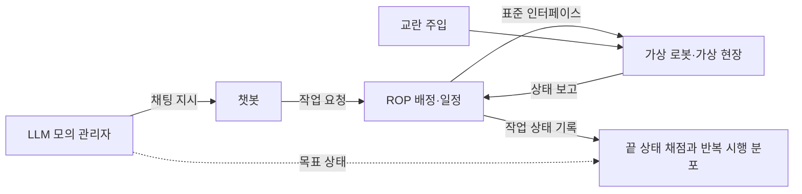

[홈](../../index.md) › 중점 연구 트랙 › [자연어 업무 지시 챗봇](index.md) › 단계 5. 검증 방법과 가설 판정

# 단계 5. 검증 방법과 가설 판정

> 단계 상태: 진행 중 · 열린 질문: 15건 · 답한 질문: 3건 · 완료 조건: 미충족 · 마지막 실행: 2026-09-25

## 1. 이 단계에서 밝힐 것

> 챗봇이 지시를 맞게 해석하고 적합한 로봇을 배정했는지를 어떻게 측정하고, 가설 1~3을 어떻게 판정하는가.

위 문장은 트랙 정의의 "밝힐 것"이다(트랙 정의의 단계별 밝힐 것과 완료 조건은 [트랙 개요](index.md)의 단계 진행 현황에 정리되어 있다). 조사 결과는 [아이디어 2. 자연어 업무 지시 챗봇](../../ideas/nl-task-chatbot.md)과 [업무 분해·배정 설계 초안](task-model-draft.md)으로 이어진다.

## 2. 질문 목록

이 표는 이 단계의 시작 질문 3개(q5-01~q5-03)와, 앞 단계 실행에서 이 단계로 올라온 후속 질문, 이번 실행의 새 질문을 담는다. 시작 질문은 구축자가 이 단계의 밝힐 것에서 정한 질문이다. [가정] 상태와 답 위치는 [질문 백로그](question-backlog.md)와 일치시키며, 백로그의 '조사 중'은 이 표에서 '열림'으로 표시하고 '폐기'는 표에서 빼고 백로그에만 남긴다(q5-06 은 q5-05 의 중복 등록이라 폐기했다). 제기 근거 칸에는 finding id(실행 id 병기) 또는 '사용자'만 쓴다.

이 단계는 실행 2026-09-25-98 에서 CLI 로 지정된 질문(q5-01)으로 처음 다뤘고, 실행 2026-09-25-99 에서 CLI 로 지정된 q5-02 에, 실행 2026-09-25-86 에서 CLI 로 지정된 q5-03 에 답했다. 트랙의 현재 단계는 단계 3·4 완료와 전환이 승인되지 않아 단계 3 이다.

| id | 질문 | 상태 | 제기 근거 | 답한 실행 id | 답 위치 |
|---|---|---|---|---|---|
| q5-01 | 해석·분해 정확도, 배정 적합성, 일정 품질을 각각 어떤 지표로 측정하는가? | 답함 | 사용자 | 2026-09-25-98 | [답](#q5-01) |
| q5-02 | 가상 현장·가상 로봇으로 지시 시나리오를 재현해 챗봇을 시험하는 방법과 그 한계는 무엇인가? | 답함 | 사용자 | 2026-09-25-99 | [답](#q5-02) |
| q5-03 | 가설 1~3은 단계 1~4의 결과로 어떻게 판정되는가? | 답함 | 사용자 | 2026-09-25-86 | [답](#q5-03) |
| q5-04 | 물류 지시 평가 자료를 자체 구축할 때 지시–정답 쌍의 정답을 무엇(업무 분해·배정 설계 초안의 작업 모델 인스턴스, 최종 상태·목표 조건, 배정 결과)으로 두고, ALFRED 목표 조건·SMART-LLM 최종 상태·AmbiK 명확화 질문 형식을 화물·로케이션·기한 항목으로 어떻게 확장하는가? (q2-03 에서 파생) | 열림 | f16, 실행 2026-09-25-62 | | |
| q5-05 | 배정 적합성을 평가하려면 목표 상태 달성 외에 정답 배정이나 목적함수 기준값이 필요한데, 이를 최적화 해법기(MILP 등)로 생성해 LLM 배정 결과와 비교하는 정답으로 쓸 수 있는가? (q2-03 에서 파생) (관련: q3-05, q5-01) | 열림 | f17, 실행 2026-09-25-62 | | |
| q5-07 | SDI 절제 실험처럼 결정적 검증기를 LLM 비평자로 바꿨을 때의 성공률 차이를 물류 지시(피킹·운반·출하) 시나리오로 재면 어떤 결과가 나오며, 어느 단계의 검증기가 가장 큰 차이를 만드는가? (q3-02 에서 파생) | 열림 | f7, 실행 2026-09-25-71 | | |
| q5-08 | 후보가 여럿일 때 '시스템이 계산할 수 있는 차이는 자동 결정, 사용자만 아는 정보에 걸린 차이만 되묻기' 규칙을 물류 지시 시나리오에 적용하면 되묻기 횟수와 오배정은 모든 경우를 묻거나 묻지 않는 방식에 비해 어떻게 달라지는가? (q3-03 에서 파생) | 열림 | f23, 실행 2026-09-25-74 | | |
| q5-09 | InterruptBench 의 추가·수정·철회 끼어들기 유형을 물류 지시(피킹·운반·출하) 시나리오로 옮겨, 챗봇이 변경을 올바른 작업에 적용하는 비율과 재계획 뒤 일정 변동량을 어떤 지표로 재는가? (q3-04 에서 파생) | 열림 | f15, 실행 2026-09-25-77 | | |
| q5-10 | 물류 지시 시나리오에서 관제 요원의 승인 지연 시간·거부율·수정률을 재어 승인 피로와 자동화 편향이 나타나는지, 확인 요약에 결정적 검사 결과를 함께 보이면 잘못된 지시를 멈추는 비율이 달라지는지를 어떤 실험으로 측정하는가? (q4-01 에서 파생) | 열림 | f21, 실행 2026-09-25-79 | | |
| q5-11 | 물류 지시 해석 평가에서 슬롯별 오류 비용(기한·대상 화물·장소 오류가 오배정·납기 지연으로 이어지는 정도)을 어떻게 추정해 슬롯 가중치나 치명 오류 집계 기준으로 정하며, 모두 맞아야 정답인 전체 정확도와 어떻게 함께 보고하는가? (q5-01 에서 파생) | 열림 | f15, 실행 2026-09-25-98 | | |
| q5-12 | 배정 적합성의 최적성 간격을 재기 위한 해법기 기준값을 창고 규모 사례에서 시간 제한 때문에 최적해로 인증하지 못할 때, 최선 해·하한 가운데 무엇을 기준으로 삼고 최근접 배정 기준선과 함께 어떻게 보고하는가? (q5-01 에서 파생) (관련: q5-05, oq-052) | 열림 | f13, 실행 2026-09-25-98 | | |
| q5-13 | 가상 현장 시험에 쓸 창고 레이아웃(피킹 구역·도크·승강기·충전기)과 지시 시나리오 집합(정상·교란·위험·권한 밖 지시)을 q5-04 의 지시–정답 쌍과 어떻게 묶어 구성하고, 시나리오 수와 교란 조합의 범위를 어떤 기준으로 정하는가? (q5-02 에서 파생) | 열림 | f23, 실행 2026-09-25-99 | | |
| q5-14 | LLM 모의 관리자로 얻은 챗봇 성과를 실제 관제 요원·현장 관리자 소수 표본의 시험으로 보정하려면 표본 규모와 비교 지표(성공률, 되묻기 횟수, 오배정)를 어떻게 정하는가? (q5-02 에서 파생) (관련: q5-10) | 열림 | f20, 실행 2026-09-25-99 | | |
| q5-15 | LLM 비결정성을 고려해 모델·프롬프트 변경 뒤 회귀 시험에서 같은 시나리오를 몇 번 반복하고(pass^k 의 k), 어떤 분포 차이를 합격·불합격 기준으로 삼는가? (q5-02 에서 파생) | 열림 | f15, 실행 2026-09-25-99 | | |
| q5-16 | 물류 지시에 오류(기한 누락, 없는 도크, 운반 불가 화물, 뜻과 다른 도크, 점유된 경로)를 주입한 시험 세트로 스키마 검증·온톨로지 제약 대조·계획 검증·모의 실행·사람 확인 각각의 오류 포착률과 확인 비용을 어떻게 재는가? (q4-02 에서 파생) | 열림 | f21, 실행 2026-09-25-81 | | |
| q5-17 | 권한 밖 지시와 프롬프트 주입이 섞인 물류 지시 시험 세트로, LLM 단의 거절과 ROP 인가 계층의 결정적 거부가 각각 권한 밖 작업 요청을 얼마나 막는지와 정상 지시의 오거부율을 어떻게 재는가? (q4-03 에서 파생) (관련: q5-13) | 열림 | f6, 실행 2026-09-25-83 | | |
| q5-18 | 물류 지시 시나리오에서 불확실성 점수만으로 되묻기를 정하는 방식과 필수 슬롯·영향 작업 규칙을 함께 쓰는 방식을 비교해 되묻기 횟수·승인 요청 수·오배정·보류 지연을 어떻게 재는가? (q4-04 에서 파생) (관련: q4-07, q5-08) | 열림 | f18, 실행 2026-09-25-85 | | |
| q5-19 | 가설 판정표에서 '잘못된 배정'(가설 1), '설명·재현 가능'(가설 2), '운영 안정성'(가설 3)을 q5-01 의 어떤 지표와 문턱으로 조작적으로 정의해야 지지·부분 지지·기각을 가를 수 있는가? (q5-03 에서 파생) | 열림 | f17, 실행 2026-09-25-86 | | |

## 3. 조사 결과

이번 실행은 q5-01 에 답했다. 확인한 지표를 해석·분해·배정 적합성·일정 품질의 네 층으로 나눠 정리했으며, 수치는 모두 저자 보고값이고 근거 환경은 물류 지시가 아니다. 검증 절차(q5-02)와 가설 판정(q5-03)은 아직 조사하지 않았다.

### q5-01 해석·분해·배정 적합성·일정 품질의 측정 지표 {#q5-01}

확인한 지표를 이 위키가 묶으면, 챗봇의 측정은 해석·분해·배정 적합성·일정 품질의 네 층으로 두는 구성이 근거가 가장 많은 것으로 보인다. [추정][^ref-731][^ref-730][^ref-736][^ref-540][^ref-732][^ref-592][^ref-623][^ref-734][^ref-733] 네 층을 한 번에 제시한 출처는 찾지 못했고, 근거 환경은 가정 시뮬레이터·대화·도구 호출·운영과학 일반·창고 배정 시뮬레이션·제조 작업장이다.

#### 해석 지표

- 음성 언어 이해(Spoken Language Understanding, SLU) 서베이(Qin 외, IJCAI 2021)는 가장 널리 쓰는 지표로 [슬롯 채우기](../../glossary/slot-filling.md)의 F1, [의도 인식](../../glossary/intent-recognition.md)의 의도 정확도, 한 문장에서 의도와 슬롯을 모두 맞힌 비율인 전체 정확도(overall accuracy)를 든다(ATIS·SNIPS 조건, 원문 미열람). [사실][^ref-731]
- Snips 의 NLU 벤치마크(2017-06)는 의도·경쟁 엔진별 결과 파일에 슬롯마다 정밀도와 재현율을 따로 기록해 슬롯 단위로 해석 정확도를 비교한다(F1 계산 방식은 README 에 없음, 확인일 2026-09-25). [사실][^ref-545]
- Kim 외(ACL 2022)는 대화 상태 추적의 표준 지표인 결합 목표 정확도(Joint Goal Accuracy, JGA, 한 턴의 모든 슬롯 값을 맞혀야 정답)가 초기 오류 누적으로 성능을 과소평가하고, 슬롯 정확도는 미리 정한 슬롯 수에 좌우되어 과대평가한다고 지적하고 상대 슬롯 정확도(relative slot accuracy)를 제안했다. [사실][^ref-730] 저자들은 모델 간 차이가 슬롯 정확도로는 1.09%p, 상대 슬롯 정확도로는 5.47%p 로 나타났다고 보고했다(MultiWOZ 조건, 저자 보고, 원문 미열람). [사실][^ref-730]
- Berkeley 함수 호출 리더보드(BFCL) 공식 README 는 이 리더보드를 실행 가능한 함수 호출 평가로 소개하고, 첫 판(v1)은 단일·병렬·다중 함수 호출을 추상 구문 트리(Abstract Syntax Tree, AST) 대조로 평가한다(확인일 2026-09-25). [사실][^ref-737] BFCL 논문(ICML 2025)은 2,000개가 넘는 질문–함수–정답 쌍과 AST 평가·실행 평가·관련성 탐지의 세 범주를 둔다(일반 API 조건, 원문 미열람). [사실][^ref-736]

#### 분해 지표

- ALFRED(CVPR 2020)는 성공률과 함께, 에피소드 끝에 달성한 [목표 조건](../../glossary/goal-condition.md) 수를 과제에 필요한 목표 조건 수(과제당 평균 2.55개)로 나눈 목표 조건 성공률을 두고, 두 지표를 전문가 시연 경로 길이 대비 에이전트 경로 길이로 가중한 경로 길이 가중 지표도 보고한다(가정 환경 AI2-THOR 조건, 원문 미열람). [사실][^ref-540] 이 가중 지표는 가중 기준이 전문가 시연 경로이므로 이 위키는 용어집의 [경로 길이 가중 성공률(SPL)](../../glossary/success-weighted-by-path-length.md)과 같은 지표로 다루지 않는다.
- 다중 로봇 계획 벤치마크 SMART-LLM 의 평가 지표는 [단계 2 의 q2-03 답](stage-2-data-and-standards.md#q2-03)에 정리되어 있다. [사실][^ref-090]
- Gramopadhye·Szafir(arXiv 2210.04964, 2022-10, IROS 2023)는 생성 계획과 사람이 쓴 정답 계획 사이 최장 공통 부분수열(Longest Common Subsequence, LCS) 길이를 더 긴 계획의 길이로 나눈 지표로 행동 순서의 일치를 재고, 실행 가능성(executability)과 정확성(correctness)을 함께 보고한다. [사실][^ref-732] 저자들은 실행 가능성 310%, 정확성 147% 개선을 보고했다(저자 보고, 원문 미열람, VirtualHome·ActivityPrograms 조건). [사실][^ref-732]

#### 배정 적합성 지표

- ConstraintBench 저자들은 LLM 이 제약 최적화 문제를 직접 풀 때 실행 가능성과 최적성이 분리되어 나타난다고 보고했다. 시설 입지 영역은 평균 실행 가능 비율 85.0%로 가장 높았지만, 실행 가능성과 최적성을 함께 만족한 비율은 모든 모델에서 0%였고 실행 가능 해의 중앙 최적성 간격은 9.41%였다(운영과학 일반 문제 조건, 저자 보고, 원문 미열람). [사실][^ref-592] 같은 벤치마크의 전체 결과는 [아이디어 2. 자연어 업무 지시 챗봇](../../ideas/nl-task-chatbot.md)의 5절에 있다.
- 창고 다중 로봇 작업 배정 연구 RTAW(ICRA 2023)는 로봇이 작업을 수행하지 않고 이동하는 추가 시간인 총 이동 지연(Total Travel Delay, TTD)을 평가 지표로 두고, 근시안적 픽업 거리 최소화(탐욕) 기준선과 후회 기반 기준선에 견주어 TTD 를 최대 14%(25~1000초) 줄였다고 보고했다(최대 1000대 시뮬레이션, 저자 보고, 원문 미열람). [사실][^ref-623] 공식 저장소 README 는 TTD 값을 내는 실행 명령과 탐욕·후회 기준선 스크립트를 둔다(확인일 2026-09-25). [사실][^ref-735] 두 자료는 같은 저자라 독립 교차가 아니다. 이 연구의 강화학습 배차 방법은 교차 규칙에 따라 27. AI·학습·적응과 모델 운영과 13. 작업 배정 — MRTA 양쪽에 연결할 대상이며, 여기서는 지표의 근거로만 쓴다.

#### 일정 품질 지표

- Rangsaritratsamee·Ferrell·Kurz(Computers & Industrial Engineering 46, 2004)는 작업이 동적으로 도착하는 작업장 재스케줄링에서 효율은 makespan 과 납기 지연(tardiness)으로, 안정성은 작업 시작 시각의 편차로 재어 두 목표를 함께 다루는 방법을 제안했다(원문 미열람). [사실][^ref-734]
- Goren·Sabuncuoglu(IIE Transactions 40(1), 2008)는 무작위 교란이 있을 때 단일 기계 일정의 강건성과 안정성을 재는 대리 척도 두 가지를 개발했다(원문 미열람). [사실][^ref-733] 강건성은 makespan·지연 같은 성과 지표의 변화, 안정성은 시작·완료 시각 같은 일정 자체의 변화로 구분하는 것으로 보이나, 이 정의의 원문 문구는 확인하지 못했다. [추정][^ref-733]
- 두 연구는 제조 작업장·단일 기계 조건이며 물류 로봇 플릿 적용은 확인되지 않았다.

#### 네 층 지표 구성과 설계 시사점

| 층 | 지표 후보 | 근거 환경 |
|---|---|---|
| 해석 | 의도 정확도, 슬롯별 정밀도·재현율·F1, 의도와 슬롯이 모두 맞은 전체 정확도; 여러 턴이면 결합 목표 정확도·상대 슬롯 정확도; 구조화 출력이면 필드 값 대조(AST식) | 음성 비서·대화·일반 API |
| 분해 | 성공률, 목표 조건 달성률, LCS 순서 일치, 실행 가능 동작 비율 | 가정 시뮬레이터 |
| 배정 적합성 | 능력·제약 위반 없는 실행 가능 배정 비율, 해법기(예: [혼합 정수 계획(MILP)](../../glossary/milp.md)) 기준값 대비 최적성 간격 | 운영과학 일반 |
| 일정 품질 | makespan, 납기 지연, 총 이동 지연, 재스케줄 뒤 시작 시각 편차 | 창고 배정 시뮬레이션, 제조 작업장 |

위 표는 이 위키의 종합이며 네 층을 한 번에 제시한 출처는 없고, 근거 환경이 물류 지시 조건이 아니다. [추정][^ref-731][^ref-545][^ref-730][^ref-736][^ref-540][^ref-732][^ref-592][^ref-623][^ref-734] 구조화 출력의 필드 값 대조는 일반 API 조건의 AST 평가를 로봇 작업 요청에 옮긴 추론이다.

- **배정의 분리 보고**: 배정 적합성은 목표 상태 달성만으로는 드러나지 않고 실행 가능성과 최적성이 따로 움직이므로, 실행 가능 배정 비율과 해법기 최적값(또는 최선 해) 대비 목적함수 격차를 분리해 보고해야 할 것으로 보인다. [추정][^ref-592][^ref-090]
- **분류 원문 질문과의 연결**: 13. 작업 배정 — MRTA 의 SCM 관점 질문은 다음과 같다.

> 가장 가까운 로봇에 맡기는 것이 전체적으로도 유리한가? [분류원문]

  작업장 사례 연구에서 앞으로의 운반 요청을 고려한 조합 최적화 배차가 무작위·최근접 규칙보다 작업 대기 시간을 더 잘 통제했다고 저자가 보고했다(2019). [사실][^ref-400] 이 질문을 재려면 챗봇·ROP 의 배정 결과를 최근접(탐욕 픽업 거리) 기준선과 해법기 기준값에 함께 견주어 총 이동 지연·makespan·납기 지연으로 비교하는 설계가 필요해 보인다. [추정][^ref-623][^ref-400][^ref-592] 창고 조건에서 둘을 같은 조건으로 실측한 자료가 없다는 점은 [열린 질문](../../open-questions.md) oq-052 로 남아 있다.
- **슬롯별 지표 병행**: 결합 목표 정확도나 전체 정확도처럼 모두 맞아야 정답인 지표는 물류 지시에서 화물·장소·기한 슬롯 하나만 틀려도 0점이 되므로, 슬롯별 지표를 함께 두고 기한·대상 화물처럼 오배정 비용이 큰 슬롯의 오류를 따로 집계해야 할 것으로 보인다. [추정][^ref-730][^ref-731][^ref-545] 슬롯별 가중치의 근거는 없어 q5-11 로 보냈다.
- **기록 원천**: Open-RMF 작업 상태 스키마가 진행 상태 값(delayed 등)과 시작·종료 시각을 기록하므로, 시뮬레이션이나 시험 운영에서 일정 품질 지표(납기 지연, makespan)를 산출할 기록 원천으로 쓸 수 있어 보인다. [추정][^ref-111] 이는 작업 기록의 원천을 말한 것이며 22. 시뮬레이션·예측용 디지털 트윈 기능을 다룬 것이 아니다. 기한은 작업 모델 쪽에 있어야 한다([업무 분해·배정 설계 초안](task-model-draft.md)의 업무 개념).
- **근거 공백**: 이번 검색 범위(한국어 2회 포함 18회)에서는 물류 창고 로봇에 채팅으로 준 지시의 해석·분해·배정·일정 품질을 한 벤치마크에서 함께 잰 연구나 국내 자료를 찾지 못했다. 부재의 확인은 아니다. [추정][^ref-540][^ref-090][^ref-736][^ref-623]

#### 설명용 적용 예

다음은 설명을 위한 가상의 시나리오이다. 수치는 넣지 않았다.

**물류 흐름 단계:** 피킹

**시나리오:** 피킹 구역 관리자가 채팅으로 '피킹 끝난 토트를 정해진 시각 전까지 출하 도크로 옮겨 달라'고 지시하고, 그 처리 결과를 네 층 지표로 평가한다

| 항목 | 내용 |
|---|---|
| 시작 조건 | 피킹 구역 관리자의 채팅 지시(설명용 가정) |
| 작업 대상 | 피킹이 끝난 토트(설명용 가정) |
| 수행 자원 | 챗봇이 지시를 해석하고 ROP 가 로봇을 배정한다. 배정 결과는 최근접(탐욕 픽업 거리) 기준선과 해법기 기준값에 함께 견주어 평가하는 설계가 필요해 보인다. [추정][^ref-623][^ref-400][^ref-592] |
| 제약 | 지시에 담긴 기한과 도착 도크(설명용 가정) |
| 완료·인계 | 작업 상태 기록의 진행 상태 값과 시작·종료 시각이 일정 품질 지표의 기록 원천이 될 수 있어 보인다. [추정][^ref-111] |
| 예외·성과 | 해석은 대상·장소·기한 슬롯과 프레임 전체 일치로, 분해는 '토트가 출하 도크에 있음' 같은 목표 조건 달성과 행동 순서 일치로, 배정은 능력·제약 위반 여부와 해법기 기준값 대비 격차로, 일정은 기한 대비 납기 지연과 재계획 뒤 시작 시각 편차로 재는 식이 가능해 보인다. [추정][^ref-731][^ref-540][^ref-592][^ref-734] |

이 예에서 어느 층의 오류가 실제 오배정·납기 지연으로 이어지는지는 재 본 자료가 없다. 층별 지표를 한 지시에서 함께 산출하는 절차는 검증 절차(q5-02)에서 다룰 몫이다.

이 절 머리의 'q5-01 에 답했다 … 검증 절차(q5-02)와 가설 판정(q5-03)은 아직 조사하지 않았다'는 서술은 실행 2026-09-25-98 기준이며, 실행 2026-09-25-99 에서 q5-02 에 답했다. 가설 판정(q5-03)은 아직 조사하지 않았다.

### q5-02 가상 현장·가상 로봇 시나리오 시험의 방법과 한계 {#q5-02}

확인한 자료를 이 위키가 묶으면, 가상 현장 시험은 지시 층·실행 층·교란 층·반복 층의 네 층으로 구성하는 것이 근거가 가장 많은 것으로 보인다. [추정][^ref-738][^ref-407][^ref-406][^ref-528][^ref-031][^ref-746][^ref-111] 네 층을 한 번에 제시한 출처는 찾지 못했고, 근거 조건은 소매·항공 고객 대화, 개인 저장소의 가상 AGV, 호텔·클리닉·제조 데모 월드, 제조 키팅이어서 물류 지시 조건이 아니다. 수치는 모두 저자 보고값이다.

#### 실행 층: 가상 현장과 가상 로봇

- Open-RMF 공식 도서의 시뮬레이션 장은 Gazebo·Ignition 에서 로봇(slotcar 플러그인), 여닫이·미닫이 문, 여러 층 승강기, 적재·하역을 순간 이동으로 모사하는 워크셀([디스펜서·인제스터](../../glossary/dispenser-ingestor.md)), 선택적 군중 시뮬레이션까지 모사해 다중 플릿을 시험할 수 있다고 설명한다(발행일 미확인, 확인일 2026-09-25). [사실][^ref-406]
- 같은 장은 slotcar 가 장애물 없는 경로와 최소한의 센서 기반 주행을 가정해 계산 부담을 줄이고 개별 로봇 주행보다 교통 관리 시험을 우선한다고 밝혀, Open-RMF 시뮬레이션은 로봇 쪽 주행·회피 성능을 재지 않는다. [사실][^ref-406]
- Open-RMF rmf_demos 공식 README 는 호텔·사무실·공항 터미널·클리닉(Clinic World)·캠퍼스·제조·물류(Manufacturing & Logistics) 월드를 여러 플릿·문·승강기와 함께 제공하고, 작업을 CLI 스크립트(dispatch_patrol·dispatch_delivery·dispatch_clean)나 웹 대시보드로 디스패처 입찰에 넣게 하지만, 창고 전용 월드는 README 에 없다(확인일 2026-09-25). [사실][^ref-104]
- 오픈소스 vda5050-sim 은 README 가 VDA 5050 3.0.0 준수를 표명하는(저장소 자기 표명, 적합성 시험 결과 미확인) 가상 로봇 플릿을 MQTT·NATS 로 띄워 VDA 5050 관제를 구동할 수 있게 하고, 로봇별 확률로 연결 끊김·오류·필드 위반·서비스 모드·비상정지를 주입하지만 이동은 노드 사이 직선 운동학뿐이다(개인 저장소, 확인일 2026-09-25). [사실][^ref-407]
- vda-5050-lib.js 는 간선을 따라 자율 주행하고 기본 동작 집합을 수행하는 가상 AGV 어댑터를 두며, 이를 시뮬레이션·통합 시험·실제 AGV 가 없는 환경의 목업 용도로 쓰도록 한다(확인일 2026-09-25). [사실][^ref-742]
- VDA 5050 3.0.0 은 통신이 연결 실패와 메시지 손실이 있는 무선망에서 이루어진다고 전제하고 order·state 등 주요 토픽에 MQTT QoS 0(최선 노력)을 쓰게 하므로, 관제–로봇 사이 메시지 손실은 정상 운영에서도 생길 수 있는 조건이다. [사실][^ref-031]

#### 교란 층: 시간·조건을 정한 교란

시험 시나리오에 고장·통신 단절·긴급 주문을 의도적으로 넣는 일은 [장애 주입](../../glossary/fault-injection.md)(Fault Injection)에 해당한다. [산업 자동화용 민첩 로봇 경진대회(ARIAC)](../../glossary/ariac.md) 문서(2025 판 기준)는 컨베이어 고장·전압 시험기 고장·고우선순위 주문을 시작 시각(START_TIME)으로, 진공 도구 고장을 잡기 시도 횟수(GRASP_OCCURRENCE)로 발생시키는 민첩성 과제로 둔다(제조 키팅 조건). [추정][^ref-528] 위 vda5050-sim 의 로봇별 장애 확률과 함께 보면, 교란은 시작 시각 또는 발생 조건을 정해 주입하는 방식이 쓰이는 것으로 보인다. [추정][^ref-528][^ref-407]

#### 지시 층: 모의 사용자와 끝 상태 채점

- τ-bench 는 도메인 API·정책 문서를 가진 언어 에이전트와 LLM 이 모사한 사용자의 대화를 재현하고, 대화 끝의 데이터베이스 상태를 주석된 목표 상태와 비교해 채점하며, k번 시행이 모두 성공하는 비율인 pass^k 로 일관성을 잰다. [사실][^ref-738][^ref-739] 저자들은 gpt-4o 기반 에이전트도 과제 성공 50% 미만, 소매 도메인 pass^8 25% 미만이라고 보고했다(2024-06, 저자 보고, 원문 미열람). [사실][^ref-738] 공식 README 는 모의 사용자 전략(기본·ReAct·검증·반성)과 pass^1~4 를 두고, 자동 오류 식별이 LLM 을 써서 부정확할 수 있다고 경고한다(확인일 2026-09-25). [사실][^ref-739] 두 자료는 같은 저자라 독립 교차가 아니다.
- Lost in Simulation(arXiv 2601.17087, 2026-01, 게재처 미확인 — ICLR 2026·ACL 2026 목록이 모두 검색됨) 저자들은 τ-bench 소매 과제에서 LLM 모의 사용자를 미국·인도·케냐·나이지리아 참가자와 비교해, 모의 사용자 LLM 에 따라 에이전트 성공률이 최대 9%p 달라지고 어려운 과제는 과소평가·중간 난이도 과제는 과대평가하는 체계적 보정 오차가 있다고 보고했다(저자 보고, 원문 미열람). [사실][^ref-740]

#### 반복 층: LLM 비결정성

Atil 외(arXiv 2408.04667, 2024-08)는 결정적으로 설정한(온도 0 등) LLM 5종을 8개 과제에서 10회 반복했을 때 정확도가 최대 15% 달라지고 최선–최악 격차가 최대 70%였으며 어느 모델도 모든 과제에서 반복 가능한 정확도를 내지 못했다고 보고했다(저자 보고, 원문 미열람, 수치는 arXiv 판 기준). [사실][^ref-746] Eval4NLP 2025 게재판은 제목을 바꿔 실렸다(각주 참조).

#### 위험 지시 시험과 시나리오 생성

- SafeAgentBench 는 AI2-THOR 에서 저수준 제어기가 17개 상위 동작을 실행하는 환경에 10가지 위험 유형을 담은 750개 과제를 두고, 실행 기반과 의미 기반 두 관점으로 LLM 체화 에이전트의 안전 계획을 평가한다(가정 환경 조건). [사실][^ref-745][^ref-744]
- 공식 README 는 가장 나은 기준 에이전트의 안전 과제 성공률 69%·위험 과제 거부율 5%를 적고, 논문 초록은 이와 함께 가장 안전 의식이 높은 기준 에이전트의 세부(detailed) 위험 과제 거부율 10%를 적는다. 가장 나은 기준 에이전트는 안전 과제 성공률 69%, 위험 과제 거부율 5%였고, 가장 안전 의식이 높은 기준 에이전트도 세부(detailed) 위험 과제 거부율이 10%였다(모두 저자 보고, 가정 환경). [사실][^ref-745][^ref-744] 두 값은 기준 에이전트와 과제 범주가 다른 별개 지표이며 출처 충돌이 아니다.
- RVSG(arXiv 2508.02338, Simula·Mondragon·PAL Robotics)는 산업용 AMR 을 실제 사람과 시험하는 것이 비싸고 위험하다고 보고 VLM 으로 기능·안전 요구를 어기게 하는 사람 행동 시나리오를 시뮬레이션에서 생성했으며, 저자들은 기준 방법보다 요구 위반 시나리오를 더 잘 만들고 로봇 행동의 변동성을 키웠다고 보고했다(저자 보고, 원문 미열람). [사실][^ref-743] 연계 대상: 이 연구가 시험하는 로봇 주행·사람 상호작용은 분류 원문 9장의 로봇 자체 지능·제어 경계에 속하며, 여기서는 시나리오 생성 방법의 사례로만 쓴다.
- SafeGate 는 230개 벤치마크 과제, AI2-THOR 시뮬레이션 시나리오 30개, 실제 로봇 실험으로 평가되어, LLM 로봇 게이트 연구가 시뮬레이션 시나리오 시험과 실기 시험을 함께 쓰는 사례다(arXiv 2604.05427 초록 검색 요약 기준, 실기 시험 규모 미확인). [사실][^ref-417]
- 국내 로봇 통합관제 기업 다임리서치는 Unity 기반 디지털 트윈 시뮬레이터 xDT 로 관제 xMS 구축 시 운영 효율을 설계 단계에서 미리 검토하고 디버깅·통합 문제를 해결한다고 소개한다. 챗봇 지시 시험에 쓴 사례는 아니다(기사 발행일 미확인). [추정] 벤더 주장[^ref-747]

#### 네 층 시험 구성

| 층 | 하는 일 | 근거 사례 | 근거 조건 |
|---|---|---|---|
| 지시 층 | 시나리오별 목표를 가진 LLM 모의 관리자가 챗봇에 지시하고, 끝 상태(작업 모델·모의 WMS)를 목표 상태와 비교해 채점 | τ-bench | 소매·항공 고객 대화 |
| 실행 층 | ROP 를 VDA 5050 가상 로봇이나 Open-RMF 시뮬레이션(문·승강기·워크셀 포함)에 표준 인터페이스로 연결 | vda5050-sim, Open-RMF 시뮬레이션 | 개인 저장소, 호텔·클리닉·제조 데모 |
| 교란 층 | 시작 시각 또는 발생 조건을 정한 교란(고장·통신 손실·비상정지·긴급 주문) 주입 | ARIAC, vda5050-sim, VDA 5050 메시지 손실 전제 | 제조 키팅, 가상 AGV |
| 반복 층 | 같은 시나리오를 여러 번 돌려 pass^k 와 [q5-01](#q5-01) 지표를 작업 상태 기록에서 산출 | τ-bench, Atil 외, Open-RMF 작업 상태 | 소매 대화, 일반 NLP 과제 |

위 표는 이 위키의 종합이며 네 층을 한 번에 제시한 출처는 없다. [추정][^ref-738][^ref-407][^ref-406][^ref-528][^ref-031][^ref-746][^ref-111] Open-RMF 작업 상태 스키마(원문 미열람)는 반복 층 지표의 기록 원천 근거로만 쓴다.

#### ROP 시험 범위와 한계

- **시험 경계**: 확인한 가상 로봇은 노드 간 직선 운동학이나 장애물 없는 경로를 가정하므로, 가상 현장 시험은 지시 해석·배정·일정·예외 처리 같은 ROP 쪽 결정을 재는 데 한정되는 것으로 보인다. [추정][^ref-407][^ref-406][^ref-741][^ref-743] 연계 대상: 로봇 쪽 주행·회피·파지 성능과 현실 격차는 제조사 시험과 실기 시험으로 따로 확인해야 할 것으로 보인다.
- **현실 격차**: Aljalbout 외(arXiv 2510.20808, 2025-10, Annual Review of Control, Robotics, and Autonomous Systems 2026 게재, 권 미확인)는 시뮬레이션이 추상화와 근사로 이루어져 동역학·인식·구동에서 현실과의 차이(현실 격차)를 피할 수 없다고 보고, 도메인 무작위화·real-to-sim·상태·행동 추상화·시뮬레이션–실제 공동 학습을 대응으로 정리했다(원문 미열람). [사실][^ref-741]
- **모의 사용자 보정과 반복 보고**: 모의 사용자가 실제 사용자 성과를 체계적으로 틀리게 추정한다는 보고와 결정적 설정에서도 LLM 출력이 흔들린다는 보고를 보면, 모의 관리자 시험 결과는 실제 관리자 소수 표본의 시험으로 보정하고, 챗봇 쪽과 모의 사용자 쪽 모두 반복 시행 분포로 보고해야 할 것으로 보인다. [추정][^ref-740][^ref-746][^ref-738] 근거 조건은 소매 고객 대화와 일반 NLP 과제이며 물류 관리자 지시 조건은 미확인이다. 이 방법들은 교차 규칙에 따라 27. AI·학습·적응과 모델 운영과 13. 작업 배정 — MRTA 양쪽에 연결할 대상이다.
- **위험 지시 포함**: 위험 지시 거부율이 시뮬레이션 벤치마크에서도 낮게 보고되므로(위 5%·10%, 각각의 조건), 가상 현장 시나리오 집합에는 정상 지시뿐 아니라 위험·권한 밖·수행 불가 지시를 의도적으로 넣어 게이트가 멈추는 비율을 재야 할 것으로 보이며, 이 시험을 실제 위험 없이 할 수 있다는 점이 가상 시험의 장점으로 보인다. [추정][^ref-745][^ref-744][^ref-743]
- **현재 상태와 가정한 미래의 구분**: 개별 지시 시나리오의 가상 현장 재현은 가정한 미래를 실험하는 [22. 시뮬레이션·예측용 디지털 트윈](../../categories/f-deployment-verification-and-maintenance/22-simulation-and-predictive-digital-twin.md)의 기능이자 [23. 시험·형식 검증·벤치마크](../../categories/f-deployment-verification-and-maintenance/23-testing-formal-verification-and-benchmarking.md)의 시험 수단이며, 초기 상태는 [8. 실시간 세계 상태·데이터 일관성](../../categories/b-common-information-and-environment-model/08-real-time-world-state-and-data-consistency.md)의 현재 상태 스냅숏이나 고정된 시험 상태에서 가져오되 시험 결과를 현재 상태에 반영하지 않도록 분리해야 할 것으로 보인다. [추정][^ref-406][^ref-407]
- **분류 원문 질문의 비교 설계**: 비교 설계 자체는 [q5-01 답](#q5-01)에 있다. 가상 현장에서는 같은 지시 흐름과 같은 교란을 최근접 배정 기준선과 ROP 배정(해법기 기반)에 똑같이 재생해 총 이동 지연·납기 지연을 비교할 수 있어 보이나, 공개 데모에 창고 전용 레이아웃이 없어 창고 배치와 지시 흐름은 자체 구축해야 할 것으로 보인다. [추정][^ref-104][^ref-623][^ref-407] 창고 조건 실측 비교가 없다는 점은 [열린 질문](../../open-questions.md) oq-052 로 남아 있다.
- **근거 공백**: 이번 검색 범위(한국어 2회 포함 17회)에서는 물류 창고 로봇에 채팅으로 준 지시를 가상 현장·가상 로봇에서 재현해 시험한 공개 연구나 시험대, 국내 연구를 찾지 못했고 국내 자료는 관제 벤더의 디지털 트윈 소개뿐이었다. 부재의 확인은 아니다. [추정][^ref-747][^ref-104][^ref-738]

#### 설명용 적용 예

다음은 설명을 위한 가상의 시나리오이다. 수치는 넣지 않았다.

**물류 흐름 단계:** 피킹

**시나리오:** 피킹 구역 관리자 역할의 LLM 모의 관리자가 '피킹 끝난 토트를 정해진 시각 전까지 출하 도크로'라고 지시하고, 도중에 교란을 주입해 챗봇과 ROP 의 대응을 채점한다

| 항목 | 내용 |
|---|---|
| 시작 조건 | 모의 관리자의 채팅 지시(설명용 가정) |
| 작업 대상 | 피킹이 끝난 토트(설명용 가정) |
| 수행 자원 | 챗봇이 지시를 해석하고 ROP 가 가상 로봇에 배정한다. 같은 지시 흐름을 최근접 배정 기준선과 ROP 배정에 똑같이 재생해 비교할 수 있어 보인다. [추정][^ref-104][^ref-623][^ref-407] |
| 제약 | 지시의 기한과 도착 도크(설명용 가정), 그리고 관제–로봇 메시지 손실이 정상 운영에서도 생길 수 있다는 통신 조건. [사실][^ref-031] |
| 완료·인계 | 끝 상태(작업 모델·모의 WMS)를 시나리오의 목표 상태와 비교해 채점하는 방식이 가능해 보인다. [추정][^ref-738][^ref-111] |
| 예외·성과 | 한 가상 로봇의 연결 끊김과 긴급 출고 지시를 시작 시각 또는 발생 조건을 정해 주입하고, 챗봇의 해석·재배정·변경 확인과 최종 작업 상태를 목표 상태와 비교하는 시험이 가능해 보인다. [추정][^ref-407][^ref-528][^ref-738][^ref-111] |

이 예에서 가상 시험 결과가 실제 현장 성과와 얼마나 맞는지는 재 본 자료가 없다.

실행 2026-09-25-86 에서 CLI 로 지정된 질문으로 q5-03 에 답했다. 아래의 판정 절차와 판정 값 규칙, 잠정 판정은 모두 이 위키의 종합이며, 근거 환경이 물류 창고 조건이 아니다.

### q5-03 가설 1~3의 판정 절차와 잠정 판정 {#q5-03}

확인한 근거 평가 체계를 이 위키가 묶으면, 각 가설을 하위 주장으로 나누고 하위 주장마다 근거의 확실성을 GRADE 식 영역으로 낮춰 매긴 뒤 판정 값으로 모으고 기술 성숙도를 보조 축으로 병기하는 절차가 선택지로 보인다(이 위키의 종합). [추정][^ref-807][^ref-809] 이 절차를 적용하면 가설 1~3은 모두 잠정 '부분 지지'로 보이지만, 근거가 가정·조작·산업 셀·운영과학 일반·제조 AGV 시뮬레이션 조건의 단일 출처 저자 보고이고 물류 창고 조건의 직접 근거가 없어 확실성은 낮다(이 위키의 종합). [추정][^ref-166][^ref-779][^ref-236][^ref-746][^ref-592][^ref-612]

#### 판정 절차의 근거

- [근거 확실성 등급(GRADE)](../../glossary/grade-certainty-of-evidence.md) 접근법은 근거 묶음의 확실성을 결과(outcome)별로 높음·중간·낮음·매우 낮음 네 수준으로 매기고, 비뚤림 위험·비일관성·비직접성·비정밀성·출판 비뚤림 다섯 영역에서 심각한 우려가 있으면 한 단계, 매우 심각하면 두 단계 낮춘다(Cochrane 핸드북 14장, 발행일 미확인, 확인일 2026-09-25, 원문 미열람). [사실][^ref-807]
- NASA 의 [기술 성숙도(TRL)](../../glossary/technology-readiness-level.md) 정의는 TRL 4 를 실험실 환경에서의 구성품·하위 시스템 검증으로, TRL 5 를 실제 조건을 가깝게 모사한 관련 환경에서의 검증으로 두어 통제된 실험실 검증과 관련 환경 검증을 구분한다(발행일 미확인, 확인일 2026-09-25, 원문 미열람). [사실][^ref-809]
- 이 체계를 가설 판정에 옮기면, 하위 주장마다 비직접성(가정·건설·제조 조건 대 물류 창고), 비정밀성(단일 출처), 비뚤림(저자·벤더 보고)으로 확실성을 낮춰 매기는 식이 된다(이 위키의 종합, 판정 절차를 직접 정한 출처는 없음). [추정][^ref-807][^ref-809] 같은 날 [건축 도면 자동 인식](../floorplan-recognition/index.md) 트랙 [단계 5](../floorplan-recognition/stage-5-verification-and-hypotheses.md)가 쓴 판정 틀과 같은 방향이다.

#### 판정 값 규칙

| 판정 값 | 조건 |
|---|---|
| 지지 | 핵심 하위 주장 모두에 물류 조건의 직접 근거가 있고 확실성이 중간 이상 |
| 부분 지지 | 일부 하위 주장만 근거가 있거나, 가설이 성립하지 않는 조건이 확인됨 |
| 기각 | 핵심 하위 주장에 직접 반대 근거가 있음 |
| 미판정 | 핵심 하위 주장에 직접 근거가 없음 |

위 규칙은 이 위키의 종합이며 판정 규칙을 직접 정한 출처는 없다. 네 판정 값은 [트랙 개요](index.md)의 '3. 가설과 판정 상태' 값을 따른다. [추정][^ref-807][^ref-809]

#### 가설 1 의 근거: 구조화 대 직접 생성

- LiP-LLM 저자들은 LLM 이 기술 목록·의존 그래프를 만들고 배정은 선형계획이 맡는 구조에서, LLM 기반 배정은 추적 한계로 어려움을 겪었지만 선형계획 배정은 배정 실패가 거의 없었다고 보고했다(시뮬레이션 과제 조건, 저자 보고, 독립 재현 미확인, 원문 미열람). [사실][^ref-166]
- Garrabé 외(arXiv 2411.05474, 2024-11)는 LLM 출력을 기대 결과 모듈과 피드백으로 접지하는 모듈형 구조가 GPT-4o 기반 code-as-policies(직접 코드 생성) 기준선보다 픽앤플레이스·조작 과제 성공률이 높았다고 보고하고, 기준선 실패 원인으로 환경 접지 부족과 개루프 실행을 들었다(저자 보고, 성공률 수치 미확인, 원문 미열람). [사실][^ref-779] 연계 대상: 조작 과제의 접지·재시도는 분류 원문 9장의 로봇 자체 지능·제어 경계에 속하며, 여기서는 구조 비교의 근거로만 쓴다.
- Wang 외(EMNLP 2025)는 LLM 에이전트가 불명확한 지시에서 빠진 도구 호출 인자를 임의로 지어내는 경향을 보고했다(도구 호출 API 조건, 배정 오류를 직접 잰 것은 아님, 원문 미열람). [사실][^ref-359]
- Liu 외(KTH, 2026-06)는 기호 검증기를 같은 방식으로 프롬프트한 LLM 으로 바꾼 절제 실험(ablation study)에서 전체 성공률이 98.1% 에서 3.8% 로 떨어졌다고 보고했다(52개 명령 부분집합, 산업용 로봇 셀 조건, 저자 보고, 원문 미열람). [사실][^ref-674]
- 반례: CoMuRoS 는 작업 관리자 LLM 이 해석·배정·재계획을 맡는 구조로 22개 시나리오·약 20대 로봇 벤치마크에서 정답률 최대 0.91 을 보고했다(실험실 텍스트 벤치마크 조건, 저자 보고, 결정적 배정기와 같은 조건의 비교는 미확인, 원문 미열람). [사실][^ref-677]
- LLM 이 직접 배정하는 LTAA(arXiv 2512.02810)는 한 2차 요약이 로봇 전문화가 강한 설정에서 LLM 배정이 전통 기법을 앞섰다고 전하고, 다른 2차 요약은 동적 계획법의 완료율이 더 높다고 적어 LLM 배정의 우위가 확정되지 않았다. 이 출처 충돌은 [열린 질문](../../open-questions.md) oq-030 으로 남아 있다. [추정][^ref-168]

#### 가설 2 의 근거: 온톨로지 질의와 설명·재현

- Electronics(2026-08-11 게재) 논문은 온톨로지 기반 실행 가능성 판정 결과(ReasonerOutput)를 특정 배정기에 묶이지 않게 정형화해 세 가지 플릿 구성과 네 가지 배정기에서 공통 실행 가능성 제약으로 쓰였다고 보고했다(필드 구성·설명 가능성 측정 여부 미확인, 원문 미열람). [사실][^ref-236]
- Atil 외(arXiv 2408.04667)는 결정적으로 설정한 LLM 5종을 8개 과제에서 10회 반복했을 때 정확도가 최대 15% 달라졌고 어느 모델도 모든 과제에서 반복 가능한 정확도를 내지 못했다고 보고했다(일반 NLP 과제 조건, arXiv 판 기준, 저자 보고, 원문 미열람). [사실][^ref-746]
- 반대 방향 근거: 로봇 능력 온톨로지(RCO) 연구는 제조사가 광고한 능력과 측정한 운용 능력을 함께 표현하고 비교해, 선언 능력과 실제 성능이 다를 수 있음을 온톨로지 안에서 다룬다(Scientific Reports 2025-10-02, 원문 미열람). [사실][^ref-041] 이 차이는 [열린 질문](../../open-questions.md) oq-024 와 겹친다.

#### 가설 3 의 근거: 최적화 엔진과 LLM 의 분담

- ConstraintBench 저자들은 10개 운영과학 영역 200개 과제에서 가장 좋은 모델의 실행 가능 해 비율이 65.0% 였고 실행 가능성과 최적성을 함께 만족한 비율은 어느 모델도 30.5% 를 넘지 못했다고 보고했다(LLM 이 제약 최적화를 직접 푼 조건, 저자 보고, 원문 미열람). [사실][^ref-592]
- SCHEDBench 저자들은 같은 스케줄링 문제를 의미가 같은 다른 문장으로 주면 LLM 의 실행 가능 비율이 떨어지고 제약 위반이 달라진다고 보고했다(자연어 조합 스케줄링 조건, 저자 보고, 원문 미열람). [사실][^ref-594]
- RACE-Sched 는 LLM 추론 지연이 산업 제어의 밀리초 단위 결정 주기와 맞지 않는다고 보고 실시간 디스패치를 저지연 기호 휴리스틱에 맡기는 구조를 제안했다(동적 스케줄링 조건, 원문 미열람). [사실][^ref-611]
- 반례: Li·Li(arXiv 2608.09343, 2026-08)는 LLM 이 시뮬레이션 추적을 진단해 설계한 동적 생산·AGV 스케줄링 정책 가운데 최선 정책이 대응 시드 100개 모두에서 롤링 MILP·규칙·메타휴리스틱 정책보다 높은 점수를 냈고(최선 평균 점수 62.49→78.61) 무작위 고장에서도 재최적화 없이 우위를 유지했다고 보고했다. 이는 제조·AGV 시뮬레이션 조건의 저자 보고이며, 롤링 MILP 는 AGV 운송 하위 문제의 추상화이고, 물류 창고 적용은 미확인이다(원문 미열람). [사실][^ref-612]
- RobotFleet 은 LLM 기반 추론과 혼합 정수 계획(MILP) 두 작업 배정기를 바꿔 끼울 수 있는 오픈소스 다중 로봇 계획 틀로, 논문은 MILP 배정기를 능력 제약 아래 로봇별 최대 작업 부하를 최소화하는 모델로 설명하며 공식 README 에는 두 배정기의 비교 결과가 없다(README 확인일 2026-09-25). [사실][^ref-777][^ref-778] 논문과 README 는 같은 저자라 독립 교차가 아니며, 논문의 LLM 대 MILP 비교 결과는 미확인이다.

#### 잠정 판정표

| 가설 | 잠정 판정 | 확실성 | 근거 요지 | 판정을 막는 것 |
|---|---|---|---|---|
| 가설 1 | 부분 지지(잠정) | 낮음 | 구조화·분해 뒤 결정적 해법·검사를 거친 방식이 LLM 직접 배정·직접 코드 생성보다 실패가 적었다는 비교 | 비교 형태가 이 트랙의 작업 모델 구조화와 같지 않음, LLM 직접 배정이 높은 정답률을 보인 반례, 물류 조건 근거 없음 |
| 가설 2 | 부분 지지(잠정) | 매우 낮음~낮음 | 온톨로지 판정을 배정기 독립 제약으로 쓰는 구조, LLM 반복 출력 불일치 보고(재현성 쪽 간접 근거) | 설명 가능성 하위 주장은 직접 근거가 없어 미판정, 같은 조건 비교 연구 없음, 선언 능력과 운용 능력의 차이 |
| 가설 3 | 부분 지지(잠정) | 낮음 | LLM 직접 스케줄링의 실행 가능성·일관성 한계, LLM 지연 때문에 실시간 결정을 결정적 구성 요소에 두는 근거 | LLM 이 루프 밖에서 설계한 규칙이 롤링 MILP 를 앞선 반례, 물류 운영의 운영 안정성 자료 없음 |

위 표는 이 위키가 위 판정 값 규칙(추정)을 적용한 잠정 결과이며, 트랙 개요의 가설 문장은 [가설] 로 유지한다. [추정][^ref-166][^ref-779][^ref-677][^ref-236][^ref-746][^ref-041][^ref-592][^ref-612]

- **가설 1**: 구조화·분해 뒤 결정적 해법·검사를 거친 방식이 LLM 직접 배정·직접 코드 생성보다 실패가 적었다는 비교가 있으나, 비교 형태가 이 트랙의 작업 모델 구조화와 같지 않고 LLM 직접 배정이 높은 정답률을 보인 반례가 있으며 물류 조건 근거가 없어, 비직접성(가정·조작·산업 셀 조건)과 비정밀성(단일 출처·저자 보고)으로 두 단계 낮춘 잠정 '부분 지지'(확실성 낮음)로 보인다(이 위키의 종합). [추정][^ref-166][^ref-779][^ref-359][^ref-677][^ref-168][^ref-674]
- **가설 2**: 온톨로지 판정을 배정기 독립 제약으로 쓰는 구조와 LLM 출력의 반복 불일치 보고가 있어 재현성 쪽 근거는 있으나, 온톨로지 질의와 LLM 선택의 설명 가능성·재현성을 같은 조건으로 잰 연구가 없고 선언 능력과 운용 능력이 다를 수 있다. 설명 가능성 하위 주장은 직접 근거가 없어 미판정이고, 부분 지지는 재현성 쪽 간접 근거에만 기댄다. 그래서 잠정 '부분 지지'(확실성 매우 낮음~낮음)로 보인다(이 위키의 종합). [추정][^ref-236][^ref-746][^ref-041][^ref-674]
- **가설 3**: LLM 직접 스케줄링의 실행 가능성·일관성 한계와 LLM 지연 때문에 실시간 결정을 결정적 구성 요소에 두는 근거가 있다. 다만 LLM 이 루프 밖에서 설계한 규칙이 롤링 MILP 를 앞선 보고(제조·AGV 시뮬레이션 조건, 저자 보고, 롤링 MILP 는 AGV 운송 하위 문제의 추상화, 물류 창고 적용 미확인)가 있어, '최적화 엔진'을 해법기 전담으로 읽으면 반례가 되고 '결정 루프 안은 결정적 실행기'로 읽으면 지지 방향이 된다. 운영 안정성은 물류 운영에서 잰 자료가 없어 잠정 '부분 지지'(확실성 낮음)로 보인다(이 위키의 종합). [추정][^ref-592][^ref-594][^ref-611][^ref-612][^ref-377]
- **성숙도 축**: 세 가설의 근거가 된 구성(구조화·결정적 검증·해법기 배정)은 확인한 범위에서 시뮬레이션·실험실 검증 수준에 머물러, TRL 로 보면 관련 환경(물류 현장 모사) 검증 전 단계로 보이며 이 성숙도 축을 판정표에 병기할 수 있어 보인다. 이 TRL 매김은 공식 평가가 아니라 설명용 대응이다(이 위키의 종합). [추정][^ref-809][^ref-674][^ref-677]

#### 판정을 옮기는 데 필요한 실험

판정을 부분 지지에서 옮기려면 같은 물류 지시 세트로 작업 모델 경유 대 LLM 직접 명령 생성의 오배정률(가설 1), 온톨로지 질의 대 LLM 선택의 반복 시행 일치율과 근거 추적 가능성(가설 2), 해법기·검증된 규칙 대 LLM 직접 스케줄의 실행 가능성·납기 지연·재스케줄 뒤 시작 시각 편차(가설 3)를 재는 사용자 실험이 필요할 것으로 보인다(이 위키의 종합). [추정][^ref-746][^ref-592][^ref-734] 측정은 [q5-01](#q5-01)의 네 층 지표를, 시험 구성은 [q5-02](#q5-02)의 가상 현장 네 층을 쓰는 안이며, 계획 후보 E5-01~E5-03 은 [실험](experiments.md)에 제안(사용자 수행 대기)으로 실었다. 지표의 문턱은 정해지지 않아 q5-19 로 보냈다.

#### 분류 원문 질문과의 연결

위 [q5-01](#q5-01)에 옮긴 13. 작업 배정 — MRTA 의 SCM 관점 질문과 관련해, 작업장 사례 연구에서 조합 최적화 배차가 무작위·최근접 규칙보다 작업 대기 시간을 더 잘 통제했다고 저자가 보고했다(2019). [사실][^ref-400] 피킹 운반 지시 시나리오에서 가설 3 을 판정할 때 최근접 배정 기준선을 함께 두면, 결정적 배정·일정이 최근접 규칙보다 대기·지연을 줄이는지와 LLM 직접 스케줄의 격차를 한 실험에서 볼 수 있어 보인다(설명용 가정 사례, 이 위키의 종합). [추정][^ref-400][^ref-592]

다음은 설명을 위한 가상의 시나리오이다. 수치는 넣지 않았다.

**물류 흐름 단계:** 피킹

**시나리오:** 피킹 끝난 토트의 운반 지시를 세 방식에 똑같이 주어 가설 3 을 판정하는 비교 실험

| 항목 | 내용 |
|---|---|
| 시작 조건 | 피킹 구역 관리자의 채팅 운반 지시(설명용 가정) |
| 작업 대상 | 피킹이 끝난 토트(설명용 가정) |
| 수행 자원 | 같은 지시 흐름을 최근접 배정 기준선, 결정적 배정·일정(해법기·검증된 규칙), LLM 직접 스케줄에 똑같이 주어 비교하는 구성이 가능해 보인다. [추정][^ref-400][^ref-592] |
| 제약 | 해당 없음 |
| 완료·인계 | 해당 없음 |
| 예외·성과 | 결정적 배정·일정이 최근접 규칙보다 대기·지연을 줄이는지와 LLM 직접 스케줄의 격차를 한 실험에서 볼 수 있어 보인다. [추정][^ref-400][^ref-592] |

#### 근거 공백

이번 검색 범위(한국어 2회 포함 9회)에서는 물류 창고 로봇 채팅 지시에서 세 가설을 직접 시험한 연구를 찾지 못했다. 국내 자료로는 제조 물류 로봇에 LLM 협업 인터페이스를 구축한 2023 학술대회 논문이 서지 정보로 확인되나 초록·결과를 확인하지 못해 판정 근거로 쓰지 못했다. 부재의 확인은 아니다. [추정][^ref-780] 창고 조건 비교 실측이 없다는 점은 [열린 질문](../../open-questions.md) oq-052 와 겹친다.

## 4. 결론과 남은 불확실성

**결론**
- 해석(의도 정확도·슬롯 F1·전체 정확도, 결합 목표 정확도), 분해(목표 조건 성공률·LCS 순서 일치), 배정(실행 가능성과 최적성의 분리, 총 이동 지연), 일정(makespan·납기 지연·시작 시각 편차) 각 층에는 공개 연구가 쓰는 지표 정의가 있다. [사실][^ref-731][^ref-730][^ref-540][^ref-732][^ref-592][^ref-623][^ref-734]
- 이를 네 층으로 묶고, 배정 적합성을 실행 가능 배정 비율과 해법기 기준값 대비 최적성 간격으로 나눠 보고하는 구성이 선택지로 보인다(이 위키의 종합). [추정][^ref-592][^ref-090]
- 모두 맞아야 정답인 지표만으로는 물류 지시의 슬롯 오류가 가려지므로 슬롯별 지표를 함께 두는 편이 맞아 보인다. [추정][^ref-730][^ref-545]
- 가상 현장 시험의 부품은 공개 자료로 확인된다. Open-RMF 시뮬레이션은 문·승강기·워크셀을 모사하되 slotcar 가 장애물 없는 경로를 가정하고, VDA 5050 가상 로봇 플릿은 장애를 주입하되 직선 운동학만 쓰며, τ-bench 는 LLM 모의 사용자와 끝 상태 채점·pass^k 를 둔다. [사실][^ref-406][^ref-407][^ref-738][^ref-739]
- 이를 지시·실행·교란·반복의 네 층으로 묶는 구성이 선택지로 보이며(이 위키의 종합), 가상 시험은 ROP 쪽 결정(지시 해석·배정·일정·예외 처리)을 재는 데 한정되는 것으로 보인다. [추정][^ref-738][^ref-407][^ref-406][^ref-528][^ref-746]
- 모의 관리자 결과는 실제 관리자 소수 표본으로 보정하고 반복 시행 분포로 보고하며, 위험·권한 밖·수행 불가 지시를 시나리오에 넣는 편이 맞아 보인다. [추정][^ref-740][^ref-746][^ref-745]
- 근거 확실성은 GRADE 로 결과별 네 수준과 다섯 영역 하향으로, 기술 성숙도는 TRL 4·5 로 실험실 검증과 관련 환경 검증을 구분하는 공개 정의가 있다. [사실][^ref-807][^ref-809]
- 이를 가설 판정 절차로 옮기면 가설 1~3은 모두 잠정 '부분 지지'로 보이며(가설 1·3 확실성 낮음, 가설 2 매우 낮음~낮음), 가설 2 의 설명 가능성 하위 주장은 미판정이다(이 위키의 종합). [추정][^ref-807][^ref-809][^ref-166][^ref-236][^ref-612]

**남은 불확실성**
- q5-01 의 지표 정의는 모두 단일 출처에 기대고 교차 확인은 0건이다. BFCL(README·논문)과 RTAW(논문·README)는 같은 저자 자료라 독립 교차가 아니다.
- q5-01 의 수치(1.09%p·5.47%p, 85.0%·0%·9.41%, TTD 최대 14%, 310%·147%, 2.55개, 2,000개 쌍)는 모두 저자 보고값이며 대부분 원문을 열람하지 못했다.
- 강건성·안정성 구분의 원문 문구는 확인하지 못했다.
- 네 층 가상 시험 구성(q5-02)은 이 위키의 종합이고, 근거가 소매·항공 대화, 가상 AGV, 호텔·클리닉·제조 데모, 제조 키팅 조건이며 물류 지시 조건이 아니다. 이 실행의 교차 확인은 0건이었다(τ-bench·SafeAgentBench 는 논문과 README 가 같은 저자).
- vda5050-sim 의 VDA 5050 3.0.0 준수는 개인 저장소의 자기 표명이며, README 에 작성자·소속이 없고 적합성 시험 결과는 확인되지 않았다.
- ARIAC 교란 조건은 현재 문서(2025 판) 기준이며 과제마다 발생 조건(시작 시각·잡기 시도 횟수)이 다르다.
- Lost in Simulation 의 게재처(ICLR 2026·ACL 2026)와 현실 격차 리뷰의 권은 미확인이다. Lost in Simulation·현실 격차 리뷰·RVSG·Atil 외는 원문 미열람 저자 보고이며, Atil 외 수치는 arXiv 판 기준이다.
- SafeGate 의 실기 시험 규모는 미확인이고, 다임리서치 xDT 는 벤더 주장이며 기사 발행일이 미확인이다.
- q5-03 의 가설 근거는 연구마다 단일 출처이고 교차 확인은 0건이며, 원문을 연 출처는 RobotFleet README 하나다. RobotFleet 논문과 README 는 같은 저자다.
- Garrabé 외의 성공률 수치, RobotFleet 논문의 LLM 대 MILP 비교 결과, 국내 학술대회 논문의 초록·결과는 미확인이고, Li·Li 의 수치는 검색 요약 기준 저자 보고다.
- 판정 절차·판정 값 규칙·잠정 판정·TRL 대응은 이 위키의 종합이며 판정 규칙을 직접 정한 출처는 없다. 가설별 하위 주장을 지표와 문턱으로 조작적으로 정의하는 방법(q5-19)은 근거가 없다.
- LTAA 의 LLM 배정 우위는 2차 요약끼리 충돌한다(oq-030).
- 근거 환경이 물류 지시 조건이 아니며, 물류 지시를 함께 잰 벤치마크나 가상 현장에서 시험한 국내 자료, 세 가설을 물류 조건에서 직접 시험한 연구는 검색 범위에서 찾지 못했다.
- 슬롯별 오류 비용(q5-11), 최적해를 인증하지 못할 때의 해법기 기준값(q5-12), 창고 레이아웃·시나리오 집합 구성(q5-13), 모의 관리자 보정(q5-14), 회귀 시험 반복 횟수와 합격 기준(q5-15)은 근거가 없다.
- 가설 판정표는 [트랙 개요](index.md) 3절에 잠정 판정으로 실었고, 실험 계획 E5-01~E5-03 은 [실험](experiments.md)에 제안(사용자 수행 대기)으로 실었다. 둘 다 검증 판정 전이다.
- 초안 변경 없음: 평가 지표·가상 현장 시험 절차·가설 판정은 작업 모델의 개념·관계가 아니라 검증 방법이므로 [업무 분해·배정 설계 초안](task-model-draft.md)은 v0.9 를 유지하고, 이 페이지와 아이디어 페이지 6절에 둔다.

## 5. 이 단계가 낳은 후속 질문

| 새 질문 id | 질문 | 보낼 단계 | 근거 finding id | 상태 |
|---|---|---|---|---|
| q5-11 | 물류 지시 해석 평가에서 슬롯별 오류 비용(기한·대상 화물·장소 오류가 오배정·납기 지연으로 이어지는 정도)을 어떻게 추정해 슬롯 가중치나 치명 오류 집계 기준으로 정하며, 모두 맞아야 정답인 전체 정확도와 어떻게 함께 보고하는가? (q5-01 에서 파생) | 단계 5. 검증 방법과 가설 판정 | f15(실행 2026-09-25-98) | 열림 |
| q5-12 | 배정 적합성의 최적성 간격을 재기 위한 해법기 기준값을 창고 규모 사례에서 시간 제한 때문에 최적해로 인증하지 못할 때, 최선 해·하한 가운데 무엇을 기준으로 삼고 최근접 배정 기준선과 함께 어떻게 보고하는가? (q5-01 에서 파생) (관련: q5-05, oq-052) | 단계 5. 검증 방법과 가설 판정 | f13(실행 2026-09-25-98) | 열림 |
| q5-13 | 가상 현장 시험에 쓸 창고 레이아웃(피킹 구역·도크·승강기·충전기)과 지시 시나리오 집합(정상·교란·위험·권한 밖 지시)을 q5-04 의 지시–정답 쌍과 어떻게 묶어 구성하고, 시나리오 수와 교란 조합의 범위를 어떤 기준으로 정하는가? (q5-02 에서 파생) | 단계 5. 검증 방법과 가설 판정 | f23(실행 2026-09-25-99) | 열림 |
| q5-14 | LLM 모의 관리자로 얻은 챗봇 성과를 실제 관제 요원·현장 관리자 소수 표본의 시험으로 보정하려면 표본 규모와 비교 지표(성공률, 되묻기 횟수, 오배정)를 어떻게 정하는가? (q5-02 에서 파생) (관련: q5-10) | 단계 5. 검증 방법과 가설 판정 | f20(실행 2026-09-25-99) | 열림 |
| q5-15 | LLM 비결정성을 고려해 모델·프롬프트 변경 뒤 회귀 시험에서 같은 시나리오를 몇 번 반복하고(pass^k 의 k), 어떤 분포 차이를 합격·불합격 기준으로 삼는가? (q5-02 에서 파생) | 단계 5. 검증 방법과 가설 판정 | f15(실행 2026-09-25-99) | 열림 |
| q5-19 | 가설 판정표에서 '잘못된 배정'(가설 1), '설명·재현 가능'(가설 2), '운영 안정성'(가설 3)을 q5-01 의 어떤 지표와 문턱으로 조작적으로 정의해야 지지·부분 지지·기각을 가를 수 있는가? (q5-03 에서 파생) | 단계 5. 검증 방법과 가설 판정 | f17(실행 2026-09-25-86) | 열림 |
| q3-16 | LLM 이 루프 밖에서 설계한 규칙이 롤링 MILP 를 앞선 보고를 고려할 때, 가설 3 의 '최적화 엔진'을 해법기로 한정할지 검증을 거친 결정적 규칙 실행기까지 넓힐지, 그에 따라 스케줄링 분담 설계를 어떻게 바꾸는가? (q5-03 에서 파생) (관련: q4-08) | 단계 3. 구현 가설 설계 | f13(실행 2026-09-25-86) | 열림 |

## 6. 완료 조건 충족 현황

충족 여부는 리서치 에이전트의 자체 평가를 스토리텔러 에이전트가 옮겨 적은 값이고, 최종 판정은 내용 검증 에이전트가 한다. 둘이 다르면 검증 판정을 따른다.

| 완료 조건 | 충족 여부 | 근거 | 검증 판정 |
|---|---|---|---|
| 평가 지표와 검증 절차가 [아이디어 2. 자연어 업무 지시 챗봇](../../ideas/nl-task-chatbot.md)의 '6. 검증 방법' 절에 실림 | 미충족 | 평가 지표(실행 2026-09-25-98)와 검증 절차 소절(실행 2026-09-25-99)이 추정 중심으로 실렸으나 검증 승인 전 | 미충족 · 미승인 |
| 가설 판정표가 [트랙 개요](index.md)의 '3. 가설과 판정 상태'에 실림 | 미충족 | 잠정 판정(가설 1~3 부분 지지(잠정), 이 위키의 종합)을 실행 2026-09-25-86 에서 실었으나 검증 판정 전 | 미충족 · 미승인 |
| 사용자에게 제안하는 실험 계획이 [실험](experiments.md)에 실림 | 미충족 | E5-01~E5-03 을 제안(사용자 수행 대기)으로 실었으나(실행 2026-09-25-86) 검증 판정 전 | 미충족 · 미승인 |

다음 단계로 전환: 아니오(평가 지표·검증 절차 조건 미충족 유지, 막힌 질문 q5-04·q5-05·q5-07~q5-18 과 이번 새 질문(q5-19), 앞 단계 3·4 완료 미승인)

## 7. 관련 세부영역

이 트랙은 분류를 바꾸지 않는다. 확인된 사실은 세부영역 페이지를 직접 고치지 않고 [트랙 로그](log.md)의 "세부영역 반영 제안"으로 남기며, 반영은 다음 해당 영역 실행에서 한다. 프런트매터 `related_areas`는 아래 목록과 같다. 실행 2026-09-25-98 의 반영 제안은 네 영역 모두 "6. 대표 접근법과 기술" 절을 대상으로 한다.

- [23. 시험·형식 검증·벤치마크](../../categories/f-deployment-verification-and-maintenance/23-testing-formal-verification-and-benchmarking.md) — 해석·배정 결과를 지시 시나리오 시험과 모델·프롬프트 변경 뒤 회귀시험으로 검증한다. 반영 제안: 지시 수행·계획 평가 지표(목표 조건 성공률, LCS 순서 일치, 도구 호출 AST·실행 평가)와 네 층 지표 구성(추정)
- [13. 작업 배정 — MRTA](../../categories/d-planning-and-optimization/13-task-allocation-mrta.md) — '온톨로지로 적합한 로봇을 찾아 배정'하는 일이 이 영역의 배정 문제다. 반영 제안: 실행 가능성과 최적성 간격의 분리 평가, 총 이동 지연과 탐욕 기준선, 분류 원문 질문의 비교 설계
- [14. 작업 순서·스케줄링](../../categories/d-planning-and-optimization/14-task-sequencing-and-scheduling.md) — '작업 진행과 스케줄링을 자동으로 관리'하는 일이 이 영역의 순서·시간 제약·긴급 작업 삽입 문제다. 반영 제안: 재스케줄링 일정 품질의 효율·안정성 지표(제조 작업장 근거, 물류 적용 미확인)
- [27. AI·학습·적응과 모델 운영](../../categories/g-safety-security-intelligence-and-governance/27-ai-learning-adaptation-and-model-operations.md) — 이 영역 정의의 LLM 에이전트와, AI가 만든 작업 계획을 실행에 쓰는 기준을 묻는 이 영역의 질문이 해석과 오해석 방지 단계에 그대로 걸린다. 반영 제안: LLM 해석·출력 평가 지표(의도 정확도·슬롯 F1·전체 정확도, 결합 목표 정확도의 한계, 도구 호출 AST 평가, 실행 가능성–최적성 분리)

실행 2026-09-25-99 의 반영 제안은 23. 시험·형식 검증·벤치마크, 22. 시뮬레이션·예측용 디지털 트윈, 13. 작업 배정 — MRTA 의 '6. 대표 접근법과 기술' 절을 대상으로 하고, 교차 규칙에 따라 모의 사용자·LLM 비결정성은 27. AI·학습·적응과 모델 운영 연결로도 제안했다.

- [22. 시뮬레이션·예측용 디지털 트윈](../../categories/f-deployment-verification-and-maintenance/22-simulation-and-predictive-digital-twin.md) — 개별 지시 시나리오를 가정한 미래로 재현하는 가상 현장 시험의 수단이다. 반영 제안: Open-RMF 다중 플릿 시뮬레이션의 모사 범위와 slotcar 가정, 현실 격차, 국내 관제 디지털 트윈(벤더 주장), 초기 상태는 8. 실시간 세계 상태·데이터 일관성에서 받되 결과를 현재 상태에 반영하지 않는 구분

실행 2026-09-25-86 의 반영 제안은 13. 작업 배정 — MRTA, 23. 시험·형식 검증·벤치마크, 27. AI·학습·적응과 모델 운영의 '6. 대표 접근법과 기술' 절을 대상으로 한다. 13. 작업 배정 — MRTA 에는 LLM 직접 배정 대 해법기 배정의 비교 근거와 LLM 설계 규칙이 롤링 MILP 를 앞선 반례(제조·AGV 시뮬레이션 조건, 물류 창고 적용 미확인), 최근접 기준선을 둔 판정 실험을, 23. 시험·형식 검증·벤치마크 에는 GRADE 식 확실성 평가와 TRL 보조 축으로 기술 가설을 판정하는 방법(추정)을, 27. AI·학습·적응과 모델 운영 에는 모듈형 구조 대 직접 코드 생성, 결정적 검증기 절제 실험, LLM 비결정성, 루프 밖 규칙 설계를 교차 규칙에 따라 13. 작업 배정 — MRTA 와 함께 제안했다.

## 8. 출처

[^ref-730]: Kim, T., Yoon, H., Lee, Y., Kang, P., Bang, J., & Kim, M.(ACL 2022 Short Papers, 소속 미확인), Mismatch between Multi-turn Dialogue and its Evaluation Metric in Dialogue State Tracking, 2022-05, https://aclanthology.org/2022.acl-short.33/, 접근일 2026-09-25 (원문 미열람)
[^ref-731]: Qin, L., Xie, T., Che, W., & Liu, T.(IJCAI 2021), A Survey on Spoken Language Understanding: Recent Advances and New Frontiers, 2021, https://www.ijcai.org/proceedings/2021/0622.pdf, 접근일 2026-09-25 (원문 미열람)
[^ref-732]: Gramopadhye, M., & Szafir, D., Generating Executable Action Plans with Environmentally-Aware Language Models, 2022-10, https://arxiv.org/abs/2210.04964, 접근일 2026-09-25 (원문 미열람)
[^ref-733]: Goren, S., & Sabuncuoglu, I.(IIE Transactions 40(1), 66-83), Robustness and stability measures for scheduling: single-machine environment, 2008, https://www.tandfonline.com/doi/full/10.1080/07408170701283198, 접근일 2026-09-25 (원문 미열람)
[^ref-734]: Rangsaritratsamee, R., Ferrell Jr., W. G., & Kurz, M. B.(Computers & Industrial Engineering 46), Dynamic rescheduling that simultaneously considers efficiency and stability, 2004, https://www.sciencedirect.com/science/article/abs/pii/S0360835203000950, 접근일 2026-09-25 (원문 미열람)
[^ref-623]: Agrawal, A. 외(RTAW 저자, ICRA 2023), RTAW: An Attention Inspired Reinforcement Learning Method for Multi-Robot Task Allocation in Warehouse Environments, 2022-09, https://arxiv.org/abs/2209.05738, 접근일 2026-09-25 (원문 미열람)
[^ref-735]: Aakriti05 (RTAW 공식 저장소), RTAW-Centralised-multi-robot-task-allocation — README, 미확인, https://github.com/Aakriti05/RTAW-Centralised-multi-robot-task-allocation, 접근일 2026-09-25
[^ref-736]: Patil, S. G. 외(Gorilla/BFCL 저자, ICML 2025 PMLR v267), The Berkeley Function Calling Leaderboard (BFCL): From Tool Use to Agentic Evaluation of Large Language Models, 2025, https://proceedings.mlr.press/v267/patil25a.html, 접근일 2026-09-25 (원문 미열람)
[^ref-737]: ShishirPatil (gorilla GitHub), berkeley-function-call-leaderboard — README, 미확인, https://github.com/ShishirPatil/gorilla/tree/main/berkeley-function-call-leaderboard, 접근일 2026-09-25
[^ref-540]: Shridhar, M. 외, ALFRED: A Benchmark for Interpreting Grounded Instructions for Everyday Tasks, 2020, https://openaccess.thecvf.com/content_CVPR_2020/html/Shridhar_ALFRED_A_Benchmark_for_Interpreting_Grounded_Instructions_for_Everyday_Tasks_CVPR_2020_paper.html, 접근일 2026-09-25 (원문 미열람)
[^ref-090]: Kannan, S. S., Venkatesh, V. L. N., & Min, B.-C., SMART-LLM: Smart Multi-Agent Robot Task Planning using Large Language Models, 2023-09, https://arxiv.org/abs/2309.10062, 접근일 2026-09-25 (원문 미열람)
[^ref-545]: Snips (sonos/nlu-benchmark GitHub), nlu-benchmark — 2017-06-custom-intent-engines (README), 2017-06, https://github.com/sonos/nlu-benchmark/tree/master/2017-06-custom-intent-engines, 접근일 2026-09-25
[^ref-592]: ConstraintBench 저자(arXiv 2602.22465, 저자 미확인), ConstraintBench: Benchmarking LLM Constraint Reasoning on Direct Optimization, 2026-02, https://arxiv.org/abs/2602.22465, 접근일 2026-09-25 (원문 미열람)
[^ref-400]: International Journal of Planning and Scheduling 게재 논문(저자 미확인), Automated guided vehicle dispatching based on combinatorial optimisation to minimise job waiting time on shop floors, 2019, https://www.inderscience.com/info/inarticle.php?artid=103016, 접근일 2026-09-25 (원문 미열람)
[^ref-111]: Open Robotics (open-rmf), rmf_api_msgs — rmf_api_msgs/schemas/task_state.json, 미확인, https://github.com/open-rmf/rmf_api_msgs/blob/main/rmf_api_msgs/schemas/task_state.json, 접근일 2026-09-25 (원문 미열람)
[^ref-031]: VDA / VDMA (VDA5050 GitHub), VDA5050/VDA5050_EN.md — Official Specification document for the VDA 5050, 미확인, https://github.com/VDA5050/VDA5050/blob/main/VDA5050_EN.md, 접근일 2026-09-25
[^ref-417]: Obi, I., Venkatesh, V. L. N., Wang, W., Wang, R., Suh, D., Amosa, T. I., Jo, W., & Min, B.-C.(Purdue University SMART Lab), Pre-Execution Safety Gate & Task Safety Contracts for LLM-Controlled Robot Systems, 2026-04, https://arxiv.org/abs/2604.05427, 접근일 2026-09-25 (원문 미열람)
[^ref-406]: Open Robotics, Simulation - Programming Multiple Robots with ROS 2, 미확인, https://osrf.github.io/ros2multirobotbook/simulation.html, 접근일 2026-09-25
[^ref-104]: Open Robotics (open-rmf), rmf_demos — README, 미확인, https://github.com/open-rmf/rmf_demos, 접근일 2026-09-25
[^ref-528]: NIST (usnistgov/ARIAC_docs), ARIAC documentation — Challenges (ref-008 ARIAC 문서와 같은 문서 사이트의 challenges 페이지), 미확인, https://pages.nist.gov/ARIAC_docs/en/latest/pages/challenges.html, 접근일 2026-09-25
[^ref-738]: Yao, S. 외(Sierra, τ-bench 저자), τ-bench: A Benchmark for Tool-Agent-User Interaction in Real-World Domains, 2024-06, https://arxiv.org/abs/2406.12045, 접근일 2026-09-25 (원문 미열람)
[^ref-739]: sierra-research (tau-bench GitHub), tau-bench — README, 미확인, https://github.com/sierra-research/tau-bench, 접근일 2026-09-25
[^ref-740]: Lost in Simulation 저자(arXiv 2601.17087, 게재처 미확인), Lost in Simulation: LLM-Simulated Users are Unreliable Proxies for Human Users in Agentic Evaluations, 2026-01, https://arxiv.org/abs/2601.17087, 접근일 2026-09-25 (원문 미열람)
[^ref-741]: Aljalbout, E. 외(University of Zurich·NVIDIA·University of Washington), The Reality Gap in Robotics: Challenges, Solutions, and Best Practices (Annual Review of Control, Robotics, and Autonomous Systems 2026 게재, 권 미확인), 2025-10, https://arxiv.org/abs/2510.20808, 접근일 2026-09-25 (원문 미열람)
[^ref-407]: gpue (vda5050-sim GitHub, 개인 저장소), vda5050-sim — Standards-compliant VDA5050 (v3.0.0) robot fleet simulator (README), 미확인, https://github.com/gpue/vda5050-sim, 접근일 2026-09-25
[^ref-742]: coatyio (vda-5050-lib.js GitHub), vda-5050-lib.js — Universal VDA 5050 library for Node.js and browsers (README), 미확인, https://github.com/coatyio/vda-5050-lib.js, 접근일 2026-09-25
[^ref-743]: Wu, J., Lu, C., Arrieta, A., & Ali, S. 외(Simula Research Laboratory·Mondragon University·PAL Robotics), Vision Language Model-based Testing of Industrial Autonomous Mobile Robots, 2025-08, https://arxiv.org/abs/2508.02338, 접근일 2026-09-25 (원문 미열람)
[^ref-744]: Yin, S. 외(SafeAgentBench 저자), SafeAgentBench: A Benchmark for Safe Task Planning of Embodied LLM Agents, 2024-12, https://arxiv.org/abs/2412.13178, 접근일 2026-09-25 (원문 미열람)
[^ref-745]: shengyin1224 (SafeAgentBench 공식 저장소), SafeAgentBench — README, 미확인, https://github.com/shengyin1224/SafeAgentBench, 접근일 2026-09-25
[^ref-746]: Atil, B. 외, Non-Determinism of "Deterministic" LLM Settings (Eval4NLP 2025 게재판 제목: Non-Determinism of "Deterministic" LLM System Settings in Hosted Environments, 수치는 arXiv 판 기준), 2024-08, https://arxiv.org/abs/2408.04667, 접근일 2026-09-25 (원문 미열람)
[^ref-747]: 인더스트리뉴스, 다임리서치, 가상검증 기술로 물류자동화 실현, 미확인, https://www.industrynews.co.kr/news/articleView.html?idxno=56677, 접근일 2026-09-25 (원문 미열람)
[^ref-807]: Cochrane, Chapter 14: Completing ‘Summary of findings’ tables and grading the certainty of the evidence, 미확인, https://www.cochrane.org/authors/handbooks-and-manuals/handbook/current/chapter-14, 접근일 2026-09-25 (원문 미열람)
[^ref-809]: NASA ESTO, Definition Of Technology Readiness Levels, 미확인, https://esto.nasa.gov/files/trl_definitions.pdf, 접근일 2026-09-25 (원문 미열람)
[^ref-777]: Gupta, R. 외(RobotFleet 저자, arXiv 2510.10379), RobotFleet: An Open-Source Framework for Centralized Multi-Robot Task Planning, 2025-10, https://arxiv.org/abs/2510.10379, 접근일 2026-09-25 (원문 미열람)
[^ref-778]: therohangupta (RobotFleet 공식 저장소), robot-fleet — RobotFleet: An Open-Source Framework for Centralized Multi-Robot Task Planning (GitHub README), 미확인, https://github.com/therohangupta/robot-fleet, 접근일 2026-09-25
[^ref-779]: Garrabé, É., Teixeira, P., Khoramshahi, M., & Doncieux, S., Enhancing Robustness in Language-Driven Robotics: A Modular Approach to Failure Reduction, 2024-11, https://arxiv.org/abs/2411.05474, 접근일 2026-09-25 (원문 미열람)
[^ref-780]: 강건(대한산업공학회 추계학술대회 논문집), 제조 물류 로봇에서의 대규모 언어 모델(LLM)을 활용한 로봇 협업 인터페이스 구축, 2023-11, https://www.dbpia.co.kr/journal/articleDetail?nodeId=NODE11609734, 접근일 2026-09-25 (원문 미열람)
[^ref-166]: Obata, K., Aoki, T., Horii, T., Taniguchi, T., & Nagai, T., LiP-LLM: Integrating Linear Programming and dependency graph with Large Language Models for multi-robot task planning, 2024-10, https://arxiv.org/abs/2410.21040, 접근일 2026-09-25 (원문 미열람)
[^ref-674]: Liu, Z., Fernandez-Ayala, V. N., Wang, T., Qin, Q., Wang, X. V., Dimarogonas, D. V., & Wang, L.(KTH), Agentic Neuro-Symbolic Planning and Commissioning for Human-in-the-Loop Industrial Robotics with Digital Twins, 2026-06, https://arxiv.org/abs/2606.08214, 접근일 2026-09-25 (원문 미열람)
[^ref-594]: SCHEDBench 저자(arXiv 2608.00991, 저자 미확인), SCHEDBench: A Benchmark for Evaluating LLM Constraint Faithfulness in Natural-Language Combinatorial Scheduling, 2026-08, https://arxiv.org/abs/2608.00991, 접근일 2026-09-25 (원문 미열람)
[^ref-611]: RACE-Sched 저자(arXiv 2605.29262, 저자 미확인), Harmonizing Real-Time Constraints and Long-Horizon Reasoning: An Asynchronous Agentic Framework for Dynamic Scheduling, 2026-05, https://arxiv.org/abs/2605.29262, 접근일 2026-09-25 (원문 미열람)
[^ref-612]: Li, J., & Li, C.(소속 미확인), LLM-Guided Heuristic Design from Simulation Traces: A Case Study in Dynamic Production and AGV Scheduling, 2026-08, https://arxiv.org/abs/2608.09343, 접근일 2026-09-25 (원문 미열람)
[^ref-236]: Electronics(MDPI) 게재 논문(저자 미확인), Semantic Feasibility Reasoning for Heterogeneous Multi-Robot Task Allocation, 2026-08-11, https://doi.org/10.3390/electronics15163562, 접근일 2026-09-25 (원문 미열람)
[^ref-041]: Naqvi, M. R. 외(Scientific Reports), Ontology-driven integration of advertised and operational capabilities in robots, 2025-10-02, https://www.nature.com/articles/s41598-025-16649-3, 접근일 2026-09-25 (원문 미열람)
[^ref-359]: Wang, W. 외, Learning to Ask: When LLM Agents Meet Unclear Instruction, 2024-09, https://arxiv.org/abs/2409.00557, 접근일 2026-09-25 (원문 미열람)
[^ref-677]: CoMuRoS 저자(arXiv 2511.22354, Frontiers in Robotics and AI 게재), LLM-Based Generalizable Hierarchical Task Planning and Execution for Heterogeneous Robot Teams with Event-Driven Replanning, 2025-11, https://arxiv.org/abs/2511.22354, 접근일 2026-09-25 (원문 미열람)
[^ref-168]: Kaitha, S., & Yu, S. 외(arXiv 2512.02810), Phase-Adaptive LLM Framework with Multi-Stage Validation for Construction Robot Task Allocation: A Systematic Benchmark Against Traditional Optimization Algorithms, 2025-12, https://arxiv.org/abs/2512.02810, 접근일 2026-09-25 (원문 미열람)
[^ref-377]: Open Robotics (open-rmf), rmf_task — rmf_task/include/rmf_task/TaskPlanner.hpp, 미확인, https://github.com/open-rmf/rmf_task/blob/main/rmf_task/include/rmf_task/TaskPlanner.hpp, 접근일 2026-09-25 (원문 미열람)

## 9. 이력

실행 id `build-2026-09-25`는 확장 아이디어 편입 때의 트랙 시드 생성을 나타내며, 파이프라인 실행이 아니므로 일일 로그가 없다.

| 날짜 | 실행 id | 답한 질문 | 새 질문 | 초안 변경 | 버전 |
|---|---|---|---|---|---|
| 2026-09-25 | 2026-09-25-86 | q5-03 | q5-19, q3-16 | 없음(v0.9 유지) | 4 |
| 2026-09-25 | 2026-09-25-99 | q5-02 | q5-13, q5-14, q5-15 | 없음(v0.8 유지) | 3 |
| 2026-09-25 | 2026-09-25-98 | q5-01 | q5-11, q5-12(q5-06 은 q5-05 중복으로 폐기) | 없음(v0.8 유지) | 2 |
| 2026-09-25 | build-2026-09-25(트랙 시드, 파이프라인 실행 아님) | 없음 | 시드 q5-01~q5-03(3건, [질문 백로그](question-backlog.md)에 등록) | 없음(v0 시드는 [업무 분해·배정 설계 초안](task-model-draft.md)에서 생성) | 1 |
