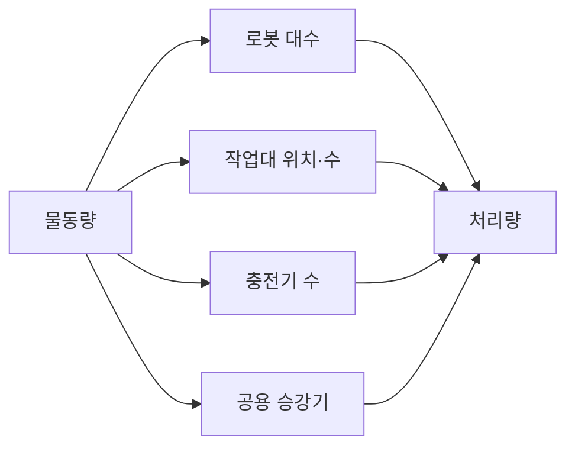

(너의 규칙은 시스템 프롬프트의 agents/shared-rules.md 와 agents/researcher.md 이다. 아래는 이번 실행의 컨텍스트와 입력이다.)

## 실행 컨텍스트

- run_id: 2026-09-26-02
- date: 2026-09-26
- run_type: monthly_recheck (월간 재검증)
- 대상: 해당 없음(월간 재검증)
- 예산:
    - max_search_queries: 30
    - max_sources_per_run: 15
    - new_topic_pages: 1
    - page_updates: 2
    - max_retries: 2
- 환경 알림: web_fetch_available: false · fetch_mode: mirror_only (일반 웹 페이지 열람은 네트워크 정책으로 막혀 있다. raw.githubusercontent.com 은 열린다: 공식 문서가 GitHub 에 있는 출처는 입력의 config/source_mirrors.yaml 경로를 WebFetch 로 열어 원문을 읽고 sources[].fetched=true, fetched_via=github_raw, fetch_url 을 적는다. 입력에 원문 텍스트(data/source_texts)가 있는 출처는 fetched_via=inbox. 그 밖의 출처는 fetched=false 이며 코드가 신뢰도 상한(medium)을 강제한다 — 공통 규칙 0절 6항)
- 언어: ko
- next_ref_id: ref-811
- 새 출처 id 구간: ref-811 ~ ref-840 — 이 실행 전용으로 예약한 번호다(동시에 도는 다른 실행과 겹치지 않는다). 새 출처는 ref-811 부터 순서대로 쓰고 ref-840 를 넘기지 않는다. 기존 출처는 참고문헌 목록의 id 를 그대로 쓴다

## 입력

### runs/2026-09-26-02/target.json

```json
{
  "run_id": "2026-09-26-02",
  "date": "2026-09-26",
  "weekday": "Sat",
  "run_number": 92,
  "run_type": "monthly_recheck",
  "forced": true,
  "target": {
    "area_no": null,
    "area_name": null,
    "category": null
  },
  "topic": null,
  "track": null,
  "corrections": [],
  "budget": {
    "max_search_queries": 30,
    "max_sources_per_run": 15,
    "new_topic_pages": 1,
    "page_updates": 2,
    "max_retries": 2
  },
  "priority_reason": null,
  "priority_questions": [],
  "excluded_areas": [],
  "lifted_areas": [],
  "deferred": {
    "monthly_recheck": false,
    "weekly_review": false
  },
  "selection_rationale": "CLI 지정 run_type=monthly_recheck"
}
```

### docs/references/index.md (요약형 전체 799건)

```markdown
| id | 기관 | 제목 | 발행일 | URL | 원문 열람 |
|---|---|---|---|---|---|
| ref-001 | ASCM | SCOR Digital Standard | 미확인 | https://www.ascm.org/corporate-solutions/standards-tools/scor-ds/ | 아니오 |
| ref-002 | ISA | Update to ISA-95 Standard Addresses Integration of Enterprise and Manufacturing Control Systems | 2025 | https://www.isa.org/news-press-releases/2025/april/update-to-isa-95-standard-addresses-integration-of | 아니오 |
| ref-003 | GS1 | EPCIS and CBV Linked Data Model | 미확인 | https://ref.gs1.org/epcis/ | 아니오 |
| ref-004 | Open Robotics | RMF Core Overview — Programming Multiple Robots with ROS 2 | 미확인 | https://osrf.github.io/ros2multirobotbook/rmf-core.html | 예 |
| ref-005 | Li, J., Tinka, A., Kiesel, S., Durham, J. W., Kumar, T. K. S., & Koenig, S. | Lifelong Multi-Agent Path Finding in Large-Scale Warehouses | 2020 | https://arxiv.org/abs/2005.07371 | 아니오 |
| ref-006 | Ma, H., Li, J., Kumar, T. K. S., & Koenig, S. | Lifelong Multi-Agent Path Finding for Online Pickup and Delivery Tasks | 2017 | https://arxiv.org/abs/1705.10868 | 아니오 |
| ref-007 | NIST | Performance of Collaborative Robot Systems | 미확인 | https://www.nist.gov/programs-projects/performance-collaborative-robot-systems | 아니오 |
| ref-008 | NIST | ARIAC Documentation | 미확인 | https://pages.nist.gov/ARIAC_docs/en/latest/ | 예 |
| ref-009 | ROS 2 Design | ROS 2 DDS-Security Integration | 미확인 | https://design.ros2.org/articles/ros2_dds_security.html | 예 |
| ref-010 | ROS 2 Design | ROS 2 Robotic Systems Threat Model | 미확인 | https://design.ros2.org/articles/ros2_threat_model.html | 예 |
| ref-011 | ISO/IEC | ISO/IEC 19987:2024 - Information technology — EPC Information Services (EPCIS) | 2024-03 | https://www.iso.org/standard/85557.html | 아니오 |
| ref-012 | ISO/IEC | ISO/IEC 19988:2024 - Information technology — GS1 Core Business Vocabulary (CBV) | 2024 | https://www.iso.org/standard/85558.html | 아니오 |
| ref-013 | OpenEPCIS | EPCIS 2.0 and EPCIS 1.2 | OpenEPCIS Docs | 미확인 | https://openepcis.io/docs/epcis/ | 아니오 |
| ref-014 | GS1 | Core Business Vocabulary (CBV) Standard | 미확인 | https://ref.gs1.org/standards/cbv/ | 아니오 |
| ref-015 | GS1 | EPCIS and CBV Implementation Guideline | 미확인 | https://www.gs1.org/docs/epc/EPCIS_Guideline.pdf | 아니오 |
| ref-016 | GS1 | Serial Shipping Container Code (SSCC) | 미확인 | https://www.gs1.org/standards/id-keys/sscc | 아니오 |
| ref-017 | GS1 Korea(대한상공회의소 유통물류진흥원) | SSCC (Serial Shipping Container Code) GS1 Information Vol. 21 | 2019-09 | http://www.gs1kr.org/front/service/File/SSCC%20%EB%B0%9C%EA%B0%84%20%EC%9E%90%EB%A3%8C.pdf | 아니오 |
| ref-018 | GS1 | GS1 Logistic Label Guideline | 미확인 | https://www.gs1.org/docs/tl/GS1_Logistic_Label_Guideline.pdf | 아니오 |
| ref-019 | GS1 | Global Returnable Asset Identifier (GRAI) | 미확인 | https://www.gs1.org/standards/id-keys/grai | 아니오 |
| ref-020 | GS1 | Which GS1 identification key should be used for individual assets used to transport goods? (GS1 GO Customer Service Portal) | 미확인 | https://support.gs1.org/support/solutions/articles/43000734294-which-gs1-identification-key-should-be-used-for-individual-assets-used-to-transport-goods- | 아니오 |
| ref-021 | GS1 | EPC Tag Data Standard | 미확인 | https://www.gs1.org/sites/default/files/docs/epc/GS1_EPC_TDS_i1_11.pdf | 아니오 |
| ref-022 | VDA(Verband der Automobilindustrie) | VDA 5050 Version 2.0.0 — Interface for the communication between automated guided vehicles (AGV) and a master control | 2022-01 | https://www.vda.de/dam/jcr:f0c9c019-1506-4dee-998a-e92723fbf025/EN-VDA5050-V2_0_0.pdf | 아니오 |
| ref-023 | Open Robotics | Workcells - Programming Multiple Robots with ROS 2 | 미확인 | https://osrf.github.io/ros2multirobotbook/integration_workcells.html | 예 |
| ref-024 | Singh, J. 외 | RFID tag readability issues with palletized loads of consumer goods | 2009 | https://onlinelibrary.wiley.com/doi/abs/10.1002/pts.864 | 아니오 |
| ref-025 | IEEE | 1872-2015 - IEEE Standard Ontologies for Robotics and Automation | 2015 | https://ieeexplore.ieee.org/document/7084073/ | 아니오 |
| ref-026 | IEEE | IEEE 1872.2-2021 - IEEE Standard for Autonomous Robotics (AuR) Ontology | 2022 | https://standards.ieee.org/standard/1872_2-2021.html | 아니오 |
| ref-027 | Beetz, M., Beßler, D., Haidu, A., Pomarlan, M., Bozcuoglu, A. K., & Bartels, G. | KnowRob 2.0 — A 2nd Generation Knowledge Processing Framework for Cognition-Enabled Robotic Agents | 2018 | https://ai.uni-bremen.de/papers/beetz18knowrob.pdf | 아니오 |
| ref-028 | Beßler, D. 외 | Foundations of the Socio-physical Model of Activities (SOMA) for Autonomous Robotic Agents | 2021 | https://arxiv.org/pdf/2011.11972 | 아니오 |
| ref-029 | McDermott, D. 외 | PDDL - The Planning Domain Definition Language | 1998 | https://www.researchgate.net/publication/2278933_PDDL_-_The_Planning_Domain_Definition_Language | 아니오 |
| ref-030 | W3C / OGC | Semantic Sensor Network Ontology | 2017-10-19 | https://www.w3.org/TR/vocab-ssn/ | 아니오 |
| ref-031 | VDA / VDMA (VDA5050 GitHub) | VDA5050/VDA5050_EN.md — Official Specification document for the VDA 5050 | 미확인 | https://github.com/VDA5050/VDA5050/blob/main/VDA5050_EN.md | 예 |
| ref-032 | VDA(Verband der Automobilindustrie) | Version 3.0 of VDA 5050 released | 2026-04 | https://www.vda.de/en/press/press-releases/2026/260421_PM_VDA_5050_EN | 아니오 |
| ref-033 | MassRobotics | Autonomous Mobile Robot Standards Published by MassRobotics | 2021-05 | https://www.massrobotics.org/autonomous-mobile-robot-standards-published-by-massrobotics/ | 아니오 |
| ref-034 | OPC Foundation / VDMA | OPC-40010-1 – OPC UA for Robotics - Part 1: Vertical Integration | 미확인 | https://reference.opcfoundation.org/specs/OPC-40010-1 | 아니오 |
| ref-035 | Plattform Industrie 4.0 | Information Model for Capabilities, Skills & Services | 2022-11 | https://www.plattform-i40.de/IP/Redaktion/EN/Downloads/Publikation/CapabilitiesSkillsServices.html | 아니오 |
| ref-036 | Köcher, A. 외 | A Reference Model for Common Understanding of Capabilities and Skills in Manufacturing | 2022 | https://arxiv.org/abs/2209.09632 | 아니오 |
| ref-037 | Vieira da Silva, L. M., Köcher, A., Gill, M. S., Weiss, M., & Fay, A. | Toward a Mapping of Capability and Skill Models using Asset Administration Shells and Ontologies | 2023-07 | https://arxiv.org/abs/2307.00827 | 아니오 |
| ref-038 | Vieira da Silva, L. M., Köcher, A., & Fay, A. | A Capability and Skill Model for Heterogeneous Autonomous Robots | 2022-09 | https://arxiv.org/abs/2209.10900 | 아니오 |
| ref-039 | Open Robotics | Currently supported Tasks - Programming Multiple Robots with ROS 2 | 미확인 | https://osrf.github.io/ros2multirobotbook/task_types.html | 예 |
| ref-040 | Open Robotics | PerformAction Tutorial - Programming Multiple Robots with ROS 2 | 미확인 | https://osrf.github.io/ros2multirobotbook/integration_fleets_action_tutorial.html | 예 |
| ref-041 | Naqvi, M. R. 외(Scientific Reports) | Ontology-driven integration of advertised and operational capabilities in robots | 2025-10-02 | https://www.nature.com/articles/s41598-025-16649-3 | 아니오 |
| ref-042 | Aguado, E., Gomez, V., Hernando, M., Rossi, C., & Sanz, R. | A survey of ontology-enabled processes for dependable robot autonomy | 2024-07 | https://www.frontiersin.org/journals/robotics-and-ai/articles/10.3389/frobt.2024.1377897/full | 아니오 |
| ref-043 | 신민종, 한영석, 정재윤 | 자산관리쉘 표준을 이용한 자율이동로봇 모니터링 시스템 설계 | 2024 | https://www.kci.go.kr/kciportal/ci/sereArticleSearch/ciSereArtiView.kci?sereArticleSearchBean.artiId=ART003140560 | 아니오 |
| ref-044 | GS1 | gs1/EPCIS — Ontology/CBV.ttl (Core Business Vocabulary ontology 2.0) | 2021-09-30 | https://github.com/gs1/EPCIS/blob/master/Ontology/CBV.ttl | 예 |
| ref-045 | GS1 | gs1/EPCIS — Ontology/EPCIS.ttl (EPCIS ontology 2.0) | 2021-09-30 | https://github.com/gs1/EPCIS/blob/master/Ontology/EPCIS.ttl | 예 |
| ref-046 | VDMA (Intralogistics-2X-LIF GitHub) | Layout-Interchange-Format — README (Repository for the Layout Interchange Format (LIF) developed by the VDMA) | 2023-09 | https://github.com/Intralogistics-2X-LIF/Layout-Interchange-Format | 아니오 |
| ref-047 | Open Robotics (open-rmf) | rmf_internal_msgs — rmf_dispenser_msgs/msg/DispenserRequest.msg | 미확인 | https://github.com/open-rmf/rmf_internal_msgs/blob/main/rmf_dispenser_msgs/msg/DispenserRequest.msg | 예 |
| ref-048 | Open Robotics (open-rmf) | rmf_internal_msgs — rmf_dispenser_msgs/msg/DispenserRequestItem.msg | 미확인 | https://github.com/open-rmf/rmf_internal_msgs/blob/main/rmf_dispenser_msgs/msg/DispenserRequestItem.msg | 예 |
| ref-049 | Open Robotics (open-rmf) | rmf_internal_msgs — rmf_ingestor_msgs/msg/IngestorResult.msg | 미확인 | https://github.com/open-rmf/rmf_internal_msgs/blob/main/rmf_ingestor_msgs/msg/IngestorResult.msg | 예 |
| ref-050 | Auto-ID Labs Korea(세종대학교), Byun, J. | Oliot EPCIS for GS1 EPCIS/CBV 2.0.0 (GitHub JaewookByun/epcis README) | 미확인 | https://github.com/JaewookByun/epcis | 예 |
| ref-051 | VDA / VDMA (VDA5050 GitHub) | VDA5050/VDA5050 — json_schemas/state.schema | 미확인 | https://github.com/VDA5050/VDA5050/blob/main/json_schemas/state.schema | 예 |
| ref-052 | VDA / VDMA (VDA5050 GitHub) | VDA5050/VDA5050 — README.md | 미확인 | https://github.com/VDA5050/VDA5050/blob/main/README.md | 예 |
| ref-053 | NVIDIA Research (NVlabs) | progprompt-vh — ProgPrompt: Generating Situated Robot Task Plans using Large Language Models (GitHub README) | 미확인 | https://github.com/NVlabs/progprompt-vh | 예 |
| ref-054 | Singh, I. 외 | ProgPrompt: Generating Situated Robot Task Plans using Large Language Models | 2022-09 | https://arxiv.org/abs/2209.11302 | 아니오 |
| ref-055 | Brown University H2R Lab | Lang2LTL — Code for paper Lang2LTL: Grounding Complex Natural Language Commands for Temporal Tasks in Unseen Environments (GitHub README) | 미확인 | https://github.com/h2r/Lang2LTL | 예 |
| ref-056 | Liu, J. X. 외 | Grounding Complex Natural Language Commands for Temporal Tasks in Unseen Environments | 2023-02 | https://arxiv.org/abs/2302.11649 | 아니오 |
| ref-057 | Tellex, S. 외 | Understanding Natural Language Commands for Robotic Navigation and Mobile Manipulation | 2011-08 | https://ojs.aaai.org/index.php/AAAI/article/view/7979 | 아니오 |
| ref-058 | Cohen, V., Liu, J. X., Mooney, R., Tellex, S., & Watkins, D. | A Survey of Robotic Language Grounding: Tradeoffs between Symbols and Embeddings | 2024-08 | https://www.ijcai.org/proceedings/2024/885 | 아니오 |
| ref-059 | Wang, Y. 외(DART-LLM 저자) | DART-LLM: Dependency-Aware Multi-Robot Task Decomposition and Execution using Large Language Models | 2024-11 | https://arxiv.org/abs/2411.09022 | 아니오 |
| ref-060 | Lee, Y. 외(Digital Health) | Feasibility of autonomous medication delivery robots considering elevator utilization in high-traffic hospital environments | 2026 | https://doi.org/10.1177/20552076261437181 | 아니오 |
| ref-061 | Izzo, R. A., Bardaro, G., & Matteucci, M. (Politecnico di Milano AIRLab) | BTGenBot: Behavior Tree Generation for Robotic Tasks with Lightweight LLMs | 2024-03 | https://arxiv.org/abs/2403.12761 | 아니오 |
| ref-062 | CubiCasa (Kalervo, A. 외) | CubiCasa5k — README (CubiCasa5K: A Dataset and an Improved Multi-Task Model for Floorplan Image Analysis) | 미확인 | https://github.com/CubiCasa/CubiCasa5k | 아니오 |
| ref-063 | Kalervo, A., Ylioinas, J., Häikiö, M., Karhu, A., & Kannala, J. | CubiCasa5K: A Dataset and an Improved Multi-Task Model for Floorplan Image Analysis | 2019-04 | https://arxiv.org/abs/1904.01920 | 아니오 |
| ref-064 | Zeng, Z., Li, X., Yu, Y. K., & Fu, C.-W. | DeepFloorplan — README (Deep Floor Plan Recognition using a Multi-task Network with Room-boundary-Guided Attention) | 2019 | https://github.com/zlzeng/DeepFloorplan | 아니오 |
| ref-065 | Liu, C., Wu, J., Kohli, P., & Furukawa, Y. | FloorplanTransformation — README (Raster-to-Vector: Revisiting Floorplan Transformation) | 2017 | https://github.com/art-programmer/FloorplanTransformation | 아니오 |
| ref-066 | FloorPlanCAD 프로젝트(Fan, Z. 외) | FloorPlanCAD Dataset — project page (floorplancad.github.io index.md) | 2021 | https://floorplancad.github.io/ | 아니오 |
| ref-067 | Fan, Z., Zhu, L., Li, H., Chen, X., Zhu, S., & Tan, P. | FloorPlanCAD: A Large-Scale CAD Drawing Dataset for Panoptic Symbol Spotting | 2021-05 | https://arxiv.org/abs/2105.07147 | 아니오 |
| ref-068 | Voxel51 (Hugging Face) | Voxel51/FloorPlanCAD · Datasets at Hugging Face | 미확인 | https://huggingface.co/datasets/Voxel51/FloorPlanCAD | 아니오 |
| ref-069 | Pizarro, P. N., Hitschfeld, N., & Sipiran, I. (MLSTRUCT) | MLStructFP — README (Large-scale multi-unit floor plan dataset for architectural plan analysis and recognition) | 2023 | https://github.com/MLSTRUCT/MLStructFP | 아니오 |
| ref-070 | Hu, S. 외 | Raster-to-Graph — README (Raster-to-Graph: Floorplan Recognition via Autoregressive Graph Prediction with an Attention Transformer) | 2024 | https://github.com/SizheHu/Raster-to-Graph | 아니오 |
| ref-071 | Agour, M. 외 (ResPlan) | ResPlan — README (ResPlan: A Large-Scale Vector-Graph Dataset of 17,000 Residential Floor Plans) | 2025-08 | https://github.com/m-agour/ResPlan | 아니오 |
| ref-072 | van Engelenburg, C. 외 (MSD) | msd — README (MSD: A Benchmark Dataset for Floor Plan Generation of Building Complexes) | 2024 | https://github.com/caspervanengelenburg/msd | 아니오 |
| ref-073 | Luo, R. 외 | ArchCAD-400K: A Large-Scale CAD drawings Dataset and New Baseline for Panoptic Symbol Spotting | 2025-03 | https://arxiv.org/abs/2503.22346 | 아니오 |
| ref-074 | 한국지능정보사회진흥원(AI Hub) | 건축 도면 데이터 | 미확인 | https://aihub.or.kr/aihubdata/data/view.do?dataSetSn=71465 | 아니오 |
| ref-075 | de las Heras, L.-P., Terrades, O. R., Robles, S., & Sánchez, G. | CVC-FP and SGT: a new database for structural floor plan analysis and its groundtruthing tool | 2015 | https://www.researchgate.net/publication/270597635_CVC-FP_and_SGT_a_new_database_for_structural_floor_plan_analysis_and_its_groundtruthing_tool | 아니오 |
| ref-076 | DeFazio, D., Mehta, H., Wang, M., Yang, P., Blackburn, J., & Zhang, S. | Vision Language Models Can Parse Floor Plan Maps | 2024-09 | https://arxiv.org/abs/2409.12842 | 아니오 |
| ref-077 | DoorDet 저자(arXiv 2508.07714) | DoorDet: Semi-Automated Multi-Class Door Detection Dataset via Object Detection and Large Language Models | 2025-08 | https://arxiv.org/abs/2508.07714 | 아니오 |
| ref-078 | Kratochvila, L., de Jong, G., Arkesteijn, M., Zemcik, T., Bilik, S., Horak, K., & Rellermeyer, J. S. | Multi-Unit Floor Plan Recognition and Reconstruction Using Improved Semantic Segmentation of Raster-Wise Floor Plans | 2024-08 | https://arxiv.org/abs/2408.01526 | 아니오 |
| ref-079 | Open Robotics | Traffic Editor - Programming Multiple Robots with ROS 2 | 미확인 | https://osrf.github.io/ros2multirobotbook/traffic-editor.html | 예 |
| ref-080 | Open Robotics | Navigation Maps (integration_nav-maps) - Programming Multiple Robots with ROS 2 | 미확인 | https://osrf.github.io/ros2multirobotbook/integration_nav-maps.html | 예 |
| ref-081 | Vega-Torres, M. A. 외 | Occupancy Grid Map to Pose Graph-based Map: Robust BIM-based 2D-LiDAR Localization for Lifelong Indoor Navigation in Changing and Dynamic Environments | 2023-08 | https://arxiv.org/abs/2308.05443 | 아니오 |
| ref-082 | Vega-Torres, M. A. (MigVega GitHub) | Ogm2Pgbm — README (Robust BIM-based 2D-LiDAR Localization for Lifelong Indoor Navigation in Changing and Dynamic Environments) | 미확인 | https://github.com/MigVega/Ogm2Pgbm | 예 |
| ref-083 | Zhang, J. 외 | Generation of Indoor Open Street Maps for Robot Navigation from CAD Files | 2025-07 | https://arxiv.org/abs/2507.00552 | 아니오 |
| ref-084 | Zhang, J. (jiajiezhang7 GitHub) | osmAG-from-cad — README (CAD-to-osmAG pipeline) | 미확인 | https://github.com/jiajiezhang7/osmAG-from-cad | 예 |
| ref-085 | Braga, R. G., Tahir, M. O., Karimi, S., Dah-Achinanon, U., Iordanova, I., & St-Onge, D. | Intuitive BIM-aided robotic navigation and assets localization with semantic user interfaces | 2025-03-26 | https://www.frontiersin.org/journals/robotics-and-ai/articles/10.3389/frobt.2025.1548684/full | 아니오 |
| ref-086 | Palacz, W., Ślusarczyk, G., Strug, B., & Grabska, E. | Indoor Robot Navigation Using Graph Models Based on BIM/IFC | 2019 | https://www.researchgate.net/publication/333410520_Indoor_Robot_Navigation_Using_Graph_Models_Based_on_BIMIFC | 아니오 |
| ref-087 | Google Research | SayCan (google-research/saycan README) | 미확인 | https://github.com/google-research/google-research/blob/master/saycan/README.md | 아니오 |
| ref-088 | Ahn, M. 외(Google) | Do As I Can, Not As I Say: Grounding Language in Robotic Affordances | 2022-04 | https://arxiv.org/abs/2204.01691 | 아니오 |
| ref-089 | SMARTlab-Purdue (Purdue University) | SMART-LLM: Smart Multi-Agent Robot Task Planning using Large Language Models (GitHub README) | 미확인 | https://github.com/SMARTlab-Purdue/SMART-LLM | 아니오 |
| ref-090 | Kannan, S. S., Venkatesh, V. L. N., & Min, B.-C. | SMART-LLM: Smart Multi-Agent Robot Task Planning using Large Language Models | 2023-09 | https://arxiv.org/abs/2309.10062 | 아니오 |
| ref-091 | Cranial-XIX (LLM+P 저자) | llm-pddl — LLM+P: Empowering Large Language Models with Optimal Planning Proficiency (GitHub README) | 미확인 | https://github.com/Cranial-XIX/llm-pddl | 아니오 |
| ref-092 | Liu, B., Jiang, Y., Zhang, X., Liu, Q., Zhang, S., Biswas, J., & Stone, P. | LLM+P: Empowering Large Language Models with Optimal Planning Proficiency | 2023-04 | https://arxiv.org/abs/2304.11477 | 아니오 |
| ref-093 | Huang, W., Abbeel, P., Pathak, D., & Mordatch, I. | Language Models as Zero-Shot Planners: Extracting Actionable Knowledge for Embodied Agents | 2022-07 | https://proceedings.mlr.press/v162/huang22a.html | 아니오 |
| ref-094 | Huang, W. (language-planner 공식 저장소) | language-planner — Official Code for "Language Models as Zero-Shot Planners" (GitHub README) | 미확인 | https://github.com/huangwl18/language-planner | 아니오 |
| ref-095 | Google Research | Code as Policies: Language Model Programs for Embodied Control (google-research/code_as_policies README) | 미확인 | https://github.com/google-research/google-research/blob/master/code_as_policies/README.md | 아니오 |
| ref-096 | Lamballais, T., Roy, D., & de Koster, M. B. M. | Estimating performance in a Robotic Mobile Fulfillment System | 2017 | https://repub.eur.nl/pub/107376/ | 아니오 |
| ref-097 | Lamballais, T., Roy, D., & de Koster, M. B. M. | Inventory allocation in robotic mobile fulfillment systems | 2020 | https://www.tandfonline.com/doi/abs/10.1080/24725854.2018.1560517 | 아니오 |
| ref-098 | Zou, B., Gong, Y., de Koster, R., & Xu, X. | Evaluating battery charging and swapping strategies in a robotic mobile fulfillment system | 2018 | https://www.sciencedirect.com/science/article/abs/pii/S0377221717310901 | 아니오 |
| ref-099 | Le-Anh, T., & de Koster, M. B. M. | A review of design and control of automated guided vehicle systems | 2006 | https://www.sciencedirect.com/science/article/abs/pii/S0377221705001840 | 아니오 |
| ref-100 | Vis, I. F. A. | Survey of research in the design and control of automated guided vehicle systems | 2006 | https://www.sciencedirect.com/science/article/abs/pii/S0377221704006459 | 아니오 |
| ref-101 | Merschformann, M. (RAWSim-O GitHub) | RAWSim-O: A simulation framework for Robotic Mobile Fulfillment Systems (README) | 미확인 | https://github.com/merschformann/RAWSim-O | 예 |
| ref-102 | Springer(FAIM 2025 발표 논문, 저자 미확인) | Simulation-Driven Approach for Dimensioning AMR Fleets in Distribution Centre Logistics | 2025 | https://link.springer.com/chapter/10.1007/978-3-032-07675-5_69 | 아니오 |
| ref-103 | PMC 게재 논문(저자 미확인) | The Path Planning Problem of Robotic Delivery in Multi-Floor Hotel Environments | 미확인 | https://pmc.ncbi.nlm.nih.gov/articles/PMC11946681/ | 아니오 |
| ref-104 | Open Robotics (open-rmf) | rmf_demos — Demonstrations of Open-RMF (README) | 미확인 | https://github.com/open-rmf/rmf_demos | 예 |
| ref-105 | Open Robotics (open-rmf) | fleet_adapter_template — fleet_adapter_template/config.yaml | 미확인 | https://github.com/open-rmf/fleet_adapter_template/blob/main/fleet_adapter_template/config.yaml | 예 |
| ref-106 | 한국교통연구원(인증스마트물류센터) | 인증스마트물류센터 | 미확인 | https://cslc.koti.re.kr/ | 아니오 |
| ref-107 | 법제처 국가법령정보센터 | 물류시설의 개발 및 운영에 관한 법률 | 미확인 | https://www.law.go.kr/LSW/lsInfoP.do?lsId=000091 | 아니오 |
| ref-108 | 이문수, 채준재(로지스틱스연구) | AGV 기반 제조물류시스템의 성능평가를 위한 해석적 모형에 관한 연구 - 반도체 Tandem 레이아웃 시스템을 중심으로 - | 2010 | https://www.kci.go.kr/kciportal/ci/sereArticleSearch/ciSereArtiView.kci?sereArticleSearchBean.artiId=ART001485142 | 아니오 |
| ref-109 | Stark, H.-G. 외 | A Page-Rank-like Approach to Optimal Placement of Charging Stations in a Warehouse | 2024-06 | https://arxiv.org/abs/2406.17003 | 아니오 |
| ref-110 | Open Robotics | Tasks in RMF (task_new) - Programming Multiple Robots with ROS 2 | 미확인 | https://osrf.github.io/ros2multirobotbook/task_new.html | 예 |
| ref-111 | Open Robotics (open-rmf) | rmf_api_msgs — rmf_api_msgs/schemas/task_state.json | 미확인 | https://github.com/open-rmf/rmf_api_msgs/blob/main/rmf_api_msgs/schemas/task_state.json | 예 |
| ref-112 | OMG(Object Management Group) | About the Business Process Model And Notation Specification Version 2.0 | 미확인 | https://www.omg.org/spec/BPMN/2.0/About-BPMN | 아니오 |
| ref-113 | Camunda | Messages | Camunda 8 Docs (camunda-docs: docs/components/concepts/messages.md) | 미확인 | https://docs.camunda.io/docs/components/concepts/messages/ | 예 |
| ref-114 | Corradini, F., Pettinari, S., Re, B., Rossi, L., & Tiezzi, F. | A BPMN-driven framework for Multi-Robot System development | 2023 | https://www.sciencedirect.com/science/article/abs/pii/S0921889022002111 | 아니오 |
| ref-115 | Production & Manufacturing Research 게재 논문(저자 미확인, Chalmers 공개본) | Throughput bottleneck detection in manufacturing: a systematic review of the literature on methods and operationalization modes | 2023 | https://www.tandfonline.com/doi/full/10.1080/21693277.2023.2283031 | 아니오 |
| ref-116 | Filippone, G., Pettinari, S., & Pelliccione, P. | Formalisms for Robotic Mission Specification and Execution: A Comparative Analysis | 2026-03 | https://arxiv.org/abs/2603.15427 | 아니오 |
| ref-117 | MESA International | B2MML-BatchML — Schema/B2MML-Common.xsd | 2023 | https://github.com/MESAInternational/B2MML-BatchML/blob/master/Schema/B2MML-Common.xsd | 예 |
| ref-118 | MESA International | B2MML-BatchML — Schema/B2MML-OperationsDefinition.xsd | 미확인 | https://github.com/MESAInternational/B2MML-BatchML/blob/master/Schema/B2MML-OperationsDefinition.xsd | 예 |
| ref-119 | IEC / ISO | IEC 62264-3:2016 - Enterprise-control system integration — Part 3: Activity models of manufacturing operations management | 2016 | https://www.iso.org/standard/67480.html | 아니오 |
| ref-120 | Boniardi, F., Valada, A., Mohan, R., Caselitz, T., & Burgard, W. | Robot Localization in Floor Plans Using a Room Layout Edge Extraction Network | 2019-03 | https://arxiv.org/abs/1903.01804 | 아니오 |
| ref-121 | Blondin, M., Mazowiecki, F., & Offtermatt, P. (LICS 2022) | The complexity of soundness in workflow nets | 2022 | https://arxiv.org/abs/2201.05588 | 아니오 |
| ref-122 | arXiv:2403.01975 저자(미확인) | OCEL (Object-Centric Event Log) 2.0 Specification | 2024-03 | https://arxiv.org/abs/2403.01975 | 아니오 |
| ref-123 | ASCM | SCOR Model — Fulfill F1.3 Pick Product | 미확인 | https://scor.ascm.org/processes/fulfill/F1.3 | 아니오 |
| ref-124 | 국가물류통합정보센터(국토교통부) | 스마트물류센터 인증제 안내 | 미확인 | https://www.nlic.go.kr/nlic/board0010.action?S_DOC_ID=5897&S_DOC_SEQ=&command=VIEW | 아니오 |
| ref-125 | Open Robotics (open-rmf) | rmf_api_msgs — rmf_api_msgs/schemas/task_request.json | 미확인 | https://github.com/open-rmf/rmf_api_msgs/blob/main/rmf_api_msgs/schemas/task_request.json | 아니오 |
| ref-126 | Open Robotics (open-rmf) | rmf_api_msgs — rmf_api_msgs/schemas/cancel_task_request.json | 미확인 | https://github.com/open-rmf/rmf_api_msgs/blob/main/rmf_api_msgs/schemas/cancel_task_request.json | 아니오 |
| ref-127 | Open Robotics (open-rmf) | rmf_api_msgs — rmf_api_msgs/schemas/interrupt_task_request.json | 미확인 | https://github.com/open-rmf/rmf_api_msgs/blob/main/rmf_api_msgs/schemas/interrupt_task_request.json | 아니오 |
| ref-128 | Open Robotics (open-rmf) | rmf_api_msgs — rmf_api_msgs/schemas/rewind_task_request.json | 미확인 | https://github.com/open-rmf/rmf_api_msgs/blob/main/rmf_api_msgs/schemas/rewind_task_request.json | 아니오 |
| ref-129 | MESA International | B2MML-BatchML/Schema/B2MML-TransactionProfile.xsd | 2023 | https://github.com/MESAInternational/B2MML-BatchML/blob/master/Schema/B2MML-TransactionProfile.xsd | 아니오 |
| ref-130 | OPC Foundation | UA-Nodeset ISA95-JOBCONTROL — opc.ua.isa95-jobcontrol.nodeset2 (NodeSet2.xml·documentation.csv) | 2024-01-31 | https://github.com/OPCFoundation/UA-Nodeset/tree/latest/ISA95-JOBCONTROL | 아니오 |
| ref-131 | OPC Foundation / ISA | OPC UA for ISA-95 - Part 4: Job Control - 6.2 ObjectTypes (OPC 10031-4) | 미확인 | https://reference.opcfoundation.org/specs/OPC-10031-4/6.2 | 아니오 |
| ref-132 | Yu, S., & Srinivas, S. | Collaborative Human–Robot Teaming for Dynamic Order Picking: Interventionist strategies for improving warehouse intralogistics operations | 2025 | https://www.sciencedirect.com/science/article/abs/pii/S1366554525001231 | 아니오 |
| ref-133 | Lorenz, Otto, & Gendreau (Networks, Wiley) | Picking Operations in Warehouses With Dynamically Arriving Orders: How Good is Reoptimization? | 2025 | https://onlinelibrary.wiley.com/doi/full/10.1002/net.22281 | 아니오 |
| ref-134 | Gallien, J., & Weber, T. G. | To Wave or Not to Wave? Order Release Policies for Warehouses with an Automated Sorter | 2010 | https://pubsonline.informs.org/doi/abs/10.1287/msom.1100.0291 | 아니오 |
| ref-135 | ASCM | SCOR Digital Standard — Introduction and Front Matter (SCOR Version 14.0, 2025) | 2025 | https://www.ascm.org/globalassets/ascm_website_assets/docs/scor/intro-and-front-matter-scor-digital-standard-2025.pdf | 아니오 |
| ref-136 | Applied Sciences(MDPI) 게재 논문 저자(미확인) | Integrated Fleet Management of Mobile Robots for Enhancing Industrial Efficiency: A Case Study on Interoperability in Multi-Brand Environments Within the Automotive Sector | 2025 | https://www.mdpi.com/2076-3417/15/13/7235 | 아니오 |
| ref-137 | 머니투데이 | 물류센터 관리시스템에 로봇 연동…"물류 자동화 새 표준 만든다" | 2025-01 | https://news.mt.co.kr/mtview.php?no=2025012116183583251 | 아니오 |
| ref-138 | 국가표준인증통합정보시스템(KSSN) | KS B 7321-2 로봇 — 서비스 로봇 모듈용 정보 모델 — 제2부: 소프트웨어 모듈용 정보 모델 | 미확인 | https://www.kssn.net/search/stddetail.do?itemNo=K001010147546 | 아니오 |
| ref-139 | ISO | ISO 22400-2:2014 - Automation systems and integration — Key performance indicators (KPIs) for manufacturing operations management — Part 2: Definitions and descriptions | 2014 | https://www.iso.org/standard/54497.html | 아니오 |
| ref-140 | ASCM | SCOR Model — Performance: Reliability RL.1.1 Perfect Customer Order Fulfillment | 미확인 | https://scor.ascm.org/performance/reliability/RL.1.1 | 아니오 |
| ref-141 | WERC(Warehousing Education and Research Council) | WERC DC Measures Survey - 2025 | 2025 | https://wercmetrics.werc.org/WERC-DC-Measures-Survey-2025.pdf | 아니오 |
| ref-142 | Computers & Industrial Engineering 게재 논문(저자 미확인) | Overall Equipment Effectiveness: consistency of ISO standard with literature | 2020 | https://www.sciencedirect.com/science/article/abs/pii/S0360835220302527 | 아니오 |
| ref-143 | Project Production Institute | Little’s Law – A Practical Approach to Understanding Production System Performance | 미확인 | https://projectproduction.org/journal/littles-law-a-practical-approach-to-understanding-production-system-performance/ | 아니오 |
| ref-144 | Azadeh, K., de Koster, R., & Roy, D. | Robotized and Automated Warehouse Systems: Review and Recent Developments | 2019 | https://pubsonline.informs.org/doi/abs/10.1287/trsc.2018.0873 | 아니오 |
| ref-145 | Ghelichi, Z., & Kilaru, S. | Analytical models for collaborative autonomous mobile robot solutions in fulfillment centers | 2021 | https://www.sciencedirect.com/science/article/pii/S0307904X20305801 | 아니오 |
| ref-146 | Omega 게재 논문(저자 미확인) | The role of energy consumption in robotic mobile fulfillment systems: Performance evaluation and operating policies with dynamic priority | 2024 | https://www.sciencedirect.com/science/article/abs/pii/S0305048324001336 | 아니오 |
| ref-147 | Process Intelligence Solutions (PM4Py GitHub) | pm4py — Official public repository for PM4Py (Process Mining for Python) (README) | 미확인 | https://github.com/process-intelligence-solutions/pm4py | 예 |
| ref-148 | Open Robotics (open-rmf) | rmf_api_msgs — rmf_api_msgs/schemas/robot_state.json | 미확인 | https://github.com/open-rmf/rmf_api_msgs/blob/main/rmf_api_msgs/schemas/robot_state.json | 예 |
| ref-149 | Springer(학술대회 발표 논문, 저자 미확인) | Material Movement Analysis for Warehouse Business Process Improvement with Process Mining: A Case Study | 2015 | https://link.springer.com/chapter/10.1007/978-3-319-19509-4_9 | 아니오 |
| ref-150 | CIO Korea | 오토스토어, 물류 자동화 시스템의 경제적 효과 연구 보고서 발표 | 미확인 | https://www.cio.com/article/3517636/%EC%98%A4%ED%86%A0%EC%8A%A4%ED%86%A0%EC%96%B4-%EB%AC%BC%EB%A5%98-%EC%9E%90%EB%8F%99%ED%99%94-%EC%8B%9C%EC%8A%A4%ED%85%9C%EC%9D%98-%EA%B2%BD%EC%A0%9C%EC%A0%81-%ED%9A%A8%EA%B3%BC-%EC%97%B0%EA%B5%AC.html | 아니오 |
| ref-151 | 박정수, 안영효(유통경영학회지) | 화주기업과 물류기업의 공동 핵심성과지표 관리방법에 대한 연구 | 2010 | https://www.kci.go.kr/kciportal/ci/sereArticleSearch/ciSereArtiView.kci?sereArticleSearchBean.artiId=ART001434387 | 아니오 |
| ref-152 | Meseguer Valenzuela, A., & Blanes Noguera, F. | Task Allocation in Mobile Robot Fleets: A review | 2025-01 | https://arxiv.org/abs/2501.08726 | 아니오 |
| ref-153 | Open Robotics | Fleet Adapter Tutorial - Programming Multiple Robots with ROS 2 | 미확인 | https://osrf.github.io/ros2multirobotbook/integration_fleets_adapter_tutorial.html | 예 |
| ref-154 | Open Robotics (open-rmf) | rmf_api_msgs — rmf_api_msgs/schemas/location_2D.json | 미확인 | https://github.com/open-rmf/rmf_api_msgs/blob/main/rmf_api_msgs/schemas/location_2D.json | 예 |
| ref-155 | ROS (ros-infrastructure/rep) | REP 105 -- Coordinate Frames for Mobile Platforms | 미확인 | https://www.ros.org/reps/rep-0105.html | 예 |
| ref-156 | buildingSMART International | IFC 4.3 documentation — IfcSpace (IFC4.3.x-development) | 미확인 | https://github.com/buildingSMART/IFC4.3.x-development/blob/ifc4.3-main/docs/schemas/core/IfcProductExtension/Entities/IfcSpace.md | 예 |
| ref-157 | OGC IndoorGML SWG (opengeospatial/IndoorGML-SWG GitHub) | IndoorGML-SWG — README and OGC IndoorGML 2.0 Part 2a – XML Encoding (26-042, Candidate SWG Draft) | 미확인 | https://github.com/opengeospatial/IndoorGML-SWG | 예 |
| ref-158 | ISO | ISO 19164:2024 - Geographic information — Indoor feature model | 2024 | https://www.iso.org/standard/83153.html | 아니오 |
| ref-159 | ISO | ISO 21423 - Robotics — Industrial mobile robots — Communications and interoperability | 미확인 | https://www.iso.org/standard/86749.html | 아니오 |
| ref-160 | Prakhya, S. M., Yang, L., & Liu, Z. | Lifelong 3D Mapping Framework for Hand-held & Robot-mounted LiDAR Mapping Systems | 2025-01 | https://arxiv.org/abs/2501.18110 | 아니오 |
| ref-161 | Abdul Hafez, O., Joerger, M., & Spenko, M. | Quantifying mobile robot localization safety for an EKF-based SLAM estimator: An integrity monitoring approach | 2025-05 | https://journals.sagepub.com/doi/10.1177/02783649241287797 | 아니오 |
| ref-162 | GS1 | Identifying a physical location - GLN | 미확인 | https://www.gs1.org/standards/id-keys/gln/physical-location | 아니오 |
| ref-163 | 노주형, 강규리, 김연찬, 심현철(로봇학회 논문지) | 탐사 및 엘리베이터 연계를 이용한 완전 자율 다층 실내 지도 구축 시스템 | 2026 | https://www.kci.go.kr/kciportal/landing/article.kci?arti_id=ART003305667 | 아니오 |
| ref-164 | TASL Lab (LaMMA-P 저자) | LaMMA-P: Generalizable Multi-Agent Long-Horizon Task Allocation and Planning with LM-Driven PDDL Planner (GitHub README) | 미확인 | https://github.com/tasl-lab/LaMMA-P | 예 |
| ref-165 | Autonomous Robots 게재 서베이(arXiv 2502.03814) 저자 | Large Language Models for Multi-Robot Systems: A Survey | 2025-02 | https://arxiv.org/abs/2502.03814 | 아니오 |
| ref-166 | Obata, K., Aoki, T., Horii, T., Taniguchi, T., & Nagai, T. | LiP-LLM: Integrating Linear Programming and dependency graph with Large Language Models for multi-robot task planning | 2024-10 | https://arxiv.org/abs/2410.21040 | 아니오 |
| ref-167 | Peng, M., Chen, Z., Yang, J., Huang, J., Shi, Z., Liu, Q., Li, X., & Gao, L. | Automatic MILP Model Construction for Multi-Robot Task Allocation and Scheduling Based on Large Language Models | 2025-03 | https://arxiv.org/abs/2503.13813 | 아니오 |
| ref-168 | Kaitha, S., & Yu, S. 외(arXiv 2512.02810) | Phase-Adaptive LLM Framework with Multi-Stage Validation for Construction Robot Task Allocation: A Systematic Benchmark Against Traditional Optimization Algorithms | 2025-12 | https://arxiv.org/abs/2512.02810 | 아니오 |
| ref-169 | SHAILAB-IPEC (COHERENT 저자) | COHERENT: Collaboration of Heterogeneous Multi-Robot System with Large Language Models (GitHub README) | 미확인 | https://github.com/SHAILAB-IPEC/COHERENT | 예 |
| ref-170 | Su, X., Xu, J., van Kaick, O., Xu, K., & Hu, R. | IMR-LLM: Industrial Multi-Robot Task Planning and Program Generation using Large Language Models | 2026-03 | https://arxiv.org/abs/2603.02669 | 아니오 |
| ref-171 | NASA Jet Propulsion Laboratory (nasa-jpl) | ROSA — ROS Agent (GitHub README) | 미확인 | https://github.com/nasa-jpl/rosa | 예 |
| ref-172 | NASA Jet Propulsion Laboratory (nasa-jpl) | Custom Agents · nasa-jpl/rosa Wiki | 미확인 | https://github.com/nasa-jpl/rosa/wiki/Custom-Agents | 예 |
| ref-173 | Microsoft | PromptCraft-Robotics (GitHub README) | 미확인 | https://github.com/microsoft/PromptCraft-Robotics | 예 |
| ref-174 | Vemprala, S., Bonatti, R., Bucker, A., & Kapoor, A. (Microsoft) | ChatGPT for Robotics: Design Principles and Model Abilities | 2023-07 | https://arxiv.org/abs/2306.17582 | 아니오 |
| ref-175 | Robotec.ai (RobotecAI) | RAI — vendor agnostic agentic framework for Physical AI robotics (GitHub README) | 미확인 | https://github.com/RobotecAI/rai | 예 |
| ref-176 | InOrbit.AI | InOrbit Unveils RobOps Copilot for AI-Powered Robot Optimization at Automate 2024 | 2024-05 | https://www.inorbit.ai/press/inorbit-robops-copilot | 아니오 |
| ref-177 | InOrbit.AI (RoboticsTomorrow 게재 보도자료) | InOrbit.AI Demonstrates the Future of Multi-Vendor Robot Orchestration and Physical AI at Automate 2026 | 2026-06-22 | https://www.roboticstomorrow.com/news/2026/06/22/inorbitai-demonstrates-the-future-of-multi-vendor-robot-orchestration-and-physical-ai-at-automate-2026/26757/ | 아니오 |
| ref-178 | Formant (Business Wire 보도자료) | Formant F3 Brings Generative AI and Agentic Reasoning to Robot Ops | 2025-06-30 | https://www.businesswire.com/news/home/20250630008190/en/Formant-F3-Brings-Generative-AI-and-Agentic-Reasoning-to-Robot-Ops | 아니오 |
| ref-179 | 와우테일 | 다임리서치, 중기부-인텔 '인지니어스' 글로벌 협업 기업 선정 | 2026-08-27 | https://wowtale.net/2026/08/27/263530/ | 아니오 |
| ref-180 | 이종록, 황정훈, 박민철(한국전자기술연구원) | LLM 기반 로봇관제시스템의 Agent AI 구축 | 미확인 | https://d2j16w31g89z0j.cloudfront.net/site/2026w/abs/0560-YDVVV.pdf | 아니오 |
| ref-181 | Shi, G., Wu, Y., Kumar, V., & Sukhatme, G. S. | PIP-LLM: Integrating PDDL-Integer Programming with LLMs for Coordinating Multi-Robot Teams Using Natural Language | 2025-10 | https://arxiv.org/abs/2510.22784 | 아니오 |
| ref-182 | ECLASS e.V. | Neuer Content für ECLASS Release 15.0 | 미확인 | https://eclass.eu/aktuelles/news/neuer-content-fuer-eclass-release-150 | 아니오 |
| ref-183 | IEC TC 3 | Common Data Dictionary – CDD – TC 3 | 미확인 | https://tc3.iec.ch/tc-activity/common-data-dictionary-cdd/ | 아니오 |
| ref-184 | ECLASS e.V. | Classification Class - ECLASS Technischer Support | 미확인 | https://eclass.eu/support/technical-specification/structure-and-elements/classification-class | 아니오 |
| ref-185 | ECLASS e.V. | The latest ECLASS Release | 미확인 | https://eclass.eu/en/eclass-standard/releases | 아니오 |
| ref-186 | Stern, R., Sturtevant, N. R., Felner, A., Koenig, S. 외 | Multi-Agent Pathfinding: Definitions, Variants, and Benchmarks | 2019-06 | https://arxiv.org/abs/1906.08291 | 아니오 |
| ref-187 | Sharon, G., Stern, R., Felner, A., & Sturtevant, N. R. | Conflict-based search for optimal multi-agent pathfinding | 2015 | https://dl.acm.org/doi/10.1016/j.artint.2014.11.006 | 아니오 |
| ref-188 | Hönig, W., Kiesel, S. 외 | Persistent and Robust Execution of MAPF Schedules in Warehouses | 2019 | https://ieeexplore.ieee.org/abstract/document/8620328/ | 아니오 |
| ref-189 | Okumura, K., Machida, M., Défago, X., & Tamura, Y. | Priority Inheritance with Backtracking for Iterative Multi-agent Path Finding | 2019-01 | https://arxiv.org/abs/1901.11282 | 아니오 |
| ref-190 | Yu, J., & LaValle, S. M. | Optimal Multi-Robot Path Planning on Graphs: Structure and Computational Complexity | 2015-07 | https://arxiv.org/abs/1507.03289 | 아니오 |
| ref-191 | DiligentPanda (Team Pikachu, GitHub) | MAPF-LRR2023 — README (Team Pikachu's solution in the League of Robot Runners Competition 2023) | 미확인 | https://github.com/DiligentPanda/MAPF-LRR2023 | 예 |
| ref-192 | Bonetti, A., Proia, S., Guidetti, S., & Sabattini, L. | A traffic management system for large and heterogeneous vehicles in narrow industrial environments | 2026-09 | https://arxiv.org/abs/2609.10400 | 아니오 |
| ref-193 | IEEE 게재 논문 저자(미확인) | Hierarchical Traffic Management of Multi-AGV Systems With Deadlock Prevention Applied to Industrial Environments | 2023 | https://ieeexplore.ieee.org/document/10132864/ | 아니오 |
| ref-194 | 전진표, 강재호, 류광렬, 김갑환, 윤항묵(한국항해항만학회지) | 자동화 컨테이너 터미널에서 AGV 교착 방지와 회귀 분석을 이용한 경로 선정 방안 | 2005 | https://www.kci.go.kr/kciportal/ci/sereArticleSearch/ciSereArtiView.kci?sereArticleSearchBean.artiId=ART001130155 | 아니오 |
| ref-195 | Phillips, M., & Likhachev, M. | SIPP: Safe interval path planning for dynamic environments | 2011 | https://www.researchgate.net/publication/224252713_SIPP_Safe_interval_path_planning_for_dynamic_environments | 아니오 |
| ref-196 | Ma, H., Koenig, S. 외 | Overview: Generalizations of Multi-Agent Path Finding to Real-World Scenarios | 2017-02 | https://arxiv.org/abs/1702.05515 | 아니오 |
| ref-197 | Open Robotics (open-rmf) | rmf_traffic — README | 미확인 | https://github.com/open-rmf/rmf_traffic | 예 |
| ref-198 | IDTA(Industrial Digital Twin Association) | IDTA 02047-1-0 Technical Data for AGV in Intralogistics | 2025-03 | https://industrialdigitaltwin.org/wp-content/uploads/2025/03/IDTA-02047-1-0-Submodel_Technical-Data-for-AGV.pdf | 아니오 |
| ref-199 | arXiv 2410.21415 저자(미확인) | Deploying Ten Thousand Robots: Scalable Imitation Learning for Lifelong Multi-Agent Path Finding | 2024-10 | https://arxiv.org/abs/2410.21415 | 아니오 |
| ref-200 | IDTA / ECLASS e.V. | GUIDELINE How to transport ECLASS in the Asset Administration Shell (IDTA ECLASS Semantic Transport, 1.0) | 2024-10 | https://industrialdigitaltwin.org/wp-content/uploads/2024/10/2024-10_IDTA_ECLASS_Semantic_Transport_ECLASS_in_AAS_1.0.pdf | 아니오 |
| ref-201 | Nabizada, H., Wirt, T., Vieira da Silva, L. M., Gehlhoff, F., & Fay, A. | From Capability Models to Automated Planning: An AAS-Native Approach for Automatic PDDL Generation | 2026-06 | https://arxiv.org/abs/2606.02167 | 아니오 |
| ref-202 | SEMI | E08400 - SEMI E84 - Specification for Enhanced Carrier Handoff Parallel I/O Interface | 미확인 | https://store-us.semi.org/products/e08400-semi-e84-specification-for-enhanced-carrier-handoff-parallel-i-o-interface | 아니오 |
| ref-203 | PEER Group | SEMI E84: Carrier Handoff | 미확인 | https://www.peergroup.com/definition-of-standard/semi-e84/ | 아니오 |
| ref-204 | ASTM International | Standard Test Method for Confirming the Docking Performance of A-UGVs (ASTM F3499-21) | 2021 | https://www.astm.org/f3499-21.html | 아니오 |
| ref-205 | NIST | Design and Application of the Reconfigurable Mobile Manipulator Artifact (RMMA) | 미확인 | https://www.nist.gov/publications/design-and-application-reconfigurable-mobile-manipulator-artifact-rmma | 아니오 |
| ref-206 | Bostelman, R. 외(NIST) | Mobile Robot and Mobile Manipulator Research Towards ASTM Standards Development | 미확인 | https://pubmed.ncbi.nlm.nih.gov/28690359/ | 아니오 |
| ref-207 | Tuci, E., Alkilabi, M. H. M., & Akanyeti, O. | Cooperative Object Transport in Multi-Robot Systems: A Review of the State-of-the-Art | 2018 | https://www.frontiersin.org/journals/robotics-and-ai/articles/10.3389/frobt.2018.00059/full | 아니오 |
| ref-208 | Coltin, B., & Veloso, M. | Online pickup and delivery planning with transfers for mobile robots | 2014 | https://www.researchgate.net/publication/289338501_Online_pickup_and_delivery_planning_with_transfers_for_mobile_robots | 아니오 |
| ref-209 | Zang, C. 외 | Lifelong Multi-Subsystem Pickup and Delivery with Buffer-Limited Handover Stations | 2026-07 | https://arxiv.org/abs/2607.17724 | 아니오 |
| ref-210 | ANSI / A3(Association for Advancing Automation) | ANSI/A3 R15.08-2-2023 - Industrial Mobile Robots - Safety Requirements - Part 2: Requirements for IMR system(s) and IMR application(s) | 2023 | https://webstore.ansi.org/standards/ria/ansia3r15082023 | 아니오 |
| ref-211 | 국가표준인증통합정보시스템(KSSN) | KS B ISO 10218-2 로봇 및 로봇 장치 - 산업용 로봇의 안전에 관한 요구사항 - 제2부: 로봇 시스템 및 통합 | 미확인 | https://www.kssn.net/search/stddetail.do?itemNo=K001010083660 | 아니오 |
| ref-212 | continua-systems (GitHub) | vdma-lif — schema/lif-schema.json (JSON parsers and models for the VDMA LIF, VDMA 공식 산출물이 아닌 제3자 스키마) | 미확인 | https://github.com/continua-systems/vdma-lif/blob/main/schema/lif-schema.json | 아니오 |
| ref-213 | buildingSMART (IFC4.3.x-development GitHub) | IFC 4.3 — IfcTransportElement (개발 브랜치 ifc4.3-main 원본, 게시판 IFC 4.3 ADD2와 문구가 다를 수 있음) | 미확인 | https://github.com/buildingSMART/IFC4.3.x-development/blob/ifc4.3-main/docs/schemas/core/IfcProductExtension/Entities/IfcTransportElement.md | 아니오 |
| ref-214 | buildingSMART (IFC4.3.x-development GitHub) | IFC 4.3 — IfcOutletTypeEnum (개발 브랜치 ifc4.3-main 원본, 게시판 IFC 4.3 ADD2와 문구가 다를 수 있음) | 미확인 | https://github.com/buildingSMART/IFC4.3.x-development/blob/ifc4.3-main/docs/schemas/domain/IfcElectricalDomain/Types/IfcOutletTypeEnum.md | 아니오 |
| ref-215 | buildingSMART (IFC4.3.x-development GitHub) | IFC 4.3 — IfcElectricApplianceTypeEnum (개발 브랜치 ifc4.3-main 원본, 게시판 IFC 4.3 ADD2와 문구가 다를 수 있음) | 미확인 | https://github.com/buildingSMART/IFC4.3.x-development/blob/ifc4.3-main/docs/schemas/domain/IfcElectricalDomain/Types/IfcElectricApplianceTypeEnum.md | 아니오 |
| ref-216 | ROS Navigation (ros-navigation/navigation2 GitHub) | nav2_docking — README (Open Navigation's Nav2 Docking Framework) | 미확인 | https://github.com/ros-navigation/navigation2/blob/main/nav2_docking/README.md | 아니오 |
| ref-217 | Beinschob, P., Meyer, M., Reinke, C., Digani, V., Secchi, C., & Sabattini, L. | Semi-automated map creation for fast deployment of AGV fleets in modern logistics | 2017 | https://www.sciencedirect.com/science/article/abs/pii/S0921889015302724 | 아니오 |
| ref-218 | Digani, V., Sabattini, L., Secchi, C., & Fantuzzi, C. | An automatic approach for the generation of the roadmap for multi-AGV systems in an industrial environment | 2014 | https://www.researchgate.net/publication/286354583_An_automatic_approach_for_the_generation_of_the_roadmap_for_multi-AGV_systems_in_an_industrial_environment | 아니오 |
| ref-219 | Mobile Industrial Robots(MiR) (ManualsLib 게재본) | MiR Charge 24V Operating Manual — Setting charging station markers on the map (제조사 공식 사이트가 아닌 매뉴얼 게재 사이트 사본) | 미확인 | https://www.manualslib.com/manual/1941068/Mir-Mir-Charge-24v.html?page=23 | 아니오 |
| ref-220 | Pointr | IMDF from Floor Plan & CAD Conversion Services | 미확인 | https://www.pointr.tech/technology/imdf | 아니오 |
| ref-221 | Vega Torres, M. A., Braun, A., & Borrmann, A. | BIM-SLAM: Integrating BIM Models in Multi-session SLAM for Lifelong Mapping using 3D LiDAR | 2024-08 | https://arxiv.org/abs/2408.15870 | 아니오 |
| ref-222 | Navitec Systems | Universal Fleet Control Software for AGVs & AMRs | 미확인 | https://navitecsystems.com/universal-fleet-control/ | 아니오 |
| ref-223 | Boniardi, F., Caselitz, T., Kümmerle, R., & Burgard, W. | Robust LiDAR-based localization in architectural floor plans | 2017 | http://ais.informatik.uni-freiburg.de/publications/papers/boniardi17iros.pdf | 아니오 |
| ref-224 | Shaheer, M., Millan-Romera, J. A., Bavle, H., Giberna, M., Sanchez-Lopez, J. L., Civera, J., & Voos, H. | Tightly Coupled SLAM with Imprecise Architectural Plans | 2024-08 | https://arxiv.org/abs/2408.01737 | 아니오 |
| ref-225 | Diakité, A. A., Díaz-Vilariño, L., Biljecki, F., Isikdag, Ü., Simmons, S., Li, K., & Zlatanova, S. | IFC2INDOORGML: An Open-Source Tool for Generating IndoorGML from IFC | 2022 | https://isprs-archives.copernicus.org/articles/XLIII-B4-2022/295/2022/ | 아니오 |
| ref-226 | 박근홍, 박병준, 이슬기(한국산학기술학회논문지) | BIM-건설로봇 통합 연구의 체계적 문헌고찰 (한국산학기술학회논문지 26(11), 218-225, DOI 10.5762/KAIS.2025.26.11.218) | 2025 | https://www.kci.go.kr/kciportal/ci/sereArticleSearch/ciSereArtiView.kci?sereArticleSearchBean.artiId=ART003269295 | 아니오 |
| ref-227 | Mobile Industrial Robots(MiR) | MiR Fleet Enterprise Documentation Version 1.2 (en) — 유통사(jk.de) 게재본 | 2025-01 | https://jk.de/media/a2/50/ce/1738939330/mir_fleet_enterprise_documentation_1.2_en.pdf?ts=1738939330 | 아니오 |
| ref-228 | VDA / VDMA (VDA5050 GitHub) | VDA5050/VDA5050 — json_schemas/factsheet.schema | 미확인 | https://github.com/VDA5050/VDA5050/blob/main/json_schemas/factsheet.schema | 예 |
| ref-229 | IDTA(Industrial Digital Twin Association) | IDTA 02020 Capability Description 1.0 — README (admin-shell-io/submodel-templates) | 미확인 | https://github.com/admin-shell-io/submodel-templates/tree/main/published/Capability%20Description | 아니오 |
| ref-230 | MassRobotics | MassRobotics-AMR/AMR_Interop_Standard — AMR_Interop_Standard.json | 미확인 | https://github.com/MassRobotics-AMR/AMR_Interop_Standard/blob/main/AMR_Interop_Standard.json | 예 |
| ref-231 | CaSkade-Automation (GitHub) | CaSkMan - An OWL ontology to model capabilities and skills in manufacturing (README) | 미확인 | https://github.com/CaSkade-Automation/CaSkMan | 예 |
| ref-232 | Helmut Schmidt University, Institute of Automation Technology (hsu-aut GitHub) | IndustrialStandard-ODP-IEEE1872-2 — README (IEEE 1872.2 AuR ontology OWL implementation) | 미확인 | https://github.com/hsu-aut/IndustrialStandard-ODP-IEEE1872-2 | 예 |
| ref-233 | EASE CRC (ease-crc/soma) | SOMA — README (Socio-physical Model of Activities) | 미확인 | https://github.com/ease-crc/soma | 예 |
| ref-234 | IDTA(Industrial Digital Twin Association) | IDTA 02047 Technical Data for Automated Guided Vehicles 1.0 — README (admin-shell-io/submodel-templates) | 미확인 | https://github.com/admin-shell-io/submodel-templates/tree/main/published/Technical%20Data%20for%20Automated%20Guided%20Vehicles | 아니오 |
| ref-235 | W3C / OGC Spatial Data on the Web WG (w3c/sdw GitHub) | ssn/integrated/ssn-system.ttl (SSN System Capabilities module) | 미확인 | https://github.com/w3c/sdw/blob/gh-pages/ssn/integrated/ssn-system.ttl | 예 |
| ref-236 | Electronics(MDPI) 게재 논문(저자 미확인) | Semantic Feasibility Reasoning for Heterogeneous Multi-Robot Task Allocation | 2026-08-11 | https://doi.org/10.3390/electronics15163562 | 아니오 |
| ref-237 | Kluge-Wilkes, A. 외(RWTH Aachen WZL) | Ontology-based task allocation for heterogeneous resources in Line-less Mobile Assembly Systems | 2022 | https://www.techrxiv.org/users/685235/articles/679210-ontology-based-task-allocation-for-heterogeneous-resources-in-line-less-mobile-assembly-systems | 아니오 |
| ref-238 | Vieira da Silva, L. M., Köcher, A., Gehlhoff, F., & Fay, A. | On the Use of Large Language Models to Generate Capability Ontologies | 2024-04 | https://arxiv.org/abs/2404.17524 | 아니오 |
| ref-239 | Dussard, B., & Sarthou, G. (LAAS-CNRS) | Extracting Semantics: LLM-Guided Automatic Population of Robot Ontology from URDF | 2026-06 | https://arxiv.org/abs/2606.17073 | 아니오 |
| ref-240 | ISO | ISO 22166-201:2024 - Robotics — Modularity for service robots — Part 201: Common information model for modules | 2024-02 | https://www.iso.org/standard/82334.html | 아니오 |
| ref-241 | Sommer, M., Stjepandić, J., Stobrawa, S., & von Soden, M. | Automated generation of digital twin for a built environment using scan and object detection as input for production planning | 2023 | https://www.sciencedirect.com/science/article/abs/pii/S2452414X23000353 | 아니오 |
| ref-242 | Rivera, C., Byrd, G., Booker, M., Kemp, B., Gaines, A., Holmes, E., Uplinger, J., de Melo, C. M., & Handelman, D.(JHU APL·JHU·DEVCOM ARL) | FLEET: Formal Language-Grounded Scheduling for Heterogeneous Robot Teams | 2025-10 | https://arxiv.org/abs/2510.07417 | 아니오 |
| ref-243 | IDTA (admin-shell-io/submodel-templates) | IDTA 02020_Template_Capability_Description.json | 미확인 | https://github.com/admin-shell-io/submodel-templates/blob/main/published/Capability%20Description/1/0/IDTA%2002020_Template_Capability_Description.json | 예 |
| ref-244 | OPC Foundation (UA-Nodeset GitHub) | UA-Nodeset Robotics — Opc.Ua.Robotics.Nodeset2.documentation.csv | 미확인 | https://github.com/OPCFoundation/UA-Nodeset/blob/latest/Robotics/Opc.Ua.Robotics.Nodeset2.documentation.csv | 예 |
| ref-245 | IDTA (admin-shell-io/submodel-templates) | IDTA 02047-1-0 Template_TechnicalDataForAGV.json | 미확인 | https://github.com/admin-shell-io/submodel-templates/blob/main/published/Technical%20Data%20for%20Automated%20Guided%20Vehicles/1/0/IDTA%2002047-1-0%20Template_TechnicalDataForAGV.json | 예 |
| ref-246 | Sidorenko, A., Volkmann, M., Motsch, W., Wagner, A., & Ruskowski, M. | An OPC UA Model of the Skill Execution Interaction Protocol for the Active Asset Administration Shell | 2021 | https://www.sciencedirect.com/science/article/pii/S2351978921002249 | 아니오 |
| ref-247 | IDTA(Industrial Digital Twin Association) | Specification of the Asset Administration Shell Part 3a: Data Specification – IEC 61360 (IDTA-01003-a-3-0-2) | 2024-07 | https://industrialdigitaltwin.org/wp-content/uploads/2024/07/IDTA-01003-a-3-0-2_SpecificationAssetAdministrationShell_Part3a_DataSpecification_IEC613601.pdf | 아니오 |
| ref-248 | ISO | ISO 22166-202:2025 - Robotics — Modularity for service robots — Part 202: Information model for software modules | 2025 | https://www.iso.org/standard/84589.html | 아니오 |
| ref-249 | Dussard, B. 외 | Ontological Component-based Description of Robot Capabilities | 2023-06 | https://arxiv.org/abs/2306.07569 | 아니오 |
| ref-250 | RVMI lab, Aalborg University (SkiROS2 GitHub) | SkiROS2 — README (skill-based robot control platform) | 미확인 | https://github.com/RVMI/skiros2 | 예 |
| ref-251 | Open Robotics | Mobile Robot Fleets (integration_fleets) - Programming Multiple Robots with ROS 2 | 미확인 | https://osrf.github.io/ros2multirobotbook/integration_fleets.html | 예 |
| ref-252 | Open Robotics | Integration (integration) - Programming Multiple Robots with ROS 2 | 미확인 | https://osrf.github.io/ros2multirobotbook/integration.html | 예 |
| ref-253 | MassRobotics | MassRobotics-AMR/AMR_Interop_Standard — README | 미확인 | https://github.com/MassRobotics-AMR/AMR_Interop_Standard | 아니오 |
| ref-254 | Open Robotics (open-rmf) | awesome_adapters — A curated list of adapters from the community which can be used with Open-RMF (README) | 미확인 | https://github.com/open-rmf/awesome_adapters | 예 |
| ref-255 | InOrbit (inorbit-ai GitHub) | ros_amr_interop — README (ROS packages for AMR interoperability: VDA5050 connector, MassRobotics AMR sender) | 미확인 | https://github.com/inorbit-ai/ros_amr_interop | 예 |
| ref-256 | Open Robotics (open-rmf) | free_fleet — README (A free fleet management system) | 미확인 | https://github.com/open-rmf/free_fleet | 예 |
| ref-257 | Interact Analysis | AMR Multi-Fleet Orchestration Software Explained | 미확인 | https://interactanalysis.com/insight/amr-multi-fleet-orchestration-software/ | 아니오 |
| ref-258 | ARM Institute | Interoperability and Orchestration of Autonomous Mobile Robots (IO-AMRs) | 미확인 | https://arminstitute.org/projects/interoperability-and-orchestration-of-autonomous-mobile-robots-io-amrs/ | 아니오 |
| ref-259 | Franke, S., Lünsch, D., Jost, J., & Roidl, M. | Identification of requirements and opportunities for new types of standardized interfaces for AGV systems based on the VDA 5050 concept | 2023 | https://www.researchgate.net/publication/374741902_Identification_of_requirements_and_opportunities_for_new_types_of_standardized_interfaces_for_AGV_systems_based_on_the_VDA_5050_concept | 아니오 |
| ref-260 | ScienceDirect 게재 논문(저자 미확인) | Heterogeneous multi-agent fleet control system for material handling in a Software-Defined Factory | 2026 | https://www.sciencedirect.com/science/article/abs/pii/S0278612526000166 | 아니오 |
| ref-261 | 헬로티(HelloT) | 미르, 다기종 모바일 로봇 연동 SW 어댑터 ‘MiR VDA 5050’ 론칭 | 미확인 | https://www.hellot.net/news/article.html?no=99467 | 아니오 |
| ref-262 | 클로봇(Clobot) | 통합 로봇 관제 플랫폼 크롬스[CROMS] | 미확인 | https://clobot.co.kr/croms | 아니오 |
| ref-263 | 디지털투데이 | 카카오모빌리티, 로봇 플랫폼 사업 본격화..."이기종 로봇 통합 운영" | 2026-05 | https://www.digitaltoday.co.kr/news/articleView.html?idxno=665333 | 아니오 |
| ref-264 | 머니투데이 | "로봇 통합 관제 기술, 인정받았다"..노바테크, 70억원 투자 유치 | 2026-07-14 | https://www.mt.co.kr/industry/2026/07/14/2026071409414468672 | 아니오 |
| ref-265 | European Commission (CORDIS) | PAN-ROBOTS: Automating logistics for the factory of the future | 미확인 | https://cordis.europa.eu/article/id/160857-panrobots-automating-logistics-for-the-factory-of-the-future | 아니오 |
| ref-266 | Beinschob, P., & Reinke, C. | Graph SLAM based mapping for AGV localization in large-scale warehouses | 2015 | https://ieeexplore.ieee.org/document/7312637/ | 아니오 |
| ref-267 | IEEE 게재 논문 저자(미확인) | Simulation-Based Approach for Automatic Roadmap Design in Multi-AGV Systems (IEEE Transactions on Automation Science and Engineering 21(4), 2024 (2023 온라인 공개)) | 2024 | https://ieeexplore.ieee.org/document/10287275/ | 아니오 |
| ref-268 | Rüdt, M., Enke, C., & Furmans, K. (KIT) | Automated Generation of Continuous-Space Roadmaps for Routing Mobile Robot Fleets (v2 제목: Continuous-Space Roadmap Generation for Mobile Robot Fleets with Distance Constraints and Geometry-Aware Discretization) | 2025-11 | https://arxiv.org/abs/2511.07175 | 아니오 |
| ref-269 | Heselden, J. R., & Das, G. P. | Unified Map Handling for Robotic Systems: Enhancing Interoperability and Efficiency Across Diverse Environments | 2024-04 | https://arxiv.org/abs/2404.13499 | 아니오 |
| ref-270 | Macenski, S. (SteveMacenski GitHub) | slam_toolbox — README (Slam Toolbox for lifelong mapping and localization in potentially massive maps with ROS) | 미확인 | https://github.com/SteveMacenski/slam_toolbox | 예 |
| ref-271 | OTTO Motors (Rockwell Automation) | Maximize AMR productivity and simplify commissioning with our latest software release | 2023 | https://ottomotors.com/blog/amr-productivity-software-release/ | 아니오 |
| ref-272 | Lucas Systems | Voice-Directed Warehousing - Solutions | Lucas Systems | 미확인 | https://www.lucasware.com/voice-directed-warehousing/ | 아니오 |
| ref-273 | Mobile Industrial Robots(MiR) (ManualsLib 게재본) | MiR250 User Manual — Creating and configuring a map (page 104, 제조사 공식 사이트가 아닌 매뉴얼 게재 사이트 사본) | 미확인 | https://www.manualslib.com/manual/1941073/Mir-Mir250.html?page=104 | 아니오 |
| ref-274 | ScaliRo | LIF – Layout Interchange Format Explained | 미확인 | https://scaliro.de/en/lif/ | 아니오 |
| ref-275 | USPTO(미국 특허 공보, 양수인 VOCOLLECT, INC.) | System and method for generating and updating location check digits (US 8868519) | 미확인 | https://image-ppubs.uspto.gov/dirsearch-public/print/downloadPdf/8868519 | 아니오 |
| ref-276 | Amazon | Amazon unveils next-gen Proteus robot as part of €10 billion European investment in its fulfillment network | 2026-06 | https://www.aboutamazon.com/news/operations/amazon-proteus-robot-europe-investment-employee-support | 아니오 |
| ref-277 | The Robot Report | Proteus gets natural-language ability as Amazon expands European robot deployments | 2026-06 | https://www.therobotreport.com/proteus-gets-natural-language-ability-amazon-expands-europe-robot-deployments/ | 아니오 |
| ref-278 | InOrbit.AI | InOrbit RobOps Copilot - Bring AI power to robot operations | 미확인 | https://www.inorbit.ai/robopscopilot | 아니오 |
| ref-279 | Locus Robotics | Efficient Robot Interface for Seamless Human-Robot Collaboration (LocusONE user interface) | 미확인 | https://locusrobotics.com/locusone/automated-warehouse-software/user-interface | 아니오 |
| ref-280 | Aila Technologies | Locus Robotics leverages Aila's scanning to increase productivity (case study) | 미확인 | https://www.ailatech.com/blog/case-study-locus-robotics/ | 아니오 |
| ref-281 | 뉴스핌 | 현대로템, 무인로봇 국책과제 2건 수주 | 2026-05-26 | https://www.newspim.com/news/view/20260526000361 | 아니오 |
| ref-282 | Open Robotics (ROS 2 Documentation) | Quality of Service settings — ROS 2 Documentation: Jazzy | 미확인 | https://docs.ros.org/en/jazzy/Concepts/Intermediate/About-Quality-of-Service-Settings.html | 예 |
| ref-283 | Open Robotics | Doors (integration_doors) - Programming Multiple Robots with ROS 2 | 미확인 | https://osrf.github.io/ros2multirobotbook/integration_doors.html | 예 |
| ref-284 | Open Robotics | Lifts (integration_lifts) - Programming Multiple Robots with ROS 2 | 미확인 | https://osrf.github.io/ros2multirobotbook/integration_lifts.html | 예 |
| ref-285 | Open Robotics (open-rmf) | rmf_internal_msgs — rmf_door_msgs/msg/DoorState.msg | 미확인 | https://github.com/open-rmf/rmf_internal_msgs/blob/main/rmf_door_msgs/msg/DoorState.msg | 예 |
| ref-286 | Open Robotics (open-rmf) | rmf_internal_msgs — rmf_lift_msgs/msg/LiftState.msg | 미확인 | https://github.com/open-rmf/rmf_internal_msgs/blob/main/rmf_lift_msgs/msg/LiftState.msg | 예 |
| ref-287 | Eclipse Foundation (eclipse-sparkplug GitHub) | Sparkplug Specification — Chapter 5 Operational Behavior (Sparkplug_5_Operational_Behavior.adoc) | 미확인 | https://github.com/eclipse-sparkplug/sparkplug/blob/master/specification/src/main/asciidoc/chapters/Sparkplug_5_Operational_Behavior.adoc | 예 |
| ref-288 | OPC Foundation | OPC Unified Architecture – Part 4: Services - 7.11 DataValue | 미확인 | https://reference.opcfoundation.org/specs/OPC-10000-4/7.11 | 아니오 |
| ref-289 | Yates, R. D., Sun, Y., Brown, D. R., Kaul, S. K., Modiano, E., & Ulukus, S. | Age of Information: An Introduction and Survey | 2021-05 | https://arxiv.org/abs/2007.08564 | 아니오 |
| ref-290 | NIST | DIGITAL TWINS FOR ADVANCED MANUFACTURING: THE STANDARDIZED APPROACH | 미확인 | https://tsapps.nist.gov/publication/get_pdf.cfm?pub_id=957417 | 아니오 |
| ref-291 | Kritzinger, W., Karner, M., Traar, G., Henjes, J., & Sihn, W. | Digital Twin in manufacturing: A categorical literature review and classification | 2018 | https://www.sciencedirect.com/science/article/pii/S2405896318316021 | 아니오 |
| ref-292 | DeHoratius, N., & Raman, A. | Inventory Record Inaccuracy: An Empirical Analysis | 2008 | https://pubsonline.informs.org/doi/10.1287/mnsc.1070.0789 | 아니오 |
| ref-293 | Massawe, L. V. 외(Sensors) | Reducing False Negative Reads in RFID Data Streams Using an Adaptive Sliding-Window Approach | 2012-03-28 | https://doi.org/10.3390/s120404187 | 아니오 |
| ref-294 | 이동건, 송승현, 이찬혁, 노상도, 윤상문, 이현영(한국CDE학회 논문집) | 자동물류시스템의 설계 검증 및 운영을 위한 디지털트윈 개발 및 적용 | 2021-12 | https://www.kci.go.kr/kciportal/ci/sereArticleSearch/ciSereArtiView.kci?sereArticleSearchBean.artiId=ART002781294 | 아니오 |
| ref-295 | Preguiça, N., Baquero, C., & Shapiro, M. | Conflict-free Replicated Data Types (CRDTs) | 2018-05 | https://arxiv.org/abs/1805.06358 | 아니오 |
| ref-296 | 김지형 | OPC UA를 활용한 이기종 로봇의 실시간 디지털 트윈 설계 및 구현 | 2023 | https://www.kci.go.kr/kciportal/ci/sereArticleSearch/ciSereArtiView.kci?sereArticleSearchBean.artiId=ART002993454 | 아니오 |
| ref-297 | ROS 2 Design | ROS on DDS | 미확인 | https://design.ros2.org/articles/ros_on_dds.html | 예 |
| ref-298 | ROS 2 Design | ROS 2 Quality of Service policies | 미확인 | https://design.ros2.org/articles/qos.html | 예 |
| ref-299 | ROS 2 (ros2/rmw_zenoh GitHub) | rmw_zenoh — README (A ROS 2 RMW implementation based on Zenoh) | 미확인 | https://github.com/ros2/rmw_zenoh | 예 |
| ref-300 | KubeEdge (CNCF, kubeedge GitHub) | KubeEdge — README | 미확인 | https://github.com/kubeedge/kubeedge | 예 |
| ref-301 | Microsoft | Operate Azure IoT Edge devices offline | 2026-03-02 | https://learn.microsoft.com/en-us/azure/iot-edge/offline-capabilities | 예 |
| ref-302 | Open Robotics (open-rmf) | rmf-web — README | 미확인 | https://github.com/open-rmf/rmf-web | 예 |
| ref-303 | NIST | NIST Special Publication (SP) 500-325, Fog Computing Conceptual Model | 2018-03 | https://csrc.nist.gov/pubs/sp/500/325/final | 아니오 |
| ref-304 | Ichnowski, J., Chen, K. 외(UC Berkeley AUTOLAB) | FogROS2: An Adaptive Platform for Cloud and Fog Robotics Using ROS 2 | 2022-05 | https://arxiv.org/abs/2205.09778 | 아니오 |
| ref-305 | Kehoe, B., Patil, S., Abbeel, P., & Goldberg, K. | A Survey of Research on Cloud Robotics and Automation | 2015 | https://escholarship.org/uc/item/3t04p9m1 | 아니오 |
| ref-306 | OASIS | MQTT Version 5.0 | 2019-03 | https://docs.oasis-open.org/mqtt/mqtt/v5.0/mqtt-v5.0.html | 아니오 |
| ref-307 | CJ대한통운 | CJ대한통운, 물류센터 최초 5G 개통 … 속도 1000배 빨라진다 | 2023-04 | https://www.cjlogistics.com/ko/newsroom/news/NR_00001046 | 아니오 |
| ref-308 | Brorsson, E. 외 | Infrastructure-based Autonomous Mobile Robots for Internal Logistics -- Challenges and Future Perspectives | 2025-12 | https://arxiv.org/abs/2512.15215 | 아니오 |
| ref-309 | FreightWaves | Warehouses face $100K-hour downtime risk as cloud outages mount | 미확인 | https://www.freightwaves.com/news/warehouses-face-100k-hour-downtime-risk-hybrid-wms | 아니오 |
| ref-310 | Gilbert, S., & Lynch, N. | Brewer's conjecture and the feasibility of consistent, available, partition-tolerant web services | 2002-06 | https://dl.acm.org/doi/10.1145/564585.564601 | 아니오 |
| ref-311 | ETRI Journal 게재 논문(Jun 외, 한국전자통신연구원 발행) | Ultra-low-latency services in 5G systems: A perspective from 3GPP standards | 2020 | https://onlinelibrary.wiley.com/doi/full/10.4218/etrij.2020-0200 | 아니오 |
| ref-312 | Open Robotics (open-rmf) | rmf_internal_msgs — rmf_lift_msgs/msg/LiftRequest.msg | 미확인 | https://github.com/open-rmf/rmf_internal_msgs/blob/main/rmf_lift_msgs/msg/LiftRequest.msg | 예 |
| ref-313 | Open Robotics (open-rmf) | rmf_internal_msgs — rmf_door_msgs/msg/DoorMode.msg | 미확인 | https://github.com/open-rmf/rmf_internal_msgs/blob/main/rmf_door_msgs/msg/DoorMode.msg | 예 |
| ref-314 | 국가표준인증통합정보시스템(KSSN) | KS B 7317 이동 로봇의 엘리베이터 탑승을 위한 안전 요구사항 및 평가 방법 | 2021-11 | https://www.kssn.net/search/stddetail.do?itemNo=K001010135682 | 아니오 |
| ref-315 | 산업통상자원부 국가기술표준원(대한민국 정책브리핑) | 국가표준(KS) 제정으로 로봇의 엘리베이터 탑승 돕는다 | 2021-11 | https://www.korea.kr/briefing/pressReleaseView.do?newsId=156480155 | 아니오 |
| ref-316 | 건설기술신문 | 승강기협, 엘리베이터-로봇 연동 단체표준 제정 | 미확인 | https://www.ctman.kr/35296 | 아니오 |
| ref-317 | 전기신문 | 승강기협회 '로봇-승강기 연동 표준개발'로 승강기 4차산업 견인 | 미확인 | https://www.electimes.com/news/articleView.html?idxno=320147 | 아니오 |
| ref-318 | KONE | KONE Service Robot API | 미확인 | https://dev.kone.com/api-portal/service-robot-api/ | 아니오 |
| ref-319 | 한국경제 | 현대엘리베이터, 엘리베이터-로봇 연계 가능한 '오픈 API' 공개 | 2022-03 | https://www.hankyung.com/economy/article/202203314153Y | 아니오 |
| ref-320 | 파이낸셜뉴스 | 현대엘리베이터 '오픈 API' 참여 다각화..."엘리베이터와 로봇 연동" | 2023-02 | https://www.fnnews.com/news/202302140913318867 | 아니오 |
| ref-321 | Electronics(MDPI) 게재 논문(저자 미확인) | Efficient Graph-Based Multi-Story Path Planning with Optimized Elevator Selection for Indoor Delivery Robots | 2025 | https://doi.org/10.3390/electronics14050982 | 아니오 |
| ref-322 | 국토교통부 | 올해 '로봇 친화형 건축물 설계·시공 및 운영·관리 핵심기술 개발'부터 착수 (보도자료) | 미확인 | https://www.molit.go.kr/USR/NEWS/m_71/dtl.jsp?lcmspage=1&id=95090964 | 아니오 |
| ref-323 | VDA / VDMA (VDA5050 GitHub) | VDA5050/VDA5050 (tag 2.1.0) — json_schemas/factsheet.schema | 미확인 | https://github.com/VDA5050/VDA5050/blob/2.1.0/json_schemas/factsheet.schema | 예 |
| ref-324 | EASE CRC (ease-crc/soma) | SOMA — owl/SOMA-ACT.owl | 미확인 | https://github.com/ease-crc/soma/blob/master/owl/SOMA-ACT.owl | 예 |
| ref-325 | Helmut Schmidt University, Institute of Automation Technology (hsu-aut GitHub) | IndustrialStandard-ODP-IEEE1872-2 — AuR_IEEE1872-2.ttl | 미확인 | https://github.com/hsu-aut/IndustrialStandard-ODP-IEEE1872-2/blob/main/AuR_IEEE1872-2.ttl | 예 |
| ref-326 | KnowRob (knowrob GitHub) | knowrob — README (dev branch) | 미확인 | https://github.com/knowrob/knowrob | 예 |
| ref-327 | Järvenpää, E., Siltala, N., Hylli, O., Nylund, H., & Lanz, M. | Semantic rules for capability matchmaking in the context of manufacturing system design and reconfiguration | 2023 | https://www.tandfonline.com/doi/full/10.1080/0951192X.2022.2081361 | 아니오 |
| ref-328 | Köcher, A., Vieira da Silva, L. M., & Fay, A. | Automated Process Planning Based on a Semantic Capability Model and SMT | 2023-12 | https://arxiv.org/abs/2312.08801 | 아니오 |
| ref-329 | VDA / VDMA (VDA5050 GitHub) | VDA5050/VDA5050 (tag 2.0.0) — VDA5050_EN_V1.md | 미확인 | https://github.com/VDA5050/VDA5050/blob/2.0.0/VDA5050_EN_V1.md | 예 |
| ref-330 | srfiorini (IEEE1872-owl GitHub) | IEEE1872-owl — cora-bare.owl (OWL specification of CORA) | 미확인 | https://github.com/srfiorini/IEEE1872-owl/blob/master/cora-bare.owl | 예 |
| ref-331 | OGC (Open Geospatial Consortium) | OGC IndoorGML 2.0 Part 1 – Conceptual Model (22-045r5) | 2025-08 | https://docs.ogc.org/is/22-045r5/22-045r5.html | 아니오 |
| ref-332 | OGC (Open Geospatial Consortium) | OGC Publishes IndoorGML 2.0 Part 1 Conceptual Model Standard | 2025-08-28 | https://www.ogc.org/announcement/ogc-publishes-indoorgml-2-0-part-1-conceptual-model-standard/ | 아니오 |
| ref-333 | OGC IndoorGML SWG (opengeospatial/IndoorGML-SWG GitHub) | OGC IndoorGML 2.0 Part 2b – JSON Encoding (26-043, Candidate SWG Draft v0.5.0) | 2026-02-28 | https://github.com/opengeospatial/IndoorGML-SWG/blob/master/26-043.html | 예 |
| ref-334 | buildingSMART (IFC4.3.x-development GitHub) | IFC 4.3 — IfcRelSpaceBoundary (개발 브랜치 ifc4.3-main 원본, 게시판 IFC 4.3 ADD2와 문구가 다를 수 있음) | 미확인 | https://github.com/buildingSMART/IFC4.3.x-development/blob/ifc4.3-main/docs/schemas/core/IfcProductExtension/Entities/IfcRelSpaceBoundary.md | 예 |
| ref-335 | ISO | ISO 16739-1:2024 - Industry Foundation Classes (IFC) for data sharing in the construction and facility management industries — Part 1: Data schema | 2024 | https://www.iso.org/standard/84123.html | 아니오 |
| ref-336 | W3C Linked Building Data Community Group (w3c-lbd-cg GitHub) | Building Topology Ontology (BOT) — bot.ttl (version 0.3.2) | 2020-07-31 | https://github.com/w3c-lbd-cg/bot/blob/master/bot.ttl | 예 |
| ref-337 | Rasmussen, M. H., Lefrançois, M., Schneider, G. F., & Pauwels, P. | BOT: The building topology ontology of the W3C linked building data group | 2020 | https://journals.sagepub.com/doi/10.3233/SW-200385 | 아니오 |
| ref-338 | OGC (Open Geospatial Consortium) / Apple | Indoor Mapping Data Format (1.0.0) — OGC Community Standard 20-094 | 2021-02 | https://docs.ogc.org/cs/20-094/ | 아니오 |
| ref-339 | OGC (Open Geospatial Consortium) | OGC City Geography Markup Language (CityGML) Part 1: Conceptual Model Standard (20-010) | 2021 | https://docs.ogc.org/is/20-010/20-010.html | 아니오 |
| ref-340 | PFG(Journal of Photogrammetry, Remote Sensing and Geoinformation Science) 게재 논문 저자(미확인) | CityGML 3.0: New Functions Open Up New Applications | 2020 | https://link.springer.com/article/10.1007/s41064-020-00095-z | 아니오 |
| ref-341 | Brick Consortium (Brick Schema) | Relationships — Brick Ontology Documentation | 미확인 | https://docs.brickschema.org/brick/relationships.html | 아니오 |
| ref-342 | buildingSMART (buildingsmart-community GitHub) | ifcOWL — README (ifcOWL standard) | 미확인 | https://github.com/buildingsmart-community/ifcOWL | 예 |
| ref-343 | Zhu, J., Wong, M. O., Nisbet, N., Xu, J., Kelly, T., Zlatanova, S., & Brilakis, I. | Semantics-based connectivity graph for indoor pathfinding powered by IFC-Graph | 2025 | https://www.sciencedirect.com/science/article/pii/S0926580525000597 | 아니오 |
| ref-344 | 이기준, 이지영(한국공간정보학회지) | 실내공간 표준안 IndoorGML의 개념 및 활용 | 2013 | https://www.kci.go.kr/kciportal/ci/sereArticleSearch/ciSereArtiView.kci?sereArticleSearchBean.artiId=ART001786322 | 아니오 |
| ref-345 | 국토교통부(법제처 국가법령정보센터) | 실내공간정보 구축 작업규정 | 2018-03-05 | https://law.go.kr/admRulLsInfoP.do?admRulSeq=2100000116559 | 아니오 |
| ref-346 | Open Robotics (open-rmf) | rmf_building_map_msgs — rmf_building_map_msgs/msg/Level.msg | 미확인 | https://github.com/open-rmf/rmf_building_map_msgs/blob/main/rmf_building_map_msgs/msg/Level.msg | 예 |
| ref-347 | Hughes, N., Chang, Y., Hu, S., Talak, R., Abdulhai, R., Strader, J., & Carlone, L. | Foundations of Spatial Perception for Robotics: Hierarchical Representations and Real-time Systems | 2023-05 | https://arxiv.org/abs/2305.07154 | 아니오 |
| ref-348 | ISPRS International Journal of Geo-Information(MDPI) 게재 논문 저자(미확인) | Data Model for IndoorGML Extension to Support Indoor Navigation of People with Mobility Disabilities | 2020 | https://www.mdpi.com/2220-9964/9/2/66 | 아니오 |
| ref-349 | Open Robotics (open-rmf) | rmf_building_map_msgs — rmf_building_map_msgs/msg/Graph.msg | 미확인 | https://github.com/open-rmf/rmf_building_map_msgs/blob/main/rmf_building_map_msgs/msg/Graph.msg | 예 |
| ref-350 | Ren, A. Z. 외(Google DeepMind·Princeton University, KnowNo 프로젝트) | Robots That Ask For Help: Uncertainty Alignment for Large Language Model Planners — project page (robot-help.github.io) | 미확인 | https://robot-help.github.io/ | 예 |
| ref-351 | Ren, A. Z. 외 | Robots That Ask For Help: Uncertainty Alignment for Large Language Model Planners | 2023-07 | https://arxiv.org/abs/2307.01928 | 아니오 |
| ref-352 | Park, J. 외(고려대학교·연세대학교·Google Research, CLARA 프로젝트) | CLARA: Classifying and Disambiguating User Commands for Reliable Interactive Robotic Agents — project page (clararobot.github.io) | 미확인 | https://clararobot.github.io/ | 예 |
| ref-353 | Park, J., Lim, S., Lee, J., Park, S., Chang, M., Yu, Y., & Choi, S. | CLARA: Classifying and Disambiguating User Commands for Reliable Interactive Robotic Agents | 2024 | https://arxiv.org/abs/2306.10376 | 아니오 |
| ref-354 | cog-model (AmbiK 저자) | AmbiK-dataset — README (AmbiK: Dataset of Ambiguous Tasks in Kitchen Environment) | 미확인 | https://github.com/cog-model/AmbiK-dataset | 예 |
| ref-355 | Ivanova, A. 외(AmbiK 저자, dblp 기록 기준) | AmbiK: Dataset of Ambiguous Tasks in Kitchen Environment | 2025 | https://aclanthology.org/2025.acl-long.1593/ | 아니오 |
| ref-356 | Rasa Technologies (RasaHQ/rasa GitHub) | Forms — Rasa documentation (docs/docs/forms.mdx) | 미확인 | https://github.com/RasaHQ/rasa/blob/main/docs/docs/forms.mdx | 예 |
| ref-357 | Weld, H., Huang, X., Long, S., Poon, J., & Han, S. C. | A Survey of Joint Intent Detection and Slot Filling Models in Natural Language Understanding | 2022-12 | https://dl.acm.org/doi/10.1145/3547138 | 아니오 |
| ref-358 | Chen, H. 외 | Enabling Robots to Understand Incomplete Natural Language Instructions Using Commonsense Reasoning | 2019-04 | https://arxiv.org/abs/1904.12907 | 아니오 |
| ref-359 | Wang, W. 외 | Learning to Ask: When LLM Agents Meet Unclear Instruction | 2024-09 | https://arxiv.org/abs/2409.00557 | 아니오 |
| ref-360 | arXiv 2508.19114 저자(미확인) | DELIVER: A System for LLM-Guided Coordinated Multi-Robot Pickup and Delivery using Voronoi-Based Relay Planning | 2025-08 | https://arxiv.org/abs/2508.19114 | 아니오 |
| ref-361 | Sucker, S., Neubauer, M., & Henrich, D. | Robot Tasks with Fuzzy Time Requirements from Natural Language Instructions | 2024-11 | https://arxiv.org/abs/2411.09436 | 아니오 |
| ref-362 | OpenAI | Introducing Structured Outputs in the API | 2024-08 | https://openai.com/index/introducing-structured-outputs-in-the-api/ | 아니오 |
| ref-363 | ROS 2 Design | Actions (ROS 2 Design) | 미확인 | https://design.ros2.org/articles/actions.html | 예 |
| ref-364 | ROS 2 Design | Managed nodes (ROS 2 Design: node_lifecycle) | 미확인 | https://design.ros2.org/articles/node_lifecycle.html | 예 |
| ref-365 | Open Robotics (open-rmf) | rmf_api_msgs — rmf_api_msgs/schemas/dispatch_task_request.json | 미확인 | https://github.com/open-rmf/rmf_api_msgs/blob/main/rmf_api_msgs/schemas/dispatch_task_request.json | 예 |
| ref-366 | Open Robotics (open-rmf) | rmf_task — rmf_task/include/rmf_task/Task.hpp | 미확인 | https://github.com/open-rmf/rmf_task/blob/main/rmf_task/include/rmf_task/Task.hpp | 예 |
| ref-367 | IETF HTTPAPI Working Group (Jena, J., & Dalal, S.) | The Idempotency-Key HTTP Header Field (draft-ietf-httpapi-idempotency-key-header) | 미확인 | https://github.com/ietf-wg-httpapi/idempotency/blob/main/draft-ietf-httpapi-idempotency-key-header.md | 예 |
| ref-368 | OPC Foundation | OPC 10000-10 UA Part 10: Programs - 4.2.4 Program states | 미확인 | https://reference.opcfoundation.org/Core/Part10/v104/docs/4.2.4 | 아니오 |
| ref-369 | ISA | ISA-TR88.00.02-2022, Machine and Unit States: An implementation example of ISA-88.00.01 | 2022 | https://www.isa.org/products/isa-tr88-00-02-2022-machine-and-unit-states-an-imp | 아니오 |
| ref-370 | Colledanchise, M., & Ögren, P. | Behavior Trees in Robotics and AI: An Introduction | 2017-09 | https://arxiv.org/abs/1709.00084 | 아니오 |
| ref-371 | BehaviorTree.CPP (BehaviorTree GitHub) | BehaviorTree.CPP — include/behaviortree_cpp/decorators/retry_node.h | 미확인 | https://github.com/BehaviorTree/BehaviorTree.CPP/blob/master/include/behaviortree_cpp/decorators/retry_node.h | 예 |
| ref-372 | BehaviorTree.CPP (BehaviorTree GitHub) | BehaviorTree.CPP — include/behaviortree_cpp/decorators/timeout_node.h | 미확인 | https://github.com/BehaviorTree/BehaviorTree.CPP/blob/master/include/behaviortree_cpp/decorators/timeout_node.h | 예 |
| ref-373 | Garcia-Molina, H., & Salem, K. | Sagas | 1987 | https://dl.acm.org/doi/10.1145/38713.38742 | 아니오 |
| ref-374 | Open Robotics (open-rmf/rmf_ros2 GitHub) | Task recovery when fleet adapter get restarted · Issue #224 · open-rmf/rmf_ros2 | 미확인 | https://github.com/open-rmf/rmf_ros2/issues/224 | 아니오 |
| ref-375 | Paul, T. C., Lertpongrujikorn, P., Nguyen, H. D., & Amini Salehi, M. | Benchmarking Message Brokers for IoT Edge Computing: A Comprehensive Performance Study | 2026-03-23 | https://arxiv.org/abs/2603.21600 | 아니오 |
| ref-376 | Open Robotics | Tasks in RMF (task) - Programming Multiple Robots with ROS 2 | 미확인 | https://osrf.github.io/ros2multirobotbook/task.html | 예 |
| ref-377 | Open Robotics (open-rmf) | rmf_task — rmf_task/include/rmf_task/TaskPlanner.hpp | 미확인 | https://github.com/open-rmf/rmf_task/blob/main/rmf_task/include/rmf_task/TaskPlanner.hpp | 예 |
| ref-378 | Open Robotics (open-rmf) | rmf_ros2 — rmf_task_ros2/include/rmf_task_ros2/Dispatcher.hpp | 미확인 | https://github.com/open-rmf/rmf_ros2/blob/main/rmf_task_ros2/include/rmf_task_ros2/Dispatcher.hpp | 예 |
| ref-379 | Google (google/or-tools GitHub) | OR-Tools — ortools/sat/docs/scheduling.md (Scheduling recipes for the CP-SAT solver) | 미확인 | https://github.com/google/or-tools/blob/stable/ortools/sat/docs/scheduling.md | 예 |
| ref-380 | de Koster, R., Le-Duc, T., & Roodbergen, K. J. | Design and control of warehouse order picking: A literature review | 2007 | https://pure.eur.nl/en/publications/design-and-control-of-warehouse-order-picking-a-literature-review/ | 아니오 |
| ref-381 | Boysen, N., Briskorn, D., & Emde, S. | Parts-to-picker based order processing in a rack-moving mobile robots environment | 2017 | https://www.sciencedirect.com/science/article/abs/pii/S0377221717302758 | 아니오 |
| ref-382 | Boysen, N., de Koster, R., & Weidinger, F. | Warehousing in the e-commerce era: A survey | 2019 | https://pure.eur.nl/en/publications/warehousing-in-the-e-commerce-era-a-survey/ | 아니오 |
| ref-383 | Nunes, E., Manner, M., Mitiche, H., & Gini, M. | A taxonomy for task allocation problems with temporal and ordering constraints | 2017 | https://www.sciencedirect.com/science/article/abs/pii/S0921889016306157 | 아니오 |
| ref-384 | Yang, X., Hua, G., Zhang, L., Cheng, T. C. E., & Choi, T. M. | Joint order assignment and picking station scheduling in KIVA warehouses with multiple stations | 2021-08 | https://arxiv.org/abs/2108.09056 | 아니오 |
| ref-385 | Boysen, N., Stephan, K., & Weidinger, F. | Manual order consolidation with put walls: the batched order bin sequencing problem | 2019 | https://www.sciencedirect.com/science/article/pii/S2192437620300315 | 아니오 |
| ref-386 | Jiang, M., & Huang, G. Q. | Intralogistics synchronization in robotic forward-reserve warehouses for e-commerce last-mile delivery | 2022 | https://www.sciencedirect.com/science/article/abs/pii/S1366554522000175 | 아니오 |
| ref-387 | 신희철, 이강현, 방선호, 신광섭(한국빅데이터학회 학회지) | 물류센터 생산성 향상을 위한 피킹스케줄링 문제에 관한 연구 | 2024 | https://www.kci.go.kr/kciportal/ci/sereArticleSearch/ciSereArtiView.kci?sereArticleSearchBean.artiId=ART003163116 | 아니오 |
| ref-388 | Tran Bo Tao Huong, 이광헌, 홍순도(대한산업공학회지) | 복수 포장대와 피킹-패킹 전환 정책을 운영하는 물류센터에서의 작업자 스케줄링 | 2025 | https://www.kci.go.kr/kciportal/ci/sereArticleSearch/ciSereArtiView.kci?sereArticleSearchBean.artiId=ART003194570 | 아니오 |
| ref-389 | Kedia, K., Jenamani, R. K., Hazra, A., & Chakrabarti, P. P. | Optimal Multi-Agent Path Finding for Precedence Constrained Planning Tasks | 2022-02 | https://arxiv.org/abs/2202.10449 | 아니오 |
| ref-390 | Open Robotics (open-rmf) | rmf_task — rmf_task/include/rmf_task/BinaryPriorityScheme.hpp | 미확인 | https://github.com/open-rmf/rmf_task/blob/main/rmf_task/include/rmf_task/BinaryPriorityScheme.hpp | 예 |
| ref-391 | MassRobotics | What Is the MassRobotics AMR Interoperability Standard? | 미확인 | https://www.massrobotics.org/what-is-the-massrobotics-amr-interoperability-standard/ | 아니오 |
| ref-392 | ECLASS e.V. | IRDI - ECLASS Technischer Support | 미확인 | https://eclass.eu/support/technical-specification/structure-and-elements/irdi | 아니오 |
| ref-393 | Gerkey, B. P., & Matarić, M. J. | A Formal Analysis and Taxonomy of Task Allocation in Multi-Robot Systems | 2004-09 | https://journals.sagepub.com/doi/10.1177/0278364904045564 | 아니오 |
| ref-394 | Korsah, G. A., Stentz, A., & Dias, M. B. | A comprehensive taxonomy for multi-robot task allocation | 2013 | https://journals.sagepub.com/doi/10.1177/0278364913496484 | 아니오 |
| ref-395 | Choi, H.-L., Brunet, L., & How, J. P. | Consensus-Based Decentralized Auctions for Robust Task Allocation | 2009 | https://dl.acm.org/doi/10.1109/tro.2009.2022423 | 아니오 |
| ref-396 | Dias, M. B., Zlot, R., Kalra, N., & Stentz, A. | Market-Based Multirobot Coordination: A Survey and Analysis | 2006-07 | https://www.ri.cmu.edu/pub_files/2006/7/01677943-1.pdf | 아니오 |
| ref-397 | Aziz, H., Chan, H., Cseh, Á., Li, B., Ramezani, F., & Wang, C. | Multi-Robot Task Allocation—Complexity and Approximation | 2021-05 | https://arxiv.org/abs/2103.12370 | 아니오 |
| ref-398 | Merschformann, M., Lamballais, T., de Koster, R., & Suhl, L. | Decision rules for robotic mobile fulfillment systems | 2019 | https://www.sciencedirect.com/science/article/pii/S2214716019300946 | 아니오 |
| ref-399 | Wang, Z., & Gombolay, M. | Heterogeneous graph attention networks for scalable multi-robot scheduling with temporospatial constraints | 미확인 | https://link.springer.com/article/10.1007/s10514-021-09997-2 | 아니오 |
| ref-400 | International Journal of Planning and Scheduling 게재 논문(저자 미확인) | Automated guided vehicle dispatching based on combinatorial optimisation to minimise job waiting time on shop floors | 2019 | https://www.inderscience.com/info/inarticle.php?artid=103016 | 아니오 |
| ref-401 | KISTI ScienceON 수록 국가R&D 과제 보고서(수행기관 미확인) | 클라우드에 연결된 개별 로봇 및 로봇그룹의 작업 계획 기술 개발 | 미확인 | https://scienceon.kisti.re.kr/srch/selectPORSrchReport.do?cn=TRKO202400003952 | 아니오 |
| ref-402 | KISTI ScienceON 수록 논문(저자 미확인) | 시뮬레이션과 메타모델을 이용한 자동물류센터 설계 최적화 | 미확인 | https://scienceon.kisti.re.kr/srch/selectPORSrchArticle.do?cn=JAKO200634515151716 | 아니오 |
| ref-403 | Li, J., Li, S., Chu, J., Li, W., & Chen, D.(UT Austin) | Fleet-Level Battery-Health-Aware Scheduling for Autonomous Mobile Robots | 2026-03 | https://arxiv.org/abs/2603.22731 | 아니오 |
| ref-404 | Open Robotics (open-rmf) | rmf_task — README | 미확인 | https://github.com/open-rmf/rmf_task | 예 |
| ref-405 | Open Robotics | Security - Programming Multiple Robots with ROS 2 | 미확인 | https://osrf.github.io/ros2multirobotbook/security.html | 예 |
| ref-406 | Open Robotics | Simulation - Programming Multiple Robots with ROS 2 | 미확인 | https://osrf.github.io/ros2multirobotbook/simulation.html | 예 |
| ref-407 | gpue (GitHub) | vda5050-sim — README (Standards-compliant VDA5050 (v3.0.0) robot fleet simulator — MQTT or NATS) | 미확인 | https://github.com/gpue/vda5050-sim | 예 |
| ref-408 | ekusiadadus (GitHub) | vda5050-lab — README (Diagnose VDA 5050 order, reconnect, and cancel failures from MQTT traces) | 미확인 | https://github.com/ekusiadadus/vda5050-lab | 예 |
| ref-409 | 한국 학술지 게재 논문(지적과 국토정보 53(1), 83-105, 저자 미확인) | 아파트 단지의 로봇 친화형 환경 인증 모델 개발 (지적과 국토정보 53(1), 83-105) | 2023 | https://www.kci.go.kr/kciportal/landing/article.kci?arti_id=ART002978381 | 아니오 |
| ref-410 | Open Robotics (open-rmf) | rmf_ros2 — rmf_fleet_adapter/schemas/task_description__delivery.json | 미확인 | https://github.com/open-rmf/rmf_ros2/blob/main/rmf_fleet_adapter/schemas/task_description__delivery.json | 예 |
| ref-411 | Open Robotics (open-rmf) | rmf_ros2 — rmf_fleet_adapter/schemas/event_description__payload_transfer.json | 미확인 | https://github.com/open-rmf/rmf_ros2/blob/main/rmf_fleet_adapter/schemas/event_description__payload_transfer.json | 예 |
| ref-412 | Open Robotics (open-rmf) | rmf_ros2 — rmf_fleet_adapter/schemas/place.json | 미확인 | https://github.com/open-rmf/rmf_ros2/blob/main/rmf_fleet_adapter/schemas/place.json | 예 |
| ref-413 | VDA / VDMA (VDA5050 GitHub) | VDA5050/VDA5050 — json_schemas/order.schema | 미확인 | https://github.com/VDA5050/VDA5050/blob/main/json_schemas/order.schema | 예 |
| ref-414 | Open Robotics (open-rmf) | rmf_building_map_msgs — rmf_building_map_msgs/msg/GraphNode.msg | 미확인 | https://github.com/open-rmf/rmf_building_map_msgs/blob/main/rmf_building_map_msgs/msg/GraphNode.msg | 예 |
| ref-415 | Martins, P. H., Custódio, L., & Ventura, R. | A deep learning approach for understanding natural language commands for mobile service robots | 2018-07 | https://arxiv.org/abs/1807.03053 | 아니오 |
| ref-416 | Rana, K. 외 | SayPlan: Grounding Large Language Models using 3D Scene Graphs for Scalable Robot Task Planning | 2023-07 | https://arxiv.org/abs/2307.06135 | 아니오 |
| ref-417 | Obi, I., Venkatesh, V. L. N., Wang, W., Wang, R., Suh, D., Amosa, T. I., Jo, W., & Min, B.-C.(Purdue University SMART Lab) | Pre-Execution Safety Gate & Task Safety Contracts for LLM-Controlled Robot Systems | 2026-04 | https://arxiv.org/abs/2604.05427 | 아니오 |
| ref-418 | Mecalux | Mecalux integrates generative AI into Easy WMS | 미확인 | https://www.mecalux.com/news/generative-ai-easy-wms-mecalux | 아니오 |
| ref-419 | buildingSMART (IFC4.3.x-development GitHub) | IFC 4.3 — IfcDoor (개발 브랜치 ifc4.3-main 원본, 게시판 IFC 4.3 ADD2와 문구가 다를 수 있음) | 미확인 | https://github.com/buildingSMART/IFC4.3.x-development/blob/ifc4.3-main/docs/schemas/shared/IfcSharedBldgElements/Entities/IfcDoor.md | 예 |
| ref-420 | buildingSMART (IFC4.3.x-development GitHub) | IFC 4.3 — IfcStair (개발 브랜치 ifc4.3-main 원본, 게시판 IFC 4.3 ADD2와 문구가 다를 수 있음) | 미확인 | https://github.com/buildingSMART/IFC4.3.x-development/blob/ifc4.3-main/docs/schemas/shared/IfcSharedBldgElements/Entities/IfcStair.md | 예 |
| ref-421 | buildingSMART (IFC4.3.x-development GitHub) | IFC 4.3 — IfcTransportElementTypeEnum (개발 브랜치 ifc4.3-main 원본, 게시판 IFC 4.3 ADD2와 문구가 다를 수 있음) | 미확인 | https://github.com/buildingSMART/IFC4.3.x-development/blob/ifc4.3-main/docs/schemas/core/IfcProductExtension/Types/IfcTransportElementTypeEnum.md | 예 |
| ref-422 | buildingSMART (IFC4.3.x-development GitHub) | IFC 4.3 — IfcWall (개발 브랜치 ifc4.3-main 원본, 게시판 IFC 4.3 ADD2와 문구가 다를 수 있음) | 미확인 | https://github.com/buildingSMART/IFC4.3.x-development/blob/ifc4.3-main/docs/schemas/shared/IfcSharedBldgElements/Entities/IfcWall.md | 예 |
| ref-423 | buildingSMART (IFC4.3.x-development GitHub) | IFC 4.3 — IfcBuildingStorey (개발 브랜치 ifc4.3-main 원본, 게시판 IFC 4.3 ADD2와 문구가 다를 수 있음) | 미확인 | https://github.com/buildingSMART/IFC4.3.x-development/blob/ifc4.3-main/docs/schemas/core/IfcProductExtension/Entities/IfcBuildingStorey.md | 예 |
| ref-424 | Moitzi, M. (mozman/ezdxf GitHub) | ezdxf documentation — Concepts: Blocks (docs/source/concepts/blocks.rst) | 미확인 | https://github.com/mozman/ezdxf/blob/master/docs/source/concepts/blocks.rst | 예 |
| ref-425 | Moitzi, M. (mozman/ezdxf GitHub) | ezdxf documentation — Concepts: Layers (docs/source/concepts/layers.rst) | 미확인 | https://github.com/mozman/ezdxf/blob/master/docs/source/concepts/layers.rst | 예 |
| ref-426 | Moitzi, M. (mozman/ezdxf GitHub) | ezdxf documentation — Concepts: DXF Units (docs/source/concepts/units.rst) | 미확인 | https://github.com/mozman/ezdxf/blob/master/docs/source/concepts/units.rst | 예 |
| ref-427 | ISO | ISO 13567-1:2017 - Technical product documentation — Organization and naming of layers for CAD — Part 1: Overview and principles | 2017 | https://www.iso.org/standard/70181.html | 아니오 |
| ref-428 | National Institute of Building Sciences (United States National CAD Standard) | AIA CAD Layer Guidelines, Layer Name Format (NCS V5) | 미확인 | https://www.nationalcadstandard.org/ncs5/pdfs/ncs5_clg_lnf.pdf | 아니오 |
| ref-429 | 국가표준인증통합정보시스템(KSSN) | KS F 1542(2020 확인) CAD 도면 작성을 위한 레이어 원칙과 기준 | 2020-12 | https://www.kssn.net/search/stddetail.do?itemNo=K001010129900 | 아니오 |
| ref-430 | 국토교통부 건설사업정보시스템(CALS) | 건설CALS 전자도면 작성표준 | 미확인 | https://www.calspia.go.kr/portal/intro/introStandard02.do | 아니오 |
| ref-431 | 신동철(대한건축학회 논문집 계획계) | 건축 표준 캐드 레이어의 실무적용 실태 분석 연구 | 2009-11 | https://www.dbpia.co.kr/Journal/articleDetail?nodeId=NODE01288876 | 아니오 |
| ref-432 | Noardo, F., Arroyo Ohori, K., Krijnen, T., & Stoter, J. (Applied Sciences 11(5), 2232) | An Inspection of IFC Models from Practice | 2021 | https://www.mdpi.com/2076-3417/11/5/2232 | 아니오 |
| ref-433 | arXiv 2607.12678 저자(미확인) | Text-Aided Multi-Modal Panoptic Symbol Spotting for CAD Floor Plan Drawings | 2026-07-14 | https://arxiv.org/abs/2607.12678 | 아니오 |
| ref-434 | ArchiAI Lab (ArchCAD-400K 프로젝트) | ArchCAD-400k: A Large-Scale CAD drawings Dataset and New Baseline for Panoptic Symbol Spotting — project page | 미확인 | https://archiai-lab.github.io/ArchCAD.github.io/ | 예 |
| ref-435 | Buildings(MDPI) 게재 논문 저자(미확인) | Raster Image-Based House-Type Recognition and Three-Dimensional Reconstruction Technology | 2025 | https://doi.org/10.3390/buildings15071178 | 아니오 |
| ref-436 | 국토교통부 | 건설산업 BIM 시행지침 정책정보 상세보기 | 2022-07 | https://www.molit.go.kr/USR/policyData/m_34681/dtl.jsp?srch_usr_titl=Y&psize=10&lcmspage=1&id=4634 | 아니오 |
| ref-437 | IEC | IEC 61360-7:2024 — Standard data element types with associated classification scheme — Part 7: Data dictionary of cross-domain concepts | 2024 | https://webstore.iec.ch/en/publication/72956 | 아니오 |
| ref-438 | IDTA(Industrial Digital Twin Association) | IDTA 02003-1-2 Generic Frame for Technical Data for Industrial Equipment in Manufacturing | 미확인 | https://industrialdigitaltwin.org/wp-content/uploads/2022/10/IDTA-02003-1-2_Submodel_TechnicalData.pdf | 아니오 |
| ref-439 | IDTA (admin-shell-io/submodel-templates) | admin-shell-io/submodel-templates — README (published Submodel Templates list) | 미확인 | https://github.com/admin-shell-io/submodel-templates | 아니오 |
| ref-440 | ROS Navigation (ros-navigation/navigation2 GitHub) | nav2_map_server — README | 미확인 | https://github.com/ros-navigation/navigation2/blob/main/nav2_map_server/README.md | 예 |
| ref-441 | Open Robotics (open-rmf) | rmf_traffic_editor — README | 미확인 | https://github.com/open-rmf/rmf_traffic_editor | 예 |
| ref-442 | VDA / VDMA (VDA5050 GitHub) | VDA5050/VDA5050 — json_schemas/zoneSet.schema | 미확인 | https://github.com/VDA5050/VDA5050/blob/main/json_schemas/zoneSet.schema | 예 |
| ref-443 | IDTA (admin-shell-io/submodel-templates) | Generic Frame for Technical Data for Industrial Equipment in Manufacturing 2.0.1 — README (published/Technical_Data/2/0/1) | 미확인 | https://github.com/admin-shell-io/submodel-templates/blob/main/published/Technical_Data/2/0/1/README.md | 예 |
| ref-444 | ZVEI / Plattform Industrie 4.0 | Submodel Templates of the Asset Administration Shell — Generic Frame for Technical Data for Industrial Equipment in Manufacturing (Version 1.1) | 2020-11 | https://www.zvei.org/fileadmin/user_upload/Presse_und_Medien/Publikationen/2020/Dezember/Submodel_Templates_of_the_Asset_Administration_Shell/201117_I40_ZVEI_SG2_Submodel_Spec_ZVEI_Technical_Data_Version_1_1.pdf | 아니오 |
| ref-445 | ROS (ros/diagnostics GitHub) | diagnostics — README (ros2 branch) | 미확인 | https://github.com/ros/diagnostics/blob/ros2/README.md | 예 |
| ref-446 | ROS 2 (ros2/ros2_tracing GitHub) | ros2_tracing — README | 미확인 | https://github.com/ros2/ros2_tracing | 예 |
| ref-447 | OpenTelemetry (CNCF) | OpenTelemetry Specification — Overview | 미확인 | https://github.com/open-telemetry/opentelemetry-specification/blob/main/specification/overview.md | 예 |
| ref-448 | Open Robotics (open-rmf/rmf_internal_msgs) | rmf_task_msgs/msg/Alert.msg | 미확인 | https://github.com/open-rmf/rmf_internal_msgs/blob/main/rmf_task_msgs/msg/Alert.msg | 예 |
| ref-449 | VDA / VDMA (VDA5050 GitHub) | VDA5050/VDA5050 — json_schemas/connection.schema | 미확인 | https://github.com/VDA5050/VDA5050/blob/main/json_schemas/connection.schema | 예 |
| ref-450 | Khalastchi, E., & Kalech, M. | Fault Detection and Diagnosis in Multi-Robot Systems: A Survey | 2019 | https://doi.org/10.3390/s19184019 | 아니오 |
| ref-451 | Roser, C., Nakano, M., & Tanaka, M. | Comparison of bottleneck detection methods for AGV systems | 2003 | https://keio.elsevierpure.com/en/publications/comparison-of-bottleneck-detection-methods-for-agv-systems/ | 아니오 |
| ref-452 | Soldani, J., & Brogi, A. | Anomaly Detection and Failure Root Cause Analysis in (Micro) Service-Based Cloud Applications: A Survey | 2022 | https://dl.acm.org/doi/full/10.1145/3501297 | 아니오 |
| ref-453 | Liu, Z., Bahety, A., & Song, S. | REFLECT: Summarizing Robot Experiences for Failure Explanation and Correction | 2023 | https://arxiv.org/abs/2306.15724 | 아니오 |
| ref-454 | International Journal of Production Research(Taylor & Francis), 저자 미확인 | Process mining in supply chain management: state-of-the-art, use cases and research outlook | 2024 | https://www.tandfonline.com/doi/full/10.1080/00207543.2024.2412285 | 아니오 |
| ref-455 | DBpia 게재 논문(저자 미확인) | 다중 자율이동로봇 (AMR) 운영을 위한 웹 기반 사용자 중심 관제 인터페이스 설계 연구 | 2026-07 | https://www.dbpia.co.kr/journal/articleDetail?nodeId=NODE12892366 | 아니오 |
| ref-456 | Oraskari, J. (jyrkioraskari GitHub) | IFCtoLBD — README (IFCtoLBD converts IFC (Industry Foundation Classes STEP formatted files into the Linked Building Data ontologies) | 미확인 | https://github.com/jyrkioraskari/IFCtoLBD | 예 |
| ref-457 | Ratul, A. K., Acharjee, S., Park, S., & Sakib, M. N. | Sketch2BIM: A Multi-Agent Human-AI Collaborative Pipeline to Convert Hand-Drawn Floor Plans to 3D BIM | 2025-10 | https://arxiv.org/abs/2510.20838 | 아니오 |
| ref-458 | Jakubik, J., Hemmer, P., Vössing, M., Blumenstiel, B., Bartos, A., & Mohr, K. | Designing a Human-in-the-Loop System for Object Detection in Floor Plans | 2022 | https://ojs.aaai.org/index.php/AAAI/article/view/21522 | 아니오 |
| ref-459 | W3C RDF Data Shapes Working Group | Shapes Constraint Language (SHACL) (W3C data-shapes 저장소 편집자 초안으로 확인, 권고안(2017) 본문과 문구가 다를 수 있음) | 2017 | https://www.w3.org/TR/shacl/ | 예 |
| ref-460 | 대한건축학회논문집 40(1), 297-303(DOI 10.5659/JAIK.2024.40.1.297) 게재 논문 저자(미확인) | 딥러닝과 경로계획 기반의 주택 평면도 3D 모델링 방법 | 2024 | https://www.kci.go.kr/kciportal/ci/sereArticleSearch/ciSereArtiView.kci?sereArticleSearchBean.artiId=ART003047128 | 아니오 |
| ref-461 | Buildings(MDPI) 게재 논문 저자(Concordia University, 목록 미확인) | Ontology for BIM-Based Robotic Navigation and Inspection Tasks | 2024 | https://www.mdpi.com/2075-5309/14/8/2274 | 아니오 |
| ref-462 | arXiv 2507.11770 저자(미확인) | Generating Actionable Robot Knowledge Bases by Combining 3D Scene Graphs with Robot Ontologies | 2025-07 | https://arxiv.org/abs/2507.11770 | 아니오 |
| ref-463 | arXiv 2602.06507 저자(미확인) | FloorplanVLM: A Vision-Language Model for Floorplan Vectorization | 2026-02 | https://arxiv.org/abs/2602.06507 | 아니오 |
| ref-464 | buildingSMART (buildingSMART/IDS GitHub) | IDS — README (Information Delivery Specification) | 미확인 | https://github.com/buildingSMART/IDS | 예 |
| ref-465 | Vieira da Silva, L. M., Köcher, A., Gehlhoff, F., & Fay, A. | Toward a Method to Generate Capability Ontologies from Natural Language Descriptions | 2024-06 | https://arxiv.org/abs/2406.07962 | 아니오 |
| ref-466 | 부산일보 | KTL·통합물류협회 ‘물류로봇 시험인증’ 협력 강화 ‘맞손’ | 2026-07-24 | https://www.busan.com/view/busan/view.php?code=2026072420194685883 | 아니오 |
| ref-467 | Žulj, I., Salewski, H., Goeke, D., & Schneider, M. | Order batching and batch sequencing in an AMR-assisted picker-to-parts system | 2022 | https://www.sciencedirect.com/science/article/abs/pii/S0377221721004616 | 아니오 |
| ref-468 | Löffler, M., Boysen, N., & Schneider, M. | Human-Robot Cooperation: Coordinating Autonomous Mobile Robots and Human Order Pickers | 2023 | https://pubsonline.informs.org/doi/10.1287/trsc.2023.1207 | 아니오 |
| ref-469 | Yang, P., Song, S., Huang, L., Gong, Y., & Shen, Z.-J. M. | Deploying pickers and robots in cobot-based collaborative order picking systems | 2026-03 | https://www.tandfonline.com/doi/full/10.1080/24725854.2025.2501036 | 아니오 |
| ref-470 | ISO | ISO 3691-4:2023 - Industrial trucks — Safety requirements and verification — Part 4: Driverless industrial trucks and their systems | 2023-06 | https://www.iso.org/standard/83545.html | 아니오 |
| ref-471 | A3(Association for Advancing Automation) | Updated ISO 10218 | Answers to Frequently Asked Questions (FAQs) | 미확인 | https://www.automate.org/robotics/blogs/updated-iso-10218-faq | 아니오 |
| ref-472 | A3(Association for Advancing Automation) | ANSI/A3 R15.08-2 Safety Standard for Industrial Mobile Robot Systems and Applications Now Available | 2023-10 | https://www.automate.org/robotics/news/ansi-a3-r15-08-2-safety-standard-for-industrial-mobile-robot-systems-and-applications-now-available | 아니오 |
| ref-473 | 고용노동부 | 고정식 이동식 산업용 로봇의 협동작업 안전 가이드 배포 | 2023-07 | https://www.moel.go.kr/policy/policydata/view.do?bbs_seq=20230700065 | 아니오 |
| ref-474 | 로봇신문 | '이동식 산업용 로봇' 안전 가이드 어떤 내용 담고 있나? | 미확인 | https://www.irobotnews.com/news/articleView.html?idxno=32130 | 아니오 |
| ref-475 | 중소벤처기업부(대한민국 정책브리핑) | ｢대구 이동식 협동로봇 규제자유특구｣ 산업표준 제정으로, 이동식 협동로봇 상용화 길 열렸다! | 2024-11 | https://www.korea.kr/briefing/pressReleaseView.do?newsId=156658517 | 아니오 |
| ref-476 | Das, D., Banerjee, S., & Chernova, S. | Explainable AI for Robot Failures: Generating Explanations that Improve User Assistance in Fault Recovery | 2021-01 | https://arxiv.org/abs/2101.01625 | 아니오 |
| ref-477 | Chen, J. Y. C. 외(Theoretical Issues in Ergonomics Science) | Situation awareness-based agent transparency and human-autonomy teaming effectiveness | 미확인 | https://www.tandfonline.com/doi/full/10.1080/1463922X.2017.1315750 | 아니오 |
| ref-478 | Olsen, D. R. 외(CHI 2004) | Fan-out: measuring human control of multiple robots | 2004 | https://dl.acm.org/doi/10.1145/985692.985722 | 아니오 |
| ref-479 | Rey-Becerra, E., & Wischniewski, S. | Mastering a robot workforce: review of single human multiple robots systems and their impact on occupational safety and health and system performance | 2025-07-11 | https://www.tandfonline.com/doi/full/10.1080/00140139.2025.2529316 | 아니오 |
| ref-480 | ZDNet Korea | "대형 물류센터 집품 작업, 로봇 6대로 효율화" | 2023-12-22 | https://zdnet.co.kr/view/?no=20231222165139 | 아니오 |
| ref-481 | Siemens Digital Industries Software | Virtual commissioning with Siemens solutions reduces launch time by three weeks | 미확인 | https://resources.sw.siemens.com/en-US/case-study-idc/ | 아니오 |
| ref-482 | Open Robotics (open-rmf/rmf_site) | rmf_site — README (RMF Site Editor) | 미확인 | https://github.com/open-rmf/rmf_site | 예 |
| ref-483 | Feng, Y., Paul, A., Chen, Z., & Li, J. | A Real-Time Rescheduling Algorithm for Multi-robot Plan Execution | 2024 | https://arxiv.org/abs/2403.18145 | 아니오 |
| ref-484 | Kalempa, V. C., Piardi, L., Limeira, M., & de Oliveira, A. S. | Multi-Robot Preemptive Task Scheduling with Fault Recovery: A Novel Approach to Automatic Logistics of Smart Factories | 2021-09-30 | https://www.mdpi.com/1424-8220/21/19/6536 | 아니오 |
| ref-485 | Emanuelsson, W., Penacho Riveiros, A., Li, Y., Johansson, K. H., & Mårtensson, J. (KTH) | Multiagent Rollout with Reshuffling for Warehouse Robots Path Planning | 2023 | https://arxiv.org/abs/2211.08201 | 아니오 |
| ref-486 | ISO | ISO 22301:2019 - Security and resilience — Business continuity management systems — Requirements | 2019 | https://www.iso.org/standard/75106.html | 아니오 |
| ref-487 | 행정안전부 | 재해경감 우수기업 인증제도 | 미확인 | https://www.mois.go.kr/frt/sub/a06/b10/disasterMitigationCompanies/screen.do | 아니오 |
| ref-488 | 고용노동부 | 중소규모 사업장 기능연속성계획(BCP) 수립 가이드 안내 | 2022-03 | https://www.moel.go.kr/news/notice/noticeView.do?bbs_seq=20220301591 | 아니오 |
| ref-489 | Microsoft (MicrosoftDocs/architecture-center) | Compensating Transaction pattern | 2026-04-16 | https://learn.microsoft.com/en-us/azure/architecture/patterns/compensating-transaction | 예 |
| ref-490 | Element Logic | FAQ - Element Logic (AutoStore) | 미확인 | https://www.elementlogic.net/solutions-and-services/autostore/faq/ | 아니오 |
| ref-491 | Swisslog | The benefits of using AutoStore for high-throughput retail fulfillment | 2025-07 | https://www.swisslog.com/en-us/blog/2025/07/benefits-of-autostore-htp | 아니오 |
| ref-492 | GS1 | EPC Information Services (EPCIS) Standard 1.2 | 2016-09-29 | https://www.gs1.org/sites/default/files/docs/epc/EPCIS-Standard-1.2-r-2016-09-29.pdf | 아니오 |
| ref-493 | Lott, J., & Honary, V.(University of San Diego) | Decentralized Multi-Robot Task Allocation Under Degraded Communication: A Benchmark of Performance, Reliability, and Computation | 2026-09 | https://arxiv.org/abs/2609.13711 | 아니오 |
| ref-494 | Francos, R. M., Garces, D., Akgün, O. E., Bastian, N. D., & Gil, S.(Harvard·JHU) | Trust-Aware Sequential Decision Making and Rollout Planning for Resilient Multi-Robot Systems | 2026-08 | https://arxiv.org/abs/2608.25690 | 아니오 |
| ref-495 | Open Robotics (open-rmf) | rmf_ros2 — rmf_fleet_adapter/schemas/task_description__compose.json | 미확인 | https://github.com/open-rmf/rmf_ros2/blob/main/rmf_fleet_adapter/schemas/task_description__compose.json | 예 |
| ref-496 | CNCF Serverless Workflow (serverlessworkflow/specification GitHub) | Serverless Workflow Specification — dsl.md | 미확인 | https://github.com/serverlessworkflow/specification/blob/main/dsl.md | 예 |
| ref-497 | Singh, A., Raut, G., & Choudhary, A. | Multi-agent Collaborative Perception for Robotic Fleet: A Systematic Review | 2024-03 | https://arxiv.org/abs/2405.15777 | 아니오 |
| ref-498 | 다음뉴스 게재 기사(원 언론사 미확인) | 유진로봇, 지능형 제조 물류시스템 공개 | 2025-11-04 | https://v.daum.net/v/20251104092138920 | 아니오 |
| ref-499 | Open Robotics (open-rmf) | rmf_internal_msgs — rmf_dispenser_msgs/msg/DispenserResult.msg | 미확인 | https://github.com/open-rmf/rmf_internal_msgs/blob/main/rmf_dispenser_msgs/msg/DispenserResult.msg | 예 |
| ref-500 | BehaviorTree.CPP (BehaviorTree GitHub) | BehaviorTree.CPP — README | 미확인 | https://github.com/BehaviorTree/BehaviorTree.CPP | 예 |
| ref-501 | Höller, D., Behnke, G., Bercher, P., Biundo, S., Fiorino, H., Pellier, D., & Alford, R. | HDDL – A Language to Describe Hierarchical Planning Problems | 2019-11 | https://arxiv.org/abs/1911.05499 | 아니오 |
| ref-502 | OMG(Object Management Group) | Business Process Model and Notation (BPMN), Version 2.0.2 | 2014-01 | https://www.omg.org/spec/BPMN/2.0.2/ | 아니오 |
| ref-503 | Pettinari, S. (FaMe 공식 저장소, UNICAM PROS) | FaMe — a BPMN-driven framework for Multi-Robot System development (GitHub README) | 미확인 | https://github.com/SaraPettinari/fame | 예 |
| ref-504 | IEEE Standards Association | IEEE 1872.1-2024 — IEEE Standard for Robot Task Representation | 2024-06-18 | https://standards.ieee.org/ieee/1872.1/6993/ | 아니오 |
| ref-505 | Boston Dynamics (boston-dynamics/spot-sdk GitHub) | spot-sdk — README | 미확인 | https://github.com/boston-dynamics/spot-sdk | 예 |
| ref-506 | Kinova (Kinovarobotics/kortex GitHub) | kortex — readme | 미확인 | https://github.com/Kinovarobotics/kortex | 예 |
| ref-507 | Doosan Robotics (doosan-robotics/doosan-robot2 GitHub) | doosan-robot2 — README (humble) | 미확인 | https://github.com/doosan-robotics/doosan-robot2 | 예 |
| ref-508 | Rainbow Robotics (RainbowRobotics/rbpodo GitHub) | rbpodo — README | 미확인 | https://github.com/RainbowRobotics/rbpodo | 예 |
| ref-509 | ISO | ISO 20607:2019 - Safety of machinery — Instruction handbook — General drafting principles | 2019 | https://www.iso.org/standard/68519.html | 아니오 |
| ref-510 | IEC / IEEE / ISO | IEC/IEEE 82079-1:2019 - Preparation of information for use (instructions for use) of products — Part 1: Principles and general requirements | 2019 | https://www.iso.org/standard/71620.html | 아니오 |
| ref-511 | 두산로보틱스 | 매뉴얼 : Doosan Robotics Training & Service | 미확인 | https://robotlab.doosanrobotics.com/ko/board/Resources/Manual | 아니오 |
| ref-512 | Rainbow Robotics | Rainbow Robotics 협동로봇 기술자료 (rb_cobot_docs) | 미확인 | https://rainbowrobotics.github.io/rb_cobot_docs/ko/ | 아니오 |
| ref-513 | OpenDataLab (opendatalab/OmniDocBench GitHub) | OmniDocBench — README | 미확인 | https://github.com/opendatalab/OmniDocBench | 예 |
| ref-514 | Springer Nature (게재 장 저자 미확인) | Conversational Knowledge Extraction from Technical Manuals: An LLM-Based Framework with Ontological Guidance | 미확인 | https://link.springer.com/chapter/10.1007/978-3-032-19096-3_30 | 아니오 |
| ref-515 | Springer Nature (게재 장 저자 미확인) | Enhancing LLMs for Manufacturing Information Extraction | 미확인 | https://link.springer.com/chapter/10.1007/978-981-92-1468-6_21 | 아니오 |
| ref-516 | 한국표준협회 KSSN(국가표준인증종합정보센터) | KS X ISO 23247-1 자동화 시스템 및 통합 — 제조를 위한 디지털 트윈 프레임워크 — 제1부: 개요 및 일반 원리 | 미확인 | https://www.kssn.net/search/stddetail.do?itemNo=K001010140724 | 아니오 |
| ref-517 | NIST | Digital Twins for Advanced Manufacturing | 미확인 | https://www.nist.gov/programs-projects/digital-twins-advanced-manufacturing | 아니오 |
| ref-518 | ISO | ISO 23247-6:2026 — Automation systems and integration — Digital twin framework for manufacturing — Part 6: Digital twin composition | 2026 | https://www.iso.org/standard/87426.html | 아니오 |
| ref-519 | 머니투데이 | 설계부터 생산까지 데이터 연결…제조 디지털 트윈 국제표준 발간 | 2026-07-28 | https://www.mt.co.kr/economy/2026/07/28/2026072809211448284 | 아니오 |
| ref-520 | Agalianos, K., Ponis, S. T., Aretoulaki, E., & Plakas, G. | Discrete Event Simulation and Digital Twins: Review and Challenges for Logistics | 2020 | https://www.sciencedirect.com/science/article/pii/S2351978920320990 | 아니오 |
| ref-521 | Le, T. V., & Fan, R. | Digital twins for logistics and supply chain systems: Literature review, conceptual framework, research potential, and practical challenges | 2024 | https://www.sciencedirect.com/science/article/abs/pii/S0360835223007921 | 아니오 |
| ref-522 | Coelho, F., Relvas, S., & Barbosa-Póvoa, A. P. | Simulation-based decision support tool for in-house logistics: the basis for a digital twin | 2021 | https://www.sciencedirect.com/science/article/abs/pii/S0360835220307646 | 아니오 |
| ref-523 | Open Robotics (open-rmf) | rmf_simulation — README | 미확인 | https://github.com/open-rmf/rmf_simulation | 예 |
| ref-524 | OpenFactoryTwin (Fraunhofer ISST, HSBI, FH Dortmund) | ofact — Simulation-based Digital Twin for Production and Logistics Material Flows (README) | 미확인 | https://github.com/OpenFactoryTwin/ofact | 예 |
| ref-525 | Sargent, R. G. | Verification and validation of simulation models (Proceedings of the 40th Conference on Winter Simulation) | 2008 | https://dl.acm.org/doi/abs/10.5555/1516744.1516780 | 아니오 |
| ref-526 | CJ대한통운 | 가상세계 쌍둥이 창고로 물류 예측... CJ대한통운, 디지털 트윈 구축 (보도자료) | 2021-11 | https://www.cjlogistics.com/ko/newsroom/news/NR_00000905 | 아니오 |
| ref-527 | NVIDIA | NVIDIA Unveils 'Mega' Omniverse Blueprint for Building Industrial Robot Fleet Digital Twins | 미확인 | https://blogs.nvidia.com/blog/mega-omniverse-blueprint | 아니오 |
| ref-528 | NIST (usnistgov/ARIAC_docs) | ARIAC 2025 Documentation — Challenges | 미확인 | https://pages.nist.gov/ARIAC_docs/en/latest/pages/challenges.html | 예 |
| ref-529 | NIST (usnistgov/ARIAC_docs) | ARIAC 2025 Documentation — Scoring | 미확인 | https://pages.nist.gov/ARIAC_docs/en/latest/pages/scoring.html | 예 |
| ref-530 | Computers & Industrial Engineering 게재 논문(저자 미확인) | Optimal recharge sequencing in multi-AGV systems: A mixed ILP approach | 2024-08 | https://www.sciencedirect.com/science/article/pii/S0360835224006314 | 아니오 |
| ref-531 | arXiv 2607.05683 저자(미확인) | Deep Reinforcement Learning for Dynamic Battery Management of Autonomous Order Pickers | 2026-07 | https://arxiv.org/abs/2607.05683 | 아니오 |
| ref-532 | Ma, N., Zhou, C., & Stephen, A. | Simulation model and performance evaluation of battery-powered AGV systems in automated container terminals | 2020 | https://www.sciencedirect.com/science/article/abs/pii/S1569190X2030085X | 아니오 |
| ref-533 | Chen, W., Gong, Y., Chen, Q., & Wang, H. | Does battery management matter? Performance evaluation and operating policies in a self-climbing robotic warehouse | 2024-01 | https://www.sciencedirect.com/science/article/abs/pii/S0377221723004770 | 아니오 |
| ref-534 | Dang, Q.-V., Singh, N., Adan, I., Martagan, T., & van de Sande, D. | Scheduling heterogeneous multi-load AGVs with battery constraints | 2021-12 | https://www.sciencedirect.com/science/article/pii/S0305054821002586 | 아니오 |
| ref-535 | 박재범, 조성준, 김준식, 유범재(전자공학회논문지 61(8)) | 배송 로봇의 다층, 다중 배송을 위한 효율적인 경로 계획 및 엘리베이터 층간 이동 시스템 | 2024 | https://www.kci.go.kr/kciportal/ci/sereArticleSearch/ciSereArtiView.kci?sereArticleSearchBean.artiId=ART003107904 | 아니오 |
| ref-536 | Open Robotics (open-rmf) | rmf_traffic — rmf_traffic/include/rmf_traffic/agv/Graph.hpp | 미확인 | https://github.com/open-rmf/rmf_traffic/blob/main/rmf_traffic/include/rmf_traffic/agv/Graph.hpp | 예 |
| ref-537 | Open Robotics (open-rmf) | rmf_ros2 — rmf_fleet_adapter/include/rmf_fleet_adapter/agv/RobotUpdateHandle.hpp | 미확인 | https://github.com/open-rmf/rmf_ros2/blob/main/rmf_fleet_adapter/include/rmf_fleet_adapter/agv/RobotUpdateHandle.hpp | 예 |
| ref-538 | Open Robotics (open-rmf) | rmf_reservation — Experimental reservation library in rust (GitHub) | 미확인 | https://github.com/open-rmf/rmf_reservation | 아니오 |
| ref-539 | askforalfred (ALFRED 공식 저장소) | ALFRED — A Benchmark for Interpreting Grounded Instructions for Everyday Tasks (GitHub README) | 미확인 | https://github.com/askforalfred/alfred | 예 |
| ref-540 | Shridhar, M. 외 | ALFRED: A Benchmark for Interpreting Grounded Instructions for Everyday Tasks | 2020 | https://openaccess.thecvf.com/content_CVPR_2020/html/Shridhar_ALFRED_A_Benchmark_for_Interpreting_Grounded_Instructions_for_Everyday_Tasks_CVPR_2020_paper.html | 아니오 |
| ref-541 | lbaa2022 (LoTa-Bench 공식 저장소) | LLMTaskPlanning — LoTa-Bench: Benchmarking Language-oriented Task Planners for Embodied Agents (ICLR 2024) (GitHub README) | 미확인 | https://github.com/lbaa2022/LLMTaskPlanning | 예 |
| ref-542 | LoTa-Bench 저자(arXiv 2402.08178) | LoTa-Bench: Benchmarking Language-oriented Task Planners for Embodied Agents | 2024-02 | https://arxiv.org/abs/2402.08178 | 아니오 |
| ref-543 | Amazon Alexa (alexa/teach GitHub) | TEACh: Task-driven Embodied Agents that Chat (GitHub README) | 미확인 | https://github.com/alexa/teach | 예 |
| ref-544 | Zhang, X. 외(LaMMA-P 저자) | LaMMA-P: Generalizable Multi-Agent Long-Horizon Task Allocation and Planning with LM-Driven PDDL Planner | 2024-09 | https://arxiv.org/abs/2409.20560 | 아니오 |
| ref-545 | Snips (sonos/nlu-benchmark GitHub) | nlu-benchmark — 2017-06-custom-intent-engines (README) | 2017-06 | https://github.com/sonos/nlu-benchmark/tree/master/2017-06-custom-intent-engines | 예 |
| ref-546 | 한국지능정보사회진흥원(AI Hub) | 일상생활 작업 및 명령 수행 데이터(임무수행 명령어) | 미확인 | https://aihub.or.kr/aihubdata/data/view.do?dataSetSn=71547 | 아니오 |
| ref-547 | OpenBench 저자(arXiv 2502.09238) | OpenBench: A New Benchmark and Baseline for Semantic Navigation in Smart Logistics | 2025-02 | https://arxiv.org/abs/2502.09238 | 아니오 |
| ref-548 | Högskolan Väst (DiVA 학위논문, 저자 미확인) | An LLM- Interface for Robot Mission Specification in Logistics | 미확인 | https://hv.diva-portal.org/smash/get/diva2:2080486/FULLTEXT01.pdf | 아니오 |
| ref-549 | Open Robotics (ROS REP) | REP 2000 -- ROS 2 Releases and Target Platforms | 미확인 | https://www.ros.org/reps/rep-2000.html | 예 |
| ref-550 | IDTA (admin-shell-io/id GitHub) | IDTA SoftwareNameplate 1/0 — README (Nameplate for Software in Manufacturing) | 미확인 | https://github.com/admin-shell-io/id/blob/master/idta/SoftwareNameplate/1/0/README.md | 예 |
| ref-551 | ISO | ISO 17359:2018 - Condition monitoring and diagnostics of machines — General guidelines | 2018 | https://www.iso.org/standard/71194.html | 아니오 |
| ref-552 | ISO | ISO 55000:2024 - Asset management — Vocabulary, overview and principles | 2024-07 | https://www.iso.org/standard/83053.html | 아니오 |
| ref-553 | Lei, Y., Liu, H., Li, N. 외 | Condition monitoring and fault diagnosis of industrial robots: A review (Science China Technological Sciences 68, 1110301) | 2025 | https://link.springer.com/article/10.1007/s11431-024-2810-2 | 아니오 |
| ref-554 | IEC | IEC TR 62443-2-3:2015 Security for industrial automation and control systems - Part 2-3: Patch management in the IACS environment | 2015-06 | https://webstore.iec.ch/en/publication/22811 | 아니오 |
| ref-555 | European Union (EUR-Lex) | Regulation (EU) 2023/1230 of the European Parliament and of the Council on machinery | 2023-06 | https://eur-lex.europa.eu/eli/reg/2023/1230/oj/eng | 아니오 |
| ref-556 | Amazon Web Services (aws-samples GitHub) | ros2-ota-firmware-updates — README | 미확인 | https://github.com/aws-samples/ros2-ota-firmware-updates | 예 |
| ref-557 | 네이트 뉴스(원 매체 미확인) | 클라우드 기반 OTA로 로봇이 진화하다…2026 SDR 과제 킥오프 워크숍 현장 | 2026-07-23 | https://m.news.nate.com/view/20260723n24828 | 아니오 |
| ref-558 | 한국로봇사용자협회 | 협동로봇 설치 작업장 안전인증 안내 | 미확인 | https://www.korua.or.kr/inspect/inspectInfo.do | 아니오 |
| ref-559 | 세이프틱스(Safetics) | 로봇 시스템 위험성평가 가이드 | 미확인 | https://doc.safetics.io/insight-risk-assessment/ | 아니오 |
| ref-560 | ISO | ISO 10218-2:2025 - Robotics — Safety requirements — Part 2: Industrial robot applications and robot cells | 2025-02 | https://www.iso.org/standard/73934.html | 아니오 |
| ref-561 | 대한민국 정책브리핑(중소벤처기업부) | 이동식 협동로봇 ‘안전기준 산업표준’ 제정…상용화 길 열어 | 2024-11-03 | https://www.korea.kr/news/policyNewsView.do?newsId=148935814 | 아니오 |
| ref-562 | 국가법령정보센터(고용노동부) | 산업안전보건기준에 관한 규칙 제223조(운전 중 위험 방지) | 2023-07-01 | https://www.law.go.kr/%EB%B2%95%EB%A0%B9/%EC%82%B0%EC%97%85%EC%95%88%EC%A0%84%EB%B3%B4%EA%B1%B4%EA%B8%B0%EC%A4%80%EC%97%90%EA%B4%80%ED%95%9C%EA%B7%9C%EC%B9%99/(20230701,00367,20221018)/%EC%A0%9C223%EC%A1%B0 | 아니오 |
| ref-563 | Belzile, B. 외 | From Safety Standards to Safe Operation with Mobile Robotic Systems Deployment | 2025-02 | https://arxiv.org/abs/2502.20693 | 아니오 |
| ref-564 | Bensaci, C., Zennir, Y., Pomorski, D. (IEEE Xplore) | A Comparative Study of STPA Hierarchical Structures in Risk Analysis: The Case of a Complex Multi-Robot Mobile System (EECS 2018 학회) | 2018-12 | https://ieeexplore.ieee.org/document/8910126/ | 아니오 |
| ref-565 | Reliability Engineering & System Safety (저자 미확인) | Collision hazard modeling and analysis in a multi-mobile robots system transportation task with STPA and SPN | 2023 | https://www.sciencedirect.com/science/article/abs/pii/S0951832023000534 | 아니오 |
| ref-566 | CEN (iTeh Standards 카탈로그) | EN ISO 12100:2010 - Safety of machinery - General principles for design - Risk assessment and risk reduction | 2010 | https://standards.iteh.ai/catalog/standards/cen/74a41162-9d84-4410-a8a3-606630770ab9/en-iso-12100-2010 | 아니오 |
| ref-567 | Open-RMF (open-rmf/rmf GitHub) | [Feature request]: Fire alarm separation for different fleets · Issue #658 · open-rmf/rmf | 2025-04-04 | https://github.com/open-rmf/rmf/issues/658 | 아니오 |
| ref-568 | 한국표준정보망(KSSN, 국가기술표준원) | KS B ISO/TS 15066 로봇 및 로봇 장치 - 협동로봇 (2022-10-12 확인판 있음) | 2017-02-28 | https://www.kssn.net/search/stddetail.do?itemNo=K001010113282 | 아니오 |
| ref-569 | Open Robotics (open-rmf) | rmf_internal_msgs — rmf_fleet_msgs/msg/LaneRequest.msg | 미확인 | https://github.com/open-rmf/rmf_internal_msgs/blob/main/rmf_fleet_msgs/msg/LaneRequest.msg | 예 |
| ref-570 | ROS Navigation (ros-navigation/navigation2 GitHub) | nav2_route — README (Nav2 Route Server) | 미확인 | https://github.com/ros-navigation/navigation2/blob/main/nav2_route/README.md | 예 |
| ref-571 | de Vos, K., van den Brandt, G., Senden, J., Pauwels, P., van de Molengraft, R., & Torta, E. | Generation of skill-specific maps from graph world models for robotic systems | 2024-02 | https://arxiv.org/abs/2402.18174 | 아니오 |
| ref-572 | Omer 외(Omer, de Vos, Pauwels, Torta, Monteriù; RoboCup 2024 심포지엄 논문집) | Semantic Path Planning for Heterogeneous Robots from Building Digital Twin Data | 2025 | https://link.springer.com/chapter/10.1007/978-3-031-85859-8_5 | 아니오 |
| ref-573 | buildingSMART International | Pset_DoorCommon - IFC 4.3.2 Documentation | 미확인 | https://ifc43-docs.standards.buildingsmart.org/IFC/RELEASE/IFC4x3/HTML/lexical/Pset_DoorCommon.htm | 아니오 |
| ref-574 | buildingSMART International | Pset_StairCommon - IFC4.3.2.0 Documentation | 미확인 | https://standards.buildingsmart.org/IFC/RELEASE/IFC4_3/HTML/lexical/Pset_StairCommon.htm | 아니오 |
| ref-575 | Schulze, P. R., Müller, S., Müller, T., & Gross, H.-M. (TU Ilmenau) | On realizing autonomous transport services in multi story buildings with doors and elevators | 2025-02-25 | https://www.frontiersin.org/journals/robotics-and-ai/articles/10.3389/frobt.2025.1546894/full | 아니오 |
| ref-576 | Morilla-Cabello, D., & Montijano, E. | CHORAL: Traversal-Aware Planning for Safe and Efficient Heterogeneous Multi-Robot Routing | 2026-01 | https://arxiv.org/abs/2601.10340 | 아니오 |
| ref-577 | Halilovic, A., Hasic, V., & Krivic, S. | Ontology-Guided Reasoning for Affordance-Based Explanations of Robot Navigation | 2026-06 | https://arxiv.org/abs/2606.00117 | 아니오 |
| ref-578 | 이관용, 구한민, 이윤서, 정민승, 윤동근, 김갑성(지적과 국토정보 52(2), 17-34) | 로봇 친화형 건축물 인증 지표 개발: 초점집단면접(FGI)과 분석적 계층화 과정(AHP)의 활용 | 2022 | https://www.kci.go.kr/kciportal/landing/article.kci?arti_id=ART002903574 | 아니오 |
| ref-579 | Open Robotics (ROS 2 Design) | ROS 2 Access Control Policies | 2019-08 | https://design.ros2.org/articles/ros2_access_control_policies.html | 예 |
| ref-580 | Open Robotics (ROS 2 Design) | ROS 2 Security Enclaves | 2020-05 | https://design.ros2.org/articles/ros2_security_enclaves.html | 예 |
| ref-581 | Eclipse Foundation (Eclipse Mosquitto) | mosquitto.conf man page | 미확인 | https://mosquitto.org/man/mosquitto-conf-5.html | 예 |
| ref-582 | NIST | NIST SP 800-82 Rev. 3, Guide to Operational Technology (OT) Security | 2023-09 | https://csrc.nist.gov/pubs/sp/800/82/r3/final | 아니오 |
| ref-583 | CISA | Mobile Industrial Robots Vehicles and MiR Fleet Software (ICSA-21-280-02) | 미확인 | https://www.cisa.gov/news-events/ics-advisories/icsa-21-280-02 | 아니오 |
| ref-584 | CSA / IEC (ANSI Webstore) | CAN/CSA IEC 62443-3-3-2017 - Industrial communication networks - Network and system security - Part 3-3: System security requirements and security levels (Adopted IEC 62443-3-3:2013, first edition, 2013-08) | 2013-08 | https://webstore.ansi.org/standards/csa/csaiec624432017-2442576 | 아니오 |
| ref-585 | Jaatun 외(Journal of Cybersecurity and Privacy 6(2), 52) | Security Aspects of Zones and Conduits in IEC 62443 | 2026 | https://www.mdpi.com/2624-800X/6/2/52 | 아니오 |
| ref-586 | Kambhampati, S., Valmeekam, K., Guan, L., Verma, M., Stechly, K., Bhambri, S., Saldyt, L., & Murthy, A. | LLMs Can't Plan, But Can Help Planning in LLM-Modulo Frameworks | 2024-02 | https://arxiv.org/abs/2402.01817 | 아니오 |
| ref-587 | 법제처 국가법령정보센터 | 개인정보 보호법 | 미확인 | https://www.law.go.kr/lsEfInfoP.do?lsiSeq=195062 | 아니오 |
| ref-588 | 김·장 법률사무소 | '이동형 영상정보처리기기를 위한 개인영상정보 보호·활용 안내서' 관련 인사이트 | 미확인 | https://www.kimchang.com/ko/insights/detail.kc?sch_section=4&idx=30477 | 아니오 |
| ref-589 | 법제처 국가법령정보센터 | 근로자참여 및 협력증진에 관한 법률 | 미확인 | https://www.law.go.kr/LSW/lsInfoP.do?lsiSeq=105636 | 아니오 |
| ref-590 | 한국인터넷진흥원(KISA) | 로봇 보안취약점 점검 체크리스트 해설서 | 미확인 | https://kisa.or.kr/2060205/form?lang_type=KO&page=&postSeq=36 | 아니오 |
| ref-591 | European Commission (Shaping Europe's digital future) | The Cyber Resilience Act - Summary of the legislative text | 미확인 | https://digital-strategy.ec.europa.eu/en/policies/cra-summary | 아니오 |
| ref-592 | ConstraintBench 저자(arXiv 2602.22465, 저자 미확인) | ConstraintBench: Benchmarking LLM Constraint Reasoning on Direct Optimization | 2026-02 | https://arxiv.org/abs/2602.22465 | 아니오 |
| ref-593 | Jain, R. 외(R-ConstraintBench 저자) | R-ConstraintBench: Evaluating LLMs on NP-Complete Scheduling | 2025-08 | https://arxiv.org/abs/2508.15204 | 아니오 |
| ref-594 | SCHEDBench 저자(arXiv 2608.00991, 저자 미확인) | SCHEDBench: A Benchmark for Evaluating LLM Constraint Faithfulness in Natural-Language Combinatorial Scheduling | 2026-08 | https://arxiv.org/abs/2608.00991 | 아니오 |
| ref-595 | Starjob 저자(arXiv 2503.01877, 저자 미확인) | Starjob: Dataset for LLM-Driven Job Shop Scheduling | 2025-03 | https://arxiv.org/abs/2503.01877 | 아니오 |
| ref-596 | teshnizi (OptiMUS 공식 저장소) | OptiMUS — Optimization Modeling Using mip Solvers and large language models (GitHub README) | 미확인 | https://github.com/teshnizi/OptiMUS | 예 |
| ref-597 | AhmadiTeshnizi, A. 외(OptiMUS 저자) | OptiMUS-0.3: Using Large Language Models to Model and Solve Optimization Problems at Scale | 2024-07 | https://arxiv.org/abs/2407.19633 | 아니오 |
| ref-598 | Kuroki, S., Nakagawa, M., Yoshida, S., Koyama, Y., & Kozuno, T.(OMRON SINIC X 등, IEEE Access 2026) | LAPPI: Interactive Optimization with LLM-Assisted Preference-Based Problem Instantiation | 2025-12 | https://arxiv.org/abs/2512.14138 | 아니오 |
| ref-599 | Luckcuck, M., Farrell, M., Dennis, L. A., Dixon, C., & Fisher, M. | Formal Specification and Verification of Autonomous Robotic Systems: A Survey | 2019-09 | https://arxiv.org/abs/1807.00048 | 아니오 |
| ref-600 | Afzal, A., Le Goues, C., Hilton, M., & Timperley, C. S. | A Study on Challenges of Testing Robotic Systems | 2020 | https://www.computer.org/csdl/proceedings-article/icst/2020/09159069/1m3oOVjQnIc | 아니오 |
| ref-601 | reeceholland (ros2_fault_injection GitHub) | ros2_fault_injection — README | 미확인 | https://github.com/reeceholland/ros2_fault_injection | 예 |
| ref-602 | University of Liverpool Autonomy and Verification (ROSMonitoring GitHub) | ROSMonitoring: a Runtime Verification Framework for ROS — README | 미확인 | https://github.com/autonomy-and-verification-uol/ROSMonitoring | 예 |
| ref-603 | IDM Lab (USC) 게재 초록, 저자 미확인 | The League of Robot Runners: Competition Goals, Designs, and Implementation [System Demonstration] | 2024 | https://idm-lab.org/bib/abstracts/Koen24p.html | 아니오 |
| ref-604 | Yan, J., Zhang, Y., Liu, Z., Zhang, H., Jiang, H., Chen, J., Smith, S. F., & Li, J. | Lifelong Scalable Multi-Agent Realistic Testbed and A Comprehensive Study on Design Choices in Lifelong AGV Fleet Management Systems | 2026-02-17 | https://arxiv.org/abs/2602.15721 | 아니오 |
| ref-605 | NIST | ASTM Committee F45 on Driverless Automatic Guided Industrial Vehicles | 미확인 | https://www.nist.gov/programs-projects/astm-committee-f45-driverless-automatic-guided-industrial-vehicles | 아니오 |
| ref-606 | 한국표준협회 KSSN(국가표준인증종합정보센터) | KS B ISO 18646-1 로봇 — 서비스 로봇의 성능 기준 및 관련 시험방법 — 제1부 : 바퀴형 로봇의 이동능력 | 미확인 | https://www.kssn.net/search/stddetail.do?itemNo=K001010113281 | 아니오 |
| ref-607 | 한국로봇산업진흥원(KIRIA) | 시험평가 | KIRIA 첨단로봇 실증지원 디지털 플랫폼 | 미확인 | https://kiria.org/rp/kiria/tva/inr/page.dn | 아니오 |
| ref-608 | OTTO by Rockwell Automation | OTTO Adds VDA 5050 Certifications to Support Mixed-Fleet Deployments | 2026-04 | https://ottomotors.com/company/newsroom/press-releases/otto-adds-vda-5050-certifications-to-support-mixed-fleet-deployments/ | 아니오 |
| ref-609 | von Berg, B., Aichernig, B. K., & Wedenik, F. | BDD-Based Deadlock Avoidance for Automated Guided Vehicles in Warehouse Logistics (Case Study Paper) | 2026-05 | https://link.springer.com/chapter/10.1007/978-3-032-26204-2_16 | 아니오 |
| ref-610 | DynaSchedBench 저자(arXiv 2605.27566, 저자 미확인) | DynaSchedBench: Calibrated Dynamic Scheduling Benchmarks and Observability Paradox in LLM-based Scheduling Agents | 2026-05 | https://arxiv.org/abs/2605.27566 | 아니오 |
| ref-611 | RACE-Sched 저자(arXiv 2605.29262, 저자 미확인) | Harmonizing Real-Time Constraints and Long-Horizon Reasoning: An Asynchronous Agentic Framework for Dynamic Scheduling | 2026-05 | https://arxiv.org/abs/2605.29262 | 아니오 |
| ref-612 | Li, J., & Li, C.(소속 미확인) | LLM-Guided Heuristic Design from Simulation Traces: A Case Study in Dynamic Production and AGV Scheduling | 2026-08 | https://arxiv.org/abs/2608.09343 | 아니오 |
| ref-613 | Hu, J., Li, J., Lin, W., Jia, P., Ji, Y., & Lai, J. | PortAgent: LLM-driven Vehicle Dispatching Agent for Port Terminals | 2025-12 | https://arxiv.org/abs/2512.14417 | 아니오 |
| ref-614 | Wang, Y., & Li, K. | Large Language Models in Operations Research: Methods, Applications, and Challenges | 2025-09 | https://arxiv.org/abs/2509.18180 | 아니오 |
| ref-615 | Powell, C. 외(University of Strathclyde) | Generating textual explanations for scheduling systems leveraging the reasoning capabilities of large language models | 2025 | https://link.springer.com/article/10.1007/s10844-025-00940-w | 아니오 |
| ref-616 | Saha, S., Das, S., Duan, H., & Liu, X.-Y. | Hybrid LLM-based Intelligent Framework for Robot Task Scheduling | 2026-05 | https://arxiv.org/abs/2605.15486 | 아니오 |
| ref-617 | NIST | NIST Risk Management Framework Aims to Improve Trustworthiness of Artificial Intelligence | 2023-01-26 | https://nist.gov/news-events/news/2023/01/nist-risk-management-framework-aims-improve-trustworthiness-artificial | 아니오 |
| ref-618 | ISO/IEC | ISO/IEC 42001:2023 - AI management systems | 2023 | https://www.iso.org/standard/42001 | 아니오 |
| ref-619 | ISO/IEC | ISO/IEC 23894:2023 - AI — Guidance on risk management | 2023-02 | https://www.iso.org/standard/77304.html | 아니오 |
| ref-620 | 국가법령정보센터(과학기술정보통신부) | 인공지능 발전과 신뢰 기반 조성 등에 관한 기본법 | 미확인 | https://www.law.go.kr/lsInfoP.do?lsiSeq=268543 | 아니오 |
| ref-621 | European Commission | AI Act | Shaping Europe's digital future | 미확인 | https://digital-strategy.ec.europa.eu/en/policies/regulatory-framework-ai | 아니오 |
| ref-622 | Liang, J. 외 | Code as Policies: Language Model Programs for Embodied Control | 2022-09 | https://arxiv.org/abs/2209.07753 | 아니오 |
| ref-623 | Agrawal, A. 외 | RTAW: An Attention Inspired Reinforcement Learning Method for Multi-Robot Task Allocation in Warehouse Environments | 2022-09 | https://arxiv.org/abs/2209.05738 | 아니오 |
| ref-624 | Sculley, D. 외 | Hidden Technical Debt in Machine Learning Systems | 2015 | https://papers.nips.cc/paper/5656-hidden-technical-debt-in-machine-learning-systems | 아니오 |
| ref-625 | Breck, E. 외 (Google Research) | The ML Test Score: A Rubric for ML Production Readiness and Technical Debt Reduction | 2017 | https://research.google/pubs/the-ml-test-score-a-rubric-for-ml-production-readiness-and-technical-debt-reduction/ | 아니오 |
| ref-626 | MLflow (Linux Foundation 오픈소스 프로젝트) | ML Model Registry | MLflow AI Platform | 미확인 | https://mlflow.org/docs/latest/ml/model-registry/ | 아니오 |
| ref-627 | 머니투데이 | 포장은 로봇이, 간선운송은 무인차가…물류현장 스며든 '피지컬 AI' | 2026-09-19 | https://www.mt.co.kr/industry/2026/09/19/2026091818023697394 | 아니오 |
| ref-628 | Lee, H.-C., Woo, H.-M., & Shin, S. (International Journal of Precision Engineering and Manufacturing) | Digital Twin-based Sensor-Free Virtual Mapping for Autonomous Mobile Robot Localization | 2026 | https://link.springer.com/article/10.1007/s12541-026-01598-2 | 아니오 |
| ref-629 | Rinciog, A. 외 (malerinc/slapstack GitHub) | slapstack — README (SLAPStack: storage location assignment simulation for block-stacking warehouses) | 미확인 | https://github.com/malerinc/slapstack | 예 |
| ref-630 | Skoogh, A., & Johansson, B. | Time-consumption analysis of input data activities in discrete event simulation projects | 2007 | https://www.researchgate.net/publication/235719405_TIME-CONSUMPTION_ANALYSIS_OF_INPUT_DATA_ACTIVITIES_IN_DISCRETE_EVENT_SIMULATION_PROJECTS | 아니오 |
| ref-631 | Lee, Y.-T. T. (NIST, Journal of Research of NIST) | A Journey in Standard Development: The Core Manufacturing Simulation Data (CMSD) Information Model | 2015 | https://pmc.ncbi.nlm.nih.gov/articles/PMC4730674/ | 아니오 |
| ref-632 | IFAC-PapersOnLine 게재 논문 저자(미확인) | Initialization of Simulation-Based Digital Twins for Internal Transport Systems | 2024 | https://www.sciencedirect.com/science/article/pii/S2405896324015374 | 아니오 |
| ref-633 | Oyediran, H., Turner, W., Kim, K., & Barrows, M. | Integration of 4D BIM and Robot Task Planning: Creation and Flow of Construction-Related Information for Action-Level Simulation of Indoor Wall Frame Installation | 2024-02 | https://arxiv.org/abs/2402.03602 | 아니오 |
| ref-634 | VDA / VDMA / KIT IFL (VDA5050 GitHub) | VDA5050/VDA5050 — README | 미확인 | https://github.com/VDA5050/VDA5050 | 예 |
| ref-635 | Semantic Versioning (Tom Preston-Werner, semver.org) | Semantic Versioning 2.0.0 | 미확인 | https://semver.org/spec/v2.0.0.html | 예 |
| ref-636 | European Union (EUR-Lex) | Regulation (EU) 2023/2854 of the European Parliament and of the Council of 13 December 2023 on harmonised rules on fair access to and use of data (Data Act) | 2023-12-13 | https://eur-lex.europa.eu/eli/reg/2023/2854/oj/eng | 아니오 |
| ref-637 | 국가법령정보센터(산업통상자원부) | 산업 디지털 전환 촉진법 (법률 제18692호) | 2022-01-04 | https://www.law.go.kr/법령/산업디지털전환촉진법/(18692,20220104) | 아니오 |
| ref-638 | 소프트웨어정책연구소(SPRi) | 산업 디지털 전환 촉진법의 의미와 시사점 | 미확인 | https://spri.kr/posts/view/23480?code=industry_trend | 아니오 |
| ref-639 | Open Source Robotics Alliance (Open Robotics) | osra-policies-and-procedures — README | 미확인 | https://github.com/openrobotics/osra-policies-and-procedures | 예 |
| ref-640 | Open Robotics (open-rmf) | rmf_building_map_msgs — rmf_building_map_msgs/msg/GraphEdge.msg | 미확인 | https://github.com/open-rmf/rmf_building_map_msgs/blob/main/rmf_building_map_msgs/msg/GraphEdge.msg | 예 |
| ref-641 | Henkel, C., & Toussaint, M. | Optimized Directed Roadmap Graph for Multi-Agent Path Finding Using Stochastic Gradient Descent | 2020-03 | https://arxiv.org/abs/2003.12924 | 아니오 |
| ref-642 | Claridades, A. R. C., Choi, H.-S., & Lee, J. | An Indoor Space Subspacing Framework for Implementing a 3D Hierarchical Network-Based Topological Data Model | 2022 | https://doi.org/10.3390/ijgi11020076 | 아니오 |
| ref-643 | Ray, A., Bradley, C., Carlone, L., & Roy, N. | Task and Motion Planning in Hierarchical 3D Scene Graphs (ISRR 2024) | 2024-03 | https://arxiv.org/abs/2403.08094 | 아니오 |
| ref-644 | ROS Navigation (ros-navigation/navigation2 GitHub) | nav2_costmap_2d — README | 미확인 | https://github.com/ros-navigation/navigation2/blob/main/nav2_costmap_2d/README.md | 예 |
| ref-645 | Open Navigation (Nav2 documentation) | Navigating with Keepout Zones — Nav2 documentation | 미확인 | https://docs.nav2.org/tutorials/docs/navigation2_with_keepout_filter.html | 아니오 |
| ref-646 | IEEE 학술대회 논문 저자(미확인) | BIM-to-Robot Mapping: Constructing IFC-Referenced Occupancy Grids and Semantic Metadata for Rule-Based Navigation | 미확인 | https://ieeexplore.ieee.org/document/11019519/ | 아니오 |
| ref-647 | Construction Robotics(Springer) 게재 논문 저자(미확인) | Improving autonomous robotic navigation using IFC files | 2023 | https://link.springer.com/article/10.1007/s41693-023-00112-8 | 아니오 |
| ref-648 | Tibebu, H., Roche, J., De Silva, V., & Kondoz, A. (Loughborough University London, Sensors 21(7), 2263) | LiDAR-Based Glass Detection for Improved Occupancy Grid Mapping | 2021-04 | https://www.mdpi.com/1424-8220/21/7/2263 | 아니오 |
| ref-649 | ROS Navigation (ros-navigation/navigation2 GitHub) | nav2_costmap_2d — include/nav2_costmap_2d/obstacle_layer.hpp | 미확인 | https://github.com/ros-navigation/navigation2/blob/main/nav2_costmap_2d/include/nav2_costmap_2d/obstacle_layer.hpp | 예 |
| ref-650 | Vega-Torres, M. A. (MigVega GitHub) | SLAM2REF — README (연계 논문 Construction Robotics 8(2), 2024-07, DOI 10.1007/s41693-024-00126-w) | 미확인 | https://github.com/MigVega/SLAM2REF | 예 |
| ref-651 | Bosché, F. (Advanced Engineering Informatics) | Automated recognition of 3D CAD model objects in laser scans and calculation of as-built dimensions for dimensional compliance control in construction (Advanced Engineering Informatics 24(1), 107-118) | 2010-01 | https://www.sciencedirect.com/science/article/abs/pii/S1474034609000482 | 아니오 |
| ref-652 | Stefanini, E., Ciancolini, E., Settimi, A., & Pallottino, L. | Safe and Robust Map Updating for Long-Term Operations in Dynamic Environments | 2023-06-30 | https://www.mdpi.com/1424-8220/23/13/6066 | 아니오 |
| ref-653 | Shaik, N., Liebig, T., Kirsch, C., & Müller, H. (KI 2017) | Dynamic Map Update of Non-static Facility Logistics Environment with a Multi-robot System | 2017-09 | https://link.springer.com/chapter/10.1007/978-3-319-67190-1_19 | 아니오 |
| ref-654 | Qian, J. 외 (RSS 2023) | POV-SLAM: Probabilistic Object-Aware Variational SLAM in Semi-Static Environments | 2023-07 | https://arxiv.org/abs/2307.00488 | 아니오 |
| ref-655 | 윤동희, 백주미, 심지수, 이동근, 송두삼(설비공학 논문집 36(5), 251-261) | 노후건축물에서 모바일기기를 이용한 Scan-to-BIM 역설계 도면생성 방안 | 2024 | https://www.kci.go.kr/kciportal/ci/sereArticleSearch/ciSereArtiView.kci?sereArticleSearchBean.artiId=ART003077202 | 아니오 |
| ref-656 | Open Robotics (open-rmf) | rmf_ros2 — rmf_task_ros2/src/rmf_task_ros2/Dispatcher.cpp | 미확인 | https://github.com/open-rmf/rmf_ros2/blob/main/rmf_task_ros2/src/rmf_task_ros2/Dispatcher.cpp | 예 |
| ref-657 | Open Robotics (open-rmf) | rmf_ros2 — rmf_task_ros2/include/rmf_task_ros2/bidding/Auctioneer.hpp | 미확인 | https://github.com/open-rmf/rmf_ros2/blob/main/rmf_task_ros2/include/rmf_task_ros2/bidding/Auctioneer.hpp | 예 |
| ref-658 | Rasa Technologies (RasaHQ/rasa GitHub) | Fallback and Human Handoff — Rasa documentation (docs/docs/fallback-handoff.mdx) | 미확인 | https://github.com/RasaHQ/rasa/blob/main/docs/docs/fallback-handoff.mdx | 예 |
| ref-659 | Göbelbecker, M., Keller, T., Eyerich, P., Brenner, M., & Nebel, B. | Coming Up With Good Excuses: What to do When no Plan Can be Found | 2010 | https://ojs.aaai.org/index.php/ICAPS/article/view/13421 | 아니오 |
| ref-660 | Sreedharan, S., Srivastava, S., Smith, D., & Kambhampati, S. | Why Couldn't You do that? Explaining Unsolvability of Classical Planning Problems in the Presence of Plan Advice | 2019-03 | https://arxiv.org/abs/1903.08218 | 아니오 |
| ref-661 | Chen, H. 외(OptiChat 저자) | Diagnosing Infeasible Optimization Problems Using Large Language Models | 2023-08 | https://arxiv.org/abs/2308.12923 | 아니오 |
| ref-662 | Schneider, E. 외(CE-MRS 저자) | CE-MRS: Contrastive Explanations for Multi-Robot Systems | 2024-10 | https://arxiv.org/abs/2410.08408 | 아니오 |
| ref-663 | Liang, K. 외(Introspective Planning 저자) | Introspective Planning: Aligning Robots' Uncertainty with Inherent Task Ambiguity | 2024-02 | https://arxiv.org/abs/2402.06529 | 아니오 |
| ref-664 | Suri, M. 외(University of Maryland·Adobe Research) | Structured Uncertainty guided Clarification for LLM Agents | 2025-11 | https://arxiv.org/abs/2511.08798 | 아니오 |
| ref-665 | Shida, Y. 외 | Reinforcement Learning of Multi-robot Task Allocation for Multi-object Transportation with Infeasible Tasks | 2024-04 | https://arxiv.org/abs/2404.11817 | 아니오 |
| ref-666 | Kazmi, M. (plan-failure-bench GitHub) | plan-failure-bench — README (Benchmark measuring how LLM planners fail at robot tasks) | 미확인 | https://github.com/munawarkazmi/plan-failure-bench | 예 |
| ref-667 | Open Robotics (open-rmf) | rmf_building_map_msgs — rmf_building_map_msgs/msg/Lift.msg | 미확인 | https://github.com/open-rmf/rmf_building_map_msgs/blob/main/rmf_building_map_msgs/msg/Lift.msg | 예 |
| ref-668 | Palonen, A. (axelpale/nudged GitHub) | nudged — README (Affine transformation estimator e.g. for multi-touch gestures and calibration) | 미확인 | https://github.com/axelpale/nudged | 예 |
| ref-669 | Umeyama, S. (IEEE Transactions on Pattern Analysis and Machine Intelligence 13(4), 376-380) | Least-Squares Estimation of Transformation Parameters Between Two Point Patterns | 1991 | https://ieeexplore.ieee.org/document/88573/ | 아니오 |
| ref-670 | ISO (iTeh Standards 미리보기) | ISO/FDIS 21423 - Robotics — Industrial mobile robots — Communications and interoperability | 미확인 | https://standards.iteh.ai/catalog/standards/iso/f772b16e-582a-4ed4-9f79-0a80ad376f40/iso-fdis-21423 | 아니오 |
| ref-671 | Carpin, S. (Autonomous Robots) | Fast and accurate map merging for multi-robot systems | 2008 | https://link.springer.com/article/10.1007/s10514-008-9097-4 | 아니오 |
| ref-672 | Kakuma, D., Tsuichihara, S., Garcia Ricardez, G. A., Takamatsu, J., & Ogasawara, T. | Alignment of Occupancy Grid and Floor Maps Using Graph Matching | 2017 | https://ieeexplore.ieee.org/document/7889504/ | 아니오 |
| ref-673 | Hou, J., Kuang, H., & Schwertfeger, S. (ROBIO 2019) | Fast 2D Map Matching Based on Area Graphs | 2019 | https://arxiv.org/abs/1911.07432 | 아니오 |
| ref-674 | Liu, Z., Fernandez-Ayala, V. N., Wang, T., Qin, Q., Wang, X. V., Dimarogonas, D. V., & Wang, L.(KTH) | Agentic Neuro-Symbolic Planning and Commissioning for Human-in-the-Loop Industrial Robotics with Digital Twins | 2026-06 | https://arxiv.org/abs/2606.08214 | 아니오 |
| ref-675 | Pesjak, D., & Žabkar, J. | Robot Planning via LLM Proposals and Symbolic Verification | 2026 | https://www.mdpi.com/2504-4990/8/1/22 | 아니오 |
| ref-676 | Pesjak, D. (minigrid-crewai 공식 저장소) | minigrid-crewai — Sense–Plan–Code–Act (SPCA) framework (GitHub README) | 미확인 | https://github.com/DrejcPesjak/minigrid-crewai | 예 |
| ref-677 | CoMuRoS 저자(arXiv 2511.22354, Frontiers in Robotics and AI 게재) | LLM-Based Generalizable Hierarchical Task Planning and Execution for Heterogeneous Robot Teams with Event-Driven Replanning | 2025-11 | https://arxiv.org/abs/2511.22354 | 아니오 |
| ref-678 | Park, J., & Kim, J. S.(소속 미확인) | STRAP-LLM: structured task allocation and planning for heterogeneous robots using large language models | 미확인 | https://link.springer.com/article/10.1007/s11370-025-00676-0 | 아니오 |
| ref-679 | 국토교통부(법제처 국가법령정보센터) | 실내공간정보구축작업규정 (고시 제2021-1445호, 2021-12-24) | 2021-12-24 | https://www.law.go.kr/%ED%96%89%EC%A0%95%EA%B7%9C%EC%B9%99/%EC%8B%A4%EB%82%B4%EA%B3%B5%EA%B0%84%EC%A0%95%EB%B3%B4%EA%B5%AC%EC%B6%95%EC%9E%91%EC%97%85%EA%B7%9C%EC%A0%95/(2021-1445,20211224) | 아니오 |
| ref-680 | Open Robotics (open-rmf) | rmf_api_msgs — rmf_api_msgs/schemas/skip_phase_request.json | 미확인 | https://github.com/open-rmf/rmf_api_msgs/blob/main/rmf_api_msgs/schemas/skip_phase_request.json | 예 |
| ref-681 | OPC Foundation | OPC UA for ISA-95 - Part 4: Job Control (OPC 10031-4) — 6 ISA-95 Data Representation Model | 미확인 | https://reference.opcfoundation.org/ISA95JOBCONTROL/v200/docs/6 | 아니오 |
| ref-682 | Vieira, G. E., Herrmann, J. W., & Lin, E. (Journal of Scheduling 6(1), 35-58) | Rescheduling Manufacturing Systems: A Framework of Strategies, Policies, and Methods | 2003 | https://link.springer.com/article/10.1023/A:1022235519958 | 아니오 |
| ref-683 | Sridharan, S. V., Berry, W. L., & Udayabhanu, V. (Management Science 33(9), 1137-1149) | Freezing the Master Production Schedule Under Rolling Planning Horizons | 1987-09 | https://pubsonline.informs.org/doi/10.1287/mnsc.33.9.1137 | 아니오 |
| ref-684 | InterruptBench 저자(arXiv 2604.00892, 저자 미확인) | When Users Change Their Mind: Evaluating Interruptible Agents in Long-Horizon Web Navigation | 2026-04 | https://arxiv.org/abs/2604.00892 | 아니오 |
| ref-685 | Rasa Technologies (RasaHQ/rasa-calm-demo GitHub) | rasa-calm-demo — data/flows/patterns.yml | 미확인 | https://github.com/RasaHQ/rasa-calm-demo/blob/main/data/flows/patterns.yml | 예 |
| ref-686 | 양진홍, 유남현(한국정보전자통신기술학회논문지 18(3), 155-171) | AI 기반 멀티 에이전트 시스템 제조 환경 도입 방법론 연구(A Study on the Methodology for Implementing AI-based Multi-Agent Systems in Manufacturing Environments) | 2025-06 | https://www.koreascience.kr/article/JAKO202519736002981.page | 아니오 |
| ref-687 | IfcOpenShell (IfcOpenShell GitHub) | IfcDiff - IfcOpenShell documentation (src/ifcopenshell-python/docs/ifcdiff.rst, v0.8.0) | 미확인 | https://docs.ifcopenshell.org/ifcdiff.html | 예 |
| ref-688 | Open Robotics (open-rmf) | rmf_building_map_msgs — rmf_building_map_msgs/msg/BuildingMap.msg | 미확인 | https://github.com/open-rmf/rmf_building_map_msgs/blob/main/rmf_building_map_msgs/msg/BuildingMap.msg | 예 |
| ref-689 | UK BIM Framework | Information management according to BS EN ISO 19650 Guidance Part C: Facilitating the common data environment (workflow and technical solutions), Edition 1 | 2020-09 | https://ukbimframework.org/wp-content/uploads/2020/09/Guidance-Part-C_Facilitating-the-common-data-environment-workflow-and-technical-solutions_Edition-1.pdf | 아니오 |
| ref-690 | ACCA software (BibLus) | Container Information States ISO 19650: WIP, Shared, Published, Archived | 미확인 | https://biblus.accasoftware.com/en/container-information-states-iso-19650-wip-shared-published-archived/ | 아니오 |
| ref-691 | 이일곤, 김현민, 안준상, 최재웅 | ISO 19650 기반의 한국형 공통데이터환경(CDE) 개발을 위한 CDE 워크플로우와 정보컨테이너 체계 수립 연구 | 2023 | https://koreascience.kr/article/JAKO202309243229252.pdf | 아니오 |
| ref-692 | Liu, H., Gao, G., & Gu, M. (EG-ICE 2023, 511-520) | A Parallel IFC Normalization Algorithm for Incremental Storage and Version Control (arXiv 프리프린트) | 2023-12 | https://arxiv.org/abs/2312.14931 | 아니오 |
| ref-693 | Esser, S., Vilgertshofer, S., & Borrmann, A. (Automation in Construction 155, 105063) | Version control for asynchronous BIM collaboration: Model merging through graph analysis and transformation | 2023-11 | https://www.sciencedirect.com/science/article/pii/S0926580523003230 | 아니오 |
| ref-694 | NODE Robotics | Real-time Robot Map Management for Mobile Fleets (NODE.maps) | 미확인 | https://node-robotics.com/solutions/node-fleet-autonomy-services/nodemaps | 아니오 |
| ref-695 | OWASP Top 10 for LLM Applications 프로젝트 (OWASP GitHub) | LLM06:2025 Excessive Agency (2_0_vulns/LLM06_ExcessiveAgency.md) | 2024-11 | https://github.com/OWASP/www-project-top-10-for-large-language-model-applications/blob/main/2_0_vulns/LLM06_ExcessiveAgency.md | 예 |
| ref-696 | Model Context Protocol (modelcontextprotocol GitHub) | Specification 2025-06-18 — Server Features: Tools (docs/specification/2025-06-18/server/tools.mdx) | 2025-06-18 | https://github.com/modelcontextprotocol/modelcontextprotocol/blob/main/docs/specification/2025-06-18/server/tools.mdx | 예 |
| ref-697 | LangChain (langchain-ai/docs GitHub) | Human-in-the-loop — LangChain docs (src/oss/langchain/human-in-the-loop.mdx) | 미확인 | https://docs.langchain.com/oss/python/langchain/human-in-the-loop | 예 |
| ref-698 | Yang, Z. 외(Brown University H2R Lab) | Plug in the Safety Chip: Enforcing Constraints for LLM-driven Robot Agents | 2023-09 | https://arxiv.org/abs/2309.09919 | 아니오 |
| ref-699 | YzyLmc (Safety Chip 공식 저장소) | ltl_safety — README (Plug in the Safety Chip) | 미확인 | https://github.com/YzyLmc/ltl_safety | 예 |
| ref-700 | Ravichandran, Z., Robey, A., Kumar, V., Pappas, G. J., & Hassani, H.(IEEE RA-L 2026 채택 표기) | Safety Guardrails for LLM-Enabled Robots | 2025-03 | https://arxiv.org/abs/2503.07885 | 아니오 |
| ref-701 | KumarRobotics (RoboGuard 공식 저장소) | RoboGuard — Safety guardrails for LLM-enabled robots (GitHub README) | 미확인 | https://github.com/KumarRobotics/RoboGuard | 예 |
| ref-702 | SafePlan 저자(arXiv 2503.06892, 저자 미확인) | SafePlan: Leveraging Formal Logic and Chain-of-Thought Reasoning for Enhanced Safety in LLM-based Robotic Task Planning | 2025-03 | https://arxiv.org/abs/2503.06892 | 아니오 |
| ref-703 | RichardHGL (CHI 2025 Plan-then-Execute 공식 저장소) | CHI2025_Plan-then-Execute_LLMAgent — README | 미확인 | https://github.com/RichardHGL/CHI2025_Plan-then-Execute_LLMAgent | 예 |
| ref-704 | Open Source Robotics Alliance | Charter of the Open Source Robotics Alliance Project 'Open-RMF' | 2024-03 | https://osralliance.org/wp-content/uploads/2024/03/open-rmf-project-charter.pdf | 아니오 |
| ref-705 | OPC Foundation | How to Certify - OPC Foundation | 미확인 | https://opcfoundation.org/certification/how-to-certify/ | 아니오 |
| ref-706 | IETF (RFC Editor) | RFC 9745: The Deprecation HTTP Response Header Field | 미확인 | https://www.rfc-editor.org/info/rfc9745/ | 아니오 |
| ref-707 | IEC | IEC 62443-3-3:2013 Industrial communication networks — Network and system security — Part 3-3: System security requirements and security levels (sample) | 2013-08 | https://cdn.standards.iteh.ai/samples/19488/7c0b753be32e46fc986c23c32efbdbe8/IEC-62443-3-3-2013.pdf | 아니오 |
| ref-708 | ISO/IEC | ISO/IEC 20000-1:2018 - Information technology — Service management — Part 1: Service management system requirements | 2018 | https://www.iso.org/standard/70636.html | 아니오 |
| ref-709 | 대한민국 정책브리핑(산업통상자원부 국가기술표준원) | 국가표준(KS) 제정으로 로봇의 엘리베이터 탑승 돕는다 | 2021-11-11 | https://korea.kr/news/pressReleaseView.do?newsId=156480155 | 아니오 |
| ref-710 | 한국지능형로봇표준포럼(KOROS) | KOROS 1148-8:2025 서비스 로봇을 위한 모듈 - 제2-8부 : 소프트웨어 모듈용 정보모델 상호운용성 시험 절차 | 2025-06-04 | http://www.koros.or.kr/bbs/board.php?bo_table=notice27&wr_id=223 | 아니오 |
| ref-711 | Tang, G. 외(arXiv 2606.31339) | Verification-Gated Agentic Mission-State Governance for Intelligent Industrial Multi-Robot Systems | 2026-06 | https://arxiv.org/abs/2606.31339 | 아니오 |
| ref-712 | robotmcp (ROS-MCP-Server 공식 저장소) | ros-mcp-server — Connect AI models like Claude & GPT with robots using MCP and ROS (GitHub README) | 미확인 | https://github.com/robotmcp/ros-mcp-server | 예 |
| ref-713 | He, G., Demartini, G., & Gadiraju, U. | Plan-Then-Execute: An Empirical Study of User Trust and Team Performance When Using LLM Agents As A Daily Assistant | 2025-04 | https://dl.acm.org/doi/10.1145/3706598.3713218 | 아니오 |
| ref-714 | arXiv 2604.04918 저자(미확인) | Comparing Human Oversight Strategies for Computer-Use Agents | 2026-04 | https://arxiv.org/abs/2604.04918 | 아니오 |
| ref-715 | Future of Life Institute (artificialintelligenceact.eu, EU 규정 2024/1689 조문 게재본) | Article 14: Human Oversight | EU Artificial Intelligence Act | 2024 | https://artificialintelligenceact.eu/article/14/ | 아니오 |
| ref-716 | arXiv 2502.10036 저자(미확인) | Automation Bias in the AI Act: On the Legal Implications of Attempting to De-Bias Human Oversight of AI | 2025-02 | https://arxiv.org/abs/2502.10036 | 아니오 |
| ref-717 | Sagawa, H., Mitamura, T., & Nyberg, E. (INTERSPEECH 2004-ICSLP) | A comparison of confirmation styles for error handling in a speech dialog system | 2004-10 | https://www.isca-archive.org/interspeech_2004/sagawa04_interspeech.pdf | 아니오 |
| ref-718 | Chen, J., Liu, C., Wu, J., & Furukawa, Y. | Floor-SP: Inverse CAD for Floorplans by Sequential Room-wise Shortest Path | 2019-08 | https://arxiv.org/abs/1908.06702 | 아니오 |
| ref-719 | Stekovic, S., Rad, M., Fraundorfer, F., & Lepetit, V. | MonteFloor: Extending MCTS for Reconstructing Accurate Large-Scale Floor Plans | 2021-03 | https://arxiv.org/abs/2103.11161 | 아니오 |
| ref-720 | van Engelenburg, C. 외 (caspervanengelenburg GitHub) | ssig — README (SSIG: A Visually-Guided Graph Edit Distance for Floor Plan Similarity, ICCVW 2023) | 2023 | https://github.com/caspervanengelenburg/ssig | 예 |
| ref-721 | ISO | ISO 18646-2:2024 - Robotics — Performance criteria and related test methods for service robots — Part 2: Navigation | 2024-01 | https://www.iso.org/standard/82643.html | 아니오 |
| ref-722 | KISTI ScienceON(정부 R&D 보고서) | 이동/조작/HRI/통신성능 등 서비스로봇 성능평가 및 표준화 기술개발 | 미확인 | https://scienceon.kisti.re.kr/srch/selectPORSrchReport.do?cn=TRKO201800040065 | 아니오 |
| ref-723 | ASTM International | F3244 Standard Test Method for Navigation: Defined Area | 2021 | https://store.astm.org/f3244-21.html | 아니오 |
| ref-724 | Bostelman, R. V., Hong, T. H., & Cheok, G. S. (NIST) | Navigation Performance Evaluation for Automated Guided Vehicles | 2015 | https://www.nist.gov/publications/navigation-performance-evaluation-automated-guided-vehicles | 아니오 |
| ref-725 | Anderson, P. 외 | On Evaluation of Embodied Navigation Agents | 2018-07 | https://arxiv.org/abs/1807.06757 | 아니오 |
| ref-726 | Kästner, L. 외 | Arena-Bench: A Benchmarking Suite for Obstacle Avoidance Approaches in Highly Dynamic Environments | 2022-06 | https://arxiv.org/abs/2206.05728 | 아니오 |
| ref-727 | Filatov, A. 외 | 2D SLAM Quality Evaluation Methods | 2017-08 | https://arxiv.org/abs/1708.02354 | 아니오 |
| ref-728 | Francis, A. 외 | Long-Range Indoor Navigation with PRM-RL | 2019-02 | https://arxiv.org/abs/1902.09458 | 아니오 |
| ref-729 | HKUST Aerial Robotics Group (HKUST-Aerial-Robotics GitHub) | SLABIM — README (SLABIM: A SLAM-BIM Coupled Dataset in HKUST Main Building) | 2025-01-28 | https://github.com/HKUST-Aerial-Robotics/SLABIM | 예 |
| ref-730 | Kim, T., Yoon, H., Lee, Y., Kang, P., Bang, J., & Kim, M.(ACL 2022 Short Papers, 소속 미확인) | Mismatch between Multi-turn Dialogue and its Evaluation Metric in Dialogue State Tracking | 2022-05 | https://aclanthology.org/2022.acl-short.33/ | 아니오 |
| ref-731 | Qin, L., Xie, T., Che, W., & Liu, T.(IJCAI 2021) | A Survey on Spoken Language Understanding: Recent Advances and New Frontiers | 2021 | https://www.ijcai.org/proceedings/2021/0622.pdf | 아니오 |
| ref-732 | Gramopadhye, M., & Szafir, D. | Generating Executable Action Plans with Environmentally-Aware Language Models | 2022-10 | https://arxiv.org/abs/2210.04964 | 아니오 |
| ref-733 | Goren, S., & Sabuncuoglu, I.(IIE Transactions 40(1), 66-83) | Robustness and stability measures for scheduling: single-machine environment | 2008 | https://www.tandfonline.com/doi/full/10.1080/07408170701283198 | 아니오 |
| ref-734 | Rangsaritratsamee, R., Ferrell Jr., W. G., & Kurz, M. B.(Computers & Industrial Engineering 46) | Dynamic rescheduling that simultaneously considers efficiency and stability | 2004 | https://www.sciencedirect.com/science/article/abs/pii/S0360835203000950 | 아니오 |
| ref-735 | Aakriti05 (RTAW 공식 저장소) | RTAW-Centralised-multi-robot-task-allocation — README | 미확인 | https://github.com/Aakriti05/RTAW-Centralised-multi-robot-task-allocation | 예 |
| ref-736 | Patil, S. G. 외(Gorilla/BFCL 저자, ICML 2025 PMLR v267) | The Berkeley Function Calling Leaderboard (BFCL): From Tool Use to Agentic Evaluation of Large Language Models | 2025 | https://proceedings.mlr.press/v267/patil25a.html | 아니오 |
| ref-737 | ShishirPatil (gorilla GitHub) | berkeley-function-call-leaderboard — README | 미확인 | https://github.com/ShishirPatil/gorilla/tree/main/berkeley-function-call-leaderboard | 예 |
| ref-738 | Yao, S. 외(Sierra, τ-bench 저자) | τ-bench: A Benchmark for Tool-Agent-User Interaction in Real-World Domains | 2024-06 | https://arxiv.org/abs/2406.12045 | 아니오 |
| ref-739 | sierra-research (tau-bench GitHub) | tau-bench — README | 미확인 | https://github.com/sierra-research/tau-bench | 예 |
| ref-740 | Lost in Simulation 저자(arXiv 2601.17087, 게재처 미확인) | Lost in Simulation: LLM-Simulated Users are Unreliable Proxies for Human Users in Agentic Evaluations | 2026-01 | https://arxiv.org/abs/2601.17087 | 아니오 |
| ref-741 | Aljalbout, E. 외(University of Zurich·NVIDIA·University of Washington) | The Reality Gap in Robotics: Challenges, Solutions, and Best Practices | 2025-10 | https://arxiv.org/abs/2510.20808 | 아니오 |
| ref-742 | coatyio (vda-5050-lib.js GitHub) | vda-5050-lib.js — Universal VDA 5050 library for Node.js and browsers (README) | 미확인 | https://github.com/coatyio/vda-5050-lib.js | 예 |
| ref-743 | Wu, J., Lu, C., Arrieta, A., & Ali, S. 외(Simula Research Laboratory·Mondragon University·PAL Robotics) | Vision Language Model-based Testing of Industrial Autonomous Mobile Robots | 2025-08 | https://arxiv.org/abs/2508.02338 | 아니오 |
| ref-744 | Yin, S. 외(SafeAgentBench 저자) | SafeAgentBench: A Benchmark for Safe Task Planning of Embodied LLM Agents | 2024-12 | https://arxiv.org/abs/2412.13178 | 아니오 |
| ref-745 | shengyin1224 (SafeAgentBench 공식 저장소) | SafeAgentBench — README | 미확인 | https://github.com/shengyin1224/SafeAgentBench | 예 |
| ref-746 | Atil, B. 외 | Non-Determinism of "Deterministic" LLM Settings | 2024-08 | https://arxiv.org/abs/2408.04667 | 아니오 |
| ref-747 | 인더스트리뉴스 | 다임리서치, 가상검증 기술로 물류자동화 실현 | 미확인 | https://www.industrynews.co.kr/news/articleView.html?idxno=56677 | 아니오 |
| ref-748 | JSON Schema (json-schema-org/json-schema-spec GitHub) | json-schema-spec — specs/jsonschema-validation.md (JSON Schema Validation: A Vocabulary for Structural Validation of JSON) | 미확인 | https://github.com/json-schema-org/json-schema-spec/blob/main/specs/jsonschema-validation.md | 예 |
| ref-749 | guidance-ai (JSONSchemaBench GitHub) | jsonschemabench — README (JSONSchemaBench) | 미확인 | https://github.com/guidance-ai/jsonschemabench | 예 |
| ref-750 | Geng, S. 외(JSONSchemaBench 저자, arXiv 2501.10868) | JSONSchemaBench: A Rigorous Benchmark of Structured Outputs for Language Models | 2025-01 | https://arxiv.org/abs/2501.10868 | 아니오 |
| ref-751 | KCL-Planning (VAL GitHub) | VAL — The plan validation system (README) | 미확인 | https://github.com/KCL-Planning/VAL | 예 |
| ref-752 | Guan, L., Valmeekam, K., Sreedharan, S., & Kambhampati, S. | Leveraging Pre-trained Large Language Models to Construct and Utilize World Models for Model-based Task Planning | 2023-05 | https://arxiv.org/abs/2305.14909 | 아니오 |
| ref-753 | VerifyLLM 저자(arXiv 2507.05118) | VerifyLLM: LLM-Based Pre-Execution Task Plan Verification for Robots | 2025-07 | https://arxiv.org/abs/2507.05118 | 아니오 |
| ref-754 | Hariharan, A., Dongre, V., Hakkani-Tür, D., & Tur, G. | Plan Verification for LLM-Based Embodied Task Completion Agents | 2025-09 | https://arxiv.org/abs/2509.02761 | 아니오 |
| ref-755 | Raman, S. S., Cohen, V., Idrees, I., Rosen, E., Mooney, R., Tellex, S., & Paulius, D. | CAPE: Corrective Actions from Precondition Errors using Large Language Models | 2022-11 | https://arxiv.org/abs/2211.09935 | 아니오 |
| ref-756 | Lu, X., Zhang, R. H., & Zhang, R.(Pennsylvania State University) | SIMMER: Benchmarking Latent Failures in LLM Executable Planning with a World Model | 2026-06 | https://arxiv.org/abs/2606.14574 | 아니오 |
| ref-757 | Lee, Y.-H., Nam, T., Cho, D.-S., & Kim, W.-T. | LLM-Based Adaptive Control Code Generation Framework with Digital Twin-Integrated Verification for Heterogeneous Robot Systems | 2026-04 | https://doi.org/10.3390/app16083883 | 아니오 |
| ref-758 | Deng, M., Fu, B., Li, L., & Wang, X. | Integrating LLMs and Digital Twins for Adaptive Multi-Robot Task Allocation in Construction | 2025-06 | https://arxiv.org/abs/2506.18178 | 아니오 |
| ref-759 | Ko, T.-H., & Lin, C.-T.(National Central University) | Human-AI Collaboration for Multi-Line Task Adjustment Using Local Large Language Models and a Digital Twin | 2026-09 | https://arxiv.org/abs/2609.29061 | 아니오 |
| ref-760 | Köcher, A., da Silva, L. M. V., & Fay, A.(Helmut Schmidt University) | Constraint Checking of Skills using SHACL | 2021-07 | https://ieeexplore.ieee.org/abstract/document/9557549/ | 아니오 |
| ref-761 | SELP 저자(arXiv 2409.19471) | SELP: Generating Safe and Efficient Task Plans for Robot Agents with Large Language Models | 2024-09 | https://arxiv.org/abs/2409.19471 | 아니오 |
| ref-762 | Open Robotics (open-rmf) | rmf-web — packages/api-server/README.md | 미확인 | https://github.com/open-rmf/rmf-web/blob/main/packages/api-server/README.md | 예 |
| ref-763 | Model Context Protocol (modelcontextprotocol GitHub) | Specification 2025-06-18 — Basic: Authorization (docs/specification/2025-06-18/basic/authorization.mdx) | 2025-06-18 | https://github.com/modelcontextprotocol/modelcontextprotocol/blob/main/docs/specification/2025-06-18/basic/authorization.mdx | 예 |
| ref-764 | Future of Life Institute (artificialintelligenceact.eu, EU 규정 2024/1689 조문 게재본) | Article 12: Record-Keeping | EU Artificial Intelligence Act | 2024 | https://artificialintelligenceact.eu/article/12/ | 아니오 |
| ref-765 | Future of Life Institute (artificialintelligenceact.eu, EU 규정 2024/1689 조문 게재본) | Article 19: Automatically Generated Logs | EU Artificial Intelligence Act | 2024 | https://artificialintelligenceact.eu/article/19/ | 아니오 |
| ref-766 | 국가법령정보센터(개인정보보호위원회 고시) | 개인정보의 안전성 확보조치 기준 | 미확인 | https://www.law.go.kr/admRulLsInfoP.do?chrClsCd=010202&admRulSeq=2100000229672 | 아니오 |
| ref-767 | IEC | IEC 62443-3-3:2013 Industrial communication networks — Network and system security — Part 3-3: System security requirements and security levels | 2013-08 | https://standards.iteh.ai/catalog/standards/iec/c32e05fe-78a2-467e-a24d-0fc422289f55/iec-62443-3-3-2013 | 아니오 |
| ref-768 | NIST | Guide to Attribute Based Access Control (ABAC) Definition and Considerations (NIST SP 800-162) | 2014-01 | https://nvlpubs.nist.gov/nistpubs/specialpublications/nist.sp.800-162.pdf | 아니오 |
| ref-769 | Shi, T. 외(Progent 저자, 소속 미확인) | Progent: Programmable Privilege Control for LLM Agents | 2025-04 | https://arxiv.org/abs/2504.11703 | 아니오 |
| ref-770 | South, T., Marro, S., Hardjono, T., Mahari, R., Whitney, C. D., Greenwood, D., Chan, A., & Pentland, A. | Authenticated Delegation and Authorized AI Agents | 2025-01 | https://arxiv.org/abs/2501.09674 | 아니오 |
| ref-771 | Tsai, L., & Bagdasarian, E.(Google, HotOS 2025) | Contextual Agent Security: A Policy for Every Purpose | 2025-01 | https://arxiv.org/abs/2501.17070 | 아니오 |
| ref-772 | Luo, J. 외(Fudan University·Shanghai Innovation Institute) | AgentGuard: An Attribute-Based Access Control Framework for Tool-Use LLM-Based Agent | 2026-05 | https://arxiv.org/abs/2605.28071 | 아니오 |
| ref-773 | Zhu, J., Tseng, K., Vernik, G., Huang, X., Patil, S. G., Fang, V., & Popa, R. A.(arXiv 2512.11147) | MiniScope: A Least-Privilege Framework for Authorizing Tool-Calling Agents | 2025-12 | https://arxiv.org/abs/2512.11147 | 아니오 |
| ref-774 | Mobile Industrial Robots(MiR) | MiR Fleet | 미확인 | https://mobile-industrial-robots.com/products/software/mir-fleet | 아니오 |
| ref-775 | Automated Warehouse | MiR Fleet Enterprise includes scalability, cybersecurity features for mobile robots | 미확인 | https://www.automatedwarehouseonline.com/mir-fleet-enterprise-includes-scalability-cybersecurity-features-mobile-robots/ | 아니오 |
| ref-776 | Wang, Y. 외(arXiv 2606.04990) | From Agent Traces to Trust: A Survey of Evidence Tracing and Execution Provenance in LLM Agents | 2026-06 | https://arxiv.org/abs/2606.04990 | 아니오 |
| ref-777 | Gupta, R. 외(RobotFleet 저자, arXiv 2510.10379) | RobotFleet: An Open-Source Framework for Centralized Multi-Robot Task Planning | 2025-10 | https://arxiv.org/abs/2510.10379 | 아니오 |
| ref-778 | therohangupta (RobotFleet 공식 저장소) | robot-fleet — RobotFleet: An Open-Source Framework for Centralized Multi-Robot Task Planning (GitHub README) | 미확인 | https://github.com/therohangupta/robot-fleet | 예 |
| ref-779 | Garrabé, É., Teixeira, P., Khoramshahi, M., & Doncieux, S. | Enhancing Robustness in Language-Driven Robotics: A Modular Approach to Failure Reduction | 2024-11 | https://arxiv.org/abs/2411.05474 | 아니오 |
| ref-780 | 강건(대한산업공학회 추계학술대회 논문집) | 제조 물류 로봇에서의 대규모 언어 모델(LLM)을 활용한 로봇 협업 인터페이스 구축 | 2023-11 | https://www.dbpia.co.kr/journal/articleDetail?nodeId=NODE11609734 | 아니오 |
| ref-792 | Forte, M., Price, B., Cohen, S., Xu, N., & Pitié, F. (arXiv 2003.07932) | Getting to 99% Accuracy in Interactive Segmentation | 2020-03 | https://arxiv.org/abs/2003.07932 | 아니오 |
| ref-793 | Zhang, H. (Independent Researcher, arXiv 2608.25608) | When Should a Network Emit Geometry, and When Should It Detect It? Readout, Reconciliation, and Representation in Floorplan Vectorization | 2026-08 | https://arxiv.org/abs/2608.25608 | 아니오 |
| ref-794 | Opiela, M., & Hrehová, M. (Pavol Jozef Šafárik University, IPIN-WiP 2023, CEUR-WS Vol-3581) | Map Model Extraction from Image Floor Plans | 2023 | https://ceur-ws.org/Vol-3581/194_WiP.pdf | 아니오 |
| ref-795 | Acuna, D., Ling, H., Kar, A., & Fidler, S. (CVPR 2018) | Efficient Interactive Annotation of Segmentation Datasets with Polygon-RNN++ | 2018-03 | https://arxiv.org/abs/1803.09693 | 아니오 |
| ref-796 | Castrejón, L., Kundu, K., Urtasun, R., & Fidler, S. (CVPR 2017) | Annotating Object Instances with a Polygon-RNN | 2017-04 | https://arxiv.org/abs/1704.05548 | 아니오 |
| ref-797 | Song, W. 외 (BMVC 2023, arXiv 2311.18166) | A-Scan2BIM: Assistive Scan to Building Information Modeling | 2023-11 | https://arxiv.org/abs/2311.18166 | 아니오 |
| ref-798 | Song, W. (weiliansong/A-Scan2BIM GitHub) | A-Scan2BIM — README (Official implementation of the paper A-Scan2BIM: Assistive Scan to Building Information Modeling) | 미확인 | https://github.com/weiliansong/A-Scan2BIM | 예 |
| ref-799 | Snover, M., Dorr, B., Schwartz, R., Micciulla, L., & Makhoul, J. (AMTA 2006) | A Study of Translation Edit Rate with Targeted Human Annotation | 2006-08 | https://aclanthology.org/2006.amta-papers.25/ | 아니오 |
| ref-800 | Koponen, M., Aziz, W., Ramos, L., & Specia, L. (AMTA 2012 WPTP) | Post-editing time as a measure of cognitive effort | 2012-10 | https://aclanthology.org/2012.amta-wptp.2/ | 아니오 |
| ref-801 | Alvarez, S., Oliver, A., & Badia, T. (EAMT 2020) | Quantitative Analysis of Post-Editing Effort Indicators for NMT | 2020-11 | https://aclanthology.org/2020.eamt-1.44.pdf | 아니오 |
| ref-802 | Kieras, D. (University of Michigan) | Using the Keystroke-Level Model to Estimate Execution Times | 미확인 | https://www.cs.umd.edu/~golbeck/INST631/KSM.pdf | 아니오 |
| ref-803 | ScienceDirect 게재 논문 저자(미확인) | A structured review of virtual commissioning: simulation fidelity, industrial validation, and design-oriented decision-making | 2026 | https://www.sciencedirect.com/science/article/pii/S2590123026038491 | 아니오 |
| ref-804 | 박준우, 김재홍, 김소현, 이지민, 최창순, 정광복, 이재욱(KIBIM Magazine 11(4), 53-62) | Scan-to-BIM 자동화 기술을 활용한 건축물 단위의 BIM 모델 생성 - 강원소방학교 BIM 모델링 실증을 중심으로 - | 2021 | https://www.kci.go.kr/kciportal/ci/sereArticleSearch/ciSereArtiView.kci?sereArticleSearchBean.artiId=ART002801297 | 아니오 |
| ref-805 | Journal of Asian Architecture and Building Engineering 게재 논문 저자(미확인) | Automated BIM generation using drawing recognition and line-text extraction | 2020 | https://www.tandfonline.com/doi/full/10.1080/13467581.2020.1806071 | 아니오 |
| ref-806 | ResearchGate 게재 논문 저자(미확인) | Time-Benefit Analysis of Semiautomatic 3D Laser Scanning for BIM-based Facility Management | 2024-06 | https://www.researchgate.net/publication/381549957_Time-Benefit_Analysis_of_Semiautomatic_3D_Laser_Scanning_for_BIM-_based_Facility_Management | 아니오 |
| ref-807 | Cochrane | Chapter 14: Completing ‘Summary of findings’ tables and grading the certainty of the evidence | 미확인 | https://www.cochrane.org/authors/handbooks-and-manuals/handbook/current/chapter-14 | 아니오 |
| ref-808 | Dybå, T., & Dingsøyr, T. (ESEM 2008) | Strength of evidence in systematic reviews in software engineering | 2008 | https://dl.acm.org/doi/10.1145/1414004.1414034 | 아니오 |
| ref-809 | NASA ESTO | Definition Of Technology Readiness Levels | 미확인 | https://esto.nasa.gov/files/trl_definitions.pdf | 아니오 |
| ref-810 | 방위사업청(국가법령정보센터) | 기술성숙도평가(TRA) 업무지침 | 미확인 | https://www.law.go.kr/LSW/admRulLsInfoP.do?admRulSeq=2000000018891 | 아니오 |
```

### docs/glossary/index.md (요약형 전체 205개: slug: 한국어 (영어) · 상태)

```markdown
- ablation-study: 절제 실험 (Ablation Study) · published
- action-dependency-graph: 행동 의존 그래프 (Action Dependency Graph (ADG)) · published
- age-of-information: 정보 나이 (Age of Information (AoI)) · published
- aggregation-event: 집계 이벤트 (AggregationEvent) · published
- ariac: 산업 자동화용 민첩 로봇 경진대회 (Agile Robotics for Industrial Automation Competition (ARIAC)) · draft
- artificial-intelligence-management-system: AI 관리 시스템 (Artificial Intelligence Management System (AIMS)) · published
- asset-administration-shell: 자산관리셸 (Asset Administration Shell (AAS)) · published
- association-event: 연결 이벤트 (AssociationEvent) · published
- attribute-based-access-control: 속성 기반 접근 통제 (Attribute-Based Access Control (ABAC)) · published
- audit-trail: 감사 추적 (Audit Trail) · published
- automation-bias: 자동화 편향 (Automation Bias) · published
- b2mml: B2MML (Business To Manufacturing Markup Language (B2MML)) · published
- battery-swapping: 배터리 교환 (Battery Swapping) · published
- behavior-tree: 행동 트리 (Behavior Tree) · published
- block-reference: 블록 참조 (Block Reference (INSERT)) · published
- bpmn: 비즈니스 프로세스 모델 및 표기법 (Business Process Model and Notation (BPMN)) · published
- building-information-modeling: 건물 정보 모델링 (Building Information Modeling (BIM)) · published
- building-topology-ontology: 건물 위상 온톨로지 (Building Topology Ontology (BOT)) · published
- business-continuity-management-system: 업무 연속성 관리 시스템 (Business Continuity Management System (BCMS)) · published
- business-location: 업무 위치 (Business Location (EPCIS bizLocation)) · published
- cap-theorem: CAP 정리 (CAP Theorem) · published
- capabilities-skills-services: 능력·스킬·서비스 모델 (Capabilities, Skills and Services (CSS) Model) · published
- capability-based-task-allocation: 능력 기반 작업 배정 (Capability-based Task Allocation) · published
- capability-matchmaking: 능력 매칭 (Capability Matchmaking) · published
- cbv: 핵심 업무 어휘 (Core Business Vocabulary (CBV)) · published
- collaborative-application: 협동 적용 (Collaborative Application) · published
- collaborative-perception: 협동 인지 (Collaborative Perception) · published
- common-coordinate-system: 공통 좌표계 (Common Coordinate System (CCS, ISO 21423)) · published
- common-data-environment: 공통 데이터 환경 (Common Data Environment (CDE)) · published
- compensating-transaction: 보상 트랜잭션 (Compensating Transaction) · published
- condition-based-maintenance: 상태 기반 정비 (Condition-Based Maintenance (CBM)) · published
- conflict-based-search: 충돌 기반 탐색 (Conflict-Based Search (CBS)) · published
- conformal-prediction: 등각 예측 (Conformal Prediction) · published
- conformance-test: 적합성 시험 (Conformance Test) · published
- confused-deputy: 혼란된 대리인 (Confused Deputy) · published
- consensus-based-bundle-algorithm: 합의 기반 번들 알고리즘 (Consensus-Based Bundle Algorithm (CBBA)) · published
- constrained-decoding: 제약 디코딩 (Constrained Decoding) · published
- contrastive-explanation: 대조적 설명 (Contrastive Explanation) · published
- cooperative-object-transport: 협동 운반 (Cooperative Object Transport) · published
- cora: 로봇·자동화 핵심 온톨로지 (Core Ontology for Robotics and Automation (CORA)) · published
- core-manufacturing-simulation-data: 핵심 제조 시뮬레이션 데이터 (Core Manufacturing Simulation Data (CMSD)) · published
- costmap: 비용 지도 (Costmap) · published
- crdt: 무충돌 복제 데이터 타입 (Conflict-free Replicated Data Type (CRDT)) · published
- cross-schedule-dependency: 스케줄 간 의존 (Cross-schedule Dependency (XD)) · published
- dds-security: DDS 보안 규격 (DDS Security (DDS-Security)) · published
- deadlock: 교착 (Deadlock) · published
- digital-shadow: 디지털 섀도 (Digital Shadow) · published
- digital-thread: 디지털 스레드 (Digital Thread) · published
- digital-twin-composition: 디지털 트윈 결합 (Digital Twin Composition) · published
- digital-twin: 디지털 트윈 (Digital Twin) · draft
- discrete-event-simulation: 이산 사건 시뮬레이션 (Discrete Event Simulation (DES)) · published
- dispenser-ingestor: 디스펜서·인제스터 (Dispenser / Ingestor) · published
- distributed-tracing: 분산 추적 (Distributed Tracing) · published
- drawing-exchange-format: 도면 교환 형식 (Drawing Exchange Format (DXF)) · published
- eclass: ECLASS (ECLASS) · published
- edit-cost: 편집 비용 (Edit Cost) · published
- enclave: 인클레이브 (Enclave (SROS 2)) · published
- epcis-error-declaration: 오류 선언 (Error Declaration (EPCIS errorDeclaration)) · published
- epcis: 전자 제품 코드 정보 서비스 (Electronic Product Code Information Services (EPCIS)) · draft
- event-driven-rescheduling: 사건 기반 재스케줄링 (Event-driven Rescheduling) · published
- excessive-agency: 과도한 에이전시 (Excessive Agency) · published
- expected-value-of-perfect-information: 완전 정보의 기대 가치 (Expected Value of Perfect Information (EVPI)) · published
- explicit-implicit-confirmation: 명시적 확인·암시적 확인 (Explicit / Implicit Confirmation) · published
- fan-out: 팬아웃 (Fan-out (human-robot team)) · published
- fault-detection-and-diagnosis-fdd: 고장 탐지·진단 (Fault Detection and Diagnosis (FDD)) · published
- fault-injection: 장애 주입 (Fault Injection) · published
- filter-mask: 필터 마스크 (Filter Mask (Nav2 costmap filter)) · published
- fleet-adapter: 플릿 어댑터 (Fleet Adapter) · draft
- fleet-control-level: 플릿 제어 수준 (Fleet Control Level (Open-RMF: Full Control / Traffic Light / Read Only)) · published
- fleet-management-system: 플릿 관리 시스템 (Fleet Management System (FMS)) · published
- fleet-sizing: 차량 소요대수 산정 (Fleet Sizing) · published
- floor-plan-recognition: 평면도 인식 (Floor Plan Recognition) · published
- fog-computing: 포그 컴퓨팅 (Fog Computing) · published
- frozen-horizon: 동결 구간 (Frozen Horizon (Frozen Zone)) · published
- giai: 글로벌 개별 자산 식별자 (Global Individual Asset Identifier (GIAI)) · published
- goal-condition: 목표 조건 (Goal Condition) · published
- grade-certainty-of-evidence: 근거 확실성 등급 (GRADE (Grading of Recommendations, Assessment, Development and Evaluation)) · published
- grai: 글로벌 반환형 자산 식별자 (Global Returnable Asset Identifier (GRAI)) · published
- graph-edit-distance: 그래프 편집 거리 (Graph Edit Distance (GED)) · published
- hallucination: 환각 (Hallucination) · published
- hddl: 계층 도메인 정의 언어 (Hierarchical Domain Definition Language (HDDL)) · published
- hierarchical-task-network: 계층적 작업 네트워크 (Hierarchical Task Network (HTN)) · published
- high-impact-ai: 고영향 인공지능 (High-impact AI (Korea AI Basic Act)) · published
- human-in-the-loop: 사람 참여 루프 (Human-in-the-Loop (HITL)) · published
- hungarian-method: 헝가리안 방법 (Hungarian Method) · published
- idempotency-key: 멱등성 키 (Idempotency Key) · published
- identity-report: 신원 보고 (Identity Report (MassRobotics identityReport)) · published
- iec-common-data-dictionary: IEC 공통 데이터 사전 (IEC Common Data Dictionary (IEC CDD)) · published
- ifc: 산업 기초 클래스 (Industry Foundation Classes (IFC)) · published
- indoor-mapping-data-format: 실내 지도 데이터 형식 (Indoor Mapping Data Format (IMDF)) · published
- indoor-space-subspacing: 공간 세분화 (Subspacing (Indoor Space Subdivision)) · published
- indoorgml: IndoorGML (IndoorGML) · published
- industrial-data: 산업데이터 (Industrial Data) · published
- information-delivery-specification: 정보 전달 명세 (Information Delivery Specification (IDS)) · published
- information-for-use: 사용 정보 (Information for Use (Instructions for Use)) · published
- intent-recognition: 의도 인식 (Intent Recognition (Intent Detection)) · published
- irdi: 국제 등록 데이터 식별자 (International Registration Data Identifier (IRDI)) · published
- irreducible-infeasible-subset: 기약 불능 제약 집합 (Irreducible Infeasible Subset (IIS)) · published
- isa-95: 기업–제어 시스템 통합 표준 (ISA-95 Enterprise-Control System Integration) · published
- job-shop-scheduling-problem: 작업장 스케줄링 문제 (Job Shop Scheduling Problem (JSSP)) · published
- joint-goal-accuracy: 결합 목표 정확도 (Joint Goal Accuracy (JGA)) · published
- json-schema: JSON 스키마 (JSON Schema) · published
- keystroke-level-model: 키 입력 수준 모델 (Keystroke-Level Model (KLM)) · published
- lane-closure: 차선 폐쇄 (Lane Closure) · published
- latent-failure: 잠재 실패 (Latent Failure) · published
- layout-interchange-format: 레이아웃 교환 형식 (Layout Interchange Format (LIF)) · published
- lifelong-mapf: 지속형 다중 에이전트 경로 찾기 (Lifelong Multi-Agent Path Finding (Lifelong MAPF)) · draft
- lift-adapter: 승강기 어댑터 (Lift Adapter) · published
- linear-temporal-logic: 선형 시간 논리 (Linear Temporal Logic (LTL)) · published
- littles-law: 리틀의 법칙 (Little's Law) · published
- llm-agent: LLM 에이전트 (LLM Agent) · published
- llm-modulo-framework: LLM-모듈로 프레임워크 (LLM-Modulo Framework) · published
- location-check-digit: 위치 체크 디지트 (Location Check Digit) · published
- managed-node: 관리형 노드 (Managed Node (ROS 2 Lifecycle Node)) · published
- map-alignment: 지도 정합 (Map Alignment) · published
- mapf: 다중 에이전트 경로 찾기 (Multi-Agent Path Finding (MAPF)) · draft
- market-based-task-allocation: 시장 기반 작업 배정 (Market-based Task Allocation) · published
- milp: 혼합 정수 계획 (Mixed Integer Linear Programming (MILP)) · published
- mobile-manipulator: 모바일 매니퓰레이터 (Mobile Manipulator) · published
- mobile-video-information-processing-device: 이동형 영상정보처리기기 (Mobile Video Information Processing Device) · published
- model-checking: 모델 검사 (Model Checking) · published
- model-context-protocol: 모델 컨텍스트 프로토콜 (Model Context Protocol (MCP)) · published
- model-registry: 모델 레지스트리 (Model Registry) · published
- mqtt: 메시지 큐잉 원격 측정 전송 (Message Queuing Telemetry Transport (MQTT)) · published
- mrta: 다중 로봇 작업 배정 (Multi-Robot Task Allocation (MRTA)) · draft
- multi-agent-pickup-and-delivery: 다중 에이전트 픽업·배송 (Multi-Agent Pickup and Delivery (MAPD)) · draft
- multi-fleet-orchestration: 다중 플릿 오케스트레이션 (Multi-Fleet Orchestration) · published
- nearest-vehicle-first-rule: 최근접 차량 우선 규칙 (Nearest Vehicle First (NVF) Rule) · published
- neuro-symbolic-ai: 신경-기호 AI (Neuro-symbolic AI) · published
- number-of-clicks: 클릭 수 지표 (Number of Clicks (NoC)) · published
- occupancy-grid-map: 점유 격자 지도 (Occupancy Grid Map (OGM)) · published
- ocel: 객체 중심 이벤트 로그 (Object-Centric Event Log (OCEL)) · published
- open-rmf: 오픈 RMF (Open-RMF (Open Robotics Middleware Framework)) · published
- operating-mode: 운용 모드 (Operating Mode (VDA 5050 operatingMode)) · published
- operating-zone: 운용 구역 (Operating Zone (ISO 3691-4)) · published
- optimality-gap: 최적성 간격 (Optimality Gap) · published
- order-batching: 주문 배치 (Order Batching) · published
- over-the-air-update: 무선 업데이트 (Over-the-Air Update (OTA)) · published
- overall-equipment-effectiveness: 종합설비효율 (Overall Equipment Effectiveness (OEE)) · published
- panoptic-quality: 파놉틱 품질 (Panoptic Quality (PQ)) · published
- panoptic-symbol-spotting: 파놉틱 심볼 스포팅 (Panoptic Symbol Spotting) · published
- pass-k: pass^k 지표 (pass^k) · published
- pddl: 계획 도메인 정의 언어 (Planning Domain Definition Language (PDDL)) · published
- perfect-order-fulfillment: 완전 주문 이행률 (Perfect Order Fulfillment) · published
- plug-and-produce: 플러그 앤 프로듀스 (Plug and Produce) · published
- precedence-constraint: 선후 제약 (Precedence Constraint) · published
- priority-inheritance-with-backtracking: 우선순위 상속·되돌림 (Priority Inheritance with Backtracking (PIBT)) · published
- private-5g-network: 5G 특화망(이음5G) (Private 5G Network (e-Um 5G)) · published
- process-mining: 프로세스 마이닝 (Process Mining) · published
- put-wall: 풋월 (Put Wall) · published
- raster-to-vector-conversion: 래스터–벡터 변환 (Raster-to-Vector Conversion) · published
- read-point: 판독 지점 (Read Point (EPCIS readPoint)) · published
- reality-gap: 현실 격차 (Reality Gap (Sim-to-Real Gap)) · published
- regression-testing: 회귀 시험 (Regression Testing) · published
- release-zone: 해제 구역 (Release Zone) · published
- required-and-provided-capability: 요구 능력·제공 능력 (Required Capability / Provided (Offered) Capability) · published
- resource-constrained-project-scheduling-problem: 자원 제약 프로젝트 스케줄링 문제 (Resource-Constrained Project Scheduling Problem (RCPSP)) · published
- risk-assessment: 위험성평가 (Risk Assessment (ISO 12100)) · published
- roadmap: 경로망 (Roadmap) · published
- robotic-mobile-fulfillment-system: 로봇 이동형 풀필먼트 시스템 (Robotic Mobile Fulfillment System (RMFS)) · published
- role-based-access-control: 역할 기반 접근 통제 (Role-Based Access Control (RBAC)) · published
- root-cause-analysis-rca: 근본 원인 분석 (Root Cause Analysis (RCA)) · published
- runtime-verification: 런타임 검증 (Runtime Verification) · published
- safe-interval-path-planning: 안전 구간 경로 계획 (Safe Interval Path Planning (SIPP)) · published
- saga: 사가 (Saga) · published
- scan-vs-bim: 스캔 대 BIM 비교 (Scan-vs-BIM) · published
- schedule-stability: 일정 안정성 (Schedule Stability) · published
- scor: 공급망 운영 참조 모델 (Supply Chain Operations Reference (SCOR)) · draft
- semantic-id: 의미 식별자 (Semantic ID (semanticId)) · published
- semantic-versioning: 의미적 버전 관리 (Semantic Versioning (SemVer)) · published
- semi-open-queueing-network: 반개방형 대기행렬 네트워크 (Semi-Open Queueing Network (SOQN)) · published
- semi-static-object: 반정적 객체 (Semi-static Object) · published
- service-level-agreement: 서비스 수준 협약 (Service Level Agreement (SLA)) · published
- shacl: 형상 제약 언어 (Shapes Constraint Language (SHACL)) · published
- shifting-bottleneck-detection-active-period-method: 이동 병목 탐지 (Shifting Bottleneck Detection (Active Period Method)) · published
- signal-temporal-logic: 신호 시간 논리 (Signal Temporal Logic (STL)) · published
- similarity-transformation: 유사 변환 (Similarity Transformation) · published
- situation-awareness-based-agent-transparency: 상황 인식 기반 에이전트 투명성 (Situation Awareness-based Agent Transparency (SAT)) · published
- skill: 스킬 (Skill) · published
- slot-filling: 슬롯 채우기 (Slot Filling) · published
- software-nameplate: 소프트웨어 명판 (Software Nameplate (IDTA 02007)) · published
- space-graph: 공간 그래프 (Space Graph) · published
- sscc: 물류 단위 일련 코드 (Serial Shipping Container Code (SSCC)) · published
- state-of-charge: 충전 상태 (State of Charge (SOC)) · published
- state-of-health: 배터리 건강 상태 (State of Health (SOH)) · published
- stpa: 시스템 이론적 프로세스 분석 (System-Theoretic Process Analysis (STPA)) · published
- structured-output: 구조화 출력 (Structured Output) · published
- success-weighted-by-path-length: 경로 길이 가중 성공률 (Success weighted by Path Length (SPL)) · published
- task-decomposition: 작업 분해 (Task Decomposition) · published
- technology-readiness-level: 기술 성숙도 (Technology Readiness Level (TRL)) · published
- time-window: 시간창 (Time Window) · published
- topological-map: 위상 지도 (Topological Map) · published
- traversability: 통과 가능성 (Traversability) · published
- user-simulator: 사용자 시뮬레이터 (User Simulator) · published
- vda-5050-cancel-order: 주문 취소 즉시 동작 (cancelOrder (VDA 5050 instant action)) · published
- vda-5050-factsheet: VDA 5050 팩트시트 (VDA 5050 factsheet) · published
- vda-5050: VDA 5050 (VDA 5050) · published
- verification-and-validation-of-simulation-models: 시뮬레이션 모델 검증·타당성 확인 (Verification and Validation (V&V) of Simulation Models) · published
- virtual-commissioning: 가상 시운전 (Virtual Commissioning) · published
- voice-picking: 음성 피킹 (Voice-Directed Picking (Voice Picking)) · published
- waveless-order-release: 웨이브리스 출고 지시 (Waveless Order Release) · published
- wes-wcs-wms-mes-tms: 창고 실행·창고 제어·창고 관리·제조 실행·운송 관리 시스템 (Warehouse Execution System / Warehouse Control System / Warehouse Management System / Manufacturing Execution System / Transportation Management System) · draft
- workflow-net: 워크플로 넷 (Workflow Net (WF-net)) · published
- zone-set: 구역 집합 (Zone Set (VDA 5050 zoneSet)) · published
- zones-and-conduits: 보안 구역과 도관 (Zones and Conduits (IEC 62443)) · published
```

### docs/open-questions.md

```markdown
---
title: "열린 질문"
type: questions
status: published
created: 2026-09-24
updated: 2026-09-24
version: 1
---

[홈](index.md) › 열린 질문

# 열린 질문

아직 해결되지 않은 질문의 목록이다. 질문마다 관련 영역, 제기일, 제기한 실행, 상태(열림 / 조사 중 / 해결 / 보류), 해결 시 링크를 둔다. 세 에이전트 모두 질문을 제기할 수 있고, 해결 판정은 내용 검증 에이전트가 한다. 서로 다른 출처가 충돌하면 한쪽을 고르지 않고 둘 다 제시한 뒤 여기에 올린다. 새 세부영역이 필요해 보이면 분류를 바꾸지 않고 "분류 확장 제안"으로 여기에 기록한다.

중점 연구 트랙 전용 질문은 트랙의 질문 백로그에 두고, 여기에는 링크만 둔다. 이 표는 `data/open_questions.json` 에서 자동으로 만든다.

## 목록

<!-- auto:open-questions:start -->
| id | 질문 | 관련 영역 | 제기일 | 제기한 실행 | 상태 | 해결 시 링크 |
|---|---|---|---|---|---|---|
| oq-001 | 로봇의 적재·하역 완료 신호(VDA 5050 drop 동작 완료, Open-RMF IngestorResult)를 EPCIS 인계 이벤트로 옮기는 표준 매핑이나 공개 구현 사례가 있는가? | [7. 화물·재고·자산 식별과 추적](categories/b-common-information-and-environment-model/07-cargo-inventory-and-asset-identification-and-tracking.md)<br>[17. 로봇 간 협업·물리적 인계](categories/e-collaboration-and-field-operations/17-robot-to-robot-collaboration-and-physical-handover.md)<br>[9. 로봇·제조사 관제 연동](categories/c-connectivity-and-execution-foundation/09-robot-and-vendor-fleet-manager-integration.md) | 2026-09-25 | 2026-09-25-01 | 열림 | — |
| oq-002 | 국내 물류센터에서 SSCC 라벨이나 EPCIS 이벤트를 로봇 작업 결과(적재·하역 완료)와 연결해 운영하는 사례가 있는가? | [7. 화물·재고·자산 식별과 추적](categories/b-common-information-and-environment-model/07-cargo-inventory-and-asset-identification-and-tracking.md)<br>[1. 주문·업무 시스템 연계](categories/a-business-supply-chain-design/01-order-and-business-system-integration.md) | 2026-09-25 | 2026-09-25-01 | 열림 | — |
| oq-003 | 로봇·게이트의 바코드·RFID 판독 실패나 오판독이 생기면 인계 확정을 보류·재스캔·사람 확인 중 어떤 기준으로 처리해야 하는가? | [7. 화물·재고·자산 식별과 추적](categories/b-common-information-and-environment-model/07-cargo-inventory-and-asset-identification-and-tracking.md)<br>[20. 예외 복구·재계획·업무 연속성](categories/e-collaboration-and-field-operations/20-exception-recovery-replanning-and-business-continuity.md) | 2026-09-25 | 2026-09-25-01 | 열림 | — |
| oq-004 | IEEE 1872 계열 로봇 온톨로지 표준이나 AAS 능력 서브모델을 KS로 부합화했거나 국내 로봇 관제 사업에 적용한 사례가 있는가? | [28. 표준·상호운용성·다사업자 거버넌스](categories/g-safety-security-intelligence-and-governance/28-standards-interoperability-and-multi-vendor-governance.md)<br>[5. 로봇 능력·작업 온톨로지](categories/b-common-information-and-environment-model/05-robot-capability-and-task-ontology.md) | 2026-09-25 | 2026-09-25-02 | 열림 | — |
| oq-005 | 출처 충돌: VDA 5050 3.0.0의 정확한 발행일은 언제인가? 검색 요약은 3.0 발행을 2026-03-19, 보도자료를 2026-04-20로 전하지만 보도자료 URL은 2026-04-21 계열이다. | [9. 로봇·제조사 관제 연동](categories/c-connectivity-and-execution-foundation/09-robot-and-vendor-fleet-manager-integration.md)<br>[28. 표준·상호운용성·다사업자 거버넌스](categories/g-safety-security-intelligence-and-governance/28-standards-interoperability-and-multi-vendor-governance.md) | 2026-09-25 | 2026-09-25-02 | 열림 | — |
| oq-006 | CBV의 loading·unloading이 운송 수단 적재로 정의되어 있을 때 시설 안 로봇의 적재·운반·하역은 어떤 업무 단계(bizStep) 값이나 사용자 정의 어휘로 기록해야 하는가? | [7. 화물·재고·자산 식별과 추적](categories/b-common-information-and-environment-model/07-cargo-inventory-and-asset-identification-and-tracking.md)<br>[17. 로봇 간 협업·물리적 인계](categories/e-collaboration-and-field-operations/17-robot-to-robot-collaboration-and-physical-handover.md) | 2026-09-25 | 2026-09-25-03 | 열림 | — |
| oq-007 | VDA 5050 3.0.0에서 관제가 loadId를 정할 때 SSCC 같은 GS1 키를 그대로 쓰도록 권고하거나 제약하는 규정이 있는가, 로봇이 판독한 식별자와 다르면 어떻게 보고하는가? | [7. 화물·재고·자산 식별과 추적](categories/b-common-information-and-environment-model/07-cargo-inventory-and-asset-identification-and-tracking.md)<br>[9. 로봇·제조사 관제 연동](categories/c-connectivity-and-execution-foundation/09-robot-and-vendor-fleet-manager-integration.md) | 2026-09-25 | 2026-09-25-03 | 열림 | — |
| oq-008 | 여러 거점 사이에서 로봇을 재배치·공유하거나 성수기에 임대로 보충하는 결정을 다룬 학술·공공 자료나 국내 사례가 있는가? | [3. 처리능력·거점·설비 계획](categories/a-business-supply-chain-design/03-capacity-site-and-facility-planning.md)<br>[4. 성과·경제성·프로세스 개선](categories/a-business-supply-chain-design/04-performance-economics-and-process-improvement.md) | 2026-09-25 | 2026-09-25-10 | 열림 | — |
| oq-009 | 교대조별 작업자 수와 로봇·작업대 수를 함께 정하는 처리능력 계획 모델이나 사례가 있는가? | [3. 처리능력·거점·설비 계획](categories/a-business-supply-chain-design/03-capacity-site-and-facility-planning.md)<br>[18. 사람–로봇 협업·운영 인터페이스](categories/e-collaboration-and-field-operations/18-human-robot-collaboration-and-operator-interface.md) | 2026-09-25 | 2026-09-25-10 | 열림 | — |
| oq-010 | 국내 다층 물류센터에서 화물용 승강기나 층간 반송 설비가 로봇 처리량의 병목이 된다는 정량 자료가 있는가, 병원·호텔 사례의 승강기 혼잡 결과를 물류센터에 옮길 수 있는가? | [3. 처리능력·거점·설비 계획](categories/a-business-supply-chain-design/03-capacity-site-and-facility-planning.md)<br>[10. 설비·건물 시스템 연동](categories/c-connectivity-and-execution-foundation/10-facility-and-building-system-integration.md) | 2026-09-25 | 2026-09-25-10 | 열림 | — |
| oq-011 | 스마트물류센터 인증의 세부 평가 지표에 로봇 대수·가동률·처리능력 같은 설비 계획 지표가 포함되는가? | [3. 처리능력·거점·설비 계획](categories/a-business-supply-chain-design/03-capacity-site-and-facility-planning.md)<br>[4. 성과·경제성·프로세스 개선](categories/a-business-supply-chain-design/04-performance-economics-and-process-improvement.md) | 2026-09-25 | 2026-09-25-10 | 열림 | — |
| oq-012 | 국내 물류센터는 로봇의 운반 완료와 WMS의 입고·인수 확정을 별도 단계로 두는가, 그렇다면 두 단계를 잇는 식별 키와 확정 대기 시간 기준은 무엇인가? | [2. 공정·워크플로 모델링](categories/a-business-supply-chain-design/02-process-and-workflow-modeling.md)<br>[1. 주문·업무 시스템 연계](categories/a-business-supply-chain-design/01-order-and-business-system-integration.md) | 2026-09-25 | 2026-09-25-09 | 열림 | — |
| oq-013 | ISA-95 세그먼트 의존 유형(B2MML DependencyType)을 입고·적치·피킹·출하 같은 창고 물류 작업의 선후관계 표현에 적용한 사례나 확장이 있는가? | [2. 공정·워크플로 모델링](categories/a-business-supply-chain-design/02-process-and-workflow-modeling.md)<br>[14. 작업 순서·스케줄링](categories/d-planning-and-optimization/14-task-sequencing-and-scheduling.md) | 2026-09-25 | 2026-09-25-09 | 열림 | — |
| oq-014 | 업무 프로세스 모델(BPMN 등)의 단계 상태와 로봇 작업 상태(Open-RMF 작업 상태, VDA 5050 동작 상태)를 동기화하는 표준 매핑이나 공개 구현이 있는가? | [2. 공정·워크플로 모델링](categories/a-business-supply-chain-design/02-process-and-workflow-modeling.md)<br>[9. 로봇·제조사 관제 연동](categories/c-connectivity-and-execution-foundation/09-robot-and-vendor-fleet-manager-integration.md)<br>[12. 명령·작업 실행의 신뢰성](categories/c-connectivity-and-execution-foundation/12-command-and-task-execution-reliability.md) | 2026-09-25 | 2026-09-25-09 | 열림 | — |
| oq-015 | 로봇 상태 기록(작업 중·유휴·충전·오류)과 WMS·ERP의 주문 이행 지표(완전 주문 이행률, 주문 이행 사이클 타임)를 같은 기간·같은 주문 단위로 연결해 로봇 도입이 출하량·비용 개선으로 이어졌는지 검증한 공개 사례가 있는가? | [4. 성과·경제성·프로세스 개선](categories/a-business-supply-chain-design/04-performance-economics-and-process-improvement.md)<br>[1. 주문·업무 시스템 연계](categories/a-business-supply-chain-design/01-order-and-business-system-integration.md) | 2026-09-25 | 2026-09-25-14 | 열림 | — |
| oq-016 | 창고 이동로봇 플릿에 ISO 22400식 OEE(가용성·성능·품질)를 적용하는 합의된 정의가 있는가, 충전·대기·교통 정체 시간은 어느 손실로 분류해야 하는가? | [4. 성과·경제성·프로세스 개선](categories/a-business-supply-chain-design/04-performance-economics-and-process-improvement.md)<br>[16. 공용 자원·충전·에너지 최적화](categories/d-planning-and-optimization/16-shared-resource-charging-and-energy-optimization.md) | 2026-09-25 | 2026-09-25-14 | 열림 | — |
| oq-017 | 벤더 발표가 아닌 공공·학술 자료로 국내 물류 로봇 도입의 투자 효과(생산성·비용·회수 기간)를 측정한 결과가 있는가? | [4. 성과·경제성·프로세스 개선](categories/a-business-supply-chain-design/04-performance-economics-and-process-improvement.md)<br>[3. 처리능력·거점·설비 계획](categories/a-business-supply-chain-design/03-capacity-site-and-facility-planning.md) | 2026-09-25 | 2026-09-25-14 | 열림 | — |
| oq-018 | 이동로봇·작업대·승강기가 섞인 창고 흐름에 활성 구간 기반 이동 병목 탐지나 객체 중심 프로세스 마이닝을 적용한 연구가 있는가? | [4. 성과·경제성·프로세스 개선](categories/a-business-supply-chain-design/04-performance-economics-and-process-improvement.md)<br>[19. 모니터링·이상 탐지·원인 분석](categories/e-collaboration-and-field-operations/19-monitoring-anomaly-detection-and-root-cause-analysis.md) | 2026-09-25 | 2026-09-25-14 | 열림 | — |
| oq-019 | 상위 시스템의 출고 우선순위(납기·운송 마감)를 Open-RMF 우선순위 스키마나 ROP 작업 대기열 규칙으로 옮겨 진행 중 작업을 재정렬하는 공개 설계나 사례가 있는가? | [1. 주문·업무 시스템 연계](categories/a-business-supply-chain-design/01-order-and-business-system-integration.md)<br>[14. 작업 순서·스케줄링](categories/d-planning-and-optimization/14-task-sequencing-and-scheduling.md) | 2026-09-25 | 2026-09-25-13 | 열림 | — |
| oq-020 | ISA-95 작업 지시·작업 응답(B2MML, OPC UA for ISA-95 Job Control)을 VDA 5050 주문·상태나 Open-RMF 작업 요청·상태로 옮기는 표준 매핑이나 공개 구현이 있는가? | [1. 주문·업무 시스템 연계](categories/a-business-supply-chain-design/01-order-and-business-system-integration.md)<br>[9. 로봇·제조사 관제 연동](categories/c-connectivity-and-execution-foundation/09-robot-and-vendor-fleet-manager-integration.md)<br>[28. 표준·상호운용성·다사업자 거버넌스](categories/g-safety-security-intelligence-and-governance/28-standards-interoperability-and-multi-vendor-governance.md) | 2026-09-25 | 2026-09-25-13 | 열림 | — |
| oq-021 | 로봇이 이미 화물을 싣거나 옮긴 뒤 상위 시스템이 주문을 취소·변경하면 되돌림 작업과 재고 반영을 누가 어떤 규칙으로 정하는가(국내 물류센터 사례 포함)? | [1. 주문·업무 시스템 연계](categories/a-business-supply-chain-design/01-order-and-business-system-integration.md)<br>[20. 예외 복구·재계획·업무 연속성](categories/e-collaboration-and-field-operations/20-exception-recovery-replanning-and-business-continuity.md) | 2026-09-25 | 2026-09-25-13 | 열림 | — |
| oq-022 | 국내 물류센터에서 설계 도면(CAD·BIM)을 로봇 지도 작성이나 시운전에 실제로 활용한 사례가 있는가, 있다면 도면–현장 차이를 어떻게 확인했는가? | [6. 지도·공간·위치 모델](categories/b-common-information-and-environment-model/06-map-space-and-location-model.md)<br>[21. 온보딩·설정·현장 시운전](categories/f-deployment-verification-and-maintenance/21-onboarding-configuration-and-commissioning.md) | 2026-09-25 | 2026-09-25-11 | 열림 | — |
| oq-023 | VDA 5050 팩트시트의 loadType 과 MassRobotics 의 cargoType 이 자유 문자열일 때 팔레트·용기 같은 적재물 유형을 제조사 사이에 같은 의미로 맞출 공통 어휘나 코드 체계가 있는가? | [5. 로봇 능력·작업 온톨로지](categories/b-common-information-and-environment-model/05-robot-capability-and-task-ontology.md)<br>[7. 화물·재고·자산 식별과 추적](categories/b-common-information-and-environment-model/07-cargo-inventory-and-asset-identification-and-tracking.md) | 2026-09-25 | 2026-09-25-15 | 열림 | — |
| oq-024 | 제조사가 문서로 선언한 능력(팩트시트·매뉴얼)과 현장에서 관측한 운용 능력(적재 후 속도, 배터리 저하 등)이 다를 때 작업 배정은 어느 값을 기준으로 삼고 능력 모델을 어떻게 갱신하는가? | [5. 로봇 능력·작업 온톨로지](categories/b-common-information-and-environment-model/05-robot-capability-and-task-ontology.md)<br>[8. 실시간 세계 상태·데이터 일관성](categories/b-common-information-and-environment-model/08-real-time-world-state-and-data-consistency.md)<br>[13. 작업 배정 — MRTA](categories/d-planning-and-optimization/13-task-allocation-mrta.md) | 2026-09-25 | 2026-09-25-15 | 열림 | — |
| oq-025 | 출처 충돌: VDMA LIF 의 판과 발행일은 무엇인가(VDA 5050 3.0.0 은 VDMA 2024-03 으로 인용하고, LIF 공식 저장소 README 는 1.0.0 판을 2023-09 로 적는다)? | [28. 표준·상호운용성·다사업자 거버넌스](categories/g-safety-security-intelligence-and-governance/28-standards-interoperability-and-multi-vendor-governance.md)<br>[6. 지도·공간·위치 모델](categories/b-common-information-and-environment-model/06-map-space-and-location-model.md) | 2026-09-25 | 2026-09-25-19 | 열림 | — |
| oq-026 | KS B 7321-2(서비스 로봇 모듈용 정보 모델 — 소프트웨어 모듈)가 ISO 22166-202와 부합화된 표준인지, 국내 물류 로봇·관제 사업에 적용한 사례가 있는가? (IEEE 1872 계열·AAS 능력 서브모델의 KS 부합화를 묻는 oq-004와 연결된다) | [28. 표준·상호운용성·다사업자 거버넌스](categories/g-safety-security-intelligence-and-governance/28-standards-interoperability-and-multi-vendor-governance.md)<br>[5. 로봇 능력·작업 온톨로지](categories/b-common-information-and-environment-model/05-robot-capability-and-task-ontology.md) | 2026-09-25 | 2026-09-25-16 | 열림 | — |
| oq-027 | ISO 21423 의 공통 좌표계(CCS)는 발행판에서 어떻게 정의되며, VDA 5050 mapId·Open-RMF 지도·층 이름·MassRobotics planarDatum 과 어떻게 대응하는가? | [6. 지도·공간·위치 모델](categories/b-common-information-and-environment-model/06-map-space-and-location-model.md)<br>[28. 표준·상호운용성·다사업자 거버넌스](categories/g-safety-security-intelligence-and-governance/28-standards-interoperability-and-multi-vendor-governance.md) | 2026-09-25 | 2026-09-25-17 | 열림 | — |
| oq-028 | 제조사마다 계산 방식이 다른 위치추정 신뢰도(VDA 5050 localizationScore 등)나 신뢰도 필드가 없는 로봇의 위치 보고를 ROP 가 같은 기준으로 수용·거부하는 방법이 있는가? | [6. 지도·공간·위치 모델](categories/b-common-information-and-environment-model/06-map-space-and-location-model.md)<br>[8. 실시간 세계 상태·데이터 일관성](categories/b-common-information-and-environment-model/08-real-time-world-state-and-data-consistency.md) | 2026-09-25 | 2026-09-25-17 | 열림 | — |
| oq-029 | 국내 물류센터에서 GLN 하위 위치나 WMS 로케이션 코드를 로봇 지도 위 경유점·스테이션과 대응시켜 목적지로 쓰는 사례가 있는가? | [6. 지도·공간·위치 모델](categories/b-common-information-and-environment-model/06-map-space-and-location-model.md)<br>[7. 화물·재고·자산 식별과 추적](categories/b-common-information-and-environment-model/07-cargo-inventory-and-asset-identification-and-tracking.md) | 2026-09-25 | 2026-09-25-17 | 열림 | — |
| oq-030 | 출처 충돌: LTAA(arXiv 2512.02810) 초록 요약은 로봇 전문화가 강한 설정에서 LLM 배정이 작업 완료율 77%로 전통 기법을 모두 앞섰다고 하지만, 다른 2차 요약은 동적 계획법의 완료율이 더 높다고 적는다. 어느 쪽이 원문 결과인가? | [13. 작업 배정 — MRTA](categories/d-planning-and-optimization/13-task-allocation-mrta.md)<br>[27. AI·학습·적응과 모델 운영](categories/g-safety-security-intelligence-and-governance/27-ai-learning-adaptation-and-model-operations.md) | 2026-09-25 | 2026-09-25-21 | 열림 | — |
| oq-031 | 국내 물류센터에서 로봇을 직접 제어하는 방식과 제조사 관제에 작업을 넘기는 방식 가운데 어느 쪽이 쓰이는지, 선택 기준이나 처리량·연동 비용을 비교한 공개 자료가 있는가? | [9. 로봇·제조사 관제 연동](categories/c-connectivity-and-execution-foundation/09-robot-and-vendor-fleet-manager-integration.md)<br>[3. 처리능력·거점·설비 계획](categories/a-business-supply-chain-design/03-capacity-site-and-facility-planning.md) | 2026-09-25 | 2026-09-25-20 | 열림 | — |
| oq-032 | 제조사 관제가 일시정지·재개나 상태 보고만 허용할 때 공용 통로·승강기·문에서 다른 플릿과의 교착을 어떻게 막는가, 제어 수준에 따른 교통 성능 차이를 측정한 연구가 있는가? | [9. 로봇·제조사 관제 연동](categories/c-connectivity-and-execution-foundation/09-robot-and-vendor-fleet-manager-integration.md)<br>[15. 다중 로봇 경로·교통 관리 — MAPF](categories/d-planning-and-optimization/15-multi-robot-path-and-traffic-management-mapf.md) | 2026-09-25 | 2026-09-25-20 | 열림 | — |
| oq-033 | Open-RMF 로봇 상태, VDA 5050 action 상태·오류, MassRobotics 운용 상태를 하나의 공통 상태·오류 어휘로 옮기는 표준 매핑이나 공개 구현이 있는가? | [9. 로봇·제조사 관제 연동](categories/c-connectivity-and-execution-foundation/09-robot-and-vendor-fleet-manager-integration.md)<br>[12. 명령·작업 실행의 신뢰성](categories/c-connectivity-and-execution-foundation/12-command-and-task-execution-reliability.md)<br>[19. 모니터링·이상 탐지·원인 분석](categories/e-collaboration-and-field-operations/19-monitoring-anomaly-detection-and-root-cause-analysis.md) | 2026-09-25 | 2026-09-25-20 | 열림 | — |
| oq-034 | 문·승강기·충전기 같은 설비 상태 정보를 몇 초까지 믿고 통과·배정을 확정할지 정한 표준이나 국내 현장 기준이 있는가, 없으면 대상별 허용 경과 시간을 어떤 근거로 정할 것인가? | [8. 실시간 세계 상태·데이터 일관성](categories/b-common-information-and-environment-model/08-real-time-world-state-and-data-consistency.md)<br>[10. 설비·건물 시스템 연동](categories/c-connectivity-and-execution-foundation/10-facility-and-building-system-integration.md) | 2026-09-25 | 2026-09-25-24 | 열림 | — |
| oq-035 | 상태 보고 주기와 시각 체계가 다른 로봇(VDA 5050 최소 30초 주기의 ISO 8601 시각, Open-RMF 밀리초 시각)이 섞일 때 공통 세계 상태의 시각 동기화 방식과 허용 시계 오차를 규정한 자료나 사례가 있는가? | [8. 실시간 세계 상태·데이터 일관성](categories/b-common-information-and-environment-model/08-real-time-world-state-and-data-consistency.md)<br>[9. 로봇·제조사 관제 연동](categories/c-connectivity-and-execution-foundation/09-robot-and-vendor-fleet-manager-integration.md)<br>[11. 분산 시스템·통신·컴퓨팅 구조](categories/c-connectivity-and-execution-foundation/11-distributed-systems-communication-and-computing.md) | 2026-09-25 | 2026-09-25-24 | 열림 | — |
| oq-036 | 로봇이 보고한 적재물 식별·판독 결과와 WMS 재고 기록이 어긋날 때 어느 쪽을 기준으로 삼고 정정 기록을 누가 발행하는가(국내 물류센터 사례 포함)? | [8. 실시간 세계 상태·데이터 일관성](categories/b-common-information-and-environment-model/08-real-time-world-state-and-data-consistency.md)<br>[7. 화물·재고·자산 식별과 추적](categories/b-common-information-and-environment-model/07-cargo-inventory-and-asset-identification-and-tracking.md) | 2026-09-25 | 2026-09-25-24 | 열림 | — |
| oq-037 | 출처 충돌: 김지형(2023) 'OPC UA를 활용한 이기종 로봇의 실시간 디지털 트윈 설계 및 구현'의 게재 학술지를 한 검색 요약은 지능정보논문지로, KoreaScience 는 한국인터넷방송통신학회논문지(DOI 10.7236/JIIBC.2023.23.4.189)로 적는다. 어느 쪽이 맞는가? | [8. 실시간 세계 상태·데이터 일관성](categories/b-common-information-and-environment-model/08-real-time-world-state-and-data-consistency.md) | 2026-09-25 | 2026-09-25-24 | 열림 | — |
| oq-038 | 외부망이 끊겨 클라우드 WMS 와 단절된 동안 현장 ROP 가 이미 받은 주문·작업을 어디까지 계속 실행하고, 재연결 뒤 재고·완료 기록을 어떻게 맞추는지 정한 국내 물류센터 운영 기준이나 사례가 있는가? | [11. 분산 시스템·통신·컴퓨팅 구조](categories/c-connectivity-and-execution-foundation/11-distributed-systems-communication-and-computing.md)<br>[1. 주문·업무 시스템 연계](categories/a-business-supply-chain-design/01-order-and-business-system-integration.md)<br>[20. 예외 복구·재계획·업무 연속성](categories/e-collaboration-and-field-operations/20-exception-recovery-replanning-and-business-continuity.md) | 2026-09-25 | 2026-09-25-27 | 열림 | — |
| oq-039 | 물류센터 로봇 관제 통신(와이파이·5G 특화망)에서 명령·상태 메시지의 허용 지연·손실률·로밍 중단 시간을 정한 표준이나 공개 측정 자료가 있는가? | [11. 분산 시스템·통신·컴퓨팅 구조](categories/c-connectivity-and-execution-foundation/11-distributed-systems-communication-and-computing.md)<br>[9. 로봇·제조사 관제 연동](categories/c-connectivity-and-execution-foundation/09-robot-and-vendor-fleet-manager-integration.md) | 2026-09-25 | 2026-09-25-27 | 열림 | — |
| oq-040 | 여러 거점의 로봇 운영을 한곳에서 관리할 때 거점별 현장 서버와 중앙 클라우드 사이 역할 분담과 데이터 동기화를 공개한 오픈소스 구성이나 사례가 있는가? | [11. 분산 시스템·통신·컴퓨팅 구조](categories/c-connectivity-and-execution-foundation/11-distributed-systems-communication-and-computing.md)<br>[3. 처리능력·거점·설비 계획](categories/a-business-supply-chain-design/03-capacity-site-and-facility-planning.md) | 2026-09-25 | 2026-09-25-27 | 열림 | — |
| oq-041 | 대한승강기협회 '엘리베이터와 로봇의 상호 연동을 위한 가이드라인' 단체표준은 어떤 메시지·상태(호출·탑승·하차·세션 해제 등)를 정하며, Open-RMF 승강기 요청·상태 메시지와 어떻게 대응하는가? | [10. 설비·건물 시스템 연동](categories/c-connectivity-and-execution-foundation/10-facility-and-building-system-integration.md)<br>[28. 표준·상호운용성·다사업자 거버넌스](categories/g-safety-security-intelligence-and-governance/28-standards-interoperability-and-multi-vendor-governance.md) | 2026-09-25 | 2026-09-25-25 | 열림 | — |
| oq-042 | 컨베이어·작업대와 이동로봇 사이 적재물 인계 신호(준비·허가·이송·완료)를 제조사 중립으로 정한 공개 표준이나 규격이 있는가? | [10. 설비·건물 시스템 연동](categories/c-connectivity-and-execution-foundation/10-facility-and-building-system-integration.md)<br>[17. 로봇 간 협업·물리적 인계](categories/e-collaboration-and-field-operations/17-robot-to-robot-collaboration-and-physical-handover.md) | 2026-09-25 | 2026-09-25-25 | 열림 | — |
| oq-043 | 로봇 관제가 출입통제·건물 자동화 시스템(BACnet 등)을 통해 보안문을 여닫는 공개 설계나 국내 사례가 있고, 권한 확인은 누가 하는가? | [10. 설비·건물 시스템 연동](categories/c-connectivity-and-execution-foundation/10-facility-and-building-system-integration.md)<br>[26. 사이버보안·접근권한·개인정보](categories/g-safety-security-intelligence-and-governance/26-cybersecurity-access-control-and-privacy.md) | 2026-09-25 | 2026-09-25-25 | 열림 | — |
| oq-044 | 국내에서 ISO 19164 나 IndoorGML 2.0 을 KS 로 부합화했거나, CityGML 2.0 과 IndoorGML 공간 개념을 원칙으로 둔 실내공간정보 구축 작업규정을 새 판 표준에 맞춰 개정한 사례가 있는가? | [6. 지도·공간·위치 모델](categories/b-common-information-and-environment-model/06-map-space-and-location-model.md)<br>[28. 표준·상호운용성·다사업자 거버넌스](categories/g-safety-security-intelligence-and-governance/28-standards-interoperability-and-multi-vendor-governance.md) | 2026-09-25 | 2026-09-25-28 | 열림 | — |
| oq-045 | 로봇 지도의 층(level) 이름과 승강기 상태의 층 이름(Open-RMF available_floors 등)을 서로 대응시키는 규칙을 정한 표준이나 공개 구현이 있는가? | [6. 지도·공간·위치 모델](categories/b-common-information-and-environment-model/06-map-space-and-location-model.md)<br>[10. 설비·건물 시스템 연동](categories/c-connectivity-and-execution-foundation/10-facility-and-building-system-integration.md) | 2026-09-25 | 2026-09-25-32 | 열림 | — |
| oq-046 | 상위 시스템 요청의 중복을 판별하는 키(멱등성 키나 상위 요청 id)를 ROP 가 얼마 동안 보존해야 하는가, 운반 작업의 재전송 가능 기간에 맞춘 만료 기준을 정한 표준이나 사례가 있는가? | [12. 명령·작업 실행의 신뢰성](categories/c-connectivity-and-execution-foundation/12-command-and-task-execution-reliability.md)<br>[1. 주문·업무 시스템 연계](categories/a-business-supply-chain-design/01-order-and-business-system-integration.md) | 2026-09-25 | 2026-09-25-31 | 열림 | — |
| oq-047 | VDA 5050 로봇이 재부팅되면 받아 둔 주문을 유지하는지에 대한 규정이 명세에서 확인되지 않는데, 제조사 구현이나 공개 사례는 재부팅 뒤 주문·동작 상태를 어떻게 복원하거나 폐기하는가? | [12. 명령·작업 실행의 신뢰성](categories/c-connectivity-and-execution-foundation/12-command-and-task-execution-reliability.md)<br>[9. 로봇·제조사 관제 연동](categories/c-connectivity-and-execution-foundation/09-robot-and-vendor-fleet-manager-integration.md) | 2026-09-25 | 2026-09-25-31 | 열림 | — |
| oq-048 | Open-RMF 플릿 어댑터 재시작 시 작업 유실을 막는 작업 백업·복원 기능(SQLite 저장 제안)이 현재 배포판에 반영되었는가, 반영되었다면 복원 뒤 로봇의 실제 위치·적재 상태와 어떻게 대조하는가? | [12. 명령·작업 실행의 신뢰성](categories/c-connectivity-and-execution-foundation/12-command-and-task-execution-reliability.md)<br>[20. 예외 복구·재계획·업무 연속성](categories/e-collaboration-and-field-operations/20-exception-recovery-replanning-and-business-continuity.md) | 2026-09-25 | 2026-09-25-31 | 열림 | — |
| oq-049 | 제조사가 다른 로봇 플릿 사이의 작업 선후(예: 피킹 로봇 완료 뒤 운반 로봇 출발)를 작업 요청 수준에서 표현·집행하는 표준 필드나 공개 구현이 있는가? | [14. 작업 순서·스케줄링](categories/d-planning-and-optimization/14-task-sequencing-and-scheduling.md)<br>[13. 작업 배정 — MRTA](categories/d-planning-and-optimization/13-task-allocation-mrta.md)<br>[9. 로봇·제조사 관제 연동](categories/c-connectivity-and-execution-foundation/09-robot-and-vendor-fleet-manager-integration.md) | 2026-09-25 | 2026-09-25-34 | 열림 | — |
| oq-050 | 로봇 작업대의 주문·랙 순서 최적화 연구가 보고한 로봇 대수·랙 방문 절감 효과를 이종 로봇과 사람 포장대가 섞인 국내 물류센터에서 검증한 자료가 있는가? | [14. 작업 순서·스케줄링](categories/d-planning-and-optimization/14-task-sequencing-and-scheduling.md)<br>[3. 처리능력·거점·설비 계획](categories/a-business-supply-chain-design/03-capacity-site-and-facility-planning.md) | 2026-09-25 | 2026-09-25-34 | 열림 | — |
| oq-051 | 피킹–포장 동기화의 성과를 포장 작업자 대기시간이나 주문 완료 시간 분산 같은 지표로 재는 합의된 정의가 있는가, ROP 가 순서 결정의 목적함수로 쓸 수 있는가? | [14. 작업 순서·스케줄링](categories/d-planning-and-optimization/14-task-sequencing-and-scheduling.md)<br>[4. 성과·경제성·프로세스 개선](categories/a-business-supply-chain-design/04-performance-economics-and-process-improvement.md) | 2026-09-25 | 2026-09-25-34 | 열림 | — |
| oq-052 | 국내외 물류센터에서 최근접 배정 규칙과 전역 최적화(또는 LLM 기반) 배정을 같은 조건에서 비교해 총 이동거리·처리량·납기 준수를 실측한 자료가 있는가? | [13. 작업 배정 — MRTA](categories/d-planning-and-optimization/13-task-allocation-mrta.md)<br>[4. 성과·경제성·프로세스 개선](categories/a-business-supply-chain-design/04-performance-economics-and-process-improvement.md) | 2026-09-25 | 2026-09-25-33 | 열림 | — |
| oq-053 | ROP 가 플릿 단위로 작업을 입찰·배정하고 제조사 관제가 플릿 안에서 다시 로봇을 고르는 두 수준 배정에서 전체 최적성이 얼마나 손실되며, 이를 줄이려면 제조사 관제가 어떤 비용·상태 정보를 내야 하는가? (관련 기존 질문: oq-031) | [13. 작업 배정 — MRTA](categories/d-planning-and-optimization/13-task-allocation-mrta.md)<br>[9. 로봇·제조사 관제 연동](categories/c-connectivity-and-execution-foundation/09-robot-and-vendor-fleet-manager-integration.md) | 2026-09-25 | 2026-09-25-33 | 열림 | — |
| oq-054 | 출하 마감·납기 같은 상위 업무 제약을 배정 목적함수(완료 시각 최소화, 비용 최소화)와 어떻게 결합하는지 정한 공개 설계나 창고 사례가 있는가? (관련 기존 질문: oq-019) | [13. 작업 배정 — MRTA](categories/d-planning-and-optimization/13-task-allocation-mrta.md)<br>[14. 작업 순서·스케줄링](categories/d-planning-and-optimization/14-task-sequencing-and-scheduling.md)<br>[1. 주문·업무 시스템 연계](categories/a-business-supply-chain-design/01-order-and-business-system-integration.md) | 2026-09-25 | 2026-09-25-33 | 열림 | — |
| oq-055 | VDA 5050 에 공식 적합성 시험·인증 절차가 있는가, 없다면 제3자 오픈소스 적합성 시험 도구의 결과를 새 로봇 연동 승인 기준으로 쓸 수 있는가? | [9. 로봇·제조사 관제 연동](categories/c-connectivity-and-execution-foundation/09-robot-and-vendor-fleet-manager-integration.md)<br>[23. 시험·형식 검증·벤치마크](categories/f-deployment-verification-and-maintenance/23-testing-formal-verification-and-benchmarking.md)<br>[28. 표준·상호운용성·다사업자 거버넌스](categories/g-safety-security-intelligence-and-governance/28-standards-interoperability-and-multi-vendor-governance.md) | 2026-09-25 | 2026-09-25-38 | 열림 | — |
| oq-056 | 로봇 관제·플릿 어댑터·승강기·문 어댑터에 SROS 2 인클레이브와 권한 파일을 어떤 단위로 나눠 설비 명령 권한을 제한하는지 공개한 구성이나 사례가 있는가? | [10. 설비·건물 시스템 연동](categories/c-connectivity-and-execution-foundation/10-facility-and-building-system-integration.md)<br>[26. 사이버보안·접근권한·개인정보](categories/g-safety-security-intelligence-and-governance/26-cybersecurity-access-control-and-privacy.md) | 2026-09-25 | 2026-09-25-38 | 열림 | — |
| oq-057 | VDA 5050 3.0.0 의 해제 구역·협조 재계획 구역과 Open-RMF 교통 스케줄·협상을 한 현장에서 함께 쓰는 공개 설계나 구현이 있는가? | [15. 다중 로봇 경로·교통 관리 — MAPF](categories/d-planning-and-optimization/15-multi-robot-path-and-traffic-management-mapf.md)<br>[9. 로봇·제조사 관제 연동](categories/c-connectivity-and-execution-foundation/09-robot-and-vendor-fleet-manager-integration.md) | 2026-09-25 | 2026-09-25-39 | 열림 | — |
| oq-058 | 격자·단위 시간 가정의 MAPF 벤치마크 성과(대회 결과 포함)가 실제 물류센터 로봇의 처리량으로 얼마나 이어지는지 측정한 공개 자료나 국내 사례가 있는가? | [15. 다중 로봇 경로·교통 관리 — MAPF](categories/d-planning-and-optimization/15-multi-robot-path-and-traffic-management-mapf.md)<br>[23. 시험·형식 검증·벤치마크](categories/f-deployment-verification-and-maintenance/23-testing-formal-verification-and-benchmarking.md) | 2026-09-25 | 2026-09-25-39 | 열림 | — |
| oq-059 | 주문 납기·출하 마감 같은 업무 우선순위를 교통 협상·통로 양보의 우선권으로 옮기는 규칙을 정한 연구나 현장 기준이 있는가? | [15. 다중 로봇 경로·교통 관리 — MAPF](categories/d-planning-and-optimization/15-multi-robot-path-and-traffic-management-mapf.md)<br>[14. 작업 순서·스케줄링](categories/d-planning-and-optimization/14-task-sequencing-and-scheduling.md) | 2026-09-25 | 2026-09-25-39 | 열림 | — |
| oq-060 | 출처 충돌: IDTA 02047 1.0 에 충전 관련 요소(ChargingTimeAsSpecified, ChargingDeviceRequirements, BatteryInformation)가 있는가? 명세 PDF 검색 요약은 있다고 전하지만, 공식 저장소 템플릿 JSON 의 잘린 열람 응답에서는 확인되지 않았다. | [5. 로봇 능력·작업 온톨로지](categories/b-common-information-and-environment-model/05-robot-capability-and-task-ontology.md)<br>[16. 공용 자원·충전·에너지 최적화](categories/d-planning-and-optimization/16-shared-resource-charging-and-energy-optimization.md) | 2026-09-25 | 2026-09-25-45 | 열림 | — |
| oq-061 | 로봇팔·워크셀의 인수 결과와 이동로봇의 적재 상태 보고가 어긋날 때(한쪽은 성공, 다른 쪽은 적재 유지) 어느 신호를 기준으로 인계 완료를 판정하는지 정한 표준이나 현장 사례가 있는가? | [17. 로봇 간 협업·물리적 인계](categories/e-collaboration-and-field-operations/17-robot-to-robot-collaboration-and-physical-handover.md)<br>[8. 실시간 세계 상태·데이터 일관성](categories/b-common-information-and-environment-model/08-real-time-world-state-and-data-consistency.md) | 2026-09-25 | 2026-09-25-42 | 열림 | — |
| oq-062 | 반도체 업종의 SEMI E84 같은 단계별 인계 신호를 물류센터의 이동로봇–컨베이어·작업대 인계에 적용하거나 옮긴 사례가 있는가? | [17. 로봇 간 협업·물리적 인계](categories/e-collaboration-and-field-operations/17-robot-to-robot-collaboration-and-physical-handover.md)<br>[10. 설비·건물 시스템 연동](categories/c-connectivity-and-execution-foundation/10-facility-and-building-system-integration.md) | 2026-09-25 | 2026-09-25-42 | 열림 | — |
| oq-063 | ASTM F3499·NIST RMMA 같은 도킹·위치 정밀도 시험 결과를 로봇팔 파지 허용 오차와 연결해 인계 가능 여부를 정하는 기준이 있는가? | [17. 로봇 간 협업·물리적 인계](categories/e-collaboration-and-field-operations/17-robot-to-robot-collaboration-and-physical-handover.md)<br>[23. 시험·형식 검증·벤치마크](categories/f-deployment-verification-and-maintenance/23-testing-formal-verification-and-benchmarking.md) | 2026-09-25 | 2026-09-25-42 | 열림 | — |
| oq-064 | 국내에 ANSI/A3 R15.08-2 의 유형 C(모바일 매니퓰레이터) 통합 안전 요구에 대응하는 KS 표준이나 인증 기준이 있는가? | [17. 로봇 간 협업·물리적 인계](categories/e-collaboration-and-field-operations/17-robot-to-robot-collaboration-and-physical-handover.md)<br>[25. 안전·위험 관리](categories/g-safety-security-intelligence-and-governance/25-safety-and-risk-management.md) | 2026-09-25 | 2026-09-25-42 | 열림 | — |
| oq-065 | 제조사가 다른 이동로봇이 같은 충전기를 함께 쓸 수 있게 하는 충전 커넥터·충전 통신의 공통 규격이나 공개 사례가 있는가? | [16. 공용 자원·충전·에너지 최적화](categories/d-planning-and-optimization/16-shared-resource-charging-and-energy-optimization.md)<br>[28. 표준·상호운용성·다사업자 거버넌스](categories/g-safety-security-intelligence-and-governance/28-standards-interoperability-and-multi-vendor-governance.md) | 2026-09-25 | 2026-09-25-40 | 열림 | — |
| oq-066 | 물류센터 로봇의 충전 시점을 시간대별 전기 요금이나 최대 수요 전력 기준으로 계획한 연구나 국내 사례가 있는가? | [16. 공용 자원·충전·에너지 최적화](categories/d-planning-and-optimization/16-shared-resource-charging-and-energy-optimization.md)<br>[4. 성과·경제성·프로세스 개선](categories/a-business-supply-chain-design/04-performance-economics-and-process-improvement.md) | 2026-09-25 | 2026-09-25-40 | 열림 | — |
| oq-067 | 여러 제조사 플릿이 한 승강기를 함께 쓸 때 세션 순서·최대 점유 시간·목적층 묶음을 정하는 배분 규칙을 공개한 표준이나 구현이 있는가? | [16. 공용 자원·충전·에너지 최적화](categories/d-planning-and-optimization/16-shared-resource-charging-and-energy-optimization.md)<br>[10. 설비·건물 시스템 연동](categories/c-connectivity-and-execution-foundation/10-facility-and-building-system-integration.md) | 2026-09-25 | 2026-09-25-40 | 열림 | — |
| oq-068 | 충전 하한을 제조사가 팩트시트로 선언한 값(criticalLowChargingLevel)과 ROP 운영 설정(recharge_threshold) 가운데 어느 것으로 삼고, 둘이 다르면 어떻게 조정하는가? | [16. 공용 자원·충전·에너지 최적화](categories/d-planning-and-optimization/16-shared-resource-charging-and-energy-optimization.md)<br>[5. 로봇 능력·작업 온톨로지](categories/b-common-information-and-environment-model/05-robot-capability-and-task-ontology.md) | 2026-09-25 | 2026-09-25-40 | 열림 | — |
| oq-069 | 출처 충돌: Open-RMF 문서는 충전소 지정을 is_parking_spot(지원 작업 문서)과 is_charger(교통 편집기 문서·데모 README) 가운데 어느 속성으로 하는가? | [16. 공용 자원·충전·에너지 최적화](categories/d-planning-and-optimization/16-shared-resource-charging-and-energy-optimization.md)<br>[6. 지도·공간·위치 모델](categories/b-common-information-and-environment-model/06-map-space-and-location-model.md) | 2026-09-25 | 2026-09-25-40 | 열림 | — |
| oq-070 | 2024-11 제정된 이동식 협동로봇 안전기준 KS 의 표준 번호와 내용은 무엇이며, ISO 10218-2:2025·ISO 3691-4:2023 과 어떻게 대응하는가? | [18. 사람–로봇 협업·운영 인터페이스](categories/e-collaboration-and-field-operations/18-human-robot-collaboration-and-operator-interface.md)<br>[25. 안전·위험 관리](categories/g-safety-security-intelligence-and-governance/25-safety-and-risk-management.md) | 2026-09-25 | 2026-09-25-46 | 열림 | — |
| oq-071 | 국내 물류센터에서 사람 피커와 운반 로봇이 서로 기다리는 시간(피커 유휴·로봇 대기)을 실측해 공개한 자료가 있는가? | [18. 사람–로봇 협업·운영 인터페이스](categories/e-collaboration-and-field-operations/18-human-robot-collaboration-and-operator-interface.md)<br>[4. 성과·경제성·프로세스 개선](categories/a-business-supply-chain-design/04-performance-economics-and-process-improvement.md) | 2026-09-25 | 2026-09-25-46 | 열림 | — |
| oq-072 | 물류센터 관제 요원 한 명이 감독할 수 있는 이동로봇 수를 팬아웃이나 인지 부하 기준으로 측정한 연구나 현장 기준이 있는가? | [18. 사람–로봇 협업·운영 인터페이스](categories/e-collaboration-and-field-operations/18-human-robot-collaboration-and-operator-interface.md)<br>[19. 모니터링·이상 탐지·원인 분석](categories/e-collaboration-and-field-operations/19-monitoring-anomaly-detection-and-root-cause-analysis.md) | 2026-09-25 | 2026-09-25-46 | 열림 | — |
| oq-073 | VDA 5050 3.0.0 판의 네 단계 오류 수준(WARNING·URGENT·CRITICAL·FATAL)과 이전 판(2.x)의 오류 수준이 다를 때, 두 판이 섞인 이종 플릿에서 오류 수준을 어떻게 맞춰 해석하는가? | [19. 모니터링·이상 탐지·원인 분석](categories/e-collaboration-and-field-operations/19-monitoring-anomaly-detection-and-root-cause-analysis.md)<br>[9. 로봇·제조사 관제 연동](categories/c-connectivity-and-execution-foundation/09-robot-and-vendor-fleet-manager-integration.md) | 2026-09-25 | 2026-09-25-48 | 열림 | — |
| oq-074 | 물류 로봇 작업 지연을 로봇·설비·통신·공정 원인으로 나누는 공개 원인 분류 체계나 현장 데이터셋이 있는가? | [19. 모니터링·이상 탐지·원인 분석](categories/e-collaboration-and-field-operations/19-monitoring-anomaly-detection-and-root-cause-analysis.md)<br>[4. 성과·경제성·프로세스 개선](categories/a-business-supply-chain-design/04-performance-economics-and-process-improvement.md) | 2026-09-25 | 2026-09-25-48 | 열림 | — |
| oq-075 | 국내 물류센터에서 로봇 정지·지연의 원인별 발생 비율이나 이상 대응 시간을 실측해 공개한 자료가 있는가? | [19. 모니터링·이상 탐지·원인 분석](categories/e-collaboration-and-field-operations/19-monitoring-anomaly-detection-and-root-cause-analysis.md)<br>[20. 예외 복구·재계획·업무 연속성](categories/e-collaboration-and-field-operations/20-exception-recovery-replanning-and-business-continuity.md) | 2026-09-25 | 2026-09-25-48 | 열림 | — |
| oq-076 | 국내 물류센터가 새 제조사 AMR 을 관제에 등록할 때 VDA 5050 팩트시트나 MassRobotics 신원 보고 같은 표준 등록 정보를 실제로 받은 사례가 있는가, 있다면 등록·설정 공수는 얼마나 줄었는가? | [21. 온보딩·설정·현장 시운전](categories/f-deployment-verification-and-maintenance/21-onboarding-configuration-and-commissioning.md)<br>[9. 로봇·제조사 관제 연동](categories/c-connectivity-and-execution-foundation/09-robot-and-vendor-fleet-manager-integration.md) | 2026-09-25 | 2026-09-25-52 | 열림 | — |
| oq-077 | 제조사 로봇 지도와 공통 관제 지도 사이 지도 정합(대응점 설정)의 오차를 현장 시운전에서 어떤 기준과 시험으로 합격 판정하는가? | [21. 온보딩·설정·현장 시운전](categories/f-deployment-verification-and-maintenance/21-onboarding-configuration-and-commissioning.md)<br>[6. 지도·공간·위치 모델](categories/b-common-information-and-environment-model/06-map-space-and-location-model.md)<br>[23. 시험·형식 검증·벤치마크](categories/f-deployment-verification-and-maintenance/23-testing-formal-verification-and-benchmarking.md) | 2026-09-25 | 2026-09-25-52 | 열림 | — |
| oq-078 | 출처 충돌: 레이아웃 교환 형식(LIF)의 현행 판과 발행일(2023-09 1.0.0 대 VDMA 2024-03)은 무엇인가? | [21. 온보딩·설정·현장 시운전](categories/f-deployment-verification-and-maintenance/21-onboarding-configuration-and-commissioning.md)<br>[6. 지도·공간·위치 모델](categories/b-common-information-and-environment-model/06-map-space-and-location-model.md) | 2026-09-25 | 2026-09-25-52 | 열림 | — |
| oq-079 | 운반 중 고장 난 로봇에 실린 화물을 사람이나 다른 로봇이 회수할 때 어떤 확인(스캔·무게·위치)으로 재고 위치를 바로잡는지 정한 운영 기준이나 국내 사례가 있는가? | [20. 예외 복구·재계획·업무 연속성](categories/e-collaboration-and-field-operations/20-exception-recovery-replanning-and-business-continuity.md)<br>[7. 화물·재고·자산 식별과 추적](categories/b-common-information-and-environment-model/07-cargo-inventory-and-asset-identification-and-tracking.md) | 2026-09-25 | 2026-09-25-50 | 열림 | — |
| oq-080 | 국내 물류센터가 로봇·관제 장애 때 수동 운영이나 제한 운영으로 전환하는 기준(허용 중단 시간, 전환·복귀 절차)을 BCP 에 정한 사례가 있는가? | [20. 예외 복구·재계획·업무 연속성](categories/e-collaboration-and-field-operations/20-exception-recovery-replanning-and-business-continuity.md)<br>[18. 사람–로봇 협업·운영 인터페이스](categories/e-collaboration-and-field-operations/18-human-robot-collaboration-and-operator-interface.md) | 2026-09-25 | 2026-09-25-50 | 열림 | — |
| oq-081 | 로봇 일부가 멈춘 제한 운영 상태의 처리량 저하를 미리 추정해 전환 결정에 쓰는 방법이나 사례가 있는가? | [20. 예외 복구·재계획·업무 연속성](categories/e-collaboration-and-field-operations/20-exception-recovery-replanning-and-business-continuity.md)<br>[22. 시뮬레이션·예측용 디지털 트윈](categories/f-deployment-verification-and-maintenance/22-simulation-and-predictive-digital-twin.md) | 2026-09-25 | 2026-09-25-50 | 열림 | — |
| oq-082 | 로봇·제조사 관제가 보고하는 위치·배터리·입찰 비용이 오염되거나 위조되었을 때 ROP 는 배정 전에 이를 어떻게 검증하고, 의심 로봇을 배정 후보에서 뺄 기준은 무엇인가? | [13. 작업 배정 — MRTA](categories/d-planning-and-optimization/13-task-allocation-mrta.md)<br>[26. 사이버보안·접근권한·개인정보](categories/g-safety-security-intelligence-and-governance/26-cybersecurity-access-control-and-privacy.md)<br>[19. 모니터링·이상 탐지·원인 분석](categories/e-collaboration-and-field-operations/19-monitoring-anomaly-detection-and-root-cause-analysis.md) | 2026-09-25 | 2026-09-25-55 | 열림 | — |
| oq-083 | 현장 서버·클라우드·로봇 사이 통신이 나빠질 때 물류센터의 작업 배정을 중앙 방식으로 유지할지 분산 방식으로 전환할지 정한 기준이나 실측 자료가 있는가? | [13. 작업 배정 — MRTA](categories/d-planning-and-optimization/13-task-allocation-mrta.md)<br>[11. 분산 시스템·통신·컴퓨팅 구조](categories/c-connectivity-and-execution-foundation/11-distributed-systems-communication-and-computing.md) | 2026-09-25 | 2026-09-25-55 | 열림 | — |
| oq-084 | 물류센터에서 로봇 오케스트레이션 정책을 디지털 트윈으로 미리 시험한 뒤 실제 처리량과 비교해 예측 오차를 공개한 사례(특히 국내 사례)가 있는가? | [22. 시뮬레이션·예측용 디지털 트윈](categories/f-deployment-verification-and-maintenance/22-simulation-and-predictive-digital-twin.md)<br>[4. 성과·경제성·프로세스 개선](categories/a-business-supply-chain-design/04-performance-economics-and-process-improvement.md) | 2026-09-25 | 2026-09-25-56 | 열림 | — |
| oq-085 | 제조용 ISO 23247 디지털 트윈 프레임워크(참조 구조·디지털 트윈 결합)를 물류센터의 이종 로봇·설비에 그대로 적용할 수 있는가, 물류용 확장이 필요한가? | [22. 시뮬레이션·예측용 디지털 트윈](categories/f-deployment-verification-and-maintenance/22-simulation-and-predictive-digital-twin.md)<br>[28. 표준·상호운용성·다사업자 거버넌스](categories/g-safety-security-intelligence-and-governance/28-standards-interoperability-and-multi-vendor-governance.md) | 2026-09-25 | 2026-09-25-56 | 열림 | — |
| oq-086 | 제조사 로봇을 단순화 모델(레일식 주행 등)로 시뮬레이션할 때 실제 거동과의 차이가 처리량·병목 예측에 주는 오차를 어떤 데이터로 보정하는가? | [22. 시뮬레이션·예측용 디지털 트윈](categories/f-deployment-verification-and-maintenance/22-simulation-and-predictive-digital-twin.md)<br>[9. 로봇·제조사 관제 연동](categories/c-connectivity-and-execution-foundation/09-robot-and-vendor-fleet-manager-integration.md) | 2026-09-25 | 2026-09-25-56 | 열림 | — |
| oq-087 | 로봇 제조사 펌웨어나 플릿 어댑터를 업데이트한 뒤 회귀 시험의 최소 기준으로 삼을 장애 시나리오 집합에 대해 공개된 기준이나 국내 사례가 있는가? | [23. 시험·형식 검증·벤치마크](categories/f-deployment-verification-and-maintenance/23-testing-formal-verification-and-benchmarking.md)<br>[24. 자산·소프트웨어 수명주기 관리](categories/f-deployment-verification-and-maintenance/24-asset-and-software-lifecycle-management.md) | 2026-09-25 | 2026-09-25-59 | 열림 | — |
| oq-088 | BDD·모델 검사 같은 교착 부재 형식 검증을 대규모 창고 레이아웃과 동적 작업 배정에 적용하면 계산 규모의 한계는 어디이며 운영 중 재검증에 쓸 수 있는가? | [23. 시험·형식 검증·벤치마크](categories/f-deployment-verification-and-maintenance/23-testing-formal-verification-and-benchmarking.md)<br>[15. 다중 로봇 경로·교통 관리 — MAPF](categories/d-planning-and-optimization/15-multi-robot-path-and-traffic-management-mapf.md) | 2026-09-25 | 2026-09-25-59 | 열림 | — |
| oq-089 | 국내 시험기관(한국로봇산업진흥원 등)의 로봇 시험 항목에 다중 로봇 관제·오케스트레이션 소프트웨어 수준의 시험이 포함되는가, 없다면 누가 그 기준을 정하는가? | [23. 시험·형식 검증·벤치마크](categories/f-deployment-verification-and-maintenance/23-testing-formal-verification-and-benchmarking.md)<br>[28. 표준·상호운용성·다사업자 거버넌스](categories/g-safety-security-intelligence-and-governance/28-standards-interoperability-and-multi-vendor-governance.md) | 2026-09-25 | 2026-09-25-59 | 열림 | — |
| oq-090 | 제조사 펌웨어가 바뀔 때 어느 현장·기능을 다시 검증할지 영향 범위를 산정하는 공개 절차나 표준이 있는가? | [24. 자산·소프트웨어 수명주기 관리](categories/f-deployment-verification-and-maintenance/24-asset-and-software-lifecycle-management.md)<br>[23. 시험·형식 검증·벤치마크](categories/f-deployment-verification-and-maintenance/23-testing-formal-verification-and-benchmarking.md) | 2026-09-25 | 2026-09-25-61 | 열림 | — |
| oq-091 | VDA 5050 2.x 판과 3.0.0 판 로봇이 섞인 플릿에서 주 버전 차이를 어떻게 운영·이행하는가? | [24. 자산·소프트웨어 수명주기 관리](categories/f-deployment-verification-and-maintenance/24-asset-and-software-lifecycle-management.md)<br>[9. 로봇·제조사 관제 연동](categories/c-connectivity-and-execution-foundation/09-robot-and-vendor-fleet-manager-integration.md)<br>[28. 표준·상호운용성·다사업자 거버넌스](categories/g-safety-security-intelligence-and-governance/28-standards-interoperability-and-multi-vendor-governance.md) | 2026-09-25 | 2026-09-25-61 | 열림 | — |
| oq-092 | 국내 협동로봇 설치 작업장 안전인증에서 제어기 펌웨어·안전 파라미터 변경이 재심사 대상인지 공식 규정으로 확인할 수 있는가? | [24. 자산·소프트웨어 수명주기 관리](categories/f-deployment-verification-and-maintenance/24-asset-and-software-lifecycle-management.md)<br>[25. 안전·위험 관리](categories/g-safety-security-intelligence-and-governance/25-safety-and-risk-management.md) | 2026-09-25 | 2026-09-25-61 | 열림 | — |
| oq-093 | EU 기계 규정의 실질적 변경 판단이 로봇 동작을 바꾸는 오케스트레이션 정책·어댑터 업데이트에도 적용되는가? | [24. 자산·소프트웨어 수명주기 관리](categories/f-deployment-verification-and-maintenance/24-asset-and-software-lifecycle-management.md)<br>[25. 안전·위험 관리](categories/g-safety-security-intelligence-and-governance/25-safety-and-risk-management.md) | 2026-09-25 | 2026-09-25-61 | 열림 | — |
| oq-094 | Open-RMF 시뮬레이션의 lift_supervisor 처럼 여러 플릿의 승강기·문 요청 조율을 시뮬레이션에서 검증한 결과를 실제 설비 연동 시운전의 합격 기준으로 쓸 수 있는가, 쓴다면 시뮬레이션과 현장의 차이를 어떻게 확인하는가? | [22. 시뮬레이션·예측용 디지털 트윈](categories/f-deployment-verification-and-maintenance/22-simulation-and-predictive-digital-twin.md)<br>[23. 시험·형식 검증·벤치마크](categories/f-deployment-verification-and-maintenance/23-testing-formal-verification-and-benchmarking.md)<br>[10. 설비·건물 시스템 연동](categories/c-connectivity-and-execution-foundation/10-facility-and-building-system-integration.md)<br>[21. 온보딩·설정·현장 시운전](categories/f-deployment-verification-and-maintenance/21-onboarding-configuration-and-commissioning.md) | 2026-09-25 | 2026-09-25-67 | 열림 | — |
| oq-095 | ROP 가 VDA 5050 의 원격(REMOTE) 비상정지나 플릿 일괄 정지를 지시할 때 그 지시 경로가 안전 기능으로서 성능 수준(PL) 요구를 받는가, 아니면 운영 조율로만 보는가? | [25. 안전·위험 관리](categories/g-safety-security-intelligence-and-governance/25-safety-and-risk-management.md)<br>[12. 명령·작업 실행의 신뢰성](categories/c-connectivity-and-execution-foundation/12-command-and-task-execution-reliability.md) | 2026-09-25 | 2026-09-25-63 | 열림 | — |
| oq-096 | 여러 제조사 로봇이 섞인 현장에서 R15.08-2 가 말하는 통합자의 시스템 수준 위험성평가를 ROP 사업자·제조사·설비업체 중 누가 수행하고 갱신하는가? | [25. 안전·위험 관리](categories/g-safety-security-intelligence-and-governance/25-safety-and-risk-management.md)<br>[28. 표준·상호운용성·다사업자 거버넌스](categories/g-safety-security-intelligence-and-governance/28-standards-interoperability-and-multi-vendor-governance.md) | 2026-09-25 | 2026-09-25-63 | 열림 | — |
| oq-097 | 산업안전보건기준에 관한 규칙 제223조의 울타리 생략 인정이 물류센터의 자율이동로봇(AMR) 플릿에도 적용되며, 어떤 KS·국제 기준 부합이 요구되는가? | [25. 안전·위험 관리](categories/g-safety-security-intelligence-and-governance/25-safety-and-risk-management.md)<br>[18. 사람–로봇 협업·운영 인터페이스](categories/e-collaboration-and-field-operations/18-human-robot-collaboration-and-operator-interface.md) | 2026-09-25 | 2026-09-25-63 | 열림 | — |
| oq-098 | KS B 7317 이 정한 이동 로봇의 승강기 탑승 단차·틈새 기준값은 무엇이며, 국내 물류센터의 화물용 승강기와 이종 제조사 로봇에 그대로 적용되는가? | [10. 설비·건물 시스템 연동](categories/c-connectivity-and-execution-foundation/10-facility-and-building-system-integration.md)<br>[6. 지도·공간·위치 모델](categories/b-common-information-and-environment-model/06-map-space-and-location-model.md) | 2026-09-25 | 2026-09-25-65 | 열림 | — |
| oq-099 | 물류센터 내부처럼 공개되지 않은 작업장에서 카메라를 단 로봇이 작업자를 촬영할 때 개인정보 보호법 제25조의2와 근로자 감시 설비 협의 가운데 무엇이 적용되는지 공식 해석이 있는가? | [26. 사이버보안·접근권한·개인정보](categories/g-safety-security-intelligence-and-governance/26-cybersecurity-access-control-and-privacy.md)<br>[18. 사람–로봇 협업·운영 인터페이스](categories/e-collaboration-and-field-operations/18-human-robot-collaboration-and-operator-interface.md) | 2026-09-25 | 2026-09-25-64 | 열림 | — |
| oq-100 | 외부 유지보수 계정의 권한을 로봇·명령 단위로 나눈 매트릭스(예: 진단은 허용, 이동은 불허)를 공개한 로봇 관제·ROP 구성이나 표준이 있는가? | [26. 사이버보안·접근권한·개인정보](categories/g-safety-security-intelligence-and-governance/26-cybersecurity-access-control-and-privacy.md)<br>[9. 로봇·제조사 관제 연동](categories/c-connectivity-and-execution-foundation/09-robot-and-vendor-fleet-manager-integration.md) | 2026-09-25 | 2026-09-25-64 | 열림 | — |
| oq-101 | 여러 화주가 로봇 플릿을 공유하는 창고에서 고객별 작업·데이터 격리를 오케스트레이션 수준에서 규정한 표준이나 공개 설계가 있는가? | [26. 사이버보안·접근권한·개인정보](categories/g-safety-security-intelligence-and-governance/26-cybersecurity-access-control-and-privacy.md)<br>[28. 표준·상호운용성·다사업자 거버넌스](categories/g-safety-security-intelligence-and-governance/28-standards-interoperability-and-multi-vendor-governance.md) | 2026-09-25 | 2026-09-25-64 | 열림 | — |
| oq-102 | ISO 10218-1:2025 의 사이버보안 요구는 어느 조항에서 무엇(접근 제한·원격 접속·로그 등)을 요구하며 로봇 관제 연동에 어떤 조건을 주는가? | [26. 사이버보안·접근권한·개인정보](categories/g-safety-security-intelligence-and-governance/26-cybersecurity-access-control-and-privacy.md)<br>[25. 안전·위험 관리](categories/g-safety-security-intelligence-and-governance/25-safety-and-risk-management.md) | 2026-09-25 | 2026-09-25-64 | 열림 | — |
| oq-103 | EU 기계 규정 부속서 III 1.1.9 의 적용일이 사이버 복원력법(2027-12-11)에 맞춰 연기되는지 확정됐는가? | [26. 사이버보안·접근권한·개인정보](categories/g-safety-security-intelligence-and-governance/26-cybersecurity-access-control-and-privacy.md)<br>[25. 안전·위험 관리](categories/g-safety-security-intelligence-and-governance/25-safety-and-risk-management.md) | 2026-09-25 | 2026-09-25-64 | 열림 | — |
| oq-104 | 창고 이동로봇 플릿의 재배정·재스케줄링 주기에서 LLM 추론 지연이 허용되는 한계를 측정했거나, LLM 을 결정 루프 밖에 둔 운영 사례가 있는가? | [14. 작업 순서·스케줄링](categories/d-planning-and-optimization/14-task-sequencing-and-scheduling.md)<br>[27. AI·학습·적응과 모델 운영](categories/g-safety-security-intelligence-and-governance/27-ai-learning-adaptation-and-model-operations.md) | 2026-09-25 | 2026-09-25-66 | 열림 | — |
| oq-105 | 물류 현장 로봇의 작업 계획·배정에 쓰는 AI 가 한국 인공지능 기본법의 고영향 인공지능 영역에 해당하는가, 해당하면 ROP 사업자와 현장 운영사 중 누가 책무를 지는가? | [27. AI·학습·적응과 모델 운영](categories/g-safety-security-intelligence-and-governance/27-ai-learning-adaptation-and-model-operations.md)<br>[28. 표준·상호운용성·다사업자 거버넌스](categories/g-safety-security-intelligence-and-governance/28-standards-interoperability-and-multi-vendor-governance.md) | 2026-09-25 | 2026-09-25-68 | 열림 | — |
| oq-106 | LLM 이나 학습 모델이 ROP 의 정지·경로·구역 결정에 관여할 때 EU AI Act 가 말하는 제품 안전 구성요소로 볼 수 있는가? | [27. AI·학습·적응과 모델 운영](categories/g-safety-security-intelligence-and-governance/27-ai-learning-adaptation-and-model-operations.md)<br>[25. 안전·위험 관리](categories/g-safety-security-intelligence-and-governance/25-safety-and-risk-management.md) | 2026-09-25 | 2026-09-25-68 | 열림 | — |
| oq-107 | KnowNo 의 등각 예측 보장은 보정 데이터와 운영 분포가 같다는 조건에 기대는데, 물류 지시 분포가 계절·고객에 따라 바뀔 때 보정을 얼마나 자주 다시 해야 하는가? | [27. AI·학습·적응과 모델 운영](categories/g-safety-security-intelligence-and-governance/27-ai-learning-adaptation-and-model-operations.md)<br>[18. 사람–로봇 협업·운영 인터페이스](categories/e-collaboration-and-field-operations/18-human-robot-collaboration-and-operator-interface.md) | 2026-09-25 | 2026-09-25-68 | 열림 | — |
| oq-108 | 제조용 CMSD 같은 중립 시뮬레이션 데이터 형식을 물류센터 로봇 시뮬레이션의 입력(레이아웃·주문 흐름·재고·로봇 자원)에 쓴 사례가 있는가, 없다면 물류용 확장이 필요한가? | [22. 시뮬레이션·예측용 디지털 트윈](categories/f-deployment-verification-and-maintenance/22-simulation-and-predictive-digital-twin.md)<br>[28. 표준·상호운용성·다사업자 거버넌스](categories/g-safety-security-intelligence-and-governance/28-standards-interoperability-and-multi-vendor-governance.md) | 2026-09-25 | 2026-09-25-70 | 열림 | — |
| oq-109 | ROP 사업자·로봇 제조사·현장 운영사가 함께 만든 로봇 운행·상태 데이터의 사용·수익 권리를 산업디지털전환촉진법의 공동 생성 규정에 따라 계약에서 어떻게 나누는가, 국내 로봇 관제 계약 사례가 있는가? | [28. 표준·상호운용성·다사업자 거버넌스](categories/g-safety-security-intelligence-and-governance/28-standards-interoperability-and-multi-vendor-governance.md) | 2026-09-25 | 2026-09-25-69 | 열림 | — |
| oq-110 | EU 데이터법의 데이터 공유 의무가 이종 로봇 플릿에서 제조사가 ROP 사업자(제3자)에게 로봇 사용 데이터를 제공해야 하는 근거가 되는가, 된다면 그 범위는 무엇인가? | [28. 표준·상호운용성·다사업자 거버넌스](categories/g-safety-security-intelligence-and-governance/28-standards-interoperability-and-multi-vendor-governance.md)<br>[9. 로봇·제조사 관제 연동](categories/c-connectivity-and-execution-foundation/09-robot-and-vendor-fleet-manager-integration.md) | 2026-09-25 | 2026-09-25-69 | 열림 | — |
| oq-111 | KOROS 1148-8:2025 의 상호운용성 시험 절차는 어떤 시험 항목을 두며, 물류 로봇 관제 연동의 적합성 시험 기준으로 쓸 수 있는가? | [28. 표준·상호운용성·다사업자 거버넌스](categories/g-safety-security-intelligence-and-governance/28-standards-interoperability-and-multi-vendor-governance.md)<br>[23. 시험·형식 검증·벤치마크](categories/f-deployment-verification-and-maintenance/23-testing-formal-verification-and-benchmarking.md) | 2026-09-25 | 2026-09-25-69 | 열림 | — |
| oq-112 | 이종 플릿 현장에서 ROP 가 고객과 맺는 가용성·응답 시간 목표를 제조사 관제·설비업체의 서비스 수준 목표와 어떻게 연쇄해 맞추며, 공개된 계약 구조나 사례가 있는가? | [28. 표준·상호운용성·다사업자 거버넌스](categories/g-safety-security-intelligence-and-governance/28-standards-interoperability-and-multi-vendor-governance.md)<br>[20. 예외 복구·재계획·업무 연속성](categories/e-collaboration-and-field-operations/20-exception-recovery-replanning-and-business-continuity.md) | 2026-09-25 | 2026-09-25-69 | 열림 | — |
| oq-113 | ROP 가 VDA 5050 updateCertificate 같은 보안 명령으로 제조사 로봇의 인증서를 교체할 때, 교체 시점·대상 승인과 실패 시 되돌림 책임은 ROP 사업자·제조사·현장 IT 조직 중 누가 지는가? | [26. 사이버보안·접근권한·개인정보](categories/g-safety-security-intelligence-and-governance/26-cybersecurity-access-control-and-privacy.md)<br>[9. 로봇·제조사 관제 연동](categories/c-connectivity-and-execution-foundation/09-robot-and-vendor-fleet-manager-integration.md)<br>[24. 자산·소프트웨어 수명주기 관리](categories/f-deployment-verification-and-maintenance/24-asset-and-software-lifecycle-management.md) | 2026-09-25 | 2026-09-25-73 | 열림 | — |
| oq-114 | 로봇 관제가 배정 실패(수행 가능한 로봇·플릿 없음)를 WMS 등 상위 업무 시스템에 어떤 필드로 되돌리고, 상위 시스템이 이를 사람 작업 지시로 전환하는 표준이나 국내 물류센터 사례가 있는가? | [13. 작업 배정 — MRTA](categories/d-planning-and-optimization/13-task-allocation-mrta.md)<br>[1. 주문·업무 시스템 연계](categories/a-business-supply-chain-design/01-order-and-business-system-integration.md) | 2026-09-25 | 2026-09-25-74 | 열림 | — |
| oq-115 | 제조사가 자사 로봇 지도(SLAM 지도)의 판을 바꿀 때 변경 내용과 판 식별자를 ROP 나 상위 관제에 알리는 계약·인터페이스 관행이나 공개 사례가 있는가? | [24. 자산·소프트웨어 수명주기 관리](categories/f-deployment-verification-and-maintenance/24-asset-and-software-lifecycle-management.md)<br>[28. 표준·상호운용성·다사업자 거버넌스](categories/g-safety-security-intelligence-and-governance/28-standards-interoperability-and-multi-vendor-governance.md) | 2026-09-25 | 2026-09-25-78 | 열림 | — |
| oq-116 | ISO 18646-2:2024 의 지도 작성 정확도 시험은 무엇을 어떤 기준점과 절차로 측정하며, KS 로 부합화되어 국내 물류 로봇 시험에 쓰이는가? | [23. 시험·형식 검증·벤치마크](categories/f-deployment-verification-and-maintenance/23-testing-formal-verification-and-benchmarking.md)<br>[6. 지도·공간·위치 모델](categories/b-common-information-and-environment-model/06-map-space-and-location-model.md) | 2026-09-25 | 2026-09-25-80 | 열림 | — |
| oq-117 | 국내 물류센터 로봇 관제 도입에서 디지털 트윈·가상 로봇으로 관제 소프트웨어를 사전 검증한 결과를 실제 시운전 결과와 비교해 공개한 사례가 있는가? (관련 기존 질문: oq-094) | [22. 시뮬레이션·예측용 디지털 트윈](categories/f-deployment-verification-and-maintenance/22-simulation-and-predictive-digital-twin.md)<br>[21. 온보딩·설정·현장 시운전](categories/f-deployment-verification-and-maintenance/21-onboarding-configuration-and-commissioning.md) | 2026-09-25 | 2026-09-25-99 | 열림 | — |
| oq-118 | 국내 물류센터 로봇 관제에서 작업 지시나 배정 결과를 배치 전에 시뮬레이션(디지털 트윈)으로 모의 실행해 확인하는 운영 사례나 연구가 있는가? | [22. 시뮬레이션·예측용 디지털 트윈](categories/f-deployment-verification-and-maintenance/22-simulation-and-predictive-digital-twin.md)<br>[13. 작업 배정 — MRTA](categories/d-planning-and-optimization/13-task-allocation-mrta.md) | 2026-09-25 | 2026-09-25-81 | 열림 | — |
| oq-119 | 국내에서 실내공간정보 구축이나 로봇 도입 시 지도·공용 자원 설정 공수(인·일)를 산정하는 품셈이나 공공 기준이 있는가? | [21. 온보딩·설정·현장 시운전](categories/f-deployment-verification-and-maintenance/21-onboarding-configuration-and-commissioning.md)<br>[4. 성과·경제성·프로세스 개선](categories/a-business-supply-chain-design/04-performance-economics-and-process-improvement.md) | 2026-09-25 | 2026-09-25-82 | 열림 | — |
| oq-120 | 국내 로봇·물류 R&D 과제에서 도면 기반 지도 생성이나 로봇 관제 설정 자동화 기술의 성숙도를 기술성숙도(TRL) 기준으로 평가한 사례나 평가 기준이 있는가? | [21. 온보딩·설정·현장 시운전](categories/f-deployment-verification-and-maintenance/21-onboarding-configuration-and-commissioning.md)<br>[23. 시험·형식 검증·벤치마크](categories/f-deployment-verification-and-maintenance/23-testing-formal-verification-and-benchmarking.md) | 2026-09-25 | 2026-09-25-84 | 열림 | — |
| oq-121 | 로봇 관제 챗봇의 채팅 지시 기록에 작업자 식별 정보가 담길 때 그 시스템이 개인정보의 안전성 확보조치 기준의 개인정보처리시스템에 해당해 접근권한 기록·접속기록 보관 기준을 적용받는지 공식 해석이 있는가? (관련: oq-099) | [26. 사이버보안·접근권한·개인정보](categories/g-safety-security-intelligence-and-governance/26-cybersecurity-access-control-and-privacy.md)<br>[18. 사람–로봇 협업·운영 인터페이스](categories/e-collaboration-and-field-operations/18-human-robot-collaboration-and-operator-interface.md) | 2026-09-25 | 2026-09-25-83 | 열림 | — |
| oq-122 | 산업 디지털 전환 촉진법의 제명이 '산업 디지털 전환 및 인공지능 활용 촉진법'으로 바뀌어 시행되었는가, 바뀌었다면 데이터 공동 생성 규정의 조문 번호와 내용도 달라졌는가? (관련 기존 질문: oq-109) | [28. 표준·상호운용성·다사업자 거버넌스](categories/g-safety-security-intelligence-and-governance/28-standards-interoperability-and-multi-vendor-governance.md) | 2026-09-26 | 2026-09-26-01 | 열림 | — |

상태별 건수: 열림 122건

**트랙 전용 질문(트랙 백로그)**

- 매뉴얼 기반 로봇 기능 온톨로지: [질문 백로그](tracks/manual-capability-ontology/question-backlog.md) (열린 질문 45건)
- 자연어 업무 지시 챗봇: [질문 백로그](tracks/nl-task-chatbot/question-backlog.md) (열린 질문 48건)
- 건축 도면 자동 인식: [질문 백로그](tracks/floorplan-recognition/question-backlog.md) (열린 질문 35건)
<!-- auto:open-questions:end -->
```

### config/priority.yaml

```yaml
# config/priority.yaml — 사용자가 지정하는 우선 영역·주제·질문 (빌드 사양서 7.1, 7.4, 8.2)
#
# 비어 있으면 순환 규칙(config/rotation.yaml)만 따른다. 항목이 없는 키는 빈 목록([])으로 둔다.
# 네 키(areas, topics, questions, track_questions)는 빈 목록이라도 모두 있어야 하고, 항목의 필드 이름은 아래 예시와 같아야 한다.
# 항목의 뜻과 반영 시점은 config/README.md 와 docs/about/how-to-contribute.md 에 있다.
#
# 읽는 주체:
#   - pipeline/select_target.*  : areas·topics·questions 로 그날의 대상을 정한다(순환보다 우선, 7.1). questions 는 area_no 영역을 대상으로 올리고, 2주기에는 그 영역의 점수에도 더한다
#   - 리서치·검증 에이전트       : 이 파일 전문이 프롬프트의 "## 입력"에 들어간다. 대상 영역의 questions 는 조사 질문에 포함된다
#   - pipeline/select_target.*  : 트랙 실행의 대상 선정에서 track_questions 를 트랙 백로그(data/tracks/<slug>/backlog.json)에 제기 근거 "사용자"로 먼저 등록하고 그 실행의 질문으로 고른다
#   - 퍼블리셔                   : 대상 선정 뒤에 더해진 track_questions 를 같은 방식으로 등록한다(보완)
#
# area_no 는 1~28 의 세부영역 번호다. 사람이 읽기 쉽도록 주석에 영역 이름을 함께 적는다(예: 7. 화물·재고·자산 식별과 추적).
# 지정한 항목이 처리되면 목록에서 지워도 된다. 지우지 않으면 rotation.yaml 의 priority.skip_if_targeted_within_days 가 지난 뒤 다시 우선된다.
# 우선 지정은 조사 대상을 정할 뿐 검증 규칙과 하루 예산(daily_budget)을 바꾸지 않는다.

# 세부영역을 먼저 다루게 한다. weight 는 대상 선정 점수에 더하는 가중치, reason 은 로그(target.json·일일 로그)에 남는 지정 사유다.
areas: []
# 작성 예시:
# areas:
#   - area_no: 7            # 7. 화물·재고·자산 식별과 추적
#     weight: 10            # 대상 선정 점수에 더하는 가중치
#     reason: "인계 확인 사례가 부족하다"

# 특정 주제로 주제 조사(run_type topic)를 실행하게 한다. area_no 는 주 연구영역이다.
topics: []
# 작성 예시:
# topics:
#   - title: "팔레트 인계 확인에 EPCIS 이벤트를 쓰는 방법"
#     area_no: 7            # 주 연구영역: 7. 화물·재고·자산 식별과 추적
#     weight: 8

# 답을 찾게 할 질문이다. area_no 영역을 areas 와 같이 순환보다 먼저 대상으로 올리고(가중치는 rotation.yaml 의 priority.question_weight), 그 영역이 대상이 되면 리서치 에이전트의 조사 질문에 포함된다.
questions: []
# 작성 예시:
# questions:
#   - question: "로봇 도착과 실제 팔레트 인계를 어떤 이벤트로 구분해 기록하는가?"
#     area_no: 7            # 7. 화물·재고·자산 식별과 추적

# 트랙 백로그에 넣을 질문이다(8.2). 다음 트랙 실행의 대상 선정이 제기 근거 "사용자"로 백로그에 등록해 우선순위를 올린다(8.2).
# 처리 순서: 리서치 에이전트는 트랙 실행마다 현재 단계의 열린 질문 가운데 사용자 지정 → 앞 단계로 되돌아온 질문 → 오래된 순으로 1~3개를 고르므로(6.1),
# 현재 단계에 넣은 사용자 질문이 가장 앞에 온다. 사용자 질문이 여럿이면 priority(high → normal → low), 같으면 파일에 적힌 순이다 [가정].
# stage 가 현재 단계보다 앞이면 되돌아온 질문과 같이 다음 트랙 실행에서 우선 처리하고(8.2), 뒤이면 그 단계가 현재 단계가 될 때 다룬다 [가정].
track_questions: []
# 작성 예시:
# track_questions:
#   - track: manual-capability-ontology   # config/tracks/<slug>.yaml 의 slug
#     stage: 1              # 질문을 넣을 단계 번호(1~7). 예: 단계 1. 기존 능력 표현 모델과 표준 조사
#     question: "산업 상호운용 규격의 팩트시트는 적재 제약을 어떤 필드로 기술하는가?"
#     priority: high        # high / normal / low. 사용자 지정 질문이 여럿일 때 고르는 순서에만 쓴다 [가정]
```

### inbox/corrections.md

````markdown
# 정정 요청함 (inbox/corrections.md)

이 파일은 위키 내용에 대한 정정 요청을 모으는 곳이다. 형식, 처리 흐름, 거부되는 경우는 docs/corrections.md(정정 요청 안내)에 있다.

- 한 요청은 `## corr-NNN` 제목으로 시작하는 블록 하나다. id 는 corr-001 부터 순서대로 늘리며, 아래 "요청 목록"에 새 블록을 덧붙인다.
- 필드는 서식의 여섯 줄(페이지, 문제 문장, 근거, 요청일, 요청자, 상태)을 그대로 쓰고 값만 채운다. 각 필드는 한 줄로 쓴다. 페이지·문제 문장·근거·요청일은 빌드 사양서 7.4 의 필드이고, 요청자·상태는 구축자가 더한 것이다. [가정]
- 상태는 요청자가 `open` 으로 쓴다. `applied`(반영됨)·`rejected`(반영하지 않음)는 퍼블리셔가 바꾸고, 그때 "처리 실행"과 "처리 메모" 줄을 덧붙인다.
- 리서치 에이전트는 다음 실행에서 이 파일 전체를 읽는다. 대상 페이지에 걸린 `open` 요청은 반드시 조사 질문에 들어가고, 내용 검증 에이전트가 1차 검증 항목 11(정정 요청 반영 여부)로 확인하며, 처리 결과는 docs/changelog.md(변경 이력)에 남는다.
- 분류 원문의 명칭·번호·정의·질문은 정정 대상이 아니다. 새 주제나 우선 영역은 config/priority.yaml 에 적는다.

## 서식

아래 블록을 복사해 "요청 목록" 끝에 붙이고, 제목의 `corr-NNN` 을 실제 id 로 바꾼 뒤 값을 채운다. 코드 펜스 안의 서식은 요청으로 읽히지 않는다(정정 요청을 읽는 스크립트는 코드 펜스 안의 `## corr-` 줄을 제외해야 한다). [가정]

```markdown
## corr-NNN

- 페이지: docs/<경로>/<파일>.md
- 문제 문장: "페이지에 있는 문장을 태그까지 그대로 옮긴다"
- 근거: 출처 URL 또는 설명
- 요청일: YYYY-MM-DD
- 요청자: 이름 또는 역할
- 상태: open
```

## 요청 목록

(아직 요청이 없다.)
````

### runs/2026-09-26-01/research.md

```markdown
# 리서치 브리프 2026-09-26-01

| 항목 | 값 |
|---|---|
| 실행 id | 2026-09-26-01 |
| 날짜 | 2026-09-26 |
| 실행 유형 | weekly_review (주간 정리) |
| 대상 영역 | 해당 없음 |
| 대분류 | 해당 없음 |

## 갭(비어 있거나 약한 섹션)

- url_check.json 오류 2건: ref-172(GitHub 위키, 미러 없음), ref-637(국가법령정보센터 한글 경로 URL)
- url_check.json 미러 오류 1건: ref-412(Open-RMF place.json)
- 참고문헌 목록 중복 의심: ref-315·ref-709(같은 정책브리핑 보도자료), ref-584·ref-707·ref-767(같은 IEC 62443-3-3:2013)
- 참고문헌 목록 번호 공백: ref-781~ref-791 미등록(보류 실행 산출물로 추정)

## 조사 질문

1. 점검 대상 ref-172: https://github.com/nasa-jpl/rosa/wiki/Custom-Agents (url_check 오류, 미러 없음)
2. 점검 대상 ref-412: https://github.com/open-rmf/rmf_ros2/blob/main/rmf_fleet_adapter/schemas/place.json (정책 차단, 미러 오류)
3. 점검 대상 ref-637: https://www.law.go.kr/법령/산업디지털전환촉진법/(18692,20220104) (url_check 오류)
4. 점검 대상 참고문헌 중복 의심: ref-315·ref-709, ref-584·ref-707·ref-767
5. 점검 대상 내부 링크·각주: link_check.txt 통과(파일 1240개, 경고 0건) — 추가 조치 없음

## 발견 사항

| id | 태그 | 주장 | 출처 | 교차 확인 | 신뢰도 | 기준일 | 흐름 단계 / 항목 | 표시 |
|---|---|---|---|---|---|---|---|---|
| f1 | [사실] | ref-172(ROSA 위키 Custom Agents) 정규 URL 은 이 환경에서 미러가 없어 오류로 기록됐으나, GitHub 위키 원문 경로(raw.githubusercontent.com/wiki/nasa-jpl/rosa/Custom-Agents.md)는 오늘 기준 열리고 내용이 ROSA 를 다른 로봇에 맞게 도구·프롬프트로 사용자 정의하는 안내로 제목과 일치한다. | ref-172 | 아니오 | medium | 2026-09-26 | — | — |
| f2 | [사실] | ref-412(Open-RMF rmf_ros2 place.json) 는 url_check 에서 미러 오류로 기록됐으나 오늘 raw 경로가 열리고 스키마 제목이 'Place Description' 으로 등록 제목과 일치해, 미러 오류는 일시적 실패로 보인다. | ref-412 | 아니오 | medium | 2026-09-26 | — | — |
| f3 | [사실] | ref-637 의 등록 URL 은 한글 경로가 퍼센트 인코딩되지 않은 형태여서 점검 스크립트에서 오류가 났으며, 같은 경로를 인코딩한 URL 이 검색 결과에 '산업디지털전환촉진법' 제목으로 나타나 문서 자체는 존재하는 것으로 확인된다. | ref-637 | 아니오 | medium | 2026-09-26 | — | 원문 미열람 |
| f4 | [추정] | 검색 결과에 국가법령정보센터 제목 '산업 디지털 전환 및 인공지능 활용 촉진법' 이 나타나고 같은 제명 변경을 담은 개정안 발의 보도가 있어, ref-637 이 가리키는 법률의 제명·현행 판이 바뀌었을 가능성이 있으나 시행 여부는 확인하지 못했다. | ref-637 | 아니오 | low | 2026-09-26 | — | 원문 미열람 |
| f5 | [사실] | ref-315 와 ref-709 는 호스트만 다르고(www.korea.kr/briefing 과 korea.kr/news) 같은 보도자료 id(newsId=156480155)와 같은 제목을 가리켜 참고문헌 중복으로 보인다. | ref-315, ref-709 | 아니오 | medium | 2026-09-26 | — | 원문 미열람 |
| f6 | [사실] | ref-584(CSA 채택판, ANSI 웹스토어), ref-707(iTeh 샘플 PDF), ref-767(iTeh 카탈로그)은 모두 IEC 62443-3-3:2013 한 표준을 가리키는 서로 다른 URL 이어서 대표 출처 하나로 합칠 후보다. | ref-584, ref-707, ref-767 | 아니오 | medium | 2026-09-26 | — | 원문 미열람 |

### 근거 발췌

(이전 브리프 요약: 이 소절은 생략했다)
## 출처

| id | 기관 | 제목 | 발행일 | 유형 | 신뢰도 | 접근일 | URL | 원문 미열람 |
|---|---|---|---|---|---|---|---|---|
| ref-172 | NASA Jet Propulsion Laboratory (nasa-jpl) | Custom Agents · nasa-jpl/rosa Wiki | 미확인 | 오픈소스 문서 | medium | 2026-09-26 | https://github.com/nasa-jpl/rosa/wiki/Custom-Agents | 아니오 |
| ref-412 | Open Robotics (open-rmf) | rmf_ros2 — rmf_fleet_adapter/schemas/place.json | 미확인 | 오픈소스 문서 | medium | 2026-09-26 | https://github.com/open-rmf/rmf_ros2/blob/main/rmf_fleet_adapter/schemas/place.json | 아니오 |
| ref-637 | 국가법령정보센터(산업통상자원부) | 산업 디지털 전환 촉진법 (법률 제18692호) | 2022-01-04 | 정부·연구기관 | medium | 2026-09-26 | https://www.law.go.kr/법령/산업디지털전환촉진법/(18692,20220104) | 예 |
| ref-315 | 산업통상자원부 국가기술표준원(대한민국 정책브리핑) | 국가표준(KS) 제정으로 로봇의 엘리베이터 탑승 돕는다 | 2021-11 | 정부·연구기관 | medium | 2026-09-26 | https://www.korea.kr/briefing/pressReleaseView.do?newsId=156480155 | 예 |
| ref-709 | 대한민국 정책브리핑(산업통상자원부 국가기술표준원) | 국가표준(KS) 제정으로 로봇의 엘리베이터 탑승 돕는다 | 2021-11-11 | 정부·연구기관 | medium | 2026-09-26 | https://korea.kr/news/pressReleaseView.do?newsId=156480155 | 예 |
| ref-584 | CSA / IEC (ANSI Webstore) | CAN/CSA IEC 62443-3-3-2017 - Industrial communication networks - Network and system security - Part 3-3: System security requirements and security levels (Adopted IEC 62443-3-3:2013, first edition, 2013-08) | 2013-08 | 표준 | medium | 2026-09-26 | https://webstore.ansi.org/standards/csa/csaiec624432017-2442576 | 예 |
| ref-707 | IEC | IEC 62443-3-3:2013 Industrial communication networks — Network and system security — Part 3-3: System security requirements and security levels (sample) | 2013-08 | 표준 | medium | 2026-09-26 | https://cdn.standards.iteh.ai/samples/19488/7c0b753be32e46fc986c23c32efbdbe8/IEC-62443-3-3-2013.pdf | 예 |
| ref-767 | IEC | IEC 62443-3-3:2013 Industrial communication networks — Network and system security — Part 3-3: System security requirements and security levels | 2013-08 | 표준 | medium | 2026-09-26 | https://standards.iteh.ai/catalog/standards/iec/c32e05fe-78a2-467e-a24d-0fc422289f55/iec-62443-3-3-2013 | 예 |

### 출처 요약

(이전 브리프 요약: 이 소절은 생략했다)
## 페이지 제안

| 동작 | 경로 | 섹션 | 이유 |
|---|---|---|---|
| update | docs/references/ref-637.md | — | needs_update 제안 (f3·f4): URL 을 퍼센트 인코딩 형태로 바꾸고, 제명이 '산업 디지털 전환 및 인공지능 활용 촉진법'으로 바뀌었는지 확인되면 현행 판 링크를 병기한다. 이 출처를 인용하는 28. 표준·상호운용성·다사업자 거버넌스 페이지의 제명 표기도 재확인 대상. |
| update | docs/references/ref-709.md | — | deprecated 제안(대체 페이지·출처: docs/references/ref-315.md) (f5): 같은 보도자료 newsId=156480155 중복. 다음 실행 후보: ref-707·ref-767 을 ref-584 와 한 표준(IEC 62443-3-3:2013)으로 정리(f6), ref-172 를 config/source_mirrors.yaml 에 GitHub 위키 raw 경로로 등록(f1). |

## 용어 후보

- 없음

## 열린 질문

새로 생긴 질문:

- ref-637 이 가리키는 산업 디지털 전환 촉진법의 제명이 '산업 디지털 전환 및 인공지능 활용 촉진법'으로 바뀌어 시행되었는가, 바뀌었다면 데이터 공동 생성 규정의 조문 번호와 내용도 달라졌는가? | 관련 영역: 28. 표준·상호운용성·다사업자 거버넌스 | 근거: f4 | 종류: 일반

해결 제안(판정은 검증 에이전트):

- 없음

## 자체 점검

- 출처 수: 8 · 교차 확인: 0
- 예산 사용량: 검색 2회 · 신규 출처 0건
- 미확인 항목:
    - f4 제명 변경 법률의 시행 여부·시행일 미확인(원문 정책 차단)
    - ref-637 인코딩 URL 원문 미열람, 검색 결과 URL·제목 일치로만 확인
    - f5·f6 중복 판단은 참고문헌 목록 대조이며 각 URL 원문 미열람
- 범위 경계 위반 의심:
    - 없음
- 한계: 주간 정리: 신규 조사 없음, 신규 출처 0건. web_fetch_available: false · fetch_mode mirror_only 로 정책 차단 797건은 링크 오류가 아니어서 다시 열지 않았고, url_check 의 오류·미러 실패 3건만 점검했다. ref-172 는 source_mirrors.yaml 에 없는 GitHub 위키 raw 경로(raw.githubusercontent.com/wiki/…)로 열렸다. ref-412 미러는 오늘 열림(일시 오류). ref-637 은 검색 2회로 URL 존재만 확인했다. 검색 중 제명 변경 가능성이 드러났으나 새 사실 조사는 하지 않고 열린 질문으로 보냈다. 페이지 제안은 갱신 상한 2건에 맞췄고 ref-707·ref-767 정리와 ref-172 미러 등록은 다음 실행 후보로 남겼다. 운영 참고(파이프라인): 참고문헌 번호 ref-781~ref-791 이 비어 있고, 보류 실행 2026-09-25-100 은 run_id 가 스키마 패턴(끝 두 자리)에 맞지 않아 2026-09-25-00 으로 기록됐으며 그 브리프의 ref-748~ref-750 은 현재 참고문헌 목록의 같은 id(JSON Schema 계열)와 다른 문헌을 가리켜 재게시 시 id 재부여가 필요하다. 이전 주간 정리 2026-09-25-87 도 보류 상태다. link_check 는 통과(경고 0건).
```

### runs/parked/2026-09-25-100/research.md (보류: 형식 검증 실패가 형식 수정 재작성 2회 뒤에도 남음(runs/2026-09-25-100/format_check.md))

```markdown
# 리서치 브리프 2026-09-25-00

| 항목 | 값 |
|---|---|
| 실행 id | 2026-09-25-00 |
| 날짜 | 2026-09-25 |
| 실행 유형 | track (트랙 실행) |
| 대상 영역 | 13. 작업 배정 — MRTA |
| 대분류 | D. 계획·최적화 |

트랙 실행: 트랙 `nl-task-chatbot` · 단계 5 · 답한 질문 q5-03

## 갭(비어 있거나 약한 섹션)

- 단계 5 질문 q5-03 열림(target.json CLI 지정 질문)
- 완료 조건: 가설 판정표가 트랙 개요 '3. 가설과 판정 상태'에 실리지 않음(가설 1~3 모두 미판정)
- 완료 조건: 사용자에게 제안하는 실험 계획이 실험 페이지에 없음
- 단계 5 페이지 3절에 q5-03 소절 없음, 4절 결론에 가설 판정 근거 없음
- 아이디어 2. 자연어 업무 지시 챗봇 페이지 6절에 가설 판정 소절 없음
- 앞 단계 3·4 완료가 승인되지 않아 '단계 1~4의 결과'가 대부분 추정·신뢰도 low 문헌 종합임

## 조사 질문

1. 가장 가까운 로봇에 맡기는 것이 전체적으로도 유리한가? [분류원문]
2. q5-03 가설 1~3은 단계 1~4의 결과로 어떻게 판정되는가?
3. 가설 1(정해진 작업 모델로 먼저 구조화하면 LLM이 로봇 명령을 직접 만드는 방식보다 잘못된 배정이 줄어든다)을 지지·반박하는 구조화 중간 표현 대 직접 생성 비교 연구가 있는가? (단계 5 페이지 3절, 트랙 개요 3절 겨냥)
4. 가설 2(적합한 로봇 선택을 온톨로지 질의에 맡기면 배정 근거를 설명·재현할 수 있다)를 뒷받침하는 온톨로지 기반 배정의 재현성·설명 가능성 평가 자료가 있는가? (트랙 개요 3절 겨냥)
5. 가설 3(스케줄링은 최적화 엔진, LLM은 해석·확인·설명)을 지지·반박하는 LLM 배정기 대 MILP·LP 배정기 비교 결과가 있는가? (트랙 개요 3절, 13. 작업 배정 — MRTA 섹션 6 겨냥)
6. 가설 판정을 문헌 근거와 ROP 자체 실험 근거로 나눠 기록하려면 판정 기준·비교군·지표를 어떻게 두는가? (실험 페이지 계획 제안 겨냥)
7. 국내(한국) 연구에서 자연어 지시 로봇 배정의 구조화·최적화 분담을 실험으로 비교한 자료가 있는가? (한국 자료 우선 규칙)

## 발견 사항

| id | 태그 | 주장 | 출처 | 교차 확인 | 신뢰도 | 기준일 | 흐름 단계 / 항목 | 표시 |
|---|---|---|---|---|---|---|---|---|
| f1 | [사실] | NRTrans 는 자연어 과제와 로봇 제어 프로그램 사이에 작은 로봇 스킬 언어(RSL)를 두고 컴파일러 검증과 오류 피드백 루프를 거치게 해, 25개 과제·5개 LLM 평가에서 ProgPrompt 기준선보다 평균 성공률을 53.6% 높였다고 저자들이 보고했다. | ref-748 | 아니오 | medium | 2025-08 | — | 원문 미열람 |
| f2 | [사실] | LiP-LLM 저자들은 LLM 기반 배정이 추적 한계로 어려움을 겪은 반면 선형계획 배정은 배정 실패가 거의 없었다고 보고했다. | ref-166 | 아니오 | medium | 2024-10 | — | 원문 미열람 |
| f3 | [사실] | Liu 외(KTH)의 Specifier–Designer–Inspector 구조에서 기호 검증기를 같은 방식으로 프롬프트한 LLM 비평자로 바꾸면 성공률이 98.1%에서 3.8%로 떨어졌다고 저자들이 보고했다. | ref-674 | 아니오 | medium | 2026-06 | — | 원문 미열람 |
| f4 | [사실] | ConstraintBench 저자들은 10개 운영과학 영역 200개 과제에서 가장 좋은 모델의 실행 가능 해 비율이 65.0%였고 실행 가능성과 최적성을 함께 만족한 비율은 어느 모델도 30.5%를 넘지 못했다고 보고했다. | ref-592 | 아니오 | medium | 2026-02 | — | 원문 미열람 |
| f5 | [사실] | SCHEDBench 저자들은 같은 스케줄링 문제를 의미가 같은 다른 문장 표현으로 주면 LLM 의 실행 가능 비율이 떨어지고 제약 위반이 달라진다고 보고했다. | ref-594 | 아니오 | medium | 2026-08 | — | 원문 미열람 |
| f6 | [사실] | RobotFleet 는 LLM 기반 배정기와 능력 제약 아래 최대 작업 부하를 최소화하는 MILP 배정기를 바꿔 끼울 수 있게 두며, 저자들은 MILP 배정기가 대체로 유휴 시간을 줄였고 모든 목표를 한 프롬프트로 계획하는 방식은 유휴 시간이 컸으나 의존 그래프(DAG) 구조를 넣으면 줄었다고 보고했다. | ref-749, ref-750 | 아니오 | medium | 2025-10 | — | — |
| f7 | [사실] | Electronics(2026-08-11) 논문은 로봇·작업·장소 의미 모델에 대한 실행 가능성 판정 결과를 배정기에 묶이지 않는 ReasonerOutput 으로 정형화하고, 4개 시나리오·3개 플릿 구성·4개 배정기 실험과 3개 규모별 200개 무작위 사례 절제 실험에서 이 출력이 공통 실행 가능성 제약으로 일관되게 작동했다고 보고했다. | ref-236 | 아니오 | medium | 2026-08-11 | — | 원문 미열람 |
| f8 | [사실] | Kluge-Wilkes 외는 이종 조립 자원의 능력을 기술하는 온톨로지(CAPILANO)와 능력 기반 배정 방법을 연결하고, 자동 배정이 시간이 덜 들고 재현 가능한 결과를 낸다고 보고했으며 온톨로지 일관성은 HermiT 추론기와 ROMEO 방법으로 확인했다. | ref-237 | 아니오 | medium | 2022 | — | 원문 미열람 |
| f9 | [사실] | CE-MRS 는 다중 로봇 해를 대조적으로 설명하며, 22명 참가 대면 사용자 연구에서 사용자가 명세 오류를 찾아 고치는 능력이 좋아졌다고 저자들이 보고했다. | ref-662 | 아니오 | medium | 2024-10 | — | 원문 미열람 |
| f10 | [사실] | CoMuRoS 는 작업 관리자 LLM 이 해석·배정·재계획을 맡는 구조로 22개 시나리오·54개 작업·약 20대 로봇 벤치마크에서 정답률 최대 0.91을 보고해, LLM 이 배정을 직접 맡는 방식도 실험실 조건에서 높은 정답률을 낸 사례다. | ref-677 | 아니오 | medium | 2025-11 | — | 원문 미열람 |
| f11 | [추정] | LLM 이 건설 로봇 작업을 직접 배정한 LTAA 연구는 전통 기법을 앞섰다는 요약과 동적 계획법이 더 높았다는 요약이 충돌해, 가설 2·3의 반례로 쓸 수 있는지 확정되지 않았다. | ref-168 | 아니오 | low | 2025-12 | — | 원문 미열람 |
| f12 | [의견] | Kambhampati 외는 LLM 이 스스로 계획을 세우지는 못하지만 외부 검증기와 결합한 LLM-모듈로 틀에서는 계획을 도울 수 있다고 주장한다. | ref-586 | 아니오 | medium | 2024-02 | — | 원문 미열람 |
| f13 | [추정] | 가설 1~3은 모두 두 방식의 비교를 주장하므로, 판정에는 같은 지시 집합·같은 가상 현장·같은 교란에서 비교군을 나란히 재는 통제 비교가 필요해 보인다: 가설 1은 작업 모델 구조화 뒤 배정 대 LLM 직접 명령 생성(오배정률·실행 가능 배정 비율), 가설 2는 온톨로지 질의 배정 대 LLM 판단 배정(같은 입력 반복 시 배정 일치율, 근거 추적 비율), 가설 3은 해법기 일정 대 LLM 일정(실행 가능 비율, 최적성 간격, 재스케줄 뒤 시작 시각 편차, 반복 시행 분산). | ref-748, ref-749, ref-592, ref-236, ref-746, ref-740 | 아니오 | low | 2026-09-25 | 피킹 / 예외·성과 | 원문 미열람 |
| f14 | [추정] | 현재 문헌 근거만으로 보면 세 가설 모두 방향은 지지되지만 근거가 가정·실험실·산업 셀·운영과학 일반 조건이고 물류 창고 조건 비교가 없으므로, 판정표에는 '문헌 근거 수준: 부분 지지'와 'ROP 실험 판정: 미판정'을 나눠 적는 편이 맞아 보인다. | ref-748, ref-166, ref-674, ref-592, ref-594, ref-749, ref-236, ref-237, ref-677 | 아니오 | low | 2026-09-25 | — | 원문 미열람 |
| f15 | [추정] | 가설 3의 '운영이 더 안정적'이라는 표현은 확인한 자료에서 직접 측정되지 않았고 관련 근거는 LLM 스케줄의 표현 민감성(SCHEDBench)과 반복 실행 변동(Atil 외)뿐이어서, 판정 전에 안정성을 일정 안정성·실행 가능 비율 분산 같은 지표로 정의해야 할 것으로 보인다. | ref-594, ref-746 | 아니오 | low | 2026-09-25 | — | 원문 미열람 |
| f16 | [추정] | 13. 작업 배정 — MRTA 의 분류 원문 질문(최근접 배정의 전체 유리성)은 가설 3의 판정 실험에 최근접 배정 기준선을 세 번째 비교군으로 넣으면 같은 실험에서 함께 잴 수 있어 보인다. | ref-749, ref-592 | 아니오 | low | 2026-09-25 | 피킹 / 수행 자원 | 원문 미열람 |

### 근거 발췌

(이전 브리프 요약: 이 소절은 생략했다)
## 출처

| id | 기관 | 제목 | 발행일 | 유형 | 신뢰도 | 접근일 | URL | 원문 미열람 |
|---|---|---|---|---|---|---|---|---|
| ref-748 | arXiv 2508.19074 저자(미확인) | An LLM-powered Natural-to-Robotic Language Translation Framework with Correctness Guarantees | 2025-08 | 논문 | medium | 2026-09-25 | https://arxiv.org/abs/2508.19074 | 예 |
| ref-749 | Gupta, R. 외(RobotFleet 저자, arXiv 2510.10379) | RobotFleet: An Open-Source Framework for Centralized Multi-Robot Task Planning | 2025-10 | 논문 | medium | 2026-09-25 | https://arxiv.org/abs/2510.10379 | 예 |
| ref-750 | therohangupta (RobotFleet 공식 저장소) | robot-fleet — RobotFleet: An Open-Source Framework for Centralized Multi-Robot Task Planning (GitHub README) | 미확인 | 오픈소스 문서 | medium | 2026-09-25 | https://github.com/therohangupta/robot-fleet | 아니오 |
| ref-166 | Obata, K., Aoki, T., Horii, T., Taniguchi, T., & Nagai, T. | LiP-LLM: Integrating Linear Programming and dependency graph with Large Language Models for multi-robot task planning | 2024-10 | 논문 | medium | 2026-09-25 | https://arxiv.org/abs/2410.21040 | 예 |
| ref-674 | Liu, Z., Fernandez-Ayala, V. N., Wang, T., Qin, Q., Wang, X. V., Dimarogonas, D. V., & Wang, L.(KTH) | Agentic Neuro-Symbolic Planning and Commissioning for Human-in-the-Loop Industrial Robotics with Digital Twins | 2026-06 | 논문 | medium | 2026-09-25 | https://arxiv.org/abs/2606.08214 | 예 |
| ref-592 | ConstraintBench 저자(arXiv 2602.22465, 저자 미확인) | ConstraintBench: Benchmarking LLM Constraint Reasoning on Direct Optimization | 2026-02 | 논문 | medium | 2026-09-25 | https://arxiv.org/abs/2602.22465 | 예 |
| ref-594 | SCHEDBench 저자(arXiv 2608.00991, 저자 미확인) | SCHEDBench: A Benchmark for Evaluating LLM Constraint Faithfulness in Natural-Language Combinatorial Scheduling | 2026-08 | 논문 | medium | 2026-09-25 | https://arxiv.org/abs/2608.00991 | 예 |
| ref-236 | Electronics(MDPI) 게재 논문(저자 미확인) | Semantic Feasibility Reasoning for Heterogeneous Multi-Robot Task Allocation | 2026-08-11 | 논문 | medium | 2026-09-25 | https://doi.org/10.3390/electronics15163562 | 예 |
| ref-237 | Kluge-Wilkes, A. 외(RWTH Aachen WZL) | Ontology-based task allocation for heterogeneous resources in Line-less Mobile Assembly Systems | 2022 | 논문 | medium | 2026-09-25 | https://www.techrxiv.org/users/685235/articles/679210-ontology-based-task-allocation-for-heterogeneous-resources-in-line-less-mobile-assembly-systems | 예 |
| ref-662 | Schneider, E. 외(CE-MRS 저자) | CE-MRS: Contrastive Explanations for Multi-Robot Systems | 2024-10 | 논문 | medium | 2026-09-25 | https://arxiv.org/abs/2410.08408 | 예 |
| ref-677 | CoMuRoS 저자(arXiv 2511.22354, Frontiers in Robotics and AI 게재) | LLM-Based Generalizable Hierarchical Task Planning and Execution for Heterogeneous Robot Teams with Event-Driven Replanning | 2025-11 | 논문 | medium | 2026-09-25 | https://arxiv.org/abs/2511.22354 | 예 |
| ref-168 | Kaitha, S., & Yu, S. 외(arXiv 2512.02810) | Phase-Adaptive LLM Framework with Multi-Stage Validation for Construction Robot Task Allocation: A Systematic Benchmark Against Traditional Optimization Algorithms | 2025-12 | 논문 | medium | 2026-09-25 | https://arxiv.org/abs/2512.02810 | 예 |
| ref-740 | Lost in Simulation 저자(arXiv 2601.17087, 게재처 미확인) | Lost in Simulation: LLM-Simulated Users are Unreliable Proxies for Human Users in Agentic Evaluations | 2026-01 | 논문 | medium | 2026-09-25 | https://arxiv.org/abs/2601.17087 | 예 |
| ref-746 | Atil, B. 외 | Non-Determinism of "Deterministic" LLM Settings | 2024-08 | 논문 | medium | 2026-09-25 | https://arxiv.org/abs/2408.04667 | 예 |
| ref-586 | Kambhampati, S., Valmeekam, K., Guan, L., Verma, M., Stechly, K., Bhambri, S., Saldyt, L., & Murthy, A. | LLMs Can't Plan, But Can Help Planning in LLM-Modulo Frameworks | 2024-02 | 논문 | medium | 2026-09-25 | https://arxiv.org/abs/2402.01817 | 예 |

### 출처 요약

(이전 브리프 요약: 이 소절은 생략했다)
## 페이지 제안

| 동작 | 경로 | 섹션 | 이유 |
|---|---|---|---|
| update | docs/tracks/nl-task-chatbot/stage-5-verification-and-hypotheses.md | 2, 3, 4, 5, 6, 9 | q5-03 답: f1·f2·f3·f4·f5·f6·f7·f8·f9·f10·f11·f12·f13·f14·f15·f16 (신뢰도 low) — 질문 목록 q5-03 상태, 3절 q5-03 소절(가설별 지지·반례 근거 f1~f12, 통제 비교 설계 f13, 문헌 근거 수준과 ROP 실험 판정의 분리 f14, 안정성 정의 공백 f15, 분류 원문 질문 결합 f16), 4절 결론·불확실성, 5절 후속 질문, 6절 완료 조건 현황, 9절 이력 갱신 |
| update | docs/tracks/nl-task-chatbot/index.md | 3 | 트랙 산출물 갱신(완료 조건 '가설 판정표'): 검증이 승인하면 가설 1~3 판정 칸에 '문헌 근거 수준: 부분 지지(f14), ROP 실험 판정: 미판정'과 근거 단계·실행 id 를 적는 안. 최종 판정은 검증 몫 |
| update | docs/tracks/nl-task-chatbot/experiments.md | 2 | 트랙 산출물(단계 5 stage_artifacts): 가설 판정 통제 비교 실험 계획 제안 근거 f13·f15·f16(비교군: 구조화 대 직접 생성, 온톨로지 질의 대 LLM 판단, 해법기 대 LLM 일정 대 최근접 기준선). 계획 문안은 스토리텔러 몫 |
| update | docs/ideas/nl-task-chatbot.md | 6 | 아이디어 페이지 6절: 가설 판정 소절(f13·f14, 근거 f1·f4·f6·f7·f8, 반례 f10·f11) |
| update | docs/categories/d-planning-and-optimization/13-task-allocation-mrta.md | 6 | 트랙 nl-task-chatbot 단계 5 반영 제안 (f2, f6, f7, f10, f16): LLM 배정기와 MILP·LP 배정기 비교 보고, 배정기 독립 실행 가능성 판정, 최근접 기준선을 넣은 비교 설계. 교차 규칙에 따라 27. AI·학습·적응과 모델 운영과 양쪽 연결 |
| update | docs/categories/g-safety-security-intelligence-and-governance/27-ai-learning-adaptation-and-model-operations.md | 6 | 트랙 nl-task-chatbot 단계 5 반영 제안 (f1, f3, f12): LLM 출력을 구조화 언어·결정적 검증기로 거치게 하는 방식의 효과 보고, LLM-모듈로 틀. 적용 대상 영역 13. 작업 배정 — MRTA 와 함께 연결 |

## 용어 후보

| 용어(한글) | 용어(영문) | 한 줄 정의 |
|---|---|---|
| 로봇 스킬 언어 | Robot Skill Language (RSL) | 자연어 과제와 로봇 제어 프로그램 사이에 두는 작은 고수준 언어로, 컴파일러가 LLM 이 생성한 프로그램의 정확성을 검사한 뒤에만 제어 프로그램으로 변환한다. |

## 열린 질문

새로 생긴 질문:

- 없음

해결 제안(판정은 검증 에이전트):

- 없음

## 자체 점검

- 출처 수: 15 · 교차 확인: 0
- 예산 사용량: 검색 9회 · 신규 출처 3건
- 미확인 항목:
    - f1 NRTrans 수치(+53.6%, 92%)와 저자 목록 원문 미확인
    - f6 RobotFleet 유휴 시간 비교 수치 미확인(논문 원문 미열람, README 에 결과 없음)
    - f7 ReasonerOutput 실험 세부 결과 수치 미확인
    - f8 Kluge-Wilkes 재현성 주장의 실험 조건 미확인
    - f14 가설 2의 '설명 가능성'을 온톨로지 배정에서 직접 잰 자료를 찾지 못함
    - f15 가설 3의 '운영 안정성'을 직접 잰 자료를 찾지 못함
    - 물류 창고 조건에서 세 가설의 비교를 실측한 자료를 찾지 못함(부재의 확인 아님)
    - 국내 연구: 한국어 검색 2회에서 해당 비교 연구를 찾지 못함
- 범위 경계 위반 의심:
    - 없음
- 한계: run_id 주의: 실행 컨텍스트의 run_id 는 2026-09-25-100 이나 스키마 패턴(끝 두 자리)이 이를 거부해 2026-09-25-00 으로 적었다. 퍼블리셔가 실제 run_id 2026-09-25-100 으로 대응시켜야 한다. web_fetch_available: false · fetch_mode mirror_only. 신규 출처 3건(ref-748~ref-750) 가운데 RobotFleet README(ref-750)만 raw.githubusercontent.com 으로 원문을 열었고, 논문은 모두 검색 요약 범위만 사용해 신뢰도 상한 medium. 재사용 출처 12건은 이번 실행에서 다시 열지 않음. 교차 확인 0건(RobotFleet 논문·README 는 같은 저자). 검색 9회/40, 신규 출처 3건/20. 질문 선택: target.json CLI 지정 q5-03. q5-03 은 '판정 방법'과 '현재 문헌 근거 수준'으로 답했으며, 가설의 최종 판정은 ROP 자체 실험 근거가 없어 내지 않았다(판정은 검증 몫). 앞 단계 3·4 완료가 승인되지 않은 상태에서 지정 질문으로 단계 5를 다뤘다. 온톨로지 변경 없음: 가설 판정 방법과 판정 근거는 작업 모델의 개념·관계가 아니라 검증 방법이므로 업무 분해·배정 설계 초안 v0.8 유지. 후속 질문 3건. 교차 규칙: LLM 배정 관련 finding 은 13. 작업 배정 — MRTA 와 27. AI·학습·적응과 모델 운영 양쪽에 반영 제안. 8. 실시간 세계 상태·데이터 일관성과 22. 시뮬레이션·예측용 디지털 트윈 관련 주장은 내지 않았다.

## 트랙 블록

- 트랙: nl-task-chatbot · 단계: 5
- 답한 질문 id: q5-03

### 새 질문

| 제안 id | 질문 | 보낼 단계 | 근거 finding |
|---|---|---|---|
| — | 가설 1 판정 실험의 비교군 'LLM 이 로봇 명령을 직접 만드는 방식'을 어느 인터페이스 수준(VDA 5050 주문, Open-RMF 작업 요청, 로봇 도구 호출)으로 정의하고, 두 방식의 오배정을 같은 기준으로 어떻게 판정하는가? (q5-03 에서 파생) | 5 | f13 |
| — | 가설 2의 '배정 근거 설명 가능성'을 배정 근거가 온톨로지의 능력·제약으로 추적되는 비율이나 사람 평가자의 이해도 같은 측정 지표로 어떻게 정의하고, 재현성은 같은 입력 반복 시 배정 일치율로 재도 되는가? (q5-03 에서 파생) | 5 | f14 |
| — | 가설 3의 '운영이 더 안정적'을 일정 안정성(재스케줄 뒤 시작 시각 편차), 실행 가능 비율의 반복 시행 분산, 표현 바꿔 쓰기에 대한 민감도 가운데 무엇으로 정의해 판정하는가? (q5-03 에서 파생) (관련: q5-15) | 5 | f15 |

### 온톨로지 초안 변경 제안

- 없음

### 단계 완료 조건 자체 평가

- 충족 여부(자체 평가): 미충족
- 못 채운 조건:
    - 가설 판정표가 트랙 개요 3절에 아직 실리지 않음(판정안은 검증 승인 전, ROP 실험 근거 없음)
    - 사용자에게 제안하는 실험 계획이 실험 페이지에 아직 없음
    - q5-04, q5-05, q5-07~q5-15 열림
    - 앞 단계 3·4 완료 미승인
```

### runs/parked/2026-09-25-100/verification.md (보류 실행의 반려 사유)

```markdown
# 1차 검증(브리프) 2026-09-25-00

**판정: 조건부 승인** · 신뢰도: low

## 주장별 검증

| finding | 출처 실재 | 주장 뒷받침 | 교차 확인 | 태그 처분 | 메모 |
|---|---|---|---|---|---|
| f1 | 예 | 예 | 아니오 | 유지 | ref-748 arXiv 2508.19074(2025-08-26) 검색 결과로 실재 확인(원문 미열람). 검색 요약에서 25개 과제, 5개 LLM(Gemma2-2b·Gemma2-9b·Llama3-70b·Gemini-1.5-Flash·GPT-4o), ProgPrompt 대비 평균 성공률 +53.6% 확인. evidence_excerpt 의 '2B 모델로 92%'는 스니펫에서 확인되지 않음(스니펫은 모든 LLM에서 성공률 80% 이상이라고 적음) — 본문에 쓰지 않는다. 저자 보고·단일 출처. |
| f2 | 예 | 예 | 아니오 | 유지 | ref-166 재사용(참고문헌 등록, 실행 2026-09-25-21 검증 통과 문장과 같음). 이번 검증에서 재열람하지 않음(원문 미열람). 저자 보고, 실험 조건 미확인 표기 유지. |
| f3 | 예 | 예 | 아니오 | 유지 | ref-674 재사용(실행 2026-09-25-71 검증 통과, 아이디어 페이지 5절과 같은 수치). 52개 명령 부분집합 조건·저자 보고·원문 미열람 표기 유지. |
| f4 | 예 | 예 | 아니오 | 유지 | ref-592 재사용(실행 2026-09-25-66 검증 통과, 65.0%·30.5% 기존 페이지와 같음). 운영과학 일반 조건·저자 보고·원문 미열람. |
| f5 | 예 | 예 | 아니오 | 유지 | ref-594 재사용(실행 2026-09-25-66 검증 통과). 원문 미열람. |
| f6 | 예 | 아니오 | 아니오 | 강등 | ref-750 README 를 raw.githubusercontent.com 으로 직접 열어 LLM-based reasoning·MILP 배정과 Monolithic Prompt·Big DAG·Per-Goal DAG 계획기 확인, README 에 결과 없음(작성자 표기 없음). ref-749 는 검색 결과로 실재 확인(원문 미열람), 검색 요약에서 MILP 가 능력 제약 아래 최대 작업 부하를 최소화한다는 점은 확인. 그러나 'MILP 배정기가 유휴 시간을 줄였고 Monolithic Prompt 는 유휴 시간이 컸으나 DAG 로 줄었다'는 비교 결과는 검색 요약 두 건에서 확인되지 않음 → 이 부분은 본문에서 뺀다. 구조 설명만 [사실] 유지. README 와 논문은 독립 교차 아님. |
| f7 | 예 | 아니오 | 아니오 | 강등 | ref-236 Electronics 15(16) 3562, 2026-08-11 검색 결과로 확인(원문 미열람). ReasonerOutput 정형화, 4개 시나리오·3개 플릿 구성·4개 배정기 실험, 3개 규모별 200개 무작위 사례 절제 실험은 스니펫에서 확인. '공통 실행 가능성 제약으로 일관되게 작동했다'는 결과 서술은 스니펫에 없음 → 삭제하고 결과는 미확인으로 둔다. 실험 구성만 [사실]. |
| f8 | 예 | 아니오 | 아니오 | 강등 | ref-237 TechRxiv 검색 결과로 확인(원문 미열람). CAPILANO(OWL), HermiT 추론기, '수작업 배정 대비 자동 배정이 시간이 덜 들고 재현 가능한 결과'는 스니펫에서 확인. 'ROMEO 방법으로 일관성 확인'은 검색에서 확인되지 않음 → 삭제. 재현성 비교 대상은 수작업 배정이며 LLM 판단 배정이 아니므로 가설 2 의 직접 근거가 아님을 명시해야 한다. 라인리스 모바일 조립 조건. |
| f9 | 예 | 예 | 아니오 | 유지 | ref-662 재사용(실행 2026-09-25-74 검증 통과, 아이디어 페이지 5절과 같음). 수색·구조 영역·22명·저자 보고·원문 미열람. 대조적 설명은 온톨로지 기반 배정 설명이 아니므로 가설 2 근거로 쓸 때 그 차이를 밝힌다. |
| f10 | 예 | 예 | 아니오 | 유지 | ref-677 재사용(실행 2026-09-25-71 검증 통과, 0.91 기존 페이지와 같음). '높은 정답률을 낸 사례'라는 해석에는 결정적 배정기와 같은 조건 비교가 확인되지 않았다는 단서를 반드시 병기. |
| f11 | 예 | 예 | 아니오 | 유지 | ref-168 재사용. oq-030 출처 충돌이 미해소임을 서술한 [추정]으로 적정. oq-030 은 해결로 바꾸지 않는다. |
| f12 | 예 | 예 | 아니오 | 유지 | ref-586 재사용(입장 논문 2024-02, 원문 미열람). [의견] 적정 — 의견 주체(Kambhampati 외)를 문장에 밝힌다. |
| f13 | 예 | 예 | 아니오 | 유지 | 이 위키의 종합 설계 추론으로 [추정]·low 적정. 인용 근거 출처는 모두 실재(ref-748·ref-749·ref-592·ref-236·ref-746·ref-740). 근거 중 f6 의 유휴 시간 비교는 쓰지 않는다. |
| f14 | 예 | 예 | 아니오 | 유지 | [추정]·low 유지. 단 '세 가설 모두 방향은 지지'는 과장: 가설 2(온톨로지 질의 대 LLM 판단)는 직접 비교 근거가 없다(f8 재현성은 수작업 대비, f7 결과 미확인, f9 는 온톨로지 설명이 아님). 가설 3 은 실행 가능성 측면만(f2·f4), 운영 안정성은 미측정(f15). 판정 문구를 required_fixes 대로 고친다. |
| f15 | 예 | 예 | 아니오 | 유지 | 안정성 정의 공백을 밝힌 [추정] 적정(ref-594·ref-746 재사용, 원문 미열람). |
| f16 | 예 | 예 | 아니오 | 유지 | 설계 추론 [추정] 적정. 분류 원문 질문 인용은 [분류원문] 글자 그대로. oq-052·q5-12 와 연결, 해결로 보지 않는다. |

## 항목별 결과

| 항목 | 결과 | 내용 |
|---|---|---|
| 분류 적합성 | 예 | — |
| 범위 경계 | 예 | — |
| 중복·모순 | 예 | f2·f3·f4·f5·f9·f10 은 아이디어 2 페이지 5절·단계 3 페이지에 이미 검증된 주장과 같다 — 기존 각주(ref-166·ref-674·ref-592·ref-594·ref-662·ref-677) 재사용, 새 문장으로 수치를 바꾸지 않는다, f7·f8 은 13. 작업 배정 — MRTA 10절(ref-236·ref-237)과 겹친다 — 충돌 없음, f11 은 열린 질문 oq-030(출처 충돌)과 같다 — 해결로 바꾸지 않는다, f2·f6·f7·f8 은 백로그 q3-05·q3-06(단계 3)의 주제와 겹치나 답이 되지 않으므로 상태를 바꾸지 않는다, f16 은 oq-052·q5-12 와 같은 방향이다 |
| 용어 일관성 | 예 | — |
| 인용 길이·저작권 | 예 | — |
| 정정 요청 반영 | — | — |

## 수정 지시(required_fixes)

- 실행 id: 브리프·검증 JSON 의 run_id 는 스키마 패턴 때문에 2026-09-25-00 으로 적혔다 — 페이지 이력·로그·'답한 실행 id'·완료 조건 근거 등 페이지에 쓰는 실행 id 는 실행 컨텍스트 값 2026-09-25-100 으로 적는다(퍼블리셔 대응 필요).
- f1: '2B 모델로 92%'는 검색 요약에서 확인되지 않았으므로 쓰지 않는다. 25개 과제·5개 LLM·ProgPrompt 대비 평균 성공률 +53.6% 는 '저자 보고, 원문 미열람'과 함께 [사실]로 쓰고, 로봇 제어 프로그램 생성 자체는 로봇 자체 지능·제어 쪽 연계 대상이며 여기서는 구조화 중간 표현과 컴파일러 검증의 사례로만 쓴다고 밝힌다.
- f6: RobotFleet 의 배정기 교체 구조(LLM 기반 추론 / 능력 제약 아래 최대 작업 부하를 최소화하는 MILP, 계획기 Monolithic Prompt·Big DAG·Per-Goal DAG)만 [사실][^ref-749][^ref-750]로 쓰고, 유휴 시간 비교 결과는 검색 요약에서 확인되지 않았으므로 본문·판정 근거에서 뺀다 — README(ref-750)에 결과가 없고 논문 원문은 미열람이다.
- f7: '공통 실행 가능성 제약으로 일관되게 작동했다'를 삭제하고, 실험 구성(4개 시나리오·3개 플릿 구성·4개 배정기, 3개 규모별 200개 무작위 사례 절제 실험)만 [사실]로 쓰며 결과는 '미확인(원문 미열람)'으로 둔다.
- f8: 'ROMEO 방법으로 일관성을 확인했다'는 확인되지 않았으므로 삭제한다. 시간 절감·재현 가능성은 '수작업 배정 대비'임을 명시하고, 온톨로지 배정과 LLM 판단 배정을 비교한 근거가 아님을 같은 문단에 밝힌다.
- f10: '높은 정답률을 낸 사례' 문장에 '결정적 배정기와 같은 조건의 비교는 확인되지 않음(실험실 조건, 저자 보고)'을 병기한다.
- f12: [의견] 문장에 의견 주체를 'Kambhampati 외의 입장 논문(2024-02)'으로 밝힌다.
- f14·트랙 개요 3절 가설 판정표: 판정 칸은 허용 값 네 개 가운데 '미판정'을 유지한다(ROP 자체 실험 근거 없음). 근거 칸에 '단계 5, 실행 2026-09-25-100' 과 문헌 근거 수준을 적되 가설 1 은 '부분 지지(방향; 근거 f1·f3, 비물류 조건)', 가설 3 은 '부분 지지(실행 가능성 측면만; 근거 f2·f4, 운영 안정성 미측정 f15)', 가설 2 는 '근거 부족(온톨로지 질의 대 LLM 판단 배정의 직접 비교 없음; f8 재현성은 수작업 대비)'으로 쓰고 [추정]과 각주를 붙인다. '세 가설 모두 방향은 지지된다'는 문장은 쓰지 않는다. 가설 문장의 [가설] 태그는 그대로 둔다.
- 단계 5 페이지: 2절 표에서 q5-03 을 '답함'(답한 실행 id 2026-09-25-100, 답 위치 #q5-03)으로 바꾸고 3절에 `### q5-03 … {#q5-03}` 소제목으로 가설별 지지 근거·반례(f10·f11)·통제 비교 설계(f13)·문헌/ROP 실험 판정 분리(f14, 위 지시대로)·안정성 정의 공백(f15)·분류 원문 질문 결합(f16)을 쓴다. 3절 머리와 4절의 '가설 판정(q5-03)은 아직 조사하지 않았다' 서술은 실행 2026-09-25-99 기준임을 밝혀 보정한다.
- 단계 5 페이지 5절·backlog_updates: 새 질문 3건을 단계 5 로 등록하고 origin 은 각각 f13·f14·f15 로 둔다(백로그 중복 없음 확인).
- 단계 5 페이지 6절: 완료 조건 표의 검증 판정 칸은 '미충족 · 미승인'을 유지하고 아래 줄은 '다음 단계로 전환: 아니오(막힌 질문 q5-04·q5-05·q5-07~q5-15 와 이번 새 질문 열림, 앞 단계 3·4 완료 미승인; 가설 판정표는 전 가설 미판정)'로 쓴다. 상태 줄의 열린 질문·답한 질문 수를 2절 표와 맞춘다.
- 실험 페이지(experiments.md): 브리프의 섹션 '2'는 없는 번호이므로 '제안된 실험 계획' 절을 갱신한다. 계획 번호 E5-01 형식으로 목적·방법(비교군: 구조화 뒤 배정 대 LLM 직접 명령 생성, 온톨로지 질의 대 LLM 판단 배정, 해법기 일정 대 LLM 일정 대 최근접 배정 기준선)·측정 지표·필요한 자료·제안한 실행 id(2026-09-25-100)·상태(제안)를 f13·f15·f16 근거의 [추정]으로 쓰고, 목표 수치나 출처 없는 표본 규모는 넣지 않는다. '현재 제안된 실험 없음' 문구를 교체하고, 트랙 개요 6절의 '현재 제안된 실험은 없다'도 함께 고친다.
- 트랙 개요: 상태 줄은 '현재 단계: 단계 3. 구현 가설 설계 · 마지막 트랙 실행: 2026-09-25' 를 유지한다(단계 전환 미승인). 6절 아이디어 페이지 설명에 q5-03 답 사실을 덧붙인다.
- 아이디어 2 페이지 6절: 가설 판정 소절을 위 판정표 지시와 같은 문구 수준으로 쓰고(근거 f1·f2·f3·f4, 반례 f10·f11, 가설 2 근거 부족 명시), 6절 머리와 소절 끝의 'q5-03 아직 조사되지 않았다' 서술을 실행 2026-09-25-99 기준으로 보정한다. f6 유휴 시간·f7 결과 서술은 넣지 않는다.
- 세부영역 반영 제안(13. 작업 배정 — MRTA, 27. AI·학습·적응과 모델 운영)은 트랙 로그의 제안으로만 남기고 세부영역 페이지를 직접 고치지 않는다. 13 쪽 제안에서 f6 은 구조만, f7 은 실험 구성만 쓰고, 27 쪽 제안의 f12 는 [의견]과 의견 주체를 유지한다. 교차 규칙에 따라 LLM 배정 관련 내용은 두 영역을 서로 연결한다.
- 용어 후보 '로봇 스킬 언어(Robot Skill Language, RSL)': 일반 용어가 아니라 NRTrans 저자들이 제안한 언어임을 정의에 밝히고 근거 각주 ref-748(원문 미열람)을 단다.
- 각주·참고문헌: ref-748·ref-749 와 재사용 논문 출처의 각주 정의는 접근일 뒤 ' (원문 미열람)'을 붙이고 reference_updates 의 ref-748·ref-749 에 source_unopened: true 를 넣는다. ref-750 은 원문 열람(github_raw)이므로 표시하지 않는다.
- 업무 분해·배정 설계 초안은 변경 제안이 없으므로 pages 에 넣지 않고 v0.8 을 유지한다. oq-030 은 해결로 바꾸지 않는다.

## 검증 노트

판정: 1차 조건부 승인. 이번 실행은 원문 열람이 차단된 환경(mirror_only)에서 검증됐다. 확인 13건, 미확인 3건, 교차 확인 0건. 강등: f6(유휴 시간 비교 미확인 → 구조 설명만 사실), f7('일관되게 작동' 결과 미확인 → 실험 구성만 사실), f8(ROMEO 미확인 삭제, 재현성은 수작업 배정 대비). 원문 미열람 출처: ref-748, ref-749, ref-166, ref-674, ref-592, ref-594, ref-236, ref-237, ref-662, ref-677, ref-168, ref-740, ref-746, ref-586(ref-750 README 만 github_raw 로 열람 확인). 재사용 출처 12건은 이전 실행 검증 결과를 따르고 이번에 재열람하지 않았다. 주의: 가설 판정은 전 가설 '미판정'(ROP 자체 실험 없음)이며 문헌 근거 수준은 가설 1·3 부분 지지(비물류·실험실·운영과학 일반 조건, 가설 3 은 실행 가능성 측면만), 가설 2 근거 부족(온톨로지 질의 대 LLM 판단 직접 비교 없음)이다. 수치는 모두 저자 보고값이다. 브리프 run_id 는 스키마 패턴 제약으로 2026-09-25-00 으로 적혔고 실제 실행 id 는 2026-09-25-100 이다. 온톨로지 변경 승인: 없음 / 거부: 없음(변경 제안 없음, v0.8 유지). 단계 완료 조건: 미충족(부족: 가설 판정표는 전 가설 미판정으로 2차에서 확정, 실험 계획은 이번 실행 제안 예정, 막힌 질문 q5-04·q5-05·q5-07~q5-15 열림, 앞 단계 3·4 완료 미승인). 단계 전환: 미승인(완료 조건 미충족·막힌 질문 있음).

## 트랙 추가 검증

| 항목 | 결과 |
|---|---|
| 표준 출처(발행 기관 자료) | 예 |
| 벤더 주장 표기 | 예 |
| 온톨로지 변경 근거 | 예 |
| 백로그 중복 질문 | — |
| 단계 태그 문제 | — |
| 완전성 표현 | 예 |
| 단계 완료 판정 | 미충족 |
| 단계 전환 승인 | 아니오 |
```

### docs/references/index.md (요약형 전체 799건)

```markdown
| id | 기관 | 제목 | 발행일 | URL | 원문 열람 |
|---|---|---|---|---|---|
| ref-001 | ASCM | SCOR Digital Standard | 미확인 | https://www.ascm.org/corporate-solutions/standards-tools/scor-ds/ | 아니오 |
| ref-002 | ISA | Update to ISA-95 Standard Addresses Integration of Enterprise and Manufacturing Control Systems | 2025 | https://www.isa.org/news-press-releases/2025/april/update-to-isa-95-standard-addresses-integration-of | 아니오 |
| ref-003 | GS1 | EPCIS and CBV Linked Data Model | 미확인 | https://ref.gs1.org/epcis/ | 아니오 |
| ref-004 | Open Robotics | RMF Core Overview — Programming Multiple Robots with ROS 2 | 미확인 | https://osrf.github.io/ros2multirobotbook/rmf-core.html | 예 |
| ref-005 | Li, J., Tinka, A., Kiesel, S., Durham, J. W., Kumar, T. K. S., & Koenig, S. | Lifelong Multi-Agent Path Finding in Large-Scale Warehouses | 2020 | https://arxiv.org/abs/2005.07371 | 아니오 |
| ref-006 | Ma, H., Li, J., Kumar, T. K. S., & Koenig, S. | Lifelong Multi-Agent Path Finding for Online Pickup and Delivery Tasks | 2017 | https://arxiv.org/abs/1705.10868 | 아니오 |
| ref-007 | NIST | Performance of Collaborative Robot Systems | 미확인 | https://www.nist.gov/programs-projects/performance-collaborative-robot-systems | 아니오 |
| ref-008 | NIST | ARIAC Documentation | 미확인 | https://pages.nist.gov/ARIAC_docs/en/latest/ | 예 |
| ref-009 | ROS 2 Design | ROS 2 DDS-Security Integration | 미확인 | https://design.ros2.org/articles/ros2_dds_security.html | 예 |
| ref-010 | ROS 2 Design | ROS 2 Robotic Systems Threat Model | 미확인 | https://design.ros2.org/articles/ros2_threat_model.html | 예 |
| ref-011 | ISO/IEC | ISO/IEC 19987:2024 - Information technology — EPC Information Services (EPCIS) | 2024-03 | https://www.iso.org/standard/85557.html | 아니오 |
| ref-012 | ISO/IEC | ISO/IEC 19988:2024 - Information technology — GS1 Core Business Vocabulary (CBV) | 2024 | https://www.iso.org/standard/85558.html | 아니오 |
| ref-013 | OpenEPCIS | EPCIS 2.0 and EPCIS 1.2 | OpenEPCIS Docs | 미확인 | https://openepcis.io/docs/epcis/ | 아니오 |
| ref-014 | GS1 | Core Business Vocabulary (CBV) Standard | 미확인 | https://ref.gs1.org/standards/cbv/ | 아니오 |
| ref-015 | GS1 | EPCIS and CBV Implementation Guideline | 미확인 | https://www.gs1.org/docs/epc/EPCIS_Guideline.pdf | 아니오 |
| ref-016 | GS1 | Serial Shipping Container Code (SSCC) | 미확인 | https://www.gs1.org/standards/id-keys/sscc | 아니오 |
| ref-017 | GS1 Korea(대한상공회의소 유통물류진흥원) | SSCC (Serial Shipping Container Code) GS1 Information Vol. 21 | 2019-09 | http://www.gs1kr.org/front/service/File/SSCC%20%EB%B0%9C%EA%B0%84%20%EC%9E%90%EB%A3%8C.pdf | 아니오 |
| ref-018 | GS1 | GS1 Logistic Label Guideline | 미확인 | https://www.gs1.org/docs/tl/GS1_Logistic_Label_Guideline.pdf | 아니오 |
| ref-019 | GS1 | Global Returnable Asset Identifier (GRAI) | 미확인 | https://www.gs1.org/standards/id-keys/grai | 아니오 |
| ref-020 | GS1 | Which GS1 identification key should be used for individual assets used to transport goods? (GS1 GO Customer Service Portal) | 미확인 | https://support.gs1.org/support/solutions/articles/43000734294-which-gs1-identification-key-should-be-used-for-individual-assets-used-to-transport-goods- | 아니오 |
| ref-021 | GS1 | EPC Tag Data Standard | 미확인 | https://www.gs1.org/sites/default/files/docs/epc/GS1_EPC_TDS_i1_11.pdf | 아니오 |
| ref-022 | VDA(Verband der Automobilindustrie) | VDA 5050 Version 2.0.0 — Interface for the communication between automated guided vehicles (AGV) and a master control | 2022-01 | https://www.vda.de/dam/jcr:f0c9c019-1506-4dee-998a-e92723fbf025/EN-VDA5050-V2_0_0.pdf | 아니오 |
| ref-023 | Open Robotics | Workcells - Programming Multiple Robots with ROS 2 | 미확인 | https://osrf.github.io/ros2multirobotbook/integration_workcells.html | 예 |
| ref-024 | Singh, J. 외 | RFID tag readability issues with palletized loads of consumer goods | 2009 | https://onlinelibrary.wiley.com/doi/abs/10.1002/pts.864 | 아니오 |
| ref-025 | IEEE | 1872-2015 - IEEE Standard Ontologies for Robotics and Automation | 2015 | https://ieeexplore.ieee.org/document/7084073/ | 아니오 |
| ref-026 | IEEE | IEEE 1872.2-2021 - IEEE Standard for Autonomous Robotics (AuR) Ontology | 2022 | https://standards.ieee.org/standard/1872_2-2021.html | 아니오 |
| ref-027 | Beetz, M., Beßler, D., Haidu, A., Pomarlan, M., Bozcuoglu, A. K., & Bartels, G. | KnowRob 2.0 — A 2nd Generation Knowledge Processing Framework for Cognition-Enabled Robotic Agents | 2018 | https://ai.uni-bremen.de/papers/beetz18knowrob.pdf | 아니오 |
| ref-028 | Beßler, D. 외 | Foundations of the Socio-physical Model of Activities (SOMA) for Autonomous Robotic Agents | 2021 | https://arxiv.org/pdf/2011.11972 | 아니오 |
| ref-029 | McDermott, D. 외 | PDDL - The Planning Domain Definition Language | 1998 | https://www.researchgate.net/publication/2278933_PDDL_-_The_Planning_Domain_Definition_Language | 아니오 |
| ref-030 | W3C / OGC | Semantic Sensor Network Ontology | 2017-10-19 | https://www.w3.org/TR/vocab-ssn/ | 아니오 |
| ref-031 | VDA / VDMA (VDA5050 GitHub) | VDA5050/VDA5050_EN.md — Official Specification document for the VDA 5050 | 미확인 | https://github.com/VDA5050/VDA5050/blob/main/VDA5050_EN.md | 예 |
| ref-032 | VDA(Verband der Automobilindustrie) | Version 3.0 of VDA 5050 released | 2026-04 | https://www.vda.de/en/press/press-releases/2026/260421_PM_VDA_5050_EN | 아니오 |
| ref-033 | MassRobotics | Autonomous Mobile Robot Standards Published by MassRobotics | 2021-05 | https://www.massrobotics.org/autonomous-mobile-robot-standards-published-by-massrobotics/ | 아니오 |
| ref-034 | OPC Foundation / VDMA | OPC-40010-1 – OPC UA for Robotics - Part 1: Vertical Integration | 미확인 | https://reference.opcfoundation.org/specs/OPC-40010-1 | 아니오 |
| ref-035 | Plattform Industrie 4.0 | Information Model for Capabilities, Skills & Services | 2022-11 | https://www.plattform-i40.de/IP/Redaktion/EN/Downloads/Publikation/CapabilitiesSkillsServices.html | 아니오 |
| ref-036 | Köcher, A. 외 | A Reference Model for Common Understanding of Capabilities and Skills in Manufacturing | 2022 | https://arxiv.org/abs/2209.09632 | 아니오 |
| ref-037 | Vieira da Silva, L. M., Köcher, A., Gill, M. S., Weiss, M., & Fay, A. | Toward a Mapping of Capability and Skill Models using Asset Administration Shells and Ontologies | 2023-07 | https://arxiv.org/abs/2307.00827 | 아니오 |
| ref-038 | Vieira da Silva, L. M., Köcher, A., & Fay, A. | A Capability and Skill Model for Heterogeneous Autonomous Robots | 2022-09 | https://arxiv.org/abs/2209.10900 | 아니오 |
| ref-039 | Open Robotics | Currently supported Tasks - Programming Multiple Robots with ROS 2 | 미확인 | https://osrf.github.io/ros2multirobotbook/task_types.html | 예 |
| ref-040 | Open Robotics | PerformAction Tutorial - Programming Multiple Robots with ROS 2 | 미확인 | https://osrf.github.io/ros2multirobotbook/integration_fleets_action_tutorial.html | 예 |
| ref-041 | Naqvi, M. R. 외(Scientific Reports) | Ontology-driven integration of advertised and operational capabilities in robots | 2025-10-02 | https://www.nature.com/articles/s41598-025-16649-3 | 아니오 |
| ref-042 | Aguado, E., Gomez, V., Hernando, M., Rossi, C., & Sanz, R. | A survey of ontology-enabled processes for dependable robot autonomy | 2024-07 | https://www.frontiersin.org/journals/robotics-and-ai/articles/10.3389/frobt.2024.1377897/full | 아니오 |
| ref-043 | 신민종, 한영석, 정재윤 | 자산관리쉘 표준을 이용한 자율이동로봇 모니터링 시스템 설계 | 2024 | https://www.kci.go.kr/kciportal/ci/sereArticleSearch/ciSereArtiView.kci?sereArticleSearchBean.artiId=ART003140560 | 아니오 |
| ref-044 | GS1 | gs1/EPCIS — Ontology/CBV.ttl (Core Business Vocabulary ontology 2.0) | 2021-09-30 | https://github.com/gs1/EPCIS/blob/master/Ontology/CBV.ttl | 예 |
| ref-045 | GS1 | gs1/EPCIS — Ontology/EPCIS.ttl (EPCIS ontology 2.0) | 2021-09-30 | https://github.com/gs1/EPCIS/blob/master/Ontology/EPCIS.ttl | 예 |
| ref-046 | VDMA (Intralogistics-2X-LIF GitHub) | Layout-Interchange-Format — README (Repository for the Layout Interchange Format (LIF) developed by the VDMA) | 2023-09 | https://github.com/Intralogistics-2X-LIF/Layout-Interchange-Format | 아니오 |
| ref-047 | Open Robotics (open-rmf) | rmf_internal_msgs — rmf_dispenser_msgs/msg/DispenserRequest.msg | 미확인 | https://github.com/open-rmf/rmf_internal_msgs/blob/main/rmf_dispenser_msgs/msg/DispenserRequest.msg | 예 |
| ref-048 | Open Robotics (open-rmf) | rmf_internal_msgs — rmf_dispenser_msgs/msg/DispenserRequestItem.msg | 미확인 | https://github.com/open-rmf/rmf_internal_msgs/blob/main/rmf_dispenser_msgs/msg/DispenserRequestItem.msg | 예 |
| ref-049 | Open Robotics (open-rmf) | rmf_internal_msgs — rmf_ingestor_msgs/msg/IngestorResult.msg | 미확인 | https://github.com/open-rmf/rmf_internal_msgs/blob/main/rmf_ingestor_msgs/msg/IngestorResult.msg | 예 |
| ref-050 | Auto-ID Labs Korea(세종대학교), Byun, J. | Oliot EPCIS for GS1 EPCIS/CBV 2.0.0 (GitHub JaewookByun/epcis README) | 미확인 | https://github.com/JaewookByun/epcis | 예 |
| ref-051 | VDA / VDMA (VDA5050 GitHub) | VDA5050/VDA5050 — json_schemas/state.schema | 미확인 | https://github.com/VDA5050/VDA5050/blob/main/json_schemas/state.schema | 예 |
| ref-052 | VDA / VDMA (VDA5050 GitHub) | VDA5050/VDA5050 — README.md | 미확인 | https://github.com/VDA5050/VDA5050/blob/main/README.md | 예 |
| ref-053 | NVIDIA Research (NVlabs) | progprompt-vh — ProgPrompt: Generating Situated Robot Task Plans using Large Language Models (GitHub README) | 미확인 | https://github.com/NVlabs/progprompt-vh | 예 |
| ref-054 | Singh, I. 외 | ProgPrompt: Generating Situated Robot Task Plans using Large Language Models | 2022-09 | https://arxiv.org/abs/2209.11302 | 아니오 |
| ref-055 | Brown University H2R Lab | Lang2LTL — Code for paper Lang2LTL: Grounding Complex Natural Language Commands for Temporal Tasks in Unseen Environments (GitHub README) | 미확인 | https://github.com/h2r/Lang2LTL | 예 |
| ref-056 | Liu, J. X. 외 | Grounding Complex Natural Language Commands for Temporal Tasks in Unseen Environments | 2023-02 | https://arxiv.org/abs/2302.11649 | 아니오 |
| ref-057 | Tellex, S. 외 | Understanding Natural Language Commands for Robotic Navigation and Mobile Manipulation | 2011-08 | https://ojs.aaai.org/index.php/AAAI/article/view/7979 | 아니오 |
| ref-058 | Cohen, V., Liu, J. X., Mooney, R., Tellex, S., & Watkins, D. | A Survey of Robotic Language Grounding: Tradeoffs between Symbols and Embeddings | 2024-08 | https://www.ijcai.org/proceedings/2024/885 | 아니오 |
| ref-059 | Wang, Y. 외(DART-LLM 저자) | DART-LLM: Dependency-Aware Multi-Robot Task Decomposition and Execution using Large Language Models | 2024-11 | https://arxiv.org/abs/2411.09022 | 아니오 |
| ref-060 | Lee, Y. 외(Digital Health) | Feasibility of autonomous medication delivery robots considering elevator utilization in high-traffic hospital environments | 2026 | https://doi.org/10.1177/20552076261437181 | 아니오 |
| ref-061 | Izzo, R. A., Bardaro, G., & Matteucci, M. (Politecnico di Milano AIRLab) | BTGenBot: Behavior Tree Generation for Robotic Tasks with Lightweight LLMs | 2024-03 | https://arxiv.org/abs/2403.12761 | 아니오 |
| ref-062 | CubiCasa (Kalervo, A. 외) | CubiCasa5k — README (CubiCasa5K: A Dataset and an Improved Multi-Task Model for Floorplan Image Analysis) | 미확인 | https://github.com/CubiCasa/CubiCasa5k | 아니오 |
| ref-063 | Kalervo, A., Ylioinas, J., Häikiö, M., Karhu, A., & Kannala, J. | CubiCasa5K: A Dataset and an Improved Multi-Task Model for Floorplan Image Analysis | 2019-04 | https://arxiv.org/abs/1904.01920 | 아니오 |
| ref-064 | Zeng, Z., Li, X., Yu, Y. K., & Fu, C.-W. | DeepFloorplan — README (Deep Floor Plan Recognition using a Multi-task Network with Room-boundary-Guided Attention) | 2019 | https://github.com/zlzeng/DeepFloorplan | 아니오 |
| ref-065 | Liu, C., Wu, J., Kohli, P., & Furukawa, Y. | FloorplanTransformation — README (Raster-to-Vector: Revisiting Floorplan Transformation) | 2017 | https://github.com/art-programmer/FloorplanTransformation | 아니오 |
| ref-066 | FloorPlanCAD 프로젝트(Fan, Z. 외) | FloorPlanCAD Dataset — project page (floorplancad.github.io index.md) | 2021 | https://floorplancad.github.io/ | 아니오 |
| ref-067 | Fan, Z., Zhu, L., Li, H., Chen, X., Zhu, S., & Tan, P. | FloorPlanCAD: A Large-Scale CAD Drawing Dataset for Panoptic Symbol Spotting | 2021-05 | https://arxiv.org/abs/2105.07147 | 아니오 |
| ref-068 | Voxel51 (Hugging Face) | Voxel51/FloorPlanCAD · Datasets at Hugging Face | 미확인 | https://huggingface.co/datasets/Voxel51/FloorPlanCAD | 아니오 |
| ref-069 | Pizarro, P. N., Hitschfeld, N., & Sipiran, I. (MLSTRUCT) | MLStructFP — README (Large-scale multi-unit floor plan dataset for architectural plan analysis and recognition) | 2023 | https://github.com/MLSTRUCT/MLStructFP | 아니오 |
| ref-070 | Hu, S. 외 | Raster-to-Graph — README (Raster-to-Graph: Floorplan Recognition via Autoregressive Graph Prediction with an Attention Transformer) | 2024 | https://github.com/SizheHu/Raster-to-Graph | 아니오 |
| ref-071 | Agour, M. 외 (ResPlan) | ResPlan — README (ResPlan: A Large-Scale Vector-Graph Dataset of 17,000 Residential Floor Plans) | 2025-08 | https://github.com/m-agour/ResPlan | 아니오 |
| ref-072 | van Engelenburg, C. 외 (MSD) | msd — README (MSD: A Benchmark Dataset for Floor Plan Generation of Building Complexes) | 2024 | https://github.com/caspervanengelenburg/msd | 아니오 |
| ref-073 | Luo, R. 외 | ArchCAD-400K: A Large-Scale CAD drawings Dataset and New Baseline for Panoptic Symbol Spotting | 2025-03 | https://arxiv.org/abs/2503.22346 | 아니오 |
| ref-074 | 한국지능정보사회진흥원(AI Hub) | 건축 도면 데이터 | 미확인 | https://aihub.or.kr/aihubdata/data/view.do?dataSetSn=71465 | 아니오 |
| ref-075 | de las Heras, L.-P., Terrades, O. R., Robles, S., & Sánchez, G. | CVC-FP and SGT: a new database for structural floor plan analysis and its groundtruthing tool | 2015 | https://www.researchgate.net/publication/270597635_CVC-FP_and_SGT_a_new_database_for_structural_floor_plan_analysis_and_its_groundtruthing_tool | 아니오 |
| ref-076 | DeFazio, D., Mehta, H., Wang, M., Yang, P., Blackburn, J., & Zhang, S. | Vision Language Models Can Parse Floor Plan Maps | 2024-09 | https://arxiv.org/abs/2409.12842 | 아니오 |
| ref-077 | DoorDet 저자(arXiv 2508.07714) | DoorDet: Semi-Automated Multi-Class Door Detection Dataset via Object Detection and Large Language Models | 2025-08 | https://arxiv.org/abs/2508.07714 | 아니오 |
| ref-078 | Kratochvila, L., de Jong, G., Arkesteijn, M., Zemcik, T., Bilik, S., Horak, K., & Rellermeyer, J. S. | Multi-Unit Floor Plan Recognition and Reconstruction Using Improved Semantic Segmentation of Raster-Wise Floor Plans | 2024-08 | https://arxiv.org/abs/2408.01526 | 아니오 |
| ref-079 | Open Robotics | Traffic Editor - Programming Multiple Robots with ROS 2 | 미확인 | https://osrf.github.io/ros2multirobotbook/traffic-editor.html | 예 |
| ref-080 | Open Robotics | Navigation Maps (integration_nav-maps) - Programming Multiple Robots with ROS 2 | 미확인 | https://osrf.github.io/ros2multirobotbook/integration_nav-maps.html | 예 |
| ref-081 | Vega-Torres, M. A. 외 | Occupancy Grid Map to Pose Graph-based Map: Robust BIM-based 2D-LiDAR Localization for Lifelong Indoor Navigation in Changing and Dynamic Environments | 2023-08 | https://arxiv.org/abs/2308.05443 | 아니오 |
| ref-082 | Vega-Torres, M. A. (MigVega GitHub) | Ogm2Pgbm — README (Robust BIM-based 2D-LiDAR Localization for Lifelong Indoor Navigation in Changing and Dynamic Environments) | 미확인 | https://github.com/MigVega/Ogm2Pgbm | 예 |
| ref-083 | Zhang, J. 외 | Generation of Indoor Open Street Maps for Robot Navigation from CAD Files | 2025-07 | https://arxiv.org/abs/2507.00552 | 아니오 |
| ref-084 | Zhang, J. (jiajiezhang7 GitHub) | osmAG-from-cad — README (CAD-to-osmAG pipeline) | 미확인 | https://github.com/jiajiezhang7/osmAG-from-cad | 예 |
| ref-085 | Braga, R. G., Tahir, M. O., Karimi, S., Dah-Achinanon, U., Iordanova, I., & St-Onge, D. | Intuitive BIM-aided robotic navigation and assets localization with semantic user interfaces | 2025-03-26 | https://www.frontiersin.org/journals/robotics-and-ai/articles/10.3389/frobt.2025.1548684/full | 아니오 |
| ref-086 | Palacz, W., Ślusarczyk, G., Strug, B., & Grabska, E. | Indoor Robot Navigation Using Graph Models Based on BIM/IFC | 2019 | https://www.researchgate.net/publication/333410520_Indoor_Robot_Navigation_Using_Graph_Models_Based_on_BIMIFC | 아니오 |
| ref-087 | Google Research | SayCan (google-research/saycan README) | 미확인 | https://github.com/google-research/google-research/blob/master/saycan/README.md | 아니오 |
| ref-088 | Ahn, M. 외(Google) | Do As I Can, Not As I Say: Grounding Language in Robotic Affordances | 2022-04 | https://arxiv.org/abs/2204.01691 | 아니오 |
| ref-089 | SMARTlab-Purdue (Purdue University) | SMART-LLM: Smart Multi-Agent Robot Task Planning using Large Language Models (GitHub README) | 미확인 | https://github.com/SMARTlab-Purdue/SMART-LLM | 아니오 |
| ref-090 | Kannan, S. S., Venkatesh, V. L. N., & Min, B.-C. | SMART-LLM: Smart Multi-Agent Robot Task Planning using Large Language Models | 2023-09 | https://arxiv.org/abs/2309.10062 | 아니오 |
| ref-091 | Cranial-XIX (LLM+P 저자) | llm-pddl — LLM+P: Empowering Large Language Models with Optimal Planning Proficiency (GitHub README) | 미확인 | https://github.com/Cranial-XIX/llm-pddl | 아니오 |
| ref-092 | Liu, B., Jiang, Y., Zhang, X., Liu, Q., Zhang, S., Biswas, J., & Stone, P. | LLM+P: Empowering Large Language Models with Optimal Planning Proficiency | 2023-04 | https://arxiv.org/abs/2304.11477 | 아니오 |
| ref-093 | Huang, W., Abbeel, P., Pathak, D., & Mordatch, I. | Language Models as Zero-Shot Planners: Extracting Actionable Knowledge for Embodied Agents | 2022-07 | https://proceedings.mlr.press/v162/huang22a.html | 아니오 |
| ref-094 | Huang, W. (language-planner 공식 저장소) | language-planner — Official Code for "Language Models as Zero-Shot Planners" (GitHub README) | 미확인 | https://github.com/huangwl18/language-planner | 아니오 |
| ref-095 | Google Research | Code as Policies: Language Model Programs for Embodied Control (google-research/code_as_policies README) | 미확인 | https://github.com/google-research/google-research/blob/master/code_as_policies/README.md | 아니오 |
| ref-096 | Lamballais, T., Roy, D., & de Koster, M. B. M. | Estimating performance in a Robotic Mobile Fulfillment System | 2017 | https://repub.eur.nl/pub/107376/ | 아니오 |
| ref-097 | Lamballais, T., Roy, D., & de Koster, M. B. M. | Inventory allocation in robotic mobile fulfillment systems | 2020 | https://www.tandfonline.com/doi/abs/10.1080/24725854.2018.1560517 | 아니오 |
| ref-098 | Zou, B., Gong, Y., de Koster, R., & Xu, X. | Evaluating battery charging and swapping strategies in a robotic mobile fulfillment system | 2018 | https://www.sciencedirect.com/science/article/abs/pii/S0377221717310901 | 아니오 |
| ref-099 | Le-Anh, T., & de Koster, M. B. M. | A review of design and control of automated guided vehicle systems | 2006 | https://www.sciencedirect.com/science/article/abs/pii/S0377221705001840 | 아니오 |
| ref-100 | Vis, I. F. A. | Survey of research in the design and control of automated guided vehicle systems | 2006 | https://www.sciencedirect.com/science/article/abs/pii/S0377221704006459 | 아니오 |
| ref-101 | Merschformann, M. (RAWSim-O GitHub) | RAWSim-O: A simulation framework for Robotic Mobile Fulfillment Systems (README) | 미확인 | https://github.com/merschformann/RAWSim-O | 예 |
| ref-102 | Springer(FAIM 2025 발표 논문, 저자 미확인) | Simulation-Driven Approach for Dimensioning AMR Fleets in Distribution Centre Logistics | 2025 | https://link.springer.com/chapter/10.1007/978-3-032-07675-5_69 | 아니오 |
| ref-103 | PMC 게재 논문(저자 미확인) | The Path Planning Problem of Robotic Delivery in Multi-Floor Hotel Environments | 미확인 | https://pmc.ncbi.nlm.nih.gov/articles/PMC11946681/ | 아니오 |
| ref-104 | Open Robotics (open-rmf) | rmf_demos — Demonstrations of Open-RMF (README) | 미확인 | https://github.com/open-rmf/rmf_demos | 예 |
| ref-105 | Open Robotics (open-rmf) | fleet_adapter_template — fleet_adapter_template/config.yaml | 미확인 | https://github.com/open-rmf/fleet_adapter_template/blob/main/fleet_adapter_template/config.yaml | 예 |
| ref-106 | 한국교통연구원(인증스마트물류센터) | 인증스마트물류센터 | 미확인 | https://cslc.koti.re.kr/ | 아니오 |
| ref-107 | 법제처 국가법령정보센터 | 물류시설의 개발 및 운영에 관한 법률 | 미확인 | https://www.law.go.kr/LSW/lsInfoP.do?lsId=000091 | 아니오 |
| ref-108 | 이문수, 채준재(로지스틱스연구) | AGV 기반 제조물류시스템의 성능평가를 위한 해석적 모형에 관한 연구 - 반도체 Tandem 레이아웃 시스템을 중심으로 - | 2010 | https://www.kci.go.kr/kciportal/ci/sereArticleSearch/ciSereArtiView.kci?sereArticleSearchBean.artiId=ART001485142 | 아니오 |
| ref-109 | Stark, H.-G. 외 | A Page-Rank-like Approach to Optimal Placement of Charging Stations in a Warehouse | 2024-06 | https://arxiv.org/abs/2406.17003 | 아니오 |
| ref-110 | Open Robotics | Tasks in RMF (task_new) - Programming Multiple Robots with ROS 2 | 미확인 | https://osrf.github.io/ros2multirobotbook/task_new.html | 예 |
| ref-111 | Open Robotics (open-rmf) | rmf_api_msgs — rmf_api_msgs/schemas/task_state.json | 미확인 | https://github.com/open-rmf/rmf_api_msgs/blob/main/rmf_api_msgs/schemas/task_state.json | 예 |
| ref-112 | OMG(Object Management Group) | About the Business Process Model And Notation Specification Version 2.0 | 미확인 | https://www.omg.org/spec/BPMN/2.0/About-BPMN | 아니오 |
| ref-113 | Camunda | Messages | Camunda 8 Docs (camunda-docs: docs/components/concepts/messages.md) | 미확인 | https://docs.camunda.io/docs/components/concepts/messages/ | 예 |
| ref-114 | Corradini, F., Pettinari, S., Re, B., Rossi, L., & Tiezzi, F. | A BPMN-driven framework for Multi-Robot System development | 2023 | https://www.sciencedirect.com/science/article/abs/pii/S0921889022002111 | 아니오 |
| ref-115 | Production & Manufacturing Research 게재 논문(저자 미확인, Chalmers 공개본) | Throughput bottleneck detection in manufacturing: a systematic review of the literature on methods and operationalization modes | 2023 | https://www.tandfonline.com/doi/full/10.1080/21693277.2023.2283031 | 아니오 |
| ref-116 | Filippone, G., Pettinari, S., & Pelliccione, P. | Formalisms for Robotic Mission Specification and Execution: A Comparative Analysis | 2026-03 | https://arxiv.org/abs/2603.15427 | 아니오 |
| ref-117 | MESA International | B2MML-BatchML — Schema/B2MML-Common.xsd | 2023 | https://github.com/MESAInternational/B2MML-BatchML/blob/master/Schema/B2MML-Common.xsd | 예 |
| ref-118 | MESA International | B2MML-BatchML — Schema/B2MML-OperationsDefinition.xsd | 미확인 | https://github.com/MESAInternational/B2MML-BatchML/blob/master/Schema/B2MML-OperationsDefinition.xsd | 예 |
| ref-119 | IEC / ISO | IEC 62264-3:2016 - Enterprise-control system integration — Part 3: Activity models of manufacturing operations management | 2016 | https://www.iso.org/standard/67480.html | 아니오 |
| ref-120 | Boniardi, F., Valada, A., Mohan, R., Caselitz, T., & Burgard, W. | Robot Localization in Floor Plans Using a Room Layout Edge Extraction Network | 2019-03 | https://arxiv.org/abs/1903.01804 | 아니오 |
| ref-121 | Blondin, M., Mazowiecki, F., & Offtermatt, P. (LICS 2022) | The complexity of soundness in workflow nets | 2022 | https://arxiv.org/abs/2201.05588 | 아니오 |
| ref-122 | arXiv:2403.01975 저자(미확인) | OCEL (Object-Centric Event Log) 2.0 Specification | 2024-03 | https://arxiv.org/abs/2403.01975 | 아니오 |
| ref-123 | ASCM | SCOR Model — Fulfill F1.3 Pick Product | 미확인 | https://scor.ascm.org/processes/fulfill/F1.3 | 아니오 |
| ref-124 | 국가물류통합정보센터(국토교통부) | 스마트물류센터 인증제 안내 | 미확인 | https://www.nlic.go.kr/nlic/board0010.action?S_DOC_ID=5897&S_DOC_SEQ=&command=VIEW | 아니오 |
| ref-125 | Open Robotics (open-rmf) | rmf_api_msgs — rmf_api_msgs/schemas/task_request.json | 미확인 | https://github.com/open-rmf/rmf_api_msgs/blob/main/rmf_api_msgs/schemas/task_request.json | 아니오 |
| ref-126 | Open Robotics (open-rmf) | rmf_api_msgs — rmf_api_msgs/schemas/cancel_task_request.json | 미확인 | https://github.com/open-rmf/rmf_api_msgs/blob/main/rmf_api_msgs/schemas/cancel_task_request.json | 아니오 |
| ref-127 | Open Robotics (open-rmf) | rmf_api_msgs — rmf_api_msgs/schemas/interrupt_task_request.json | 미확인 | https://github.com/open-rmf/rmf_api_msgs/blob/main/rmf_api_msgs/schemas/interrupt_task_request.json | 아니오 |
| ref-128 | Open Robotics (open-rmf) | rmf_api_msgs — rmf_api_msgs/schemas/rewind_task_request.json | 미확인 | https://github.com/open-rmf/rmf_api_msgs/blob/main/rmf_api_msgs/schemas/rewind_task_request.json | 아니오 |
| ref-129 | MESA International | B2MML-BatchML/Schema/B2MML-TransactionProfile.xsd | 2023 | https://github.com/MESAInternational/B2MML-BatchML/blob/master/Schema/B2MML-TransactionProfile.xsd | 아니오 |
| ref-130 | OPC Foundation | UA-Nodeset ISA95-JOBCONTROL — opc.ua.isa95-jobcontrol.nodeset2 (NodeSet2.xml·documentation.csv) | 2024-01-31 | https://github.com/OPCFoundation/UA-Nodeset/tree/latest/ISA95-JOBCONTROL | 아니오 |
| ref-131 | OPC Foundation / ISA | OPC UA for ISA-95 - Part 4: Job Control - 6.2 ObjectTypes (OPC 10031-4) | 미확인 | https://reference.opcfoundation.org/specs/OPC-10031-4/6.2 | 아니오 |
| ref-132 | Yu, S., & Srinivas, S. | Collaborative Human–Robot Teaming for Dynamic Order Picking: Interventionist strategies for improving warehouse intralogistics operations | 2025 | https://www.sciencedirect.com/science/article/abs/pii/S1366554525001231 | 아니오 |
| ref-133 | Lorenz, Otto, & Gendreau (Networks, Wiley) | Picking Operations in Warehouses With Dynamically Arriving Orders: How Good is Reoptimization? | 2025 | https://onlinelibrary.wiley.com/doi/full/10.1002/net.22281 | 아니오 |
| ref-134 | Gallien, J., & Weber, T. G. | To Wave or Not to Wave? Order Release Policies for Warehouses with an Automated Sorter | 2010 | https://pubsonline.informs.org/doi/abs/10.1287/msom.1100.0291 | 아니오 |
| ref-135 | ASCM | SCOR Digital Standard — Introduction and Front Matter (SCOR Version 14.0, 2025) | 2025 | https://www.ascm.org/globalassets/ascm_website_assets/docs/scor/intro-and-front-matter-scor-digital-standard-2025.pdf | 아니오 |
| ref-136 | Applied Sciences(MDPI) 게재 논문 저자(미확인) | Integrated Fleet Management of Mobile Robots for Enhancing Industrial Efficiency: A Case Study on Interoperability in Multi-Brand Environments Within the Automotive Sector | 2025 | https://www.mdpi.com/2076-3417/15/13/7235 | 아니오 |
| ref-137 | 머니투데이 | 물류센터 관리시스템에 로봇 연동…"물류 자동화 새 표준 만든다" | 2025-01 | https://news.mt.co.kr/mtview.php?no=2025012116183583251 | 아니오 |
| ref-138 | 국가표준인증통합정보시스템(KSSN) | KS B 7321-2 로봇 — 서비스 로봇 모듈용 정보 모델 — 제2부: 소프트웨어 모듈용 정보 모델 | 미확인 | https://www.kssn.net/search/stddetail.do?itemNo=K001010147546 | 아니오 |
| ref-139 | ISO | ISO 22400-2:2014 - Automation systems and integration — Key performance indicators (KPIs) for manufacturing operations management — Part 2: Definitions and descriptions | 2014 | https://www.iso.org/standard/54497.html | 아니오 |
| ref-140 | ASCM | SCOR Model — Performance: Reliability RL.1.1 Perfect Customer Order Fulfillment | 미확인 | https://scor.ascm.org/performance/reliability/RL.1.1 | 아니오 |
| ref-141 | WERC(Warehousing Education and Research Council) | WERC DC Measures Survey - 2025 | 2025 | https://wercmetrics.werc.org/WERC-DC-Measures-Survey-2025.pdf | 아니오 |
| ref-142 | Computers & Industrial Engineering 게재 논문(저자 미확인) | Overall Equipment Effectiveness: consistency of ISO standard with literature | 2020 | https://www.sciencedirect.com/science/article/abs/pii/S0360835220302527 | 아니오 |
| ref-143 | Project Production Institute | Little’s Law – A Practical Approach to Understanding Production System Performance | 미확인 | https://projectproduction.org/journal/littles-law-a-practical-approach-to-understanding-production-system-performance/ | 아니오 |
| ref-144 | Azadeh, K., de Koster, R., & Roy, D. | Robotized and Automated Warehouse Systems: Review and Recent Developments | 2019 | https://pubsonline.informs.org/doi/abs/10.1287/trsc.2018.0873 | 아니오 |
| ref-145 | Ghelichi, Z., & Kilaru, S. | Analytical models for collaborative autonomous mobile robot solutions in fulfillment centers | 2021 | https://www.sciencedirect.com/science/article/pii/S0307904X20305801 | 아니오 |
| ref-146 | Omega 게재 논문(저자 미확인) | The role of energy consumption in robotic mobile fulfillment systems: Performance evaluation and operating policies with dynamic priority | 2024 | https://www.sciencedirect.com/science/article/abs/pii/S0305048324001336 | 아니오 |
| ref-147 | Process Intelligence Solutions (PM4Py GitHub) | pm4py — Official public repository for PM4Py (Process Mining for Python) (README) | 미확인 | https://github.com/process-intelligence-solutions/pm4py | 예 |
| ref-148 | Open Robotics (open-rmf) | rmf_api_msgs — rmf_api_msgs/schemas/robot_state.json | 미확인 | https://github.com/open-rmf/rmf_api_msgs/blob/main/rmf_api_msgs/schemas/robot_state.json | 예 |
| ref-149 | Springer(학술대회 발표 논문, 저자 미확인) | Material Movement Analysis for Warehouse Business Process Improvement with Process Mining: A Case Study | 2015 | https://link.springer.com/chapter/10.1007/978-3-319-19509-4_9 | 아니오 |
| ref-150 | CIO Korea | 오토스토어, 물류 자동화 시스템의 경제적 효과 연구 보고서 발표 | 미확인 | https://www.cio.com/article/3517636/%EC%98%A4%ED%86%A0%EC%8A%A4%ED%86%A0%EC%96%B4-%EB%AC%BC%EB%A5%98-%EC%9E%90%EB%8F%99%ED%99%94-%EC%8B%9C%EC%8A%A4%ED%85%9C%EC%9D%98-%EA%B2%BD%EC%A0%9C%EC%A0%81-%ED%9A%A8%EA%B3%BC-%EC%97%B0%EA%B5%AC.html | 아니오 |
| ref-151 | 박정수, 안영효(유통경영학회지) | 화주기업과 물류기업의 공동 핵심성과지표 관리방법에 대한 연구 | 2010 | https://www.kci.go.kr/kciportal/ci/sereArticleSearch/ciSereArtiView.kci?sereArticleSearchBean.artiId=ART001434387 | 아니오 |
| ref-152 | Meseguer Valenzuela, A., & Blanes Noguera, F. | Task Allocation in Mobile Robot Fleets: A review | 2025-01 | https://arxiv.org/abs/2501.08726 | 아니오 |
| ref-153 | Open Robotics | Fleet Adapter Tutorial - Programming Multiple Robots with ROS 2 | 미확인 | https://osrf.github.io/ros2multirobotbook/integration_fleets_adapter_tutorial.html | 예 |
| ref-154 | Open Robotics (open-rmf) | rmf_api_msgs — rmf_api_msgs/schemas/location_2D.json | 미확인 | https://github.com/open-rmf/rmf_api_msgs/blob/main/rmf_api_msgs/schemas/location_2D.json | 예 |
| ref-155 | ROS (ros-infrastructure/rep) | REP 105 -- Coordinate Frames for Mobile Platforms | 미확인 | https://www.ros.org/reps/rep-0105.html | 예 |
| ref-156 | buildingSMART International | IFC 4.3 documentation — IfcSpace (IFC4.3.x-development) | 미확인 | https://github.com/buildingSMART/IFC4.3.x-development/blob/ifc4.3-main/docs/schemas/core/IfcProductExtension/Entities/IfcSpace.md | 예 |
| ref-157 | OGC IndoorGML SWG (opengeospatial/IndoorGML-SWG GitHub) | IndoorGML-SWG — README and OGC IndoorGML 2.0 Part 2a – XML Encoding (26-042, Candidate SWG Draft) | 미확인 | https://github.com/opengeospatial/IndoorGML-SWG | 예 |
| ref-158 | ISO | ISO 19164:2024 - Geographic information — Indoor feature model | 2024 | https://www.iso.org/standard/83153.html | 아니오 |
| ref-159 | ISO | ISO 21423 - Robotics — Industrial mobile robots — Communications and interoperability | 미확인 | https://www.iso.org/standard/86749.html | 아니오 |
| ref-160 | Prakhya, S. M., Yang, L., & Liu, Z. | Lifelong 3D Mapping Framework for Hand-held & Robot-mounted LiDAR Mapping Systems | 2025-01 | https://arxiv.org/abs/2501.18110 | 아니오 |
| ref-161 | Abdul Hafez, O., Joerger, M., & Spenko, M. | Quantifying mobile robot localization safety for an EKF-based SLAM estimator: An integrity monitoring approach | 2025-05 | https://journals.sagepub.com/doi/10.1177/02783649241287797 | 아니오 |
| ref-162 | GS1 | Identifying a physical location - GLN | 미확인 | https://www.gs1.org/standards/id-keys/gln/physical-location | 아니오 |
| ref-163 | 노주형, 강규리, 김연찬, 심현철(로봇학회 논문지) | 탐사 및 엘리베이터 연계를 이용한 완전 자율 다층 실내 지도 구축 시스템 | 2026 | https://www.kci.go.kr/kciportal/landing/article.kci?arti_id=ART003305667 | 아니오 |
| ref-164 | TASL Lab (LaMMA-P 저자) | LaMMA-P: Generalizable Multi-Agent Long-Horizon Task Allocation and Planning with LM-Driven PDDL Planner (GitHub README) | 미확인 | https://github.com/tasl-lab/LaMMA-P | 예 |
| ref-165 | Autonomous Robots 게재 서베이(arXiv 2502.03814) 저자 | Large Language Models for Multi-Robot Systems: A Survey | 2025-02 | https://arxiv.org/abs/2502.03814 | 아니오 |
| ref-166 | Obata, K., Aoki, T., Horii, T., Taniguchi, T., & Nagai, T. | LiP-LLM: Integrating Linear Programming and dependency graph with Large Language Models for multi-robot task planning | 2024-10 | https://arxiv.org/abs/2410.21040 | 아니오 |
| ref-167 | Peng, M., Chen, Z., Yang, J., Huang, J., Shi, Z., Liu, Q., Li, X., & Gao, L. | Automatic MILP Model Construction for Multi-Robot Task Allocation and Scheduling Based on Large Language Models | 2025-03 | https://arxiv.org/abs/2503.13813 | 아니오 |
| ref-168 | Kaitha, S., & Yu, S. 외(arXiv 2512.02810) | Phase-Adaptive LLM Framework with Multi-Stage Validation for Construction Robot Task Allocation: A Systematic Benchmark Against Traditional Optimization Algorithms | 2025-12 | https://arxiv.org/abs/2512.02810 | 아니오 |
| ref-169 | SHAILAB-IPEC (COHERENT 저자) | COHERENT: Collaboration of Heterogeneous Multi-Robot System with Large Language Models (GitHub README) | 미확인 | https://github.com/SHAILAB-IPEC/COHERENT | 예 |
| ref-170 | Su, X., Xu, J., van Kaick, O., Xu, K., & Hu, R. | IMR-LLM: Industrial Multi-Robot Task Planning and Program Generation using Large Language Models | 2026-03 | https://arxiv.org/abs/2603.02669 | 아니오 |
| ref-171 | NASA Jet Propulsion Laboratory (nasa-jpl) | ROSA — ROS Agent (GitHub README) | 미확인 | https://github.com/nasa-jpl/rosa | 예 |
| ref-172 | NASA Jet Propulsion Laboratory (nasa-jpl) | Custom Agents · nasa-jpl/rosa Wiki | 미확인 | https://github.com/nasa-jpl/rosa/wiki/Custom-Agents | 예 |
| ref-173 | Microsoft | PromptCraft-Robotics (GitHub README) | 미확인 | https://github.com/microsoft/PromptCraft-Robotics | 예 |
| ref-174 | Vemprala, S., Bonatti, R., Bucker, A., & Kapoor, A. (Microsoft) | ChatGPT for Robotics: Design Principles and Model Abilities | 2023-07 | https://arxiv.org/abs/2306.17582 | 아니오 |
| ref-175 | Robotec.ai (RobotecAI) | RAI — vendor agnostic agentic framework for Physical AI robotics (GitHub README) | 미확인 | https://github.com/RobotecAI/rai | 예 |
| ref-176 | InOrbit.AI | InOrbit Unveils RobOps Copilot for AI-Powered Robot Optimization at Automate 2024 | 2024-05 | https://www.inorbit.ai/press/inorbit-robops-copilot | 아니오 |
| ref-177 | InOrbit.AI (RoboticsTomorrow 게재 보도자료) | InOrbit.AI Demonstrates the Future of Multi-Vendor Robot Orchestration and Physical AI at Automate 2026 | 2026-06-22 | https://www.roboticstomorrow.com/news/2026/06/22/inorbitai-demonstrates-the-future-of-multi-vendor-robot-orchestration-and-physical-ai-at-automate-2026/26757/ | 아니오 |
| ref-178 | Formant (Business Wire 보도자료) | Formant F3 Brings Generative AI and Agentic Reasoning to Robot Ops | 2025-06-30 | https://www.businesswire.com/news/home/20250630008190/en/Formant-F3-Brings-Generative-AI-and-Agentic-Reasoning-to-Robot-Ops | 아니오 |
| ref-179 | 와우테일 | 다임리서치, 중기부-인텔 '인지니어스' 글로벌 협업 기업 선정 | 2026-08-27 | https://wowtale.net/2026/08/27/263530/ | 아니오 |
| ref-180 | 이종록, 황정훈, 박민철(한국전자기술연구원) | LLM 기반 로봇관제시스템의 Agent AI 구축 | 미확인 | https://d2j16w31g89z0j.cloudfront.net/site/2026w/abs/0560-YDVVV.pdf | 아니오 |
| ref-181 | Shi, G., Wu, Y., Kumar, V., & Sukhatme, G. S. | PIP-LLM: Integrating PDDL-Integer Programming with LLMs for Coordinating Multi-Robot Teams Using Natural Language | 2025-10 | https://arxiv.org/abs/2510.22784 | 아니오 |
| ref-182 | ECLASS e.V. | Neuer Content für ECLASS Release 15.0 | 미확인 | https://eclass.eu/aktuelles/news/neuer-content-fuer-eclass-release-150 | 아니오 |
| ref-183 | IEC TC 3 | Common Data Dictionary – CDD – TC 3 | 미확인 | https://tc3.iec.ch/tc-activity/common-data-dictionary-cdd/ | 아니오 |
| ref-184 | ECLASS e.V. | Classification Class - ECLASS Technischer Support | 미확인 | https://eclass.eu/support/technical-specification/structure-and-elements/classification-class | 아니오 |
| ref-185 | ECLASS e.V. | The latest ECLASS Release | 미확인 | https://eclass.eu/en/eclass-standard/releases | 아니오 |
| ref-186 | Stern, R., Sturtevant, N. R., Felner, A., Koenig, S. 외 | Multi-Agent Pathfinding: Definitions, Variants, and Benchmarks | 2019-06 | https://arxiv.org/abs/1906.08291 | 아니오 |
| ref-187 | Sharon, G., Stern, R., Felner, A., & Sturtevant, N. R. | Conflict-based search for optimal multi-agent pathfinding | 2015 | https://dl.acm.org/doi/10.1016/j.artint.2014.11.006 | 아니오 |
| ref-188 | Hönig, W., Kiesel, S. 외 | Persistent and Robust Execution of MAPF Schedules in Warehouses | 2019 | https://ieeexplore.ieee.org/abstract/document/8620328/ | 아니오 |
| ref-189 | Okumura, K., Machida, M., Défago, X., & Tamura, Y. | Priority Inheritance with Backtracking for Iterative Multi-agent Path Finding | 2019-01 | https://arxiv.org/abs/1901.11282 | 아니오 |
| ref-190 | Yu, J., & LaValle, S. M. | Optimal Multi-Robot Path Planning on Graphs: Structure and Computational Complexity | 2015-07 | https://arxiv.org/abs/1507.03289 | 아니오 |
| ref-191 | DiligentPanda (Team Pikachu, GitHub) | MAPF-LRR2023 — README (Team Pikachu's solution in the League of Robot Runners Competition 2023) | 미확인 | https://github.com/DiligentPanda/MAPF-LRR2023 | 예 |
| ref-192 | Bonetti, A., Proia, S., Guidetti, S., & Sabattini, L. | A traffic management system for large and heterogeneous vehicles in narrow industrial environments | 2026-09 | https://arxiv.org/abs/2609.10400 | 아니오 |
| ref-193 | IEEE 게재 논문 저자(미확인) | Hierarchical Traffic Management of Multi-AGV Systems With Deadlock Prevention Applied to Industrial Environments | 2023 | https://ieeexplore.ieee.org/document/10132864/ | 아니오 |
| ref-194 | 전진표, 강재호, 류광렬, 김갑환, 윤항묵(한국항해항만학회지) | 자동화 컨테이너 터미널에서 AGV 교착 방지와 회귀 분석을 이용한 경로 선정 방안 | 2005 | https://www.kci.go.kr/kciportal/ci/sereArticleSearch/ciSereArtiView.kci?sereArticleSearchBean.artiId=ART001130155 | 아니오 |
| ref-195 | Phillips, M., & Likhachev, M. | SIPP: Safe interval path planning for dynamic environments | 2011 | https://www.researchgate.net/publication/224252713_SIPP_Safe_interval_path_planning_for_dynamic_environments | 아니오 |
| ref-196 | Ma, H., Koenig, S. 외 | Overview: Generalizations of Multi-Agent Path Finding to Real-World Scenarios | 2017-02 | https://arxiv.org/abs/1702.05515 | 아니오 |
| ref-197 | Open Robotics (open-rmf) | rmf_traffic — README | 미확인 | https://github.com/open-rmf/rmf_traffic | 예 |
| ref-198 | IDTA(Industrial Digital Twin Association) | IDTA 02047-1-0 Technical Data for AGV in Intralogistics | 2025-03 | https://industrialdigitaltwin.org/wp-content/uploads/2025/03/IDTA-02047-1-0-Submodel_Technical-Data-for-AGV.pdf | 아니오 |
| ref-199 | arXiv 2410.21415 저자(미확인) | Deploying Ten Thousand Robots: Scalable Imitation Learning for Lifelong Multi-Agent Path Finding | 2024-10 | https://arxiv.org/abs/2410.21415 | 아니오 |
| ref-200 | IDTA / ECLASS e.V. | GUIDELINE How to transport ECLASS in the Asset Administration Shell (IDTA ECLASS Semantic Transport, 1.0) | 2024-10 | https://industrialdigitaltwin.org/wp-content/uploads/2024/10/2024-10_IDTA_ECLASS_Semantic_Transport_ECLASS_in_AAS_1.0.pdf | 아니오 |
| ref-201 | Nabizada, H., Wirt, T., Vieira da Silva, L. M., Gehlhoff, F., & Fay, A. | From Capability Models to Automated Planning: An AAS-Native Approach for Automatic PDDL Generation | 2026-06 | https://arxiv.org/abs/2606.02167 | 아니오 |
| ref-202 | SEMI | E08400 - SEMI E84 - Specification for Enhanced Carrier Handoff Parallel I/O Interface | 미확인 | https://store-us.semi.org/products/e08400-semi-e84-specification-for-enhanced-carrier-handoff-parallel-i-o-interface | 아니오 |
| ref-203 | PEER Group | SEMI E84: Carrier Handoff | 미확인 | https://www.peergroup.com/definition-of-standard/semi-e84/ | 아니오 |
| ref-204 | ASTM International | Standard Test Method for Confirming the Docking Performance of A-UGVs (ASTM F3499-21) | 2021 | https://www.astm.org/f3499-21.html | 아니오 |
| ref-205 | NIST | Design and Application of the Reconfigurable Mobile Manipulator Artifact (RMMA) | 미확인 | https://www.nist.gov/publications/design-and-application-reconfigurable-mobile-manipulator-artifact-rmma | 아니오 |
| ref-206 | Bostelman, R. 외(NIST) | Mobile Robot and Mobile Manipulator Research Towards ASTM Standards Development | 미확인 | https://pubmed.ncbi.nlm.nih.gov/28690359/ | 아니오 |
| ref-207 | Tuci, E., Alkilabi, M. H. M., & Akanyeti, O. | Cooperative Object Transport in Multi-Robot Systems: A Review of the State-of-the-Art | 2018 | https://www.frontiersin.org/journals/robotics-and-ai/articles/10.3389/frobt.2018.00059/full | 아니오 |
| ref-208 | Coltin, B., & Veloso, M. | Online pickup and delivery planning with transfers for mobile robots | 2014 | https://www.researchgate.net/publication/289338501_Online_pickup_and_delivery_planning_with_transfers_for_mobile_robots | 아니오 |
| ref-209 | Zang, C. 외 | Lifelong Multi-Subsystem Pickup and Delivery with Buffer-Limited Handover Stations | 2026-07 | https://arxiv.org/abs/2607.17724 | 아니오 |
| ref-210 | ANSI / A3(Association for Advancing Automation) | ANSI/A3 R15.08-2-2023 - Industrial Mobile Robots - Safety Requirements - Part 2: Requirements for IMR system(s) and IMR application(s) | 2023 | https://webstore.ansi.org/standards/ria/ansia3r15082023 | 아니오 |
| ref-211 | 국가표준인증통합정보시스템(KSSN) | KS B ISO 10218-2 로봇 및 로봇 장치 - 산업용 로봇의 안전에 관한 요구사항 - 제2부: 로봇 시스템 및 통합 | 미확인 | https://www.kssn.net/search/stddetail.do?itemNo=K001010083660 | 아니오 |
| ref-212 | continua-systems (GitHub) | vdma-lif — schema/lif-schema.json (JSON parsers and models for the VDMA LIF, VDMA 공식 산출물이 아닌 제3자 스키마) | 미확인 | https://github.com/continua-systems/vdma-lif/blob/main/schema/lif-schema.json | 아니오 |
| ref-213 | buildingSMART (IFC4.3.x-development GitHub) | IFC 4.3 — IfcTransportElement (개발 브랜치 ifc4.3-main 원본, 게시판 IFC 4.3 ADD2와 문구가 다를 수 있음) | 미확인 | https://github.com/buildingSMART/IFC4.3.x-development/blob/ifc4.3-main/docs/schemas/core/IfcProductExtension/Entities/IfcTransportElement.md | 아니오 |
| ref-214 | buildingSMART (IFC4.3.x-development GitHub) | IFC 4.3 — IfcOutletTypeEnum (개발 브랜치 ifc4.3-main 원본, 게시판 IFC 4.3 ADD2와 문구가 다를 수 있음) | 미확인 | https://github.com/buildingSMART/IFC4.3.x-development/blob/ifc4.3-main/docs/schemas/domain/IfcElectricalDomain/Types/IfcOutletTypeEnum.md | 아니오 |
| ref-215 | buildingSMART (IFC4.3.x-development GitHub) | IFC 4.3 — IfcElectricApplianceTypeEnum (개발 브랜치 ifc4.3-main 원본, 게시판 IFC 4.3 ADD2와 문구가 다를 수 있음) | 미확인 | https://github.com/buildingSMART/IFC4.3.x-development/blob/ifc4.3-main/docs/schemas/domain/IfcElectricalDomain/Types/IfcElectricApplianceTypeEnum.md | 아니오 |
| ref-216 | ROS Navigation (ros-navigation/navigation2 GitHub) | nav2_docking — README (Open Navigation's Nav2 Docking Framework) | 미확인 | https://github.com/ros-navigation/navigation2/blob/main/nav2_docking/README.md | 아니오 |
| ref-217 | Beinschob, P., Meyer, M., Reinke, C., Digani, V., Secchi, C., & Sabattini, L. | Semi-automated map creation for fast deployment of AGV fleets in modern logistics | 2017 | https://www.sciencedirect.com/science/article/abs/pii/S0921889015302724 | 아니오 |
| ref-218 | Digani, V., Sabattini, L., Secchi, C., & Fantuzzi, C. | An automatic approach for the generation of the roadmap for multi-AGV systems in an industrial environment | 2014 | https://www.researchgate.net/publication/286354583_An_automatic_approach_for_the_generation_of_the_roadmap_for_multi-AGV_systems_in_an_industrial_environment | 아니오 |
| ref-219 | Mobile Industrial Robots(MiR) (ManualsLib 게재본) | MiR Charge 24V Operating Manual — Setting charging station markers on the map (제조사 공식 사이트가 아닌 매뉴얼 게재 사이트 사본) | 미확인 | https://www.manualslib.com/manual/1941068/Mir-Mir-Charge-24v.html?page=23 | 아니오 |
| ref-220 | Pointr | IMDF from Floor Plan & CAD Conversion Services | 미확인 | https://www.pointr.tech/technology/imdf | 아니오 |
| ref-221 | Vega Torres, M. A., Braun, A., & Borrmann, A. | BIM-SLAM: Integrating BIM Models in Multi-session SLAM for Lifelong Mapping using 3D LiDAR | 2024-08 | https://arxiv.org/abs/2408.15870 | 아니오 |
| ref-222 | Navitec Systems | Universal Fleet Control Software for AGVs & AMRs | 미확인 | https://navitecsystems.com/universal-fleet-control/ | 아니오 |
| ref-223 | Boniardi, F., Caselitz, T., Kümmerle, R., & Burgard, W. | Robust LiDAR-based localization in architectural floor plans | 2017 | http://ais.informatik.uni-freiburg.de/publications/papers/boniardi17iros.pdf | 아니오 |
| ref-224 | Shaheer, M., Millan-Romera, J. A., Bavle, H., Giberna, M., Sanchez-Lopez, J. L., Civera, J., & Voos, H. | Tightly Coupled SLAM with Imprecise Architectural Plans | 2024-08 | https://arxiv.org/abs/2408.01737 | 아니오 |
| ref-225 | Diakité, A. A., Díaz-Vilariño, L., Biljecki, F., Isikdag, Ü., Simmons, S., Li, K., & Zlatanova, S. | IFC2INDOORGML: An Open-Source Tool for Generating IndoorGML from IFC | 2022 | https://isprs-archives.copernicus.org/articles/XLIII-B4-2022/295/2022/ | 아니오 |
| ref-226 | 박근홍, 박병준, 이슬기(한국산학기술학회논문지) | BIM-건설로봇 통합 연구의 체계적 문헌고찰 (한국산학기술학회논문지 26(11), 218-225, DOI 10.5762/KAIS.2025.26.11.218) | 2025 | https://www.kci.go.kr/kciportal/ci/sereArticleSearch/ciSereArtiView.kci?sereArticleSearchBean.artiId=ART003269295 | 아니오 |
| ref-227 | Mobile Industrial Robots(MiR) | MiR Fleet Enterprise Documentation Version 1.2 (en) — 유통사(jk.de) 게재본 | 2025-01 | https://jk.de/media/a2/50/ce/1738939330/mir_fleet_enterprise_documentation_1.2_en.pdf?ts=1738939330 | 아니오 |
| ref-228 | VDA / VDMA (VDA5050 GitHub) | VDA5050/VDA5050 — json_schemas/factsheet.schema | 미확인 | https://github.com/VDA5050/VDA5050/blob/main/json_schemas/factsheet.schema | 예 |
| ref-229 | IDTA(Industrial Digital Twin Association) | IDTA 02020 Capability Description 1.0 — README (admin-shell-io/submodel-templates) | 미확인 | https://github.com/admin-shell-io/submodel-templates/tree/main/published/Capability%20Description | 아니오 |
| ref-230 | MassRobotics | MassRobotics-AMR/AMR_Interop_Standard — AMR_Interop_Standard.json | 미확인 | https://github.com/MassRobotics-AMR/AMR_Interop_Standard/blob/main/AMR_Interop_Standard.json | 예 |
| ref-231 | CaSkade-Automation (GitHub) | CaSkMan - An OWL ontology to model capabilities and skills in manufacturing (README) | 미확인 | https://github.com/CaSkade-Automation/CaSkMan | 예 |
| ref-232 | Helmut Schmidt University, Institute of Automation Technology (hsu-aut GitHub) | IndustrialStandard-ODP-IEEE1872-2 — README (IEEE 1872.2 AuR ontology OWL implementation) | 미확인 | https://github.com/hsu-aut/IndustrialStandard-ODP-IEEE1872-2 | 예 |
| ref-233 | EASE CRC (ease-crc/soma) | SOMA — README (Socio-physical Model of Activities) | 미확인 | https://github.com/ease-crc/soma | 예 |
| ref-234 | IDTA(Industrial Digital Twin Association) | IDTA 02047 Technical Data for Automated Guided Vehicles 1.0 — README (admin-shell-io/submodel-templates) | 미확인 | https://github.com/admin-shell-io/submodel-templates/tree/main/published/Technical%20Data%20for%20Automated%20Guided%20Vehicles | 아니오 |
| ref-235 | W3C / OGC Spatial Data on the Web WG (w3c/sdw GitHub) | ssn/integrated/ssn-system.ttl (SSN System Capabilities module) | 미확인 | https://github.com/w3c/sdw/blob/gh-pages/ssn/integrated/ssn-system.ttl | 예 |
| ref-236 | Electronics(MDPI) 게재 논문(저자 미확인) | Semantic Feasibility Reasoning for Heterogeneous Multi-Robot Task Allocation | 2026-08-11 | https://doi.org/10.3390/electronics15163562 | 아니오 |
| ref-237 | Kluge-Wilkes, A. 외(RWTH Aachen WZL) | Ontology-based task allocation for heterogeneous resources in Line-less Mobile Assembly Systems | 2022 | https://www.techrxiv.org/users/685235/articles/679210-ontology-based-task-allocation-for-heterogeneous-resources-in-line-less-mobile-assembly-systems | 아니오 |
| ref-238 | Vieira da Silva, L. M., Köcher, A., Gehlhoff, F., & Fay, A. | On the Use of Large Language Models to Generate Capability Ontologies | 2024-04 | https://arxiv.org/abs/2404.17524 | 아니오 |
| ref-239 | Dussard, B., & Sarthou, G. (LAAS-CNRS) | Extracting Semantics: LLM-Guided Automatic Population of Robot Ontology from URDF | 2026-06 | https://arxiv.org/abs/2606.17073 | 아니오 |
| ref-240 | ISO | ISO 22166-201:2024 - Robotics — Modularity for service robots — Part 201: Common information model for modules | 2024-02 | https://www.iso.org/standard/82334.html | 아니오 |
| ref-241 | Sommer, M., Stjepandić, J., Stobrawa, S., & von Soden, M. | Automated generation of digital twin for a built environment using scan and object detection as input for production planning | 2023 | https://www.sciencedirect.com/science/article/abs/pii/S2452414X23000353 | 아니오 |
| ref-242 | Rivera, C., Byrd, G., Booker, M., Kemp, B., Gaines, A., Holmes, E., Uplinger, J., de Melo, C. M., & Handelman, D.(JHU APL·JHU·DEVCOM ARL) | FLEET: Formal Language-Grounded Scheduling for Heterogeneous Robot Teams | 2025-10 | https://arxiv.org/abs/2510.07417 | 아니오 |
| ref-243 | IDTA (admin-shell-io/submodel-templates) | IDTA 02020_Template_Capability_Description.json | 미확인 | https://github.com/admin-shell-io/submodel-templates/blob/main/published/Capability%20Description/1/0/IDTA%2002020_Template_Capability_Description.json | 예 |
| ref-244 | OPC Foundation (UA-Nodeset GitHub) | UA-Nodeset Robotics — Opc.Ua.Robotics.Nodeset2.documentation.csv | 미확인 | https://github.com/OPCFoundation/UA-Nodeset/blob/latest/Robotics/Opc.Ua.Robotics.Nodeset2.documentation.csv | 예 |
| ref-245 | IDTA (admin-shell-io/submodel-templates) | IDTA 02047-1-0 Template_TechnicalDataForAGV.json | 미확인 | https://github.com/admin-shell-io/submodel-templates/blob/main/published/Technical%20Data%20for%20Automated%20Guided%20Vehicles/1/0/IDTA%2002047-1-0%20Template_TechnicalDataForAGV.json | 예 |
| ref-246 | Sidorenko, A., Volkmann, M., Motsch, W., Wagner, A., & Ruskowski, M. | An OPC UA Model of the Skill Execution Interaction Protocol for the Active Asset Administration Shell | 2021 | https://www.sciencedirect.com/science/article/pii/S2351978921002249 | 아니오 |
| ref-247 | IDTA(Industrial Digital Twin Association) | Specification of the Asset Administration Shell Part 3a: Data Specification – IEC 61360 (IDTA-01003-a-3-0-2) | 2024-07 | https://industrialdigitaltwin.org/wp-content/uploads/2024/07/IDTA-01003-a-3-0-2_SpecificationAssetAdministrationShell_Part3a_DataSpecification_IEC613601.pdf | 아니오 |
| ref-248 | ISO | ISO 22166-202:2025 - Robotics — Modularity for service robots — Part 202: Information model for software modules | 2025 | https://www.iso.org/standard/84589.html | 아니오 |
| ref-249 | Dussard, B. 외 | Ontological Component-based Description of Robot Capabilities | 2023-06 | https://arxiv.org/abs/2306.07569 | 아니오 |
| ref-250 | RVMI lab, Aalborg University (SkiROS2 GitHub) | SkiROS2 — README (skill-based robot control platform) | 미확인 | https://github.com/RVMI/skiros2 | 예 |
| ref-251 | Open Robotics | Mobile Robot Fleets (integration_fleets) - Programming Multiple Robots with ROS 2 | 미확인 | https://osrf.github.io/ros2multirobotbook/integration_fleets.html | 예 |
| ref-252 | Open Robotics | Integration (integration) - Programming Multiple Robots with ROS 2 | 미확인 | https://osrf.github.io/ros2multirobotbook/integration.html | 예 |
| ref-253 | MassRobotics | MassRobotics-AMR/AMR_Interop_Standard — README | 미확인 | https://github.com/MassRobotics-AMR/AMR_Interop_Standard | 아니오 |
| ref-254 | Open Robotics (open-rmf) | awesome_adapters — A curated list of adapters from the community which can be used with Open-RMF (README) | 미확인 | https://github.com/open-rmf/awesome_adapters | 예 |
| ref-255 | InOrbit (inorbit-ai GitHub) | ros_amr_interop — README (ROS packages for AMR interoperability: VDA5050 connector, MassRobotics AMR sender) | 미확인 | https://github.com/inorbit-ai/ros_amr_interop | 예 |
| ref-256 | Open Robotics (open-rmf) | free_fleet — README (A free fleet management system) | 미확인 | https://github.com/open-rmf/free_fleet | 예 |
| ref-257 | Interact Analysis | AMR Multi-Fleet Orchestration Software Explained | 미확인 | https://interactanalysis.com/insight/amr-multi-fleet-orchestration-software/ | 아니오 |
| ref-258 | ARM Institute | Interoperability and Orchestration of Autonomous Mobile Robots (IO-AMRs) | 미확인 | https://arminstitute.org/projects/interoperability-and-orchestration-of-autonomous-mobile-robots-io-amrs/ | 아니오 |
| ref-259 | Franke, S., Lünsch, D., Jost, J., & Roidl, M. | Identification of requirements and opportunities for new types of standardized interfaces for AGV systems based on the VDA 5050 concept | 2023 | https://www.researchgate.net/publication/374741902_Identification_of_requirements_and_opportunities_for_new_types_of_standardized_interfaces_for_AGV_systems_based_on_the_VDA_5050_concept | 아니오 |
| ref-260 | ScienceDirect 게재 논문(저자 미확인) | Heterogeneous multi-agent fleet control system for material handling in a Software-Defined Factory | 2026 | https://www.sciencedirect.com/science/article/abs/pii/S0278612526000166 | 아니오 |
| ref-261 | 헬로티(HelloT) | 미르, 다기종 모바일 로봇 연동 SW 어댑터 ‘MiR VDA 5050’ 론칭 | 미확인 | https://www.hellot.net/news/article.html?no=99467 | 아니오 |
| ref-262 | 클로봇(Clobot) | 통합 로봇 관제 플랫폼 크롬스[CROMS] | 미확인 | https://clobot.co.kr/croms | 아니오 |
| ref-263 | 디지털투데이 | 카카오모빌리티, 로봇 플랫폼 사업 본격화..."이기종 로봇 통합 운영" | 2026-05 | https://www.digitaltoday.co.kr/news/articleView.html?idxno=665333 | 아니오 |
| ref-264 | 머니투데이 | "로봇 통합 관제 기술, 인정받았다"..노바테크, 70억원 투자 유치 | 2026-07-14 | https://www.mt.co.kr/industry/2026/07/14/2026071409414468672 | 아니오 |
| ref-265 | European Commission (CORDIS) | PAN-ROBOTS: Automating logistics for the factory of the future | 미확인 | https://cordis.europa.eu/article/id/160857-panrobots-automating-logistics-for-the-factory-of-the-future | 아니오 |
| ref-266 | Beinschob, P., & Reinke, C. | Graph SLAM based mapping for AGV localization in large-scale warehouses | 2015 | https://ieeexplore.ieee.org/document/7312637/ | 아니오 |
| ref-267 | IEEE 게재 논문 저자(미확인) | Simulation-Based Approach for Automatic Roadmap Design in Multi-AGV Systems (IEEE Transactions on Automation Science and Engineering 21(4), 2024 (2023 온라인 공개)) | 2024 | https://ieeexplore.ieee.org/document/10287275/ | 아니오 |
| ref-268 | Rüdt, M., Enke, C., & Furmans, K. (KIT) | Automated Generation of Continuous-Space Roadmaps for Routing Mobile Robot Fleets (v2 제목: Continuous-Space Roadmap Generation for Mobile Robot Fleets with Distance Constraints and Geometry-Aware Discretization) | 2025-11 | https://arxiv.org/abs/2511.07175 | 아니오 |
| ref-269 | Heselden, J. R., & Das, G. P. | Unified Map Handling for Robotic Systems: Enhancing Interoperability and Efficiency Across Diverse Environments | 2024-04 | https://arxiv.org/abs/2404.13499 | 아니오 |
| ref-270 | Macenski, S. (SteveMacenski GitHub) | slam_toolbox — README (Slam Toolbox for lifelong mapping and localization in potentially massive maps with ROS) | 미확인 | https://github.com/SteveMacenski/slam_toolbox | 예 |
| ref-271 | OTTO Motors (Rockwell Automation) | Maximize AMR productivity and simplify commissioning with our latest software release | 2023 | https://ottomotors.com/blog/amr-productivity-software-release/ | 아니오 |
| ref-272 | Lucas Systems | Voice-Directed Warehousing - Solutions | Lucas Systems | 미확인 | https://www.lucasware.com/voice-directed-warehousing/ | 아니오 |
| ref-273 | Mobile Industrial Robots(MiR) (ManualsLib 게재본) | MiR250 User Manual — Creating and configuring a map (page 104, 제조사 공식 사이트가 아닌 매뉴얼 게재 사이트 사본) | 미확인 | https://www.manualslib.com/manual/1941073/Mir-Mir250.html?page=104 | 아니오 |
| ref-274 | ScaliRo | LIF – Layout Interchange Format Explained | 미확인 | https://scaliro.de/en/lif/ | 아니오 |
| ref-275 | USPTO(미국 특허 공보, 양수인 VOCOLLECT, INC.) | System and method for generating and updating location check digits (US 8868519) | 미확인 | https://image-ppubs.uspto.gov/dirsearch-public/print/downloadPdf/8868519 | 아니오 |
| ref-276 | Amazon | Amazon unveils next-gen Proteus robot as part of €10 billion European investment in its fulfillment network | 2026-06 | https://www.aboutamazon.com/news/operations/amazon-proteus-robot-europe-investment-employee-support | 아니오 |
| ref-277 | The Robot Report | Proteus gets natural-language ability as Amazon expands European robot deployments | 2026-06 | https://www.therobotreport.com/proteus-gets-natural-language-ability-amazon-expands-europe-robot-deployments/ | 아니오 |
| ref-278 | InOrbit.AI | InOrbit RobOps Copilot - Bring AI power to robot operations | 미확인 | https://www.inorbit.ai/robopscopilot | 아니오 |
| ref-279 | Locus Robotics | Efficient Robot Interface for Seamless Human-Robot Collaboration (LocusONE user interface) | 미확인 | https://locusrobotics.com/locusone/automated-warehouse-software/user-interface | 아니오 |
| ref-280 | Aila Technologies | Locus Robotics leverages Aila's scanning to increase productivity (case study) | 미확인 | https://www.ailatech.com/blog/case-study-locus-robotics/ | 아니오 |
| ref-281 | 뉴스핌 | 현대로템, 무인로봇 국책과제 2건 수주 | 2026-05-26 | https://www.newspim.com/news/view/20260526000361 | 아니오 |
| ref-282 | Open Robotics (ROS 2 Documentation) | Quality of Service settings — ROS 2 Documentation: Jazzy | 미확인 | https://docs.ros.org/en/jazzy/Concepts/Intermediate/About-Quality-of-Service-Settings.html | 예 |
| ref-283 | Open Robotics | Doors (integration_doors) - Programming Multiple Robots with ROS 2 | 미확인 | https://osrf.github.io/ros2multirobotbook/integration_doors.html | 예 |
| ref-284 | Open Robotics | Lifts (integration_lifts) - Programming Multiple Robots with ROS 2 | 미확인 | https://osrf.github.io/ros2multirobotbook/integration_lifts.html | 예 |
| ref-285 | Open Robotics (open-rmf) | rmf_internal_msgs — rmf_door_msgs/msg/DoorState.msg | 미확인 | https://github.com/open-rmf/rmf_internal_msgs/blob/main/rmf_door_msgs/msg/DoorState.msg | 예 |
| ref-286 | Open Robotics (open-rmf) | rmf_internal_msgs — rmf_lift_msgs/msg/LiftState.msg | 미확인 | https://github.com/open-rmf/rmf_internal_msgs/blob/main/rmf_lift_msgs/msg/LiftState.msg | 예 |
| ref-287 | Eclipse Foundation (eclipse-sparkplug GitHub) | Sparkplug Specification — Chapter 5 Operational Behavior (Sparkplug_5_Operational_Behavior.adoc) | 미확인 | https://github.com/eclipse-sparkplug/sparkplug/blob/master/specification/src/main/asciidoc/chapters/Sparkplug_5_Operational_Behavior.adoc | 예 |
| ref-288 | OPC Foundation | OPC Unified Architecture – Part 4: Services - 7.11 DataValue | 미확인 | https://reference.opcfoundation.org/specs/OPC-10000-4/7.11 | 아니오 |
| ref-289 | Yates, R. D., Sun, Y., Brown, D. R., Kaul, S. K., Modiano, E., & Ulukus, S. | Age of Information: An Introduction and Survey | 2021-05 | https://arxiv.org/abs/2007.08564 | 아니오 |
| ref-290 | NIST | DIGITAL TWINS FOR ADVANCED MANUFACTURING: THE STANDARDIZED APPROACH | 미확인 | https://tsapps.nist.gov/publication/get_pdf.cfm?pub_id=957417 | 아니오 |
| ref-291 | Kritzinger, W., Karner, M., Traar, G., Henjes, J., & Sihn, W. | Digital Twin in manufacturing: A categorical literature review and classification | 2018 | https://www.sciencedirect.com/science/article/pii/S2405896318316021 | 아니오 |
| ref-292 | DeHoratius, N., & Raman, A. | Inventory Record Inaccuracy: An Empirical Analysis | 2008 | https://pubsonline.informs.org/doi/10.1287/mnsc.1070.0789 | 아니오 |
| ref-293 | Massawe, L. V. 외(Sensors) | Reducing False Negative Reads in RFID Data Streams Using an Adaptive Sliding-Window Approach | 2012-03-28 | https://doi.org/10.3390/s120404187 | 아니오 |
| ref-294 | 이동건, 송승현, 이찬혁, 노상도, 윤상문, 이현영(한국CDE학회 논문집) | 자동물류시스템의 설계 검증 및 운영을 위한 디지털트윈 개발 및 적용 | 2021-12 | https://www.kci.go.kr/kciportal/ci/sereArticleSearch/ciSereArtiView.kci?sereArticleSearchBean.artiId=ART002781294 | 아니오 |
| ref-295 | Preguiça, N., Baquero, C., & Shapiro, M. | Conflict-free Replicated Data Types (CRDTs) | 2018-05 | https://arxiv.org/abs/1805.06358 | 아니오 |
| ref-296 | 김지형 | OPC UA를 활용한 이기종 로봇의 실시간 디지털 트윈 설계 및 구현 | 2023 | https://www.kci.go.kr/kciportal/ci/sereArticleSearch/ciSereArtiView.kci?sereArticleSearchBean.artiId=ART002993454 | 아니오 |
| ref-297 | ROS 2 Design | ROS on DDS | 미확인 | https://design.ros2.org/articles/ros_on_dds.html | 예 |
| ref-298 | ROS 2 Design | ROS 2 Quality of Service policies | 미확인 | https://design.ros2.org/articles/qos.html | 예 |
| ref-299 | ROS 2 (ros2/rmw_zenoh GitHub) | rmw_zenoh — README (A ROS 2 RMW implementation based on Zenoh) | 미확인 | https://github.com/ros2/rmw_zenoh | 예 |
| ref-300 | KubeEdge (CNCF, kubeedge GitHub) | KubeEdge — README | 미확인 | https://github.com/kubeedge/kubeedge | 예 |
| ref-301 | Microsoft | Operate Azure IoT Edge devices offline | 2026-03-02 | https://learn.microsoft.com/en-us/azure/iot-edge/offline-capabilities | 예 |
| ref-302 | Open Robotics (open-rmf) | rmf-web — README | 미확인 | https://github.com/open-rmf/rmf-web | 예 |
| ref-303 | NIST | NIST Special Publication (SP) 500-325, Fog Computing Conceptual Model | 2018-03 | https://csrc.nist.gov/pubs/sp/500/325/final | 아니오 |
| ref-304 | Ichnowski, J., Chen, K. 외(UC Berkeley AUTOLAB) | FogROS2: An Adaptive Platform for Cloud and Fog Robotics Using ROS 2 | 2022-05 | https://arxiv.org/abs/2205.09778 | 아니오 |
| ref-305 | Kehoe, B., Patil, S., Abbeel, P., & Goldberg, K. | A Survey of Research on Cloud Robotics and Automation | 2015 | https://escholarship.org/uc/item/3t04p9m1 | 아니오 |
| ref-306 | OASIS | MQTT Version 5.0 | 2019-03 | https://docs.oasis-open.org/mqtt/mqtt/v5.0/mqtt-v5.0.html | 아니오 |
| ref-307 | CJ대한통운 | CJ대한통운, 물류센터 최초 5G 개통 … 속도 1000배 빨라진다 | 2023-04 | https://www.cjlogistics.com/ko/newsroom/news/NR_00001046 | 아니오 |
| ref-308 | Brorsson, E. 외 | Infrastructure-based Autonomous Mobile Robots for Internal Logistics -- Challenges and Future Perspectives | 2025-12 | https://arxiv.org/abs/2512.15215 | 아니오 |
| ref-309 | FreightWaves | Warehouses face $100K-hour downtime risk as cloud outages mount | 미확인 | https://www.freightwaves.com/news/warehouses-face-100k-hour-downtime-risk-hybrid-wms | 아니오 |
| ref-310 | Gilbert, S., & Lynch, N. | Brewer's conjecture and the feasibility of consistent, available, partition-tolerant web services | 2002-06 | https://dl.acm.org/doi/10.1145/564585.564601 | 아니오 |
| ref-311 | ETRI Journal 게재 논문(Jun 외, 한국전자통신연구원 발행) | Ultra-low-latency services in 5G systems: A perspective from 3GPP standards | 2020 | https://onlinelibrary.wiley.com/doi/full/10.4218/etrij.2020-0200 | 아니오 |
| ref-312 | Open Robotics (open-rmf) | rmf_internal_msgs — rmf_lift_msgs/msg/LiftRequest.msg | 미확인 | https://github.com/open-rmf/rmf_internal_msgs/blob/main/rmf_lift_msgs/msg/LiftRequest.msg | 예 |
| ref-313 | Open Robotics (open-rmf) | rmf_internal_msgs — rmf_door_msgs/msg/DoorMode.msg | 미확인 | https://github.com/open-rmf/rmf_internal_msgs/blob/main/rmf_door_msgs/msg/DoorMode.msg | 예 |
| ref-314 | 국가표준인증통합정보시스템(KSSN) | KS B 7317 이동 로봇의 엘리베이터 탑승을 위한 안전 요구사항 및 평가 방법 | 2021-11 | https://www.kssn.net/search/stddetail.do?itemNo=K001010135682 | 아니오 |
| ref-315 | 산업통상자원부 국가기술표준원(대한민국 정책브리핑) | 국가표준(KS) 제정으로 로봇의 엘리베이터 탑승 돕는다 | 2021-11 | https://www.korea.kr/briefing/pressReleaseView.do?newsId=156480155 | 아니오 |
| ref-316 | 건설기술신문 | 승강기협, 엘리베이터-로봇 연동 단체표준 제정 | 미확인 | https://www.ctman.kr/35296 | 아니오 |
| ref-317 | 전기신문 | 승강기협회 '로봇-승강기 연동 표준개발'로 승강기 4차산업 견인 | 미확인 | https://www.electimes.com/news/articleView.html?idxno=320147 | 아니오 |
| ref-318 | KONE | KONE Service Robot API | 미확인 | https://dev.kone.com/api-portal/service-robot-api/ | 아니오 |
| ref-319 | 한국경제 | 현대엘리베이터, 엘리베이터-로봇 연계 가능한 '오픈 API' 공개 | 2022-03 | https://www.hankyung.com/economy/article/202203314153Y | 아니오 |
| ref-320 | 파이낸셜뉴스 | 현대엘리베이터 '오픈 API' 참여 다각화..."엘리베이터와 로봇 연동" | 2023-02 | https://www.fnnews.com/news/202302140913318867 | 아니오 |
| ref-321 | Electronics(MDPI) 게재 논문(저자 미확인) | Efficient Graph-Based Multi-Story Path Planning with Optimized Elevator Selection for Indoor Delivery Robots | 2025 | https://doi.org/10.3390/electronics14050982 | 아니오 |
| ref-322 | 국토교통부 | 올해 '로봇 친화형 건축물 설계·시공 및 운영·관리 핵심기술 개발'부터 착수 (보도자료) | 미확인 | https://www.molit.go.kr/USR/NEWS/m_71/dtl.jsp?lcmspage=1&id=95090964 | 아니오 |
| ref-323 | VDA / VDMA (VDA5050 GitHub) | VDA5050/VDA5050 (tag 2.1.0) — json_schemas/factsheet.schema | 미확인 | https://github.com/VDA5050/VDA5050/blob/2.1.0/json_schemas/factsheet.schema | 예 |
| ref-324 | EASE CRC (ease-crc/soma) | SOMA — owl/SOMA-ACT.owl | 미확인 | https://github.com/ease-crc/soma/blob/master/owl/SOMA-ACT.owl | 예 |
| ref-325 | Helmut Schmidt University, Institute of Automation Technology (hsu-aut GitHub) | IndustrialStandard-ODP-IEEE1872-2 — AuR_IEEE1872-2.ttl | 미확인 | https://github.com/hsu-aut/IndustrialStandard-ODP-IEEE1872-2/blob/main/AuR_IEEE1872-2.ttl | 예 |
| ref-326 | KnowRob (knowrob GitHub) | knowrob — README (dev branch) | 미확인 | https://github.com/knowrob/knowrob | 예 |
| ref-327 | Järvenpää, E., Siltala, N., Hylli, O., Nylund, H., & Lanz, M. | Semantic rules for capability matchmaking in the context of manufacturing system design and reconfiguration | 2023 | https://www.tandfonline.com/doi/full/10.1080/0951192X.2022.2081361 | 아니오 |
| ref-328 | Köcher, A., Vieira da Silva, L. M., & Fay, A. | Automated Process Planning Based on a Semantic Capability Model and SMT | 2023-12 | https://arxiv.org/abs/2312.08801 | 아니오 |
| ref-329 | VDA / VDMA (VDA5050 GitHub) | VDA5050/VDA5050 (tag 2.0.0) — VDA5050_EN_V1.md | 미확인 | https://github.com/VDA5050/VDA5050/blob/2.0.0/VDA5050_EN_V1.md | 예 |
| ref-330 | srfiorini (IEEE1872-owl GitHub) | IEEE1872-owl — cora-bare.owl (OWL specification of CORA) | 미확인 | https://github.com/srfiorini/IEEE1872-owl/blob/master/cora-bare.owl | 예 |
| ref-331 | OGC (Open Geospatial Consortium) | OGC IndoorGML 2.0 Part 1 – Conceptual Model (22-045r5) | 2025-08 | https://docs.ogc.org/is/22-045r5/22-045r5.html | 아니오 |
| ref-332 | OGC (Open Geospatial Consortium) | OGC Publishes IndoorGML 2.0 Part 1 Conceptual Model Standard | 2025-08-28 | https://www.ogc.org/announcement/ogc-publishes-indoorgml-2-0-part-1-conceptual-model-standard/ | 아니오 |
| ref-333 | OGC IndoorGML SWG (opengeospatial/IndoorGML-SWG GitHub) | OGC IndoorGML 2.0 Part 2b – JSON Encoding (26-043, Candidate SWG Draft v0.5.0) | 2026-02-28 | https://github.com/opengeospatial/IndoorGML-SWG/blob/master/26-043.html | 예 |
| ref-334 | buildingSMART (IFC4.3.x-development GitHub) | IFC 4.3 — IfcRelSpaceBoundary (개발 브랜치 ifc4.3-main 원본, 게시판 IFC 4.3 ADD2와 문구가 다를 수 있음) | 미확인 | https://github.com/buildingSMART/IFC4.3.x-development/blob/ifc4.3-main/docs/schemas/core/IfcProductExtension/Entities/IfcRelSpaceBoundary.md | 예 |
| ref-335 | ISO | ISO 16739-1:2024 - Industry Foundation Classes (IFC) for data sharing in the construction and facility management industries — Part 1: Data schema | 2024 | https://www.iso.org/standard/84123.html | 아니오 |
| ref-336 | W3C Linked Building Data Community Group (w3c-lbd-cg GitHub) | Building Topology Ontology (BOT) — bot.ttl (version 0.3.2) | 2020-07-31 | https://github.com/w3c-lbd-cg/bot/blob/master/bot.ttl | 예 |
| ref-337 | Rasmussen, M. H., Lefrançois, M., Schneider, G. F., & Pauwels, P. | BOT: The building topology ontology of the W3C linked building data group | 2020 | https://journals.sagepub.com/doi/10.3233/SW-200385 | 아니오 |
| ref-338 | OGC (Open Geospatial Consortium) / Apple | Indoor Mapping Data Format (1.0.0) — OGC Community Standard 20-094 | 2021-02 | https://docs.ogc.org/cs/20-094/ | 아니오 |
| ref-339 | OGC (Open Geospatial Consortium) | OGC City Geography Markup Language (CityGML) Part 1: Conceptual Model Standard (20-010) | 2021 | https://docs.ogc.org/is/20-010/20-010.html | 아니오 |
| ref-340 | PFG(Journal of Photogrammetry, Remote Sensing and Geoinformation Science) 게재 논문 저자(미확인) | CityGML 3.0: New Functions Open Up New Applications | 2020 | https://link.springer.com/article/10.1007/s41064-020-00095-z | 아니오 |
| ref-341 | Brick Consortium (Brick Schema) | Relationships — Brick Ontology Documentation | 미확인 | https://docs.brickschema.org/brick/relationships.html | 아니오 |
| ref-342 | buildingSMART (buildingsmart-community GitHub) | ifcOWL — README (ifcOWL standard) | 미확인 | https://github.com/buildingsmart-community/ifcOWL | 예 |
| ref-343 | Zhu, J., Wong, M. O., Nisbet, N., Xu, J., Kelly, T., Zlatanova, S., & Brilakis, I. | Semantics-based connectivity graph for indoor pathfinding powered by IFC-Graph | 2025 | https://www.sciencedirect.com/science/article/pii/S0926580525000597 | 아니오 |
| ref-344 | 이기준, 이지영(한국공간정보학회지) | 실내공간 표준안 IndoorGML의 개념 및 활용 | 2013 | https://www.kci.go.kr/kciportal/ci/sereArticleSearch/ciSereArtiView.kci?sereArticleSearchBean.artiId=ART001786322 | 아니오 |
| ref-345 | 국토교통부(법제처 국가법령정보센터) | 실내공간정보 구축 작업규정 | 2018-03-05 | https://law.go.kr/admRulLsInfoP.do?admRulSeq=2100000116559 | 아니오 |
| ref-346 | Open Robotics (open-rmf) | rmf_building_map_msgs — rmf_building_map_msgs/msg/Level.msg | 미확인 | https://github.com/open-rmf/rmf_building_map_msgs/blob/main/rmf_building_map_msgs/msg/Level.msg | 예 |
| ref-347 | Hughes, N., Chang, Y., Hu, S., Talak, R., Abdulhai, R., Strader, J., & Carlone, L. | Foundations of Spatial Perception for Robotics: Hierarchical Representations and Real-time Systems | 2023-05 | https://arxiv.org/abs/2305.07154 | 아니오 |
| ref-348 | ISPRS International Journal of Geo-Information(MDPI) 게재 논문 저자(미확인) | Data Model for IndoorGML Extension to Support Indoor Navigation of People with Mobility Disabilities | 2020 | https://www.mdpi.com/2220-9964/9/2/66 | 아니오 |
| ref-349 | Open Robotics (open-rmf) | rmf_building_map_msgs — rmf_building_map_msgs/msg/Graph.msg | 미확인 | https://github.com/open-rmf/rmf_building_map_msgs/blob/main/rmf_building_map_msgs/msg/Graph.msg | 예 |
| ref-350 | Ren, A. Z. 외(Google DeepMind·Princeton University, KnowNo 프로젝트) | Robots That Ask For Help: Uncertainty Alignment for Large Language Model Planners — project page (robot-help.github.io) | 미확인 | https://robot-help.github.io/ | 예 |
| ref-351 | Ren, A. Z. 외 | Robots That Ask For Help: Uncertainty Alignment for Large Language Model Planners | 2023-07 | https://arxiv.org/abs/2307.01928 | 아니오 |
| ref-352 | Park, J. 외(고려대학교·연세대학교·Google Research, CLARA 프로젝트) | CLARA: Classifying and Disambiguating User Commands for Reliable Interactive Robotic Agents — project page (clararobot.github.io) | 미확인 | https://clararobot.github.io/ | 예 |
| ref-353 | Park, J., Lim, S., Lee, J., Park, S., Chang, M., Yu, Y., & Choi, S. | CLARA: Classifying and Disambiguating User Commands for Reliable Interactive Robotic Agents | 2024 | https://arxiv.org/abs/2306.10376 | 아니오 |
| ref-354 | cog-model (AmbiK 저자) | AmbiK-dataset — README (AmbiK: Dataset of Ambiguous Tasks in Kitchen Environment) | 미확인 | https://github.com/cog-model/AmbiK-dataset | 예 |
| ref-355 | Ivanova, A. 외(AmbiK 저자, dblp 기록 기준) | AmbiK: Dataset of Ambiguous Tasks in Kitchen Environment | 2025 | https://aclanthology.org/2025.acl-long.1593/ | 아니오 |
| ref-356 | Rasa Technologies (RasaHQ/rasa GitHub) | Forms — Rasa documentation (docs/docs/forms.mdx) | 미확인 | https://github.com/RasaHQ/rasa/blob/main/docs/docs/forms.mdx | 예 |
| ref-357 | Weld, H., Huang, X., Long, S., Poon, J., & Han, S. C. | A Survey of Joint Intent Detection and Slot Filling Models in Natural Language Understanding | 2022-12 | https://dl.acm.org/doi/10.1145/3547138 | 아니오 |
| ref-358 | Chen, H. 외 | Enabling Robots to Understand Incomplete Natural Language Instructions Using Commonsense Reasoning | 2019-04 | https://arxiv.org/abs/1904.12907 | 아니오 |
| ref-359 | Wang, W. 외 | Learning to Ask: When LLM Agents Meet Unclear Instruction | 2024-09 | https://arxiv.org/abs/2409.00557 | 아니오 |
| ref-360 | arXiv 2508.19114 저자(미확인) | DELIVER: A System for LLM-Guided Coordinated Multi-Robot Pickup and Delivery using Voronoi-Based Relay Planning | 2025-08 | https://arxiv.org/abs/2508.19114 | 아니오 |
| ref-361 | Sucker, S., Neubauer, M., & Henrich, D. | Robot Tasks with Fuzzy Time Requirements from Natural Language Instructions | 2024-11 | https://arxiv.org/abs/2411.09436 | 아니오 |
| ref-362 | OpenAI | Introducing Structured Outputs in the API | 2024-08 | https://openai.com/index/introducing-structured-outputs-in-the-api/ | 아니오 |
| ref-363 | ROS 2 Design | Actions (ROS 2 Design) | 미확인 | https://design.ros2.org/articles/actions.html | 예 |
| ref-364 | ROS 2 Design | Managed nodes (ROS 2 Design: node_lifecycle) | 미확인 | https://design.ros2.org/articles/node_lifecycle.html | 예 |
| ref-365 | Open Robotics (open-rmf) | rmf_api_msgs — rmf_api_msgs/schemas/dispatch_task_request.json | 미확인 | https://github.com/open-rmf/rmf_api_msgs/blob/main/rmf_api_msgs/schemas/dispatch_task_request.json | 예 |
| ref-366 | Open Robotics (open-rmf) | rmf_task — rmf_task/include/rmf_task/Task.hpp | 미확인 | https://github.com/open-rmf/rmf_task/blob/main/rmf_task/include/rmf_task/Task.hpp | 예 |
| ref-367 | IETF HTTPAPI Working Group (Jena, J., & Dalal, S.) | The Idempotency-Key HTTP Header Field (draft-ietf-httpapi-idempotency-key-header) | 미확인 | https://github.com/ietf-wg-httpapi/idempotency/blob/main/draft-ietf-httpapi-idempotency-key-header.md | 예 |
| ref-368 | OPC Foundation | OPC 10000-10 UA Part 10: Programs - 4.2.4 Program states | 미확인 | https://reference.opcfoundation.org/Core/Part10/v104/docs/4.2.4 | 아니오 |
| ref-369 | ISA | ISA-TR88.00.02-2022, Machine and Unit States: An implementation example of ISA-88.00.01 | 2022 | https://www.isa.org/products/isa-tr88-00-02-2022-machine-and-unit-states-an-imp | 아니오 |
| ref-370 | Colledanchise, M., & Ögren, P. | Behavior Trees in Robotics and AI: An Introduction | 2017-09 | https://arxiv.org/abs/1709.00084 | 아니오 |
| ref-371 | BehaviorTree.CPP (BehaviorTree GitHub) | BehaviorTree.CPP — include/behaviortree_cpp/decorators/retry_node.h | 미확인 | https://github.com/BehaviorTree/BehaviorTree.CPP/blob/master/include/behaviortree_cpp/decorators/retry_node.h | 예 |
| ref-372 | BehaviorTree.CPP (BehaviorTree GitHub) | BehaviorTree.CPP — include/behaviortree_cpp/decorators/timeout_node.h | 미확인 | https://github.com/BehaviorTree/BehaviorTree.CPP/blob/master/include/behaviortree_cpp/decorators/timeout_node.h | 예 |
| ref-373 | Garcia-Molina, H., & Salem, K. | Sagas | 1987 | https://dl.acm.org/doi/10.1145/38713.38742 | 아니오 |
| ref-374 | Open Robotics (open-rmf/rmf_ros2 GitHub) | Task recovery when fleet adapter get restarted · Issue #224 · open-rmf/rmf_ros2 | 미확인 | https://github.com/open-rmf/rmf_ros2/issues/224 | 아니오 |
| ref-375 | Paul, T. C., Lertpongrujikorn, P., Nguyen, H. D., & Amini Salehi, M. | Benchmarking Message Brokers for IoT Edge Computing: A Comprehensive Performance Study | 2026-03-23 | https://arxiv.org/abs/2603.21600 | 아니오 |
| ref-376 | Open Robotics | Tasks in RMF (task) - Programming Multiple Robots with ROS 2 | 미확인 | https://osrf.github.io/ros2multirobotbook/task.html | 예 |
| ref-377 | Open Robotics (open-rmf) | rmf_task — rmf_task/include/rmf_task/TaskPlanner.hpp | 미확인 | https://github.com/open-rmf/rmf_task/blob/main/rmf_task/include/rmf_task/TaskPlanner.hpp | 예 |
| ref-378 | Open Robotics (open-rmf) | rmf_ros2 — rmf_task_ros2/include/rmf_task_ros2/Dispatcher.hpp | 미확인 | https://github.com/open-rmf/rmf_ros2/blob/main/rmf_task_ros2/include/rmf_task_ros2/Dispatcher.hpp | 예 |
| ref-379 | Google (google/or-tools GitHub) | OR-Tools — ortools/sat/docs/scheduling.md (Scheduling recipes for the CP-SAT solver) | 미확인 | https://github.com/google/or-tools/blob/stable/ortools/sat/docs/scheduling.md | 예 |
| ref-380 | de Koster, R., Le-Duc, T., & Roodbergen, K. J. | Design and control of warehouse order picking: A literature review | 2007 | https://pure.eur.nl/en/publications/design-and-control-of-warehouse-order-picking-a-literature-review/ | 아니오 |
| ref-381 | Boysen, N., Briskorn, D., & Emde, S. | Parts-to-picker based order processing in a rack-moving mobile robots environment | 2017 | https://www.sciencedirect.com/science/article/abs/pii/S0377221717302758 | 아니오 |
| ref-382 | Boysen, N., de Koster, R., & Weidinger, F. | Warehousing in the e-commerce era: A survey | 2019 | https://pure.eur.nl/en/publications/warehousing-in-the-e-commerce-era-a-survey/ | 아니오 |
| ref-383 | Nunes, E., Manner, M., Mitiche, H., & Gini, M. | A taxonomy for task allocation problems with temporal and ordering constraints | 2017 | https://www.sciencedirect.com/science/article/abs/pii/S0921889016306157 | 아니오 |
| ref-384 | Yang, X., Hua, G., Zhang, L., Cheng, T. C. E., & Choi, T. M. | Joint order assignment and picking station scheduling in KIVA warehouses with multiple stations | 2021-08 | https://arxiv.org/abs/2108.09056 | 아니오 |
| ref-385 | Boysen, N., Stephan, K., & Weidinger, F. | Manual order consolidation with put walls: the batched order bin sequencing problem | 2019 | https://www.sciencedirect.com/science/article/pii/S2192437620300315 | 아니오 |
| ref-386 | Jiang, M., & Huang, G. Q. | Intralogistics synchronization in robotic forward-reserve warehouses for e-commerce last-mile delivery | 2022 | https://www.sciencedirect.com/science/article/abs/pii/S1366554522000175 | 아니오 |
| ref-387 | 신희철, 이강현, 방선호, 신광섭(한국빅데이터학회 학회지) | 물류센터 생산성 향상을 위한 피킹스케줄링 문제에 관한 연구 | 2024 | https://www.kci.go.kr/kciportal/ci/sereArticleSearch/ciSereArtiView.kci?sereArticleSearchBean.artiId=ART003163116 | 아니오 |
| ref-388 | Tran Bo Tao Huong, 이광헌, 홍순도(대한산업공학회지) | 복수 포장대와 피킹-패킹 전환 정책을 운영하는 물류센터에서의 작업자 스케줄링 | 2025 | https://www.kci.go.kr/kciportal/ci/sereArticleSearch/ciSereArtiView.kci?sereArticleSearchBean.artiId=ART003194570 | 아니오 |
| ref-389 | Kedia, K., Jenamani, R. K., Hazra, A., & Chakrabarti, P. P. | Optimal Multi-Agent Path Finding for Precedence Constrained Planning Tasks | 2022-02 | https://arxiv.org/abs/2202.10449 | 아니오 |
| ref-390 | Open Robotics (open-rmf) | rmf_task — rmf_task/include/rmf_task/BinaryPriorityScheme.hpp | 미확인 | https://github.com/open-rmf/rmf_task/blob/main/rmf_task/include/rmf_task/BinaryPriorityScheme.hpp | 예 |
| ref-391 | MassRobotics | What Is the MassRobotics AMR Interoperability Standard? | 미확인 | https://www.massrobotics.org/what-is-the-massrobotics-amr-interoperability-standard/ | 아니오 |
| ref-392 | ECLASS e.V. | IRDI - ECLASS Technischer Support | 미확인 | https://eclass.eu/support/technical-specification/structure-and-elements/irdi | 아니오 |
| ref-393 | Gerkey, B. P., & Matarić, M. J. | A Formal Analysis and Taxonomy of Task Allocation in Multi-Robot Systems | 2004-09 | https://journals.sagepub.com/doi/10.1177/0278364904045564 | 아니오 |
| ref-394 | Korsah, G. A., Stentz, A., & Dias, M. B. | A comprehensive taxonomy for multi-robot task allocation | 2013 | https://journals.sagepub.com/doi/10.1177/0278364913496484 | 아니오 |
| ref-395 | Choi, H.-L., Brunet, L., & How, J. P. | Consensus-Based Decentralized Auctions for Robust Task Allocation | 2009 | https://dl.acm.org/doi/10.1109/tro.2009.2022423 | 아니오 |
| ref-396 | Dias, M. B., Zlot, R., Kalra, N., & Stentz, A. | Market-Based Multirobot Coordination: A Survey and Analysis | 2006-07 | https://www.ri.cmu.edu/pub_files/2006/7/01677943-1.pdf | 아니오 |
| ref-397 | Aziz, H., Chan, H., Cseh, Á., Li, B., Ramezani, F., & Wang, C. | Multi-Robot Task Allocation—Complexity and Approximation | 2021-05 | https://arxiv.org/abs/2103.12370 | 아니오 |
| ref-398 | Merschformann, M., Lamballais, T., de Koster, R., & Suhl, L. | Decision rules for robotic mobile fulfillment systems | 2019 | https://www.sciencedirect.com/science/article/pii/S2214716019300946 | 아니오 |
| ref-399 | Wang, Z., & Gombolay, M. | Heterogeneous graph attention networks for scalable multi-robot scheduling with temporospatial constraints | 미확인 | https://link.springer.com/article/10.1007/s10514-021-09997-2 | 아니오 |
| ref-400 | International Journal of Planning and Scheduling 게재 논문(저자 미확인) | Automated guided vehicle dispatching based on combinatorial optimisation to minimise job waiting time on shop floors | 2019 | https://www.inderscience.com/info/inarticle.php?artid=103016 | 아니오 |
| ref-401 | KISTI ScienceON 수록 국가R&D 과제 보고서(수행기관 미확인) | 클라우드에 연결된 개별 로봇 및 로봇그룹의 작업 계획 기술 개발 | 미확인 | https://scienceon.kisti.re.kr/srch/selectPORSrchReport.do?cn=TRKO202400003952 | 아니오 |
| ref-402 | KISTI ScienceON 수록 논문(저자 미확인) | 시뮬레이션과 메타모델을 이용한 자동물류센터 설계 최적화 | 미확인 | https://scienceon.kisti.re.kr/srch/selectPORSrchArticle.do?cn=JAKO200634515151716 | 아니오 |
| ref-403 | Li, J., Li, S., Chu, J., Li, W., & Chen, D.(UT Austin) | Fleet-Level Battery-Health-Aware Scheduling for Autonomous Mobile Robots | 2026-03 | https://arxiv.org/abs/2603.22731 | 아니오 |
| ref-404 | Open Robotics (open-rmf) | rmf_task — README | 미확인 | https://github.com/open-rmf/rmf_task | 예 |
| ref-405 | Open Robotics | Security - Programming Multiple Robots with ROS 2 | 미확인 | https://osrf.github.io/ros2multirobotbook/security.html | 예 |
| ref-406 | Open Robotics | Simulation - Programming Multiple Robots with ROS 2 | 미확인 | https://osrf.github.io/ros2multirobotbook/simulation.html | 예 |
| ref-407 | gpue (GitHub) | vda5050-sim — README (Standards-compliant VDA5050 (v3.0.0) robot fleet simulator — MQTT or NATS) | 미확인 | https://github.com/gpue/vda5050-sim | 예 |
| ref-408 | ekusiadadus (GitHub) | vda5050-lab — README (Diagnose VDA 5050 order, reconnect, and cancel failures from MQTT traces) | 미확인 | https://github.com/ekusiadadus/vda5050-lab | 예 |
| ref-409 | 한국 학술지 게재 논문(지적과 국토정보 53(1), 83-105, 저자 미확인) | 아파트 단지의 로봇 친화형 환경 인증 모델 개발 (지적과 국토정보 53(1), 83-105) | 2023 | https://www.kci.go.kr/kciportal/landing/article.kci?arti_id=ART002978381 | 아니오 |
| ref-410 | Open Robotics (open-rmf) | rmf_ros2 — rmf_fleet_adapter/schemas/task_description__delivery.json | 미확인 | https://github.com/open-rmf/rmf_ros2/blob/main/rmf_fleet_adapter/schemas/task_description__delivery.json | 예 |
| ref-411 | Open Robotics (open-rmf) | rmf_ros2 — rmf_fleet_adapter/schemas/event_description__payload_transfer.json | 미확인 | https://github.com/open-rmf/rmf_ros2/blob/main/rmf_fleet_adapter/schemas/event_description__payload_transfer.json | 예 |
| ref-412 | Open Robotics (open-rmf) | rmf_ros2 — rmf_fleet_adapter/schemas/place.json | 미확인 | https://github.com/open-rmf/rmf_ros2/blob/main/rmf_fleet_adapter/schemas/place.json | 예 |
| ref-413 | VDA / VDMA (VDA5050 GitHub) | VDA5050/VDA5050 — json_schemas/order.schema | 미확인 | https://github.com/VDA5050/VDA5050/blob/main/json_schemas/order.schema | 예 |
| ref-414 | Open Robotics (open-rmf) | rmf_building_map_msgs — rmf_building_map_msgs/msg/GraphNode.msg | 미확인 | https://github.com/open-rmf/rmf_building_map_msgs/blob/main/rmf_building_map_msgs/msg/GraphNode.msg | 예 |
| ref-415 | Martins, P. H., Custódio, L., & Ventura, R. | A deep learning approach for understanding natural language commands for mobile service robots | 2018-07 | https://arxiv.org/abs/1807.03053 | 아니오 |
| ref-416 | Rana, K. 외 | SayPlan: Grounding Large Language Models using 3D Scene Graphs for Scalable Robot Task Planning | 2023-07 | https://arxiv.org/abs/2307.06135 | 아니오 |
| ref-417 | Obi, I., Venkatesh, V. L. N., Wang, W., Wang, R., Suh, D., Amosa, T. I., Jo, W., & Min, B.-C.(Purdue University SMART Lab) | Pre-Execution Safety Gate & Task Safety Contracts for LLM-Controlled Robot Systems | 2026-04 | https://arxiv.org/abs/2604.05427 | 아니오 |
| ref-418 | Mecalux | Mecalux integrates generative AI into Easy WMS | 미확인 | https://www.mecalux.com/news/generative-ai-easy-wms-mecalux | 아니오 |
| ref-419 | buildingSMART (IFC4.3.x-development GitHub) | IFC 4.3 — IfcDoor (개발 브랜치 ifc4.3-main 원본, 게시판 IFC 4.3 ADD2와 문구가 다를 수 있음) | 미확인 | https://github.com/buildingSMART/IFC4.3.x-development/blob/ifc4.3-main/docs/schemas/shared/IfcSharedBldgElements/Entities/IfcDoor.md | 예 |
| ref-420 | buildingSMART (IFC4.3.x-development GitHub) | IFC 4.3 — IfcStair (개발 브랜치 ifc4.3-main 원본, 게시판 IFC 4.3 ADD2와 문구가 다를 수 있음) | 미확인 | https://github.com/buildingSMART/IFC4.3.x-development/blob/ifc4.3-main/docs/schemas/shared/IfcSharedBldgElements/Entities/IfcStair.md | 예 |
| ref-421 | buildingSMART (IFC4.3.x-development GitHub) | IFC 4.3 — IfcTransportElementTypeEnum (개발 브랜치 ifc4.3-main 원본, 게시판 IFC 4.3 ADD2와 문구가 다를 수 있음) | 미확인 | https://github.com/buildingSMART/IFC4.3.x-development/blob/ifc4.3-main/docs/schemas/core/IfcProductExtension/Types/IfcTransportElementTypeEnum.md | 예 |
| ref-422 | buildingSMART (IFC4.3.x-development GitHub) | IFC 4.3 — IfcWall (개발 브랜치 ifc4.3-main 원본, 게시판 IFC 4.3 ADD2와 문구가 다를 수 있음) | 미확인 | https://github.com/buildingSMART/IFC4.3.x-development/blob/ifc4.3-main/docs/schemas/shared/IfcSharedBldgElements/Entities/IfcWall.md | 예 |
| ref-423 | buildingSMART (IFC4.3.x-development GitHub) | IFC 4.3 — IfcBuildingStorey (개발 브랜치 ifc4.3-main 원본, 게시판 IFC 4.3 ADD2와 문구가 다를 수 있음) | 미확인 | https://github.com/buildingSMART/IFC4.3.x-development/blob/ifc4.3-main/docs/schemas/core/IfcProductExtension/Entities/IfcBuildingStorey.md | 예 |
| ref-424 | Moitzi, M. (mozman/ezdxf GitHub) | ezdxf documentation — Concepts: Blocks (docs/source/concepts/blocks.rst) | 미확인 | https://github.com/mozman/ezdxf/blob/master/docs/source/concepts/blocks.rst | 예 |
| ref-425 | Moitzi, M. (mozman/ezdxf GitHub) | ezdxf documentation — Concepts: Layers (docs/source/concepts/layers.rst) | 미확인 | https://github.com/mozman/ezdxf/blob/master/docs/source/concepts/layers.rst | 예 |
| ref-426 | Moitzi, M. (mozman/ezdxf GitHub) | ezdxf documentation — Concepts: DXF Units (docs/source/concepts/units.rst) | 미확인 | https://github.com/mozman/ezdxf/blob/master/docs/source/concepts/units.rst | 예 |
| ref-427 | ISO | ISO 13567-1:2017 - Technical product documentation — Organization and naming of layers for CAD — Part 1: Overview and principles | 2017 | https://www.iso.org/standard/70181.html | 아니오 |
| ref-428 | National Institute of Building Sciences (United States National CAD Standard) | AIA CAD Layer Guidelines, Layer Name Format (NCS V5) | 미확인 | https://www.nationalcadstandard.org/ncs5/pdfs/ncs5_clg_lnf.pdf | 아니오 |
| ref-429 | 국가표준인증통합정보시스템(KSSN) | KS F 1542(2020 확인) CAD 도면 작성을 위한 레이어 원칙과 기준 | 2020-12 | https://www.kssn.net/search/stddetail.do?itemNo=K001010129900 | 아니오 |
| ref-430 | 국토교통부 건설사업정보시스템(CALS) | 건설CALS 전자도면 작성표준 | 미확인 | https://www.calspia.go.kr/portal/intro/introStandard02.do | 아니오 |
| ref-431 | 신동철(대한건축학회 논문집 계획계) | 건축 표준 캐드 레이어의 실무적용 실태 분석 연구 | 2009-11 | https://www.dbpia.co.kr/Journal/articleDetail?nodeId=NODE01288876 | 아니오 |
| ref-432 | Noardo, F., Arroyo Ohori, K., Krijnen, T., & Stoter, J. (Applied Sciences 11(5), 2232) | An Inspection of IFC Models from Practice | 2021 | https://www.mdpi.com/2076-3417/11/5/2232 | 아니오 |
| ref-433 | arXiv 2607.12678 저자(미확인) | Text-Aided Multi-Modal Panoptic Symbol Spotting for CAD Floor Plan Drawings | 2026-07-14 | https://arxiv.org/abs/2607.12678 | 아니오 |
| ref-434 | ArchiAI Lab (ArchCAD-400K 프로젝트) | ArchCAD-400k: A Large-Scale CAD drawings Dataset and New Baseline for Panoptic Symbol Spotting — project page | 미확인 | https://archiai-lab.github.io/ArchCAD.github.io/ | 예 |
| ref-435 | Buildings(MDPI) 게재 논문 저자(미확인) | Raster Image-Based House-Type Recognition and Three-Dimensional Reconstruction Technology | 2025 | https://doi.org/10.3390/buildings15071178 | 아니오 |
| ref-436 | 국토교통부 | 건설산업 BIM 시행지침 정책정보 상세보기 | 2022-07 | https://www.molit.go.kr/USR/policyData/m_34681/dtl.jsp?srch_usr_titl=Y&psize=10&lcmspage=1&id=4634 | 아니오 |
| ref-437 | IEC | IEC 61360-7:2024 — Standard data element types with associated classification scheme — Part 7: Data dictionary of cross-domain concepts | 2024 | https://webstore.iec.ch/en/publication/72956 | 아니오 |
| ref-438 | IDTA(Industrial Digital Twin Association) | IDTA 02003-1-2 Generic Frame for Technical Data for Industrial Equipment in Manufacturing | 미확인 | https://industrialdigitaltwin.org/wp-content/uploads/2022/10/IDTA-02003-1-2_Submodel_TechnicalData.pdf | 아니오 |
| ref-439 | IDTA (admin-shell-io/submodel-templates) | admin-shell-io/submodel-templates — README (published Submodel Templates list) | 미확인 | https://github.com/admin-shell-io/submodel-templates | 아니오 |
| ref-440 | ROS Navigation (ros-navigation/navigation2 GitHub) | nav2_map_server — README | 미확인 | https://github.com/ros-navigation/navigation2/blob/main/nav2_map_server/README.md | 예 |
| ref-441 | Open Robotics (open-rmf) | rmf_traffic_editor — README | 미확인 | https://github.com/open-rmf/rmf_traffic_editor | 예 |
| ref-442 | VDA / VDMA (VDA5050 GitHub) | VDA5050/VDA5050 — json_schemas/zoneSet.schema | 미확인 | https://github.com/VDA5050/VDA5050/blob/main/json_schemas/zoneSet.schema | 예 |
| ref-443 | IDTA (admin-shell-io/submodel-templates) | Generic Frame for Technical Data for Industrial Equipment in Manufacturing 2.0.1 — README (published/Technical_Data/2/0/1) | 미확인 | https://github.com/admin-shell-io/submodel-templates/blob/main/published/Technical_Data/2/0/1/README.md | 예 |
| ref-444 | ZVEI / Plattform Industrie 4.0 | Submodel Templates of the Asset Administration Shell — Generic Frame for Technical Data for Industrial Equipment in Manufacturing (Version 1.1) | 2020-11 | https://www.zvei.org/fileadmin/user_upload/Presse_und_Medien/Publikationen/2020/Dezember/Submodel_Templates_of_the_Asset_Administration_Shell/201117_I40_ZVEI_SG2_Submodel_Spec_ZVEI_Technical_Data_Version_1_1.pdf | 아니오 |
| ref-445 | ROS (ros/diagnostics GitHub) | diagnostics — README (ros2 branch) | 미확인 | https://github.com/ros/diagnostics/blob/ros2/README.md | 예 |
| ref-446 | ROS 2 (ros2/ros2_tracing GitHub) | ros2_tracing — README | 미확인 | https://github.com/ros2/ros2_tracing | 예 |
| ref-447 | OpenTelemetry (CNCF) | OpenTelemetry Specification — Overview | 미확인 | https://github.com/open-telemetry/opentelemetry-specification/blob/main/specification/overview.md | 예 |
| ref-448 | Open Robotics (open-rmf/rmf_internal_msgs) | rmf_task_msgs/msg/Alert.msg | 미확인 | https://github.com/open-rmf/rmf_internal_msgs/blob/main/rmf_task_msgs/msg/Alert.msg | 예 |
| ref-449 | VDA / VDMA (VDA5050 GitHub) | VDA5050/VDA5050 — json_schemas/connection.schema | 미확인 | https://github.com/VDA5050/VDA5050/blob/main/json_schemas/connection.schema | 예 |
| ref-450 | Khalastchi, E., & Kalech, M. | Fault Detection and Diagnosis in Multi-Robot Systems: A Survey | 2019 | https://doi.org/10.3390/s19184019 | 아니오 |
| ref-451 | Roser, C., Nakano, M., & Tanaka, M. | Comparison of bottleneck detection methods for AGV systems | 2003 | https://keio.elsevierpure.com/en/publications/comparison-of-bottleneck-detection-methods-for-agv-systems/ | 아니오 |
| ref-452 | Soldani, J., & Brogi, A. | Anomaly Detection and Failure Root Cause Analysis in (Micro) Service-Based Cloud Applications: A Survey | 2022 | https://dl.acm.org/doi/full/10.1145/3501297 | 아니오 |
| ref-453 | Liu, Z., Bahety, A., & Song, S. | REFLECT: Summarizing Robot Experiences for Failure Explanation and Correction | 2023 | https://arxiv.org/abs/2306.15724 | 아니오 |
| ref-454 | International Journal of Production Research(Taylor & Francis), 저자 미확인 | Process mining in supply chain management: state-of-the-art, use cases and research outlook | 2024 | https://www.tandfonline.com/doi/full/10.1080/00207543.2024.2412285 | 아니오 |
| ref-455 | DBpia 게재 논문(저자 미확인) | 다중 자율이동로봇 (AMR) 운영을 위한 웹 기반 사용자 중심 관제 인터페이스 설계 연구 | 2026-07 | https://www.dbpia.co.kr/journal/articleDetail?nodeId=NODE12892366 | 아니오 |
| ref-456 | Oraskari, J. (jyrkioraskari GitHub) | IFCtoLBD — README (IFCtoLBD converts IFC (Industry Foundation Classes STEP formatted files into the Linked Building Data ontologies) | 미확인 | https://github.com/jyrkioraskari/IFCtoLBD | 예 |
| ref-457 | Ratul, A. K., Acharjee, S., Park, S., & Sakib, M. N. | Sketch2BIM: A Multi-Agent Human-AI Collaborative Pipeline to Convert Hand-Drawn Floor Plans to 3D BIM | 2025-10 | https://arxiv.org/abs/2510.20838 | 아니오 |
| ref-458 | Jakubik, J., Hemmer, P., Vössing, M., Blumenstiel, B., Bartos, A., & Mohr, K. | Designing a Human-in-the-Loop System for Object Detection in Floor Plans | 2022 | https://ojs.aaai.org/index.php/AAAI/article/view/21522 | 아니오 |
| ref-459 | W3C RDF Data Shapes Working Group | Shapes Constraint Language (SHACL) (W3C data-shapes 저장소 편집자 초안으로 확인, 권고안(2017) 본문과 문구가 다를 수 있음) | 2017 | https://www.w3.org/TR/shacl/ | 예 |
| ref-460 | 대한건축학회논문집 40(1), 297-303(DOI 10.5659/JAIK.2024.40.1.297) 게재 논문 저자(미확인) | 딥러닝과 경로계획 기반의 주택 평면도 3D 모델링 방법 | 2024 | https://www.kci.go.kr/kciportal/ci/sereArticleSearch/ciSereArtiView.kci?sereArticleSearchBean.artiId=ART003047128 | 아니오 |
| ref-461 | Buildings(MDPI) 게재 논문 저자(Concordia University, 목록 미확인) | Ontology for BIM-Based Robotic Navigation and Inspection Tasks | 2024 | https://www.mdpi.com/2075-5309/14/8/2274 | 아니오 |
| ref-462 | arXiv 2507.11770 저자(미확인) | Generating Actionable Robot Knowledge Bases by Combining 3D Scene Graphs with Robot Ontologies | 2025-07 | https://arxiv.org/abs/2507.11770 | 아니오 |
| ref-463 | arXiv 2602.06507 저자(미확인) | FloorplanVLM: A Vision-Language Model for Floorplan Vectorization | 2026-02 | https://arxiv.org/abs/2602.06507 | 아니오 |
| ref-464 | buildingSMART (buildingSMART/IDS GitHub) | IDS — README (Information Delivery Specification) | 미확인 | https://github.com/buildingSMART/IDS | 예 |
| ref-465 | Vieira da Silva, L. M., Köcher, A., Gehlhoff, F., & Fay, A. | Toward a Method to Generate Capability Ontologies from Natural Language Descriptions | 2024-06 | https://arxiv.org/abs/2406.07962 | 아니오 |
| ref-466 | 부산일보 | KTL·통합물류협회 ‘물류로봇 시험인증’ 협력 강화 ‘맞손’ | 2026-07-24 | https://www.busan.com/view/busan/view.php?code=2026072420194685883 | 아니오 |
| ref-467 | Žulj, I., Salewski, H., Goeke, D., & Schneider, M. | Order batching and batch sequencing in an AMR-assisted picker-to-parts system | 2022 | https://www.sciencedirect.com/science/article/abs/pii/S0377221721004616 | 아니오 |
| ref-468 | Löffler, M., Boysen, N., & Schneider, M. | Human-Robot Cooperation: Coordinating Autonomous Mobile Robots and Human Order Pickers | 2023 | https://pubsonline.informs.org/doi/10.1287/trsc.2023.1207 | 아니오 |
| ref-469 | Yang, P., Song, S., Huang, L., Gong, Y., & Shen, Z.-J. M. | Deploying pickers and robots in cobot-based collaborative order picking systems | 2026-03 | https://www.tandfonline.com/doi/full/10.1080/24725854.2025.2501036 | 아니오 |
| ref-470 | ISO | ISO 3691-4:2023 - Industrial trucks — Safety requirements and verification — Part 4: Driverless industrial trucks and their systems | 2023-06 | https://www.iso.org/standard/83545.html | 아니오 |
| ref-471 | A3(Association for Advancing Automation) | Updated ISO 10218 | Answers to Frequently Asked Questions (FAQs) | 미확인 | https://www.automate.org/robotics/blogs/updated-iso-10218-faq | 아니오 |
| ref-472 | A3(Association for Advancing Automation) | ANSI/A3 R15.08-2 Safety Standard for Industrial Mobile Robot Systems and Applications Now Available | 2023-10 | https://www.automate.org/robotics/news/ansi-a3-r15-08-2-safety-standard-for-industrial-mobile-robot-systems-and-applications-now-available | 아니오 |
| ref-473 | 고용노동부 | 고정식 이동식 산업용 로봇의 협동작업 안전 가이드 배포 | 2023-07 | https://www.moel.go.kr/policy/policydata/view.do?bbs_seq=20230700065 | 아니오 |
| ref-474 | 로봇신문 | '이동식 산업용 로봇' 안전 가이드 어떤 내용 담고 있나? | 미확인 | https://www.irobotnews.com/news/articleView.html?idxno=32130 | 아니오 |
| ref-475 | 중소벤처기업부(대한민국 정책브리핑) | ｢대구 이동식 협동로봇 규제자유특구｣ 산업표준 제정으로, 이동식 협동로봇 상용화 길 열렸다! | 2024-11 | https://www.korea.kr/briefing/pressReleaseView.do?newsId=156658517 | 아니오 |
| ref-476 | Das, D., Banerjee, S., & Chernova, S. | Explainable AI for Robot Failures: Generating Explanations that Improve User Assistance in Fault Recovery | 2021-01 | https://arxiv.org/abs/2101.01625 | 아니오 |
| ref-477 | Chen, J. Y. C. 외(Theoretical Issues in Ergonomics Science) | Situation awareness-based agent transparency and human-autonomy teaming effectiveness | 미확인 | https://www.tandfonline.com/doi/full/10.1080/1463922X.2017.1315750 | 아니오 |
| ref-478 | Olsen, D. R. 외(CHI 2004) | Fan-out: measuring human control of multiple robots | 2004 | https://dl.acm.org/doi/10.1145/985692.985722 | 아니오 |
| ref-479 | Rey-Becerra, E., & Wischniewski, S. | Mastering a robot workforce: review of single human multiple robots systems and their impact on occupational safety and health and system performance | 2025-07-11 | https://www.tandfonline.com/doi/full/10.1080/00140139.2025.2529316 | 아니오 |
| ref-480 | ZDNet Korea | "대형 물류센터 집품 작업, 로봇 6대로 효율화" | 2023-12-22 | https://zdnet.co.kr/view/?no=20231222165139 | 아니오 |
| ref-481 | Siemens Digital Industries Software | Virtual commissioning with Siemens solutions reduces launch time by three weeks | 미확인 | https://resources.sw.siemens.com/en-US/case-study-idc/ | 아니오 |
| ref-482 | Open Robotics (open-rmf/rmf_site) | rmf_site — README (RMF Site Editor) | 미확인 | https://github.com/open-rmf/rmf_site | 예 |
| ref-483 | Feng, Y., Paul, A., Chen, Z., & Li, J. | A Real-Time Rescheduling Algorithm for Multi-robot Plan Execution | 2024 | https://arxiv.org/abs/2403.18145 | 아니오 |
| ref-484 | Kalempa, V. C., Piardi, L., Limeira, M., & de Oliveira, A. S. | Multi-Robot Preemptive Task Scheduling with Fault Recovery: A Novel Approach to Automatic Logistics of Smart Factories | 2021-09-30 | https://www.mdpi.com/1424-8220/21/19/6536 | 아니오 |
| ref-485 | Emanuelsson, W., Penacho Riveiros, A., Li, Y., Johansson, K. H., & Mårtensson, J. (KTH) | Multiagent Rollout with Reshuffling for Warehouse Robots Path Planning | 2023 | https://arxiv.org/abs/2211.08201 | 아니오 |
| ref-486 | ISO | ISO 22301:2019 - Security and resilience — Business continuity management systems — Requirements | 2019 | https://www.iso.org/standard/75106.html | 아니오 |
| ref-487 | 행정안전부 | 재해경감 우수기업 인증제도 | 미확인 | https://www.mois.go.kr/frt/sub/a06/b10/disasterMitigationCompanies/screen.do | 아니오 |
| ref-488 | 고용노동부 | 중소규모 사업장 기능연속성계획(BCP) 수립 가이드 안내 | 2022-03 | https://www.moel.go.kr/news/notice/noticeView.do?bbs_seq=20220301591 | 아니오 |
| ref-489 | Microsoft (MicrosoftDocs/architecture-center) | Compensating Transaction pattern | 2026-04-16 | https://learn.microsoft.com/en-us/azure/architecture/patterns/compensating-transaction | 예 |
| ref-490 | Element Logic | FAQ - Element Logic (AutoStore) | 미확인 | https://www.elementlogic.net/solutions-and-services/autostore/faq/ | 아니오 |
| ref-491 | Swisslog | The benefits of using AutoStore for high-throughput retail fulfillment | 2025-07 | https://www.swisslog.com/en-us/blog/2025/07/benefits-of-autostore-htp | 아니오 |
| ref-492 | GS1 | EPC Information Services (EPCIS) Standard 1.2 | 2016-09-29 | https://www.gs1.org/sites/default/files/docs/epc/EPCIS-Standard-1.2-r-2016-09-29.pdf | 아니오 |
| ref-493 | Lott, J., & Honary, V.(University of San Diego) | Decentralized Multi-Robot Task Allocation Under Degraded Communication: A Benchmark of Performance, Reliability, and Computation | 2026-09 | https://arxiv.org/abs/2609.13711 | 아니오 |
| ref-494 | Francos, R. M., Garces, D., Akgün, O. E., Bastian, N. D., & Gil, S.(Harvard·JHU) | Trust-Aware Sequential Decision Making and Rollout Planning for Resilient Multi-Robot Systems | 2026-08 | https://arxiv.org/abs/2608.25690 | 아니오 |
| ref-495 | Open Robotics (open-rmf) | rmf_ros2 — rmf_fleet_adapter/schemas/task_description__compose.json | 미확인 | https://github.com/open-rmf/rmf_ros2/blob/main/rmf_fleet_adapter/schemas/task_description__compose.json | 예 |
| ref-496 | CNCF Serverless Workflow (serverlessworkflow/specification GitHub) | Serverless Workflow Specification — dsl.md | 미확인 | https://github.com/serverlessworkflow/specification/blob/main/dsl.md | 예 |
| ref-497 | Singh, A., Raut, G., & Choudhary, A. | Multi-agent Collaborative Perception for Robotic Fleet: A Systematic Review | 2024-03 | https://arxiv.org/abs/2405.15777 | 아니오 |
| ref-498 | 다음뉴스 게재 기사(원 언론사 미확인) | 유진로봇, 지능형 제조 물류시스템 공개 | 2025-11-04 | https://v.daum.net/v/20251104092138920 | 아니오 |
| ref-499 | Open Robotics (open-rmf) | rmf_internal_msgs — rmf_dispenser_msgs/msg/DispenserResult.msg | 미확인 | https://github.com/open-rmf/rmf_internal_msgs/blob/main/rmf_dispenser_msgs/msg/DispenserResult.msg | 예 |
| ref-500 | BehaviorTree.CPP (BehaviorTree GitHub) | BehaviorTree.CPP — README | 미확인 | https://github.com/BehaviorTree/BehaviorTree.CPP | 예 |
| ref-501 | Höller, D., Behnke, G., Bercher, P., Biundo, S., Fiorino, H., Pellier, D., & Alford, R. | HDDL – A Language to Describe Hierarchical Planning Problems | 2019-11 | https://arxiv.org/abs/1911.05499 | 아니오 |
| ref-502 | OMG(Object Management Group) | Business Process Model and Notation (BPMN), Version 2.0.2 | 2014-01 | https://www.omg.org/spec/BPMN/2.0.2/ | 아니오 |
| ref-503 | Pettinari, S. (FaMe 공식 저장소, UNICAM PROS) | FaMe — a BPMN-driven framework for Multi-Robot System development (GitHub README) | 미확인 | https://github.com/SaraPettinari/fame | 예 |
| ref-504 | IEEE Standards Association | IEEE 1872.1-2024 — IEEE Standard for Robot Task Representation | 2024-06-18 | https://standards.ieee.org/ieee/1872.1/6993/ | 아니오 |
| ref-505 | Boston Dynamics (boston-dynamics/spot-sdk GitHub) | spot-sdk — README | 미확인 | https://github.com/boston-dynamics/spot-sdk | 예 |
| ref-506 | Kinova (Kinovarobotics/kortex GitHub) | kortex — readme | 미확인 | https://github.com/Kinovarobotics/kortex | 예 |
| ref-507 | Doosan Robotics (doosan-robotics/doosan-robot2 GitHub) | doosan-robot2 — README (humble) | 미확인 | https://github.com/doosan-robotics/doosan-robot2 | 예 |
| ref-508 | Rainbow Robotics (RainbowRobotics/rbpodo GitHub) | rbpodo — README | 미확인 | https://github.com/RainbowRobotics/rbpodo | 예 |
| ref-509 | ISO | ISO 20607:2019 - Safety of machinery — Instruction handbook — General drafting principles | 2019 | https://www.iso.org/standard/68519.html | 아니오 |
| ref-510 | IEC / IEEE / ISO | IEC/IEEE 82079-1:2019 - Preparation of information for use (instructions for use) of products — Part 1: Principles and general requirements | 2019 | https://www.iso.org/standard/71620.html | 아니오 |
| ref-511 | 두산로보틱스 | 매뉴얼 : Doosan Robotics Training & Service | 미확인 | https://robotlab.doosanrobotics.com/ko/board/Resources/Manual | 아니오 |
| ref-512 | Rainbow Robotics | Rainbow Robotics 협동로봇 기술자료 (rb_cobot_docs) | 미확인 | https://rainbowrobotics.github.io/rb_cobot_docs/ko/ | 아니오 |
| ref-513 | OpenDataLab (opendatalab/OmniDocBench GitHub) | OmniDocBench — README | 미확인 | https://github.com/opendatalab/OmniDocBench | 예 |
| ref-514 | Springer Nature (게재 장 저자 미확인) | Conversational Knowledge Extraction from Technical Manuals: An LLM-Based Framework with Ontological Guidance | 미확인 | https://link.springer.com/chapter/10.1007/978-3-032-19096-3_30 | 아니오 |
| ref-515 | Springer Nature (게재 장 저자 미확인) | Enhancing LLMs for Manufacturing Information Extraction | 미확인 | https://link.springer.com/chapter/10.1007/978-981-92-1468-6_21 | 아니오 |
| ref-516 | 한국표준협회 KSSN(국가표준인증종합정보센터) | KS X ISO 23247-1 자동화 시스템 및 통합 — 제조를 위한 디지털 트윈 프레임워크 — 제1부: 개요 및 일반 원리 | 미확인 | https://www.kssn.net/search/stddetail.do?itemNo=K001010140724 | 아니오 |
| ref-517 | NIST | Digital Twins for Advanced Manufacturing | 미확인 | https://www.nist.gov/programs-projects/digital-twins-advanced-manufacturing | 아니오 |
| ref-518 | ISO | ISO 23247-6:2026 — Automation systems and integration — Digital twin framework for manufacturing — Part 6: Digital twin composition | 2026 | https://www.iso.org/standard/87426.html | 아니오 |
| ref-519 | 머니투데이 | 설계부터 생산까지 데이터 연결…제조 디지털 트윈 국제표준 발간 | 2026-07-28 | https://www.mt.co.kr/economy/2026/07/28/2026072809211448284 | 아니오 |
| ref-520 | Agalianos, K., Ponis, S. T., Aretoulaki, E., & Plakas, G. | Discrete Event Simulation and Digital Twins: Review and Challenges for Logistics | 2020 | https://www.sciencedirect.com/science/article/pii/S2351978920320990 | 아니오 |
| ref-521 | Le, T. V., & Fan, R. | Digital twins for logistics and supply chain systems: Literature review, conceptual framework, research potential, and practical challenges | 2024 | https://www.sciencedirect.com/science/article/abs/pii/S0360835223007921 | 아니오 |
| ref-522 | Coelho, F., Relvas, S., & Barbosa-Póvoa, A. P. | Simulation-based decision support tool for in-house logistics: the basis for a digital twin | 2021 | https://www.sciencedirect.com/science/article/abs/pii/S0360835220307646 | 아니오 |
| ref-523 | Open Robotics (open-rmf) | rmf_simulation — README | 미확인 | https://github.com/open-rmf/rmf_simulation | 예 |
| ref-524 | OpenFactoryTwin (Fraunhofer ISST, HSBI, FH Dortmund) | ofact — Simulation-based Digital Twin for Production and Logistics Material Flows (README) | 미확인 | https://github.com/OpenFactoryTwin/ofact | 예 |
| ref-525 | Sargent, R. G. | Verification and validation of simulation models (Proceedings of the 40th Conference on Winter Simulation) | 2008 | https://dl.acm.org/doi/abs/10.5555/1516744.1516780 | 아니오 |
| ref-526 | CJ대한통운 | 가상세계 쌍둥이 창고로 물류 예측... CJ대한통운, 디지털 트윈 구축 (보도자료) | 2021-11 | https://www.cjlogistics.com/ko/newsroom/news/NR_00000905 | 아니오 |
| ref-527 | NVIDIA | NVIDIA Unveils 'Mega' Omniverse Blueprint for Building Industrial Robot Fleet Digital Twins | 미확인 | https://blogs.nvidia.com/blog/mega-omniverse-blueprint | 아니오 |
| ref-528 | NIST (usnistgov/ARIAC_docs) | ARIAC 2025 Documentation — Challenges | 미확인 | https://pages.nist.gov/ARIAC_docs/en/latest/pages/challenges.html | 예 |
| ref-529 | NIST (usnistgov/ARIAC_docs) | ARIAC 2025 Documentation — Scoring | 미확인 | https://pages.nist.gov/ARIAC_docs/en/latest/pages/scoring.html | 예 |
| ref-530 | Computers & Industrial Engineering 게재 논문(저자 미확인) | Optimal recharge sequencing in multi-AGV systems: A mixed ILP approach | 2024-08 | https://www.sciencedirect.com/science/article/pii/S0360835224006314 | 아니오 |
| ref-531 | arXiv 2607.05683 저자(미확인) | Deep Reinforcement Learning for Dynamic Battery Management of Autonomous Order Pickers | 2026-07 | https://arxiv.org/abs/2607.05683 | 아니오 |
| ref-532 | Ma, N., Zhou, C., & Stephen, A. | Simulation model and performance evaluation of battery-powered AGV systems in automated container terminals | 2020 | https://www.sciencedirect.com/science/article/abs/pii/S1569190X2030085X | 아니오 |
| ref-533 | Chen, W., Gong, Y., Chen, Q., & Wang, H. | Does battery management matter? Performance evaluation and operating policies in a self-climbing robotic warehouse | 2024-01 | https://www.sciencedirect.com/science/article/abs/pii/S0377221723004770 | 아니오 |
| ref-534 | Dang, Q.-V., Singh, N., Adan, I., Martagan, T., & van de Sande, D. | Scheduling heterogeneous multi-load AGVs with battery constraints | 2021-12 | https://www.sciencedirect.com/science/article/pii/S0305054821002586 | 아니오 |
| ref-535 | 박재범, 조성준, 김준식, 유범재(전자공학회논문지 61(8)) | 배송 로봇의 다층, 다중 배송을 위한 효율적인 경로 계획 및 엘리베이터 층간 이동 시스템 | 2024 | https://www.kci.go.kr/kciportal/ci/sereArticleSearch/ciSereArtiView.kci?sereArticleSearchBean.artiId=ART003107904 | 아니오 |
| ref-536 | Open Robotics (open-rmf) | rmf_traffic — rmf_traffic/include/rmf_traffic/agv/Graph.hpp | 미확인 | https://github.com/open-rmf/rmf_traffic/blob/main/rmf_traffic/include/rmf_traffic/agv/Graph.hpp | 예 |
| ref-537 | Open Robotics (open-rmf) | rmf_ros2 — rmf_fleet_adapter/include/rmf_fleet_adapter/agv/RobotUpdateHandle.hpp | 미확인 | https://github.com/open-rmf/rmf_ros2/blob/main/rmf_fleet_adapter/include/rmf_fleet_adapter/agv/RobotUpdateHandle.hpp | 예 |
| ref-538 | Open Robotics (open-rmf) | rmf_reservation — Experimental reservation library in rust (GitHub) | 미확인 | https://github.com/open-rmf/rmf_reservation | 아니오 |
| ref-539 | askforalfred (ALFRED 공식 저장소) | ALFRED — A Benchmark for Interpreting Grounded Instructions for Everyday Tasks (GitHub README) | 미확인 | https://github.com/askforalfred/alfred | 예 |
| ref-540 | Shridhar, M. 외 | ALFRED: A Benchmark for Interpreting Grounded Instructions for Everyday Tasks | 2020 | https://openaccess.thecvf.com/content_CVPR_2020/html/Shridhar_ALFRED_A_Benchmark_for_Interpreting_Grounded_Instructions_for_Everyday_Tasks_CVPR_2020_paper.html | 아니오 |
| ref-541 | lbaa2022 (LoTa-Bench 공식 저장소) | LLMTaskPlanning — LoTa-Bench: Benchmarking Language-oriented Task Planners for Embodied Agents (ICLR 2024) (GitHub README) | 미확인 | https://github.com/lbaa2022/LLMTaskPlanning | 예 |
| ref-542 | LoTa-Bench 저자(arXiv 2402.08178) | LoTa-Bench: Benchmarking Language-oriented Task Planners for Embodied Agents | 2024-02 | https://arxiv.org/abs/2402.08178 | 아니오 |
| ref-543 | Amazon Alexa (alexa/teach GitHub) | TEACh: Task-driven Embodied Agents that Chat (GitHub README) | 미확인 | https://github.com/alexa/teach | 예 |
| ref-544 | Zhang, X. 외(LaMMA-P 저자) | LaMMA-P: Generalizable Multi-Agent Long-Horizon Task Allocation and Planning with LM-Driven PDDL Planner | 2024-09 | https://arxiv.org/abs/2409.20560 | 아니오 |
| ref-545 | Snips (sonos/nlu-benchmark GitHub) | nlu-benchmark — 2017-06-custom-intent-engines (README) | 2017-06 | https://github.com/sonos/nlu-benchmark/tree/master/2017-06-custom-intent-engines | 예 |
| ref-546 | 한국지능정보사회진흥원(AI Hub) | 일상생활 작업 및 명령 수행 데이터(임무수행 명령어) | 미확인 | https://aihub.or.kr/aihubdata/data/view.do?dataSetSn=71547 | 아니오 |
| ref-547 | OpenBench 저자(arXiv 2502.09238) | OpenBench: A New Benchmark and Baseline for Semantic Navigation in Smart Logistics | 2025-02 | https://arxiv.org/abs/2502.09238 | 아니오 |
| ref-548 | Högskolan Väst (DiVA 학위논문, 저자 미확인) | An LLM- Interface for Robot Mission Specification in Logistics | 미확인 | https://hv.diva-portal.org/smash/get/diva2:2080486/FULLTEXT01.pdf | 아니오 |
| ref-549 | Open Robotics (ROS REP) | REP 2000 -- ROS 2 Releases and Target Platforms | 미확인 | https://www.ros.org/reps/rep-2000.html | 예 |
| ref-550 | IDTA (admin-shell-io/id GitHub) | IDTA SoftwareNameplate 1/0 — README (Nameplate for Software in Manufacturing) | 미확인 | https://github.com/admin-shell-io/id/blob/master/idta/SoftwareNameplate/1/0/README.md | 예 |
| ref-551 | ISO | ISO 17359:2018 - Condition monitoring and diagnostics of machines — General guidelines | 2018 | https://www.iso.org/standard/71194.html | 아니오 |
| ref-552 | ISO | ISO 55000:2024 - Asset management — Vocabulary, overview and principles | 2024-07 | https://www.iso.org/standard/83053.html | 아니오 |
| ref-553 | Lei, Y., Liu, H., Li, N. 외 | Condition monitoring and fault diagnosis of industrial robots: A review (Science China Technological Sciences 68, 1110301) | 2025 | https://link.springer.com/article/10.1007/s11431-024-2810-2 | 아니오 |
| ref-554 | IEC | IEC TR 62443-2-3:2015 Security for industrial automation and control systems - Part 2-3: Patch management in the IACS environment | 2015-06 | https://webstore.iec.ch/en/publication/22811 | 아니오 |
| ref-555 | European Union (EUR-Lex) | Regulation (EU) 2023/1230 of the European Parliament and of the Council on machinery | 2023-06 | https://eur-lex.europa.eu/eli/reg/2023/1230/oj/eng | 아니오 |
| ref-556 | Amazon Web Services (aws-samples GitHub) | ros2-ota-firmware-updates — README | 미확인 | https://github.com/aws-samples/ros2-ota-firmware-updates | 예 |
| ref-557 | 네이트 뉴스(원 매체 미확인) | 클라우드 기반 OTA로 로봇이 진화하다…2026 SDR 과제 킥오프 워크숍 현장 | 2026-07-23 | https://m.news.nate.com/view/20260723n24828 | 아니오 |
| ref-558 | 한국로봇사용자협회 | 협동로봇 설치 작업장 안전인증 안내 | 미확인 | https://www.korua.or.kr/inspect/inspectInfo.do | 아니오 |
| ref-559 | 세이프틱스(Safetics) | 로봇 시스템 위험성평가 가이드 | 미확인 | https://doc.safetics.io/insight-risk-assessment/ | 아니오 |
| ref-560 | ISO | ISO 10218-2:2025 - Robotics — Safety requirements — Part 2: Industrial robot applications and robot cells | 2025-02 | https://www.iso.org/standard/73934.html | 아니오 |
| ref-561 | 대한민국 정책브리핑(중소벤처기업부) | 이동식 협동로봇 ‘안전기준 산업표준’ 제정…상용화 길 열어 | 2024-11-03 | https://www.korea.kr/news/policyNewsView.do?newsId=148935814 | 아니오 |
| ref-562 | 국가법령정보센터(고용노동부) | 산업안전보건기준에 관한 규칙 제223조(운전 중 위험 방지) | 2023-07-01 | https://www.law.go.kr/%EB%B2%95%EB%A0%B9/%EC%82%B0%EC%97%85%EC%95%88%EC%A0%84%EB%B3%B4%EA%B1%B4%EA%B8%B0%EC%A4%80%EC%97%90%EA%B4%80%ED%95%9C%EA%B7%9C%EC%B9%99/(20230701,00367,20221018)/%EC%A0%9C223%EC%A1%B0 | 아니오 |
| ref-563 | Belzile, B. 외 | From Safety Standards to Safe Operation with Mobile Robotic Systems Deployment | 2025-02 | https://arxiv.org/abs/2502.20693 | 아니오 |
| ref-564 | Bensaci, C., Zennir, Y., Pomorski, D. (IEEE Xplore) | A Comparative Study of STPA Hierarchical Structures in Risk Analysis: The Case of a Complex Multi-Robot Mobile System (EECS 2018 학회) | 2018-12 | https://ieeexplore.ieee.org/document/8910126/ | 아니오 |
| ref-565 | Reliability Engineering & System Safety (저자 미확인) | Collision hazard modeling and analysis in a multi-mobile robots system transportation task with STPA and SPN | 2023 | https://www.sciencedirect.com/science/article/abs/pii/S0951832023000534 | 아니오 |
| ref-566 | CEN (iTeh Standards 카탈로그) | EN ISO 12100:2010 - Safety of machinery - General principles for design - Risk assessment and risk reduction | 2010 | https://standards.iteh.ai/catalog/standards/cen/74a41162-9d84-4410-a8a3-606630770ab9/en-iso-12100-2010 | 아니오 |
| ref-567 | Open-RMF (open-rmf/rmf GitHub) | [Feature request]: Fire alarm separation for different fleets · Issue #658 · open-rmf/rmf | 2025-04-04 | https://github.com/open-rmf/rmf/issues/658 | 아니오 |
| ref-568 | 한국표준정보망(KSSN, 국가기술표준원) | KS B ISO/TS 15066 로봇 및 로봇 장치 - 협동로봇 (2022-10-12 확인판 있음) | 2017-02-28 | https://www.kssn.net/search/stddetail.do?itemNo=K001010113282 | 아니오 |
| ref-569 | Open Robotics (open-rmf) | rmf_internal_msgs — rmf_fleet_msgs/msg/LaneRequest.msg | 미확인 | https://github.com/open-rmf/rmf_internal_msgs/blob/main/rmf_fleet_msgs/msg/LaneRequest.msg | 예 |
| ref-570 | ROS Navigation (ros-navigation/navigation2 GitHub) | nav2_route — README (Nav2 Route Server) | 미확인 | https://github.com/ros-navigation/navigation2/blob/main/nav2_route/README.md | 예 |
| ref-571 | de Vos, K., van den Brandt, G., Senden, J., Pauwels, P., van de Molengraft, R., & Torta, E. | Generation of skill-specific maps from graph world models for robotic systems | 2024-02 | https://arxiv.org/abs/2402.18174 | 아니오 |
| ref-572 | Omer 외(Omer, de Vos, Pauwels, Torta, Monteriù; RoboCup 2024 심포지엄 논문집) | Semantic Path Planning for Heterogeneous Robots from Building Digital Twin Data | 2025 | https://link.springer.com/chapter/10.1007/978-3-031-85859-8_5 | 아니오 |
| ref-573 | buildingSMART International | Pset_DoorCommon - IFC 4.3.2 Documentation | 미확인 | https://ifc43-docs.standards.buildingsmart.org/IFC/RELEASE/IFC4x3/HTML/lexical/Pset_DoorCommon.htm | 아니오 |
| ref-574 | buildingSMART International | Pset_StairCommon - IFC4.3.2.0 Documentation | 미확인 | https://standards.buildingsmart.org/IFC/RELEASE/IFC4_3/HTML/lexical/Pset_StairCommon.htm | 아니오 |
| ref-575 | Schulze, P. R., Müller, S., Müller, T., & Gross, H.-M. (TU Ilmenau) | On realizing autonomous transport services in multi story buildings with doors and elevators | 2025-02-25 | https://www.frontiersin.org/journals/robotics-and-ai/articles/10.3389/frobt.2025.1546894/full | 아니오 |
| ref-576 | Morilla-Cabello, D., & Montijano, E. | CHORAL: Traversal-Aware Planning for Safe and Efficient Heterogeneous Multi-Robot Routing | 2026-01 | https://arxiv.org/abs/2601.10340 | 아니오 |
| ref-577 | Halilovic, A., Hasic, V., & Krivic, S. | Ontology-Guided Reasoning for Affordance-Based Explanations of Robot Navigation | 2026-06 | https://arxiv.org/abs/2606.00117 | 아니오 |
| ref-578 | 이관용, 구한민, 이윤서, 정민승, 윤동근, 김갑성(지적과 국토정보 52(2), 17-34) | 로봇 친화형 건축물 인증 지표 개발: 초점집단면접(FGI)과 분석적 계층화 과정(AHP)의 활용 | 2022 | https://www.kci.go.kr/kciportal/landing/article.kci?arti_id=ART002903574 | 아니오 |
| ref-579 | Open Robotics (ROS 2 Design) | ROS 2 Access Control Policies | 2019-08 | https://design.ros2.org/articles/ros2_access_control_policies.html | 예 |
| ref-580 | Open Robotics (ROS 2 Design) | ROS 2 Security Enclaves | 2020-05 | https://design.ros2.org/articles/ros2_security_enclaves.html | 예 |
| ref-581 | Eclipse Foundation (Eclipse Mosquitto) | mosquitto.conf man page | 미확인 | https://mosquitto.org/man/mosquitto-conf-5.html | 예 |
| ref-582 | NIST | NIST SP 800-82 Rev. 3, Guide to Operational Technology (OT) Security | 2023-09 | https://csrc.nist.gov/pubs/sp/800/82/r3/final | 아니오 |
| ref-583 | CISA | Mobile Industrial Robots Vehicles and MiR Fleet Software (ICSA-21-280-02) | 미확인 | https://www.cisa.gov/news-events/ics-advisories/icsa-21-280-02 | 아니오 |
| ref-584 | CSA / IEC (ANSI Webstore) | CAN/CSA IEC 62443-3-3-2017 - Industrial communication networks - Network and system security - Part 3-3: System security requirements and security levels (Adopted IEC 62443-3-3:2013, first edition, 2013-08) | 2013-08 | https://webstore.ansi.org/standards/csa/csaiec624432017-2442576 | 아니오 |
| ref-585 | Jaatun 외(Journal of Cybersecurity and Privacy 6(2), 52) | Security Aspects of Zones and Conduits in IEC 62443 | 2026 | https://www.mdpi.com/2624-800X/6/2/52 | 아니오 |
| ref-586 | Kambhampati, S., Valmeekam, K., Guan, L., Verma, M., Stechly, K., Bhambri, S., Saldyt, L., & Murthy, A. | LLMs Can't Plan, But Can Help Planning in LLM-Modulo Frameworks | 2024-02 | https://arxiv.org/abs/2402.01817 | 아니오 |
| ref-587 | 법제처 국가법령정보센터 | 개인정보 보호법 | 미확인 | https://www.law.go.kr/lsEfInfoP.do?lsiSeq=195062 | 아니오 |
| ref-588 | 김·장 법률사무소 | '이동형 영상정보처리기기를 위한 개인영상정보 보호·활용 안내서' 관련 인사이트 | 미확인 | https://www.kimchang.com/ko/insights/detail.kc?sch_section=4&idx=30477 | 아니오 |
| ref-589 | 법제처 국가법령정보센터 | 근로자참여 및 협력증진에 관한 법률 | 미확인 | https://www.law.go.kr/LSW/lsInfoP.do?lsiSeq=105636 | 아니오 |
| ref-590 | 한국인터넷진흥원(KISA) | 로봇 보안취약점 점검 체크리스트 해설서 | 미확인 | https://kisa.or.kr/2060205/form?lang_type=KO&page=&postSeq=36 | 아니오 |
| ref-591 | European Commission (Shaping Europe's digital future) | The Cyber Resilience Act - Summary of the legislative text | 미확인 | https://digital-strategy.ec.europa.eu/en/policies/cra-summary | 아니오 |
| ref-592 | ConstraintBench 저자(arXiv 2602.22465, 저자 미확인) | ConstraintBench: Benchmarking LLM Constraint Reasoning on Direct Optimization | 2026-02 | https://arxiv.org/abs/2602.22465 | 아니오 |
| ref-593 | Jain, R. 외(R-ConstraintBench 저자) | R-ConstraintBench: Evaluating LLMs on NP-Complete Scheduling | 2025-08 | https://arxiv.org/abs/2508.15204 | 아니오 |
| ref-594 | SCHEDBench 저자(arXiv 2608.00991, 저자 미확인) | SCHEDBench: A Benchmark for Evaluating LLM Constraint Faithfulness in Natural-Language Combinatorial Scheduling | 2026-08 | https://arxiv.org/abs/2608.00991 | 아니오 |
| ref-595 | Starjob 저자(arXiv 2503.01877, 저자 미확인) | Starjob: Dataset for LLM-Driven Job Shop Scheduling | 2025-03 | https://arxiv.org/abs/2503.01877 | 아니오 |
| ref-596 | teshnizi (OptiMUS 공식 저장소) | OptiMUS — Optimization Modeling Using mip Solvers and large language models (GitHub README) | 미확인 | https://github.com/teshnizi/OptiMUS | 예 |
| ref-597 | AhmadiTeshnizi, A. 외(OptiMUS 저자) | OptiMUS-0.3: Using Large Language Models to Model and Solve Optimization Problems at Scale | 2024-07 | https://arxiv.org/abs/2407.19633 | 아니오 |
| ref-598 | Kuroki, S., Nakagawa, M., Yoshida, S., Koyama, Y., & Kozuno, T.(OMRON SINIC X 등, IEEE Access 2026) | LAPPI: Interactive Optimization with LLM-Assisted Preference-Based Problem Instantiation | 2025-12 | https://arxiv.org/abs/2512.14138 | 아니오 |
| ref-599 | Luckcuck, M., Farrell, M., Dennis, L. A., Dixon, C., & Fisher, M. | Formal Specification and Verification of Autonomous Robotic Systems: A Survey | 2019-09 | https://arxiv.org/abs/1807.00048 | 아니오 |
| ref-600 | Afzal, A., Le Goues, C., Hilton, M., & Timperley, C. S. | A Study on Challenges of Testing Robotic Systems | 2020 | https://www.computer.org/csdl/proceedings-article/icst/2020/09159069/1m3oOVjQnIc | 아니오 |
| ref-601 | reeceholland (ros2_fault_injection GitHub) | ros2_fault_injection — README | 미확인 | https://github.com/reeceholland/ros2_fault_injection | 예 |
| ref-602 | University of Liverpool Autonomy and Verification (ROSMonitoring GitHub) | ROSMonitoring: a Runtime Verification Framework for ROS — README | 미확인 | https://github.com/autonomy-and-verification-uol/ROSMonitoring | 예 |
| ref-603 | IDM Lab (USC) 게재 초록, 저자 미확인 | The League of Robot Runners: Competition Goals, Designs, and Implementation [System Demonstration] | 2024 | https://idm-lab.org/bib/abstracts/Koen24p.html | 아니오 |
| ref-604 | Yan, J., Zhang, Y., Liu, Z., Zhang, H., Jiang, H., Chen, J., Smith, S. F., & Li, J. | Lifelong Scalable Multi-Agent Realistic Testbed and A Comprehensive Study on Design Choices in Lifelong AGV Fleet Management Systems | 2026-02-17 | https://arxiv.org/abs/2602.15721 | 아니오 |
| ref-605 | NIST | ASTM Committee F45 on Driverless Automatic Guided Industrial Vehicles | 미확인 | https://www.nist.gov/programs-projects/astm-committee-f45-driverless-automatic-guided-industrial-vehicles | 아니오 |
| ref-606 | 한국표준협회 KSSN(국가표준인증종합정보센터) | KS B ISO 18646-1 로봇 — 서비스 로봇의 성능 기준 및 관련 시험방법 — 제1부 : 바퀴형 로봇의 이동능력 | 미확인 | https://www.kssn.net/search/stddetail.do?itemNo=K001010113281 | 아니오 |
| ref-607 | 한국로봇산업진흥원(KIRIA) | 시험평가 | KIRIA 첨단로봇 실증지원 디지털 플랫폼 | 미확인 | https://kiria.org/rp/kiria/tva/inr/page.dn | 아니오 |
| ref-608 | OTTO by Rockwell Automation | OTTO Adds VDA 5050 Certifications to Support Mixed-Fleet Deployments | 2026-04 | https://ottomotors.com/company/newsroom/press-releases/otto-adds-vda-5050-certifications-to-support-mixed-fleet-deployments/ | 아니오 |
| ref-609 | von Berg, B., Aichernig, B. K., & Wedenik, F. | BDD-Based Deadlock Avoidance for Automated Guided Vehicles in Warehouse Logistics (Case Study Paper) | 2026-05 | https://link.springer.com/chapter/10.1007/978-3-032-26204-2_16 | 아니오 |
| ref-610 | DynaSchedBench 저자(arXiv 2605.27566, 저자 미확인) | DynaSchedBench: Calibrated Dynamic Scheduling Benchmarks and Observability Paradox in LLM-based Scheduling Agents | 2026-05 | https://arxiv.org/abs/2605.27566 | 아니오 |
| ref-611 | RACE-Sched 저자(arXiv 2605.29262, 저자 미확인) | Harmonizing Real-Time Constraints and Long-Horizon Reasoning: An Asynchronous Agentic Framework for Dynamic Scheduling | 2026-05 | https://arxiv.org/abs/2605.29262 | 아니오 |
| ref-612 | Li, J., & Li, C.(소속 미확인) | LLM-Guided Heuristic Design from Simulation Traces: A Case Study in Dynamic Production and AGV Scheduling | 2026-08 | https://arxiv.org/abs/2608.09343 | 아니오 |
| ref-613 | Hu, J., Li, J., Lin, W., Jia, P., Ji, Y., & Lai, J. | PortAgent: LLM-driven Vehicle Dispatching Agent for Port Terminals | 2025-12 | https://arxiv.org/abs/2512.14417 | 아니오 |
| ref-614 | Wang, Y., & Li, K. | Large Language Models in Operations Research: Methods, Applications, and Challenges | 2025-09 | https://arxiv.org/abs/2509.18180 | 아니오 |
| ref-615 | Powell, C. 외(University of Strathclyde) | Generating textual explanations for scheduling systems leveraging the reasoning capabilities of large language models | 2025 | https://link.springer.com/article/10.1007/s10844-025-00940-w | 아니오 |
| ref-616 | Saha, S., Das, S., Duan, H., & Liu, X.-Y. | Hybrid LLM-based Intelligent Framework for Robot Task Scheduling | 2026-05 | https://arxiv.org/abs/2605.15486 | 아니오 |
| ref-617 | NIST | NIST Risk Management Framework Aims to Improve Trustworthiness of Artificial Intelligence | 2023-01-26 | https://nist.gov/news-events/news/2023/01/nist-risk-management-framework-aims-improve-trustworthiness-artificial | 아니오 |
| ref-618 | ISO/IEC | ISO/IEC 42001:2023 - AI management systems | 2023 | https://www.iso.org/standard/42001 | 아니오 |
| ref-619 | ISO/IEC | ISO/IEC 23894:2023 - AI — Guidance on risk management | 2023-02 | https://www.iso.org/standard/77304.html | 아니오 |
| ref-620 | 국가법령정보센터(과학기술정보통신부) | 인공지능 발전과 신뢰 기반 조성 등에 관한 기본법 | 미확인 | https://www.law.go.kr/lsInfoP.do?lsiSeq=268543 | 아니오 |
| ref-621 | European Commission | AI Act | Shaping Europe's digital future | 미확인 | https://digital-strategy.ec.europa.eu/en/policies/regulatory-framework-ai | 아니오 |
| ref-622 | Liang, J. 외 | Code as Policies: Language Model Programs for Embodied Control | 2022-09 | https://arxiv.org/abs/2209.07753 | 아니오 |
| ref-623 | Agrawal, A. 외 | RTAW: An Attention Inspired Reinforcement Learning Method for Multi-Robot Task Allocation in Warehouse Environments | 2022-09 | https://arxiv.org/abs/2209.05738 | 아니오 |
| ref-624 | Sculley, D. 외 | Hidden Technical Debt in Machine Learning Systems | 2015 | https://papers.nips.cc/paper/5656-hidden-technical-debt-in-machine-learning-systems | 아니오 |
| ref-625 | Breck, E. 외 (Google Research) | The ML Test Score: A Rubric for ML Production Readiness and Technical Debt Reduction | 2017 | https://research.google/pubs/the-ml-test-score-a-rubric-for-ml-production-readiness-and-technical-debt-reduction/ | 아니오 |
| ref-626 | MLflow (Linux Foundation 오픈소스 프로젝트) | ML Model Registry | MLflow AI Platform | 미확인 | https://mlflow.org/docs/latest/ml/model-registry/ | 아니오 |
| ref-627 | 머니투데이 | 포장은 로봇이, 간선운송은 무인차가…물류현장 스며든 '피지컬 AI' | 2026-09-19 | https://www.mt.co.kr/industry/2026/09/19/2026091818023697394 | 아니오 |
| ref-628 | Lee, H.-C., Woo, H.-M., & Shin, S. (International Journal of Precision Engineering and Manufacturing) | Digital Twin-based Sensor-Free Virtual Mapping for Autonomous Mobile Robot Localization | 2026 | https://link.springer.com/article/10.1007/s12541-026-01598-2 | 아니오 |
| ref-629 | Rinciog, A. 외 (malerinc/slapstack GitHub) | slapstack — README (SLAPStack: storage location assignment simulation for block-stacking warehouses) | 미확인 | https://github.com/malerinc/slapstack | 예 |
| ref-630 | Skoogh, A., & Johansson, B. | Time-consumption analysis of input data activities in discrete event simulation projects | 2007 | https://www.researchgate.net/publication/235719405_TIME-CONSUMPTION_ANALYSIS_OF_INPUT_DATA_ACTIVITIES_IN_DISCRETE_EVENT_SIMULATION_PROJECTS | 아니오 |
| ref-631 | Lee, Y.-T. T. (NIST, Journal of Research of NIST) | A Journey in Standard Development: The Core Manufacturing Simulation Data (CMSD) Information Model | 2015 | https://pmc.ncbi.nlm.nih.gov/articles/PMC4730674/ | 아니오 |
| ref-632 | IFAC-PapersOnLine 게재 논문 저자(미확인) | Initialization of Simulation-Based Digital Twins for Internal Transport Systems | 2024 | https://www.sciencedirect.com/science/article/pii/S2405896324015374 | 아니오 |
| ref-633 | Oyediran, H., Turner, W., Kim, K., & Barrows, M. | Integration of 4D BIM and Robot Task Planning: Creation and Flow of Construction-Related Information for Action-Level Simulation of Indoor Wall Frame Installation | 2024-02 | https://arxiv.org/abs/2402.03602 | 아니오 |
| ref-634 | VDA / VDMA / KIT IFL (VDA5050 GitHub) | VDA5050/VDA5050 — README | 미확인 | https://github.com/VDA5050/VDA5050 | 예 |
| ref-635 | Semantic Versioning (Tom Preston-Werner, semver.org) | Semantic Versioning 2.0.0 | 미확인 | https://semver.org/spec/v2.0.0.html | 예 |
| ref-636 | European Union (EUR-Lex) | Regulation (EU) 2023/2854 of the European Parliament and of the Council of 13 December 2023 on harmonised rules on fair access to and use of data (Data Act) | 2023-12-13 | https://eur-lex.europa.eu/eli/reg/2023/2854/oj/eng | 아니오 |
| ref-637 | 국가법령정보센터(산업통상자원부) | 산업 디지털 전환 촉진법 (법률 제18692호) | 2022-01-04 | https://www.law.go.kr/법령/산업디지털전환촉진법/(18692,20220104) | 아니오 |
| ref-638 | 소프트웨어정책연구소(SPRi) | 산업 디지털 전환 촉진법의 의미와 시사점 | 미확인 | https://spri.kr/posts/view/23480?code=industry_trend | 아니오 |
| ref-639 | Open Source Robotics Alliance (Open Robotics) | osra-policies-and-procedures — README | 미확인 | https://github.com/openrobotics/osra-policies-and-procedures | 예 |
| ref-640 | Open Robotics (open-rmf) | rmf_building_map_msgs — rmf_building_map_msgs/msg/GraphEdge.msg | 미확인 | https://github.com/open-rmf/rmf_building_map_msgs/blob/main/rmf_building_map_msgs/msg/GraphEdge.msg | 예 |
| ref-641 | Henkel, C., & Toussaint, M. | Optimized Directed Roadmap Graph for Multi-Agent Path Finding Using Stochastic Gradient Descent | 2020-03 | https://arxiv.org/abs/2003.12924 | 아니오 |
| ref-642 | Claridades, A. R. C., Choi, H.-S., & Lee, J. | An Indoor Space Subspacing Framework for Implementing a 3D Hierarchical Network-Based Topological Data Model | 2022 | https://doi.org/10.3390/ijgi11020076 | 아니오 |
| ref-643 | Ray, A., Bradley, C., Carlone, L., & Roy, N. | Task and Motion Planning in Hierarchical 3D Scene Graphs (ISRR 2024) | 2024-03 | https://arxiv.org/abs/2403.08094 | 아니오 |
| ref-644 | ROS Navigation (ros-navigation/navigation2 GitHub) | nav2_costmap_2d — README | 미확인 | https://github.com/ros-navigation/navigation2/blob/main/nav2_costmap_2d/README.md | 예 |
| ref-645 | Open Navigation (Nav2 documentation) | Navigating with Keepout Zones — Nav2 documentation | 미확인 | https://docs.nav2.org/tutorials/docs/navigation2_with_keepout_filter.html | 아니오 |
| ref-646 | IEEE 학술대회 논문 저자(미확인) | BIM-to-Robot Mapping: Constructing IFC-Referenced Occupancy Grids and Semantic Metadata for Rule-Based Navigation | 미확인 | https://ieeexplore.ieee.org/document/11019519/ | 아니오 |
| ref-647 | Construction Robotics(Springer) 게재 논문 저자(미확인) | Improving autonomous robotic navigation using IFC files | 2023 | https://link.springer.com/article/10.1007/s41693-023-00112-8 | 아니오 |
| ref-648 | Tibebu, H., Roche, J., De Silva, V., & Kondoz, A. (Loughborough University London, Sensors 21(7), 2263) | LiDAR-Based Glass Detection for Improved Occupancy Grid Mapping | 2021-04 | https://www.mdpi.com/1424-8220/21/7/2263 | 아니오 |
| ref-649 | ROS Navigation (ros-navigation/navigation2 GitHub) | nav2_costmap_2d — include/nav2_costmap_2d/obstacle_layer.hpp | 미확인 | https://github.com/ros-navigation/navigation2/blob/main/nav2_costmap_2d/include/nav2_costmap_2d/obstacle_layer.hpp | 예 |
| ref-650 | Vega-Torres, M. A. (MigVega GitHub) | SLAM2REF — README (연계 논문 Construction Robotics 8(2), 2024-07, DOI 10.1007/s41693-024-00126-w) | 미확인 | https://github.com/MigVega/SLAM2REF | 예 |
| ref-651 | Bosché, F. (Advanced Engineering Informatics) | Automated recognition of 3D CAD model objects in laser scans and calculation of as-built dimensions for dimensional compliance control in construction (Advanced Engineering Informatics 24(1), 107-118) | 2010-01 | https://www.sciencedirect.com/science/article/abs/pii/S1474034609000482 | 아니오 |
| ref-652 | Stefanini, E., Ciancolini, E., Settimi, A., & Pallottino, L. | Safe and Robust Map Updating for Long-Term Operations in Dynamic Environments | 2023-06-30 | https://www.mdpi.com/1424-8220/23/13/6066 | 아니오 |
| ref-653 | Shaik, N., Liebig, T., Kirsch, C., & Müller, H. (KI 2017) | Dynamic Map Update of Non-static Facility Logistics Environment with a Multi-robot System | 2017-09 | https://link.springer.com/chapter/10.1007/978-3-319-67190-1_19 | 아니오 |
| ref-654 | Qian, J. 외 (RSS 2023) | POV-SLAM: Probabilistic Object-Aware Variational SLAM in Semi-Static Environments | 2023-07 | https://arxiv.org/abs/2307.00488 | 아니오 |
| ref-655 | 윤동희, 백주미, 심지수, 이동근, 송두삼(설비공학 논문집 36(5), 251-261) | 노후건축물에서 모바일기기를 이용한 Scan-to-BIM 역설계 도면생성 방안 | 2024 | https://www.kci.go.kr/kciportal/ci/sereArticleSearch/ciSereArtiView.kci?sereArticleSearchBean.artiId=ART003077202 | 아니오 |
| ref-656 | Open Robotics (open-rmf) | rmf_ros2 — rmf_task_ros2/src/rmf_task_ros2/Dispatcher.cpp | 미확인 | https://github.com/open-rmf/rmf_ros2/blob/main/rmf_task_ros2/src/rmf_task_ros2/Dispatcher.cpp | 예 |
| ref-657 | Open Robotics (open-rmf) | rmf_ros2 — rmf_task_ros2/include/rmf_task_ros2/bidding/Auctioneer.hpp | 미확인 | https://github.com/open-rmf/rmf_ros2/blob/main/rmf_task_ros2/include/rmf_task_ros2/bidding/Auctioneer.hpp | 예 |
| ref-658 | Rasa Technologies (RasaHQ/rasa GitHub) | Fallback and Human Handoff — Rasa documentation (docs/docs/fallback-handoff.mdx) | 미확인 | https://github.com/RasaHQ/rasa/blob/main/docs/docs/fallback-handoff.mdx | 예 |
| ref-659 | Göbelbecker, M., Keller, T., Eyerich, P., Brenner, M., & Nebel, B. | Coming Up With Good Excuses: What to do When no Plan Can be Found | 2010 | https://ojs.aaai.org/index.php/ICAPS/article/view/13421 | 아니오 |
| ref-660 | Sreedharan, S., Srivastava, S., Smith, D., & Kambhampati, S. | Why Couldn't You do that? Explaining Unsolvability of Classical Planning Problems in the Presence of Plan Advice | 2019-03 | https://arxiv.org/abs/1903.08218 | 아니오 |
| ref-661 | Chen, H. 외(OptiChat 저자) | Diagnosing Infeasible Optimization Problems Using Large Language Models | 2023-08 | https://arxiv.org/abs/2308.12923 | 아니오 |
| ref-662 | Schneider, E. 외(CE-MRS 저자) | CE-MRS: Contrastive Explanations for Multi-Robot Systems | 2024-10 | https://arxiv.org/abs/2410.08408 | 아니오 |
| ref-663 | Liang, K. 외(Introspective Planning 저자) | Introspective Planning: Aligning Robots' Uncertainty with Inherent Task Ambiguity | 2024-02 | https://arxiv.org/abs/2402.06529 | 아니오 |
| ref-664 | Suri, M. 외(University of Maryland·Adobe Research) | Structured Uncertainty guided Clarification for LLM Agents | 2025-11 | https://arxiv.org/abs/2511.08798 | 아니오 |
| ref-665 | Shida, Y. 외 | Reinforcement Learning of Multi-robot Task Allocation for Multi-object Transportation with Infeasible Tasks | 2024-04 | https://arxiv.org/abs/2404.11817 | 아니오 |
| ref-666 | Kazmi, M. (plan-failure-bench GitHub) | plan-failure-bench — README (Benchmark measuring how LLM planners fail at robot tasks) | 미확인 | https://github.com/munawarkazmi/plan-failure-bench | 예 |
| ref-667 | Open Robotics (open-rmf) | rmf_building_map_msgs — rmf_building_map_msgs/msg/Lift.msg | 미확인 | https://github.com/open-rmf/rmf_building_map_msgs/blob/main/rmf_building_map_msgs/msg/Lift.msg | 예 |
| ref-668 | Palonen, A. (axelpale/nudged GitHub) | nudged — README (Affine transformation estimator e.g. for multi-touch gestures and calibration) | 미확인 | https://github.com/axelpale/nudged | 예 |
| ref-669 | Umeyama, S. (IEEE Transactions on Pattern Analysis and Machine Intelligence 13(4), 376-380) | Least-Squares Estimation of Transformation Parameters Between Two Point Patterns | 1991 | https://ieeexplore.ieee.org/document/88573/ | 아니오 |
| ref-670 | ISO (iTeh Standards 미리보기) | ISO/FDIS 21423 - Robotics — Industrial mobile robots — Communications and interoperability | 미확인 | https://standards.iteh.ai/catalog/standards/iso/f772b16e-582a-4ed4-9f79-0a80ad376f40/iso-fdis-21423 | 아니오 |
| ref-671 | Carpin, S. (Autonomous Robots) | Fast and accurate map merging for multi-robot systems | 2008 | https://link.springer.com/article/10.1007/s10514-008-9097-4 | 아니오 |
| ref-672 | Kakuma, D., Tsuichihara, S., Garcia Ricardez, G. A., Takamatsu, J., & Ogasawara, T. | Alignment of Occupancy Grid and Floor Maps Using Graph Matching | 2017 | https://ieeexplore.ieee.org/document/7889504/ | 아니오 |
| ref-673 | Hou, J., Kuang, H., & Schwertfeger, S. (ROBIO 2019) | Fast 2D Map Matching Based on Area Graphs | 2019 | https://arxiv.org/abs/1911.07432 | 아니오 |
| ref-674 | Liu, Z., Fernandez-Ayala, V. N., Wang, T., Qin, Q., Wang, X. V., Dimarogonas, D. V., & Wang, L.(KTH) | Agentic Neuro-Symbolic Planning and Commissioning for Human-in-the-Loop Industrial Robotics with Digital Twins | 2026-06 | https://arxiv.org/abs/2606.08214 | 아니오 |
| ref-675 | Pesjak, D., & Žabkar, J. | Robot Planning via LLM Proposals and Symbolic Verification | 2026 | https://www.mdpi.com/2504-4990/8/1/22 | 아니오 |
| ref-676 | Pesjak, D. (minigrid-crewai 공식 저장소) | minigrid-crewai — Sense–Plan–Code–Act (SPCA) framework (GitHub README) | 미확인 | https://github.com/DrejcPesjak/minigrid-crewai | 예 |
| ref-677 | CoMuRoS 저자(arXiv 2511.22354, Frontiers in Robotics and AI 게재) | LLM-Based Generalizable Hierarchical Task Planning and Execution for Heterogeneous Robot Teams with Event-Driven Replanning | 2025-11 | https://arxiv.org/abs/2511.22354 | 아니오 |
| ref-678 | Park, J., & Kim, J. S.(소속 미확인) | STRAP-LLM: structured task allocation and planning for heterogeneous robots using large language models | 미확인 | https://link.springer.com/article/10.1007/s11370-025-00676-0 | 아니오 |
| ref-679 | 국토교통부(법제처 국가법령정보센터) | 실내공간정보구축작업규정 (고시 제2021-1445호, 2021-12-24) | 2021-12-24 | https://www.law.go.kr/%ED%96%89%EC%A0%95%EA%B7%9C%EC%B9%99/%EC%8B%A4%EB%82%B4%EA%B3%B5%EA%B0%84%EC%A0%95%EB%B3%B4%EA%B5%AC%EC%B6%95%EC%9E%91%EC%97%85%EA%B7%9C%EC%A0%95/(2021-1445,20211224) | 아니오 |
| ref-680 | Open Robotics (open-rmf) | rmf_api_msgs — rmf_api_msgs/schemas/skip_phase_request.json | 미확인 | https://github.com/open-rmf/rmf_api_msgs/blob/main/rmf_api_msgs/schemas/skip_phase_request.json | 예 |
| ref-681 | OPC Foundation | OPC UA for ISA-95 - Part 4: Job Control (OPC 10031-4) — 6 ISA-95 Data Representation Model | 미확인 | https://reference.opcfoundation.org/ISA95JOBCONTROL/v200/docs/6 | 아니오 |
| ref-682 | Vieira, G. E., Herrmann, J. W., & Lin, E. (Journal of Scheduling 6(1), 35-58) | Rescheduling Manufacturing Systems: A Framework of Strategies, Policies, and Methods | 2003 | https://link.springer.com/article/10.1023/A:1022235519958 | 아니오 |
| ref-683 | Sridharan, S. V., Berry, W. L., & Udayabhanu, V. (Management Science 33(9), 1137-1149) | Freezing the Master Production Schedule Under Rolling Planning Horizons | 1987-09 | https://pubsonline.informs.org/doi/10.1287/mnsc.33.9.1137 | 아니오 |
| ref-684 | InterruptBench 저자(arXiv 2604.00892, 저자 미확인) | When Users Change Their Mind: Evaluating Interruptible Agents in Long-Horizon Web Navigation | 2026-04 | https://arxiv.org/abs/2604.00892 | 아니오 |
| ref-685 | Rasa Technologies (RasaHQ/rasa-calm-demo GitHub) | rasa-calm-demo — data/flows/patterns.yml | 미확인 | https://github.com/RasaHQ/rasa-calm-demo/blob/main/data/flows/patterns.yml | 예 |
| ref-686 | 양진홍, 유남현(한국정보전자통신기술학회논문지 18(3), 155-171) | AI 기반 멀티 에이전트 시스템 제조 환경 도입 방법론 연구(A Study on the Methodology for Implementing AI-based Multi-Agent Systems in Manufacturing Environments) | 2025-06 | https://www.koreascience.kr/article/JAKO202519736002981.page | 아니오 |
| ref-687 | IfcOpenShell (IfcOpenShell GitHub) | IfcDiff - IfcOpenShell documentation (src/ifcopenshell-python/docs/ifcdiff.rst, v0.8.0) | 미확인 | https://docs.ifcopenshell.org/ifcdiff.html | 예 |
| ref-688 | Open Robotics (open-rmf) | rmf_building_map_msgs — rmf_building_map_msgs/msg/BuildingMap.msg | 미확인 | https://github.com/open-rmf/rmf_building_map_msgs/blob/main/rmf_building_map_msgs/msg/BuildingMap.msg | 예 |
| ref-689 | UK BIM Framework | Information management according to BS EN ISO 19650 Guidance Part C: Facilitating the common data environment (workflow and technical solutions), Edition 1 | 2020-09 | https://ukbimframework.org/wp-content/uploads/2020/09/Guidance-Part-C_Facilitating-the-common-data-environment-workflow-and-technical-solutions_Edition-1.pdf | 아니오 |
| ref-690 | ACCA software (BibLus) | Container Information States ISO 19650: WIP, Shared, Published, Archived | 미확인 | https://biblus.accasoftware.com/en/container-information-states-iso-19650-wip-shared-published-archived/ | 아니오 |
| ref-691 | 이일곤, 김현민, 안준상, 최재웅 | ISO 19650 기반의 한국형 공통데이터환경(CDE) 개발을 위한 CDE 워크플로우와 정보컨테이너 체계 수립 연구 | 2023 | https://koreascience.kr/article/JAKO202309243229252.pdf | 아니오 |
| ref-692 | Liu, H., Gao, G., & Gu, M. (EG-ICE 2023, 511-520) | A Parallel IFC Normalization Algorithm for Incremental Storage and Version Control (arXiv 프리프린트) | 2023-12 | https://arxiv.org/abs/2312.14931 | 아니오 |
| ref-693 | Esser, S., Vilgertshofer, S., & Borrmann, A. (Automation in Construction 155, 105063) | Version control for asynchronous BIM collaboration: Model merging through graph analysis and transformation | 2023-11 | https://www.sciencedirect.com/science/article/pii/S0926580523003230 | 아니오 |
| ref-694 | NODE Robotics | Real-time Robot Map Management for Mobile Fleets (NODE.maps) | 미확인 | https://node-robotics.com/solutions/node-fleet-autonomy-services/nodemaps | 아니오 |
| ref-695 | OWASP Top 10 for LLM Applications 프로젝트 (OWASP GitHub) | LLM06:2025 Excessive Agency (2_0_vulns/LLM06_ExcessiveAgency.md) | 2024-11 | https://github.com/OWASP/www-project-top-10-for-large-language-model-applications/blob/main/2_0_vulns/LLM06_ExcessiveAgency.md | 예 |
| ref-696 | Model Context Protocol (modelcontextprotocol GitHub) | Specification 2025-06-18 — Server Features: Tools (docs/specification/2025-06-18/server/tools.mdx) | 2025-06-18 | https://github.com/modelcontextprotocol/modelcontextprotocol/blob/main/docs/specification/2025-06-18/server/tools.mdx | 예 |
| ref-697 | LangChain (langchain-ai/docs GitHub) | Human-in-the-loop — LangChain docs (src/oss/langchain/human-in-the-loop.mdx) | 미확인 | https://docs.langchain.com/oss/python/langchain/human-in-the-loop | 예 |
| ref-698 | Yang, Z. 외(Brown University H2R Lab) | Plug in the Safety Chip: Enforcing Constraints for LLM-driven Robot Agents | 2023-09 | https://arxiv.org/abs/2309.09919 | 아니오 |
| ref-699 | YzyLmc (Safety Chip 공식 저장소) | ltl_safety — README (Plug in the Safety Chip) | 미확인 | https://github.com/YzyLmc/ltl_safety | 예 |
| ref-700 | Ravichandran, Z., Robey, A., Kumar, V., Pappas, G. J., & Hassani, H.(IEEE RA-L 2026 채택 표기) | Safety Guardrails for LLM-Enabled Robots | 2025-03 | https://arxiv.org/abs/2503.07885 | 아니오 |
| ref-701 | KumarRobotics (RoboGuard 공식 저장소) | RoboGuard — Safety guardrails for LLM-enabled robots (GitHub README) | 미확인 | https://github.com/KumarRobotics/RoboGuard | 예 |
| ref-702 | SafePlan 저자(arXiv 2503.06892, 저자 미확인) | SafePlan: Leveraging Formal Logic and Chain-of-Thought Reasoning for Enhanced Safety in LLM-based Robotic Task Planning | 2025-03 | https://arxiv.org/abs/2503.06892 | 아니오 |
| ref-703 | RichardHGL (CHI 2025 Plan-then-Execute 공식 저장소) | CHI2025_Plan-then-Execute_LLMAgent — README | 미확인 | https://github.com/RichardHGL/CHI2025_Plan-then-Execute_LLMAgent | 예 |
| ref-704 | Open Source Robotics Alliance | Charter of the Open Source Robotics Alliance Project 'Open-RMF' | 2024-03 | https://osralliance.org/wp-content/uploads/2024/03/open-rmf-project-charter.pdf | 아니오 |
| ref-705 | OPC Foundation | How to Certify - OPC Foundation | 미확인 | https://opcfoundation.org/certification/how-to-certify/ | 아니오 |
| ref-706 | IETF (RFC Editor) | RFC 9745: The Deprecation HTTP Response Header Field | 미확인 | https://www.rfc-editor.org/info/rfc9745/ | 아니오 |
| ref-707 | IEC | IEC 62443-3-3:2013 Industrial communication networks — Network and system security — Part 3-3: System security requirements and security levels (sample) | 2013-08 | https://cdn.standards.iteh.ai/samples/19488/7c0b753be32e46fc986c23c32efbdbe8/IEC-62443-3-3-2013.pdf | 아니오 |
| ref-708 | ISO/IEC | ISO/IEC 20000-1:2018 - Information technology — Service management — Part 1: Service management system requirements | 2018 | https://www.iso.org/standard/70636.html | 아니오 |
| ref-709 | 대한민국 정책브리핑(산업통상자원부 국가기술표준원) | 국가표준(KS) 제정으로 로봇의 엘리베이터 탑승 돕는다 | 2021-11-11 | https://korea.kr/news/pressReleaseView.do?newsId=156480155 | 아니오 |
| ref-710 | 한국지능형로봇표준포럼(KOROS) | KOROS 1148-8:2025 서비스 로봇을 위한 모듈 - 제2-8부 : 소프트웨어 모듈용 정보모델 상호운용성 시험 절차 | 2025-06-04 | http://www.koros.or.kr/bbs/board.php?bo_table=notice27&wr_id=223 | 아니오 |
| ref-711 | Tang, G. 외(arXiv 2606.31339) | Verification-Gated Agentic Mission-State Governance for Intelligent Industrial Multi-Robot Systems | 2026-06 | https://arxiv.org/abs/2606.31339 | 아니오 |
| ref-712 | robotmcp (ROS-MCP-Server 공식 저장소) | ros-mcp-server — Connect AI models like Claude & GPT with robots using MCP and ROS (GitHub README) | 미확인 | https://github.com/robotmcp/ros-mcp-server | 예 |
| ref-713 | He, G., Demartini, G., & Gadiraju, U. | Plan-Then-Execute: An Empirical Study of User Trust and Team Performance When Using LLM Agents As A Daily Assistant | 2025-04 | https://dl.acm.org/doi/10.1145/3706598.3713218 | 아니오 |
| ref-714 | arXiv 2604.04918 저자(미확인) | Comparing Human Oversight Strategies for Computer-Use Agents | 2026-04 | https://arxiv.org/abs/2604.04918 | 아니오 |
| ref-715 | Future of Life Institute (artificialintelligenceact.eu, EU 규정 2024/1689 조문 게재본) | Article 14: Human Oversight | EU Artificial Intelligence Act | 2024 | https://artificialintelligenceact.eu/article/14/ | 아니오 |
| ref-716 | arXiv 2502.10036 저자(미확인) | Automation Bias in the AI Act: On the Legal Implications of Attempting to De-Bias Human Oversight of AI | 2025-02 | https://arxiv.org/abs/2502.10036 | 아니오 |
| ref-717 | Sagawa, H., Mitamura, T., & Nyberg, E. (INTERSPEECH 2004-ICSLP) | A comparison of confirmation styles for error handling in a speech dialog system | 2004-10 | https://www.isca-archive.org/interspeech_2004/sagawa04_interspeech.pdf | 아니오 |
| ref-718 | Chen, J., Liu, C., Wu, J., & Furukawa, Y. | Floor-SP: Inverse CAD for Floorplans by Sequential Room-wise Shortest Path | 2019-08 | https://arxiv.org/abs/1908.06702 | 아니오 |
| ref-719 | Stekovic, S., Rad, M., Fraundorfer, F., & Lepetit, V. | MonteFloor: Extending MCTS for Reconstructing Accurate Large-Scale Floor Plans | 2021-03 | https://arxiv.org/abs/2103.11161 | 아니오 |
| ref-720 | van Engelenburg, C. 외 (caspervanengelenburg GitHub) | ssig — README (SSIG: A Visually-Guided Graph Edit Distance for Floor Plan Similarity, ICCVW 2023) | 2023 | https://github.com/caspervanengelenburg/ssig | 예 |
| ref-721 | ISO | ISO 18646-2:2024 - Robotics — Performance criteria and related test methods for service robots — Part 2: Navigation | 2024-01 | https://www.iso.org/standard/82643.html | 아니오 |
| ref-722 | KISTI ScienceON(정부 R&D 보고서) | 이동/조작/HRI/통신성능 등 서비스로봇 성능평가 및 표준화 기술개발 | 미확인 | https://scienceon.kisti.re.kr/srch/selectPORSrchReport.do?cn=TRKO201800040065 | 아니오 |
| ref-723 | ASTM International | F3244 Standard Test Method for Navigation: Defined Area | 2021 | https://store.astm.org/f3244-21.html | 아니오 |
| ref-724 | Bostelman, R. V., Hong, T. H., & Cheok, G. S. (NIST) | Navigation Performance Evaluation for Automated Guided Vehicles | 2015 | https://www.nist.gov/publications/navigation-performance-evaluation-automated-guided-vehicles | 아니오 |
| ref-725 | Anderson, P. 외 | On Evaluation of Embodied Navigation Agents | 2018-07 | https://arxiv.org/abs/1807.06757 | 아니오 |
| ref-726 | Kästner, L. 외 | Arena-Bench: A Benchmarking Suite for Obstacle Avoidance Approaches in Highly Dynamic Environments | 2022-06 | https://arxiv.org/abs/2206.05728 | 아니오 |
| ref-727 | Filatov, A. 외 | 2D SLAM Quality Evaluation Methods | 2017-08 | https://arxiv.org/abs/1708.02354 | 아니오 |
| ref-728 | Francis, A. 외 | Long-Range Indoor Navigation with PRM-RL | 2019-02 | https://arxiv.org/abs/1902.09458 | 아니오 |
| ref-729 | HKUST Aerial Robotics Group (HKUST-Aerial-Robotics GitHub) | SLABIM — README (SLABIM: A SLAM-BIM Coupled Dataset in HKUST Main Building) | 2025-01-28 | https://github.com/HKUST-Aerial-Robotics/SLABIM | 예 |
| ref-730 | Kim, T., Yoon, H., Lee, Y., Kang, P., Bang, J., & Kim, M.(ACL 2022 Short Papers, 소속 미확인) | Mismatch between Multi-turn Dialogue and its Evaluation Metric in Dialogue State Tracking | 2022-05 | https://aclanthology.org/2022.acl-short.33/ | 아니오 |
| ref-731 | Qin, L., Xie, T., Che, W., & Liu, T.(IJCAI 2021) | A Survey on Spoken Language Understanding: Recent Advances and New Frontiers | 2021 | https://www.ijcai.org/proceedings/2021/0622.pdf | 아니오 |
| ref-732 | Gramopadhye, M., & Szafir, D. | Generating Executable Action Plans with Environmentally-Aware Language Models | 2022-10 | https://arxiv.org/abs/2210.04964 | 아니오 |
| ref-733 | Goren, S., & Sabuncuoglu, I.(IIE Transactions 40(1), 66-83) | Robustness and stability measures for scheduling: single-machine environment | 2008 | https://www.tandfonline.com/doi/full/10.1080/07408170701283198 | 아니오 |
| ref-734 | Rangsaritratsamee, R., Ferrell Jr., W. G., & Kurz, M. B.(Computers & Industrial Engineering 46) | Dynamic rescheduling that simultaneously considers efficiency and stability | 2004 | https://www.sciencedirect.com/science/article/abs/pii/S0360835203000950 | 아니오 |
| ref-735 | Aakriti05 (RTAW 공식 저장소) | RTAW-Centralised-multi-robot-task-allocation — README | 미확인 | https://github.com/Aakriti05/RTAW-Centralised-multi-robot-task-allocation | 예 |
| ref-736 | Patil, S. G. 외(Gorilla/BFCL 저자, ICML 2025 PMLR v267) | The Berkeley Function Calling Leaderboard (BFCL): From Tool Use to Agentic Evaluation of Large Language Models | 2025 | https://proceedings.mlr.press/v267/patil25a.html | 아니오 |
| ref-737 | ShishirPatil (gorilla GitHub) | berkeley-function-call-leaderboard — README | 미확인 | https://github.com/ShishirPatil/gorilla/tree/main/berkeley-function-call-leaderboard | 예 |
| ref-738 | Yao, S. 외(Sierra, τ-bench 저자) | τ-bench: A Benchmark for Tool-Agent-User Interaction in Real-World Domains | 2024-06 | https://arxiv.org/abs/2406.12045 | 아니오 |
| ref-739 | sierra-research (tau-bench GitHub) | tau-bench — README | 미확인 | https://github.com/sierra-research/tau-bench | 예 |
| ref-740 | Lost in Simulation 저자(arXiv 2601.17087, 게재처 미확인) | Lost in Simulation: LLM-Simulated Users are Unreliable Proxies for Human Users in Agentic Evaluations | 2026-01 | https://arxiv.org/abs/2601.17087 | 아니오 |
| ref-741 | Aljalbout, E. 외(University of Zurich·NVIDIA·University of Washington) | The Reality Gap in Robotics: Challenges, Solutions, and Best Practices | 2025-10 | https://arxiv.org/abs/2510.20808 | 아니오 |
| ref-742 | coatyio (vda-5050-lib.js GitHub) | vda-5050-lib.js — Universal VDA 5050 library for Node.js and browsers (README) | 미확인 | https://github.com/coatyio/vda-5050-lib.js | 예 |
| ref-743 | Wu, J., Lu, C., Arrieta, A., & Ali, S. 외(Simula Research Laboratory·Mondragon University·PAL Robotics) | Vision Language Model-based Testing of Industrial Autonomous Mobile Robots | 2025-08 | https://arxiv.org/abs/2508.02338 | 아니오 |
| ref-744 | Yin, S. 외(SafeAgentBench 저자) | SafeAgentBench: A Benchmark for Safe Task Planning of Embodied LLM Agents | 2024-12 | https://arxiv.org/abs/2412.13178 | 아니오 |
| ref-745 | shengyin1224 (SafeAgentBench 공식 저장소) | SafeAgentBench — README | 미확인 | https://github.com/shengyin1224/SafeAgentBench | 예 |
| ref-746 | Atil, B. 외 | Non-Determinism of "Deterministic" LLM Settings | 2024-08 | https://arxiv.org/abs/2408.04667 | 아니오 |
| ref-747 | 인더스트리뉴스 | 다임리서치, 가상검증 기술로 물류자동화 실현 | 미확인 | https://www.industrynews.co.kr/news/articleView.html?idxno=56677 | 아니오 |
| ref-748 | JSON Schema (json-schema-org/json-schema-spec GitHub) | json-schema-spec — specs/jsonschema-validation.md (JSON Schema Validation: A Vocabulary for Structural Validation of JSON) | 미확인 | https://github.com/json-schema-org/json-schema-spec/blob/main/specs/jsonschema-validation.md | 예 |
| ref-749 | guidance-ai (JSONSchemaBench GitHub) | jsonschemabench — README (JSONSchemaBench) | 미확인 | https://github.com/guidance-ai/jsonschemabench | 예 |
| ref-750 | Geng, S. 외(JSONSchemaBench 저자, arXiv 2501.10868) | JSONSchemaBench: A Rigorous Benchmark of Structured Outputs for Language Models | 2025-01 | https://arxiv.org/abs/2501.10868 | 아니오 |
| ref-751 | KCL-Planning (VAL GitHub) | VAL — The plan validation system (README) | 미확인 | https://github.com/KCL-Planning/VAL | 예 |
| ref-752 | Guan, L., Valmeekam, K., Sreedharan, S., & Kambhampati, S. | Leveraging Pre-trained Large Language Models to Construct and Utilize World Models for Model-based Task Planning | 2023-05 | https://arxiv.org/abs/2305.14909 | 아니오 |
| ref-753 | VerifyLLM 저자(arXiv 2507.05118) | VerifyLLM: LLM-Based Pre-Execution Task Plan Verification for Robots | 2025-07 | https://arxiv.org/abs/2507.05118 | 아니오 |
| ref-754 | Hariharan, A., Dongre, V., Hakkani-Tür, D., & Tur, G. | Plan Verification for LLM-Based Embodied Task Completion Agents | 2025-09 | https://arxiv.org/abs/2509.02761 | 아니오 |
| ref-755 | Raman, S. S., Cohen, V., Idrees, I., Rosen, E., Mooney, R., Tellex, S., & Paulius, D. | CAPE: Corrective Actions from Precondition Errors using Large Language Models | 2022-11 | https://arxiv.org/abs/2211.09935 | 아니오 |
| ref-756 | Lu, X., Zhang, R. H., & Zhang, R.(Pennsylvania State University) | SIMMER: Benchmarking Latent Failures in LLM Executable Planning with a World Model | 2026-06 | https://arxiv.org/abs/2606.14574 | 아니오 |
| ref-757 | Lee, Y.-H., Nam, T., Cho, D.-S., & Kim, W.-T. | LLM-Based Adaptive Control Code Generation Framework with Digital Twin-Integrated Verification for Heterogeneous Robot Systems | 2026-04 | https://doi.org/10.3390/app16083883 | 아니오 |
| ref-758 | Deng, M., Fu, B., Li, L., & Wang, X. | Integrating LLMs and Digital Twins for Adaptive Multi-Robot Task Allocation in Construction | 2025-06 | https://arxiv.org/abs/2506.18178 | 아니오 |
| ref-759 | Ko, T.-H., & Lin, C.-T.(National Central University) | Human-AI Collaboration for Multi-Line Task Adjustment Using Local Large Language Models and a Digital Twin | 2026-09 | https://arxiv.org/abs/2609.29061 | 아니오 |
| ref-760 | Köcher, A., da Silva, L. M. V., & Fay, A.(Helmut Schmidt University) | Constraint Checking of Skills using SHACL | 2021-07 | https://ieeexplore.ieee.org/abstract/document/9557549/ | 아니오 |
| ref-761 | SELP 저자(arXiv 2409.19471) | SELP: Generating Safe and Efficient Task Plans for Robot Agents with Large Language Models | 2024-09 | https://arxiv.org/abs/2409.19471 | 아니오 |
| ref-762 | Open Robotics (open-rmf) | rmf-web — packages/api-server/README.md | 미확인 | https://github.com/open-rmf/rmf-web/blob/main/packages/api-server/README.md | 예 |
| ref-763 | Model Context Protocol (modelcontextprotocol GitHub) | Specification 2025-06-18 — Basic: Authorization (docs/specification/2025-06-18/basic/authorization.mdx) | 2025-06-18 | https://github.com/modelcontextprotocol/modelcontextprotocol/blob/main/docs/specification/2025-06-18/basic/authorization.mdx | 예 |
| ref-764 | Future of Life Institute (artificialintelligenceact.eu, EU 규정 2024/1689 조문 게재본) | Article 12: Record-Keeping | EU Artificial Intelligence Act | 2024 | https://artificialintelligenceact.eu/article/12/ | 아니오 |
| ref-765 | Future of Life Institute (artificialintelligenceact.eu, EU 규정 2024/1689 조문 게재본) | Article 19: Automatically Generated Logs | EU Artificial Intelligence Act | 2024 | https://artificialintelligenceact.eu/article/19/ | 아니오 |
| ref-766 | 국가법령정보센터(개인정보보호위원회 고시) | 개인정보의 안전성 확보조치 기준 | 미확인 | https://www.law.go.kr/admRulLsInfoP.do?chrClsCd=010202&admRulSeq=2100000229672 | 아니오 |
| ref-767 | IEC | IEC 62443-3-3:2013 Industrial communication networks — Network and system security — Part 3-3: System security requirements and security levels | 2013-08 | https://standards.iteh.ai/catalog/standards/iec/c32e05fe-78a2-467e-a24d-0fc422289f55/iec-62443-3-3-2013 | 아니오 |
| ref-768 | NIST | Guide to Attribute Based Access Control (ABAC) Definition and Considerations (NIST SP 800-162) | 2014-01 | https://nvlpubs.nist.gov/nistpubs/specialpublications/nist.sp.800-162.pdf | 아니오 |
| ref-769 | Shi, T. 외(Progent 저자, 소속 미확인) | Progent: Programmable Privilege Control for LLM Agents | 2025-04 | https://arxiv.org/abs/2504.11703 | 아니오 |
| ref-770 | South, T., Marro, S., Hardjono, T., Mahari, R., Whitney, C. D., Greenwood, D., Chan, A., & Pentland, A. | Authenticated Delegation and Authorized AI Agents | 2025-01 | https://arxiv.org/abs/2501.09674 | 아니오 |
| ref-771 | Tsai, L., & Bagdasarian, E.(Google, HotOS 2025) | Contextual Agent Security: A Policy for Every Purpose | 2025-01 | https://arxiv.org/abs/2501.17070 | 아니오 |
| ref-772 | Luo, J. 외(Fudan University·Shanghai Innovation Institute) | AgentGuard: An Attribute-Based Access Control Framework for Tool-Use LLM-Based Agent | 2026-05 | https://arxiv.org/abs/2605.28071 | 아니오 |
| ref-773 | Zhu, J., Tseng, K., Vernik, G., Huang, X., Patil, S. G., Fang, V., & Popa, R. A.(arXiv 2512.11147) | MiniScope: A Least-Privilege Framework for Authorizing Tool-Calling Agents | 2025-12 | https://arxiv.org/abs/2512.11147 | 아니오 |
| ref-774 | Mobile Industrial Robots(MiR) | MiR Fleet | 미확인 | https://mobile-industrial-robots.com/products/software/mir-fleet | 아니오 |
| ref-775 | Automated Warehouse | MiR Fleet Enterprise includes scalability, cybersecurity features for mobile robots | 미확인 | https://www.automatedwarehouseonline.com/mir-fleet-enterprise-includes-scalability-cybersecurity-features-mobile-robots/ | 아니오 |
| ref-776 | Wang, Y. 외(arXiv 2606.04990) | From Agent Traces to Trust: A Survey of Evidence Tracing and Execution Provenance in LLM Agents | 2026-06 | https://arxiv.org/abs/2606.04990 | 아니오 |
| ref-777 | Gupta, R. 외(RobotFleet 저자, arXiv 2510.10379) | RobotFleet: An Open-Source Framework for Centralized Multi-Robot Task Planning | 2025-10 | https://arxiv.org/abs/2510.10379 | 아니오 |
| ref-778 | therohangupta (RobotFleet 공식 저장소) | robot-fleet — RobotFleet: An Open-Source Framework for Centralized Multi-Robot Task Planning (GitHub README) | 미확인 | https://github.com/therohangupta/robot-fleet | 예 |
| ref-779 | Garrabé, É., Teixeira, P., Khoramshahi, M., & Doncieux, S. | Enhancing Robustness in Language-Driven Robotics: A Modular Approach to Failure Reduction | 2024-11 | https://arxiv.org/abs/2411.05474 | 아니오 |
| ref-780 | 강건(대한산업공학회 추계학술대회 논문집) | 제조 물류 로봇에서의 대규모 언어 모델(LLM)을 활용한 로봇 협업 인터페이스 구축 | 2023-11 | https://www.dbpia.co.kr/journal/articleDetail?nodeId=NODE11609734 | 아니오 |
| ref-792 | Forte, M., Price, B., Cohen, S., Xu, N., & Pitié, F. (arXiv 2003.07932) | Getting to 99% Accuracy in Interactive Segmentation | 2020-03 | https://arxiv.org/abs/2003.07932 | 아니오 |
| ref-793 | Zhang, H. (Independent Researcher, arXiv 2608.25608) | When Should a Network Emit Geometry, and When Should It Detect It? Readout, Reconciliation, and Representation in Floorplan Vectorization | 2026-08 | https://arxiv.org/abs/2608.25608 | 아니오 |
| ref-794 | Opiela, M., & Hrehová, M. (Pavol Jozef Šafárik University, IPIN-WiP 2023, CEUR-WS Vol-3581) | Map Model Extraction from Image Floor Plans | 2023 | https://ceur-ws.org/Vol-3581/194_WiP.pdf | 아니오 |
| ref-795 | Acuna, D., Ling, H., Kar, A., & Fidler, S. (CVPR 2018) | Efficient Interactive Annotation of Segmentation Datasets with Polygon-RNN++ | 2018-03 | https://arxiv.org/abs/1803.09693 | 아니오 |
| ref-796 | Castrejón, L., Kundu, K., Urtasun, R., & Fidler, S. (CVPR 2017) | Annotating Object Instances with a Polygon-RNN | 2017-04 | https://arxiv.org/abs/1704.05548 | 아니오 |
| ref-797 | Song, W. 외 (BMVC 2023, arXiv 2311.18166) | A-Scan2BIM: Assistive Scan to Building Information Modeling | 2023-11 | https://arxiv.org/abs/2311.18166 | 아니오 |
| ref-798 | Song, W. (weiliansong/A-Scan2BIM GitHub) | A-Scan2BIM — README (Official implementation of the paper A-Scan2BIM: Assistive Scan to Building Information Modeling) | 미확인 | https://github.com/weiliansong/A-Scan2BIM | 예 |
| ref-799 | Snover, M., Dorr, B., Schwartz, R., Micciulla, L., & Makhoul, J. (AMTA 2006) | A Study of Translation Edit Rate with Targeted Human Annotation | 2006-08 | https://aclanthology.org/2006.amta-papers.25/ | 아니오 |
| ref-800 | Koponen, M., Aziz, W., Ramos, L., & Specia, L. (AMTA 2012 WPTP) | Post-editing time as a measure of cognitive effort | 2012-10 | https://aclanthology.org/2012.amta-wptp.2/ | 아니오 |
| ref-801 | Alvarez, S., Oliver, A., & Badia, T. (EAMT 2020) | Quantitative Analysis of Post-Editing Effort Indicators for NMT | 2020-11 | https://aclanthology.org/2020.eamt-1.44.pdf | 아니오 |
| ref-802 | Kieras, D. (University of Michigan) | Using the Keystroke-Level Model to Estimate Execution Times | 미확인 | https://www.cs.umd.edu/~golbeck/INST631/KSM.pdf | 아니오 |
| ref-803 | ScienceDirect 게재 논문 저자(미확인) | A structured review of virtual commissioning: simulation fidelity, industrial validation, and design-oriented decision-making | 2026 | https://www.sciencedirect.com/science/article/pii/S2590123026038491 | 아니오 |
| ref-804 | 박준우, 김재홍, 김소현, 이지민, 최창순, 정광복, 이재욱(KIBIM Magazine 11(4), 53-62) | Scan-to-BIM 자동화 기술을 활용한 건축물 단위의 BIM 모델 생성 - 강원소방학교 BIM 모델링 실증을 중심으로 - | 2021 | https://www.kci.go.kr/kciportal/ci/sereArticleSearch/ciSereArtiView.kci?sereArticleSearchBean.artiId=ART002801297 | 아니오 |
| ref-805 | Journal of Asian Architecture and Building Engineering 게재 논문 저자(미확인) | Automated BIM generation using drawing recognition and line-text extraction | 2020 | https://www.tandfonline.com/doi/full/10.1080/13467581.2020.1806071 | 아니오 |
| ref-806 | ResearchGate 게재 논문 저자(미확인) | Time-Benefit Analysis of Semiautomatic 3D Laser Scanning for BIM-based Facility Management | 2024-06 | https://www.researchgate.net/publication/381549957_Time-Benefit_Analysis_of_Semiautomatic_3D_Laser_Scanning_for_BIM-_based_Facility_Management | 아니오 |
| ref-807 | Cochrane | Chapter 14: Completing ‘Summary of findings’ tables and grading the certainty of the evidence | 미확인 | https://www.cochrane.org/authors/handbooks-and-manuals/handbook/current/chapter-14 | 아니오 |
| ref-808 | Dybå, T., & Dingsøyr, T. (ESEM 2008) | Strength of evidence in systematic reviews in software engineering | 2008 | https://dl.acm.org/doi/10.1145/1414004.1414034 | 아니오 |
| ref-809 | NASA ESTO | Definition Of Technology Readiness Levels | 미확인 | https://esto.nasa.gov/files/trl_definitions.pdf | 아니오 |
| ref-810 | 방위사업청(국가법령정보센터) | 기술성숙도평가(TRA) 업무지침 | 미확인 | https://www.law.go.kr/LSW/admRulLsInfoP.do?admRulSeq=2000000018891 | 아니오 |
```

### docs/glossary/index.md (요약형 전체 205개: slug: 한국어 (영어) · 상태)

```markdown
- ablation-study: 절제 실험 (Ablation Study) · published
- action-dependency-graph: 행동 의존 그래프 (Action Dependency Graph (ADG)) · published
- age-of-information: 정보 나이 (Age of Information (AoI)) · published
- aggregation-event: 집계 이벤트 (AggregationEvent) · published
- ariac: 산업 자동화용 민첩 로봇 경진대회 (Agile Robotics for Industrial Automation Competition (ARIAC)) · draft
- artificial-intelligence-management-system: AI 관리 시스템 (Artificial Intelligence Management System (AIMS)) · published
- asset-administration-shell: 자산관리셸 (Asset Administration Shell (AAS)) · published
- association-event: 연결 이벤트 (AssociationEvent) · published
- attribute-based-access-control: 속성 기반 접근 통제 (Attribute-Based Access Control (ABAC)) · published
- audit-trail: 감사 추적 (Audit Trail) · published
- automation-bias: 자동화 편향 (Automation Bias) · published
- b2mml: B2MML (Business To Manufacturing Markup Language (B2MML)) · published
- battery-swapping: 배터리 교환 (Battery Swapping) · published
- behavior-tree: 행동 트리 (Behavior Tree) · published
- block-reference: 블록 참조 (Block Reference (INSERT)) · published
- bpmn: 비즈니스 프로세스 모델 및 표기법 (Business Process Model and Notation (BPMN)) · published
- building-information-modeling: 건물 정보 모델링 (Building Information Modeling (BIM)) · published
- building-topology-ontology: 건물 위상 온톨로지 (Building Topology Ontology (BOT)) · published
- business-continuity-management-system: 업무 연속성 관리 시스템 (Business Continuity Management System (BCMS)) · published
- business-location: 업무 위치 (Business Location (EPCIS bizLocation)) · published
- cap-theorem: CAP 정리 (CAP Theorem) · published
- capabilities-skills-services: 능력·스킬·서비스 모델 (Capabilities, Skills and Services (CSS) Model) · published
- capability-based-task-allocation: 능력 기반 작업 배정 (Capability-based Task Allocation) · published
- capability-matchmaking: 능력 매칭 (Capability Matchmaking) · published
- cbv: 핵심 업무 어휘 (Core Business Vocabulary (CBV)) · published
- collaborative-application: 협동 적용 (Collaborative Application) · published
- collaborative-perception: 협동 인지 (Collaborative Perception) · published
- common-coordinate-system: 공통 좌표계 (Common Coordinate System (CCS, ISO 21423)) · published
- common-data-environment: 공통 데이터 환경 (Common Data Environment (CDE)) · published
- compensating-transaction: 보상 트랜잭션 (Compensating Transaction) · published
- condition-based-maintenance: 상태 기반 정비 (Condition-Based Maintenance (CBM)) · published
- conflict-based-search: 충돌 기반 탐색 (Conflict-Based Search (CBS)) · published
- conformal-prediction: 등각 예측 (Conformal Prediction) · published
- conformance-test: 적합성 시험 (Conformance Test) · published
- confused-deputy: 혼란된 대리인 (Confused Deputy) · published
- consensus-based-bundle-algorithm: 합의 기반 번들 알고리즘 (Consensus-Based Bundle Algorithm (CBBA)) · published
- constrained-decoding: 제약 디코딩 (Constrained Decoding) · published
- contrastive-explanation: 대조적 설명 (Contrastive Explanation) · published
- cooperative-object-transport: 협동 운반 (Cooperative Object Transport) · published
- cora: 로봇·자동화 핵심 온톨로지 (Core Ontology for Robotics and Automation (CORA)) · published
- core-manufacturing-simulation-data: 핵심 제조 시뮬레이션 데이터 (Core Manufacturing Simulation Data (CMSD)) · published
- costmap: 비용 지도 (Costmap) · published
- crdt: 무충돌 복제 데이터 타입 (Conflict-free Replicated Data Type (CRDT)) · published
- cross-schedule-dependency: 스케줄 간 의존 (Cross-schedule Dependency (XD)) · published
- dds-security: DDS 보안 규격 (DDS Security (DDS-Security)) · published
- deadlock: 교착 (Deadlock) · published
- digital-shadow: 디지털 섀도 (Digital Shadow) · published
- digital-thread: 디지털 스레드 (Digital Thread) · published
- digital-twin-composition: 디지털 트윈 결합 (Digital Twin Composition) · published
- digital-twin: 디지털 트윈 (Digital Twin) · draft
- discrete-event-simulation: 이산 사건 시뮬레이션 (Discrete Event Simulation (DES)) · published
- dispenser-ingestor: 디스펜서·인제스터 (Dispenser / Ingestor) · published
- distributed-tracing: 분산 추적 (Distributed Tracing) · published
- drawing-exchange-format: 도면 교환 형식 (Drawing Exchange Format (DXF)) · published
- eclass: ECLASS (ECLASS) · published
- edit-cost: 편집 비용 (Edit Cost) · published
- enclave: 인클레이브 (Enclave (SROS 2)) · published
- epcis-error-declaration: 오류 선언 (Error Declaration (EPCIS errorDeclaration)) · published
- epcis: 전자 제품 코드 정보 서비스 (Electronic Product Code Information Services (EPCIS)) · draft
- event-driven-rescheduling: 사건 기반 재스케줄링 (Event-driven Rescheduling) · published
- excessive-agency: 과도한 에이전시 (Excessive Agency) · published
- expected-value-of-perfect-information: 완전 정보의 기대 가치 (Expected Value of Perfect Information (EVPI)) · published
- explicit-implicit-confirmation: 명시적 확인·암시적 확인 (Explicit / Implicit Confirmation) · published
- fan-out: 팬아웃 (Fan-out (human-robot team)) · published
- fault-detection-and-diagnosis-fdd: 고장 탐지·진단 (Fault Detection and Diagnosis (FDD)) · published
- fault-injection: 장애 주입 (Fault Injection) · published
- filter-mask: 필터 마스크 (Filter Mask (Nav2 costmap filter)) · published
- fleet-adapter: 플릿 어댑터 (Fleet Adapter) · draft
- fleet-control-level: 플릿 제어 수준 (Fleet Control Level (Open-RMF: Full Control / Traffic Light / Read Only)) · published
- fleet-management-system: 플릿 관리 시스템 (Fleet Management System (FMS)) · published
- fleet-sizing: 차량 소요대수 산정 (Fleet Sizing) · published
- floor-plan-recognition: 평면도 인식 (Floor Plan Recognition) · published
- fog-computing: 포그 컴퓨팅 (Fog Computing) · published
- frozen-horizon: 동결 구간 (Frozen Horizon (Frozen Zone)) · published
- giai: 글로벌 개별 자산 식별자 (Global Individual Asset Identifier (GIAI)) · published
- goal-condition: 목표 조건 (Goal Condition) · published
- grade-certainty-of-evidence: 근거 확실성 등급 (GRADE (Grading of Recommendations, Assessment, Development and Evaluation)) · published
- grai: 글로벌 반환형 자산 식별자 (Global Returnable Asset Identifier (GRAI)) · published
- graph-edit-distance: 그래프 편집 거리 (Graph Edit Distance (GED)) · published
- hallucination: 환각 (Hallucination) · published
- hddl: 계층 도메인 정의 언어 (Hierarchical Domain Definition Language (HDDL)) · published
- hierarchical-task-network: 계층적 작업 네트워크 (Hierarchical Task Network (HTN)) · published
- high-impact-ai: 고영향 인공지능 (High-impact AI (Korea AI Basic Act)) · published
- human-in-the-loop: 사람 참여 루프 (Human-in-the-Loop (HITL)) · published
- hungarian-method: 헝가리안 방법 (Hungarian Method) · published
- idempotency-key: 멱등성 키 (Idempotency Key) · published
- identity-report: 신원 보고 (Identity Report (MassRobotics identityReport)) · published
- iec-common-data-dictionary: IEC 공통 데이터 사전 (IEC Common Data Dictionary (IEC CDD)) · published
- ifc: 산업 기초 클래스 (Industry Foundation Classes (IFC)) · published
- indoor-mapping-data-format: 실내 지도 데이터 형식 (Indoor Mapping Data Format (IMDF)) · published
- indoor-space-subspacing: 공간 세분화 (Subspacing (Indoor Space Subdivision)) · published
- indoorgml: IndoorGML (IndoorGML) · published
- industrial-data: 산업데이터 (Industrial Data) · published
- information-delivery-specification: 정보 전달 명세 (Information Delivery Specification (IDS)) · published
- information-for-use: 사용 정보 (Information for Use (Instructions for Use)) · published
- intent-recognition: 의도 인식 (Intent Recognition (Intent Detection)) · published
- irdi: 국제 등록 데이터 식별자 (International Registration Data Identifier (IRDI)) · published
- irreducible-infeasible-subset: 기약 불능 제약 집합 (Irreducible Infeasible Subset (IIS)) · published
- isa-95: 기업–제어 시스템 통합 표준 (ISA-95 Enterprise-Control System Integration) · published
- job-shop-scheduling-problem: 작업장 스케줄링 문제 (Job Shop Scheduling Problem (JSSP)) · published
- joint-goal-accuracy: 결합 목표 정확도 (Joint Goal Accuracy (JGA)) · published
- json-schema: JSON 스키마 (JSON Schema) · published
- keystroke-level-model: 키 입력 수준 모델 (Keystroke-Level Model (KLM)) · published
- lane-closure: 차선 폐쇄 (Lane Closure) · published
- latent-failure: 잠재 실패 (Latent Failure) · published
- layout-interchange-format: 레이아웃 교환 형식 (Layout Interchange Format (LIF)) · published
- lifelong-mapf: 지속형 다중 에이전트 경로 찾기 (Lifelong Multi-Agent Path Finding (Lifelong MAPF)) · draft
- lift-adapter: 승강기 어댑터 (Lift Adapter) · published
- linear-temporal-logic: 선형 시간 논리 (Linear Temporal Logic (LTL)) · published
- littles-law: 리틀의 법칙 (Little's Law) · published
- llm-agent: LLM 에이전트 (LLM Agent) · published
- llm-modulo-framework: LLM-모듈로 프레임워크 (LLM-Modulo Framework) · published
- location-check-digit: 위치 체크 디지트 (Location Check Digit) · published
- managed-node: 관리형 노드 (Managed Node (ROS 2 Lifecycle Node)) · published
- map-alignment: 지도 정합 (Map Alignment) · published
- mapf: 다중 에이전트 경로 찾기 (Multi-Agent Path Finding (MAPF)) · draft
- market-based-task-allocation: 시장 기반 작업 배정 (Market-based Task Allocation) · published
- milp: 혼합 정수 계획 (Mixed Integer Linear Programming (MILP)) · published
- mobile-manipulator: 모바일 매니퓰레이터 (Mobile Manipulator) · published
- mobile-video-information-processing-device: 이동형 영상정보처리기기 (Mobile Video Information Processing Device) · published
- model-checking: 모델 검사 (Model Checking) · published
- model-context-protocol: 모델 컨텍스트 프로토콜 (Model Context Protocol (MCP)) · published
- model-registry: 모델 레지스트리 (Model Registry) · published
- mqtt: 메시지 큐잉 원격 측정 전송 (Message Queuing Telemetry Transport (MQTT)) · published
- mrta: 다중 로봇 작업 배정 (Multi-Robot Task Allocation (MRTA)) · draft
- multi-agent-pickup-and-delivery: 다중 에이전트 픽업·배송 (Multi-Agent Pickup and Delivery (MAPD)) · draft
- multi-fleet-orchestration: 다중 플릿 오케스트레이션 (Multi-Fleet Orchestration) · published
- nearest-vehicle-first-rule: 최근접 차량 우선 규칙 (Nearest Vehicle First (NVF) Rule) · published
- neuro-symbolic-ai: 신경-기호 AI (Neuro-symbolic AI) · published
- number-of-clicks: 클릭 수 지표 (Number of Clicks (NoC)) · published
- occupancy-grid-map: 점유 격자 지도 (Occupancy Grid Map (OGM)) · published
- ocel: 객체 중심 이벤트 로그 (Object-Centric Event Log (OCEL)) · published
- open-rmf: 오픈 RMF (Open-RMF (Open Robotics Middleware Framework)) · published
- operating-mode: 운용 모드 (Operating Mode (VDA 5050 operatingMode)) · published
- operating-zone: 운용 구역 (Operating Zone (ISO 3691-4)) · published
- optimality-gap: 최적성 간격 (Optimality Gap) · published
- order-batching: 주문 배치 (Order Batching) · published
- over-the-air-update: 무선 업데이트 (Over-the-Air Update (OTA)) · published
- overall-equipment-effectiveness: 종합설비효율 (Overall Equipment Effectiveness (OEE)) · published
- panoptic-quality: 파놉틱 품질 (Panoptic Quality (PQ)) · published
- panoptic-symbol-spotting: 파놉틱 심볼 스포팅 (Panoptic Symbol Spotting) · published
- pass-k: pass^k 지표 (pass^k) · published
- pddl: 계획 도메인 정의 언어 (Planning Domain Definition Language (PDDL)) · published
- perfect-order-fulfillment: 완전 주문 이행률 (Perfect Order Fulfillment) · published
- plug-and-produce: 플러그 앤 프로듀스 (Plug and Produce) · published
- precedence-constraint: 선후 제약 (Precedence Constraint) · published
- priority-inheritance-with-backtracking: 우선순위 상속·되돌림 (Priority Inheritance with Backtracking (PIBT)) · published
- private-5g-network: 5G 특화망(이음5G) (Private 5G Network (e-Um 5G)) · published
- process-mining: 프로세스 마이닝 (Process Mining) · published
- put-wall: 풋월 (Put Wall) · published
- raster-to-vector-conversion: 래스터–벡터 변환 (Raster-to-Vector Conversion) · published
- read-point: 판독 지점 (Read Point (EPCIS readPoint)) · published
- reality-gap: 현실 격차 (Reality Gap (Sim-to-Real Gap)) · published
- regression-testing: 회귀 시험 (Regression Testing) · published
- release-zone: 해제 구역 (Release Zone) · published
- required-and-provided-capability: 요구 능력·제공 능력 (Required Capability / Provided (Offered) Capability) · published
- resource-constrained-project-scheduling-problem: 자원 제약 프로젝트 스케줄링 문제 (Resource-Constrained Project Scheduling Problem (RCPSP)) · published
- risk-assessment: 위험성평가 (Risk Assessment (ISO 12100)) · published
- roadmap: 경로망 (Roadmap) · published
- robotic-mobile-fulfillment-system: 로봇 이동형 풀필먼트 시스템 (Robotic Mobile Fulfillment System (RMFS)) · published
- role-based-access-control: 역할 기반 접근 통제 (Role-Based Access Control (RBAC)) · published
- root-cause-analysis-rca: 근본 원인 분석 (Root Cause Analysis (RCA)) · published
- runtime-verification: 런타임 검증 (Runtime Verification) · published
- safe-interval-path-planning: 안전 구간 경로 계획 (Safe Interval Path Planning (SIPP)) · published
- saga: 사가 (Saga) · published
- scan-vs-bim: 스캔 대 BIM 비교 (Scan-vs-BIM) · published
- schedule-stability: 일정 안정성 (Schedule Stability) · published
- scor: 공급망 운영 참조 모델 (Supply Chain Operations Reference (SCOR)) · draft
- semantic-id: 의미 식별자 (Semantic ID (semanticId)) · published
- semantic-versioning: 의미적 버전 관리 (Semantic Versioning (SemVer)) · published
- semi-open-queueing-network: 반개방형 대기행렬 네트워크 (Semi-Open Queueing Network (SOQN)) · published
- semi-static-object: 반정적 객체 (Semi-static Object) · published
- service-level-agreement: 서비스 수준 협약 (Service Level Agreement (SLA)) · published
- shacl: 형상 제약 언어 (Shapes Constraint Language (SHACL)) · published
- shifting-bottleneck-detection-active-period-method: 이동 병목 탐지 (Shifting Bottleneck Detection (Active Period Method)) · published
- signal-temporal-logic: 신호 시간 논리 (Signal Temporal Logic (STL)) · published
- similarity-transformation: 유사 변환 (Similarity Transformation) · published
- situation-awareness-based-agent-transparency: 상황 인식 기반 에이전트 투명성 (Situation Awareness-based Agent Transparency (SAT)) · published
- skill: 스킬 (Skill) · published
- slot-filling: 슬롯 채우기 (Slot Filling) · published
- software-nameplate: 소프트웨어 명판 (Software Nameplate (IDTA 02007)) · published
- space-graph: 공간 그래프 (Space Graph) · published
- sscc: 물류 단위 일련 코드 (Serial Shipping Container Code (SSCC)) · published
- state-of-charge: 충전 상태 (State of Charge (SOC)) · published
- state-of-health: 배터리 건강 상태 (State of Health (SOH)) · published
- stpa: 시스템 이론적 프로세스 분석 (System-Theoretic Process Analysis (STPA)) · published
- structured-output: 구조화 출력 (Structured Output) · published
- success-weighted-by-path-length: 경로 길이 가중 성공률 (Success weighted by Path Length (SPL)) · published
- task-decomposition: 작업 분해 (Task Decomposition) · published
- technology-readiness-level: 기술 성숙도 (Technology Readiness Level (TRL)) · published
- time-window: 시간창 (Time Window) · published
- topological-map: 위상 지도 (Topological Map) · published
- traversability: 통과 가능성 (Traversability) · published
- user-simulator: 사용자 시뮬레이터 (User Simulator) · published
- vda-5050-cancel-order: 주문 취소 즉시 동작 (cancelOrder (VDA 5050 instant action)) · published
- vda-5050-factsheet: VDA 5050 팩트시트 (VDA 5050 factsheet) · published
- vda-5050: VDA 5050 (VDA 5050) · published
- verification-and-validation-of-simulation-models: 시뮬레이션 모델 검증·타당성 확인 (Verification and Validation (V&V) of Simulation Models) · published
- virtual-commissioning: 가상 시운전 (Virtual Commissioning) · published
- voice-picking: 음성 피킹 (Voice-Directed Picking (Voice Picking)) · published
- waveless-order-release: 웨이브리스 출고 지시 (Waveless Order Release) · published
- wes-wcs-wms-mes-tms: 창고 실행·창고 제어·창고 관리·제조 실행·운송 관리 시스템 (Warehouse Execution System / Warehouse Control System / Warehouse Management System / Manufacturing Execution System / Transportation Management System) · draft
- workflow-net: 워크플로 넷 (Workflow Net (WF-net)) · published
- zone-set: 구역 집합 (Zone Set (VDA 5050 zoneSet)) · published
- zones-and-conduits: 보안 구역과 도관 (Zones and Conduits (IEC 62443)) · published
```

### docs/standards/index.md (요약: 210개 — 이름 · 종류 · 발행 기관)

```markdown
- SCOR (SCOR Digital Standard) · 표준 · ASCM(Association for Supply Chain Management)
- ISA-95 (ANSI/ISA-95) · 표준 · ISA(International Society of Automation)
- GS1 EPCIS · 표준 · GS1
- Open-RMF · 오픈소스 · Open Robotics
- ROS 2 DDS-Security (ROS 2 DDS-Security Integration) · 프레임워크 · ROS 2 Design
- ROS 2 위협 모델 (ROS 2 Robotic Systems Threat Model) · 프레임워크 · ROS 2 Design
- NIST 협업 로봇 성능 (Performance of Collaborative Robot Systems) · 평가 프로그램 · NIST(National Institute of Standards and Technology)
- ARIAC · 평가 프로그램 · NIST
- GS1 EPCIS 2.0 (ISO/IEC 19987:2024) · ISO/IEC · GS1 · 표준
- GS1 CBV (Core Business Vocabulary) · GS1 · 표준
- SSCC (Serial Shipping Container Code) · GS1 · 표준
- GS1 Logistic Label Guideline · GS1 · 표준
- GRAI (Global Returnable Asset Identifier) · GS1 · 표준
- GIAI (Global Individual Asset Identifier) · GS1 · 표준
- EPC Tag Data Standard (1.11판) · GS1 · 표준
- VDA 5050 (2.0.0) · VDA(Verband der Automobilindustrie) · 표준
- OpenEPCIS · OpenEPCIS · 오픈소스
- IEEE 1872-2015 Standard Ontologies for Robotics and Automation (CORA) · IEEE · 표준
- IEEE 1872.2-2021 Standard for Autonomous Robotics (AuR) Ontology · IEEE · 표준
- W3C/OGC Semantic Sensor Network Ontology (SSN/SOSA) · W3C / OGC · 표준
- VDA 5050 (3.0.0) · VDA(Verband der Automobilindustrie) · 표준
- MassRobotics AMR Interoperability Standard (1.0) · MassRobotics · 표준
- OPC UA for Robotics Part 1: Vertical Integration (OPC 40010-1) · OPC Foundation / VDMA · 표준
- Information Model for Capabilities, Skills & Services (CSS) · Plattform Industrie 4.0 · 프레임워크
- Oliot EPCIS (GS1 EPCIS/CBV 2.0 오픈소스 구현) · Auto-ID Labs Korea(세종대학교) · 오픈소스
- RAWSim-O · Merschformann, M. (RAWSim-O GitHub) · 오픈소스
- 스마트물류센터 인증제 · 한국교통연구원(인증스마트물류센터) · 평가 프로그램
- BPMN 2.0 (ISO/IEC 19510:2013) · OMG(Object Management Group) · ISO/IEC · 표준
- IEC 62264-3:2016 (ISA-95 Part 3) 제조 운영 관리 활동 모델 · IEC / ISO · 표준
- B2MML (Business To Manufacturing Markup Language, 판 0701) · MESA International · 표준
- OCEL 2.0 (Object-Centric Event Log) · arXiv:2403.01975 저자(미확인) · 표준
- ISO 22400-2:2014 제조 운영 관리 KPI 정의 · ISO · 표준
- WERC DC Measures · WERC(Warehousing Education and Research Council) · 평가 프로그램
- PM4Py · Process Intelligence Solutions · 오픈소스
- OPC UA for ISA-95 Part 4: Job Control (OPC 10031-4, 노드셋 2.0.0) · OPC Foundation / ISA · 표준
- osmAG-from-cad (CAD-to-osmAG 파이프라인) · Zhang, J. (jiajiezhang7 GitHub) · 오픈소스
- Ogm2Pgbm · Vega-Torres, M. A. (MigVega GitHub) · 오픈소스
- ifc2indoorgml · Diakité, A. A. 외 · 오픈소스
- IDTA 02020 Capability Description 1.0 · IDTA(Industrial Digital Twin Association) · 표준
- IDTA 02047 Technical Data for Automated Guided Vehicles 1.0 · IDTA(Industrial Digital Twin Association) · 표준
- CaSkMan · CaSkade-Automation (GitHub) · 오픈소스
- SOMA (Socio-physical Model of Activities) · EASE CRC · 오픈소스
- IEEE 1872.2 AuR 온톨로지 OWL 구현(IndustrialStandard-ODP-IEEE1872-2) · Helmut Schmidt University, Institute of Automation Technology · 오픈소스
- ISO 22166-201:2024 서비스 로봇 모듈 공통 정보 모델 · ISO · 표준
- KS B 7321-2 서비스 로봇 모듈용 정보 모델 — 제2부: 소프트웨어 모듈용 정보 모델 · 국가표준인증통합정보시스템(KSSN) · 표준
- VDMA LIF (Layout Interchange Format) · VDMA · 표준
- IFC 4.3 (Industry Foundation Classes, 개발 저장소 ifc4.3-main) · buildingSMART · 표준
- Nav2 Docking Framework (nav2_docking) · ROS Navigation (Open Navigation) · 오픈소스
- IDTA 02020 Capability Description (AAS 서브모델 1.0) · IDTA(Industrial Digital Twin Association) · 표준
- IDTA 02047 Technical Data for Automated Guided Vehicles (1.0) · IDTA(Industrial Digital Twin Association) · 표준
- AAS Part 3a: Data Specification – IEC 61360 (IDTA-01003-a 3.0.2) · IDTA(Industrial Digital Twin Association) · 표준
- ISO 22166-202:2025 서비스 로봇 소프트웨어 모듈 정보 모델 · ISO · 표준
- KS B 7321-2 로봇 — 서비스 로봇 모듈용 정보 모델 — 제2부: 소프트웨어 모듈용 정보 모델 · 국가표준인증통합정보시스템(KSSN) · 표준
- SkiROS2 · RVMI lab, Aalborg University · 오픈소스
- LIF (Layout Interchange Format) 1.0.0 · VDMA · 표준
- ISO 21423 Industrial mobile robots — Communications and interoperability · ISO · 표준
- IFC 4.3 (IfcSpace) · buildingSMART International · 표준
- OGC IndoorGML 2.0 · OGC · 표준
- ISO 19164:2024 Indoor feature model · ISO · 표준
- GS1 GLN (Global Location Number) · GS1 · 표준
- REP 105 Coordinate Frames for Mobile Platforms · ROS (ros-infrastructure/rep) · 프레임워크
- ROSA (ROS Agent) · NASA Jet Propulsion Laboratory · 오픈소스
- RAI · Robotec.ai · 오픈소스
- free_fleet (Open-RMF 플릿 어댑터) · Open Robotics (open-rmf) · 오픈소스
- ros_amr_interop (VDA5050 커넥터·MassRobotics 송신 노드) · InOrbit · 오픈소스
- Open-RMF fleet_adapter_template · Open Robotics (open-rmf) · 오픈소스
- SLAM Toolbox · Macenski, S. (SteveMacenski GitHub) · 오픈소스
- ROS 2 QoS 정책 (Deadline·Lifespan·Liveliness, Jazzy 문서) · Open Robotics (ROS 2 Documentation) · 오픈소스
- Eclipse Sparkplug (Chapter 5 Operational Behavior) · Eclipse Foundation · 표준
- OPC UA Part 4: Services (7.11 DataValue) · OPC Foundation · 표준
- ISO 23247 제조 디지털 트윈 프레임워크 · ISO (NIST 해설 경유) · 표준
- ROS 2 설계 문서 — ROS on DDS · QoS 정책 · ROS 2 Design · 프레임워크
- rmw_zenoh (Zenoh 기반 ROS 2 미들웨어) · ROS 2 (ros2/rmw_zenoh) · 오픈소스
- KubeEdge · KubeEdge (CNCF) · 오픈소스
- Open-RMF rmf-web (대시보드·API 서버) · Open Robotics (open-rmf) · 오픈소스
- MQTT Version 5.0 · OASIS · 표준
- NIST SP 500-325 Fog Computing Conceptual Model · NIST · 프레임워크
- KS B 7317 이동 로봇의 엘리베이터 탑승을 위한 안전 요구사항 및 평가 방법 · 산업통상자원부 국가기술표준원 · 표준
- Open-RMF 승강기·문 메시지(rmf_internal_msgs의 rmf_lift_msgs·rmf_door_msgs) · Open Robotics (open-rmf) · 오픈소스
- KnowRob (하이브리드 지식 베이스) · KnowRob (knowrob GitHub) · 오픈소스
- IEEE1872-owl (CORA 공개 OWL 번역, 제3자) · srfiorini (IEEE1872-owl GitHub) · 오픈소스
- CityGML 3.0 Part 1: Conceptual Model (OGC 20-010) · OGC · 표준
- IMDF (Indoor Mapping Data Format) 1.0.0 · OGC / Apple · 표준
- BOT (Building Topology Ontology) 0.3.2 · W3C Linked Building Data Community Group · 프레임워크
- ifcOWL · buildingSMART · 표준
- Brick Schema · Brick Consortium · 오픈소스
- ISO 16739-1:2024 (IFC 4.3) · ISO · 표준
- Rasa 폼(Forms, Rasa 3.x) · Rasa Technologies · 오픈소스
- ROS 2 액션 설계(Actions) · ROS 2 Design · 프레임워크
- ROS 2 관리형 노드 수명주기(Managed nodes) · ROS 2 Design · 프레임워크
- Open-RMF rmf_task · Open Robotics (open-rmf) · 오픈소스
- IETF Idempotency-Key HTTP 헤더 초안(draft-ietf-httpapi-idempotency-key-header) · IETF HTTPAPI Working Group · 표준
- OPC UA Part 10: Programs (v1.04) · OPC Foundation · 표준
- ISA-TR88.00.02 Machine and Unit States (PackML) · ISA · 표준
- BehaviorTree.CPP · BehaviorTree (GitHub) · 오픈소스
- OR-Tools CP-SAT (스케줄링 레시피) · Google · 오픈소스
- Open-RMF rmf_task (TaskPlanner·BinaryPriorityScheme) · Open Robotics (open-rmf) · 오픈소스
- rmf_task (Open-RMF 작업 계획기 TaskPlanner) · Open Robotics (open-rmf) · 오픈소스
- ISO 13567-1:2017 CAD 레이어 구성·명명 — Part 1: 개요와 원칙 · ISO · 표준
- 미국 국가 CAD 표준(NCS) AIA CAD 레이어 이름 형식(V5, V6 판 있음) · National Institute of Building Sciences · 표준
- KS F 1542 CAD 도면 작성을 위한 레이어 원칙과 기준 · 국가표준인증통합정보시스템(KSSN) · 표준
- 건설CALS/EC 전자도면 작성표준(V1.1, KCCS-0001-2006) · 한국건설기술연구원(건설CALS 체계) · 표준
- ezdxf (DXF 읽기·쓰기 라이브러리) · Moitzi, M. (mozman/ezdxf GitHub) · 오픈소스
- ECLASS (제품·서비스 분류·속성 사전, Release 15.0·16.0) · ECLASS e.V. · 표준
- IEC 공통 데이터 사전(IEC CDD) · IEC · 표준
- rmf_traffic (Open-RMF 교통 스케줄링·협상 패키지) · Open Robotics (open-rmf) · 오픈소스
- Open-RMF Traffic Editor · Open Robotics · 오픈소스
- MAPF-LRR2023 (League of Robot Runners 2023 팀 해법 WPPL) · DiligentPanda (Team Pikachu, GitHub) · 오픈소스
- SEMI E84 Enhanced Carrier Handoff Parallel I/O Interface · SEMI · 표준
- ASTM F3499-21 A-UGV 도킹 성능 시험 방법 · ASTM International · 표준
- ANSI/A3 R15.08-2-2023 Industrial Mobile Robots — Safety Requirements — Part 2 · ANSI / A3 · 표준
- KS B ISO 10218-2 산업용 로봇의 안전 — 제2부: 로봇 시스템 및 통합 · 국가표준인증통합정보시스템(KSSN) · 표준
- Open-RMF 디스펜서·인제스터 메시지(rmf_internal_msgs의 rmf_dispenser_msgs) · Open Robotics (open-rmf) · 오픈소스
- Open-RMF rmf_traffic (교통 그래프·뮤텍스 그룹) · Open Robotics (open-rmf) · 오픈소스
- Open-RMF rmf_reservation (실험적 예약 라이브러리) · Open Robotics (open-rmf) · 오픈소스
- ISO 3691-4:2023 무인 산업용 트럭과 그 시스템의 안전 요구·검증 · ISO · 표준
- ISO 10218-1·10218-2:2025 산업용 로봇 안전(협동 적용 통합) · ISO (A3 해설 경유) · 표준
- ANSI/A3 R15.08-2 산업용 이동로봇 시스템·적용 안전 표준 · A3(Association for Advancing Automation) · 표준
- 고정식·이동식 산업용 로봇의 협동작업 안전 가이드 · 고용노동부·한국산업안전보건공단 · 프레임워크
- 이동식 협동로봇 안전기준 KS(표준 번호 미확인) · 중소벤처기업부 발표(대구 이동식 협동로봇 규제자유특구) · 표준
- Open-RMF rmf_demos · Open Robotics (open-rmf) · 오픈소스
- IEC 61360-7:2024 교차 도메인 개념 데이터 사전(General items) · IEC · 표준
- IDTA 02003 Generic Frame for Technical Data for Industrial Equipment in Manufacturing (1.2) · IDTA(Industrial Digital Twin Association) · 표준
- Nav2 map_server (ROS 2 지도 서버, 점유 격자 지도 YAML 형식) · ROS Navigation (ros-navigation/navigation2) · 오픈소스
- ROS 2 diagnostics · ROS (ros/diagnostics GitHub) · 오픈소스
- ros2_tracing · ROS 2 (ros2/ros2_tracing GitHub) · 오픈소스
- OpenTelemetry Specification · OpenTelemetry (CNCF) · 오픈소스
- Open-RMF 작업 상태 스키마(rmf_api_msgs task_state) · Open Robotics (open-rmf) · 오픈소스
- Open-RMF 경보 메시지(rmf_task_msgs Alert) · Open Robotics (open-rmf) · 오픈소스
- IFCtoLBD (IFC → 링크드 빌딩 데이터 변환기, 판 2.54.0) · Oraskari, J. (jyrkioraskari GitHub) · 오픈소스
- SHACL (Shapes Constraint Language) · W3C · 표준
- IDS (Information Delivery Specification) · buildingSMART · 표준
- RMF Site Editor (rmf_site) · Open Robotics (open-rmf) · 오픈소스
- ISO 22301:2019 업무 연속성 관리 시스템 요구사항(개정 1:2024 별도) · ISO · 표준
- 기업재난관리표준·재해경감 우수기업 인증제 · 행정안전부 · 평가 프로그램
- 중소규모 사업장 기능연속성계획(BCP) 수립 가이드(2022) · 고용노동부 · 프레임워크
- 보상 트랜잭션 패턴(Compensating Transaction pattern) · Microsoft (Azure Architecture Center) · 프레임워크
- Open-RMF rmf_ros2 플릿 어댑터(RobotUpdateHandle) · Open Robotics (open-rmf) · 오픈소스
- IEEE 1872.1-2024 Standard for Robot Task Representation · IEEE Standards Association · 표준
- Serverless Workflow (Open Workflow Specification) DSL · CNCF Serverless Workflow · 오픈소스
- HDDL (Hierarchical Domain Definition Language) · Höller 외(IPC 2020 계층 계획 부문) · 프레임워크
- FaMe (BPMN 기반 다중 로봇 시스템 개발 틀) · Pettinari, S. (UNICAM PROS) · 오픈소스
- ISO 20607:2019 기계 안전 — 설명서 일반 작성 원칙 · ISO · 표준
- IEC/IEEE 82079-1:2019 제품 사용 정보 작성 — Part 1: 원칙과 일반 요구사항 · IEC / IEEE / ISO · 표준
- OmniDocBench (PDF 문서 파싱 벤치마크) · OpenDataLab · 오픈소스
- ISO 23247-6:2026 제조 디지털 트윈 프레임워크 — 제6부: 디지털 트윈 결합 · ISO · 표준
- KS X ISO 23247 제조를 위한 디지털 트윈 프레임워크(제1부 개요 및 일반 원리 등) · 국가표준인증종합정보센터(KSSN) · 표준
- Open-RMF rmf_simulation (시뮬레이션 플러그인) · Open Robotics (open-rmf) · 오픈소스
- OFacT (Open Factory Twin) · OpenFactoryTwin (Fraunhofer ISST, HSBI, FH Dortmund) · 오픈소스
- League of Robot Runners · League of Robot Runners (Amazon Robotics 후원) · 평가 프로그램
- ASTM F45 위원회(무인 자동 유도 산업 차량) · ASTM International (NIST 참여) · 표준
- KS B ISO 18646-1 서비스 로봇 성능 기준 및 시험방법 — 제1부: 바퀴형 로봇의 이동능력 · 국가표준인증종합정보센터(KSSN) · 표준
- 한국로봇산업진흥원 로봇 시험평가 · 한국로봇산업진흥원(KIRIA) · 평가 프로그램
- ros2_fault_injection · reeceholland (GitHub) · 오픈소스
- ROSMonitoring · University of Liverpool Autonomy and Verification · 오픈소스
- LSMART (Lifelong Scalable Multi-Agent Realistic Testbed) · Yan, J. 외(arXiv 2602.15721) · 오픈소스
- IDTA 02007 Nameplate for Software in Manufacturing (Software Nameplate 1.0) · IDTA(Industrial Digital Twin Association) · 표준
- ISO 17359:2018 기계 상태 감시·진단 일반 지침 · ISO · 표준
- ISO 55000:2024 자산 관리 — 용어·개요·원칙 · ISO (ISO/TC 251) · 표준
- IEC TR 62443-2-3:2015 IACS 환경의 패치 관리 · IEC · 표준
- REP 2000 ROS 2 Releases and Target Platforms · Open Robotics (ROS REP) · 프레임워크
- rmf_simulation (Open-RMF 시뮬레이션 플러그인) · Open Robotics (open-rmf) · 오픈소스
- 협동로봇 설치 작업장 안전인증 · 한국로봇사용자협회 · 평가 프로그램
- ISO 12100:2010 기계 안전 — 설계 일반 원칙 — 위험성평가와 위험 감소 · ISO (CEN EN ISO 12100:2010) · 표준
- KS B ISO/TS 15066 로봇 및 로봇 장치 — 협동로봇 · 국가기술표준원(KSSN) · 표준
- Nav2 Route Server (nav2_route) · ROS Navigation (ros-navigation/navigation2) · 오픈소스
- NIST SP 800-82 Rev. 3 Guide to Operational Technology (OT) Security · NIST · 프레임워크
- Eclipse Mosquitto (MQTT 브로커, mosquitto.conf ACL·인증서 인증) · Eclipse Foundation · 오픈소스
- SROS 2 접근 제어 정책(ROS 2 Access Control Policies) · ROS 2 Design · 프레임워크
- ROS 2 보안 인클레이브(ROS 2 Security Enclaves) · ROS 2 Design · 프레임워크
- KISA 로봇 보안취약점 점검 체크리스트 해설서 · 한국인터넷진흥원(KISA) · 프레임워크
- NIST AI RMF 1.0 (NIST AI 100-1) · NIST · 프레임워크
- ISO/IEC 42001:2023 AI 관리 시스템 · ISO/IEC · 표준
- ISO/IEC 23894:2023 AI 위험관리 지침 · ISO/IEC · 표준
- MLflow 모델 레지스트리 · MLflow (Linux Foundation 오픈소스 프로젝트) · 오픈소스
- LoTa-Bench · lbaa2022 (LoTa-Bench 공식 저장소) · 오픈소스
- AmbiK 데이터셋 · cog-model (AmbiK 저자) · 오픈소스
- SISO CMSD (Core Manufacturing Simulation Data, SISO-STD-008-2010·SISO-STD-008-01-2012) · SISO(Simulation Interoperability Standards Organization) · 표준
- SLAPStack (블록 적재 창고 저장 위치 배정 시뮬레이션) · Rinciog, A. 외 (malerinc/slapstack GitHub) · 오픈소스
- Semantic Versioning 2.0.0 · Semantic Versioning (semver.org) · 프레임워크
- IETF RFC 9745 The Deprecation HTTP Response Header Field · IETF · 표준
- IEC 62443-3-3:2013 시스템 보안 요구사항과 보안 수준 · IEC · 표준
- ISO/IEC 20000-1:2018 서비스 관리 시스템 요구사항 · ISO/IEC · 표준
- KOROS 1148-8:2025 서비스 로봇을 위한 모듈 — 제2-8부: 소프트웨어 모듈용 정보모델 상호운용성 시험 절차 · 한국지능형로봇표준포럼(KOROS) · 표준
- OPC Foundation 인증 프로그램(적합성 시험 도구 CTT·독립 시험소 인증) · OPC Foundation · 평가 프로그램
- Nav2 costmap_2d (비용 지도·비용 지도 필터: 금지 구역·속도 제한) · ROS Navigation (ros-navigation/navigation2) · 오픈소스
- SLAM2REF (라이다 데이터의 기준 지도 다중 세션 정렬 도구) · Vega-Torres, M. A. (MigVega GitHub) · 오픈소스
- Open-RMF rmf_task_ros2 디스패처·입찰 경매자(평가기) · Open Robotics (open-rmf) · 오픈소스
- Rasa 폴백·사람 인계(Fallback and Human Handoff, Rasa 3.x) · Rasa Technologies · 오픈소스
- nudged (2D 유사 변환 추정 라이브러리) · Palonen, A. (axelpale/nudged GitHub) · 오픈소스
- Rasa CALM 대화 복구 패턴(rasa-calm-demo patterns.yml) · Rasa Technologies · 오픈소스
- IfcDiff (IfcOpenShell IFC 모델 비교 도구, v0.8.0 문서) · IfcOpenShell · 오픈소스
- BS EN ISO 19650 Guidance Part C: 공통 데이터 환경(Edition 1) · UK BIM Framework · 프레임워크
- OWASP Top 10 for LLM Applications 2025 (LLM06 Excessive Agency) · OWASP · 프레임워크
- Model Context Protocol 명세 2025-06-18 (Server Features: Tools) · Model Context Protocol (modelcontextprotocol GitHub) · 표준
- LangChain Human-in-the-loop 미들웨어 · LangChain · 오픈소스
- ISO 18646-2:2024 서비스 로봇 성능 기준과 시험 방법 — Part 2: 주행 · ISO · 표준
- ASTM F3244 Standard Test Method for Navigation: Defined Area · ASTM International · 표준
- SSIG (평면도 구조 유사도 지표) · van Engelenburg, C. 외 (caspervanengelenburg GitHub) · 오픈소스
- SLABIM (SLAM–BIM 결합 데이터셋) · HKUST Aerial Robotics Group · 오픈소스
- vda5050-sim (VDA 5050 가상 로봇 플릿 시뮬레이터) · gpue (vda5050-sim GitHub, 개인 저장소) · 오픈소스
- vda-5050-lib.js (가상 AGV 어댑터 포함 VDA 5050 라이브러리) · coatyio · 오픈소스
- τ-bench (도구–에이전트–사용자 상호작용 벤치마크) · sierra-research · 평가 프로그램
- SafeAgentBench (LLM 체화 에이전트 안전 계획 벤치마크) · SafeAgentBench 저자(shengyin1224 공식 저장소) · 평가 프로그램
- JSON Schema Validation (json-schema-spec, main 브랜치 차기판 초안) · JSON Schema (json-schema-org) · 표준
- VAL (PDDL 계획 검증 도구) · KCL-Planning · 오픈소스
- JSONSchemaBench · guidance-ai · 오픈소스
- Model Context Protocol 명세 2025-06-18 (Basic: Authorization) · Model Context Protocol (modelcontextprotocol GitHub) · 표준
- NIST SP 800-162 속성 기반 접근 통제(ABAC) 정의와 고려 사항 · NIST · 프레임워크
- RobotFleet (LLM·MILP 작업 배정기를 둔 중앙 다중 로봇 계획 틀) · therohangupta (RobotFleet 공식 저장소) · 오픈소스
```

### docs/topics/index.md

```markdown
---
title: "주제"
type: topic
subtype: index
status: published
created: 2026-09-24
updated: 2026-09-24
version: 1
---

[홈](../index.md) › 주제

# 주제 페이지 목록

주제 페이지는 파이프라인 2주기부터 매일 생성되는 글이다. 하나의 주 연구영역과 0개 이상의 관련 영역을 갖고, 세 줄 요약 → 배경 → 본문 → 현장 시나리오 → ROP 관점의 시사점 → 연결되는 연구영역 → 열린 질문 → 출처 → 검증 노트 → 이력 순서로 구성된다. 중점 연구 트랙 실행에서 나온 주제 페이지는 프런트매터에 `track` 을 갖고 트랙 단계 페이지에서 링크된다.

파일은 `docs/topics/YYYY/YYYY-MM-DD-slug.md` 에 두며, 아래 목록은 프런트매터에서 자동으로 만든다.

## 목록

<!-- auto:topics-index:start -->
| 날짜 | 제목 | 주 연구영역 | 상태 | 신뢰도 | 트랙 |
|---|---|---|---|---|---|
| 2026-09-25 | [1. 주문·업무 시스템 연계 — 열린 질문](2026/2026-09-25-area01-s11.md) | [1. 주문·업무 시스템 연계](../categories/a-business-supply-chain-design/01-order-and-business-system-integration.md) | published | medium | — |
| 2026-09-25 | [1. 주문·업무 시스템 연계 — 왜 중요한가](2026/2026-09-25-area01-s3.md) | [1. 주문·업무 시스템 연계](../categories/a-business-supply-chain-design/01-order-and-business-system-integration.md) | published | medium | — |
| 2026-09-25 | [1. 주문·업무 시스템 연계 — 핵심 개념과 용어](2026/2026-09-25-area01-s4.md) | [1. 주문·업무 시스템 연계](../categories/a-business-supply-chain-design/01-order-and-business-system-integration.md) | published | medium | — |
| 2026-09-25 | [1. 주문·업무 시스템 연계 — 대표 접근법과 기술](2026/2026-09-25-area01-s6.md) | [1. 주문·업무 시스템 연계](../categories/a-business-supply-chain-design/01-order-and-business-system-integration.md) | published | medium | — |
| 2026-09-25 | [1. 주문·업무 시스템 연계 — 관련 표준·프레임워크·오픈소스](2026/2026-09-25-area01-s7.md) | [1. 주문·업무 시스템 연계](../categories/a-business-supply-chain-design/01-order-and-business-system-integration.md) | published | medium | — |
| 2026-09-25 | [1. 주문·업무 시스템 연계 — 대표 연구와 자료](2026/2026-09-25-area01-s8.md) | [1. 주문·업무 시스템 연계](../categories/a-business-supply-chain-design/01-order-and-business-system-integration.md) | published | medium | — |
| 2026-09-25 | [2. 공정·워크플로 모델링 — 다른 연구영역과의 연결](2026/2026-09-25-area02-s10.md) | [2. 공정·워크플로 모델링](../categories/a-business-supply-chain-design/02-process-and-workflow-modeling.md) | published | medium | — |
| 2026-09-25 | [2. 공정·워크플로 모델링 — 열린 질문](2026/2026-09-25-area02-s11.md) | [2. 공정·워크플로 모델링](../categories/a-business-supply-chain-design/02-process-and-workflow-modeling.md) | published | medium | — |
| 2026-09-25 | [2. 공정·워크플로 모델링 — 핵심 개념과 용어](2026/2026-09-25-area02-s4.md) | [2. 공정·워크플로 모델링](../categories/a-business-supply-chain-design/02-process-and-workflow-modeling.md) | published | medium | — |
| 2026-09-25 | [2. 공정·워크플로 모델링 — 대표 접근법과 기술](2026/2026-09-25-area02-s6.md) | [2. 공정·워크플로 모델링](../categories/a-business-supply-chain-design/02-process-and-workflow-modeling.md) | published | medium | — |
| 2026-09-25 | [2. 공정·워크플로 모델링 — 관련 표준·프레임워크·오픈소스](2026/2026-09-25-area02-s7.md) | [2. 공정·워크플로 모델링](../categories/a-business-supply-chain-design/02-process-and-workflow-modeling.md) | published | medium | — |
| 2026-09-25 | [2. 공정·워크플로 모델링 — 대표 연구와 자료](2026/2026-09-25-area02-s8.md) | [2. 공정·워크플로 모델링](../categories/a-business-supply-chain-design/02-process-and-workflow-modeling.md) | published | medium | — |
| 2026-09-25 | [3. 처리능력·거점·설비 계획 — 열린 질문](2026/2026-09-25-area03-s11.md) | [3. 처리능력·거점·설비 계획](../categories/a-business-supply-chain-design/03-capacity-site-and-facility-planning.md) | published | medium | — |
| 2026-09-25 | [3. 처리능력·거점·설비 계획 — 대표 접근법과 기술](2026/2026-09-25-area03-s6.md) | [3. 처리능력·거점·설비 계획](../categories/a-business-supply-chain-design/03-capacity-site-and-facility-planning.md) | published | medium | — |
| 2026-09-25 | [3. 처리능력·거점·설비 계획 — 관련 표준·프레임워크·오픈소스](2026/2026-09-25-area03-s7.md) | [3. 처리능력·거점·설비 계획](../categories/a-business-supply-chain-design/03-capacity-site-and-facility-planning.md) | published | medium | — |
| 2026-09-25 | [3. 처리능력·거점·설비 계획 — 대표 연구와 자료](2026/2026-09-25-area03-s8.md) | [3. 처리능력·거점·설비 계획](../categories/a-business-supply-chain-design/03-capacity-site-and-facility-planning.md) | published | medium | — |
| 2026-09-25 | [4. 성과·경제성·프로세스 개선 — 열린 질문](2026/2026-09-25-area04-s11.md) | [4. 성과·경제성·프로세스 개선](../categories/a-business-supply-chain-design/04-performance-economics-and-process-improvement.md) | published | medium | — |
| 2026-09-25 | [4. 성과·경제성·프로세스 개선 — 핵심 개념과 용어](2026/2026-09-25-area04-s4.md) | [4. 성과·경제성·프로세스 개선](../categories/a-business-supply-chain-design/04-performance-economics-and-process-improvement.md) | published | medium | — |
| 2026-09-25 | [4. 성과·경제성·프로세스 개선 — 대표 접근법과 기술](2026/2026-09-25-area04-s6.md) | [4. 성과·경제성·프로세스 개선](../categories/a-business-supply-chain-design/04-performance-economics-and-process-improvement.md) | published | medium | — |
| 2026-09-25 | [4. 성과·경제성·프로세스 개선 — 관련 표준·프레임워크·오픈소스](2026/2026-09-25-area04-s7.md) | [4. 성과·경제성·프로세스 개선](../categories/a-business-supply-chain-design/04-performance-economics-and-process-improvement.md) | published | medium | — |
| 2026-09-25 | [4. 성과·경제성·프로세스 개선 — 대표 연구와 자료](2026/2026-09-25-area04-s8.md) | [4. 성과·경제성·프로세스 개선](../categories/a-business-supply-chain-design/04-performance-economics-and-process-improvement.md) | published | medium | — |
| 2026-09-25 | [5. 로봇 능력·작업 온톨로지 — 핵심 개념과 용어](2026/2026-09-25-area05-s4.md) | [5. 로봇 능력·작업 온톨로지](../categories/b-common-information-and-environment-model/05-robot-capability-and-task-ontology.md) | published | medium | — |
| 2026-09-25 | [5. 로봇 능력·작업 온톨로지 — 대표 접근법과 기술](2026/2026-09-25-area05-s6.md) | [5. 로봇 능력·작업 온톨로지](../categories/b-common-information-and-environment-model/05-robot-capability-and-task-ontology.md) | published | medium | — |
| 2026-09-25 | [5. 로봇 능력·작업 온톨로지 — 관련 표준·프레임워크·오픈소스](2026/2026-09-25-area05-s7.md) | [5. 로봇 능력·작업 온톨로지](../categories/b-common-information-and-environment-model/05-robot-capability-and-task-ontology.md) | published | medium | — |
| 2026-09-25 | [5. 로봇 능력·작업 온톨로지 — 대표 연구와 자료](2026/2026-09-25-area05-s8.md) | [5. 로봇 능력·작업 온톨로지](../categories/b-common-information-and-environment-model/05-robot-capability-and-task-ontology.md) | published | medium | — |
| 2026-09-25 | [6. 지도·공간·위치 모델 — 다른 연구영역과의 연결](2026/2026-09-25-area06-s10.md) | [6. 지도·공간·위치 모델](../categories/b-common-information-and-environment-model/06-map-space-and-location-model.md) | published | medium | — |
| 2026-09-25 | [6. 지도·공간·위치 모델 — 왜 중요한가](2026/2026-09-25-area06-s3.md) | [6. 지도·공간·위치 모델](../categories/b-common-information-and-environment-model/06-map-space-and-location-model.md) | published | medium | — |
| 2026-09-25 | [6. 지도·공간·위치 모델 — 핵심 개념과 용어](2026/2026-09-25-area06-s4.md) | [6. 지도·공간·위치 모델](../categories/b-common-information-and-environment-model/06-map-space-and-location-model.md) | published | medium | — |
| 2026-09-25 | [6. 지도·공간·위치 모델 — 대표 접근법과 기술](2026/2026-09-25-area06-s6.md) | [6. 지도·공간·위치 모델](../categories/b-common-information-and-environment-model/06-map-space-and-location-model.md) | published | medium | — |
| 2026-09-25 | [6. 지도·공간·위치 모델 — 관련 표준·프레임워크·오픈소스](2026/2026-09-25-area06-s7.md) | [6. 지도·공간·위치 모델](../categories/b-common-information-and-environment-model/06-map-space-and-location-model.md) | published | medium | — |
| 2026-09-25 | [6. 지도·공간·위치 모델 — 대표 연구와 자료](2026/2026-09-25-area06-s8.md) | [6. 지도·공간·위치 모델](../categories/b-common-information-and-environment-model/06-map-space-and-location-model.md) | published | medium | — |
| 2026-09-25 | [7. 화물·재고·자산 식별과 추적 — 대표 접근법과 기술](2026/2026-09-25-area07-s6.md) | [7. 화물·재고·자산 식별과 추적](../categories/b-common-information-and-environment-model/07-cargo-inventory-and-asset-identification-and-tracking.md) | published | medium | — |
| 2026-09-25 | [7. 화물·재고·자산 식별과 추적 — 관련 표준·프레임워크·오픈소스](2026/2026-09-25-area07-s7.md) | [7. 화물·재고·자산 식별과 추적](../categories/b-common-information-and-environment-model/07-cargo-inventory-and-asset-identification-and-tracking.md) | published | medium | — |
| 2026-09-25 | [8. 실시간 세계 상태·데이터 일관성 — 다른 연구영역과의 연결](2026/2026-09-25-area08-s10.md) | [8. 실시간 세계 상태·데이터 일관성](../categories/b-common-information-and-environment-model/08-real-time-world-state-and-data-consistency.md) | published | low | — |
| 2026-09-25 | [8. 실시간 세계 상태·데이터 일관성 — 열린 질문](2026/2026-09-25-area08-s11.md) | [8. 실시간 세계 상태·데이터 일관성](../categories/b-common-information-and-environment-model/08-real-time-world-state-and-data-consistency.md) | published | low | — |
| 2026-09-25 | [8. 실시간 세계 상태·데이터 일관성 — 왜 중요한가](2026/2026-09-25-area08-s3.md) | [8. 실시간 세계 상태·데이터 일관성](../categories/b-common-information-and-environment-model/08-real-time-world-state-and-data-consistency.md) | published | low | — |
| 2026-09-25 | [8. 실시간 세계 상태·데이터 일관성 — 핵심 개념과 용어](2026/2026-09-25-area08-s4.md) | [8. 실시간 세계 상태·데이터 일관성](../categories/b-common-information-and-environment-model/08-real-time-world-state-and-data-consistency.md) | published | low | — |
| 2026-09-25 | [8. 실시간 세계 상태·데이터 일관성 — 대표 접근법과 기술](2026/2026-09-25-area08-s6.md) | [8. 실시간 세계 상태·데이터 일관성](../categories/b-common-information-and-environment-model/08-real-time-world-state-and-data-consistency.md) | published | low | — |
| 2026-09-25 | [8. 실시간 세계 상태·데이터 일관성 — 관련 표준·프레임워크·오픈소스](2026/2026-09-25-area08-s7.md) | [8. 실시간 세계 상태·데이터 일관성](../categories/b-common-information-and-environment-model/08-real-time-world-state-and-data-consistency.md) | published | low | — |
| 2026-09-25 | [8. 실시간 세계 상태·데이터 일관성 — 대표 연구와 자료](2026/2026-09-25-area08-s8.md) | [8. 실시간 세계 상태·데이터 일관성](../categories/b-common-information-and-environment-model/08-real-time-world-state-and-data-consistency.md) | published | low | — |
| 2026-09-25 | [9. 로봇·제조사 관제 연동 — 다른 연구영역과의 연결](2026/2026-09-25-area09-s10.md) | [9. 로봇·제조사 관제 연동](../categories/c-connectivity-and-execution-foundation/09-robot-and-vendor-fleet-manager-integration.md) | published | medium | — |
| 2026-09-25 | [9. 로봇·제조사 관제 연동 — 열린 질문](2026/2026-09-25-area09-s11.md) | [9. 로봇·제조사 관제 연동](../categories/c-connectivity-and-execution-foundation/09-robot-and-vendor-fleet-manager-integration.md) | published | medium | — |
| 2026-09-25 | [9. 로봇·제조사 관제 연동 — 핵심 개념과 용어](2026/2026-09-25-area09-s4.md) | [9. 로봇·제조사 관제 연동](../categories/c-connectivity-and-execution-foundation/09-robot-and-vendor-fleet-manager-integration.md) | published | medium | — |
| 2026-09-25 | [9. 로봇·제조사 관제 연동 — 대표 접근법과 기술](2026/2026-09-25-area09-s6.md) | [9. 로봇·제조사 관제 연동](../categories/c-connectivity-and-execution-foundation/09-robot-and-vendor-fleet-manager-integration.md) | published | medium | — |
| 2026-09-25 | [9. 로봇·제조사 관제 연동 — 관련 표준·프레임워크·오픈소스](2026/2026-09-25-area09-s7.md) | [9. 로봇·제조사 관제 연동](../categories/c-connectivity-and-execution-foundation/09-robot-and-vendor-fleet-manager-integration.md) | published | medium | — |
| 2026-09-25 | [9. 로봇·제조사 관제 연동 — 대표 연구와 자료](2026/2026-09-25-area09-s8.md) | [9. 로봇·제조사 관제 연동](../categories/c-connectivity-and-execution-foundation/09-robot-and-vendor-fleet-manager-integration.md) | published | medium | — |
| 2026-09-25 | [10. 설비·건물 시스템 연동 — 다른 연구영역과의 연결](2026/2026-09-25-area10-s10.md) | [10. 설비·건물 시스템 연동](../categories/c-connectivity-and-execution-foundation/10-facility-and-building-system-integration.md) | published | medium | — |
| 2026-09-25 | [10. 설비·건물 시스템 연동 — 열린 질문](2026/2026-09-25-area10-s11.md) | [10. 설비·건물 시스템 연동](../categories/c-connectivity-and-execution-foundation/10-facility-and-building-system-integration.md) | published | medium | — |
| 2026-09-25 | [10. 설비·건물 시스템 연동 — 핵심 개념과 용어](2026/2026-09-25-area10-s4.md) | [10. 설비·건물 시스템 연동](../categories/c-connectivity-and-execution-foundation/10-facility-and-building-system-integration.md) | published | medium | — |
| 2026-09-25 | [10. 설비·건물 시스템 연동 — 관련 표준·프레임워크·오픈소스](2026/2026-09-25-area10-s7.md) | [10. 설비·건물 시스템 연동](../categories/c-connectivity-and-execution-foundation/10-facility-and-building-system-integration.md) | published | medium | — |
| 2026-09-25 | [10. 설비·건물 시스템 연동 — 대표 연구와 자료](2026/2026-09-25-area10-s8.md) | [10. 설비·건물 시스템 연동](../categories/c-connectivity-and-execution-foundation/10-facility-and-building-system-integration.md) | published | medium | — |
| 2026-09-25 | [11. 분산 시스템·통신·컴퓨팅 구조 — 다른 연구영역과의 연결](2026/2026-09-25-area11-s10.md) | [11. 분산 시스템·통신·컴퓨팅 구조](../categories/c-connectivity-and-execution-foundation/11-distributed-systems-communication-and-computing.md) | published | low | — |
| 2026-09-25 | [11. 분산 시스템·통신·컴퓨팅 구조 — 핵심 개념과 용어](2026/2026-09-25-area11-s4.md) | [11. 분산 시스템·통신·컴퓨팅 구조](../categories/c-connectivity-and-execution-foundation/11-distributed-systems-communication-and-computing.md) | published | low | — |
| 2026-09-25 | [11. 분산 시스템·통신·컴퓨팅 구조 — 대표 접근법과 기술](2026/2026-09-25-area11-s6.md) | [11. 분산 시스템·통신·컴퓨팅 구조](../categories/c-connectivity-and-execution-foundation/11-distributed-systems-communication-and-computing.md) | published | low | — |
| 2026-09-25 | [11. 분산 시스템·통신·컴퓨팅 구조 — 관련 표준·프레임워크·오픈소스](2026/2026-09-25-area11-s7.md) | [11. 분산 시스템·통신·컴퓨팅 구조](../categories/c-connectivity-and-execution-foundation/11-distributed-systems-communication-and-computing.md) | published | low | — |
| 2026-09-25 | [11. 분산 시스템·통신·컴퓨팅 구조 — 대표 연구와 자료](2026/2026-09-25-area11-s8.md) | [11. 분산 시스템·통신·컴퓨팅 구조](../categories/c-connectivity-and-execution-foundation/11-distributed-systems-communication-and-computing.md) | published | low | — |
| 2026-09-25 | [12. 명령·작업 실행의 신뢰성 — 열린 질문](2026/2026-09-25-area12-s11.md) | [12. 명령·작업 실행의 신뢰성](../categories/c-connectivity-and-execution-foundation/12-command-and-task-execution-reliability.md) | published | medium | — |
| 2026-09-25 | [12. 명령·작업 실행의 신뢰성 — 핵심 개념과 용어](2026/2026-09-25-area12-s4.md) | [12. 명령·작업 실행의 신뢰성](../categories/c-connectivity-and-execution-foundation/12-command-and-task-execution-reliability.md) | published | medium | — |
| 2026-09-25 | [12. 명령·작업 실행의 신뢰성 — 대표 접근법과 기술](2026/2026-09-25-area12-s6.md) | [12. 명령·작업 실행의 신뢰성](../categories/c-connectivity-and-execution-foundation/12-command-and-task-execution-reliability.md) | published | medium | — |
| 2026-09-25 | [12. 명령·작업 실행의 신뢰성 — 관련 표준·프레임워크·오픈소스](2026/2026-09-25-area12-s7.md) | [12. 명령·작업 실행의 신뢰성](../categories/c-connectivity-and-execution-foundation/12-command-and-task-execution-reliability.md) | published | medium | — |
| 2026-09-25 | [12. 명령·작업 실행의 신뢰성 — 대표 연구와 자료](2026/2026-09-25-area12-s8.md) | [12. 명령·작업 실행의 신뢰성](../categories/c-connectivity-and-execution-foundation/12-command-and-task-execution-reliability.md) | published | medium | — |
| 2026-09-25 | [13. 작업 배정 — MRTA — 열린 질문](2026/2026-09-25-area13-s11.md) | [13. 작업 배정 — MRTA](../categories/d-planning-and-optimization/13-task-allocation-mrta.md) | published | medium | — |
| 2026-09-25 | [13. 작업 배정 — MRTA — 핵심 개념과 용어](2026/2026-09-25-area13-s4.md) | [13. 작업 배정 — MRTA](../categories/d-planning-and-optimization/13-task-allocation-mrta.md) | published | medium | — |
| 2026-09-25 | [13. 작업 배정 — MRTA — 대표 접근법과 기술](2026/2026-09-25-area13-s6.md) | [13. 작업 배정 — MRTA](../categories/d-planning-and-optimization/13-task-allocation-mrta.md) | published | medium | — |
| 2026-09-25 | [13. 작업 배정 — MRTA — 관련 표준·프레임워크·오픈소스](2026/2026-09-25-area13-s7.md) | [13. 작업 배정 — MRTA](../categories/d-planning-and-optimization/13-task-allocation-mrta.md) | published | medium | — |
| 2026-09-25 | [13. 작업 배정 — MRTA — 대표 연구와 자료](2026/2026-09-25-area13-s8.md) | [13. 작업 배정 — MRTA](../categories/d-planning-and-optimization/13-task-allocation-mrta.md) | published | medium | — |
| 2026-09-25 | [14. 작업 순서·스케줄링 — 열린 질문](2026/2026-09-25-area14-s11.md) | [14. 작업 순서·스케줄링](../categories/d-planning-and-optimization/14-task-sequencing-and-scheduling.md) | published | medium | — |
| 2026-09-25 | [14. 작업 순서·스케줄링 — 핵심 개념과 용어](2026/2026-09-25-area14-s4.md) | [14. 작업 순서·스케줄링](../categories/d-planning-and-optimization/14-task-sequencing-and-scheduling.md) | published | medium | — |
| 2026-09-25 | [14. 작업 순서·스케줄링 — 대표 접근법과 기술](2026/2026-09-25-area14-s6.md) | [14. 작업 순서·스케줄링](../categories/d-planning-and-optimization/14-task-sequencing-and-scheduling.md) | published | medium | — |
| 2026-09-25 | [14. 작업 순서·스케줄링 — 대표 연구와 자료](2026/2026-09-25-area14-s8.md) | [14. 작업 순서·스케줄링](../categories/d-planning-and-optimization/14-task-sequencing-and-scheduling.md) | published | medium | — |
| 2026-09-25 | [15. 다중 로봇 경로·교통 관리 — MAPF — 왜 중요한가](2026/2026-09-25-area15-s3.md) | [15. 다중 로봇 경로·교통 관리 — MAPF](../categories/d-planning-and-optimization/15-multi-robot-path-and-traffic-management-mapf.md) | published | medium | — |
| 2026-09-25 | [15. 다중 로봇 경로·교통 관리 — MAPF — 핵심 개념과 용어](2026/2026-09-25-area15-s4.md) | [15. 다중 로봇 경로·교통 관리 — MAPF](../categories/d-planning-and-optimization/15-multi-robot-path-and-traffic-management-mapf.md) | published | medium | — |
| 2026-09-25 | [15. 다중 로봇 경로·교통 관리 — MAPF — 대표 접근법과 기술](2026/2026-09-25-area15-s6.md) | [15. 다중 로봇 경로·교통 관리 — MAPF](../categories/d-planning-and-optimization/15-multi-robot-path-and-traffic-management-mapf.md) | published | medium | — |
| 2026-09-25 | [15. 다중 로봇 경로·교통 관리 — MAPF — 관련 표준·프레임워크·오픈소스](2026/2026-09-25-area15-s7.md) | [15. 다중 로봇 경로·교통 관리 — MAPF](../categories/d-planning-and-optimization/15-multi-robot-path-and-traffic-management-mapf.md) | published | medium | — |
| 2026-09-25 | [15. 다중 로봇 경로·교통 관리 — MAPF — 대표 연구와 자료](2026/2026-09-25-area15-s8.md) | [15. 다중 로봇 경로·교통 관리 — MAPF](../categories/d-planning-and-optimization/15-multi-robot-path-and-traffic-management-mapf.md) | published | medium | — |
| 2026-09-25 | [16. 공용 자원·충전·에너지 최적화 — 열린 질문](2026/2026-09-25-area16-s11.md) | [16. 공용 자원·충전·에너지 최적화](../categories/d-planning-and-optimization/16-shared-resource-charging-and-energy-optimization.md) | published | medium | — |
| 2026-09-25 | [16. 공용 자원·충전·에너지 최적화 — 핵심 개념과 용어](2026/2026-09-25-area16-s4.md) | [16. 공용 자원·충전·에너지 최적화](../categories/d-planning-and-optimization/16-shared-resource-charging-and-energy-optimization.md) | published | medium | — |
| 2026-09-25 | [16. 공용 자원·충전·에너지 최적화 — 대표 접근법과 기술](2026/2026-09-25-area16-s6.md) | [16. 공용 자원·충전·에너지 최적화](../categories/d-planning-and-optimization/16-shared-resource-charging-and-energy-optimization.md) | published | medium | — |
| 2026-09-25 | [16. 공용 자원·충전·에너지 최적화 — 관련 표준·프레임워크·오픈소스](2026/2026-09-25-area16-s7.md) | [16. 공용 자원·충전·에너지 최적화](../categories/d-planning-and-optimization/16-shared-resource-charging-and-energy-optimization.md) | published | medium | — |
| 2026-09-25 | [16. 공용 자원·충전·에너지 최적화 — 대표 연구와 자료](2026/2026-09-25-area16-s8.md) | [16. 공용 자원·충전·에너지 최적화](../categories/d-planning-and-optimization/16-shared-resource-charging-and-energy-optimization.md) | published | medium | — |
| 2026-09-25 | [17. 로봇 간 협업·물리적 인계 — 다른 연구영역과의 연결](2026/2026-09-25-area17-s10.md) | [17. 로봇 간 협업·물리적 인계](../categories/e-collaboration-and-field-operations/17-robot-to-robot-collaboration-and-physical-handover.md) | published | medium | — |
| 2026-09-25 | [17. 로봇 간 협업·물리적 인계 — 열린 질문](2026/2026-09-25-area17-s11.md) | [17. 로봇 간 협업·물리적 인계](../categories/e-collaboration-and-field-operations/17-robot-to-robot-collaboration-and-physical-handover.md) | published | medium | — |
| 2026-09-25 | [17. 로봇 간 협업·물리적 인계 — 핵심 개념과 용어](2026/2026-09-25-area17-s4.md) | [17. 로봇 간 협업·물리적 인계](../categories/e-collaboration-and-field-operations/17-robot-to-robot-collaboration-and-physical-handover.md) | published | medium | — |
| 2026-09-25 | [17. 로봇 간 협업·물리적 인계 — 대표 접근법과 기술](2026/2026-09-25-area17-s6.md) | [17. 로봇 간 협업·물리적 인계](../categories/e-collaboration-and-field-operations/17-robot-to-robot-collaboration-and-physical-handover.md) | published | medium | — |
| 2026-09-25 | [17. 로봇 간 협업·물리적 인계 — 관련 표준·프레임워크·오픈소스](2026/2026-09-25-area17-s7.md) | [17. 로봇 간 협업·물리적 인계](../categories/e-collaboration-and-field-operations/17-robot-to-robot-collaboration-and-physical-handover.md) | published | medium | — |
| 2026-09-25 | [17. 로봇 간 협업·물리적 인계 — 대표 연구와 자료](2026/2026-09-25-area17-s8.md) | [17. 로봇 간 협업·물리적 인계](../categories/e-collaboration-and-field-operations/17-robot-to-robot-collaboration-and-physical-handover.md) | published | medium | — |
| 2026-09-25 | [18. 사람–로봇 협업·운영 인터페이스 — 핵심 개념과 용어](2026/2026-09-25-area18-s4.md) | [18. 사람–로봇 협업·운영 인터페이스](../categories/e-collaboration-and-field-operations/18-human-robot-collaboration-and-operator-interface.md) | published | medium | — |
| 2026-09-25 | [18. 사람–로봇 협업·운영 인터페이스 — 대표 접근법과 기술](2026/2026-09-25-area18-s6.md) | [18. 사람–로봇 협업·운영 인터페이스](../categories/e-collaboration-and-field-operations/18-human-robot-collaboration-and-operator-interface.md) | published | medium | — |
| 2026-09-25 | [18. 사람–로봇 협업·운영 인터페이스 — 관련 표준·프레임워크·오픈소스](2026/2026-09-25-area18-s7.md) | [18. 사람–로봇 협업·운영 인터페이스](../categories/e-collaboration-and-field-operations/18-human-robot-collaboration-and-operator-interface.md) | published | medium | — |
| 2026-09-25 | [18. 사람–로봇 협업·운영 인터페이스 — 대표 연구와 자료](2026/2026-09-25-area18-s8.md) | [18. 사람–로봇 협업·운영 인터페이스](../categories/e-collaboration-and-field-operations/18-human-robot-collaboration-and-operator-interface.md) | published | medium | — |
| 2026-09-25 | [19. 모니터링·이상 탐지·원인 분석 — 열린 질문](2026/2026-09-25-area19-s11.md) | [19. 모니터링·이상 탐지·원인 분석](../categories/e-collaboration-and-field-operations/19-monitoring-anomaly-detection-and-root-cause-analysis.md) | published | low | — |
| 2026-09-25 | [19. 모니터링·이상 탐지·원인 분석 — 핵심 개념과 용어](2026/2026-09-25-area19-s4.md) | [19. 모니터링·이상 탐지·원인 분석](../categories/e-collaboration-and-field-operations/19-monitoring-anomaly-detection-and-root-cause-analysis.md) | published | low | — |
| 2026-09-25 | [19. 모니터링·이상 탐지·원인 분석 — 대표 접근법과 기술](2026/2026-09-25-area19-s6.md) | [19. 모니터링·이상 탐지·원인 분석](../categories/e-collaboration-and-field-operations/19-monitoring-anomaly-detection-and-root-cause-analysis.md) | published | low | — |
| 2026-09-25 | [19. 모니터링·이상 탐지·원인 분석 — 관련 표준·프레임워크·오픈소스](2026/2026-09-25-area19-s7.md) | [19. 모니터링·이상 탐지·원인 분석](../categories/e-collaboration-and-field-operations/19-monitoring-anomaly-detection-and-root-cause-analysis.md) | published | low | — |
| 2026-09-25 | [19. 모니터링·이상 탐지·원인 분석 — 대표 연구와 자료](2026/2026-09-25-area19-s8.md) | [19. 모니터링·이상 탐지·원인 분석](../categories/e-collaboration-and-field-operations/19-monitoring-anomaly-detection-and-root-cause-analysis.md) | published | low | — |
| 2026-09-25 | [20. 예외 복구·재계획·업무 연속성 — 다른 연구영역과의 연결](2026/2026-09-25-area20-s10.md) | [20. 예외 복구·재계획·업무 연속성](../categories/e-collaboration-and-field-operations/20-exception-recovery-replanning-and-business-continuity.md) | published | medium | — |
| 2026-09-25 | [20. 예외 복구·재계획·업무 연속성 — 열린 질문](2026/2026-09-25-area20-s11.md) | [20. 예외 복구·재계획·업무 연속성](../categories/e-collaboration-and-field-operations/20-exception-recovery-replanning-and-business-continuity.md) | published | medium | — |
| 2026-09-25 | [20. 예외 복구·재계획·업무 연속성 — 핵심 개념과 용어](2026/2026-09-25-area20-s4.md) | [20. 예외 복구·재계획·업무 연속성](../categories/e-collaboration-and-field-operations/20-exception-recovery-replanning-and-business-continuity.md) | published | medium | — |
| 2026-09-25 | [20. 예외 복구·재계획·업무 연속성 — 대표 접근법과 기술](2026/2026-09-25-area20-s6.md) | [20. 예외 복구·재계획·업무 연속성](../categories/e-collaboration-and-field-operations/20-exception-recovery-replanning-and-business-continuity.md) | published | medium | — |
| 2026-09-25 | [20. 예외 복구·재계획·업무 연속성 — 관련 표준·프레임워크·오픈소스](2026/2026-09-25-area20-s7.md) | [20. 예외 복구·재계획·업무 연속성](../categories/e-collaboration-and-field-operations/20-exception-recovery-replanning-and-business-continuity.md) | published | medium | — |
| 2026-09-25 | [21. 온보딩·설정·현장 시운전 — 핵심 개념과 용어](2026/2026-09-25-area21-s4.md) | [21. 온보딩·설정·현장 시운전](../categories/f-deployment-verification-and-maintenance/21-onboarding-configuration-and-commissioning.md) | published | medium | — |
| 2026-09-25 | [21. 온보딩·설정·현장 시운전 — 대표 접근법과 기술](2026/2026-09-25-area21-s6.md) | [21. 온보딩·설정·현장 시운전](../categories/f-deployment-verification-and-maintenance/21-onboarding-configuration-and-commissioning.md) | published | medium | — |
| 2026-09-25 | [21. 온보딩·설정·현장 시운전 — 관련 표준·프레임워크·오픈소스](2026/2026-09-25-area21-s7.md) | [21. 온보딩·설정·현장 시운전](../categories/f-deployment-verification-and-maintenance/21-onboarding-configuration-and-commissioning.md) | published | medium | — |
| 2026-09-25 | [21. 온보딩·설정·현장 시운전 — 대표 연구와 자료](2026/2026-09-25-area21-s8.md) | [21. 온보딩·설정·현장 시운전](../categories/f-deployment-verification-and-maintenance/21-onboarding-configuration-and-commissioning.md) | published | medium | — |
| 2026-09-25 | [22. 시뮬레이션·예측용 디지털 트윈 — 다른 연구영역과의 연결](2026/2026-09-25-area22-s10.md) | [22. 시뮬레이션·예측용 디지털 트윈](../categories/f-deployment-verification-and-maintenance/22-simulation-and-predictive-digital-twin.md) | published | medium | — |
| 2026-09-25 | [22. 시뮬레이션·예측용 디지털 트윈 — 핵심 개념과 용어](2026/2026-09-25-area22-s4.md) | [22. 시뮬레이션·예측용 디지털 트윈](../categories/f-deployment-verification-and-maintenance/22-simulation-and-predictive-digital-twin.md) | published | medium | — |
| 2026-09-25 | [22. 시뮬레이션·예측용 디지털 트윈 — 대표 접근법과 기술](2026/2026-09-25-area22-s6.md) | [22. 시뮬레이션·예측용 디지털 트윈](../categories/f-deployment-verification-and-maintenance/22-simulation-and-predictive-digital-twin.md) | published | medium | — |
| 2026-09-25 | [22. 시뮬레이션·예측용 디지털 트윈 — 관련 표준·프레임워크·오픈소스](2026/2026-09-25-area22-s7.md) | [22. 시뮬레이션·예측용 디지털 트윈](../categories/f-deployment-verification-and-maintenance/22-simulation-and-predictive-digital-twin.md) | published | medium | — |
| 2026-09-25 | [22. 시뮬레이션·예측용 디지털 트윈 — 대표 연구와 자료](2026/2026-09-25-area22-s8.md) | [22. 시뮬레이션·예측용 디지털 트윈](../categories/f-deployment-verification-and-maintenance/22-simulation-and-predictive-digital-twin.md) | published | medium | — |
| 2026-09-25 | [23. 시험·형식 검증·벤치마크 — 다른 연구영역과의 연결](2026/2026-09-25-area23-s10.md) | [23. 시험·형식 검증·벤치마크](../categories/f-deployment-verification-and-maintenance/23-testing-formal-verification-and-benchmarking.md) | published | medium | — |
| 2026-09-25 | [23. 시험·형식 검증·벤치마크 — 열린 질문](2026/2026-09-25-area23-s11.md) | [23. 시험·형식 검증·벤치마크](../categories/f-deployment-verification-and-maintenance/23-testing-formal-verification-and-benchmarking.md) | published | medium | — |
| 2026-09-25 | [23. 시험·형식 검증·벤치마크 — 핵심 개념과 용어](2026/2026-09-25-area23-s4.md) | [23. 시험·형식 검증·벤치마크](../categories/f-deployment-verification-and-maintenance/23-testing-formal-verification-and-benchmarking.md) | published | medium | — |
| 2026-09-25 | [23. 시험·형식 검증·벤치마크 — 대표 접근법과 기술](2026/2026-09-25-area23-s6.md) | [23. 시험·형식 검증·벤치마크](../categories/f-deployment-verification-and-maintenance/23-testing-formal-verification-and-benchmarking.md) | published | medium | — |
| 2026-09-25 | [23. 시험·형식 검증·벤치마크 — 관련 표준·프레임워크·오픈소스](2026/2026-09-25-area23-s7.md) | [23. 시험·형식 검증·벤치마크](../categories/f-deployment-verification-and-maintenance/23-testing-formal-verification-and-benchmarking.md) | published | medium | — |
| 2026-09-25 | [24. 자산·소프트웨어 수명주기 관리 — 다른 연구영역과의 연결](2026/2026-09-25-area24-s10.md) | [24. 자산·소프트웨어 수명주기 관리](../categories/f-deployment-verification-and-maintenance/24-asset-and-software-lifecycle-management.md) | published | medium | — |
| 2026-09-25 | [24. 자산·소프트웨어 수명주기 관리 — 왜 중요한가](2026/2026-09-25-area24-s3.md) | [24. 자산·소프트웨어 수명주기 관리](../categories/f-deployment-verification-and-maintenance/24-asset-and-software-lifecycle-management.md) | published | medium | — |
| 2026-09-25 | [24. 자산·소프트웨어 수명주기 관리 — 핵심 개념과 용어](2026/2026-09-25-area24-s4.md) | [24. 자산·소프트웨어 수명주기 관리](../categories/f-deployment-verification-and-maintenance/24-asset-and-software-lifecycle-management.md) | published | medium | — |
| 2026-09-25 | [24. 자산·소프트웨어 수명주기 관리 — 대표 접근법과 기술](2026/2026-09-25-area24-s6.md) | [24. 자산·소프트웨어 수명주기 관리](../categories/f-deployment-verification-and-maintenance/24-asset-and-software-lifecycle-management.md) | published | medium | — |
| 2026-09-25 | [24. 자산·소프트웨어 수명주기 관리 — 관련 표준·프레임워크·오픈소스](2026/2026-09-25-area24-s7.md) | [24. 자산·소프트웨어 수명주기 관리](../categories/f-deployment-verification-and-maintenance/24-asset-and-software-lifecycle-management.md) | published | medium | — |
| 2026-09-25 | [25. 안전·위험 관리 — 열린 질문](2026/2026-09-25-area25-s11.md) | [25. 안전·위험 관리](../categories/g-safety-security-intelligence-and-governance/25-safety-and-risk-management.md) | published | medium | — |
| 2026-09-25 | [25. 안전·위험 관리 — 왜 중요한가](2026/2026-09-25-area25-s3.md) | [25. 안전·위험 관리](../categories/g-safety-security-intelligence-and-governance/25-safety-and-risk-management.md) | published | medium | — |
| 2026-09-25 | [25. 안전·위험 관리 — 대표 접근법과 기술](2026/2026-09-25-area25-s6.md) | [25. 안전·위험 관리](../categories/g-safety-security-intelligence-and-governance/25-safety-and-risk-management.md) | published | medium | — |
| 2026-09-25 | [25. 안전·위험 관리 — 관련 표준·프레임워크·오픈소스](2026/2026-09-25-area25-s7.md) | [25. 안전·위험 관리](../categories/g-safety-security-intelligence-and-governance/25-safety-and-risk-management.md) | published | medium | — |
| 2026-09-25 | [25. 안전·위험 관리 — 대표 연구와 자료](2026/2026-09-25-area25-s8.md) | [25. 안전·위험 관리](../categories/g-safety-security-intelligence-and-governance/25-safety-and-risk-management.md) | published | medium | — |
| 2026-09-25 | [26. 사이버보안·접근권한·개인정보 — 다른 연구영역과의 연결](2026/2026-09-25-area26-s10.md) | [26. 사이버보안·접근권한·개인정보](../categories/g-safety-security-intelligence-and-governance/26-cybersecurity-access-control-and-privacy.md) | published | medium | — |
| 2026-09-25 | [26. 사이버보안·접근권한·개인정보 — 열린 질문](2026/2026-09-25-area26-s11.md) | [26. 사이버보안·접근권한·개인정보](../categories/g-safety-security-intelligence-and-governance/26-cybersecurity-access-control-and-privacy.md) | published | medium | — |
| 2026-09-25 | [26. 사이버보안·접근권한·개인정보 — 왜 중요한가](2026/2026-09-25-area26-s3.md) | [26. 사이버보안·접근권한·개인정보](../categories/g-safety-security-intelligence-and-governance/26-cybersecurity-access-control-and-privacy.md) | published | medium | — |
| 2026-09-25 | [26. 사이버보안·접근권한·개인정보 — 핵심 개념과 용어](2026/2026-09-25-area26-s4.md) | [26. 사이버보안·접근권한·개인정보](../categories/g-safety-security-intelligence-and-governance/26-cybersecurity-access-control-and-privacy.md) | published | medium | — |
| 2026-09-25 | [26. 사이버보안·접근권한·개인정보 — 대표 접근법과 기술](2026/2026-09-25-area26-s6.md) | [26. 사이버보안·접근권한·개인정보](../categories/g-safety-security-intelligence-and-governance/26-cybersecurity-access-control-and-privacy.md) | published | medium | — |
| 2026-09-25 | [26. 사이버보안·접근권한·개인정보 — 관련 표준·프레임워크·오픈소스](2026/2026-09-25-area26-s7.md) | [26. 사이버보안·접근권한·개인정보](../categories/g-safety-security-intelligence-and-governance/26-cybersecurity-access-control-and-privacy.md) | published | medium | — |
| 2026-09-25 | [26. 사이버보안·접근권한·개인정보 — 대표 연구와 자료](2026/2026-09-25-area26-s8.md) | [26. 사이버보안·접근권한·개인정보](../categories/g-safety-security-intelligence-and-governance/26-cybersecurity-access-control-and-privacy.md) | published | medium | — |
| 2026-09-25 | [27. AI·학습·적응과 모델 운영 — 다른 연구영역과의 연결](2026/2026-09-25-area27-s10.md) | [27. AI·학습·적응과 모델 운영](../categories/g-safety-security-intelligence-and-governance/27-ai-learning-adaptation-and-model-operations.md) | published | medium | — |
| 2026-09-25 | [27. AI·학습·적응과 모델 운영 — 핵심 개념과 용어](2026/2026-09-25-area27-s4.md) | [27. AI·학습·적응과 모델 운영](../categories/g-safety-security-intelligence-and-governance/27-ai-learning-adaptation-and-model-operations.md) | published | medium | — |
| 2026-09-25 | [27. AI·학습·적응과 모델 운영 — 대표 접근법과 기술](2026/2026-09-25-area27-s6.md) | [27. AI·학습·적응과 모델 운영](../categories/g-safety-security-intelligence-and-governance/27-ai-learning-adaptation-and-model-operations.md) | published | medium | — |
| 2026-09-25 | [27. AI·학습·적응과 모델 운영 — 관련 표준·프레임워크·오픈소스](2026/2026-09-25-area27-s7.md) | [27. AI·학습·적응과 모델 운영](../categories/g-safety-security-intelligence-and-governance/27-ai-learning-adaptation-and-model-operations.md) | published | medium | — |
| 2026-09-25 | [27. AI·학습·적응과 모델 운영 — 대표 연구와 자료](2026/2026-09-25-area27-s8.md) | [27. AI·학습·적응과 모델 운영](../categories/g-safety-security-intelligence-and-governance/27-ai-learning-adaptation-and-model-operations.md) | published | medium | — |
| 2026-09-25 | [28. 표준·상호운용성·다사업자 거버넌스 — 열린 질문](2026/2026-09-25-area28-s11.md) | [28. 표준·상호운용성·다사업자 거버넌스](../categories/g-safety-security-intelligence-and-governance/28-standards-interoperability-and-multi-vendor-governance.md) | published | medium | — |
| 2026-09-25 | [28. 표준·상호운용성·다사업자 거버넌스 — 왜 중요한가](2026/2026-09-25-area28-s3.md) | [28. 표준·상호운용성·다사업자 거버넌스](../categories/g-safety-security-intelligence-and-governance/28-standards-interoperability-and-multi-vendor-governance.md) | published | medium | — |
| 2026-09-25 | [28. 표준·상호운용성·다사업자 거버넌스 — 핵심 개념과 용어](2026/2026-09-25-area28-s4.md) | [28. 표준·상호운용성·다사업자 거버넌스](../categories/g-safety-security-intelligence-and-governance/28-standards-interoperability-and-multi-vendor-governance.md) | published | medium | — |
| 2026-09-25 | [28. 표준·상호운용성·다사업자 거버넌스 — 대표 접근법과 기술](2026/2026-09-25-area28-s6.md) | [28. 표준·상호운용성·다사업자 거버넌스](../categories/g-safety-security-intelligence-and-governance/28-standards-interoperability-and-multi-vendor-governance.md) | published | medium | — |
| 2026-09-25 | [28. 표준·상호운용성·다사업자 거버넌스 — 관련 표준·프레임워크·오픈소스](2026/2026-09-25-area28-s7.md) | [28. 표준·상호운용성·다사업자 거버넌스](../categories/g-safety-security-intelligence-and-governance/28-standards-interoperability-and-multi-vendor-governance.md) | published | medium | — |
| 2026-09-25 | [로봇 적재·하역 완료를 EPCIS 인계 이벤트로 어떻게 기록할 것인가](2026/2026-09-25-epcis-event-design-for-robot-handover.md) | [7. 화물·재고·자산 식별과 추적](../categories/b-common-information-and-environment-model/07-cargo-inventory-and-asset-identification-and-tracking.md) | published | medium | — |
| 2026-09-25 | [로봇 관제 인터페이스의 적재·하역 보고와 화물 인계 확인](2026/2026-09-25-robot-load-reporting-handover-confirmation.md) | [7. 화물·재고·자산 식별과 추적](../categories/b-common-information-and-environment-model/07-cargo-inventory-and-asset-identification-and-tracking.md) | published | medium | — |
<!-- auto:topics-index:end -->
```

### docs/categories/a-business-supply-chain-design/01-order-and-business-system-integration.md

```markdown
---
title: "1. 주문·업무 시스템 연계"
type: area
category: "A. 업무·공급망 설계"
area_no: 1
related_areas: [2, 9, 12, 13, 14, 20, 28]
tags: [주문 갱신, 작업 취소, 출고 우선순위, ISA-95, VDA 5050, Open-RMF]
status: published
confidence: medium
created: 2026-09-24
updated: 2026-09-25
sources: [ref-002, ref-031, ref-111, ref-125, ref-126, ref-127, ref-128, ref-129, ref-130, ref-132, ref-133, ref-134, ref-135, ref-136, ref-137]
last_run: 2026-09-25
version: 2
---

[홈](../../index.md) › [A. 업무·공급망 설계](index.md) › 1. 주문·업무 시스템 연계

# 1. 주문·업무 시스템 연계

!!! info "소속 대분류"
    [A. 업무·공급망 설계](index.md) — 핵심 질문:
    무슨 일을 왜, 얼마나 해야 하는가? [분류원문]

<!-- auto:area-tracks:start -->
!!! note "관련 연구 트랙"
    이 세부영역을 가로지르는 중점 연구 트랙과 확장 아이디어다. 트랙은 분류를 바꾸지 않으며, 트랙에서 확인된 사실은 이 페이지에 반영하도록 제안된다. 전체 매핑은 [확장 아이디어 연결 구조](../../ideas/index.md)에 있다.

    - [자연어 업무 지시 챗봇](../../tracks/nl-task-chatbot/index.md) — 함께 필요한 영역(○) · 확장 아이디어: [아이디어 2. 자연어 업무 지시 챗봇](../../ideas/nl-task-chatbot.md)
<!-- auto:area-tracks:end -->

<!-- auto:page-status:start -->
> 페이지 상태: published · 신뢰도: medium · 페이지 버전: 2 · 마지막 갱신: 2026-09-25 · 마지막 실행: 2026-09-25
<!-- auto:page-status:end -->

## 1. 한 줄 정의

ERP, WMS, MES, WES, TMS의 주문·재고·생산 요청을 받아 작업으로 변환하고, 변경·취소·완료를 다시 반영하는 방법 [분류원문]

## 2. SCM 관점의 질문

출고 우선순위가 바뀌면 이미 진행 중인 로봇 작업을 어떻게 바꿀까? [분류원문]

## 3. 왜 중요한가

로봇 관제 인터페이스 표준인 VDA 5050 3.0.0은 관제(fleet control)와 이동로봇 사이의 통신만 다루고, 외부 IT 시스템 같은 다른 인터페이스와 교통 관리 로직은 범위 밖에 둔다(2026-09-25 확인). [사실][^ref-031] 그래서 ERP·WMS·MES 같은 상위 시스템의 주문과 변경을 로봇 작업으로 옮기는 일은 로봇 표준이 대신해 주지 않는다.

자세한 내용은 주제 페이지 [1. 주문·업무 시스템 연계 — 왜 중요한가](../../topics/2026/2026-09-25-area01-s3.md)에 있다.

## 4. 핵심 개념과 용어

이 영역을 읽는 데 필요한 용어는 로봇 쪽의 주문·작업 표현과 상위 시스템 쪽의 작업 지시 표현으로 나뉜다. 업무 시스템 약어는 [WES·WCS·WMS·MES·TMS](../../glossary/wes-wcs-wms-mes-tms.md)를 참고한다.

자세한 내용은 주제 페이지 [1. 주문·업무 시스템 연계 — 핵심 개념과 용어](../../topics/2026/2026-09-25-area01-s4.md)에 있다.

## 5. 현장 시나리오 (물류 흐름의 어느 단계인지 명시)

**물류 흐름 단계:** 피킹 → 출하

**시나리오:** 출하 마감이 당겨진 주문 때문에 진행 중인 피킹 운반 작업을 바꾼다

| 항목 | 내용 |
|---|---|
| 시작 조건 | 상위 시스템(WMS·WES)이 운송 마감이 당겨진 출고 주문의 우선순위를 올리고 변경을 ROP에 보낸다. B2MML 거래 프로파일은 CHANGE·CANCEL 같은 거래 동사를, OPC UA for ISA-95 Job Control 은 Update·Pause·Abort 같은 메서드를 정의한다. [사실][^ref-129][^ref-130] 창고 상위 시스템의 변경이 이런 형태로 올 수 있을 것으로 보인다. [추정][^ref-129][^ref-130] |
| 작업 대상 | 피킹된 토트·박스와 이를 실은 AMR 운반 작업 |
| 수행 자원 | 작업자가 피킹하고 AMR 이 운반하는 협업 구성(동적 주문 피킹 연구의 설정과 같다). [사실][^ref-132] ROP는 작업을 조정하고 제조사 관제가 로봇을 움직인다. |
| 제약 | VDA 5050 에서는 이미 공개된 base 구간을 바꿀 수 없고 [사실][^ref-031], 진행 중에 다른 orderId 의 새 주문을 보내면 로봇이 OTHER_ORDER_ACTIVE 로 거부한다. [사실][^ref-031] 주문 메시지에서 우선순위 필드는 확인되지 않았다. [추정][^ref-031] |
| 완료·인계 | 로봇 쪽 작업 상태(completed·canceled 등)를 받아 상위 시스템에 완료·취소 결과를 되돌려야 업무 완료로 인정한다. Open-RMF 작업 상태는 이런 상태 값과 취소·중단 정보를 담는다. [사실][^ref-111] |
| 예외·성과 | cancelOrder 를 보내도 취소할 수 없는 동작은 끝날 때까지 계속된다. [사실][^ref-031] 이미 화물을 실은 뒤라면 되돌림 작업이 추가로 필요할 것으로 보인다. [추정][^ref-031][^ref-129] 진행 중 사이클 수정은 완료 시간을 줄일 수 있지만 교란 비용을 조건으로 판단해야 할 것으로 보인다. [추정][^ref-132][^ref-133] |

다음은 설명을 위한 가상의 시나리오이다. 오후 운송 마감이 앞당겨진 주문이 생기자 WMS가 그 주문의 우선순위를 올린다. 해당 주문의 박스를 실은 AMR 은 이미 다른 주문의 포장대로 향하고 있고, 새 주문을 따로 보내면 거부되므로 ROP는 공개되지 않은 경로 구간을 주문 갱신으로 바꾸거나, 일시정지 후 취소하고 다시 지시하는 방법 가운데 하나를 골라야 한다.

어느 쪽을 고를지는 로봇 인터페이스가 정해 주지 않는다. 출고 우선순위가 바뀔 때 어떤 작업을 끊고 무엇을 먼저 할지 정하는 규칙은 ROP 쪽 작업 대기열·재계획 로직이 맡아야 할 것으로 보인다. [추정][^ref-031][^ref-125]

국내에서는 2025년 1월 테크타카가 자사 WMS 와 플로틱의 오더 피킹용 자율주행로봇 30대를 연동하는 자동화 모델을 남이천 물류센터에서 실증하는 협력을 발표했다고 보도됐다. 이는 협력 발표이며 실증 결과는 미확인이다. [사실][^ref-137]

## 6. 대표 접근법과 기술

로봇 인터페이스가 제공하는 변경 수단은 주문 갱신·일시정지·취소·중단·되감기 정도이므로, 우선순위 변경 규칙과 상위 지시의 번역은 ROP 쪽 대기열·재계획 로직이 맡아야 할 것으로 보인다. [추정][^ref-031][^ref-125] 아래는 이번 조사에서 확인한 수단과 연구 접근이다.

자세한 내용은 주제 페이지 [1. 주문·업무 시스템 연계 — 대표 접근법과 기술](../../topics/2026/2026-09-25-area01-s6.md)에 있다.

## 7. 관련 표준·프레임워크·오픈소스

이번 조사에서 확인한 관련 규격은 로봇 쪽 VDA 5050 3.0.0·Open-RMF 작업 API, 상위 쪽 B2MML·OPC UA for ISA-95 Job Control·ISA-95 Part 1, 업무 범위 쪽 SCOR DS 이다. [사실][^ref-031][^ref-129] 전체 목록은 [표준·프레임워크 목록](../../standards/index.md)에 있다.

자세한 내용은 주제 페이지 [1. 주문·업무 시스템 연계 — 관련 표준·프레임워크·오픈소스](../../topics/2026/2026-09-25-area01-s7.md)에 있다.

## 8. 대표 연구와 자료

이번 조사에서 확인한 자료는 동적 주문 피킹 연구와 웨이브리스 출고 지시 연구, 다제조사 플릿 관리 사례, 국내 WMS–로봇 연동 발표이다. [사실][^ref-132][^ref-134]

자세한 내용은 주제 페이지 [1. 주문·업무 시스템 연계 — 대표 연구와 자료](../../topics/2026/2026-09-25-area01-s8.md)에 있다.

## 9. ROP가 직접 맡는 것과 외부와 연계하는 것 (부록 A 9장 기준)

| 경계 | ROP가 직접 맡는 것 | 외부와 연계하는 것 |
|---|---|---|
| 상위 업무 시스템 | 우선순위·시작 시각·마감을 담은 작업 요청을 받아 로봇 작업으로 바꾸고, 진행 중 작업의 재정렬·수정 규칙을 적용하며, 진행·완료·취소 결과를 되돌린다 [추정][^ref-135][^ref-002][^ref-125] | 주문 접수, 출고 지시 방식(웨이브·웨이브리스), 출고 우선순위 결정(ERP·WMS·WES) |
| 로봇 자체 지능·제어 | 제조사 관제에 주문 갱신·일시정지·취소·재지시를 보내고 상태·실패·완료를 확인한다 | 주행·정지와 동작의 실제 실행, 취소할 수 없는 동작의 수행 |

연계 대상: 주문 접수·출고 지시 방식과 출고 우선순위 결정은 ERP·WMS·WES 같은 상위 업무 시스템의 몫이고, ROP는 그 결과를 작업 요청의 우선순위·시작 시각·마감 제약으로 받아 로봇 작업으로 바꾸고 결과를 되돌리는 경계에 서는 것으로 보인다. [추정][^ref-135][^ref-134][^ref-002][^ref-125] VDA 5050 은 외부 IT 인터페이스를 범위 밖에 둔다. [사실][^ref-031] 따라서 상위 시스템과의 번역 계층은 ROP 쪽 인터페이스 설계 과제가 될 것으로 보인다. [추정][^ref-031]

이 경계는 제품 전략에 따라 이동할 수 있다. 자세한 기준은 [범위 경계](../../about/scope-boundary.md) 페이지에 있으며, 이종 제조사를 연결하는 ROP라면 로봇 동작 실행은 제조사에 맡기고 변경 지시의 번역과 결과 확인을 맡는 구도가 된다.

## 10. 다른 연구영역과의 연결 (번호와 이름을 함께 표기)

- [2. 공정·워크플로 모델링](02-process-and-workflow-modeling.md) — ISA-95 작업 지시와 Open-RMF 작업 상태를 업무 단계와 잇는 문제를 함께 다루며, 같은 출처(작업 상태 스키마, task_new)를 공유한다.
- [9. 로봇·제조사 관제 연동](../c-connectivity-and-execution-foundation/09-robot-and-vendor-fleet-manager-integration.md) — VDA 5050 주문 갱신·취소와 Open-RMF 작업 요청은 제조사 관제와의 인터페이스 자체다.
- [12. 명령·작업 실행의 신뢰성](../c-connectivity-and-execution-foundation/12-command-and-task-execution-reliability.md) — 새 주문 거부(OTHER_ORDER_ACTIVE)와 취소·중단·되감기 요청의 처리 결과 확인이 실행 신뢰성과 이어진다.
- [13. 작업 배정 — MRTA](../d-planning-and-optimization/13-task-allocation-mrta.md) — 가장 적합한 플릿에 작업을 맡기는 요청 방식과 AMR 가용성에 따른 개입 전략이 배정 문제와 겹친다.
- [14. 작업 순서·스케줄링](../d-planning-and-optimization/14-task-sequencing-and-scheduling.md) — 출고 우선순위 변경에 따른 대기열 재정렬과 동적 재최적화가 순서 결정 문제다.
- [20. 예외 복구·재계획·업무 연속성](../e-collaboration-and-field-operations/20-exception-recovery-replanning-and-business-continuity.md) — 적재 후 취소의 되돌림 작업과 취소 불가 동작 처리가 복구·재계획 과제다.
- [28. 표준·상호운용성·다사업자 거버넌스](../g-safety-security-intelligence-and-governance/28-standards-interoperability-and-multi-vendor-governance.md) — ISA-95 계열과 로봇 인터페이스 사이 표준 매핑이 확인되지 않은 점이 상호운용성 과제다.

## 11. 열린 질문

출고 우선순위 재정렬 설계, 상위 작업 지시와 로봇 인터페이스 사이 매핑, 적재 후 취소의 되돌림 규칙이 이번 실행에서 새로 열린 질문이다. 전체 목록은 [열린 질문](../../open-questions.md)에 있다.

자세한 내용은 주제 페이지 [1. 주문·업무 시스템 연계 — 열린 질문](../../topics/2026/2026-09-25-area01-s11.md)에 있다.

## 12. 최근 업데이트 (자동)

<!-- auto:area-recent:start -->
- 2026-09-25 · 갱신 · [1. 주문·업무 시스템 연계](01-order-and-business-system-integration.md) — 섹션 3~11 신규 작성(자동 분리 반영). 2차 수정: 각주 ref-138·ref-182 → ref-110·ref-111, 5절 시작 조건·9절 마지막 문장 사실/추정 분리, 9절 표 태그 추가, 7·8절 첫 문장 목록 서술로 변경, sources 에서 미인용 ref-131 제외 (실행 2026-09-25-13)
- 2026-09-25 · 생성 · [1. 주문·업무 시스템 연계 — 핵심 개념과 용어](../../topics/2026/2026-09-25-area01-s4.md) — 자동 분리: 1. 주문·업무 시스템 연계 의 "4. 핵심 개념과 용어" 절. 2차 수정: 각주 ref-182 → ref-111 (실행 2026-09-25-13)
- 2026-09-25 · 생성 · [1. 주문·업무 시스템 연계 — 대표 연구와 자료](../../topics/2026/2026-09-25-area01-s8.md) — 자동 분리: 1. 주문·업무 시스템 연계 의 "8. 대표 연구와 자료" 절. 2차 수정: 첫 문장을 '이번 조사에서 확인한 자료는 … 이다'로 변경 (실행 2026-09-25-13)
- 2026-09-25 · 생성 · [1. 주문·업무 시스템 연계 — 대표 접근법과 기술](../../topics/2026/2026-09-25-area01-s6.md) — 자동 분리: 1. 주문·업무 시스템 연계 의 "6. 대표 접근법과 기술" 절. 2차 수정: 각주 ref-138 → ref-110, 번역 절 마지막 문장 사실/추정 분리 (실행 2026-09-25-13)
- 2026-09-25 · 생성 · [1. 주문·업무 시스템 연계 — 열린 질문](../../topics/2026/2026-09-25-area01-s11.md) — 자동 분리: 1. 주문·업무 시스템 연계 의 "11. 열린 질문" 절(2차 수정 없음) (실행 2026-09-25-13)
<!-- auto:area-recent:end -->

## 13. 참고 자료 (각주)

[^ref-002]: ISA, Update to ISA-95 Standard Addresses Integration of Enterprise and Manufacturing Control Systems, 2025-04-10, https://www.isa.org/news-press-releases/2025/april/update-to-isa-95-standard-addresses-integration-of, 접근일 2026-09-25 (원문 미열람)
[^ref-031]: VDA / VDMA (VDA5050 GitHub), VDA5050/VDA5050_EN.md — Official Specification document for the VDA 5050, 미확인, https://github.com/VDA5050/VDA5050/blob/main/VDA5050_EN.md, 접근일 2026-09-25
[^ref-111]: Open Robotics (open-rmf), rmf_api_msgs — rmf_api_msgs/schemas/task_state.json, 미확인, https://github.com/open-rmf/rmf_api_msgs/blob/main/rmf_api_msgs/schemas/task_state.json, 접근일 2026-09-25
[^ref-125]: Open Robotics (open-rmf), rmf_api_msgs — rmf_api_msgs/schemas/task_request.json, 미확인, https://github.com/open-rmf/rmf_api_msgs/blob/main/rmf_api_msgs/schemas/task_request.json, 접근일 2026-09-25
[^ref-129]: MESA International, B2MML-BatchML/Schema/B2MML-TransactionProfile.xsd, 2023, https://github.com/MESAInternational/B2MML-BatchML/blob/master/Schema/B2MML-TransactionProfile.xsd, 접근일 2026-09-25
[^ref-130]: OPC Foundation, UA-Nodeset ISA95-JOBCONTROL — opc.ua.isa95-jobcontrol.nodeset2 (NodeSet2.xml·documentation.csv), 2024-01-31, https://github.com/OPCFoundation/UA-Nodeset/tree/latest/ISA95-JOBCONTROL, 접근일 2026-09-25
[^ref-132]: Yu, S., & Srinivas, S., Collaborative Human–Robot Teaming for Dynamic Order Picking: Interventionist strategies for improving warehouse intralogistics operations, 2025, https://www.sciencedirect.com/science/article/abs/pii/S1366554525001231, 접근일 2026-09-25 (원문 미열람)
[^ref-133]: Lorenz, Otto, & Gendreau (Networks, Wiley), Picking Operations in Warehouses With Dynamically Arriving Orders: How Good is Reoptimization?, 2025, https://onlinelibrary.wiley.com/doi/full/10.1002/net.22281, 접근일 2026-09-25 (원문 미열람)
[^ref-134]: Gallien, J., & Weber, T. G., To Wave or Not to Wave? Order Release Policies for Warehouses with an Automated Sorter, 2010, https://pubsonline.informs.org/doi/abs/10.1287/msom.1100.0291, 접근일 2026-09-25 (원문 미열람)
[^ref-135]: ASCM, SCOR Digital Standard — Introduction and Front Matter (SCOR Version 14.0, 2025), 2025, https://www.ascm.org/globalassets/ascm_website_assets/docs/scor/intro-and-front-matter-scor-digital-standard-2025.pdf, 접근일 2026-09-25 (원문 미열람)
[^ref-137]: 머니투데이, 물류센터 관리시스템에 로봇 연동…"물류 자동화 새 표준 만든다", 2025-01, https://news.mt.co.kr/mtview.php?no=2025012116183583251, 접근일 2026-09-25 (원문 미열람)
```

### docs/categories/a-business-supply-chain-design/02-process-and-workflow-modeling.md

```markdown
---
title: "2. 공정·워크플로 모델링"
type: area
category: "A. 업무·공급망 설계"
area_no: 2
related_areas: [1, 4, 7, 9, 12, 14, 19, 23]
tags: [BPMN, ISA-95, 완료 조건, 인수 확인, 워크플로 넷, Open-RMF]
status: published
confidence: medium
created: 2026-09-24
updated: 2026-09-25
sources: [ref-023, ref-031, ref-044, ref-049, ref-110, ref-111, ref-112, ref-113, ref-116, ref-117, ref-118, ref-119, ref-121, ref-123, ref-124]
last_run: 2026-09-25
version: 2
---

[홈](../../index.md) › [A. 업무·공급망 설계](index.md) › 2. 공정·워크플로 모델링

# 2. 공정·워크플로 모델링

!!! info "소속 대분류"
    [A. 업무·공급망 설계](index.md) — 핵심 질문:
    무슨 일을 왜, 얼마나 해야 하는가? [분류원문]

<!-- auto:area-tracks:start -->
!!! note "관련 연구 트랙"
    이 세부영역을 가로지르는 중점 연구 트랙과 확장 아이디어다. 트랙은 분류를 바꾸지 않으며, 트랙에서 확인된 사실은 이 페이지에 반영하도록 제안된다. 전체 매핑은 [확장 아이디어 연결 구조](../../ideas/index.md)에 있다.

    - [자연어 업무 지시 챗봇](../../tracks/nl-task-chatbot/index.md) — 함께 필요한 영역(○) · 확장 아이디어: [아이디어 2. 자연어 업무 지시 챗봇](../../ideas/nl-task-chatbot.md)
<!-- auto:area-tracks:end -->

<!-- auto:page-status:start -->
> 페이지 상태: published · 신뢰도: medium · 페이지 버전: 2 · 마지막 갱신: 2026-09-25 · 마지막 실행: 2026-09-25
<!-- auto:page-status:end -->

## 1. 한 줄 정의

입고·검수·적치·보충·피킹·이송·생산·포장·출하·반품을 작업 단계로 분해하고, 선후관계와 완료 조건을 정의 [분류원문]

## 2. SCM 관점의 질문

‘운반 완료’와 ‘인수 확인·재고 반영 완료’를 어떻게 연결할까? [분류원문]

## 3. 왜 중요한가

로봇 관제 규격의 완료 신호(VDA 5050 drop 완료, Open-RMF IngestorResult SUCCESS)는 GS1 CBV의 arriving 수준의 물리적 인도만 나타내고 수령자 재고 반영(receiving)과 점유·소유 변경(accepting)은 다른 규격이 정의하므로, 공정 모델은 ‘운반 완료’와 ‘인수 확인·재고 반영 완료’를 서로 다른 단계와 완료 조건으로 두고 둘을 잇는 식별 키를 명시해야 할 것으로 보인다(이 구성을 적용한 표준·사례는 확인하지 못했다). [추정][^ref-031][^ref-049][^ref-044]

공급망 참조 모델도 업무 완료를 로봇 동작이 아니라 인수 시점에 둔다. ASCM SCOR 모델의 B2C 이행(F1)은 F1.3 Pick Product 같은 단계를 거쳐 마지막 단계인 F1.11 Obtain Proof of Delivery or Customer Acceptance(배송 증빙 또는 고객 인수 확보)로 끝난다(2026-09-25 확인). [사실][^ref-123]

국내 제도도 물류센터를 처리 과정 단위로 나누어 본다. 국토교통부 스마트물류센터 인증은 입고·보관·피킹·출고 등 물류처리 과정별 첨단·자동화 정도를 보는 기능영역과, 시설의 구조적 성능·정보시스템 도입 수준 등을 보는 기반영역으로 평가해 1~5등급을 부여한다(2026-09-25 확인). [사실][^ref-124]

## 4. 핵심 개념과 용어

작업 단계와 완료 조건을 표현하는 데 쓰이는 핵심 용어는 다음과 같다.

자세한 내용은 주제 페이지 [2. 공정·워크플로 모델링 — 핵심 개념과 용어](../../topics/2026/2026-09-25-area02-s4.md)에 있다.

## 5. 현장 시나리오 (물류 흐름의 어느 단계인지 명시)

다음은 설명을 위한 가상의 시나리오이며, 로봇의 완료 신호와 업무상 완료가 어디서 갈리는지를 보인다.

### 시나리오 1

**물류 흐름 단계:** 입고 → 적치

**시나리오:** 도크에서 하역된 입고 팔레트를 로봇이 하역 지점(워크셀)으로 운반해 인계하고, 입고 확정 뒤 보관 구역에 적치

| 항목 | 내용 |
|---|---|
| 시작 조건 | 입고 예정 화물이 도크에 도착해 상위 업무 시스템(WMS)이 입고 운반 작업을 요청한다. |
| 작업 대상 | 입고 팔레트와 그 화물 식별자. 이 식별자나 작업 id가 로봇 작업과 업무 확인을 잇는 키가 된다. |
| 수행 자원 | 로봇은 운반·하역을, 하역 지점 워크셀은 하역 결과 보고를, WMS는 인수 확인과 재고 반영을 맡는다. Open-RMF 배송 작업에서 로봇은 하역 지점에서 IngestorResult를 받을 때까지 IngestorRequest를 보낸다. [사실][^ref-023][^ref-049] |
| 제약 | 검수 종료 후 적치 시작, 같은 도크의 상차·하차 병행 금지, 하역 종료 후 일정 시간 안의 입고 확정 같은 선후·병행·시간 제약. ISA-95 세그먼트 의존 유형(AfterEnd, NotInParallel, NoLaterAfterEnd)으로 이런 제약을 단순 순서보다 세밀하게 표현할 수 있을 것으로 보이지만, ISA-95는 제조 운영 관리 표준이며 창고 작업에 적용한 사례는 확인하지 못했다. [추정][^ref-117][^ref-118] |
| 완료·인계 | VDA 5050 3.0.0은 drop 동작 완료를 적재물이 이동로봇을 떠나고 로봇이 새 적재 상태를 보고한 때로 정의한다. [사실][^ref-031] IngestorResult는 요청 id·워크셀 id·상태(ACKNOWLEDGED, SUCCESS, FAILED)만 담는다. [사실][^ref-049] 따라서 입고 완료와 재고 변경은 CBV receiving에 해당하는 WMS 인수 확인이 따로 있어야 인정할 수 있을 것으로 보인다(적용 표준·사례 미확인). [추정][^ref-031][^ref-049][^ref-044] |
| 예외·성과 | 인수 확인이 오지 않거나 하역이 실패하면 공정은 대기하거나 예외로 분기해야 한다. [추정][^ref-044][^ref-119] Open-RMF 작업 상태 스키마는 failed·canceled·delayed 등 작업 상태와 단계별 이벤트·소요 시간 추정값을 보고한다. [사실][^ref-111] 처리량·시간·비용 영향은 미확인이다. |

로봇이 팔레트를 내려놓으면 로봇 쪽 작업은 끝나지만, 이 시점은 CBV로 보면 arriving에 가깝다. [추정][^ref-031][^ref-049][^ref-044] BPMN 모델에서 로봇 운반을 하나의 작업 단계로 두고 그 뒤에 WMS 인수 확인 메시지를 기다리는 수신 단계를 두어 작업 id나 화물 식별자로 상관시키면, 두 완료를 서로 다른 완료 조건을 가진 연속 단계로 표현할 수 있을 것으로 보인다(이 구성을 물류 로봇에 적용한 표준·사례는 확인하지 못했다). [추정][^ref-112][^ref-113][^ref-044]

입고 확정이 나야 적치 작업이 시작되므로, 적치 단계의 선후 제약은 입고 단계의 완료 조건에 기대게 된다. [추정][^ref-117][^ref-118]

### 시나리오 2

**물류 흐름 단계:** 출하

**시나리오:** 출하 대기 화물을 로봇이 출하 도크로 운반해 인도

| 항목 | 내용 |
|---|---|
| 시작 조건 | 해당 없음 |
| 작업 대상 | 포장을 마친 출하 화물 |
| 수행 자원 | 해당 없음 |
| 제약 | 해당 없음 |
| 완료·인계 | 로봇의 drop 완료는 화물의 물리적 인도까지만 가리킨다. [사실][^ref-031] 업무상 이행의 끝은 SCOR B2C 이행의 마지막 단계 F1.11 배송 증빙 또는 고객 인수 확보이다. [사실][^ref-123] |
| 예외·성과 | 해당 없음 |

출하에서도 로봇 작업 완료와 고객 인수 사이에 업무 단계가 남는다. [추정][^ref-031][^ref-123]

## 6. 대표 접근법과 기술

이 위키는 이 영역의 관련 접근법을 업무 프로세스 표기(BPMN), 제조 운영 표준의 세그먼트 의존(ISA-95·B2MML), 로봇 오케스트레이션의 작업 단계 구성(Open-RMF), 형식적 설계 점검(워크플로 넷)의 네 갈래로 정리한다. [의견][^ref-112][^ref-117][^ref-110][^ref-121]

자세한 내용은 주제 페이지 [2. 공정·워크플로 모델링 — 대표 접근법과 기술](../../topics/2026/2026-09-25-area02-s6.md)에 있다.

## 7. 관련 표준·프레임워크·오픈소스

이 영역과 관련된 표준·오픈소스는 다음과 같다. 전체 목록은 [표준·프레임워크 목록](../../standards/index.md)에 있다.

자세한 내용은 주제 페이지 [2. 공정·워크플로 모델링 — 관련 표준·프레임워크·오픈소스](../../topics/2026/2026-09-25-area02-s7.md)에 있다.

## 8. 대표 연구와 자료

로봇 작업을 업무 프로세스 형식으로 기술·실행하고 그 실행 기록을 분석하는 연구가 대표 자료다.

자세한 내용은 주제 페이지 [2. 공정·워크플로 모델링 — 대표 연구와 자료](../../topics/2026/2026-09-25-area02-s8.md)에 있다.

## 9. ROP가 직접 맡는 것과 외부와 연계하는 것 (부록 A 9장 기준)

이 영역에서 ROP는 업무 단계와 로봇 작업 단위 사이의 순서·대기·완료 조건을 맡고, 재고 확정과 로봇 내부 동작 흐름은 연계 대상으로 두는 구조가 경계와 맞아 보인다. [추정][^ref-044][^ref-119][^ref-116]

| 경계 | ROP가 직접 맡는 것 | 외부와 연계하는 것 |
|---|---|---|
| 상위 업무 시스템 | 운반 완료 이벤트를 전달하고 인수 확인을 기다리거나 예외로 분기하는 공정 단계 [추정][^ref-044][^ref-119] | 연계 대상: 수령자 재고 반영(CBV receiving)과 재고 운영 관리(IEC 62264-3) — WMS·MES 재고 확정 [추정][^ref-044][^ref-119] |
| 로봇 자체 지능·제어 | 업무 단계(BPMN·ISA-95·SCOR 수준)와 로봇 작업 단위(Open-RMF 단계, VDA 5050 동작) 사이의 순서·대기·완료 조건 [추정][^ref-112][^ref-110] | 연계 대상: 로봇 내부 동작 흐름(행동 트리·상태 기계로 구현되는 주행·파지 등) — 제조사 [추정][^ref-116] |

이 경계는 제품 전략에 따라 이동할 수 있다. 자사 로봇까지 만드는 회사는 로컬 주행을 포함할 수 있지만, **이종 제조사를 연결하는 ROP는 그 기능을 제조사에 맡기고 인터페이스와 실행 보장을 담당할 수 있다.** [분류원문]

두 층의 상태를 잇는 표준 매핑은 확인하지 못했으므로 위 표는 표준 정의를 엮은 추정이다. [추정][^ref-110][^ref-031] 경계의 전체 기준은 [범위 경계](../../about/scope-boundary.md) 페이지에 있다.

## 10. 다른 연구영역과의 연결 (번호와 이름을 함께 표기)

공정 모델의 단계와 완료 조건은 업무 시스템·식별·관제·실행 신뢰성·스케줄링·분석·검증 영역과 맞물린다.

자세한 내용은 주제 페이지 [2. 공정·워크플로 모델링 — 다른 연구영역과의 연결](../../topics/2026/2026-09-25-area02-s10.md)에 있다.

## 11. 열린 질문

이 영역에서 아직 답하지 못한 질문이다. 전체 목록은 [열린 질문](../../open-questions.md)에 있다.

자세한 내용은 주제 페이지 [2. 공정·워크플로 모델링 — 열린 질문](../../topics/2026/2026-09-25-area02-s11.md)에 있다.

## 12. 최근 업데이트 (자동)

<!-- auto:area-recent:start -->
- 2026-09-25 · 갱신 · [2. 공정·워크플로 모델링](02-process-and-workflow-modeling.md) — 섹션 3~11 신규 작성(BPMN·ISA-95/B2MML·Open-RMF 작업 단계·CBV 업무 단계·워크플로 넷·OCEL 2.0, 입고 → 적치·출하 시나리오), 페이지 상태 자동 영역 추가. 2차 수정: 5절 태그 강등 2건·예외 칸 태그 추가, 6절 요약 [의견], 프런트매터 sources 정리 (실행 2026-09-25-09)
- 2026-09-25 · 생성 · [2. 공정·워크플로 모델링 — 핵심 개념과 용어](../../topics/2026/2026-09-25-area02-s4.md) — 자동 분리: 2. 공정·워크플로 모델링 의 "4. 핵심 개념과 용어" 절을 옮겼다. 2차 수정: ref-120 각주와 건전성의 교착·라이브락 문장을 빼고 ref-121 근거 문장으로 줄였다 (실행 2026-09-25-09)
- 2026-09-25 · 생성 · [2. 공정·워크플로 모델링 — 대표 접근법과 기술](../../topics/2026/2026-09-25-area02-s6.md) — 자동 분리: 2. 공정·워크플로 모델링 의 "6. 대표 접근법과 기술" 절을 옮겼다. 2차 수정: 첫 문장을 [의견] 정리로 바꾸고 ref-120 문장을 ref-121 근거 문장으로 줄였다 (실행 2026-09-25-09)
- 2026-09-25 · 생성 · [2. 공정·워크플로 모델링 — 관련 표준·프레임워크·오픈소스](../../topics/2026/2026-09-25-area02-s7.md) — 자동 분리: 2. 공정·워크플로 모델링 의 "7. 관련 표준·프레임워크·오픈소스" 절(1,105자)을 옮겼다 (실행 2026-09-25-09)
- 2026-09-25 · 생성 · [2. 공정·워크플로 모델링 — 대표 연구와 자료](../../topics/2026/2026-09-25-area02-s8.md) — 자동 분리: 2. 공정·워크플로 모델링 의 "8. 대표 연구와 자료" 절(870자)을 옮겼다 (실행 2026-09-25-09)
<!-- auto:area-recent:end -->

## 13. 참고 자료 (각주)

[^ref-023]: Open Robotics, Workcells - Programming Multiple Robots with ROS 2, 미확인, https://osrf.github.io/ros2multirobotbook/integration_workcells.html, 접근일 2026-09-25
[^ref-031]: VDA / VDMA (VDA5050 GitHub), VDA5050/VDA5050_EN.md — Official Specification document for the VDA 5050, 미확인, https://github.com/VDA5050/VDA5050/blob/main/VDA5050_EN.md, 접근일 2026-09-25
[^ref-044]: GS1, gs1/EPCIS — Ontology/CBV.ttl (Core Business Vocabulary ontology 2.0), 2021-09-30, https://github.com/gs1/EPCIS/blob/master/Ontology/CBV.ttl, 접근일 2026-09-25
[^ref-049]: Open Robotics (open-rmf), rmf_internal_msgs — rmf_ingestor_msgs/msg/IngestorResult.msg, 미확인, https://github.com/open-rmf/rmf_internal_msgs/blob/main/rmf_ingestor_msgs/msg/IngestorResult.msg, 접근일 2026-09-25
[^ref-110]: Open Robotics, Tasks in RMF (task_new) - Programming Multiple Robots with ROS 2, 미확인, https://osrf.github.io/ros2multirobotbook/task_new.html, 접근일 2026-09-25
[^ref-111]: Open Robotics (open-rmf), rmf_api_msgs — rmf_api_msgs/schemas/task_state.json, 미확인, https://github.com/open-rmf/rmf_api_msgs/blob/main/rmf_api_msgs/schemas/task_state.json, 접근일 2026-09-25
[^ref-112]: OMG(Object Management Group), About the Business Process Model And Notation Specification Version 2.0, 미확인, https://www.omg.org/spec/BPMN/2.0/About-BPMN, 접근일 2026-09-25 (원문 미열람)
[^ref-113]: Camunda, Messages | Camunda 8 Docs (camunda-docs: docs/components/concepts/messages.md), 미확인, https://docs.camunda.io/docs/components/concepts/messages/, 접근일 2026-09-25
[^ref-116]: Filippone, G., Pettinari, S., & Pelliccione, P., Formalisms for Robotic Mission Specification and Execution: A Comparative Analysis, 2026-03, https://arxiv.org/abs/2603.15427, 접근일 2026-09-25 (원문 미열람)
[^ref-117]: MESA International, B2MML-BatchML — Schema/B2MML-Common.xsd, 2023, https://github.com/MESAInternational/B2MML-BatchML/blob/master/Schema/B2MML-Common.xsd, 접근일 2026-09-25
[^ref-118]: MESA International, B2MML-BatchML — Schema/B2MML-OperationsDefinition.xsd, 미확인, https://github.com/MESAInternational/B2MML-BatchML/blob/master/Schema/B2MML-OperationsDefinition.xsd, 접근일 2026-09-25
[^ref-119]: IEC / ISO, IEC 62264-3:2016 - Enterprise-control system integration — Part 3: Activity models of manufacturing operations management, 2016, https://www.iso.org/standard/67480.html, 접근일 2026-09-25 (원문 미열람)
[^ref-121]: Blondin, M., Mazowiecki, F., & Offtermatt, P. (LICS 2022), The complexity of soundness in workflow nets, 2022, https://arxiv.org/abs/2201.05588, 접근일 2026-09-25 (원문 미열람)
[^ref-123]: ASCM, SCOR Model — Fulfill F1.3 Pick Product, 미확인, https://scor.ascm.org/processes/fulfill/F1.3, 접근일 2026-09-25 (원문 미열람)
[^ref-124]: 국가물류통합정보센터(국토교통부), 스마트물류센터 인증제 안내, 미확인, https://www.nlic.go.kr/nlic/board0010.action?S_DOC_ID=5897&S_DOC_SEQ=&command=VIEW, 접근일 2026-09-25 (원문 미열람)
```

### docs/categories/a-business-supply-chain-design/03-capacity-site-and-facility-planning.md

````markdown
---
title: "3. 처리능력·거점·설비 계획"
type: area
category: "A. 업무·공급망 설계"
area_no: 3
related_areas: [16, 10, 4, 22, 13]
tags: [소요대수 산정, RMFS, 대기행렬 모델, 충전 설비, 승강기 병목]
status: published
confidence: medium
created: 2026-09-24
updated: 2026-09-25
sources: [ref-004, ref-096, ref-097, ref-098, ref-099, ref-100, ref-101, ref-102, ref-060, ref-103, ref-104, ref-105, ref-106, ref-108, ref-109]
last_run: 2026-09-25
version: 2
---

[홈](../../index.md) › [A. 업무·공급망 설계](index.md) › 3. 처리능력·거점·설비 계획

# 3. 처리능력·거점·설비 계획

!!! info "소속 대분류"
    [A. 업무·공급망 설계](index.md) — 핵심 질문:
    무슨 일을 왜, 얼마나 해야 하는가? [분류원문]

<!-- auto:area-tracks:start -->
!!! note "관련 연구 트랙"
    이 세부영역을 가로지르는 중점 연구 트랙과 확장 아이디어다. 트랙은 분류를 바꾸지 않으며, 트랙에서 확인된 사실은 이 페이지에 반영하도록 제안된다. 전체 매핑은 [확장 아이디어 연결 구조](../../ideas/index.md)에 있다.

    - [건축 도면 자동 인식](../../tracks/floorplan-recognition/index.md) — 함께 필요한 영역(○) · 확장 아이디어: [아이디어 3. 건축 도면 자동 인식](../../ideas/floorplan-recognition.md)
<!-- auto:area-tracks:end -->

<!-- auto:page-status:start -->
> 페이지 상태: published · 신뢰도: medium · 페이지 버전: 2 · 마지막 갱신: 2026-09-25 · 마지막 실행: 2026-09-25
<!-- auto:page-status:end -->

## 1. 한 줄 정의

물동량에 필요한 로봇 수와 종류, 작업대·충전기 배치, 교대 운영, 여러 거점의 자원 배치를 결정 [분류원문]

## 2. SCM 관점의 질문

로봇을 늘려야 할까, 포장대나 엘리베이터가 병목일까? [분류원문]

## 3. 왜 중요한가

확인한 연구들을 보면 처리량은 로봇 수만으로 정해지지 않는다. 작업대 위치·수, 충전기 수, 공용 승강기도 함께 처리량을 좌우한다. 그래서 로봇을 늘릴지 병목 설비를 늘릴지는 공유 자원의 가동률을 함께 계산해야 판단할 수 있는 것으로 보인다. [추정][^ref-096][^ref-097][^ref-102][^ref-060][^ref-103]

필요 대수를 정하는 문제는 오래 연구돼 왔다. 2006년에 나온 두 서베이는 차량 소요대수 산정을 무인운반차(Automated Guided Vehicle, AGV) 시스템 설계의 핵심 과제 가운데 하나로 다룬다. 두 서베이는 저자가 서로 다르다. [사실][^ref-099][^ref-100]

그런데 로봇만 늘리면 다른 자원에서 막히는 사례가 보고돼 있다. 한 유통사 물류센터의 팔레트 이동 데이터로 시뮬레이션한 2025년 연구에서, 충전기가 부족하면 큰 지연이 생겼고 남으면 불필요한 비용이 생겼다. [사실][^ref-102] 한 3차 병원의 약품 배송 로봇 사례(2025년 6월 관찰)에서는 승강기 가동률이 높을수록 배송 실패가 많았고 배송 시간도 길어졌다. 이 결과는 병원 사례이며, 물류센터에 그대로 적용되는지는 확인되지 않았다. [사실][^ref-060]



## 4. 핵심 개념과 용어

처리능력 계획을 읽을 때 필요한 기본 용어는 다음과 같다. 소요대수 모델은 Vis(2006)의 분류에 따라 결정론적 모델, 확률(대기행렬) 모델, 시뮬레이션 모델의 세 부류로 나뉜다. [사실][^ref-100]

- **차량 소요대수 산정(Fleet Sizing)** — 물동량과 서비스 수준을 맞추는 데 필요한 로봇·운반 차량 대수를 정하는 계획 문제다. 모델은 위의 세 부류로 나뉜다. [사실][^ref-100]
- **로봇 이동형 풀필먼트 시스템(Robotic Mobile Fulfillment System, RMFS)** — 로봇이 상품을 담은 이동식 선반(pod)을 피킹 스테이션과 보충 스테이션으로 옮기는 창고 방식이다. 품목당 선반 수와 두 스테이션 수의 비율이 설계 변수가 된다. [사실][^ref-097]
- **반개방형 대기행렬 네트워크(Semi-Open Queueing Network, SOQN)** — 주문은 밖에서 들어오지만 로봇 같은 자원은 정해진 수만큼 순환하는 시스템을 해석하는 모델이다. RMFS의 재고 배치 연구와 충전 전략 연구에 쓰였다. [사실][^ref-097][^ref-098]
- **이산 사건 시뮬레이션(Discrete Event Simulation, DES)** — 사건이 일어나는 시점마다 시스템 상태를 갱신하는 시뮬레이션이다. RAWSim-O는 RMFS용 이산 사건 시뮬레이션이다. [사실][^ref-101]
- **충전 임계값(recharge_threshold)** — Open-RMF 플릿 어댑터 템플릿의 설정값이다. 배터리가 이 수준보다 낮으면 그 플릿의 로봇은 작업하지 않는다(확인일 2026-09-25). [사실][^ref-105]

## 5. 현장 시나리오 (물류 흐름의 어느 단계인지 명시)

이 시나리오는 성수기 물동량에 대비해 로봇을 더 들일지, 작업대와 충전기를 늘릴지 비교하는 계획 작업이다. 로봇 가동률과 처리량은 대기행렬 모델로 추정할 수 있다. [사실][^ref-096]

**물류 흐름 단계:** 적치 → 보충 → 피킹 → 포장

**시나리오:** 성수기 물동량 증가에 대비해 로봇 증차와 작업대·충전기 증설을 비교

| 항목 | 내용 |
|---|---|
| 시작 조건 | 상위 업무 시스템이 성수기 주문 도착률(물동량)을 넘긴다. 연계 대상: 물동량 예측 자체는 수요예측에서 받는 입력으로 보인다. [추정][^ref-096][^ref-100] |
| 작업 대상 | RMFS의 이동식 선반(pod)과 그 안의 품목. 품목당 선반 수가 설계 변수다. [사실][^ref-097] |
| 수행 자원 | 로봇은 선반을 운반하고, 피킹·보충 스테이션에서는 작업자가 일하며, 충전기가 로봇을 충전한다. 대기행렬 네트워크 모델로 로봇 가동률과 최대 주문 처리량을 해석적으로 추정할 수 있다. [사실][^ref-096] 피킹 스테이션과 보충 스테이션 수의 비율도 결정 변수다. [사실][^ref-097] |
| 제약 | 보관 구역 둘레에서 작업대가 어디에 있는지가 최대 처리량(처리 능력)에 영향을 준다. [사실][^ref-096] 포장대가 병목인지는 공유 자원의 가동률을 함께 계산해야 판단할 수 있을 것으로 보인다. 다만 물류센터 포장대를 병목으로 직접 분석한 1차 자료는 확인하지 못함. [추정][^ref-096][^ref-102] |
| 완료·인계 | 해당 없음 |
| 예외·성과 | 팔레트 이동 사례에서 충전기가 부족하면 큰 지연이, 남으면 불필요한 비용이 생겼다. [사실][^ref-102] |

다음은 설명을 위한 가상의 시나리오이다. 한 물류센터가 성수기를 앞두고 로봇을 몇 대 더 들일지, 피킹 스테이션이나 충전기를 늘릴지 정해야 한다. 계획자는 먼저 해석적 모델로 대안을 빠르게 추려 낸 뒤, 남은 대안을 시뮬레이션으로 확인하는 순서를 쓸 수 있을 것으로 보인다. [추정][^ref-096][^ref-101]

여러 층을 쓰는 센터라면 승강기도 공유 자원이다. 그러나 이번에 찾은 승강기 근거는 병원과 호텔 사례뿐이다. 물류센터 승강기의 정량 근거는 [11. 열린 질문](#11-열린-질문)으로 남긴다. [사실][^ref-060][^ref-103]

## 6. 대표 접근법과 기술

처리능력 계획에는 두 가지 방법이 함께 쓰이는 것으로 보인다. 설계 초기에는 해석적 대기행렬 모델로 대안을 빠르게 비교하고, 변동·배차 규칙·충전 상호작용은 이산 사건 시뮬레이션으로 반영한다. [추정][^ref-100][^ref-096][^ref-098][^ref-101][^ref-102][^ref-108]

자세한 내용은 주제 페이지 [3. 처리능력·거점·설비 계획 — 대표 접근법과 기술](../../topics/2026/2026-09-25-area03-s6.md)에 있다.

## 7. 관련 표준·프레임워크·오픈소스

이 영역에 참고할 도구는 시뮬레이터, 오케스트레이션 설정, 국내 인증 제도로 나뉜다. RAWSim-O는 RMFS 운영의 여러 결정 문제를 연구하는 오픈소스 이산 사건 시뮬레이션 프레임워크다. [사실][^ref-101]

자세한 내용은 주제 페이지 [3. 처리능력·거점·설비 계획 — 관련 표준·프레임워크·오픈소스](../../topics/2026/2026-09-25-area03-s7.md)에 있다.

## 8. 대표 연구와 자료

대표 자료는 RMFS 대기행렬 연구와 승강기 연구다. RMFS 연구는 작업대 배치와 스테이션 비율이 처리량에 주는 영향을 다루고, 승강기 연구는 호텔·병원에서 승강기가 배송에 주는 영향을 다룬다. [사실][^ref-096][^ref-097][^ref-060][^ref-103]

자세한 내용은 주제 페이지 [3. 처리능력·거점·설비 계획 — 대표 연구와 자료](../../topics/2026/2026-09-25-area03-s8.md)에 있다.

## 9. ROP가 직접 맡는 것과 외부와 연계하는 것 (부록 A 9장 기준)

연계 대상: 물동량 예측 자체는 상위 업무 시스템의 수요예측에서 받는 입력이다. ROP의 직접 범위는 그 물동량을 받아 로봇·작업대·충전기 소요를 계산하고 검증할 운영 데이터와 모델을 제공하는 쪽으로 보인다. [추정][^ref-096][^ref-100]

| 경계 | ROP가 직접 맡는 것 | 외부와 연계하는 것 |
|---|---|---|
| 상위 업무 시스템 | 물동량을 받아 로봇·작업대·충전기 소요를 계산·검증할 운영 데이터와 모델 | 연계 대상: 수요예측(물동량 예측) |
| 시설·설비 제어 | 승강기 대기·운행 시간을 처리능력 계산의 공유 자원 제약으로 반영 | 연계 대상: 승강기 운행·제어(10. 설비·건물 시스템 연동) |

충전 임계값, 충전기 배정, 작업 종료 후 동작은 오케스트레이션 계층의 플릿 설정값이다. 따라서 충전 설비 계획의 결과는 ROP 운영 설정으로 이어지는 것으로 보인다. 반대로 ROP가 쌓는 충전 대기·가동률 기록은 다음 설비 계획의 입력이 될 수 있다. 다만 이를 보여 주는 공개 사례는 확인하지 못했다. [추정][^ref-105][^ref-004][^ref-102]

호텔 연구는 승강기를 경로 계획 안의 대기·운행 시간으로 모델링했다. [사실][^ref-103] 승강기 제어는 이 영역의 범위가 아니며, 이 영역은 승강기 시간을 제약 입력으로 다루는 데까지만 맡는다. 이는 분류 원문 9장 시설·설비 제어 경계에 따른 이 위키의 판단이다. [의견] 경계 기준은 [범위 경계](../../about/scope-boundary.md)를 본다.

## 10. 다른 연구영역과의 연결 (번호와 이름을 함께 표기)

이 영역은 아래 다섯 영역과 이어진다.

- [16. 공용 자원·충전·에너지 최적화](../d-planning-and-optimization/16-shared-resource-charging-and-energy-optimization.md) — 충전 방식 비교, 충전소 위치 결정, 충전 임계값 설정이 두 영역에 모두 걸린다. [사실][^ref-098][^ref-109][^ref-105]
- [10. 설비·건물 시스템 연동](../c-connectivity-and-execution-foundation/10-facility-and-building-system-integration.md) — 여러 플릿이 공용 승강기를 쓰는 환경이 있다. 이 영역은 승강기를 제약으로 다루고, 승강기 제어는 저쪽이 맡는다. [사실][^ref-104][^ref-060]
- [4. 성과·경제성·프로세스 개선](04-performance-economics-and-process-improvement.md) — 충전 방식을 비용 면에서 비교할 때와 스마트물류센터 인증 평가에서 두 영역이 만난다. [사실][^ref-098][^ref-106]
- [22. 시뮬레이션·예측용 디지털 트윈](../f-deployment-verification-and-maintenance/22-simulation-and-predictive-digital-twin.md) — RMFS 시뮬레이터와 사례 시뮬레이션은 가정한 미래(증차·증설 대안)를 실험하는 용도로 연결된다. 현재 상태를 표현하는 8. 실시간 세계 상태·데이터 일관성과는 구분한다. [추정][^ref-101][^ref-102]
- [13. 작업 배정 — MRTA](../d-planning-and-optimization/13-task-allocation-mrta.md) — Open-RMF 플릿 어댑터 템플릿 설정에서는 충전 임계값보다 배터리가 낮은 로봇이 작업하지 않는다. [사실][^ref-105] 그래서 충전 설정이 배정 가능한 로봇 수에 영향을 주는 것으로 보인다. [추정][^ref-105]

## 11. 열린 질문

원문 정의에 있는 교대 운영과 여러 거점의 자원 배치는 이번 조사에서 근거 자료를 찾지 못했다. 그래서 본문에 쓰지 않고 주제 페이지의 질문으로 남긴다.

자세한 내용은 주제 페이지 [3. 처리능력·거점·설비 계획 — 열린 질문](../../topics/2026/2026-09-25-area03-s11.md)에 있다.

## 12. 최근 업데이트 (자동)

<!-- auto:area-recent:start -->
- 2026-09-25 · 갱신 · [3. 처리능력·거점·설비 계획](03-capacity-site-and-facility-planning.md) — 3~11절 신규 작성(소요대수 산정 모델, 작업대·충전기·승강기 병목, 가상 시나리오, ROP 경계, 열린 질문 4건). 2차 수정: 8절 각주 보강, 10절 순위 문장 삭제·MRTA 범위 한정, 9절 사실·의견 분리, 11절 문구, sources 에서 ref-107 제외 (실행 2026-09-25-10)
- 2026-09-25 · 생성 · [3. 처리능력·거점·설비 계획 — 대표 연구와 자료](../../topics/2026/2026-09-25-area03-s8.md) — 자동 분리: 3. 처리능력·거점·설비 계획 의 "8. 대표 연구와 자료" 절을 옮겼다. 2차 수정: 요약 문장 각주에 ref-097·ref-103 추가 (실행 2026-09-25-10)
- 2026-09-25 · 생성 · [3. 처리능력·거점·설비 계획 — 대표 접근법과 기술](../../topics/2026/2026-09-25-area03-s6.md) — 자동 분리: 3. 처리능력·거점·설비 계획 의 "6. 대표 접근법과 기술" 절을 옮겼다. 2차 수정: 드리프트 문장 삭제, 태그 없는 주장 3문장에 태그·각주 (실행 2026-09-25-10)
- 2026-09-25 · 생성 · [3. 처리능력·거점·설비 계획 — 관련 표준·프레임워크·오픈소스](../../topics/2026/2026-09-25-area03-s7.md) — 자동 분리: 3. 처리능력·거점·설비 계획 의 "7. 관련 표준·프레임워크·오픈소스" 절을 옮겼다(2차 수정 없음, ref-107 인용 페이지) (실행 2026-09-25-10)
- 2026-09-25 · 생성 · [3. 처리능력·거점·설비 계획 — 열린 질문](../../topics/2026/2026-09-25-area03-s11.md) — 자동 분리: 3. 처리능력·거점·설비 계획 의 "11. 열린 질문" 절을 옮겼다(2차 수정 없음) (실행 2026-09-25-10)
<!-- auto:area-recent:end -->

## 13. 참고 자료 (각주)

[^ref-004]: Open Robotics, RMF Core Overview — Programming Multiple Robots with ROS 2, 미확인, https://osrf.github.io/ros2multirobotbook/rmf-core.html, 접근일 2026-09-25
[^ref-096]: Lamballais, T., Roy, D., & de Koster, M. B. M., Estimating performance in a Robotic Mobile Fulfillment System (EJOR 256(3), 976–990), 2017, https://repub.eur.nl/pub/107376/, 접근일 2026-09-25 (원문 미열람)
[^ref-097]: Lamballais, T., Roy, D., & de Koster, M. B. M., Inventory allocation in robotic mobile fulfillment systems, 2020, https://www.tandfonline.com/doi/abs/10.1080/24725854.2018.1560517, 접근일 2026-09-25 (원문 미열람)
[^ref-098]: Zou, B., Gong, Y., de Koster, R., & Xu, X., Evaluating battery charging and swapping strategies in a robotic mobile fulfillment system, 2018, https://www.sciencedirect.com/science/article/abs/pii/S0377221717310901, 접근일 2026-09-25 (원문 미열람)
[^ref-099]: Le-Anh, T., & de Koster, M. B. M., A review of design and control of automated guided vehicle systems, 2006, https://www.sciencedirect.com/science/article/abs/pii/S0377221705001840, 접근일 2026-09-25 (원문 미열람)
[^ref-100]: Vis, I. F. A., Survey of research in the design and control of automated guided vehicle systems, 2006, https://www.sciencedirect.com/science/article/abs/pii/S0377221704006459, 접근일 2026-09-25 (원문 미열람)
[^ref-101]: Merschformann, M. (RAWSim-O GitHub), RAWSim-O: A simulation framework for Robotic Mobile Fulfillment Systems (README), 미확인, https://github.com/merschformann/RAWSim-O, 접근일 2026-09-25
[^ref-102]: Springer(FAIM 2025 발표 논문, 저자 미확인), Simulation-Driven Approach for Dimensioning AMR Fleets in Distribution Centre Logistics, 2025, https://link.springer.com/chapter/10.1007/978-3-032-07675-5_69, 접근일 2026-09-25 (원문 미열람)
[^ref-060]: Lee, Y. 외(Digital Health), Feasibility of autonomous medication delivery robots considering elevator utilization in high-traffic hospital environments, 2026, https://doi.org/10.1177/20552076261437181, 접근일 2026-09-25 (원문 미열람)
[^ref-103]: PMC 게재 논문(저자 미확인), The Path Planning Problem of Robotic Delivery in Multi-Floor Hotel Environments, 미확인, https://pmc.ncbi.nlm.nih.gov/articles/PMC11946681/, 접근일 2026-09-25 (원문 미열람)
[^ref-104]: Open Robotics (open-rmf), rmf_demos — Demonstrations of Open-RMF (README), 미확인, https://github.com/open-rmf/rmf_demos, 접근일 2026-09-25
[^ref-105]: Open Robotics (open-rmf), fleet_adapter_template — fleet_adapter_template/config.yaml, 미확인, https://github.com/open-rmf/fleet_adapter_template/blob/main/fleet_adapter_template/config.yaml, 접근일 2026-09-25
[^ref-106]: 한국교통연구원(인증스마트물류센터), 인증스마트물류센터, 미확인, https://cslc.koti.re.kr/, 접근일 2026-09-25 (원문 미열람)
[^ref-108]: 이문수, 채준재(로지스틱스연구), AGV 기반 제조물류시스템의 성능평가를 위한 해석적 모형에 관한 연구 - 반도체 Tandem 레이아웃 시스템을 중심으로 -, 2010, https://www.kci.go.kr/kciportal/ci/sereArticleSearch/ciSereArtiView.kci?sereArticleSearchBean.artiId=ART001485142, 접근일 2026-09-25 (원문 미열람)
[^ref-109]: Stark, H.-G. 외, A Page-Rank-like Approach to Optimal Placement of Charging Stations in a Warehouse, 2024-06, https://arxiv.org/abs/2406.17003, 접근일 2026-09-25 (원문 미열람)
````

### docs/categories/a-business-supply-chain-design/04-performance-economics-and-process-improvement.md

```markdown
---
title: "4. 성과·경제성·프로세스 개선"
type: area
category: "A. 업무·공급망 설계"
area_no: 4
related_areas: [1, 2, 3, 8, 16, 19, 22]
tags: [KPI, OEE, 완전 주문 이행률, 리틀의 법칙, 병목 분석, 프로세스 마이닝]
status: published
confidence: medium
created: 2026-09-24
updated: 2026-09-25
sources: [ref-001, ref-096, ref-097, ref-098, ref-102, ref-106, ref-111, ref-115, ref-139, ref-140, ref-141, ref-142, ref-143, ref-144, ref-145, ref-146, ref-147, ref-148, ref-149, ref-150, ref-151]
last_run: 2026-09-25
version: 2
---

[홈](../../index.md) › [A. 업무·공급망 설계](index.md) › 4. 성과·경제성·프로세스 개선

# 4. 성과·경제성·프로세스 개선

!!! info "소속 대분류"
    [A. 업무·공급망 설계](index.md) — 핵심 질문:
    무슨 일을 왜, 얼마나 해야 하는가? [분류원문]

<!-- auto:area-tracks:start -->
<!-- auto:area-tracks:end -->

<!-- auto:page-status:start -->
> 페이지 상태: published · 신뢰도: medium · 페이지 버전: 2 · 마지막 갱신: 2026-09-25 · 마지막 실행: 2026-09-25
<!-- auto:page-status:end -->

## 1. 한 줄 정의

납기 준수율, 처리량, 리드타임, 재공품, 비용, 에너지 등을 측정하고 병목과 투자 효과를 분석 [분류원문]

## 2. SCM 관점의 질문

로봇 가동률 상승이 실제 출하량과 비용 개선으로 이어졌는가? [분류원문]

## 3. 왜 중요한가

로봇 가동률이 올랐다는 것만으로는 출하량과 비용이 개선됐다고 판단할 수 없을 것으로 보이며, 같은 기간의 로봇 운영 지표(가동률·충전·오류 시간), 주문 단위 지표(완전 주문 이행률, 주문 이행 사이클 타임), 비용을 함께 비교해야 한다. [추정][^ref-096][^ref-140][^ref-148][^ref-143]

작업대·포장대 같은 병목의 처리 속도를 넘어 로봇 작업을 더 투입하면 로봇 가동률은 올라가도 출하 처리량은 늘지 않고 주문 사이클 타임만 길어질 수 있다. [추정][^ref-143][^ref-096][^ref-097] 이 판단은 리틀의 법칙과 로봇 이동형 풀필먼트 시스템(Robotic Mobile Fulfillment System, RMFS) 대기행렬 연구를 함께 읽어 끌어낸 추론이다. 로봇 가동률과 주문·비용 지표를 연결해 실증한 공개 사례는 미확인이다(11절).

국내 제도도 성과관리를 평가한다. 스마트물류센터 인증은 기반영역에서 성과관리 체계를 평가하며, 세부 항목 판단 기준을 데이터 관리 기반 구축(5등급), 실시간 모니터링(4등급), 관리와 통제(3등급), 최적화(2등급), 자율운영(1등급)의 단계로 둔다(2026-09-25 확인). [사실][^ref-106]

## 4. 핵심 개념과 용어

성과를 재는 지표는 설비·운영 수준(ISO 22400-2)과 주문·공급망 수준(SCOR)으로 나뉘고, 둘 사이를 잇는 흐름 법칙으로 리틀의 법칙이 쓰인다. 아래 용어가 이 페이지의 기준이다.

자세한 내용은 주제 페이지 [4. 성과·경제성·프로세스 개선 — 핵심 개념과 용어](../../topics/2026/2026-09-25-area04-s4.md)에 있다.

## 5. 현장 시나리오 (물류 흐름의 어느 단계인지 명시)

다음은 설명을 위한 가상의 시나리오이다. 현장 수치는 넣지 않았다.

**물류 흐름 단계:** 피킹 → 포장 → 출하

**시나리오:** 출고 물량이 늘어 피킹 로봇 투입을 늘린 뒤 효과를 점검

| 항목 | 내용 |
|---|---|
| 시작 조건 | 출고 주문이 늘어 운영자가 부품-작업자 방식 창고의 피킹 로봇 투입을 늘린다. |
| 작업 대상 | 상품을 담은 이동식 선반([로봇 이동형 풀필먼트 시스템](../../glossary/robotic-mobile-fulfillment-system.md))과 피킹된 주문 상자 |
| 수행 자원 | 로봇이 선반을 작업대로 옮기고 작업자가 피킹한다. RMFS 대기행렬 모델에서 처리량은 보관 구역 둘레의 작업대 위치에 영향을 받았고(2017) [사실][^ref-096], 협업형 AMR 피킹의 해석적 모델에서는 처리율·피킹 구역 크기·클러스터 크기가 성과를 가장 크게 좌우했다(2021). [사실][^ref-145] |
| 제약 | 작업대·포장대의 처리 속도와 충전기 수. AMR 물류센터 시뮬레이션에서 충전기가 부족하면 큰 지연이, 과잉이면 불필요한 비용이 생겼다(2025). [사실][^ref-102] |
| 완료·인계 | 로봇 작업은 작업 상태 기록의 시작·종료 시각과 상태 값으로 완료가 남는다. [사실][^ref-111] 출하 성과는 SCOR 기준에서 주문의 모든 품목 줄이 완전해야 완전 주문으로 센다. [사실][^ref-140] |
| 예외·성과 | 병목의 처리 속도를 넘어 로봇 작업을 더 넣으면 가동률은 올라도 출하 처리량은 늘지 않고 주문 사이클 타임만 길어질 수 있다. [추정][^ref-143][^ref-096][^ref-097] 운영 규칙도 성과를 바꾼다. Omega(2024) 게재 연구는 동적 우선순위 규칙이 선착순(FCFS) 대비 에너지 소비를 3.41% 줄이고 처리량을 26.07% 높였다고 보고했다(저자 보고값이며 모델·시뮬레이션 조건의 결과이고 현장 실측이 아님). [사실][^ref-146] |

운영자는 로봇 가동률이 올랐다는 보고를 먼저 받는다. 로봇·작업 상태 기록으로 가동률, 충전·오류 시간 비율, 작업 사이클 타임과 예상 대비 편차, 취소·실패 비율은 ROP 안에서 계산할 수 있으나, 완전 주문 이행률·주문 이행 사이클 타임은 WMS·ERP의 주문 데이터와 연결해야 계산될 것으로 보인다. [추정][^ref-111][^ref-148][^ref-140]

그래서 이 시나리오의 판단은 출하 단계에서 내려진다. 처리량이 작업대 같은 공유 자원에 묶이는 연구 결과로 볼 때, 로봇 증차의 효과는 가동률이 아니라 같은 기간의 주문 단위 지표와 비용을 함께 비교해야 판단할 수 있을 것으로 보인다. [추정][^ref-096][^ref-140][^ref-148][^ref-143]

## 6. 대표 접근법과 기술

성과를 병목과 연결해 해석하는 기본 도구는 리틀의 법칙이며, 임계 재공품을 넘는 투입은 처리량 대신 사이클 타임만 늘린다고 본다. [사실][^ref-143] 그 위에 해석적 모델, 에너지·충전 절충 평가, 병목 탐지, 프로세스 마이닝이 쓰인다.

자세한 내용은 주제 페이지 [4. 성과·경제성·프로세스 개선 — 대표 접근법과 기술](../../topics/2026/2026-09-25-area04-s6.md)에 있다.

## 7. 관련 표준·프레임워크·오픈소스

이 영역의 지표 정의는 ISO 22400-2와 SCOR에서, 계산의 원천 데이터는 로봇·작업 상태 스키마에서 온다. [사실][^ref-139][^ref-140][^ref-148]

자세한 내용은 주제 페이지 [4. 성과·경제성·프로세스 개선 — 관련 표준·프레임워크·오픈소스](../../topics/2026/2026-09-25-area04-s7.md)에 있다.

## 8. 대표 연구와 자료

로봇형 창고의 성과 연구는 대기행렬·해석적 모델과 시뮬레이션이 중심이고, 현장 실측 자료는 이번 조사에서 확인하지 못했다. 대표 자료는 다음과 같다.

자세한 내용은 주제 페이지 [4. 성과·경제성·프로세스 개선 — 대표 연구와 자료](../../topics/2026/2026-09-25-area04-s8.md)에 있다.

## 9. ROP가 직접 맡는 것과 외부와 연계하는 것 (부록 A 9장 기준)

ROP는 로봇·작업 상태 기록으로 운영 지표를 계산하는 쪽을 맡고, 주문 단위 지표와 재무적 투자 평가는 상위 업무 시스템과 연계하는 것으로 보인다. [추정][^ref-111][^ref-148][^ref-140]

| 경계 | ROP가 직접 맡는 것 | 외부와 연계하는 것 |
|---|---|---|
| 상위 업무 시스템 | 로봇·작업 상태 기록으로 로봇 가동률(작업 중 시간 비율), 충전·오류 시간 비율, 작업 사이클 타임과 예상 대비 편차, 취소·실패 비율 같은 운영 지표 계산 [추정][^ref-111][^ref-148] | 연계 대상: 완전 주문 이행률·주문 이행 사이클 타임 같은 주문 단위 지표(WMS·ERP 주문 데이터), 투자 수익률·순현재가치·회수 기간 같은 재무 평가와 원가 배분 [추정][^ref-140][^ref-150][^ref-139] |
| 로봇 자체 지능·제어 | 제조사 관제가 보고하는 로봇 상태 값, 배터리 충전 상태, 현재 작업 id, 문제 목록, 위치, 시각의 수집 [사실][^ref-148] | 연계 대상: 원문 9장이 로봇 자체 기능으로 든 '센서 인식, SLAM, 로컬 회피, 파지, 모터·관절 제어' |

재무적 투자 평가와 원가 배분은 재무 등 상위 업무 영역의 몫이고, ROP는 그 입력이 되는 처리량·가동률·충전·예외 같은 실행 데이터를 제공하고 운영 규칙 변경의 효과를 측정하는 쪽을 맡는 것으로 보인다. [추정][^ref-150][^ref-139][^ref-148]

연계 대상인 재무 평가의 예로, 오토스토어가 발표한 경제성 연구는 국내 도입 기업 5곳이 3년간 시스템 도입 비용 87.4억 원 대비 약 156.7억 원의 경제적 효과, 순현재가치 약 69.2억 원, 투자 회수 18개월, ROI 79%를 거뒀다고 밝혔다. [추정] 벤더 주장[^ref-150] 연구 수행 주체와 방법론은 미확인이며, 이 수치는 ROP의 직접 성과가 아니다. 경계가 제품 전략에 따라 달라질 수 있다는 원문 9장의 취지는 [범위 경계](../../about/scope-boundary.md)에 정리돼 있다.

## 10. 다른 연구영역과의 연결 (번호와 이름을 함께 표기)

이 영역은 다른 영역이 만든 기록과 모델을 성과 판단에 쓰므로 데이터 원천과 실험 도구 양쪽에 연결된다.

- [1. 주문·업무 시스템 연계](01-order-and-business-system-integration.md) — 완전 주문 이행률 같은 주문 단위 지표는 WMS·ERP 주문 데이터와 로봇 작업 기록을 연결해야 계산될 것으로 보인다. [추정][^ref-140][^ref-111][^ref-148]
- [2. 공정·워크플로 모델링](02-process-and-workflow-modeling.md) — 이벤트 로그로 실제 창고 흐름과 병목을 찾는 프로세스 마이닝이 공정 모델과 실제의 차이를 드러낸다. [사실][^ref-149]
- [3. 처리능력·거점·설비 계획](03-capacity-site-and-facility-planning.md) — 작업대 위치와 피킹 방식이 처리량과 필요한 로봇 수를 좌우한다는 해석적 모델 결과를 공유한다. [사실][^ref-096][^ref-145]
- [8. 실시간 세계 상태·데이터 일관성](../b-common-information-and-environment-model/08-real-time-world-state-and-data-consistency.md) — 성과 계산의 원천은 로봇의 현재 상태를 표현하는 상태 기록(상태 값·배터리·작업 id·시각)이다. [사실][^ref-148]
- [16. 공용 자원·충전·에너지 최적화](../d-planning-and-optimization/16-shared-resource-charging-and-energy-optimization.md) — 충전 방식과 충전기 수 결정이 비용과 처리 시간의 절충으로 연구되어 있다. [사실][^ref-098][^ref-102]
- [19. 모니터링·이상 탐지·원인 분석](../e-collaboration-and-field-operations/19-monitoring-anomaly-detection-and-root-cause-analysis.md) — 활성 구간 기반 이동 병목 탐지를 로봇 상태 기록에 적용할 수 있을 것으로 보인다. [추정][^ref-115][^ref-148]
- [22. 시뮬레이션·예측용 디지털 트윈](../f-deployment-verification-and-maintenance/22-simulation-and-predictive-digital-twin.md) — 우선순위 정책과 충전 대안을 운영 전에 비교하는 일은 가정한 미래를 실험하는 쪽이다. [추정][^ref-146][^ref-102] 현재 상태를 표현하는 8. 실시간 세계 상태·데이터 일관성과는 역할을 나눠 연결한다.

## 11. 열린 질문

로봇 운영 지표와 주문·비용 지표를 연결한 실증 자료가 없다는 점이 이 영역의 가장 큰 공백이다. 전체 목록은 [열린 질문](../../open-questions.md)에 있다.

자세한 내용은 주제 페이지 [4. 성과·경제성·프로세스 개선 — 열린 질문](../../topics/2026/2026-09-25-area04-s11.md)에 있다.

## 12. 최근 업데이트 (자동)

<!-- auto:area-recent:start -->
- 2026-09-25 · 갱신 · [4. 성과·경제성·프로세스 개선](04-performance-economics-and-process-improvement.md) — 영역 심화: 3~11절 신규 작성(성과 지표 표준, 흐름 법칙·병목 탐지·프로세스 마이닝, 가상 시나리오, ROP 경계, 연결 7개 영역, 열린 질문 4건+기존 2건), task_state.json 은 기존 ref-111 재사용 (실행 2026-09-25-14)
- 2026-09-25 · 생성 · [4. 성과·경제성·프로세스 개선 — 대표 연구와 자료](../../topics/2026/2026-09-25-area04-s8.md) — 자동 분리: 4. 성과·경제성·프로세스 개선 의 "8. 대표 연구와 자료" 절(1,579자)을 옮겼다. 2차 수정: 각주 id 를 브리프 id 로 원복 (실행 2026-09-25-14)
- 2026-09-25 · 생성 · [4. 성과·경제성·프로세스 개선 — 핵심 개념과 용어](../../topics/2026/2026-09-25-area04-s4.md) — 자동 분리: 4. 성과·경제성·프로세스 개선 의 "4. 핵심 개념과 용어" 절(1,517자)을 옮겼다. 2차 수정: 각주 id 를 브리프 id 로 원복 (실행 2026-09-25-14)
- 2026-09-25 · 생성 · [4. 성과·경제성·프로세스 개선 — 대표 접근법과 기술](../../topics/2026/2026-09-25-area04-s6.md) — 자동 분리: 4. 성과·경제성·프로세스 개선 의 "6. 대표 접근법과 기술" 절(1,238자)을 옮겼다. 2차 수정: 각주 id 를 브리프 id 로 원복 (실행 2026-09-25-14)
- 2026-09-25 · 생성 · [4. 성과·경제성·프로세스 개선 — 관련 표준·프레임워크·오픈소스](../../topics/2026/2026-09-25-area04-s7.md) — 자동 분리: 4. 성과·경제성·프로세스 개선 의 "7. 관련 표준·프레임워크·오픈소스" 절(1,187자)을 옮겼다. 2차 수정: task_state 행은 기존 ref-111 재사용, 나머지 각주 id 를 브리프 id 로 원복 (실행 2026-09-25-14)
<!-- auto:area-recent:end -->

## 13. 참고 자료 (각주)

[^ref-096]: Lamballais, T., Roy, D., & de Koster, M. B. M., Estimating performance in a Robotic Mobile Fulfillment System, 2017, https://repub.eur.nl/pub/107376/, 접근일 2026-09-25 (원문 미열람)
[^ref-097]: Lamballais, T., Roy, D., & de Koster, M. B. M., Inventory allocation in robotic mobile fulfillment systems, 2020, https://www.tandfonline.com/doi/abs/10.1080/24725854.2018.1560517, 접근일 2026-09-25 (원문 미열람)
[^ref-098]: Zou, B., Gong, Y., de Koster, R., & Xu, X., Evaluating battery charging and swapping strategies in a robotic mobile fulfillment system, 2018, https://www.sciencedirect.com/science/article/abs/pii/S0377221717310901, 접근일 2026-09-25 (원문 미열람)
[^ref-102]: Springer(FAIM 2025 발표 논문, 저자 미확인), Simulation-Driven Approach for Dimensioning AMR Fleets in Distribution Centre Logistics, 2025, https://link.springer.com/chapter/10.1007/978-3-032-07675-5_69, 접근일 2026-09-25 (원문 미열람)
[^ref-106]: 한국교통연구원(인증스마트물류센터), 인증스마트물류센터, 미확인, https://cslc.koti.re.kr/, 접근일 2026-09-25 (원문 미열람)
[^ref-111]: Open Robotics (open-rmf), rmf_api_msgs — rmf_api_msgs/schemas/task_state.json, 미확인, https://github.com/open-rmf/rmf_api_msgs/blob/main/rmf_api_msgs/schemas/task_state.json, 접근일 2026-09-25
[^ref-115]: Production & Manufacturing Research 게재 논문(저자 미확인, Chalmers 공개본), Throughput bottleneck detection in manufacturing: a systematic review of the literature on methods and operationalization modes, 2023, https://www.tandfonline.com/doi/full/10.1080/21693277.2023.2283031, 접근일 2026-09-25 (원문 미열람)
[^ref-139]: ISO, ISO 22400-2:2014 - Automation systems and integration — Key performance indicators (KPIs) for manufacturing operations management — Part 2: Definitions and descriptions, 2014, https://www.iso.org/standard/54497.html, 접근일 2026-09-25 (원문 미열람)
[^ref-140]: ASCM, SCOR Model — Performance: Reliability RL.1.1 Perfect Customer Order Fulfillment, 미확인, https://scor.ascm.org/performance/reliability/RL.1.1, 접근일 2026-09-25 (원문 미열람)
[^ref-143]: Project Production Institute, Little’s Law – A Practical Approach to Understanding Production System Performance, 미확인, https://projectproduction.org/journal/littles-law-a-practical-approach-to-understanding-production-system-performance/, 접근일 2026-09-25 (원문 미열람)
[^ref-145]: Ghelichi, Z., & Kilaru, S., Analytical models for collaborative autonomous mobile robot solutions in fulfillment centers, 2021, https://www.sciencedirect.com/science/article/pii/S0307904X20305801, 접근일 2026-09-25 (원문 미열람)
[^ref-146]: Omega 게재 논문(저자 미확인), The role of energy consumption in robotic mobile fulfillment systems: Performance evaluation and operating policies with dynamic priority, 2024, https://www.sciencedirect.com/science/article/abs/pii/S0305048324001336, 접근일 2026-09-25 (원문 미열람)
[^ref-148]: Open Robotics (open-rmf), rmf_api_msgs — rmf_api_msgs/schemas/robot_state.json, 미확인, https://github.com/open-rmf/rmf_api_msgs/blob/main/rmf_api_msgs/schemas/robot_state.json, 접근일 2026-09-25
[^ref-149]: Springer(학술대회 발표 논문, 저자 미확인), Material Movement Analysis for Warehouse Business Process Improvement with Process Mining: A Case Study, 2015, https://link.springer.com/chapter/10.1007/978-3-319-19509-4_9, 접근일 2026-09-25 (원문 미열람)
[^ref-150]: CIO Korea, 오토스토어, 물류 자동화 시스템의 경제적 효과 연구 보고서 발표, 미확인, https://www.cio.com/article/3517636/%EC%98%A4%ED%86%A0%EC%8A%A4%ED%86%A0%EC%96%B4-%EB%AC%BC%EB%A5%98-%EC%9E%90%EB%8F%99%ED%99%94-%EC%8B%9C%EC%8A%A4%ED%85%9C%EC%9D%98-%EA%B2%BD%EC%A0%9C%EC%A0%81-%ED%9A%A8%EA%B3%BC-%EC%97%B0%EA%B5%AC.html, 접근일 2026-09-25 (원문 미열람)
```
