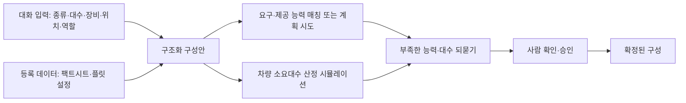

[홈](../../index.md) › [주제](../index.md) › 10. 채팅으로 로봇 구성 — 대표 접근법과 기술

# 10. 채팅으로 로봇 구성 — 대표 접근법과 기술

<!-- auto:page-status:start -->
<!-- auto:page-status:end -->

## 1. 세 줄 요약

- 대화로 정한 로봇 구성이 시나리오를 수행할 수 있는지는 언어 모델 단독이 아니라 능력 모델·계획기·시뮬레이션·사람 검토를 잇는 흐름으로 확인하는 접근이 여러 연구에서 공통으로 나타난다. [추정][^ref-819][^ref-759][^ref-674]
- 이 페이지는 [10. 채팅으로 로봇 구성](../../categories/chat-based-configuration-and-operation/chat-robot-configuration.md) 페이지의 "대표 접근법과 기술" 절이 분량 기준을 넘어 옮겨 온 것이다. 원 페이지의 검증을 거친 내용이며 새 주장은 없다.

## 2. 배경

[10. 채팅으로 로봇 구성](../../categories/chat-based-configuration-and-operation/chat-robot-configuration.md) 페이지를 쓰는 과정에서 "대표 접근법과 기술" 절의 분량이 세부영역 페이지 기준(4,000자)을 넘어, 내용을 줄이지 않고 이 주제 페이지로 분리했다.

## 3. 본문

대화로 정한 로봇 구성이 시나리오를 수행할 수 있는지는 언어 모델 단독이 아니라 능력 모델·계획기·시뮬레이션·사람 검토를 잇는 흐름으로 확인하는 접근이 여러 연구에서 공통으로 나타난다. [추정][^ref-819][^ref-759][^ref-674]

### 언어 모델로 팀 구성과 역할 배정

SMART-LLM(Kannan·Venkatesh·Min, 2023)은 고수준 자연어 지시를 작업 분해 → 연합 형성 → 작업 배정의 세 단계로 나눠 프로그램형 few-shot 프롬프트로 다중 로봇 작업 계획을 만들며, 네 가지 복잡도의 벤치마크와 시뮬레이션·실제 로봇 실험으로 평가했다(개정 2024-03-23). [사실][^ref-090] CoMuRoS(Borate 외, 2025)는 중앙의 작업 관리자 언어 모델이 자연어 목표를 정적 규칙과 동적 문맥(작업 이력, 로봇·작업 상태, 이벤트)으로 이기종 로봇에 하위 작업으로 배정하고, 로봇마다 자체 언어 모델이 ROS 2 기본 [스킬](../../glossary/skill.md)로 실행 코드를 만드는 구조로, 하드웨어 실험에서 협동 회수 10회 중 9회, 협동 운반 8회 중 8회, 사람 보조 회수 5회 중 5회 성공을 보고했다(개정 2026-06-18). [사실][^ref-677] 두 연구 모두 로봇 능력을 프롬프트 입력으로 전제하므로 능력이 없는 로봇에는 역할이 배정되지 않는다. [추정][^ref-090][^ref-677]

### 어포던스와 온톨로지로 실행 가능성 접지

SayCan(Ahn 외, 2022)은 언어 모델이 제안한 행동 후보를 스킬별 가치 함수가 현재 환경에서 실행 가능한지로 점수화해 결합함으로써 언어 지시를 물리적으로 실행 가능한 로봇 행동에 접지(grounding)한다. [사실][^ref-088] Nakajima·Miura(IROS 2024)는 서비스 로봇의 '가져다 줘' 작업에서 환경 정보를 담은 온톨로지와 언어 모델을 결합해, 온톨로지의 확정 지식으로 언어 모델의 [환각](../../glossary/hallucination.md)을 줄이고 사용자에게 되묻는 [명확화 질문](../../glossary/clarification-question.md)의 필요를 줄이는 방식을 제안했다(정량 결과는 초록에 없음). [사실][^ref-818]

### 자연어 설명에서 능력 온톨로지 만들기

Vieira da Silva 외(2024)는 자연어 능력 설명을 few-shot 프롬프트로 기계 해석 가능한 능력 온톨로지로 바꾸고, 생성 결과를 구문 검사·모순 검사·환각 및 누락 요소 검사의 자동 루프로 검증해 사람은 처음 설명과 마지막 검토만 맡게 하는 방법을 제안했다(개정 2024-10-18). [사실][^ref-465]

### 능력 모델에서 계획을 만들어 적합성 확인

Nabizada 외(IEEE CASE 2026)는 VDI 3682·IEC 61360-1·IDTA 02011·IDTA 02016 으로 구조화한 자산관리셸 능력 모델에서 [PDDL](../../glossary/pddl.md) 계획 문제를 자동 생성해, 계획 전문 지식 없이도 주어진 설비 배치가 요구 공정 순서를 지원하는지 확인하고 배치 대안 4종을 비교하는 방법을 실험실 생산 시스템으로 검증했다. [사실][^ref-201] 요구 능력과 제공 능력을 같은 모델로 적는 능력 기술 서브모델과 이 연구를 함께 보면, 이 영역의 '로봇 구성 적합성 사전 확인'은 시나리오에서 요구 능력을, 대화로 정한 로봇 집합에서 제공 능력을 뽑아 매칭하거나 계획을 시도해 보고 부족한 능력·대수를 되돌려 주는 방식으로 구현할 수 있을 것으로 보이나, 두 출처는 제조 설비를 대상으로 하며 이동 로봇 플릿 적용 사례는 확인되지 않았다. [추정][^ref-229][^ref-201]

### 제약 해결·기호 검증·디지털 트윈 검토

Valerio 외(2026)는 산업 제품 구성에서 언어 모델과 제약 해결의 결합을 하이브리드 추론·미세조정·훈련의 세 통합 전략으로 정리했다. [사실][^ref-819] Liu 외(2026)는 사람 참여 산업 로봇의 계획·시운전 프레임워크에서 언어 모델을 의도 해석과 문맥 추론에만 쓰고 검증·순서 결정·실행은 모두 결정론적으로 두며, 언어 모델이 낸 계획을 기호적으로 검증한 뒤 Unity3D [디지털 트윈](../../glossary/digital-twin.md)에서 사람이 검토·수정·재검증하고 나서야 실제 로봇에 배포하는 방식으로 기준선 10종보다 높은 작업 성공률을 보고했다(현장 유형 미명시). [사실][^ref-674] 세 연구(Valerio 외, Ko·Lin, Liu 외)가 언어 모델을 해석 단계에 한정하고 제약 해결·기호 검증·시뮬레이션 검증을 거치게 한다는 점은 공통이며, 사람의 최종 검토는 Ko·Lin 과 Liu 외 두 연구에서 확인된다. [추정][^ref-819][^ref-759][^ref-674]

### 임무 요구에서 사양 합성

Figat·Mackey·Ingham(2026)은 임무 수준 목표를 온톨로지 개념, 확률 시간 페트리 넷, 자원 모델링, 몬테카를로 시뮬레이션으로 하드웨어·소프트웨어 사양으로 바꾸는 RSTM2 방법론을 제안해 임무·시스템·하위 시스템 수준의 구조 대안 비교와 자원 배분을 다루며, 가상 사례 연구로만 검증하고 다중 로봇(NASA CADRE) 적용 가능성을 언급한다. [사실][^ref-821]

### 되묻기의 범위

온톨로지의 확정 지식으로 명확화 질문의 필요를 줄이는 연구와 잘못된 조정 요청 8건 중 7건을 검증 단계에서 거부한 연구를 함께 보면, 채팅 로봇 구성의 되묻기는 온톨로지·팩트시트로 알 수 없는 값(대수, 초기 위치, 역할 우선순위)에 한정하고 알 수 있는 값은 읽어 온 근거를 보여 주며, 수행 불가 판정은 어떤 요구 능력이 어느 로봇에도 없는지로 설명하는 것이 맞을 것으로 보인다. [추정][^ref-818][^ref-759]

## 4. 현장 시나리오

현장 시나리오는 원 페이지의 [5. 적용 사례 (현장 유형 명시)](../../categories/chat-based-configuration-and-operation/chat-robot-configuration.md) 절에 있다.

## 5. ROP 관점의 시사점

ROP가 직접 맡는 것과 외부와 연계하는 것은 원 페이지의 [9. ROP가 직접 맡는 것과 외부와 연계하는 것 (책임 경계 기준)](../../categories/chat-based-configuration-and-operation/chat-robot-configuration.md) 절에 있다.

## 6. 연결되는 연구영역

- 주 연구영역: [10. 채팅으로 로봇 구성](../../categories/chat-based-configuration-and-operation/chat-robot-configuration.md)
- 관련 영역: [4. 이기종 로봇 등록](../../categories/robot-ontology/heterogeneous-robot-registration.md), [5. 로봇 능력·작업 표현](../../categories/robot-ontology/robot-capability-and-task-representation.md), [9. 채팅으로 시나리오 구성](../../categories/chat-based-configuration-and-operation/chat-scenario-composition.md), [13. 대화형 기능의 신뢰·기반](../../categories/chat-based-configuration-and-operation/conversational-trust-and-foundations.md), [20. 로봇·제조사 관제 연동](../../categories/integration/robot-and-vendor-fleet-manager-integration.md), [21. 상호운용 표준·적합성](../../categories/integration/interoperability-standards-and-conformance.md), [25. 작업 배정 — MRTA](../../categories/planning-and-optimization/task-allocation-mrta.md), [34. 시뮬레이션·예측용 디지털 트윈](../../categories/design-and-simulation/simulation-and-predictive-digital-twin.md), [35. 처리능력·규모·배치 설계](../../categories/design-and-simulation/capacity-sizing-and-layout-design.md), [44. 로봇 기반 모델·언어 모델 계획](../../categories/ai-and-learning/robot-foundation-models-and-llm-planning.md), [47. AI·학습·적응과 모델 운영](../../categories/ai-and-learning/ai-learning-adaptation-and-model-operations.md), [55. 현장 조사·설치·시운전](../../categories/verification-deployment-and-lifecycle/site-survey-installation-and-commissioning.md)

## 7. 열린 질문

열린 질문은 원 페이지의 [11. 열린 질문](../../categories/chat-based-configuration-and-operation/chat-robot-configuration.md) 절과 [열린 질문](../../open-questions.md) 페이지에 모은다.

## 8. 출처

[^ref-677]: Borate, S., Rai B, B., Pardeshi, V., & Vadali, M., LLM-Based Generalizable Hierarchical Task Planning and Execution for Heterogeneous Robot Teams with Event-Driven Replanning, 2025-11-27, https://arxiv.org/abs/2511.22354, 접근일 2026-09-29
[^ref-465]: Vieira da Silva, L. M., Köcher, A., Gehlhoff, F., & Fay, A., Toward a Method to Generate Capability Ontologies from Natural Language Descriptions, 2024-06-12, https://arxiv.org/abs/2406.07962, 접근일 2026-09-29
[^ref-818]: Nakajima, H., & Miura, J. (IROS 2024), Combining Ontological Knowledge and Large Language Model for User-Friendly Service Robots, 2024-10-22, https://arxiv.org/abs/2410.16804, 접근일 2026-09-29
[^ref-090]: Kannan, S. S., Venkatesh, V. L. N., & Min, B.-C., SMART-LLM: Smart Multi-Agent Robot Task Planning using Large Language Models, 2023-09-18, https://arxiv.org/abs/2309.10062, 접근일 2026-09-29
[^ref-229]: IDTA (Industrial Digital Twin Association, admin-shell-io GitHub), IDTA 02020 Submodel Template Capability Description — README (published/Capability Description/1/0), 미확인, https://github.com/admin-shell-io/submodel-templates/tree/main/published/Capability%20Description, 접근일 2026-09-29 (원문 미열람)
[^ref-819]: Valerio, D., Kogler, P., Bischof, S., Hubauer, T., & Rangwala, H., Neuro-symbolic AI for Industrial Configuration, 2026-09-24, https://arxiv.org/abs/2609.29947, 접근일 2026-09-29
[^ref-088]: Ahn, M., Brohan, A., Brown, N., Chebotar, Y. 외 (Google/Everyday Robots), Do As I Can, Not As I Say: Grounding Language in Robotic Affordances, 2022-04-04, https://arxiv.org/abs/2204.01691, 접근일 2026-09-29
[^ref-201]: Nabizada, H., Wirt, T., Vieira da Silva, L. M., Gehlhoff, F., & Fay, A. (IEEE CASE 2026), From Capability Models to Automated Planning: An AAS-Native Approach for Automatic PDDL Generation, 2026-06-01, https://arxiv.org/abs/2606.02167, 접근일 2026-09-29
[^ref-821]: Figat, M., Mackey, R. M., & Ingham, M. D., Ontology-Driven Robotic Specification Synthesis, 2026-02-05, https://arxiv.org/abs/2602.05456, 접근일 2026-09-29
[^ref-759]: Ko, T.-H., & Lin, C.-T., Human-AI Collaboration for Multi-Line Task Adjustment Using Local Large Language Models and a Digital Twin, 2026-09-24, https://arxiv.org/abs/2609.29061, 접근일 2026-09-29
[^ref-674]: Liu, Z., Fernandez-Ayala, V. N., Wang, T., Qin, Q., Wang, X. V., Dimarogonas, D. V., & Wang, L., Agentic Neuro-Symbolic Planning and Commissioning for Human-in-the-Loop Industrial Robotics with Digital Twins, 2026-06-06, https://arxiv.org/abs/2606.08214, 접근일 2026-09-29

## 9. 검증 노트

원 페이지와 함께 실행 2026-09-29-02 의 1차·2차 검증을 거쳤다. 분리는 코드가 했고 내용은 바꾸지 않았다.

## 10. 이력

| 날짜 | 실행 id | 변경 |
|---|---|---|
| 2026-09-29 | 2026-09-29-02 | 10. 채팅으로 로봇 구성 의 "대표 접근법과 기술" 절에서 분리 |
