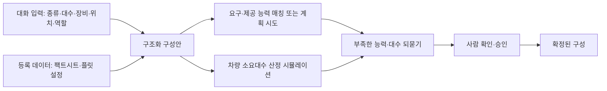

(너의 규칙은 시스템 프롬프트의 agents/shared-rules.md 와 agents/storyteller.md 이다. 아래는 이번 실행의 컨텍스트와 입력이다.)

## 실행 컨텍스트

- run_id: 2026-09-29-02
- date: 2026-09-29
- run_type: area_deep_dive (영역 심화)
- 대상: 10. 채팅으로 로봇 구성 (C. 채팅 기반 구성·운영)
- 예산:
    - max_search_queries: 30
    - max_sources_per_run: 15
    - new_topic_pages: 1
    - page_updates: 2
    - max_retries: 2
- 환경 알림: web_fetch_available: true · fetch_mode: full
- 언어: ko
- retry_count: 1
- max_retries: 2

## 입력

### runs/2026-09-29-02/target.json

```json
{
  "run_id": "2026-09-29-02",
  "date": "2026-09-29",
  "weekday": "Tue",
  "run_number": 94,
  "run_type": "area_deep_dive",
  "forced": true,
  "target": {
    "area_no": 10,
    "area_name": "10. 채팅으로 로봇 구성",
    "category": "C. 채팅 기반 구성·운영",
    "category_letter": "C"
  },
  "topic": null,
  "track": null,
  "corrections": [],
  "budget": {
    "max_search_queries": 30,
    "max_sources_per_run": 15,
    "new_topic_pages": 1,
    "page_updates": 2,
    "max_retries": 2
  },
  "priority_reason": null,
  "priority_questions": [],
  "excluded_areas": [],
  "lifted_areas": [],
  "deferred": {
    "monthly_recheck": false,
    "weekly_review": false
  },
  "selection_rationale": "CLI 지정 run_type=area_deep_dive, area=10"
}
```

### runs/2026-09-29-02/research.json

```json
{
  "run_id": "2026-09-29-02",
  "date": "2026-09-29",
  "run_type": "area_deep_dive",
  "target": {
    "area_no": 10,
    "area_name": "10. 채팅으로 로봇 구성",
    "category": "C. 채팅 기반 구성·운영"
  },
  "gaps": [
    "섹션 3. 왜 중요한가 비어 있음",
    "섹션 4. 핵심 개념과 용어 비어 있음 — 연합 형성·어포던스·능력 매칭·팩트시트·플릿 설정·구성 코파일럿 용어 없음",
    "섹션 5. 적용 사례 (현장 유형 명시) 비어 있음",
    "섹션 6. 대표 접근법과 기술 비어 있음",
    "섹션 7. 관련 표준·프레임워크·오픈소스 비어 있음 — VDA 5050 팩트시트, IDTA 02020 능력 기술, Open-RMF 플릿 설정 없음",
    "섹션 8. 대표 연구와 자료 비어 있음",
    "섹션 9. ROP가 직접 맡는 것과 외부와 연계하는 것 (책임 경계 기준) 비어 있음",
    "섹션 10. 다른 연구영역과의 연결 (번호와 이름을 함께 표기) 비어 있음 — 원문 주석대로 5. 로봇 능력·작업 표현과 짝 연결 필요",
    "섹션 11. 열린 질문 비어 있음 — 이 영역에 걸린 기존 열린 질문·정정 요청 없음",
    "프런트매터 related_areas·sources 비어 있음"
  ],
  "research_questions": [
    "어떤 로봇을 몇 대, 어디에, 어떤 역할로 둘지 대화로 정하고 가능 여부를 바로 알 수 있는가? [분류원문]",
    "자연어 지시에서 이기종 로봇 팀을 구성(연합 형성)하고 능력에 따라 역할을 배정하는 언어 모델 연구는 무엇이 있고, 로봇 능력을 어떤 형태로 모델에 주는가? (섹션 6·8 겨냥)",
    "대화로 정한 로봇 구성이 시나리오의 작업을 수행할 수 있는지를 온톨로지·능력 모델로 실행 전에 확인하는 방법(능력 매칭, 계획 생성, 어포던스)은 무엇인가? (섹션 4·6·7 겨냥)",
    "로봇 종류·장비·적재·초기 위치·역할을 담는 구조화 데이터 형식(VDA 5050 팩트시트, AAS 능력 기술 서브모델, Open-RMF 플릿 설정)은 어떤 필드를 두는가? (섹션 4·7 겨냥)",
    "언어 모델이 낸 구성·조정안을 제약 해결기·시뮬레이션·사람 검토로 검증한 사례는 어느 현장 유형에서 보고되었는가? (섹션 3·5·11 겨냥, 13. 대화형 기능의 신뢰·기반 연결)",
    "로봇 대수를 정하는 근거(대수 산정 시뮬레이션·로봇 대 작업자 비율)는 무엇이며 국내 자료가 있는가? (섹션 5·8 겨냥)",
    "채팅 로봇 구성에서 ROP가 직접 맡을 것과 로봇 자체 스킬 실행·제조사 관제에 맡길 것의 경계는 어디인가? (섹션 9·10 겨냥)"
  ],
  "findings": [
    {
      "id": "f1",
      "claim": "SMART-LLM(Kannan·Venkatesh·Min, 2023)은 고수준 자연어 지시를 작업 분해 → 연합 형성(로봇 팀 구성) → 작업 배정의 세 단계로 나눠 프로그램형 few-shot 프롬프트로 다중 로봇 작업 계획을 만들며, 네 가지 복잡도의 벤치마크와 시뮬레이션·실제 로봇 실험으로 평가했다.",
      "tag": "사실",
      "source_ids": [
        "ref-090"
      ],
      "cross_checked": false,
      "confidence": "medium",
      "evidence_excerpt": "초록: 프레임워크는 task decomposition, coalition formation, task allocation 단계를 few-shot 프롬프트로 수행. \"SMART-LLM harnesses the power of LLMs to convert high-level task instructions provided as input into a multi-robot task plan.\" 벤치마크 4개 범주.",
      "as_of": "2024-03-23",
      "site_type": null,
      "flow_item": "수행 자원"
    },
    {
      "id": "f2",
      "claim": "CoMuRoS(Borate 외, 2025)는 중앙의 작업 관리자 언어 모델이 자연어 목표를 해석해 정적 규칙과 동적 문맥(작업 이력, 로봇·작업 상태, 이벤트)으로 이기종 로봇에 하위 작업을 배정하고, 로봇마다 자체 언어 모델이 ROS 2 기본 스킬로 실행 코드를 만드는 구조로, 하드웨어 실험에서 협동 회수 9/10, 협동 운반 8/8, 사람 보조 회수 5/5 성공을 보고했다.",
      "tag": "사실",
      "source_ids": [
        "ref-677"
      ],
      "cross_checked": false,
      "confidence": "medium",
      "evidence_excerpt": "초록: Task Manager LLM 이 정적 규칙+동적 문맥으로 하위 작업 배정, 로봇별 LLM 이 ROS2 기본 스킬에서 파이썬 코드 생성. 하드웨어 실험 90%(9/10)·100%(8/8)·100%(5/5), 텍스트 벤치마크 정확도 최대 0.91. 실험은 연구실 환경(현장 유형 미명시).",
      "as_of": "2026-06-18",
      "site_type": null,
      "flow_item": "수행 자원"
    },
    {
      "id": "f3",
      "claim": "언어 모델 기반 다중 로봇 계획 연구(SMART-LLM, CoMuRoS)가 로봇 유형별 스킬 집합을 텍스트로 모델에 주고 그 위에서 팀 구성과 역할 배정을 하는 점을 보면, 채팅으로 로봇 구성은 로봇 종류·역할을 자유 서술이 아니라 기계가 읽을 수 있는 능력 목록으로 만들어 두어야 이후 배정·계획 단계가 그것을 쓸 수 있을 것으로 보인다.",
      "tag": "추정",
      "source_ids": [
        "ref-090",
        "ref-677"
      ],
      "cross_checked": false,
      "confidence": "low",
      "evidence_excerpt": "f1·f2 에서 도출. 두 연구 모두 로봇 능력(스킬 집합·기본 스킬)을 프롬프트 입력으로 전제하며, 능력이 없는 로봇에는 역할이 배정되지 않는다.",
      "as_of": "2026-09-29",
      "site_type": null,
      "flow_item": null
    },
    {
      "id": "f4",
      "claim": "SayCan(Ahn 외, 2022)은 언어 모델이 제안한 고수준 행동 후보를 스킬별 가치 함수(어포던스)가 현재 환경에서 실행 가능한지로 점수화해 결합함으로써, 언어로 표현된 지시를 물리적으로 실행 가능한 로봇 행동에 접지(grounding)한다.",
      "tag": "사실",
      "source_ids": [
        "ref-088"
      ],
      "cross_checked": false,
      "confidence": "medium",
      "evidence_excerpt": "초록: LLM 이 행동 시퀀스를 제안하고 스킬의 value function 이 실행 가능성을 점수화. \"The robot can act as the language model's 'hands and eyes,' while the language model supplies high-level semantic knowledge about the task.\" 모바일 매니퓰레이터 실제 실험.",
      "as_of": "2022-08-16",
      "site_type": null,
      "flow_item": "제약"
    },
    {
      "id": "f5",
      "claim": "Nakajima·Miura(IROS 2024)는 서비스 로봇의 '가져다 줘' 작업에서 환경 정보를 담은 온톨로지와 언어 모델을 결합해, 온톨로지의 확정 지식으로 언어 모델의 환각을 줄이고 사용자에게 되묻는 명확화 질문의 필요를 줄이는 방식을 제안했다.",
      "tag": "사실",
      "source_ids": [
        "ref-820"
      ],
      "cross_checked": false,
      "confidence": "medium",
      "evidence_excerpt": "초록: 온톨로지가 구조화된 환경 지식을, LLM 이 상식 지식을 담당해 모호한 요청을 해소. \"LLMs, by facilitating natural interactions and providing vast general knowledge, are proving invaluable for robotic tasks.\" 정량 결과는 초록에 없음.",
      "as_of": "2024-10-22",
      "site_type": null,
      "flow_item": null
    },
    {
      "id": "f6",
      "claim": "Vieira da Silva 외(2024)는 자연어 능력 설명을 few-shot 프롬프트로 기계 해석 가능한 능력 온톨로지로 바꾸고, 생성 결과를 구문 검사·모순 검사·환각 및 누락 요소 검사의 자동 루프로 검증해 사람은 처음 설명과 마지막 검토만 맡게 하는 방법을 제안했다.",
      "tag": "사실",
      "source_ids": [
        "ref-465"
      ],
      "cross_checked": false,
      "confidence": "medium",
      "evidence_excerpt": "초록: LLM 기반 생성 파이프라인 + 자동 검증 루프(syntax, contradiction, hallucination/missing elements). \"Our method greatly reduces manual effort, as only the initial natural language description and a final human review and possible correction are necessary.\"",
      "as_of": "2024-10-18",
      "site_type": null,
      "flow_item": null
    },
    {
      "id": "f7",
      "claim": "IDTA 02020 능력 기술(Capability Description) 서브모델 1.0 은 자산관리셸 안에서 공정·제품이 요구하는 능력(required)과 자원이 제공하는 능력(provided)을 속성(최대 속도·공차 등), 속성 제약(전제·불변·사후 조건)과 전이 제약(순서·병렬), 그리고 능력을 구현하는 스킬과 함께 모델링해 요구 능력과 자원 능력을 비교·매칭할 수 있게 한다.",
      "tag": "사실",
      "source_ids": [
        "ref-229"
      ],
      "cross_checked": false,
      "confidence": "medium",
      "evidence_excerpt": "공식 저장소 README: required/provided capabilities, properties, property constraints·transition constraints, skills. \"A capability is an 'implementation-independent specification of a function in industrial production to achieve an effect in the physical or virtual world.'\" 1.0 이 첫 공식판. (발행일 미확인, 확인일 기준)",
      "as_of": "2026-09-29",
      "site_type": null,
      "flow_item": "제약",
      "source_unopened": true
    },
    {
      "id": "f8",
      "claim": "Nabizada 외(IEEE CASE 2026)는 VDI 3682·IEC 61360-1·IDTA 02011·IDTA 02016 으로 구조화한 자산관리셸 능력 모델에서 PDDL 계획 문제를 자동 생성해, PDDL 전문 지식 없이도 주어진 설비 배치가 요구 공정 순서를 지원하는지 자동 계획으로 확인하고 배치 대안 4종을 비교하는 방법을 실험실 생산 시스템으로 검증했다.",
      "tag": "사실",
      "source_ids": [
        "ref-201"
      ],
      "cross_checked": false,
      "confidence": "medium",
      "evidence_excerpt": "초록: 추출 알고리즘이 자원 능력 기술에서 계획 요소를 직접 도출. \"Engineers designing production systems need to verify that a given layout supports all required production sequences\" — 실험실 생산 시스템 AAS 모델, 배치 변형 4종을 최적 계획으로 비교.",
      "as_of": "2026-06-01",
      "site_type": null,
      "flow_item": "완료·인계"
    },
    {
      "id": "f9",
      "claim": "요구 능력과 제공 능력을 같은 모델로 적는 능력 기술 서브모델과 그 모델에서 계획 문제를 자동 생성해 배치의 실행 가능성을 확인하는 연구를 함께 보면, 이 영역의 '로봇 구성 적합성 사전 확인'은 시나리오에서 요구 능력을, 대화로 정한 로봇 집합에서 제공 능력을 뽑아 매칭하거나 계획을 시도해 보고 부족한 능력·대수를 되돌려 주는 방식으로 구현할 수 있을 것으로 보인다.",
      "tag": "추정",
      "source_ids": [
        "ref-229",
        "ref-201"
      ],
      "cross_checked": false,
      "confidence": "low",
      "evidence_excerpt": "f7·f8 에서 도출. 두 출처 모두 제조 자원(설비)을 대상으로 하며 이동 로봇 플릿에 적용한 사례는 확인하지 못했다.",
      "as_of": "2026-09-29",
      "site_type": null,
      "flow_item": "완료·인계"
    },
    {
      "id": "f10",
      "claim": "VDA 5050 3.0.0 의 팩트시트(factsheet) 토픽은 관제가 이동 로봇을 설정하는 데 쓰는 매개변수·제조사 정보로, typeSpecification(seriesName, agvKinematic, agvClass, maxLoadMass, localizationTypes, navigationTypes), physicalParameters, protocolLimits, protocolFeatures, agvGeometry, loadSpecification(loadPositions, loadSets), vehicleConfig 로 구성된다.",
      "tag": "사실",
      "source_ids": [
        "ref-031"
      ],
      "cross_checked": false,
      "confidence": "medium",
      "evidence_excerpt": "공식 저장소 VDA5050_EN.md(3.0.0) 6.10·7.10: factsheet 는 \"Parameters or vendor-specific information to assist set-up of the mobile robot in fleet control\". 하위 객체 7종과 typeSpecification·loadSpecification 필드 확인. (발행일 미확인, 확인일 기준)",
      "as_of": "2026-09-29",
      "site_type": null,
      "flow_item": "작업 대상"
    },
    {
      "id": "f11",
      "claim": "Open-RMF 플릿 어댑터 템플릿의 설정 파일(config.yaml)은 rmf_fleet 절에 플릿 이름, 선속도·각속도·가속도 한계, 발자국·근접 반경(profile), 후진 가능 여부, 배터리·기계·주변·도구 시스템 값, 재충전 임계값, 플릿이 수행할 수 있는 RMF 작업 유형(task_capabilities), 사용자 정의 동작(actions), 작업 종료 후 행동(finishing_request), 로봇별 충전기 배정과 개별 재정의를 두는 robots 목록을 적는다.",
      "tag": "사실",
      "source_ids": [
        "ref-105"
      ],
      "cross_checked": false,
      "confidence": "medium",
      "evidence_excerpt": "공식 저장소 원문 config.yaml: task_capabilities 주석 \"Specify the types of RMF Tasks that robots in this fleet are capable of\"; robots 절에 로봇 이름·charger, 플릿 설정을 로봇별로 재정의 가능. (발행일 미확인, 확인일 기준)",
      "as_of": "2026-09-29",
      "site_type": null,
      "flow_item": "수행 자원"
    },
    {
      "id": "f12",
      "claim": "이 영역이 대화로 정하려는 값(로봇 종류·대수·장착 장비·초기 위치·역할)은 VDA 5050 팩트시트의 종류·적재 사양과 Open-RMF 플릿 설정의 작업 유형·로봇 목록·충전기 배정처럼 관제가 실제로 읽는 구조에 이미 자리가 있으므로, 채팅 로봇 구성의 결과물은 이런 구조를 채우는 구조화 값이어야 하고 팩트시트 같은 등록 데이터는 대화가 물어볼 필요 없이 읽어 오는 입력이 될 것으로 보인다.",
      "tag": "추정",
      "source_ids": [
        "ref-031",
        "ref-105"
      ],
      "cross_checked": false,
      "confidence": "low",
      "evidence_excerpt": "f10·f11 에서 도출. 두 형식 모두 대화 입력이 아니라 사람이 편집하는 파일·로봇이 보내는 메시지이며, 대화로 채운 사례는 확인하지 못했다.",
      "as_of": "2026-09-29",
      "site_type": null,
      "flow_item": "완료·인계"
    },
    {
      "id": "f13",
      "claim": "Valerio 외(2026)는 산업 제품 구성 문제에서 언어 모델과 기호적 제약 해결을 결합하는 신경-기호 방식을 하이브리드 추론·미세조정·훈련의 세 통합 전략으로 정리하고, 대화형 '구성 코파일럿'의 출력이 구문상 유효하고 수백 개 기능·규칙의 지식 베이스와 의미적으로 일치하며 실제 제조 가능해야 한다는 조건을 제시했다.",
      "tag": "사실",
      "source_ids": [
        "ref-824"
      ],
      "cross_checked": false,
      "confidence": "medium",
      "evidence_excerpt": "초록: LLM + constraint solving, taxonomy 3종, configuration copilot. \"outputs must be syntactically valid, semantically consistent with a knowledge base of hundreds of features and rules, and producible by an existing manufacturing chain.\" 벤치마크보다 산업 배치의 설계 선택에 초점.",
      "as_of": "2026-09-24",
      "site_type": null,
      "flow_item": "제약"
    },
    {
      "id": "f14",
      "claim": "Ko·Lin(2026)은 병원 멸균공급실을 본뜬 가상의 수술기구 분류 라인 4개를 대상으로 운영자가 자연어로 라인·작업 조정을 요청하면 로컬 언어 모델이 구조화 요구사항과 후보 전략을 만들고 디지털 트윈 시뮬레이션이 실행 가능성을 검증하는 '제안–검증–결정' 흐름을 평가해, 시험 사례 18건 중 자율 전략 성공 3/10, 잘못된 입력 거부 7/8, 최종 검토 도달 4건 모두 통과, 시뮬레이션 검증 평균 164.39초를 보고했다.",
      "tag": "사실",
      "source_ids": [
        "ref-759"
      ],
      "cross_checked": false,
      "confidence": "medium",
      "evidence_excerpt": "초록: Propose-Verify-Decide 워크플로, 의미 정확성·시뮬레이션 실행·운영 제약 검사, 요청–검증 근거–결정을 잇는 추적 기록. \"Linked records preserve traceability from requests to verification evidence and decisions.\" 배치 검증 통과율 97.50%. 물리 로봇이 아닌 가상 라인.",
      "as_of": "2026-09-24",
      "site_type": "병원",
      "flow_item": "예외·성과"
    },
    {
      "id": "f15",
      "claim": "Liu 외(2026)는 사람 참여 산업 로봇을 위한 에이전트형 신경-기호 계획·시운전 프레임워크에서 언어 모델은 의도 해석과 문맥 추론에만 쓰고 검증·순서 결정·실행은 모두 결정론적으로 두며, 언어 모델이 낸 계획을 기호적으로 검증한 뒤 Unity3D 디지털 트윈에서 사람이 검토·수정·재검증하고 나서야 실제 로봇에 배포하는 방식으로 기준선 10종보다 높은 작업 성공률을 보고했다.",
      "tag": "사실",
      "source_ids": [
        "ref-674"
      ],
      "cross_checked": false,
      "confidence": "medium",
      "evidence_excerpt": "초록: Specifier-Designer-Inspector 구조, 2단 복구. \"LLMs are used for tasks that require language understanding or contextual reasoning, while all verification, sequencing, and execution remain deterministic.\" 절제 실험으로 각 구성요소 필요성 확인. 현장 유형 미명시.",
      "as_of": "2026-06-06",
      "site_type": null,
      "flow_item": "완료·인계"
    },
    {
      "id": "f16",
      "claim": "산업 제품 구성(Valerio 외), 병원 라인 작업 조정(Ko·Lin), 산업 로봇 시운전(Liu 외)의 서로 다른 세 연구가 모두 언어 모델을 해석 단계에 한정하고 제약 해결기·기호 검증·시뮬레이션 검증과 사람의 최종 검토를 거친 뒤에만 구성·계획을 채택하는 구조를 택했다.",
      "tag": "사실",
      "source_ids": [
        "ref-824",
        "ref-759",
        "ref-674"
      ],
      "cross_checked": true,
      "confidence": "medium",
      "evidence_excerpt": "f13·f14·f15 종합. 세 연구는 저자·기관이 다르고 서로 인용 관계가 확인되지 않아 독립 출처로 보았다. 세 편 모두 arXiv 프리프린트라 신뢰도는 medium 으로 둔다.",
      "as_of": "2026-09-24",
      "site_type": null,
      "flow_item": "제약"
    },
    {
      "id": "f17",
      "claim": "Figat·Mackey·Ingham(2026)은 임무 수준 목표를 온톨로지 개념, 확률 시간 페트리 넷, 자원 모델링, 몬테카를로 시뮬레이션으로 하드웨어·소프트웨어 사양으로 바꾸는 RSTM2 방법론을 제안해 임무·시스템·하위 시스템 수준의 구조 대안 비교와 자원 배분을 다루며, 가상 사례 연구로만 검증하고 다중 로봇(NASA CADRE) 적용 가능성을 언급한다.",
      "tag": "사실",
      "source_ids": [
        "ref-828"
      ],
      "cross_checked": false,
      "confidence": "medium",
      "evidence_excerpt": "초록: Robotic System Task to Model Transformation Methodology, 계층적 분석, 불확실성 아래 성능 분석. \"Ontological concepts further enable explainable AI-based assistants, facilitating fully autonomous specification synthesis.\" 가상 사례(hypothetical case study).",
      "as_of": "2026-02-05",
      "site_type": null,
      "flow_item": null
    },
    {
      "id": "f18",
      "claim": "Howard(Cal Poly 석사논문, 2026)는 작업자 피킹(picker-to-parts) 창고에서 협동 자율이동로봇 대수 산정을 처리량 최대화가 아닌 라인당 비용 최소화로 다시 정의하고 FlexSim 이산 사건 시뮬레이션 27,000회·반개방형 대기행렬·XGBoost 대리모델로 분석해, 최적 로봇 대 작업자 비율이 수요에 따라 1:1 에서 2.5:1 로 옮겨 가고 작업자 유휴 비용이 로봇 유휴 비용의 약 2.5배이며 처리량 기준 산정은 구독형 과금에서 대수를 과대 산정한다고 보고했다.",
      "tag": "사실",
      "source_ids": [
        "ref-829"
      ],
      "cross_checked": false,
      "confidence": "medium",
      "evidence_excerpt": "논문 페이지 초록: 요인은 피커 인원, AMR 대 피커 비율, 배치 크기, 수요 밀도, 배차 설정. \"Existing fleet-sizing research maximizes throughput, an objective that systematically oversizes fleets under Robotics-as-a-Service pricing because it ignores synchronization loss.\" 배차 휴리스틱 차이는 통계적으로 유의하지 않음.",
      "as_of": "2026-06",
      "site_type": "물류창고",
      "flow_item": "수행 자원"
    },
    {
      "id": "f19",
      "claim": "국내 자율이동로봇 업체 폴라리스3D 는 공장에 맞는 로봇 대수를 정하려면 일일 목표 이송 횟수와 시간당 적재량, 출발지–목적지 평균 이동 거리·속도, 공정 수, MES·엘리베이터 등 기존 설비 연동 여부가 직접 영향을 주므로 도입 전 전문가 인터뷰나 시뮬레이션 사전 분석이 필수라고 밝힌다.",
      "tag": "추정",
      "source_ids": [
        "ref-830"
      ],
      "cross_checked": false,
      "confidence": "low",
      "evidence_excerpt": "벤더 주장: 블로그(2026-06-12)는 대수 산정 입력으로 일일 이송 횟수·시간당 적재량·평균 이동 거리·속도·공정 수·설비 연동을 들고 \"도입 전 전문가 인터뷰나 시뮬레이션을 통한 사전 분석이 필수적입니다.\" 라고 적는다. ROI 는 인건비 절감·생산성 향상으로 계산.",
      "as_of": "2026-06-12",
      "site_type": "제조 공장",
      "flow_item": "제약",
      "vendor_claim": true
    },
    {
      "id": "f20",
      "claim": "대수 산정이 처리량·수요 밀도·이동 거리·작업자 비율 같은 현장 수치와 시뮬레이션에 달려 있다는 연구와 업체 설명을 보면, 채팅으로 로봇 구성에서 '몇 대'라는 값은 언어 모델이 대화만으로 정할 수 없고 35. 처리능력·규모·배치 설계와 34. 시뮬레이션·예측용 디지털 트윈의 산정 엔진을 불러 그 결과와 비용 목적(처리량 대 비용)을 사용자에게 되묻는 방식이어야 할 것으로 보인다.",
      "tag": "추정",
      "source_ids": [
        "ref-829",
        "ref-830"
      ],
      "cross_checked": false,
      "confidence": "low",
      "evidence_excerpt": "f18·f19 에서 도출. 대화형 인터페이스가 대수 산정 시뮬레이션을 호출한 사례는 확인하지 못했다.",
      "as_of": "2026-09-29",
      "site_type": null,
      "flow_item": "수행 자원"
    },
    {
      "id": "f21",
      "claim": "심현재 외(제어로봇시스템학회 국내학술대회, 2023)는 이기종 다중 로봇을 클라우드에서 운용하는 AGM(Adaptive Goal Management) 소프트웨어 플랫폼을 제시해 적응형 목표 실행 방식과 REST API 로 서로 다른 로봇을 등록·통신하고 작업을 배정하는 구조를 보고했다.",
      "tag": "사실",
      "source_ids": [
        "ref-825"
      ],
      "cross_checked": false,
      "confidence": "medium",
      "evidence_excerpt": "DBpia 초록: 이기종 다중로봇 관리를 위한 클라우드 기반 AGM 시스템, 로봇 간 통신용 REST API, 로봇 등록·능력 정보 처리와 작업 배정 메커니즘 포함. 대화형 구성 기능은 언급하지 않는다.",
      "as_of": "2023-06",
      "site_type": null,
      "flow_item": "수행 자원"
    },
    {
      "id": "f22",
      "claim": "연계 대상: 로봇별 언어 모델이 ROS 2 기본 스킬에서 실행 코드를 만드는 일(CoMuRoS)과 스킬의 가치 함수로 현재 장면의 실행 가능성을 점수화하는 일(SayCan)은 분류 원문 19장의 로봇 자체 지능·제어 쪽이며, 10. 채팅으로 로봇 구성에서 ROP가 직접 맡을 것은 대화를 구조화 구성(종류·대수·장비·위치·역할)으로 바꾸고 온톨로지의 요구·제공 능력으로 적합성을 확인해 부족을 알린 뒤 사람이 승인한 구성만 확정하는 일로 보인다.",
      "tag": "추정",
      "source_ids": [
        "ref-677",
        "ref-088",
        "ref-229"
      ],
      "cross_checked": false,
      "confidence": "low",
      "evidence_excerpt": "f2·f4·f7 에서 도출. 원문 19장 표의 '로봇 자체 지능·제어' 행(가능한 기능과 실행 조건은 ROP, 인식·제어는 외부)에 맞춘 경계 판단이다.",
      "as_of": "2026-09-29",
      "site_type": null,
      "flow_item": null
    },
    {
      "id": "f23",
      "claim": "자연어 설명에서 능력 온톨로지를 생성하는 방법(Vieira da Silva 외)과 언어 모델·제약 해결 결합 구성(Valerio 외)은 L. AI·학습 기술의 44. 로봇 기반 모델·언어 모델 계획과 47. AI·학습·적응과 모델 운영에 속하는 연구 방법이며, 원문 교차 규칙에 따라 매뉴얼·설명서 해석의 적용 대상인 4. 이기종 로봇 등록과 5. 로봇 능력·작업 표현 페이지에도 함께 연결해야 한다.",
      "tag": "추정",
      "source_ids": [
        "ref-465",
        "ref-824"
      ],
      "cross_checked": false,
      "confidence": "low",
      "evidence_excerpt": "f6·f13 의 방법론 성격에서 도출. 원문 13장 주석(매뉴얼 해석은 4·55번)에 따른 연결 제안이다.",
      "as_of": "2026-09-29",
      "site_type": null,
      "flow_item": null
    },
    {
      "id": "f24",
      "claim": "온톨로지의 확정 지식으로 명확화 질문의 필요를 줄이는 연구와 잘못된 조정 요청 8건 중 7건을 검증 단계에서 거부한 연구를 함께 보면, 채팅 로봇 구성의 되묻기는 온톨로지·팩트시트로 알 수 없는 값(대수, 초기 위치, 역할 우선순위)에 한정하고 알 수 있는 값은 읽어 온 근거를 보여 주며, 수행 불가 판정은 어떤 요구 능력이 어느 로봇에도 없는지로 설명하는 것이 맞을 것으로 보인다.",
      "tag": "추정",
      "source_ids": [
        "ref-820",
        "ref-759"
      ],
      "cross_checked": false,
      "confidence": "low",
      "evidence_excerpt": "f5·f14 에서 도출. 두 연구 모두 로봇 플릿 구성 대화를 직접 다루지는 않는다.",
      "as_of": "2026-09-29",
      "site_type": null,
      "flow_item": "제약"
    }
  ],
  "sources": [
    {
      "id": "ref-677",
      "org": "Borate, S., Rai B, B., Pardeshi, V., & Vadali, M.",
      "title": "LLM-Based Generalizable Hierarchical Task Planning and Execution for Heterogeneous Robot Teams with Event-Driven Replanning",
      "published": "2025-11-27",
      "url": "https://arxiv.org/abs/2511.22354",
      "type": "논문",
      "reliability": "medium",
      "accessed": "2026-09-29",
      "summary": "CoMuRoS: 중앙 작업 관리자 언어 모델과 로봇별 언어 모델을 결합한 이기종 로봇 팀 계층 계획·실행 프레임워크. 하드웨어 실험 성공률과 텍스트 벤치마크 결과를 보고한다(2026-06-18 개정판).",
      "fetched": true,
      "fetched_via": "webfetch",
      "fetch_url": "https://arxiv.org/abs/2511.22354",
      "source_unopened": false
    },
    {
      "id": "ref-465",
      "org": "Vieira da Silva, L. M., Köcher, A., Gehlhoff, F., & Fay, A.",
      "title": "Toward a Method to Generate Capability Ontologies from Natural Language Descriptions",
      "published": "2024-06-12",
      "url": "https://arxiv.org/abs/2406.07962",
      "type": "논문",
      "reliability": "medium",
      "accessed": "2026-09-29",
      "summary": "few-shot 프롬프트로 자연어 능력 설명에서 능력 온톨로지를 생성하고 구문·모순·환각·누락을 자동 검사하는 방법(2024-10-18 개정판).",
      "fetched": true,
      "fetched_via": "webfetch",
      "fetch_url": "https://arxiv.org/abs/2406.07962",
      "source_unopened": false
    },
    {
      "id": "ref-820",
      "org": "Nakajima, H., & Miura, J. (IROS 2024)",
      "title": "Combining Ontological Knowledge and Large Language Model for User-Friendly Service Robots",
      "published": "2024-10-22",
      "url": "https://arxiv.org/abs/2410.16804",
      "type": "논문",
      "reliability": "medium",
      "accessed": "2026-09-29",
      "summary": "서비스 로봇의 '가져다 줘' 작업에서 온톨로지 지식으로 언어 모델의 환각을 줄이고 사용자 확인 필요를 줄이는 결합 방식. 초록만 확인.",
      "fetched": true,
      "fetched_via": "webfetch",
      "fetch_url": "https://arxiv.org/abs/2410.16804",
      "source_unopened": false
    },
    {
      "id": "ref-090",
      "org": "Kannan, S. S., Venkatesh, V. L. N., & Min, B.-C.",
      "title": "SMART-LLM: Smart Multi-Agent Robot Task Planning using Large Language Models",
      "published": "2023-09-18",
      "url": "https://arxiv.org/abs/2309.10062",
      "type": "논문",
      "reliability": "medium",
      "accessed": "2026-09-29",
      "summary": "고수준 지시를 작업 분해·연합 형성·작업 배정으로 다중 로봇 계획으로 바꾸는 언어 모델 프레임워크와 벤치마크(2024-03-23 개정판, IROS 2024 제출).",
      "fetched": true,
      "fetched_via": "webfetch",
      "fetch_url": "https://arxiv.org/abs/2309.10062",
      "source_unopened": false
    },
    {
      "id": "ref-105",
      "org": "Open Robotics (open-rmf)",
      "title": "fleet_adapter_template — fleet_adapter_template/config.yaml",
      "published": null,
      "url": "https://github.com/open-rmf/fleet_adapter_template/blob/main/fleet_adapter_template/config.yaml",
      "type": "오픈소스 문서",
      "reliability": "high",
      "accessed": "2026-09-29",
      "summary": "Open-RMF 플릿 어댑터 템플릿 설정 파일. 플릿 한계·프로파일·배터리·작업 유형(task_capabilities)·로봇 목록·충전기 배정 필드를 정의한다.",
      "fetched": true,
      "fetched_via": "github_raw",
      "fetch_url": "https://raw.githubusercontent.com/open-rmf/fleet_adapter_template/main/fleet_adapter_template/config.yaml",
      "source_unopened": false
    },
    {
      "id": "ref-229",
      "org": "IDTA (Industrial Digital Twin Association, admin-shell-io GitHub)",
      "title": "IDTA 02020 Submodel Template Capability Description — README (published/Capability Description/1/0)",
      "published": null,
      "url": "https://github.com/admin-shell-io/submodel-templates/tree/main/published/Capability%20Description",
      "type": "표준",
      "reliability": "medium",
      "accessed": "2026-09-29",
      "summary": "자산관리셸 능력 기술 서브모델 1.0 공식 저장소 README. 요구·제공 능력, 속성, 속성·전이 제약, 스킬을 모델링해 능력 매칭에 쓴다.",
      "fetched": false,
      "fetched_via": null,
      "fetch_url": "https://raw.githubusercontent.com/admin-shell-io/submodel-templates/main/published/Capability%20Description/1/0/README.md",
      "source_unopened": true
    },
    {
      "id": "ref-824",
      "org": "Valerio, D., Kogler, P., Bischof, S., Hubauer, T., & Rangwala, H.",
      "title": "Neuro-symbolic AI for Industrial Configuration",
      "published": "2026-09-24",
      "url": "https://arxiv.org/abs/2609.29947",
      "type": "논문",
      "reliability": "medium",
      "accessed": "2026-09-29",
      "summary": "산업 제품 구성에서 언어 모델과 제약 해결을 결합하는 세 통합 전략과 구성 코파일럿의 유효성 조건을 정리한 프리프린트.",
      "fetched": true,
      "fetched_via": "webfetch",
      "fetch_url": "https://arxiv.org/abs/2609.29947",
      "source_unopened": false
    },
    {
      "id": "ref-825",
      "org": "심현재, 무함마드 카짐, Michael Muldoon, 김광기 (제어로봇시스템학회 국내학술대회)",
      "title": "클라우드 기반 이기종 다중로봇 운용 소프트웨어 플랫폼 연구",
      "published": "2023-06",
      "url": "https://www.dbpia.co.kr/journal/articleDetail?nodeId=NODE11480590",
      "type": "논문",
      "reliability": "medium",
      "accessed": "2026-09-29",
      "summary": "이기종 다중 로봇을 위한 클라우드 기반 AGM 플랫폼(적응형 목표 실행, REST API, 로봇 등록·작업 배정). DBpia 초록만 확인.",
      "fetched": true,
      "fetched_via": "webfetch",
      "fetch_url": "https://www.dbpia.co.kr/journal/articleDetail?nodeId=NODE11480590",
      "source_unopened": false
    },
    {
      "id": "ref-088",
      "org": "Ahn, M., Brohan, A., Brown, N., Chebotar, Y. 외 (Google/Everyday Robots)",
      "title": "Do As I Can, Not As I Say: Grounding Language in Robotic Affordances",
      "published": "2022-04-04",
      "url": "https://arxiv.org/abs/2204.01691",
      "type": "논문",
      "reliability": "medium",
      "accessed": "2026-09-29",
      "summary": "SayCan: 언어 모델 제안과 스킬 어포던스 가치 함수를 결합해 실행 가능한 행동을 고르는 접지 방법(2022-08-16 개정판).",
      "fetched": true,
      "fetched_via": "webfetch",
      "fetch_url": "https://arxiv.org/abs/2204.01691",
      "source_unopened": false
    },
    {
      "id": "ref-201",
      "org": "Nabizada, H., Wirt, T., Vieira da Silva, L. M., Gehlhoff, F., & Fay, A. (IEEE CASE 2026)",
      "title": "From Capability Models to Automated Planning: An AAS-Native Approach for Automatic PDDL Generation",
      "published": "2026-06-01",
      "url": "https://arxiv.org/abs/2606.02167",
      "type": "논문",
      "reliability": "medium",
      "accessed": "2026-09-29",
      "summary": "자산관리셸 능력 모델에서 PDDL 계획 문제를 자동 생성해 설비 배치가 요구 공정을 지원하는지 확인하는 방법. 실험실 생산 시스템 검증.",
      "fetched": true,
      "fetched_via": "webfetch",
      "fetch_url": "https://arxiv.org/abs/2606.02167",
      "source_unopened": false
    },
    {
      "id": "ref-828",
      "org": "Figat, M., Mackey, R. M., & Ingham, M. D.",
      "title": "Ontology-Driven Robotic Specification Synthesis",
      "published": "2026-02-05",
      "url": "https://arxiv.org/abs/2602.05456",
      "type": "논문",
      "reliability": "medium",
      "accessed": "2026-09-29",
      "summary": "임무 목표를 온톨로지·확률 시간 페트리 넷·자원 모델링으로 로봇 하드웨어·소프트웨어 사양으로 바꾸는 RSTM2 방법론. 가상 사례 연구.",
      "fetched": true,
      "fetched_via": "webfetch",
      "fetch_url": "https://arxiv.org/abs/2602.05456",
      "source_unopened": false
    },
    {
      "id": "ref-829",
      "org": "Howard, T. L. (California Polytechnic State University, 석사논문)",
      "title": "A Simulation, Analytical, and Machine-Learning Approach for Collaborative Autonomous Mobile Robot Fleet Sizing in Picker-to-Parts Facilities",
      "published": "2026-06",
      "url": "https://digitalcommons.calpoly.edu/theses/3387/",
      "type": "논문",
      "reliability": "medium",
      "accessed": "2026-09-29",
      "summary": "작업자 피킹 창고의 협동 자율이동로봇 대수 산정을 시뮬레이션·대기행렬·대리모델로 분석해 비용 기준 최적 로봇 대 작업자 비율을 제시한 학위논문. 초록 페이지 확인.",
      "fetched": true,
      "fetched_via": "webfetch",
      "fetch_url": "https://digitalcommons.calpoly.edu/theses/3387/",
      "source_unopened": false
    },
    {
      "id": "ref-830",
      "org": "폴라리스3D(Polaris3D)",
      "title": "AMR 도입 ROI 어떻게 계산할까? 물류 자동화 투자 회수 기간 알아보기",
      "published": "2026-06-12",
      "url": "https://polaris3d.com/blog/trends/amr-roi-calculator/",
      "type": "벤더 문서",
      "reliability": "low",
      "accessed": "2026-09-29",
      "summary": "국내 자율이동로봇 업체 블로그. 로봇 대수 산정에 영향을 주는 현장 입력 데이터와 ROI 계산 방식을 설명한다(벤더 자료).",
      "fetched": true,
      "fetched_via": "webfetch",
      "fetch_url": "https://polaris3d.com/blog/trends/amr-roi-calculator/",
      "source_unopened": false
    },
    {
      "id": "ref-759",
      "org": "Ko, T.-H., & Lin, C.-T.",
      "title": "Human-AI Collaboration for Multi-Line Task Adjustment Using Local Large Language Models and a Digital Twin",
      "published": "2026-09-24",
      "url": "https://arxiv.org/abs/2609.29061",
      "type": "논문",
      "reliability": "medium",
      "accessed": "2026-09-29",
      "summary": "가상 수술기구 분류 라인 4개에서 자연어 작업 조정 요청을 로컬 언어 모델과 디지털 트윈으로 제안–검증–결정하는 흐름과 시험 사례 18건 결과를 보고한 프리프린트.",
      "fetched": true,
      "fetched_via": "webfetch",
      "fetch_url": "https://arxiv.org/abs/2609.29061",
      "source_unopened": false
    },
    {
      "id": "ref-674",
      "org": "Liu, Z., Fernandez-Ayala, V. N., Wang, T., Qin, Q., Wang, X. V., Dimarogonas, D. V., & Wang, L.",
      "title": "Agentic Neuro-Symbolic Planning and Commissioning for Human-in-the-Loop Industrial Robotics with Digital Twins",
      "published": "2026-06-06",
      "url": "https://arxiv.org/abs/2606.08214",
      "type": "논문",
      "reliability": "medium",
      "accessed": "2026-09-29",
      "summary": "언어 모델 해석과 결정론적 기호 검증·디지털 트윈 검토를 결합한 사람 참여 산업 로봇 계획·시운전 프레임워크. 기준선 10종과 비교.",
      "fetched": true,
      "fetched_via": "webfetch",
      "fetch_url": "https://arxiv.org/abs/2606.08214",
      "source_unopened": false
    },
    {
      "id": "ref-031",
      "org": "VDA / VDMA (VDA5050 GitHub)",
      "title": "VDA5050/VDA5050_EN.md — Official Specification document for the VDA 5050",
      "published": null,
      "url": "https://github.com/VDA5050/VDA5050/blob/main/VDA5050_EN.md",
      "type": "표준",
      "reliability": "high",
      "accessed": "2026-09-29",
      "summary": "VDA 5050 공식 저장소 main 브랜치의 명세 원문(3.0.0). 이번 실행에서는 팩트시트 토픽의 구성과 typeSpecification·loadSpecification 필드를 확인했다.",
      "fetched": true,
      "fetched_via": "github_raw",
      "fetch_url": "https://raw.githubusercontent.com/VDA5050/VDA5050/main/VDA5050_EN.md",
      "source_unopened": false
    }
  ],
  "page_proposals": [
    {
      "action": "update",
      "path": "docs/categories/chat-based-configuration-and-operation/chat-robot-configuration.md",
      "sections": [
        "3",
        "4",
        "5",
        "6",
        "7",
        "8",
        "9",
        "10",
        "11"
      ],
      "rationale": "섹션 3: f16(언어 모델 출력은 검증·사람 검토 뒤에만 채택), f18·f20(대수는 현장 수치·시뮬레이션에 달림), f3(역할·능력은 기계가 읽는 목록이어야 함) / 섹션 4: f1(연합 형성), f4(어포던스), f7(요구·제공 능력과 제약), f10(팩트시트), f11(플릿 설정·task_capabilities), f13(구성 코파일럿) / 섹션 5: 병원 — f14(가상 멸균공급실 라인의 자연어 작업 조정, 시뮬레이션임을 명시), 물류창고 — f18(피킹 창고 대수 산정 비율), 제조 공장 — f19(벤더 주장 병기, 대수 산정 입력) / 섹션 6: f1·f2(언어 모델 팀 구성·역할 배정), f4·f5(어포던스·온톨로지로 실행 가능성 접지), f6(자연어→능력 온톨로지), f8·f9(능력 모델→계획으로 적합성 확인), f13·f15·f16(제약 해결·기호 검증·디지털 트윈 검토), f17(요구→사양 합성), f24(되묻기 범위) / 섹션 7: f10(VDA 5050 팩트시트), f7(IDTA 02020), f11(Open-RMF 플릿 설정), f12(구조화 결과물) / 섹션 8: f1, f2, f4, f5, f6, f8, f13, f14, f15, f17, f18, 국내 f21 / 섹션 9: f22(연계 대상: 로봇별 코드 생성·어포던스 점수화는 로봇 자체 지능·제어; 직접 범위: 대화→구조화 구성·적합성 확인·승인) / 섹션 10: 5. 로봇 능력·작업 표현(f7·f9, 원문 주석의 짝), 4. 이기종 로봇 등록(f10·f12·f21), 25. 작업 배정 — MRTA(f1·f2), 35. 처리능력·규모·배치 설계와 34. 시뮬레이션·예측용 디지털 트윈(f18·f20), 9. 채팅으로 시나리오 구성(f9 요구 능력의 출처), 13. 대화형 기능의 신뢰·기반(f16·f24), 20. 로봇·제조사 관제 연동(f11), 21. 상호운용 표준·적합성(f10), 44. 로봇 기반 모델·언어 모델 계획·47. AI·학습·적응과 모델 운영(f23, 교차 규칙) / 섹션 11: open_questions_new 4건. 다음 실행 후보: 5. 로봇 능력·작업 표현 페이지에 f7·f8 반영, 4. 이기종 로봇 등록 페이지에 f6·f10 반영, 35. 처리능력·규모·배치 설계 페이지에 f18 반영."
    }
  ],
  "glossary_candidates": [
    {
      "term_ko": "연합 형성",
      "term_en": "Coalition Formation",
      "definition": "하나의 하위 작업을 맡을 로봇 팀을 각 로봇의 능력과 제약에 맞춰 고르는 다중 로봇 계획 단계이다."
    },
    {
      "term_ko": "어포던스",
      "term_en": "Affordance",
      "definition": "현재 환경과 로봇 상태에서 어떤 스킬을 실제로 실행할 수 있는지를 나타내는 값으로, 언어 모델의 제안을 실행 가능한 행동에 접지하는 데 쓴다."
    },
    {
      "term_ko": "능력 기술 서브모델",
      "term_en": "Capability Description Submodel (IDTA 02020)",
      "definition": "자산관리셸에서 요구 능력과 제공 능력을 속성·제약·스킬과 함께 적어 자원 능력 매칭에 쓰는 IDTA 서브모델 템플릿이다."
    },
    {
      "term_ko": "구성 코파일럿",
      "term_en": "Configuration Copilot",
      "definition": "자연어 요구를 제약으로 형식화하고 제약 해결기로 유효한 구성을 찾아 자연어로 돌려주는 대화형 구성 보조 도구이다."
    }
  ],
  "open_questions_new": [
    "대화로 로봇 종류·대수·장비·역할을 정하고 수행 가능 여부를 판정하는 기능을 평가할 공개 벤치마크나 지표(적합성 판정 정확도, 질문 횟수, 구성 완료 시간)가 있는가? | 관련 영역: 10. 채팅으로 로봇 구성, 13. 대화형 기능의 신뢰·기반 | 근거: f14 | 종류: 일반",
    "국내 현장에서 VDA 5050 팩트시트나 자산관리셸 능력 기술을 로봇 등록 데이터로 실제 쓰는 사례가 있으며, 채팅 로봇 구성이 그 데이터를 읽어 되묻기를 줄일 수 있는가? | 관련 영역: 10. 채팅으로 로봇 구성, 4. 이기종 로봇 등록, 21. 상호운용 표준·적합성 | 근거: f12 | 종류: 일반",
    "채팅으로 정한 로봇 대수를 시뮬레이션 기반 대수 산정과 어떻게 연결하고, 처리량 최대화와 비용 최소화 가운데 어느 목적을 누가 정하는가? | 관련 영역: 10. 채팅으로 로봇 구성, 35. 처리능력·규모·배치 설계, 3. 경제성·조달·사업 모델 | 근거: f20 | 종류: 일반",
    "로봇 구성이 시나리오 요구를 채우지 못할 때 부족한 능력·대수를 사용자에게 어떤 형식(요구 능력별 매칭 결과, 불능 제약 집합 등)으로 설명해야 이해와 수정이 쉬운가? | 관련 영역: 10. 채팅으로 로봇 구성, 5. 로봇 능력·작업 표현 | 근거: f9 | 종류: 일반"
  ],
  "open_questions_resolved": [],
  "self_check": {
    "source_count": 16,
    "cross_checked_count": 1,
    "unverified": [
      "f1 SMART-LLM 이 로봇 스킬 집합을 프롬프트에 주는 구체 형식은 초록에서 확인하지 못함(본문 미열람)",
      "f5 Nakajima·Miura 의 정량 결과는 초록에 없어 미확인",
      "f10 VDA 5050 팩트시트가 '계획·규모 산정·시뮬레이션'에 쓰인다는 문구는 검색 요약에만 있어 finding 에 넣지 않음",
      "f19 폴라리스3D 대수 산정 입력은 벤더 주장이며 독립 출처 교차 확인 없음",
      "f16 외 모든 finding 교차 확인 실패(연구·문서마다 발행 주체 한 곳)",
      "f7·f10·f11 발행일 미확인(공식 저장소 문서)",
      "ACMG(MDPI Applied Sciences, 자연어→CSP 모델 생성)와 Järvenpää 외 능력 매칭 의미 규칙 논문(Taylor & Francis)은 403 으로 열지 못해 넣지 않음",
      "Springer '유통센터 AMR 플릿 규모 산정 시뮬레이션' 장은 인증 리다이렉트로 열지 못해 넣지 않음",
      "국내 언어 모델 기반 로봇 구성 대화 연구는 검색에서 확인되지 않음(국내 자료는 이기종 플랫폼 논문과 벤더 대수 산정 설명뿐)",
      "대화만으로 로봇 구성을 정한 실제 현장 배치 사례는 찾지 못함(가상 라인·실험실·시뮬레이션 사례뿐)"
    ],
    "scope_violations": [
      "f22: 로봇별 코드 생성·어포던스 점수화는 분류 원문 19장 '로봇 자체 지능·제어' 연계 영역이므로 '연계 대상: '으로 표시함",
      "f8·f9: 제조 설비 배치의 계획 가능성 확인 연구는 설비 제어가 아니라 능력 모델 활용 방법으로만 제안함",
      "f13: 산업 제품 구성(비로봇) 연구는 방법 참고로만 제안함"
    ],
    "budget_used": {
      "queries": 16,
      "sources": 15
    },
    "limits": "web_fetch_available: true · fetch_mode full. 검색 16회/30, 신규 출처 15건/15(ref-677~ref-674, 예약 구간 안) 상한 도달로 REBEL(다중 사람–로봇 초기 작업 배정), IDTA 02047 AGV 기술 데이터 서브모델, LLM 다중 로봇 서베이(arXiv 2502.03814)는 원문을 열었으나 넣지 못했다. 원문 열람 16건(webfetch 12, github_raw 4: fleet_adapter_template config, IDTA 02020 README, VDA5050_EN.md 재사용 ref-031). 교차 확인 1건(f16: 서로 다른 세 연구 그룹). 논문은 모두 arXiv·DBpia·학위논문 초록 페이지 확인이라 신뢰도 medium 이하. 분류 원문 핵심 질문(어떤 로봇을 몇 대, 어디에, 어떤 역할로 둘지 대화로 정하고 가능 여부를 바로 알 수 있는가)에는 f1·f2(언어 모델로 팀 구성·역할 배정 가능), f7·f8·f9(요구·제공 능력 매칭과 계획 생성으로 적합성 확인 가능), f18·f20(대수는 시뮬레이션 산정 필요), f16(검증·승인 뒤에만 확정)으로 답했으며 결론은 '종류·역할·적합성은 온톨로지·능력 모델로 대화 안에서 확인 가능하나 대수와 초기 위치는 별도 산정·사람 확인이 필요'라는 추정(f12·f20·f22·f24)이다. 현장 유형: 병원(f14, 가상 라인임을 명시), 물류창고(f18), 제조 공장(f19, 벤더 주장)으로 실외·상업 시설·가정 사례는 없다. L. AI·학습 기술 관련 finding(f6·f13·f23)은 44. 로봇 기반 모델·언어 모델 계획·47. AI·학습·적응과 모델 운영과 적용 대상 4. 이기종 로봇 등록·5. 로봇 능력·작업 표현 양쪽에 연결하도록 제안했다. 참고문헌 목록 입력이 이 페이지 인용분(0건)만 요약되어 전체 817건과의 URL 중복을 대조하지 못했으므로 SayCan·IDTA 02020·fleet_adapter_template 등은 퍼블리셔가 기존 id 로 합칠 수 있다. 용어집에 이미 있는 능력 매칭·요구 능력·제공 능력·팩트시트·플릿 어댑터는 후보로 내지 않았다. 입력 누락 없음. 정정 요청 없음. 우선 지정 질문 없음."
  }
}
```

### runs/2026-09-29-02/verification.json

```json
{
  "run_id": "2026-09-29-02",
  "stage": "first",
  "verdict": "조건부 승인",
  "claim_checks": [
    {
      "finding_id": "f1",
      "source_exists": true,
      "supports_claim": true,
      "cross_checked": false,
      "tag_decision": "유지",
      "note": "확인. arXiv 2309.10062 초록에 작업 분해·연합 형성·작업 배정, 프로그램형 few-shot 프롬프트, 복잡도 4범주 벤치마크, 시뮬레이션·실제 실험이 모두 있다. NSF PAR 검색 결과는 IROS 2024 게재로 표시하지만 같은 논문의 다른 게시처라 독립 교차로 세지 않았다. 최신 개정 2024-03-23."
    },
    {
      "finding_id": "f2",
      "source_exists": true,
      "supports_claim": true,
      "cross_checked": false,
      "tag_decision": "유지",
      "note": "확인. arXiv 2511.22354(개정 2026-06-18) 초록에 Task Manager LLM(정적 규칙+동적 문맥), 로봇별 LLM 의 ROS 2 기본 스킬 코드 생성, 9/10·8/8·5/5, 정확도 최대 0.91, CoMuRoS 명칭이 모두 있다. 단일 출처."
    },
    {
      "finding_id": "f3",
      "source_exists": true,
      "supports_claim": true,
      "cross_checked": false,
      "tag_decision": "유지",
      "note": "확인. f1·f2 에서 도출한 추정이며 두 출처 모두 능력 목록을 프롬프트 입력으로 전제한다. [추정] 유지."
    },
    {
      "finding_id": "f4",
      "source_exists": true,
      "supports_claim": true,
      "cross_checked": false,
      "tag_decision": "유지",
      "note": "확인. arXiv 2204.01691(개정 2022-08-16) 초록에 스킬 가치 함수로 실행 가능성 접지, 'hands and eyes' 구절, 모바일 매니퓰레이터 실제 실험이 있다. 검색에서 찾은 say-can.github.io·Google 블로그는 같은 저자·기관이라 독립 교차가 아니다."
    },
    {
      "finding_id": "f5",
      "source_exists": true,
      "supports_claim": true,
      "cross_checked": false,
      "tag_decision": "유지",
      "note": "확인. arXiv 2410.16804(IROS 2024 채택) 초록에 온톨로지+LLM 결합으로 환각 완화·사용자 질의 감소가 있다. 정량 결과는 초록에 없음(브리프 표시와 일치)."
    },
    {
      "finding_id": "f6",
      "source_exists": true,
      "supports_claim": true,
      "cross_checked": false,
      "tag_decision": "유지",
      "note": "확인. arXiv 2406.07962(개정 2024-10-18) 초록에 few-shot 프롬프트, 구문→모순→환각·누락 검사 루프, 처음 설명과 마지막 검토만 사람이 맡는다는 문장이 있다."
    },
    {
      "finding_id": "f7",
      "source_exists": true,
      "supports_claim": true,
      "cross_checked": false,
      "tag_decision": "유지",
      "note": "확인. IDTA 공식 저장소 README(Capability Description 1/0)에 요구·제공 능력 비교, 속성 예(최대 속도·공차·온도), 속성 제약(전제·불변·사후), 전이 제약(순서·병렬), 스킬, 능력 정의 인용문이 있으며 '첫 공식판' 문구가 있다. 발행일 미기재. 브리프는 ref-229 을 fetched:false·source_unopened:true 로 적었으나 self_check 는 github_raw 로 열었다고 적어 서로 어긋난다. 검증에서 원문을 열어 일치를 확인했고, 표시는 브리프대로 둔다. 2023 년 매핑 논문(arXiv 2307.00827) 검색 요약은 '서브모델이 요구·제공을 명시적으로 구분하지 않는다'고 하지만 1.0 판 이전 초안에 관한 것으로 보이며 원문 미열람이라 충돌로 올리지 않는다."
    },
    {
      "finding_id": "f8",
      "source_exists": true,
      "supports_claim": true,
      "cross_checked": false,
      "tag_decision": "유지",
      "note": "확인. arXiv 2606.02167(CASE 2026 채택) 초록에 VDI 3682·IEC 61360-1·IDTA 02011·IDTA 02016, PDDL 자동 생성, 배치의 공정 순서 지원 검증, 실험실 생산 시스템, 배치 변형 4종이 있다."
    },
    {
      "finding_id": "f9",
      "source_exists": true,
      "supports_claim": true,
      "cross_checked": false,
      "tag_decision": "유지",
      "note": "확인. f7·f8 에서 도출한 추정. 두 출처가 제조 설비 대상이며 이동 로봇 플릿 적용 사례가 없다는 한계 표시가 적절하다."
    },
    {
      "finding_id": "f10",
      "source_exists": true,
      "supports_claim": true,
      "cross_checked": false,
      "tag_decision": "유지",
      "note": "핵심 내용(팩트시트 목적 문구, 하위 객체 7종, typeSpecification·loadSpecification 구성)은 공식 저장소 main 의 factsheet.schema 와 입력 원문(3.0.0) 표 2로 확인했다. 그러나 브리프의 필드 이름은 2.x 명칭이다. 3.0.0 스키마는 agvGeometry→mobileRobotGeometry, vehicleConfig→mobileRobotConfiguration, agvKinematic→mobileRobotKinematics, agvClass→mobileRobotClass, maxLoadMass→maximumLoadMass 로 바뀌었고 typeSpecification 에 seriesDescription·supportedZones 가 더 있다. 이름 정정을 조건으로 [사실] 유지. 스키마 루트 설명은 팩트시트가 '계획·규모 산정·시뮬레이션'에 쓰일 수 있다고 적는다(브리프가 미확인으로 뺀 문구, 원문에서 확인됨). 발행일 미기재, main=3.0.0."
    },
    {
      "finding_id": "f11",
      "source_exists": true,
      "supports_claim": true,
      "cross_checked": false,
      "tag_decision": "유지",
      "note": "확인. raw config.yaml 에 name·limits·profile(footprint·vicinity)·reversible·battery/mechanical/ambient/tool_system·recharge_threshold·recharge_soc·task_capabilities(주석 문구 일치)·actions·finishing_request·robots(charger·로봇별 재정의)가 모두 있다. 발행일 미기재."
    },
    {
      "finding_id": "f12",
      "source_exists": true,
      "supports_claim": true,
      "cross_checked": false,
      "tag_decision": "유지",
      "note": "확인. f10·f11 에서 도출한 추정. 대화로 채운 사례가 없다는 한계 표시가 적절하다."
    },
    {
      "finding_id": "f13",
      "source_exists": true,
      "supports_claim": true,
      "cross_checked": false,
      "tag_decision": "유지",
      "note": "확인. arXiv 2609.29947(2026-09-24) 초록에 세 통합 전략(hybrid inference·fine-tuning·training), 구성 코파일럿, 구문 유효·지식 베이스 일치·기존 제조 체인으로 생산 가능 조건이 있다. 로봇이 아닌 산업 제품 구성 연구이므로 방법 참고로만 쓴다."
    },
    {
      "finding_id": "f14",
      "source_exists": true,
      "supports_claim": true,
      "cross_checked": false,
      "tag_decision": "유지",
      "note": "수치는 모두 확인(시험 사례 18건 충족, 자율 전략 3/10, 잘못된 입력 거부 7/8, 최종 검토 도달 4건 통과, 시뮬레이션 검증 평균 164.39초, 배치 검증 통과율 97.50%, 추적 기록, 가상 라인 명시). 그러나 초록에는 '병원'·'멸균공급실'·'의료' 가 없다. '병원 멸균공급실을 본뜬' 은 브리프의 해석이므로 삭제하고, 현장 유형 병원 배정은 수술기구 분류 라인이라는 내용상 근거임을 밝혀야 한다."
    },
    {
      "finding_id": "f15",
      "source_exists": true,
      "supports_claim": true,
      "cross_checked": false,
      "tag_decision": "유지",
      "note": "확인. arXiv 2606.08214(2026-06-06) 초록에 Specifier-Designer-Inspector, 언어 모델은 해석·추론에만, 검증·순서·실행은 결정론, Unity3D 디지털 트윈에서 사람 검토·수정·재검증 뒤 실행, 기준선 10종 대비 최고 성공률, 절제 실험이 있다. 현장 유형 미명시."
    },
    {
      "finding_id": "f16",
      "source_exists": true,
      "supports_claim": false,
      "cross_checked": false,
      "tag_decision": "강등",
      "note": "사실 → 추정. Valerio 외 초록에는 '사람의 최종 검토' 가 없어 '세 연구가 모두 사람의 최종 검토를 거친다' 는 부분이 뒷받침되지 않는다(사람 검토는 Ko·Lin, Liu 외 두 편만 확인). 또한 이 항목은 하나의 사실을 독립 출처 둘이 확인한 것이 아니라 세 연구를 묶은 종합이므로 cross_checked 는 false 다. 공통점을 '언어 모델을 해석 단계에 한정하고 제약 해결·기호 검증·시뮬레이션 검증을 거친다' 로 좁히면 각 출처가 자기 몫을 뒷받침한다."
    },
    {
      "finding_id": "f17",
      "source_exists": true,
      "supports_claim": true,
      "cross_checked": false,
      "tag_decision": "유지",
      "note": "확인. arXiv 2602.05456(2026-02-05) 초록에 RSTM2, 온톨로지, 확률(stochastic) 시간 페트리 넷+자원, 몬테카를로, 임무·시스템·하위 시스템 수준, 구조 대안 비교·자원 배분, 가상 사례 연구, NASA CADRE 가 있다."
    },
    {
      "finding_id": "f18",
      "source_exists": true,
      "supports_claim": true,
      "cross_checked": false,
      "tag_decision": "유지",
      "note": "확인. Cal Poly 학위논문 페이지(2026-06, MS Industrial Engineering) 초록에 picker-to-parts, 라인당 비용 최소화, FlexSim 27,000회, 반개방형 대기행렬, XGBoost 대리모델, 1:1→2.5:1 비율 이동, 작업자 유휴 비용 약 2.5배, RaaS 과금에서 처리량 기준 과대 산정, 배차 휴리스틱 비유의가 있다. 단일 출처·학위논문."
    },
    {
      "finding_id": "f19",
      "source_exists": true,
      "supports_claim": true,
      "cross_checked": false,
      "tag_decision": "유지",
      "note": "확인. 폴라리스3D 블로그(2026-06-12)에 '공장 환경에 최적화된 로봇 대수 파악', 일일 이송 횟수·시간당 적재량, 평균 이동 거리·속도, 공정 수·설비 연동(MES, 엘리베이터), '사전 분석이 필수적' 문장이 있다. vendor_claim: true, [추정], '벤더 주장: ' 표시 적절. 현장 유형 제조 공장은 출처의 '공장' 표현과 맞다."
    },
    {
      "finding_id": "f20",
      "source_exists": true,
      "supports_claim": true,
      "cross_checked": false,
      "tag_decision": "유지",
      "note": "확인. f18·f19 에서 도출한 추정. 대화형 인터페이스가 산정 시뮬레이션을 호출한 사례가 없다는 한계 표시가 적절하다."
    },
    {
      "finding_id": "f21",
      "source_exists": true,
      "supports_claim": false,
      "cross_checked": false,
      "tag_decision": "강등",
      "note": "사실 → 추정(원문 범위로 줄이면 사실 가능). DBpia 페이지(2023 제38회 제어로봇시스템학회 학술대회, 2023-06, 825-826쪽) 영문 초록은 클라우드 기반 AGM 시스템, 적응형 목표 실행, 다중 로봇 통신용 REST API 까지만 확인되며 '로봇 등록·능력 정보 처리·작업 배정 메커니즘' 은 열람한 초록에 없다(본문 미열람). 키워드에 Warehouse robotics·AMR 이 있다."
    },
    {
      "finding_id": "f22",
      "source_exists": true,
      "supports_claim": true,
      "cross_checked": false,
      "tag_decision": "유지",
      "note": "확인. '연계 대상: ' 표시와 분류 원문 19장 '로봇 자체 지능·제어' 행에 맞춘 경계 판단으로 적절하다. [추정] 유지."
    },
    {
      "finding_id": "f23",
      "source_exists": true,
      "supports_claim": true,
      "cross_checked": false,
      "tag_decision": "유지",
      "note": "확인. 다만 원문 교차 규칙은 '매뉴얼 해석은 4·55번' 이므로 5. 로봇 능력·작업 표현을 '매뉴얼·설명서 해석의 적용 대상' 이라고 쓰면 원문과 어긋난다. 5 번 연결은 능력 온톨로지 생성이라는 내용상 근거로 표현해야 한다."
    },
    {
      "finding_id": "f24",
      "source_exists": true,
      "supports_claim": true,
      "cross_checked": false,
      "tag_decision": "유지",
      "note": "확인. f5·f14 에서 도출한 추정이며 두 연구가 플릿 구성 대화를 직접 다루지 않는다는 한계 표시가 적절하다."
    }
  ],
  "category_fit": {
    "ok": true,
    "reassign_to": null
  },
  "scope_boundary": {
    "ok": true,
    "issues": []
  },
  "duplication": {
    "ok": true,
    "overlaps": [
      "ref-031 VDA 5050 명세는 기존 각주 id 를 재사용했다(이전 실행 2026-09-25-25 와 같은 URL). 신규 출처 가운데 SayCan(ref-088)·IDTA 02020(ref-229)·fleet_adapter_template(ref-105)은 참고문헌 전체 목록과 대조하지 못했으므로 같은 URL 이 있으면 퍼블리셔가 기존 id 로 합친다.",
      "새 열린 질문 1(대화형 로봇 구성 평가 벤치마크·질문 횟수·구성 완료 시간)은 직전 실행 2026-09-29-01(8. 채팅으로 맵 작성)의 열린 질문(지도 작성 대화의 확인 질문 횟수·구성 완료 시간 평가)과 형태가 같고 13. 대화형 기능의 신뢰·기반의 '대화형 기능 평가' 항목과 겹친다. 영역이 달라 중복은 아니지만 서로 연결해 둔다."
    ]
  },
  "terminology": {
    "ok": false,
    "conflicts": [
      "브리프의 '대수 산정'·'로봇 대수 산정' 은 용어집 fleet-sizing '차량 소요대수 산정 (Fleet Sizing)' 과 같은 뜻이다. 첫 등장에서 용어집 표기와 링크를 쓴다."
    ]
  },
  "quotation_check": {
    "ok": true,
    "issues": []
  },
  "corrections_applied": [],
  "corrections_rejected": [],
  "required_fixes": [
    "f10: 팩트시트 필드 이름을 VDA 5050 3.0.0 스키마 명칭으로 고쳐 쓴다 — agvGeometry→mobileRobotGeometry, vehicleConfig→mobileRobotConfiguration, agvKinematic→mobileRobotKinematics, agvClass→mobileRobotClass, maxLoadMass→maximumLoadMass 이고 typeSpecification 에는 seriesDescription·supportedZones 가 더 있다(브리프 이름은 2.x 판 명칭이며 공식 저장소 main 의 factsheet.schema 로 확인). 이름을 고친 문장은 [사실] 유지.",
    "f14: '병원 멸균공급실을 본뜬' 을 삭제하고 '가상의 수술기구 분류 라인 4개' 로만 쓴다 — 초록에 병원·멸균공급실·의료라는 말이 없다. 5절에서 이 사례를 현장 유형 '병원' 아래 둘 때는 '출처는 현장 유형을 명시하지 않으며 수술기구 분류 라인이라는 점에서 병원·의료로 분류했고 물리 로봇이 아닌 가상 라인' 임을 같은 단락에 밝힌다.",
    "f16: [사실] → [추정]으로 강등하고 문장을 '세 연구가 언어 모델을 해석 단계에 한정하고 제약 해결·기호 검증·시뮬레이션 검증을 거치게 한다는 점은 공통이며, 사람의 최종 검토는 Ko·Lin 과 Liu 외 두 연구에서 확인된다' 로 고친다 — Valerio 외 초록에는 사람 검토 언급이 없고, 세 출처를 묶은 종합이라 교차 확인으로 세지 않는다.",
    "f21: 초록에 없는 '서로 다른 로봇을 등록·통신하고 작업을 배정하는 구조' 를 빼고 '이기종 다중 로봇을 위한 클라우드 기반 AGM 플랫폼으로 적응형 목표 실행 방식과 REST API 로 여러 로봇이 통신한다' 까지만 [사실]로 쓴다 — 등록·능력 정보·작업 배정은 열람한 초록 범위 밖이며 언급하려면 [추정]에 '본문 미열람' 을 병기한다.",
    "f23: '매뉴얼·설명서 해석의 적용 대상인 4. 이기종 로봇 등록과 5. 로봇 능력·작업 표현' 을 '원문 교차 규칙이 매뉴얼 해석의 적용 대상으로 드는 4. 이기종 로봇 등록(및 55. 현장 조사·설치·시운전)과, 능력 온톨로지 생성이라는 내용상 짝인 5. 로봇 능력·작업 표현' 으로 고친다 — 원문 13장 주석은 매뉴얼 해석을 4·55번에 둔다.",
    "f19: 본문에서 [추정]에 '벤더 주장' 을 병기하고 출처가 국내 자율이동로봇 업체 블로그임을 밝힌다 — 독립 확인이 없다.",
    "ref-229(IDTA 02020 README): 브리프가 source_unopened: true 로 표시했으므로 각주 정의의 접근일 뒤에 ' (원문 미열람)' 을 붙이고 reference_updates 의 해당 항목에 source_unopened: true 를 넣는다(검증에서는 원문을 열어 내용 일치를 확인했으나 브리프 표시를 따른다).",
    "5. 적용 사례 절: 물류창고(f18, 피킹 단계 서술 가능)·제조 공장(f19, 벤더 주장 병기)·병원(f14, 가상 라인·현장 유형 미명시 병기) 세 현장 유형을 이름으로 나눠 쓰고 여섯 항목(시작 조건·작업 대상·수행 자원·제약·완료·인계·예외·성과) 가운데 근거가 있는 항목만 채우며, 실외·상업 시설·가정 사례가 없음을 밝힌다. site_matrix_updates 의 site_type 은 사례에 밝힌 현장 유형과 같게 한다.",
    "용어: '대수 산정' 은 첫 등장에서 용어집 '차량 소요대수 산정(Fleet Sizing)' 표기와 링크(docs/glossary/fleet-sizing.md)를 쓴다. glossary_candidates 4건(연합 형성, 어포던스, 능력 기술 서브모델, 구성 코파일럿)은 기존 용어와 겹치지 않으므로 신규 등록해도 된다.",
    "3·6·9절의 ROP 적용 결론(f3·f9·f12·f20·f22·f24)은 모두 [추정]이므로 '~할 것으로 보인다' 문체를 유지하고 대화만으로 로봇 구성을 정한 실제 현장 배치 사례가 확인되지 않았음(self_check.unverified)을 3절 또는 11절에 한 문장으로 남긴다."
  ],
  "confidence": "medium",
  "verification_note": "판정: 조건부 승인. 확인 22건, 미확인 2건(f16·f21 부분 불일치), 교차 확인 0건(브리프가 교차 확인으로 표시한 f16 은 세 연구를 묶은 종합이라 인정하지 않음). 강등: f16 사실 → 추정, f21 사실 → 추정(초록 범위로 줄이면 사실 가능). 원문 미열람 출처: ref-229(브리프 표시 기준. 검증에서는 공식 저장소 README 를 열어 내용 일치를 확인했으며 브리프의 fetched:false 표시와 self_check 의 github_raw 열람 기록이 서로 어긋난다). 주의: 출처 16건은 모두 실재하며 기관·제목·발행일이 일치한다. f10 의 팩트시트 필드 이름은 2.x 판 명칭이라 3.0.0 명칭으로 정정해야 한다(factsheet.schema 확인). f14 의 '병원 멸균공급실' 은 출처에 없는 해석이며 현장 유형 병원 배정은 내용상 추론이다. 논문 출처는 모두 arXiv·DBpia·학위논문 초록 페이지 확인이고 f2·f13·f14·f15·f17 은 2026 년 프리프린트라 동료 검토 여부가 확인되지 않았다. 핵심 주장은 [사실]이지만 모두 단일 출처이고 ROP 적용 결론은 [추정]이므로 신뢰도 medium. 대화만으로 로봇 구성을 정한 실제 현장 배치 사례는 확인되지 않았고 실외·상업 시설·가정 사례는 없다. 미사용 출처 없음. 정정 요청 없음. 검증 도구 사용: 열람 22회, 검색 3회(리서치 16회와 합쳐 19회/30).",
  "retry_reason": null
}
```

### docs/categories/chat-based-configuration-and-operation/chat-robot-configuration.md

```markdown
---
title: "10. 채팅으로 로봇 구성"
type: area
category: "C. 채팅 기반 구성·운영"
area_no: 10
related_areas: []
tags: []
status: seed
created: 2026-09-28
updated: 2026-09-28
sources: []
version: 1
---

[홈](../../index.md) › [C. 채팅 기반 구성·운영](index.md) › 10. 채팅으로 로봇 구성

# 10. 채팅으로 로봇 구성

!!! info "소속 대분류"
    [C. 채팅 기반 구성·운영](index.md) — 핵심 질문:
    맵 작성, 시나리오 구성, 로봇 구성, 실제 상황 재현, 업무 지시를 비전문 사용자가 대화만으로 할 수 있게 하려면? [분류원문]

<!-- auto:area-tracks:start -->
!!! note "관련 연구 트랙"
    이 세부영역을 가로지르는 중점 연구 트랙과 확장 아이디어다. 트랙은 분류를 바꾸지 않으며, 트랙에서 확인된 사실은 이 페이지에 반영하도록 제안된다. 전체 매핑은 [확장 아이디어 연결 구조](../../ideas/index.md)에 있다.

    - [채팅 기반 구성·운영](../../tracks/chat-based-configuration-and-operation/index.md) — 중심 영역(●) · 확장 아이디어: [아이디어 2. 채팅 기반 구성·운영](../../ideas/chat-based-configuration-and-operation.md)
<!-- auto:area-tracks:end -->

<!-- auto:page-status:start -->
> 페이지 상태: seed · 신뢰도: 미부여 · 페이지 버전: 1 · 마지막 갱신: 2026-09-28 · 마지막 실행: 없음
<!-- auto:page-status:end -->

## 1. 한 줄 정의

대화로 투입 로봇의 종류·대수·장비·위치·역할을 정하고 수행 가능 여부를 확인한다 [분류원문]

이 영역이 다루는 일(2026-09-28 리스트업 기준):

- **채팅으로 로봇 구성**: 투입할 로봇의 종류·대수·장착 장비·초기 위치·역할을 대화로 정하고, 온톨로지로 수행 가능 여부를 확인해 알려 준다
- **로봇 구성 적합성 사전 확인**: 대화로 정한 로봇 구성이 시나리오의 작업·공간·시설 조건을 채우는지 실행 전에 확인하고 부족한 능력이나 대수를 알려 준다

## 2. 핵심 질문

어떤 로봇을 몇 대, 어디에, 어떤 역할로 둘지 대화로 정하고 가능 여부를 바로 알 수 있는가? [분류원문]

## 3. 왜 중요한가

아직 작성되지 않음

## 4. 핵심 개념과 용어

아직 작성되지 않음

## 5. 적용 사례 (현장 유형 명시)

아직 작성되지 않음

## 6. 대표 접근법과 기술

아직 작성되지 않음

## 7. 관련 표준·프레임워크·오픈소스

아직 작성되지 않음

## 8. 대표 연구와 자료

아직 작성되지 않음

## 9. ROP가 직접 맡는 것과 외부와 연계하는 것 (책임 경계 기준)

아직 작성되지 않음

## 10. 다른 연구영역과의 연결 (번호와 이름을 함께 표기)

아직 작성되지 않음

## 11. 열린 질문

아직 작성되지 않음

## 12. 최근 업데이트 (자동)

<!-- auto:area-recent:start -->
아직 기록된 업데이트가 없다.
<!-- auto:area-recent:end -->

## 13. 참고 자료 (각주)

(아직 각주가 없다. 본문이 작성되면 출처 각주를 여기에 둔다.)
```

### docs/categories/chat-based-configuration-and-operation/index.md

```markdown
---
title: "C. 채팅 기반 구성·운영"
type: category
status: seed
created: 2026-09-28
updated: 2026-09-28
version: 1
---

[홈](../../index.md) › C. 채팅 기반 구성·운영

# C. 채팅 기반 구성·운영

## 핵심 질문

맵 작성, 시나리오 구성, 로봇 구성, 실제 상황 재현, 업무 지시를 비전문 사용자가 대화만으로 할 수 있게 하려면? [분류원문]

## 개요

채팅으로 맵을 그리고, 시나리오를 구성하고, 로봇을 구성하고, 실제 상황을 시뮬레이션으로 재현하고, 업무를 지시·관리하는 대화형 기능 전체와 그 신뢰 기반. [분류원문]

## 세부 연구영역

표의 세부 연구영역·무엇을 연구하는가·핵심 질문 열은 원문 그대로이고, 페이지·현재 상태 열은 위키에서 덧붙인 것이다. 현재 상태는 퍼블리셔가 자동으로 갱신한다.

<!-- auto:category-area-table:start -->
| 세부 연구영역 | 무엇을 연구하는가 | 핵심 질문 | 페이지 | 현재 상태 |
|---|---|---|---|---|
| **8. 채팅으로 맵 작성** | 대화로 층·구역·통로·문·승강기·충전 위치를 만들고 고친다 | 공간을 말로 설명하거나 도면을 올리는 것만으로 쓸 수 있는 지도를 만들 수 있는가? | [8. 채팅으로 맵 작성](chat-map-authoring.md) | published |
| **9. 채팅으로 시나리오 구성** | 대화로 할 일·물품·사람·순서·기한·실패 처리 조건을 정한다 | 할 일·사람·순서·실패 처리를 대화로 빠짐없이 정하려면 무엇을 되물어야 하는가? | [9. 채팅으로 시나리오 구성](chat-scenario-composition.md) | seed |
| **10. 채팅으로 로봇 구성** | 대화로 투입 로봇의 종류·대수·장비·위치·역할을 정하고 수행 가능 여부를 확인한다 | 어떤 로봇을 몇 대, 어디에, 어떤 역할로 둘지 대화로 정하고 가능 여부를 바로 알 수 있는가? | [10. 채팅으로 로봇 구성](chat-robot-configuration.md) | seed |
| **11. 채팅으로 실제 상황 시뮬레이션 재현** | 실제로 있었던 상황을 대화로 시뮬레이션에 재현하고, 재현이 실제와 얼마나 맞는지 보이며, 조건을 바꿔 비교한다 | 실제로 있었던 상황을 대화만으로 시뮬레이션에 재현하고, 조건을 바꿔 비교할 수 있는가? | [11. 채팅으로 실제 상황 시뮬레이션 재현](chat-real-situation-simulation-replay.md) | seed |
| **12. 채팅으로 업무 지시·오케스트레이션** | 대화로 일을 지시하면 분해·배정·일정을 계획으로 제안하고, 승인 뒤 실행하며 진행 상황을 설명한다 | 대화로 받은 지시를 확인 가능한 계획으로 바꾸고, 승인 뒤 실행과 진행 설명까지 이어 갈 수 있는가? | [12. 채팅으로 업무 지시·오케스트레이션](chat-task-instruction-and-orchestration.md) | seed |
| **13. 대화형 기능의 신뢰·기반** | 오해석 방지, 권한, 모델 연결, 입력 채널, 대화와 화면 편집의 연동, 평가처럼 대화 기능 전체를 믿고 쓰게 하는 기반 | 언어 모델의 해석이 틀려도 잘못된 실행으로 이어지지 않게 하려면 무엇을 갖춰야 하는가? | [13. 대화형 기능의 신뢰·기반](conversational-trust-and-foundations.md) | seed |

[분류원문]
<!-- auto:category-area-table:end -->

## 이 대분류의 핵심 포인트

채팅 기능은 대화가 부르는 엔진과 짝을 이룬다. **맵 작성은 14·15번, 시나리오 구성과 실제 상황 재현은 33·36번, 로봇 구성은 5번, 업무 지시는 25·26번**의 기능을 대화로 쓰게 하는 것이다. [분류원문]

대화 결과는 실행 명령이 아니라 계획이다. **사람이 확인·승인한 계획만 실행**되어야 언어 모델의 잘못된 해석이 로봇 동작으로 이어지지 않는다. [분류원문]

## 다른 대분류와의 연결

아직 작성되지 않음(에이전트가 채운다).

## 이 대분류의 자료

<!-- auto:category-sources:start -->
이 대분류의 페이지가 인용했거나 이 대분류 영역과 연결된 출처는 모두 15건이다(논문 11건 · 기사·보고서 0건 · 업체 발표 1건 · 표준·오픈소스·기관 자료 3건). 유형은 참고문헌의 출처 유형을 따르며, 업체 발표는 '벤더 문서' 유형이다. 묶음마다 발행일이 최근인 것부터 10건까지 보이고, 전체 목록은 [참고문헌](../../references/index.md)에 있다.

**논문**

- [ref-813](../../references/ref-813.md) — Qin, S., Weber, R. E., & Lu, X., Tokenization Allows Multimodal Large Language Models to Understand, Generate and Edit Architectural Floor Plans (발행 2026-03-12)
- [ref-163](../../references/ref-163.md) — 노주형, 강규리, 김연찬, 심현철(로봇학회 논문지), 탐사 및 엘리베이터 연계를 이용한 완전 자율 다층 실내 지도 구축 시스템 (발행 2026)
- [ref-786](../../references/ref-786.md) — Rajendran Kathirvel, R. S., Chavis, Z. A., Guy, S. J., & Desingh, K., SENT Map -- Semantically Enhanced Topological Maps with Foundation Models (발행 2025-11-05)
- [ref-812](../../references/ref-812.md) — Rodionov, F., Eldesokey, A., Birsak, M., Femiani, J., Ghanem, B., & Wonka, P., FloorplanQA: A Benchmark for Spatial Reasoning in LLMs using Structured Representations (발행 2025-07-10)
- [ref-083](../../references/ref-083.md) — Zhang, J. 외, Generation of Indoor Open Street Maps for Robot Navigation from CAD Files (발행 2025-07)
- [ref-785](../../references/ref-785.md) — Deguchi, H., Shibata, K., & Taguchi, S. (Toyota Central R&D Labs), Language to Map: Topological map generation from natural language path instructions (발행 2024-03-15)
- [ref-815](../../references/ref-815.md) — Yang, Y., Sun, F.-Y., Weihs, L. 외 (Allen Institute for AI 등), Holodeck: Language Guided Generation of 3D Embodied AI Environments (발행 2023-12-14)
- [ref-787](../../references/ref-787.md) — Leng, S., Zhou, Y., Dupty, M. H., Lee, W. S., Joyce, S. C., & Lu, W., Tell2Design: A Dataset for Language-Guided Floor Plan Generation (발행 2023)
- [ref-811](../../references/ref-811.md) — 김영재, 김세윤, 김홍준 (대한공간정보학회지), 공공 맵 데이터를 이용한 자율주행 이동 로봇의 전역 경로 계획용 지도 생성 방법에 관한 연구 (발행 2022-06)
- [ref-816](../../references/ref-816.md) — Doğan, F. I., Torre, I., & Leite, I. (ACM/IEEE HRI 2022), Asking Follow-Up Clarifications to Resolve Ambiguities in Human-Robot Conversation (발행 2022-03)
- 그 밖에 1건

**기사·보고서**

- 아직 없음

**업체 발표**

- [ref-817](../../references/ref-817.md) — 모빌리오(Mobilio), [최초 공개] 산업용 순찰 로봇, 도면 연동과 센서 관제를 웹 화면 하나로 끝내는 방법 (발행 2026-08-24)

**표준·오픈소스·기관 자료**

- [ref-046](../../references/ref-046.md) — VDMA (Intralogistics-2X-LIF GitHub), Layout-Interchange-Format — README (Repository for the Layout Interchange Format (LIF) developed by the VDMA) (발행 2023-09)
- [ref-104](../../references/ref-104.md) — Open Robotics (open-rmf), rmf_demos — Demonstrations of Open-RMF (README) (발행 미확인)
- [ref-079](../../references/ref-079.md) — Open Robotics, Traffic Editor - Programming Multiple Robots with ROS 2 (발행 미확인)
<!-- auto:category-sources:end -->

## 최근 업데이트

<!-- auto:category-recent:start -->
- 2026-09-29 · 갱신 · [8. 채팅으로 맵 작성](chat-map-authoring.md) — 3~11절 신규 작성(seed → draft), 출처 15건, 열린 질문 3건, 현장 유형 사례 3건(병원·제조 공장·실외). 2차 재검증 수정 지시 이행: 10절 14. 도면·BIM에서 지도 만들기 항목을 사실 문장과 추정 문장으로 나눔(태그 상향 해소) (실행 2026-09-29-01)
- 2026-09-29 · 생성 · [8. 채팅으로 맵 작성 — 대표 접근법과 기술](../../topics/2026/2026-09-29-area08-s6.md) — 자동 분리: 8. 채팅으로 맵 작성 의 "6. 대표 접근법과 기술" 절(1,767자)을 옮겼다(2차 재검증에서 변경 없음) (실행 2026-09-29-01)
- 2026-09-29 · 생성 · [8. 채팅으로 맵 작성 — 핵심 개념과 용어](../../topics/2026/2026-09-29-area08-s4.md) — 자동 분리: 8. 채팅으로 맵 작성 의 "4. 핵심 개념과 용어" 절(1,091자)을 옮겼다(2차 재검증에서 변경 없음) (실행 2026-09-29-01)
- 2026-09-29 · 생성 · [8. 채팅으로 맵 작성 — 대표 연구와 자료](../../topics/2026/2026-09-29-area08-s8.md) — 자동 분리: 8. 채팅으로 맵 작성 의 "8. 대표 연구와 자료" 절(979자)을 옮겼다(2차 재검증에서 변경 없음) (실행 2026-09-29-01)
- 2026-09-29 · 생성 · [8. 채팅으로 맵 작성 — 왜 중요한가](../../topics/2026/2026-09-29-area08-s3.md) — 자동 분리: 8. 채팅으로 맵 작성 의 "3. 왜 중요한가" 절(742자)을 옮겼다. 2차 재검증 수정: 3절의 태그 없는 판단 문장 2건에 [추정]·[의견] 태그와 각주를 붙이고 sources·출처에 ref-785·ref-786·ref-788 추가 (실행 2026-09-29-01)
<!-- auto:category-recent:end -->
```

### templates/area.md

```markdown
---
title: "{{area_no}}. {{area_name}}"        # 원문 명칭 그대로. 예: "17. 작업 대상·자산 식별과 인계 추적"
type: area
category: "{{category}}"                    # 소속 대분류 원문 명칭. 예: "E. 사물·사람·실시간 상태"
area_no: {{area_no}}                        # 1~67 정수
related_areas: [{{related_areas}}]          # 10절에서 연결한 세부영역 번호. 예: [18, 29, 30]. 없으면 []
tags: [{{tags}}]                            # 핵심 용어 3~6개. 예: [EPCIS, 인계 확인, 자산 추적]. 시드면 []
status: {{status}}                          # seed | draft | verified | published | needs_update | deprecated
confidence: {{confidence}}                  # high | medium | low. 내용 검증 에이전트가 부여. 시드면 이 줄을 뺀다
created: {{created}}                        # YYYY-MM-DD. 페이지를 처음 만든 날
updated: {{updated}}                        # YYYY-MM-DD. 마지막으로 내용을 바꾼 날
sources: [{{sources}}]                      # 이 페이지 각주에 쓴 참고문헌 id. 예: [ref-003, ref-021]. 없으면 []
last_run: {{last_run}}                      # 이 페이지를 마지막으로 다룬 실행 날짜 YYYY-MM-DD. 시드면 이 줄을 뺀다
version: {{version}}                        # 정수. 시드 1, 갱신마다 +1
---
<!--
[템플릿] 세부 연구영역 페이지 (type: area)
경로: docs/categories/<대분류 slug>/<영역 slug>.md  (아래 경로 규약 표. 2026-09-28 개정부터 폴더·파일 이름에 대분류 문자·영역 번호를 붙이지 않는다)
쓰임: 구축 시 시드 생성 → 영역 심화 실행(1주기)에서 3~11절 작성 → 갱신·월간 재검증 실행에서 부분 갱신.
시드 규칙(4.4): 1절·2절의 원문 정의·질문, 소속 대분류, 원문 주석(2절의 "> 원문 주석:" 인용 블록. 예: 17. 작업 대상·자산 식별과 인계 추적의 EPCIS 언급, 14. 도면·BIM에서 지도 만들기·15. 지도·공간·위치 모델·16. 장소 의미·지도 관리의 지도 관리 주석, 18. 실시간 세계 상태·데이터 일관성과 34. 시뮬레이션·예측용 디지털 트윈의 구분, L. AI·학습 기술의 교차 적용 주석, C. 채팅 기반 구성·운영의 엔진 짝 주석), 1절 아래 "이 영역이 다루는 일(2026-09-28 리스트업 기준)" 목록(data/area_items.json)과 옛 영역에서 이어받은 경우의 계보 안내(data/area_lineage.json)만 넣고, 3~11절은 제목만 두고 "아직 작성되지 않음"으로 표시한다. status 는 seed.
분량: 3~11절의 본문 글자 수(공백 포함, 표 구분 기호·각주 정의·프런트매터 제외)를 4,000자 이내로 한다. 넘치면 주제 페이지(docs/topics/)로 분리하고 이 페이지에서는 링크한다.
갱신 규칙: 갱신 실행에서는 기존 본문 중 유지할 부분과 바꿀 부분을 정하고, 브리프에 없는 새 사실을 더하지 않는다. 조건부 승인의 수정 목록은 모두 반영한다. 변경 요약은 pages.json 의 diff_summary 와 changelog_entry 로 내고(12절 최근 업데이트는 퍼블리셔가 채운다) version 을 올린다.
절 제목: 아래 13개 H2 문자열은 사양서 5.4 문구 그대로(괄호 설명 포함)이며 pipeline/checks/protect_source.py 의 AREA_SECTIONS 와 글자 단위로 같다. 괄호까지 포함해 그대로 쓴다. 다르면 "섹션 제목·순서 불일치"로 반려된다.

[공통 규칙] 모든 템플릿에 같은 규칙이 적용된다.
1. 자리 표시: {{...}} 는 모두 실제 값으로 바꾼다. 자리 표시({{ }})가 남은 페이지는 퍼블리셔가 반려한다. 값이 없는 선택 필드는 줄 자체를 지운다.
2. 섹션 제목과 순서는 고정이다. 제목 문구를 바꾸거나, 섹션을 빼거나, 순서를 바꾸지 않는다. 채울 근거가 없는 섹션은 제목 아래에 "아직 작성되지 않음" 한 줄만 둔다. 섹션 안의 소제목(###)은 자유롭게 둘 수 있다.
3. 자동 갱신 영역: auto:<key>:start 와 auto:<key>:end 마커 사이는 퍼블리셔 스크립트가 다시 쓴다. 마커를 지우거나 옮기지 않으며, 마커 사이의 내용은 손대지 않는다(새 페이지에서는 템플릿의 안내 문구를 그대로 둔다). 마커 밖의 본문은 스크립트가 건드리지 않는다.
4. 안내 주석 처리: 이 블록을 포함한 HTML 주석과 프런트매터의 # 주석은 완성 페이지에서 지운다. auto 마커 주석만 남긴다.
5. 문체: 한국어 평서체("~이다/~한다"), 짧은 단락, 전문용어는 첫 등장 시 영문 병기, 약어는 첫 등장 시 풀어 쓴다. 마케팅 표현 금지, 근거 없는 단정 금지. 독자는 로봇·플랫폼·기획 실무자이며 전문가가 아니어도 이해할 수 있어야 한다.
6. 항목 호칭: 대분류·세부영역은 항상 번호와 이름을 함께 쓴다. 예: "17. 작업 대상·자산 식별과 인계 추적", "B. 로봇 온톨로지". "B-7", "2-1", "7번"처럼 코드·번호만으로 부르지 않는다. 표·도식·링크 텍스트 안에서도 같다.
7. 사실 표기: 주장 문장의 끝에 [사실] / [추정] / [의견] 중 하나와 각주를 함께 붙인다. 예: "GS1 EPCIS는 제품·자산의 상태·위치·이동·인계 이벤트를 공유하는 표준이다. [사실][^ref-003]". 트랙 가설은 [가설], 사용자가 experiments/ 에 넣은 실험 결과는 [사용자 실험]으로 표기하고, 둘 다 [사실]로 올리려면 내용 검증 에이전트의 판정이 필요하다. 벤더의 기능·성능 주장은 독립 출처로 확인되기 전까지 [추정]에 "벤더 주장"을 병기한다. 출처 없는 수치·사례는 쓰지 않는다. 핵심 수치는 2개 이상 출처로 교차 확인한다. 확인하지 못한 것은 지어내지 않고 "미확인"으로 남기거나 열린 질문으로 보낸다. 모든 사실에는 기준일(발행일 또는 확인일)을 남긴다. 서로 다른 출처가 충돌하면 한쪽을 고르지 않고 둘 다 제시하고 열린 질문에 올린다. "빠짐없이", "완전", "모든 기능" 같은 표현은 측정 결과(커버리지 지표)가 있을 때만 쓴다.
8. 분류 원문: _source/ROP_연구분야_분류.md 에서 가져온 문장은 한 글자도 바꾸지 않고(굵게·기울임 같은 마크다운 표기와 원문의 [1]~[10] 번호 표기 포함) 문장(또는 표) 끝에 [분류원문] 을 붙인다. 2026-09-28 개정 전 원문(보관본 _source/archive/ROP_SCM_연구분야_분류_2026-09-24.md)의 문장은 옛 영역의 정의·질문·주석을 이력으로 남길 때만 같은 방식으로 옮기고 [옛 분류원문] 을 붙인다. 두 태그 줄 모두 퍼블리셔가 해당 원문과 글자 단위로 대조한다. 원문의 대분류·세부영역 명칭·번호·정의·질문은 변경·축약·병합하지 않는다(B. 로봇 온톨로지, C. 채팅 기반 구성·운영과 그 세부영역 이름도 줄이지 않는다). 세부영역을 새로 만들거나 분류를 확장하지 않는다. 필요해 보이면 열린 질문에 "분류 확장 제안"으로만 기록한다.
9. 각주: 본문에서는 [^ref-003] 형식으로 쓴다. 각주 정의는 페이지 마지막 "참고 자료" 또는 "출처" 섹션에 "[^ref-003]: 기관, 제목, 발행일, URL, 접근일 YYYY-MM-DD" 형식으로 둔다(시드 docs/references/ref-003.md·docs/about/what-is-rop.md 와 같은 형식. 예: "[^ref-003]: GS1, EPCIS and CBV Linked Data Model, 미확인, https://ref.gs1.org/epcis/, 접근일 2026-09-24"). 발행일을 모르면 발행일 자리에 "미확인"을 쓰고, 접근일은 날짜 앞에 "접근일 "을 붙인다. 원문을 열지 못한 출처는 접근일 뒤에 " (원문 미열람)"을 붙인다. 참고문헌 id 는 ref-001 ~ ref-010 이 분류 원문 22장(참고 자료)의 1~10번에 대응한다(ref-001 ASCM SCOR Digital Standard(이전 판 분류가 업무 프로세스 범위를 잡을 때 참고한 자료), ref-002 ISA-95, ref-003 GS1 EPCIS, ref-004 Open-RMF, ref-005 Li et al. Lifelong MAPF, ref-006 Ma et al. MAPD, ref-007 NIST 협업 로봇 성능, ref-008 NIST ARIAC, ref-009 ROS 2 DDS-Security, ref-010 ROS 2 위협 모델). 새 출처는 ref-011 부터 리서치 브리프가 준 id 를 그대로 쓴다. 같은 주장에는 기존 각주를 재사용한다. 출처 원문 직접 인용은 출처당 1회, 짧은 구절만 허용하고 나머지는 요약·재서술한다. 표·그림은 복제하지 않고 필요하면 Mermaid로 직접 그린다.
10. 링크: 이 페이지의 위치 기준 상대 경로 마크다운 링크를 쓰고 .md 확장자를 포함한다. 링크 텍스트는 원문 명칭 그대로 쓴다.
11. 도식: mermaid 코드 펜스를 쓴다. 노드 id 는 영문으로, 표시 이름은 한국어 이름으로 쓴다. 도식 안에서도 번호만 쓰지 말고 이름을 쓴다.
12. 범위 경계: 분류 원문 19장을 기준으로 한다. 외부 연계 영역(수요예측·구매·재무·전사 자원 계획 / 센서 인식·SLAM·로컬 회피·파지·모터·관절 제어 / 승강기·컨베이어·PLC·설비 안전 제어 / 배차·운송계획·운임·국제물류 / 의료·식품·위험물·실외 차량·드론 등의 전문 요구사항)은 "연계 대상"으로 짧게 다루고 ROP 직접 범위처럼 서술하지 않는다.
13. 교차 규칙: L. AI·학습 기술의 AI는 매뉴얼 해석은 4. 이기종 로봇 등록과 55. 현장 조사·설치·시운전, 도면 해석은 14. 도면·BIM에서 지도 만들기, 학습 기반 배정은 25. 작업 배정 — MRTA, 장애 분석은 38. 모니터링·이상 탐지·원인 분석에 적용되는 연구 방법이다. AI 관련 내용은 L. AI·학습 기술의 해당 영역 페이지(예: 45. 문서·도면·장면 이해, 47. AI·학습·적응과 모델 운영)와 적용 대상 영역 페이지 양쪽에 연결한다. 18. 실시간 세계 상태·데이터 일관성(현재 상태를 표현)과 34. 시뮬레이션·예측용 디지털 트윈(가정한 미래를 실험)의 구분을 지킨다. C. 채팅 기반 구성·운영의 채팅 기능은 대화가 부르는 엔진과 짝을 이룬다(맵 작성은 14·15번, 시나리오 구성과 실제 상황 재현은 33·36번, 로봇 구성은 5번, 업무 지시는 25·26번 영역). 채팅 영역을 다루면 짝이 되는 엔진 영역을 함께 연결한다.
14. 날짜는 YYYY-MM-DD(Asia/Seoul). 실행 id 는 YYYY-MM-DD-NN(예 2026-09-25-01). 열린 질문 id 는 oq-001 부터, 트랙 백로그 질문 id 는 q<단계>-<두 자리>(예 q1-01), 참고문헌 id 는 ref-NNN.
15. 현장 유형: 이 위키는 ROP를 구현하고 운영하는 데 관여하는 일 전체의 기술 지형도이며, 물류창고는 현장 유형(물류창고·제조 공장·병원·상업 시설·가정·실외·기타) 가운데 하나다. 적용 사례·예시는 현장 유형 하나를 명시하고 여섯 항목(시작 조건, 작업 대상, 수행 자원, 제약, 완료·인계, 예외·성과, 원문 21장)을 채운다. 물류 흐름(입고~반품)을 모든 영역의 기본 틀로 쓰지 않는다.

[경로 규약] 대분류 폴더와 세부영역 파일. 같은 대분류 안의 세부영역은 파일명만으로, 다른 대분류의 세부영역은 ../<대분류 slug>/<파일>로 링크한다. 홈은 ../../index.md, 열린 질문은 ../../open-questions.md, 현장 유형 매트릭스는 ../../site-matrix.md, 용어집은 ../../glossary/<slug>.md, 참고문헌은 ../../references/ref-NNN.md, 표준 목록은 ../../standards/index.md, 주제 페이지는 ../../topics/YYYY/YYYY-MM-DD-slug.md, 트랙 개요는 ../../tracks/<트랙 slug>/index.md(예: manual-capability-ontology, chat-based-configuration-and-operation, floorplan-recognition) 이다.
| 대분류 | 핵심 질문 | 폴더 (docs/categories/ 아래, index.md 가 대분류 페이지) |
|-|-|-|
| A. 기획·사업 | 어떤 일을 로봇에게 맡기고, 무엇을 들여, 어떤 효과를 볼 것인가? | planning-and-business/ |
| B. 로봇 온톨로지 | 서로 다른 제조사의 로봇을 어떻게 등록하고, 할 수 있는 일을 같은 말로 표현해, 시스템과 쉽게 연결할 것인가? | robot-ontology/ |
| C. 채팅 기반 구성·운영 | 맵 작성, 시나리오 구성, 로봇 구성, 실제 상황 재현, 업무 지시를 비전문 사용자가 대화만으로 할 수 있게 하려면? | chat-based-configuration-and-operation/ |
| D. 공간·지도 모델 | 로봇마다 다른 지도와 건물 도면을 어떻게 하나의 공간으로 만들고 유지할 것인가? | space-and-map-model/ |
| E. 사물·사람·실시간 상태 | 작업 대상·사람·설비·로봇이 지금 어디에 어떤 상태로 있는지 어떻게 믿을 수 있게 알 것인가? | objects-people-and-live-state/ |
| F. 연동 | 제조사 관제·로봇·문·승강기·업무 시스템과 어떻게 확실하게 연결할 것인가? | integration/ |
| G. 계획·최적화 | 누가, 언제, 어디로, 어떤 자원을 써서 일할 것인가? | planning-and-optimization/ |
| H. 실행·협업·예외 복구 | 계획한 일을 여러 로봇과 사람이 함께 끝까지 해내고, 어긋나면 어떻게 이어 갈 것인가? | execution-collaboration-and-recovery/ |
| I. 설계·시뮬레이션 | 현장을 바꾸거나 로봇을 늘리기 전에 가상으로 설계하고 결과를 미리 볼 수 있는가? | design-and-simulation/ |
| J. 현장 운영·관제 | 운영자가 지금 무슨 일이 일어나는지 보고, 이상을 알아차리고, 성과를 확인할 수 있는가? | field-operations-and-monitoring/ |
| K. 플랫폼 아키텍처·인프라 | 플랫폼을 어디에 어떻게 두어야 끊김·확장·다현장 조건에서도 계속 동작하는가? | platform-architecture-and-infrastructure/ |
| L. AI·학습 기술 | 학습·언어 모델 같은 AI 기술을 어디에 쓰고, 그 결과를 어떤 기준으로 믿을 것인가? | ai-and-learning/ |
| M. 안전 | 여러 로봇·사람·설비가 함께 움직일 때 생기는 위험을 어떻게 찾고 막을 것인가? | safety/ |
| N. 보안·개인정보 | 누가 어떤 로봇에 무엇을 시킬 수 있는지 통제하고, 데이터와 사람의 정보를 어떻게 지킬 것인가? | security-and-privacy/ |
| O. 검증·도입·수명주기 | 만든 것을 어떻게 검증하고, 현장에 설치해 넘기고, 오래 바꿔 가며 운영할 것인가? | verification-deployment-and-lifecycle/ |
| P. 거버넌스·법규·사회 | 여러 사업자와 법, 사회적 요구 속에서 책임과 규칙을 어떻게 정할 것인가? | governance-law-and-society/ |
| Q. 현장 유형별 적용 | 현장마다 다른 요구를 플랫폼이 어떻게 받아들이고, 실제로 어디에 어떻게 쓰이고 있는가? | site-type-applications/ |

| 번호 | 세부영역(원문 명칭) | 대분류 | 파일 (docs/categories/ 아래) |
|-|-|-|-|
| 1 | 1. 기술·시장·업체 동향 | A. 기획·사업 | planning-and-business/technology-market-and-vendor-trends.md |
| 2 | 2. 사용 사례·요구·책임 범위 | A. 기획·사업 | planning-and-business/use-cases-requirements-and-scope.md |
| 3 | 3. 경제성·조달·사업 모델 | A. 기획·사업 | planning-and-business/economics-procurement-and-business-models.md |
| 4 | 4. 이기종 로봇 등록 | B. 로봇 온톨로지 | robot-ontology/heterogeneous-robot-registration.md |
| 5 | 5. 로봇 능력·작업 표현 | B. 로봇 온톨로지 | robot-ontology/robot-capability-and-task-representation.md |
| 6 | 6. 온톨로지 기반 시스템·로봇 연동 | B. 로봇 온톨로지 | robot-ontology/ontology-based-system-and-robot-integration.md |
| 7 | 7. 온톨로지 검증·변경 관리 | B. 로봇 온톨로지 | robot-ontology/ontology-verification-and-change-management.md |
| 8 | 8. 채팅으로 맵 작성 | C. 채팅 기반 구성·운영 | chat-based-configuration-and-operation/chat-map-authoring.md |
| 9 | 9. 채팅으로 시나리오 구성 | C. 채팅 기반 구성·운영 | chat-based-configuration-and-operation/chat-scenario-composition.md |
| 10 | 10. 채팅으로 로봇 구성 | C. 채팅 기반 구성·운영 | chat-based-configuration-and-operation/chat-robot-configuration.md |
| 11 | 11. 채팅으로 실제 상황 시뮬레이션 재현 | C. 채팅 기반 구성·운영 | chat-based-configuration-and-operation/chat-real-situation-simulation-replay.md |
| 12 | 12. 채팅으로 업무 지시·오케스트레이션 | C. 채팅 기반 구성·운영 | chat-based-configuration-and-operation/chat-task-instruction-and-orchestration.md |
| 13 | 13. 대화형 기능의 신뢰·기반 | C. 채팅 기반 구성·운영 | chat-based-configuration-and-operation/conversational-trust-and-foundations.md |
| 14 | 14. 도면·BIM에서 지도 만들기 | D. 공간·지도 모델 | space-and-map-model/maps-from-floor-plans-and-bim.md |
| 15 | 15. 지도·공간·위치 모델 | D. 공간·지도 모델 | space-and-map-model/map-space-and-location-model.md |
| 16 | 16. 장소 의미·지도 관리 | D. 공간·지도 모델 | space-and-map-model/place-semantics-and-map-management.md |
| 17 | 17. 작업 대상·자산 식별과 인계 추적 | E. 사물·사람·실시간 상태 | objects-people-and-live-state/work-object-and-asset-identification-and-handover-tracking.md |
| 18 | 18. 실시간 세계 상태·데이터 일관성 | E. 사물·사람·실시간 상태 | objects-people-and-live-state/real-time-world-state-and-data-consistency.md |
| 19 | 19. 사람·보행자 모델 | E. 사물·사람·실시간 상태 | objects-people-and-live-state/people-and-pedestrian-model.md |
| 20 | 20. 로봇·제조사 관제 연동 | F. 연동 | integration/robot-and-vendor-fleet-manager-integration.md |
| 21 | 21. 상호운용 표준·적합성 | F. 연동 | integration/interoperability-standards-and-conformance.md |
| 22 | 22. 설비·건물 시스템 연동 | F. 연동 | integration/facility-and-building-system-integration.md |
| 23 | 23. 업무 시스템 연동 | F. 연동 | integration/business-system-integration.md |
| 24 | 24. 작업·워크플로 모델링 | G. 계획·최적화 | planning-and-optimization/task-and-workflow-modeling.md |
| 25 | 25. 작업 배정 — MRTA | G. 계획·최적화 | planning-and-optimization/task-allocation-mrta.md |
| 26 | 26. 작업 순서·스케줄링 | G. 계획·최적화 | planning-and-optimization/task-sequencing-and-scheduling.md |
| 27 | 27. 다중 로봇 경로·교통 관리 — MAPF | G. 계획·최적화 | planning-and-optimization/multi-robot-path-and-traffic-management-mapf.md |
| 28 | 28. 공용 자원·충전·에너지 최적화 | G. 계획·최적화 | planning-and-optimization/shared-resource-charging-and-energy-optimization.md |
| 29 | 29. 명령·작업 실행의 신뢰성 | H. 실행·협업·예외 복구 | execution-collaboration-and-recovery/command-and-task-execution-reliability.md |
| 30 | 30. 로봇 간 협업·물리적 인계 | H. 실행·협업·예외 복구 | execution-collaboration-and-recovery/robot-to-robot-collaboration-and-physical-handover.md |
| 31 | 31. 사람–로봇 협업 | H. 실행·협업·예외 복구 | execution-collaboration-and-recovery/human-robot-collaboration.md |
| 32 | 32. 예외 복구·재계획·업무 연속성 | H. 실행·협업·예외 복구 | execution-collaboration-and-recovery/exception-recovery-replanning-and-business-continuity.md |
| 33 | 33. 시나리오 모델·편집 | I. 설계·시뮬레이션 | design-and-simulation/scenario-model-and-editing.md |
| 34 | 34. 시뮬레이션·예측용 디지털 트윈 | I. 설계·시뮬레이션 | design-and-simulation/simulation-and-predictive-digital-twin.md |
| 35 | 35. 처리능력·규모·배치 설계 | I. 설계·시뮬레이션 | design-and-simulation/capacity-sizing-and-layout-design.md |
| 36 | 36. 가상 시운전·실제 상황 재현 | I. 설계·시뮬레이션 | design-and-simulation/virtual-commissioning-and-real-situation-replay.md |
| 37 | 37. 관제 화면·실행 기록 | J. 현장 운영·관제 | field-operations-and-monitoring/control-screen-and-execution-records.md |
| 38 | 38. 모니터링·이상 탐지·원인 분석 | J. 현장 운영·관제 | field-operations-and-monitoring/monitoring-anomaly-detection-and-root-cause-analysis.md |
| 39 | 39. 운영 성과 측정·개선 | J. 현장 운영·관제 | field-operations-and-monitoring/operational-performance-measurement-and-improvement.md |
| 40 | 40. 운영 절차·요청 창구 | J. 현장 운영·관제 | field-operations-and-monitoring/operating-procedures-and-request-channels.md |
| 41 | 41. 플랫폼 아키텍처·외부 API | K. 플랫폼 아키텍처·인프라 | platform-architecture-and-infrastructure/platform-architecture-and-external-api.md |
| 42 | 42. 분산 시스템·통신·컴퓨팅 구조 | K. 플랫폼 아키텍처·인프라 | platform-architecture-and-infrastructure/distributed-systems-communication-and-computing.md |
| 43 | 43. 데이터·관측성·배포 | K. 플랫폼 아키텍처·인프라 | platform-architecture-and-infrastructure/data-observability-and-deployment.md |
| 44 | 44. 로봇 기반 모델·언어 모델 계획 | L. AI·학습 기술 | ai-and-learning/robot-foundation-models-and-llm-planning.md |
| 45 | 45. 문서·도면·장면 이해 | L. AI·학습 기술 | ai-and-learning/document-drawing-and-scene-understanding.md |
| 46 | 46. 예측·학습 기반 최적화 | L. AI·학습 기술 | ai-and-learning/prediction-and-learning-based-optimization.md |
| 47 | 47. AI·학습·적응과 모델 운영 | L. AI·학습 기술 | ai-and-learning/ai-learning-adaptation-and-model-operations.md |
| 48 | 48. 안전·위험 관리 | M. 안전 | safety/safety-and-risk-management.md |
| 49 | 49. 사람 근접 안전 | M. 안전 | safety/human-proximity-safety.md |
| 50 | 50. 안전 표준·인증·사고 조사 | M. 안전 | safety/safety-standards-certification-and-incident-investigation.md |
| 51 | 51. 인증·권한·격리 | N. 보안·개인정보 | security-and-privacy/authentication-authorization-and-isolation.md |
| 52 | 52. 통신 보호·위협 관리·감사 | N. 보안·개인정보 | security-and-privacy/communication-protection-threat-management-and-audit.md |
| 53 | 53. 개인정보·영상 데이터 | N. 보안·개인정보 | security-and-privacy/privacy-and-video-data.md |
| 54 | 54. 시험·형식 검증·벤치마크 | O. 검증·도입·수명주기 | verification-deployment-and-lifecycle/testing-formal-verification-and-benchmarking.md |
| 55 | 55. 현장 조사·설치·시운전 | O. 검증·도입·수명주기 | verification-deployment-and-lifecycle/site-survey-installation-and-commissioning.md |
| 56 | 56. 운영 이관·확대·교육 | O. 검증·도입·수명주기 | verification-deployment-and-lifecycle/operations-handover-scale-out-and-training.md |
| 57 | 57. 자산·소프트웨어 수명주기 관리 | O. 검증·도입·수명주기 | verification-deployment-and-lifecycle/asset-and-software-lifecycle-management.md |
| 58 | 58. 다사업자 책임·계약·데이터 | P. 거버넌스·법규·사회 | governance-law-and-society/multi-party-responsibility-contracts-and-data.md |
| 59 | 59. 법·규제·보험·라이선스 | P. 거버넌스·법규·사회 | governance-law-and-society/law-regulation-insurance-and-licensing.md |
| 60 | 60. 노동·수용성·접근성 | P. 거버넌스·법규·사회 | governance-law-and-society/labor-acceptance-and-accessibility.md |
| 61 | 61. 물류창고 | Q. 현장 유형별 적용 | site-type-applications/warehouse.md |
| 62 | 62. 제조 공장 | Q. 현장 유형별 적용 | site-type-applications/manufacturing-plant.md |
| 63 | 63. 병원·의료 | Q. 현장 유형별 적용 | site-type-applications/hospital-and-healthcare.md |
| 64 | 64. 상업 시설 | Q. 현장 유형별 적용 | site-type-applications/commercial-facilities.md |
| 65 | 65. 가정·공동주택 | Q. 현장 유형별 적용 | site-type-applications/home-and-apartment.md |
| 66 | 66. 실외 | Q. 현장 유형별 적용 | site-type-applications/outdoor.md |
| 67 | 67. 기타 현장 | Q. 현장 유형별 적용 | site-type-applications/other-sites.md |
-->
[홈](../../index.md) › [{{category}}](index.md) › {{area_no}}. {{area_name}}

# {{area_no}}. {{area_name}}

!!! info "소속 대분류"
    [{{category}}](index.md) — 핵심 질문:
    {{category_core_question}} [분류원문]
<!-- 4.8: 세부영역 페이지 상단에 소속 대분류와 핵심 질문을 노출한다. 시드 67페이지(예: docs/categories/robot-ontology/robot-capability-and-task-representation.md)·agents/storyteller.md 4.2·agents/verifier.md 11절 항목 3·부록 C 와 같은 세 줄 admonition 블록이다.
1줄: !!! info "소속 대분류"
2줄: 공백 4칸 + 대분류 링크 + " — 핵심 질문:" (콜론에서 줄이 끝난다. 콜론 뒤에 공백을 두지 않는다)
3줄: 공백 4칸 + 분류 원문 1장 표의 핵심 질문 문장 그대로(위 경로 규약의 대분류 표 참고) + " [분류원문]"
예(B. 로봇 온톨로지):
!!! info "소속 대분류"
    [B. 로봇 온톨로지](index.md) — 핵심 질문:
    서로 다른 제조사의 로봇을 어떻게 등록하고, 할 수 있는 일을 같은 말로 표현해, 시스템과 쉽게 연결할 것인가? [분류원문]
3줄은 태그를 뗀 문자열이 분류 원문 표 셀 하나와 글자 단위로 같아야 퍼블리셔 원문 보호 검사(protect_source.py 의 check_area·check_tagged_lines)를 통과한다. 링크와 핵심 질문을 한 줄에 합치면 태그 줄이 원문 셀과 달라져 반려된다. 갱신 실행에서는 입력으로 받은 시드의 이 세 줄을 들여쓰기·줄바꿈 위치까지 한 글자도 바꾸지 않고 그대로 둔다. 2차 검증(verifier.md 항목 3·부록 C)은 이 블록을 입력 시드와 줄바꿈까지 글자 단위로 대조하며, 한 줄로 합치거나 "**소속 대분류:** …" 단락으로 바꾸면 [분류원문] 훼손으로 불통과된다. -->

<!-- auto:area-tracks:start -->
<!-- auto:area-tracks:end -->
<!-- "관련 연구 트랙" 안내. 퍼블리셔가 config/tracks/*.yaml 의 primary_area·related_areas·idea_areas 에서 만든다(연결된 트랙이 없으면 빈 영역). 시드 67페이지 모두 admonition 블록 바로 아래에 이 마커가 있다. 마커를 지우거나 옮기지 않는다. -->

<!-- auto:page-status:start -->
<!-- auto:page-status:end -->
<!-- 페이지 상태 줄은 손으로 쓰지 않는다. 상태의 단일 원천은 프런트매터(status·confidence·version·updated·last_run)이며, 퍼블리셔가 이 마커 안에 "> 페이지 상태: … · 신뢰도: … · 페이지 버전: … · 마지막 갱신: … · 마지막 실행: …" 한 줄을 만든다. 마커 밖에 "페이지 상태:" 나 "> 상태: draft …" 같은 줄을 쓰면 check_frontmatter 가 반려한다. 시드 세부영역에는 이 마커가 없으며, 영역 심화 실행에서 area-tracks 마커 아래(1절 제목 위)에 빈 마커 두 줄을 넣는다. 새 시드를 이 템플릿으로 만들 때는 이 마커를 지운다. -->

## 1. 한 줄 정의

{{definition}} [분류원문]

{{area_items_block}}
<!--
첫 내용 줄: 분류 원문 표의 "무엇을 연구하는가" 칸 문장을 한 글자도 바꾸지 않고 옮기고 끝에 " [분류원문]" 을 붙인다. 예: "물품·자산·도구 같은 작업 대상의 식별·위치·인계 책임을 추적하고, 사람에게 넘길 때 수령인을 확인한다 [분류원문]".
이 절의 첫 내용 줄은 정의 문장 + " [분류원문]" 과 글자 단위로 같아야 한다. 태그 뒤에 각주나 다른 글자를 붙이지 않는다. 원문 주석(현재 원문)은 이 절이 아니라 2절의 인용 블록에 둔다.
{{area_items_block}}: 시드가 넣은 위키 문구를 그대로 둔다(pipeline/scaffold.py area_items_block). (1) "이 영역이 다루는 일(2026-09-28 리스트업 기준):" 과 그 아래 "- **일 이름**: 정의" 목록(data/area_items.json), (2) 옛 영역에서 일부를 이어받은 영역이면 계보 안내 문장(data/area_lineage.json), (3) 옛 영역 본문을 이어받은 영역이면 옛 영역 안내 문장과 옛 정의·질문·주석 인용 블록("> 옛 정의: … [옛 분류원문]", "> 옛 질문: … [옛 분류원문]", "> 옛 원문 주석: … [옛 분류원문]"). 옛 인용 블록은 보관한 옛 원문(_source/archive/ROP_SCM_연구분야_분류_2026-09-24.md)과 글자 단위로 같아야 하며(protect_source.py check_tagged_lines), 이력 기록이므로 에이전트가 고치거나 새 문장을 [옛 분류원문] 으로 태그하지 않는다. 해당 내용이 없는 영역은 이 자리 표시 줄을 지운다.
이 절의 원문 문장과 옛 원문 인용은 에이전트가 수정하지 않는다. 퍼블리셔(pipeline/checks/protect_source.py check_area)가 _source/ 원문과 글자 단위로 대조한다.
-->

## 2. 핵심 질문

{{core_question}} [분류원문]

> 원문 주석: {{source_note_paragraph}} [분류원문]

{{source_note_footnote_sentence}}
<!--
첫 내용 줄은 분류 원문 세부영역 표의 "핵심 질문" 칸 문장 + " [분류원문]" 과 글자 단위로 같아야 한다. 예: "로봇이 도착했을 때 실제로 무엇이 누구에게 넘겨졌는지 어떻게 확인할 것인가? [분류원문]". 수정 금지. (대분류 페이지의 핵심 질문과 다른 문장이다. 소속 대분류의 핵심 질문은 H1 아래 admonition 에 둔다.)
원문 주석: 분류 원문에서 이 세부영역을 "N번"으로 명시해 언급하는 표 아래 문단이 있는 영역은 문단마다 이 절 안에 "> 원문 주석: <문단 그대로> [분류원문]" 인용 블록 하나를 둔다. 해당 영역(2026-09-28 원문 기준): 4. 이기종 로봇 등록, 5. 로봇 능력·작업 표현, 14. 도면·BIM에서 지도 만들기, 15. 지도·공간·위치 모델, 16. 장소 의미·지도 관리, 17. 작업 대상·자산 식별과 인계 추적, 18. 실시간 세계 상태·데이터 일관성, 25. 작업 배정 — MRTA, 26. 작업 순서·스케줄링, 30. 로봇 간 협업·물리적 인계, 33. 시나리오 모델·편집, 34. 시뮬레이션·예측용 디지털 트윈, 36. 가상 시운전·실제 상황 재현, 38. 모니터링·이상 탐지·원인 분석, 55. 현장 조사·설치·시운전. 예: 17. 작업 대상·자산 식별과 인계 추적의 EPCIS 언급, 14~16번의 지도 관리 주석, 18. 실시간 세계 상태·데이터 일관성과 34. 시뮬레이션·예측용 디지털 트윈의 구분, L. AI·학습 기술의 교차 적용 주석("매뉴얼 해석은 4·55번, 도면 해석은 14번, 학습 기반 배정은 25번, 장애 분석은 38번"), C. 채팅 기반 구성·운영의 엔진 짝 주석("맵 작성은 14·15번, 시나리오 구성과 실제 상황 재현은 33·36번, 로봇 구성은 5번, 업무 지시는 25·26번").
굵게 표기와 원문의 [n] 번호를 그대로 두고, 인용 블록은 " [분류원문]" 으로 끝나야 하며 그 뒤에 각주를 붙이지 않는다. 한 문단이 여러 영역을 언급하면 각 영역 페이지에 같은 인용 블록을 둔다. 문단이 여럿인 영역(예: 14. 도면·BIM에서 지도 만들기는 셋, 15. 지도·공간·위치 모델과 25. 작업 배정 — MRTA는 둘)은 인용 블록도 원문 순서대로 그 수만큼 둔다. 원문 주석이 없는 영역은 인용 블록 줄과 각주 문장 줄을 지운다. 정확한 목록은 pipeline/lib/source.py 의 area_notes(번호)가 정한다.
각주: 원문의 [n] 에 대응하는 참고문헌 각주는 인용 블록 밖의 별도 문장에 둔다. 예: "원문의 [3]은 참고문헌 [ref-003](../../references/ref-003.md)에 해당한다.[^ref-003]". 각주 정의는 13절에 둔다. [n] 이 없는 주석이면 각주 문장 줄을 지운다.
퍼블리셔(pipeline/checks/protect_source.py check_area)가 이 절의 첫 줄과 "> 원문 주석:" 인용 블록 목록을 _source/ 원문과 글자 단위로 대조한다. 인용 블록이 1절에 있거나, "원문 주석: "으로 시작하지 않거나, 태그 뒤에 각주가 붙으면 "원문 주석 인용 불일치"로 반려된다.
-->

## 3. 왜 중요한가

{{why_it_matters}}
<!--
2~4개의 짧은 단락. 이 영역이 없으면 ROP를 구현·운영할 때 무엇이 막히는지, 로봇 개별 성능과 업무 전체 성과가 어떻게 갈리는지를 쓴다. 2절의 핵심 질문에서 출발한다. 특정 현장 유형(예: 물류창고)에만 해당하는 이야기로 좁히지 말고, 현장 유형에 따라 달라지는 점이 있으면 어느 현장 유형인지 밝힌다.
주장마다 태그와 각주를 붙인다. 근거가 브리프에 없으면 [의견]으로 쓰거나 쓰지 않는다. 사례·수치는 출처가 있을 때만 쓴다.
-->

## 4. 핵심 개념과 용어

{{key_concepts}}
<!--
형식: "- **용어(영문)** — 한 줄 설명. [태그][^ref]" 목록. 3~8개.
약어는 첫 등장 시 풀어 쓴다. 예: "VDA 5050(독일자동차산업협회 무인운반차 인터페이스)", "WMS(Warehouse Management System, 창고 관리 시스템)". 용어집에 있는 용어는 ../../glossary/<slug>.md 로 링크한다. 새 용어는 pages.json 의 glossary_updates 로도 낸다.
-->

## 5. 적용 사례 (현장 유형 명시)

**현장 유형:** {{site_types}}
<!-- 이 사례가 놓이는 현장 유형을 분류 원문 21장의 일곱 가지(물류창고 / 제조 공장 / 병원 / 상업 시설 / 가정 / 실외 / 기타) 가운데 하나로 명시한다. 예: "병원". 물류창고는 일곱 현장 유형 가운데 하나일 뿐이므로 기본값으로 쓰지 않고, 브리프 근거가 있는 현장 유형을 고른다. 물류창고 사례라면 입고 → 적치 → 보충 → 피킹 → 포장 → 출하 → 반품 중 어느 단계인지를 사례 제목이나 서술에 덧붙일 수 있다. -->

**사례:** {{case_title}}
<!-- 한 현장의 구체적 작업 하나를 제목으로 쓴다. 예: "병원에서 검체를 검사실로 운반", "제조 공장에서 공정 사이 부품 운반". -->

| 항목 | 내용 |
|---|---|
| 시작 조건 | {{trigger}} |
| 작업 대상 | {{object}} |
| 수행 자원 | {{resources}} |
| 제약 | {{constraints}} |
| 완료·인계 | {{completion_handover}} |
| 예외·성과 | {{exception_performance}} |

{{case_narrative}}
<!--
여섯 항목은 분류 원문 21장의 정의를 따른다. 시작 조건: 어떤 요청·이벤트가 작업을 발생시키는가? / 작업 대상: 어떤 물건·공간·정보·사람을 다루는가? / 수행 자원: 로봇·사람·설비 중 누가 어떤 부분을 맡는가? / 제약: 시간·공간·적재량·설비·권한·안전 제약은 무엇인가? / 완료·인계: 무엇이 확인돼야 일이 끝났다고 인정하는가? / 예외·성과: 실패하면 누가 복구하며, 처리량·시간·비용에 어떤 영향을 주는가?
표 아래에 1~3단락으로 사례를 서술한다. 이 영역이 여섯 항목 중 어디에 관여하는지가 드러나야 한다. 실제 도입 사례는 출처 각주와 함께 쓰고, 설명용 가상 사례이면 첫 문장에 밝힌다(예: "다음은 설명을 위한 가상의 사례이다."). 지어낸 현장 수치는 쓰지 않는다.
사례가 여럿이면 "**현장 유형:** … / **사례:** … / 여섯 항목 표 / 서술" 묶음을 사례마다 반복한다(서로 다른 현장 유형의 사례를 우선한다). 2026-09-28 개정 전에 쓴 물류창고 시나리오는 "현장 유형: 물류창고" 사례로 유지한다.
다룬 칸(현장 유형 × 항목)은 pages.json 의 site_matrix_updates 로 함께 낸다(항목마다 site_type·item·link·title. 대분류는 퍼블리셔가 link 에서 정한다). 현장 유형 매트릭스 페이지: ../../site-matrix.md
-->

## 6. 대표 접근법과 기술

{{approaches}}
<!--
소제목(###)별로 접근법을 2~5개 정리한다. 각 접근법: 무엇을 해결하는가, 어떻게 동작하는가, 한계는 무엇인가. 주장마다 태그·각주.
벤더 제품의 기능·성능은 [추정]에 "벤더 주장"을 병기한다. 표·그림은 복제하지 않고 필요하면 mermaid 로 직접 그린다.
-->

## 7. 관련 표준·프레임워크·오픈소스

{{standards}}
<!--
표 형식: | 이름 | 유형(표준 / 오픈소스 / 평가 프로그램 / 프레임워크) | 이 영역과의 관계 | 출처 |. 각 행의 출처 칸에 각주.
표준·규격은 발행 기관의 공식 자료를 근거로 하고, 원문을 못 열었으면 "원문 미열람"을 표기한다. 대체·개정된 표준은 현재 버전을 확인해 기준일을 쓴다. 표준 목록 페이지(../../standards/index.md)와 용어집 링크를 함께 둔다.
-->

## 8. 대표 연구와 자료

{{key_research}}
<!--
목록 형식: "- 저자 또는 기관, 제목(연도) — 한두 문장 요약과 이 영역에서의 의미. [태그][^ref]". 3~8건. 학술 논문·표준·정부·연구기관 보고서를 우선하고 기사·벤더 문서는 보조로 둔다.
-->

## 9. ROP가 직접 맡는 것과 외부와 연계하는 것 (책임 경계 기준)

| 경계 | ROP가 직접 맡는 것 | 외부와 연계하는 것 |
|---|---|---|
| {{boundary_row}} | {{owned}} | {{external}} |

{{boundary_note}}
<!--
분류 원문 19장(ROP가 직접 소유할 범위와 외부 연계 경계)의 다섯 경계(상위 업무 시스템 / 로봇 자체 지능·제어 / 시설·설비 제어 / 현장 간 운송 / 업종별 조건) 중 이 영역에 해당하는 행만 골라 채운다(최소 1행). 이 표는 위키의 열 이름과 영역에 맞게 고쳐 쓴 셀을 섞은 합성 표이므로 행 끝에 [분류원문] 을 붙이지 않는다(원문의 줄도 셀도 아닌 문장에 태그가 붙으면 태그 줄 원문 대조에 실패한다). 원문 19장 표를 열 이름·셀까지 그대로 옮길 때만 표 아래 빈 줄 다음에 [분류원문] 한 줄을 두고, 영역에 맞게 고쳐 쓴 행·문장에는 태그를 붙이지 않고 주장에 [사실]/[추정]/[의견]과 각주를 붙인다. 원문 셀 문구를 인용할 때는 문장 안에 따옴표로 인용하고 범위 경계 페이지(../../about/scope-boundary.md)로 링크한다.
표 아래 1~2단락: 경계가 제품 전략에 따라 이동할 수 있다는 점과, 이 영역에서 이종 제조사를 연결하는 ROP가 어디까지를 인터페이스와 실행 보장으로 맡는지를 쓴다. 외부 연계 영역을 ROP 직접 범위처럼 서술하지 않는다. 범위 경계 페이지: ../../about/scope-boundary.md
-->

## 10. 다른 연구영역과의 연결 (번호와 이름을 함께 표기)

{{connections}}
<!--
목록 형식: "- [18. 실시간 세계 상태·데이터 일관성](real-time-world-state-and-data-consistency.md) — 연결 이유 한 문장"(같은 대분류 E. 사물·사람·실시간 상태 안의 예). 다른 대분류의 영역은 ../<대분류 slug>/<파일>.md 로 링크한다(경로 규약 표 참고).
반드시 번호와 이름을 함께 쓴다. 여기에 적은 번호를 프런트매터 related_areas 에 넣는다.
교차 규칙: AI를 다루면 L. AI·학습 기술의 해당 영역(예: 45. 문서·도면·장면 이해, 47. AI·학습·적응과 모델 운영)을 연결한다. 18. 실시간 세계 상태·데이터 일관성(현재 상태를 표현)과 34. 시뮬레이션·예측용 디지털 트윈(가정한 미래를 실험)의 구분을 지킨다. C. 채팅 기반 구성·운영의 영역이면 짝이 되는 엔진 영역(맵 작성은 14·15번, 시나리오 구성과 실제 상황 재현은 33·36번, 로봇 구성은 5번, 업무 지시는 25·26번)을 연결한다. 현장 유형별 요구·도입 사례는 Q. 현장 유형별 적용의 해당 영역(61. 물류창고 ~ 67. 기타 현장)을 연결한다. 트랙과 관련된 영역이면 트랙 개요(../../tracks/<트랙 slug>/index.md. 예: manual-capability-ontology, chat-based-configuration-and-operation, floorplan-recognition)도 연결한다.
-->

## 11. 열린 질문

{{open_questions}}
<!--
목록 형식: "- **oq-012** (상태: 열림 | 조사 중 | 해결 | 보류 · 제기 2026-09-25 · 실행 2026-09-25-01) 질문 문장". 해결된 질문은 답이 실린 페이지 링크를 덧붙인다.
새 질문·해결된 질문은 pages.json 의 open_question_updates 로도 낸다. 전체 목록: ../../open-questions.md
트랙 전용 질문(q1-01 형식)은 여기에 두지 않고 트랙 백로그(../../tracks/<트랙 slug>/question-backlog.md)로 링크만 둔다.
출처가 충돌한 주장, 확인하지 못한 수치, "분류 확장 제안"은 여기에 질문으로 올린다.
-->

## 12. 최근 업데이트 (자동)

<!-- auto:area-recent:start -->
퍼블리셔가 자동으로 채운다.
<!-- auto:area-recent:end -->
<!-- 퍼블리셔가 이 영역을 다룬 실행과 주제 페이지를 최신순으로 넣는다(날짜 | 실행 id | 변경 요약 | 페이지 링크). 스토리텔러는 마커 사이를 건드리지 않는다. -->

## 13. 참고 자료 (각주)

{{footnotes}}
<!--
각주 정의만 둔다. 형식: "[^ref-003]: GS1, EPCIS and CBV Linked Data Model, 미확인, https://ref.gs1.org/epcis/, 접근일 2026-09-24"(공통 규칙 9). 본문에서 쓴 각주는 모두 여기에 정의하고, 정의만 있고 본문에 없는 각주는 지운다. 프런트매터 sources 와 일치시킨다.
시드 페이지는 2절 원문 주석의 [n] 에 대응하는 각주 정의만 둔다(없으면 "아직 작성되지 않음"). 각주 정의는 이 절에만 두고 [분류원문] 이 붙은 줄에는 붙이지 않는다.
-->
```

### templates/category.md

```markdown
---
title: "{{category}}"                       # 원문 명칭 그대로. 예: "B. 로봇 온톨로지"
type: category
category: "{{category}}"                    # title 과 같은 값
tags: [{{tags}}]                            # 선택. 없으면 []
status: {{status}}                          # seed | published. 시드 대분류 페이지는 seed 이며, "다른 대분류와의 연결"이 채워져 게시되면 published 로 바꾼다 [가정]
created: {{created}}                        # YYYY-MM-DD
updated: {{updated}}                        # YYYY-MM-DD
sources: [{{sources}}]                      # 원문 주석의 [n] 에 대응하는 참고문헌 id. 예: [ref-003]
version: {{version}}                        # 정수
---
<!--
[템플릿] 대분류 페이지 (type: category)
경로: docs/categories/<대분류 slug>/index.md
쓰임: 구축 시 원문 부분(핵심 질문·개요·세부 연구영역·이 대분류의 핵심 포인트)을 채워 만든다. "다른 대분류와의 연결"은 에이전트(스토리텔러)가 관련 영역을 다루는 실행에서 채우고, "세부 연구영역" 표(페이지·현재 상태 열 포함)와 "이 대분류의 자료"(논문·기사·업체 발표·표준 묶음별 출처 목록, 2026-09-28 추가), "최근 업데이트"는 퍼블리셔가 자동 갱신한다.
일곱 섹션(4.3 + 2026-09-28 추가): 핵심 질문 / 개요 / 세부 연구영역 / 이 대분류의 핵심 포인트 / 다른 대분류와의 연결 / 이 대분류의 자료 / 최근 업데이트. 제목·순서 고정. H2 문자열은 사양서 4.3 문구 그대로이며 번호를 붙이지 않는다(pipeline/checks/protect_source.py 의 CATEGORY_SECTIONS 와 글자 단위로 같다. "1. 핵심 질문"처럼 번호를 붙이면 "섹션 제목·순서 불일치"로 반려된다). 각주 정의를 둘 자리로 번호 없는 "참고 자료" 절을 여섯 섹션 뒤에 하나 더 두었다. 이 절은 사양서 4.3 의 여섯 섹션에 없는 구축자 추가 절이다 [가정].

[공통 규칙] 모든 템플릿에 같은 규칙이 적용된다.
1. 자리 표시: {{...}} 는 모두 실제 값으로 바꾼다. 자리 표시({{ }})가 남은 페이지는 퍼블리셔가 반려한다. 값이 없는 선택 필드는 줄 자체를 지운다.
2. 섹션 제목과 순서는 고정이다. 제목 문구를 바꾸거나, 섹션을 빼거나, 순서를 바꾸지 않는다. 채울 근거가 없는 섹션은 제목 아래에 "아직 작성되지 않음" 한 줄만 둔다. 섹션 안의 소제목(###)은 자유롭게 둘 수 있다.
3. 자동 갱신 영역: auto:<key>:start 와 auto:<key>:end 마커 사이는 퍼블리셔 스크립트가 다시 쓴다. 마커를 지우거나 옮기지 않으며, 마커 사이의 내용은 손대지 않는다(새 페이지에서는 템플릿의 안내 문구를 그대로 둔다). 마커 밖의 본문은 스크립트가 건드리지 않는다.
4. 안내 주석 처리: 이 블록을 포함한 HTML 주석과 프런트매터의 # 주석은 완성 페이지에서 지운다. auto 마커 주석만 남긴다.
5. 문체: 한국어 평서체("~이다/~한다"), 짧은 단락, 전문용어는 첫 등장 시 영문 병기, 약어는 첫 등장 시 풀어 쓴다. 마케팅 표현 금지, 근거 없는 단정 금지. 독자는 로봇·플랫폼·기획 실무자이며 전문가가 아니어도 이해할 수 있어야 한다.
6. 항목 호칭: 대분류·세부영역은 항상 번호와 이름을 함께 쓴다. 예: "17. 작업 대상·자산 식별과 인계 추적", "B. 로봇 온톨로지". "B-7", "2-1", "7번"처럼 코드·번호만으로 부르지 않는다. 표·도식·링크 텍스트 안에서도 같다.
7. 사실 표기: 주장 문장의 끝에 [사실] / [추정] / [의견] 중 하나와 각주를 함께 붙인다. 예: "GS1 EPCIS는 제품·자산의 상태·위치·이동·인계 이벤트를 공유하는 표준이다. [사실][^ref-003]". 트랙 가설은 [가설], 사용자가 experiments/ 에 넣은 실험 결과는 [사용자 실험]으로 표기하고, 둘 다 [사실]로 올리려면 내용 검증 에이전트의 판정이 필요하다. 벤더의 기능·성능 주장은 독립 출처로 확인되기 전까지 [추정]에 "벤더 주장"을 병기한다. 출처 없는 수치·사례는 쓰지 않는다. 핵심 수치는 2개 이상 출처로 교차 확인한다. 확인하지 못한 것은 지어내지 않고 "미확인"으로 남기거나 열린 질문으로 보낸다. 모든 사실에는 기준일(발행일 또는 확인일)을 남긴다. 서로 다른 출처가 충돌하면 한쪽을 고르지 않고 둘 다 제시하고 열린 질문에 올린다. "빠짐없이", "완전", "모든 기능" 같은 표현은 측정 결과(커버리지 지표)가 있을 때만 쓴다.
8. 분류 원문: _source/ROP_연구분야_분류.md 에서 가져온 문장은 한 글자도 바꾸지 않고(굵게·기울임 같은 마크다운 표기와 원문의 [1]~[10] 번호 표기 포함) 문장(또는 표) 끝에 [분류원문] 을 붙인다. 2026-09-28 개정 전 원문(보관본 _source/archive/ROP_SCM_연구분야_분류_2026-09-24.md)의 문장은 옛 영역의 정의·질문·주석을 이력으로 남길 때만 같은 방식으로 옮기고 [옛 분류원문] 을 붙인다. 두 태그 줄 모두 퍼블리셔가 해당 원문과 글자 단위로 대조한다. 원문의 대분류·세부영역 명칭·번호·정의·질문은 변경·축약·병합하지 않는다(B. 로봇 온톨로지, C. 채팅 기반 구성·운영과 그 세부영역 이름도 줄이지 않는다). 세부영역을 새로 만들거나 분류를 확장하지 않는다. 필요해 보이면 열린 질문에 "분류 확장 제안"으로만 기록한다.
9. 각주: 본문에서는 [^ref-003] 형식으로 쓴다. 각주 정의는 페이지 마지막 "참고 자료" 또는 "출처" 섹션에 "[^ref-003]: 기관, 제목, 발행일, URL, 접근일 YYYY-MM-DD" 형식으로 둔다(시드 docs/references/ref-003.md·docs/about/what-is-rop.md 와 같은 형식. 예: "[^ref-003]: GS1, EPCIS and CBV Linked Data Model, 미확인, https://ref.gs1.org/epcis/, 접근일 2026-09-24"). 발행일을 모르면 발행일 자리에 "미확인"을 쓰고, 접근일은 날짜 앞에 "접근일 "을 붙인다. 원문을 열지 못한 출처는 접근일 뒤에 " (원문 미열람)"을 붙인다. 참고문헌 id 는 ref-001 ~ ref-010 이 분류 원문 22장(참고 자료)의 1~10번에 대응한다(ref-001 ASCM SCOR Digital Standard(이전 판 분류가 업무 프로세스 범위를 잡을 때 참고한 자료), ref-002 ISA-95, ref-003 GS1 EPCIS, ref-004 Open-RMF, ref-005 Li et al. Lifelong MAPF, ref-006 Ma et al. MAPD, ref-007 NIST 협업 로봇 성능, ref-008 NIST ARIAC, ref-009 ROS 2 DDS-Security, ref-010 ROS 2 위협 모델). 새 출처는 ref-011 부터 리서치 브리프가 준 id 를 그대로 쓴다. 같은 주장에는 기존 각주를 재사용한다. 출처 원문 직접 인용은 출처당 1회, 짧은 구절만 허용하고 나머지는 요약·재서술한다. 표·그림은 복제하지 않고 필요하면 Mermaid로 직접 그린다.
10. 링크: 이 페이지의 위치 기준 상대 경로 마크다운 링크를 쓰고 .md 확장자를 포함한다. 링크 텍스트는 원문 명칭 그대로 쓴다.
11. 도식: mermaid 코드 펜스를 쓴다. 노드 id 는 영문으로, 표시 이름은 한국어 이름으로 쓴다. 도식 안에서도 번호만 쓰지 말고 이름을 쓴다.
12. 범위 경계: 분류 원문 19장을 기준으로 한다. 외부 연계 영역(수요예측·구매·재무·전사 자원 계획 / 센서 인식·SLAM·로컬 회피·파지·모터·관절 제어 / 승강기·컨베이어·PLC·설비 안전 제어 / 배차·운송계획·운임·국제물류 / 의료·식품·위험물·실외 차량·드론 등의 전문 요구사항)은 "연계 대상"으로 짧게 다루고 ROP 직접 범위처럼 서술하지 않는다.
13. 교차 규칙: L. AI·학습 기술의 AI는 매뉴얼 해석은 4. 이기종 로봇 등록과 55. 현장 조사·설치·시운전, 도면 해석은 14. 도면·BIM에서 지도 만들기, 학습 기반 배정은 25. 작업 배정 — MRTA, 장애 분석은 38. 모니터링·이상 탐지·원인 분석에 적용되는 연구 방법이다. AI 관련 내용은 L. AI·학습 기술의 해당 영역 페이지(예: 45. 문서·도면·장면 이해, 47. AI·학습·적응과 모델 운영)와 적용 대상 영역 페이지 양쪽에 연결한다. 18. 실시간 세계 상태·데이터 일관성(현재 상태를 표현)과 34. 시뮬레이션·예측용 디지털 트윈(가정한 미래를 실험)의 구분을 지킨다. C. 채팅 기반 구성·운영의 채팅 기능은 대화가 부르는 엔진과 짝을 이룬다(맵 작성은 14·15번, 시나리오 구성과 실제 상황 재현은 33·36번, 로봇 구성은 5번, 업무 지시는 25·26번 영역). 채팅 영역을 다루면 짝이 되는 엔진 영역을 함께 연결한다.
14. 날짜는 YYYY-MM-DD(Asia/Seoul). 실행 id 는 YYYY-MM-DD-NN(예 2026-09-25-01). 열린 질문 id 는 oq-001 부터, 트랙 백로그 질문 id 는 q<단계>-<두 자리>(예 q1-01), 참고문헌 id 는 ref-NNN.
15. 현장 유형: 이 위키는 ROP를 구현하고 운영하는 데 관여하는 일 전체의 기술 지형도이며, 물류창고는 현장 유형(물류창고·제조 공장·병원·상업 시설·가정·실외·기타) 가운데 하나다. 적용 사례·예시는 현장 유형 하나를 명시하고 여섯 항목(시작 조건, 작업 대상, 수행 자원, 제약, 완료·인계, 예외·성과, 원문 21장)을 채운다. 물류 흐름(입고~반품)을 모든 영역의 기본 틀로 쓰지 않는다.

[경로 규약] 이 페이지에서 홈은 ../../index.md, 같은 대분류의 세부영역은 <파일>.md, 다른 대분류는 ../<대분류 slug>/index.md 이다.
| 대분류 | 핵심 질문 | 폴더 (docs/categories/ 아래, index.md 가 대분류 페이지) |
|-|-|-|
| A. 기획·사업 | 어떤 일을 로봇에게 맡기고, 무엇을 들여, 어떤 효과를 볼 것인가? | planning-and-business/ |
| B. 로봇 온톨로지 | 서로 다른 제조사의 로봇을 어떻게 등록하고, 할 수 있는 일을 같은 말로 표현해, 시스템과 쉽게 연결할 것인가? | robot-ontology/ |
| C. 채팅 기반 구성·운영 | 맵 작성, 시나리오 구성, 로봇 구성, 실제 상황 재현, 업무 지시를 비전문 사용자가 대화만으로 할 수 있게 하려면? | chat-based-configuration-and-operation/ |
| D. 공간·지도 모델 | 로봇마다 다른 지도와 건물 도면을 어떻게 하나의 공간으로 만들고 유지할 것인가? | space-and-map-model/ |
| E. 사물·사람·실시간 상태 | 작업 대상·사람·설비·로봇이 지금 어디에 어떤 상태로 있는지 어떻게 믿을 수 있게 알 것인가? | objects-people-and-live-state/ |
| F. 연동 | 제조사 관제·로봇·문·승강기·업무 시스템과 어떻게 확실하게 연결할 것인가? | integration/ |
| G. 계획·최적화 | 누가, 언제, 어디로, 어떤 자원을 써서 일할 것인가? | planning-and-optimization/ |
| H. 실행·협업·예외 복구 | 계획한 일을 여러 로봇과 사람이 함께 끝까지 해내고, 어긋나면 어떻게 이어 갈 것인가? | execution-collaboration-and-recovery/ |
| I. 설계·시뮬레이션 | 현장을 바꾸거나 로봇을 늘리기 전에 가상으로 설계하고 결과를 미리 볼 수 있는가? | design-and-simulation/ |
| J. 현장 운영·관제 | 운영자가 지금 무슨 일이 일어나는지 보고, 이상을 알아차리고, 성과를 확인할 수 있는가? | field-operations-and-monitoring/ |
| K. 플랫폼 아키텍처·인프라 | 플랫폼을 어디에 어떻게 두어야 끊김·확장·다현장 조건에서도 계속 동작하는가? | platform-architecture-and-infrastructure/ |
| L. AI·학습 기술 | 학습·언어 모델 같은 AI 기술을 어디에 쓰고, 그 결과를 어떤 기준으로 믿을 것인가? | ai-and-learning/ |
| M. 안전 | 여러 로봇·사람·설비가 함께 움직일 때 생기는 위험을 어떻게 찾고 막을 것인가? | safety/ |
| N. 보안·개인정보 | 누가 어떤 로봇에 무엇을 시킬 수 있는지 통제하고, 데이터와 사람의 정보를 어떻게 지킬 것인가? | security-and-privacy/ |
| O. 검증·도입·수명주기 | 만든 것을 어떻게 검증하고, 현장에 설치해 넘기고, 오래 바꿔 가며 운영할 것인가? | verification-deployment-and-lifecycle/ |
| P. 거버넌스·법규·사회 | 여러 사업자와 법, 사회적 요구 속에서 책임과 규칙을 어떻게 정할 것인가? | governance-law-and-society/ |
| Q. 현장 유형별 적용 | 현장마다 다른 요구를 플랫폼이 어떻게 받아들이고, 실제로 어디에 어떻게 쓰이고 있는가? | site-type-applications/ |

| 번호 | 세부영역(원문 명칭) | 대분류 | 파일 (docs/categories/ 아래) |
|-|-|-|-|
| 1 | 1. 기술·시장·업체 동향 | A. 기획·사업 | planning-and-business/technology-market-and-vendor-trends.md |
| 2 | 2. 사용 사례·요구·책임 범위 | A. 기획·사업 | planning-and-business/use-cases-requirements-and-scope.md |
| 3 | 3. 경제성·조달·사업 모델 | A. 기획·사업 | planning-and-business/economics-procurement-and-business-models.md |
| 4 | 4. 이기종 로봇 등록 | B. 로봇 온톨로지 | robot-ontology/heterogeneous-robot-registration.md |
| 5 | 5. 로봇 능력·작업 표현 | B. 로봇 온톨로지 | robot-ontology/robot-capability-and-task-representation.md |
| 6 | 6. 온톨로지 기반 시스템·로봇 연동 | B. 로봇 온톨로지 | robot-ontology/ontology-based-system-and-robot-integration.md |
| 7 | 7. 온톨로지 검증·변경 관리 | B. 로봇 온톨로지 | robot-ontology/ontology-verification-and-change-management.md |
| 8 | 8. 채팅으로 맵 작성 | C. 채팅 기반 구성·운영 | chat-based-configuration-and-operation/chat-map-authoring.md |
| 9 | 9. 채팅으로 시나리오 구성 | C. 채팅 기반 구성·운영 | chat-based-configuration-and-operation/chat-scenario-composition.md |
| 10 | 10. 채팅으로 로봇 구성 | C. 채팅 기반 구성·운영 | chat-based-configuration-and-operation/chat-robot-configuration.md |
| 11 | 11. 채팅으로 실제 상황 시뮬레이션 재현 | C. 채팅 기반 구성·운영 | chat-based-configuration-and-operation/chat-real-situation-simulation-replay.md |
| 12 | 12. 채팅으로 업무 지시·오케스트레이션 | C. 채팅 기반 구성·운영 | chat-based-configuration-and-operation/chat-task-instruction-and-orchestration.md |
| 13 | 13. 대화형 기능의 신뢰·기반 | C. 채팅 기반 구성·운영 | chat-based-configuration-and-operation/conversational-trust-and-foundations.md |
| 14 | 14. 도면·BIM에서 지도 만들기 | D. 공간·지도 모델 | space-and-map-model/maps-from-floor-plans-and-bim.md |
| 15 | 15. 지도·공간·위치 모델 | D. 공간·지도 모델 | space-and-map-model/map-space-and-location-model.md |
| 16 | 16. 장소 의미·지도 관리 | D. 공간·지도 모델 | space-and-map-model/place-semantics-and-map-management.md |
| 17 | 17. 작업 대상·자산 식별과 인계 추적 | E. 사물·사람·실시간 상태 | objects-people-and-live-state/work-object-and-asset-identification-and-handover-tracking.md |
| 18 | 18. 실시간 세계 상태·데이터 일관성 | E. 사물·사람·실시간 상태 | objects-people-and-live-state/real-time-world-state-and-data-consistency.md |
| 19 | 19. 사람·보행자 모델 | E. 사물·사람·실시간 상태 | objects-people-and-live-state/people-and-pedestrian-model.md |
| 20 | 20. 로봇·제조사 관제 연동 | F. 연동 | integration/robot-and-vendor-fleet-manager-integration.md |
| 21 | 21. 상호운용 표준·적합성 | F. 연동 | integration/interoperability-standards-and-conformance.md |
| 22 | 22. 설비·건물 시스템 연동 | F. 연동 | integration/facility-and-building-system-integration.md |
| 23 | 23. 업무 시스템 연동 | F. 연동 | integration/business-system-integration.md |
| 24 | 24. 작업·워크플로 모델링 | G. 계획·최적화 | planning-and-optimization/task-and-workflow-modeling.md |
| 25 | 25. 작업 배정 — MRTA | G. 계획·최적화 | planning-and-optimization/task-allocation-mrta.md |
| 26 | 26. 작업 순서·스케줄링 | G. 계획·최적화 | planning-and-optimization/task-sequencing-and-scheduling.md |
| 27 | 27. 다중 로봇 경로·교통 관리 — MAPF | G. 계획·최적화 | planning-and-optimization/multi-robot-path-and-traffic-management-mapf.md |
| 28 | 28. 공용 자원·충전·에너지 최적화 | G. 계획·최적화 | planning-and-optimization/shared-resource-charging-and-energy-optimization.md |
| 29 | 29. 명령·작업 실행의 신뢰성 | H. 실행·협업·예외 복구 | execution-collaboration-and-recovery/command-and-task-execution-reliability.md |
| 30 | 30. 로봇 간 협업·물리적 인계 | H. 실행·협업·예외 복구 | execution-collaboration-and-recovery/robot-to-robot-collaboration-and-physical-handover.md |
| 31 | 31. 사람–로봇 협업 | H. 실행·협업·예외 복구 | execution-collaboration-and-recovery/human-robot-collaboration.md |
| 32 | 32. 예외 복구·재계획·업무 연속성 | H. 실행·협업·예외 복구 | execution-collaboration-and-recovery/exception-recovery-replanning-and-business-continuity.md |
| 33 | 33. 시나리오 모델·편집 | I. 설계·시뮬레이션 | design-and-simulation/scenario-model-and-editing.md |
| 34 | 34. 시뮬레이션·예측용 디지털 트윈 | I. 설계·시뮬레이션 | design-and-simulation/simulation-and-predictive-digital-twin.md |
| 35 | 35. 처리능력·규모·배치 설계 | I. 설계·시뮬레이션 | design-and-simulation/capacity-sizing-and-layout-design.md |
| 36 | 36. 가상 시운전·실제 상황 재현 | I. 설계·시뮬레이션 | design-and-simulation/virtual-commissioning-and-real-situation-replay.md |
| 37 | 37. 관제 화면·실행 기록 | J. 현장 운영·관제 | field-operations-and-monitoring/control-screen-and-execution-records.md |
| 38 | 38. 모니터링·이상 탐지·원인 분석 | J. 현장 운영·관제 | field-operations-and-monitoring/monitoring-anomaly-detection-and-root-cause-analysis.md |
| 39 | 39. 운영 성과 측정·개선 | J. 현장 운영·관제 | field-operations-and-monitoring/operational-performance-measurement-and-improvement.md |
| 40 | 40. 운영 절차·요청 창구 | J. 현장 운영·관제 | field-operations-and-monitoring/operating-procedures-and-request-channels.md |
| 41 | 41. 플랫폼 아키텍처·외부 API | K. 플랫폼 아키텍처·인프라 | platform-architecture-and-infrastructure/platform-architecture-and-external-api.md |
| 42 | 42. 분산 시스템·통신·컴퓨팅 구조 | K. 플랫폼 아키텍처·인프라 | platform-architecture-and-infrastructure/distributed-systems-communication-and-computing.md |
| 43 | 43. 데이터·관측성·배포 | K. 플랫폼 아키텍처·인프라 | platform-architecture-and-infrastructure/data-observability-and-deployment.md |
| 44 | 44. 로봇 기반 모델·언어 모델 계획 | L. AI·학습 기술 | ai-and-learning/robot-foundation-models-and-llm-planning.md |
| 45 | 45. 문서·도면·장면 이해 | L. AI·학습 기술 | ai-and-learning/document-drawing-and-scene-understanding.md |
| 46 | 46. 예측·학습 기반 최적화 | L. AI·학습 기술 | ai-and-learning/prediction-and-learning-based-optimization.md |
| 47 | 47. AI·학습·적응과 모델 운영 | L. AI·학습 기술 | ai-and-learning/ai-learning-adaptation-and-model-operations.md |
| 48 | 48. 안전·위험 관리 | M. 안전 | safety/safety-and-risk-management.md |
| 49 | 49. 사람 근접 안전 | M. 안전 | safety/human-proximity-safety.md |
| 50 | 50. 안전 표준·인증·사고 조사 | M. 안전 | safety/safety-standards-certification-and-incident-investigation.md |
| 51 | 51. 인증·권한·격리 | N. 보안·개인정보 | security-and-privacy/authentication-authorization-and-isolation.md |
| 52 | 52. 통신 보호·위협 관리·감사 | N. 보안·개인정보 | security-and-privacy/communication-protection-threat-management-and-audit.md |
| 53 | 53. 개인정보·영상 데이터 | N. 보안·개인정보 | security-and-privacy/privacy-and-video-data.md |
| 54 | 54. 시험·형식 검증·벤치마크 | O. 검증·도입·수명주기 | verification-deployment-and-lifecycle/testing-formal-verification-and-benchmarking.md |
| 55 | 55. 현장 조사·설치·시운전 | O. 검증·도입·수명주기 | verification-deployment-and-lifecycle/site-survey-installation-and-commissioning.md |
| 56 | 56. 운영 이관·확대·교육 | O. 검증·도입·수명주기 | verification-deployment-and-lifecycle/operations-handover-scale-out-and-training.md |
| 57 | 57. 자산·소프트웨어 수명주기 관리 | O. 검증·도입·수명주기 | verification-deployment-and-lifecycle/asset-and-software-lifecycle-management.md |
| 58 | 58. 다사업자 책임·계약·데이터 | P. 거버넌스·법규·사회 | governance-law-and-society/multi-party-responsibility-contracts-and-data.md |
| 59 | 59. 법·규제·보험·라이선스 | P. 거버넌스·법규·사회 | governance-law-and-society/law-regulation-insurance-and-licensing.md |
| 60 | 60. 노동·수용성·접근성 | P. 거버넌스·법규·사회 | governance-law-and-society/labor-acceptance-and-accessibility.md |
| 61 | 61. 물류창고 | Q. 현장 유형별 적용 | site-type-applications/warehouse.md |
| 62 | 62. 제조 공장 | Q. 현장 유형별 적용 | site-type-applications/manufacturing-plant.md |
| 63 | 63. 병원·의료 | Q. 현장 유형별 적용 | site-type-applications/hospital-and-healthcare.md |
| 64 | 64. 상업 시설 | Q. 현장 유형별 적용 | site-type-applications/commercial-facilities.md |
| 65 | 65. 가정·공동주택 | Q. 현장 유형별 적용 | site-type-applications/home-and-apartment.md |
| 66 | 66. 실외 | Q. 현장 유형별 적용 | site-type-applications/outdoor.md |
| 67 | 67. 기타 현장 | Q. 현장 유형별 적용 | site-type-applications/other-sites.md |
-->
[홈](../../index.md) › {{category}}

# {{category}}

## 핵심 질문

{{core_question}} [분류원문]
<!-- 분류 원문 1장 표의 "핵심 질문" 칸 문장 그대로. 예: "서로 다른 제조사의 로봇을 어떻게 등록하고, 할 수 있는 일을 같은 말로 표현해, 시스템과 쉽게 연결할 것인가? [분류원문]". 수정 금지. -->

## 개요

{{overview_paragraph}} [분류원문]
<!-- 분류 원문에서 이 대분류 장의 첫 문단(표 위의 문단)을 굵게 표기까지 그대로 옮긴다. 예: "서로 다른 제조사의 로봇을 등록하고, 무엇을 할 수 있는지 공통 모델로 표현하고, 그 모델로 시스템과 로봇이 쉽게 연동되게 하는 온톨로지 기능 전체. [분류원문]". 굵은 표기가 있으면 그대로 두고, 명사형으로 끝나는 문단도 고치지 않는다. -->

## 세부 연구영역

표의 세부 연구영역·무엇을 연구하는가·핵심 질문 열은 원문 그대로이고, 페이지·현재 상태 열은 위키에서 덧붙인 것이다. 현재 상태는 퍼블리셔가 자동으로 갱신한다.

<!-- auto:category-area-table:start -->
| 세부 연구영역 | 무엇을 연구하는가 | 핵심 질문 | 페이지 | 현재 상태 |
|---|---|---|---|---|
| **{{area_no}}. {{area_name}}** | {{what_to_research}} | {{area_question}} | [{{area_no}}. {{area_name}}]({{area_file}}.md) | {{area_status}} |
| **{{area_no}}. {{area_name}}** | {{what_to_research}} | {{area_question}} | [{{area_no}}. {{area_name}}]({{area_file}}.md) | {{area_status}} |
| **{{area_no}}. {{area_name}}** | {{what_to_research}} | {{area_question}} | [{{area_no}}. {{area_name}}]({{area_file}}.md) | {{area_status}} |
| **{{area_no}}. {{area_name}}** | {{what_to_research}} | {{area_question}} | [{{area_no}}. {{area_name}}]({{area_file}}.md) | {{area_status}} |

[분류원문]
<!-- auto:category-area-table:end -->
<!--
원문 표의 행(대분류마다 3~7행)을 모두 그대로 옮기고(앞 3열은 원문 셀과 글자 단위로 같게, 첫 열의 굵은 표기 유지, 첫 열에 링크를 씌우지 않음), "페이지" 열에 세부영역 페이지 링크, "현재 상태" 열에 해당 페이지 프런트매터 status(seed | draft | verified | published | needs_update | deprecated)를 둔다(4.3 의 "링크와 현재 상태 열만 추가"). 표 바로 아래 빈 줄 다음에 [분류원문] 한 줄을 둔다. 퍼블리셔(pipeline/checks/protect_source.py check_category)가 각 행의 앞 3칸과 [분류원문] 줄을 원문과 대조한다.
표 전체는 auto:category-area-table 마커 안에 있고 퍼블리셔(pipeline/lib/render.py render_category_area_table)가 원문 파서와 세부영역 페이지의 status 로 다시 쓴다. 스토리텔러는 마커 사이를 건드리지 않는다. 마커 위의 안내 문장은 마커 밖이므로 그대로 둔다. 이 key 는 사양서에 없는 구축자 추가 key 이며, 시드 대분류 페이지·agents/shared-rules.md 6절의 auto key 목록·퍼블리셔(pipeline/lib/autoregion.py AUTO_KEYS)가 같은 값을 쓴다 [가정 — 사용자 결정 항목: 표 전체를 자동 영역으로 둘지, 표는 마커 밖에 두고 현재 상태 열만 갱신할지].
-->

## 이 대분류의 핵심 포인트

{{key_point_paragraphs}}
<!--
분류 원문에서 이 대분류 장의 표 아래 설명 문단들을 순서대로 모두 옮긴다. 문단마다 끝에 " [분류원문]" 을 붙이고, 그 줄에는 태그 뒤에 아무것도(각주 포함) 붙이지 않는다. 원문의 [n] 번호 표기는 문장 안에 그대로 둔다. 예: "... 참고 표준이다. [3] [분류원문]". 대응 각주 [^ref-00n] 은 이 절이 아니라 "참고 자료" 절의 별도 문장에 둔다. 굵게·기울임 표기를 유지한다. 에이전트는 이 절의 원문 문장을 고치지 않고, 원문 문단 뒤에 자기 문장을 덧붙이지도 않는다.
퍼블리셔(pipeline/checks/protect_source.py check_category)는 이 절에서 " [분류원문]" 으로 끝나는 줄만 모아 원문 문단 목록과 글자 단위로 대조한다. 태그 뒤에 각주를 붙이면 그 줄이 빠져 "핵심 포인트 문단 불일치"로 반려된다.
-->

## 다른 대분류와의 연결

{{category_connections}}
<!--
에이전트가 채운다. 목록 형식: "- [F. 연동](../integration/index.md) — 이 대분류의 어떤 영역이 저 대분류의 어떤 영역과 왜 이어지는지 한두 문장(세부영역은 번호와 이름 함께)". 주장에는 태그·각주. 구축 시에는 "아직 작성되지 않음"으로 둔다.
M. 안전, N. 보안·개인정보, P. 거버넌스·법규·사회처럼 여러 대분류에 걸쳐 적용되는 대분류는 그 적용 관계를 드러낸다. Q. 현장 유형별 적용은 현장마다 다른 요구를 모으고 모든 현장에 공통인 기능은 A~P에 둔다는 원문 취지를 지킨다. L. AI·학습 기술의 교차 규칙(매뉴얼 해석은 4. 이기종 로봇 등록과 55. 현장 조사·설치·시운전, 도면 해석은 14. 도면·BIM에서 지도 만들기, 학습 기반 배정은 25. 작업 배정 — MRTA, 장애 분석은 38. 모니터링·이상 탐지·원인 분석)과 C. 채팅 기반 구성·운영의 엔진 짝(맵 작성은 14·15번, 시나리오 구성과 실제 상황 재현은 33·36번, 로봇 구성은 5번, 업무 지시는 25·26번)을 여기서도 지킨다.
-->

## 이 대분류의 자료

<!-- auto:category-sources:start -->
(퍼블리셔가 자동 생성: 이 대분류 페이지·소속 세부영역·주제 페이지가 인용한 출처를 논문 / 기사·보고서 / 업체 발표(벤더 문서) / 표준·오픈소스·기관 자료로 묶어 최근 발행순으로 보인다)
<!-- auto:category-sources:end -->

## 최근 업데이트

<!-- auto:category-recent:start -->
퍼블리셔가 자동으로 채운다.
<!-- auto:category-recent:end -->
<!-- 퍼블리셔가 이 대분류에 속한 세부영역·주제 페이지의 최근 변경을 최신순으로 넣는다(날짜 | 실행 id | 페이지 | 변경 요약). 마커 사이는 스토리텔러가 건드리지 않는다. -->

## 참고 자료

{{source_footnote_sentences}}

{{footnotes}}
<!-- "이 대분류의 핵심 포인트" 원문 문단의 [n] 에 대응하는 각주를 별도 문장으로 두고(예: "원문의 [3]은 참고문헌 [ref-003](../../references/ref-003.md)에 해당한다.[^ref-003]"), 그 아래에 각주 정의를 둔다. 형식: "[^ref-003]: 기관, 제목, 발행일, URL, 접근일 YYYY-MM-DD". "다른 대분류와의 연결"에서 쓴 각주도 여기에 둔다. 각주가 없으면 "없음". 이 절은 사양서 4.3 의 여섯 섹션 밖의 보조 절로, 5.3 의 각주 정의 자리를 위해 구축자가 추가했으며 번호를 붙이지 않는다 [가정]. -->
```

### docs/references/index.md (요약: 이번 대상 페이지가 인용한 0건 / 전체 817건. 목록에 없는 출처는 새 id 로 적는다 — 같은 URL 이 이미 있으면 퍼블리셔가 기존 id 로 합친다)

```markdown
| id | 기관 | 제목 | 발행일 | URL | 접근일 | 원문 열람 |
|---|---|---|---|---|---|---|
```

### docs/glossary/index.md (요약: 용어 207개, slug: 한국어 (영어). 정의는 docs/glossary/<slug>.md)

```markdown
- ablation-study: 절제 실험 (Ablation Study)
- action-dependency-graph: 행동 의존 그래프 (Action Dependency Graph (ADG))
- age-of-information: 정보 나이 (Age of Information (AoI))
- aggregation-event: 집계 이벤트 (AggregationEvent)
- ariac: 산업 자동화용 민첩 로봇 경진대회 (Agile Robotics for Industrial Automation Competition (ARIAC))
- artificial-intelligence-management-system: AI 관리 시스템 (Artificial Intelligence Management System (AIMS))
- asset-administration-shell: 자산관리셸 (Asset Administration Shell (AAS))
- association-event: 연결 이벤트 (AssociationEvent)
- attribute-based-access-control: 속성 기반 접근 통제 (Attribute-Based Access Control (ABAC))
- audit-trail: 감사 추적 (Audit Trail)
- automation-bias: 자동화 편향 (Automation Bias)
- b2mml: B2MML (Business To Manufacturing Markup Language (B2MML))
- battery-swapping: 배터리 교환 (Battery Swapping)
- behavior-tree: 행동 트리 (Behavior Tree)
- block-reference: 블록 참조 (Block Reference (INSERT))
- bpmn: 비즈니스 프로세스 모델 및 표기법 (Business Process Model and Notation (BPMN))
- building-information-modeling: 건물 정보 모델링 (Building Information Modeling (BIM))
- building-topology-ontology: 건물 위상 온톨로지 (Building Topology Ontology (BOT))
- business-continuity-management-system: 업무 연속성 관리 시스템 (Business Continuity Management System (BCMS))
- business-location: 업무 위치 (Business Location (EPCIS bizLocation))
- cap-theorem: CAP 정리 (CAP Theorem)
- capabilities-skills-services: 능력·스킬·서비스 모델 (Capabilities, Skills and Services (CSS) Model)
- capability-based-task-allocation: 능력 기반 작업 배정 (Capability-based Task Allocation)
- capability-matchmaking: 능력 매칭 (Capability Matchmaking)
- cbv: 핵심 업무 어휘 (Core Business Vocabulary (CBV))
- clarification-question: 명확화 질문 (Clarification Question (Follow-up Clarification))
- collaborative-application: 협동 적용 (Collaborative Application)
- collaborative-perception: 협동 인지 (Collaborative Perception)
- common-coordinate-system: 공통 좌표계 (Common Coordinate System (CCS, ISO 21423))
- common-data-environment: 공통 데이터 환경 (Common Data Environment (CDE))
- compensating-transaction: 보상 트랜잭션 (Compensating Transaction)
- condition-based-maintenance: 상태 기반 정비 (Condition-Based Maintenance (CBM))
- conflict-based-search: 충돌 기반 탐색 (Conflict-Based Search (CBS))
- conformal-prediction: 등각 예측 (Conformal Prediction)
- conformance-test: 적합성 시험 (Conformance Test)
- confused-deputy: 혼란된 대리인 (Confused Deputy)
- consensus-based-bundle-algorithm: 합의 기반 번들 알고리즘 (Consensus-Based Bundle Algorithm (CBBA))
- constrained-decoding: 제약 디코딩 (Constrained Decoding)
- contrastive-explanation: 대조적 설명 (Contrastive Explanation)
- cooperative-object-transport: 협동 운반 (Cooperative Object Transport)
- cora: 로봇·자동화 핵심 온톨로지 (Core Ontology for Robotics and Automation (CORA))
- core-manufacturing-simulation-data: 핵심 제조 시뮬레이션 데이터 (Core Manufacturing Simulation Data (CMSD))
- costmap: 비용 지도 (Costmap)
- crdt: 무충돌 복제 데이터 타입 (Conflict-free Replicated Data Type (CRDT))
- cross-schedule-dependency: 스케줄 간 의존 (Cross-schedule Dependency (XD))
- dds-security: DDS 보안 규격 (DDS Security (DDS-Security))
- deadlock: 교착 (Deadlock)
- digital-shadow: 디지털 섀도 (Digital Shadow)
- digital-thread: 디지털 스레드 (Digital Thread)
- digital-twin-composition: 디지털 트윈 결합 (Digital Twin Composition)
- digital-twin: 디지털 트윈 (Digital Twin)
- discrete-event-simulation: 이산 사건 시뮬레이션 (Discrete Event Simulation (DES))
- dispenser-ingestor: 디스펜서·인제스터 (Dispenser / Ingestor)
- distributed-tracing: 분산 추적 (Distributed Tracing)
- drawing-exchange-format: 도면 교환 형식 (Drawing Exchange Format (DXF))
- eclass: ECLASS (ECLASS)
- edit-cost: 편집 비용 (Edit Cost)
- enclave: 인클레이브 (Enclave (SROS 2))
- epcis-error-declaration: 오류 선언 (Error Declaration (EPCIS errorDeclaration))
- epcis: 전자 제품 코드 정보 서비스 (Electronic Product Code Information Services (EPCIS))
- event-driven-rescheduling: 사건 기반 재스케줄링 (Event-driven Rescheduling)
- excessive-agency: 과도한 에이전시 (Excessive Agency)
- expected-value-of-perfect-information: 완전 정보의 기대 가치 (Expected Value of Perfect Information (EVPI))
- explicit-implicit-confirmation: 명시적 확인·암시적 확인 (Explicit / Implicit Confirmation)
- fan-out: 팬아웃 (Fan-out (human-robot team))
- fault-detection-and-diagnosis-fdd: 고장 탐지·진단 (Fault Detection and Diagnosis (FDD))
- fault-injection: 장애 주입 (Fault Injection)
- filter-mask: 필터 마스크 (Filter Mask (Nav2 costmap filter))
- fleet-adapter: 플릿 어댑터 (Fleet Adapter)
- fleet-control-level: 플릿 제어 수준 (Fleet Control Level (Open-RMF: Full Control / Traffic Light / Read Only))
- fleet-management-system: 플릿 관리 시스템 (Fleet Management System (FMS))
- fleet-sizing: 차량 소요대수 산정 (Fleet Sizing)
- floor-plan-recognition: 평면도 인식 (Floor Plan Recognition)
- fog-computing: 포그 컴퓨팅 (Fog Computing)
- frozen-horizon: 동결 구간 (Frozen Horizon (Frozen Zone))
- giai: 글로벌 개별 자산 식별자 (Global Individual Asset Identifier (GIAI))
- goal-condition: 목표 조건 (Goal Condition)
- grade-certainty-of-evidence: 근거 확실성 등급 (GRADE (Grading of Recommendations, Assessment, Development and Evaluation))
- grai: 글로벌 반환형 자산 식별자 (Global Returnable Asset Identifier (GRAI))
- graph-edit-distance: 그래프 편집 거리 (Graph Edit Distance (GED))
- hallucination: 환각 (Hallucination)
- hddl: 계층 도메인 정의 언어 (Hierarchical Domain Definition Language (HDDL))
- hierarchical-task-network: 계층적 작업 네트워크 (Hierarchical Task Network (HTN))
- high-impact-ai: 고영향 인공지능 (High-impact AI (Korea AI Basic Act))
- human-in-the-loop: 사람 참여 루프 (Human-in-the-Loop (HITL))
- hungarian-method: 헝가리안 방법 (Hungarian Method)
- idempotency-key: 멱등성 키 (Idempotency Key)
- identity-report: 신원 보고 (Identity Report (MassRobotics identityReport))
- iec-common-data-dictionary: IEC 공통 데이터 사전 (IEC Common Data Dictionary (IEC CDD))
- ifc: 산업 기초 클래스 (Industry Foundation Classes (IFC))
- indoor-mapping-data-format: 실내 지도 데이터 형식 (Indoor Mapping Data Format (IMDF))
- indoor-space-subspacing: 공간 세분화 (Subspacing (Indoor Space Subdivision))
- indoorgml: IndoorGML (IndoorGML)
- industrial-data: 산업데이터 (Industrial Data)
- information-delivery-specification: 정보 전달 명세 (Information Delivery Specification (IDS))
- information-for-use: 사용 정보 (Information for Use (Instructions for Use))
- intent-recognition: 의도 인식 (Intent Recognition (Intent Detection))
- irdi: 국제 등록 데이터 식별자 (International Registration Data Identifier (IRDI))
- irreducible-infeasible-subset: 기약 불능 제약 집합 (Irreducible Infeasible Subset (IIS))
- isa-95: 기업–제어 시스템 통합 표준 (ISA-95 Enterprise-Control System Integration)
- job-shop-scheduling-problem: 작업장 스케줄링 문제 (Job Shop Scheduling Problem (JSSP))
- joint-goal-accuracy: 결합 목표 정확도 (Joint Goal Accuracy (JGA))
- json-schema: JSON 스키마 (JSON Schema)
- keystroke-level-model: 키 입력 수준 모델 (Keystroke-Level Model (KLM))
- lane-closure: 차선 폐쇄 (Lane Closure)
- language-guided-floor-plan-generation: 언어 유도 평면도 생성 (Language-guided Floor Plan Generation)
- latent-failure: 잠재 실패 (Latent Failure)
- layout-interchange-format: 레이아웃 교환 형식 (Layout Interchange Format (LIF))
- lifelong-mapf: 지속형 다중 에이전트 경로 찾기 (Lifelong Multi-Agent Path Finding (Lifelong MAPF))
- lift-adapter: 승강기 어댑터 (Lift Adapter)
- linear-temporal-logic: 선형 시간 논리 (Linear Temporal Logic (LTL))
- littles-law: 리틀의 법칙 (Little's Law)
- llm-agent: LLM 에이전트 (LLM Agent)
- llm-modulo-framework: LLM-모듈로 프레임워크 (LLM-Modulo Framework)
- location-check-digit: 위치 체크 디지트 (Location Check Digit)
- managed-node: 관리형 노드 (Managed Node (ROS 2 Lifecycle Node))
- map-alignment: 지도 정합 (Map Alignment)
- mapf: 다중 에이전트 경로 찾기 (Multi-Agent Path Finding (MAPF))
- market-based-task-allocation: 시장 기반 작업 배정 (Market-based Task Allocation)
- milp: 혼합 정수 계획 (Mixed Integer Linear Programming (MILP))
- mobile-manipulator: 모바일 매니퓰레이터 (Mobile Manipulator)
- mobile-video-information-processing-device: 이동형 영상정보처리기기 (Mobile Video Information Processing Device)
- model-checking: 모델 검사 (Model Checking)
- model-context-protocol: 모델 컨텍스트 프로토콜 (Model Context Protocol (MCP))
- model-registry: 모델 레지스트리 (Model Registry)
- mqtt: 메시지 큐잉 원격 측정 전송 (Message Queuing Telemetry Transport (MQTT))
- mrta: 다중 로봇 작업 배정 (Multi-Robot Task Allocation (MRTA))
- multi-agent-pickup-and-delivery: 다중 에이전트 픽업·배송 (Multi-Agent Pickup and Delivery (MAPD))
- multi-fleet-orchestration: 다중 플릿 오케스트레이션 (Multi-Fleet Orchestration)
- nearest-vehicle-first-rule: 최근접 차량 우선 규칙 (Nearest Vehicle First (NVF) Rule)
- neuro-symbolic-ai: 신경-기호 AI (Neuro-symbolic AI)
- number-of-clicks: 클릭 수 지표 (Number of Clicks (NoC))
- occupancy-grid-map: 점유 격자 지도 (Occupancy Grid Map (OGM))
- ocel: 객체 중심 이벤트 로그 (Object-Centric Event Log (OCEL))
- open-rmf: 오픈 RMF (Open-RMF (Open Robotics Middleware Framework))
- operating-mode: 운용 모드 (Operating Mode (VDA 5050 operatingMode))
- operating-zone: 운용 구역 (Operating Zone (ISO 3691-4))
- optimality-gap: 최적성 간격 (Optimality Gap)
- order-batching: 주문 배치 (Order Batching)
- over-the-air-update: 무선 업데이트 (Over-the-Air Update (OTA))
- overall-equipment-effectiveness: 종합설비효율 (Overall Equipment Effectiveness (OEE))
- panoptic-quality: 파놉틱 품질 (Panoptic Quality (PQ))
- panoptic-symbol-spotting: 파놉틱 심볼 스포팅 (Panoptic Symbol Spotting)
- pass-k: pass^k 지표 (pass^k)
- pddl: 계획 도메인 정의 언어 (Planning Domain Definition Language (PDDL))
- perfect-order-fulfillment: 완전 주문 이행률 (Perfect Order Fulfillment)
- plug-and-produce: 플러그 앤 프로듀스 (Plug and Produce)
- precedence-constraint: 선후 제약 (Precedence Constraint)
- priority-inheritance-with-backtracking: 우선순위 상속·되돌림 (Priority Inheritance with Backtracking (PIBT))
- private-5g-network: 5G 특화망(이음5G) (Private 5G Network (e-Um 5G))
- process-mining: 프로세스 마이닝 (Process Mining)
- put-wall: 풋월 (Put Wall)
- raster-to-vector-conversion: 래스터–벡터 변환 (Raster-to-Vector Conversion)
- read-point: 판독 지점 (Read Point (EPCIS readPoint))
- reality-gap: 현실 격차 (Reality Gap (Sim-to-Real Gap))
- regression-testing: 회귀 시험 (Regression Testing)
- release-zone: 해제 구역 (Release Zone)
- required-and-provided-capability: 요구 능력·제공 능력 (Required Capability / Provided (Offered) Capability)
- resource-constrained-project-scheduling-problem: 자원 제약 프로젝트 스케줄링 문제 (Resource-Constrained Project Scheduling Problem (RCPSP))
- risk-assessment: 위험성평가 (Risk Assessment (ISO 12100))
- roadmap: 경로망 (Roadmap)
- robotic-mobile-fulfillment-system: 로봇 이동형 풀필먼트 시스템 (Robotic Mobile Fulfillment System (RMFS))
- role-based-access-control: 역할 기반 접근 통제 (Role-Based Access Control (RBAC))
- root-cause-analysis-rca: 근본 원인 분석 (Root Cause Analysis (RCA))
- runtime-verification: 런타임 검증 (Runtime Verification)
- safe-interval-path-planning: 안전 구간 경로 계획 (Safe Interval Path Planning (SIPP))
- saga: 사가 (Saga)
- scan-vs-bim: 스캔 대 BIM 비교 (Scan-vs-BIM)
- schedule-stability: 일정 안정성 (Schedule Stability)
- scor: 공급망 운영 참조 모델 (Supply Chain Operations Reference (SCOR))
- semantic-id: 의미 식별자 (Semantic ID (semanticId))
- semantic-versioning: 의미적 버전 관리 (Semantic Versioning (SemVer))
- semi-open-queueing-network: 반개방형 대기행렬 네트워크 (Semi-Open Queueing Network (SOQN))
- semi-static-object: 반정적 객체 (Semi-static Object)
- service-level-agreement: 서비스 수준 협약 (Service Level Agreement (SLA))
- shacl: 형상 제약 언어 (Shapes Constraint Language (SHACL))
- shifting-bottleneck-detection-active-period-method: 이동 병목 탐지 (Shifting Bottleneck Detection (Active Period Method))
- signal-temporal-logic: 신호 시간 논리 (Signal Temporal Logic (STL))
- similarity-transformation: 유사 변환 (Similarity Transformation)
- situation-awareness-based-agent-transparency: 상황 인식 기반 에이전트 투명성 (Situation Awareness-based Agent Transparency (SAT))
- skill: 스킬 (Skill)
- slot-filling: 슬롯 채우기 (Slot Filling)
- software-nameplate: 소프트웨어 명판 (Software Nameplate (IDTA 02007))
- space-graph: 공간 그래프 (Space Graph)
- sscc: 물류 단위 일련 코드 (Serial Shipping Container Code (SSCC))
- state-of-charge: 충전 상태 (State of Charge (SOC))
- state-of-health: 배터리 건강 상태 (State of Health (SOH))
- stpa: 시스템 이론적 프로세스 분석 (System-Theoretic Process Analysis (STPA))
- structured-output: 구조화 출력 (Structured Output)
- success-weighted-by-path-length: 경로 길이 가중 성공률 (Success weighted by Path Length (SPL))
- task-decomposition: 작업 분해 (Task Decomposition)
- technology-readiness-level: 기술 성숙도 (Technology Readiness Level (TRL))
- time-window: 시간창 (Time Window)
- topological-map: 위상 지도 (Topological Map)
- traversability: 통과 가능성 (Traversability)
- user-simulator: 사용자 시뮬레이터 (User Simulator)
- vda-5050-cancel-order: 주문 취소 즉시 동작 (cancelOrder (VDA 5050 instant action))
- vda-5050-factsheet: VDA 5050 팩트시트 (VDA 5050 factsheet)
- vda-5050: VDA 5050 (VDA 5050)
- verification-and-validation-of-simulation-models: 시뮬레이션 모델 검증·타당성 확인 (Verification and Validation (V&V) of Simulation Models)
- virtual-commissioning: 가상 시운전 (Virtual Commissioning)
- voice-picking: 음성 피킹 (Voice-Directed Picking (Voice Picking))
- waveless-order-release: 웨이브리스 출고 지시 (Waveless Order Release)
- wes-wcs-wms-mes-tms: 창고 실행·창고 제어·창고 관리·제조 실행·운송 관리 시스템 (Warehouse Execution System / Warehouse Control System / Warehouse Management System / Manufacturing Execution System / Transportation Management System)
- workflow-net: 워크플로 넷 (Workflow Net (WF-net))
- zone-set: 구역 집합 (Zone Set (VDA 5050 zoneSet))
- zones-and-conduits: 보안 구역과 도관 (Zones and Conduits (IEC 62443))
```

### docs/open-questions.md (요약: 대상 영역 [10] 에 걸린 0건 / 전체 126건)

```markdown
없음
```

### docs/standards/index.md (요약: 210개 — 이름 · 종류 · 발행 기관)

```markdown
- SCOR (SCOR Digital Standard) · 표준 · ASCM(Association for Supply Chain Management)
- ISA-95 (ANSI/ISA-95) · 표준 · ISA(International Society of Automation)
- GS1 EPCIS · 표준 · GS1
- Open-RMF · 오픈소스 · Open Robotics
- ROS 2 DDS-Security (ROS 2 DDS-Security Integration) · 프레임워크 · ROS 2 Design
- ROS 2 위협 모델 (ROS 2 Robotic Systems Threat Model) · 프레임워크 · ROS 2 Design
- NIST 협업 로봇 성능 (Performance of Collaborative Robot Systems) · 평가 프로그램 · NIST(National Institute of Standards and Technology)
- ARIAC · 평가 프로그램 · NIST
- GS1 EPCIS 2.0 (ISO/IEC 19987:2024) · ISO/IEC · GS1 · 표준
- GS1 CBV (Core Business Vocabulary) · GS1 · 표준
- SSCC (Serial Shipping Container Code) · GS1 · 표준
- GS1 Logistic Label Guideline · GS1 · 표준
- GRAI (Global Returnable Asset Identifier) · GS1 · 표준
- GIAI (Global Individual Asset Identifier) · GS1 · 표준
- EPC Tag Data Standard (1.11판) · GS1 · 표준
- VDA 5050 (2.0.0) · VDA(Verband der Automobilindustrie) · 표준
- OpenEPCIS · OpenEPCIS · 오픈소스
- IEEE 1872-2015 Standard Ontologies for Robotics and Automation (CORA) · IEEE · 표준
- IEEE 1872.2-2021 Standard for Autonomous Robotics (AuR) Ontology · IEEE · 표준
- W3C/OGC Semantic Sensor Network Ontology (SSN/SOSA) · W3C / OGC · 표준
- VDA 5050 (3.0.0) · VDA(Verband der Automobilindustrie) · 표준
- MassRobotics AMR Interoperability Standard (1.0) · MassRobotics · 표준
- OPC UA for Robotics Part 1: Vertical Integration (OPC 40010-1) · OPC Foundation / VDMA · 표준
- Information Model for Capabilities, Skills & Services (CSS) · Plattform Industrie 4.0 · 프레임워크
- Oliot EPCIS (GS1 EPCIS/CBV 2.0 오픈소스 구현) · Auto-ID Labs Korea(세종대학교) · 오픈소스
- RAWSim-O · Merschformann, M. (RAWSim-O GitHub) · 오픈소스
- 스마트물류센터 인증제 · 한국교통연구원(인증스마트물류센터) · 평가 프로그램
- BPMN 2.0 (ISO/IEC 19510:2013) · OMG(Object Management Group) · ISO/IEC · 표준
- IEC 62264-3:2016 (ISA-95 Part 3) 제조 운영 관리 활동 모델 · IEC / ISO · 표준
- B2MML (Business To Manufacturing Markup Language, 판 0701) · MESA International · 표준
- OCEL 2.0 (Object-Centric Event Log) · arXiv:2403.01975 저자(미확인) · 표준
- ISO 22400-2:2014 제조 운영 관리 KPI 정의 · ISO · 표준
- WERC DC Measures · WERC(Warehousing Education and Research Council) · 평가 프로그램
- PM4Py · Process Intelligence Solutions · 오픈소스
- OPC UA for ISA-95 Part 4: Job Control (OPC 10031-4, 노드셋 2.0.0) · OPC Foundation / ISA · 표준
- osmAG-from-cad (CAD-to-osmAG 파이프라인) · Zhang, J. (jiajiezhang7 GitHub) · 오픈소스
- Ogm2Pgbm · Vega-Torres, M. A. (MigVega GitHub) · 오픈소스
- ifc2indoorgml · Diakité, A. A. 외 · 오픈소스
- IDTA 02020 Capability Description 1.0 · IDTA(Industrial Digital Twin Association) · 표준
- IDTA 02047 Technical Data for Automated Guided Vehicles 1.0 · IDTA(Industrial Digital Twin Association) · 표준
- CaSkMan · CaSkade-Automation (GitHub) · 오픈소스
- SOMA (Socio-physical Model of Activities) · EASE CRC · 오픈소스
- IEEE 1872.2 AuR 온톨로지 OWL 구현(IndustrialStandard-ODP-IEEE1872-2) · Helmut Schmidt University, Institute of Automation Technology · 오픈소스
- ISO 22166-201:2024 서비스 로봇 모듈 공통 정보 모델 · ISO · 표준
- KS B 7321-2 서비스 로봇 모듈용 정보 모델 — 제2부: 소프트웨어 모듈용 정보 모델 · 국가표준인증통합정보시스템(KSSN) · 표준
- VDMA LIF (Layout Interchange Format) · VDMA · 표준
- IFC 4.3 (Industry Foundation Classes, 개발 저장소 ifc4.3-main) · buildingSMART · 표준
- Nav2 Docking Framework (nav2_docking) · ROS Navigation (Open Navigation) · 오픈소스
- IDTA 02020 Capability Description (AAS 서브모델 1.0) · IDTA(Industrial Digital Twin Association) · 표준
- IDTA 02047 Technical Data for Automated Guided Vehicles (1.0) · IDTA(Industrial Digital Twin Association) · 표준
- AAS Part 3a: Data Specification – IEC 61360 (IDTA-01003-a 3.0.2) · IDTA(Industrial Digital Twin Association) · 표준
- ISO 22166-202:2025 서비스 로봇 소프트웨어 모듈 정보 모델 · ISO · 표준
- KS B 7321-2 로봇 — 서비스 로봇 모듈용 정보 모델 — 제2부: 소프트웨어 모듈용 정보 모델 · 국가표준인증통합정보시스템(KSSN) · 표준
- SkiROS2 · RVMI lab, Aalborg University · 오픈소스
- LIF (Layout Interchange Format) 1.0.0 · VDMA · 표준
- ISO 21423 Industrial mobile robots — Communications and interoperability · ISO · 표준
- IFC 4.3 (IfcSpace) · buildingSMART International · 표준
- OGC IndoorGML 2.0 · OGC · 표준
- ISO 19164:2024 Indoor feature model · ISO · 표준
- GS1 GLN (Global Location Number) · GS1 · 표준
- REP 105 Coordinate Frames for Mobile Platforms · ROS (ros-infrastructure/rep) · 프레임워크
- ROSA (ROS Agent) · NASA Jet Propulsion Laboratory · 오픈소스
- RAI · Robotec.ai · 오픈소스
- free_fleet (Open-RMF 플릿 어댑터) · Open Robotics (open-rmf) · 오픈소스
- ros_amr_interop (VDA5050 커넥터·MassRobotics 송신 노드) · InOrbit · 오픈소스
- Open-RMF fleet_adapter_template · Open Robotics (open-rmf) · 오픈소스
- SLAM Toolbox · Macenski, S. (SteveMacenski GitHub) · 오픈소스
- ROS 2 QoS 정책 (Deadline·Lifespan·Liveliness, Jazzy 문서) · Open Robotics (ROS 2 Documentation) · 오픈소스
- Eclipse Sparkplug (Chapter 5 Operational Behavior) · Eclipse Foundation · 표준
- OPC UA Part 4: Services (7.11 DataValue) · OPC Foundation · 표준
- ISO 23247 제조 디지털 트윈 프레임워크 · ISO (NIST 해설 경유) · 표준
- ROS 2 설계 문서 — ROS on DDS · QoS 정책 · ROS 2 Design · 프레임워크
- rmw_zenoh (Zenoh 기반 ROS 2 미들웨어) · ROS 2 (ros2/rmw_zenoh) · 오픈소스
- KubeEdge · KubeEdge (CNCF) · 오픈소스
- Open-RMF rmf-web (대시보드·API 서버) · Open Robotics (open-rmf) · 오픈소스
- MQTT Version 5.0 · OASIS · 표준
- NIST SP 500-325 Fog Computing Conceptual Model · NIST · 프레임워크
- KS B 7317 이동 로봇의 엘리베이터 탑승을 위한 안전 요구사항 및 평가 방법 · 산업통상자원부 국가기술표준원 · 표준
- Open-RMF 승강기·문 메시지(rmf_internal_msgs의 rmf_lift_msgs·rmf_door_msgs) · Open Robotics (open-rmf) · 오픈소스
- KnowRob (하이브리드 지식 베이스) · KnowRob (knowrob GitHub) · 오픈소스
- IEEE1872-owl (CORA 공개 OWL 번역, 제3자) · srfiorini (IEEE1872-owl GitHub) · 오픈소스
- CityGML 3.0 Part 1: Conceptual Model (OGC 20-010) · OGC · 표준
- IMDF (Indoor Mapping Data Format) 1.0.0 · OGC / Apple · 표준
- BOT (Building Topology Ontology) 0.3.2 · W3C Linked Building Data Community Group · 프레임워크
- ifcOWL · buildingSMART · 표준
- Brick Schema · Brick Consortium · 오픈소스
- ISO 16739-1:2024 (IFC 4.3) · ISO · 표준
- Rasa 폼(Forms, Rasa 3.x) · Rasa Technologies · 오픈소스
- ROS 2 액션 설계(Actions) · ROS 2 Design · 프레임워크
- ROS 2 관리형 노드 수명주기(Managed nodes) · ROS 2 Design · 프레임워크
- Open-RMF rmf_task · Open Robotics (open-rmf) · 오픈소스
- IETF Idempotency-Key HTTP 헤더 초안(draft-ietf-httpapi-idempotency-key-header) · IETF HTTPAPI Working Group · 표준
- OPC UA Part 10: Programs (v1.04) · OPC Foundation · 표준
- ISA-TR88.00.02 Machine and Unit States (PackML) · ISA · 표준
- BehaviorTree.CPP · BehaviorTree (GitHub) · 오픈소스
- OR-Tools CP-SAT (스케줄링 레시피) · Google · 오픈소스
- Open-RMF rmf_task (TaskPlanner·BinaryPriorityScheme) · Open Robotics (open-rmf) · 오픈소스
- rmf_task (Open-RMF 작업 계획기 TaskPlanner) · Open Robotics (open-rmf) · 오픈소스
- ISO 13567-1:2017 CAD 레이어 구성·명명 — Part 1: 개요와 원칙 · ISO · 표준
- 미국 국가 CAD 표준(NCS) AIA CAD 레이어 이름 형식(V5, V6 판 있음) · National Institute of Building Sciences · 표준
- KS F 1542 CAD 도면 작성을 위한 레이어 원칙과 기준 · 국가표준인증통합정보시스템(KSSN) · 표준
- 건설CALS/EC 전자도면 작성표준(V1.1, KCCS-0001-2006) · 한국건설기술연구원(건설CALS 체계) · 표준
- ezdxf (DXF 읽기·쓰기 라이브러리) · Moitzi, M. (mozman/ezdxf GitHub) · 오픈소스
- ECLASS (제품·서비스 분류·속성 사전, Release 15.0·16.0) · ECLASS e.V. · 표준
- IEC 공통 데이터 사전(IEC CDD) · IEC · 표준
- rmf_traffic (Open-RMF 교통 스케줄링·협상 패키지) · Open Robotics (open-rmf) · 오픈소스
- Open-RMF Traffic Editor · Open Robotics · 오픈소스
- MAPF-LRR2023 (League of Robot Runners 2023 팀 해법 WPPL) · DiligentPanda (Team Pikachu, GitHub) · 오픈소스
- SEMI E84 Enhanced Carrier Handoff Parallel I/O Interface · SEMI · 표준
- ASTM F3499-21 A-UGV 도킹 성능 시험 방법 · ASTM International · 표준
- ANSI/A3 R15.08-2-2023 Industrial Mobile Robots — Safety Requirements — Part 2 · ANSI / A3 · 표준
- KS B ISO 10218-2 산업용 로봇의 안전 — 제2부: 로봇 시스템 및 통합 · 국가표준인증통합정보시스템(KSSN) · 표준
- Open-RMF 디스펜서·인제스터 메시지(rmf_internal_msgs의 rmf_dispenser_msgs) · Open Robotics (open-rmf) · 오픈소스
- Open-RMF rmf_traffic (교통 그래프·뮤텍스 그룹) · Open Robotics (open-rmf) · 오픈소스
- Open-RMF rmf_reservation (실험적 예약 라이브러리) · Open Robotics (open-rmf) · 오픈소스
- ISO 3691-4:2023 무인 산업용 트럭과 그 시스템의 안전 요구·검증 · ISO · 표준
- ISO 10218-1·10218-2:2025 산업용 로봇 안전(협동 적용 통합) · ISO (A3 해설 경유) · 표준
- ANSI/A3 R15.08-2 산업용 이동로봇 시스템·적용 안전 표준 · A3(Association for Advancing Automation) · 표준
- 고정식·이동식 산업용 로봇의 협동작업 안전 가이드 · 고용노동부·한국산업안전보건공단 · 프레임워크
- 이동식 협동로봇 안전기준 KS(표준 번호 미확인) · 중소벤처기업부 발표(대구 이동식 협동로봇 규제자유특구) · 표준
- Open-RMF rmf_demos · Open Robotics (open-rmf) · 오픈소스
- IEC 61360-7:2024 교차 도메인 개념 데이터 사전(General items) · IEC · 표준
- IDTA 02003 Generic Frame for Technical Data for Industrial Equipment in Manufacturing (1.2) · IDTA(Industrial Digital Twin Association) · 표준
- Nav2 map_server (ROS 2 지도 서버, 점유 격자 지도 YAML 형식) · ROS Navigation (ros-navigation/navigation2) · 오픈소스
- ROS 2 diagnostics · ROS (ros/diagnostics GitHub) · 오픈소스
- ros2_tracing · ROS 2 (ros2/ros2_tracing GitHub) · 오픈소스
- OpenTelemetry Specification · OpenTelemetry (CNCF) · 오픈소스
- Open-RMF 작업 상태 스키마(rmf_api_msgs task_state) · Open Robotics (open-rmf) · 오픈소스
- Open-RMF 경보 메시지(rmf_task_msgs Alert) · Open Robotics (open-rmf) · 오픈소스
- IFCtoLBD (IFC → 링크드 빌딩 데이터 변환기, 판 2.54.0) · Oraskari, J. (jyrkioraskari GitHub) · 오픈소스
- SHACL (Shapes Constraint Language) · W3C · 표준
- IDS (Information Delivery Specification) · buildingSMART · 표준
- RMF Site Editor (rmf_site) · Open Robotics (open-rmf) · 오픈소스
- ISO 22301:2019 업무 연속성 관리 시스템 요구사항(개정 1:2024 별도) · ISO · 표준
- 기업재난관리표준·재해경감 우수기업 인증제 · 행정안전부 · 평가 프로그램
- 중소규모 사업장 기능연속성계획(BCP) 수립 가이드(2022) · 고용노동부 · 프레임워크
- 보상 트랜잭션 패턴(Compensating Transaction pattern) · Microsoft (Azure Architecture Center) · 프레임워크
- Open-RMF rmf_ros2 플릿 어댑터(RobotUpdateHandle) · Open Robotics (open-rmf) · 오픈소스
- IEEE 1872.1-2024 Standard for Robot Task Representation · IEEE Standards Association · 표준
- Serverless Workflow (Open Workflow Specification) DSL · CNCF Serverless Workflow · 오픈소스
- HDDL (Hierarchical Domain Definition Language) · Höller 외(IPC 2020 계층 계획 부문) · 프레임워크
- FaMe (BPMN 기반 다중 로봇 시스템 개발 틀) · Pettinari, S. (UNICAM PROS) · 오픈소스
- ISO 20607:2019 기계 안전 — 설명서 일반 작성 원칙 · ISO · 표준
- IEC/IEEE 82079-1:2019 제품 사용 정보 작성 — Part 1: 원칙과 일반 요구사항 · IEC / IEEE / ISO · 표준
- OmniDocBench (PDF 문서 파싱 벤치마크) · OpenDataLab · 오픈소스
- ISO 23247-6:2026 제조 디지털 트윈 프레임워크 — 제6부: 디지털 트윈 결합 · ISO · 표준
- KS X ISO 23247 제조를 위한 디지털 트윈 프레임워크(제1부 개요 및 일반 원리 등) · 국가표준인증종합정보센터(KSSN) · 표준
- Open-RMF rmf_simulation (시뮬레이션 플러그인) · Open Robotics (open-rmf) · 오픈소스
- OFacT (Open Factory Twin) · OpenFactoryTwin (Fraunhofer ISST, HSBI, FH Dortmund) · 오픈소스
- League of Robot Runners · League of Robot Runners (Amazon Robotics 후원) · 평가 프로그램
- ASTM F45 위원회(무인 자동 유도 산업 차량) · ASTM International (NIST 참여) · 표준
- KS B ISO 18646-1 서비스 로봇 성능 기준 및 시험방법 — 제1부: 바퀴형 로봇의 이동능력 · 국가표준인증종합정보센터(KSSN) · 표준
- 한국로봇산업진흥원 로봇 시험평가 · 한국로봇산업진흥원(KIRIA) · 평가 프로그램
- ros2_fault_injection · reeceholland (GitHub) · 오픈소스
- ROSMonitoring · University of Liverpool Autonomy and Verification · 오픈소스
- LSMART (Lifelong Scalable Multi-Agent Realistic Testbed) · Yan, J. 외(arXiv 2602.15721) · 오픈소스
- IDTA 02007 Nameplate for Software in Manufacturing (Software Nameplate 1.0) · IDTA(Industrial Digital Twin Association) · 표준
- ISO 17359:2018 기계 상태 감시·진단 일반 지침 · ISO · 표준
- ISO 55000:2024 자산 관리 — 용어·개요·원칙 · ISO (ISO/TC 251) · 표준
- IEC TR 62443-2-3:2015 IACS 환경의 패치 관리 · IEC · 표준
- REP 2000 ROS 2 Releases and Target Platforms · Open Robotics (ROS REP) · 프레임워크
- rmf_simulation (Open-RMF 시뮬레이션 플러그인) · Open Robotics (open-rmf) · 오픈소스
- 협동로봇 설치 작업장 안전인증 · 한국로봇사용자협회 · 평가 프로그램
- ISO 12100:2010 기계 안전 — 설계 일반 원칙 — 위험성평가와 위험 감소 · ISO (CEN EN ISO 12100:2010) · 표준
- KS B ISO/TS 15066 로봇 및 로봇 장치 — 협동로봇 · 국가기술표준원(KSSN) · 표준
- Nav2 Route Server (nav2_route) · ROS Navigation (ros-navigation/navigation2) · 오픈소스
- NIST SP 800-82 Rev. 3 Guide to Operational Technology (OT) Security · NIST · 프레임워크
- Eclipse Mosquitto (MQTT 브로커, mosquitto.conf ACL·인증서 인증) · Eclipse Foundation · 오픈소스
- SROS 2 접근 제어 정책(ROS 2 Access Control Policies) · ROS 2 Design · 프레임워크
- ROS 2 보안 인클레이브(ROS 2 Security Enclaves) · ROS 2 Design · 프레임워크
- KISA 로봇 보안취약점 점검 체크리스트 해설서 · 한국인터넷진흥원(KISA) · 프레임워크
- NIST AI RMF 1.0 (NIST AI 100-1) · NIST · 프레임워크
- ISO/IEC 42001:2023 AI 관리 시스템 · ISO/IEC · 표준
- ISO/IEC 23894:2023 AI 위험관리 지침 · ISO/IEC · 표준
- MLflow 모델 레지스트리 · MLflow (Linux Foundation 오픈소스 프로젝트) · 오픈소스
- LoTa-Bench · lbaa2022 (LoTa-Bench 공식 저장소) · 오픈소스
- AmbiK 데이터셋 · cog-model (AmbiK 저자) · 오픈소스
- SISO CMSD (Core Manufacturing Simulation Data, SISO-STD-008-2010·SISO-STD-008-01-2012) · SISO(Simulation Interoperability Standards Organization) · 표준
- SLAPStack (블록 적재 창고 저장 위치 배정 시뮬레이션) · Rinciog, A. 외 (malerinc/slapstack GitHub) · 오픈소스
- Semantic Versioning 2.0.0 · Semantic Versioning (semver.org) · 프레임워크
- IETF RFC 9745 The Deprecation HTTP Response Header Field · IETF · 표준
- IEC 62443-3-3:2013 시스템 보안 요구사항과 보안 수준 · IEC · 표준
- ISO/IEC 20000-1:2018 서비스 관리 시스템 요구사항 · ISO/IEC · 표준
- KOROS 1148-8:2025 서비스 로봇을 위한 모듈 — 제2-8부: 소프트웨어 모듈용 정보모델 상호운용성 시험 절차 · 한국지능형로봇표준포럼(KOROS) · 표준
- OPC Foundation 인증 프로그램(적합성 시험 도구 CTT·독립 시험소 인증) · OPC Foundation · 평가 프로그램
- Nav2 costmap_2d (비용 지도·비용 지도 필터: 금지 구역·속도 제한) · ROS Navigation (ros-navigation/navigation2) · 오픈소스
- SLAM2REF (라이다 데이터의 기준 지도 다중 세션 정렬 도구) · Vega-Torres, M. A. (MigVega GitHub) · 오픈소스
- Open-RMF rmf_task_ros2 디스패처·입찰 경매자(평가기) · Open Robotics (open-rmf) · 오픈소스
- Rasa 폴백·사람 인계(Fallback and Human Handoff, Rasa 3.x) · Rasa Technologies · 오픈소스
- nudged (2D 유사 변환 추정 라이브러리) · Palonen, A. (axelpale/nudged GitHub) · 오픈소스
- Rasa CALM 대화 복구 패턴(rasa-calm-demo patterns.yml) · Rasa Technologies · 오픈소스
- IfcDiff (IfcOpenShell IFC 모델 비교 도구, v0.8.0 문서) · IfcOpenShell · 오픈소스
- BS EN ISO 19650 Guidance Part C: 공통 데이터 환경(Edition 1) · UK BIM Framework · 프레임워크
- OWASP Top 10 for LLM Applications 2025 (LLM06 Excessive Agency) · OWASP · 프레임워크
- Model Context Protocol 명세 2025-06-18 (Server Features: Tools) · Model Context Protocol (modelcontextprotocol GitHub) · 표준
- LangChain Human-in-the-loop 미들웨어 · LangChain · 오픈소스
- ISO 18646-2:2024 서비스 로봇 성능 기준과 시험 방법 — Part 2: 주행 · ISO · 표준
- ASTM F3244 Standard Test Method for Navigation: Defined Area · ASTM International · 표준
- SSIG (평면도 구조 유사도 지표) · van Engelenburg, C. 외 (caspervanengelenburg GitHub) · 오픈소스
- SLABIM (SLAM–BIM 결합 데이터셋) · HKUST Aerial Robotics Group · 오픈소스
- vda5050-sim (VDA 5050 가상 로봇 플릿 시뮬레이터) · gpue (vda5050-sim GitHub, 개인 저장소) · 오픈소스
- vda-5050-lib.js (가상 AGV 어댑터 포함 VDA 5050 라이브러리) · coatyio · 오픈소스
- τ-bench (도구–에이전트–사용자 상호작용 벤치마크) · sierra-research · 평가 프로그램
- SafeAgentBench (LLM 체화 에이전트 안전 계획 벤치마크) · SafeAgentBench 저자(shengyin1224 공식 저장소) · 평가 프로그램
- JSON Schema Validation (json-schema-spec, main 브랜치 차기판 초안) · JSON Schema (json-schema-org) · 표준
- VAL (PDDL 계획 검증 도구) · KCL-Planning · 오픈소스
- JSONSchemaBench · guidance-ai · 오픈소스
- Model Context Protocol 명세 2025-06-18 (Basic: Authorization) · Model Context Protocol (modelcontextprotocol GitHub) · 표준
- NIST SP 800-162 속성 기반 접근 통제(ABAC) 정의와 고려 사항 · NIST · 프레임워크
- RobotFleet (LLM·MILP 작업 배정기를 둔 중앙 다중 로봇 계획 틀) · therohangupta (RobotFleet 공식 저장소) · 오픈소스
```

### runs/2026-09-29-02/docs_tree.txt

```text
about/agents.md
about/how-to-contribute.md
about/idea-mapping.md
about/reading-guide.md
about/research-method.md
about/scope-boundary.md
about/simulator.md
about/what-is-rop.md
categories/ai-and-learning/ai-learning-adaptation-and-model-operations.md
categories/ai-and-learning/document-drawing-and-scene-understanding.md
categories/ai-and-learning/index.md
categories/ai-and-learning/prediction-and-learning-based-optimization.md
categories/ai-and-learning/robot-foundation-models-and-llm-planning.md
categories/chat-based-configuration-and-operation/chat-map-authoring.md
categories/chat-based-configuration-and-operation/chat-real-situation-simulation-replay.md
categories/chat-based-configuration-and-operation/chat-robot-configuration.md
categories/chat-based-configuration-and-operation/chat-scenario-composition.md
categories/chat-based-configuration-and-operation/chat-task-instruction-and-orchestration.md
categories/chat-based-configuration-and-operation/conversational-trust-and-foundations.md
categories/chat-based-configuration-and-operation/index.md
categories/design-and-simulation/capacity-sizing-and-layout-design.md
categories/design-and-simulation/index.md
categories/design-and-simulation/scenario-model-and-editing.md
categories/design-and-simulation/simulation-and-predictive-digital-twin.md
categories/design-and-simulation/virtual-commissioning-and-real-situation-replay.md
categories/execution-collaboration-and-recovery/command-and-task-execution-reliability.md
categories/execution-collaboration-and-recovery/exception-recovery-replanning-and-business-continuity.md
categories/execution-collaboration-and-recovery/human-robot-collaboration.md
categories/execution-collaboration-and-recovery/index.md
categories/execution-collaboration-and-recovery/robot-to-robot-collaboration-and-physical-handover.md
categories/field-operations-and-monitoring/control-screen-and-execution-records.md
categories/field-operations-and-monitoring/index.md
categories/field-operations-and-monitoring/monitoring-anomaly-detection-and-root-cause-analysis.md
categories/field-operations-and-monitoring/operating-procedures-and-request-channels.md
categories/field-operations-and-monitoring/operational-performance-measurement-and-improvement.md
categories/governance-law-and-society/index.md
categories/governance-law-and-society/labor-acceptance-and-accessibility.md
categories/governance-law-and-society/law-regulation-insurance-and-licensing.md
categories/governance-law-and-society/multi-party-responsibility-contracts-and-data.md
categories/integration/business-system-integration.md
categories/integration/facility-and-building-system-integration.md
categories/integration/index.md
categories/integration/interoperability-standards-and-conformance.md
categories/integration/robot-and-vendor-fleet-manager-integration.md
categories/objects-people-and-live-state/index.md
categories/objects-people-and-live-state/people-and-pedestrian-model.md
categories/objects-people-and-live-state/real-time-world-state-and-data-consistency.md
categories/objects-people-and-live-state/work-object-and-asset-identification-and-handover-tracking.md
categories/planning-and-business/economics-procurement-and-business-models.md
categories/planning-and-business/index.md
categories/planning-and-business/technology-market-and-vendor-trends.md
categories/planning-and-business/use-cases-requirements-and-scope.md
categories/planning-and-optimization/index.md
categories/planning-and-optimization/multi-robot-path-and-traffic-management-mapf.md
categories/planning-and-optimization/shared-resource-charging-and-energy-optimization.md
categories/planning-and-optimization/task-allocation-mrta.md
categories/planning-and-optimization/task-and-workflow-modeling.md
categories/planning-and-optimization/task-sequencing-and-scheduling.md
categories/platform-architecture-and-infrastructure/data-observability-and-deployment.md
categories/platform-architecture-and-infrastructure/distributed-systems-communication-and-computing.md
categories/platform-architecture-and-infrastructure/index.md
categories/platform-architecture-and-infrastructure/platform-architecture-and-external-api.md
categories/robot-ontology/heterogeneous-robot-registration.md
categories/robot-ontology/index.md
categories/robot-ontology/ontology-based-system-and-robot-integration.md
categories/robot-ontology/ontology-verification-and-change-management.md
categories/robot-ontology/robot-capability-and-task-representation.md
categories/safety/human-proximity-safety.md
categories/safety/index.md
categories/safety/safety-and-risk-management.md
categories/safety/safety-standards-certification-and-incident-investigation.md
categories/security-and-privacy/authentication-authorization-and-isolation.md
categories/security-and-privacy/communication-protection-threat-management-and-audit.md
categories/security-and-privacy/index.md
categories/security-and-privacy/privacy-and-video-data.md
categories/site-type-applications/commercial-facilities.md
categories/site-type-applications/home-and-apartment.md
categories/site-type-applications/hospital-and-healthcare.md
categories/site-type-applications/index.md
categories/site-type-applications/manufacturing-plant.md
categories/site-type-applications/other-sites.md
categories/site-type-applications/outdoor.md
categories/site-type-applications/warehouse.md
categories/space-and-map-model/index.md
categories/space-and-map-model/map-space-and-location-model.md
categories/space-and-map-model/maps-from-floor-plans-and-bim.md
categories/space-and-map-model/place-semantics-and-map-management.md
categories/verification-deployment-and-lifecycle/asset-and-software-lifecycle-management.md
categories/verification-deployment-and-lifecycle/index.md
categories/verification-deployment-and-lifecycle/operations-handover-scale-out-and-training.md
categories/verification-deployment-and-lifecycle/site-survey-installation-and-commissioning.md
categories/verification-deployment-and-lifecycle/testing-formal-verification-and-benchmarking.md
changelog.md
corrections.md
glossary/ablation-study.md
glossary/action-dependency-graph.md
glossary/age-of-information.md
glossary/aggregation-event.md
glossary/ariac.md
glossary/artificial-intelligence-management-system.md
glossary/asset-administration-shell.md
glossary/association-event.md
glossary/attribute-based-access-control.md
glossary/audit-trail.md
glossary/automation-bias.md
glossary/b2mml.md
glossary/battery-swapping.md
glossary/behavior-tree.md
glossary/block-reference.md
glossary/bpmn.md
glossary/building-information-modeling.md
glossary/building-topology-ontology.md
glossary/business-continuity-management-system.md
glossary/business-location.md
glossary/cap-theorem.md
glossary/capabilities-skills-services.md
glossary/capability-based-task-allocation.md
glossary/capability-matchmaking.md
glossary/cbv.md
glossary/clarification-question.md
glossary/collaborative-application.md
glossary/collaborative-perception.md
glossary/common-coordinate-system.md
glossary/common-data-environment.md
glossary/compensating-transaction.md
glossary/condition-based-maintenance.md
glossary/conflict-based-search.md
glossary/conformal-prediction.md
glossary/conformance-test.md
glossary/confused-deputy.md
glossary/consensus-based-bundle-algorithm.md
glossary/constrained-decoding.md
glossary/contrastive-explanation.md
glossary/cooperative-object-transport.md
glossary/cora.md
glossary/core-manufacturing-simulation-data.md
glossary/costmap.md
glossary/crdt.md
glossary/cross-schedule-dependency.md
glossary/dds-security.md
glossary/deadlock.md
glossary/digital-shadow.md
glossary/digital-thread.md
glossary/digital-twin-composition.md
glossary/digital-twin.md
glossary/discrete-event-simulation.md
glossary/dispenser-ingestor.md
glossary/distributed-tracing.md
glossary/drawing-exchange-format.md
glossary/eclass.md
glossary/edit-cost.md
glossary/enclave.md
glossary/epcis-error-declaration.md
glossary/epcis.md
glossary/event-driven-rescheduling.md
glossary/excessive-agency.md
glossary/expected-value-of-perfect-information.md
glossary/explicit-implicit-confirmation.md
glossary/fan-out.md
glossary/fault-detection-and-diagnosis-fdd.md
glossary/fault-injection.md
glossary/filter-mask.md
glossary/fleet-adapter.md
glossary/fleet-control-level.md
glossary/fleet-management-system.md
glossary/fleet-sizing.md
glossary/floor-plan-recognition.md
glossary/fog-computing.md
glossary/frozen-horizon.md
glossary/giai.md
glossary/goal-condition.md
glossary/grade-certainty-of-evidence.md
glossary/grai.md
glossary/graph-edit-distance.md
glossary/hallucination.md
glossary/hddl.md
glossary/hierarchical-task-network.md
glossary/high-impact-ai.md
glossary/human-in-the-loop.md
glossary/hungarian-method.md
glossary/idempotency-key.md
glossary/identity-report.md
glossary/iec-common-data-dictionary.md
glossary/ifc.md
glossary/index.md
glossary/indoor-mapping-data-format.md
glossary/indoor-space-subspacing.md
glossary/indoorgml.md
glossary/industrial-data.md
glossary/information-delivery-specification.md
glossary/information-for-use.md
glossary/intent-recognition.md
glossary/irdi.md
glossary/irreducible-infeasible-subset.md
glossary/isa-95.md
glossary/job-shop-scheduling-problem.md
glossary/joint-goal-accuracy.md
glossary/json-schema.md
glossary/keystroke-level-model.md
glossary/lane-closure.md
glossary/language-guided-floor-plan-generation.md
glossary/latent-failure.md
glossary/layout-interchange-format.md
glossary/lifelong-mapf.md
glossary/lift-adapter.md
glossary/linear-temporal-logic.md
glossary/littles-law.md
glossary/llm-agent.md
glossary/llm-modulo-framework.md
glossary/location-check-digit.md
glossary/managed-node.md
glossary/map-alignment.md
glossary/mapf.md
glossary/market-based-task-allocation.md
glossary/milp.md
glossary/mobile-manipulator.md
glossary/mobile-video-information-processing-device.md
glossary/model-checking.md
glossary/model-context-protocol.md
glossary/model-registry.md
glossary/mqtt.md
glossary/mrta.md
glossary/multi-agent-pickup-and-delivery.md
glossary/multi-fleet-orchestration.md
glossary/nearest-vehicle-first-rule.md
glossary/neuro-symbolic-ai.md
glossary/number-of-clicks.md
glossary/occupancy-grid-map.md
glossary/ocel.md
glossary/open-rmf.md
glossary/operating-mode.md
glossary/operating-zone.md
glossary/optimality-gap.md
glossary/order-batching.md
glossary/over-the-air-update.md
glossary/overall-equipment-effectiveness.md
glossary/panoptic-quality.md
glossary/panoptic-symbol-spotting.md
glossary/pass-k.md
glossary/pddl.md
glossary/perfect-order-fulfillment.md
glossary/plug-and-produce.md
glossary/precedence-constraint.md
glossary/priority-inheritance-with-backtracking.md
glossary/private-5g-network.md
glossary/process-mining.md
glossary/put-wall.md
glossary/raster-to-vector-conversion.md
glossary/read-point.md
glossary/reality-gap.md
glossary/regression-testing.md
glossary/release-zone.md
glossary/required-and-provided-capability.md
glossary/resource-constrained-project-scheduling-problem.md
glossary/risk-assessment.md
glossary/roadmap.md
glossary/robotic-mobile-fulfillment-system.md
glossary/role-based-access-control.md
glossary/root-cause-analysis-rca.md
glossary/runtime-verification.md
glossary/safe-interval-path-planning.md
glossary/saga.md
glossary/scan-vs-bim.md
glossary/schedule-stability.md
glossary/scor.md
glossary/semantic-id.md
glossary/semantic-versioning.md
glossary/semi-open-queueing-network.md
glossary/semi-static-object.md
glossary/service-level-agreement.md
glossary/shacl.md
glossary/shifting-bottleneck-detection-active-period-method.md
glossary/signal-temporal-logic.md
glossary/similarity-transformation.md
glossary/situation-awareness-based-agent-transparency.md
glossary/skill.md
glossary/slot-filling.md
glossary/software-nameplate.md
glossary/space-graph.md
glossary/sscc.md
glossary/state-of-charge.md
glossary/state-of-health.md
glossary/stpa.md
glossary/structured-output.md
glossary/success-weighted-by-path-length.md
glossary/task-decomposition.md
glossary/technology-readiness-level.md
glossary/time-window.md
glossary/topological-map.md
glossary/traversability.md
glossary/user-simulator.md
glossary/vda-5050-cancel-order.md
glossary/vda-5050-factsheet.md
glossary/vda-5050.md
glossary/verification-and-validation-of-simulation-models.md
glossary/virtual-commissioning.md
glossary/voice-picking.md
glossary/waveless-order-release.md
glossary/wes-wcs-wms-mes-tms.md
glossary/workflow-net.md
glossary/zone-set.md
glossary/zones-and-conduits.md
ideas/chat-based-configuration-and-operation.md
ideas/floorplan-recognition.md
ideas/index.md
ideas/robot-capability-ontology.md
index.md
logs/daily/2026-09-25.md
logs/daily/2026-09-26.md
logs/daily/2026-09-29.md
logs/index.md
logs/weekly/2026-W39.md
metrics.md
open-questions.md
references/index.md
references/ref-001.md
references/ref-002.md
references/ref-003.md
references/ref-004.md
references/ref-005.md
references/ref-006.md
references/ref-007.md
references/ref-008.md
references/ref-009.md
references/ref-010.md
references/ref-011.md
references/ref-012.md
references/ref-013.md
references/ref-014.md
references/ref-015.md
references/ref-016.md
references/ref-017.md
references/ref-018.md
references/ref-019.md
references/ref-020.md
references/ref-021.md
references/ref-022.md
references/ref-023.md
references/ref-024.md
references/ref-025.md
references/ref-026.md
references/ref-027.md
references/ref-028.md
references/ref-029.md
references/ref-030.md
references/ref-031.md
references/ref-032.md
references/ref-033.md
references/ref-034.md
references/ref-035.md
references/ref-036.md
references/ref-037.md
references/ref-038.md
references/ref-039.md
references/ref-040.md
references/ref-041.md
references/ref-042.md
references/ref-043.md
references/ref-044.md
references/ref-045.md
references/ref-046.md
references/ref-047.md
references/ref-048.md
references/ref-049.md
references/ref-050.md
references/ref-051.md
references/ref-052.md
references/ref-053.md
references/ref-054.md
references/ref-055.md
references/ref-056.md
references/ref-057.md
references/ref-058.md
references/ref-059.md
references/ref-060.md
references/ref-061.md
references/ref-062.md
references/ref-063.md
references/ref-064.md
references/ref-065.md
references/ref-066.md
references/ref-067.md
references/ref-068.md
references/ref-069.md
references/ref-070.md
references/ref-071.md
references/ref-072.md
references/ref-073.md
references/ref-074.md
references/ref-075.md
references/ref-076.md
references/ref-077.md
references/ref-078.md
references/ref-079.md
references/ref-080.md
references/ref-081.md
references/ref-082.md
references/ref-083.md
references/ref-084.md
references/ref-085.md
references/ref-086.md
references/ref-087.md
references/ref-088.md
references/ref-089.md
references/ref-090.md
references/ref-091.md
references/ref-092.md
references/ref-093.md
references/ref-094.md
references/ref-095.md
references/ref-096.md
references/ref-097.md
references/ref-098.md
references/ref-099.md
references/ref-100.md
references/ref-101.md
references/ref-102.md
references/ref-103.md
references/ref-104.md
references/ref-105.md
references/ref-106.md
references/ref-107.md
references/ref-108.md
references/ref-109.md
references/ref-110.md
references/ref-111.md
references/ref-112.md
references/ref-113.md
references/ref-114.md
references/ref-115.md
references/ref-116.md
references/ref-117.md
references/ref-118.md
references/ref-119.md
references/ref-120.md
references/ref-121.md
references/ref-122.md
references/ref-123.md
references/ref-124.md
references/ref-125.md
references/ref-126.md
references/ref-127.md
references/ref-128.md
references/ref-129.md
references/ref-130.md
references/ref-131.md
references/ref-132.md
references/ref-133.md
references/ref-134.md
references/ref-135.md
references/ref-136.md
references/ref-137.md
references/ref-138.md
references/ref-139.md
references/ref-140.md
references/ref-141.md
references/ref-142.md
references/ref-143.md
references/ref-144.md
references/ref-145.md
references/ref-146.md
references/ref-147.md
references/ref-148.md
references/ref-149.md
references/ref-150.md
references/ref-151.md
references/ref-152.md
references/ref-153.md
references/ref-154.md
references/ref-155.md
references/ref-156.md
references/ref-157.md
references/ref-158.md
references/ref-159.md
references/ref-160.md
references/ref-161.md
references/ref-162.md
references/ref-163.md
references/ref-164.md
references/ref-165.md
references/ref-166.md
references/ref-167.md
references/ref-168.md
references/ref-169.md
references/ref-170.md
references/ref-171.md
references/ref-172.md
references/ref-173.md
references/ref-174.md
references/ref-175.md
references/ref-176.md
references/ref-177.md
references/ref-178.md
references/ref-179.md
references/ref-180.md
references/ref-181.md
references/ref-182.md
references/ref-183.md
references/ref-184.md
references/ref-185.md
references/ref-186.md
references/ref-187.md
references/ref-188.md
references/ref-189.md
references/ref-190.md
references/ref-191.md
references/ref-192.md
references/ref-193.md
references/ref-194.md
references/ref-195.md
references/ref-196.md
references/ref-197.md
references/ref-198.md
references/ref-199.md
references/ref-200.md
references/ref-201.md
references/ref-202.md
references/ref-203.md
references/ref-204.md
references/ref-205.md
references/ref-206.md
references/ref-207.md
references/ref-208.md
references/ref-209.md
references/ref-210.md
references/ref-211.md
references/ref-212.md
references/ref-213.md
references/ref-214.md
references/ref-215.md
references/ref-216.md
references/ref-217.md
references/ref-218.md
references/ref-219.md
references/ref-220.md
references/ref-221.md
references/ref-222.md
references/ref-223.md
references/ref-224.md
references/ref-225.md
references/ref-226.md
references/ref-227.md
references/ref-228.md
references/ref-229.md
references/ref-230.md
references/ref-231.md
references/ref-232.md
references/ref-233.md
references/ref-234.md
references/ref-235.md
references/ref-236.md
references/ref-237.md
references/ref-238.md
references/ref-239.md
references/ref-240.md
references/ref-241.md
references/ref-242.md
references/ref-243.md
references/ref-244.md
references/ref-245.md
references/ref-246.md
references/ref-247.md
references/ref-248.md
references/ref-249.md
references/ref-250.md
references/ref-251.md
references/ref-252.md
references/ref-253.md
references/ref-254.md
references/ref-255.md
references/ref-256.md
references/ref-257.md
references/ref-258.md
references/ref-259.md
references/ref-260.md
references/ref-261.md
references/ref-262.md
references/ref-263.md
references/ref-264.md
references/ref-265.md
references/ref-266.md
references/ref-267.md
references/ref-268.md
references/ref-269.md
references/ref-270.md
references/ref-271.md
references/ref-272.md
references/ref-273.md
references/ref-274.md
references/ref-275.md
references/ref-276.md
references/ref-277.md
references/ref-278.md
references/ref-279.md
references/ref-280.md
references/ref-281.md
references/ref-282.md
references/ref-283.md
references/ref-284.md
references/ref-285.md
references/ref-286.md
references/ref-287.md
references/ref-288.md
references/ref-289.md
references/ref-290.md
references/ref-291.md
references/ref-292.md
references/ref-293.md
references/ref-294.md
references/ref-295.md
references/ref-296.md
references/ref-297.md
references/ref-298.md
references/ref-299.md
references/ref-300.md
references/ref-301.md
references/ref-302.md
references/ref-303.md
references/ref-304.md
references/ref-305.md
references/ref-306.md
references/ref-307.md
references/ref-308.md
references/ref-309.md
references/ref-310.md
references/ref-311.md
references/ref-312.md
references/ref-313.md
references/ref-314.md
references/ref-315.md
references/ref-316.md
references/ref-317.md
references/ref-318.md
references/ref-319.md
references/ref-320.md
references/ref-321.md
references/ref-322.md
references/ref-323.md
references/ref-324.md
references/ref-325.md
references/ref-326.md
references/ref-327.md
references/ref-328.md
references/ref-329.md
references/ref-330.md
references/ref-331.md
references/ref-332.md
references/ref-333.md
references/ref-334.md
references/ref-335.md
references/ref-336.md
references/ref-337.md
references/ref-338.md
references/ref-339.md
references/ref-340.md
references/ref-341.md
references/ref-342.md
references/ref-343.md
references/ref-344.md
references/ref-345.md
references/ref-346.md
references/ref-347.md
references/ref-348.md
references/ref-349.md
references/ref-350.md
references/ref-351.md
references/ref-352.md
references/ref-353.md
references/ref-354.md
references/ref-355.md
references/ref-356.md
references/ref-357.md
references/ref-358.md
references/ref-359.md
references/ref-360.md
references/ref-361.md
references/ref-362.md
references/ref-363.md
references/ref-364.md
references/ref-365.md
references/ref-366.md
references/ref-367.md
references/ref-368.md
references/ref-369.md
references/ref-370.md
references/ref-371.md
references/ref-372.md
references/ref-373.md
references/ref-374.md
references/ref-375.md
references/ref-376.md
references/ref-377.md
references/ref-378.md
references/ref-379.md
references/ref-380.md
references/ref-381.md
references/ref-382.md
references/ref-383.md
references/ref-384.md
references/ref-385.md
references/ref-386.md
references/ref-387.md
references/ref-388.md
references/ref-389.md
references/ref-390.md
references/ref-391.md
references/ref-392.md
references/ref-393.md
references/ref-394.md
references/ref-395.md
references/ref-396.md
references/ref-397.md
references/ref-398.md
references/ref-399.md
references/ref-400.md
references/ref-401.md
references/ref-402.md
references/ref-403.md
references/ref-404.md
references/ref-405.md
references/ref-406.md
references/ref-407.md
references/ref-408.md
references/ref-409.md
references/ref-410.md
references/ref-411.md
references/ref-412.md
references/ref-413.md
references/ref-414.md
references/ref-415.md
references/ref-416.md
references/ref-417.md
references/ref-418.md
references/ref-419.md
references/ref-420.md
references/ref-421.md
references/ref-422.md
references/ref-423.md
references/ref-424.md
references/ref-425.md
references/ref-426.md
references/ref-427.md
references/ref-428.md
references/ref-429.md
references/ref-430.md
references/ref-431.md
references/ref-432.md
references/ref-433.md
references/ref-434.md
references/ref-435.md
references/ref-436.md
references/ref-437.md
references/ref-438.md
references/ref-439.md
references/ref-440.md
references/ref-441.md
references/ref-442.md
references/ref-443.md
references/ref-444.md
references/ref-445.md
references/ref-446.md
references/ref-447.md
references/ref-448.md
references/ref-449.md
references/ref-450.md
references/ref-451.md
references/ref-452.md
references/ref-453.md
references/ref-454.md
references/ref-455.md
references/ref-456.md
references/ref-457.md
references/ref-458.md
references/ref-459.md
references/ref-460.md
references/ref-461.md
references/ref-462.md
references/ref-463.md
references/ref-464.md
references/ref-465.md
references/ref-466.md
references/ref-467.md
references/ref-468.md
references/ref-469.md
references/ref-470.md
references/ref-471.md
references/ref-472.md
references/ref-473.md
references/ref-474.md
references/ref-475.md
references/ref-476.md
references/ref-477.md
references/ref-478.md
references/ref-479.md
references/ref-480.md
references/ref-481.md
references/ref-482.md
references/ref-483.md
references/ref-484.md
references/ref-485.md
references/ref-486.md
references/ref-487.md
references/ref-488.md
references/ref-489.md
references/ref-490.md
references/ref-491.md
references/ref-492.md
references/ref-493.md
references/ref-494.md
references/ref-495.md
references/ref-496.md
references/ref-497.md
references/ref-498.md
references/ref-499.md
references/ref-500.md
references/ref-501.md
references/ref-502.md
references/ref-503.md
references/ref-504.md
references/ref-505.md
references/ref-506.md
references/ref-507.md
references/ref-508.md
references/ref-509.md
references/ref-510.md
references/ref-511.md
references/ref-512.md
references/ref-513.md
references/ref-514.md
references/ref-515.md
references/ref-516.md
references/ref-517.md
references/ref-518.md
references/ref-519.md
references/ref-520.md
references/ref-521.md
references/ref-522.md
references/ref-523.md
references/ref-524.md
references/ref-525.md
references/ref-526.md
references/ref-527.md
references/ref-528.md
references/ref-529.md
references/ref-530.md
references/ref-531.md
references/ref-532.md
references/ref-533.md
references/ref-534.md
references/ref-535.md
references/ref-536.md
references/ref-537.md
references/ref-538.md
references/ref-539.md
references/ref-540.md
references/ref-541.md
references/ref-542.md
references/ref-543.md
references/ref-544.md
references/ref-545.md
references/ref-546.md
references/ref-547.md
references/ref-548.md
references/ref-549.md
references/ref-550.md
references/ref-551.md
references/ref-552.md
references/ref-553.md
references/ref-554.md
references/ref-555.md
references/ref-556.md
references/ref-557.md
references/ref-558.md
references/ref-559.md
references/ref-560.md
references/ref-561.md
references/ref-562.md
references/ref-563.md
references/ref-564.md
references/ref-565.md
references/ref-566.md
references/ref-567.md
references/ref-568.md
references/ref-569.md
references/ref-570.md
references/ref-571.md
references/ref-572.md
references/ref-573.md
references/ref-574.md
references/ref-575.md
references/ref-576.md
references/ref-577.md
references/ref-578.md
references/ref-579.md
references/ref-580.md
references/ref-581.md
references/ref-582.md
references/ref-583.md
references/ref-584.md
references/ref-585.md
references/ref-586.md
references/ref-587.md
references/ref-588.md
references/ref-589.md
references/ref-590.md
references/ref-591.md
references/ref-592.md
references/ref-593.md
references/ref-594.md
references/ref-595.md
references/ref-596.md
references/ref-597.md
references/ref-598.md
references/ref-599.md
references/ref-600.md
references/ref-601.md
references/ref-602.md
references/ref-603.md
references/ref-604.md
references/ref-605.md
references/ref-606.md
references/ref-607.md
references/ref-608.md
references/ref-609.md
references/ref-610.md
references/ref-611.md
references/ref-612.md
references/ref-613.md
references/ref-614.md
references/ref-615.md
references/ref-616.md
references/ref-617.md
references/ref-618.md
references/ref-619.md
references/ref-620.md
references/ref-621.md
references/ref-622.md
references/ref-623.md
references/ref-624.md
references/ref-625.md
references/ref-626.md
references/ref-627.md
references/ref-628.md
references/ref-629.md
references/ref-630.md
references/ref-631.md
references/ref-632.md
references/ref-633.md
references/ref-634.md
references/ref-635.md
references/ref-636.md
references/ref-637.md
references/ref-638.md
references/ref-639.md
references/ref-640.md
references/ref-641.md
references/ref-642.md
references/ref-643.md
references/ref-644.md
references/ref-645.md
references/ref-646.md
references/ref-647.md
references/ref-648.md
references/ref-649.md
references/ref-650.md
references/ref-651.md
references/ref-652.md
references/ref-653.md
references/ref-654.md
references/ref-655.md
references/ref-656.md
references/ref-657.md
references/ref-658.md
references/ref-659.md
references/ref-660.md
references/ref-661.md
references/ref-662.md
references/ref-663.md
references/ref-664.md
references/ref-665.md
references/ref-666.md
references/ref-667.md
references/ref-668.md
references/ref-669.md
references/ref-670.md
references/ref-671.md
references/ref-672.md
references/ref-673.md
references/ref-674.md
references/ref-675.md
references/ref-676.md
references/ref-677.md
references/ref-678.md
references/ref-679.md
references/ref-680.md
references/ref-681.md
references/ref-682.md
references/ref-683.md
references/ref-684.md
references/ref-685.md
references/ref-686.md
references/ref-687.md
references/ref-688.md
references/ref-689.md
references/ref-690.md
references/ref-691.md
references/ref-692.md
references/ref-693.md
references/ref-694.md
references/ref-695.md
references/ref-696.md
references/ref-697.md
references/ref-698.md
references/ref-699.md
references/ref-700.md
references/ref-701.md
references/ref-702.md
references/ref-703.md
references/ref-704.md
references/ref-705.md
references/ref-706.md
references/ref-707.md
references/ref-708.md
references/ref-709.md
references/ref-710.md
references/ref-711.md
references/ref-712.md
references/ref-713.md
references/ref-714.md
references/ref-715.md
references/ref-716.md
references/ref-717.md
references/ref-718.md
references/ref-719.md
references/ref-720.md
references/ref-721.md
references/ref-722.md
references/ref-723.md
references/ref-724.md
references/ref-725.md
references/ref-726.md
references/ref-727.md
references/ref-728.md
references/ref-729.md
references/ref-730.md
references/ref-731.md
references/ref-732.md
references/ref-733.md
references/ref-734.md
references/ref-735.md
references/ref-736.md
references/ref-737.md
references/ref-738.md
references/ref-739.md
references/ref-740.md
references/ref-741.md
references/ref-742.md
references/ref-743.md
references/ref-744.md
references/ref-745.md
references/ref-746.md
references/ref-747.md
references/ref-748.md
references/ref-749.md
references/ref-750.md
references/ref-751.md
references/ref-752.md
references/ref-753.md
references/ref-754.md
references/ref-755.md
references/ref-756.md
references/ref-757.md
references/ref-758.md
references/ref-759.md
references/ref-760.md
references/ref-761.md
references/ref-762.md
references/ref-763.md
references/ref-764.md
references/ref-765.md
references/ref-766.md
references/ref-767.md
references/ref-768.md
references/ref-769.md
references/ref-770.md
references/ref-771.md
references/ref-772.md
references/ref-773.md
references/ref-774.md
references/ref-775.md
references/ref-776.md
references/ref-777.md
references/ref-778.md
references/ref-779.md
references/ref-780.md
references/ref-781.md
references/ref-782.md
references/ref-783.md
references/ref-784.md
references/ref-785.md
references/ref-786.md
references/ref-787.md
references/ref-788.md
references/ref-789.md
references/ref-790.md
references/ref-791.md
references/ref-792.md
references/ref-793.md
references/ref-794.md
references/ref-795.md
references/ref-796.md
references/ref-797.md
references/ref-798.md
references/ref-799.md
references/ref-800.md
references/ref-801.md
references/ref-802.md
references/ref-803.md
references/ref-804.md
references/ref-805.md
references/ref-806.md
references/ref-807.md
references/ref-808.md
references/ref-809.md
references/ref-810.md
references/ref-811.md
references/ref-812.md
references/ref-813.md
references/ref-814.md
references/ref-815.md
references/ref-816.md
references/ref-817.md
site-matrix.md
standards/index.md
topics/2026/2026-09-25-area01-s11.md
topics/2026/2026-09-25-area01-s3.md
topics/2026/2026-09-25-area01-s4.md
topics/2026/2026-09-25-area01-s6.md
topics/2026/2026-09-25-area01-s7.md
topics/2026/2026-09-25-area01-s8.md
topics/2026/2026-09-25-area02-s10.md
topics/2026/2026-09-25-area02-s11.md
topics/2026/2026-09-25-area02-s4.md
topics/2026/2026-09-25-area02-s6.md
topics/2026/2026-09-25-area02-s7.md
topics/2026/2026-09-25-area02-s8.md
topics/2026/2026-09-25-area03-s11.md
topics/2026/2026-09-25-area03-s6.md
topics/2026/2026-09-25-area03-s7.md
topics/2026/2026-09-25-area03-s8.md
topics/2026/2026-09-25-area04-s11.md
topics/2026/2026-09-25-area04-s4.md
topics/2026/2026-09-25-area04-s6.md
topics/2026/2026-09-25-area04-s7.md
topics/2026/2026-09-25-area04-s8.md
topics/2026/2026-09-25-area05-s4.md
topics/2026/2026-09-25-area05-s6.md
topics/2026/2026-09-25-area05-s7.md
topics/2026/2026-09-25-area05-s8.md
topics/2026/2026-09-25-area06-s10.md
topics/2026/2026-09-25-area06-s3.md
topics/2026/2026-09-25-area06-s4.md
topics/2026/2026-09-25-area06-s6.md
topics/2026/2026-09-25-area06-s7.md
topics/2026/2026-09-25-area06-s8.md
topics/2026/2026-09-25-area07-s6.md
topics/2026/2026-09-25-area07-s7.md
topics/2026/2026-09-25-area08-s10.md
topics/2026/2026-09-25-area08-s11.md
topics/2026/2026-09-25-area08-s3.md
topics/2026/2026-09-25-area08-s4.md
topics/2026/2026-09-25-area08-s6.md
topics/2026/2026-09-25-area08-s7.md
topics/2026/2026-09-25-area08-s8.md
topics/2026/2026-09-25-area09-s10.md
topics/2026/2026-09-25-area09-s11.md
topics/2026/2026-09-25-area09-s4.md
topics/2026/2026-09-25-area09-s6.md
topics/2026/2026-09-25-area09-s7.md
topics/2026/2026-09-25-area09-s8.md
topics/2026/2026-09-25-area10-s10.md
topics/2026/2026-09-25-area10-s11.md
topics/2026/2026-09-25-area10-s4.md
topics/2026/2026-09-25-area10-s7.md
topics/2026/2026-09-25-area10-s8.md
topics/2026/2026-09-25-area11-s10.md
topics/2026/2026-09-25-area11-s4.md
topics/2026/2026-09-25-area11-s6.md
topics/2026/2026-09-25-area11-s7.md
topics/2026/2026-09-25-area11-s8.md
topics/2026/2026-09-25-area12-s11.md
topics/2026/2026-09-25-area12-s4.md
topics/2026/2026-09-25-area12-s6.md
topics/2026/2026-09-25-area12-s7.md
topics/2026/2026-09-25-area12-s8.md
topics/2026/2026-09-25-area13-s11.md
topics/2026/2026-09-25-area13-s4.md
topics/2026/2026-09-25-area13-s6.md
topics/2026/2026-09-25-area13-s7.md
topics/2026/2026-09-25-area13-s8.md
topics/2026/2026-09-25-area14-s11.md
topics/2026/2026-09-25-area14-s4.md
topics/2026/2026-09-25-area14-s6.md
topics/2026/2026-09-25-area14-s8.md
topics/2026/2026-09-25-area15-s3.md
topics/2026/2026-09-25-area15-s4.md
topics/2026/2026-09-25-area15-s6.md
topics/2026/2026-09-25-area15-s7.md
topics/2026/2026-09-25-area15-s8.md
topics/2026/2026-09-25-area16-s11.md
topics/2026/2026-09-25-area16-s4.md
topics/2026/2026-09-25-area16-s6.md
topics/2026/2026-09-25-area16-s7.md
topics/2026/2026-09-25-area16-s8.md
topics/2026/2026-09-25-area17-s10.md
topics/2026/2026-09-25-area17-s11.md
topics/2026/2026-09-25-area17-s4.md
topics/2026/2026-09-25-area17-s6.md
topics/2026/2026-09-25-area17-s7.md
topics/2026/2026-09-25-area17-s8.md
topics/2026/2026-09-25-area18-s4.md
topics/2026/2026-09-25-area18-s6.md
topics/2026/2026-09-25-area18-s7.md
topics/2026/2026-09-25-area18-s8.md
topics/2026/2026-09-25-area19-s11.md
topics/2026/2026-09-25-area19-s4.md
topics/2026/2026-09-25-area19-s6.md
topics/2026/2026-09-25-area19-s7.md
topics/2026/2026-09-25-area19-s8.md
topics/2026/2026-09-25-area20-s10.md
topics/2026/2026-09-25-area20-s11.md
topics/2026/2026-09-25-area20-s4.md
topics/2026/2026-09-25-area20-s6.md
topics/2026/2026-09-25-area20-s7.md
topics/2026/2026-09-25-area21-s4.md
topics/2026/2026-09-25-area21-s6.md
topics/2026/2026-09-25-area21-s7.md
topics/2026/2026-09-25-area21-s8.md
topics/2026/2026-09-25-area22-s10.md
topics/2026/2026-09-25-area22-s4.md
topics/2026/2026-09-25-area22-s6.md
topics/2026/2026-09-25-area22-s7.md
topics/2026/2026-09-25-area22-s8.md
topics/2026/2026-09-25-area23-s10.md
topics/2026/2026-09-25-area23-s11.md
topics/2026/2026-09-25-area23-s4.md
topics/2026/2026-09-25-area23-s6.md
topics/2026/2026-09-25-area23-s7.md
topics/2026/2026-09-25-area24-s10.md
topics/2026/2026-09-25-area24-s3.md
topics/2026/2026-09-25-area24-s4.md
topics/2026/2026-09-25-area24-s6.md
topics/2026/2026-09-25-area24-s7.md
topics/2026/2026-09-25-area25-s11.md
topics/2026/2026-09-25-area25-s3.md
topics/2026/2026-09-25-area25-s6.md
topics/2026/2026-09-25-area25-s7.md
topics/2026/2026-09-25-area25-s8.md
topics/2026/2026-09-25-area26-s10.md
topics/2026/2026-09-25-area26-s11.md
topics/2026/2026-09-25-area26-s3.md
topics/2026/2026-09-25-area26-s4.md
topics/2026/2026-09-25-area26-s6.md
topics/2026/2026-09-25-area26-s7.md
topics/2026/2026-09-25-area26-s8.md
topics/2026/2026-09-25-area27-s10.md
topics/2026/2026-09-25-area27-s4.md
topics/2026/2026-09-25-area27-s6.md
topics/2026/2026-09-25-area27-s7.md
topics/2026/2026-09-25-area27-s8.md
topics/2026/2026-09-25-area28-s11.md
topics/2026/2026-09-25-area28-s3.md
topics/2026/2026-09-25-area28-s4.md
topics/2026/2026-09-25-area28-s6.md
topics/2026/2026-09-25-area28-s7.md
topics/2026/2026-09-25-epcis-event-design-for-robot-handover.md
topics/2026/2026-09-25-robot-load-reporting-handover-confirmation.md
topics/2026/2026-09-26-area04-s10.md
topics/2026/2026-09-26-area25-s7.md
topics/2026/2026-09-29-area08-s10.md
topics/2026/2026-09-29-area08-s11.md
topics/2026/2026-09-29-area08-s3.md
topics/2026/2026-09-29-area08-s4.md
topics/2026/2026-09-29-area08-s6.md
topics/2026/2026-09-29-area08-s7.md
topics/2026/2026-09-29-area08-s8.md
topics/index.md
tracks/chat-based-configuration-and-operation/experiments.md
tracks/chat-based-configuration-and-operation/index.md
tracks/chat-based-configuration-and-operation/log.md
tracks/chat-based-configuration-and-operation/question-backlog.md
tracks/chat-based-configuration-and-operation/stage-1-prior-work-and-products.md
tracks/chat-based-configuration-and-operation/stage-10-integrated-verification.md
tracks/chat-based-configuration-and-operation/stage-2-data-and-standards.md
tracks/chat-based-configuration-and-operation/stage-3-implementation-hypothesis.md
tracks/chat-based-configuration-and-operation/stage-4-misinterpretation-safeguards.md
tracks/chat-based-configuration-and-operation/stage-5-verification-and-hypotheses.md
tracks/chat-based-configuration-and-operation/stage-6-chat-map-authoring.md
tracks/chat-based-configuration-and-operation/stage-7-chat-scenario-composition.md
tracks/chat-based-configuration-and-operation/stage-8-chat-robot-configuration.md
tracks/chat-based-configuration-and-operation/stage-9-chat-real-situation-replay.md
tracks/chat-based-configuration-and-operation/task-model-draft.md
tracks/floorplan-recognition/experiments.md
tracks/floorplan-recognition/index.md
tracks/floorplan-recognition/log.md
tracks/floorplan-recognition/question-backlog.md
tracks/floorplan-recognition/space-graph-schema-draft.md
tracks/floorplan-recognition/stage-1-prior-work-and-products.md
tracks/floorplan-recognition/stage-2-data-and-standards.md
tracks/floorplan-recognition/stage-3-implementation-hypothesis.md
tracks/floorplan-recognition/stage-4-map-conversion-and-site-alignment.md
tracks/floorplan-recognition/stage-5-verification-and-hypotheses.md
tracks/manual-capability-ontology/document-type-matrix.md
tracks/manual-capability-ontology/evaluation-and-verification.md
tracks/manual-capability-ontology/experiments.md
tracks/manual-capability-ontology/index.md
tracks/manual-capability-ontology/log.md
tracks/manual-capability-ontology/model-standard-comparison.md
tracks/manual-capability-ontology/ontology-draft.md
tracks/manual-capability-ontology/question-backlog.md
tracks/manual-capability-ontology/stage-1-existing-models-and-standards.md
tracks/manual-capability-ontology/stage-2-document-types.md
tracks/manual-capability-ontology/stage-3-extraction-methods.md
tracks/manual-capability-ontology/stage-4-execution-grounding.md
tracks/manual-capability-ontology/stage-5-completeness-verification.md
tracks/manual-capability-ontology/stage-6-lifecycle-governance.md
tracks/manual-capability-ontology/stage-7-rop-scenarios-and-hypotheses.md
```

### inbox/corrections.md

````markdown
# 정정 요청함 (inbox/corrections.md)

이 파일은 위키 내용에 대한 정정 요청을 모으는 곳이다. 형식, 처리 흐름, 거부되는 경우는 docs/corrections.md(정정 요청 안내)에 있다.

- 한 요청은 `## corr-NNN` 제목으로 시작하는 블록 하나다. id 는 corr-001 부터 순서대로 늘리며, 아래 "요청 목록"에 새 블록을 덧붙인다.
- 필드는 서식의 여섯 줄(페이지, 문제 문장, 근거, 요청일, 요청자, 상태)을 그대로 쓰고 값만 채운다. 각 필드는 한 줄로 쓴다. 페이지·문제 문장·근거·요청일은 빌드 사양서 7.4 의 필드이고, 요청자·상태는 구축자가 더한 것이다. [가정]
- 상태는 요청자가 `open` 으로 쓴다. `applied`(반영됨)·`rejected`(반영하지 않음)는 퍼블리셔가 바꾸고, 그때 "처리 실행"과 "처리 메모" 줄을 덧붙인다.
- 리서치 에이전트는 다음 실행에서 이 파일 전체를 읽는다. 대상 페이지에 걸린 `open` 요청은 반드시 조사 질문에 들어가고, 내용 검증 에이전트가 1차 검증 항목 11(정정 요청 반영 여부)로 확인하며, 처리 결과는 docs/changelog.md(변경 이력)에 남는다.
- 분류 원문의 명칭·번호·정의·질문은 정정 대상이 아니다. 새 주제나 우선 영역은 config/priority.yaml 에 적는다.

## 서식

아래 블록을 복사해 "요청 목록" 끝에 붙이고, 제목의 `corr-NNN` 을 실제 id 로 바꾼 뒤 값을 채운다. 코드 펜스 안의 서식은 요청으로 읽히지 않는다(정정 요청을 읽는 스크립트는 코드 펜스 안의 `## corr-` 줄을 제외해야 한다). [가정]

```markdown
## corr-NNN

- 페이지: docs/<경로>/<파일>.md
- 문제 문장: "페이지에 있는 문장을 태그까지 그대로 옮긴다"
- 근거: 출처 URL 또는 설명
- 요청일: YYYY-MM-DD
- 요청자: 이름 또는 역할
- 상태: open
```

## 요청 목록

(아직 요청이 없다.)
````

### runs/2026-09-29-02/pages.json

```json
{
  "run_id": "2026-09-29-02",
  "outline": [
    {
      "path": "docs/categories/chat-based-configuration-and-operation/chat-robot-configuration.md",
      "section": "3. 왜 중요한가",
      "budget_chars": 900,
      "planned_findings": [
        "f3",
        "f18",
        "f20",
        "f16(강등)",
        "self_check 실제 배치 사례 없음"
      ],
      "summary": "채팅으로 로봇 구성은 기계가 읽는 능력 목록과 검증 엔진 위에서 성립하며 대수는 산정 엔진과 사람 확인이 필요할 것으로 보인다. [추정][^ref-090][^ref-677][^ref-829][^ref-830]"
    },
    {
      "path": "docs/categories/chat-based-configuration-and-operation/chat-robot-configuration.md",
      "section": "4. 핵심 개념과 용어",
      "budget_chars": 1000,
      "planned_findings": [
        "f1",
        "f4",
        "f7",
        "f10",
        "f11",
        "f13",
        "f18"
      ],
      "summary": "연합 형성·어포던스·요구/제공 능력·팩트시트·플릿 설정·구성 코파일럿·차량 소요대수 산정을 정의한다. [사실][^ref-090][^ref-088][^ref-229][^ref-031][^ref-105][^ref-824][^ref-829]"
    },
    {
      "path": "docs/categories/chat-based-configuration-and-operation/chat-robot-configuration.md",
      "section": "5. 적용 사례 (현장 유형 명시)",
      "budget_chars": 1400,
      "planned_findings": [
        "f18",
        "f19",
        "f14",
        "f20"
      ],
      "summary": "물류창고(피킹 대수 산정)·제조 공장(벤더 주장)·병원(가상 수술기구 분류 라인) 세 사례를 여섯 항목으로 쓴다. [사실][^ref-829][^ref-759] [추정] 벤더 주장[^ref-830]"
    },
    {
      "path": "docs/categories/chat-based-configuration-and-operation/chat-robot-configuration.md",
      "section": "6. 대표 접근법과 기술",
      "budget_chars": 1300,
      "planned_findings": [
        "f1",
        "f2",
        "f4",
        "f5",
        "f6",
        "f8",
        "f9",
        "f13",
        "f15",
        "f16",
        "f17",
        "f24"
      ],
      "summary": "언어 모델 팀 구성, 어포던스·온톨로지 접지, 능력 온톨로지 생성, 능력 모델→계획, 제약 해결·기호 검증·디지털 트윈 검토, 되묻기 범위를 정리한다. [사실][^ref-090][^ref-677][^ref-088][^ref-820][^ref-465][^ref-201][^ref-674]"
    },
    {
      "path": "docs/categories/chat-based-configuration-and-operation/chat-robot-configuration.md",
      "section": "7. 관련 표준·프레임워크·오픈소스",
      "budget_chars": 500,
      "planned_findings": [
        "f10",
        "f7",
        "f11",
        "f12"
      ],
      "summary": "VDA 5050 팩트시트·IDTA 02020·Open-RMF 플릿 설정이 대화 결과물의 자리이며 등록 데이터는 읽어 오는 입력일 것으로 보인다. [사실][^ref-031][^ref-229][^ref-105] [추정][^ref-031][^ref-105]"
    },
    {
      "path": "docs/categories/chat-based-configuration-and-operation/chat-robot-configuration.md",
      "section": "8. 대표 연구와 자료",
      "budget_chars": 900,
      "planned_findings": [
        "f1",
        "f2",
        "f4",
        "f5",
        "f6",
        "f8",
        "f13",
        "f14",
        "f15",
        "f17",
        "f18",
        "f21(강등·축소)"
      ],
      "summary": "SMART-LLM·CoMuRoS·SayCan 등 12건과 국내 AGM 플랫폼 논문을 한 줄씩 정리한다. [사실][^ref-090][^ref-677][^ref-088][^ref-825]"
    },
    {
      "path": "docs/categories/chat-based-configuration-and-operation/chat-robot-configuration.md",
      "section": "9. ROP가 직접 맡는 것과 외부와 연계하는 것 (책임 경계 기준)",
      "budget_chars": 600,
      "planned_findings": [
        "f22",
        "f12",
        "f19"
      ],
      "summary": "ROP 는 대화→구조화 구성·적합성 확인·승인을 맡고 로봇별 코드 생성·어포던스 점수화는 연계 대상일 것으로 보인다. [추정][^ref-677][^ref-088][^ref-229]"
    },
    {
      "path": "docs/categories/chat-based-configuration-and-operation/chat-robot-configuration.md",
      "section": "10. 다른 연구영역과의 연결 (번호와 이름을 함께 표기)",
      "budget_chars": 900,
      "planned_findings": [
        "f7",
        "f9",
        "f10",
        "f12",
        "f21",
        "f1",
        "f2",
        "f18",
        "f20",
        "f16",
        "f24",
        "f11",
        "f23"
      ],
      "summary": "5. 로봇 능력·작업 표현을 엔진 짝으로, 4·25·34·35·9·13·20·21·44·47·55 를 연결한다. [추정][^ref-229][^ref-201][^ref-465][^ref-824]"
    },
    {
      "path": "docs/categories/chat-based-configuration-and-operation/chat-robot-configuration.md",
      "section": "11. 열린 질문",
      "budget_chars": 500,
      "planned_findings": [
        "open_questions_new 4건"
      ],
      "summary": "평가 벤치마크, 국내 팩트시트·AAS 활용, 대수 산정 목적 결정 주체, 부족 능력 설명 형식 네 질문을 둔다."
    }
  ],
  "pages": [
    {
      "path": "docs/categories/chat-based-configuration-and-operation/chat-robot-configuration.md",
      "action": "update",
      "status": "draft",
      "diff_summary": "3~11절 신규 작성(seed → draft), 출처 16건, 현장 유형 사례 3건(물류창고·제조 공장·병원), 열린 질문 4건, 용어 4건. 1차 조건부 승인 수정 지시 10건 이행"
    },
    {
      "path": "docs/topics/2026/2026-09-29-area10-s6.md",
      "action": "create",
      "status": "draft",
      "diff_summary": "자동 분리: 10. 채팅으로 로봇 구성 의 \"6. 대표 접근법과 기술\" 절(2,293자)을 옮겼다"
    },
    {
      "path": "docs/topics/2026/2026-09-29-area10-s8.md",
      "action": "create",
      "status": "draft",
      "diff_summary": "자동 분리: 10. 채팅으로 로봇 구성 의 \"8. 대표 연구와 자료\" 절(1,679자)을 옮겼다"
    },
    {
      "path": "docs/topics/2026/2026-09-29-area10-s4.md",
      "action": "create",
      "status": "draft",
      "diff_summary": "자동 분리: 10. 채팅으로 로봇 구성 의 \"4. 핵심 개념과 용어\" 절(1,394자)을 옮겼다"
    },
    {
      "path": "docs/topics/2026/2026-09-29-area10-s10.md",
      "action": "create",
      "status": "draft",
      "diff_summary": "자동 분리: 10. 채팅으로 로봇 구성 의 \"10. 다른 연구영역과의 연결 (번호와 이름을 함께 표기)\" 절(1,016자)을 옮겼다"
    },
    {
      "path": "docs/topics/2026/2026-09-29-area10-s7.md",
      "action": "create",
      "status": "draft",
      "diff_summary": "자동 분리: 10. 채팅으로 로봇 구성 의 \"7. 관련 표준·프레임워크·오픈소스\" 절(946자)을 옮겼다"
    },
    {
      "path": "docs/topics/2026/2026-09-29-area10-s3.md",
      "action": "create",
      "status": "draft",
      "diff_summary": "자동 분리: 10. 채팅으로 로봇 구성 의 \"3. 왜 중요한가\" 절(894자)을 옮겼다"
    },
    {
      "path": "docs/topics/2026/2026-09-29-area10-s11.md",
      "action": "create",
      "status": "draft",
      "diff_summary": "자동 분리: 10. 채팅으로 로봇 구성 의 \"11. 열린 질문\" 절(661자)을 옮겼다"
    }
  ],
  "changelog_entry": "2026-09-29 | 10. 채팅으로 로봇 구성 | 3~11절 신규 작성(seed → draft), 출처 16건, 현장 유형 사례 3건(물류창고·제조 공장·병원), 열린 질문 4건, 용어 4건, 1차 수정 지시 10건 이행 | run 2026-09-29-02",
  "index_updates": {
    "home_recent": "2026-09-29 — 10. 채팅으로 로봇 구성: 3~11절 신규 작성(seed → draft), 출처 16건, 열린 질문 4건, 현장 유형 사례 3건(물류창고·제조 공장·병원)",
    "category_recent": "2026-09-29 — 10. 채팅으로 로봇 구성: 3~11절 신규 작성(seed → draft), 출처 16건, 열린 질문 4건, 현장 유형 사례 3건(물류창고·제조 공장·병원). 5. 로봇 능력·작업 표현을 엔진 짝으로 연결",
    "area_recent": "2026-09-29 — 10. 채팅으로 로봇 구성: 3~11절 신규 작성(seed → draft), 출처 16건, 열린 질문 4건, 용어 4건 (실행 2026-09-29-02)"
  },
  "glossary_updates": [
    {
      "action": "new",
      "slug": "coalition-formation",
      "term_ko": "연합 형성",
      "term_en": "Coalition Formation",
      "definition": "하나의 하위 작업을 맡을 로봇 팀을 각 로봇의 능력과 제약에 맞춰 고르는 다중 로봇 계획 단계이다.",
      "description": "SMART-LLM 은 자연어 지시를 작업 분해 → 연합 형성 → 작업 배정의 세 단계로 나눠 언어 모델 프롬프트로 수행한다.",
      "related_areas": [
        10,
        25,
        5
      ],
      "sources": [
        "ref-090"
      ]
    },
    {
      "action": "new",
      "slug": "affordance",
      "term_ko": "어포던스",
      "term_en": "Affordance",
      "definition": "현재 환경과 로봇 상태에서 어떤 스킬을 실제로 실행할 수 있는지를 나타내는 값으로, 언어 모델의 제안을 실행 가능한 행동에 접지하는 데 쓴다.",
      "description": "SayCan 은 스킬별 가치 함수로 실행 가능성을 점수화해 언어 모델의 행동 제안과 결합한다. 분류 원문 19장 기준으로 어포던스 점수화 자체는 로봇 자체 지능·제어의 연계 대상이다.",
      "related_areas": [
        10,
        44,
        5
      ],
      "sources": [
        "ref-088"
      ]
    },
    {
      "action": "new",
      "slug": "capability-description-submodel",
      "term_ko": "능력 기술 서브모델",
      "term_en": "Capability Description Submodel (IDTA 02020)",
      "definition": "자산관리셸에서 요구 능력과 제공 능력을 속성·제약·스킬과 함께 적어 자원 능력 매칭에 쓰는 IDTA 서브모델 템플릿이다.",
      "description": "속성 제약(전제·불변·사후 조건)과 전이 제약(순서·병렬)을 두며 1.0 이 첫 공식판이다. 이 실행에서는 공식 저장소 README 를 원문 미열람으로 확인했다.",
      "related_areas": [
        10,
        5,
        4
      ],
      "sources": [
        "ref-229"
      ]
    },
    {
      "action": "new",
      "slug": "configuration-copilot",
      "term_ko": "구성 코파일럿",
      "term_en": "Configuration Copilot",
      "definition": "자연어 요구를 제약으로 형식화하고 제약 해결기로 유효한 구성을 찾아 자연어로 돌려주는 대화형 구성 보조 도구이다.",
      "description": "Valerio 외(2026)는 출력이 구문상 유효하고 지식 베이스와 의미적으로 일치하며 실제 제조 가능해야 한다는 조건을 제시했다. 산업 제품 구성 연구이며 로봇 구성에는 방법 참고로 쓴다.",
      "related_areas": [
        10,
        13,
        47
      ],
      "sources": [
        "ref-824"
      ]
    }
  ],
  "reference_updates": [
    {
      "id": "ref-677",
      "org": "Borate, S., Rai B, B., Pardeshi, V., & Vadali, M.",
      "title": "LLM-Based Generalizable Hierarchical Task Planning and Execution for Heterogeneous Robot Teams with Event-Driven Replanning",
      "published": "2025-11-27",
      "url": "https://arxiv.org/abs/2511.22354",
      "type": "논문",
      "reliability": "medium",
      "accessed": "2026-09-29",
      "summary": "CoMuRoS: 중앙 작업 관리자 언어 모델과 로봇별 언어 모델을 결합한 이기종 로봇 팀 계층 계획·실행 프레임워크. 하드웨어 실험 성공률과 텍스트 벤치마크 결과를 보고한다(2026-06-18 개정판).",
      "source_unopened": false,
      "cited_by": [
        "docs/categories/chat-based-configuration-and-operation/chat-robot-configuration.md"
      ]
    },
    {
      "id": "ref-465",
      "org": "Vieira da Silva, L. M., Köcher, A., Gehlhoff, F., & Fay, A.",
      "title": "Toward a Method to Generate Capability Ontologies from Natural Language Descriptions",
      "published": "2024-06-12",
      "url": "https://arxiv.org/abs/2406.07962",
      "type": "논문",
      "reliability": "medium",
      "accessed": "2026-09-29",
      "summary": "few-shot 프롬프트로 자연어 능력 설명에서 능력 온톨로지를 생성하고 구문·모순·환각·누락을 자동 검사하는 방법(2024-10-18 개정판).",
      "source_unopened": false,
      "cited_by": [
        "docs/categories/chat-based-configuration-and-operation/chat-robot-configuration.md"
      ]
    },
    {
      "id": "ref-820",
      "org": "Nakajima, H., & Miura, J. (IROS 2024)",
      "title": "Combining Ontological Knowledge and Large Language Model for User-Friendly Service Robots",
      "published": "2024-10-22",
      "url": "https://arxiv.org/abs/2410.16804",
      "type": "논문",
      "reliability": "medium",
      "accessed": "2026-09-29",
      "summary": "서비스 로봇의 '가져다 줘' 작업에서 온톨로지 지식으로 언어 모델의 환각을 줄이고 사용자 확인 필요를 줄이는 결합 방식. 초록만 확인.",
      "source_unopened": false,
      "cited_by": [
        "docs/categories/chat-based-configuration-and-operation/chat-robot-configuration.md"
      ]
    },
    {
      "id": "ref-090",
      "org": "Kannan, S. S., Venkatesh, V. L. N., & Min, B.-C.",
      "title": "SMART-LLM: Smart Multi-Agent Robot Task Planning using Large Language Models",
      "published": "2023-09-18",
      "url": "https://arxiv.org/abs/2309.10062",
      "type": "논문",
      "reliability": "medium",
      "accessed": "2026-09-29",
      "summary": "고수준 지시를 작업 분해·연합 형성·작업 배정으로 다중 로봇 계획으로 바꾸는 언어 모델 프레임워크와 벤치마크(2024-03-23 개정판, IROS 2024 제출).",
      "source_unopened": false,
      "cited_by": [
        "docs/categories/chat-based-configuration-and-operation/chat-robot-configuration.md"
      ]
    },
    {
      "id": "ref-105",
      "org": "Open Robotics (open-rmf)",
      "title": "fleet_adapter_template — fleet_adapter_template/config.yaml",
      "published": null,
      "url": "https://github.com/open-rmf/fleet_adapter_template/blob/main/fleet_adapter_template/config.yaml",
      "type": "오픈소스 문서",
      "reliability": "high",
      "accessed": "2026-09-29",
      "summary": "Open-RMF 플릿 어댑터 템플릿 설정 파일. 플릿 한계·프로파일·배터리·작업 유형(task_capabilities)·로봇 목록·충전기 배정 필드를 정의한다.",
      "source_unopened": false,
      "cited_by": [
        "docs/categories/chat-based-configuration-and-operation/chat-robot-configuration.md"
      ]
    },
    {
      "id": "ref-229",
      "org": "IDTA (Industrial Digital Twin Association, admin-shell-io GitHub)",
      "title": "IDTA 02020 Submodel Template Capability Description — README (published/Capability Description/1/0)",
      "published": null,
      "url": "https://github.com/admin-shell-io/submodel-templates/tree/main/published/Capability%20Description",
      "type": "표준",
      "reliability": "medium",
      "accessed": "2026-09-29",
      "summary": "원문 미열람. 자산관리셸 능력 기술 서브모델 1.0 공식 저장소 README. 요구·제공 능력, 속성, 속성·전이 제약, 스킬을 모델링해 능력 매칭에 쓴다.",
      "source_unopened": true,
      "cited_by": [
        "docs/categories/chat-based-configuration-and-operation/chat-robot-configuration.md"
      ]
    },
    {
      "id": "ref-824",
      "org": "Valerio, D., Kogler, P., Bischof, S., Hubauer, T., & Rangwala, H.",
      "title": "Neuro-symbolic AI for Industrial Configuration",
      "published": "2026-09-24",
      "url": "https://arxiv.org/abs/2609.29947",
      "type": "논문",
      "reliability": "medium",
      "accessed": "2026-09-29",
      "summary": "산업 제품 구성에서 언어 모델과 제약 해결을 결합하는 세 통합 전략과 구성 코파일럿의 유효성 조건을 정리한 프리프린트.",
      "source_unopened": false,
      "cited_by": [
        "docs/categories/chat-based-configuration-and-operation/chat-robot-configuration.md"
      ]
    },
    {
      "id": "ref-825",
      "org": "심현재, 무함마드 카짐, Michael Muldoon, 김광기 (제어로봇시스템학회 국내학술대회)",
      "title": "클라우드 기반 이기종 다중로봇 운용 소프트웨어 플랫폼 연구",
      "published": "2023-06",
      "url": "https://www.dbpia.co.kr/journal/articleDetail?nodeId=NODE11480590",
      "type": "논문",
      "reliability": "medium",
      "accessed": "2026-09-29",
      "summary": "이기종 다중 로봇을 위한 클라우드 기반 AGM 플랫폼(적응형 목표 실행, REST API 로봇 간 통신). DBpia 초록만 확인.",
      "source_unopened": false,
      "cited_by": [
        "docs/categories/chat-based-configuration-and-operation/chat-robot-configuration.md"
      ]
    },
    {
      "id": "ref-088",
      "org": "Ahn, M., Brohan, A., Brown, N., Chebotar, Y. 외 (Google/Everyday Robots)",
      "title": "Do As I Can, Not As I Say: Grounding Language in Robotic Affordances",
      "published": "2022-04-04",
      "url": "https://arxiv.org/abs/2204.01691",
      "type": "논문",
      "reliability": "medium",
      "accessed": "2026-09-29",
      "summary": "SayCan: 언어 모델 제안과 스킬 어포던스 가치 함수를 결합해 실행 가능한 행동을 고르는 접지 방법(2022-08-16 개정판).",
      "source_unopened": false,
      "cited_by": [
        "docs/categories/chat-based-configuration-and-operation/chat-robot-configuration.md"
      ]
    },
    {
      "id": "ref-201",
      "org": "Nabizada, H., Wirt, T., Vieira da Silva, L. M., Gehlhoff, F., & Fay, A. (IEEE CASE 2026)",
      "title": "From Capability Models to Automated Planning: An AAS-Native Approach for Automatic PDDL Generation",
      "published": "2026-06-01",
      "url": "https://arxiv.org/abs/2606.02167",
      "type": "논문",
      "reliability": "medium",
      "accessed": "2026-09-29",
      "summary": "자산관리셸 능력 모델에서 PDDL 계획 문제를 자동 생성해 설비 배치가 요구 공정을 지원하는지 확인하는 방법. 실험실 생산 시스템 검증.",
      "source_unopened": false,
      "cited_by": [
        "docs/categories/chat-based-configuration-and-operation/chat-robot-configuration.md"
      ]
    },
    {
      "id": "ref-828",
      "org": "Figat, M., Mackey, R. M., & Ingham, M. D.",
      "title": "Ontology-Driven Robotic Specification Synthesis",
      "published": "2026-02-05",
      "url": "https://arxiv.org/abs/2602.05456",
      "type": "논문",
      "reliability": "medium",
      "accessed": "2026-09-29",
      "summary": "임무 목표를 온톨로지·확률 시간 페트리 넷·자원 모델링으로 로봇 하드웨어·소프트웨어 사양으로 바꾸는 RSTM2 방법론. 가상 사례 연구.",
      "source_unopened": false,
      "cited_by": [
        "docs/categories/chat-based-configuration-and-operation/chat-robot-configuration.md"
      ]
    },
    {
      "id": "ref-829",
      "org": "Howard, T. L. (California Polytechnic State University, 석사논문)",
      "title": "A Simulation, Analytical, and Machine-Learning Approach for Collaborative Autonomous Mobile Robot Fleet Sizing in Picker-to-Parts Facilities",
      "published": "2026-06",
      "url": "https://digitalcommons.calpoly.edu/theses/3387/",
      "type": "논문",
      "reliability": "medium",
      "accessed": "2026-09-29",
      "summary": "작업자 피킹 창고의 협동 자율이동로봇 대수 산정을 시뮬레이션·대기행렬·대리모델로 분석해 비용 기준 최적 로봇 대 작업자 비율을 제시한 학위논문. 초록 페이지 확인.",
      "source_unopened": false,
      "cited_by": [
        "docs/categories/chat-based-configuration-and-operation/chat-robot-configuration.md"
      ]
    },
    {
      "id": "ref-830",
      "org": "폴라리스3D(Polaris3D)",
      "title": "AMR 도입 ROI 어떻게 계산할까? 물류 자동화 투자 회수 기간 알아보기",
      "published": "2026-06-12",
      "url": "https://polaris3d.com/blog/trends/amr-roi-calculator/",
      "type": "벤더 문서",
      "reliability": "low",
      "accessed": "2026-09-29",
      "summary": "국내 자율이동로봇 업체 블로그. 로봇 대수 산정에 영향을 주는 현장 입력 데이터와 ROI 계산 방식을 설명한다(벤더 자료).",
      "source_unopened": false,
      "cited_by": [
        "docs/categories/chat-based-configuration-and-operation/chat-robot-configuration.md"
      ]
    },
    {
      "id": "ref-759",
      "org": "Ko, T.-H., & Lin, C.-T.",
      "title": "Human-AI Collaboration for Multi-Line Task Adjustment Using Local Large Language Models and a Digital Twin",
      "published": "2026-09-24",
      "url": "https://arxiv.org/abs/2609.29061",
      "type": "논문",
      "reliability": "medium",
      "accessed": "2026-09-29",
      "summary": "가상 수술기구 분류 라인 4개에서 자연어 작업 조정 요청을 로컬 언어 모델과 디지털 트윈으로 제안–검증–결정하는 흐름과 시험 사례 18건 결과를 보고한 프리프린트.",
      "source_unopened": false,
      "cited_by": [
        "docs/categories/chat-based-configuration-and-operation/chat-robot-configuration.md"
      ]
    },
    {
      "id": "ref-674",
      "org": "Liu, Z., Fernandez-Ayala, V. N., Wang, T., Qin, Q., Wang, X. V., Dimarogonas, D. V., & Wang, L.",
      "title": "Agentic Neuro-Symbolic Planning and Commissioning for Human-in-the-Loop Industrial Robotics with Digital Twins",
      "published": "2026-06-06",
      "url": "https://arxiv.org/abs/2606.08214",
      "type": "논문",
      "reliability": "medium",
      "accessed": "2026-09-29",
      "summary": "언어 모델 해석과 결정론적 기호 검증·디지털 트윈 검토를 결합한 사람 참여 산업 로봇 계획·시운전 프레임워크. 기준선 10종과 비교.",
      "source_unopened": false,
      "cited_by": [
        "docs/categories/chat-based-configuration-and-operation/chat-robot-configuration.md"
      ]
    },
    {
      "id": "ref-031",
      "org": "VDA / VDMA (VDA5050 GitHub)",
      "title": "VDA5050/VDA5050_EN.md — Official Specification document for the VDA 5050",
      "published": null,
      "url": "https://github.com/VDA5050/VDA5050/blob/main/VDA5050_EN.md",
      "type": "표준",
      "reliability": "high",
      "accessed": "2026-09-29",
      "summary": "VDA 5050 공식 저장소 main 브랜치의 명세 원문(3.0.0). 이번 실행에서는 팩트시트 토픽의 구성과 typeSpecification·loadSpecification 필드를 확인했다(필드 이름은 3.0.0 명칭으로 정정).",
      "source_unopened": false,
      "cited_by": [
        "docs/categories/chat-based-configuration-and-operation/chat-robot-configuration.md"
      ]
    }
  ],
  "open_question_updates": [
    {
      "action": "new",
      "question": "대화로 로봇 종류·대수·장비·역할을 정하고 수행 가능 여부를 판정하는 기능을 평가할 공개 벤치마크나 지표(적합성 판정 정확도, 질문 횟수, 구성 완료 시간)가 있는가?",
      "areas": [
        10,
        13
      ],
      "status": "열림",
      "link": null
    },
    {
      "action": "new",
      "question": "국내 현장에서 VDA 5050 팩트시트나 자산관리셸 능력 기술을 로봇 등록 데이터로 실제 쓰는 사례가 있으며, 채팅 로봇 구성이 그 데이터를 읽어 되묻기를 줄일 수 있는가?",
      "areas": [
        10,
        4,
        21
      ],
      "status": "열림",
      "link": null
    },
    {
      "action": "new",
      "question": "채팅으로 정한 로봇 대수를 시뮬레이션 기반 대수 산정과 어떻게 연결하고, 처리량 최대화와 비용 최소화 가운데 어느 목적을 누가 정하는가?",
      "areas": [
        10,
        35,
        3
      ],
      "status": "열림",
      "link": null
    },
    {
      "action": "new",
      "question": "로봇 구성이 시나리오 요구를 채우지 못할 때 부족한 능력·대수를 사용자에게 어떤 형식(요구 능력별 매칭 결과, 불능 제약 집합 등)으로 설명해야 이해와 수정이 쉬운가?",
      "areas": [
        10,
        5
      ],
      "status": "열림",
      "link": null
    }
  ],
  "site_matrix_updates": [
    {
      "site_type": "물류창고",
      "item": "시작 조건",
      "link": "docs/categories/chat-based-configuration-and-operation/chat-robot-configuration.md#5-적용-사례-현장-유형-명시",
      "title": "10. 채팅으로 로봇 구성"
    },
    {
      "site_type": "물류창고",
      "item": "작업 대상",
      "link": "docs/categories/chat-based-configuration-and-operation/chat-robot-configuration.md#5-적용-사례-현장-유형-명시",
      "title": "10. 채팅으로 로봇 구성"
    },
    {
      "site_type": "물류창고",
      "item": "수행 자원",
      "link": "docs/categories/chat-based-configuration-and-operation/chat-robot-configuration.md#5-적용-사례-현장-유형-명시",
      "title": "10. 채팅으로 로봇 구성"
    },
    {
      "site_type": "물류창고",
      "item": "제약",
      "link": "docs/categories/chat-based-configuration-and-operation/chat-robot-configuration.md#5-적용-사례-현장-유형-명시",
      "title": "10. 채팅으로 로봇 구성"
    },
    {
      "site_type": "물류창고",
      "item": "예외·성과",
      "link": "docs/categories/chat-based-configuration-and-operation/chat-robot-configuration.md#5-적용-사례-현장-유형-명시",
      "title": "10. 채팅으로 로봇 구성"
    },
    {
      "site_type": "제조 공장",
      "item": "시작 조건",
      "link": "docs/categories/chat-based-configuration-and-operation/chat-robot-configuration.md#5-적용-사례-현장-유형-명시",
      "title": "10. 채팅으로 로봇 구성"
    },
    {
      "site_type": "제조 공장",
      "item": "작업 대상",
      "link": "docs/categories/chat-based-configuration-and-operation/chat-robot-configuration.md#5-적용-사례-현장-유형-명시",
      "title": "10. 채팅으로 로봇 구성"
    },
    {
      "site_type": "제조 공장",
      "item": "수행 자원",
      "link": "docs/categories/chat-based-configuration-and-operation/chat-robot-configuration.md#5-적용-사례-현장-유형-명시",
      "title": "10. 채팅으로 로봇 구성"
    },
    {
      "site_type": "제조 공장",
      "item": "제약",
      "link": "docs/categories/chat-based-configuration-and-operation/chat-robot-configuration.md#5-적용-사례-현장-유형-명시",
      "title": "10. 채팅으로 로봇 구성"
    },
    {
      "site_type": "제조 공장",
      "item": "예외·성과",
      "link": "docs/categories/chat-based-configuration-and-operation/chat-robot-configuration.md#5-적용-사례-현장-유형-명시",
      "title": "10. 채팅으로 로봇 구성"
    },
    {
      "site_type": "병원",
      "item": "시작 조건",
      "link": "docs/categories/chat-based-configuration-and-operation/chat-robot-configuration.md#5-적용-사례-현장-유형-명시",
      "title": "10. 채팅으로 로봇 구성"
    },
    {
      "site_type": "병원",
      "item": "작업 대상",
      "link": "docs/categories/chat-based-configuration-and-operation/chat-robot-configuration.md#5-적용-사례-현장-유형-명시",
      "title": "10. 채팅으로 로봇 구성"
    },
    {
      "site_type": "병원",
      "item": "수행 자원",
      "link": "docs/categories/chat-based-configuration-and-operation/chat-robot-configuration.md#5-적용-사례-현장-유형-명시",
      "title": "10. 채팅으로 로봇 구성"
    },
    {
      "site_type": "병원",
      "item": "제약",
      "link": "docs/categories/chat-based-configuration-and-operation/chat-robot-configuration.md#5-적용-사례-현장-유형-명시",
      "title": "10. 채팅으로 로봇 구성"
    },
    {
      "site_type": "병원",
      "item": "완료·인계",
      "link": "docs/categories/chat-based-configuration-and-operation/chat-robot-configuration.md#5-적용-사례-현장-유형-명시",
      "title": "10. 채팅으로 로봇 구성"
    },
    {
      "site_type": "병원",
      "item": "예외·성과",
      "link": "docs/categories/chat-based-configuration-and-operation/chat-robot-configuration.md#5-적용-사례-현장-유형-명시",
      "title": "10. 채팅으로 로봇 구성"
    }
  ],
  "additional_research_requests": [
    "5절 적용 사례: 실외·상업 시설·가정 현장에서 대화형(또는 구조화 입력) 로봇 구성·대수 결정 사례가 브리프에 없어 세 현장 유형만 썼다. 다음 조사에서 해당 현장 유형의 근거를 찾아야 한다.",
    "3절·11절: 대화만으로 로봇 구성(종류·대수·장비·위치·역할)을 정해 실제 현장에 배치한 사례가 확인되지 않았다(가상 라인·실험실·시뮬레이션 사례뿐). 벤더 제품 발표를 포함해 실제 배치 사례를 찾아야 한다.",
    "6절: SMART-LLM 이 로봇 유형별 스킬 집합을 프롬프트에 주는 구체 형식(본문)이 초록에서 확인되지 않아 능력 목록의 형식 논의를 [추정]으로만 썼다. 본문 확인이 필요하다.",
    "8절·10절: 심현재 외(2023) AGM 플랫폼의 로봇 등록·능력 정보 처리·작업 배정 메커니즘은 초록 범위 밖이라 본문에서 뺐다. 본문 열람으로 확인하면 4. 이기종 로봇 등록 연결의 근거가 된다.",
    "8절: 국내 언어 모델 기반 로봇 구성 대화 연구가 검색에서 확인되지 않았다(국내 자료는 이기종 플랫폼 논문과 벤더 대수 산정 설명뿐). 국내 학회·기관 자료를 추가로 찾아야 한다.",
    "7절·8절: 출처 상한으로 넣지 못한 REBEL(다중 사람–로봇 초기 작업 배정), IDTA 02047 AGV 기술 데이터 서브모델(이 영역의 로봇 종류·장비 필드 근거), LLM 다중 로봇 서베이(arXiv 2502.03814)를 다음 실행에서 다룰 수 있다.",
    "6절: 열지 못한 ACMG(자연어→CSP 모델 생성)와 Järvenpää 외 능력 매칭 의미 규칙 논문, Springer 유통센터 AMR 플릿 규모 산정 시뮬레이션 장은 접근 가능한 경로로 재시도할 수 있다."
  ],
  "fixes_applied": [
    "f10 팩트시트 필드 이름 정정 — 4절 용어 항목과 7절 표를 VDA 5050 3.0.0 명칭(mobileRobotGeometry, mobileRobotConfiguration, mobileRobotKinematics, mobileRobotClass, maximumLoadMass)으로 쓰고 typeSpecification 에 seriesDescription·supportedZones 를 더했으며 [사실] 유지",
    "f14 '병원 멸균공급실을 본뜬' 삭제 — 5절·8절에서 '가상의 수술기구 분류 라인 4개'로만 쓰고, 5절 병원 사례의 서술 단락에 출처가 현장 유형을 명시하지 않으며 수술기구 분류 라인이라는 점에서 병원·의료로 분류했고 물리 로봇이 아닌 가상 라인임을 밝힘",
    "f16 강등 — 3절과 6절의 해당 문장을 [추정]으로 쓰고 '세 연구가 언어 모델을 해석 단계에 한정하고 제약 해결·기호 검증·시뮬레이션 검증을 거치게 한다는 점은 공통이며, 사람의 최종 검토는 Ko·Lin 과 Liu 외 두 연구에서 확인된다'로 고침",
    "f21 범위 축소 — 8절 항목과 10절 4. 이기종 로봇 등록 연결에서 '이기종 다중 로봇을 위한 클라우드 기반 AGM 플랫폼으로 적응형 목표 실행 방식과 REST API 로 여러 로봇이 통신한다'까지만 [사실]로 쓰고, 등록·능력 정보·작업 배정 메커니즘 언급은 본문에서 삭제(additional_research_requests 에 본문 확인 요청)",
    "f23 표현 정정 — 10절 44·47 연결 항목을 '원문 교차 규칙이 매뉴얼 해석의 적용 대상으로 드는 4. 이기종 로봇 등록(및 55. 현장 조사·설치·시운전)과, 능력 온톨로지 생성이라는 내용상 짝인 5. 로봇 능력·작업 표현'으로 고치고 55 를 related_areas 에 추가",
    "f19 벤더 주장 병기 — 5절 제조 공장 사례의 여섯 항목과 서술, 9절 시설·설비 제어 행을 모두 '[추정] 벤더 주장[^ref-830]'으로 쓰고, 5절 서술에 출처가 국내 자율이동로봇 업체 폴라리스3D 블로그(2026-06-12)이며 독립 확인이 없음을 밝힘",
    "ref-229 원문 미열람 표시 — 13절 각주 정의의 접근일 뒤에 ' (원문 미열람)'을 붙이고 reference_updates 의 ref-229 에 source_unopened: true 와 summary 첫머리 '원문 미열람.'을 넣었으며 7절 표의 출처 칸에도 원문 미열람을 표기",
    "5절 현장 유형 세 개 분리 — 물류창고(f18, 피킹 단계를 사례 제목에 명시)·제조 공장(f19, 벤더 주장 병기)·병원(f14, 가상 라인·현장 유형 미명시 병기)으로 사례 묶음을 나눠 쓰고 근거 있는 항목만 채웠으며(물류창고·제조 공장의 완료·인계는 해당 없음) 실외·상업 시설·가정 사례가 없음을 절 끝에 밝혔고, site_matrix_updates 의 site_type 을 사례의 현장 유형과 같게 냄(해당 없음 칸은 제외)",
    "용어 — 3절 첫 등장에서 '차량 소요대수 산정(Fleet Sizing)' 표기와 ../../glossary/fleet-sizing.md 링크를 쓰고 4절·6절에서도 같은 표기를 유지했으며, glossary_updates 에 연합 형성·어포던스·능력 기술 서브모델·구성 코파일럿 4건을 new 로 냄",
    "ROP 적용 결론 문체 — f3·f9·f12·f20·f22·f24 를 쓴 3·5·6·7·9·10절 문장을 모두 [추정]과 '~할 것으로 보인다'로 쓰고, 3절 끝에 대화만으로 로봇 구성을 정한 실제 현장 배치 사례가 확인되지 않았고 가상 라인·실험실·시뮬레이션 사례뿐이라는 문장을 둠",
    "분량 초과 자동 분리: 10. 채팅으로 로봇 구성 본문 11,458자 > 기준 4,000자 → 7개 절을 주제 페이지로 옮김, 남은 본문 4,127자"
  ]
}
```

### runs/2026-09-29-02/pages/categories/chat-based-configuration-and-operation/chat-robot-configuration.md

```markdown
---
title: "10. 채팅으로 로봇 구성"
type: area
category: "C. 채팅 기반 구성·운영"
area_no: 10
related_areas: [4, 5, 9, 13, 20, 21, 25, 34, 35, 44, 47, 55]
tags: [연합 형성, 능력 매칭, 팩트시트, 플릿 설정, 구성 코파일럿, 차량 소요대수 산정]
status: draft
confidence: medium
created: 2026-09-28
updated: 2026-09-29
sources: [ref-031, ref-677, ref-465, ref-820, ref-090, ref-105, ref-229, ref-824, ref-825, ref-088, ref-201, ref-828, ref-829, ref-830, ref-759, ref-674]
last_run: 2026-09-29
version: 2
---

[홈](../../index.md) › [C. 채팅 기반 구성·운영](index.md) › 10. 채팅으로 로봇 구성

# 10. 채팅으로 로봇 구성

!!! info "소속 대분류"
    [C. 채팅 기반 구성·운영](index.md) — 핵심 질문:
    맵 작성, 시나리오 구성, 로봇 구성, 실제 상황 재현, 업무 지시를 비전문 사용자가 대화만으로 할 수 있게 하려면? [분류원문]

<!-- auto:area-tracks:start -->
!!! note "관련 연구 트랙"
    이 세부영역을 가로지르는 중점 연구 트랙과 확장 아이디어다. 트랙은 분류를 바꾸지 않으며, 트랙에서 확인된 사실은 이 페이지에 반영하도록 제안된다. 전체 매핑은 [확장 아이디어 연결 구조](../../ideas/index.md)에 있다.

    - [채팅 기반 구성·운영](../../tracks/chat-based-configuration-and-operation/index.md) — 중심 영역(●) · 확장 아이디어: [아이디어 2. 채팅 기반 구성·운영](../../ideas/chat-based-configuration-and-operation.md)
<!-- auto:area-tracks:end -->

<!-- auto:page-status:start -->
> 페이지 상태: seed · 신뢰도: 미부여 · 페이지 버전: 1 · 마지막 갱신: 2026-09-28 · 마지막 실행: 없음
<!-- auto:page-status:end -->

## 1. 한 줄 정의

대화로 투입 로봇의 종류·대수·장비·위치·역할을 정하고 수행 가능 여부를 확인한다 [분류원문]

이 영역이 다루는 일(2026-09-28 리스트업 기준):

- **채팅으로 로봇 구성**: 투입할 로봇의 종류·대수·장착 장비·초기 위치·역할을 대화로 정하고, 온톨로지로 수행 가능 여부를 확인해 알려 준다
- **로봇 구성 적합성 사전 확인**: 대화로 정한 로봇 구성이 시나리오의 작업·공간·시설 조건을 채우는지 실행 전에 확인하고 부족한 능력이나 대수를 알려 준다

## 2. 핵심 질문

어떤 로봇을 몇 대, 어디에, 어떤 역할로 둘지 대화로 정하고 가능 여부를 바로 알 수 있는가? [분류원문]

## 3. 왜 중요한가

투입할 로봇의 종류·대수·장비·위치·역할을 대화로 정하려면, 대화 뒤에 언어 모델이 읽을 수 있는 능력 목록과 그 결과를 검증하는 엔진이 있어야 한다. 언어 모델 기반 다중 로봇 계획 연구가 로봇 유형별 스킬 집합을 텍스트로 모델에 주고 그 위에서 팀 구성과 역할 배정을 하는 점을 보면, 채팅으로 로봇 구성은 로봇 종류·역할을 자유 서술이 아니라 기계가 읽을 수 있는 능력 목록으로 만들어 두어야 이후 배정·계획 단계가 그것을 쓸 수 있을 것으로 보인다. [추정][^ref-090][^ref-677]

자세한 내용은 주제 페이지 [10. 채팅으로 로봇 구성 — 왜 중요한가](../../topics/2026/2026-09-29-area10-s3.md)에 있다.

## 4. 핵심 개념과 용어

**연합 형성(Coalition Formation)** — 자연어 지시를 작업 분해 → 연합 형성 → 작업 배정의 세 단계로 나누는 SMART-LLM 에서, 하나의 하위 작업을 맡을 로봇 팀을 능력에 맞춰 고르는 단계다. [사실][^ref-090] - **어포던스(Affordance)** — SayCan 은 언어 모델이 제안한 고수준 행동 후보를 스킬별 가치 함수가 현재 환경에서 실행 가능한지로 점수화해 결합하며, 이 실행 가능성 점수가 어포던스다. [사실][^ref-088]

자세한 내용은 주제 페이지 [10. 채팅으로 로봇 구성 — 핵심 개념과 용어](../../topics/2026/2026-09-29-area10-s4.md)에 있다.

## 5. 적용 사례 (현장 유형 명시)

**현장 유형:** 물류창고

**사례:** 작업자 피킹(picker-to-parts) 창고의 피킹 단계에 협동 자율이동로봇을 몇 대 둘지 정하기

| 항목 | 내용 |
|---|---|
| 시작 조건 | 수요 밀도와 배치 크기에 따라 발생하는 피킹 주문이 대수 산정의 입력 요인이다. [사실][^ref-829] |
| 작업 대상 | 작업자가 상품을 집는 피킹 작업과 그 주문이다. [사실][^ref-829] |
| 수행 자원 | 작업자(피커)와 협동 자율이동로봇이며, 비용 기준 최적 로봇 대 작업자 비율은 수요에 따라 1:1 에서 2.5:1 로 옮겨 간다. [사실][^ref-829] |
| 제약 | 구독형(Robotics-as-a-Service) 과금 아래에서 작업자 유휴 비용이 로봇 유휴 비용의 약 2.5배인 비용 구조다. [사실][^ref-829] |
| 완료·인계 | 해당 없음 |
| 예외·성과 | 처리량 기준 산정은 구독형 과금에서 대수를 과대 산정하며, 배차 휴리스틱 차이는 통계적으로 유의하지 않았다. [사실][^ref-829] |

Howard 의 학위논문은 FlexSim [이산 사건 시뮬레이션](../../glossary/discrete-event-simulation.md) 27,000회, [반개방형 대기행렬](../../glossary/semi-open-queueing-network.md), XGBoost 대리모델로 이 결과를 얻었다(2026-06). [사실][^ref-829] 이 사례에서 채팅으로 로봇 구성이 관여하는 칸은 수행 자원의 대수이며, 대화는 그 값을 직접 정하는 대신 산정 결과와 비용 목적을 사용자에게 되묻는 자리가 될 것으로 보인다. [추정][^ref-829][^ref-830]

**현장 유형:** 제조 공장

**사례:** 공장의 공정 간 이송에 투입할 자율이동로봇 대수 정하기

| 항목 | 내용 |
|---|---|
| 시작 조건 | 일일 목표 이송 횟수와 시간당 적재량이 대수를 정하는 입력이다. [추정] 벤더 주장[^ref-830] |
| 작업 대상 | 공정 사이를 오가는 이송물이며, 공정 수가 대수에 직접 영향을 준다. [추정] 벤더 주장[^ref-830] |
| 수행 자원 | 자율이동로봇이며 몇 대를 둘지가 산정 대상이다. [추정] 벤더 주장[^ref-830] |
| 제약 | 출발지–목적지 평균 이동 거리·속도와 MES·엘리베이터 등 기존 설비 연동 여부다. [추정] 벤더 주장[^ref-830] |
| 완료·인계 | 해당 없음 |
| 예외·성과 | 도입 전 전문가 인터뷰나 시뮬레이션 사전 분석이 필수이며, 투자 수익은 인건비 절감·생산성 향상으로 계산한다. [추정] 벤더 주장[^ref-830] |

이 사례의 근거는 국내 자율이동로봇 업체 폴라리스3D 의 블로그(2026-06-12)이며, 독립 출처로 확인되지 않은 벤더 주장이다. [추정] 벤더 주장[^ref-830] 대화형 구성 관점에서는 위 입력값 가운데 설비 연동 여부처럼 등록 데이터에서 읽을 수 있는 것과 목표 이송 횟수처럼 사용자에게 물어야 하는 것이 갈릴 것으로 보인다. [추정][^ref-830][^ref-105]

**현장 유형:** 병원

**사례:** 수술기구 분류 라인 4개의 라인·작업 조정을 운영자가 자연어로 요청하기(가상 라인)

| 항목 | 내용 |
|---|---|
| 시작 조건 | 운영자가 자연어로 라인·작업 조정을 요청한다. [사실][^ref-759] |
| 작업 대상 | 가상의 수술기구 분류 라인 4개다. [사실][^ref-759] |
| 수행 자원 | 로컬 언어 모델이 구조화 요구사항과 후보 전략을 만들고, 디지털 트윈 시뮬레이션이 실행 가능성을 검증하며, 운영자가 최종 결정한다. [사실][^ref-759] |
| 제약 | 의미 정확성·시뮬레이션 실행·운영 제약 검사를 통과해야 하며, 시뮬레이션 검증은 평균 164.39초가 걸렸다. [사실][^ref-759] |
| 완료·인계 | 최종 검토에 도달한 4건이 모두 통과했고, 요청–검증 근거–결정을 잇는 추적 기록이 남는다. [사실][^ref-759] |
| 예외·성과 | 시험 사례 18건 가운데 잘못된 입력 8건 중 7건을 검증 단계에서 거부했고, 자율 전략 성공은 10건 중 3건, 배치 검증 통과율은 97.50% 였다. [사실][^ref-759] |

Ko·Lin(2026)은 이 흐름을 '제안–검증–결정'으로 부른다. [사실][^ref-759] 출처는 현장 유형을 명시하지 않으며, 수술기구 분류 라인이라는 점에서 이 위키가 병원·의료로 분류했고, 물리 로봇이 아닌 가상 라인이라는 점을 함께 둔다. [추정][^ref-759] 이 사례가 이 영역에 뜻하는 바는 잘못된 구성 요청을 실행 전 검증 단계에서 걸러 내고 결정 근거를 추적 가능하게 남기는 구조다. [추정][^ref-759]

이번 실행의 브리프에는 실외·상업 시설·가정 현장의 사례가 없다.

## 6. 대표 접근법과 기술

대화로 정한 로봇 구성이 시나리오를 수행할 수 있는지는 언어 모델 단독이 아니라 능력 모델·계획기·시뮬레이션·사람 검토를 잇는 흐름으로 확인하는 접근이 여러 연구에서 공통으로 나타난다. [추정][^ref-824][^ref-759][^ref-674]

자세한 내용은 주제 페이지 [10. 채팅으로 로봇 구성 — 대표 접근법과 기술](../../topics/2026/2026-09-29-area10-s6.md)에 있다.

## 7. 관련 표준·프레임워크·오픈소스

이 영역이 대화로 정하려는 값의 자리는 관제가 실제로 읽는 구조에 이미 마련돼 있다. [추정][^ref-031][^ref-105]

자세한 내용은 주제 페이지 [10. 채팅으로 로봇 구성 — 관련 표준·프레임워크·오픈소스](../../topics/2026/2026-09-29-area10-s7.md)에 있다.

## 8. 대표 연구와 자료

Kannan·Venkatesh·Min, SMART-LLM(2023) — 자연어 지시를 작업 분해·연합 형성·작업 배정으로 바꾸는 언어 모델 다중 로봇 계획 프레임워크와 벤치마크. 이 영역의 '팀 구성' 단계에 해당한다. [사실][^ref-090] - Borate 외, CoMuRoS(2025) — 중앙 작업 관리자 언어 모델과 로봇별 언어 모델을 결합한 이기종 로봇 팀 계층 계획·실행. 하드웨어 실험 성공률과 텍스트 벤치마크 정확도 최대 0.91 을 보고한다. [사실][^ref-677]

자세한 내용은 주제 페이지 [10. 채팅으로 로봇 구성 — 대표 연구와 자료](../../topics/2026/2026-09-29-area10-s8.md)에 있다.

## 9. ROP가 직접 맡는 것과 외부와 연계하는 것 (책임 경계 기준)

| 경계 | ROP가 직접 맡는 것 | 외부와 연계하는 것 |
|---|---|---|
| 로봇 자체 지능·제어 | 대화를 구조화 구성(종류·대수·장비·위치·역할)으로 바꾸고, 온톨로지의 요구·제공 능력으로 적합성을 확인해 부족을 알린 뒤 사람이 승인한 구성만 확정하는 일. [추정][^ref-677][^ref-088][^ref-229] | 로봇별 언어 모델이 ROS 2 기본 스킬에서 실행 코드를 만드는 일(CoMuRoS)과 스킬의 가치 함수로 현재 장면의 실행 가능성을 점수화하는 일(SayCan). [추정][^ref-677][^ref-088] |
| 시설·설비 제어 | 구성 단계에서 MES·엘리베이터 등 기존 설비 연동 여부를 제약으로 받아 대수·역할에 반영하는 일. [추정] 벤더 주장[^ref-830] | 승강기·컨베이어·설비 제어 자체. |

위 표는 분류 원문 19장의 경계를 이 영역에 맞게 고쳐 쓴 것이며, 기준은 [범위 경계](../../about/scope-boundary.md) 페이지에 있다.

이 경계는 제품 전략에 따라 이동할 수 있다. 자사 로봇까지 만드는 회사는 로컬 주행을 포함할 수 있지만, **이종 제조사를 연결하는 ROP는 그 기능을 제조사에 맡기고 인터페이스와 실행 보장을 담당할 수 있다.** [분류원문]

이 영역에서 이종 제조사를 연결하는 ROP가 맡는 인터페이스는 대화 결과를 팩트시트·플릿 설정 같은 관제가 읽는 구조화 값으로 내는 일이고, 실행 보장은 확정 전 적합성 확인과 사람 승인일 것으로 보인다. [추정][^ref-031][^ref-105][^ref-229]

## 10. 다른 연구영역과의 연결 (번호와 이름을 함께 표기)

[5. 로봇 능력·작업 표현](../robot-ontology/robot-capability-and-task-representation.md) — 원문 주석이 로봇 구성의 엔진 짝으로 드는 영역이다. 요구·제공 능력을 같은 모델로 적는 능력 기술과 그 모델에서 계획을 만드는 연구가 이 영역의 적합성 확인 엔진이 될 것으로 보인다. [추정][^ref-229][^ref-201]

자세한 내용은 주제 페이지 [10. 채팅으로 로봇 구성 — 다른 연구영역과의 연결](../../topics/2026/2026-09-29-area10-s10.md)에 있다.

## 11. 열린 질문

(id 퍼블리셔 부여 · 상태: 열림 · 제기 2026-09-29 · 실행 2026-09-29-02) 대화로 로봇 종류·대수·장비·역할을 정하고 수행 가능 여부를 판정하는 기능을 평가할 공개 벤치마크나 지표(적합성 판정 정확도, 질문 횟수, 구성 완료 시간)가 있는가? 13. 대화형 기능의 신뢰·기반의 대화형 기능 평가 항목과 함께 본다. [추정][^ref-759]

자세한 내용은 주제 페이지 [10. 채팅으로 로봇 구성 — 열린 질문](../../topics/2026/2026-09-29-area10-s11.md)에 있다.

## 12. 최근 업데이트 (자동)

<!-- auto:area-recent:start -->
아직 기록된 업데이트가 없다.
<!-- auto:area-recent:end -->

## 13. 참고 자료 (각주)

[^ref-031]: VDA / VDMA (VDA5050 GitHub), VDA5050/VDA5050_EN.md — Official Specification document for the VDA 5050, 미확인, https://github.com/VDA5050/VDA5050/blob/main/VDA5050_EN.md, 접근일 2026-09-29
[^ref-677]: Borate, S., Rai B, B., Pardeshi, V., & Vadali, M., LLM-Based Generalizable Hierarchical Task Planning and Execution for Heterogeneous Robot Teams with Event-Driven Replanning, 2025-11-27, https://arxiv.org/abs/2511.22354, 접근일 2026-09-29
[^ref-090]: Kannan, S. S., Venkatesh, V. L. N., & Min, B.-C., SMART-LLM: Smart Multi-Agent Robot Task Planning using Large Language Models, 2023-09-18, https://arxiv.org/abs/2309.10062, 접근일 2026-09-29
[^ref-105]: Open Robotics (open-rmf), fleet_adapter_template — fleet_adapter_template/config.yaml, 미확인, https://github.com/open-rmf/fleet_adapter_template/blob/main/fleet_adapter_template/config.yaml, 접근일 2026-09-29
[^ref-229]: IDTA (Industrial Digital Twin Association, admin-shell-io GitHub), IDTA 02020 Submodel Template Capability Description — README (published/Capability Description/1/0), 미확인, https://github.com/admin-shell-io/submodel-templates/tree/main/published/Capability%20Description, 접근일 2026-09-29 (원문 미열람)
[^ref-824]: Valerio, D., Kogler, P., Bischof, S., Hubauer, T., & Rangwala, H., Neuro-symbolic AI for Industrial Configuration, 2026-09-24, https://arxiv.org/abs/2609.29947, 접근일 2026-09-29
[^ref-088]: Ahn, M., Brohan, A., Brown, N., Chebotar, Y. 외 (Google/Everyday Robots), Do As I Can, Not As I Say: Grounding Language in Robotic Affordances, 2022-04-04, https://arxiv.org/abs/2204.01691, 접근일 2026-09-29
[^ref-201]: Nabizada, H., Wirt, T., Vieira da Silva, L. M., Gehlhoff, F., & Fay, A. (IEEE CASE 2026), From Capability Models to Automated Planning: An AAS-Native Approach for Automatic PDDL Generation, 2026-06-01, https://arxiv.org/abs/2606.02167, 접근일 2026-09-29
[^ref-829]: Howard, T. L. (California Polytechnic State University, 석사논문), A Simulation, Analytical, and Machine-Learning Approach for Collaborative Autonomous Mobile Robot Fleet Sizing in Picker-to-Parts Facilities, 2026-06, https://digitalcommons.calpoly.edu/theses/3387/, 접근일 2026-09-29
[^ref-830]: 폴라리스3D(Polaris3D), AMR 도입 ROI 어떻게 계산할까? 물류 자동화 투자 회수 기간 알아보기, 2026-06-12, https://polaris3d.com/blog/trends/amr-roi-calculator/, 접근일 2026-09-29
[^ref-759]: Ko, T.-H., & Lin, C.-T., Human-AI Collaboration for Multi-Line Task Adjustment Using Local Large Language Models and a Digital Twin, 2026-09-24, https://arxiv.org/abs/2609.29061, 접근일 2026-09-29
[^ref-674]: Liu, Z., Fernandez-Ayala, V. N., Wang, T., Qin, Q., Wang, X. V., Dimarogonas, D. V., & Wang, L., Agentic Neuro-Symbolic Planning and Commissioning for Human-in-the-Loop Industrial Robotics with Digital Twins, 2026-06-06, https://arxiv.org/abs/2606.08214, 접근일 2026-09-29
```

### runs/2026-09-29-02/pages/topics/2026/2026-09-29-area10-s6.md

````markdown
---
title: "10. 채팅으로 로봇 구성 — 대표 접근법과 기술"
type: topic
category: "C. 채팅 기반 구성·운영"
primary_area_no: 10
related_areas: [4, 5, 9, 13, 20, 21, 25, 34, 35, 44, 47, 55]
tags: [분리 페이지]
status: draft
confidence: medium
created: 2026-09-29
updated: 2026-09-29
sources: [ref-677, ref-465, ref-820, ref-090, ref-229, ref-824, ref-088, ref-201, ref-828, ref-759, ref-674]
last_run: 2026-09-29
version: 1
split_from: docs/categories/chat-based-configuration-and-operation/chat-robot-configuration.md#6
---

[홈](../../index.md) › [주제](../index.md) › 10. 채팅으로 로봇 구성 — 대표 접근법과 기술

# 10. 채팅으로 로봇 구성 — 대표 접근법과 기술

<!-- auto:page-status:start -->
<!-- auto:page-status:end -->

## 1. 세 줄 요약

- 대화로 정한 로봇 구성이 시나리오를 수행할 수 있는지는 언어 모델 단독이 아니라 능력 모델·계획기·시뮬레이션·사람 검토를 잇는 흐름으로 확인하는 접근이 여러 연구에서 공통으로 나타난다. [추정][^ref-824][^ref-759][^ref-674]
- 이 페이지는 [10. 채팅으로 로봇 구성](../../categories/chat-based-configuration-and-operation/chat-robot-configuration.md) 페이지의 "대표 접근법과 기술" 절이 분량 기준을 넘어 옮겨 온 것이다. 원 페이지의 검증을 거친 내용이며 새 주장은 없다.

## 2. 배경

[10. 채팅으로 로봇 구성](../../categories/chat-based-configuration-and-operation/chat-robot-configuration.md) 페이지를 쓰는 과정에서 "대표 접근법과 기술" 절의 분량이 세부영역 페이지 기준(4,000자)을 넘어, 내용을 줄이지 않고 이 주제 페이지로 분리했다.

## 3. 본문

대화로 정한 로봇 구성이 시나리오를 수행할 수 있는지는 언어 모델 단독이 아니라 능력 모델·계획기·시뮬레이션·사람 검토를 잇는 흐름으로 확인하는 접근이 여러 연구에서 공통으로 나타난다. [추정][^ref-824][^ref-759][^ref-674]



### 언어 모델로 팀 구성과 역할 배정

SMART-LLM(Kannan·Venkatesh·Min, 2023)은 고수준 자연어 지시를 작업 분해 → 연합 형성 → 작업 배정의 세 단계로 나눠 프로그램형 few-shot 프롬프트로 다중 로봇 작업 계획을 만들며, 네 가지 복잡도의 벤치마크와 시뮬레이션·실제 로봇 실험으로 평가했다(개정 2024-03-23). [사실][^ref-090] CoMuRoS(Borate 외, 2025)는 중앙의 작업 관리자 언어 모델이 자연어 목표를 정적 규칙과 동적 문맥(작업 이력, 로봇·작업 상태, 이벤트)으로 이기종 로봇에 하위 작업으로 배정하고, 로봇마다 자체 언어 모델이 ROS 2 기본 [스킬](../../glossary/skill.md)로 실행 코드를 만드는 구조로, 하드웨어 실험에서 협동 회수 10회 중 9회, 협동 운반 8회 중 8회, 사람 보조 회수 5회 중 5회 성공을 보고했다(개정 2026-06-18). [사실][^ref-677] 두 연구 모두 로봇 능력을 프롬프트 입력으로 전제하므로 능력이 없는 로봇에는 역할이 배정되지 않는다. [추정][^ref-090][^ref-677]

### 어포던스와 온톨로지로 실행 가능성 접지

SayCan(Ahn 외, 2022)은 언어 모델이 제안한 행동 후보를 스킬별 가치 함수가 현재 환경에서 실행 가능한지로 점수화해 결합함으로써 언어 지시를 물리적으로 실행 가능한 로봇 행동에 접지(grounding)한다. [사실][^ref-088] Nakajima·Miura(IROS 2024)는 서비스 로봇의 '가져다 줘' 작업에서 환경 정보를 담은 온톨로지와 언어 모델을 결합해, 온톨로지의 확정 지식으로 언어 모델의 [환각](../../glossary/hallucination.md)을 줄이고 사용자에게 되묻는 [명확화 질문](../../glossary/clarification-question.md)의 필요를 줄이는 방식을 제안했다(정량 결과는 초록에 없음). [사실][^ref-820]

### 자연어 설명에서 능력 온톨로지 만들기

Vieira da Silva 외(2024)는 자연어 능력 설명을 few-shot 프롬프트로 기계 해석 가능한 능력 온톨로지로 바꾸고, 생성 결과를 구문 검사·모순 검사·환각 및 누락 요소 검사의 자동 루프로 검증해 사람은 처음 설명과 마지막 검토만 맡게 하는 방법을 제안했다(개정 2024-10-18). [사실][^ref-465]

### 능력 모델에서 계획을 만들어 적합성 확인

Nabizada 외(IEEE CASE 2026)는 VDI 3682·IEC 61360-1·IDTA 02011·IDTA 02016 으로 구조화한 자산관리셸 능력 모델에서 [PDDL](../../glossary/pddl.md) 계획 문제를 자동 생성해, 계획 전문 지식 없이도 주어진 설비 배치가 요구 공정 순서를 지원하는지 확인하고 배치 대안 4종을 비교하는 방법을 실험실 생산 시스템으로 검증했다. [사실][^ref-201] 요구 능력과 제공 능력을 같은 모델로 적는 능력 기술 서브모델과 이 연구를 함께 보면, 이 영역의 '로봇 구성 적합성 사전 확인'은 시나리오에서 요구 능력을, 대화로 정한 로봇 집합에서 제공 능력을 뽑아 매칭하거나 계획을 시도해 보고 부족한 능력·대수를 되돌려 주는 방식으로 구현할 수 있을 것으로 보이나, 두 출처는 제조 설비를 대상으로 하며 이동 로봇 플릿 적용 사례는 확인되지 않았다. [추정][^ref-229][^ref-201]

### 제약 해결·기호 검증·디지털 트윈 검토

Valerio 외(2026)는 산업 제품 구성에서 언어 모델과 제약 해결의 결합을 하이브리드 추론·미세조정·훈련의 세 통합 전략으로 정리했다. [사실][^ref-824] Liu 외(2026)는 사람 참여 산업 로봇의 계획·시운전 프레임워크에서 언어 모델을 의도 해석과 문맥 추론에만 쓰고 검증·순서 결정·실행은 모두 결정론적으로 두며, 언어 모델이 낸 계획을 기호적으로 검증한 뒤 Unity3D [디지털 트윈](../../glossary/digital-twin.md)에서 사람이 검토·수정·재검증하고 나서야 실제 로봇에 배포하는 방식으로 기준선 10종보다 높은 작업 성공률을 보고했다(현장 유형 미명시). [사실][^ref-674] 세 연구(Valerio 외, Ko·Lin, Liu 외)가 언어 모델을 해석 단계에 한정하고 제약 해결·기호 검증·시뮬레이션 검증을 거치게 한다는 점은 공통이며, 사람의 최종 검토는 Ko·Lin 과 Liu 외 두 연구에서 확인된다. [추정][^ref-824][^ref-759][^ref-674]

### 임무 요구에서 사양 합성

Figat·Mackey·Ingham(2026)은 임무 수준 목표를 온톨로지 개념, 확률 시간 페트리 넷, 자원 모델링, 몬테카를로 시뮬레이션으로 하드웨어·소프트웨어 사양으로 바꾸는 RSTM2 방법론을 제안해 임무·시스템·하위 시스템 수준의 구조 대안 비교와 자원 배분을 다루며, 가상 사례 연구로만 검증하고 다중 로봇(NASA CADRE) 적용 가능성을 언급한다. [사실][^ref-828]

### 되묻기의 범위

온톨로지의 확정 지식으로 명확화 질문의 필요를 줄이는 연구와 잘못된 조정 요청 8건 중 7건을 검증 단계에서 거부한 연구를 함께 보면, 채팅 로봇 구성의 되묻기는 온톨로지·팩트시트로 알 수 없는 값(대수, 초기 위치, 역할 우선순위)에 한정하고 알 수 있는 값은 읽어 온 근거를 보여 주며, 수행 불가 판정은 어떤 요구 능력이 어느 로봇에도 없는지로 설명하는 것이 맞을 것으로 보인다. [추정][^ref-820][^ref-759]

## 4. 현장 시나리오

현장 시나리오는 원 페이지의 [5. 적용 사례 (현장 유형 명시)](../../categories/chat-based-configuration-and-operation/chat-robot-configuration.md) 절에 있다.

## 5. ROP 관점의 시사점

ROP가 직접 맡는 것과 외부와 연계하는 것은 원 페이지의 [9. ROP가 직접 맡는 것과 외부와 연계하는 것 (책임 경계 기준)](../../categories/chat-based-configuration-and-operation/chat-robot-configuration.md) 절에 있다.

## 6. 연결되는 연구영역

- 주 연구영역: [10. 채팅으로 로봇 구성](../../categories/chat-based-configuration-and-operation/chat-robot-configuration.md)
- 관련 영역: [4. 이기종 로봇 등록](../../categories/robot-ontology/heterogeneous-robot-registration.md), [5. 로봇 능력·작업 표현](../../categories/robot-ontology/robot-capability-and-task-representation.md), [9. 채팅으로 시나리오 구성](../../categories/chat-based-configuration-and-operation/chat-scenario-composition.md), [13. 대화형 기능의 신뢰·기반](../../categories/chat-based-configuration-and-operation/conversational-trust-and-foundations.md), [20. 로봇·제조사 관제 연동](../../categories/integration/robot-and-vendor-fleet-manager-integration.md), [21. 상호운용 표준·적합성](../../categories/integration/interoperability-standards-and-conformance.md), [25. 작업 배정 — MRTA](../../categories/planning-and-optimization/task-allocation-mrta.md), [34. 시뮬레이션·예측용 디지털 트윈](../../categories/design-and-simulation/simulation-and-predictive-digital-twin.md), [35. 처리능력·규모·배치 설계](../../categories/design-and-simulation/capacity-sizing-and-layout-design.md), [44. 로봇 기반 모델·언어 모델 계획](../../categories/ai-and-learning/robot-foundation-models-and-llm-planning.md), [47. AI·학습·적응과 모델 운영](../../categories/ai-and-learning/ai-learning-adaptation-and-model-operations.md), [55. 현장 조사·설치·시운전](../../categories/verification-deployment-and-lifecycle/site-survey-installation-and-commissioning.md)

## 7. 열린 질문

열린 질문은 원 페이지의 [11. 열린 질문](../../categories/chat-based-configuration-and-operation/chat-robot-configuration.md) 절과 [열린 질문](../../open-questions.md) 페이지에 모은다.

## 8. 출처

[^ref-677]: Borate, S., Rai B, B., Pardeshi, V., & Vadali, M., LLM-Based Generalizable Hierarchical Task Planning and Execution for Heterogeneous Robot Teams with Event-Driven Replanning, 2025-11-27, https://arxiv.org/abs/2511.22354, 접근일 2026-09-29
[^ref-465]: Vieira da Silva, L. M., Köcher, A., Gehlhoff, F., & Fay, A., Toward a Method to Generate Capability Ontologies from Natural Language Descriptions, 2024-06-12, https://arxiv.org/abs/2406.07962, 접근일 2026-09-29
[^ref-820]: Nakajima, H., & Miura, J. (IROS 2024), Combining Ontological Knowledge and Large Language Model for User-Friendly Service Robots, 2024-10-22, https://arxiv.org/abs/2410.16804, 접근일 2026-09-29
[^ref-090]: Kannan, S. S., Venkatesh, V. L. N., & Min, B.-C., SMART-LLM: Smart Multi-Agent Robot Task Planning using Large Language Models, 2023-09-18, https://arxiv.org/abs/2309.10062, 접근일 2026-09-29
[^ref-229]: IDTA (Industrial Digital Twin Association, admin-shell-io GitHub), IDTA 02020 Submodel Template Capability Description — README (published/Capability Description/1/0), 미확인, https://github.com/admin-shell-io/submodel-templates/tree/main/published/Capability%20Description, 접근일 2026-09-29 (원문 미열람)
[^ref-824]: Valerio, D., Kogler, P., Bischof, S., Hubauer, T., & Rangwala, H., Neuro-symbolic AI for Industrial Configuration, 2026-09-24, https://arxiv.org/abs/2609.29947, 접근일 2026-09-29
[^ref-088]: Ahn, M., Brohan, A., Brown, N., Chebotar, Y. 외 (Google/Everyday Robots), Do As I Can, Not As I Say: Grounding Language in Robotic Affordances, 2022-04-04, https://arxiv.org/abs/2204.01691, 접근일 2026-09-29
[^ref-201]: Nabizada, H., Wirt, T., Vieira da Silva, L. M., Gehlhoff, F., & Fay, A. (IEEE CASE 2026), From Capability Models to Automated Planning: An AAS-Native Approach for Automatic PDDL Generation, 2026-06-01, https://arxiv.org/abs/2606.02167, 접근일 2026-09-29
[^ref-828]: Figat, M., Mackey, R. M., & Ingham, M. D., Ontology-Driven Robotic Specification Synthesis, 2026-02-05, https://arxiv.org/abs/2602.05456, 접근일 2026-09-29
[^ref-759]: Ko, T.-H., & Lin, C.-T., Human-AI Collaboration for Multi-Line Task Adjustment Using Local Large Language Models and a Digital Twin, 2026-09-24, https://arxiv.org/abs/2609.29061, 접근일 2026-09-29
[^ref-674]: Liu, Z., Fernandez-Ayala, V. N., Wang, T., Qin, Q., Wang, X. V., Dimarogonas, D. V., & Wang, L., Agentic Neuro-Symbolic Planning and Commissioning for Human-in-the-Loop Industrial Robotics with Digital Twins, 2026-06-06, https://arxiv.org/abs/2606.08214, 접근일 2026-09-29

## 9. 검증 노트

원 페이지와 함께 실행 2026-09-29-02 의 1차·2차 검증을 거쳤다. 분리는 코드가 했고 내용은 바꾸지 않았다.

## 10. 이력

| 날짜 | 실행 id | 변경 |
|---|---|---|
| 2026-09-29 | 2026-09-29-02 | 10. 채팅으로 로봇 구성 의 "대표 접근법과 기술" 절에서 분리 |
````

### runs/2026-09-29-02/pages/topics/2026/2026-09-29-area10-s8.md

```markdown
---
title: "10. 채팅으로 로봇 구성 — 대표 연구와 자료"
type: topic
category: "C. 채팅 기반 구성·운영"
primary_area_no: 10
related_areas: [4, 5, 9, 13, 20, 21, 25, 34, 35, 44, 47, 55]
tags: [분리 페이지]
status: draft
confidence: medium
created: 2026-09-29
updated: 2026-09-29
sources: [ref-677, ref-465, ref-820, ref-090, ref-824, ref-825, ref-088, ref-201, ref-828, ref-829, ref-759, ref-674]
last_run: 2026-09-29
version: 1
split_from: docs/categories/chat-based-configuration-and-operation/chat-robot-configuration.md#8
---

[홈](../../index.md) › [주제](../index.md) › 10. 채팅으로 로봇 구성 — 대표 연구와 자료

# 10. 채팅으로 로봇 구성 — 대표 연구와 자료

<!-- auto:page-status:start -->
<!-- auto:page-status:end -->

## 1. 세 줄 요약

- Kannan·Venkatesh·Min, SMART-LLM(2023) — 자연어 지시를 작업 분해·연합 형성·작업 배정으로 바꾸는 언어 모델 다중 로봇 계획 프레임워크와 벤치마크. 이 영역의 '팀 구성' 단계에 해당한다. [사실][^ref-090] - Borate 외, CoMuRoS(2025) — 중앙 작업 관리자 언어 모델과 로봇별 언어 모델을 결합한 이기종 로봇 팀 계층 계획·실행. 하드웨어 실험 성공률과 텍스트 벤치마크 정확도 최대 0.91 을 보고한다. [사실][^ref-677]
- 이 페이지는 [10. 채팅으로 로봇 구성](../../categories/chat-based-configuration-and-operation/chat-robot-configuration.md) 페이지의 "대표 연구와 자료" 절이 분량 기준을 넘어 옮겨 온 것이다. 원 페이지의 검증을 거친 내용이며 새 주장은 없다.

## 2. 배경

[10. 채팅으로 로봇 구성](../../categories/chat-based-configuration-and-operation/chat-robot-configuration.md) 페이지를 쓰는 과정에서 "대표 연구와 자료" 절의 분량이 세부영역 페이지 기준(4,000자)을 넘어, 내용을 줄이지 않고 이 주제 페이지로 분리했다.

## 3. 본문

- Kannan·Venkatesh·Min, SMART-LLM(2023) — 자연어 지시를 작업 분해·연합 형성·작업 배정으로 바꾸는 언어 모델 다중 로봇 계획 프레임워크와 벤치마크. 이 영역의 '팀 구성' 단계에 해당한다. [사실][^ref-090]
- Borate 외, CoMuRoS(2025) — 중앙 작업 관리자 언어 모델과 로봇별 언어 모델을 결합한 이기종 로봇 팀 계층 계획·실행. 하드웨어 실험 성공률과 텍스트 벤치마크 정확도 최대 0.91 을 보고한다. [사실][^ref-677]
- Ahn 외, SayCan(2022) — 언어 모델 제안과 스킬 어포던스를 결합해 실행 가능한 행동을 고르는 접지 방법. 모바일 매니퓰레이터 실제 실험. [사실][^ref-088]
- Nakajima·Miura, Combining Ontological Knowledge and Large Language Model(IROS 2024) — 온톨로지 지식으로 언어 모델의 환각과 사용자 확인 필요를 줄이는 서비스 로봇 연구. [사실][^ref-820]
- Vieira da Silva 외, Toward a Method to Generate Capability Ontologies from Natural Language Descriptions(2024) — 자연어 능력 설명에서 능력 온톨로지를 생성하고 자동 검증하는 방법. [사실][^ref-465]
- Nabizada 외, From Capability Models to Automated Planning(IEEE CASE 2026) — 자산관리셸 능력 모델에서 PDDL 계획 문제를 자동 생성해 배치의 공정 지원 여부를 확인. [사실][^ref-201]
- Valerio 외, Neuro-symbolic AI for Industrial Configuration(2026) — 언어 모델과 제약 해결을 결합하는 세 통합 전략과 구성 코파일럿의 유효성 조건. 로봇이 아닌 산업 제품 구성 연구라 방법 참고로 둔다. [사실][^ref-824]
- Ko·Lin, Human-AI Collaboration for Multi-Line Task Adjustment(2026) — 가상의 수술기구 분류 라인 4개에서 자연어 조정 요청을 로컬 언어 모델과 디지털 트윈으로 제안–검증–결정하는 흐름과 시험 사례 18건 결과. [사실][^ref-759]
- Liu 외, Agentic Neuro-Symbolic Planning and Commissioning(2026) — 언어 모델 해석과 결정론적 기호 검증·디지털 트윈 사람 검토를 결합한 산업 로봇 계획·시운전 프레임워크. [사실][^ref-674]
- Figat·Mackey·Ingham, Ontology-Driven Robotic Specification Synthesis(2026) — 임무 목표를 온톨로지·확률 시간 페트리 넷·자원 모델링으로 로봇 사양으로 바꾸는 RSTM2 방법론, 가상 사례 연구. [사실][^ref-828]
- Howard, Collaborative Autonomous Mobile Robot Fleet Sizing in Picker-to-Parts Facilities(Cal Poly 석사논문, 2026) — 시뮬레이션·대기행렬·대리모델로 비용 기준 최적 로봇 대 작업자 비율을 제시. [사실][^ref-829]
- 심현재 외, 클라우드 기반 이기종 다중로봇 운용 소프트웨어 플랫폼 연구(제어로봇시스템학회 국내학술대회, 2023) — 이기종 다중 로봇을 위한 클라우드 기반 AGM(Adaptive Goal Management) 플랫폼으로, 적응형 목표 실행 방식과 REST API 로 여러 로봇이 통신한다. 국내 자료이며 초록에 대화형 구성 기능은 언급되지 않는다. [사실][^ref-825]

## 4. 현장 시나리오

현장 시나리오는 원 페이지의 [5. 적용 사례 (현장 유형 명시)](../../categories/chat-based-configuration-and-operation/chat-robot-configuration.md) 절에 있다.

## 5. ROP 관점의 시사점

ROP가 직접 맡는 것과 외부와 연계하는 것은 원 페이지의 [9. ROP가 직접 맡는 것과 외부와 연계하는 것 (책임 경계 기준)](../../categories/chat-based-configuration-and-operation/chat-robot-configuration.md) 절에 있다.

## 6. 연결되는 연구영역

- 주 연구영역: [10. 채팅으로 로봇 구성](../../categories/chat-based-configuration-and-operation/chat-robot-configuration.md)
- 관련 영역: [4. 이기종 로봇 등록](../../categories/robot-ontology/heterogeneous-robot-registration.md), [5. 로봇 능력·작업 표현](../../categories/robot-ontology/robot-capability-and-task-representation.md), [9. 채팅으로 시나리오 구성](../../categories/chat-based-configuration-and-operation/chat-scenario-composition.md), [13. 대화형 기능의 신뢰·기반](../../categories/chat-based-configuration-and-operation/conversational-trust-and-foundations.md), [20. 로봇·제조사 관제 연동](../../categories/integration/robot-and-vendor-fleet-manager-integration.md), [21. 상호운용 표준·적합성](../../categories/integration/interoperability-standards-and-conformance.md), [25. 작업 배정 — MRTA](../../categories/planning-and-optimization/task-allocation-mrta.md), [34. 시뮬레이션·예측용 디지털 트윈](../../categories/design-and-simulation/simulation-and-predictive-digital-twin.md), [35. 처리능력·규모·배치 설계](../../categories/design-and-simulation/capacity-sizing-and-layout-design.md), [44. 로봇 기반 모델·언어 모델 계획](../../categories/ai-and-learning/robot-foundation-models-and-llm-planning.md), [47. AI·학습·적응과 모델 운영](../../categories/ai-and-learning/ai-learning-adaptation-and-model-operations.md), [55. 현장 조사·설치·시운전](../../categories/verification-deployment-and-lifecycle/site-survey-installation-and-commissioning.md)

## 7. 열린 질문

열린 질문은 원 페이지의 [11. 열린 질문](../../categories/chat-based-configuration-and-operation/chat-robot-configuration.md) 절과 [열린 질문](../../open-questions.md) 페이지에 모은다.

## 8. 출처

[^ref-677]: Borate, S., Rai B, B., Pardeshi, V., & Vadali, M., LLM-Based Generalizable Hierarchical Task Planning and Execution for Heterogeneous Robot Teams with Event-Driven Replanning, 2025-11-27, https://arxiv.org/abs/2511.22354, 접근일 2026-09-29
[^ref-465]: Vieira da Silva, L. M., Köcher, A., Gehlhoff, F., & Fay, A., Toward a Method to Generate Capability Ontologies from Natural Language Descriptions, 2024-06-12, https://arxiv.org/abs/2406.07962, 접근일 2026-09-29
[^ref-820]: Nakajima, H., & Miura, J. (IROS 2024), Combining Ontological Knowledge and Large Language Model for User-Friendly Service Robots, 2024-10-22, https://arxiv.org/abs/2410.16804, 접근일 2026-09-29
[^ref-090]: Kannan, S. S., Venkatesh, V. L. N., & Min, B.-C., SMART-LLM: Smart Multi-Agent Robot Task Planning using Large Language Models, 2023-09-18, https://arxiv.org/abs/2309.10062, 접근일 2026-09-29
[^ref-824]: Valerio, D., Kogler, P., Bischof, S., Hubauer, T., & Rangwala, H., Neuro-symbolic AI for Industrial Configuration, 2026-09-24, https://arxiv.org/abs/2609.29947, 접근일 2026-09-29
[^ref-825]: 심현재, 무함마드 카짐, Michael Muldoon, 김광기 (제어로봇시스템학회 국내학술대회), 클라우드 기반 이기종 다중로봇 운용 소프트웨어 플랫폼 연구, 2023-06, https://www.dbpia.co.kr/journal/articleDetail?nodeId=NODE11480590, 접근일 2026-09-29
[^ref-088]: Ahn, M., Brohan, A., Brown, N., Chebotar, Y. 외 (Google/Everyday Robots), Do As I Can, Not As I Say: Grounding Language in Robotic Affordances, 2022-04-04, https://arxiv.org/abs/2204.01691, 접근일 2026-09-29
[^ref-201]: Nabizada, H., Wirt, T., Vieira da Silva, L. M., Gehlhoff, F., & Fay, A. (IEEE CASE 2026), From Capability Models to Automated Planning: An AAS-Native Approach for Automatic PDDL Generation, 2026-06-01, https://arxiv.org/abs/2606.02167, 접근일 2026-09-29
[^ref-828]: Figat, M., Mackey, R. M., & Ingham, M. D., Ontology-Driven Robotic Specification Synthesis, 2026-02-05, https://arxiv.org/abs/2602.05456, 접근일 2026-09-29
[^ref-829]: Howard, T. L. (California Polytechnic State University, 석사논문), A Simulation, Analytical, and Machine-Learning Approach for Collaborative Autonomous Mobile Robot Fleet Sizing in Picker-to-Parts Facilities, 2026-06, https://digitalcommons.calpoly.edu/theses/3387/, 접근일 2026-09-29
[^ref-759]: Ko, T.-H., & Lin, C.-T., Human-AI Collaboration for Multi-Line Task Adjustment Using Local Large Language Models and a Digital Twin, 2026-09-24, https://arxiv.org/abs/2609.29061, 접근일 2026-09-29
[^ref-674]: Liu, Z., Fernandez-Ayala, V. N., Wang, T., Qin, Q., Wang, X. V., Dimarogonas, D. V., & Wang, L., Agentic Neuro-Symbolic Planning and Commissioning for Human-in-the-Loop Industrial Robotics with Digital Twins, 2026-06-06, https://arxiv.org/abs/2606.08214, 접근일 2026-09-29

## 9. 검증 노트

원 페이지와 함께 실행 2026-09-29-02 의 1차·2차 검증을 거쳤다. 분리는 코드가 했고 내용은 바꾸지 않았다.

## 10. 이력

| 날짜 | 실행 id | 변경 |
|---|---|---|
| 2026-09-29 | 2026-09-29-02 | 10. 채팅으로 로봇 구성 의 "대표 연구와 자료" 절에서 분리 |
```

### runs/2026-09-29-02/pages/topics/2026/2026-09-29-area10-s4.md

```markdown
---
title: "10. 채팅으로 로봇 구성 — 핵심 개념과 용어"
type: topic
category: "C. 채팅 기반 구성·운영"
primary_area_no: 10
related_areas: [4, 5, 9, 13, 20, 21, 25, 34, 35, 44, 47, 55]
tags: [분리 페이지]
status: draft
confidence: medium
created: 2026-09-29
updated: 2026-09-29
sources: [ref-031, ref-090, ref-105, ref-229, ref-824, ref-088, ref-829]
last_run: 2026-09-29
version: 1
split_from: docs/categories/chat-based-configuration-and-operation/chat-robot-configuration.md#4
---

[홈](../../index.md) › [주제](../index.md) › 10. 채팅으로 로봇 구성 — 핵심 개념과 용어

# 10. 채팅으로 로봇 구성 — 핵심 개념과 용어

<!-- auto:page-status:start -->
<!-- auto:page-status:end -->

## 1. 세 줄 요약

- **연합 형성(Coalition Formation)** — 자연어 지시를 작업 분해 → 연합 형성 → 작업 배정의 세 단계로 나누는 SMART-LLM 에서, 하나의 하위 작업을 맡을 로봇 팀을 능력에 맞춰 고르는 단계다. [사실][^ref-090] - **어포던스(Affordance)** — SayCan 은 언어 모델이 제안한 고수준 행동 후보를 스킬별 가치 함수가 현재 환경에서 실행 가능한지로 점수화해 결합하며, 이 실행 가능성 점수가 어포던스다. [사실][^ref-088]
- 이 페이지는 [10. 채팅으로 로봇 구성](../../categories/chat-based-configuration-and-operation/chat-robot-configuration.md) 페이지의 "핵심 개념과 용어" 절이 분량 기준을 넘어 옮겨 온 것이다. 원 페이지의 검증을 거친 내용이며 새 주장은 없다.

## 2. 배경

[10. 채팅으로 로봇 구성](../../categories/chat-based-configuration-and-operation/chat-robot-configuration.md) 페이지를 쓰는 과정에서 "핵심 개념과 용어" 절의 분량이 세부영역 페이지 기준(4,000자)을 넘어, 내용을 줄이지 않고 이 주제 페이지로 분리했다.

## 3. 본문

- **연합 형성(Coalition Formation)** — 자연어 지시를 작업 분해 → 연합 형성 → 작업 배정의 세 단계로 나누는 SMART-LLM 에서, 하나의 하위 작업을 맡을 로봇 팀을 능력에 맞춰 고르는 단계다. [사실][^ref-090]
- **어포던스(Affordance)** — SayCan 은 언어 모델이 제안한 고수준 행동 후보를 스킬별 가치 함수가 현재 환경에서 실행 가능한지로 점수화해 결합하며, 이 실행 가능성 점수가 어포던스다. [사실][^ref-088]
- **[요구 능력·제공 능력](../../glossary/required-and-provided-capability.md)과 능력 기술 서브모델(Capability Description Submodel, IDTA 02020)** — [자산관리셸](../../glossary/asset-administration-shell.md) 안에서 공정·제품이 요구하는 능력과 자원이 제공하는 능력을 속성(최대 속도·공차 등), 속성 제약(전제·불변·사후 조건), 전이 제약(순서·병렬), 능력을 구현하는 스킬과 함께 모델링해 [능력 매칭](../../glossary/capability-matchmaking.md)에 쓴다(1.0 이 첫 공식판, 2026-09-29 확인). [사실][^ref-229]
- **[VDA 5050 팩트시트](../../glossary/vda-5050-factsheet.md)(factsheet)** — 관제가 이동 로봇을 설정하는 데 쓰는 매개변수·제조사 정보 토픽으로, 3.0.0 판에서는 typeSpecification(seriesName, seriesDescription, mobileRobotKinematics, mobileRobotClass, maximumLoadMass, localizationTypes, navigationTypes, supportedZones), physicalParameters, protocolLimits, protocolFeatures, mobileRobotGeometry, loadSpecification(loadPositions, loadSets), mobileRobotConfiguration 으로 구성된다(2026-09-29 확인). [사실][^ref-031]
- **플릿 설정(fleet config, Open-RMF)** — [플릿 어댑터](../../glossary/fleet-adapter.md) 템플릿의 config.yaml 은 플릿 이름, 속도·가속도 한계, 발자국·근접 반경, 후진 가능 여부, 배터리·기계·주변·도구 시스템 값, 재충전 임계값, 플릿이 수행할 수 있는 작업 유형(task_capabilities), 사용자 정의 동작, 작업 종료 후 행동, 로봇별 충전기 배정과 개별 재정의를 적는다(2026-09-29 확인). [사실][^ref-105]
- **구성 코파일럿(Configuration Copilot)** — 산업 제품 구성에서 언어 모델과 기호적 제약 해결을 결합하는 [신경-기호](../../glossary/neuro-symbolic-ai.md) 방식의 대화형 구성 보조 도구로, 출력이 구문상 유효하고 수백 개 기능·규칙의 지식 베이스와 의미적으로 일치하며 실제 제조 가능해야 한다는 조건이 제시됐다. [사실][^ref-824]
- **[차량 소요대수 산정(Fleet Sizing)](../../glossary/fleet-sizing.md)** — 현장에 로봇을 몇 대 둘지 정하는 문제로, 처리량 최대화가 아닌 라인당 비용 최소화로 다시 정의한 연구가 있다. [사실][^ref-829]

## 4. 현장 시나리오

현장 시나리오는 원 페이지의 [5. 적용 사례 (현장 유형 명시)](../../categories/chat-based-configuration-and-operation/chat-robot-configuration.md) 절에 있다.

## 5. ROP 관점의 시사점

ROP가 직접 맡는 것과 외부와 연계하는 것은 원 페이지의 [9. ROP가 직접 맡는 것과 외부와 연계하는 것 (책임 경계 기준)](../../categories/chat-based-configuration-and-operation/chat-robot-configuration.md) 절에 있다.

## 6. 연결되는 연구영역

- 주 연구영역: [10. 채팅으로 로봇 구성](../../categories/chat-based-configuration-and-operation/chat-robot-configuration.md)
- 관련 영역: [4. 이기종 로봇 등록](../../categories/robot-ontology/heterogeneous-robot-registration.md), [5. 로봇 능력·작업 표현](../../categories/robot-ontology/robot-capability-and-task-representation.md), [9. 채팅으로 시나리오 구성](../../categories/chat-based-configuration-and-operation/chat-scenario-composition.md), [13. 대화형 기능의 신뢰·기반](../../categories/chat-based-configuration-and-operation/conversational-trust-and-foundations.md), [20. 로봇·제조사 관제 연동](../../categories/integration/robot-and-vendor-fleet-manager-integration.md), [21. 상호운용 표준·적합성](../../categories/integration/interoperability-standards-and-conformance.md), [25. 작업 배정 — MRTA](../../categories/planning-and-optimization/task-allocation-mrta.md), [34. 시뮬레이션·예측용 디지털 트윈](../../categories/design-and-simulation/simulation-and-predictive-digital-twin.md), [35. 처리능력·규모·배치 설계](../../categories/design-and-simulation/capacity-sizing-and-layout-design.md), [44. 로봇 기반 모델·언어 모델 계획](../../categories/ai-and-learning/robot-foundation-models-and-llm-planning.md), [47. AI·학습·적응과 모델 운영](../../categories/ai-and-learning/ai-learning-adaptation-and-model-operations.md), [55. 현장 조사·설치·시운전](../../categories/verification-deployment-and-lifecycle/site-survey-installation-and-commissioning.md)

## 7. 열린 질문

열린 질문은 원 페이지의 [11. 열린 질문](../../categories/chat-based-configuration-and-operation/chat-robot-configuration.md) 절과 [열린 질문](../../open-questions.md) 페이지에 모은다.

## 8. 출처

[^ref-031]: VDA / VDMA (VDA5050 GitHub), VDA5050/VDA5050_EN.md — Official Specification document for the VDA 5050, 미확인, https://github.com/VDA5050/VDA5050/blob/main/VDA5050_EN.md, 접근일 2026-09-29
[^ref-090]: Kannan, S. S., Venkatesh, V. L. N., & Min, B.-C., SMART-LLM: Smart Multi-Agent Robot Task Planning using Large Language Models, 2023-09-18, https://arxiv.org/abs/2309.10062, 접근일 2026-09-29
[^ref-105]: Open Robotics (open-rmf), fleet_adapter_template — fleet_adapter_template/config.yaml, 미확인, https://github.com/open-rmf/fleet_adapter_template/blob/main/fleet_adapter_template/config.yaml, 접근일 2026-09-29
[^ref-229]: IDTA (Industrial Digital Twin Association, admin-shell-io GitHub), IDTA 02020 Submodel Template Capability Description — README (published/Capability Description/1/0), 미확인, https://github.com/admin-shell-io/submodel-templates/tree/main/published/Capability%20Description, 접근일 2026-09-29 (원문 미열람)
[^ref-824]: Valerio, D., Kogler, P., Bischof, S., Hubauer, T., & Rangwala, H., Neuro-symbolic AI for Industrial Configuration, 2026-09-24, https://arxiv.org/abs/2609.29947, 접근일 2026-09-29
[^ref-088]: Ahn, M., Brohan, A., Brown, N., Chebotar, Y. 외 (Google/Everyday Robots), Do As I Can, Not As I Say: Grounding Language in Robotic Affordances, 2022-04-04, https://arxiv.org/abs/2204.01691, 접근일 2026-09-29
[^ref-829]: Howard, T. L. (California Polytechnic State University, 석사논문), A Simulation, Analytical, and Machine-Learning Approach for Collaborative Autonomous Mobile Robot Fleet Sizing in Picker-to-Parts Facilities, 2026-06, https://digitalcommons.calpoly.edu/theses/3387/, 접근일 2026-09-29

## 9. 검증 노트

원 페이지와 함께 실행 2026-09-29-02 의 1차·2차 검증을 거쳤다. 분리는 코드가 했고 내용은 바꾸지 않았다.

## 10. 이력

| 날짜 | 실행 id | 변경 |
|---|---|---|
| 2026-09-29 | 2026-09-29-02 | 10. 채팅으로 로봇 구성 의 "핵심 개념과 용어" 절에서 분리 |
```

### runs/2026-09-29-02/pages/topics/2026/2026-09-29-area10-s10.md

```markdown
---
title: "10. 채팅으로 로봇 구성 — 다른 연구영역과의 연결"
type: topic
category: "C. 채팅 기반 구성·운영"
primary_area_no: 10
related_areas: [4, 5, 9, 13, 20, 21, 25, 34, 35, 44, 47, 55]
tags: [분리 페이지]
status: draft
confidence: medium
created: 2026-09-29
updated: 2026-09-29
sources: [ref-031, ref-677, ref-465, ref-090, ref-105, ref-229, ref-824, ref-825, ref-201, ref-829, ref-830, ref-759, ref-674]
last_run: 2026-09-29
version: 1
split_from: docs/categories/chat-based-configuration-and-operation/chat-robot-configuration.md#10
---

[홈](../../index.md) › [주제](../index.md) › 10. 채팅으로 로봇 구성 — 다른 연구영역과의 연결

# 10. 채팅으로 로봇 구성 — 다른 연구영역과의 연결

<!-- auto:page-status:start -->
<!-- auto:page-status:end -->

## 1. 세 줄 요약

- [5. 로봇 능력·작업 표현](../../categories/robot-ontology/robot-capability-and-task-representation.md) — 원문 주석이 로봇 구성의 엔진 짝으로 드는 영역이다. 요구·제공 능력을 같은 모델로 적는 능력 기술과 그 모델에서 계획을 만드는 연구가 이 영역의 적합성 확인 엔진이 될 것으로 보인다. [추정][^ref-229][^ref-201]
- 이 페이지는 [10. 채팅으로 로봇 구성](../../categories/chat-based-configuration-and-operation/chat-robot-configuration.md) 페이지의 "다른 연구영역과의 연결" 절이 분량 기준을 넘어 옮겨 온 것이다. 원 페이지의 검증을 거친 내용이며 새 주장은 없다.

## 2. 배경

[10. 채팅으로 로봇 구성](../../categories/chat-based-configuration-and-operation/chat-robot-configuration.md) 페이지를 쓰는 과정에서 "다른 연구영역과의 연결 (번호와 이름을 함께 표기)" 절의 분량이 세부영역 페이지 기준(4,000자)을 넘어, 내용을 줄이지 않고 이 주제 페이지로 분리했다.

## 3. 본문

- [5. 로봇 능력·작업 표현](../../categories/robot-ontology/robot-capability-and-task-representation.md) — 원문 주석이 로봇 구성의 엔진 짝으로 드는 영역이다. 요구·제공 능력을 같은 모델로 적는 능력 기술과 그 모델에서 계획을 만드는 연구가 이 영역의 적합성 확인 엔진이 될 것으로 보인다. [추정][^ref-229][^ref-201]
- [4. 이기종 로봇 등록](../../categories/robot-ontology/heterogeneous-robot-registration.md)과 [55. 현장 조사·설치·시운전](../../categories/verification-deployment-and-lifecycle/site-survey-installation-and-commissioning.md) — 팩트시트·플릿 설정 같은 등록 데이터는 대화가 물어볼 필요 없이 읽어 오는 입력이 될 것으로 보이며, 국내에도 이기종 로봇을 REST API 로 연결하는 클라우드 플랫폼 연구가 있다. 원문 교차 규칙은 매뉴얼 해석의 적용 대상으로 이 두 영역을 든다. [추정][^ref-031][^ref-105][^ref-825]
- [25. 작업 배정 — MRTA](../../categories/planning-and-optimization/task-allocation-mrta.md) — 언어 모델의 연합 형성과 역할 배정은 이 영역의 배정 문제를 대화에서 부르는 것이다. [사실][^ref-090][^ref-677]
- [35. 처리능력·규모·배치 설계](../../categories/design-and-simulation/capacity-sizing-and-layout-design.md)와 [34. 시뮬레이션·예측용 디지털 트윈](../../categories/design-and-simulation/simulation-and-predictive-digital-twin.md) — 대수는 시뮬레이션 기반 차량 소요대수 산정 엔진을 불러 정해야 할 것으로 보인다. [추정][^ref-829][^ref-830]
- [9. 채팅으로 시나리오 구성](../../categories/chat-based-configuration-and-operation/chat-scenario-composition.md) — 적합성 확인의 요구 능력은 시나리오에서 나온다. [추정][^ref-229][^ref-201]
- [13. 대화형 기능의 신뢰·기반](../../categories/chat-based-configuration-and-operation/conversational-trust-and-foundations.md) — 언어 모델을 해석에 한정하고 검증·사람 검토를 거치는 구조와 되묻기 범위가 이 영역의 신뢰 기반이다. [추정][^ref-824][^ref-759][^ref-674]
- [20. 로봇·제조사 관제 연동](../../categories/integration/robot-and-vendor-fleet-manager-integration.md) — Open-RMF 플릿 설정이 구성 결과가 들어갈 자리다. [사실][^ref-105]
- [21. 상호운용 표준·적합성](../../categories/integration/interoperability-standards-and-conformance.md) — VDA 5050 팩트시트가 로봇 종류·적재 사양의 표준 표현이다. [사실][^ref-031]
- [44. 로봇 기반 모델·언어 모델 계획](../../categories/ai-and-learning/robot-foundation-models-and-llm-planning.md)과 [47. AI·학습·적응과 모델 운영](../../categories/ai-and-learning/ai-learning-adaptation-and-model-operations.md) — 자연어 설명에서 능력 온톨로지를 생성하는 방법과 언어 모델·제약 해결 결합 구성은 L. AI·학습 기술의 이 두 영역에 속하는 연구 방법이며, 원문 교차 규칙이 매뉴얼 해석의 적용 대상으로 드는 4. 이기종 로봇 등록(및 55. 현장 조사·설치·시운전)과, 능력 온톨로지 생성이라는 내용상 짝인 5. 로봇 능력·작업 표현 페이지에도 함께 연결한다. [추정][^ref-465][^ref-824]
- 중점 연구 트랙 [채팅 기반 구성·운영](../../tracks/chat-based-configuration-and-operation/index.md) — 이 영역은 그 트랙의 중심 영역이다.

## 4. 현장 시나리오

현장 시나리오는 원 페이지의 [5. 적용 사례 (현장 유형 명시)](../../categories/chat-based-configuration-and-operation/chat-robot-configuration.md) 절에 있다.

## 5. ROP 관점의 시사점

ROP가 직접 맡는 것과 외부와 연계하는 것은 원 페이지의 [9. ROP가 직접 맡는 것과 외부와 연계하는 것 (책임 경계 기준)](../../categories/chat-based-configuration-and-operation/chat-robot-configuration.md) 절에 있다.

## 6. 연결되는 연구영역

- 주 연구영역: [10. 채팅으로 로봇 구성](../../categories/chat-based-configuration-and-operation/chat-robot-configuration.md)
- 관련 영역: [4. 이기종 로봇 등록](../../categories/robot-ontology/heterogeneous-robot-registration.md), [5. 로봇 능력·작업 표현](../../categories/robot-ontology/robot-capability-and-task-representation.md), [9. 채팅으로 시나리오 구성](../../categories/chat-based-configuration-and-operation/chat-scenario-composition.md), [13. 대화형 기능의 신뢰·기반](../../categories/chat-based-configuration-and-operation/conversational-trust-and-foundations.md), [20. 로봇·제조사 관제 연동](../../categories/integration/robot-and-vendor-fleet-manager-integration.md), [21. 상호운용 표준·적합성](../../categories/integration/interoperability-standards-and-conformance.md), [25. 작업 배정 — MRTA](../../categories/planning-and-optimization/task-allocation-mrta.md), [34. 시뮬레이션·예측용 디지털 트윈](../../categories/design-and-simulation/simulation-and-predictive-digital-twin.md), [35. 처리능력·규모·배치 설계](../../categories/design-and-simulation/capacity-sizing-and-layout-design.md), [44. 로봇 기반 모델·언어 모델 계획](../../categories/ai-and-learning/robot-foundation-models-and-llm-planning.md), [47. AI·학습·적응과 모델 운영](../../categories/ai-and-learning/ai-learning-adaptation-and-model-operations.md), [55. 현장 조사·설치·시운전](../../categories/verification-deployment-and-lifecycle/site-survey-installation-and-commissioning.md)

## 7. 열린 질문

열린 질문은 원 페이지의 [11. 열린 질문](../../categories/chat-based-configuration-and-operation/chat-robot-configuration.md) 절과 [열린 질문](../../open-questions.md) 페이지에 모은다.

## 8. 출처

[^ref-031]: VDA / VDMA (VDA5050 GitHub), VDA5050/VDA5050_EN.md — Official Specification document for the VDA 5050, 미확인, https://github.com/VDA5050/VDA5050/blob/main/VDA5050_EN.md, 접근일 2026-09-29
[^ref-677]: Borate, S., Rai B, B., Pardeshi, V., & Vadali, M., LLM-Based Generalizable Hierarchical Task Planning and Execution for Heterogeneous Robot Teams with Event-Driven Replanning, 2025-11-27, https://arxiv.org/abs/2511.22354, 접근일 2026-09-29
[^ref-465]: Vieira da Silva, L. M., Köcher, A., Gehlhoff, F., & Fay, A., Toward a Method to Generate Capability Ontologies from Natural Language Descriptions, 2024-06-12, https://arxiv.org/abs/2406.07962, 접근일 2026-09-29
[^ref-090]: Kannan, S. S., Venkatesh, V. L. N., & Min, B.-C., SMART-LLM: Smart Multi-Agent Robot Task Planning using Large Language Models, 2023-09-18, https://arxiv.org/abs/2309.10062, 접근일 2026-09-29
[^ref-105]: Open Robotics (open-rmf), fleet_adapter_template — fleet_adapter_template/config.yaml, 미확인, https://github.com/open-rmf/fleet_adapter_template/blob/main/fleet_adapter_template/config.yaml, 접근일 2026-09-29
[^ref-229]: IDTA (Industrial Digital Twin Association, admin-shell-io GitHub), IDTA 02020 Submodel Template Capability Description — README (published/Capability Description/1/0), 미확인, https://github.com/admin-shell-io/submodel-templates/tree/main/published/Capability%20Description, 접근일 2026-09-29 (원문 미열람)
[^ref-824]: Valerio, D., Kogler, P., Bischof, S., Hubauer, T., & Rangwala, H., Neuro-symbolic AI for Industrial Configuration, 2026-09-24, https://arxiv.org/abs/2609.29947, 접근일 2026-09-29
[^ref-825]: 심현재, 무함마드 카짐, Michael Muldoon, 김광기 (제어로봇시스템학회 국내학술대회), 클라우드 기반 이기종 다중로봇 운용 소프트웨어 플랫폼 연구, 2023-06, https://www.dbpia.co.kr/journal/articleDetail?nodeId=NODE11480590, 접근일 2026-09-29
[^ref-201]: Nabizada, H., Wirt, T., Vieira da Silva, L. M., Gehlhoff, F., & Fay, A. (IEEE CASE 2026), From Capability Models to Automated Planning: An AAS-Native Approach for Automatic PDDL Generation, 2026-06-01, https://arxiv.org/abs/2606.02167, 접근일 2026-09-29
[^ref-829]: Howard, T. L. (California Polytechnic State University, 석사논문), A Simulation, Analytical, and Machine-Learning Approach for Collaborative Autonomous Mobile Robot Fleet Sizing in Picker-to-Parts Facilities, 2026-06, https://digitalcommons.calpoly.edu/theses/3387/, 접근일 2026-09-29
[^ref-830]: 폴라리스3D(Polaris3D), AMR 도입 ROI 어떻게 계산할까? 물류 자동화 투자 회수 기간 알아보기, 2026-06-12, https://polaris3d.com/blog/trends/amr-roi-calculator/, 접근일 2026-09-29
[^ref-759]: Ko, T.-H., & Lin, C.-T., Human-AI Collaboration for Multi-Line Task Adjustment Using Local Large Language Models and a Digital Twin, 2026-09-24, https://arxiv.org/abs/2609.29061, 접근일 2026-09-29
[^ref-674]: Liu, Z., Fernandez-Ayala, V. N., Wang, T., Qin, Q., Wang, X. V., Dimarogonas, D. V., & Wang, L., Agentic Neuro-Symbolic Planning and Commissioning for Human-in-the-Loop Industrial Robotics with Digital Twins, 2026-06-06, https://arxiv.org/abs/2606.08214, 접근일 2026-09-29

## 9. 검증 노트

원 페이지와 함께 실행 2026-09-29-02 의 1차·2차 검증을 거쳤다. 분리는 코드가 했고 내용은 바꾸지 않았다.

## 10. 이력

| 날짜 | 실행 id | 변경 |
|---|---|---|
| 2026-09-29 | 2026-09-29-02 | 10. 채팅으로 로봇 구성 의 "다른 연구영역과의 연결" 절에서 분리 |
```

### runs/2026-09-29-02/pages/topics/2026/2026-09-29-area10-s7.md

```markdown
---
title: "10. 채팅으로 로봇 구성 — 관련 표준·프레임워크·오픈소스"
type: topic
category: "C. 채팅 기반 구성·운영"
primary_area_no: 10
related_areas: [4, 5, 9, 13, 20, 21, 25, 34, 35, 44, 47, 55]
tags: [분리 페이지]
status: draft
confidence: medium
created: 2026-09-29
updated: 2026-09-29
sources: [ref-031, ref-105, ref-229]
last_run: 2026-09-29
version: 1
split_from: docs/categories/chat-based-configuration-and-operation/chat-robot-configuration.md#7
---

[홈](../../index.md) › [주제](../index.md) › 10. 채팅으로 로봇 구성 — 관련 표준·프레임워크·오픈소스

# 10. 채팅으로 로봇 구성 — 관련 표준·프레임워크·오픈소스

<!-- auto:page-status:start -->
<!-- auto:page-status:end -->

## 1. 세 줄 요약

- 이 영역이 대화로 정하려는 값의 자리는 관제가 실제로 읽는 구조에 이미 마련돼 있다. [추정][^ref-031][^ref-105]
- 이 페이지는 [10. 채팅으로 로봇 구성](../../categories/chat-based-configuration-and-operation/chat-robot-configuration.md) 페이지의 "관련 표준·프레임워크·오픈소스" 절이 분량 기준을 넘어 옮겨 온 것이다. 원 페이지의 검증을 거친 내용이며 새 주장은 없다.

## 2. 배경

[10. 채팅으로 로봇 구성](../../categories/chat-based-configuration-and-operation/chat-robot-configuration.md) 페이지를 쓰는 과정에서 "관련 표준·프레임워크·오픈소스" 절의 분량이 세부영역 페이지 기준(4,000자)을 넘어, 내용을 줄이지 않고 이 주제 페이지로 분리했다.

## 3. 본문

이 영역이 대화로 정하려는 값의 자리는 관제가 실제로 읽는 구조에 이미 마련돼 있다. [추정][^ref-031][^ref-105]

| 이름 | 유형 | 이 영역과의 관계 | 출처 |
|---|---|---|---|
| [VDA 5050](../../glossary/vda-5050.md) 3.0.0 팩트시트(factsheet) | 표준 | 관제가 이동 로봇을 설정하는 데 쓰는 매개변수·제조사 정보 토픽으로, typeSpecification·physicalParameters·protocolLimits·protocolFeatures·mobileRobotGeometry·loadSpecification·mobileRobotConfiguration 을 둔다. [사실][^ref-031] | VDA5050 공식 저장소(발행일 미확인, 2026-09-29 확인) |
| IDTA 02020 능력 기술(Capability Description) 서브모델 1.0 | 표준 | 요구 능력과 제공 능력을 속성·제약·스킬과 함께 모델링해 비교·매칭할 수 있게 한다. [사실][^ref-229] | IDTA 공식 저장소 README(발행일 미확인, 원문 미열람) |
| [Open-RMF](../../glossary/open-rmf.md) fleet_adapter_template config.yaml | 오픈소스 | 플릿 한계·프로파일·배터리·작업 유형(task_capabilities)·로봇 목록·충전기 배정 필드를 정의한다. [사실][^ref-105] | open-rmf 공식 저장소(발행일 미확인, 2026-09-29 확인) |

이 영역이 대화로 정하려는 값(로봇 종류·대수·장착 장비·초기 위치·역할)은 팩트시트의 종류·적재 사양과 플릿 설정의 작업 유형·로봇 목록·충전기 배정처럼 관제가 읽는 구조에 자리가 있으므로, 채팅 로봇 구성의 결과물은 이런 구조를 채우는 구조화 값이어야 하고 팩트시트 같은 등록 데이터는 대화가 물어볼 필요 없이 읽어 오는 입력이 될 것으로 보이나, 두 형식 모두 사람이 편집하는 파일·로봇이 보내는 메시지이며 대화로 채운 사례는 확인되지 않았다. [추정][^ref-031][^ref-105] 전체 목록은 [표준·프레임워크 목록](../../standards/index.md)에 있다.

## 4. 현장 시나리오

현장 시나리오는 원 페이지의 [5. 적용 사례 (현장 유형 명시)](../../categories/chat-based-configuration-and-operation/chat-robot-configuration.md) 절에 있다.

## 5. ROP 관점의 시사점

ROP가 직접 맡는 것과 외부와 연계하는 것은 원 페이지의 [9. ROP가 직접 맡는 것과 외부와 연계하는 것 (책임 경계 기준)](../../categories/chat-based-configuration-and-operation/chat-robot-configuration.md) 절에 있다.

## 6. 연결되는 연구영역

- 주 연구영역: [10. 채팅으로 로봇 구성](../../categories/chat-based-configuration-and-operation/chat-robot-configuration.md)
- 관련 영역: [4. 이기종 로봇 등록](../../categories/robot-ontology/heterogeneous-robot-registration.md), [5. 로봇 능력·작업 표현](../../categories/robot-ontology/robot-capability-and-task-representation.md), [9. 채팅으로 시나리오 구성](../../categories/chat-based-configuration-and-operation/chat-scenario-composition.md), [13. 대화형 기능의 신뢰·기반](../../categories/chat-based-configuration-and-operation/conversational-trust-and-foundations.md), [20. 로봇·제조사 관제 연동](../../categories/integration/robot-and-vendor-fleet-manager-integration.md), [21. 상호운용 표준·적합성](../../categories/integration/interoperability-standards-and-conformance.md), [25. 작업 배정 — MRTA](../../categories/planning-and-optimization/task-allocation-mrta.md), [34. 시뮬레이션·예측용 디지털 트윈](../../categories/design-and-simulation/simulation-and-predictive-digital-twin.md), [35. 처리능력·규모·배치 설계](../../categories/design-and-simulation/capacity-sizing-and-layout-design.md), [44. 로봇 기반 모델·언어 모델 계획](../../categories/ai-and-learning/robot-foundation-models-and-llm-planning.md), [47. AI·학습·적응과 모델 운영](../../categories/ai-and-learning/ai-learning-adaptation-and-model-operations.md), [55. 현장 조사·설치·시운전](../../categories/verification-deployment-and-lifecycle/site-survey-installation-and-commissioning.md)

## 7. 열린 질문

열린 질문은 원 페이지의 [11. 열린 질문](../../categories/chat-based-configuration-and-operation/chat-robot-configuration.md) 절과 [열린 질문](../../open-questions.md) 페이지에 모은다.

## 8. 출처

[^ref-031]: VDA / VDMA (VDA5050 GitHub), VDA5050/VDA5050_EN.md — Official Specification document for the VDA 5050, 미확인, https://github.com/VDA5050/VDA5050/blob/main/VDA5050_EN.md, 접근일 2026-09-29
[^ref-105]: Open Robotics (open-rmf), fleet_adapter_template — fleet_adapter_template/config.yaml, 미확인, https://github.com/open-rmf/fleet_adapter_template/blob/main/fleet_adapter_template/config.yaml, 접근일 2026-09-29
[^ref-229]: IDTA (Industrial Digital Twin Association, admin-shell-io GitHub), IDTA 02020 Submodel Template Capability Description — README (published/Capability Description/1/0), 미확인, https://github.com/admin-shell-io/submodel-templates/tree/main/published/Capability%20Description, 접근일 2026-09-29 (원문 미열람)

## 9. 검증 노트

원 페이지와 함께 실행 2026-09-29-02 의 1차·2차 검증을 거쳤다. 분리는 코드가 했고 내용은 바꾸지 않았다.

## 10. 이력

| 날짜 | 실행 id | 변경 |
|---|---|---|
| 2026-09-29 | 2026-09-29-02 | 10. 채팅으로 로봇 구성 의 "관련 표준·프레임워크·오픈소스" 절에서 분리 |
```

### runs/2026-09-29-02/pages/topics/2026/2026-09-29-area10-s3.md

```markdown
---
title: "10. 채팅으로 로봇 구성 — 왜 중요한가"
type: topic
category: "C. 채팅 기반 구성·운영"
primary_area_no: 10
related_areas: [4, 5, 9, 13, 20, 21, 25, 34, 35, 44, 47, 55]
tags: [분리 페이지]
status: draft
confidence: medium
created: 2026-09-29
updated: 2026-09-29
sources: [ref-677, ref-090, ref-824, ref-829, ref-830, ref-759, ref-674]
last_run: 2026-09-29
version: 1
split_from: docs/categories/chat-based-configuration-and-operation/chat-robot-configuration.md#3
---

[홈](../../index.md) › [주제](../index.md) › 10. 채팅으로 로봇 구성 — 왜 중요한가

# 10. 채팅으로 로봇 구성 — 왜 중요한가

<!-- auto:page-status:start -->
<!-- auto:page-status:end -->

## 1. 세 줄 요약

- 투입할 로봇의 종류·대수·장비·위치·역할을 대화로 정하려면, 대화 뒤에 언어 모델이 읽을 수 있는 능력 목록과 그 결과를 검증하는 엔진이 있어야 한다. 언어 모델 기반 다중 로봇 계획 연구가 로봇 유형별 스킬 집합을 텍스트로 모델에 주고 그 위에서 팀 구성과 역할 배정을 하는 점을 보면, 채팅으로 로봇 구성은 로봇 종류·역할을 자유 서술이 아니라 기계가 읽을 수 있는 능력 목록으로 만들어 두어야 이후 배정·계획 단계가 그것을 쓸 수 있을 것으로 보인다. [추정][^ref-090][^ref-677]
- 이 페이지는 [10. 채팅으로 로봇 구성](../../categories/chat-based-configuration-and-operation/chat-robot-configuration.md) 페이지의 "왜 중요한가" 절이 분량 기준을 넘어 옮겨 온 것이다. 원 페이지의 검증을 거친 내용이며 새 주장은 없다.

## 2. 배경

[10. 채팅으로 로봇 구성](../../categories/chat-based-configuration-and-operation/chat-robot-configuration.md) 페이지를 쓰는 과정에서 "왜 중요한가" 절의 분량이 세부영역 페이지 기준(4,000자)을 넘어, 내용을 줄이지 않고 이 주제 페이지로 분리했다.

## 3. 본문

투입할 로봇의 종류·대수·장비·위치·역할을 대화로 정하려면, 대화 뒤에 언어 모델이 읽을 수 있는 능력 목록과 그 결과를 검증하는 엔진이 있어야 한다. 언어 모델 기반 다중 로봇 계획 연구가 로봇 유형별 스킬 집합을 텍스트로 모델에 주고 그 위에서 팀 구성과 역할 배정을 하는 점을 보면, 채팅으로 로봇 구성은 로봇 종류·역할을 자유 서술이 아니라 기계가 읽을 수 있는 능력 목록으로 만들어 두어야 이후 배정·계획 단계가 그것을 쓸 수 있을 것으로 보인다. [추정][^ref-090][^ref-677]

"몇 대"라는 값은 대화만으로 정하기 어렵다. 작업자 피킹 창고의 협동 자율이동로봇 [차량 소요대수 산정(Fleet Sizing)](../../glossary/fleet-sizing.md)을 다룬 학위논문은 비용 기준 최적 로봇 대 작업자 비율이 수요에 따라 1:1 에서 2.5:1 로 옮겨 가고, 처리량 기준 산정이 구독형 과금에서 대수를 과대 산정한다고 보고했다. [사실][^ref-829] 대수 산정이 처리량·수요 밀도·이동 거리·작업자 비율 같은 현장 수치와 시뮬레이션에 달려 있다는 연구와 업체 설명을 보면, 대수는 언어 모델이 대화만으로 정할 수 없고 [35. 처리능력·규모·배치 설계](../../categories/design-and-simulation/capacity-sizing-and-layout-design.md)와 [34. 시뮬레이션·예측용 디지털 트윈](../../categories/design-and-simulation/simulation-and-predictive-digital-twin.md)의 산정 엔진을 불러 그 결과와 비용 목적(처리량 대 비용)을 사용자에게 되묻는 방식이어야 할 것으로 보인다. [추정][^ref-829][^ref-830]

대화 결과를 그대로 실행하지 않는 구조가 이 영역의 전제다. 산업 제품 구성, 가상 라인의 작업 조정, 산업 로봇 시운전을 다룬 서로 다른 세 연구가 언어 모델을 해석 단계에 한정하고 제약 해결·기호 검증·시뮬레이션 검증을 거치게 한다는 점은 공통이며, 사람의 최종 검토는 Ko·Lin 과 Liu 외 두 연구에서 확인된다. [추정][^ref-824][^ref-759][^ref-674] 다만 이번 조사 범위에서 대화만으로 로봇 구성을 정한 실제 현장 배치 사례는 확인되지 않았고, 확인된 것은 가상 라인·실험실·시뮬레이션 사례뿐이다. [추정][^ref-759][^ref-677][^ref-674]

## 4. 현장 시나리오

현장 시나리오는 원 페이지의 [5. 적용 사례 (현장 유형 명시)](../../categories/chat-based-configuration-and-operation/chat-robot-configuration.md) 절에 있다.

## 5. ROP 관점의 시사점

ROP가 직접 맡는 것과 외부와 연계하는 것은 원 페이지의 [9. ROP가 직접 맡는 것과 외부와 연계하는 것 (책임 경계 기준)](../../categories/chat-based-configuration-and-operation/chat-robot-configuration.md) 절에 있다.

## 6. 연결되는 연구영역

- 주 연구영역: [10. 채팅으로 로봇 구성](../../categories/chat-based-configuration-and-operation/chat-robot-configuration.md)
- 관련 영역: [4. 이기종 로봇 등록](../../categories/robot-ontology/heterogeneous-robot-registration.md), [5. 로봇 능력·작업 표현](../../categories/robot-ontology/robot-capability-and-task-representation.md), [9. 채팅으로 시나리오 구성](../../categories/chat-based-configuration-and-operation/chat-scenario-composition.md), [13. 대화형 기능의 신뢰·기반](../../categories/chat-based-configuration-and-operation/conversational-trust-and-foundations.md), [20. 로봇·제조사 관제 연동](../../categories/integration/robot-and-vendor-fleet-manager-integration.md), [21. 상호운용 표준·적합성](../../categories/integration/interoperability-standards-and-conformance.md), [25. 작업 배정 — MRTA](../../categories/planning-and-optimization/task-allocation-mrta.md), [34. 시뮬레이션·예측용 디지털 트윈](../../categories/design-and-simulation/simulation-and-predictive-digital-twin.md), [35. 처리능력·규모·배치 설계](../../categories/design-and-simulation/capacity-sizing-and-layout-design.md), [44. 로봇 기반 모델·언어 모델 계획](../../categories/ai-and-learning/robot-foundation-models-and-llm-planning.md), [47. AI·학습·적응과 모델 운영](../../categories/ai-and-learning/ai-learning-adaptation-and-model-operations.md), [55. 현장 조사·설치·시운전](../../categories/verification-deployment-and-lifecycle/site-survey-installation-and-commissioning.md)

## 7. 열린 질문

열린 질문은 원 페이지의 [11. 열린 질문](../../categories/chat-based-configuration-and-operation/chat-robot-configuration.md) 절과 [열린 질문](../../open-questions.md) 페이지에 모은다.

## 8. 출처

[^ref-677]: Borate, S., Rai B, B., Pardeshi, V., & Vadali, M., LLM-Based Generalizable Hierarchical Task Planning and Execution for Heterogeneous Robot Teams with Event-Driven Replanning, 2025-11-27, https://arxiv.org/abs/2511.22354, 접근일 2026-09-29
[^ref-090]: Kannan, S. S., Venkatesh, V. L. N., & Min, B.-C., SMART-LLM: Smart Multi-Agent Robot Task Planning using Large Language Models, 2023-09-18, https://arxiv.org/abs/2309.10062, 접근일 2026-09-29
[^ref-824]: Valerio, D., Kogler, P., Bischof, S., Hubauer, T., & Rangwala, H., Neuro-symbolic AI for Industrial Configuration, 2026-09-24, https://arxiv.org/abs/2609.29947, 접근일 2026-09-29
[^ref-829]: Howard, T. L. (California Polytechnic State University, 석사논문), A Simulation, Analytical, and Machine-Learning Approach for Collaborative Autonomous Mobile Robot Fleet Sizing in Picker-to-Parts Facilities, 2026-06, https://digitalcommons.calpoly.edu/theses/3387/, 접근일 2026-09-29
[^ref-830]: 폴라리스3D(Polaris3D), AMR 도입 ROI 어떻게 계산할까? 물류 자동화 투자 회수 기간 알아보기, 2026-06-12, https://polaris3d.com/blog/trends/amr-roi-calculator/, 접근일 2026-09-29
[^ref-759]: Ko, T.-H., & Lin, C.-T., Human-AI Collaboration for Multi-Line Task Adjustment Using Local Large Language Models and a Digital Twin, 2026-09-24, https://arxiv.org/abs/2609.29061, 접근일 2026-09-29
[^ref-674]: Liu, Z., Fernandez-Ayala, V. N., Wang, T., Qin, Q., Wang, X. V., Dimarogonas, D. V., & Wang, L., Agentic Neuro-Symbolic Planning and Commissioning for Human-in-the-Loop Industrial Robotics with Digital Twins, 2026-06-06, https://arxiv.org/abs/2606.08214, 접근일 2026-09-29

## 9. 검증 노트

원 페이지와 함께 실행 2026-09-29-02 의 1차·2차 검증을 거쳤다. 분리는 코드가 했고 내용은 바꾸지 않았다.

## 10. 이력

| 날짜 | 실행 id | 변경 |
|---|---|---|
| 2026-09-29 | 2026-09-29-02 | 10. 채팅으로 로봇 구성 의 "왜 중요한가" 절에서 분리 |
```

### runs/2026-09-29-02/pages/topics/2026/2026-09-29-area10-s11.md

```markdown
---
title: "10. 채팅으로 로봇 구성 — 열린 질문"
type: topic
category: "C. 채팅 기반 구성·운영"
primary_area_no: 10
related_areas: [4, 5, 9, 13, 20, 21, 25, 34, 35, 44, 47, 55]
tags: [분리 페이지]
status: draft
confidence: medium
created: 2026-09-29
updated: 2026-09-29
sources: [ref-031, ref-105, ref-229, ref-201, ref-829, ref-830, ref-759]
last_run: 2026-09-29
version: 1
split_from: docs/categories/chat-based-configuration-and-operation/chat-robot-configuration.md#11
---

[홈](../../index.md) › [주제](../index.md) › 10. 채팅으로 로봇 구성 — 열린 질문

# 10. 채팅으로 로봇 구성 — 열린 질문

<!-- auto:page-status:start -->
<!-- auto:page-status:end -->

## 1. 세 줄 요약

- (id 퍼블리셔 부여 · 상태: 열림 · 제기 2026-09-29 · 실행 2026-09-29-02) 대화로 로봇 종류·대수·장비·역할을 정하고 수행 가능 여부를 판정하는 기능을 평가할 공개 벤치마크나 지표(적합성 판정 정확도, 질문 횟수, 구성 완료 시간)가 있는가? 13. 대화형 기능의 신뢰·기반의 대화형 기능 평가 항목과 함께 본다. [추정][^ref-759]
- 이 페이지는 [10. 채팅으로 로봇 구성](../../categories/chat-based-configuration-and-operation/chat-robot-configuration.md) 페이지의 "열린 질문" 절이 분량 기준을 넘어 옮겨 온 것이다. 원 페이지의 검증을 거친 내용이며 새 주장은 없다.

## 2. 배경

[10. 채팅으로 로봇 구성](../../categories/chat-based-configuration-and-operation/chat-robot-configuration.md) 페이지를 쓰는 과정에서 "열린 질문" 절의 분량이 세부영역 페이지 기준(4,000자)을 넘어, 내용을 줄이지 않고 이 주제 페이지로 분리했다.

## 3. 본문

- (id 퍼블리셔 부여 · 상태: 열림 · 제기 2026-09-29 · 실행 2026-09-29-02) 대화로 로봇 종류·대수·장비·역할을 정하고 수행 가능 여부를 판정하는 기능을 평가할 공개 벤치마크나 지표(적합성 판정 정확도, 질문 횟수, 구성 완료 시간)가 있는가? 13. 대화형 기능의 신뢰·기반의 대화형 기능 평가 항목과 함께 본다. [추정][^ref-759]
- (id 퍼블리셔 부여 · 상태: 열림 · 제기 2026-09-29 · 실행 2026-09-29-02) 국내 현장에서 VDA 5050 팩트시트나 자산관리셸 능력 기술을 로봇 등록 데이터로 실제 쓰는 사례가 있으며, 채팅 로봇 구성이 그 데이터를 읽어 되묻기를 줄일 수 있는가? [추정][^ref-031][^ref-105]
- (id 퍼블리셔 부여 · 상태: 열림 · 제기 2026-09-29 · 실행 2026-09-29-02) 채팅으로 정한 로봇 대수를 시뮬레이션 기반 대수 산정과 어떻게 연결하고, 처리량 최대화와 비용 최소화 가운데 어느 목적을 누가 정하는가? [추정][^ref-829][^ref-830]
- (id 퍼블리셔 부여 · 상태: 열림 · 제기 2026-09-29 · 실행 2026-09-29-02) 로봇 구성이 시나리오 요구를 채우지 못할 때 부족한 능력·대수를 사용자에게 어떤 형식(요구 능력별 매칭 결과, 불능 제약 집합 등)으로 설명해야 이해와 수정이 쉬운가? [추정][^ref-229][^ref-201]

전체 목록은 [열린 질문](../../open-questions.md)에 있다.

## 4. 현장 시나리오

현장 시나리오는 원 페이지의 [5. 적용 사례 (현장 유형 명시)](../../categories/chat-based-configuration-and-operation/chat-robot-configuration.md) 절에 있다.

## 5. ROP 관점의 시사점

ROP가 직접 맡는 것과 외부와 연계하는 것은 원 페이지의 [9. ROP가 직접 맡는 것과 외부와 연계하는 것 (책임 경계 기준)](../../categories/chat-based-configuration-and-operation/chat-robot-configuration.md) 절에 있다.

## 6. 연결되는 연구영역

- 주 연구영역: [10. 채팅으로 로봇 구성](../../categories/chat-based-configuration-and-operation/chat-robot-configuration.md)
- 관련 영역: [4. 이기종 로봇 등록](../../categories/robot-ontology/heterogeneous-robot-registration.md), [5. 로봇 능력·작업 표현](../../categories/robot-ontology/robot-capability-and-task-representation.md), [9. 채팅으로 시나리오 구성](../../categories/chat-based-configuration-and-operation/chat-scenario-composition.md), [13. 대화형 기능의 신뢰·기반](../../categories/chat-based-configuration-and-operation/conversational-trust-and-foundations.md), [20. 로봇·제조사 관제 연동](../../categories/integration/robot-and-vendor-fleet-manager-integration.md), [21. 상호운용 표준·적합성](../../categories/integration/interoperability-standards-and-conformance.md), [25. 작업 배정 — MRTA](../../categories/planning-and-optimization/task-allocation-mrta.md), [34. 시뮬레이션·예측용 디지털 트윈](../../categories/design-and-simulation/simulation-and-predictive-digital-twin.md), [35. 처리능력·규모·배치 설계](../../categories/design-and-simulation/capacity-sizing-and-layout-design.md), [44. 로봇 기반 모델·언어 모델 계획](../../categories/ai-and-learning/robot-foundation-models-and-llm-planning.md), [47. AI·학습·적응과 모델 운영](../../categories/ai-and-learning/ai-learning-adaptation-and-model-operations.md), [55. 현장 조사·설치·시운전](../../categories/verification-deployment-and-lifecycle/site-survey-installation-and-commissioning.md)

## 7. 열린 질문

열린 질문은 원 페이지의 [11. 열린 질문](../../categories/chat-based-configuration-and-operation/chat-robot-configuration.md) 절과 [열린 질문](../../open-questions.md) 페이지에 모은다.

## 8. 출처

[^ref-031]: VDA / VDMA (VDA5050 GitHub), VDA5050/VDA5050_EN.md — Official Specification document for the VDA 5050, 미확인, https://github.com/VDA5050/VDA5050/blob/main/VDA5050_EN.md, 접근일 2026-09-29
[^ref-105]: Open Robotics (open-rmf), fleet_adapter_template — fleet_adapter_template/config.yaml, 미확인, https://github.com/open-rmf/fleet_adapter_template/blob/main/fleet_adapter_template/config.yaml, 접근일 2026-09-29
[^ref-229]: IDTA (Industrial Digital Twin Association, admin-shell-io GitHub), IDTA 02020 Submodel Template Capability Description — README (published/Capability Description/1/0), 미확인, https://github.com/admin-shell-io/submodel-templates/tree/main/published/Capability%20Description, 접근일 2026-09-29 (원문 미열람)
[^ref-201]: Nabizada, H., Wirt, T., Vieira da Silva, L. M., Gehlhoff, F., & Fay, A. (IEEE CASE 2026), From Capability Models to Automated Planning: An AAS-Native Approach for Automatic PDDL Generation, 2026-06-01, https://arxiv.org/abs/2606.02167, 접근일 2026-09-29
[^ref-829]: Howard, T. L. (California Polytechnic State University, 석사논문), A Simulation, Analytical, and Machine-Learning Approach for Collaborative Autonomous Mobile Robot Fleet Sizing in Picker-to-Parts Facilities, 2026-06, https://digitalcommons.calpoly.edu/theses/3387/, 접근일 2026-09-29
[^ref-830]: 폴라리스3D(Polaris3D), AMR 도입 ROI 어떻게 계산할까? 물류 자동화 투자 회수 기간 알아보기, 2026-06-12, https://polaris3d.com/blog/trends/amr-roi-calculator/, 접근일 2026-09-29
[^ref-759]: Ko, T.-H., & Lin, C.-T., Human-AI Collaboration for Multi-Line Task Adjustment Using Local Large Language Models and a Digital Twin, 2026-09-24, https://arxiv.org/abs/2609.29061, 접근일 2026-09-29

## 9. 검증 노트

원 페이지와 함께 실행 2026-09-29-02 의 1차·2차 검증을 거쳤다. 분리는 코드가 했고 내용은 바꾸지 않았다.

## 10. 이력

| 날짜 | 실행 id | 변경 |
|---|---|---|
| 2026-09-29 | 2026-09-29-02 | 10. 채팅으로 로봇 구성 의 "열린 질문" 절에서 분리 |
```

### runs/2026-09-29-02/verification2.json

```json
{
  "run_id": "2026-09-29-02",
  "stage": "second",
  "verdict": "수정 후 재검증",
  "claim_checks": [
    {
      "finding_id": "f12",
      "source_exists": true,
      "supports_claim": true,
      "cross_checked": false,
      "tag_decision": "강등",
      "note": "태그 상향. 분리 페이지 2026-09-29-area10-s10.md(원 10절)의 '20. 로봇·제조사 관제 연동 — Open-RMF 플릿 설정이 구성 결과가 들어갈 자리다. [사실][^ref-105]' 는 f12 의 추정(대화 결과물이 플릿 설정 같은 구조를 채운다; 대화로 채운 사례는 확인되지 않음)을 [사실]로 올린 것이다. f11 이 뒷받침하는 사실은 config.yaml 의 필드 구성까지이며 '구성 결과가 들어갈 자리' 는 브리프의 [추정]이다. [추정]으로 되돌린다."
    }
  ],
  "category_fit": {
    "ok": true,
    "reassign_to": null
  },
  "scope_boundary": {
    "ok": true,
    "issues": []
  },
  "duplication": {
    "ok": true,
    "overlaps": []
  },
  "terminology": {
    "ok": false,
    "conflicts": [
      "세부영역 페이지 본문에서 '대수 산정' 의 첫 등장(5절 물류창고 사례 표 '시작 조건' 칸 '대수 산정의 입력 요인')이 용어집 표기 '차량 소요대수 산정(Fleet Sizing)' 과 링크 없이 쓰였다. 1차 지시대로 3절에 넣은 링크는 자동 분리로 주제 페이지(area10-s3)로 옮겨 가 세부영역 페이지 본문에는 남지 않았다."
    ]
  },
  "quotation_check": {
    "ok": true,
    "issues": []
  },
  "corrections_applied": [],
  "corrections_rejected": [],
  "required_fixes": [
    "10절 '20. 로봇·제조사 관제 연동' 항목(분리 페이지 docs/topics/2026/2026-09-29-area10-s10.md 3절 및 원 절): '[사실][^ref-105]' 를 '[추정][^ref-105]' 로 고친다 — 'Open-RMF 플릿 설정이 구성 결과가 들어갈 자리다' 는 f12 의 [추정]이며 f11 은 config.yaml 의 필드 구성만 뒷받침한다.",
    "10절 '25. 작업 배정 — MRTA' 항목(같은 분리 페이지 및 원 절): '언어 모델의 연합 형성과 역할 배정은 이 영역의 배정 문제를 대화에서 부르는 것이다. [사실][^ref-090][^ref-677]' 의 태그를 [추정]으로 고친다 — f1·f2 가 뒷받침하는 사실은 두 연구가 연합 형성·역할 배정을 언어 모델로 수행한다는 것까지이고, 그것이 '이 영역의 배정 문제를 대화에서 부르는 것' 이라는 해석은 브리프에 [사실] finding 이 없다.",
    "5절 물류창고 사례 표 '시작 조건' 칸: 세부영역 페이지 본문 첫 등장인 '대수 산정' 을 '[차량 소요대수 산정(Fleet Sizing)](../../glossary/fleet-sizing.md)' 표기로 쓴다 — 1차 용어 지시가 자동 분리 뒤 세부영역 페이지 본문에서는 이행되지 않은 상태가 됐다(3절의 링크는 area10-s3 로 옮겨 감). 이후 같은 페이지의 '대수 산정' 은 그대로 둔다."
  ],
  "confidence": "medium",
  "verification_note": "판정: 조건부 승인. 확인 22건, 미확인 2건(f16·f21 부분 불일치), 교차 확인 0건(브리프가 교차 확인으로 표시한 f16 은 세 연구를 묶은 종합이라 인정하지 않음). 강등: f16 사실 → 추정, f21 사실 → 추정(초록 범위로 줄이면 사실 가능). 원문 미열람 출처: ref-229(브리프 표시 기준. 검증에서는 공식 저장소 README 를 열어 내용 일치를 확인했으며 브리프의 fetched:false 표시와 self_check 의 github_raw 열람 기록이 서로 어긋난다). 주의: 출처 16건은 모두 실재하며 기관·제목·발행일이 일치한다. f10 의 팩트시트 필드 이름은 2.x 판 명칭이라 3.0.0 명칭으로 정정해야 한다(factsheet.schema 확인). f14 의 '병원 멸균공급실' 은 출처에 없는 해석이며 현장 유형 병원 배정은 내용상 추론이다. 논문 출처는 모두 arXiv·DBpia·학위논문 초록 페이지 확인이고 f2·f13·f14·f15·f17 은 2026 년 프리프린트라 동료 검토 여부가 확인되지 않았다. 핵심 주장은 [사실]이지만 모두 단일 출처이고 ROP 적용 결론은 [추정]이므로 신뢰도 medium. 대화만으로 로봇 구성을 정한 실제 현장 배치 사례는 확인되지 않았고 실외·상업 시설·가정 사례는 없다. 미사용 출처 없음. 정정 요청 없음. 검증 도구 사용: 열람 22회, 검색 3회(리서치 16회와 합쳐 19회/30). / 2차 수정 후 재검증. 드리프트 없음(브리프 밖 사실·수치·사례 추가 없음), 태그 상향 2건 처리(10절 20번 항목의 f12 추정을 [사실]로 쓴 것, 25번 항목의 해석 문장을 [사실]로 쓴 것), [분류원문] 보존(admonition 세 줄·1절·2절·9절 원문 문장 모두 시드·공통 규칙 7.2 와 글자 단위 일치), 섹션 순서 준수(세부영역 13절·주제 10절 정본과 일치, auto 마커 내용 시드와 동일), 링크 유효(docs_tree.txt 가 입력에 없어 부록 A 경로·용어집 색인·이번 실행 페이지로만 대조했고 docs/about/scope-boundary.md 와 docs/topics/index.md 의 존재는 확인하지 못함). 1차 수정 지시 10건 가운데 9건 이행 확인, 용어 지시 1건은 자동 분리 뒤 세부영역 페이지 본문에서 미이행 상태가 되어 재지시. 5절 세 현장 유형(물류창고·제조 공장·병원)과 여섯 항목, site_matrix_updates 16칸(완료·인계 '해당 없음' 칸 제외)이 표와 일치한다. 열린 질문 4건은 필드 문자열 없이 areas 가 관련 영역 번호와 같다. 파이프라인 담당에게 남기는 참고(수정 지시 아님): 자동 분리로 생긴 주제 페이지 7건은 원 절 내용을 그대로 옮겼으나, (1) 세부영역 페이지 4·8절과 분리 페이지 area10-s4·s8 의 '1. 세 줄 요약' 에 목록 항목이 ' - ' 로 한 줄에 이어진 요약이 남았고, (2) 세부영역 페이지 프런트매터 sources 16건 가운데 ref-465·ref-820·ref-825·ref-828 은 본문 각주 없이 분리 페이지에서만 인용되며, (3) 분리 주제 페이지에는 주제 유형의 머리 줄('**주 연구영역:** …')과 '1차 … / 2차 대기' 형식의 검증 노트가 없다. 형식 검증 코드가 통과시킨 항목이므로 판정에 반영하지 않았다.",
  "retry_reason": null
}
```


## 수정 지시

- 판정(verdict): 수정 후 재검증
- 재작업 사유(retry_reason): —
- 수정 지시(required_fixes):
    - 10절 '20. 로봇·제조사 관제 연동' 항목(분리 페이지 docs/topics/2026/2026-09-29-area10-s10.md 3절 및 원 절): '[사실][^ref-105]' 를 '[추정][^ref-105]' 로 고친다 — 'Open-RMF 플릿 설정이 구성 결과가 들어갈 자리다' 는 f12 의 [추정]이며 f11 은 config.yaml 의 필드 구성만 뒷받침한다.
    - 10절 '25. 작업 배정 — MRTA' 항목(같은 분리 페이지 및 원 절): '언어 모델의 연합 형성과 역할 배정은 이 영역의 배정 문제를 대화에서 부르는 것이다. [사실][^ref-090][^ref-677]' 의 태그를 [추정]으로 고친다 — f1·f2 가 뒷받침하는 사실은 두 연구가 연합 형성·역할 배정을 언어 모델로 수행한다는 것까지이고, 그것이 '이 영역의 배정 문제를 대화에서 부르는 것' 이라는 해석은 브리프에 [사실] finding 이 없다.
    - 5절 물류창고 사례 표 '시작 조건' 칸: 세부영역 페이지 본문 첫 등장인 '대수 산정' 을 '[차량 소요대수 산정(Fleet Sizing)](../../glossary/fleet-sizing.md)' 표기로 쓴다 — 1차 용어 지시가 자동 분리 뒤 세부영역 페이지 본문에서는 이행되지 않은 상태가 됐다(3절의 링크는 area10-s3 로 옮겨 감). 이후 같은 페이지의 '대수 산정' 은 그대로 둔다.
- 검증 노트: 판정: 조건부 승인. 확인 22건, 미확인 2건(f16·f21 부분 불일치), 교차 확인 0건(브리프가 교차 확인으로 표시한 f16 은 세 연구를 묶은 종합이라 인정하지 않음). 강등: f16 사실 → 추정, f21 사실 → 추정(초록 범위로 줄이면 사실 가능). 원문 미열람 출처: ref-229(브리프 표시 기준. 검증에서는 공식 저장소 README 를 열어 내용 일치를 확인했으며 브리프의 fetched:false 표시와 self_check 의 github_raw 열람 기록이 서로 어긋난다). 주의: 출처 16건은 모두 실재하며 기관·제목·발행일이 일치한다. f10 의 팩트시트 필드 이름은 2.x 판 명칭이라 3.0.0 명칭으로 정정해야 한다(factsheet.schema 확인). f14 의 '병원 멸균공급실' 은 출처에 없는 해석이며 현장 유형 병원 배정은 내용상 추론이다. 논문 출처는 모두 arXiv·DBpia·학위논문 초록 페이지 확인이고 f2·f13·f14·f15·f17 은 2026 년 프리프린트라 동료 검토 여부가 확인되지 않았다. 핵심 주장은 [사실]이지만 모두 단일 출처이고 ROP 적용 결론은 [추정]이므로 신뢰도 medium. 대화만으로 로봇 구성을 정한 실제 현장 배치 사례는 확인되지 않았고 실외·상업 시설·가정 사례는 없다. 미사용 출처 없음. 정정 요청 없음. 검증 도구 사용: 열람 22회, 검색 3회(리서치 16회와 합쳐 19회/30). / 2차 수정 후 재검증. 드리프트 없음(브리프 밖 사실·수치·사례 추가 없음), 태그 상향 2건 처리(10절 20번 항목의 f12 추정을 [사실]로 쓴 것, 25번 항목의 해석 문장을 [사실]로 쓴 것), [분류원문] 보존(admonition 세 줄·1절·2절·9절 원문 문장 모두 시드·공통 규칙 7.2 와 글자 단위 일치), 섹션 순서 준수(세부영역 13절·주제 10절 정본과 일치, auto 마커 내용 시드와 동일), 링크 유효(docs_tree.txt 가 입력에 없어 부록 A 경로·용어집 색인·이번 실행 페이지로만 대조했고 docs/about/scope-boundary.md 와 docs/topics/index.md 의 존재는 확인하지 못함). 1차 수정 지시 10건 가운데 9건 이행 확인, 용어 지시 1건은 자동 분리 뒤 세부영역 페이지 본문에서 미이행 상태가 되어 재지시. 5절 세 현장 유형(물류창고·제조 공장·병원)과 여섯 항목, site_matrix_updates 16칸(완료·인계 '해당 없음' 칸 제외)이 표와 일치한다. 열린 질문 4건은 필드 문자열 없이 areas 가 관련 영역 번호와 같다. 파이프라인 담당에게 남기는 참고(수정 지시 아님): 자동 분리로 생긴 주제 페이지 7건은 원 절 내용을 그대로 옮겼으나, (1) 세부영역 페이지 4·8절과 분리 페이지 area10-s4·s8 의 '1. 세 줄 요약' 에 목록 항목이 ' - ' 로 한 줄에 이어진 요약이 남았고, (2) 세부영역 페이지 프런트매터 sources 16건 가운데 ref-465·ref-820·ref-825·ref-828 은 본문 각주 없이 분리 페이지에서만 인용되며, (3) 분리 주제 페이지에는 주제 유형의 머리 줄('**주 연구영역:** …')과 '1차 … / 2차 대기' 형식의 검증 노트가 없다. 형식 검증 코드가 통과시킨 항목이므로 판정에 반영하지 않았다.

이전 초안(runs/<run_id>/pages.json, pages/)과 2차 판정(verification2.json)은 입력에 있다. storyteller.md 9절대로 이행하고 모든 페이지의 content 를 포함한 전체 pages.json 을 다시 반환한다.
