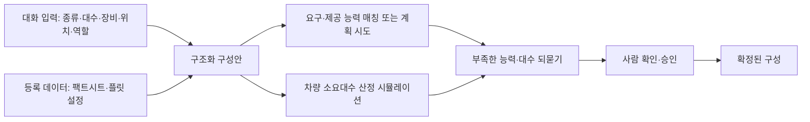

(너의 규칙은 시스템 프롬프트의 agents/shared-rules.md 와 agents/verifier.md 이다. 아래는 이번 실행의 컨텍스트와 입력이다.)

## 실행 컨텍스트

- run_id: 2026-09-29-02
- date: 2026-09-29
- run_type: area_deep_dive (영역 심화)
- 대상: 10. 채팅으로 로봇 구성 (C. 채팅 기반 구성·운영)
- 예산:
    - max_search_queries: 30
    - max_sources_per_run: 15
    - new_topic_pages: 1
    - page_updates: 2
    - max_retries: 2
- 환경 알림: web_fetch_available: true · fetch_mode: full
- 언어: ko
- verification_stage: second
- verifier_budget:
    - max_search_queries: 30
    - max_sources_per_run: 15
    - new_topic_pages: 1
    - page_updates: 2
    - max_retries: 2
- retry_count: 1
- max_retries: 2

## 입력

### runs/2026-09-29-02/target.json

```json
{
  "run_id": "2026-09-29-02",
  "date": "2026-09-29",
  "weekday": "Tue",
  "run_number": 94,
  "run_type": "area_deep_dive",
  "forced": true,
  "target": {
    "area_no": 10,
    "area_name": "10. 채팅으로 로봇 구성",
    "category": "C. 채팅 기반 구성·운영",
    "category_letter": "C"
  },
  "topic": null,
  "track": null,
  "corrections": [],
  "budget": {
    "max_search_queries": 30,
    "max_sources_per_run": 15,
    "new_topic_pages": 1,
    "page_updates": 2,
    "max_retries": 2
  },
  "priority_reason": null,
  "priority_questions": [],
  "excluded_areas": [],
  "lifted_areas": [],
  "deferred": {
    "monthly_recheck": false,
    "weekly_review": false
  },
  "selection_rationale": "CLI 지정 run_type=area_deep_dive, area=10"
}
```

### runs/2026-09-29-02/research.json

```json
{
  "run_id": "2026-09-29-02",
  "date": "2026-09-29",
  "run_type": "area_deep_dive",
  "target": {
    "area_no": 10,
    "area_name": "10. 채팅으로 로봇 구성",
    "category": "C. 채팅 기반 구성·운영"
  },
  "gaps": [
    "섹션 3. 왜 중요한가 비어 있음",
    "섹션 4. 핵심 개념과 용어 비어 있음 — 연합 형성·어포던스·능력 매칭·팩트시트·플릿 설정·구성 코파일럿 용어 없음",
    "섹션 5. 적용 사례 (현장 유형 명시) 비어 있음",
    "섹션 6. 대표 접근법과 기술 비어 있음",
    "섹션 7. 관련 표준·프레임워크·오픈소스 비어 있음 — VDA 5050 팩트시트, IDTA 02020 능력 기술, Open-RMF 플릿 설정 없음",
    "섹션 8. 대표 연구와 자료 비어 있음",
    "섹션 9. ROP가 직접 맡는 것과 외부와 연계하는 것 (책임 경계 기준) 비어 있음",
    "섹션 10. 다른 연구영역과의 연결 (번호와 이름을 함께 표기) 비어 있음 — 원문 주석대로 5. 로봇 능력·작업 표현과 짝 연결 필요",
    "섹션 11. 열린 질문 비어 있음 — 이 영역에 걸린 기존 열린 질문·정정 요청 없음",
    "프런트매터 related_areas·sources 비어 있음"
  ],
  "research_questions": [
    "어떤 로봇을 몇 대, 어디에, 어떤 역할로 둘지 대화로 정하고 가능 여부를 바로 알 수 있는가? [분류원문]",
    "자연어 지시에서 이기종 로봇 팀을 구성(연합 형성)하고 능력에 따라 역할을 배정하는 언어 모델 연구는 무엇이 있고, 로봇 능력을 어떤 형태로 모델에 주는가? (섹션 6·8 겨냥)",
    "대화로 정한 로봇 구성이 시나리오의 작업을 수행할 수 있는지를 온톨로지·능력 모델로 실행 전에 확인하는 방법(능력 매칭, 계획 생성, 어포던스)은 무엇인가? (섹션 4·6·7 겨냥)",
    "로봇 종류·장비·적재·초기 위치·역할을 담는 구조화 데이터 형식(VDA 5050 팩트시트, AAS 능력 기술 서브모델, Open-RMF 플릿 설정)은 어떤 필드를 두는가? (섹션 4·7 겨냥)",
    "언어 모델이 낸 구성·조정안을 제약 해결기·시뮬레이션·사람 검토로 검증한 사례는 어느 현장 유형에서 보고되었는가? (섹션 3·5·11 겨냥, 13. 대화형 기능의 신뢰·기반 연결)",
    "로봇 대수를 정하는 근거(대수 산정 시뮬레이션·로봇 대 작업자 비율)는 무엇이며 국내 자료가 있는가? (섹션 5·8 겨냥)",
    "채팅 로봇 구성에서 ROP가 직접 맡을 것과 로봇 자체 스킬 실행·제조사 관제에 맡길 것의 경계는 어디인가? (섹션 9·10 겨냥)"
  ],
  "findings": [
    {
      "id": "f1",
      "claim": "SMART-LLM(Kannan·Venkatesh·Min, 2023)은 고수준 자연어 지시를 작업 분해 → 연합 형성(로봇 팀 구성) → 작업 배정의 세 단계로 나눠 프로그램형 few-shot 프롬프트로 다중 로봇 작업 계획을 만들며, 네 가지 복잡도의 벤치마크와 시뮬레이션·실제 로봇 실험으로 평가했다.",
      "tag": "사실",
      "source_ids": [
        "ref-090"
      ],
      "cross_checked": false,
      "confidence": "medium",
      "evidence_excerpt": "초록: 프레임워크는 task decomposition, coalition formation, task allocation 단계를 few-shot 프롬프트로 수행. \"SMART-LLM harnesses the power of LLMs to convert high-level task instructions provided as input into a multi-robot task plan.\" 벤치마크 4개 범주.",
      "as_of": "2024-03-23",
      "site_type": null,
      "flow_item": "수행 자원"
    },
    {
      "id": "f2",
      "claim": "CoMuRoS(Borate 외, 2025)는 중앙의 작업 관리자 언어 모델이 자연어 목표를 해석해 정적 규칙과 동적 문맥(작업 이력, 로봇·작업 상태, 이벤트)으로 이기종 로봇에 하위 작업을 배정하고, 로봇마다 자체 언어 모델이 ROS 2 기본 스킬로 실행 코드를 만드는 구조로, 하드웨어 실험에서 협동 회수 9/10, 협동 운반 8/8, 사람 보조 회수 5/5 성공을 보고했다.",
      "tag": "사실",
      "source_ids": [
        "ref-677"
      ],
      "cross_checked": false,
      "confidence": "medium",
      "evidence_excerpt": "초록: Task Manager LLM 이 정적 규칙+동적 문맥으로 하위 작업 배정, 로봇별 LLM 이 ROS2 기본 스킬에서 파이썬 코드 생성. 하드웨어 실험 90%(9/10)·100%(8/8)·100%(5/5), 텍스트 벤치마크 정확도 최대 0.91. 실험은 연구실 환경(현장 유형 미명시).",
      "as_of": "2026-06-18",
      "site_type": null,
      "flow_item": "수행 자원"
    },
    {
      "id": "f3",
      "claim": "언어 모델 기반 다중 로봇 계획 연구(SMART-LLM, CoMuRoS)가 로봇 유형별 스킬 집합을 텍스트로 모델에 주고 그 위에서 팀 구성과 역할 배정을 하는 점을 보면, 채팅으로 로봇 구성은 로봇 종류·역할을 자유 서술이 아니라 기계가 읽을 수 있는 능력 목록으로 만들어 두어야 이후 배정·계획 단계가 그것을 쓸 수 있을 것으로 보인다.",
      "tag": "추정",
      "source_ids": [
        "ref-090",
        "ref-677"
      ],
      "cross_checked": false,
      "confidence": "low",
      "evidence_excerpt": "f1·f2 에서 도출. 두 연구 모두 로봇 능력(스킬 집합·기본 스킬)을 프롬프트 입력으로 전제하며, 능력이 없는 로봇에는 역할이 배정되지 않는다.",
      "as_of": "2026-09-29",
      "site_type": null,
      "flow_item": null
    },
    {
      "id": "f4",
      "claim": "SayCan(Ahn 외, 2022)은 언어 모델이 제안한 고수준 행동 후보를 스킬별 가치 함수(어포던스)가 현재 환경에서 실행 가능한지로 점수화해 결합함으로써, 언어로 표현된 지시를 물리적으로 실행 가능한 로봇 행동에 접지(grounding)한다.",
      "tag": "사실",
      "source_ids": [
        "ref-088"
      ],
      "cross_checked": false,
      "confidence": "medium",
      "evidence_excerpt": "초록: LLM 이 행동 시퀀스를 제안하고 스킬의 value function 이 실행 가능성을 점수화. \"The robot can act as the language model's 'hands and eyes,' while the language model supplies high-level semantic knowledge about the task.\" 모바일 매니퓰레이터 실제 실험.",
      "as_of": "2022-08-16",
      "site_type": null,
      "flow_item": "제약"
    },
    {
      "id": "f5",
      "claim": "Nakajima·Miura(IROS 2024)는 서비스 로봇의 '가져다 줘' 작업에서 환경 정보를 담은 온톨로지와 언어 모델을 결합해, 온톨로지의 확정 지식으로 언어 모델의 환각을 줄이고 사용자에게 되묻는 명확화 질문의 필요를 줄이는 방식을 제안했다.",
      "tag": "사실",
      "source_ids": [
        "ref-820"
      ],
      "cross_checked": false,
      "confidence": "medium",
      "evidence_excerpt": "초록: 온톨로지가 구조화된 환경 지식을, LLM 이 상식 지식을 담당해 모호한 요청을 해소. \"LLMs, by facilitating natural interactions and providing vast general knowledge, are proving invaluable for robotic tasks.\" 정량 결과는 초록에 없음.",
      "as_of": "2024-10-22",
      "site_type": null,
      "flow_item": null
    },
    {
      "id": "f6",
      "claim": "Vieira da Silva 외(2024)는 자연어 능력 설명을 few-shot 프롬프트로 기계 해석 가능한 능력 온톨로지로 바꾸고, 생성 결과를 구문 검사·모순 검사·환각 및 누락 요소 검사의 자동 루프로 검증해 사람은 처음 설명과 마지막 검토만 맡게 하는 방법을 제안했다.",
      "tag": "사실",
      "source_ids": [
        "ref-465"
      ],
      "cross_checked": false,
      "confidence": "medium",
      "evidence_excerpt": "초록: LLM 기반 생성 파이프라인 + 자동 검증 루프(syntax, contradiction, hallucination/missing elements). \"Our method greatly reduces manual effort, as only the initial natural language description and a final human review and possible correction are necessary.\"",
      "as_of": "2024-10-18",
      "site_type": null,
      "flow_item": null
    },
    {
      "id": "f7",
      "claim": "IDTA 02020 능력 기술(Capability Description) 서브모델 1.0 은 자산관리셸 안에서 공정·제품이 요구하는 능력(required)과 자원이 제공하는 능력(provided)을 속성(최대 속도·공차 등), 속성 제약(전제·불변·사후 조건)과 전이 제약(순서·병렬), 그리고 능력을 구현하는 스킬과 함께 모델링해 요구 능력과 자원 능력을 비교·매칭할 수 있게 한다.",
      "tag": "사실",
      "source_ids": [
        "ref-229"
      ],
      "cross_checked": false,
      "confidence": "medium",
      "evidence_excerpt": "공식 저장소 README: required/provided capabilities, properties, property constraints·transition constraints, skills. \"A capability is an 'implementation-independent specification of a function in industrial production to achieve an effect in the physical or virtual world.'\" 1.0 이 첫 공식판. (발행일 미확인, 확인일 기준)",
      "as_of": "2026-09-29",
      "site_type": null,
      "flow_item": "제약",
      "source_unopened": true
    },
    {
      "id": "f8",
      "claim": "Nabizada 외(IEEE CASE 2026)는 VDI 3682·IEC 61360-1·IDTA 02011·IDTA 02016 으로 구조화한 자산관리셸 능력 모델에서 PDDL 계획 문제를 자동 생성해, PDDL 전문 지식 없이도 주어진 설비 배치가 요구 공정 순서를 지원하는지 자동 계획으로 확인하고 배치 대안 4종을 비교하는 방법을 실험실 생산 시스템으로 검증했다.",
      "tag": "사실",
      "source_ids": [
        "ref-201"
      ],
      "cross_checked": false,
      "confidence": "medium",
      "evidence_excerpt": "초록: 추출 알고리즘이 자원 능력 기술에서 계획 요소를 직접 도출. \"Engineers designing production systems need to verify that a given layout supports all required production sequences\" — 실험실 생산 시스템 AAS 모델, 배치 변형 4종을 최적 계획으로 비교.",
      "as_of": "2026-06-01",
      "site_type": null,
      "flow_item": "완료·인계"
    },
    {
      "id": "f9",
      "claim": "요구 능력과 제공 능력을 같은 모델로 적는 능력 기술 서브모델과 그 모델에서 계획 문제를 자동 생성해 배치의 실행 가능성을 확인하는 연구를 함께 보면, 이 영역의 '로봇 구성 적합성 사전 확인'은 시나리오에서 요구 능력을, 대화로 정한 로봇 집합에서 제공 능력을 뽑아 매칭하거나 계획을 시도해 보고 부족한 능력·대수를 되돌려 주는 방식으로 구현할 수 있을 것으로 보인다.",
      "tag": "추정",
      "source_ids": [
        "ref-229",
        "ref-201"
      ],
      "cross_checked": false,
      "confidence": "low",
      "evidence_excerpt": "f7·f8 에서 도출. 두 출처 모두 제조 자원(설비)을 대상으로 하며 이동 로봇 플릿에 적용한 사례는 확인하지 못했다.",
      "as_of": "2026-09-29",
      "site_type": null,
      "flow_item": "완료·인계"
    },
    {
      "id": "f10",
      "claim": "VDA 5050 3.0.0 의 팩트시트(factsheet) 토픽은 관제가 이동 로봇을 설정하는 데 쓰는 매개변수·제조사 정보로, typeSpecification(seriesName, agvKinematic, agvClass, maxLoadMass, localizationTypes, navigationTypes), physicalParameters, protocolLimits, protocolFeatures, agvGeometry, loadSpecification(loadPositions, loadSets), vehicleConfig 로 구성된다.",
      "tag": "사실",
      "source_ids": [
        "ref-031"
      ],
      "cross_checked": false,
      "confidence": "medium",
      "evidence_excerpt": "공식 저장소 VDA5050_EN.md(3.0.0) 6.10·7.10: factsheet 는 \"Parameters or vendor-specific information to assist set-up of the mobile robot in fleet control\". 하위 객체 7종과 typeSpecification·loadSpecification 필드 확인. (발행일 미확인, 확인일 기준)",
      "as_of": "2026-09-29",
      "site_type": null,
      "flow_item": "작업 대상"
    },
    {
      "id": "f11",
      "claim": "Open-RMF 플릿 어댑터 템플릿의 설정 파일(config.yaml)은 rmf_fleet 절에 플릿 이름, 선속도·각속도·가속도 한계, 발자국·근접 반경(profile), 후진 가능 여부, 배터리·기계·주변·도구 시스템 값, 재충전 임계값, 플릿이 수행할 수 있는 RMF 작업 유형(task_capabilities), 사용자 정의 동작(actions), 작업 종료 후 행동(finishing_request), 로봇별 충전기 배정과 개별 재정의를 두는 robots 목록을 적는다.",
      "tag": "사실",
      "source_ids": [
        "ref-105"
      ],
      "cross_checked": false,
      "confidence": "medium",
      "evidence_excerpt": "공식 저장소 원문 config.yaml: task_capabilities 주석 \"Specify the types of RMF Tasks that robots in this fleet are capable of\"; robots 절에 로봇 이름·charger, 플릿 설정을 로봇별로 재정의 가능. (발행일 미확인, 확인일 기준)",
      "as_of": "2026-09-29",
      "site_type": null,
      "flow_item": "수행 자원"
    },
    {
      "id": "f12",
      "claim": "이 영역이 대화로 정하려는 값(로봇 종류·대수·장착 장비·초기 위치·역할)은 VDA 5050 팩트시트의 종류·적재 사양과 Open-RMF 플릿 설정의 작업 유형·로봇 목록·충전기 배정처럼 관제가 실제로 읽는 구조에 이미 자리가 있으므로, 채팅 로봇 구성의 결과물은 이런 구조를 채우는 구조화 값이어야 하고 팩트시트 같은 등록 데이터는 대화가 물어볼 필요 없이 읽어 오는 입력이 될 것으로 보인다.",
      "tag": "추정",
      "source_ids": [
        "ref-031",
        "ref-105"
      ],
      "cross_checked": false,
      "confidence": "low",
      "evidence_excerpt": "f10·f11 에서 도출. 두 형식 모두 대화 입력이 아니라 사람이 편집하는 파일·로봇이 보내는 메시지이며, 대화로 채운 사례는 확인하지 못했다.",
      "as_of": "2026-09-29",
      "site_type": null,
      "flow_item": "완료·인계"
    },
    {
      "id": "f13",
      "claim": "Valerio 외(2026)는 산업 제품 구성 문제에서 언어 모델과 기호적 제약 해결을 결합하는 신경-기호 방식을 하이브리드 추론·미세조정·훈련의 세 통합 전략으로 정리하고, 대화형 '구성 코파일럿'의 출력이 구문상 유효하고 수백 개 기능·규칙의 지식 베이스와 의미적으로 일치하며 실제 제조 가능해야 한다는 조건을 제시했다.",
      "tag": "사실",
      "source_ids": [
        "ref-824"
      ],
      "cross_checked": false,
      "confidence": "medium",
      "evidence_excerpt": "초록: LLM + constraint solving, taxonomy 3종, configuration copilot. \"outputs must be syntactically valid, semantically consistent with a knowledge base of hundreds of features and rules, and producible by an existing manufacturing chain.\" 벤치마크보다 산업 배치의 설계 선택에 초점.",
      "as_of": "2026-09-24",
      "site_type": null,
      "flow_item": "제약"
    },
    {
      "id": "f14",
      "claim": "Ko·Lin(2026)은 병원 멸균공급실을 본뜬 가상의 수술기구 분류 라인 4개를 대상으로 운영자가 자연어로 라인·작업 조정을 요청하면 로컬 언어 모델이 구조화 요구사항과 후보 전략을 만들고 디지털 트윈 시뮬레이션이 실행 가능성을 검증하는 '제안–검증–결정' 흐름을 평가해, 시험 사례 18건 중 자율 전략 성공 3/10, 잘못된 입력 거부 7/8, 최종 검토 도달 4건 모두 통과, 시뮬레이션 검증 평균 164.39초를 보고했다.",
      "tag": "사실",
      "source_ids": [
        "ref-759"
      ],
      "cross_checked": false,
      "confidence": "medium",
      "evidence_excerpt": "초록: Propose-Verify-Decide 워크플로, 의미 정확성·시뮬레이션 실행·운영 제약 검사, 요청–검증 근거–결정을 잇는 추적 기록. \"Linked records preserve traceability from requests to verification evidence and decisions.\" 배치 검증 통과율 97.50%. 물리 로봇이 아닌 가상 라인.",
      "as_of": "2026-09-24",
      "site_type": "병원",
      "flow_item": "예외·성과"
    },
    {
      "id": "f15",
      "claim": "Liu 외(2026)는 사람 참여 산업 로봇을 위한 에이전트형 신경-기호 계획·시운전 프레임워크에서 언어 모델은 의도 해석과 문맥 추론에만 쓰고 검증·순서 결정·실행은 모두 결정론적으로 두며, 언어 모델이 낸 계획을 기호적으로 검증한 뒤 Unity3D 디지털 트윈에서 사람이 검토·수정·재검증하고 나서야 실제 로봇에 배포하는 방식으로 기준선 10종보다 높은 작업 성공률을 보고했다.",
      "tag": "사실",
      "source_ids": [
        "ref-674"
      ],
      "cross_checked": false,
      "confidence": "medium",
      "evidence_excerpt": "초록: Specifier-Designer-Inspector 구조, 2단 복구. \"LLMs are used for tasks that require language understanding or contextual reasoning, while all verification, sequencing, and execution remain deterministic.\" 절제 실험으로 각 구성요소 필요성 확인. 현장 유형 미명시.",
      "as_of": "2026-06-06",
      "site_type": null,
      "flow_item": "완료·인계"
    },
    {
      "id": "f16",
      "claim": "산업 제품 구성(Valerio 외), 병원 라인 작업 조정(Ko·Lin), 산업 로봇 시운전(Liu 외)의 서로 다른 세 연구가 모두 언어 모델을 해석 단계에 한정하고 제약 해결기·기호 검증·시뮬레이션 검증과 사람의 최종 검토를 거친 뒤에만 구성·계획을 채택하는 구조를 택했다.",
      "tag": "사실",
      "source_ids": [
        "ref-824",
        "ref-759",
        "ref-674"
      ],
      "cross_checked": true,
      "confidence": "medium",
      "evidence_excerpt": "f13·f14·f15 종합. 세 연구는 저자·기관이 다르고 서로 인용 관계가 확인되지 않아 독립 출처로 보았다. 세 편 모두 arXiv 프리프린트라 신뢰도는 medium 으로 둔다.",
      "as_of": "2026-09-24",
      "site_type": null,
      "flow_item": "제약"
    },
    {
      "id": "f17",
      "claim": "Figat·Mackey·Ingham(2026)은 임무 수준 목표를 온톨로지 개념, 확률 시간 페트리 넷, 자원 모델링, 몬테카를로 시뮬레이션으로 하드웨어·소프트웨어 사양으로 바꾸는 RSTM2 방법론을 제안해 임무·시스템·하위 시스템 수준의 구조 대안 비교와 자원 배분을 다루며, 가상 사례 연구로만 검증하고 다중 로봇(NASA CADRE) 적용 가능성을 언급한다.",
      "tag": "사실",
      "source_ids": [
        "ref-828"
      ],
      "cross_checked": false,
      "confidence": "medium",
      "evidence_excerpt": "초록: Robotic System Task to Model Transformation Methodology, 계층적 분석, 불확실성 아래 성능 분석. \"Ontological concepts further enable explainable AI-based assistants, facilitating fully autonomous specification synthesis.\" 가상 사례(hypothetical case study).",
      "as_of": "2026-02-05",
      "site_type": null,
      "flow_item": null
    },
    {
      "id": "f18",
      "claim": "Howard(Cal Poly 석사논문, 2026)는 작업자 피킹(picker-to-parts) 창고에서 협동 자율이동로봇 대수 산정을 처리량 최대화가 아닌 라인당 비용 최소화로 다시 정의하고 FlexSim 이산 사건 시뮬레이션 27,000회·반개방형 대기행렬·XGBoost 대리모델로 분석해, 최적 로봇 대 작업자 비율이 수요에 따라 1:1 에서 2.5:1 로 옮겨 가고 작업자 유휴 비용이 로봇 유휴 비용의 약 2.5배이며 처리량 기준 산정은 구독형 과금에서 대수를 과대 산정한다고 보고했다.",
      "tag": "사실",
      "source_ids": [
        "ref-829"
      ],
      "cross_checked": false,
      "confidence": "medium",
      "evidence_excerpt": "논문 페이지 초록: 요인은 피커 인원, AMR 대 피커 비율, 배치 크기, 수요 밀도, 배차 설정. \"Existing fleet-sizing research maximizes throughput, an objective that systematically oversizes fleets under Robotics-as-a-Service pricing because it ignores synchronization loss.\" 배차 휴리스틱 차이는 통계적으로 유의하지 않음.",
      "as_of": "2026-06",
      "site_type": "물류창고",
      "flow_item": "수행 자원"
    },
    {
      "id": "f19",
      "claim": "국내 자율이동로봇 업체 폴라리스3D 는 공장에 맞는 로봇 대수를 정하려면 일일 목표 이송 횟수와 시간당 적재량, 출발지–목적지 평균 이동 거리·속도, 공정 수, MES·엘리베이터 등 기존 설비 연동 여부가 직접 영향을 주므로 도입 전 전문가 인터뷰나 시뮬레이션 사전 분석이 필수라고 밝힌다.",
      "tag": "추정",
      "source_ids": [
        "ref-830"
      ],
      "cross_checked": false,
      "confidence": "low",
      "evidence_excerpt": "벤더 주장: 블로그(2026-06-12)는 대수 산정 입력으로 일일 이송 횟수·시간당 적재량·평균 이동 거리·속도·공정 수·설비 연동을 들고 \"도입 전 전문가 인터뷰나 시뮬레이션을 통한 사전 분석이 필수적입니다.\" 라고 적는다. ROI 는 인건비 절감·생산성 향상으로 계산.",
      "as_of": "2026-06-12",
      "site_type": "제조 공장",
      "flow_item": "제약",
      "vendor_claim": true
    },
    {
      "id": "f20",
      "claim": "대수 산정이 처리량·수요 밀도·이동 거리·작업자 비율 같은 현장 수치와 시뮬레이션에 달려 있다는 연구와 업체 설명을 보면, 채팅으로 로봇 구성에서 '몇 대'라는 값은 언어 모델이 대화만으로 정할 수 없고 35. 처리능력·규모·배치 설계와 34. 시뮬레이션·예측용 디지털 트윈의 산정 엔진을 불러 그 결과와 비용 목적(처리량 대 비용)을 사용자에게 되묻는 방식이어야 할 것으로 보인다.",
      "tag": "추정",
      "source_ids": [
        "ref-829",
        "ref-830"
      ],
      "cross_checked": false,
      "confidence": "low",
      "evidence_excerpt": "f18·f19 에서 도출. 대화형 인터페이스가 대수 산정 시뮬레이션을 호출한 사례는 확인하지 못했다.",
      "as_of": "2026-09-29",
      "site_type": null,
      "flow_item": "수행 자원"
    },
    {
      "id": "f21",
      "claim": "심현재 외(제어로봇시스템학회 국내학술대회, 2023)는 이기종 다중 로봇을 클라우드에서 운용하는 AGM(Adaptive Goal Management) 소프트웨어 플랫폼을 제시해 적응형 목표 실행 방식과 REST API 로 서로 다른 로봇을 등록·통신하고 작업을 배정하는 구조를 보고했다.",
      "tag": "사실",
      "source_ids": [
        "ref-825"
      ],
      "cross_checked": false,
      "confidence": "medium",
      "evidence_excerpt": "DBpia 초록: 이기종 다중로봇 관리를 위한 클라우드 기반 AGM 시스템, 로봇 간 통신용 REST API, 로봇 등록·능력 정보 처리와 작업 배정 메커니즘 포함. 대화형 구성 기능은 언급하지 않는다.",
      "as_of": "2023-06",
      "site_type": null,
      "flow_item": "수행 자원"
    },
    {
      "id": "f22",
      "claim": "연계 대상: 로봇별 언어 모델이 ROS 2 기본 스킬에서 실행 코드를 만드는 일(CoMuRoS)과 스킬의 가치 함수로 현재 장면의 실행 가능성을 점수화하는 일(SayCan)은 분류 원문 19장의 로봇 자체 지능·제어 쪽이며, 10. 채팅으로 로봇 구성에서 ROP가 직접 맡을 것은 대화를 구조화 구성(종류·대수·장비·위치·역할)으로 바꾸고 온톨로지의 요구·제공 능력으로 적합성을 확인해 부족을 알린 뒤 사람이 승인한 구성만 확정하는 일로 보인다.",
      "tag": "추정",
      "source_ids": [
        "ref-677",
        "ref-088",
        "ref-229"
      ],
      "cross_checked": false,
      "confidence": "low",
      "evidence_excerpt": "f2·f4·f7 에서 도출. 원문 19장 표의 '로봇 자체 지능·제어' 행(가능한 기능과 실행 조건은 ROP, 인식·제어는 외부)에 맞춘 경계 판단이다.",
      "as_of": "2026-09-29",
      "site_type": null,
      "flow_item": null
    },
    {
      "id": "f23",
      "claim": "자연어 설명에서 능력 온톨로지를 생성하는 방법(Vieira da Silva 외)과 언어 모델·제약 해결 결합 구성(Valerio 외)은 L. AI·학습 기술의 44. 로봇 기반 모델·언어 모델 계획과 47. AI·학습·적응과 모델 운영에 속하는 연구 방법이며, 원문 교차 규칙에 따라 매뉴얼·설명서 해석의 적용 대상인 4. 이기종 로봇 등록과 5. 로봇 능력·작업 표현 페이지에도 함께 연결해야 한다.",
      "tag": "추정",
      "source_ids": [
        "ref-465",
        "ref-824"
      ],
      "cross_checked": false,
      "confidence": "low",
      "evidence_excerpt": "f6·f13 의 방법론 성격에서 도출. 원문 13장 주석(매뉴얼 해석은 4·55번)에 따른 연결 제안이다.",
      "as_of": "2026-09-29",
      "site_type": null,
      "flow_item": null
    },
    {
      "id": "f24",
      "claim": "온톨로지의 확정 지식으로 명확화 질문의 필요를 줄이는 연구와 잘못된 조정 요청 8건 중 7건을 검증 단계에서 거부한 연구를 함께 보면, 채팅 로봇 구성의 되묻기는 온톨로지·팩트시트로 알 수 없는 값(대수, 초기 위치, 역할 우선순위)에 한정하고 알 수 있는 값은 읽어 온 근거를 보여 주며, 수행 불가 판정은 어떤 요구 능력이 어느 로봇에도 없는지로 설명하는 것이 맞을 것으로 보인다.",
      "tag": "추정",
      "source_ids": [
        "ref-820",
        "ref-759"
      ],
      "cross_checked": false,
      "confidence": "low",
      "evidence_excerpt": "f5·f14 에서 도출. 두 연구 모두 로봇 플릿 구성 대화를 직접 다루지는 않는다.",
      "as_of": "2026-09-29",
      "site_type": null,
      "flow_item": "제약"
    }
  ],
  "sources": [
    {
      "id": "ref-677",
      "org": "Borate, S., Rai B, B., Pardeshi, V., & Vadali, M.",
      "title": "LLM-Based Generalizable Hierarchical Task Planning and Execution for Heterogeneous Robot Teams with Event-Driven Replanning",
      "published": "2025-11-27",
      "url": "https://arxiv.org/abs/2511.22354",
      "type": "논문",
      "reliability": "medium",
      "accessed": "2026-09-29",
      "summary": "CoMuRoS: 중앙 작업 관리자 언어 모델과 로봇별 언어 모델을 결합한 이기종 로봇 팀 계층 계획·실행 프레임워크. 하드웨어 실험 성공률과 텍스트 벤치마크 결과를 보고한다(2026-06-18 개정판).",
      "fetched": true,
      "fetched_via": "webfetch",
      "fetch_url": "https://arxiv.org/abs/2511.22354",
      "source_unopened": false
    },
    {
      "id": "ref-465",
      "org": "Vieira da Silva, L. M., Köcher, A., Gehlhoff, F., & Fay, A.",
      "title": "Toward a Method to Generate Capability Ontologies from Natural Language Descriptions",
      "published": "2024-06-12",
      "url": "https://arxiv.org/abs/2406.07962",
      "type": "논문",
      "reliability": "medium",
      "accessed": "2026-09-29",
      "summary": "few-shot 프롬프트로 자연어 능력 설명에서 능력 온톨로지를 생성하고 구문·모순·환각·누락을 자동 검사하는 방법(2024-10-18 개정판).",
      "fetched": true,
      "fetched_via": "webfetch",
      "fetch_url": "https://arxiv.org/abs/2406.07962",
      "source_unopened": false
    },
    {
      "id": "ref-820",
      "org": "Nakajima, H., & Miura, J. (IROS 2024)",
      "title": "Combining Ontological Knowledge and Large Language Model for User-Friendly Service Robots",
      "published": "2024-10-22",
      "url": "https://arxiv.org/abs/2410.16804",
      "type": "논문",
      "reliability": "medium",
      "accessed": "2026-09-29",
      "summary": "서비스 로봇의 '가져다 줘' 작업에서 온톨로지 지식으로 언어 모델의 환각을 줄이고 사용자 확인 필요를 줄이는 결합 방식. 초록만 확인.",
      "fetched": true,
      "fetched_via": "webfetch",
      "fetch_url": "https://arxiv.org/abs/2410.16804",
      "source_unopened": false
    },
    {
      "id": "ref-090",
      "org": "Kannan, S. S., Venkatesh, V. L. N., & Min, B.-C.",
      "title": "SMART-LLM: Smart Multi-Agent Robot Task Planning using Large Language Models",
      "published": "2023-09-18",
      "url": "https://arxiv.org/abs/2309.10062",
      "type": "논문",
      "reliability": "medium",
      "accessed": "2026-09-29",
      "summary": "고수준 지시를 작업 분해·연합 형성·작업 배정으로 다중 로봇 계획으로 바꾸는 언어 모델 프레임워크와 벤치마크(2024-03-23 개정판, IROS 2024 제출).",
      "fetched": true,
      "fetched_via": "webfetch",
      "fetch_url": "https://arxiv.org/abs/2309.10062",
      "source_unopened": false
    },
    {
      "id": "ref-105",
      "org": "Open Robotics (open-rmf)",
      "title": "fleet_adapter_template — fleet_adapter_template/config.yaml",
      "published": null,
      "url": "https://github.com/open-rmf/fleet_adapter_template/blob/main/fleet_adapter_template/config.yaml",
      "type": "오픈소스 문서",
      "reliability": "high",
      "accessed": "2026-09-29",
      "summary": "Open-RMF 플릿 어댑터 템플릿 설정 파일. 플릿 한계·프로파일·배터리·작업 유형(task_capabilities)·로봇 목록·충전기 배정 필드를 정의한다.",
      "fetched": true,
      "fetched_via": "github_raw",
      "fetch_url": "https://raw.githubusercontent.com/open-rmf/fleet_adapter_template/main/fleet_adapter_template/config.yaml",
      "source_unopened": false
    },
    {
      "id": "ref-229",
      "org": "IDTA (Industrial Digital Twin Association, admin-shell-io GitHub)",
      "title": "IDTA 02020 Submodel Template Capability Description — README (published/Capability Description/1/0)",
      "published": null,
      "url": "https://github.com/admin-shell-io/submodel-templates/tree/main/published/Capability%20Description",
      "type": "표준",
      "reliability": "medium",
      "accessed": "2026-09-29",
      "summary": "자산관리셸 능력 기술 서브모델 1.0 공식 저장소 README. 요구·제공 능력, 속성, 속성·전이 제약, 스킬을 모델링해 능력 매칭에 쓴다.",
      "fetched": false,
      "fetched_via": null,
      "fetch_url": "https://raw.githubusercontent.com/admin-shell-io/submodel-templates/main/published/Capability%20Description/1/0/README.md",
      "source_unopened": true
    },
    {
      "id": "ref-824",
      "org": "Valerio, D., Kogler, P., Bischof, S., Hubauer, T., & Rangwala, H.",
      "title": "Neuro-symbolic AI for Industrial Configuration",
      "published": "2026-09-24",
      "url": "https://arxiv.org/abs/2609.29947",
      "type": "논문",
      "reliability": "medium",
      "accessed": "2026-09-29",
      "summary": "산업 제품 구성에서 언어 모델과 제약 해결을 결합하는 세 통합 전략과 구성 코파일럿의 유효성 조건을 정리한 프리프린트.",
      "fetched": true,
      "fetched_via": "webfetch",
      "fetch_url": "https://arxiv.org/abs/2609.29947",
      "source_unopened": false
    },
    {
      "id": "ref-825",
      "org": "심현재, 무함마드 카짐, Michael Muldoon, 김광기 (제어로봇시스템학회 국내학술대회)",
      "title": "클라우드 기반 이기종 다중로봇 운용 소프트웨어 플랫폼 연구",
      "published": "2023-06",
      "url": "https://www.dbpia.co.kr/journal/articleDetail?nodeId=NODE11480590",
      "type": "논문",
      "reliability": "medium",
      "accessed": "2026-09-29",
      "summary": "이기종 다중 로봇을 위한 클라우드 기반 AGM 플랫폼(적응형 목표 실행, REST API, 로봇 등록·작업 배정). DBpia 초록만 확인.",
      "fetched": true,
      "fetched_via": "webfetch",
      "fetch_url": "https://www.dbpia.co.kr/journal/articleDetail?nodeId=NODE11480590",
      "source_unopened": false
    },
    {
      "id": "ref-088",
      "org": "Ahn, M., Brohan, A., Brown, N., Chebotar, Y. 외 (Google/Everyday Robots)",
      "title": "Do As I Can, Not As I Say: Grounding Language in Robotic Affordances",
      "published": "2022-04-04",
      "url": "https://arxiv.org/abs/2204.01691",
      "type": "논문",
      "reliability": "medium",
      "accessed": "2026-09-29",
      "summary": "SayCan: 언어 모델 제안과 스킬 어포던스 가치 함수를 결합해 실행 가능한 행동을 고르는 접지 방법(2022-08-16 개정판).",
      "fetched": true,
      "fetched_via": "webfetch",
      "fetch_url": "https://arxiv.org/abs/2204.01691",
      "source_unopened": false
    },
    {
      "id": "ref-201",
      "org": "Nabizada, H., Wirt, T., Vieira da Silva, L. M., Gehlhoff, F., & Fay, A. (IEEE CASE 2026)",
      "title": "From Capability Models to Automated Planning: An AAS-Native Approach for Automatic PDDL Generation",
      "published": "2026-06-01",
      "url": "https://arxiv.org/abs/2606.02167",
      "type": "논문",
      "reliability": "medium",
      "accessed": "2026-09-29",
      "summary": "자산관리셸 능력 모델에서 PDDL 계획 문제를 자동 생성해 설비 배치가 요구 공정을 지원하는지 확인하는 방법. 실험실 생산 시스템 검증.",
      "fetched": true,
      "fetched_via": "webfetch",
      "fetch_url": "https://arxiv.org/abs/2606.02167",
      "source_unopened": false
    },
    {
      "id": "ref-828",
      "org": "Figat, M., Mackey, R. M., & Ingham, M. D.",
      "title": "Ontology-Driven Robotic Specification Synthesis",
      "published": "2026-02-05",
      "url": "https://arxiv.org/abs/2602.05456",
      "type": "논문",
      "reliability": "medium",
      "accessed": "2026-09-29",
      "summary": "임무 목표를 온톨로지·확률 시간 페트리 넷·자원 모델링으로 로봇 하드웨어·소프트웨어 사양으로 바꾸는 RSTM2 방법론. 가상 사례 연구.",
      "fetched": true,
      "fetched_via": "webfetch",
      "fetch_url": "https://arxiv.org/abs/2602.05456",
      "source_unopened": false
    },
    {
      "id": "ref-829",
      "org": "Howard, T. L. (California Polytechnic State University, 석사논문)",
      "title": "A Simulation, Analytical, and Machine-Learning Approach for Collaborative Autonomous Mobile Robot Fleet Sizing in Picker-to-Parts Facilities",
      "published": "2026-06",
      "url": "https://digitalcommons.calpoly.edu/theses/3387/",
      "type": "논문",
      "reliability": "medium",
      "accessed": "2026-09-29",
      "summary": "작업자 피킹 창고의 협동 자율이동로봇 대수 산정을 시뮬레이션·대기행렬·대리모델로 분석해 비용 기준 최적 로봇 대 작업자 비율을 제시한 학위논문. 초록 페이지 확인.",
      "fetched": true,
      "fetched_via": "webfetch",
      "fetch_url": "https://digitalcommons.calpoly.edu/theses/3387/",
      "source_unopened": false
    },
    {
      "id": "ref-830",
      "org": "폴라리스3D(Polaris3D)",
      "title": "AMR 도입 ROI 어떻게 계산할까? 물류 자동화 투자 회수 기간 알아보기",
      "published": "2026-06-12",
      "url": "https://polaris3d.com/blog/trends/amr-roi-calculator/",
      "type": "벤더 문서",
      "reliability": "low",
      "accessed": "2026-09-29",
      "summary": "국내 자율이동로봇 업체 블로그. 로봇 대수 산정에 영향을 주는 현장 입력 데이터와 ROI 계산 방식을 설명한다(벤더 자료).",
      "fetched": true,
      "fetched_via": "webfetch",
      "fetch_url": "https://polaris3d.com/blog/trends/amr-roi-calculator/",
      "source_unopened": false
    },
    {
      "id": "ref-759",
      "org": "Ko, T.-H., & Lin, C.-T.",
      "title": "Human-AI Collaboration for Multi-Line Task Adjustment Using Local Large Language Models and a Digital Twin",
      "published": "2026-09-24",
      "url": "https://arxiv.org/abs/2609.29061",
      "type": "논문",
      "reliability": "medium",
      "accessed": "2026-09-29",
      "summary": "가상 수술기구 분류 라인 4개에서 자연어 작업 조정 요청을 로컬 언어 모델과 디지털 트윈으로 제안–검증–결정하는 흐름과 시험 사례 18건 결과를 보고한 프리프린트.",
      "fetched": true,
      "fetched_via": "webfetch",
      "fetch_url": "https://arxiv.org/abs/2609.29061",
      "source_unopened": false
    },
    {
      "id": "ref-674",
      "org": "Liu, Z., Fernandez-Ayala, V. N., Wang, T., Qin, Q., Wang, X. V., Dimarogonas, D. V., & Wang, L.",
      "title": "Agentic Neuro-Symbolic Planning and Commissioning for Human-in-the-Loop Industrial Robotics with Digital Twins",
      "published": "2026-06-06",
      "url": "https://arxiv.org/abs/2606.08214",
      "type": "논문",
      "reliability": "medium",
      "accessed": "2026-09-29",
      "summary": "언어 모델 해석과 결정론적 기호 검증·디지털 트윈 검토를 결합한 사람 참여 산업 로봇 계획·시운전 프레임워크. 기준선 10종과 비교.",
      "fetched": true,
      "fetched_via": "webfetch",
      "fetch_url": "https://arxiv.org/abs/2606.08214",
      "source_unopened": false
    },
    {
      "id": "ref-031",
      "org": "VDA / VDMA (VDA5050 GitHub)",
      "title": "VDA5050/VDA5050_EN.md — Official Specification document for the VDA 5050",
      "published": null,
      "url": "https://github.com/VDA5050/VDA5050/blob/main/VDA5050_EN.md",
      "type": "표준",
      "reliability": "high",
      "accessed": "2026-09-29",
      "summary": "VDA 5050 공식 저장소 main 브랜치의 명세 원문(3.0.0). 이번 실행에서는 팩트시트 토픽의 구성과 typeSpecification·loadSpecification 필드를 확인했다.",
      "fetched": true,
      "fetched_via": "github_raw",
      "fetch_url": "https://raw.githubusercontent.com/VDA5050/VDA5050/main/VDA5050_EN.md",
      "source_unopened": false
    }
  ],
  "page_proposals": [
    {
      "action": "update",
      "path": "docs/categories/chat-based-configuration-and-operation/chat-robot-configuration.md",
      "sections": [
        "3",
        "4",
        "5",
        "6",
        "7",
        "8",
        "9",
        "10",
        "11"
      ],
      "rationale": "섹션 3: f16(언어 모델 출력은 검증·사람 검토 뒤에만 채택), f18·f20(대수는 현장 수치·시뮬레이션에 달림), f3(역할·능력은 기계가 읽는 목록이어야 함) / 섹션 4: f1(연합 형성), f4(어포던스), f7(요구·제공 능력과 제약), f10(팩트시트), f11(플릿 설정·task_capabilities), f13(구성 코파일럿) / 섹션 5: 병원 — f14(가상 멸균공급실 라인의 자연어 작업 조정, 시뮬레이션임을 명시), 물류창고 — f18(피킹 창고 대수 산정 비율), 제조 공장 — f19(벤더 주장 병기, 대수 산정 입력) / 섹션 6: f1·f2(언어 모델 팀 구성·역할 배정), f4·f5(어포던스·온톨로지로 실행 가능성 접지), f6(자연어→능력 온톨로지), f8·f9(능력 모델→계획으로 적합성 확인), f13·f15·f16(제약 해결·기호 검증·디지털 트윈 검토), f17(요구→사양 합성), f24(되묻기 범위) / 섹션 7: f10(VDA 5050 팩트시트), f7(IDTA 02020), f11(Open-RMF 플릿 설정), f12(구조화 결과물) / 섹션 8: f1, f2, f4, f5, f6, f8, f13, f14, f15, f17, f18, 국내 f21 / 섹션 9: f22(연계 대상: 로봇별 코드 생성·어포던스 점수화는 로봇 자체 지능·제어; 직접 범위: 대화→구조화 구성·적합성 확인·승인) / 섹션 10: 5. 로봇 능력·작업 표현(f7·f9, 원문 주석의 짝), 4. 이기종 로봇 등록(f10·f12·f21), 25. 작업 배정 — MRTA(f1·f2), 35. 처리능력·규모·배치 설계와 34. 시뮬레이션·예측용 디지털 트윈(f18·f20), 9. 채팅으로 시나리오 구성(f9 요구 능력의 출처), 13. 대화형 기능의 신뢰·기반(f16·f24), 20. 로봇·제조사 관제 연동(f11), 21. 상호운용 표준·적합성(f10), 44. 로봇 기반 모델·언어 모델 계획·47. AI·학습·적응과 모델 운영(f23, 교차 규칙) / 섹션 11: open_questions_new 4건. 다음 실행 후보: 5. 로봇 능력·작업 표현 페이지에 f7·f8 반영, 4. 이기종 로봇 등록 페이지에 f6·f10 반영, 35. 처리능력·규모·배치 설계 페이지에 f18 반영."
    }
  ],
  "glossary_candidates": [
    {
      "term_ko": "연합 형성",
      "term_en": "Coalition Formation",
      "definition": "하나의 하위 작업을 맡을 로봇 팀을 각 로봇의 능력과 제약에 맞춰 고르는 다중 로봇 계획 단계이다."
    },
    {
      "term_ko": "어포던스",
      "term_en": "Affordance",
      "definition": "현재 환경과 로봇 상태에서 어떤 스킬을 실제로 실행할 수 있는지를 나타내는 값으로, 언어 모델의 제안을 실행 가능한 행동에 접지하는 데 쓴다."
    },
    {
      "term_ko": "능력 기술 서브모델",
      "term_en": "Capability Description Submodel (IDTA 02020)",
      "definition": "자산관리셸에서 요구 능력과 제공 능력을 속성·제약·스킬과 함께 적어 자원 능력 매칭에 쓰는 IDTA 서브모델 템플릿이다."
    },
    {
      "term_ko": "구성 코파일럿",
      "term_en": "Configuration Copilot",
      "definition": "자연어 요구를 제약으로 형식화하고 제약 해결기로 유효한 구성을 찾아 자연어로 돌려주는 대화형 구성 보조 도구이다."
    }
  ],
  "open_questions_new": [
    "대화로 로봇 종류·대수·장비·역할을 정하고 수행 가능 여부를 판정하는 기능을 평가할 공개 벤치마크나 지표(적합성 판정 정확도, 질문 횟수, 구성 완료 시간)가 있는가? | 관련 영역: 10. 채팅으로 로봇 구성, 13. 대화형 기능의 신뢰·기반 | 근거: f14 | 종류: 일반",
    "국내 현장에서 VDA 5050 팩트시트나 자산관리셸 능력 기술을 로봇 등록 데이터로 실제 쓰는 사례가 있으며, 채팅 로봇 구성이 그 데이터를 읽어 되묻기를 줄일 수 있는가? | 관련 영역: 10. 채팅으로 로봇 구성, 4. 이기종 로봇 등록, 21. 상호운용 표준·적합성 | 근거: f12 | 종류: 일반",
    "채팅으로 정한 로봇 대수를 시뮬레이션 기반 대수 산정과 어떻게 연결하고, 처리량 최대화와 비용 최소화 가운데 어느 목적을 누가 정하는가? | 관련 영역: 10. 채팅으로 로봇 구성, 35. 처리능력·규모·배치 설계, 3. 경제성·조달·사업 모델 | 근거: f20 | 종류: 일반",
    "로봇 구성이 시나리오 요구를 채우지 못할 때 부족한 능력·대수를 사용자에게 어떤 형식(요구 능력별 매칭 결과, 불능 제약 집합 등)으로 설명해야 이해와 수정이 쉬운가? | 관련 영역: 10. 채팅으로 로봇 구성, 5. 로봇 능력·작업 표현 | 근거: f9 | 종류: 일반"
  ],
  "open_questions_resolved": [],
  "self_check": {
    "source_count": 16,
    "cross_checked_count": 1,
    "unverified": [
      "f1 SMART-LLM 이 로봇 스킬 집합을 프롬프트에 주는 구체 형식은 초록에서 확인하지 못함(본문 미열람)",
      "f5 Nakajima·Miura 의 정량 결과는 초록에 없어 미확인",
      "f10 VDA 5050 팩트시트가 '계획·규모 산정·시뮬레이션'에 쓰인다는 문구는 검색 요약에만 있어 finding 에 넣지 않음",
      "f19 폴라리스3D 대수 산정 입력은 벤더 주장이며 독립 출처 교차 확인 없음",
      "f16 외 모든 finding 교차 확인 실패(연구·문서마다 발행 주체 한 곳)",
      "f7·f10·f11 발행일 미확인(공식 저장소 문서)",
      "ACMG(MDPI Applied Sciences, 자연어→CSP 모델 생성)와 Järvenpää 외 능력 매칭 의미 규칙 논문(Taylor & Francis)은 403 으로 열지 못해 넣지 않음",
      "Springer '유통센터 AMR 플릿 규모 산정 시뮬레이션' 장은 인증 리다이렉트로 열지 못해 넣지 않음",
      "국내 언어 모델 기반 로봇 구성 대화 연구는 검색에서 확인되지 않음(국내 자료는 이기종 플랫폼 논문과 벤더 대수 산정 설명뿐)",
      "대화만으로 로봇 구성을 정한 실제 현장 배치 사례는 찾지 못함(가상 라인·실험실·시뮬레이션 사례뿐)"
    ],
    "scope_violations": [
      "f22: 로봇별 코드 생성·어포던스 점수화는 분류 원문 19장 '로봇 자체 지능·제어' 연계 영역이므로 '연계 대상: '으로 표시함",
      "f8·f9: 제조 설비 배치의 계획 가능성 확인 연구는 설비 제어가 아니라 능력 모델 활용 방법으로만 제안함",
      "f13: 산업 제품 구성(비로봇) 연구는 방법 참고로만 제안함"
    ],
    "budget_used": {
      "queries": 16,
      "sources": 15
    },
    "limits": "web_fetch_available: true · fetch_mode full. 검색 16회/30, 신규 출처 15건/15(ref-677~ref-674, 예약 구간 안) 상한 도달로 REBEL(다중 사람–로봇 초기 작업 배정), IDTA 02047 AGV 기술 데이터 서브모델, LLM 다중 로봇 서베이(arXiv 2502.03814)는 원문을 열었으나 넣지 못했다. 원문 열람 16건(webfetch 12, github_raw 4: fleet_adapter_template config, IDTA 02020 README, VDA5050_EN.md 재사용 ref-031). 교차 확인 1건(f16: 서로 다른 세 연구 그룹). 논문은 모두 arXiv·DBpia·학위논문 초록 페이지 확인이라 신뢰도 medium 이하. 분류 원문 핵심 질문(어떤 로봇을 몇 대, 어디에, 어떤 역할로 둘지 대화로 정하고 가능 여부를 바로 알 수 있는가)에는 f1·f2(언어 모델로 팀 구성·역할 배정 가능), f7·f8·f9(요구·제공 능력 매칭과 계획 생성으로 적합성 확인 가능), f18·f20(대수는 시뮬레이션 산정 필요), f16(검증·승인 뒤에만 확정)으로 답했으며 결론은 '종류·역할·적합성은 온톨로지·능력 모델로 대화 안에서 확인 가능하나 대수와 초기 위치는 별도 산정·사람 확인이 필요'라는 추정(f12·f20·f22·f24)이다. 현장 유형: 병원(f14, 가상 라인임을 명시), 물류창고(f18), 제조 공장(f19, 벤더 주장)으로 실외·상업 시설·가정 사례는 없다. L. AI·학습 기술 관련 finding(f6·f13·f23)은 44. 로봇 기반 모델·언어 모델 계획·47. AI·학습·적응과 모델 운영과 적용 대상 4. 이기종 로봇 등록·5. 로봇 능력·작업 표현 양쪽에 연결하도록 제안했다. 참고문헌 목록 입력이 이 페이지 인용분(0건)만 요약되어 전체 817건과의 URL 중복을 대조하지 못했으므로 SayCan·IDTA 02020·fleet_adapter_template 등은 퍼블리셔가 기존 id 로 합칠 수 있다. 용어집에 이미 있는 능력 매칭·요구 능력·제공 능력·팩트시트·플릿 어댑터는 후보로 내지 않았다. 입력 누락 없음. 정정 요청 없음. 우선 지정 질문 없음."
  }
}
```

### runs/2026-09-29-02/verification.json

```json
{
  "run_id": "2026-09-29-02",
  "stage": "first",
  "verdict": "조건부 승인",
  "claim_checks": [
    {
      "finding_id": "f1",
      "source_exists": true,
      "supports_claim": true,
      "cross_checked": false,
      "tag_decision": "유지",
      "note": "확인. arXiv 2309.10062 초록에 작업 분해·연합 형성·작업 배정, 프로그램형 few-shot 프롬프트, 복잡도 4범주 벤치마크, 시뮬레이션·실제 실험이 모두 있다. NSF PAR 검색 결과는 IROS 2024 게재로 표시하지만 같은 논문의 다른 게시처라 독립 교차로 세지 않았다. 최신 개정 2024-03-23."
    },
    {
      "finding_id": "f2",
      "source_exists": true,
      "supports_claim": true,
      "cross_checked": false,
      "tag_decision": "유지",
      "note": "확인. arXiv 2511.22354(개정 2026-06-18) 초록에 Task Manager LLM(정적 규칙+동적 문맥), 로봇별 LLM 의 ROS 2 기본 스킬 코드 생성, 9/10·8/8·5/5, 정확도 최대 0.91, CoMuRoS 명칭이 모두 있다. 단일 출처."
    },
    {
      "finding_id": "f3",
      "source_exists": true,
      "supports_claim": true,
      "cross_checked": false,
      "tag_decision": "유지",
      "note": "확인. f1·f2 에서 도출한 추정이며 두 출처 모두 능력 목록을 프롬프트 입력으로 전제한다. [추정] 유지."
    },
    {
      "finding_id": "f4",
      "source_exists": true,
      "supports_claim": true,
      "cross_checked": false,
      "tag_decision": "유지",
      "note": "확인. arXiv 2204.01691(개정 2022-08-16) 초록에 스킬 가치 함수로 실행 가능성 접지, 'hands and eyes' 구절, 모바일 매니퓰레이터 실제 실험이 있다. 검색에서 찾은 say-can.github.io·Google 블로그는 같은 저자·기관이라 독립 교차가 아니다."
    },
    {
      "finding_id": "f5",
      "source_exists": true,
      "supports_claim": true,
      "cross_checked": false,
      "tag_decision": "유지",
      "note": "확인. arXiv 2410.16804(IROS 2024 채택) 초록에 온톨로지+LLM 결합으로 환각 완화·사용자 질의 감소가 있다. 정량 결과는 초록에 없음(브리프 표시와 일치)."
    },
    {
      "finding_id": "f6",
      "source_exists": true,
      "supports_claim": true,
      "cross_checked": false,
      "tag_decision": "유지",
      "note": "확인. arXiv 2406.07962(개정 2024-10-18) 초록에 few-shot 프롬프트, 구문→모순→환각·누락 검사 루프, 처음 설명과 마지막 검토만 사람이 맡는다는 문장이 있다."
    },
    {
      "finding_id": "f7",
      "source_exists": true,
      "supports_claim": true,
      "cross_checked": false,
      "tag_decision": "유지",
      "note": "확인. IDTA 공식 저장소 README(Capability Description 1/0)에 요구·제공 능력 비교, 속성 예(최대 속도·공차·온도), 속성 제약(전제·불변·사후), 전이 제약(순서·병렬), 스킬, 능력 정의 인용문이 있으며 '첫 공식판' 문구가 있다. 발행일 미기재. 브리프는 ref-229 을 fetched:false·source_unopened:true 로 적었으나 self_check 는 github_raw 로 열었다고 적어 서로 어긋난다. 검증에서 원문을 열어 일치를 확인했고, 표시는 브리프대로 둔다. 2023 년 매핑 논문(arXiv 2307.00827) 검색 요약은 '서브모델이 요구·제공을 명시적으로 구분하지 않는다'고 하지만 1.0 판 이전 초안에 관한 것으로 보이며 원문 미열람이라 충돌로 올리지 않는다."
    },
    {
      "finding_id": "f8",
      "source_exists": true,
      "supports_claim": true,
      "cross_checked": false,
      "tag_decision": "유지",
      "note": "확인. arXiv 2606.02167(CASE 2026 채택) 초록에 VDI 3682·IEC 61360-1·IDTA 02011·IDTA 02016, PDDL 자동 생성, 배치의 공정 순서 지원 검증, 실험실 생산 시스템, 배치 변형 4종이 있다."
    },
    {
      "finding_id": "f9",
      "source_exists": true,
      "supports_claim": true,
      "cross_checked": false,
      "tag_decision": "유지",
      "note": "확인. f7·f8 에서 도출한 추정. 두 출처가 제조 설비 대상이며 이동 로봇 플릿 적용 사례가 없다는 한계 표시가 적절하다."
    },
    {
      "finding_id": "f10",
      "source_exists": true,
      "supports_claim": true,
      "cross_checked": false,
      "tag_decision": "유지",
      "note": "핵심 내용(팩트시트 목적 문구, 하위 객체 7종, typeSpecification·loadSpecification 구성)은 공식 저장소 main 의 factsheet.schema 와 입력 원문(3.0.0) 표 2로 확인했다. 그러나 브리프의 필드 이름은 2.x 명칭이다. 3.0.0 스키마는 agvGeometry→mobileRobotGeometry, vehicleConfig→mobileRobotConfiguration, agvKinematic→mobileRobotKinematics, agvClass→mobileRobotClass, maxLoadMass→maximumLoadMass 로 바뀌었고 typeSpecification 에 seriesDescription·supportedZones 가 더 있다. 이름 정정을 조건으로 [사실] 유지. 스키마 루트 설명은 팩트시트가 '계획·규모 산정·시뮬레이션'에 쓰일 수 있다고 적는다(브리프가 미확인으로 뺀 문구, 원문에서 확인됨). 발행일 미기재, main=3.0.0."
    },
    {
      "finding_id": "f11",
      "source_exists": true,
      "supports_claim": true,
      "cross_checked": false,
      "tag_decision": "유지",
      "note": "확인. raw config.yaml 에 name·limits·profile(footprint·vicinity)·reversible·battery/mechanical/ambient/tool_system·recharge_threshold·recharge_soc·task_capabilities(주석 문구 일치)·actions·finishing_request·robots(charger·로봇별 재정의)가 모두 있다. 발행일 미기재."
    },
    {
      "finding_id": "f12",
      "source_exists": true,
      "supports_claim": true,
      "cross_checked": false,
      "tag_decision": "유지",
      "note": "확인. f10·f11 에서 도출한 추정. 대화로 채운 사례가 없다는 한계 표시가 적절하다."
    },
    {
      "finding_id": "f13",
      "source_exists": true,
      "supports_claim": true,
      "cross_checked": false,
      "tag_decision": "유지",
      "note": "확인. arXiv 2609.29947(2026-09-24) 초록에 세 통합 전략(hybrid inference·fine-tuning·training), 구성 코파일럿, 구문 유효·지식 베이스 일치·기존 제조 체인으로 생산 가능 조건이 있다. 로봇이 아닌 산업 제품 구성 연구이므로 방법 참고로만 쓴다."
    },
    {
      "finding_id": "f14",
      "source_exists": true,
      "supports_claim": true,
      "cross_checked": false,
      "tag_decision": "유지",
      "note": "수치는 모두 확인(시험 사례 18건 충족, 자율 전략 3/10, 잘못된 입력 거부 7/8, 최종 검토 도달 4건 통과, 시뮬레이션 검증 평균 164.39초, 배치 검증 통과율 97.50%, 추적 기록, 가상 라인 명시). 그러나 초록에는 '병원'·'멸균공급실'·'의료' 가 없다. '병원 멸균공급실을 본뜬' 은 브리프의 해석이므로 삭제하고, 현장 유형 병원 배정은 수술기구 분류 라인이라는 내용상 근거임을 밝혀야 한다."
    },
    {
      "finding_id": "f15",
      "source_exists": true,
      "supports_claim": true,
      "cross_checked": false,
      "tag_decision": "유지",
      "note": "확인. arXiv 2606.08214(2026-06-06) 초록에 Specifier-Designer-Inspector, 언어 모델은 해석·추론에만, 검증·순서·실행은 결정론, Unity3D 디지털 트윈에서 사람 검토·수정·재검증 뒤 실행, 기준선 10종 대비 최고 성공률, 절제 실험이 있다. 현장 유형 미명시."
    },
    {
      "finding_id": "f16",
      "source_exists": true,
      "supports_claim": false,
      "cross_checked": false,
      "tag_decision": "강등",
      "note": "사실 → 추정. Valerio 외 초록에는 '사람의 최종 검토' 가 없어 '세 연구가 모두 사람의 최종 검토를 거친다' 는 부분이 뒷받침되지 않는다(사람 검토는 Ko·Lin, Liu 외 두 편만 확인). 또한 이 항목은 하나의 사실을 독립 출처 둘이 확인한 것이 아니라 세 연구를 묶은 종합이므로 cross_checked 는 false 다. 공통점을 '언어 모델을 해석 단계에 한정하고 제약 해결·기호 검증·시뮬레이션 검증을 거친다' 로 좁히면 각 출처가 자기 몫을 뒷받침한다."
    },
    {
      "finding_id": "f17",
      "source_exists": true,
      "supports_claim": true,
      "cross_checked": false,
      "tag_decision": "유지",
      "note": "확인. arXiv 2602.05456(2026-02-05) 초록에 RSTM2, 온톨로지, 확률(stochastic) 시간 페트리 넷+자원, 몬테카를로, 임무·시스템·하위 시스템 수준, 구조 대안 비교·자원 배분, 가상 사례 연구, NASA CADRE 가 있다."
    },
    {
      "finding_id": "f18",
      "source_exists": true,
      "supports_claim": true,
      "cross_checked": false,
      "tag_decision": "유지",
      "note": "확인. Cal Poly 학위논문 페이지(2026-06, MS Industrial Engineering) 초록에 picker-to-parts, 라인당 비용 최소화, FlexSim 27,000회, 반개방형 대기행렬, XGBoost 대리모델, 1:1→2.5:1 비율 이동, 작업자 유휴 비용 약 2.5배, RaaS 과금에서 처리량 기준 과대 산정, 배차 휴리스틱 비유의가 있다. 단일 출처·학위논문."
    },
    {
      "finding_id": "f19",
      "source_exists": true,
      "supports_claim": true,
      "cross_checked": false,
      "tag_decision": "유지",
      "note": "확인. 폴라리스3D 블로그(2026-06-12)에 '공장 환경에 최적화된 로봇 대수 파악', 일일 이송 횟수·시간당 적재량, 평균 이동 거리·속도, 공정 수·설비 연동(MES, 엘리베이터), '사전 분석이 필수적' 문장이 있다. vendor_claim: true, [추정], '벤더 주장: ' 표시 적절. 현장 유형 제조 공장은 출처의 '공장' 표현과 맞다."
    },
    {
      "finding_id": "f20",
      "source_exists": true,
      "supports_claim": true,
      "cross_checked": false,
      "tag_decision": "유지",
      "note": "확인. f18·f19 에서 도출한 추정. 대화형 인터페이스가 산정 시뮬레이션을 호출한 사례가 없다는 한계 표시가 적절하다."
    },
    {
      "finding_id": "f21",
      "source_exists": true,
      "supports_claim": false,
      "cross_checked": false,
      "tag_decision": "강등",
      "note": "사실 → 추정(원문 범위로 줄이면 사실 가능). DBpia 페이지(2023 제38회 제어로봇시스템학회 학술대회, 2023-06, 825-826쪽) 영문 초록은 클라우드 기반 AGM 시스템, 적응형 목표 실행, 다중 로봇 통신용 REST API 까지만 확인되며 '로봇 등록·능력 정보 처리·작업 배정 메커니즘' 은 열람한 초록에 없다(본문 미열람). 키워드에 Warehouse robotics·AMR 이 있다."
    },
    {
      "finding_id": "f22",
      "source_exists": true,
      "supports_claim": true,
      "cross_checked": false,
      "tag_decision": "유지",
      "note": "확인. '연계 대상: ' 표시와 분류 원문 19장 '로봇 자체 지능·제어' 행에 맞춘 경계 판단으로 적절하다. [추정] 유지."
    },
    {
      "finding_id": "f23",
      "source_exists": true,
      "supports_claim": true,
      "cross_checked": false,
      "tag_decision": "유지",
      "note": "확인. 다만 원문 교차 규칙은 '매뉴얼 해석은 4·55번' 이므로 5. 로봇 능력·작업 표현을 '매뉴얼·설명서 해석의 적용 대상' 이라고 쓰면 원문과 어긋난다. 5 번 연결은 능력 온톨로지 생성이라는 내용상 근거로 표현해야 한다."
    },
    {
      "finding_id": "f24",
      "source_exists": true,
      "supports_claim": true,
      "cross_checked": false,
      "tag_decision": "유지",
      "note": "확인. f5·f14 에서 도출한 추정이며 두 연구가 플릿 구성 대화를 직접 다루지 않는다는 한계 표시가 적절하다."
    }
  ],
  "category_fit": {
    "ok": true,
    "reassign_to": null
  },
  "scope_boundary": {
    "ok": true,
    "issues": []
  },
  "duplication": {
    "ok": true,
    "overlaps": [
      "ref-031 VDA 5050 명세는 기존 각주 id 를 재사용했다(이전 실행 2026-09-25-25 와 같은 URL). 신규 출처 가운데 SayCan(ref-088)·IDTA 02020(ref-229)·fleet_adapter_template(ref-105)은 참고문헌 전체 목록과 대조하지 못했으므로 같은 URL 이 있으면 퍼블리셔가 기존 id 로 합친다.",
      "새 열린 질문 1(대화형 로봇 구성 평가 벤치마크·질문 횟수·구성 완료 시간)은 직전 실행 2026-09-29-01(8. 채팅으로 맵 작성)의 열린 질문(지도 작성 대화의 확인 질문 횟수·구성 완료 시간 평가)과 형태가 같고 13. 대화형 기능의 신뢰·기반의 '대화형 기능 평가' 항목과 겹친다. 영역이 달라 중복은 아니지만 서로 연결해 둔다."
    ]
  },
  "terminology": {
    "ok": false,
    "conflicts": [
      "브리프의 '대수 산정'·'로봇 대수 산정' 은 용어집 fleet-sizing '차량 소요대수 산정 (Fleet Sizing)' 과 같은 뜻이다. 첫 등장에서 용어집 표기와 링크를 쓴다."
    ]
  },
  "quotation_check": {
    "ok": true,
    "issues": []
  },
  "corrections_applied": [],
  "corrections_rejected": [],
  "required_fixes": [
    "f10: 팩트시트 필드 이름을 VDA 5050 3.0.0 스키마 명칭으로 고쳐 쓴다 — agvGeometry→mobileRobotGeometry, vehicleConfig→mobileRobotConfiguration, agvKinematic→mobileRobotKinematics, agvClass→mobileRobotClass, maxLoadMass→maximumLoadMass 이고 typeSpecification 에는 seriesDescription·supportedZones 가 더 있다(브리프 이름은 2.x 판 명칭이며 공식 저장소 main 의 factsheet.schema 로 확인). 이름을 고친 문장은 [사실] 유지.",
    "f14: '병원 멸균공급실을 본뜬' 을 삭제하고 '가상의 수술기구 분류 라인 4개' 로만 쓴다 — 초록에 병원·멸균공급실·의료라는 말이 없다. 5절에서 이 사례를 현장 유형 '병원' 아래 둘 때는 '출처는 현장 유형을 명시하지 않으며 수술기구 분류 라인이라는 점에서 병원·의료로 분류했고 물리 로봇이 아닌 가상 라인' 임을 같은 단락에 밝힌다.",
    "f16: [사실] → [추정]으로 강등하고 문장을 '세 연구가 언어 모델을 해석 단계에 한정하고 제약 해결·기호 검증·시뮬레이션 검증을 거치게 한다는 점은 공통이며, 사람의 최종 검토는 Ko·Lin 과 Liu 외 두 연구에서 확인된다' 로 고친다 — Valerio 외 초록에는 사람 검토 언급이 없고, 세 출처를 묶은 종합이라 교차 확인으로 세지 않는다.",
    "f21: 초록에 없는 '서로 다른 로봇을 등록·통신하고 작업을 배정하는 구조' 를 빼고 '이기종 다중 로봇을 위한 클라우드 기반 AGM 플랫폼으로 적응형 목표 실행 방식과 REST API 로 여러 로봇이 통신한다' 까지만 [사실]로 쓴다 — 등록·능력 정보·작업 배정은 열람한 초록 범위 밖이며 언급하려면 [추정]에 '본문 미열람' 을 병기한다.",
    "f23: '매뉴얼·설명서 해석의 적용 대상인 4. 이기종 로봇 등록과 5. 로봇 능력·작업 표현' 을 '원문 교차 규칙이 매뉴얼 해석의 적용 대상으로 드는 4. 이기종 로봇 등록(및 55. 현장 조사·설치·시운전)과, 능력 온톨로지 생성이라는 내용상 짝인 5. 로봇 능력·작업 표현' 으로 고친다 — 원문 13장 주석은 매뉴얼 해석을 4·55번에 둔다.",
    "f19: 본문에서 [추정]에 '벤더 주장' 을 병기하고 출처가 국내 자율이동로봇 업체 블로그임을 밝힌다 — 독립 확인이 없다.",
    "ref-229(IDTA 02020 README): 브리프가 source_unopened: true 로 표시했으므로 각주 정의의 접근일 뒤에 ' (원문 미열람)' 을 붙이고 reference_updates 의 해당 항목에 source_unopened: true 를 넣는다(검증에서는 원문을 열어 내용 일치를 확인했으나 브리프 표시를 따른다).",
    "5. 적용 사례 절: 물류창고(f18, 피킹 단계 서술 가능)·제조 공장(f19, 벤더 주장 병기)·병원(f14, 가상 라인·현장 유형 미명시 병기) 세 현장 유형을 이름으로 나눠 쓰고 여섯 항목(시작 조건·작업 대상·수행 자원·제약·완료·인계·예외·성과) 가운데 근거가 있는 항목만 채우며, 실외·상업 시설·가정 사례가 없음을 밝힌다. site_matrix_updates 의 site_type 은 사례에 밝힌 현장 유형과 같게 한다.",
    "용어: '대수 산정' 은 첫 등장에서 용어집 '차량 소요대수 산정(Fleet Sizing)' 표기와 링크(docs/glossary/fleet-sizing.md)를 쓴다. glossary_candidates 4건(연합 형성, 어포던스, 능력 기술 서브모델, 구성 코파일럿)은 기존 용어와 겹치지 않으므로 신규 등록해도 된다.",
    "3·6·9절의 ROP 적용 결론(f3·f9·f12·f20·f22·f24)은 모두 [추정]이므로 '~할 것으로 보인다' 문체를 유지하고 대화만으로 로봇 구성을 정한 실제 현장 배치 사례가 확인되지 않았음(self_check.unverified)을 3절 또는 11절에 한 문장으로 남긴다."
  ],
  "confidence": "medium",
  "verification_note": "판정: 조건부 승인. 확인 22건, 미확인 2건(f16·f21 부분 불일치), 교차 확인 0건(브리프가 교차 확인으로 표시한 f16 은 세 연구를 묶은 종합이라 인정하지 않음). 강등: f16 사실 → 추정, f21 사실 → 추정(초록 범위로 줄이면 사실 가능). 원문 미열람 출처: ref-229(브리프 표시 기준. 검증에서는 공식 저장소 README 를 열어 내용 일치를 확인했으며 브리프의 fetched:false 표시와 self_check 의 github_raw 열람 기록이 서로 어긋난다). 주의: 출처 16건은 모두 실재하며 기관·제목·발행일이 일치한다. f10 의 팩트시트 필드 이름은 2.x 판 명칭이라 3.0.0 명칭으로 정정해야 한다(factsheet.schema 확인). f14 의 '병원 멸균공급실' 은 출처에 없는 해석이며 현장 유형 병원 배정은 내용상 추론이다. 논문 출처는 모두 arXiv·DBpia·학위논문 초록 페이지 확인이고 f2·f13·f14·f15·f17 은 2026 년 프리프린트라 동료 검토 여부가 확인되지 않았다. 핵심 주장은 [사실]이지만 모두 단일 출처이고 ROP 적용 결론은 [추정]이므로 신뢰도 medium. 대화만으로 로봇 구성을 정한 실제 현장 배치 사례는 확인되지 않았고 실외·상업 시설·가정 사례는 없다. 미사용 출처 없음. 정정 요청 없음. 검증 도구 사용: 열람 22회, 검색 3회(리서치 16회와 합쳐 19회/30).",
  "retry_reason": null
}
```

### runs/2026-09-29-02/pages.json

```json
{
  "run_id": "2026-09-29-02",
  "outline": [
    {
      "path": "docs/categories/chat-based-configuration-and-operation/chat-robot-configuration.md",
      "section": "3. 왜 중요한가",
      "budget_chars": 900,
      "planned_findings": [
        "f3",
        "f18",
        "f20",
        "f16(강등)",
        "self_check 실제 배치 사례 없음"
      ],
      "summary": "채팅으로 로봇 구성은 기계가 읽는 능력 목록과 검증 엔진 위에서 성립하며 대수는 산정 엔진과 사람 확인이 필요할 것으로 보인다. [추정][^ref-090][^ref-677][^ref-829][^ref-830]"
    },
    {
      "path": "docs/categories/chat-based-configuration-and-operation/chat-robot-configuration.md",
      "section": "4. 핵심 개념과 용어",
      "budget_chars": 1000,
      "planned_findings": [
        "f1",
        "f4",
        "f7",
        "f10",
        "f11",
        "f13",
        "f18"
      ],
      "summary": "연합 형성·어포던스·요구/제공 능력·팩트시트·플릿 설정·구성 코파일럿·차량 소요대수 산정을 정의한다. [사실][^ref-090][^ref-088][^ref-229][^ref-031][^ref-105][^ref-824][^ref-829]"
    },
    {
      "path": "docs/categories/chat-based-configuration-and-operation/chat-robot-configuration.md",
      "section": "5. 적용 사례 (현장 유형 명시)",
      "budget_chars": 1400,
      "planned_findings": [
        "f18",
        "f19",
        "f14",
        "f20"
      ],
      "summary": "물류창고(피킹 대수 산정)·제조 공장(벤더 주장)·병원(가상 수술기구 분류 라인) 세 사례를 여섯 항목으로 쓴다. [사실][^ref-829][^ref-759] [추정] 벤더 주장[^ref-830]"
    },
    {
      "path": "docs/categories/chat-based-configuration-and-operation/chat-robot-configuration.md",
      "section": "6. 대표 접근법과 기술",
      "budget_chars": 1300,
      "planned_findings": [
        "f1",
        "f2",
        "f4",
        "f5",
        "f6",
        "f8",
        "f9",
        "f13",
        "f15",
        "f16",
        "f17",
        "f24"
      ],
      "summary": "언어 모델 팀 구성, 어포던스·온톨로지 접지, 능력 온톨로지 생성, 능력 모델→계획, 제약 해결·기호 검증·디지털 트윈 검토, 되묻기 범위를 정리한다. [사실][^ref-090][^ref-677][^ref-088][^ref-820][^ref-465][^ref-201][^ref-674]"
    },
    {
      "path": "docs/categories/chat-based-configuration-and-operation/chat-robot-configuration.md",
      "section": "7. 관련 표준·프레임워크·오픈소스",
      "budget_chars": 500,
      "planned_findings": [
        "f10",
        "f7",
        "f11",
        "f12"
      ],
      "summary": "VDA 5050 팩트시트·IDTA 02020·Open-RMF 플릿 설정이 대화 결과물의 자리이며 등록 데이터는 읽어 오는 입력일 것으로 보인다. [사실][^ref-031][^ref-229][^ref-105] [추정][^ref-031][^ref-105]"
    },
    {
      "path": "docs/categories/chat-based-configuration-and-operation/chat-robot-configuration.md",
      "section": "8. 대표 연구와 자료",
      "budget_chars": 900,
      "planned_findings": [
        "f1",
        "f2",
        "f4",
        "f5",
        "f6",
        "f8",
        "f13",
        "f14",
        "f15",
        "f17",
        "f18",
        "f21(강등·축소)"
      ],
      "summary": "SMART-LLM·CoMuRoS·SayCan 등 12건과 국내 AGM 플랫폼 논문을 한 줄씩 정리한다. [사실][^ref-090][^ref-677][^ref-088][^ref-825]"
    },
    {
      "path": "docs/categories/chat-based-configuration-and-operation/chat-robot-configuration.md",
      "section": "9. ROP가 직접 맡는 것과 외부와 연계하는 것 (책임 경계 기준)",
      "budget_chars": 600,
      "planned_findings": [
        "f22",
        "f12",
        "f19"
      ],
      "summary": "ROP 는 대화→구조화 구성·적합성 확인·승인을 맡고 로봇별 코드 생성·어포던스 점수화는 연계 대상일 것으로 보인다. [추정][^ref-677][^ref-088][^ref-229]"
    },
    {
      "path": "docs/categories/chat-based-configuration-and-operation/chat-robot-configuration.md",
      "section": "10. 다른 연구영역과의 연결 (번호와 이름을 함께 표기)",
      "budget_chars": 900,
      "planned_findings": [
        "f7",
        "f9",
        "f10",
        "f12",
        "f21",
        "f1",
        "f2",
        "f18",
        "f20",
        "f16",
        "f24",
        "f11",
        "f23"
      ],
      "summary": "5. 로봇 능력·작업 표현을 엔진 짝으로, 4·25·34·35·9·13·20·21·44·47·55 를 연결한다. [추정][^ref-229][^ref-201][^ref-465][^ref-824]"
    },
    {
      "path": "docs/categories/chat-based-configuration-and-operation/chat-robot-configuration.md",
      "section": "11. 열린 질문",
      "budget_chars": 500,
      "planned_findings": [
        "open_questions_new 4건"
      ],
      "summary": "평가 벤치마크, 국내 팩트시트·AAS 활용, 대수 산정 목적 결정 주체, 부족 능력 설명 형식 네 질문을 둔다."
    }
  ],
  "pages": [
    {
      "path": "docs/categories/chat-based-configuration-and-operation/chat-robot-configuration.md",
      "action": "update",
      "status": "draft",
      "diff_summary": "3~11절 신규 작성(seed → draft), 출처 16건, 현장 유형 사례 3건(물류창고·제조 공장·병원), 열린 질문 4건, 용어 4건. 1차 조건부 승인 수정 지시 10건 이행. 2차 재검증 수정: 5절 물류창고 사례 표 시작 조건 칸의 첫 등장 '대수 산정'을 용어집 표기·링크로 고침"
    },
    {
      "path": "docs/topics/2026/2026-09-29-area10-s6.md",
      "action": "create",
      "status": "draft",
      "diff_summary": "자동 분리: 10. 채팅으로 로봇 구성 의 \"6. 대표 접근법과 기술\" 절(2,293자)을 옮겼다(2차 재검증에서 변경 없음)"
    },
    {
      "path": "docs/topics/2026/2026-09-29-area10-s8.md",
      "action": "create",
      "status": "draft",
      "diff_summary": "자동 분리: 10. 채팅으로 로봇 구성 의 \"8. 대표 연구와 자료\" 절(1,679자)을 옮겼다(2차 재검증에서 변경 없음)"
    },
    {
      "path": "docs/topics/2026/2026-09-29-area10-s4.md",
      "action": "create",
      "status": "draft",
      "diff_summary": "자동 분리: 10. 채팅으로 로봇 구성 의 \"4. 핵심 개념과 용어\" 절(1,394자)을 옮겼다(2차 재검증에서 변경 없음)"
    },
    {
      "path": "docs/topics/2026/2026-09-29-area10-s10.md",
      "action": "create",
      "status": "draft",
      "diff_summary": "자동 분리: 10. 채팅으로 로봇 구성 의 \"10. 다른 연구영역과의 연결 (번호와 이름을 함께 표기)\" 절(1,016자)을 옮겼다. 2차 재검증 수정: 20. 로봇·제조사 관제 연동 항목과 25. 작업 배정 — MRTA 항목의 태그를 [사실]에서 [추정]으로 되돌림"
    },
    {
      "path": "docs/topics/2026/2026-09-29-area10-s7.md",
      "action": "create",
      "status": "draft",
      "diff_summary": "자동 분리: 10. 채팅으로 로봇 구성 의 \"7. 관련 표준·프레임워크·오픈소스\" 절(946자)을 옮겼다(2차 재검증에서 변경 없음)"
    },
    {
      "path": "docs/topics/2026/2026-09-29-area10-s3.md",
      "action": "create",
      "status": "draft",
      "diff_summary": "자동 분리: 10. 채팅으로 로봇 구성 의 \"3. 왜 중요한가\" 절(894자)을 옮겼다(2차 재검증에서 변경 없음)"
    },
    {
      "path": "docs/topics/2026/2026-09-29-area10-s11.md",
      "action": "create",
      "status": "draft",
      "diff_summary": "자동 분리: 10. 채팅으로 로봇 구성 의 \"11. 열린 질문\" 절(661자)을 옮겼다(2차 재검증에서 변경 없음)"
    }
  ],
  "changelog_entry": "2026-09-29 | 10. 채팅으로 로봇 구성 | 3~11절 신규 작성(seed → draft), 출처 16건, 현장 유형 사례 3건(물류창고·제조 공장·병원), 열린 질문 4건, 용어 4건, 1차 수정 지시 10건 이행. 2차 재검증 수정 지시 3건 이행(10절 20·25번 항목 태그 [추정]으로 되돌림, 5절 첫 등장 '대수 산정'을 용어집 표기·링크로) | run 2026-09-29-02",
  "index_updates": {
    "home_recent": "2026-09-29 — 10. 채팅으로 로봇 구성: 3~11절 신규 작성(seed → draft), 출처 16건, 열린 질문 4건, 현장 유형 사례 3건(물류창고·제조 공장·병원)",
    "category_recent": "2026-09-29 — 10. 채팅으로 로봇 구성: 3~11절 신규 작성(seed → draft), 출처 16건, 열린 질문 4건, 현장 유형 사례 3건(물류창고·제조 공장·병원). 5. 로봇 능력·작업 표현을 엔진 짝으로 연결. 2차 재검증 수정 지시 이행: 10절 20. 로봇·제조사 관제 연동·25. 작업 배정 — MRTA 항목 태그를 [추정]으로 되돌리고 5절 첫 등장 '대수 산정'에 용어집 링크",
    "area_recent": "2026-09-29 — 10. 채팅으로 로봇 구성: 3~11절 신규 작성(seed → draft), 출처 16건, 열린 질문 4건, 용어 4건. 2차 재검증 수정 3건 이행 (실행 2026-09-29-02)"
  },
  "glossary_updates": [
    {
      "action": "new",
      "slug": "coalition-formation",
      "term_ko": "연합 형성",
      "term_en": "Coalition Formation",
      "definition": "하나의 하위 작업을 맡을 로봇 팀을 각 로봇의 능력과 제약에 맞춰 고르는 다중 로봇 계획 단계이다.",
      "description": "SMART-LLM 은 자연어 지시를 작업 분해 → 연합 형성 → 작업 배정의 세 단계로 나눠 언어 모델 프롬프트로 수행한다.",
      "related_areas": [
        10,
        25,
        5
      ],
      "sources": [
        "ref-090"
      ]
    },
    {
      "action": "new",
      "slug": "affordance",
      "term_ko": "어포던스",
      "term_en": "Affordance",
      "definition": "현재 환경과 로봇 상태에서 어떤 스킬을 실제로 실행할 수 있는지를 나타내는 값으로, 언어 모델의 제안을 실행 가능한 행동에 접지하는 데 쓴다.",
      "description": "SayCan 은 스킬별 가치 함수로 실행 가능성을 점수화해 언어 모델의 행동 제안과 결합한다. 분류 원문 19장 기준으로 어포던스 점수화 자체는 로봇 자체 지능·제어의 연계 대상이다.",
      "related_areas": [
        10,
        44,
        5
      ],
      "sources": [
        "ref-088"
      ]
    },
    {
      "action": "new",
      "slug": "capability-description-submodel",
      "term_ko": "능력 기술 서브모델",
      "term_en": "Capability Description Submodel (IDTA 02020)",
      "definition": "자산관리셸에서 요구 능력과 제공 능력을 속성·제약·스킬과 함께 적어 자원 능력 매칭에 쓰는 IDTA 서브모델 템플릿이다.",
      "description": "속성 제약(전제·불변·사후 조건)과 전이 제약(순서·병렬)을 두며 1.0 이 첫 공식판이다. 이 실행에서는 공식 저장소 README 를 원문 미열람으로 확인했다.",
      "related_areas": [
        10,
        5,
        4
      ],
      "sources": [
        "ref-229"
      ]
    },
    {
      "action": "new",
      "slug": "configuration-copilot",
      "term_ko": "구성 코파일럿",
      "term_en": "Configuration Copilot",
      "definition": "자연어 요구를 제약으로 형식화하고 제약 해결기로 유효한 구성을 찾아 자연어로 돌려주는 대화형 구성 보조 도구이다.",
      "description": "Valerio 외(2026)는 출력이 구문상 유효하고 지식 베이스와 의미적으로 일치하며 실제 제조 가능해야 한다는 조건을 제시했다. 산업 제품 구성 연구이며 로봇 구성에는 방법 참고로 쓴다.",
      "related_areas": [
        10,
        13,
        47
      ],
      "sources": [
        "ref-824"
      ]
    }
  ],
  "reference_updates": [
    {
      "id": "ref-677",
      "org": "Borate, S., Rai B, B., Pardeshi, V., & Vadali, M.",
      "title": "LLM-Based Generalizable Hierarchical Task Planning and Execution for Heterogeneous Robot Teams with Event-Driven Replanning",
      "published": "2025-11-27",
      "url": "https://arxiv.org/abs/2511.22354",
      "type": "논문",
      "reliability": "medium",
      "accessed": "2026-09-29",
      "summary": "CoMuRoS: 중앙 작업 관리자 언어 모델과 로봇별 언어 모델을 결합한 이기종 로봇 팀 계층 계획·실행 프레임워크. 하드웨어 실험 성공률과 텍스트 벤치마크 결과를 보고한다(2026-06-18 개정판).",
      "source_unopened": false,
      "cited_by": [
        "docs/categories/chat-based-configuration-and-operation/chat-robot-configuration.md"
      ]
    },
    {
      "id": "ref-465",
      "org": "Vieira da Silva, L. M., Köcher, A., Gehlhoff, F., & Fay, A.",
      "title": "Toward a Method to Generate Capability Ontologies from Natural Language Descriptions",
      "published": "2024-06-12",
      "url": "https://arxiv.org/abs/2406.07962",
      "type": "논문",
      "reliability": "medium",
      "accessed": "2026-09-29",
      "summary": "few-shot 프롬프트로 자연어 능력 설명에서 능력 온톨로지를 생성하고 구문·모순·환각·누락을 자동 검사하는 방법(2024-10-18 개정판).",
      "source_unopened": false,
      "cited_by": [
        "docs/categories/chat-based-configuration-and-operation/chat-robot-configuration.md"
      ]
    },
    {
      "id": "ref-820",
      "org": "Nakajima, H., & Miura, J. (IROS 2024)",
      "title": "Combining Ontological Knowledge and Large Language Model for User-Friendly Service Robots",
      "published": "2024-10-22",
      "url": "https://arxiv.org/abs/2410.16804",
      "type": "논문",
      "reliability": "medium",
      "accessed": "2026-09-29",
      "summary": "서비스 로봇의 '가져다 줘' 작업에서 온톨로지 지식으로 언어 모델의 환각을 줄이고 사용자 확인 필요를 줄이는 결합 방식. 초록만 확인.",
      "source_unopened": false,
      "cited_by": [
        "docs/categories/chat-based-configuration-and-operation/chat-robot-configuration.md"
      ]
    },
    {
      "id": "ref-090",
      "org": "Kannan, S. S., Venkatesh, V. L. N., & Min, B.-C.",
      "title": "SMART-LLM: Smart Multi-Agent Robot Task Planning using Large Language Models",
      "published": "2023-09-18",
      "url": "https://arxiv.org/abs/2309.10062",
      "type": "논문",
      "reliability": "medium",
      "accessed": "2026-09-29",
      "summary": "고수준 지시를 작업 분해·연합 형성·작업 배정으로 다중 로봇 계획으로 바꾸는 언어 모델 프레임워크와 벤치마크(2024-03-23 개정판, IROS 2024 제출).",
      "source_unopened": false,
      "cited_by": [
        "docs/categories/chat-based-configuration-and-operation/chat-robot-configuration.md"
      ]
    },
    {
      "id": "ref-105",
      "org": "Open Robotics (open-rmf)",
      "title": "fleet_adapter_template — fleet_adapter_template/config.yaml",
      "published": null,
      "url": "https://github.com/open-rmf/fleet_adapter_template/blob/main/fleet_adapter_template/config.yaml",
      "type": "오픈소스 문서",
      "reliability": "high",
      "accessed": "2026-09-29",
      "summary": "Open-RMF 플릿 어댑터 템플릿 설정 파일. 플릿 한계·프로파일·배터리·작업 유형(task_capabilities)·로봇 목록·충전기 배정 필드를 정의한다.",
      "source_unopened": false,
      "cited_by": [
        "docs/categories/chat-based-configuration-and-operation/chat-robot-configuration.md"
      ]
    },
    {
      "id": "ref-229",
      "org": "IDTA (Industrial Digital Twin Association, admin-shell-io GitHub)",
      "title": "IDTA 02020 Submodel Template Capability Description — README (published/Capability Description/1/0)",
      "published": null,
      "url": "https://github.com/admin-shell-io/submodel-templates/tree/main/published/Capability%20Description",
      "type": "표준",
      "reliability": "medium",
      "accessed": "2026-09-29",
      "summary": "원문 미열람. 자산관리셸 능력 기술 서브모델 1.0 공식 저장소 README. 요구·제공 능력, 속성, 속성·전이 제약, 스킬을 모델링해 능력 매칭에 쓴다.",
      "source_unopened": true,
      "cited_by": [
        "docs/categories/chat-based-configuration-and-operation/chat-robot-configuration.md"
      ]
    },
    {
      "id": "ref-824",
      "org": "Valerio, D., Kogler, P., Bischof, S., Hubauer, T., & Rangwala, H.",
      "title": "Neuro-symbolic AI for Industrial Configuration",
      "published": "2026-09-24",
      "url": "https://arxiv.org/abs/2609.29947",
      "type": "논문",
      "reliability": "medium",
      "accessed": "2026-09-29",
      "summary": "산업 제품 구성에서 언어 모델과 제약 해결을 결합하는 세 통합 전략과 구성 코파일럿의 유효성 조건을 정리한 프리프린트.",
      "source_unopened": false,
      "cited_by": [
        "docs/categories/chat-based-configuration-and-operation/chat-robot-configuration.md"
      ]
    },
    {
      "id": "ref-825",
      "org": "심현재, 무함마드 카짐, Michael Muldoon, 김광기 (제어로봇시스템학회 국내학술대회)",
      "title": "클라우드 기반 이기종 다중로봇 운용 소프트웨어 플랫폼 연구",
      "published": "2023-06",
      "url": "https://www.dbpia.co.kr/journal/articleDetail?nodeId=NODE11480590",
      "type": "논문",
      "reliability": "medium",
      "accessed": "2026-09-29",
      "summary": "이기종 다중 로봇을 위한 클라우드 기반 AGM 플랫폼(적응형 목표 실행, REST API 로봇 간 통신). DBpia 초록만 확인.",
      "source_unopened": false,
      "cited_by": [
        "docs/categories/chat-based-configuration-and-operation/chat-robot-configuration.md"
      ]
    },
    {
      "id": "ref-088",
      "org": "Ahn, M., Brohan, A., Brown, N., Chebotar, Y. 외 (Google/Everyday Robots)",
      "title": "Do As I Can, Not As I Say: Grounding Language in Robotic Affordances",
      "published": "2022-04-04",
      "url": "https://arxiv.org/abs/2204.01691",
      "type": "논문",
      "reliability": "medium",
      "accessed": "2026-09-29",
      "summary": "SayCan: 언어 모델 제안과 스킬 어포던스 가치 함수를 결합해 실행 가능한 행동을 고르는 접지 방법(2022-08-16 개정판).",
      "source_unopened": false,
      "cited_by": [
        "docs/categories/chat-based-configuration-and-operation/chat-robot-configuration.md"
      ]
    },
    {
      "id": "ref-201",
      "org": "Nabizada, H., Wirt, T., Vieira da Silva, L. M., Gehlhoff, F., & Fay, A. (IEEE CASE 2026)",
      "title": "From Capability Models to Automated Planning: An AAS-Native Approach for Automatic PDDL Generation",
      "published": "2026-06-01",
      "url": "https://arxiv.org/abs/2606.02167",
      "type": "논문",
      "reliability": "medium",
      "accessed": "2026-09-29",
      "summary": "자산관리셸 능력 모델에서 PDDL 계획 문제를 자동 생성해 설비 배치가 요구 공정을 지원하는지 확인하는 방법. 실험실 생산 시스템 검증.",
      "source_unopened": false,
      "cited_by": [
        "docs/categories/chat-based-configuration-and-operation/chat-robot-configuration.md"
      ]
    },
    {
      "id": "ref-828",
      "org": "Figat, M., Mackey, R. M., & Ingham, M. D.",
      "title": "Ontology-Driven Robotic Specification Synthesis",
      "published": "2026-02-05",
      "url": "https://arxiv.org/abs/2602.05456",
      "type": "논문",
      "reliability": "medium",
      "accessed": "2026-09-29",
      "summary": "임무 목표를 온톨로지·확률 시간 페트리 넷·자원 모델링으로 로봇 하드웨어·소프트웨어 사양으로 바꾸는 RSTM2 방법론. 가상 사례 연구.",
      "source_unopened": false,
      "cited_by": [
        "docs/categories/chat-based-configuration-and-operation/chat-robot-configuration.md"
      ]
    },
    {
      "id": "ref-829",
      "org": "Howard, T. L. (California Polytechnic State University, 석사논문)",
      "title": "A Simulation, Analytical, and Machine-Learning Approach for Collaborative Autonomous Mobile Robot Fleet Sizing in Picker-to-Parts Facilities",
      "published": "2026-06",
      "url": "https://digitalcommons.calpoly.edu/theses/3387/",
      "type": "논문",
      "reliability": "medium",
      "accessed": "2026-09-29",
      "summary": "작업자 피킹 창고의 협동 자율이동로봇 대수 산정을 시뮬레이션·대기행렬·대리모델로 분석해 비용 기준 최적 로봇 대 작업자 비율을 제시한 학위논문. 초록 페이지 확인.",
      "source_unopened": false,
      "cited_by": [
        "docs/categories/chat-based-configuration-and-operation/chat-robot-configuration.md"
      ]
    },
    {
      "id": "ref-830",
      "org": "폴라리스3D(Polaris3D)",
      "title": "AMR 도입 ROI 어떻게 계산할까? 물류 자동화 투자 회수 기간 알아보기",
      "published": "2026-06-12",
      "url": "https://polaris3d.com/blog/trends/amr-roi-calculator/",
      "type": "벤더 문서",
      "reliability": "low",
      "accessed": "2026-09-29",
      "summary": "국내 자율이동로봇 업체 블로그. 로봇 대수 산정에 영향을 주는 현장 입력 데이터와 ROI 계산 방식을 설명한다(벤더 자료).",
      "source_unopened": false,
      "cited_by": [
        "docs/categories/chat-based-configuration-and-operation/chat-robot-configuration.md"
      ]
    },
    {
      "id": "ref-759",
      "org": "Ko, T.-H., & Lin, C.-T.",
      "title": "Human-AI Collaboration for Multi-Line Task Adjustment Using Local Large Language Models and a Digital Twin",
      "published": "2026-09-24",
      "url": "https://arxiv.org/abs/2609.29061",
      "type": "논문",
      "reliability": "medium",
      "accessed": "2026-09-29",
      "summary": "가상 수술기구 분류 라인 4개에서 자연어 작업 조정 요청을 로컬 언어 모델과 디지털 트윈으로 제안–검증–결정하는 흐름과 시험 사례 18건 결과를 보고한 프리프린트.",
      "source_unopened": false,
      "cited_by": [
        "docs/categories/chat-based-configuration-and-operation/chat-robot-configuration.md"
      ]
    },
    {
      "id": "ref-674",
      "org": "Liu, Z., Fernandez-Ayala, V. N., Wang, T., Qin, Q., Wang, X. V., Dimarogonas, D. V., & Wang, L.",
      "title": "Agentic Neuro-Symbolic Planning and Commissioning for Human-in-the-Loop Industrial Robotics with Digital Twins",
      "published": "2026-06-06",
      "url": "https://arxiv.org/abs/2606.08214",
      "type": "논문",
      "reliability": "medium",
      "accessed": "2026-09-29",
      "summary": "언어 모델 해석과 결정론적 기호 검증·디지털 트윈 검토를 결합한 사람 참여 산업 로봇 계획·시운전 프레임워크. 기준선 10종과 비교.",
      "source_unopened": false,
      "cited_by": [
        "docs/categories/chat-based-configuration-and-operation/chat-robot-configuration.md"
      ]
    },
    {
      "id": "ref-031",
      "org": "VDA / VDMA (VDA5050 GitHub)",
      "title": "VDA5050/VDA5050_EN.md — Official Specification document for the VDA 5050",
      "published": null,
      "url": "https://github.com/VDA5050/VDA5050/blob/main/VDA5050_EN.md",
      "type": "표준",
      "reliability": "high",
      "accessed": "2026-09-29",
      "summary": "VDA 5050 공식 저장소 main 브랜치의 명세 원문(3.0.0). 이번 실행에서는 팩트시트 토픽의 구성과 typeSpecification·loadSpecification 필드를 확인했다(필드 이름은 3.0.0 명칭으로 정정).",
      "source_unopened": false,
      "cited_by": [
        "docs/categories/chat-based-configuration-and-operation/chat-robot-configuration.md"
      ]
    }
  ],
  "open_question_updates": [
    {
      "action": "new",
      "question": "대화로 로봇 종류·대수·장비·역할을 정하고 수행 가능 여부를 판정하는 기능을 평가할 공개 벤치마크나 지표(적합성 판정 정확도, 질문 횟수, 구성 완료 시간)가 있는가?",
      "areas": [
        10,
        13
      ],
      "status": "열림",
      "link": null
    },
    {
      "action": "new",
      "question": "국내 현장에서 VDA 5050 팩트시트나 자산관리셸 능력 기술을 로봇 등록 데이터로 실제 쓰는 사례가 있으며, 채팅 로봇 구성이 그 데이터를 읽어 되묻기를 줄일 수 있는가?",
      "areas": [
        10,
        4,
        21
      ],
      "status": "열림",
      "link": null
    },
    {
      "action": "new",
      "question": "채팅으로 정한 로봇 대수를 시뮬레이션 기반 대수 산정과 어떻게 연결하고, 처리량 최대화와 비용 최소화 가운데 어느 목적을 누가 정하는가?",
      "areas": [
        10,
        35,
        3
      ],
      "status": "열림",
      "link": null
    },
    {
      "action": "new",
      "question": "로봇 구성이 시나리오 요구를 채우지 못할 때 부족한 능력·대수를 사용자에게 어떤 형식(요구 능력별 매칭 결과, 불능 제약 집합 등)으로 설명해야 이해와 수정이 쉬운가?",
      "areas": [
        10,
        5
      ],
      "status": "열림",
      "link": null
    }
  ],
  "site_matrix_updates": [
    {
      "site_type": "물류창고",
      "item": "시작 조건",
      "link": "docs/categories/chat-based-configuration-and-operation/chat-robot-configuration.md#5-적용-사례-현장-유형-명시",
      "title": "10. 채팅으로 로봇 구성"
    },
    {
      "site_type": "물류창고",
      "item": "작업 대상",
      "link": "docs/categories/chat-based-configuration-and-operation/chat-robot-configuration.md#5-적용-사례-현장-유형-명시",
      "title": "10. 채팅으로 로봇 구성"
    },
    {
      "site_type": "물류창고",
      "item": "수행 자원",
      "link": "docs/categories/chat-based-configuration-and-operation/chat-robot-configuration.md#5-적용-사례-현장-유형-명시",
      "title": "10. 채팅으로 로봇 구성"
    },
    {
      "site_type": "물류창고",
      "item": "제약",
      "link": "docs/categories/chat-based-configuration-and-operation/chat-robot-configuration.md#5-적용-사례-현장-유형-명시",
      "title": "10. 채팅으로 로봇 구성"
    },
    {
      "site_type": "물류창고",
      "item": "예외·성과",
      "link": "docs/categories/chat-based-configuration-and-operation/chat-robot-configuration.md#5-적용-사례-현장-유형-명시",
      "title": "10. 채팅으로 로봇 구성"
    },
    {
      "site_type": "제조 공장",
      "item": "시작 조건",
      "link": "docs/categories/chat-based-configuration-and-operation/chat-robot-configuration.md#5-적용-사례-현장-유형-명시",
      "title": "10. 채팅으로 로봇 구성"
    },
    {
      "site_type": "제조 공장",
      "item": "작업 대상",
      "link": "docs/categories/chat-based-configuration-and-operation/chat-robot-configuration.md#5-적용-사례-현장-유형-명시",
      "title": "10. 채팅으로 로봇 구성"
    },
    {
      "site_type": "제조 공장",
      "item": "수행 자원",
      "link": "docs/categories/chat-based-configuration-and-operation/chat-robot-configuration.md#5-적용-사례-현장-유형-명시",
      "title": "10. 채팅으로 로봇 구성"
    },
    {
      "site_type": "제조 공장",
      "item": "제약",
      "link": "docs/categories/chat-based-configuration-and-operation/chat-robot-configuration.md#5-적용-사례-현장-유형-명시",
      "title": "10. 채팅으로 로봇 구성"
    },
    {
      "site_type": "제조 공장",
      "item": "예외·성과",
      "link": "docs/categories/chat-based-configuration-and-operation/chat-robot-configuration.md#5-적용-사례-현장-유형-명시",
      "title": "10. 채팅으로 로봇 구성"
    },
    {
      "site_type": "병원",
      "item": "시작 조건",
      "link": "docs/categories/chat-based-configuration-and-operation/chat-robot-configuration.md#5-적용-사례-현장-유형-명시",
      "title": "10. 채팅으로 로봇 구성"
    },
    {
      "site_type": "병원",
      "item": "작업 대상",
      "link": "docs/categories/chat-based-configuration-and-operation/chat-robot-configuration.md#5-적용-사례-현장-유형-명시",
      "title": "10. 채팅으로 로봇 구성"
    },
    {
      "site_type": "병원",
      "item": "수행 자원",
      "link": "docs/categories/chat-based-configuration-and-operation/chat-robot-configuration.md#5-적용-사례-현장-유형-명시",
      "title": "10. 채팅으로 로봇 구성"
    },
    {
      "site_type": "병원",
      "item": "제약",
      "link": "docs/categories/chat-based-configuration-and-operation/chat-robot-configuration.md#5-적용-사례-현장-유형-명시",
      "title": "10. 채팅으로 로봇 구성"
    },
    {
      "site_type": "병원",
      "item": "완료·인계",
      "link": "docs/categories/chat-based-configuration-and-operation/chat-robot-configuration.md#5-적용-사례-현장-유형-명시",
      "title": "10. 채팅으로 로봇 구성"
    },
    {
      "site_type": "병원",
      "item": "예외·성과",
      "link": "docs/categories/chat-based-configuration-and-operation/chat-robot-configuration.md#5-적용-사례-현장-유형-명시",
      "title": "10. 채팅으로 로봇 구성"
    }
  ],
  "additional_research_requests": [
    "5절 적용 사례: 실외·상업 시설·가정 현장에서 대화형(또는 구조화 입력) 로봇 구성·대수 결정 사례가 브리프에 없어 세 현장 유형만 썼다. 다음 조사에서 해당 현장 유형의 근거를 찾아야 한다.",
    "3절·11절: 대화만으로 로봇 구성(종류·대수·장비·위치·역할)을 정해 실제 현장에 배치한 사례가 확인되지 않았다(가상 라인·실험실·시뮬레이션 사례뿐). 벤더 제품 발표를 포함해 실제 배치 사례를 찾아야 한다.",
    "6절: SMART-LLM 이 로봇 유형별 스킬 집합을 프롬프트에 주는 구체 형식(본문)이 초록에서 확인되지 않아 능력 목록의 형식 논의를 [추정]으로만 썼다. 본문 확인이 필요하다.",
    "8절·10절: 심현재 외(2023) AGM 플랫폼의 로봇 등록·능력 정보 처리·작업 배정 메커니즘은 초록 범위 밖이라 본문에서 뺐다. 본문 열람으로 확인하면 4. 이기종 로봇 등록 연결의 근거가 된다.",
    "8절: 국내 언어 모델 기반 로봇 구성 대화 연구가 검색에서 확인되지 않았다(국내 자료는 이기종 플랫폼 논문과 벤더 대수 산정 설명뿐). 국내 학회·기관 자료를 추가로 찾아야 한다.",
    "7절·8절: 출처 상한으로 넣지 못한 REBEL(다중 사람–로봇 초기 작업 배정), IDTA 02047 AGV 기술 데이터 서브모델(이 영역의 로봇 종류·장비 필드 근거), LLM 다중 로봇 서베이(arXiv 2502.03814)를 다음 실행에서 다룰 수 있다.",
    "6절: 열지 못한 ACMG(자연어→CSP 모델 생성)와 Järvenpää 외 능력 매칭 의미 규칙 논문, Springer 유통센터 AMR 플릿 규모 산정 시뮬레이션 장은 접근 가능한 경로로 재시도할 수 있다.",
    "10절: 20. 로봇·제조사 관제 연동·25. 작업 배정 — MRTA 연결 문장을 [사실]로 쓰려면 대화 결과가 플릿 설정에 실제로 기록된 사례와 언어 모델 연합 형성이 MRTA 배정 문제로 정식화된다는 출처가 필요하다. 현재는 [추정]으로 둔다."
  ],
  "fixes_applied": [
    "f10 팩트시트 필드 이름 정정 — 4절 용어 항목과 7절 표를 VDA 5050 3.0.0 명칭(mobileRobotGeometry, mobileRobotConfiguration, mobileRobotKinematics, mobileRobotClass, maximumLoadMass)으로 쓰고 typeSpecification 에 seriesDescription·supportedZones 를 더했으며 [사실] 유지",
    "f14 '병원 멸균공급실을 본뜬' 삭제 — 5절·8절에서 '가상의 수술기구 분류 라인 4개'로만 쓰고, 5절 병원 사례의 서술 단락에 출처가 현장 유형을 명시하지 않으며 수술기구 분류 라인이라는 점에서 병원·의료로 분류했고 물리 로봇이 아닌 가상 라인임을 밝힘",
    "f16 강등 — 3절과 6절의 해당 문장을 [추정]으로 쓰고 '세 연구가 언어 모델을 해석 단계에 한정하고 제약 해결·기호 검증·시뮬레이션 검증을 거치게 한다는 점은 공통이며, 사람의 최종 검토는 Ko·Lin 과 Liu 외 두 연구에서 확인된다'로 고침",
    "f21 범위 축소 — 8절 항목과 10절 4. 이기종 로봇 등록 연결에서 '이기종 다중 로봇을 위한 클라우드 기반 AGM 플랫폼으로 적응형 목표 실행 방식과 REST API 로 여러 로봇이 통신한다'까지만 [사실]로 쓰고, 등록·능력 정보·작업 배정 메커니즘 언급은 본문에서 삭제(additional_research_requests 에 본문 확인 요청)",
    "f23 표현 정정 — 10절 44·47 연결 항목을 '원문 교차 규칙이 매뉴얼 해석의 적용 대상으로 드는 4. 이기종 로봇 등록(및 55. 현장 조사·설치·시운전)과, 능력 온톨로지 생성이라는 내용상 짝인 5. 로봇 능력·작업 표현'으로 고치고 55 를 related_areas 에 추가",
    "f19 벤더 주장 병기 — 5절 제조 공장 사례의 여섯 항목과 서술, 9절 시설·설비 제어 행을 모두 '[추정] 벤더 주장[^ref-830]'으로 쓰고, 5절 서술에 출처가 국내 자율이동로봇 업체 폴라리스3D 블로그(2026-06-12)이며 독립 확인이 없음을 밝힘",
    "ref-229 원문 미열람 표시 — 13절 각주 정의의 접근일 뒤에 ' (원문 미열람)'을 붙이고 reference_updates 의 ref-229 에 source_unopened: true 와 summary 첫머리 '원문 미열람.'을 넣었으며 7절 표의 출처 칸에도 원문 미열람을 표기",
    "5절 현장 유형 세 개 분리 — 물류창고(f18, 피킹 단계를 사례 제목에 명시)·제조 공장(f19, 벤더 주장 병기)·병원(f14, 가상 라인·현장 유형 미명시 병기)으로 사례 묶음을 나눠 쓰고 근거 있는 항목만 채웠으며(물류창고·제조 공장의 완료·인계는 해당 없음) 실외·상업 시설·가정 사례가 없음을 절 끝에 밝혔고, site_matrix_updates 의 site_type 을 사례의 현장 유형과 같게 냄(해당 없음 칸은 제외)",
    "용어 — 3절 첫 등장에서 '차량 소요대수 산정(Fleet Sizing)' 표기와 ../../glossary/fleet-sizing.md 링크를 쓰고 4절·6절에서도 같은 표기를 유지했으며, glossary_updates 에 연합 형성·어포던스·능력 기술 서브모델·구성 코파일럿 4건을 new 로 냄",
    "ROP 적용 결론 문체 — f3·f9·f12·f20·f22·f24 를 쓴 3·5·6·7·9·10절 문장을 모두 [추정]과 '~할 것으로 보인다'로 쓰고, 3절 끝에 대화만으로 로봇 구성을 정한 실제 현장 배치 사례가 확인되지 않았고 가상 라인·실험실·시뮬레이션 사례뿐이라는 문장을 둠",
    "2차: 10절 20. 로봇·제조사 관제 연동 항목 태그 강등 — 분리 페이지 docs/topics/2026/2026-09-29-area10-s10.md 3절의 'Open-RMF 플릿 설정이 구성 결과가 들어갈 자리다' 문장을 [추정][^ref-105]로 고침. 세부영역 페이지 10절 원 절에는 이 항목이 남아 있지 않아(요약은 5. 로봇 능력·작업 표현 항목뿐) 고칠 문장이 없음",
    "2차: 10절 25. 작업 배정 — MRTA 항목 태그 강등 — 같은 분리 페이지 3절의 '언어 모델의 연합 형성과 역할 배정은 이 영역의 배정 문제를 대화에서 부르는 것이다' 문장을 [추정][^ref-090][^ref-677]로 고침. 세부영역 페이지 원 절에는 이 항목이 없음",
    "2차: 5절 물류창고 사례 표 시작 조건 칸 — 세부영역 페이지 본문 첫 등장 '대수 산정'을 '[차량 소요대수 산정(Fleet Sizing)](../../glossary/fleet-sizing.md)' 표기로 고쳤고, 같은 페이지의 이후 '대수 산정'은 그대로 둠"
  ]
}
```

### runs/2026-09-29-02/format_check.md

```markdown
# 형식 검증 결과(pages)

- 판정: 통과
```

### runs/2026-09-29-02/pages/categories/chat-based-configuration-and-operation/chat-robot-configuration.md

```markdown
---
title: "10. 채팅으로 로봇 구성"
type: area
category: "C. 채팅 기반 구성·운영"
area_no: 10
related_areas: [4, 5, 9, 13, 20, 21, 25, 34, 35, 44, 47, 55]
tags: [연합 형성, 능력 매칭, 팩트시트, 플릿 설정, 구성 코파일럿, 차량 소요대수 산정]
status: draft
confidence: medium
created: 2026-09-28
updated: 2026-09-29
sources: [ref-031, ref-677, ref-465, ref-820, ref-090, ref-105, ref-229, ref-824, ref-825, ref-088, ref-201, ref-828, ref-829, ref-830, ref-759, ref-674]
last_run: 2026-09-29
version: 2
---

[홈](../../index.md) › [C. 채팅 기반 구성·운영](index.md) › 10. 채팅으로 로봇 구성

# 10. 채팅으로 로봇 구성

!!! info "소속 대분류"
    [C. 채팅 기반 구성·운영](index.md) — 핵심 질문:
    맵 작성, 시나리오 구성, 로봇 구성, 실제 상황 재현, 업무 지시를 비전문 사용자가 대화만으로 할 수 있게 하려면? [분류원문]

<!-- auto:area-tracks:start -->
!!! note "관련 연구 트랙"
    이 세부영역을 가로지르는 중점 연구 트랙과 확장 아이디어다. 트랙은 분류를 바꾸지 않으며, 트랙에서 확인된 사실은 이 페이지에 반영하도록 제안된다. 전체 매핑은 [확장 아이디어 연결 구조](../../ideas/index.md)에 있다.

    - [채팅 기반 구성·운영](../../tracks/chat-based-configuration-and-operation/index.md) — 중심 영역(●) · 확장 아이디어: [아이디어 2. 채팅 기반 구성·운영](../../ideas/chat-based-configuration-and-operation.md)
<!-- auto:area-tracks:end -->

<!-- auto:page-status:start -->
> 페이지 상태: seed · 신뢰도: 미부여 · 페이지 버전: 1 · 마지막 갱신: 2026-09-28 · 마지막 실행: 없음
<!-- auto:page-status:end -->

## 1. 한 줄 정의

대화로 투입 로봇의 종류·대수·장비·위치·역할을 정하고 수행 가능 여부를 확인한다 [분류원문]

이 영역이 다루는 일(2026-09-28 리스트업 기준):

- **채팅으로 로봇 구성**: 투입할 로봇의 종류·대수·장착 장비·초기 위치·역할을 대화로 정하고, 온톨로지로 수행 가능 여부를 확인해 알려 준다
- **로봇 구성 적합성 사전 확인**: 대화로 정한 로봇 구성이 시나리오의 작업·공간·시설 조건을 채우는지 실행 전에 확인하고 부족한 능력이나 대수를 알려 준다

## 2. 핵심 질문

어떤 로봇을 몇 대, 어디에, 어떤 역할로 둘지 대화로 정하고 가능 여부를 바로 알 수 있는가? [분류원문]

## 3. 왜 중요한가

투입할 로봇의 종류·대수·장비·위치·역할을 대화로 정하려면, 대화 뒤에 언어 모델이 읽을 수 있는 능력 목록과 그 결과를 검증하는 엔진이 있어야 한다. 언어 모델 기반 다중 로봇 계획 연구가 로봇 유형별 스킬 집합을 텍스트로 모델에 주고 그 위에서 팀 구성과 역할 배정을 하는 점을 보면, 채팅으로 로봇 구성은 로봇 종류·역할을 자유 서술이 아니라 기계가 읽을 수 있는 능력 목록으로 만들어 두어야 이후 배정·계획 단계가 그것을 쓸 수 있을 것으로 보인다. [추정][^ref-090][^ref-677]

자세한 내용은 주제 페이지 [10. 채팅으로 로봇 구성 — 왜 중요한가](../../topics/2026/2026-09-29-area10-s3.md)에 있다.

## 4. 핵심 개념과 용어

**연합 형성(Coalition Formation)** — 자연어 지시를 작업 분해 → 연합 형성 → 작업 배정의 세 단계로 나누는 SMART-LLM 에서, 하나의 하위 작업을 맡을 로봇 팀을 능력에 맞춰 고르는 단계다. [사실][^ref-090] - **어포던스(Affordance)** — SayCan 은 언어 모델이 제안한 고수준 행동 후보를 스킬별 가치 함수가 현재 환경에서 실행 가능한지로 점수화해 결합하며, 이 실행 가능성 점수가 어포던스다. [사실][^ref-088]

자세한 내용은 주제 페이지 [10. 채팅으로 로봇 구성 — 핵심 개념과 용어](../../topics/2026/2026-09-29-area10-s4.md)에 있다.

## 5. 적용 사례 (현장 유형 명시)

**현장 유형:** 물류창고

**사례:** 작업자 피킹(picker-to-parts) 창고의 피킹 단계에 협동 자율이동로봇을 몇 대 둘지 정하기

| 항목 | 내용 |
|---|---|
| 시작 조건 | 수요 밀도와 배치 크기에 따라 발생하는 피킹 주문이 [차량 소요대수 산정(Fleet Sizing)](../../glossary/fleet-sizing.md)의 입력 요인이다. [사실][^ref-829] |
| 작업 대상 | 작업자가 상품을 집는 피킹 작업과 그 주문이다. [사실][^ref-829] |
| 수행 자원 | 작업자(피커)와 협동 자율이동로봇이며, 비용 기준 최적 로봇 대 작업자 비율은 수요에 따라 1:1 에서 2.5:1 로 옮겨 간다. [사실][^ref-829] |
| 제약 | 구독형(Robotics-as-a-Service) 과금 아래에서 작업자 유휴 비용이 로봇 유휴 비용의 약 2.5배인 비용 구조다. [사실][^ref-829] |
| 완료·인계 | 해당 없음 |
| 예외·성과 | 처리량 기준 산정은 구독형 과금에서 대수를 과대 산정하며, 배차 휴리스틱 차이는 통계적으로 유의하지 않았다. [사실][^ref-829] |

Howard 의 학위논문은 FlexSim [이산 사건 시뮬레이션](../../glossary/discrete-event-simulation.md) 27,000회, [반개방형 대기행렬](../../glossary/semi-open-queueing-network.md), XGBoost 대리모델로 이 결과를 얻었다(2026-06). [사실][^ref-829] 이 사례에서 채팅으로 로봇 구성이 관여하는 칸은 수행 자원의 대수이며, 대화는 그 값을 직접 정하는 대신 산정 결과와 비용 목적을 사용자에게 되묻는 자리가 될 것으로 보인다. [추정][^ref-829][^ref-830]

**현장 유형:** 제조 공장

**사례:** 공장의 공정 간 이송에 투입할 자율이동로봇 대수 정하기

| 항목 | 내용 |
|---|---|
| 시작 조건 | 일일 목표 이송 횟수와 시간당 적재량이 대수를 정하는 입력이다. [추정] 벤더 주장[^ref-830] |
| 작업 대상 | 공정 사이를 오가는 이송물이며, 공정 수가 대수에 직접 영향을 준다. [추정] 벤더 주장[^ref-830] |
| 수행 자원 | 자율이동로봇이며 몇 대를 둘지가 산정 대상이다. [추정] 벤더 주장[^ref-830] |
| 제약 | 출발지–목적지 평균 이동 거리·속도와 MES·엘리베이터 등 기존 설비 연동 여부다. [추정] 벤더 주장[^ref-830] |
| 완료·인계 | 해당 없음 |
| 예외·성과 | 도입 전 전문가 인터뷰나 시뮬레이션 사전 분석이 필수이며, 투자 수익은 인건비 절감·생산성 향상으로 계산한다. [추정] 벤더 주장[^ref-830] |

이 사례의 근거는 국내 자율이동로봇 업체 폴라리스3D 의 블로그(2026-06-12)이며, 독립 출처로 확인되지 않은 벤더 주장이다. [추정] 벤더 주장[^ref-830] 대화형 구성 관점에서는 위 입력값 가운데 설비 연동 여부처럼 등록 데이터에서 읽을 수 있는 것과 목표 이송 횟수처럼 사용자에게 물어야 하는 것이 갈릴 것으로 보인다. [추정][^ref-830][^ref-105]

**현장 유형:** 병원

**사례:** 수술기구 분류 라인 4개의 라인·작업 조정을 운영자가 자연어로 요청하기(가상 라인)

| 항목 | 내용 |
|---|---|
| 시작 조건 | 운영자가 자연어로 라인·작업 조정을 요청한다. [사실][^ref-759] |
| 작업 대상 | 가상의 수술기구 분류 라인 4개다. [사실][^ref-759] |
| 수행 자원 | 로컬 언어 모델이 구조화 요구사항과 후보 전략을 만들고, 디지털 트윈 시뮬레이션이 실행 가능성을 검증하며, 운영자가 최종 결정한다. [사실][^ref-759] |
| 제약 | 의미 정확성·시뮬레이션 실행·운영 제약 검사를 통과해야 하며, 시뮬레이션 검증은 평균 164.39초가 걸렸다. [사실][^ref-759] |
| 완료·인계 | 최종 검토에 도달한 4건이 모두 통과했고, 요청–검증 근거–결정을 잇는 추적 기록이 남는다. [사실][^ref-759] |
| 예외·성과 | 시험 사례 18건 가운데 잘못된 입력 8건 중 7건을 검증 단계에서 거부했고, 자율 전략 성공은 10건 중 3건, 배치 검증 통과율은 97.50% 였다. [사실][^ref-759] |

Ko·Lin(2026)은 이 흐름을 '제안–검증–결정'으로 부른다. [사실][^ref-759] 출처는 현장 유형을 명시하지 않으며, 수술기구 분류 라인이라는 점에서 이 위키가 병원·의료로 분류했고, 물리 로봇이 아닌 가상 라인이라는 점을 함께 둔다. [추정][^ref-759] 이 사례가 이 영역에 뜻하는 바는 잘못된 구성 요청을 실행 전 검증 단계에서 걸러 내고 결정 근거를 추적 가능하게 남기는 구조다. [추정][^ref-759]

이번 실행의 브리프에는 실외·상업 시설·가정 현장의 사례가 없다.

## 6. 대표 접근법과 기술

대화로 정한 로봇 구성이 시나리오를 수행할 수 있는지는 언어 모델 단독이 아니라 능력 모델·계획기·시뮬레이션·사람 검토를 잇는 흐름으로 확인하는 접근이 여러 연구에서 공통으로 나타난다. [추정][^ref-824][^ref-759][^ref-674]

자세한 내용은 주제 페이지 [10. 채팅으로 로봇 구성 — 대표 접근법과 기술](../../topics/2026/2026-09-29-area10-s6.md)에 있다.

## 7. 관련 표준·프레임워크·오픈소스

이 영역이 대화로 정하려는 값의 자리는 관제가 실제로 읽는 구조에 이미 마련돼 있다. [추정][^ref-031][^ref-105]

자세한 내용은 주제 페이지 [10. 채팅으로 로봇 구성 — 관련 표준·프레임워크·오픈소스](../../topics/2026/2026-09-29-area10-s7.md)에 있다.

## 8. 대표 연구와 자료

Kannan·Venkatesh·Min, SMART-LLM(2023) — 자연어 지시를 작업 분해·연합 형성·작업 배정으로 바꾸는 언어 모델 다중 로봇 계획 프레임워크와 벤치마크. 이 영역의 '팀 구성' 단계에 해당한다. [사실][^ref-090] - Borate 외, CoMuRoS(2025) — 중앙 작업 관리자 언어 모델과 로봇별 언어 모델을 결합한 이기종 로봇 팀 계층 계획·실행. 하드웨어 실험 성공률과 텍스트 벤치마크 정확도 최대 0.91 을 보고한다. [사실][^ref-677]

자세한 내용은 주제 페이지 [10. 채팅으로 로봇 구성 — 대표 연구와 자료](../../topics/2026/2026-09-29-area10-s8.md)에 있다.

## 9. ROP가 직접 맡는 것과 외부와 연계하는 것 (책임 경계 기준)

| 경계 | ROP가 직접 맡는 것 | 외부와 연계하는 것 |
|---|---|---|
| 로봇 자체 지능·제어 | 대화를 구조화 구성(종류·대수·장비·위치·역할)으로 바꾸고, 온톨로지의 요구·제공 능력으로 적합성을 확인해 부족을 알린 뒤 사람이 승인한 구성만 확정하는 일. [추정][^ref-677][^ref-088][^ref-229] | 로봇별 언어 모델이 ROS 2 기본 스킬에서 실행 코드를 만드는 일(CoMuRoS)과 스킬의 가치 함수로 현재 장면의 실행 가능성을 점수화하는 일(SayCan). [추정][^ref-677][^ref-088] |
| 시설·설비 제어 | 구성 단계에서 MES·엘리베이터 등 기존 설비 연동 여부를 제약으로 받아 대수·역할에 반영하는 일. [추정] 벤더 주장[^ref-830] | 승강기·컨베이어·설비 제어 자체. |

위 표는 분류 원문 19장의 경계를 이 영역에 맞게 고쳐 쓴 것이며, 기준은 [범위 경계](../../about/scope-boundary.md) 페이지에 있다.

이 경계는 제품 전략에 따라 이동할 수 있다. 자사 로봇까지 만드는 회사는 로컬 주행을 포함할 수 있지만, **이종 제조사를 연결하는 ROP는 그 기능을 제조사에 맡기고 인터페이스와 실행 보장을 담당할 수 있다.** [분류원문]

이 영역에서 이종 제조사를 연결하는 ROP가 맡는 인터페이스는 대화 결과를 팩트시트·플릿 설정 같은 관제가 읽는 구조화 값으로 내는 일이고, 실행 보장은 확정 전 적합성 확인과 사람 승인일 것으로 보인다. [추정][^ref-031][^ref-105][^ref-229]

## 10. 다른 연구영역과의 연결 (번호와 이름을 함께 표기)

[5. 로봇 능력·작업 표현](../robot-ontology/robot-capability-and-task-representation.md) — 원문 주석이 로봇 구성의 엔진 짝으로 드는 영역이다. 요구·제공 능력을 같은 모델로 적는 능력 기술과 그 모델에서 계획을 만드는 연구가 이 영역의 적합성 확인 엔진이 될 것으로 보인다. [추정][^ref-229][^ref-201]

자세한 내용은 주제 페이지 [10. 채팅으로 로봇 구성 — 다른 연구영역과의 연결](../../topics/2026/2026-09-29-area10-s10.md)에 있다.

## 11. 열린 질문

(id 퍼블리셔 부여 · 상태: 열림 · 제기 2026-09-29 · 실행 2026-09-29-02) 대화로 로봇 종류·대수·장비·역할을 정하고 수행 가능 여부를 판정하는 기능을 평가할 공개 벤치마크나 지표(적합성 판정 정확도, 질문 횟수, 구성 완료 시간)가 있는가? 13. 대화형 기능의 신뢰·기반의 대화형 기능 평가 항목과 함께 본다. [추정][^ref-759]

자세한 내용은 주제 페이지 [10. 채팅으로 로봇 구성 — 열린 질문](../../topics/2026/2026-09-29-area10-s11.md)에 있다.

## 12. 최근 업데이트 (자동)

<!-- auto:area-recent:start -->
아직 기록된 업데이트가 없다.
<!-- auto:area-recent:end -->

## 13. 참고 자료 (각주)

[^ref-031]: VDA / VDMA (VDA5050 GitHub), VDA5050/VDA5050_EN.md — Official Specification document for the VDA 5050, 미확인, https://github.com/VDA5050/VDA5050/blob/main/VDA5050_EN.md, 접근일 2026-09-29
[^ref-677]: Borate, S., Rai B, B., Pardeshi, V., & Vadali, M., LLM-Based Generalizable Hierarchical Task Planning and Execution for Heterogeneous Robot Teams with Event-Driven Replanning, 2025-11-27, https://arxiv.org/abs/2511.22354, 접근일 2026-09-29
[^ref-090]: Kannan, S. S., Venkatesh, V. L. N., & Min, B.-C., SMART-LLM: Smart Multi-Agent Robot Task Planning using Large Language Models, 2023-09-18, https://arxiv.org/abs/2309.10062, 접근일 2026-09-29
[^ref-105]: Open Robotics (open-rmf), fleet_adapter_template — fleet_adapter_template/config.yaml, 미확인, https://github.com/open-rmf/fleet_adapter_template/blob/main/fleet_adapter_template/config.yaml, 접근일 2026-09-29
[^ref-229]: IDTA (Industrial Digital Twin Association, admin-shell-io GitHub), IDTA 02020 Submodel Template Capability Description — README (published/Capability Description/1/0), 미확인, https://github.com/admin-shell-io/submodel-templates/tree/main/published/Capability%20Description, 접근일 2026-09-29 (원문 미열람)
[^ref-824]: Valerio, D., Kogler, P., Bischof, S., Hubauer, T., & Rangwala, H., Neuro-symbolic AI for Industrial Configuration, 2026-09-24, https://arxiv.org/abs/2609.29947, 접근일 2026-09-29
[^ref-088]: Ahn, M., Brohan, A., Brown, N., Chebotar, Y. 외 (Google/Everyday Robots), Do As I Can, Not As I Say: Grounding Language in Robotic Affordances, 2022-04-04, https://arxiv.org/abs/2204.01691, 접근일 2026-09-29
[^ref-201]: Nabizada, H., Wirt, T., Vieira da Silva, L. M., Gehlhoff, F., & Fay, A. (IEEE CASE 2026), From Capability Models to Automated Planning: An AAS-Native Approach for Automatic PDDL Generation, 2026-06-01, https://arxiv.org/abs/2606.02167, 접근일 2026-09-29
[^ref-829]: Howard, T. L. (California Polytechnic State University, 석사논문), A Simulation, Analytical, and Machine-Learning Approach for Collaborative Autonomous Mobile Robot Fleet Sizing in Picker-to-Parts Facilities, 2026-06, https://digitalcommons.calpoly.edu/theses/3387/, 접근일 2026-09-29
[^ref-830]: 폴라리스3D(Polaris3D), AMR 도입 ROI 어떻게 계산할까? 물류 자동화 투자 회수 기간 알아보기, 2026-06-12, https://polaris3d.com/blog/trends/amr-roi-calculator/, 접근일 2026-09-29
[^ref-759]: Ko, T.-H., & Lin, C.-T., Human-AI Collaboration for Multi-Line Task Adjustment Using Local Large Language Models and a Digital Twin, 2026-09-24, https://arxiv.org/abs/2609.29061, 접근일 2026-09-29
[^ref-674]: Liu, Z., Fernandez-Ayala, V. N., Wang, T., Qin, Q., Wang, X. V., Dimarogonas, D. V., & Wang, L., Agentic Neuro-Symbolic Planning and Commissioning for Human-in-the-Loop Industrial Robotics with Digital Twins, 2026-06-06, https://arxiv.org/abs/2606.08214, 접근일 2026-09-29
```

### docs/categories/chat-based-configuration-and-operation/chat-robot-configuration.md

```markdown
---
title: "10. 채팅으로 로봇 구성"
type: area
category: "C. 채팅 기반 구성·운영"
area_no: 10
related_areas: []
tags: []
status: seed
created: 2026-09-28
updated: 2026-09-28
sources: []
version: 1
---

[홈](../../index.md) › [C. 채팅 기반 구성·운영](index.md) › 10. 채팅으로 로봇 구성

# 10. 채팅으로 로봇 구성

!!! info "소속 대분류"
    [C. 채팅 기반 구성·운영](index.md) — 핵심 질문:
    맵 작성, 시나리오 구성, 로봇 구성, 실제 상황 재현, 업무 지시를 비전문 사용자가 대화만으로 할 수 있게 하려면? [분류원문]

<!-- auto:area-tracks:start -->
!!! note "관련 연구 트랙"
    이 세부영역을 가로지르는 중점 연구 트랙과 확장 아이디어다. 트랙은 분류를 바꾸지 않으며, 트랙에서 확인된 사실은 이 페이지에 반영하도록 제안된다. 전체 매핑은 [확장 아이디어 연결 구조](../../ideas/index.md)에 있다.

    - [채팅 기반 구성·운영](../../tracks/chat-based-configuration-and-operation/index.md) — 중심 영역(●) · 확장 아이디어: [아이디어 2. 채팅 기반 구성·운영](../../ideas/chat-based-configuration-and-operation.md)
<!-- auto:area-tracks:end -->

<!-- auto:page-status:start -->
> 페이지 상태: seed · 신뢰도: 미부여 · 페이지 버전: 1 · 마지막 갱신: 2026-09-28 · 마지막 실행: 없음
<!-- auto:page-status:end -->

## 1. 한 줄 정의

대화로 투입 로봇의 종류·대수·장비·위치·역할을 정하고 수행 가능 여부를 확인한다 [분류원문]

이 영역이 다루는 일(2026-09-28 리스트업 기준):

- **채팅으로 로봇 구성**: 투입할 로봇의 종류·대수·장착 장비·초기 위치·역할을 대화로 정하고, 온톨로지로 수행 가능 여부를 확인해 알려 준다
- **로봇 구성 적합성 사전 확인**: 대화로 정한 로봇 구성이 시나리오의 작업·공간·시설 조건을 채우는지 실행 전에 확인하고 부족한 능력이나 대수를 알려 준다

## 2. 핵심 질문

어떤 로봇을 몇 대, 어디에, 어떤 역할로 둘지 대화로 정하고 가능 여부를 바로 알 수 있는가? [분류원문]

## 3. 왜 중요한가

아직 작성되지 않음

## 4. 핵심 개념과 용어

아직 작성되지 않음

## 5. 적용 사례 (현장 유형 명시)

아직 작성되지 않음

## 6. 대표 접근법과 기술

아직 작성되지 않음

## 7. 관련 표준·프레임워크·오픈소스

아직 작성되지 않음

## 8. 대표 연구와 자료

아직 작성되지 않음

## 9. ROP가 직접 맡는 것과 외부와 연계하는 것 (책임 경계 기준)

아직 작성되지 않음

## 10. 다른 연구영역과의 연결 (번호와 이름을 함께 표기)

아직 작성되지 않음

## 11. 열린 질문

아직 작성되지 않음

## 12. 최근 업데이트 (자동)

<!-- auto:area-recent:start -->
아직 기록된 업데이트가 없다.
<!-- auto:area-recent:end -->

## 13. 참고 자료 (각주)

(아직 각주가 없다. 본문이 작성되면 출처 각주를 여기에 둔다.)
```

### runs/2026-09-29-02/pages/topics/2026/2026-09-29-area10-s6.md

````markdown
---
title: "10. 채팅으로 로봇 구성 — 대표 접근법과 기술"
type: topic
category: "C. 채팅 기반 구성·운영"
primary_area_no: 10
related_areas: [4, 5, 9, 13, 20, 21, 25, 34, 35, 44, 47, 55]
tags: [분리 페이지]
status: draft
confidence: medium
created: 2026-09-29
updated: 2026-09-29
sources: [ref-677, ref-465, ref-820, ref-090, ref-229, ref-824, ref-088, ref-201, ref-828, ref-759, ref-674]
last_run: 2026-09-29
version: 1
split_from: docs/categories/chat-based-configuration-and-operation/chat-robot-configuration.md#6
---

[홈](../../index.md) › [주제](../index.md) › 10. 채팅으로 로봇 구성 — 대표 접근법과 기술

# 10. 채팅으로 로봇 구성 — 대표 접근법과 기술

<!-- auto:page-status:start -->
<!-- auto:page-status:end -->

## 1. 세 줄 요약

- 대화로 정한 로봇 구성이 시나리오를 수행할 수 있는지는 언어 모델 단독이 아니라 능력 모델·계획기·시뮬레이션·사람 검토를 잇는 흐름으로 확인하는 접근이 여러 연구에서 공통으로 나타난다. [추정][^ref-824][^ref-759][^ref-674]
- 이 페이지는 [10. 채팅으로 로봇 구성](../../categories/chat-based-configuration-and-operation/chat-robot-configuration.md) 페이지의 "대표 접근법과 기술" 절이 분량 기준을 넘어 옮겨 온 것이다. 원 페이지의 검증을 거친 내용이며 새 주장은 없다.

## 2. 배경

[10. 채팅으로 로봇 구성](../../categories/chat-based-configuration-and-operation/chat-robot-configuration.md) 페이지를 쓰는 과정에서 "대표 접근법과 기술" 절의 분량이 세부영역 페이지 기준(4,000자)을 넘어, 내용을 줄이지 않고 이 주제 페이지로 분리했다.

## 3. 본문

대화로 정한 로봇 구성이 시나리오를 수행할 수 있는지는 언어 모델 단독이 아니라 능력 모델·계획기·시뮬레이션·사람 검토를 잇는 흐름으로 확인하는 접근이 여러 연구에서 공통으로 나타난다. [추정][^ref-824][^ref-759][^ref-674]



### 언어 모델로 팀 구성과 역할 배정

SMART-LLM(Kannan·Venkatesh·Min, 2023)은 고수준 자연어 지시를 작업 분해 → 연합 형성 → 작업 배정의 세 단계로 나눠 프로그램형 few-shot 프롬프트로 다중 로봇 작업 계획을 만들며, 네 가지 복잡도의 벤치마크와 시뮬레이션·실제 로봇 실험으로 평가했다(개정 2024-03-23). [사실][^ref-090] CoMuRoS(Borate 외, 2025)는 중앙의 작업 관리자 언어 모델이 자연어 목표를 정적 규칙과 동적 문맥(작업 이력, 로봇·작업 상태, 이벤트)으로 이기종 로봇에 하위 작업으로 배정하고, 로봇마다 자체 언어 모델이 ROS 2 기본 [스킬](../../glossary/skill.md)로 실행 코드를 만드는 구조로, 하드웨어 실험에서 협동 회수 10회 중 9회, 협동 운반 8회 중 8회, 사람 보조 회수 5회 중 5회 성공을 보고했다(개정 2026-06-18). [사실][^ref-677] 두 연구 모두 로봇 능력을 프롬프트 입력으로 전제하므로 능력이 없는 로봇에는 역할이 배정되지 않는다. [추정][^ref-090][^ref-677]

### 어포던스와 온톨로지로 실행 가능성 접지

SayCan(Ahn 외, 2022)은 언어 모델이 제안한 행동 후보를 스킬별 가치 함수가 현재 환경에서 실행 가능한지로 점수화해 결합함으로써 언어 지시를 물리적으로 실행 가능한 로봇 행동에 접지(grounding)한다. [사실][^ref-088] Nakajima·Miura(IROS 2024)는 서비스 로봇의 '가져다 줘' 작업에서 환경 정보를 담은 온톨로지와 언어 모델을 결합해, 온톨로지의 확정 지식으로 언어 모델의 [환각](../../glossary/hallucination.md)을 줄이고 사용자에게 되묻는 [명확화 질문](../../glossary/clarification-question.md)의 필요를 줄이는 방식을 제안했다(정량 결과는 초록에 없음). [사실][^ref-820]

### 자연어 설명에서 능력 온톨로지 만들기

Vieira da Silva 외(2024)는 자연어 능력 설명을 few-shot 프롬프트로 기계 해석 가능한 능력 온톨로지로 바꾸고, 생성 결과를 구문 검사·모순 검사·환각 및 누락 요소 검사의 자동 루프로 검증해 사람은 처음 설명과 마지막 검토만 맡게 하는 방법을 제안했다(개정 2024-10-18). [사실][^ref-465]

### 능력 모델에서 계획을 만들어 적합성 확인

Nabizada 외(IEEE CASE 2026)는 VDI 3682·IEC 61360-1·IDTA 02011·IDTA 02016 으로 구조화한 자산관리셸 능력 모델에서 [PDDL](../../glossary/pddl.md) 계획 문제를 자동 생성해, 계획 전문 지식 없이도 주어진 설비 배치가 요구 공정 순서를 지원하는지 확인하고 배치 대안 4종을 비교하는 방법을 실험실 생산 시스템으로 검증했다. [사실][^ref-201] 요구 능력과 제공 능력을 같은 모델로 적는 능력 기술 서브모델과 이 연구를 함께 보면, 이 영역의 '로봇 구성 적합성 사전 확인'은 시나리오에서 요구 능력을, 대화로 정한 로봇 집합에서 제공 능력을 뽑아 매칭하거나 계획을 시도해 보고 부족한 능력·대수를 되돌려 주는 방식으로 구현할 수 있을 것으로 보이나, 두 출처는 제조 설비를 대상으로 하며 이동 로봇 플릿 적용 사례는 확인되지 않았다. [추정][^ref-229][^ref-201]

### 제약 해결·기호 검증·디지털 트윈 검토

Valerio 외(2026)는 산업 제품 구성에서 언어 모델과 제약 해결의 결합을 하이브리드 추론·미세조정·훈련의 세 통합 전략으로 정리했다. [사실][^ref-824] Liu 외(2026)는 사람 참여 산업 로봇의 계획·시운전 프레임워크에서 언어 모델을 의도 해석과 문맥 추론에만 쓰고 검증·순서 결정·실행은 모두 결정론적으로 두며, 언어 모델이 낸 계획을 기호적으로 검증한 뒤 Unity3D [디지털 트윈](../../glossary/digital-twin.md)에서 사람이 검토·수정·재검증하고 나서야 실제 로봇에 배포하는 방식으로 기준선 10종보다 높은 작업 성공률을 보고했다(현장 유형 미명시). [사실][^ref-674] 세 연구(Valerio 외, Ko·Lin, Liu 외)가 언어 모델을 해석 단계에 한정하고 제약 해결·기호 검증·시뮬레이션 검증을 거치게 한다는 점은 공통이며, 사람의 최종 검토는 Ko·Lin 과 Liu 외 두 연구에서 확인된다. [추정][^ref-824][^ref-759][^ref-674]

### 임무 요구에서 사양 합성

Figat·Mackey·Ingham(2026)은 임무 수준 목표를 온톨로지 개념, 확률 시간 페트리 넷, 자원 모델링, 몬테카를로 시뮬레이션으로 하드웨어·소프트웨어 사양으로 바꾸는 RSTM2 방법론을 제안해 임무·시스템·하위 시스템 수준의 구조 대안 비교와 자원 배분을 다루며, 가상 사례 연구로만 검증하고 다중 로봇(NASA CADRE) 적용 가능성을 언급한다. [사실][^ref-828]

### 되묻기의 범위

온톨로지의 확정 지식으로 명확화 질문의 필요를 줄이는 연구와 잘못된 조정 요청 8건 중 7건을 검증 단계에서 거부한 연구를 함께 보면, 채팅 로봇 구성의 되묻기는 온톨로지·팩트시트로 알 수 없는 값(대수, 초기 위치, 역할 우선순위)에 한정하고 알 수 있는 값은 읽어 온 근거를 보여 주며, 수행 불가 판정은 어떤 요구 능력이 어느 로봇에도 없는지로 설명하는 것이 맞을 것으로 보인다. [추정][^ref-820][^ref-759]

## 4. 현장 시나리오

현장 시나리오는 원 페이지의 [5. 적용 사례 (현장 유형 명시)](../../categories/chat-based-configuration-and-operation/chat-robot-configuration.md) 절에 있다.

## 5. ROP 관점의 시사점

ROP가 직접 맡는 것과 외부와 연계하는 것은 원 페이지의 [9. ROP가 직접 맡는 것과 외부와 연계하는 것 (책임 경계 기준)](../../categories/chat-based-configuration-and-operation/chat-robot-configuration.md) 절에 있다.

## 6. 연결되는 연구영역

- 주 연구영역: [10. 채팅으로 로봇 구성](../../categories/chat-based-configuration-and-operation/chat-robot-configuration.md)
- 관련 영역: [4. 이기종 로봇 등록](../../categories/robot-ontology/heterogeneous-robot-registration.md), [5. 로봇 능력·작업 표현](../../categories/robot-ontology/robot-capability-and-task-representation.md), [9. 채팅으로 시나리오 구성](../../categories/chat-based-configuration-and-operation/chat-scenario-composition.md), [13. 대화형 기능의 신뢰·기반](../../categories/chat-based-configuration-and-operation/conversational-trust-and-foundations.md), [20. 로봇·제조사 관제 연동](../../categories/integration/robot-and-vendor-fleet-manager-integration.md), [21. 상호운용 표준·적합성](../../categories/integration/interoperability-standards-and-conformance.md), [25. 작업 배정 — MRTA](../../categories/planning-and-optimization/task-allocation-mrta.md), [34. 시뮬레이션·예측용 디지털 트윈](../../categories/design-and-simulation/simulation-and-predictive-digital-twin.md), [35. 처리능력·규모·배치 설계](../../categories/design-and-simulation/capacity-sizing-and-layout-design.md), [44. 로봇 기반 모델·언어 모델 계획](../../categories/ai-and-learning/robot-foundation-models-and-llm-planning.md), [47. AI·학습·적응과 모델 운영](../../categories/ai-and-learning/ai-learning-adaptation-and-model-operations.md), [55. 현장 조사·설치·시운전](../../categories/verification-deployment-and-lifecycle/site-survey-installation-and-commissioning.md)

## 7. 열린 질문

열린 질문은 원 페이지의 [11. 열린 질문](../../categories/chat-based-configuration-and-operation/chat-robot-configuration.md) 절과 [열린 질문](../../open-questions.md) 페이지에 모은다.

## 8. 출처

[^ref-677]: Borate, S., Rai B, B., Pardeshi, V., & Vadali, M., LLM-Based Generalizable Hierarchical Task Planning and Execution for Heterogeneous Robot Teams with Event-Driven Replanning, 2025-11-27, https://arxiv.org/abs/2511.22354, 접근일 2026-09-29
[^ref-465]: Vieira da Silva, L. M., Köcher, A., Gehlhoff, F., & Fay, A., Toward a Method to Generate Capability Ontologies from Natural Language Descriptions, 2024-06-12, https://arxiv.org/abs/2406.07962, 접근일 2026-09-29
[^ref-820]: Nakajima, H., & Miura, J. (IROS 2024), Combining Ontological Knowledge and Large Language Model for User-Friendly Service Robots, 2024-10-22, https://arxiv.org/abs/2410.16804, 접근일 2026-09-29
[^ref-090]: Kannan, S. S., Venkatesh, V. L. N., & Min, B.-C., SMART-LLM: Smart Multi-Agent Robot Task Planning using Large Language Models, 2023-09-18, https://arxiv.org/abs/2309.10062, 접근일 2026-09-29
[^ref-229]: IDTA (Industrial Digital Twin Association, admin-shell-io GitHub), IDTA 02020 Submodel Template Capability Description — README (published/Capability Description/1/0), 미확인, https://github.com/admin-shell-io/submodel-templates/tree/main/published/Capability%20Description, 접근일 2026-09-29 (원문 미열람)
[^ref-824]: Valerio, D., Kogler, P., Bischof, S., Hubauer, T., & Rangwala, H., Neuro-symbolic AI for Industrial Configuration, 2026-09-24, https://arxiv.org/abs/2609.29947, 접근일 2026-09-29
[^ref-088]: Ahn, M., Brohan, A., Brown, N., Chebotar, Y. 외 (Google/Everyday Robots), Do As I Can, Not As I Say: Grounding Language in Robotic Affordances, 2022-04-04, https://arxiv.org/abs/2204.01691, 접근일 2026-09-29
[^ref-201]: Nabizada, H., Wirt, T., Vieira da Silva, L. M., Gehlhoff, F., & Fay, A. (IEEE CASE 2026), From Capability Models to Automated Planning: An AAS-Native Approach for Automatic PDDL Generation, 2026-06-01, https://arxiv.org/abs/2606.02167, 접근일 2026-09-29
[^ref-828]: Figat, M., Mackey, R. M., & Ingham, M. D., Ontology-Driven Robotic Specification Synthesis, 2026-02-05, https://arxiv.org/abs/2602.05456, 접근일 2026-09-29
[^ref-759]: Ko, T.-H., & Lin, C.-T., Human-AI Collaboration for Multi-Line Task Adjustment Using Local Large Language Models and a Digital Twin, 2026-09-24, https://arxiv.org/abs/2609.29061, 접근일 2026-09-29
[^ref-674]: Liu, Z., Fernandez-Ayala, V. N., Wang, T., Qin, Q., Wang, X. V., Dimarogonas, D. V., & Wang, L., Agentic Neuro-Symbolic Planning and Commissioning for Human-in-the-Loop Industrial Robotics with Digital Twins, 2026-06-06, https://arxiv.org/abs/2606.08214, 접근일 2026-09-29

## 9. 검증 노트

원 페이지와 함께 실행 2026-09-29-02 의 1차·2차 검증을 거쳤다. 분리는 코드가 했고 내용은 바꾸지 않았다.

## 10. 이력

| 날짜 | 실행 id | 변경 |
|---|---|---|
| 2026-09-29 | 2026-09-29-02 | 10. 채팅으로 로봇 구성 의 "대표 접근법과 기술" 절에서 분리 |
````

### runs/2026-09-29-02/pages/topics/2026/2026-09-29-area10-s8.md

```markdown
---
title: "10. 채팅으로 로봇 구성 — 대표 연구와 자료"
type: topic
category: "C. 채팅 기반 구성·운영"
primary_area_no: 10
related_areas: [4, 5, 9, 13, 20, 21, 25, 34, 35, 44, 47, 55]
tags: [분리 페이지]
status: draft
confidence: medium
created: 2026-09-29
updated: 2026-09-29
sources: [ref-677, ref-465, ref-820, ref-090, ref-824, ref-825, ref-088, ref-201, ref-828, ref-829, ref-759, ref-674]
last_run: 2026-09-29
version: 1
split_from: docs/categories/chat-based-configuration-and-operation/chat-robot-configuration.md#8
---

[홈](../../index.md) › [주제](../index.md) › 10. 채팅으로 로봇 구성 — 대표 연구와 자료

# 10. 채팅으로 로봇 구성 — 대표 연구와 자료

<!-- auto:page-status:start -->
<!-- auto:page-status:end -->

## 1. 세 줄 요약

- Kannan·Venkatesh·Min, SMART-LLM(2023) — 자연어 지시를 작업 분해·연합 형성·작업 배정으로 바꾸는 언어 모델 다중 로봇 계획 프레임워크와 벤치마크. 이 영역의 '팀 구성' 단계에 해당한다. [사실][^ref-090] - Borate 외, CoMuRoS(2025) — 중앙 작업 관리자 언어 모델과 로봇별 언어 모델을 결합한 이기종 로봇 팀 계층 계획·실행. 하드웨어 실험 성공률과 텍스트 벤치마크 정확도 최대 0.91 을 보고한다. [사실][^ref-677]
- 이 페이지는 [10. 채팅으로 로봇 구성](../../categories/chat-based-configuration-and-operation/chat-robot-configuration.md) 페이지의 "대표 연구와 자료" 절이 분량 기준을 넘어 옮겨 온 것이다. 원 페이지의 검증을 거친 내용이며 새 주장은 없다.

## 2. 배경

[10. 채팅으로 로봇 구성](../../categories/chat-based-configuration-and-operation/chat-robot-configuration.md) 페이지를 쓰는 과정에서 "대표 연구와 자료" 절의 분량이 세부영역 페이지 기준(4,000자)을 넘어, 내용을 줄이지 않고 이 주제 페이지로 분리했다.

## 3. 본문

- Kannan·Venkatesh·Min, SMART-LLM(2023) — 자연어 지시를 작업 분해·연합 형성·작업 배정으로 바꾸는 언어 모델 다중 로봇 계획 프레임워크와 벤치마크. 이 영역의 '팀 구성' 단계에 해당한다. [사실][^ref-090]
- Borate 외, CoMuRoS(2025) — 중앙 작업 관리자 언어 모델과 로봇별 언어 모델을 결합한 이기종 로봇 팀 계층 계획·실행. 하드웨어 실험 성공률과 텍스트 벤치마크 정확도 최대 0.91 을 보고한다. [사실][^ref-677]
- Ahn 외, SayCan(2022) — 언어 모델 제안과 스킬 어포던스를 결합해 실행 가능한 행동을 고르는 접지 방법. 모바일 매니퓰레이터 실제 실험. [사실][^ref-088]
- Nakajima·Miura, Combining Ontological Knowledge and Large Language Model(IROS 2024) — 온톨로지 지식으로 언어 모델의 환각과 사용자 확인 필요를 줄이는 서비스 로봇 연구. [사실][^ref-820]
- Vieira da Silva 외, Toward a Method to Generate Capability Ontologies from Natural Language Descriptions(2024) — 자연어 능력 설명에서 능력 온톨로지를 생성하고 자동 검증하는 방법. [사실][^ref-465]
- Nabizada 외, From Capability Models to Automated Planning(IEEE CASE 2026) — 자산관리셸 능력 모델에서 PDDL 계획 문제를 자동 생성해 배치의 공정 지원 여부를 확인. [사실][^ref-201]
- Valerio 외, Neuro-symbolic AI for Industrial Configuration(2026) — 언어 모델과 제약 해결을 결합하는 세 통합 전략과 구성 코파일럿의 유효성 조건. 로봇이 아닌 산업 제품 구성 연구라 방법 참고로 둔다. [사실][^ref-824]
- Ko·Lin, Human-AI Collaboration for Multi-Line Task Adjustment(2026) — 가상의 수술기구 분류 라인 4개에서 자연어 조정 요청을 로컬 언어 모델과 디지털 트윈으로 제안–검증–결정하는 흐름과 시험 사례 18건 결과. [사실][^ref-759]
- Liu 외, Agentic Neuro-Symbolic Planning and Commissioning(2026) — 언어 모델 해석과 결정론적 기호 검증·디지털 트윈 사람 검토를 결합한 산업 로봇 계획·시운전 프레임워크. [사실][^ref-674]
- Figat·Mackey·Ingham, Ontology-Driven Robotic Specification Synthesis(2026) — 임무 목표를 온톨로지·확률 시간 페트리 넷·자원 모델링으로 로봇 사양으로 바꾸는 RSTM2 방법론, 가상 사례 연구. [사실][^ref-828]
- Howard, Collaborative Autonomous Mobile Robot Fleet Sizing in Picker-to-Parts Facilities(Cal Poly 석사논문, 2026) — 시뮬레이션·대기행렬·대리모델로 비용 기준 최적 로봇 대 작업자 비율을 제시. [사실][^ref-829]
- 심현재 외, 클라우드 기반 이기종 다중로봇 운용 소프트웨어 플랫폼 연구(제어로봇시스템학회 국내학술대회, 2023) — 이기종 다중 로봇을 위한 클라우드 기반 AGM(Adaptive Goal Management) 플랫폼으로, 적응형 목표 실행 방식과 REST API 로 여러 로봇이 통신한다. 국내 자료이며 초록에 대화형 구성 기능은 언급되지 않는다. [사실][^ref-825]

## 4. 현장 시나리오

현장 시나리오는 원 페이지의 [5. 적용 사례 (현장 유형 명시)](../../categories/chat-based-configuration-and-operation/chat-robot-configuration.md) 절에 있다.

## 5. ROP 관점의 시사점

ROP가 직접 맡는 것과 외부와 연계하는 것은 원 페이지의 [9. ROP가 직접 맡는 것과 외부와 연계하는 것 (책임 경계 기준)](../../categories/chat-based-configuration-and-operation/chat-robot-configuration.md) 절에 있다.

## 6. 연결되는 연구영역

- 주 연구영역: [10. 채팅으로 로봇 구성](../../categories/chat-based-configuration-and-operation/chat-robot-configuration.md)
- 관련 영역: [4. 이기종 로봇 등록](../../categories/robot-ontology/heterogeneous-robot-registration.md), [5. 로봇 능력·작업 표현](../../categories/robot-ontology/robot-capability-and-task-representation.md), [9. 채팅으로 시나리오 구성](../../categories/chat-based-configuration-and-operation/chat-scenario-composition.md), [13. 대화형 기능의 신뢰·기반](../../categories/chat-based-configuration-and-operation/conversational-trust-and-foundations.md), [20. 로봇·제조사 관제 연동](../../categories/integration/robot-and-vendor-fleet-manager-integration.md), [21. 상호운용 표준·적합성](../../categories/integration/interoperability-standards-and-conformance.md), [25. 작업 배정 — MRTA](../../categories/planning-and-optimization/task-allocation-mrta.md), [34. 시뮬레이션·예측용 디지털 트윈](../../categories/design-and-simulation/simulation-and-predictive-digital-twin.md), [35. 처리능력·규모·배치 설계](../../categories/design-and-simulation/capacity-sizing-and-layout-design.md), [44. 로봇 기반 모델·언어 모델 계획](../../categories/ai-and-learning/robot-foundation-models-and-llm-planning.md), [47. AI·학습·적응과 모델 운영](../../categories/ai-and-learning/ai-learning-adaptation-and-model-operations.md), [55. 현장 조사·설치·시운전](../../categories/verification-deployment-and-lifecycle/site-survey-installation-and-commissioning.md)

## 7. 열린 질문

열린 질문은 원 페이지의 [11. 열린 질문](../../categories/chat-based-configuration-and-operation/chat-robot-configuration.md) 절과 [열린 질문](../../open-questions.md) 페이지에 모은다.

## 8. 출처

[^ref-677]: Borate, S., Rai B, B., Pardeshi, V., & Vadali, M., LLM-Based Generalizable Hierarchical Task Planning and Execution for Heterogeneous Robot Teams with Event-Driven Replanning, 2025-11-27, https://arxiv.org/abs/2511.22354, 접근일 2026-09-29
[^ref-465]: Vieira da Silva, L. M., Köcher, A., Gehlhoff, F., & Fay, A., Toward a Method to Generate Capability Ontologies from Natural Language Descriptions, 2024-06-12, https://arxiv.org/abs/2406.07962, 접근일 2026-09-29
[^ref-820]: Nakajima, H., & Miura, J. (IROS 2024), Combining Ontological Knowledge and Large Language Model for User-Friendly Service Robots, 2024-10-22, https://arxiv.org/abs/2410.16804, 접근일 2026-09-29
[^ref-090]: Kannan, S. S., Venkatesh, V. L. N., & Min, B.-C., SMART-LLM: Smart Multi-Agent Robot Task Planning using Large Language Models, 2023-09-18, https://arxiv.org/abs/2309.10062, 접근일 2026-09-29
[^ref-824]: Valerio, D., Kogler, P., Bischof, S., Hubauer, T., & Rangwala, H., Neuro-symbolic AI for Industrial Configuration, 2026-09-24, https://arxiv.org/abs/2609.29947, 접근일 2026-09-29
[^ref-825]: 심현재, 무함마드 카짐, Michael Muldoon, 김광기 (제어로봇시스템학회 국내학술대회), 클라우드 기반 이기종 다중로봇 운용 소프트웨어 플랫폼 연구, 2023-06, https://www.dbpia.co.kr/journal/articleDetail?nodeId=NODE11480590, 접근일 2026-09-29
[^ref-088]: Ahn, M., Brohan, A., Brown, N., Chebotar, Y. 외 (Google/Everyday Robots), Do As I Can, Not As I Say: Grounding Language in Robotic Affordances, 2022-04-04, https://arxiv.org/abs/2204.01691, 접근일 2026-09-29
[^ref-201]: Nabizada, H., Wirt, T., Vieira da Silva, L. M., Gehlhoff, F., & Fay, A. (IEEE CASE 2026), From Capability Models to Automated Planning: An AAS-Native Approach for Automatic PDDL Generation, 2026-06-01, https://arxiv.org/abs/2606.02167, 접근일 2026-09-29
[^ref-828]: Figat, M., Mackey, R. M., & Ingham, M. D., Ontology-Driven Robotic Specification Synthesis, 2026-02-05, https://arxiv.org/abs/2602.05456, 접근일 2026-09-29
[^ref-829]: Howard, T. L. (California Polytechnic State University, 석사논문), A Simulation, Analytical, and Machine-Learning Approach for Collaborative Autonomous Mobile Robot Fleet Sizing in Picker-to-Parts Facilities, 2026-06, https://digitalcommons.calpoly.edu/theses/3387/, 접근일 2026-09-29
[^ref-759]: Ko, T.-H., & Lin, C.-T., Human-AI Collaboration for Multi-Line Task Adjustment Using Local Large Language Models and a Digital Twin, 2026-09-24, https://arxiv.org/abs/2609.29061, 접근일 2026-09-29
[^ref-674]: Liu, Z., Fernandez-Ayala, V. N., Wang, T., Qin, Q., Wang, X. V., Dimarogonas, D. V., & Wang, L., Agentic Neuro-Symbolic Planning and Commissioning for Human-in-the-Loop Industrial Robotics with Digital Twins, 2026-06-06, https://arxiv.org/abs/2606.08214, 접근일 2026-09-29

## 9. 검증 노트

원 페이지와 함께 실행 2026-09-29-02 의 1차·2차 검증을 거쳤다. 분리는 코드가 했고 내용은 바꾸지 않았다.

## 10. 이력

| 날짜 | 실행 id | 변경 |
|---|---|---|
| 2026-09-29 | 2026-09-29-02 | 10. 채팅으로 로봇 구성 의 "대표 연구와 자료" 절에서 분리 |
```

### runs/2026-09-29-02/pages/topics/2026/2026-09-29-area10-s4.md

```markdown
---
title: "10. 채팅으로 로봇 구성 — 핵심 개념과 용어"
type: topic
category: "C. 채팅 기반 구성·운영"
primary_area_no: 10
related_areas: [4, 5, 9, 13, 20, 21, 25, 34, 35, 44, 47, 55]
tags: [분리 페이지]
status: draft
confidence: medium
created: 2026-09-29
updated: 2026-09-29
sources: [ref-031, ref-090, ref-105, ref-229, ref-824, ref-088, ref-829]
last_run: 2026-09-29
version: 1
split_from: docs/categories/chat-based-configuration-and-operation/chat-robot-configuration.md#4
---

[홈](../../index.md) › [주제](../index.md) › 10. 채팅으로 로봇 구성 — 핵심 개념과 용어

# 10. 채팅으로 로봇 구성 — 핵심 개념과 용어

<!-- auto:page-status:start -->
<!-- auto:page-status:end -->

## 1. 세 줄 요약

- **연합 형성(Coalition Formation)** — 자연어 지시를 작업 분해 → 연합 형성 → 작업 배정의 세 단계로 나누는 SMART-LLM 에서, 하나의 하위 작업을 맡을 로봇 팀을 능력에 맞춰 고르는 단계다. [사실][^ref-090] - **어포던스(Affordance)** — SayCan 은 언어 모델이 제안한 고수준 행동 후보를 스킬별 가치 함수가 현재 환경에서 실행 가능한지로 점수화해 결합하며, 이 실행 가능성 점수가 어포던스다. [사실][^ref-088]
- 이 페이지는 [10. 채팅으로 로봇 구성](../../categories/chat-based-configuration-and-operation/chat-robot-configuration.md) 페이지의 "핵심 개념과 용어" 절이 분량 기준을 넘어 옮겨 온 것이다. 원 페이지의 검증을 거친 내용이며 새 주장은 없다.

## 2. 배경

[10. 채팅으로 로봇 구성](../../categories/chat-based-configuration-and-operation/chat-robot-configuration.md) 페이지를 쓰는 과정에서 "핵심 개념과 용어" 절의 분량이 세부영역 페이지 기준(4,000자)을 넘어, 내용을 줄이지 않고 이 주제 페이지로 분리했다.

## 3. 본문

- **연합 형성(Coalition Formation)** — 자연어 지시를 작업 분해 → 연합 형성 → 작업 배정의 세 단계로 나누는 SMART-LLM 에서, 하나의 하위 작업을 맡을 로봇 팀을 능력에 맞춰 고르는 단계다. [사실][^ref-090]
- **어포던스(Affordance)** — SayCan 은 언어 모델이 제안한 고수준 행동 후보를 스킬별 가치 함수가 현재 환경에서 실행 가능한지로 점수화해 결합하며, 이 실행 가능성 점수가 어포던스다. [사실][^ref-088]
- **[요구 능력·제공 능력](../../glossary/required-and-provided-capability.md)과 능력 기술 서브모델(Capability Description Submodel, IDTA 02020)** — [자산관리셸](../../glossary/asset-administration-shell.md) 안에서 공정·제품이 요구하는 능력과 자원이 제공하는 능력을 속성(최대 속도·공차 등), 속성 제약(전제·불변·사후 조건), 전이 제약(순서·병렬), 능력을 구현하는 스킬과 함께 모델링해 [능력 매칭](../../glossary/capability-matchmaking.md)에 쓴다(1.0 이 첫 공식판, 2026-09-29 확인). [사실][^ref-229]
- **[VDA 5050 팩트시트](../../glossary/vda-5050-factsheet.md)(factsheet)** — 관제가 이동 로봇을 설정하는 데 쓰는 매개변수·제조사 정보 토픽으로, 3.0.0 판에서는 typeSpecification(seriesName, seriesDescription, mobileRobotKinematics, mobileRobotClass, maximumLoadMass, localizationTypes, navigationTypes, supportedZones), physicalParameters, protocolLimits, protocolFeatures, mobileRobotGeometry, loadSpecification(loadPositions, loadSets), mobileRobotConfiguration 으로 구성된다(2026-09-29 확인). [사실][^ref-031]
- **플릿 설정(fleet config, Open-RMF)** — [플릿 어댑터](../../glossary/fleet-adapter.md) 템플릿의 config.yaml 은 플릿 이름, 속도·가속도 한계, 발자국·근접 반경, 후진 가능 여부, 배터리·기계·주변·도구 시스템 값, 재충전 임계값, 플릿이 수행할 수 있는 작업 유형(task_capabilities), 사용자 정의 동작, 작업 종료 후 행동, 로봇별 충전기 배정과 개별 재정의를 적는다(2026-09-29 확인). [사실][^ref-105]
- **구성 코파일럿(Configuration Copilot)** — 산업 제품 구성에서 언어 모델과 기호적 제약 해결을 결합하는 [신경-기호](../../glossary/neuro-symbolic-ai.md) 방식의 대화형 구성 보조 도구로, 출력이 구문상 유효하고 수백 개 기능·규칙의 지식 베이스와 의미적으로 일치하며 실제 제조 가능해야 한다는 조건이 제시됐다. [사실][^ref-824]
- **[차량 소요대수 산정(Fleet Sizing)](../../glossary/fleet-sizing.md)** — 현장에 로봇을 몇 대 둘지 정하는 문제로, 처리량 최대화가 아닌 라인당 비용 최소화로 다시 정의한 연구가 있다. [사실][^ref-829]

## 4. 현장 시나리오

현장 시나리오는 원 페이지의 [5. 적용 사례 (현장 유형 명시)](../../categories/chat-based-configuration-and-operation/chat-robot-configuration.md) 절에 있다.

## 5. ROP 관점의 시사점

ROP가 직접 맡는 것과 외부와 연계하는 것은 원 페이지의 [9. ROP가 직접 맡는 것과 외부와 연계하는 것 (책임 경계 기준)](../../categories/chat-based-configuration-and-operation/chat-robot-configuration.md) 절에 있다.

## 6. 연결되는 연구영역

- 주 연구영역: [10. 채팅으로 로봇 구성](../../categories/chat-based-configuration-and-operation/chat-robot-configuration.md)
- 관련 영역: [4. 이기종 로봇 등록](../../categories/robot-ontology/heterogeneous-robot-registration.md), [5. 로봇 능력·작업 표현](../../categories/robot-ontology/robot-capability-and-task-representation.md), [9. 채팅으로 시나리오 구성](../../categories/chat-based-configuration-and-operation/chat-scenario-composition.md), [13. 대화형 기능의 신뢰·기반](../../categories/chat-based-configuration-and-operation/conversational-trust-and-foundations.md), [20. 로봇·제조사 관제 연동](../../categories/integration/robot-and-vendor-fleet-manager-integration.md), [21. 상호운용 표준·적합성](../../categories/integration/interoperability-standards-and-conformance.md), [25. 작업 배정 — MRTA](../../categories/planning-and-optimization/task-allocation-mrta.md), [34. 시뮬레이션·예측용 디지털 트윈](../../categories/design-and-simulation/simulation-and-predictive-digital-twin.md), [35. 처리능력·규모·배치 설계](../../categories/design-and-simulation/capacity-sizing-and-layout-design.md), [44. 로봇 기반 모델·언어 모델 계획](../../categories/ai-and-learning/robot-foundation-models-and-llm-planning.md), [47. AI·학습·적응과 모델 운영](../../categories/ai-and-learning/ai-learning-adaptation-and-model-operations.md), [55. 현장 조사·설치·시운전](../../categories/verification-deployment-and-lifecycle/site-survey-installation-and-commissioning.md)

## 7. 열린 질문

열린 질문은 원 페이지의 [11. 열린 질문](../../categories/chat-based-configuration-and-operation/chat-robot-configuration.md) 절과 [열린 질문](../../open-questions.md) 페이지에 모은다.

## 8. 출처

[^ref-031]: VDA / VDMA (VDA5050 GitHub), VDA5050/VDA5050_EN.md — Official Specification document for the VDA 5050, 미확인, https://github.com/VDA5050/VDA5050/blob/main/VDA5050_EN.md, 접근일 2026-09-29
[^ref-090]: Kannan, S. S., Venkatesh, V. L. N., & Min, B.-C., SMART-LLM: Smart Multi-Agent Robot Task Planning using Large Language Models, 2023-09-18, https://arxiv.org/abs/2309.10062, 접근일 2026-09-29
[^ref-105]: Open Robotics (open-rmf), fleet_adapter_template — fleet_adapter_template/config.yaml, 미확인, https://github.com/open-rmf/fleet_adapter_template/blob/main/fleet_adapter_template/config.yaml, 접근일 2026-09-29
[^ref-229]: IDTA (Industrial Digital Twin Association, admin-shell-io GitHub), IDTA 02020 Submodel Template Capability Description — README (published/Capability Description/1/0), 미확인, https://github.com/admin-shell-io/submodel-templates/tree/main/published/Capability%20Description, 접근일 2026-09-29 (원문 미열람)
[^ref-824]: Valerio, D., Kogler, P., Bischof, S., Hubauer, T., & Rangwala, H., Neuro-symbolic AI for Industrial Configuration, 2026-09-24, https://arxiv.org/abs/2609.29947, 접근일 2026-09-29
[^ref-088]: Ahn, M., Brohan, A., Brown, N., Chebotar, Y. 외 (Google/Everyday Robots), Do As I Can, Not As I Say: Grounding Language in Robotic Affordances, 2022-04-04, https://arxiv.org/abs/2204.01691, 접근일 2026-09-29
[^ref-829]: Howard, T. L. (California Polytechnic State University, 석사논문), A Simulation, Analytical, and Machine-Learning Approach for Collaborative Autonomous Mobile Robot Fleet Sizing in Picker-to-Parts Facilities, 2026-06, https://digitalcommons.calpoly.edu/theses/3387/, 접근일 2026-09-29

## 9. 검증 노트

원 페이지와 함께 실행 2026-09-29-02 의 1차·2차 검증을 거쳤다. 분리는 코드가 했고 내용은 바꾸지 않았다.

## 10. 이력

| 날짜 | 실행 id | 변경 |
|---|---|---|
| 2026-09-29 | 2026-09-29-02 | 10. 채팅으로 로봇 구성 의 "핵심 개념과 용어" 절에서 분리 |
```

### runs/2026-09-29-02/pages/topics/2026/2026-09-29-area10-s10.md

```markdown
---
title: "10. 채팅으로 로봇 구성 — 다른 연구영역과의 연결"
type: topic
category: "C. 채팅 기반 구성·운영"
primary_area_no: 10
related_areas: [4, 5, 9, 13, 20, 21, 25, 34, 35, 44, 47, 55]
tags: [분리 페이지]
status: draft
confidence: medium
created: 2026-09-29
updated: 2026-09-29
sources: [ref-031, ref-677, ref-465, ref-090, ref-105, ref-229, ref-824, ref-825, ref-201, ref-829, ref-830, ref-759, ref-674]
last_run: 2026-09-29
version: 1
split_from: docs/categories/chat-based-configuration-and-operation/chat-robot-configuration.md#10
---

[홈](../../index.md) › [주제](../index.md) › 10. 채팅으로 로봇 구성 — 다른 연구영역과의 연결

# 10. 채팅으로 로봇 구성 — 다른 연구영역과의 연결

<!-- auto:page-status:start -->
<!-- auto:page-status:end -->

## 1. 세 줄 요약

- [5. 로봇 능력·작업 표현](../../categories/robot-ontology/robot-capability-and-task-representation.md) — 원문 주석이 로봇 구성의 엔진 짝으로 드는 영역이다. 요구·제공 능력을 같은 모델로 적는 능력 기술과 그 모델에서 계획을 만드는 연구가 이 영역의 적합성 확인 엔진이 될 것으로 보인다. [추정][^ref-229][^ref-201]
- 이 페이지는 [10. 채팅으로 로봇 구성](../../categories/chat-based-configuration-and-operation/chat-robot-configuration.md) 페이지의 "다른 연구영역과의 연결" 절이 분량 기준을 넘어 옮겨 온 것이다. 원 페이지의 검증을 거친 내용이며 새 주장은 없다.

## 2. 배경

[10. 채팅으로 로봇 구성](../../categories/chat-based-configuration-and-operation/chat-robot-configuration.md) 페이지를 쓰는 과정에서 "다른 연구영역과의 연결 (번호와 이름을 함께 표기)" 절의 분량이 세부영역 페이지 기준(4,000자)을 넘어, 내용을 줄이지 않고 이 주제 페이지로 분리했다.

## 3. 본문

- [5. 로봇 능력·작업 표현](../../categories/robot-ontology/robot-capability-and-task-representation.md) — 원문 주석이 로봇 구성의 엔진 짝으로 드는 영역이다. 요구·제공 능력을 같은 모델로 적는 능력 기술과 그 모델에서 계획을 만드는 연구가 이 영역의 적합성 확인 엔진이 될 것으로 보인다. [추정][^ref-229][^ref-201]
- [4. 이기종 로봇 등록](../../categories/robot-ontology/heterogeneous-robot-registration.md)과 [55. 현장 조사·설치·시운전](../../categories/verification-deployment-and-lifecycle/site-survey-installation-and-commissioning.md) — 팩트시트·플릿 설정 같은 등록 데이터는 대화가 물어볼 필요 없이 읽어 오는 입력이 될 것으로 보이며, 국내에도 이기종 로봇을 REST API 로 연결하는 클라우드 플랫폼 연구가 있다. 원문 교차 규칙은 매뉴얼 해석의 적용 대상으로 이 두 영역을 든다. [추정][^ref-031][^ref-105][^ref-825]
- [25. 작업 배정 — MRTA](../../categories/planning-and-optimization/task-allocation-mrta.md) — 언어 모델의 연합 형성과 역할 배정은 이 영역의 배정 문제를 대화에서 부르는 것이다. [추정][^ref-090][^ref-677]
- [35. 처리능력·규모·배치 설계](../../categories/design-and-simulation/capacity-sizing-and-layout-design.md)와 [34. 시뮬레이션·예측용 디지털 트윈](../../categories/design-and-simulation/simulation-and-predictive-digital-twin.md) — 대수는 시뮬레이션 기반 차량 소요대수 산정 엔진을 불러 정해야 할 것으로 보인다. [추정][^ref-829][^ref-830]
- [9. 채팅으로 시나리오 구성](../../categories/chat-based-configuration-and-operation/chat-scenario-composition.md) — 적합성 확인의 요구 능력은 시나리오에서 나온다. [추정][^ref-229][^ref-201]
- [13. 대화형 기능의 신뢰·기반](../../categories/chat-based-configuration-and-operation/conversational-trust-and-foundations.md) — 언어 모델을 해석에 한정하고 검증·사람 검토를 거치는 구조와 되묻기 범위가 이 영역의 신뢰 기반이다. [추정][^ref-824][^ref-759][^ref-674]
- [20. 로봇·제조사 관제 연동](../../categories/integration/robot-and-vendor-fleet-manager-integration.md) — Open-RMF 플릿 설정이 구성 결과가 들어갈 자리다. [추정][^ref-105]
- [21. 상호운용 표준·적합성](../../categories/integration/interoperability-standards-and-conformance.md) — VDA 5050 팩트시트가 로봇 종류·적재 사양의 표준 표현이다. [사실][^ref-031]
- [44. 로봇 기반 모델·언어 모델 계획](../../categories/ai-and-learning/robot-foundation-models-and-llm-planning.md)과 [47. AI·학습·적응과 모델 운영](../../categories/ai-and-learning/ai-learning-adaptation-and-model-operations.md) — 자연어 설명에서 능력 온톨로지를 생성하는 방법과 언어 모델·제약 해결 결합 구성은 L. AI·학습 기술의 이 두 영역에 속하는 연구 방법이며, 원문 교차 규칙이 매뉴얼 해석의 적용 대상으로 드는 4. 이기종 로봇 등록(및 55. 현장 조사·설치·시운전)과, 능력 온톨로지 생성이라는 내용상 짝인 5. 로봇 능력·작업 표현 페이지에도 함께 연결한다. [추정][^ref-465][^ref-824]
- 중점 연구 트랙 [채팅 기반 구성·운영](../../tracks/chat-based-configuration-and-operation/index.md) — 이 영역은 그 트랙의 중심 영역이다.

## 4. 현장 시나리오

현장 시나리오는 원 페이지의 [5. 적용 사례 (현장 유형 명시)](../../categories/chat-based-configuration-and-operation/chat-robot-configuration.md) 절에 있다.

## 5. ROP 관점의 시사점

ROP가 직접 맡는 것과 외부와 연계하는 것은 원 페이지의 [9. ROP가 직접 맡는 것과 외부와 연계하는 것 (책임 경계 기준)](../../categories/chat-based-configuration-and-operation/chat-robot-configuration.md) 절에 있다.

## 6. 연결되는 연구영역

- 주 연구영역: [10. 채팅으로 로봇 구성](../../categories/chat-based-configuration-and-operation/chat-robot-configuration.md)
- 관련 영역: [4. 이기종 로봇 등록](../../categories/robot-ontology/heterogeneous-robot-registration.md), [5. 로봇 능력·작업 표현](../../categories/robot-ontology/robot-capability-and-task-representation.md), [9. 채팅으로 시나리오 구성](../../categories/chat-based-configuration-and-operation/chat-scenario-composition.md), [13. 대화형 기능의 신뢰·기반](../../categories/chat-based-configuration-and-operation/conversational-trust-and-foundations.md), [20. 로봇·제조사 관제 연동](../../categories/integration/robot-and-vendor-fleet-manager-integration.md), [21. 상호운용 표준·적합성](../../categories/integration/interoperability-standards-and-conformance.md), [25. 작업 배정 — MRTA](../../categories/planning-and-optimization/task-allocation-mrta.md), [34. 시뮬레이션·예측용 디지털 트윈](../../categories/design-and-simulation/simulation-and-predictive-digital-twin.md), [35. 처리능력·규모·배치 설계](../../categories/design-and-simulation/capacity-sizing-and-layout-design.md), [44. 로봇 기반 모델·언어 모델 계획](../../categories/ai-and-learning/robot-foundation-models-and-llm-planning.md), [47. AI·학습·적응과 모델 운영](../../categories/ai-and-learning/ai-learning-adaptation-and-model-operations.md), [55. 현장 조사·설치·시운전](../../categories/verification-deployment-and-lifecycle/site-survey-installation-and-commissioning.md)

## 7. 열린 질문

열린 질문은 원 페이지의 [11. 열린 질문](../../categories/chat-based-configuration-and-operation/chat-robot-configuration.md) 절과 [열린 질문](../../open-questions.md) 페이지에 모은다.

## 8. 출처

[^ref-031]: VDA / VDMA (VDA5050 GitHub), VDA5050/VDA5050_EN.md — Official Specification document for the VDA 5050, 미확인, https://github.com/VDA5050/VDA5050/blob/main/VDA5050_EN.md, 접근일 2026-09-29
[^ref-677]: Borate, S., Rai B, B., Pardeshi, V., & Vadali, M., LLM-Based Generalizable Hierarchical Task Planning and Execution for Heterogeneous Robot Teams with Event-Driven Replanning, 2025-11-27, https://arxiv.org/abs/2511.22354, 접근일 2026-09-29
[^ref-465]: Vieira da Silva, L. M., Köcher, A., Gehlhoff, F., & Fay, A., Toward a Method to Generate Capability Ontologies from Natural Language Descriptions, 2024-06-12, https://arxiv.org/abs/2406.07962, 접근일 2026-09-29
[^ref-090]: Kannan, S. S., Venkatesh, V. L. N., & Min, B.-C., SMART-LLM: Smart Multi-Agent Robot Task Planning using Large Language Models, 2023-09-18, https://arxiv.org/abs/2309.10062, 접근일 2026-09-29
[^ref-105]: Open Robotics (open-rmf), fleet_adapter_template — fleet_adapter_template/config.yaml, 미확인, https://github.com/open-rmf/fleet_adapter_template/blob/main/fleet_adapter_template/config.yaml, 접근일 2026-09-29
[^ref-229]: IDTA (Industrial Digital Twin Association, admin-shell-io GitHub), IDTA 02020 Submodel Template Capability Description — README (published/Capability Description/1/0), 미확인, https://github.com/admin-shell-io/submodel-templates/tree/main/published/Capability%20Description, 접근일 2026-09-29 (원문 미열람)
[^ref-824]: Valerio, D., Kogler, P., Bischof, S., Hubauer, T., & Rangwala, H., Neuro-symbolic AI for Industrial Configuration, 2026-09-24, https://arxiv.org/abs/2609.29947, 접근일 2026-09-29
[^ref-825]: 심현재, 무함마드 카짐, Michael Muldoon, 김광기 (제어로봇시스템학회 국내학술대회), 클라우드 기반 이기종 다중로봇 운용 소프트웨어 플랫폼 연구, 2023-06, https://www.dbpia.co.kr/journal/articleDetail?nodeId=NODE11480590, 접근일 2026-09-29
[^ref-201]: Nabizada, H., Wirt, T., Vieira da Silva, L. M., Gehlhoff, F., & Fay, A. (IEEE CASE 2026), From Capability Models to Automated Planning: An AAS-Native Approach for Automatic PDDL Generation, 2026-06-01, https://arxiv.org/abs/2606.02167, 접근일 2026-09-29
[^ref-829]: Howard, T. L. (California Polytechnic State University, 석사논문), A Simulation, Analytical, and Machine-Learning Approach for Collaborative Autonomous Mobile Robot Fleet Sizing in Picker-to-Parts Facilities, 2026-06, https://digitalcommons.calpoly.edu/theses/3387/, 접근일 2026-09-29
[^ref-830]: 폴라리스3D(Polaris3D), AMR 도입 ROI 어떻게 계산할까? 물류 자동화 투자 회수 기간 알아보기, 2026-06-12, https://polaris3d.com/blog/trends/amr-roi-calculator/, 접근일 2026-09-29
[^ref-759]: Ko, T.-H., & Lin, C.-T., Human-AI Collaboration for Multi-Line Task Adjustment Using Local Large Language Models and a Digital Twin, 2026-09-24, https://arxiv.org/abs/2609.29061, 접근일 2026-09-29
[^ref-674]: Liu, Z., Fernandez-Ayala, V. N., Wang, T., Qin, Q., Wang, X. V., Dimarogonas, D. V., & Wang, L., Agentic Neuro-Symbolic Planning and Commissioning for Human-in-the-Loop Industrial Robotics with Digital Twins, 2026-06-06, https://arxiv.org/abs/2606.08214, 접근일 2026-09-29

## 9. 검증 노트

원 페이지와 함께 실행 2026-09-29-02 의 1차·2차 검증을 거쳤다. 분리는 코드가 했고 내용은 바꾸지 않았다.

## 10. 이력

| 날짜 | 실행 id | 변경 |
|---|---|---|
| 2026-09-29 | 2026-09-29-02 | 10. 채팅으로 로봇 구성 의 "다른 연구영역과의 연결" 절에서 분리 |
```

### runs/2026-09-29-02/pages/topics/2026/2026-09-29-area10-s7.md

```markdown
---
title: "10. 채팅으로 로봇 구성 — 관련 표준·프레임워크·오픈소스"
type: topic
category: "C. 채팅 기반 구성·운영"
primary_area_no: 10
related_areas: [4, 5, 9, 13, 20, 21, 25, 34, 35, 44, 47, 55]
tags: [분리 페이지]
status: draft
confidence: medium
created: 2026-09-29
updated: 2026-09-29
sources: [ref-031, ref-105, ref-229]
last_run: 2026-09-29
version: 1
split_from: docs/categories/chat-based-configuration-and-operation/chat-robot-configuration.md#7
---

[홈](../../index.md) › [주제](../index.md) › 10. 채팅으로 로봇 구성 — 관련 표준·프레임워크·오픈소스

# 10. 채팅으로 로봇 구성 — 관련 표준·프레임워크·오픈소스

<!-- auto:page-status:start -->
<!-- auto:page-status:end -->

## 1. 세 줄 요약

- 이 영역이 대화로 정하려는 값의 자리는 관제가 실제로 읽는 구조에 이미 마련돼 있다. [추정][^ref-031][^ref-105]
- 이 페이지는 [10. 채팅으로 로봇 구성](../../categories/chat-based-configuration-and-operation/chat-robot-configuration.md) 페이지의 "관련 표준·프레임워크·오픈소스" 절이 분량 기준을 넘어 옮겨 온 것이다. 원 페이지의 검증을 거친 내용이며 새 주장은 없다.

## 2. 배경

[10. 채팅으로 로봇 구성](../../categories/chat-based-configuration-and-operation/chat-robot-configuration.md) 페이지를 쓰는 과정에서 "관련 표준·프레임워크·오픈소스" 절의 분량이 세부영역 페이지 기준(4,000자)을 넘어, 내용을 줄이지 않고 이 주제 페이지로 분리했다.

## 3. 본문

이 영역이 대화로 정하려는 값의 자리는 관제가 실제로 읽는 구조에 이미 마련돼 있다. [추정][^ref-031][^ref-105]

| 이름 | 유형 | 이 영역과의 관계 | 출처 |
|---|---|---|---|
| [VDA 5050](../../glossary/vda-5050.md) 3.0.0 팩트시트(factsheet) | 표준 | 관제가 이동 로봇을 설정하는 데 쓰는 매개변수·제조사 정보 토픽으로, typeSpecification·physicalParameters·protocolLimits·protocolFeatures·mobileRobotGeometry·loadSpecification·mobileRobotConfiguration 을 둔다. [사실][^ref-031] | VDA5050 공식 저장소(발행일 미확인, 2026-09-29 확인) |
| IDTA 02020 능력 기술(Capability Description) 서브모델 1.0 | 표준 | 요구 능력과 제공 능력을 속성·제약·스킬과 함께 모델링해 비교·매칭할 수 있게 한다. [사실][^ref-229] | IDTA 공식 저장소 README(발행일 미확인, 원문 미열람) |
| [Open-RMF](../../glossary/open-rmf.md) fleet_adapter_template config.yaml | 오픈소스 | 플릿 한계·프로파일·배터리·작업 유형(task_capabilities)·로봇 목록·충전기 배정 필드를 정의한다. [사실][^ref-105] | open-rmf 공식 저장소(발행일 미확인, 2026-09-29 확인) |

이 영역이 대화로 정하려는 값(로봇 종류·대수·장착 장비·초기 위치·역할)은 팩트시트의 종류·적재 사양과 플릿 설정의 작업 유형·로봇 목록·충전기 배정처럼 관제가 읽는 구조에 자리가 있으므로, 채팅 로봇 구성의 결과물은 이런 구조를 채우는 구조화 값이어야 하고 팩트시트 같은 등록 데이터는 대화가 물어볼 필요 없이 읽어 오는 입력이 될 것으로 보이나, 두 형식 모두 사람이 편집하는 파일·로봇이 보내는 메시지이며 대화로 채운 사례는 확인되지 않았다. [추정][^ref-031][^ref-105] 전체 목록은 [표준·프레임워크 목록](../../standards/index.md)에 있다.

## 4. 현장 시나리오

현장 시나리오는 원 페이지의 [5. 적용 사례 (현장 유형 명시)](../../categories/chat-based-configuration-and-operation/chat-robot-configuration.md) 절에 있다.

## 5. ROP 관점의 시사점

ROP가 직접 맡는 것과 외부와 연계하는 것은 원 페이지의 [9. ROP가 직접 맡는 것과 외부와 연계하는 것 (책임 경계 기준)](../../categories/chat-based-configuration-and-operation/chat-robot-configuration.md) 절에 있다.

## 6. 연결되는 연구영역

- 주 연구영역: [10. 채팅으로 로봇 구성](../../categories/chat-based-configuration-and-operation/chat-robot-configuration.md)
- 관련 영역: [4. 이기종 로봇 등록](../../categories/robot-ontology/heterogeneous-robot-registration.md), [5. 로봇 능력·작업 표현](../../categories/robot-ontology/robot-capability-and-task-representation.md), [9. 채팅으로 시나리오 구성](../../categories/chat-based-configuration-and-operation/chat-scenario-composition.md), [13. 대화형 기능의 신뢰·기반](../../categories/chat-based-configuration-and-operation/conversational-trust-and-foundations.md), [20. 로봇·제조사 관제 연동](../../categories/integration/robot-and-vendor-fleet-manager-integration.md), [21. 상호운용 표준·적합성](../../categories/integration/interoperability-standards-and-conformance.md), [25. 작업 배정 — MRTA](../../categories/planning-and-optimization/task-allocation-mrta.md), [34. 시뮬레이션·예측용 디지털 트윈](../../categories/design-and-simulation/simulation-and-predictive-digital-twin.md), [35. 처리능력·규모·배치 설계](../../categories/design-and-simulation/capacity-sizing-and-layout-design.md), [44. 로봇 기반 모델·언어 모델 계획](../../categories/ai-and-learning/robot-foundation-models-and-llm-planning.md), [47. AI·학습·적응과 모델 운영](../../categories/ai-and-learning/ai-learning-adaptation-and-model-operations.md), [55. 현장 조사·설치·시운전](../../categories/verification-deployment-and-lifecycle/site-survey-installation-and-commissioning.md)

## 7. 열린 질문

열린 질문은 원 페이지의 [11. 열린 질문](../../categories/chat-based-configuration-and-operation/chat-robot-configuration.md) 절과 [열린 질문](../../open-questions.md) 페이지에 모은다.

## 8. 출처

[^ref-031]: VDA / VDMA (VDA5050 GitHub), VDA5050/VDA5050_EN.md — Official Specification document for the VDA 5050, 미확인, https://github.com/VDA5050/VDA5050/blob/main/VDA5050_EN.md, 접근일 2026-09-29
[^ref-105]: Open Robotics (open-rmf), fleet_adapter_template — fleet_adapter_template/config.yaml, 미확인, https://github.com/open-rmf/fleet_adapter_template/blob/main/fleet_adapter_template/config.yaml, 접근일 2026-09-29
[^ref-229]: IDTA (Industrial Digital Twin Association, admin-shell-io GitHub), IDTA 02020 Submodel Template Capability Description — README (published/Capability Description/1/0), 미확인, https://github.com/admin-shell-io/submodel-templates/tree/main/published/Capability%20Description, 접근일 2026-09-29 (원문 미열람)

## 9. 검증 노트

원 페이지와 함께 실행 2026-09-29-02 의 1차·2차 검증을 거쳤다. 분리는 코드가 했고 내용은 바꾸지 않았다.

## 10. 이력

| 날짜 | 실행 id | 변경 |
|---|---|---|
| 2026-09-29 | 2026-09-29-02 | 10. 채팅으로 로봇 구성 의 "관련 표준·프레임워크·오픈소스" 절에서 분리 |
```

### runs/2026-09-29-02/pages/topics/2026/2026-09-29-area10-s3.md

```markdown
---
title: "10. 채팅으로 로봇 구성 — 왜 중요한가"
type: topic
category: "C. 채팅 기반 구성·운영"
primary_area_no: 10
related_areas: [4, 5, 9, 13, 20, 21, 25, 34, 35, 44, 47, 55]
tags: [분리 페이지]
status: draft
confidence: medium
created: 2026-09-29
updated: 2026-09-29
sources: [ref-677, ref-090, ref-824, ref-829, ref-830, ref-759, ref-674]
last_run: 2026-09-29
version: 1
split_from: docs/categories/chat-based-configuration-and-operation/chat-robot-configuration.md#3
---

[홈](../../index.md) › [주제](../index.md) › 10. 채팅으로 로봇 구성 — 왜 중요한가

# 10. 채팅으로 로봇 구성 — 왜 중요한가

<!-- auto:page-status:start -->
<!-- auto:page-status:end -->

## 1. 세 줄 요약

- 투입할 로봇의 종류·대수·장비·위치·역할을 대화로 정하려면, 대화 뒤에 언어 모델이 읽을 수 있는 능력 목록과 그 결과를 검증하는 엔진이 있어야 한다. 언어 모델 기반 다중 로봇 계획 연구가 로봇 유형별 스킬 집합을 텍스트로 모델에 주고 그 위에서 팀 구성과 역할 배정을 하는 점을 보면, 채팅으로 로봇 구성은 로봇 종류·역할을 자유 서술이 아니라 기계가 읽을 수 있는 능력 목록으로 만들어 두어야 이후 배정·계획 단계가 그것을 쓸 수 있을 것으로 보인다. [추정][^ref-090][^ref-677]
- 이 페이지는 [10. 채팅으로 로봇 구성](../../categories/chat-based-configuration-and-operation/chat-robot-configuration.md) 페이지의 "왜 중요한가" 절이 분량 기준을 넘어 옮겨 온 것이다. 원 페이지의 검증을 거친 내용이며 새 주장은 없다.

## 2. 배경

[10. 채팅으로 로봇 구성](../../categories/chat-based-configuration-and-operation/chat-robot-configuration.md) 페이지를 쓰는 과정에서 "왜 중요한가" 절의 분량이 세부영역 페이지 기준(4,000자)을 넘어, 내용을 줄이지 않고 이 주제 페이지로 분리했다.

## 3. 본문

투입할 로봇의 종류·대수·장비·위치·역할을 대화로 정하려면, 대화 뒤에 언어 모델이 읽을 수 있는 능력 목록과 그 결과를 검증하는 엔진이 있어야 한다. 언어 모델 기반 다중 로봇 계획 연구가 로봇 유형별 스킬 집합을 텍스트로 모델에 주고 그 위에서 팀 구성과 역할 배정을 하는 점을 보면, 채팅으로 로봇 구성은 로봇 종류·역할을 자유 서술이 아니라 기계가 읽을 수 있는 능력 목록으로 만들어 두어야 이후 배정·계획 단계가 그것을 쓸 수 있을 것으로 보인다. [추정][^ref-090][^ref-677]

"몇 대"라는 값은 대화만으로 정하기 어렵다. 작업자 피킹 창고의 협동 자율이동로봇 [차량 소요대수 산정(Fleet Sizing)](../../glossary/fleet-sizing.md)을 다룬 학위논문은 비용 기준 최적 로봇 대 작업자 비율이 수요에 따라 1:1 에서 2.5:1 로 옮겨 가고, 처리량 기준 산정이 구독형 과금에서 대수를 과대 산정한다고 보고했다. [사실][^ref-829] 대수 산정이 처리량·수요 밀도·이동 거리·작업자 비율 같은 현장 수치와 시뮬레이션에 달려 있다는 연구와 업체 설명을 보면, 대수는 언어 모델이 대화만으로 정할 수 없고 [35. 처리능력·규모·배치 설계](../../categories/design-and-simulation/capacity-sizing-and-layout-design.md)와 [34. 시뮬레이션·예측용 디지털 트윈](../../categories/design-and-simulation/simulation-and-predictive-digital-twin.md)의 산정 엔진을 불러 그 결과와 비용 목적(처리량 대 비용)을 사용자에게 되묻는 방식이어야 할 것으로 보인다. [추정][^ref-829][^ref-830]

대화 결과를 그대로 실행하지 않는 구조가 이 영역의 전제다. 산업 제품 구성, 가상 라인의 작업 조정, 산업 로봇 시운전을 다룬 서로 다른 세 연구가 언어 모델을 해석 단계에 한정하고 제약 해결·기호 검증·시뮬레이션 검증을 거치게 한다는 점은 공통이며, 사람의 최종 검토는 Ko·Lin 과 Liu 외 두 연구에서 확인된다. [추정][^ref-824][^ref-759][^ref-674] 다만 이번 조사 범위에서 대화만으로 로봇 구성을 정한 실제 현장 배치 사례는 확인되지 않았고, 확인된 것은 가상 라인·실험실·시뮬레이션 사례뿐이다. [추정][^ref-759][^ref-677][^ref-674]

## 4. 현장 시나리오

현장 시나리오는 원 페이지의 [5. 적용 사례 (현장 유형 명시)](../../categories/chat-based-configuration-and-operation/chat-robot-configuration.md) 절에 있다.

## 5. ROP 관점의 시사점

ROP가 직접 맡는 것과 외부와 연계하는 것은 원 페이지의 [9. ROP가 직접 맡는 것과 외부와 연계하는 것 (책임 경계 기준)](../../categories/chat-based-configuration-and-operation/chat-robot-configuration.md) 절에 있다.

## 6. 연결되는 연구영역

- 주 연구영역: [10. 채팅으로 로봇 구성](../../categories/chat-based-configuration-and-operation/chat-robot-configuration.md)
- 관련 영역: [4. 이기종 로봇 등록](../../categories/robot-ontology/heterogeneous-robot-registration.md), [5. 로봇 능력·작업 표현](../../categories/robot-ontology/robot-capability-and-task-representation.md), [9. 채팅으로 시나리오 구성](../../categories/chat-based-configuration-and-operation/chat-scenario-composition.md), [13. 대화형 기능의 신뢰·기반](../../categories/chat-based-configuration-and-operation/conversational-trust-and-foundations.md), [20. 로봇·제조사 관제 연동](../../categories/integration/robot-and-vendor-fleet-manager-integration.md), [21. 상호운용 표준·적합성](../../categories/integration/interoperability-standards-and-conformance.md), [25. 작업 배정 — MRTA](../../categories/planning-and-optimization/task-allocation-mrta.md), [34. 시뮬레이션·예측용 디지털 트윈](../../categories/design-and-simulation/simulation-and-predictive-digital-twin.md), [35. 처리능력·규모·배치 설계](../../categories/design-and-simulation/capacity-sizing-and-layout-design.md), [44. 로봇 기반 모델·언어 모델 계획](../../categories/ai-and-learning/robot-foundation-models-and-llm-planning.md), [47. AI·학습·적응과 모델 운영](../../categories/ai-and-learning/ai-learning-adaptation-and-model-operations.md), [55. 현장 조사·설치·시운전](../../categories/verification-deployment-and-lifecycle/site-survey-installation-and-commissioning.md)

## 7. 열린 질문

열린 질문은 원 페이지의 [11. 열린 질문](../../categories/chat-based-configuration-and-operation/chat-robot-configuration.md) 절과 [열린 질문](../../open-questions.md) 페이지에 모은다.

## 8. 출처

[^ref-677]: Borate, S., Rai B, B., Pardeshi, V., & Vadali, M., LLM-Based Generalizable Hierarchical Task Planning and Execution for Heterogeneous Robot Teams with Event-Driven Replanning, 2025-11-27, https://arxiv.org/abs/2511.22354, 접근일 2026-09-29
[^ref-090]: Kannan, S. S., Venkatesh, V. L. N., & Min, B.-C., SMART-LLM: Smart Multi-Agent Robot Task Planning using Large Language Models, 2023-09-18, https://arxiv.org/abs/2309.10062, 접근일 2026-09-29
[^ref-824]: Valerio, D., Kogler, P., Bischof, S., Hubauer, T., & Rangwala, H., Neuro-symbolic AI for Industrial Configuration, 2026-09-24, https://arxiv.org/abs/2609.29947, 접근일 2026-09-29
[^ref-829]: Howard, T. L. (California Polytechnic State University, 석사논문), A Simulation, Analytical, and Machine-Learning Approach for Collaborative Autonomous Mobile Robot Fleet Sizing in Picker-to-Parts Facilities, 2026-06, https://digitalcommons.calpoly.edu/theses/3387/, 접근일 2026-09-29
[^ref-830]: 폴라리스3D(Polaris3D), AMR 도입 ROI 어떻게 계산할까? 물류 자동화 투자 회수 기간 알아보기, 2026-06-12, https://polaris3d.com/blog/trends/amr-roi-calculator/, 접근일 2026-09-29
[^ref-759]: Ko, T.-H., & Lin, C.-T., Human-AI Collaboration for Multi-Line Task Adjustment Using Local Large Language Models and a Digital Twin, 2026-09-24, https://arxiv.org/abs/2609.29061, 접근일 2026-09-29
[^ref-674]: Liu, Z., Fernandez-Ayala, V. N., Wang, T., Qin, Q., Wang, X. V., Dimarogonas, D. V., & Wang, L., Agentic Neuro-Symbolic Planning and Commissioning for Human-in-the-Loop Industrial Robotics with Digital Twins, 2026-06-06, https://arxiv.org/abs/2606.08214, 접근일 2026-09-29

## 9. 검증 노트

원 페이지와 함께 실행 2026-09-29-02 의 1차·2차 검증을 거쳤다. 분리는 코드가 했고 내용은 바꾸지 않았다.

## 10. 이력

| 날짜 | 실행 id | 변경 |
|---|---|---|
| 2026-09-29 | 2026-09-29-02 | 10. 채팅으로 로봇 구성 의 "왜 중요한가" 절에서 분리 |
```

### runs/2026-09-29-02/pages/topics/2026/2026-09-29-area10-s11.md

```markdown
---
title: "10. 채팅으로 로봇 구성 — 열린 질문"
type: topic
category: "C. 채팅 기반 구성·운영"
primary_area_no: 10
related_areas: [4, 5, 9, 13, 20, 21, 25, 34, 35, 44, 47, 55]
tags: [분리 페이지]
status: draft
confidence: medium
created: 2026-09-29
updated: 2026-09-29
sources: [ref-031, ref-105, ref-229, ref-201, ref-829, ref-830, ref-759]
last_run: 2026-09-29
version: 1
split_from: docs/categories/chat-based-configuration-and-operation/chat-robot-configuration.md#11
---

[홈](../../index.md) › [주제](../index.md) › 10. 채팅으로 로봇 구성 — 열린 질문

# 10. 채팅으로 로봇 구성 — 열린 질문

<!-- auto:page-status:start -->
<!-- auto:page-status:end -->

## 1. 세 줄 요약

- (id 퍼블리셔 부여 · 상태: 열림 · 제기 2026-09-29 · 실행 2026-09-29-02) 대화로 로봇 종류·대수·장비·역할을 정하고 수행 가능 여부를 판정하는 기능을 평가할 공개 벤치마크나 지표(적합성 판정 정확도, 질문 횟수, 구성 완료 시간)가 있는가? 13. 대화형 기능의 신뢰·기반의 대화형 기능 평가 항목과 함께 본다. [추정][^ref-759]
- 이 페이지는 [10. 채팅으로 로봇 구성](../../categories/chat-based-configuration-and-operation/chat-robot-configuration.md) 페이지의 "열린 질문" 절이 분량 기준을 넘어 옮겨 온 것이다. 원 페이지의 검증을 거친 내용이며 새 주장은 없다.

## 2. 배경

[10. 채팅으로 로봇 구성](../../categories/chat-based-configuration-and-operation/chat-robot-configuration.md) 페이지를 쓰는 과정에서 "열린 질문" 절의 분량이 세부영역 페이지 기준(4,000자)을 넘어, 내용을 줄이지 않고 이 주제 페이지로 분리했다.

## 3. 본문

- (id 퍼블리셔 부여 · 상태: 열림 · 제기 2026-09-29 · 실행 2026-09-29-02) 대화로 로봇 종류·대수·장비·역할을 정하고 수행 가능 여부를 판정하는 기능을 평가할 공개 벤치마크나 지표(적합성 판정 정확도, 질문 횟수, 구성 완료 시간)가 있는가? 13. 대화형 기능의 신뢰·기반의 대화형 기능 평가 항목과 함께 본다. [추정][^ref-759]
- (id 퍼블리셔 부여 · 상태: 열림 · 제기 2026-09-29 · 실행 2026-09-29-02) 국내 현장에서 VDA 5050 팩트시트나 자산관리셸 능력 기술을 로봇 등록 데이터로 실제 쓰는 사례가 있으며, 채팅 로봇 구성이 그 데이터를 읽어 되묻기를 줄일 수 있는가? [추정][^ref-031][^ref-105]
- (id 퍼블리셔 부여 · 상태: 열림 · 제기 2026-09-29 · 실행 2026-09-29-02) 채팅으로 정한 로봇 대수를 시뮬레이션 기반 대수 산정과 어떻게 연결하고, 처리량 최대화와 비용 최소화 가운데 어느 목적을 누가 정하는가? [추정][^ref-829][^ref-830]
- (id 퍼블리셔 부여 · 상태: 열림 · 제기 2026-09-29 · 실행 2026-09-29-02) 로봇 구성이 시나리오 요구를 채우지 못할 때 부족한 능력·대수를 사용자에게 어떤 형식(요구 능력별 매칭 결과, 불능 제약 집합 등)으로 설명해야 이해와 수정이 쉬운가? [추정][^ref-229][^ref-201]

전체 목록은 [열린 질문](../../open-questions.md)에 있다.

## 4. 현장 시나리오

현장 시나리오는 원 페이지의 [5. 적용 사례 (현장 유형 명시)](../../categories/chat-based-configuration-and-operation/chat-robot-configuration.md) 절에 있다.

## 5. ROP 관점의 시사점

ROP가 직접 맡는 것과 외부와 연계하는 것은 원 페이지의 [9. ROP가 직접 맡는 것과 외부와 연계하는 것 (책임 경계 기준)](../../categories/chat-based-configuration-and-operation/chat-robot-configuration.md) 절에 있다.

## 6. 연결되는 연구영역

- 주 연구영역: [10. 채팅으로 로봇 구성](../../categories/chat-based-configuration-and-operation/chat-robot-configuration.md)
- 관련 영역: [4. 이기종 로봇 등록](../../categories/robot-ontology/heterogeneous-robot-registration.md), [5. 로봇 능력·작업 표현](../../categories/robot-ontology/robot-capability-and-task-representation.md), [9. 채팅으로 시나리오 구성](../../categories/chat-based-configuration-and-operation/chat-scenario-composition.md), [13. 대화형 기능의 신뢰·기반](../../categories/chat-based-configuration-and-operation/conversational-trust-and-foundations.md), [20. 로봇·제조사 관제 연동](../../categories/integration/robot-and-vendor-fleet-manager-integration.md), [21. 상호운용 표준·적합성](../../categories/integration/interoperability-standards-and-conformance.md), [25. 작업 배정 — MRTA](../../categories/planning-and-optimization/task-allocation-mrta.md), [34. 시뮬레이션·예측용 디지털 트윈](../../categories/design-and-simulation/simulation-and-predictive-digital-twin.md), [35. 처리능력·규모·배치 설계](../../categories/design-and-simulation/capacity-sizing-and-layout-design.md), [44. 로봇 기반 모델·언어 모델 계획](../../categories/ai-and-learning/robot-foundation-models-and-llm-planning.md), [47. AI·학습·적응과 모델 운영](../../categories/ai-and-learning/ai-learning-adaptation-and-model-operations.md), [55. 현장 조사·설치·시운전](../../categories/verification-deployment-and-lifecycle/site-survey-installation-and-commissioning.md)

## 7. 열린 질문

열린 질문은 원 페이지의 [11. 열린 질문](../../categories/chat-based-configuration-and-operation/chat-robot-configuration.md) 절과 [열린 질문](../../open-questions.md) 페이지에 모은다.

## 8. 출처

[^ref-031]: VDA / VDMA (VDA5050 GitHub), VDA5050/VDA5050_EN.md — Official Specification document for the VDA 5050, 미확인, https://github.com/VDA5050/VDA5050/blob/main/VDA5050_EN.md, 접근일 2026-09-29
[^ref-105]: Open Robotics (open-rmf), fleet_adapter_template — fleet_adapter_template/config.yaml, 미확인, https://github.com/open-rmf/fleet_adapter_template/blob/main/fleet_adapter_template/config.yaml, 접근일 2026-09-29
[^ref-229]: IDTA (Industrial Digital Twin Association, admin-shell-io GitHub), IDTA 02020 Submodel Template Capability Description — README (published/Capability Description/1/0), 미확인, https://github.com/admin-shell-io/submodel-templates/tree/main/published/Capability%20Description, 접근일 2026-09-29 (원문 미열람)
[^ref-201]: Nabizada, H., Wirt, T., Vieira da Silva, L. M., Gehlhoff, F., & Fay, A. (IEEE CASE 2026), From Capability Models to Automated Planning: An AAS-Native Approach for Automatic PDDL Generation, 2026-06-01, https://arxiv.org/abs/2606.02167, 접근일 2026-09-29
[^ref-829]: Howard, T. L. (California Polytechnic State University, 석사논문), A Simulation, Analytical, and Machine-Learning Approach for Collaborative Autonomous Mobile Robot Fleet Sizing in Picker-to-Parts Facilities, 2026-06, https://digitalcommons.calpoly.edu/theses/3387/, 접근일 2026-09-29
[^ref-830]: 폴라리스3D(Polaris3D), AMR 도입 ROI 어떻게 계산할까? 물류 자동화 투자 회수 기간 알아보기, 2026-06-12, https://polaris3d.com/blog/trends/amr-roi-calculator/, 접근일 2026-09-29
[^ref-759]: Ko, T.-H., & Lin, C.-T., Human-AI Collaboration for Multi-Line Task Adjustment Using Local Large Language Models and a Digital Twin, 2026-09-24, https://arxiv.org/abs/2609.29061, 접근일 2026-09-29

## 9. 검증 노트

원 페이지와 함께 실행 2026-09-29-02 의 1차·2차 검증을 거쳤다. 분리는 코드가 했고 내용은 바꾸지 않았다.

## 10. 이력

| 날짜 | 실행 id | 변경 |
|---|---|---|
| 2026-09-29 | 2026-09-29-02 | 10. 채팅으로 로봇 구성 의 "열린 질문" 절에서 분리 |
```

### docs/references/index.md (요약: 이번 대상 페이지가 인용한 0건 / 전체 817건. 목록에 없는 출처는 새 id 로 적는다 — 같은 URL 이 이미 있으면 퍼블리셔가 기존 id 로 합친다)

```markdown
| id | 기관 | 제목 | 발행일 | URL | 접근일 | 원문 열람 |
|---|---|---|---|---|---|---|
```

### docs/glossary/index.md (요약: 용어 207개, slug: 한국어 (영어). 정의는 docs/glossary/<slug>.md)

```markdown
- ablation-study: 절제 실험 (Ablation Study)
- action-dependency-graph: 행동 의존 그래프 (Action Dependency Graph (ADG))
- age-of-information: 정보 나이 (Age of Information (AoI))
- aggregation-event: 집계 이벤트 (AggregationEvent)
- ariac: 산업 자동화용 민첩 로봇 경진대회 (Agile Robotics for Industrial Automation Competition (ARIAC))
- artificial-intelligence-management-system: AI 관리 시스템 (Artificial Intelligence Management System (AIMS))
- asset-administration-shell: 자산관리셸 (Asset Administration Shell (AAS))
- association-event: 연결 이벤트 (AssociationEvent)
- attribute-based-access-control: 속성 기반 접근 통제 (Attribute-Based Access Control (ABAC))
- audit-trail: 감사 추적 (Audit Trail)
- automation-bias: 자동화 편향 (Automation Bias)
- b2mml: B2MML (Business To Manufacturing Markup Language (B2MML))
- battery-swapping: 배터리 교환 (Battery Swapping)
- behavior-tree: 행동 트리 (Behavior Tree)
- block-reference: 블록 참조 (Block Reference (INSERT))
- bpmn: 비즈니스 프로세스 모델 및 표기법 (Business Process Model and Notation (BPMN))
- building-information-modeling: 건물 정보 모델링 (Building Information Modeling (BIM))
- building-topology-ontology: 건물 위상 온톨로지 (Building Topology Ontology (BOT))
- business-continuity-management-system: 업무 연속성 관리 시스템 (Business Continuity Management System (BCMS))
- business-location: 업무 위치 (Business Location (EPCIS bizLocation))
- cap-theorem: CAP 정리 (CAP Theorem)
- capabilities-skills-services: 능력·스킬·서비스 모델 (Capabilities, Skills and Services (CSS) Model)
- capability-based-task-allocation: 능력 기반 작업 배정 (Capability-based Task Allocation)
- capability-matchmaking: 능력 매칭 (Capability Matchmaking)
- cbv: 핵심 업무 어휘 (Core Business Vocabulary (CBV))
- clarification-question: 명확화 질문 (Clarification Question (Follow-up Clarification))
- collaborative-application: 협동 적용 (Collaborative Application)
- collaborative-perception: 협동 인지 (Collaborative Perception)
- common-coordinate-system: 공통 좌표계 (Common Coordinate System (CCS, ISO 21423))
- common-data-environment: 공통 데이터 환경 (Common Data Environment (CDE))
- compensating-transaction: 보상 트랜잭션 (Compensating Transaction)
- condition-based-maintenance: 상태 기반 정비 (Condition-Based Maintenance (CBM))
- conflict-based-search: 충돌 기반 탐색 (Conflict-Based Search (CBS))
- conformal-prediction: 등각 예측 (Conformal Prediction)
- conformance-test: 적합성 시험 (Conformance Test)
- confused-deputy: 혼란된 대리인 (Confused Deputy)
- consensus-based-bundle-algorithm: 합의 기반 번들 알고리즘 (Consensus-Based Bundle Algorithm (CBBA))
- constrained-decoding: 제약 디코딩 (Constrained Decoding)
- contrastive-explanation: 대조적 설명 (Contrastive Explanation)
- cooperative-object-transport: 협동 운반 (Cooperative Object Transport)
- cora: 로봇·자동화 핵심 온톨로지 (Core Ontology for Robotics and Automation (CORA))
- core-manufacturing-simulation-data: 핵심 제조 시뮬레이션 데이터 (Core Manufacturing Simulation Data (CMSD))
- costmap: 비용 지도 (Costmap)
- crdt: 무충돌 복제 데이터 타입 (Conflict-free Replicated Data Type (CRDT))
- cross-schedule-dependency: 스케줄 간 의존 (Cross-schedule Dependency (XD))
- dds-security: DDS 보안 규격 (DDS Security (DDS-Security))
- deadlock: 교착 (Deadlock)
- digital-shadow: 디지털 섀도 (Digital Shadow)
- digital-thread: 디지털 스레드 (Digital Thread)
- digital-twin-composition: 디지털 트윈 결합 (Digital Twin Composition)
- digital-twin: 디지털 트윈 (Digital Twin)
- discrete-event-simulation: 이산 사건 시뮬레이션 (Discrete Event Simulation (DES))
- dispenser-ingestor: 디스펜서·인제스터 (Dispenser / Ingestor)
- distributed-tracing: 분산 추적 (Distributed Tracing)
- drawing-exchange-format: 도면 교환 형식 (Drawing Exchange Format (DXF))
- eclass: ECLASS (ECLASS)
- edit-cost: 편집 비용 (Edit Cost)
- enclave: 인클레이브 (Enclave (SROS 2))
- epcis-error-declaration: 오류 선언 (Error Declaration (EPCIS errorDeclaration))
- epcis: 전자 제품 코드 정보 서비스 (Electronic Product Code Information Services (EPCIS))
- event-driven-rescheduling: 사건 기반 재스케줄링 (Event-driven Rescheduling)
- excessive-agency: 과도한 에이전시 (Excessive Agency)
- expected-value-of-perfect-information: 완전 정보의 기대 가치 (Expected Value of Perfect Information (EVPI))
- explicit-implicit-confirmation: 명시적 확인·암시적 확인 (Explicit / Implicit Confirmation)
- fan-out: 팬아웃 (Fan-out (human-robot team))
- fault-detection-and-diagnosis-fdd: 고장 탐지·진단 (Fault Detection and Diagnosis (FDD))
- fault-injection: 장애 주입 (Fault Injection)
- filter-mask: 필터 마스크 (Filter Mask (Nav2 costmap filter))
- fleet-adapter: 플릿 어댑터 (Fleet Adapter)
- fleet-control-level: 플릿 제어 수준 (Fleet Control Level (Open-RMF: Full Control / Traffic Light / Read Only))
- fleet-management-system: 플릿 관리 시스템 (Fleet Management System (FMS))
- fleet-sizing: 차량 소요대수 산정 (Fleet Sizing)
- floor-plan-recognition: 평면도 인식 (Floor Plan Recognition)
- fog-computing: 포그 컴퓨팅 (Fog Computing)
- frozen-horizon: 동결 구간 (Frozen Horizon (Frozen Zone))
- giai: 글로벌 개별 자산 식별자 (Global Individual Asset Identifier (GIAI))
- goal-condition: 목표 조건 (Goal Condition)
- grade-certainty-of-evidence: 근거 확실성 등급 (GRADE (Grading of Recommendations, Assessment, Development and Evaluation))
- grai: 글로벌 반환형 자산 식별자 (Global Returnable Asset Identifier (GRAI))
- graph-edit-distance: 그래프 편집 거리 (Graph Edit Distance (GED))
- hallucination: 환각 (Hallucination)
- hddl: 계층 도메인 정의 언어 (Hierarchical Domain Definition Language (HDDL))
- hierarchical-task-network: 계층적 작업 네트워크 (Hierarchical Task Network (HTN))
- high-impact-ai: 고영향 인공지능 (High-impact AI (Korea AI Basic Act))
- human-in-the-loop: 사람 참여 루프 (Human-in-the-Loop (HITL))
- hungarian-method: 헝가리안 방법 (Hungarian Method)
- idempotency-key: 멱등성 키 (Idempotency Key)
- identity-report: 신원 보고 (Identity Report (MassRobotics identityReport))
- iec-common-data-dictionary: IEC 공통 데이터 사전 (IEC Common Data Dictionary (IEC CDD))
- ifc: 산업 기초 클래스 (Industry Foundation Classes (IFC))
- indoor-mapping-data-format: 실내 지도 데이터 형식 (Indoor Mapping Data Format (IMDF))
- indoor-space-subspacing: 공간 세분화 (Subspacing (Indoor Space Subdivision))
- indoorgml: IndoorGML (IndoorGML)
- industrial-data: 산업데이터 (Industrial Data)
- information-delivery-specification: 정보 전달 명세 (Information Delivery Specification (IDS))
- information-for-use: 사용 정보 (Information for Use (Instructions for Use))
- intent-recognition: 의도 인식 (Intent Recognition (Intent Detection))
- irdi: 국제 등록 데이터 식별자 (International Registration Data Identifier (IRDI))
- irreducible-infeasible-subset: 기약 불능 제약 집합 (Irreducible Infeasible Subset (IIS))
- isa-95: 기업–제어 시스템 통합 표준 (ISA-95 Enterprise-Control System Integration)
- job-shop-scheduling-problem: 작업장 스케줄링 문제 (Job Shop Scheduling Problem (JSSP))
- joint-goal-accuracy: 결합 목표 정확도 (Joint Goal Accuracy (JGA))
- json-schema: JSON 스키마 (JSON Schema)
- keystroke-level-model: 키 입력 수준 모델 (Keystroke-Level Model (KLM))
- lane-closure: 차선 폐쇄 (Lane Closure)
- language-guided-floor-plan-generation: 언어 유도 평면도 생성 (Language-guided Floor Plan Generation)
- latent-failure: 잠재 실패 (Latent Failure)
- layout-interchange-format: 레이아웃 교환 형식 (Layout Interchange Format (LIF))
- lifelong-mapf: 지속형 다중 에이전트 경로 찾기 (Lifelong Multi-Agent Path Finding (Lifelong MAPF))
- lift-adapter: 승강기 어댑터 (Lift Adapter)
- linear-temporal-logic: 선형 시간 논리 (Linear Temporal Logic (LTL))
- littles-law: 리틀의 법칙 (Little's Law)
- llm-agent: LLM 에이전트 (LLM Agent)
- llm-modulo-framework: LLM-모듈로 프레임워크 (LLM-Modulo Framework)
- location-check-digit: 위치 체크 디지트 (Location Check Digit)
- managed-node: 관리형 노드 (Managed Node (ROS 2 Lifecycle Node))
- map-alignment: 지도 정합 (Map Alignment)
- mapf: 다중 에이전트 경로 찾기 (Multi-Agent Path Finding (MAPF))
- market-based-task-allocation: 시장 기반 작업 배정 (Market-based Task Allocation)
- milp: 혼합 정수 계획 (Mixed Integer Linear Programming (MILP))
- mobile-manipulator: 모바일 매니퓰레이터 (Mobile Manipulator)
- mobile-video-information-processing-device: 이동형 영상정보처리기기 (Mobile Video Information Processing Device)
- model-checking: 모델 검사 (Model Checking)
- model-context-protocol: 모델 컨텍스트 프로토콜 (Model Context Protocol (MCP))
- model-registry: 모델 레지스트리 (Model Registry)
- mqtt: 메시지 큐잉 원격 측정 전송 (Message Queuing Telemetry Transport (MQTT))
- mrta: 다중 로봇 작업 배정 (Multi-Robot Task Allocation (MRTA))
- multi-agent-pickup-and-delivery: 다중 에이전트 픽업·배송 (Multi-Agent Pickup and Delivery (MAPD))
- multi-fleet-orchestration: 다중 플릿 오케스트레이션 (Multi-Fleet Orchestration)
- nearest-vehicle-first-rule: 최근접 차량 우선 규칙 (Nearest Vehicle First (NVF) Rule)
- neuro-symbolic-ai: 신경-기호 AI (Neuro-symbolic AI)
- number-of-clicks: 클릭 수 지표 (Number of Clicks (NoC))
- occupancy-grid-map: 점유 격자 지도 (Occupancy Grid Map (OGM))
- ocel: 객체 중심 이벤트 로그 (Object-Centric Event Log (OCEL))
- open-rmf: 오픈 RMF (Open-RMF (Open Robotics Middleware Framework))
- operating-mode: 운용 모드 (Operating Mode (VDA 5050 operatingMode))
- operating-zone: 운용 구역 (Operating Zone (ISO 3691-4))
- optimality-gap: 최적성 간격 (Optimality Gap)
- order-batching: 주문 배치 (Order Batching)
- over-the-air-update: 무선 업데이트 (Over-the-Air Update (OTA))
- overall-equipment-effectiveness: 종합설비효율 (Overall Equipment Effectiveness (OEE))
- panoptic-quality: 파놉틱 품질 (Panoptic Quality (PQ))
- panoptic-symbol-spotting: 파놉틱 심볼 스포팅 (Panoptic Symbol Spotting)
- pass-k: pass^k 지표 (pass^k)
- pddl: 계획 도메인 정의 언어 (Planning Domain Definition Language (PDDL))
- perfect-order-fulfillment: 완전 주문 이행률 (Perfect Order Fulfillment)
- plug-and-produce: 플러그 앤 프로듀스 (Plug and Produce)
- precedence-constraint: 선후 제약 (Precedence Constraint)
- priority-inheritance-with-backtracking: 우선순위 상속·되돌림 (Priority Inheritance with Backtracking (PIBT))
- private-5g-network: 5G 특화망(이음5G) (Private 5G Network (e-Um 5G))
- process-mining: 프로세스 마이닝 (Process Mining)
- put-wall: 풋월 (Put Wall)
- raster-to-vector-conversion: 래스터–벡터 변환 (Raster-to-Vector Conversion)
- read-point: 판독 지점 (Read Point (EPCIS readPoint))
- reality-gap: 현실 격차 (Reality Gap (Sim-to-Real Gap))
- regression-testing: 회귀 시험 (Regression Testing)
- release-zone: 해제 구역 (Release Zone)
- required-and-provided-capability: 요구 능력·제공 능력 (Required Capability / Provided (Offered) Capability)
- resource-constrained-project-scheduling-problem: 자원 제약 프로젝트 스케줄링 문제 (Resource-Constrained Project Scheduling Problem (RCPSP))
- risk-assessment: 위험성평가 (Risk Assessment (ISO 12100))
- roadmap: 경로망 (Roadmap)
- robotic-mobile-fulfillment-system: 로봇 이동형 풀필먼트 시스템 (Robotic Mobile Fulfillment System (RMFS))
- role-based-access-control: 역할 기반 접근 통제 (Role-Based Access Control (RBAC))
- root-cause-analysis-rca: 근본 원인 분석 (Root Cause Analysis (RCA))
- runtime-verification: 런타임 검증 (Runtime Verification)
- safe-interval-path-planning: 안전 구간 경로 계획 (Safe Interval Path Planning (SIPP))
- saga: 사가 (Saga)
- scan-vs-bim: 스캔 대 BIM 비교 (Scan-vs-BIM)
- schedule-stability: 일정 안정성 (Schedule Stability)
- scor: 공급망 운영 참조 모델 (Supply Chain Operations Reference (SCOR))
- semantic-id: 의미 식별자 (Semantic ID (semanticId))
- semantic-versioning: 의미적 버전 관리 (Semantic Versioning (SemVer))
- semi-open-queueing-network: 반개방형 대기행렬 네트워크 (Semi-Open Queueing Network (SOQN))
- semi-static-object: 반정적 객체 (Semi-static Object)
- service-level-agreement: 서비스 수준 협약 (Service Level Agreement (SLA))
- shacl: 형상 제약 언어 (Shapes Constraint Language (SHACL))
- shifting-bottleneck-detection-active-period-method: 이동 병목 탐지 (Shifting Bottleneck Detection (Active Period Method))
- signal-temporal-logic: 신호 시간 논리 (Signal Temporal Logic (STL))
- similarity-transformation: 유사 변환 (Similarity Transformation)
- situation-awareness-based-agent-transparency: 상황 인식 기반 에이전트 투명성 (Situation Awareness-based Agent Transparency (SAT))
- skill: 스킬 (Skill)
- slot-filling: 슬롯 채우기 (Slot Filling)
- software-nameplate: 소프트웨어 명판 (Software Nameplate (IDTA 02007))
- space-graph: 공간 그래프 (Space Graph)
- sscc: 물류 단위 일련 코드 (Serial Shipping Container Code (SSCC))
- state-of-charge: 충전 상태 (State of Charge (SOC))
- state-of-health: 배터리 건강 상태 (State of Health (SOH))
- stpa: 시스템 이론적 프로세스 분석 (System-Theoretic Process Analysis (STPA))
- structured-output: 구조화 출력 (Structured Output)
- success-weighted-by-path-length: 경로 길이 가중 성공률 (Success weighted by Path Length (SPL))
- task-decomposition: 작업 분해 (Task Decomposition)
- technology-readiness-level: 기술 성숙도 (Technology Readiness Level (TRL))
- time-window: 시간창 (Time Window)
- topological-map: 위상 지도 (Topological Map)
- traversability: 통과 가능성 (Traversability)
- user-simulator: 사용자 시뮬레이터 (User Simulator)
- vda-5050-cancel-order: 주문 취소 즉시 동작 (cancelOrder (VDA 5050 instant action))
- vda-5050-factsheet: VDA 5050 팩트시트 (VDA 5050 factsheet)
- vda-5050: VDA 5050 (VDA 5050)
- verification-and-validation-of-simulation-models: 시뮬레이션 모델 검증·타당성 확인 (Verification and Validation (V&V) of Simulation Models)
- virtual-commissioning: 가상 시운전 (Virtual Commissioning)
- voice-picking: 음성 피킹 (Voice-Directed Picking (Voice Picking))
- waveless-order-release: 웨이브리스 출고 지시 (Waveless Order Release)
- wes-wcs-wms-mes-tms: 창고 실행·창고 제어·창고 관리·제조 실행·운송 관리 시스템 (Warehouse Execution System / Warehouse Control System / Warehouse Management System / Manufacturing Execution System / Transportation Management System)
- workflow-net: 워크플로 넷 (Workflow Net (WF-net))
- zone-set: 구역 집합 (Zone Set (VDA 5050 zoneSet))
- zones-and-conduits: 보안 구역과 도관 (Zones and Conduits (IEC 62443))
```

### docs/open-questions.md (요약: 대상 영역 [10] 에 걸린 0건 / 전체 126건)

```markdown
없음
```

### runs/2026-09-29-02/verification2.json

```json
{
  "run_id": "2026-09-29-02",
  "stage": "second",
  "verdict": "수정 후 재검증",
  "claim_checks": [
    {
      "finding_id": "f12",
      "source_exists": true,
      "supports_claim": true,
      "cross_checked": false,
      "tag_decision": "강등",
      "note": "태그 상향. 분리 페이지 2026-09-29-area10-s10.md(원 10절)의 '20. 로봇·제조사 관제 연동 — Open-RMF 플릿 설정이 구성 결과가 들어갈 자리다. [사실][^ref-105]' 는 f12 의 추정(대화 결과물이 플릿 설정 같은 구조를 채운다; 대화로 채운 사례는 확인되지 않음)을 [사실]로 올린 것이다. f11 이 뒷받침하는 사실은 config.yaml 의 필드 구성까지이며 '구성 결과가 들어갈 자리' 는 브리프의 [추정]이다. [추정]으로 되돌린다."
    }
  ],
  "category_fit": {
    "ok": true,
    "reassign_to": null
  },
  "scope_boundary": {
    "ok": true,
    "issues": []
  },
  "duplication": {
    "ok": true,
    "overlaps": []
  },
  "terminology": {
    "ok": false,
    "conflicts": [
      "세부영역 페이지 본문에서 '대수 산정' 의 첫 등장(5절 물류창고 사례 표 '시작 조건' 칸 '대수 산정의 입력 요인')이 용어집 표기 '차량 소요대수 산정(Fleet Sizing)' 과 링크 없이 쓰였다. 1차 지시대로 3절에 넣은 링크는 자동 분리로 주제 페이지(area10-s3)로 옮겨 가 세부영역 페이지 본문에는 남지 않았다."
    ]
  },
  "quotation_check": {
    "ok": true,
    "issues": []
  },
  "corrections_applied": [],
  "corrections_rejected": [],
  "required_fixes": [
    "10절 '20. 로봇·제조사 관제 연동' 항목(분리 페이지 docs/topics/2026/2026-09-29-area10-s10.md 3절 및 원 절): '[사실][^ref-105]' 를 '[추정][^ref-105]' 로 고친다 — 'Open-RMF 플릿 설정이 구성 결과가 들어갈 자리다' 는 f12 의 [추정]이며 f11 은 config.yaml 의 필드 구성만 뒷받침한다.",
    "10절 '25. 작업 배정 — MRTA' 항목(같은 분리 페이지 및 원 절): '언어 모델의 연합 형성과 역할 배정은 이 영역의 배정 문제를 대화에서 부르는 것이다. [사실][^ref-090][^ref-677]' 의 태그를 [추정]으로 고친다 — f1·f2 가 뒷받침하는 사실은 두 연구가 연합 형성·역할 배정을 언어 모델로 수행한다는 것까지이고, 그것이 '이 영역의 배정 문제를 대화에서 부르는 것' 이라는 해석은 브리프에 [사실] finding 이 없다.",
    "5절 물류창고 사례 표 '시작 조건' 칸: 세부영역 페이지 본문 첫 등장인 '대수 산정' 을 '[차량 소요대수 산정(Fleet Sizing)](../../glossary/fleet-sizing.md)' 표기로 쓴다 — 1차 용어 지시가 자동 분리 뒤 세부영역 페이지 본문에서는 이행되지 않은 상태가 됐다(3절의 링크는 area10-s3 로 옮겨 감). 이후 같은 페이지의 '대수 산정' 은 그대로 둔다."
  ],
  "confidence": "medium",
  "verification_note": "판정: 조건부 승인. 확인 22건, 미확인 2건(f16·f21 부분 불일치), 교차 확인 0건(브리프가 교차 확인으로 표시한 f16 은 세 연구를 묶은 종합이라 인정하지 않음). 강등: f16 사실 → 추정, f21 사실 → 추정(초록 범위로 줄이면 사실 가능). 원문 미열람 출처: ref-229(브리프 표시 기준. 검증에서는 공식 저장소 README 를 열어 내용 일치를 확인했으며 브리프의 fetched:false 표시와 self_check 의 github_raw 열람 기록이 서로 어긋난다). 주의: 출처 16건은 모두 실재하며 기관·제목·발행일이 일치한다. f10 의 팩트시트 필드 이름은 2.x 판 명칭이라 3.0.0 명칭으로 정정해야 한다(factsheet.schema 확인). f14 의 '병원 멸균공급실' 은 출처에 없는 해석이며 현장 유형 병원 배정은 내용상 추론이다. 논문 출처는 모두 arXiv·DBpia·학위논문 초록 페이지 확인이고 f2·f13·f14·f15·f17 은 2026 년 프리프린트라 동료 검토 여부가 확인되지 않았다. 핵심 주장은 [사실]이지만 모두 단일 출처이고 ROP 적용 결론은 [추정]이므로 신뢰도 medium. 대화만으로 로봇 구성을 정한 실제 현장 배치 사례는 확인되지 않았고 실외·상업 시설·가정 사례는 없다. 미사용 출처 없음. 정정 요청 없음. 검증 도구 사용: 열람 22회, 검색 3회(리서치 16회와 합쳐 19회/30). / 2차 수정 후 재검증. 드리프트 없음(브리프 밖 사실·수치·사례 추가 없음), 태그 상향 2건 처리(10절 20번 항목의 f12 추정을 [사실]로 쓴 것, 25번 항목의 해석 문장을 [사실]로 쓴 것), [분류원문] 보존(admonition 세 줄·1절·2절·9절 원문 문장 모두 시드·공통 규칙 7.2 와 글자 단위 일치), 섹션 순서 준수(세부영역 13절·주제 10절 정본과 일치, auto 마커 내용 시드와 동일), 링크 유효(docs_tree.txt 가 입력에 없어 부록 A 경로·용어집 색인·이번 실행 페이지로만 대조했고 docs/about/scope-boundary.md 와 docs/topics/index.md 의 존재는 확인하지 못함). 1차 수정 지시 10건 가운데 9건 이행 확인, 용어 지시 1건은 자동 분리 뒤 세부영역 페이지 본문에서 미이행 상태가 되어 재지시. 5절 세 현장 유형(물류창고·제조 공장·병원)과 여섯 항목, site_matrix_updates 16칸(완료·인계 '해당 없음' 칸 제외)이 표와 일치한다. 열린 질문 4건은 필드 문자열 없이 areas 가 관련 영역 번호와 같다. 파이프라인 담당에게 남기는 참고(수정 지시 아님): 자동 분리로 생긴 주제 페이지 7건은 원 절 내용을 그대로 옮겼으나, (1) 세부영역 페이지 4·8절과 분리 페이지 area10-s4·s8 의 '1. 세 줄 요약' 에 목록 항목이 ' - ' 로 한 줄에 이어진 요약이 남았고, (2) 세부영역 페이지 프런트매터 sources 16건 가운데 ref-465·ref-820·ref-825·ref-828 은 본문 각주 없이 분리 페이지에서만 인용되며, (3) 분리 주제 페이지에는 주제 유형의 머리 줄('**주 연구영역:** …')과 '1차 … / 2차 대기' 형식의 검증 노트가 없다. 형식 검증 코드가 통과시킨 항목이므로 판정에 반영하지 않았다.",
  "retry_reason": null
}
```
