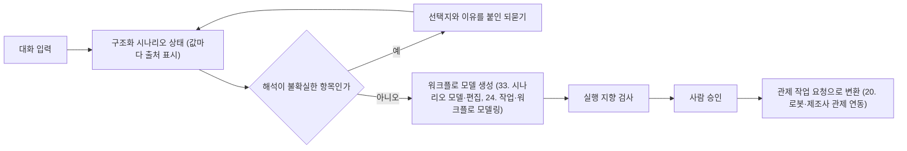

[홈](../../index.md) › [주제](../index.md) › 9. 채팅으로 시나리오 구성 — 대표 접근법과 기술

# 9. 채팅으로 시나리오 구성 — 대표 접근법과 기술

<!-- auto:page-status:start -->
<!-- auto:page-status:end -->

## 1. 세 줄 요약

- 되묻기 시점을 불확실도로 정하고 질문 내용을 정보 이득으로 고르는 두 계열의 연구가 이 영역의 '모자란 조건은 선택지와 이유를 붙인 질문으로 채운다'는 기능의 근거가 된다. [추정][^ref-351][^ref-839]
- 이 페이지는 [9. 채팅으로 시나리오 구성](../../categories/chat-based-configuration-and-operation/chat-scenario-composition.md) 페이지의 "대표 접근법과 기술" 절이 분량 기준을 넘어 옮겨 온 것이다. 원 페이지의 검증을 거친 내용이며 새 주장은 없다.

## 2. 배경

[9. 채팅으로 시나리오 구성](../../categories/chat-based-configuration-and-operation/chat-scenario-composition.md) 페이지를 쓰는 과정에서 "대표 접근법과 기술" 절의 분량이 세부영역 페이지 기준(4,000자)을 넘어, 내용을 줄이지 않고 이 주제 페이지로 분리했다.

## 3. 본문

### 불확실한 항목만 되묻기

되묻기 시점을 불확실도로 정하고 질문 내용을 정보 이득으로 고르는 두 계열의 연구가 이 영역의 '모자란 조건은 선택지와 이유를 붙인 질문으로 채운다'는 기능의 근거가 된다. [추정][^ref-351][^ref-839] KnowNo(Ren 외, CoRL 2023)는 언어 모델 계획기가 후보 행동 4개와 '해당 없음'을 만들고 다음 토큰 확률로 얻은 신뢰도를 등각 예측(conformal prediction)으로 보정해 예측 집합을 구성하며, 집합이 하나로 좁혀지면 자율 실행하고 여러 개가 남으면 사람에게 되묻는 틀로, 공간·수량·사람 선호·대명사 지시의 여러 모호성 유형에서 목표 성공률을 보장하면서 사람의 도움 요청을 단계별 14%, 시행별 8% 줄였다고 보고했다. [사실][^ref-351] ConformalNL2LTL(Sundarsingh 외, 2025)은 자연어 지시를 선형 시간 논리 공식으로 옮길 때 번역을 질의응답 단계로 나누고 각 단계의 불확실도를 등각 예측으로 재어, 사용자가 정한 신뢰 문턱에 못 미치면 보조 모델에, 그래도 부족하면 사용자에게 되물어 사용자 지정 번역 성공률을 보장한다. [사실][^ref-845] Deng 외(2026)는 되묻기 질문의 가치를 정보 이득 보상으로 재어 명확화 모델을 학습해, 명확화를 더한 τ-Bench 환경에서 다섯 종의 에이전트 모델 모두에서 되묻기 없는 기준선보다 성공률을 평균 3.7% 높이면서 상호작용 단계는 평균 0.3회만 늘렸다고 보고했다. [사실][^ref-839]

두 계열을 함께 보면, 이 영역의 되묻기는 모든 항목을 순서대로 묻는 서식이 아니라 시나리오 항목마다 불확실도를 재어 실행 결과가 갈리는 항목만 후보 선택지와 함께 되묻는 방식으로 구현해야 질문 횟수를 줄일 수 있을 것으로 보인다. [추정][^ref-351][^ref-839]

### 합의 내용을 대화 밖의 구조화 상태로 보존

Tao·Tao·Wang(2026)의 IDSS 는 대화 이력과 별도로 도구가 확인한 사실과 작업 상태 판단을 분리한 명시적 상황 상태(사용자 의도·필요 변수·제약·실행 상태)를 학습 없이 유지하는 틀로, 세 개의 상호작용 벤치마크와 여덟 개 언어 모델에서 작업 완료·선호 도출·상호작용 효율이 개선됐고 특히 다중 개체 조정·바뀌는 제약·제약 인식 재계획 과제에서 이득이 컸다고 보고했다. [사실][^ref-842] 다중 턴에서 모델이 초기 가정에 묶이고 바뀌는 의도를 따라가지 못하며 명시적 상황 상태가 이를 완화한다는 결과를 함께 보면, 이 영역의 '합의 내용 보존·변경 표시·사용자 값 우선'은 언어 모델의 대화 문맥에 맡길 것이 아니라 시나리오를 대화 밖의 구조화 상태로 두고 값마다 출처(사용자 확정·모델 추정·미정)를 기록해 턴마다 바뀐 부분만 갱신·표시하는 방식으로 구현해야 할 것으로 보인다. [추정][^ref-840][^ref-841][^ref-842] 값의 출처 구분 자체를 실험한 연구는 이번 조사에서 확인하지 못했다.

### 텍스트에서 워크플로 모델을 만들고 실행 지향 검사로 검증

Kourani·Berti·Schuster·van der Aalst(2024)는 텍스트 설명에서 프로세스 모델을 자동 생성하고 반복 정제하는 언어 모델 기반 틀을 제안해 프롬프트 전략, 안전한 모델 생성 규약, 오류 처리 기제를 두고, 생성 모델의 품질 보장과 BPMN·페트리 넷 표준 표기 내보내기를 지원하는 시스템으로 구현했으며 예비 결과만 보고했다. [사실][^ref-843] Matei 외(2026)는 다국어 BPMN 파일을 번역·SpiffWorkflow 실행 지향 적합성 검사·언어 모델 반복 수정으로 정답 말뭉치를 만들고 그 설명문에서 실행 가능한 BPMN 2.0 XML 을 재구성하는 다단계 파이프라인으로, 공개 BPMN 750개 중 검증된 정답 387개를 얻고 평균 재구성 유사도 0.75 이상과 이름만 다른 거의 완전한 재구성 약 50건을 보고했다. [사실][^ref-844] 서로 다른 두 연구 그룹이 자연어에서 BPMN 프로세스 모델을 언어 모델로 생성하되 실행 지향 검사나 오류 처리로 생성 결과의 유효성을 확보하는 방법을 각각 보고해, 텍스트에서 실행 가능한 워크플로 모델을 만드는 접근이 한 곳 이상에서 확인된다. [사실][^ref-843][^ref-844]

할 일·순서·반복·실패 처리 조건을 가진 시나리오는 프로세스 모델과 같은 구조이므로, '생성 후 실행 지향 검사로 유효성 확보' 흐름은 이 영역이 대화 결과를 [24. 작업·워크플로 모델링](../../categories/planning-and-optimization/task-and-workflow-modeling.md)의 워크플로 모델로 내고 검증하는 방식의 선례가 될 것으로 보인다. [추정][^ref-843][^ref-844] 두 연구는 업무 프로세스 대상이며 로봇 작업 시나리오에 적용한 결과나 기한·실패 처리 조건을 BPMN 요소로 표현한 사례는 확인하지 못했다.

### 명세 패턴으로 질문 목록 구성

Menghi 외(2019)의 미션 명세 패턴 22개는 사용 의도·알려진 용례·패턴 간 관계·시간 논리 템플릿과 함께 정리됐고, 도구는 실제 임무 요구 441건과 명세 1,251건, 산업 파트너 시나리오 5건, 시뮬레이터와 실제 로봇 2대로 검증됐다. [사실][^ref-846] 반복되는 임무 요구를 패턴 목록으로 정리한 이 연구와 자연어를 시간 논리로 옮길 때 불확실한 단계만 되묻는 연구를 함께 보면, 핵심 질문인 '무엇을 되물어야 하는가'는 시나리오 항목(순서·반복·기한·회피·실패 처리)마다 대응하는 명세 패턴의 빈 자리를 채우는 질문 목록으로 구성하고 그중 해석이 불확실한 자리만 실제로 묻는 방식으로 답할 수 있을 것으로 보인다. [추정][^ref-846][^ref-845] 패턴 22개의 개별 이름·분류와 패턴을 되묻기 질문 목록으로 쓴 연구는 확인하지 못했다.

### 로봇 수준 표현·형식 명세로의 번역(연계 대상)

BTGenBot(Izzo·Bardaro·Matteucci, 2024)은 최대 70억 매개변수의 경량 언어 모델을 기존 행동 트리에서 GPT-3.5 로 만든 데이터셋으로 미세조정해 자연어 작업 설명에서 로봇 행동 트리를 생성하며, llama2·llama-chat·code-llama 변형을 아홉 과제에서 구문 분석·검증 시스템·시뮬레이션·실제 로봇으로 평가했다. [사실][^ref-061] 자연어를 STL 로 옮기는 인터페이스의 구문 유효성 문제는 3절의 학위논문이 문제로 제기했다(원문 미열람). [추정][^ref-548] 이들은 로봇 수준 실행 표현이나 형식 계획기를 대상으로 하며 여러 로봇·설비를 아우르는 시나리오 구성 층을 다루지 않으므로, 이 영역에서는 9절의 연계 대상으로 둔다. [추정][^ref-061][^ref-845][^ref-548]

### 접근법을 잇는 흐름

다음 도식은 위 접근법을 이 영역의 흐름으로 이은 추정이며 실제 구현 사례를 옮긴 것이 아니다. [추정][^ref-351][^ref-842][^ref-844][^ref-110]

## 4. 현장 시나리오

현장 시나리오는 원 페이지의 [5. 적용 사례 (현장 유형 명시)](../../categories/chat-based-configuration-and-operation/chat-scenario-composition.md) 절에 있다.

## 5. ROP 관점의 시사점

ROP가 직접 맡는 것과 외부와 연계하는 것은 원 페이지의 [9. ROP가 직접 맡는 것과 외부와 연계하는 것 (책임 경계 기준)](../../categories/chat-based-configuration-and-operation/chat-scenario-composition.md) 절에 있다.

## 6. 연결되는 연구영역

- 주 연구영역: [9. 채팅으로 시나리오 구성](../../categories/chat-based-configuration-and-operation/chat-scenario-composition.md)
- 관련 영역: [10. 채팅으로 로봇 구성](../../categories/chat-based-configuration-and-operation/chat-robot-configuration.md), [12. 채팅으로 업무 지시·오케스트레이션](../../categories/chat-based-configuration-and-operation/chat-task-instruction-and-orchestration.md), [13. 대화형 기능의 신뢰·기반](../../categories/chat-based-configuration-and-operation/conversational-trust-and-foundations.md), [20. 로봇·제조사 관제 연동](../../categories/integration/robot-and-vendor-fleet-manager-integration.md), [24. 작업·워크플로 모델링](../../categories/planning-and-optimization/task-and-workflow-modeling.md), [26. 작업 순서·스케줄링](../../categories/planning-and-optimization/task-sequencing-and-scheduling.md), [32. 예외 복구·재계획·업무 연속성](../../categories/execution-collaboration-and-recovery/exception-recovery-replanning-and-business-continuity.md), [33. 시나리오 모델·편집](../../categories/design-and-simulation/scenario-model-and-editing.md), [36. 가상 시운전·실제 상황 재현](../../categories/design-and-simulation/virtual-commissioning-and-real-situation-replay.md), [44. 로봇 기반 모델·언어 모델 계획](../../categories/ai-and-learning/robot-foundation-models-and-llm-planning.md), [47. AI·학습·적응과 모델 운영](../../categories/ai-and-learning/ai-learning-adaptation-and-model-operations.md), [63. 병원·의료](../../categories/site-type-applications/hospital-and-healthcare.md)

## 7. 열린 질문

열린 질문은 원 페이지의 [11. 열린 질문](../../categories/chat-based-configuration-and-operation/chat-scenario-composition.md) 절과 [열린 질문](../../open-questions.md) 페이지에 모은다.

## 8. 출처

[^ref-351]: Ren, A. Z., Dixit, A., Bodrova, A., Singh, S., Tu, S., Brown, N., Xu, P., Takayama, L., Xia, F., Varley, J., Xu, Z., Sadigh, D., Zeng, A., & Majumdar, A. (CoRL 2023), Robots That Ask For Help: Uncertainty Alignment for Large Language Model Planners, 2023-09-04, https://arxiv.org/abs/2307.01928, 접근일 2026-09-29
[^ref-839]: Deng, M., Li, Z., Li, X., Zhu, T., Zhao, Y., Guo, Z., & Wang, W., Uncertainty-Aware Clarification in LLM Agents with Information Gain, 2026-06-02, https://arxiv.org/abs/2606.03135, 접근일 2026-09-29
[^ref-840]: Laban, P., Hayashi, H., Zhou, Y., & Neville, J., LLMs Get Lost In Multi-Turn Conversation, 2025-05-09, https://arxiv.org/abs/2505.06120, 접근일 2026-09-29
[^ref-841]: Tack, J., Laban, P., & Neville, J., LLMs Get Lost in Evolving User Intent, 2026-07-22, https://arxiv.org/abs/2607.20734, 접근일 2026-09-29
[^ref-842]: Tao, M., Tao, Y., & Wang, P., Intent-Driven Situation Tracking for User-Centric Multi-Turn Agents, 2026-08-16, https://arxiv.org/abs/2608.15755, 접근일 2026-09-29
[^ref-843]: Kourani, H., Berti, A., Schuster, D., & van der Aalst, W. M. P., Process Modeling With Large Language Models, 2024-03-12, https://arxiv.org/abs/2403.07541, 접근일 2026-09-29
[^ref-844]: Matei, I., Zhenirovskyy, M., Menaka Sekar, P. K., & Wong, H. Y., Automated BPMN Model Generation from Textual Process Descriptions: A Multi-Stage LLM-Driven Approach, 2026-04-13, https://arxiv.org/abs/2604.12105, 접근일 2026-09-29
[^ref-061]: Izzo, R. A., Bardaro, G., & Matteucci, M., BTGenBot: Behavior Tree Generation for Robotic Tasks with Lightweight LLMs, 2024-03-19, https://arxiv.org/abs/2403.12761, 접근일 2026-09-29
[^ref-845]: Sundarsingh, D. S., Wang, J., Deshmukh, J. V., & Kantaros, Y., ConformalNL2LTL: Translating Natural Language Instructions into Temporal Logic Formulas with Conformal Correctness Guarantees, 2026-02-20, https://arxiv.org/abs/2504.21022, 접근일 2026-09-29
[^ref-846]: Menghi, C., Tsigkanos, C., Pelliccione, P., Ghezzi, C., & Berger, T., Specification Patterns for Robotic Missions, 2019-01-07, https://arxiv.org/abs/1901.02077, 접근일 2026-09-29
[^ref-110]: Open Robotics, Supporting a new Task in RMF (task_new) - Programming Multiple Robots with ROS 2, 미확인, https://osrf.github.io/ros2multirobotbook/task_new.html, 접근일 2026-09-29
[^ref-548]: University West (Högskolan Väst, DiVA) 학위논문 저자(미확인), An LLM- Interface for Robot Mission Specification in Logistics, 미확인, https://hv.diva-portal.org/smash/get/diva2:2080486/FULLTEXT01.pdf, 접근일 2026-09-29 (원문 미열람)

## 9. 검증 노트

원 페이지와 함께 실행 2026-09-29-04 의 1차·2차 검증을 거쳤다. 분리는 코드가 했고 내용은 바꾸지 않았다.

## 10. 이력

| 날짜 | 실행 id | 변경 |
|---|---|---|
| 2026-09-29 | 2026-09-29-04 | 9. 채팅으로 시나리오 구성 의 "대표 접근법과 기술" 절에서 분리 |
