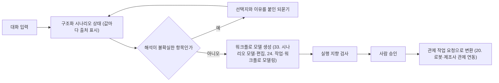

(너의 규칙은 시스템 프롬프트의 agents/shared-rules.md 와 agents/verifier.md 이다. 아래는 이번 실행의 컨텍스트와 입력이다.)

## 실행 컨텍스트

- run_id: 2026-09-29-04
- date: 2026-09-29
- run_type: area_deep_dive (영역 심화)
- 대상: 9. 채팅으로 시나리오 구성 (C. 채팅 기반 구성·운영)
- 예산:
    - max_search_queries: 30
    - max_sources_per_run: 15
    - new_topic_pages: 1
    - page_updates: 2
    - max_retries: 2
- 환경 알림: web_fetch_available: true · fetch_mode: full
- 언어: ko
- verification_stage: second
- verifier_budget:
    - max_search_queries: 30
    - max_sources_per_run: 15
    - new_topic_pages: 1
    - page_updates: 2
    - max_retries: 2

## 입력

### runs/2026-09-29-04/target.json

```json
{
  "run_id": "2026-09-29-04",
  "date": "2026-09-29",
  "weekday": "Tue",
  "run_number": 96,
  "run_type": "area_deep_dive",
  "forced": true,
  "target": {
    "area_no": 9,
    "area_name": "9. 채팅으로 시나리오 구성",
    "category": "C. 채팅 기반 구성·운영",
    "category_letter": "C"
  },
  "topic": null,
  "track": null,
  "corrections": [],
  "budget": {
    "max_search_queries": 30,
    "max_sources_per_run": 15,
    "new_topic_pages": 1,
    "page_updates": 2,
    "max_retries": 2
  },
  "priority_reason": null,
  "priority_questions": [],
  "excluded_areas": [],
  "lifted_areas": [],
  "deferred": {
    "monthly_recheck": false,
    "weekly_review": false
  },
  "selection_rationale": "CLI 지정 run_type=area_deep_dive, area=9"
}
```

### runs/2026-09-29-04/research.json

```json
{
  "run_id": "2026-09-29-04",
  "date": "2026-09-29",
  "run_type": "area_deep_dive",
  "target": {
    "area_no": 9,
    "area_name": "9. 채팅으로 시나리오 구성",
    "category": "C. 채팅 기반 구성·운영"
  },
  "gaps": [
    "섹션 3. 왜 중요한가 비어 있음",
    "섹션 4. 핵심 개념과 용어 비어 있음 — 불확실도 정렬·과소명세·미션 명세 패턴·상황 상태 추적 용어 없음(명확화 질문·슬롯 채우기·명시적 확인·행동 트리·BPMN·LTL 은 용어집에 이미 있음)",
    "섹션 5. 적용 사례 (현장 유형 명시) 비어 있음",
    "섹션 6. 대표 접근법과 기술 비어 있음",
    "섹션 7. 관련 표준·프레임워크·오픈소스 비어 있음 — Open-RMF 작업 구성(compose)·작업 요청 스키마, BPMN, 미션 명세 패턴 없음",
    "섹션 8. 대표 연구와 자료 비어 있음",
    "섹션 9. ROP가 직접 맡는 것과 외부와 연계하는 것 (책임 경계 기준) 비어 있음",
    "섹션 10. 다른 연구영역과의 연결 (번호와 이름을 함께 표기) 비어 있음 — 원문 주석대로 33. 시나리오 모델·편집·36. 가상 시운전·실제 상황 재현과 짝 연결 필요, 24. 작업·워크플로 모델링·13. 대화형 기능의 신뢰·기반 연결 필요",
    "섹션 11. 열린 질문 비어 있음 — 이 영역에 걸린 기존 열린 질문·정정 요청 없음",
    "프런트매터 related_areas·sources 비어 있음"
  ],
  "research_questions": [
    "할 일·사람·순서·실패 처리를 대화로 빠짐없이 정하려면 무엇을 되물어야 하는가? [분류원문]",
    "언어 모델이 과소명세된 지시에서 빠진 조건을 알아채고 되묻는 시점과 질문 내용을 어떻게 정하며, 되묻기의 효과는 어떻게 측정되는가? (섹션 3·4·6 겨냥)",
    "여러 턴에 걸친 대화에서 이미 합의한 단계·값을 보존하고 바뀐 부분만 반영하며 사용자가 정한 값을 모델 추정보다 우선하려면 무엇이 필요한가? (섹션 3·6·11 겨냥)",
    "자연어 설명에서 순서·분기·반복을 가진 워크플로(BPMN·행동 트리·시간 논리)를 만들고 실행 가능성을 검증하는 연구는 무엇이 있고 정확도는 어떻게 보고되는가? (섹션 4·6·8 겨냥)",
    "시나리오가 담아야 할 항목(할 일·물품·사람·순서·반복·기한·실패 처리)을 관제·플랫폼의 작업 요청·작업 구성 형식은 어떤 필드로 받는가? (섹션 4·7 겨냥)",
    "병원·물류창고·제조 공장 등 현장 유형별로 대화로 작업 시나리오를 정한 사례와 국내 자료는 무엇인가? (섹션 5·8 겨냥)",
    "채팅 시나리오 구성에서 ROP가 직접 맡을 것(대화→구조화 시나리오·되묻기·검증·승인)과 로봇 수준 실행·형식 계획기에 맡길 것의 경계는 어디인가? (섹션 9·10 겨냥)"
  ],
  "findings": [
    {
      "id": "f1",
      "claim": "KnowNo(Ren 외, CoRL 2023)는 언어 모델 계획기의 불확실도를 등각 예측(conformal prediction)으로 측정해 후보 행동의 예측 집합이 하나로 좁혀지면 자율 실행하고 여러 개가 남으면 사람에게 되묻는 틀로, 공간·수량·속성·대명사 지시·선호·안전의 여러 모호성 유형에서 목표 성공률을 보장하면서 사람의 도움 요청을 줄였다고 보고했다.",
      "tag": "사실",
      "source_ids": [
        "ref-351"
      ],
      "cross_checked": false,
      "confidence": "medium",
      "evidence_excerpt": "\"KnowNo reduces the human help rate by 14% step-wise and 8% trial-wise, while also reducing the average prediction set size.\" 언어 모델이 후보 행동 4개와 '해당 없음'을 만들고 다음 토큰 확률로 신뢰도를 얻어 등각 예측으로 예측 집합을 구성한다.",
      "as_of": "2023-09-04",
      "site_type": null,
      "flow_item": null
    },
    {
      "id": "f2",
      "claim": "Deng 외(2026)는 되묻기 질문의 가치를 정답 목표에 대한 베이즈 믿음 갱신량으로 재는 정보 이득 보상(Information Gain Reward)으로 명확화 모델을 학습해, 명확화를 더한 τ-Bench 환경에서 다섯 종의 에이전트 모델 모두에서 되묻기 없는 기준선보다 성공률을 평균 3.7% 높이면서 상호작용 단계는 평균 0.3회만 늘렸다고 보고했다.",
      "tag": "사실",
      "source_ids": [
        "ref-840"
      ],
      "cross_checked": false,
      "confidence": "medium",
      "evidence_excerpt": "초록: 과소명세된 사용자 지시에서 의도 불확실성이 잘못된 도구 호출로 이어진다며, 명확화가 목표에 대한 불확실성을 실제로 줄이도록 정보 이득으로 학습한다. 결과 \"improves the success rate by 3.7% over the no-clarification baseline, while adding only 0.3 total interaction steps on average\".",
      "as_of": "2026-06-02",
      "site_type": null,
      "flow_item": null
    },
    {
      "id": "f3",
      "claim": "불확실도로 되묻기 시점을 정하는 연구(f1)와 질문의 정보 이득으로 질문 내용을 고르는 연구(f2)를 함께 보면, 이 영역의 '모자란 조건은 선택지와 이유를 붙인 질문으로 채운다'는 기능은 모든 항목을 순서대로 묻는 서식이 아니라 시나리오 항목마다 불확실도를 재어 실행 결과가 갈리는 항목만 후보 선택지와 함께 되묻는 방식으로 구현해야 질문 횟수를 줄일 수 있을 것으로 보인다.",
      "tag": "추정",
      "source_ids": [
        "ref-351",
        "ref-840"
      ],
      "cross_checked": false,
      "confidence": "low",
      "evidence_excerpt": "f1 은 예측 집합 크기로, f2 는 정보 이득으로 되묻기를 제한한다. 두 연구 모두 되묻기 횟수 최소화를 목표에 포함한다.",
      "as_of": "2026-09-29",
      "site_type": null,
      "flow_item": "시작 조건"
    },
    {
      "id": "f4",
      "claim": "Laban 외(2025)는 20만 건 이상의 시뮬레이션 대화로 상위 공개·비공개 언어 모델을 비교해 여섯 가지 생성 과제에서 다중 턴 성능이 단일 턴보다 평균 39% 낮았고, 그 원인이 능력 저하보다 신뢰성 저하이며 모델이 초기 턴에서 가정을 세우고 성급히 최종 답을 낸 뒤 그것에 과도하게 의존하기 때문이라고 보고했다.",
      "tag": "사실",
      "source_ids": [
        "ref-841"
      ],
      "cross_checked": false,
      "confidence": "medium",
      "evidence_excerpt": "\"when LLMs take a wrong turn in a conversation, they get lost and do not recover\". 평균 39% 하락, 200,000+ 대화 분석, 소폭의 능력 손실과 큰 폭의 비신뢰성 증가로 분해.",
      "as_of": "2025-05-09",
      "site_type": null,
      "flow_item": null
    },
    {
      "id": "f5",
      "claim": "Tack·Laban·Neville(2026)은 사용자가 의도를 처음에 다 밝히지 않고 점진적으로 드러내고 수정하며 중간에 방향을 바꾸는 다중 턴 대화로 기존 단일 턴 벤치마크를 변환하는 틀을 제안했고, 정적 설정의 높은 성능이 의도가 바뀌는 설정으로 옮겨지지 않아 여러 모델 계열에서 큰 폭의 성능 하락이 나타난다고 보고했다.",
      "tag": "사실",
      "source_ids": [
        "ref-842"
      ],
      "cross_checked": false,
      "confidence": "medium",
      "evidence_excerpt": "초록: 사용자 의도가 \"incrementally revealed, revised, and at times redirected mid-conversation\" 되는 설정에서 \"substantial drops across model families\". 원 과제의 평가 규약을 유지해 새 주석 없이 기존 벤치마크를 재사용한다.",
      "as_of": "2026-07-22",
      "site_type": null,
      "flow_item": null
    },
    {
      "id": "f6",
      "claim": "Tao·Tao·Wang(2026)의 IDSS(Intent-Driven Situation States)는 대화 이력과 별도로 도구가 확인한 사실과 작업 상태 판단을 분리한 명시적 상황 상태(사용자 의도·필요 변수·제약·실행 상태)를 학습 없이 유지하는 틀로, 세 개의 상호작용 벤치마크와 여덟 개 언어 모델에서 작업 완료·선호 도출·상호작용 효율이 개선됐고 특히 다중 개체 조정·바뀌는 제약·제약 인식 재계획 과제에서 이득이 컸다고 보고했다.",
      "tag": "사실",
      "source_ids": [
        "ref-843"
      ],
      "cross_checked": false,
      "confidence": "medium",
      "evidence_excerpt": "초록: 기존 문맥 관리는 \"rarely maintain an explicit situation state that separates grounded facts from task-state judgments\". 상태 계층은 사용자 의도, 필요 변수, 제약, 실행 상태를 추적한다.",
      "as_of": "2026-08-16",
      "site_type": null,
      "flow_item": null
    },
    {
      "id": "f7",
      "claim": "다중 턴에서 모델이 초기 가정에 묶이고(f4) 바뀌는 의도를 따라가지 못하며(f5) 명시적 상황 상태가 이를 완화한다는 연구(f6)를 함께 보면, 이 영역의 '합의 내용 보존·변경 표시·사용자 값 우선'은 언어 모델의 대화 문맥에 맡길 것이 아니라 시나리오를 대화 밖의 구조화 상태로 두고 값마다 출처(사용자 확정·모델 추정·미정)를 기록해 턴마다 바뀐 부분만 갱신·표시하는 방식으로 구현해야 할 것으로 보인다.",
      "tag": "추정",
      "source_ids": [
        "ref-841",
        "ref-842",
        "ref-843"
      ],
      "cross_checked": false,
      "confidence": "low",
      "evidence_excerpt": "f4·f5 는 대화 문맥만으로는 합의 내용이 흔들림을, f6 은 사실과 판단을 분리한 명시적 상태가 이를 개선함을 보인다. 값의 출처 구분 자체를 실험한 연구는 이번에 확인하지 못했다.",
      "as_of": "2026-09-29",
      "site_type": null,
      "flow_item": "완료·인계"
    },
    {
      "id": "f8",
      "claim": "Kourani·Berti·Schuster·van der Aalst(2024)는 텍스트 설명에서 프로세스 모델을 자동 생성하고 반복 정제하는 언어 모델 기반 틀을 제안해 프롬프트 전략, 안전한 모델 생성 규약, 오류 처리 기제를 두고, 생성 모델의 품질 보장과 BPMN·페트리 넷 표준 표기 내보내기를 지원하는 시스템으로 구현했으며 예비 결과만 보고했다.",
      "tag": "사실",
      "source_ids": [
        "ref-844"
      ],
      "cross_checked": false,
      "confidence": "medium",
      "evidence_excerpt": "초록: \"automated generation and iterative refinement of process models starting from textual descriptions\", 비전문가에게 직관적 진입점을 제공. 정량 지표는 초록에 없음.",
      "as_of": "2024-03-12",
      "site_type": null,
      "flow_item": null
    },
    {
      "id": "f9",
      "claim": "Matei 외(2026)는 다국어 BPMN 파일을 번역·SpiffWorkflow 실행 지향 적합성 검사·언어 모델 반복 수정으로 정답 말뭉치를 만들고 그 설명문에서 실행 가능한 BPMN 2.0 XML 을 재구성하는 다단계 파이프라인으로, 공개 BPMN 750개 중 검증된 정답 387개를 얻고 평균 재구성 유사도 0.75 이상과 이름만 다른 거의 완전한 재구성 약 50건을 보고했다.",
      "tag": "사실",
      "source_ids": [
        "ref-845"
      ],
      "cross_checked": false,
      "confidence": "medium",
      "evidence_excerpt": "초록: 구조 지표·유형 분포 정렬·임베딩 의미 지표를 합친 유사도 틀. \"achieved average reconstruction similarity above 0.75, including approximately 50 near-perfect reconstructions\".",
      "as_of": "2026-04-13",
      "site_type": null,
      "flow_item": null
    },
    {
      "id": "f10",
      "claim": "서로 다른 두 연구 그룹(Kourani 외, Matei 외)이 자연어 텍스트에서 BPMN 프로세스 모델을 언어 모델로 생성하되 실행 지향 검사나 오류 처리로 생성 결과의 유효성을 확보하는 방법을 각각 보고해, 텍스트에서 실행 가능한 워크플로 모델을 만드는 접근이 한 곳 이상에서 확인된다.",
      "tag": "사실",
      "source_ids": [
        "ref-844",
        "ref-845"
      ],
      "cross_checked": true,
      "confidence": "medium",
      "evidence_excerpt": "Kourani 외는 안전한 생성 규약·오류 처리·품질 보장을, Matei 외는 SpiffWorkflow 실행 지향 적합성 검사와 반복 수정을 둔다. 두 연구는 기관과 저자가 다르다.",
      "as_of": "2026-04-13",
      "site_type": null,
      "flow_item": null
    },
    {
      "id": "f11",
      "claim": "할 일·순서·반복·실패 처리 조건을 가진 시나리오는 프로세스 모델과 같은 구조이므로, 텍스트→BPMN 생성 연구(f8·f9·f10)가 쓰는 '생성 후 실행 지향 검사로 유효성 확보' 흐름은 9. 채팅으로 시나리오 구성이 대화 결과를 24. 작업·워크플로 모델링의 워크플로 모델로 내고 검증하는 방식의 선례가 될 것으로 보인다.",
      "tag": "추정",
      "source_ids": [
        "ref-844",
        "ref-845"
      ],
      "cross_checked": false,
      "confidence": "low",
      "evidence_excerpt": "두 연구는 업무 프로세스 대상이며 로봇 작업 시나리오에 적용한 결과는 없다. 시나리오의 기한·실패 처리 조건을 BPMN 요소로 표현한 사례도 확인하지 못했다.",
      "as_of": "2026-09-29",
      "site_type": null,
      "flow_item": null
    },
    {
      "id": "f12",
      "claim": "BTGenBot(Izzo·Bardaro·Matteucci, 2024)은 최대 70억 매개변수의 경량 언어 모델을 기존 행동 트리에서 GPT-3.5 로 만든 데이터셋으로 미세조정해 자연어 작업 설명에서 로봇 행동 트리를 생성하며, llama2·llama-chat·code-llama 변형을 아홉 과제에서 구문 분석·검증 시스템·시뮬레이션·실제 로봇으로 평가했다.",
      "tag": "사실",
      "source_ids": [
        "ref-061"
      ],
      "cross_checked": false,
      "confidence": "medium",
      "evidence_excerpt": "초록: \"generating behavior trees for robots using lightweight large language models (LLMs) with a maximum of 7 billion parameters\". 실패 처리(fallback) 노드 생성 방식은 초록에서 확인하지 못함.",
      "as_of": "2024-03-19",
      "site_type": null,
      "flow_item": null
    },
    {
      "id": "f13",
      "claim": "ConformalNL2LTL(Sundarsingh 외, 2025)은 자연어 지시를 선형 시간 논리 공식으로 옮길 때 번역을 질의응답 단계로 나누고 각 단계의 불확실도를 등각 예측으로 재어, 사용자가 정한 신뢰 문턱에 못 미치면 보조 모델에, 그래도 부족하면 사용자에게 되물어 사용자 지정 번역 성공률을 보장하는 방법이다.",
      "tag": "사실",
      "source_ids": [
        "ref-847"
      ],
      "cross_checked": false,
      "confidence": "medium",
      "evidence_excerpt": "초록: 기존 자연어→LTL 번역은 \"lack correctness guarantees\"; 제안 방법은 \"achieves user-defined translation success rates on unseen NL commands\". 주 모델→보조 모델→사용자의 3단 도움 요청 구조.",
      "as_of": "2026-02-20",
      "site_type": null,
      "flow_item": null
    },
    {
      "id": "f14",
      "claim": "서로 다른 세 연구 그룹(KnowNo, ConformalNL2LTL, Deng 외)이 언어 모델이 해석에 확신이 없을 때만 사람에게 되묻도록 불확실도나 정보 이득을 기준으로 되묻기를 제한하는 설계를 각각 보고해, '확신 없는 항목만 되묻기' 접근이 한 곳 이상에서 확인된다.",
      "tag": "사실",
      "source_ids": [
        "ref-351",
        "ref-847",
        "ref-840"
      ],
      "cross_checked": true,
      "confidence": "medium",
      "evidence_excerpt": "KnowNo 와 ConformalNL2LTL 은 등각 예측, Deng 외는 정보 이득 보상을 쓴다. 세 연구는 저자·기관이 다르며 서로를 그대로 옮긴 것이 아니다.",
      "as_of": "2026-06-02",
      "site_type": null,
      "flow_item": "시작 조건"
    },
    {
      "id": "f15",
      "claim": "Menghi 외(2019)는 로봇 문헌의 현실적 임무 요구 245건에서 이동 로봇 미션 명세 패턴 22개를 뽑아 사용 의도·알려진 용례·패턴 간 관계·시간 논리 템플릿과 함께 목록으로 정리하고, 패턴을 인스턴스화·조합·LTL/CTL 로 컴파일하는 도구를 만들어 실제 임무 요구 441건과 명세 1,251건, 산업 파트너 시나리오 5건, 시뮬레이터와 실제 로봇 2대로 검증했다.",
      "tag": "사실",
      "source_ids": [
        "ref-848"
      ],
      "cross_checked": false,
      "confidence": "medium",
      "evidence_excerpt": "초록: \"a catalog of 22 mission specification patterns for mobile robots, together with tooling for instantiating, composing, and compiling the patterns\". 245건에서 도출, 441건 요구·1251건 명세로 평가.",
      "as_of": "2019-01-07",
      "site_type": null,
      "flow_item": null
    },
    {
      "id": "f16",
      "claim": "반복되는 임무 요구를 패턴 목록으로 정리한 연구(f15)와 자연어를 시간 논리로 옮길 때 불확실한 단계만 되묻는 연구(f13)를 함께 보면, 이 영역의 핵심 질문인 '무엇을 되물어야 하는가'는 시나리오 항목(순서·반복·기한·회피·실패 처리)마다 대응하는 명세 패턴의 빈 자리를 채우는 질문 목록으로 구성하고 그중 해석이 불확실한 자리만 실제로 묻는 방식으로 답할 수 있을 것으로 보인다.",
      "tag": "추정",
      "source_ids": [
        "ref-848",
        "ref-847"
      ],
      "cross_checked": false,
      "confidence": "low",
      "evidence_excerpt": "패턴 22개의 개별 이름·분류는 초록에서 확인하지 못했고, 패턴을 되묻기 질문 목록으로 쓴 연구도 확인하지 못했다.",
      "as_of": "2026-09-29",
      "site_type": null,
      "flow_item": "시작 조건"
    },
    {
      "id": "f17",
      "claim": "Open-RMF 문서는 작업(task)을 단계(phase)를 만들어 내는 객체로 정의하고 공개 API 단계로 GoToPlace·PickUp·DropOff·PerformAction 을, 내부 자동 추가 단계로 RequestLift 를 두며, 'compose' 범주의 작업은 활동(activity)의 순서열로 단계를 엮고, 작업 요청은 특정 로봇에 직접 배정하는 robot_task_request 와 최적 플릿에 맡기는 dispatch_task_request 로 보내며 Clean·Delivery·Patrol·Compose 범주의 JSON 스키마를 따른다.",
      "tag": "사실",
      "source_ids": [
        "ref-110"
      ],
      "cross_checked": false,
      "confidence": "medium",
      "evidence_excerpt": "\"a task is an object that generates phases\" 이며 작업은 단계의 순서·조합으로 이루어진다. RequestLift 는 RMF 가 필요할 때 자동으로 넣는다. (발행일 미확인, 확인일 기준)",
      "as_of": "2026-09-29",
      "site_type": null,
      "flow_item": "작업 대상"
    },
    {
      "id": "f18",
      "claim": "Open-RMF 작업 요청 스키마(rmf_api_msgs task_request.json)는 필수 필드로 범주(category)와 플릿이 지원하는 스키마를 따르는 설명(description)을, 선택 필드로 가장 이른 시작 가능 시각(unix_millis_earliest_start_time)·요청 시각·플릿 우선순위 스키마를 따르는 priority·용도 라벨(labels)·요청자(requester)·수행 허용 플릿 이름(fleet_name)을 두며, 완료 기한이나 반복 주기 필드는 두지 않는다.",
      "tag": "사실",
      "source_ids": [
        "ref-125"
      ],
      "cross_checked": false,
      "confidence": "medium",
      "evidence_excerpt": "unix_millis_earliest_start_time: \"(Optional) The earliest time that this task may start\". 스키마가 요구하는 필드는 category·description 뿐이고 나머지는 선택이다. (발행일 미확인, 확인일 기준)",
      "as_of": "2026-09-29",
      "site_type": null,
      "flow_item": "제약"
    },
    {
      "id": "f19",
      "claim": "이 영역이 대화로 정하려는 값 가운데 할 일·순서(compose 활동 순서열)·물품 인계(PickUp·DropOff)·시작 조건(가장 이른 시작 시각)·우선순위·요청자·수행 플릿은 Open-RMF 작업 구성과 작업 요청에 이미 자리가 있으나, 완료 기한·반복·실패 처리 조건은 작업 요청 스키마에 자리가 없으므로 채팅 시나리오 구성의 결과물은 관제 작업 요청보다 넓은 시나리오 모델(33. 시나리오 모델·편집, 24. 작업·워크플로 모델링)에 담고 실행 시점에 작업 요청으로 변환해야 할 것으로 보인다.",
      "tag": "추정",
      "source_ids": [
        "ref-110",
        "ref-125"
      ],
      "cross_checked": false,
      "confidence": "low",
      "evidence_excerpt": "f17 의 단계·활동 구조와 f18 의 필드 목록에서 도출. 플릿별 description 스키마나 상위 스케줄러가 기한·반복을 다룰 가능성은 확인하지 못했다.",
      "as_of": "2026-09-29",
      "site_type": null,
      "flow_item": "완료·인계"
    },
    {
      "id": "f20",
      "claim": "University West(스웨덴) 학위논문 'An LLM-Interface for Robot Mission Specification in Logistics'는 물류 현장의 자율이동로봇 임무 계획에서 사람의 자연어와 계획기가 요구하는 신호 시간 논리(STL) 사이의 번역 인터페이스로 언어 모델을 쓰는 신뢰성을 조사해, 현재 언어 모델이 공식의 구문과 논리는 만들지만 구문상 유효한 STL 공식을 일관되게 내지 못하는 것이 핵심 병목이라고 밝혔다.",
      "tag": "사실",
      "source_ids": [
        "ref-548"
      ],
      "cross_checked": false,
      "confidence": "medium",
      "evidence_excerpt": "검색 결과 초록: 언어 모델이 \"fail to consistently generate syntactically valid STL formulas, which remains a critical bottleneck\". 저자·연도·실험 결과는 원문을 열지 못해 미확인. (발행일 미확인, 확인일 기준)",
      "as_of": "2026-09-29",
      "site_type": null,
      "flow_item": "제약",
      "source_unopened": true
    },
    {
      "id": "f21",
      "claim": "Autonomous Robots(Springer, 2026) 게재 연구는 병원 보조 로봇이 간호 인력의 자연어 지시를 AI 기반 작업 계획기와 키워드 검색으로 실행 가능한 작업 순서열로 바꾸고, 실행 중 추가 요청에 실시간으로 대응해 유전 알고리즘 기반 준최적 방식으로 작업을 다시 일정 잡으며, 실행 실패는 시각-언어 추론과 AI 제안으로 복구하는 시스템을 Temi 로봇과 맞춤 안드로이드 앱에 배치해 국립대만대학병원 간호 인력에게서 긍정적 피드백을 얻었다고 보고했다.",
      "tag": "사실",
      "source_ids": [
        "ref-852"
      ],
      "cross_checked": false,
      "confidence": "medium",
      "evidence_excerpt": "검색 결과 요약: 자연어 지시→실행 가능한 작업 순서열, 추가 사용자 요청에 실시간 적응, 유전 알고리즘 재스케줄링, 시각-언어 추론으로 실패 복구, Temi 로봇 배치, 간호 인력의 긍정적 피드백. 저자·정량 결과는 원문 미열람으로 미확인.",
      "as_of": "2026",
      "site_type": "병원",
      "flow_item": "예외·성과",
      "source_unopened": true
    },
    {
      "id": "f22",
      "claim": "손승아·강태민·하동수(한국과학기술원)는 정보과학회지 2024년 10월호에 '자연어 로봇 제어 기술 동향: 분류, 기술, 응용'을 실어 인지 수준에 따른 시스템 분류, 사용 기술, 자연어 로봇 작업의 범위를 정리했다.",
      "tag": "사실",
      "source_ids": [
        "ref-853"
      ],
      "cross_checked": false,
      "confidence": "medium",
      "evidence_excerpt": "DBpia 서지: 정보과학회지 42(10), 2024-10, 32–40쪽, 한국과학기술원. 목차(서론·인지 수준별 시스템 분류·사용 기술·자연어 로봇 작업 범위·결론)는 검색 결과에서 확인했고 본문은 열지 못했다.",
      "as_of": "2024-10",
      "site_type": null,
      "flow_item": null,
      "source_unopened": true
    },
    {
      "id": "f23",
      "claim": "병원 사례(f21)에서 실행 중 들어온 추가 요청이 재스케줄링으로 이어진 점과 다중 턴에서 합의가 흔들리는 문제(f4·f5)를 함께 보면, 채팅 시나리오 구성은 실행 전 합의된 시나리오를 확정본으로 잠그고 실행 중 대화로 들어온 변경은 확정본에 대한 차이로 표시해 다시 승인받는 절차를 두어야 하며, 그 실행·재계획 자체는 12. 채팅으로 업무 지시·오케스트레이션과 32. 예외 복구·재계획·업무 연속성이 맡는 것이 원문 구분에 맞을 것으로 보인다.",
      "tag": "추정",
      "source_ids": [
        "ref-852",
        "ref-841",
        "ref-842"
      ],
      "cross_checked": false,
      "confidence": "low",
      "evidence_excerpt": "f21 은 실행 중 추가 요청 대응을 보고하지만 승인 절차는 밝히지 않았다. 원문 주석 '사람이 확인·승인한 계획만 실행'에 따른 도출.",
      "as_of": "2026-09-29",
      "site_type": "병원",
      "flow_item": "완료·인계"
    },
    {
      "id": "f24",
      "claim": "확인한 자료를 종합하면 9. 채팅으로 시나리오 구성에서 ROP가 직접 맡을 범위는 대화를 값마다 출처가 붙은 구조화 시나리오(할 일·물품·사람·순서·반복·기한·실패 처리 조건)로 바꾸고, 불확실한 항목만 선택지와 이유를 붙여 되묻고, 워크플로 모델과 실행 지향 검사로 시나리오의 유효성을 확인하며, 합의본을 보존·차이 표시하고 사람이 승인한 시나리오만 실행 단계로 넘기는 일로 보인다.",
      "tag": "추정",
      "source_ids": [
        "ref-351",
        "ref-843",
        "ref-845",
        "ref-110"
      ],
      "cross_checked": false,
      "confidence": "low",
      "evidence_excerpt": "f1·f14(되묻기 기준), f6·f7(구조화 상태), f9·f10(실행 지향 검사), f17·f18(관제 작업 형식)에서 도출. 이 네 기능을 하나로 묶은 시스템 사례는 확인하지 못했다.",
      "as_of": "2026-09-29",
      "site_type": null,
      "flow_item": "완료·인계"
    },
    {
      "id": "f25",
      "claim": "연계 대상: 자연어에서 로봇 수준 행동 트리를 생성해 로봇에서 실행하는 일(BTGenBot)과 자연어를 LTL·STL 공식으로 옮겨 형식 계획기·모델 검사기로 계획을 만드는 일(ConformalNL2LTL, University West 학위논문)은 분류 원문 19장의 로봇 자체 지능·제어와 외부 계획 도구 쪽이며, ROP는 시나리오의 순서·기한·실패 처리 조건을 이들 도구가 읽을 수 있는 인터페이스로 넘기고 그 결과(실행 가능 여부·검증 결과)를 받아 대화로 설명하는 데 그쳐야 할 것으로 보인다.",
      "tag": "추정",
      "source_ids": [
        "ref-061",
        "ref-847",
        "ref-548"
      ],
      "cross_checked": false,
      "confidence": "low",
      "evidence_excerpt": "f12·f13·f20 은 모두 로봇 수준 실행 표현이나 형식 계획기를 대상으로 하며, 여러 로봇·설비를 아우르는 시나리오 구성 층을 다루지 않는다.",
      "as_of": "2026-09-29",
      "site_type": null,
      "flow_item": null
    },
    {
      "id": "f26",
      "claim": "불확실도 정렬과 명확화 학습(KnowNo, Deng 외), 텍스트→프로세스 모델 생성(Kourani 외, Matei 외), 자연어→시간 논리 번역(ConformalNL2LTL)은 L. AI·학습 기술의 44. 로봇 기반 모델·언어 모델 계획과 47. AI·학습·적응과 모델 운영에 속하는 연구 방법이며, 원문 교차 규칙에 따라 대화가 부르는 엔진 영역인 33. 시나리오 모델·편집·36. 가상 시운전·실제 상황 재현과 이 영역 양쪽에 연결하고, 오해석 방지·평가 부분은 13. 대화형 기능의 신뢰·기반에도 연결해야 한다.",
      "tag": "추정",
      "source_ids": [
        "ref-351",
        "ref-844",
        "ref-847"
      ],
      "cross_checked": false,
      "confidence": "low",
      "evidence_excerpt": "원문 C. 채팅 기반 구성·운영 주석: 시나리오 구성과 실제 상황 재현은 33·36번의 기능을 대화로 쓰게 하는 것. 이번 finding 의 방법은 모두 언어 모델 기반이다.",
      "as_of": "2026-09-29",
      "site_type": null,
      "flow_item": null
    }
  ],
  "sources": [
    {
      "id": "ref-351",
      "org": "Ren, A. Z., Dixit, A., Bodrova, A., Singh, S., Tu, S., Brown, N., Xu, P., Takayama, L., Xia, F., Varley, J., Xu, Z., Sadigh, D., Zeng, A., & Majumdar, A. (CoRL 2023)",
      "title": "Robots That Ask For Help: Uncertainty Alignment for Large Language Model Planners",
      "published": "2023-09-04",
      "url": "https://arxiv.org/abs/2307.01928",
      "type": "논문",
      "reliability": "medium",
      "accessed": "2026-09-29",
      "summary": "언어 모델 계획기의 불확실도를 등각 예측으로 정렬해 예측 집합이 하나면 자율 실행, 여럿이면 사람에게 되묻는 KnowNo 틀. 여러 모호성 유형에서 도움 요청을 줄이며 성공률을 보장한다.",
      "fetched": true,
      "fetched_via": "webfetch",
      "fetch_url": "https://arxiv.org/html/2307.01928v2",
      "source_unopened": false
    },
    {
      "id": "ref-840",
      "org": "Deng, M., Li, Z., Li, X., Zhu, T., Zhao, Y., Guo, Z., & Wang, W.",
      "title": "Uncertainty-Aware Clarification in LLM Agents with Information Gain",
      "published": "2026-06-02",
      "url": "https://arxiv.org/abs/2606.03135",
      "type": "논문",
      "reliability": "medium",
      "accessed": "2026-09-29",
      "summary": "되묻기 질문의 가치를 정답 목표에 대한 믿음 갱신량(정보 이득)으로 재어 명확화 모델을 학습. τ-Bench 확장 환경에서 성공률 +3.7%, 추가 상호작용 0.3회.",
      "fetched": true,
      "fetched_via": "webfetch",
      "fetch_url": null,
      "source_unopened": false
    },
    {
      "id": "ref-841",
      "org": "Laban, P., Hayashi, H., Zhou, Y., & Neville, J.",
      "title": "LLMs Get Lost In Multi-Turn Conversation",
      "published": "2025-05-09",
      "url": "https://arxiv.org/abs/2505.06120",
      "type": "논문",
      "reliability": "medium",
      "accessed": "2026-09-29",
      "summary": "20만 건 이상의 시뮬레이션 대화로 다중 턴 성능이 단일 턴보다 평균 39% 낮음을 보이고, 원인을 초기 가정과 성급한 최종 답에 대한 과의존(비신뢰성)으로 분석.",
      "fetched": true,
      "fetched_via": "webfetch",
      "fetch_url": null,
      "source_unopened": false
    },
    {
      "id": "ref-842",
      "org": "Tack, J., Laban, P., & Neville, J.",
      "title": "LLMs Get Lost in Evolving User Intent",
      "published": "2026-07-22",
      "url": "https://arxiv.org/abs/2607.20734",
      "type": "논문",
      "reliability": "medium",
      "accessed": "2026-09-29",
      "summary": "사용자 의도가 점진 공개·수정·전환되는 다중 턴 대화로 단일 턴 벤치마크를 변환하는 틀. 정적 성능이 의도 변화 설정으로 옮겨지지 않아 모델 계열 전반에서 큰 하락.",
      "fetched": true,
      "fetched_via": "webfetch",
      "fetch_url": null,
      "source_unopened": false
    },
    {
      "id": "ref-843",
      "org": "Tao, M., Tao, Y., & Wang, P.",
      "title": "Intent-Driven Situation Tracking for User-Centric Multi-Turn Agents",
      "published": "2026-08-16",
      "url": "https://arxiv.org/abs/2608.15755",
      "type": "논문",
      "reliability": "medium",
      "accessed": "2026-09-29",
      "summary": "대화 이력과 별도로 사용자 의도·필요 변수·제약·실행 상태를 담은 명시적 상황 상태(IDSS)를 학습 없이 유지. 세 벤치마크·여덟 모델에서 작업 완료·선호 도출·효율 개선.",
      "fetched": true,
      "fetched_via": "webfetch",
      "fetch_url": null,
      "source_unopened": false
    },
    {
      "id": "ref-844",
      "org": "Kourani, H., Berti, A., Schuster, D., & van der Aalst, W. M. P.",
      "title": "Process Modeling With Large Language Models",
      "published": "2024-03-12",
      "url": "https://arxiv.org/abs/2403.07541",
      "type": "논문",
      "reliability": "medium",
      "accessed": "2026-09-29",
      "summary": "텍스트 설명에서 프로세스 모델을 생성·반복 정제하는 언어 모델 틀. 안전한 생성 규약·오류 처리·품질 보장을 두고 BPMN·페트리 넷으로 내보내는 시스템으로 구현, 예비 결과 보고.",
      "fetched": true,
      "fetched_via": "webfetch",
      "fetch_url": null,
      "source_unopened": false
    },
    {
      "id": "ref-845",
      "org": "Matei, I., Zhenirovskyy, M., Menaka Sekar, P. K., & Wong, H. Y.",
      "title": "Automated BPMN Model Generation from Textual Process Descriptions: A Multi-Stage LLM-Driven Approach",
      "published": "2026-04-13",
      "url": "https://arxiv.org/abs/2604.12105",
      "type": "논문",
      "reliability": "medium",
      "accessed": "2026-09-29",
      "summary": "SpiffWorkflow 실행 지향 검사로 검증한 정답 BPMN 말뭉치(750개 중 387개)를 만들고 설명문에서 BPMN 2.0 XML 을 재구성하는 다단계 파이프라인. 평균 유사도 0.75 이상.",
      "fetched": true,
      "fetched_via": "webfetch",
      "fetch_url": null,
      "source_unopened": false
    },
    {
      "id": "ref-061",
      "org": "Izzo, R. A., Bardaro, G., & Matteucci, M.",
      "title": "BTGenBot: Behavior Tree Generation for Robotic Tasks with Lightweight LLMs",
      "published": "2024-03-19",
      "url": "https://arxiv.org/abs/2403.12761",
      "type": "논문",
      "reliability": "medium",
      "accessed": "2026-09-29",
      "summary": "최대 70억 매개변수 경량 언어 모델을 미세조정해 자연어 작업 설명에서 로봇 행동 트리를 생성. 아홉 과제에서 구문 분석·검증·시뮬레이션·실제 로봇으로 평가.",
      "fetched": true,
      "fetched_via": "webfetch",
      "fetch_url": null,
      "source_unopened": false
    },
    {
      "id": "ref-847",
      "org": "Sundarsingh, D. S., Wang, J., Deshmukh, J. V., & Kantaros, Y.",
      "title": "ConformalNL2LTL: Translating Natural Language Instructions into Temporal Logic Formulas with Conformal Correctness Guarantees",
      "published": "2026-02-20",
      "url": "https://arxiv.org/abs/2504.21022",
      "type": "논문",
      "reliability": "medium",
      "accessed": "2026-09-29",
      "summary": "자연어→LTL 번역을 질의응답 단계로 나누고 등각 예측 불확실도가 문턱을 넘으면 보조 모델·사용자에게 되물어 사용자 지정 번역 성공률을 보장하는 방법.",
      "fetched": true,
      "fetched_via": "webfetch",
      "fetch_url": null,
      "source_unopened": false
    },
    {
      "id": "ref-848",
      "org": "Menghi, C., Tsigkanos, C., Pelliccione, P., Ghezzi, C., & Berger, T.",
      "title": "Specification Patterns for Robotic Missions",
      "published": "2019-01-07",
      "url": "https://arxiv.org/abs/1901.02077",
      "type": "논문",
      "reliability": "medium",
      "accessed": "2026-09-29",
      "summary": "이동 로봇 미션 명세 패턴 22개 목록과 인스턴스화·조합·LTL/CTL 컴파일 도구. 임무 요구 245건에서 도출하고 441건 요구·1,251건 명세·산업 시나리오·실제 로봇으로 검증.",
      "fetched": true,
      "fetched_via": "webfetch",
      "fetch_url": null,
      "source_unopened": false
    },
    {
      "id": "ref-110",
      "org": "Open Robotics",
      "title": "Supporting a new Task in RMF (task_new) - Programming Multiple Robots with ROS 2",
      "published": null,
      "url": "https://osrf.github.io/ros2multirobotbook/task_new.html",
      "type": "오픈소스 문서",
      "reliability": "high",
      "accessed": "2026-09-29",
      "summary": "Open-RMF 작업은 단계(phase)를 만들어 내는 객체. 공개 단계 GoToPlace·PickUp·DropOff·PerformAction, 내부 단계 RequestLift, compose 범주의 활동 순서열, robot_task_request·dispatch_task_request 요청 경로.",
      "fetched": true,
      "fetched_via": "github_raw",
      "fetch_url": "https://raw.githubusercontent.com/osrf/ros2multirobotbook/master/src/task_new.md",
      "source_unopened": false
    },
    {
      "id": "ref-125",
      "org": "Open Robotics (open-rmf)",
      "title": "rmf_api_msgs — rmf_api_msgs/schemas/task_request.json",
      "published": null,
      "url": "https://github.com/open-rmf/rmf_api_msgs/blob/main/rmf_api_msgs/schemas/task_request.json",
      "type": "오픈소스 문서",
      "reliability": "high",
      "accessed": "2026-09-29",
      "summary": "Open-RMF 작업 요청 JSON 스키마. 필수 category·description, 선택 unix_millis_earliest_start_time·unix_millis_request_time·priority·labels·requester·fleet_name.",
      "fetched": true,
      "fetched_via": "github_raw",
      "fetch_url": "https://raw.githubusercontent.com/open-rmf/rmf_api_msgs/main/rmf_api_msgs/schemas/task_request.json",
      "source_unopened": false
    },
    {
      "id": "ref-548",
      "org": "University West (Högskolan Väst, DiVA) 학위논문 저자(미확인)",
      "title": "An LLM- Interface for Robot Mission Specification in Logistics",
      "published": null,
      "url": "https://hv.diva-portal.org/smash/get/diva2:2080486/FULLTEXT01.pdf",
      "type": "논문",
      "reliability": "medium",
      "accessed": "2026-09-29",
      "summary": "원문 미열람. 물류 자율이동로봇 임무 계획에서 자연어와 STL 사이의 번역 인터페이스로 언어 모델을 쓰는 신뢰성을 조사한 학위논문. 언어 모델이 구문상 유효한 STL 을 일관되게 내지 못하는 것이 병목이라고 밝힘.",
      "fetched": false,
      "fetched_via": null,
      "fetch_url": null,
      "source_unopened": true
    },
    {
      "id": "ref-852",
      "org": "Autonomous Robots(Springer) 게재 논문 저자(미확인), 국립대만대학병원 협력",
      "title": "Agile assistive hospital robot for suboptimal Task execution in dynamic environments",
      "published": "2026",
      "url": "https://link.springer.com/article/10.1007/s10514-026-10255-6",
      "type": "논문",
      "reliability": "medium",
      "accessed": "2026-09-29",
      "summary": "원문 미열람. 병원 보조 로봇이 자연어 지시를 작업 순서열로 바꾸고 실행 중 추가 요청에 유전 알고리즘 재스케줄링으로 대응하며 실패를 시각-언어 추론으로 복구. Temi 로봇에 배치해 간호 인력 피드백을 받음.",
      "fetched": false,
      "fetched_via": null,
      "fetch_url": null,
      "source_unopened": true
    },
    {
      "id": "ref-853",
      "org": "손승아, 강태민, 하동수 (한국과학기술원), 정보과학회지 42(10)",
      "title": "자연어 로봇 제어 기술 동향: 분류, 기술, 응용",
      "published": "2024-10",
      "url": "https://www.dbpia.co.kr/journal/articleDetail?nodeId=NODE11940459",
      "type": "논문",
      "reliability": "medium",
      "accessed": "2026-09-29",
      "summary": "원문 미열람. 자연어 로봇 제어 기술을 인지 수준별 시스템 분류·사용 기술·자연어 로봇 작업 범위로 정리한 국내 동향 논문(32–40쪽). DBpia 서지 페이지만 확인.",
      "fetched": false,
      "fetched_via": null,
      "fetch_url": null,
      "source_unopened": true
    }
  ],
  "page_proposals": [
    {
      "action": "update",
      "path": "docs/categories/chat-based-configuration-and-operation/chat-scenario-composition.md",
      "sections": [
        "3",
        "4",
        "5",
        "6",
        "7",
        "8",
        "9",
        "10",
        "11"
      ],
      "rationale": "섹션 3: f4·f5(다중 턴에서 합의가 흔들림), f14(확신 없는 항목만 되묻기), f20(자연어→형식 명세의 병목) / 섹션 4: f1(불확실도 정렬·예측 집합), f2(정보 이득), f6(상황 상태), f15(미션 명세 패턴), f17(작업·단계·활동), f4(과소명세) / 섹션 5: 병원 — f21·f23(자연어 지시→작업 순서열, 실행 중 추가 요청, 원문 미열람 명시), 물류 — f20(물류 AMR 임무 명세 학위논문, 현장 유형은 '물류'로만 서술) / 섹션 6: f1·f2·f3·f13·f14(되묻기 시점·내용), f6·f7(합의 보존·값 출처), f8·f9·f10·f11(텍스트→워크플로 생성과 실행 지향 검사), f12(행동 트리 생성), f15·f16(패턴 기반 질문 목록) / 섹션 7: f17·f18·f19(Open-RMF compose·task_request), f8(BPMN·페트리 넷), f15(패턴 도구·LTL/CTL), f12(행동 트리) / 섹션 8: f1, f2, f4, f5, f6, f8, f9, f13, f15, f21, 국내 f22 / 섹션 9: f24(직접 범위), f25(연계 대상: 로봇 수준 행동 트리 실행·형식 계획기) / 섹션 10: 33. 시나리오 모델·편집과 36. 가상 시운전·실제 상황 재현(f19·f26, 원문 주석의 짝), 24. 작업·워크플로 모델링(f11·f19), 12. 채팅으로 업무 지시·오케스트레이션과 32. 예외 복구·재계획·업무 연속성(f23), 13. 대화형 기능의 신뢰·기반(f14·f26), 10. 채팅으로 로봇 구성(f17 수행 플릿), 26. 작업 순서·스케줄링(f18 시작 시각·우선순위), 20. 로봇·제조사 관제 연동(f17·f18), 44. 로봇 기반 모델·언어 모델 계획·47. AI·학습·적응과 모델 운영(f26, 교차 규칙), 63. 병원·의료(f21) / 섹션 11: open_questions_new 4건. 다음 실행 후보: 24. 작업·워크플로 모델링 페이지에 f8·f9·f10 반영, 13. 대화형 기능의 신뢰·기반 페이지에 f1·f4·f14 반영, 33. 시나리오 모델·편집 페이지에 f15·f19 반영."
    }
  ],
  "glossary_candidates": [
    {
      "term_ko": "불확실도 정렬",
      "term_en": "Uncertainty Alignment",
      "definition": "언어 모델 계획기가 자신의 불확실도를 통계적으로 보정해 확신이 없을 때만 사람에게 되묻도록 맞추는 것으로, 등각 예측으로 후보 집합을 만들어 집합 크기로 되묻기를 정한다."
    },
    {
      "term_ko": "과소명세",
      "term_en": "Underspecification",
      "definition": "사용자 지시에 실행에 필요한 조건(대상·장소·수량·기한 등)이 빠져 여러 해석이 가능한 상태로, 명확화 질문이나 기본값 규칙으로 채워야 한다."
    },
    {
      "term_ko": "미션 명세 패턴",
      "term_en": "Mission Specification Pattern",
      "definition": "이동 로봇 임무 요구에서 반복되는 명세 문제와 그 시간 논리 템플릿을 목록으로 정리한 것으로, 패턴을 채우고 조합해 형식 명세를 만든다."
    },
    {
      "term_ko": "상황 상태 추적",
      "term_en": "Situation State Tracking",
      "definition": "다중 턴 대화에서 대화 이력과 별도로 사용자 의도·필요 변수·제약·실행 상태를 명시적 상태로 유지해 확인된 사실과 판단을 구분하는 기법이다."
    }
  ],
  "open_questions_new": [
    "로봇 작업 시나리오 구성에서 되물어야 할 항목(할 일·물품·사람·순서·반복·기한·실패 처리)의 표준 질문 목록과 우선순위를 미션 명세 패턴이나 관제 작업 스키마에서 도출한 공개 자료가 있는가? | 관련 영역: 9. 채팅으로 시나리오 구성, 33. 시나리오 모델·편집 | 근거: f16 | 종류: 일반",
    "대화로 정한 시나리오에서 사용자가 확정한 값과 모델이 추정한 값을 구분해 저장·표시하고 턴마다 바뀐 부분만 보여 주는 공개 데이터 형식이나 편집기 구현이 있는가? | 관련 영역: 9. 채팅으로 시나리오 구성, 13. 대화형 기능의 신뢰·기반 | 근거: f7 | 종류: 일반",
    "완료 기한·반복 주기·실패 처리 조건처럼 관제 작업 요청 스키마에 자리가 없는 시나리오 항목을 어느 층(시나리오 모델·워크플로 모델·스케줄러)이 보관하고 실행 시점에 어떻게 작업 요청으로 변환하는가? | 관련 영역: 9. 채팅으로 시나리오 구성, 24. 작업·워크플로 모델링, 26. 작업 순서·스케줄링, 20. 로봇·제조사 관제 연동 | 근거: f19 | 종류: 일반",
    "국내 물류창고·병원·제조 공장에서 대화로 로봇 작업 시나리오를 구성한 사례가 있는가(이번 조사에서 확인된 국내 자료는 자연어 로봇 제어 동향 논문뿐이다)? | 관련 영역: 9. 채팅으로 시나리오 구성, 61. 물류창고, 63. 병원·의료 | 근거: f22 | 종류: 일반"
  ],
  "open_questions_resolved": [],
  "self_check": {
    "source_count": 15,
    "cross_checked_count": 2,
    "unverified": [
      "f1 KnowNo 의 '10~24% 도움 감소' 범위는 HTML 본문 요약에서 봤으나 실험별 조건을 확인하지 못해 claim 에는 넣지 않고 발췌의 단계별 14%·시행별 8% 인용만 씀",
      "f12 BTGenBot 의 실패 처리(fallback) 노드 생성 방식은 초록에 없어 미확인",
      "f15 미션 명세 패턴 22개의 개별 이름·분류(이동·트리거·회피 등)는 초록에서 확인하지 못함",
      "f20 University West 학위논문 원문 미열람(DiVA PDF·기록 페이지 5회 연결 재설정) — 저자·연도·실험 결과 미확인, 검색 결과 초록 범위만 사용",
      "f21 Autonomous Robots 병원 논문 원문 미열람(Springer 인증 리다이렉트, MDPI 대안 403) — 저자·정량 결과·확인 절차 미확인",
      "f22 정보과학회지 동향 논문 본문 미열람(DBpia 서지만 확인) — 초록·분류 내용 미확인",
      "f8 Kourani 외의 정량 결과는 초록에 없어 미확인",
      "f10·f14 외 모든 finding 교차 확인 실패(연구·문서마다 발행 주체 한 곳)",
      "f17·f18 Open-RMF 문서·스키마 발행일 미확인",
      "BPMNGen(Springer BISE 2025, 대화형 BPMN 생성)과 MDPI Applied Sciences 로봇 건강 보조원 프레임워크는 인증·403 으로 열지 못해 넣지 않음",
      "OATH(arXiv 2510.14063)는 검색 요약과 달리 초록에 되묻기 대화 내용이 없어 제외",
      "대화만으로 로봇 작업 시나리오를 구성한 실제 현장 운영 사례는 찾지 못함(연구 프로토타입·병원 시범 배치·학위논문뿐)"
    ],
    "scope_violations": [
      "f25: 로봇 수준 행동 트리 실행과 LTL·STL 형식 계획기는 분류 원문 19장 '로봇 자체 지능·제어'·외부 도구 쪽이므로 '연계 대상: '으로 표시함",
      "f21·f23: 병원 로봇의 실행 중 재스케줄링·실패 복구는 12. 채팅으로 업무 지시·오케스트레이션과 32. 예외 복구·재계획·업무 연속성의 범위이므로 이 영역에서는 시나리오 변경·재승인 절차의 근거로만 제안함",
      "f8·f9·f10·f11: 업무 프로세스(비로봇) 대상 연구는 워크플로 생성·검증 방법의 선례로만 제안함",
      "f2·f4·f5·f6: 일반 언어 모델 에이전트 연구(로봇 아님)는 대화 설계 근거로만 제안함"
    ],
    "budget_used": {
      "queries": 15,
      "sources": 15
    },
    "limits": "web_fetch_available: true · fetch_mode full. 검색 15회/30, 신규 출처 15건/15(ref-351~ref-853, 예약 구간 안) 상한 도달로 Cao·Lee 행동 트리 생성(arXiv 2302.12927), Choe 외 창고 협동 로봇 LLM-to-TL(arXiv 2505.13376), SEQUOR 다중 턴 제약 준수 벤치마크(arXiv 2605.06353), Bettencourt·Guerreiro BPMN 문헌 리뷰(arXiv 2604.14034), Purdue 'Human in the loop' 학위논문은 열었거나 확인했으나 넣지 못했다. 원문 열람 12건(webfetch 10, github_raw 2: task_new.md·task_request.json), 미열람 3건(ref-548·ref-852·ref-853, 검색 결과·서지 페이지로 기관·제목 확인). 교차 확인 2건(f10: Kourani 외·Matei 외, f14: KnowNo·ConformalNL2LTL·Deng 외 — 모두 독립 연구 그룹). 모든 finding 신뢰도 medium 이하(논문은 arXiv 초록 페이지 확인, 오픈소스 문서는 단일 출처). 분류 원문 핵심 질문(무엇을 되물어야 하는가)에는 f1·f2·f13·f14(불확실한 항목만 되묻기), f15·f16(명세 패턴의 빈 자리를 질문 목록으로), f17·f18·f19(관제 작업 형식에 있는 항목과 없는 항목)로 답했으며 결론은 '되묻기 대상은 시나리오 항목의 빈 자리 가운데 해석이 불확실하고 실행 결과가 갈리는 것으로 제한하고, 기한·반복·실패 처리처럼 관제 요청에 자리가 없는 항목은 시나리오 모델에서 보관해야 한다'는 추정(f3·f16·f19·f24)이다. 현장 유형: 병원(f21·f23, 원문 미열람 명시)만 확인했고 물류는 학위논문(f20)이 '물류' 일반을 말해 site_type 을 채우지 않았으며 제조 공장·상업 시설·가정·실외 사례는 없다. 합의 내용 보존·변경 표시(f7)는 로봇 시나리오가 아닌 일반 언어 모델 대화 연구(f4·f5·f6)에서 도출한 추정이다. L. AI·학습 기술 관련 finding(f1·f2·f8·f9·f13·f26)은 44. 로봇 기반 모델·언어 모델 계획·47. AI·학습·적응과 모델 운영과 적용 대상 33. 시나리오 모델·편집·36. 가상 시운전·실제 상황 재현·24. 작업·워크플로 모델링 양쪽에 연결하도록 제안했다. 벤더 문서 출처는 이번 실행에 없다. 참고문헌 목록 입력이 이 페이지 인용분(0건)만 요약되어 전체 838건과의 URL 중복을 대조하지 못했으므로 KnowNo·Open-RMF task_new·rmf_api_msgs 등은 퍼블리셔가 기존 id 로 합칠 수 있다. 용어집에 이미 있는 명확화 질문·슬롯 채우기·명시적 확인·행동 트리·BPMN·LTL·구조화 출력·작업 분해·사람 참여 루프·등각 예측은 후보로 내지 않았다. 입력 누락 없음. 정정 요청 없음. 우선 지정 질문 없음."
  }
}
```

### runs/2026-09-29-04/verification.json

```json
{
  "run_id": "2026-09-29-04",
  "stage": "first",
  "verdict": "조건부 승인",
  "claim_checks": [
    {
      "finding_id": "f1",
      "source_exists": true,
      "supports_claim": true,
      "cross_checked": false,
      "tag_decision": "유지",
      "note": "확인. arXiv 2307.01928 초록 페이지와 HTML 본문(v2 2023-09-04, v1 2023-07-04)을 열어 등각 예측·예측 집합·도움 요청·'14% step-wise, 8% trial-wise'·후보 4개+'해당 없음'·다음 토큰 확률을 확인. 초록의 모호성 유형은 공간·수량·사람 선호·Winograd 스키마(대명사 지시)이며 '속성·안전' 유형은 이번 열람에서 확인하지 못함. 수치는 논문 자체 보고이며 단일 출처."
    },
    {
      "finding_id": "f2",
      "source_exists": true,
      "supports_claim": true,
      "cross_checked": false,
      "tag_decision": "유지",
      "note": "확인. arXiv 2606.03135(2026-06-02) 초록에서 정보 이득 보상·베이즈 믿음 갱신·τ-Bench 확장·다섯 백본·성공률 +3.7%·상호작용 +0.3회를 모두 확인. 단일 출처."
    },
    {
      "finding_id": "f3",
      "source_exists": true,
      "supports_claim": true,
      "cross_checked": false,
      "tag_decision": "유지",
      "note": "확인. f1·f2 에서 도출한 [추정]이며 전제 두 건이 모두 확인됨. 구축자 추정임을 본문에서 유지."
    },
    {
      "finding_id": "f4",
      "source_exists": true,
      "supports_claim": true,
      "cross_checked": false,
      "tag_decision": "유지",
      "note": "확인. arXiv 2505.06120(2025-05-09) 초록에서 20만+ 대화·여섯 과제·평균 39% 하락·능력 소폭 손실 대 비신뢰성 큰 증가·초기 가정과 성급한 답을 확인. 단일 출처."
    },
    {
      "finding_id": "f5",
      "source_exists": true,
      "supports_claim": true,
      "cross_checked": false,
      "tag_decision": "유지",
      "note": "확인. arXiv 2607.20734(2026-07-22) 초록에서 점진 공개·수정·전환, 모델 계열 전반의 큰 하락, 원 평가 규약 유지를 확인. 단일 출처."
    },
    {
      "finding_id": "f6",
      "source_exists": true,
      "supports_claim": true,
      "cross_checked": false,
      "tag_decision": "유지",
      "note": "확인. arXiv 2608.15755(2026-08-16) 초록에서 IDSS·학습 없음·사실과 판단 분리·의도·필요 변수·제약·실행 상태 추적·세 벤치마크·여덟 모델·다중 개체 조정·바뀌는 제약·재계획 이득을 확인. 단일 출처."
    },
    {
      "finding_id": "f7",
      "source_exists": true,
      "supports_claim": true,
      "cross_checked": false,
      "tag_decision": "유지",
      "note": "확인. f4·f5·f6 에서 도출한 [추정]. 세 전제 모두 확인됨. 값의 출처 구분 실험은 없다는 한계가 발췌에 적혀 있음."
    },
    {
      "finding_id": "f8",
      "source_exists": true,
      "supports_claim": true,
      "cross_checked": false,
      "tag_decision": "유지",
      "note": "확인. arXiv 2403.07541(2024-03-12, v2 2024-04-08) 초록에서 텍스트→프로세스 모델 생성·반복 정제·프롬프트 전략·안전 생성 규약·오류 처리·품질 보장·BPMN·페트리 넷 내보내기·예비 결과를 확인. 정량 지표 없음도 일치."
    },
    {
      "finding_id": "f9",
      "source_exists": true,
      "supports_claim": true,
      "cross_checked": false,
      "tag_decision": "유지",
      "note": "확인. arXiv 2604.12105(2026-04-13) 초록에서 다국어 번역·SpiffWorkflow 실행 지향 검사·반복 수정·750개 중 387개·BPMN 2.0 XML 재구성·유사도 0.75 이상·약 50건 거의 완전 재구성을 확인."
    },
    {
      "finding_id": "f10",
      "source_exists": true,
      "supports_claim": true,
      "cross_checked": true,
      "tag_decision": "유지",
      "note": "확인. Kourani 외(RWTH 계열)와 Matei 외는 저자·기관이 다른 독립 연구이며 두 초록을 각각 열어 실행 지향 검사·오류 처리로 유효성을 확보한다는 점을 확인. 교차 확인 인정."
    },
    {
      "finding_id": "f11",
      "source_exists": true,
      "supports_claim": true,
      "cross_checked": false,
      "tag_decision": "유지",
      "note": "확인. f8·f9·f10 에서 도출한 [추정]. 로봇 시나리오 적용 사례가 없다는 한계가 발췌에 있음."
    },
    {
      "finding_id": "f12",
      "source_exists": true,
      "supports_claim": true,
      "cross_checked": false,
      "tag_decision": "유지",
      "note": "확인. arXiv 2403.12761(v1 2024-03-19, v2 2025-01-07) 초록에서 70억 매개변수 이하·GPT-3.5 생성 데이터셋 미세조정·llama2/llama-chat/code-llama·아홉 과제·구문 분석·검증 시스템·시뮬레이션·실제 로봇 평가를 확인. v2 가 있으므로 기준일에 유의."
    },
    {
      "finding_id": "f13",
      "source_exists": true,
      "supports_claim": true,
      "cross_checked": false,
      "tag_decision": "유지",
      "note": "확인. arXiv 2504.21022 초록에서 질의응답 단계 분해·등각 예측·주 모델→보조 모델→사용자 3단 요청·사용자 지정 성공률을 확인. 브리프 발행일 2026-02-20 은 v2 날짜이고 v1 은 2025-04-22."
    },
    {
      "finding_id": "f14",
      "source_exists": true,
      "supports_claim": true,
      "cross_checked": true,
      "tag_decision": "유지",
      "note": "확인. KnowNo(Princeton·Google), ConformalNL2LTL(WashU·USC), Deng 외는 저자·기관이 다른 독립 연구이며 세 초록을 각각 열어 불확실도·정보 이득 기준의 되묻기 제한을 확인. 교차 확인 인정."
    },
    {
      "finding_id": "f15",
      "source_exists": true,
      "supports_claim": true,
      "cross_checked": false,
      "tag_decision": "유지",
      "note": "확인. arXiv 1901.02077(2019-01-07) 초록에서 패턴 22개·요구 245건 도출·인스턴스화·조합·LTL/CTL 컴파일 도구·441건 요구·1251건 명세·산업 파트너 시나리오 5건·시뮬레이터와 실제 로봇 2대를 확인. 발행 2년 경과 자료(2019)."
    },
    {
      "finding_id": "f16",
      "source_exists": true,
      "supports_claim": true,
      "cross_checked": false,
      "tag_decision": "유지",
      "note": "확인. f15·f13 에서 도출한 [추정]. 패턴을 되묻기 목록으로 쓴 연구가 없다는 한계가 발췌에 있음."
    },
    {
      "finding_id": "f17",
      "source_exists": true,
      "supports_claim": true,
      "cross_checked": false,
      "tag_decision": "유지",
      "note": "확인. 공식 저장소 원문(raw task_new.md)에서 'A task is an object that generates phases', 공개 단계 GoToPlace·PickUp·DropOff·PerformAction, 내부 단계 RequestLift 자동 추가, compose 활동 순서열, robot_task_request·dispatch_task_request, Clean·Delivery·Patrol·Compose 스키마를 확인. 발행일 미확인(확인일 기준)."
    },
    {
      "finding_id": "f18",
      "source_exists": true,
      "supports_claim": true,
      "cross_checked": false,
      "tag_decision": "유지",
      "note": "확인. 공식 저장소 원문(raw task_request.json)에서 required 는 category·description 뿐이고 선택 필드 목록이 일치하며 기한·반복 필드가 없음을 확인. 발행일 미확인(확인일 기준)."
    },
    {
      "finding_id": "f19",
      "source_exists": true,
      "supports_claim": true,
      "cross_checked": false,
      "tag_decision": "유지",
      "note": "확인. f17·f18 에서 도출한 [추정]. 플릿별 description 스키마나 상위 스케줄러 가능성은 미확인이라는 한계가 발췌에 있음."
    },
    {
      "finding_id": "f20",
      "source_exists": true,
      "supports_claim": false,
      "cross_checked": false,
      "tag_decision": "강등",
      "note": "사실 → 추정. DiVA PDF·기록 페이지 열람 실패(연결 재설정 2회), 검색 결과의 제목·기관·URL 일치로 실재 인정(원문 미열람). 검색 요약은 '구문상 유효한 STL 을 일관되게 내지 못하는 것이 병목'을 학위논문의 문제 제기로 적고, 결과로는 구조화 프롬프트로 비모호 명령에서 높은 번역 정확도를 냈다고 하므로 병목 문장을 연구 결론처럼 쓴 것은 맥락 이탈. 정확도 수치는 검색 요약 간 모델명이 달라 미확인이며 브리프에도 없으므로 본문에 넣지 않는다. 저자·연도 미확인."
    },
    {
      "finding_id": "f21",
      "source_exists": true,
      "supports_claim": false,
      "cross_checked": false,
      "tag_decision": "강등",
      "note": "사실 → 추정. Springer 페이지는 인증 리다이렉트로 열지 못했고(2회), 검색 결과에서 제목·학술지(Autonomous Robots 50, Article 28, 2026)·저자(Chiang, Y.-C., Lee, I.-P., Fu, L.-C. 외) 일치로 실재 인정(원문 미열람). 검색 요약은 자연어 지시→작업 순서열, 추가 요청 실시간 대응, 유전 알고리즘 재스케줄링, 시각-언어 추론 실패 복구, Temi 로봇·안드로이드 앱, 간호 인력 긍정 피드백을 담지만 '국립대만대학병원' 은 요약에 없어 미확인. 정량 결과 없음."
    },
    {
      "finding_id": "f22",
      "source_exists": true,
      "supports_claim": true,
      "cross_checked": false,
      "tag_decision": "유지",
      "note": "확인. DBpia 서지 페이지에서 제목·저자(손승아·강태민·하동수)·소속(한국과학기술원)·정보과학회지 42(10)·2024-10·32–40쪽을 확인. 서지 사실이며 본문 미열람(원문 미열람 표기 유지)."
    },
    {
      "finding_id": "f23",
      "source_exists": true,
      "supports_claim": true,
      "cross_checked": false,
      "tag_decision": "유지",
      "note": "확인. f21(강등 후 추정)·f4·f5 와 원문 주석 '사람이 확인·승인한 계획만 실행'에서 도출한 [추정]. 승인 절차는 f21 이 밝히지 않았다는 한계가 발췌에 있음."
    },
    {
      "finding_id": "f24",
      "source_exists": true,
      "supports_claim": true,
      "cross_checked": false,
      "tag_decision": "유지",
      "note": "확인. 네 출처 모두 실재·지지. 네 기능을 묶은 시스템 사례가 없다는 한계가 발췌에 있는 구축자 추정."
    },
    {
      "finding_id": "f25",
      "source_exists": true,
      "supports_claim": true,
      "cross_checked": false,
      "tag_decision": "유지",
      "note": "확인. '연계 대상: ' 표시가 있고 분류 원문 19장 로봇 자체 지능·제어·외부 도구 쪽으로 바르게 두었음. ref-548 은 원문 미열람."
    },
    {
      "finding_id": "f26",
      "source_exists": true,
      "supports_claim": true,
      "cross_checked": false,
      "tag_decision": "유지",
      "note": "확인. 교차 규칙(L. AI·학습 기술 방법은 적용 대상 영역과 양쪽 연결, C 영역은 33·36번과 짝) 적용이 원문과 맞음."
    }
  ],
  "category_fit": {
    "ok": true,
    "reassign_to": null
  },
  "scope_boundary": {
    "ok": true,
    "issues": []
  },
  "duplication": {
    "ok": true,
    "overlaps": []
  },
  "terminology": {
    "ok": true,
    "conflicts": []
  },
  "quotation_check": {
    "ok": true,
    "issues": []
  },
  "corrections_applied": [],
  "corrections_rejected": [],
  "required_fixes": [
    "f20: [사실] → [추정]으로 강등하고 '원문 미열람'을 병기하며, '구문상 유효한 STL 을 일관되게 내지 못하는 것이 병목'은 학위논문의 문제 제기로 서술하고 연구 결론처럼 쓰지 않는다 — 검색 요약이 그 문장을 문제 제기로 적고 결과는 구조화 프롬프트로 높은 번역 정확도를 냈다고 하며 원문을 열지 못했다(정확도 수치는 브리프에 없으므로 본문에 넣지 않는다).",
    "f21: [사실] → [추정]으로 강등하고 '원문 미열람'을 병기하며 '국립대만대학병원' 문구를 빼고 '간호 인력'으로만 쓴다 — Springer 원문을 열지 못했고 검색 요약에 병원 이름이 없다.",
    "ref-852: 각주와 reference_updates 의 기관·저자 항목을 'Chiang, Y.-C., Lee, I.-P., Fu, L.-C. 외 (Autonomous Robots 50, Article 28, 2026)' 로 적는다 — 검색 결과에서 저자·권·논문 번호를 확인했다.",
    "5. 적용 사례 (현장 유형 명시): 현장 유형은 '병원'(f21·f23, 원문 미열람 명시) 하나만 세우고 f20 은 5절 사례로 쓰지 않는다 — f20 은 '물류' 일반을 말해 일곱 현장 유형 가운데 어느 것인지 근거가 없으므로 6절·8절에서만 다룬다. site_matrix_updates 도 병원 칸만 낸다.",
    "ref-548·ref-852·ref-853: 각주 정의의 접근일 뒤에 ' (원문 미열람)' 을 붙이고 reference_updates 의 세 항목에 source_unopened: true 를 넣는다 — 세 출처 모두 이번 검증에서도 원문을 열지 못했다.",
    "f1: 모호성 유형 열거는 초록 범위(공간·수량·사람 선호·대명사 지시)로 쓰고 '속성·안전' 은 넣지 않는다 — 이번 열람에서 확인하지 못했다.",
    "용어 후보 '불확실도 정렬(Uncertainty Alignment)': 정의에서 등각 예측을 다시 정의하지 않고 기존 용어집 항목 등각 예측(conformal-prediction) 을 링크로 참조한다 — 같은 개념을 두 곳에 두지 않기 위해서다."
  ],
  "confidence": "medium",
  "verification_note": "판정: 조건부 승인. 확인 24건, 미확인 2건, 교차 확인 2건(f10: Kourani 외·Matei 외, f14: KnowNo·ConformalNL2LTL·Deng 외). 강등: f20 사실 → 추정(원문 미열람, 병목 문장은 학위논문의 문제 제기), f21 사실 → 추정(원문 미열람, 병원 이름 미확인). 원문 미열람 출처: ref-548, ref-852, ref-853. 주의: 논문 출처 10건은 arXiv 초록 페이지(f1 은 HTML 본문 포함)로 확인했고 Open-RMF 문서·스키마 2건은 공식 저장소 원문으로 확인했다. 핵심 주장은 대부분 단일 출처의 자체 보고 결과이며, 9. ROP가 직접 맡는 것과 외부와 연계하는 것 절은 전부 구축자 추정(f24·f25)이다. 현장 사례는 병원 한 건(원문 미열람)뿐이고 대화만으로 시나리오를 구성한 실제 현장 운영 사례는 확인되지 않았다. 발행일 참고: ref-351 는 v2(2023-09-04, v1 2023-07-04), ref-847 은 v2(2026-02-20, v1 2025-04-22), ref-061 은 v2(2025-01-07)가 있으며 ref-848(2019)은 발행 2년 경과 자료다. ref-840~ref-848 은 fetched: true 이나 fetch_url 이 비어 있는데 검증에서 같은 URL 을 열어 초록 일치를 확인했으므로 인정한다. 참고문헌 목록 입력이 이 페이지 인용분만 담겨 KnowNo·Open-RMF task_new·task_request 스키마의 기존 id 중복은 대조하지 못했다(퍼블리셔가 URL 로 합칠 수 있음). 검증 검색 3회(잔여 예산 15회 안), 열람 17회. 정정 요청 없음. 우선 지정 질문 없음.",
  "retry_reason": null
}
```

### runs/2026-09-29-04/pages.json

```json
{
  "run_id": "2026-09-29-04",
  "outline": [
    {
      "path": "docs/categories/chat-based-configuration-and-operation/chat-scenario-composition.md",
      "section": "3. 왜 중요한가",
      "budget_chars": 900,
      "summary": "다중 턴 대화에서 언어 모델이 초기 가정에 묶여 합의를 잃는다는 연구(f4·f5)와 확신 없는 항목만 되묻는 설계(f14)가 이 영역의 핵심 질문을 '어느 항목을 묻고 어느 항목은 묻지 않을지의 기준'으로 바꾼다. [사실][^ref-841][^ref-842][^ref-351][^ref-847][^ref-840] 자연어→형식 명세의 구문 오류 문제 제기(f20, 추정·원문 미열람)는 검증 단계의 필요를 시사한다. [추정][^ref-548]",
      "planned_findings": [
        "f4",
        "f5",
        "f7",
        "f14",
        "f3",
        "f20"
      ]
    },
    {
      "path": "docs/categories/chat-based-configuration-and-operation/chat-scenario-composition.md",
      "section": "4. 핵심 개념과 용어",
      "budget_chars": 1100,
      "summary": "과소명세·불확실도 정렬(등각 예측 링크)·정보 이득 보상·상황 상태 추적·미션 명세 패턴·Open-RMF 작업·단계·활동·실행 지향 적합성 검사를 정의한다. [사실][^ref-840][^ref-351][^ref-843][^ref-848][^ref-110][^ref-845]",
      "planned_findings": [
        "f1",
        "f2",
        "f4",
        "f6",
        "f15",
        "f17",
        "f9"
      ]
    },
    {
      "path": "docs/categories/chat-based-configuration-and-operation/chat-scenario-composition.md",
      "section": "5. 적용 사례 (현장 유형 명시)",
      "budget_chars": 1100,
      "summary": "병원 사례 하나(간호 인력의 자연어 지시→작업 순서열, 실행 중 추가 요청 재스케줄링, 원문 미열람)를 여섯 항목으로 쓰고 이 영역이 시작 조건과 제약(승인 절차)에 관여함을 밝힌다. [추정][^ref-852][^ref-841][^ref-842]",
      "planned_findings": [
        "f21",
        "f23"
      ]
    },
    {
      "path": "docs/categories/chat-based-configuration-and-operation/chat-scenario-composition.md",
      "section": "6. 대표 접근법과 기술",
      "budget_chars": 2000,
      "summary": "불확실한 항목만 되묻기(f1·f2·f13·f14·f3), 합의 내용의 구조화 상태 보존(f6·f7), 텍스트→워크플로 생성과 실행 지향 검사(f8·f9·f10·f11), 명세 패턴 기반 질문 목록(f15·f16), 로봇 수준 표현·형식 명세 번역은 연계 대상(f12·f20)으로 정리한다. [사실][^ref-351][^ref-847][^ref-840][^ref-843][^ref-844][^ref-845][^ref-848][^ref-061]",
      "planned_findings": [
        "f1",
        "f2",
        "f3",
        "f6",
        "f7",
        "f8",
        "f9",
        "f10",
        "f11",
        "f12",
        "f13",
        "f14",
        "f15",
        "f16",
        "f20",
        "f24"
      ]
    },
    {
      "path": "docs/categories/chat-based-configuration-and-operation/chat-scenario-composition.md",
      "section": "7. 관련 표준·프레임워크·오픈소스",
      "budget_chars": 800,
      "summary": "Open-RMF 작업 구성(compose)·작업 요청 스키마, BPMN 2.0·페트리 넷, 미션 명세 패턴 도구, 행동 트리를 표로 정리하고, 기한·반복·실패 처리가 작업 요청 스키마에 자리가 없다는 추정(f19)을 적는다. [사실][^ref-110][^ref-125][^ref-844][^ref-848][^ref-061]",
      "planned_findings": [
        "f17",
        "f18",
        "f19",
        "f8",
        "f15",
        "f12"
      ]
    },
    {
      "path": "docs/categories/chat-based-configuration-and-operation/chat-scenario-composition.md",
      "section": "8. 대표 연구와 자료",
      "budget_chars": 1300,
      "summary": "KnowNo, Deng 외, Laban 외, Tack 외, IDSS, Kourani 외, Matei 외, ConformalNL2LTL, Menghi 외, 병원 보조 로봇(원문 미열람), 국내 동향 논문(원문 미열람)을 목록으로 둔다. [사실][^ref-351][^ref-840][^ref-841][^ref-842][^ref-843][^ref-844][^ref-845][^ref-847][^ref-848] [추정][^ref-852] [사실][^ref-853]",
      "planned_findings": [
        "f1",
        "f2",
        "f4",
        "f5",
        "f6",
        "f8",
        "f9",
        "f13",
        "f15",
        "f21",
        "f22"
      ]
    },
    {
      "path": "docs/categories/chat-based-configuration-and-operation/chat-scenario-composition.md",
      "section": "9. ROP가 직접 맡는 것과 외부와 연계하는 것 (책임 경계 기준)",
      "budget_chars": 900,
      "summary": "ROP는 대화→값마다 출처가 붙은 구조화 시나리오, 불확실한 항목만 되묻기, 워크플로 검증, 합의본 보존·승인 게이트를 맡고(f24), 로봇 수준 행동 트리 실행과 LTL·STL 형식 계획기는 연계 대상이다(f25). [추정][^ref-351][^ref-843][^ref-845][^ref-110][^ref-061][^ref-847][^ref-548]",
      "planned_findings": [
        "f24",
        "f25",
        "f17"
      ]
    },
    {
      "path": "docs/categories/chat-based-configuration-and-operation/chat-scenario-composition.md",
      "section": "10. 다른 연구영역과의 연결 (번호와 이름을 함께 표기)",
      "budget_chars": 1000,
      "summary": "원문 주석의 짝 33. 시나리오 모델·편집·36. 가상 시운전·실제 상황 재현과 24·26·20·12·32·13·10·44·47·63 을 연결한다. [추정][^ref-110][^ref-125][^ref-852][^ref-351]",
      "planned_findings": [
        "f19",
        "f26",
        "f11",
        "f18",
        "f17",
        "f23",
        "f14",
        "f21"
      ]
    },
    {
      "path": "docs/categories/chat-based-configuration-and-operation/chat-scenario-composition.md",
      "section": "11. 열린 질문",
      "budget_chars": 600,
      "summary": "브리프의 새 열린 질문 4건(질문 목록 도출 자료, 값 출처 구분 형식, 기한·반복·실패 처리의 보관 층, 국내 사례)을 둔다.",
      "planned_findings": [
        "f16",
        "f7",
        "f19",
        "f22"
      ]
    }
  ],
  "pages": [
    {
      "path": "docs/categories/chat-based-configuration-and-operation/chat-scenario-composition.md",
      "action": "update",
      "status": "draft",
      "diff_summary": "3~11절 신규 작성(seed → draft), 출처 15건(ref-351~ref-853), 병원 사례 1건, 열린 질문 4건, 용어 4건. 1차 조건부 승인 수정 7건 이행"
    },
    {
      "path": "docs/topics/2026/2026-09-29-area09-s6.md",
      "action": "create",
      "status": "draft",
      "diff_summary": "자동 분리: 9. 채팅으로 시나리오 구성 의 \"6. 대표 접근법과 기술\" 절(2,863자)을 옮겼다"
    },
    {
      "path": "docs/topics/2026/2026-09-29-area09-s8.md",
      "action": "create",
      "status": "draft",
      "diff_summary": "자동 분리: 9. 채팅으로 시나리오 구성 의 \"8. 대표 연구와 자료\" 절(1,570자)을 옮겼다"
    },
    {
      "path": "docs/topics/2026/2026-09-29-area09-s4.md",
      "action": "create",
      "status": "draft",
      "diff_summary": "자동 분리: 9. 채팅으로 시나리오 구성 의 \"4. 핵심 개념과 용어\" 절(1,364자)을 옮겼다"
    },
    {
      "path": "docs/topics/2026/2026-09-29-area09-s3.md",
      "action": "create",
      "status": "draft",
      "diff_summary": "자동 분리: 9. 채팅으로 시나리오 구성 의 \"3. 왜 중요한가\" 절(1,211자)을 옮겼다"
    },
    {
      "path": "docs/topics/2026/2026-09-29-area09-s7.md",
      "action": "create",
      "status": "draft",
      "diff_summary": "자동 분리: 9. 채팅으로 시나리오 구성 의 \"7. 관련 표준·프레임워크·오픈소스\" 절(1,204자)을 옮겼다"
    },
    {
      "path": "docs/topics/2026/2026-09-29-area09-s10.md",
      "action": "create",
      "status": "draft",
      "diff_summary": "자동 분리: 9. 채팅으로 시나리오 구성 의 \"10. 다른 연구영역과의 연결 (번호와 이름을 함께 표기)\" 절(1,022자)을 옮겼다"
    },
    {
      "path": "docs/topics/2026/2026-09-29-area09-s11.md",
      "action": "create",
      "status": "draft",
      "diff_summary": "자동 분리: 9. 채팅으로 시나리오 구성 의 \"11. 열린 질문\" 절(677자)을 옮겼다"
    }
  ],
  "changelog_entry": "2026-09-29 | 9. 채팅으로 시나리오 구성 | 3~11절 신규 작성(seed → draft), 출처 15건, 병원 사례 1건, 열린 질문 4건, 용어 4건, 1차 조건부 승인 수정 7건 이행 | run 2026-09-29-04",
  "index_updates": {
    "home_recent": "2026-09-29 — 9. 채팅으로 시나리오 구성: 3~11절 신규 작성(seed → draft), 출처 15건, 병원 사례 1건, 열린 질문 4건, 용어 4건. 1차 조건부 승인 수정 7건 이행",
    "category_recent": "2026-09-29 — 9. 채팅으로 시나리오 구성: 3~11절 신규 작성(seed → draft), 출처 15건(논문 13·오픈소스 문서 2), 병원 사례 1건(원문 미열람 명시), 열린 질문 4건, 용어 4건. 1차 조건부 승인 수정 7건 이행",
    "area_recent": "2026-09-29 — 9. 채팅으로 시나리오 구성: 3~11절 신규 작성. 되묻기 기준(불확실도·정보 이득), 구조화 시나리오 상태, 텍스트→워크플로 생성·실행 지향 검사, Open-RMF 작업 요청 스키마의 빈 자리(기한·반복·실패 처리)를 정리 (실행 2026-09-29-04)"
  },
  "glossary_updates": [
    {
      "action": "new",
      "slug": "uncertainty-alignment",
      "term_ko": "불확실도 정렬",
      "term_en": "Uncertainty Alignment",
      "definition": "언어 모델 계획기가 자신의 불확실도를 통계적으로 보정해 확신이 없을 때만 사람에게 되묻도록 맞추는 것이다.",
      "description": "KnowNo(Ren 외, CoRL 2023)는 [등각 예측](conformal-prediction.md)으로 후보 행동의 예측 집합을 만들고, 집합이 하나로 좁혀지면 자율 실행하고 여러 개가 남으면 사람에게 되묻는다. 등각 예측의 정의는 기존 용어집 항목 등각 예측을 따르며 여기서 다시 정의하지 않는다.",
      "related_areas": [
        9,
        13,
        44
      ],
      "sources": [
        "ref-351"
      ]
    },
    {
      "action": "new",
      "slug": "underspecification",
      "term_ko": "과소명세",
      "term_en": "Underspecification",
      "definition": "사용자 지시에 실행에 필요한 조건(대상·장소·수량·기한 등)이 빠져 여러 해석이 가능한 상태로, 명확화 질문이나 기본값 규칙으로 채워야 한다.",
      "description": "Deng 외(2026)는 과소명세된 지시의 의도 불확실성이 잘못된 도구 호출로 이어진다고 보고 정보 이득 보상으로 명확화 모델을 학습했다. 관련 용어: [명확화 질문](clarification-question.md).",
      "related_areas": [
        9,
        12,
        13
      ],
      "sources": [
        "ref-840"
      ]
    },
    {
      "action": "new",
      "slug": "mission-specification-pattern",
      "term_ko": "미션 명세 패턴",
      "term_en": "Mission Specification Pattern",
      "definition": "이동 로봇 임무 요구에서 반복되는 명세 문제와 그 시간 논리 템플릿을 목록으로 정리한 것으로, 패턴을 채우고 조합해 형식 명세를 만든다.",
      "description": "Menghi 외(2019)는 임무 요구 245건에서 패턴 22개를 뽑고 인스턴스화·조합·LTL/CTL 컴파일 도구를 만들었다. 관련 용어: [선형 시간 논리](linear-temporal-logic.md).",
      "related_areas": [
        9,
        24,
        33
      ],
      "sources": [
        "ref-848"
      ]
    },
    {
      "action": "new",
      "slug": "situation-state-tracking",
      "term_ko": "상황 상태 추적",
      "term_en": "Situation State Tracking",
      "definition": "다중 턴 대화에서 대화 이력과 별도로 사용자 의도·필요 변수·제약·실행 상태를 명시적 상태로 유지해 확인된 사실과 판단을 구분하는 기법이다.",
      "description": "Tao·Tao·Wang(2026)의 IDSS(Intent-Driven Situation States)가 학습 없이 이를 구현해 다중 개체 조정·바뀌는 제약·재계획 과제에서 이득을 보고했다.",
      "related_areas": [
        9,
        13
      ],
      "sources": [
        "ref-843"
      ]
    }
  ],
  "reference_updates": [
    {
      "id": "ref-351",
      "org": "Ren, A. Z., Dixit, A., Bodrova, A., Singh, S., Tu, S., Brown, N., Xu, P., Takayama, L., Xia, F., Varley, J., Xu, Z., Sadigh, D., Zeng, A., & Majumdar, A. (CoRL 2023)",
      "title": "Robots That Ask For Help: Uncertainty Alignment for Large Language Model Planners",
      "published": "2023-09-04",
      "url": "https://arxiv.org/abs/2307.01928",
      "type": "논문",
      "reliability": "medium",
      "accessed": "2026-09-29",
      "summary": "언어 모델 계획기의 불확실도를 등각 예측으로 정렬해 예측 집합이 하나면 자율 실행, 여럿이면 사람에게 되묻는 KnowNo 틀. 여러 모호성 유형에서 도움 요청을 줄이며 성공률을 보장한다.",
      "cited_by": [
        "docs/categories/chat-based-configuration-and-operation/chat-scenario-composition.md"
      ]
    },
    {
      "id": "ref-840",
      "org": "Deng, M., Li, Z., Li, X., Zhu, T., Zhao, Y., Guo, Z., & Wang, W.",
      "title": "Uncertainty-Aware Clarification in LLM Agents with Information Gain",
      "published": "2026-06-02",
      "url": "https://arxiv.org/abs/2606.03135",
      "type": "논문",
      "reliability": "medium",
      "accessed": "2026-09-29",
      "summary": "되묻기 질문의 가치를 정답 목표에 대한 믿음 갱신량(정보 이득)으로 재어 명확화 모델을 학습. τ-Bench 확장 환경에서 성공률 +3.7%, 추가 상호작용 0.3회.",
      "cited_by": [
        "docs/categories/chat-based-configuration-and-operation/chat-scenario-composition.md"
      ]
    },
    {
      "id": "ref-841",
      "org": "Laban, P., Hayashi, H., Zhou, Y., & Neville, J.",
      "title": "LLMs Get Lost In Multi-Turn Conversation",
      "published": "2025-05-09",
      "url": "https://arxiv.org/abs/2505.06120",
      "type": "논문",
      "reliability": "medium",
      "accessed": "2026-09-29",
      "summary": "20만 건 이상의 시뮬레이션 대화로 다중 턴 성능이 단일 턴보다 평균 39% 낮음을 보이고, 원인을 초기 가정과 성급한 최종 답에 대한 과의존(비신뢰성)으로 분석.",
      "cited_by": [
        "docs/categories/chat-based-configuration-and-operation/chat-scenario-composition.md"
      ]
    },
    {
      "id": "ref-842",
      "org": "Tack, J., Laban, P., & Neville, J.",
      "title": "LLMs Get Lost in Evolving User Intent",
      "published": "2026-07-22",
      "url": "https://arxiv.org/abs/2607.20734",
      "type": "논문",
      "reliability": "medium",
      "accessed": "2026-09-29",
      "summary": "사용자 의도가 점진 공개·수정·전환되는 다중 턴 대화로 단일 턴 벤치마크를 변환하는 틀. 정적 성능이 의도 변화 설정으로 옮겨지지 않아 모델 계열 전반에서 큰 하락.",
      "cited_by": [
        "docs/categories/chat-based-configuration-and-operation/chat-scenario-composition.md"
      ]
    },
    {
      "id": "ref-843",
      "org": "Tao, M., Tao, Y., & Wang, P.",
      "title": "Intent-Driven Situation Tracking for User-Centric Multi-Turn Agents",
      "published": "2026-08-16",
      "url": "https://arxiv.org/abs/2608.15755",
      "type": "논문",
      "reliability": "medium",
      "accessed": "2026-09-29",
      "summary": "대화 이력과 별도로 사용자 의도·필요 변수·제약·실행 상태를 담은 명시적 상황 상태(IDSS)를 학습 없이 유지. 세 벤치마크·여덟 모델에서 작업 완료·선호 도출·효율 개선.",
      "cited_by": [
        "docs/categories/chat-based-configuration-and-operation/chat-scenario-composition.md"
      ]
    },
    {
      "id": "ref-844",
      "org": "Kourani, H., Berti, A., Schuster, D., & van der Aalst, W. M. P.",
      "title": "Process Modeling With Large Language Models",
      "published": "2024-03-12",
      "url": "https://arxiv.org/abs/2403.07541",
      "type": "논문",
      "reliability": "medium",
      "accessed": "2026-09-29",
      "summary": "텍스트 설명에서 프로세스 모델을 생성·반복 정제하는 언어 모델 틀. 안전한 생성 규약·오류 처리·품질 보장을 두고 BPMN·페트리 넷으로 내보내는 시스템으로 구현, 예비 결과 보고.",
      "cited_by": [
        "docs/categories/chat-based-configuration-and-operation/chat-scenario-composition.md"
      ]
    },
    {
      "id": "ref-845",
      "org": "Matei, I., Zhenirovskyy, M., Menaka Sekar, P. K., & Wong, H. Y.",
      "title": "Automated BPMN Model Generation from Textual Process Descriptions: A Multi-Stage LLM-Driven Approach",
      "published": "2026-04-13",
      "url": "https://arxiv.org/abs/2604.12105",
      "type": "논문",
      "reliability": "medium",
      "accessed": "2026-09-29",
      "summary": "SpiffWorkflow 실행 지향 검사로 검증한 정답 BPMN 말뭉치(750개 중 387개)를 만들고 설명문에서 BPMN 2.0 XML 을 재구성하는 다단계 파이프라인. 평균 유사도 0.75 이상.",
      "cited_by": [
        "docs/categories/chat-based-configuration-and-operation/chat-scenario-composition.md"
      ]
    },
    {
      "id": "ref-061",
      "org": "Izzo, R. A., Bardaro, G., & Matteucci, M.",
      "title": "BTGenBot: Behavior Tree Generation for Robotic Tasks with Lightweight LLMs",
      "published": "2024-03-19",
      "url": "https://arxiv.org/abs/2403.12761",
      "type": "논문",
      "reliability": "medium",
      "accessed": "2026-09-29",
      "summary": "최대 70억 매개변수 경량 언어 모델을 미세조정해 자연어 작업 설명에서 로봇 행동 트리를 생성. 아홉 과제에서 구문 분석·검증·시뮬레이션·실제 로봇으로 평가.",
      "cited_by": [
        "docs/categories/chat-based-configuration-and-operation/chat-scenario-composition.md"
      ]
    },
    {
      "id": "ref-847",
      "org": "Sundarsingh, D. S., Wang, J., Deshmukh, J. V., & Kantaros, Y.",
      "title": "ConformalNL2LTL: Translating Natural Language Instructions into Temporal Logic Formulas with Conformal Correctness Guarantees",
      "published": "2026-02-20",
      "url": "https://arxiv.org/abs/2504.21022",
      "type": "논문",
      "reliability": "medium",
      "accessed": "2026-09-29",
      "summary": "자연어→LTL 번역을 질의응답 단계로 나누고 등각 예측 불확실도가 문턱을 넘으면 보조 모델·사용자에게 되물어 사용자 지정 번역 성공률을 보장하는 방법.",
      "cited_by": [
        "docs/categories/chat-based-configuration-and-operation/chat-scenario-composition.md"
      ]
    },
    {
      "id": "ref-848",
      "org": "Menghi, C., Tsigkanos, C., Pelliccione, P., Ghezzi, C., & Berger, T.",
      "title": "Specification Patterns for Robotic Missions",
      "published": "2019-01-07",
      "url": "https://arxiv.org/abs/1901.02077",
      "type": "논문",
      "reliability": "medium",
      "accessed": "2026-09-29",
      "summary": "이동 로봇 미션 명세 패턴 22개 목록과 인스턴스화·조합·LTL/CTL 컴파일 도구. 임무 요구 245건에서 도출하고 441건 요구·1,251건 명세·산업 시나리오·실제 로봇으로 검증.",
      "cited_by": [
        "docs/categories/chat-based-configuration-and-operation/chat-scenario-composition.md"
      ]
    },
    {
      "id": "ref-110",
      "org": "Open Robotics",
      "title": "Supporting a new Task in RMF (task_new) - Programming Multiple Robots with ROS 2",
      "published": null,
      "url": "https://osrf.github.io/ros2multirobotbook/task_new.html",
      "type": "오픈소스 문서",
      "reliability": "high",
      "accessed": "2026-09-29",
      "summary": "Open-RMF 작업은 단계(phase)를 만들어 내는 객체. 공개 단계 GoToPlace·PickUp·DropOff·PerformAction, 내부 단계 RequestLift, compose 범주의 활동 순서열, robot_task_request·dispatch_task_request 요청 경로.",
      "cited_by": [
        "docs/categories/chat-based-configuration-and-operation/chat-scenario-composition.md"
      ]
    },
    {
      "id": "ref-125",
      "org": "Open Robotics (open-rmf)",
      "title": "rmf_api_msgs — rmf_api_msgs/schemas/task_request.json",
      "published": null,
      "url": "https://github.com/open-rmf/rmf_api_msgs/blob/main/rmf_api_msgs/schemas/task_request.json",
      "type": "오픈소스 문서",
      "reliability": "high",
      "accessed": "2026-09-29",
      "summary": "Open-RMF 작업 요청 JSON 스키마. 필수 category·description, 선택 unix_millis_earliest_start_time·unix_millis_request_time·priority·labels·requester·fleet_name.",
      "cited_by": [
        "docs/categories/chat-based-configuration-and-operation/chat-scenario-composition.md"
      ]
    },
    {
      "id": "ref-548",
      "org": "University West (Högskolan Väst, DiVA) 학위논문 저자(미확인)",
      "title": "An LLM- Interface for Robot Mission Specification in Logistics",
      "published": null,
      "url": "https://hv.diva-portal.org/smash/get/diva2:2080486/FULLTEXT01.pdf",
      "type": "논문",
      "reliability": "medium",
      "accessed": "2026-09-29",
      "summary": "원문 미열람. 물류 자율이동로봇 임무 계획에서 자연어와 STL 사이의 번역 인터페이스로 언어 모델을 쓰는 신뢰성을 조사한 학위논문. 언어 모델이 구문상 유효한 STL 을 일관되게 내지 못하는 점을 문제로 제기.",
      "source_unopened": true,
      "cited_by": [
        "docs/categories/chat-based-configuration-and-operation/chat-scenario-composition.md"
      ]
    },
    {
      "id": "ref-852",
      "org": "Chiang, Y.-C., Lee, I.-P., Fu, L.-C. 외 (Autonomous Robots 50, Article 28, 2026)",
      "title": "Agile assistive hospital robot for suboptimal Task execution in dynamic environments",
      "published": "2026",
      "url": "https://link.springer.com/article/10.1007/s10514-026-10255-6",
      "type": "논문",
      "reliability": "medium",
      "accessed": "2026-09-29",
      "summary": "원문 미열람. 병원 보조 로봇이 자연어 지시를 작업 순서열로 바꾸고 실행 중 추가 요청에 유전 알고리즘 재스케줄링으로 대응하며 실패를 시각-언어 추론으로 복구. Temi 로봇에 배치해 간호 인력 피드백을 받음.",
      "source_unopened": true,
      "cited_by": [
        "docs/categories/chat-based-configuration-and-operation/chat-scenario-composition.md"
      ]
    },
    {
      "id": "ref-853",
      "org": "손승아, 강태민, 하동수 (한국과학기술원), 정보과학회지 42(10)",
      "title": "자연어 로봇 제어 기술 동향: 분류, 기술, 응용",
      "published": "2024-10",
      "url": "https://www.dbpia.co.kr/journal/articleDetail?nodeId=NODE11940459",
      "type": "논문",
      "reliability": "medium",
      "accessed": "2026-09-29",
      "summary": "원문 미열람. 자연어 로봇 제어 기술을 인지 수준별 시스템 분류·사용 기술·자연어 로봇 작업 범위로 정리한 국내 동향 논문(32–40쪽). DBpia 서지 페이지만 확인.",
      "source_unopened": true,
      "cited_by": [
        "docs/categories/chat-based-configuration-and-operation/chat-scenario-composition.md"
      ]
    }
  ],
  "open_question_updates": [
    {
      "action": "new",
      "question": "로봇 작업 시나리오 구성에서 되물어야 할 항목(할 일·물품·사람·순서·반복·기한·실패 처리)의 표준 질문 목록과 우선순위를 미션 명세 패턴이나 관제 작업 스키마에서 도출한 공개 자료가 있는가?",
      "areas": [
        9,
        33
      ],
      "status": "열림",
      "link": null
    },
    {
      "action": "new",
      "question": "대화로 정한 시나리오에서 사용자가 확정한 값과 모델이 추정한 값을 구분해 저장·표시하고 턴마다 바뀐 부분만 보여 주는 공개 데이터 형식이나 편집기 구현이 있는가?",
      "areas": [
        9,
        13
      ],
      "status": "열림",
      "link": null
    },
    {
      "action": "new",
      "question": "완료 기한·반복 주기·실패 처리 조건처럼 관제 작업 요청 스키마에 자리가 없는 시나리오 항목을 어느 층(시나리오 모델·워크플로 모델·스케줄러)이 보관하고 실행 시점에 어떻게 작업 요청으로 변환하는가?",
      "areas": [
        9,
        24,
        26,
        20
      ],
      "status": "열림",
      "link": null
    },
    {
      "action": "new",
      "question": "국내 물류창고·병원·제조 공장에서 대화로 로봇 작업 시나리오를 구성한 사례가 있는가(이번 조사에서 확인된 국내 자료는 자연어 로봇 제어 동향 논문뿐이다)?",
      "areas": [
        9,
        61,
        63
      ],
      "status": "열림",
      "link": null
    }
  ],
  "site_matrix_updates": [
    {
      "site_type": "병원",
      "item": "시작 조건",
      "link": "docs/categories/chat-based-configuration-and-operation/chat-scenario-composition.md#5-적용-사례-현장-유형-명시",
      "title": "9. 채팅으로 시나리오 구성"
    },
    {
      "site_type": "병원",
      "item": "작업 대상",
      "link": "docs/categories/chat-based-configuration-and-operation/chat-scenario-composition.md#5-적용-사례-현장-유형-명시",
      "title": "9. 채팅으로 시나리오 구성"
    },
    {
      "site_type": "병원",
      "item": "수행 자원",
      "link": "docs/categories/chat-based-configuration-and-operation/chat-scenario-composition.md#5-적용-사례-현장-유형-명시",
      "title": "9. 채팅으로 시나리오 구성"
    },
    {
      "site_type": "병원",
      "item": "제약",
      "link": "docs/categories/chat-based-configuration-and-operation/chat-scenario-composition.md#5-적용-사례-현장-유형-명시",
      "title": "9. 채팅으로 시나리오 구성"
    },
    {
      "site_type": "병원",
      "item": "예외·성과",
      "link": "docs/categories/chat-based-configuration-and-operation/chat-scenario-composition.md#5-적용-사례-현장-유형-명시",
      "title": "9. 채팅으로 시나리오 구성"
    }
  ],
  "standards_updates": [
    {
      "name": "Open-RMF 작업 요청 스키마(rmf_api_msgs task_request)",
      "kind": "오픈소스",
      "org": "Open Robotics (open-rmf)",
      "url": "https://github.com/open-rmf/rmf_api_msgs/blob/main/rmf_api_msgs/schemas/task_request.json",
      "related_areas": [
        9,
        20,
        24,
        26
      ],
      "summary": "Open-RMF 작업 요청 JSON 스키마. 필수 필드는 category·description, 선택 필드는 가장 이른 시작 가능 시각·요청 시각·priority·labels·requester·fleet_name 이며 완료 기한·반복 주기 필드는 없다.",
      "ref_id": "ref-125"
    },
    {
      "name": "Open-RMF 작업 구성(compose 범주)과 단계 API(ros2multirobotbook task_new)",
      "kind": "오픈소스",
      "org": "Open Robotics",
      "url": "https://osrf.github.io/ros2multirobotbook/task_new.html",
      "related_areas": [
        9,
        20,
        24
      ],
      "summary": "작업을 단계(phase)를 만들어 내는 객체로 정의하고 공개 단계 GoToPlace·PickUp·DropOff·PerformAction, 내부 단계 RequestLift, compose 범주의 활동 순서열, robot_task_request·dispatch_task_request 요청 경로를 설명하는 문서.",
      "ref_id": "ref-110"
    }
  ],
  "additional_research_requests": [
    "5. 적용 사례 (현장 유형 명시): 병원 사례(ref-852)의 저자가 밝힌 정량 결과(작업 완료율·시간)와 완료 확인 절차 — 원문 미열람으로 '완료·인계' 칸이 미확인이며 성과 수치를 쓰지 못했다.",
    "5. 적용 사례 (현장 유형 명시): 제조 공장·물류창고·상업 시설 등 병원 이외 현장 유형에서 대화로 로봇 작업 시나리오를 구성한 실제 운영 사례 — 이번 브리프에는 병원 한 건(원문 미열람)뿐이고 물류 학위논문(ref-548)은 현장 유형을 특정하지 않아 사례로 쓰지 못했다.",
    "3·6절: University West 학위논문(ref-548)의 저자·연도·실험 결과(구조화 프롬프트의 번역 정확도 수치) — 원문 미열람으로 문제 제기만 옮겼다.",
    "4·6절: Menghi 외(ref-848) 미션 명세 패턴 22개의 개별 이름·분류(이동·트리거·회피 등) — 초록에서 확인하지 못해 되묻기 질문 목록의 뼈대로 구체화하지 못했다.",
    "6절: BTGenBot(ref-061)의 실패 처리(fallback) 노드 생성 방식 — 초록에 없어 실패 처리 조건을 로봇 수준 표현으로 넘기는 방법을 쓰지 못했다.",
    "6절: 시나리오 값마다 출처(사용자 확정·모델 추정·미정)를 구분해 저장·표시하는 구현이나 실험 연구 — f7 은 일반 언어 모델 대화 연구에서 도출한 추정이며 직접 근거가 없다.",
    "7절: Open-RMF 플릿별 description 스키마나 상위 스케줄러가 완료 기한·반복 주기를 다루는지 여부 — f19 의 한계로 남아 있다.",
    "8절: 손승아·강태민·하동수(ref-853) 동향 논문의 본문 내용(인지 수준별 분류 기준) — DBpia 서지만 확인해 국내 자료의 요지를 쓰지 못했다."
  ],
  "fixes_applied": [
    "f20 강등·원문 미열람·문제 제기 서술 — 3절과 6절 '로봇 수준 표현·형식 명세로의 번역' 소제목에서 [추정][^ref-548]로 쓰고 '(원문 미열람, 저자·연도·실험 결과 미확인)'을 병기했으며, 'STL 공식을 일관되게 내지 못한다'는 문장을 '연구가 풀려는 문제로 제기했다'로 서술하고 정확도 수치는 넣지 않았다.",
    "f21 강등·원문 미열람·병원 이름 삭제 — 5절 여섯 항목 표와 서술, 8절 목록, 10절 연결 항목에서 모두 [추정][^ref-852]로 쓰고 '원문 미열람'을 병기했으며 '국립대만대학병원' 문구를 빼고 '간호 인력'으로만 썼다.",
    "ref-852 기관·저자 항목 — 13절 각주 정의와 reference_updates 의 org 를 'Chiang, Y.-C., Lee, I.-P., Fu, L.-C. 외 (Autonomous Robots 50, Article 28, 2026)' 로 적었다.",
    "5절 현장 유형 병원 하나만 — 5절에 병원 사례 하나만 두고 f20 은 사례로 쓰지 않았으며(3절·6절에서만 다룸), 다른 현장 유형 사례가 없음을 괄호 안내로 밝히고 site_matrix_updates 는 병원 칸 5건(시작 조건·작업 대상·수행 자원·제약·예외·성과)만 냈다('완료·인계'는 미확인이라 내지 않음).",
    "ref-548·ref-852·ref-853 원문 미열람 표시 — 13절 세 각주 정의의 접근일 뒤에 ' (원문 미열람)' 을 붙이고 reference_updates 의 세 항목에 source_unopened: true 를 넣었다.",
    "f1 모호성 유형 — 6절 KnowNo 문장의 모호성 유형을 '공간·수량·사람 선호·대명사 지시'로만 쓰고 '속성·안전'은 넣지 않았다.",
    "용어 후보 '불확실도 정렬' — glossary_updates 의 definition 에서 등각 예측을 다시 정의하지 않고 description 에서 기존 용어집 항목 [등각 예측](conformal-prediction.md)을 링크로 참조하게 했으며, 4절 용어 설명도 ../../glossary/conformal-prediction.md 링크로 두었다.",
    "분량 초과 자동 분리: 9. 채팅으로 시나리오 구성 본문 12,079자 > 기준 4,000자 → 7개 절을 주제 페이지로 옮김, 남은 본문 3,653자"
  ]
}
```

### runs/2026-09-29-04/format_check.md

```markdown
# 형식 검증 결과(pages)

- 판정: 통과
- 분량 초과 자동 분리:
    - docs/categories/chat-based-configuration-and-operation/chat-scenario-composition.md "6. 대표 접근법과 기술" → docs/topics/2026/2026-09-29-area09-s6.md (2,863자)
    - docs/categories/chat-based-configuration-and-operation/chat-scenario-composition.md "8. 대표 연구와 자료" → docs/topics/2026/2026-09-29-area09-s8.md (1,570자)
    - docs/categories/chat-based-configuration-and-operation/chat-scenario-composition.md "4. 핵심 개념과 용어" → docs/topics/2026/2026-09-29-area09-s4.md (1,364자)
    - docs/categories/chat-based-configuration-and-operation/chat-scenario-composition.md "3. 왜 중요한가" → docs/topics/2026/2026-09-29-area09-s3.md (1,211자)
    - docs/categories/chat-based-configuration-and-operation/chat-scenario-composition.md "7. 관련 표준·프레임워크·오픈소스" → docs/topics/2026/2026-09-29-area09-s7.md (1,204자)
    - docs/categories/chat-based-configuration-and-operation/chat-scenario-composition.md "10. 다른 연구영역과의 연결 (번호와 이름을 함께 표기)" → docs/topics/2026/2026-09-29-area09-s10.md (1,022자)
    - docs/categories/chat-based-configuration-and-operation/chat-scenario-composition.md "11. 열린 질문" → docs/topics/2026/2026-09-29-area09-s11.md (677자)
```

### runs/2026-09-29-04/pages/categories/chat-based-configuration-and-operation/chat-scenario-composition.md

```markdown
---
title: "9. 채팅으로 시나리오 구성"
type: area
category: "C. 채팅 기반 구성·운영"
area_no: 9
related_areas: [10, 12, 13, 20, 24, 26, 32, 33, 36, 44, 47, 63]
tags: [명확화 질문, 불확실도 정렬, 과소명세, 상황 상태 추적, 미션 명세 패턴, 작업 요청 스키마]
status: draft
confidence: medium
created: 2026-09-28
updated: 2026-09-29
sources: [ref-351, ref-840, ref-841, ref-842, ref-843, ref-844, ref-845, ref-061, ref-847, ref-848, ref-110, ref-125, ref-548, ref-852, ref-853]
last_run: 2026-09-29
version: 2
---

[홈](../../index.md) › [C. 채팅 기반 구성·운영](index.md) › 9. 채팅으로 시나리오 구성

# 9. 채팅으로 시나리오 구성

!!! info "소속 대분류"
    [C. 채팅 기반 구성·운영](index.md) — 핵심 질문:
    맵 작성, 시나리오 구성, 로봇 구성, 실제 상황 재현, 업무 지시를 비전문 사용자가 대화만으로 할 수 있게 하려면? [분류원문]

<!-- auto:area-tracks:start -->
!!! note "관련 연구 트랙"
    이 세부영역을 가로지르는 중점 연구 트랙과 확장 아이디어다. 트랙은 분류를 바꾸지 않으며, 트랙에서 확인된 사실은 이 페이지에 반영하도록 제안된다. 전체 매핑은 [확장 아이디어 연결 구조](../../ideas/index.md)에 있다.

    - [채팅 기반 구성·운영](../../tracks/chat-based-configuration-and-operation/index.md) — 중심 영역(●) · 확장 아이디어: [아이디어 2. 채팅 기반 구성·운영](../../ideas/chat-based-configuration-and-operation.md)
<!-- auto:area-tracks:end -->

<!-- auto:page-status:start -->
> 페이지 상태: seed · 신뢰도: 미부여 · 페이지 버전: 1 · 마지막 갱신: 2026-09-28 · 마지막 실행: 없음
<!-- auto:page-status:end -->

## 1. 한 줄 정의

대화로 할 일·물품·사람·순서·기한·실패 처리 조건을 정한다 [분류원문]

이 영역이 다루는 일(2026-09-28 리스트업 기준):

- **채팅으로 시나리오 구성**: 할 일·물품·사람·순서·반복·기한·실패 처리 조건을 대화로 정하고, 모자란 조건은 선택지와 이유를 붙인 질문으로 채운다
- **합의 내용 보존·변경 표시**: 대화가 이어져도 이미 합의한 단계를 지우지 않고 바뀐 부분만 반영하며, 사용자가 정한 값을 모델 추정보다 우선한다

## 2. 핵심 질문

할 일·사람·순서·실패 처리를 대화로 빠짐없이 정하려면 무엇을 되물어야 하는가? [분류원문]

## 3. 왜 중요한가

이 영역의 핵심 위험은 언어 모델(Large Language Model, LLM)이 여러 턴에 걸친 대화에서 이미 합의한 내용을 잃거나 초기 가정에 묶여 잘못된 시나리오를 만드는 것이며, 최근의 다중 턴 대화 연구가 이 위험을 수치로 보여 준다. [추정][^ref-841][^ref-842]

자세한 내용은 주제 페이지 [9. 채팅으로 시나리오 구성 — 왜 중요한가](../../topics/2026/2026-09-29-area09-s3.md)에 있다.

## 4. 핵심 개념과 용어

**과소명세(Underspecification)** — 사용자 지시에 실행에 필요한 조건(대상·장소·수량·기한 등)이 빠져 여러 해석이 가능한 상태다. Deng 외(2026)는 과소명세된 지시의 의도 불확실성이 잘못된 도구 호출로 이어진다고 보고, [명확화 질문](../../glossary/clarification-question.md)으로 이를 줄이는 모델을 학습했다. [사실][^ref-840]

자세한 내용은 주제 페이지 [9. 채팅으로 시나리오 구성 — 핵심 개념과 용어](../../topics/2026/2026-09-29-area09-s4.md)에 있다.

## 5. 적용 사례 (현장 유형 명시)

**현장 유형:** 병원

**사례:** 간호 인력의 자연어 지시를 병원 보조 로봇의 작업 순서열로 바꾸고 실행 중 추가 요청을 반영

| 항목 | 내용 |
|---|---|
| 시작 조건 | 간호 인력이 보조 로봇에 자연어로 내리는 지시가 작업을 발생시키고, 실행 중 들어오는 추가 요청이 재스케줄링을 일으킨다(원문 미열람). [추정][^ref-852] |
| 작업 대상 | 지시 문장에서 만들어 낸 실행 가능한 작업 순서열(정보)이며, 지시가 다루는 물품·장소의 종류는 원문 미열람으로 확인하지 못했다. [추정][^ref-852] |
| 수행 자원 | Temi 로봇과 맞춤 안드로이드 앱, AI 기반 작업 계획기와 키워드 검색, 지시를 내리는 간호 인력이 맡는다(원문 미열람). [추정][^ref-852] |
| 제약 | 이 영역의 관점에서는 사람이 승인한 시나리오만 실행 단계로 넘기고, 실행 중 대화로 들어온 변경은 확정본에 대한 차이로 표시해 다시 승인받아야 한다. 사례 논문이 승인 절차를 두었는지는 밝히지 않았다. [추정][^ref-852][^ref-841][^ref-842] |
| 완료·인계 | 미확인 — 원문 미열람으로 완료 확인 절차를 확인하지 못했다. |
| 예외·성과 | 실행 실패는 시각-언어 추론과 AI 제안으로 복구하며, 간호 인력에게서 긍정적 피드백을 얻었다고 보고했다. 처리량·시간·비용에 대한 정량 성과는 미확인이다(원문 미열람). [추정][^ref-852] |

이 사례는 Autonomous Robots(Springer, 2026)에 실린 연구를 검색 결과 요약으로 확인한 것이며, 원문을 열지 못해 정량 결과와 확인 절차는 미확인이다. 연구는 병원 보조 로봇이 간호 인력의 자연어 지시를 AI 기반 작업 계획기와 키워드 검색으로 실행 가능한 작업 순서열로 바꾸고, 실행 중 추가 요청에 실시간으로 대응해 유전 알고리즘 기반 준최적 방식으로 작업을 다시 일정 잡으며, 실행 실패는 시각-언어 추론과 AI 제안으로 복구하는 시스템을 Temi 로봇과 맞춤 안드로이드 앱에 배치해 간호 인력에게서 긍정적 피드백을 얻었다고 보고했다. [추정][^ref-852]

이 영역이 관여하는 항목은 시작 조건과 제약이다. 실행 중 들어온 추가 요청이 곧바로 재스케줄링으로 이어진 점과 다중 턴에서 합의가 흔들리는 문제를 함께 보면, 채팅 시나리오 구성은 실행 전 합의된 시나리오를 확정본으로 잠그고 실행 중 대화로 들어온 변경은 확정본에 대한 차이로 표시해 다시 승인받는 절차를 두어야 하며, 그 실행·재계획 자체는 [12. 채팅으로 업무 지시·오케스트레이션](chat-task-instruction-and-orchestration.md)과 [32. 예외 복구·재계획·업무 연속성](../execution-collaboration-and-recovery/exception-recovery-replanning-and-business-continuity.md)이 맡는 것이 원문 구분에 맞을 것으로 보인다. [추정][^ref-852][^ref-841][^ref-842]

(이번 실행의 브리프에는 제조 공장·물류창고 등 다른 현장 유형에서 대화로 시나리오를 구성한 사례가 없다. 물류 자율이동로봇 임무 명세를 다룬 학위논문은 현장 유형을 특정하지 않아 3절과 6절에서만 다룬다.)

## 6. 대표 접근법과 기술

되묻기 시점을 불확실도로 정하고 질문 내용을 정보 이득으로 고르는 두 계열의 연구가 이 영역의 '모자란 조건은 선택지와 이유를 붙인 질문으로 채운다'는 기능의 근거가 된다. [추정][^ref-351][^ref-840]

자세한 내용은 주제 페이지 [9. 채팅으로 시나리오 구성 — 대표 접근법과 기술](../../topics/2026/2026-09-29-area09-s6.md)에 있다.

## 7. 관련 표준·프레임워크·오픈소스

이 영역이 대화로 정하려는 값 가운데 할 일·순서(compose 활동 순서열)·물품 인계(PickUp·DropOff)·시작 조건(가장 이른 시작 시각)·우선순위·요청자·수행 플릿은 Open-RMF 작업 구성과 작업 요청에 이미 자리가 있으나, 완료 기한·반복·실패 처리 조건은 작업 요청 스키마에 자리가 없으므로 채팅 시나리오 구성의 결과물은 관제 작업 요청보다 넓은 시나리오 모델([33. 시나리오 모델·편집](../design-and-simulation/scenario-model-and-editing.md), [24. 작업·워크플로 모델링](../planning-and-optimization/task-and-workflow-modeling.md))에 담고 실행 시점에 작업 요청으로 변환해야 할 것으로 보인다. [추정][^ref-110][^ref-125]

자세한 내용은 주제 페이지 [9. 채팅으로 시나리오 구성 — 관련 표준·프레임워크·오픈소스](../../topics/2026/2026-09-29-area09-s7.md)에 있다.

## 8. 대표 연구와 자료

Ren 외, Robots That Ask For Help: Uncertainty Alignment for Large Language Model Planners(CoRL 2023) — 등각 예측으로 예측 집합을 만들어 여럿이 남을 때만 되묻는 KnowNo 틀. 이 영역에서 되묻기 시점을 정하는 기준의 출발점이다. [사실][^ref-351]

자세한 내용은 주제 페이지 [9. 채팅으로 시나리오 구성 — 대표 연구와 자료](../../topics/2026/2026-09-29-area09-s8.md)에 있다.

## 9. ROP가 직접 맡는 것과 외부와 연계하는 것 (책임 경계 기준)

| 경계 | ROP가 직접 맡는 것 | 외부와 연계하는 것 |
|---|---|---|
| 로봇 자체 지능·제어 | 대화를 값마다 출처가 붙은 구조화 시나리오(할 일·물품·사람·순서·반복·기한·실패 처리 조건)로 바꾸고, 불확실한 항목만 선택지와 이유를 붙여 되묻고, 워크플로 모델과 실행 지향 검사로 시나리오의 유효성을 확인하며, 합의본을 보존·차이 표시하고 사람이 승인한 시나리오만 실행 단계로 넘긴다. [추정][^ref-351][^ref-843][^ref-845][^ref-110] | 연계 대상: 자연어에서 로봇 수준 행동 트리를 생성해 로봇에서 실행하는 일과, 자연어를 LTL·STL 공식으로 옮겨 형식 계획기·모델 검사기로 계획을 만드는 일. ROP는 시나리오의 순서·기한·실패 처리 조건을 이들 도구가 읽을 수 있는 인터페이스로 넘기고 결과(실행 가능 여부·검증 결과)를 받아 대화로 설명하는 데 그친다. [추정][^ref-061][^ref-847][^ref-548] |
| 시설·설비 제어 | 승강기 이동이 필요한 시나리오임을 작업 구성에 남기고 그 단계의 완료를 확인한다. [추정][^ref-110] | 연계 대상: 승강기 호출 자체. Open-RMF 는 필요할 때 RequestLift 단계를 내부에서 자동으로 넣는다. [사실][^ref-110] |

이 경계는 제품 전략에 따라 이동할 수 있다. 자사 로봇까지 만드는 회사는 로컬 주행을 포함할 수 있지만, **이종 제조사를 연결하는 ROP는 그 기능을 제조사에 맡기고 인터페이스와 실행 보장을 담당할 수 있다.** [분류원문]

이 영역에서 ROP가 맡는 네 기능(구조화 시나리오, 되묻기, 유효성 검사, 승인 게이트)을 하나로 묶은 시스템 사례는 확인하지 못했으며, 위 표의 직접 범위는 되묻기 기준·구조화 상태·실행 지향 검사·관제 작업 형식의 개별 연구에서 도출한 추정이다. [추정][^ref-351][^ref-843][^ref-845][^ref-110] 범위 경계의 원문 표는 [ROP 범위 경계](../../about/scope-boundary.md)에 있다.

## 10. 다른 연구영역과의 연결 (번호와 이름을 함께 표기)

[33. 시나리오 모델·편집](../design-and-simulation/scenario-model-and-editing.md) — 원문 주석대로 시나리오 구성 대화가 부르는 엔진 영역이며, 기한·반복·실패 처리처럼 관제 작업 요청에 자리가 없는 항목을 담는 시나리오 모델이 여기에 속한다. [추정][^ref-110][^ref-125]

자세한 내용은 주제 페이지 [9. 채팅으로 시나리오 구성 — 다른 연구영역과의 연결](../../topics/2026/2026-09-29-area09-s10.md)에 있다.

## 11. 열린 질문

(id 미부여 · 상태: 열림 · 제기 2026-09-29 · 실행 2026-09-29-04) 로봇 작업 시나리오 구성에서 되물어야 할 항목(할 일·물품·사람·순서·반복·기한·실패 처리)의 표준 질문 목록과 우선순위를 미션 명세 패턴이나 관제 작업 스키마에서 도출한 공개 자료가 있는가?[^ref-848]

자세한 내용은 주제 페이지 [9. 채팅으로 시나리오 구성 — 열린 질문](../../topics/2026/2026-09-29-area09-s11.md)에 있다.

## 12. 최근 업데이트 (자동)

<!-- auto:area-recent:start -->
아직 기록된 업데이트가 없다.
<!-- auto:area-recent:end -->

## 13. 참고 자료 (각주)

[^ref-351]: Ren, A. Z., Dixit, A., Bodrova, A., Singh, S., Tu, S., Brown, N., Xu, P., Takayama, L., Xia, F., Varley, J., Xu, Z., Sadigh, D., Zeng, A., & Majumdar, A. (CoRL 2023), Robots That Ask For Help: Uncertainty Alignment for Large Language Model Planners, 2023-09-04, https://arxiv.org/abs/2307.01928, 접근일 2026-09-29
[^ref-840]: Deng, M., Li, Z., Li, X., Zhu, T., Zhao, Y., Guo, Z., & Wang, W., Uncertainty-Aware Clarification in LLM Agents with Information Gain, 2026-06-02, https://arxiv.org/abs/2606.03135, 접근일 2026-09-29
[^ref-841]: Laban, P., Hayashi, H., Zhou, Y., & Neville, J., LLMs Get Lost In Multi-Turn Conversation, 2025-05-09, https://arxiv.org/abs/2505.06120, 접근일 2026-09-29
[^ref-842]: Tack, J., Laban, P., & Neville, J., LLMs Get Lost in Evolving User Intent, 2026-07-22, https://arxiv.org/abs/2607.20734, 접근일 2026-09-29
[^ref-843]: Tao, M., Tao, Y., & Wang, P., Intent-Driven Situation Tracking for User-Centric Multi-Turn Agents, 2026-08-16, https://arxiv.org/abs/2608.15755, 접근일 2026-09-29
[^ref-845]: Matei, I., Zhenirovskyy, M., Menaka Sekar, P. K., & Wong, H. Y., Automated BPMN Model Generation from Textual Process Descriptions: A Multi-Stage LLM-Driven Approach, 2026-04-13, https://arxiv.org/abs/2604.12105, 접근일 2026-09-29
[^ref-061]: Izzo, R. A., Bardaro, G., & Matteucci, M., BTGenBot: Behavior Tree Generation for Robotic Tasks with Lightweight LLMs, 2024-03-19, https://arxiv.org/abs/2403.12761, 접근일 2026-09-29
[^ref-847]: Sundarsingh, D. S., Wang, J., Deshmukh, J. V., & Kantaros, Y., ConformalNL2LTL: Translating Natural Language Instructions into Temporal Logic Formulas with Conformal Correctness Guarantees, 2026-02-20, https://arxiv.org/abs/2504.21022, 접근일 2026-09-29
[^ref-848]: Menghi, C., Tsigkanos, C., Pelliccione, P., Ghezzi, C., & Berger, T., Specification Patterns for Robotic Missions, 2019-01-07, https://arxiv.org/abs/1901.02077, 접근일 2026-09-29
[^ref-110]: Open Robotics, Supporting a new Task in RMF (task_new) - Programming Multiple Robots with ROS 2, 미확인, https://osrf.github.io/ros2multirobotbook/task_new.html, 접근일 2026-09-29
[^ref-125]: Open Robotics (open-rmf), rmf_api_msgs — rmf_api_msgs/schemas/task_request.json, 미확인, https://github.com/open-rmf/rmf_api_msgs/blob/main/rmf_api_msgs/schemas/task_request.json, 접근일 2026-09-29
[^ref-548]: University West (Högskolan Väst, DiVA) 학위논문 저자(미확인), An LLM- Interface for Robot Mission Specification in Logistics, 미확인, https://hv.diva-portal.org/smash/get/diva2:2080486/FULLTEXT01.pdf, 접근일 2026-09-29 (원문 미열람)
[^ref-852]: Chiang, Y.-C., Lee, I.-P., Fu, L.-C. 외 (Autonomous Robots 50, Article 28, 2026), Agile assistive hospital robot for suboptimal Task execution in dynamic environments, 2026, https://link.springer.com/article/10.1007/s10514-026-10255-6, 접근일 2026-09-29 (원문 미열람)
```

### docs/categories/chat-based-configuration-and-operation/chat-scenario-composition.md

```markdown
---
title: "9. 채팅으로 시나리오 구성"
type: area
category: "C. 채팅 기반 구성·운영"
area_no: 9
related_areas: []
tags: []
status: seed
created: 2026-09-28
updated: 2026-09-28
sources: []
version: 1
---

[홈](../../index.md) › [C. 채팅 기반 구성·운영](index.md) › 9. 채팅으로 시나리오 구성

# 9. 채팅으로 시나리오 구성

!!! info "소속 대분류"
    [C. 채팅 기반 구성·운영](index.md) — 핵심 질문:
    맵 작성, 시나리오 구성, 로봇 구성, 실제 상황 재현, 업무 지시를 비전문 사용자가 대화만으로 할 수 있게 하려면? [분류원문]

<!-- auto:area-tracks:start -->
!!! note "관련 연구 트랙"
    이 세부영역을 가로지르는 중점 연구 트랙과 확장 아이디어다. 트랙은 분류를 바꾸지 않으며, 트랙에서 확인된 사실은 이 페이지에 반영하도록 제안된다. 전체 매핑은 [확장 아이디어 연결 구조](../../ideas/index.md)에 있다.

    - [채팅 기반 구성·운영](../../tracks/chat-based-configuration-and-operation/index.md) — 중심 영역(●) · 확장 아이디어: [아이디어 2. 채팅 기반 구성·운영](../../ideas/chat-based-configuration-and-operation.md)
<!-- auto:area-tracks:end -->

<!-- auto:page-status:start -->
> 페이지 상태: seed · 신뢰도: 미부여 · 페이지 버전: 1 · 마지막 갱신: 2026-09-28 · 마지막 실행: 없음
<!-- auto:page-status:end -->

## 1. 한 줄 정의

대화로 할 일·물품·사람·순서·기한·실패 처리 조건을 정한다 [분류원문]

이 영역이 다루는 일(2026-09-28 리스트업 기준):

- **채팅으로 시나리오 구성**: 할 일·물품·사람·순서·반복·기한·실패 처리 조건을 대화로 정하고, 모자란 조건은 선택지와 이유를 붙인 질문으로 채운다
- **합의 내용 보존·변경 표시**: 대화가 이어져도 이미 합의한 단계를 지우지 않고 바뀐 부분만 반영하며, 사용자가 정한 값을 모델 추정보다 우선한다

## 2. 핵심 질문

할 일·사람·순서·실패 처리를 대화로 빠짐없이 정하려면 무엇을 되물어야 하는가? [분류원문]

## 3. 왜 중요한가

아직 작성되지 않음

## 4. 핵심 개념과 용어

아직 작성되지 않음

## 5. 적용 사례 (현장 유형 명시)

아직 작성되지 않음

## 6. 대표 접근법과 기술

아직 작성되지 않음

## 7. 관련 표준·프레임워크·오픈소스

아직 작성되지 않음

## 8. 대표 연구와 자료

아직 작성되지 않음

## 9. ROP가 직접 맡는 것과 외부와 연계하는 것 (책임 경계 기준)

아직 작성되지 않음

## 10. 다른 연구영역과의 연결 (번호와 이름을 함께 표기)

아직 작성되지 않음

## 11. 열린 질문

아직 작성되지 않음

## 12. 최근 업데이트 (자동)

<!-- auto:area-recent:start -->
아직 기록된 업데이트가 없다.
<!-- auto:area-recent:end -->

## 13. 참고 자료 (각주)

(아직 각주가 없다. 본문이 작성되면 출처 각주를 여기에 둔다.)
```

### runs/2026-09-29-04/pages/topics/2026/2026-09-29-area09-s6.md

````markdown
---
title: "9. 채팅으로 시나리오 구성 — 대표 접근법과 기술"
type: topic
category: "C. 채팅 기반 구성·운영"
primary_area_no: 9
related_areas: [10, 12, 13, 20, 24, 26, 32, 33, 36, 44, 47, 63]
tags: [분리 페이지]
status: draft
confidence: medium
created: 2026-09-29
updated: 2026-09-29
sources: [ref-351, ref-840, ref-841, ref-842, ref-843, ref-844, ref-845, ref-061, ref-847, ref-848, ref-110, ref-548]
last_run: 2026-09-29
version: 1
split_from: docs/categories/chat-based-configuration-and-operation/chat-scenario-composition.md#6
---

[홈](../../index.md) › [주제](../index.md) › 9. 채팅으로 시나리오 구성 — 대표 접근법과 기술

# 9. 채팅으로 시나리오 구성 — 대표 접근법과 기술

<!-- auto:page-status:start -->
<!-- auto:page-status:end -->

## 1. 세 줄 요약

- 되묻기 시점을 불확실도로 정하고 질문 내용을 정보 이득으로 고르는 두 계열의 연구가 이 영역의 '모자란 조건은 선택지와 이유를 붙인 질문으로 채운다'는 기능의 근거가 된다. [추정][^ref-351][^ref-840]
- 이 페이지는 [9. 채팅으로 시나리오 구성](../../categories/chat-based-configuration-and-operation/chat-scenario-composition.md) 페이지의 "대표 접근법과 기술" 절이 분량 기준을 넘어 옮겨 온 것이다. 원 페이지의 검증을 거친 내용이며 새 주장은 없다.

## 2. 배경

[9. 채팅으로 시나리오 구성](../../categories/chat-based-configuration-and-operation/chat-scenario-composition.md) 페이지를 쓰는 과정에서 "대표 접근법과 기술" 절의 분량이 세부영역 페이지 기준(4,000자)을 넘어, 내용을 줄이지 않고 이 주제 페이지로 분리했다.

## 3. 본문

### 불확실한 항목만 되묻기

되묻기 시점을 불확실도로 정하고 질문 내용을 정보 이득으로 고르는 두 계열의 연구가 이 영역의 '모자란 조건은 선택지와 이유를 붙인 질문으로 채운다'는 기능의 근거가 된다. [추정][^ref-351][^ref-840] KnowNo(Ren 외, CoRL 2023)는 언어 모델 계획기가 후보 행동 4개와 '해당 없음'을 만들고 다음 토큰 확률로 얻은 신뢰도를 등각 예측(conformal prediction)으로 보정해 예측 집합을 구성하며, 집합이 하나로 좁혀지면 자율 실행하고 여러 개가 남으면 사람에게 되묻는 틀로, 공간·수량·사람 선호·대명사 지시의 여러 모호성 유형에서 목표 성공률을 보장하면서 사람의 도움 요청을 단계별 14%, 시행별 8% 줄였다고 보고했다. [사실][^ref-351] ConformalNL2LTL(Sundarsingh 외, 2025)은 자연어 지시를 선형 시간 논리 공식으로 옮길 때 번역을 질의응답 단계로 나누고 각 단계의 불확실도를 등각 예측으로 재어, 사용자가 정한 신뢰 문턱에 못 미치면 보조 모델에, 그래도 부족하면 사용자에게 되물어 사용자 지정 번역 성공률을 보장한다. [사실][^ref-847] Deng 외(2026)는 되묻기 질문의 가치를 정보 이득 보상으로 재어 명확화 모델을 학습해, 명확화를 더한 τ-Bench 환경에서 다섯 종의 에이전트 모델 모두에서 되묻기 없는 기준선보다 성공률을 평균 3.7% 높이면서 상호작용 단계는 평균 0.3회만 늘렸다고 보고했다. [사실][^ref-840]

두 계열을 함께 보면, 이 영역의 되묻기는 모든 항목을 순서대로 묻는 서식이 아니라 시나리오 항목마다 불확실도를 재어 실행 결과가 갈리는 항목만 후보 선택지와 함께 되묻는 방식으로 구현해야 질문 횟수를 줄일 수 있을 것으로 보인다. [추정][^ref-351][^ref-840]

### 합의 내용을 대화 밖의 구조화 상태로 보존

Tao·Tao·Wang(2026)의 IDSS 는 대화 이력과 별도로 도구가 확인한 사실과 작업 상태 판단을 분리한 명시적 상황 상태(사용자 의도·필요 변수·제약·실행 상태)를 학습 없이 유지하는 틀로, 세 개의 상호작용 벤치마크와 여덟 개 언어 모델에서 작업 완료·선호 도출·상호작용 효율이 개선됐고 특히 다중 개체 조정·바뀌는 제약·제약 인식 재계획 과제에서 이득이 컸다고 보고했다. [사실][^ref-843] 다중 턴에서 모델이 초기 가정에 묶이고 바뀌는 의도를 따라가지 못하며 명시적 상황 상태가 이를 완화한다는 결과를 함께 보면, 이 영역의 '합의 내용 보존·변경 표시·사용자 값 우선'은 언어 모델의 대화 문맥에 맡길 것이 아니라 시나리오를 대화 밖의 구조화 상태로 두고 값마다 출처(사용자 확정·모델 추정·미정)를 기록해 턴마다 바뀐 부분만 갱신·표시하는 방식으로 구현해야 할 것으로 보인다. [추정][^ref-841][^ref-842][^ref-843] 값의 출처 구분 자체를 실험한 연구는 이번 조사에서 확인하지 못했다.

### 텍스트에서 워크플로 모델을 만들고 실행 지향 검사로 검증

Kourani·Berti·Schuster·van der Aalst(2024)는 텍스트 설명에서 프로세스 모델을 자동 생성하고 반복 정제하는 언어 모델 기반 틀을 제안해 프롬프트 전략, 안전한 모델 생성 규약, 오류 처리 기제를 두고, 생성 모델의 품질 보장과 BPMN·페트리 넷 표준 표기 내보내기를 지원하는 시스템으로 구현했으며 예비 결과만 보고했다. [사실][^ref-844] Matei 외(2026)는 다국어 BPMN 파일을 번역·SpiffWorkflow 실행 지향 적합성 검사·언어 모델 반복 수정으로 정답 말뭉치를 만들고 그 설명문에서 실행 가능한 BPMN 2.0 XML 을 재구성하는 다단계 파이프라인으로, 공개 BPMN 750개 중 검증된 정답 387개를 얻고 평균 재구성 유사도 0.75 이상과 이름만 다른 거의 완전한 재구성 약 50건을 보고했다. [사실][^ref-845] 서로 다른 두 연구 그룹이 자연어에서 BPMN 프로세스 모델을 언어 모델로 생성하되 실행 지향 검사나 오류 처리로 생성 결과의 유효성을 확보하는 방법을 각각 보고해, 텍스트에서 실행 가능한 워크플로 모델을 만드는 접근이 한 곳 이상에서 확인된다. [사실][^ref-844][^ref-845]

할 일·순서·반복·실패 처리 조건을 가진 시나리오는 프로세스 모델과 같은 구조이므로, '생성 후 실행 지향 검사로 유효성 확보' 흐름은 이 영역이 대화 결과를 [24. 작업·워크플로 모델링](../../categories/planning-and-optimization/task-and-workflow-modeling.md)의 워크플로 모델로 내고 검증하는 방식의 선례가 될 것으로 보인다. [추정][^ref-844][^ref-845] 두 연구는 업무 프로세스 대상이며 로봇 작업 시나리오에 적용한 결과나 기한·실패 처리 조건을 BPMN 요소로 표현한 사례는 확인하지 못했다.

### 명세 패턴으로 질문 목록 구성

Menghi 외(2019)의 미션 명세 패턴 22개는 사용 의도·알려진 용례·패턴 간 관계·시간 논리 템플릿과 함께 정리됐고, 도구는 실제 임무 요구 441건과 명세 1,251건, 산업 파트너 시나리오 5건, 시뮬레이터와 실제 로봇 2대로 검증됐다. [사실][^ref-848] 반복되는 임무 요구를 패턴 목록으로 정리한 이 연구와 자연어를 시간 논리로 옮길 때 불확실한 단계만 되묻는 연구를 함께 보면, 핵심 질문인 '무엇을 되물어야 하는가'는 시나리오 항목(순서·반복·기한·회피·실패 처리)마다 대응하는 명세 패턴의 빈 자리를 채우는 질문 목록으로 구성하고 그중 해석이 불확실한 자리만 실제로 묻는 방식으로 답할 수 있을 것으로 보인다. [추정][^ref-848][^ref-847] 패턴 22개의 개별 이름·분류와 패턴을 되묻기 질문 목록으로 쓴 연구는 확인하지 못했다.

### 로봇 수준 표현·형식 명세로의 번역(연계 대상)

BTGenBot(Izzo·Bardaro·Matteucci, 2024)은 최대 70억 매개변수의 경량 언어 모델을 기존 행동 트리에서 GPT-3.5 로 만든 데이터셋으로 미세조정해 자연어 작업 설명에서 로봇 행동 트리를 생성하며, llama2·llama-chat·code-llama 변형을 아홉 과제에서 구문 분석·검증 시스템·시뮬레이션·실제 로봇으로 평가했다. [사실][^ref-061] 자연어를 STL 로 옮기는 인터페이스의 구문 유효성 문제는 3절의 학위논문이 문제로 제기했다(원문 미열람). [추정][^ref-548] 이들은 로봇 수준 실행 표현이나 형식 계획기를 대상으로 하며 여러 로봇·설비를 아우르는 시나리오 구성 층을 다루지 않으므로, 이 영역에서는 9절의 연계 대상으로 둔다. [추정][^ref-061][^ref-847][^ref-548]

### 접근법을 잇는 흐름

다음 도식은 위 접근법을 이 영역의 흐름으로 이은 추정이며 실제 구현 사례를 옮긴 것이 아니다. [추정][^ref-351][^ref-843][^ref-845][^ref-110]



## 4. 현장 시나리오

현장 시나리오는 원 페이지의 [5. 적용 사례 (현장 유형 명시)](../../categories/chat-based-configuration-and-operation/chat-scenario-composition.md) 절에 있다.

## 5. ROP 관점의 시사점

ROP가 직접 맡는 것과 외부와 연계하는 것은 원 페이지의 [9. ROP가 직접 맡는 것과 외부와 연계하는 것 (책임 경계 기준)](../../categories/chat-based-configuration-and-operation/chat-scenario-composition.md) 절에 있다.

## 6. 연결되는 연구영역

- 주 연구영역: [9. 채팅으로 시나리오 구성](../../categories/chat-based-configuration-and-operation/chat-scenario-composition.md)
- 관련 영역: [10. 채팅으로 로봇 구성](../../categories/chat-based-configuration-and-operation/chat-robot-configuration.md), [12. 채팅으로 업무 지시·오케스트레이션](../../categories/chat-based-configuration-and-operation/chat-task-instruction-and-orchestration.md), [13. 대화형 기능의 신뢰·기반](../../categories/chat-based-configuration-and-operation/conversational-trust-and-foundations.md), [20. 로봇·제조사 관제 연동](../../categories/integration/robot-and-vendor-fleet-manager-integration.md), [24. 작업·워크플로 모델링](../../categories/planning-and-optimization/task-and-workflow-modeling.md), [26. 작업 순서·스케줄링](../../categories/planning-and-optimization/task-sequencing-and-scheduling.md), [32. 예외 복구·재계획·업무 연속성](../../categories/execution-collaboration-and-recovery/exception-recovery-replanning-and-business-continuity.md), [33. 시나리오 모델·편집](../../categories/design-and-simulation/scenario-model-and-editing.md), [36. 가상 시운전·실제 상황 재현](../../categories/design-and-simulation/virtual-commissioning-and-real-situation-replay.md), [44. 로봇 기반 모델·언어 모델 계획](../../categories/ai-and-learning/robot-foundation-models-and-llm-planning.md), [47. AI·학습·적응과 모델 운영](../../categories/ai-and-learning/ai-learning-adaptation-and-model-operations.md), [63. 병원·의료](../../categories/site-type-applications/hospital-and-healthcare.md)

## 7. 열린 질문

열린 질문은 원 페이지의 [11. 열린 질문](../../categories/chat-based-configuration-and-operation/chat-scenario-composition.md) 절과 [열린 질문](../../open-questions.md) 페이지에 모은다.

## 8. 출처

[^ref-351]: Ren, A. Z., Dixit, A., Bodrova, A., Singh, S., Tu, S., Brown, N., Xu, P., Takayama, L., Xia, F., Varley, J., Xu, Z., Sadigh, D., Zeng, A., & Majumdar, A. (CoRL 2023), Robots That Ask For Help: Uncertainty Alignment for Large Language Model Planners, 2023-09-04, https://arxiv.org/abs/2307.01928, 접근일 2026-09-29
[^ref-840]: Deng, M., Li, Z., Li, X., Zhu, T., Zhao, Y., Guo, Z., & Wang, W., Uncertainty-Aware Clarification in LLM Agents with Information Gain, 2026-06-02, https://arxiv.org/abs/2606.03135, 접근일 2026-09-29
[^ref-841]: Laban, P., Hayashi, H., Zhou, Y., & Neville, J., LLMs Get Lost In Multi-Turn Conversation, 2025-05-09, https://arxiv.org/abs/2505.06120, 접근일 2026-09-29
[^ref-842]: Tack, J., Laban, P., & Neville, J., LLMs Get Lost in Evolving User Intent, 2026-07-22, https://arxiv.org/abs/2607.20734, 접근일 2026-09-29
[^ref-843]: Tao, M., Tao, Y., & Wang, P., Intent-Driven Situation Tracking for User-Centric Multi-Turn Agents, 2026-08-16, https://arxiv.org/abs/2608.15755, 접근일 2026-09-29
[^ref-844]: Kourani, H., Berti, A., Schuster, D., & van der Aalst, W. M. P., Process Modeling With Large Language Models, 2024-03-12, https://arxiv.org/abs/2403.07541, 접근일 2026-09-29
[^ref-845]: Matei, I., Zhenirovskyy, M., Menaka Sekar, P. K., & Wong, H. Y., Automated BPMN Model Generation from Textual Process Descriptions: A Multi-Stage LLM-Driven Approach, 2026-04-13, https://arxiv.org/abs/2604.12105, 접근일 2026-09-29
[^ref-061]: Izzo, R. A., Bardaro, G., & Matteucci, M., BTGenBot: Behavior Tree Generation for Robotic Tasks with Lightweight LLMs, 2024-03-19, https://arxiv.org/abs/2403.12761, 접근일 2026-09-29
[^ref-847]: Sundarsingh, D. S., Wang, J., Deshmukh, J. V., & Kantaros, Y., ConformalNL2LTL: Translating Natural Language Instructions into Temporal Logic Formulas with Conformal Correctness Guarantees, 2026-02-20, https://arxiv.org/abs/2504.21022, 접근일 2026-09-29
[^ref-848]: Menghi, C., Tsigkanos, C., Pelliccione, P., Ghezzi, C., & Berger, T., Specification Patterns for Robotic Missions, 2019-01-07, https://arxiv.org/abs/1901.02077, 접근일 2026-09-29
[^ref-110]: Open Robotics, Supporting a new Task in RMF (task_new) - Programming Multiple Robots with ROS 2, 미확인, https://osrf.github.io/ros2multirobotbook/task_new.html, 접근일 2026-09-29
[^ref-548]: University West (Högskolan Väst, DiVA) 학위논문 저자(미확인), An LLM- Interface for Robot Mission Specification in Logistics, 미확인, https://hv.diva-portal.org/smash/get/diva2:2080486/FULLTEXT01.pdf, 접근일 2026-09-29 (원문 미열람)

## 9. 검증 노트

원 페이지와 함께 실행 2026-09-29-04 의 1차·2차 검증을 거쳤다. 분리는 코드가 했고 내용은 바꾸지 않았다.

## 10. 이력

| 날짜 | 실행 id | 변경 |
|---|---|---|
| 2026-09-29 | 2026-09-29-04 | 9. 채팅으로 시나리오 구성 의 "대표 접근법과 기술" 절에서 분리 |
````

### runs/2026-09-29-04/pages/topics/2026/2026-09-29-area09-s8.md

```markdown
---
title: "9. 채팅으로 시나리오 구성 — 대표 연구와 자료"
type: topic
category: "C. 채팅 기반 구성·운영"
primary_area_no: 9
related_areas: [10, 12, 13, 20, 24, 26, 32, 33, 36, 44, 47, 63]
tags: [분리 페이지]
status: draft
confidence: medium
created: 2026-09-29
updated: 2026-09-29
sources: [ref-351, ref-840, ref-841, ref-842, ref-843, ref-844, ref-845, ref-847, ref-848, ref-852, ref-853]
last_run: 2026-09-29
version: 1
split_from: docs/categories/chat-based-configuration-and-operation/chat-scenario-composition.md#8
---

[홈](../../index.md) › [주제](../index.md) › 9. 채팅으로 시나리오 구성 — 대표 연구와 자료

# 9. 채팅으로 시나리오 구성 — 대표 연구와 자료

<!-- auto:page-status:start -->
<!-- auto:page-status:end -->

## 1. 세 줄 요약

- Ren 외, Robots That Ask For Help: Uncertainty Alignment for Large Language Model Planners(CoRL 2023) — 등각 예측으로 예측 집합을 만들어 여럿이 남을 때만 되묻는 KnowNo 틀. 이 영역에서 되묻기 시점을 정하는 기준의 출발점이다. [사실][^ref-351]
- 이 페이지는 [9. 채팅으로 시나리오 구성](../../categories/chat-based-configuration-and-operation/chat-scenario-composition.md) 페이지의 "대표 연구와 자료" 절이 분량 기준을 넘어 옮겨 온 것이다. 원 페이지의 검증을 거친 내용이며 새 주장은 없다.

## 2. 배경

[9. 채팅으로 시나리오 구성](../../categories/chat-based-configuration-and-operation/chat-scenario-composition.md) 페이지를 쓰는 과정에서 "대표 연구와 자료" 절의 분량이 세부영역 페이지 기준(4,000자)을 넘어, 내용을 줄이지 않고 이 주제 페이지로 분리했다.

## 3. 본문

- Ren 외, Robots That Ask For Help: Uncertainty Alignment for Large Language Model Planners(CoRL 2023) — 등각 예측으로 예측 집합을 만들어 여럿이 남을 때만 되묻는 KnowNo 틀. 이 영역에서 되묻기 시점을 정하는 기준의 출발점이다. [사실][^ref-351]
- Deng 외, Uncertainty-Aware Clarification in LLM Agents with Information Gain(2026) — 정보 이득 보상으로 명확화 모델을 학습해 성공률을 높이면서 상호작용 증가를 억제했다. 되묻기 질문의 내용을 고르는 근거다. [사실][^ref-840]
- Laban 외, LLMs Get Lost In Multi-Turn Conversation(2025) — 다중 턴 성능이 단일 턴보다 평균 39% 낮고 원인이 초기 가정에 대한 과의존임을 보였다. 합의 내용 보존이 왜 필요한지의 근거다. [사실][^ref-841]
- Tack·Laban·Neville, LLMs Get Lost in Evolving User Intent(2026) — 의도가 점진 공개·수정·전환되는 설정으로 벤치마크를 변환해 큰 성능 하락을 보였다. [사실][^ref-842]
- Tao·Tao·Wang, Intent-Driven Situation Tracking for User-Centric Multi-Turn Agents(2026) — 사실과 판단을 분리한 명시적 상황 상태로 다중 개체 조정·바뀌는 제약·재계획 과제를 개선했다. 구조화 시나리오 상태의 선례다. [사실][^ref-843]
- Kourani 외, Process Modeling With Large Language Models(2024) — 텍스트에서 프로세스 모델을 생성·정제하고 BPMN·페트리 넷으로 내보내는 시스템. 예비 결과만 보고했다. [사실][^ref-844]
- Matei 외, Automated BPMN Model Generation from Textual Process Descriptions(2026) — 실행 지향 적합성 검사로 검증한 정답 말뭉치와 다단계 재구성 파이프라인. 시나리오 유효성 검사의 선례다. [사실][^ref-845]
- Sundarsingh 외, ConformalNL2LTL(2025) — 자연어→LTL 번역을 단계로 나누고 불확실한 단계만 보조 모델·사용자에게 되묻는다. [사실][^ref-847]
- Menghi 외, Specification Patterns for Robotic Missions(2019) — 이동 로봇 미션 명세 패턴 22개 목록과 도구. 되묻기 질문 목록의 뼈대 후보다. [사실][^ref-848]
- Chiang·Lee·Fu 외, Agile assistive hospital robot for suboptimal Task execution in dynamic environments(Autonomous Robots, 2026) — 간호 인력의 자연어 지시를 작업 순서열로 바꾸고 실행 중 추가 요청에 대응한 병원 배치 사례(원문 미열람, 정량 결과 미확인). [추정][^ref-852]
- 손승아·강태민·하동수(한국과학기술원), 자연어 로봇 제어 기술 동향: 분류, 기술, 응용(정보과학회지 42(10), 2024-10) — 인지 수준에 따른 시스템 분류, 사용 기술, 자연어 로봇 작업의 범위를 정리한 국내 동향 논문(본문 미열람, 서지만 확인). [사실][^ref-853]

## 4. 현장 시나리오

현장 시나리오는 원 페이지의 [5. 적용 사례 (현장 유형 명시)](../../categories/chat-based-configuration-and-operation/chat-scenario-composition.md) 절에 있다.

## 5. ROP 관점의 시사점

ROP가 직접 맡는 것과 외부와 연계하는 것은 원 페이지의 [9. ROP가 직접 맡는 것과 외부와 연계하는 것 (책임 경계 기준)](../../categories/chat-based-configuration-and-operation/chat-scenario-composition.md) 절에 있다.

## 6. 연결되는 연구영역

- 주 연구영역: [9. 채팅으로 시나리오 구성](../../categories/chat-based-configuration-and-operation/chat-scenario-composition.md)
- 관련 영역: [10. 채팅으로 로봇 구성](../../categories/chat-based-configuration-and-operation/chat-robot-configuration.md), [12. 채팅으로 업무 지시·오케스트레이션](../../categories/chat-based-configuration-and-operation/chat-task-instruction-and-orchestration.md), [13. 대화형 기능의 신뢰·기반](../../categories/chat-based-configuration-and-operation/conversational-trust-and-foundations.md), [20. 로봇·제조사 관제 연동](../../categories/integration/robot-and-vendor-fleet-manager-integration.md), [24. 작업·워크플로 모델링](../../categories/planning-and-optimization/task-and-workflow-modeling.md), [26. 작업 순서·스케줄링](../../categories/planning-and-optimization/task-sequencing-and-scheduling.md), [32. 예외 복구·재계획·업무 연속성](../../categories/execution-collaboration-and-recovery/exception-recovery-replanning-and-business-continuity.md), [33. 시나리오 모델·편집](../../categories/design-and-simulation/scenario-model-and-editing.md), [36. 가상 시운전·실제 상황 재현](../../categories/design-and-simulation/virtual-commissioning-and-real-situation-replay.md), [44. 로봇 기반 모델·언어 모델 계획](../../categories/ai-and-learning/robot-foundation-models-and-llm-planning.md), [47. AI·학습·적응과 모델 운영](../../categories/ai-and-learning/ai-learning-adaptation-and-model-operations.md), [63. 병원·의료](../../categories/site-type-applications/hospital-and-healthcare.md)

## 7. 열린 질문

열린 질문은 원 페이지의 [11. 열린 질문](../../categories/chat-based-configuration-and-operation/chat-scenario-composition.md) 절과 [열린 질문](../../open-questions.md) 페이지에 모은다.

## 8. 출처

[^ref-351]: Ren, A. Z., Dixit, A., Bodrova, A., Singh, S., Tu, S., Brown, N., Xu, P., Takayama, L., Xia, F., Varley, J., Xu, Z., Sadigh, D., Zeng, A., & Majumdar, A. (CoRL 2023), Robots That Ask For Help: Uncertainty Alignment for Large Language Model Planners, 2023-09-04, https://arxiv.org/abs/2307.01928, 접근일 2026-09-29
[^ref-840]: Deng, M., Li, Z., Li, X., Zhu, T., Zhao, Y., Guo, Z., & Wang, W., Uncertainty-Aware Clarification in LLM Agents with Information Gain, 2026-06-02, https://arxiv.org/abs/2606.03135, 접근일 2026-09-29
[^ref-841]: Laban, P., Hayashi, H., Zhou, Y., & Neville, J., LLMs Get Lost In Multi-Turn Conversation, 2025-05-09, https://arxiv.org/abs/2505.06120, 접근일 2026-09-29
[^ref-842]: Tack, J., Laban, P., & Neville, J., LLMs Get Lost in Evolving User Intent, 2026-07-22, https://arxiv.org/abs/2607.20734, 접근일 2026-09-29
[^ref-843]: Tao, M., Tao, Y., & Wang, P., Intent-Driven Situation Tracking for User-Centric Multi-Turn Agents, 2026-08-16, https://arxiv.org/abs/2608.15755, 접근일 2026-09-29
[^ref-844]: Kourani, H., Berti, A., Schuster, D., & van der Aalst, W. M. P., Process Modeling With Large Language Models, 2024-03-12, https://arxiv.org/abs/2403.07541, 접근일 2026-09-29
[^ref-845]: Matei, I., Zhenirovskyy, M., Menaka Sekar, P. K., & Wong, H. Y., Automated BPMN Model Generation from Textual Process Descriptions: A Multi-Stage LLM-Driven Approach, 2026-04-13, https://arxiv.org/abs/2604.12105, 접근일 2026-09-29
[^ref-847]: Sundarsingh, D. S., Wang, J., Deshmukh, J. V., & Kantaros, Y., ConformalNL2LTL: Translating Natural Language Instructions into Temporal Logic Formulas with Conformal Correctness Guarantees, 2026-02-20, https://arxiv.org/abs/2504.21022, 접근일 2026-09-29
[^ref-848]: Menghi, C., Tsigkanos, C., Pelliccione, P., Ghezzi, C., & Berger, T., Specification Patterns for Robotic Missions, 2019-01-07, https://arxiv.org/abs/1901.02077, 접근일 2026-09-29
[^ref-852]: Chiang, Y.-C., Lee, I.-P., Fu, L.-C. 외 (Autonomous Robots 50, Article 28, 2026), Agile assistive hospital robot for suboptimal Task execution in dynamic environments, 2026, https://link.springer.com/article/10.1007/s10514-026-10255-6, 접근일 2026-09-29 (원문 미열람)
[^ref-853]: 손승아, 강태민, 하동수 (한국과학기술원), 정보과학회지 42(10), 자연어 로봇 제어 기술 동향: 분류, 기술, 응용, 2024-10, https://www.dbpia.co.kr/journal/articleDetail?nodeId=NODE11940459, 접근일 2026-09-29 (원문 미열람)

## 9. 검증 노트

원 페이지와 함께 실행 2026-09-29-04 의 1차·2차 검증을 거쳤다. 분리는 코드가 했고 내용은 바꾸지 않았다.

## 10. 이력

| 날짜 | 실행 id | 변경 |
|---|---|---|
| 2026-09-29 | 2026-09-29-04 | 9. 채팅으로 시나리오 구성 의 "대표 연구와 자료" 절에서 분리 |
```

### runs/2026-09-29-04/pages/topics/2026/2026-09-29-area09-s4.md

```markdown
---
title: "9. 채팅으로 시나리오 구성 — 핵심 개념과 용어"
type: topic
category: "C. 채팅 기반 구성·운영"
primary_area_no: 9
related_areas: [10, 12, 13, 20, 24, 26, 32, 33, 36, 44, 47, 63]
tags: [분리 페이지]
status: draft
confidence: medium
created: 2026-09-29
updated: 2026-09-29
sources: [ref-351, ref-840, ref-843, ref-845, ref-848, ref-110]
last_run: 2026-09-29
version: 1
split_from: docs/categories/chat-based-configuration-and-operation/chat-scenario-composition.md#4
---

[홈](../../index.md) › [주제](../index.md) › 9. 채팅으로 시나리오 구성 — 핵심 개념과 용어

# 9. 채팅으로 시나리오 구성 — 핵심 개념과 용어

<!-- auto:page-status:start -->
<!-- auto:page-status:end -->

## 1. 세 줄 요약

- **과소명세(Underspecification)** — 사용자 지시에 실행에 필요한 조건(대상·장소·수량·기한 등)이 빠져 여러 해석이 가능한 상태다. Deng 외(2026)는 과소명세된 지시의 의도 불확실성이 잘못된 도구 호출로 이어진다고 보고, [명확화 질문](../../glossary/clarification-question.md)으로 이를 줄이는 모델을 학습했다. [사실][^ref-840]
- 이 페이지는 [9. 채팅으로 시나리오 구성](../../categories/chat-based-configuration-and-operation/chat-scenario-composition.md) 페이지의 "핵심 개념과 용어" 절이 분량 기준을 넘어 옮겨 온 것이다. 원 페이지의 검증을 거친 내용이며 새 주장은 없다.

## 2. 배경

[9. 채팅으로 시나리오 구성](../../categories/chat-based-configuration-and-operation/chat-scenario-composition.md) 페이지를 쓰는 과정에서 "핵심 개념과 용어" 절의 분량이 세부영역 페이지 기준(4,000자)을 넘어, 내용을 줄이지 않고 이 주제 페이지로 분리했다.

## 3. 본문

- **과소명세(Underspecification)** — 사용자 지시에 실행에 필요한 조건(대상·장소·수량·기한 등)이 빠져 여러 해석이 가능한 상태다. Deng 외(2026)는 과소명세된 지시의 의도 불확실성이 잘못된 도구 호출로 이어진다고 보고, [명확화 질문](../../glossary/clarification-question.md)으로 이를 줄이는 모델을 학습했다. [사실][^ref-840]
- **불확실도 정렬(Uncertainty Alignment)** — 언어 모델 계획기가 자신의 불확실도를 통계적으로 보정해 확신이 없을 때만 사람에게 되묻도록 맞추는 것이다. KnowNo(Ren 외, 2023)는 [등각 예측](../../glossary/conformal-prediction.md)으로 후보 행동의 예측 집합을 만들어 집합이 하나로 좁혀지면 자율 실행하고 여러 개가 남으면 사람에게 되묻는다. [사실][^ref-351]
- **정보 이득 보상(Information Gain Reward)** — 되묻기 질문의 가치를 정답 목표에 대한 베이즈 믿음 갱신량으로 재는 보상으로, Deng 외(2026)가 명확화 모델 학습에 썼다. [사실][^ref-840]
- **상황 상태 추적(Situation State Tracking)** — 다중 턴 대화에서 대화 이력과 별도로 사용자 의도·필요 변수·제약·실행 상태를 명시적 상태로 유지해, 도구가 확인한 사실과 작업 상태 판단을 구분하는 기법이다. Tao·Tao·Wang(2026)의 IDSS(Intent-Driven Situation States)가 학습 없이 이를 구현했다. [사실][^ref-843]
- **미션 명세 패턴(Mission Specification Pattern)** — 이동 로봇 임무 요구에서 반복되는 명세 문제와 그 시간 논리 템플릿을 목록으로 정리한 것이다. Menghi 외(2019)는 로봇 문헌의 임무 요구 245건에서 패턴 22개를 뽑고, 패턴을 인스턴스화·조합해 [선형 시간 논리](../../glossary/linear-temporal-logic.md)(Linear Temporal Logic, LTL)와 CTL(Computation Tree Logic)로 컴파일하는 도구를 만들었다. [사실][^ref-848]
- **작업·단계·활동(Task·Phase·Activity)** — [Open-RMF](../../glossary/open-rmf.md)(Open Robotics Middleware Framework) 문서는 작업(task)을 단계(phase)를 만들어 내는 객체로 정의하고, compose 범주의 작업은 활동(activity)의 순서열로 단계를 엮는다. [사실][^ref-110]
- **실행 지향 적합성 검사** — 생성된 프로세스 모델을 워크플로 엔진으로 실제 실행해 유효성을 확인하는 검사다. Matei 외(2026)는 SpiffWorkflow 로 이 검사를 해 정답 [BPMN](../../glossary/bpmn.md)(Business Process Model and Notation) 말뭉치를 걸러 냈다. [사실][^ref-845]

이 영역과 관련해 용어집에 이미 있는 용어는 [명확화 질문](../../glossary/clarification-question.md), [슬롯 채우기](../../glossary/slot-filling.md), [명시적 확인·암시적 확인](../../glossary/explicit-implicit-confirmation.md), [행동 트리](../../glossary/behavior-tree.md), [구조화 출력](../../glossary/structured-output.md), [사람 참여 루프](../../glossary/human-in-the-loop.md)이다.

## 4. 현장 시나리오

현장 시나리오는 원 페이지의 [5. 적용 사례 (현장 유형 명시)](../../categories/chat-based-configuration-and-operation/chat-scenario-composition.md) 절에 있다.

## 5. ROP 관점의 시사점

ROP가 직접 맡는 것과 외부와 연계하는 것은 원 페이지의 [9. ROP가 직접 맡는 것과 외부와 연계하는 것 (책임 경계 기준)](../../categories/chat-based-configuration-and-operation/chat-scenario-composition.md) 절에 있다.

## 6. 연결되는 연구영역

- 주 연구영역: [9. 채팅으로 시나리오 구성](../../categories/chat-based-configuration-and-operation/chat-scenario-composition.md)
- 관련 영역: [10. 채팅으로 로봇 구성](../../categories/chat-based-configuration-and-operation/chat-robot-configuration.md), [12. 채팅으로 업무 지시·오케스트레이션](../../categories/chat-based-configuration-and-operation/chat-task-instruction-and-orchestration.md), [13. 대화형 기능의 신뢰·기반](../../categories/chat-based-configuration-and-operation/conversational-trust-and-foundations.md), [20. 로봇·제조사 관제 연동](../../categories/integration/robot-and-vendor-fleet-manager-integration.md), [24. 작업·워크플로 모델링](../../categories/planning-and-optimization/task-and-workflow-modeling.md), [26. 작업 순서·스케줄링](../../categories/planning-and-optimization/task-sequencing-and-scheduling.md), [32. 예외 복구·재계획·업무 연속성](../../categories/execution-collaboration-and-recovery/exception-recovery-replanning-and-business-continuity.md), [33. 시나리오 모델·편집](../../categories/design-and-simulation/scenario-model-and-editing.md), [36. 가상 시운전·실제 상황 재현](../../categories/design-and-simulation/virtual-commissioning-and-real-situation-replay.md), [44. 로봇 기반 모델·언어 모델 계획](../../categories/ai-and-learning/robot-foundation-models-and-llm-planning.md), [47. AI·학습·적응과 모델 운영](../../categories/ai-and-learning/ai-learning-adaptation-and-model-operations.md), [63. 병원·의료](../../categories/site-type-applications/hospital-and-healthcare.md)

## 7. 열린 질문

열린 질문은 원 페이지의 [11. 열린 질문](../../categories/chat-based-configuration-and-operation/chat-scenario-composition.md) 절과 [열린 질문](../../open-questions.md) 페이지에 모은다.

## 8. 출처

[^ref-351]: Ren, A. Z., Dixit, A., Bodrova, A., Singh, S., Tu, S., Brown, N., Xu, P., Takayama, L., Xia, F., Varley, J., Xu, Z., Sadigh, D., Zeng, A., & Majumdar, A. (CoRL 2023), Robots That Ask For Help: Uncertainty Alignment for Large Language Model Planners, 2023-09-04, https://arxiv.org/abs/2307.01928, 접근일 2026-09-29
[^ref-840]: Deng, M., Li, Z., Li, X., Zhu, T., Zhao, Y., Guo, Z., & Wang, W., Uncertainty-Aware Clarification in LLM Agents with Information Gain, 2026-06-02, https://arxiv.org/abs/2606.03135, 접근일 2026-09-29
[^ref-843]: Tao, M., Tao, Y., & Wang, P., Intent-Driven Situation Tracking for User-Centric Multi-Turn Agents, 2026-08-16, https://arxiv.org/abs/2608.15755, 접근일 2026-09-29
[^ref-845]: Matei, I., Zhenirovskyy, M., Menaka Sekar, P. K., & Wong, H. Y., Automated BPMN Model Generation from Textual Process Descriptions: A Multi-Stage LLM-Driven Approach, 2026-04-13, https://arxiv.org/abs/2604.12105, 접근일 2026-09-29
[^ref-848]: Menghi, C., Tsigkanos, C., Pelliccione, P., Ghezzi, C., & Berger, T., Specification Patterns for Robotic Missions, 2019-01-07, https://arxiv.org/abs/1901.02077, 접근일 2026-09-29
[^ref-110]: Open Robotics, Supporting a new Task in RMF (task_new) - Programming Multiple Robots with ROS 2, 미확인, https://osrf.github.io/ros2multirobotbook/task_new.html, 접근일 2026-09-29

## 9. 검증 노트

원 페이지와 함께 실행 2026-09-29-04 의 1차·2차 검증을 거쳤다. 분리는 코드가 했고 내용은 바꾸지 않았다.

## 10. 이력

| 날짜 | 실행 id | 변경 |
|---|---|---|
| 2026-09-29 | 2026-09-29-04 | 9. 채팅으로 시나리오 구성 의 "핵심 개념과 용어" 절에서 분리 |
```

### runs/2026-09-29-04/pages/topics/2026/2026-09-29-area09-s3.md

```markdown
---
title: "9. 채팅으로 시나리오 구성 — 왜 중요한가"
type: topic
category: "C. 채팅 기반 구성·운영"
primary_area_no: 9
related_areas: [10, 12, 13, 20, 24, 26, 32, 33, 36, 44, 47, 63]
tags: [분리 페이지]
status: draft
confidence: medium
created: 2026-09-29
updated: 2026-09-29
sources: [ref-351, ref-840, ref-841, ref-842, ref-843, ref-845, ref-847, ref-548]
last_run: 2026-09-29
version: 1
split_from: docs/categories/chat-based-configuration-and-operation/chat-scenario-composition.md#3
---

[홈](../../index.md) › [주제](../index.md) › 9. 채팅으로 시나리오 구성 — 왜 중요한가

# 9. 채팅으로 시나리오 구성 — 왜 중요한가

<!-- auto:page-status:start -->
<!-- auto:page-status:end -->

## 1. 세 줄 요약

- 이 영역의 핵심 위험은 언어 모델(Large Language Model, LLM)이 여러 턴에 걸친 대화에서 이미 합의한 내용을 잃거나 초기 가정에 묶여 잘못된 시나리오를 만드는 것이며, 최근의 다중 턴 대화 연구가 이 위험을 수치로 보여 준다. [추정][^ref-841][^ref-842]
- 이 페이지는 [9. 채팅으로 시나리오 구성](../../categories/chat-based-configuration-and-operation/chat-scenario-composition.md) 페이지의 "왜 중요한가" 절이 분량 기준을 넘어 옮겨 온 것이다. 원 페이지의 검증을 거친 내용이며 새 주장은 없다.

## 2. 배경

[9. 채팅으로 시나리오 구성](../../categories/chat-based-configuration-and-operation/chat-scenario-composition.md) 페이지를 쓰는 과정에서 "왜 중요한가" 절의 분량이 세부영역 페이지 기준(4,000자)을 넘어, 내용을 줄이지 않고 이 주제 페이지로 분리했다.

## 3. 본문

이 영역의 핵심 위험은 언어 모델(Large Language Model, LLM)이 여러 턴에 걸친 대화에서 이미 합의한 내용을 잃거나 초기 가정에 묶여 잘못된 시나리오를 만드는 것이며, 최근의 다중 턴 대화 연구가 이 위험을 수치로 보여 준다. [추정][^ref-841][^ref-842]

Laban 외(2025)는 20만 건 이상의 시뮬레이션 대화로 상위 공개·비공개 언어 모델을 비교해, 여섯 가지 생성 과제에서 다중 턴 성능이 단일 턴보다 평균 39% 낮았고 그 원인이 능력 저하보다 신뢰성 저하이며 모델이 초기 턴에서 가정을 세우고 성급히 최종 답을 낸 뒤 그것에 과도하게 의존하기 때문이라고 보고했다. [사실][^ref-841] Tack·Laban·Neville(2026)은 사용자가 의도를 처음에 다 밝히지 않고 점진적으로 드러내고 수정하며 중간에 방향을 바꾸는 다중 턴 대화로 기존 단일 턴 벤치마크를 변환하는 틀을 제안했고, 정적 설정의 높은 성능이 의도가 바뀌는 설정으로 옮겨지지 않아 여러 모델 계열에서 큰 폭의 성능 하락이 나타난다고 보고했다. [사실][^ref-842] 시나리오 구성 대화에서는 사용자가 할 일·물품·순서·기한을 한 번에 다 말하지 않고 되묻기에 답하며 조건을 바꾸는 일이 잦으므로, 두 결과는 이 영역이 대화 문맥에만 기대면 안 된다는 뜻으로 읽힌다. [추정][^ref-841][^ref-842][^ref-843]

되묻기 쪽에서는 서로 다른 세 연구 그룹(KnowNo, ConformalNL2LTL, Deng 외)이 언어 모델이 해석에 확신이 없을 때만 사람에게 되묻도록 불확실도나 정보 이득을 기준으로 되묻기를 제한하는 설계를 각각 보고해, '확신 없는 항목만 되묻기' 접근이 한 곳 이상에서 확인된다. [사실][^ref-351][^ref-847][^ref-840] 따라서 이 영역의 핵심 질문이 묻는 '무엇을 되물어야 하는가'의 답은 항목을 순서대로 다 묻는 서식이 아니라, 실행 결과가 갈리는 항목만 골라 후보 선택지와 함께 묻는 기준을 세우는 데 있을 것으로 보인다. [추정][^ref-351][^ref-840]

대화 결과를 계획기가 읽는 형식으로 넘기는 단계도 문제가 된다. University West(스웨덴)의 한 학위논문은 물류 현장 자율이동로봇 임무 계획에서 사람의 자연어와 계획기가 요구하는 신호 시간 논리(Signal Temporal Logic, STL) 사이를 언어 모델로 잇는 인터페이스의 신뢰성을 다루면서, 언어 모델이 구문상 유효한 STL 공식을 일관되게 내지 못한다는 점을 연구가 풀려는 문제로 제기했다(원문 미열람, 저자·연도·실험 결과 미확인). [추정][^ref-548] 이 문제 제기는 대화가 만든 시나리오를 형식으로 옮긴 뒤 유효성을 따로 검사하는 단계가 필요함을 시사한다. [추정][^ref-548][^ref-845]

## 4. 현장 시나리오

현장 시나리오는 원 페이지의 [5. 적용 사례 (현장 유형 명시)](../../categories/chat-based-configuration-and-operation/chat-scenario-composition.md) 절에 있다.

## 5. ROP 관점의 시사점

ROP가 직접 맡는 것과 외부와 연계하는 것은 원 페이지의 [9. ROP가 직접 맡는 것과 외부와 연계하는 것 (책임 경계 기준)](../../categories/chat-based-configuration-and-operation/chat-scenario-composition.md) 절에 있다.

## 6. 연결되는 연구영역

- 주 연구영역: [9. 채팅으로 시나리오 구성](../../categories/chat-based-configuration-and-operation/chat-scenario-composition.md)
- 관련 영역: [10. 채팅으로 로봇 구성](../../categories/chat-based-configuration-and-operation/chat-robot-configuration.md), [12. 채팅으로 업무 지시·오케스트레이션](../../categories/chat-based-configuration-and-operation/chat-task-instruction-and-orchestration.md), [13. 대화형 기능의 신뢰·기반](../../categories/chat-based-configuration-and-operation/conversational-trust-and-foundations.md), [20. 로봇·제조사 관제 연동](../../categories/integration/robot-and-vendor-fleet-manager-integration.md), [24. 작업·워크플로 모델링](../../categories/planning-and-optimization/task-and-workflow-modeling.md), [26. 작업 순서·스케줄링](../../categories/planning-and-optimization/task-sequencing-and-scheduling.md), [32. 예외 복구·재계획·업무 연속성](../../categories/execution-collaboration-and-recovery/exception-recovery-replanning-and-business-continuity.md), [33. 시나리오 모델·편집](../../categories/design-and-simulation/scenario-model-and-editing.md), [36. 가상 시운전·실제 상황 재현](../../categories/design-and-simulation/virtual-commissioning-and-real-situation-replay.md), [44. 로봇 기반 모델·언어 모델 계획](../../categories/ai-and-learning/robot-foundation-models-and-llm-planning.md), [47. AI·학습·적응과 모델 운영](../../categories/ai-and-learning/ai-learning-adaptation-and-model-operations.md), [63. 병원·의료](../../categories/site-type-applications/hospital-and-healthcare.md)

## 7. 열린 질문

열린 질문은 원 페이지의 [11. 열린 질문](../../categories/chat-based-configuration-and-operation/chat-scenario-composition.md) 절과 [열린 질문](../../open-questions.md) 페이지에 모은다.

## 8. 출처

[^ref-351]: Ren, A. Z., Dixit, A., Bodrova, A., Singh, S., Tu, S., Brown, N., Xu, P., Takayama, L., Xia, F., Varley, J., Xu, Z., Sadigh, D., Zeng, A., & Majumdar, A. (CoRL 2023), Robots That Ask For Help: Uncertainty Alignment for Large Language Model Planners, 2023-09-04, https://arxiv.org/abs/2307.01928, 접근일 2026-09-29
[^ref-840]: Deng, M., Li, Z., Li, X., Zhu, T., Zhao, Y., Guo, Z., & Wang, W., Uncertainty-Aware Clarification in LLM Agents with Information Gain, 2026-06-02, https://arxiv.org/abs/2606.03135, 접근일 2026-09-29
[^ref-841]: Laban, P., Hayashi, H., Zhou, Y., & Neville, J., LLMs Get Lost In Multi-Turn Conversation, 2025-05-09, https://arxiv.org/abs/2505.06120, 접근일 2026-09-29
[^ref-842]: Tack, J., Laban, P., & Neville, J., LLMs Get Lost in Evolving User Intent, 2026-07-22, https://arxiv.org/abs/2607.20734, 접근일 2026-09-29
[^ref-843]: Tao, M., Tao, Y., & Wang, P., Intent-Driven Situation Tracking for User-Centric Multi-Turn Agents, 2026-08-16, https://arxiv.org/abs/2608.15755, 접근일 2026-09-29
[^ref-845]: Matei, I., Zhenirovskyy, M., Menaka Sekar, P. K., & Wong, H. Y., Automated BPMN Model Generation from Textual Process Descriptions: A Multi-Stage LLM-Driven Approach, 2026-04-13, https://arxiv.org/abs/2604.12105, 접근일 2026-09-29
[^ref-847]: Sundarsingh, D. S., Wang, J., Deshmukh, J. V., & Kantaros, Y., ConformalNL2LTL: Translating Natural Language Instructions into Temporal Logic Formulas with Conformal Correctness Guarantees, 2026-02-20, https://arxiv.org/abs/2504.21022, 접근일 2026-09-29
[^ref-548]: University West (Högskolan Väst, DiVA) 학위논문 저자(미확인), An LLM- Interface for Robot Mission Specification in Logistics, 미확인, https://hv.diva-portal.org/smash/get/diva2:2080486/FULLTEXT01.pdf, 접근일 2026-09-29 (원문 미열람)

## 9. 검증 노트

원 페이지와 함께 실행 2026-09-29-04 의 1차·2차 검증을 거쳤다. 분리는 코드가 했고 내용은 바꾸지 않았다.

## 10. 이력

| 날짜 | 실행 id | 변경 |
|---|---|---|
| 2026-09-29 | 2026-09-29-04 | 9. 채팅으로 시나리오 구성 의 "왜 중요한가" 절에서 분리 |
```

### runs/2026-09-29-04/pages/topics/2026/2026-09-29-area09-s7.md

```markdown
---
title: "9. 채팅으로 시나리오 구성 — 관련 표준·프레임워크·오픈소스"
type: topic
category: "C. 채팅 기반 구성·운영"
primary_area_no: 9
related_areas: [10, 12, 13, 20, 24, 26, 32, 33, 36, 44, 47, 63]
tags: [분리 페이지]
status: draft
confidence: medium
created: 2026-09-29
updated: 2026-09-29
sources: [ref-844, ref-061, ref-848, ref-110, ref-125]
last_run: 2026-09-29
version: 1
split_from: docs/categories/chat-based-configuration-and-operation/chat-scenario-composition.md#7
---

[홈](../../index.md) › [주제](../index.md) › 9. 채팅으로 시나리오 구성 — 관련 표준·프레임워크·오픈소스

# 9. 채팅으로 시나리오 구성 — 관련 표준·프레임워크·오픈소스

<!-- auto:page-status:start -->
<!-- auto:page-status:end -->

## 1. 세 줄 요약

- 이 영역이 대화로 정하려는 값 가운데 할 일·순서(compose 활동 순서열)·물품 인계(PickUp·DropOff)·시작 조건(가장 이른 시작 시각)·우선순위·요청자·수행 플릿은 Open-RMF 작업 구성과 작업 요청에 이미 자리가 있으나, 완료 기한·반복·실패 처리 조건은 작업 요청 스키마에 자리가 없으므로 채팅 시나리오 구성의 결과물은 관제 작업 요청보다 넓은 시나리오 모델([33. 시나리오 모델·편집](../../categories/design-and-simulation/scenario-model-and-editing.md), [24. 작업·워크플로 모델링](../../categories/planning-and-optimization/task-and-workflow-modeling.md))에 담고 실행 시점에 작업 요청으로 변환해야 할 것으로 보인다. [추정][^ref-110][^ref-125]
- 이 페이지는 [9. 채팅으로 시나리오 구성](../../categories/chat-based-configuration-and-operation/chat-scenario-composition.md) 페이지의 "관련 표준·프레임워크·오픈소스" 절이 분량 기준을 넘어 옮겨 온 것이다. 원 페이지의 검증을 거친 내용이며 새 주장은 없다.

## 2. 배경

[9. 채팅으로 시나리오 구성](../../categories/chat-based-configuration-and-operation/chat-scenario-composition.md) 페이지를 쓰는 과정에서 "관련 표준·프레임워크·오픈소스" 절의 분량이 세부영역 페이지 기준(4,000자)을 넘어, 내용을 줄이지 않고 이 주제 페이지로 분리했다.

## 3. 본문

| 이름 | 유형 | 이 영역과의 관계 | 출처 |
|---|---|---|---|
| Open-RMF 작업 구성(compose 범주)과 단계 API | 오픈소스 | 공개 API 단계로 GoToPlace·PickUp·DropOff·PerformAction 을, 내부 자동 추가 단계로 RequestLift 를 두며, compose 범주는 활동의 순서열로 단계를 엮고, 요청은 robot_task_request 와 dispatch_task_request 로 보내며 Clean·Delivery·Patrol·Compose 범주의 JSON 스키마를 따른다(발행일 미확인, 2026-09-29 확인). [사실] | [^ref-110] |
| Open-RMF 작업 요청 스키마(rmf_api_msgs task_request.json) | 오픈소스 | 필수 필드는 범주(category)와 설명(description), 선택 필드는 가장 이른 시작 가능 시각·요청 시각·priority·labels·requester·fleet_name 이며 완료 기한이나 반복 주기 필드는 없다(발행일 미확인, 2026-09-29 확인). [사실] | [^ref-125] |
| BPMN 2.0·페트리 넷 | 표준 | Kourani 외(2024)의 텍스트→프로세스 모델 시스템이 내보내는 표준 표기다. [사실] | [^ref-844] |
| 미션 명세 패턴 목록과 LTL/CTL 컴파일 도구 | 프레임워크 | Menghi 외(2019)의 패턴 22개를 인스턴스화·조합·컴파일하는 도구다. [사실] | [^ref-848] |
| 행동 트리 | 프레임워크 | BTGenBot(2024)이 자연어 작업 설명에서 생성하는 로봇 수준 실행 표현이다. [사실] | [^ref-061] |

이 영역이 대화로 정하려는 값 가운데 할 일·순서(compose 활동 순서열)·물품 인계(PickUp·DropOff)·시작 조건(가장 이른 시작 시각)·우선순위·요청자·수행 플릿은 Open-RMF 작업 구성과 작업 요청에 이미 자리가 있으나, 완료 기한·반복·실패 처리 조건은 작업 요청 스키마에 자리가 없으므로 채팅 시나리오 구성의 결과물은 관제 작업 요청보다 넓은 시나리오 모델([33. 시나리오 모델·편집](../../categories/design-and-simulation/scenario-model-and-editing.md), [24. 작업·워크플로 모델링](../../categories/planning-and-optimization/task-and-workflow-modeling.md))에 담고 실행 시점에 작업 요청으로 변환해야 할 것으로 보인다. [추정][^ref-110][^ref-125] 플릿별 description 스키마나 상위 스케줄러가 기한·반복을 다룰 가능성은 확인하지 못했다. 전체 목록은 [표준·프레임워크 목록](../../standards/index.md)에 있고, 관련 용어는 [Open-RMF](../../glossary/open-rmf.md)·[JSON 스키마](../../glossary/json-schema.md)·[BPMN](../../glossary/bpmn.md)·[행동 트리](../../glossary/behavior-tree.md)를 참고한다.

## 4. 현장 시나리오

현장 시나리오는 원 페이지의 [5. 적용 사례 (현장 유형 명시)](../../categories/chat-based-configuration-and-operation/chat-scenario-composition.md) 절에 있다.

## 5. ROP 관점의 시사점

ROP가 직접 맡는 것과 외부와 연계하는 것은 원 페이지의 [9. ROP가 직접 맡는 것과 외부와 연계하는 것 (책임 경계 기준)](../../categories/chat-based-configuration-and-operation/chat-scenario-composition.md) 절에 있다.

## 6. 연결되는 연구영역

- 주 연구영역: [9. 채팅으로 시나리오 구성](../../categories/chat-based-configuration-and-operation/chat-scenario-composition.md)
- 관련 영역: [10. 채팅으로 로봇 구성](../../categories/chat-based-configuration-and-operation/chat-robot-configuration.md), [12. 채팅으로 업무 지시·오케스트레이션](../../categories/chat-based-configuration-and-operation/chat-task-instruction-and-orchestration.md), [13. 대화형 기능의 신뢰·기반](../../categories/chat-based-configuration-and-operation/conversational-trust-and-foundations.md), [20. 로봇·제조사 관제 연동](../../categories/integration/robot-and-vendor-fleet-manager-integration.md), [24. 작업·워크플로 모델링](../../categories/planning-and-optimization/task-and-workflow-modeling.md), [26. 작업 순서·스케줄링](../../categories/planning-and-optimization/task-sequencing-and-scheduling.md), [32. 예외 복구·재계획·업무 연속성](../../categories/execution-collaboration-and-recovery/exception-recovery-replanning-and-business-continuity.md), [33. 시나리오 모델·편집](../../categories/design-and-simulation/scenario-model-and-editing.md), [36. 가상 시운전·실제 상황 재현](../../categories/design-and-simulation/virtual-commissioning-and-real-situation-replay.md), [44. 로봇 기반 모델·언어 모델 계획](../../categories/ai-and-learning/robot-foundation-models-and-llm-planning.md), [47. AI·학습·적응과 모델 운영](../../categories/ai-and-learning/ai-learning-adaptation-and-model-operations.md), [63. 병원·의료](../../categories/site-type-applications/hospital-and-healthcare.md)

## 7. 열린 질문

열린 질문은 원 페이지의 [11. 열린 질문](../../categories/chat-based-configuration-and-operation/chat-scenario-composition.md) 절과 [열린 질문](../../open-questions.md) 페이지에 모은다.

## 8. 출처

[^ref-844]: Kourani, H., Berti, A., Schuster, D., & van der Aalst, W. M. P., Process Modeling With Large Language Models, 2024-03-12, https://arxiv.org/abs/2403.07541, 접근일 2026-09-29
[^ref-061]: Izzo, R. A., Bardaro, G., & Matteucci, M., BTGenBot: Behavior Tree Generation for Robotic Tasks with Lightweight LLMs, 2024-03-19, https://arxiv.org/abs/2403.12761, 접근일 2026-09-29
[^ref-848]: Menghi, C., Tsigkanos, C., Pelliccione, P., Ghezzi, C., & Berger, T., Specification Patterns for Robotic Missions, 2019-01-07, https://arxiv.org/abs/1901.02077, 접근일 2026-09-29
[^ref-110]: Open Robotics, Supporting a new Task in RMF (task_new) - Programming Multiple Robots with ROS 2, 미확인, https://osrf.github.io/ros2multirobotbook/task_new.html, 접근일 2026-09-29
[^ref-125]: Open Robotics (open-rmf), rmf_api_msgs — rmf_api_msgs/schemas/task_request.json, 미확인, https://github.com/open-rmf/rmf_api_msgs/blob/main/rmf_api_msgs/schemas/task_request.json, 접근일 2026-09-29

## 9. 검증 노트

원 페이지와 함께 실행 2026-09-29-04 의 1차·2차 검증을 거쳤다. 분리는 코드가 했고 내용은 바꾸지 않았다.

## 10. 이력

| 날짜 | 실행 id | 변경 |
|---|---|---|
| 2026-09-29 | 2026-09-29-04 | 9. 채팅으로 시나리오 구성 의 "관련 표준·프레임워크·오픈소스" 절에서 분리 |
```

### runs/2026-09-29-04/pages/topics/2026/2026-09-29-area09-s10.md

```markdown
---
title: "9. 채팅으로 시나리오 구성 — 다른 연구영역과의 연결"
type: topic
category: "C. 채팅 기반 구성·운영"
primary_area_no: 9
related_areas: [10, 12, 13, 20, 24, 26, 32, 33, 36, 44, 47, 63]
tags: [분리 페이지]
status: draft
confidence: medium
created: 2026-09-29
updated: 2026-09-29
sources: [ref-351, ref-840, ref-841, ref-842, ref-844, ref-845, ref-847, ref-110, ref-125, ref-852]
last_run: 2026-09-29
version: 1
split_from: docs/categories/chat-based-configuration-and-operation/chat-scenario-composition.md#10
---

[홈](../../index.md) › [주제](../index.md) › 9. 채팅으로 시나리오 구성 — 다른 연구영역과의 연결

# 9. 채팅으로 시나리오 구성 — 다른 연구영역과의 연결

<!-- auto:page-status:start -->
<!-- auto:page-status:end -->

## 1. 세 줄 요약

- [33. 시나리오 모델·편집](../../categories/design-and-simulation/scenario-model-and-editing.md) — 원문 주석대로 시나리오 구성 대화가 부르는 엔진 영역이며, 기한·반복·실패 처리처럼 관제 작업 요청에 자리가 없는 항목을 담는 시나리오 모델이 여기에 속한다. [추정][^ref-110][^ref-125]
- 이 페이지는 [9. 채팅으로 시나리오 구성](../../categories/chat-based-configuration-and-operation/chat-scenario-composition.md) 페이지의 "다른 연구영역과의 연결" 절이 분량 기준을 넘어 옮겨 온 것이다. 원 페이지의 검증을 거친 내용이며 새 주장은 없다.

## 2. 배경

[9. 채팅으로 시나리오 구성](../../categories/chat-based-configuration-and-operation/chat-scenario-composition.md) 페이지를 쓰는 과정에서 "다른 연구영역과의 연결 (번호와 이름을 함께 표기)" 절의 분량이 세부영역 페이지 기준(4,000자)을 넘어, 내용을 줄이지 않고 이 주제 페이지로 분리했다.

## 3. 본문

- [33. 시나리오 모델·편집](../../categories/design-and-simulation/scenario-model-and-editing.md) — 원문 주석대로 시나리오 구성 대화가 부르는 엔진 영역이며, 기한·반복·실패 처리처럼 관제 작업 요청에 자리가 없는 항목을 담는 시나리오 모델이 여기에 속한다. [추정][^ref-110][^ref-125]
- [36. 가상 시운전·실제 상황 재현](../../categories/design-and-simulation/virtual-commissioning-and-real-situation-replay.md) — 원문 주석의 짝 영역으로, 대화로 구성한 시나리오를 실행 전에 가상으로 돌려 보는 검증 단계와 이어진다. [추정][^ref-844][^ref-845]
- [24. 작업·워크플로 모델링](../../categories/planning-and-optimization/task-and-workflow-modeling.md) — 텍스트→BPMN 생성과 실행 지향 검사의 선례가 이 영역의 대화 결과를 워크플로 모델로 내고 검증하는 방식으로 이어진다. [추정][^ref-844][^ref-845]
- [26. 작업 순서·스케줄링](../../categories/planning-and-optimization/task-sequencing-and-scheduling.md) — 작업 요청 스키마의 가장 이른 시작 시각과 우선순위 필드가 대화로 정한 시작 조건·우선순위를 받는 자리다. [사실][^ref-125]
- [20. 로봇·제조사 관제 연동](../../categories/integration/robot-and-vendor-fleet-manager-integration.md) — 승인된 시나리오를 robot_task_request·dispatch_task_request 같은 관제 작업 요청으로 변환해 넘기는 접점이다. [사실][^ref-110][^ref-125]
- [12. 채팅으로 업무 지시·오케스트레이션](../../categories/chat-based-configuration-and-operation/chat-task-instruction-and-orchestration.md) — 확정된 시나리오의 실행·진행 설명과 실행 중 변경의 재계획은 이 영역이 아니라 여기가 맡는다. [추정][^ref-852][^ref-841][^ref-842]
- [32. 예외 복구·재계획·업무 연속성](../../categories/execution-collaboration-and-recovery/exception-recovery-replanning-and-business-continuity.md) — 병원 사례의 실행 중 재스케줄링과 실패 복구가 속하는 영역이다. [추정][^ref-852]
- [13. 대화형 기능의 신뢰·기반](../../categories/chat-based-configuration-and-operation/conversational-trust-and-foundations.md) — 확신 없는 항목만 되묻는 설계와 다중 턴 신뢰성 저하 문제는 오해석 방지·평가 기반과 공유된다. [사실][^ref-351][^ref-847][^ref-840]
- [10. 채팅으로 로봇 구성](../../categories/chat-based-configuration-and-operation/chat-robot-configuration.md) — 작업 요청의 수행 허용 플릿 이름(fleet_name)은 대화로 정한 로봇 구성과 맞물린다. [사실][^ref-125]
- [44. 로봇 기반 모델·언어 모델 계획](../../categories/ai-and-learning/robot-foundation-models-and-llm-planning.md)·[47. AI·학습·적응과 모델 운영](../../categories/ai-and-learning/ai-learning-adaptation-and-model-operations.md) — 불확실도 정렬·명확화 학습·텍스트→프로세스 모델 생성·자연어→시간 논리 번역은 L. AI·학습 기술의 연구 방법이며, 교차 규칙에 따라 적용 대상인 이 영역과 양쪽에 연결한다. [추정][^ref-351][^ref-844][^ref-847]
- [63. 병원·의료](../../categories/site-type-applications/hospital-and-healthcare.md) — 5절의 병원 보조 로봇 사례가 속하는 현장 유형 영역이다. [추정][^ref-852]
- 중점 연구 트랙 [채팅 기반 구성·운영](../../tracks/chat-based-configuration-and-operation/index.md) — 이 영역을 중심 영역으로 두는 트랙이다.

## 4. 현장 시나리오

현장 시나리오는 원 페이지의 [5. 적용 사례 (현장 유형 명시)](../../categories/chat-based-configuration-and-operation/chat-scenario-composition.md) 절에 있다.

## 5. ROP 관점의 시사점

ROP가 직접 맡는 것과 외부와 연계하는 것은 원 페이지의 [9. ROP가 직접 맡는 것과 외부와 연계하는 것 (책임 경계 기준)](../../categories/chat-based-configuration-and-operation/chat-scenario-composition.md) 절에 있다.

## 6. 연결되는 연구영역

- 주 연구영역: [9. 채팅으로 시나리오 구성](../../categories/chat-based-configuration-and-operation/chat-scenario-composition.md)
- 관련 영역: [10. 채팅으로 로봇 구성](../../categories/chat-based-configuration-and-operation/chat-robot-configuration.md), [12. 채팅으로 업무 지시·오케스트레이션](../../categories/chat-based-configuration-and-operation/chat-task-instruction-and-orchestration.md), [13. 대화형 기능의 신뢰·기반](../../categories/chat-based-configuration-and-operation/conversational-trust-and-foundations.md), [20. 로봇·제조사 관제 연동](../../categories/integration/robot-and-vendor-fleet-manager-integration.md), [24. 작업·워크플로 모델링](../../categories/planning-and-optimization/task-and-workflow-modeling.md), [26. 작업 순서·스케줄링](../../categories/planning-and-optimization/task-sequencing-and-scheduling.md), [32. 예외 복구·재계획·업무 연속성](../../categories/execution-collaboration-and-recovery/exception-recovery-replanning-and-business-continuity.md), [33. 시나리오 모델·편집](../../categories/design-and-simulation/scenario-model-and-editing.md), [36. 가상 시운전·실제 상황 재현](../../categories/design-and-simulation/virtual-commissioning-and-real-situation-replay.md), [44. 로봇 기반 모델·언어 모델 계획](../../categories/ai-and-learning/robot-foundation-models-and-llm-planning.md), [47. AI·학습·적응과 모델 운영](../../categories/ai-and-learning/ai-learning-adaptation-and-model-operations.md), [63. 병원·의료](../../categories/site-type-applications/hospital-and-healthcare.md)

## 7. 열린 질문

열린 질문은 원 페이지의 [11. 열린 질문](../../categories/chat-based-configuration-and-operation/chat-scenario-composition.md) 절과 [열린 질문](../../open-questions.md) 페이지에 모은다.

## 8. 출처

[^ref-351]: Ren, A. Z., Dixit, A., Bodrova, A., Singh, S., Tu, S., Brown, N., Xu, P., Takayama, L., Xia, F., Varley, J., Xu, Z., Sadigh, D., Zeng, A., & Majumdar, A. (CoRL 2023), Robots That Ask For Help: Uncertainty Alignment for Large Language Model Planners, 2023-09-04, https://arxiv.org/abs/2307.01928, 접근일 2026-09-29
[^ref-840]: Deng, M., Li, Z., Li, X., Zhu, T., Zhao, Y., Guo, Z., & Wang, W., Uncertainty-Aware Clarification in LLM Agents with Information Gain, 2026-06-02, https://arxiv.org/abs/2606.03135, 접근일 2026-09-29
[^ref-841]: Laban, P., Hayashi, H., Zhou, Y., & Neville, J., LLMs Get Lost In Multi-Turn Conversation, 2025-05-09, https://arxiv.org/abs/2505.06120, 접근일 2026-09-29
[^ref-842]: Tack, J., Laban, P., & Neville, J., LLMs Get Lost in Evolving User Intent, 2026-07-22, https://arxiv.org/abs/2607.20734, 접근일 2026-09-29
[^ref-844]: Kourani, H., Berti, A., Schuster, D., & van der Aalst, W. M. P., Process Modeling With Large Language Models, 2024-03-12, https://arxiv.org/abs/2403.07541, 접근일 2026-09-29
[^ref-845]: Matei, I., Zhenirovskyy, M., Menaka Sekar, P. K., & Wong, H. Y., Automated BPMN Model Generation from Textual Process Descriptions: A Multi-Stage LLM-Driven Approach, 2026-04-13, https://arxiv.org/abs/2604.12105, 접근일 2026-09-29
[^ref-847]: Sundarsingh, D. S., Wang, J., Deshmukh, J. V., & Kantaros, Y., ConformalNL2LTL: Translating Natural Language Instructions into Temporal Logic Formulas with Conformal Correctness Guarantees, 2026-02-20, https://arxiv.org/abs/2504.21022, 접근일 2026-09-29
[^ref-110]: Open Robotics, Supporting a new Task in RMF (task_new) - Programming Multiple Robots with ROS 2, 미확인, https://osrf.github.io/ros2multirobotbook/task_new.html, 접근일 2026-09-29
[^ref-125]: Open Robotics (open-rmf), rmf_api_msgs — rmf_api_msgs/schemas/task_request.json, 미확인, https://github.com/open-rmf/rmf_api_msgs/blob/main/rmf_api_msgs/schemas/task_request.json, 접근일 2026-09-29
[^ref-852]: Chiang, Y.-C., Lee, I.-P., Fu, L.-C. 외 (Autonomous Robots 50, Article 28, 2026), Agile assistive hospital robot for suboptimal Task execution in dynamic environments, 2026, https://link.springer.com/article/10.1007/s10514-026-10255-6, 접근일 2026-09-29 (원문 미열람)

## 9. 검증 노트

원 페이지와 함께 실행 2026-09-29-04 의 1차·2차 검증을 거쳤다. 분리는 코드가 했고 내용은 바꾸지 않았다.

## 10. 이력

| 날짜 | 실행 id | 변경 |
|---|---|---|
| 2026-09-29 | 2026-09-29-04 | 9. 채팅으로 시나리오 구성 의 "다른 연구영역과의 연결" 절에서 분리 |
```

### runs/2026-09-29-04/pages/topics/2026/2026-09-29-area09-s11.md

```markdown
---
title: "9. 채팅으로 시나리오 구성 — 열린 질문"
type: topic
category: "C. 채팅 기반 구성·운영"
primary_area_no: 9
related_areas: [10, 12, 13, 20, 24, 26, 32, 33, 36, 44, 47, 63]
tags: [분리 페이지]
status: draft
confidence: medium
created: 2026-09-29
updated: 2026-09-29
sources: [ref-843, ref-848, ref-125, ref-853]
last_run: 2026-09-29
version: 1
split_from: docs/categories/chat-based-configuration-and-operation/chat-scenario-composition.md#11
---

[홈](../../index.md) › [주제](../index.md) › 9. 채팅으로 시나리오 구성 — 열린 질문

# 9. 채팅으로 시나리오 구성 — 열린 질문

<!-- auto:page-status:start -->
<!-- auto:page-status:end -->

## 1. 세 줄 요약

- (id 미부여 · 상태: 열림 · 제기 2026-09-29 · 실행 2026-09-29-04) 로봇 작업 시나리오 구성에서 되물어야 할 항목(할 일·물품·사람·순서·반복·기한·실패 처리)의 표준 질문 목록과 우선순위를 미션 명세 패턴이나 관제 작업 스키마에서 도출한 공개 자료가 있는가?[^ref-848]
- 이 페이지는 [9. 채팅으로 시나리오 구성](../../categories/chat-based-configuration-and-operation/chat-scenario-composition.md) 페이지의 "열린 질문" 절이 분량 기준을 넘어 옮겨 온 것이다. 원 페이지의 검증을 거친 내용이며 새 주장은 없다.

## 2. 배경

[9. 채팅으로 시나리오 구성](../../categories/chat-based-configuration-and-operation/chat-scenario-composition.md) 페이지를 쓰는 과정에서 "열린 질문" 절의 분량이 세부영역 페이지 기준(4,000자)을 넘어, 내용을 줄이지 않고 이 주제 페이지로 분리했다.

## 3. 본문

- (id 미부여 · 상태: 열림 · 제기 2026-09-29 · 실행 2026-09-29-04) 로봇 작업 시나리오 구성에서 되물어야 할 항목(할 일·물품·사람·순서·반복·기한·실패 처리)의 표준 질문 목록과 우선순위를 미션 명세 패턴이나 관제 작업 스키마에서 도출한 공개 자료가 있는가?[^ref-848]
- (id 미부여 · 상태: 열림 · 제기 2026-09-29 · 실행 2026-09-29-04) 대화로 정한 시나리오에서 사용자가 확정한 값과 모델이 추정한 값을 구분해 저장·표시하고 턴마다 바뀐 부분만 보여 주는 공개 데이터 형식이나 편집기 구현이 있는가?[^ref-843]
- (id 미부여 · 상태: 열림 · 제기 2026-09-29 · 실행 2026-09-29-04) 완료 기한·반복 주기·실패 처리 조건처럼 관제 작업 요청 스키마에 자리가 없는 시나리오 항목을 어느 층(시나리오 모델·워크플로 모델·스케줄러)이 보관하고 실행 시점에 어떻게 작업 요청으로 변환하는가?[^ref-125]
- (id 미부여 · 상태: 열림 · 제기 2026-09-29 · 실행 2026-09-29-04) 국내 물류창고·병원·제조 공장에서 대화로 로봇 작업 시나리오를 구성한 사례가 있는가(이번 조사에서 확인된 국내 자료는 자연어 로봇 제어 동향 논문뿐이다)?[^ref-853]

전체 목록은 [열린 질문](../../open-questions.md)에 있다. 트랙 전용 질문은 [채팅 기반 구성·운영 트랙의 질문 백로그](../../tracks/chat-based-configuration-and-operation/question-backlog.md)에 둔다.

## 4. 현장 시나리오

현장 시나리오는 원 페이지의 [5. 적용 사례 (현장 유형 명시)](../../categories/chat-based-configuration-and-operation/chat-scenario-composition.md) 절에 있다.

## 5. ROP 관점의 시사점

ROP가 직접 맡는 것과 외부와 연계하는 것은 원 페이지의 [9. ROP가 직접 맡는 것과 외부와 연계하는 것 (책임 경계 기준)](../../categories/chat-based-configuration-and-operation/chat-scenario-composition.md) 절에 있다.

## 6. 연결되는 연구영역

- 주 연구영역: [9. 채팅으로 시나리오 구성](../../categories/chat-based-configuration-and-operation/chat-scenario-composition.md)
- 관련 영역: [10. 채팅으로 로봇 구성](../../categories/chat-based-configuration-and-operation/chat-robot-configuration.md), [12. 채팅으로 업무 지시·오케스트레이션](../../categories/chat-based-configuration-and-operation/chat-task-instruction-and-orchestration.md), [13. 대화형 기능의 신뢰·기반](../../categories/chat-based-configuration-and-operation/conversational-trust-and-foundations.md), [20. 로봇·제조사 관제 연동](../../categories/integration/robot-and-vendor-fleet-manager-integration.md), [24. 작업·워크플로 모델링](../../categories/planning-and-optimization/task-and-workflow-modeling.md), [26. 작업 순서·스케줄링](../../categories/planning-and-optimization/task-sequencing-and-scheduling.md), [32. 예외 복구·재계획·업무 연속성](../../categories/execution-collaboration-and-recovery/exception-recovery-replanning-and-business-continuity.md), [33. 시나리오 모델·편집](../../categories/design-and-simulation/scenario-model-and-editing.md), [36. 가상 시운전·실제 상황 재현](../../categories/design-and-simulation/virtual-commissioning-and-real-situation-replay.md), [44. 로봇 기반 모델·언어 모델 계획](../../categories/ai-and-learning/robot-foundation-models-and-llm-planning.md), [47. AI·학습·적응과 모델 운영](../../categories/ai-and-learning/ai-learning-adaptation-and-model-operations.md), [63. 병원·의료](../../categories/site-type-applications/hospital-and-healthcare.md)

## 7. 열린 질문

열린 질문은 원 페이지의 [11. 열린 질문](../../categories/chat-based-configuration-and-operation/chat-scenario-composition.md) 절과 [열린 질문](../../open-questions.md) 페이지에 모은다.

## 8. 출처

[^ref-843]: Tao, M., Tao, Y., & Wang, P., Intent-Driven Situation Tracking for User-Centric Multi-Turn Agents, 2026-08-16, https://arxiv.org/abs/2608.15755, 접근일 2026-09-29
[^ref-848]: Menghi, C., Tsigkanos, C., Pelliccione, P., Ghezzi, C., & Berger, T., Specification Patterns for Robotic Missions, 2019-01-07, https://arxiv.org/abs/1901.02077, 접근일 2026-09-29
[^ref-125]: Open Robotics (open-rmf), rmf_api_msgs — rmf_api_msgs/schemas/task_request.json, 미확인, https://github.com/open-rmf/rmf_api_msgs/blob/main/rmf_api_msgs/schemas/task_request.json, 접근일 2026-09-29
[^ref-853]: 손승아, 강태민, 하동수 (한국과학기술원), 정보과학회지 42(10), 자연어 로봇 제어 기술 동향: 분류, 기술, 응용, 2024-10, https://www.dbpia.co.kr/journal/articleDetail?nodeId=NODE11940459, 접근일 2026-09-29 (원문 미열람)

## 9. 검증 노트

원 페이지와 함께 실행 2026-09-29-04 의 1차·2차 검증을 거쳤다. 분리는 코드가 했고 내용은 바꾸지 않았다.

## 10. 이력

| 날짜 | 실행 id | 변경 |
|---|---|---|
| 2026-09-29 | 2026-09-29-04 | 9. 채팅으로 시나리오 구성 의 "열린 질문" 절에서 분리 |
```

### docs/references/index.md (요약: 이번 대상 페이지가 인용한 0건 / 전체 838건. 목록에 없는 출처는 새 id 로 적는다 — 같은 URL 이 이미 있으면 퍼블리셔가 기존 id 로 합친다)

```markdown
| id | 기관 | 제목 | 발행일 | URL | 접근일 | 원문 열람 |
|---|---|---|---|---|---|---|
```

### docs/glossary/index.md (요약: 용어 215개, slug: 한국어 (영어). 정의는 docs/glossary/<slug>.md)

```markdown
- ablation-study: 절제 실험 (Ablation Study)
- action-dependency-graph: 행동 의존 그래프 (Action Dependency Graph (ADG))
- affordance: 어포던스 (Affordance)
- age-of-information: 정보 나이 (Age of Information (AoI))
- aggregation-event: 집계 이벤트 (AggregationEvent)
- ariac: 산업 자동화용 민첩 로봇 경진대회 (Agile Robotics for Industrial Automation Competition (ARIAC))
- artificial-intelligence-management-system: AI 관리 시스템 (Artificial Intelligence Management System (AIMS))
- asset-administration-shell: 자산관리셸 (Asset Administration Shell (AAS))
- association-event: 연결 이벤트 (AssociationEvent)
- attribute-based-access-control: 속성 기반 접근 통제 (Attribute-Based Access Control (ABAC))
- audit-trail: 감사 추적 (Audit Trail)
- automatic-simulation-model-generation: 자동 시뮬레이션 모델 생성 (Automatic Simulation Model Generation (ASMG))
- automation-bias: 자동화 편향 (Automation Bias)
- b2mml: B2MML (Business To Manufacturing Markup Language (B2MML))
- bag-file: 백 파일 (Bag File (rosbag2))
- battery-swapping: 배터리 교환 (Battery Swapping)
- behavior-tree: 행동 트리 (Behavior Tree)
- block-reference: 블록 참조 (Block Reference (INSERT))
- bpmn: 비즈니스 프로세스 모델 및 표기법 (Business Process Model and Notation (BPMN))
- building-information-modeling: 건물 정보 모델링 (Building Information Modeling (BIM))
- building-topology-ontology: 건물 위상 온톨로지 (Building Topology Ontology (BOT))
- business-continuity-management-system: 업무 연속성 관리 시스템 (Business Continuity Management System (BCMS))
- business-location: 업무 위치 (Business Location (EPCIS bizLocation))
- cap-theorem: CAP 정리 (CAP Theorem)
- capabilities-skills-services: 능력·스킬·서비스 모델 (Capabilities, Skills and Services (CSS) Model)
- capability-based-task-allocation: 능력 기반 작업 배정 (Capability-based Task Allocation)
- capability-description-submodel: 능력 기술 서브모델 (Capability Description Submodel (IDTA 02020))
- capability-matchmaking: 능력 매칭 (Capability Matchmaking)
- cbv: 핵심 업무 어휘 (Core Business Vocabulary (CBV))
- clarification-question: 명확화 질문 (Clarification Question (Follow-up Clarification))
- coalition-formation: 연합 형성 (Coalition Formation)
- collaborative-application: 협동 적용 (Collaborative Application)
- collaborative-perception: 협동 인지 (Collaborative Perception)
- common-coordinate-system: 공통 좌표계 (Common Coordinate System (CCS, ISO 21423))
- common-data-environment: 공통 데이터 환경 (Common Data Environment (CDE))
- compensating-transaction: 보상 트랜잭션 (Compensating Transaction)
- condition-based-maintenance: 상태 기반 정비 (Condition-Based Maintenance (CBM))
- configuration-copilot: 구성 코파일럿 (Configuration Copilot)
- conflict-based-search: 충돌 기반 탐색 (Conflict-Based Search (CBS))
- conformal-prediction: 등각 예측 (Conformal Prediction)
- conformance-test: 적합성 시험 (Conformance Test)
- confused-deputy: 혼란된 대리인 (Confused Deputy)
- consensus-based-bundle-algorithm: 합의 기반 번들 알고리즘 (Consensus-Based Bundle Algorithm (CBBA))
- constrained-decoding: 제약 디코딩 (Constrained Decoding)
- contrastive-explanation: 대조적 설명 (Contrastive Explanation)
- cooperative-object-transport: 협동 운반 (Cooperative Object Transport)
- cora: 로봇·자동화 핵심 온톨로지 (Core Ontology for Robotics and Automation (CORA))
- core-manufacturing-simulation-data: 핵심 제조 시뮬레이션 데이터 (Core Manufacturing Simulation Data (CMSD))
- costmap: 비용 지도 (Costmap)
- crdt: 무충돌 복제 데이터 타입 (Conflict-free Replicated Data Type (CRDT))
- cross-schedule-dependency: 스케줄 간 의존 (Cross-schedule Dependency (XD))
- dds-security: DDS 보안 규격 (DDS Security (DDS-Security))
- deadlock: 교착 (Deadlock)
- digital-shadow: 디지털 섀도 (Digital Shadow)
- digital-thread: 디지털 스레드 (Digital Thread)
- digital-twin-composition: 디지털 트윈 결합 (Digital Twin Composition)
- digital-twin: 디지털 트윈 (Digital Twin)
- discrete-event-simulation: 이산 사건 시뮬레이션 (Discrete Event Simulation (DES))
- dispenser-ingestor: 디스펜서·인제스터 (Dispenser / Ingestor)
- distributed-tracing: 분산 추적 (Distributed Tracing)
- drawing-exchange-format: 도면 교환 형식 (Drawing Exchange Format (DXF))
- eclass: ECLASS (ECLASS)
- edit-cost: 편집 비용 (Edit Cost)
- enclave: 인클레이브 (Enclave (SROS 2))
- epcis-error-declaration: 오류 선언 (Error Declaration (EPCIS errorDeclaration))
- epcis: 전자 제품 코드 정보 서비스 (Electronic Product Code Information Services (EPCIS))
- event-driven-rescheduling: 사건 기반 재스케줄링 (Event-driven Rescheduling)
- event-trace: 사건 트레이스 (Event Trace)
- excessive-agency: 과도한 에이전시 (Excessive Agency)
- expected-value-of-perfect-information: 완전 정보의 기대 가치 (Expected Value of Perfect Information (EVPI))
- explicit-implicit-confirmation: 명시적 확인·암시적 확인 (Explicit / Implicit Confirmation)
- fan-out: 팬아웃 (Fan-out (human-robot team))
- fault-detection-and-diagnosis-fdd: 고장 탐지·진단 (Fault Detection and Diagnosis (FDD))
- fault-injection: 장애 주입 (Fault Injection)
- filter-mask: 필터 마스크 (Filter Mask (Nav2 costmap filter))
- fleet-adapter: 플릿 어댑터 (Fleet Adapter)
- fleet-control-level: 플릿 제어 수준 (Fleet Control Level (Open-RMF: Full Control / Traffic Light / Read Only))
- fleet-management-system: 플릿 관리 시스템 (Fleet Management System (FMS))
- fleet-sizing: 차량 소요대수 산정 (Fleet Sizing)
- floor-plan-recognition: 평면도 인식 (Floor Plan Recognition)
- fog-computing: 포그 컴퓨팅 (Fog Computing)
- frozen-horizon: 동결 구간 (Frozen Horizon (Frozen Zone))
- giai: 글로벌 개별 자산 식별자 (Global Individual Asset Identifier (GIAI))
- goal-condition: 목표 조건 (Goal Condition)
- grade-certainty-of-evidence: 근거 확실성 등급 (GRADE (Grading of Recommendations, Assessment, Development and Evaluation))
- grai: 글로벌 반환형 자산 식별자 (Global Returnable Asset Identifier (GRAI))
- graph-edit-distance: 그래프 편집 거리 (Graph Edit Distance (GED))
- hallucination: 환각 (Hallucination)
- hddl: 계층 도메인 정의 언어 (Hierarchical Domain Definition Language (HDDL))
- hierarchical-task-network: 계층적 작업 네트워크 (Hierarchical Task Network (HTN))
- high-impact-ai: 고영향 인공지능 (High-impact AI (Korea AI Basic Act))
- human-in-the-loop: 사람 참여 루프 (Human-in-the-Loop (HITL))
- hungarian-method: 헝가리안 방법 (Hungarian Method)
- idempotency-key: 멱등성 키 (Idempotency Key)
- identity-report: 신원 보고 (Identity Report (MassRobotics identityReport))
- iec-common-data-dictionary: IEC 공통 데이터 사전 (IEC Common Data Dictionary (IEC CDD))
- ifc: 산업 기초 클래스 (Industry Foundation Classes (IFC))
- indoor-mapping-data-format: 실내 지도 데이터 형식 (Indoor Mapping Data Format (IMDF))
- indoor-space-subspacing: 공간 세분화 (Subspacing (Indoor Space Subdivision))
- indoorgml: IndoorGML (IndoorGML)
- industrial-data: 산업데이터 (Industrial Data)
- information-delivery-specification: 정보 전달 명세 (Information Delivery Specification (IDS))
- information-for-use: 사용 정보 (Information for Use (Instructions for Use))
- intent-recognition: 의도 인식 (Intent Recognition (Intent Detection))
- irdi: 국제 등록 데이터 식별자 (International Registration Data Identifier (IRDI))
- irreducible-infeasible-subset: 기약 불능 제약 집합 (Irreducible Infeasible Subset (IIS))
- isa-95: 기업–제어 시스템 통합 표준 (ISA-95 Enterprise-Control System Integration)
- job-shop-scheduling-problem: 작업장 스케줄링 문제 (Job Shop Scheduling Problem (JSSP))
- joint-goal-accuracy: 결합 목표 정확도 (Joint Goal Accuracy (JGA))
- json-schema: JSON 스키마 (JSON Schema)
- keystroke-level-model: 키 입력 수준 모델 (Keystroke-Level Model (KLM))
- lane-closure: 차선 폐쇄 (Lane Closure)
- language-guided-floor-plan-generation: 언어 유도 평면도 생성 (Language-guided Floor Plan Generation)
- latent-failure: 잠재 실패 (Latent Failure)
- layout-interchange-format: 레이아웃 교환 형식 (Layout Interchange Format (LIF))
- lifelong-mapf: 지속형 다중 에이전트 경로 찾기 (Lifelong Multi-Agent Path Finding (Lifelong MAPF))
- lift-adapter: 승강기 어댑터 (Lift Adapter)
- linear-temporal-logic: 선형 시간 논리 (Linear Temporal Logic (LTL))
- littles-law: 리틀의 법칙 (Little's Law)
- llm-agent: LLM 에이전트 (LLM Agent)
- llm-modulo-framework: LLM-모듈로 프레임워크 (LLM-Modulo Framework)
- location-check-digit: 위치 체크 디지트 (Location Check Digit)
- managed-node: 관리형 노드 (Managed Node (ROS 2 Lifecycle Node))
- map-alignment: 지도 정합 (Map Alignment)
- mapf: 다중 에이전트 경로 찾기 (Multi-Agent Path Finding (MAPF))
- market-based-task-allocation: 시장 기반 작업 배정 (Market-based Task Allocation)
- milp: 혼합 정수 계획 (Mixed Integer Linear Programming (MILP))
- mobile-manipulator: 모바일 매니퓰레이터 (Mobile Manipulator)
- mobile-video-information-processing-device: 이동형 영상정보처리기기 (Mobile Video Information Processing Device)
- model-checking: 모델 검사 (Model Checking)
- model-context-protocol: 모델 컨텍스트 프로토콜 (Model Context Protocol (MCP))
- model-registry: 모델 레지스트리 (Model Registry)
- mqtt: 메시지 큐잉 원격 측정 전송 (Message Queuing Telemetry Transport (MQTT))
- mrta: 다중 로봇 작업 배정 (Multi-Robot Task Allocation (MRTA))
- multi-agent-pickup-and-delivery: 다중 에이전트 픽업·배송 (Multi-Agent Pickup and Delivery (MAPD))
- multi-fleet-orchestration: 다중 플릿 오케스트레이션 (Multi-Fleet Orchestration)
- nearest-vehicle-first-rule: 최근접 차량 우선 규칙 (Nearest Vehicle First (NVF) Rule)
- neuro-symbolic-ai: 신경-기호 AI (Neuro-symbolic AI)
- number-of-clicks: 클릭 수 지표 (Number of Clicks (NoC))
- occupancy-grid-map: 점유 격자 지도 (Occupancy Grid Map (OGM))
- ocel: 객체 중심 이벤트 로그 (Object-Centric Event Log (OCEL))
- open-rmf: 오픈 RMF (Open-RMF (Open Robotics Middleware Framework))
- operating-mode: 운용 모드 (Operating Mode (VDA 5050 operatingMode))
- operating-zone: 운용 구역 (Operating Zone (ISO 3691-4))
- optimality-gap: 최적성 간격 (Optimality Gap)
- order-batching: 주문 배치 (Order Batching)
- over-the-air-update: 무선 업데이트 (Over-the-Air Update (OTA))
- overall-equipment-effectiveness: 종합설비효율 (Overall Equipment Effectiveness (OEE))
- panoptic-quality: 파놉틱 품질 (Panoptic Quality (PQ))
- panoptic-symbol-spotting: 파놉틱 심볼 스포팅 (Panoptic Symbol Spotting)
- pass-k: pass^k 지표 (pass^k)
- pddl: 계획 도메인 정의 언어 (Planning Domain Definition Language (PDDL))
- perfect-order-fulfillment: 완전 주문 이행률 (Perfect Order Fulfillment)
- plug-and-produce: 플러그 앤 프로듀스 (Plug and Produce)
- precedence-constraint: 선후 제약 (Precedence Constraint)
- priority-inheritance-with-backtracking: 우선순위 상속·되돌림 (Priority Inheritance with Backtracking (PIBT))
- private-5g-network: 5G 특화망(이음5G) (Private 5G Network (e-Um 5G))
- process-mining: 프로세스 마이닝 (Process Mining)
- put-wall: 풋월 (Put Wall)
- raster-to-vector-conversion: 래스터–벡터 변환 (Raster-to-Vector Conversion)
- read-point: 판독 지점 (Read Point (EPCIS readPoint))
- reality-gap: 현실 격차 (Reality Gap (Sim-to-Real Gap))
- regression-testing: 회귀 시험 (Regression Testing)
- release-zone: 해제 구역 (Release Zone)
- required-and-provided-capability: 요구 능력·제공 능력 (Required Capability / Provided (Offered) Capability)
- resource-constrained-project-scheduling-problem: 자원 제약 프로젝트 스케줄링 문제 (Resource-Constrained Project Scheduling Problem (RCPSP))
- risk-assessment: 위험성평가 (Risk Assessment (ISO 12100))
- roadmap: 경로망 (Roadmap)
- robotic-mobile-fulfillment-system: 로봇 이동형 풀필먼트 시스템 (Robotic Mobile Fulfillment System (RMFS))
- role-based-access-control: 역할 기반 접근 통제 (Role-Based Access Control (RBAC))
- root-cause-analysis-rca: 근본 원인 분석 (Root Cause Analysis (RCA))
- runtime-verification: 런타임 검증 (Runtime Verification)
- safe-interval-path-planning: 안전 구간 경로 계획 (Safe Interval Path Planning (SIPP))
- saga: 사가 (Saga)
- scan-vs-bim: 스캔 대 BIM 비교 (Scan-vs-BIM)
- scenario-reconstruction: 시나리오 재구성 (Scenario Reconstruction)
- schedule-stability: 일정 안정성 (Schedule Stability)
- scor: 공급망 운영 참조 모델 (Supply Chain Operations Reference (SCOR))
- semantic-id: 의미 식별자 (Semantic ID (semanticId))
- semantic-versioning: 의미적 버전 관리 (Semantic Versioning (SemVer))
- semi-open-queueing-network: 반개방형 대기행렬 네트워크 (Semi-Open Queueing Network (SOQN))
- semi-static-object: 반정적 객체 (Semi-static Object)
- service-level-agreement: 서비스 수준 협약 (Service Level Agreement (SLA))
- shacl: 형상 제약 언어 (Shapes Constraint Language (SHACL))
- shifting-bottleneck-detection-active-period-method: 이동 병목 탐지 (Shifting Bottleneck Detection (Active Period Method))
- signal-temporal-logic: 신호 시간 논리 (Signal Temporal Logic (STL))
- similarity-transformation: 유사 변환 (Similarity Transformation)
- situation-awareness-based-agent-transparency: 상황 인식 기반 에이전트 투명성 (Situation Awareness-based Agent Transparency (SAT))
- skill: 스킬 (Skill)
- slot-filling: 슬롯 채우기 (Slot Filling)
- software-nameplate: 소프트웨어 명판 (Software Nameplate (IDTA 02007))
- space-graph: 공간 그래프 (Space Graph)
- sscc: 물류 단위 일련 코드 (Serial Shipping Container Code (SSCC))
- state-of-charge: 충전 상태 (State of Charge (SOC))
- state-of-health: 배터리 건강 상태 (State of Health (SOH))
- stpa: 시스템 이론적 프로세스 분석 (System-Theoretic Process Analysis (STPA))
- structured-output: 구조화 출력 (Structured Output)
- success-weighted-by-path-length: 경로 길이 가중 성공률 (Success weighted by Path Length (SPL))
- task-decomposition: 작업 분해 (Task Decomposition)
- technology-readiness-level: 기술 성숙도 (Technology Readiness Level (TRL))
- time-window: 시간창 (Time Window)
- topological-map: 위상 지도 (Topological Map)
- traversability: 통과 가능성 (Traversability)
- user-simulator: 사용자 시뮬레이터 (User Simulator)
- vda-5050-cancel-order: 주문 취소 즉시 동작 (cancelOrder (VDA 5050 instant action))
- vda-5050-factsheet: VDA 5050 팩트시트 (VDA 5050 factsheet)
- vda-5050: VDA 5050 (VDA 5050)
- verification-and-validation-of-simulation-models: 시뮬레이션 모델 검증·타당성 확인 (Verification and Validation (V&V) of Simulation Models)
- virtual-commissioning: 가상 시운전 (Virtual Commissioning)
- voice-picking: 음성 피킹 (Voice-Directed Picking (Voice Picking))
- waveless-order-release: 웨이브리스 출고 지시 (Waveless Order Release)
- wes-wcs-wms-mes-tms: 창고 실행·창고 제어·창고 관리·제조 실행·운송 관리 시스템 (Warehouse Execution System / Warehouse Control System / Warehouse Management System / Manufacturing Execution System / Transportation Management System)
- workflow-net: 워크플로 넷 (Workflow Net (WF-net))
- zone-set: 구역 집합 (Zone Set (VDA 5050 zoneSet))
- zones-and-conduits: 보안 구역과 도관 (Zones and Conduits (IEC 62443))
```

### docs/open-questions.md (요약: 대상 영역 [9] 에 걸린 0건 / 전체 134건)

```markdown
없음
```
