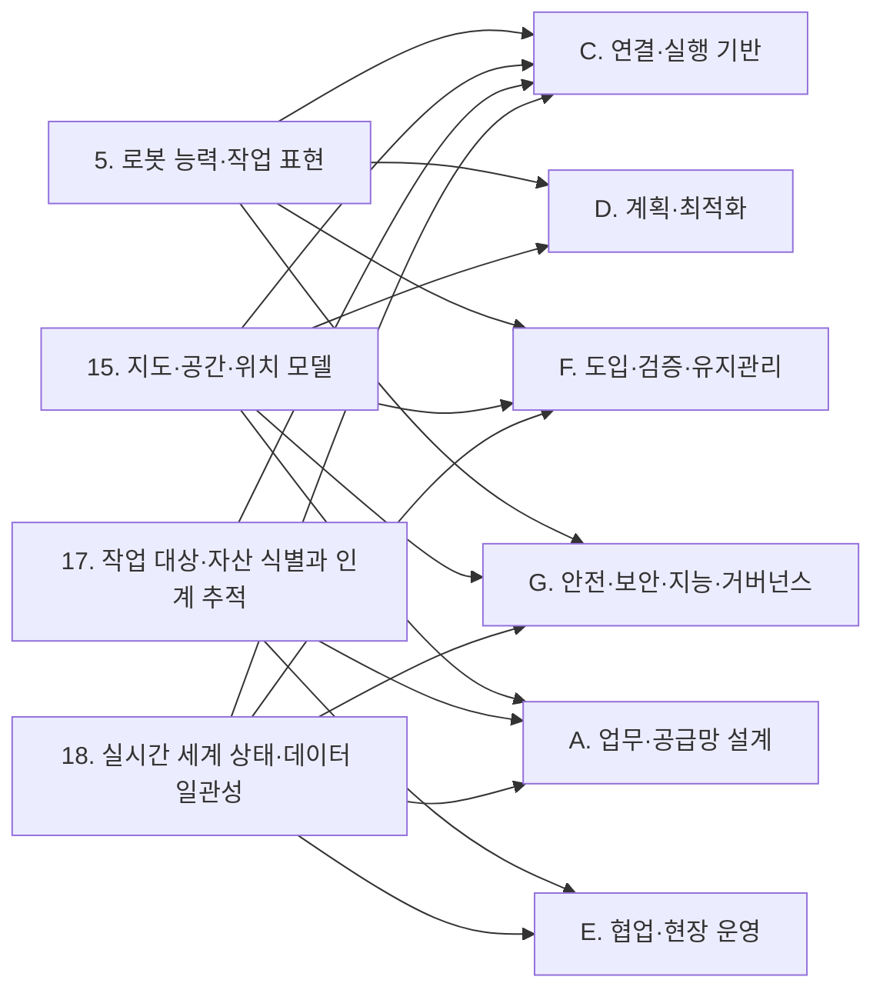

(너의 규칙은 시스템 프롬프트의 agents/shared-rules.md 와 agents/storyteller.md 이다. 아래는 이번 실행의 컨텍스트와 입력이다.)

## 실행 컨텍스트

- run_id: 2026-09-29-07
- date: 2026-09-29
- run_type: area_deep_dive (영역 심화)
- 대상: 4. 이기종 로봇 등록 (B. 로봇 온톨로지)
- 예산:
    - max_search_queries: 30
    - max_sources_per_run: 15
    - new_topic_pages: 1
    - page_updates: 2
    - max_retries: 2
- 환경 알림: web_fetch_available: true · fetch_mode: full
- 언어: ko

## 입력

### runs/2026-09-29-07/target.json

```json
{
  "run_id": "2026-09-29-07",
  "date": "2026-09-29",
  "weekday": "Tue",
  "run_number": 99,
  "run_type": "area_deep_dive",
  "forced": true,
  "target": {
    "area_no": 4,
    "area_name": "4. 이기종 로봇 등록",
    "category": "B. 로봇 온톨로지",
    "category_letter": "B"
  },
  "topic": null,
  "track": null,
  "corrections": [],
  "budget": {
    "max_search_queries": 30,
    "max_sources_per_run": 15,
    "new_topic_pages": 1,
    "page_updates": 2,
    "max_retries": 2
  },
  "priority_reason": null,
  "priority_questions": [],
  "excluded_areas": [],
  "lifted_areas": [],
  "deferred": {
    "monthly_recheck": false,
    "weekly_review": false
  },
  "selection_rationale": "CLI 지정 run_type=area_deep_dive, area=4"
}
```

### runs/2026-09-29-07/research.json

```json
{
  "run_id": "2026-09-29-07",
  "date": "2026-09-29",
  "run_type": "area_deep_dive",
  "target": {
    "area_no": 4,
    "area_name": "4. 이기종 로봇 등록",
    "category": "B. 로봇 온톨로지"
  },
  "gaps": [
    "섹션 3. 왜 중요한가 비어 있음",
    "섹션 4. 핵심 개념과 용어 비어 있음 — 디지털 명판·URDF·AGV 기술 데이터 서브모델·자산관리셸 레지스트리·온톨로지 채우기 용어 없음(VDA 5050 팩트시트·신원 보고·자산관리셸·소프트웨어 명판·능력 기술 서브모델·의미 식별자는 용어집에 이미 있음)",
    "섹션 5. 적용 사례 (현장 유형 명시) 비어 있음",
    "섹션 6. 대표 접근법과 기술 비어 있음 — 등록 데이터 수집(팩트시트 요청·자산관리셸), 문서·URDF에서 능력 추출, 검토·승인 흐름, 어댑터 설정 생성 근거 없음",
    "섹션 7. 관련 표준·프레임워크·오픈소스 비어 있음 — VDA 5050 팩트시트, IDTA 02047·02006, MassRobotics 신원 보고, OPC UA Robotics, 자산관리셸 API, Open-RMF 플릿 어댑터 없음",
    "섹션 8. 대표 연구와 자료 비어 있음",
    "섹션 9. ROP가 직접 맡는 것과 외부와 연계하는 것 (책임 경계 기준) 비어 있음",
    "섹션 10. 다른 연구영역과의 연결 (번호와 이름을 함께 표기) 비어 있음 — 5. 로봇 능력·작업 표현, 6. 온톨로지 기반 시스템·로봇 연동, 7. 온톨로지 검증·변경 관리, 20. 로봇·제조사 관제 연동, 21. 상호운용 표준·적합성, 45. 문서·도면·장면 이해, 47. AI·학습·적응과 모델 운영, 55. 현장 조사·설치·시운전, 57. 자산·소프트웨어 수명주기 관리 연결 필요",
    "섹션 11. 열린 질문 비어 있음 — 이 영역에 걸린 열린 질문 oq-128 미반영, 정정 요청 없음",
    "프런트매터 related_areas·sources 비어 있음"
  ],
  "research_questions": [
    "제조사도 형식도 다른 로봇을 어떻게 빠르고 믿을 수 있게 등록할 것인가? [분류원문]",
    "등록 시 받아야 할 식별·제원 데이터를 정한 기계가독 형식(VDA 5050 팩트시트, 자산관리셸 서브모델·디지털 명판, MassRobotics 신원 보고, OPC UA Robotics)은 각각 무엇을 필수로 요구하는가? (섹션 4·7 겨냥)",
    "플릿 관리 프레임워크(Open-RMF)는 새 로봇을 등록·연동할 때 어떤 설정과 구현을 요구하며, 병원 현장에서 실제로 어떻게 등록했는가? (섹션 5·6 겨냥)",
    "매뉴얼·URDF·자연어 설명에서 능력·제약을 자동으로 추출하고 검증과 사람 검토를 두는 방법은 무엇이 보고되었는가? (섹션 6·8 겨냥, 교차 규칙에 따라 45. 문서·도면·장면 이해·47. AI·학습·적응과 모델 운영과 연결)",
    "제조사가 능력·제원 정보를 제공·갱신하는 경로(자산관리셸 레지스트리·디스커버리, 팩트시트 요청)와 벤더·통합사를 사전 평가하는 등록 승인 관문의 사례는 무엇인가? (섹션 6·9 겨냥)",
    "oq-128 국내 현장에서 VDA 5050 팩트시트나 자산관리셸 능력 기술을 로봇 등록 데이터로 실제 쓰는 사례가 있는가? (섹션 5·11 겨냥, 한국 자료 우선)",
    "이기종 로봇 등록에서 ROP가 직접 맡을 것(등록부·데이터 수집·추출 초안·검토 승인)과 로봇 내부 주행 기술·제조사 책임에 맡길 것의 경계는 어디이며, 어느 영역과 연결되는가? (섹션 9·10 겨냥)"
  ],
  "findings": [
    {
      "id": "f1",
      "claim": "VDA 5050 공식 저장소(main, 3.0.0 판)의 팩트시트 JSON 스키마는 headerId·timestamp·version·manufacturer·serialNumber·typeSpecification·physicalParameters·protocolLimits·protocolFeatures·mobileRobotGeometry·loadSpecification 을 필수 속성으로, 하드웨어·소프트웨어 버전과 네트워크·배터리 매개변수를 담는 mobileRobotConfiguration 을 선택 속성으로 둔다.",
      "tag": "사실",
      "source_ids": [
        "ref-869"
      ],
      "cross_checked": false,
      "confidence": "medium",
      "evidence_excerpt": "factsheet.schema 의 required 목록에 위 11개 속성이 있고 mobileRobotConfiguration 은 선택이다. headerId 는 \"defined per topic and incremented by 1 with each sent message\". (발행일 미확인, 확인일 기준)",
      "as_of": "2026-09-29",
      "site_type": null,
      "flow_item": "수행 자원"
    },
    {
      "id": "f2",
      "claim": "같은 팩트시트 스키마에서 typeSpecification 은 시리즈 이름, 구동 방식(DIFFERENTIAL·OMNIDIRECTIONAL·THREE_WHEEL), 로봇 종류(FORKLIFT·CONVEYOR·TUGGER·CARRIER), 최대 적재 질량, 위치추정 방식, 주행 방식(물리 라인·가상 라인·자유 주행), 지원 구역 유형을, physicalParameters 는 최소·최대 속도, 각속도, 최대 가감속, 높이·폭·길이를 기종 단위로 기술한다.",
      "tag": "사실",
      "source_ids": [
        "ref-869"
      ],
      "cross_checked": false,
      "confidence": "medium",
      "evidence_excerpt": "typeSpecification: seriesName, mobileRobotKinematics, mobileRobotClass, maximumLoadMass, localizationTypes, navigationTypes, supportedZones / physicalParameters: minimumSpeed·maximumSpeed, 각속도, maximumAcceleration·Deceleration(최대 적재 기준), height·width·length. (발행일 미확인, 확인일 기준)",
      "as_of": "2026-09-29",
      "site_type": null,
      "flow_item": "수행 자원"
    },
    {
      "id": "f3",
      "claim": "VDA 5050 명세 3.0.0 판은 플릿 관제가 factsheetRequest 즉시 동작을 보내면 로봇이 factsheet 토픽에 팩트시트를 게시하는 요청·응답 방식을 정하고, 팩트시트에 플릿 관제에서 로봇 설정을 돕는 매개변수와 벤더 특정 정보가 들어간다고 적어 등록 데이터를 로봇에서 직접 받는 경로를 둔다.",
      "tag": "사실",
      "source_ids": [
        "ref-879"
      ],
      "cross_checked": false,
      "confidence": "medium",
      "evidence_excerpt": "3.0.0 판 명세: 팩트시트는 \"Parameters or vendor-specific information to assist set-up of the mobile robot in fleet control\"을 담고, 관제가 factsheetRequest 즉시 동작으로 요청하면 로봇이 factsheet 토픽에 게시한다. (발행일 미확인, 확인일 기준)",
      "as_of": "2026-09-29",
      "site_type": null,
      "flow_item": "시작 조건"
    },
    {
      "id": "f4",
      "claim": "IDTA 02047-1-0(2025-03) '실내 물류용 AGV 기술 데이터' 자산관리셸 서브모델은 TypeAndApplicationInformation·TechnicalParameters·VDA5050Factsheet·EnergyAndCommunication·Battery·Safety·TemporaryTechnicalData 컬렉션으로 구성되며, 혼합 플릿을 중앙 관제에 통합하고 시운전·운영·유지보수에 걸쳐 쓰는 것을 목표로 디지털 명판·기술 데이터 서브모델과 연계된다.",
      "tag": "사실",
      "source_ids": [
        "ref-870"
      ],
      "cross_checked": false,
      "confidence": "medium",
      "evidence_excerpt": "PDF 본문의 컬렉션 목록과 VDA 5050 팩트시트 연계, 관련 서브모델(Digital Nameplate, Technical Data) 확인. 공식 저장소 README 는 대상이 \"driverless vehicles and robots in intralogistics\"이고 요구가 \"commissioning, operation and maintenance\"에 걸친다고 적는다.",
      "as_of": "2025-03",
      "site_type": null,
      "flow_item": "수행 자원"
    },
    {
      "id": "f5",
      "claim": "IDTA 02006 디지털 명판 서브모델 3.0 판은 URIOfTheProduct·ManufacturerName·ManufacturerProductDesignation·SerialNumber·YearOfConstruction·DateOfManufacture 를 필수로, HardwareVersion·FirmwareVersion·SoftwareVersion·ContactInformation·Markings 를 선택으로 두어 로봇을 포함한 산업 장비의 식별자와 버전을 기계가독 명판으로 담는다.",
      "tag": "사실",
      "source_ids": [
        "ref-876"
      ],
      "cross_checked": false,
      "confidence": "medium",
      "evidence_excerpt": "IDTA 02006-3-0 PDF 의 속성표: 필수 6개(제품 URI·제조사·제품명·일련번호·제조 연도·제조일), 선택 5개(하드웨어·펌웨어·소프트웨어 버전, 연락처, 마킹). 발행일은 도구가 2024-11 로 읽었으나 파일명은 3-0-1 판(2025-10 게시)이라 확정하지 못함. (발행일 미확인, 확인일 기준)",
      "as_of": "2026-09-29",
      "site_type": null,
      "flow_item": "수행 자원"
    },
    {
      "id": "f6",
      "claim": "MassRobotics AMR 상호운용 표준의 JSON 스키마는 로봇이 접속 시 보내는 identityReport 에 uuid(RFC 4122)·timestamp·manufacturerName·robotModel·robotSerialNumber·baseRobotEnvelope 를 필수로, maxSpeed·maxRunTime·chargerType·supportVendorName·productDocumentation·cargoType·cargoMaxVolume·cargoMaxWeight 등을 선택으로 둔다.",
      "tag": "사실",
      "source_ids": [
        "ref-871"
      ],
      "cross_checked": false,
      "confidence": "medium",
      "evidence_excerpt": "AMR_Interop_Standard.json: identityReport 필수 6개, 선택에 productDocumentation(문서 URL)·cargoMaxWeight 등. robotSerialNumber 는 \"Unique robot identifier that ideally can be physically linked to the AMR\". (발행일 미확인, 확인일 기준)",
      "as_of": "2026-09-29",
      "site_type": null,
      "flow_item": "수행 자원"
    },
    {
      "id": "f7",
      "claim": "서로 다른 세 발행 기관(VDA, IDTA, MassRobotics)이 각각 제조사가 제공하는 기계가독 등록 기록을 정의하고, 셋 모두 제조사명·기종(시리즈)·일련번호·치수(외곽)·최대 적재·최대 속도 항목을 공통으로 담아 '제조사 제공 식별·제원 기록'이 이기종 로봇 등록의 표준 관행으로 한 곳 이상에서 확인된다.",
      "tag": "사실",
      "source_ids": [
        "ref-869",
        "ref-871",
        "ref-876"
      ],
      "cross_checked": true,
      "confidence": "high",
      "evidence_excerpt": "VDA 5050 팩트시트(manufacturer·serialNumber·typeSpecification·physicalParameters·mobileRobotGeometry), MassRobotics identityReport(manufacturerName·robotModel·robotSerialNumber·baseRobotEnvelope·maxSpeed), IDTA 02006(ManufacturerName·SerialNumber·버전) 세 원문을 대조. (발행일 미확인, 확인일 기준)",
      "as_of": "2026-09-29",
      "site_type": null,
      "flow_item": "수행 자원"
    },
    {
      "id": "f8",
      "claim": "OPC UA for Robotics 1부(OPC 40010-1) 1.02 판(2025-09-08)은 수직 통합·자산 관리·상태 감시를 범위로 MotionDeviceSystem 정보 모델을 정의하고, MotionDevice 와 Controller 에 Manufacturer·Model·SerialNumber·ProductCode·SoftwareRevision 식별 속성을 두어 산업용 로봇(매니퓰레이터) 등록에 쓸 식별 정보를 표준화한다.",
      "tag": "사실",
      "source_ids": [
        "ref-881"
      ],
      "cross_checked": false,
      "confidence": "medium",
      "evidence_excerpt": "OPC Foundation 참조 사이트: Version 1.02, 2025-09-08 게시, 범위 'Vertical Integration'(자산 관리·상태 감시), MotionDevice·Controller 식별 속성 Manufacturer·Model·SerialNumber·ProductCode·SoftwareRevision.",
      "as_of": "2025-09-08",
      "site_type": null,
      "flow_item": "수행 자원"
    },
    {
      "id": "f9",
      "claim": "OPC Foundation 은 OPC UA for Robotics 명세를 STS XML 외에 'AI 응용용 마크다운'과 'RAG 청크' 형식으로도 제공해, 표준 문서 자체를 언어 모델이 읽어 처리하기 쉬운 형식으로 배포하기 시작했다.",
      "tag": "사실",
      "source_ids": [
        "ref-881"
      ],
      "cross_checked": false,
      "confidence": "medium",
      "evidence_excerpt": "참조 페이지의 제공 형식: STS XML, \"Markdown for AI applications\", RAG Chunks(로컬 모델 통합용), 네임스페이스 http://opcfoundation.org/UA/Robotics/ 와 노드셋 다운로드.",
      "as_of": "2025-09-08",
      "site_type": null,
      "flow_item": null
    },
    {
      "id": "f10",
      "claim": "자산관리셸 API 명세(IDTA-01002) 공식 저장소는 최신 3.2.0 판에서 AAS 저장소·서브모델 저장소·AAS 레지스트리·서브모델 레지스트리·디스커버리·개념 설명 저장소·AASX 파일 서버 등 아홉 가지 서비스 명세를 두어, 제조사가 낸 자산관리셸을 등록하고 찾는 인터페이스를 표준으로 정한다.",
      "tag": "사실",
      "source_ids": [
        "ref-880"
      ],
      "cross_checked": false,
      "confidence": "medium",
      "evidence_excerpt": "aas-specs-api README: 최신 릴리스 3.2.0, 서비스 명세 9종(AAS Service, AAS Repository, AAS Registry, Submodel Service·Repository·Registry, Discovery, Concept Description Repository, AASX File Server). 레지스트리·디스커버리의 결합 목적 문장은 README 에 없음. (발행일 미확인, 확인일 기준)",
      "as_of": "2026-09-29",
      "site_type": null,
      "flow_item": null
    },
    {
      "id": "f11",
      "claim": "디지털 명판(f5)·AGV 기술 데이터 서브모델(f4)·레지스트리·디스커버리 API(f10)를 함께 보면, 이 영역의 '제조사 능력 정보 제공 경로'는 제조사가 명판과 기술 데이터 서브모델을 자산관리셸로 내고 레지스트리에 등록해 ROP 가 자산 식별자로 찾아 읽는 방식으로 구성할 수 있을 것으로 보이나, 로봇 관제가 이 경로로 실제 등록한 운영 사례는 확인되지 않았다.",
      "tag": "추정",
      "source_ids": [
        "ref-876",
        "ref-870",
        "ref-880"
      ],
      "cross_checked": false,
      "confidence": "low",
      "evidence_excerpt": "세 표준 산출물의 역할(식별·제원·등록/발견)을 조합한 리서치 에이전트의 추론. 자산 ID→AAS ID(디스커버리)→엔드포인트(레지스트리) 순서는 IDTA Part 2 PDF 검색 결과 요약에서만 보였고 원문은 열지 않았다.",
      "as_of": "2026-09-29",
      "site_type": null,
      "flow_item": "시작 조건"
    },
    {
      "id": "f12",
      "claim": "Open-RMF 플릿 어댑터 튜토리얼은 새 플릿을 등록하는 config.yaml 에 플릿 이름, 선속도·각속도 한계, 발자국·근접 반경(profile), 후진 가능 여부, 배터리·기계·주변·도구 시스템 매개변수, 재충전 임계값, 작업 능력(loop·delivery·clean), 로봇별 충전기를 적고, 로봇 측 RobotAPI 가 navigate·position·battery_soc·stop·start_activity·is_command_completed 를 구현해야 한다고 정한다.",
      "tag": "사실",
      "source_ids": [
        "ref-873"
      ],
      "cross_checked": false,
      "confidence": "medium",
      "evidence_excerpt": "integration_fleets_adapter_tutorial.md: \"limits: [linear: [0.5, 0.75], angular: [0.6, 2.0]]\", profile footprint/vicinity, battery_system(voltage·capacity·charging_current), task_capabilities, robots 별 charger; RobotAPI 필수 메서드 6종. (발행일 미확인, 확인일 기준)",
      "as_of": "2026-09-29",
      "site_type": null,
      "flow_item": "수행 자원"
    },
    {
      "id": "f13",
      "claim": "Valner 외(2022)의 타르투대학교병원 현장 시험은 자체 관제가 없는 PAL Robotics TIAGo 를 로봇 탑재 컴퓨터의 FreeFleet 클라이언트, 플릿 이름·DDS 설정의 FreeFleet 서버, 배터리·속도·발자국을 적은 RMF 어댑터 파일로 Open-RMF 에 등록했고, 프로그램 제어가 없는 병원 문은 카드 인식·근접 센서를 대신 작동시키는 서보 장치를 만들어 지나며 중환자실에서 검사실로 혈액 검체를 운반했다.",
      "tag": "사실",
      "source_ids": [
        "ref-874"
      ],
      "cross_checked": false,
      "confidence": "medium",
      "evidence_excerpt": "Frontiers in Robotics and AI 2022-08-23 전문: TIAGo 주 배치, Clearpath Jackal 시험 환경, MiR100+UR5e 예정; 등록은 FreeFleet 클라이언트·서버 설정과 어댑터 파일의 로봇 특성; 문은 \"swipe the key card or trigger the proximity sensor\" 장치로 통과.",
      "as_of": "2022-08-23",
      "site_type": "병원",
      "flow_item": "수행 자원"
    },
    {
      "id": "f14",
      "claim": "서로 다른 두 발행 주체(Open Robotics 튜토리얼, 타르투대학교 연구진의 병원 현장 시험)가 플릿 관리 프레임워크에 로봇을 등록하는 일이 '기종 제원·배터리 매개변수를 적은 어댑터 설정 파일'과 '로봇별 API 구현'의 두 부분으로 이루어진다고 각각 보고해, 등록 작업의 구성이 한 곳 이상에서 확인된다.",
      "tag": "사실",
      "source_ids": [
        "ref-873",
        "ref-874"
      ],
      "cross_checked": true,
      "confidence": "high",
      "evidence_excerpt": "튜토리얼의 config.yaml(제원·배터리·작업 능력)+RobotAPI 와 병원 시험의 어댑터 파일(배터리·속도·발자국)+FreeFleet 클라이언트가 같은 구조. 발행 기관이 다르고 한쪽이 다른 쪽을 옮긴 것이 아님.",
      "as_of": "2022-08-23",
      "site_type": "병원",
      "flow_item": "수행 자원"
    },
    {
      "id": "f15",
      "claim": "싱가포르 창이종합병원 CHART 의 RoMi-H 등재 프로그램(2025-05-01 시행)은 보건부가 Open-RMF 기반 RoMi-H 를 공공 의료기관의 자동화 통합 플랫폼으로 지정한 뒤 시스템 통합사가 기술·배치 역량 평가를 거쳐 2년 유효 등재를 받아야 병원 제안 요청에 참여하게 하며, 2026-08-24 기준 등재 업체는 5곳이다.",
      "tag": "사실",
      "source_ids": [
        "ref-878"
      ],
      "cross_checked": false,
      "confidence": "medium",
      "evidence_excerpt": "CGH 공지: 통합사는 \"a series of evaluations, encompassing both technical expertise and deployment knowledge\"를 거침, 등재 5곳(HOPE Technik·Medisys·Panasonic Asia Pacific·QuikBot·Techfox), 2년 유효, 반기 평가.",
      "as_of": "2026-08-24",
      "site_type": "병원",
      "flow_item": "제약"
    },
    {
      "id": "f16",
      "claim": "벤더 주장(기사 경유): 클로봇의 크롬스는 '국내 첫 이기종 로봇 통합관제 솔루션'으로 50대 이상 로봇 동시 제어와 엘리베이터 탑승을 지원한다고 소개되며, 기사는 LG CNS 와 함께 인천공항 다기종 로봇 제작·5G 디지털 트윈 관제 구축 사업을 계약했다고 전하나 VDA 5050 지원 여부·연동 제조사 수·등록 방식은 기사에 없다.",
      "tag": "추정",
      "source_ids": [
        "ref-875"
      ],
      "cross_checked": false,
      "confidence": "low",
      "evidence_excerpt": "벤더 주장: 로봇신문 2025-11-09 기사에서 \"다양한 제조사의 로봇을 하나의 시스템에서 제어할 수 있는 국내 첫 이기종 로봇 통합관제 솔루션\", 50대 이상 동시 제어, 인천공항 사업 계약. VDA 5050 기반이라는 문구는 검색 결과 요약에서만 보였고 공식 페이지는 403 으로 열지 못함.",
      "as_of": "2025-11-09",
      "site_type": "기타",
      "flow_item": "수행 자원",
      "vendor_claim": true
    },
    {
      "id": "f17",
      "claim": "신민종·한영석·정재윤(한국디지털산업학회지 29권 4호, 2024)은 자율이동로봇(AMR)의 하드웨어·소프트웨어 정보를 자산관리셸(AAS)로 기록해 JSON 으로 저장·송수신하고 OPC UA 로 실시간 감시하는 모니터링 시스템 설계를 제안했으나, 초록은 실제 현장 적용 결과를 적지 않는다.",
      "tag": "사실",
      "source_ids": [
        "ref-877"
      ],
      "cross_checked": false,
      "confidence": "medium",
      "evidence_excerpt": "KCI 초록: \"AMR의 정보를 AAS로 기록하고 JSON 형식으로 저장하고 송수신하여\" 정보를 공유, OPC UA 활용; 기대 효과만 서술. 세부 서브모델(명판·기술 데이터) 명칭은 초록에 없음.",
      "as_of": "2024",
      "site_type": null,
      "flow_item": null
    },
    {
      "id": "f18",
      "claim": "oq-128 관련: 국내 자료로 확인된 것은 자산관리셸로 AMR 정보를 기록하는 설계 연구(f17)와 벤더의 이기종 관제 소개(f16)뿐이며, VDA 5050 팩트시트나 자산관리셸 능력 기술을 실제 로봇 등록 데이터로 운영에 쓴 국내 사례는 이번 조사에서 확인되지 않아 oq-128 은 미해결로 남는다.",
      "tag": "추정",
      "source_ids": [
        "ref-877",
        "ref-875"
      ],
      "cross_checked": false,
      "confidence": "low",
      "evidence_excerpt": "한국어 검색 2회(관제 플랫폼·팩트시트·자산관리셸, 자산관리쉘 스마트공장·로봇)에서 국내 운영 사례를 찾지 못함. 중기부 스마트공장 고도화 사업의 AAS 적용 의무화는 검색 결과 요약에서만 보여 finding 으로 내지 않음.",
      "as_of": "2026-09-29",
      "site_type": null,
      "flow_item": null
    },
    {
      "id": "f19",
      "claim": "Dussard·Sarthou(2026)는 URDF 가 로봇의 구조·운동학은 기술하지만 식별자에 의미가 없다는 점을 들어, 기존 온톨로지의 개념을 프롬프트에 넣어 언어 모델이 URDF 요소의 의미 관계를 추론하게 하고 여러 번 질의한 다수결과 구문·스키마 검증으로 출력을 제약해 로봇 온톨로지를 자동으로 채우는 방법을 여러 로봇 기술로 평가했다.",
      "tag": "사실",
      "source_ids": [
        "ref-872"
      ],
      "cross_checked": false,
      "confidence": "medium",
      "evidence_excerpt": "arXiv 2606.17073 초록(2026-06-10): 언어 모델에 \"concepts from an existing ontology\"를 프롬프트로 주어 정렬, \"majority voting across multiple LLM queries\"와 구문·스키마 검증; 정확도 수치·사람 검증 언급은 초록에 없음.",
      "as_of": "2026-06-10",
      "site_type": null,
      "flow_item": null
    },
    {
      "id": "f20",
      "claim": "Vieira da Silva·Köcher·Gehlhoff·Fay(2024)는 능력의 자연어 설명을 정해진 프롬프트에 넣어 언어 모델이 능력 온톨로지를 생성하고, 구문 검증·모순 탐지·환각과 누락 점검을 언어 모델과의 반복 루프로 자동 수행한 뒤 사람이 최종 검토·수정만 하게 하는 방법을 제안해 수작업 모델링 부담을 줄였다고 보고했다.",
      "tag": "사실",
      "source_ids": [
        "ref-882"
      ],
      "cross_checked": false,
      "confidence": "medium",
      "evidence_excerpt": "arXiv 2406.07962 초록: 모델링은 \"manual and error-prone task\"; 자동 검증 루프(구문·모순·환각/누락) 뒤 \"a final human review and possible correction\"만 필요. 정량 결과는 초록에 없음.",
      "as_of": "2024-10-18",
      "site_type": null,
      "flow_item": "완료·인계"
    },
    {
      "id": "f21",
      "claim": "Abolhasani·Pan(2024)의 OntoKGen 은 신뢰성·유지보수성 분야 기술 문서에서 언어 모델로 온톨로지와 지식 그래프를 뽑되, 대화형 인터페이스에서 시스템이 모범 사례 기반 온톨로지를 추천하고 사용자가 최종 결정을 갖게 하는 방식으로 '보편적으로 옳은 온톨로지는 없다'는 전제를 두고 사용자 검토를 설계의 중심에 두었다.",
      "tag": "사실",
      "source_ids": [
        "ref-883"
      ],
      "cross_checked": false,
      "confidence": "medium",
      "evidence_excerpt": "arXiv 2412.00608 초록: 적응형 반복 사고 연쇄로 사용자 요구에 맞추고, 사용자가 \"complete control over final decisions\"; 결과는 Neo4j 저장·RAG 기반으로 활용. 로봇 문서가 아닌 신뢰성·유지보수성 문서가 대상.",
      "as_of": "2024-12-10",
      "site_type": null,
      "flow_item": "완료·인계"
    },
    {
      "id": "f22",
      "claim": "서로 다른 세 연구 그룹(LAAS 의 URDF 온톨로지 채우기, 헬무트 슈미트 대학 계열의 자연어 능력 온톨로지 생성, Abolhasani·Pan 의 기술 문서 온톨로지 추출)이 언어 모델 추출에 자동 검증이나 사용자 최종 검토를 결합한 방법을 각각 보고해, '자동 추출 + 자동 검증 + 사람 최종 검토' 구성이 한 곳 이상에서 확인된다.",
      "tag": "사실",
      "source_ids": [
        "ref-872",
        "ref-882",
        "ref-883"
      ],
      "cross_checked": true,
      "confidence": "medium",
      "evidence_excerpt": "f19(다수결·스키마 검증), f20(검증 루프+사람 최종 검토), f21(사용자 최종 결정) 대조. 세 출처 모두 프리프린트(초록 확인)라 medium.",
      "as_of": "2026-06-10",
      "site_type": null,
      "flow_item": "완료·인계"
    },
    {
      "id": "f23",
      "claim": "이 영역이 요구하는 '원문 근거(절·줄·인용)와 함께 능력 정의 초안을 만들고 사람이 대조해 확정·반려'하는 흐름은 f20·f21 의 사람 최종 검토와 방향이 같지만, 확인한 세 연구 어느 것도 추출 항목마다 매뉴얼의 절·줄 위치를 붙여 검토자가 대조하게 하는 근거 연결을 초록에서 밝히지 않아 근거 연결형 검토·승인은 아직 확인되지 않은 요구로 보인다.",
      "tag": "추정",
      "source_ids": [
        "ref-882",
        "ref-883",
        "ref-872"
      ],
      "cross_checked": false,
      "confidence": "low",
      "evidence_excerpt": "세 초록의 검증·검토 서술에 원문 위치 인용 항목이 없음. 원문 위치 강조를 갖춘 검토 작업대(HERMES 등)는 지질 분야라 출처 상한 때문에 넣지 않음.",
      "as_of": "2026-09-29",
      "site_type": null,
      "flow_item": "완료·인계"
    },
    {
      "id": "f24",
      "claim": "확인한 자료를 종합하면 4. 이기종 로봇 등록에서 ROP가 직접 맡을 범위는 제조사·기종·일련번호·펌웨어·SDK 버전·장착 장비를 담는 등록부, 팩트시트·자산관리셸·신원 보고를 받아 저장·대조하는 수집 경로, 문서·URDF에서 뽑은 능력 초안의 검토·승인 기록, 어댑터 설정 초안 생성이며, 등록 승인 관문에 벤더·통합사 사전 평가(f15)를 둘 수 있을 것으로 보인다.",
      "tag": "추정",
      "source_ids": [
        "ref-879",
        "ref-870",
        "ref-873",
        "ref-878"
      ],
      "cross_checked": false,
      "confidence": "low",
      "evidence_excerpt": "팩트시트 요청 경로(f3), 자산관리셸 서브모델(f4), 어댑터 설정 구성(f12·f14), 등재 프로그램(f15)을 분류 원문 19장의 경계에 맞춰 조합한 추론.",
      "as_of": "2026-09-29",
      "site_type": null,
      "flow_item": null
    },
    {
      "id": "f25",
      "claim": "연계 대상: 팩트시트의 위치추정 방식·주행 방식(localizationTypes·navigationTypes)과 mobileRobotConfiguration 의 펌웨어·소프트웨어 버전은 제조사가 소유·갱신하는 로봇 자체 지능·제어 정보이므로, 이종 제조사를 잇는 ROP 는 등록 시 이를 받아 저장·대조하고 버전 변경을 추적하는 데 그치고 위치추정·회피 성능 자체는 제조사에 맡겨야 할 것으로 보인다.",
      "tag": "추정",
      "source_ids": [
        "ref-869",
        "ref-879"
      ],
      "cross_checked": false,
      "confidence": "low",
      "evidence_excerpt": "스키마 필드(f2)와 명세의 벤더 정보 문구(f3)를 분류 원문 19장 '로봇 자체 지능·제어' 경계에 대응시킨 추론.",
      "as_of": "2026-09-29",
      "site_type": null,
      "flow_item": "제약"
    },
    {
      "id": "f26",
      "claim": "언어 모델로 URDF·자연어·기술 문서에서 온톨로지를 추출하는 연구(f19~f22)는 L. AI·학습 기술의 45. 문서·도면·장면 이해와 47. AI·학습·적응과 모델 운영에 속하는 방법이며 원문 교차 규칙(매뉴얼 해석은 4·55번)에 따라 이 영역과 55. 현장 조사·설치·시운전에 연결해야 하고, 등록 데이터는 5. 로봇 능력·작업 표현(능력 표현), 6. 온톨로지 기반 시스템·로봇 연동(어댑터 설정), 7. 온톨로지 검증·변경 관리와 57. 자산·소프트웨어 수명주기 관리(펌웨어·문서 개정), 20. 로봇·제조사 관제 연동과 21. 상호운용 표준·적합성(팩트시트·자산관리셸 규격)에 연결된다.",
      "tag": "추정",
      "source_ids": [
        "ref-872",
        "ref-870",
        "ref-873"
      ],
      "cross_checked": false,
      "confidence": "low",
      "evidence_excerpt": "분류 원문 13장 교차 규칙과 4장 주석, 그리고 이번 finding 의 내용 분포에 따른 연결 제안.",
      "as_of": "2026-09-29",
      "site_type": null,
      "flow_item": null
    }
  ],
  "sources": [
    {
      "id": "ref-869",
      "org": "VDA (Verband der Automobilindustrie) · VDMA, VDA5050 GitHub 공식 저장소",
      "title": "VDA5050/json_schemas/factsheet.schema (main)",
      "published": null,
      "url": "https://github.com/VDA5050/VDA5050/blob/main/json_schemas/factsheet.schema",
      "type": "표준",
      "reliability": "high",
      "accessed": "2026-09-29",
      "summary": "VDA 5050 팩트시트 메시지의 JSON 스키마 원본. 필수·선택 속성과 typeSpecification·physicalParameters 필드 정의를 담는다.",
      "fetched": true,
      "fetched_via": "github_raw",
      "fetch_url": "https://raw.githubusercontent.com/VDA5050/VDA5050/main/json_schemas/factsheet.schema",
      "source_unopened": false
    },
    {
      "id": "ref-870",
      "org": "Industrial Digital Twin Association (IDTA)",
      "title": "IDTA 02047-1-0 Submodel Template: Technical Data for AGV in Intralogistics",
      "published": "2025-03",
      "url": "https://industrialdigitaltwin.org/wp-content/uploads/2025/03/IDTA-02047-1-0-Submodel_Technical-Data-for-AGV.pdf",
      "type": "표준",
      "reliability": "high",
      "accessed": "2026-09-29",
      "summary": "실내 물류 AGV·AMR 의 기술 데이터를 자산관리셸 서브모델로 표준화한 명세. VDA 5050 팩트시트 컬렉션을 포함하고 혼합 플릿의 중앙 관제 통합을 목표로 한다.",
      "fetched": true,
      "fetched_via": "webfetch",
      "fetch_url": null,
      "source_unopened": false
    },
    {
      "id": "ref-871",
      "org": "MassRobotics (AMR Interoperability Working Group)",
      "title": "AMR_Interop_Standard.json — MassRobotics AMR Interoperability Standard JSON schema",
      "published": null,
      "url": "https://github.com/MassRobotics-AMR/AMR_Interop_Standard/blob/main/AMR_Interop_Standard.json",
      "type": "표준",
      "reliability": "high",
      "accessed": "2026-09-29",
      "summary": "MassRobotics AMR 상호운용 표준의 공식 JSON 스키마. identityReport·statusReport 메시지와 필수·선택 필드를 정의한다.",
      "fetched": true,
      "fetched_via": "github_raw",
      "fetch_url": "https://raw.githubusercontent.com/MassRobotics-AMR/AMR_Interop_Standard/main/AMR_Interop_Standard.json",
      "source_unopened": false
    },
    {
      "id": "ref-872",
      "org": "Dussard, B., & Sarthou, G. (LAAS-CNRS)",
      "title": "Extracting Semantics: LLM-Guided Automatic Population of Robot Ontology from URDF",
      "published": "2026-06-10",
      "url": "https://arxiv.org/abs/2606.17073",
      "type": "논문",
      "reliability": "medium",
      "accessed": "2026-09-29",
      "summary": "URDF 모델을 언어 모델로 해석해 기존 온톨로지 개념에 맞춰 로봇 온톨로지를 자동으로 채우는 방법. 다수결과 구문·스키마 검증으로 출력을 제약한다.",
      "fetched": true,
      "fetched_via": "webfetch",
      "fetch_url": null,
      "source_unopened": false
    },
    {
      "id": "ref-873",
      "org": "Open Robotics (Programming Multiple Robots with ROS 2)",
      "title": "Fleet Adapter Tutorial (integration_fleets_adapter_tutorial) - Programming Multiple Robots with ROS 2",
      "published": null,
      "url": "https://osrf.github.io/ros2multirobotbook/integration_fleets_adapter_tutorial.html",
      "type": "오픈소스 문서",
      "reliability": "high",
      "accessed": "2026-09-29",
      "summary": "Open-RMF 플릿 어댑터를 만드는 튜토리얼. 플릿·로봇 설정 파일(config.yaml)의 항목과 로봇 측 RobotAPI 가 구현할 메서드를 적는다.",
      "fetched": true,
      "fetched_via": "github_raw",
      "fetch_url": "https://raw.githubusercontent.com/osrf/ros2multirobotbook/master/src/integration_fleets_adapter_tutorial.md",
      "source_unopened": false
    },
    {
      "id": "ref-874",
      "org": "Valner, R., Masnavi, H., Rybalskii, I., Põlluäär, R., Kõiv, E., Aabloo, A., Kruusamäe, K., & Singh, A. K. (University of Tartu), Frontiers in Robotics and AI",
      "title": "Scalable and heterogenous mobile robot fleet-based task automation in crowded hospital environments—a field test",
      "published": "2022-08-23",
      "url": "https://www.frontiersin.org/journals/robotics-and-ai/articles/10.3389/frobt.2022.922835/full",
      "type": "논문",
      "reliability": "high",
      "accessed": "2026-09-29",
      "summary": "타르투대학교병원에서 Open-RMF 와 FreeFleet 으로 이기종 로봇을 등록·운용해 혈액 검체를 운반한 현장 시험. 등록 설정과 문 통과용 보조 장치를 기술한다.",
      "fetched": true,
      "fetched_via": "webfetch",
      "fetch_url": null,
      "source_unopened": false
    },
    {
      "id": "ref-875",
      "org": "로봇신문",
      "title": "[기업 최전선을 가다-클로봇] 로봇 소프트웨어로 쓰는 ‘피지컬 AI’ 시대의 서막",
      "published": "2025-11-09",
      "url": "https://www.irobotnews.com/news/articleView.html?idxno=43274",
      "type": "기사",
      "reliability": "low",
      "accessed": "2026-09-29",
      "summary": "클로봇의 이기종 로봇 통합관제 솔루션 크롬스를 소개한 기사. 50대 이상 동시 제어·엘리베이터 탑승과 인천공항 다기종 로봇 사업 계약을 전한다.",
      "fetched": true,
      "fetched_via": "webfetch",
      "fetch_url": null,
      "source_unopened": false
    },
    {
      "id": "ref-876",
      "org": "Industrial Digital Twin Association (IDTA)",
      "title": "IDTA 02006-3-0 Submodel Template: Digital Nameplate for Industrial Equipment",
      "published": null,
      "url": "https://industrialdigitaltwin.org/wp-content/uploads/2025/10/IDTA-02006-3-0-1_Submodel_Digital-Nameplate.pdf",
      "type": "표준",
      "reliability": "high",
      "accessed": "2026-09-29",
      "summary": "산업 장비의 디지털 명판 서브모델 3.0 판 명세. 제품 URI·제조사·제품명·일련번호·제조 연도·제조일을 필수로, 하드웨어·펌웨어·소프트웨어 버전 등을 선택으로 둔다.",
      "fetched": true,
      "fetched_via": "webfetch",
      "fetch_url": null,
      "source_unopened": false
    },
    {
      "id": "ref-877",
      "org": "신민종, 한영석, 정재윤 (한국디지털산업학회지 29(4))",
      "title": "자산관리쉘 표준을 이용한 자율이동로봇 모니터링 시스템 설계",
      "published": "2024",
      "url": "https://www.kci.go.kr/kciportal/ci/sereArticleSearch/ciSereArtiView.kci?sereArticleSearchBean.artiId=ART003140560",
      "type": "논문",
      "reliability": "medium",
      "accessed": "2026-09-29",
      "summary": "AMR 의 하드웨어·소프트웨어 정보를 자산관리셸로 기록해 JSON 으로 교환하고 OPC UA 로 감시하는 시스템 설계를 제안한 국내 논문. KCI 초록만 확인했다.",
      "fetched": true,
      "fetched_via": "webfetch",
      "fetch_url": null,
      "source_unopened": false
    },
    {
      "id": "ref-878",
      "org": "Changi General Hospital, Centre for Healthcare Assistive & Robotics Technology (CHART)",
      "title": "RoMi-H Empanelment Programme 2025",
      "published": "2025-05-01",
      "url": "https://www.cgh.com.sg/news/robotics/empanelment-for-robotic-middleware-for-healthcare--romi-h--syste",
      "type": "정부·연구기관",
      "reliability": "medium",
      "accessed": "2026-09-29",
      "summary": "싱가포르 공공 의료기관의 로봇 통합 플랫폼 RoMi-H 에 시스템 통합사를 평가·등재하는 프로그램 공지. 등재 요건·유효 기간·등재 업체 5곳을 적는다(2026-08-24 갱신).",
      "fetched": true,
      "fetched_via": "webfetch",
      "fetch_url": null,
      "source_unopened": false
    },
    {
      "id": "ref-879",
      "org": "VDA (Verband der Automobilindustrie) · VDMA, VDA5050 GitHub 공식 저장소",
      "title": "VDA5050_EN.md — VDA 5050 Interface for the communication between automated guided vehicles (AGV) and a master control (Version 3.0.0, main)",
      "published": null,
      "url": "https://github.com/VDA5050/VDA5050/blob/main/VDA5050_EN.md",
      "type": "표준",
      "reliability": "high",
      "accessed": "2026-09-29",
      "summary": "VDA 5050 명세 3.0.0 판 원문(마크다운). 팩트시트의 목적과 factsheetRequest 즉시 동작·factsheet 토픽을 통한 요청·게시 방식을 적는다.",
      "fetched": true,
      "fetched_via": "github_raw",
      "fetch_url": "https://raw.githubusercontent.com/VDA5050/VDA5050/main/VDA5050_EN.md",
      "source_unopened": false
    },
    {
      "id": "ref-880",
      "org": "Industrial Digital Twin Association (IDTA), admin-shell-io GitHub 공식 저장소",
      "title": "aas-specs-api — Repository of the Asset Administration Shell Specification IDTA-01002 API (README)",
      "published": null,
      "url": "https://github.com/admin-shell-io/aas-specs-api",
      "type": "표준",
      "reliability": "high",
      "accessed": "2026-09-29",
      "summary": "자산관리셸 API 명세(IDTA-01002)의 공식 OpenAPI 저장소 README. 최신 3.2.0 판과 레지스트리·디스커버리를 포함한 서비스 명세 9종을 나열한다.",
      "fetched": true,
      "fetched_via": "github_raw",
      "fetch_url": "https://raw.githubusercontent.com/admin-shell-io/aas-specs-api/main/README.md",
      "source_unopened": false
    },
    {
      "id": "ref-881",
      "org": "OPC Foundation",
      "title": "OPC 40010-1: OPC UA for Robotics — Part 1: Vertical Integration (Version 1.02)",
      "published": "2025-09-08",
      "url": "https://reference.opcfoundation.org/Robotics/v100/docs/",
      "type": "표준",
      "reliability": "high",
      "accessed": "2026-09-29",
      "summary": "산업용 로봇의 수직 통합·자산 관리·상태 감시를 위한 OPC UA 정보 모델(MotionDeviceSystem). 제조사·모델·일련번호 등 식별 속성을 정의하고 AI 응용용 마크다운·RAG 청크 형식도 제공한다.",
      "fetched": true,
      "fetched_via": "webfetch",
      "fetch_url": null,
      "source_unopened": false
    },
    {
      "id": "ref-882",
      "org": "Vieira da Silva, L. M., Köcher, A., Gehlhoff, F., & Fay, A.",
      "title": "Toward a Method to Generate Capability Ontologies from Natural Language Descriptions",
      "published": "2024-10-18",
      "url": "https://arxiv.org/abs/2406.07962",
      "type": "논문",
      "reliability": "medium",
      "accessed": "2026-09-29",
      "summary": "자연어 능력 설명을 소수 예시 프롬프트로 언어 모델에 넣어 능력 온톨로지를 생성하고 자동 검증 루프 뒤 사람이 최종 검토하는 방법. 초록만 확인했다.",
      "fetched": true,
      "fetched_via": "webfetch",
      "fetch_url": null,
      "source_unopened": false
    },
    {
      "id": "ref-883",
      "org": "Abolhasani, M. S., & Pan, R.",
      "title": "Leveraging LLM for Automated Ontology Extraction and Knowledge Graph Generation",
      "published": "2024-12-10",
      "url": "https://arxiv.org/abs/2412.00608",
      "type": "논문",
      "reliability": "medium",
      "accessed": "2026-09-29",
      "summary": "기술 문서에서 언어 모델로 온톨로지·지식 그래프를 추출하되 대화형 인터페이스에서 사용자가 최종 결정을 갖게 하는 OntoKGen 파이프라인. 초록만 확인했다.",
      "fetched": true,
      "fetched_via": "webfetch",
      "fetch_url": null,
      "source_unopened": false
    }
  ],
  "page_proposals": [
    {
      "action": "update",
      "path": "docs/categories/robot-ontology/heterogeneous-robot-registration.md",
      "sections": [
        "3",
        "4",
        "5",
        "6",
        "7",
        "8",
        "9",
        "10",
        "11"
      ],
      "rationale": "섹션 3: f7(세 표준 기관이 제조사 제공 등록 기록을 공통으로 요구), f14(등록 작업이 설정 파일+API 구현으로 이루어짐), f15(공공 의료의 벤더 사전 평가 관문) / 섹션 4: f1·f2(팩트시트 필수 속성·기종 제원 항목), f5(디지털 명판 필수 식별자·버전), f6(신원 보고), f19(URDF 는 구조·운동학 기술, 온톨로지 채우기), f10(자산관리셸 레지스트리·디스커버리) / 섹션 5: 병원 — f13(타르투대학교병원, FreeFleet·어댑터 파일 등록, 문 통과 보조 장치, 검체 운반), f15(싱가포르 공공 의료기관의 RoMi-H 등재 프로그램), 기타 — f16(인천공항 다기종 로봇 사업, 벤더 주장 병기), 제조 공장·물류창고 사례는 이번 조사에서 확인되지 않음을 서술 / 섹션 6: 등록 데이터 수집 f3(팩트시트 요청·게시)·f11(자산관리셸 경로, 추정), 어댑터 설정 등록 f12·f14, 문서·URDF·자연어에서 능력 추출 f19·f20·f21·f22, 검토·승인 f20·f21·f23(근거 연결형 검토는 미확인), 표준 문서의 AI 가독 형식 f9 / 섹션 7: f1·f2·f3(VDA 5050 팩트시트 스키마·명세), f4(IDTA 02047), f5(IDTA 02006), f6(MassRobotics), f8·f9(OPC UA Robotics), f10(자산관리셸 API), f12(Open-RMF 플릿 어댑터) / 섹션 8: f13, f19, f20, f21, 국내 f17 / 섹션 9: f24(직접 범위: 등록부, 수집 경로, 검토·승인 기록, 어댑터 설정 초안, 승인 관문), f25(연계 대상: 위치추정·주행 방식·펌웨어는 제조사 소유) / 섹션 10: f26 — 5. 로봇 능력·작업 표현, 6. 온톨로지 기반 시스템·로봇 연동, 7. 온톨로지 검증·변경 관리, 20. 로봇·제조사 관제 연동, 21. 상호운용 표준·적합성, 45. 문서·도면·장면 이해, 47. AI·학습·적응과 모델 운영, 55. 현장 조사·설치·시운전, 57. 자산·소프트웨어 수명주기 관리, 63. 병원·의료(f13·f15) / 섹션 11: 기존 oq-128(f17·f18 로 부분 진전, 미해결)과 open_questions_new 4건. 다음 실행 후보: 63. 병원·의료 페이지에 f13·f15 반영, 21. 상호운용 표준·적합성 페이지에 f7·f8 반영, 45. 문서·도면·장면 이해 페이지에 f19·f22 반영, 트랙 manual-capability-ontology 단계 2(문서 유형)에 f9·f19·f20 참고."
    }
  ],
  "glossary_candidates": [
    {
      "term_ko": "디지털 명판",
      "term_en": "Digital Nameplate (IDTA 02006)",
      "definition": "제품 URI·제조사·제품명·일련번호·제조 연도·제조일을 필수로 담고 하드웨어·펌웨어·소프트웨어 버전을 선택으로 두는 자산관리셸 서브모델로, 산업 장비의 명판 정보를 기계가독 형식으로 교환하게 한다."
    },
    {
      "term_ko": "AGV 기술 데이터 서브모델",
      "term_en": "Technical Data for AGV in Intralogistics (IDTA 02047)",
      "definition": "실내 물류용 AGV·AMR 의 유형·기술 매개변수·VDA 5050 팩트시트·에너지·통신·배터리·안전·임시 기술 데이터를 컬렉션으로 나눠 담는 자산관리셸 서브모델 템플릿이다."
    },
    {
      "term_ko": "통합 로봇 기술 형식",
      "term_en": "Unified Robot Description Format (URDF)",
      "definition": "로봇의 링크와 관절로 구조·운동학·물리 속성을 기술하는 ROS 계열의 XML 형식으로, 식별자 자체에는 의미가 없어 온톨로지로 옮기려면 해석이 필요하다."
    },
    {
      "term_ko": "자산관리셸 레지스트리·디스커버리",
      "term_en": "AAS Registry / Discovery",
      "definition": "자산관리셸 API 명세(IDTA-01002)가 정한 서비스로, 등록된 자산관리셸과 서브모델의 서술자를 관리하고 자산 식별자로 해당 자산관리셸을 찾게 한다."
    },
    {
      "term_ko": "온톨로지 채우기",
      "term_en": "Ontology Population",
      "definition": "이미 정해진 온톨로지의 개념·관계에 맞춰 문서·모델 파일 같은 원천에서 개체와 관계 인스턴스를 뽑아 채우는 작업으로, 언어 모델을 쓸 때는 검증과 사람 검토를 함께 둔다."
    }
  ],
  "open_questions_new": [
    "문서·URDF 에서 추출한 능력 항목마다 매뉴얼의 절·줄 위치를 근거로 붙여 검토자가 원문과 대조해 확정·반려하는 공개 구현이나 연구가 있는가? | 관련 영역: 4. 이기종 로봇 등록, 45. 문서·도면·장면 이해, 7. 온톨로지 검증·변경 관리 | 근거: f23 | 종류: 일반",
    "VDA 5050 팩트시트·IDTA 02047 서브모델·MassRobotics identityReport 사이의 필드 대응표(예: maximumLoadMass 와 cargoMaxWeight)가 공식으로 제공되는가, ROP 등록부는 어느 형식을 정본으로 삼고 나머지를 어떻게 변환해야 하는가? | 관련 영역: 4. 이기종 로봇 등록, 21. 상호운용 표준·적합성, 5. 로봇 능력·작업 표현 | 근거: f7 | 종류: 일반",
    "싱가포르 공공 의료의 RoMi-H 등재 프로그램처럼 벤더·통합사를 사전 평가해 등록 자격을 주는 관문을 국내 병원·공공 현장에서 운용한 사례나 제도가 있는가? | 관련 영역: 4. 이기종 로봇 등록, 63. 병원·의료, 58. 다사업자 책임·계약·데이터 | 근거: f15 | 종류: 일반",
    "팩트시트·명판에 없는 능력(문 조작·승강기 탑승·인계 동작 등)을 등록할 때 Open-RMF 의 task_capabilities 나 자산관리셸 능력 기술 서브모델을 실제로 쓴 사례가 있는가? | 관련 영역: 4. 이기종 로봇 등록, 5. 로봇 능력·작업 표현, 6. 온톨로지 기반 시스템·로봇 연동 | 근거: f12 | 종류: 일반"
  ],
  "open_questions_resolved": [],
  "self_check": {
    "source_count": 15,
    "cross_checked_count": 3,
    "unverified": [
      "MDPI Applied Sciences 자동차 공장 다중 브랜드 플릿 통합 사례(제조 공장 사례 후보)는 두 경로 모두 403 으로 열지 못해 넣지 않음 — 제조 공장 현장 유형 사례 미확보",
      "f16 클로봇 크롬스 공식 페이지(clobot.co.kr/croms) 403 — 'VDA 5050 기반 FMS' 문구는 검색 결과 요약에서만 보여 claim 에 넣지 않음, 벤더 주장 미교차",
      "URDF 공식 문서(wiki.ros.org 는 Anubis 차단, docs.ros.org 차단, ros2_documentation raw 경로 404) 미열람 — URDF 서술은 ref-872 초록의 '구조·운동학 기술' 문구에만 기댐",
      "Springer 'Conversational Knowledge Extraction from Technical Manuals'(ECML PKDD 2025)는 인증 리다이렉트로 열지 못해 넣지 않음",
      "f4 IDTA 02047 PDF 는 컬렉션 이름과 관련 서브모델까지만 확인했고 개별 속성명·VDA 5050 팩트시트 대응 세부는 추출 응답이 얇아 미확인",
      "f5 IDTA 02006 3.0 발행일 불확실(도구 응답 2024-11, 파일명 3-0-1 판 2025-10 게시) — published null",
      "f11 자산 ID→AAS ID→엔드포인트 흐름은 IDTA Part 2 PDF 검색 결과 요약에서만 확인, 원문 미열람",
      "f15 RoMi-H 등재 평가의 기술 항목(어댑터 시험·적합성 검사 등)은 공지에 없어 미확인",
      "f17 KCI 논문 초록만 확인 — 서브모델 구성(명판·기술 데이터 등)과 현장 적용 결과 미확인",
      "f19·f20·f21 정량 결과는 초록에 없어 미확인",
      "f1·f2·f3·f6·f10·f12 출처 발행일 미확인(저장소 원문)",
      "oq-128 미해결(f18)",
      "f7·f14·f22 외 모든 finding 교차 확인 실패(표준·연구마다 발행 주체 한 곳)"
    ],
    "scope_violations": [
      "f25: 팩트시트의 위치추정·주행 방식과 펌웨어 버전은 분류 원문 19장 '로봇 자체 지능·제어' 연계 영역이므로 '연계 대상: '으로 표시함",
      "f15: 벤더 등재 제도는 58. 다사업자 책임·계약·데이터와 겹치므로 이 영역에서는 등록 승인 관문 사례로만 제안함",
      "f8·f9: OPC UA Robotics 는 산업용 매니퓰레이터의 수직 통합 규격이므로 등록 식별 속성과 문서 형식 근거로만 제안하고 제어 연동은 다루지 않음",
      "f19~f22: 언어 모델 추출 연구는 L. AI·학습 기술의 방법이므로 45. 문서·도면·장면 이해·47. AI·학습·적응과 모델 운영과 함께 연결하도록 제안함(f26)"
    ],
    "budget_used": {
      "queries": 14,
      "sources": 15
    },
    "limits": "web_fetch_available: true · fetch_mode full. 검색 14회/30, 신규 출처 15건/15(ref-869~ref-883, 예약 구간 안) 상한 도달로 URDF 공식 문서, IDTA Part 2 API PDF, HERMES 검토 작업대, OntoKGen 외 매뉴얼 추출 논문, IFR 의 VDA 5050 해설을 넣지 못했다. 원문 열람 15건(github_raw 5: 팩트시트 스키마·VDA5050_EN.md·MassRobotics JSON·Open-RMF 튜토리얼·aas-specs-api README, webfetch 10: IDTA 02047·02006 PDF, arXiv 초록 3건, Frontiers 전문, KCI 초록, CGH 공지, OPC Foundation 참조 페이지, 로봇신문 기사). 재사용 출처 없음(참고문헌 목록 입력이 이 페이지 인용분 0건만 요약되어 전체 868건과의 URL 중복을 대조하지 못했으므로 Open-RMF 튜토리얼·VDA 5050 저장소·MassRobotics 저장소는 퍼블리셔가 기존 id 로 합칠 수 있다). 교차 확인 3건(f7: VDA·MassRobotics·IDTA, f14: Open Robotics·타르투대학교, f22: LAAS·헬무트 슈미트 대학 계열·Abolhasani·Pan — 모두 발행 주체가 다름). 신뢰도 high 는 f7·f14 두 건(각각 원문을 연 high 신뢰도 출처 포함), 나머지 medium 이하. 분류 원문 핵심 질문(제조사도 형식도 다른 로봇을 빠르고 믿을 수 있게 등록)에는 f3·f7(제조사가 기계가독 기록을 제공하고 로봇이 요청에 게시), f12·f14(등록은 설정 파일+API 구현), f19·f20·f21·f22(문서·URDF 에서 자동 추출 후 검증·사람 검토), f15(벤더 사전 평가 관문)로 답했으며 결론은 '식별·제원은 세 표준이 겹치게 정해 두었지만 능력 추출의 근거 연결형 검토와 형식 간 대응은 확인되지 않았다'는 추정(f11·f23·f24)이다. 현장 유형: 병원(f13 타르투대학교병원, f15 싱가포르 공공 의료기관), 기타(f16 인천공항, 벤더 주장)만 확인했고 제조 공장·물류창고·상업 시설·가정·실외 사례는 없다(제조 공장 후보 MDPI 논문은 403). 국내 자료는 KCI 논문(f17)과 로봇신문 기사(f16) 두 건이며 국내 운영 사례는 찾지 못해 oq-128 은 미해결이다. L. AI·학습 기술 관련 finding(f19~f23)은 45. 문서·도면·장면 이해·47. AI·학습·적응과 모델 운영과 이 영역·55. 현장 조사·설치·시운전 양쪽에 연결하도록 제안했다. 18. 실시간 세계 상태·데이터 일관성과 34. 시뮬레이션·예측용 디지털 트윈 관련 주장 없음(IDTA 02047 의 TemporaryTechnicalData 는 f4 에 이름만 적음). 벤더 문서 출처는 없고 벤더 주장은 기사 경유 f16 한 건(vendor_claim). 용어집에 이미 있는 VDA 5050 팩트시트·신원 보고·자산관리셸·소프트웨어 명판·능력 기술 서브모델·의미 식별자·플릿 어댑터·플러그 앤 프로듀스는 후보로 내지 않았다. 입력 누락 없음. 정정 요청 없음. 우선 지정 질문 없음. 해결된 열린 질문 없음."
  }
}
```

### runs/2026-09-29-07/verification.json

```json
{
  "run_id": "2026-09-29-07",
  "stage": "first",
  "verdict": "조건부 승인",
  "claim_checks": [
    {
      "finding_id": "f1",
      "source_exists": true,
      "supports_claim": true,
      "cross_checked": false,
      "tag_decision": "유지",
      "note": "확인. raw factsheet.schema(main) 열람: required 11개 속성 일치, mobileRobotConfiguration 선택이며 versions·network·batteryCharging 포함, headerId 설명 문구 일치. 발행일 없음(저장소 원문, 확인일 기준)."
    },
    {
      "finding_id": "f2",
      "source_exists": true,
      "supports_claim": true,
      "cross_checked": false,
      "tag_decision": "유지",
      "note": "확인. typeSpecification 의 mobileRobotKinematics·mobileRobotClass·navigationTypes 열거값, localizationTypes·supportedZones, physicalParameters 의 속도·각속도·가감속·높이·폭·길이 항목 일치. 발췌의 '최대 적재 기준' 문구는 열람 응답에서 확인하지 못함(본문에 쓰지 않는다)."
    },
    {
      "finding_id": "f3",
      "source_exists": true,
      "supports_claim": true,
      "cross_checked": false,
      "tag_decision": "유지",
      "note": "확인. VDA5050_EN.md(main) Version 3.0.0, 표 2 팩트시트 목적 문구 'Parameters or vendor-specific information to assist set-up of the mobile robot in fleet control' 및 표 4 factsheetRequest 즉시 동작·factsheet 토픽(로봇 게시, 관제 구독) 일치."
    },
    {
      "finding_id": "f4",
      "source_exists": true,
      "supports_claim": true,
      "cross_checked": false,
      "tag_decision": "유지",
      "note": "부분 확인. PDF 는 도구가 본문을 추출하지 못했고, 공식 저장소 README(raw)에서 대상(intralogistics 무인 차량·로봇), commissioning·operation·maintenance, 전체 시스템 통합을 확인했으며 7개 컬렉션 이름은 공식 PDF 의 검색 결과 요약에서 확인. '디지털 명판·기술 데이터 서브모델과 연계' 구절은 어디서도 확인하지 못함 → 제외 또는 미확인 표시 지시. 발행 2025-03."
    },
    {
      "finding_id": "f5",
      "source_exists": true,
      "supports_claim": false,
      "cross_checked": false,
      "tag_decision": "강등",
      "note": "사실 → 추정: PDF 본문은 도구가 추출하지 못했고, IDTA 02006 3.0 변경 이력(검색 결과)에 따르면 YearOfConstruction 이 [1]→[0..1] 로, OrderCodeOfManufacturer 가 [0..1]→[1] 로 바뀌어 브리프의 '필수 6개' 목록과 어긋난다. 필수·선택 구분은 미확인으로 두고 추가 조사 대상. 판 표기: 3.0 은 2024-11 게시(/en/ 경로 파일), 인용 URL 은 3.0.1(2025-10) 파일."
    },
    {
      "finding_id": "f6",
      "source_exists": true,
      "supports_claim": true,
      "cross_checked": false,
      "tag_decision": "유지",
      "note": "확인. AMR_Interop_Standard.json(raw) identityReport 필수 6개(uuid·timestamp·manufacturerName·robotModel·robotSerialNumber·baseRobotEnvelope), 선택 항목(maxSpeed·maxRunTime·chargerType·supportVendorName·productDocumentation·cargoType·cargoMaxVolume·cargoMaxWeight 등) 및 robotSerialNumber 설명 문구 일치. 파일에 판·날짜 없음."
    },
    {
      "finding_id": "f7",
      "source_exists": true,
      "supports_claim": false,
      "cross_checked": true,
      "tag_decision": "강등",
      "note": "사실 → 추정(high → medium): 세 출처(VDA·MassRobotics·IDTA) 모두 열어 대조했고 제조사명·기종·일련번호가 공통임은 맞지만, 디지털 명판(IDTA 02006)에는 치수·최대 적재·최대 속도 항목이 없어 '셋 모두 … 치수·최대 적재·최대 속도를 공통으로 담는다'는 서술은 과장이다. 공통 항목을 제조사명·기종(시리즈)·일련번호로 좁히고 치수·적재·속도는 VDA 5050·MassRobotics 두 형식의 공통 항목으로 서술하도록 지시."
    },
    {
      "finding_id": "f8",
      "source_exists": true,
      "supports_claim": true,
      "cross_checked": false,
      "tag_decision": "유지",
      "note": "부분 확인. OPC Foundation 참조 사이트: Version 1.02, 2025-09-08, 5장 사용 사례(감독·상태 감시·자산 관리·원격 운영), 7.2.2 표 13 MotionDeviceType 필수 속성 Manufacturer·Model·SerialNumber·ProductCode 확인. SoftwareRevision 은 MotionDeviceType 표에 없고 ControllerType 절은 열람 상한(출처당 2회)으로 확인하지 못함 → SoftwareRevision·Controller 부분은 제외 또는 미확인 표시 지시."
    },
    {
      "finding_id": "f9",
      "source_exists": true,
      "supports_claim": true,
      "cross_checked": false,
      "tag_decision": "유지",
      "note": "확인. 제공 형식 STS XML, 'Markdown (AI Friendly, Low Token Count)', 'RAG Chunks (JSONL for Ollama/local models)' 일치. '배포하기 시작했다'는 시점 표현은 근거가 없어 '제공한다'로 쓰도록 지시."
    },
    {
      "finding_id": "f10",
      "source_exists": true,
      "supports_claim": true,
      "cross_checked": false,
      "tag_decision": "유지",
      "note": "확인. aas-specs-api README(raw): 최신 릴리스 3.2.0, 서비스 명세 9종 이름 일치. 레지스트리·디스커버리의 목적 문장은 README 에 없음(브리프도 그렇게 적음)."
    },
    {
      "finding_id": "f11",
      "source_exists": true,
      "supports_claim": true,
      "cross_checked": false,
      "tag_decision": "유지",
      "note": "확인(추정 유지, low). 세 표준 산출물의 역할을 조합한 추론이며 운영 사례 미확인을 스스로 밝힘. 자산 ID→AAS ID→엔드포인트 순서는 원문 미열람이므로 본문에 단정하지 않는다."
    },
    {
      "finding_id": "f12",
      "source_exists": true,
      "supports_claim": true,
      "cross_checked": false,
      "tag_decision": "유지",
      "note": "확인. 튜토리얼 원문(raw): config.yaml 의 limits [0.5, 0.75]/[0.6, 2.0], profile footprint·vicinity, reversible, battery·mechanical·ambient·tool system, recharge_threshold·recharge_soc, task_capabilities(loop·delivery·clean), robots 별 charger, RobotAPI 6개 메서드 일치. 발행일 없음."
    },
    {
      "finding_id": "f13",
      "source_exists": true,
      "supports_claim": true,
      "cross_checked": false,
      "tag_decision": "유지",
      "note": "확인. Frontiers 전문(2022-08-23): 타르투대학교병원, TIAGo 주 배치(Jackal 은 시뮬레이션 이기종 시험, MiR100+UR5e 향후), FreeFleet 클라이언트(탑재 컴퓨터)+서버, 어댑터 설정 파일의 배터리·속도·발자국, 서보 장치로 카드 인식·근접 센서 작동, 중환자실→검사실 혈액 검체 운반 일치. 현장 유형 병원."
    },
    {
      "finding_id": "f14",
      "source_exists": true,
      "supports_claim": true,
      "cross_checked": true,
      "tag_decision": "유지",
      "note": "확인. ref-873·ref-874 원문을 각각 열어 '설정 파일(제원·배터리) + 로봇 측 API·클라이언트' 구조를 대조. 발행 주체가 다르고 인용 관계 아님 → high 유지."
    },
    {
      "finding_id": "f15",
      "source_exists": true,
      "supports_claim": true,
      "cross_checked": false,
      "tag_decision": "유지",
      "note": "확인. CGH CHART 공지: 시행 2025-05-01, 갱신 2026-08-24, MOH 가 모든 PHI 의 자동화 통합 플랫폼으로 RoMi-H 인정, 기술·배치 역량 평가, 2년 유효, bi-annual 프로그램, 등재 5곳 이름 일치. 등재 평가의 기술 항목은 공지에 없음."
    },
    {
      "finding_id": "f16",
      "source_exists": true,
      "supports_claim": true,
      "cross_checked": false,
      "tag_decision": "유지",
      "note": "확인(추정·벤더 주장 유지). 로봇신문 2025-11-09(수정 2025-12-01): '국내 첫 이기종 로봇 통합관제 솔루션', 50대 이상 동시 제어, 엘리베이터 탑승, 2024-10 LG CNS 와 인천공항 사업 계약 문구 일치. VDA 5050·연동 제조사 수·등록 방식 언급 없음 확인 → 본문에 VDA 5050 을 쓰지 않는다."
    },
    {
      "finding_id": "f17",
      "source_exists": true,
      "supports_claim": true,
      "cross_checked": false,
      "tag_decision": "유지",
      "note": "확인. KCI: 한국디지털산업학회지 29(4) 203-213, 2024, 저자 일치, 초록에 AAS 기록·JSON 송수신·OPC UA 실시간 모니터링 있음, 현장 적용 결과 없음. 초록만 확인."
    },
    {
      "finding_id": "f18",
      "source_exists": true,
      "supports_claim": true,
      "cross_checked": false,
      "tag_decision": "유지",
      "note": "확인(추정 유지). f16·f17 확인 결과와 부합. oq-128 미해결 판정 인정."
    },
    {
      "finding_id": "f19",
      "source_exists": true,
      "supports_claim": true,
      "cross_checked": false,
      "tag_decision": "유지",
      "note": "확인. arXiv 2606.17073(2026-06-10, Dussard·Sarthou, LAAS) 초록: 식별자의 의미 부족, 기존 온톨로지 개념 프롬프트, 다수결, 구문·스키마 검증, 여러 로봇 기술 평가 일치. 정확도 수치·사람 검증 없음 → 본문에 수치 쓰지 않는다."
    },
    {
      "finding_id": "f20",
      "source_exists": true,
      "supports_claim": true,
      "cross_checked": false,
      "tag_decision": "유지",
      "note": "확인. arXiv 2406.07962(v2 2024-10-18) 초록: manual and error-prone, 소수 예시 프롬프트, 구문→모순→환각·누락 검증 루프, 최종 사람 검토만 필요 문구 일치. 정량 결과 없음."
    },
    {
      "finding_id": "f21",
      "source_exists": true,
      "supports_claim": true,
      "cross_checked": false,
      "tag_decision": "유지",
      "note": "확인. arXiv 2412.00608(v2 2024-12-10) 초록: OntoKGen, 신뢰성·유지보수성 도메인, 적응형 반복 사고 연쇄, 사용자가 최종 온톨로지 완전 통제, '보편적으로 옳은 온톨로지 없음', Neo4j·RAG 일치."
    },
    {
      "finding_id": "f22",
      "source_exists": true,
      "supports_claim": true,
      "cross_checked": true,
      "tag_decision": "유지",
      "note": "확인. ref-872·ref-882·ref-883 초록을 각각 열어 자동 검증·사용자 최종 검토 결합을 대조. 세 연구 그룹이 독립. 프리프린트 초록 확인이므로 medium 유지."
    },
    {
      "finding_id": "f23",
      "source_exists": true,
      "supports_claim": true,
      "cross_checked": false,
      "tag_decision": "유지",
      "note": "확인(추정 유지, low). 세 초록에 원문 절·줄 위치 인용 항목이 없음을 확인. 미확인 요구로 서술하고 열린 질문과 연결."
    },
    {
      "finding_id": "f24",
      "source_exists": true,
      "supports_claim": true,
      "cross_checked": false,
      "tag_decision": "유지",
      "note": "확인(추정 유지, low). 인용 finding(f3·f4·f12·f14·f15)이 검증을 통과했고 분류 원문 19장 경계에 맞는 조합. 9절에 [추정]으로만 쓴다."
    },
    {
      "finding_id": "f25",
      "source_exists": true,
      "supports_claim": true,
      "cross_checked": false,
      "tag_decision": "유지",
      "note": "확인(추정 유지, low). '연계 대상: ' 표시가 있고 로봇 자체 지능·제어 경계에 맞음. 위치추정·주행 방식 필드는 f2 로 확인."
    },
    {
      "finding_id": "f26",
      "source_exists": true,
      "supports_claim": true,
      "cross_checked": false,
      "tag_decision": "유지",
      "note": "확인(추정 유지). 연결 대상 영역의 번호·이름이 부록 A 와 일치하고 교차 규칙(매뉴얼 해석은 4·55번) 적용이 맞음. 10절에서 번호+이름으로 쓴다."
    }
  ],
  "category_fit": {
    "ok": true,
    "reassign_to": null
  },
  "scope_boundary": {
    "ok": true,
    "issues": []
  },
  "duplication": {
    "ok": true,
    "overlaps": [
      "출처 id ref-869 가 직전 실행 2026-09-29-06 의 ref-869(Nandkumar·Peternel, Frontiers 2025)와 충돌한다 — 이번 브리프의 ref-869 는 VDA 5050 factsheet.schema 이므로 퍼블리셔가 참고문헌 등록 시 번호 충돌을 확인해 새 id 를 부여해야 한다(내용 중복 아님)",
      "ref-873(Open-RMF 플릿 어댑터 튜토리얼)·ref-879(VDA5050_EN.md)·ref-871(MassRobotics 저장소)는 전체 참고문헌 868건 안에 같은 URL 이 이미 있을 수 있다 — 입력 목록이 0건 요약이라 대조하지 못했으며 퍼블리셔가 URL 로 합친다",
      "5. 로봇 능력·작업 표현 페이지의 '표현 표준 정렬'(VDA 5050 팩트시트·자산 관리 셸 대응)과 이 페이지 7절이 주제상 겹치나 모순은 없음 — 10절에서 연결하고 팩트시트 필드 설명은 이 페이지에 둔다"
    ]
  },
  "terminology": {
    "ok": true,
    "conflicts": []
  },
  "quotation_check": {
    "ok": true,
    "issues": []
  },
  "corrections_applied": [],
  "corrections_rejected": [],
  "required_fixes": [
    "f5: [사실] → [추정]으로 강등하고 '필수 6개(제품 URI·제조사·제품명·일련번호·제조 연도·제조일)·선택 5개' 구분을 본문에서 뺀다. 디지털 명판이 제조사명·제품명·일련번호·제조일·하드웨어·펌웨어·소프트웨어 버전 같은 식별·버전 항목을 담는다는 수준으로만 쓰고 필수·선택 구분은 '미확인'으로 남긴다 — IDTA 02006 3.0 변경 이력에 따르면 YearOfConstruction 은 [0..1]로 바뀌었고 OrderCodeOfManufacturer 가 [1]로 바뀌어 브리프 목록과 어긋나며, PDF 본문은 검증 도구가 추출하지 못했다. 정확한 필수·선택 목록은 additional_research_requests 로 넘긴다.",
    "glossary_candidates '디지털 명판' 정의에서 '제품 URI·제조사·제품명·일련번호·제조 연도·제조일을 필수로 담고 … 선택으로 두는' 구절을 지우고 필수·선택 구분 없이 식별·버전 항목을 담는 서브모델로 고친다 — f5 강등과 같은 이유.",
    "f7: [사실] → [추정]으로 강등하고(신뢰도 high → medium) 세 형식의 공통 항목을 '제조사명·기종(시리즈)·일련번호'로 좁힌다. 치수(외곽)·최대 적재·최대 속도는 VDA 5050 팩트시트와 MassRobotics identityReport 두 형식의 공통 항목으로만 쓴다 — 디지털 명판(IDTA 02006)에는 치수·적재·속도 항목이 없다.",
    "f8: OPC UA for Robotics 의 식별 속성은 MotionDevice 의 Manufacturer·Model·SerialNumber·ProductCode 네 가지만 [사실]로 쓰고, SoftwareRevision 과 Controller 의 식별 속성은 본문에서 빼거나 '미확인'으로 표시한다 — 7.2.2 MotionDeviceType 표에 SoftwareRevision 이 없고 ControllerType 절은 열람 상한으로 확인하지 못했다.",
    "f4: 'IDTA 02047 이 디지털 명판·기술 데이터 서브모델과 연계된다'는 구절을 빼거나 '미확인'으로 표시한다 — 공식 README 와 PDF 검색 요약 어디에도 없다. 7개 컬렉션 이름과 혼합 플릿 통합·시운전·운영·유지보수 목표는 확인됐으므로 그대로 쓴다.",
    "f9: 'AI 응용용 마크다운·RAG 청크 형식으로 배포하기 시작했다'의 '시작했다'를 '제공한다'로 바꾼다 — 제공 형식(STS XML·Markdown(AI Friendly)·RAG Chunks(JSONL))은 확인됐으나 제공 시작 시점은 근거가 없다.",
    "f19·f20·f21: 정확도·정량 결과를 본문에 쓰지 않는다 — 세 초록 모두 수치가 없다. f22 는 [사실] medium 유지.",
    "f16: [추정]에 '벤더 주장'을 병기하고 '국내 첫'·'50대 이상'을 기사 인용임을 밝혀 쓴다. VDA 5050 지원·연동 제조사 수·등록 방식은 기사에 없으므로 본문에 쓰지 않는다(확인).",
    "5. 적용 사례 (현장 유형 명시): 사례마다 현장 유형을 이름으로 밝히고 여섯 항목(시작 조건·작업 대상·수행 자원·제약·완료·인계·예외·성과)에 놓는다 — 병원(f13 타르투대학교병원 검체 운반, f15 싱가포르 공공 의료기관 RoMi-H 등재), 기타(f16 인천공항, 벤더 주장 병기). 물류창고·제조 공장·상업 시설·가정·실외 사례는 이번 조사에서 확인되지 않았음을 서술하고 물류창고를 기본값으로 쓰지 않는다. site_matrix_updates 의 site_type 은 이 현장 유형과 같아야 한다.",
    "9. ROP가 직접 맡는 것과 외부와 연계하는 것: f24·f25 는 [추정]으로만 쓰고, f25 의 위치추정·주행 방식·펌웨어 버전은 분류 원문 19장 '로봇 자체 지능·제어'의 연계 대상으로 짧게 다룬다.",
    "11. 열린 질문: oq-128 은 해결로 바꾸지 않고 f17·f18 로 부분 진전(국내 설계 연구·벤더 소개만 확인, 운영 사례 미확인)임을 적는다. open_questions_new 4건은 브리프 형식대로 등록한다(근거 f23·f7·f15·f12).",
    "f11·f23: [추정] low 로 유지하고 '확인되지 않았다'는 서술을 남긴다. f11 의 자산 ID→AAS ID→엔드포인트 순서는 원문 미열람이므로 본문에 단정하지 않는다.",
    "각주: ref-872·ref-882·ref-883 은 arXiv 초록 확인, ref-877 은 KCI 초록 확인임을 8절 서술에 밝힌다. ref-870·ref-876 PDF 는 접근일 뒤 ' (원문 미열람)' 표기를 붙이지 않는다(리서치가 열람했고 검증은 README·검색 요약으로 대신 확인)."
  ],
  "confidence": "medium",
  "verification_note": "판정: 조건부 승인. 확인 24건, 미확인 2건(f5·f7), 교차 확인 3건(f7·f14·f22). 강등: f5 사실 → 추정(IDTA 02006 3.0 변경 이력과 필수 목록 불일치), f7 사실 → 추정(디지털 명판에 치수·적재·속도 항목 없음, high → medium). 원문 미열람 출처: 없음 — 다만 ref-870·ref-876 PDF 는 검증 도구가 본문을 추출하지 못해 공식 저장소 README(raw)와 검색 결과 요약으로 대신 확인했고, ref-881 은 5장·7.2.2 절까지만 열어 ControllerType 의 SoftwareRevision 은 확인하지 못했다. 주의: 출처 id ref-869 가 직전 실행 2026-09-29-06 의 ref-869 와 충돌하므로 퍼블리셔가 새 id 를 부여해야 한다. 국내 운영 사례는 확인되지 않아 oq-128 은 미해결이며, 병원 외 현장 유형 사례가 없다. 9절의 직접 범위·연계 경계는 모두 [추정]이다. 미사용 출처 없음. 정정 요청 없음.",
  "retry_reason": null
}
```

### docs/categories/robot-ontology/heterogeneous-robot-registration.md

```markdown
---
title: "4. 이기종 로봇 등록"
type: area
category: "B. 로봇 온톨로지"
area_no: 4
related_areas: []
tags: []
status: seed
created: 2026-09-28
updated: 2026-09-28
sources: []
version: 1
---

[홈](../../index.md) › [B. 로봇 온톨로지](index.md) › 4. 이기종 로봇 등록

# 4. 이기종 로봇 등록

!!! info "소속 대분류"
    [B. 로봇 온톨로지](index.md) — 핵심 질문:
    서로 다른 제조사의 로봇을 어떻게 등록하고, 할 수 있는 일을 같은 말로 표현해, 시스템과 쉽게 연결할 것인가? [분류원문]

<!-- auto:area-tracks:start -->
!!! note "관련 연구 트랙"
    이 세부영역을 가로지르는 중점 연구 트랙과 확장 아이디어다. 트랙은 분류를 바꾸지 않으며, 트랙에서 확인된 사실은 이 페이지에 반영하도록 제안된다. 전체 매핑은 [확장 아이디어 연결 구조](../../ideas/index.md)에 있다.

    - [매뉴얼 기반 로봇 기능 온톨로지](../../tracks/manual-capability-ontology/index.md) — 함께 필요한 영역(○) · 확장 아이디어: [아이디어 1. 로봇 기능 온톨로지](../../ideas/robot-capability-ontology.md)
<!-- auto:area-tracks:end -->

<!-- auto:page-status:start -->
> 페이지 상태: seed · 신뢰도: 미부여 · 페이지 버전: 1 · 마지막 갱신: 2026-09-28 · 마지막 실행: 없음
<!-- auto:page-status:end -->

## 1. 한 줄 정의

서로 다른 제조사의 로봇을 문서 근거와 함께 등록하고, 사람이 검토·승인한다 [분류원문]

이 영역이 다루는 일(2026-09-28 리스트업 기준):

- **이기종 로봇 등록**: 제조사·기종·펌웨어·SDK 버전·장착 장비·식별자를 가진 로봇을 플랫폼에 등록하고 등록부로 관리한다
- **기종 제원 기술**: 형상·치수·질량·구동 방식·센서·적재 한계·속도·에너지 특성을 기종 단위로 기술한다(URDF·MJCF·VDA 5050 팩트시트 등)
- **문서에서 능력 추출**: 매뉴얼·SDK·API 문서에서 능력·제약·인터페이스를 뽑아 원문 근거(절·줄·인용)와 함께 능력 정의 초안을 만든다
- **등록 검토·승인**: 추출한 능력을 사람이 원문 근거와 대조해 확정하거나 반려하고, 확인하지 못한 내용은 검토 대기로 남긴다
- **제조사 능력 정보 제공 경로**: 제조사가 능력·제약 정보를 정해진 형식으로 제공하고 갱신하는 절차와 책임을 정한다

이 영역의 일부는 이전 분류(2026-09-24)의 옛 5번 영역 ‘로봇 능력·작업 온톨로지’에서 왔다. 그 본문은 [5. 로봇 능력·작업 표현](robot-capability-and-task-representation.md)로 옮겼으며, 이 영역은 그 내용을 출발점으로 삼는다.

이 영역의 일부는 이전 분류(2026-09-24)의 옛 21번 영역 ‘온보딩·설정·현장 시운전’에서 왔다. 그 본문은 [55. 현장 조사·설치·시운전](../verification-deployment-and-lifecycle/site-survey-installation-and-commissioning.md)로 옮겼으며, 이 영역은 그 내용을 출발점으로 삼는다.

## 2. 핵심 질문

제조사도 형식도 다른 로봇을 어떻게 빠르고 믿을 수 있게 등록할 것인가? [분류원문]

> 원문 주석: AI는 특정 기능 하나에만 해당하지 않는다. **매뉴얼 해석은 4·55번, 도면 해석은 14번, 학습 기반 배정은 25번, 장애 분석은 38번**에 적용되는 연구 방법이다. [분류원문]

## 3. 왜 중요한가

아직 작성되지 않음

## 4. 핵심 개념과 용어

아직 작성되지 않음

## 5. 적용 사례 (현장 유형 명시)

아직 작성되지 않음

## 6. 대표 접근법과 기술

아직 작성되지 않음

## 7. 관련 표준·프레임워크·오픈소스

아직 작성되지 않음

## 8. 대표 연구와 자료

아직 작성되지 않음

## 9. ROP가 직접 맡는 것과 외부와 연계하는 것 (책임 경계 기준)

아직 작성되지 않음

## 10. 다른 연구영역과의 연결 (번호와 이름을 함께 표기)

아직 작성되지 않음

## 11. 열린 질문

아직 작성되지 않음

## 12. 최근 업데이트 (자동)

<!-- auto:area-recent:start -->
아직 기록된 업데이트가 없다.
<!-- auto:area-recent:end -->

## 13. 참고 자료 (각주)

(아직 각주가 없다. 본문이 작성되면 출처 각주를 여기에 둔다.)
```

### docs/categories/robot-ontology/index.md

````markdown
---
title: "B. 로봇 온톨로지"
type: category
status: published
created: 2026-09-24
updated: 2026-09-25
version: 2
sources: [ref-003, ref-162, ref-031, ref-044, ref-148, ref-228, ref-105, ref-040, ref-153, ref-051, ref-286, ref-079, ref-023, ref-049, ref-285, ref-284, ref-282, ref-287, ref-236, ref-041, ref-014, ref-015, ref-024, ref-238, ref-239, ref-080, ref-224, ref-291, ref-290, ref-076, ref-234, ref-240, ref-138, ref-159]
---

[홈](../../index.md) › B. 로봇 온톨로지

# B. 로봇 온톨로지

## 핵심 질문

서로 다른 제조사의 로봇을 어떻게 등록하고, 할 수 있는 일을 같은 말로 표현해, 시스템과 쉽게 연결할 것인가? [분류원문]

## 개요

서로 다른 제조사의 로봇을 등록하고, 무엇을 할 수 있는지 공통 모델로 표현하고, 그 모델로 시스템과 로봇이 쉽게 연동되게 하는 온톨로지 기능 전체. [분류원문]

## 세부 연구영역

표의 세부 연구영역·무엇을 연구하는가·핵심 질문 열은 원문 그대로이고, 페이지·현재 상태 열은 위키에서 덧붙인 것이다. 현재 상태는 퍼블리셔가 자동으로 갱신한다.

<!-- auto:category-area-table:start -->
| 세부 연구영역 | 무엇을 연구하는가 | 핵심 질문 | 페이지 | 현재 상태 |
|---|---|---|---|---|
| **4. 이기종 로봇 등록** | 서로 다른 제조사의 로봇을 문서 근거와 함께 등록하고, 사람이 검토·승인한다 | 제조사도 형식도 다른 로봇을 어떻게 빠르고 믿을 수 있게 등록할 것인가? | [4. 이기종 로봇 등록](heterogeneous-robot-registration.md) | seed |
| **5. 로봇 능력·작업 표현** | 능력·작업 요구·환경 조건을 공통 어휘로 표현하고 기존 표준과 맞춘다 | 로봇이 할 수 있는 일과 작업이 요구하는 조건을 어떻게 같은 말로 표현할 것인가? | [5. 로봇 능력·작업 표현](robot-capability-and-task-representation.md) | published |
| **6. 온톨로지 기반 시스템·로봇 연동** | 온톨로지로 수행 가능한 로봇을 찾고, 능력을 실제 명령에 묶고, 연동 설정을 자동으로 만든다 | 온톨로지를 이용해 새 로봇과 새 시스템을 손작업 없이 어떻게 연동할 것인가? | [6. 온톨로지 기반 시스템·로봇 연동](ontology-based-system-and-robot-integration.md) | seed |
| **7. 온톨로지 검증·변경 관리** | 온톨로지가 빠짐없고 정확한지 검증하고, 문서·펌웨어가 바뀔 때 버전을 관리한다 | 온톨로지가 빠짐없고 정확한지, 문서가 바뀌면 무엇을 다시 확인할지 어떻게 알 것인가? | [7. 온톨로지 검증·변경 관리](ontology-verification-and-change-management.md) | seed |

[분류원문]
<!-- auto:category-area-table:end -->

## 이 대분류의 핵심 포인트

같은 기능도 제조사마다 이름·매개변수·실행 조건이 다르다. **능력을 공통 모델로 표현해야** 작업에 맞는 로봇을 질의로 찾고, 새 로봇을 연동할 때 반복 작업을 줄일 수 있다. [분류원문]

## 다른 대분류와의 연결

> **이전 분류 기준 내용.** 아래는 이전 분류(7개 대분류)에서 B. 공통 정보·환경 모델 페이지에 2026-09-25 작성한 연결이다. 대분류 이름은 그때의 것이고, 링크는 새 영역 페이지로 옮겨 두었다. 새 17개 대분류 기준의 연결은 이어지는 조사에서 다시 쓴다.


이 절은 B. 공통 정보·환경 모델의 게시된 세부영역 페이지(5. 로봇 능력·작업 표현, 15. 지도·공간·위치 모델, 17. 작업 대상·자산 식별과 인계 추적, 18. 실시간 세계 상태·데이터 일관성)의 검증된 주장과 각주를 근거로, 이 대분류의 모델이 다른 대분류의 어느 세부영역과 무엇으로 이어지는지 정리한다. 연결 상대 세부영역 가운데 상당수는 아직 본문이 없으므로, 연결의 근거는 이 대분류 쪽 자료에 기댄다.



### [옛 A. 업무·공급망 설계](../planning-and-business/index.md)

- [15. 지도·공간·위치 모델](../space-and-map-model/map-space-and-location-model.md) ↔ [23. 업무 시스템 연동](../integration/business-system-integration.md): GS1 GLN 은 도크 문·보관 위치 같은 하위 위치를 식별할 수 있고 GLN 확장 요소는 조직 내부나 거래 당사자 간 합의로만 쓰므로, 업무 위치와 로봇 지도 장소의 대응은 ROP 쪽 대응 계층이 맡게 될 것으로 보인다. [추정][^ref-162][^ref-031] 국내 사례는 [열린 질문](../../open-questions.md) oq-029 에서 다룬다.
- [17. 작업 대상·자산 식별과 인계 추적](../objects-people-and-live-state/work-object-and-asset-identification-and-handover-tracking.md) ↔ [24. 작업·워크플로 모델링](../planning-and-optimization/task-and-workflow-modeling.md): GS1 CBV 는 도착(arriving)·입고(receiving)·인수(accepting)를 서로 다른 업무 단계로 정의하고, VDA 5050 은 하역(drop) 완료를 적재물이 로봇을 떠나 로봇이 새 적재 상태를 보고한 때로 정의한다. [사실][^ref-044][^ref-031] 같은 연결은 [A. 업무·공급망 설계](../planning-and-business/index.md) 페이지의 다른 대분류와의 연결 절에도 같은 각주로 실려 있다.
- [18. 실시간 세계 상태·데이터 일관성](../objects-people-and-live-state/real-time-world-state-and-data-consistency.md) ↔ [39. 운영 성과 측정·개선](../field-operations-and-monitoring/operational-performance-measurement-and-improvement.md): Open-RMF 로봇 상태 스키마는 상태(idle·charging·working·error 등), 배터리, 현재 작업 id, 문제 목록, 위치, 기록 시각을 담는다. [사실][^ref-148] 이 필드들은 가동률·충전·오류 시간 지표의 원천이 될 것으로 보인다. [추정][^ref-148] 이 연결도 [A. 업무·공급망 설계](../planning-and-business/index.md) 페이지와 같은 각주를 쓴다.

### [옛 C. 연결·실행 기반](../integration/index.md)

- [5. 로봇 능력·작업 표현](robot-capability-and-task-representation.md) ↔ [20. 로봇·제조사 관제 연동](../integration/robot-and-vendor-fleet-manager-integration.md): VDA 5050 팩트시트는 적재 명세(loadSets: 적재 유형·최대 중량·처리 높이·픽·드롭 소요 시간)와 지원 동작(mobileRobotActions)을 선언하고, Open-RMF 플릿 어댑터 템플릿 설정은 수행 가능한 작업 유형(task_capabilities)과 동작 이름(actions)을 선언한다. [사실][^ref-228][^ref-105] 두 자료는 서로 다른 인터페이스의 사례다.
- [5. 로봇 능력·작업 표현](robot-capability-and-task-representation.md) ↔ [29. 명령·작업 실행의 신뢰성](../execution-collaboration-and-recovery/command-and-task-execution-reliability.md): 팩트시트에서 선언한 동작 이름(actionType)이 명령과 완료 보고에 그대로 쓰이고 Open-RMF 어댑터가 로봇 API 의 완료 확인 뒤 완료를 알리므로, 능력 선언이 실행 확인의 기준 어휘가 될 것으로 보인다. [추정][^ref-228][^ref-040]
- [15. 지도·공간·위치 모델](../space-and-map-model/map-space-and-location-model.md) ↔ [20. 로봇·제조사 관제 연동](../integration/robot-and-vendor-fleet-manager-integration.md): Open-RMF 플릿 어댑터는 로봇 좌표계가 RMF 와 다르면 같은 위치를 가리키는 좌표 쌍으로 회전·축척·이동 변환을 추정하며(대응점 4개 이상 권장), 템플릿 설정은 층별 reference_coordinates 로 이 좌표 쌍을 둔다. [사실][^ref-153][^ref-105] 이 작업은 용어집의 [지도 정합](../../glossary/map-alignment.md)에 해당한다. VDA 5050 상태 스키마는 위치추정 품질(localizationScore), 편차 범위(deviationRange), 지도 식별자(mapId)를 두며, 편차를 추정할 수 없는 로봇은 편차 범위를 생략할 수 있다. [사실][^ref-051] 그래서 위치 신뢰도 보고가 제조사 구현에 따라 달라질 수 있다. [추정][^ref-051] 수용 기준은 열린 질문 oq-028 에서 다룬다.
- [15. 지도·공간·위치 모델](../space-and-map-model/map-space-and-location-model.md) ↔ [22. 설비·건물 시스템 연동](../integration/facility-and-building-system-integration.md): Open-RMF 승강기 상태는 층을 층 이름 문자열(available_floors, current_floor, destination_floor)로 나타내므로, 지도의 층 이름과 승강기의 층 이름을 맞추는 대응이 두 대분류 사이에 필요할 것으로 보인다. [추정][^ref-286][^ref-079] 이 대응 규칙은 새 열린 질문으로 올렸고, 공통 좌표계 대응(oq-027)·업무 위치 대응(oq-029)과 함께 본다.
- [17. 작업 대상·자산 식별과 인계 추적](../objects-people-and-live-state/work-object-and-asset-identification-and-handover-tracking.md) ↔ [20. 로봇·제조사 관제 연동](../integration/robot-and-vendor-fleet-manager-integration.md): VDA 5050 상태 스키마의 적재물 목록(loads)은 로봇이 취급 중인 적재물을 담되 적재 상태를 판단할 수 없는 로봇은 생략할 수 있고, 적재물 식별 번호(loadId)는 바코드·RFID 같은 식별 값이며 아직 식별하지 않았으면 비워 둔다. [사실][^ref-051]
- [17. 작업 대상·자산 식별과 인계 추적](../objects-people-and-live-state/work-object-and-asset-identification-and-handover-tracking.md) ↔ [22. 설비·건물 시스템 연동](../integration/facility-and-building-system-integration.md): Open-RMF 배송 작업에서 로봇은 픽업 지점 워크셀에서 DispenserResult 를, 하역 지점 워크셀에서 IngestorResult 를 받을 때까지 요청을 되풀이한다. [사실][^ref-023] IngestorResult 는 시각, 요청 id, 워크셀 id, 상태(ACKNOWLEDGED·SUCCESS·FAILED)를 담는다. [사실][^ref-049]
- [18. 실시간 세계 상태·데이터 일관성](../objects-people-and-live-state/real-time-world-state-and-data-consistency.md) ↔ [22. 설비·건물 시스템 연동](../integration/facility-and-building-system-integration.md): Open-RMF 문·승강기 상태 메시지는 시각 필드(door_time, lift_time)를 담고, 승강기 어댑터는 적절하다고 판단한 요청만 승강기에 전달한다. [사실][^ref-285][^ref-286][^ref-284] 상태 발행 주기나 오래됨 판정 규칙은 이번에 연 승강기 연동 문서 범위에서는 찾지 못했다. [추정][^ref-284]
- [18. 실시간 세계 상태·데이터 일관성](../objects-people-and-live-state/real-time-world-state-and-data-consistency.md) ↔ [42. 분산 시스템·통신·컴퓨팅 구조](../platform-architecture-and-infrastructure/distributed-systems-communication-and-computing.md): ROS 2 QoS 의 기한·생존성 정책, Sparkplug 의 노드 종료(NDEATH) 뒤 지표 STALE 표시, VDA 5050 의 MQTT 유언을 통한 연결 끊김 통지처럼 통신 계층에도 상태의 오래됨을 알리는 장치가 있다. [사실][^ref-282][^ref-287][^ref-031] 세 출처는 각각 한 장치만 다룬다.

### [옛 D. 계획·최적화](../planning-and-optimization/index.md)

- [5. 로봇 능력·작업 표현](robot-capability-and-task-representation.md) ↔ [25. 작업 배정 — MRTA](../planning-and-optimization/task-allocation-mrta.md): 이종 다중 로봇 작업 배정에서 온톨로지 기반 실행 가능성 판정 결과를 배정기와 독립된 입력으로 넘기는 연구가 있다(2026-08 발행). [사실][^ref-236] 제조사가 광고한 능력과 운용 중 관측된 능력을 온톨로지로 구분해 통합하는 연구도 있어, 배정 기준을 어느 값으로 둘지가 두 대분류 사이의 쟁점이 될 것으로 보인다(열린 질문 oq-024). [추정][^ref-041]
- [15. 지도·공간·위치 모델](../space-and-map-model/map-space-and-location-model.md) ↔ [27. 다중 로봇 경로·교통 관리 — MAPF](../planning-and-optimization/multi-robot-path-and-traffic-management-mapf.md): Open-RMF traffic-editor 로 주석한 차선·경유점 그래프는 building_map_generator 로 주행 그래프(navigation graph)로 내보내져 플릿 어댑터의 경로 계획에 쓰인다. [사실][^ref-079]
- [15. 지도·공간·위치 모델](../space-and-map-model/map-space-and-location-model.md) ↔ [28. 공용 자원·충전·에너지 최적화](../planning-and-optimization/shared-resource-charging-and-energy-optimization.md): traffic-editor 는 주차 위치·충전기 위치·승강기·문·층을 지도에 주석하게 하므로, 공용 자원의 위치 정보가 지도 모델에서 나온다. [사실][^ref-079]

### [옛 E. 협업·현장 운영](../execution-collaboration-and-recovery/index.md)

- [17. 작업 대상·자산 식별과 인계 추적](../objects-people-and-live-state/work-object-and-asset-identification-and-handover-tracking.md) ↔ [30. 로봇 간 협업·물리적 인계](../execution-collaboration-and-recovery/robot-to-robot-collaboration-and-physical-handover.md): 설비의 인수 결과에는 화물 식별자·인계 당사자가 없고 EPCIS 는 소유·점유·위치 이전을 출발지·도착지(source/destination)로 표현하므로, 물리적 인계 확인은 17. 작업 대상·자산 식별과 인계 추적의 식별·인계 기록과 결합해야 할 것으로 보인다(열린 질문 oq-001). [추정][^ref-049][^ref-014][^ref-015]
- [17. 작업 대상·자산 식별과 인계 추적](../objects-people-and-live-state/work-object-and-asset-identification-and-handover-tracking.md) ↔ [32. 예외 복구·재계획·업무 연속성](../execution-collaboration-and-recovery/exception-recovery-replanning-and-business-continuity.md): 팔레트 RFID 태그 판독성이 제품·포장·태그 위치·적재 패턴에 따라 달라진다는 2009년 실험 보고가 있어, 판독 실패 때 인계 보류·재스캔·사람 확인 규칙이 복구 과제로 넘어갈 것으로 보인다(열린 질문 oq-003). [추정][^ref-024]
- [18. 실시간 세계 상태·데이터 일관성](../objects-people-and-live-state/real-time-world-state-and-data-consistency.md) ↔ [38. 모니터링·이상 탐지·원인 분석](../field-operations-and-monitoring/monitoring-anomaly-detection-and-root-cause-analysis.md): 로봇 상태의 문제 목록·오류 상태와 설비 상태의 시각 정보를 한 세계 상태에 모으면, 지연 원인이 로봇인지 문인지 구분하는 분석이 같은 상태 기록을 쓰게 될 것으로 보인다. [추정][^ref-148][^ref-285]

### [옛 F. 도입·검증·유지관리](../verification-deployment-and-lifecycle/index.md)

- [5. 로봇 능력·작업 표현](robot-capability-and-task-representation.md) ↔ [55. 현장 조사·설치·시운전](../verification-deployment-and-lifecycle/site-survey-installation-and-commissioning.md): 매뉴얼·로봇 기술 파일을 해석해 능력 모델 초안을 만드는 일은 새 로봇 등록 때 필요한 작업이 될 것으로 보이며, 이는 분류 개정 전 원문 8장의 매뉴얼 해석 교차 규칙과 같은 방향이다. [추정][^ref-238][^ref-239] 온보딩 현장에 적용한 사례는 아직 확인하지 못했다.
- [15. 지도·공간·위치 모델](../space-and-map-model/map-space-and-location-model.md) ↔ [55. 현장 조사·설치·시운전](../verification-deployment-and-lifecycle/site-survey-installation-and-commissioning.md): 도면에서 만든 지도에는 대기 위치 같은 운영 요소와 도면–현장 편차가 자동으로 담기지 않아, 시운전 때 사람의 주석·정렬 단계가 남는 것으로 보인다(열린 질문 oq-022). [추정][^ref-079][^ref-080][^ref-224]
- [18. 실시간 세계 상태·데이터 일관성](../objects-people-and-live-state/real-time-world-state-and-data-consistency.md) ↔ [34. 시뮬레이션·예측용 디지털 트윈](../design-and-simulation/simulation-and-predictive-digital-twin.md): 제조 분야를 대상으로 한 분류 자료는 현장 상태가 한 방향으로 자동 반영되는 [디지털 섀도](../../glossary/digital-shadow.md)와 디지털 트윈을 구분하므로, 18. 실시간 세계 상태·데이터 일관성은 현재 상태 표현을, 34. 시뮬레이션·예측용 디지털 트윈은 그 표현을 복제해 가정한 미래를 실험하는 쪽을 맡는 것이 분류 원문의 구분과 맞을 것으로 보인다. [추정][^ref-291][^ref-290] 근거 자료가 물류가 아닌 제조 대상이라는 한계가 있다.

### [옛 G. 안전·보안·지능·거버넌스](../governance-law-and-society/index.md)

- [5. 로봇 능력·작업 표현](robot-capability-and-task-representation.md) ↔ [47. AI·학습·적응과 모델 운영](../ai-and-learning/ai-learning-adaptation-and-model-operations.md): 대규모 언어 모델(Large Language Model, LLM)로 능력 온톨로지를 생성하는 연구(2024-04)와 로봇 기술 파일(URDF)에서 로봇 온톨로지를 LLM 으로 채우는 연구(2026-06)가 있다. [사실][^ref-238][^ref-239] 매뉴얼 해석의 적용 대상은 위 55. 현장 조사·설치·시운전 연결과 함께 본다.
- [15. 지도·공간·위치 모델](../space-and-map-model/map-space-and-location-model.md) ↔ [47. AI·학습·적응과 모델 운영](../ai-and-learning/ai-learning-adaptation-and-model-operations.md): 비전 언어 모델로 평면도 지도를 해석하는 연구(2024-09)가 있어, 분류 개정 전 원문 8장 교차 규칙의 도면 해석이 두 대분류를 잇는다. [사실][^ref-076]
- [5. 로봇 능력·작업 표현](robot-capability-and-task-representation.md) ↔ [21. 상호운용 표준·적합성](../integration/interoperability-standards-and-conformance.md): 무인운반차 기술 데이터 서브모델 IDTA 02047, 서비스 로봇 모듈 공통 정보 모델 ISO 22166-201(2024-02), 국내 KS B 7321-2 같은 제조사 독립 정보 모델 표준이 있다. [사실][^ref-234][^ref-240][^ref-138] KS 부합화 여부는 열린 질문 oq-004·oq-026 에서 다룬다.
- [15. 지도·공간·위치 모델](../space-and-map-model/map-space-and-location-model.md) ↔ [21. 상호운용 표준·적합성](../integration/interoperability-standards-and-conformance.md): ISO 21423 은 산업용 이동로봇의 통신·상호운용성을 다루는 표준이다. [사실][^ref-159] 그 공통 좌표계가 제조사 지도 식별자와 어떻게 대응하는지는 아직 확인되지 않았다(열린 질문 oq-027).
- [18. 실시간 세계 상태·데이터 일관성](../objects-people-and-live-state/real-time-world-state-and-data-consistency.md) ↔ [48. 안전·위험 관리](../safety/safety-and-risk-management.md): Open-RMF 승강기 상태의 운영 모드에 사람·AGV·화재·오프라인·비상이 있으므로, 탑승 확정 전에 최신 모드를 확인하는 규칙이 안전 조건과 맞물릴 것으로 보인다. [추정][^ref-286] 여기서 ROP 는 상태를 확인하는 범위만 맡고, 설비 안전 제어 자체는 분류 원문 19장 시설·설비 제어 경계의 연계 대상이다.

### 아직 다루지 않은 연결

26. 작업 순서·스케줄링, 31. 사람–로봇 협업, 54. 시험·형식 검증·벤치마크, 57. 자산·소프트웨어 수명주기 관리, 51. 인증·권한·격리 와 이 대분류 세부영역 사이의 연결은 게시 페이지에 검증된 근거가 없어 싣지 않았다. 이 연결은 해당 세부영역 조사가 진행되면 보강한다.

## 이 대분류의 자료

<!-- auto:category-sources:start -->
이 대분류의 페이지가 인용했거나 이 대분류 영역과 연결된 출처는 모두 51건이다(논문 16건 · 기사·보고서 0건 · 업체 발표 0건 · 표준·오픈소스·기관 자료 35건). 유형은 참고문헌의 출처 유형을 따르며, 업체 발표는 '벤더 문서' 유형이다. 묶음마다 발행일이 최근인 것부터 10건까지 보이고, 전체 목록은 [참고문헌](../../references/index.md)에 있다.

**논문**

- [ref-236](../../references/ref-236.md) — Electronics(MDPI) 게재 논문(저자 미확인), Semantic Feasibility Reasoning for Heterogeneous Multi-Robot Task Allocation (발행 2026-08-11)
- [ref-239](../../references/ref-239.md) — Dussard, B., & Sarthou, G. (LAAS-CNRS), Extracting Semantics: LLM-Guided Automatic Population of Robot Ontology from URDF (발행 2026-06)
- [ref-041](../../references/ref-041.md) — Naqvi, M. R. 외(Scientific Reports), Ontology-driven integration of advertised and operational capabilities in robots (발행 2025-10-02)
- [ref-152](../../references/ref-152.md) — Meseguer Valenzuela, A., & Blanes Noguera, F., Task Allocation in Mobile Robot Fleets: A review (발행 2025-01)
- [ref-076](../../references/ref-076.md) — DeFazio, D., Mehta, H., Wang, M., Yang, P., Blackburn, J., & Zhang, S., Vision Language Models Can Parse Floor Plan Maps (발행 2024-09)
- [ref-224](../../references/ref-224.md) — Shaheer, M., Millan-Romera, J. A., Bavle, H., Giberna, M., Sanchez-Lopez, J. L., Civera, J., & Voos, H., Tightly Coupled SLAM with Imprecise Architectural Plans (발행 2024-08)
- [ref-042](../../references/ref-042.md) — Aguado, E., Gomez, V., Hernando, M., Rossi, C., & Sanz, R., A survey of ontology-enabled processes for dependable robot autonomy (발행 2024-07)
- [ref-238](../../references/ref-238.md) — Vieira da Silva, L. M., Köcher, A., Gehlhoff, F., & Fay, A., On the Use of Large Language Models to Generate Capability Ontologies (발행 2024-04)
- [ref-043](../../references/ref-043.md) — 신민종, 한영석, 정재윤, 자산관리쉘 표준을 이용한 자율이동로봇 모니터링 시스템 설계 (발행 2024)
- [ref-038](../../references/ref-038.md) — Vieira da Silva, L. M., Köcher, A., & Fay, A., A Capability and Skill Model for Heterogeneous Autonomous Robots (발행 2022-09)
- 그 밖에 6건

**기사·보고서**

- 아직 없음

**업체 발표**

- 아직 없음

**표준·오픈소스·기관 자료**

- [ref-240](../../references/ref-240.md) — ISO, ISO 22166-201:2024 - Robotics — Modularity for service robots — Part 201: Common information model for modules (발행 2024-02)
- [ref-035](../../references/ref-035.md) — Plattform Industrie 4.0, Information Model for Capabilities, Skills & Services (발행 2022-11)
- [ref-026](../../references/ref-026.md) — IEEE, IEEE 1872.2-2021 - IEEE Standard for Autonomous Robotics (AuR) Ontology (발행 2022)
- [ref-044](../../references/ref-044.md) — GS1, gs1/EPCIS — Ontology/CBV.ttl (Core Business Vocabulary ontology 2.0) (발행 2021-09-30)
- [ref-025](../../references/ref-025.md) — IEEE, 1872-2015 - IEEE Standard Ontologies for Robotics and Automation (발행 2015)
- [ref-290](../../references/ref-290.md) — NIST, DIGITAL TWINS FOR ADVANCED MANUFACTURING: THE STANDARDIZED APPROACH (발행 미확인)
- [ref-287](../../references/ref-287.md) — Eclipse Foundation (eclipse-sparkplug GitHub), Sparkplug Specification — Chapter 5 Operational Behavior (Sparkplug_5_Operational_Behavior.adoc) (발행 미확인)
- [ref-286](../../references/ref-286.md) — Open Robotics (open-rmf), rmf_internal_msgs — rmf_lift_msgs/msg/LiftState.msg (발행 미확인)
- [ref-285](../../references/ref-285.md) — Open Robotics (open-rmf), rmf_internal_msgs — rmf_door_msgs/msg/DoorState.msg (발행 미확인)
- [ref-284](../../references/ref-284.md) — Open Robotics, Lifts (integration_lifts) - Programming Multiple Robots with ROS 2 (발행 미확인)
- 그 밖에 25건
<!-- auto:category-sources:end -->

## 최근 업데이트

<!-- auto:category-recent:start -->
- 2026-09-25 · 갱신 · [B. 로봇 온톨로지](index.md) — 다른 대분류와의 연결 절 신규 작성(A·C·D·E·F·G 대분류와의 연결 27건, Mermaid 도식 포함), 참고 자료 절에 새 각주 33건 정의 추가, 프런트매터 sources 추가 (실행 2026-09-25-32)
- 2026-09-25 · 요약 · [B. 로봇 온톨로지](index.md) — B. 공통 정보·환경 모델: 다른 대분류와의 연결 절 신규 작성(A·C·D·E·F·G 대분류와의 연결 27건, 1차 조건부 승인 수정 14건 이행) (실행 2026-09-25-32)
- 2026-09-25 · 갱신 · [5. 로봇 능력·작업 표현](robot-capability-and-task-representation.md) — 영역 심화: 섹션 3~11 신규 작성, 페이지 상태 자동 영역 표식 추가, 트랙 반영 제안 3건(4·7·8절) 반영. 2차 수정: 10절 태그 2건 조정·ref-152 문장 분리, 3·9절 의견 주체 명시 (실행 2026-09-25-15)
- 2026-09-25 · 생성 · [5. 로봇 능력·작업 표현 — 관련 표준·프레임워크·오픈소스](../../topics/2026/2026-09-25-area05-s7.md) — 자동 분리: 5. 로봇 능력·작업 온톨로지 의 "7. 관련 표준·프레임워크·오픈소스" 절(1,658자)을 옮겼다 (실행 2026-09-25-15)
- 2026-09-25 · 생성 · [5. 로봇 능력·작업 표현 — 대표 접근법과 기술](../../topics/2026/2026-09-25-area05-s6.md) — 자동 분리: 5. 로봇 능력·작업 온톨로지 의 "6. 대표 접근법과 기술" 절(1,396자)을 옮겼다 (실행 2026-09-25-15)
<!-- auto:category-recent:end -->

## 참고 자료

[^ref-162]: GS1, Identifying a physical location - GLN, 미확인, https://www.gs1.org/standards/id-keys/gln/physical-location, 접근일 2026-09-25 (원문 미열람)
[^ref-031]: VDA / VDMA (VDA5050 GitHub), VDA5050/VDA5050_EN.md — Official Specification document for the VDA 5050, 미확인, https://github.com/VDA5050/VDA5050/blob/main/VDA5050_EN.md, 접근일 2026-09-25
[^ref-044]: GS1, gs1/EPCIS — Ontology/CBV.ttl (Core Business Vocabulary ontology 2.0), 2021-09-30, https://github.com/gs1/EPCIS/blob/master/Ontology/CBV.ttl, 접근일 2026-09-25 (원문 미열람)
[^ref-148]: Open Robotics (open-rmf), rmf_api_msgs — rmf_api_msgs/schemas/robot_state.json, 미확인, https://github.com/open-rmf/rmf_api_msgs/blob/main/rmf_api_msgs/schemas/robot_state.json, 접근일 2026-09-25 (원문 미열람)
[^ref-228]: VDA / VDMA (VDA5050 GitHub), VDA5050/VDA5050 — json_schemas/factsheet.schema, 미확인, https://github.com/VDA5050/VDA5050/blob/main/json_schemas/factsheet.schema, 접근일 2026-09-25
[^ref-105]: Open Robotics (open-rmf), fleet_adapter_template — fleet_adapter_template/config.yaml, 미확인, https://github.com/open-rmf/fleet_adapter_template/blob/main/fleet_adapter_template/config.yaml, 접근일 2026-09-25
[^ref-040]: Open Robotics, PerformAction Tutorial - Programming Multiple Robots with ROS 2, 미확인, https://osrf.github.io/ros2multirobotbook/integration_fleets_action_tutorial.html, 접근일 2026-09-25
[^ref-153]: Open Robotics, Fleet Adapter Tutorial - Programming Multiple Robots with ROS 2, 미확인, https://osrf.github.io/ros2multirobotbook/integration_fleets_adapter_tutorial.html, 접근일 2026-09-25
[^ref-051]: VDA / VDMA (VDA5050 GitHub), VDA5050/VDA5050 — json_schemas/state.schema, 미확인, https://github.com/VDA5050/VDA5050/blob/main/json_schemas/state.schema, 접근일 2026-09-25
[^ref-286]: Open Robotics (open-rmf), rmf_internal_msgs — rmf_lift_msgs/msg/LiftState.msg, 미확인, https://github.com/open-rmf/rmf_internal_msgs/blob/main/rmf_lift_msgs/msg/LiftState.msg, 접근일 2026-09-25
[^ref-079]: Open Robotics, Traffic Editor - Programming Multiple Robots with ROS 2, 미확인, https://osrf.github.io/ros2multirobotbook/traffic-editor.html, 접근일 2026-09-25
[^ref-023]: Open Robotics, Workcells - Programming Multiple Robots with ROS 2, 미확인, https://osrf.github.io/ros2multirobotbook/integration_workcells.html, 접근일 2026-09-25
[^ref-049]: Open Robotics (open-rmf), rmf_internal_msgs — rmf_ingestor_msgs/msg/IngestorResult.msg, 미확인, https://github.com/open-rmf/rmf_internal_msgs/blob/main/rmf_ingestor_msgs/msg/IngestorResult.msg, 접근일 2026-09-25
[^ref-285]: Open Robotics (open-rmf), rmf_internal_msgs — rmf_door_msgs/msg/DoorState.msg, 미확인, https://github.com/open-rmf/rmf_internal_msgs/blob/main/rmf_door_msgs/msg/DoorState.msg, 접근일 2026-09-25
[^ref-284]: Open Robotics, Lifts (integration_lifts) - Programming Multiple Robots with ROS 2, 미확인, https://osrf.github.io/ros2multirobotbook/integration_lifts.html, 접근일 2026-09-25
[^ref-282]: Open Robotics (ROS 2 Documentation), Quality of Service settings — ROS 2 Documentation: Jazzy, 미확인, https://docs.ros.org/en/jazzy/Concepts/Intermediate/About-Quality-of-Service-Settings.html, 접근일 2026-09-25 (원문 미열람)
[^ref-287]: Eclipse Foundation (eclipse-sparkplug GitHub), Sparkplug Specification — Chapter 5 Operational Behavior (Sparkplug_5_Operational_Behavior.adoc), 미확인, https://github.com/eclipse-sparkplug/sparkplug/blob/master/specification/src/main/asciidoc/chapters/Sparkplug_5_Operational_Behavior.adoc, 접근일 2026-09-25
[^ref-236]: Electronics(MDPI) 게재 논문(저자 미확인), Semantic Feasibility Reasoning for Heterogeneous Multi-Robot Task Allocation, 2026-08-11, https://doi.org/10.3390/electronics15163562, 접근일 2026-09-25 (원문 미열람)
[^ref-041]: Naqvi, M. R. 외(Scientific Reports), Ontology-driven integration of advertised and operational capabilities in robots, 2025-10-02, https://www.nature.com/articles/s41598-025-16649-3, 접근일 2026-09-25 (원문 미열람)
[^ref-014]: GS1, Core Business Vocabulary (CBV) Standard, 미확인, https://ref.gs1.org/standards/cbv/, 접근일 2026-09-25 (원문 미열람)
[^ref-015]: GS1, EPCIS and CBV Implementation Guideline, 미확인, https://www.gs1.org/docs/epc/EPCIS_Guideline.pdf, 접근일 2026-09-25 (원문 미열람)
[^ref-024]: Singh, J. 외, RFID tag readability issues with palletized loads of consumer goods, 2009, https://onlinelibrary.wiley.com/doi/abs/10.1002/pts.864, 접근일 2026-09-25 (원문 미열람)
[^ref-238]: Vieira da Silva, L. M., Köcher, A., Gehlhoff, F., & Fay, A., On the Use of Large Language Models to Generate Capability Ontologies, 2024-04, https://arxiv.org/abs/2404.17524, 접근일 2026-09-25 (원문 미열람)
[^ref-239]: Dussard, B., & Sarthou, G. (LAAS-CNRS), Extracting Semantics: LLM-Guided Automatic Population of Robot Ontology from URDF, 2026-06, https://arxiv.org/abs/2606.17073, 접근일 2026-09-25 (원문 미열람)
[^ref-080]: Open Robotics, Navigation Maps (integration_nav-maps) - Programming Multiple Robots with ROS 2, 미확인, https://osrf.github.io/ros2multirobotbook/integration_nav-maps.html, 접근일 2026-09-25 (원문 미열람)
[^ref-224]: Shaheer, M., Millan-Romera, J. A., Bavle, H., Giberna, M., Sanchez-Lopez, J. L., Civera, J., & Voos, H., Tightly Coupled SLAM with Imprecise Architectural Plans, 2024-08, https://arxiv.org/abs/2408.01737, 접근일 2026-09-25 (원문 미열람)
[^ref-291]: Kritzinger, W., Karner, M., Traar, G., Henjes, J., & Sihn, W., Digital Twin in manufacturing: A categorical literature review and classification, 2018, https://www.sciencedirect.com/science/article/pii/S2405896318316021, 접근일 2026-09-25 (원문 미열람)
[^ref-290]: NIST, DIGITAL TWINS FOR ADVANCED MANUFACTURING: THE STANDARDIZED APPROACH, 미확인, https://tsapps.nist.gov/publication/get_pdf.cfm?pub_id=957417, 접근일 2026-09-25 (원문 미열람)
[^ref-076]: DeFazio, D., Mehta, H., Wang, M., Yang, P., Blackburn, J., & Zhang, S., Vision Language Models Can Parse Floor Plan Maps, 2024-09, https://arxiv.org/abs/2409.12842, 접근일 2026-09-25 (원문 미열람)
[^ref-234]: IDTA(Industrial Digital Twin Association), IDTA 02047 Technical Data for Automated Guided Vehicles 1.0 — README (admin-shell-io/submodel-templates), 미확인, https://github.com/admin-shell-io/submodel-templates/tree/main/published/Technical%20Data%20for%20Automated%20Guided%20Vehicles, 접근일 2026-09-25 (원문 미열람)
[^ref-240]: ISO, ISO 22166-201:2024 - Robotics — Modularity for service robots — Part 201: Common information model for modules, 2024-02, https://www.iso.org/standard/82334.html, 접근일 2026-09-25 (원문 미열람)
[^ref-138]: 국가표준인증통합정보시스템(KSSN), KS B 7321-2 로봇 — 서비스 로봇 모듈용 정보 모델 — 제2부: 소프트웨어 모듈용 정보 모델, 미확인, https://www.kssn.net/search/stddetail.do?itemNo=K001010147546, 접근일 2026-09-25 (원문 미열람)
[^ref-159]: ISO, ISO 21423 - Robotics — Industrial mobile robots — Communications and interoperability, 미확인, https://www.iso.org/standard/86749.html, 접근일 2026-09-25 (원문 미열람)
````

### templates/area.md

```markdown
---
title: "{{area_no}}. {{area_name}}"        # 원문 명칭 그대로. 예: "17. 작업 대상·자산 식별과 인계 추적"
type: area
category: "{{category}}"                    # 소속 대분류 원문 명칭. 예: "E. 사물·사람·실시간 상태"
area_no: {{area_no}}                        # 1~67 정수
related_areas: [{{related_areas}}]          # 10절에서 연결한 세부영역 번호. 예: [18, 29, 30]. 없으면 []
tags: [{{tags}}]                            # 핵심 용어 3~6개. 예: [EPCIS, 인계 확인, 자산 추적]. 시드면 []
status: {{status}}                          # seed | draft | verified | published | needs_update | deprecated
confidence: {{confidence}}                  # high | medium | low. 내용 검증 에이전트가 부여. 시드면 이 줄을 뺀다
created: {{created}}                        # YYYY-MM-DD. 페이지를 처음 만든 날
updated: {{updated}}                        # YYYY-MM-DD. 마지막으로 내용을 바꾼 날
sources: [{{sources}}]                      # 이 페이지 각주에 쓴 참고문헌 id. 예: [ref-003, ref-021]. 없으면 []
last_run: {{last_run}}                      # 이 페이지를 마지막으로 다룬 실행 날짜 YYYY-MM-DD. 시드면 이 줄을 뺀다
version: {{version}}                        # 정수. 시드 1, 갱신마다 +1
---
<!--
[템플릿] 세부 연구영역 페이지 (type: area)
경로: docs/categories/<대분류 slug>/<영역 slug>.md  (아래 경로 규약 표. 2026-09-28 개정부터 폴더·파일 이름에 대분류 문자·영역 번호를 붙이지 않는다)
쓰임: 구축 시 시드 생성 → 영역 심화 실행(1주기)에서 3~11절 작성 → 갱신·월간 재검증 실행에서 부분 갱신.
시드 규칙(4.4): 1절·2절의 원문 정의·질문, 소속 대분류, 원문 주석(2절의 "> 원문 주석:" 인용 블록. 예: 17. 작업 대상·자산 식별과 인계 추적의 EPCIS 언급, 14. 도면·BIM에서 지도 만들기·15. 지도·공간·위치 모델·16. 장소 의미·지도 관리의 지도 관리 주석, 18. 실시간 세계 상태·데이터 일관성과 34. 시뮬레이션·예측용 디지털 트윈의 구분, L. AI·학습 기술의 교차 적용 주석, C. 채팅 기반 구성·운영의 엔진 짝 주석), 1절 아래 "이 영역이 다루는 일(2026-09-28 리스트업 기준)" 목록(data/area_items.json)과 옛 영역에서 이어받은 경우의 계보 안내(data/area_lineage.json)만 넣고, 3~11절은 제목만 두고 "아직 작성되지 않음"으로 표시한다. status 는 seed.
분량: 3~11절의 본문 글자 수(공백 포함, 표 구분 기호·각주 정의·프런트매터 제외)를 4,000자 이내로 한다. 넘치면 주제 페이지(docs/topics/)로 분리하고 이 페이지에서는 링크한다.
갱신 규칙: 갱신 실행에서는 기존 본문 중 유지할 부분과 바꿀 부분을 정하고, 브리프에 없는 새 사실을 더하지 않는다. 조건부 승인의 수정 목록은 모두 반영한다. 변경 요약은 pages.json 의 diff_summary 와 changelog_entry 로 내고(12절 최근 업데이트는 퍼블리셔가 채운다) version 을 올린다.
절 제목: 아래 13개 H2 문자열은 사양서 5.4 문구 그대로(괄호 설명 포함)이며 pipeline/checks/protect_source.py 의 AREA_SECTIONS 와 글자 단위로 같다. 괄호까지 포함해 그대로 쓴다. 다르면 "섹션 제목·순서 불일치"로 반려된다.

[공통 규칙] 모든 템플릿에 같은 규칙이 적용된다.
1. 자리 표시: {{...}} 는 모두 실제 값으로 바꾼다. 자리 표시({{ }})가 남은 페이지는 퍼블리셔가 반려한다. 값이 없는 선택 필드는 줄 자체를 지운다.
2. 섹션 제목과 순서는 고정이다. 제목 문구를 바꾸거나, 섹션을 빼거나, 순서를 바꾸지 않는다. 채울 근거가 없는 섹션은 제목 아래에 "아직 작성되지 않음" 한 줄만 둔다. 섹션 안의 소제목(###)은 자유롭게 둘 수 있다.
3. 자동 갱신 영역: auto:<key>:start 와 auto:<key>:end 마커 사이는 퍼블리셔 스크립트가 다시 쓴다. 마커를 지우거나 옮기지 않으며, 마커 사이의 내용은 손대지 않는다(새 페이지에서는 템플릿의 안내 문구를 그대로 둔다). 마커 밖의 본문은 스크립트가 건드리지 않는다.
4. 안내 주석 처리: 이 블록을 포함한 HTML 주석과 프런트매터의 # 주석은 완성 페이지에서 지운다. auto 마커 주석만 남긴다.
5. 문체: 한국어 평서체("~이다/~한다"), 짧은 단락, 전문용어는 첫 등장 시 영문 병기, 약어는 첫 등장 시 풀어 쓴다. 마케팅 표현 금지, 근거 없는 단정 금지. 독자는 로봇·플랫폼·기획 실무자이며 전문가가 아니어도 이해할 수 있어야 한다.
6. 항목 호칭: 대분류·세부영역은 항상 번호와 이름을 함께 쓴다. 예: "17. 작업 대상·자산 식별과 인계 추적", "B. 로봇 온톨로지". "B-7", "2-1", "7번"처럼 코드·번호만으로 부르지 않는다. 표·도식·링크 텍스트 안에서도 같다.
7. 사실 표기: 주장 문장의 끝에 [사실] / [추정] / [의견] 중 하나와 각주를 함께 붙인다. 예: "GS1 EPCIS는 제품·자산의 상태·위치·이동·인계 이벤트를 공유하는 표준이다. [사실][^ref-003]". 트랙 가설은 [가설], 사용자가 experiments/ 에 넣은 실험 결과는 [사용자 실험]으로 표기하고, 둘 다 [사실]로 올리려면 내용 검증 에이전트의 판정이 필요하다. 벤더의 기능·성능 주장은 독립 출처로 확인되기 전까지 [추정]에 "벤더 주장"을 병기한다. 출처 없는 수치·사례는 쓰지 않는다. 핵심 수치는 2개 이상 출처로 교차 확인한다. 확인하지 못한 것은 지어내지 않고 "미확인"으로 남기거나 열린 질문으로 보낸다. 모든 사실에는 기준일(발행일 또는 확인일)을 남긴다. 서로 다른 출처가 충돌하면 한쪽을 고르지 않고 둘 다 제시하고 열린 질문에 올린다. "빠짐없이", "완전", "모든 기능" 같은 표현은 측정 결과(커버리지 지표)가 있을 때만 쓴다.
8. 분류 원문: _source/ROP_연구분야_분류.md 에서 가져온 문장은 한 글자도 바꾸지 않고(굵게·기울임 같은 마크다운 표기와 원문의 [1]~[10] 번호 표기 포함) 문장(또는 표) 끝에 [분류원문] 을 붙인다. 2026-09-28 개정 전 원문(보관본 _source/archive/ROP_SCM_연구분야_분류_2026-09-24.md)의 문장은 옛 영역의 정의·질문·주석을 이력으로 남길 때만 같은 방식으로 옮기고 [옛 분류원문] 을 붙인다. 두 태그 줄 모두 퍼블리셔가 해당 원문과 글자 단위로 대조한다. 원문의 대분류·세부영역 명칭·번호·정의·질문은 변경·축약·병합하지 않는다(B. 로봇 온톨로지, C. 채팅 기반 구성·운영과 그 세부영역 이름도 줄이지 않는다). 세부영역을 새로 만들거나 분류를 확장하지 않는다. 필요해 보이면 열린 질문에 "분류 확장 제안"으로만 기록한다.
9. 각주: 본문에서는 [^ref-003] 형식으로 쓴다. 각주 정의는 페이지 마지막 "참고 자료" 또는 "출처" 섹션에 "[^ref-003]: 기관, 제목, 발행일, URL, 접근일 YYYY-MM-DD" 형식으로 둔다(시드 docs/references/ref-003.md·docs/about/what-is-rop.md 와 같은 형식. 예: "[^ref-003]: GS1, EPCIS and CBV Linked Data Model, 미확인, https://ref.gs1.org/epcis/, 접근일 2026-09-24"). 발행일을 모르면 발행일 자리에 "미확인"을 쓰고, 접근일은 날짜 앞에 "접근일 "을 붙인다. 원문을 열지 못한 출처는 접근일 뒤에 " (원문 미열람)"을 붙인다. 참고문헌 id 는 ref-001 ~ ref-010 이 분류 원문 22장(참고 자료)의 1~10번에 대응한다(ref-001 ASCM SCOR Digital Standard(이전 판 분류가 업무 프로세스 범위를 잡을 때 참고한 자료), ref-002 ISA-95, ref-003 GS1 EPCIS, ref-004 Open-RMF, ref-005 Li et al. Lifelong MAPF, ref-006 Ma et al. MAPD, ref-007 NIST 협업 로봇 성능, ref-008 NIST ARIAC, ref-009 ROS 2 DDS-Security, ref-010 ROS 2 위협 모델). 새 출처는 ref-011 부터 리서치 브리프가 준 id 를 그대로 쓴다. 같은 주장에는 기존 각주를 재사용한다. 출처 원문 직접 인용은 출처당 1회, 짧은 구절만 허용하고 나머지는 요약·재서술한다. 표·그림은 복제하지 않고 필요하면 Mermaid로 직접 그린다.
10. 링크: 이 페이지의 위치 기준 상대 경로 마크다운 링크를 쓰고 .md 확장자를 포함한다. 링크 텍스트는 원문 명칭 그대로 쓴다.
11. 도식: mermaid 코드 펜스를 쓴다. 노드 id 는 영문으로, 표시 이름은 한국어 이름으로 쓴다. 도식 안에서도 번호만 쓰지 말고 이름을 쓴다.
12. 범위 경계: 분류 원문 19장을 기준으로 한다. 외부 연계 영역(수요예측·구매·재무·전사 자원 계획 / 센서 인식·SLAM·로컬 회피·파지·모터·관절 제어 / 승강기·컨베이어·PLC·설비 안전 제어 / 배차·운송계획·운임·국제물류 / 의료·식품·위험물·실외 차량·드론 등의 전문 요구사항)은 "연계 대상"으로 짧게 다루고 ROP 직접 범위처럼 서술하지 않는다.
13. 교차 규칙: L. AI·학습 기술의 AI는 매뉴얼 해석은 4. 이기종 로봇 등록과 55. 현장 조사·설치·시운전, 도면 해석은 14. 도면·BIM에서 지도 만들기, 학습 기반 배정은 25. 작업 배정 — MRTA, 장애 분석은 38. 모니터링·이상 탐지·원인 분석에 적용되는 연구 방법이다. AI 관련 내용은 L. AI·학습 기술의 해당 영역 페이지(예: 45. 문서·도면·장면 이해, 47. AI·학습·적응과 모델 운영)와 적용 대상 영역 페이지 양쪽에 연결한다. 18. 실시간 세계 상태·데이터 일관성(현재 상태를 표현)과 34. 시뮬레이션·예측용 디지털 트윈(가정한 미래를 실험)의 구분을 지킨다. C. 채팅 기반 구성·운영의 채팅 기능은 대화가 부르는 엔진과 짝을 이룬다(맵 작성은 14·15번, 시나리오 구성과 실제 상황 재현은 33·36번, 로봇 구성은 5번, 업무 지시는 25·26번 영역). 채팅 영역을 다루면 짝이 되는 엔진 영역을 함께 연결한다.
14. 날짜는 YYYY-MM-DD(Asia/Seoul). 실행 id 는 YYYY-MM-DD-NN(예 2026-09-25-01). 열린 질문 id 는 oq-001 부터, 트랙 백로그 질문 id 는 q<단계>-<두 자리>(예 q1-01), 참고문헌 id 는 ref-NNN.
15. 현장 유형: 이 위키는 ROP를 구현하고 운영하는 데 관여하는 일 전체의 기술 지형도이며, 물류창고는 현장 유형(물류창고·제조 공장·병원·상업 시설·가정·실외·기타) 가운데 하나다. 적용 사례·예시는 현장 유형 하나를 명시하고 여섯 항목(시작 조건, 작업 대상, 수행 자원, 제약, 완료·인계, 예외·성과, 원문 21장)을 채운다. 물류 흐름(입고~반품)을 모든 영역의 기본 틀로 쓰지 않는다.

[경로 규약] 대분류 폴더와 세부영역 파일. 같은 대분류 안의 세부영역은 파일명만으로, 다른 대분류의 세부영역은 ../<대분류 slug>/<파일>로 링크한다. 홈은 ../../index.md, 열린 질문은 ../../open-questions.md, 현장 유형 매트릭스는 ../../site-matrix.md, 용어집은 ../../glossary/<slug>.md, 참고문헌은 ../../references/ref-NNN.md, 표준 목록은 ../../standards/index.md, 주제 페이지는 ../../topics/YYYY/YYYY-MM-DD-slug.md, 트랙 개요는 ../../tracks/<트랙 slug>/index.md(예: manual-capability-ontology, chat-based-configuration-and-operation, floorplan-recognition) 이다.
| 대분류 | 핵심 질문 | 폴더 (docs/categories/ 아래, index.md 가 대분류 페이지) |
|-|-|-|
| A. 기획·사업 | 어떤 일을 로봇에게 맡기고, 무엇을 들여, 어떤 효과를 볼 것인가? | planning-and-business/ |
| B. 로봇 온톨로지 | 서로 다른 제조사의 로봇을 어떻게 등록하고, 할 수 있는 일을 같은 말로 표현해, 시스템과 쉽게 연결할 것인가? | robot-ontology/ |
| C. 채팅 기반 구성·운영 | 맵 작성, 시나리오 구성, 로봇 구성, 실제 상황 재현, 업무 지시를 비전문 사용자가 대화만으로 할 수 있게 하려면? | chat-based-configuration-and-operation/ |
| D. 공간·지도 모델 | 로봇마다 다른 지도와 건물 도면을 어떻게 하나의 공간으로 만들고 유지할 것인가? | space-and-map-model/ |
| E. 사물·사람·실시간 상태 | 작업 대상·사람·설비·로봇이 지금 어디에 어떤 상태로 있는지 어떻게 믿을 수 있게 알 것인가? | objects-people-and-live-state/ |
| F. 연동 | 제조사 관제·로봇·문·승강기·업무 시스템과 어떻게 확실하게 연결할 것인가? | integration/ |
| G. 계획·최적화 | 누가, 언제, 어디로, 어떤 자원을 써서 일할 것인가? | planning-and-optimization/ |
| H. 실행·협업·예외 복구 | 계획한 일을 여러 로봇과 사람이 함께 끝까지 해내고, 어긋나면 어떻게 이어 갈 것인가? | execution-collaboration-and-recovery/ |
| I. 설계·시뮬레이션 | 현장을 바꾸거나 로봇을 늘리기 전에 가상으로 설계하고 결과를 미리 볼 수 있는가? | design-and-simulation/ |
| J. 현장 운영·관제 | 운영자가 지금 무슨 일이 일어나는지 보고, 이상을 알아차리고, 성과를 확인할 수 있는가? | field-operations-and-monitoring/ |
| K. 플랫폼 아키텍처·인프라 | 플랫폼을 어디에 어떻게 두어야 끊김·확장·다현장 조건에서도 계속 동작하는가? | platform-architecture-and-infrastructure/ |
| L. AI·학습 기술 | 학습·언어 모델 같은 AI 기술을 어디에 쓰고, 그 결과를 어떤 기준으로 믿을 것인가? | ai-and-learning/ |
| M. 안전 | 여러 로봇·사람·설비가 함께 움직일 때 생기는 위험을 어떻게 찾고 막을 것인가? | safety/ |
| N. 보안·개인정보 | 누가 어떤 로봇에 무엇을 시킬 수 있는지 통제하고, 데이터와 사람의 정보를 어떻게 지킬 것인가? | security-and-privacy/ |
| O. 검증·도입·수명주기 | 만든 것을 어떻게 검증하고, 현장에 설치해 넘기고, 오래 바꿔 가며 운영할 것인가? | verification-deployment-and-lifecycle/ |
| P. 거버넌스·법규·사회 | 여러 사업자와 법, 사회적 요구 속에서 책임과 규칙을 어떻게 정할 것인가? | governance-law-and-society/ |
| Q. 현장 유형별 적용 | 현장마다 다른 요구를 플랫폼이 어떻게 받아들이고, 실제로 어디에 어떻게 쓰이고 있는가? | site-type-applications/ |

| 번호 | 세부영역(원문 명칭) | 대분류 | 파일 (docs/categories/ 아래) |
|-|-|-|-|
| 1 | 1. 기술·시장·업체 동향 | A. 기획·사업 | planning-and-business/technology-market-and-vendor-trends.md |
| 2 | 2. 사용 사례·요구·책임 범위 | A. 기획·사업 | planning-and-business/use-cases-requirements-and-scope.md |
| 3 | 3. 경제성·조달·사업 모델 | A. 기획·사업 | planning-and-business/economics-procurement-and-business-models.md |
| 4 | 4. 이기종 로봇 등록 | B. 로봇 온톨로지 | robot-ontology/heterogeneous-robot-registration.md |
| 5 | 5. 로봇 능력·작업 표현 | B. 로봇 온톨로지 | robot-ontology/robot-capability-and-task-representation.md |
| 6 | 6. 온톨로지 기반 시스템·로봇 연동 | B. 로봇 온톨로지 | robot-ontology/ontology-based-system-and-robot-integration.md |
| 7 | 7. 온톨로지 검증·변경 관리 | B. 로봇 온톨로지 | robot-ontology/ontology-verification-and-change-management.md |
| 8 | 8. 채팅으로 맵 작성 | C. 채팅 기반 구성·운영 | chat-based-configuration-and-operation/chat-map-authoring.md |
| 9 | 9. 채팅으로 시나리오 구성 | C. 채팅 기반 구성·운영 | chat-based-configuration-and-operation/chat-scenario-composition.md |
| 10 | 10. 채팅으로 로봇 구성 | C. 채팅 기반 구성·운영 | chat-based-configuration-and-operation/chat-robot-configuration.md |
| 11 | 11. 채팅으로 실제 상황 시뮬레이션 재현 | C. 채팅 기반 구성·운영 | chat-based-configuration-and-operation/chat-real-situation-simulation-replay.md |
| 12 | 12. 채팅으로 업무 지시·오케스트레이션 | C. 채팅 기반 구성·운영 | chat-based-configuration-and-operation/chat-task-instruction-and-orchestration.md |
| 13 | 13. 대화형 기능의 신뢰·기반 | C. 채팅 기반 구성·운영 | chat-based-configuration-and-operation/conversational-trust-and-foundations.md |
| 14 | 14. 도면·BIM에서 지도 만들기 | D. 공간·지도 모델 | space-and-map-model/maps-from-floor-plans-and-bim.md |
| 15 | 15. 지도·공간·위치 모델 | D. 공간·지도 모델 | space-and-map-model/map-space-and-location-model.md |
| 16 | 16. 장소 의미·지도 관리 | D. 공간·지도 모델 | space-and-map-model/place-semantics-and-map-management.md |
| 17 | 17. 작업 대상·자산 식별과 인계 추적 | E. 사물·사람·실시간 상태 | objects-people-and-live-state/work-object-and-asset-identification-and-handover-tracking.md |
| 18 | 18. 실시간 세계 상태·데이터 일관성 | E. 사물·사람·실시간 상태 | objects-people-and-live-state/real-time-world-state-and-data-consistency.md |
| 19 | 19. 사람·보행자 모델 | E. 사물·사람·실시간 상태 | objects-people-and-live-state/people-and-pedestrian-model.md |
| 20 | 20. 로봇·제조사 관제 연동 | F. 연동 | integration/robot-and-vendor-fleet-manager-integration.md |
| 21 | 21. 상호운용 표준·적합성 | F. 연동 | integration/interoperability-standards-and-conformance.md |
| 22 | 22. 설비·건물 시스템 연동 | F. 연동 | integration/facility-and-building-system-integration.md |
| 23 | 23. 업무 시스템 연동 | F. 연동 | integration/business-system-integration.md |
| 24 | 24. 작업·워크플로 모델링 | G. 계획·최적화 | planning-and-optimization/task-and-workflow-modeling.md |
| 25 | 25. 작업 배정 — MRTA | G. 계획·최적화 | planning-and-optimization/task-allocation-mrta.md |
| 26 | 26. 작업 순서·스케줄링 | G. 계획·최적화 | planning-and-optimization/task-sequencing-and-scheduling.md |
| 27 | 27. 다중 로봇 경로·교통 관리 — MAPF | G. 계획·최적화 | planning-and-optimization/multi-robot-path-and-traffic-management-mapf.md |
| 28 | 28. 공용 자원·충전·에너지 최적화 | G. 계획·최적화 | planning-and-optimization/shared-resource-charging-and-energy-optimization.md |
| 29 | 29. 명령·작업 실행의 신뢰성 | H. 실행·협업·예외 복구 | execution-collaboration-and-recovery/command-and-task-execution-reliability.md |
| 30 | 30. 로봇 간 협업·물리적 인계 | H. 실행·협업·예외 복구 | execution-collaboration-and-recovery/robot-to-robot-collaboration-and-physical-handover.md |
| 31 | 31. 사람–로봇 협업 | H. 실행·협업·예외 복구 | execution-collaboration-and-recovery/human-robot-collaboration.md |
| 32 | 32. 예외 복구·재계획·업무 연속성 | H. 실행·협업·예외 복구 | execution-collaboration-and-recovery/exception-recovery-replanning-and-business-continuity.md |
| 33 | 33. 시나리오 모델·편집 | I. 설계·시뮬레이션 | design-and-simulation/scenario-model-and-editing.md |
| 34 | 34. 시뮬레이션·예측용 디지털 트윈 | I. 설계·시뮬레이션 | design-and-simulation/simulation-and-predictive-digital-twin.md |
| 35 | 35. 처리능력·규모·배치 설계 | I. 설계·시뮬레이션 | design-and-simulation/capacity-sizing-and-layout-design.md |
| 36 | 36. 가상 시운전·실제 상황 재현 | I. 설계·시뮬레이션 | design-and-simulation/virtual-commissioning-and-real-situation-replay.md |
| 37 | 37. 관제 화면·실행 기록 | J. 현장 운영·관제 | field-operations-and-monitoring/control-screen-and-execution-records.md |
| 38 | 38. 모니터링·이상 탐지·원인 분석 | J. 현장 운영·관제 | field-operations-and-monitoring/monitoring-anomaly-detection-and-root-cause-analysis.md |
| 39 | 39. 운영 성과 측정·개선 | J. 현장 운영·관제 | field-operations-and-monitoring/operational-performance-measurement-and-improvement.md |
| 40 | 40. 운영 절차·요청 창구 | J. 현장 운영·관제 | field-operations-and-monitoring/operating-procedures-and-request-channels.md |
| 41 | 41. 플랫폼 아키텍처·외부 API | K. 플랫폼 아키텍처·인프라 | platform-architecture-and-infrastructure/platform-architecture-and-external-api.md |
| 42 | 42. 분산 시스템·통신·컴퓨팅 구조 | K. 플랫폼 아키텍처·인프라 | platform-architecture-and-infrastructure/distributed-systems-communication-and-computing.md |
| 43 | 43. 데이터·관측성·배포 | K. 플랫폼 아키텍처·인프라 | platform-architecture-and-infrastructure/data-observability-and-deployment.md |
| 44 | 44. 로봇 기반 모델·언어 모델 계획 | L. AI·학습 기술 | ai-and-learning/robot-foundation-models-and-llm-planning.md |
| 45 | 45. 문서·도면·장면 이해 | L. AI·학습 기술 | ai-and-learning/document-drawing-and-scene-understanding.md |
| 46 | 46. 예측·학습 기반 최적화 | L. AI·학습 기술 | ai-and-learning/prediction-and-learning-based-optimization.md |
| 47 | 47. AI·학습·적응과 모델 운영 | L. AI·학습 기술 | ai-and-learning/ai-learning-adaptation-and-model-operations.md |
| 48 | 48. 안전·위험 관리 | M. 안전 | safety/safety-and-risk-management.md |
| 49 | 49. 사람 근접 안전 | M. 안전 | safety/human-proximity-safety.md |
| 50 | 50. 안전 표준·인증·사고 조사 | M. 안전 | safety/safety-standards-certification-and-incident-investigation.md |
| 51 | 51. 인증·권한·격리 | N. 보안·개인정보 | security-and-privacy/authentication-authorization-and-isolation.md |
| 52 | 52. 통신 보호·위협 관리·감사 | N. 보안·개인정보 | security-and-privacy/communication-protection-threat-management-and-audit.md |
| 53 | 53. 개인정보·영상 데이터 | N. 보안·개인정보 | security-and-privacy/privacy-and-video-data.md |
| 54 | 54. 시험·형식 검증·벤치마크 | O. 검증·도입·수명주기 | verification-deployment-and-lifecycle/testing-formal-verification-and-benchmarking.md |
| 55 | 55. 현장 조사·설치·시운전 | O. 검증·도입·수명주기 | verification-deployment-and-lifecycle/site-survey-installation-and-commissioning.md |
| 56 | 56. 운영 이관·확대·교육 | O. 검증·도입·수명주기 | verification-deployment-and-lifecycle/operations-handover-scale-out-and-training.md |
| 57 | 57. 자산·소프트웨어 수명주기 관리 | O. 검증·도입·수명주기 | verification-deployment-and-lifecycle/asset-and-software-lifecycle-management.md |
| 58 | 58. 다사업자 책임·계약·데이터 | P. 거버넌스·법규·사회 | governance-law-and-society/multi-party-responsibility-contracts-and-data.md |
| 59 | 59. 법·규제·보험·라이선스 | P. 거버넌스·법규·사회 | governance-law-and-society/law-regulation-insurance-and-licensing.md |
| 60 | 60. 노동·수용성·접근성 | P. 거버넌스·법규·사회 | governance-law-and-society/labor-acceptance-and-accessibility.md |
| 61 | 61. 물류창고 | Q. 현장 유형별 적용 | site-type-applications/warehouse.md |
| 62 | 62. 제조 공장 | Q. 현장 유형별 적용 | site-type-applications/manufacturing-plant.md |
| 63 | 63. 병원·의료 | Q. 현장 유형별 적용 | site-type-applications/hospital-and-healthcare.md |
| 64 | 64. 상업 시설 | Q. 현장 유형별 적용 | site-type-applications/commercial-facilities.md |
| 65 | 65. 가정·공동주택 | Q. 현장 유형별 적용 | site-type-applications/home-and-apartment.md |
| 66 | 66. 실외 | Q. 현장 유형별 적용 | site-type-applications/outdoor.md |
| 67 | 67. 기타 현장 | Q. 현장 유형별 적용 | site-type-applications/other-sites.md |
-->
[홈](../../index.md) › [{{category}}](index.md) › {{area_no}}. {{area_name}}

# {{area_no}}. {{area_name}}

!!! info "소속 대분류"
    [{{category}}](index.md) — 핵심 질문:
    {{category_core_question}} [분류원문]
<!-- 4.8: 세부영역 페이지 상단에 소속 대분류와 핵심 질문을 노출한다. 시드 67페이지(예: docs/categories/robot-ontology/robot-capability-and-task-representation.md)·agents/storyteller.md 4.2·agents/verifier.md 11절 항목 3·부록 C 와 같은 세 줄 admonition 블록이다.
1줄: !!! info "소속 대분류"
2줄: 공백 4칸 + 대분류 링크 + " — 핵심 질문:" (콜론에서 줄이 끝난다. 콜론 뒤에 공백을 두지 않는다)
3줄: 공백 4칸 + 분류 원문 1장 표의 핵심 질문 문장 그대로(위 경로 규약의 대분류 표 참고) + " [분류원문]"
예(B. 로봇 온톨로지):
!!! info "소속 대분류"
    [B. 로봇 온톨로지](index.md) — 핵심 질문:
    서로 다른 제조사의 로봇을 어떻게 등록하고, 할 수 있는 일을 같은 말로 표현해, 시스템과 쉽게 연결할 것인가? [분류원문]
3줄은 태그를 뗀 문자열이 분류 원문 표 셀 하나와 글자 단위로 같아야 퍼블리셔 원문 보호 검사(protect_source.py 의 check_area·check_tagged_lines)를 통과한다. 링크와 핵심 질문을 한 줄에 합치면 태그 줄이 원문 셀과 달라져 반려된다. 갱신 실행에서는 입력으로 받은 시드의 이 세 줄을 들여쓰기·줄바꿈 위치까지 한 글자도 바꾸지 않고 그대로 둔다. 2차 검증(verifier.md 항목 3·부록 C)은 이 블록을 입력 시드와 줄바꿈까지 글자 단위로 대조하며, 한 줄로 합치거나 "**소속 대분류:** …" 단락으로 바꾸면 [분류원문] 훼손으로 불통과된다. -->

<!-- auto:area-tracks:start -->
<!-- auto:area-tracks:end -->
<!-- "관련 연구 트랙" 안내. 퍼블리셔가 config/tracks/*.yaml 의 primary_area·related_areas·idea_areas 에서 만든다(연결된 트랙이 없으면 빈 영역). 시드 67페이지 모두 admonition 블록 바로 아래에 이 마커가 있다. 마커를 지우거나 옮기지 않는다. -->

<!-- auto:page-status:start -->
<!-- auto:page-status:end -->
<!-- 페이지 상태 줄은 손으로 쓰지 않는다. 상태의 단일 원천은 프런트매터(status·confidence·version·updated·last_run)이며, 퍼블리셔가 이 마커 안에 "> 페이지 상태: … · 신뢰도: … · 페이지 버전: … · 마지막 갱신: … · 마지막 실행: …" 한 줄을 만든다. 마커 밖에 "페이지 상태:" 나 "> 상태: draft …" 같은 줄을 쓰면 check_frontmatter 가 반려한다. 시드 세부영역에는 이 마커가 없으며, 영역 심화 실행에서 area-tracks 마커 아래(1절 제목 위)에 빈 마커 두 줄을 넣는다. 새 시드를 이 템플릿으로 만들 때는 이 마커를 지운다. -->

## 1. 한 줄 정의

{{definition}} [분류원문]

{{area_items_block}}
<!--
첫 내용 줄: 분류 원문 표의 "무엇을 연구하는가" 칸 문장을 한 글자도 바꾸지 않고 옮기고 끝에 " [분류원문]" 을 붙인다. 예: "물품·자산·도구 같은 작업 대상의 식별·위치·인계 책임을 추적하고, 사람에게 넘길 때 수령인을 확인한다 [분류원문]".
이 절의 첫 내용 줄은 정의 문장 + " [분류원문]" 과 글자 단위로 같아야 한다. 태그 뒤에 각주나 다른 글자를 붙이지 않는다. 원문 주석(현재 원문)은 이 절이 아니라 2절의 인용 블록에 둔다.
{{area_items_block}}: 시드가 넣은 위키 문구를 그대로 둔다(pipeline/scaffold.py area_items_block). (1) "이 영역이 다루는 일(2026-09-28 리스트업 기준):" 과 그 아래 "- **일 이름**: 정의" 목록(data/area_items.json), (2) 옛 영역에서 일부를 이어받은 영역이면 계보 안내 문장(data/area_lineage.json), (3) 옛 영역 본문을 이어받은 영역이면 옛 영역 안내 문장과 옛 정의·질문·주석 인용 블록("> 옛 정의: … [옛 분류원문]", "> 옛 질문: … [옛 분류원문]", "> 옛 원문 주석: … [옛 분류원문]"). 옛 인용 블록은 보관한 옛 원문(_source/archive/ROP_SCM_연구분야_분류_2026-09-24.md)과 글자 단위로 같아야 하며(protect_source.py check_tagged_lines), 이력 기록이므로 에이전트가 고치거나 새 문장을 [옛 분류원문] 으로 태그하지 않는다. 해당 내용이 없는 영역은 이 자리 표시 줄을 지운다.
이 절의 원문 문장과 옛 원문 인용은 에이전트가 수정하지 않는다. 퍼블리셔(pipeline/checks/protect_source.py check_area)가 _source/ 원문과 글자 단위로 대조한다.
-->

## 2. 핵심 질문

{{core_question}} [분류원문]

> 원문 주석: {{source_note_paragraph}} [분류원문]

{{source_note_footnote_sentence}}
<!--
첫 내용 줄은 분류 원문 세부영역 표의 "핵심 질문" 칸 문장 + " [분류원문]" 과 글자 단위로 같아야 한다. 예: "로봇이 도착했을 때 실제로 무엇이 누구에게 넘겨졌는지 어떻게 확인할 것인가? [분류원문]". 수정 금지. (대분류 페이지의 핵심 질문과 다른 문장이다. 소속 대분류의 핵심 질문은 H1 아래 admonition 에 둔다.)
원문 주석: 분류 원문에서 이 세부영역을 "N번"으로 명시해 언급하는 표 아래 문단이 있는 영역은 문단마다 이 절 안에 "> 원문 주석: <문단 그대로> [분류원문]" 인용 블록 하나를 둔다. 해당 영역(2026-09-28 원문 기준): 4. 이기종 로봇 등록, 5. 로봇 능력·작업 표현, 14. 도면·BIM에서 지도 만들기, 15. 지도·공간·위치 모델, 16. 장소 의미·지도 관리, 17. 작업 대상·자산 식별과 인계 추적, 18. 실시간 세계 상태·데이터 일관성, 25. 작업 배정 — MRTA, 26. 작업 순서·스케줄링, 30. 로봇 간 협업·물리적 인계, 33. 시나리오 모델·편집, 34. 시뮬레이션·예측용 디지털 트윈, 36. 가상 시운전·실제 상황 재현, 38. 모니터링·이상 탐지·원인 분석, 55. 현장 조사·설치·시운전. 예: 17. 작업 대상·자산 식별과 인계 추적의 EPCIS 언급, 14~16번의 지도 관리 주석, 18. 실시간 세계 상태·데이터 일관성과 34. 시뮬레이션·예측용 디지털 트윈의 구분, L. AI·학습 기술의 교차 적용 주석("매뉴얼 해석은 4·55번, 도면 해석은 14번, 학습 기반 배정은 25번, 장애 분석은 38번"), C. 채팅 기반 구성·운영의 엔진 짝 주석("맵 작성은 14·15번, 시나리오 구성과 실제 상황 재현은 33·36번, 로봇 구성은 5번, 업무 지시는 25·26번").
굵게 표기와 원문의 [n] 번호를 그대로 두고, 인용 블록은 " [분류원문]" 으로 끝나야 하며 그 뒤에 각주를 붙이지 않는다. 한 문단이 여러 영역을 언급하면 각 영역 페이지에 같은 인용 블록을 둔다. 문단이 여럿인 영역(예: 14. 도면·BIM에서 지도 만들기는 셋, 15. 지도·공간·위치 모델과 25. 작업 배정 — MRTA는 둘)은 인용 블록도 원문 순서대로 그 수만큼 둔다. 원문 주석이 없는 영역은 인용 블록 줄과 각주 문장 줄을 지운다. 정확한 목록은 pipeline/lib/source.py 의 area_notes(번호)가 정한다.
각주: 원문의 [n] 에 대응하는 참고문헌 각주는 인용 블록 밖의 별도 문장에 둔다. 예: "원문의 [3]은 참고문헌 [ref-003](../../references/ref-003.md)에 해당한다.[^ref-003]". 각주 정의는 13절에 둔다. [n] 이 없는 주석이면 각주 문장 줄을 지운다.
퍼블리셔(pipeline/checks/protect_source.py check_area)가 이 절의 첫 줄과 "> 원문 주석:" 인용 블록 목록을 _source/ 원문과 글자 단위로 대조한다. 인용 블록이 1절에 있거나, "원문 주석: "으로 시작하지 않거나, 태그 뒤에 각주가 붙으면 "원문 주석 인용 불일치"로 반려된다.
-->

## 3. 왜 중요한가

{{why_it_matters}}
<!--
2~4개의 짧은 단락. 이 영역이 없으면 ROP를 구현·운영할 때 무엇이 막히는지, 로봇 개별 성능과 업무 전체 성과가 어떻게 갈리는지를 쓴다. 2절의 핵심 질문에서 출발한다. 특정 현장 유형(예: 물류창고)에만 해당하는 이야기로 좁히지 말고, 현장 유형에 따라 달라지는 점이 있으면 어느 현장 유형인지 밝힌다.
주장마다 태그와 각주를 붙인다. 근거가 브리프에 없으면 [의견]으로 쓰거나 쓰지 않는다. 사례·수치는 출처가 있을 때만 쓴다.
-->

## 4. 핵심 개념과 용어

{{key_concepts}}
<!--
형식: "- **용어(영문)** — 한 줄 설명. [태그][^ref]" 목록. 3~8개.
약어는 첫 등장 시 풀어 쓴다. 예: "VDA 5050(독일자동차산업협회 무인운반차 인터페이스)", "WMS(Warehouse Management System, 창고 관리 시스템)". 용어집에 있는 용어는 ../../glossary/<slug>.md 로 링크한다. 새 용어는 pages.json 의 glossary_updates 로도 낸다.
-->

## 5. 적용 사례 (현장 유형 명시)

**현장 유형:** {{site_types}}
<!-- 이 사례가 놓이는 현장 유형을 분류 원문 21장의 일곱 가지(물류창고 / 제조 공장 / 병원 / 상업 시설 / 가정 / 실외 / 기타) 가운데 하나로 명시한다. 예: "병원". 물류창고는 일곱 현장 유형 가운데 하나일 뿐이므로 기본값으로 쓰지 않고, 브리프 근거가 있는 현장 유형을 고른다. 물류창고 사례라면 입고 → 적치 → 보충 → 피킹 → 포장 → 출하 → 반품 중 어느 단계인지를 사례 제목이나 서술에 덧붙일 수 있다. -->

**사례:** {{case_title}}
<!-- 한 현장의 구체적 작업 하나를 제목으로 쓴다. 예: "병원에서 검체를 검사실로 운반", "제조 공장에서 공정 사이 부품 운반". -->

| 항목 | 내용 |
|---|---|
| 시작 조건 | {{trigger}} |
| 작업 대상 | {{object}} |
| 수행 자원 | {{resources}} |
| 제약 | {{constraints}} |
| 완료·인계 | {{completion_handover}} |
| 예외·성과 | {{exception_performance}} |

{{case_narrative}}
<!--
여섯 항목은 분류 원문 21장의 정의를 따른다. 시작 조건: 어떤 요청·이벤트가 작업을 발생시키는가? / 작업 대상: 어떤 물건·공간·정보·사람을 다루는가? / 수행 자원: 로봇·사람·설비 중 누가 어떤 부분을 맡는가? / 제약: 시간·공간·적재량·설비·권한·안전 제약은 무엇인가? / 완료·인계: 무엇이 확인돼야 일이 끝났다고 인정하는가? / 예외·성과: 실패하면 누가 복구하며, 처리량·시간·비용에 어떤 영향을 주는가?
표 아래에 1~3단락으로 사례를 서술한다. 이 영역이 여섯 항목 중 어디에 관여하는지가 드러나야 한다. 실제 도입 사례는 출처 각주와 함께 쓰고, 설명용 가상 사례이면 첫 문장에 밝힌다(예: "다음은 설명을 위한 가상의 사례이다."). 지어낸 현장 수치는 쓰지 않는다.
사례가 여럿이면 "**현장 유형:** … / **사례:** … / 여섯 항목 표 / 서술" 묶음을 사례마다 반복한다(서로 다른 현장 유형의 사례를 우선한다). 2026-09-28 개정 전에 쓴 물류창고 시나리오는 "현장 유형: 물류창고" 사례로 유지한다.
다룬 칸(현장 유형 × 항목)은 pages.json 의 site_matrix_updates 로 함께 낸다(항목마다 site_type·item·link·title. 대분류는 퍼블리셔가 link 에서 정한다). 현장 유형 매트릭스 페이지: ../../site-matrix.md
-->

## 6. 대표 접근법과 기술

{{approaches}}
<!--
소제목(###)별로 접근법을 2~5개 정리한다. 각 접근법: 무엇을 해결하는가, 어떻게 동작하는가, 한계는 무엇인가. 주장마다 태그·각주.
벤더 제품의 기능·성능은 [추정]에 "벤더 주장"을 병기한다. 표·그림은 복제하지 않고 필요하면 mermaid 로 직접 그린다.
-->

## 7. 관련 표준·프레임워크·오픈소스

{{standards}}
<!--
표 형식: | 이름 | 유형(표준 / 오픈소스 / 평가 프로그램 / 프레임워크) | 이 영역과의 관계 | 출처 |. 각 행의 출처 칸에 각주.
표준·규격은 발행 기관의 공식 자료를 근거로 하고, 원문을 못 열었으면 "원문 미열람"을 표기한다. 대체·개정된 표준은 현재 버전을 확인해 기준일을 쓴다. 표준 목록 페이지(../../standards/index.md)와 용어집 링크를 함께 둔다.
-->

## 8. 대표 연구와 자료

{{key_research}}
<!--
목록 형식: "- 저자 또는 기관, 제목(연도) — 한두 문장 요약과 이 영역에서의 의미. [태그][^ref]". 3~8건. 학술 논문·표준·정부·연구기관 보고서를 우선하고 기사·벤더 문서는 보조로 둔다.
-->

## 9. ROP가 직접 맡는 것과 외부와 연계하는 것 (책임 경계 기준)

| 경계 | ROP가 직접 맡는 것 | 외부와 연계하는 것 |
|---|---|---|
| {{boundary_row}} | {{owned}} | {{external}} |

{{boundary_note}}
<!--
분류 원문 19장(ROP가 직접 소유할 범위와 외부 연계 경계)의 다섯 경계(상위 업무 시스템 / 로봇 자체 지능·제어 / 시설·설비 제어 / 현장 간 운송 / 업종별 조건) 중 이 영역에 해당하는 행만 골라 채운다(최소 1행). 이 표는 위키의 열 이름과 영역에 맞게 고쳐 쓴 셀을 섞은 합성 표이므로 행 끝에 [분류원문] 을 붙이지 않는다(원문의 줄도 셀도 아닌 문장에 태그가 붙으면 태그 줄 원문 대조에 실패한다). 원문 19장 표를 열 이름·셀까지 그대로 옮길 때만 표 아래 빈 줄 다음에 [분류원문] 한 줄을 두고, 영역에 맞게 고쳐 쓴 행·문장에는 태그를 붙이지 않고 주장에 [사실]/[추정]/[의견]과 각주를 붙인다. 원문 셀 문구를 인용할 때는 문장 안에 따옴표로 인용하고 범위 경계 페이지(../../about/scope-boundary.md)로 링크한다.
표 아래 1~2단락: 경계가 제품 전략에 따라 이동할 수 있다는 점과, 이 영역에서 이종 제조사를 연결하는 ROP가 어디까지를 인터페이스와 실행 보장으로 맡는지를 쓴다. 외부 연계 영역을 ROP 직접 범위처럼 서술하지 않는다. 범위 경계 페이지: ../../about/scope-boundary.md
-->

## 10. 다른 연구영역과의 연결 (번호와 이름을 함께 표기)

{{connections}}
<!--
목록 형식: "- [18. 실시간 세계 상태·데이터 일관성](real-time-world-state-and-data-consistency.md) — 연결 이유 한 문장"(같은 대분류 E. 사물·사람·실시간 상태 안의 예). 다른 대분류의 영역은 ../<대분류 slug>/<파일>.md 로 링크한다(경로 규약 표 참고).
반드시 번호와 이름을 함께 쓴다. 여기에 적은 번호를 프런트매터 related_areas 에 넣는다.
교차 규칙: AI를 다루면 L. AI·학습 기술의 해당 영역(예: 45. 문서·도면·장면 이해, 47. AI·학습·적응과 모델 운영)을 연결한다. 18. 실시간 세계 상태·데이터 일관성(현재 상태를 표현)과 34. 시뮬레이션·예측용 디지털 트윈(가정한 미래를 실험)의 구분을 지킨다. C. 채팅 기반 구성·운영의 영역이면 짝이 되는 엔진 영역(맵 작성은 14·15번, 시나리오 구성과 실제 상황 재현은 33·36번, 로봇 구성은 5번, 업무 지시는 25·26번)을 연결한다. 현장 유형별 요구·도입 사례는 Q. 현장 유형별 적용의 해당 영역(61. 물류창고 ~ 67. 기타 현장)을 연결한다. 트랙과 관련된 영역이면 트랙 개요(../../tracks/<트랙 slug>/index.md. 예: manual-capability-ontology, chat-based-configuration-and-operation, floorplan-recognition)도 연결한다.
-->

## 11. 열린 질문

{{open_questions}}
<!--
목록 형식: "- **oq-012** (상태: 열림 | 조사 중 | 해결 | 보류 · 제기 2026-09-25 · 실행 2026-09-25-01) 질문 문장". 해결된 질문은 답이 실린 페이지 링크를 덧붙인다.
새 질문·해결된 질문은 pages.json 의 open_question_updates 로도 낸다. 전체 목록: ../../open-questions.md
트랙 전용 질문(q1-01 형식)은 여기에 두지 않고 트랙 백로그(../../tracks/<트랙 slug>/question-backlog.md)로 링크만 둔다.
출처가 충돌한 주장, 확인하지 못한 수치, "분류 확장 제안"은 여기에 질문으로 올린다.
-->

## 12. 최근 업데이트 (자동)

<!-- auto:area-recent:start -->
퍼블리셔가 자동으로 채운다.
<!-- auto:area-recent:end -->
<!-- 퍼블리셔가 이 영역을 다룬 실행과 주제 페이지를 최신순으로 넣는다(날짜 | 실행 id | 변경 요약 | 페이지 링크). 스토리텔러는 마커 사이를 건드리지 않는다. -->

## 13. 참고 자료 (각주)

{{footnotes}}
<!--
각주 정의만 둔다. 형식: "[^ref-003]: GS1, EPCIS and CBV Linked Data Model, 미확인, https://ref.gs1.org/epcis/, 접근일 2026-09-24"(공통 규칙 9). 본문에서 쓴 각주는 모두 여기에 정의하고, 정의만 있고 본문에 없는 각주는 지운다. 프런트매터 sources 와 일치시킨다.
시드 페이지는 2절 원문 주석의 [n] 에 대응하는 각주 정의만 둔다(없으면 "아직 작성되지 않음"). 각주 정의는 이 절에만 두고 [분류원문] 이 붙은 줄에는 붙이지 않는다.
-->
```

### templates/category.md

```markdown
---
title: "{{category}}"                       # 원문 명칭 그대로. 예: "B. 로봇 온톨로지"
type: category
category: "{{category}}"                    # title 과 같은 값
tags: [{{tags}}]                            # 선택. 없으면 []
status: {{status}}                          # seed | published. 시드 대분류 페이지는 seed 이며, "다른 대분류와의 연결"이 채워져 게시되면 published 로 바꾼다 [가정]
created: {{created}}                        # YYYY-MM-DD
updated: {{updated}}                        # YYYY-MM-DD
sources: [{{sources}}]                      # 원문 주석의 [n] 에 대응하는 참고문헌 id. 예: [ref-003]
version: {{version}}                        # 정수
---
<!--
[템플릿] 대분류 페이지 (type: category)
경로: docs/categories/<대분류 slug>/index.md
쓰임: 구축 시 원문 부분(핵심 질문·개요·세부 연구영역·이 대분류의 핵심 포인트)을 채워 만든다. "다른 대분류와의 연결"은 에이전트(스토리텔러)가 관련 영역을 다루는 실행에서 채우고, "세부 연구영역" 표(페이지·현재 상태 열 포함)와 "이 대분류의 자료"(논문·기사·업체 발표·표준 묶음별 출처 목록, 2026-09-28 추가), "최근 업데이트"는 퍼블리셔가 자동 갱신한다.
일곱 섹션(4.3 + 2026-09-28 추가): 핵심 질문 / 개요 / 세부 연구영역 / 이 대분류의 핵심 포인트 / 다른 대분류와의 연결 / 이 대분류의 자료 / 최근 업데이트. 제목·순서 고정. H2 문자열은 사양서 4.3 문구 그대로이며 번호를 붙이지 않는다(pipeline/checks/protect_source.py 의 CATEGORY_SECTIONS 와 글자 단위로 같다. "1. 핵심 질문"처럼 번호를 붙이면 "섹션 제목·순서 불일치"로 반려된다). 각주 정의를 둘 자리로 번호 없는 "참고 자료" 절을 여섯 섹션 뒤에 하나 더 두었다. 이 절은 사양서 4.3 의 여섯 섹션에 없는 구축자 추가 절이다 [가정].

[공통 규칙] 모든 템플릿에 같은 규칙이 적용된다.
1. 자리 표시: {{...}} 는 모두 실제 값으로 바꾼다. 자리 표시({{ }})가 남은 페이지는 퍼블리셔가 반려한다. 값이 없는 선택 필드는 줄 자체를 지운다.
2. 섹션 제목과 순서는 고정이다. 제목 문구를 바꾸거나, 섹션을 빼거나, 순서를 바꾸지 않는다. 채울 근거가 없는 섹션은 제목 아래에 "아직 작성되지 않음" 한 줄만 둔다. 섹션 안의 소제목(###)은 자유롭게 둘 수 있다.
3. 자동 갱신 영역: auto:<key>:start 와 auto:<key>:end 마커 사이는 퍼블리셔 스크립트가 다시 쓴다. 마커를 지우거나 옮기지 않으며, 마커 사이의 내용은 손대지 않는다(새 페이지에서는 템플릿의 안내 문구를 그대로 둔다). 마커 밖의 본문은 스크립트가 건드리지 않는다.
4. 안내 주석 처리: 이 블록을 포함한 HTML 주석과 프런트매터의 # 주석은 완성 페이지에서 지운다. auto 마커 주석만 남긴다.
5. 문체: 한국어 평서체("~이다/~한다"), 짧은 단락, 전문용어는 첫 등장 시 영문 병기, 약어는 첫 등장 시 풀어 쓴다. 마케팅 표현 금지, 근거 없는 단정 금지. 독자는 로봇·플랫폼·기획 실무자이며 전문가가 아니어도 이해할 수 있어야 한다.
6. 항목 호칭: 대분류·세부영역은 항상 번호와 이름을 함께 쓴다. 예: "17. 작업 대상·자산 식별과 인계 추적", "B. 로봇 온톨로지". "B-7", "2-1", "7번"처럼 코드·번호만으로 부르지 않는다. 표·도식·링크 텍스트 안에서도 같다.
7. 사실 표기: 주장 문장의 끝에 [사실] / [추정] / [의견] 중 하나와 각주를 함께 붙인다. 예: "GS1 EPCIS는 제품·자산의 상태·위치·이동·인계 이벤트를 공유하는 표준이다. [사실][^ref-003]". 트랙 가설은 [가설], 사용자가 experiments/ 에 넣은 실험 결과는 [사용자 실험]으로 표기하고, 둘 다 [사실]로 올리려면 내용 검증 에이전트의 판정이 필요하다. 벤더의 기능·성능 주장은 독립 출처로 확인되기 전까지 [추정]에 "벤더 주장"을 병기한다. 출처 없는 수치·사례는 쓰지 않는다. 핵심 수치는 2개 이상 출처로 교차 확인한다. 확인하지 못한 것은 지어내지 않고 "미확인"으로 남기거나 열린 질문으로 보낸다. 모든 사실에는 기준일(발행일 또는 확인일)을 남긴다. 서로 다른 출처가 충돌하면 한쪽을 고르지 않고 둘 다 제시하고 열린 질문에 올린다. "빠짐없이", "완전", "모든 기능" 같은 표현은 측정 결과(커버리지 지표)가 있을 때만 쓴다.
8. 분류 원문: _source/ROP_연구분야_분류.md 에서 가져온 문장은 한 글자도 바꾸지 않고(굵게·기울임 같은 마크다운 표기와 원문의 [1]~[10] 번호 표기 포함) 문장(또는 표) 끝에 [분류원문] 을 붙인다. 2026-09-28 개정 전 원문(보관본 _source/archive/ROP_SCM_연구분야_분류_2026-09-24.md)의 문장은 옛 영역의 정의·질문·주석을 이력으로 남길 때만 같은 방식으로 옮기고 [옛 분류원문] 을 붙인다. 두 태그 줄 모두 퍼블리셔가 해당 원문과 글자 단위로 대조한다. 원문의 대분류·세부영역 명칭·번호·정의·질문은 변경·축약·병합하지 않는다(B. 로봇 온톨로지, C. 채팅 기반 구성·운영과 그 세부영역 이름도 줄이지 않는다). 세부영역을 새로 만들거나 분류를 확장하지 않는다. 필요해 보이면 열린 질문에 "분류 확장 제안"으로만 기록한다.
9. 각주: 본문에서는 [^ref-003] 형식으로 쓴다. 각주 정의는 페이지 마지막 "참고 자료" 또는 "출처" 섹션에 "[^ref-003]: 기관, 제목, 발행일, URL, 접근일 YYYY-MM-DD" 형식으로 둔다(시드 docs/references/ref-003.md·docs/about/what-is-rop.md 와 같은 형식. 예: "[^ref-003]: GS1, EPCIS and CBV Linked Data Model, 미확인, https://ref.gs1.org/epcis/, 접근일 2026-09-24"). 발행일을 모르면 발행일 자리에 "미확인"을 쓰고, 접근일은 날짜 앞에 "접근일 "을 붙인다. 원문을 열지 못한 출처는 접근일 뒤에 " (원문 미열람)"을 붙인다. 참고문헌 id 는 ref-001 ~ ref-010 이 분류 원문 22장(참고 자료)의 1~10번에 대응한다(ref-001 ASCM SCOR Digital Standard(이전 판 분류가 업무 프로세스 범위를 잡을 때 참고한 자료), ref-002 ISA-95, ref-003 GS1 EPCIS, ref-004 Open-RMF, ref-005 Li et al. Lifelong MAPF, ref-006 Ma et al. MAPD, ref-007 NIST 협업 로봇 성능, ref-008 NIST ARIAC, ref-009 ROS 2 DDS-Security, ref-010 ROS 2 위협 모델). 새 출처는 ref-011 부터 리서치 브리프가 준 id 를 그대로 쓴다. 같은 주장에는 기존 각주를 재사용한다. 출처 원문 직접 인용은 출처당 1회, 짧은 구절만 허용하고 나머지는 요약·재서술한다. 표·그림은 복제하지 않고 필요하면 Mermaid로 직접 그린다.
10. 링크: 이 페이지의 위치 기준 상대 경로 마크다운 링크를 쓰고 .md 확장자를 포함한다. 링크 텍스트는 원문 명칭 그대로 쓴다.
11. 도식: mermaid 코드 펜스를 쓴다. 노드 id 는 영문으로, 표시 이름은 한국어 이름으로 쓴다. 도식 안에서도 번호만 쓰지 말고 이름을 쓴다.
12. 범위 경계: 분류 원문 19장을 기준으로 한다. 외부 연계 영역(수요예측·구매·재무·전사 자원 계획 / 센서 인식·SLAM·로컬 회피·파지·모터·관절 제어 / 승강기·컨베이어·PLC·설비 안전 제어 / 배차·운송계획·운임·국제물류 / 의료·식품·위험물·실외 차량·드론 등의 전문 요구사항)은 "연계 대상"으로 짧게 다루고 ROP 직접 범위처럼 서술하지 않는다.
13. 교차 규칙: L. AI·학습 기술의 AI는 매뉴얼 해석은 4. 이기종 로봇 등록과 55. 현장 조사·설치·시운전, 도면 해석은 14. 도면·BIM에서 지도 만들기, 학습 기반 배정은 25. 작업 배정 — MRTA, 장애 분석은 38. 모니터링·이상 탐지·원인 분석에 적용되는 연구 방법이다. AI 관련 내용은 L. AI·학습 기술의 해당 영역 페이지(예: 45. 문서·도면·장면 이해, 47. AI·학습·적응과 모델 운영)와 적용 대상 영역 페이지 양쪽에 연결한다. 18. 실시간 세계 상태·데이터 일관성(현재 상태를 표현)과 34. 시뮬레이션·예측용 디지털 트윈(가정한 미래를 실험)의 구분을 지킨다. C. 채팅 기반 구성·운영의 채팅 기능은 대화가 부르는 엔진과 짝을 이룬다(맵 작성은 14·15번, 시나리오 구성과 실제 상황 재현은 33·36번, 로봇 구성은 5번, 업무 지시는 25·26번 영역). 채팅 영역을 다루면 짝이 되는 엔진 영역을 함께 연결한다.
14. 날짜는 YYYY-MM-DD(Asia/Seoul). 실행 id 는 YYYY-MM-DD-NN(예 2026-09-25-01). 열린 질문 id 는 oq-001 부터, 트랙 백로그 질문 id 는 q<단계>-<두 자리>(예 q1-01), 참고문헌 id 는 ref-NNN.
15. 현장 유형: 이 위키는 ROP를 구현하고 운영하는 데 관여하는 일 전체의 기술 지형도이며, 물류창고는 현장 유형(물류창고·제조 공장·병원·상업 시설·가정·실외·기타) 가운데 하나다. 적용 사례·예시는 현장 유형 하나를 명시하고 여섯 항목(시작 조건, 작업 대상, 수행 자원, 제약, 완료·인계, 예외·성과, 원문 21장)을 채운다. 물류 흐름(입고~반품)을 모든 영역의 기본 틀로 쓰지 않는다.

[경로 규약] 이 페이지에서 홈은 ../../index.md, 같은 대분류의 세부영역은 <파일>.md, 다른 대분류는 ../<대분류 slug>/index.md 이다.
| 대분류 | 핵심 질문 | 폴더 (docs/categories/ 아래, index.md 가 대분류 페이지) |
|-|-|-|
| A. 기획·사업 | 어떤 일을 로봇에게 맡기고, 무엇을 들여, 어떤 효과를 볼 것인가? | planning-and-business/ |
| B. 로봇 온톨로지 | 서로 다른 제조사의 로봇을 어떻게 등록하고, 할 수 있는 일을 같은 말로 표현해, 시스템과 쉽게 연결할 것인가? | robot-ontology/ |
| C. 채팅 기반 구성·운영 | 맵 작성, 시나리오 구성, 로봇 구성, 실제 상황 재현, 업무 지시를 비전문 사용자가 대화만으로 할 수 있게 하려면? | chat-based-configuration-and-operation/ |
| D. 공간·지도 모델 | 로봇마다 다른 지도와 건물 도면을 어떻게 하나의 공간으로 만들고 유지할 것인가? | space-and-map-model/ |
| E. 사물·사람·실시간 상태 | 작업 대상·사람·설비·로봇이 지금 어디에 어떤 상태로 있는지 어떻게 믿을 수 있게 알 것인가? | objects-people-and-live-state/ |
| F. 연동 | 제조사 관제·로봇·문·승강기·업무 시스템과 어떻게 확실하게 연결할 것인가? | integration/ |
| G. 계획·최적화 | 누가, 언제, 어디로, 어떤 자원을 써서 일할 것인가? | planning-and-optimization/ |
| H. 실행·협업·예외 복구 | 계획한 일을 여러 로봇과 사람이 함께 끝까지 해내고, 어긋나면 어떻게 이어 갈 것인가? | execution-collaboration-and-recovery/ |
| I. 설계·시뮬레이션 | 현장을 바꾸거나 로봇을 늘리기 전에 가상으로 설계하고 결과를 미리 볼 수 있는가? | design-and-simulation/ |
| J. 현장 운영·관제 | 운영자가 지금 무슨 일이 일어나는지 보고, 이상을 알아차리고, 성과를 확인할 수 있는가? | field-operations-and-monitoring/ |
| K. 플랫폼 아키텍처·인프라 | 플랫폼을 어디에 어떻게 두어야 끊김·확장·다현장 조건에서도 계속 동작하는가? | platform-architecture-and-infrastructure/ |
| L. AI·학습 기술 | 학습·언어 모델 같은 AI 기술을 어디에 쓰고, 그 결과를 어떤 기준으로 믿을 것인가? | ai-and-learning/ |
| M. 안전 | 여러 로봇·사람·설비가 함께 움직일 때 생기는 위험을 어떻게 찾고 막을 것인가? | safety/ |
| N. 보안·개인정보 | 누가 어떤 로봇에 무엇을 시킬 수 있는지 통제하고, 데이터와 사람의 정보를 어떻게 지킬 것인가? | security-and-privacy/ |
| O. 검증·도입·수명주기 | 만든 것을 어떻게 검증하고, 현장에 설치해 넘기고, 오래 바꿔 가며 운영할 것인가? | verification-deployment-and-lifecycle/ |
| P. 거버넌스·법규·사회 | 여러 사업자와 법, 사회적 요구 속에서 책임과 규칙을 어떻게 정할 것인가? | governance-law-and-society/ |
| Q. 현장 유형별 적용 | 현장마다 다른 요구를 플랫폼이 어떻게 받아들이고, 실제로 어디에 어떻게 쓰이고 있는가? | site-type-applications/ |

| 번호 | 세부영역(원문 명칭) | 대분류 | 파일 (docs/categories/ 아래) |
|-|-|-|-|
| 1 | 1. 기술·시장·업체 동향 | A. 기획·사업 | planning-and-business/technology-market-and-vendor-trends.md |
| 2 | 2. 사용 사례·요구·책임 범위 | A. 기획·사업 | planning-and-business/use-cases-requirements-and-scope.md |
| 3 | 3. 경제성·조달·사업 모델 | A. 기획·사업 | planning-and-business/economics-procurement-and-business-models.md |
| 4 | 4. 이기종 로봇 등록 | B. 로봇 온톨로지 | robot-ontology/heterogeneous-robot-registration.md |
| 5 | 5. 로봇 능력·작업 표현 | B. 로봇 온톨로지 | robot-ontology/robot-capability-and-task-representation.md |
| 6 | 6. 온톨로지 기반 시스템·로봇 연동 | B. 로봇 온톨로지 | robot-ontology/ontology-based-system-and-robot-integration.md |
| 7 | 7. 온톨로지 검증·변경 관리 | B. 로봇 온톨로지 | robot-ontology/ontology-verification-and-change-management.md |
| 8 | 8. 채팅으로 맵 작성 | C. 채팅 기반 구성·운영 | chat-based-configuration-and-operation/chat-map-authoring.md |
| 9 | 9. 채팅으로 시나리오 구성 | C. 채팅 기반 구성·운영 | chat-based-configuration-and-operation/chat-scenario-composition.md |
| 10 | 10. 채팅으로 로봇 구성 | C. 채팅 기반 구성·운영 | chat-based-configuration-and-operation/chat-robot-configuration.md |
| 11 | 11. 채팅으로 실제 상황 시뮬레이션 재현 | C. 채팅 기반 구성·운영 | chat-based-configuration-and-operation/chat-real-situation-simulation-replay.md |
| 12 | 12. 채팅으로 업무 지시·오케스트레이션 | C. 채팅 기반 구성·운영 | chat-based-configuration-and-operation/chat-task-instruction-and-orchestration.md |
| 13 | 13. 대화형 기능의 신뢰·기반 | C. 채팅 기반 구성·운영 | chat-based-configuration-and-operation/conversational-trust-and-foundations.md |
| 14 | 14. 도면·BIM에서 지도 만들기 | D. 공간·지도 모델 | space-and-map-model/maps-from-floor-plans-and-bim.md |
| 15 | 15. 지도·공간·위치 모델 | D. 공간·지도 모델 | space-and-map-model/map-space-and-location-model.md |
| 16 | 16. 장소 의미·지도 관리 | D. 공간·지도 모델 | space-and-map-model/place-semantics-and-map-management.md |
| 17 | 17. 작업 대상·자산 식별과 인계 추적 | E. 사물·사람·실시간 상태 | objects-people-and-live-state/work-object-and-asset-identification-and-handover-tracking.md |
| 18 | 18. 실시간 세계 상태·데이터 일관성 | E. 사물·사람·실시간 상태 | objects-people-and-live-state/real-time-world-state-and-data-consistency.md |
| 19 | 19. 사람·보행자 모델 | E. 사물·사람·실시간 상태 | objects-people-and-live-state/people-and-pedestrian-model.md |
| 20 | 20. 로봇·제조사 관제 연동 | F. 연동 | integration/robot-and-vendor-fleet-manager-integration.md |
| 21 | 21. 상호운용 표준·적합성 | F. 연동 | integration/interoperability-standards-and-conformance.md |
| 22 | 22. 설비·건물 시스템 연동 | F. 연동 | integration/facility-and-building-system-integration.md |
| 23 | 23. 업무 시스템 연동 | F. 연동 | integration/business-system-integration.md |
| 24 | 24. 작업·워크플로 모델링 | G. 계획·최적화 | planning-and-optimization/task-and-workflow-modeling.md |
| 25 | 25. 작업 배정 — MRTA | G. 계획·최적화 | planning-and-optimization/task-allocation-mrta.md |
| 26 | 26. 작업 순서·스케줄링 | G. 계획·최적화 | planning-and-optimization/task-sequencing-and-scheduling.md |
| 27 | 27. 다중 로봇 경로·교통 관리 — MAPF | G. 계획·최적화 | planning-and-optimization/multi-robot-path-and-traffic-management-mapf.md |
| 28 | 28. 공용 자원·충전·에너지 최적화 | G. 계획·최적화 | planning-and-optimization/shared-resource-charging-and-energy-optimization.md |
| 29 | 29. 명령·작업 실행의 신뢰성 | H. 실행·협업·예외 복구 | execution-collaboration-and-recovery/command-and-task-execution-reliability.md |
| 30 | 30. 로봇 간 협업·물리적 인계 | H. 실행·협업·예외 복구 | execution-collaboration-and-recovery/robot-to-robot-collaboration-and-physical-handover.md |
| 31 | 31. 사람–로봇 협업 | H. 실행·협업·예외 복구 | execution-collaboration-and-recovery/human-robot-collaboration.md |
| 32 | 32. 예외 복구·재계획·업무 연속성 | H. 실행·협업·예외 복구 | execution-collaboration-and-recovery/exception-recovery-replanning-and-business-continuity.md |
| 33 | 33. 시나리오 모델·편집 | I. 설계·시뮬레이션 | design-and-simulation/scenario-model-and-editing.md |
| 34 | 34. 시뮬레이션·예측용 디지털 트윈 | I. 설계·시뮬레이션 | design-and-simulation/simulation-and-predictive-digital-twin.md |
| 35 | 35. 처리능력·규모·배치 설계 | I. 설계·시뮬레이션 | design-and-simulation/capacity-sizing-and-layout-design.md |
| 36 | 36. 가상 시운전·실제 상황 재현 | I. 설계·시뮬레이션 | design-and-simulation/virtual-commissioning-and-real-situation-replay.md |
| 37 | 37. 관제 화면·실행 기록 | J. 현장 운영·관제 | field-operations-and-monitoring/control-screen-and-execution-records.md |
| 38 | 38. 모니터링·이상 탐지·원인 분석 | J. 현장 운영·관제 | field-operations-and-monitoring/monitoring-anomaly-detection-and-root-cause-analysis.md |
| 39 | 39. 운영 성과 측정·개선 | J. 현장 운영·관제 | field-operations-and-monitoring/operational-performance-measurement-and-improvement.md |
| 40 | 40. 운영 절차·요청 창구 | J. 현장 운영·관제 | field-operations-and-monitoring/operating-procedures-and-request-channels.md |
| 41 | 41. 플랫폼 아키텍처·외부 API | K. 플랫폼 아키텍처·인프라 | platform-architecture-and-infrastructure/platform-architecture-and-external-api.md |
| 42 | 42. 분산 시스템·통신·컴퓨팅 구조 | K. 플랫폼 아키텍처·인프라 | platform-architecture-and-infrastructure/distributed-systems-communication-and-computing.md |
| 43 | 43. 데이터·관측성·배포 | K. 플랫폼 아키텍처·인프라 | platform-architecture-and-infrastructure/data-observability-and-deployment.md |
| 44 | 44. 로봇 기반 모델·언어 모델 계획 | L. AI·학습 기술 | ai-and-learning/robot-foundation-models-and-llm-planning.md |
| 45 | 45. 문서·도면·장면 이해 | L. AI·학습 기술 | ai-and-learning/document-drawing-and-scene-understanding.md |
| 46 | 46. 예측·학습 기반 최적화 | L. AI·학습 기술 | ai-and-learning/prediction-and-learning-based-optimization.md |
| 47 | 47. AI·학습·적응과 모델 운영 | L. AI·학습 기술 | ai-and-learning/ai-learning-adaptation-and-model-operations.md |
| 48 | 48. 안전·위험 관리 | M. 안전 | safety/safety-and-risk-management.md |
| 49 | 49. 사람 근접 안전 | M. 안전 | safety/human-proximity-safety.md |
| 50 | 50. 안전 표준·인증·사고 조사 | M. 안전 | safety/safety-standards-certification-and-incident-investigation.md |
| 51 | 51. 인증·권한·격리 | N. 보안·개인정보 | security-and-privacy/authentication-authorization-and-isolation.md |
| 52 | 52. 통신 보호·위협 관리·감사 | N. 보안·개인정보 | security-and-privacy/communication-protection-threat-management-and-audit.md |
| 53 | 53. 개인정보·영상 데이터 | N. 보안·개인정보 | security-and-privacy/privacy-and-video-data.md |
| 54 | 54. 시험·형식 검증·벤치마크 | O. 검증·도입·수명주기 | verification-deployment-and-lifecycle/testing-formal-verification-and-benchmarking.md |
| 55 | 55. 현장 조사·설치·시운전 | O. 검증·도입·수명주기 | verification-deployment-and-lifecycle/site-survey-installation-and-commissioning.md |
| 56 | 56. 운영 이관·확대·교육 | O. 검증·도입·수명주기 | verification-deployment-and-lifecycle/operations-handover-scale-out-and-training.md |
| 57 | 57. 자산·소프트웨어 수명주기 관리 | O. 검증·도입·수명주기 | verification-deployment-and-lifecycle/asset-and-software-lifecycle-management.md |
| 58 | 58. 다사업자 책임·계약·데이터 | P. 거버넌스·법규·사회 | governance-law-and-society/multi-party-responsibility-contracts-and-data.md |
| 59 | 59. 법·규제·보험·라이선스 | P. 거버넌스·법규·사회 | governance-law-and-society/law-regulation-insurance-and-licensing.md |
| 60 | 60. 노동·수용성·접근성 | P. 거버넌스·법규·사회 | governance-law-and-society/labor-acceptance-and-accessibility.md |
| 61 | 61. 물류창고 | Q. 현장 유형별 적용 | site-type-applications/warehouse.md |
| 62 | 62. 제조 공장 | Q. 현장 유형별 적용 | site-type-applications/manufacturing-plant.md |
| 63 | 63. 병원·의료 | Q. 현장 유형별 적용 | site-type-applications/hospital-and-healthcare.md |
| 64 | 64. 상업 시설 | Q. 현장 유형별 적용 | site-type-applications/commercial-facilities.md |
| 65 | 65. 가정·공동주택 | Q. 현장 유형별 적용 | site-type-applications/home-and-apartment.md |
| 66 | 66. 실외 | Q. 현장 유형별 적용 | site-type-applications/outdoor.md |
| 67 | 67. 기타 현장 | Q. 현장 유형별 적용 | site-type-applications/other-sites.md |
-->
[홈](../../index.md) › {{category}}

# {{category}}

## 핵심 질문

{{core_question}} [분류원문]
<!-- 분류 원문 1장 표의 "핵심 질문" 칸 문장 그대로. 예: "서로 다른 제조사의 로봇을 어떻게 등록하고, 할 수 있는 일을 같은 말로 표현해, 시스템과 쉽게 연결할 것인가? [분류원문]". 수정 금지. -->

## 개요

{{overview_paragraph}} [분류원문]
<!-- 분류 원문에서 이 대분류 장의 첫 문단(표 위의 문단)을 굵게 표기까지 그대로 옮긴다. 예: "서로 다른 제조사의 로봇을 등록하고, 무엇을 할 수 있는지 공통 모델로 표현하고, 그 모델로 시스템과 로봇이 쉽게 연동되게 하는 온톨로지 기능 전체. [분류원문]". 굵은 표기가 있으면 그대로 두고, 명사형으로 끝나는 문단도 고치지 않는다. -->

## 세부 연구영역

표의 세부 연구영역·무엇을 연구하는가·핵심 질문 열은 원문 그대로이고, 페이지·현재 상태 열은 위키에서 덧붙인 것이다. 현재 상태는 퍼블리셔가 자동으로 갱신한다.

<!-- auto:category-area-table:start -->
| 세부 연구영역 | 무엇을 연구하는가 | 핵심 질문 | 페이지 | 현재 상태 |
|---|---|---|---|---|
| **{{area_no}}. {{area_name}}** | {{what_to_research}} | {{area_question}} | [{{area_no}}. {{area_name}}]({{area_file}}.md) | {{area_status}} |
| **{{area_no}}. {{area_name}}** | {{what_to_research}} | {{area_question}} | [{{area_no}}. {{area_name}}]({{area_file}}.md) | {{area_status}} |
| **{{area_no}}. {{area_name}}** | {{what_to_research}} | {{area_question}} | [{{area_no}}. {{area_name}}]({{area_file}}.md) | {{area_status}} |
| **{{area_no}}. {{area_name}}** | {{what_to_research}} | {{area_question}} | [{{area_no}}. {{area_name}}]({{area_file}}.md) | {{area_status}} |

[분류원문]
<!-- auto:category-area-table:end -->
<!--
원문 표의 행(대분류마다 3~7행)을 모두 그대로 옮기고(앞 3열은 원문 셀과 글자 단위로 같게, 첫 열의 굵은 표기 유지, 첫 열에 링크를 씌우지 않음), "페이지" 열에 세부영역 페이지 링크, "현재 상태" 열에 해당 페이지 프런트매터 status(seed | draft | verified | published | needs_update | deprecated)를 둔다(4.3 의 "링크와 현재 상태 열만 추가"). 표 바로 아래 빈 줄 다음에 [분류원문] 한 줄을 둔다. 퍼블리셔(pipeline/checks/protect_source.py check_category)가 각 행의 앞 3칸과 [분류원문] 줄을 원문과 대조한다.
표 전체는 auto:category-area-table 마커 안에 있고 퍼블리셔(pipeline/lib/render.py render_category_area_table)가 원문 파서와 세부영역 페이지의 status 로 다시 쓴다. 스토리텔러는 마커 사이를 건드리지 않는다. 마커 위의 안내 문장은 마커 밖이므로 그대로 둔다. 이 key 는 사양서에 없는 구축자 추가 key 이며, 시드 대분류 페이지·agents/shared-rules.md 6절의 auto key 목록·퍼블리셔(pipeline/lib/autoregion.py AUTO_KEYS)가 같은 값을 쓴다 [가정 — 사용자 결정 항목: 표 전체를 자동 영역으로 둘지, 표는 마커 밖에 두고 현재 상태 열만 갱신할지].
-->

## 이 대분류의 핵심 포인트

{{key_point_paragraphs}}
<!--
분류 원문에서 이 대분류 장의 표 아래 설명 문단들을 순서대로 모두 옮긴다. 문단마다 끝에 " [분류원문]" 을 붙이고, 그 줄에는 태그 뒤에 아무것도(각주 포함) 붙이지 않는다. 원문의 [n] 번호 표기는 문장 안에 그대로 둔다. 예: "... 참고 표준이다. [3] [분류원문]". 대응 각주 [^ref-00n] 은 이 절이 아니라 "참고 자료" 절의 별도 문장에 둔다. 굵게·기울임 표기를 유지한다. 에이전트는 이 절의 원문 문장을 고치지 않고, 원문 문단 뒤에 자기 문장을 덧붙이지도 않는다.
퍼블리셔(pipeline/checks/protect_source.py check_category)는 이 절에서 " [분류원문]" 으로 끝나는 줄만 모아 원문 문단 목록과 글자 단위로 대조한다. 태그 뒤에 각주를 붙이면 그 줄이 빠져 "핵심 포인트 문단 불일치"로 반려된다.
-->

## 다른 대분류와의 연결

{{category_connections}}
<!--
에이전트가 채운다. 목록 형식: "- [F. 연동](../integration/index.md) — 이 대분류의 어떤 영역이 저 대분류의 어떤 영역과 왜 이어지는지 한두 문장(세부영역은 번호와 이름 함께)". 주장에는 태그·각주. 구축 시에는 "아직 작성되지 않음"으로 둔다.
M. 안전, N. 보안·개인정보, P. 거버넌스·법규·사회처럼 여러 대분류에 걸쳐 적용되는 대분류는 그 적용 관계를 드러낸다. Q. 현장 유형별 적용은 현장마다 다른 요구를 모으고 모든 현장에 공통인 기능은 A~P에 둔다는 원문 취지를 지킨다. L. AI·학습 기술의 교차 규칙(매뉴얼 해석은 4. 이기종 로봇 등록과 55. 현장 조사·설치·시운전, 도면 해석은 14. 도면·BIM에서 지도 만들기, 학습 기반 배정은 25. 작업 배정 — MRTA, 장애 분석은 38. 모니터링·이상 탐지·원인 분석)과 C. 채팅 기반 구성·운영의 엔진 짝(맵 작성은 14·15번, 시나리오 구성과 실제 상황 재현은 33·36번, 로봇 구성은 5번, 업무 지시는 25·26번)을 여기서도 지킨다.
-->

## 이 대분류의 자료

<!-- auto:category-sources:start -->
(퍼블리셔가 자동 생성: 이 대분류 페이지·소속 세부영역·주제 페이지가 인용한 출처를 논문 / 기사·보고서 / 업체 발표(벤더 문서) / 표준·오픈소스·기관 자료로 묶어 최근 발행순으로 보인다)
<!-- auto:category-sources:end -->

## 최근 업데이트

<!-- auto:category-recent:start -->
퍼블리셔가 자동으로 채운다.
<!-- auto:category-recent:end -->
<!-- 퍼블리셔가 이 대분류에 속한 세부영역·주제 페이지의 최근 변경을 최신순으로 넣는다(날짜 | 실행 id | 페이지 | 변경 요약). 마커 사이는 스토리텔러가 건드리지 않는다. -->

## 참고 자료

{{source_footnote_sentences}}

{{footnotes}}
<!-- "이 대분류의 핵심 포인트" 원문 문단의 [n] 에 대응하는 각주를 별도 문장으로 두고(예: "원문의 [3]은 참고문헌 [ref-003](../../references/ref-003.md)에 해당한다.[^ref-003]"), 그 아래에 각주 정의를 둔다. 형식: "[^ref-003]: 기관, 제목, 발행일, URL, 접근일 YYYY-MM-DD". "다른 대분류와의 연결"에서 쓴 각주도 여기에 둔다. 각주가 없으면 "없음". 이 절은 사양서 4.3 의 여섯 섹션 밖의 보조 절로, 5.3 의 각주 정의 자리를 위해 구축자가 추가했으며 번호를 붙이지 않는다 [가정]. -->
```

### docs/references/index.md (요약: 이번 대상 페이지가 인용한 0건 / 전체 868건. 목록에 없는 출처는 새 id 로 적는다 — 같은 URL 이 이미 있으면 퍼블리셔가 기존 id 로 합친다)

```markdown
| id | 기관 | 제목 | 발행일 | URL | 접근일 | 원문 열람 |
|---|---|---|---|---|---|---|
```

### docs/glossary/index.md (요약: 용어 227개, slug: 한국어 (영어). 정의는 docs/glossary/<slug>.md)

```markdown
- ablation-study: 절제 실험 (Ablation Study)
- action-dependency-graph: 행동 의존 그래프 (Action Dependency Graph (ADG))
- affordance: 어포던스 (Affordance)
- age-of-information: 정보 나이 (Age of Information (AoI))
- aggregation-event: 집계 이벤트 (AggregationEvent)
- approval-fatigue: 승인 피로 (Approval Fatigue (Consent Fatigue))
- ariac: 산업 자동화용 민첩 로봇 경진대회 (Agile Robotics for Industrial Automation Competition (ARIAC))
- artificial-intelligence-management-system: AI 관리 시스템 (Artificial Intelligence Management System (AIMS))
- asset-administration-shell: 자산관리셸 (Asset Administration Shell (AAS))
- association-event: 연결 이벤트 (AssociationEvent)
- attribute-based-access-control: 속성 기반 접근 통제 (Attribute-Based Access Control (ABAC))
- audit-trail: 감사 추적 (Audit Trail)
- automatic-simulation-model-generation: 자동 시뮬레이션 모델 생성 (Automatic Simulation Model Generation (ASMG))
- automation-bias: 자동화 편향 (Automation Bias)
- b2mml: B2MML (Business To Manufacturing Markup Language (B2MML))
- bag-file: 백 파일 (Bag File (rosbag2))
- battery-swapping: 배터리 교환 (Battery Swapping)
- behavior-tree: 행동 트리 (Behavior Tree)
- block-reference: 블록 참조 (Block Reference (INSERT))
- bpmn: 비즈니스 프로세스 모델 및 표기법 (Business Process Model and Notation (BPMN))
- building-information-modeling: 건물 정보 모델링 (Building Information Modeling (BIM))
- building-topology-ontology: 건물 위상 온톨로지 (Building Topology Ontology (BOT))
- business-continuity-management-system: 업무 연속성 관리 시스템 (Business Continuity Management System (BCMS))
- business-location: 업무 위치 (Business Location (EPCIS bizLocation))
- cap-theorem: CAP 정리 (CAP Theorem)
- capabilities-skills-services: 능력·스킬·서비스 모델 (Capabilities, Skills and Services (CSS) Model)
- capability-based-task-allocation: 능력 기반 작업 배정 (Capability-based Task Allocation)
- capability-description-submodel: 능력 기술 서브모델 (Capability Description Submodel (IDTA 02020))
- capability-matchmaking: 능력 매칭 (Capability Matchmaking)
- cbv: 핵심 업무 어휘 (Core Business Vocabulary (CBV))
- clarification-question: 명확화 질문 (Clarification Question (Follow-up Clarification))
- coalition-formation: 연합 형성 (Coalition Formation)
- collaborative-application: 협동 적용 (Collaborative Application)
- collaborative-perception: 협동 인지 (Collaborative Perception)
- common-coordinate-system: 공통 좌표계 (Common Coordinate System (CCS, ISO 21423))
- common-data-environment: 공통 데이터 환경 (Common Data Environment (CDE))
- compensating-transaction: 보상 트랜잭션 (Compensating Transaction)
- condition-based-maintenance: 상태 기반 정비 (Condition-Based Maintenance (CBM))
- configuration-copilot: 구성 코파일럿 (Configuration Copilot)
- conflict-based-search: 충돌 기반 탐색 (Conflict-Based Search (CBS))
- conformal-prediction: 등각 예측 (Conformal Prediction)
- conformance-test: 적합성 시험 (Conformance Test)
- confused-deputy: 혼란된 대리인 (Confused Deputy)
- consensus-based-bundle-algorithm: 합의 기반 번들 알고리즘 (Consensus-Based Bundle Algorithm (CBBA))
- constrained-decoding: 제약 디코딩 (Constrained Decoding)
- contrastive-explanation: 대조적 설명 (Contrastive Explanation)
- cooperative-object-transport: 협동 운반 (Cooperative Object Transport)
- cora: 로봇·자동화 핵심 온톨로지 (Core Ontology for Robotics and Automation (CORA))
- core-manufacturing-simulation-data: 핵심 제조 시뮬레이션 데이터 (Core Manufacturing Simulation Data (CMSD))
- costmap: 비용 지도 (Costmap)
- crdt: 무충돌 복제 데이터 타입 (Conflict-free Replicated Data Type (CRDT))
- cross-schedule-dependency: 스케줄 간 의존 (Cross-schedule Dependency (XD))
- dds-security: DDS 보안 규격 (DDS Security (DDS-Security))
- deadlock: 교착 (Deadlock)
- digital-shadow: 디지털 섀도 (Digital Shadow)
- digital-thread: 디지털 스레드 (Digital Thread)
- digital-twin-composition: 디지털 트윈 결합 (Digital Twin Composition)
- digital-twin: 디지털 트윈 (Digital Twin)
- discrete-event-simulation: 이산 사건 시뮬레이션 (Discrete Event Simulation (DES))
- dispenser-ingestor: 디스펜서·인제스터 (Dispenser / Ingestor)
- distributed-tracing: 분산 추적 (Distributed Tracing)
- drawing-exchange-format: 도면 교환 형식 (Drawing Exchange Format (DXF))
- eclass: ECLASS (ECLASS)
- edit-cost: 편집 비용 (Edit Cost)
- enclave: 인클레이브 (Enclave (SROS 2))
- epcis-error-declaration: 오류 선언 (Error Declaration (EPCIS errorDeclaration))
- epcis: 전자 제품 코드 정보 서비스 (Electronic Product Code Information Services (EPCIS))
- event-driven-rescheduling: 사건 기반 재스케줄링 (Event-driven Rescheduling)
- event-trace: 사건 트레이스 (Event Trace)
- excessive-agency: 과도한 에이전시 (Excessive Agency)
- expected-value-of-perfect-information: 완전 정보의 기대 가치 (Expected Value of Perfect Information (EVPI))
- explicit-implicit-confirmation: 명시적 확인·암시적 확인 (Explicit / Implicit Confirmation)
- failure-explanation: 실패 설명 (Failure Explanation)
- fan-out: 팬아웃 (Fan-out (human-robot team))
- fault-detection-and-diagnosis-fdd: 고장 탐지·진단 (Fault Detection and Diagnosis (FDD))
- fault-injection: 장애 주입 (Fault Injection)
- filter-mask: 필터 마스크 (Filter Mask (Nav2 costmap filter))
- fleet-adapter: 플릿 어댑터 (Fleet Adapter)
- fleet-control-level: 플릿 제어 수준 (Fleet Control Level (Open-RMF: Full Control / Traffic Light / Read Only))
- fleet-management-system: 플릿 관리 시스템 (Fleet Management System (FMS))
- fleet-sizing: 차량 소요대수 산정 (Fleet Sizing)
- floor-plan-recognition: 평면도 인식 (Floor Plan Recognition)
- fog-computing: 포그 컴퓨팅 (Fog Computing)
- frozen-horizon: 동결 구간 (Frozen Horizon (Frozen Zone))
- giai: 글로벌 개별 자산 식별자 (Global Individual Asset Identifier (GIAI))
- goal-condition: 목표 조건 (Goal Condition)
- grade-certainty-of-evidence: 근거 확실성 등급 (GRADE (Grading of Recommendations, Assessment, Development and Evaluation))
- grai: 글로벌 반환형 자산 식별자 (Global Returnable Asset Identifier (GRAI))
- graph-edit-distance: 그래프 편집 거리 (Graph Edit Distance (GED))
- hallucination: 환각 (Hallucination)
- hddl: 계층 도메인 정의 언어 (Hierarchical Domain Definition Language (HDDL))
- hierarchical-task-network: 계층적 작업 네트워크 (Hierarchical Task Network (HTN))
- high-impact-ai: 고영향 인공지능 (High-impact AI (Korea AI Basic Act))
- human-in-the-loop: 사람 참여 루프 (Human-in-the-Loop (HITL))
- hungarian-method: 헝가리안 방법 (Hungarian Method)
- idempotency-key: 멱등성 키 (Idempotency Key)
- identity-report: 신원 보고 (Identity Report (MassRobotics identityReport))
- iec-common-data-dictionary: IEC 공통 데이터 사전 (IEC Common Data Dictionary (IEC CDD))
- ifc: 산업 기초 클래스 (Industry Foundation Classes (IFC))
- indoor-mapping-data-format: 실내 지도 데이터 형식 (Indoor Mapping Data Format (IMDF))
- indoor-space-subspacing: 공간 세분화 (Subspacing (Indoor Space Subdivision))
- indoorgml: IndoorGML (IndoorGML)
- industrial-data: 산업데이터 (Industrial Data)
- information-delivery-specification: 정보 전달 명세 (Information Delivery Specification (IDS))
- information-for-use: 사용 정보 (Information for Use (Instructions for Use))
- intent-recognition: 의도 인식 (Intent Recognition (Intent Detection))
- irdi: 국제 등록 데이터 식별자 (International Registration Data Identifier (IRDI))
- irreducible-infeasible-subset: 기약 불능 제약 집합 (Irreducible Infeasible Subset (IIS))
- isa-95: 기업–제어 시스템 통합 표준 (ISA-95 Enterprise-Control System Integration)
- jailbreak: 탈옥 (Jailbreak)
- job-shop-scheduling-problem: 작업장 스케줄링 문제 (Job Shop Scheduling Problem (JSSP))
- joint-goal-accuracy: 결합 목표 정확도 (Joint Goal Accuracy (JGA))
- json-schema: JSON 스키마 (JSON Schema)
- keystroke-level-model: 키 입력 수준 모델 (Keystroke-Level Model (KLM))
- lane-closure: 차선 폐쇄 (Lane Closure)
- language-guided-floor-plan-generation: 언어 유도 평면도 생성 (Language-guided Floor Plan Generation)
- latent-failure: 잠재 실패 (Latent Failure)
- layout-interchange-format: 레이아웃 교환 형식 (Layout Interchange Format (LIF))
- lifelong-mapf: 지속형 다중 에이전트 경로 찾기 (Lifelong Multi-Agent Path Finding (Lifelong MAPF))
- lift-adapter: 승강기 어댑터 (Lift Adapter)
- linear-temporal-logic: 선형 시간 논리 (Linear Temporal Logic (LTL))
- littles-law: 리틀의 법칙 (Little's Law)
- llm-agent: LLM 에이전트 (LLM Agent)
- llm-modulo-framework: LLM-모듈로 프레임워크 (LLM-Modulo Framework)
- location-check-digit: 위치 체크 디지트 (Location Check Digit)
- managed-node: 관리형 노드 (Managed Node (ROS 2 Lifecycle Node))
- map-alignment: 지도 정합 (Map Alignment)
- mapf: 다중 에이전트 경로 찾기 (Multi-Agent Path Finding (MAPF))
- market-based-task-allocation: 시장 기반 작업 배정 (Market-based Task Allocation)
- milp: 혼합 정수 계획 (Mixed Integer Linear Programming (MILP))
- mission-specification-pattern: 미션 명세 패턴 (Mission Specification Pattern)
- mobile-manipulator: 모바일 매니퓰레이터 (Mobile Manipulator)
- mobile-video-information-processing-device: 이동형 영상정보처리기기 (Mobile Video Information Processing Device)
- model-checking: 모델 검사 (Model Checking)
- model-context-protocol: 모델 컨텍스트 프로토콜 (Model Context Protocol (MCP))
- model-registry: 모델 레지스트리 (Model Registry)
- model-substitution-and-routing-dilution: 모델 대체·라우팅 희석 (Model Substitution / Routing Dilution)
- mqtt: 메시지 큐잉 원격 측정 전송 (Message Queuing Telemetry Transport (MQTT))
- mrta: 다중 로봇 작업 배정 (Multi-Robot Task Allocation (MRTA))
- multi-agent-pickup-and-delivery: 다중 에이전트 픽업·배송 (Multi-Agent Pickup and Delivery (MAPD))
- multi-fleet-orchestration: 다중 플릿 오케스트레이션 (Multi-Fleet Orchestration)
- nearest-vehicle-first-rule: 최근접 차량 우선 규칙 (Nearest Vehicle First (NVF) Rule)
- neuro-symbolic-ai: 신경-기호 AI (Neuro-symbolic AI)
- number-of-clicks: 클릭 수 지표 (Number of Clicks (NoC))
- occupancy-grid-map: 점유 격자 지도 (Occupancy Grid Map (OGM))
- ocel: 객체 중심 이벤트 로그 (Object-Centric Event Log (OCEL))
- open-rmf: 오픈 RMF (Open-RMF (Open Robotics Middleware Framework))
- operating-mode: 운용 모드 (Operating Mode (VDA 5050 operatingMode))
- operating-zone: 운용 구역 (Operating Zone (ISO 3691-4))
- optimality-gap: 최적성 간격 (Optimality Gap)
- order-batching: 주문 배치 (Order Batching)
- over-the-air-update: 무선 업데이트 (Over-the-Air Update (OTA))
- overall-equipment-effectiveness: 종합설비효율 (Overall Equipment Effectiveness (OEE))
- panoptic-quality: 파놉틱 품질 (Panoptic Quality (PQ))
- panoptic-symbol-spotting: 파놉틱 심볼 스포팅 (Panoptic Symbol Spotting)
- pass-k: pass^k 지표 (pass^k)
- pddl: 계획 도메인 정의 언어 (Planning Domain Definition Language (PDDL))
- perfect-order-fulfillment: 완전 주문 이행률 (Perfect Order Fulfillment)
- plug-and-produce: 플러그 앤 프로듀스 (Plug and Produce)
- pre-execution-plan-verification: 사전 실행 계획 검증 (Pre-execution Plan Verification)
- precedence-constraint: 선후 제약 (Precedence Constraint)
- priority-inheritance-with-backtracking: 우선순위 상속·되돌림 (Priority Inheritance with Backtracking (PIBT))
- private-5g-network: 5G 특화망(이음5G) (Private 5G Network (e-Um 5G))
- process-mining: 프로세스 마이닝 (Process Mining)
- prompt-injection: 프롬프트 주입 (Prompt Injection)
- put-wall: 풋월 (Put Wall)
- raster-to-vector-conversion: 래스터–벡터 변환 (Raster-to-Vector Conversion)
- read-point: 판독 지점 (Read Point (EPCIS readPoint))
- reality-gap: 현실 격차 (Reality Gap (Sim-to-Real Gap))
- regression-testing: 회귀 시험 (Regression Testing)
- release-zone: 해제 구역 (Release Zone)
- required-and-provided-capability: 요구 능력·제공 능력 (Required Capability / Provided (Offered) Capability)
- resource-constrained-project-scheduling-problem: 자원 제약 프로젝트 스케줄링 문제 (Resource-Constrained Project Scheduling Problem (RCPSP))
- risk-assessment: 위험성평가 (Risk Assessment (ISO 12100))
- roadmap: 경로망 (Roadmap)
- robot-task-fitness-matrix: 로봇–작업 적합도 행렬 (Robot–Task Fitness Matrix)
- robotic-mobile-fulfillment-system: 로봇 이동형 풀필먼트 시스템 (Robotic Mobile Fulfillment System (RMFS))
- role-based-access-control: 역할 기반 접근 통제 (Role-Based Access Control (RBAC))
- root-cause-analysis-rca: 근본 원인 분석 (Root Cause Analysis (RCA))
- runtime-verification: 런타임 검증 (Runtime Verification)
- safe-interval-path-planning: 안전 구간 경로 계획 (Safe Interval Path Planning (SIPP))
- saga: 사가 (Saga)
- scan-vs-bim: 스캔 대 BIM 비교 (Scan-vs-BIM)
- scenario-reconstruction: 시나리오 재구성 (Scenario Reconstruction)
- schedule-stability: 일정 안정성 (Schedule Stability)
- scor: 공급망 운영 참조 모델 (Supply Chain Operations Reference (SCOR))
- semantic-id: 의미 식별자 (Semantic ID (semanticId))
- semantic-versioning: 의미적 버전 관리 (Semantic Versioning (SemVer))
- semi-open-queueing-network: 반개방형 대기행렬 네트워크 (Semi-Open Queueing Network (SOQN))
- semi-static-object: 반정적 객체 (Semi-static Object)
- service-level-agreement: 서비스 수준 협약 (Service Level Agreement (SLA))
- shacl: 형상 제약 언어 (Shapes Constraint Language (SHACL))
- shifting-bottleneck-detection-active-period-method: 이동 병목 탐지 (Shifting Bottleneck Detection (Active Period Method))
- signal-temporal-logic: 신호 시간 논리 (Signal Temporal Logic (STL))
- similarity-transformation: 유사 변환 (Similarity Transformation)
- situation-awareness-based-agent-transparency: 상황 인식 기반 에이전트 투명성 (Situation Awareness-based Agent Transparency (SAT))
- situation-state-tracking: 상황 상태 추적 (Situation State Tracking)
- skill: 스킬 (Skill)
- slot-filling: 슬롯 채우기 (Slot Filling)
- software-nameplate: 소프트웨어 명판 (Software Nameplate (IDTA 02007))
- space-graph: 공간 그래프 (Space Graph)
- sscc: 물류 단위 일련 코드 (Serial Shipping Container Code (SSCC))
- state-of-charge: 충전 상태 (State of Charge (SOC))
- state-of-health: 배터리 건강 상태 (State of Health (SOH))
- stpa: 시스템 이론적 프로세스 분석 (System-Theoretic Process Analysis (STPA))
- structured-output: 구조화 출력 (Structured Output)
- success-weighted-by-path-length: 경로 길이 가중 성공률 (Success weighted by Path Length (SPL))
- supervisory-control: 감독 제어 (Supervisory Control)
- task-decomposition: 작업 분해 (Task Decomposition)
- technology-readiness-level: 기술 성숙도 (Technology Readiness Level (TRL))
- time-window: 시간창 (Time Window)
- topological-map: 위상 지도 (Topological Map)
- traversability: 통과 가능성 (Traversability)
- uncertainty-alignment: 불확실도 정렬 (Uncertainty Alignment)
- underspecification: 과소명세 (Underspecification)
- user-simulator: 사용자 시뮬레이터 (User Simulator)
- vda-5050-cancel-order: 주문 취소 즉시 동작 (cancelOrder (VDA 5050 instant action))
- vda-5050-factsheet: VDA 5050 팩트시트 (VDA 5050 factsheet)
- vda-5050: VDA 5050 (VDA 5050)
- verification-and-validation-of-simulation-models: 시뮬레이션 모델 검증·타당성 확인 (Verification and Validation (V&V) of Simulation Models)
- virtual-commissioning: 가상 시운전 (Virtual Commissioning)
- voice-picking: 음성 피킹 (Voice-Directed Picking (Voice Picking))
- waveless-order-release: 웨이브리스 출고 지시 (Waveless Order Release)
- wes-wcs-wms-mes-tms: 창고 실행·창고 제어·창고 관리·제조 실행·운송 관리 시스템 (Warehouse Execution System / Warehouse Control System / Warehouse Management System / Manufacturing Execution System / Transportation Management System)
- workflow-net: 워크플로 넷 (Workflow Net (WF-net))
- zone-set: 구역 집합 (Zone Set (VDA 5050 zoneSet))
- zones-and-conduits: 보안 구역과 도관 (Zones and Conduits (IEC 62443))
```

### docs/open-questions.md (요약: 대상 영역 [4] 에 걸린 1건 / 전체 146건)

```markdown
- oq-128 [열림] 국내 현장에서 VDA 5050 팩트시트나 자산관리셸 능력 기술을 로봇 등록 데이터로 실제 쓰는 사례가 있으며, 채팅 로봇 구성이 그 데이터를 읽어 되묻기를 줄일 수 있는가? (영역 10, 4, 21)
```

### docs/standards/index.md (요약: 220개 — 이름 · 종류 · 발행 기관)

```markdown
- SCOR (SCOR Digital Standard) · 표준 · ASCM(Association for Supply Chain Management)
- ISA-95 (ANSI/ISA-95) · 표준 · ISA(International Society of Automation)
- GS1 EPCIS · 표준 · GS1
- Open-RMF · 오픈소스 · Open Robotics
- ROS 2 DDS-Security (ROS 2 DDS-Security Integration) · 프레임워크 · ROS 2 Design
- ROS 2 위협 모델 (ROS 2 Robotic Systems Threat Model) · 프레임워크 · ROS 2 Design
- NIST 협업 로봇 성능 (Performance of Collaborative Robot Systems) · 평가 프로그램 · NIST(National Institute of Standards and Technology)
- ARIAC · 평가 프로그램 · NIST
- GS1 EPCIS 2.0 (ISO/IEC 19987:2024) · ISO/IEC · GS1 · 표준
- GS1 CBV (Core Business Vocabulary) · GS1 · 표준
- SSCC (Serial Shipping Container Code) · GS1 · 표준
- GS1 Logistic Label Guideline · GS1 · 표준
- GRAI (Global Returnable Asset Identifier) · GS1 · 표준
- GIAI (Global Individual Asset Identifier) · GS1 · 표준
- EPC Tag Data Standard (1.11판) · GS1 · 표준
- VDA 5050 (2.0.0) · VDA(Verband der Automobilindustrie) · 표준
- OpenEPCIS · OpenEPCIS · 오픈소스
- IEEE 1872-2015 Standard Ontologies for Robotics and Automation (CORA) · IEEE · 표준
- IEEE 1872.2-2021 Standard for Autonomous Robotics (AuR) Ontology · IEEE · 표준
- W3C/OGC Semantic Sensor Network Ontology (SSN/SOSA) · W3C / OGC · 표준
- VDA 5050 (3.0.0) · VDA(Verband der Automobilindustrie) · 표준
- MassRobotics AMR Interoperability Standard (1.0) · MassRobotics · 표준
- OPC UA for Robotics Part 1: Vertical Integration (OPC 40010-1) · OPC Foundation / VDMA · 표준
- Information Model for Capabilities, Skills & Services (CSS) · Plattform Industrie 4.0 · 프레임워크
- Oliot EPCIS (GS1 EPCIS/CBV 2.0 오픈소스 구현) · Auto-ID Labs Korea(세종대학교) · 오픈소스
- RAWSim-O · Merschformann, M. (RAWSim-O GitHub) · 오픈소스
- 스마트물류센터 인증제 · 한국교통연구원(인증스마트물류센터) · 평가 프로그램
- BPMN 2.0 (ISO/IEC 19510:2013) · OMG(Object Management Group) · ISO/IEC · 표준
- IEC 62264-3:2016 (ISA-95 Part 3) 제조 운영 관리 활동 모델 · IEC / ISO · 표준
- B2MML (Business To Manufacturing Markup Language, 판 0701) · MESA International · 표준
- OCEL 2.0 (Object-Centric Event Log) · arXiv:2403.01975 저자(미확인) · 표준
- ISO 22400-2:2014 제조 운영 관리 KPI 정의 · ISO · 표준
- WERC DC Measures · WERC(Warehousing Education and Research Council) · 평가 프로그램
- PM4Py · Process Intelligence Solutions · 오픈소스
- OPC UA for ISA-95 Part 4: Job Control (OPC 10031-4, 노드셋 2.0.0) · OPC Foundation / ISA · 표준
- osmAG-from-cad (CAD-to-osmAG 파이프라인) · Zhang, J. (jiajiezhang7 GitHub) · 오픈소스
- Ogm2Pgbm · Vega-Torres, M. A. (MigVega GitHub) · 오픈소스
- ifc2indoorgml · Diakité, A. A. 외 · 오픈소스
- IDTA 02020 Capability Description 1.0 · IDTA(Industrial Digital Twin Association) · 표준
- IDTA 02047 Technical Data for Automated Guided Vehicles 1.0 · IDTA(Industrial Digital Twin Association) · 표준
- CaSkMan · CaSkade-Automation (GitHub) · 오픈소스
- SOMA (Socio-physical Model of Activities) · EASE CRC · 오픈소스
- IEEE 1872.2 AuR 온톨로지 OWL 구현(IndustrialStandard-ODP-IEEE1872-2) · Helmut Schmidt University, Institute of Automation Technology · 오픈소스
- ISO 22166-201:2024 서비스 로봇 모듈 공통 정보 모델 · ISO · 표준
- KS B 7321-2 서비스 로봇 모듈용 정보 모델 — 제2부: 소프트웨어 모듈용 정보 모델 · 국가표준인증통합정보시스템(KSSN) · 표준
- VDMA LIF (Layout Interchange Format) · VDMA · 표준
- IFC 4.3 (Industry Foundation Classes, 개발 저장소 ifc4.3-main) · buildingSMART · 표준
- Nav2 Docking Framework (nav2_docking) · ROS Navigation (Open Navigation) · 오픈소스
- IDTA 02020 Capability Description (AAS 서브모델 1.0) · IDTA(Industrial Digital Twin Association) · 표준
- IDTA 02047 Technical Data for Automated Guided Vehicles (1.0) · IDTA(Industrial Digital Twin Association) · 표준
- AAS Part 3a: Data Specification – IEC 61360 (IDTA-01003-a 3.0.2) · IDTA(Industrial Digital Twin Association) · 표준
- ISO 22166-202:2025 서비스 로봇 소프트웨어 모듈 정보 모델 · ISO · 표준
- KS B 7321-2 로봇 — 서비스 로봇 모듈용 정보 모델 — 제2부: 소프트웨어 모듈용 정보 모델 · 국가표준인증통합정보시스템(KSSN) · 표준
- SkiROS2 · RVMI lab, Aalborg University · 오픈소스
- LIF (Layout Interchange Format) 1.0.0 · VDMA · 표준
- ISO 21423 Industrial mobile robots — Communications and interoperability · ISO · 표준
- IFC 4.3 (IfcSpace) · buildingSMART International · 표준
- OGC IndoorGML 2.0 · OGC · 표준
- ISO 19164:2024 Indoor feature model · ISO · 표준
- GS1 GLN (Global Location Number) · GS1 · 표준
- REP 105 Coordinate Frames for Mobile Platforms · ROS (ros-infrastructure/rep) · 프레임워크
- ROSA (ROS Agent) · NASA Jet Propulsion Laboratory · 오픈소스
- RAI · Robotec.ai · 오픈소스
- free_fleet (Open-RMF 플릿 어댑터) · Open Robotics (open-rmf) · 오픈소스
- ros_amr_interop (VDA5050 커넥터·MassRobotics 송신 노드) · InOrbit · 오픈소스
- Open-RMF fleet_adapter_template · Open Robotics (open-rmf) · 오픈소스
- SLAM Toolbox · Macenski, S. (SteveMacenski GitHub) · 오픈소스
- ROS 2 QoS 정책 (Deadline·Lifespan·Liveliness, Jazzy 문서) · Open Robotics (ROS 2 Documentation) · 오픈소스
- Eclipse Sparkplug (Chapter 5 Operational Behavior) · Eclipse Foundation · 표준
- OPC UA Part 4: Services (7.11 DataValue) · OPC Foundation · 표준
- ISO 23247 제조 디지털 트윈 프레임워크 · ISO (NIST 해설 경유) · 표준
- ROS 2 설계 문서 — ROS on DDS · QoS 정책 · ROS 2 Design · 프레임워크
- rmw_zenoh (Zenoh 기반 ROS 2 미들웨어) · ROS 2 (ros2/rmw_zenoh) · 오픈소스
- KubeEdge · KubeEdge (CNCF) · 오픈소스
- Open-RMF rmf-web (대시보드·API 서버) · Open Robotics (open-rmf) · 오픈소스
- MQTT Version 5.0 · OASIS · 표준
- NIST SP 500-325 Fog Computing Conceptual Model · NIST · 프레임워크
- KS B 7317 이동 로봇의 엘리베이터 탑승을 위한 안전 요구사항 및 평가 방법 · 산업통상자원부 국가기술표준원 · 표준
- Open-RMF 승강기·문 메시지(rmf_internal_msgs의 rmf_lift_msgs·rmf_door_msgs) · Open Robotics (open-rmf) · 오픈소스
- KnowRob (하이브리드 지식 베이스) · KnowRob (knowrob GitHub) · 오픈소스
- IEEE1872-owl (CORA 공개 OWL 번역, 제3자) · srfiorini (IEEE1872-owl GitHub) · 오픈소스
- CityGML 3.0 Part 1: Conceptual Model (OGC 20-010) · OGC · 표준
- IMDF (Indoor Mapping Data Format) 1.0.0 · OGC / Apple · 표준
- BOT (Building Topology Ontology) 0.3.2 · W3C Linked Building Data Community Group · 프레임워크
- ifcOWL · buildingSMART · 표준
- Brick Schema · Brick Consortium · 오픈소스
- ISO 16739-1:2024 (IFC 4.3) · ISO · 표준
- Rasa 폼(Forms, Rasa 3.x) · Rasa Technologies · 오픈소스
- ROS 2 액션 설계(Actions) · ROS 2 Design · 프레임워크
- ROS 2 관리형 노드 수명주기(Managed nodes) · ROS 2 Design · 프레임워크
- Open-RMF rmf_task · Open Robotics (open-rmf) · 오픈소스
- IETF Idempotency-Key HTTP 헤더 초안(draft-ietf-httpapi-idempotency-key-header) · IETF HTTPAPI Working Group · 표준
- OPC UA Part 10: Programs (v1.04) · OPC Foundation · 표준
- ISA-TR88.00.02 Machine and Unit States (PackML) · ISA · 표준
- BehaviorTree.CPP · BehaviorTree (GitHub) · 오픈소스
- OR-Tools CP-SAT (스케줄링 레시피) · Google · 오픈소스
- Open-RMF rmf_task (TaskPlanner·BinaryPriorityScheme) · Open Robotics (open-rmf) · 오픈소스
- rmf_task (Open-RMF 작업 계획기 TaskPlanner) · Open Robotics (open-rmf) · 오픈소스
- ISO 13567-1:2017 CAD 레이어 구성·명명 — Part 1: 개요와 원칙 · ISO · 표준
- 미국 국가 CAD 표준(NCS) AIA CAD 레이어 이름 형식(V5, V6 판 있음) · National Institute of Building Sciences · 표준
- KS F 1542 CAD 도면 작성을 위한 레이어 원칙과 기준 · 국가표준인증통합정보시스템(KSSN) · 표준
- 건설CALS/EC 전자도면 작성표준(V1.1, KCCS-0001-2006) · 한국건설기술연구원(건설CALS 체계) · 표준
- ezdxf (DXF 읽기·쓰기 라이브러리) · Moitzi, M. (mozman/ezdxf GitHub) · 오픈소스
- ECLASS (제품·서비스 분류·속성 사전, Release 15.0·16.0) · ECLASS e.V. · 표준
- IEC 공통 데이터 사전(IEC CDD) · IEC · 표준
- rmf_traffic (Open-RMF 교통 스케줄링·협상 패키지) · Open Robotics (open-rmf) · 오픈소스
- Open-RMF Traffic Editor · Open Robotics · 오픈소스
- MAPF-LRR2023 (League of Robot Runners 2023 팀 해법 WPPL) · DiligentPanda (Team Pikachu, GitHub) · 오픈소스
- SEMI E84 Enhanced Carrier Handoff Parallel I/O Interface · SEMI · 표준
- ASTM F3499-21 A-UGV 도킹 성능 시험 방법 · ASTM International · 표준
- ANSI/A3 R15.08-2-2023 Industrial Mobile Robots — Safety Requirements — Part 2 · ANSI / A3 · 표준
- KS B ISO 10218-2 산업용 로봇의 안전 — 제2부: 로봇 시스템 및 통합 · 국가표준인증통합정보시스템(KSSN) · 표준
- Open-RMF 디스펜서·인제스터 메시지(rmf_internal_msgs의 rmf_dispenser_msgs) · Open Robotics (open-rmf) · 오픈소스
- Open-RMF rmf_traffic (교통 그래프·뮤텍스 그룹) · Open Robotics (open-rmf) · 오픈소스
- Open-RMF rmf_reservation (실험적 예약 라이브러리) · Open Robotics (open-rmf) · 오픈소스
- ISO 3691-4:2023 무인 산업용 트럭과 그 시스템의 안전 요구·검증 · ISO · 표준
- ISO 10218-1·10218-2:2025 산업용 로봇 안전(협동 적용 통합) · ISO (A3 해설 경유) · 표준
- ANSI/A3 R15.08-2 산업용 이동로봇 시스템·적용 안전 표준 · A3(Association for Advancing Automation) · 표준
- 고정식·이동식 산업용 로봇의 협동작업 안전 가이드 · 고용노동부·한국산업안전보건공단 · 프레임워크
- 이동식 협동로봇 안전기준 KS(표준 번호 미확인) · 중소벤처기업부 발표(대구 이동식 협동로봇 규제자유특구) · 표준
- Open-RMF rmf_demos · Open Robotics (open-rmf) · 오픈소스
- IEC 61360-7:2024 교차 도메인 개념 데이터 사전(General items) · IEC · 표준
- IDTA 02003 Generic Frame for Technical Data for Industrial Equipment in Manufacturing (1.2) · IDTA(Industrial Digital Twin Association) · 표준
- Nav2 map_server (ROS 2 지도 서버, 점유 격자 지도 YAML 형식) · ROS Navigation (ros-navigation/navigation2) · 오픈소스
- ROS 2 diagnostics · ROS (ros/diagnostics GitHub) · 오픈소스
- ros2_tracing · ROS 2 (ros2/ros2_tracing GitHub) · 오픈소스
- OpenTelemetry Specification · OpenTelemetry (CNCF) · 오픈소스
- Open-RMF 작업 상태 스키마(rmf_api_msgs task_state) · Open Robotics (open-rmf) · 오픈소스
- Open-RMF 경보 메시지(rmf_task_msgs Alert) · Open Robotics (open-rmf) · 오픈소스
- IFCtoLBD (IFC → 링크드 빌딩 데이터 변환기, 판 2.54.0) · Oraskari, J. (jyrkioraskari GitHub) · 오픈소스
- SHACL (Shapes Constraint Language) · W3C · 표준
- IDS (Information Delivery Specification) · buildingSMART · 표준
- RMF Site Editor (rmf_site) · Open Robotics (open-rmf) · 오픈소스
- ISO 22301:2019 업무 연속성 관리 시스템 요구사항(개정 1:2024 별도) · ISO · 표준
- 기업재난관리표준·재해경감 우수기업 인증제 · 행정안전부 · 평가 프로그램
- 중소규모 사업장 기능연속성계획(BCP) 수립 가이드(2022) · 고용노동부 · 프레임워크
- 보상 트랜잭션 패턴(Compensating Transaction pattern) · Microsoft (Azure Architecture Center) · 프레임워크
- Open-RMF rmf_ros2 플릿 어댑터(RobotUpdateHandle) · Open Robotics (open-rmf) · 오픈소스
- IEEE 1872.1-2024 Standard for Robot Task Representation · IEEE Standards Association · 표준
- Serverless Workflow (Open Workflow Specification) DSL · CNCF Serverless Workflow · 오픈소스
- HDDL (Hierarchical Domain Definition Language) · Höller 외(IPC 2020 계층 계획 부문) · 프레임워크
- FaMe (BPMN 기반 다중 로봇 시스템 개발 틀) · Pettinari, S. (UNICAM PROS) · 오픈소스
- ISO 20607:2019 기계 안전 — 설명서 일반 작성 원칙 · ISO · 표준
- IEC/IEEE 82079-1:2019 제품 사용 정보 작성 — Part 1: 원칙과 일반 요구사항 · IEC / IEEE / ISO · 표준
- OmniDocBench (PDF 문서 파싱 벤치마크) · OpenDataLab · 오픈소스
- ISO 23247-6:2026 제조 디지털 트윈 프레임워크 — 제6부: 디지털 트윈 결합 · ISO · 표준
- KS X ISO 23247 제조를 위한 디지털 트윈 프레임워크(제1부 개요 및 일반 원리 등) · 국가표준인증종합정보센터(KSSN) · 표준
- Open-RMF rmf_simulation (시뮬레이션 플러그인) · Open Robotics (open-rmf) · 오픈소스
- OFacT (Open Factory Twin) · OpenFactoryTwin (Fraunhofer ISST, HSBI, FH Dortmund) · 오픈소스
- League of Robot Runners · League of Robot Runners (Amazon Robotics 후원) · 평가 프로그램
- ASTM F45 위원회(무인 자동 유도 산업 차량) · ASTM International (NIST 참여) · 표준
- KS B ISO 18646-1 서비스 로봇 성능 기준 및 시험방법 — 제1부: 바퀴형 로봇의 이동능력 · 국가표준인증종합정보센터(KSSN) · 표준
- 한국로봇산업진흥원 로봇 시험평가 · 한국로봇산업진흥원(KIRIA) · 평가 프로그램
- ros2_fault_injection · reeceholland (GitHub) · 오픈소스
- ROSMonitoring · University of Liverpool Autonomy and Verification · 오픈소스
- LSMART (Lifelong Scalable Multi-Agent Realistic Testbed) · Yan, J. 외(arXiv 2602.15721) · 오픈소스
- IDTA 02007 Nameplate for Software in Manufacturing (Software Nameplate 1.0) · IDTA(Industrial Digital Twin Association) · 표준
- ISO 17359:2018 기계 상태 감시·진단 일반 지침 · ISO · 표준
- ISO 55000:2024 자산 관리 — 용어·개요·원칙 · ISO (ISO/TC 251) · 표준
- IEC TR 62443-2-3:2015 IACS 환경의 패치 관리 · IEC · 표준
- REP 2000 ROS 2 Releases and Target Platforms · Open Robotics (ROS REP) · 프레임워크
- rmf_simulation (Open-RMF 시뮬레이션 플러그인) · Open Robotics (open-rmf) · 오픈소스
- 협동로봇 설치 작업장 안전인증 · 한국로봇사용자협회 · 평가 프로그램
- ISO 12100:2010 기계 안전 — 설계 일반 원칙 — 위험성평가와 위험 감소 · ISO (CEN EN ISO 12100:2010) · 표준
- KS B ISO/TS 15066 로봇 및 로봇 장치 — 협동로봇 · 국가기술표준원(KSSN) · 표준
- Nav2 Route Server (nav2_route) · ROS Navigation (ros-navigation/navigation2) · 오픈소스
- NIST SP 800-82 Rev. 3 Guide to Operational Technology (OT) Security · NIST · 프레임워크
- Eclipse Mosquitto (MQTT 브로커, mosquitto.conf ACL·인증서 인증) · Eclipse Foundation · 오픈소스
- SROS 2 접근 제어 정책(ROS 2 Access Control Policies) · ROS 2 Design · 프레임워크
- ROS 2 보안 인클레이브(ROS 2 Security Enclaves) · ROS 2 Design · 프레임워크
- KISA 로봇 보안취약점 점검 체크리스트 해설서 · 한국인터넷진흥원(KISA) · 프레임워크
- NIST AI RMF 1.0 (NIST AI 100-1) · NIST · 프레임워크
- ISO/IEC 42001:2023 AI 관리 시스템 · ISO/IEC · 표준
- ISO/IEC 23894:2023 AI 위험관리 지침 · ISO/IEC · 표준
- MLflow 모델 레지스트리 · MLflow (Linux Foundation 오픈소스 프로젝트) · 오픈소스
- LoTa-Bench · lbaa2022 (LoTa-Bench 공식 저장소) · 오픈소스
- AmbiK 데이터셋 · cog-model (AmbiK 저자) · 오픈소스
- SISO CMSD (Core Manufacturing Simulation Data, SISO-STD-008-2010·SISO-STD-008-01-2012) · SISO(Simulation Interoperability Standards Organization) · 표준
- SLAPStack (블록 적재 창고 저장 위치 배정 시뮬레이션) · Rinciog, A. 외 (malerinc/slapstack GitHub) · 오픈소스
- Semantic Versioning 2.0.0 · Semantic Versioning (semver.org) · 프레임워크
- IETF RFC 9745 The Deprecation HTTP Response Header Field · IETF · 표준
- IEC 62443-3-3:2013 시스템 보안 요구사항과 보안 수준 · IEC · 표준
- ISO/IEC 20000-1:2018 서비스 관리 시스템 요구사항 · ISO/IEC · 표준
- KOROS 1148-8:2025 서비스 로봇을 위한 모듈 — 제2-8부: 소프트웨어 모듈용 정보모델 상호운용성 시험 절차 · 한국지능형로봇표준포럼(KOROS) · 표준
- OPC Foundation 인증 프로그램(적합성 시험 도구 CTT·독립 시험소 인증) · OPC Foundation · 평가 프로그램
- Nav2 costmap_2d (비용 지도·비용 지도 필터: 금지 구역·속도 제한) · ROS Navigation (ros-navigation/navigation2) · 오픈소스
- SLAM2REF (라이다 데이터의 기준 지도 다중 세션 정렬 도구) · Vega-Torres, M. A. (MigVega GitHub) · 오픈소스
- Open-RMF rmf_task_ros2 디스패처·입찰 경매자(평가기) · Open Robotics (open-rmf) · 오픈소스
- Rasa 폴백·사람 인계(Fallback and Human Handoff, Rasa 3.x) · Rasa Technologies · 오픈소스
- nudged (2D 유사 변환 추정 라이브러리) · Palonen, A. (axelpale/nudged GitHub) · 오픈소스
- Rasa CALM 대화 복구 패턴(rasa-calm-demo patterns.yml) · Rasa Technologies · 오픈소스
- IfcDiff (IfcOpenShell IFC 모델 비교 도구, v0.8.0 문서) · IfcOpenShell · 오픈소스
- BS EN ISO 19650 Guidance Part C: 공통 데이터 환경(Edition 1) · UK BIM Framework · 프레임워크
- OWASP Top 10 for LLM Applications 2025 (LLM06 Excessive Agency) · OWASP · 프레임워크
- Model Context Protocol 명세 2025-06-18 (Server Features: Tools) · Model Context Protocol (modelcontextprotocol GitHub) · 표준
- LangChain Human-in-the-loop 미들웨어 · LangChain · 오픈소스
- ISO 18646-2:2024 서비스 로봇 성능 기준과 시험 방법 — Part 2: 주행 · ISO · 표준
- ASTM F3244 Standard Test Method for Navigation: Defined Area · ASTM International · 표준
- SSIG (평면도 구조 유사도 지표) · van Engelenburg, C. 외 (caspervanengelenburg GitHub) · 오픈소스
- SLABIM (SLAM–BIM 결합 데이터셋) · HKUST Aerial Robotics Group · 오픈소스
- vda5050-sim (VDA 5050 가상 로봇 플릿 시뮬레이터) · gpue (vda5050-sim GitHub, 개인 저장소) · 오픈소스
- vda-5050-lib.js (가상 AGV 어댑터 포함 VDA 5050 라이브러리) · coatyio · 오픈소스
- τ-bench (도구–에이전트–사용자 상호작용 벤치마크) · sierra-research · 평가 프로그램
- SafeAgentBench (LLM 체화 에이전트 안전 계획 벤치마크) · SafeAgentBench 저자(shengyin1224 공식 저장소) · 평가 프로그램
- JSON Schema Validation (json-schema-spec, main 브랜치 차기판 초안) · JSON Schema (json-schema-org) · 표준
- VAL (PDDL 계획 검증 도구) · KCL-Planning · 오픈소스
- JSONSchemaBench · guidance-ai · 오픈소스
- Model Context Protocol 명세 2025-06-18 (Basic: Authorization) · Model Context Protocol (modelcontextprotocol GitHub) · 표준
- NIST SP 800-162 속성 기반 접근 통제(ABAC) 정의와 고려 사항 · NIST · 프레임워크
- RobotFleet (LLM·MILP 작업 배정기를 둔 중앙 다중 로봇 계획 틀) · therohangupta (RobotFleet 공식 저장소) · 오픈소스
- rosbag2 · ROS 2 (ros2/rosbag2 GitHub) · 오픈소스
- Simod (로그 기반 업무 프로세스 시뮬레이션 모델 자동 발견 도구) · Camargo, M., Dumas, M., & González-Rojas, O. · 오픈소스
- Open-RMF 작업 요청 스키마(rmf_api_msgs task_request) · Open Robotics (open-rmf) · 오픈소스
- Open-RMF 작업 구성(compose 범주)과 단계 API(ros2multirobotbook task_new) · Open Robotics · 오픈소스
- VerifyLLM (LLM 기반 사전 실행 작업 계획 검증 모듈, 코드 공개) · Grigorev, D. S., Kovalev, A. K., & Panov, A. I. (IROS 2025) · 오픈소스
- EU AI Act 제12조 기록 보관 (Regulation (EU) 2024/1689, Article 12 Record-keeping) · European Union (유럽위원회 AI Act Service Desk 게재) · 프레임워크
- 생성형 인공지능(AI) 개발·활용을 위한 개인정보 처리 안내서(2025.8.) · 개인정보보호위원회 · 프레임워크
- 2024 신뢰할 수 있는 인공지능 개발 안내서 — 일반분야 · 과학기술정보통신부·한국정보통신기술협회(TTA) · 프레임워크
- Embodied Agent Interface (체화 의사결정 언어 모델 벤치마크) · Li, M. 외 (NeurIPS 2024 Datasets and Benchmarks) · 평가 프로그램
- langbar (다중 모달 GUI–MCP 아키텍처 참조 구현) · van Dam, H. G. W. · 오픈소스
```

### runs/2026-09-29-07/docs_tree.txt

```text
about/agents.md
about/how-to-contribute.md
about/idea-mapping.md
about/reading-guide.md
about/research-method.md
about/scope-boundary.md
about/simulator.md
about/what-is-rop.md
categories/ai-and-learning/ai-learning-adaptation-and-model-operations.md
categories/ai-and-learning/document-drawing-and-scene-understanding.md
categories/ai-and-learning/index.md
categories/ai-and-learning/prediction-and-learning-based-optimization.md
categories/ai-and-learning/robot-foundation-models-and-llm-planning.md
categories/chat-based-configuration-and-operation/chat-map-authoring.md
categories/chat-based-configuration-and-operation/chat-real-situation-simulation-replay.md
categories/chat-based-configuration-and-operation/chat-robot-configuration.md
categories/chat-based-configuration-and-operation/chat-scenario-composition.md
categories/chat-based-configuration-and-operation/chat-task-instruction-and-orchestration.md
categories/chat-based-configuration-and-operation/conversational-trust-and-foundations.md
categories/chat-based-configuration-and-operation/index.md
categories/design-and-simulation/capacity-sizing-and-layout-design.md
categories/design-and-simulation/index.md
categories/design-and-simulation/scenario-model-and-editing.md
categories/design-and-simulation/simulation-and-predictive-digital-twin.md
categories/design-and-simulation/virtual-commissioning-and-real-situation-replay.md
categories/execution-collaboration-and-recovery/command-and-task-execution-reliability.md
categories/execution-collaboration-and-recovery/exception-recovery-replanning-and-business-continuity.md
categories/execution-collaboration-and-recovery/human-robot-collaboration.md
categories/execution-collaboration-and-recovery/index.md
categories/execution-collaboration-and-recovery/robot-to-robot-collaboration-and-physical-handover.md
categories/field-operations-and-monitoring/control-screen-and-execution-records.md
categories/field-operations-and-monitoring/index.md
categories/field-operations-and-monitoring/monitoring-anomaly-detection-and-root-cause-analysis.md
categories/field-operations-and-monitoring/operating-procedures-and-request-channels.md
categories/field-operations-and-monitoring/operational-performance-measurement-and-improvement.md
categories/governance-law-and-society/index.md
categories/governance-law-and-society/labor-acceptance-and-accessibility.md
categories/governance-law-and-society/law-regulation-insurance-and-licensing.md
categories/governance-law-and-society/multi-party-responsibility-contracts-and-data.md
categories/integration/business-system-integration.md
categories/integration/facility-and-building-system-integration.md
categories/integration/index.md
categories/integration/interoperability-standards-and-conformance.md
categories/integration/robot-and-vendor-fleet-manager-integration.md
categories/objects-people-and-live-state/index.md
categories/objects-people-and-live-state/people-and-pedestrian-model.md
categories/objects-people-and-live-state/real-time-world-state-and-data-consistency.md
categories/objects-people-and-live-state/work-object-and-asset-identification-and-handover-tracking.md
categories/planning-and-business/economics-procurement-and-business-models.md
categories/planning-and-business/index.md
categories/planning-and-business/technology-market-and-vendor-trends.md
categories/planning-and-business/use-cases-requirements-and-scope.md
categories/planning-and-optimization/index.md
categories/planning-and-optimization/multi-robot-path-and-traffic-management-mapf.md
categories/planning-and-optimization/shared-resource-charging-and-energy-optimization.md
categories/planning-and-optimization/task-allocation-mrta.md
categories/planning-and-optimization/task-and-workflow-modeling.md
categories/planning-and-optimization/task-sequencing-and-scheduling.md
categories/platform-architecture-and-infrastructure/data-observability-and-deployment.md
categories/platform-architecture-and-infrastructure/distributed-systems-communication-and-computing.md
categories/platform-architecture-and-infrastructure/index.md
categories/platform-architecture-and-infrastructure/platform-architecture-and-external-api.md
categories/robot-ontology/heterogeneous-robot-registration.md
categories/robot-ontology/index.md
categories/robot-ontology/ontology-based-system-and-robot-integration.md
categories/robot-ontology/ontology-verification-and-change-management.md
categories/robot-ontology/robot-capability-and-task-representation.md
categories/safety/human-proximity-safety.md
categories/safety/index.md
categories/safety/safety-and-risk-management.md
categories/safety/safety-standards-certification-and-incident-investigation.md
categories/security-and-privacy/authentication-authorization-and-isolation.md
categories/security-and-privacy/communication-protection-threat-management-and-audit.md
categories/security-and-privacy/index.md
categories/security-and-privacy/privacy-and-video-data.md
categories/site-type-applications/commercial-facilities.md
categories/site-type-applications/home-and-apartment.md
categories/site-type-applications/hospital-and-healthcare.md
categories/site-type-applications/index.md
categories/site-type-applications/manufacturing-plant.md
categories/site-type-applications/other-sites.md
categories/site-type-applications/outdoor.md
categories/site-type-applications/warehouse.md
categories/space-and-map-model/index.md
categories/space-and-map-model/map-space-and-location-model.md
categories/space-and-map-model/maps-from-floor-plans-and-bim.md
categories/space-and-map-model/place-semantics-and-map-management.md
categories/verification-deployment-and-lifecycle/asset-and-software-lifecycle-management.md
categories/verification-deployment-and-lifecycle/index.md
categories/verification-deployment-and-lifecycle/operations-handover-scale-out-and-training.md
categories/verification-deployment-and-lifecycle/site-survey-installation-and-commissioning.md
categories/verification-deployment-and-lifecycle/testing-formal-verification-and-benchmarking.md
changelog.md
corrections.md
glossary/ablation-study.md
glossary/action-dependency-graph.md
glossary/affordance.md
glossary/age-of-information.md
glossary/aggregation-event.md
glossary/approval-fatigue.md
glossary/ariac.md
glossary/artificial-intelligence-management-system.md
glossary/asset-administration-shell.md
glossary/association-event.md
glossary/attribute-based-access-control.md
glossary/audit-trail.md
glossary/automatic-simulation-model-generation.md
glossary/automation-bias.md
glossary/b2mml.md
glossary/bag-file.md
glossary/battery-swapping.md
glossary/behavior-tree.md
glossary/block-reference.md
glossary/bpmn.md
glossary/building-information-modeling.md
glossary/building-topology-ontology.md
glossary/business-continuity-management-system.md
glossary/business-location.md
glossary/cap-theorem.md
glossary/capabilities-skills-services.md
glossary/capability-based-task-allocation.md
glossary/capability-description-submodel.md
glossary/capability-matchmaking.md
glossary/cbv.md
glossary/clarification-question.md
glossary/coalition-formation.md
glossary/collaborative-application.md
glossary/collaborative-perception.md
glossary/common-coordinate-system.md
glossary/common-data-environment.md
glossary/compensating-transaction.md
glossary/condition-based-maintenance.md
glossary/configuration-copilot.md
glossary/conflict-based-search.md
glossary/conformal-prediction.md
glossary/conformance-test.md
glossary/confused-deputy.md
glossary/consensus-based-bundle-algorithm.md
glossary/constrained-decoding.md
glossary/contrastive-explanation.md
glossary/cooperative-object-transport.md
glossary/cora.md
glossary/core-manufacturing-simulation-data.md
glossary/costmap.md
glossary/crdt.md
glossary/cross-schedule-dependency.md
glossary/dds-security.md
glossary/deadlock.md
glossary/digital-shadow.md
glossary/digital-thread.md
glossary/digital-twin-composition.md
glossary/digital-twin.md
glossary/discrete-event-simulation.md
glossary/dispenser-ingestor.md
glossary/distributed-tracing.md
glossary/drawing-exchange-format.md
glossary/eclass.md
glossary/edit-cost.md
glossary/enclave.md
glossary/epcis-error-declaration.md
glossary/epcis.md
glossary/event-driven-rescheduling.md
glossary/event-trace.md
glossary/excessive-agency.md
glossary/expected-value-of-perfect-information.md
glossary/explicit-implicit-confirmation.md
glossary/failure-explanation.md
glossary/fan-out.md
glossary/fault-detection-and-diagnosis-fdd.md
glossary/fault-injection.md
glossary/filter-mask.md
glossary/fleet-adapter.md
glossary/fleet-control-level.md
glossary/fleet-management-system.md
glossary/fleet-sizing.md
glossary/floor-plan-recognition.md
glossary/fog-computing.md
glossary/frozen-horizon.md
glossary/giai.md
glossary/goal-condition.md
glossary/grade-certainty-of-evidence.md
glossary/grai.md
glossary/graph-edit-distance.md
glossary/hallucination.md
glossary/hddl.md
glossary/hierarchical-task-network.md
glossary/high-impact-ai.md
glossary/human-in-the-loop.md
glossary/hungarian-method.md
glossary/idempotency-key.md
glossary/identity-report.md
glossary/iec-common-data-dictionary.md
glossary/ifc.md
glossary/index.md
glossary/indoor-mapping-data-format.md
glossary/indoor-space-subspacing.md
glossary/indoorgml.md
glossary/industrial-data.md
glossary/information-delivery-specification.md
glossary/information-for-use.md
glossary/intent-recognition.md
glossary/irdi.md
glossary/irreducible-infeasible-subset.md
glossary/isa-95.md
glossary/jailbreak.md
glossary/job-shop-scheduling-problem.md
glossary/joint-goal-accuracy.md
glossary/json-schema.md
glossary/keystroke-level-model.md
glossary/lane-closure.md
glossary/language-guided-floor-plan-generation.md
glossary/latent-failure.md
glossary/layout-interchange-format.md
glossary/lifelong-mapf.md
glossary/lift-adapter.md
glossary/linear-temporal-logic.md
glossary/littles-law.md
glossary/llm-agent.md
glossary/llm-modulo-framework.md
glossary/location-check-digit.md
glossary/managed-node.md
glossary/map-alignment.md
glossary/mapf.md
glossary/market-based-task-allocation.md
glossary/milp.md
glossary/mission-specification-pattern.md
glossary/mobile-manipulator.md
glossary/mobile-video-information-processing-device.md
glossary/model-checking.md
glossary/model-context-protocol.md
glossary/model-registry.md
glossary/model-substitution-and-routing-dilution.md
glossary/mqtt.md
glossary/mrta.md
glossary/multi-agent-pickup-and-delivery.md
glossary/multi-fleet-orchestration.md
glossary/nearest-vehicle-first-rule.md
glossary/neuro-symbolic-ai.md
glossary/number-of-clicks.md
glossary/occupancy-grid-map.md
glossary/ocel.md
glossary/open-rmf.md
glossary/operating-mode.md
glossary/operating-zone.md
glossary/optimality-gap.md
glossary/order-batching.md
glossary/over-the-air-update.md
glossary/overall-equipment-effectiveness.md
glossary/panoptic-quality.md
glossary/panoptic-symbol-spotting.md
glossary/pass-k.md
glossary/pddl.md
glossary/perfect-order-fulfillment.md
glossary/plug-and-produce.md
glossary/pre-execution-plan-verification.md
glossary/precedence-constraint.md
glossary/priority-inheritance-with-backtracking.md
glossary/private-5g-network.md
glossary/process-mining.md
glossary/prompt-injection.md
glossary/put-wall.md
glossary/raster-to-vector-conversion.md
glossary/read-point.md
glossary/reality-gap.md
glossary/regression-testing.md
glossary/release-zone.md
glossary/required-and-provided-capability.md
glossary/resource-constrained-project-scheduling-problem.md
glossary/risk-assessment.md
glossary/roadmap.md
glossary/robot-task-fitness-matrix.md
glossary/robotic-mobile-fulfillment-system.md
glossary/role-based-access-control.md
glossary/root-cause-analysis-rca.md
glossary/runtime-verification.md
glossary/safe-interval-path-planning.md
glossary/saga.md
glossary/scan-vs-bim.md
glossary/scenario-reconstruction.md
glossary/schedule-stability.md
glossary/scor.md
glossary/semantic-id.md
glossary/semantic-versioning.md
glossary/semi-open-queueing-network.md
glossary/semi-static-object.md
glossary/service-level-agreement.md
glossary/shacl.md
glossary/shifting-bottleneck-detection-active-period-method.md
glossary/signal-temporal-logic.md
glossary/similarity-transformation.md
glossary/situation-awareness-based-agent-transparency.md
glossary/situation-state-tracking.md
glossary/skill.md
glossary/slot-filling.md
glossary/software-nameplate.md
glossary/space-graph.md
glossary/sscc.md
glossary/state-of-charge.md
glossary/state-of-health.md
glossary/stpa.md
glossary/structured-output.md
glossary/success-weighted-by-path-length.md
glossary/supervisory-control.md
glossary/task-decomposition.md
glossary/technology-readiness-level.md
glossary/time-window.md
glossary/topological-map.md
glossary/traversability.md
glossary/uncertainty-alignment.md
glossary/underspecification.md
glossary/user-simulator.md
glossary/vda-5050-cancel-order.md
glossary/vda-5050-factsheet.md
glossary/vda-5050.md
glossary/verification-and-validation-of-simulation-models.md
glossary/virtual-commissioning.md
glossary/voice-picking.md
glossary/waveless-order-release.md
glossary/wes-wcs-wms-mes-tms.md
glossary/workflow-net.md
glossary/zone-set.md
glossary/zones-and-conduits.md
ideas/chat-based-configuration-and-operation.md
ideas/floorplan-recognition.md
ideas/index.md
ideas/robot-capability-ontology.md
index.md
logs/daily/2026-09-25.md
logs/daily/2026-09-26.md
logs/daily/2026-09-29.md
logs/index.md
logs/weekly/2026-W39.md
metrics.md
open-questions.md
references/index.md
references/ref-001.md
references/ref-002.md
references/ref-003.md
references/ref-004.md
references/ref-005.md
references/ref-006.md
references/ref-007.md
references/ref-008.md
references/ref-009.md
references/ref-010.md
references/ref-011.md
references/ref-012.md
references/ref-013.md
references/ref-014.md
references/ref-015.md
references/ref-016.md
references/ref-017.md
references/ref-018.md
references/ref-019.md
references/ref-020.md
references/ref-021.md
references/ref-022.md
references/ref-023.md
references/ref-024.md
references/ref-025.md
references/ref-026.md
references/ref-027.md
references/ref-028.md
references/ref-029.md
references/ref-030.md
references/ref-031.md
references/ref-032.md
references/ref-033.md
references/ref-034.md
references/ref-035.md
references/ref-036.md
references/ref-037.md
references/ref-038.md
references/ref-039.md
references/ref-040.md
references/ref-041.md
references/ref-042.md
references/ref-043.md
references/ref-044.md
references/ref-045.md
references/ref-046.md
references/ref-047.md
references/ref-048.md
references/ref-049.md
references/ref-050.md
references/ref-051.md
references/ref-052.md
references/ref-053.md
references/ref-054.md
references/ref-055.md
references/ref-056.md
references/ref-057.md
references/ref-058.md
references/ref-059.md
references/ref-060.md
references/ref-061.md
references/ref-062.md
references/ref-063.md
references/ref-064.md
references/ref-065.md
references/ref-066.md
references/ref-067.md
references/ref-068.md
references/ref-069.md
references/ref-070.md
references/ref-071.md
references/ref-072.md
references/ref-073.md
references/ref-074.md
references/ref-075.md
references/ref-076.md
references/ref-077.md
references/ref-078.md
references/ref-079.md
references/ref-080.md
references/ref-081.md
references/ref-082.md
references/ref-083.md
references/ref-084.md
references/ref-085.md
references/ref-086.md
references/ref-087.md
references/ref-088.md
references/ref-089.md
references/ref-090.md
references/ref-091.md
references/ref-092.md
references/ref-093.md
references/ref-094.md
references/ref-095.md
references/ref-096.md
references/ref-097.md
references/ref-098.md
references/ref-099.md
references/ref-100.md
references/ref-101.md
references/ref-102.md
references/ref-103.md
references/ref-104.md
references/ref-105.md
references/ref-106.md
references/ref-107.md
references/ref-108.md
references/ref-109.md
references/ref-110.md
references/ref-111.md
references/ref-112.md
references/ref-113.md
references/ref-114.md
references/ref-115.md
references/ref-116.md
references/ref-117.md
references/ref-118.md
references/ref-119.md
references/ref-120.md
references/ref-121.md
references/ref-122.md
references/ref-123.md
references/ref-124.md
references/ref-125.md
references/ref-126.md
references/ref-127.md
references/ref-128.md
references/ref-129.md
references/ref-130.md
references/ref-131.md
references/ref-132.md
references/ref-133.md
references/ref-134.md
references/ref-135.md
references/ref-136.md
references/ref-137.md
references/ref-138.md
references/ref-139.md
references/ref-140.md
references/ref-141.md
references/ref-142.md
references/ref-143.md
references/ref-144.md
references/ref-145.md
references/ref-146.md
references/ref-147.md
references/ref-148.md
references/ref-149.md
references/ref-150.md
references/ref-151.md
references/ref-152.md
references/ref-153.md
references/ref-154.md
references/ref-155.md
references/ref-156.md
references/ref-157.md
references/ref-158.md
references/ref-159.md
references/ref-160.md
references/ref-161.md
references/ref-162.md
references/ref-163.md
references/ref-164.md
references/ref-165.md
references/ref-166.md
references/ref-167.md
references/ref-168.md
references/ref-169.md
references/ref-170.md
references/ref-171.md
references/ref-172.md
references/ref-173.md
references/ref-174.md
references/ref-175.md
references/ref-176.md
references/ref-177.md
references/ref-178.md
references/ref-179.md
references/ref-180.md
references/ref-181.md
references/ref-182.md
references/ref-183.md
references/ref-184.md
references/ref-185.md
references/ref-186.md
references/ref-187.md
references/ref-188.md
references/ref-189.md
references/ref-190.md
references/ref-191.md
references/ref-192.md
references/ref-193.md
references/ref-194.md
references/ref-195.md
references/ref-196.md
references/ref-197.md
references/ref-198.md
references/ref-199.md
references/ref-200.md
references/ref-201.md
references/ref-202.md
references/ref-203.md
references/ref-204.md
references/ref-205.md
references/ref-206.md
references/ref-207.md
references/ref-208.md
references/ref-209.md
references/ref-210.md
references/ref-211.md
references/ref-212.md
references/ref-213.md
references/ref-214.md
references/ref-215.md
references/ref-216.md
references/ref-217.md
references/ref-218.md
references/ref-219.md
references/ref-220.md
references/ref-221.md
references/ref-222.md
references/ref-223.md
references/ref-224.md
references/ref-225.md
references/ref-226.md
references/ref-227.md
references/ref-228.md
references/ref-229.md
references/ref-230.md
references/ref-231.md
references/ref-232.md
references/ref-233.md
references/ref-234.md
references/ref-235.md
references/ref-236.md
references/ref-237.md
references/ref-238.md
references/ref-239.md
references/ref-240.md
references/ref-241.md
references/ref-242.md
references/ref-243.md
references/ref-244.md
references/ref-245.md
references/ref-246.md
references/ref-247.md
references/ref-248.md
references/ref-249.md
references/ref-250.md
references/ref-251.md
references/ref-252.md
references/ref-253.md
references/ref-254.md
references/ref-255.md
references/ref-256.md
references/ref-257.md
references/ref-258.md
references/ref-259.md
references/ref-260.md
references/ref-261.md
references/ref-262.md
references/ref-263.md
references/ref-264.md
references/ref-265.md
references/ref-266.md
references/ref-267.md
references/ref-268.md
references/ref-269.md
references/ref-270.md
references/ref-271.md
references/ref-272.md
references/ref-273.md
references/ref-274.md
references/ref-275.md
references/ref-276.md
references/ref-277.md
references/ref-278.md
references/ref-279.md
references/ref-280.md
references/ref-281.md
references/ref-282.md
references/ref-283.md
references/ref-284.md
references/ref-285.md
references/ref-286.md
references/ref-287.md
references/ref-288.md
references/ref-289.md
references/ref-290.md
references/ref-291.md
references/ref-292.md
references/ref-293.md
references/ref-294.md
references/ref-295.md
references/ref-296.md
references/ref-297.md
references/ref-298.md
references/ref-299.md
references/ref-300.md
references/ref-301.md
references/ref-302.md
references/ref-303.md
references/ref-304.md
references/ref-305.md
references/ref-306.md
references/ref-307.md
references/ref-308.md
references/ref-309.md
references/ref-310.md
references/ref-311.md
references/ref-312.md
references/ref-313.md
references/ref-314.md
references/ref-315.md
references/ref-316.md
references/ref-317.md
references/ref-318.md
references/ref-319.md
references/ref-320.md
references/ref-321.md
references/ref-322.md
references/ref-323.md
references/ref-324.md
references/ref-325.md
references/ref-326.md
references/ref-327.md
references/ref-328.md
references/ref-329.md
references/ref-330.md
references/ref-331.md
references/ref-332.md
references/ref-333.md
references/ref-334.md
references/ref-335.md
references/ref-336.md
references/ref-337.md
references/ref-338.md
references/ref-339.md
references/ref-340.md
references/ref-341.md
references/ref-342.md
references/ref-343.md
references/ref-344.md
references/ref-345.md
references/ref-346.md
references/ref-347.md
references/ref-348.md
references/ref-349.md
references/ref-350.md
references/ref-351.md
references/ref-352.md
references/ref-353.md
references/ref-354.md
references/ref-355.md
references/ref-356.md
references/ref-357.md
references/ref-358.md
references/ref-359.md
references/ref-360.md
references/ref-361.md
references/ref-362.md
references/ref-363.md
references/ref-364.md
references/ref-365.md
references/ref-366.md
references/ref-367.md
references/ref-368.md
references/ref-369.md
references/ref-370.md
references/ref-371.md
references/ref-372.md
references/ref-373.md
references/ref-374.md
references/ref-375.md
references/ref-376.md
references/ref-377.md
references/ref-378.md
references/ref-379.md
references/ref-380.md
references/ref-381.md
references/ref-382.md
references/ref-383.md
references/ref-384.md
references/ref-385.md
references/ref-386.md
references/ref-387.md
references/ref-388.md
references/ref-389.md
references/ref-390.md
references/ref-391.md
references/ref-392.md
references/ref-393.md
references/ref-394.md
references/ref-395.md
references/ref-396.md
references/ref-397.md
references/ref-398.md
references/ref-399.md
references/ref-400.md
references/ref-401.md
references/ref-402.md
references/ref-403.md
references/ref-404.md
references/ref-405.md
references/ref-406.md
references/ref-407.md
references/ref-408.md
references/ref-409.md
references/ref-410.md
references/ref-411.md
references/ref-412.md
references/ref-413.md
references/ref-414.md
references/ref-415.md
references/ref-416.md
references/ref-417.md
references/ref-418.md
references/ref-419.md
references/ref-420.md
references/ref-421.md
references/ref-422.md
references/ref-423.md
references/ref-424.md
references/ref-425.md
references/ref-426.md
references/ref-427.md
references/ref-428.md
references/ref-429.md
references/ref-430.md
references/ref-431.md
references/ref-432.md
references/ref-433.md
references/ref-434.md
references/ref-435.md
references/ref-436.md
references/ref-437.md
references/ref-438.md
references/ref-439.md
references/ref-440.md
references/ref-441.md
references/ref-442.md
references/ref-443.md
references/ref-444.md
references/ref-445.md
references/ref-446.md
references/ref-447.md
references/ref-448.md
references/ref-449.md
references/ref-450.md
references/ref-451.md
references/ref-452.md
references/ref-453.md
references/ref-454.md
references/ref-455.md
references/ref-456.md
references/ref-457.md
references/ref-458.md
references/ref-459.md
references/ref-460.md
references/ref-461.md
references/ref-462.md
references/ref-463.md
references/ref-464.md
references/ref-465.md
references/ref-466.md
references/ref-467.md
references/ref-468.md
references/ref-469.md
references/ref-470.md
references/ref-471.md
references/ref-472.md
references/ref-473.md
references/ref-474.md
references/ref-475.md
references/ref-476.md
references/ref-477.md
references/ref-478.md
references/ref-479.md
references/ref-480.md
references/ref-481.md
references/ref-482.md
references/ref-483.md
references/ref-484.md
references/ref-485.md
references/ref-486.md
references/ref-487.md
references/ref-488.md
references/ref-489.md
references/ref-490.md
references/ref-491.md
references/ref-492.md
references/ref-493.md
references/ref-494.md
references/ref-495.md
references/ref-496.md
references/ref-497.md
references/ref-498.md
references/ref-499.md
references/ref-500.md
references/ref-501.md
references/ref-502.md
references/ref-503.md
references/ref-504.md
references/ref-505.md
references/ref-506.md
references/ref-507.md
references/ref-508.md
references/ref-509.md
references/ref-510.md
references/ref-511.md
references/ref-512.md
references/ref-513.md
references/ref-514.md
references/ref-515.md
references/ref-516.md
references/ref-517.md
references/ref-518.md
references/ref-519.md
references/ref-520.md
references/ref-521.md
references/ref-522.md
references/ref-523.md
references/ref-524.md
references/ref-525.md
references/ref-526.md
references/ref-527.md
references/ref-528.md
references/ref-529.md
references/ref-530.md
references/ref-531.md
references/ref-532.md
references/ref-533.md
references/ref-534.md
references/ref-535.md
references/ref-536.md
references/ref-537.md
references/ref-538.md
references/ref-539.md
references/ref-540.md
references/ref-541.md
references/ref-542.md
references/ref-543.md
references/ref-544.md
references/ref-545.md
references/ref-546.md
references/ref-547.md
references/ref-548.md
references/ref-549.md
references/ref-550.md
references/ref-551.md
references/ref-552.md
references/ref-553.md
references/ref-554.md
references/ref-555.md
references/ref-556.md
references/ref-557.md
references/ref-558.md
references/ref-559.md
references/ref-560.md
references/ref-561.md
references/ref-562.md
references/ref-563.md
references/ref-564.md
references/ref-565.md
references/ref-566.md
references/ref-567.md
references/ref-568.md
references/ref-569.md
references/ref-570.md
references/ref-571.md
references/ref-572.md
references/ref-573.md
references/ref-574.md
references/ref-575.md
references/ref-576.md
references/ref-577.md
references/ref-578.md
references/ref-579.md
references/ref-580.md
references/ref-581.md
references/ref-582.md
references/ref-583.md
references/ref-584.md
references/ref-585.md
references/ref-586.md
references/ref-587.md
references/ref-588.md
references/ref-589.md
references/ref-590.md
references/ref-591.md
references/ref-592.md
references/ref-593.md
references/ref-594.md
references/ref-595.md
references/ref-596.md
references/ref-597.md
references/ref-598.md
references/ref-599.md
references/ref-600.md
references/ref-601.md
references/ref-602.md
references/ref-603.md
references/ref-604.md
references/ref-605.md
references/ref-606.md
references/ref-607.md
references/ref-608.md
references/ref-609.md
references/ref-610.md
references/ref-611.md
references/ref-612.md
references/ref-613.md
references/ref-614.md
references/ref-615.md
references/ref-616.md
references/ref-617.md
references/ref-618.md
references/ref-619.md
references/ref-620.md
references/ref-621.md
references/ref-622.md
references/ref-623.md
references/ref-624.md
references/ref-625.md
references/ref-626.md
references/ref-627.md
references/ref-628.md
references/ref-629.md
references/ref-630.md
references/ref-631.md
references/ref-632.md
references/ref-633.md
references/ref-634.md
references/ref-635.md
references/ref-636.md
references/ref-637.md
references/ref-638.md
references/ref-639.md
references/ref-640.md
references/ref-641.md
references/ref-642.md
references/ref-643.md
references/ref-644.md
references/ref-645.md
references/ref-646.md
references/ref-647.md
references/ref-648.md
references/ref-649.md
references/ref-650.md
references/ref-651.md
references/ref-652.md
references/ref-653.md
references/ref-654.md
references/ref-655.md
references/ref-656.md
references/ref-657.md
references/ref-658.md
references/ref-659.md
references/ref-660.md
references/ref-661.md
references/ref-662.md
references/ref-663.md
references/ref-664.md
references/ref-665.md
references/ref-666.md
references/ref-667.md
references/ref-668.md
references/ref-669.md
references/ref-670.md
references/ref-671.md
references/ref-672.md
references/ref-673.md
references/ref-674.md
references/ref-675.md
references/ref-676.md
references/ref-677.md
references/ref-678.md
references/ref-679.md
references/ref-680.md
references/ref-681.md
references/ref-682.md
references/ref-683.md
references/ref-684.md
references/ref-685.md
references/ref-686.md
references/ref-687.md
references/ref-688.md
references/ref-689.md
references/ref-690.md
references/ref-691.md
references/ref-692.md
references/ref-693.md
references/ref-694.md
references/ref-695.md
references/ref-696.md
references/ref-697.md
references/ref-698.md
references/ref-699.md
references/ref-700.md
references/ref-701.md
references/ref-702.md
references/ref-703.md
references/ref-704.md
references/ref-705.md
references/ref-706.md
references/ref-707.md
references/ref-708.md
references/ref-709.md
references/ref-710.md
references/ref-711.md
references/ref-712.md
references/ref-713.md
references/ref-714.md
references/ref-715.md
references/ref-716.md
references/ref-717.md
references/ref-718.md
references/ref-719.md
references/ref-720.md
references/ref-721.md
references/ref-722.md
references/ref-723.md
references/ref-724.md
references/ref-725.md
references/ref-726.md
references/ref-727.md
references/ref-728.md
references/ref-729.md
references/ref-730.md
references/ref-731.md
references/ref-732.md
references/ref-733.md
references/ref-734.md
references/ref-735.md
references/ref-736.md
references/ref-737.md
references/ref-738.md
references/ref-739.md
references/ref-740.md
references/ref-741.md
references/ref-742.md
references/ref-743.md
references/ref-744.md
references/ref-745.md
references/ref-746.md
references/ref-747.md
references/ref-748.md
references/ref-749.md
references/ref-750.md
references/ref-751.md
references/ref-752.md
references/ref-753.md
references/ref-754.md
references/ref-755.md
references/ref-756.md
references/ref-757.md
references/ref-758.md
references/ref-759.md
references/ref-760.md
references/ref-761.md
references/ref-762.md
references/ref-763.md
references/ref-764.md
references/ref-765.md
references/ref-766.md
references/ref-767.md
references/ref-768.md
references/ref-769.md
references/ref-770.md
references/ref-771.md
references/ref-772.md
references/ref-773.md
references/ref-774.md
references/ref-775.md
references/ref-776.md
references/ref-777.md
references/ref-778.md
references/ref-779.md
references/ref-780.md
references/ref-781.md
references/ref-782.md
references/ref-783.md
references/ref-784.md
references/ref-785.md
references/ref-786.md
references/ref-787.md
references/ref-788.md
references/ref-789.md
references/ref-790.md
references/ref-791.md
references/ref-792.md
references/ref-793.md
references/ref-794.md
references/ref-795.md
references/ref-796.md
references/ref-797.md
references/ref-798.md
references/ref-799.md
references/ref-800.md
references/ref-801.md
references/ref-802.md
references/ref-803.md
references/ref-804.md
references/ref-805.md
references/ref-806.md
references/ref-807.md
references/ref-808.md
references/ref-809.md
references/ref-810.md
references/ref-811.md
references/ref-812.md
references/ref-813.md
references/ref-814.md
references/ref-815.md
references/ref-816.md
references/ref-817.md
references/ref-818.md
references/ref-819.md
references/ref-820.md
references/ref-821.md
references/ref-822.md
references/ref-823.md
references/ref-824.md
references/ref-825.md
references/ref-826.md
references/ref-827.md
references/ref-828.md
references/ref-829.md
references/ref-830.md
references/ref-831.md
references/ref-832.md
references/ref-833.md
references/ref-834.md
references/ref-835.md
references/ref-836.md
references/ref-837.md
references/ref-838.md
references/ref-839.md
references/ref-840.md
references/ref-841.md
references/ref-842.md
references/ref-843.md
references/ref-844.md
references/ref-845.md
references/ref-846.md
references/ref-847.md
references/ref-848.md
references/ref-849.md
references/ref-850.md
references/ref-851.md
references/ref-852.md
references/ref-853.md
references/ref-854.md
references/ref-855.md
references/ref-856.md
references/ref-857.md
references/ref-858.md
references/ref-859.md
references/ref-860.md
references/ref-861.md
references/ref-862.md
references/ref-863.md
references/ref-864.md
references/ref-865.md
references/ref-866.md
references/ref-867.md
references/ref-868.md
site-matrix.md
standards/index.md
topics/2026/2026-09-25-area01-s11.md
topics/2026/2026-09-25-area01-s3.md
topics/2026/2026-09-25-area01-s4.md
topics/2026/2026-09-25-area01-s6.md
topics/2026/2026-09-25-area01-s7.md
topics/2026/2026-09-25-area01-s8.md
topics/2026/2026-09-25-area02-s10.md
topics/2026/2026-09-25-area02-s11.md
topics/2026/2026-09-25-area02-s4.md
topics/2026/2026-09-25-area02-s6.md
topics/2026/2026-09-25-area02-s7.md
topics/2026/2026-09-25-area02-s8.md
topics/2026/2026-09-25-area03-s11.md
topics/2026/2026-09-25-area03-s6.md
topics/2026/2026-09-25-area03-s7.md
topics/2026/2026-09-25-area03-s8.md
topics/2026/2026-09-25-area04-s11.md
topics/2026/2026-09-25-area04-s4.md
topics/2026/2026-09-25-area04-s6.md
topics/2026/2026-09-25-area04-s7.md
topics/2026/2026-09-25-area04-s8.md
topics/2026/2026-09-25-area05-s4.md
topics/2026/2026-09-25-area05-s6.md
topics/2026/2026-09-25-area05-s7.md
topics/2026/2026-09-25-area05-s8.md
topics/2026/2026-09-25-area06-s10.md
topics/2026/2026-09-25-area06-s3.md
topics/2026/2026-09-25-area06-s4.md
topics/2026/2026-09-25-area06-s6.md
topics/2026/2026-09-25-area06-s7.md
topics/2026/2026-09-25-area06-s8.md
topics/2026/2026-09-25-area07-s6.md
topics/2026/2026-09-25-area07-s7.md
topics/2026/2026-09-25-area08-s10.md
topics/2026/2026-09-25-area08-s11.md
topics/2026/2026-09-25-area08-s3.md
topics/2026/2026-09-25-area08-s4.md
topics/2026/2026-09-25-area08-s6.md
topics/2026/2026-09-25-area08-s7.md
topics/2026/2026-09-25-area08-s8.md
topics/2026/2026-09-25-area09-s10.md
topics/2026/2026-09-25-area09-s11.md
topics/2026/2026-09-25-area09-s4.md
topics/2026/2026-09-25-area09-s6.md
topics/2026/2026-09-25-area09-s7.md
topics/2026/2026-09-25-area09-s8.md
topics/2026/2026-09-25-area10-s10.md
topics/2026/2026-09-25-area10-s11.md
topics/2026/2026-09-25-area10-s4.md
topics/2026/2026-09-25-area10-s7.md
topics/2026/2026-09-25-area10-s8.md
topics/2026/2026-09-25-area11-s10.md
topics/2026/2026-09-25-area11-s4.md
topics/2026/2026-09-25-area11-s6.md
topics/2026/2026-09-25-area11-s7.md
topics/2026/2026-09-25-area11-s8.md
topics/2026/2026-09-25-area12-s11.md
topics/2026/2026-09-25-area12-s4.md
topics/2026/2026-09-25-area12-s6.md
topics/2026/2026-09-25-area12-s7.md
topics/2026/2026-09-25-area12-s8.md
topics/2026/2026-09-25-area13-s11.md
topics/2026/2026-09-25-area13-s4.md
topics/2026/2026-09-25-area13-s6.md
topics/2026/2026-09-25-area13-s7.md
topics/2026/2026-09-25-area13-s8.md
topics/2026/2026-09-25-area14-s11.md
topics/2026/2026-09-25-area14-s4.md
topics/2026/2026-09-25-area14-s6.md
topics/2026/2026-09-25-area14-s8.md
topics/2026/2026-09-25-area15-s3.md
topics/2026/2026-09-25-area15-s4.md
topics/2026/2026-09-25-area15-s6.md
topics/2026/2026-09-25-area15-s7.md
topics/2026/2026-09-25-area15-s8.md
topics/2026/2026-09-25-area16-s11.md
topics/2026/2026-09-25-area16-s4.md
topics/2026/2026-09-25-area16-s6.md
topics/2026/2026-09-25-area16-s7.md
topics/2026/2026-09-25-area16-s8.md
topics/2026/2026-09-25-area17-s10.md
topics/2026/2026-09-25-area17-s11.md
topics/2026/2026-09-25-area17-s4.md
topics/2026/2026-09-25-area17-s6.md
topics/2026/2026-09-25-area17-s7.md
topics/2026/2026-09-25-area17-s8.md
topics/2026/2026-09-25-area18-s4.md
topics/2026/2026-09-25-area18-s6.md
topics/2026/2026-09-25-area18-s7.md
topics/2026/2026-09-25-area18-s8.md
topics/2026/2026-09-25-area19-s11.md
topics/2026/2026-09-25-area19-s4.md
topics/2026/2026-09-25-area19-s6.md
topics/2026/2026-09-25-area19-s7.md
topics/2026/2026-09-25-area19-s8.md
topics/2026/2026-09-25-area20-s10.md
topics/2026/2026-09-25-area20-s11.md
topics/2026/2026-09-25-area20-s4.md
topics/2026/2026-09-25-area20-s6.md
topics/2026/2026-09-25-area20-s7.md
topics/2026/2026-09-25-area21-s4.md
topics/2026/2026-09-25-area21-s6.md
topics/2026/2026-09-25-area21-s7.md
topics/2026/2026-09-25-area21-s8.md
topics/2026/2026-09-25-area22-s10.md
topics/2026/2026-09-25-area22-s4.md
topics/2026/2026-09-25-area22-s6.md
topics/2026/2026-09-25-area22-s7.md
topics/2026/2026-09-25-area22-s8.md
topics/2026/2026-09-25-area23-s10.md
topics/2026/2026-09-25-area23-s11.md
topics/2026/2026-09-25-area23-s4.md
topics/2026/2026-09-25-area23-s6.md
topics/2026/2026-09-25-area23-s7.md
topics/2026/2026-09-25-area24-s10.md
topics/2026/2026-09-25-area24-s3.md
topics/2026/2026-09-25-area24-s4.md
topics/2026/2026-09-25-area24-s6.md
topics/2026/2026-09-25-area24-s7.md
topics/2026/2026-09-25-area25-s11.md
topics/2026/2026-09-25-area25-s3.md
topics/2026/2026-09-25-area25-s6.md
topics/2026/2026-09-25-area25-s7.md
topics/2026/2026-09-25-area25-s8.md
topics/2026/2026-09-25-area26-s10.md
topics/2026/2026-09-25-area26-s11.md
topics/2026/2026-09-25-area26-s3.md
topics/2026/2026-09-25-area26-s4.md
topics/2026/2026-09-25-area26-s6.md
topics/2026/2026-09-25-area26-s7.md
topics/2026/2026-09-25-area26-s8.md
topics/2026/2026-09-25-area27-s10.md
topics/2026/2026-09-25-area27-s4.md
topics/2026/2026-09-25-area27-s6.md
topics/2026/2026-09-25-area27-s7.md
topics/2026/2026-09-25-area27-s8.md
topics/2026/2026-09-25-area28-s11.md
topics/2026/2026-09-25-area28-s3.md
topics/2026/2026-09-25-area28-s4.md
topics/2026/2026-09-25-area28-s6.md
topics/2026/2026-09-25-area28-s7.md
topics/2026/2026-09-25-epcis-event-design-for-robot-handover.md
topics/2026/2026-09-25-robot-load-reporting-handover-confirmation.md
topics/2026/2026-09-26-area04-s10.md
topics/2026/2026-09-26-area25-s7.md
topics/2026/2026-09-29-area08-s10.md
topics/2026/2026-09-29-area08-s11.md
topics/2026/2026-09-29-area08-s3.md
topics/2026/2026-09-29-area08-s4.md
topics/2026/2026-09-29-area08-s6.md
topics/2026/2026-09-29-area08-s7.md
topics/2026/2026-09-29-area08-s8.md
topics/2026/2026-09-29-area09-s10.md
topics/2026/2026-09-29-area09-s11.md
topics/2026/2026-09-29-area09-s3.md
topics/2026/2026-09-29-area09-s4.md
topics/2026/2026-09-29-area09-s6.md
topics/2026/2026-09-29-area09-s7.md
topics/2026/2026-09-29-area09-s8.md
topics/2026/2026-09-29-area10-s10.md
topics/2026/2026-09-29-area10-s11.md
topics/2026/2026-09-29-area10-s3.md
topics/2026/2026-09-29-area10-s4.md
topics/2026/2026-09-29-area10-s6.md
topics/2026/2026-09-29-area10-s7.md
topics/2026/2026-09-29-area10-s8.md
topics/2026/2026-09-29-area11-s10.md
topics/2026/2026-09-29-area11-s11.md
topics/2026/2026-09-29-area11-s3.md
topics/2026/2026-09-29-area11-s4.md
topics/2026/2026-09-29-area11-s6.md
topics/2026/2026-09-29-area11-s7.md
topics/2026/2026-09-29-area11-s8.md
topics/2026/2026-09-29-area12-s10.md
topics/2026/2026-09-29-area12-s11.md
topics/2026/2026-09-29-area12-s3.md
topics/2026/2026-09-29-area12-s4.md
topics/2026/2026-09-29-area12-s6.md
topics/2026/2026-09-29-area12-s7.md
topics/2026/2026-09-29-area12-s8.md
topics/2026/2026-09-29-area13-s10.md
topics/2026/2026-09-29-area13-s11.md
topics/2026/2026-09-29-area13-s3.md
topics/2026/2026-09-29-area13-s4.md
topics/2026/2026-09-29-area13-s6.md
topics/2026/2026-09-29-area13-s7.md
topics/2026/2026-09-29-area13-s8.md
topics/index.md
tracks/chat-based-configuration-and-operation/experiments.md
tracks/chat-based-configuration-and-operation/index.md
tracks/chat-based-configuration-and-operation/log.md
tracks/chat-based-configuration-and-operation/question-backlog.md
tracks/chat-based-configuration-and-operation/stage-1-prior-work-and-products.md
tracks/chat-based-configuration-and-operation/stage-10-integrated-verification.md
tracks/chat-based-configuration-and-operation/stage-2-data-and-standards.md
tracks/chat-based-configuration-and-operation/stage-3-implementation-hypothesis.md
tracks/chat-based-configuration-and-operation/stage-4-misinterpretation-safeguards.md
tracks/chat-based-configuration-and-operation/stage-5-verification-and-hypotheses.md
tracks/chat-based-configuration-and-operation/stage-6-chat-map-authoring.md
tracks/chat-based-configuration-and-operation/stage-7-chat-scenario-composition.md
tracks/chat-based-configuration-and-operation/stage-8-chat-robot-configuration.md
tracks/chat-based-configuration-and-operation/stage-9-chat-real-situation-replay.md
tracks/chat-based-configuration-and-operation/task-model-draft.md
tracks/floorplan-recognition/experiments.md
tracks/floorplan-recognition/index.md
tracks/floorplan-recognition/log.md
tracks/floorplan-recognition/question-backlog.md
tracks/floorplan-recognition/space-graph-schema-draft.md
tracks/floorplan-recognition/stage-1-prior-work-and-products.md
tracks/floorplan-recognition/stage-2-data-and-standards.md
tracks/floorplan-recognition/stage-3-implementation-hypothesis.md
tracks/floorplan-recognition/stage-4-map-conversion-and-site-alignment.md
tracks/floorplan-recognition/stage-5-verification-and-hypotheses.md
tracks/manual-capability-ontology/document-type-matrix.md
tracks/manual-capability-ontology/evaluation-and-verification.md
tracks/manual-capability-ontology/experiments.md
tracks/manual-capability-ontology/index.md
tracks/manual-capability-ontology/log.md
tracks/manual-capability-ontology/model-standard-comparison.md
tracks/manual-capability-ontology/ontology-draft.md
tracks/manual-capability-ontology/question-backlog.md
tracks/manual-capability-ontology/stage-1-existing-models-and-standards.md
tracks/manual-capability-ontology/stage-2-document-types.md
tracks/manual-capability-ontology/stage-3-extraction-methods.md
tracks/manual-capability-ontology/stage-4-execution-grounding.md
tracks/manual-capability-ontology/stage-5-completeness-verification.md
tracks/manual-capability-ontology/stage-6-lifecycle-governance.md
tracks/manual-capability-ontology/stage-7-rop-scenarios-and-hypotheses.md
```

### inbox/corrections.md

````markdown
# 정정 요청함 (inbox/corrections.md)

이 파일은 위키 내용에 대한 정정 요청을 모으는 곳이다. 형식, 처리 흐름, 거부되는 경우는 docs/corrections.md(정정 요청 안내)에 있다.

- 한 요청은 `## corr-NNN` 제목으로 시작하는 블록 하나다. id 는 corr-001 부터 순서대로 늘리며, 아래 "요청 목록"에 새 블록을 덧붙인다.
- 필드는 서식의 여섯 줄(페이지, 문제 문장, 근거, 요청일, 요청자, 상태)을 그대로 쓰고 값만 채운다. 각 필드는 한 줄로 쓴다. 페이지·문제 문장·근거·요청일은 빌드 사양서 7.4 의 필드이고, 요청자·상태는 구축자가 더한 것이다. [가정]
- 상태는 요청자가 `open` 으로 쓴다. `applied`(반영됨)·`rejected`(반영하지 않음)는 퍼블리셔가 바꾸고, 그때 "처리 실행"과 "처리 메모" 줄을 덧붙인다.
- 리서치 에이전트는 다음 실행에서 이 파일 전체를 읽는다. 대상 페이지에 걸린 `open` 요청은 반드시 조사 질문에 들어가고, 내용 검증 에이전트가 1차 검증 항목 11(정정 요청 반영 여부)로 확인하며, 처리 결과는 docs/changelog.md(변경 이력)에 남는다.
- 분류 원문의 명칭·번호·정의·질문은 정정 대상이 아니다. 새 주제나 우선 영역은 config/priority.yaml 에 적는다.

## 서식

아래 블록을 복사해 "요청 목록" 끝에 붙이고, 제목의 `corr-NNN` 을 실제 id 로 바꾼 뒤 값을 채운다. 코드 펜스 안의 서식은 요청으로 읽히지 않는다(정정 요청을 읽는 스크립트는 코드 펜스 안의 `## corr-` 줄을 제외해야 한다). [가정]

```markdown
## corr-NNN

- 페이지: docs/<경로>/<파일>.md
- 문제 문장: "페이지에 있는 문장을 태그까지 그대로 옮긴다"
- 근거: 출처 URL 또는 설명
- 요청일: YYYY-MM-DD
- 요청자: 이름 또는 역할
- 상태: open
```

## 요청 목록

(아직 요청이 없다.)
````
