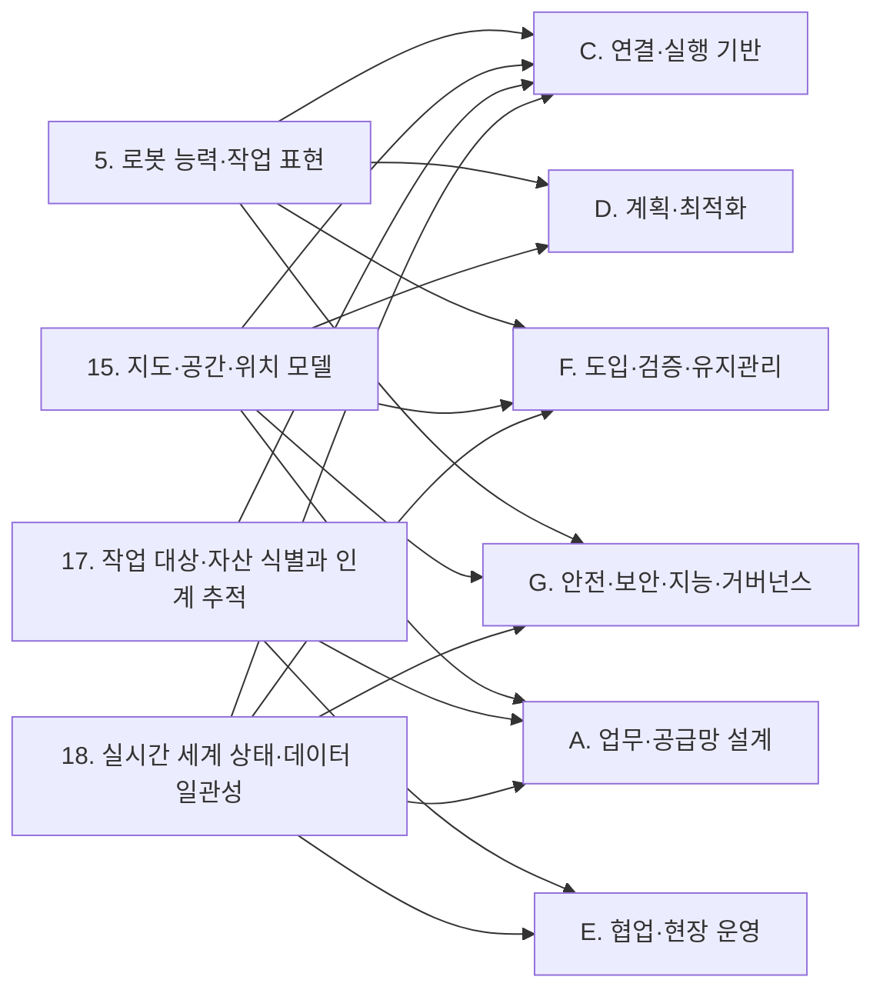

(너의 규칙은 시스템 프롬프트의 agents/shared-rules.md 와 agents/storyteller.md 이다. 아래는 이번 실행의 컨텍스트와 입력이다.)

## 실행 컨텍스트

- run_id: 2026-09-29-09
- date: 2026-09-29
- run_type: area_deep_dive (영역 심화)
- 대상: 7. 온톨로지 검증·변경 관리 (B. 로봇 온톨로지)
- 예산:
    - max_search_queries: 30
    - max_sources_per_run: 15
    - new_topic_pages: 1
    - page_updates: 2
    - max_retries: 2
- 환경 알림: web_fetch_available: true · fetch_mode: full
- 언어: ko
- retry_count: 1
- max_retries: 2

## 입력

### runs/2026-09-29-09/target.json

```json
{
  "run_id": "2026-09-29-09",
  "date": "2026-09-29",
  "weekday": "Tue",
  "run_number": 101,
  "run_type": "area_deep_dive",
  "forced": true,
  "target": {
    "area_no": 7,
    "area_name": "7. 온톨로지 검증·변경 관리",
    "category": "B. 로봇 온톨로지",
    "category_letter": "B"
  },
  "topic": null,
  "track": null,
  "corrections": [],
  "budget": {
    "max_search_queries": 30,
    "max_sources_per_run": 15,
    "new_topic_pages": 1,
    "page_updates": 2,
    "max_retries": 2
  },
  "priority_reason": null,
  "priority_questions": [],
  "excluded_areas": [],
  "lifted_areas": [],
  "deferred": {
    "monthly_recheck": false,
    "weekly_review": false
  },
  "selection_rationale": "CLI 지정 run_type=area_deep_dive, area=7"
}
```

### runs/2026-09-29-09/research.json

```json
{
  "run_id": "2026-09-29-09",
  "date": "2026-09-29",
  "run_type": "area_deep_dive",
  "target": {
    "area_no": 7,
    "area_name": "7. 온톨로지 검증·변경 관리",
    "category": "B. 로봇 온톨로지"
  },
  "gaps": [
    "섹션 3. 왜 중요한가 비어 있음",
    "섹션 4. 핵심 개념과 용어 비어 있음 — 역량 질문·온톨로지 피트폴·버전 IRI·온톨로지 진화 용어 없음(형상 제약 언어·의미적 버전 관리·회귀 시험·모델 검사·온톨로지 채우기는 용어집에 이미 있음)",
    "섹션 5. 적용 사례 (현장 유형 명시) 비어 있음",
    "섹션 6. 대표 접근법과 기술 비어 있음 — 역량 질문 기반 완전성 확인, 추론기·피트폴 스캐너·형상 검증 같은 자동 평가, 버전 식별·호환성 표기, 변경 표현·탐지·영향 분석 네 갈래 모두 근거 없음",
    "섹션 7. 관련 표준·프레임워크·오픈소스 비어 있음 — OWL 2 버전 IRI, W3C SHACL, OOPS!, IDTA 서브모델 템플릿 버전·폐기 규칙, 지식 그래프 변경 언어 없음",
    "섹션 8. 대표 연구와 자료 비어 있음",
    "섹션 9. ROP가 직접 맡는 것과 외부와 연계하는 것 (책임 경계 기준) 비어 있음",
    "섹션 10. 다른 연구영역과의 연결 (번호와 이름을 함께 표기) 비어 있음 — 4. 이기종 로봇 등록, 5. 로봇 능력·작업 표현, 6. 온톨로지 기반 시스템·로봇 연동, 21. 상호운용 표준·적합성, 45. 문서·도면·장면 이해, 47. AI·학습·적응과 모델 운영, 54. 시험·형식 검증·벤치마크, 57. 자산·소프트웨어 수명주기 관리 연결 필요",
    "섹션 11. 열린 질문 비어 있음 — 이 영역에 걸린 열린 질문 oq-147 미반영, 정정 요청 없음",
    "프런트매터 related_areas·sources 비어 있음"
  ],
  "research_questions": [
    "온톨로지가 빠짐없고 정확한지, 문서가 바뀌면 무엇을 다시 확인할지 어떻게 알 것인가? [분류원문]",
    "역량 질문(competency question)을 SPARQL 질의·테스트로 형식화해 온톨로지의 완전성과 정확성을 확인하는 방법과 데이터셋·로봇 적용 사례는 무엇인가? (섹션 4·6·8 겨냥)",
    "추론기 일관성 검사, 피트폴 스캐너(OOPS!), 형상 검증(SHACL) 같은 자동 평가 도구는 각각 무엇을 잡아내고 검증 보고서를 어떤 구조로 내는가? (섹션 6·7 겨냥)",
    "온톨로지와 서브모델 템플릿의 버전은 어떻게 식별하고 이전 판과의 호환·비호환·폐기를 어떻게 표기하는가(OWL 2 버전 IRI, IDTA 서브모델 템플릿 규칙)? (섹션 4·7 겨냥)",
    "온톨로지 변경을 표현·탐지하고 의존 자원에 미치는 영향을 분석하는 연구(온톨로지 진화, 변경 언어, 버전 비교, 재구성 허용성)는 무엇이 보고되었으며, 언어 모델을 검증에 쓰는 방법은 어디에 연결되는가? (섹션 6·8 겨냥, 교차 규칙에 따라 45. 문서·도면·장면 이해·47. AI·학습·적응과 모델 운영과 연결)",
    "oq-147 문서·URDF 에서 추출한 능력 항목마다 매뉴얼의 절·줄 위치를 근거로 붙여 검토자가 원문과 대조해 확정·반려하는 공개 구현이나 연구가 있는가? (섹션 6·11 겨냥)",
    "온톨로지 검증·변경 관리에서 ROP가 직접 맡을 것(역량 질문 목록·테스트 실행·검증 보고서·버전 식별·재검증 목록)과 제조사·표준 발행 기관에 맡길 것의 경계는 어디이며, 현장 유형별 사례와 국내 자료는 무엇인가? (섹션 5·9·10 겨냥, 한국 자료 우선)"
  ],
  "findings": [
    {
      "id": "f1",
      "claim": "Wiśniewski·Potoniec·Ławrynowicz·Keet(2018)는 온톨로지 개발에서 역량 질문(competency question) 사용을 촉진하기 위해 여러 도메인 온톨로지에 대한 역량 질문 234개와 그 SPARQL-OWL 번역을 공개하고, 언어·의미 분석으로 106개의 역량 질문 패턴을 46개의 SPARQL-OWL 질의 서명과 대응시켜 역량 질문의 형식화·실행·관리를 지원하는 벤치마크로 제시했다.",
      "tag": "사실",
      "source_ids": [
        "ref-890"
      ],
      "cross_checked": false,
      "confidence": "medium",
      "evidence_excerpt": "초록: '234 CQs와 여러 도메인의 온톨로지를 위한 SPARQL-OWL 번역'을 공개하고 106개 역량 질문 패턴을 46개 SPARQL-OWL 질의 서명과 비교 분석. 용도는 역량 질문의 형식화·실행·관리 지원과 테스트·벤치마크.",
      "as_of": "2018-11-23",
      "site_type": null,
      "flow_item": null
    },
    {
      "id": "f2",
      "claim": "Martorana·Urgese·Tiddi·Schlobach(2025)의 OntoBOT 은 SOMA·DOLCE 를 확장해 가정용 개인 서비스 로봇의 작업·행동·환경·능력을 통합 표현하는 온톨로지이며, 역량 질문으로 평가하고 TIAGo·HSR·UR3·Stretch 네 로봇에 대해 검증했다.",
      "tag": "사실",
      "source_ids": [
        "ref-891"
      ],
      "cross_checked": false,
      "confidence": "medium",
      "evidence_excerpt": "초록: 노인·지원이 필요한 사람을 돕는 가정 내 개인 서비스 로봇을 대상으로 과제·행동·환경·능력을 통합 표현하고 '형식적 추론을 지원'하며, '역량 질문을 통해 평가'하고 네 가지 구체화된 에이전트(TIAGo, HSR, UR3, Stretch)에서 검증.",
      "as_of": "2025-09-26",
      "site_type": "가정",
      "flow_item": "수행 자원"
    },
    {
      "id": "f3",
      "claim": "고영만 외(한국문헌정보학회지 49권 3호, 2015)는 학술용어사전 STNet 에 온톨로지 구조를 도입하면서 Pellet 추론기로 TBox 를 검증해 생성한 추론규칙이 모두 참임을 확인하고 SPARQL 검색 시나리오로 의미 검색 성능을 평가했으며, 이는 이번 조사에서 확인된 유일한 국내 온톨로지 검증 연구다.",
      "tag": "사실",
      "source_ids": [
        "ref-899"
      ],
      "cross_checked": false,
      "confidence": "medium",
      "evidence_excerpt": "초록: '추론 엔진(Pellet)을 통해 TBox 검증을 수행한 결과 본 연구에서 생성한 추론규칙이 모두 참으로 나타났으며' 키워드 검색으로 파악하기 힘든 복잡한 검색 시나리오를 SPARQL 질의로 평가.",
      "as_of": "2015",
      "site_type": null,
      "flow_item": null
    },
    {
      "id": "f4",
      "claim": "서로 다른 세 발행 주체(포즈난 공과대학교·케이프타운 대학교 연구진의 역량 질문 데이터셋, 암스테르담 자유대학교 연구진의 OntoBOT, 국내 문헌정보학 연구진의 STNet)가 역량 질문 또는 SPARQL 질의 실행과 추론기 검증으로 온톨로지의 완전성·정확성을 확인하는 방식을 각각 보고해, 이 영역의 역량 질문·질의 기반 검증이 한 곳 이상에서 확인된다.",
      "tag": "사실",
      "source_ids": [
        "ref-890",
        "ref-891",
        "ref-899"
      ],
      "cross_checked": true,
      "confidence": "medium",
      "evidence_excerpt": "f1(역량 질문→SPARQL-OWL 데이터셋), f2(역량 질문으로 로봇 온톨로지 평가), f3(Pellet TBox 검증과 SPARQL 시나리오)을 종합. 세 출처는 발행 기관·국가가 다르고 서로 인용 관계가 아니다.",
      "as_of": "2025-09-26",
      "site_type": null,
      "flow_item": null
    },
    {
      "id": "f5",
      "claim": "Poveda-Villalón·Gómez-Pérez·Suárez-Figueroa(IJSWIS, 2014)의 OOPS!(OntOlogy Pitfall Scanner!)는 기술 논리에 익숙하지 않은 도메인 전문가를 위해 온톨로지의 모델링 결함(피트폴)을 온라인에서 탐지하는 도구로, 693개 이상의 온톨로지를 경험적으로 분석해 만든 카탈로그를 구조·기능·사용성 프로파일링 차원으로 분류하고 피트폴마다 심각·중요·경미의 중요도를 둔다.",
      "tag": "사실",
      "source_ids": [
        "ref-889"
      ],
      "cross_checked": false,
      "confidence": "medium",
      "evidence_excerpt": "초록: '온톨로지에서 결함을 탐지하기 위한 도구'로 693개 이상 온톨로지를 분석한 카탈로그를 구조적·기능적·사용성 프로파일링 차원으로 분류하고 각 피트폴에 중요도(critical·important·minor)와 탐지된 온톨로지 수를 포함.",
      "as_of": "2014-04",
      "site_type": null,
      "flow_item": null
    },
    {
      "id": "f6",
      "claim": "W3C 형상 제약 언어(SHACL) 권고안(2017-07-20)은 데이터 그래프를 형상 그래프의 조건 집합으로 검증하는 언어이며, 검증 보고서는 적합 여부(sh:conforms), 개별 결과(sh:result), 심각도(sh:resultSeverity: Violation·Warning·Info)와 초점 노드·경로·값·원인 형상을 담는다.",
      "tag": "사실",
      "source_ids": [
        "ref-459"
      ],
      "cross_checked": false,
      "confidence": "medium",
      "evidence_excerpt": "원문: 'RDF 그래프를 조건의 집합으로 검증하는 언어'. 검증 결과는 sh:conforms(부울), sh:result, sh:resultSeverity(sh:Violation·sh:Warning·sh:Info), sh:focusNode·sh:resultPath·sh:value·sh:sourceShape 로 구성.",
      "as_of": "2017-07-20",
      "site_type": null,
      "flow_item": null
    },
    {
      "id": "f7",
      "claim": "Ioannidou 외(Healthcare, 2025)의 의료 로봇 상위 온톨로지 HERON 은 SPARQL 질의로 작업에 대한 에이전트 자격·전제조건을 검사하고 SHACL 형상으로 역할 기반 권한·오버라이드 승인 같은 기관 정책 준수를 검증하며, 임상 배치 없이 의료센터의 물류 운반·다중 로봇 플릿 조정 시뮬레이션 시나리오로 시연했다.",
      "tag": "사실",
      "source_ids": [
        "ref-880"
      ],
      "cross_checked": false,
      "confidence": "medium",
      "evidence_excerpt": "SPARQL 로 에이전트 자격·전제조건 검사, SHACL 형상으로 역할 기반 권한·오버라이드 승인 정책 검증, Fundació Ave Maria 의료센터 시뮬레이션 시나리오(임상 배치 아님). (재인용: 2026-09-29-08)",
      "as_of": "2025-04-30",
      "site_type": "병원",
      "flow_item": "제약",
      "source_unopened": true
    },
    {
      "id": "f8",
      "claim": "서로 다른 두 발행 주체(W3C 의 SHACL 권고안, 그리스 연구진의 HERON)가 형상 제약 검증을 각각 정의하고 로봇 온톨로지 정책 검증에 적용해, 온톨로지 인스턴스 데이터의 제약 검증 수단으로서 SHACL 이 한 곳 이상에서 확인된다.",
      "tag": "사실",
      "source_ids": [
        "ref-459",
        "ref-880"
      ],
      "cross_checked": true,
      "confidence": "high",
      "evidence_excerpt": "f6(W3C 권고안의 검증 보고서 구조)과 f7(HERON 의 SHACL 정책 검증)을 종합. W3C 원문을 이번 실행에서 열었고 HERON 은 이전 실행에서 전문을 연 동료심사 논문이다.",
      "as_of": "2025-04-30",
      "site_type": "병원",
      "flow_item": "제약"
    },
    {
      "id": "f9",
      "claim": "Vieira da Silva·Köcher·Gehlhoff·Fay(2024)는 자연어 능력 설명에서 언어 모델로 능력 온톨로지를 생성한 뒤 구문 검증·모순 탐지·환각과 누락 점검을 언어 모델과의 반복 루프로 자동 수행하고 사람이 최종 검토·수정만 하게 하여, 온톨로지 검증 단계에 자동 검사와 사람 검토를 결합했다.",
      "tag": "사실",
      "source_ids": [
        "ref-465"
      ],
      "cross_checked": false,
      "confidence": "medium",
      "evidence_excerpt": "구문 검증·모순 탐지·환각·누락 점검을 자동 루프로 돌린 뒤 사람이 최종 검토. (재인용: 2026-09-29-08)",
      "as_of": "2024-10-18",
      "site_type": null,
      "flow_item": "완료·인계",
      "source_unopened": true
    },
    {
      "id": "f10",
      "claim": "Alharbi·Tamma·Payne·de Berardinis(2026)는 개방형(KimiK2·Llama 3.1·3.2)과 폐쇄형(Gemini 2.5 Pro·GPT 4.1) 언어 모델이 생성한 역량 질문을 가독성·입력 텍스트 관련성·구조적 복잡성 지표로 여러 도메인에서 평가해, 모델의 생성 프로필이 사용 사례에 따라 뚜렷이 달라진다고 보고했다.",
      "tag": "사실",
      "source_ids": [
        "ref-898"
      ],
      "cross_checked": false,
      "confidence": "medium",
      "evidence_excerpt": "초록: 전통적으로 수작업이던 역량 질문 생성을 생성형 AI 로 자동화; '가독성, 입력 텍스트와의 관련성, 생성된 질문의 구조적 복잡성' 지표; 'LLM 성능이 사용 사례에 의해 형성된 뚜렷한 생성 프로필을 반영'. 사람 검토 필요성은 초록에 명시되지 않음.",
      "as_of": "2026-04-17",
      "site_type": null,
      "flow_item": null
    },
    {
      "id": "f11",
      "claim": "W3C OWL 2 구조 명세 2판(2012-12-11)은 온톨로지를 온톨로지 IRI 로 식별하고 특정 판을 버전 IRI 로 구분하며 같은 온톨로지 시리즈에서 정확히 하나의 버전만 현재 버전으로 보고, 온톨로지 주석 owl:priorVersion(이전 판 IRI)·owl:backwardCompatibleWith(호환되는 이전 판)·owl:incompatibleWith(양립 불가능한 이전 판)로 판 사이 관계를 표기한다.",
      "tag": "사실",
      "source_ids": [
        "ref-886"
      ],
      "cross_checked": false,
      "confidence": "medium",
      "evidence_excerpt": "3.1절: ontology IRI 는 온톨로지를, version IRI 는 특정 버전을 식별하며 '각 온톨로지 시리즈에서 정확히 하나의 버전이 현재 버전으로 간주'. 3.5절: owl:priorVersion·owl:backwardCompatibleWith·owl:incompatibleWith 정의.",
      "as_of": "2012-12-11",
      "site_type": null,
      "flow_item": null
    },
    {
      "id": "f12",
      "claim": "IDTA 서브모델 템플릿 공식 저장소 README 는 템플릿을 published·deprecated 폴더로 관리하고 판을 주버전·리비전·버그 수정으로 표기하며, 새 판 발행 6개월 뒤 이전 판을 deprecated 로 옮기되 그 템플릿은 계속 유효하나 버그 수정·개선·갱신을 더 제공하지 않는다고 정한다.",
      "tag": "사실",
      "source_ids": [
        "ref-439"
      ],
      "cross_checked": false,
      "confidence": "medium",
      "evidence_excerpt": "README: 'After six months from the publication of a new version of a Submodel Template (SMT), the previous version will be moved to the deprecated folder.' 폐기 템플릿은 사용 가능하나 유지보수되지 않음. Technical Data 2.0.1 = 주버전 2·리비전 0·패치 1.",
      "as_of": "2026-09-29",
      "site_type": null,
      "flow_item": null,
      "source_unopened": true
    },
    {
      "id": "f13",
      "claim": "서로 다른 두 발행 주체(W3C, IDTA)가 온톨로지와 서브모델 템플릿의 판 식별자와 이전 판과의 호환·폐기 관계 표기를 각각 정의해, '판 식별자 + 이전 판 관계 명시'가 온톨로지·모델 버전 관리의 관행으로 한 곳 이상에서 확인된다.",
      "tag": "사실",
      "source_ids": [
        "ref-886",
        "ref-439"
      ],
      "cross_checked": true,
      "confidence": "high",
      "evidence_excerpt": "f11(OWL 2 버전 IRI·이전 판 주석)과 f12(IDTA 주버전·리비전·deprecated 규칙)를 종합. 두 출처 모두 이번 실행에서 원문을 열었고 발행 주체가 다르다.",
      "as_of": "2026-09-29",
      "site_type": null,
      "flow_item": null
    },
    {
      "id": "f14",
      "claim": "Zablith 외(The Knowledge Engineering Review, 2013)의 프로세스 중심 서베이는 온톨로지 진화(ontology evolution)를 도메인 변화나 정보 시스템 요구에 대응해 온톨로지를 최신으로 유지하는 일로 정의하고, 전형적 접근이 자연어 처리·추론 등 여러 분야 기법을 결합한 다단계 과정으로 설계된다고 정리했다.",
      "tag": "사실",
      "source_ids": [
        "ref-888"
      ],
      "cross_checked": false,
      "confidence": "medium",
      "evidence_excerpt": "초록: '온톨로지 진화는 도메인 변화 또는 정보 시스템 요구사항에 대응하여 온톨로지를 유지하는 것을 목표'로 하며 자연언어처리와 추론 등 기법을 결합한 다단계 프로세스 접근. 단계 이름은 초록 페이지에서 확인하지 못함.",
      "as_of": "2013-08-28",
      "site_type": null,
      "flow_item": null
    },
    {
      "id": "f15",
      "claim": "Hegde 외(Database, 2025)의 지식 그래프 변경 언어 KGCL 은 온톨로지·지식 그래프의 변경을 '동의어 추가'·'계층 재배치' 같은 통제 자연어 명령으로 요청하거나 기술하는 표준 데이터 모델로, 패치·diff 개념을 빌려 미래 변경 요청과 기존 변경 기술에 모두 쓰이며 GitHub 온톨로지 저장소 자동화 에이전트와 BioPortal 변경 요청 인터페이스로 구현되었다.",
      "tag": "사실",
      "source_ids": [
        "ref-892"
      ],
      "cross_checked": false,
      "confidence": "medium",
      "evidence_excerpt": "초록: 'add synonym 'arm' to 'forelimb'' 같은 고수준 명령으로 변경을 요청·기술하는 표준 데이터 모델; 적용 패치와 diff 개념; GitHub 온톨로지 저장소 통합 에이전트, BioPortal UI 변경 요청. 영향 분석·감사는 초록에 없음.",
      "as_of": "2024-09-20",
      "site_type": null,
      "flow_item": null
    },
    {
      "id": "f16",
      "claim": "Qiang·Taylor·Wang(2024, 2026 개정)의 OM4OV 는 온톨로지 매칭 시스템을 온톨로지 버전 간 변경 비교에 재사용할 수 있지만 확장 없이는 왜곡된 측정을 낸다고 분석하고, 기존 정렬을 활용해 후보를 줄이는 교차 참조 메커니즘을 더한 버전 비교 프레임워크를 제안했다.",
      "tag": "사실",
      "source_ids": [
        "ref-893"
      ],
      "cross_checked": false,
      "confidence": "medium",
      "evidence_excerpt": "초록: 'OM systems can be effectively reused for OV tasks, but without the necessary extensions, can produce skewed measurements'; Agent-OM 기반에 cross-reference 메커니즘 도입. 정량 결과는 초록에 없음.",
      "as_of": "2026-08-31",
      "site_type": null,
      "flow_item": null
    },
    {
      "id": "f17",
      "claim": "서로 다른 세 발행 주체(Zablith 외의 유럽 연구진 서베이, Hegde 외의 생물의학 온톨로지 연구진, 호주 국립대학교 계열 Qiang 외)가 온톨로지 변경의 정의·표현·탐지를 각각 다루어, 온톨로지 변경 관리가 별도 연구 분야로 존재함이 한 곳 이상에서 확인된다.",
      "tag": "사실",
      "source_ids": [
        "ref-888",
        "ref-892",
        "ref-893"
      ],
      "cross_checked": true,
      "confidence": "medium",
      "evidence_excerpt": "f14(진화 서베이), f15(변경 언어), f16(버전 비교)을 종합. 세 출처는 기관·주제가 다르고 상호 재게시가 아니다. 다만 세 출처 모두 로봇 능력 온톨로지를 다루지는 않는다.",
      "as_of": "2026-08-31",
      "site_type": null,
      "flow_item": null
    },
    {
      "id": "f18",
      "claim": "Eichelberger·Weber(2024)는 2024년 2월 기준 IDTA 가 발표한 84개 명세 가운데 18개를 중간 메타모델로 변환해 5만 줄 이상의 API 코드·테스트를 자동 생성했으나 명세의 문법적 변동과 문제 때문에 수동 개입이 필요했다고 보고해, 표준 명세 자체의 변동성이 이를 소비하는 시스템의 재검증 부담이 됨을 보였다.",
      "tag": "사실",
      "source_ids": [
        "ref-895"
      ],
      "cross_checked": false,
      "confidence": "medium",
      "evidence_excerpt": "초록: '모든 현재 IDTA 명세를 성공적으로 처리'해 50,000줄 이상 생성했으나 '문법적 변동성과 문제'로 수동 개입 필요; 84개 중 18개 명세 분석. 버전 표시 비율 같은 수치는 초록에 없음.",
      "as_of": "2024-06-20",
      "site_type": null,
      "flow_item": null
    },
    {
      "id": "f19",
      "claim": "Osmani(2026)는 로봇 서비스 온톨로지(RoSO)를 구조적 일반지능 모델(SMGI)의 의미 계층으로 두고, 서비스 재구성 뒤에도 서비스 기술이 유효하게 남기 위한 정체성 보존 재구성 기준과 지역적으로 허용되는 갱신이 전역적으로도 허용되는 조합 조건을 제시해 런타임 변경의 허용 여부를 판단하는 거버넌스를 제안했다.",
      "tag": "사실",
      "source_ids": [
        "ref-900"
      ],
      "cross_checked": false,
      "confidence": "low",
      "evidence_excerpt": "초록: 'identity-preserving reconfiguration criteria, and compositional conditions under which locally acceptable updates remain globally admissible'; 서비스 기술이 'dynamically governable' 하게 됨. 단독 저자 프리프린트이며 실험·현장 적용은 초록에 없음.",
      "as_of": "2026-05-05",
      "site_type": null,
      "flow_item": null
    },
    {
      "id": "f20",
      "claim": "Nasir 외(2026)의 OntoKG-EQ 는 다섯 개의 고정된 역량 질문으로 정당화된 핵심 온톨로지가 모든 클래스·속성·형상 제약·지표를 통제하고, 각 답에 관찰·증거·출처까지 추적하는 설명을 붙여 검증된 그래프에서 결정론적으로 만들며, 17명 패널 연구에서 증거 묶음이 인지된 신뢰도와 완전성을 크게 높였다고 보고했다.",
      "tag": "사실",
      "source_ids": [
        "ref-896"
      ],
      "cross_checked": false,
      "confidence": "medium",
      "evidence_excerpt": "초록: '다섯 개의 동결된 질문으로 정당화된 핵심 온톨로지'; 각 결과가 '관찰, 증거, 출처, 출처까지 추적하는 설명을 생성'; 17명 패널에서 '증거 묶음이 인지된 신뢰도와 완전성을 크게 증가'. 도메인은 신흥 주식시장 분석.",
      "as_of": "2026-09-08",
      "site_type": null,
      "flow_item": "완료·인계"
    },
    {
      "id": "f21",
      "claim": "Abolhasani·Ba·He·Pan(2026)의 TRACE-KG 는 미리 정의한 온톨로지 없이 문맥이 풍부한 지식 그래프와 유도 스키마를 함께 만들면서 원문 근거에 대한 완전한 추적 가능성을 유지해, 사람 검토자가 자동 추출 결과를 원문과 대조해 검증할 수 있게 한다.",
      "tag": "사실",
      "source_ids": [
        "ref-897"
      ],
      "cross_checked": false,
      "confidence": "medium",
      "evidence_excerpt": "초록: '미리 정의된 온톨로지를 가정하지 않고 문맥이 풍부한 지식 그래프와 유도된 스키마를 공동으로 구축'하며 '원본 근거에 대한 완전한 추적 가능성을 유지'. ICML 2026 워크숍 발표.",
      "as_of": "2026-06-15",
      "site_type": null,
      "flow_item": "완료·인계"
    },
    {
      "id": "f22",
      "claim": "oq-147 관련: 추출한 지식 항목마다 원문 근거를 붙여 검토자가 대조하게 하는 구성은 일반 문서 지식 그래프 추출(f20·f21)과 능력 온톨로지 생성의 사람 최종 검토(f9)에서 확인되지만, 로봇 매뉴얼·URDF 에서 뽑은 능력 항목에 매뉴얼의 절·줄 위치를 붙여 확정·반려하는 공개 구현은 이번 조사에서도 확인되지 않아 oq-147 은 부분 진전에 그친다.",
      "tag": "추정",
      "source_ids": [
        "ref-896",
        "ref-897",
        "ref-465"
      ],
      "cross_checked": false,
      "confidence": "low",
      "evidence_excerpt": "f20(증거·출처 추적 설명), f21(원문 근거 완전 추적), f9(사람 최종 검토)를 종합. 세 출처 모두 로봇 매뉴얼을 대상으로 하지 않는다.",
      "as_of": "2026-09-29",
      "site_type": null,
      "flow_item": "완료·인계"
    },
    {
      "id": "f23",
      "claim": "VDA 5050 공식 저장소(main, 3.0.0 판)의 팩트시트 JSON 스키마는 팩트시트 자체의 version 을 필수 속성으로 두고 선택 속성 mobileRobotConfiguration 에 하드웨어·소프트웨어 버전을 담아, 로봇 펌웨어·소프트웨어 판이 바뀐 사실을 등록 데이터에서 읽을 수 있는 자리를 제공한다.",
      "tag": "사실",
      "source_ids": [
        "ref-228"
      ],
      "cross_checked": false,
      "confidence": "medium",
      "evidence_excerpt": "팩트시트 스키마 필수 속성에 version 포함, 선택 속성 mobileRobotConfiguration 에 하드웨어·소프트웨어 버전과 네트워크·배터리 매개변수. (재인용: 2026-09-29-07)",
      "as_of": "2026-09-29",
      "site_type": null,
      "flow_item": "수행 자원"
    },
    {
      "id": "f24",
      "claim": "확인한 출처 어디에도 로봇 능력 온톨로지에 대해 문서·펌웨어 개정 시 영향받는 작업·현장을 찾아 재검증하는 절차를 통째로 다룬 자료는 없으며, 판 식별·호환 표기(f11·f12), 변경의 표현·탐지(f15·f16), 재구성 허용 판단(f19), 펌웨어 판 보고 자리(f23)가 흩어져 있어 ROP 는 이들을 이어 '변경 감지 → 영향 목록 → 재검증 대기열' 절차를 스스로 설계해야 할 것으로 보인다.",
      "tag": "추정",
      "source_ids": [
        "ref-886",
        "ref-439",
        "ref-892",
        "ref-893",
        "ref-228"
      ],
      "cross_checked": false,
      "confidence": "low",
      "evidence_excerpt": "f11·f12·f15·f16·f19·f23 의 종합. 영향 분석(impact analysis)은 f14 서베이가 다루는 분야이나 로봇 능력 온톨로지 적용 사례는 확인하지 못함.",
      "as_of": "2026-09-29",
      "site_type": null,
      "flow_item": "예외·성과"
    },
    {
      "id": "f25",
      "claim": "확인한 자료를 종합하면 7. 온톨로지 검증·변경 관리에서 ROP가 직접 맡을 범위는 능력 온톨로지의 역량 질문 목록과 그 SPARQL 테스트 실행 기록, SHACL 형상과 검증 보고서, 추론기 일관성 검사, 온톨로지 판 식별자와 이전 판 관계 표기, 변경 기술(변경 언어)과 영향받는 작업·현장의 재검증 목록이며, 원문 근거를 붙인 검토·확정 기록은 4. 이기종 로봇 등록의 검토·승인과 같은 기록을 공유해야 할 것으로 보인다.",
      "tag": "추정",
      "source_ids": [
        "ref-890",
        "ref-459",
        "ref-886",
        "ref-892"
      ],
      "cross_checked": false,
      "confidence": "low",
      "evidence_excerpt": "f1·f6·f11·f15 의 수단을 ROP 산출물로 묶은 리서치 에이전트의 종합. 어느 출처도 로봇 오케스트레이션 플랫폼의 책임 범위를 직접 말하지 않는다.",
      "as_of": "2026-09-29",
      "site_type": null,
      "flow_item": null
    },
    {
      "id": "f26",
      "claim": "연계 대상: 로봇 펌웨어·소프트웨어의 릴리스 관리 자체와 표준 발행 기관의 템플릿 개정·폐기 일정은 분류 원문 19장의 로봇 자체 지능·제어와 업종·규격 측 소유 사항이므로, 이종 제조사를 잇는 ROP 는 팩트시트의 판 정보와 템플릿 폐기 통보를 받아 온톨로지 재검증을 촉발하는 데 그치고 펌웨어 검증과 템플릿 유지보수는 제조사·IDTA 에 맡겨야 할 것으로 보인다.",
      "tag": "추정",
      "source_ids": [
        "ref-228",
        "ref-439"
      ],
      "cross_checked": false,
      "confidence": "low",
      "evidence_excerpt": "f23(팩트시트의 하드웨어·소프트웨어 판)과 f12(IDTA 의 6개월 뒤 deprecated 규칙)를 경계 판단에 적용한 종합.",
      "as_of": "2026-09-29",
      "site_type": null,
      "flow_item": "제약"
    },
    {
      "id": "f27",
      "claim": "이 영역은 등록 검토·승인 기록을 주는 4. 이기종 로봇 등록, 검증 대상 어휘를 주는 5. 로봇 능력·작업 표현, 검증된 연결만 실행하는 6. 온톨로지 기반 시스템·로봇 연동을 앞뒤로 두고, 판 규칙은 21. 상호운용 표준·적합성과 57. 자산·소프트웨어 수명주기 관리, 테스트·형식 검증 방법은 54. 시험·형식 검증·벤치마크에 이어지며, 언어 모델로 역량 질문·온톨로지를 생성·검증하는 방법(f9·f10)은 교차 규칙에 따라 45. 문서·도면·장면 이해·47. AI·학습·적응과 모델 운영에도 연결된다.",
      "tag": "추정",
      "source_ids": [
        "ref-439",
        "ref-459",
        "ref-465",
        "ref-898"
      ],
      "cross_checked": false,
      "confidence": "low",
      "evidence_excerpt": "f9·f10·f12·f6 과 분류 원문 교차 규칙(매뉴얼 해석은 4·55번)에 근거한 연결 판단.",
      "as_of": "2026-09-29",
      "site_type": null,
      "flow_item": null
    }
  ],
  "sources": [
    {
      "id": "ref-886",
      "org": "W3C (OWL Working Group)",
      "title": "OWL 2 Web Ontology Language Structural Specification and Functional-Style Syntax (Second Edition)",
      "published": "2012-12-11",
      "url": "https://www.w3.org/TR/owl2-syntax/",
      "type": "표준",
      "reliability": "high",
      "accessed": "2026-09-29",
      "summary": "OWL 2 구조 명세. 온톨로지 IRI·버전 IRI 의 관계와 owl:priorVersion·backwardCompatibleWith·incompatibleWith 주석을 정의한다.",
      "fetched": true,
      "fetched_via": "webfetch",
      "fetch_url": null,
      "source_unopened": false
    },
    {
      "id": "ref-459",
      "org": "W3C (RDF Data Shapes Working Group)",
      "title": "Shapes Constraint Language (SHACL)",
      "published": "2017-07-20",
      "url": "https://www.w3.org/TR/shacl/",
      "type": "표준",
      "reliability": "high",
      "accessed": "2026-09-29",
      "summary": "RDF 데이터 그래프를 형상 그래프의 조건으로 검증하는 W3C 권고안. 검증 보고서 구조(sh:conforms·sh:result·sh:resultSeverity)를 정한다.",
      "fetched": true,
      "fetched_via": "webfetch",
      "fetch_url": null,
      "source_unopened": false
    },
    {
      "id": "ref-888",
      "org": "Zablith, F., Antoniou, G., d'Aquin, M., Flouris, G., Kondylakis, H., Motta, E., Plexousakis, D., & Sabou, M. (The Knowledge Engineering Review)",
      "title": "Ontology evolution: a process-centric survey",
      "published": "2013-08-28",
      "url": "https://www.cambridge.org/core/product/identifier/S0269888913000349/type/journal_article",
      "type": "논문",
      "reliability": "medium",
      "accessed": "2026-09-29",
      "summary": "온톨로지 진화를 도메인·요구 변화에 대응하는 유지 활동으로 정의하고 다단계 과정으로 정리한 서베이. 초록 페이지만 열었다(전문 PDF 403).",
      "fetched": true,
      "fetched_via": "webfetch",
      "fetch_url": null,
      "source_unopened": false
    },
    {
      "id": "ref-889",
      "org": "Poveda-Villalón, M., Gómez-Pérez, A., & Suárez-Figueroa, M. C. (Universidad Politécnica de Madrid, IJSWIS 10(2))",
      "title": "OOPS! (OntOlogy Pitfall Scanner!): an on-line tool for ontology evaluation",
      "published": "2014-04",
      "url": "https://oa.upm.es/35873/",
      "type": "논문",
      "reliability": "medium",
      "accessed": "2026-09-29",
      "summary": "온톨로지 모델링 결함을 탐지하는 온라인 도구 OOPS! 와 693개 이상 온톨로지 분석에 기반한 피트폴 카탈로그. UPM 기관 저장소의 초록을 열었다.",
      "fetched": true,
      "fetched_via": "webfetch",
      "fetch_url": null,
      "source_unopened": false
    },
    {
      "id": "ref-890",
      "org": "Wiśniewski, D., Potoniec, J., Ławrynowicz, A., & Keet, C. M.",
      "title": "Competency Questions and SPARQL-OWL Queries Dataset and Analysis",
      "published": "2018-11-23",
      "url": "https://arxiv.org/abs/1811.09529",
      "type": "논문",
      "reliability": "medium",
      "accessed": "2026-09-29",
      "summary": "역량 질문 234개와 SPARQL-OWL 번역, 106개 질문 패턴과 46개 질의 서명의 대응을 공개한 데이터셋 논문(프리프린트 초록).",
      "fetched": true,
      "fetched_via": "webfetch",
      "fetch_url": null,
      "source_unopened": false
    },
    {
      "id": "ref-891",
      "org": "Martorana, M., Urgese, F., Tiddi, I., & Schlobach, S. (Vrije Universiteit Amsterdam)",
      "title": "An Ontology for Unified Modeling of Tasks, Actions, Environments, and Capabilities in Personal Service Robotics",
      "published": "2025-09-26",
      "url": "https://arxiv.org/abs/2509.22434",
      "type": "논문",
      "reliability": "medium",
      "accessed": "2026-09-29",
      "summary": "가정용 개인 서비스 로봇의 작업·행동·환경·능력을 통합 표현하는 OntoBOT 을 역량 질문으로 평가하고 네 로봇에서 검증한 프리프린트(초록).",
      "fetched": true,
      "fetched_via": "webfetch",
      "fetch_url": null,
      "source_unopened": false
    },
    {
      "id": "ref-892",
      "org": "Hegde, H. 외 (Database, Oxford)",
      "title": "A Change Language for Ontologies and Knowledge Graphs",
      "published": "2024-09-20",
      "url": "https://arxiv.org/abs/2409.13906",
      "type": "논문",
      "reliability": "medium",
      "accessed": "2026-09-29",
      "summary": "온톨로지·지식 그래프 변경을 통제 자연어 명령으로 요청·기술하는 표준 데이터 모델 KGCL(프리프린트 초록, Database 2025 게재).",
      "fetched": true,
      "fetched_via": "webfetch",
      "fetch_url": null,
      "source_unopened": false
    },
    {
      "id": "ref-893",
      "org": "Qiang, Z., Taylor, K., & Wang, W.",
      "title": "OM4OV: Leveraging Ontology Matching for Ontology Versioning",
      "published": "2024-09-30",
      "url": "https://arxiv.org/abs/2409.20302",
      "type": "논문",
      "reliability": "medium",
      "accessed": "2026-09-29",
      "summary": "온톨로지 매칭 시스템을 버전 간 변경 비교에 재사용하는 프레임워크와 교차 참조 메커니즘(프리프린트 초록, 2026-08-31 v19).",
      "fetched": true,
      "fetched_via": "webfetch",
      "fetch_url": null,
      "source_unopened": false
    },
    {
      "id": "ref-439",
      "org": "Industrial Digital Twin Association (IDTA), admin-shell-io GitHub 공식 저장소",
      "title": "submodel-templates — IDTA Submodel Templates for AAS (README)",
      "published": null,
      "url": "https://github.com/admin-shell-io/submodel-templates",
      "type": "표준",
      "reliability": "medium",
      "accessed": "2026-09-29",
      "summary": "IDTA 서브모델 템플릿 공식 저장소 README. published·deprecated 폴더, 주버전·리비전·버그 수정 표기, 새 판 6개월 뒤 이전 판 폐기 규칙을 적는다.",
      "fetched": false,
      "fetched_via": null,
      "fetch_url": "https://raw.githubusercontent.com/admin-shell-io/submodel-templates/main/README.md",
      "source_unopened": true
    },
    {
      "id": "ref-895",
      "org": "Eichelberger, H., & Weber, A.",
      "title": "Model-driven realization of IDTA submodel specifications: The good, the bad, the incompatible?",
      "published": "2024-06-20",
      "url": "https://arxiv.org/abs/2406.14470",
      "type": "논문",
      "reliability": "medium",
      "accessed": "2026-09-29",
      "summary": "IDTA 명세 18개를 메타모델로 변환해 API 코드·테스트를 생성한 모델 기반 접근과 명세의 문법적 변동 문제(프리프린트 초록).",
      "fetched": true,
      "fetched_via": "webfetch",
      "fetch_url": null,
      "source_unopened": false
    },
    {
      "id": "ref-896",
      "org": "Nasir, F., Saeed, M. A., Ehsan, M., Ahmad, S. J., & Altaf, A. M.",
      "title": "OntoKG-EQ: A provenance-grounded, competency-question-governed knowledge graph for auditable analyst querying",
      "published": "2026-09-08",
      "url": "https://arxiv.org/abs/2609.08869",
      "type": "논문",
      "reliability": "medium",
      "accessed": "2026-09-29",
      "summary": "다섯 개 고정 역량 질문이 온톨로지를 통제하고 각 답에 출처까지의 증거 추적을 붙이는 지식 그래프. 17명 패널 평가(프리프린트 초록, 금융 도메인).",
      "fetched": true,
      "fetched_via": "webfetch",
      "fetch_url": null,
      "source_unopened": false
    },
    {
      "id": "ref-897",
      "org": "Abolhasani, M. S., Ba, Y., He, Y., & Pan, R. (Graph Foundation Models @ ICML 2026)",
      "title": "Beyond Predefined Schemas: TRACE-KG for Context-Enriched Knowledge Graph Generation",
      "published": "2026-04-03",
      "url": "https://arxiv.org/abs/2604.03496",
      "type": "논문",
      "reliability": "medium",
      "accessed": "2026-09-29",
      "summary": "원문 근거에 대한 완전한 추적 가능성을 유지하며 문맥 지식 그래프와 유도 스키마를 함께 만드는 프레임워크(프리프린트 초록).",
      "fetched": true,
      "fetched_via": "webfetch",
      "fetch_url": null,
      "source_unopened": false
    },
    {
      "id": "ref-898",
      "org": "Alharbi, R., Tamma, V., Payne, T. R., & de Berardinis, J.",
      "title": "Characterising LLM-Generated Competency Questions: a Cross-Domain Empirical Study using Open and Closed Models",
      "published": "2026-04-17",
      "url": "https://arxiv.org/abs/2604.16258",
      "type": "논문",
      "reliability": "medium",
      "accessed": "2026-09-29",
      "summary": "개방형·폐쇄형 언어 모델이 생성한 역량 질문을 가독성·관련성·구조 복잡성으로 평가한 다중 도메인 연구(프리프린트 초록).",
      "fetched": true,
      "fetched_via": "webfetch",
      "fetch_url": null,
      "source_unopened": false
    },
    {
      "id": "ref-899",
      "org": "고영만, 송민선, 이승준, 김비연, 민혜령 (한국문헌정보학회지 49(3))",
      "title": "구조적 학술용어사전 “STNet”의 추론규칙 생성에 의한 의미 검색에 관한 연구",
      "published": "2015",
      "url": "https://www.kci.go.kr/kciportal/ci/sereArticleSearch/ciSereArtiView.kci?sereArticleSearchBean.artiId=ART002022617",
      "type": "논문",
      "reliability": "medium",
      "accessed": "2026-09-29",
      "summary": "학술용어사전에 온톨로지를 도입하고 Pellet 추론기 TBox 검증과 SPARQL 검색 시나리오로 평가한 국내 연구(KCI 초록).",
      "fetched": true,
      "fetched_via": "webfetch",
      "fetch_url": null,
      "source_unopened": false
    },
    {
      "id": "ref-900",
      "org": "Osmani, A.",
      "title": "From Ontology Conformance to Admissible Reconfiguration: A RoSO/SMGI Adequacy Argument for Robotic Service Governance",
      "published": "2026-05-05",
      "url": "https://arxiv.org/abs/2605.08185",
      "type": "논문",
      "reliability": "medium",
      "accessed": "2026-09-29",
      "summary": "로봇 서비스 온톨로지의 재구성 뒤 유효성 유지 조건과 지역·전역 허용성을 다룬 이론적 단독 저자 프리프린트(초록).",
      "fetched": true,
      "fetched_via": "webfetch",
      "fetch_url": null,
      "source_unopened": false
    },
    {
      "id": "ref-465",
      "org": "Vieira da Silva, L. M., Köcher, A., Gehlhoff, F., & Fay, A.",
      "title": "Toward a Method to Generate Capability Ontologies from Natural Language Descriptions",
      "published": "2024-10-18",
      "url": "https://arxiv.org/abs/2406.07962",
      "type": "논문",
      "reliability": "medium",
      "accessed": "2026-09-29",
      "summary": "자연어 능력 설명에서 언어 모델로 능력 온톨로지를 생성하고 구문 검증·모순 탐지·환각·누락 점검을 자동 루프로 돌린 뒤 사람이 최종 검토하는 방법.",
      "fetched": false,
      "fetched_via": null,
      "fetch_url": null,
      "source_unopened": true
    },
    {
      "id": "ref-880",
      "org": "Ioannidou, P., Vezakis, I., Haritou, M., Petropoulou, R., Miloulis, S. T., Kouris, I., Bromis, K., Matsopoulos, G. K., & Koutsouris, D. D. (Healthcare, Basel)",
      "title": "HEalthcare Robotics' ONtology (HERON): An Upper Ontology for Communication, Collaboration and Safety in Healthcare Robotics",
      "published": "2025-04-30",
      "url": "https://pmc.ncbi.nlm.nih.gov/articles/PMC12071619/",
      "type": "논문",
      "reliability": "medium",
      "accessed": "2026-09-29",
      "summary": "의료 로봇 상위 온톨로지 HERON. SPARQL 자격·전제조건 검사와 SHACL 정책 검증을 의료센터 물류·플릿 조정 시뮬레이션 시나리오로 시연.",
      "fetched": false,
      "fetched_via": null,
      "fetch_url": null,
      "source_unopened": true
    },
    {
      "id": "ref-228",
      "org": "VDA (Verband der Automobilindustrie) · VDMA, VDA5050 GitHub 공식 저장소",
      "title": "VDA5050/json_schemas/factsheet.schema (main)",
      "published": null,
      "url": "https://github.com/VDA5050/VDA5050/blob/main/json_schemas/factsheet.schema",
      "type": "표준",
      "reliability": "high",
      "accessed": "2026-09-29",
      "summary": "VDA 5050 3.0.0 팩트시트 JSON 스키마. version 등 필수 속성과 하드웨어·소프트웨어 버전을 담는 선택 속성 mobileRobotConfiguration 을 정한다.",
      "fetched": true,
      "fetched_via": "github_raw",
      "fetch_url": null,
      "source_unopened": false
    }
  ],
  "page_proposals": [
    {
      "action": "update",
      "path": "docs/categories/robot-ontology/ontology-verification-and-change-management.md",
      "sections": [
        "3",
        "4",
        "5",
        "6",
        "7",
        "8",
        "9",
        "10",
        "11"
      ],
      "rationale": "섹션 3: f4(역량 질문·질의 기반 검증이 여러 곳에서 확인), f18(표준 명세 변동이 재검증 부담), f24(개정 시 영향·재검증 절차는 흩어져 있어 ROP 가 설계해야 함) / 섹션 4: f1(역량 질문·SPARQL-OWL), f5(피트폴·중요도), f6(형상 검증 보고서), f11(온톨로지 IRI·버전 IRI·이전 판 주석), f14(온톨로지 진화) / 섹션 5: 가정 — f2(OntoBOT, 네 로봇 역량 질문 평가, 현장 배치 아님을 명시), 병원 — f7(HERON 의료센터 시뮬레이션 정책 검증, 임상 배치 아님), 제조 공장·물류창고·상업 시설·실외 사례는 확인되지 않음을 서술 / 섹션 6: 역량 질문 검증 f1·f2·f3·f4, 자동 평가 f5·f6·f8, 언어 모델 결합 검증 f9·f10(교차 규칙에 따라 45. 문서·도면·장면 이해·47. AI·학습·적응과 모델 운영 함께 연결), 버전·호환 표기 f11·f12·f13, 변경 표현·탐지·허용성 f15·f16·f17·f19, 원문 근거 검토 f20·f21·f22 / 섹션 7: f11(OWL 2), f6(SHACL), f5(OOPS!), f12(IDTA 서브모델 템플릿 규칙), f15(KGCL), f23(VDA 5050 팩트시트 판 정보) / 섹션 8: f1, f2, f5, f14, f15, f16, f18, f19, f20, f21, 국내 f3 / 섹션 9: f25(직접 범위: 역량 질문 목록·테스트 기록·형상·검증 보고서·판 식별·재검증 목록), f26(연계 대상: 펌웨어 릴리스·템플릿 폐기 일정) / 섹션 10: f27 — 4. 이기종 로봇 등록, 5. 로봇 능력·작업 표현, 6. 온톨로지 기반 시스템·로봇 연동, 21. 상호운용 표준·적합성, 45. 문서·도면·장면 이해, 47. AI·학습·적응과 모델 운영, 54. 시험·형식 검증·벤치마크, 57. 자산·소프트웨어 수명주기 관리, 63. 병원·의료(f7), 65. 가정·공동주택(f2) / 섹션 11: 기존 oq-147(f22 로 부분 진전, 미해결)과 open_questions_new 4건. 다음 실행 후보: 57. 자산·소프트웨어 수명주기 관리 페이지에 f12·f23 반영, 54. 시험·형식 검증·벤치마크 페이지에 f1·f6 반영, 트랙 manual-capability-ontology 단계 5(완전성·정확성 검증)에 f1·f4·f5·f6 참고, 단계 6(변경 관리)에 f11·f12·f15 참고."
    }
  ],
  "glossary_candidates": [
    {
      "term_ko": "역량 질문",
      "term_en": "Competency Question (CQ)",
      "definition": "온톨로지가 답할 수 있어야 하는 질문으로 요구사항을 적은 것으로, SPARQL 같은 질의로 형식화해 온톨로지가 요구를 충족하는지 검증하는 데 쓴다."
    },
    {
      "term_ko": "온톨로지 피트폴",
      "term_en": "Ontology Pitfall",
      "definition": "온톨로지 모델링에서 흔히 생기는 결함 유형으로, 피트폴 스캐너(OOPS!)가 구조·기능·사용성 차원의 카탈로그와 심각·중요·경미 중요도로 자동 탐지한다."
    },
    {
      "term_ko": "버전 IRI",
      "term_en": "Version IRI (owl:versionIRI)",
      "definition": "OWL 2 에서 같은 온톨로지 IRI 를 공유하는 온톨로지 시리즈 가운데 특정 판을 식별하는 IRI 로, 이전 판·호환·비호환 주석과 함께 온톨로지 버전 관리에 쓴다."
    },
    {
      "term_ko": "온톨로지 진화",
      "term_en": "Ontology Evolution",
      "definition": "도메인 변화나 정보 시스템 요구 변화에 대응해 온톨로지를 최신 상태로 유지하는 활동으로, 변경 감지·표현·적용·영향 관리를 포함하는 다단계 과정으로 다뤄진다."
    }
  ],
  "open_questions_new": [
    "로봇 능력 온톨로지에 대해 펌웨어·매뉴얼 개정을 감지해 영향받는 작업·현장을 찾고 재검증 대기열에 넣는 절차를 구현한 공개 구현이나 현장 사례가 있는가? | 관련 영역: 7. 온톨로지 검증·변경 관리, 57. 자산·소프트웨어 수명주기 관리, 4. 이기종 로봇 등록 | 근거: f24 | 종류: 일반",
    "분류 원문이 말하는 지원 단계 표시(문서 확인·구조화·시뮬레이션 연결·어댑터 연결·시뮬레이션 검증·실기 검증)에 대응하는 기존 검증 수준·성숙도 체계가 있는가, 아니면 ROP 가 자체 정의해야 하는가? | 관련 영역: 7. 온톨로지 검증·변경 관리, 54. 시험·형식 검증·벤치마크, 36. 가상 시운전·실제 상황 재현 | 근거: f25 | 종류: 일반",
    "국내에서 역량 질문·추론기·SHACL 로 로봇 온톨로지를 검증하거나 버전을 관리한 연구·현장 사례가 있는가(이번 조사에서 확인된 국내 자료는 학술용어사전 온톨로지 검증 연구 1건이다)? | 관련 영역: 7. 온톨로지 검증·변경 관리, 5. 로봇 능력·작업 표현 | 근거: f3 | 종류: 일반",
    "IDTA 서브모델 템플릿의 이전 판이 새 판 발행 6개월 뒤 deprecated 로 옮겨질 때 그 판에 묶인 로봇 등록 데이터와 능력 정의를 ROP 는 어떤 기준으로 재검증·이관해야 하는가? | 관련 영역: 7. 온톨로지 검증·변경 관리, 21. 상호운용 표준·적합성, 4. 이기종 로봇 등록 | 근거: f12 | 종류: 일반"
  ],
  "open_questions_resolved": [],
  "self_check": {
    "source_count": 18,
    "cross_checked_count": 4,
    "unverified": [
      "Grüninger·Fox(1995) 'Methodology for the Design and Evaluation of Ontologies' 원문 PDF(토론토대학교 EIL)는 텍스트 추출이 되지 않고 Semantic Scholar API 는 429 로 서지를 확인하지 못해 출처에 넣지 않음 — 역량 질문의 원 제안자 인용은 스토리텔러가 쓰지 말 것",
      "Themis(UPM 온톨로지 공학 그룹의 요구사항 기반 온톨로지 검증 도구)는 도구 페이지를 열었으나 개발 기관·논문을 페이지에서 확인하지 못했고 논문 PDF·Semantic Scholar 페이지는 연결 끊김·빈 응답으로 미확인 — 출처 제외",
      "Köcher·Vieira da Silva·Fay 'Constraint Checking of Skills using SHACL'(INDIN 2021, 제조 스킬 검증)은 검색 결과 요약에서만 확인되고 HSU 페이지 404·Semantic Scholar 429 로 서지 미확인 — 제조 공장 현장 유형 사례 미확보",
      "IDTA 'How to write a SMT v1.1' 지침 PDF 와 Dibowski 'Full Traceability and Provenance for Knowledge Graphs'(FOIS 2024) PDF 는 텍스트 추출 실패, MDPI 'Grounded Knowledge Graph Extraction via LLMs'(Computers 15(3):178)는 403 — oq-147 의 로봇 문서 적용 사례 후보 미열람",
      "f14 Zablith 서베이의 진화 단계 이름은 초록 페이지에 없어 미확인(전문 PDF 403)",
      "f16 OM4OV·f18 Eichelberger 의 정량 결과(검색 요약의 'AASX 파일 44%만 대상 명세 판 표시')는 초록에 없어 claim 에 넣지 않음",
      "f2 OntoBOT 은 네 로봇에 대한 평가이며 가정 현장 배치 여부는 초록에서 확인하지 못함(site_type 은 출처가 밝힌 적용 대상 기준)",
      "f7 HERON·f9 Vieira da Silva·f23 팩트시트는 재사용 출처로 이번에 다시 열지 않음",
      "oq-147 미해결(f22 부분 진전)",
      "f4·f8·f13·f17 외 모든 finding 교차 확인 실패(표준·연구마다 발행 주체 한 곳)"
    ],
    "scope_violations": [
      "f26: 펌웨어 릴리스 관리와 표준 템플릿 유지보수는 분류 원문 19장의 로봇 자체 지능·제어와 규격 발행 기관 소유이므로 '연계 대상: '으로 표시함",
      "f7: HERON 의 역할 기반 권한 정책 검증은 51. 인증·권한·격리·48. 안전·위험 관리와 겹치므로 이 영역에서는 SHACL 검증 적용 사례로만 제안함",
      "f9·f10·f20·f21: 언어 모델 기반 온톨로지 생성·역량 질문 생성·지식 그래프 추출은 L. AI·학습 기술의 방법이므로 45. 문서·도면·장면 이해·47. AI·학습·적응과 모델 운영과 함께 연결하도록 제안함(f27)",
      "f18: IDTA 명세의 코드 생성은 21. 상호운용 표준·적합성의 범위와 겹치므로 표준 명세 변동이 재검증 부담이 된다는 근거로만 제안함",
      "f20: 금융 분석 도메인의 지식 그래프이므로 역량 질문 통제·증거 추적 구성의 선례로만 제안함"
    ],
    "budget_used": {
      "queries": 17,
      "sources": 15
    },
    "limits": "web_fetch_available: true · fetch_mode full. 검색 17회/30, 신규 출처 15건/15(ref-886~ref-900, 예약 구간 안) 상한 도달로 Frontiers 'A survey of ontology-enabled processes for dependable robot autonomy'(2024, 32편 검토 — 연 원문에 검증·변경 관리 서술이 없어 finding 으로 쓰지 않음), Themis, Köcher 외 SHACL 스킬 검증, IDTA SMT 작성 지침, Dibowski 추적성 논문, MDPI 근거 기반 추출 논문은 넣지 못했다. 원문 열람 15건(github_raw 1: IDTA 서브모델 템플릿 README, webfetch 14: W3C 권고안 2건, arXiv 초록 9건, Cambridge 초록, UPM 기관 저장소 초록, KCI 초록), 재사용 3건(ref-465·ref-880 는 2026-09-29-08, ref-228 은 2026-09-29-07 의 값 그대로, 이번에 다시 열지 않아 fetched false). 교차 확인 4건(f4: 포즈난·케이프타운/암스테르담/국내, f8: W3C/그리스 연구진, f13: W3C/IDTA, f17: Zablith 외/Hegde 외/Qiang 외). 신뢰도 high 는 f8·f13 두 건(각각 이번 실행에서 원문을 연 high 신뢰도 출처 포함), 나머지 medium 이하. 분류 원문 핵심 질문(온톨로지가 빠짐없고 정확한지, 문서가 바뀌면 무엇을 다시 확인할지)에는 완전성·정확성 쪽은 f1~f8(역량 질문·질의 실행, 추론기, 피트폴 스캐너, SHACL)과 f9·f10(언어 모델 결합 검증)으로, 변경 쪽은 f11~f19·f23(판 식별·호환 표기, 변경 표현·탐지, 재구성 허용성, 팩트시트 판 정보)으로 답했으며 결론은 '검증 수단과 판 표기 규칙은 여러 곳에서 확인되지만 로봇 능력 온톨로지에 대해 개정 시 영향받는 작업·현장을 찾아 재검증하는 절차와 원문 절·줄 근거를 붙인 검토 구현은 확인되지 않았다'는 추정(f22·f24)이다. 분류 원문 1절의 지원 단계 표시(문서 확인·구조화·시뮬레이션 연결·어댑터 연결·시뮬레이션 검증·실기 검증)를 정의한 출처는 찾지 못해 열린 질문으로 올렸다. 현장 유형: 가정(f2 OntoBOT 평가), 병원(f7 HERON 시뮬레이션 재인용)만 확인했고 제조 공장·물류창고·상업 시설·실외·기타 사례는 없다(제조 사례 후보 Köcher 외는 서지 미확인). 국내 자료는 KCI 논문(f3, 2015, 문헌정보학 온톨로지) 한 건이며 로봇 온톨로지 검증의 국내 사례는 찾지 못했다. 벤더 문서·벤더 주장 없음. 18. 실시간 세계 상태·데이터 일관성과 34. 시뮬레이션·예측용 디지털 트윈 관련 주장 없음. 용어집에 이미 있는 형상 제약 언어·의미적 버전 관리·회귀 시험·모델 검사·온톨로지 채우기·런타임 검증은 후보로 내지 않았다. 입력 누락 없음. 정정 요청 없음. 우선 지정 질문 없음. 해결된 열린 질문 없음(oq-147 은 f22 로 부분 진전만). 참고문헌 목록 입력이 이 페이지 인용분 0건만 요약되어 전체 885건과의 URL 중복을 대조하지 못했으므로 W3C OWL 2·SHACL·IDTA 저장소·arXiv 2406.07962 등은 퍼블리셔가 기존 id 로 합칠 수 있다."
  }
}
```

### runs/2026-09-29-09/verification.json

```json
{
  "run_id": "2026-09-29-09",
  "stage": "first",
  "verdict": "조건부 승인",
  "claim_checks": [
    {
      "finding_id": "f1",
      "source_exists": true,
      "supports_claim": true,
      "cross_checked": false,
      "tag_decision": "유지",
      "note": "확인. arXiv 1811.09529 초록에서 234 CQ·SPARQL-OWL 번역, 106 패턴·46 질의 서명, 형식화·실행·관리 지원 목적 일치. 단일 출처(데이터셋 논문 자체 기술)."
    },
    {
      "finding_id": "f2",
      "source_exists": true,
      "supports_claim": true,
      "cross_checked": false,
      "tag_decision": "유지",
      "note": "확인. arXiv 2509.22434 초록: SOMA·DOLCE 확장, 가정·노인 돌봄 대상, 역량 질문 평가, TIAGo·HSR·UR3·Stretch. PDF 첫 장 소속은 VU 암스테르담 3명·토리노 공과대학 1명. 현장 배치가 아니라 네 로봇 대상 평가이므로 5절에서 그 점을 밝혀야 한다."
    },
    {
      "finding_id": "f3",
      "source_exists": true,
      "supports_claim": true,
      "cross_checked": false,
      "tag_decision": "유지",
      "note": "확인. KCI 초록(한국문헌정보학회지 49(3), 2015, 성균관대): Pellet TBox 검증·추론규칙 모두 참·SPARQL 시나리오 평가 일치. 발행 2015 — 2년 초과, 월간 재검증 대상."
    },
    {
      "finding_id": "f4",
      "source_exists": true,
      "supports_claim": true,
      "cross_checked": true,
      "tag_decision": "유지",
      "note": "확인. ref-890·ref-891·ref-899 세 출처를 각각 열어 종합이 맞음을 확인, 발행 주체 상이. 단 '포즈난 공과대학교·케이프타운 대학교'는 연 초록 페이지·PDF 에서 소속을 읽지 못해 미확인 — 본문에는 저자명만 쓴다."
    },
    {
      "finding_id": "f5",
      "source_exists": true,
      "supports_claim": true,
      "cross_checked": false,
      "tag_decision": "유지",
      "note": "확인. UPM 기관 저장소(oa.upm.es/35873) 초록: 693개 이상 온톨로지, 구조·기능·사용성 프로파일링 차원, critical·important·minor 일치. 발행 2014-04 — 2년 초과."
    },
    {
      "finding_id": "f6",
      "source_exists": true,
      "supports_claim": true,
      "cross_checked": false,
      "tag_decision": "유지",
      "note": "확인. W3C SHACL 권고안(2017-07-20) 원문: 'a language for validating RDF graphs against a set of conditions', sh:conforms·sh:result·sh:resultSeverity(Violation·Warning·Info)·focusNode·resultPath·value·sourceShape 일치. 후속판: SHACL 1.2 Core 작업 초안(W3C WD 2026-06-22)이 진행 중이므로 기준 판(2017 권고안)을 명시해야 한다."
    },
    {
      "finding_id": "f7",
      "source_exists": true,
      "supports_claim": true,
      "cross_checked": false,
      "tag_decision": "유지",
      "note": "확인. PMC12071619 전문(Healthcare, 2025-04-30)을 검증에서 직접 열어 SPARQL 자격·전제조건 검사, SHACL 역할 권한·오버라이드 정책 검증, Fundació Ave Maria 시뮬레이션, '임상 배치 없음' 문구 확인. 브리프의 source_unopened:true 는 이번 리서치 실행에서 다시 열지 않았다는 뜻이며 검증에서 열람함."
    },
    {
      "finding_id": "f8",
      "source_exists": true,
      "supports_claim": true,
      "cross_checked": true,
      "tag_decision": "유지",
      "note": "확인. W3C 권고안(원문 열람)과 HERON 전문(검증 열람) 두 독립 출처로 교차 확인. 코드 상한 규칙(서로 다른 출처 2개, 1개 이상 원문 열람) 충족 — high 유지 가능."
    },
    {
      "finding_id": "f9",
      "source_exists": true,
      "supports_claim": true,
      "cross_checked": false,
      "tag_decision": "유지",
      "note": "확인. arXiv 2406.07962(v2 2024-10-18) 초록: few-shot 프롬프트, 구문·모순·환각 점검 반복, 최종 사람 검토·수정만 필요 일치. 검증에서 초록을 직접 열었다."
    },
    {
      "finding_id": "f10",
      "source_exists": true,
      "supports_claim": true,
      "cross_checked": false,
      "tag_decision": "유지",
      "note": "확인. arXiv 2604.16258 초록: Kimi K2-1T·Llama 3.1-8B·Llama 3.2-3B / Gemini 2.5 Pro·GPT-4.1, 가독성·관련성·구조 복잡성, '사용 사례에 따라 뚜렷한 생성 프로필' 일치. 모델명 표기는 'Kimi K2'로 쓴다(브리프 'KimiK2')."
    },
    {
      "finding_id": "f11",
      "source_exists": true,
      "supports_claim": true,
      "cross_checked": false,
      "tag_decision": "유지",
      "note": "확인. W3C OWL 2 구조 명세 2판(2012-12-11) 3.1절 '정확히 하나의 버전이 현재 버전', 3.5절 owl:priorVersion·backwardCompatibleWith·incompatibleWith 정의 일치. 발행 2012 — 2년 초과이나 현행 권고안."
    },
    {
      "finding_id": "f12",
      "source_exists": true,
      "supports_claim": true,
      "cross_checked": false,
      "tag_decision": "유지",
      "note": "확인. 공식 저장소 raw README 를 검증에서 열어 6개월 뒤 deprecated 이동, 폐기 템플릿 유효·유지보수 중단, 주버전·리비전·버그 수정(Technical Data 2.0.1) 문구 확인. 브리프 sources[] 는 fetched:false 인데 self_check 는 github_raw 열람 1건이라 적어 서로 모순 — 검증 열람으로 실재·일치 확정. 발행일 미확인(README 에 날짜 없음)."
    },
    {
      "finding_id": "f13",
      "source_exists": true,
      "supports_claim": true,
      "cross_checked": true,
      "tag_decision": "유지",
      "note": "확인. W3C(OWL 2)·IDTA(README) 두 발행 주체를 각각 열어 교차 확인. ref-886 원문 열람이므로 코드 상한 규칙 충족 — high 유지 가능."
    },
    {
      "finding_id": "f14",
      "source_exists": true,
      "supports_claim": true,
      "cross_checked": false,
      "tag_decision": "유지",
      "note": "확인. Cambridge 초록(2013-08-28): '도메인 변화 또는 정보 시스템의 새 요구에 대응해 최신 유지', '자연어 처리·추론 등 여러 분야 기법을 결합한 다단계 과정' 일치. 단계 이름은 초록에 없음. 발행 2013 — 2년 초과."
    },
    {
      "finding_id": "f15",
      "source_exists": true,
      "supports_claim": true,
      "cross_checked": false,
      "tag_decision": "유지",
      "note": "확인. arXiv 2409.13906 초록(저널 Database 2025 baae133): 통제 자연어 명령, patch·diff, GitHub 에이전트, BioPortal 변경 요청 일치."
    },
    {
      "finding_id": "f16",
      "source_exists": true,
      "supports_claim": true,
      "cross_checked": false,
      "tag_decision": "유지",
      "note": "확인. arXiv 2409.20302 v19(2026-08-31) 초록: 'skewed measurements', cross-reference 메커니즘, Agent-OM 기반 일치. 정량 결과 없음."
    },
    {
      "finding_id": "f17",
      "source_exists": true,
      "supports_claim": true,
      "cross_checked": true,
      "tag_decision": "유지",
      "note": "확인. ref-888·ref-892·ref-893 세 출처를 각각 열어 종합 확인. 단 '호주 국립대학교 계열'은 PDF 메타데이터의 이메일 도메인(anu.edu.au·monash.edu)으로만 짐작되고 인쇄된 소속을 읽지 못했으며 '유럽 연구진'·'생물의학 온톨로지 연구진'도 초록에 없음 — 본문에는 저자명만 쓴다."
    },
    {
      "finding_id": "f18",
      "source_exists": true,
      "supports_claim": true,
      "cross_checked": false,
      "tag_decision": "유지",
      "note": "확인. arXiv 2406.14470 초록 원문: 'In February 2024, the IDTA announced 84 and released 18 AAS submodel specifications', 'generates API code and tests', 'more than 50000 lines', 'syntactical variations and issues ... require human intervention' 일치. '18개'는 발표 84개 중 '공개된(released) 18개'라는 뜻으로 쓴다."
    },
    {
      "finding_id": "f19",
      "source_exists": true,
      "supports_claim": true,
      "cross_checked": false,
      "tag_decision": "유지",
      "note": "확인. arXiv 2605.08185 단독 저자 초록: 'identity-preserving reconfiguration criteria', 'compositional conditions ... globally admissible', 'dynamically governable' 일치. 실험 없음 — 저자의 이론적 제안임을 본문에 밝힌다."
    },
    {
      "finding_id": "f20",
      "source_exists": true,
      "supports_claim": true,
      "cross_checked": false,
      "tag_decision": "유지",
      "note": "확인. arXiv 2609.08869 초록: 다섯 핵심 역량 질문이 온톨로지를 통제, 관찰·증거·출처 추적, 17명 패널에서 신뢰·완전성 증가, 신흥 주식시장(파키스탄·말레이시아·인도네시아) 일치. 금융 도메인이므로 선례로만 쓴다."
    },
    {
      "finding_id": "f21",
      "source_exists": true,
      "supports_claim": false,
      "cross_checked": false,
      "tag_decision": "강등",
      "note": "사실 → 추정(부분 뒷받침). arXiv 2604.03496 v2(2026-06-15, ICML 2026 GFM 워크숍) 초록은 '미리 정의된 온톨로지 없이 문맥 지식 그래프·유도 스키마 공동 구축'과 '원문 근거에 대한 완전한 추적 가능성 유지'만 말하고, '사람 검토자가 원문과 대조해 검증할 수 있게 한다'는 용도는 초록에 없다. 추적 가능성 문장만 따로 쓰면 [사실] 가능."
    },
    {
      "finding_id": "f22",
      "source_exists": true,
      "supports_claim": true,
      "cross_checked": false,
      "tag_decision": "유지",
      "note": "확인(추정). f9·f20·f21 종합으로 oq-147 부분 진전·미해결 판단은 세 출처 내용과 맞음. f21 강등에 따라 근거 문구를 '원문 근거 추적'으로 한정한다."
    },
    {
      "finding_id": "f23",
      "source_exists": true,
      "supports_claim": true,
      "cross_checked": false,
      "tag_decision": "유지",
      "note": "확인(문구 정정 조건). 입력 원문 data/source_texts/ref-228.txt: required 에 version 포함, mobileRobotConfiguration 은 required 밖(선택)이며 versions 배열에 하드웨어·소프트웨어 버전(key·value) 일치. 단 스키마의 version 설명은 'Version of the protocol [Major].[Minor].[Patch]'로 팩트시트 자체가 아니라 VDA 5050 프로토콜 판이다 — 본문에서 고친다."
    },
    {
      "finding_id": "f24",
      "source_exists": true,
      "supports_claim": true,
      "cross_checked": false,
      "tag_decision": "유지",
      "note": "확인(추정). 인용한 다섯 출처 어디에도 로봇 능력 온톨로지의 개정 영향·재검증 절차 전체를 다룬 내용이 없음을 확인. 리서치 종합이며 low 유지."
    },
    {
      "finding_id": "f25",
      "source_exists": true,
      "supports_claim": true,
      "cross_checked": false,
      "tag_decision": "유지",
      "note": "확인(추정). 어느 출처도 ROP 책임 범위를 직접 말하지 않으므로 구축자·리서치 종합임을 9절에서 밝힌다. low 유지."
    },
    {
      "finding_id": "f26",
      "source_exists": true,
      "supports_claim": true,
      "cross_checked": false,
      "tag_decision": "유지",
      "note": "확인(추정). '연계 대상: ' 표시와 분류 원문 19장(로봇 자체 지능·제어, 업종별 조건) 적용이 적절. low 유지."
    },
    {
      "finding_id": "f27",
      "source_exists": true,
      "supports_claim": true,
      "cross_checked": false,
      "tag_decision": "유지",
      "note": "확인(추정). 연결 대상 영역 번호·이름이 부록 A 와 일치하고 교차 규칙(45·47 양쪽 연결) 적용이 맞음."
    }
  ],
  "category_fit": {
    "ok": true,
    "reassign_to": null
  },
  "scope_boundary": {
    "ok": true,
    "issues": []
  },
  "duplication": {
    "ok": false,
    "overlaps": [
      "참고문헌 id 충돌: 이 브리프의 ref-886(OWL 2)·ref-459(SHACL)·ref-888(Zablith)·ref-889(OOPS!)·ref-890(CQ 데이터셋)은 같은 날 실행 2026-09-29-08 이 다른 URL(vda5050_connector·Sidorenko·황선명·CGH·Järvenpää)에 부여한 번호와 겹친다. 퍼블리셔가 URL 기준으로 새 번호를 배정해야 하며 페이지 각주는 배정 뒤 번호를 따른다.",
      "ref-465(Vieira da Silva 2024)·ref-880(HERON)·ref-228(VDA 5050 팩트시트 스키마)은 2026-09-29-07·08 브리프의 기존 출처 재사용 — 새 각주를 만들지 않고 같은 id 를 쓴다(브리프가 이미 그렇게 함).",
      "f7(HERON 정책 검증)은 2026-09-29-08 f11 과 같은 사실을 같은 출처로 재인용 — 6. 온톨로지 기반 시스템·로봇 연동 페이지와 겹치므로 이 페이지에서는 SHACL 검증 적용 사례로만 짧게 다루고 그 페이지로 연결한다.",
      "f9(언어 모델 능력 온톨로지 생성·사람 최종 검토)는 2026-09-29-07 f20·2026-09-29-08 f24 와 같은 주장 — 여기서는 검증 단계 관점으로만 쓰고 4. 이기종 로봇 등록 페이지로 연결한다."
    ]
  },
  "terminology": {
    "ok": true,
    "conflicts": []
  },
  "quotation_check": {
    "ok": true,
    "issues": []
  },
  "corrections_applied": [],
  "corrections_rejected": [],
  "required_fixes": [
    "f21: [사실] → [추정]으로 강등한다 — 출처 ref-897 초록은 '원문 근거에 대한 완전한 추적 가능성 유지'까지만 말하고 '사람 검토자가 원문과 대조해 검증할 수 있게 한다'는 용도는 없다. 추적 가능성 문장만 단독으로 쓰면 [사실]로 둘 수 있고, 검토자 대조 용도는 [추정]으로 나눠 쓴다.",
    "f23: '팩트시트 자체의 version' 문구를 'VDA 5050 프로토콜 판([Major].[Minor].[Patch])을 뜻하는 version' 으로 고친다 — 스키마 원문(ref-228) 의 version 설명이 'Version of the protocol' 이다. mobileRobotConfiguration.versions 의 하드웨어·소프트웨어 판 서술은 그대로 둔다.",
    "f4·f17: 연 초록 페이지·PDF 에서 확인되지 않은 소속 표현('포즈난 공과대학교·케이프타운 대학교 연구진', '유럽 연구진', '생물의학 온톨로지 연구진', '호주 국립대학교 계열')을 본문에 쓰지 않고 저자명(Wiśniewski 외, Zablith 외, Hegde 외, Qiang 외)으로 발행 주체를 구분한다. f2 의 '암스테르담 자유대학교'는 PDF 로 확인됐으므로 써도 된다(공저자 1명은 토리노 공과대학).",
    "f6·7절 SHACL 행: 기준 판을 'W3C 권고안 2017-07-20' 으로 명시한다 — W3C 가 SHACL 1.2 Core 작업 초안(2026-06-22)을 진행 중이나 이 사실은 브리프에 없으므로 본문에 쓰지 말고 additional_research_requests 에 'SHACL 1.2 작업 초안에서 검증 보고서 구조가 바뀌는지 확인'으로 올린다.",
    "f10: 모델명을 'Kimi K2' 로 표기한다(브리프 'KimiK2'). 출처 초록 표기는 Kimi K2-1T·Llama 3.1-8B·Llama 3.2-3B 다.",
    "f18: '84개 명세 가운데 18개'는 '2024년 2월 기준 발표 84개·공개 18개'로 쓴다 — 초록 원문이 'announced 84 and released 18' 이다.",
    "5절 적용 사례: 가정(f2)은 현장 배치가 아니라 네 로봇 플랫폼 대상 역량 질문 평가, 병원(f7)은 임상 배치 없는 시뮬레이션 시나리오임을 각 사례에 명시하고, 제조 공장·물류창고·상업 시설·실외·기타 사례는 확인되지 않았다고 적는다. site_matrix_updates 는 가정·병원 두 칸만 낸다.",
    "f7·f9: 6. 온톨로지 기반 시스템·로봇 연동 페이지(2026-09-29-08)와 4. 이기종 로봇 등록 페이지(2026-09-29-07)에 같은 출처로 이미 실린 주장이므로 이 페이지에서는 검증 관점으로 짧게 쓰고 해당 페이지로 링크한다. 각주 id 는 ref-880·ref-465 그대로 재사용한다.",
    "ref-439·ref-465·ref-880 각주에는 '(원문 미열람)' 을 붙이지 않고 reference_updates[] 의 source_unopened 를 false 로 낸다 — 검증에서 세 출처의 원문(raw README·arXiv 초록·PMC 전문)을 직접 열어 인용 문구를 확인했다. 브리프의 source_unopened:true 는 이번 리서치 실행에서 다시 열지 않았다는 표시였다.",
    "f19: 단독 저자의 이론적 제안이며 실험·현장 적용이 없음을 본문에 함께 적는다. f20: 금융(신흥 주식시장) 도메인의 선례임을 밝힌다.",
    "9절: f25·f26 이 리서치 에이전트의 종합(어느 출처도 ROP 책임 범위를 직접 말하지 않음)임을 밝히고 [추정]으로 둔다. f26 은 '연계 대상' 으로 짧게 다룬다.",
    "11절: oq-147 은 해결로 바꾸지 않고 '조사 중(부분 진전: 원문 근거 추적·사람 최종 검토 구성은 확인, 로봇 매뉴얼 절·줄 근거 구현은 미확인)' 으로 둔다. open_questions_new 4건은 형식·관련 영역 이름이 맞으므로 그대로 등록한다.",
    "참고문헌 번호: 이 브리프의 ref-886~ref-890 이 같은 날 실행 2026-09-29-08 의 다른 URL 과 번호가 겹치므로 changelog_entry 또는 verification 노트에 '퍼블리셔가 URL 기준으로 번호를 재배정해야 함'을 남긴다. 스토리텔러는 브리프 id 를 그대로 쓰되 reference_updates 에 URL 을 빠짐없이 적는다."
  ],
  "confidence": "medium",
  "verification_note": "판정: 조건부 승인. 확인 26건, 미확인 1건(f21 부분 뒷받침), 교차 확인 4건(f4·f8·f13·f17). 강등: f21 사실 → 추정(원문 근거 추적까지만 초록에 있고 검토자 대조 용도는 없음). 원문 미열람 출처: 없음 — 브리프가 미열람으로 표시한 ref-439(IDTA 서브모델 템플릿 README)·ref-465·ref-880 는 검증에서 직접 열어 확인했으며, ref-228 은 입력 원문 텍스트로 대조했다. 주의: 검증 수단(역량 질문·SPARQL 실행, 추론기, 피트폴 스캐너, SHACL)과 판 식별·호환 표기 규칙(OWL 2 버전 IRI, IDTA 6개월 뒤 폐기)은 각 발행 기관 원문으로 확인됐으나, 로봇 능력 온톨로지에 대해 문서·펌웨어 개정 시 영향받는 작업·현장을 찾아 재검증하는 절차와 ROP 책임 범위(9절)는 출처 없는 종합 추정이다. 적용 사례는 가정(OntoBOT, 네 로봇 평가·현장 배치 아님)과 병원(HERON, 임상 배치 없는 시뮬레이션) 두 건뿐이며 제조 공장·물류창고·상업 시설·실외 사례는 없다. 국내 자료는 문헌정보학 온톨로지 검증 연구 1건(2015)이다. OWL 2(2012)·Zablith(2013)·OOPS!(2014)·STNet(2015)·SHACL(2017)은 발행 2년 초과로 월간 재검증 대상이며, SHACL 은 W3C 가 1.2 Core 작업 초안(2026-06-22)을 진행 중이므로 2017 권고안을 기준 판으로 명시한다. 신뢰도 medium: 핵심 주장 가운데 f8·f13 은 교차 확인·원문 열람으로 high 요건을 갖췄으나 3·9절의 결론(f24·f25·f26)이 추정이다. 정정 요청 없음. 열린 질문 해결 인정 없음(oq-147 부분 진전). 참고문헌 id ref-886~ref-890 이 같은 날 실행 2026-09-29-08 과 번호가 겹쳐 퍼블리셔의 URL 기준 재배정이 필요하다. 검증 예산: 검색 1회(리서치 17회와 합쳐 18/30), 열람 20회(출처 18건 + 소속·초록 재확인 2건).",
  "retry_reason": null
}
```

### docs/categories/robot-ontology/ontology-verification-and-change-management.md

```markdown
---
title: "7. 온톨로지 검증·변경 관리"
type: area
category: "B. 로봇 온톨로지"
area_no: 7
related_areas: []
tags: []
status: seed
created: 2026-09-28
updated: 2026-09-28
sources: []
version: 1
---

[홈](../../index.md) › [B. 로봇 온톨로지](index.md) › 7. 온톨로지 검증·변경 관리

# 7. 온톨로지 검증·변경 관리

!!! info "소속 대분류"
    [B. 로봇 온톨로지](index.md) — 핵심 질문:
    서로 다른 제조사의 로봇을 어떻게 등록하고, 할 수 있는 일을 같은 말로 표현해, 시스템과 쉽게 연결할 것인가? [분류원문]

<!-- auto:area-tracks:start -->
!!! note "관련 연구 트랙"
    이 세부영역을 가로지르는 중점 연구 트랙과 확장 아이디어다. 트랙은 분류를 바꾸지 않으며, 트랙에서 확인된 사실은 이 페이지에 반영하도록 제안된다. 전체 매핑은 [확장 아이디어 연결 구조](../../ideas/index.md)에 있다.

    - [매뉴얼 기반 로봇 기능 온톨로지](../../tracks/manual-capability-ontology/index.md) — 함께 필요한 영역(○) · 확장 아이디어: [아이디어 1. 로봇 기능 온톨로지](../../ideas/robot-capability-ontology.md)
<!-- auto:area-tracks:end -->

<!-- auto:page-status:start -->
> 페이지 상태: seed · 신뢰도: 미부여 · 페이지 버전: 1 · 마지막 갱신: 2026-09-28 · 마지막 실행: 없음
<!-- auto:page-status:end -->

## 1. 한 줄 정의

온톨로지가 빠짐없고 정확한지 검증하고, 문서·펌웨어가 바뀔 때 버전을 관리한다 [분류원문]

이 영역이 다루는 일(2026-09-28 리스트업 기준):

- **온톨로지 검증**: 역량 질문, 원문 대조, 지원 단계 표시(문서 확인·구조화·시뮬레이션 연결·어댑터 연결·시뮬레이션 검증·실기 검증)로 완전성과 정확성을 확인한다
- **온톨로지 버전·변경 관리**: 문서·펌웨어 개정에 따라 능력 정의의 버전을 관리하고, 영향받는 작업·현장을 찾아 다시 검증한다

## 2. 핵심 질문

온톨로지가 빠짐없고 정확한지, 문서가 바뀌면 무엇을 다시 확인할지 어떻게 알 것인가? [분류원문]

## 3. 왜 중요한가

아직 작성되지 않음

## 4. 핵심 개념과 용어

아직 작성되지 않음

## 5. 적용 사례 (현장 유형 명시)

아직 작성되지 않음

## 6. 대표 접근법과 기술

아직 작성되지 않음

## 7. 관련 표준·프레임워크·오픈소스

아직 작성되지 않음

## 8. 대표 연구와 자료

아직 작성되지 않음

## 9. ROP가 직접 맡는 것과 외부와 연계하는 것 (책임 경계 기준)

아직 작성되지 않음

## 10. 다른 연구영역과의 연결 (번호와 이름을 함께 표기)

아직 작성되지 않음

## 11. 열린 질문

아직 작성되지 않음

## 12. 최근 업데이트 (자동)

<!-- auto:area-recent:start -->
아직 기록된 업데이트가 없다.
<!-- auto:area-recent:end -->

## 13. 참고 자료 (각주)

(아직 각주가 없다. 본문이 작성되면 출처 각주를 여기에 둔다.)
```

### docs/categories/robot-ontology/index.md

````markdown
---
title: "B. 로봇 온톨로지"
type: category
status: published
created: 2026-09-24
updated: 2026-09-25
version: 2
sources: [ref-003, ref-162, ref-031, ref-044, ref-148, ref-228, ref-105, ref-040, ref-153, ref-051, ref-286, ref-079, ref-023, ref-049, ref-285, ref-284, ref-282, ref-287, ref-236, ref-041, ref-014, ref-015, ref-024, ref-238, ref-239, ref-080, ref-224, ref-291, ref-290, ref-076, ref-234, ref-240, ref-138, ref-159]
---

[홈](../../index.md) › B. 로봇 온톨로지

# B. 로봇 온톨로지

## 핵심 질문

서로 다른 제조사의 로봇을 어떻게 등록하고, 할 수 있는 일을 같은 말로 표현해, 시스템과 쉽게 연결할 것인가? [분류원문]

## 개요

서로 다른 제조사의 로봇을 등록하고, 무엇을 할 수 있는지 공통 모델로 표현하고, 그 모델로 시스템과 로봇이 쉽게 연동되게 하는 온톨로지 기능 전체. [분류원문]

## 세부 연구영역

표의 세부 연구영역·무엇을 연구하는가·핵심 질문 열은 원문 그대로이고, 페이지·현재 상태 열은 위키에서 덧붙인 것이다. 현재 상태는 퍼블리셔가 자동으로 갱신한다.

<!-- auto:category-area-table:start -->
| 세부 연구영역 | 무엇을 연구하는가 | 핵심 질문 | 페이지 | 현재 상태 |
|---|---|---|---|---|
| **4. 이기종 로봇 등록** | 서로 다른 제조사의 로봇을 문서 근거와 함께 등록하고, 사람이 검토·승인한다 | 제조사도 형식도 다른 로봇을 어떻게 빠르고 믿을 수 있게 등록할 것인가? | [4. 이기종 로봇 등록](heterogeneous-robot-registration.md) | published |
| **5. 로봇 능력·작업 표현** | 능력·작업 요구·환경 조건을 공통 어휘로 표현하고 기존 표준과 맞춘다 | 로봇이 할 수 있는 일과 작업이 요구하는 조건을 어떻게 같은 말로 표현할 것인가? | [5. 로봇 능력·작업 표현](robot-capability-and-task-representation.md) | published |
| **6. 온톨로지 기반 시스템·로봇 연동** | 온톨로지로 수행 가능한 로봇을 찾고, 능력을 실제 명령에 묶고, 연동 설정을 자동으로 만든다 | 온톨로지를 이용해 새 로봇과 새 시스템을 손작업 없이 어떻게 연동할 것인가? | [6. 온톨로지 기반 시스템·로봇 연동](ontology-based-system-and-robot-integration.md) | published |
| **7. 온톨로지 검증·변경 관리** | 온톨로지가 빠짐없고 정확한지 검증하고, 문서·펌웨어가 바뀔 때 버전을 관리한다 | 온톨로지가 빠짐없고 정확한지, 문서가 바뀌면 무엇을 다시 확인할지 어떻게 알 것인가? | [7. 온톨로지 검증·변경 관리](ontology-verification-and-change-management.md) | seed |

[분류원문]
<!-- auto:category-area-table:end -->

## 이 대분류의 핵심 포인트

같은 기능도 제조사마다 이름·매개변수·실행 조건이 다르다. **능력을 공통 모델로 표현해야** 작업에 맞는 로봇을 질의로 찾고, 새 로봇을 연동할 때 반복 작업을 줄일 수 있다. [분류원문]

## 다른 대분류와의 연결

> **이전 분류 기준 내용.** 아래는 이전 분류(7개 대분류)에서 B. 공통 정보·환경 모델 페이지에 2026-09-25 작성한 연결이다. 대분류 이름은 그때의 것이고, 링크는 새 영역 페이지로 옮겨 두었다. 새 17개 대분류 기준의 연결은 이어지는 조사에서 다시 쓴다.


이 절은 B. 공통 정보·환경 모델의 게시된 세부영역 페이지(5. 로봇 능력·작업 표현, 15. 지도·공간·위치 모델, 17. 작업 대상·자산 식별과 인계 추적, 18. 실시간 세계 상태·데이터 일관성)의 검증된 주장과 각주를 근거로, 이 대분류의 모델이 다른 대분류의 어느 세부영역과 무엇으로 이어지는지 정리한다. 연결 상대 세부영역 가운데 상당수는 아직 본문이 없으므로, 연결의 근거는 이 대분류 쪽 자료에 기댄다.



### [옛 A. 업무·공급망 설계](../planning-and-business/index.md)

- [15. 지도·공간·위치 모델](../space-and-map-model/map-space-and-location-model.md) ↔ [23. 업무 시스템 연동](../integration/business-system-integration.md): GS1 GLN 은 도크 문·보관 위치 같은 하위 위치를 식별할 수 있고 GLN 확장 요소는 조직 내부나 거래 당사자 간 합의로만 쓰므로, 업무 위치와 로봇 지도 장소의 대응은 ROP 쪽 대응 계층이 맡게 될 것으로 보인다. [추정][^ref-162][^ref-031] 국내 사례는 [열린 질문](../../open-questions.md) oq-029 에서 다룬다.
- [17. 작업 대상·자산 식별과 인계 추적](../objects-people-and-live-state/work-object-and-asset-identification-and-handover-tracking.md) ↔ [24. 작업·워크플로 모델링](../planning-and-optimization/task-and-workflow-modeling.md): GS1 CBV 는 도착(arriving)·입고(receiving)·인수(accepting)를 서로 다른 업무 단계로 정의하고, VDA 5050 은 하역(drop) 완료를 적재물이 로봇을 떠나 로봇이 새 적재 상태를 보고한 때로 정의한다. [사실][^ref-044][^ref-031] 같은 연결은 [A. 업무·공급망 설계](../planning-and-business/index.md) 페이지의 다른 대분류와의 연결 절에도 같은 각주로 실려 있다.
- [18. 실시간 세계 상태·데이터 일관성](../objects-people-and-live-state/real-time-world-state-and-data-consistency.md) ↔ [39. 운영 성과 측정·개선](../field-operations-and-monitoring/operational-performance-measurement-and-improvement.md): Open-RMF 로봇 상태 스키마는 상태(idle·charging·working·error 등), 배터리, 현재 작업 id, 문제 목록, 위치, 기록 시각을 담는다. [사실][^ref-148] 이 필드들은 가동률·충전·오류 시간 지표의 원천이 될 것으로 보인다. [추정][^ref-148] 이 연결도 [A. 업무·공급망 설계](../planning-and-business/index.md) 페이지와 같은 각주를 쓴다.

### [옛 C. 연결·실행 기반](../integration/index.md)

- [5. 로봇 능력·작업 표현](robot-capability-and-task-representation.md) ↔ [20. 로봇·제조사 관제 연동](../integration/robot-and-vendor-fleet-manager-integration.md): VDA 5050 팩트시트는 적재 명세(loadSets: 적재 유형·최대 중량·처리 높이·픽·드롭 소요 시간)와 지원 동작(mobileRobotActions)을 선언하고, Open-RMF 플릿 어댑터 템플릿 설정은 수행 가능한 작업 유형(task_capabilities)과 동작 이름(actions)을 선언한다. [사실][^ref-228][^ref-105] 두 자료는 서로 다른 인터페이스의 사례다.
- [5. 로봇 능력·작업 표현](robot-capability-and-task-representation.md) ↔ [29. 명령·작업 실행의 신뢰성](../execution-collaboration-and-recovery/command-and-task-execution-reliability.md): 팩트시트에서 선언한 동작 이름(actionType)이 명령과 완료 보고에 그대로 쓰이고 Open-RMF 어댑터가 로봇 API 의 완료 확인 뒤 완료를 알리므로, 능력 선언이 실행 확인의 기준 어휘가 될 것으로 보인다. [추정][^ref-228][^ref-040]
- [15. 지도·공간·위치 모델](../space-and-map-model/map-space-and-location-model.md) ↔ [20. 로봇·제조사 관제 연동](../integration/robot-and-vendor-fleet-manager-integration.md): Open-RMF 플릿 어댑터는 로봇 좌표계가 RMF 와 다르면 같은 위치를 가리키는 좌표 쌍으로 회전·축척·이동 변환을 추정하며(대응점 4개 이상 권장), 템플릿 설정은 층별 reference_coordinates 로 이 좌표 쌍을 둔다. [사실][^ref-153][^ref-105] 이 작업은 용어집의 [지도 정합](../../glossary/map-alignment.md)에 해당한다. VDA 5050 상태 스키마는 위치추정 품질(localizationScore), 편차 범위(deviationRange), 지도 식별자(mapId)를 두며, 편차를 추정할 수 없는 로봇은 편차 범위를 생략할 수 있다. [사실][^ref-051] 그래서 위치 신뢰도 보고가 제조사 구현에 따라 달라질 수 있다. [추정][^ref-051] 수용 기준은 열린 질문 oq-028 에서 다룬다.
- [15. 지도·공간·위치 모델](../space-and-map-model/map-space-and-location-model.md) ↔ [22. 설비·건물 시스템 연동](../integration/facility-and-building-system-integration.md): Open-RMF 승강기 상태는 층을 층 이름 문자열(available_floors, current_floor, destination_floor)로 나타내므로, 지도의 층 이름과 승강기의 층 이름을 맞추는 대응이 두 대분류 사이에 필요할 것으로 보인다. [추정][^ref-286][^ref-079] 이 대응 규칙은 새 열린 질문으로 올렸고, 공통 좌표계 대응(oq-027)·업무 위치 대응(oq-029)과 함께 본다.
- [17. 작업 대상·자산 식별과 인계 추적](../objects-people-and-live-state/work-object-and-asset-identification-and-handover-tracking.md) ↔ [20. 로봇·제조사 관제 연동](../integration/robot-and-vendor-fleet-manager-integration.md): VDA 5050 상태 스키마의 적재물 목록(loads)은 로봇이 취급 중인 적재물을 담되 적재 상태를 판단할 수 없는 로봇은 생략할 수 있고, 적재물 식별 번호(loadId)는 바코드·RFID 같은 식별 값이며 아직 식별하지 않았으면 비워 둔다. [사실][^ref-051]
- [17. 작업 대상·자산 식별과 인계 추적](../objects-people-and-live-state/work-object-and-asset-identification-and-handover-tracking.md) ↔ [22. 설비·건물 시스템 연동](../integration/facility-and-building-system-integration.md): Open-RMF 배송 작업에서 로봇은 픽업 지점 워크셀에서 DispenserResult 를, 하역 지점 워크셀에서 IngestorResult 를 받을 때까지 요청을 되풀이한다. [사실][^ref-023] IngestorResult 는 시각, 요청 id, 워크셀 id, 상태(ACKNOWLEDGED·SUCCESS·FAILED)를 담는다. [사실][^ref-049]
- [18. 실시간 세계 상태·데이터 일관성](../objects-people-and-live-state/real-time-world-state-and-data-consistency.md) ↔ [22. 설비·건물 시스템 연동](../integration/facility-and-building-system-integration.md): Open-RMF 문·승강기 상태 메시지는 시각 필드(door_time, lift_time)를 담고, 승강기 어댑터는 적절하다고 판단한 요청만 승강기에 전달한다. [사실][^ref-285][^ref-286][^ref-284] 상태 발행 주기나 오래됨 판정 규칙은 이번에 연 승강기 연동 문서 범위에서는 찾지 못했다. [추정][^ref-284]
- [18. 실시간 세계 상태·데이터 일관성](../objects-people-and-live-state/real-time-world-state-and-data-consistency.md) ↔ [42. 분산 시스템·통신·컴퓨팅 구조](../platform-architecture-and-infrastructure/distributed-systems-communication-and-computing.md): ROS 2 QoS 의 기한·생존성 정책, Sparkplug 의 노드 종료(NDEATH) 뒤 지표 STALE 표시, VDA 5050 의 MQTT 유언을 통한 연결 끊김 통지처럼 통신 계층에도 상태의 오래됨을 알리는 장치가 있다. [사실][^ref-282][^ref-287][^ref-031] 세 출처는 각각 한 장치만 다룬다.

### [옛 D. 계획·최적화](../planning-and-optimization/index.md)

- [5. 로봇 능력·작업 표현](robot-capability-and-task-representation.md) ↔ [25. 작업 배정 — MRTA](../planning-and-optimization/task-allocation-mrta.md): 이종 다중 로봇 작업 배정에서 온톨로지 기반 실행 가능성 판정 결과를 배정기와 독립된 입력으로 넘기는 연구가 있다(2026-08 발행). [사실][^ref-236] 제조사가 광고한 능력과 운용 중 관측된 능력을 온톨로지로 구분해 통합하는 연구도 있어, 배정 기준을 어느 값으로 둘지가 두 대분류 사이의 쟁점이 될 것으로 보인다(열린 질문 oq-024). [추정][^ref-041]
- [15. 지도·공간·위치 모델](../space-and-map-model/map-space-and-location-model.md) ↔ [27. 다중 로봇 경로·교통 관리 — MAPF](../planning-and-optimization/multi-robot-path-and-traffic-management-mapf.md): Open-RMF traffic-editor 로 주석한 차선·경유점 그래프는 building_map_generator 로 주행 그래프(navigation graph)로 내보내져 플릿 어댑터의 경로 계획에 쓰인다. [사실][^ref-079]
- [15. 지도·공간·위치 모델](../space-and-map-model/map-space-and-location-model.md) ↔ [28. 공용 자원·충전·에너지 최적화](../planning-and-optimization/shared-resource-charging-and-energy-optimization.md): traffic-editor 는 주차 위치·충전기 위치·승강기·문·층을 지도에 주석하게 하므로, 공용 자원의 위치 정보가 지도 모델에서 나온다. [사실][^ref-079]

### [옛 E. 협업·현장 운영](../execution-collaboration-and-recovery/index.md)

- [17. 작업 대상·자산 식별과 인계 추적](../objects-people-and-live-state/work-object-and-asset-identification-and-handover-tracking.md) ↔ [30. 로봇 간 협업·물리적 인계](../execution-collaboration-and-recovery/robot-to-robot-collaboration-and-physical-handover.md): 설비의 인수 결과에는 화물 식별자·인계 당사자가 없고 EPCIS 는 소유·점유·위치 이전을 출발지·도착지(source/destination)로 표현하므로, 물리적 인계 확인은 17. 작업 대상·자산 식별과 인계 추적의 식별·인계 기록과 결합해야 할 것으로 보인다(열린 질문 oq-001). [추정][^ref-049][^ref-014][^ref-015]
- [17. 작업 대상·자산 식별과 인계 추적](../objects-people-and-live-state/work-object-and-asset-identification-and-handover-tracking.md) ↔ [32. 예외 복구·재계획·업무 연속성](../execution-collaboration-and-recovery/exception-recovery-replanning-and-business-continuity.md): 팔레트 RFID 태그 판독성이 제품·포장·태그 위치·적재 패턴에 따라 달라진다는 2009년 실험 보고가 있어, 판독 실패 때 인계 보류·재스캔·사람 확인 규칙이 복구 과제로 넘어갈 것으로 보인다(열린 질문 oq-003). [추정][^ref-024]
- [18. 실시간 세계 상태·데이터 일관성](../objects-people-and-live-state/real-time-world-state-and-data-consistency.md) ↔ [38. 모니터링·이상 탐지·원인 분석](../field-operations-and-monitoring/monitoring-anomaly-detection-and-root-cause-analysis.md): 로봇 상태의 문제 목록·오류 상태와 설비 상태의 시각 정보를 한 세계 상태에 모으면, 지연 원인이 로봇인지 문인지 구분하는 분석이 같은 상태 기록을 쓰게 될 것으로 보인다. [추정][^ref-148][^ref-285]

### [옛 F. 도입·검증·유지관리](../verification-deployment-and-lifecycle/index.md)

- [5. 로봇 능력·작업 표현](robot-capability-and-task-representation.md) ↔ [55. 현장 조사·설치·시운전](../verification-deployment-and-lifecycle/site-survey-installation-and-commissioning.md): 매뉴얼·로봇 기술 파일을 해석해 능력 모델 초안을 만드는 일은 새 로봇 등록 때 필요한 작업이 될 것으로 보이며, 이는 분류 개정 전 원문 8장의 매뉴얼 해석 교차 규칙과 같은 방향이다. [추정][^ref-238][^ref-239] 온보딩 현장에 적용한 사례는 아직 확인하지 못했다.
- [15. 지도·공간·위치 모델](../space-and-map-model/map-space-and-location-model.md) ↔ [55. 현장 조사·설치·시운전](../verification-deployment-and-lifecycle/site-survey-installation-and-commissioning.md): 도면에서 만든 지도에는 대기 위치 같은 운영 요소와 도면–현장 편차가 자동으로 담기지 않아, 시운전 때 사람의 주석·정렬 단계가 남는 것으로 보인다(열린 질문 oq-022). [추정][^ref-079][^ref-080][^ref-224]
- [18. 실시간 세계 상태·데이터 일관성](../objects-people-and-live-state/real-time-world-state-and-data-consistency.md) ↔ [34. 시뮬레이션·예측용 디지털 트윈](../design-and-simulation/simulation-and-predictive-digital-twin.md): 제조 분야를 대상으로 한 분류 자료는 현장 상태가 한 방향으로 자동 반영되는 [디지털 섀도](../../glossary/digital-shadow.md)와 디지털 트윈을 구분하므로, 18. 실시간 세계 상태·데이터 일관성은 현재 상태 표현을, 34. 시뮬레이션·예측용 디지털 트윈은 그 표현을 복제해 가정한 미래를 실험하는 쪽을 맡는 것이 분류 원문의 구분과 맞을 것으로 보인다. [추정][^ref-291][^ref-290] 근거 자료가 물류가 아닌 제조 대상이라는 한계가 있다.

### [옛 G. 안전·보안·지능·거버넌스](../governance-law-and-society/index.md)

- [5. 로봇 능력·작업 표현](robot-capability-and-task-representation.md) ↔ [47. AI·학습·적응과 모델 운영](../ai-and-learning/ai-learning-adaptation-and-model-operations.md): 대규모 언어 모델(Large Language Model, LLM)로 능력 온톨로지를 생성하는 연구(2024-04)와 로봇 기술 파일(URDF)에서 로봇 온톨로지를 LLM 으로 채우는 연구(2026-06)가 있다. [사실][^ref-238][^ref-239] 매뉴얼 해석의 적용 대상은 위 55. 현장 조사·설치·시운전 연결과 함께 본다.
- [15. 지도·공간·위치 모델](../space-and-map-model/map-space-and-location-model.md) ↔ [47. AI·학습·적응과 모델 운영](../ai-and-learning/ai-learning-adaptation-and-model-operations.md): 비전 언어 모델로 평면도 지도를 해석하는 연구(2024-09)가 있어, 분류 개정 전 원문 8장 교차 규칙의 도면 해석이 두 대분류를 잇는다. [사실][^ref-076]
- [5. 로봇 능력·작업 표현](robot-capability-and-task-representation.md) ↔ [21. 상호운용 표준·적합성](../integration/interoperability-standards-and-conformance.md): 무인운반차 기술 데이터 서브모델 IDTA 02047, 서비스 로봇 모듈 공통 정보 모델 ISO 22166-201(2024-02), 국내 KS B 7321-2 같은 제조사 독립 정보 모델 표준이 있다. [사실][^ref-234][^ref-240][^ref-138] KS 부합화 여부는 열린 질문 oq-004·oq-026 에서 다룬다.
- [15. 지도·공간·위치 모델](../space-and-map-model/map-space-and-location-model.md) ↔ [21. 상호운용 표준·적합성](../integration/interoperability-standards-and-conformance.md): ISO 21423 은 산업용 이동로봇의 통신·상호운용성을 다루는 표준이다. [사실][^ref-159] 그 공통 좌표계가 제조사 지도 식별자와 어떻게 대응하는지는 아직 확인되지 않았다(열린 질문 oq-027).
- [18. 실시간 세계 상태·데이터 일관성](../objects-people-and-live-state/real-time-world-state-and-data-consistency.md) ↔ [48. 안전·위험 관리](../safety/safety-and-risk-management.md): Open-RMF 승강기 상태의 운영 모드에 사람·AGV·화재·오프라인·비상이 있으므로, 탑승 확정 전에 최신 모드를 확인하는 규칙이 안전 조건과 맞물릴 것으로 보인다. [추정][^ref-286] 여기서 ROP 는 상태를 확인하는 범위만 맡고, 설비 안전 제어 자체는 분류 원문 19장 시설·설비 제어 경계의 연계 대상이다.

### 아직 다루지 않은 연결

26. 작업 순서·스케줄링, 31. 사람–로봇 협업, 54. 시험·형식 검증·벤치마크, 57. 자산·소프트웨어 수명주기 관리, 51. 인증·권한·격리 와 이 대분류 세부영역 사이의 연결은 게시 페이지에 검증된 근거가 없어 싣지 않았다. 이 연결은 해당 세부영역 조사가 진행되면 보강한다.

## 이 대분류의 자료

<!-- auto:category-sources:start -->
이 대분류의 페이지가 인용했거나 이 대분류 영역과 연결된 출처는 모두 73건이다(논문 28건 · 기사·보고서 1건 · 업체 발표 0건 · 표준·오픈소스·기관 자료 44건). 유형은 참고문헌의 출처 유형을 따르며, 업체 발표는 '벤더 문서' 유형이다. 묶음마다 발행일이 최근인 것부터 10건까지 보이고, 전체 목록은 [참고문헌](../../references/index.md)에 있다.

**논문**

- [ref-236](../../references/ref-236.md) — Electronics(MDPI) 게재 논문(저자 미확인), Semantic Feasibility Reasoning for Heterogeneous Multi-Robot Task Allocation (발행 2026-08-11)
- [ref-239](../../references/ref-239.md) — Dussard, B., & Sarthou, G. (LAAS-CNRS), Extracting Semantics: LLM-Guided Automatic Population of Robot Ontology from URDF (발행 2026-06)
- [ref-201](../../references/ref-201.md) — Nabizada, H., Wirt, T., Vieira da Silva, L. M., Gehlhoff, F., & Fay, A., From Capability Models to Automated Planning: An AAS-Native Approach for Automatic PDDL Generation (발행 2026-06)
- [ref-041](../../references/ref-041.md) — Naqvi, M. R. 외(Scientific Reports), Ontology-driven integration of advertised and operational capabilities in robots (발행 2025-10-02)
- [ref-880](../../references/ref-880.md) — Ioannidou, P., Vezakis, I., Haritou, M., Petropoulou, R., Miloulis, S. T., Kouris, I., Bromis, K., Matsopoulos, G. K., & Koutsouris, D. D. (Healthcare, Basel), HEalthcare Robotics' ONtology (HERON): An Upper Ontology for Communication, Collaboration and Safety in Healthcare Robotics (발행 2025-04-30)
- [ref-152](../../references/ref-152.md) — Meseguer Valenzuela, A., & Blanes Noguera, F., Task Allocation in Mobile Robot Fleets: A review (발행 2025-01)
- [ref-875](../../references/ref-875.md) — Abolhasani, M. S., & Pan, R., Leveraging LLM for Automated Ontology Extraction and Knowledge Graph Generation (발행 2024-12-10)
- [ref-076](../../references/ref-076.md) — DeFazio, D., Mehta, H., Wang, M., Yang, P., Blackburn, J., & Zhang, S., Vision Language Models Can Parse Floor Plan Maps (발행 2024-09)
- [ref-224](../../references/ref-224.md) — Shaheer, M., Millan-Romera, J. A., Bavle, H., Giberna, M., Sanchez-Lopez, J. L., Civera, J., & Voos, H., Tightly Coupled SLAM with Imprecise Architectural Plans (발행 2024-08)
- [ref-042](../../references/ref-042.md) — Aguado, E., Gomez, V., Hernando, M., Rossi, C., & Sanz, R., A survey of ontology-enabled processes for dependable robot autonomy (발행 2024-07)
- 그 밖에 18건

**기사·보고서**

- [ref-870](../../references/ref-870.md) — 로봇신문, [기업 최전선을 가다-클로봇] 로봇 소프트웨어로 쓰는 ‘피지컬 AI’ 시대의 서막 (발행 2025-11-09)

**업체 발표**

- 아직 없음

**표준·오픈소스·기관 자료**

- [ref-874](../../references/ref-874.md) — OPC Foundation, OPC 40010-1: OPC UA for Robotics — Part 1: Vertical Integration (Version 1.02) (발행 2025-09-08)
- [ref-872](../../references/ref-872.md) — Changi General Hospital, Centre for Healthcare Assistive & Robotics Technology (CHART), RoMi-H Empanelment Programme 2025 (발행 2025-05-01)
- [ref-198](../../references/ref-198.md) — IDTA(Industrial Digital Twin Association), IDTA 02047-1-0 Technical Data for AGV in Intralogistics (발행 2025-03)
- [ref-240](../../references/ref-240.md) — ISO, ISO 22166-201:2024 - Robotics — Modularity for service robots — Part 201: Common information model for modules (발행 2024-02)
- [ref-035](../../references/ref-035.md) — Plattform Industrie 4.0, Information Model for Capabilities, Skills & Services (발행 2022-11)
- [ref-026](../../references/ref-026.md) — IEEE, IEEE 1872.2-2021 - IEEE Standard for Autonomous Robotics (AuR) Ontology (발행 2022)
- [ref-044](../../references/ref-044.md) — GS1, gs1/EPCIS — Ontology/CBV.ttl (Core Business Vocabulary ontology 2.0) (발행 2021-09-30)
- [ref-025](../../references/ref-025.md) — IEEE, 1872-2015 - IEEE Standard Ontologies for Robotics and Automation (발행 2015)
- [ref-884](../../references/ref-884.md) — Changi General Hospital, Centre for Healthcare Assistive & Robotics Technology (CGH-CHART), Robot-Lift Integration Challenge \| Changi General Hospital (발행 미확인)
- [ref-881](../../references/ref-881.md) — ROS Index (InOrbit ros_amr_interop, 유지관리자 Leandro Pineda), vda5050_connector - ROS Package Overview (발행 미확인)
- 그 밖에 34건
<!-- auto:category-sources:end -->

## 최근 업데이트

<!-- auto:category-recent:start -->
- 2026-09-29 · 갱신 · [6. 온톨로지 기반 시스템·로봇 연동](ontology-based-system-and-robot-integration.md) — 영역 심화: 섹션 3~11 신규 작성(finding 28건 반영, 1차 조건부 승인 수정 13건·2차 수정 2건 이행), 프런트매터 related_areas·tags·confidence·sources·last_run 추가, version 2 (실행 2026-09-29-08)
- 2026-09-29 · 생성 · [6. 온톨로지 기반 시스템·로봇 연동 — 대표 접근법과 기술](../../topics/2026/2026-09-29-area06-s6.md) — 자동 분리: 6. 온톨로지 기반 시스템·로봇 연동 의 "6. 대표 접근법과 기술" 절(3,102자)을 옮겼다 (실행 2026-09-29-08)
- 2026-09-29 · 생성 · [6. 온톨로지 기반 시스템·로봇 연동 — 대표 연구와 자료](../../topics/2026/2026-09-29-area06-s8.md) — 자동 분리: 6. 온톨로지 기반 시스템·로봇 연동 의 "8. 대표 연구와 자료" 절(1,873자)을 옮겼다 (실행 2026-09-29-08)
- 2026-09-29 · 생성 · [6. 온톨로지 기반 시스템·로봇 연동 — 핵심 개념과 용어](../../topics/2026/2026-09-29-area06-s4.md) — 자동 분리: 6. 온톨로지 기반 시스템·로봇 연동 의 "4. 핵심 개념과 용어" 절(1,115자)을 옮겼다 (실행 2026-09-29-08)
- 2026-09-29 · 생성 · [6. 온톨로지 기반 시스템·로봇 연동 — 열린 질문](../../topics/2026/2026-09-29-area06-s11.md) — 자동 분리: 6. 온톨로지 기반 시스템·로봇 연동 의 "11. 열린 질문" 절(1,074자)을 옮겼다 (실행 2026-09-29-08)
<!-- auto:category-recent:end -->

## 참고 자료

[^ref-162]: GS1, Identifying a physical location - GLN, 미확인, https://www.gs1.org/standards/id-keys/gln/physical-location, 접근일 2026-09-25 (원문 미열람)
[^ref-031]: VDA / VDMA (VDA5050 GitHub), VDA5050/VDA5050_EN.md — Official Specification document for the VDA 5050, 미확인, https://github.com/VDA5050/VDA5050/blob/main/VDA5050_EN.md, 접근일 2026-09-25
[^ref-044]: GS1, gs1/EPCIS — Ontology/CBV.ttl (Core Business Vocabulary ontology 2.0), 2021-09-30, https://github.com/gs1/EPCIS/blob/master/Ontology/CBV.ttl, 접근일 2026-09-25 (원문 미열람)
[^ref-148]: Open Robotics (open-rmf), rmf_api_msgs — rmf_api_msgs/schemas/robot_state.json, 미확인, https://github.com/open-rmf/rmf_api_msgs/blob/main/rmf_api_msgs/schemas/robot_state.json, 접근일 2026-09-25 (원문 미열람)
[^ref-228]: VDA / VDMA (VDA5050 GitHub), VDA5050/VDA5050 — json_schemas/factsheet.schema, 미확인, https://github.com/VDA5050/VDA5050/blob/main/json_schemas/factsheet.schema, 접근일 2026-09-25
[^ref-105]: Open Robotics (open-rmf), fleet_adapter_template — fleet_adapter_template/config.yaml, 미확인, https://github.com/open-rmf/fleet_adapter_template/blob/main/fleet_adapter_template/config.yaml, 접근일 2026-09-25
[^ref-040]: Open Robotics, PerformAction Tutorial - Programming Multiple Robots with ROS 2, 미확인, https://osrf.github.io/ros2multirobotbook/integration_fleets_action_tutorial.html, 접근일 2026-09-25
[^ref-153]: Open Robotics, Fleet Adapter Tutorial - Programming Multiple Robots with ROS 2, 미확인, https://osrf.github.io/ros2multirobotbook/integration_fleets_adapter_tutorial.html, 접근일 2026-09-25
[^ref-051]: VDA / VDMA (VDA5050 GitHub), VDA5050/VDA5050 — json_schemas/state.schema, 미확인, https://github.com/VDA5050/VDA5050/blob/main/json_schemas/state.schema, 접근일 2026-09-25
[^ref-286]: Open Robotics (open-rmf), rmf_internal_msgs — rmf_lift_msgs/msg/LiftState.msg, 미확인, https://github.com/open-rmf/rmf_internal_msgs/blob/main/rmf_lift_msgs/msg/LiftState.msg, 접근일 2026-09-25
[^ref-079]: Open Robotics, Traffic Editor - Programming Multiple Robots with ROS 2, 미확인, https://osrf.github.io/ros2multirobotbook/traffic-editor.html, 접근일 2026-09-25
[^ref-023]: Open Robotics, Workcells - Programming Multiple Robots with ROS 2, 미확인, https://osrf.github.io/ros2multirobotbook/integration_workcells.html, 접근일 2026-09-25
[^ref-049]: Open Robotics (open-rmf), rmf_internal_msgs — rmf_ingestor_msgs/msg/IngestorResult.msg, 미확인, https://github.com/open-rmf/rmf_internal_msgs/blob/main/rmf_ingestor_msgs/msg/IngestorResult.msg, 접근일 2026-09-25
[^ref-285]: Open Robotics (open-rmf), rmf_internal_msgs — rmf_door_msgs/msg/DoorState.msg, 미확인, https://github.com/open-rmf/rmf_internal_msgs/blob/main/rmf_door_msgs/msg/DoorState.msg, 접근일 2026-09-25
[^ref-284]: Open Robotics, Lifts (integration_lifts) - Programming Multiple Robots with ROS 2, 미확인, https://osrf.github.io/ros2multirobotbook/integration_lifts.html, 접근일 2026-09-25
[^ref-282]: Open Robotics (ROS 2 Documentation), Quality of Service settings — ROS 2 Documentation: Jazzy, 미확인, https://docs.ros.org/en/jazzy/Concepts/Intermediate/About-Quality-of-Service-Settings.html, 접근일 2026-09-25 (원문 미열람)
[^ref-287]: Eclipse Foundation (eclipse-sparkplug GitHub), Sparkplug Specification — Chapter 5 Operational Behavior (Sparkplug_5_Operational_Behavior.adoc), 미확인, https://github.com/eclipse-sparkplug/sparkplug/blob/master/specification/src/main/asciidoc/chapters/Sparkplug_5_Operational_Behavior.adoc, 접근일 2026-09-25
[^ref-236]: Electronics(MDPI) 게재 논문(저자 미확인), Semantic Feasibility Reasoning for Heterogeneous Multi-Robot Task Allocation, 2026-08-11, https://doi.org/10.3390/electronics15163562, 접근일 2026-09-25 (원문 미열람)
[^ref-041]: Naqvi, M. R. 외(Scientific Reports), Ontology-driven integration of advertised and operational capabilities in robots, 2025-10-02, https://www.nature.com/articles/s41598-025-16649-3, 접근일 2026-09-25 (원문 미열람)
[^ref-014]: GS1, Core Business Vocabulary (CBV) Standard, 미확인, https://ref.gs1.org/standards/cbv/, 접근일 2026-09-25 (원문 미열람)
[^ref-015]: GS1, EPCIS and CBV Implementation Guideline, 미확인, https://www.gs1.org/docs/epc/EPCIS_Guideline.pdf, 접근일 2026-09-25 (원문 미열람)
[^ref-024]: Singh, J. 외, RFID tag readability issues with palletized loads of consumer goods, 2009, https://onlinelibrary.wiley.com/doi/abs/10.1002/pts.864, 접근일 2026-09-25 (원문 미열람)
[^ref-238]: Vieira da Silva, L. M., Köcher, A., Gehlhoff, F., & Fay, A., On the Use of Large Language Models to Generate Capability Ontologies, 2024-04, https://arxiv.org/abs/2404.17524, 접근일 2026-09-25 (원문 미열람)
[^ref-239]: Dussard, B., & Sarthou, G. (LAAS-CNRS), Extracting Semantics: LLM-Guided Automatic Population of Robot Ontology from URDF, 2026-06, https://arxiv.org/abs/2606.17073, 접근일 2026-09-25 (원문 미열람)
[^ref-080]: Open Robotics, Navigation Maps (integration_nav-maps) - Programming Multiple Robots with ROS 2, 미확인, https://osrf.github.io/ros2multirobotbook/integration_nav-maps.html, 접근일 2026-09-25 (원문 미열람)
[^ref-224]: Shaheer, M., Millan-Romera, J. A., Bavle, H., Giberna, M., Sanchez-Lopez, J. L., Civera, J., & Voos, H., Tightly Coupled SLAM with Imprecise Architectural Plans, 2024-08, https://arxiv.org/abs/2408.01737, 접근일 2026-09-25 (원문 미열람)
[^ref-291]: Kritzinger, W., Karner, M., Traar, G., Henjes, J., & Sihn, W., Digital Twin in manufacturing: A categorical literature review and classification, 2018, https://www.sciencedirect.com/science/article/pii/S2405896318316021, 접근일 2026-09-25 (원문 미열람)
[^ref-290]: NIST, DIGITAL TWINS FOR ADVANCED MANUFACTURING: THE STANDARDIZED APPROACH, 미확인, https://tsapps.nist.gov/publication/get_pdf.cfm?pub_id=957417, 접근일 2026-09-25 (원문 미열람)
[^ref-076]: DeFazio, D., Mehta, H., Wang, M., Yang, P., Blackburn, J., & Zhang, S., Vision Language Models Can Parse Floor Plan Maps, 2024-09, https://arxiv.org/abs/2409.12842, 접근일 2026-09-25 (원문 미열람)
[^ref-234]: IDTA(Industrial Digital Twin Association), IDTA 02047 Technical Data for Automated Guided Vehicles 1.0 — README (admin-shell-io/submodel-templates), 미확인, https://github.com/admin-shell-io/submodel-templates/tree/main/published/Technical%20Data%20for%20Automated%20Guided%20Vehicles, 접근일 2026-09-25 (원문 미열람)
[^ref-240]: ISO, ISO 22166-201:2024 - Robotics — Modularity for service robots — Part 201: Common information model for modules, 2024-02, https://www.iso.org/standard/82334.html, 접근일 2026-09-25 (원문 미열람)
[^ref-138]: 국가표준인증통합정보시스템(KSSN), KS B 7321-2 로봇 — 서비스 로봇 모듈용 정보 모델 — 제2부: 소프트웨어 모듈용 정보 모델, 미확인, https://www.kssn.net/search/stddetail.do?itemNo=K001010147546, 접근일 2026-09-25 (원문 미열람)
[^ref-159]: ISO, ISO 21423 - Robotics — Industrial mobile robots — Communications and interoperability, 미확인, https://www.iso.org/standard/86749.html, 접근일 2026-09-25 (원문 미열람)
````

### templates/area.md

```markdown
---
title: "{{area_no}}. {{area_name}}"        # 원문 명칭 그대로. 예: "17. 작업 대상·자산 식별과 인계 추적"
type: area
category: "{{category}}"                    # 소속 대분류 원문 명칭. 예: "E. 사물·사람·실시간 상태"
area_no: {{area_no}}                        # 1~67 정수
related_areas: [{{related_areas}}]          # 10절에서 연결한 세부영역 번호. 예: [18, 29, 30]. 없으면 []
tags: [{{tags}}]                            # 핵심 용어 3~6개. 예: [EPCIS, 인계 확인, 자산 추적]. 시드면 []
status: {{status}}                          # seed | draft | verified | published | needs_update | deprecated
confidence: {{confidence}}                  # high | medium | low. 내용 검증 에이전트가 부여. 시드면 이 줄을 뺀다
created: {{created}}                        # YYYY-MM-DD. 페이지를 처음 만든 날
updated: {{updated}}                        # YYYY-MM-DD. 마지막으로 내용을 바꾼 날
sources: [{{sources}}]                      # 이 페이지 각주에 쓴 참고문헌 id. 예: [ref-003, ref-021]. 없으면 []
last_run: {{last_run}}                      # 이 페이지를 마지막으로 다룬 실행 날짜 YYYY-MM-DD. 시드면 이 줄을 뺀다
version: {{version}}                        # 정수. 시드 1, 갱신마다 +1
---
<!--
[템플릿] 세부 연구영역 페이지 (type: area)
경로: docs/categories/<대분류 slug>/<영역 slug>.md  (아래 경로 규약 표. 2026-09-28 개정부터 폴더·파일 이름에 대분류 문자·영역 번호를 붙이지 않는다)
쓰임: 구축 시 시드 생성 → 영역 심화 실행(1주기)에서 3~11절 작성 → 갱신·월간 재검증 실행에서 부분 갱신.
시드 규칙(4.4): 1절·2절의 원문 정의·질문, 소속 대분류, 원문 주석(2절의 "> 원문 주석:" 인용 블록. 예: 17. 작업 대상·자산 식별과 인계 추적의 EPCIS 언급, 14. 도면·BIM에서 지도 만들기·15. 지도·공간·위치 모델·16. 장소 의미·지도 관리의 지도 관리 주석, 18. 실시간 세계 상태·데이터 일관성과 34. 시뮬레이션·예측용 디지털 트윈의 구분, L. AI·학습 기술의 교차 적용 주석, C. 채팅 기반 구성·운영의 엔진 짝 주석), 1절 아래 "이 영역이 다루는 일(2026-09-28 리스트업 기준)" 목록(data/area_items.json)과 옛 영역에서 이어받은 경우의 계보 안내(data/area_lineage.json)만 넣고, 3~11절은 제목만 두고 "아직 작성되지 않음"으로 표시한다. status 는 seed.
분량: 3~11절의 본문 글자 수(공백 포함, 표 구분 기호·각주 정의·프런트매터 제외)를 4,000자 이내로 한다. 넘치면 주제 페이지(docs/topics/)로 분리하고 이 페이지에서는 링크한다.
갱신 규칙: 갱신 실행에서는 기존 본문 중 유지할 부분과 바꿀 부분을 정하고, 브리프에 없는 새 사실을 더하지 않는다. 조건부 승인의 수정 목록은 모두 반영한다. 변경 요약은 pages.json 의 diff_summary 와 changelog_entry 로 내고(12절 최근 업데이트는 퍼블리셔가 채운다) version 을 올린다.
절 제목: 아래 13개 H2 문자열은 사양서 5.4 문구 그대로(괄호 설명 포함)이며 pipeline/checks/protect_source.py 의 AREA_SECTIONS 와 글자 단위로 같다. 괄호까지 포함해 그대로 쓴다. 다르면 "섹션 제목·순서 불일치"로 반려된다.

[공통 규칙] 모든 템플릿에 같은 규칙이 적용된다.
1. 자리 표시: {{...}} 는 모두 실제 값으로 바꾼다. 자리 표시({{ }})가 남은 페이지는 퍼블리셔가 반려한다. 값이 없는 선택 필드는 줄 자체를 지운다.
2. 섹션 제목과 순서는 고정이다. 제목 문구를 바꾸거나, 섹션을 빼거나, 순서를 바꾸지 않는다. 채울 근거가 없는 섹션은 제목 아래에 "아직 작성되지 않음" 한 줄만 둔다. 섹션 안의 소제목(###)은 자유롭게 둘 수 있다.
3. 자동 갱신 영역: auto:<key>:start 와 auto:<key>:end 마커 사이는 퍼블리셔 스크립트가 다시 쓴다. 마커를 지우거나 옮기지 않으며, 마커 사이의 내용은 손대지 않는다(새 페이지에서는 템플릿의 안내 문구를 그대로 둔다). 마커 밖의 본문은 스크립트가 건드리지 않는다.
4. 안내 주석 처리: 이 블록을 포함한 HTML 주석과 프런트매터의 # 주석은 완성 페이지에서 지운다. auto 마커 주석만 남긴다.
5. 문체: 한국어 평서체("~이다/~한다"), 짧은 단락, 전문용어는 첫 등장 시 영문 병기, 약어는 첫 등장 시 풀어 쓴다. 마케팅 표현 금지, 근거 없는 단정 금지. 독자는 로봇·플랫폼·기획 실무자이며 전문가가 아니어도 이해할 수 있어야 한다.
6. 항목 호칭: 대분류·세부영역은 항상 번호와 이름을 함께 쓴다. 예: "17. 작업 대상·자산 식별과 인계 추적", "B. 로봇 온톨로지". "B-7", "2-1", "7번"처럼 코드·번호만으로 부르지 않는다. 표·도식·링크 텍스트 안에서도 같다.
7. 사실 표기: 주장 문장의 끝에 [사실] / [추정] / [의견] 중 하나와 각주를 함께 붙인다. 예: "GS1 EPCIS는 제품·자산의 상태·위치·이동·인계 이벤트를 공유하는 표준이다. [사실][^ref-003]". 트랙 가설은 [가설], 사용자가 experiments/ 에 넣은 실험 결과는 [사용자 실험]으로 표기하고, 둘 다 [사실]로 올리려면 내용 검증 에이전트의 판정이 필요하다. 벤더의 기능·성능 주장은 독립 출처로 확인되기 전까지 [추정]에 "벤더 주장"을 병기한다. 출처 없는 수치·사례는 쓰지 않는다. 핵심 수치는 2개 이상 출처로 교차 확인한다. 확인하지 못한 것은 지어내지 않고 "미확인"으로 남기거나 열린 질문으로 보낸다. 모든 사실에는 기준일(발행일 또는 확인일)을 남긴다. 서로 다른 출처가 충돌하면 한쪽을 고르지 않고 둘 다 제시하고 열린 질문에 올린다. "빠짐없이", "완전", "모든 기능" 같은 표현은 측정 결과(커버리지 지표)가 있을 때만 쓴다.
8. 분류 원문: _source/ROP_연구분야_분류.md 에서 가져온 문장은 한 글자도 바꾸지 않고(굵게·기울임 같은 마크다운 표기와 원문의 [1]~[10] 번호 표기 포함) 문장(또는 표) 끝에 [분류원문] 을 붙인다. 2026-09-28 개정 전 원문(보관본 _source/archive/ROP_SCM_연구분야_분류_2026-09-24.md)의 문장은 옛 영역의 정의·질문·주석을 이력으로 남길 때만 같은 방식으로 옮기고 [옛 분류원문] 을 붙인다. 두 태그 줄 모두 퍼블리셔가 해당 원문과 글자 단위로 대조한다. 원문의 대분류·세부영역 명칭·번호·정의·질문은 변경·축약·병합하지 않는다(B. 로봇 온톨로지, C. 채팅 기반 구성·운영과 그 세부영역 이름도 줄이지 않는다). 세부영역을 새로 만들거나 분류를 확장하지 않는다. 필요해 보이면 열린 질문에 "분류 확장 제안"으로만 기록한다.
9. 각주: 본문에서는 [^ref-003] 형식으로 쓴다. 각주 정의는 페이지 마지막 "참고 자료" 또는 "출처" 섹션에 "[^ref-003]: 기관, 제목, 발행일, URL, 접근일 YYYY-MM-DD" 형식으로 둔다(시드 docs/references/ref-003.md·docs/about/what-is-rop.md 와 같은 형식. 예: "[^ref-003]: GS1, EPCIS and CBV Linked Data Model, 미확인, https://ref.gs1.org/epcis/, 접근일 2026-09-24"). 발행일을 모르면 발행일 자리에 "미확인"을 쓰고, 접근일은 날짜 앞에 "접근일 "을 붙인다. 원문을 열지 못한 출처는 접근일 뒤에 " (원문 미열람)"을 붙인다. 참고문헌 id 는 ref-001 ~ ref-010 이 분류 원문 22장(참고 자료)의 1~10번에 대응한다(ref-001 ASCM SCOR Digital Standard(이전 판 분류가 업무 프로세스 범위를 잡을 때 참고한 자료), ref-002 ISA-95, ref-003 GS1 EPCIS, ref-004 Open-RMF, ref-005 Li et al. Lifelong MAPF, ref-006 Ma et al. MAPD, ref-007 NIST 협업 로봇 성능, ref-008 NIST ARIAC, ref-009 ROS 2 DDS-Security, ref-010 ROS 2 위협 모델). 새 출처는 ref-011 부터 리서치 브리프가 준 id 를 그대로 쓴다. 같은 주장에는 기존 각주를 재사용한다. 출처 원문 직접 인용은 출처당 1회, 짧은 구절만 허용하고 나머지는 요약·재서술한다. 표·그림은 복제하지 않고 필요하면 Mermaid로 직접 그린다.
10. 링크: 이 페이지의 위치 기준 상대 경로 마크다운 링크를 쓰고 .md 확장자를 포함한다. 링크 텍스트는 원문 명칭 그대로 쓴다.
11. 도식: mermaid 코드 펜스를 쓴다. 노드 id 는 영문으로, 표시 이름은 한국어 이름으로 쓴다. 도식 안에서도 번호만 쓰지 말고 이름을 쓴다.
12. 범위 경계: 분류 원문 19장을 기준으로 한다. 외부 연계 영역(수요예측·구매·재무·전사 자원 계획 / 센서 인식·SLAM·로컬 회피·파지·모터·관절 제어 / 승강기·컨베이어·PLC·설비 안전 제어 / 배차·운송계획·운임·국제물류 / 의료·식품·위험물·실외 차량·드론 등의 전문 요구사항)은 "연계 대상"으로 짧게 다루고 ROP 직접 범위처럼 서술하지 않는다.
13. 교차 규칙: L. AI·학습 기술의 AI는 매뉴얼 해석은 4. 이기종 로봇 등록과 55. 현장 조사·설치·시운전, 도면 해석은 14. 도면·BIM에서 지도 만들기, 학습 기반 배정은 25. 작업 배정 — MRTA, 장애 분석은 38. 모니터링·이상 탐지·원인 분석에 적용되는 연구 방법이다. AI 관련 내용은 L. AI·학습 기술의 해당 영역 페이지(예: 45. 문서·도면·장면 이해, 47. AI·학습·적응과 모델 운영)와 적용 대상 영역 페이지 양쪽에 연결한다. 18. 실시간 세계 상태·데이터 일관성(현재 상태를 표현)과 34. 시뮬레이션·예측용 디지털 트윈(가정한 미래를 실험)의 구분을 지킨다. C. 채팅 기반 구성·운영의 채팅 기능은 대화가 부르는 엔진과 짝을 이룬다(맵 작성은 14·15번, 시나리오 구성과 실제 상황 재현은 33·36번, 로봇 구성은 5번, 업무 지시는 25·26번 영역). 채팅 영역을 다루면 짝이 되는 엔진 영역을 함께 연결한다.
14. 날짜는 YYYY-MM-DD(Asia/Seoul). 실행 id 는 YYYY-MM-DD-NN(예 2026-09-25-01). 열린 질문 id 는 oq-001 부터, 트랙 백로그 질문 id 는 q<단계>-<두 자리>(예 q1-01), 참고문헌 id 는 ref-NNN.
15. 현장 유형: 이 위키는 ROP를 구현하고 운영하는 데 관여하는 일 전체의 기술 지형도이며, 물류창고는 현장 유형(물류창고·제조 공장·병원·상업 시설·가정·실외·기타) 가운데 하나다. 적용 사례·예시는 현장 유형 하나를 명시하고 여섯 항목(시작 조건, 작업 대상, 수행 자원, 제약, 완료·인계, 예외·성과, 원문 21장)을 채운다. 물류 흐름(입고~반품)을 모든 영역의 기본 틀로 쓰지 않는다.

[경로 규약] 대분류 폴더와 세부영역 파일. 같은 대분류 안의 세부영역은 파일명만으로, 다른 대분류의 세부영역은 ../<대분류 slug>/<파일>로 링크한다. 홈은 ../../index.md, 열린 질문은 ../../open-questions.md, 현장 유형 매트릭스는 ../../site-matrix.md, 용어집은 ../../glossary/<slug>.md, 참고문헌은 ../../references/ref-NNN.md, 표준 목록은 ../../standards/index.md, 주제 페이지는 ../../topics/YYYY/YYYY-MM-DD-slug.md, 트랙 개요는 ../../tracks/<트랙 slug>/index.md(예: manual-capability-ontology, chat-based-configuration-and-operation, floorplan-recognition) 이다.
| 대분류 | 핵심 질문 | 폴더 (docs/categories/ 아래, index.md 가 대분류 페이지) |
|-|-|-|
| A. 기획·사업 | 어떤 일을 로봇에게 맡기고, 무엇을 들여, 어떤 효과를 볼 것인가? | planning-and-business/ |
| B. 로봇 온톨로지 | 서로 다른 제조사의 로봇을 어떻게 등록하고, 할 수 있는 일을 같은 말로 표현해, 시스템과 쉽게 연결할 것인가? | robot-ontology/ |
| C. 채팅 기반 구성·운영 | 맵 작성, 시나리오 구성, 로봇 구성, 실제 상황 재현, 업무 지시를 비전문 사용자가 대화만으로 할 수 있게 하려면? | chat-based-configuration-and-operation/ |
| D. 공간·지도 모델 | 로봇마다 다른 지도와 건물 도면을 어떻게 하나의 공간으로 만들고 유지할 것인가? | space-and-map-model/ |
| E. 사물·사람·실시간 상태 | 작업 대상·사람·설비·로봇이 지금 어디에 어떤 상태로 있는지 어떻게 믿을 수 있게 알 것인가? | objects-people-and-live-state/ |
| F. 연동 | 제조사 관제·로봇·문·승강기·업무 시스템과 어떻게 확실하게 연결할 것인가? | integration/ |
| G. 계획·최적화 | 누가, 언제, 어디로, 어떤 자원을 써서 일할 것인가? | planning-and-optimization/ |
| H. 실행·협업·예외 복구 | 계획한 일을 여러 로봇과 사람이 함께 끝까지 해내고, 어긋나면 어떻게 이어 갈 것인가? | execution-collaboration-and-recovery/ |
| I. 설계·시뮬레이션 | 현장을 바꾸거나 로봇을 늘리기 전에 가상으로 설계하고 결과를 미리 볼 수 있는가? | design-and-simulation/ |
| J. 현장 운영·관제 | 운영자가 지금 무슨 일이 일어나는지 보고, 이상을 알아차리고, 성과를 확인할 수 있는가? | field-operations-and-monitoring/ |
| K. 플랫폼 아키텍처·인프라 | 플랫폼을 어디에 어떻게 두어야 끊김·확장·다현장 조건에서도 계속 동작하는가? | platform-architecture-and-infrastructure/ |
| L. AI·학습 기술 | 학습·언어 모델 같은 AI 기술을 어디에 쓰고, 그 결과를 어떤 기준으로 믿을 것인가? | ai-and-learning/ |
| M. 안전 | 여러 로봇·사람·설비가 함께 움직일 때 생기는 위험을 어떻게 찾고 막을 것인가? | safety/ |
| N. 보안·개인정보 | 누가 어떤 로봇에 무엇을 시킬 수 있는지 통제하고, 데이터와 사람의 정보를 어떻게 지킬 것인가? | security-and-privacy/ |
| O. 검증·도입·수명주기 | 만든 것을 어떻게 검증하고, 현장에 설치해 넘기고, 오래 바꿔 가며 운영할 것인가? | verification-deployment-and-lifecycle/ |
| P. 거버넌스·법규·사회 | 여러 사업자와 법, 사회적 요구 속에서 책임과 규칙을 어떻게 정할 것인가? | governance-law-and-society/ |
| Q. 현장 유형별 적용 | 현장마다 다른 요구를 플랫폼이 어떻게 받아들이고, 실제로 어디에 어떻게 쓰이고 있는가? | site-type-applications/ |

| 번호 | 세부영역(원문 명칭) | 대분류 | 파일 (docs/categories/ 아래) |
|-|-|-|-|
| 1 | 1. 기술·시장·업체 동향 | A. 기획·사업 | planning-and-business/technology-market-and-vendor-trends.md |
| 2 | 2. 사용 사례·요구·책임 범위 | A. 기획·사업 | planning-and-business/use-cases-requirements-and-scope.md |
| 3 | 3. 경제성·조달·사업 모델 | A. 기획·사업 | planning-and-business/economics-procurement-and-business-models.md |
| 4 | 4. 이기종 로봇 등록 | B. 로봇 온톨로지 | robot-ontology/heterogeneous-robot-registration.md |
| 5 | 5. 로봇 능력·작업 표현 | B. 로봇 온톨로지 | robot-ontology/robot-capability-and-task-representation.md |
| 6 | 6. 온톨로지 기반 시스템·로봇 연동 | B. 로봇 온톨로지 | robot-ontology/ontology-based-system-and-robot-integration.md |
| 7 | 7. 온톨로지 검증·변경 관리 | B. 로봇 온톨로지 | robot-ontology/ontology-verification-and-change-management.md |
| 8 | 8. 채팅으로 맵 작성 | C. 채팅 기반 구성·운영 | chat-based-configuration-and-operation/chat-map-authoring.md |
| 9 | 9. 채팅으로 시나리오 구성 | C. 채팅 기반 구성·운영 | chat-based-configuration-and-operation/chat-scenario-composition.md |
| 10 | 10. 채팅으로 로봇 구성 | C. 채팅 기반 구성·운영 | chat-based-configuration-and-operation/chat-robot-configuration.md |
| 11 | 11. 채팅으로 실제 상황 시뮬레이션 재현 | C. 채팅 기반 구성·운영 | chat-based-configuration-and-operation/chat-real-situation-simulation-replay.md |
| 12 | 12. 채팅으로 업무 지시·오케스트레이션 | C. 채팅 기반 구성·운영 | chat-based-configuration-and-operation/chat-task-instruction-and-orchestration.md |
| 13 | 13. 대화형 기능의 신뢰·기반 | C. 채팅 기반 구성·운영 | chat-based-configuration-and-operation/conversational-trust-and-foundations.md |
| 14 | 14. 도면·BIM에서 지도 만들기 | D. 공간·지도 모델 | space-and-map-model/maps-from-floor-plans-and-bim.md |
| 15 | 15. 지도·공간·위치 모델 | D. 공간·지도 모델 | space-and-map-model/map-space-and-location-model.md |
| 16 | 16. 장소 의미·지도 관리 | D. 공간·지도 모델 | space-and-map-model/place-semantics-and-map-management.md |
| 17 | 17. 작업 대상·자산 식별과 인계 추적 | E. 사물·사람·실시간 상태 | objects-people-and-live-state/work-object-and-asset-identification-and-handover-tracking.md |
| 18 | 18. 실시간 세계 상태·데이터 일관성 | E. 사물·사람·실시간 상태 | objects-people-and-live-state/real-time-world-state-and-data-consistency.md |
| 19 | 19. 사람·보행자 모델 | E. 사물·사람·실시간 상태 | objects-people-and-live-state/people-and-pedestrian-model.md |
| 20 | 20. 로봇·제조사 관제 연동 | F. 연동 | integration/robot-and-vendor-fleet-manager-integration.md |
| 21 | 21. 상호운용 표준·적합성 | F. 연동 | integration/interoperability-standards-and-conformance.md |
| 22 | 22. 설비·건물 시스템 연동 | F. 연동 | integration/facility-and-building-system-integration.md |
| 23 | 23. 업무 시스템 연동 | F. 연동 | integration/business-system-integration.md |
| 24 | 24. 작업·워크플로 모델링 | G. 계획·최적화 | planning-and-optimization/task-and-workflow-modeling.md |
| 25 | 25. 작업 배정 — MRTA | G. 계획·최적화 | planning-and-optimization/task-allocation-mrta.md |
| 26 | 26. 작업 순서·스케줄링 | G. 계획·최적화 | planning-and-optimization/task-sequencing-and-scheduling.md |
| 27 | 27. 다중 로봇 경로·교통 관리 — MAPF | G. 계획·최적화 | planning-and-optimization/multi-robot-path-and-traffic-management-mapf.md |
| 28 | 28. 공용 자원·충전·에너지 최적화 | G. 계획·최적화 | planning-and-optimization/shared-resource-charging-and-energy-optimization.md |
| 29 | 29. 명령·작업 실행의 신뢰성 | H. 실행·협업·예외 복구 | execution-collaboration-and-recovery/command-and-task-execution-reliability.md |
| 30 | 30. 로봇 간 협업·물리적 인계 | H. 실행·협업·예외 복구 | execution-collaboration-and-recovery/robot-to-robot-collaboration-and-physical-handover.md |
| 31 | 31. 사람–로봇 협업 | H. 실행·협업·예외 복구 | execution-collaboration-and-recovery/human-robot-collaboration.md |
| 32 | 32. 예외 복구·재계획·업무 연속성 | H. 실행·협업·예외 복구 | execution-collaboration-and-recovery/exception-recovery-replanning-and-business-continuity.md |
| 33 | 33. 시나리오 모델·편집 | I. 설계·시뮬레이션 | design-and-simulation/scenario-model-and-editing.md |
| 34 | 34. 시뮬레이션·예측용 디지털 트윈 | I. 설계·시뮬레이션 | design-and-simulation/simulation-and-predictive-digital-twin.md |
| 35 | 35. 처리능력·규모·배치 설계 | I. 설계·시뮬레이션 | design-and-simulation/capacity-sizing-and-layout-design.md |
| 36 | 36. 가상 시운전·실제 상황 재현 | I. 설계·시뮬레이션 | design-and-simulation/virtual-commissioning-and-real-situation-replay.md |
| 37 | 37. 관제 화면·실행 기록 | J. 현장 운영·관제 | field-operations-and-monitoring/control-screen-and-execution-records.md |
| 38 | 38. 모니터링·이상 탐지·원인 분석 | J. 현장 운영·관제 | field-operations-and-monitoring/monitoring-anomaly-detection-and-root-cause-analysis.md |
| 39 | 39. 운영 성과 측정·개선 | J. 현장 운영·관제 | field-operations-and-monitoring/operational-performance-measurement-and-improvement.md |
| 40 | 40. 운영 절차·요청 창구 | J. 현장 운영·관제 | field-operations-and-monitoring/operating-procedures-and-request-channels.md |
| 41 | 41. 플랫폼 아키텍처·외부 API | K. 플랫폼 아키텍처·인프라 | platform-architecture-and-infrastructure/platform-architecture-and-external-api.md |
| 42 | 42. 분산 시스템·통신·컴퓨팅 구조 | K. 플랫폼 아키텍처·인프라 | platform-architecture-and-infrastructure/distributed-systems-communication-and-computing.md |
| 43 | 43. 데이터·관측성·배포 | K. 플랫폼 아키텍처·인프라 | platform-architecture-and-infrastructure/data-observability-and-deployment.md |
| 44 | 44. 로봇 기반 모델·언어 모델 계획 | L. AI·학습 기술 | ai-and-learning/robot-foundation-models-and-llm-planning.md |
| 45 | 45. 문서·도면·장면 이해 | L. AI·학습 기술 | ai-and-learning/document-drawing-and-scene-understanding.md |
| 46 | 46. 예측·학습 기반 최적화 | L. AI·학습 기술 | ai-and-learning/prediction-and-learning-based-optimization.md |
| 47 | 47. AI·학습·적응과 모델 운영 | L. AI·학습 기술 | ai-and-learning/ai-learning-adaptation-and-model-operations.md |
| 48 | 48. 안전·위험 관리 | M. 안전 | safety/safety-and-risk-management.md |
| 49 | 49. 사람 근접 안전 | M. 안전 | safety/human-proximity-safety.md |
| 50 | 50. 안전 표준·인증·사고 조사 | M. 안전 | safety/safety-standards-certification-and-incident-investigation.md |
| 51 | 51. 인증·권한·격리 | N. 보안·개인정보 | security-and-privacy/authentication-authorization-and-isolation.md |
| 52 | 52. 통신 보호·위협 관리·감사 | N. 보안·개인정보 | security-and-privacy/communication-protection-threat-management-and-audit.md |
| 53 | 53. 개인정보·영상 데이터 | N. 보안·개인정보 | security-and-privacy/privacy-and-video-data.md |
| 54 | 54. 시험·형식 검증·벤치마크 | O. 검증·도입·수명주기 | verification-deployment-and-lifecycle/testing-formal-verification-and-benchmarking.md |
| 55 | 55. 현장 조사·설치·시운전 | O. 검증·도입·수명주기 | verification-deployment-and-lifecycle/site-survey-installation-and-commissioning.md |
| 56 | 56. 운영 이관·확대·교육 | O. 검증·도입·수명주기 | verification-deployment-and-lifecycle/operations-handover-scale-out-and-training.md |
| 57 | 57. 자산·소프트웨어 수명주기 관리 | O. 검증·도입·수명주기 | verification-deployment-and-lifecycle/asset-and-software-lifecycle-management.md |
| 58 | 58. 다사업자 책임·계약·데이터 | P. 거버넌스·법규·사회 | governance-law-and-society/multi-party-responsibility-contracts-and-data.md |
| 59 | 59. 법·규제·보험·라이선스 | P. 거버넌스·법규·사회 | governance-law-and-society/law-regulation-insurance-and-licensing.md |
| 60 | 60. 노동·수용성·접근성 | P. 거버넌스·법규·사회 | governance-law-and-society/labor-acceptance-and-accessibility.md |
| 61 | 61. 물류창고 | Q. 현장 유형별 적용 | site-type-applications/warehouse.md |
| 62 | 62. 제조 공장 | Q. 현장 유형별 적용 | site-type-applications/manufacturing-plant.md |
| 63 | 63. 병원·의료 | Q. 현장 유형별 적용 | site-type-applications/hospital-and-healthcare.md |
| 64 | 64. 상업 시설 | Q. 현장 유형별 적용 | site-type-applications/commercial-facilities.md |
| 65 | 65. 가정·공동주택 | Q. 현장 유형별 적용 | site-type-applications/home-and-apartment.md |
| 66 | 66. 실외 | Q. 현장 유형별 적용 | site-type-applications/outdoor.md |
| 67 | 67. 기타 현장 | Q. 현장 유형별 적용 | site-type-applications/other-sites.md |
-->
[홈](../../index.md) › [{{category}}](index.md) › {{area_no}}. {{area_name}}

# {{area_no}}. {{area_name}}

!!! info "소속 대분류"
    [{{category}}](index.md) — 핵심 질문:
    {{category_core_question}} [분류원문]
<!-- 4.8: 세부영역 페이지 상단에 소속 대분류와 핵심 질문을 노출한다. 시드 67페이지(예: docs/categories/robot-ontology/robot-capability-and-task-representation.md)·agents/storyteller.md 4.2·agents/verifier.md 11절 항목 3·부록 C 와 같은 세 줄 admonition 블록이다.
1줄: !!! info "소속 대분류"
2줄: 공백 4칸 + 대분류 링크 + " — 핵심 질문:" (콜론에서 줄이 끝난다. 콜론 뒤에 공백을 두지 않는다)
3줄: 공백 4칸 + 분류 원문 1장 표의 핵심 질문 문장 그대로(위 경로 규약의 대분류 표 참고) + " [분류원문]"
예(B. 로봇 온톨로지):
!!! info "소속 대분류"
    [B. 로봇 온톨로지](index.md) — 핵심 질문:
    서로 다른 제조사의 로봇을 어떻게 등록하고, 할 수 있는 일을 같은 말로 표현해, 시스템과 쉽게 연결할 것인가? [분류원문]
3줄은 태그를 뗀 문자열이 분류 원문 표 셀 하나와 글자 단위로 같아야 퍼블리셔 원문 보호 검사(protect_source.py 의 check_area·check_tagged_lines)를 통과한다. 링크와 핵심 질문을 한 줄에 합치면 태그 줄이 원문 셀과 달라져 반려된다. 갱신 실행에서는 입력으로 받은 시드의 이 세 줄을 들여쓰기·줄바꿈 위치까지 한 글자도 바꾸지 않고 그대로 둔다. 2차 검증(verifier.md 항목 3·부록 C)은 이 블록을 입력 시드와 줄바꿈까지 글자 단위로 대조하며, 한 줄로 합치거나 "**소속 대분류:** …" 단락으로 바꾸면 [분류원문] 훼손으로 불통과된다. -->

<!-- auto:area-tracks:start -->
<!-- auto:area-tracks:end -->
<!-- "관련 연구 트랙" 안내. 퍼블리셔가 config/tracks/*.yaml 의 primary_area·related_areas·idea_areas 에서 만든다(연결된 트랙이 없으면 빈 영역). 시드 67페이지 모두 admonition 블록 바로 아래에 이 마커가 있다. 마커를 지우거나 옮기지 않는다. -->

<!-- auto:page-status:start -->
<!-- auto:page-status:end -->
<!-- 페이지 상태 줄은 손으로 쓰지 않는다. 상태의 단일 원천은 프런트매터(status·confidence·version·updated·last_run)이며, 퍼블리셔가 이 마커 안에 "> 페이지 상태: … · 신뢰도: … · 페이지 버전: … · 마지막 갱신: … · 마지막 실행: …" 한 줄을 만든다. 마커 밖에 "페이지 상태:" 나 "> 상태: draft …" 같은 줄을 쓰면 check_frontmatter 가 반려한다. 시드 세부영역에는 이 마커가 없으며, 영역 심화 실행에서 area-tracks 마커 아래(1절 제목 위)에 빈 마커 두 줄을 넣는다. 새 시드를 이 템플릿으로 만들 때는 이 마커를 지운다. -->

## 1. 한 줄 정의

{{definition}} [분류원문]

{{area_items_block}}
<!--
첫 내용 줄: 분류 원문 표의 "무엇을 연구하는가" 칸 문장을 한 글자도 바꾸지 않고 옮기고 끝에 " [분류원문]" 을 붙인다. 예: "물품·자산·도구 같은 작업 대상의 식별·위치·인계 책임을 추적하고, 사람에게 넘길 때 수령인을 확인한다 [분류원문]".
이 절의 첫 내용 줄은 정의 문장 + " [분류원문]" 과 글자 단위로 같아야 한다. 태그 뒤에 각주나 다른 글자를 붙이지 않는다. 원문 주석(현재 원문)은 이 절이 아니라 2절의 인용 블록에 둔다.
{{area_items_block}}: 시드가 넣은 위키 문구를 그대로 둔다(pipeline/scaffold.py area_items_block). (1) "이 영역이 다루는 일(2026-09-28 리스트업 기준):" 과 그 아래 "- **일 이름**: 정의" 목록(data/area_items.json), (2) 옛 영역에서 일부를 이어받은 영역이면 계보 안내 문장(data/area_lineage.json), (3) 옛 영역 본문을 이어받은 영역이면 옛 영역 안내 문장과 옛 정의·질문·주석 인용 블록("> 옛 정의: … [옛 분류원문]", "> 옛 질문: … [옛 분류원문]", "> 옛 원문 주석: … [옛 분류원문]"). 옛 인용 블록은 보관한 옛 원문(_source/archive/ROP_SCM_연구분야_분류_2026-09-24.md)과 글자 단위로 같아야 하며(protect_source.py check_tagged_lines), 이력 기록이므로 에이전트가 고치거나 새 문장을 [옛 분류원문] 으로 태그하지 않는다. 해당 내용이 없는 영역은 이 자리 표시 줄을 지운다.
이 절의 원문 문장과 옛 원문 인용은 에이전트가 수정하지 않는다. 퍼블리셔(pipeline/checks/protect_source.py check_area)가 _source/ 원문과 글자 단위로 대조한다.
-->

## 2. 핵심 질문

{{core_question}} [분류원문]

> 원문 주석: {{source_note_paragraph}} [분류원문]

{{source_note_footnote_sentence}}
<!--
첫 내용 줄은 분류 원문 세부영역 표의 "핵심 질문" 칸 문장 + " [분류원문]" 과 글자 단위로 같아야 한다. 예: "로봇이 도착했을 때 실제로 무엇이 누구에게 넘겨졌는지 어떻게 확인할 것인가? [분류원문]". 수정 금지. (대분류 페이지의 핵심 질문과 다른 문장이다. 소속 대분류의 핵심 질문은 H1 아래 admonition 에 둔다.)
원문 주석: 분류 원문에서 이 세부영역을 "N번"으로 명시해 언급하는 표 아래 문단이 있는 영역은 문단마다 이 절 안에 "> 원문 주석: <문단 그대로> [분류원문]" 인용 블록 하나를 둔다. 해당 영역(2026-09-28 원문 기준): 4. 이기종 로봇 등록, 5. 로봇 능력·작업 표현, 14. 도면·BIM에서 지도 만들기, 15. 지도·공간·위치 모델, 16. 장소 의미·지도 관리, 17. 작업 대상·자산 식별과 인계 추적, 18. 실시간 세계 상태·데이터 일관성, 25. 작업 배정 — MRTA, 26. 작업 순서·스케줄링, 30. 로봇 간 협업·물리적 인계, 33. 시나리오 모델·편집, 34. 시뮬레이션·예측용 디지털 트윈, 36. 가상 시운전·실제 상황 재현, 38. 모니터링·이상 탐지·원인 분석, 55. 현장 조사·설치·시운전. 예: 17. 작업 대상·자산 식별과 인계 추적의 EPCIS 언급, 14~16번의 지도 관리 주석, 18. 실시간 세계 상태·데이터 일관성과 34. 시뮬레이션·예측용 디지털 트윈의 구분, L. AI·학습 기술의 교차 적용 주석("매뉴얼 해석은 4·55번, 도면 해석은 14번, 학습 기반 배정은 25번, 장애 분석은 38번"), C. 채팅 기반 구성·운영의 엔진 짝 주석("맵 작성은 14·15번, 시나리오 구성과 실제 상황 재현은 33·36번, 로봇 구성은 5번, 업무 지시는 25·26번").
굵게 표기와 원문의 [n] 번호를 그대로 두고, 인용 블록은 " [분류원문]" 으로 끝나야 하며 그 뒤에 각주를 붙이지 않는다. 한 문단이 여러 영역을 언급하면 각 영역 페이지에 같은 인용 블록을 둔다. 문단이 여럿인 영역(예: 14. 도면·BIM에서 지도 만들기는 셋, 15. 지도·공간·위치 모델과 25. 작업 배정 — MRTA는 둘)은 인용 블록도 원문 순서대로 그 수만큼 둔다. 원문 주석이 없는 영역은 인용 블록 줄과 각주 문장 줄을 지운다. 정확한 목록은 pipeline/lib/source.py 의 area_notes(번호)가 정한다.
각주: 원문의 [n] 에 대응하는 참고문헌 각주는 인용 블록 밖의 별도 문장에 둔다. 예: "원문의 [3]은 참고문헌 [ref-003](../../references/ref-003.md)에 해당한다.[^ref-003]". 각주 정의는 13절에 둔다. [n] 이 없는 주석이면 각주 문장 줄을 지운다.
퍼블리셔(pipeline/checks/protect_source.py check_area)가 이 절의 첫 줄과 "> 원문 주석:" 인용 블록 목록을 _source/ 원문과 글자 단위로 대조한다. 인용 블록이 1절에 있거나, "원문 주석: "으로 시작하지 않거나, 태그 뒤에 각주가 붙으면 "원문 주석 인용 불일치"로 반려된다.
-->

## 3. 왜 중요한가

{{why_it_matters}}
<!--
2~4개의 짧은 단락. 이 영역이 없으면 ROP를 구현·운영할 때 무엇이 막히는지, 로봇 개별 성능과 업무 전체 성과가 어떻게 갈리는지를 쓴다. 2절의 핵심 질문에서 출발한다. 특정 현장 유형(예: 물류창고)에만 해당하는 이야기로 좁히지 말고, 현장 유형에 따라 달라지는 점이 있으면 어느 현장 유형인지 밝힌다.
주장마다 태그와 각주를 붙인다. 근거가 브리프에 없으면 [의견]으로 쓰거나 쓰지 않는다. 사례·수치는 출처가 있을 때만 쓴다.
-->

## 4. 핵심 개념과 용어

{{key_concepts}}
<!--
형식: "- **용어(영문)** — 한 줄 설명. [태그][^ref]" 목록. 3~8개.
약어는 첫 등장 시 풀어 쓴다. 예: "VDA 5050(독일자동차산업협회 무인운반차 인터페이스)", "WMS(Warehouse Management System, 창고 관리 시스템)". 용어집에 있는 용어는 ../../glossary/<slug>.md 로 링크한다. 새 용어는 pages.json 의 glossary_updates 로도 낸다.
-->

## 5. 적용 사례 (현장 유형 명시)

**현장 유형:** {{site_types}}
<!-- 이 사례가 놓이는 현장 유형을 분류 원문 21장의 일곱 가지(물류창고 / 제조 공장 / 병원 / 상업 시설 / 가정 / 실외 / 기타) 가운데 하나로 명시한다. 예: "병원". 물류창고는 일곱 현장 유형 가운데 하나일 뿐이므로 기본값으로 쓰지 않고, 브리프 근거가 있는 현장 유형을 고른다. 물류창고 사례라면 입고 → 적치 → 보충 → 피킹 → 포장 → 출하 → 반품 중 어느 단계인지를 사례 제목이나 서술에 덧붙일 수 있다. -->

**사례:** {{case_title}}
<!-- 한 현장의 구체적 작업 하나를 제목으로 쓴다. 예: "병원에서 검체를 검사실로 운반", "제조 공장에서 공정 사이 부품 운반". -->

| 항목 | 내용 |
|---|---|
| 시작 조건 | {{trigger}} |
| 작업 대상 | {{object}} |
| 수행 자원 | {{resources}} |
| 제약 | {{constraints}} |
| 완료·인계 | {{completion_handover}} |
| 예외·성과 | {{exception_performance}} |

{{case_narrative}}
<!--
여섯 항목은 분류 원문 21장의 정의를 따른다. 시작 조건: 어떤 요청·이벤트가 작업을 발생시키는가? / 작업 대상: 어떤 물건·공간·정보·사람을 다루는가? / 수행 자원: 로봇·사람·설비 중 누가 어떤 부분을 맡는가? / 제약: 시간·공간·적재량·설비·권한·안전 제약은 무엇인가? / 완료·인계: 무엇이 확인돼야 일이 끝났다고 인정하는가? / 예외·성과: 실패하면 누가 복구하며, 처리량·시간·비용에 어떤 영향을 주는가?
표 아래에 1~3단락으로 사례를 서술한다. 이 영역이 여섯 항목 중 어디에 관여하는지가 드러나야 한다. 실제 도입 사례는 출처 각주와 함께 쓰고, 설명용 가상 사례이면 첫 문장에 밝힌다(예: "다음은 설명을 위한 가상의 사례이다."). 지어낸 현장 수치는 쓰지 않는다.
사례가 여럿이면 "**현장 유형:** … / **사례:** … / 여섯 항목 표 / 서술" 묶음을 사례마다 반복한다(서로 다른 현장 유형의 사례를 우선한다). 2026-09-28 개정 전에 쓴 물류창고 시나리오는 "현장 유형: 물류창고" 사례로 유지한다.
다룬 칸(현장 유형 × 항목)은 pages.json 의 site_matrix_updates 로 함께 낸다(항목마다 site_type·item·link·title. 대분류는 퍼블리셔가 link 에서 정한다). 현장 유형 매트릭스 페이지: ../../site-matrix.md
-->

## 6. 대표 접근법과 기술

{{approaches}}
<!--
소제목(###)별로 접근법을 2~5개 정리한다. 각 접근법: 무엇을 해결하는가, 어떻게 동작하는가, 한계는 무엇인가. 주장마다 태그·각주.
벤더 제품의 기능·성능은 [추정]에 "벤더 주장"을 병기한다. 표·그림은 복제하지 않고 필요하면 mermaid 로 직접 그린다.
-->

## 7. 관련 표준·프레임워크·오픈소스

{{standards}}
<!--
표 형식: | 이름 | 유형(표준 / 오픈소스 / 평가 프로그램 / 프레임워크) | 이 영역과의 관계 | 출처 |. 각 행의 출처 칸에 각주.
표준·규격은 발행 기관의 공식 자료를 근거로 하고, 원문을 못 열었으면 "원문 미열람"을 표기한다. 대체·개정된 표준은 현재 버전을 확인해 기준일을 쓴다. 표준 목록 페이지(../../standards/index.md)와 용어집 링크를 함께 둔다.
-->

## 8. 대표 연구와 자료

{{key_research}}
<!--
목록 형식: "- 저자 또는 기관, 제목(연도) — 한두 문장 요약과 이 영역에서의 의미. [태그][^ref]". 3~8건. 학술 논문·표준·정부·연구기관 보고서를 우선하고 기사·벤더 문서는 보조로 둔다.
-->

## 9. ROP가 직접 맡는 것과 외부와 연계하는 것 (책임 경계 기준)

| 경계 | ROP가 직접 맡는 것 | 외부와 연계하는 것 |
|---|---|---|
| {{boundary_row}} | {{owned}} | {{external}} |

{{boundary_note}}
<!--
분류 원문 19장(ROP가 직접 소유할 범위와 외부 연계 경계)의 다섯 경계(상위 업무 시스템 / 로봇 자체 지능·제어 / 시설·설비 제어 / 현장 간 운송 / 업종별 조건) 중 이 영역에 해당하는 행만 골라 채운다(최소 1행). 이 표는 위키의 열 이름과 영역에 맞게 고쳐 쓴 셀을 섞은 합성 표이므로 행 끝에 [분류원문] 을 붙이지 않는다(원문의 줄도 셀도 아닌 문장에 태그가 붙으면 태그 줄 원문 대조에 실패한다). 원문 19장 표를 열 이름·셀까지 그대로 옮길 때만 표 아래 빈 줄 다음에 [분류원문] 한 줄을 두고, 영역에 맞게 고쳐 쓴 행·문장에는 태그를 붙이지 않고 주장에 [사실]/[추정]/[의견]과 각주를 붙인다. 원문 셀 문구를 인용할 때는 문장 안에 따옴표로 인용하고 범위 경계 페이지(../../about/scope-boundary.md)로 링크한다.
표 아래 1~2단락: 경계가 제품 전략에 따라 이동할 수 있다는 점과, 이 영역에서 이종 제조사를 연결하는 ROP가 어디까지를 인터페이스와 실행 보장으로 맡는지를 쓴다. 외부 연계 영역을 ROP 직접 범위처럼 서술하지 않는다. 범위 경계 페이지: ../../about/scope-boundary.md
-->

## 10. 다른 연구영역과의 연결 (번호와 이름을 함께 표기)

{{connections}}
<!--
목록 형식: "- [18. 실시간 세계 상태·데이터 일관성](real-time-world-state-and-data-consistency.md) — 연결 이유 한 문장"(같은 대분류 E. 사물·사람·실시간 상태 안의 예). 다른 대분류의 영역은 ../<대분류 slug>/<파일>.md 로 링크한다(경로 규약 표 참고).
반드시 번호와 이름을 함께 쓴다. 여기에 적은 번호를 프런트매터 related_areas 에 넣는다.
교차 규칙: AI를 다루면 L. AI·학습 기술의 해당 영역(예: 45. 문서·도면·장면 이해, 47. AI·학습·적응과 모델 운영)을 연결한다. 18. 실시간 세계 상태·데이터 일관성(현재 상태를 표현)과 34. 시뮬레이션·예측용 디지털 트윈(가정한 미래를 실험)의 구분을 지킨다. C. 채팅 기반 구성·운영의 영역이면 짝이 되는 엔진 영역(맵 작성은 14·15번, 시나리오 구성과 실제 상황 재현은 33·36번, 로봇 구성은 5번, 업무 지시는 25·26번)을 연결한다. 현장 유형별 요구·도입 사례는 Q. 현장 유형별 적용의 해당 영역(61. 물류창고 ~ 67. 기타 현장)을 연결한다. 트랙과 관련된 영역이면 트랙 개요(../../tracks/<트랙 slug>/index.md. 예: manual-capability-ontology, chat-based-configuration-and-operation, floorplan-recognition)도 연결한다.
-->

## 11. 열린 질문

{{open_questions}}
<!--
목록 형식: "- **oq-012** (상태: 열림 | 조사 중 | 해결 | 보류 · 제기 2026-09-25 · 실행 2026-09-25-01) 질문 문장". 해결된 질문은 답이 실린 페이지 링크를 덧붙인다.
새 질문·해결된 질문은 pages.json 의 open_question_updates 로도 낸다. 전체 목록: ../../open-questions.md
트랙 전용 질문(q1-01 형식)은 여기에 두지 않고 트랙 백로그(../../tracks/<트랙 slug>/question-backlog.md)로 링크만 둔다.
출처가 충돌한 주장, 확인하지 못한 수치, "분류 확장 제안"은 여기에 질문으로 올린다.
-->

## 12. 최근 업데이트 (자동)

<!-- auto:area-recent:start -->
퍼블리셔가 자동으로 채운다.
<!-- auto:area-recent:end -->
<!-- 퍼블리셔가 이 영역을 다룬 실행과 주제 페이지를 최신순으로 넣는다(날짜 | 실행 id | 변경 요약 | 페이지 링크). 스토리텔러는 마커 사이를 건드리지 않는다. -->

## 13. 참고 자료 (각주)

{{footnotes}}
<!--
각주 정의만 둔다. 형식: "[^ref-003]: GS1, EPCIS and CBV Linked Data Model, 미확인, https://ref.gs1.org/epcis/, 접근일 2026-09-24"(공통 규칙 9). 본문에서 쓴 각주는 모두 여기에 정의하고, 정의만 있고 본문에 없는 각주는 지운다. 프런트매터 sources 와 일치시킨다.
시드 페이지는 2절 원문 주석의 [n] 에 대응하는 각주 정의만 둔다(없으면 "아직 작성되지 않음"). 각주 정의는 이 절에만 두고 [분류원문] 이 붙은 줄에는 붙이지 않는다.
-->
```

### templates/category.md

```markdown
---
title: "{{category}}"                       # 원문 명칭 그대로. 예: "B. 로봇 온톨로지"
type: category
category: "{{category}}"                    # title 과 같은 값
tags: [{{tags}}]                            # 선택. 없으면 []
status: {{status}}                          # seed | published. 시드 대분류 페이지는 seed 이며, "다른 대분류와의 연결"이 채워져 게시되면 published 로 바꾼다 [가정]
created: {{created}}                        # YYYY-MM-DD
updated: {{updated}}                        # YYYY-MM-DD
sources: [{{sources}}]                      # 원문 주석의 [n] 에 대응하는 참고문헌 id. 예: [ref-003]
version: {{version}}                        # 정수
---
<!--
[템플릿] 대분류 페이지 (type: category)
경로: docs/categories/<대분류 slug>/index.md
쓰임: 구축 시 원문 부분(핵심 질문·개요·세부 연구영역·이 대분류의 핵심 포인트)을 채워 만든다. "다른 대분류와의 연결"은 에이전트(스토리텔러)가 관련 영역을 다루는 실행에서 채우고, "세부 연구영역" 표(페이지·현재 상태 열 포함)와 "이 대분류의 자료"(논문·기사·업체 발표·표준 묶음별 출처 목록, 2026-09-28 추가), "최근 업데이트"는 퍼블리셔가 자동 갱신한다.
일곱 섹션(4.3 + 2026-09-28 추가): 핵심 질문 / 개요 / 세부 연구영역 / 이 대분류의 핵심 포인트 / 다른 대분류와의 연결 / 이 대분류의 자료 / 최근 업데이트. 제목·순서 고정. H2 문자열은 사양서 4.3 문구 그대로이며 번호를 붙이지 않는다(pipeline/checks/protect_source.py 의 CATEGORY_SECTIONS 와 글자 단위로 같다. "1. 핵심 질문"처럼 번호를 붙이면 "섹션 제목·순서 불일치"로 반려된다). 각주 정의를 둘 자리로 번호 없는 "참고 자료" 절을 여섯 섹션 뒤에 하나 더 두었다. 이 절은 사양서 4.3 의 여섯 섹션에 없는 구축자 추가 절이다 [가정].

[공통 규칙] 모든 템플릿에 같은 규칙이 적용된다.
1. 자리 표시: {{...}} 는 모두 실제 값으로 바꾼다. 자리 표시({{ }})가 남은 페이지는 퍼블리셔가 반려한다. 값이 없는 선택 필드는 줄 자체를 지운다.
2. 섹션 제목과 순서는 고정이다. 제목 문구를 바꾸거나, 섹션을 빼거나, 순서를 바꾸지 않는다. 채울 근거가 없는 섹션은 제목 아래에 "아직 작성되지 않음" 한 줄만 둔다. 섹션 안의 소제목(###)은 자유롭게 둘 수 있다.
3. 자동 갱신 영역: auto:<key>:start 와 auto:<key>:end 마커 사이는 퍼블리셔 스크립트가 다시 쓴다. 마커를 지우거나 옮기지 않으며, 마커 사이의 내용은 손대지 않는다(새 페이지에서는 템플릿의 안내 문구를 그대로 둔다). 마커 밖의 본문은 스크립트가 건드리지 않는다.
4. 안내 주석 처리: 이 블록을 포함한 HTML 주석과 프런트매터의 # 주석은 완성 페이지에서 지운다. auto 마커 주석만 남긴다.
5. 문체: 한국어 평서체("~이다/~한다"), 짧은 단락, 전문용어는 첫 등장 시 영문 병기, 약어는 첫 등장 시 풀어 쓴다. 마케팅 표현 금지, 근거 없는 단정 금지. 독자는 로봇·플랫폼·기획 실무자이며 전문가가 아니어도 이해할 수 있어야 한다.
6. 항목 호칭: 대분류·세부영역은 항상 번호와 이름을 함께 쓴다. 예: "17. 작업 대상·자산 식별과 인계 추적", "B. 로봇 온톨로지". "B-7", "2-1", "7번"처럼 코드·번호만으로 부르지 않는다. 표·도식·링크 텍스트 안에서도 같다.
7. 사실 표기: 주장 문장의 끝에 [사실] / [추정] / [의견] 중 하나와 각주를 함께 붙인다. 예: "GS1 EPCIS는 제품·자산의 상태·위치·이동·인계 이벤트를 공유하는 표준이다. [사실][^ref-003]". 트랙 가설은 [가설], 사용자가 experiments/ 에 넣은 실험 결과는 [사용자 실험]으로 표기하고, 둘 다 [사실]로 올리려면 내용 검증 에이전트의 판정이 필요하다. 벤더의 기능·성능 주장은 독립 출처로 확인되기 전까지 [추정]에 "벤더 주장"을 병기한다. 출처 없는 수치·사례는 쓰지 않는다. 핵심 수치는 2개 이상 출처로 교차 확인한다. 확인하지 못한 것은 지어내지 않고 "미확인"으로 남기거나 열린 질문으로 보낸다. 모든 사실에는 기준일(발행일 또는 확인일)을 남긴다. 서로 다른 출처가 충돌하면 한쪽을 고르지 않고 둘 다 제시하고 열린 질문에 올린다. "빠짐없이", "완전", "모든 기능" 같은 표현은 측정 결과(커버리지 지표)가 있을 때만 쓴다.
8. 분류 원문: _source/ROP_연구분야_분류.md 에서 가져온 문장은 한 글자도 바꾸지 않고(굵게·기울임 같은 마크다운 표기와 원문의 [1]~[10] 번호 표기 포함) 문장(또는 표) 끝에 [분류원문] 을 붙인다. 2026-09-28 개정 전 원문(보관본 _source/archive/ROP_SCM_연구분야_분류_2026-09-24.md)의 문장은 옛 영역의 정의·질문·주석을 이력으로 남길 때만 같은 방식으로 옮기고 [옛 분류원문] 을 붙인다. 두 태그 줄 모두 퍼블리셔가 해당 원문과 글자 단위로 대조한다. 원문의 대분류·세부영역 명칭·번호·정의·질문은 변경·축약·병합하지 않는다(B. 로봇 온톨로지, C. 채팅 기반 구성·운영과 그 세부영역 이름도 줄이지 않는다). 세부영역을 새로 만들거나 분류를 확장하지 않는다. 필요해 보이면 열린 질문에 "분류 확장 제안"으로만 기록한다.
9. 각주: 본문에서는 [^ref-003] 형식으로 쓴다. 각주 정의는 페이지 마지막 "참고 자료" 또는 "출처" 섹션에 "[^ref-003]: 기관, 제목, 발행일, URL, 접근일 YYYY-MM-DD" 형식으로 둔다(시드 docs/references/ref-003.md·docs/about/what-is-rop.md 와 같은 형식. 예: "[^ref-003]: GS1, EPCIS and CBV Linked Data Model, 미확인, https://ref.gs1.org/epcis/, 접근일 2026-09-24"). 발행일을 모르면 발행일 자리에 "미확인"을 쓰고, 접근일은 날짜 앞에 "접근일 "을 붙인다. 원문을 열지 못한 출처는 접근일 뒤에 " (원문 미열람)"을 붙인다. 참고문헌 id 는 ref-001 ~ ref-010 이 분류 원문 22장(참고 자료)의 1~10번에 대응한다(ref-001 ASCM SCOR Digital Standard(이전 판 분류가 업무 프로세스 범위를 잡을 때 참고한 자료), ref-002 ISA-95, ref-003 GS1 EPCIS, ref-004 Open-RMF, ref-005 Li et al. Lifelong MAPF, ref-006 Ma et al. MAPD, ref-007 NIST 협업 로봇 성능, ref-008 NIST ARIAC, ref-009 ROS 2 DDS-Security, ref-010 ROS 2 위협 모델). 새 출처는 ref-011 부터 리서치 브리프가 준 id 를 그대로 쓴다. 같은 주장에는 기존 각주를 재사용한다. 출처 원문 직접 인용은 출처당 1회, 짧은 구절만 허용하고 나머지는 요약·재서술한다. 표·그림은 복제하지 않고 필요하면 Mermaid로 직접 그린다.
10. 링크: 이 페이지의 위치 기준 상대 경로 마크다운 링크를 쓰고 .md 확장자를 포함한다. 링크 텍스트는 원문 명칭 그대로 쓴다.
11. 도식: mermaid 코드 펜스를 쓴다. 노드 id 는 영문으로, 표시 이름은 한국어 이름으로 쓴다. 도식 안에서도 번호만 쓰지 말고 이름을 쓴다.
12. 범위 경계: 분류 원문 19장을 기준으로 한다. 외부 연계 영역(수요예측·구매·재무·전사 자원 계획 / 센서 인식·SLAM·로컬 회피·파지·모터·관절 제어 / 승강기·컨베이어·PLC·설비 안전 제어 / 배차·운송계획·운임·국제물류 / 의료·식품·위험물·실외 차량·드론 등의 전문 요구사항)은 "연계 대상"으로 짧게 다루고 ROP 직접 범위처럼 서술하지 않는다.
13. 교차 규칙: L. AI·학습 기술의 AI는 매뉴얼 해석은 4. 이기종 로봇 등록과 55. 현장 조사·설치·시운전, 도면 해석은 14. 도면·BIM에서 지도 만들기, 학습 기반 배정은 25. 작업 배정 — MRTA, 장애 분석은 38. 모니터링·이상 탐지·원인 분석에 적용되는 연구 방법이다. AI 관련 내용은 L. AI·학습 기술의 해당 영역 페이지(예: 45. 문서·도면·장면 이해, 47. AI·학습·적응과 모델 운영)와 적용 대상 영역 페이지 양쪽에 연결한다. 18. 실시간 세계 상태·데이터 일관성(현재 상태를 표현)과 34. 시뮬레이션·예측용 디지털 트윈(가정한 미래를 실험)의 구분을 지킨다. C. 채팅 기반 구성·운영의 채팅 기능은 대화가 부르는 엔진과 짝을 이룬다(맵 작성은 14·15번, 시나리오 구성과 실제 상황 재현은 33·36번, 로봇 구성은 5번, 업무 지시는 25·26번 영역). 채팅 영역을 다루면 짝이 되는 엔진 영역을 함께 연결한다.
14. 날짜는 YYYY-MM-DD(Asia/Seoul). 실행 id 는 YYYY-MM-DD-NN(예 2026-09-25-01). 열린 질문 id 는 oq-001 부터, 트랙 백로그 질문 id 는 q<단계>-<두 자리>(예 q1-01), 참고문헌 id 는 ref-NNN.
15. 현장 유형: 이 위키는 ROP를 구현하고 운영하는 데 관여하는 일 전체의 기술 지형도이며, 물류창고는 현장 유형(물류창고·제조 공장·병원·상업 시설·가정·실외·기타) 가운데 하나다. 적용 사례·예시는 현장 유형 하나를 명시하고 여섯 항목(시작 조건, 작업 대상, 수행 자원, 제약, 완료·인계, 예외·성과, 원문 21장)을 채운다. 물류 흐름(입고~반품)을 모든 영역의 기본 틀로 쓰지 않는다.

[경로 규약] 이 페이지에서 홈은 ../../index.md, 같은 대분류의 세부영역은 <파일>.md, 다른 대분류는 ../<대분류 slug>/index.md 이다.
| 대분류 | 핵심 질문 | 폴더 (docs/categories/ 아래, index.md 가 대분류 페이지) |
|-|-|-|
| A. 기획·사업 | 어떤 일을 로봇에게 맡기고, 무엇을 들여, 어떤 효과를 볼 것인가? | planning-and-business/ |
| B. 로봇 온톨로지 | 서로 다른 제조사의 로봇을 어떻게 등록하고, 할 수 있는 일을 같은 말로 표현해, 시스템과 쉽게 연결할 것인가? | robot-ontology/ |
| C. 채팅 기반 구성·운영 | 맵 작성, 시나리오 구성, 로봇 구성, 실제 상황 재현, 업무 지시를 비전문 사용자가 대화만으로 할 수 있게 하려면? | chat-based-configuration-and-operation/ |
| D. 공간·지도 모델 | 로봇마다 다른 지도와 건물 도면을 어떻게 하나의 공간으로 만들고 유지할 것인가? | space-and-map-model/ |
| E. 사물·사람·실시간 상태 | 작업 대상·사람·설비·로봇이 지금 어디에 어떤 상태로 있는지 어떻게 믿을 수 있게 알 것인가? | objects-people-and-live-state/ |
| F. 연동 | 제조사 관제·로봇·문·승강기·업무 시스템과 어떻게 확실하게 연결할 것인가? | integration/ |
| G. 계획·최적화 | 누가, 언제, 어디로, 어떤 자원을 써서 일할 것인가? | planning-and-optimization/ |
| H. 실행·협업·예외 복구 | 계획한 일을 여러 로봇과 사람이 함께 끝까지 해내고, 어긋나면 어떻게 이어 갈 것인가? | execution-collaboration-and-recovery/ |
| I. 설계·시뮬레이션 | 현장을 바꾸거나 로봇을 늘리기 전에 가상으로 설계하고 결과를 미리 볼 수 있는가? | design-and-simulation/ |
| J. 현장 운영·관제 | 운영자가 지금 무슨 일이 일어나는지 보고, 이상을 알아차리고, 성과를 확인할 수 있는가? | field-operations-and-monitoring/ |
| K. 플랫폼 아키텍처·인프라 | 플랫폼을 어디에 어떻게 두어야 끊김·확장·다현장 조건에서도 계속 동작하는가? | platform-architecture-and-infrastructure/ |
| L. AI·학습 기술 | 학습·언어 모델 같은 AI 기술을 어디에 쓰고, 그 결과를 어떤 기준으로 믿을 것인가? | ai-and-learning/ |
| M. 안전 | 여러 로봇·사람·설비가 함께 움직일 때 생기는 위험을 어떻게 찾고 막을 것인가? | safety/ |
| N. 보안·개인정보 | 누가 어떤 로봇에 무엇을 시킬 수 있는지 통제하고, 데이터와 사람의 정보를 어떻게 지킬 것인가? | security-and-privacy/ |
| O. 검증·도입·수명주기 | 만든 것을 어떻게 검증하고, 현장에 설치해 넘기고, 오래 바꿔 가며 운영할 것인가? | verification-deployment-and-lifecycle/ |
| P. 거버넌스·법규·사회 | 여러 사업자와 법, 사회적 요구 속에서 책임과 규칙을 어떻게 정할 것인가? | governance-law-and-society/ |
| Q. 현장 유형별 적용 | 현장마다 다른 요구를 플랫폼이 어떻게 받아들이고, 실제로 어디에 어떻게 쓰이고 있는가? | site-type-applications/ |

| 번호 | 세부영역(원문 명칭) | 대분류 | 파일 (docs/categories/ 아래) |
|-|-|-|-|
| 1 | 1. 기술·시장·업체 동향 | A. 기획·사업 | planning-and-business/technology-market-and-vendor-trends.md |
| 2 | 2. 사용 사례·요구·책임 범위 | A. 기획·사업 | planning-and-business/use-cases-requirements-and-scope.md |
| 3 | 3. 경제성·조달·사업 모델 | A. 기획·사업 | planning-and-business/economics-procurement-and-business-models.md |
| 4 | 4. 이기종 로봇 등록 | B. 로봇 온톨로지 | robot-ontology/heterogeneous-robot-registration.md |
| 5 | 5. 로봇 능력·작업 표현 | B. 로봇 온톨로지 | robot-ontology/robot-capability-and-task-representation.md |
| 6 | 6. 온톨로지 기반 시스템·로봇 연동 | B. 로봇 온톨로지 | robot-ontology/ontology-based-system-and-robot-integration.md |
| 7 | 7. 온톨로지 검증·변경 관리 | B. 로봇 온톨로지 | robot-ontology/ontology-verification-and-change-management.md |
| 8 | 8. 채팅으로 맵 작성 | C. 채팅 기반 구성·운영 | chat-based-configuration-and-operation/chat-map-authoring.md |
| 9 | 9. 채팅으로 시나리오 구성 | C. 채팅 기반 구성·운영 | chat-based-configuration-and-operation/chat-scenario-composition.md |
| 10 | 10. 채팅으로 로봇 구성 | C. 채팅 기반 구성·운영 | chat-based-configuration-and-operation/chat-robot-configuration.md |
| 11 | 11. 채팅으로 실제 상황 시뮬레이션 재현 | C. 채팅 기반 구성·운영 | chat-based-configuration-and-operation/chat-real-situation-simulation-replay.md |
| 12 | 12. 채팅으로 업무 지시·오케스트레이션 | C. 채팅 기반 구성·운영 | chat-based-configuration-and-operation/chat-task-instruction-and-orchestration.md |
| 13 | 13. 대화형 기능의 신뢰·기반 | C. 채팅 기반 구성·운영 | chat-based-configuration-and-operation/conversational-trust-and-foundations.md |
| 14 | 14. 도면·BIM에서 지도 만들기 | D. 공간·지도 모델 | space-and-map-model/maps-from-floor-plans-and-bim.md |
| 15 | 15. 지도·공간·위치 모델 | D. 공간·지도 모델 | space-and-map-model/map-space-and-location-model.md |
| 16 | 16. 장소 의미·지도 관리 | D. 공간·지도 모델 | space-and-map-model/place-semantics-and-map-management.md |
| 17 | 17. 작업 대상·자산 식별과 인계 추적 | E. 사물·사람·실시간 상태 | objects-people-and-live-state/work-object-and-asset-identification-and-handover-tracking.md |
| 18 | 18. 실시간 세계 상태·데이터 일관성 | E. 사물·사람·실시간 상태 | objects-people-and-live-state/real-time-world-state-and-data-consistency.md |
| 19 | 19. 사람·보행자 모델 | E. 사물·사람·실시간 상태 | objects-people-and-live-state/people-and-pedestrian-model.md |
| 20 | 20. 로봇·제조사 관제 연동 | F. 연동 | integration/robot-and-vendor-fleet-manager-integration.md |
| 21 | 21. 상호운용 표준·적합성 | F. 연동 | integration/interoperability-standards-and-conformance.md |
| 22 | 22. 설비·건물 시스템 연동 | F. 연동 | integration/facility-and-building-system-integration.md |
| 23 | 23. 업무 시스템 연동 | F. 연동 | integration/business-system-integration.md |
| 24 | 24. 작업·워크플로 모델링 | G. 계획·최적화 | planning-and-optimization/task-and-workflow-modeling.md |
| 25 | 25. 작업 배정 — MRTA | G. 계획·최적화 | planning-and-optimization/task-allocation-mrta.md |
| 26 | 26. 작업 순서·스케줄링 | G. 계획·최적화 | planning-and-optimization/task-sequencing-and-scheduling.md |
| 27 | 27. 다중 로봇 경로·교통 관리 — MAPF | G. 계획·최적화 | planning-and-optimization/multi-robot-path-and-traffic-management-mapf.md |
| 28 | 28. 공용 자원·충전·에너지 최적화 | G. 계획·최적화 | planning-and-optimization/shared-resource-charging-and-energy-optimization.md |
| 29 | 29. 명령·작업 실행의 신뢰성 | H. 실행·협업·예외 복구 | execution-collaboration-and-recovery/command-and-task-execution-reliability.md |
| 30 | 30. 로봇 간 협업·물리적 인계 | H. 실행·협업·예외 복구 | execution-collaboration-and-recovery/robot-to-robot-collaboration-and-physical-handover.md |
| 31 | 31. 사람–로봇 협업 | H. 실행·협업·예외 복구 | execution-collaboration-and-recovery/human-robot-collaboration.md |
| 32 | 32. 예외 복구·재계획·업무 연속성 | H. 실행·협업·예외 복구 | execution-collaboration-and-recovery/exception-recovery-replanning-and-business-continuity.md |
| 33 | 33. 시나리오 모델·편집 | I. 설계·시뮬레이션 | design-and-simulation/scenario-model-and-editing.md |
| 34 | 34. 시뮬레이션·예측용 디지털 트윈 | I. 설계·시뮬레이션 | design-and-simulation/simulation-and-predictive-digital-twin.md |
| 35 | 35. 처리능력·규모·배치 설계 | I. 설계·시뮬레이션 | design-and-simulation/capacity-sizing-and-layout-design.md |
| 36 | 36. 가상 시운전·실제 상황 재현 | I. 설계·시뮬레이션 | design-and-simulation/virtual-commissioning-and-real-situation-replay.md |
| 37 | 37. 관제 화면·실행 기록 | J. 현장 운영·관제 | field-operations-and-monitoring/control-screen-and-execution-records.md |
| 38 | 38. 모니터링·이상 탐지·원인 분석 | J. 현장 운영·관제 | field-operations-and-monitoring/monitoring-anomaly-detection-and-root-cause-analysis.md |
| 39 | 39. 운영 성과 측정·개선 | J. 현장 운영·관제 | field-operations-and-monitoring/operational-performance-measurement-and-improvement.md |
| 40 | 40. 운영 절차·요청 창구 | J. 현장 운영·관제 | field-operations-and-monitoring/operating-procedures-and-request-channels.md |
| 41 | 41. 플랫폼 아키텍처·외부 API | K. 플랫폼 아키텍처·인프라 | platform-architecture-and-infrastructure/platform-architecture-and-external-api.md |
| 42 | 42. 분산 시스템·통신·컴퓨팅 구조 | K. 플랫폼 아키텍처·인프라 | platform-architecture-and-infrastructure/distributed-systems-communication-and-computing.md |
| 43 | 43. 데이터·관측성·배포 | K. 플랫폼 아키텍처·인프라 | platform-architecture-and-infrastructure/data-observability-and-deployment.md |
| 44 | 44. 로봇 기반 모델·언어 모델 계획 | L. AI·학습 기술 | ai-and-learning/robot-foundation-models-and-llm-planning.md |
| 45 | 45. 문서·도면·장면 이해 | L. AI·학습 기술 | ai-and-learning/document-drawing-and-scene-understanding.md |
| 46 | 46. 예측·학습 기반 최적화 | L. AI·학습 기술 | ai-and-learning/prediction-and-learning-based-optimization.md |
| 47 | 47. AI·학습·적응과 모델 운영 | L. AI·학습 기술 | ai-and-learning/ai-learning-adaptation-and-model-operations.md |
| 48 | 48. 안전·위험 관리 | M. 안전 | safety/safety-and-risk-management.md |
| 49 | 49. 사람 근접 안전 | M. 안전 | safety/human-proximity-safety.md |
| 50 | 50. 안전 표준·인증·사고 조사 | M. 안전 | safety/safety-standards-certification-and-incident-investigation.md |
| 51 | 51. 인증·권한·격리 | N. 보안·개인정보 | security-and-privacy/authentication-authorization-and-isolation.md |
| 52 | 52. 통신 보호·위협 관리·감사 | N. 보안·개인정보 | security-and-privacy/communication-protection-threat-management-and-audit.md |
| 53 | 53. 개인정보·영상 데이터 | N. 보안·개인정보 | security-and-privacy/privacy-and-video-data.md |
| 54 | 54. 시험·형식 검증·벤치마크 | O. 검증·도입·수명주기 | verification-deployment-and-lifecycle/testing-formal-verification-and-benchmarking.md |
| 55 | 55. 현장 조사·설치·시운전 | O. 검증·도입·수명주기 | verification-deployment-and-lifecycle/site-survey-installation-and-commissioning.md |
| 56 | 56. 운영 이관·확대·교육 | O. 검증·도입·수명주기 | verification-deployment-and-lifecycle/operations-handover-scale-out-and-training.md |
| 57 | 57. 자산·소프트웨어 수명주기 관리 | O. 검증·도입·수명주기 | verification-deployment-and-lifecycle/asset-and-software-lifecycle-management.md |
| 58 | 58. 다사업자 책임·계약·데이터 | P. 거버넌스·법규·사회 | governance-law-and-society/multi-party-responsibility-contracts-and-data.md |
| 59 | 59. 법·규제·보험·라이선스 | P. 거버넌스·법규·사회 | governance-law-and-society/law-regulation-insurance-and-licensing.md |
| 60 | 60. 노동·수용성·접근성 | P. 거버넌스·법규·사회 | governance-law-and-society/labor-acceptance-and-accessibility.md |
| 61 | 61. 물류창고 | Q. 현장 유형별 적용 | site-type-applications/warehouse.md |
| 62 | 62. 제조 공장 | Q. 현장 유형별 적용 | site-type-applications/manufacturing-plant.md |
| 63 | 63. 병원·의료 | Q. 현장 유형별 적용 | site-type-applications/hospital-and-healthcare.md |
| 64 | 64. 상업 시설 | Q. 현장 유형별 적용 | site-type-applications/commercial-facilities.md |
| 65 | 65. 가정·공동주택 | Q. 현장 유형별 적용 | site-type-applications/home-and-apartment.md |
| 66 | 66. 실외 | Q. 현장 유형별 적용 | site-type-applications/outdoor.md |
| 67 | 67. 기타 현장 | Q. 현장 유형별 적용 | site-type-applications/other-sites.md |
-->
[홈](../../index.md) › {{category}}

# {{category}}

## 핵심 질문

{{core_question}} [분류원문]
<!-- 분류 원문 1장 표의 "핵심 질문" 칸 문장 그대로. 예: "서로 다른 제조사의 로봇을 어떻게 등록하고, 할 수 있는 일을 같은 말로 표현해, 시스템과 쉽게 연결할 것인가? [분류원문]". 수정 금지. -->

## 개요

{{overview_paragraph}} [분류원문]
<!-- 분류 원문에서 이 대분류 장의 첫 문단(표 위의 문단)을 굵게 표기까지 그대로 옮긴다. 예: "서로 다른 제조사의 로봇을 등록하고, 무엇을 할 수 있는지 공통 모델로 표현하고, 그 모델로 시스템과 로봇이 쉽게 연동되게 하는 온톨로지 기능 전체. [분류원문]". 굵은 표기가 있으면 그대로 두고, 명사형으로 끝나는 문단도 고치지 않는다. -->

## 세부 연구영역

표의 세부 연구영역·무엇을 연구하는가·핵심 질문 열은 원문 그대로이고, 페이지·현재 상태 열은 위키에서 덧붙인 것이다. 현재 상태는 퍼블리셔가 자동으로 갱신한다.

<!-- auto:category-area-table:start -->
| 세부 연구영역 | 무엇을 연구하는가 | 핵심 질문 | 페이지 | 현재 상태 |
|---|---|---|---|---|
| **{{area_no}}. {{area_name}}** | {{what_to_research}} | {{area_question}} | [{{area_no}}. {{area_name}}]({{area_file}}.md) | {{area_status}} |
| **{{area_no}}. {{area_name}}** | {{what_to_research}} | {{area_question}} | [{{area_no}}. {{area_name}}]({{area_file}}.md) | {{area_status}} |
| **{{area_no}}. {{area_name}}** | {{what_to_research}} | {{area_question}} | [{{area_no}}. {{area_name}}]({{area_file}}.md) | {{area_status}} |
| **{{area_no}}. {{area_name}}** | {{what_to_research}} | {{area_question}} | [{{area_no}}. {{area_name}}]({{area_file}}.md) | {{area_status}} |

[분류원문]
<!-- auto:category-area-table:end -->
<!--
원문 표의 행(대분류마다 3~7행)을 모두 그대로 옮기고(앞 3열은 원문 셀과 글자 단위로 같게, 첫 열의 굵은 표기 유지, 첫 열에 링크를 씌우지 않음), "페이지" 열에 세부영역 페이지 링크, "현재 상태" 열에 해당 페이지 프런트매터 status(seed | draft | verified | published | needs_update | deprecated)를 둔다(4.3 의 "링크와 현재 상태 열만 추가"). 표 바로 아래 빈 줄 다음에 [분류원문] 한 줄을 둔다. 퍼블리셔(pipeline/checks/protect_source.py check_category)가 각 행의 앞 3칸과 [분류원문] 줄을 원문과 대조한다.
표 전체는 auto:category-area-table 마커 안에 있고 퍼블리셔(pipeline/lib/render.py render_category_area_table)가 원문 파서와 세부영역 페이지의 status 로 다시 쓴다. 스토리텔러는 마커 사이를 건드리지 않는다. 마커 위의 안내 문장은 마커 밖이므로 그대로 둔다. 이 key 는 사양서에 없는 구축자 추가 key 이며, 시드 대분류 페이지·agents/shared-rules.md 6절의 auto key 목록·퍼블리셔(pipeline/lib/autoregion.py AUTO_KEYS)가 같은 값을 쓴다 [가정 — 사용자 결정 항목: 표 전체를 자동 영역으로 둘지, 표는 마커 밖에 두고 현재 상태 열만 갱신할지].
-->

## 이 대분류의 핵심 포인트

{{key_point_paragraphs}}
<!--
분류 원문에서 이 대분류 장의 표 아래 설명 문단들을 순서대로 모두 옮긴다. 문단마다 끝에 " [분류원문]" 을 붙이고, 그 줄에는 태그 뒤에 아무것도(각주 포함) 붙이지 않는다. 원문의 [n] 번호 표기는 문장 안에 그대로 둔다. 예: "... 참고 표준이다. [3] [분류원문]". 대응 각주 [^ref-00n] 은 이 절이 아니라 "참고 자료" 절의 별도 문장에 둔다. 굵게·기울임 표기를 유지한다. 에이전트는 이 절의 원문 문장을 고치지 않고, 원문 문단 뒤에 자기 문장을 덧붙이지도 않는다.
퍼블리셔(pipeline/checks/protect_source.py check_category)는 이 절에서 " [분류원문]" 으로 끝나는 줄만 모아 원문 문단 목록과 글자 단위로 대조한다. 태그 뒤에 각주를 붙이면 그 줄이 빠져 "핵심 포인트 문단 불일치"로 반려된다.
-->

## 다른 대분류와의 연결

{{category_connections}}
<!--
에이전트가 채운다. 목록 형식: "- [F. 연동](../integration/index.md) — 이 대분류의 어떤 영역이 저 대분류의 어떤 영역과 왜 이어지는지 한두 문장(세부영역은 번호와 이름 함께)". 주장에는 태그·각주. 구축 시에는 "아직 작성되지 않음"으로 둔다.
M. 안전, N. 보안·개인정보, P. 거버넌스·법규·사회처럼 여러 대분류에 걸쳐 적용되는 대분류는 그 적용 관계를 드러낸다. Q. 현장 유형별 적용은 현장마다 다른 요구를 모으고 모든 현장에 공통인 기능은 A~P에 둔다는 원문 취지를 지킨다. L. AI·학습 기술의 교차 규칙(매뉴얼 해석은 4. 이기종 로봇 등록과 55. 현장 조사·설치·시운전, 도면 해석은 14. 도면·BIM에서 지도 만들기, 학습 기반 배정은 25. 작업 배정 — MRTA, 장애 분석은 38. 모니터링·이상 탐지·원인 분석)과 C. 채팅 기반 구성·운영의 엔진 짝(맵 작성은 14·15번, 시나리오 구성과 실제 상황 재현은 33·36번, 로봇 구성은 5번, 업무 지시는 25·26번)을 여기서도 지킨다.
-->

## 이 대분류의 자료

<!-- auto:category-sources:start -->
(퍼블리셔가 자동 생성: 이 대분류 페이지·소속 세부영역·주제 페이지가 인용한 출처를 논문 / 기사·보고서 / 업체 발표(벤더 문서) / 표준·오픈소스·기관 자료로 묶어 최근 발행순으로 보인다)
<!-- auto:category-sources:end -->

## 최근 업데이트

<!-- auto:category-recent:start -->
퍼블리셔가 자동으로 채운다.
<!-- auto:category-recent:end -->
<!-- 퍼블리셔가 이 대분류에 속한 세부영역·주제 페이지의 최근 변경을 최신순으로 넣는다(날짜 | 실행 id | 페이지 | 변경 요약). 마커 사이는 스토리텔러가 건드리지 않는다. -->

## 참고 자료

{{source_footnote_sentences}}

{{footnotes}}
<!-- "이 대분류의 핵심 포인트" 원문 문단의 [n] 에 대응하는 각주를 별도 문장으로 두고(예: "원문의 [3]은 참고문헌 [ref-003](../../references/ref-003.md)에 해당한다.[^ref-003]"), 그 아래에 각주 정의를 둔다. 형식: "[^ref-003]: 기관, 제목, 발행일, URL, 접근일 YYYY-MM-DD". "다른 대분류와의 연결"에서 쓴 각주도 여기에 둔다. 각주가 없으면 "없음". 이 절은 사양서 4.3 의 여섯 섹션 밖의 보조 절로, 5.3 의 각주 정의 자리를 위해 구축자가 추가했으며 번호를 붙이지 않는다 [가정]. -->
```

### docs/references/index.md (요약: 이번 대상 페이지가 인용한 0건 / 전체 885건. 목록에 없는 출처는 새 id 로 적는다 — 같은 URL 이 이미 있으면 퍼블리셔가 기존 id 로 합친다)

```markdown
| id | 기관 | 제목 | 발행일 | URL | 접근일 | 원문 열람 |
|---|---|---|---|---|---|---|
```

### docs/glossary/index.md (요약: 용어 235개, slug: 한국어 (영어). 정의는 docs/glossary/<slug>.md)

```markdown
- aas-registry-and-discovery: 자산관리셸 레지스트리·디스커버리 (AAS Registry / Discovery)
- ablation-study: 절제 실험 (Ablation Study)
- action-dependency-graph: 행동 의존 그래프 (Action Dependency Graph (ADG))
- affordance: 어포던스 (Affordance)
- age-of-information: 정보 나이 (Age of Information (AoI))
- aggregation-event: 집계 이벤트 (AggregationEvent)
- agv-technical-data-submodel: AGV 기술 데이터 서브모델 (Technical Data for AGV in Intralogistics (IDTA 02047))
- approval-fatigue: 승인 피로 (Approval Fatigue (Consent Fatigue))
- ariac: 산업 자동화용 민첩 로봇 경진대회 (Agile Robotics for Industrial Automation Competition (ARIAC))
- artificial-intelligence-management-system: AI 관리 시스템 (Artificial Intelligence Management System (AIMS))
- asset-administration-shell: 자산관리셸 (Asset Administration Shell (AAS))
- association-event: 연결 이벤트 (AssociationEvent)
- attribute-based-access-control: 속성 기반 접근 통제 (Attribute-Based Access Control (ABAC))
- audit-trail: 감사 추적 (Audit Trail)
- automatic-simulation-model-generation: 자동 시뮬레이션 모델 생성 (Automatic Simulation Model Generation (ASMG))
- automation-bias: 자동화 편향 (Automation Bias)
- b2mml: B2MML (Business To Manufacturing Markup Language (B2MML))
- bag-file: 백 파일 (Bag File (rosbag2))
- battery-swapping: 배터리 교환 (Battery Swapping)
- behavior-tree: 행동 트리 (Behavior Tree)
- block-reference: 블록 참조 (Block Reference (INSERT))
- bpmn: 비즈니스 프로세스 모델 및 표기법 (Business Process Model and Notation (BPMN))
- building-information-modeling: 건물 정보 모델링 (Building Information Modeling (BIM))
- building-topology-ontology: 건물 위상 온톨로지 (Building Topology Ontology (BOT))
- business-continuity-management-system: 업무 연속성 관리 시스템 (Business Continuity Management System (BCMS))
- business-location: 업무 위치 (Business Location (EPCIS bizLocation))
- cap-theorem: CAP 정리 (CAP Theorem)
- capabilities-skills-services: 능력·스킬·서비스 모델 (Capabilities, Skills and Services (CSS) Model)
- capability-based-task-allocation: 능력 기반 작업 배정 (Capability-based Task Allocation)
- capability-description-submodel: 능력 기술 서브모델 (Capability Description Submodel (IDTA 02020))
- capability-matchmaking: 능력 매칭 (Capability Matchmaking)
- cbv: 핵심 업무 어휘 (Core Business Vocabulary (CBV))
- clarification-question: 명확화 질문 (Clarification Question (Follow-up Clarification))
- coalition-formation: 연합 형성 (Coalition Formation)
- collaborative-application: 협동 적용 (Collaborative Application)
- collaborative-perception: 협동 인지 (Collaborative Perception)
- common-coordinate-system: 공통 좌표계 (Common Coordinate System (CCS, ISO 21423))
- common-data-environment: 공통 데이터 환경 (Common Data Environment (CDE))
- compensating-transaction: 보상 트랜잭션 (Compensating Transaction)
- condition-based-maintenance: 상태 기반 정비 (Condition-Based Maintenance (CBM))
- configuration-copilot: 구성 코파일럿 (Configuration Copilot)
- conflict-based-search: 충돌 기반 탐색 (Conflict-Based Search (CBS))
- conformal-prediction: 등각 예측 (Conformal Prediction)
- conformance-test: 적합성 시험 (Conformance Test)
- confused-deputy: 혼란된 대리인 (Confused Deputy)
- consensus-based-bundle-algorithm: 합의 기반 번들 알고리즘 (Consensus-Based Bundle Algorithm (CBBA))
- constrained-decoding: 제약 디코딩 (Constrained Decoding)
- contrastive-explanation: 대조적 설명 (Contrastive Explanation)
- cooperative-object-transport: 협동 운반 (Cooperative Object Transport)
- cora: 로봇·자동화 핵심 온톨로지 (Core Ontology for Robotics and Automation (CORA))
- core-manufacturing-simulation-data: 핵심 제조 시뮬레이션 데이터 (Core Manufacturing Simulation Data (CMSD))
- costmap: 비용 지도 (Costmap)
- crdt: 무충돌 복제 데이터 타입 (Conflict-free Replicated Data Type (CRDT))
- cross-schedule-dependency: 스케줄 간 의존 (Cross-schedule Dependency (XD))
- dds-security: DDS 보안 규격 (DDS Security (DDS-Security))
- deadlock: 교착 (Deadlock)
- digital-nameplate: 디지털 명판 (Digital Nameplate (IDTA 02006))
- digital-shadow: 디지털 섀도 (Digital Shadow)
- digital-thread: 디지털 스레드 (Digital Thread)
- digital-twin-composition: 디지털 트윈 결합 (Digital Twin Composition)
- digital-twin: 디지털 트윈 (Digital Twin)
- discrete-event-simulation: 이산 사건 시뮬레이션 (Discrete Event Simulation (DES))
- dispenser-ingestor: 디스펜서·인제스터 (Dispenser / Ingestor)
- distributed-tracing: 분산 추적 (Distributed Tracing)
- drawing-exchange-format: 도면 교환 형식 (Drawing Exchange Format (DXF))
- eclass: ECLASS (ECLASS)
- edit-cost: 편집 비용 (Edit Cost)
- enclave: 인클레이브 (Enclave (SROS 2))
- epcis-error-declaration: 오류 선언 (Error Declaration (EPCIS errorDeclaration))
- epcis: 전자 제품 코드 정보 서비스 (Electronic Product Code Information Services (EPCIS))
- event-driven-rescheduling: 사건 기반 재스케줄링 (Event-driven Rescheduling)
- event-trace: 사건 트레이스 (Event Trace)
- excessive-agency: 과도한 에이전시 (Excessive Agency)
- expected-value-of-perfect-information: 완전 정보의 기대 가치 (Expected Value of Perfect Information (EVPI))
- explicit-implicit-confirmation: 명시적 확인·암시적 확인 (Explicit / Implicit Confirmation)
- failure-explanation: 실패 설명 (Failure Explanation)
- fan-out: 팬아웃 (Fan-out (human-robot team))
- fault-detection-and-diagnosis-fdd: 고장 탐지·진단 (Fault Detection and Diagnosis (FDD))
- fault-injection: 장애 주입 (Fault Injection)
- filter-mask: 필터 마스크 (Filter Mask (Nav2 costmap filter))
- fleet-adapter: 플릿 어댑터 (Fleet Adapter)
- fleet-control-level: 플릿 제어 수준 (Fleet Control Level (Open-RMF: Full Control / Traffic Light / Read Only))
- fleet-management-system: 플릿 관리 시스템 (Fleet Management System (FMS))
- fleet-sizing: 차량 소요대수 산정 (Fleet Sizing)
- floor-plan-recognition: 평면도 인식 (Floor Plan Recognition)
- fog-computing: 포그 컴퓨팅 (Fog Computing)
- frozen-horizon: 동결 구간 (Frozen Horizon (Frozen Zone))
- giai: 글로벌 개별 자산 식별자 (Global Individual Asset Identifier (GIAI))
- goal-condition: 목표 조건 (Goal Condition)
- grade-certainty-of-evidence: 근거 확실성 등급 (GRADE (Grading of Recommendations, Assessment, Development and Evaluation))
- grai: 글로벌 반환형 자산 식별자 (Global Returnable Asset Identifier (GRAI))
- graph-edit-distance: 그래프 편집 거리 (Graph Edit Distance (GED))
- hallucination: 환각 (Hallucination)
- hddl: 계층 도메인 정의 언어 (Hierarchical Domain Definition Language (HDDL))
- hierarchical-task-network: 계층적 작업 네트워크 (Hierarchical Task Network (HTN))
- high-impact-ai: 고영향 인공지능 (High-impact AI (Korea AI Basic Act))
- human-in-the-loop: 사람 참여 루프 (Human-in-the-Loop (HITL))
- hungarian-method: 헝가리안 방법 (Hungarian Method)
- idempotency-key: 멱등성 키 (Idempotency Key)
- identity-report: 신원 보고 (Identity Report (MassRobotics identityReport))
- iec-common-data-dictionary: IEC 공통 데이터 사전 (IEC Common Data Dictionary (IEC CDD))
- ifc: 산업 기초 클래스 (Industry Foundation Classes (IFC))
- indoor-mapping-data-format: 실내 지도 데이터 형식 (Indoor Mapping Data Format (IMDF))
- indoor-space-subspacing: 공간 세분화 (Subspacing (Indoor Space Subdivision))
- indoorgml: IndoorGML (IndoorGML)
- industrial-data: 산업데이터 (Industrial Data)
- information-delivery-specification: 정보 전달 명세 (Information Delivery Specification (IDS))
- information-for-use: 사용 정보 (Information for Use (Instructions for Use))
- intent-recognition: 의도 인식 (Intent Recognition (Intent Detection))
- irdi: 국제 등록 데이터 식별자 (International Registration Data Identifier (IRDI))
- irreducible-infeasible-subset: 기약 불능 제약 집합 (Irreducible Infeasible Subset (IIS))
- isa-95: 기업–제어 시스템 통합 표준 (ISA-95 Enterprise-Control System Integration)
- jailbreak: 탈옥 (Jailbreak)
- job-shop-scheduling-problem: 작업장 스케줄링 문제 (Job Shop Scheduling Problem (JSSP))
- joint-goal-accuracy: 결합 목표 정확도 (Joint Goal Accuracy (JGA))
- json-schema: JSON 스키마 (JSON Schema)
- keystroke-level-model: 키 입력 수준 모델 (Keystroke-Level Model (KLM))
- lane-closure: 차선 폐쇄 (Lane Closure)
- language-guided-floor-plan-generation: 언어 유도 평면도 생성 (Language-guided Floor Plan Generation)
- latent-failure: 잠재 실패 (Latent Failure)
- layout-interchange-format: 레이아웃 교환 형식 (Layout Interchange Format (LIF))
- lifelong-mapf: 지속형 다중 에이전트 경로 찾기 (Lifelong Multi-Agent Path Finding (Lifelong MAPF))
- lift-adapter: 승강기 어댑터 (Lift Adapter)
- linear-temporal-logic: 선형 시간 논리 (Linear Temporal Logic (LTL))
- littles-law: 리틀의 법칙 (Little's Law)
- llm-agent: LLM 에이전트 (LLM Agent)
- llm-modulo-framework: LLM-모듈로 프레임워크 (LLM-Modulo Framework)
- location-check-digit: 위치 체크 디지트 (Location Check Digit)
- managed-node: 관리형 노드 (Managed Node (ROS 2 Lifecycle Node))
- map-alignment: 지도 정합 (Map Alignment)
- mapf: 다중 에이전트 경로 찾기 (Multi-Agent Path Finding (MAPF))
- market-based-task-allocation: 시장 기반 작업 배정 (Market-based Task Allocation)
- milp: 혼합 정수 계획 (Mixed Integer Linear Programming (MILP))
- mission-specification-pattern: 미션 명세 패턴 (Mission Specification Pattern)
- mobile-manipulator: 모바일 매니퓰레이터 (Mobile Manipulator)
- mobile-video-information-processing-device: 이동형 영상정보처리기기 (Mobile Video Information Processing Device)
- model-checking: 모델 검사 (Model Checking)
- model-context-protocol: 모델 컨텍스트 프로토콜 (Model Context Protocol (MCP))
- model-registry: 모델 레지스트리 (Model Registry)
- model-substitution-and-routing-dilution: 모델 대체·라우팅 희석 (Model Substitution / Routing Dilution)
- mqtt: 메시지 큐잉 원격 측정 전송 (Message Queuing Telemetry Transport (MQTT))
- mrta: 다중 로봇 작업 배정 (Multi-Robot Task Allocation (MRTA))
- multi-agent-pickup-and-delivery: 다중 에이전트 픽업·배송 (Multi-Agent Pickup and Delivery (MAPD))
- multi-fleet-orchestration: 다중 플릿 오케스트레이션 (Multi-Fleet Orchestration)
- nearest-vehicle-first-rule: 최근접 차량 우선 규칙 (Nearest Vehicle First (NVF) Rule)
- neuro-symbolic-ai: 신경-기호 AI (Neuro-symbolic AI)
- number-of-clicks: 클릭 수 지표 (Number of Clicks (NoC))
- occupancy-grid-map: 점유 격자 지도 (Occupancy Grid Map (OGM))
- ocel: 객체 중심 이벤트 로그 (Object-Centric Event Log (OCEL))
- ontology-population: 온톨로지 채우기 (Ontology Population)
- open-rmf: 오픈 RMF (Open-RMF (Open Robotics Middleware Framework))
- operating-mode: 운용 모드 (Operating Mode (VDA 5050 operatingMode))
- operating-zone: 운용 구역 (Operating Zone (ISO 3691-4))
- optimality-gap: 최적성 간격 (Optimality Gap)
- order-batching: 주문 배치 (Order Batching)
- over-the-air-update: 무선 업데이트 (Over-the-Air Update (OTA))
- overall-equipment-effectiveness: 종합설비효율 (Overall Equipment Effectiveness (OEE))
- panoptic-quality: 파놉틱 품질 (Panoptic Quality (PQ))
- panoptic-symbol-spotting: 파놉틱 심볼 스포팅 (Panoptic Symbol Spotting)
- pass-k: pass^k 지표 (pass^k)
- pddl: 계획 도메인 정의 언어 (Planning Domain Definition Language (PDDL))
- perfect-order-fulfillment: 완전 주문 이행률 (Perfect Order Fulfillment)
- performable-action: 수행 가능 동작 (Performable Action (Open-RMF perform_action))
- plug-and-produce: 플러그 앤 프로듀스 (Plug and Produce)
- pre-execution-plan-verification: 사전 실행 계획 검증 (Pre-execution Plan Verification)
- pre-hold-post-condition: 전제·유지·사후 조건 (Pre-, Hold-, Post-condition)
- precedence-constraint: 선후 제약 (Precedence Constraint)
- priority-inheritance-with-backtracking: 우선순위 상속·되돌림 (Priority Inheritance with Backtracking (PIBT))
- private-5g-network: 5G 특화망(이음5G) (Private 5G Network (e-Um 5G))
- process-mining: 프로세스 마이닝 (Process Mining)
- prompt-injection: 프롬프트 주입 (Prompt Injection)
- put-wall: 풋월 (Put Wall)
- raster-to-vector-conversion: 래스터–벡터 변환 (Raster-to-Vector Conversion)
- read-point: 판독 지점 (Read Point (EPCIS readPoint))
- reality-gap: 현실 격차 (Reality Gap (Sim-to-Real Gap))
- regression-testing: 회귀 시험 (Regression Testing)
- release-zone: 해제 구역 (Release Zone)
- required-and-provided-capability: 요구 능력·제공 능력 (Required Capability / Provided (Offered) Capability)
- resource-constrained-project-scheduling-problem: 자원 제약 프로젝트 스케줄링 문제 (Resource-Constrained Project Scheduling Problem (RCPSP))
- risk-assessment: 위험성평가 (Risk Assessment (ISO 12100))
- roadmap: 경로망 (Roadmap)
- robot-task-fitness-matrix: 로봇–작업 적합도 행렬 (Robot–Task Fitness Matrix)
- robotic-mobile-fulfillment-system: 로봇 이동형 풀필먼트 시스템 (Robotic Mobile Fulfillment System (RMFS))
- role-based-access-control: 역할 기반 접근 통제 (Role-Based Access Control (RBAC))
- root-cause-analysis-rca: 근본 원인 분석 (Root Cause Analysis (RCA))
- runtime-verification: 런타임 검증 (Runtime Verification)
- safe-interval-path-planning: 안전 구간 경로 계획 (Safe Interval Path Planning (SIPP))
- saga: 사가 (Saga)
- scan-vs-bim: 스캔 대 BIM 비교 (Scan-vs-BIM)
- scenario-reconstruction: 시나리오 재구성 (Scenario Reconstruction)
- schedule-stability: 일정 안정성 (Schedule Stability)
- scor: 공급망 운영 참조 모델 (Supply Chain Operations Reference (SCOR))
- semantic-id: 의미 식별자 (Semantic ID (semanticId))
- semantic-versioning: 의미적 버전 관리 (Semantic Versioning (SemVer))
- semi-open-queueing-network: 반개방형 대기행렬 네트워크 (Semi-Open Queueing Network (SOQN))
- semi-static-object: 반정적 객체 (Semi-static Object)
- service-level-agreement: 서비스 수준 협약 (Service Level Agreement (SLA))
- shacl: 형상 제약 언어 (Shapes Constraint Language (SHACL))
- shifting-bottleneck-detection-active-period-method: 이동 병목 탐지 (Shifting Bottleneck Detection (Active Period Method))
- signal-temporal-logic: 신호 시간 논리 (Signal Temporal Logic (STL))
- similarity-transformation: 유사 변환 (Similarity Transformation)
- situation-awareness-based-agent-transparency: 상황 인식 기반 에이전트 투명성 (Situation Awareness-based Agent Transparency (SAT))
- situation-state-tracking: 상황 상태 추적 (Situation State Tracking)
- skill-interface: 스킬 인터페이스 (Skill Interface)
- skill: 스킬 (Skill)
- slot-filling: 슬롯 채우기 (Slot Filling)
- software-nameplate: 소프트웨어 명판 (Software Nameplate (IDTA 02007))
- space-graph: 공간 그래프 (Space Graph)
- sscc: 물류 단위 일련 코드 (Serial Shipping Container Code (SSCC))
- state-of-charge: 충전 상태 (State of Charge (SOC))
- state-of-health: 배터리 건강 상태 (State of Health (SOH))
- stpa: 시스템 이론적 프로세스 분석 (System-Theoretic Process Analysis (STPA))
- structured-output: 구조화 출력 (Structured Output)
- success-weighted-by-path-length: 경로 길이 가중 성공률 (Success weighted by Path Length (SPL))
- supervisory-control: 감독 제어 (Supervisory Control)
- task-decomposition: 작업 분해 (Task Decomposition)
- technology-readiness-level: 기술 성숙도 (Technology Readiness Level (TRL))
- time-window: 시간창 (Time Window)
- topological-map: 위상 지도 (Topological Map)
- traversability: 통과 가능성 (Traversability)
- uncertainty-alignment: 불확실도 정렬 (Uncertainty Alignment)
- underspecification: 과소명세 (Underspecification)
- urdf: 통합 로봇 기술 형식 (Unified Robot Description Format (URDF))
- user-simulator: 사용자 시뮬레이터 (User Simulator)
- vda-5050-cancel-order: 주문 취소 즉시 동작 (cancelOrder (VDA 5050 instant action))
- vda-5050-factsheet: VDA 5050 팩트시트 (VDA 5050 factsheet)
- vda-5050: VDA 5050 (VDA 5050)
- verification-and-validation-of-simulation-models: 시뮬레이션 모델 검증·타당성 확인 (Verification and Validation (V&V) of Simulation Models)
- virtual-commissioning: 가상 시운전 (Virtual Commissioning)
- voice-picking: 음성 피킹 (Voice-Directed Picking (Voice Picking))
- waveless-order-release: 웨이브리스 출고 지시 (Waveless Order Release)
- wes-wcs-wms-mes-tms: 창고 실행·창고 제어·창고 관리·제조 실행·운송 관리 시스템 (Warehouse Execution System / Warehouse Control System / Warehouse Management System / Manufacturing Execution System / Transportation Management System)
- workflow-net: 워크플로 넷 (Workflow Net (WF-net))
- zone-set: 구역 집합 (Zone Set (VDA 5050 zoneSet))
- zones-and-conduits: 보안 구역과 도관 (Zones and Conduits (IEC 62443))
```

### docs/open-questions.md (요약: 대상 영역 [7] 에 걸린 1건 / 전체 154건)

```markdown
- oq-147 [열림] 문서·URDF 에서 추출한 능력 항목마다 매뉴얼의 절·줄 위치를 근거로 붙여 검토자가 원문과 대조해 확정·반려하는 공개 구현이나 연구가 있는가? (영역 4, 45, 7)
```

### docs/standards/index.md (요약: 224개 — 이름 · 종류 · 발행 기관)

```markdown
- SCOR (SCOR Digital Standard) · 표준 · ASCM(Association for Supply Chain Management)
- ISA-95 (ANSI/ISA-95) · 표준 · ISA(International Society of Automation)
- GS1 EPCIS · 표준 · GS1
- Open-RMF · 오픈소스 · Open Robotics
- ROS 2 DDS-Security (ROS 2 DDS-Security Integration) · 프레임워크 · ROS 2 Design
- ROS 2 위협 모델 (ROS 2 Robotic Systems Threat Model) · 프레임워크 · ROS 2 Design
- NIST 협업 로봇 성능 (Performance of Collaborative Robot Systems) · 평가 프로그램 · NIST(National Institute of Standards and Technology)
- ARIAC · 평가 프로그램 · NIST
- GS1 EPCIS 2.0 (ISO/IEC 19987:2024) · ISO/IEC · GS1 · 표준
- GS1 CBV (Core Business Vocabulary) · GS1 · 표준
- SSCC (Serial Shipping Container Code) · GS1 · 표준
- GS1 Logistic Label Guideline · GS1 · 표준
- GRAI (Global Returnable Asset Identifier) · GS1 · 표준
- GIAI (Global Individual Asset Identifier) · GS1 · 표준
- EPC Tag Data Standard (1.11판) · GS1 · 표준
- VDA 5050 (2.0.0) · VDA(Verband der Automobilindustrie) · 표준
- OpenEPCIS · OpenEPCIS · 오픈소스
- IEEE 1872-2015 Standard Ontologies for Robotics and Automation (CORA) · IEEE · 표준
- IEEE 1872.2-2021 Standard for Autonomous Robotics (AuR) Ontology · IEEE · 표준
- W3C/OGC Semantic Sensor Network Ontology (SSN/SOSA) · W3C / OGC · 표준
- VDA 5050 (3.0.0) · VDA(Verband der Automobilindustrie) · 표준
- MassRobotics AMR Interoperability Standard (1.0) · MassRobotics · 표준
- OPC UA for Robotics Part 1: Vertical Integration (OPC 40010-1) · OPC Foundation / VDMA · 표준
- Information Model for Capabilities, Skills & Services (CSS) · Plattform Industrie 4.0 · 프레임워크
- Oliot EPCIS (GS1 EPCIS/CBV 2.0 오픈소스 구현) · Auto-ID Labs Korea(세종대학교) · 오픈소스
- RAWSim-O · Merschformann, M. (RAWSim-O GitHub) · 오픈소스
- 스마트물류센터 인증제 · 한국교통연구원(인증스마트물류센터) · 평가 프로그램
- BPMN 2.0 (ISO/IEC 19510:2013) · OMG(Object Management Group) · ISO/IEC · 표준
- IEC 62264-3:2016 (ISA-95 Part 3) 제조 운영 관리 활동 모델 · IEC / ISO · 표준
- B2MML (Business To Manufacturing Markup Language, 판 0701) · MESA International · 표준
- OCEL 2.0 (Object-Centric Event Log) · arXiv:2403.01975 저자(미확인) · 표준
- ISO 22400-2:2014 제조 운영 관리 KPI 정의 · ISO · 표준
- WERC DC Measures · WERC(Warehousing Education and Research Council) · 평가 프로그램
- PM4Py · Process Intelligence Solutions · 오픈소스
- OPC UA for ISA-95 Part 4: Job Control (OPC 10031-4, 노드셋 2.0.0) · OPC Foundation / ISA · 표준
- osmAG-from-cad (CAD-to-osmAG 파이프라인) · Zhang, J. (jiajiezhang7 GitHub) · 오픈소스
- Ogm2Pgbm · Vega-Torres, M. A. (MigVega GitHub) · 오픈소스
- ifc2indoorgml · Diakité, A. A. 외 · 오픈소스
- IDTA 02020 Capability Description 1.0 · IDTA(Industrial Digital Twin Association) · 표준
- IDTA 02047 Technical Data for Automated Guided Vehicles 1.0 · IDTA(Industrial Digital Twin Association) · 표준
- CaSkMan · CaSkade-Automation (GitHub) · 오픈소스
- SOMA (Socio-physical Model of Activities) · EASE CRC · 오픈소스
- IEEE 1872.2 AuR 온톨로지 OWL 구현(IndustrialStandard-ODP-IEEE1872-2) · Helmut Schmidt University, Institute of Automation Technology · 오픈소스
- ISO 22166-201:2024 서비스 로봇 모듈 공통 정보 모델 · ISO · 표준
- KS B 7321-2 서비스 로봇 모듈용 정보 모델 — 제2부: 소프트웨어 모듈용 정보 모델 · 국가표준인증통합정보시스템(KSSN) · 표준
- VDMA LIF (Layout Interchange Format) · VDMA · 표준
- IFC 4.3 (Industry Foundation Classes, 개발 저장소 ifc4.3-main) · buildingSMART · 표준
- Nav2 Docking Framework (nav2_docking) · ROS Navigation (Open Navigation) · 오픈소스
- IDTA 02020 Capability Description (AAS 서브모델 1.0) · IDTA(Industrial Digital Twin Association) · 표준
- IDTA 02047 Technical Data for Automated Guided Vehicles (1.0) · IDTA(Industrial Digital Twin Association) · 표준
- AAS Part 3a: Data Specification – IEC 61360 (IDTA-01003-a 3.0.2) · IDTA(Industrial Digital Twin Association) · 표준
- ISO 22166-202:2025 서비스 로봇 소프트웨어 모듈 정보 모델 · ISO · 표준
- KS B 7321-2 로봇 — 서비스 로봇 모듈용 정보 모델 — 제2부: 소프트웨어 모듈용 정보 모델 · 국가표준인증통합정보시스템(KSSN) · 표준
- SkiROS2 · RVMI lab, Aalborg University · 오픈소스
- LIF (Layout Interchange Format) 1.0.0 · VDMA · 표준
- ISO 21423 Industrial mobile robots — Communications and interoperability · ISO · 표준
- IFC 4.3 (IfcSpace) · buildingSMART International · 표준
- OGC IndoorGML 2.0 · OGC · 표준
- ISO 19164:2024 Indoor feature model · ISO · 표준
- GS1 GLN (Global Location Number) · GS1 · 표준
- REP 105 Coordinate Frames for Mobile Platforms · ROS (ros-infrastructure/rep) · 프레임워크
- ROSA (ROS Agent) · NASA Jet Propulsion Laboratory · 오픈소스
- RAI · Robotec.ai · 오픈소스
- free_fleet (Open-RMF 플릿 어댑터) · Open Robotics (open-rmf) · 오픈소스
- ros_amr_interop (VDA5050 커넥터·MassRobotics 송신 노드) · InOrbit · 오픈소스
- Open-RMF fleet_adapter_template · Open Robotics (open-rmf) · 오픈소스
- SLAM Toolbox · Macenski, S. (SteveMacenski GitHub) · 오픈소스
- ROS 2 QoS 정책 (Deadline·Lifespan·Liveliness, Jazzy 문서) · Open Robotics (ROS 2 Documentation) · 오픈소스
- Eclipse Sparkplug (Chapter 5 Operational Behavior) · Eclipse Foundation · 표준
- OPC UA Part 4: Services (7.11 DataValue) · OPC Foundation · 표준
- ISO 23247 제조 디지털 트윈 프레임워크 · ISO (NIST 해설 경유) · 표준
- ROS 2 설계 문서 — ROS on DDS · QoS 정책 · ROS 2 Design · 프레임워크
- rmw_zenoh (Zenoh 기반 ROS 2 미들웨어) · ROS 2 (ros2/rmw_zenoh) · 오픈소스
- KubeEdge · KubeEdge (CNCF) · 오픈소스
- Open-RMF rmf-web (대시보드·API 서버) · Open Robotics (open-rmf) · 오픈소스
- MQTT Version 5.0 · OASIS · 표준
- NIST SP 500-325 Fog Computing Conceptual Model · NIST · 프레임워크
- KS B 7317 이동 로봇의 엘리베이터 탑승을 위한 안전 요구사항 및 평가 방법 · 산업통상자원부 국가기술표준원 · 표준
- Open-RMF 승강기·문 메시지(rmf_internal_msgs의 rmf_lift_msgs·rmf_door_msgs) · Open Robotics (open-rmf) · 오픈소스
- KnowRob (하이브리드 지식 베이스) · KnowRob (knowrob GitHub) · 오픈소스
- IEEE1872-owl (CORA 공개 OWL 번역, 제3자) · srfiorini (IEEE1872-owl GitHub) · 오픈소스
- CityGML 3.0 Part 1: Conceptual Model (OGC 20-010) · OGC · 표준
- IMDF (Indoor Mapping Data Format) 1.0.0 · OGC / Apple · 표준
- BOT (Building Topology Ontology) 0.3.2 · W3C Linked Building Data Community Group · 프레임워크
- ifcOWL · buildingSMART · 표준
- Brick Schema · Brick Consortium · 오픈소스
- ISO 16739-1:2024 (IFC 4.3) · ISO · 표준
- Rasa 폼(Forms, Rasa 3.x) · Rasa Technologies · 오픈소스
- ROS 2 액션 설계(Actions) · ROS 2 Design · 프레임워크
- ROS 2 관리형 노드 수명주기(Managed nodes) · ROS 2 Design · 프레임워크
- Open-RMF rmf_task · Open Robotics (open-rmf) · 오픈소스
- IETF Idempotency-Key HTTP 헤더 초안(draft-ietf-httpapi-idempotency-key-header) · IETF HTTPAPI Working Group · 표준
- OPC UA Part 10: Programs (v1.04) · OPC Foundation · 표준
- ISA-TR88.00.02 Machine and Unit States (PackML) · ISA · 표준
- BehaviorTree.CPP · BehaviorTree (GitHub) · 오픈소스
- OR-Tools CP-SAT (스케줄링 레시피) · Google · 오픈소스
- Open-RMF rmf_task (TaskPlanner·BinaryPriorityScheme) · Open Robotics (open-rmf) · 오픈소스
- rmf_task (Open-RMF 작업 계획기 TaskPlanner) · Open Robotics (open-rmf) · 오픈소스
- ISO 13567-1:2017 CAD 레이어 구성·명명 — Part 1: 개요와 원칙 · ISO · 표준
- 미국 국가 CAD 표준(NCS) AIA CAD 레이어 이름 형식(V5, V6 판 있음) · National Institute of Building Sciences · 표준
- KS F 1542 CAD 도면 작성을 위한 레이어 원칙과 기준 · 국가표준인증통합정보시스템(KSSN) · 표준
- 건설CALS/EC 전자도면 작성표준(V1.1, KCCS-0001-2006) · 한국건설기술연구원(건설CALS 체계) · 표준
- ezdxf (DXF 읽기·쓰기 라이브러리) · Moitzi, M. (mozman/ezdxf GitHub) · 오픈소스
- ECLASS (제품·서비스 분류·속성 사전, Release 15.0·16.0) · ECLASS e.V. · 표준
- IEC 공통 데이터 사전(IEC CDD) · IEC · 표준
- rmf_traffic (Open-RMF 교통 스케줄링·협상 패키지) · Open Robotics (open-rmf) · 오픈소스
- Open-RMF Traffic Editor · Open Robotics · 오픈소스
- MAPF-LRR2023 (League of Robot Runners 2023 팀 해법 WPPL) · DiligentPanda (Team Pikachu, GitHub) · 오픈소스
- SEMI E84 Enhanced Carrier Handoff Parallel I/O Interface · SEMI · 표준
- ASTM F3499-21 A-UGV 도킹 성능 시험 방법 · ASTM International · 표준
- ANSI/A3 R15.08-2-2023 Industrial Mobile Robots — Safety Requirements — Part 2 · ANSI / A3 · 표준
- KS B ISO 10218-2 산업용 로봇의 안전 — 제2부: 로봇 시스템 및 통합 · 국가표준인증통합정보시스템(KSSN) · 표준
- Open-RMF 디스펜서·인제스터 메시지(rmf_internal_msgs의 rmf_dispenser_msgs) · Open Robotics (open-rmf) · 오픈소스
- Open-RMF rmf_traffic (교통 그래프·뮤텍스 그룹) · Open Robotics (open-rmf) · 오픈소스
- Open-RMF rmf_reservation (실험적 예약 라이브러리) · Open Robotics (open-rmf) · 오픈소스
- ISO 3691-4:2023 무인 산업용 트럭과 그 시스템의 안전 요구·검증 · ISO · 표준
- ISO 10218-1·10218-2:2025 산업용 로봇 안전(협동 적용 통합) · ISO (A3 해설 경유) · 표준
- ANSI/A3 R15.08-2 산업용 이동로봇 시스템·적용 안전 표준 · A3(Association for Advancing Automation) · 표준
- 고정식·이동식 산업용 로봇의 협동작업 안전 가이드 · 고용노동부·한국산업안전보건공단 · 프레임워크
- 이동식 협동로봇 안전기준 KS(표준 번호 미확인) · 중소벤처기업부 발표(대구 이동식 협동로봇 규제자유특구) · 표준
- Open-RMF rmf_demos · Open Robotics (open-rmf) · 오픈소스
- IEC 61360-7:2024 교차 도메인 개념 데이터 사전(General items) · IEC · 표준
- IDTA 02003 Generic Frame for Technical Data for Industrial Equipment in Manufacturing (1.2) · IDTA(Industrial Digital Twin Association) · 표준
- Nav2 map_server (ROS 2 지도 서버, 점유 격자 지도 YAML 형식) · ROS Navigation (ros-navigation/navigation2) · 오픈소스
- ROS 2 diagnostics · ROS (ros/diagnostics GitHub) · 오픈소스
- ros2_tracing · ROS 2 (ros2/ros2_tracing GitHub) · 오픈소스
- OpenTelemetry Specification · OpenTelemetry (CNCF) · 오픈소스
- Open-RMF 작업 상태 스키마(rmf_api_msgs task_state) · Open Robotics (open-rmf) · 오픈소스
- Open-RMF 경보 메시지(rmf_task_msgs Alert) · Open Robotics (open-rmf) · 오픈소스
- IFCtoLBD (IFC → 링크드 빌딩 데이터 변환기, 판 2.54.0) · Oraskari, J. (jyrkioraskari GitHub) · 오픈소스
- SHACL (Shapes Constraint Language) · W3C · 표준
- IDS (Information Delivery Specification) · buildingSMART · 표준
- RMF Site Editor (rmf_site) · Open Robotics (open-rmf) · 오픈소스
- ISO 22301:2019 업무 연속성 관리 시스템 요구사항(개정 1:2024 별도) · ISO · 표준
- 기업재난관리표준·재해경감 우수기업 인증제 · 행정안전부 · 평가 프로그램
- 중소규모 사업장 기능연속성계획(BCP) 수립 가이드(2022) · 고용노동부 · 프레임워크
- 보상 트랜잭션 패턴(Compensating Transaction pattern) · Microsoft (Azure Architecture Center) · 프레임워크
- Open-RMF rmf_ros2 플릿 어댑터(RobotUpdateHandle) · Open Robotics (open-rmf) · 오픈소스
- IEEE 1872.1-2024 Standard for Robot Task Representation · IEEE Standards Association · 표준
- Serverless Workflow (Open Workflow Specification) DSL · CNCF Serverless Workflow · 오픈소스
- HDDL (Hierarchical Domain Definition Language) · Höller 외(IPC 2020 계층 계획 부문) · 프레임워크
- FaMe (BPMN 기반 다중 로봇 시스템 개발 틀) · Pettinari, S. (UNICAM PROS) · 오픈소스
- ISO 20607:2019 기계 안전 — 설명서 일반 작성 원칙 · ISO · 표준
- IEC/IEEE 82079-1:2019 제품 사용 정보 작성 — Part 1: 원칙과 일반 요구사항 · IEC / IEEE / ISO · 표준
- OmniDocBench (PDF 문서 파싱 벤치마크) · OpenDataLab · 오픈소스
- ISO 23247-6:2026 제조 디지털 트윈 프레임워크 — 제6부: 디지털 트윈 결합 · ISO · 표준
- KS X ISO 23247 제조를 위한 디지털 트윈 프레임워크(제1부 개요 및 일반 원리 등) · 국가표준인증종합정보센터(KSSN) · 표준
- Open-RMF rmf_simulation (시뮬레이션 플러그인) · Open Robotics (open-rmf) · 오픈소스
- OFacT (Open Factory Twin) · OpenFactoryTwin (Fraunhofer ISST, HSBI, FH Dortmund) · 오픈소스
- League of Robot Runners · League of Robot Runners (Amazon Robotics 후원) · 평가 프로그램
- ASTM F45 위원회(무인 자동 유도 산업 차량) · ASTM International (NIST 참여) · 표준
- KS B ISO 18646-1 서비스 로봇 성능 기준 및 시험방법 — 제1부: 바퀴형 로봇의 이동능력 · 국가표준인증종합정보센터(KSSN) · 표준
- 한국로봇산업진흥원 로봇 시험평가 · 한국로봇산업진흥원(KIRIA) · 평가 프로그램
- ros2_fault_injection · reeceholland (GitHub) · 오픈소스
- ROSMonitoring · University of Liverpool Autonomy and Verification · 오픈소스
- LSMART (Lifelong Scalable Multi-Agent Realistic Testbed) · Yan, J. 외(arXiv 2602.15721) · 오픈소스
- IDTA 02007 Nameplate for Software in Manufacturing (Software Nameplate 1.0) · IDTA(Industrial Digital Twin Association) · 표준
- ISO 17359:2018 기계 상태 감시·진단 일반 지침 · ISO · 표준
- ISO 55000:2024 자산 관리 — 용어·개요·원칙 · ISO (ISO/TC 251) · 표준
- IEC TR 62443-2-3:2015 IACS 환경의 패치 관리 · IEC · 표준
- REP 2000 ROS 2 Releases and Target Platforms · Open Robotics (ROS REP) · 프레임워크
- rmf_simulation (Open-RMF 시뮬레이션 플러그인) · Open Robotics (open-rmf) · 오픈소스
- 협동로봇 설치 작업장 안전인증 · 한국로봇사용자협회 · 평가 프로그램
- ISO 12100:2010 기계 안전 — 설계 일반 원칙 — 위험성평가와 위험 감소 · ISO (CEN EN ISO 12100:2010) · 표준
- KS B ISO/TS 15066 로봇 및 로봇 장치 — 협동로봇 · 국가기술표준원(KSSN) · 표준
- Nav2 Route Server (nav2_route) · ROS Navigation (ros-navigation/navigation2) · 오픈소스
- NIST SP 800-82 Rev. 3 Guide to Operational Technology (OT) Security · NIST · 프레임워크
- Eclipse Mosquitto (MQTT 브로커, mosquitto.conf ACL·인증서 인증) · Eclipse Foundation · 오픈소스
- SROS 2 접근 제어 정책(ROS 2 Access Control Policies) · ROS 2 Design · 프레임워크
- ROS 2 보안 인클레이브(ROS 2 Security Enclaves) · ROS 2 Design · 프레임워크
- KISA 로봇 보안취약점 점검 체크리스트 해설서 · 한국인터넷진흥원(KISA) · 프레임워크
- NIST AI RMF 1.0 (NIST AI 100-1) · NIST · 프레임워크
- ISO/IEC 42001:2023 AI 관리 시스템 · ISO/IEC · 표준
- ISO/IEC 23894:2023 AI 위험관리 지침 · ISO/IEC · 표준
- MLflow 모델 레지스트리 · MLflow (Linux Foundation 오픈소스 프로젝트) · 오픈소스
- LoTa-Bench · lbaa2022 (LoTa-Bench 공식 저장소) · 오픈소스
- AmbiK 데이터셋 · cog-model (AmbiK 저자) · 오픈소스
- SISO CMSD (Core Manufacturing Simulation Data, SISO-STD-008-2010·SISO-STD-008-01-2012) · SISO(Simulation Interoperability Standards Organization) · 표준
- SLAPStack (블록 적재 창고 저장 위치 배정 시뮬레이션) · Rinciog, A. 외 (malerinc/slapstack GitHub) · 오픈소스
- Semantic Versioning 2.0.0 · Semantic Versioning (semver.org) · 프레임워크
- IETF RFC 9745 The Deprecation HTTP Response Header Field · IETF · 표준
- IEC 62443-3-3:2013 시스템 보안 요구사항과 보안 수준 · IEC · 표준
- ISO/IEC 20000-1:2018 서비스 관리 시스템 요구사항 · ISO/IEC · 표준
- KOROS 1148-8:2025 서비스 로봇을 위한 모듈 — 제2-8부: 소프트웨어 모듈용 정보모델 상호운용성 시험 절차 · 한국지능형로봇표준포럼(KOROS) · 표준
- OPC Foundation 인증 프로그램(적합성 시험 도구 CTT·독립 시험소 인증) · OPC Foundation · 평가 프로그램
- Nav2 costmap_2d (비용 지도·비용 지도 필터: 금지 구역·속도 제한) · ROS Navigation (ros-navigation/navigation2) · 오픈소스
- SLAM2REF (라이다 데이터의 기준 지도 다중 세션 정렬 도구) · Vega-Torres, M. A. (MigVega GitHub) · 오픈소스
- Open-RMF rmf_task_ros2 디스패처·입찰 경매자(평가기) · Open Robotics (open-rmf) · 오픈소스
- Rasa 폴백·사람 인계(Fallback and Human Handoff, Rasa 3.x) · Rasa Technologies · 오픈소스
- nudged (2D 유사 변환 추정 라이브러리) · Palonen, A. (axelpale/nudged GitHub) · 오픈소스
- Rasa CALM 대화 복구 패턴(rasa-calm-demo patterns.yml) · Rasa Technologies · 오픈소스
- IfcDiff (IfcOpenShell IFC 모델 비교 도구, v0.8.0 문서) · IfcOpenShell · 오픈소스
- BS EN ISO 19650 Guidance Part C: 공통 데이터 환경(Edition 1) · UK BIM Framework · 프레임워크
- OWASP Top 10 for LLM Applications 2025 (LLM06 Excessive Agency) · OWASP · 프레임워크
- Model Context Protocol 명세 2025-06-18 (Server Features: Tools) · Model Context Protocol (modelcontextprotocol GitHub) · 표준
- LangChain Human-in-the-loop 미들웨어 · LangChain · 오픈소스
- ISO 18646-2:2024 서비스 로봇 성능 기준과 시험 방법 — Part 2: 주행 · ISO · 표준
- ASTM F3244 Standard Test Method for Navigation: Defined Area · ASTM International · 표준
- SSIG (평면도 구조 유사도 지표) · van Engelenburg, C. 외 (caspervanengelenburg GitHub) · 오픈소스
- SLABIM (SLAM–BIM 결합 데이터셋) · HKUST Aerial Robotics Group · 오픈소스
- vda5050-sim (VDA 5050 가상 로봇 플릿 시뮬레이터) · gpue (vda5050-sim GitHub, 개인 저장소) · 오픈소스
- vda-5050-lib.js (가상 AGV 어댑터 포함 VDA 5050 라이브러리) · coatyio · 오픈소스
- τ-bench (도구–에이전트–사용자 상호작용 벤치마크) · sierra-research · 평가 프로그램
- SafeAgentBench (LLM 체화 에이전트 안전 계획 벤치마크) · SafeAgentBench 저자(shengyin1224 공식 저장소) · 평가 프로그램
- JSON Schema Validation (json-schema-spec, main 브랜치 차기판 초안) · JSON Schema (json-schema-org) · 표준
- VAL (PDDL 계획 검증 도구) · KCL-Planning · 오픈소스
- JSONSchemaBench · guidance-ai · 오픈소스
- Model Context Protocol 명세 2025-06-18 (Basic: Authorization) · Model Context Protocol (modelcontextprotocol GitHub) · 표준
- NIST SP 800-162 속성 기반 접근 통제(ABAC) 정의와 고려 사항 · NIST · 프레임워크
- RobotFleet (LLM·MILP 작업 배정기를 둔 중앙 다중 로봇 계획 틀) · therohangupta (RobotFleet 공식 저장소) · 오픈소스
- rosbag2 · ROS 2 (ros2/rosbag2 GitHub) · 오픈소스
- Simod (로그 기반 업무 프로세스 시뮬레이션 모델 자동 발견 도구) · Camargo, M., Dumas, M., & González-Rojas, O. · 오픈소스
- Open-RMF 작업 요청 스키마(rmf_api_msgs task_request) · Open Robotics (open-rmf) · 오픈소스
- Open-RMF 작업 구성(compose 범주)과 단계 API(ros2multirobotbook task_new) · Open Robotics · 오픈소스
- VerifyLLM (LLM 기반 사전 실행 작업 계획 검증 모듈, 코드 공개) · Grigorev, D. S., Kovalev, A. K., & Panov, A. I. (IROS 2025) · 오픈소스
- EU AI Act 제12조 기록 보관 (Regulation (EU) 2024/1689, Article 12 Record-keeping) · European Union (유럽위원회 AI Act Service Desk 게재) · 프레임워크
- 생성형 인공지능(AI) 개발·활용을 위한 개인정보 처리 안내서(2025.8.) · 개인정보보호위원회 · 프레임워크
- 2024 신뢰할 수 있는 인공지능 개발 안내서 — 일반분야 · 과학기술정보통신부·한국정보통신기술협회(TTA) · 프레임워크
- Embodied Agent Interface (체화 의사결정 언어 모델 벤치마크) · Li, M. 외 (NeurIPS 2024 Datasets and Benchmarks) · 평가 프로그램
- langbar (다중 모달 GUI–MCP 아키텍처 참조 구현) · van Dam, H. G. W. · 오픈소스
- IDTA 02006 Digital Nameplate for Industrial Equipment (3.0) · IDTA(Industrial Digital Twin Association) · 표준
- IDTA-01002 Asset Administration Shell Specification — API (3.2.0) · IDTA(Industrial Digital Twin Association) · 표준
- RoMi-H Empanelment Programme (싱가포르 공공 의료기관 시스템 통합사 등재) · Changi General Hospital CHART(Centre for Healthcare Assistive & Robotics Technology) · 평가 프로그램
- CSS 온톨로지 (CaSkade-Automation/CSS, Plattform Industrie 4.0 능력·스킬·서비스 모델의 OWL 구현) · CaSkade-Automation (Helmut Schmidt University, Institute of Automation Technology) · 오픈소스
```

### runs/2026-09-29-09/docs_tree.txt

```text
about/agents.md
about/how-to-contribute.md
about/idea-mapping.md
about/reading-guide.md
about/research-method.md
about/scope-boundary.md
about/simulator.md
about/what-is-rop.md
categories/ai-and-learning/ai-learning-adaptation-and-model-operations.md
categories/ai-and-learning/document-drawing-and-scene-understanding.md
categories/ai-and-learning/index.md
categories/ai-and-learning/prediction-and-learning-based-optimization.md
categories/ai-and-learning/robot-foundation-models-and-llm-planning.md
categories/chat-based-configuration-and-operation/chat-map-authoring.md
categories/chat-based-configuration-and-operation/chat-real-situation-simulation-replay.md
categories/chat-based-configuration-and-operation/chat-robot-configuration.md
categories/chat-based-configuration-and-operation/chat-scenario-composition.md
categories/chat-based-configuration-and-operation/chat-task-instruction-and-orchestration.md
categories/chat-based-configuration-and-operation/conversational-trust-and-foundations.md
categories/chat-based-configuration-and-operation/index.md
categories/design-and-simulation/capacity-sizing-and-layout-design.md
categories/design-and-simulation/index.md
categories/design-and-simulation/scenario-model-and-editing.md
categories/design-and-simulation/simulation-and-predictive-digital-twin.md
categories/design-and-simulation/virtual-commissioning-and-real-situation-replay.md
categories/execution-collaboration-and-recovery/command-and-task-execution-reliability.md
categories/execution-collaboration-and-recovery/exception-recovery-replanning-and-business-continuity.md
categories/execution-collaboration-and-recovery/human-robot-collaboration.md
categories/execution-collaboration-and-recovery/index.md
categories/execution-collaboration-and-recovery/robot-to-robot-collaboration-and-physical-handover.md
categories/field-operations-and-monitoring/control-screen-and-execution-records.md
categories/field-operations-and-monitoring/index.md
categories/field-operations-and-monitoring/monitoring-anomaly-detection-and-root-cause-analysis.md
categories/field-operations-and-monitoring/operating-procedures-and-request-channels.md
categories/field-operations-and-monitoring/operational-performance-measurement-and-improvement.md
categories/governance-law-and-society/index.md
categories/governance-law-and-society/labor-acceptance-and-accessibility.md
categories/governance-law-and-society/law-regulation-insurance-and-licensing.md
categories/governance-law-and-society/multi-party-responsibility-contracts-and-data.md
categories/integration/business-system-integration.md
categories/integration/facility-and-building-system-integration.md
categories/integration/index.md
categories/integration/interoperability-standards-and-conformance.md
categories/integration/robot-and-vendor-fleet-manager-integration.md
categories/objects-people-and-live-state/index.md
categories/objects-people-and-live-state/people-and-pedestrian-model.md
categories/objects-people-and-live-state/real-time-world-state-and-data-consistency.md
categories/objects-people-and-live-state/work-object-and-asset-identification-and-handover-tracking.md
categories/planning-and-business/economics-procurement-and-business-models.md
categories/planning-and-business/index.md
categories/planning-and-business/technology-market-and-vendor-trends.md
categories/planning-and-business/use-cases-requirements-and-scope.md
categories/planning-and-optimization/index.md
categories/planning-and-optimization/multi-robot-path-and-traffic-management-mapf.md
categories/planning-and-optimization/shared-resource-charging-and-energy-optimization.md
categories/planning-and-optimization/task-allocation-mrta.md
categories/planning-and-optimization/task-and-workflow-modeling.md
categories/planning-and-optimization/task-sequencing-and-scheduling.md
categories/platform-architecture-and-infrastructure/data-observability-and-deployment.md
categories/platform-architecture-and-infrastructure/distributed-systems-communication-and-computing.md
categories/platform-architecture-and-infrastructure/index.md
categories/platform-architecture-and-infrastructure/platform-architecture-and-external-api.md
categories/robot-ontology/heterogeneous-robot-registration.md
categories/robot-ontology/index.md
categories/robot-ontology/ontology-based-system-and-robot-integration.md
categories/robot-ontology/ontology-verification-and-change-management.md
categories/robot-ontology/robot-capability-and-task-representation.md
categories/safety/human-proximity-safety.md
categories/safety/index.md
categories/safety/safety-and-risk-management.md
categories/safety/safety-standards-certification-and-incident-investigation.md
categories/security-and-privacy/authentication-authorization-and-isolation.md
categories/security-and-privacy/communication-protection-threat-management-and-audit.md
categories/security-and-privacy/index.md
categories/security-and-privacy/privacy-and-video-data.md
categories/site-type-applications/commercial-facilities.md
categories/site-type-applications/home-and-apartment.md
categories/site-type-applications/hospital-and-healthcare.md
categories/site-type-applications/index.md
categories/site-type-applications/manufacturing-plant.md
categories/site-type-applications/other-sites.md
categories/site-type-applications/outdoor.md
categories/site-type-applications/warehouse.md
categories/space-and-map-model/index.md
categories/space-and-map-model/map-space-and-location-model.md
categories/space-and-map-model/maps-from-floor-plans-and-bim.md
categories/space-and-map-model/place-semantics-and-map-management.md
categories/verification-deployment-and-lifecycle/asset-and-software-lifecycle-management.md
categories/verification-deployment-and-lifecycle/index.md
categories/verification-deployment-and-lifecycle/operations-handover-scale-out-and-training.md
categories/verification-deployment-and-lifecycle/site-survey-installation-and-commissioning.md
categories/verification-deployment-and-lifecycle/testing-formal-verification-and-benchmarking.md
changelog.md
corrections.md
glossary/aas-registry-and-discovery.md
glossary/ablation-study.md
glossary/action-dependency-graph.md
glossary/affordance.md
glossary/age-of-information.md
glossary/aggregation-event.md
glossary/agv-technical-data-submodel.md
glossary/approval-fatigue.md
glossary/ariac.md
glossary/artificial-intelligence-management-system.md
glossary/asset-administration-shell.md
glossary/association-event.md
glossary/attribute-based-access-control.md
glossary/audit-trail.md
glossary/automatic-simulation-model-generation.md
glossary/automation-bias.md
glossary/b2mml.md
glossary/bag-file.md
glossary/battery-swapping.md
glossary/behavior-tree.md
glossary/block-reference.md
glossary/bpmn.md
glossary/building-information-modeling.md
glossary/building-topology-ontology.md
glossary/business-continuity-management-system.md
glossary/business-location.md
glossary/cap-theorem.md
glossary/capabilities-skills-services.md
glossary/capability-based-task-allocation.md
glossary/capability-description-submodel.md
glossary/capability-matchmaking.md
glossary/cbv.md
glossary/clarification-question.md
glossary/coalition-formation.md
glossary/collaborative-application.md
glossary/collaborative-perception.md
glossary/common-coordinate-system.md
glossary/common-data-environment.md
glossary/compensating-transaction.md
glossary/condition-based-maintenance.md
glossary/configuration-copilot.md
glossary/conflict-based-search.md
glossary/conformal-prediction.md
glossary/conformance-test.md
glossary/confused-deputy.md
glossary/consensus-based-bundle-algorithm.md
glossary/constrained-decoding.md
glossary/contrastive-explanation.md
glossary/cooperative-object-transport.md
glossary/cora.md
glossary/core-manufacturing-simulation-data.md
glossary/costmap.md
glossary/crdt.md
glossary/cross-schedule-dependency.md
glossary/dds-security.md
glossary/deadlock.md
glossary/digital-nameplate.md
glossary/digital-shadow.md
glossary/digital-thread.md
glossary/digital-twin-composition.md
glossary/digital-twin.md
glossary/discrete-event-simulation.md
glossary/dispenser-ingestor.md
glossary/distributed-tracing.md
glossary/drawing-exchange-format.md
glossary/eclass.md
glossary/edit-cost.md
glossary/enclave.md
glossary/epcis-error-declaration.md
glossary/epcis.md
glossary/event-driven-rescheduling.md
glossary/event-trace.md
glossary/excessive-agency.md
glossary/expected-value-of-perfect-information.md
glossary/explicit-implicit-confirmation.md
glossary/failure-explanation.md
glossary/fan-out.md
glossary/fault-detection-and-diagnosis-fdd.md
glossary/fault-injection.md
glossary/filter-mask.md
glossary/fleet-adapter.md
glossary/fleet-control-level.md
glossary/fleet-management-system.md
glossary/fleet-sizing.md
glossary/floor-plan-recognition.md
glossary/fog-computing.md
glossary/frozen-horizon.md
glossary/giai.md
glossary/goal-condition.md
glossary/grade-certainty-of-evidence.md
glossary/grai.md
glossary/graph-edit-distance.md
glossary/hallucination.md
glossary/hddl.md
glossary/hierarchical-task-network.md
glossary/high-impact-ai.md
glossary/human-in-the-loop.md
glossary/hungarian-method.md
glossary/idempotency-key.md
glossary/identity-report.md
glossary/iec-common-data-dictionary.md
glossary/ifc.md
glossary/index.md
glossary/indoor-mapping-data-format.md
glossary/indoor-space-subspacing.md
glossary/indoorgml.md
glossary/industrial-data.md
glossary/information-delivery-specification.md
glossary/information-for-use.md
glossary/intent-recognition.md
glossary/irdi.md
glossary/irreducible-infeasible-subset.md
glossary/isa-95.md
glossary/jailbreak.md
glossary/job-shop-scheduling-problem.md
glossary/joint-goal-accuracy.md
glossary/json-schema.md
glossary/keystroke-level-model.md
glossary/lane-closure.md
glossary/language-guided-floor-plan-generation.md
glossary/latent-failure.md
glossary/layout-interchange-format.md
glossary/lifelong-mapf.md
glossary/lift-adapter.md
glossary/linear-temporal-logic.md
glossary/littles-law.md
glossary/llm-agent.md
glossary/llm-modulo-framework.md
glossary/location-check-digit.md
glossary/managed-node.md
glossary/map-alignment.md
glossary/mapf.md
glossary/market-based-task-allocation.md
glossary/milp.md
glossary/mission-specification-pattern.md
glossary/mobile-manipulator.md
glossary/mobile-video-information-processing-device.md
glossary/model-checking.md
glossary/model-context-protocol.md
glossary/model-registry.md
glossary/model-substitution-and-routing-dilution.md
glossary/mqtt.md
glossary/mrta.md
glossary/multi-agent-pickup-and-delivery.md
glossary/multi-fleet-orchestration.md
glossary/nearest-vehicle-first-rule.md
glossary/neuro-symbolic-ai.md
glossary/number-of-clicks.md
glossary/occupancy-grid-map.md
glossary/ocel.md
glossary/ontology-population.md
glossary/open-rmf.md
glossary/operating-mode.md
glossary/operating-zone.md
glossary/optimality-gap.md
glossary/order-batching.md
glossary/over-the-air-update.md
glossary/overall-equipment-effectiveness.md
glossary/panoptic-quality.md
glossary/panoptic-symbol-spotting.md
glossary/pass-k.md
glossary/pddl.md
glossary/perfect-order-fulfillment.md
glossary/performable-action.md
glossary/plug-and-produce.md
glossary/pre-execution-plan-verification.md
glossary/pre-hold-post-condition.md
glossary/precedence-constraint.md
glossary/priority-inheritance-with-backtracking.md
glossary/private-5g-network.md
glossary/process-mining.md
glossary/prompt-injection.md
glossary/put-wall.md
glossary/raster-to-vector-conversion.md
glossary/read-point.md
glossary/reality-gap.md
glossary/regression-testing.md
glossary/release-zone.md
glossary/required-and-provided-capability.md
glossary/resource-constrained-project-scheduling-problem.md
glossary/risk-assessment.md
glossary/roadmap.md
glossary/robot-task-fitness-matrix.md
glossary/robotic-mobile-fulfillment-system.md
glossary/role-based-access-control.md
glossary/root-cause-analysis-rca.md
glossary/runtime-verification.md
glossary/safe-interval-path-planning.md
glossary/saga.md
glossary/scan-vs-bim.md
glossary/scenario-reconstruction.md
glossary/schedule-stability.md
glossary/scor.md
glossary/semantic-id.md
glossary/semantic-versioning.md
glossary/semi-open-queueing-network.md
glossary/semi-static-object.md
glossary/service-level-agreement.md
glossary/shacl.md
glossary/shifting-bottleneck-detection-active-period-method.md
glossary/signal-temporal-logic.md
glossary/similarity-transformation.md
glossary/situation-awareness-based-agent-transparency.md
glossary/situation-state-tracking.md
glossary/skill-interface.md
glossary/skill.md
glossary/slot-filling.md
glossary/software-nameplate.md
glossary/space-graph.md
glossary/sscc.md
glossary/state-of-charge.md
glossary/state-of-health.md
glossary/stpa.md
glossary/structured-output.md
glossary/success-weighted-by-path-length.md
glossary/supervisory-control.md
glossary/task-decomposition.md
glossary/technology-readiness-level.md
glossary/time-window.md
glossary/topological-map.md
glossary/traversability.md
glossary/uncertainty-alignment.md
glossary/underspecification.md
glossary/urdf.md
glossary/user-simulator.md
glossary/vda-5050-cancel-order.md
glossary/vda-5050-factsheet.md
glossary/vda-5050.md
glossary/verification-and-validation-of-simulation-models.md
glossary/virtual-commissioning.md
glossary/voice-picking.md
glossary/waveless-order-release.md
glossary/wes-wcs-wms-mes-tms.md
glossary/workflow-net.md
glossary/zone-set.md
glossary/zones-and-conduits.md
ideas/chat-based-configuration-and-operation.md
ideas/floorplan-recognition.md
ideas/index.md
ideas/robot-capability-ontology.md
index.md
logs/daily/2026-09-25.md
logs/daily/2026-09-26.md
logs/daily/2026-09-29.md
logs/index.md
logs/weekly/2026-W39.md
metrics.md
open-questions.md
references/index.md
references/ref-001.md
references/ref-002.md
references/ref-003.md
references/ref-004.md
references/ref-005.md
references/ref-006.md
references/ref-007.md
references/ref-008.md
references/ref-009.md
references/ref-010.md
references/ref-011.md
references/ref-012.md
references/ref-013.md
references/ref-014.md
references/ref-015.md
references/ref-016.md
references/ref-017.md
references/ref-018.md
references/ref-019.md
references/ref-020.md
references/ref-021.md
references/ref-022.md
references/ref-023.md
references/ref-024.md
references/ref-025.md
references/ref-026.md
references/ref-027.md
references/ref-028.md
references/ref-029.md
references/ref-030.md
references/ref-031.md
references/ref-032.md
references/ref-033.md
references/ref-034.md
references/ref-035.md
references/ref-036.md
references/ref-037.md
references/ref-038.md
references/ref-039.md
references/ref-040.md
references/ref-041.md
references/ref-042.md
references/ref-043.md
references/ref-044.md
references/ref-045.md
references/ref-046.md
references/ref-047.md
references/ref-048.md
references/ref-049.md
references/ref-050.md
references/ref-051.md
references/ref-052.md
references/ref-053.md
references/ref-054.md
references/ref-055.md
references/ref-056.md
references/ref-057.md
references/ref-058.md
references/ref-059.md
references/ref-060.md
references/ref-061.md
references/ref-062.md
references/ref-063.md
references/ref-064.md
references/ref-065.md
references/ref-066.md
references/ref-067.md
references/ref-068.md
references/ref-069.md
references/ref-070.md
references/ref-071.md
references/ref-072.md
references/ref-073.md
references/ref-074.md
references/ref-075.md
references/ref-076.md
references/ref-077.md
references/ref-078.md
references/ref-079.md
references/ref-080.md
references/ref-081.md
references/ref-082.md
references/ref-083.md
references/ref-084.md
references/ref-085.md
references/ref-086.md
references/ref-087.md
references/ref-088.md
references/ref-089.md
references/ref-090.md
references/ref-091.md
references/ref-092.md
references/ref-093.md
references/ref-094.md
references/ref-095.md
references/ref-096.md
references/ref-097.md
references/ref-098.md
references/ref-099.md
references/ref-100.md
references/ref-101.md
references/ref-102.md
references/ref-103.md
references/ref-104.md
references/ref-105.md
references/ref-106.md
references/ref-107.md
references/ref-108.md
references/ref-109.md
references/ref-110.md
references/ref-111.md
references/ref-112.md
references/ref-113.md
references/ref-114.md
references/ref-115.md
references/ref-116.md
references/ref-117.md
references/ref-118.md
references/ref-119.md
references/ref-120.md
references/ref-121.md
references/ref-122.md
references/ref-123.md
references/ref-124.md
references/ref-125.md
references/ref-126.md
references/ref-127.md
references/ref-128.md
references/ref-129.md
references/ref-130.md
references/ref-131.md
references/ref-132.md
references/ref-133.md
references/ref-134.md
references/ref-135.md
references/ref-136.md
references/ref-137.md
references/ref-138.md
references/ref-139.md
references/ref-140.md
references/ref-141.md
references/ref-142.md
references/ref-143.md
references/ref-144.md
references/ref-145.md
references/ref-146.md
references/ref-147.md
references/ref-148.md
references/ref-149.md
references/ref-150.md
references/ref-151.md
references/ref-152.md
references/ref-153.md
references/ref-154.md
references/ref-155.md
references/ref-156.md
references/ref-157.md
references/ref-158.md
references/ref-159.md
references/ref-160.md
references/ref-161.md
references/ref-162.md
references/ref-163.md
references/ref-164.md
references/ref-165.md
references/ref-166.md
references/ref-167.md
references/ref-168.md
references/ref-169.md
references/ref-170.md
references/ref-171.md
references/ref-172.md
references/ref-173.md
references/ref-174.md
references/ref-175.md
references/ref-176.md
references/ref-177.md
references/ref-178.md
references/ref-179.md
references/ref-180.md
references/ref-181.md
references/ref-182.md
references/ref-183.md
references/ref-184.md
references/ref-185.md
references/ref-186.md
references/ref-187.md
references/ref-188.md
references/ref-189.md
references/ref-190.md
references/ref-191.md
references/ref-192.md
references/ref-193.md
references/ref-194.md
references/ref-195.md
references/ref-196.md
references/ref-197.md
references/ref-198.md
references/ref-199.md
references/ref-200.md
references/ref-201.md
references/ref-202.md
references/ref-203.md
references/ref-204.md
references/ref-205.md
references/ref-206.md
references/ref-207.md
references/ref-208.md
references/ref-209.md
references/ref-210.md
references/ref-211.md
references/ref-212.md
references/ref-213.md
references/ref-214.md
references/ref-215.md
references/ref-216.md
references/ref-217.md
references/ref-218.md
references/ref-219.md
references/ref-220.md
references/ref-221.md
references/ref-222.md
references/ref-223.md
references/ref-224.md
references/ref-225.md
references/ref-226.md
references/ref-227.md
references/ref-228.md
references/ref-229.md
references/ref-230.md
references/ref-231.md
references/ref-232.md
references/ref-233.md
references/ref-234.md
references/ref-235.md
references/ref-236.md
references/ref-237.md
references/ref-238.md
references/ref-239.md
references/ref-240.md
references/ref-241.md
references/ref-242.md
references/ref-243.md
references/ref-244.md
references/ref-245.md
references/ref-246.md
references/ref-247.md
references/ref-248.md
references/ref-249.md
references/ref-250.md
references/ref-251.md
references/ref-252.md
references/ref-253.md
references/ref-254.md
references/ref-255.md
references/ref-256.md
references/ref-257.md
references/ref-258.md
references/ref-259.md
references/ref-260.md
references/ref-261.md
references/ref-262.md
references/ref-263.md
references/ref-264.md
references/ref-265.md
references/ref-266.md
references/ref-267.md
references/ref-268.md
references/ref-269.md
references/ref-270.md
references/ref-271.md
references/ref-272.md
references/ref-273.md
references/ref-274.md
references/ref-275.md
references/ref-276.md
references/ref-277.md
references/ref-278.md
references/ref-279.md
references/ref-280.md
references/ref-281.md
references/ref-282.md
references/ref-283.md
references/ref-284.md
references/ref-285.md
references/ref-286.md
references/ref-287.md
references/ref-288.md
references/ref-289.md
references/ref-290.md
references/ref-291.md
references/ref-292.md
references/ref-293.md
references/ref-294.md
references/ref-295.md
references/ref-296.md
references/ref-297.md
references/ref-298.md
references/ref-299.md
references/ref-300.md
references/ref-301.md
references/ref-302.md
references/ref-303.md
references/ref-304.md
references/ref-305.md
references/ref-306.md
references/ref-307.md
references/ref-308.md
references/ref-309.md
references/ref-310.md
references/ref-311.md
references/ref-312.md
references/ref-313.md
references/ref-314.md
references/ref-315.md
references/ref-316.md
references/ref-317.md
references/ref-318.md
references/ref-319.md
references/ref-320.md
references/ref-321.md
references/ref-322.md
references/ref-323.md
references/ref-324.md
references/ref-325.md
references/ref-326.md
references/ref-327.md
references/ref-328.md
references/ref-329.md
references/ref-330.md
references/ref-331.md
references/ref-332.md
references/ref-333.md
references/ref-334.md
references/ref-335.md
references/ref-336.md
references/ref-337.md
references/ref-338.md
references/ref-339.md
references/ref-340.md
references/ref-341.md
references/ref-342.md
references/ref-343.md
references/ref-344.md
references/ref-345.md
references/ref-346.md
references/ref-347.md
references/ref-348.md
references/ref-349.md
references/ref-350.md
references/ref-351.md
references/ref-352.md
references/ref-353.md
references/ref-354.md
references/ref-355.md
references/ref-356.md
references/ref-357.md
references/ref-358.md
references/ref-359.md
references/ref-360.md
references/ref-361.md
references/ref-362.md
references/ref-363.md
references/ref-364.md
references/ref-365.md
references/ref-366.md
references/ref-367.md
references/ref-368.md
references/ref-369.md
references/ref-370.md
references/ref-371.md
references/ref-372.md
references/ref-373.md
references/ref-374.md
references/ref-375.md
references/ref-376.md
references/ref-377.md
references/ref-378.md
references/ref-379.md
references/ref-380.md
references/ref-381.md
references/ref-382.md
references/ref-383.md
references/ref-384.md
references/ref-385.md
references/ref-386.md
references/ref-387.md
references/ref-388.md
references/ref-389.md
references/ref-390.md
references/ref-391.md
references/ref-392.md
references/ref-393.md
references/ref-394.md
references/ref-395.md
references/ref-396.md
references/ref-397.md
references/ref-398.md
references/ref-399.md
references/ref-400.md
references/ref-401.md
references/ref-402.md
references/ref-403.md
references/ref-404.md
references/ref-405.md
references/ref-406.md
references/ref-407.md
references/ref-408.md
references/ref-409.md
references/ref-410.md
references/ref-411.md
references/ref-412.md
references/ref-413.md
references/ref-414.md
references/ref-415.md
references/ref-416.md
references/ref-417.md
references/ref-418.md
references/ref-419.md
references/ref-420.md
references/ref-421.md
references/ref-422.md
references/ref-423.md
references/ref-424.md
references/ref-425.md
references/ref-426.md
references/ref-427.md
references/ref-428.md
references/ref-429.md
references/ref-430.md
references/ref-431.md
references/ref-432.md
references/ref-433.md
references/ref-434.md
references/ref-435.md
references/ref-436.md
references/ref-437.md
references/ref-438.md
references/ref-439.md
references/ref-440.md
references/ref-441.md
references/ref-442.md
references/ref-443.md
references/ref-444.md
references/ref-445.md
references/ref-446.md
references/ref-447.md
references/ref-448.md
references/ref-449.md
references/ref-450.md
references/ref-451.md
references/ref-452.md
references/ref-453.md
references/ref-454.md
references/ref-455.md
references/ref-456.md
references/ref-457.md
references/ref-458.md
references/ref-459.md
references/ref-460.md
references/ref-461.md
references/ref-462.md
references/ref-463.md
references/ref-464.md
references/ref-465.md
references/ref-466.md
references/ref-467.md
references/ref-468.md
references/ref-469.md
references/ref-470.md
references/ref-471.md
references/ref-472.md
references/ref-473.md
references/ref-474.md
references/ref-475.md
references/ref-476.md
references/ref-477.md
references/ref-478.md
references/ref-479.md
references/ref-480.md
references/ref-481.md
references/ref-482.md
references/ref-483.md
references/ref-484.md
references/ref-485.md
references/ref-486.md
references/ref-487.md
references/ref-488.md
references/ref-489.md
references/ref-490.md
references/ref-491.md
references/ref-492.md
references/ref-493.md
references/ref-494.md
references/ref-495.md
references/ref-496.md
references/ref-497.md
references/ref-498.md
references/ref-499.md
references/ref-500.md
references/ref-501.md
references/ref-502.md
references/ref-503.md
references/ref-504.md
references/ref-505.md
references/ref-506.md
references/ref-507.md
references/ref-508.md
references/ref-509.md
references/ref-510.md
references/ref-511.md
references/ref-512.md
references/ref-513.md
references/ref-514.md
references/ref-515.md
references/ref-516.md
references/ref-517.md
references/ref-518.md
references/ref-519.md
references/ref-520.md
references/ref-521.md
references/ref-522.md
references/ref-523.md
references/ref-524.md
references/ref-525.md
references/ref-526.md
references/ref-527.md
references/ref-528.md
references/ref-529.md
references/ref-530.md
references/ref-531.md
references/ref-532.md
references/ref-533.md
references/ref-534.md
references/ref-535.md
references/ref-536.md
references/ref-537.md
references/ref-538.md
references/ref-539.md
references/ref-540.md
references/ref-541.md
references/ref-542.md
references/ref-543.md
references/ref-544.md
references/ref-545.md
references/ref-546.md
references/ref-547.md
references/ref-548.md
references/ref-549.md
references/ref-550.md
references/ref-551.md
references/ref-552.md
references/ref-553.md
references/ref-554.md
references/ref-555.md
references/ref-556.md
references/ref-557.md
references/ref-558.md
references/ref-559.md
references/ref-560.md
references/ref-561.md
references/ref-562.md
references/ref-563.md
references/ref-564.md
references/ref-565.md
references/ref-566.md
references/ref-567.md
references/ref-568.md
references/ref-569.md
references/ref-570.md
references/ref-571.md
references/ref-572.md
references/ref-573.md
references/ref-574.md
references/ref-575.md
references/ref-576.md
references/ref-577.md
references/ref-578.md
references/ref-579.md
references/ref-580.md
references/ref-581.md
references/ref-582.md
references/ref-583.md
references/ref-584.md
references/ref-585.md
references/ref-586.md
references/ref-587.md
references/ref-588.md
references/ref-589.md
references/ref-590.md
references/ref-591.md
references/ref-592.md
references/ref-593.md
references/ref-594.md
references/ref-595.md
references/ref-596.md
references/ref-597.md
references/ref-598.md
references/ref-599.md
references/ref-600.md
references/ref-601.md
references/ref-602.md
references/ref-603.md
references/ref-604.md
references/ref-605.md
references/ref-606.md
references/ref-607.md
references/ref-608.md
references/ref-609.md
references/ref-610.md
references/ref-611.md
references/ref-612.md
references/ref-613.md
references/ref-614.md
references/ref-615.md
references/ref-616.md
references/ref-617.md
references/ref-618.md
references/ref-619.md
references/ref-620.md
references/ref-621.md
references/ref-622.md
references/ref-623.md
references/ref-624.md
references/ref-625.md
references/ref-626.md
references/ref-627.md
references/ref-628.md
references/ref-629.md
references/ref-630.md
references/ref-631.md
references/ref-632.md
references/ref-633.md
references/ref-634.md
references/ref-635.md
references/ref-636.md
references/ref-637.md
references/ref-638.md
references/ref-639.md
references/ref-640.md
references/ref-641.md
references/ref-642.md
references/ref-643.md
references/ref-644.md
references/ref-645.md
references/ref-646.md
references/ref-647.md
references/ref-648.md
references/ref-649.md
references/ref-650.md
references/ref-651.md
references/ref-652.md
references/ref-653.md
references/ref-654.md
references/ref-655.md
references/ref-656.md
references/ref-657.md
references/ref-658.md
references/ref-659.md
references/ref-660.md
references/ref-661.md
references/ref-662.md
references/ref-663.md
references/ref-664.md
references/ref-665.md
references/ref-666.md
references/ref-667.md
references/ref-668.md
references/ref-669.md
references/ref-670.md
references/ref-671.md
references/ref-672.md
references/ref-673.md
references/ref-674.md
references/ref-675.md
references/ref-676.md
references/ref-677.md
references/ref-678.md
references/ref-679.md
references/ref-680.md
references/ref-681.md
references/ref-682.md
references/ref-683.md
references/ref-684.md
references/ref-685.md
references/ref-686.md
references/ref-687.md
references/ref-688.md
references/ref-689.md
references/ref-690.md
references/ref-691.md
references/ref-692.md
references/ref-693.md
references/ref-694.md
references/ref-695.md
references/ref-696.md
references/ref-697.md
references/ref-698.md
references/ref-699.md
references/ref-700.md
references/ref-701.md
references/ref-702.md
references/ref-703.md
references/ref-704.md
references/ref-705.md
references/ref-706.md
references/ref-707.md
references/ref-708.md
references/ref-709.md
references/ref-710.md
references/ref-711.md
references/ref-712.md
references/ref-713.md
references/ref-714.md
references/ref-715.md
references/ref-716.md
references/ref-717.md
references/ref-718.md
references/ref-719.md
references/ref-720.md
references/ref-721.md
references/ref-722.md
references/ref-723.md
references/ref-724.md
references/ref-725.md
references/ref-726.md
references/ref-727.md
references/ref-728.md
references/ref-729.md
references/ref-730.md
references/ref-731.md
references/ref-732.md
references/ref-733.md
references/ref-734.md
references/ref-735.md
references/ref-736.md
references/ref-737.md
references/ref-738.md
references/ref-739.md
references/ref-740.md
references/ref-741.md
references/ref-742.md
references/ref-743.md
references/ref-744.md
references/ref-745.md
references/ref-746.md
references/ref-747.md
references/ref-748.md
references/ref-749.md
references/ref-750.md
references/ref-751.md
references/ref-752.md
references/ref-753.md
references/ref-754.md
references/ref-755.md
references/ref-756.md
references/ref-757.md
references/ref-758.md
references/ref-759.md
references/ref-760.md
references/ref-761.md
references/ref-762.md
references/ref-763.md
references/ref-764.md
references/ref-765.md
references/ref-766.md
references/ref-767.md
references/ref-768.md
references/ref-769.md
references/ref-770.md
references/ref-771.md
references/ref-772.md
references/ref-773.md
references/ref-774.md
references/ref-775.md
references/ref-776.md
references/ref-777.md
references/ref-778.md
references/ref-779.md
references/ref-780.md
references/ref-781.md
references/ref-782.md
references/ref-783.md
references/ref-784.md
references/ref-785.md
references/ref-786.md
references/ref-787.md
references/ref-788.md
references/ref-789.md
references/ref-790.md
references/ref-791.md
references/ref-792.md
references/ref-793.md
references/ref-794.md
references/ref-795.md
references/ref-796.md
references/ref-797.md
references/ref-798.md
references/ref-799.md
references/ref-800.md
references/ref-801.md
references/ref-802.md
references/ref-803.md
references/ref-804.md
references/ref-805.md
references/ref-806.md
references/ref-807.md
references/ref-808.md
references/ref-809.md
references/ref-810.md
references/ref-811.md
references/ref-812.md
references/ref-813.md
references/ref-814.md
references/ref-815.md
references/ref-816.md
references/ref-817.md
references/ref-818.md
references/ref-819.md
references/ref-820.md
references/ref-821.md
references/ref-822.md
references/ref-823.md
references/ref-824.md
references/ref-825.md
references/ref-826.md
references/ref-827.md
references/ref-828.md
references/ref-829.md
references/ref-830.md
references/ref-831.md
references/ref-832.md
references/ref-833.md
references/ref-834.md
references/ref-835.md
references/ref-836.md
references/ref-837.md
references/ref-838.md
references/ref-839.md
references/ref-840.md
references/ref-841.md
references/ref-842.md
references/ref-843.md
references/ref-844.md
references/ref-845.md
references/ref-846.md
references/ref-847.md
references/ref-848.md
references/ref-849.md
references/ref-850.md
references/ref-851.md
references/ref-852.md
references/ref-853.md
references/ref-854.md
references/ref-855.md
references/ref-856.md
references/ref-857.md
references/ref-858.md
references/ref-859.md
references/ref-860.md
references/ref-861.md
references/ref-862.md
references/ref-863.md
references/ref-864.md
references/ref-865.md
references/ref-866.md
references/ref-867.md
references/ref-868.md
references/ref-869.md
references/ref-870.md
references/ref-871.md
references/ref-872.md
references/ref-873.md
references/ref-874.md
references/ref-875.md
references/ref-876.md
references/ref-877.md
references/ref-878.md
references/ref-879.md
references/ref-880.md
references/ref-881.md
references/ref-882.md
references/ref-883.md
references/ref-884.md
references/ref-885.md
site-matrix.md
standards/index.md
topics/2026/2026-09-25-area01-s11.md
topics/2026/2026-09-25-area01-s3.md
topics/2026/2026-09-25-area01-s4.md
topics/2026/2026-09-25-area01-s6.md
topics/2026/2026-09-25-area01-s7.md
topics/2026/2026-09-25-area01-s8.md
topics/2026/2026-09-25-area02-s10.md
topics/2026/2026-09-25-area02-s11.md
topics/2026/2026-09-25-area02-s4.md
topics/2026/2026-09-25-area02-s6.md
topics/2026/2026-09-25-area02-s7.md
topics/2026/2026-09-25-area02-s8.md
topics/2026/2026-09-25-area03-s11.md
topics/2026/2026-09-25-area03-s6.md
topics/2026/2026-09-25-area03-s7.md
topics/2026/2026-09-25-area03-s8.md
topics/2026/2026-09-25-area04-s11.md
topics/2026/2026-09-25-area04-s4.md
topics/2026/2026-09-25-area04-s6.md
topics/2026/2026-09-25-area04-s7.md
topics/2026/2026-09-25-area04-s8.md
topics/2026/2026-09-25-area05-s4.md
topics/2026/2026-09-25-area05-s6.md
topics/2026/2026-09-25-area05-s7.md
topics/2026/2026-09-25-area05-s8.md
topics/2026/2026-09-25-area06-s10.md
topics/2026/2026-09-25-area06-s3.md
topics/2026/2026-09-25-area06-s4.md
topics/2026/2026-09-25-area06-s6.md
topics/2026/2026-09-25-area06-s7.md
topics/2026/2026-09-25-area06-s8.md
topics/2026/2026-09-25-area07-s6.md
topics/2026/2026-09-25-area07-s7.md
topics/2026/2026-09-25-area08-s10.md
topics/2026/2026-09-25-area08-s11.md
topics/2026/2026-09-25-area08-s3.md
topics/2026/2026-09-25-area08-s4.md
topics/2026/2026-09-25-area08-s6.md
topics/2026/2026-09-25-area08-s7.md
topics/2026/2026-09-25-area08-s8.md
topics/2026/2026-09-25-area09-s10.md
topics/2026/2026-09-25-area09-s11.md
topics/2026/2026-09-25-area09-s4.md
topics/2026/2026-09-25-area09-s6.md
topics/2026/2026-09-25-area09-s7.md
topics/2026/2026-09-25-area09-s8.md
topics/2026/2026-09-25-area10-s10.md
topics/2026/2026-09-25-area10-s11.md
topics/2026/2026-09-25-area10-s4.md
topics/2026/2026-09-25-area10-s7.md
topics/2026/2026-09-25-area10-s8.md
topics/2026/2026-09-25-area11-s10.md
topics/2026/2026-09-25-area11-s4.md
topics/2026/2026-09-25-area11-s6.md
topics/2026/2026-09-25-area11-s7.md
topics/2026/2026-09-25-area11-s8.md
topics/2026/2026-09-25-area12-s11.md
topics/2026/2026-09-25-area12-s4.md
topics/2026/2026-09-25-area12-s6.md
topics/2026/2026-09-25-area12-s7.md
topics/2026/2026-09-25-area12-s8.md
topics/2026/2026-09-25-area13-s11.md
topics/2026/2026-09-25-area13-s4.md
topics/2026/2026-09-25-area13-s6.md
topics/2026/2026-09-25-area13-s7.md
topics/2026/2026-09-25-area13-s8.md
topics/2026/2026-09-25-area14-s11.md
topics/2026/2026-09-25-area14-s4.md
topics/2026/2026-09-25-area14-s6.md
topics/2026/2026-09-25-area14-s8.md
topics/2026/2026-09-25-area15-s3.md
topics/2026/2026-09-25-area15-s4.md
topics/2026/2026-09-25-area15-s6.md
topics/2026/2026-09-25-area15-s7.md
topics/2026/2026-09-25-area15-s8.md
topics/2026/2026-09-25-area16-s11.md
topics/2026/2026-09-25-area16-s4.md
topics/2026/2026-09-25-area16-s6.md
topics/2026/2026-09-25-area16-s7.md
topics/2026/2026-09-25-area16-s8.md
topics/2026/2026-09-25-area17-s10.md
topics/2026/2026-09-25-area17-s11.md
topics/2026/2026-09-25-area17-s4.md
topics/2026/2026-09-25-area17-s6.md
topics/2026/2026-09-25-area17-s7.md
topics/2026/2026-09-25-area17-s8.md
topics/2026/2026-09-25-area18-s4.md
topics/2026/2026-09-25-area18-s6.md
topics/2026/2026-09-25-area18-s7.md
topics/2026/2026-09-25-area18-s8.md
topics/2026/2026-09-25-area19-s11.md
topics/2026/2026-09-25-area19-s4.md
topics/2026/2026-09-25-area19-s6.md
topics/2026/2026-09-25-area19-s7.md
topics/2026/2026-09-25-area19-s8.md
topics/2026/2026-09-25-area20-s10.md
topics/2026/2026-09-25-area20-s11.md
topics/2026/2026-09-25-area20-s4.md
topics/2026/2026-09-25-area20-s6.md
topics/2026/2026-09-25-area20-s7.md
topics/2026/2026-09-25-area21-s4.md
topics/2026/2026-09-25-area21-s6.md
topics/2026/2026-09-25-area21-s7.md
topics/2026/2026-09-25-area21-s8.md
topics/2026/2026-09-25-area22-s10.md
topics/2026/2026-09-25-area22-s4.md
topics/2026/2026-09-25-area22-s6.md
topics/2026/2026-09-25-area22-s7.md
topics/2026/2026-09-25-area22-s8.md
topics/2026/2026-09-25-area23-s10.md
topics/2026/2026-09-25-area23-s11.md
topics/2026/2026-09-25-area23-s4.md
topics/2026/2026-09-25-area23-s6.md
topics/2026/2026-09-25-area23-s7.md
topics/2026/2026-09-25-area24-s10.md
topics/2026/2026-09-25-area24-s3.md
topics/2026/2026-09-25-area24-s4.md
topics/2026/2026-09-25-area24-s6.md
topics/2026/2026-09-25-area24-s7.md
topics/2026/2026-09-25-area25-s11.md
topics/2026/2026-09-25-area25-s3.md
topics/2026/2026-09-25-area25-s6.md
topics/2026/2026-09-25-area25-s7.md
topics/2026/2026-09-25-area25-s8.md
topics/2026/2026-09-25-area26-s10.md
topics/2026/2026-09-25-area26-s11.md
topics/2026/2026-09-25-area26-s3.md
topics/2026/2026-09-25-area26-s4.md
topics/2026/2026-09-25-area26-s6.md
topics/2026/2026-09-25-area26-s7.md
topics/2026/2026-09-25-area26-s8.md
topics/2026/2026-09-25-area27-s10.md
topics/2026/2026-09-25-area27-s4.md
topics/2026/2026-09-25-area27-s6.md
topics/2026/2026-09-25-area27-s7.md
topics/2026/2026-09-25-area27-s8.md
topics/2026/2026-09-25-area28-s11.md
topics/2026/2026-09-25-area28-s3.md
topics/2026/2026-09-25-area28-s4.md
topics/2026/2026-09-25-area28-s6.md
topics/2026/2026-09-25-area28-s7.md
topics/2026/2026-09-25-epcis-event-design-for-robot-handover.md
topics/2026/2026-09-25-robot-load-reporting-handover-confirmation.md
topics/2026/2026-09-26-area04-s10.md
topics/2026/2026-09-26-area25-s7.md
topics/2026/2026-09-29-area04-s10.md
topics/2026/2026-09-29-area04-s11.md
topics/2026/2026-09-29-area04-s3.md
topics/2026/2026-09-29-area04-s4.md
topics/2026/2026-09-29-area04-s6.md
topics/2026/2026-09-29-area04-s7.md
topics/2026/2026-09-29-area04-s8.md
topics/2026/2026-09-29-area06-s10.md
topics/2026/2026-09-29-area06-s11.md
topics/2026/2026-09-29-area06-s3.md
topics/2026/2026-09-29-area06-s4.md
topics/2026/2026-09-29-area06-s6.md
topics/2026/2026-09-29-area06-s7.md
topics/2026/2026-09-29-area06-s8.md
topics/2026/2026-09-29-area08-s10.md
topics/2026/2026-09-29-area08-s11.md
topics/2026/2026-09-29-area08-s3.md
topics/2026/2026-09-29-area08-s4.md
topics/2026/2026-09-29-area08-s6.md
topics/2026/2026-09-29-area08-s7.md
topics/2026/2026-09-29-area08-s8.md
topics/2026/2026-09-29-area09-s10.md
topics/2026/2026-09-29-area09-s11.md
topics/2026/2026-09-29-area09-s3.md
topics/2026/2026-09-29-area09-s4.md
topics/2026/2026-09-29-area09-s6.md
topics/2026/2026-09-29-area09-s7.md
topics/2026/2026-09-29-area09-s8.md
topics/2026/2026-09-29-area10-s10.md
topics/2026/2026-09-29-area10-s11.md
topics/2026/2026-09-29-area10-s3.md
topics/2026/2026-09-29-area10-s4.md
topics/2026/2026-09-29-area10-s6.md
topics/2026/2026-09-29-area10-s7.md
topics/2026/2026-09-29-area10-s8.md
topics/2026/2026-09-29-area11-s10.md
topics/2026/2026-09-29-area11-s11.md
topics/2026/2026-09-29-area11-s3.md
topics/2026/2026-09-29-area11-s4.md
topics/2026/2026-09-29-area11-s6.md
topics/2026/2026-09-29-area11-s7.md
topics/2026/2026-09-29-area11-s8.md
topics/2026/2026-09-29-area12-s10.md
topics/2026/2026-09-29-area12-s11.md
topics/2026/2026-09-29-area12-s3.md
topics/2026/2026-09-29-area12-s4.md
topics/2026/2026-09-29-area12-s6.md
topics/2026/2026-09-29-area12-s7.md
topics/2026/2026-09-29-area12-s8.md
topics/2026/2026-09-29-area13-s10.md
topics/2026/2026-09-29-area13-s11.md
topics/2026/2026-09-29-area13-s3.md
topics/2026/2026-09-29-area13-s4.md
topics/2026/2026-09-29-area13-s6.md
topics/2026/2026-09-29-area13-s7.md
topics/2026/2026-09-29-area13-s8.md
topics/index.md
tracks/chat-based-configuration-and-operation/experiments.md
tracks/chat-based-configuration-and-operation/index.md
tracks/chat-based-configuration-and-operation/log.md
tracks/chat-based-configuration-and-operation/question-backlog.md
tracks/chat-based-configuration-and-operation/stage-1-prior-work-and-products.md
tracks/chat-based-configuration-and-operation/stage-10-integrated-verification.md
tracks/chat-based-configuration-and-operation/stage-2-data-and-standards.md
tracks/chat-based-configuration-and-operation/stage-3-implementation-hypothesis.md
tracks/chat-based-configuration-and-operation/stage-4-misinterpretation-safeguards.md
tracks/chat-based-configuration-and-operation/stage-5-verification-and-hypotheses.md
tracks/chat-based-configuration-and-operation/stage-6-chat-map-authoring.md
tracks/chat-based-configuration-and-operation/stage-7-chat-scenario-composition.md
tracks/chat-based-configuration-and-operation/stage-8-chat-robot-configuration.md
tracks/chat-based-configuration-and-operation/stage-9-chat-real-situation-replay.md
tracks/chat-based-configuration-and-operation/task-model-draft.md
tracks/floorplan-recognition/experiments.md
tracks/floorplan-recognition/index.md
tracks/floorplan-recognition/log.md
tracks/floorplan-recognition/question-backlog.md
tracks/floorplan-recognition/space-graph-schema-draft.md
tracks/floorplan-recognition/stage-1-prior-work-and-products.md
tracks/floorplan-recognition/stage-2-data-and-standards.md
tracks/floorplan-recognition/stage-3-implementation-hypothesis.md
tracks/floorplan-recognition/stage-4-map-conversion-and-site-alignment.md
tracks/floorplan-recognition/stage-5-verification-and-hypotheses.md
tracks/manual-capability-ontology/document-type-matrix.md
tracks/manual-capability-ontology/evaluation-and-verification.md
tracks/manual-capability-ontology/experiments.md
tracks/manual-capability-ontology/index.md
tracks/manual-capability-ontology/log.md
tracks/manual-capability-ontology/model-standard-comparison.md
tracks/manual-capability-ontology/ontology-draft.md
tracks/manual-capability-ontology/question-backlog.md
tracks/manual-capability-ontology/stage-1-existing-models-and-standards.md
tracks/manual-capability-ontology/stage-2-document-types.md
tracks/manual-capability-ontology/stage-3-extraction-methods.md
tracks/manual-capability-ontology/stage-4-execution-grounding.md
tracks/manual-capability-ontology/stage-5-completeness-verification.md
tracks/manual-capability-ontology/stage-6-lifecycle-governance.md
tracks/manual-capability-ontology/stage-7-rop-scenarios-and-hypotheses.md
```

### inbox/corrections.md

````markdown
# 정정 요청함 (inbox/corrections.md)

이 파일은 위키 내용에 대한 정정 요청을 모으는 곳이다. 형식, 처리 흐름, 거부되는 경우는 docs/corrections.md(정정 요청 안내)에 있다.

- 한 요청은 `## corr-NNN` 제목으로 시작하는 블록 하나다. id 는 corr-001 부터 순서대로 늘리며, 아래 "요청 목록"에 새 블록을 덧붙인다.
- 필드는 서식의 여섯 줄(페이지, 문제 문장, 근거, 요청일, 요청자, 상태)을 그대로 쓰고 값만 채운다. 각 필드는 한 줄로 쓴다. 페이지·문제 문장·근거·요청일은 빌드 사양서 7.4 의 필드이고, 요청자·상태는 구축자가 더한 것이다. [가정]
- 상태는 요청자가 `open` 으로 쓴다. `applied`(반영됨)·`rejected`(반영하지 않음)는 퍼블리셔가 바꾸고, 그때 "처리 실행"과 "처리 메모" 줄을 덧붙인다.
- 리서치 에이전트는 다음 실행에서 이 파일 전체를 읽는다. 대상 페이지에 걸린 `open` 요청은 반드시 조사 질문에 들어가고, 내용 검증 에이전트가 1차 검증 항목 11(정정 요청 반영 여부)로 확인하며, 처리 결과는 docs/changelog.md(변경 이력)에 남는다.
- 분류 원문의 명칭·번호·정의·질문은 정정 대상이 아니다. 새 주제나 우선 영역은 config/priority.yaml 에 적는다.

## 서식

아래 블록을 복사해 "요청 목록" 끝에 붙이고, 제목의 `corr-NNN` 을 실제 id 로 바꾼 뒤 값을 채운다. 코드 펜스 안의 서식은 요청으로 읽히지 않는다(정정 요청을 읽는 스크립트는 코드 펜스 안의 `## corr-` 줄을 제외해야 한다). [가정]

```markdown
## corr-NNN

- 페이지: docs/<경로>/<파일>.md
- 문제 문장: "페이지에 있는 문장을 태그까지 그대로 옮긴다"
- 근거: 출처 URL 또는 설명
- 요청일: YYYY-MM-DD
- 요청자: 이름 또는 역할
- 상태: open
```

## 요청 목록

(아직 요청이 없다.)
````

### runs/2026-09-29-09/pages.json

```json
{
  "run_id": "2026-09-29-09",
  "outline": [
    {
      "path": "docs/categories/robot-ontology/ontology-verification-and-change-management.md",
      "section": "3. 왜 중요한가",
      "budget_chars": 650,
      "summary": "검증 수단과 판 표기 규칙은 여러 발행 주체에서 확인되지만 로봇 능력 온톨로지의 개정 영향·재검증 절차는 확인되지 않아 ROP 가 설계해야 할 것으로 보인다. [추정][^ref-886][^ref-439][^ref-892][^ref-893][^ref-228] 역량 질문·질의·추론기 기반 검증은 세 발행 주체에서 확인되고 표준 명세 자체의 변동이 재검증 부담이 된다. [사실][^ref-890][^ref-891][^ref-899][^ref-895]",
      "planned_findings": [
        "f4",
        "f18",
        "f24"
      ]
    },
    {
      "path": "docs/categories/robot-ontology/ontology-verification-and-change-management.md",
      "section": "4. 핵심 개념과 용어",
      "budget_chars": 750,
      "summary": "역량 질문·온톨로지 피트폴·SHACL 검증 보고서·온톨로지 IRI와 버전 IRI·온톨로지 진화·지식 그래프 변경 언어를 정의한다. [사실][^ref-890][^ref-889][^ref-459][^ref-886][^ref-888][^ref-892]",
      "planned_findings": [
        "f1",
        "f5",
        "f6",
        "f11",
        "f14",
        "f15"
      ]
    },
    {
      "path": "docs/categories/robot-ontology/ontology-verification-and-change-management.md",
      "section": "5. 적용 사례 (현장 유형 명시)",
      "budget_chars": 1000,
      "summary": "가정(OntoBOT, 네 로봇 플랫폼 대상 역량 질문 평가, 현장 배치 아님)과 병원(HERON, 임상 배치 없는 시뮬레이션의 SHACL 정책 검증) 두 사례만 확인됐다. [사실][^ref-891][^ref-880]",
      "planned_findings": [
        "f2",
        "f7"
      ]
    },
    {
      "path": "docs/categories/robot-ontology/ontology-verification-and-change-management.md",
      "section": "6. 대표 접근법과 기술",
      "budget_chars": 1700,
      "summary": "역량 질문 기반 완전성 확인, 추론기·피트폴 스캐너·SHACL 자동 평가, 언어 모델 결합 검증, 판 식별·호환 표기, 변경 표현·탐지·허용성 판단, 원문 근거를 붙인 검토의 여섯 갈래가 있다. [사실][^ref-890][^ref-459][^ref-886][^ref-892] 로봇 매뉴얼 절·줄 근거를 붙인 확정·반려 구현은 확인되지 않았다. [추정][^ref-896][^ref-897][^ref-465]",
      "planned_findings": [
        "f1",
        "f2",
        "f3",
        "f4",
        "f5",
        "f6",
        "f7",
        "f8",
        "f9",
        "f10",
        "f11",
        "f12",
        "f13",
        "f15",
        "f16",
        "f17",
        "f19",
        "f20",
        "f21",
        "f22"
      ]
    },
    {
      "path": "docs/categories/robot-ontology/ontology-verification-and-change-management.md",
      "section": "7. 관련 표준·프레임워크·오픈소스",
      "budget_chars": 650,
      "summary": "OWL 2 버전 IRI, W3C SHACL 권고안(2017-07-20), OOPS!, IDTA 서브모델 템플릿 저장소 규칙, KGCL, VDA 5050 팩트시트의 판 정보를 표로 정리한다. [사실][^ref-886][^ref-459][^ref-889][^ref-439][^ref-892][^ref-228]",
      "planned_findings": [
        "f5",
        "f6",
        "f11",
        "f12",
        "f15",
        "f23"
      ]
    },
    {
      "path": "docs/categories/robot-ontology/ontology-verification-and-change-management.md",
      "section": "8. 대표 연구와 자료",
      "budget_chars": 1000,
      "summary": "역량 질문 데이터셋, OntoBOT, OOPS!, 온톨로지 진화 서베이, KGCL, OM4OV, IDTA 명세 모델 기반 구현, RoSO/SMGI, OntoKG-EQ, TRACE-KG, 국내 STNet 연구를 요약한다. [사실][^ref-890][^ref-891][^ref-889][^ref-888][^ref-892][^ref-893][^ref-895][^ref-900][^ref-896][^ref-897][^ref-899]",
      "planned_findings": [
        "f1",
        "f2",
        "f3",
        "f5",
        "f14",
        "f15",
        "f16",
        "f18",
        "f19",
        "f20",
        "f21"
      ]
    },
    {
      "path": "docs/categories/robot-ontology/ontology-verification-and-change-management.md",
      "section": "9. ROP가 직접 맡는 것과 외부와 연계하는 것 (책임 경계 기준)",
      "budget_chars": 650,
      "summary": "ROP 는 역량 질문 목록·테스트 실행 기록·SHACL 형상과 검증 보고서·판 식별자·변경 기술·재검증 목록을 맡고, 펌웨어 릴리스 관리와 템플릿 개정·폐기 일정은 제조사·표준 발행 기관의 연계 대상으로 두는 것이 리서치 종합의 추정이다. [추정][^ref-890][^ref-459][^ref-886][^ref-892][^ref-228][^ref-439]",
      "planned_findings": [
        "f25",
        "f26"
      ]
    },
    {
      "path": "docs/categories/robot-ontology/ontology-verification-and-change-management.md",
      "section": "10. 다른 연구영역과의 연결 (번호와 이름을 함께 표기)",
      "budget_chars": 550,
      "summary": "4·5·6번 온톨로지 영역, 21·57번 판 규칙, 54번 시험·형식 검증, 45·47번 언어 모델 방법, 63·65번 현장 유형 영역과 잇는다. [추정][^ref-439][^ref-459][^ref-465][^ref-898]",
      "planned_findings": [
        "f27"
      ]
    },
    {
      "path": "docs/categories/robot-ontology/ontology-verification-and-change-management.md",
      "section": "11. 열린 질문",
      "budget_chars": 650,
      "summary": "oq-147 은 부분 진전으로 조사 중이며, 개정 감지·재검증 절차, 지원 단계 표시 체계, 국내 사례, IDTA 폐기 판 이관 기준의 새 질문 4건을 올린다. [추정][^ref-896][^ref-897][^ref-465]",
      "planned_findings": [
        "f22",
        "f24",
        "f25",
        "f3",
        "f12"
      ]
    }
  ],
  "pages": [
    {
      "path": "docs/categories/robot-ontology/ontology-verification-and-change-management.md",
      "action": "update",
      "status": "draft",
      "diff_summary": "영역 심화: 섹션 3~11 신규 작성(finding 27건 반영, 1차 조건부 승인 수정 13건 이행), 프런트매터 related_areas·tags·confidence·sources·last_run 추가, version 2"
    },
    {
      "path": "docs/topics/2026/2026-09-29-area07-s6.md",
      "action": "create",
      "status": "draft",
      "diff_summary": "자동 분리: 7. 온톨로지 검증·변경 관리 의 \"6. 대표 접근법과 기술\" 절(2,811자)을 옮겼다"
    },
    {
      "path": "docs/topics/2026/2026-09-29-area07-s8.md",
      "action": "create",
      "status": "draft",
      "diff_summary": "자동 분리: 7. 온톨로지 검증·변경 관리 의 \"8. 대표 연구와 자료\" 절(1,834자)을 옮겼다"
    },
    {
      "path": "docs/topics/2026/2026-09-29-area07-s4.md",
      "action": "create",
      "status": "draft",
      "diff_summary": "자동 분리: 7. 온톨로지 검증·변경 관리 의 \"4. 핵심 개념과 용어\" 절(1,478자)을 옮겼다"
    },
    {
      "path": "docs/topics/2026/2026-09-29-area07-s11.md",
      "action": "create",
      "status": "draft",
      "diff_summary": "자동 분리: 7. 온톨로지 검증·변경 관리 의 \"11. 열린 질문\" 절(1,150자)을 옮겼다"
    },
    {
      "path": "docs/topics/2026/2026-09-29-area07-s7.md",
      "action": "create",
      "status": "draft",
      "diff_summary": "자동 분리: 7. 온톨로지 검증·변경 관리 의 \"7. 관련 표준·프레임워크·오픈소스\" 절(1,053자)을 옮겼다"
    },
    {
      "path": "docs/topics/2026/2026-09-29-area07-s3.md",
      "action": "create",
      "status": "draft",
      "diff_summary": "자동 분리: 7. 온톨로지 검증·변경 관리 의 \"3. 왜 중요한가\" 절(909자)을 옮겼다"
    },
    {
      "path": "docs/topics/2026/2026-09-29-area07-s10.md",
      "action": "create",
      "status": "draft",
      "diff_summary": "자동 분리: 7. 온톨로지 검증·변경 관리 의 \"10. 다른 연구영역과의 연결 (번호와 이름을 함께 표기)\" 절(743자)을 옮겼다"
    }
  ],
  "changelog_entry": "2026-09-29 | 7. 온톨로지 검증·변경 관리 | 영역 심화: 섹션 3~11 신규 작성(finding 27건 반영, 1차 조건부 승인 수정 13건 이행), version 2; 참고문헌 ref-886~ref-890 이 같은 날 실행 2026-09-29-08 의 다른 URL 과 번호가 겹쳐 퍼블리셔가 URL 기준으로 번호를 재배정해야 함 | run 2026-09-29-09",
  "index_updates": {
    "home_recent": "2026-09-29 — 7. 온톨로지 검증·변경 관리: 역량 질문·SHACL·피트폴 스캐너 기반 검증과 OWL 2 버전 IRI·IDTA 템플릿 폐기 규칙 등 판 관리 관행을 정리하고, 로봇 능력 온톨로지의 개정 영향·재검증 절차는 미확인으로 남겼다(가정·병원 사례 2건, 신뢰도 medium)",
    "category_recent": "2026-09-29 — 7. 온톨로지 검증·변경 관리: 섹션 3~11 신규 작성(역량 질문·자동 평가·언어 모델 결합 검증·판 식별·변경 표현·원문 근거 검토 여섯 갈래), 열린 질문 4건 신규·oq-147 조사 중, 실행 2026-09-29-09",
    "area_recent": "2026-09-29 — 7. 온톨로지 검증·변경 관리: 영역 심화로 3~11절을 처음 채웠다. 검증 수단과 판 표기 규칙은 여러 발행 주체에서 확인됐으나 로봇 능력 온톨로지의 개정 감지·재검증 절차와 매뉴얼 절·줄 근거 검토 구현은 미확인이다(실행 2026-09-29-09)"
  },
  "glossary_updates": [
    {
      "action": "new",
      "slug": "competency-question",
      "term_ko": "역량 질문",
      "term_en": "Competency Question (CQ)",
      "definition": "온톨로지가 답할 수 있어야 하는 질문으로 요구사항을 적은 것으로, SPARQL 같은 질의로 형식화해 온톨로지가 요구를 충족하는지 검증하는 데 쓴다.",
      "description": "Wiśniewski 외(2018)는 여러 도메인 온톨로지의 역량 질문 234개와 SPARQL-OWL 번역, 106개 질문 패턴과 46개 질의 서명의 대응을 공개해 역량 질문의 형식화·실행·관리를 지원하는 벤치마크로 제시했다. 로봇 온톨로지 OntoBOT 도 역량 질문으로 평가되었다.",
      "related_areas": [
        7,
        5,
        54
      ],
      "sources": [
        "ref-890",
        "ref-891"
      ]
    },
    {
      "action": "new",
      "slug": "ontology-pitfall",
      "term_ko": "온톨로지 피트폴",
      "term_en": "Ontology Pitfall",
      "definition": "온톨로지 모델링에서 흔히 생기는 결함 유형으로, 피트폴 스캐너(OOPS!)가 구조·기능·사용성 차원의 카탈로그와 심각·중요·경미 중요도로 자동 탐지한다.",
      "description": "OOPS!(OntOlogy Pitfall Scanner!)는 693개 이상의 온톨로지를 경험적으로 분석해 만든 카탈로그를 바탕으로 기술 논리에 익숙하지 않은 도메인 전문가도 온라인에서 결함을 탐지하게 한 도구다(2014).",
      "related_areas": [
        7
      ],
      "sources": [
        "ref-889"
      ]
    },
    {
      "action": "new",
      "slug": "version-iri",
      "term_ko": "버전 IRI",
      "term_en": "Version IRI (owl:versionIRI)",
      "definition": "OWL 2 에서 같은 온톨로지 IRI 를 공유하는 온톨로지 시리즈 가운데 특정 판을 식별하는 IRI 로, 이전 판·호환·비호환 주석과 함께 온톨로지 버전 관리에 쓴다.",
      "description": "W3C OWL 2 구조 명세 2판(2012-12-11)은 같은 온톨로지 시리즈에서 정확히 하나의 버전만 현재 버전으로 보고, owl:priorVersion·owl:backwardCompatibleWith·owl:incompatibleWith 주석으로 판 사이 관계를 표기한다.",
      "related_areas": [
        7,
        57
      ],
      "sources": [
        "ref-886"
      ]
    },
    {
      "action": "new",
      "slug": "ontology-evolution",
      "term_ko": "온톨로지 진화",
      "term_en": "Ontology Evolution",
      "definition": "도메인 변화나 정보 시스템 요구 변화에 대응해 온톨로지를 최신 상태로 유지하는 활동으로, 변경 감지·표현·적용·영향 관리를 포함하는 다단계 과정으로 다뤄진다.",
      "description": "Zablith 외(2013)의 프로세스 중심 서베이는 전형적 접근이 자연어 처리·추론 등 여러 분야 기법을 결합한 다단계 과정으로 설계된다고 정리했다. 단계 이름은 초록에서 확인되지 않았다.",
      "related_areas": [
        7
      ],
      "sources": [
        "ref-888"
      ]
    }
  ],
  "reference_updates": [
    {
      "id": "ref-886",
      "org": "W3C (OWL Working Group)",
      "title": "OWL 2 Web Ontology Language Structural Specification and Functional-Style Syntax (Second Edition)",
      "published": "2012-12-11",
      "url": "https://www.w3.org/TR/owl2-syntax/",
      "type": "표준",
      "reliability": "high",
      "accessed": "2026-09-29",
      "summary": "OWL 2 구조 명세. 온톨로지 IRI·버전 IRI 의 관계와 owl:priorVersion·backwardCompatibleWith·incompatibleWith 주석을 정의한다.",
      "source_unopened": false,
      "cited_by": [
        "docs/categories/robot-ontology/ontology-verification-and-change-management.md"
      ]
    },
    {
      "id": "ref-459",
      "org": "W3C (RDF Data Shapes Working Group)",
      "title": "Shapes Constraint Language (SHACL)",
      "published": "2017-07-20",
      "url": "https://www.w3.org/TR/shacl/",
      "type": "표준",
      "reliability": "high",
      "accessed": "2026-09-29",
      "summary": "RDF 데이터 그래프를 형상 그래프의 조건으로 검증하는 W3C 권고안. 검증 보고서 구조(sh:conforms·sh:result·sh:resultSeverity)를 정한다.",
      "source_unopened": false,
      "cited_by": [
        "docs/categories/robot-ontology/ontology-verification-and-change-management.md"
      ]
    },
    {
      "id": "ref-888",
      "org": "Zablith, F., Antoniou, G., d'Aquin, M., Flouris, G., Kondylakis, H., Motta, E., Plexousakis, D., & Sabou, M. (The Knowledge Engineering Review)",
      "title": "Ontology evolution: a process-centric survey",
      "published": "2013-08-28",
      "url": "https://www.cambridge.org/core/product/identifier/S0269888913000349/type/journal_article",
      "type": "논문",
      "reliability": "medium",
      "accessed": "2026-09-29",
      "summary": "온톨로지 진화를 도메인·요구 변화에 대응하는 유지 활동으로 정의하고 다단계 과정으로 정리한 서베이. 초록 페이지만 열었다(전문 PDF 403).",
      "source_unopened": false,
      "cited_by": [
        "docs/categories/robot-ontology/ontology-verification-and-change-management.md"
      ]
    },
    {
      "id": "ref-889",
      "org": "Poveda-Villalón, M., Gómez-Pérez, A., & Suárez-Figueroa, M. C. (Universidad Politécnica de Madrid, IJSWIS 10(2))",
      "title": "OOPS! (OntOlogy Pitfall Scanner!): an on-line tool for ontology evaluation",
      "published": "2014-04",
      "url": "https://oa.upm.es/35873/",
      "type": "논문",
      "reliability": "medium",
      "accessed": "2026-09-29",
      "summary": "온톨로지 모델링 결함을 탐지하는 온라인 도구 OOPS! 와 693개 이상 온톨로지 분석에 기반한 피트폴 카탈로그. UPM 기관 저장소의 초록을 열었다.",
      "source_unopened": false,
      "cited_by": [
        "docs/categories/robot-ontology/ontology-verification-and-change-management.md"
      ]
    },
    {
      "id": "ref-890",
      "org": "Wiśniewski, D., Potoniec, J., Ławrynowicz, A., & Keet, C. M.",
      "title": "Competency Questions and SPARQL-OWL Queries Dataset and Analysis",
      "published": "2018-11-23",
      "url": "https://arxiv.org/abs/1811.09529",
      "type": "논문",
      "reliability": "medium",
      "accessed": "2026-09-29",
      "summary": "역량 질문 234개와 SPARQL-OWL 번역, 106개 질문 패턴과 46개 질의 서명의 대응을 공개한 데이터셋 논문(프리프린트 초록).",
      "source_unopened": false,
      "cited_by": [
        "docs/categories/robot-ontology/ontology-verification-and-change-management.md"
      ]
    },
    {
      "id": "ref-891",
      "org": "Martorana, M., Urgese, F., Tiddi, I., & Schlobach, S. (Vrije Universiteit Amsterdam)",
      "title": "An Ontology for Unified Modeling of Tasks, Actions, Environments, and Capabilities in Personal Service Robotics",
      "published": "2025-09-26",
      "url": "https://arxiv.org/abs/2509.22434",
      "type": "논문",
      "reliability": "medium",
      "accessed": "2026-09-29",
      "summary": "가정용 개인 서비스 로봇의 작업·행동·환경·능력을 통합 표현하는 OntoBOT 을 역량 질문으로 평가하고 네 로봇에서 검증한 프리프린트(초록).",
      "source_unopened": false,
      "cited_by": [
        "docs/categories/robot-ontology/ontology-verification-and-change-management.md"
      ]
    },
    {
      "id": "ref-892",
      "org": "Hegde, H. 외 (Database, Oxford)",
      "title": "A Change Language for Ontologies and Knowledge Graphs",
      "published": "2024-09-20",
      "url": "https://arxiv.org/abs/2409.13906",
      "type": "논문",
      "reliability": "medium",
      "accessed": "2026-09-29",
      "summary": "온톨로지·지식 그래프 변경을 통제 자연어 명령으로 요청·기술하는 표준 데이터 모델 KGCL(프리프린트 초록, Database 2025 게재).",
      "source_unopened": false,
      "cited_by": [
        "docs/categories/robot-ontology/ontology-verification-and-change-management.md"
      ]
    },
    {
      "id": "ref-893",
      "org": "Qiang, Z., Taylor, K., & Wang, W.",
      "title": "OM4OV: Leveraging Ontology Matching for Ontology Versioning",
      "published": "2024-09-30",
      "url": "https://arxiv.org/abs/2409.20302",
      "type": "논문",
      "reliability": "medium",
      "accessed": "2026-09-29",
      "summary": "온톨로지 매칭 시스템을 버전 간 변경 비교에 재사용하는 프레임워크와 교차 참조 메커니즘(프리프린트 초록, 2026-08-31 v19).",
      "source_unopened": false,
      "cited_by": [
        "docs/categories/robot-ontology/ontology-verification-and-change-management.md"
      ]
    },
    {
      "id": "ref-439",
      "org": "Industrial Digital Twin Association (IDTA), admin-shell-io GitHub 공식 저장소",
      "title": "submodel-templates — IDTA Submodel Templates for AAS (README)",
      "published": null,
      "url": "https://github.com/admin-shell-io/submodel-templates",
      "type": "표준",
      "reliability": "medium",
      "accessed": "2026-09-29",
      "summary": "IDTA 서브모델 템플릿 공식 저장소 README. published·deprecated 폴더, 주버전·리비전·버그 수정 표기, 새 판 6개월 뒤 이전 판 폐기 규칙을 적는다. 검증에서 raw README 원문을 열어 확인했다.",
      "source_unopened": false,
      "cited_by": [
        "docs/categories/robot-ontology/ontology-verification-and-change-management.md"
      ]
    },
    {
      "id": "ref-895",
      "org": "Eichelberger, H., & Weber, A.",
      "title": "Model-driven realization of IDTA submodel specifications: The good, the bad, the incompatible?",
      "published": "2024-06-20",
      "url": "https://arxiv.org/abs/2406.14470",
      "type": "논문",
      "reliability": "medium",
      "accessed": "2026-09-29",
      "summary": "IDTA 명세 18개를 메타모델로 변환해 API 코드·테스트를 생성한 모델 기반 접근과 명세의 문법적 변동 문제(프리프린트 초록).",
      "source_unopened": false,
      "cited_by": [
        "docs/categories/robot-ontology/ontology-verification-and-change-management.md"
      ]
    },
    {
      "id": "ref-896",
      "org": "Nasir, F., Saeed, M. A., Ehsan, M., Ahmad, S. J., & Altaf, A. M.",
      "title": "OntoKG-EQ: A provenance-grounded, competency-question-governed knowledge graph for auditable analyst querying",
      "published": "2026-09-08",
      "url": "https://arxiv.org/abs/2609.08869",
      "type": "논문",
      "reliability": "medium",
      "accessed": "2026-09-29",
      "summary": "다섯 개 고정 역량 질문이 온톨로지를 통제하고 각 답에 출처까지의 증거 추적을 붙이는 지식 그래프. 17명 패널 평가(프리프린트 초록, 금융 도메인).",
      "source_unopened": false,
      "cited_by": [
        "docs/categories/robot-ontology/ontology-verification-and-change-management.md"
      ]
    },
    {
      "id": "ref-897",
      "org": "Abolhasani, M. S., Ba, Y., He, Y., & Pan, R. (Graph Foundation Models @ ICML 2026)",
      "title": "Beyond Predefined Schemas: TRACE-KG for Context-Enriched Knowledge Graph Generation",
      "published": "2026-04-03",
      "url": "https://arxiv.org/abs/2604.03496",
      "type": "논문",
      "reliability": "medium",
      "accessed": "2026-09-29",
      "summary": "원문 근거에 대한 완전한 추적 가능성을 유지하며 문맥 지식 그래프와 유도 스키마를 함께 만드는 프레임워크(프리프린트 초록).",
      "source_unopened": false,
      "cited_by": [
        "docs/categories/robot-ontology/ontology-verification-and-change-management.md"
      ]
    },
    {
      "id": "ref-898",
      "org": "Alharbi, R., Tamma, V., Payne, T. R., & de Berardinis, J.",
      "title": "Characterising LLM-Generated Competency Questions: a Cross-Domain Empirical Study using Open and Closed Models",
      "published": "2026-04-17",
      "url": "https://arxiv.org/abs/2604.16258",
      "type": "논문",
      "reliability": "medium",
      "accessed": "2026-09-29",
      "summary": "개방형·폐쇄형 언어 모델이 생성한 역량 질문을 가독성·관련성·구조 복잡성으로 평가한 다중 도메인 연구(프리프린트 초록).",
      "source_unopened": false,
      "cited_by": [
        "docs/categories/robot-ontology/ontology-verification-and-change-management.md"
      ]
    },
    {
      "id": "ref-899",
      "org": "고영만, 송민선, 이승준, 김비연, 민혜령 (한국문헌정보학회지 49(3))",
      "title": "구조적 학술용어사전 “STNet”의 추론규칙 생성에 의한 의미 검색에 관한 연구",
      "published": "2015",
      "url": "https://www.kci.go.kr/kciportal/ci/sereArticleSearch/ciSereArtiView.kci?sereArticleSearchBean.artiId=ART002022617",
      "type": "논문",
      "reliability": "medium",
      "accessed": "2026-09-29",
      "summary": "학술용어사전에 온톨로지를 도입하고 Pellet 추론기 TBox 검증과 SPARQL 검색 시나리오로 평가한 국내 연구(KCI 초록).",
      "source_unopened": false,
      "cited_by": [
        "docs/categories/robot-ontology/ontology-verification-and-change-management.md"
      ]
    },
    {
      "id": "ref-900",
      "org": "Osmani, A.",
      "title": "From Ontology Conformance to Admissible Reconfiguration: A RoSO/SMGI Adequacy Argument for Robotic Service Governance",
      "published": "2026-05-05",
      "url": "https://arxiv.org/abs/2605.08185",
      "type": "논문",
      "reliability": "medium",
      "accessed": "2026-09-29",
      "summary": "로봇 서비스 온톨로지의 재구성 뒤 유효성 유지 조건과 지역·전역 허용성을 다룬 이론적 단독 저자 프리프린트(초록).",
      "source_unopened": false,
      "cited_by": [
        "docs/categories/robot-ontology/ontology-verification-and-change-management.md"
      ]
    },
    {
      "id": "ref-465",
      "org": "Vieira da Silva, L. M., Köcher, A., Gehlhoff, F., & Fay, A.",
      "title": "Toward a Method to Generate Capability Ontologies from Natural Language Descriptions",
      "published": "2024-10-18",
      "url": "https://arxiv.org/abs/2406.07962",
      "type": "논문",
      "reliability": "medium",
      "accessed": "2026-09-29",
      "summary": "자연어 능력 설명에서 언어 모델로 능력 온톨로지를 생성하고 구문 검증·모순 탐지·환각·누락 점검을 자동 루프로 돌린 뒤 사람이 최종 검토하는 방법. 검증에서 초록을 직접 열었다.",
      "source_unopened": false,
      "cited_by": [
        "docs/categories/robot-ontology/ontology-verification-and-change-management.md"
      ]
    },
    {
      "id": "ref-880",
      "org": "Ioannidou, P., Vezakis, I., Haritou, M., Petropoulou, R., Miloulis, S. T., Kouris, I., Bromis, K., Matsopoulos, G. K., & Koutsouris, D. D. (Healthcare, Basel)",
      "title": "HEalthcare Robotics' ONtology (HERON): An Upper Ontology for Communication, Collaboration and Safety in Healthcare Robotics",
      "published": "2025-04-30",
      "url": "https://pmc.ncbi.nlm.nih.gov/articles/PMC12071619/",
      "type": "논문",
      "reliability": "medium",
      "accessed": "2026-09-29",
      "summary": "의료 로봇 상위 온톨로지 HERON. SPARQL 자격·전제조건 검사와 SHACL 정책 검증을 의료센터 물류·플릿 조정 시뮬레이션 시나리오로 시연. 검증에서 PMC 전문을 직접 열었다.",
      "source_unopened": false,
      "cited_by": [
        "docs/categories/robot-ontology/ontology-verification-and-change-management.md"
      ]
    },
    {
      "id": "ref-228",
      "org": "VDA (Verband der Automobilindustrie) · VDMA, VDA5050 GitHub 공식 저장소",
      "title": "VDA5050/json_schemas/factsheet.schema (main)",
      "published": null,
      "url": "https://github.com/VDA5050/VDA5050/blob/main/json_schemas/factsheet.schema",
      "type": "표준",
      "reliability": "high",
      "accessed": "2026-09-29",
      "summary": "VDA 5050 3.0.0 팩트시트 JSON 스키마. VDA 5050 프로토콜 판을 뜻하는 version 등 필수 속성과 하드웨어·소프트웨어 버전을 담는 선택 속성 mobileRobotConfiguration 을 정한다.",
      "source_unopened": false,
      "cited_by": [
        "docs/categories/robot-ontology/ontology-verification-and-change-management.md"
      ]
    }
  ],
  "open_question_updates": [
    {
      "action": "update",
      "id": "oq-147",
      "question": "문서·URDF 에서 추출한 능력 항목마다 매뉴얼의 절·줄 위치를 근거로 붙여 검토자가 원문과 대조해 확정·반려하는 공개 구현이나 연구가 있는가?",
      "areas": [
        4,
        45,
        7
      ],
      "status": "조사 중",
      "link": null
    },
    {
      "action": "new",
      "question": "로봇 능력 온톨로지에 대해 펌웨어·매뉴얼 개정을 감지해 영향받는 작업·현장을 찾고 재검증 대기열에 넣는 절차를 구현한 공개 구현이나 현장 사례가 있는가?",
      "areas": [
        7,
        57,
        4
      ],
      "status": "열림",
      "link": null
    },
    {
      "action": "new",
      "question": "분류 원문이 말하는 지원 단계 표시(문서 확인·구조화·시뮬레이션 연결·어댑터 연결·시뮬레이션 검증·실기 검증)에 대응하는 기존 검증 수준·성숙도 체계가 있는가, 아니면 ROP 가 자체 정의해야 하는가?",
      "areas": [
        7,
        54,
        36
      ],
      "status": "열림",
      "link": null
    },
    {
      "action": "new",
      "question": "국내에서 역량 질문·추론기·SHACL 로 로봇 온톨로지를 검증하거나 버전을 관리한 연구·현장 사례가 있는가(이번 조사에서 확인된 국내 자료는 학술용어사전 온톨로지 검증 연구 1건이다)?",
      "areas": [
        7,
        5
      ],
      "status": "열림",
      "link": null
    },
    {
      "action": "new",
      "question": "IDTA 서브모델 템플릿의 이전 판이 새 판 발행 6개월 뒤 deprecated 로 옮겨질 때 그 판에 묶인 로봇 등록 데이터와 능력 정의를 ROP 는 어떤 기준으로 재검증·이관해야 하는가?",
      "areas": [
        7,
        21,
        4
      ],
      "status": "열림",
      "link": null
    }
  ],
  "site_matrix_updates": [
    {
      "site_type": "가정",
      "item": "시작 조건",
      "link": "docs/categories/robot-ontology/ontology-verification-and-change-management.md#5-적용-사례-현장-유형-명시",
      "title": "7. 온톨로지 검증·변경 관리"
    },
    {
      "site_type": "가정",
      "item": "작업 대상",
      "link": "docs/categories/robot-ontology/ontology-verification-and-change-management.md#5-적용-사례-현장-유형-명시",
      "title": "7. 온톨로지 검증·변경 관리"
    },
    {
      "site_type": "가정",
      "item": "수행 자원",
      "link": "docs/categories/robot-ontology/ontology-verification-and-change-management.md#5-적용-사례-현장-유형-명시",
      "title": "7. 온톨로지 검증·변경 관리"
    },
    {
      "site_type": "가정",
      "item": "제약",
      "link": "docs/categories/robot-ontology/ontology-verification-and-change-management.md#5-적용-사례-현장-유형-명시",
      "title": "7. 온톨로지 검증·변경 관리"
    },
    {
      "site_type": "가정",
      "item": "완료·인계",
      "link": "docs/categories/robot-ontology/ontology-verification-and-change-management.md#5-적용-사례-현장-유형-명시",
      "title": "7. 온톨로지 검증·변경 관리"
    },
    {
      "site_type": "병원",
      "item": "시작 조건",
      "link": "docs/categories/robot-ontology/ontology-verification-and-change-management.md#5-적용-사례-현장-유형-명시",
      "title": "7. 온톨로지 검증·변경 관리"
    },
    {
      "site_type": "병원",
      "item": "작업 대상",
      "link": "docs/categories/robot-ontology/ontology-verification-and-change-management.md#5-적용-사례-현장-유형-명시",
      "title": "7. 온톨로지 검증·변경 관리"
    },
    {
      "site_type": "병원",
      "item": "수행 자원",
      "link": "docs/categories/robot-ontology/ontology-verification-and-change-management.md#5-적용-사례-현장-유형-명시",
      "title": "7. 온톨로지 검증·변경 관리"
    },
    {
      "site_type": "병원",
      "item": "제약",
      "link": "docs/categories/robot-ontology/ontology-verification-and-change-management.md#5-적용-사례-현장-유형-명시",
      "title": "7. 온톨로지 검증·변경 관리"
    }
  ],
  "standards_updates": [
    {
      "name": "OWL 2 Web Ontology Language Structural Specification (Second Edition)",
      "kind": "표준",
      "org": "W3C",
      "url": "https://www.w3.org/TR/owl2-syntax/",
      "related_areas": [
        7,
        5,
        57
      ],
      "summary": "온톨로지 IRI·버전 IRI 로 판을 식별하고 owl:priorVersion·backwardCompatibleWith·incompatibleWith 주석으로 이전 판 관계를 표기하는 OWL 2 구조 명세 2판(2012-12-11).",
      "ref_id": "ref-886"
    },
    {
      "name": "IDTA 서브모델 템플릿 공식 저장소(admin-shell-io/submodel-templates) 판·폐기 규칙",
      "kind": "표준",
      "org": "IDTA(Industrial Digital Twin Association)",
      "url": "https://github.com/admin-shell-io/submodel-templates",
      "related_areas": [
        7,
        21,
        4
      ],
      "summary": "published·deprecated 폴더, 주버전·리비전·버그 수정 표기, 새 판 발행 6개월 뒤 이전 판을 deprecated 로 옮기는 규칙을 README 로 정한다.",
      "ref_id": "ref-439"
    },
    {
      "name": "KGCL (Knowledge Graph Change Language)",
      "kind": "프레임워크",
      "org": "Hegde, H. 외 (Database, Oxford)",
      "url": "https://arxiv.org/abs/2409.13906",
      "related_areas": [
        7
      ],
      "summary": "온톨로지·지식 그래프의 변경을 통제 자연어 명령·패치·diff 로 요청·기술하는 표준 데이터 모델. GitHub 저장소 에이전트와 BioPortal 변경 요청 인터페이스로 구현되었다.",
      "ref_id": "ref-892"
    }
  ],
  "additional_research_requests": [
    "7절 SHACL 행에 필요한 사실: W3C 가 진행 중인 SHACL 1.2 Core 작업 초안(2026-06-22)에서 검증 보고서 구조(sh:conforms·sh:result·sh:resultSeverity)가 바뀌는지 확인 — 검증이 언급했으나 브리프에 없어 본문에 쓰지 않았다",
    "5절에 필요한 사실: 제조 공장·물류창고·상업 시설·실외·기타 현장 유형의 온톨로지 검증·변경 관리 적용 사례 — 특히 Köcher·Vieira da Silva·Fay 'Constraint Checking of Skills using SHACL'(INDIN 2021)의 서지 확인(제조 공장 사례 후보)",
    "6·11절에 필요한 사실: 분류 원문의 지원 단계 표시(문서 확인·구조화·시뮬레이션 연결·어댑터 연결·시뮬레이션 검증·실기 검증)에 대응하는 검증 수준·성숙도 체계를 정의한 출처",
    "4절에 필요한 사실: Zablith 외(2013) 온톨로지 진화 서베이의 단계 이름(초록에서 확인되지 않아 본문에 쓰지 않았다)",
    "6·11절(oq-147)에 필요한 사실: 로봇 매뉴얼·URDF 에서 추출한 능력 항목에 매뉴얼 절·줄 근거를 붙여 확정·반려하는 공개 구현 — IDTA 'How to write a SMT v1.1' 지침, Dibowski 'Full Traceability and Provenance for Knowledge Graphs'(FOIS 2024), MDPI 'Grounded Knowledge Graph Extraction via LLMs' 원문 열람",
    "8절에 필요한 사실: 국내에서 로봇 온톨로지를 역량 질문·추론기·SHACL 로 검증하거나 버전을 관리한 연구·현장 사례(이번 조사는 문헌정보학 온톨로지 검증 연구 1건뿐)",
    "4·8절에 필요한 사실: 역량 질문의 원 제안(Grüninger·Fox 1995)과 요구사항 기반 검증 도구 Themis 의 서지 — 원문·서지를 확인하지 못해 쓰지 않았다"
  ],
  "fixes_applied": [
    "f21 강등 — 6절 '원문 근거를 붙인 검토'에서 TRACE-KG 의 '원문 근거에 대한 완전한 추적 가능성 유지' 문장만 [사실][^ref-897]로 두고, 사람 검토자가 원문과 대조해 검증하는 용도는 별도 문장으로 나눠 [추정][^ref-897]로 썼다",
    "f23 문구 정정 — 7절 VDA 5050 팩트시트 행을 'VDA 5050 프로토콜 판([Major].[Minor].[Patch])을 뜻하는 version 을 필수 속성으로 두고' 로 고쳤고, mobileRobotConfiguration 의 하드웨어·소프트웨어 판 서술은 그대로 두었다",
    "f4·f17 소속 표현 제거 — 3·6절에서 '포즈난 공과대학교·케이프타운 대학교 연구진', '유럽 연구진', '생물의학 온톨로지 연구진', '호주 국립대학교 계열'을 쓰지 않고 Wiśniewski 외·Martorana 외·고영만 외·Zablith 외·Hegde 외·Qiang 외 저자명으로 발행 주체를 구분했다. f2 는 '암스테르담 자유대학교'를 5절과 각주에 썼다",
    "SHACL 기준 판 명시 — 4·6·7절과 7절 표 아래 문장에서 'W3C 권고안 2017-07-20' 을 기준 판으로 적었고, SHACL 1.2 작업 초안은 본문에 쓰지 않고 additional_research_requests 첫 항목에 '검증 보고서 구조가 바뀌는지 확인'으로 올렸다",
    "f10 모델명 — 6절에서 'Kimi K2' 로 표기했다",
    "f18 문구 — 3·8절에서 '2024년 2월 기준 IDTA 가 발표한 84개·공개한 18개 명세' 로 썼다",
    "5절 적용 사례 — 가정 사례에 현장 배치가 아니라 네 로봇 플랫폼 대상 역량 질문 평가임을, 병원 사례에 임상 배치 없는 시뮬레이션 시나리오임을 표와 서술에 명시했고, 5절 첫 단락에 제조 공장·물류창고·상업 시설·실외·기타 사례는 확인되지 않았다고 적었다. site_matrix_updates 는 가정·병원 두 현장 유형만 냈다",
    "f7·f9 중복 처리 — HERON 은 5절 병원 사례와 6절 '자동 평가 도구'에서 SHACL 검증 관점으로만 짧게 다루고 6. 온톨로지 기반 시스템·로봇 연동 페이지로 링크했으며, Vieira da Silva 외는 6절 '언어 모델을 결합한 검증'에서 검증 단계 관점으로만 쓰고 4. 이기종 로봇 등록 페이지로 링크했다. 각주 id 는 ref-880·ref-465 를 그대로 재사용했다",
    "원문 미열람 표시 제거 — ref-439·ref-465·ref-880 의 13절 각주에 '(원문 미열람)' 을 붙이지 않았고 reference_updates 의 source_unopened 를 모두 false 로 냈다",
    "f19·f20 조건 — 6절과 8절에서 Osmani(2026)를 단독 저자의 이론적 프리프린트이며 실험·현장 적용이 없다고 적었고, OntoKG-EQ 를 금융(신흥 주식시장) 도메인의 선례라고 밝혔다",
    "9절 — 첫 문장에 어느 출처도 ROP 책임 범위를 직접 말하지 않아 리서치 에이전트의 종합이며 전부 추정임을 밝히고 f25·f26 을 [추정]으로 두었으며, f26 은 표의 '외부와 연계하는 것' 열에 '연계 대상:' 으로 짧게 다뤘다",
    "11절 — oq-147 을 해결로 바꾸지 않고 '상태: 조사 중' 에 부분 진전(원문 근거 추적·사람 최종 검토 구성은 확인, 로봇 매뉴얼 절·줄 근거 구현은 미확인)을 적었고, open_question_updates 에 update(조사 중)로 냈다. open_questions_new 4건은 질문 문장·관련 영역 번호를 그대로 new 로 등록했다",
    "참고문헌 번호 충돌 — changelog_entry 에 'ref-886~ref-890 이 같은 날 실행 2026-09-29-08 의 다른 URL 과 번호가 겹쳐 퍼블리셔가 URL 기준으로 번호를 재배정해야 함' 을 남겼고, 페이지 각주는 브리프 id 를 그대로 쓰되 reference_updates 18건 모두에 URL 을 적었다",
    "분량 초과 자동 분리: 7. 온톨로지 검증·변경 관리 본문 12,274자 > 기준 4,000자 → 7개 절을 주제 페이지로 옮김, 남은 본문 3,482자"
  ]
}
```

### runs/2026-09-29-09/pages/categories/robot-ontology/ontology-verification-and-change-management.md

```markdown
---
title: "7. 온톨로지 검증·변경 관리"
type: area
category: "B. 로봇 온톨로지"
area_no: 7
related_areas: [4, 5, 6, 21, 45, 47, 54, 57, 63, 65]
tags: [역량 질문, SHACL, 버전 IRI, 온톨로지 진화, 피트폴 스캐너, 서브모델 템플릿 폐기]
status: draft
confidence: medium
created: 2026-09-28
updated: 2026-09-29
sources: [ref-886, ref-459, ref-888, ref-889, ref-890, ref-891, ref-892, ref-893, ref-439, ref-895, ref-896, ref-897, ref-898, ref-899, ref-900, ref-465, ref-880, ref-228]
last_run: 2026-09-29
version: 2
---

[홈](../../index.md) › [B. 로봇 온톨로지](index.md) › 7. 온톨로지 검증·변경 관리

# 7. 온톨로지 검증·변경 관리

!!! info "소속 대분류"
    [B. 로봇 온톨로지](index.md) — 핵심 질문:
    서로 다른 제조사의 로봇을 어떻게 등록하고, 할 수 있는 일을 같은 말로 표현해, 시스템과 쉽게 연결할 것인가? [분류원문]

<!-- auto:area-tracks:start -->
!!! note "관련 연구 트랙"
    이 세부영역을 가로지르는 중점 연구 트랙과 확장 아이디어다. 트랙은 분류를 바꾸지 않으며, 트랙에서 확인된 사실은 이 페이지에 반영하도록 제안된다. 전체 매핑은 [확장 아이디어 연결 구조](../../ideas/index.md)에 있다.

    - [매뉴얼 기반 로봇 기능 온톨로지](../../tracks/manual-capability-ontology/index.md) — 함께 필요한 영역(○) · 확장 아이디어: [아이디어 1. 로봇 기능 온톨로지](../../ideas/robot-capability-ontology.md)
<!-- auto:area-tracks:end -->

<!-- auto:page-status:start -->
> 페이지 상태: seed · 신뢰도: 미부여 · 페이지 버전: 1 · 마지막 갱신: 2026-09-28 · 마지막 실행: 없음
<!-- auto:page-status:end -->

## 1. 한 줄 정의

온톨로지가 빠짐없고 정확한지 검증하고, 문서·펌웨어가 바뀔 때 버전을 관리한다 [분류원문]

이 영역이 다루는 일(2026-09-28 리스트업 기준):

- **온톨로지 검증**: 역량 질문, 원문 대조, 지원 단계 표시(문서 확인·구조화·시뮬레이션 연결·어댑터 연결·시뮬레이션 검증·실기 검증)로 완전성과 정확성을 확인한다
- **온톨로지 버전·변경 관리**: 문서·펌웨어 개정에 따라 능력 정의의 버전을 관리하고, 영향받는 작업·현장을 찾아 다시 검증한다

## 2. 핵심 질문

온톨로지가 빠짐없고 정확한지, 문서가 바뀌면 무엇을 다시 확인할지 어떻게 알 것인가? [분류원문]

## 3. 왜 중요한가

온톨로지를 검증하는 수단과 판을 표기하는 규칙은 여러 발행 주체에서 확인되지만, 로봇 능력 온톨로지에 대해 문서·펌웨어 개정 시 영향받는 작업·현장을 찾아 재검증하는 절차를 통째로 다룬 자료는 없어 ROP 가 판 식별·변경 표현·펌웨어 판 보고를 이어 '변경 감지 → 영향 목록 → 재검증 대기열' 절차를 스스로 설계해야 할 것으로 보인다. [추정][^ref-886][^ref-439][^ref-892][^ref-893][^ref-228]

자세한 내용은 주제 페이지 [7. 온톨로지 검증·변경 관리 — 왜 중요한가](../../topics/2026/2026-09-29-area07-s3.md)에 있다.

## 4. 핵심 개념과 용어

이 영역의 용어는 검증 쪽(역량 질문·피트폴·형상 검증)과 변경 쪽(버전 IRI·온톨로지 진화·변경 언어)으로 나뉜다. [사실][^ref-890][^ref-889][^ref-459][^ref-886][^ref-888][^ref-892]

자세한 내용은 주제 페이지 [7. 온톨로지 검증·변경 관리 — 핵심 개념과 용어](../../topics/2026/2026-09-29-area07-s4.md)에 있다.

## 5. 적용 사례 (현장 유형 명시)

이번 조사에서 확인된 적용 사례는 가정(네 로봇 플랫폼 대상 역량 질문 평가)과 병원(임상 배치 없는 시뮬레이션) 두 건뿐이며, 둘 다 현장 배치 사례가 아니다. [사실][^ref-891][^ref-880] 제조 공장·물류창고·상업 시설·실외·기타 현장 유형의 온톨로지 검증·변경 관리 사례는 확인되지 않았다.

**현장 유형:** 가정

**사례:** 가정용 개인 서비스 로봇 온톨로지를 네 로봇 플랫폼에 대해 역량 질문으로 평가

| 항목 | 내용 |
|---|---|
| 시작 조건 | 서로 다른 네 로봇 플랫폼의 작업·행동·환경·능력을 한 온톨로지에 통합 표현해야 할 때, 온톨로지가 요구를 충족하는지 역량 질문으로 평가한다. [사실][^ref-891] |
| 작업 대상 | 정보 — SOMA·DOLCE 를 확장한 온톨로지 OntoBOT 의 작업·행동·환경·능력 표현. [사실][^ref-891] |
| 수행 자원 | 평가 대상 로봇은 TIAGo·HSR·UR3·Stretch 네 종이며, 검증 수단은 역량 질문과 형식적 추론이다. [사실][^ref-891] |
| 제약 | 노인과 지원이 필요한 사람을 돕는 가정 내 개인 서비스 로봇이 대상이며, 현장 배치가 아니라 온톨로지 평가다. [사실][^ref-891] |
| 완료·인계 | 역량 질문에 온톨로지가 답할 수 있음이 확인되면 평가를 마친 것으로 본다. [사실][^ref-891] |
| 예외·성과 | 해당 없음 |

Martorana·Urgese·Tiddi·Schlobach(암스테르담 자유대학교, 2025)의 OntoBOT 은 SOMA·DOLCE 를 확장해 가정용 개인 서비스 로봇의 작업·행동·환경·능력을 통합 표현하는 온톨로지이며, 역량 질문으로 평가하고 TIAGo·HSR·UR3·Stretch 네 로봇에 대해 검증했다. [사실][^ref-891] 이 사례는 가정에 배치한 운영 사례가 아니라 네 로봇 플랫폼을 대상으로 한 온톨로지 평가이며, 가정 현장 배치 여부는 초록에서 확인되지 않았다. 이 영역의 관점에서 보면 역량 질문이 '온톨로지가 빠짐없는가'를 묻는 완료 기준 역할을 한다.

**현장 유형:** 병원

**사례:** 의료센터 물류 운반·다중 로봇 플릿 조정 시뮬레이션에서 온톨로지로 자격·정책을 검증

| 항목 | 내용 |
|---|---|
| 시작 조건 | 의료센터의 물류 운반과 다중 로봇 플릿 조정 시뮬레이션 시나리오에서 작업이 요청된다. [사실][^ref-880] |
| 작업 대상 | 의료센터 물류 운반 대상과, 에이전트 자격·전제조건·기관 정책이라는 정보. [사실][^ref-880] |
| 수행 자원 | 시뮬레이션 안의 다중 로봇 플릿과 상위 온톨로지 HERON 의 SPARQL·SHACL 추론. [사실][^ref-880] |
| 제약 | SPARQL 질의로 작업에 대한 에이전트 자격·전제조건을 검사하고, SHACL 형상으로 역할 기반 권한·오버라이드 승인 같은 기관 정책 준수를 검증한다. [사실][^ref-880] |
| 완료·인계 | 해당 없음 |
| 예외·성과 | 해당 없음 |

Ioannidou 외(2025)의 의료 로봇 상위 온톨로지 HERON 은 임상 배치 없이 의료센터의 시뮬레이션 시나리오로 시연되었다. [사실][^ref-880] 이 페이지에서는 SHACL 형상 검증의 적용 사례로만 짧게 다루며, 온톨로지 기반 연동 자체는 [6. 온톨로지 기반 시스템·로봇 연동](ontology-based-system-and-robot-integration.md)에 같은 출처로 실려 있다. 역할 기반 권한 정책의 내용은 [51. 인증·권한·격리](../security-and-privacy/authentication-authorization-and-isolation.md)의 범위다.

## 6. 대표 접근법과 기술

확인된 접근법은 역량 질문 기반 완전성 확인, 자동 평가 도구, 언어 모델 결합 검증, 판 식별·호환 표기, 변경 표현·탐지·허용성 판단, 원문 근거를 붙인 검토의 여섯 갈래이며, 어느 것도 로봇 능력 온톨로지의 개정 영향·재검증 절차 전체를 다루지는 않는다. [추정][^ref-886][^ref-439][^ref-892][^ref-893][^ref-228]

자세한 내용은 주제 페이지 [7. 온톨로지 검증·변경 관리 — 대표 접근법과 기술](../../topics/2026/2026-09-29-area07-s6.md)에 있다.

## 7. 관련 표준·프레임워크·오픈소스

판 식별은 OWL 2, 인스턴스 제약 검증은 SHACL 권고안(2017-07-20), 결함 탐지는 OOPS!, 템플릿 폐기 규칙은 IDTA 저장소, 변경 기술은 KGCL, 로봇 펌웨어·소프트웨어 판 보고는 VDA 5050 팩트시트가 맡는다. [사실][^ref-886][^ref-459][^ref-889][^ref-439][^ref-892][^ref-228]

자세한 내용은 주제 페이지 [7. 온톨로지 검증·변경 관리 — 관련 표준·프레임워크·오픈소스](../../topics/2026/2026-09-29-area07-s7.md)에 있다.

## 8. 대표 연구와 자료

대표 자료는 검증 쪽 5건, 변경 쪽 5건, 국내 1건이며 로봇 능력 온톨로지를 직접 다루는 것은 OntoBOT 과 RoSO/SMGI 뿐이다. [사실][^ref-890][^ref-891][^ref-889][^ref-888][^ref-892][^ref-893][^ref-895][^ref-900][^ref-896][^ref-897][^ref-899]

자세한 내용은 주제 페이지 [7. 온톨로지 검증·변경 관리 — 대표 연구와 자료](../../topics/2026/2026-09-29-area07-s8.md)에 있다.

## 9. ROP가 직접 맡는 것과 외부와 연계하는 것 (책임 경계 기준)

이 절의 경계 판단은 어느 출처도 ROP 의 책임 범위를 직접 말하지 않으므로 리서치 에이전트가 확인된 수단을 묶은 종합이며, 전부 추정이다. [추정][^ref-890][^ref-459][^ref-886][^ref-892]

| 경계 | ROP가 직접 맡는 것 | 외부와 연계하는 것 |
|---|---|---|
| 로봇 자체 지능·제어 | 팩트시트의 하드웨어·소프트웨어 판 정보를 받아 온톨로지 재검증을 촉발하고, 영향받는 작업·현장의 재검증 목록을 관리한다. [추정][^ref-228] | 연계 대상: 로봇 펌웨어·소프트웨어의 릴리스 관리와 펌웨어 검증 자체는 제조사가 맡는다. [추정][^ref-228] |
| 업종별 조건 | 표준 발행 기관의 템플릿 폐기 통보를 받아 그 판에 묶인 능력 정의를 재검증 대기열에 넣는다. [추정][^ref-439] | 연계 대상: 서브모델 템플릿의 개정·폐기 일정과 유지보수는 IDTA 같은 표준 발행 기관이 맡는다. [추정][^ref-439] |

확인한 자료를 종합하면 이 영역에서 ROP 가 직접 맡을 범위는 능력 온톨로지의 역량 질문 목록과 그 SPARQL 테스트 실행 기록, SHACL 형상과 검증 보고서, 추론기 일관성 검사, 온톨로지 판 식별자와 이전 판 관계 표기, 변경 기술(변경 언어)과 영향받는 작업·현장의 재검증 목록이며, 원문 근거를 붙인 검토·확정 기록은 [4. 이기종 로봇 등록](heterogeneous-robot-registration.md)의 검토·승인과 같은 기록을 공유해야 할 것으로 보인다. [추정][^ref-890][^ref-459][^ref-886][^ref-892] 이 경계는 제품 전략에 따라 이동할 수 있으며, 이종 제조사를 연결하는 ROP 는 펌웨어와 표준 템플릿을 만들지 않고 그 판 정보를 받아 재검증을 촉발하는 인터페이스와 실행 보장에 머무는 것이 분류 원문 19장의 취지와 맞다. 범위 경계의 기준은 [범위 경계](../../about/scope-boundary.md)에 있다.

## 10. 다른 연구영역과의 연결 (번호와 이름을 함께 표기)

이 영역은 앞뒤의 온톨로지 영역, 판 규칙을 다루는 표준·수명주기 영역, 테스트 방법을 다루는 검증 영역, 언어 모델 방법을 다루는 AI 영역과 이어진다. [추정][^ref-439][^ref-459][^ref-465][^ref-898]

자세한 내용은 주제 페이지 [7. 온톨로지 검증·변경 관리 — 다른 연구영역과의 연결](../../topics/2026/2026-09-29-area07-s10.md)에 있다.

## 11. 열린 질문

기존 질문 oq-147 은 원문 근거 추적과 사람 최종 검토 구성만 확인되어 조사 중으로 남고, 개정 감지·재검증 절차, 지원 단계 표시 체계, 국내 사례, IDTA 폐기 판 이관 기준의 새 질문 4건을 올린다. [추정][^ref-896][^ref-897][^ref-465]

자세한 내용은 주제 페이지 [7. 온톨로지 검증·변경 관리 — 열린 질문](../../topics/2026/2026-09-29-area07-s11.md)에 있다.

## 12. 최근 업데이트 (자동)

<!-- auto:area-recent:start -->
아직 기록된 업데이트가 없다.
<!-- auto:area-recent:end -->

## 13. 참고 자료 (각주)

[^ref-886]: W3C (OWL Working Group), OWL 2 Web Ontology Language Structural Specification and Functional-Style Syntax (Second Edition), 2012-12-11, https://www.w3.org/TR/owl2-syntax/, 접근일 2026-09-29
[^ref-459]: W3C (RDF Data Shapes Working Group), Shapes Constraint Language (SHACL), 2017-07-20, https://www.w3.org/TR/shacl/, 접근일 2026-09-29
[^ref-888]: Zablith, F., Antoniou, G., d'Aquin, M., Flouris, G., Kondylakis, H., Motta, E., Plexousakis, D., & Sabou, M. (The Knowledge Engineering Review), Ontology evolution: a process-centric survey, 2013-08-28, https://www.cambridge.org/core/product/identifier/S0269888913000349/type/journal_article, 접근일 2026-09-29
[^ref-889]: Poveda-Villalón, M., Gómez-Pérez, A., & Suárez-Figueroa, M. C. (Universidad Politécnica de Madrid, IJSWIS 10(2)), OOPS! (OntOlogy Pitfall Scanner!): an on-line tool for ontology evaluation, 2014-04, https://oa.upm.es/35873/, 접근일 2026-09-29
[^ref-890]: Wiśniewski, D., Potoniec, J., Ławrynowicz, A., & Keet, C. M., Competency Questions and SPARQL-OWL Queries Dataset and Analysis, 2018-11-23, https://arxiv.org/abs/1811.09529, 접근일 2026-09-29
[^ref-891]: Martorana, M., Urgese, F., Tiddi, I., & Schlobach, S. (Vrije Universiteit Amsterdam), An Ontology for Unified Modeling of Tasks, Actions, Environments, and Capabilities in Personal Service Robotics, 2025-09-26, https://arxiv.org/abs/2509.22434, 접근일 2026-09-29
[^ref-892]: Hegde, H. 외 (Database, Oxford), A Change Language for Ontologies and Knowledge Graphs, 2024-09-20, https://arxiv.org/abs/2409.13906, 접근일 2026-09-29
[^ref-893]: Qiang, Z., Taylor, K., & Wang, W., OM4OV: Leveraging Ontology Matching for Ontology Versioning, 2024-09-30, https://arxiv.org/abs/2409.20302, 접근일 2026-09-29
[^ref-439]: Industrial Digital Twin Association (IDTA), admin-shell-io GitHub 공식 저장소, submodel-templates — IDTA Submodel Templates for AAS (README), 미확인, https://github.com/admin-shell-io/submodel-templates, 접근일 2026-09-29
[^ref-895]: Eichelberger, H., & Weber, A., Model-driven realization of IDTA submodel specifications: The good, the bad, the incompatible?, 2024-06-20, https://arxiv.org/abs/2406.14470, 접근일 2026-09-29
[^ref-896]: Nasir, F., Saeed, M. A., Ehsan, M., Ahmad, S. J., & Altaf, A. M., OntoKG-EQ: A provenance-grounded, competency-question-governed knowledge graph for auditable analyst querying, 2026-09-08, https://arxiv.org/abs/2609.08869, 접근일 2026-09-29
[^ref-897]: Abolhasani, M. S., Ba, Y., He, Y., & Pan, R. (Graph Foundation Models @ ICML 2026), Beyond Predefined Schemas: TRACE-KG for Context-Enriched Knowledge Graph Generation, 2026-04-03, https://arxiv.org/abs/2604.03496, 접근일 2026-09-29
[^ref-898]: Alharbi, R., Tamma, V., Payne, T. R., & de Berardinis, J., Characterising LLM-Generated Competency Questions: a Cross-Domain Empirical Study using Open and Closed Models, 2026-04-17, https://arxiv.org/abs/2604.16258, 접근일 2026-09-29
[^ref-899]: 고영만, 송민선, 이승준, 김비연, 민혜령 (한국문헌정보학회지 49(3)), 구조적 학술용어사전 “STNet”의 추론규칙 생성에 의한 의미 검색에 관한 연구, 2015, https://www.kci.go.kr/kciportal/ci/sereArticleSearch/ciSereArtiView.kci?sereArticleSearchBean.artiId=ART002022617, 접근일 2026-09-29
[^ref-900]: Osmani, A., From Ontology Conformance to Admissible Reconfiguration: A RoSO/SMGI Adequacy Argument for Robotic Service Governance, 2026-05-05, https://arxiv.org/abs/2605.08185, 접근일 2026-09-29
[^ref-465]: Vieira da Silva, L. M., Köcher, A., Gehlhoff, F., & Fay, A., Toward a Method to Generate Capability Ontologies from Natural Language Descriptions, 2024-10-18, https://arxiv.org/abs/2406.07962, 접근일 2026-09-29
[^ref-880]: Ioannidou, P., Vezakis, I., Haritou, M., Petropoulou, R., Miloulis, S. T., Kouris, I., Bromis, K., Matsopoulos, G. K., & Koutsouris, D. D. (Healthcare, Basel), HEalthcare Robotics' ONtology (HERON): An Upper Ontology for Communication, Collaboration and Safety in Healthcare Robotics, 2025-04-30, https://pmc.ncbi.nlm.nih.gov/articles/PMC12071619/, 접근일 2026-09-29
[^ref-228]: VDA / VDMA (VDA5050 GitHub), VDA5050/VDA5050 — json_schemas/factsheet.schema, 미확인, https://github.com/VDA5050/VDA5050/blob/main/json_schemas/factsheet.schema, 접근일 2026-09-25
```

### runs/2026-09-29-09/pages/topics/2026/2026-09-29-area07-s6.md

```markdown
---
title: "7. 온톨로지 검증·변경 관리 — 대표 접근법과 기술"
type: topic
category: "B. 로봇 온톨로지"
primary_area_no: 7
related_areas: [4, 5, 6, 21, 45, 47, 54, 57, 63, 65]
tags: [분리 페이지]
status: draft
confidence: medium
created: 2026-09-29
updated: 2026-09-29
sources: [ref-228, ref-465, ref-880, ref-886, ref-459, ref-888, ref-889, ref-890, ref-891, ref-892, ref-893, ref-439, ref-896, ref-897, ref-898, ref-899, ref-900]
last_run: 2026-09-29
version: 1
split_from: docs/categories/robot-ontology/ontology-verification-and-change-management.md#6
---

[홈](../../index.md) › [주제](../index.md) › 7. 온톨로지 검증·변경 관리 — 대표 접근법과 기술

# 7. 온톨로지 검증·변경 관리 — 대표 접근법과 기술

<!-- auto:page-status:start -->
<!-- auto:page-status:end -->

## 1. 세 줄 요약

- 확인된 접근법은 역량 질문 기반 완전성 확인, 자동 평가 도구, 언어 모델 결합 검증, 판 식별·호환 표기, 변경 표현·탐지·허용성 판단, 원문 근거를 붙인 검토의 여섯 갈래이며, 어느 것도 로봇 능력 온톨로지의 개정 영향·재검증 절차 전체를 다루지는 않는다. [추정][^ref-886][^ref-439][^ref-892][^ref-893][^ref-228]
- 이 페이지는 [7. 온톨로지 검증·변경 관리](../../categories/robot-ontology/ontology-verification-and-change-management.md) 페이지의 "대표 접근법과 기술" 절이 분량 기준을 넘어 옮겨 온 것이다. 원 페이지의 검증을 거친 내용이며 새 주장은 없다.

## 2. 배경

[7. 온톨로지 검증·변경 관리](../../categories/robot-ontology/ontology-verification-and-change-management.md) 페이지를 쓰는 과정에서 "대표 접근법과 기술" 절의 분량이 세부영역 페이지 기준(4,000자)을 넘어, 내용을 줄이지 않고 이 주제 페이지로 분리했다.

## 3. 본문

확인된 접근법은 역량 질문 기반 완전성 확인, 자동 평가 도구, 언어 모델 결합 검증, 판 식별·호환 표기, 변경 표현·탐지·허용성 판단, 원문 근거를 붙인 검토의 여섯 갈래이며, 어느 것도 로봇 능력 온톨로지의 개정 영향·재검증 절차 전체를 다루지는 않는다. [추정][^ref-886][^ref-439][^ref-892][^ref-893][^ref-228]

### 역량 질문 기반 완전성 확인

역량 질문을 SPARQL 질의로 형식화해 온톨로지에 실행하면 요구를 충족하는지를 반복 확인할 수 있다. Wiśniewski 외(2018)의 데이터셋은 역량 질문 234개와 SPARQL-OWL 번역, 106개 질문 패턴과 46개 질의 서명의 대응을 공개해 이 형식화·실행·관리를 지원한다. [사실][^ref-890] 로봇 온톨로지 쪽에서는 OntoBOT 이 역량 질문으로 평가하고 네 로봇에 대해 검증했다. [사실][^ref-891] 국내에서는 고영만 외(한국문헌정보학회지 49권 3호, 2015)가 학술용어사전 STNet 에 온톨로지 구조를 도입하면서 Pellet 추론기로 TBox 를 검증해 생성한 추론규칙이 모두 참임을 확인하고 SPARQL 검색 시나리오로 의미 검색 성능을 평가했으며, 이는 이번 조사에서 확인된 유일한 국내 온톨로지 검증 연구다. [사실][^ref-899] 세 연구는 발행 주체가 다르고 서로 인용 관계가 아니므로 역량 질문·질의 기반 검증은 한 곳 이상에서 확인된다. [사실][^ref-890][^ref-891][^ref-899]

### 자동 평가 도구: 추론기, 피트폴 스캐너, 형상 검증

OOPS! 는 기술 논리에 익숙하지 않은 도메인 전문가를 위해 온톨로지의 모델링 결함을 온라인에서 탐지하는 도구다. [사실][^ref-889] SHACL 은 인스턴스 데이터가 형상의 조건을 지키는지 검증하고 적합 여부·개별 결과·심각도를 담은 보고서를 낸다. [사실][^ref-459] W3C 의 SHACL 권고안(2017-07-20)과 HERON 의 SHACL 정책 검증은 발행 주체가 다르므로, 온톨로지 인스턴스 데이터의 제약 검증 수단으로서 SHACL 은 한 곳 이상에서 확인된다. [사실][^ref-459][^ref-880] 세 도구는 잡아내는 것이 다르다. 추론기는 논리적 모순을, 피트폴 스캐너는 모델링 관행의 결함을, 형상 검증은 데이터 인스턴스의 제약 위반을 낸다.

### 언어 모델을 결합한 검증

Vieira da Silva 외(2024)는 자연어 능력 설명에서 언어 모델로 능력 온톨로지를 생성한 뒤 구문 검증·모순 탐지·환각과 누락 점검을 언어 모델과의 반복 루프로 자동 수행하고 사람이 최종 검토·수정만 하게 하여, 검증 단계에 자동 검사와 사람 검토를 결합했다. [사실][^ref-465] 생성 방법 자체는 [4. 이기종 로봇 등록](../../categories/robot-ontology/heterogeneous-robot-registration.md)에 같은 출처로 실려 있다. Alharbi 외(2026)는 개방형(Kimi K2·Llama 3.1·3.2)과 폐쇄형(Gemini 2.5 Pro·GPT 4.1) 언어 모델이 생성한 역량 질문을 가독성·입력 텍스트 관련성·구조적 복잡성 지표로 여러 도메인에서 평가해, 모델의 생성 프로필이 사용 사례에 따라 뚜렷이 달라진다고 보고했다. [사실][^ref-898] 이 방법들은 교차 규칙에 따라 [45. 문서·도면·장면 이해](../../categories/ai-and-learning/document-drawing-and-scene-understanding.md)와 [47. AI·학습·적응과 모델 운영](../../categories/ai-and-learning/ai-learning-adaptation-and-model-operations.md)에도 연결된다.

### 판 식별과 호환·폐기 표기

OWL 2 는 버전 IRI 와 이전 판·호환·비호환 주석으로 판 사이 관계를 표기한다. [사실][^ref-886] IDTA 서브모델 템플릿 공식 저장소 README 는 템플릿을 published·deprecated 폴더로 관리하고 판을 주버전·리비전·버그 수정으로 표기하며, 새 판 발행 6개월 뒤 이전 판을 deprecated 로 옮기되 그 템플릿은 계속 유효하나 버그 수정·개선·갱신을 더 제공하지 않는다고 정한다. [사실][^ref-439] W3C 와 IDTA 가 각각 정의했으므로 '판 식별자 + 이전 판 관계 명시'는 온톨로지·모델 버전 관리의 관행으로 한 곳 이상에서 확인된다. [사실][^ref-886][^ref-439]

### 변경의 표현·탐지와 재구성 허용성

KGCL 은 변경을 통제 자연어 명령으로 요청·기술하며 GitHub 온톨로지 저장소 자동화 에이전트와 BioPortal 변경 요청 인터페이스로 구현되었다. [사실][^ref-892] Qiang·Taylor·Wang 의 OM4OV(2024, 2026 개정)는 온톨로지 매칭 시스템을 온톨로지 버전 간 변경 비교에 재사용할 수 있지만 확장 없이는 왜곡된 측정을 낸다고 분석하고, 기존 정렬을 활용해 후보를 줄이는 교차 참조 메커니즘을 더한 버전 비교 프레임워크를 제안했다. [사실][^ref-893] Zablith 외, Hegde 외, Qiang 외가 온톨로지 변경의 정의·표현·탐지를 각각 다루어 온톨로지 변경 관리가 별도 연구 분야로 존재함은 한 곳 이상에서 확인되나, 세 출처 모두 로봇 능력 온톨로지를 다루지는 않는다. [사실][^ref-888][^ref-892][^ref-893] Osmani(2026)는 로봇 서비스 온톨로지(RoSO)를 구조적 일반지능 모델(SMGI)의 의미 계층으로 두고, 서비스 재구성 뒤에도 서비스 기술이 유효하게 남기 위한 정체성 보존 재구성 기준과 지역적으로 허용되는 갱신이 전역적으로도 허용되는 조합 조건을 제시해 런타임 변경의 허용 여부를 판단하는 거버넌스를 제안했다. [사실][^ref-900] 이 제안은 단독 저자의 이론적 프리프린트이며 실험·현장 적용은 초록에 없다.

### 원문 근거를 붙인 검토

Nasir 외(2026)의 OntoKG-EQ 는 다섯 개의 고정된 역량 질문으로 정당화된 핵심 온톨로지가 모든 클래스·속성·형상 제약·지표를 통제하고, 각 답에 관찰·증거·출처까지 추적하는 설명을 붙여 검증된 그래프에서 결정론적으로 만들며, 17명 패널 연구에서 증거 묶음이 인지된 신뢰도와 완전성을 크게 높였다고 보고했다. [사실][^ref-896] 이 연구는 금융(신흥 주식시장) 도메인의 선례다. Abolhasani 외(2026)의 TRACE-KG 는 미리 정의한 온톨로지 없이 문맥이 풍부한 지식 그래프와 유도 스키마를 함께 만들면서 원문 근거에 대한 완전한 추적 가능성을 유지한다. [사실][^ref-897] 이 추적 가능성을 사람 검토자가 자동 추출 결과를 원문과 대조해 검증하는 데 쓸 수 있다는 것은 초록에 없는 용도 해석이다. [추정][^ref-897] 원문 근거 추적 구성과 사람 최종 검토 구성은 각각 확인되지만, 로봇 매뉴얼·URDF(Unified Robot Description Format)에서 뽑은 능력 항목에 매뉴얼의 절·줄 위치를 붙여 확정·반려하는 공개 구현은 이번 조사에서도 확인되지 않아 열린 질문 oq-147 은 부분 진전에 그친다. [추정][^ref-896][^ref-897][^ref-465]

## 4. 현장 시나리오

현장 시나리오는 원 페이지의 [5. 적용 사례 (현장 유형 명시)](../../categories/robot-ontology/ontology-verification-and-change-management.md) 절에 있다.

## 5. ROP 관점의 시사점

ROP가 직접 맡는 것과 외부와 연계하는 것은 원 페이지의 [9. ROP가 직접 맡는 것과 외부와 연계하는 것 (책임 경계 기준)](../../categories/robot-ontology/ontology-verification-and-change-management.md) 절에 있다.

## 6. 연결되는 연구영역

- 주 연구영역: [7. 온톨로지 검증·변경 관리](../../categories/robot-ontology/ontology-verification-and-change-management.md)
- 관련 영역: [4. 이기종 로봇 등록](../../categories/robot-ontology/heterogeneous-robot-registration.md), [5. 로봇 능력·작업 표현](../../categories/robot-ontology/robot-capability-and-task-representation.md), [6. 온톨로지 기반 시스템·로봇 연동](../../categories/robot-ontology/ontology-based-system-and-robot-integration.md), [21. 상호운용 표준·적합성](../../categories/integration/interoperability-standards-and-conformance.md), [45. 문서·도면·장면 이해](../../categories/ai-and-learning/document-drawing-and-scene-understanding.md), [47. AI·학습·적응과 모델 운영](../../categories/ai-and-learning/ai-learning-adaptation-and-model-operations.md), [54. 시험·형식 검증·벤치마크](../../categories/verification-deployment-and-lifecycle/testing-formal-verification-and-benchmarking.md), [57. 자산·소프트웨어 수명주기 관리](../../categories/verification-deployment-and-lifecycle/asset-and-software-lifecycle-management.md), [63. 병원·의료](../../categories/site-type-applications/hospital-and-healthcare.md), [65. 가정·공동주택](../../categories/site-type-applications/home-and-apartment.md)

## 7. 열린 질문

열린 질문은 원 페이지의 [11. 열린 질문](../../categories/robot-ontology/ontology-verification-and-change-management.md) 절과 [열린 질문](../../open-questions.md) 페이지에 모은다.

## 8. 출처

[^ref-228]: VDA / VDMA (VDA5050 GitHub), VDA5050/VDA5050 — json_schemas/factsheet.schema, 미확인, https://github.com/VDA5050/VDA5050/blob/main/json_schemas/factsheet.schema, 접근일 2026-09-25
[^ref-465]: Vieira da Silva, L. M., Köcher, A., Gehlhoff, F., & Fay, A., Toward a Method to Generate Capability Ontologies from Natural Language Descriptions, 2024-10-18, https://arxiv.org/abs/2406.07962, 접근일 2026-09-29
[^ref-880]: Ioannidou, P., Vezakis, I., Haritou, M., Petropoulou, R., Miloulis, S. T., Kouris, I., Bromis, K., Matsopoulos, G. K., & Koutsouris, D. D. (Healthcare, Basel), HEalthcare Robotics' ONtology (HERON): An Upper Ontology for Communication, Collaboration and Safety in Healthcare Robotics, 2025-04-30, https://pmc.ncbi.nlm.nih.gov/articles/PMC12071619/, 접근일 2026-09-29
[^ref-886]: W3C (OWL Working Group), OWL 2 Web Ontology Language Structural Specification and Functional-Style Syntax (Second Edition), 2012-12-11, https://www.w3.org/TR/owl2-syntax/, 접근일 2026-09-29
[^ref-459]: W3C (RDF Data Shapes Working Group), Shapes Constraint Language (SHACL), 2017-07-20, https://www.w3.org/TR/shacl/, 접근일 2026-09-29
[^ref-888]: Zablith, F., Antoniou, G., d'Aquin, M., Flouris, G., Kondylakis, H., Motta, E., Plexousakis, D., & Sabou, M. (The Knowledge Engineering Review), Ontology evolution: a process-centric survey, 2013-08-28, https://www.cambridge.org/core/product/identifier/S0269888913000349/type/journal_article, 접근일 2026-09-29
[^ref-889]: Poveda-Villalón, M., Gómez-Pérez, A., & Suárez-Figueroa, M. C. (Universidad Politécnica de Madrid, IJSWIS 10(2)), OOPS! (OntOlogy Pitfall Scanner!): an on-line tool for ontology evaluation, 2014-04, https://oa.upm.es/35873/, 접근일 2026-09-29
[^ref-890]: Wiśniewski, D., Potoniec, J., Ławrynowicz, A., & Keet, C. M., Competency Questions and SPARQL-OWL Queries Dataset and Analysis, 2018-11-23, https://arxiv.org/abs/1811.09529, 접근일 2026-09-29
[^ref-891]: Martorana, M., Urgese, F., Tiddi, I., & Schlobach, S. (Vrije Universiteit Amsterdam), An Ontology for Unified Modeling of Tasks, Actions, Environments, and Capabilities in Personal Service Robotics, 2025-09-26, https://arxiv.org/abs/2509.22434, 접근일 2026-09-29
[^ref-892]: Hegde, H. 외 (Database, Oxford), A Change Language for Ontologies and Knowledge Graphs, 2024-09-20, https://arxiv.org/abs/2409.13906, 접근일 2026-09-29
[^ref-893]: Qiang, Z., Taylor, K., & Wang, W., OM4OV: Leveraging Ontology Matching for Ontology Versioning, 2024-09-30, https://arxiv.org/abs/2409.20302, 접근일 2026-09-29
[^ref-439]: Industrial Digital Twin Association (IDTA), admin-shell-io GitHub 공식 저장소, submodel-templates — IDTA Submodel Templates for AAS (README), 미확인, https://github.com/admin-shell-io/submodel-templates, 접근일 2026-09-29
[^ref-896]: Nasir, F., Saeed, M. A., Ehsan, M., Ahmad, S. J., & Altaf, A. M., OntoKG-EQ: A provenance-grounded, competency-question-governed knowledge graph for auditable analyst querying, 2026-09-08, https://arxiv.org/abs/2609.08869, 접근일 2026-09-29
[^ref-897]: Abolhasani, M. S., Ba, Y., He, Y., & Pan, R. (Graph Foundation Models @ ICML 2026), Beyond Predefined Schemas: TRACE-KG for Context-Enriched Knowledge Graph Generation, 2026-04-03, https://arxiv.org/abs/2604.03496, 접근일 2026-09-29
[^ref-898]: Alharbi, R., Tamma, V., Payne, T. R., & de Berardinis, J., Characterising LLM-Generated Competency Questions: a Cross-Domain Empirical Study using Open and Closed Models, 2026-04-17, https://arxiv.org/abs/2604.16258, 접근일 2026-09-29
[^ref-899]: 고영만, 송민선, 이승준, 김비연, 민혜령 (한국문헌정보학회지 49(3)), 구조적 학술용어사전 “STNet”의 추론규칙 생성에 의한 의미 검색에 관한 연구, 2015, https://www.kci.go.kr/kciportal/ci/sereArticleSearch/ciSereArtiView.kci?sereArticleSearchBean.artiId=ART002022617, 접근일 2026-09-29
[^ref-900]: Osmani, A., From Ontology Conformance to Admissible Reconfiguration: A RoSO/SMGI Adequacy Argument for Robotic Service Governance, 2026-05-05, https://arxiv.org/abs/2605.08185, 접근일 2026-09-29

## 9. 검증 노트

원 페이지와 함께 실행 2026-09-29-09 의 1차·2차 검증을 거쳤다. 분리는 코드가 했고 내용은 바꾸지 않았다.

## 10. 이력

| 날짜 | 실행 id | 변경 |
|---|---|---|
| 2026-09-29 | 2026-09-29-09 | 7. 온톨로지 검증·변경 관리 의 "대표 접근법과 기술" 절에서 분리 |
```

### runs/2026-09-29-09/pages/topics/2026/2026-09-29-area07-s8.md

```markdown
---
title: "7. 온톨로지 검증·변경 관리 — 대표 연구와 자료"
type: topic
category: "B. 로봇 온톨로지"
primary_area_no: 7
related_areas: [4, 5, 6, 21, 45, 47, 54, 57, 63, 65]
tags: [분리 페이지]
status: draft
confidence: medium
created: 2026-09-29
updated: 2026-09-29
sources: [ref-888, ref-889, ref-890, ref-891, ref-892, ref-893, ref-895, ref-896, ref-897, ref-899, ref-900]
last_run: 2026-09-29
version: 1
split_from: docs/categories/robot-ontology/ontology-verification-and-change-management.md#8
---

[홈](../../index.md) › [주제](../index.md) › 7. 온톨로지 검증·변경 관리 — 대표 연구와 자료

# 7. 온톨로지 검증·변경 관리 — 대표 연구와 자료

<!-- auto:page-status:start -->
<!-- auto:page-status:end -->

## 1. 세 줄 요약

- 대표 자료는 검증 쪽 5건, 변경 쪽 5건, 국내 1건이며 로봇 능력 온톨로지를 직접 다루는 것은 OntoBOT 과 RoSO/SMGI 뿐이다. [사실][^ref-890][^ref-891][^ref-889][^ref-888][^ref-892][^ref-893][^ref-895][^ref-900][^ref-896][^ref-897][^ref-899]
- 이 페이지는 [7. 온톨로지 검증·변경 관리](../../categories/robot-ontology/ontology-verification-and-change-management.md) 페이지의 "대표 연구와 자료" 절이 분량 기준을 넘어 옮겨 온 것이다. 원 페이지의 검증을 거친 내용이며 새 주장은 없다.

## 2. 배경

[7. 온톨로지 검증·변경 관리](../../categories/robot-ontology/ontology-verification-and-change-management.md) 페이지를 쓰는 과정에서 "대표 연구와 자료" 절의 분량이 세부영역 페이지 기준(4,000자)을 넘어, 내용을 줄이지 않고 이 주제 페이지로 분리했다.

## 3. 본문

대표 자료는 검증 쪽 5건, 변경 쪽 5건, 국내 1건이며 로봇 능력 온톨로지를 직접 다루는 것은 OntoBOT 과 RoSO/SMGI 뿐이다. [사실][^ref-890][^ref-891][^ref-889][^ref-888][^ref-892][^ref-893][^ref-895][^ref-900][^ref-896][^ref-897][^ref-899]

- Wiśniewski, D., Potoniec, J., Ławrynowicz, A., & Keet, C. M., Competency Questions and SPARQL-OWL Queries Dataset and Analysis(2018) — 역량 질문 234개와 SPARQL-OWL 번역, 106개 패턴과 46개 질의 서명의 대응을 공개한 데이터셋으로, 능력 온톨로지의 역량 질문을 테스트로 바꾸는 출발점이다. [사실][^ref-890]
- Martorana, M., Urgese, F., Tiddi, I., & Schlobach, S., An Ontology for Unified Modeling of Tasks, Actions, Environments, and Capabilities in Personal Service Robotics(2025) — 역량 질문으로 평가하고 네 로봇에 대해 검증한 가정용 서비스 로봇 온톨로지 OntoBOT. [사실][^ref-891]
- Poveda-Villalón, M., Gómez-Pérez, A., & Suárez-Figueroa, M. C., OOPS!: an on-line tool for ontology evaluation(2014) — 피트폴 카탈로그와 중요도 분류를 갖춘 온라인 평가 도구. [사실][^ref-889]
- Zablith, F. 외, Ontology evolution: a process-centric survey(2013) — 온톨로지 진화를 유지 활동으로 정의하고 다단계 과정으로 정리한 서베이. 단계 이름은 초록에서 확인하지 못했다. [사실][^ref-888]
- Hegde, H. 외, A Change Language for Ontologies and Knowledge Graphs(2024) — 변경 요청·기술을 위한 표준 데이터 모델 KGCL 과 GitHub·BioPortal 구현. [사실][^ref-892]
- Qiang, Z., Taylor, K., & Wang, W., OM4OV: Leveraging Ontology Matching for Ontology Versioning(2024, 2026 개정) — 온톨로지 매칭을 버전 비교에 재사용하는 프레임워크와 교차 참조 메커니즘. [사실][^ref-893]
- Eichelberger, H., & Weber, A., Model-driven realization of IDTA submodel specifications(2024) — 2024년 2월 기준 발표 84개·공개 18개 IDTA 명세를 메타모델로 변환해 코드·테스트를 생성했으나 문법적 변동으로 수동 개입이 필요했다는 보고. [사실][^ref-895]
- Osmani, A., From Ontology Conformance to Admissible Reconfiguration(2026) — 로봇 서비스 온톨로지의 정체성 보존 재구성 기준과 지역·전역 허용성 조건을 제시한 단독 저자의 이론적 프리프린트로, 실험·현장 적용은 없다. [사실][^ref-900]
- Nasir, F. 외, OntoKG-EQ(2026) — 다섯 개 고정 역량 질문이 온톨로지를 통제하고 각 답에 출처까지의 증거 추적을 붙이는 지식 그래프. 금융 도메인의 선례다. [사실][^ref-896]
- Abolhasani, M. S., Ba, Y., He, Y., & Pan, R., TRACE-KG(2026) — 원문 근거에 대한 완전한 추적 가능성을 유지하며 지식 그래프와 유도 스키마를 함께 만드는 프레임워크. [사실][^ref-897]
- 고영만·송민선·이승준·김비연·민혜령, 구조적 학술용어사전 “STNet”의 추론규칙 생성에 의한 의미 검색에 관한 연구(2015) — Pellet 추론기 TBox 검증과 SPARQL 시나리오 평가를 수행한 국내 연구. 로봇 온톨로지는 아니지만 검증 절차의 국내 선례다. [사실][^ref-899]

## 4. 현장 시나리오

현장 시나리오는 원 페이지의 [5. 적용 사례 (현장 유형 명시)](../../categories/robot-ontology/ontology-verification-and-change-management.md) 절에 있다.

## 5. ROP 관점의 시사점

ROP가 직접 맡는 것과 외부와 연계하는 것은 원 페이지의 [9. ROP가 직접 맡는 것과 외부와 연계하는 것 (책임 경계 기준)](../../categories/robot-ontology/ontology-verification-and-change-management.md) 절에 있다.

## 6. 연결되는 연구영역

- 주 연구영역: [7. 온톨로지 검증·변경 관리](../../categories/robot-ontology/ontology-verification-and-change-management.md)
- 관련 영역: [4. 이기종 로봇 등록](../../categories/robot-ontology/heterogeneous-robot-registration.md), [5. 로봇 능력·작업 표현](../../categories/robot-ontology/robot-capability-and-task-representation.md), [6. 온톨로지 기반 시스템·로봇 연동](../../categories/robot-ontology/ontology-based-system-and-robot-integration.md), [21. 상호운용 표준·적합성](../../categories/integration/interoperability-standards-and-conformance.md), [45. 문서·도면·장면 이해](../../categories/ai-and-learning/document-drawing-and-scene-understanding.md), [47. AI·학습·적응과 모델 운영](../../categories/ai-and-learning/ai-learning-adaptation-and-model-operations.md), [54. 시험·형식 검증·벤치마크](../../categories/verification-deployment-and-lifecycle/testing-formal-verification-and-benchmarking.md), [57. 자산·소프트웨어 수명주기 관리](../../categories/verification-deployment-and-lifecycle/asset-and-software-lifecycle-management.md), [63. 병원·의료](../../categories/site-type-applications/hospital-and-healthcare.md), [65. 가정·공동주택](../../categories/site-type-applications/home-and-apartment.md)

## 7. 열린 질문

열린 질문은 원 페이지의 [11. 열린 질문](../../categories/robot-ontology/ontology-verification-and-change-management.md) 절과 [열린 질문](../../open-questions.md) 페이지에 모은다.

## 8. 출처

[^ref-888]: Zablith, F., Antoniou, G., d'Aquin, M., Flouris, G., Kondylakis, H., Motta, E., Plexousakis, D., & Sabou, M. (The Knowledge Engineering Review), Ontology evolution: a process-centric survey, 2013-08-28, https://www.cambridge.org/core/product/identifier/S0269888913000349/type/journal_article, 접근일 2026-09-29
[^ref-889]: Poveda-Villalón, M., Gómez-Pérez, A., & Suárez-Figueroa, M. C. (Universidad Politécnica de Madrid, IJSWIS 10(2)), OOPS! (OntOlogy Pitfall Scanner!): an on-line tool for ontology evaluation, 2014-04, https://oa.upm.es/35873/, 접근일 2026-09-29
[^ref-890]: Wiśniewski, D., Potoniec, J., Ławrynowicz, A., & Keet, C. M., Competency Questions and SPARQL-OWL Queries Dataset and Analysis, 2018-11-23, https://arxiv.org/abs/1811.09529, 접근일 2026-09-29
[^ref-891]: Martorana, M., Urgese, F., Tiddi, I., & Schlobach, S. (Vrije Universiteit Amsterdam), An Ontology for Unified Modeling of Tasks, Actions, Environments, and Capabilities in Personal Service Robotics, 2025-09-26, https://arxiv.org/abs/2509.22434, 접근일 2026-09-29
[^ref-892]: Hegde, H. 외 (Database, Oxford), A Change Language for Ontologies and Knowledge Graphs, 2024-09-20, https://arxiv.org/abs/2409.13906, 접근일 2026-09-29
[^ref-893]: Qiang, Z., Taylor, K., & Wang, W., OM4OV: Leveraging Ontology Matching for Ontology Versioning, 2024-09-30, https://arxiv.org/abs/2409.20302, 접근일 2026-09-29
[^ref-895]: Eichelberger, H., & Weber, A., Model-driven realization of IDTA submodel specifications: The good, the bad, the incompatible?, 2024-06-20, https://arxiv.org/abs/2406.14470, 접근일 2026-09-29
[^ref-896]: Nasir, F., Saeed, M. A., Ehsan, M., Ahmad, S. J., & Altaf, A. M., OntoKG-EQ: A provenance-grounded, competency-question-governed knowledge graph for auditable analyst querying, 2026-09-08, https://arxiv.org/abs/2609.08869, 접근일 2026-09-29
[^ref-897]: Abolhasani, M. S., Ba, Y., He, Y., & Pan, R. (Graph Foundation Models @ ICML 2026), Beyond Predefined Schemas: TRACE-KG for Context-Enriched Knowledge Graph Generation, 2026-04-03, https://arxiv.org/abs/2604.03496, 접근일 2026-09-29
[^ref-899]: 고영만, 송민선, 이승준, 김비연, 민혜령 (한국문헌정보학회지 49(3)), 구조적 학술용어사전 “STNet”의 추론규칙 생성에 의한 의미 검색에 관한 연구, 2015, https://www.kci.go.kr/kciportal/ci/sereArticleSearch/ciSereArtiView.kci?sereArticleSearchBean.artiId=ART002022617, 접근일 2026-09-29
[^ref-900]: Osmani, A., From Ontology Conformance to Admissible Reconfiguration: A RoSO/SMGI Adequacy Argument for Robotic Service Governance, 2026-05-05, https://arxiv.org/abs/2605.08185, 접근일 2026-09-29

## 9. 검증 노트

원 페이지와 함께 실행 2026-09-29-09 의 1차·2차 검증을 거쳤다. 분리는 코드가 했고 내용은 바꾸지 않았다.

## 10. 이력

| 날짜 | 실행 id | 변경 |
|---|---|---|
| 2026-09-29 | 2026-09-29-09 | 7. 온톨로지 검증·변경 관리 의 "대표 연구와 자료" 절에서 분리 |
```

### runs/2026-09-29-09/pages/topics/2026/2026-09-29-area07-s4.md

```markdown
---
title: "7. 온톨로지 검증·변경 관리 — 핵심 개념과 용어"
type: topic
category: "B. 로봇 온톨로지"
primary_area_no: 7
related_areas: [4, 5, 6, 21, 45, 47, 54, 57, 63, 65]
tags: [분리 페이지]
status: draft
confidence: medium
created: 2026-09-29
updated: 2026-09-29
sources: [ref-886, ref-459, ref-888, ref-889, ref-890, ref-892]
last_run: 2026-09-29
version: 1
split_from: docs/categories/robot-ontology/ontology-verification-and-change-management.md#4
---

[홈](../../index.md) › [주제](../index.md) › 7. 온톨로지 검증·변경 관리 — 핵심 개념과 용어

# 7. 온톨로지 검증·변경 관리 — 핵심 개념과 용어

<!-- auto:page-status:start -->
<!-- auto:page-status:end -->

## 1. 세 줄 요약

- 이 영역의 용어는 검증 쪽(역량 질문·피트폴·형상 검증)과 변경 쪽(버전 IRI·온톨로지 진화·변경 언어)으로 나뉜다. [사실][^ref-890][^ref-889][^ref-459][^ref-886][^ref-888][^ref-892]
- 이 페이지는 [7. 온톨로지 검증·변경 관리](../../categories/robot-ontology/ontology-verification-and-change-management.md) 페이지의 "핵심 개념과 용어" 절이 분량 기준을 넘어 옮겨 온 것이다. 원 페이지의 검증을 거친 내용이며 새 주장은 없다.

## 2. 배경

[7. 온톨로지 검증·변경 관리](../../categories/robot-ontology/ontology-verification-and-change-management.md) 페이지를 쓰는 과정에서 "핵심 개념과 용어" 절의 분량이 세부영역 페이지 기준(4,000자)을 넘어, 내용을 줄이지 않고 이 주제 페이지로 분리했다.

## 3. 본문

이 영역의 용어는 검증 쪽(역량 질문·피트폴·형상 검증)과 변경 쪽(버전 IRI·온톨로지 진화·변경 언어)으로 나뉜다. [사실][^ref-890][^ref-889][^ref-459][^ref-886][^ref-888][^ref-892]

- **역량 질문(Competency Question, CQ)** — 온톨로지가 답할 수 있어야 하는 질문으로 요구사항을 적은 것이다. Wiśniewski 외(2018)는 여러 도메인 온톨로지에 대한 역량 질문 234개와 그 SPARQL-OWL 번역을 공개하고 106개의 역량 질문 패턴을 46개의 SPARQL-OWL 질의 서명과 대응시켜, 역량 질문의 형식화·실행·관리를 지원하는 벤치마크로 제시했다. [사실][^ref-890]
- **온톨로지 피트폴(Ontology Pitfall)** — 온톨로지 모델링에서 흔히 생기는 결함 유형이다. OOPS!(OntOlogy Pitfall Scanner!)는 693개 이상의 온톨로지를 경험적으로 분석해 만든 카탈로그를 구조·기능·사용성 프로파일링 차원으로 분류하고 피트폴마다 심각·중요·경미의 중요도를 둔다. [사실][^ref-889]
- **[형상 제약 언어(SHACL)](../../glossary/shacl.md) 검증 보고서** — W3C 형상 제약 언어(Shapes Constraint Language, SHACL) 권고안(2017-07-20)은 데이터 그래프를 형상 그래프의 조건 집합으로 검증하는 언어이며, 검증 보고서는 적합 여부(sh:conforms), 개별 결과(sh:result), 심각도(sh:resultSeverity: Violation·Warning·Info)와 초점 노드·경로·값·원인 형상을 담는다. [사실][^ref-459]
- **온톨로지 IRI 와 버전 IRI(Version IRI)** — W3C OWL(Web Ontology Language) 2 구조 명세 2판(2012-12-11)은 온톨로지를 온톨로지 IRI(Internationalized Resource Identifier)로 식별하고 특정 판을 버전 IRI 로 구분하며, 같은 온톨로지 시리즈에서 정확히 하나의 버전만 현재 버전으로 본다. 판 사이 관계는 owl:priorVersion(이전 판)·owl:backwardCompatibleWith(호환되는 이전 판)·owl:incompatibleWith(양립 불가능한 이전 판) 주석으로 표기한다. [사실][^ref-886]
- **온톨로지 진화(Ontology Evolution)** — Zablith 외(2013)의 서베이는 도메인 변화나 정보 시스템 요구에 대응해 온톨로지를 최신으로 유지하는 일로 정의하고, 전형적 접근이 자연어 처리·추론 등 여러 분야 기법을 결합한 다단계 과정으로 설계된다고 정리했다. [사실][^ref-888]
- **지식 그래프 변경 언어(KGCL)** — Hegde 외의 KGCL(Knowledge Graph Change Language)은 온톨로지·지식 그래프의 변경을 '동의어 추가'·'계층 재배치' 같은 통제 자연어 명령으로 요청하거나 기술하는 표준 데이터 모델로, 패치·diff 개념을 빌려 미래 변경 요청과 기존 변경 기술에 모두 쓰인다. [사실][^ref-892]

용어집에 이미 있는 [의미적 버전 관리](../../glossary/semantic-versioning.md), [회귀 시험](../../glossary/regression-testing.md), [모델 검사](../../glossary/model-checking.md), [온톨로지 채우기](../../glossary/ontology-population.md)도 이 영역과 이어진다.

## 4. 현장 시나리오

현장 시나리오는 원 페이지의 [5. 적용 사례 (현장 유형 명시)](../../categories/robot-ontology/ontology-verification-and-change-management.md) 절에 있다.

## 5. ROP 관점의 시사점

ROP가 직접 맡는 것과 외부와 연계하는 것은 원 페이지의 [9. ROP가 직접 맡는 것과 외부와 연계하는 것 (책임 경계 기준)](../../categories/robot-ontology/ontology-verification-and-change-management.md) 절에 있다.

## 6. 연결되는 연구영역

- 주 연구영역: [7. 온톨로지 검증·변경 관리](../../categories/robot-ontology/ontology-verification-and-change-management.md)
- 관련 영역: [4. 이기종 로봇 등록](../../categories/robot-ontology/heterogeneous-robot-registration.md), [5. 로봇 능력·작업 표현](../../categories/robot-ontology/robot-capability-and-task-representation.md), [6. 온톨로지 기반 시스템·로봇 연동](../../categories/robot-ontology/ontology-based-system-and-robot-integration.md), [21. 상호운용 표준·적합성](../../categories/integration/interoperability-standards-and-conformance.md), [45. 문서·도면·장면 이해](../../categories/ai-and-learning/document-drawing-and-scene-understanding.md), [47. AI·학습·적응과 모델 운영](../../categories/ai-and-learning/ai-learning-adaptation-and-model-operations.md), [54. 시험·형식 검증·벤치마크](../../categories/verification-deployment-and-lifecycle/testing-formal-verification-and-benchmarking.md), [57. 자산·소프트웨어 수명주기 관리](../../categories/verification-deployment-and-lifecycle/asset-and-software-lifecycle-management.md), [63. 병원·의료](../../categories/site-type-applications/hospital-and-healthcare.md), [65. 가정·공동주택](../../categories/site-type-applications/home-and-apartment.md)

## 7. 열린 질문

열린 질문은 원 페이지의 [11. 열린 질문](../../categories/robot-ontology/ontology-verification-and-change-management.md) 절과 [열린 질문](../../open-questions.md) 페이지에 모은다.

## 8. 출처

[^ref-886]: W3C (OWL Working Group), OWL 2 Web Ontology Language Structural Specification and Functional-Style Syntax (Second Edition), 2012-12-11, https://www.w3.org/TR/owl2-syntax/, 접근일 2026-09-29
[^ref-459]: W3C (RDF Data Shapes Working Group), Shapes Constraint Language (SHACL), 2017-07-20, https://www.w3.org/TR/shacl/, 접근일 2026-09-29
[^ref-888]: Zablith, F., Antoniou, G., d'Aquin, M., Flouris, G., Kondylakis, H., Motta, E., Plexousakis, D., & Sabou, M. (The Knowledge Engineering Review), Ontology evolution: a process-centric survey, 2013-08-28, https://www.cambridge.org/core/product/identifier/S0269888913000349/type/journal_article, 접근일 2026-09-29
[^ref-889]: Poveda-Villalón, M., Gómez-Pérez, A., & Suárez-Figueroa, M. C. (Universidad Politécnica de Madrid, IJSWIS 10(2)), OOPS! (OntOlogy Pitfall Scanner!): an on-line tool for ontology evaluation, 2014-04, https://oa.upm.es/35873/, 접근일 2026-09-29
[^ref-890]: Wiśniewski, D., Potoniec, J., Ławrynowicz, A., & Keet, C. M., Competency Questions and SPARQL-OWL Queries Dataset and Analysis, 2018-11-23, https://arxiv.org/abs/1811.09529, 접근일 2026-09-29
[^ref-892]: Hegde, H. 외 (Database, Oxford), A Change Language for Ontologies and Knowledge Graphs, 2024-09-20, https://arxiv.org/abs/2409.13906, 접근일 2026-09-29

## 9. 검증 노트

원 페이지와 함께 실행 2026-09-29-09 의 1차·2차 검증을 거쳤다. 분리는 코드가 했고 내용은 바꾸지 않았다.

## 10. 이력

| 날짜 | 실행 id | 변경 |
|---|---|---|
| 2026-09-29 | 2026-09-29-09 | 7. 온톨로지 검증·변경 관리 의 "핵심 개념과 용어" 절에서 분리 |
```

### runs/2026-09-29-09/pages/topics/2026/2026-09-29-area07-s11.md

```markdown
---
title: "7. 온톨로지 검증·변경 관리 — 열린 질문"
type: topic
category: "B. 로봇 온톨로지"
primary_area_no: 7
related_areas: [4, 5, 6, 21, 45, 47, 54, 57, 63, 65]
tags: [분리 페이지]
status: draft
confidence: medium
created: 2026-09-29
updated: 2026-09-29
sources: [ref-228, ref-465, ref-886, ref-892, ref-893, ref-439, ref-896, ref-897, ref-899]
last_run: 2026-09-29
version: 1
split_from: docs/categories/robot-ontology/ontology-verification-and-change-management.md#11
---

[홈](../../index.md) › [주제](../index.md) › 7. 온톨로지 검증·변경 관리 — 열린 질문

# 7. 온톨로지 검증·변경 관리 — 열린 질문

<!-- auto:page-status:start -->
<!-- auto:page-status:end -->

## 1. 세 줄 요약

- 기존 질문 oq-147 은 원문 근거 추적과 사람 최종 검토 구성만 확인되어 조사 중으로 남고, 개정 감지·재검증 절차, 지원 단계 표시 체계, 국내 사례, IDTA 폐기 판 이관 기준의 새 질문 4건을 올린다. [추정][^ref-896][^ref-897][^ref-465]
- 이 페이지는 [7. 온톨로지 검증·변경 관리](../../categories/robot-ontology/ontology-verification-and-change-management.md) 페이지의 "열린 질문" 절이 분량 기준을 넘어 옮겨 온 것이다. 원 페이지의 검증을 거친 내용이며 새 주장은 없다.

## 2. 배경

[7. 온톨로지 검증·변경 관리](../../categories/robot-ontology/ontology-verification-and-change-management.md) 페이지를 쓰는 과정에서 "열린 질문" 절의 분량이 세부영역 페이지 기준(4,000자)을 넘어, 내용을 줄이지 않고 이 주제 페이지로 분리했다.

## 3. 본문

기존 질문 oq-147 은 원문 근거 추적과 사람 최종 검토 구성만 확인되어 조사 중으로 남고, 개정 감지·재검증 절차, 지원 단계 표시 체계, 국내 사례, IDTA 폐기 판 이관 기준의 새 질문 4건을 올린다. [추정][^ref-896][^ref-897][^ref-465]

- **oq-147** (상태: 조사 중 · 제기 2026-09-29 · 실행 2026-09-29-09) 문서·URDF 에서 추출한 능력 항목마다 매뉴얼의 절·줄 위치를 근거로 붙여 검토자가 원문과 대조해 확정·반려하는 공개 구현이나 연구가 있는가? 부분 진전: 원문 근거 추적(OntoKG-EQ·TRACE-KG)과 사람 최종 검토(Vieira da Silva 외) 구성은 확인됐으나 로봇 매뉴얼의 절·줄 근거를 붙인 구현은 미확인이다. [추정][^ref-896][^ref-897][^ref-465]
- (신규, 이번 실행 제안) 로봇 능력 온톨로지에 대해 펌웨어·매뉴얼 개정을 감지해 영향받는 작업·현장을 찾고 재검증 대기열에 넣는 절차를 구현한 공개 구현이나 현장 사례가 있는가? 관련 영역: 7. 온톨로지 검증·변경 관리, 57. 자산·소프트웨어 수명주기 관리, 4. 이기종 로봇 등록. [추정][^ref-886][^ref-439][^ref-892][^ref-893][^ref-228]
- (신규, 이번 실행 제안) 분류 원문이 말하는 지원 단계 표시(문서 확인·구조화·시뮬레이션 연결·어댑터 연결·시뮬레이션 검증·실기 검증)에 대응하는 기존 검증 수준·성숙도 체계가 있는가, 아니면 ROP 가 자체 정의해야 하는가? 관련 영역: 7. 온톨로지 검증·변경 관리, 54. 시험·형식 검증·벤치마크, 36. 가상 시운전·실제 상황 재현.
- (신규, 이번 실행 제안) 국내에서 역량 질문·추론기·SHACL 로 로봇 온톨로지를 검증하거나 버전을 관리한 연구·현장 사례가 있는가? 이번 조사에서 확인된 국내 자료는 학술용어사전 온톨로지 검증 연구 1건이다. [사실][^ref-899] 관련 영역: 7. 온톨로지 검증·변경 관리, 5. 로봇 능력·작업 표현.
- (신규, 이번 실행 제안) IDTA 서브모델 템플릿의 이전 판이 새 판 발행 6개월 뒤 deprecated 로 옮겨질 때 그 판에 묶인 로봇 등록 데이터와 능력 정의를 ROP 는 어떤 기준으로 재검증·이관해야 하는가? [사실][^ref-439] 관련 영역: 7. 온톨로지 검증·변경 관리, 21. 상호운용 표준·적합성, 4. 이기종 로봇 등록.

전체 목록은 [열린 질문](../../open-questions.md)에 있다. 제조 공장 사례 후보(SHACL 로 제조 스킬을 검증한 연구)는 서지를 확인하지 못해 이 페이지에 싣지 않았다.

## 4. 현장 시나리오

현장 시나리오는 원 페이지의 [5. 적용 사례 (현장 유형 명시)](../../categories/robot-ontology/ontology-verification-and-change-management.md) 절에 있다.

## 5. ROP 관점의 시사점

ROP가 직접 맡는 것과 외부와 연계하는 것은 원 페이지의 [9. ROP가 직접 맡는 것과 외부와 연계하는 것 (책임 경계 기준)](../../categories/robot-ontology/ontology-verification-and-change-management.md) 절에 있다.

## 6. 연결되는 연구영역

- 주 연구영역: [7. 온톨로지 검증·변경 관리](../../categories/robot-ontology/ontology-verification-and-change-management.md)
- 관련 영역: [4. 이기종 로봇 등록](../../categories/robot-ontology/heterogeneous-robot-registration.md), [5. 로봇 능력·작업 표현](../../categories/robot-ontology/robot-capability-and-task-representation.md), [6. 온톨로지 기반 시스템·로봇 연동](../../categories/robot-ontology/ontology-based-system-and-robot-integration.md), [21. 상호운용 표준·적합성](../../categories/integration/interoperability-standards-and-conformance.md), [45. 문서·도면·장면 이해](../../categories/ai-and-learning/document-drawing-and-scene-understanding.md), [47. AI·학습·적응과 모델 운영](../../categories/ai-and-learning/ai-learning-adaptation-and-model-operations.md), [54. 시험·형식 검증·벤치마크](../../categories/verification-deployment-and-lifecycle/testing-formal-verification-and-benchmarking.md), [57. 자산·소프트웨어 수명주기 관리](../../categories/verification-deployment-and-lifecycle/asset-and-software-lifecycle-management.md), [63. 병원·의료](../../categories/site-type-applications/hospital-and-healthcare.md), [65. 가정·공동주택](../../categories/site-type-applications/home-and-apartment.md)

## 7. 열린 질문

열린 질문은 원 페이지의 [11. 열린 질문](../../categories/robot-ontology/ontology-verification-and-change-management.md) 절과 [열린 질문](../../open-questions.md) 페이지에 모은다.

## 8. 출처

[^ref-228]: VDA / VDMA (VDA5050 GitHub), VDA5050/VDA5050 — json_schemas/factsheet.schema, 미확인, https://github.com/VDA5050/VDA5050/blob/main/json_schemas/factsheet.schema, 접근일 2026-09-25
[^ref-465]: Vieira da Silva, L. M., Köcher, A., Gehlhoff, F., & Fay, A., Toward a Method to Generate Capability Ontologies from Natural Language Descriptions, 2024-10-18, https://arxiv.org/abs/2406.07962, 접근일 2026-09-29
[^ref-886]: W3C (OWL Working Group), OWL 2 Web Ontology Language Structural Specification and Functional-Style Syntax (Second Edition), 2012-12-11, https://www.w3.org/TR/owl2-syntax/, 접근일 2026-09-29
[^ref-892]: Hegde, H. 외 (Database, Oxford), A Change Language for Ontologies and Knowledge Graphs, 2024-09-20, https://arxiv.org/abs/2409.13906, 접근일 2026-09-29
[^ref-893]: Qiang, Z., Taylor, K., & Wang, W., OM4OV: Leveraging Ontology Matching for Ontology Versioning, 2024-09-30, https://arxiv.org/abs/2409.20302, 접근일 2026-09-29
[^ref-439]: Industrial Digital Twin Association (IDTA), admin-shell-io GitHub 공식 저장소, submodel-templates — IDTA Submodel Templates for AAS (README), 미확인, https://github.com/admin-shell-io/submodel-templates, 접근일 2026-09-29
[^ref-896]: Nasir, F., Saeed, M. A., Ehsan, M., Ahmad, S. J., & Altaf, A. M., OntoKG-EQ: A provenance-grounded, competency-question-governed knowledge graph for auditable analyst querying, 2026-09-08, https://arxiv.org/abs/2609.08869, 접근일 2026-09-29
[^ref-897]: Abolhasani, M. S., Ba, Y., He, Y., & Pan, R. (Graph Foundation Models @ ICML 2026), Beyond Predefined Schemas: TRACE-KG for Context-Enriched Knowledge Graph Generation, 2026-04-03, https://arxiv.org/abs/2604.03496, 접근일 2026-09-29
[^ref-899]: 고영만, 송민선, 이승준, 김비연, 민혜령 (한국문헌정보학회지 49(3)), 구조적 학술용어사전 “STNet”의 추론규칙 생성에 의한 의미 검색에 관한 연구, 2015, https://www.kci.go.kr/kciportal/ci/sereArticleSearch/ciSereArtiView.kci?sereArticleSearchBean.artiId=ART002022617, 접근일 2026-09-29

## 9. 검증 노트

원 페이지와 함께 실행 2026-09-29-09 의 1차·2차 검증을 거쳤다. 분리는 코드가 했고 내용은 바꾸지 않았다.

## 10. 이력

| 날짜 | 실행 id | 변경 |
|---|---|---|
| 2026-09-29 | 2026-09-29-09 | 7. 온톨로지 검증·변경 관리 의 "열린 질문" 절에서 분리 |
```

### runs/2026-09-29-09/pages/topics/2026/2026-09-29-area07-s7.md

```markdown
---
title: "7. 온톨로지 검증·변경 관리 — 관련 표준·프레임워크·오픈소스"
type: topic
category: "B. 로봇 온톨로지"
primary_area_no: 7
related_areas: [4, 5, 6, 21, 45, 47, 54, 57, 63, 65]
tags: [분리 페이지]
status: draft
confidence: medium
created: 2026-09-29
updated: 2026-09-29
sources: [ref-228, ref-886, ref-459, ref-889, ref-892, ref-439]
last_run: 2026-09-29
version: 1
split_from: docs/categories/robot-ontology/ontology-verification-and-change-management.md#7
---

[홈](../../index.md) › [주제](../index.md) › 7. 온톨로지 검증·변경 관리 — 관련 표준·프레임워크·오픈소스

# 7. 온톨로지 검증·변경 관리 — 관련 표준·프레임워크·오픈소스

<!-- auto:page-status:start -->
<!-- auto:page-status:end -->

## 1. 세 줄 요약

- 판 식별은 OWL 2, 인스턴스 제약 검증은 SHACL 권고안(2017-07-20), 결함 탐지는 OOPS!, 템플릿 폐기 규칙은 IDTA 저장소, 변경 기술은 KGCL, 로봇 펌웨어·소프트웨어 판 보고는 VDA 5050 팩트시트가 맡는다. [사실][^ref-886][^ref-459][^ref-889][^ref-439][^ref-892][^ref-228]
- 이 페이지는 [7. 온톨로지 검증·변경 관리](../../categories/robot-ontology/ontology-verification-and-change-management.md) 페이지의 "관련 표준·프레임워크·오픈소스" 절이 분량 기준을 넘어 옮겨 온 것이다. 원 페이지의 검증을 거친 내용이며 새 주장은 없다.

## 2. 배경

[7. 온톨로지 검증·변경 관리](../../categories/robot-ontology/ontology-verification-and-change-management.md) 페이지를 쓰는 과정에서 "관련 표준·프레임워크·오픈소스" 절의 분량이 세부영역 페이지 기준(4,000자)을 넘어, 내용을 줄이지 않고 이 주제 페이지로 분리했다.

## 3. 본문

판 식별은 OWL 2, 인스턴스 제약 검증은 SHACL 권고안(2017-07-20), 결함 탐지는 OOPS!, 템플릿 폐기 규칙은 IDTA 저장소, 변경 기술은 KGCL, 로봇 펌웨어·소프트웨어 판 보고는 VDA 5050 팩트시트가 맡는다. [사실][^ref-886][^ref-459][^ref-889][^ref-439][^ref-892][^ref-228]

| 이름 | 유형 | 이 영역과의 관계 | 출처 |
|---|---|---|---|
| OWL 2 구조 명세 2판(2012-12-11) | 표준 | 온톨로지 IRI·버전 IRI 로 판을 식별하고 owl:priorVersion·backwardCompatibleWith·incompatibleWith 로 이전 판 관계를 표기한다 | [사실][^ref-886] |
| W3C SHACL 권고안(기준 판 2017-07-20) | 표준 | 데이터 그래프를 형상으로 검증하고 sh:conforms·sh:result·sh:resultSeverity 를 담은 검증 보고서를 낸다 | [사실][^ref-459] |
| OOPS!(OntOlogy Pitfall Scanner!) | 프레임워크 | 693개 이상 온톨로지 분석에 기반한 피트폴 카탈로그로 모델링 결함을 온라인 탐지하고 중요도를 매긴다 | [사실][^ref-889] |
| IDTA 서브모델 템플릿 공식 저장소(admin-shell-io/submodel-templates) | 표준 | published·deprecated 폴더, 주버전·리비전·버그 수정 표기, 새 판 6개월 뒤 이전 판 폐기 규칙을 정한다 | [사실][^ref-439] |
| KGCL(지식 그래프 변경 언어) | 프레임워크 | 온톨로지 변경을 통제 자연어 명령·패치·diff 로 요청·기술하는 표준 데이터 모델 | [사실][^ref-892] |
| [VDA 5050 팩트시트](../../glossary/vda-5050-factsheet.md) JSON 스키마(main, 3.0.0 판) | 표준 | VDA 5050 프로토콜 판([Major].[Minor].[Patch])을 뜻하는 version 을 필수 속성으로 두고 선택 속성 mobileRobotConfiguration 에 하드웨어·소프트웨어 버전을 담아, 로봇 펌웨어·소프트웨어 판이 바뀐 사실을 등록 데이터에서 읽을 수 있는 자리를 제공한다 | [사실][^ref-228] |

전체 표준 목록은 [표준·프레임워크](../../standards/index.md)에 있다. SHACL 은 W3C 권고안 2017-07-20 판을 기준으로 적었다.

## 4. 현장 시나리오

현장 시나리오는 원 페이지의 [5. 적용 사례 (현장 유형 명시)](../../categories/robot-ontology/ontology-verification-and-change-management.md) 절에 있다.

## 5. ROP 관점의 시사점

ROP가 직접 맡는 것과 외부와 연계하는 것은 원 페이지의 [9. ROP가 직접 맡는 것과 외부와 연계하는 것 (책임 경계 기준)](../../categories/robot-ontology/ontology-verification-and-change-management.md) 절에 있다.

## 6. 연결되는 연구영역

- 주 연구영역: [7. 온톨로지 검증·변경 관리](../../categories/robot-ontology/ontology-verification-and-change-management.md)
- 관련 영역: [4. 이기종 로봇 등록](../../categories/robot-ontology/heterogeneous-robot-registration.md), [5. 로봇 능력·작업 표현](../../categories/robot-ontology/robot-capability-and-task-representation.md), [6. 온톨로지 기반 시스템·로봇 연동](../../categories/robot-ontology/ontology-based-system-and-robot-integration.md), [21. 상호운용 표준·적합성](../../categories/integration/interoperability-standards-and-conformance.md), [45. 문서·도면·장면 이해](../../categories/ai-and-learning/document-drawing-and-scene-understanding.md), [47. AI·학습·적응과 모델 운영](../../categories/ai-and-learning/ai-learning-adaptation-and-model-operations.md), [54. 시험·형식 검증·벤치마크](../../categories/verification-deployment-and-lifecycle/testing-formal-verification-and-benchmarking.md), [57. 자산·소프트웨어 수명주기 관리](../../categories/verification-deployment-and-lifecycle/asset-and-software-lifecycle-management.md), [63. 병원·의료](../../categories/site-type-applications/hospital-and-healthcare.md), [65. 가정·공동주택](../../categories/site-type-applications/home-and-apartment.md)

## 7. 열린 질문

열린 질문은 원 페이지의 [11. 열린 질문](../../categories/robot-ontology/ontology-verification-and-change-management.md) 절과 [열린 질문](../../open-questions.md) 페이지에 모은다.

## 8. 출처

[^ref-228]: VDA / VDMA (VDA5050 GitHub), VDA5050/VDA5050 — json_schemas/factsheet.schema, 미확인, https://github.com/VDA5050/VDA5050/blob/main/json_schemas/factsheet.schema, 접근일 2026-09-25
[^ref-886]: W3C (OWL Working Group), OWL 2 Web Ontology Language Structural Specification and Functional-Style Syntax (Second Edition), 2012-12-11, https://www.w3.org/TR/owl2-syntax/, 접근일 2026-09-29
[^ref-459]: W3C (RDF Data Shapes Working Group), Shapes Constraint Language (SHACL), 2017-07-20, https://www.w3.org/TR/shacl/, 접근일 2026-09-29
[^ref-889]: Poveda-Villalón, M., Gómez-Pérez, A., & Suárez-Figueroa, M. C. (Universidad Politécnica de Madrid, IJSWIS 10(2)), OOPS! (OntOlogy Pitfall Scanner!): an on-line tool for ontology evaluation, 2014-04, https://oa.upm.es/35873/, 접근일 2026-09-29
[^ref-892]: Hegde, H. 외 (Database, Oxford), A Change Language for Ontologies and Knowledge Graphs, 2024-09-20, https://arxiv.org/abs/2409.13906, 접근일 2026-09-29
[^ref-439]: Industrial Digital Twin Association (IDTA), admin-shell-io GitHub 공식 저장소, submodel-templates — IDTA Submodel Templates for AAS (README), 미확인, https://github.com/admin-shell-io/submodel-templates, 접근일 2026-09-29

## 9. 검증 노트

원 페이지와 함께 실행 2026-09-29-09 의 1차·2차 검증을 거쳤다. 분리는 코드가 했고 내용은 바꾸지 않았다.

## 10. 이력

| 날짜 | 실행 id | 변경 |
|---|---|---|
| 2026-09-29 | 2026-09-29-09 | 7. 온톨로지 검증·변경 관리 의 "관련 표준·프레임워크·오픈소스" 절에서 분리 |
```

### runs/2026-09-29-09/pages/topics/2026/2026-09-29-area07-s3.md

```markdown
---
title: "7. 온톨로지 검증·변경 관리 — 왜 중요한가"
type: topic
category: "B. 로봇 온톨로지"
primary_area_no: 7
related_areas: [4, 5, 6, 21, 45, 47, 54, 57, 63, 65]
tags: [분리 페이지]
status: draft
confidence: medium
created: 2026-09-29
updated: 2026-09-29
sources: [ref-228, ref-886, ref-890, ref-891, ref-892, ref-893, ref-439, ref-895, ref-899]
last_run: 2026-09-29
version: 1
split_from: docs/categories/robot-ontology/ontology-verification-and-change-management.md#3
---

[홈](../../index.md) › [주제](../index.md) › 7. 온톨로지 검증·변경 관리 — 왜 중요한가

# 7. 온톨로지 검증·변경 관리 — 왜 중요한가

<!-- auto:page-status:start -->
<!-- auto:page-status:end -->

## 1. 세 줄 요약

- 온톨로지를 검증하는 수단과 판을 표기하는 규칙은 여러 발행 주체에서 확인되지만, 로봇 능력 온톨로지에 대해 문서·펌웨어 개정 시 영향받는 작업·현장을 찾아 재검증하는 절차를 통째로 다룬 자료는 없어 ROP 가 판 식별·변경 표현·펌웨어 판 보고를 이어 '변경 감지 → 영향 목록 → 재검증 대기열' 절차를 스스로 설계해야 할 것으로 보인다. [추정][^ref-886][^ref-439][^ref-892][^ref-893][^ref-228]
- 이 페이지는 [7. 온톨로지 검증·변경 관리](../../categories/robot-ontology/ontology-verification-and-change-management.md) 페이지의 "왜 중요한가" 절이 분량 기준을 넘어 옮겨 온 것이다. 원 페이지의 검증을 거친 내용이며 새 주장은 없다.

## 2. 배경

[7. 온톨로지 검증·변경 관리](../../categories/robot-ontology/ontology-verification-and-change-management.md) 페이지를 쓰는 과정에서 "왜 중요한가" 절의 분량이 세부영역 페이지 기준(4,000자)을 넘어, 내용을 줄이지 않고 이 주제 페이지로 분리했다.

## 3. 본문

온톨로지를 검증하는 수단과 판을 표기하는 규칙은 여러 발행 주체에서 확인되지만, 로봇 능력 온톨로지에 대해 문서·펌웨어 개정 시 영향받는 작업·현장을 찾아 재검증하는 절차를 통째로 다룬 자료는 없어 ROP 가 판 식별·변경 표현·펌웨어 판 보고를 이어 '변경 감지 → 영향 목록 → 재검증 대기열' 절차를 스스로 설계해야 할 것으로 보인다. [추정][^ref-886][^ref-439][^ref-892][^ref-893][^ref-228]

2. 핵심 질문의 앞부분, 곧 온톨로지가 빠짐없고 정확한지는 검증의 문제다. 서로 다른 세 연구(Wiśniewski 외의 역량 질문 데이터셋, Martorana 외의 OntoBOT, 고영만 외의 STNet)가 역량 질문(competency question, CQ) 또는 SPARQL(SPARQL Protocol and RDF Query Language) 질의 실행과 추론기 검증으로 온톨로지의 완전성·정확성을 확인하는 방식을 각각 보고했으므로, 이 검증 방식은 한 곳 이상에서 확인된다. [사실][^ref-890][^ref-891][^ref-899] [5. 로봇 능력·작업 표현](../../categories/robot-ontology/robot-capability-and-task-representation.md)이 만든 어휘는 이 검증을 거쳐야 [6. 온톨로지 기반 시스템·로봇 연동](../../categories/robot-ontology/ontology-based-system-and-robot-integration.md)이 믿고 쓸 수 있다.

질문의 뒷부분, 곧 문서가 바뀌면 무엇을 다시 확인할지는 변경 관리의 문제다. Eichelberger·Weber(2024)는 2024년 2월 기준 IDTA(Industrial Digital Twin Association, 산업 디지털 트윈 협회)가 발표한 84개·공개한 18개 명세 가운데 18개를 중간 메타모델로 변환해 5만 줄 이상의 API 코드·테스트를 자동 생성했으나 명세의 문법적 변동과 문제 때문에 수동 개입이 필요했다고 보고해, 표준 명세 자체의 변동성이 이를 소비하는 시스템의 재검증 부담이 됨을 보였다. [사실][^ref-895] 로봇 온톨로지가 기대는 표준·매뉴얼·펌웨어가 모두 바뀌는 대상이므로, 무엇이 바뀌었고 어디에 영향을 주는지를 추적하지 못하면 검증 결과가 곧 낡는다.

## 4. 현장 시나리오

현장 시나리오는 원 페이지의 [5. 적용 사례 (현장 유형 명시)](../../categories/robot-ontology/ontology-verification-and-change-management.md) 절에 있다.

## 5. ROP 관점의 시사점

ROP가 직접 맡는 것과 외부와 연계하는 것은 원 페이지의 [9. ROP가 직접 맡는 것과 외부와 연계하는 것 (책임 경계 기준)](../../categories/robot-ontology/ontology-verification-and-change-management.md) 절에 있다.

## 6. 연결되는 연구영역

- 주 연구영역: [7. 온톨로지 검증·변경 관리](../../categories/robot-ontology/ontology-verification-and-change-management.md)
- 관련 영역: [4. 이기종 로봇 등록](../../categories/robot-ontology/heterogeneous-robot-registration.md), [5. 로봇 능력·작업 표현](../../categories/robot-ontology/robot-capability-and-task-representation.md), [6. 온톨로지 기반 시스템·로봇 연동](../../categories/robot-ontology/ontology-based-system-and-robot-integration.md), [21. 상호운용 표준·적합성](../../categories/integration/interoperability-standards-and-conformance.md), [45. 문서·도면·장면 이해](../../categories/ai-and-learning/document-drawing-and-scene-understanding.md), [47. AI·학습·적응과 모델 운영](../../categories/ai-and-learning/ai-learning-adaptation-and-model-operations.md), [54. 시험·형식 검증·벤치마크](../../categories/verification-deployment-and-lifecycle/testing-formal-verification-and-benchmarking.md), [57. 자산·소프트웨어 수명주기 관리](../../categories/verification-deployment-and-lifecycle/asset-and-software-lifecycle-management.md), [63. 병원·의료](../../categories/site-type-applications/hospital-and-healthcare.md), [65. 가정·공동주택](../../categories/site-type-applications/home-and-apartment.md)

## 7. 열린 질문

열린 질문은 원 페이지의 [11. 열린 질문](../../categories/robot-ontology/ontology-verification-and-change-management.md) 절과 [열린 질문](../../open-questions.md) 페이지에 모은다.

## 8. 출처

[^ref-228]: VDA / VDMA (VDA5050 GitHub), VDA5050/VDA5050 — json_schemas/factsheet.schema, 미확인, https://github.com/VDA5050/VDA5050/blob/main/json_schemas/factsheet.schema, 접근일 2026-09-25
[^ref-886]: W3C (OWL Working Group), OWL 2 Web Ontology Language Structural Specification and Functional-Style Syntax (Second Edition), 2012-12-11, https://www.w3.org/TR/owl2-syntax/, 접근일 2026-09-29
[^ref-890]: Wiśniewski, D., Potoniec, J., Ławrynowicz, A., & Keet, C. M., Competency Questions and SPARQL-OWL Queries Dataset and Analysis, 2018-11-23, https://arxiv.org/abs/1811.09529, 접근일 2026-09-29
[^ref-891]: Martorana, M., Urgese, F., Tiddi, I., & Schlobach, S. (Vrije Universiteit Amsterdam), An Ontology for Unified Modeling of Tasks, Actions, Environments, and Capabilities in Personal Service Robotics, 2025-09-26, https://arxiv.org/abs/2509.22434, 접근일 2026-09-29
[^ref-892]: Hegde, H. 외 (Database, Oxford), A Change Language for Ontologies and Knowledge Graphs, 2024-09-20, https://arxiv.org/abs/2409.13906, 접근일 2026-09-29
[^ref-893]: Qiang, Z., Taylor, K., & Wang, W., OM4OV: Leveraging Ontology Matching for Ontology Versioning, 2024-09-30, https://arxiv.org/abs/2409.20302, 접근일 2026-09-29
[^ref-439]: Industrial Digital Twin Association (IDTA), admin-shell-io GitHub 공식 저장소, submodel-templates — IDTA Submodel Templates for AAS (README), 미확인, https://github.com/admin-shell-io/submodel-templates, 접근일 2026-09-29
[^ref-895]: Eichelberger, H., & Weber, A., Model-driven realization of IDTA submodel specifications: The good, the bad, the incompatible?, 2024-06-20, https://arxiv.org/abs/2406.14470, 접근일 2026-09-29
[^ref-899]: 고영만, 송민선, 이승준, 김비연, 민혜령 (한국문헌정보학회지 49(3)), 구조적 학술용어사전 “STNet”의 추론규칙 생성에 의한 의미 검색에 관한 연구, 2015, https://www.kci.go.kr/kciportal/ci/sereArticleSearch/ciSereArtiView.kci?sereArticleSearchBean.artiId=ART002022617, 접근일 2026-09-29

## 9. 검증 노트

원 페이지와 함께 실행 2026-09-29-09 의 1차·2차 검증을 거쳤다. 분리는 코드가 했고 내용은 바꾸지 않았다.

## 10. 이력

| 날짜 | 실행 id | 변경 |
|---|---|---|
| 2026-09-29 | 2026-09-29-09 | 7. 온톨로지 검증·변경 관리 의 "왜 중요한가" 절에서 분리 |
```

### runs/2026-09-29-09/pages/topics/2026/2026-09-29-area07-s10.md

```markdown
---
title: "7. 온톨로지 검증·변경 관리 — 다른 연구영역과의 연결"
type: topic
category: "B. 로봇 온톨로지"
primary_area_no: 7
related_areas: [4, 5, 6, 21, 45, 47, 54, 57, 63, 65]
tags: [분리 페이지]
status: draft
confidence: medium
created: 2026-09-29
updated: 2026-09-29
sources: [ref-228, ref-465, ref-880, ref-886, ref-459, ref-890, ref-891, ref-439, ref-895, ref-898]
last_run: 2026-09-29
version: 1
split_from: docs/categories/robot-ontology/ontology-verification-and-change-management.md#10
---

[홈](../../index.md) › [주제](../index.md) › 7. 온톨로지 검증·변경 관리 — 다른 연구영역과의 연결

# 7. 온톨로지 검증·변경 관리 — 다른 연구영역과의 연결

<!-- auto:page-status:start -->
<!-- auto:page-status:end -->

## 1. 세 줄 요약

- 이 영역은 앞뒤의 온톨로지 영역, 판 규칙을 다루는 표준·수명주기 영역, 테스트 방법을 다루는 검증 영역, 언어 모델 방법을 다루는 AI 영역과 이어진다. [추정][^ref-439][^ref-459][^ref-465][^ref-898]
- 이 페이지는 [7. 온톨로지 검증·변경 관리](../../categories/robot-ontology/ontology-verification-and-change-management.md) 페이지의 "다른 연구영역과의 연결" 절이 분량 기준을 넘어 옮겨 온 것이다. 원 페이지의 검증을 거친 내용이며 새 주장은 없다.

## 2. 배경

[7. 온톨로지 검증·변경 관리](../../categories/robot-ontology/ontology-verification-and-change-management.md) 페이지를 쓰는 과정에서 "다른 연구영역과의 연결 (번호와 이름을 함께 표기)" 절의 분량이 세부영역 페이지 기준(4,000자)을 넘어, 내용을 줄이지 않고 이 주제 페이지로 분리했다.

## 3. 본문

이 영역은 앞뒤의 온톨로지 영역, 판 규칙을 다루는 표준·수명주기 영역, 테스트 방법을 다루는 검증 영역, 언어 모델 방법을 다루는 AI 영역과 이어진다. [추정][^ref-439][^ref-459][^ref-465][^ref-898]

- [4. 이기종 로봇 등록](../../categories/robot-ontology/heterogeneous-robot-registration.md) — 등록 때의 검토·승인 기록과 언어 모델 생성 뒤 사람 최종 검토가 이 영역의 검증 기록과 같은 기록을 공유한다. [추정][^ref-465]
- [5. 로봇 능력·작업 표현](../../categories/robot-ontology/robot-capability-and-task-representation.md) — 검증 대상이 되는 능력·작업 어휘를 준다.
- [6. 온톨로지 기반 시스템·로봇 연동](../../categories/robot-ontology/ontology-based-system-and-robot-integration.md) — 검증된 연결만 실행하며, HERON 의 SHACL 정책 검증이 같은 출처로 실려 있다. [사실][^ref-880]
- [21. 상호운용 표준·적합성](../../categories/integration/interoperability-standards-and-conformance.md) — IDTA 템플릿의 판·폐기 규칙과 명세 변동이 적합성 확인에 이어진다. [사실][^ref-439][^ref-895]
- [45. 문서·도면·장면 이해](../../categories/ai-and-learning/document-drawing-and-scene-understanding.md) · [47. AI·학습·적응과 모델 운영](../../categories/ai-and-learning/ai-learning-adaptation-and-model-operations.md) — 언어 모델로 역량 질문·온톨로지를 생성·검증하는 방법은 교차 규칙에 따라 두 영역에도 연결한다. [사실][^ref-465][^ref-898]
- [54. 시험·형식 검증·벤치마크](../../categories/verification-deployment-and-lifecycle/testing-formal-verification-and-benchmarking.md) — 역량 질문의 테스트화와 SHACL 검증 보고서는 테스트·형식 검증 방법과 겹친다. [사실][^ref-890][^ref-459]
- [57. 자산·소프트웨어 수명주기 관리](../../categories/verification-deployment-and-lifecycle/asset-and-software-lifecycle-management.md) — OWL 2 버전 IRI 와 팩트시트의 소프트웨어 판이 자산·소프트웨어 판 관리와 이어진다. [사실][^ref-886][^ref-228]
- [63. 병원·의료](../../categories/site-type-applications/hospital-and-healthcare.md) · [65. 가정·공동주택](../../categories/site-type-applications/home-and-apartment.md) — 5절의 병원·가정 사례가 속하는 현장 유형 영역이다. [사실][^ref-880][^ref-891]
- [매뉴얼 기반 로봇 기능 온톨로지](../../tracks/manual-capability-ontology/index.md) 트랙 — 단계 5(완전성·정확성 검증)와 단계 6(변경 관리)이 이 영역의 자료를 참고한다.

## 4. 현장 시나리오

현장 시나리오는 원 페이지의 [5. 적용 사례 (현장 유형 명시)](../../categories/robot-ontology/ontology-verification-and-change-management.md) 절에 있다.

## 5. ROP 관점의 시사점

ROP가 직접 맡는 것과 외부와 연계하는 것은 원 페이지의 [9. ROP가 직접 맡는 것과 외부와 연계하는 것 (책임 경계 기준)](../../categories/robot-ontology/ontology-verification-and-change-management.md) 절에 있다.

## 6. 연결되는 연구영역

- 주 연구영역: [7. 온톨로지 검증·변경 관리](../../categories/robot-ontology/ontology-verification-and-change-management.md)
- 관련 영역: [4. 이기종 로봇 등록](../../categories/robot-ontology/heterogeneous-robot-registration.md), [5. 로봇 능력·작업 표현](../../categories/robot-ontology/robot-capability-and-task-representation.md), [6. 온톨로지 기반 시스템·로봇 연동](../../categories/robot-ontology/ontology-based-system-and-robot-integration.md), [21. 상호운용 표준·적합성](../../categories/integration/interoperability-standards-and-conformance.md), [45. 문서·도면·장면 이해](../../categories/ai-and-learning/document-drawing-and-scene-understanding.md), [47. AI·학습·적응과 모델 운영](../../categories/ai-and-learning/ai-learning-adaptation-and-model-operations.md), [54. 시험·형식 검증·벤치마크](../../categories/verification-deployment-and-lifecycle/testing-formal-verification-and-benchmarking.md), [57. 자산·소프트웨어 수명주기 관리](../../categories/verification-deployment-and-lifecycle/asset-and-software-lifecycle-management.md), [63. 병원·의료](../../categories/site-type-applications/hospital-and-healthcare.md), [65. 가정·공동주택](../../categories/site-type-applications/home-and-apartment.md)

## 7. 열린 질문

열린 질문은 원 페이지의 [11. 열린 질문](../../categories/robot-ontology/ontology-verification-and-change-management.md) 절과 [열린 질문](../../open-questions.md) 페이지에 모은다.

## 8. 출처

[^ref-228]: VDA / VDMA (VDA5050 GitHub), VDA5050/VDA5050 — json_schemas/factsheet.schema, 미확인, https://github.com/VDA5050/VDA5050/blob/main/json_schemas/factsheet.schema, 접근일 2026-09-25
[^ref-465]: Vieira da Silva, L. M., Köcher, A., Gehlhoff, F., & Fay, A., Toward a Method to Generate Capability Ontologies from Natural Language Descriptions, 2024-10-18, https://arxiv.org/abs/2406.07962, 접근일 2026-09-29
[^ref-880]: Ioannidou, P., Vezakis, I., Haritou, M., Petropoulou, R., Miloulis, S. T., Kouris, I., Bromis, K., Matsopoulos, G. K., & Koutsouris, D. D. (Healthcare, Basel), HEalthcare Robotics' ONtology (HERON): An Upper Ontology for Communication, Collaboration and Safety in Healthcare Robotics, 2025-04-30, https://pmc.ncbi.nlm.nih.gov/articles/PMC12071619/, 접근일 2026-09-29
[^ref-886]: W3C (OWL Working Group), OWL 2 Web Ontology Language Structural Specification and Functional-Style Syntax (Second Edition), 2012-12-11, https://www.w3.org/TR/owl2-syntax/, 접근일 2026-09-29
[^ref-459]: W3C (RDF Data Shapes Working Group), Shapes Constraint Language (SHACL), 2017-07-20, https://www.w3.org/TR/shacl/, 접근일 2026-09-29
[^ref-890]: Wiśniewski, D., Potoniec, J., Ławrynowicz, A., & Keet, C. M., Competency Questions and SPARQL-OWL Queries Dataset and Analysis, 2018-11-23, https://arxiv.org/abs/1811.09529, 접근일 2026-09-29
[^ref-891]: Martorana, M., Urgese, F., Tiddi, I., & Schlobach, S. (Vrije Universiteit Amsterdam), An Ontology for Unified Modeling of Tasks, Actions, Environments, and Capabilities in Personal Service Robotics, 2025-09-26, https://arxiv.org/abs/2509.22434, 접근일 2026-09-29
[^ref-439]: Industrial Digital Twin Association (IDTA), admin-shell-io GitHub 공식 저장소, submodel-templates — IDTA Submodel Templates for AAS (README), 미확인, https://github.com/admin-shell-io/submodel-templates, 접근일 2026-09-29
[^ref-895]: Eichelberger, H., & Weber, A., Model-driven realization of IDTA submodel specifications: The good, the bad, the incompatible?, 2024-06-20, https://arxiv.org/abs/2406.14470, 접근일 2026-09-29
[^ref-898]: Alharbi, R., Tamma, V., Payne, T. R., & de Berardinis, J., Characterising LLM-Generated Competency Questions: a Cross-Domain Empirical Study using Open and Closed Models, 2026-04-17, https://arxiv.org/abs/2604.16258, 접근일 2026-09-29

## 9. 검증 노트

원 페이지와 함께 실행 2026-09-29-09 의 1차·2차 검증을 거쳤다. 분리는 코드가 했고 내용은 바꾸지 않았다.

## 10. 이력

| 날짜 | 실행 id | 변경 |
|---|---|---|
| 2026-09-29 | 2026-09-29-09 | 7. 온톨로지 검증·변경 관리 의 "다른 연구영역과의 연결" 절에서 분리 |
```

### runs/2026-09-29-09/verification2.json

```json
{
  "run_id": "2026-09-29-09",
  "stage": "second",
  "verdict": "수정 후 재검증",
  "claim_checks": [
    {
      "finding_id": "f27",
      "source_exists": true,
      "supports_claim": true,
      "cross_checked": false,
      "tag_decision": "강등",
      "note": "태그 상향 되돌림. 브리프 f27 은 [추정]이고 1차에서 유지였으나, 10절(자동 분리 페이지 docs/topics/2026/2026-09-29-area07-s10.md 3. 본문)의 연결 항목 가운데 6. 온톨로지 기반 시스템·로봇 연동('검증된 연결만 실행하며'), 21. 상호운용 표준·적합성, 54. 시험·형식 검증·벤치마크, 57. 자산·소프트웨어 수명주기 관리 네 항목이 [사실]로 적혔다. 연결 판단은 리서치 종합이므로 [추정]으로 되돌린다. 45·47 항목(분류 원문 교차 규칙 근거)과 63·65 항목(5절 사례의 현장 유형)은 [사실] 유지 가능."
    }
  ],
  "category_fit": {
    "ok": true,
    "reassign_to": null
  },
  "scope_boundary": {
    "ok": true,
    "issues": []
  },
  "duplication": {
    "ok": true,
    "overlaps": [
      "1차 지적 f7(HERON)·f9(Vieira da Silva 외) 중복은 처리됨 — 5절·6절에서 검증 관점으로만 짧게 다루고 6. 온톨로지 기반 시스템·로봇 연동·4. 이기종 로봇 등록 페이지로 링크했으며 각주 id ref-880·ref-465 를 재사용했다.",
      "참고문헌 번호 충돌(ref-886~ref-890 이 2026-09-29-08 과 겹침)은 changelog_entry 에 남겼고 reference_updates 18건에 URL 이 모두 있어 퍼블리셔가 URL 기준으로 재배정할 수 있다."
    ]
  },
  "terminology": {
    "ok": true,
    "conflicts": []
  },
  "quotation_check": {
    "ok": true,
    "issues": []
  },
  "corrections_applied": [],
  "corrections_rejected": [],
  "required_fixes": [
    "10절(자동 분리 페이지 docs/topics/2026/2026-09-29-area07-s10.md 의 3. 본문 포함): 6. 온톨로지 기반 시스템·로봇 연동 항목('검증된 연결만 실행하며 … 같은 출처로 실려 있다'), 21. 상호운용 표준·적합성 항목, 54. 시험·형식 검증·벤치마크 항목, 57. 자산·소프트웨어 수명주기 관리 항목의 [사실] 을 [추정]으로 되돌린다 — 이 연결 판단은 브리프 f27([추정], 1차 유지)에서 온 것이며 스토리텔러는 태그를 올릴 수 없다. 각주는 그대로 둔다. 45·47 항목과 63·65 항목은 [사실] 유지.",
    "5절 가정 사례 표의 완료·인계 행: '역량 질문에 온톨로지가 답할 수 있음이 확인되면 평가를 마친 것으로 본다. [사실][^ref-891]' 은 출처 초록(ref-891)에 없는 완료 기준 해석이므로 [추정][^ref-891] 으로 바꾸거나 '온톨로지를 역량 질문으로 평가하고 네 로봇에 대해 검증했다. [사실][^ref-891]' 로 고친다 — f2 는 평가 사실만 말하고 완료 기준을 정의하지 않는다.",
    "3절(자동 분리 페이지 docs/topics/2026/2026-09-29-area07-s3.md 의 3. 본문 두 번째 단락): 줄 첫머리의 '2. 핵심 질문의 앞부분' 은 마크다운이 번호 목록으로 읽으므로 '핵심 질문(2절)의 앞부분' 처럼 줄 첫머리에 '숫자.' 이 오지 않게 고친다 — 렌더링이 깨진다.",
    "11절(자동 분리 페이지 docs/topics/2026/2026-09-29-area07-s11.md 의 3. 본문) 신규 질문 4번째: 질문 문장 끝의 [사실][^ref-439] 를 떼고, 태그는 '이전 판은 새 판 발행 6개월 뒤 deprecated 로 옮겨진다. [사실][^ref-439]' 같은 진술 문장에 붙인 뒤 질문을 잇는다 — 태그는 주장 단위에 붙이며 질문 문장은 주장이 아니다."
  ],
  "confidence": "medium",
  "verification_note": "판정: 조건부 승인. 확인 26건, 미확인 1건(f21 부분 뒷받침), 교차 확인 4건(f4·f8·f13·f17). 강등: f21 사실 → 추정(원문 근거 추적까지만 초록에 있고 검토자 대조 용도는 없음). 원문 미열람 출처: 없음 — 브리프가 미열람으로 표시한 ref-439(IDTA 서브모델 템플릿 README)·ref-465·ref-880 는 검증에서 직접 열어 확인했으며, ref-228 은 입력 원문 텍스트로 대조했다. 주의: 검증 수단(역량 질문·SPARQL 실행, 추론기, 피트폴 스캐너, SHACL)과 판 식별·호환 표기 규칙(OWL 2 버전 IRI, IDTA 6개월 뒤 폐기)은 각 발행 기관 원문으로 확인됐으나, 로봇 능력 온톨로지에 대해 문서·펌웨어 개정 시 영향받는 작업·현장을 찾아 재검증하는 절차와 ROP 책임 범위(9절)는 출처 없는 종합 추정이다. 적용 사례는 가정(OntoBOT, 네 로봇 평가·현장 배치 아님)과 병원(HERON, 임상 배치 없는 시뮬레이션) 두 건뿐이며 제조 공장·물류창고·상업 시설·실외 사례는 없다. 국내 자료는 문헌정보학 온톨로지 검증 연구 1건(2015)이다. OWL 2(2012)·Zablith(2013)·OOPS!(2014)·STNet(2015)·SHACL(2017)은 발행 2년 초과로 월간 재검증 대상이며, SHACL 은 W3C 가 1.2 Core 작업 초안(2026-06-22)을 진행 중이므로 2017 권고안을 기준 판으로 명시한다. 신뢰도 medium: 핵심 주장 가운데 f8·f13 은 교차 확인·원문 열람으로 high 요건을 갖췄으나 3·9절의 결론(f24·f25·f26)이 추정이다. 정정 요청 없음. 열린 질문 해결 인정 없음(oq-147 부분 진전). 참고문헌 id ref-886~ref-890 이 같은 날 실행 2026-09-29-08 과 번호가 겹쳐 퍼블리셔의 URL 기준 재배정이 필요하다. 검증 예산: 검색 1회(리서치 17회와 합쳐 18/30), 열람 20회(출처 18건 + 소속·초록 재확인 2건). / 2차 수정 후 재검증. 드리프트 없음(브리프 밖 사실·수치·사례 추가 없음), 태그 상향 1건 처리(f27 에서 온 10절 연결 항목 4개가 [추정]→[사실]로 올라가 되돌림 지시), 5절 가정 사례 완료·인계 행의 근거 없는 완료 기준 해석 1건과 3절 분리 페이지의 번호 목록 오독 1건, 11절 질문 문장 태그 1건 수정 지시. [분류원문] 보존(admonition 세 줄·1절·2절 원문 줄이 입력 시드와 같음), 섹션 순서 준수(세부영역 13절·주제 10절), auto 마커 유지, 프런트매터 draft·version 2·updated 2026-09-29 확인, 각주 18건이 프런트매터 sources·본문 참조와 일치. 1차 수정 지시 13건 모두 이행 확인. 자동 분리 주제 페이지 7건은 원 절 내용을 그대로 옮긴 것으로 확인했고 머리 줄·검증 노트 형식은 코드 산출물이므로 지적하지 않는다. 링크 유효: docs_tree.txt 가 입력에 없어 ../../about/scope-boundary.md 등 기존 페이지 실재는 부록 A 경로 규약과 용어집 색인(shacl·semantic-versioning·regression-testing·model-checking·ontology-population·vda-5050-factsheet 실재)으로만 확인했다. ref-228 각주는 기존 참고문헌 페이지의 각주 형식(접근일 2026-09-25)을 따르고 reference_updates 는 브리프 값을 따르므로 퍼블리셔가 URL 기준으로 합칠 때 기존 id 의 값을 유지한다. 2차 검색·열람 0회.",
  "retry_reason": null
}
```


## 수정 지시

- 판정(verdict): 수정 후 재검증
- 재작업 사유(retry_reason): —
- 수정 지시(required_fixes):
    - 10절(자동 분리 페이지 docs/topics/2026/2026-09-29-area07-s10.md 의 3. 본문 포함): 6. 온톨로지 기반 시스템·로봇 연동 항목('검증된 연결만 실행하며 … 같은 출처로 실려 있다'), 21. 상호운용 표준·적합성 항목, 54. 시험·형식 검증·벤치마크 항목, 57. 자산·소프트웨어 수명주기 관리 항목의 [사실] 을 [추정]으로 되돌린다 — 이 연결 판단은 브리프 f27([추정], 1차 유지)에서 온 것이며 스토리텔러는 태그를 올릴 수 없다. 각주는 그대로 둔다. 45·47 항목과 63·65 항목은 [사실] 유지.
    - 5절 가정 사례 표의 완료·인계 행: '역량 질문에 온톨로지가 답할 수 있음이 확인되면 평가를 마친 것으로 본다. [사실][^ref-891]' 은 출처 초록(ref-891)에 없는 완료 기준 해석이므로 [추정][^ref-891] 으로 바꾸거나 '온톨로지를 역량 질문으로 평가하고 네 로봇에 대해 검증했다. [사실][^ref-891]' 로 고친다 — f2 는 평가 사실만 말하고 완료 기준을 정의하지 않는다.
    - 3절(자동 분리 페이지 docs/topics/2026/2026-09-29-area07-s3.md 의 3. 본문 두 번째 단락): 줄 첫머리의 '2. 핵심 질문의 앞부분' 은 마크다운이 번호 목록으로 읽으므로 '핵심 질문(2절)의 앞부분' 처럼 줄 첫머리에 '숫자.' 이 오지 않게 고친다 — 렌더링이 깨진다.
    - 11절(자동 분리 페이지 docs/topics/2026/2026-09-29-area07-s11.md 의 3. 본문) 신규 질문 4번째: 질문 문장 끝의 [사실][^ref-439] 를 떼고, 태그는 '이전 판은 새 판 발행 6개월 뒤 deprecated 로 옮겨진다. [사실][^ref-439]' 같은 진술 문장에 붙인 뒤 질문을 잇는다 — 태그는 주장 단위에 붙이며 질문 문장은 주장이 아니다.
- 검증 노트: 판정: 조건부 승인. 확인 26건, 미확인 1건(f21 부분 뒷받침), 교차 확인 4건(f4·f8·f13·f17). 강등: f21 사실 → 추정(원문 근거 추적까지만 초록에 있고 검토자 대조 용도는 없음). 원문 미열람 출처: 없음 — 브리프가 미열람으로 표시한 ref-439(IDTA 서브모델 템플릿 README)·ref-465·ref-880 는 검증에서 직접 열어 확인했으며, ref-228 은 입력 원문 텍스트로 대조했다. 주의: 검증 수단(역량 질문·SPARQL 실행, 추론기, 피트폴 스캐너, SHACL)과 판 식별·호환 표기 규칙(OWL 2 버전 IRI, IDTA 6개월 뒤 폐기)은 각 발행 기관 원문으로 확인됐으나, 로봇 능력 온톨로지에 대해 문서·펌웨어 개정 시 영향받는 작업·현장을 찾아 재검증하는 절차와 ROP 책임 범위(9절)는 출처 없는 종합 추정이다. 적용 사례는 가정(OntoBOT, 네 로봇 평가·현장 배치 아님)과 병원(HERON, 임상 배치 없는 시뮬레이션) 두 건뿐이며 제조 공장·물류창고·상업 시설·실외 사례는 없다. 국내 자료는 문헌정보학 온톨로지 검증 연구 1건(2015)이다. OWL 2(2012)·Zablith(2013)·OOPS!(2014)·STNet(2015)·SHACL(2017)은 발행 2년 초과로 월간 재검증 대상이며, SHACL 은 W3C 가 1.2 Core 작업 초안(2026-06-22)을 진행 중이므로 2017 권고안을 기준 판으로 명시한다. 신뢰도 medium: 핵심 주장 가운데 f8·f13 은 교차 확인·원문 열람으로 high 요건을 갖췄으나 3·9절의 결론(f24·f25·f26)이 추정이다. 정정 요청 없음. 열린 질문 해결 인정 없음(oq-147 부분 진전). 참고문헌 id ref-886~ref-890 이 같은 날 실행 2026-09-29-08 과 번호가 겹쳐 퍼블리셔의 URL 기준 재배정이 필요하다. 검증 예산: 검색 1회(리서치 17회와 합쳐 18/30), 열람 20회(출처 18건 + 소속·초록 재확인 2건). / 2차 수정 후 재검증. 드리프트 없음(브리프 밖 사실·수치·사례 추가 없음), 태그 상향 1건 처리(f27 에서 온 10절 연결 항목 4개가 [추정]→[사실]로 올라가 되돌림 지시), 5절 가정 사례 완료·인계 행의 근거 없는 완료 기준 해석 1건과 3절 분리 페이지의 번호 목록 오독 1건, 11절 질문 문장 태그 1건 수정 지시. [분류원문] 보존(admonition 세 줄·1절·2절 원문 줄이 입력 시드와 같음), 섹션 순서 준수(세부영역 13절·주제 10절), auto 마커 유지, 프런트매터 draft·version 2·updated 2026-09-29 확인, 각주 18건이 프런트매터 sources·본문 참조와 일치. 1차 수정 지시 13건 모두 이행 확인. 자동 분리 주제 페이지 7건은 원 절 내용을 그대로 옮긴 것으로 확인했고 머리 줄·검증 노트 형식은 코드 산출물이므로 지적하지 않는다. 링크 유효: docs_tree.txt 가 입력에 없어 ../../about/scope-boundary.md 등 기존 페이지 실재는 부록 A 경로 규약과 용어집 색인(shacl·semantic-versioning·regression-testing·model-checking·ontology-population·vda-5050-factsheet 실재)으로만 확인했다. ref-228 각주는 기존 참고문헌 페이지의 각주 형식(접근일 2026-09-25)을 따르고 reference_updates 는 브리프 값을 따르므로 퍼블리셔가 URL 기준으로 합칠 때 기존 id 의 값을 유지한다. 2차 검색·열람 0회.

이전 초안(runs/<run_id>/pages.json, pages/)과 2차 판정(verification2.json)은 입력에 있다. storyteller.md 9절대로 이행하고 모든 페이지의 content 를 포함한 전체 pages.json 을 다시 반환한다.
