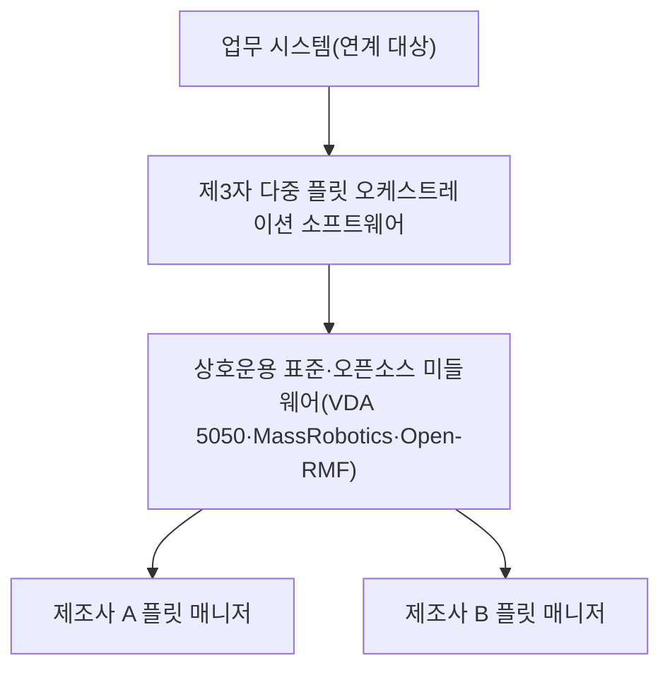

[홈](../../index.md) › [주제](../index.md) › 1. 기술·시장·업체 동향 — 대표 접근법과 기술

# 1. 기술·시장·업체 동향 — 대표 접근법과 기술

<!-- auto:page-status:start -->
<!-- auto:page-status:end -->

## 1. 세 줄 요약

- 이 영역의 접근은 시장 통계 추적, 제품·업체 지형 분류, 로봇 종류·형태 변화 추적, AI 연구 동향 추적의 네 갈래다.
- 이 페이지는 [1. 기술·시장·업체 동향](../../categories/planning-and-business/technology-market-and-vendor-trends.md) 페이지의 "대표 접근법과 기술" 절이 분량 기준을 넘어 옮겨 온 것이다. 원 페이지의 검증을 거친 내용이며 새 주장은 없다.

## 2. 배경

[1. 기술·시장·업체 동향](../../categories/planning-and-business/technology-market-and-vendor-trends.md) 페이지를 쓰는 과정에서 "대표 접근법과 기술" 절의 분량이 세부영역 페이지 기준(4,000자)을 넘어, 내용을 줄이지 않고 이 주제 페이지로 분리했다.

## 3. 본문

이 영역의 접근은 시장 통계 추적, 제품·업체 지형 분류, 로봇 종류·형태 변화 추적, AI 연구 동향 추적의 네 갈래다.

### 시장 통계 추적

공식 통계를 발행 기관·기준일과 함께 모아 오케스트레이션 대상 로봇의 물량과 종류별 흐름을 가늠하는 접근이다. IFR 은 산업용 로봇(설치·가동 대수, 국가별 로봇 밀도)과 서비스 로봇(응용별 판매)을 따로 집계하며, 2024년 산업용 로봇 설치 542,000대 가운데 아시아가 74%, 중국이 295,000대(54%)를 차지하고 한국은 30,600대(3% 감소)로 중국·일본·미국에 이은 4위였다(2025-09-25 발표). [사실][^ref-900]

국내 통계로는 산업통상부가 한국로봇산업진흥원·한국AI로봇산업협회와 실시한 2024년 국내 로봇산업 실태조사(2024년 12월 말 기준)가 있다. 로봇신문의 요약 기사에 따르면 사업체 2,509개(0.6% 감소), 매출 6조1,695억 원(3.2% 증가), 생산 5조9,447억 원(4.5% 증가), 수출 1조2,578억 원, 수입 6,895억 원, 인력 34,649명이며, 매출의 50.4%(3조1,075억 원)가 제조업용 로봇, 32.1%(1조9,810억 원)가 부품·소프트웨어이고 전문서비스용은 6,423억 원, 개인서비스용은 4,386억 원이다(진흥원 원문 보고서는 열지 못해 기사 수치 기준). [사실][^ref-903] 정책 쪽에서는 산업통상자원부가 2024-01-16 로봇산업정책심의회에서 제4차 지능형 로봇 기본계획(2024~2028)을 확정하고 2030년까지 첨단로봇 100만 대 보급, 로봇 핵심부품 국산화율 80%, 규제 51개 개선, 로봇 핵심 인력 1만5천 명 이상 확보, 민관 합동 3조 원 이상 투자를 목표로 제시했다(로봇신문 보도 기준). [사실][^ref-904]

한계는 IFR 이 서로 다른 판의 수치 비교를 권장하지 않는다는 점이다. [사실][^ref-899] 그래서 통계를 이어 붙여 추세를 만들기보다 판마다 기준일을 남기고 인용하는 편이 맞아 보인다. [추정][^ref-899][^ref-903]

### 제품·업체 지형 분류

오케스트레이션·관제·상호운용 제품을 계층으로 나눠 업체를 놓는 접근이다. Interact Analysis(2023-01)는 다중 플릿 오케스트레이션 소프트웨어의 접근을 로봇을 직접 통합하는 저수준 제어와 제조사 플릿 매니저를 관리하는 고수준 제어로 나누고, 상호운용은 표준 또는 미들웨어로 푼다고 정리하면서 GreyOrange·Synaos·Waku Robotics·CoEvolution·InOrbit 등을 업체로 들었다. [사실][^ref-257] 같은 글은 독일 자동차 산업이 상호운용의 중요성을 먼저 인식해 VDA 5050 을 개발했고, Audi·VW·BMW 같은 완성차 업체가 이 표준을 따르는 마스터 컨트롤 업체를 지원하거나 분사시켜 공급사 전반의 채택을 이끌었다고 서술한다. [사실][^ref-257] 표준 쪽에서는 MassRobotics 의 AMR 상호운용 표준 1.0 판(2021-05 GitHub 공개)이 서로 다른 제조사 AMR 이 위치·목적지·식별자·제조사·모델·치수·운용 상태·속도·방향 같은 관측 정보를 공유하게 하되 플릿 관리·항법·안전 시스템·하드웨어는 다루지 않으며, 미션 통신 API 를 더한 2.0 판은 2023-06-19 기준 개발 중이고 InOrbit·Vecna Robotics·Locus Robotics 등이 작업반에 참여한다. [사실][^ref-391] 국내에서는 클로봇이 이기종 로봇 통합 관제 플랫폼 크롬스를 핵심 제품으로 둔다. [사실][^ref-870]

확인한 자료를 종합하면 제품 지형은 제조사별 플릿 매니저, 그 위에서 여러 제조사 플릿을 묶는 제3자 다중 플릿 오케스트레이션 소프트웨어(해외 GreyOrange·Synaos·InOrbit 등, 국내 클로봇 등), 그리고 이들을 잇는 상호운용 표준(VDA 5050, MassRobotics)과 오픈소스 미들웨어(Open-RMF)의 세 층으로 나뉘는 것으로 보인다. 이 세 층 구분은 출처가 직접 말한 분류가 아니라 리서치 에이전트의 정리다. [추정][^ref-257][^ref-391][^ref-870][^ref-004]

### 로봇 종류·형태 변화 추적

오케스트레이션이 등록·관제해야 할 로봇의 종류가 어떻게 바뀌는지를 통계와 도입 사례로 추적하는 접근이다. 확인한 자료를 종합하면 물량 면에서는 운송·물류용 AMR 이 주도하는 가운데 휴머노이드가 물류창고(GXO, CJ대한통운)와 제조 공장(현대차그룹)에서 시범을 지나 운영 초기 단계에 들어섰고, 이기종 로봇 등록과 관제가 AMR 중심에서 휴머노이드·양팔 로봇으로 넓어질 것으로 보이나 그 규모와 시점은 회사 발표 계획 수준이다. [추정][^ref-899][^ref-902][^ref-907][^ref-908][^ref-909] 사례의 여섯 항목은 5절에 있다. 휴머노이드의 하중 균형·물체 인식 같은 로봇 자체 성능 주장은 지형에 기록하되 검증은 9절의 경계에 따라 제조사·인증 기관에 맡긴다.

### AI 연구 동향 추적

Li·An·Abrar·Zhou(2025, 2026 개정)의 서베이는 언어 모델(Large Language Model, LLM)의 다중 로봇 시스템 적용을 고수준 작업 배정, 중수준 동작 계획, 저수준 행동 생성, 사람 개입의 네 층으로 분류하고, 수학적 추론 한계·환각·지연·벤치마크 부재를 적용의 과제로 꼽아 AI 가 오케스트레이션 연구에 들어오는 지점을 정리했다. [사실][^ref-165] 교차 규칙에 따라 이 방법은 L. AI·학습 기술의 44. 로봇 기반 모델·언어 모델 계획과 적용 대상인 25. 작업 배정 — MRTA 양쪽에 연결한다.

## 4. 현장 시나리오

현장 시나리오는 원 페이지의 [5. 적용 사례 (현장 유형 명시)](../../categories/planning-and-business/technology-market-and-vendor-trends.md) 절에 있다.

## 5. ROP 관점의 시사점

ROP가 직접 맡는 것과 외부와 연계하는 것은 원 페이지의 [9. ROP가 직접 맡는 것과 외부와 연계하는 것 (책임 경계 기준)](../../categories/planning-and-business/technology-market-and-vendor-trends.md) 절에 있다.

## 6. 연결되는 연구영역

- 주 연구영역: [1. 기술·시장·업체 동향](../../categories/planning-and-business/technology-market-and-vendor-trends.md)
- 관련 영역: [2. 사용 사례·요구·책임 범위](../../categories/planning-and-business/use-cases-requirements-and-scope.md), [3. 경제성·조달·사업 모델](../../categories/planning-and-business/economics-procurement-and-business-models.md), [4. 이기종 로봇 등록](../../categories/robot-ontology/heterogeneous-robot-registration.md), [20. 로봇·제조사 관제 연동](../../categories/integration/robot-and-vendor-fleet-manager-integration.md), [21. 상호운용 표준·적합성](../../categories/integration/interoperability-standards-and-conformance.md), [25. 작업 배정 — MRTA](../../categories/planning-and-optimization/task-allocation-mrta.md), [44. 로봇 기반 모델·언어 모델 계획](../../categories/ai-and-learning/robot-foundation-models-and-llm-planning.md), [61. 물류창고](../../categories/site-type-applications/warehouse.md), [62. 제조 공장](../../categories/site-type-applications/manufacturing-plant.md)

## 7. 열린 질문

열린 질문은 원 페이지의 [11. 열린 질문](../../categories/planning-and-business/technology-market-and-vendor-trends.md) 절과 [열린 질문](../../open-questions.md) 페이지에 모은다.

## 8. 출처

[^ref-004]: Open Robotics, RMF Core Overview — Programming Multiple Robots with ROS 2, 미확인, https://osrf.github.io/ros2multirobotbook/rmf-core.html, 접근일 2026-09-29
[^ref-899]: International Federation of Robotics (IFR), World Robotics 2025 report – SERVICE ROBOTS – released by IFR, 2025-10-07, https://ifr.org/ifr-press-releases/news/service-robots-see-global-growth-boom, 접근일 2026-09-29
[^ref-900]: International Federation of Robotics (IFR), World Robotics 2025 report – INDUSTRIAL ROBOTS – released by IFR, 2025-09-25, https://ifr.org/ifr-press-releases/news/global-robot-demand-in-factories-doubles-over-10-years, 접근일 2026-09-29
[^ref-902]: International Federation of Robotics (IFR), Top 5 Global Robotics Trends 2026, 2026-01-08, https://ifr.org/ifr-press-releases/news/top-5-global-robotics-trends-2026, 접근일 2026-09-29
[^ref-903]: 로봇신문 (한국로봇산업진흥원 '2024년 국내 로봇산업 실태조사 결과 보고서' 요약), [Cover Story] '2024년 국내 로봇산업 실태 조사 결과 보고서' 요약, 2026-01-25, https://www.irobotnews.com/news/articleView.html?idxno=44544, 접근일 2026-09-29
[^ref-904]: 로봇신문 (산업통상자원부 발표 보도), 산업부, '제4차 지능형 로봇 기본계획' 발표, 2024-01-16, https://www.irobotnews.com/news/articleView.html?idxno=33788, 접근일 2026-09-29
[^ref-257]: Interact Analysis (Rueben Scriven), AMR Multi-Fleet Orchestration Software Explained, 2023-01, https://interactanalysis.com/insight/amr-multi-fleet-orchestration-software/, 접근일 2026-09-29
[^ref-391]: MassRobotics, What Is the MassRobotics AMR Interoperability Standard?, 2023-06-19, https://www.massrobotics.org/what-is-the-massrobotics-amr-interoperability-standard/, 접근일 2026-09-29
[^ref-165]: Li, P., An, Z., Abrar, S., & Zhou, L., Large Language Models for Multi-Robot Systems: A Survey, 2026-05-03, https://arxiv.org/abs/2502.03814, 접근일 2026-09-29
[^ref-907]: The Robot Report (Steve Crowe), Agility Robotics' Digit humanoids land first official job, 2024-06-27, https://www.therobotreport.com/agility-robotics-digit-humanoid-lands-first-official-job/, 접근일 2026-09-29
[^ref-870]: 로봇신문, [기업 최전선을 가다-클로봇] 로봇 소프트웨어로 쓰는 '피지컬 AI' 시대의 서막, 2025-11-09, https://www.irobotnews.com/news/articleView.html?idxno=43274, 접근일 2026-09-29
[^ref-908]: 아시아경제, CJ대한통운, 물류업계 최초 AI 휴머노이드 상용화 '첫발', 2026-09-03, https://view.asiae.co.kr/article/2026090308385213768, 접근일 2026-09-29
[^ref-909]: 서울신문, 부품 배치 '척척' 무거운 짐도 '사뿐'… 아틀라스 2.5만대 로봇 학교 간다, 2026-09-23, https://www.seoul.co.kr/news/economy/industry/2026/09/23/20260923031003, 접근일 2026-09-29

## 9. 검증 노트

원 페이지와 함께 실행 2026-09-29-10 의 1차·2차 검증을 거쳤다. 분리는 코드가 했고 내용은 바꾸지 않았다.

## 10. 이력

| 날짜 | 실행 id | 변경 |
|---|---|---|
| 2026-09-29 | 2026-09-29-10 | 1. 기술·시장·업체 동향 의 "대표 접근법과 기술" 절에서 분리 |
