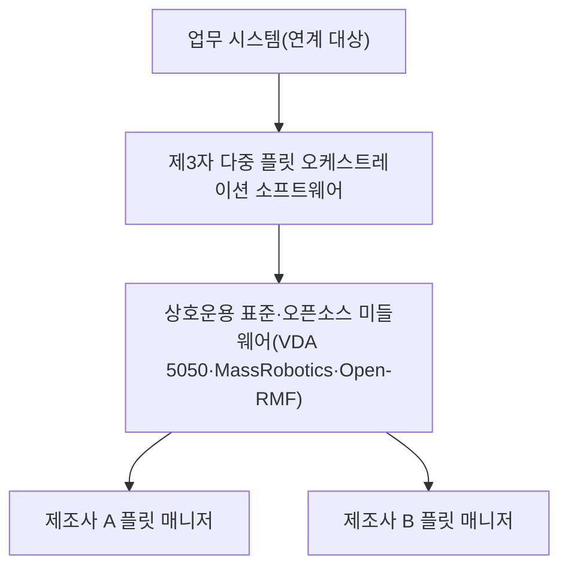

(너의 규칙은 시스템 프롬프트의 agents/shared-rules.md 와 agents/verifier.md 이다. 아래는 이번 실행의 컨텍스트와 입력이다.)

## 실행 컨텍스트

- run_id: 2026-09-29-10
- date: 2026-09-29
- run_type: area_deep_dive (영역 심화)
- 대상: 1. 기술·시장·업체 동향 (A. 기획·사업)
- 예산:
    - max_search_queries: 30
    - max_sources_per_run: 15
    - new_topic_pages: 1
    - page_updates: 2
    - max_retries: 2
- 환경 알림: web_fetch_available: true · fetch_mode: full
- 언어: ko
- verification_stage: second
- verifier_budget:
    - max_search_queries: 30
    - max_sources_per_run: 15
    - new_topic_pages: 1
    - page_updates: 2
    - max_retries: 2
- retry_count: 1
- max_retries: 2

## 입력

### runs/2026-09-29-10/target.json

```json
{
  "run_id": "2026-09-29-10",
  "date": "2026-09-29",
  "weekday": "Tue",
  "run_number": 102,
  "run_type": "area_deep_dive",
  "forced": true,
  "target": {
    "area_no": 1,
    "area_name": "1. 기술·시장·업체 동향",
    "category": "A. 기획·사업",
    "category_letter": "A"
  },
  "topic": null,
  "track": null,
  "corrections": [],
  "budget": {
    "max_search_queries": 30,
    "max_sources_per_run": 15,
    "new_topic_pages": 1,
    "page_updates": 2,
    "max_retries": 2
  },
  "priority_reason": null,
  "priority_questions": [],
  "excluded_areas": [],
  "lifted_areas": [],
  "deferred": {
    "monthly_recheck": false,
    "weekly_review": false
  },
  "selection_rationale": "CLI 지정 run_type=area_deep_dive, area=1"
}
```

### runs/2026-09-29-10/research.json

```json
{
  "run_id": "2026-09-29-10",
  "date": "2026-09-29",
  "run_type": "area_deep_dive",
  "target": {
    "area_no": 1,
    "area_name": "1. 기술·시장·업체 동향",
    "category": "A. 기획·사업"
  },
  "gaps": [
    "섹션 3. 왜 중요한가 비어 있음",
    "섹션 4. 핵심 개념과 용어 비어 있음 — 서비스형 로봇·로봇 밀도·에이전틱 AI·IT/OT 융합 용어 없음(다중 플릿 오케스트레이션·플릿 관리 시스템·모바일 매니퓰레이터는 용어집에 이미 있음)",
    "섹션 5. 적용 사례 (현장 유형 명시) 비어 있음",
    "섹션 6. 대표 접근법과 기술 비어 있음 — 시장 통계 추적, 제품·업체 지형 분류(제조사 플릿 매니저 / 제3자 오케스트레이션 / 표준·오픈소스), 로봇 종류 변화 추적, AI 연구 동향 네 갈래 모두 근거 없음",
    "섹션 7. 관련 표준·프레임워크·오픈소스 비어 있음 — VDA 5050, MassRobotics AMR 상호운용 표준, Open-RMF 의 지형상 위치 없음",
    "섹션 8. 대표 연구와 자료 비어 있음 — IFR World Robotics, 국내 로봇산업 실태조사, 시장조사 업체 자료, 다중 로봇 서베이 없음",
    "섹션 9. ROP가 직접 맡는 것과 외부와 연계하는 것 (책임 경계 기준) 비어 있음",
    "섹션 10. 다른 연구영역과의 연결 (번호와 이름을 함께 표기) 비어 있음 — 2. 사용 사례·요구·책임 범위, 3. 경제성·조달·사업 모델, 4. 이기종 로봇 등록, 20. 로봇·제조사 관제 연동, 21. 상호운용 표준·적합성, 44. 로봇 기반 모델·언어 모델 계획, 61. 물류창고, 62. 제조 공장 연결 필요",
    "섹션 11. 열린 질문 비어 있음 — 이 영역에 걸린 열린 질문 없음, 정정 요청 없음",
    "프런트매터 related_areas·sources 비어 있음"
  ],
  "research_questions": [
    "어떤 연구·제품·업체가 로봇 오케스트레이션의 흐름을 바꾸고 있는가? [분류원문]",
    "세계·국내 로봇 시장의 규모와 종류별 흐름(산업용·전문 서비스용·운송·물류)은 공식 통계에서 어떻게 나타나는가? (섹션 3·4·8 겨냥)",
    "오케스트레이션·관제·상호운용 제품과 업체(제3자 다중 플릿 오케스트레이션 소프트웨어, 상호운용 표준, 오픈소스, 국내 업체)의 지형은 어떻게 나뉘는가? (섹션 4·6·7 겨냥)",
    "오케스트레이션 대상 로봇의 종류·형태(AMR·휴머노이드·모바일 매니퓰레이터)는 어떻게 바뀌고 있으며 현장 도입 사례는 무엇인가? (섹션 5·6 겨냥, 현장 유형 명시)",
    "언어 모델·기반 모델 같은 AI 기술이 다중 로봇 오케스트레이션 연구에 어떻게 들어오고 있는가? (섹션 6·8 겨냥, 교차 규칙에 따라 44. 로봇 기반 모델·언어 모델 계획과 연결)",
    "국내 정책·통계·업체 동향(지능형 로봇 기본계획, 로봇산업 실태조사, 국내 이기종 로봇 관제 업체)은 무엇인가? (섹션 5·8 겨냥, 한국 자료 우선)",
    "동향 조사에서 ROP가 직접 맡을 것과 시장조사 기관·로봇 제조사에 맡길 것의 경계는 어디이며 어느 영역과 연결되는가? (섹션 9·10 겨냥)"
  ],
  "findings": [
    {
      "id": "f1",
      "claim": "국제로봇연맹(IFR)의 World Robotics 2025 서비스 로봇 보고서(2025-10-07 발표)는 2024년 전문 서비스 로봇 판매가 약 20만 대(전년 대비 9% 증가)이며, 그중 운송·물류 응용이 102,900대(14% 증가)로 가장 많고 접객 로봇은 4만2천 대 이상(11% 감소), 의료 로봇은 16,700대(91% 증가)라고 집계했다.",
      "tag": "사실",
      "source_ids": [
        "ref-899"
      ],
      "cross_checked": false,
      "confidence": "medium",
      "evidence_excerpt": "보도자료: 전문용 서비스 로봇 약 20만 대(+9%), 운송·물류 102,900대(+14%), 접객 42,000대 이상(-11%), 의료 16,700대(+91%). 294개 공급사 표본 자료이며 서로 다른 판의 수치 비교는 권장하지 않는다고 적음.",
      "as_of": "2025-10-07",
      "site_type": null,
      "flow_item": null
    },
    {
      "id": "f2",
      "claim": "IFR 은 2024년 서비스형 로봇(Robot-as-a-Service, RaaS) 플릿이 31% 성장했고 운송·물류 부문에서는 42% 성장했다고 보고하며, 인력 부족과 고령화를 수요 동인으로 들고 기업이 구매 대신 구독·임대 계약을 택하는 흐름을 지적했다.",
      "tag": "사실",
      "source_ids": [
        "ref-899"
      ],
      "cross_checked": false,
      "confidence": "medium",
      "evidence_excerpt": "IFR 회장 인용: \"companies are deciding to enter into subscription or rental agreements rather than purchasing robots outright\". RaaS 플릿 +31%, 운송·물류 부문 RaaS +42%.",
      "as_of": "2025-10-07",
      "site_type": null,
      "flow_item": null
    },
    {
      "id": "f3",
      "claim": "IFR 의 World Robotics 2025 산업용 로봇 보고서는 2024년 세계 산업용 로봇 설치가 542,000대(4년 연속 50만 대 초과)이고 아시아가 74%, 중국이 295,000대(54%)를 차지하며, 한국은 30,600대(3% 감소)로 중국·일본·미국에 이은 4위, 세계 가동 대수는 4,664,000대(9% 증가), 2025년 575,000대·2028년 70만 대 초과를 전망한다고 밝혔다.",
      "tag": "사실",
      "source_ids": [
        "ref-900"
      ],
      "cross_checked": false,
      "confidence": "medium",
      "evidence_excerpt": "보도자료: 2024년 설치 542,000대, 아시아 74%·유럽 16%·미주 9%, 중국 295,000대(54%), 일본 44,500대, 미국 34,200대, 한국 30,600대(-3%), 독일 26,982대. 가동 대수 4,664,000대(+9%). 2025년 575,000대(+6%), 2028년 70만 대 초과 전망.",
      "as_of": "2025",
      "site_type": null,
      "flow_item": null
    },
    {
      "id": "f4",
      "claim": "IFR 의 2026-04-08 로봇 밀도 보도자료에 따르면 한국은 제조업 종사자 1만 명당 로봇 1,220대로 세계 1위이며 싱가포르 818대, 독일 449대, 일본 446대, 중국 166대, 세계 평균 132대다.",
      "tag": "사실",
      "source_ids": [
        "ref-901"
      ],
      "cross_checked": false,
      "confidence": "medium",
      "evidence_excerpt": "보도자료: 한국 1,220대/1만 명(1위), 싱가포르 818대, 독일 449대, 일본 446대, 중국 166대(세계 22위), 세계 평균 132대. 서유럽 267대, 북미 204대, 아시아 131대.",
      "as_of": "2026-04-08",
      "site_type": null,
      "flow_item": null
    },
    {
      "id": "f5",
      "claim": "IFR 이 2026-01-08 발표한 2026년 세계 로봇 5대 동향은 에이전틱 AI 와 자율성, IT·OT 융합에 따른 범용성, 휴머노이드의 신뢰성·효율 입증(사이클 타임·에너지·유지보수 비용 기준 충족 필요), 안전·사이버보안 거버넌스, 노동력 부족 대응이며, 오케스트레이션 대상 로봇의 종류가 휴머노이드로 넓어지는 흐름과 AI 결합을 동향으로 꼽는다.",
      "tag": "사실",
      "source_ids": [
        "ref-902"
      ],
      "cross_checked": false,
      "confidence": "medium",
      "evidence_excerpt": "\"Humanoid robots need to match high industrial requirements towards cycle times, energy consumption and maintenance costs.\" 다섯 동향: AI·자율성(에이전틱 AI), IT/OT 융합, 휴머노이드, 안전·보안, 노동력 부족.",
      "as_of": "2026-01-08",
      "site_type": null,
      "flow_item": null
    },
    {
      "id": "f6",
      "claim": "한국로봇산업진흥원의 2024년 국내 로봇산업 실태조사(2025-07-04~09-12 조사, 2024년 12월 말 기준)를 전한 로봇신문 요약에 따르면 국내 로봇 사업체는 2,509개(0.6% 감소), 매출 6조1,695억 원(3.2% 증가), 생산 5조9,447억 원(4.5% 증가), 수출 1조2,578억 원, 수입 6,895억 원, 인력 34,649명이며, 매출 구성은 제조업용 로봇 3조1,075억 원(50.4%), 부품·소프트웨어 1조9,810억 원(32.1%), 전문서비스용 6,423억 원, 개인서비스용 4,386억 원이다.",
      "tag": "사실",
      "source_ids": [
        "ref-903"
      ],
      "cross_checked": false,
      "confidence": "medium",
      "evidence_excerpt": "기사: \"2509개로 전년 대비 15개사가 감소(0.6%)\", 매출 6조1695억 원(+3.2%), 생산 5조9447억 원(+4.5%), 수출 1조2578억 원, 수입 6895억 원, 인력 3만4649명. 제조업용 50.4%, 부품·SW 32.1%. 진흥원 원문 보고서는 열지 못해 기사 기준.",
      "as_of": "2026-01-25",
      "site_type": null,
      "flow_item": null
    },
    {
      "id": "f7",
      "claim": "산업통상자원부는 2024-01-16 로봇산업정책심의회에서 제4차 지능형 로봇 기본계획(2024~2028)을 확정하고 2030년까지 첨단로봇 100만 대 보급, 로봇 핵심부품 국산화율 80%, 규제 51개 개선, 로봇 핵심 인력 1만5천 명 이상 확보, 민관 합동 3조 원 이상 투자를 목표로 제시했다.",
      "tag": "사실",
      "source_ids": [
        "ref-904"
      ],
      "cross_checked": false,
      "confidence": "medium",
      "evidence_excerpt": "기사: \"로봇 핵심부품의 국산화율을 2030년까지 80%로 획기적으로 제고\", 첨단로봇 100만 대 보급 목표, 51개 규제 개선, 핵심 인력 1만5000명 이상, 2030년까지 민관합동 3조 원 이상 투자. 확정 2024-01-16.",
      "as_of": "2024-01-16",
      "site_type": null,
      "flow_item": null
    },
    {
      "id": "f8",
      "claim": "시장조사 업체 Interact Analysis(2023-01)는 다중 플릿 오케스트레이션 소프트웨어를 서로 다른 제조사의 AMR 플릿 여럿을 하나의 창고 시스템 안에서 관리하는 소프트웨어(고정 자동화의 창고 제어 시스템에 비견)로 정의하고, 접근을 로봇을 직접 통합하는 저수준 제어와 제조사 플릿 매니저를 관리하는 고수준 제어로 나누며 상호운용은 표준 또는 미들웨어로 푼다고 정리하면서 GreyOrange·Synaos·Waku Robotics·CoEvolution·InOrbit 등을 업체로 들었다.",
      "tag": "사실",
      "source_ids": [
        "ref-257"
      ],
      "cross_checked": false,
      "confidence": "medium",
      "evidence_excerpt": "Rueben Scriven(Interact Analysis) 글: 다중 플릿 오케스트레이션 = 여러 제조사 AMR 플릿을 한 창고 시스템에서 관리, WCS 유비. 저수준(직접 통합)/고수준(플릿 매니저 관리) 두 접근, 표준 또는 미들웨어. 업체: GreyOrange, Synaos, Waku, CoEvolution, InOrbit, Tompkins.",
      "as_of": "2023-01",
      "site_type": "물류창고",
      "flow_item": "수행 자원"
    },
    {
      "id": "f9",
      "claim": "Interact Analysis 는 2021~2027년 다중 플릿 오케스트레이션 소프트웨어 시장이 연평균 138% 성장할 것으로 전망했으나, 이 수치는 방법론이 공개되지 않은 시장조사 전망이다.",
      "tag": "의견",
      "source_ids": [
        "ref-257"
      ],
      "cross_checked": false,
      "confidence": "low",
      "evidence_excerpt": "\"138% between 2021 and 2027\" 성장률 전망. 산정 방법·시장 정의의 세부는 글에 없음.",
      "as_of": "2023-01",
      "site_type": null,
      "flow_item": null
    },
    {
      "id": "f10",
      "claim": "Interact Analysis(2025-07)는 이동로봇 시장의 2025년 전망을 8억 달러 낮추고 2030년 매출 전망 156억 달러, 2025~2030년 연평균 성장률을 26%에서 21%로 조정했으며, 원인으로 미국의 관세, 투자 관망, 창고 신축 감소(2030년까지 연 -2.0%)를 들고 AGV 운반 로봇 출하 성장률을 6%에서 4%로 낮춘 반면 사람 대상 운반(P2G) 로봇은 연 30% 성장을 유지했다.",
      "tag": "사실",
      "source_ids": [
        "ref-906"
      ],
      "cross_checked": false,
      "confidence": "medium",
      "evidence_excerpt": "Ash Sharma 글: 2025년 전망 8억 달러 하향, 2030년 156억 달러, CAGR 26%→21%. 관세·경제 불확실성(정책 불확실성 지수 430)·창고 건설 -2.0%. AGV 운반 6%→4%, P2G 연 30%. 2024년 시장 규모도 방법론 조정으로 8% 하향.",
      "as_of": "2025-07",
      "site_type": null,
      "flow_item": null
    },
    {
      "id": "f11",
      "claim": "MassRobotics 의 AMR 상호운용 표준 설명 페이지(2023-06-19)에 따르면 1.0 판(2021-05 GitHub 공개)은 서로 다른 제조사 AMR 이 위치·목적지·식별자·제조사·모델·치수·운용 상태·속도·방향 같은 관측 정보를 공유하게 하되 플릿 관리·항법·안전 시스템·하드웨어는 다루지 않으며, 미션 통신 API 를 더한 2.0 판이 개발 중이고 InOrbit·Vecna Robotics·Locus Robotics 등이 작업반에 참여한다.",
      "tag": "사실",
      "source_ids": [
        "ref-391"
      ],
      "cross_checked": false,
      "confidence": "medium",
      "evidence_excerpt": "페이지: 1.0 판 2021-05 공개, 위치·목적지·식별자·제조사·모델·치수·상태·속도 공유. 플릿 관리·항법·안전·하드웨어 변경은 다루지 않음. 2.0 은 mission communication API 추가 개발 중. 준수는 선택.",
      "as_of": "2023-06-19",
      "site_type": null,
      "flow_item": null
    },
    {
      "id": "f12",
      "claim": "Interact Analysis(2023-01)는 독일 자동차 산업이 상호운용의 중요성을 먼저 인식해 VDA 5050 을 개발했고 Audi·VW·BMW 같은 완성차 업체가 이 표준을 따르는 마스터 컨트롤 업체를 지원하거나 분사시켜 공급사 전반의 채택을 이끌었다고 서술한다.",
      "tag": "사실",
      "source_ids": [
        "ref-257"
      ],
      "cross_checked": false,
      "confidence": "medium",
      "evidence_excerpt": "글: 독일 자동차 산업이 VDA 5050 을 개발, 완성차 업체(Audi, VW, BMW)가 표준 준수 마스터 컨트롤 업체를 지원·분사해 공급사 채택을 견인. 직접 인용은 f8 에서 1회 사용.",
      "as_of": "2023-01",
      "site_type": "제조 공장",
      "flow_item": null
    },
    {
      "id": "f13",
      "claim": "Li·An·Abrar·Zhou(드렉셀 대학교, 2025-02 v1, 2026-05 v5)의 서베이는 언어 모델(LLM)의 다중 로봇 시스템 적용을 고수준 작업 배정, 중수준 동작 계획, 저수준 행동 생성, 사람 개입의 네 층으로 분류하고, 수학적 추론 한계·환각·지연·벤치마크 부재를 적용의 과제로 꼽아 AI 가 오케스트레이션 연구에 들어오는 지점을 정리했다.",
      "tag": "사실",
      "source_ids": [
        "ref-165"
      ],
      "cross_checked": false,
      "confidence": "medium",
      "evidence_excerpt": "초록: \"across high-level task allocation, mid-level motion planning, low-level action generation, and human intervention\"; 과제로 수학적 추론 한계, 환각, 지연, 견고한 벤치마킹 필요. 적용 영역: 가정 로봇, 건설, 편대 제어, 표적 추적.",
      "as_of": "2026-05-03",
      "site_type": null,
      "flow_item": null
    },
    {
      "id": "f14",
      "claim": "Agility Robotics 는 2025-11-20 자사 휴머노이드 Digit 이 GXO 의 Flowery Branch 시설에서 10만 개 이상의 토트를 옮겼고 AMR 과 컨베이어 사이의 토트 이송과 다른 바닥 위치로의 토트 적재 작업을 하며 가변 하중 균형 유지와 조명 변화 속 물체 인식이 검증됐다고 발표했다.",
      "tag": "추정",
      "source_ids": [
        "ref-909"
      ],
      "cross_checked": false,
      "confidence": "low",
      "evidence_excerpt": "벤더 주장: 토트 10만 개 이상 이동, 작업 \"picking items on and off an AMR to a conveyor\" 와 토트 적재, 가변 하중 균형·조명 변화 속 인식 검증. 가동 시간·처리 속도 수치는 없음.",
      "as_of": "2025-11-20",
      "site_type": "물류창고",
      "flow_item": "수행 자원",
      "vendor_claim": true
    },
    {
      "id": "f15",
      "claim": "The Robot Report(2024-06-27)는 GXO 가 Agility Robotics 와 다년 서비스형 로봇(RaaS) 계약을 맺어 조지아주 Spanx 물류 시설에서 Digit 이 6 River Systems 의 Chuck AMR 에서 컨베이어로 빈 토트와 상품 토트를 옮기게 했고, 이것이 매출이 발생하는 첫 상업 휴머노이드 배치라는 Agility 의 주장과 함께 GXO 가 Apptronik 의 Apollo 도 병행 시험한다고 보도했다.",
      "tag": "사실",
      "source_ids": [
        "ref-910"
      ],
      "cross_checked": false,
      "confidence": "medium",
      "evidence_excerpt": "기사(Steve Crowe): GXO–Agility 다년 RaaS 계약, Digit 이 Chuck AMR 에서 컨베이어로 토트 이송(AMR 상·하단 선반 모두), Digit 신장 5'9\"·140lb·35lb 들어올림, GXO 는 Apptronik Apollo 도 시험 중.",
      "as_of": "2024-06-27",
      "site_type": "물류창고",
      "flow_item": "수행 자원"
    },
    {
      "id": "f16",
      "claim": "서로 다른 두 발행 주체(Agility Robotics 의 발표, 전문지 The Robot Report 의 보도)가 GXO 물류 시설에서 휴머노이드 Digit 이 AMR 과 컨베이어 사이의 토트 이송 작업에 서비스형 로봇 계약으로 투입됐다고 각각 전해, 휴머노이드가 AMR 과 함께 물류창고 실운영 흐름에 들어간 사례가 한 곳 이상에서 확인된다.",
      "tag": "사실",
      "source_ids": [
        "ref-909",
        "ref-910"
      ],
      "cross_checked": true,
      "confidence": "medium",
      "evidence_excerpt": "Agility 발표(2025-11)와 The Robot Report 보도(2024-06)가 GXO 시설, AMR↔컨베이어 토트 이송, RaaS 계약을 각각 서술. 처리량·비용 효과는 어느 쪽도 독립적으로 제시하지 않음.",
      "as_of": "2025-11-20",
      "site_type": "물류창고",
      "flow_item": "수행 자원"
    },
    {
      "id": "f17",
      "claim": "아시아경제(2026-09-03)에 따르면 CJ대한통운은 경기 용인 양지 올리브영 물류센터의 상품 포장 공정에 양팔 휴머노이드 로봇 2대를 투입해 박스 안에 완충재를 넣는 작업부터 시작했고, 2025년 군포 풀필먼트센터 현장 실증에서 한 단계 나아간 것이며 로보티즈(하드웨어)·에이딘로보틱스(로봇핸드)·리얼월드AI(로봇 기반 모델)와 협력하고 피킹·분류·검수·포장으로 범위를 넓힐 계획이라고 밝혔다.",
      "tag": "사실",
      "source_ids": [
        "ref-912"
      ],
      "cross_checked": false,
      "confidence": "low",
      "evidence_excerpt": "기사: 용인 양지 올리브영 물류센터, 양팔 로봇 2대, 포장 공정 완충재 투입. \"지난해 군포 풀필먼트센터에서 진행한 현장 실증에서 한 단계 나아가\" 실제 운영 공정 적용. 협력사 로보티즈·에이딘로보틱스·리얼월드AI. 회사 발표 기반 기사.",
      "as_of": "2026-09-03",
      "site_type": "물류창고",
      "flow_item": "수행 자원"
    },
    {
      "id": "f18",
      "claim": "서울신문(2026-09-23)에 따르면 현대차그룹은 미국 조지아 메타플랜트(HMGMA) 안에 휴머노이드 아틀라스가 실제 공장과 같은 환경에서 부품을 조립 순서대로 놓는 서열 작업과 물류 작업을 익히는 로봇 훈련 시설 RMAC 을 2026년 6월 시범 가동해 9월 21일 본격 가동했고, 2028년 서열 작업, 2030년 조립·물류 작업 투입과 그룹 공장에 아틀라스 2만5천 대 배치를 계획한다.",
      "tag": "사실",
      "source_ids": [
        "ref-913"
      ],
      "cross_checked": false,
      "confidence": "low",
      "evidence_excerpt": "기사: RMAC(Robotics Metaplant Application Center) 은 HMGMA 내 훈련 시설, 2026-06 시범·09-21 본격 가동, 2027년 10배 확장, 2028년 서열 작업·2030년 조립·물류 투입, 2만5천 대 계획. \"자동차 부품을 조립 순서에 맞게 배치하는\" 서열 작업 학습. 회사 발표 기반 기사이며 계획 수치는 미확정.",
      "as_of": "2026-09-23",
      "site_type": "제조 공장",
      "flow_item": "수행 자원"
    },
    {
      "id": "f19",
      "claim": "로봇신문(2025-11-09)이 전한 클로봇의 설명에 따르면 이기종 로봇 통합 관제 플랫폼 크롬스(CROMS)는 여러 제조사의 로봇 50대 이상을 동시에 관제하고 실내 자율주행 소프트웨어 카멜레온은 정지 정밀도 ±1cm·주행 정밀도 ±2cm 를 낸다.",
      "tag": "추정",
      "source_ids": [
        "ref-870"
      ],
      "cross_checked": false,
      "confidence": "low",
      "evidence_excerpt": "벤더 주장: 기사에 실린 회사 설명으로 크롬스 50대 이상 동시 관제, 카멜레온 정지 ±1cm·주행 ±2cm. 측정 조건·독립 검증 없음. 회사 제품 페이지는 403 으로 열지 못함.",
      "as_of": "2025-11-09",
      "site_type": null,
      "flow_item": null,
      "vendor_claim": true
    },
    {
      "id": "f20",
      "claim": "로봇신문(2025-11-09)에 따르면 2017년 설립된 클로봇은 이기종 로봇 통합 관제 플랫폼 크롬스와 범용 실내 자율주행 소프트웨어 카멜레온을 핵심 제품으로 두고 2024년 말 코스닥에 상장했으며, 인천국제공항에 청소 로봇과 다중 로봇 5G 디지털 트윈 관제 시스템을 적용하고 구독형 로봇 서비스 확대를 전략으로 밝혔다.",
      "tag": "사실",
      "source_ids": [
        "ref-870"
      ],
      "cross_checked": false,
      "confidence": "low",
      "evidence_excerpt": "기사: 2017년 설립, 2024년 말 코스닥 상장(시가총액 1조 원 초과), 5년 평균 매출 성장 71.7%. 인천공항에 R3 Scrub Pro 청소 로봇과 다중 로봇 5G 디지털 트윈 관제 적용. CEO 인용 \"제어와 관리 소프트웨어를 하드웨어와 결합한 토탈 로봇 솔루션\". 성능 수치는 f19 로 분리.",
      "as_of": "2025-11-09",
      "site_type": "기타",
      "flow_item": "수행 자원"
    },
    {
      "id": "f21",
      "claim": "확인한 자료를 종합하면 로봇 오케스트레이션 제품 지형은 제조사별 플릿 매니저, 그 위에서 여러 제조사 플릿을 묶는 제3자 다중 플릿 오케스트레이션 소프트웨어(해외 GreyOrange·Synaos·InOrbit 등, 국내 클로봇 등), 그리고 이들을 잇는 상호운용 표준(VDA 5050, MassRobotics)과 오픈소스 미들웨어(Open-RMF)의 세 층으로 나뉘는 것으로 보인다.",
      "tag": "추정",
      "source_ids": [
        "ref-257",
        "ref-391",
        "ref-870",
        "ref-004"
      ],
      "cross_checked": false,
      "confidence": "low",
      "evidence_excerpt": "Interact Analysis 의 저수준/고수준 접근과 표준·미들웨어 구분(f8), MassRobotics 표준 범위(f11), 국내 제3자 관제 업체(f20), Open-RMF 의 플릿 어댑터 구조(재인용: 2026-09-25-13 등 이전 실행에서 쓴 ref-004)를 묶은 리서치 에이전트의 정리.",
      "as_of": "2026-09-29",
      "site_type": null,
      "flow_item": null
    },
    {
      "id": "f22",
      "claim": "확인한 자료를 종합하면 오케스트레이션 대상 로봇은 물량 면에서 운송·물류용 AMR 이 주도하는 가운데(f1) 휴머노이드가 물류창고(GXO, CJ대한통운)와 제조 공장(현대차그룹)에서 시범을 지나 운영 초기 단계에 들어섰고 IFR 이 이를 2026년 동향으로 꼽아(f5·f16·f17·f18), 이기종 로봇 등록과 관제가 AMR 중심에서 휴머노이드·양팔 로봇으로 넓어질 것으로 보이나 그 규모와 시점은 회사 발표 계획 수준이다.",
      "tag": "추정",
      "source_ids": [
        "ref-899",
        "ref-902",
        "ref-910",
        "ref-912",
        "ref-913"
      ],
      "cross_checked": false,
      "confidence": "low",
      "evidence_excerpt": "IFR 운송·물류 102,900대(f1), IFR 2026 동향의 휴머노이드 항목(f5), GXO(f16)·CJ대한통운(f17)·현대차그룹(f18) 사례. 휴머노이드 배치 대수는 GXO 미공개, CJ 2대, 현대차 2만5천 대 계획.",
      "as_of": "2026-09-29",
      "site_type": null,
      "flow_item": null
    },
    {
      "id": "f23",
      "claim": "확인한 자료를 종합하면 1. 기술·시장·업체 동향에서 ROP가 직접 맡을 범위는 공식 통계(IFR, 한국로봇산업진흥원)와 시장조사·연구 서베이를 주기적으로 모아 오케스트레이션·관제·상호운용 제품 지형과 연결 대상 로봇 종류의 변화를 정리하고 그 결과를 2. 사용 사례·요구·책임 범위, 3. 경제성·조달·사업 모델, 4. 이기종 로봇 등록, 20. 로봇·제조사 관제 연동의 입력으로 넘기는 일이며, 통계 산출과 시장 전망 자체는 발행 기관의 몫으로 인용만 하는 것이 맞아 보인다.",
      "tag": "추정",
      "source_ids": [
        "ref-899",
        "ref-903",
        "ref-257",
        "ref-165"
      ],
      "cross_checked": false,
      "confidence": "low",
      "evidence_excerpt": "IFR 이 서로 다른 판의 수치 비교를 권장하지 않는 점(f1), 실태조사가 연 1회 기준일로 집계되는 점(f6), 시장조사 전망이 방법론 미공개인 점(f9·f10)을 근거로 한 리서치 에이전트의 경계 판단.",
      "as_of": "2026-09-29",
      "site_type": null,
      "flow_item": null
    },
    {
      "id": "f24",
      "claim": "연계 대상: 휴머노이드의 하중 균형·물체 인식이나 자율주행 소프트웨어의 정지·주행 정밀도 같은 로봇 자체 성능은 분류 원문 19장의 로봇 자체 지능·제어 쪽이므로, 이종 제조사를 잇는 ROP 는 이런 벤더 성능 주장을 동향 지형에 기록하되 검증은 제조사·인증 기관에 맡기고 지원 기능과 실행 조건의 확인만 맡아야 할 것으로 보인다.",
      "tag": "추정",
      "source_ids": [
        "ref-909",
        "ref-870"
      ],
      "cross_checked": false,
      "confidence": "low",
      "evidence_excerpt": "Agility 의 균형·인식 검증 주장(f14)과 클로봇의 정밀도 수치(f19)가 모두 벤더 주장이며 독립 검증 출처가 없음을 근거로 한 경계 판단.",
      "as_of": "2026-09-29",
      "site_type": null,
      "flow_item": null
    },
    {
      "id": "f25",
      "claim": "이 영역은 같은 대분류의 2. 사용 사례·요구·책임 범위와 3. 경제성·조달·사업 모델(서비스형 로봇 확산 f2)에 입력을 주고, 로봇 종류 변화는 4. 이기종 로봇 등록에, 제품·표준 지형은 20. 로봇·제조사 관제 연동과 21. 상호운용 표준·적합성에, 언어 모델 기반 오케스트레이션 연구(f13)는 교차 규칙에 따라 44. 로봇 기반 모델·언어 모델 계획과 25. 작업 배정 — MRTA 에, 현장 사례는 61. 물류창고(f16·f17)와 62. 제조 공장(f12·f18)에 이어진다.",
      "tag": "추정",
      "source_ids": [
        "ref-899",
        "ref-902",
        "ref-257",
        "ref-165"
      ],
      "cross_checked": false,
      "confidence": "low",
      "evidence_excerpt": "f2·f5·f8·f11·f13·f16~f18 의 내용을 분류 원문의 대분류·세부영역 정의에 대응시킨 리서치 에이전트의 연결 제안.",
      "as_of": "2026-09-29",
      "site_type": null,
      "flow_item": null
    }
  ],
  "sources": [
    {
      "id": "ref-899",
      "org": "International Federation of Robotics (IFR)",
      "title": "World Robotics 2025 report – SERVICE ROBOTS – released by IFR",
      "published": "2025-10-07",
      "url": "https://ifr.org/ifr-press-releases/news/service-robots-see-global-growth-boom",
      "type": "업계 보고서",
      "reliability": "medium",
      "accessed": "2026-09-29",
      "summary": "2024년 전문 서비스 로봇 약 20만 대, 운송·물류 102,900대, RaaS 플릿 31% 성장 등 IFR 서비스 로봇 통계 보도자료.",
      "fetched": true,
      "fetched_via": "webfetch",
      "fetch_url": "https://ifr.org/ifr-press-releases/news/service-robots-see-global-growth-boom",
      "source_unopened": false
    },
    {
      "id": "ref-900",
      "org": "International Federation of Robotics (IFR)",
      "title": "World Robotics 2025 report – INDUSTRIAL ROBOTS – released by IFR",
      "published": "2025",
      "url": "https://ifr.org/ifr-press-releases/news/global-robot-demand-in-factories-doubles-over-10-years",
      "type": "업계 보고서",
      "reliability": "medium",
      "accessed": "2026-09-29",
      "summary": "2024년 세계 산업용 로봇 설치 542,000대, 중국 54%, 한국 30,600대 4위, 가동 466만 대, 2025·2028년 전망을 담은 IFR 보도자료.",
      "fetched": true,
      "fetched_via": "webfetch",
      "fetch_url": "https://ifr.org/ifr-press-releases/news/global-robot-demand-in-factories-doubles-over-10-years",
      "source_unopened": false
    },
    {
      "id": "ref-901",
      "org": "International Federation of Robotics (IFR)",
      "title": "Robot Density Surges in Europe, Asia, and Americas",
      "published": "2026-04-08",
      "url": "https://ifr.org/ifr-press-releases/news/robot-density-surges-in-europe-asia-and-americas",
      "type": "업계 보고서",
      "reliability": "medium",
      "accessed": "2026-09-29",
      "summary": "한국 1,220대/1만 명 세계 1위 등 2024년 기준 국가별 제조업 로봇 밀도 보도자료.",
      "fetched": true,
      "fetched_via": "webfetch",
      "fetch_url": "https://ifr.org/ifr-press-releases/news/robot-density-surges-in-europe-asia-and-americas",
      "source_unopened": false
    },
    {
      "id": "ref-902",
      "org": "International Federation of Robotics (IFR)",
      "title": "Top 5 Global Robotics Trends 2026",
      "published": "2026-01-08",
      "url": "https://ifr.org/ifr-press-releases/news/top-5-global-robotics-trends-2026",
      "type": "업계 보고서",
      "reliability": "medium",
      "accessed": "2026-09-29",
      "summary": "에이전틱 AI·IT/OT 융합·휴머노이드·안전 보안·노동력 부족의 2026년 5대 로봇 동향 보도자료.",
      "fetched": true,
      "fetched_via": "webfetch",
      "fetch_url": "https://ifr.org/ifr-press-releases/news/top-5-global-robotics-trends-2026",
      "source_unopened": false
    },
    {
      "id": "ref-903",
      "org": "로봇신문 (한국로봇산업진흥원 '2024년 국내 로봇산업 실태조사 결과 보고서' 요약)",
      "title": "[Cover Story] '2024년 국내 로봇산업 실태 조사 결과 보고서' 요약",
      "published": "2026-01-25",
      "url": "https://www.irobotnews.com/news/articleView.html?idxno=44544",
      "type": "기사",
      "reliability": "medium",
      "accessed": "2026-09-29",
      "summary": "한국로봇산업진흥원 2024년 실태조사(2024-12 말 기준)의 사업체 수·매출·생산·수출입·인력·품목별 매출을 요약한 전문지 기사. 진흥원 원문 보고서 페이지는 열지 못함.",
      "fetched": true,
      "fetched_via": "webfetch",
      "fetch_url": "https://www.irobotnews.com/news/articleView.html?idxno=44544",
      "source_unopened": false
    },
    {
      "id": "ref-904",
      "org": "로봇신문 (산업통상자원부 발표 보도)",
      "title": "산업부, '제4차 지능형 로봇 기본계획' 발표",
      "published": "2024-01-16",
      "url": "https://www.irobotnews.com/news/articleView.html?idxno=33788",
      "type": "기사",
      "reliability": "medium",
      "accessed": "2026-09-29",
      "summary": "2024-01-16 확정된 제4차 지능형 로봇 기본계획(2024~2028)의 2030년 목표(100만 대 보급, 부품 국산화율 80%, 규제 51개 개선, 인력 1만5천 명, 민관 3조 원 투자)를 전한 기사. 산업부 보도자료 본문은 수치가 첨부 PDF 에 있어 기사로 대신함.",
      "fetched": true,
      "fetched_via": "webfetch",
      "fetch_url": "https://www.irobotnews.com/news/articleView.html?idxno=33788",
      "source_unopened": false
    },
    {
      "id": "ref-257",
      "org": "Interact Analysis (Rueben Scriven)",
      "title": "AMR Multi-Fleet Orchestration Software Explained",
      "published": "2023-01",
      "url": "https://interactanalysis.com/insight/amr-multi-fleet-orchestration-software/",
      "type": "업계 보고서",
      "reliability": "medium",
      "accessed": "2026-09-29",
      "summary": "다중 플릿 오케스트레이션 소프트웨어의 정의, 저수준·고수준 두 접근, 표준·미들웨어 상호운용, 주요 업체와 138% CAGR 전망을 적은 시장조사 업체 글.",
      "fetched": true,
      "fetched_via": "webfetch",
      "fetch_url": "https://interactanalysis.com/insight/amr-multi-fleet-orchestration-software/",
      "source_unopened": false
    },
    {
      "id": "ref-906",
      "org": "Interact Analysis (Ash Sharma)",
      "title": "Mobile Robot Market Forecast Revised Downward",
      "published": "2025-07",
      "url": "https://interactanalysis.com/insight/mobile-robot-market-forecast-slashed/",
      "type": "업계 보고서",
      "reliability": "medium",
      "accessed": "2026-09-29",
      "summary": "2025년 이동로봇 시장 전망 8억 달러 하향, 2030년 156억 달러, CAGR 26%→21%, 관세·창고 건설 감소 등 원인을 적은 시장조사 업체 글.",
      "fetched": true,
      "fetched_via": "webfetch",
      "fetch_url": "https://interactanalysis.com/insight/mobile-robot-market-forecast-slashed/",
      "source_unopened": false
    },
    {
      "id": "ref-391",
      "org": "MassRobotics",
      "title": "What Is the MassRobotics AMR Interoperability Standard?",
      "published": "2023-06-19",
      "url": "https://www.massrobotics.org/what-is-the-massrobotics-amr-interoperability-standard/",
      "type": "표준",
      "reliability": "medium",
      "accessed": "2026-09-29",
      "summary": "발행 기관의 표준 소개 페이지. 1.0 판(2021-05)의 공유 정보 범위, 다루지 않는 범위(플릿 관리·항법·안전), 2.0 미션 API 개발, 참여 업체를 설명. 표준 본문은 아님.",
      "fetched": true,
      "fetched_via": "webfetch",
      "fetch_url": "https://www.massrobotics.org/what-is-the-massrobotics-amr-interoperability-standard/",
      "source_unopened": false
    },
    {
      "id": "ref-165",
      "org": "Li, P., An, Z., Abrar, S., & Zhou, L. (Drexel University)",
      "title": "Large Language Models for Multi-Robot Systems: A Survey",
      "published": "2026-05-03",
      "url": "https://arxiv.org/abs/2502.03814",
      "type": "논문",
      "reliability": "medium",
      "accessed": "2026-09-29",
      "summary": "LLM 의 다중 로봇 시스템 적용을 작업 배정·동작 계획·행동 생성·사람 개입으로 분류하고 환각·지연·벤치마크 과제를 정리한 프리프린트 서베이(v1 2025-02-06, v5 2026-05-03).",
      "fetched": true,
      "fetched_via": "webfetch",
      "fetch_url": "https://arxiv.org/abs/2502.03814",
      "source_unopened": false
    },
    {
      "id": "ref-909",
      "org": "Agility Robotics",
      "title": "Digit Moves Over 100,000 Totes in Commercial Deployment",
      "published": "2025-11-20",
      "url": "https://www.agilityrobotics.com/content/digit-moves-over-100k-totes",
      "type": "벤더 문서",
      "reliability": "low",
      "accessed": "2026-09-29",
      "summary": "휴머노이드 Digit 이 GXO Flowery Branch 시설에서 토트 10만 개 이상을 옮겼다는 제조사 발표. 기능·성능 주장은 벤더 주장으로 표시.",
      "fetched": true,
      "fetched_via": "webfetch",
      "fetch_url": "https://www.agilityrobotics.com/content/digit-moves-over-100k-totes",
      "source_unopened": false
    },
    {
      "id": "ref-910",
      "org": "The Robot Report (Steve Crowe)",
      "title": "Agility Robotics' Digit humanoids land first official job",
      "published": "2024-06-27",
      "url": "https://www.therobotreport.com/agility-robotics-digit-humanoid-lands-first-official-job/",
      "type": "기사",
      "reliability": "medium",
      "accessed": "2026-09-29",
      "summary": "GXO 와 Agility 의 다년 RaaS 계약, Digit 의 Chuck AMR–컨베이어 토트 이송 작업, GXO 의 Apptronik Apollo 병행 시험을 전한 전문지 기사.",
      "fetched": true,
      "fetched_via": "webfetch",
      "fetch_url": "https://www.therobotreport.com/agility-robotics-digit-humanoid-lands-first-official-job/",
      "source_unopened": false
    },
    {
      "id": "ref-870",
      "org": "로봇신문",
      "title": "[기업 최전선을 가다-클로봇] 로봇 소프트웨어로 쓰는 '피지컬 AI' 시대의 서막",
      "published": "2025-11-09",
      "url": "https://www.irobotnews.com/news/articleView.html?idxno=43274",
      "type": "기사",
      "reliability": "low",
      "accessed": "2026-09-29",
      "summary": "클로봇의 이기종 로봇 통합 관제 플랫폼 크롬스·자율주행 소프트웨어 카멜레온, 코스닥 상장, 인천공항 적용, 구독형 전략을 다룬 기업 탐방 기사. 성능 수치는 회사 설명.",
      "fetched": true,
      "fetched_via": "webfetch",
      "fetch_url": "https://www.irobotnews.com/news/articleView.html?idxno=43274",
      "source_unopened": false
    },
    {
      "id": "ref-912",
      "org": "아시아경제",
      "title": "CJ대한통운, 물류업계 최초 AI 휴머노이드 상용화 '첫발'",
      "published": "2026-09-03",
      "url": "https://view.asiae.co.kr/article/2026090308385213768",
      "type": "기사",
      "reliability": "low",
      "accessed": "2026-09-29",
      "summary": "CJ대한통운이 용인 양지 올리브영 물류센터 포장 공정에 양팔 휴머노이드 2대를 투입했다는 회사 발표 기반 기사.",
      "fetched": true,
      "fetched_via": "webfetch",
      "fetch_url": "https://view.asiae.co.kr/article/2026090308385213768",
      "source_unopened": false
    },
    {
      "id": "ref-913",
      "org": "서울신문",
      "title": "부품 배치 '척척' 무거운 짐도 '사뿐'… 아틀라스 2.5만대 로봇 학교 간다",
      "published": "2026-09-23",
      "url": "https://www.seoul.co.kr/news/economy/industry/2026/09/23/20260923031003",
      "type": "기사",
      "reliability": "low",
      "accessed": "2026-09-29",
      "summary": "현대차그룹이 HMGMA 안에 휴머노이드 아틀라스 훈련 시설 RMAC 을 가동하고 2028~2030년 공장 투입과 2만5천 대 배치를 계획한다는 회사 발표 기반 기사.",
      "fetched": true,
      "fetched_via": "webfetch",
      "fetch_url": "https://www.seoul.co.kr/news/economy/industry/2026/09/23/20260923031003",
      "source_unopened": false
    },
    {
      "id": "ref-004",
      "org": "Open Robotics",
      "title": "RMF Core Overview — Programming Multiple Robots with ROS 2",
      "published": null,
      "url": "https://osrf.github.io/ros2multirobotbook/rmf-core.html",
      "type": "오픈소스 문서",
      "reliability": "medium",
      "accessed": "2026-09-29",
      "summary": "작업·교통 조율, Fleet Adapter, 설비 연동 구조 참고.",
      "fetched": true,
      "fetched_via": "github_raw",
      "fetch_url": null,
      "source_unopened": false
    }
  ],
  "page_proposals": [
    {
      "action": "update",
      "path": "docs/categories/planning-and-business/technology-market-and-vendor-trends.md",
      "sections": [
        "3",
        "4",
        "5",
        "6",
        "7",
        "8",
        "9",
        "10",
        "11"
      ],
      "rationale": "섹션 3: f1·f3(운송·물류 로봇과 산업용 로봇 설치가 계속 늘어 오케스트레이션 대상이 커짐), f5(IFR 2026 동향의 에이전틱 AI·휴머노이드), f10(시장 전망이 관세·경기로 흔들려 주기적 재확인 필요) / 섹션 4: f2(서비스형 로봇 RaaS), f4(로봇 밀도), f8(다중 플릿 오케스트레이션 소프트웨어의 두 접근), f5(에이전틱 AI·IT/OT 융합) / 섹션 5: 물류창고 — f16(GXO 의 휴머노이드–AMR 토트 이송, 교차 확인), f17(CJ대한통운 올리브영 물류센터 포장 공정, 회사 발표 기반임을 명시), 제조 공장 — f12(독일 자동차 산업의 VDA 5050 채택 견인), f18(현대차그룹 RMAC, 계획 단계임을 명시), 기타 — f20(인천공항 클로봇 관제), 병원·상업 시설·가정·실외 사례는 확인되지 않음을 서술 / 섹션 6: 시장 통계 추적 f1·f3·f4·f6, 제품 지형 세 층 f8·f11·f12·f21, 로봇 종류 변화 f5·f16·f22, AI 연구 동향 f13(교차 규칙에 따라 44. 로봇 기반 모델·언어 모델 계획과 함께 연결) / 섹션 7: f12(VDA 5050), f11(MassRobotics AMR 상호운용 표준 1.0·2.0), f21(Open-RMF, ref-004 재사용) / 섹션 8: f1·f3·f4·f5(IFR), f8·f9·f10(Interact Analysis, 전망은 방법론 미공개임을 명시), f13(LLM 다중 로봇 서베이), 국내 f6(실태조사)·f7(기본계획)·f20(클로봇) / 섹션 9: f23(직접 범위: 통계·서베이 수집과 지형 정리, 다른 영역으로의 입력), f24(연계 대상: 로봇 자체 성능 검증은 제조사·인증 기관) / 섹션 10: f25 — 2. 사용 사례·요구·책임 범위, 3. 경제성·조달·사업 모델, 4. 이기종 로봇 등록, 20. 로봇·제조사 관제 연동, 21. 상호운용 표준·적합성, 25. 작업 배정 — MRTA, 44. 로봇 기반 모델·언어 모델 계획, 61. 물류창고, 62. 제조 공장 / 섹션 11: open_questions_new 4건. f14·f19 는 벤더 주장 병기 필수. 다음 실행 후보: 3. 경제성·조달·사업 모델 페이지에 f2·f10 반영, 21. 상호운용 표준·적합성 페이지에 f11·f12 반영, 61. 물류창고 페이지에 f16·f17 반영, 62. 제조 공장 페이지에 f18 반영."
    }
  ],
  "glossary_candidates": [
    {
      "term_ko": "서비스형 로봇",
      "term_en": "Robot-as-a-Service (RaaS)",
      "definition": "로봇을 구매하지 않고 구독·임대·사용량 계약으로 쓰는 사업 모델로, IFR 은 2024년 전문 서비스 로봇에서 이 방식의 플릿이 31% 성장했다고 집계한다."
    },
    {
      "term_ko": "로봇 밀도",
      "term_en": "Robot Density",
      "definition": "제조업 종사자 1만 명당 가동 중인 산업용 로봇 대수로, 국가 경제 규모에 대한 자동화 수준을 비교하는 IFR 지표이며 2024년 한국이 1,220대로 1위다."
    },
    {
      "term_ko": "에이전틱 AI",
      "term_en": "Agentic AI",
      "definition": "구조화된 의사결정을 위한 분석형 AI 와 적응을 위한 생성형 AI 를 결합해 로봇이 스스로 판단·행동하게 하는 접근으로, IFR 이 2026년 로봇 동향의 첫째로 꼽았다."
    },
    {
      "term_ko": "IT/OT 융합",
      "term_en": "IT/OT Convergence",
      "definition": "정보기술의 데이터 처리와 운영기술의 물리 제어를 실시간 데이터 교환으로 잇는 흐름으로, 로봇 관제·오케스트레이션이 업무 시스템과 설비 사이에 놓이는 배경이 된다."
    }
  ],
  "open_questions_new": [
    "국내 이기종 로봇 통합 관제 제품(크롬스 등)이 VDA 5050 이나 MassRobotics AMR 상호운용 표준을 지원하는지 공개 자료로 확인되는가? | 관련 영역: 1. 기술·시장·업체 동향, 21. 상호운용 표준·적합성 | 근거: f19 | 종류: 일반",
    "다중 플릿 오케스트레이션 소프트웨어 시장의 규모·성장률에 대해 산정 방법론이 공개된 독립 출처가 있는가(확인한 시장조사 전망은 방법론이 공개되지 않았다)? | 관련 영역: 1. 기술·시장·업체 동향, 3. 경제성·조달·사업 모델 | 근거: f9 | 종류: 일반",
    "휴머노이드가 AMR 과 함께 물류·제조 현장에 들어올 때 기존 플릿 관제·오케스트레이션 플랫폼은 휴머노이드를 어떤 인터페이스로 등록·관제하며 AMR–휴머노이드 인계는 누가 조율하는가? | 관련 영역: 1. 기술·시장·업체 동향, 4. 이기종 로봇 등록, 30. 로봇 간 협업·물리적 인계 | 근거: f16 | 종류: 일반",
    "한국로봇산업진흥원 로봇산업 실태조사에 오케스트레이션·관제 소프트웨어 매출을 따로 집계하는 항목이 있는가, 없다면 국내 관제 소프트웨어 시장 규모를 어떤 자료로 추적할 것인가? | 관련 영역: 1. 기술·시장·업체 동향, 3. 경제성·조달·사업 모델 | 근거: f6 | 종류: 일반"
  ],
  "open_questions_resolved": [],
  "self_check": {
    "source_count": 16,
    "cross_checked_count": 1,
    "unverified": [
      "f16 외 모든 finding 교차 확인 실패(통계·시장조사·기사마다 발행 주체 한 곳)",
      "f6 한국로봇산업진흥원 실태조사 원문 보고서(진흥원 포털·공공데이터포털·한국로봇산업협회 페이지)는 연결 끊김·빈 응답으로 열지 못해 로봇신문 요약으로 대신함",
      "f7 산업통상자원부 보도자료(korea.kr)는 열었으나 목표 수치가 첨부 PDF 에만 있어 로봇신문 기사로 대신함",
      "ref-900 IFR 산업용 로봇 보도자료의 정확한 발행일: 열람 도구가 2024-09-25 로 읽었으나 World Robotics 2025 판 발표는 2025년이어서 published 를 연도(2025)로만 적음",
      "f9·f10 Interact Analysis 전망의 산정 방법론 미확인",
      "f14 Agility 의 토트 10만 개·검증 주장은 벤더 주장이며 독립 출처 없음",
      "f19 클로봇 50대 이상 관제·±1cm 정밀도는 기사에 실린 회사 설명이며 제품 페이지(clobot.co.kr/croms)는 403 으로 열지 못함",
      "f17·f18 CJ대한통운·현대차그룹 사례는 회사 발표 기반 기사 한 건씩이며 정량 성과·확정 일정 미확인",
      "TechRxiv 'A Survey on Multi-Robot Collaboration Systems'(2025-10-31)는 두 경로 모두 403 으로 열지 못해 출처에서 제외 — 오케스트레이션 아키텍처 분류의 핵심 후보 출처",
      "f21 의 Open-RMF 층은 이번 실행에서 다시 열지 않은 재사용 출처 ref-004 에 기댐",
      "국내 관제 업체 가운데 클로봇 외(스페이스뱅크 로보뷰엑스, 엠투엠글로벌)는 출처 상한으로 넣지 못함"
    ],
    "scope_violations": [
      "f24: 휴머노이드 균형·인식과 자율주행 정밀도는 분류 원문 19장의 로봇 자체 지능·제어 쪽이므로 '연계 대상: '으로 표시함",
      "f2: 서비스형 로봇 확산은 3. 경제성·조달·사업 모델의 범위와 겹치므로 이 영역에서는 시장 동향으로만 제안하고 3번 페이지 반영을 다음 실행 후보로 남김",
      "f9·f10: 시장 규모 전망은 발행 기관의 산출물이므로 ROP 직접 범위가 아니라 인용 대상으로만 제안함(f23)",
      "f13: 언어 모델 다중 로봇 연구는 L. AI·학습 기술의 방법이므로 44. 로봇 기반 모델·언어 모델 계획과 25. 작업 배정 — MRTA 에 함께 연결하도록 제안함(f25)",
      "f12: VDA 5050 채택 경위는 21. 상호운용 표준·적합성과 겹치므로 이 영역에서는 표준이 시장 지형을 바꾼 사례로만 제안함"
    ],
    "budget_used": {
      "queries": 15,
      "sources": 15
    },
    "limits": "재실행 1회차. 반려 사유 1(f14: 벤더 문서만 근거로 한 사실 태그에 vendor_claim 없음): 직전 반환값(runs/2026-09-29-10/research.json)이 입력에 포함되지 않아 형식만 고칠 수 없었으므로 예산 안에서 브리프를 다시 작성했고, 벤더 기능·성능 주장은 f14(Agility Digit)·f19(클로봇 크롬스·카멜레온) 두 건으로 두어 vendor_claim true·태그 추정·신뢰도 low·evidence_excerpt 첫머리 '벤더 주장: '으로 표시했다(관련 finding: f14, f19). 이번 브리프의 finding 번호는 직전 반환값과 대응하지 않는다. web_fetch_available: true · fetch_mode full. 검색 15회/30, 신규 출처 15건/15(ref-899~ref-913, 예약 구간 ref-899~ref-928 안) 상한 도달로 SYNAOS 의 VDA 5050·MassRobotics·Open-RMF 비교 글(벤더 문서), Foundation Models in Robotics 리뷰(arXiv 2604.15395), 인더스트리뉴스 클로봇·이노빌 협약 기사(2024-09-30, 제조 공장), 디지털데일리 스페이스뱅크 로보뷰엑스 기사(2025-09-19), IFR 'VDA 5050 explained'(2021), 시장조사 업체(nextmsc·Research and Markets)의 오케스트레이션 소프트웨어 시장 규모 페이지는 열었거나 검색 결과로 봤으나 넣지 못했다. 원문 열람 15건(모두 webfetch: IFR 보도자료 4건, Interact Analysis 2건, MassRobotics 페이지, arXiv 초록, Agility 발표, The Robot Report·로봇신문 3건·아시아경제·서울신문 기사), 재사용 1건(ref-004 Open-RMF, 공통 규칙의 참고 자료 번호 그대로이며 이번에 다시 열지 않아 fetched false). 주의: 같은 날 이전 실행 2026-09-29-09 가 ref-899·ref-900 을 다른 URL(KCI STNet 논문, RoSO/SMGI 논문)에 부여했으므로 퍼블리셔가 URL 기준으로 합칠 때 번호 충돌을 확인해야 하고, 참고문헌 목록 입력이 이 페이지 인용분 0건만 요약되어 IFR·Interact Analysis·MassRobotics 페이지가 전체 898건과 URL 이 겹칠 수 있다. 교차 확인 1건(f16: Agility 발표 / The Robot Report 보도). 신뢰도 high 없음(교차 확인된 f16 도 벤더 문서·기사 조합이라 medium). 분류 원문 핵심 질문(어떤 연구·제품·업체가 로봇 오케스트레이션의 흐름을 바꾸고 있는가)에는 시장 흐름 f1~f4·f6·f10, 동향 f5, 제품·업체 지형 f8·f11·f12·f20·f21, 로봇 종류 변화 f14~f18·f22, 연구 f13 으로 답했으며 결론은 '운송·물류 AMR 이 물량을 주도하는 가운데 제3자 다중 플릿 오케스트레이션 소프트웨어와 상호운용 표준이 제품 지형을 층으로 나누고, 휴머노이드와 언어 모델이 새 대상·새 방법으로 들어오고 있으나 그 규모는 회사 발표와 시장 전망 수준'이라는 추정(f21·f22)이다. 현장 유형: 물류창고(f8 정의, f16 GXO 교차 확인, f17 CJ대한통운), 제조 공장(f12 독일 자동차 산업, f18 현대차그룹 계획), 기타(f20 인천공항)를 확인했고 병원·상업 시설·가정·실외 사례는 없다. 국내 자료는 실태조사 요약(f6)·기본계획(f7)·클로봇(f19·f20)·CJ대한통운(f17)·현대차그룹(f18) 다섯 건이며 국내 학술 서베이는 찾지 못했다(고려대 관제 플랫폼 설계 논문 2022 는 검색 결과로만 보고 넣지 않음). 벤더 문서 1건(ref-909)과 기사에 실린 벤더 주장 1건(ref-870)은 모두 vendor_claim 으로 표시했다. 18. 실시간 세계 상태·데이터 일관성과 34. 시뮬레이션·예측용 디지털 트윈 관련 주장 없음. 용어집에 이미 있는 다중 플릿 오케스트레이션·플릿 관리 시스템·모바일 매니퓰레이터·기술 성숙도는 후보로 내지 않았다. 입력 누락 없음. 정정 요청 없음. 우선 지정 질문 없음. 이 영역에 걸린 기존 열린 질문 없음. 해결된 열린 질문 없음."
  }
}
```

### runs/2026-09-29-10/verification.json

```json
{
  "run_id": "2026-09-29-10",
  "stage": "first",
  "verdict": "조건부 승인",
  "claim_checks": [
    {
      "finding_id": "f1",
      "source_exists": true,
      "supports_claim": true,
      "cross_checked": false,
      "tag_decision": "유지",
      "note": "확인. IFR 보도자료(2025-10-07) 원문 열람: 전문 서비스 로봇 199,000대(+9%), 운송·물류 102,900대(+14%), 접객 42,000대(-11%), 의료 16,700대(+91%), 294개 공급사 표본, 판 간 비교 비권장 문구 모두 일치. 단일 출처(통계 발행 기관)."
    },
    {
      "finding_id": "f2",
      "source_exists": true,
      "supports_claim": true,
      "cross_checked": false,
      "tag_decision": "유지",
      "note": "확인. 같은 IFR 보도자료에 RaaS +31%, 운송·물류 RaaS +42%, 구독·임대 계약 인용문이 그대로 있음. 단일 출처."
    },
    {
      "finding_id": "f3",
      "source_exists": true,
      "supports_claim": true,
      "cross_checked": false,
      "tag_decision": "유지",
      "note": "확인. IFR 산업용 로봇 보도자료 원문 열람: 542,000대, 아시아 74%·유럽 16%·미주 9%, 중국 295,000대(54%), 일본 44,500대, 미국 34,200대, 한국 30,600대(-3%, 4위), 독일 26,982대, 가동 4,664,000대(+9%), 2025년 575,000대·2028년 70만 대 초과 전망 일치. 페이지 발행일은 2025-09-25 로 확인됨(브리프는 연도만 적음) — 각주·기준일 정정 지시."
    },
    {
      "finding_id": "f4",
      "source_exists": true,
      "supports_claim": true,
      "cross_checked": false,
      "tag_decision": "유지",
      "note": "확인. IFR 로봇 밀도 보도자료(2026-04-08, 2024년 데이터) 원문 열람: 한국 1,220대, 싱가포르 818대, 독일 449대, 일본 446대, 중국 166대(22위), 세계 평균 132대 일치. 단일 출처."
    },
    {
      "finding_id": "f5",
      "source_exists": true,
      "supports_claim": true,
      "cross_checked": false,
      "tag_decision": "유지",
      "note": "확인. IFR 2026 동향 보도자료(2026-01-08) 원문 열람: 다섯 동향(AI·자율성, IT–OT 융합, 휴머노이드 신뢰성·효율, 안전·보안, 노동력 부족)과 사이클 타임·에너지·유지보수 비용 인용문 일치. 단, 주장 후반의 '오케스트레이션 대상 로봇의 종류가 휴머노이드로 넓어지는 흐름'은 IFR 문구가 아니라 리서치 에이전트의 해석이므로 페이지에서 [사실]과 [추정]으로 나누게 함."
    },
    {
      "finding_id": "f6",
      "source_exists": true,
      "supports_claim": true,
      "cross_checked": false,
      "tag_decision": "유지",
      "note": "확인. 로봇신문 기사(2026-01-25) 원문 열람: 2,509개(-0.6%), 매출 6조1,695억 원(+3.2%), 생산 5조9,447억 원(+4.5%), 수출 1조2,578억 원, 수입 6,895억 원, 인력 34,649명, 제조업용 50.4%·부품·SW 32.1% 일치. 기사는 조사 주체를 '산업통상부가 한국로봇산업진흥원·한국AI로봇산업협회와 실시'로 적으므로 '한국로봇산업진흥원의 실태조사' 표기를 고치게 함. 진흥원 원문 보고서는 미열람(기사 기준)이며 이 사실을 본문에 남긴다."
    },
    {
      "finding_id": "f7",
      "source_exists": true,
      "supports_claim": true,
      "cross_checked": false,
      "tag_decision": "유지",
      "note": "확인. 로봇신문 기사(2024-01-16) 원문 열람: 제4차 지능형 로봇 기본계획(2024~2028), 2024-01-16 로봇산업정책심의회 확정, 100만 대·국산화율 80%·규제 51개·인력 1만5천 명·민관 3조 원 목표 일치. 산업부 원문 대신 기사 근거임을 유지."
    },
    {
      "finding_id": "f8",
      "source_exists": true,
      "supports_claim": true,
      "cross_checked": false,
      "tag_decision": "유지",
      "note": "확인. Interact Analysis 원문 페이지는 검증 시 두 차례 빈 응답으로 열지 못해 검색 결과(기관·제목·URL 일치)와 GreyOrange 의 같은 글 재게재로 내용을 확인함: 정의(여러 제조사 AMR 플릿을 창고 안에서 관리), WCS 유비, 저수준·고수준 두 접근, 표준(VDA 5050)·미들웨어 두 경로, 업체 GreyOrange·Synaos·Waku Robotics·CoEvolution·InOrbit·Tompkins 일치. 시장조사 업체 글이므로 medium 상한. 이 finding 은 정의이지 현장 사례가 아니므로 site_matrix 칸으로 쓰지 않게 함."
    },
    {
      "finding_id": "f9",
      "source_exists": true,
      "supports_claim": true,
      "cross_checked": false,
      "tag_decision": "유지",
      "note": "확인. 검색 결과와 재게재 글에 '2021~2027년 CAGR 138%' 일치. 방법론 미공개 전망이므로 [의견] 유지하되 의견 주체(Interact Analysis)를 본문에 명시하게 함."
    },
    {
      "finding_id": "f10",
      "source_exists": true,
      "supports_claim": true,
      "cross_checked": false,
      "tag_decision": "유지",
      "note": "확인. Interact Analysis 원문 페이지는 검증 시 빈 응답으로 열지 못해 검색 결과(제목·URL 일치)와 The Robot Report(2025-07-10) 보도로 확인: 2025년 8억 달러 하향, 2030년 156억 달러, CAGR 26%→21%, 창고 신축 -2%/년(2030년까지), GEPU 지수 430(2025-01), AGV 운반 6%→4%, P2G 연 30%, 2024년 이전 시장 규모 8% 하향 모두 일치. 발행일: 보고서는 2025-05, 인사이트 글·보도는 2025-07 — 각주 발행일 2025-07 유지 가능하나 정확한 날짜는 미확인."
    },
    {
      "finding_id": "f11",
      "source_exists": true,
      "supports_claim": true,
      "cross_checked": false,
      "tag_decision": "유지",
      "note": "확인. MassRobotics 표준 소개 페이지(2023-06-19) 원문 열람: 1.0 판 2021-05 공개, 공유 정보(위치·목적지·식별자·타임스탬프·제조사·모델·치수·운용 상태·속도·방향), 비대상(플릿 관리·항법·안전·하드웨어 변경), 2.0 미션 통신 API 개발, InOrbit·Vecna·Locus 참여, 준수 선택 일치. 발행 기관 소개 자료이며 표준 본문 아님. 기준일 2023-06-19 이므로 2.0 진행 상태는 그 시점 기준임을 본문에 남기게 함."
    },
    {
      "finding_id": "f12",
      "source_exists": true,
      "supports_claim": true,
      "cross_checked": false,
      "tag_decision": "유지",
      "note": "확인. 재게재 글에 독일 자동차 산업의 VDA 5050 개발, Audi·VW·BMW 의 마스터 컨트롤 업체 지원·분사와 채택 견인 서술 일치. 시장조사 업체의 서술이며 발행 기관(VDA) 자료 아님 — 21. 상호운용 표준·적합성과 겹치므로 시장 지형 사례로만 씀. 산업 수준 서술이라 여섯 항목을 갖춘 현장 사례가 아님."
    },
    {
      "finding_id": "f13",
      "source_exists": true,
      "supports_claim": true,
      "cross_checked": false,
      "tag_decision": "유지",
      "note": "확인. arXiv 2502.03814 초록 페이지 원문 열람: 저자 Li·An·Abrar·Zhou, v1 2025-02-06·v5 2026-05-03, 네 층 분류와 네 과제 인용문 일치. 저자 소속 '드렉셀 대학교'는 초록 페이지에 없어 미확인 — 소속 표기를 빼거나 미확인 표시하게 함."
    },
    {
      "finding_id": "f14",
      "source_exists": true,
      "supports_claim": true,
      "cross_checked": false,
      "tag_decision": "유지",
      "note": "확인. Agility Robotics 발표(2025-11-20) 원문 열람: 토트 10만 개 이상, GXO Flowery Branch, AMR–컨베이어 이송·토트 적재, 가변 하중 균형·조명 변화 인식 문구 일치, 처리량·가동 시간 수치 없음. 벤더 문서이며 vendor_claim true·[추정]·'벤더 주장: ' 표시 적정."
    },
    {
      "finding_id": "f15",
      "source_exists": true,
      "supports_claim": true,
      "cross_checked": false,
      "tag_decision": "유지",
      "note": "확인. The Robot Report(Steve Crowe, 2024-06-27) 원문 열람: GXO–Agility 다년 RaaS 계약, 조지아 Spanx 시설, Chuck AMR→컨베이어 토트 이송(상·하단 선반), '매출 발생 첫 휴머노이드 배치'는 Agility CEO 주장으로 서술, Apptronik Apollo 병행 시험, 신장·무게·들어올림 수치 일치. 전문지 기사이며 회사 발표 기반."
    },
    {
      "finding_id": "f16",
      "source_exists": true,
      "supports_claim": true,
      "cross_checked": true,
      "tag_decision": "유지",
      "note": "확인. 두 출처(Agility 발표 2025-11, The Robot Report 2024-06)를 각각 열어 GXO 시설·AMR↔컨베이어 토트 이송·RaaS 계약 서술을 확인함. 발행 주체는 다르고 서로 인용 관계가 아니나 둘 다 GXO·Agility 발표 흐름에 기대므로 독립성은 제한적 — [사실] 유지, 신뢰도 medium, 본문에 '두 출처 모두 회사 발표에 기댐'을 남기게 함. 처리량·비용 효과는 어느 쪽에도 없음."
    },
    {
      "finding_id": "f17",
      "source_exists": true,
      "supports_claim": true,
      "cross_checked": false,
      "tag_decision": "유지",
      "note": "확인. 아시아경제 기사(2026-09-03) 원문 열람: 용인 양지 올리브영 물류센터, 양팔 휴머노이드 2대, 완충재 투입, 군포 풀필먼트센터 실증에서 한 단계 진전, 협력사 로보티즈·에이딘로보틱스·리얼월드AI, 피킹·분류·검수·포장 확대 계획 일치. 회사 발표 기반 기사이므로 [사실]은 '투입 사실'에 한정하고 '회사 발표 기반' 병기를 유지. 정량 성과 없음."
    },
    {
      "finding_id": "f18",
      "source_exists": true,
      "supports_claim": true,
      "cross_checked": false,
      "tag_decision": "유지",
      "note": "확인. 서울신문 기사(2026-09-23) 원문 열람: HMGMA 내 RMAC, 2026-06 시범·09-21 본격 가동, 2027년 10배 확장, 2028년 서열·2030년 조립·물류 투입, 아틀라스 2만5천 대 계획 일치. 기사는 2만5천 대를 '한국을 제외한 글로벌 생산 거점'에 배치한다고 적으므로 '그룹 공장에' 표기를 고치게 함. 계획 수치이며 회사 발표 기반."
    },
    {
      "finding_id": "f19",
      "source_exists": true,
      "supports_claim": true,
      "cross_checked": false,
      "tag_decision": "유지",
      "note": "확인. 로봇신문 기사(2025-11-09) 원문 열람: 크롬스 50대 이상 동시 관제, 카멜레온 정지 ±1cm·주행 ±2cm 문구 일치. 기사에 실린 회사 설명이며 vendor_claim true·[추정]·'벤더 주장: ' 표시 적정. 측정 조건·독립 검증 없음."
    },
    {
      "finding_id": "f20",
      "source_exists": true,
      "supports_claim": true,
      "cross_checked": false,
      "tag_decision": "유지",
      "note": "확인. 같은 기사에 2017년 설립, 2024년 말 코스닥 상장, 인천공항 R3 Scrub Pro 청소 로봇·5G 디지털 트윈 관제, 구독형 전략 서술 일치. 기업 탐방 기사 단일 출처라 신뢰도 low 적정. 현장 유형 '기타'(공항=공공시설) 적정."
    },
    {
      "finding_id": "f21",
      "source_exists": true,
      "supports_claim": true,
      "cross_checked": false,
      "tag_decision": "유지",
      "note": "확인. f8·f11·f20 과 ref-004(RMF Core 원문 텍스트: 플릿 어댑터가 플릿별 API 를 RMF 인터페이스에 잇는 구조)를 묶은 리서치 에이전트의 정리이며 [추정] 적정. 세 층 구분은 출처가 직접 말한 분류가 아님을 본문에 밝히게 함."
    },
    {
      "finding_id": "f22",
      "source_exists": true,
      "supports_claim": true,
      "cross_checked": false,
      "tag_decision": "유지",
      "note": "확인. f1·f5·f16·f17·f18 을 종합한 [추정]. 휴머노이드 대수(CJ 2대, 현대차 계획 2만5천 대, GXO 미공개)가 회사 발표 수준임을 밝힌 점 적정."
    },
    {
      "finding_id": "f23",
      "source_exists": true,
      "supports_claim": true,
      "cross_checked": false,
      "tag_decision": "유지",
      "note": "확인. 분류 원문 19장 기준의 경계 판단([추정]). 통계 산출·시장 전망은 발행 기관 몫으로 인용만 한다는 판단은 f1 의 판 간 비교 비권장 문구와 f9·f10 의 방법론 미공개에 부합."
    },
    {
      "finding_id": "f24",
      "source_exists": true,
      "supports_claim": true,
      "cross_checked": false,
      "tag_decision": "유지",
      "note": "확인. '연계 대상: ' 표시된 [추정]. 로봇 자체 성능(균형·인식·주행 정밀도)을 로봇 자체 지능·제어 쪽으로 둔 판단은 원문 19장 표와 일치."
    },
    {
      "finding_id": "f25",
      "source_exists": true,
      "supports_claim": true,
      "cross_checked": false,
      "tag_decision": "유지",
      "note": "확인. 연결 제안([추정]). 연결 대상 영역 번호·이름이 부록 A 와 일치(2, 3, 4, 20, 21, 25, 44, 61, 62). 교차 규칙에 따라 f13 을 44. 로봇 기반 모델·언어 모델 계획과 25. 작업 배정 — MRTA 양쪽에 연결한 점 적정."
    }
  ],
  "category_fit": {
    "ok": true,
    "reassign_to": null
  },
  "scope_boundary": {
    "ok": true,
    "issues": []
  },
  "duplication": {
    "ok": true,
    "overlaps": [
      "ref-004(Open-RMF RMF Core)는 기존 참고문헌 id 재사용 — 새 각주를 만들지 않는다",
      "이전 브리프 2026-09-25-13·2026-09-25-08 은 개정 전 옛 1번 영역 '주문·업무 시스템 연계'의 조사이며 이번 영역과 주장이 겹치지 않는다",
      "VDA 5050·MassRobotics 표준 자체의 상세는 21. 상호운용 표준·적합성과 용어집(vda-5050, identity-report)에 이미 있으므로 이 페이지에서는 시장 지형 사례로만 다룬다"
    ]
  },
  "terminology": {
    "ok": true,
    "conflicts": []
  },
  "quotation_check": {
    "ok": true,
    "issues": []
  },
  "corrections_applied": [],
  "corrections_rejected": [],
  "required_fixes": [
    "ref-900: 각주 발행일을 2025-09-25 로 적고 f3 의 기준일도 2025-09-25 로 쓴다 — 검증에서 IFR 산업용 로봇 보도자료 페이지의 발행일이 2025-09-25 로 확인됐다(reference_updates[].published 도 같은 값).",
    "f5: 'IFR 이 2026년 5대 동향으로 에이전틱 AI·IT/OT 융합·휴머노이드·안전·보안·노동력 부족을 꼽았다'까지만 [사실][^ref-902]로 쓰고, '오케스트레이션 대상 로봇의 종류가 휴머노이드로 넓어진다'는 해석은 별도 문장으로 [추정]으로 쓴다 — 후반은 IFR 문구가 아니라 리서치 에이전트의 해석이다.",
    "f6: 실태조사의 주체를 '산업통상부가 한국로봇산업진흥원·한국AI로봇산업협회와 실시한 2024년 국내 로봇산업 실태조사'로 고치고, 수치는 진흥원 원문 보고서가 아니라 로봇신문 요약 기사(ref-903) 기준임을 문장에 남긴다 — 기사가 조사 주체를 그렇게 적고 있고 원문 보고서는 미열람이다.",
    "f9: [의견]의 주체를 'Interact Analysis 의 전망(산정 방법론 미공개)'으로 문장에 명시한다 — [의견]은 누구의 의견인지 밝혀야 한다(5.3).",
    "f13: 저자 소속 '드렉셀 대학교'를 빼고 'Li·An·Abrar·Zhou(2025, 2026 개정)'로만 쓴다 — arXiv 초록 페이지에서 소속이 확인되지 않았다.",
    "f18: '그룹 공장에 아틀라스 2만5천 대 배치'를 기사대로 '한국을 제외한 글로벌 생산 거점에 아틀라스 2만5천 대 배치 계획'으로 고치고, 2027~2030년 수치가 회사 발표 계획임을 병기한다 — 서울신문 기사가 배치 범위를 그렇게 적고 있다.",
    "f17·f18·f15: 세 사례 문장에 '회사 발표 기반 기사'임을 병기하고 정량 성과(처리량·비용)가 확인되지 않았음을 남긴다 — 세 출처 모두 회사 발표를 전한 보도이며 독립 측정이 없다.",
    "f14·f19: [추정]에 '벤더 주장'을 병기한 채 유지하고 토트 10만 개·50대 이상·±1cm/±2cm 수치를 독립 검증 없는 벤더 수치로 표시한다 — 벤더 문서(ref-909)와 기사에 실린 회사 설명(ref-870)이 유일한 근거다.",
    "f16: '휴머노이드–AMR 토트 이송이 한 곳 이상에서 확인된다' 문장은 [사실]로 두되 '두 출처 모두 GXO·Agility 발표에 기댄다'는 한계를 같은 단락에 남긴다 — 발행 주체는 다르지만 정보의 원천이 같다.",
    "5. 적용 사례: 제조 공장 사례는 f18(현대차그룹 RMAC, 계획 단계 명시)을 여섯 항목으로 쓰고, f12(독일 자동차 산업의 VDA 5050 채택)는 여섯 항목을 갖춘 현장 사례가 아니므로 5절이 아니라 6·7절의 배경 서술로 옮긴다. f8(Interact Analysis 정의)은 정의이므로 site_matrix_updates 칸으로 내지 않는다 — 현장 사례는 현장 유형 하나와 여섯 항목에 놓여야 한다(원문 21장).",
    "5. 적용 사례: 병원·상업 시설·가정·실외 사례는 확인되지 않았다고 명시하고 물류창고를 기본값처럼 서술하지 않는다 — 브리프 self_check 가 그렇게 밝혔다.",
    "f11: MassRobotics 2.0 판이 '개발 중'이라는 서술에 기준일 2023-06-19 를 붙인다 — 발행 기관 소개 페이지 시점의 상태이며 이후 변동은 미확인이다.",
    "f21: 제품 지형을 세 층으로 나눈 것은 출처가 직접 말한 분류가 아니라 리서치 에이전트의 정리임을 문장에 밝히고 [추정]으로 둔다 — Interact Analysis 는 두 접근과 두 경로만 말한다.",
    "glossary_updates: '로봇 밀도' 정의의 '2024년 한국 1,220대 1위'와 '서비스형 로봇' 정의의 '31% 성장' 수치에는 각각 ref-901·ref-899 각주를 붙이거나 정의 문장에서 뺀다 — 용어집의 수치도 출처가 있어야 한다.",
    "reference_updates: 16건(ref-899~ref-913 신규 15건, ref-004 재사용)만 등록하고 미사용 출처는 없음을 확인한다. ref-899·ref-900 은 같은 날 실행 2026-09-29-09 가 다른 URL 에 부여한 번호이므로 퍼블리셔가 URL 기준으로 합칠 때 충돌을 확인하도록 changelog_entry 에 남긴다."
  ],
  "confidence": "medium",
  "verification_note": "판정: 조건부 승인. 확인 25건, 미확인 0건, 교차 확인 1건(f16). 강등: 없음(f5 후반 해석은 [추정]으로 분리 지시). 원문 미열람 출처: 없음 — 단, Interact Analysis 2건(ref-257·ref-906)은 검증자가 원문 페이지를 두 차례 열었으나 빈 응답이어서 검색 결과의 기관·제목·URL 일치와 GreyOrange 재게재·The Robot Report 보도로 내용을 확인했고, ref-903(실태조사)·ref-904(기본계획)는 진흥원·산업부 원문 대신 로봇신문 기사가 근거다. 정정: ref-900 발행일은 2025-09-25 로 확인됨. 주의: 시장 통계(IFR, 실태조사)는 발행 기관 단일 출처이며 IFR 스스로 판 간 수치 비교를 권장하지 않는다. 시장 전망(f9·f10)은 방법론이 공개되지 않은 시장조사 업체 추정이다. 휴머노이드 사례(f14~f18)는 모두 회사 발표 또는 그에 기댄 보도이며 처리량·비용 성과는 어느 출처에도 없다. f14·f19 는 벤더 주장이다. 병원·상업 시설·가정·실외 현장 사례는 확인되지 않았다. 정정 요청 없음. 열린 질문 해결 없음. 검증 예산: 검색 2회(리서치 15회 포함 17/30), 열람 18회.",
  "retry_reason": null
}
```

### runs/2026-09-29-10/pages.json

```json
{
  "run_id": "2026-09-29-10",
  "outline": [
    {
      "path": "docs/categories/planning-and-business/technology-market-and-vendor-trends.md",
      "section": "3. 왜 중요한가",
      "budget_chars": 800,
      "summary": "오케스트레이션 대상 로봇의 물량과 종류가 해마다 달라지며, IFR 은 2024년 전문 서비스 로봇 약 20만 대·운송·물류 102,900대를 집계했다. [사실][^ref-899] 시장 전망은 관세·경기로 조정되므로 기준일을 남기며 주기적으로 재확인해야 할 것으로 보인다. [추정][^ref-906]",
      "planned_findings": [
        "f1",
        "f3",
        "f5",
        "f10",
        "f2"
      ]
    },
    {
      "path": "docs/categories/planning-and-business/technology-market-and-vendor-trends.md",
      "section": "4. 핵심 개념과 용어",
      "budget_chars": 750,
      "summary": "서비스형 로봇·로봇 밀도·다중 플릿 오케스트레이션·제조사 플릿 관리 시스템·에이전틱 AI·IT/OT 융합·휴머노이드를 IFR 과 Interact Analysis 의 정의로 정리한다. [사실][^ref-899][^ref-901][^ref-902][^ref-257]",
      "planned_findings": [
        "f2",
        "f4",
        "f8",
        "f5"
      ]
    },
    {
      "path": "docs/categories/planning-and-business/technology-market-and-vendor-trends.md",
      "section": "5. 적용 사례 (현장 유형 명시)",
      "budget_chars": 1600,
      "summary": "물류창고(GXO 의 휴머노이드–AMR 토트 이송, 교차 확인)·제조 공장(현대차그룹 RMAC, 계획 단계)·기타(인천공항 클로봇 관제) 세 사례를 여섯 항목으로 쓰고 병원·상업 시설·가정·실외 사례는 미확인으로 남긴다. [사실][^ref-909][^ref-910][^ref-913][^ref-870]",
      "planned_findings": [
        "f14",
        "f15",
        "f16",
        "f17",
        "f18",
        "f20",
        "f19"
      ]
    },
    {
      "path": "docs/categories/planning-and-business/technology-market-and-vendor-trends.md",
      "section": "6. 대표 접근법과 기술",
      "budget_chars": 1400,
      "summary": "시장 통계 추적, 제품·업체 지형 분류(제조사 플릿 매니저 / 제3자 다중 플릿 오케스트레이션 / 표준·오픈소스 미들웨어의 세 층은 리서치 정리), 로봇 종류 변화 추적, AI 연구 동향의 네 접근을 정리한다. [사실][^ref-257][^ref-391][^ref-165] [추정][^ref-257][^ref-391][^ref-870][^ref-004]",
      "planned_findings": [
        "f1",
        "f3",
        "f4",
        "f6",
        "f8",
        "f11",
        "f12",
        "f21",
        "f5",
        "f16",
        "f22",
        "f13"
      ]
    },
    {
      "path": "docs/categories/planning-and-business/technology-market-and-vendor-trends.md",
      "section": "7. 관련 표준·프레임워크·오픈소스",
      "budget_chars": 500,
      "summary": "VDA 5050(독일 자동차 산업이 개발, 완성차 업체가 채택 견인), MassRobotics AMR 상호운용 표준 1.0(관측 정보 공유, 2.0 은 2023-06-19 기준 개발 중), Open-RMF(플릿 어댑터 미들웨어)가 시장 지형에서 차지하는 자리를 표로 둔다. [사실][^ref-257][^ref-391][^ref-004]",
      "planned_findings": [
        "f12",
        "f11",
        "f21"
      ]
    },
    {
      "path": "docs/categories/planning-and-business/technology-market-and-vendor-trends.md",
      "section": "8. 대표 연구와 자료",
      "budget_chars": 850,
      "summary": "IFR 보도자료 4건, Interact Analysis 2건(전망은 방법론 미공개), LLM 다중 로봇 서베이, 국내 실태조사 요약·기본계획·클로봇 기사를 목록으로 둔다. [사실][^ref-899][^ref-900][^ref-901][^ref-902][^ref-906][^ref-165][^ref-903][^ref-904] [의견][^ref-257]",
      "planned_findings": [
        "f1",
        "f3",
        "f4",
        "f5",
        "f8",
        "f9",
        "f10",
        "f13",
        "f6",
        "f7",
        "f20"
      ]
    },
    {
      "path": "docs/categories/planning-and-business/technology-market-and-vendor-trends.md",
      "section": "9. ROP가 직접 맡는 것과 외부와 연계하는 것 (책임 경계 기준)",
      "budget_chars": 600,
      "summary": "ROP 는 통계·서베이를 모아 제품 지형과 로봇 종류 변화를 정리해 다른 영역의 입력으로 넘기고, 통계 산출·시장 전망과 로봇 자체 성능 검증은 발행 기관·제조사·인증 기관에 맡긴다. [추정][^ref-899][^ref-903][^ref-257][^ref-165] [추정][^ref-909][^ref-870]",
      "planned_findings": [
        "f23",
        "f24"
      ]
    },
    {
      "path": "docs/categories/planning-and-business/technology-market-and-vendor-trends.md",
      "section": "10. 다른 연구영역과의 연결 (번호와 이름을 함께 표기)",
      "budget_chars": 700,
      "summary": "2. 사용 사례·요구·책임 범위, 3. 경제성·조달·사업 모델, 4. 이기종 로봇 등록, 20. 로봇·제조사 관제 연동, 21. 상호운용 표준·적합성, 25. 작업 배정 — MRTA, 44. 로봇 기반 모델·언어 모델 계획, 61. 물류창고, 62. 제조 공장과 연결한다. [추정][^ref-899][^ref-902][^ref-257][^ref-165]",
      "planned_findings": [
        "f25"
      ]
    },
    {
      "path": "docs/categories/planning-and-business/technology-market-and-vendor-trends.md",
      "section": "11. 열린 질문",
      "budget_chars": 500,
      "summary": "국내 관제 제품의 표준 지원 여부, 방법론이 공개된 오케스트레이션 시장 통계, 휴머노이드의 등록·관제 인터페이스와 AMR–휴머노이드 인계 조율, 실태조사의 관제 소프트웨어 집계 항목 네 건을 새로 올린다.",
      "planned_findings": [
        "f19",
        "f9",
        "f16",
        "f6"
      ]
    }
  ],
  "pages": [
    {
      "path": "docs/categories/planning-and-business/technology-market-and-vendor-trends.md",
      "action": "update",
      "status": "draft",
      "diff_summary": "섹션 3~11 신규 작성(IFR·국내 실태조사 통계, 제품 지형 세 층, 물류창고·제조 공장·기타 사례 3건, 표준 3건, 자료 10건, 경계 2행, 연결 9개, 열린 질문 4건), 프런트매터 related_areas·tags·confidence·sources·last_run 채움, 13절 각주. 2차: 11절 첫 문장 괄호 정리, 4절 'IT/OT 융합' 표기 통일, 5절 사례 제목의 AMR·RMAC 과 9절 IFR 약어 풀이"
    },
    {
      "path": "docs/topics/2026/2026-09-29-area01-s6.md",
      "action": "create",
      "status": "draft",
      "diff_summary": "자동 분리: 1. 기술·시장·업체 동향 의 \"6. 대표 접근법과 기술\" 절(2,471자)을 옮겼다. 2차: '시장 통계 추적' 첫 단락을 세 단락으로 나눔(내용·태그·각주 동일)"
    },
    {
      "path": "docs/topics/2026/2026-09-29-area01-s8.md",
      "action": "create",
      "status": "draft",
      "diff_summary": "자동 분리: 1. 기술·시장·업체 동향 의 \"8. 대표 연구와 자료\" 절(1,493자)을 옮겼다. 2차: IFR 동향 항목의 'IT/OT 융합' 표기 통일"
    },
    {
      "path": "docs/topics/2026/2026-09-29-area01-s3.md",
      "action": "create",
      "status": "draft",
      "diff_summary": "자동 분리: 1. 기술·시장·업체 동향 의 \"3. 왜 중요한가\" 절(1,175자)을 옮겼다. 2차: IFR 동향 문장의 'IT/OT 융합' 표기 통일"
    },
    {
      "path": "docs/topics/2026/2026-09-29-area01-s4.md",
      "action": "create",
      "status": "draft",
      "diff_summary": "자동 분리: 1. 기술·시장·업체 동향 의 \"4. 핵심 개념과 용어\" 절(1,162자)을 옮겼다. 2차: 용어 항목 제목·세 줄 요약·3절 첫 문장의 'IT/OT 융합' 표기 통일"
    },
    {
      "path": "docs/topics/2026/2026-09-29-area01-s11.md",
      "action": "create",
      "status": "draft",
      "diff_summary": "자동 분리: 1. 기술·시장·업체 동향 의 \"11. 열린 질문\" 절(838자)을 옮겼다. 2차: 세 줄 요약 첫 항목과 3절 첫 문장의 닫히지 않은 괄호를 두 문장으로 고침"
    },
    {
      "path": "docs/topics/2026/2026-09-29-area01-s10.md",
      "action": "create",
      "status": "draft",
      "diff_summary": "자동 분리: 1. 기술·시장·업체 동향 의 \"10. 다른 연구영역과의 연결 (번호와 이름을 함께 표기)\" 절(769자)을 옮겼다. 2차 변경 없음"
    },
    {
      "path": "docs/topics/2026/2026-09-29-area01-s7.md",
      "action": "create",
      "status": "draft",
      "diff_summary": "자동 분리: 1. 기술·시장·업체 동향 의 \"7. 관련 표준·프레임워크·오픈소스\" 절(582자)을 옮겼다. 2차 변경 없음"
    }
  ],
  "changelog_entry": "2026-09-29 | 1. 기술·시장·업체 동향 | 3~11절 신규 작성(IFR·국내 실태조사 통계, 제품 지형 세 층, 물류창고·제조 공장·기타 사례 3건, 열린 질문 4건, 용어 4건, 출처 16건). 2차 수정 반영(11절 괄호 정리, 6절 단락 분할, 'IT/OT 융합' 표기 통일, AMR·RMAC·IFR 약어 풀이). 주의: ref-899·ref-900 은 같은 날 실행 2026-09-29-09 가 다른 URL 에 부여한 번호이므로 퍼블리셔가 URL 기준으로 합칠 때 번호 충돌을 확인해야 한다 | run 2026-09-29-10",
  "index_updates": {
    "home_recent": "2026-09-29 — 1. 기술·시장·업체 동향: 3~11절 신규 작성. IFR 2024 통계(전문 서비스 로봇 약 20만 대, 산업용 설치 542,000대, 한국 로봇 밀도 1위)와 국내 실태조사, 제품 지형 세 층(제조사 플릿 매니저 / 제3자 오케스트레이션 / 표준·미들웨어), 휴머노이드 사례 3건, 열린 질문 4건",
    "category_recent": "2026-09-29 — 1. 기술·시장·업체 동향: 3~11절 신규 작성(시장 통계·제품 지형·로봇 종류 변화·AI 연구 동향 네 접근, 물류창고·제조 공장·기타 사례, 열린 질문 4건, 출처 16건)",
    "area_recent": "2026-09-29 — 1. 기술·시장·업체 동향: 3~11절 신규 작성. 시장 통계(IFR 4건·국내 실태조사·기본계획), 제품·업체 지형(Interact Analysis·MassRobotics·클로봇), 휴머노이드 사례(GXO·CJ대한통운·현대차그룹), LLM 다중 로봇 서베이, 열린 질문 4건"
  },
  "glossary_updates": [
    {
      "action": "new",
      "slug": "robot-as-a-service",
      "term_ko": "서비스형 로봇",
      "term_en": "Robot-as-a-Service (RaaS)",
      "definition": "로봇을 구매하지 않고 구독·임대·사용량 계약으로 쓰는 사업 모델이다.",
      "description": "IFR 은 2024년 전문 서비스 로봇에서 이 방식의 플릿이 31%, 운송·물류 부문에서는 42% 성장했다고 집계했다(2025-10-07 발표, 출처 ref-899).",
      "related_areas": [
        1,
        3
      ],
      "sources": [
        "ref-899"
      ]
    },
    {
      "action": "new",
      "slug": "robot-density",
      "term_ko": "로봇 밀도",
      "term_en": "Robot Density",
      "definition": "제조업 종사자 1만 명당 가동 중인 산업용 로봇 대수로, 국가별 자동화 수준을 비교하는 IFR 지표다.",
      "description": "IFR 의 2026-04-08 발표(2024년 데이터)에 따르면 한국이 1,220대로 세계 1위이고 싱가포르 818대, 독일 449대, 일본 446대, 중국 166대, 세계 평균 132대다(출처 ref-901).",
      "related_areas": [
        1
      ],
      "sources": [
        "ref-901"
      ]
    },
    {
      "action": "new",
      "slug": "agentic-ai",
      "term_ko": "에이전틱 AI",
      "term_en": "Agentic AI",
      "definition": "구조화된 의사결정을 위한 분석형 AI 와 적응을 위한 생성형 AI 를 결합해 로봇이 스스로 판단·행동하게 하는 접근이다.",
      "description": "IFR 이 2026년 세계 로봇 5대 동향의 첫째로 꼽았다(2026-01-08 발표, 출처 ref-902).",
      "related_areas": [
        1,
        44,
        47
      ],
      "sources": [
        "ref-902"
      ]
    },
    {
      "action": "new",
      "slug": "it-ot-convergence",
      "term_ko": "IT/OT 융합",
      "term_en": "IT/OT Convergence",
      "definition": "정보기술의 데이터 처리와 운영기술의 물리 제어를 실시간 데이터 교환으로 잇는 흐름이다.",
      "description": "IFR 은 2026년 동향에서 IT/OT 융합을 로봇의 범용성을 넓히는 항목으로 들었다(출처 ref-902). 로봇 관제·오케스트레이션이 업무 시스템과 설비 사이에 놓이는 배경이 된다.",
      "related_areas": [
        1,
        23,
        41
      ],
      "sources": [
        "ref-902"
      ]
    }
  ],
  "reference_updates": [
    {
      "id": "ref-899",
      "org": "International Federation of Robotics (IFR)",
      "title": "World Robotics 2025 report – SERVICE ROBOTS – released by IFR",
      "published": "2025-10-07",
      "url": "https://ifr.org/ifr-press-releases/news/service-robots-see-global-growth-boom",
      "type": "업계 보고서",
      "reliability": "medium",
      "accessed": "2026-09-29",
      "summary": "2024년 전문 서비스 로봇 약 20만 대, 운송·물류 102,900대, RaaS 플릿 31% 성장 등 IFR 서비스 로봇 통계 보도자료.",
      "source_unopened": false,
      "cited_by": [
        "docs/categories/planning-and-business/technology-market-and-vendor-trends.md"
      ]
    },
    {
      "id": "ref-900",
      "org": "International Federation of Robotics (IFR)",
      "title": "World Robotics 2025 report – INDUSTRIAL ROBOTS – released by IFR",
      "published": "2025-09-25",
      "url": "https://ifr.org/ifr-press-releases/news/global-robot-demand-in-factories-doubles-over-10-years",
      "type": "업계 보고서",
      "reliability": "medium",
      "accessed": "2026-09-29",
      "summary": "2024년 세계 산업용 로봇 설치 542,000대, 중국 54%, 한국 30,600대 4위, 가동 466만 대, 2025·2028년 전망을 담은 IFR 보도자료. 발행일은 검증에서 2025-09-25 로 확인됨.",
      "source_unopened": false,
      "cited_by": [
        "docs/categories/planning-and-business/technology-market-and-vendor-trends.md"
      ]
    },
    {
      "id": "ref-901",
      "org": "International Federation of Robotics (IFR)",
      "title": "Robot Density Surges in Europe, Asia, and Americas",
      "published": "2026-04-08",
      "url": "https://ifr.org/ifr-press-releases/news/robot-density-surges-in-europe-asia-and-americas",
      "type": "업계 보고서",
      "reliability": "medium",
      "accessed": "2026-09-29",
      "summary": "한국 1,220대/1만 명 세계 1위 등 2024년 기준 국가별 제조업 로봇 밀도 보도자료.",
      "source_unopened": false,
      "cited_by": [
        "docs/categories/planning-and-business/technology-market-and-vendor-trends.md"
      ]
    },
    {
      "id": "ref-902",
      "org": "International Federation of Robotics (IFR)",
      "title": "Top 5 Global Robotics Trends 2026",
      "published": "2026-01-08",
      "url": "https://ifr.org/ifr-press-releases/news/top-5-global-robotics-trends-2026",
      "type": "업계 보고서",
      "reliability": "medium",
      "accessed": "2026-09-29",
      "summary": "에이전틱 AI·IT/OT 융합·휴머노이드·안전 보안·노동력 부족의 2026년 5대 로봇 동향 보도자료.",
      "source_unopened": false,
      "cited_by": [
        "docs/categories/planning-and-business/technology-market-and-vendor-trends.md"
      ]
    },
    {
      "id": "ref-903",
      "org": "로봇신문 (한국로봇산업진흥원 '2024년 국내 로봇산업 실태조사 결과 보고서' 요약)",
      "title": "[Cover Story] '2024년 국내 로봇산업 실태 조사 결과 보고서' 요약",
      "published": "2026-01-25",
      "url": "https://www.irobotnews.com/news/articleView.html?idxno=44544",
      "type": "기사",
      "reliability": "medium",
      "accessed": "2026-09-29",
      "summary": "산업통상부가 한국로봇산업진흥원·한국AI로봇산업협회와 실시한 2024년 실태조사(2024-12 말 기준)의 사업체 수·매출·생산·수출입·인력·품목별 매출을 요약한 전문지 기사. 진흥원 원문 보고서 페이지는 열지 못함.",
      "source_unopened": false,
      "cited_by": [
        "docs/categories/planning-and-business/technology-market-and-vendor-trends.md"
      ]
    },
    {
      "id": "ref-904",
      "org": "로봇신문 (산업통상자원부 발표 보도)",
      "title": "산업부, '제4차 지능형 로봇 기본계획' 발표",
      "published": "2024-01-16",
      "url": "https://www.irobotnews.com/news/articleView.html?idxno=33788",
      "type": "기사",
      "reliability": "medium",
      "accessed": "2026-09-29",
      "summary": "2024-01-16 확정된 제4차 지능형 로봇 기본계획(2024~2028)의 2030년 목표(100만 대 보급, 부품 국산화율 80%, 규제 51개 개선, 인력 1만5천 명, 민관 3조 원 투자)를 전한 기사. 산업부 보도자료 본문은 수치가 첨부 PDF 에 있어 기사로 대신함.",
      "source_unopened": false,
      "cited_by": [
        "docs/categories/planning-and-business/technology-market-and-vendor-trends.md"
      ]
    },
    {
      "id": "ref-257",
      "org": "Interact Analysis (Rueben Scriven)",
      "title": "AMR Multi-Fleet Orchestration Software Explained",
      "published": "2023-01",
      "url": "https://interactanalysis.com/insight/amr-multi-fleet-orchestration-software/",
      "type": "업계 보고서",
      "reliability": "medium",
      "accessed": "2026-09-29",
      "summary": "다중 플릿 오케스트레이션 소프트웨어의 정의, 저수준·고수준 두 접근, 표준·미들웨어 상호운용, 주요 업체와 138% CAGR 전망을 적은 시장조사 업체 글.",
      "source_unopened": false,
      "cited_by": [
        "docs/categories/planning-and-business/technology-market-and-vendor-trends.md"
      ]
    },
    {
      "id": "ref-906",
      "org": "Interact Analysis (Ash Sharma)",
      "title": "Mobile Robot Market Forecast Revised Downward",
      "published": "2025-07",
      "url": "https://interactanalysis.com/insight/mobile-robot-market-forecast-slashed/",
      "type": "업계 보고서",
      "reliability": "medium",
      "accessed": "2026-09-29",
      "summary": "2025년 이동로봇 시장 전망 8억 달러 하향, 2030년 156억 달러, CAGR 26%→21%, 관세·창고 건설 감소 등 원인을 적은 시장조사 업체 글.",
      "source_unopened": false,
      "cited_by": [
        "docs/categories/planning-and-business/technology-market-and-vendor-trends.md"
      ]
    },
    {
      "id": "ref-391",
      "org": "MassRobotics",
      "title": "What Is the MassRobotics AMR Interoperability Standard?",
      "published": "2023-06-19",
      "url": "https://www.massrobotics.org/what-is-the-massrobotics-amr-interoperability-standard/",
      "type": "표준",
      "reliability": "medium",
      "accessed": "2026-09-29",
      "summary": "발행 기관의 표준 소개 페이지. 1.0 판(2021-05)의 공유 정보 범위, 다루지 않는 범위(플릿 관리·항법·안전), 2.0 미션 API 개발, 참여 업체를 설명. 표준 본문은 아님.",
      "source_unopened": false,
      "cited_by": [
        "docs/categories/planning-and-business/technology-market-and-vendor-trends.md"
      ]
    },
    {
      "id": "ref-165",
      "org": "Li, P., An, Z., Abrar, S., & Zhou, L.",
      "title": "Large Language Models for Multi-Robot Systems: A Survey",
      "published": "2026-05-03",
      "url": "https://arxiv.org/abs/2502.03814",
      "type": "논문",
      "reliability": "medium",
      "accessed": "2026-09-29",
      "summary": "LLM 의 다중 로봇 시스템 적용을 작업 배정·동작 계획·행동 생성·사람 개입으로 분류하고 환각·지연·벤치마크 과제를 정리한 프리프린트 서베이(v1 2025-02-06, v5 2026-05-03). 저자 소속은 초록 페이지에서 확인되지 않음.",
      "source_unopened": false,
      "cited_by": [
        "docs/categories/planning-and-business/technology-market-and-vendor-trends.md"
      ]
    },
    {
      "id": "ref-909",
      "org": "Agility Robotics",
      "title": "Digit Moves Over 100,000 Totes in Commercial Deployment",
      "published": "2025-11-20",
      "url": "https://www.agilityrobotics.com/content/digit-moves-over-100k-totes",
      "type": "벤더 문서",
      "reliability": "low",
      "accessed": "2026-09-29",
      "summary": "휴머노이드 Digit 이 GXO Flowery Branch 시설에서 토트 10만 개 이상을 옮겼다는 제조사 발표. 기능·성능 주장은 벤더 주장으로 표시.",
      "source_unopened": false,
      "cited_by": [
        "docs/categories/planning-and-business/technology-market-and-vendor-trends.md"
      ]
    },
    {
      "id": "ref-910",
      "org": "The Robot Report (Steve Crowe)",
      "title": "Agility Robotics' Digit humanoids land first official job",
      "published": "2024-06-27",
      "url": "https://www.therobotreport.com/agility-robotics-digit-humanoid-lands-first-official-job/",
      "type": "기사",
      "reliability": "medium",
      "accessed": "2026-09-29",
      "summary": "GXO 와 Agility 의 다년 RaaS 계약, Digit 의 Chuck AMR–컨베이어 토트 이송 작업, GXO 의 Apptronik Apollo 병행 시험을 전한 전문지 기사(회사 발표 기반).",
      "source_unopened": false,
      "cited_by": [
        "docs/categories/planning-and-business/technology-market-and-vendor-trends.md"
      ]
    },
    {
      "id": "ref-870",
      "org": "로봇신문",
      "title": "[기업 최전선을 가다-클로봇] 로봇 소프트웨어로 쓰는 '피지컬 AI' 시대의 서막",
      "published": "2025-11-09",
      "url": "https://www.irobotnews.com/news/articleView.html?idxno=43274",
      "type": "기사",
      "reliability": "low",
      "accessed": "2026-09-29",
      "summary": "클로봇의 이기종 로봇 통합 관제 플랫폼 크롬스·자율주행 소프트웨어 카멜레온, 코스닥 상장, 인천공항 적용, 구독형 전략을 다룬 기업 탐방 기사. 성능 수치는 회사 설명.",
      "source_unopened": false,
      "cited_by": [
        "docs/categories/planning-and-business/technology-market-and-vendor-trends.md"
      ]
    },
    {
      "id": "ref-912",
      "org": "아시아경제",
      "title": "CJ대한통운, 물류업계 최초 AI 휴머노이드 상용화 '첫발'",
      "published": "2026-09-03",
      "url": "https://view.asiae.co.kr/article/2026090308385213768",
      "type": "기사",
      "reliability": "low",
      "accessed": "2026-09-29",
      "summary": "CJ대한통운이 용인 양지 올리브영 물류센터 포장 공정에 양팔 휴머노이드 2대를 투입했다는 회사 발표 기반 기사.",
      "source_unopened": false,
      "cited_by": [
        "docs/categories/planning-and-business/technology-market-and-vendor-trends.md"
      ]
    },
    {
      "id": "ref-913",
      "org": "서울신문",
      "title": "부품 배치 '척척' 무거운 짐도 '사뿐'… 아틀라스 2.5만대 로봇 학교 간다",
      "published": "2026-09-23",
      "url": "https://www.seoul.co.kr/news/economy/industry/2026/09/23/20260923031003",
      "type": "기사",
      "reliability": "low",
      "accessed": "2026-09-29",
      "summary": "현대차그룹이 HMGMA 안에 휴머노이드 아틀라스 훈련 시설 RMAC 을 가동하고 2028~2030년 공장 투입과 한국을 제외한 글로벌 생산 거점에 2만5천 대 배치를 계획한다는 회사 발표 기반 기사.",
      "source_unopened": false,
      "cited_by": [
        "docs/categories/planning-and-business/technology-market-and-vendor-trends.md"
      ]
    },
    {
      "id": "ref-004",
      "org": "Open Robotics",
      "title": "RMF Core Overview — Programming Multiple Robots with ROS 2",
      "published": null,
      "url": "https://osrf.github.io/ros2multirobotbook/rmf-core.html",
      "type": "오픈소스 문서",
      "reliability": "medium",
      "accessed": "2026-09-29",
      "summary": "작업·교통 조율, Fleet Adapter, 설비 연동 구조 참고. 기존 참고문헌 재사용(cited_by 갱신).",
      "source_unopened": false,
      "cited_by": [
        "docs/categories/planning-and-business/technology-market-and-vendor-trends.md"
      ]
    }
  ],
  "open_question_updates": [
    {
      "action": "new",
      "question": "국내 이기종 로봇 통합 관제 제품(크롬스 등)이 VDA 5050 이나 MassRobotics AMR 상호운용 표준을 지원하는지 공개 자료로 확인되는가?",
      "areas": [
        1,
        21
      ],
      "status": "열림",
      "link": null
    },
    {
      "action": "new",
      "question": "다중 플릿 오케스트레이션 소프트웨어 시장의 규모·성장률에 대해 산정 방법론이 공개된 독립 출처가 있는가(확인한 시장조사 전망은 방법론이 공개되지 않았다)?",
      "areas": [
        1,
        3
      ],
      "status": "열림",
      "link": null
    },
    {
      "action": "new",
      "question": "휴머노이드가 AMR 과 함께 물류·제조 현장에 들어올 때 기존 플릿 관제·오케스트레이션 플랫폼은 휴머노이드를 어떤 인터페이스로 등록·관제하며 AMR–휴머노이드 인계는 누가 조율하는가?",
      "areas": [
        1,
        4,
        30
      ],
      "status": "열림",
      "link": null
    },
    {
      "action": "new",
      "question": "국내 로봇산업 실태조사에 오케스트레이션·관제 소프트웨어 매출을 따로 집계하는 항목이 있는가, 없다면 국내 관제 소프트웨어 시장 규모를 어떤 자료로 추적할 것인가?",
      "areas": [
        1,
        3
      ],
      "status": "열림",
      "link": null
    }
  ],
  "site_matrix_updates": [
    {
      "site_type": "물류창고",
      "item": "시작 조건",
      "link": "docs/categories/planning-and-business/technology-market-and-vendor-trends.md#5-적용-사례-현장-유형-명시",
      "title": "1. 기술·시장·업체 동향"
    },
    {
      "site_type": "물류창고",
      "item": "작업 대상",
      "link": "docs/categories/planning-and-business/technology-market-and-vendor-trends.md#5-적용-사례-현장-유형-명시",
      "title": "1. 기술·시장·업체 동향"
    },
    {
      "site_type": "물류창고",
      "item": "수행 자원",
      "link": "docs/categories/planning-and-business/technology-market-and-vendor-trends.md#5-적용-사례-현장-유형-명시",
      "title": "1. 기술·시장·업체 동향"
    },
    {
      "site_type": "물류창고",
      "item": "제약",
      "link": "docs/categories/planning-and-business/technology-market-and-vendor-trends.md#5-적용-사례-현장-유형-명시",
      "title": "1. 기술·시장·업체 동향"
    },
    {
      "site_type": "물류창고",
      "item": "예외·성과",
      "link": "docs/categories/planning-and-business/technology-market-and-vendor-trends.md#5-적용-사례-현장-유형-명시",
      "title": "1. 기술·시장·업체 동향"
    },
    {
      "site_type": "제조 공장",
      "item": "시작 조건",
      "link": "docs/categories/planning-and-business/technology-market-and-vendor-trends.md#5-적용-사례-현장-유형-명시",
      "title": "1. 기술·시장·업체 동향"
    },
    {
      "site_type": "제조 공장",
      "item": "작업 대상",
      "link": "docs/categories/planning-and-business/technology-market-and-vendor-trends.md#5-적용-사례-현장-유형-명시",
      "title": "1. 기술·시장·업체 동향"
    },
    {
      "site_type": "제조 공장",
      "item": "수행 자원",
      "link": "docs/categories/planning-and-business/technology-market-and-vendor-trends.md#5-적용-사례-현장-유형-명시",
      "title": "1. 기술·시장·업체 동향"
    },
    {
      "site_type": "제조 공장",
      "item": "예외·성과",
      "link": "docs/categories/planning-and-business/technology-market-and-vendor-trends.md#5-적용-사례-현장-유형-명시",
      "title": "1. 기술·시장·업체 동향"
    },
    {
      "site_type": "기타",
      "item": "작업 대상",
      "link": "docs/categories/planning-and-business/technology-market-and-vendor-trends.md#5-적용-사례-현장-유형-명시",
      "title": "1. 기술·시장·업체 동향"
    },
    {
      "site_type": "기타",
      "item": "수행 자원",
      "link": "docs/categories/planning-and-business/technology-market-and-vendor-trends.md#5-적용-사례-현장-유형-명시",
      "title": "1. 기술·시장·업체 동향"
    }
  ],
  "additional_research_requests": [
    "5. 적용 사례: 병원·상업 시설·가정·실외 현장에서 이기종 로봇 오케스트레이션·관제가 도입된 사례(현장 유형별 여섯 항목을 채울 수 있는 출처)가 브리프에 없어 미확인으로 남겼다. 물류창고 편중을 줄이려면 다른 현장 유형의 사례 조사가 필요하다.",
    "5. 적용 사례: GXO(휴머노이드–AMR 토트 이송)·현대차그룹 RMAC·인천공항 클로봇 사례의 완료·인계 확인 방식, 시간·안전 제약, 실패 시 복구 주체가 어느 출처에도 없어 표의 해당 칸을 미확인으로 두었다. 운영 절차를 적은 출처(운영사 발표, 학술 사례 연구)가 필요하다.",
    "6. 대표 접근법과 기술: 다중 로봇 오케스트레이션 아키텍처 분류의 학술 서베이(TechRxiv 'A Survey on Multi-Robot Collaboration Systems' 2025-10-31 등)가 403 으로 열리지 않아 제품 지형 세 층이 리서치 정리에 머문다. 출처가 직접 말한 아키텍처 분류가 필요하다.",
    "7. 관련 표준·프레임워크·오픈소스: VDA 5050 개발·채택 경위가 시장조사 업체(Interact Analysis) 서술뿐이라 발행 기관(VDA/VDMA)의 자료가 필요하다. MassRobotics 2.0 판의 2023-06-19 이후 진행 상태도 미확인이다.",
    "8. 대표 연구와 자료: 한국로봇산업진흥원 실태조사 원문 보고서와 산업통상자원부 기본계획 첨부 PDF 를 열지 못해 로봇신문 기사 기준으로 썼다. 원문 열람으로 수치 확인이 필요하다. 국내 관제 업체는 클로봇 한 곳뿐이므로 스페이스뱅크 로보뷰엑스·엠투엠글로벌 등 다른 업체와 국내 학술 서베이(고려대 관제 플랫폼 설계 논문 2022 등) 조사가 필요하다.",
    "3. 왜 중요한가·8. 대표 연구와 자료: 시장 규모·성장률(Interact Analysis 138%, 21%)은 방법론 미공개 전망뿐이므로 산정 방법이 공개된 독립 출처가 필요하다(열린 질문으로도 올림)."
  ],
  "fixes_applied": [
    "ref-900 발행일 2025-09-25 — 13절 각주 정의와 reference_updates[].published 를 2025-09-25 로 적고, f3 을 쓴 3절·6절 문장에 '2025-09-25 발표' 기준일을 붙였다.",
    "f5 를 [사실]과 [추정]으로 분리 — 3절에서 IFR 이 5대 동향(에이전틱 AI·IT/OT 융합·휴머노이드·안전·보안·노동력 부족)을 꼽았다는 문장까지만 [사실][^ref-902]로 쓰고, 오케스트레이션 대상이 휴머노이드로 넓어진다는 해석은 '이 위키의 정리'임을 밝힌 별도 문장으로 [추정][^ref-902]로 썼다.",
    "f6 실태조사 주체·근거 정정 — 6절·8절에서 '산업통상부가 한국로봇산업진흥원·한국AI로봇산업협회와 실시한 2024년 국내 로봇산업 실태조사'로 쓰고, 수치는 로봇신문 요약 기사(ref-903) 기준이며 진흥원 원문 보고서는 열지 못했음을 문장에 남겼다.",
    "f9 [의견] 주체 명시 — 8절에서 138% 성장률을 'Interact Analysis 의 전망(산정 방법론 미공개)'으로 밝히고 [의견][^ref-257]로 썼다.",
    "f13 저자 소속 삭제 — 6절·8절에서 '드렉셀 대학교'를 빼고 'Li·An·Abrar·Zhou(2025, 2026 개정)'로만 썼고 reference_updates 의 org 에서도 소속을 뺐다.",
    "f18 배치 범위·계획 표기 정정 — 5절 제조 공장 사례의 표와 서술에서 '한국을 제외한 글로벌 생산 거점에 아틀라스 2만5천 대 배치'로 고치고, 2028년 서열 작업·2030년 조립·물류 투입·2만5천 대의 일정·대수가 회사 발표 계획이며 확정된 것이 아님을 병기했다.",
    "f17·f18·f15 회사 발표 기반 병기 — 5절의 CJ대한통운(아시아경제)·현대차그룹(서울신문)·GXO(The Robot Report) 사례 문장마다 '회사 발표 기반 기사'임을 적고 정량 성과(처리량·비용)가 확인되지 않았음을 남겼다.",
    "f14·f19 벤더 주장 병기 — 5절 물류창고 사례의 제약·예외·성과 칸에서 토트 10만 개·하중 균형·조명 변화 인식을 [추정] 벤더 주장[^ref-909]로, 기타 사례의 수행 자원 칸에서 크롬스 50대 이상 동시 관제를 [추정] 벤더 주장[^ref-870]로 쓰고 모두 '독립 검증 없는 벤더 수치(회사 설명)'임을 표시했다. 카멜레온 ±1cm/±2cm 는 로봇 자체 성능이라 9절 연계 대상 문장에 종류만 언급하고 수치는 본문에 넣지 않았다.",
    "f16 한계 병기 — 5절 물류창고 사례 서술에서 '한 곳 이상에서 확인된다'를 [사실][^ref-909][^ref-910]로 두고 같은 단락에 '두 출처 모두 GXO·Agility 의 발표에 기대므로 정보의 원천은 하나'라는 한계를 남겼다.",
    "5. 적용 사례 구성 정정 — 제조 공장 사례는 f18(현대차그룹 RMAC)을 계획 단계임을 명시해 여섯 항목으로 썼고, f12(독일 자동차 산업의 VDA 5050 채택)는 5절에서 빼고 6절 제품·업체 지형과 7절 표의 배경 서술로 옮겼으며, f8(Interact Analysis 정의)은 site_matrix_updates 에 내지 않았다(매트릭스 칸은 GXO·현대차그룹·인천공항 사례에서만 냈다).",
    "5. 적용 사례 현장 유형 균형 — 5절 첫 단락과 끝에서 병원·상업 시설·가정·실외 사례가 확인되지 않았음을 명시하고, 물류창고가 먼저 오는 이유가 근거 유무이며 기본 현장이 아님을 적었다. additional_research_requests 에도 올렸다.",
    "f11 기준일 병기 — 6절과 7절 표에서 MassRobotics 2.0 판이 '2023-06-19 기준 개발 중'이었고 이후 변동은 미확인임을 적었다.",
    "f21 정리 주체 명시 — 6절에서 제품 지형 세 층 구분이 '출처가 직접 말한 분류가 아니라 리서치 에이전트의 정리'임을 문장에 밝히고 [추정][^ref-257][^ref-391][^ref-870][^ref-004]로 두었으며, 7절 Open-RMF 행에서도 층 배치는 '이 위키의 정리'로 [추정] 표기했다.",
    "glossary_updates 수치 출처 — '로봇 밀도'와 '서비스형 로봇'의 definition 에서는 수치를 빼고, description 에 수치와 출처(ref-901, ref-899)를 적었으며 sources 필드에 같은 id 를 넣었다. 에이전틱 AI·IT/OT 융합도 ref-902 를 sources 로 넣었다.",
    "reference_updates 16건 등록 — ref-899~ref-913 신규 15건과 재사용 ref-004 만 넣었고 모두 13절 각주에서 실제 인용했다(미사용 출처 없음). ref-899·ref-900 이 같은 날 실행 2026-09-29-09 가 다른 URL 에 부여한 번호라는 점을 changelog_entry 에 남겨 퍼블리셔가 URL 기준 합칠 때 충돌을 확인하게 했다.",
    "분량 초과 자동 분리: 1. 기술·시장·업체 동향 본문 12,175자 > 기준 4,000자 → 7개 절을 주제 페이지로 옮김, 남은 본문 4,674자",
    "2차: 11절 첫 문장 괄호 정리 — 원 페이지 11절 요약 문장과 분리 페이지 2026-09-29-area01-s11.md 의 세 줄 요약 첫 항목·3절 첫 문장을 '…이번 조사에서 네 건을 새로 올린다. id 는 퍼블리셔가 부여하며 전체 목록은 [열린 질문](../../open-questions.md)에 있다.' 두 문장으로 고쳐 괄호 안 마침표와 닫히지 않은 괄호를 없앴다.",
    "2차: 6절 '시장 통계 추적' 첫 단락 분할 — 분리 페이지 2026-09-29-area01-s6.md 3절의 7문장 단락을 IFR 산업용 로봇 통계(2문장) / 국내 실태조사·기본계획(3문장) / 판 간 비교 한계(2문장) 세 단락으로 나눴고 문장·태그·각주는 바꾸지 않았다.",
    "2차: 'IT/OT 융합' 표기 통일 — 분리 페이지 2026-09-29-area01-s4.md 의 용어 항목 제목('**IT/OT 융합(IT/OT Convergence)**')·세 줄 요약·3절 첫 문장과 원 페이지 4절 요약 문장을 용어집 term_ko 와 같은 'IT/OT 융합' 으로 고쳤다. 같은 용어가 나오는 분리 페이지 s3(3절 IFR 5대 동향 문장)·s8(IFR 동향 항목), glossary_updates 의 description, outline 요약도 같은 표기로 맞춰 페이지와 용어집 사이에 다른 표기가 남지 않게 했다.",
    "2차: 원 페이지 약어 풀이 — 5절 물류창고 사례 제목의 'AMR' 을 '자율이동로봇(Autonomous Mobile Robot, AMR)' 으로, 제조 공장 사례 제목의 'RMAC' 을 'RMAC(Robotics Metaplant Application Center)' 로, 9절의 'IFR' 을 '국제로봇연맹(International Federation of Robotics, IFR)' 으로 풀어 썼다(9절은 중첩 괄호를 피해 '국제로봇연맹(…)과 국내 실태조사 같은 공식 통계' 로 문장을 다듬었다). 분리 페이지 s3·s4·s6 의 기존 풀이는 그대로 두었다."
  ]
}
```

### runs/2026-09-29-10/format_check.md

```markdown
# 형식 검증 결과(pages)

- 판정: 통과
```

### runs/2026-09-29-10/pages/categories/planning-and-business/technology-market-and-vendor-trends.md

```markdown
---
title: "1. 기술·시장·업체 동향"
type: area
category: "A. 기획·사업"
area_no: 1
related_areas: [2, 3, 4, 20, 21, 25, 44, 61, 62]
tags: [시장 통계, 다중 플릿 오케스트레이션, 상호운용 표준, 휴머노이드, 서비스형 로봇, 로봇 밀도]
status: draft
confidence: medium
created: 2026-09-28
updated: 2026-09-29
sources: [ref-004, ref-899, ref-900, ref-901, ref-902, ref-903, ref-904, ref-257, ref-906, ref-391, ref-165, ref-909, ref-910, ref-870, ref-912, ref-913]
last_run: 2026-09-29
version: 2
---

[홈](../../index.md) › [A. 기획·사업](index.md) › 1. 기술·시장·업체 동향

# 1. 기술·시장·업체 동향

!!! info "소속 대분류"
    [A. 기획·사업](index.md) — 핵심 질문:
    어떤 일을 로봇에게 맡기고, 무엇을 들여, 어떤 효과를 볼 것인가? [분류원문]

<!-- auto:area-tracks:start -->
<!-- auto:area-tracks:end -->

<!-- auto:page-status:start -->
> 페이지 상태: seed · 신뢰도: 미부여 · 페이지 버전: 1 · 마지막 갱신: 2026-09-28 · 마지막 실행: 없음
<!-- auto:page-status:end -->

## 1. 한 줄 정의

카테고리마다 연구·기사·업체 발표를 모으고, 제품·업체·로봇 종류의 지형을 정리한다 [분류원문]

이 영역이 다루는 일(2026-09-28 리스트업 기준):

- **기술·연구 동향 조사**: 카테고리마다 논문·기사·업체 발표를 모아 연구와 제품의 흐름을 추적한다
- **시장·업체·제품 지형**: 오케스트레이션·관제·상호운용 제품, 로봇 제조사, 통합 사업자의 지형을 정리한다
- **로봇 종류·형태 지형**: AMR·AGV·로봇팔·모바일 매니퓰레이터·사족 보행·휴머노이드·드론처럼 오케스트레이션 대상 로봇의 종류와 특성 변화를 추적한다

## 2. 핵심 질문

어떤 연구·제품·업체가 로봇 오케스트레이션의 흐름을 바꾸고 있는가? [분류원문]

## 3. 왜 중요한가

오케스트레이션이 연결해야 할 로봇의 물량과 종류가 해마다 달라지므로, 이 영역이 없으면 플랫폼이 어떤 로봇을 얼마나 연결해야 하는지 가늠할 근거가 없다.

자세한 내용은 주제 페이지 [1. 기술·시장·업체 동향 — 왜 중요한가](../../topics/2026/2026-09-29-area01-s3.md)에 있다.

## 4. 핵심 개념과 용어

이 영역의 용어는 통계 지표(로봇 밀도), 사업 모델(서비스형 로봇), 제품 계층(플릿 관리 시스템·다중 플릿 오케스트레이션), 동향 키워드(에이전틱 AI·IT/OT 융합·휴머노이드)로 나뉜다.

자세한 내용은 주제 페이지 [1. 기술·시장·업체 동향 — 핵심 개념과 용어](../../topics/2026/2026-09-29-area01-s4.md)에 있다.

## 5. 적용 사례 (현장 유형 명시)

이번 조사에서 근거가 확인된 현장 유형은 물류창고·제조 공장·기타(공항) 셋이며, 병원·상업 시설·가정·실외 현장의 사례는 확인되지 않았다. 물류창고 사례가 먼저 오는 것은 근거가 있는 사례가 그곳에 있기 때문이고, 이 영역이 물류창고를 기본 현장으로 전제하는 것은 아니다.

**현장 유형:** 물류창고

**사례:** 물류창고에서 휴머노이드가 자율이동로봇(Autonomous Mobile Robot, AMR)과 컨베이어 사이의 토트를 옮김(GXO, 미국)

| 항목 | 내용 |
|---|---|
| 시작 조건 | 6 River Systems 의 Chuck AMR 이 빈 토트·상품 토트를 싣고 컨베이어 앞에 오면 휴머노이드의 이송 작업이 시작된다. [사실][^ref-910] |
| 작업 대상 | 빈 토트와 상품이 담긴 토트. [사실][^ref-910] |
| 수행 자원 | 휴머노이드 Digit(Chuck AMR 에서 컨베이어로 토트 이송), Chuck AMR(운반), 컨베이어(설비). GXO 는 Agility Robotics 와 다년 서비스형 로봇 계약을 맺어 투입했다. [사실][^ref-910] |
| 제약 | 제조사는 가변 하중의 균형 유지와 조명 변화 속 물체 인식이 검증됐다고 밝혔으나 독립 검증은 없다. [추정] 벤더 주장[^ref-909] 시간·안전 제약은 미확인. |
| 완료·인계 | 미확인(두 출처 모두 완료 확인 방식을 적지 않았다). |
| 예외·성과 | 제조사는 토트 10만 개 이상을 옮겼다고 발표했으나 독립 검증 없는 벤더 수치다. [추정] 벤더 주장[^ref-909] 처리량·비용 효과와 실패 시 복구 주체는 어느 출처에도 없다. [사실][^ref-909][^ref-910] |

서로 다른 발행 주체인 Agility Robotics 의 발표(2025-11-20)와 전문지 The Robot Report 의 보도(2024-06-27)가 각각 GXO 물류 시설에서 휴머노이드 Digit 이 AMR 과 컨베이어 사이의 토트 이송에 서비스형 로봇 계약으로 투입됐다고 전해, 휴머노이드가 AMR 과 함께 물류창고 실운영 흐름에 들어간 사례가 한 곳 이상에서 확인된다. [사실][^ref-909][^ref-910] 다만 두 출처 모두 GXO·Agility 의 발표에 기대므로 정보의 원천은 하나이고, 처리량·비용 효과는 어느 쪽도 독립적으로 제시하지 않는다. [사실][^ref-909][^ref-910] The Robot Report 는 회사 발표 기반 기사이며, 매출이 발생하는 첫 상업 휴머노이드 배치라는 것은 Agility 의 주장이고 GXO 가 Apptronik 의 Apollo 도 병행 시험한다고 전했다. [사실][^ref-910]

국내에서도 아시아경제(2026-09-03, 회사 발표 기반 기사)에 따르면 CJ대한통운이 경기 용인 양지 올리브영 물류센터의 상품 포장 공정(흐름 단계로는 포장)에 양팔 휴머노이드 로봇 2대를 투입해 박스에 완충재를 넣는 작업부터 시작했고, 2025년 군포 풀필먼트센터 현장 실증에서 한 단계 나아간 것이며 로보티즈·에이딘로보틱스·리얼월드AI 와 협력해 피킹·분류·검수·포장으로 범위를 넓힐 계획이다. [사실][^ref-912] 정량 성과(처리량·비용)는 확인되지 않았다. [사실][^ref-912]

**현장 유형:** 제조 공장

**사례:** 자동차 공장 안 훈련 시설 RMAC(Robotics Metaplant Application Center)에서 휴머노이드가 부품 서열 작업을 익힘(현대차그룹, 계획 단계)

| 항목 | 내용 |
|---|---|
| 시작 조건 | 조립 순서에 맞춰 부품을 놓아야 하는 서열 작업 요청. 현재는 실제 공장과 같은 환경의 훈련 시설에서 학습하는 단계이며 실제 공정 투입은 2028년 계획이다(회사 발표 기반 기사). [사실][^ref-913] |
| 작업 대상 | 자동차 부품(조립 순서대로 배치)과 물류 작업 대상 물품. [사실][^ref-913] |
| 수행 자원 | 휴머노이드 아틀라스. 사람·설비와의 분담은 미확인. [사실][^ref-913] |
| 제약 | 미확인(기사에 없음). |
| 완료·인계 | 미확인. |
| 예외·성과 | 정량 성과 미확인. 2028년 서열 작업, 2030년 조립·물류 작업 투입, 한국을 제외한 글로벌 생산 거점에 아틀라스 2만5천 대 배치라는 일정·대수는 회사 발표 계획이며 확정된 것이 아니다. [사실][^ref-913] |

서울신문(2026-09-23, 회사 발표 기반 기사)에 따르면 현대차그룹은 미국 조지아 메타플랜트(HMGMA) 안에 휴머노이드 아틀라스가 실제 공장과 같은 환경에서 부품 서열 작업과 물류 작업을 익히는 로봇 훈련 시설 RMAC 을 2026년 6월 시범 가동해 9월 21일 본격 가동했다. [사실][^ref-913] 이 사례는 아직 운영 사례가 아니라 계획 단계이며, 이 영역에서는 오케스트레이션 대상 로봇 종류가 제조 공장에서도 휴머노이드로 넓어질 가능성을 보여 주는 동향으로 기록한다. [추정][^ref-913] 독일 자동차 산업이 VDA 5050 을 만들어 공급사 채택을 이끈 경위는 여섯 항목을 갖춘 현장 사례가 아니므로 6절과 7절에서 배경으로 다룬다.

**현장 유형:** 기타

**사례:** 공항에서 이기종 로봇 통합 관제 플랫폼으로 청소 로봇을 운영(인천국제공항, 클로봇)

| 항목 | 내용 |
|---|---|
| 시작 조건 | 미확인(기사에 작업 발생 조건이 없다). |
| 작업 대상 | 공항의 청소 대상 공간. [사실][^ref-870] |
| 수행 자원 | 청소 로봇과 다중 로봇 5G 디지털 트윈 관제 시스템(클로봇). [사실][^ref-870] 통합 관제 플랫폼 크롬스가 여러 제조사의 로봇 50대 이상을 동시에 관제한다는 수치는 기사에 실린 회사 설명이며 독립 검증이 없다. [추정] 벤더 주장[^ref-870] |
| 제약 | 미확인. |
| 완료·인계 | 미확인. |
| 예외·성과 | 미확인. |

로봇신문(2025-11-09)의 기업 탐방 기사에 따르면 2017년 설립된 클로봇은 이기종 로봇 통합 관제 플랫폼 크롬스와 범용 실내 자율주행 소프트웨어 카멜레온을 핵심 제품으로 두고 2024년 말 코스닥에 상장했으며, 인천국제공항에 청소 로봇과 다중 로봇 5G 디지털 트윈 관제 시스템을 적용하고 구독형 로봇 서비스 확대를 전략으로 밝혔다. [사실][^ref-870] 기업 탐방 기사 한 건이 근거이므로 여섯 항목의 대부분은 미확인으로 남긴다.

## 6. 대표 접근법과 기술

이 영역의 접근은 시장 통계 추적, 제품·업체 지형 분류, 로봇 종류·형태 변화 추적, AI 연구 동향 추적의 네 갈래다.

자세한 내용은 주제 페이지 [1. 기술·시장·업체 동향 — 대표 접근법과 기술](../../topics/2026/2026-09-29-area01-s6.md)에 있다.

## 7. 관련 표준·프레임워크·오픈소스

이 영역은 표준의 내용보다 표준이 시장 지형을 어떻게 바꾸는지를 다루며, 표준 자체의 상세는 21. 상호운용 표준·적합성과 [표준 목록](../../standards/index.md)에 있다.

자세한 내용은 주제 페이지 [1. 기술·시장·업체 동향 — 관련 표준·프레임워크·오픈소스](../../topics/2026/2026-09-29-area01-s7.md)에 있다.

## 8. 대표 연구와 자료

이 영역의 자료는 발행 기관 통계, 시장조사 업체 글, 학술 서베이, 국내 정책·업체 기사로 나뉘며, 시장 전망은 방법론이 공개되지 않은 추정임을 함께 적는다.

자세한 내용은 주제 페이지 [1. 기술·시장·업체 동향 — 대표 연구와 자료](../../topics/2026/2026-09-29-area01-s8.md)에 있다.

## 9. ROP가 직접 맡는 것과 외부와 연계하는 것 (책임 경계 기준)

이 영역에서 ROP 는 동향을 모아 정리하고 다른 영역의 입력으로 넘기는 일을 맡으며, 통계 산출·시장 전망과 로봇 자체 성능의 검증은 발행 기관·제조사·인증 기관에 맡긴다.

| 경계 | ROP가 직접 맡는 것 | 외부와 연계하는 것 |
|---|---|---|
| 로봇 자체 지능·제어 | 로봇 종류별 지원 기능과 실행 조건을 동향 지형에 기록하고, 벤더의 성능 주장을 "벤더 주장"으로 표시해 두는 일 | 휴머노이드의 하중 균형·물체 인식, 자율주행 소프트웨어의 정지·주행 정밀도 같은 로봇 자체 성능의 검증(제조사·인증 기관) |
| 상위 업무 시스템 | 시장·정책·구매 방식 동향을 2. 사용 사례·요구·책임 범위와 3. 경제성·조달·사업 모델의 입력으로 정리하는 일 | 투자·구매·재무 의사결정 자체와 그 근거가 되는 통계 산출·시장 전망(발행 기관·시장조사 업체) |

확인한 자료를 종합하면 이 영역에서 ROP 가 직접 맡을 범위는 국제로봇연맹(International Federation of Robotics, IFR)과 국내 실태조사 같은 공식 통계와 시장조사·연구 서베이를 주기적으로 모아 오케스트레이션·관제·상호운용 제품 지형과 연결 대상 로봇 종류의 변화를 정리하고, 그 결과를 2. 사용 사례·요구·책임 범위, 3. 경제성·조달·사업 모델, 4. 이기종 로봇 등록, 20. 로봇·제조사 관제 연동의 입력으로 넘기는 일이며, 통계 산출과 시장 전망 자체는 발행 기관의 몫으로 기준일과 함께 인용만 하는 것이 맞아 보인다. [추정][^ref-899][^ref-903][^ref-257][^ref-165]

연계 대상: 휴머노이드의 하중 균형·물체 인식이나 자율주행 소프트웨어의 정지·주행 정밀도 같은 로봇 자체 성능은 분류 원문 19장의 로봇 자체 지능·제어 쪽이다. 이종 제조사를 잇는 ROP 는 이런 벤더 성능 주장을 동향 지형에 기록하되 검증은 제조사·인증 기관에 맡기고, 지원 기능과 실행 조건의 확인만 맡아야 할 것으로 보인다. [추정][^ref-909][^ref-870] 경계는 제품 전략에 따라 이동할 수 있으며, 전체 범위 경계는 [ROP 범위 경계](../../about/scope-boundary.md)에 있다.

## 10. 다른 연구영역과의 연결 (번호와 이름을 함께 표기)

이 영역은 같은 대분류의 두 영역에 입력을 주고, 로봇 종류·제품·표준 지형은 B. 로봇 온톨로지와 F. 연동으로, AI 연구 동향은 교차 규칙에 따라 L. AI·학습 기술과 적용 대상 영역 양쪽으로, 현장 사례는 Q. 현장 유형별 적용으로 이어진다. [추정][^ref-899][^ref-902][^ref-257][^ref-165]

자세한 내용은 주제 페이지 [1. 기술·시장·업체 동향 — 다른 연구영역과의 연결](../../topics/2026/2026-09-29-area01-s10.md)에 있다.

## 11. 열린 질문

이 영역에 걸린 기존 열린 질문과 정정 요청은 없으며, 이번 조사에서 네 건을 새로 올린다. id 는 퍼블리셔가 부여하며 전체 목록은 [열린 질문](../../open-questions.md)에 있다.

자세한 내용은 주제 페이지 [1. 기술·시장·업체 동향 — 열린 질문](../../topics/2026/2026-09-29-area01-s11.md)에 있다.

## 12. 최근 업데이트 (자동)

<!-- auto:area-recent:start -->
아직 기록된 업데이트가 없다.
<!-- auto:area-recent:end -->

## 13. 참고 자료 (각주)

[^ref-899]: International Federation of Robotics (IFR), World Robotics 2025 report – SERVICE ROBOTS – released by IFR, 2025-10-07, https://ifr.org/ifr-press-releases/news/service-robots-see-global-growth-boom, 접근일 2026-09-29
[^ref-902]: International Federation of Robotics (IFR), Top 5 Global Robotics Trends 2026, 2026-01-08, https://ifr.org/ifr-press-releases/news/top-5-global-robotics-trends-2026, 접근일 2026-09-29
[^ref-903]: 로봇신문 (한국로봇산업진흥원 '2024년 국내 로봇산업 실태조사 결과 보고서' 요약), [Cover Story] '2024년 국내 로봇산업 실태 조사 결과 보고서' 요약, 2026-01-25, https://www.irobotnews.com/news/articleView.html?idxno=44544, 접근일 2026-09-29
[^ref-257]: Interact Analysis (Rueben Scriven), AMR Multi-Fleet Orchestration Software Explained, 2023-01, https://interactanalysis.com/insight/amr-multi-fleet-orchestration-software/, 접근일 2026-09-29
[^ref-165]: Li, P., An, Z., Abrar, S., & Zhou, L., Large Language Models for Multi-Robot Systems: A Survey, 2026-05-03, https://arxiv.org/abs/2502.03814, 접근일 2026-09-29
[^ref-909]: Agility Robotics, Digit Moves Over 100,000 Totes in Commercial Deployment, 2025-11-20, https://www.agilityrobotics.com/content/digit-moves-over-100k-totes, 접근일 2026-09-29
[^ref-910]: The Robot Report (Steve Crowe), Agility Robotics' Digit humanoids land first official job, 2024-06-27, https://www.therobotreport.com/agility-robotics-digit-humanoid-lands-first-official-job/, 접근일 2026-09-29
[^ref-870]: 로봇신문, [기업 최전선을 가다-클로봇] 로봇 소프트웨어로 쓰는 '피지컬 AI' 시대의 서막, 2025-11-09, https://www.irobotnews.com/news/articleView.html?idxno=43274, 접근일 2026-09-29
[^ref-912]: 아시아경제, CJ대한통운, 물류업계 최초 AI 휴머노이드 상용화 '첫발', 2026-09-03, https://view.asiae.co.kr/article/2026090308385213768, 접근일 2026-09-29
[^ref-913]: 서울신문, 부품 배치 '척척' 무거운 짐도 '사뿐'… 아틀라스 2.5만대 로봇 학교 간다, 2026-09-23, https://www.seoul.co.kr/news/economy/industry/2026/09/23/20260923031003, 접근일 2026-09-29
```

### docs/categories/planning-and-business/technology-market-and-vendor-trends.md

```markdown
---
title: "1. 기술·시장·업체 동향"
type: area
category: "A. 기획·사업"
area_no: 1
related_areas: []
tags: []
status: seed
created: 2026-09-28
updated: 2026-09-28
sources: []
version: 1
---

[홈](../../index.md) › [A. 기획·사업](index.md) › 1. 기술·시장·업체 동향

# 1. 기술·시장·업체 동향

!!! info "소속 대분류"
    [A. 기획·사업](index.md) — 핵심 질문:
    어떤 일을 로봇에게 맡기고, 무엇을 들여, 어떤 효과를 볼 것인가? [분류원문]

<!-- auto:area-tracks:start -->
<!-- auto:area-tracks:end -->

<!-- auto:page-status:start -->
> 페이지 상태: seed · 신뢰도: 미부여 · 페이지 버전: 1 · 마지막 갱신: 2026-09-28 · 마지막 실행: 없음
<!-- auto:page-status:end -->

## 1. 한 줄 정의

카테고리마다 연구·기사·업체 발표를 모으고, 제품·업체·로봇 종류의 지형을 정리한다 [분류원문]

이 영역이 다루는 일(2026-09-28 리스트업 기준):

- **기술·연구 동향 조사**: 카테고리마다 논문·기사·업체 발표를 모아 연구와 제품의 흐름을 추적한다
- **시장·업체·제품 지형**: 오케스트레이션·관제·상호운용 제품, 로봇 제조사, 통합 사업자의 지형을 정리한다
- **로봇 종류·형태 지형**: AMR·AGV·로봇팔·모바일 매니퓰레이터·사족 보행·휴머노이드·드론처럼 오케스트레이션 대상 로봇의 종류와 특성 변화를 추적한다

## 2. 핵심 질문

어떤 연구·제품·업체가 로봇 오케스트레이션의 흐름을 바꾸고 있는가? [분류원문]

## 3. 왜 중요한가

아직 작성되지 않음

## 4. 핵심 개념과 용어

아직 작성되지 않음

## 5. 적용 사례 (현장 유형 명시)

아직 작성되지 않음

## 6. 대표 접근법과 기술

아직 작성되지 않음

## 7. 관련 표준·프레임워크·오픈소스

아직 작성되지 않음

## 8. 대표 연구와 자료

아직 작성되지 않음

## 9. ROP가 직접 맡는 것과 외부와 연계하는 것 (책임 경계 기준)

아직 작성되지 않음

## 10. 다른 연구영역과의 연결 (번호와 이름을 함께 표기)

아직 작성되지 않음

## 11. 열린 질문

아직 작성되지 않음

## 12. 최근 업데이트 (자동)

<!-- auto:area-recent:start -->
아직 기록된 업데이트가 없다.
<!-- auto:area-recent:end -->

## 13. 참고 자료 (각주)

(아직 각주가 없다. 본문이 작성되면 출처 각주를 여기에 둔다.)
```

### runs/2026-09-29-10/pages/topics/2026/2026-09-29-area01-s6.md

````markdown
---
title: "1. 기술·시장·업체 동향 — 대표 접근법과 기술"
type: topic
category: "A. 기획·사업"
primary_area_no: 1
related_areas: [2, 3, 4, 20, 21, 25, 44, 61, 62]
tags: [분리 페이지]
status: draft
confidence: medium
created: 2026-09-29
updated: 2026-09-29
sources: [ref-004, ref-899, ref-900, ref-902, ref-903, ref-904, ref-257, ref-391, ref-165, ref-910, ref-870, ref-912, ref-913]
last_run: 2026-09-29
version: 1
split_from: docs/categories/planning-and-business/technology-market-and-vendor-trends.md#6
---

[홈](../../index.md) › [주제](../index.md) › 1. 기술·시장·업체 동향 — 대표 접근법과 기술

# 1. 기술·시장·업체 동향 — 대표 접근법과 기술

<!-- auto:page-status:start -->
<!-- auto:page-status:end -->

## 1. 세 줄 요약

- 이 영역의 접근은 시장 통계 추적, 제품·업체 지형 분류, 로봇 종류·형태 변화 추적, AI 연구 동향 추적의 네 갈래다.
- 이 페이지는 [1. 기술·시장·업체 동향](../../categories/planning-and-business/technology-market-and-vendor-trends.md) 페이지의 "대표 접근법과 기술" 절이 분량 기준을 넘어 옮겨 온 것이다. 원 페이지의 검증을 거친 내용이며 새 주장은 없다.

## 2. 배경

[1. 기술·시장·업체 동향](../../categories/planning-and-business/technology-market-and-vendor-trends.md) 페이지를 쓰는 과정에서 "대표 접근법과 기술" 절의 분량이 세부영역 페이지 기준(4,000자)을 넘어, 내용을 줄이지 않고 이 주제 페이지로 분리했다.

## 3. 본문

이 영역의 접근은 시장 통계 추적, 제품·업체 지형 분류, 로봇 종류·형태 변화 추적, AI 연구 동향 추적의 네 갈래다.

### 시장 통계 추적

공식 통계를 발행 기관·기준일과 함께 모아 오케스트레이션 대상 로봇의 물량과 종류별 흐름을 가늠하는 접근이다. IFR 은 산업용 로봇(설치·가동 대수, 국가별 로봇 밀도)과 서비스 로봇(응용별 판매)을 따로 집계하며, 2024년 산업용 로봇 설치 542,000대 가운데 아시아가 74%, 중국이 295,000대(54%)를 차지하고 한국은 30,600대(3% 감소)로 중국·일본·미국에 이은 4위였다(2025-09-25 발표). [사실][^ref-900]

국내 통계로는 산업통상부가 한국로봇산업진흥원·한국AI로봇산업협회와 실시한 2024년 국내 로봇산업 실태조사(2024년 12월 말 기준)가 있다. 로봇신문의 요약 기사에 따르면 사업체 2,509개(0.6% 감소), 매출 6조1,695억 원(3.2% 증가), 생산 5조9,447억 원(4.5% 증가), 수출 1조2,578억 원, 수입 6,895억 원, 인력 34,649명이며, 매출의 50.4%(3조1,075억 원)가 제조업용 로봇, 32.1%(1조9,810억 원)가 부품·소프트웨어이고 전문서비스용은 6,423억 원, 개인서비스용은 4,386억 원이다(진흥원 원문 보고서는 열지 못해 기사 수치 기준). [사실][^ref-903] 정책 쪽에서는 산업통상자원부가 2024-01-16 로봇산업정책심의회에서 제4차 지능형 로봇 기본계획(2024~2028)을 확정하고 2030년까지 첨단로봇 100만 대 보급, 로봇 핵심부품 국산화율 80%, 규제 51개 개선, 로봇 핵심 인력 1만5천 명 이상 확보, 민관 합동 3조 원 이상 투자를 목표로 제시했다(로봇신문 보도 기준). [사실][^ref-904]

한계는 IFR 이 서로 다른 판의 수치 비교를 권장하지 않는다는 점이다. [사실][^ref-899] 그래서 통계를 이어 붙여 추세를 만들기보다 판마다 기준일을 남기고 인용하는 편이 맞아 보인다. [추정][^ref-899][^ref-903]

### 제품·업체 지형 분류

오케스트레이션·관제·상호운용 제품을 계층으로 나눠 업체를 놓는 접근이다. Interact Analysis(2023-01)는 다중 플릿 오케스트레이션 소프트웨어의 접근을 로봇을 직접 통합하는 저수준 제어와 제조사 플릿 매니저를 관리하는 고수준 제어로 나누고, 상호운용은 표준 또는 미들웨어로 푼다고 정리하면서 GreyOrange·Synaos·Waku Robotics·CoEvolution·InOrbit 등을 업체로 들었다. [사실][^ref-257] 같은 글은 독일 자동차 산업이 상호운용의 중요성을 먼저 인식해 VDA 5050 을 개발했고, Audi·VW·BMW 같은 완성차 업체가 이 표준을 따르는 마스터 컨트롤 업체를 지원하거나 분사시켜 공급사 전반의 채택을 이끌었다고 서술한다. [사실][^ref-257] 표준 쪽에서는 MassRobotics 의 AMR 상호운용 표준 1.0 판(2021-05 GitHub 공개)이 서로 다른 제조사 AMR 이 위치·목적지·식별자·제조사·모델·치수·운용 상태·속도·방향 같은 관측 정보를 공유하게 하되 플릿 관리·항법·안전 시스템·하드웨어는 다루지 않으며, 미션 통신 API 를 더한 2.0 판은 2023-06-19 기준 개발 중이고 InOrbit·Vecna Robotics·Locus Robotics 등이 작업반에 참여한다. [사실][^ref-391] 국내에서는 클로봇이 이기종 로봇 통합 관제 플랫폼 크롬스를 핵심 제품으로 둔다. [사실][^ref-870]

확인한 자료를 종합하면 제품 지형은 제조사별 플릿 매니저, 그 위에서 여러 제조사 플릿을 묶는 제3자 다중 플릿 오케스트레이션 소프트웨어(해외 GreyOrange·Synaos·InOrbit 등, 국내 클로봇 등), 그리고 이들을 잇는 상호운용 표준(VDA 5050, MassRobotics)과 오픈소스 미들웨어(Open-RMF)의 세 층으로 나뉘는 것으로 보인다. 이 세 층 구분은 출처가 직접 말한 분류가 아니라 리서치 에이전트의 정리다. [추정][^ref-257][^ref-391][^ref-870][^ref-004]



### 로봇 종류·형태 변화 추적

오케스트레이션이 등록·관제해야 할 로봇의 종류가 어떻게 바뀌는지를 통계와 도입 사례로 추적하는 접근이다. 확인한 자료를 종합하면 물량 면에서는 운송·물류용 AMR 이 주도하는 가운데 휴머노이드가 물류창고(GXO, CJ대한통운)와 제조 공장(현대차그룹)에서 시범을 지나 운영 초기 단계에 들어섰고, 이기종 로봇 등록과 관제가 AMR 중심에서 휴머노이드·양팔 로봇으로 넓어질 것으로 보이나 그 규모와 시점은 회사 발표 계획 수준이다. [추정][^ref-899][^ref-902][^ref-910][^ref-912][^ref-913] 사례의 여섯 항목은 5절에 있다. 휴머노이드의 하중 균형·물체 인식 같은 로봇 자체 성능 주장은 지형에 기록하되 검증은 9절의 경계에 따라 제조사·인증 기관에 맡긴다.

### AI 연구 동향 추적

Li·An·Abrar·Zhou(2025, 2026 개정)의 서베이는 언어 모델(Large Language Model, LLM)의 다중 로봇 시스템 적용을 고수준 작업 배정, 중수준 동작 계획, 저수준 행동 생성, 사람 개입의 네 층으로 분류하고, 수학적 추론 한계·환각·지연·벤치마크 부재를 적용의 과제로 꼽아 AI 가 오케스트레이션 연구에 들어오는 지점을 정리했다. [사실][^ref-165] 교차 규칙에 따라 이 방법은 L. AI·학습 기술의 44. 로봇 기반 모델·언어 모델 계획과 적용 대상인 25. 작업 배정 — MRTA 양쪽에 연결한다.

## 4. 현장 시나리오

현장 시나리오는 원 페이지의 [5. 적용 사례 (현장 유형 명시)](../../categories/planning-and-business/technology-market-and-vendor-trends.md) 절에 있다.

## 5. ROP 관점의 시사점

ROP가 직접 맡는 것과 외부와 연계하는 것은 원 페이지의 [9. ROP가 직접 맡는 것과 외부와 연계하는 것 (책임 경계 기준)](../../categories/planning-and-business/technology-market-and-vendor-trends.md) 절에 있다.

## 6. 연결되는 연구영역

- 주 연구영역: [1. 기술·시장·업체 동향](../../categories/planning-and-business/technology-market-and-vendor-trends.md)
- 관련 영역: [2. 사용 사례·요구·책임 범위](../../categories/planning-and-business/use-cases-requirements-and-scope.md), [3. 경제성·조달·사업 모델](../../categories/planning-and-business/economics-procurement-and-business-models.md), [4. 이기종 로봇 등록](../../categories/robot-ontology/heterogeneous-robot-registration.md), [20. 로봇·제조사 관제 연동](../../categories/integration/robot-and-vendor-fleet-manager-integration.md), [21. 상호운용 표준·적합성](../../categories/integration/interoperability-standards-and-conformance.md), [25. 작업 배정 — MRTA](../../categories/planning-and-optimization/task-allocation-mrta.md), [44. 로봇 기반 모델·언어 모델 계획](../../categories/ai-and-learning/robot-foundation-models-and-llm-planning.md), [61. 물류창고](../../categories/site-type-applications/warehouse.md), [62. 제조 공장](../../categories/site-type-applications/manufacturing-plant.md)

## 7. 열린 질문

열린 질문은 원 페이지의 [11. 열린 질문](../../categories/planning-and-business/technology-market-and-vendor-trends.md) 절과 [열린 질문](../../open-questions.md) 페이지에 모은다.

## 8. 출처

[^ref-004]: Open Robotics, RMF Core Overview — Programming Multiple Robots with ROS 2, 미확인, https://osrf.github.io/ros2multirobotbook/rmf-core.html, 접근일 2026-09-29
[^ref-899]: International Federation of Robotics (IFR), World Robotics 2025 report – SERVICE ROBOTS – released by IFR, 2025-10-07, https://ifr.org/ifr-press-releases/news/service-robots-see-global-growth-boom, 접근일 2026-09-29
[^ref-900]: International Federation of Robotics (IFR), World Robotics 2025 report – INDUSTRIAL ROBOTS – released by IFR, 2025-09-25, https://ifr.org/ifr-press-releases/news/global-robot-demand-in-factories-doubles-over-10-years, 접근일 2026-09-29
[^ref-902]: International Federation of Robotics (IFR), Top 5 Global Robotics Trends 2026, 2026-01-08, https://ifr.org/ifr-press-releases/news/top-5-global-robotics-trends-2026, 접근일 2026-09-29
[^ref-903]: 로봇신문 (한국로봇산업진흥원 '2024년 국내 로봇산업 실태조사 결과 보고서' 요약), [Cover Story] '2024년 국내 로봇산업 실태 조사 결과 보고서' 요약, 2026-01-25, https://www.irobotnews.com/news/articleView.html?idxno=44544, 접근일 2026-09-29
[^ref-904]: 로봇신문 (산업통상자원부 발표 보도), 산업부, '제4차 지능형 로봇 기본계획' 발표, 2024-01-16, https://www.irobotnews.com/news/articleView.html?idxno=33788, 접근일 2026-09-29
[^ref-257]: Interact Analysis (Rueben Scriven), AMR Multi-Fleet Orchestration Software Explained, 2023-01, https://interactanalysis.com/insight/amr-multi-fleet-orchestration-software/, 접근일 2026-09-29
[^ref-391]: MassRobotics, What Is the MassRobotics AMR Interoperability Standard?, 2023-06-19, https://www.massrobotics.org/what-is-the-massrobotics-amr-interoperability-standard/, 접근일 2026-09-29
[^ref-165]: Li, P., An, Z., Abrar, S., & Zhou, L., Large Language Models for Multi-Robot Systems: A Survey, 2026-05-03, https://arxiv.org/abs/2502.03814, 접근일 2026-09-29
[^ref-910]: The Robot Report (Steve Crowe), Agility Robotics' Digit humanoids land first official job, 2024-06-27, https://www.therobotreport.com/agility-robotics-digit-humanoid-lands-first-official-job/, 접근일 2026-09-29
[^ref-870]: 로봇신문, [기업 최전선을 가다-클로봇] 로봇 소프트웨어로 쓰는 '피지컬 AI' 시대의 서막, 2025-11-09, https://www.irobotnews.com/news/articleView.html?idxno=43274, 접근일 2026-09-29
[^ref-912]: 아시아경제, CJ대한통운, 물류업계 최초 AI 휴머노이드 상용화 '첫발', 2026-09-03, https://view.asiae.co.kr/article/2026090308385213768, 접근일 2026-09-29
[^ref-913]: 서울신문, 부품 배치 '척척' 무거운 짐도 '사뿐'… 아틀라스 2.5만대 로봇 학교 간다, 2026-09-23, https://www.seoul.co.kr/news/economy/industry/2026/09/23/20260923031003, 접근일 2026-09-29

## 9. 검증 노트

원 페이지와 함께 실행 2026-09-29-10 의 1차·2차 검증을 거쳤다. 분리는 코드가 했고 내용은 바꾸지 않았다.

## 10. 이력

| 날짜 | 실행 id | 변경 |
|---|---|---|
| 2026-09-29 | 2026-09-29-10 | 1. 기술·시장·업체 동향 의 "대표 접근법과 기술" 절에서 분리 |
````

### runs/2026-09-29-10/pages/topics/2026/2026-09-29-area01-s8.md

```markdown
---
title: "1. 기술·시장·업체 동향 — 대표 연구와 자료"
type: topic
category: "A. 기획·사업"
primary_area_no: 1
related_areas: [2, 3, 4, 20, 21, 25, 44, 61, 62]
tags: [분리 페이지]
status: draft
confidence: medium
created: 2026-09-29
updated: 2026-09-29
sources: [ref-899, ref-900, ref-901, ref-902, ref-903, ref-904, ref-257, ref-906, ref-165, ref-870]
last_run: 2026-09-29
version: 1
split_from: docs/categories/planning-and-business/technology-market-and-vendor-trends.md#8
---

[홈](../../index.md) › [주제](../index.md) › 1. 기술·시장·업체 동향 — 대표 연구와 자료

# 1. 기술·시장·업체 동향 — 대표 연구와 자료

<!-- auto:page-status:start -->
<!-- auto:page-status:end -->

## 1. 세 줄 요약

- 이 영역의 자료는 발행 기관 통계, 시장조사 업체 글, 학술 서베이, 국내 정책·업체 기사로 나뉘며, 시장 전망은 방법론이 공개되지 않은 추정임을 함께 적는다.
- 이 페이지는 [1. 기술·시장·업체 동향](../../categories/planning-and-business/technology-market-and-vendor-trends.md) 페이지의 "대표 연구와 자료" 절이 분량 기준을 넘어 옮겨 온 것이다. 원 페이지의 검증을 거친 내용이며 새 주장은 없다.

## 2. 배경

[1. 기술·시장·업체 동향](../../categories/planning-and-business/technology-market-and-vendor-trends.md) 페이지를 쓰는 과정에서 "대표 연구와 자료" 절의 분량이 세부영역 페이지 기준(4,000자)을 넘어, 내용을 줄이지 않고 이 주제 페이지로 분리했다.

## 3. 본문

이 영역의 자료는 발행 기관 통계, 시장조사 업체 글, 학술 서베이, 국내 정책·업체 기사로 나뉘며, 시장 전망은 방법론이 공개되지 않은 추정임을 함께 적는다.

- IFR, World Robotics 2025 report – SERVICE ROBOTS(2025-10-07) — 2024년 전문 서비스 로봇 약 20만 대, 운송·물류 102,900대, RaaS 플릿 31% 성장을 집계한 발행 기관 보도자료. 서비스 로봇 통계의 기준 자료다. [사실][^ref-899]
- IFR, World Robotics 2025 report – INDUSTRIAL ROBOTS(2025-09-25) — 2024년 설치 542,000대, 가동 4,664,000대, 한국 4위, 2028년 70만 대 초과 전망. 산업용 로봇 물량의 기준 자료다. [사실][^ref-900]
- IFR, Robot Density Surges in Europe, Asia, and Americas(2026-04-08) — 한국 1,220대/1만 명 세계 1위 등 2024년 기준 국가별 로봇 밀도. [사실][^ref-901]
- IFR, Top 5 Global Robotics Trends 2026(2026-01-08) — 에이전틱 AI, IT/OT 융합, 휴머노이드, 안전·보안, 노동력 부족의 5대 동향. [사실][^ref-902]
- Interact Analysis(Rueben Scriven), AMR Multi-Fleet Orchestration Software Explained(2023-01) — 다중 플릿 오케스트레이션의 정의, 저수준·고수준 두 접근, 표준·미들웨어 두 경로, 주요 업체. [사실][^ref-257] 같은 글의 2021~2027년 연평균 138% 성장률은 Interact Analysis 의 전망(산정 방법론 미공개)이다. [의견][^ref-257]
- Interact Analysis(Ash Sharma), Mobile Robot Market Forecast Revised Downward(2025-07) — 2025년 전망 8억 달러 하향, 2030년 156억 달러, 연평균 성장률 26%→21%, AGV 운반 로봇 출하 성장률 6%→4%, 사람 대상 운반(P2G) 로봇 연 30% 유지. 산정 방법론은 미확인이다. [사실][^ref-906]
- Li·An·Abrar·Zhou, Large Language Models for Multi-Robot Systems: A Survey(2025, 2026 개정) — LLM 의 다중 로봇 적용을 네 층으로 분류하고 환각·지연·벤치마크 과제를 정리한 프리프린트 서베이. [사실][^ref-165]
- 산업통상부·한국로봇산업진흥원·한국AI로봇산업협회, 2024년 국내 로봇산업 실태조사(로봇신문 요약, 2026-01-25) — 국내 사업체·매출·품목별 구성. 원문 보고서는 미열람이라 기사 수치 기준이다. [사실][^ref-903]
- 산업통상자원부, 제4차 지능형 로봇 기본계획(로봇신문 보도, 2024-01-16) — 2030년 첨단로봇 100만 대 보급 등 국내 정책 목표. [사실][^ref-904]
- 로봇신문, 클로봇 기업 탐방 기사(2025-11-09) — 국내 이기종 로봇 통합 관제 업체의 제품·전략. 기업 탐방 기사 한 건이 근거이며 성능 수치는 회사 설명이다. [사실][^ref-870]

## 4. 현장 시나리오

현장 시나리오는 원 페이지의 [5. 적용 사례 (현장 유형 명시)](../../categories/planning-and-business/technology-market-and-vendor-trends.md) 절에 있다.

## 5. ROP 관점의 시사점

ROP가 직접 맡는 것과 외부와 연계하는 것은 원 페이지의 [9. ROP가 직접 맡는 것과 외부와 연계하는 것 (책임 경계 기준)](../../categories/planning-and-business/technology-market-and-vendor-trends.md) 절에 있다.

## 6. 연결되는 연구영역

- 주 연구영역: [1. 기술·시장·업체 동향](../../categories/planning-and-business/technology-market-and-vendor-trends.md)
- 관련 영역: [2. 사용 사례·요구·책임 범위](../../categories/planning-and-business/use-cases-requirements-and-scope.md), [3. 경제성·조달·사업 모델](../../categories/planning-and-business/economics-procurement-and-business-models.md), [4. 이기종 로봇 등록](../../categories/robot-ontology/heterogeneous-robot-registration.md), [20. 로봇·제조사 관제 연동](../../categories/integration/robot-and-vendor-fleet-manager-integration.md), [21. 상호운용 표준·적합성](../../categories/integration/interoperability-standards-and-conformance.md), [25. 작업 배정 — MRTA](../../categories/planning-and-optimization/task-allocation-mrta.md), [44. 로봇 기반 모델·언어 모델 계획](../../categories/ai-and-learning/robot-foundation-models-and-llm-planning.md), [61. 물류창고](../../categories/site-type-applications/warehouse.md), [62. 제조 공장](../../categories/site-type-applications/manufacturing-plant.md)

## 7. 열린 질문

열린 질문은 원 페이지의 [11. 열린 질문](../../categories/planning-and-business/technology-market-and-vendor-trends.md) 절과 [열린 질문](../../open-questions.md) 페이지에 모은다.

## 8. 출처

[^ref-899]: International Federation of Robotics (IFR), World Robotics 2025 report – SERVICE ROBOTS – released by IFR, 2025-10-07, https://ifr.org/ifr-press-releases/news/service-robots-see-global-growth-boom, 접근일 2026-09-29
[^ref-900]: International Federation of Robotics (IFR), World Robotics 2025 report – INDUSTRIAL ROBOTS – released by IFR, 2025-09-25, https://ifr.org/ifr-press-releases/news/global-robot-demand-in-factories-doubles-over-10-years, 접근일 2026-09-29
[^ref-901]: International Federation of Robotics (IFR), Robot Density Surges in Europe, Asia, and Americas, 2026-04-08, https://ifr.org/ifr-press-releases/news/robot-density-surges-in-europe-asia-and-americas, 접근일 2026-09-29
[^ref-902]: International Federation of Robotics (IFR), Top 5 Global Robotics Trends 2026, 2026-01-08, https://ifr.org/ifr-press-releases/news/top-5-global-robotics-trends-2026, 접근일 2026-09-29
[^ref-903]: 로봇신문 (한국로봇산업진흥원 '2024년 국내 로봇산업 실태조사 결과 보고서' 요약), [Cover Story] '2024년 국내 로봇산업 실태 조사 결과 보고서' 요약, 2026-01-25, https://www.irobotnews.com/news/articleView.html?idxno=44544, 접근일 2026-09-29
[^ref-904]: 로봇신문 (산업통상자원부 발표 보도), 산업부, '제4차 지능형 로봇 기본계획' 발표, 2024-01-16, https://www.irobotnews.com/news/articleView.html?idxno=33788, 접근일 2026-09-29
[^ref-257]: Interact Analysis (Rueben Scriven), AMR Multi-Fleet Orchestration Software Explained, 2023-01, https://interactanalysis.com/insight/amr-multi-fleet-orchestration-software/, 접근일 2026-09-29
[^ref-906]: Interact Analysis (Ash Sharma), Mobile Robot Market Forecast Revised Downward, 2025-07, https://interactanalysis.com/insight/mobile-robot-market-forecast-slashed/, 접근일 2026-09-29
[^ref-165]: Li, P., An, Z., Abrar, S., & Zhou, L., Large Language Models for Multi-Robot Systems: A Survey, 2026-05-03, https://arxiv.org/abs/2502.03814, 접근일 2026-09-29
[^ref-870]: 로봇신문, [기업 최전선을 가다-클로봇] 로봇 소프트웨어로 쓰는 '피지컬 AI' 시대의 서막, 2025-11-09, https://www.irobotnews.com/news/articleView.html?idxno=43274, 접근일 2026-09-29

## 9. 검증 노트

원 페이지와 함께 실행 2026-09-29-10 의 1차·2차 검증을 거쳤다. 분리는 코드가 했고 내용은 바꾸지 않았다.

## 10. 이력

| 날짜 | 실행 id | 변경 |
|---|---|---|
| 2026-09-29 | 2026-09-29-10 | 1. 기술·시장·업체 동향 의 "대표 연구와 자료" 절에서 분리 |
```

### runs/2026-09-29-10/pages/topics/2026/2026-09-29-area01-s3.md

```markdown
---
title: "1. 기술·시장·업체 동향 — 왜 중요한가"
type: topic
category: "A. 기획·사업"
primary_area_no: 1
related_areas: [2, 3, 4, 20, 21, 25, 44, 61, 62]
tags: [분리 페이지]
status: draft
confidence: medium
created: 2026-09-29
updated: 2026-09-29
sources: [ref-899, ref-900, ref-902, ref-906]
last_run: 2026-09-29
version: 1
split_from: docs/categories/planning-and-business/technology-market-and-vendor-trends.md#3
---

[홈](../../index.md) › [주제](../index.md) › 1. 기술·시장·업체 동향 — 왜 중요한가

# 1. 기술·시장·업체 동향 — 왜 중요한가

<!-- auto:page-status:start -->
<!-- auto:page-status:end -->

## 1. 세 줄 요약

- 오케스트레이션이 연결해야 할 로봇의 물량과 종류가 해마다 달라지므로, 이 영역이 없으면 플랫폼이 어떤 로봇을 얼마나 연결해야 하는지 가늠할 근거가 없다.
- 이 페이지는 [1. 기술·시장·업체 동향](../../categories/planning-and-business/technology-market-and-vendor-trends.md) 페이지의 "왜 중요한가" 절이 분량 기준을 넘어 옮겨 온 것이다. 원 페이지의 검증을 거친 내용이며 새 주장은 없다.

## 2. 배경

[1. 기술·시장·업체 동향](../../categories/planning-and-business/technology-market-and-vendor-trends.md) 페이지를 쓰는 과정에서 "왜 중요한가" 절의 분량이 세부영역 페이지 기준(4,000자)을 넘어, 내용을 줄이지 않고 이 주제 페이지로 분리했다.

## 3. 본문

오케스트레이션이 연결해야 할 로봇의 물량과 종류가 해마다 달라지므로, 이 영역이 없으면 플랫폼이 어떤 로봇을 얼마나 연결해야 하는지 가늠할 근거가 없다. 국제로봇연맹(International Federation of Robotics, IFR)은 2024년 전문 서비스 로봇 판매가 약 20만 대(전년 대비 9% 증가)이고, 그중 운송·물류 응용이 102,900대(14% 증가)로 가장 많으며 의료 로봇은 16,700대(91% 증가), 접객 로봇은 4만2천 대 이상(11% 감소)이라고 집계했다(2025-10-07 발표). [사실][^ref-899] 같은 해 세계 산업용 로봇 설치는 542,000대로 4년 연속 50만 대를 넘었고 가동 대수는 4,664,000대(9% 증가)이며, IFR 은 2025년 575,000대·2028년 70만 대 초과를 전망한다(2025-09-25 발표 기준). [사실][^ref-900]

물량만 늘어나는 것이 아니라 흐름 자체가 바뀐다. IFR 은 2026년 세계 로봇 5대 동향으로 에이전틱 AI 와 자율성, IT/OT 융합에 따른 범용성, 휴머노이드의 신뢰성·효율 입증(사이클 타임·에너지 소비·유지보수 비용 기준 충족 필요), 안전·사이버보안 거버넌스, 노동력 부족 대응을 꼽았다(2026-01-08). [사실][^ref-902] 이 동향을 놓고 보면 오케스트레이션 대상 로봇의 종류가 자율이동로봇(Autonomous Mobile Robot, AMR)에서 휴머노이드로 넓어지고 AI 가 오케스트레이션 방법에 결합되는 방향으로 읽을 수 있으나, 이 해석은 IFR 의 문구가 아니라 이 위키의 정리다. [추정][^ref-902]

전망은 고정돼 있지 않다. 시장조사 업체 Interact Analysis 는 2025년 7월 이동로봇 시장의 2025년 전망을 8억 달러 낮추고 2030년 매출 전망을 156억 달러, 2025~2030년 연평균 성장률을 26%에서 21%로 조정했으며, 원인으로 미국의 관세, 투자 관망, 창고 신축 감소(2030년까지 연 2.0% 감소)를 들었다. [사실][^ref-906] 따라서 동향 조사는 한 번으로 끝나지 않고 기준일을 남기며 주기적으로 다시 확인해야 할 것으로 보인다. [추정][^ref-906] 구매 방식의 변화도 기획의 전제를 바꾼다. IFR 은 2024년 서비스형 로봇(Robot-as-a-Service, RaaS) 플릿이 31%, 운송·물류 부문에서는 42% 성장했다고 보고하며, 인력 부족과 고령화를 수요 동인으로 들고 기업이 구매 대신 구독·임대 계약을 택하는 흐름을 지적했다. [사실][^ref-899]

## 4. 현장 시나리오

현장 시나리오는 원 페이지의 [5. 적용 사례 (현장 유형 명시)](../../categories/planning-and-business/technology-market-and-vendor-trends.md) 절에 있다.

## 5. ROP 관점의 시사점

ROP가 직접 맡는 것과 외부와 연계하는 것은 원 페이지의 [9. ROP가 직접 맡는 것과 외부와 연계하는 것 (책임 경계 기준)](../../categories/planning-and-business/technology-market-and-vendor-trends.md) 절에 있다.

## 6. 연결되는 연구영역

- 주 연구영역: [1. 기술·시장·업체 동향](../../categories/planning-and-business/technology-market-and-vendor-trends.md)
- 관련 영역: [2. 사용 사례·요구·책임 범위](../../categories/planning-and-business/use-cases-requirements-and-scope.md), [3. 경제성·조달·사업 모델](../../categories/planning-and-business/economics-procurement-and-business-models.md), [4. 이기종 로봇 등록](../../categories/robot-ontology/heterogeneous-robot-registration.md), [20. 로봇·제조사 관제 연동](../../categories/integration/robot-and-vendor-fleet-manager-integration.md), [21. 상호운용 표준·적합성](../../categories/integration/interoperability-standards-and-conformance.md), [25. 작업 배정 — MRTA](../../categories/planning-and-optimization/task-allocation-mrta.md), [44. 로봇 기반 모델·언어 모델 계획](../../categories/ai-and-learning/robot-foundation-models-and-llm-planning.md), [61. 물류창고](../../categories/site-type-applications/warehouse.md), [62. 제조 공장](../../categories/site-type-applications/manufacturing-plant.md)

## 7. 열린 질문

열린 질문은 원 페이지의 [11. 열린 질문](../../categories/planning-and-business/technology-market-and-vendor-trends.md) 절과 [열린 질문](../../open-questions.md) 페이지에 모은다.

## 8. 출처

[^ref-899]: International Federation of Robotics (IFR), World Robotics 2025 report – SERVICE ROBOTS – released by IFR, 2025-10-07, https://ifr.org/ifr-press-releases/news/service-robots-see-global-growth-boom, 접근일 2026-09-29
[^ref-900]: International Federation of Robotics (IFR), World Robotics 2025 report – INDUSTRIAL ROBOTS – released by IFR, 2025-09-25, https://ifr.org/ifr-press-releases/news/global-robot-demand-in-factories-doubles-over-10-years, 접근일 2026-09-29
[^ref-902]: International Federation of Robotics (IFR), Top 5 Global Robotics Trends 2026, 2026-01-08, https://ifr.org/ifr-press-releases/news/top-5-global-robotics-trends-2026, 접근일 2026-09-29
[^ref-906]: Interact Analysis (Ash Sharma), Mobile Robot Market Forecast Revised Downward, 2025-07, https://interactanalysis.com/insight/mobile-robot-market-forecast-slashed/, 접근일 2026-09-29

## 9. 검증 노트

원 페이지와 함께 실행 2026-09-29-10 의 1차·2차 검증을 거쳤다. 분리는 코드가 했고 내용은 바꾸지 않았다.

## 10. 이력

| 날짜 | 실행 id | 변경 |
|---|---|---|
| 2026-09-29 | 2026-09-29-10 | 1. 기술·시장·업체 동향 의 "왜 중요한가" 절에서 분리 |
```

### runs/2026-09-29-10/pages/topics/2026/2026-09-29-area01-s4.md

```markdown
---
title: "1. 기술·시장·업체 동향 — 핵심 개념과 용어"
type: topic
category: "A. 기획·사업"
primary_area_no: 1
related_areas: [2, 3, 4, 20, 21, 25, 44, 61, 62]
tags: [분리 페이지]
status: draft
confidence: medium
created: 2026-09-29
updated: 2026-09-29
sources: [ref-899, ref-901, ref-902, ref-257]
last_run: 2026-09-29
version: 1
split_from: docs/categories/planning-and-business/technology-market-and-vendor-trends.md#4
---

[홈](../../index.md) › [주제](../index.md) › 1. 기술·시장·업체 동향 — 핵심 개념과 용어

# 1. 기술·시장·업체 동향 — 핵심 개념과 용어

<!-- auto:page-status:start -->
<!-- auto:page-status:end -->

## 1. 세 줄 요약

- 이 영역의 용어는 통계 지표(로봇 밀도), 사업 모델(서비스형 로봇), 제품 계층(플릿 관리 시스템·다중 플릿 오케스트레이션), 동향 키워드(에이전틱 AI·IT/OT 융합·휴머노이드)로 나뉜다.
- 이 페이지는 [1. 기술·시장·업체 동향](../../categories/planning-and-business/technology-market-and-vendor-trends.md) 페이지의 "핵심 개념과 용어" 절이 분량 기준을 넘어 옮겨 온 것이다. 원 페이지의 검증을 거친 내용이며 새 주장은 없다.

## 2. 배경

[1. 기술·시장·업체 동향](../../categories/planning-and-business/technology-market-and-vendor-trends.md) 페이지를 쓰는 과정에서 "핵심 개념과 용어" 절의 분량이 세부영역 페이지 기준(4,000자)을 넘어, 내용을 줄이지 않고 이 주제 페이지로 분리했다.

## 3. 본문

이 영역의 용어는 통계 지표(로봇 밀도), 사업 모델(서비스형 로봇), 제품 계층(플릿 관리 시스템·다중 플릿 오케스트레이션), 동향 키워드(에이전틱 AI·IT/OT 융합·휴머노이드)로 나뉜다.

- **서비스형 로봇(Robot-as-a-Service, RaaS)** — 로봇을 구매하지 않고 구독·임대 계약으로 쓰는 사업 모델이다. IFR 은 2024년 전문 서비스 로봇에서 이 방식의 플릿이 31% 성장했다고 집계했다. [사실][^ref-899]
- **로봇 밀도(Robot Density)** — 제조업 종사자 1만 명당 가동 중인 산업용 로봇 대수로, 국가별 자동화 수준을 비교하는 IFR 지표다. 2026-04-08 발표(2024년 데이터)에 따르면 한국은 1,220대로 세계 1위이고 싱가포르 818대, 독일 449대, 일본 446대, 중국 166대, 세계 평균 132대다. [사실][^ref-901]
- **[다중 플릿 오케스트레이션](../../glossary/multi-fleet-orchestration.md)(Multi-Fleet Orchestration) 소프트웨어** — Interact Analysis 는 서로 다른 제조사의 AMR 플릿 여럿을 하나의 창고 시스템 안에서 관리하는 소프트웨어로 정의하고, 고정 자동화의 창고 제어 시스템에 비견했다(2023-01). [사실][^ref-257]
- **제조사 [플릿 관리 시스템](../../glossary/fleet-management-system.md)(Fleet Management System, FMS)** — 한 제조사가 자사 로봇 플릿을 관리하려고 제공하는 소프트웨어다. Interact Analysis 는 다중 플릿 오케스트레이션의 접근을 로봇을 직접 통합하는 저수준 제어와 제조사 플릿 매니저를 관리하는 고수준 제어로 나눈다. [사실][^ref-257]
- **에이전틱 AI(Agentic AI)** — 구조화된 의사결정을 위한 분석형 AI 와 적응을 위한 생성형 AI 를 결합해 로봇이 스스로 판단·행동하게 하는 접근으로, IFR 이 2026년 동향의 첫째로 꼽았다. [사실][^ref-902]
- **IT/OT 융합(IT/OT Convergence)** — 정보기술(Information Technology, IT)과 운영기술(Operational Technology, OT)을 실시간 데이터 교환으로 잇는 흐름으로, IFR 은 이를 로봇의 범용성을 넓히는 2026년 동향으로 들었다. [사실][^ref-902]
- **휴머노이드(Humanoid Robot)** — 사람 형태의 로봇이다. IFR 은 휴머노이드가 산업 요구인 사이클 타임·에너지 소비·유지보수 비용 기준을 맞춰야 한다고 지적했다. [사실][^ref-902]

## 4. 현장 시나리오

현장 시나리오는 원 페이지의 [5. 적용 사례 (현장 유형 명시)](../../categories/planning-and-business/technology-market-and-vendor-trends.md) 절에 있다.

## 5. ROP 관점의 시사점

ROP가 직접 맡는 것과 외부와 연계하는 것은 원 페이지의 [9. ROP가 직접 맡는 것과 외부와 연계하는 것 (책임 경계 기준)](../../categories/planning-and-business/technology-market-and-vendor-trends.md) 절에 있다.

## 6. 연결되는 연구영역

- 주 연구영역: [1. 기술·시장·업체 동향](../../categories/planning-and-business/technology-market-and-vendor-trends.md)
- 관련 영역: [2. 사용 사례·요구·책임 범위](../../categories/planning-and-business/use-cases-requirements-and-scope.md), [3. 경제성·조달·사업 모델](../../categories/planning-and-business/economics-procurement-and-business-models.md), [4. 이기종 로봇 등록](../../categories/robot-ontology/heterogeneous-robot-registration.md), [20. 로봇·제조사 관제 연동](../../categories/integration/robot-and-vendor-fleet-manager-integration.md), [21. 상호운용 표준·적합성](../../categories/integration/interoperability-standards-and-conformance.md), [25. 작업 배정 — MRTA](../../categories/planning-and-optimization/task-allocation-mrta.md), [44. 로봇 기반 모델·언어 모델 계획](../../categories/ai-and-learning/robot-foundation-models-and-llm-planning.md), [61. 물류창고](../../categories/site-type-applications/warehouse.md), [62. 제조 공장](../../categories/site-type-applications/manufacturing-plant.md)

## 7. 열린 질문

열린 질문은 원 페이지의 [11. 열린 질문](../../categories/planning-and-business/technology-market-and-vendor-trends.md) 절과 [열린 질문](../../open-questions.md) 페이지에 모은다.

## 8. 출처

[^ref-899]: International Federation of Robotics (IFR), World Robotics 2025 report – SERVICE ROBOTS – released by IFR, 2025-10-07, https://ifr.org/ifr-press-releases/news/service-robots-see-global-growth-boom, 접근일 2026-09-29
[^ref-901]: International Federation of Robotics (IFR), Robot Density Surges in Europe, Asia, and Americas, 2026-04-08, https://ifr.org/ifr-press-releases/news/robot-density-surges-in-europe-asia-and-americas, 접근일 2026-09-29
[^ref-902]: International Federation of Robotics (IFR), Top 5 Global Robotics Trends 2026, 2026-01-08, https://ifr.org/ifr-press-releases/news/top-5-global-robotics-trends-2026, 접근일 2026-09-29
[^ref-257]: Interact Analysis (Rueben Scriven), AMR Multi-Fleet Orchestration Software Explained, 2023-01, https://interactanalysis.com/insight/amr-multi-fleet-orchestration-software/, 접근일 2026-09-29

## 9. 검증 노트

원 페이지와 함께 실행 2026-09-29-10 의 1차·2차 검증을 거쳤다. 분리는 코드가 했고 내용은 바꾸지 않았다.

## 10. 이력

| 날짜 | 실행 id | 변경 |
|---|---|---|
| 2026-09-29 | 2026-09-29-10 | 1. 기술·시장·업체 동향 의 "핵심 개념과 용어" 절에서 분리 |
```

### runs/2026-09-29-10/pages/topics/2026/2026-09-29-area01-s11.md

```markdown
---
title: "1. 기술·시장·업체 동향 — 열린 질문"
type: topic
category: "A. 기획·사업"
primary_area_no: 1
related_areas: [2, 3, 4, 20, 21, 25, 44, 61, 62]
tags: [분리 페이지]
status: draft
confidence: medium
created: 2026-09-29
updated: 2026-09-29
sources: [ref-903, ref-257, ref-909, ref-910, ref-870]
last_run: 2026-09-29
version: 1
split_from: docs/categories/planning-and-business/technology-market-and-vendor-trends.md#11
---

[홈](../../index.md) › [주제](../index.md) › 1. 기술·시장·업체 동향 — 열린 질문

# 1. 기술·시장·업체 동향 — 열린 질문

<!-- auto:page-status:start -->
<!-- auto:page-status:end -->

## 1. 세 줄 요약

- 이 영역에 걸린 기존 열린 질문과 정정 요청은 없으며, 이번 조사에서 네 건을 새로 올린다. id 는 퍼블리셔가 부여하며 전체 목록은 [열린 질문](../../open-questions.md)에 있다.
- 이 페이지는 [1. 기술·시장·업체 동향](../../categories/planning-and-business/technology-market-and-vendor-trends.md) 페이지의 "열린 질문" 절이 분량 기준을 넘어 옮겨 온 것이다. 원 페이지의 검증을 거친 내용이며 새 주장은 없다.

## 2. 배경

[1. 기술·시장·업체 동향](../../categories/planning-and-business/technology-market-and-vendor-trends.md) 페이지를 쓰는 과정에서 "열린 질문" 절의 분량이 세부영역 페이지 기준(4,000자)을 넘어, 내용을 줄이지 않고 이 주제 페이지로 분리했다.

## 3. 본문

이 영역에 걸린 기존 열린 질문과 정정 요청은 없으며, 이번 조사에서 네 건을 새로 올린다. id 는 퍼블리셔가 부여하며 전체 목록은 [열린 질문](../../open-questions.md)에 있다.

- **신규**(상태: 열림 · 제기 2026-09-29 · 실행 2026-09-29-10) 국내 이기종 로봇 통합 관제 제품(크롬스 등)이 VDA 5050 이나 MassRobotics AMR 상호운용 표준을 지원하는지 공개 자료로 확인되는가? 관련 영역: 1. 기술·시장·업체 동향, 21. 상호운용 표준·적합성.[^ref-870]
- **신규**(상태: 열림 · 제기 2026-09-29 · 실행 2026-09-29-10) 다중 플릿 오케스트레이션 소프트웨어 시장의 규모·성장률에 대해 산정 방법론이 공개된 독립 출처가 있는가(확인한 시장조사 전망은 방법론이 공개되지 않았다)? 관련 영역: 1. 기술·시장·업체 동향, 3. 경제성·조달·사업 모델.[^ref-257]
- **신규**(상태: 열림 · 제기 2026-09-29 · 실행 2026-09-29-10) 휴머노이드가 AMR 과 함께 물류·제조 현장에 들어올 때 기존 플릿 관제·오케스트레이션 플랫폼은 휴머노이드를 어떤 인터페이스로 등록·관제하며 AMR–휴머노이드 인계는 누가 조율하는가? 관련 영역: 1. 기술·시장·업체 동향, 4. 이기종 로봇 등록, 30. 로봇 간 협업·물리적 인계.[^ref-909][^ref-910]
- **신규**(상태: 열림 · 제기 2026-09-29 · 실행 2026-09-29-10) 국내 로봇산업 실태조사에 오케스트레이션·관제 소프트웨어 매출을 따로 집계하는 항목이 있는가, 없다면 국내 관제 소프트웨어 시장 규모를 어떤 자료로 추적할 것인가? 관련 영역: 1. 기술·시장·업체 동향, 3. 경제성·조달·사업 모델.[^ref-903]

## 4. 현장 시나리오

현장 시나리오는 원 페이지의 [5. 적용 사례 (현장 유형 명시)](../../categories/planning-and-business/technology-market-and-vendor-trends.md) 절에 있다.

## 5. ROP 관점의 시사점

ROP가 직접 맡는 것과 외부와 연계하는 것은 원 페이지의 [9. ROP가 직접 맡는 것과 외부와 연계하는 것 (책임 경계 기준)](../../categories/planning-and-business/technology-market-and-vendor-trends.md) 절에 있다.

## 6. 연결되는 연구영역

- 주 연구영역: [1. 기술·시장·업체 동향](../../categories/planning-and-business/technology-market-and-vendor-trends.md)
- 관련 영역: [2. 사용 사례·요구·책임 범위](../../categories/planning-and-business/use-cases-requirements-and-scope.md), [3. 경제성·조달·사업 모델](../../categories/planning-and-business/economics-procurement-and-business-models.md), [4. 이기종 로봇 등록](../../categories/robot-ontology/heterogeneous-robot-registration.md), [20. 로봇·제조사 관제 연동](../../categories/integration/robot-and-vendor-fleet-manager-integration.md), [21. 상호운용 표준·적합성](../../categories/integration/interoperability-standards-and-conformance.md), [25. 작업 배정 — MRTA](../../categories/planning-and-optimization/task-allocation-mrta.md), [44. 로봇 기반 모델·언어 모델 계획](../../categories/ai-and-learning/robot-foundation-models-and-llm-planning.md), [61. 물류창고](../../categories/site-type-applications/warehouse.md), [62. 제조 공장](../../categories/site-type-applications/manufacturing-plant.md)

## 7. 열린 질문

열린 질문은 원 페이지의 [11. 열린 질문](../../categories/planning-and-business/technology-market-and-vendor-trends.md) 절과 [열린 질문](../../open-questions.md) 페이지에 모은다.

## 8. 출처

[^ref-903]: 로봇신문 (한국로봇산업진흥원 '2024년 국내 로봇산업 실태조사 결과 보고서' 요약), [Cover Story] '2024년 국내 로봇산업 실태 조사 결과 보고서' 요약, 2026-01-25, https://www.irobotnews.com/news/articleView.html?idxno=44544, 접근일 2026-09-29
[^ref-257]: Interact Analysis (Rueben Scriven), AMR Multi-Fleet Orchestration Software Explained, 2023-01, https://interactanalysis.com/insight/amr-multi-fleet-orchestration-software/, 접근일 2026-09-29
[^ref-909]: Agility Robotics, Digit Moves Over 100,000 Totes in Commercial Deployment, 2025-11-20, https://www.agilityrobotics.com/content/digit-moves-over-100k-totes, 접근일 2026-09-29
[^ref-910]: The Robot Report (Steve Crowe), Agility Robotics' Digit humanoids land first official job, 2024-06-27, https://www.therobotreport.com/agility-robotics-digit-humanoid-lands-first-official-job/, 접근일 2026-09-29
[^ref-870]: 로봇신문, [기업 최전선을 가다-클로봇] 로봇 소프트웨어로 쓰는 '피지컬 AI' 시대의 서막, 2025-11-09, https://www.irobotnews.com/news/articleView.html?idxno=43274, 접근일 2026-09-29

## 9. 검증 노트

원 페이지와 함께 실행 2026-09-29-10 의 1차·2차 검증을 거쳤다. 분리는 코드가 했고 내용은 바꾸지 않았다.

## 10. 이력

| 날짜 | 실행 id | 변경 |
|---|---|---|
| 2026-09-29 | 2026-09-29-10 | 1. 기술·시장·업체 동향 의 "열린 질문" 절에서 분리 |
```

### runs/2026-09-29-10/pages/topics/2026/2026-09-29-area01-s10.md

```markdown
---
title: "1. 기술·시장·업체 동향 — 다른 연구영역과의 연결"
type: topic
category: "A. 기획·사업"
primary_area_no: 1
related_areas: [2, 3, 4, 20, 21, 25, 44, 61, 62]
tags: [분리 페이지]
status: draft
confidence: medium
created: 2026-09-29
updated: 2026-09-29
sources: [ref-899, ref-902, ref-257, ref-906, ref-391, ref-165, ref-910, ref-912, ref-913]
last_run: 2026-09-29
version: 1
split_from: docs/categories/planning-and-business/technology-market-and-vendor-trends.md#10
---

[홈](../../index.md) › [주제](../index.md) › 1. 기술·시장·업체 동향 — 다른 연구영역과의 연결

# 1. 기술·시장·업체 동향 — 다른 연구영역과의 연결

<!-- auto:page-status:start -->
<!-- auto:page-status:end -->

## 1. 세 줄 요약

- 이 영역은 같은 대분류의 두 영역에 입력을 주고, 로봇 종류·제품·표준 지형은 B. 로봇 온톨로지와 F. 연동으로, AI 연구 동향은 교차 규칙에 따라 L. AI·학습 기술과 적용 대상 영역 양쪽으로, 현장 사례는 Q. 현장 유형별 적용으로 이어진다. [추정][^ref-899][^ref-902][^ref-257][^ref-165]
- 이 페이지는 [1. 기술·시장·업체 동향](../../categories/planning-and-business/technology-market-and-vendor-trends.md) 페이지의 "다른 연구영역과의 연결" 절이 분량 기준을 넘어 옮겨 온 것이다. 원 페이지의 검증을 거친 내용이며 새 주장은 없다.

## 2. 배경

[1. 기술·시장·업체 동향](../../categories/planning-and-business/technology-market-and-vendor-trends.md) 페이지를 쓰는 과정에서 "다른 연구영역과의 연결 (번호와 이름을 함께 표기)" 절의 분량이 세부영역 페이지 기준(4,000자)을 넘어, 내용을 줄이지 않고 이 주제 페이지로 분리했다.

## 3. 본문

이 영역은 같은 대분류의 두 영역에 입력을 주고, 로봇 종류·제품·표준 지형은 B. 로봇 온톨로지와 F. 연동으로, AI 연구 동향은 교차 규칙에 따라 L. AI·학습 기술과 적용 대상 영역 양쪽으로, 현장 사례는 Q. 현장 유형별 적용으로 이어진다. [추정][^ref-899][^ref-902][^ref-257][^ref-165]

- [2. 사용 사례·요구·책임 범위](../../categories/planning-and-business/use-cases-requirements-and-scope.md) — 시장·정책 동향과 로봇 종류 변화가 로봇에게 맡길 일과 현장 요구를 정하는 입력이 된다. [추정][^ref-899][^ref-902]
- [3. 경제성·조달·사업 모델](../../categories/planning-and-business/economics-procurement-and-business-models.md) — 서비스형 로봇 확산(RaaS 플릿 31% 성장)과 시장 전망 조정이 조달·과금 판단의 전제다. [추정][^ref-899][^ref-906]
- [4. 이기종 로봇 등록](../../categories/robot-ontology/heterogeneous-robot-registration.md) — 휴머노이드·양팔 로봇으로의 종류 변화가 등록 대상을 넓힌다. [추정][^ref-902][^ref-910]
- [20. 로봇·제조사 관제 연동](../../categories/integration/robot-and-vendor-fleet-manager-integration.md) — 제조사 플릿 매니저와 제3자 오케스트레이션의 저수준·고수준 접근이 연동 방식을 가른다. [추정][^ref-257]
- [21. 상호운용 표준·적합성](../../categories/integration/interoperability-standards-and-conformance.md) — VDA 5050·MassRobotics 표준의 상세는 이 영역이 다루며, 여기서는 표준이 시장 지형을 바꾼 사례로만 든다. [추정][^ref-257][^ref-391]
- [25. 작업 배정 — MRTA](../../categories/planning-and-optimization/task-allocation-mrta.md) — 언어 모델 기반 고수준 작업 배정 연구의 적용 대상이다(교차 규칙). [추정][^ref-165]
- [44. 로봇 기반 모델·언어 모델 계획](../../categories/ai-and-learning/robot-foundation-models-and-llm-planning.md) — 언어 모델의 다중 로봇 적용 서베이가 이 영역의 방법론에 속한다(교차 규칙). [추정][^ref-165]
- [61. 물류창고](../../categories/site-type-applications/warehouse.md) — GXO·CJ대한통운의 휴머노이드 사례를 현장 유형별 페이지에 반영한다. [추정][^ref-910][^ref-912]
- [62. 제조 공장](../../categories/site-type-applications/manufacturing-plant.md) — 독일 자동차 산업의 VDA 5050 채택 경위와 현대차그룹의 휴머노이드 계획을 반영한다. [추정][^ref-257][^ref-913]

## 4. 현장 시나리오

현장 시나리오는 원 페이지의 [5. 적용 사례 (현장 유형 명시)](../../categories/planning-and-business/technology-market-and-vendor-trends.md) 절에 있다.

## 5. ROP 관점의 시사점

ROP가 직접 맡는 것과 외부와 연계하는 것은 원 페이지의 [9. ROP가 직접 맡는 것과 외부와 연계하는 것 (책임 경계 기준)](../../categories/planning-and-business/technology-market-and-vendor-trends.md) 절에 있다.

## 6. 연결되는 연구영역

- 주 연구영역: [1. 기술·시장·업체 동향](../../categories/planning-and-business/technology-market-and-vendor-trends.md)
- 관련 영역: [2. 사용 사례·요구·책임 범위](../../categories/planning-and-business/use-cases-requirements-and-scope.md), [3. 경제성·조달·사업 모델](../../categories/planning-and-business/economics-procurement-and-business-models.md), [4. 이기종 로봇 등록](../../categories/robot-ontology/heterogeneous-robot-registration.md), [20. 로봇·제조사 관제 연동](../../categories/integration/robot-and-vendor-fleet-manager-integration.md), [21. 상호운용 표준·적합성](../../categories/integration/interoperability-standards-and-conformance.md), [25. 작업 배정 — MRTA](../../categories/planning-and-optimization/task-allocation-mrta.md), [44. 로봇 기반 모델·언어 모델 계획](../../categories/ai-and-learning/robot-foundation-models-and-llm-planning.md), [61. 물류창고](../../categories/site-type-applications/warehouse.md), [62. 제조 공장](../../categories/site-type-applications/manufacturing-plant.md)

## 7. 열린 질문

열린 질문은 원 페이지의 [11. 열린 질문](../../categories/planning-and-business/technology-market-and-vendor-trends.md) 절과 [열린 질문](../../open-questions.md) 페이지에 모은다.

## 8. 출처

[^ref-899]: International Federation of Robotics (IFR), World Robotics 2025 report – SERVICE ROBOTS – released by IFR, 2025-10-07, https://ifr.org/ifr-press-releases/news/service-robots-see-global-growth-boom, 접근일 2026-09-29
[^ref-902]: International Federation of Robotics (IFR), Top 5 Global Robotics Trends 2026, 2026-01-08, https://ifr.org/ifr-press-releases/news/top-5-global-robotics-trends-2026, 접근일 2026-09-29
[^ref-257]: Interact Analysis (Rueben Scriven), AMR Multi-Fleet Orchestration Software Explained, 2023-01, https://interactanalysis.com/insight/amr-multi-fleet-orchestration-software/, 접근일 2026-09-29
[^ref-906]: Interact Analysis (Ash Sharma), Mobile Robot Market Forecast Revised Downward, 2025-07, https://interactanalysis.com/insight/mobile-robot-market-forecast-slashed/, 접근일 2026-09-29
[^ref-391]: MassRobotics, What Is the MassRobotics AMR Interoperability Standard?, 2023-06-19, https://www.massrobotics.org/what-is-the-massrobotics-amr-interoperability-standard/, 접근일 2026-09-29
[^ref-165]: Li, P., An, Z., Abrar, S., & Zhou, L., Large Language Models for Multi-Robot Systems: A Survey, 2026-05-03, https://arxiv.org/abs/2502.03814, 접근일 2026-09-29
[^ref-910]: The Robot Report (Steve Crowe), Agility Robotics' Digit humanoids land first official job, 2024-06-27, https://www.therobotreport.com/agility-robotics-digit-humanoid-lands-first-official-job/, 접근일 2026-09-29
[^ref-912]: 아시아경제, CJ대한통운, 물류업계 최초 AI 휴머노이드 상용화 '첫발', 2026-09-03, https://view.asiae.co.kr/article/2026090308385213768, 접근일 2026-09-29
[^ref-913]: 서울신문, 부품 배치 '척척' 무거운 짐도 '사뿐'… 아틀라스 2.5만대 로봇 학교 간다, 2026-09-23, https://www.seoul.co.kr/news/economy/industry/2026/09/23/20260923031003, 접근일 2026-09-29

## 9. 검증 노트

원 페이지와 함께 실행 2026-09-29-10 의 1차·2차 검증을 거쳤다. 분리는 코드가 했고 내용은 바꾸지 않았다.

## 10. 이력

| 날짜 | 실행 id | 변경 |
|---|---|---|
| 2026-09-29 | 2026-09-29-10 | 1. 기술·시장·업체 동향 의 "다른 연구영역과의 연결" 절에서 분리 |
```

### runs/2026-09-29-10/pages/topics/2026/2026-09-29-area01-s7.md

```markdown
---
title: "1. 기술·시장·업체 동향 — 관련 표준·프레임워크·오픈소스"
type: topic
category: "A. 기획·사업"
primary_area_no: 1
related_areas: [2, 3, 4, 20, 21, 25, 44, 61, 62]
tags: [분리 페이지]
status: draft
confidence: medium
created: 2026-09-29
updated: 2026-09-29
sources: [ref-004, ref-257, ref-391]
last_run: 2026-09-29
version: 1
split_from: docs/categories/planning-and-business/technology-market-and-vendor-trends.md#7
---

[홈](../../index.md) › [주제](../index.md) › 1. 기술·시장·업체 동향 — 관련 표준·프레임워크·오픈소스

# 1. 기술·시장·업체 동향 — 관련 표준·프레임워크·오픈소스

<!-- auto:page-status:start -->
<!-- auto:page-status:end -->

## 1. 세 줄 요약

- 이 영역은 표준의 내용보다 표준이 시장 지형을 어떻게 바꾸는지를 다루며, 표준 자체의 상세는 21. 상호운용 표준·적합성과 [표준 목록](../../standards/index.md)에 있다.
- 이 페이지는 [1. 기술·시장·업체 동향](../../categories/planning-and-business/technology-market-and-vendor-trends.md) 페이지의 "관련 표준·프레임워크·오픈소스" 절이 분량 기준을 넘어 옮겨 온 것이다. 원 페이지의 검증을 거친 내용이며 새 주장은 없다.

## 2. 배경

[1. 기술·시장·업체 동향](../../categories/planning-and-business/technology-market-and-vendor-trends.md) 페이지를 쓰는 과정에서 "관련 표준·프레임워크·오픈소스" 절의 분량이 세부영역 페이지 기준(4,000자)을 넘어, 내용을 줄이지 않고 이 주제 페이지로 분리했다.

## 3. 본문

이 영역은 표준의 내용보다 표준이 시장 지형을 어떻게 바꾸는지를 다루며, 표준 자체의 상세는 21. 상호운용 표준·적합성과 [표준 목록](../../standards/index.md)에 있다.

| 이름 | 유형 | 이 영역과의 관계 | 출처 |
|---|---|---|---|
| [VDA 5050](../../glossary/vda-5050.md) | 표준 | 독일 자동차 산업이 개발했고 Audi·VW·BMW 같은 완성차 업체가 표준을 따르는 마스터 컨트롤 업체를 지원·분사해 공급사 전반의 채택을 이끌었다는 것이 시장조사 업체의 서술이다(2023-01, 발행 기관 자료 아님). 표준이 제품 지형을 바꾼 사례로 다룬다. | [사실][^ref-257] |
| MassRobotics AMR 상호운용 표준([신원 보고](../../glossary/identity-report.md) 등) | 표준 | 1.0 판(2021-05 공개)은 관측 정보 공유만 다루고 플릿 관리·항법·안전·하드웨어는 다루지 않으며, 미션 통신 API 를 더한 2.0 판은 2023-06-19 기준 개발 중이었다(이후 변동 미확인). 준수는 선택이다. | [사실][^ref-391] |
| [Open-RMF](../../glossary/open-rmf.md) | 오픈소스 | 플릿 어댑터가 플릿별 API 를 공통 인터페이스에 잇는 구조의 오픈소스 미들웨어다. [사실][^ref-004] 제품 지형의 표준·미들웨어 층에 놓는 것은 이 위키의 정리다. | [추정][^ref-004][^ref-257] |

## 4. 현장 시나리오

현장 시나리오는 원 페이지의 [5. 적용 사례 (현장 유형 명시)](../../categories/planning-and-business/technology-market-and-vendor-trends.md) 절에 있다.

## 5. ROP 관점의 시사점

ROP가 직접 맡는 것과 외부와 연계하는 것은 원 페이지의 [9. ROP가 직접 맡는 것과 외부와 연계하는 것 (책임 경계 기준)](../../categories/planning-and-business/technology-market-and-vendor-trends.md) 절에 있다.

## 6. 연결되는 연구영역

- 주 연구영역: [1. 기술·시장·업체 동향](../../categories/planning-and-business/technology-market-and-vendor-trends.md)
- 관련 영역: [2. 사용 사례·요구·책임 범위](../../categories/planning-and-business/use-cases-requirements-and-scope.md), [3. 경제성·조달·사업 모델](../../categories/planning-and-business/economics-procurement-and-business-models.md), [4. 이기종 로봇 등록](../../categories/robot-ontology/heterogeneous-robot-registration.md), [20. 로봇·제조사 관제 연동](../../categories/integration/robot-and-vendor-fleet-manager-integration.md), [21. 상호운용 표준·적합성](../../categories/integration/interoperability-standards-and-conformance.md), [25. 작업 배정 — MRTA](../../categories/planning-and-optimization/task-allocation-mrta.md), [44. 로봇 기반 모델·언어 모델 계획](../../categories/ai-and-learning/robot-foundation-models-and-llm-planning.md), [61. 물류창고](../../categories/site-type-applications/warehouse.md), [62. 제조 공장](../../categories/site-type-applications/manufacturing-plant.md)

## 7. 열린 질문

열린 질문은 원 페이지의 [11. 열린 질문](../../categories/planning-and-business/technology-market-and-vendor-trends.md) 절과 [열린 질문](../../open-questions.md) 페이지에 모은다.

## 8. 출처

[^ref-004]: Open Robotics, RMF Core Overview — Programming Multiple Robots with ROS 2, 미확인, https://osrf.github.io/ros2multirobotbook/rmf-core.html, 접근일 2026-09-29
[^ref-257]: Interact Analysis (Rueben Scriven), AMR Multi-Fleet Orchestration Software Explained, 2023-01, https://interactanalysis.com/insight/amr-multi-fleet-orchestration-software/, 접근일 2026-09-29
[^ref-391]: MassRobotics, What Is the MassRobotics AMR Interoperability Standard?, 2023-06-19, https://www.massrobotics.org/what-is-the-massrobotics-amr-interoperability-standard/, 접근일 2026-09-29

## 9. 검증 노트

원 페이지와 함께 실행 2026-09-29-10 의 1차·2차 검증을 거쳤다. 분리는 코드가 했고 내용은 바꾸지 않았다.

## 10. 이력

| 날짜 | 실행 id | 변경 |
|---|---|---|
| 2026-09-29 | 2026-09-29-10 | 1. 기술·시장·업체 동향 의 "관련 표준·프레임워크·오픈소스" 절에서 분리 |
```

### docs/references/index.md (요약: 이번 대상 페이지가 인용한 0건 / 전체 898건. 목록에 없는 출처는 새 id 로 적는다 — 같은 URL 이 이미 있으면 퍼블리셔가 기존 id 로 합친다)

```markdown
| id | 기관 | 제목 | 발행일 | URL | 접근일 | 원문 열람 |
|---|---|---|---|---|---|---|
```

### docs/glossary/index.md (요약: 용어 239개, slug: 한국어 (영어). 정의는 docs/glossary/<slug>.md)

```markdown
- aas-registry-and-discovery: 자산관리셸 레지스트리·디스커버리 (AAS Registry / Discovery)
- ablation-study: 절제 실험 (Ablation Study)
- action-dependency-graph: 행동 의존 그래프 (Action Dependency Graph (ADG))
- affordance: 어포던스 (Affordance)
- age-of-information: 정보 나이 (Age of Information (AoI))
- aggregation-event: 집계 이벤트 (AggregationEvent)
- agv-technical-data-submodel: AGV 기술 데이터 서브모델 (Technical Data for AGV in Intralogistics (IDTA 02047))
- approval-fatigue: 승인 피로 (Approval Fatigue (Consent Fatigue))
- ariac: 산업 자동화용 민첩 로봇 경진대회 (Agile Robotics for Industrial Automation Competition (ARIAC))
- artificial-intelligence-management-system: AI 관리 시스템 (Artificial Intelligence Management System (AIMS))
- asset-administration-shell: 자산관리셸 (Asset Administration Shell (AAS))
- association-event: 연결 이벤트 (AssociationEvent)
- attribute-based-access-control: 속성 기반 접근 통제 (Attribute-Based Access Control (ABAC))
- audit-trail: 감사 추적 (Audit Trail)
- automatic-simulation-model-generation: 자동 시뮬레이션 모델 생성 (Automatic Simulation Model Generation (ASMG))
- automation-bias: 자동화 편향 (Automation Bias)
- b2mml: B2MML (Business To Manufacturing Markup Language (B2MML))
- bag-file: 백 파일 (Bag File (rosbag2))
- battery-swapping: 배터리 교환 (Battery Swapping)
- behavior-tree: 행동 트리 (Behavior Tree)
- block-reference: 블록 참조 (Block Reference (INSERT))
- bpmn: 비즈니스 프로세스 모델 및 표기법 (Business Process Model and Notation (BPMN))
- building-information-modeling: 건물 정보 모델링 (Building Information Modeling (BIM))
- building-topology-ontology: 건물 위상 온톨로지 (Building Topology Ontology (BOT))
- business-continuity-management-system: 업무 연속성 관리 시스템 (Business Continuity Management System (BCMS))
- business-location: 업무 위치 (Business Location (EPCIS bizLocation))
- cap-theorem: CAP 정리 (CAP Theorem)
- capabilities-skills-services: 능력·스킬·서비스 모델 (Capabilities, Skills and Services (CSS) Model)
- capability-based-task-allocation: 능력 기반 작업 배정 (Capability-based Task Allocation)
- capability-description-submodel: 능력 기술 서브모델 (Capability Description Submodel (IDTA 02020))
- capability-matchmaking: 능력 매칭 (Capability Matchmaking)
- cbv: 핵심 업무 어휘 (Core Business Vocabulary (CBV))
- clarification-question: 명확화 질문 (Clarification Question (Follow-up Clarification))
- coalition-formation: 연합 형성 (Coalition Formation)
- collaborative-application: 협동 적용 (Collaborative Application)
- collaborative-perception: 협동 인지 (Collaborative Perception)
- common-coordinate-system: 공통 좌표계 (Common Coordinate System (CCS, ISO 21423))
- common-data-environment: 공통 데이터 환경 (Common Data Environment (CDE))
- compensating-transaction: 보상 트랜잭션 (Compensating Transaction)
- competency-question: 역량 질문 (Competency Question (CQ))
- condition-based-maintenance: 상태 기반 정비 (Condition-Based Maintenance (CBM))
- configuration-copilot: 구성 코파일럿 (Configuration Copilot)
- conflict-based-search: 충돌 기반 탐색 (Conflict-Based Search (CBS))
- conformal-prediction: 등각 예측 (Conformal Prediction)
- conformance-test: 적합성 시험 (Conformance Test)
- confused-deputy: 혼란된 대리인 (Confused Deputy)
- consensus-based-bundle-algorithm: 합의 기반 번들 알고리즘 (Consensus-Based Bundle Algorithm (CBBA))
- constrained-decoding: 제약 디코딩 (Constrained Decoding)
- contrastive-explanation: 대조적 설명 (Contrastive Explanation)
- cooperative-object-transport: 협동 운반 (Cooperative Object Transport)
- cora: 로봇·자동화 핵심 온톨로지 (Core Ontology for Robotics and Automation (CORA))
- core-manufacturing-simulation-data: 핵심 제조 시뮬레이션 데이터 (Core Manufacturing Simulation Data (CMSD))
- costmap: 비용 지도 (Costmap)
- crdt: 무충돌 복제 데이터 타입 (Conflict-free Replicated Data Type (CRDT))
- cross-schedule-dependency: 스케줄 간 의존 (Cross-schedule Dependency (XD))
- dds-security: DDS 보안 규격 (DDS Security (DDS-Security))
- deadlock: 교착 (Deadlock)
- digital-nameplate: 디지털 명판 (Digital Nameplate (IDTA 02006))
- digital-shadow: 디지털 섀도 (Digital Shadow)
- digital-thread: 디지털 스레드 (Digital Thread)
- digital-twin-composition: 디지털 트윈 결합 (Digital Twin Composition)
- digital-twin: 디지털 트윈 (Digital Twin)
- discrete-event-simulation: 이산 사건 시뮬레이션 (Discrete Event Simulation (DES))
- dispenser-ingestor: 디스펜서·인제스터 (Dispenser / Ingestor)
- distributed-tracing: 분산 추적 (Distributed Tracing)
- drawing-exchange-format: 도면 교환 형식 (Drawing Exchange Format (DXF))
- eclass: ECLASS (ECLASS)
- edit-cost: 편집 비용 (Edit Cost)
- enclave: 인클레이브 (Enclave (SROS 2))
- epcis-error-declaration: 오류 선언 (Error Declaration (EPCIS errorDeclaration))
- epcis: 전자 제품 코드 정보 서비스 (Electronic Product Code Information Services (EPCIS))
- event-driven-rescheduling: 사건 기반 재스케줄링 (Event-driven Rescheduling)
- event-trace: 사건 트레이스 (Event Trace)
- excessive-agency: 과도한 에이전시 (Excessive Agency)
- expected-value-of-perfect-information: 완전 정보의 기대 가치 (Expected Value of Perfect Information (EVPI))
- explicit-implicit-confirmation: 명시적 확인·암시적 확인 (Explicit / Implicit Confirmation)
- failure-explanation: 실패 설명 (Failure Explanation)
- fan-out: 팬아웃 (Fan-out (human-robot team))
- fault-detection-and-diagnosis-fdd: 고장 탐지·진단 (Fault Detection and Diagnosis (FDD))
- fault-injection: 장애 주입 (Fault Injection)
- filter-mask: 필터 마스크 (Filter Mask (Nav2 costmap filter))
- fleet-adapter: 플릿 어댑터 (Fleet Adapter)
- fleet-control-level: 플릿 제어 수준 (Fleet Control Level (Open-RMF: Full Control / Traffic Light / Read Only))
- fleet-management-system: 플릿 관리 시스템 (Fleet Management System (FMS))
- fleet-sizing: 차량 소요대수 산정 (Fleet Sizing)
- floor-plan-recognition: 평면도 인식 (Floor Plan Recognition)
- fog-computing: 포그 컴퓨팅 (Fog Computing)
- frozen-horizon: 동결 구간 (Frozen Horizon (Frozen Zone))
- giai: 글로벌 개별 자산 식별자 (Global Individual Asset Identifier (GIAI))
- goal-condition: 목표 조건 (Goal Condition)
- grade-certainty-of-evidence: 근거 확실성 등급 (GRADE (Grading of Recommendations, Assessment, Development and Evaluation))
- grai: 글로벌 반환형 자산 식별자 (Global Returnable Asset Identifier (GRAI))
- graph-edit-distance: 그래프 편집 거리 (Graph Edit Distance (GED))
- hallucination: 환각 (Hallucination)
- hddl: 계층 도메인 정의 언어 (Hierarchical Domain Definition Language (HDDL))
- hierarchical-task-network: 계층적 작업 네트워크 (Hierarchical Task Network (HTN))
- high-impact-ai: 고영향 인공지능 (High-impact AI (Korea AI Basic Act))
- human-in-the-loop: 사람 참여 루프 (Human-in-the-Loop (HITL))
- hungarian-method: 헝가리안 방법 (Hungarian Method)
- idempotency-key: 멱등성 키 (Idempotency Key)
- identity-report: 신원 보고 (Identity Report (MassRobotics identityReport))
- iec-common-data-dictionary: IEC 공통 데이터 사전 (IEC Common Data Dictionary (IEC CDD))
- ifc: 산업 기초 클래스 (Industry Foundation Classes (IFC))
- indoor-mapping-data-format: 실내 지도 데이터 형식 (Indoor Mapping Data Format (IMDF))
- indoor-space-subspacing: 공간 세분화 (Subspacing (Indoor Space Subdivision))
- indoorgml: IndoorGML (IndoorGML)
- industrial-data: 산업데이터 (Industrial Data)
- information-delivery-specification: 정보 전달 명세 (Information Delivery Specification (IDS))
- information-for-use: 사용 정보 (Information for Use (Instructions for Use))
- intent-recognition: 의도 인식 (Intent Recognition (Intent Detection))
- irdi: 국제 등록 데이터 식별자 (International Registration Data Identifier (IRDI))
- irreducible-infeasible-subset: 기약 불능 제약 집합 (Irreducible Infeasible Subset (IIS))
- isa-95: 기업–제어 시스템 통합 표준 (ISA-95 Enterprise-Control System Integration)
- jailbreak: 탈옥 (Jailbreak)
- job-shop-scheduling-problem: 작업장 스케줄링 문제 (Job Shop Scheduling Problem (JSSP))
- joint-goal-accuracy: 결합 목표 정확도 (Joint Goal Accuracy (JGA))
- json-schema: JSON 스키마 (JSON Schema)
- keystroke-level-model: 키 입력 수준 모델 (Keystroke-Level Model (KLM))
- lane-closure: 차선 폐쇄 (Lane Closure)
- language-guided-floor-plan-generation: 언어 유도 평면도 생성 (Language-guided Floor Plan Generation)
- latent-failure: 잠재 실패 (Latent Failure)
- layout-interchange-format: 레이아웃 교환 형식 (Layout Interchange Format (LIF))
- lifelong-mapf: 지속형 다중 에이전트 경로 찾기 (Lifelong Multi-Agent Path Finding (Lifelong MAPF))
- lift-adapter: 승강기 어댑터 (Lift Adapter)
- linear-temporal-logic: 선형 시간 논리 (Linear Temporal Logic (LTL))
- littles-law: 리틀의 법칙 (Little's Law)
- llm-agent: LLM 에이전트 (LLM Agent)
- llm-modulo-framework: LLM-모듈로 프레임워크 (LLM-Modulo Framework)
- location-check-digit: 위치 체크 디지트 (Location Check Digit)
- managed-node: 관리형 노드 (Managed Node (ROS 2 Lifecycle Node))
- map-alignment: 지도 정합 (Map Alignment)
- mapf: 다중 에이전트 경로 찾기 (Multi-Agent Path Finding (MAPF))
- market-based-task-allocation: 시장 기반 작업 배정 (Market-based Task Allocation)
- milp: 혼합 정수 계획 (Mixed Integer Linear Programming (MILP))
- mission-specification-pattern: 미션 명세 패턴 (Mission Specification Pattern)
- mobile-manipulator: 모바일 매니퓰레이터 (Mobile Manipulator)
- mobile-video-information-processing-device: 이동형 영상정보처리기기 (Mobile Video Information Processing Device)
- model-checking: 모델 검사 (Model Checking)
- model-context-protocol: 모델 컨텍스트 프로토콜 (Model Context Protocol (MCP))
- model-registry: 모델 레지스트리 (Model Registry)
- model-substitution-and-routing-dilution: 모델 대체·라우팅 희석 (Model Substitution / Routing Dilution)
- mqtt: 메시지 큐잉 원격 측정 전송 (Message Queuing Telemetry Transport (MQTT))
- mrta: 다중 로봇 작업 배정 (Multi-Robot Task Allocation (MRTA))
- multi-agent-pickup-and-delivery: 다중 에이전트 픽업·배송 (Multi-Agent Pickup and Delivery (MAPD))
- multi-fleet-orchestration: 다중 플릿 오케스트레이션 (Multi-Fleet Orchestration)
- nearest-vehicle-first-rule: 최근접 차량 우선 규칙 (Nearest Vehicle First (NVF) Rule)
- neuro-symbolic-ai: 신경-기호 AI (Neuro-symbolic AI)
- number-of-clicks: 클릭 수 지표 (Number of Clicks (NoC))
- occupancy-grid-map: 점유 격자 지도 (Occupancy Grid Map (OGM))
- ocel: 객체 중심 이벤트 로그 (Object-Centric Event Log (OCEL))
- ontology-evolution: 온톨로지 진화 (Ontology Evolution)
- ontology-pitfall: 온톨로지 피트폴 (Ontology Pitfall)
- ontology-population: 온톨로지 채우기 (Ontology Population)
- open-rmf: 오픈 RMF (Open-RMF (Open Robotics Middleware Framework))
- operating-mode: 운용 모드 (Operating Mode (VDA 5050 operatingMode))
- operating-zone: 운용 구역 (Operating Zone (ISO 3691-4))
- optimality-gap: 최적성 간격 (Optimality Gap)
- order-batching: 주문 배치 (Order Batching)
- over-the-air-update: 무선 업데이트 (Over-the-Air Update (OTA))
- overall-equipment-effectiveness: 종합설비효율 (Overall Equipment Effectiveness (OEE))
- panoptic-quality: 파놉틱 품질 (Panoptic Quality (PQ))
- panoptic-symbol-spotting: 파놉틱 심볼 스포팅 (Panoptic Symbol Spotting)
- pass-k: pass^k 지표 (pass^k)
- pddl: 계획 도메인 정의 언어 (Planning Domain Definition Language (PDDL))
- perfect-order-fulfillment: 완전 주문 이행률 (Perfect Order Fulfillment)
- performable-action: 수행 가능 동작 (Performable Action (Open-RMF perform_action))
- plug-and-produce: 플러그 앤 프로듀스 (Plug and Produce)
- pre-execution-plan-verification: 사전 실행 계획 검증 (Pre-execution Plan Verification)
- pre-hold-post-condition: 전제·유지·사후 조건 (Pre-, Hold-, Post-condition)
- precedence-constraint: 선후 제약 (Precedence Constraint)
- priority-inheritance-with-backtracking: 우선순위 상속·되돌림 (Priority Inheritance with Backtracking (PIBT))
- private-5g-network: 5G 특화망(이음5G) (Private 5G Network (e-Um 5G))
- process-mining: 프로세스 마이닝 (Process Mining)
- prompt-injection: 프롬프트 주입 (Prompt Injection)
- put-wall: 풋월 (Put Wall)
- raster-to-vector-conversion: 래스터–벡터 변환 (Raster-to-Vector Conversion)
- read-point: 판독 지점 (Read Point (EPCIS readPoint))
- reality-gap: 현실 격차 (Reality Gap (Sim-to-Real Gap))
- regression-testing: 회귀 시험 (Regression Testing)
- release-zone: 해제 구역 (Release Zone)
- required-and-provided-capability: 요구 능력·제공 능력 (Required Capability / Provided (Offered) Capability)
- resource-constrained-project-scheduling-problem: 자원 제약 프로젝트 스케줄링 문제 (Resource-Constrained Project Scheduling Problem (RCPSP))
- risk-assessment: 위험성평가 (Risk Assessment (ISO 12100))
- roadmap: 경로망 (Roadmap)
- robot-task-fitness-matrix: 로봇–작업 적합도 행렬 (Robot–Task Fitness Matrix)
- robotic-mobile-fulfillment-system: 로봇 이동형 풀필먼트 시스템 (Robotic Mobile Fulfillment System (RMFS))
- role-based-access-control: 역할 기반 접근 통제 (Role-Based Access Control (RBAC))
- root-cause-analysis-rca: 근본 원인 분석 (Root Cause Analysis (RCA))
- runtime-verification: 런타임 검증 (Runtime Verification)
- safe-interval-path-planning: 안전 구간 경로 계획 (Safe Interval Path Planning (SIPP))
- saga: 사가 (Saga)
- scan-vs-bim: 스캔 대 BIM 비교 (Scan-vs-BIM)
- scenario-reconstruction: 시나리오 재구성 (Scenario Reconstruction)
- schedule-stability: 일정 안정성 (Schedule Stability)
- scor: 공급망 운영 참조 모델 (Supply Chain Operations Reference (SCOR))
- semantic-id: 의미 식별자 (Semantic ID (semanticId))
- semantic-versioning: 의미적 버전 관리 (Semantic Versioning (SemVer))
- semi-open-queueing-network: 반개방형 대기행렬 네트워크 (Semi-Open Queueing Network (SOQN))
- semi-static-object: 반정적 객체 (Semi-static Object)
- service-level-agreement: 서비스 수준 협약 (Service Level Agreement (SLA))
- shacl: 형상 제약 언어 (Shapes Constraint Language (SHACL))
- shifting-bottleneck-detection-active-period-method: 이동 병목 탐지 (Shifting Bottleneck Detection (Active Period Method))
- signal-temporal-logic: 신호 시간 논리 (Signal Temporal Logic (STL))
- similarity-transformation: 유사 변환 (Similarity Transformation)
- situation-awareness-based-agent-transparency: 상황 인식 기반 에이전트 투명성 (Situation Awareness-based Agent Transparency (SAT))
- situation-state-tracking: 상황 상태 추적 (Situation State Tracking)
- skill-interface: 스킬 인터페이스 (Skill Interface)
- skill: 스킬 (Skill)
- slot-filling: 슬롯 채우기 (Slot Filling)
- software-nameplate: 소프트웨어 명판 (Software Nameplate (IDTA 02007))
- space-graph: 공간 그래프 (Space Graph)
- sscc: 물류 단위 일련 코드 (Serial Shipping Container Code (SSCC))
- state-of-charge: 충전 상태 (State of Charge (SOC))
- state-of-health: 배터리 건강 상태 (State of Health (SOH))
- stpa: 시스템 이론적 프로세스 분석 (System-Theoretic Process Analysis (STPA))
- structured-output: 구조화 출력 (Structured Output)
- success-weighted-by-path-length: 경로 길이 가중 성공률 (Success weighted by Path Length (SPL))
- supervisory-control: 감독 제어 (Supervisory Control)
- task-decomposition: 작업 분해 (Task Decomposition)
- technology-readiness-level: 기술 성숙도 (Technology Readiness Level (TRL))
- time-window: 시간창 (Time Window)
- topological-map: 위상 지도 (Topological Map)
- traversability: 통과 가능성 (Traversability)
- uncertainty-alignment: 불확실도 정렬 (Uncertainty Alignment)
- underspecification: 과소명세 (Underspecification)
- urdf: 통합 로봇 기술 형식 (Unified Robot Description Format (URDF))
- user-simulator: 사용자 시뮬레이터 (User Simulator)
- vda-5050-cancel-order: 주문 취소 즉시 동작 (cancelOrder (VDA 5050 instant action))
- vda-5050-factsheet: VDA 5050 팩트시트 (VDA 5050 factsheet)
- vda-5050: VDA 5050 (VDA 5050)
- verification-and-validation-of-simulation-models: 시뮬레이션 모델 검증·타당성 확인 (Verification and Validation (V&V) of Simulation Models)
- version-iri: 버전 IRI (Version IRI (owl:versionIRI))
- virtual-commissioning: 가상 시운전 (Virtual Commissioning)
- voice-picking: 음성 피킹 (Voice-Directed Picking (Voice Picking))
- waveless-order-release: 웨이브리스 출고 지시 (Waveless Order Release)
- wes-wcs-wms-mes-tms: 창고 실행·창고 제어·창고 관리·제조 실행·운송 관리 시스템 (Warehouse Execution System / Warehouse Control System / Warehouse Management System / Manufacturing Execution System / Transportation Management System)
- workflow-net: 워크플로 넷 (Workflow Net (WF-net))
- zone-set: 구역 집합 (Zone Set (VDA 5050 zoneSet))
- zones-and-conduits: 보안 구역과 도관 (Zones and Conduits (IEC 62443))
```

### docs/open-questions.md (요약: 대상 영역 [1] 에 걸린 0건 / 전체 158건)

```markdown
없음
```

### runs/2026-09-29-10/verification2.json

```json
{
  "run_id": "2026-09-29-10",
  "stage": "second",
  "verdict": "수정 후 재검증",
  "claim_checks": [],
  "category_fit": {
    "ok": true,
    "reassign_to": null
  },
  "scope_boundary": {
    "ok": true,
    "issues": []
  },
  "duplication": {
    "ok": true,
    "overlaps": [
      "ref-004(Open-RMF RMF Core)는 기존 참고문헌 id 재사용으로 확인 — 새 각주 없음",
      "VDA 5050·MassRobotics 표준 상세는 21. 상호운용 표준·적합성과 용어집(vda-5050, identity-report)에 두고 이 페이지(7절 분리 페이지)는 시장 지형 사례로만 다룸 — 1차 지시대로"
    ]
  },
  "terminology": {
    "ok": false,
    "conflicts": [
      "4. 핵심 개념과 용어(분리 페이지 2026-09-29-area01-s4.md)와 3절 세 줄 요약은 'IT·OT 융합' 으로, glossary_updates 의 term_ko 는 'IT/OT 융합' 으로 적혀 같은 용어의 한글 표기가 페이지와 용어집에서 다르다"
    ]
  },
  "quotation_check": {
    "ok": true,
    "issues": []
  },
  "corrections_applied": [],
  "corrections_rejected": [],
  "required_fixes": [
    "11. 열린 질문 첫 문장: '이 영역에 걸린 기존 열린 질문과 정정 요청은 없으며, 이번 조사에서 다음 네 건을 새로 올린다(id 는 퍼블리셔가 부여한다. 전체 목록: [열린 질문](../../open-questions.md)).' 을 괄호 안에 마침표가 없는 문장으로 고친다(예: '…네 건을 새로 올린다. id 는 퍼블리셔가 부여하며 전체 목록은 [열린 질문](../../open-questions.md)에 있다.') — 자동 분리 코드가 첫 문장을 괄호 안 마침표에서 잘라 원 페이지 11절과 분리 페이지 2026-09-29-area01-s11.md 의 세 줄 요약 첫 항목에 닫히지 않은 괄호 '(id 는 퍼블리셔가 부여한다.' 가 남았다.",
    "6. 대표 접근법과 기술 '시장 통계 추적' 소제목의 첫 단락(분리 페이지 2026-09-29-area01-s6.md 3절): 7문장 한 단락을 IFR 산업용 로봇 통계 / 국내 실태조사·기본계획 / 판 간 비교 한계 의 두세 단락으로 나눈다 — 한 단락 5문장 이하 기준(문체 규칙, 짧은 단락). 내용·태그·각주는 그대로 둔다.",
    "4. 핵심 개념과 용어의 '**IT·OT 융합(IT/OT Convergence)**' 항목과 4절 첫 문장·3절 세 줄 요약의 'IT·OT 융합' 을 glossary_updates 의 term_ko 'IT/OT 융합' 과 같은 표기로 통일한다(브리프 glossary_candidates 와 같은 'IT/OT 융합' 권장) — 같은 용어의 한글 표기가 페이지와 용어집에서 다르다.",
    "5. 적용 사례·9절: 3·4절이 주제 페이지로 옮겨져 원 페이지에서 약어 풀이가 사라졌으므로 원 페이지에 남는 첫 등장 약어를 풀어 쓴다 — 5절 첫 사례 제목 또는 첫 문장의 'AMR' 을 '자율이동로봇(Autonomous Mobile Robot, AMR)' 으로, 5절 제조 공장 사례의 'RMAC' 에 'Robotics Metaplant Application Center' 를 병기하고, 9절의 'IFR' 을 '국제로봇연맹(International Federation of Robotics, IFR)' 으로 쓴다 — 약어 첫 등장 시 풀어 쓰기(공통 표기 규약). 분리 페이지 s3·s4·s6 의 기존 풀이는 그대로 둔다."
  ],
  "confidence": "medium",
  "verification_note": "판정: 조건부 승인. 확인 25건, 미확인 0건, 교차 확인 1건(f16). 강등: 없음(f5 후반 해석은 [추정]으로 분리 지시). 원문 미열람 출처: 없음 — 단, Interact Analysis 2건(ref-257·ref-906)은 검증자가 원문 페이지를 두 차례 열었으나 빈 응답이어서 검색 결과의 기관·제목·URL 일치와 GreyOrange 재게재·The Robot Report 보도로 내용을 확인했고, ref-903(실태조사)·ref-904(기본계획)는 진흥원·산업부 원문 대신 로봇신문 기사가 근거다. 정정: ref-900 발행일은 2025-09-25 로 확인됨. 주의: 시장 통계(IFR, 실태조사)는 발행 기관 단일 출처이며 IFR 스스로 판 간 수치 비교를 권장하지 않는다. 시장 전망(f9·f10)은 방법론이 공개되지 않은 시장조사 업체 추정이다. 휴머노이드 사례(f14~f18)는 모두 회사 발표 또는 그에 기댄 보도이며 처리량·비용 성과는 어느 출처에도 없다. f14·f19 는 벤더 주장이다. 병원·상업 시설·가정·실외 현장 사례는 확인되지 않았다. 정정 요청 없음. 열린 질문 해결 없음. 검증 예산: 검색 2회(리서치 15회 포함 17/30), 열람 18회. / 2차 수정 후 재검증. 드리프트 없음(원 페이지와 분리 페이지 7건의 태그 문장을 f1~f25·용어집 정의와 대조, 브리프 밖 수치·사례·표준 없음), [분류원문] 보존(admonition 세 줄·1절 정의·2절 핵심 질문이 시드와 글자 단위로 같음), 섹션 순서 준수(13절 정본, 자동 분리 7절은 요약과 링크로 남음), 링크 유효(형식 검증 통과 기준; docs_tree.txt 가 없어 about/scope-boundary.md·standards/index.md 는 경로 규약으로만 확인, 용어집 링크 5건은 색인과 일치). 1차 수정 지시 15건 모두 이행 확인(ref-900 발행일, f5 분리, f6 주체, f9 주체, f13 소속 삭제, f18 배치 범위, 회사 발표 기반·벤더 주장 병기, f16 한계, 5절 구성·현장 유형 균형, f11 기준일, f21 정리 주체, 용어집 수치 출처, 출처 16건). 태그 변경 없음, 신뢰도 medium 유지. site_matrix_updates 11칸은 5절 표에서 미확인이 아닌 칸과 일치(물류창고 '제약' 칸은 벤더 주장과 미확인 병기로 채움이 약하다). 남은 지적 4건은 required_fixes 참조: 11절 첫 문장 괄호 미닫힘(자동 분리 절단), 6절 첫 단락 7문장, 'IT·OT 융합'/'IT/OT 융합' 표기 불일치, 분리 뒤 원 페이지의 AMR·IFR·RMAC 약어 미풀이. 퍼블리셔·파이프라인 주의(스토리텔러 수정 대상 아님): 자동 분리 주제 페이지 7건은 원 절 내용을 그대로 옮긴 것으로 확인했으나 주제 템플릿의 머리 줄(주 연구영역·관련 영역·실행)이 없고 9. 검증 노트가 '1차 조건부 승인 / 2차 대기' 정본 형식이 아니며, 원 페이지 프런트매터 sources(16건)와 13절 각주 정의(10건)가 분리로 어긋나고, reference_updates 의 cited_by 가 ref-004·ref-900·ref-901·ref-904·ref-906·ref-391 을 원 페이지로만 적었으나 실제 인용은 분리 페이지에 있다. ref-899·ref-900 번호는 같은 날 실행 2026-09-29-09 와 충돌 가능성이 있어 URL 기준 병합 확인 필요(changelog_entry 에 기재됨). 2차 검색 0회, 열람 0회.",
  "retry_reason": null
}
```
