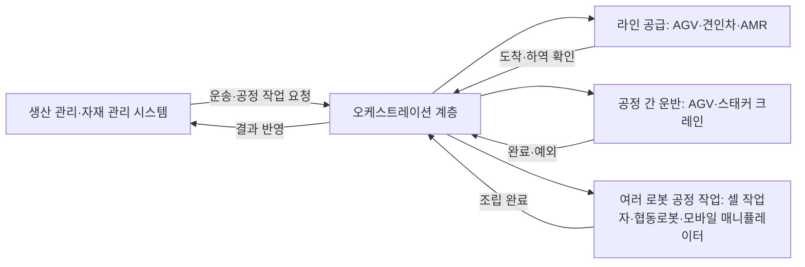

[홈](../../index.md) › [주제](../index.md) › 62. 제조 공장 — 대표 접근법과 기술

# 62. 제조 공장 — 대표 접근법과 기술

<!-- auto:page-status:start -->
<!-- auto:page-status:end -->

## 1. 세 줄 요약

- 확인한 자료를 종합하면 제조 공장의 로봇 작업은 (1) 창고·슈퍼마켓에서 조립 스테이션으로 부품을 옮기는 라인 공급, (2) 차체·조립체를 라인과 버퍼 사이에서 옮기는 공정 간 운반, (3) 셀 안에서 작업자와 로봇이 함께 조립하거나 두 대 이상의 로봇(로봇팔·이동 플랫폼)이 치구 없이 조립하거나 협동로봇이 부품 지지·공구 전달을 맡는 여러 로봇 공정 작업의 세 형태로 들어간다. [추정][^ref-922][^ref-935][^ref-924][^ref-936][^ref-930][^ref-934][^ref-928][^ref-927]
- 이 페이지는 [62. 제조 공장](../../categories/site-type-applications/manufacturing-plant.md) 페이지의 "대표 접근법과 기술" 절이 분량 기준을 넘어 옮겨 온 것이다. 원 페이지의 검증을 거친 내용이며 새 주장은 없다.

## 2. 배경

[62. 제조 공장](../../categories/site-type-applications/manufacturing-plant.md) 페이지를 쓰는 과정에서 "대표 접근법과 기술" 절의 분량이 세부영역 페이지 기준(4,000자)을 넘어, 내용을 줄이지 않고 이 주제 페이지로 분리했다.

## 3. 본문

### 제조 공장 로봇 작업의 세 형태

확인한 자료를 종합하면 제조 공장의 로봇 작업은 (1) 창고·슈퍼마켓에서 조립 스테이션으로 부품을 옮기는 라인 공급, (2) 차체·조립체를 라인과 버퍼 사이에서 옮기는 공정 간 운반, (3) 셀 안에서 작업자와 로봇이 함께 조립하거나 두 대 이상의 로봇(로봇팔·이동 플랫폼)이 치구 없이 조립하거나 협동로봇이 부품 지지·공구 전달을 맡는 여러 로봇 공정 작업의 세 형태로 들어간다. [추정][^ref-922][^ref-935][^ref-924][^ref-936][^ref-930][^ref-934][^ref-928][^ref-927]

### 라인 공급 정책과 대수·경로 산정

라인 공급은 부품을 공급 정책에 배정하는 전술 문제와, 그 정책을 실행할 운반 수단의 대수·도로·운영 방식을 정하는 문제로 나뉜다. 앞의 문제는 Schmid·Limère 의 분류 틀이 여러 차원으로 정리해 실무 문제와 학술 해법을 잇는다. [사실][^ref-922] 뒤의 문제는 국내 자동차 공장 연구가 Witness 시뮬레이션으로 적정 AGV 대수와 단일 차선 양방향 도로의 타당성을 검토한 사례가 있다. [사실][^ref-935] 견인차 순회 스케줄링의 학술 근거는 이번 조사에서 확인하지 못했다.

### 생산 관리 시스템과의 연결

지멘스 백서는 자재 관리 시스템이 운송 주문을 자동 생성해 AGV 에 보내면 사람 개입과 오류가 줄고 JIT·칸반 공급이 이어진다고 주장한다. [추정] 벤더 주장[^ref-926] 학술 쪽에서는 Wally 외가 모델 기반 공학으로 ISA-95 기반 생산 시스템 모델을 [계획 도메인 정의 언어(PDDL)](../../glossary/pddl.md) 파일로 변환해 범용 계획기가 생산 단계 순서를 계산하고 그 결과를 다시 모델에 통합하는 방법을 제안했다(2019-11-13, 평가·사례는 초록에 없음). [사실][^ref-925] 두 접근은 각각 '요청이 어디서 오는가'와 '표준 모델을 계획에 어떻게 쓰는가'를 보여 주지만, 이기종 로봇 플릿과 이어진 공개 사례는 이번 조사에서 확인되지 않았다. [추정][^ref-925][^ref-926]

### 다중 로봇 조립과 협동로봇

Marvel·Bostelman·Falco 의 서베이는 두 대 이상의 로봇 시스템이 치구 없이 조립하는 전략을 조립 유형, 조립 중 로봇 동작을 맞추는 동기화 알고리즘, 조립 품질·효과를 평가하는 성능 지표로 정리한다. [사실][^ref-934] Keshvarparast 외의 체계적 문헌 검토는 협동로봇이 유연성을 높이지만 작업자 안전과 일자리 대체 우려가 함께 다뤄져야 한다고 정리한다. [사실][^ref-933] Pietrantoni 외의 전문가 조사에서 차량 조립 협동로봇은 무거운 부품 지지와 공구·부품 전달을 맡고, 좁은 공간에서 협동로봇 간·외골격과의 충돌 예측·회피가 최우선 과제로 꼽혔다. [사실][^ref-928] 이 동기화·충돌 회피 자체는 로봇 자체 지능·제어 쪽 방법이며, 이 영역에서는 공정 작업 형태와 제약의 근거로만 다룬다.

### 자연어로 로봇을 제어하는 연구

한국전자기술연구원(KETI)은 스마트공장·자동화산업전 AW 2025 에서 산업통상자원부·한국산업기술기획평가원 지원으로 개발한 대규모 언어 모델(Large Language Model, LLM)·모방학습 기반 조립 공정 자동화 기술을 공개해 별도 작업 지시나 프로그래밍 없이 자연어 입력으로 로봇을 제어하는 것을 시연했으며, 이는 연구 단계 시연이고 현장 운영 사례는 아니다(2025-03-12). [사실][^ref-932] 이 방법은 L. AI·학습 기술의 연구 방법이므로 44. 로봇 기반 모델·언어 모델 계획과 12. 채팅으로 업무 지시·오케스트레이션에 함께 연결한다.

## 4. 현장 시나리오

현장 시나리오는 원 페이지의 [5. 적용 사례 (현장 유형 명시)](../../categories/site-type-applications/manufacturing-plant.md) 절에 있다.

## 5. ROP 관점의 시사점

ROP가 직접 맡는 것과 외부와 연계하는 것은 원 페이지의 [9. ROP가 직접 맡는 것과 외부와 연계하는 것 (책임 경계 기준)](../../categories/site-type-applications/manufacturing-plant.md) 절에 있다.

## 6. 연결되는 연구영역

- 주 연구영역: [62. 제조 공장](../../categories/site-type-applications/manufacturing-plant.md)
- 관련 영역: [1. 기술·시장·업체 동향](../../categories/planning-and-business/technology-market-and-vendor-trends.md), [12. 채팅으로 업무 지시·오케스트레이션](../../categories/chat-based-configuration-and-operation/chat-task-instruction-and-orchestration.md), [21. 상호운용 표준·적합성](../../categories/integration/interoperability-standards-and-conformance.md), [23. 업무 시스템 연동](../../categories/integration/business-system-integration.md), [25. 작업 배정 — MRTA](../../categories/planning-and-optimization/task-allocation-mrta.md), [26. 작업 순서·스케줄링](../../categories/planning-and-optimization/task-sequencing-and-scheduling.md), [30. 로봇 간 협업·물리적 인계](../../categories/execution-collaboration-and-recovery/robot-to-robot-collaboration-and-physical-handover.md), [31. 사람–로봇 협업](../../categories/execution-collaboration-and-recovery/human-robot-collaboration.md), [32. 예외 복구·재계획·업무 연속성](../../categories/execution-collaboration-and-recovery/exception-recovery-replanning-and-business-continuity.md), [34. 시뮬레이션·예측용 디지털 트윈](../../categories/design-and-simulation/simulation-and-predictive-digital-twin.md), [35. 처리능력·규모·배치 설계](../../categories/design-and-simulation/capacity-sizing-and-layout-design.md), [44. 로봇 기반 모델·언어 모델 계획](../../categories/ai-and-learning/robot-foundation-models-and-llm-planning.md), [49. 사람 근접 안전](../../categories/safety/human-proximity-safety.md), [50. 안전 표준·인증·사고 조사](../../categories/safety/safety-standards-certification-and-incident-investigation.md)

## 7. 열린 질문

열린 질문은 원 페이지의 [11. 열린 질문](../../categories/site-type-applications/manufacturing-plant.md) 절과 [열린 질문](../../open-questions.md) 페이지에 모은다.

## 8. 출처

[^ref-922]: Schmid, N. A., & Limère, V. (International Journal of Production Research 57(24)), A classification of tactical assembly line feeding problems, 2019-02-23, https://www.tandfonline.com/doi/full/10.1080/00207543.2019.1581957, 접근일 2026-09-29
[^ref-924]: SYNAOS (IoT Use Case), VDA 5050: unified AGV fleet control in real time at VW, 2025-10-16, https://www.iotusecase.com/en/solution-examples/vda-5050-agv-fleet-control, 접근일 2026-09-29
[^ref-925]: Wally, B., Vyskočil, J., Novák, P., Huemer, C., Šindelář, R., Kadera, P., Mazak, A., & Wimmer, M., Flexible Production Systems: Automated Generation of Operations Plans Based on ISA-95 and PDDL, 2019-11-13, https://arxiv.org/abs/1911.05481, 접근일 2026-09-29
[^ref-926]: Siemens, AGV fleet management integration with intralogistics, 미확인, https://resources.sw.siemens.com/en-US/white-paper-integrating-agv-automated-guided-vehicle-system-with-intralogistics/, 접근일 2026-09-29
[^ref-927]: 물류신문 (이경성), LG전자, 스마트팩토리 솔루션 확대에 AMR 등 물류로봇 적극 활용한다, 2024-07-18, https://www.klnews.co.kr/news/articleView.html?idxno=313143, 접근일 2026-09-29
[^ref-928]: Pietrantoni, L., Favilla, M., Fraboni, F., Mazzoni, E., Morandini, S., Benvenuti, M., & De Angelis, M. (Frontiers in Robotics and AI), Integrating collaborative robots in manufacturing, logistics, and agriculture: Expert perspectives on technical, safety, and human factors, 2024-12-02, https://www.frontiersin.org/journals/robotics-and-ai/articles/10.3389/frobt.2024.1342130/full, 접근일 2026-09-29
[^ref-930]: 현대자동차그룹, ‘혁신의 장場’ HMGICS, 인간 중심 모빌리티 솔루션의 새 시대 열다, 2023-11-21, https://www.hyundaimotorgroup.com/ko/news/hmgics-human-centric-mobility-solutions-new-era, 접근일 2026-09-29
[^ref-932]: 테크데일리, KETI, LLM 모델 및 모방학습, 조립공정 자동화 기술 공개, 2025-03-12, https://www.techdaily.co.kr/news/articleView.html?idxno=25352, 접근일 2026-09-29
[^ref-933]: Keshvarparast, A., Battini, D., Battaia, O., & Pirayesh, A. (Journal of Intelligent Manufacturing 35), Collaborative robots in manufacturing and assembly systems: literature review and future research agenda, 2023-05-30, https://link.springer.com/article/10.1007/s10845-023-02137-w, 접근일 2026-09-29
[^ref-934]: Marvel, J. A., Bostelman, R., & Falco, J. (NIST; ACM Computing Surveys 51), Multi-Robot Assembly Strategies and Metrics, 2018-01-01, https://dl.acm.org/doi/10.1145/3150225, 접근일 2026-09-29
[^ref-935]: 강명훈, 곽춘종 (부산대학교; Asia-Pacific Journal of Business & Commerce), 시뮬레이션을 이용한 자동차 부품 공급 시스템 도입 방안 분석: R자동차 사례, 2014-04, https://www.dbpia.co.kr/journal/articleDetail?nodeId=NODE02448280, 접근일 2026-09-29
[^ref-936]: 옥창훈, 김득수, 공정수, 서윤호 (고려대학교, 현대자동차; 한국시뮬레이션학회 논문지 21(2)), 자동차 생산을 위한 통합창고 연구, 2012, https://www.kci.go.kr/kciportal/ci/sereArticleSearch/ciSereArtiView.kci?sereArticleSearchBean.artiId=ART001671601, 접근일 2026-09-29

## 9. 검증 노트

원 페이지와 함께 실행 2026-09-29-12 의 1차·2차 검증을 거쳤다. 분리는 코드가 했고 내용은 바꾸지 않았다.

## 10. 이력

| 날짜 | 실행 id | 변경 |
|---|---|---|
| 2026-09-29 | 2026-09-29-12 | 62. 제조 공장 의 "대표 접근법과 기술" 절에서 분리 |
