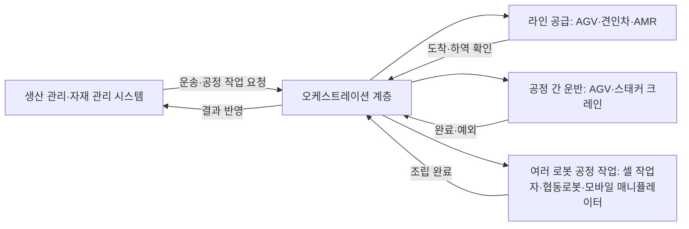

(너의 규칙은 시스템 프롬프트의 agents/shared-rules.md 와 agents/verifier.md 이다. 아래는 이번 실행의 컨텍스트와 입력이다.)

## 실행 컨텍스트

- run_id: 2026-09-29-12
- date: 2026-09-29
- run_type: area_deep_dive (영역 심화)
- 대상: 62. 제조 공장 (Q. 현장 유형별 적용)
- 예산:
    - max_search_queries: 30
    - max_sources_per_run: 15
    - new_topic_pages: 1
    - page_updates: 2
    - max_retries: 2
- 환경 알림: web_fetch_available: true · fetch_mode: full
- 언어: ko
- verification_stage: second
- verifier_budget:
    - max_search_queries: 30
    - max_sources_per_run: 15
    - new_topic_pages: 1
    - page_updates: 2
    - max_retries: 2

## 입력

### runs/2026-09-29-12/target.json

```json
{
  "run_id": "2026-09-29-12",
  "date": "2026-09-29",
  "weekday": "Tue",
  "run_number": 104,
  "run_type": "area_deep_dive",
  "forced": true,
  "target": {
    "area_no": 62,
    "area_name": "62. 제조 공장",
    "category": "Q. 현장 유형별 적용",
    "category_letter": "Q"
  },
  "topic": null,
  "track": null,
  "corrections": [],
  "budget": {
    "max_search_queries": 30,
    "max_sources_per_run": 15,
    "new_topic_pages": 1,
    "page_updates": 2,
    "max_retries": 2
  },
  "priority_reason": null,
  "priority_questions": [],
  "excluded_areas": [],
  "lifted_areas": [],
  "deferred": {
    "monthly_recheck": false,
    "weekly_review": false
  },
  "selection_rationale": "CLI 지정 run_type=area_deep_dive, area=62"
}
```

### runs/2026-09-29-12/research.json

```json
{
  "run_id": "2026-09-29-12",
  "date": "2026-09-29",
  "run_type": "area_deep_dive",
  "target": {
    "area_no": 62,
    "area_name": "62. 제조 공장",
    "category": "Q. 현장 유형별 적용"
  },
  "gaps": [
    "섹션 3. 왜 중요한가 비어 있음",
    "섹션 4. 핵심 개념과 용어 비어 있음 — 조립라인 공급 문제·인플랜트 밀크런·셀 생산 방식 용어 없음(ISA-95·VDA 5050·플러그 앤 프로듀스·협동 적용·운용 구역·종합설비효율은 용어집에 이미 있음)",
    "섹션 5. 적용 사례 (현장 유형 명시) 비어 있음 — 국내(LG전자 창원, 현대차그룹 HMGICS)·해외(BMW, 폭스바겐 하노버) 사례와 여섯 항목 정리 없음",
    "섹션 6. 대표 접근법과 기술 비어 있음 — 라인 공급 정책, 밀크런·견인차 스케줄링, 생산 관리 시스템에서 운송 주문 생성, 다중 로봇 조립, 협동로봇 근거 없음",
    "섹션 7. 관련 표준·프레임워크·오픈소스 비어 있음 — ISA-95, VDA 5050, ISO 3691-4, Open-RMF 위치 없음",
    "섹션 8. 대표 연구와 자료 비어 있음 — 조립라인 공급 분류 서베이, 협동로봇 서베이, 다중 로봇 조립 서베이, 국내 시뮬레이션 논문 없음",
    "섹션 9. ROP가 직접 맡는 것과 외부와 연계하는 것 (책임 경계 기준) 비어 있음",
    "섹션 10. 다른 연구영역과의 연결 (번호와 이름을 함께 표기) 비어 있음 — 21. 상호운용 표준·적합성, 23. 업무 시스템 연동, 25. 작업 배정 — MRTA, 26. 작업 순서·스케줄링, 31. 사람–로봇 협업, 34. 시뮬레이션·예측용 디지털 트윈, 35. 처리능력·규모·배치 설계, 49. 사람 근접 안전 연결 필요",
    "섹션 11. 열린 질문 비어 있음 — 이 영역에 걸린 열린 질문 oq-142 미반영, 정정 요청 없음",
    "프런트매터 related_areas·sources 비어 있음"
  ],
  "research_questions": [
    "여러 로봇이 함께 하는 공장 작업을 생산 관리와 어떻게 맞출 것인가? [분류원문]",
    "조립라인에 부품을 공급하는 방식(라인 적재, 상자 공급, 순서 공급, 키팅)과 무인 운반차·견인차 스케줄링은 학술 문헌에서 어떻게 분류·모델링되는가? (섹션 4·6·8 겨냥)",
    "생산 관리 시스템(MES·자재 관리)은 로봇 플릿에 어떤 방식으로 운송 주문을 내고 결과를 받으며, ISA-95 같은 표준 모델이 그 연결에 어떻게 쓰이는가? (섹션 6·7·9 겨냥)",
    "자동차·전자·배터리 공장의 실제 도입 사례(국내 LG전자·현대차그룹, 해외 BMW·폭스바겐)에서 로봇 작업의 시작 조건·작업 대상·수행 자원·제약·완료·인계·예외·성과는 어떻게 나타나는가? (섹션 5 겨냥, 현장 유형 제조 공장 명시, 한국 자료 우선)",
    "여러 로봇이 함께 하는 공정 작업(다중 로봇 조립, 협동로봇, 모바일 매니퓰레이터)은 어떤 연구가 다루며 어떤 안전·인간 요인 조건이 붙는가? (섹션 6·8·10 겨냥)",
    "제조 공장의 무인 운반차 운영에 적용되는 상호운용 표준(VDA 5050)과 안전 표준(ISO 3691-4)은 무엇을 규정하며 ROP 의 위치를 어떻게 규정하는가? (섹션 7·9 겨냥)",
    "oq-142: 국내 제조 공장에서 대화(자연어)로 여러 로봇에 업무를 지시하고 승인·실행한 실제 운영 사례가 있는가? (섹션 11 겨냥)"
  ],
  "findings": [
    {
      "id": "f1",
      "claim": "Schmid·Limère(International Journal of Production Research 57(24), 2019)의 조립라인 공급 문제(assembly line feeding problem) 분류 연구는 대량 맞춤화와 제품 다양성이 조립라인 공급 시스템에 대한 관심을 키웠다고 보고, 부품을 라인 적재·상자 공급·순서 공급·정치식 키팅·이동식 키팅 같은 공급 정책에 배정하는 전술적 문제를 여러 차원으로 분류해 실무 문제와 학술 해법을 잇는 틀을 제시한다.",
      "tag": "사실",
      "source_ids": [
        "ref-922"
      ],
      "cross_checked": false,
      "confidence": "medium",
      "evidence_excerpt": "Semantic Scholar API 초록: 조립라인 공급 문제는 부품을 line stocking, boxed-supply, sequencing, kitting 등 공급 방식에 할당하는 문제이며 약 25년 전 별도 연구 분야로 등장했고, 저자들은 문헌을 여러 차원으로 정리한 분류 틀을 제시해 미연구 영역을 드러내고 실무자가 현장 문제를 기존 해법과 연결하게 한다(IJPR 57권 7586–7609쪽, 2019-02-23).",
      "as_of": "2019-02-23",
      "site_type": "제조 공장",
      "flow_item": "작업 대상"
    },
    {
      "id": "f2",
      "claim": "강명훈·곽춘종(부산대학교, Asia-Pacific Journal of Business & Commerce, 2014)은 R자동차 공장에서 도어·후드·트렁크 조립체를 유인 견인차 대신 AGV 기반 무인 물류 시스템으로 생산라인 사이에 공급하는 방안을 Witness 시뮬레이션으로 검토해 적정 AGV 대수, 단일 차선 양방향 AGV 도로의 타당성, 투자 타당성을 산정했다.",
      "tag": "사실",
      "source_ids": [
        "ref-935"
      ],
      "cross_checked": false,
      "confidence": "medium",
      "evidence_excerpt": "DBpia 초록: 유인 견인차 운영을 AGV 기반 무인 물류 시스템으로 전환하는 방안을 Witness 시뮬레이션으로 검토해 적정 AGV 대수 산정, 단일 차선 양방향 AGV 도로의 가능성, 무인 시스템 전환의 경제적 타당성을 확인했다(2014).",
      "as_of": "2014",
      "site_type": "제조 공장",
      "flow_item": "수행 자원"
    },
    {
      "id": "f3",
      "claim": "옥창훈·김득수·공정수·서윤호(고려대학교·현대자동차, 한국시뮬레이션학회 논문지 21(2), 2012)는 자동차 생산라인의 차체 버퍼 창고(WBS·PBS)가 각각 따로 운영되어 결품(starvation)과 막힘(blocking)이 생기는 문제에 대해 통합창고 시뮬레이션 모형을 제안하고 적정 스태커 크레인·AGV 대수와 운영 방식을 도출해 도장 라인 정지 상황에서 기존 창고보다 효율적임을 보였다.",
      "tag": "사실",
      "source_ids": [
        "ref-936"
      ],
      "cross_checked": false,
      "confidence": "medium",
      "evidence_excerpt": "KCI 초록: 별도 버퍼(WBS, PBS)가 독립 운영되어 starvation 이나 blocking 이 생기는 문제에 통합창고 운영 시스템 시뮬레이션 모형을 제안하고 Stacker Crane 과 AGV 의 적정 대수를 결정하며, 시뮬레이션으로 도장 라인 정지 시 기존 창고보다 효율적임을 보였다(21권 2호, 2012).",
      "as_of": "2012",
      "site_type": "제조 공장",
      "flow_item": "예외·성과"
    },
    {
      "id": "f4",
      "claim": "Wally 외(arXiv 1911.05481, 2019)는 모델 기반 공학으로 ISA-95 기반 생산 시스템 모델을 계획 도메인 정의 언어(PDDL) 파일로 변환해 범용 계획기가 목표 달성에 필요한 생산 단계 순서를 계산하게 하고 그 결과 계획을 다시 생산 시스템 모델에 통합하는 방법을 제안해, 생산 관리 표준 모델과 로봇·설비 작업 계획을 잇는 연구 사례를 보인다.",
      "tag": "사실",
      "source_ids": [
        "ref-925"
      ],
      "cross_checked": false,
      "confidence": "medium",
      "evidence_excerpt": "arXiv 초록(2019-11-13 제출): \"Model-driven engineering (MDE) provides tools and methods for the manipulation of formal models.\" ISA-95 기반 생산 시스템 모델을 PDDL 호환 파일로 변환해 계획 도구가 생산 단계 순서를 계산하고, 결과 계획을 생산 시스템 모델에 다시 통합한다. 평가·사례는 초록에 없음.",
      "as_of": "2019-11-13",
      "site_type": null,
      "flow_item": null
    },
    {
      "id": "f5",
      "claim": "지멘스의 백서에 따르면 AGV 는 공장의 인트라로지스틱스·자재 관리 시스템과 통합되어 자재 관리 시스템이 자동으로 운송 주문을 생성해 AGV 에 보낼 때 사람 개입과 오류가 줄고 JIT·칸반 자재 공급이 이어질 수 있다.",
      "tag": "추정",
      "source_ids": [
        "ref-926"
      ],
      "cross_checked": false,
      "confidence": "low",
      "evidence_excerpt": "벤더 주장: \"Integration allows the material management system to automatically create transport orders for the AGVs, sending them to retrieve and transport materials.\" 표준화된 데이터 통합, JIT/칸반 연속 공급을 이점으로 든다(발행일 미확인, 확인일 기준).",
      "as_of": "2026-09-29",
      "site_type": "제조 공장",
      "flow_item": "시작 조건",
      "vendor_claim": true
    },
    {
      "id": "f6",
      "claim": "독일자동차산업협회(VDA)의 VDA 5050 소개 글에 따르면 VDA 5050 은 VDA 가 VDMA 와 협력하고 KIT IFL 의 지원을 받아 2019년에 만든 인터페이스 표준으로 제조 공장에서 서로 다른 제조사의 무인 운반차를 하나의 관제 시스템 아래 두게 하며, AGV Mesh-Up 2021 실증에서 여섯 제조사의 차량이 다른 제조사의 관제 시스템 아래 운행됐고 2.0.0 판이 공개됐다.",
      "tag": "사실",
      "source_ids": [
        "ref-923"
      ],
      "cross_checked": false,
      "confidence": "medium",
      "evidence_excerpt": "VDA 페이지: VDA 가 VDMA(자재 취급·인트라로지스틱스 협회), KIT IFL 지원으로 2019년 제정. AGV Mesh-Up 2021 에서 여섯 제조사 차량이 다른 제조사 관제 시스템 아래 성공적으로 운행. 소프트웨어 버전 2.0.0 공개(발행일 미확인, 확인일 기준).",
      "as_of": "2026-09-29",
      "site_type": "제조 공장",
      "flow_item": null
    },
    {
      "id": "f7",
      "claim": "BMW 그룹 딩골핑·데브레첸 공장 물류기획 책임자 Peter Kiermaier 는 VDA 소개 글에서 BMW 그룹이 2021년 3월부터 VDA 5050 프로젝트 그룹 의장을 맡고 스마트 운반 로봇·자율 견인차·자율 지게차 여러 프로젝트에 VDA 5050 을 적용하며 새 AGV 시스템 입찰의 표준으로 정했다고 밝혔다.",
      "tag": "추정",
      "source_ids": [
        "ref-923"
      ],
      "cross_checked": false,
      "confidence": "low",
      "evidence_excerpt": "벤더 주장: BMW 그룹은 2021년 3월부터 VDA 프로젝트 그룹 의장. 스마트 운반 로봇·견인차·지게차 프로젝트에 VDA 5050 적용, 신규 AGV 시스템 입찰의 표준으로 설정. \"the expectations of VDA 5050 have so far been fully met.\"(발행일 미확인, 확인일 기준)",
      "as_of": "2026-09-29",
      "site_type": "제조 공장",
      "flow_item": "수행 자원",
      "vendor_claim": true
    },
    {
      "id": "f8",
      "claim": "관제 소프트웨어 업체 SYNAOS 는 2025-10-16 게시한 사례 글에서 폭스바겐 상용차 하노버-슈퇴켄 공장이 세계 최대 VDA 5050 플릿으로 MLR 언더라이드 로봇 약 100대와 괴팅·린데 자율 견인차 40대 등 135대 이상을 자사 인트라로지스틱스 관리 플랫폼으로 제조사 독립적으로 관제해 하루 9,000개 랙을 옮기고 연 30만 km 를 주행하며 트럭 하역장→내부 슈퍼마켓→작업자 준비→조립라인 자동 운반의 JIT·JIS 공급을 이룬다고 주장한다.",
      "tag": "추정",
      "source_ids": [
        "ref-924"
      ],
      "cross_checked": false,
      "confidence": "low",
      "evidence_excerpt": "벤더 주장: 하노버-슈퇴켄 공장(VW Bus·Caddy·Crafter·Amarok·ID.BUZZ 생산), MLR 언더라이드 로봇 약 100대, 괴팅/린데 견인차 40대, 135대 이상, 일 9,000 랙, 연 약 30만 km, SYNAOS IMP 가 VDA 5050 으로 관제. MES 연동 세부는 없음(2025-10-16).",
      "as_of": "2025-10-16",
      "site_type": "제조 공장",
      "flow_item": "수행 자원",
      "vendor_claim": true
    },
    {
      "id": "f9",
      "claim": "물류신문(2024-07-18)에 따르면 LG전자는 스마트팩토리 솔루션 사업에 자체 개발한 자율이동로봇(AMR)과 로봇팔을 결합한 자율주행 수직다관절로봇(MM)을 적용해 공장 내 부품·자재 공급을 맡기고, MM 은 운반뿐 아니라 조립·불량 검사와 다른 AMR 의 배터리 교체까지 수행하며, LG 그룹 40여 지역 60개 사업장에 적용됐고 2024년 외부 매출 2,000억 원을 목표로 한다.",
      "tag": "사실",
      "source_ids": [
        "ref-927"
      ],
      "cross_checked": false,
      "confidence": "medium",
      "evidence_excerpt": "물류신문 기사(2024-07-18, 이경성 기자): 자체 개발 AMR(카메라·레이더·라이다) 과 MM(AMR+다관절 로봇팔)으로 부품 공급·조립·불량 검사·AMR 배터리 교체. 그룹 40여 지역 60개 사업장 적용, 2024년 외부 매출 2,000억 원 목표, 특허 1,000건 이상 출원.",
      "as_of": "2024-07-18",
      "site_type": "제조 공장",
      "flow_item": "수행 자원"
    },
    {
      "id": "f10",
      "claim": "LG전자는 스마트팩토리 솔루션을 적용한 창원 공장에서 생산성 17% 향상, 에너지 효율 30% 개선, 품질 비용 70% 절감이라는 성과를 냈다고 밝혔다.",
      "tag": "추정",
      "source_ids": [
        "ref-927"
      ],
      "cross_checked": false,
      "confidence": "low",
      "evidence_excerpt": "벤더 주장: 물류신문이 전한 LG전자 설명 — 창원 공장 생산성 17% 증가, 에너지 효율 30% 개선, 품질 비용 70% 절감. 디지털 트윈 시뮬레이션·비전 AI 이상 탐지·생성형 AI 모니터링 언급, MES 등 생산 관리 시스템 이름은 없음(2024-07-18).",
      "as_of": "2024-07-18",
      "site_type": "제조 공장",
      "flow_item": "예외·성과",
      "vendor_claim": true
    },
    {
      "id": "f11",
      "claim": "현대자동차그룹은 2023-11-21 공개한 싱가포르 글로벌 혁신센터(HMGICS)가 컨베이어 대신 작업자와 로봇이 함께 일하는 타원형 셀에서 여러 차종을 동시에 생산하는 셀 기반 생산 방식과 디지털 트윈 메타 팩토리를 갖추고 AGV·AMR·스팟 점검 로봇·로봇팔 등 약 200대의 로봇으로 운송·조립 과정의 상당 부분을 자동화했으며 연 3만 대 이상의 전기차를 생산할 수 있다고 밝혔다.",
      "tag": "추정",
      "source_ids": [
        "ref-930",
        "ref-937"
      ],
      "cross_checked": false,
      "confidence": "low",
      "evidence_excerpt": "벤더 주장: 현대차그룹 뉴스(2023-11-21) — 타원형 셀에서 인간과 로봇이 함께 다차종 생산, 디지털 트윈 메타 팩토리, 연 3만 대 이상 전기차 생산 역량. 현대차 브랜드 저널(2023-11-21) — \"약 200개의 로봇과 AI, 첨단 비전 기술로 무장한 HMGICS는 운송 및 조립 과정의 상당 부분을 자동화\", AGV·AMR·스팟·로봇팔. 두 출처 모두 현대차그룹 발행이라 독립 교차 확인이 아님.",
      "as_of": "2023-11-21",
      "site_type": "제조 공장",
      "flow_item": "수행 자원",
      "vendor_claim": true
    },
    {
      "id": "f12",
      "claim": "Keshvarparast·Battini·Battaia·Pirayesh(Journal of Intelligent Manufacturing 35, 2023)의 체계적 문헌 검토는 조립·분해 작업에 투입되는 협동로봇 연구를 연구 대상·방법론·성과 지표·사람–협동로봇 상호작용 유형으로 분류하고, 제조가 맞춤화와 대응성으로 옮겨 가는 가운데 협동로봇이 유연성을 높이지만 작업자 안전과 일자리 대체 우려가 함께 다뤄져야 한다고 정리한다.",
      "tag": "사실",
      "source_ids": [
        "ref-933"
      ],
      "cross_checked": false,
      "confidence": "medium",
      "evidence_excerpt": "Semantic Scholar API 초록(2023-05-30, JIM 35권 2065–2118쪽): 협동로봇의 조립·분해 작업 통합을 체계적 문헌 검토로 연구 대상, 방법론, 성과 지표, 사람–협동로봇 상호작용 유형으로 분류. 맞춤화·대응성·작업자 안전과 Industry 4.0 틀의 인간–기계 협업을 강조.",
      "as_of": "2023-05-30",
      "site_type": "제조 공장",
      "flow_item": null
    },
    {
      "id": "f13",
      "claim": "Marvel·Bostelman·Falco(미국 국립표준기술연구소, ACM Computing Surveys 51, 2018)의 서베이는 산업용 로봇팔·다지 손·무인 운반차 같은 이동 플랫폼을 포함해 두 대 이상의 로봇 시스템이 치구 없이 조립하는 전략을 검토하며, 다중 로봇으로 가능한 조립 유형, 조립 중 로봇 동작을 맞추는 동기화 알고리즘, 조립 품질·효과를 평가하는 성능 지표의 세 갈래를 정리한다.",
      "tag": "사실",
      "source_ids": [
        "ref-934"
      ],
      "cross_checked": false,
      "confidence": "medium",
      "evidence_excerpt": "Semantic Scholar API 초록(2018-01-01, ACM CSUR 51권): \"fixtureless assembly strategies featuring two or more robotic systems\" — 산업용 로봇팔, 다지 손, AGV 같은 이동 플랫폼 포함. 다중 로봇 조립 유형, 동기화 알고리즘, 성능 지표를 다룬다.",
      "as_of": "2018-01-01",
      "site_type": "제조 공장",
      "flow_item": null
    },
    {
      "id": "f14",
      "claim": "Pietrantoni 외(Frontiers in Robotics and AI, 2024-12-02)는 유럽 기술 전문가 31명을 대상으로 한 혼합 방법 연구에서 차량 조립 사례의 협동로봇이 차량 지붕 같은 무거운 부품을 받쳐 주고 공구·부품을 골라 작업자에게 가져다주는 역할을 하며, 좁은 조립 공간에서 협동로봇끼리 그리고 외골격과의 충돌을 예측·회피하는 것이 핵심 안전·기술 과제라고 보고했다.",
      "tag": "사실",
      "source_ids": [
        "ref-928"
      ],
      "cross_checked": false,
      "confidence": "medium",
      "evidence_excerpt": "Frontiers 원문(2024-12-02): 차량 조립·창고 물류·농업 세 사례, 전문가 31명. \"Cobots can improve workload management by assisting workers in handling heavy vehicle components, such as the roof, or by efficiently selecting and delivering necessary tools and parts to workers.\" 협동로봇 간·외골격과의 충돌 예측·회피가 최우선 과제.",
      "as_of": "2024-12-02",
      "site_type": "제조 공장",
      "flow_item": "제약"
    },
    {
      "id": "f15",
      "claim": "시험·인증 기관 Applus+ Laboratories 의 서비스 안내에 따르면 ISO 3691-4:2023 은 무인 산업 차량(driverless industrial trucks)과 그 시스템의 안전 요구사항을 다루며 위험 분석·위험성 평가(부속서 B 표), 사람 감지, 제동·속도 제어, 안정성, 카테고리 대신 성능 수준(PL), 구역 정의·분류를 규정하고 이전 EN 1525 보다 구역 정의와 운송 시스템 간 상호작용을 개선했으며 EU 조화 표준으로 CE 인증에 쓰인다.",
      "tag": "추정",
      "source_ids": [
        "ref-938"
      ],
      "cross_checked": false,
      "confidence": "low",
      "evidence_excerpt": "벤더 주장: Applus+ 페이지 — ISO 3691-4:2023 은 무인 산업 차량과 그 시스템의 위험·위험성 평가, 사람 감지, 제동·속도, 안정성, PL, 구역 정의·분류를 다루며 \"The standard describes the importance of carrying out hazard analyses and risk assessments, using specific tables in Annex B.\" ISO 원문 페이지(iso.org/standard/83545.html)는 403 으로 미열람(발행일 미확인, 확인일 기준).",
      "as_of": "2026-09-29",
      "site_type": "제조 공장",
      "flow_item": "제약",
      "vendor_claim": true
    },
    {
      "id": "f16",
      "claim": "테크데일리(2025-03-12)에 따르면 한국전자기술연구원(KETI)은 스마트공장·자동화산업전 AW 2025 에서 산업통상자원부·한국산업기술기획평가원 지원으로 개발한 'LLM 및 모방학습을 이용한 조립 공정 자동화 기술'을 공개해 사용자가 별도 작업 지시나 프로그래밍 없이 자연어로 양팔 로봇을 제어하는 것을 시연했으며, 이는 연구 단계 시연이고 현장 운영 사례는 아니다.",
      "tag": "사실",
      "source_ids": [
        "ref-932"
      ],
      "cross_checked": false,
      "confidence": "medium",
      "evidence_excerpt": "테크데일리 기사(2025-03-12): KETI 가 AW 2025 에서 로봇·AI 기술 13종 공개, 양팔 매니퓰레이터 모방학습, 랜덤 빈 피킹. \"별도 작업 지시나 프로그래밍 없이 자연어 입력으로 직관적으로 로봇을 제어\". 산업부·KEIT 지원 연구과제, 현장 배치 아님.",
      "as_of": "2025-03-12",
      "site_type": "제조 공장",
      "flow_item": "시작 조건"
    },
    {
      "id": "f17",
      "claim": "뉴시스(2026-09-07)에 따르면 과학기술정보통신부는 중소벤처기업부와 함께 중소 제조 현장에서 AI 가 자율이동로봇(AMR)·무인 운반차(AGV)의 적정 대수를 분석하고 가상 시뮬레이션으로 배치와 이동 경로를 정한 뒤 실제 투입하는 'AI 공장장' 사업을 대전 KAIST 시설과 전북·경남 시범 현장에서 추진하며, 2026년 개별 물류 작업에서 2027년 통합 물류, 2028년 생산 전 공정, 2029년 '다크팩토리 OS'로 범위를 넓힐 계획이고 기사에 자연어·언어 모델 지시는 언급되지 않는다.",
      "tag": "사실",
      "source_ids": [
        "ref-931"
      ],
      "cross_checked": false,
      "confidence": "medium",
      "evidence_excerpt": "뉴시스 기사(2026-09-07): 과기정통부·중기부 사업, AMR·AGV 적정 대수 분석과 가상 시뮬레이션 배치·경로 결정 후 실제 배치. KAIST 대전 시설, 전북·경남 시범. \"2029년에는 AI가 공장 전반을 실시간 판단·제어하는 완전자율 제조시스템인 '다크팩토리 OS'를 지원할 계획\". 자연어·LLM 언급 없음.",
      "as_of": "2026-09-07",
      "site_type": "제조 공장",
      "flow_item": "수행 자원"
    },
    {
      "id": "f18",
      "claim": "장형준·이연주(건국대학교·오모로봇, 전기의 세계 67(8), 2018)의 동향 논문은 물류 로봇을 물류센터와 공장에서 운영 효율을 높이기 위해 쓰는 시스템으로 정의하고 AGV 가 1953년 미국 Barrett Electronics 의 첫 모델 이후 50년 넘게 자재 운반을 맡아 왔으며, 향후 로봇이 스스로 판단해 집고 싣는 단계로 나아가 AI·5G 와 결합할 것으로 전망한다.",
      "tag": "사실",
      "source_ids": [
        "ref-929"
      ],
      "cross_checked": false,
      "confidence": "medium",
      "evidence_excerpt": "KISTI ScienceON 서지·본문 발췌(전기의 세계 67권 8호 8–12쪽, 2018): 물류 로봇은 물류센터와 공장의 운영 효율을 높이는 시스템, 첫 AGV 는 1953년 Barrett Electronics, 포장·분류·상차·자재 운반 자동화, 향후 자율 판단·피킹과 AI·5G 융합 전망.",
      "as_of": "2018",
      "site_type": "제조 공장",
      "flow_item": null
    },
    {
      "id": "f19",
      "claim": "Interact Analysis(2023-01)는 독일 자동차 산업이 상호운용의 중요성을 먼저 인식해 VDA 5050 을 개발했고 Audi·VW·BMW 같은 완성차 업체가 이 표준을 따르는 마스터 컨트롤 업체를 지원하거나 분사시켜 공급사 전반의 채택을 이끌었다고 서술한다.",
      "tag": "사실",
      "source_ids": [
        "ref-257"
      ],
      "cross_checked": false,
      "confidence": "medium",
      "evidence_excerpt": "Interact Analysis 글(2023-01): 독일 자동차 산업이 VDA 5050 을 개발하고 Audi·VW·BMW 가 표준 준수 마스터 컨트롤 업체를 지원·분사시켜 공급사 채택을 이끌었다는 서술 (재인용: 2026-09-29-10)",
      "as_of": "2023-01",
      "site_type": "제조 공장",
      "flow_item": null,
      "source_unopened": true
    },
    {
      "id": "f20",
      "claim": "서로 다른 세 발행 주체(독일자동차산업협회 VDA 의 소개 글, 시장조사 업체 Interact Analysis, 관제 소프트웨어 업체 SYNAOS)가 각각 BMW·VW 등 독일 완성차 공장이 VDA 5050 을 채택해 서로 다른 제조사의 무인 운반차를 하나의 관제 시스템 아래 운영한다고 전해, 제조 공장(특히 자동차 조립 공장)이 VDA 5050 기반 이기종 플릿 관제의 대표 현장임이 확인된다.",
      "tag": "사실",
      "source_ids": [
        "ref-923",
        "ref-257",
        "ref-924"
      ],
      "cross_checked": true,
      "confidence": "medium",
      "evidence_excerpt": "VDA 페이지(BMW 의 여러 프로젝트 적용·입찰 표준), Interact Analysis(Audi·VW·BMW 의 채택 견인), SYNAOS(VW 하노버 135대 이상 VDA 5050 플릿)가 같은 취지를 각각 서술. 구체 수치는 각 회사 설명이므로 여기서는 채택 사실만 교차 확인.",
      "as_of": "2025-10-16",
      "site_type": "제조 공장",
      "flow_item": "수행 자원"
    },
    {
      "id": "f21",
      "claim": "Open-RMF 는 플릿 어댑터로 서로 다른 제조사의 로봇 플릿을 붙이고 작업·교통 조율과 문·승강기 같은 설비 연동을 제공하는 오픈소스 미들웨어로, 제조 공장의 라인 공급·공정 간 운반 로봇을 하나의 오케스트레이션 계층으로 묶는 참고 구조가 될 것으로 보이나 이번 조사에서 제조 공장 적용 사례는 확인하지 못했다.",
      "tag": "추정",
      "source_ids": [
        "ref-004"
      ],
      "cross_checked": false,
      "confidence": "low",
      "evidence_excerpt": "RMF Core Overview 의 플릿 어댑터·작업·교통 조율·설비 연동 구조 (재인용: 2026-09-29-11)",
      "as_of": "2026-09-29",
      "site_type": null,
      "flow_item": "수행 자원",
      "source_unopened": false
    },
    {
      "id": "f22",
      "claim": "확인한 자료를 종합하면 제조 공장의 로봇 작업은 세 형태로 들어간다: (1) 라인 공급 — 창고·슈퍼마켓에서 조립 스테이션으로 부품을 옮기는 AGV·견인차·AMR 로, 공급 정책(라인 적재·상자 공급·순서 공급·키팅)과 대수·경로 산정이 연구 대상이다(f1·f2·f8); (2) 공정 간 운반 — 차체·조립체를 라인과 버퍼 사이에서 옮기는 AGV·스태커 크레인으로, 결품·막힘 방지가 목표다(f2·f3); (3) 여러 로봇이 함께 하는 공정 작업 — 셀 안에서 작업자·로봇팔·이동 로봇이 함께 조립하거나(f11·f13) 협동로봇이 무거운 부품 지지·공구 전달을 맡는다(f14), 그리고 모바일 매니퓰레이터가 운반·조립·검사·다른 로봇의 배터리 교체까지 잇는다(f9).",
      "tag": "추정",
      "source_ids": [
        "ref-922",
        "ref-935",
        "ref-924",
        "ref-936",
        "ref-930",
        "ref-937",
        "ref-934",
        "ref-928",
        "ref-927"
      ],
      "cross_checked": false,
      "confidence": "low",
      "evidence_excerpt": "f1·f2·f3·f8·f9·f11·f13·f14 의 종합. 벤더 주장에 기댄 부분(f8·f9·f11)은 형태의 존재만 가져오고 수치는 제외.",
      "as_of": "2026-09-29",
      "site_type": "제조 공장",
      "flow_item": null
    },
    {
      "id": "f23",
      "claim": "확인한 자료를 종합하면 제조 공장 로봇 작업의 여섯 항목은 시작 조건이 생산 계획·자재 관리 시스템이 내는 운송 주문과 칸반·JIT·JIS 호출(f5·f8), 작업 대상이 부품 상자·키트·랙·차체·조립체(f1·f2·f8), 수행 자원이 AGV·견인차·AMR·모바일 매니퓰레이터·협동로봇·로봇팔과 셀 작업자(f7·f9·f11·f14), 제약이 ISO 3691-4 의 운용 구역·사람 감지·성능 수준 요구와 좁은 조립 공간의 충돌 회피(f14·f15), 완료·인계가 스테이션 도착·하역과 생산 시스템으로의 상태 보고(f4·f5), 예외·성과가 라인 정지·결품·막힘과 생산성·품질 비용 지표(f3·f10)로 채워질 수 있으나, 각 사례의 수치는 회사 설명이라 성과 항목은 벤더 주장으로 남는다.",
      "tag": "추정",
      "source_ids": [
        "ref-926",
        "ref-924",
        "ref-922",
        "ref-935",
        "ref-923",
        "ref-927",
        "ref-930",
        "ref-928",
        "ref-938",
        "ref-925",
        "ref-936"
      ],
      "cross_checked": false,
      "confidence": "low",
      "evidence_excerpt": "f1~f5·f7~f11·f14·f15 의 종합. 완료·인계의 '생산 시스템으로의 상태 보고'는 f4(ISA-95 모델 재통합)·f5(운송 주문 생성)에서 도출한 추정.",
      "as_of": "2026-09-29",
      "site_type": "제조 공장",
      "flow_item": null
    },
    {
      "id": "f24",
      "claim": "확인한 자료를 종합하면 62. 제조 공장에서 ROP 가 직접 맡을 범위는 생산 관리·자재 관리 시스템(MES 등, ISA-95 의 3계층)이 내는 운송·공정 작업 요청을 받아 VDA 5050 같은 표준 인터페이스로 제조사가 다른 AGV·견인차·AMR·모바일 매니퓰레이터에 배정하고(f6·f20) 셀·라인 사이의 교통과 순서를 조율하며 도착·하역·조립 완료를 확인해 결과를 생산 시스템으로 돌려주는 일(f4·f5)이고, 라인 정지·결품 같은 예외를 받아 재계획하는 것(f3)까지가 경계 안이며, 이를 하나의 계층에서 묶은 국내 공개 사례는 확인되지 않았다.",
      "tag": "추정",
      "source_ids": [
        "ref-923",
        "ref-924",
        "ref-257",
        "ref-925",
        "ref-926",
        "ref-936"
      ],
      "cross_checked": false,
      "confidence": "low",
      "evidence_excerpt": "f4·f5·f6·f20·f3 의 종합. 국내 사례(f9·f11·f17)는 자체 로봇·설비 도입이나 정부 시범사업 수준으로 이기종 오케스트레이션 계층 여부는 미확인.",
      "as_of": "2026-09-29",
      "site_type": "제조 공장",
      "flow_item": null
    },
    {
      "id": "f25",
      "claim": "연계 대상: 제조 공장에서 생산 계획·재고·칸반 규칙을 정하는 MES·ERP 는 분류 원문 19장의 상위 업무 시스템, 컨베이어·스태커 크레인·PLC 설비 제어와 무인 운반차의 사람 감지·제동 같은 안전 기능은 시설·설비 제어와 로봇 자체 지능·제어, 협동로봇의 힘 제한·충돌 회피와 로봇팔의 조립 동작은 로봇 자체 지능·제어에 속하므로, 이종 제조사를 잇는 ROP 는 이들에 작업 요청·예약·인계·상태 확인만 걸고 생산 계획 판단·설비 제어·안전 기능 성능은 MES 업체·설비 업체·로봇 제조사에 맡겨야 할 것으로 보인다.",
      "tag": "추정",
      "source_ids": [
        "ref-926",
        "ref-936",
        "ref-938",
        "ref-928",
        "ref-934"
      ],
      "cross_checked": false,
      "confidence": "low",
      "evidence_excerpt": "f5(운송 주문은 자재 관리 시스템이 생성), f3(스태커 크레인·버퍼 창고 운영), f15(ISO 3691-4 의 사람 감지·제동·PL 은 차량 안전 기능), f14(협동로봇 충돌 회피), f13(조립 동기화 알고리즘)에서 도출.",
      "as_of": "2026-09-29",
      "site_type": "제조 공장",
      "flow_item": null
    },
    {
      "id": "f26",
      "claim": "이 영역은 생산 관리 시스템과의 연결을 다루는 23. 업무 시스템 연동(f4·f5), VDA 5050 을 다루는 21. 상호운용 표준·적합성(f6·f20), 조립라인 공급 정책과 견인차·AGV 스케줄링을 다루는 25. 작업 배정 — MRTA·26. 작업 순서·스케줄링(f1·f2), 셀·다중 로봇 조립의 동기화를 다루는 30. 로봇 간 협업·물리적 인계(f13), 협동로봇과 셀 작업자를 다루는 31. 사람–로봇 협업·49. 사람 근접 안전(f12·f14), ISO 3691-4 를 다루는 50. 안전 표준·인증·사고 조사(f15), 결품·막힘과 라인 정지 대응을 다루는 32. 예외 복구·재계획·업무 연속성(f3), AGV 대수·통합창고 시뮬레이션과 디지털 트윈 메타 팩토리를 다루는 34. 시뮬레이션·예측용 디지털 트윈·35. 처리능력·규모·배치 설계(f2·f3·f11·f17), 자연어 로봇 제어 연구를 다루는 12. 채팅으로 업무 지시·오케스트레이션·44. 로봇 기반 모델·언어 모델 계획(f16), 시장 동향을 다루는 1. 기술·시장·업체 동향(f19)에 이어진다.",
      "tag": "추정",
      "source_ids": [
        "ref-925",
        "ref-926",
        "ref-923",
        "ref-257",
        "ref-922",
        "ref-935",
        "ref-934",
        "ref-933",
        "ref-928",
        "ref-938",
        "ref-936",
        "ref-930",
        "ref-931",
        "ref-932"
      ],
      "cross_checked": false,
      "confidence": "low",
      "evidence_excerpt": "각 finding 의 주제를 세부영역에 대응시킨 추정. 34. 시뮬레이션·예측용 디지털 트윈은 '가정한 미래를 실험'하는 시뮬레이션(f2·f3·f17 의 사전 시뮬레이션) 쪽으로만 연결하고 18. 실시간 세계 상태·데이터 일관성과 섞지 않았다.",
      "as_of": "2026-09-29",
      "site_type": null,
      "flow_item": null
    },
    {
      "id": "f27",
      "claim": "oq-142 에 대해 국내 제조 공장에서 대화로 여러 로봇에 업무를 지시하고 승인·실행한 실제 운영 사례는 이번 조사에서도 확인되지 않았으며, 확인된 국내 자료는 자연어로 로봇 한 대를 제어하는 KETI 의 전시 시연(f16)과 자연어 지시가 언급되지 않은 정부 'AI 공장장' 시범사업(f17)뿐이다.",
      "tag": "추정",
      "source_ids": [
        "ref-932",
        "ref-931"
      ],
      "cross_checked": false,
      "confidence": "low",
      "evidence_excerpt": "f16(KETI, 연구 단계 시연, 로봇 단일)·f17(과기정통부 사업, 자연어 언급 없음)의 종합. 검색 1회(국내 제조 공장 LLM 로봇 업무 지시)에서 다중 로봇 대화 지시 운영 사례는 나오지 않았다.",
      "as_of": "2026-09-29",
      "site_type": "제조 공장",
      "flow_item": null
    }
  ],
  "sources": [
    {
      "id": "ref-922",
      "org": "Schmid, N. A., & Limère, V. (International Journal of Production Research 57(24))",
      "title": "A classification of tactical assembly line feeding problems",
      "published": "2019-02-23",
      "url": "https://www.tandfonline.com/doi/full/10.1080/00207543.2019.1581957",
      "type": "논문",
      "reliability": "medium",
      "accessed": "2026-09-29",
      "summary": "조립라인 공급 문제(라인 적재·상자 공급·순서 공급·키팅 배정)의 문헌 검토와 분류 틀. 출판사 페이지는 403 이라 Semantic Scholar API 로 서지·초록만 확인.",
      "fetched": true,
      "fetched_via": "webfetch",
      "fetch_url": "https://api.semanticscholar.org/graph/v1/paper/DOI:10.1080/00207543.2019.1581957?fields=title,authors,year,venue,abstract,publicationDate,journal",
      "source_unopened": false
    },
    {
      "id": "ref-923",
      "org": "Verband der Automobilindustrie (VDA)",
      "title": "VDA 5050: Managing Transport in Manufacturing Plants",
      "published": null,
      "url": "https://www.vda.de/en/news/articles/vda-5050",
      "type": "표준",
      "reliability": "medium",
      "accessed": "2026-09-29",
      "summary": "VDA 의 VDA 5050 소개 글. 제정 경위(VDA·VDMA·KIT IFL, 2019), AGV Mesh-Up 2021 실증, 2.0.0 판, BMW 그룹 물류기획 책임자의 적용 설명. 표준 본문은 아니다.",
      "fetched": true,
      "fetched_via": "webfetch",
      "fetch_url": null,
      "source_unopened": false
    },
    {
      "id": "ref-924",
      "org": "SYNAOS (IoT Use Case)",
      "title": "VDA 5050: unified AGV fleet control in real time at VW",
      "published": "2025-10-16",
      "url": "https://www.iotusecase.com/en/solution-examples/vda-5050-agv-fleet-control",
      "type": "벤더 문서",
      "reliability": "low",
      "accessed": "2026-09-29",
      "summary": "관제 소프트웨어 업체 SYNAOS 의 폭스바겐 상용차 하노버-슈퇴켄 공장 사례 글. 135대 이상 VDA 5050 플릿, 일 9,000 랙, 연 30만 km 등은 업체 설명.",
      "fetched": true,
      "fetched_via": "webfetch",
      "fetch_url": null,
      "source_unopened": false
    },
    {
      "id": "ref-925",
      "org": "Wally, B., Vyskočil, J., Novák, P., Huemer, C., Šindelář, R., Kadera, P., Mazak, A., & Wimmer, M.",
      "title": "Flexible Production Systems: Automated Generation of Operations Plans Based on ISA-95 and PDDL",
      "published": "2019-11-13",
      "url": "https://arxiv.org/abs/1911.05481",
      "type": "논문",
      "reliability": "medium",
      "accessed": "2026-09-29",
      "summary": "ISA-95 기반 생산 시스템 모델을 PDDL 로 변환해 범용 계획기로 생산 단계 순서를 계산하고 결과를 모델에 재통합하는 모델 기반 공학 방법. arXiv 초록만 확인.",
      "fetched": true,
      "fetched_via": "webfetch",
      "fetch_url": null,
      "source_unopened": false
    },
    {
      "id": "ref-926",
      "org": "Siemens",
      "title": "AGV fleet management integration with intralogistics",
      "published": null,
      "url": "https://resources.sw.siemens.com/en-US/white-paper-integrating-agv-automated-guided-vehicle-system-with-intralogistics/",
      "type": "벤더 문서",
      "reliability": "low",
      "accessed": "2026-09-29",
      "summary": "AGV 플릿 관리와 자재 관리·인트라로지스틱스 통합의 이점(자동 운송 주문 생성, 오류 감소, JIT·칸반)을 주장하는 지멘스 백서 소개 페이지.",
      "fetched": true,
      "fetched_via": "webfetch",
      "fetch_url": null,
      "source_unopened": false
    },
    {
      "id": "ref-927",
      "org": "물류신문 (이경성)",
      "title": "LG전자, 스마트팩토리 솔루션 확대에 AMR 등 물류로봇 적극 활용한다",
      "published": "2024-07-18",
      "url": "https://www.klnews.co.kr/news/articleView.html?idxno=313143",
      "type": "기사",
      "reliability": "medium",
      "accessed": "2026-09-29",
      "summary": "LG전자 스마트팩토리 솔루션 사업의 자체 AMR·자율주행 수직다관절로봇(MM) 활용, 그룹 60개 사업장 적용, 창원 공장 성과(회사 설명)를 전한 기사.",
      "fetched": true,
      "fetched_via": "webfetch",
      "fetch_url": null,
      "source_unopened": false
    },
    {
      "id": "ref-928",
      "org": "Pietrantoni, L., Favilla, M., Fraboni, F., Mazzoni, E., Morandini, S., Benvenuti, M., & De Angelis, M. (Frontiers in Robotics and AI)",
      "title": "Integrating collaborative robots in manufacturing, logistics, and agriculture: Expert perspectives on technical, safety, and human factors",
      "published": "2024-12-02",
      "url": "https://www.frontiersin.org/journals/robotics-and-ai/articles/10.3389/frobt.2024.1342130/full",
      "type": "논문",
      "reliability": "high",
      "accessed": "2026-09-29",
      "summary": "유럽 전문가 31명 혼합 방법 연구. 차량 조립·창고 물류·농업 세 사례에서 협동로봇의 기술·안전·인간 요인을 정리. 원문 전체 열람(오픈 액세스).",
      "fetched": true,
      "fetched_via": "webfetch",
      "fetch_url": null,
      "source_unopened": false
    },
    {
      "id": "ref-929",
      "org": "장형준, 이연주 (건국대학교, 오모로봇; 전기의 세계 67(8))",
      "title": "물류 로봇(AGV) 동향",
      "published": "2018",
      "url": "https://scienceon.kisti.re.kr/srch/selectPORSrchArticle.do?cn=JAKO201824236535732",
      "type": "논문",
      "reliability": "medium",
      "accessed": "2026-09-29",
      "summary": "물류센터·공장의 AGV 역사와 기능, 향후 자율 판단·AI·5G 융합 전망을 정리한 국내 동향 논문. KISTI ScienceON 서지·본문 발췌 확인.",
      "fetched": true,
      "fetched_via": "webfetch",
      "fetch_url": null,
      "source_unopened": false
    },
    {
      "id": "ref-930",
      "org": "현대자동차그룹",
      "title": "‘혁신의 장場’ HMGICS, 인간 중심 모빌리티 솔루션의 새 시대 열다",
      "published": "2023-11-21",
      "url": "https://www.hyundaimotorgroup.com/ko/news/hmgics-human-centric-mobility-solutions-new-era",
      "type": "벤더 문서",
      "reliability": "low",
      "accessed": "2026-09-29",
      "summary": "현대차그룹 싱가포르 글로벌 혁신센터(HMGICS) 공개 뉴스. 셀 기반 생산, 디지털 트윈 메타 팩토리, 연 3만 대 이상 생산 역량은 회사 설명.",
      "fetched": true,
      "fetched_via": "webfetch",
      "fetch_url": null,
      "source_unopened": false
    },
    {
      "id": "ref-931",
      "org": "뉴시스",
      "title": "\"로봇 몇 대, 어디로 움직일까\"…중소 제조현장에 'AI 공장장' 뜬다",
      "published": "2026-09-07",
      "url": "https://www.newsis.com/view/NISX20260907_0003779780",
      "type": "기사",
      "reliability": "medium",
      "accessed": "2026-09-29",
      "summary": "과학기술정보통신부·중소벤처기업부의 'AI 공장장' 사업: AMR·AGV 적정 대수·배치·경로를 시뮬레이션으로 정해 중소 제조 현장에 투입, 2029년 다크팩토리 OS 계획.",
      "fetched": true,
      "fetched_via": "webfetch",
      "fetch_url": null,
      "source_unopened": false
    },
    {
      "id": "ref-932",
      "org": "테크데일리",
      "title": "KETI, LLM 모델 및 모방학습, 조립공정 자동화 기술 공개",
      "published": "2025-03-12",
      "url": "https://www.techdaily.co.kr/news/articleView.html?idxno=25352",
      "type": "기사",
      "reliability": "medium",
      "accessed": "2026-09-29",
      "summary": "한국전자기술연구원이 AW 2025 에서 공개한 LLM·모방학습 조립 공정 자동화 기술(자연어로 로봇 제어) 시연을 전한 기사. 연구 단계.",
      "fetched": true,
      "fetched_via": "webfetch",
      "fetch_url": null,
      "source_unopened": false
    },
    {
      "id": "ref-933",
      "org": "Keshvarparast, A., Battini, D., Battaia, O., & Pirayesh, A. (Journal of Intelligent Manufacturing 35)",
      "title": "Collaborative robots in manufacturing and assembly systems: literature review and future research agenda",
      "published": "2023-05-30",
      "url": "https://link.springer.com/article/10.1007/s10845-023-02137-w",
      "type": "논문",
      "reliability": "medium",
      "accessed": "2026-09-29",
      "summary": "조립·분해 작업의 협동로봇 연구를 대상·방법·지표·상호작용 유형으로 분류한 체계적 문헌 검토. 출판사 페이지는 로그인 리다이렉트라 Semantic Scholar API 로 서지·초록만 확인.",
      "fetched": true,
      "fetched_via": "webfetch",
      "fetch_url": "https://api.semanticscholar.org/graph/v1/paper/DOI:10.1007/s10845-023-02137-w?fields=title,authors,year,venue,abstract,publicationDate,journal",
      "source_unopened": false
    },
    {
      "id": "ref-934",
      "org": "Marvel, J. A., Bostelman, R., & Falco, J. (NIST; ACM Computing Surveys 51)",
      "title": "Multi-Robot Assembly Strategies and Metrics",
      "published": "2018-01-01",
      "url": "https://dl.acm.org/doi/10.1145/3150225",
      "type": "논문",
      "reliability": "medium",
      "accessed": "2026-09-29",
      "summary": "두 대 이상의 로봇(로봇팔·다지 손·AGV)이 치구 없이 조립하는 전략, 동기화 알고리즘, 성능 지표를 정리한 서베이. Semantic Scholar API 로 서지·초록만 확인.",
      "fetched": true,
      "fetched_via": "webfetch",
      "fetch_url": "https://api.semanticscholar.org/graph/v1/paper/DOI:10.1145/3150225?fields=title,authors,year,venue,abstract,publicationDate,journal",
      "source_unopened": false
    },
    {
      "id": "ref-935",
      "org": "강명훈, 곽춘종 (부산대학교; Asia-Pacific Journal of Business & Commerce)",
      "title": "시뮬레이션을 이용한 자동차 부품 공급 시스템 도입 방안 분석: R자동차 사례",
      "published": "2014",
      "url": "https://www.dbpia.co.kr/journal/articleDetail?nodeId=NODE02448280",
      "type": "논문",
      "reliability": "medium",
      "accessed": "2026-09-29",
      "summary": "자동차 공장의 도어·후드·트렁크 조립체 공급을 유인 견인차에서 AGV 무인 시스템으로 바꾸는 방안을 Witness 시뮬레이션으로 검토한 국내 연구. DBpia 초록 확인.",
      "fetched": true,
      "fetched_via": "webfetch",
      "fetch_url": null,
      "source_unopened": false
    },
    {
      "id": "ref-936",
      "org": "옥창훈, 김득수, 공정수, 서윤호 (고려대학교, 현대자동차; 한국시뮬레이션학회 논문지 21(2))",
      "title": "자동차 생산을 위한 통합창고 연구",
      "published": "2012",
      "url": "https://www.kci.go.kr/kciportal/ci/sereArticleSearch/ciSereArtiView.kci?sereArticleSearchBean.artiId=ART001671601",
      "type": "논문",
      "reliability": "medium",
      "accessed": "2026-09-29",
      "summary": "자동차 생산라인 버퍼 창고(WBS·PBS)를 통합 운영하는 시뮬레이션 모형과 적정 스태커 크레인·AGV 대수 산정. KCI 초록 확인.",
      "fetched": true,
      "fetched_via": "webfetch",
      "fetch_url": null,
      "source_unopened": false
    },
    {
      "id": "ref-937",
      "org": "현대자동차",
      "title": "From Root to Route: 싱가포르에 심은 혁신의 씨앗. 현대차그룹 싱가포르 글로벌 혁신센터(HMGICS) 공개",
      "published": "2023-11-21",
      "url": "https://www.hyundai.com/worldwide/ko/brand-journal/mobility-solution/unveiling-hmgics-singapore",
      "type": "벤더 문서",
      "reliability": "low",
      "accessed": "2026-09-29",
      "summary": "현대차 브랜드 저널의 HMGICS 소개. 약 200대의 로봇(AGV·AMR·스팟·로봇팔)으로 운송·조립 상당 부분 자동화 등은 회사 설명.",
      "fetched": true,
      "fetched_via": "webfetch",
      "fetch_url": null,
      "source_unopened": false
    },
    {
      "id": "ref-938",
      "org": "Applus+ Laboratories",
      "title": "ISO 3691-4:2023: Compliance Testing for Automated Guided Vehicles (AGVs)",
      "published": null,
      "url": "https://www.appluslaboratories.com/global/en/what-we-do/service-sheet/iso-3691-4-2023-compliance-testing-for-automated-guided-vehicles-agvs",
      "type": "벤더 문서",
      "reliability": "medium",
      "accessed": "2026-09-29",
      "summary": "시험·인증 기관의 ISO 3691-4:2023 서비스 안내. 표준의 범위(무인 산업 차량, 위험성 평가, 사람 감지, PL, 구역 분류)를 요약. ISO 원문 페이지는 403 으로 미열람.",
      "fetched": true,
      "fetched_via": "webfetch",
      "fetch_url": null,
      "source_unopened": false
    },
    {
      "id": "ref-257",
      "org": "Interact Analysis (Rueben Scriven)",
      "title": "AMR Multi-Fleet Orchestration Software Explained",
      "published": "2023-01",
      "url": "https://interactanalysis.com/insight/amr-multi-fleet-orchestration-software/",
      "type": "업계 보고서",
      "reliability": "medium",
      "accessed": "2026-09-29",
      "summary": "원문 미열람. 다중 플릿 오케스트레이션 소프트웨어의 정의·접근·업체와 독일 자동차 산업의 VDA 5050 채택 경위. 이전 실행(2026-09-29-10)에서 열람한 재사용 출처.",
      "source_unopened": true,
      "fetched": false,
      "fetched_via": null,
      "fetch_url": null
    },
    {
      "id": "ref-004",
      "org": "Open Robotics",
      "title": "RMF Core Overview — Programming Multiple Robots with ROS 2",
      "published": null,
      "url": "https://osrf.github.io/ros2multirobotbook/rmf-core.html",
      "type": "오픈소스 문서",
      "reliability": "medium",
      "accessed": "2026-09-29",
      "summary": "원문 미열람. 작업·교통 조율, Fleet Adapter, 설비 연동 구조 참고. 이번 실행에서 다시 열지 않은 재사용 출처.",
      "source_unopened": false,
      "fetched": true,
      "fetched_via": "github_raw",
      "fetch_url": null
    }
  ],
  "page_proposals": [
    {
      "action": "update",
      "path": "docs/categories/site-type-applications/manufacturing-plant.md",
      "sections": [
        "3",
        "4",
        "5",
        "6",
        "7",
        "8",
        "9",
        "10",
        "11"
      ],
      "rationale": "섹션 3: f1(대량 맞춤화가 라인 공급 관심을 키움), f20(자동차 공장이 이기종 플릿 관제의 대표 현장), f17(정부가 중소 제조 현장 로봇 배치를 사업화) / 섹션 4: f1(조립라인 공급 문제·공급 정책), f8(인플랜트 밀크런·JIS 공급, 벤더 주장), f11(셀 생산 방식, 벤더 주장), f13(치구 없는 다중 로봇 조립) / 섹션 5(현장 유형 모두 제조 공장): 라인 공급 — f8(VW 하노버, 벤더 주장), f7(BMW, 벤더 주장), 공정 간 운반 — f2·f3(국내 자동차 공장 시뮬레이션 연구), 여러 로봇 공정 작업 — f9·f10(LG전자, 성과는 벤더 주장), f11(현대차그룹 HMGICS, 벤더 주장), f14(차량 조립 협동로봇), 정부 시범 — f17, 여섯 항목 정리는 f23 / 섹션 6: 세 형태 지도 f22, 라인 공급·스케줄링 f1·f2, 생산 관리 연동 f4·f5, 다중 로봇 조립·협동로봇 f12·f13·f14, 자연어 제어 연구 f16(교차 규칙에 따라 44. 로봇 기반 모델·언어 모델 계획과 함께) / 섹션 7: f6·f20(VDA 5050), f4(ISA-95 기반 모델), f15(ISO 3691-4, 인증 기관 설명이며 원문 미열람), f21(Open-RMF, ref-004 재사용) / 섹션 8: f1·f12·f13(서베이 3편), f14(전문가 연구), f4(ISA-95·PDDL), 국내 f2·f3·f18 / 섹션 9: f24(직접 범위: 생산 관리 요청 수신·표준 인터페이스 배정·교통·순서 조율·완료 확인·결과 반환·예외 재계획), f25(연계 대상: MES·ERP 생산 계획, 컨베이어·스태커 크레인·PLC, 무인 운반차 안전 기능, 협동로봇·로봇팔 동작) / 섹션 10: f26 — 1. 기술·시장·업체 동향, 12. 채팅으로 업무 지시·오케스트레이션, 21. 상호운용 표준·적합성, 23. 업무 시스템 연동, 25. 작업 배정 — MRTA, 26. 작업 순서·스케줄링, 30. 로봇 간 협업·물리적 인계, 31. 사람–로봇 협업, 32. 예외 복구·재계획·업무 연속성, 34. 시뮬레이션·예측용 디지털 트윈, 35. 처리능력·규모·배치 설계, 44. 로봇 기반 모델·언어 모델 계획, 49. 사람 근접 안전, 50. 안전 표준·인증·사고 조사 / 섹션 11: 기존 oq-142(f27, 미해결)와 open_questions_new 4건. f5·f7·f8·f10·f11·f15 는 벤더 주장 병기 필수. 다음 실행 후보: 23. 업무 시스템 연동 페이지에 f4·f5 반영, 21. 상호운용 표준·적합성 페이지에 f6·f20 반영, 50. 안전 표준·인증·사고 조사 페이지에 f15 반영(ISO 원문 확인 후), 31. 사람–로봇 협업 페이지에 f12·f14 반영."
    }
  ],
  "glossary_candidates": [
    {
      "term_ko": "조립라인 공급 문제",
      "term_en": "Assembly Line Feeding Problem (ALFP)",
      "definition": "조립라인의 각 부품을 라인 적재·상자 공급·순서 공급·정치식 키팅·이동식 키팅 같은 공급 정책 가운데 어디에 배정할지 정하는 전술적 의사결정 문제로, 대량 맞춤화와 제품 다양성이 커지면서 연구가 늘었다."
    },
    {
      "term_ko": "인플랜트 밀크런",
      "term_en": "In-plant Milk Run",
      "definition": "공장 안 창고·슈퍼마켓에서 조립 스테이션까지 견인차나 AGV 가 정해진 순회 경로와 주기로 여러 부품을 한꺼번에 배달하는 순환 공급 방식으로, 출발 시각과 정차 스테이션·적재량을 정하는 스케줄링이 연구 대상이다."
    },
    {
      "term_ko": "셀 생산 방식",
      "term_en": "Cell-based Production",
      "definition": "컨베이어 라인 대신 작업자와 로봇이 함께 일하는 독립된 셀에서 여러 차종·제품을 동시에 생산하는 방식으로, 셀마다 부품을 운반 로봇이 공급해야 하므로 라인 공급과 다중 로봇 조율이 결합된다."
    }
  ],
  "open_questions_new": [
    "국내 제조 공장에서 서로 다른 제조사의 AGV·AMR·모바일 매니퓰레이터를 VDA 5050 같은 표준 인터페이스로 하나의 관제 계층 아래 운영한 공개 사례가 있는가(확인된 국내 사례는 자체 로봇 도입과 정부 시범사업뿐이다)? | 관련 영역: 62. 제조 공장, 21. 상호운용 표준·적합성 | 근거: f24 | 종류: 일반",
    "생산 관리 시스템(MES)이 로봇 플릿에 내는 운송·공정 작업 요청과 완료 보고에 ISA-95 의 작업 요청·작업 응답 모델을 실제로 쓴 공개 사례나 표준 매핑이 있는가? | 관련 영역: 62. 제조 공장, 23. 업무 시스템 연동 | 근거: f4 | 종류: 일반",
    "셀 생산 방식에서 여러 셀이 동시에 같은 부품을 요청할 때 운반 로봇 배정과 셀 안 로봇팔·작업자의 조립 순서를 어떤 계층이 조율하며 라인 정지·결품 시 재계획 책임은 어디에 있는가? | 관련 영역: 62. 제조 공장, 32. 예외 복구·재계획·업무 연속성 | 근거: f22 | 종류: 일반",
    "ISO 3691-4:2023 의 운용 구역 분류와 사람 감지 요구가 이기종 플릿 관제 계층에 어떤 정보(구역·속도 제한·모드)를 요구하는지 표준 원문으로 확인할 수 있는가(이번 조사는 인증 기관 설명만 확인했다)? | 관련 영역: 62. 제조 공장, 50. 안전 표준·인증·사고 조사 | 근거: f15 | 종류: 일반"
  ],
  "open_questions_resolved": [],
  "self_check": {
    "source_count": 19,
    "cross_checked_count": 1,
    "unverified": [
      "f20 외 모든 finding 교차 확인 실패(서베이·기사·회사 설명마다 발행 주체 한 곳)",
      "f11 의 두 출처(현대차그룹 뉴스, 현대차 브랜드 저널)는 같은 회사 발행이라 독립 교차 확인이 아님",
      "f1 Schmid·Limère 서베이와 f12 Keshvarparast 외 서베이, f13 Marvel 외 서베이는 출판사 페이지가 403·로그인 리다이렉트라 Semantic Scholar API 의 서지·초록만 확인",
      "f15 ISO 3691-4:2023 은 ISO 페이지(iso.org/standard/83545.html)와 Pilz 해설이 403 이라 Applus+ 인증 기관 안내로만 확인해 벤더 주장·추정으로 둠",
      "f5 지멘스 백서, f6 VDA 소개 글, f15 Applus+ 페이지 발행일 미확인",
      "f8 SYNAOS 의 VW 하노버 수치(135대·일 9,000 랙·연 30만 km)와 f7 BMW 적용 범위는 회사 설명이며 독립 출처 없음",
      "f9·f10 LG전자 사례는 기사 한 건이며 창원 공장 성과 수치는 회사 설명",
      "Emde 외 자동차 조립라인 견인차 스케줄링 논문(EJOR 2017)은 ScienceDirect 403·Semantic Scholar 검색 429 로 열지 못해 출처 제외 — 밀크런 스케줄링의 학술 근거 후보",
      "oq-142 미해결: 국내 제조 공장의 다중 로봇 대화 지시·승인 운영 사례 미확인(f27)",
      "ref-257·ref-004 재사용 항목은 참고문헌 목록 입력이 0건이라 등록된 기관·제목·URL 과 글자 단위로 대조하지 못함",
      "ref-923 VDA 소개 글은 표준 발행 기관의 페이지지만 표준 본문이 아니므로 신뢰도 medium 으로 둠"
    ],
    "scope_violations": [
      "f25: MES·ERP 의 생산 계획 판단, 컨베이어·스태커 크레인·PLC 설비 제어, 무인 운반차의 사람 감지·제동 안전 기능, 협동로봇·로봇팔의 동작 제어는 분류 원문 19장의 상위 업무 시스템·시설·설비 제어·로봇 자체 지능·제어 쪽이므로 '연계 대상: '으로 표시함",
      "f1·f2: 조립라인 공급 정책과 AGV 대수·경로 산정은 25. 작업 배정 — MRTA·26. 작업 순서·스케줄링·35. 처리능력·규모·배치 설계 의 방법 영역과 겹치므로 이 영역에서는 제조 공장의 라인 공급 근거로만 제안함",
      "f12·f13·f14: 협동로봇·다중 로봇 조립의 동기화·안전은 30. 로봇 간 협업·물리적 인계·31. 사람–로봇 협업·49. 사람 근접 안전 의 핵심이므로 이 영역에서는 공정 작업 형태와 제약의 근거로만 제안함",
      "f16: 자연어 로봇 제어는 L. AI·학습 기술의 방법이므로 12. 채팅으로 업무 지시·오케스트레이션과 44. 로봇 기반 모델·언어 모델 계획에 함께 연결하도록 제안함",
      "f15: ISO 3691-4 는 50. 안전 표준·인증·사고 조사 와 겹치므로 이 영역에서는 무인 운반차 운영 제약의 근거로만 제안함"
    ],
    "budget_used": {
      "queries": 12,
      "sources": 17
    },
    "limits": "재실행 1회차. 반려 사유 1(f4: 벤더 문서만 근거로 한 사실 태그에 vendor_claim 없음): 직전 반환값(runs/2026-09-29-12/research.json)이 입력에 포함되지 않아 형식만 고칠 수 없었으므로 예산 안에서 브리프를 다시 작성했고, 벤더 문서(지멘스 ref-926, SYNAOS ref-924, 현대차그룹 ref-930·ref-937, Applus+ ref-938)만 근거로 한 finding 과 VDA 글·기사에 실린 기업 성능·적용 주장은 모두 vendor_claim true·태그 추정·신뢰도 low·evidence_excerpt 첫머리 '벤더 주장: '으로 표시했다(관련 finding: f5, f7, f8, f10, f11, f15). 이번 브리프의 finding 번호는 직전 반환값과 대응하지 않는다. web_fetch_available: true · fetch_mode full. 검색 12회/30, 신규 출처 17건은 예약 구간 ref-922~ref-938 안이나 max_sources_per_run 15 를 2건 넘겼다 — ref-937(현대차 브랜드 저널, f11 보조)과 ref-929(국내 AGV 동향 논문, f18)를 퍼블리셔가 상한 초과분으로 제외해도 다른 finding 에는 영향이 없도록 두 출처는 각각 f11 의 보조 근거와 f18 단독 근거로만 썼다. 출처 상한으로 Emde 외 EJOR 2017 견인차 스케줄링 논문(열지 못함), Emerald 밀크런 견인차 스케줄링 논문, 삼일PwC Physical AI 이슈 브리프(2026-03), 인더스트리뉴스·현대차그룹 AGV·AMR 해설, 세방리튬배터리 광주 공장 AMR–MES 연동(이앤에스글로벌 벤더 블로그), 한국자동차산업협동조합 기고문은 넣지 못했다. 원문 열람 17건(모두 webfetch: Semantic Scholar API 초록 3(ref-922·ref-933·ref-934), arXiv 초록 1, KCI·DBpia·KISTI 초록 3, VDA·SYNAOS·지멘스·현대차그룹 2·Applus+ 페이지 6, 물류신문·뉴시스·테크데일리 기사 3, Frontiers 원문 1), 재사용 미열람 2건(ref-257·ref-004 는 이번에 다시 열지 않아 fetched false·source_unopened true). 주의: 같은 날 이전 실행 2026-09-29-11 이 ref-923·ref-924 를 다른 URL(CJ대한통운 보도자료, Robotics 24/7)에 부여했다고 그 브리프에 적혀 있으므로 퍼블리셔가 URL 기준으로 합칠 때 번호 충돌을 확인해야 하고, 참고문헌 목록 입력이 이 페이지 인용분 0건만 요약되어 VDA 5050·ISO 3691-4·Open-RMF 관련 페이지가 전체 921건과 URL 이 겹칠 수 있다(용어집에 '운용 구역 (ISO 3691-4)'·'VDA 5050' 이 이미 있어 기존 출처가 있을 가능성이 높다). 교차 확인 1건(f20: VDA/Interact Analysis/SYNAOS 의 독일 완성차 VDA 5050 채택 — 채택 사실만, 수치 제외). 신뢰도 high 는 f14 한 건(Frontiers 오픈 액세스 원문 열람이나 단일 출처이므로 검증에서 medium 으로 낮아질 수 있음). 분류 원문 핵심 질문(여러 로봇이 함께 하는 공장 작업을 생산 관리와 어떻게 맞출 것인가)에는 세 형태 지도 f22, 여섯 항목 정리 f23, 직접 범위 f24 로 답했으며 결론은 '생산 관리·자재 관리 시스템이 내는 운송·공정 작업 요청을 표준 인터페이스(VDA 5050)로 이기종 플릿에 배정하고 완료를 생산 시스템에 돌려주는 계층이 필요하며, 독일 완성차 공장은 이를 VDA 5050 으로 구현했으나 국내 공개 사례는 자체 로봇 도입·정부 시범 수준'이라는 추정이다. 현장 유형: 모두 제조 공장(국내 LG전자 창원·현대차그룹 HMGICS·정부 AI 공장장·KETI 시연·자동차 공장 시뮬레이션 연구, 해외 BMW·VW 하노버, 학술 서베이)이며 이 영역의 성격상 다른 현장 유형 사례는 찾지 않았다(f14 의 창고·농업 사례는 제외). 국내 자료는 부산대 논문(f2)·고려대·현대차 논문(f3)·전기의 세계 동향(f18)·물류신문 LG전자(f9·f10)·현대차그룹(f11)·뉴시스 정부 사업(f17)·테크데일리 KETI(f16) 일곱 건이다. 18. 실시간 세계 상태·데이터 일관성과 34. 시뮬레이션·예측용 디지털 트윈은 섞지 않았다(사전 시뮬레이션·메타 팩토리는 34 쪽으로만 연결). 용어집에 이미 있는 ISA-95·VDA 5050·플러그 앤 프로듀스·협동 적용·운용 구역·종합설비효율·모바일 매니퓰레이터·디지털 트윈·플릿 관리 시스템은 후보로 내지 않았다. 입력 누락 없음. 정정 요청 없음. 우선 지정 질문 없음. 이 영역에 걸린 기존 열린 질문 oq-142 는 조사 질문에 넣고 검색 1회를 배분했으나 미해결로 남긴다(f27). 해결된 열린 질문 없음."
  }
}
```

### runs/2026-09-29-12/verification.json

```json
{
  "run_id": "2026-09-29-12",
  "stage": "first",
  "verdict": "조건부 승인",
  "claim_checks": [
    {
      "finding_id": "f1",
      "source_exists": true,
      "supports_claim": true,
      "cross_checked": false,
      "tag_decision": "유지",
      "note": "확인. Semantic Scholar API 로 제목·저자·IJPR 57권 7586–7609쪽·2019-02-23·초록 일치(대량 맞춤화, line stocking·boxed-supply·sequencing·kitting, 분류 틀). 출판사 페이지(tandfonline)는 열지 않았고 호수(24)는 API 에 없어 미확인. 단일 출처."
    },
    {
      "finding_id": "f2",
      "source_exists": true,
      "supports_claim": true,
      "cross_checked": false,
      "tag_decision": "유지",
      "note": "확인. DBpia 서지·초록 일치(부산대, 아태경상저널, R자동차, 유인 견인차 → AGV, Witness, 적정 대수, 단일 차선 양방향, 투자 타당성). DBpia 발행 표기는 2014.4 이므로 published 를 2014-04 로 적을 수 있다. 단일 출처."
    },
    {
      "finding_id": "f3",
      "source_exists": true,
      "supports_claim": true,
      "cross_checked": false,
      "tag_decision": "유지",
      "note": "확인. KCI 서지·초록 일치(고려대·현대자동차, 한국시뮬레이션학회 논문지 21(2) 91–101쪽, 2012, WBS·PBS, starvation·blocking, 통합창고, 스태커 크레인·AGV 적정 대수, 도장 라인 정지 시 효율). 단일 출처."
    },
    {
      "finding_id": "f4",
      "source_exists": true,
      "supports_claim": true,
      "cross_checked": false,
      "tag_decision": "유지",
      "note": "확인. arXiv 1911.05481 제목·저자·2019-11-13·초록 일치. ISA-95 는 제목에 있고 초록은 '생산 시스템 모델'이라고만 적는다. 평가·사례는 초록에 없음. 단일 출처."
    },
    {
      "finding_id": "f5",
      "source_exists": true,
      "supports_claim": true,
      "cross_checked": false,
      "tag_decision": "유지",
      "note": "확인. 지멘스 페이지에서 인용문(자재 관리 시스템의 자동 운송 주문 생성)·사람 개입 감소·표준화 데이터 통합·JIT/칸반 문구 일치. JIT/칸반 문구는 고객 사례(ROJ) 설명이다. 발행일 미확인. 벤더 주장·추정 표시 적정."
    },
    {
      "finding_id": "f6",
      "source_exists": true,
      "supports_claim": true,
      "cross_checked": true,
      "tag_decision": "유지",
      "note": "확인. VDA 페이지에서 VDA·VDMA·KIT IFL 2019 제정, AGV Mesh-Up 여섯 제조사, 2.0.0 판 문구 일치. 제정 주체는 VDA5050 공식 저장소 README(VDA·VDMA·KIT IFL 공동 개발)와 Interact Analysis(ref-257, 독일 자동차 산업 개발)로 교차 확인. Mesh-Up 세부와 2.0.0 은 VDA 단일 출처. 최신성: 공식 저장소 README 기준 현재 판은 3.0.0 이므로 '2.0.0 판 공개'는 소개 글 시점 정보로 서술해야 한다. 발행일 미확인."
    },
    {
      "finding_id": "f7",
      "source_exists": true,
      "supports_claim": true,
      "cross_checked": false,
      "tag_decision": "유지",
      "note": "확인. VDA 페이지에서 Peter Kiermaier(BMW 그룹 Head of Logistics Planning), 2021년 3월부터 프로젝트 그룹 의장, 스마트 운반 로봇·자율 견인차·자율 지게차 프로젝트 적용, 신규 AGV 입찰 표준, 인용문 일치. '딩골핑·데브레첸 공장' 표기는 열람 요약에서 확인되지 않음. 벤더 주장·추정 표시 적정."
    },
    {
      "finding_id": "f8",
      "source_exists": true,
      "supports_claim": true,
      "cross_checked": false,
      "tag_decision": "유지",
      "note": "확인. IoT Use Case/SYNAOS 페이지(2025-10-16)에서 MLR 언더라이드 로봇 약 100대, 린데(괴팅) 견인차 40대, 135대 이상, 일 9,000 랙, 연 약 30만 km, 세계 최대 VDA 5050 플릿, JIT·JIS, SYNAOS IMP 일치. 수치는 모두 업체 설명. 벤더 주장·추정 표시 적정."
    },
    {
      "finding_id": "f9",
      "source_exists": true,
      "supports_claim": true,
      "cross_checked": false,
      "tag_decision": "강등",
      "note": "사실 → 추정: 물류신문 기사(2024-07-18, 이경성)는 실재하고 AMR·MM 역할·배터리 교체·60여 곳 생산기지·특허 1,000건 이상이 일치하나, MM 의 조립·불량 검사·배터리 교체 '가능'과 사업장 수·매출 규모는 기사에 실린 회사 설명이므로 벤더 주장 병기가 필요하다. 또 기사는 '사업 첫해인 올해 외부 업체에 공급한 솔루션이 2,000억 원 수준'이라 적어 '2024년 외부 매출 2,000억 원 목표'와 표현이 다르고, '60개 사업장'은 '60여 곳 생산기지'다."
    },
    {
      "finding_id": "f10",
      "source_exists": true,
      "supports_claim": true,
      "cross_checked": false,
      "tag_decision": "유지",
      "note": "확인. 같은 기사에서 창원 공장 생산성 17%·에너지효율 30%·품질비용 70% 감소, 디지털트윈·비전 AI·생성형 AI 언급, MES 등 이름 없음 일치. 벤더 주장·추정 표시 적정."
    },
    {
      "finding_id": "f11",
      "source_exists": true,
      "supports_claim": true,
      "cross_checked": false,
      "tag_decision": "유지",
      "note": "확인. 현대차그룹 뉴스(ref-930, 2023-11-21)에서 타원형 셀·작업자와 로봇 협업·여러 모빌리티 동시 제작·디지털 트윈 메타 팩토리·연 3만 대 이상 일치. '약 200개의 로봇', AGV·AMR·스팟은 현대차 브랜드 저널(ref-937)에만 있다. '로봇팔'은 두 페이지 어디에도 없어 삭제 대상. 두 출처 모두 현대차 발행이라 교차 확인 아님. ref-937 은 출처 상한 초과분으로 제외하므로 ref-937 에만 있는 내용은 뺀다. 벤더 주장·추정 표시 적정."
    },
    {
      "finding_id": "f12",
      "source_exists": true,
      "supports_claim": true,
      "cross_checked": false,
      "tag_decision": "유지",
      "note": "확인. Semantic Scholar API 로 제목·저자·JIM 35권 2065–2118쪽·2023-05-30·초록 일치(SLR, 대상·방법론·성과 기준·사람–협동로봇 상호작용 유형, 맞춤화·대응성, 안전·일자리 대체 위험). 출판사 페이지 미열람. 단일 출처."
    },
    {
      "finding_id": "f13",
      "source_exists": true,
      "supports_claim": true,
      "cross_checked": false,
      "tag_decision": "유지",
      "note": "확인. Semantic Scholar API 와 NIST 게시 페이지(2018-01-26, ACM CSUR 51(1)) 양쪽에서 같은 초록 확인(치구 없는 조립, 로봇팔·다지 손·AGV, 조립 유형·동기화 알고리즘·지표). 같은 문서의 두 게시처이므로 독립 교차 확인으로 세지 않음."
    },
    {
      "finding_id": "f14",
      "source_exists": true,
      "supports_claim": true,
      "cross_checked": false,
      "tag_decision": "유지",
      "note": "확인. Frontiers 원문(2024-12-02)에서 유럽 9개국 전문가 31명, 차량 조립·창고 물류·농업 세 사례, 지붕 부품·공구 전달 인용문, 외골격·협동로봇 충돌 예측·회피가 우선 기술 과제라는 문구 일치. 태그 사실 유지. 단, 브리프 신뢰도 high 는 단일 출처이므로 medium 으로 낮춘다."
    },
    {
      "finding_id": "f15",
      "source_exists": true,
      "supports_claim": true,
      "cross_checked": true,
      "tag_decision": "유지",
      "note": "확인. Applus+ 페이지에서 무인 산업 차량, 위험 분석·위험성 평가 표, 사람 감지·제동·속도·안정성, 카테고리 대신 PL, 구역 분류, EN 1525 개선, EU 조화 표준·CE 일치(발행일 미확인). ISO 원문 페이지(iso.org/standard/83545.html)는 403 으로 미열람이나 검색 결과의 ISO 범위 문구(driverless industrial trucks, PL vs category, 구역 가드, 운용 구역 준비는 부속서 A)로 범위는 교차 확인. 부속서 번호(Applus 의 B, ISO 스니펫의 A)는 대상이 달라 본문에는 쓰지 않는 것이 안전. 표준 원문 미열람이므로 태그 추정·벤더 주장 표시 유지."
    },
    {
      "finding_id": "f16",
      "source_exists": true,
      "supports_claim": true,
      "cross_checked": false,
      "tag_decision": "유지",
      "note": "확인. 테크데일리 기사(2025-03-12)에서 KETI 13종 공개, 거대언어모델·모방학습 조립 공정 자동화, '별도의 작업 지시나 프로그래밍 없이' 자연어 입력 제어, 산업부·KEIT 지원, 랜덤피스피킹, 양팔 매니퓰레이터 언급, 현장 배치 사례 없음 일치. 자연어 제어와 양팔 매니퓰레이터가 같은 기술로 묶이는지는 열람 요약에서 확인되지 않아 '양팔 로봇을 자연어로 제어' 표현은 완화 필요. 단일 출처."
    },
    {
      "finding_id": "f17",
      "source_exists": true,
      "supports_claim": true,
      "cross_checked": false,
      "tag_decision": "유지",
      "note": "확인. 뉴시스 기사(2026-09-07)에서 과기정통부·중기부, AMR·AGV 소요 규모 분석과 가상 사전 검증, KAIST·전북·경남, 2026 개별 물류구간·2027 물류공정 확대·2028 생산 전 공정·2029 다크팩토리 OS, 자연어·LLM 언급 없음 일치. '2027년 통합 물류'는 기사 표현 '물류공정 확대'로 맞춘다. 단일 출처."
    },
    {
      "finding_id": "f18",
      "source_exists": true,
      "supports_claim": true,
      "cross_checked": false,
      "tag_decision": "삭제",
      "note": "출처 ref-929 는 KISTI ScienceON 에서 실재하고 정의·1953년 Barrett Electronics·50년 넘게 운반·AI·5G 융합 전망이 일치한다('스스로 판단해 집고 싣는 단계' 부분은 열람 요약에서 미확인). 그러나 이번 실행의 신규 출처가 17건으로 max_sources_per_run 15 를 넘었고 브리프가 ref-929·ref-937 을 초과분으로 지정했으므로 ref-929 를 제외하고 이 finding 을 이번 실행에서 뺀다. 내용 자체의 문제는 아니며 다음 실행에서 재인용할 수 있다."
    },
    {
      "finding_id": "f19",
      "source_exists": true,
      "supports_claim": true,
      "cross_checked": false,
      "tag_decision": "유지",
      "note": "열람 실패(두 번 모두 빈 응답), 검색 결과 일치(원문 미열람). 검색 스니펫이 독일 자동차 산업의 VDA 5050 개발과 Audi·VW·BMW 의 마스터 컨트롤 업체 지원·분사 서술을 그대로 담는다. 2026-09-29-10 브리프 f12 와 같은 주장·같은 ref id 재사용 적정. 각주에 원문 미열람 표기 필요."
    },
    {
      "finding_id": "f20",
      "source_exists": true,
      "supports_claim": true,
      "cross_checked": true,
      "tag_decision": "유지",
      "note": "확인. VDA 페이지(BMW 적용·입찰 표준), SYNAOS 사례(VW 하노버 VDA 5050 플릿), Interact Analysis 스니펫(Audi·VW·BMW 채택 견인) 세 발행 주체가 독일 완성차 공장의 VDA 5050 채택을 각각 서술해 채택 사실은 교차 확인. 수치는 제외한 채택 사실만 사실로 두는 것이 적정. ref-257 은 원문 미열람이므로 high 불가."
    },
    {
      "finding_id": "f21",
      "source_exists": true,
      "supports_claim": true,
      "cross_checked": false,
      "tag_decision": "유지",
      "note": "확인. 입력의 data/source_texts/ref-004.txt(RMF Core Overview 원문)에서 플릿 어댑터, 교통 스케줄·협상, 문·승강기·디스펜서 연동 구조 확인. 제조 공장 적용 사례가 없다는 한계를 밝힌 추정 표시 적정. 브리프 출처 summary 가 '원문 미열람.'으로 시작하나 fetched true·입력 원문 존재로 열람 출처다."
    },
    {
      "finding_id": "f22",
      "source_exists": true,
      "supports_claim": true,
      "cross_checked": false,
      "tag_decision": "유지",
      "note": "확인. f1·f2·f3·f8·f9·f11·f13·f14 의 종합 추정이며 각 근거 finding 이 검증에서 살아남았다. f9 강등에 따라 모바일 매니퓰레이터 부분은 벤더 주장 병기, f11 의 로봇팔 언급은 뺀다."
    },
    {
      "finding_id": "f23",
      "source_exists": true,
      "supports_claim": true,
      "cross_checked": false,
      "tag_decision": "유지",
      "note": "확인. 여섯 항목 종합 추정. 근거 finding 모두 유지. 완료·인계 항목이 f4·f5 에서 도출한 추정임을 본문에 밝혀야 한다. 성과 수치는 벤더 주장 병기."
    },
    {
      "finding_id": "f24",
      "source_exists": true,
      "supports_claim": true,
      "cross_checked": false,
      "tag_decision": "유지",
      "note": "확인. 직접 범위 종합 추정. 근거 f3·f4·f5·f6·f20 유지. 분류 원문 19장 기준에 맞고 국내 사례 미확인을 밝혔다."
    },
    {
      "finding_id": "f25",
      "source_exists": true,
      "supports_claim": true,
      "cross_checked": false,
      "tag_decision": "유지",
      "note": "확인. '연계 대상:' 표시로 상위 업무 시스템·시설·설비 제어·로봇 자체 지능·제어를 분류 원문 19장대로 나눴다. 범위 위반 없음."
    },
    {
      "finding_id": "f26",
      "source_exists": true,
      "supports_claim": true,
      "cross_checked": false,
      "tag_decision": "유지",
      "note": "확인. 연결 영역 14개의 번호·이름이 부록 A 와 일치. 34. 시뮬레이션·예측용 디지털 트윈과 18. 실시간 세계 상태·데이터 일관성을 섞지 않았다. f18 삭제에 따른 변화 없음(f18 은 연결 근거에 없음)."
    },
    {
      "finding_id": "f27",
      "source_exists": true,
      "supports_claim": true,
      "cross_checked": false,
      "tag_decision": "유지",
      "note": "확인. f16·f17 의 종합. oq-142 미해결 판정 적정(해결 제안 없음)."
    }
  ],
  "category_fit": {
    "ok": true,
    "reassign_to": null
  },
  "scope_boundary": {
    "ok": true,
    "issues": []
  },
  "duplication": {
    "ok": true,
    "overlaps": [
      "f19 는 runs/2026-09-29-10 브리프 f12 와 같은 주장이며 같은 참고문헌 id(ref-257)를 재사용해 중복 각주가 아니다",
      "f21 은 runs/2026-09-29-11 브리프 f23(Open-RMF, ref-004)과 같은 구조 설명이며 같은 id 를 재사용한다",
      "ref-923·ref-924 id 가 같은 날 runs/2026-09-29-11 브리프에서 다른 URL(CJ대한통운 보도자료, Robotics 24/7)에 부여되어 있다 — 내용 충돌은 아니며 퍼블리셔가 URL 기준으로 병합할 때 번호 충돌 확인 필요",
      "oq-142 는 61. 물류창고(2026-09-29-11)와 이 영역 양쪽에서 미해결로 남으며 서로 모순되지 않는다"
    ]
  },
  "terminology": {
    "ok": true,
    "conflicts": []
  },
  "quotation_check": {
    "ok": true,
    "issues": []
  },
  "corrections_applied": [],
  "corrections_rejected": [],
  "required_fixes": [
    "ref-929·ref-937: 이번 실행의 신규 출처 17건이 max_sources_per_run 15 를 넘었으므로 브리프가 초과분으로 지정한 두 출처를 reference_updates 와 각주에서 제외한다 — 예산 규칙(공통 규칙 1절 9항) 위반분 정리.",
    "f18: 이번 실행에서 삭제한다(본문·8절 어디에도 쓰지 않는다) — 유일한 근거 ref-929 가 출처 상한 초과분으로 제외됐기 때문이며 내용 오류는 아니다.",
    "f11: 근거를 ref-930 하나로 두고, ref-937 에만 있는 '약 200대의 로봇'·'AGV·AMR·스팟' 부분과 어느 출처에도 없는 '로봇팔' 언급을 뺀다 — 타원형 셀·작업자와 로봇 협업·여러 차종 동시 생산·디지털 트윈 메타 팩토리·연 3만 대 이상은 ref-930 에서 확인되며 [추정]에 '벤더 주장' 병기를 유지한다.",
    "f9: [사실] → [추정]으로 강등하고 '벤더 주장'을 병기한다 — MM 의 조립·불량 검사·배터리 교체 기능, 60여 곳 생산기지, 2,000억 원 규모는 물류신문 기사에 실린 LG전자 설명이고 독립 확인이 없다. 아울러 '2024년 외부 매출 2,000억 원을 목표로 한다'는 기사 문구대로 '사업 첫해인 2024년 외부 업체 공급 규모가 2,000억 원 수준이라고 밝혔다'로, '40여 지역 60개 사업장'은 '40여 지역 60여 곳 생산기지'로 고친다.",
    "f14: 신뢰도 high → medium 으로 낮춘다(태그 [사실] 유지) — Frontiers 원문을 열었으나 단일 출처이므로 공통 규칙 3절의 high 조건(독립 출처 2개)을 채우지 못한다.",
    "f6: 'VDA 5050 2.0.0 판이 공개됐다'는 VDA 소개 글 작성 시점의 정보로 서술하고 현재 판으로 단정하지 않는다(기준일은 '발행일 미확인, VDA 소개 글 기준'으로 표시) — VDA5050 공식 저장소 README 기준 현재 판은 3.0.0 이며, 이 브리프에는 그 출처 id 가 없으므로 판 번호 갱신은 기존 용어집 'VDA 5050' 항목·21. 상호운용 표준·적합성 페이지에 맡기고 여기서는 단정만 피한다.",
    "f7: Peter Kiermaier 의 직함은 VDA 페이지에 있는 'BMW 그룹 물류기획 책임자(Head of Logistics Planning)'로만 쓰고 '딩골핑·데브레첸 공장'은 뺀다 — 열람에서 공장 이름이 확인되지 않았다.",
    "f15: 본문에서 ISO 3691-4:2023 내용은 '인증 기관(Applus+) 안내 기준이며 표준 원문은 미열람'임을 명시해 [추정]에 '벤더 주장'을 병기하고, 부속서 번호(부속서 B 표)는 쓰지 않는다 — ISO 검색 스니펫은 운용 구역 준비를 부속서 A 로 적어 대상이 달라 혼동을 줄 수 있고 원문으로 확인하지 못했다.",
    "f16: '자연어로 양팔 로봇을 제어'는 '자연어 입력으로 로봇을 제어'로 쓴다 — 기사가 자연어 제어와 양팔 매니퓰레이터를 같은 기술로 묶는지 확인되지 않았다. '연구 단계 시연, 현장 운영 사례 아님'은 유지한다.",
    "f17: '2027년 통합 물류'는 기사 표현대로 '2027년 물류공정 확대'로 고친다 — 뉴시스 원문 문구와 맞춘다.",
    "f2: 참고문헌 ref-935 의 발행일을 '2014-04'로 적는다 — DBpia 표기가 2014.4 이다.",
    "f19·ref-257: 각주 접근일 뒤에 ' (원문 미열람)'을 붙이고 reference_updates 의 ref-257 에 source_unopened: true 를 유지한다 — 검증에서도 페이지가 열리지 않아 검색 결과 일치로만 확인했다.",
    "ref-004: reference_updates 의 summary 에서 '원문 미열람' 문구를 빼고 각주에도 원문 미열람 표기를 붙이지 않는다 — 입력의 data/source_texts/ref-004.txt 로 원문이 확인됐고 브리프도 fetched true·source_unopened false 로 적었다.",
    "glossary_candidates '인플랜트 밀크런': 이번 실행에서 등록하지 않는다 — 정의가 말하는 순회 경로·주기·적재량 스케줄링을 뒷받침하는 finding 이 없다(브리프가 Emde 외 논문을 열지 못해 제외했다고 스스로 적었다). 4절에서는 용어 없이 f8 의 견인차 운반만 서술한다.",
    "glossary_candidates '셀 생산 방식': 정의를 f11(ref-930)이 뒷받침하는 범위 — 컨베이어 대신 작업자와 로봇이 함께 일하는 셀에서 여러 차종을 동시에 생산하는 유연 생산 방식 — 로 줄이고 '셀마다 운반 로봇이 공급해야 하므로 라인 공급과 다중 로봇 조율이 결합된다'는 추론은 뺀다 — 출처에 없는 서술이다.",
    "벤더 주장 병기 필수: f5·f7·f8·f9·f10·f11·f15 는 본문에서 [추정]에 '벤더 주장'을 함께 쓰고 수치(135대 이상·일 9,000 랙·연 30만 km, 생산성 17%·에너지 30%·품질비용 70%, 연 3만 대, 2,000억 원)는 회사 설명임을 문장에 밝힌다.",
    "5. 적용 사례 (현장 유형 명시): 모든 사례에 현장 유형 '제조 공장'을 이름으로 밝히고 f23 의 여섯 항목(시작 조건·작업 대상·수행 자원·제약·완료·인계·예외·성과)에 놓으며, 완료·인계 항목이 f4·f5 에서 도출한 추정임을 밝힌다. site_matrix_updates 의 site_type 은 모두 '제조 공장'이다.",
    "11. 열린 질문: oq-142 는 해결로 바꾸지 않는다(f27) — 국내 다중 로봇 대화 지시·승인 운영 사례가 확인되지 않았다. open_questions_new 4건은 브리프 문자열의 관련 영역·근거·종류를 그대로 옮긴다."
  ],
  "confidence": "medium",
  "verification_note": "판정: 조건부 승인. 확인 27건, 미확인 0건, 교차 확인 3건(f6 제정 주체, f15 표준 범위, f20 독일 완성차의 VDA 5050 채택). 강등: f9 사실 → 추정(기사에 실린 LG전자 설명, 벤더 주장 병기), f14 신뢰도 high → medium(단일 출처), f18 삭제(출처 상한 15 초과분 ref-929 제외). 원문 미열람 출처: ref-257(검증에서도 열람 실패, 검색 결과 일치). ISO 3691-4:2023 원문(iso.org)은 403 으로 미열람이며 인증 기관 안내와 ISO 검색 스니펫으로만 확인했다. 주의: 신규 출처 17건이 회당 상한 15 를 넘어 ref-929·ref-937 을 제외했다; 적용 사례의 성과 수치(VW 하노버 135대 이상·일 9,000 랙, LG전자 창원 생산성 17%, HMGICS 연 3만 대, 외부 공급 2,000억 원)는 모두 회사 설명이며 독립 확인이 없다; VDA 소개 글의 '2.0.0 판'은 작성 시점 정보이고 공식 저장소 기준 현재 판은 3.0.0 이다; 국내 제조 공장에서 이기종 로봇을 하나의 오케스트레이션 계층으로 묶은 공개 사례는 확인되지 않았다; 학술 서베이 3편(ref-922·ref-933·ref-934)은 초록만 확인했다. ref-923·ref-924 id 가 같은 날 2026-09-29-11 브리프에서 다른 URL 에 부여되어 있어 퍼블리셔가 URL 기준으로 병합할 때 번호 충돌을 확인해야 한다. ref-004 는 입력 원문 텍스트로 열람 확인됐으므로 원문 미열람 표기를 붙이지 않는다. 정정 요청 없음. oq-142 미해결 유지.",
  "retry_reason": null
}
```

### runs/2026-09-29-12/pages.json

```json
{
  "run_id": "2026-09-29-12",
  "outline": [
    {
      "path": "docs/categories/site-type-applications/manufacturing-plant.md",
      "section": "3. 왜 중요한가",
      "budget_chars": 950,
      "planned_findings": [
        "f1",
        "f20",
        "f17",
        "f24"
      ],
      "summary": "대량 맞춤화로 조립라인 공급 문제가 별도 연구 분야가 됐고, 독일 완성차 공장이 VDA 5050 기반 이기종 플릿 관제의 대표 현장이다. [사실][^ref-922][^ref-923][^ref-257][^ref-924] 생산 관리 요청을 표준 인터페이스로 이기종 로봇에 배정하는 계층이 필요하나 국내 공개 사례는 미확인이다. [추정][^ref-925][^ref-926]"
    },
    {
      "path": "docs/categories/site-type-applications/manufacturing-plant.md",
      "section": "4. 핵심 개념과 용어",
      "budget_chars": 1150,
      "planned_findings": [
        "f1",
        "f8",
        "f11",
        "f13",
        "f12",
        "f5",
        "f15"
      ],
      "summary": "조립라인 공급 문제·라인 공급 정책·셀 생산 방식·치구 없는 다중 로봇 조립·협동로봇·운송 주문·운용 구역을 정리한다. [사실][^ref-922][^ref-934][^ref-933] 벤더 설명에 기댄 용어는 벤더 주장을 병기한다. [추정] 벤더 주장[^ref-924][^ref-930][^ref-926][^ref-938]"
    },
    {
      "path": "docs/categories/site-type-applications/manufacturing-plant.md",
      "section": "5. 적용 사례 (현장 유형 명시)",
      "budget_chars": 2300,
      "planned_findings": [
        "f5",
        "f7",
        "f8",
        "f2",
        "f3",
        "f9",
        "f10",
        "f11",
        "f14",
        "f15",
        "f17",
        "f23"
      ],
      "summary": "현장 유형 제조 공장의 세 사례(자동차 라인 공급, 차체·조립체 공정 간 운반, 셀·라인의 다중 로봇 조립)를 여섯 항목 표로 쓴다. [추정] 벤더 주장[^ref-924][^ref-927][^ref-930] 완료·인계 항목은 ISA-95 재통합 연구와 운송 주문 생성 설명에서 도출한 추정이다. [추정][^ref-925][^ref-926]"
    },
    {
      "path": "docs/categories/site-type-applications/manufacturing-plant.md",
      "section": "6. 대표 접근법과 기술",
      "budget_chars": 1350,
      "planned_findings": [
        "f22",
        "f1",
        "f2",
        "f4",
        "f5",
        "f12",
        "f13",
        "f14",
        "f16"
      ],
      "summary": "제조 공장 로봇 작업은 라인 공급·공정 간 운반·여러 로봇이 함께 하는 공정 작업(셀의 작업자·로봇 협업과 치구 없는 다중 로봇 조립)의 세 형태로 들어간다. [추정][^ref-922][^ref-935][^ref-936][^ref-934][^ref-928] 생산 관리 연결은 운송 주문 생성과 ISA-95 모델의 계획기 변환으로 연구된다. [사실][^ref-925]"
    },
    {
      "path": "docs/categories/site-type-applications/manufacturing-plant.md",
      "section": "7. 관련 표준·프레임워크·오픈소스",
      "budget_chars": 550,
      "planned_findings": [
        "f6",
        "f20",
        "f4",
        "f15",
        "f21"
      ],
      "summary": "VDA 5050·ISA-95·ISO 3691-4·Open-RMF 가 이 영역과 이어진다. [사실][^ref-923][^ref-925] ISO 3691-4 는 인증 기관 안내로만 확인했고 원문은 미열람이다. [추정] 벤더 주장[^ref-938]"
    },
    {
      "path": "docs/categories/site-type-applications/manufacturing-plant.md",
      "section": "8. 대표 연구와 자료",
      "budget_chars": 850,
      "planned_findings": [
        "f1",
        "f12",
        "f13",
        "f14",
        "f4",
        "f2",
        "f3"
      ],
      "summary": "서베이 3편과 전문가 연구, ISA-95·PDDL 연구, 국내 자동차 공장 시뮬레이션 논문 2편을 정리한다. [사실][^ref-922][^ref-933][^ref-934][^ref-928][^ref-925][^ref-935][^ref-936]"
    },
    {
      "path": "docs/categories/site-type-applications/manufacturing-plant.md",
      "section": "9. ROP가 직접 맡는 것과 외부와 연계하는 것 (책임 경계 기준)",
      "budget_chars": 750,
      "planned_findings": [
        "f24",
        "f25"
      ],
      "summary": "ROP 는 생산 관리 요청 수신·표준 인터페이스 배정·교통·순서 조율·완료 확인·결과 반환·예외 재계획을 맡고, 생산 계획 판단·설비 제어·로봇 안전 기능은 연계 대상이다. [추정][^ref-925][^ref-926][^ref-936][^ref-938][^ref-928]"
    },
    {
      "path": "docs/categories/site-type-applications/manufacturing-plant.md",
      "section": "10. 다른 연구영역과의 연결 (번호와 이름을 함께 표기)",
      "budget_chars": 750,
      "planned_findings": [
        "f26"
      ],
      "summary": "1·12·21·23·25·26·30·31·32·34·35·44·49·50 번 영역에 이어진다(번호와 이름 함께). [추정][^ref-925][^ref-923][^ref-922][^ref-934][^ref-933][^ref-938][^ref-936][^ref-930][^ref-932]"
    },
    {
      "path": "docs/categories/site-type-applications/manufacturing-plant.md",
      "section": "11. 열린 질문",
      "budget_chars": 650,
      "planned_findings": [
        "f27",
        "open_questions_new"
      ],
      "summary": "oq-142 는 미해결로 남고, 국내 이기종 관제 사례·ISA-95 작업 요청 매핑·셀 생산의 조율 계층·ISO 3691-4 원문 요구 사항 네 질문을 새로 올린다. [추정][^ref-932][^ref-931]"
    }
  ],
  "pages": [
    {
      "path": "docs/categories/site-type-applications/manufacturing-plant.md",
      "action": "update",
      "status": "draft",
      "diff_summary": "섹션 3~11 신규 작성(seed → draft), 프런트매터 related_areas·tags·confidence·sources·last_run 채움, 13절 각주 16건(분리 후), 1차 수정 지시 18건 이행; 2차 수정: 4·8절 '운반 로봇 작업 단위' 추론을 [추정] 별도 문장으로 분리, 6절 세 형태 문장의 로봇팔을 치구 없는 다중 로봇 조립(ref-934)에만 연결, 5절 첫 사례 작업 대상 칸 벤더 주장 병기, JIT·JIS·AGV·AMR·HMGICS·MES·KETI 첫 등장 병기"
    },
    {
      "path": "docs/topics/2026/2026-09-29-area62-s4.md",
      "action": "create",
      "status": "draft",
      "diff_summary": "자동 분리: 62. 제조 공장 의 \"4. 핵심 개념과 용어\" 절을 옮겼다; 2차 수정: '라인 공급 정책' 항목(1절·3절)의 운반 로봇 작업 단위 추론을 [추정] 별도 문장으로 분리"
    },
    {
      "path": "docs/topics/2026/2026-09-29-area62-s6.md",
      "action": "create",
      "status": "draft",
      "diff_summary": "자동 분리: 62. 제조 공장 의 \"6. 대표 접근법과 기술\" 절을 옮겼다; 2차 수정: 1절·3절 첫 문장의 세 형태 (3) 을 '작업자와 로봇이 함께 조립하거나 두 대 이상의 로봇(로봇팔·이동 플랫폼)이 치구 없이 조립하거나'로 고침"
    },
    {
      "path": "docs/topics/2026/2026-09-29-area62-s8.md",
      "action": "create",
      "status": "draft",
      "diff_summary": "자동 분리: 62. 제조 공장 의 \"8. 대표 연구와 자료\" 절을 옮겼다; 2차 수정: 첫 항목(1절·3절)의 '라인 공급 작업 단위 기준' 문장을 [추정] 별도 문장으로 분리"
    },
    {
      "path": "docs/topics/2026/2026-09-29-area62-s11.md",
      "action": "create",
      "status": "draft",
      "diff_summary": "자동 분리: 62. 제조 공장 의 \"11. 열린 질문\" 절을 옮겼다; 2차 수정: KETI 첫 등장을 '한국전자기술연구원(KETI)'로 병기"
    },
    {
      "path": "docs/topics/2026/2026-09-29-area62-s3.md",
      "action": "create",
      "status": "draft",
      "diff_summary": "자동 분리: 62. 제조 공장 의 \"3. 왜 중요한가\" 절(980자)을 옮겼다(2차 재실행에서 변경 없음)"
    },
    {
      "path": "docs/topics/2026/2026-09-29-area62-s10.md",
      "action": "create",
      "status": "draft",
      "diff_summary": "자동 분리: 62. 제조 공장 의 \"10. 다른 연구영역과의 연결 (번호와 이름을 함께 표기)\" 절(904자)을 옮겼다(2차 재실행에서 변경 없음)"
    },
    {
      "path": "docs/topics/2026/2026-09-29-area62-s7.md",
      "action": "create",
      "status": "draft",
      "diff_summary": "자동 분리: 62. 제조 공장 의 \"7. 관련 표준·프레임워크·오픈소스\" 절(885자)을 옮겼다(2차 재실행에서 변경 없음)"
    }
  ],
  "changelog_entry": "2026-09-29 | 62. 제조 공장 | 섹션 3~11 신규 작성(seed → draft), 각주 16건(분리 주제 페이지 7건 포함 17건), 용어 2건, 열린 질문 4건 신규, 현장 유형 매트릭스 제조 공장 6칸; 2차 수정: 운반 로봇 작업 단위 추론 [추정] 분리, 세 형태 문장 로봇팔 근거 정리, 약어 첫 등장 병기 | run 2026-09-29-12",
  "index_updates": {
    "home_recent": "2026-09-29 — 62. 제조 공장: 라인 공급·공정 간 운반·여러 로봇 공정 작업의 세 형태와 국내외 자동차·전자 공장 사례, VDA 5050·ISA-95·ISO 3691-4 연결을 정리해 초안 작성(seed → draft)",
    "category_recent": "2026-09-29 — 62. 제조 공장: 섹션 3~11 신규 작성(seed → draft), 현장 유형 제조 공장 사례 3건과 여섯 항목 표, 각주 16건과 분리 주제 페이지 7건, 열린 질문 4건 신규; 2차 수정 4건 이행",
    "area_recent": "2026-09-29 — 62. 제조 공장: 섹션 3~11 신규 작성(seed → draft). 1차 조건부 승인 수정 지시 18건과 2차 수정 지시 4건 이행(출처 상한 초과분 ref-929·ref-937 제외, LG전자 사례 벤더 주장 병기, 운반 로봇 작업 단위 추론 [추정] 분리, 약어 첫 등장 병기 등)"
  },
  "glossary_updates": [
    {
      "action": "new",
      "slug": "assembly-line-feeding-problem",
      "term_ko": "조립라인 공급 문제",
      "term_en": "Assembly Line Feeding Problem (ALFP)",
      "definition": "조립라인의 각 부품을 라인 적재·상자 공급·순서 공급·정치식 키팅·이동식 키팅 같은 공급 정책 가운데 어디에 배정할지 정하는 전술적 의사결정 문제로, 대량 맞춤화와 제품 다양성이 커지면서 연구가 늘었다.",
      "description": "Schmid·Limère(2019)의 분류 연구에 따르면 약 25년 전 별도 연구 분야로 등장했으며, 문헌을 여러 차원으로 정리한 분류 틀이 실무 문제와 학술 해법을 잇는다.",
      "related_areas": [
        62,
        25,
        26
      ],
      "sources": [
        "ref-922"
      ]
    },
    {
      "action": "new",
      "slug": "cell-based-production",
      "term_ko": "셀 생산 방식",
      "term_en": "Cell-based Production",
      "definition": "컨베이어 대신 작업자와 로봇이 함께 일하는 셀에서 여러 차종·제품을 동시에 생산하는 유연 생산 방식이다.",
      "description": "현대자동차그룹이 싱가포르 글로벌 혁신센터(HMGICS)의 타원형 셀을 이 방식으로 소개했다(2023-11-21, 회사 설명).",
      "related_areas": [
        62,
        31
      ],
      "sources": [
        "ref-930"
      ]
    }
  ],
  "reference_updates": [
    {
      "id": "ref-922",
      "org": "Schmid, N. A., & Limère, V. (International Journal of Production Research 57(24))",
      "title": "A classification of tactical assembly line feeding problems",
      "published": "2019-02-23",
      "url": "https://www.tandfonline.com/doi/full/10.1080/00207543.2019.1581957",
      "type": "논문",
      "reliability": "medium",
      "accessed": "2026-09-29",
      "summary": "조립라인 공급 문제(라인 적재·상자 공급·순서 공급·키팅 배정)의 문헌 검토와 분류 틀. 출판사 페이지는 403 이라 Semantic Scholar API 로 서지·초록만 확인.",
      "source_unopened": false,
      "cited_by": [
        "docs/categories/site-type-applications/manufacturing-plant.md",
        "docs/topics/2026/2026-09-29-area62-s3.md",
        "docs/topics/2026/2026-09-29-area62-s4.md",
        "docs/topics/2026/2026-09-29-area62-s6.md",
        "docs/topics/2026/2026-09-29-area62-s8.md",
        "docs/topics/2026/2026-09-29-area62-s10.md"
      ]
    },
    {
      "id": "ref-923",
      "org": "Verband der Automobilindustrie (VDA)",
      "title": "VDA 5050: Managing Transport in Manufacturing Plants",
      "published": null,
      "url": "https://www.vda.de/en/news/articles/vda-5050",
      "type": "표준",
      "reliability": "medium",
      "accessed": "2026-09-29",
      "summary": "VDA 의 VDA 5050 소개 글. 제정 경위(VDA·VDMA·KIT IFL, 2019), AGV Mesh-Up 2021 실증, 작성 시점의 2.0.0 판, BMW 그룹 물류기획 책임자의 적용 설명. 표준 본문은 아니다.",
      "source_unopened": false,
      "cited_by": [
        "docs/categories/site-type-applications/manufacturing-plant.md",
        "docs/topics/2026/2026-09-29-area62-s3.md",
        "docs/topics/2026/2026-09-29-area62-s7.md",
        "docs/topics/2026/2026-09-29-area62-s10.md"
      ]
    },
    {
      "id": "ref-924",
      "org": "SYNAOS (IoT Use Case)",
      "title": "VDA 5050: unified AGV fleet control in real time at VW",
      "published": "2025-10-16",
      "url": "https://www.iotusecase.com/en/solution-examples/vda-5050-agv-fleet-control",
      "type": "벤더 문서",
      "reliability": "low",
      "accessed": "2026-09-29",
      "summary": "관제 소프트웨어 업체 SYNAOS 의 폭스바겐 상용차 하노버-슈퇴켄 공장 사례 글. 135대 이상 VDA 5050 플릿, 일 9,000 랙, 연 30만 km 등은 업체 설명.",
      "source_unopened": false,
      "cited_by": [
        "docs/categories/site-type-applications/manufacturing-plant.md",
        "docs/topics/2026/2026-09-29-area62-s3.md",
        "docs/topics/2026/2026-09-29-area62-s4.md",
        "docs/topics/2026/2026-09-29-area62-s6.md",
        "docs/topics/2026/2026-09-29-area62-s7.md",
        "docs/topics/2026/2026-09-29-area62-s10.md"
      ]
    },
    {
      "id": "ref-925",
      "org": "Wally, B., Vyskočil, J., Novák, P., Huemer, C., Šindelář, R., Kadera, P., Mazak, A., & Wimmer, M.",
      "title": "Flexible Production Systems: Automated Generation of Operations Plans Based on ISA-95 and PDDL",
      "published": "2019-11-13",
      "url": "https://arxiv.org/abs/1911.05481",
      "type": "논문",
      "reliability": "medium",
      "accessed": "2026-09-29",
      "summary": "ISA-95 기반 생산 시스템 모델을 PDDL 로 변환해 범용 계획기로 생산 단계 순서를 계산하고 결과를 모델에 재통합하는 모델 기반 공학 방법. arXiv 초록만 확인.",
      "source_unopened": false,
      "cited_by": [
        "docs/categories/site-type-applications/manufacturing-plant.md",
        "docs/topics/2026/2026-09-29-area62-s3.md",
        "docs/topics/2026/2026-09-29-area62-s6.md",
        "docs/topics/2026/2026-09-29-area62-s7.md",
        "docs/topics/2026/2026-09-29-area62-s8.md",
        "docs/topics/2026/2026-09-29-area62-s10.md",
        "docs/topics/2026/2026-09-29-area62-s11.md"
      ]
    },
    {
      "id": "ref-926",
      "org": "Siemens",
      "title": "AGV fleet management integration with intralogistics",
      "published": null,
      "url": "https://resources.sw.siemens.com/en-US/white-paper-integrating-agv-automated-guided-vehicle-system-with-intralogistics/",
      "type": "벤더 문서",
      "reliability": "low",
      "accessed": "2026-09-29",
      "summary": "AGV 플릿 관리와 자재 관리·인트라로지스틱스 통합의 이점(자동 운송 주문 생성, 오류 감소, JIT·칸반)을 주장하는 지멘스 백서 소개 페이지.",
      "source_unopened": false,
      "cited_by": [
        "docs/categories/site-type-applications/manufacturing-plant.md",
        "docs/topics/2026/2026-09-29-area62-s3.md",
        "docs/topics/2026/2026-09-29-area62-s4.md",
        "docs/topics/2026/2026-09-29-area62-s6.md"
      ]
    },
    {
      "id": "ref-927",
      "org": "물류신문 (이경성)",
      "title": "LG전자, 스마트팩토리 솔루션 확대에 AMR 등 물류로봇 적극 활용한다",
      "published": "2024-07-18",
      "url": "https://www.klnews.co.kr/news/articleView.html?idxno=313143",
      "type": "기사",
      "reliability": "medium",
      "accessed": "2026-09-29",
      "summary": "LG전자 스마트팩토리 솔루션 사업의 자체 AMR·자율주행 수직다관절로봇(MM) 활용, 그룹 60여 곳 생산기지 적용, 창원 공장 성과(회사 설명)를 전한 기사.",
      "source_unopened": false,
      "cited_by": [
        "docs/categories/site-type-applications/manufacturing-plant.md",
        "docs/topics/2026/2026-09-29-area62-s6.md"
      ]
    },
    {
      "id": "ref-928",
      "org": "Pietrantoni, L., Favilla, M., Fraboni, F., Mazzoni, E., Morandini, S., Benvenuti, M., & De Angelis, M. (Frontiers in Robotics and AI)",
      "title": "Integrating collaborative robots in manufacturing, logistics, and agriculture: Expert perspectives on technical, safety, and human factors",
      "published": "2024-12-02",
      "url": "https://www.frontiersin.org/journals/robotics-and-ai/articles/10.3389/frobt.2024.1342130/full",
      "type": "논문",
      "reliability": "medium",
      "accessed": "2026-09-29",
      "summary": "유럽 전문가 31명 혼합 방법 연구. 차량 조립·창고 물류·농업 세 사례에서 협동로봇의 기술·안전·인간 요인을 정리. 원문 전체 열람(오픈 액세스)이나 단일 출처라 신뢰도 medium.",
      "source_unopened": false,
      "cited_by": [
        "docs/categories/site-type-applications/manufacturing-plant.md",
        "docs/topics/2026/2026-09-29-area62-s6.md",
        "docs/topics/2026/2026-09-29-area62-s8.md",
        "docs/topics/2026/2026-09-29-area62-s10.md"
      ]
    },
    {
      "id": "ref-930",
      "org": "현대자동차그룹",
      "title": "‘혁신의 장場’ HMGICS, 인간 중심 모빌리티 솔루션의 새 시대 열다",
      "published": "2023-11-21",
      "url": "https://www.hyundaimotorgroup.com/ko/news/hmgics-human-centric-mobility-solutions-new-era",
      "type": "벤더 문서",
      "reliability": "low",
      "accessed": "2026-09-29",
      "summary": "현대차그룹 싱가포르 글로벌 혁신센터(HMGICS) 공개 뉴스. 셀 기반 생산, 디지털 트윈 메타 팩토리, 연 3만 대 이상 생산 역량은 회사 설명.",
      "source_unopened": false,
      "cited_by": [
        "docs/categories/site-type-applications/manufacturing-plant.md",
        "docs/topics/2026/2026-09-29-area62-s4.md",
        "docs/topics/2026/2026-09-29-area62-s6.md"
      ]
    },
    {
      "id": "ref-931",
      "org": "뉴시스",
      "title": "\"로봇 몇 대, 어디로 움직일까\"…중소 제조현장에 'AI 공장장' 뜬다",
      "published": "2026-09-07",
      "url": "https://www.newsis.com/view/NISX20260907_0003779780",
      "type": "기사",
      "reliability": "medium",
      "accessed": "2026-09-29",
      "summary": "과학기술정보통신부·중소벤처기업부의 'AI 공장장' 사업: AMR·AGV 적정 대수·배치·경로를 시뮬레이션으로 정해 중소 제조 현장에 투입, 2029년 다크팩토리 OS 계획.",
      "source_unopened": false,
      "cited_by": [
        "docs/categories/site-type-applications/manufacturing-plant.md",
        "docs/topics/2026/2026-09-29-area62-s3.md",
        "docs/topics/2026/2026-09-29-area62-s10.md",
        "docs/topics/2026/2026-09-29-area62-s11.md"
      ]
    },
    {
      "id": "ref-932",
      "org": "테크데일리",
      "title": "KETI, LLM 모델 및 모방학습, 조립공정 자동화 기술 공개",
      "published": "2025-03-12",
      "url": "https://www.techdaily.co.kr/news/articleView.html?idxno=25352",
      "type": "기사",
      "reliability": "medium",
      "accessed": "2026-09-29",
      "summary": "한국전자기술연구원이 AW 2025 에서 공개한 LLM·모방학습 조립 공정 자동화 기술(자연어 입력으로 로봇 제어) 시연을 전한 기사. 연구 단계.",
      "source_unopened": false,
      "cited_by": [
        "docs/categories/site-type-applications/manufacturing-plant.md",
        "docs/topics/2026/2026-09-29-area62-s6.md",
        "docs/topics/2026/2026-09-29-area62-s10.md",
        "docs/topics/2026/2026-09-29-area62-s11.md"
      ]
    },
    {
      "id": "ref-933",
      "org": "Keshvarparast, A., Battini, D., Battaia, O., & Pirayesh, A. (Journal of Intelligent Manufacturing 35)",
      "title": "Collaborative robots in manufacturing and assembly systems: literature review and future research agenda",
      "published": "2023-05-30",
      "url": "https://link.springer.com/article/10.1007/s10845-023-02137-w",
      "type": "논문",
      "reliability": "medium",
      "accessed": "2026-09-29",
      "summary": "조립·분해 작업의 협동로봇 연구를 대상·방법·지표·상호작용 유형으로 분류한 체계적 문헌 검토. 출판사 페이지는 로그인 리다이렉트라 Semantic Scholar API 로 서지·초록만 확인.",
      "source_unopened": false,
      "cited_by": [
        "docs/categories/site-type-applications/manufacturing-plant.md",
        "docs/topics/2026/2026-09-29-area62-s4.md",
        "docs/topics/2026/2026-09-29-area62-s6.md",
        "docs/topics/2026/2026-09-29-area62-s8.md",
        "docs/topics/2026/2026-09-29-area62-s10.md"
      ]
    },
    {
      "id": "ref-934",
      "org": "Marvel, J. A., Bostelman, R., & Falco, J. (NIST; ACM Computing Surveys 51)",
      "title": "Multi-Robot Assembly Strategies and Metrics",
      "published": "2018-01-01",
      "url": "https://dl.acm.org/doi/10.1145/3150225",
      "type": "논문",
      "reliability": "medium",
      "accessed": "2026-09-29",
      "summary": "두 대 이상의 로봇(로봇팔·다지 손·AGV)이 치구 없이 조립하는 전략, 동기화 알고리즘, 성능 지표를 정리한 서베이. Semantic Scholar API 로 서지·초록만 확인.",
      "source_unopened": false,
      "cited_by": [
        "docs/categories/site-type-applications/manufacturing-plant.md",
        "docs/topics/2026/2026-09-29-area62-s4.md",
        "docs/topics/2026/2026-09-29-area62-s6.md",
        "docs/topics/2026/2026-09-29-area62-s8.md",
        "docs/topics/2026/2026-09-29-area62-s10.md"
      ]
    },
    {
      "id": "ref-935",
      "org": "강명훈, 곽춘종 (부산대학교; Asia-Pacific Journal of Business & Commerce)",
      "title": "시뮬레이션을 이용한 자동차 부품 공급 시스템 도입 방안 분석: R자동차 사례",
      "published": "2014-04",
      "url": "https://www.dbpia.co.kr/journal/articleDetail?nodeId=NODE02448280",
      "type": "논문",
      "reliability": "medium",
      "accessed": "2026-09-29",
      "summary": "자동차 공장의 도어·후드·트렁크 조립체 공급을 유인 견인차에서 AGV 무인 시스템으로 바꾸는 방안을 Witness 시뮬레이션으로 검토한 국내 연구. DBpia 초록 확인.",
      "source_unopened": false,
      "cited_by": [
        "docs/categories/site-type-applications/manufacturing-plant.md",
        "docs/topics/2026/2026-09-29-area62-s6.md",
        "docs/topics/2026/2026-09-29-area62-s8.md",
        "docs/topics/2026/2026-09-29-area62-s10.md"
      ]
    },
    {
      "id": "ref-936",
      "org": "옥창훈, 김득수, 공정수, 서윤호 (고려대학교, 현대자동차; 한국시뮬레이션학회 논문지 21(2))",
      "title": "자동차 생산을 위한 통합창고 연구",
      "published": "2012",
      "url": "https://www.kci.go.kr/kciportal/ci/sereArticleSearch/ciSereArtiView.kci?sereArticleSearchBean.artiId=ART001671601",
      "type": "논문",
      "reliability": "medium",
      "accessed": "2026-09-29",
      "summary": "자동차 생산라인 버퍼 창고(WBS·PBS)를 통합 운영하는 시뮬레이션 모형과 적정 스태커 크레인·AGV 대수 산정. KCI 초록 확인.",
      "source_unopened": false,
      "cited_by": [
        "docs/categories/site-type-applications/manufacturing-plant.md",
        "docs/topics/2026/2026-09-29-area62-s3.md",
        "docs/topics/2026/2026-09-29-area62-s6.md",
        "docs/topics/2026/2026-09-29-area62-s8.md",
        "docs/topics/2026/2026-09-29-area62-s10.md"
      ]
    },
    {
      "id": "ref-938",
      "org": "Applus+ Laboratories",
      "title": "ISO 3691-4:2023: Compliance Testing for Automated Guided Vehicles (AGVs)",
      "published": null,
      "url": "https://www.appluslaboratories.com/global/en/what-we-do/service-sheet/iso-3691-4-2023-compliance-testing-for-automated-guided-vehicles-agvs",
      "type": "벤더 문서",
      "reliability": "medium",
      "accessed": "2026-09-29",
      "summary": "시험·인증 기관의 ISO 3691-4:2023 서비스 안내. 표준의 범위(무인 산업 차량, 위험성 평가, 사람 감지, PL, 구역 분류)를 요약. ISO 원문 페이지는 403 으로 미열람.",
      "source_unopened": false,
      "cited_by": [
        "docs/categories/site-type-applications/manufacturing-plant.md",
        "docs/topics/2026/2026-09-29-area62-s4.md",
        "docs/topics/2026/2026-09-29-area62-s7.md",
        "docs/topics/2026/2026-09-29-area62-s10.md",
        "docs/topics/2026/2026-09-29-area62-s11.md"
      ]
    },
    {
      "id": "ref-257",
      "org": "Interact Analysis (Rueben Scriven)",
      "title": "AMR Multi-Fleet Orchestration Software Explained",
      "published": "2023-01",
      "url": "https://interactanalysis.com/insight/amr-multi-fleet-orchestration-software/",
      "type": "업계 보고서",
      "reliability": "medium",
      "accessed": "2026-09-29",
      "summary": "원문 미열람. 다중 플릿 오케스트레이션 소프트웨어의 정의·접근·업체와 독일 자동차 산업의 VDA 5050 채택 경위. 이전 실행(2026-09-29-10)에서 열람한 재사용 출처이며 이번 실행과 검증에서는 검색 결과 일치로만 확인.",
      "source_unopened": true,
      "cited_by": [
        "docs/categories/site-type-applications/manufacturing-plant.md",
        "docs/topics/2026/2026-09-29-area62-s3.md",
        "docs/topics/2026/2026-09-29-area62-s7.md",
        "docs/topics/2026/2026-09-29-area62-s10.md"
      ]
    },
    {
      "id": "ref-004",
      "org": "Open Robotics",
      "title": "RMF Core Overview — Programming Multiple Robots with ROS 2",
      "published": null,
      "url": "https://osrf.github.io/ros2multirobotbook/rmf-core.html",
      "type": "오픈소스 문서",
      "reliability": "medium",
      "accessed": "2026-09-29",
      "summary": "작업·교통 조율, Fleet Adapter, 문·승강기 같은 설비 연동 구조 참고. 입력의 원문 텍스트(data/source_texts/ref-004.txt)로 열람 확인된 재사용 출처.",
      "source_unopened": false,
      "cited_by": [
        "docs/topics/2026/2026-09-29-area62-s7.md"
      ]
    }
  ],
  "open_question_updates": [
    {
      "action": "new",
      "question": "국내 제조 공장에서 서로 다른 제조사의 AGV·AMR·모바일 매니퓰레이터를 VDA 5050 같은 표준 인터페이스로 하나의 관제 계층 아래 운영한 공개 사례가 있는가(확인된 국내 사례는 자체 로봇 도입과 정부 시범사업뿐이다)?",
      "areas": [
        62,
        21
      ],
      "status": "열림",
      "link": null
    },
    {
      "action": "new",
      "question": "생산 관리 시스템(MES)이 로봇 플릿에 내는 운송·공정 작업 요청과 완료 보고에 ISA-95 의 작업 요청·작업 응답 모델을 실제로 쓴 공개 사례나 표준 매핑이 있는가?",
      "areas": [
        62,
        23
      ],
      "status": "열림",
      "link": null
    },
    {
      "action": "new",
      "question": "셀 생산 방식에서 여러 셀이 동시에 같은 부품을 요청할 때 운반 로봇 배정과 셀 안 로봇팔·작업자의 조립 순서를 어떤 계층이 조율하며 라인 정지·결품 시 재계획 책임은 어디에 있는가?",
      "areas": [
        62,
        32
      ],
      "status": "열림",
      "link": null
    },
    {
      "action": "new",
      "question": "ISO 3691-4:2023 의 운용 구역 분류와 사람 감지 요구가 이기종 플릿 관제 계층에 어떤 정보(구역·속도 제한·모드)를 요구하는지 표준 원문으로 확인할 수 있는가(이번 조사는 인증 기관 설명만 확인했다)?",
      "areas": [
        62,
        50
      ],
      "status": "열림",
      "link": null
    }
  ],
  "site_matrix_updates": [
    {
      "site_type": "제조 공장",
      "item": "시작 조건",
      "link": "docs/categories/site-type-applications/manufacturing-plant.md#5-적용-사례-현장-유형-명시",
      "title": "62. 제조 공장"
    },
    {
      "site_type": "제조 공장",
      "item": "작업 대상",
      "link": "docs/categories/site-type-applications/manufacturing-plant.md#5-적용-사례-현장-유형-명시",
      "title": "62. 제조 공장"
    },
    {
      "site_type": "제조 공장",
      "item": "수행 자원",
      "link": "docs/categories/site-type-applications/manufacturing-plant.md#5-적용-사례-현장-유형-명시",
      "title": "62. 제조 공장"
    },
    {
      "site_type": "제조 공장",
      "item": "제약",
      "link": "docs/categories/site-type-applications/manufacturing-plant.md#5-적용-사례-현장-유형-명시",
      "title": "62. 제조 공장"
    },
    {
      "site_type": "제조 공장",
      "item": "완료·인계",
      "link": "docs/categories/site-type-applications/manufacturing-plant.md#5-적용-사례-현장-유형-명시",
      "title": "62. 제조 공장"
    },
    {
      "site_type": "제조 공장",
      "item": "예외·성과",
      "link": "docs/categories/site-type-applications/manufacturing-plant.md#5-적용-사례-현장-유형-명시",
      "title": "62. 제조 공장"
    }
  ],
  "additional_research_requests": [
    "6절 라인 공급 접근법에 견인차 순회(밀크런) 스케줄링의 학술 근거가 필요하다 — 브리프가 Emde 외 EJOR 2017 견인차 스케줄링 논문을 열지 못해 제외했고, 이 근거가 있어야 '인플랜트 밀크런' 용어를 4절과 용어집에 넣을 수 있다.",
    "4절 '라인 공급 정책' 항목에 공급 정책 배정이 운반 로봇(AGV·견인차)의 작업 단위를 정한다는 서술을 뒷받침하는 출처가 필요하다 — 2차 검증이 이 서술을 ref-922 에 없는 추론으로 판정해 [추정]으로 분리했다.",
    "7절·5절 제약 항목에 ISO 3691-4:2023 표준 원문(iso.org/standard/83545.html 또는 KS 대응 표준)의 운용 구역 분류·사람 감지·성능 수준 요구 사항이 필요하다 — 이번 조사는 인증 기관 Applus+ 안내로만 확인해 벤더 주장·추정으로 남겼다.",
    "7절 VDA 5050 행에 현재 판(공식 저장소 README 기준 3.0.0)을 밝힐 출처 id 가 필요하다 — 검증이 현재 판을 3.0.0 으로 확인했으나 이 브리프에 그 출처가 없어 VDA 소개 글 작성 시점의 2.0.0 만 서술했다.",
    "5절·9절에 국내 제조 공장의 AMR–MES 연동 사례(예: 세방리튬배터리 광주 공장 AMR–MES 연동, 이앤에스글로벌 벤더 블로그)와 이기종 로봇을 하나의 관제 계층으로 묶은 국내 공개 사례가 필요하다 — 브리프가 출처 상한으로 넣지 못했고, 확인된 국내 사례는 자체 로봇 도입과 정부 시범사업뿐이다.",
    "5절 완료·인계 항목에 실제 사례의 완료 확인 방식(스테이션 도착·하역 확인, 생산 시스템으로의 상태 보고)을 보여 주는 출처가 필요하다 — 현재는 ISA-95 재통합 연구와 지멘스 백서에서 도출한 추정이다.",
    "8절에 국내 AGV 동향 논문(장형준·이연주, 전기의 세계 67(8), 2018, ref-929)을 다음 실행에서 재인용할 수 있다 — 이번 실행은 출처 상한 초과분으로 제외했으며 내용 오류는 아니다."
  ],
  "fixes_applied": [
    "ref-929·ref-937 제외 — reference_updates 와 13절 각주에서 두 출처를 뺐고 프런트매터 sources 에도 넣지 않았다(각주 17건).",
    "f18 삭제 — 물류 로봇(AGV) 동향 논문 내용을 본문·8절 어디에도 쓰지 않았고 additional_research_requests 에 다음 실행 재인용 후보로만 적었다.",
    "f11 근거 정리 — HMGICS 서술(4절 셀 생산 방식, 5절 세 번째 사례, 6절)의 각주를 ref-930 하나로 두고 '약 200대의 로봇'·'AGV·AMR·스팟'·'로봇팔' 언급을 뺐으며 [추정] 벤더 주장을 유지했다.",
    "f9 강등·벤더 주장 병기 — 5절 세 번째 사례의 수행 자원 칸과 서술을 [추정] 벤더 주장[^ref-927]로 쓰고, '사업 첫해인 2024년 외부 업체 공급 규모가 2,000억 원 수준이라고 밝혔다'와 '40여 지역 60여 곳 생산기지'로 문구를 고쳤다.",
    "f14 신뢰도 medium — 태그 [사실]은 유지하고 reference_updates 의 ref-928 reliability 를 medium 으로 적었으며 summary 에 단일 출처임을 밝혔다.",
    "f6 판 번호 단정 회피 — 7절 VDA 5050 행에 'VDA 소개 글 작성 시점에는 2.0.0 판이 공개되어 있었다(발행일 미확인, VDA 소개 글 기준)'로 쓰고 현재 판으로 단정하지 않았으며 3.0.0 출처 요청을 additional_research_requests 에 적었다.",
    "f7 직함·공장명 — 5절 첫 사례 수행 자원 칸에 'BMW 그룹 물류기획 책임자(Head of Logistics Planning) Peter Kiermaier'로만 쓰고 '딩골핑·데브레첸 공장'은 뺐다.",
    "f15 인증 기관 안내 기준 명시 — 4절 운용 구역, 5절 제약 칸, 7절 ISO 3691-4 행, 10절·11절에 '인증 기관 안내 기준이며 표준 원문은 미열람'을 밝히고 [추정] 벤더 주장을 병기했으며 부속서 번호는 쓰지 않았다.",
    "f16 표현 완화 — 6절 자연어 제어 소제목과 11절 oq-142 서술을 '자연어 입력으로 로봇을 제어'로 쓰고 '양팔 로봇' 표현을 뺐으며 '연구 단계 시연이고 현장 운영 사례는 아니다'를 유지했다.",
    "f17 기사 표현 — 5절 세 번째 사례 서술에서 '2027년 물류공정 확대'로 고쳤다.",
    "f2 발행일 — 13절 각주와 reference_updates 의 ref-935 published 를 '2014-04'로 적고 5절 제약 칸에 기준일 2014-04 를 표시했다.",
    "f19·ref-257 원문 미열람 — 13절 각주 접근일 뒤에 ' (원문 미열람)'을 붙이고 reference_updates 의 ref-257 에 source_unopened: true 와 '원문 미열람.'으로 시작하는 summary 를 두었다.",
    "ref-004 열람 출처 처리 — reference_updates 의 ref-004 summary 에서 '원문 미열람' 문구를 빼고 source_unopened: false 로 두었으며 13절 각주에도 미열람 표기를 붙이지 않았다.",
    "'인플랜트 밀크런' 미등록 — glossary_updates 에 넣지 않았고 4절에서는 용어 없이 '견인차·언더라이드 로봇 기반 라인 공급'으로 SYNAOS 의 견인차 운반만 서술했으며 스케줄링 근거 요청을 additional_research_requests 에 적었다.",
    "'셀 생산 방식' 정의 축소 — glossary_updates 와 4절의 정의를 '컨베이어 대신 작업자와 로봇이 함께 일하는 셀에서 여러 차종·제품을 동시에 생산하는 유연 생산 방식'으로 줄이고 운반 로봇 공급·다중 로봇 조율 결합 추론을 뺐다.",
    "벤더 주장 병기 — f5(4절·5절 시작 조건·6절·9절)·f7(5절)·f8(4절·5절)·f9(5절)·f10(5절)·f11(4절·5절)·f15(4절·5절·7절·10절·11절)를 쓴 모든 문장에 [추정] 벤더 주장을 붙이고 135대 이상·일 9,000 랙·연 30만 km, 생산성 17%·에너지 30%·품질 비용 70%, 연 3만 대, 2,000억 원은 회사 설명임을 문장에 밝혔다.",
    "5절 현장 유형·여섯 항목 — 세 사례 모두 '**현장 유형:** 제조 공장'을 명시하고 여섯 항목 표로 썼으며, 완료·인계 항목이 ISA-95 재통합 연구와 운송 주문 생성 설명에서 도출한 추정임을 절 머리와 표에 밝혔고 site_matrix_updates 의 site_type 을 모두 '제조 공장'으로 냈다.",
    "11절 열린 질문 — oq-142 는 상태 열림으로 두고 해결로 바꾸지 않았으며(open_question_updates 에 update 를 내지 않음), open_questions_new 4건은 브리프 문자열의 질문·관련 영역(62·21, 62·23, 62·32, 62·50)·근거·종류(모두 일반)를 그대로 옮겨 페이지 11절과 open_question_updates(new, 열림)에 실었다.",
    "분량 초과 자동 분리: 62. 제조 공장 본문 11,563자 > 기준 4,000자 → 7개 절을 주제 페이지로 옮김, 남은 본문 5,231자",
    "2차: 운반 로봇 작업 단위 추론 분리 — 세부영역 페이지 4절과 분리 페이지 2026-09-29-area62-s4.md 1절·3절의 '라인 공급 정책' 항목을 '…방식을 뜻한다. [사실][^ref-922]'로 끊고 '정책 배정이 운반 로봇의 작업 단위를 정한다는 것은 서베이에 없는 이 위키의 추론이다. [추정][^ref-922]'를 별도 문장으로 뒀으며, 8절 첫 항목(세부영역 페이지 8절과 2026-09-29-area62-s8.md 1절·3절)도 '…잇는 틀. [사실][^ref-922]' 뒤에 '이 영역에서 라인 공급 작업을 나누는 기준으로 참고할 수 있다는 것은 추론이다. [추정][^ref-922]'로 분리했고, glossary_updates 'assembly-line-feeding-problem' 의 description 에서 '제조 공장에서 운반 로봇의 작업 단위를 정하는 기준이 된다' 문장을 삭제했다. 뒷받침 출처 요청을 additional_research_requests 에 더했다.",
    "2차: 6절 세 형태 문장 — 세부영역 페이지 6절과 2026-09-29-area62-s6.md 1절·3절 첫 문장의 (3) 을 '셀 안에서 작업자와 로봇이 함께 조립하거나 두 대 이상의 로봇(로봇팔·이동 플랫폼)이 치구 없이 조립하거나 협동로봇이 부품 지지·공구 전달을 맡는 여러 로봇 공정 작업'으로 고쳐 로봇팔이 ref-934 에만 기대게 했다(각주 목록은 그대로).",
    "2차: 5절 첫 사례 작업 대상 칸 — '부품 랙과 상자. [추정] 벤더 주장[^ref-924] 어느 부품을 어떤 공급 정책으로 보낼지는 조립라인 공급 문제로 정한다. [사실][^ref-922]'로 고쳤다.",
    "2차: 약어·전문용어 첫 등장 병기 — 세부영역 페이지 5절 첫 사례 시작 조건의 'JIT·JIS'를 '적시(Just-in-Time, JIT)·순서 맞춤(Just-in-Sequence, JIS)'로, 'AGV'는 세부영역 페이지 본문의 실제 첫 등장인 첫 사례 수행 자원 칸(BMW 문장)에서 '무인 운반차(Automated Guided Vehicle, AGV)'로 풀어 썼고(둘째 사례는 그 뒤 등장이라 약어 유지), 셋째 사례의 'AMR'을 '자율이동로봇(Autonomous Mobile Robot, AMR)'로, 사례 제목의 'HMGICS'를 '싱가포르 글로벌 혁신센터(HMGICS)'로, 9절의 'MES'를 '제조 실행 시스템(Manufacturing Execution System, MES)'로, 11절의 'KETI'를 '한국전자기술연구원(KETI)'로 썼다. 분리 페이지 2026-09-29-area62-s11.md 의 KETI 도 같은 방식으로 병기했다.",
    "2차 참고 반영(수정 지시 외, 검증 노트의 퍼블리셔 참고 사항): 세부영역 페이지 프런트매터 sources 에서 본문이 더 이상 인용하지 않는 ref-004 를 빼 13절 각주 16건과 일치시켰고, reference_updates 의 cited_by 를 분리 후 기준(세부영역 페이지 + 인용하는 분리 주제 페이지)으로 다시 계산했으며(ref-004 는 2026-09-29-area62-s7.md 만), diff_summary·changelog_entry 의 각주 수를 16건(분리 페이지 포함 17건)으로 고쳤다. 분리 주제 페이지 9. 검증 노트의 한 줄 문구와 머리 줄은 코드가 넣은 것이라 손대지 않았다.",
    "분량 초과 자동 분리: 62. 제조 공장 본문 5,479자 > 기준 4,000자 → 1개 절을 주제 페이지로 옮김, 남은 본문 5,430자"
  ]
}
```

### runs/2026-09-29-12/format_check.md

```markdown
# 형식 검증 결과(pages)

- 판정: 통과
```

### runs/2026-09-29-12/pages/categories/site-type-applications/manufacturing-plant.md

```markdown
---
title: "62. 제조 공장"
type: area
category: "Q. 현장 유형별 적용"
area_no: 62
related_areas: [1, 12, 21, 23, 25, 26, 30, 31, 32, 34, 35, 44, 49, 50]
tags: [VDA 5050, 조립라인 공급, 협동로봇, ISA-95, 셀 생산 방식, 이기종 플릿 관제]
status: draft
confidence: medium
created: 2026-09-28
updated: 2026-09-29
sources: [ref-257, ref-922, ref-923, ref-924, ref-925, ref-926, ref-927, ref-928, ref-930, ref-931, ref-932, ref-933, ref-934, ref-935, ref-936, ref-938]
last_run: 2026-09-29
version: 2
---

[홈](../../index.md) › [Q. 현장 유형별 적용](index.md) › 62. 제조 공장

# 62. 제조 공장

!!! info "소속 대분류"
    [Q. 현장 유형별 적용](index.md) — 핵심 질문:
    현장마다 다른 요구를 플랫폼이 어떻게 받아들이고, 실제로 어디에 어떻게 쓰이고 있는가? [분류원문]

<!-- auto:area-tracks:start -->
<!-- auto:area-tracks:end -->

<!-- auto:page-status:start -->
> 페이지 상태: seed · 신뢰도: 미부여 · 페이지 버전: 1 · 마지막 갱신: 2026-09-28 · 마지막 실행: 없음
<!-- auto:page-status:end -->

## 1. 한 줄 정의

라인 공급, 공정 간 운반, 여러 로봇이 함께 하는 공정 작업 [분류원문]

이 영역이 다루는 일(2026-09-28 리스트업 기준):

- **제조 공장 적용**: 라인 공급·공정 간 운반·여러 로봇이 함께 하는 공정 작업과 생산 관리 시스템 연동을 다룬다

## 2. 핵심 질문

여러 로봇이 함께 하는 공장 작업을 생산 관리와 어떻게 맞출 것인가? [분류원문]

## 3. 왜 중요한가

제조 공장은 생산 계획이 정한 순서와 시각에 맞춰 여러 로봇이 부품을 나르고 조립해야 하는 현장이며, 대량 맞춤화와 제품 다양성이 커지면서 조립라인에 부품을 어떤 방식으로 공급할지 정하는 문제가 약 25년 전부터 별도 연구 분야로 자리 잡았다(2019년 서베이 기준). [사실][^ref-922] 이 문제는 로봇 한 대의 주행 성능이 아니라 어느 부품을 어떤 정책(라인 적재·상자 공급·순서 공급·키팅)으로 어느 스테이션에 보내는가 하는 전술적 결정이므로, 플랫폼이 생산 관리와 어긋나면 로봇이 많아도 결품과 막힘으로 라인이 멈춘다는 점에서 이 영역의 핵심 질문과 직결된다. [추정][^ref-922][^ref-936]

자세한 내용은 주제 페이지 [62. 제조 공장 — 왜 중요한가](../../topics/2026/2026-09-29-area62-s3.md)에 있다.

## 4. 핵심 개념과 용어

**조립라인 공급 문제(Assembly Line Feeding Problem, ALFP)** — 조립라인의 각 부품을 라인 적재·상자 공급·순서 공급·정치식 키팅·이동식 키팅 같은 공급 정책 가운데 어디에 배정할지 정하는 전술적 의사결정 문제로, 대량 맞춤화와 제품 다양성이 커지면서 연구가 늘었다(2019년 기준). [사실][^ref-922]
- **라인 공급 정책(line feeding policy)** — 라인 적재(line stocking)·상자 공급(boxed-supply)·순서 공급(sequencing)·키팅(kitting)처럼 부품이 스테이션에 놓이는 방식을 뜻한다. [사실][^ref-922]

자세한 내용은 주제 페이지 [62. 제조 공장 — 핵심 개념과 용어](../../topics/2026/2026-09-29-area62-s4.md)에 있다.

## 5. 적용 사례 (현장 유형 명시)

아래 세 사례는 모두 현장 유형이 제조 공장이며, 실제 도입·연구 사례를 출처와 함께 정리한 것이다. 성과 수치는 모두 회사 설명이라 독립 확인이 없고, 완료·인계 항목은 ISA-95 기반 모델의 계획 재통합 연구와 자재 관리 시스템의 운송 주문 생성 설명에서 도출한 추정이다. [추정][^ref-925][^ref-926]

**현장 유형:** 제조 공장

**사례:** 자동차 조립 공장에서 트럭 하역장의 부품 랙을 조립라인으로 공급 (폭스바겐 하노버, BMW 그룹)

| 항목 | 내용 |
|---|---|
| 시작 조건 | 자재 관리 시스템이 생산 계획과 칸반에 따라 운송 주문을 자동 생성해 플릿에 보낸다. [추정] 벤더 주장[^ref-926] 하노버 공장에서는 적시(Just-in-Time, JIT)·순서 맞춤(Just-in-Sequence, JIS) 공급 호출이 운반을 일으킨다. [추정] 벤더 주장[^ref-924] |
| 작업 대상 | 부품 랙과 상자. [추정] 벤더 주장[^ref-924] 어느 부품을 어떤 공급 정책으로 보낼지는 조립라인 공급 문제로 정한다. [사실][^ref-922] |
| 수행 자원 | SYNAOS 는 MLR 언더라이드 로봇 약 100대와 괴팅·린데 자율 견인차 40대 등 135대 이상을 제조사 독립 플랫폼이 VDA 5050 으로 관제한다고 설명한다(회사 설명). [추정] 벤더 주장[^ref-924] BMW 그룹 물류기획 책임자(Head of Logistics Planning) Peter Kiermaier 는 스마트 운반 로봇·자율 견인차·자율 지게차 프로젝트에 VDA 5050 을 적용하고 신규 무인 운반차(Automated Guided Vehicle, AGV) 시스템 입찰의 표준으로 삼았다고 밝혔다. [추정] 벤더 주장[^ref-923] |
| 제약 | 무인 산업 차량의 사람 감지·제동·속도 제어·안정성·운용 구역 분류 요구(ISO 3691-4:2023, 인증 기관 안내 기준이며 표준 원문은 미열람). [추정] 벤더 주장[^ref-938] |
| 완료·인계 | 스테이션 도착·하역 확인과 생산 시스템으로의 상태 보고(도출 추정). [추정][^ref-925][^ref-926] |
| 예외·성과 | 하루 9,000개 랙 운반과 연 약 30만 km 주행은 회사 설명이다. [추정] 벤더 주장[^ref-924] 실패 시 복구 주체는 출처에 없어 미확인이다. |

이 사례에서 이 영역이 관여하는 자리는 시작 조건과 수행 자원이다. 운송 주문은 생산 관리 쪽에서 오고 로봇은 제조사가 여럿이므로, 표준 인터페이스로 배정·관제하는 계층이 두 항목 사이에 놓인다. 다만 SYNAOS 글에는 제조 실행 시스템 연동의 세부가 없고 수치는 모두 업체 설명이다. [추정] 벤더 주장[^ref-924]

**현장 유형:** 제조 공장

**사례:** 자동차 공장에서 차체·조립체를 라인과 버퍼 창고 사이로 운반 (국내 시뮬레이션 연구)

| 항목 | 내용 |
|---|---|
| 시작 조건 | 생산라인 사이의 도어·후드·트렁크 조립체 공급 요구와, 도장 라인 정지 같은 라인 사건. [사실][^ref-935][^ref-936] |
| 작업 대상 | 도어·후드·트렁크 조립체와 차체. [사실][^ref-935][^ref-936] |
| 수행 자원 | 유인 견인차를 대체하는 AGV, 통합창고의 스태커 크레인과 AGV. [사실][^ref-935][^ref-936] |
| 제약 | 단일 차선 양방향 AGV 도로의 타당성, 적정 AGV 대수, 투자 타당성(2014-04). [사실][^ref-935] |
| 완료·인계 | 초록에서 확인되지 않음(미확인). |
| 예외·성과 | 차체 버퍼 창고(WBS·PBS)가 따로 운영되면 결품(starvation)과 막힘(blocking)이 생기며, 통합창고 모형이 도장 라인 정지 상황에서 기존 창고보다 효율적이었다(2012). [사실][^ref-936] |

두 연구는 로봇을 투입하기 전에 시뮬레이션으로 대수·도로·운영 방식을 정한 사례로, 가정한 미래를 실험한다는 점에서 34. 시뮬레이션·예측용 디지털 트윈과 35. 처리능력·규모·배치 설계의 방법을 제조 공장에 적용한 것이다. [추정][^ref-935][^ref-936]

**현장 유형:** 제조 공장

**사례:** 셀과 라인에서 작업자·협동로봇·모바일 매니퓰레이터가 함께 하는 조립 공정 (LG전자 창원, 현대자동차그룹 싱가포르 글로벌 혁신센터(HMGICS), 유럽 전문가 연구)

| 항목 | 내용 |
|---|---|
| 시작 조건 | 출처에 작업 발생 조건이 없어 미확인이다. |
| 작업 대상 | 차량 지붕 같은 무거운 부품과 작업자에게 전달할 공구·부품. [사실][^ref-928] 타원형 셀에서 동시에 생산하는 여러 차종. [추정] 벤더 주장[^ref-930] |
| 수행 자원 | 협동로봇이 무거운 부품을 받쳐 주고 공구·부품을 골라 가져다준다. [사실][^ref-928] HMGICS 는 셀에서 작업자와 로봇이 함께 일한다. [추정] 벤더 주장[^ref-930] LG전자는 자체 자율이동로봇(Autonomous Mobile Robot, AMR)과 AMR 에 로봇팔을 결합한 자율주행 수직다관절로봇(MM)으로 부품·자재 공급을 맡기고, MM 이 조립·불량 검사와 다른 AMR 의 배터리 교체까지 할 수 있다고 설명한다. [추정] 벤더 주장[^ref-927] |
| 제약 | 좁은 조립 공간에서 협동로봇끼리, 그리고 외골격과의 충돌을 예측·회피하는 것이 핵심 안전·기술 과제다(유럽 전문가 31명 조사, 2024-12-02). [사실][^ref-928] 작업자 안전과 일자리 대체 우려가 함께 다뤄져야 한다. [사실][^ref-933] |
| 완료·인계 | 도출 추정(첫 사례와 같음). [추정][^ref-925][^ref-926] |
| 예외·성과 | LG전자는 창원 공장에서 생산성 17% 향상, 에너지 효율 30% 개선, 품질 비용 70% 절감을 냈다고 밝혔다(회사 설명). [추정] 벤더 주장[^ref-927] HMGICS 는 연 3만 대 이상의 전기차를 생산할 수 있다고 밝혔다(회사 설명). [추정] 벤더 주장[^ref-930] |

LG전자는 이 솔루션이 그룹 40여 지역 60여 곳 생산기지에 적용됐고 사업 첫해인 2024년 외부 업체 공급 규모가 2,000억 원 수준이라고 밝혔으나, 기사에 제조 실행 시스템 같은 생산 관리 시스템 이름은 없다. [추정] 벤더 주장[^ref-927] HMGICS 는 디지털 트윈 메타 팩토리를 갖췄다고 소개되는데, 이는 회사 발행 자료의 설명이며 가정한 미래를 실험하는 34. 시뮬레이션·예측용 디지털 트윈 쪽으로만 읽는다. [추정] 벤더 주장[^ref-930] 국내 중소 제조 현장에서는 정부의 'AI 공장장' 사업이 2026년 개별 물류 작업에서 2027년 물류공정 확대, 2028년 생산 전 공정, 2029년 '다크팩토리 OS'로 범위를 넓힐 계획이며, 기사에 자연어·언어 모델 지시는 언급되지 않는다. [사실][^ref-931]

## 6. 대표 접근법과 기술

확인한 자료를 종합하면 제조 공장의 로봇 작업은 (1) 창고·슈퍼마켓에서 조립 스테이션으로 부품을 옮기는 라인 공급, (2) 차체·조립체를 라인과 버퍼 사이에서 옮기는 공정 간 운반, (3) 셀 안에서 작업자와 로봇이 함께 조립하거나 두 대 이상의 로봇(로봇팔·이동 플랫폼)이 치구 없이 조립하거나 협동로봇이 부품 지지·공구 전달을 맡는 여러 로봇 공정 작업의 세 형태로 들어간다. [추정][^ref-922][^ref-935][^ref-924][^ref-936][^ref-930][^ref-934][^ref-928][^ref-927]

자세한 내용은 주제 페이지 [62. 제조 공장 — 대표 접근법과 기술](../../topics/2026/2026-09-29-area62-s6.md)에 있다.

## 7. 관련 표준·프레임워크·오픈소스

표준 목록 전체는 [표준·프레임워크 목록](../../standards/index.md)에 있다.

자세한 내용은 주제 페이지 [62. 제조 공장 — 관련 표준·프레임워크·오픈소스](../../topics/2026/2026-09-29-area62-s7.md)에 있다.

## 8. 대표 연구와 자료

Schmid, N. A., & Limère, V., A classification of tactical assembly line feeding problems(2019) — 조립라인 공급 문제를 여러 차원으로 분류해 실무 문제와 학술 해법을 잇는 틀. [사실][^ref-922] 이 영역에서 라인 공급 작업을 나누는 기준으로 참고할 수 있다는 것은 추론이다. [추정][^ref-922]

자세한 내용은 주제 페이지 [62. 제조 공장 — 대표 연구와 자료](../../topics/2026/2026-09-29-area62-s8.md)에 있다.

## 9. ROP가 직접 맡는 것과 외부와 연계하는 것 (책임 경계 기준)

| 경계 | ROP가 직접 맡는 것 | 외부와 연계하는 것 |
|---|---|---|
| 상위 업무 시스템 | 제조 실행 시스템(Manufacturing Execution System, MES) 같은 생산 관리·자재 관리 시스템(ISA-95 의 3계층)이 내는 운송·공정 작업 요청을 받아 실행하고, 도착·하역·조립 완료를 확인해 결과를 돌려준다. [추정][^ref-925][^ref-926] | 생산 계획·재고·칸반 규칙의 판단은 MES·ERP 가 맡는다(연계 대상). [추정][^ref-926] |
| 로봇 자체 지능·제어 | 제조사가 다른 AGV·견인차·AMR·모바일 매니퓰레이터에 VDA 5050 같은 표준 인터페이스로 작업을 배정하고 상태·실패·완료를 확인한다. [추정][^ref-923][^ref-924] | 무인 운반차의 사람 감지·제동 같은 안전 기능, 협동로봇의 힘 제한·충돌 회피, 로봇팔의 조립 동작·동기화는 로봇 제조사가 맡는다(연계 대상). [추정][^ref-938][^ref-928][^ref-934] |
| 시설·설비 제어 | 컨베이어·스태커 크레인·버퍼 창고에 작업 요청·예약·인계·상태 확인을 건다. [추정][^ref-936] | 컨베이어·스태커 크레인·PLC 설비 제어 자체는 설비 업체가 맡는다(연계 대상). [추정][^ref-936] |

확인한 자료를 종합하면 이 영역에서 ROP 가 직접 맡을 범위는 생산 관리 요청 수신, 표준 인터페이스로 이기종 로봇 배정, 셀·라인 사이의 교통과 순서 조율, 완료 확인과 결과 반환, 그리고 라인 정지·결품 같은 예외를 받아 재계획하는 것까지이며, 이를 하나의 계층에서 묶은 국내 공개 사례는 확인되지 않았다. [추정][^ref-923][^ref-924][^ref-925][^ref-926][^ref-936] 이 경계는 제품 전략에 따라 이동할 수 있으나, 이종 제조사를 연결하는 ROP 는 생산 계획 판단·설비 제어·안전 기능 성능을 MES 업체·설비 업체·로봇 제조사에 맡기고 인터페이스와 실행 보장을 담당하는 것이 [범위 경계](../../about/scope-boundary.md)의 취지에 맞는다. [추정][^ref-926][^ref-938][^ref-928]

## 10. 다른 연구영역과의 연결 (번호와 이름을 함께 표기)

[1. 기술·시장·업체 동향](../planning-and-business/technology-market-and-vendor-trends.md) — 독일 자동차 산업이 VDA 5050 을 개발하고 완성차 업체가 마스터 컨트롤 업체를 지원·분사시켜 채택을 이끈 시장 동향. [사실][^ref-257]

자세한 내용은 주제 페이지 [62. 제조 공장 — 다른 연구영역과의 연결](../../topics/2026/2026-09-29-area62-s10.md)에 있다.

## 11. 열린 질문

**oq-142** (상태: 열림 · 제기 2026-09-29 · 실행 2026-09-29-12) 국내 물류창고·병원·제조 공장에서 대화로 여러 로봇에 업무를 지시하고 승인·실행한 실제 운영 사례가 있는가? — 이번 조사에서도 제조 공장의 운영 사례는 확인되지 않았으며, 확인된 국내 자료는 자연어 입력으로 로봇을 제어하는 한국전자기술연구원(KETI)의 전시 시연과 자연어 지시가 언급되지 않은 정부 'AI 공장장' 시범사업뿐이다. [추정][^ref-932][^ref-931]

자세한 내용은 주제 페이지 [62. 제조 공장 — 열린 질문](../../topics/2026/2026-09-29-area62-s11.md)에 있다.

## 12. 최근 업데이트 (자동)

<!-- auto:area-recent:start -->
아직 기록된 업데이트가 없다.
<!-- auto:area-recent:end -->

## 13. 참고 자료 (각주)

[^ref-257]: Interact Analysis (Rueben Scriven), AMR Multi-Fleet Orchestration Software Explained, 2023-01, https://interactanalysis.com/insight/amr-multi-fleet-orchestration-software/, 접근일 2026-09-29 (원문 미열람)
[^ref-922]: Schmid, N. A., & Limère, V. (International Journal of Production Research 57(24)), A classification of tactical assembly line feeding problems, 2019-02-23, https://www.tandfonline.com/doi/full/10.1080/00207543.2019.1581957, 접근일 2026-09-29
[^ref-923]: Verband der Automobilindustrie (VDA), VDA 5050: Managing Transport in Manufacturing Plants, 미확인, https://www.vda.de/en/news/articles/vda-5050, 접근일 2026-09-29
[^ref-924]: SYNAOS (IoT Use Case), VDA 5050: unified AGV fleet control in real time at VW, 2025-10-16, https://www.iotusecase.com/en/solution-examples/vda-5050-agv-fleet-control, 접근일 2026-09-29
[^ref-925]: Wally, B., Vyskočil, J., Novák, P., Huemer, C., Šindelář, R., Kadera, P., Mazak, A., & Wimmer, M., Flexible Production Systems: Automated Generation of Operations Plans Based on ISA-95 and PDDL, 2019-11-13, https://arxiv.org/abs/1911.05481, 접근일 2026-09-29
[^ref-926]: Siemens, AGV fleet management integration with intralogistics, 미확인, https://resources.sw.siemens.com/en-US/white-paper-integrating-agv-automated-guided-vehicle-system-with-intralogistics/, 접근일 2026-09-29
[^ref-927]: 물류신문 (이경성), LG전자, 스마트팩토리 솔루션 확대에 AMR 등 물류로봇 적극 활용한다, 2024-07-18, https://www.klnews.co.kr/news/articleView.html?idxno=313143, 접근일 2026-09-29
[^ref-928]: Pietrantoni, L., Favilla, M., Fraboni, F., Mazzoni, E., Morandini, S., Benvenuti, M., & De Angelis, M. (Frontiers in Robotics and AI), Integrating collaborative robots in manufacturing, logistics, and agriculture: Expert perspectives on technical, safety, and human factors, 2024-12-02, https://www.frontiersin.org/journals/robotics-and-ai/articles/10.3389/frobt.2024.1342130/full, 접근일 2026-09-29
[^ref-930]: 현대자동차그룹, ‘혁신의 장場’ HMGICS, 인간 중심 모빌리티 솔루션의 새 시대 열다, 2023-11-21, https://www.hyundaimotorgroup.com/ko/news/hmgics-human-centric-mobility-solutions-new-era, 접근일 2026-09-29
[^ref-931]: 뉴시스, "로봇 몇 대, 어디로 움직일까"…중소 제조현장에 'AI 공장장' 뜬다, 2026-09-07, https://www.newsis.com/view/NISX20260907_0003779780, 접근일 2026-09-29
[^ref-932]: 테크데일리, KETI, LLM 모델 및 모방학습, 조립공정 자동화 기술 공개, 2025-03-12, https://www.techdaily.co.kr/news/articleView.html?idxno=25352, 접근일 2026-09-29
[^ref-933]: Keshvarparast, A., Battini, D., Battaia, O., & Pirayesh, A. (Journal of Intelligent Manufacturing 35), Collaborative robots in manufacturing and assembly systems: literature review and future research agenda, 2023-05-30, https://link.springer.com/article/10.1007/s10845-023-02137-w, 접근일 2026-09-29
[^ref-934]: Marvel, J. A., Bostelman, R., & Falco, J. (NIST; ACM Computing Surveys 51), Multi-Robot Assembly Strategies and Metrics, 2018-01-01, https://dl.acm.org/doi/10.1145/3150225, 접근일 2026-09-29
[^ref-935]: 강명훈, 곽춘종 (부산대학교; Asia-Pacific Journal of Business & Commerce), 시뮬레이션을 이용한 자동차 부품 공급 시스템 도입 방안 분석: R자동차 사례, 2014-04, https://www.dbpia.co.kr/journal/articleDetail?nodeId=NODE02448280, 접근일 2026-09-29
[^ref-936]: 옥창훈, 김득수, 공정수, 서윤호 (고려대학교, 현대자동차; 한국시뮬레이션학회 논문지 21(2)), 자동차 생산을 위한 통합창고 연구, 2012, https://www.kci.go.kr/kciportal/ci/sereArticleSearch/ciSereArtiView.kci?sereArticleSearchBean.artiId=ART001671601, 접근일 2026-09-29
[^ref-938]: Applus+ Laboratories, ISO 3691-4:2023: Compliance Testing for Automated Guided Vehicles (AGVs), 미확인, https://www.appluslaboratories.com/global/en/what-we-do/service-sheet/iso-3691-4-2023-compliance-testing-for-automated-guided-vehicles-agvs, 접근일 2026-09-29
```

### docs/categories/site-type-applications/manufacturing-plant.md

```markdown
---
title: "62. 제조 공장"
type: area
category: "Q. 현장 유형별 적용"
area_no: 62
related_areas: []
tags: []
status: seed
created: 2026-09-28
updated: 2026-09-28
sources: []
version: 1
---

[홈](../../index.md) › [Q. 현장 유형별 적용](index.md) › 62. 제조 공장

# 62. 제조 공장

!!! info "소속 대분류"
    [Q. 현장 유형별 적용](index.md) — 핵심 질문:
    현장마다 다른 요구를 플랫폼이 어떻게 받아들이고, 실제로 어디에 어떻게 쓰이고 있는가? [분류원문]

<!-- auto:area-tracks:start -->
<!-- auto:area-tracks:end -->

<!-- auto:page-status:start -->
> 페이지 상태: seed · 신뢰도: 미부여 · 페이지 버전: 1 · 마지막 갱신: 2026-09-28 · 마지막 실행: 없음
<!-- auto:page-status:end -->

## 1. 한 줄 정의

라인 공급, 공정 간 운반, 여러 로봇이 함께 하는 공정 작업 [분류원문]

이 영역이 다루는 일(2026-09-28 리스트업 기준):

- **제조 공장 적용**: 라인 공급·공정 간 운반·여러 로봇이 함께 하는 공정 작업과 생산 관리 시스템 연동을 다룬다

## 2. 핵심 질문

여러 로봇이 함께 하는 공장 작업을 생산 관리와 어떻게 맞출 것인가? [분류원문]

## 3. 왜 중요한가

아직 작성되지 않음

## 4. 핵심 개념과 용어

아직 작성되지 않음

## 5. 적용 사례 (현장 유형 명시)

아직 작성되지 않음

## 6. 대표 접근법과 기술

아직 작성되지 않음

## 7. 관련 표준·프레임워크·오픈소스

아직 작성되지 않음

## 8. 대표 연구와 자료

아직 작성되지 않음

## 9. ROP가 직접 맡는 것과 외부와 연계하는 것 (책임 경계 기준)

아직 작성되지 않음

## 10. 다른 연구영역과의 연결 (번호와 이름을 함께 표기)

아직 작성되지 않음

## 11. 열린 질문

아직 작성되지 않음

## 12. 최근 업데이트 (자동)

<!-- auto:area-recent:start -->
아직 기록된 업데이트가 없다.
<!-- auto:area-recent:end -->

## 13. 참고 자료 (각주)

(아직 각주가 없다. 본문이 작성되면 출처 각주를 여기에 둔다.)
```

### runs/2026-09-29-12/pages/topics/2026/2026-09-29-area62-s4.md

```markdown
---
title: "62. 제조 공장 — 핵심 개념과 용어"
type: topic
category: "Q. 현장 유형별 적용"
primary_area_no: 62
related_areas: [1, 12, 21, 23, 25, 26, 30, 31, 32, 34, 35, 44, 49, 50]
tags: [분리 페이지]
status: draft
confidence: medium
created: 2026-09-29
updated: 2026-09-29
sources: [ref-922]
last_run: 2026-09-29
version: 1
split_from: docs/categories/site-type-applications/manufacturing-plant.md#4
---

[홈](../../index.md) › [주제](../index.md) › 62. 제조 공장 — 핵심 개념과 용어

# 62. 제조 공장 — 핵심 개념과 용어

<!-- auto:page-status:start -->
<!-- auto:page-status:end -->

## 1. 세 줄 요약

- **조립라인 공급 문제(Assembly Line Feeding Problem, ALFP)** — 조립라인의 각 부품을 라인 적재·상자 공급·순서 공급·정치식 키팅·이동식 키팅 같은 공급 정책 가운데 어디에 배정할지 정하는 전술적 의사결정 문제로, 대량 맞춤화와 제품 다양성이 커지면서 연구가 늘었다(2019년 기준). [사실][^ref-922]
- **라인 공급 정책(line feeding policy)** — 라인 적재(line stocking)·상자 공급(boxed-supply)·순서 공급(sequencing)·키팅(kitting)처럼 부품이 스테이션에 놓이는 방식을 뜻한다. [사실][^ref-922]
- 이 페이지는 [62. 제조 공장](../../categories/site-type-applications/manufacturing-plant.md) 페이지의 "핵심 개념과 용어" 절이 분량 기준을 넘어 옮겨 온 것이다. 원 페이지의 검증을 거친 내용이며 새 주장은 없다.

## 2. 배경

[62. 제조 공장](../../categories/site-type-applications/manufacturing-plant.md) 페이지를 쓰는 과정에서 "핵심 개념과 용어" 절의 분량이 세부영역 페이지 기준(4,000자)을 넘어, 내용을 줄이지 않고 이 주제 페이지로 분리했다.

## 3. 본문

**조립라인 공급 문제(Assembly Line Feeding Problem, ALFP)** — 조립라인의 각 부품을 라인 적재·상자 공급·순서 공급·정치식 키팅·이동식 키팅 같은 공급 정책 가운데 어디에 배정할지 정하는 전술적 의사결정 문제로, 대량 맞춤화와 제품 다양성이 커지면서 연구가 늘었다(2019년 기준). [사실][^ref-922]
- **라인 공급 정책(line feeding policy)** — 라인 적재(line stocking)·상자 공급(boxed-supply)·순서 공급(sequencing)·키팅(kitting)처럼 부품이 스테이션에 놓이는 방식을 뜻한다. [사실][^ref-922] 정책 배정이 운반 로봇의 작업 단위를 정한다는 것은 서베이에 없는 이 위키의 추론이다. [추정][^ref-922]

자세한 내용은 주제 페이지 [62. 제조 공장 — 핵심 개념과 용어](2026-09-29-area62-s4.md)에 있다.

## 4. 현장 시나리오

현장 시나리오는 원 페이지의 [5. 적용 사례 (현장 유형 명시)](../../categories/site-type-applications/manufacturing-plant.md) 절에 있다.

## 5. ROP 관점의 시사점

ROP가 직접 맡는 것과 외부와 연계하는 것은 원 페이지의 [9. ROP가 직접 맡는 것과 외부와 연계하는 것 (책임 경계 기준)](../../categories/site-type-applications/manufacturing-plant.md) 절에 있다.

## 6. 연결되는 연구영역

- 주 연구영역: [62. 제조 공장](../../categories/site-type-applications/manufacturing-plant.md)
- 관련 영역: [1. 기술·시장·업체 동향](../../categories/planning-and-business/technology-market-and-vendor-trends.md), [12. 채팅으로 업무 지시·오케스트레이션](../../categories/chat-based-configuration-and-operation/chat-task-instruction-and-orchestration.md), [21. 상호운용 표준·적합성](../../categories/integration/interoperability-standards-and-conformance.md), [23. 업무 시스템 연동](../../categories/integration/business-system-integration.md), [25. 작업 배정 — MRTA](../../categories/planning-and-optimization/task-allocation-mrta.md), [26. 작업 순서·스케줄링](../../categories/planning-and-optimization/task-sequencing-and-scheduling.md), [30. 로봇 간 협업·물리적 인계](../../categories/execution-collaboration-and-recovery/robot-to-robot-collaboration-and-physical-handover.md), [31. 사람–로봇 협업](../../categories/execution-collaboration-and-recovery/human-robot-collaboration.md), [32. 예외 복구·재계획·업무 연속성](../../categories/execution-collaboration-and-recovery/exception-recovery-replanning-and-business-continuity.md), [34. 시뮬레이션·예측용 디지털 트윈](../../categories/design-and-simulation/simulation-and-predictive-digital-twin.md), [35. 처리능력·규모·배치 설계](../../categories/design-and-simulation/capacity-sizing-and-layout-design.md), [44. 로봇 기반 모델·언어 모델 계획](../../categories/ai-and-learning/robot-foundation-models-and-llm-planning.md), [49. 사람 근접 안전](../../categories/safety/human-proximity-safety.md), [50. 안전 표준·인증·사고 조사](../../categories/safety/safety-standards-certification-and-incident-investigation.md)

## 7. 열린 질문

열린 질문은 원 페이지의 [11. 열린 질문](../../categories/site-type-applications/manufacturing-plant.md) 절과 [열린 질문](../../open-questions.md) 페이지에 모은다.

## 8. 출처

[^ref-922]: Schmid, N. A., & Limère, V. (International Journal of Production Research 57(24)), A classification of tactical assembly line feeding problems, 2019-02-23, https://www.tandfonline.com/doi/full/10.1080/00207543.2019.1581957, 접근일 2026-09-29

## 9. 검증 노트

원 페이지와 함께 실행 2026-09-29-12 의 1차·2차 검증을 거쳤다. 분리는 코드가 했고 내용은 바꾸지 않았다.

## 10. 이력

| 날짜 | 실행 id | 변경 |
|---|---|---|
| 2026-09-29 | 2026-09-29-12 | 62. 제조 공장 의 "핵심 개념과 용어" 절에서 분리 |
```

### runs/2026-09-29-12/pages/topics/2026/2026-09-29-area62-s6.md

````markdown
---
title: "62. 제조 공장 — 대표 접근법과 기술"
type: topic
category: "Q. 현장 유형별 적용"
primary_area_no: 62
related_areas: [1, 12, 21, 23, 25, 26, 30, 31, 32, 34, 35, 44, 49, 50]
tags: [분리 페이지]
status: draft
confidence: medium
created: 2026-09-29
updated: 2026-09-29
sources: [ref-922, ref-924, ref-925, ref-926, ref-927, ref-928, ref-930, ref-932, ref-933, ref-934, ref-935, ref-936]
last_run: 2026-09-29
version: 1
split_from: docs/categories/site-type-applications/manufacturing-plant.md#6
---

[홈](../../index.md) › [주제](../index.md) › 62. 제조 공장 — 대표 접근법과 기술

# 62. 제조 공장 — 대표 접근법과 기술

<!-- auto:page-status:start -->
<!-- auto:page-status:end -->

## 1. 세 줄 요약

- 확인한 자료를 종합하면 제조 공장의 로봇 작업은 (1) 창고·슈퍼마켓에서 조립 스테이션으로 부품을 옮기는 라인 공급, (2) 차체·조립체를 라인과 버퍼 사이에서 옮기는 공정 간 운반, (3) 셀 안에서 작업자와 로봇이 함께 조립하거나 두 대 이상의 로봇(로봇팔·이동 플랫폼)이 치구 없이 조립하거나 협동로봇이 부품 지지·공구 전달을 맡는 여러 로봇 공정 작업의 세 형태로 들어간다. [추정][^ref-922][^ref-935][^ref-924][^ref-936][^ref-930][^ref-934][^ref-928][^ref-927]
- 이 페이지는 [62. 제조 공장](../../categories/site-type-applications/manufacturing-plant.md) 페이지의 "대표 접근법과 기술" 절이 분량 기준을 넘어 옮겨 온 것이다. 원 페이지의 검증을 거친 내용이며 새 주장은 없다.

## 2. 배경

[62. 제조 공장](../../categories/site-type-applications/manufacturing-plant.md) 페이지를 쓰는 과정에서 "대표 접근법과 기술" 절의 분량이 세부영역 페이지 기준(4,000자)을 넘어, 내용을 줄이지 않고 이 주제 페이지로 분리했다.

## 3. 본문

### 제조 공장 로봇 작업의 세 형태

확인한 자료를 종합하면 제조 공장의 로봇 작업은 (1) 창고·슈퍼마켓에서 조립 스테이션으로 부품을 옮기는 라인 공급, (2) 차체·조립체를 라인과 버퍼 사이에서 옮기는 공정 간 운반, (3) 셀 안에서 작업자와 로봇이 함께 조립하거나 두 대 이상의 로봇(로봇팔·이동 플랫폼)이 치구 없이 조립하거나 협동로봇이 부품 지지·공구 전달을 맡는 여러 로봇 공정 작업의 세 형태로 들어간다. [추정][^ref-922][^ref-935][^ref-924][^ref-936][^ref-930][^ref-934][^ref-928][^ref-927]



### 라인 공급 정책과 대수·경로 산정

라인 공급은 부품을 공급 정책에 배정하는 전술 문제와, 그 정책을 실행할 운반 수단의 대수·도로·운영 방식을 정하는 문제로 나뉜다. 앞의 문제는 Schmid·Limère 의 분류 틀이 여러 차원으로 정리해 실무 문제와 학술 해법을 잇는다. [사실][^ref-922] 뒤의 문제는 국내 자동차 공장 연구가 Witness 시뮬레이션으로 적정 AGV 대수와 단일 차선 양방향 도로의 타당성을 검토한 사례가 있다. [사실][^ref-935] 견인차 순회 스케줄링의 학술 근거는 이번 조사에서 확인하지 못했다.

### 생산 관리 시스템과의 연결

지멘스 백서는 자재 관리 시스템이 운송 주문을 자동 생성해 AGV 에 보내면 사람 개입과 오류가 줄고 JIT·칸반 공급이 이어진다고 주장한다. [추정] 벤더 주장[^ref-926] 학술 쪽에서는 Wally 외가 모델 기반 공학으로 ISA-95 기반 생산 시스템 모델을 [계획 도메인 정의 언어(PDDL)](../../glossary/pddl.md) 파일로 변환해 범용 계획기가 생산 단계 순서를 계산하고 그 결과를 다시 모델에 통합하는 방법을 제안했다(2019-11-13, 평가·사례는 초록에 없음). [사실][^ref-925] 두 접근은 각각 '요청이 어디서 오는가'와 '표준 모델을 계획에 어떻게 쓰는가'를 보여 주지만, 이기종 로봇 플릿과 이어진 공개 사례는 이번 조사에서 확인되지 않았다. [추정][^ref-925][^ref-926]

### 다중 로봇 조립과 협동로봇

Marvel·Bostelman·Falco 의 서베이는 두 대 이상의 로봇 시스템이 치구 없이 조립하는 전략을 조립 유형, 조립 중 로봇 동작을 맞추는 동기화 알고리즘, 조립 품질·효과를 평가하는 성능 지표로 정리한다. [사실][^ref-934] Keshvarparast 외의 체계적 문헌 검토는 협동로봇이 유연성을 높이지만 작업자 안전과 일자리 대체 우려가 함께 다뤄져야 한다고 정리한다. [사실][^ref-933] Pietrantoni 외의 전문가 조사에서 차량 조립 협동로봇은 무거운 부품 지지와 공구·부품 전달을 맡고, 좁은 공간에서 협동로봇 간·외골격과의 충돌 예측·회피가 최우선 과제로 꼽혔다. [사실][^ref-928] 이 동기화·충돌 회피 자체는 로봇 자체 지능·제어 쪽 방법이며, 이 영역에서는 공정 작업 형태와 제약의 근거로만 다룬다.

### 자연어로 로봇을 제어하는 연구

한국전자기술연구원(KETI)은 스마트공장·자동화산업전 AW 2025 에서 산업통상자원부·한국산업기술기획평가원 지원으로 개발한 대규모 언어 모델(Large Language Model, LLM)·모방학습 기반 조립 공정 자동화 기술을 공개해 별도 작업 지시나 프로그래밍 없이 자연어 입력으로 로봇을 제어하는 것을 시연했으며, 이는 연구 단계 시연이고 현장 운영 사례는 아니다(2025-03-12). [사실][^ref-932] 이 방법은 L. AI·학습 기술의 연구 방법이므로 44. 로봇 기반 모델·언어 모델 계획과 12. 채팅으로 업무 지시·오케스트레이션에 함께 연결한다.

## 4. 현장 시나리오

현장 시나리오는 원 페이지의 [5. 적용 사례 (현장 유형 명시)](../../categories/site-type-applications/manufacturing-plant.md) 절에 있다.

## 5. ROP 관점의 시사점

ROP가 직접 맡는 것과 외부와 연계하는 것은 원 페이지의 [9. ROP가 직접 맡는 것과 외부와 연계하는 것 (책임 경계 기준)](../../categories/site-type-applications/manufacturing-plant.md) 절에 있다.

## 6. 연결되는 연구영역

- 주 연구영역: [62. 제조 공장](../../categories/site-type-applications/manufacturing-plant.md)
- 관련 영역: [1. 기술·시장·업체 동향](../../categories/planning-and-business/technology-market-and-vendor-trends.md), [12. 채팅으로 업무 지시·오케스트레이션](../../categories/chat-based-configuration-and-operation/chat-task-instruction-and-orchestration.md), [21. 상호운용 표준·적합성](../../categories/integration/interoperability-standards-and-conformance.md), [23. 업무 시스템 연동](../../categories/integration/business-system-integration.md), [25. 작업 배정 — MRTA](../../categories/planning-and-optimization/task-allocation-mrta.md), [26. 작업 순서·스케줄링](../../categories/planning-and-optimization/task-sequencing-and-scheduling.md), [30. 로봇 간 협업·물리적 인계](../../categories/execution-collaboration-and-recovery/robot-to-robot-collaboration-and-physical-handover.md), [31. 사람–로봇 협업](../../categories/execution-collaboration-and-recovery/human-robot-collaboration.md), [32. 예외 복구·재계획·업무 연속성](../../categories/execution-collaboration-and-recovery/exception-recovery-replanning-and-business-continuity.md), [34. 시뮬레이션·예측용 디지털 트윈](../../categories/design-and-simulation/simulation-and-predictive-digital-twin.md), [35. 처리능력·규모·배치 설계](../../categories/design-and-simulation/capacity-sizing-and-layout-design.md), [44. 로봇 기반 모델·언어 모델 계획](../../categories/ai-and-learning/robot-foundation-models-and-llm-planning.md), [49. 사람 근접 안전](../../categories/safety/human-proximity-safety.md), [50. 안전 표준·인증·사고 조사](../../categories/safety/safety-standards-certification-and-incident-investigation.md)

## 7. 열린 질문

열린 질문은 원 페이지의 [11. 열린 질문](../../categories/site-type-applications/manufacturing-plant.md) 절과 [열린 질문](../../open-questions.md) 페이지에 모은다.

## 8. 출처

[^ref-922]: Schmid, N. A., & Limère, V. (International Journal of Production Research 57(24)), A classification of tactical assembly line feeding problems, 2019-02-23, https://www.tandfonline.com/doi/full/10.1080/00207543.2019.1581957, 접근일 2026-09-29
[^ref-924]: SYNAOS (IoT Use Case), VDA 5050: unified AGV fleet control in real time at VW, 2025-10-16, https://www.iotusecase.com/en/solution-examples/vda-5050-agv-fleet-control, 접근일 2026-09-29
[^ref-925]: Wally, B., Vyskočil, J., Novák, P., Huemer, C., Šindelář, R., Kadera, P., Mazak, A., & Wimmer, M., Flexible Production Systems: Automated Generation of Operations Plans Based on ISA-95 and PDDL, 2019-11-13, https://arxiv.org/abs/1911.05481, 접근일 2026-09-29
[^ref-926]: Siemens, AGV fleet management integration with intralogistics, 미확인, https://resources.sw.siemens.com/en-US/white-paper-integrating-agv-automated-guided-vehicle-system-with-intralogistics/, 접근일 2026-09-29
[^ref-927]: 물류신문 (이경성), LG전자, 스마트팩토리 솔루션 확대에 AMR 등 물류로봇 적극 활용한다, 2024-07-18, https://www.klnews.co.kr/news/articleView.html?idxno=313143, 접근일 2026-09-29
[^ref-928]: Pietrantoni, L., Favilla, M., Fraboni, F., Mazzoni, E., Morandini, S., Benvenuti, M., & De Angelis, M. (Frontiers in Robotics and AI), Integrating collaborative robots in manufacturing, logistics, and agriculture: Expert perspectives on technical, safety, and human factors, 2024-12-02, https://www.frontiersin.org/journals/robotics-and-ai/articles/10.3389/frobt.2024.1342130/full, 접근일 2026-09-29
[^ref-930]: 현대자동차그룹, ‘혁신의 장場’ HMGICS, 인간 중심 모빌리티 솔루션의 새 시대 열다, 2023-11-21, https://www.hyundaimotorgroup.com/ko/news/hmgics-human-centric-mobility-solutions-new-era, 접근일 2026-09-29
[^ref-932]: 테크데일리, KETI, LLM 모델 및 모방학습, 조립공정 자동화 기술 공개, 2025-03-12, https://www.techdaily.co.kr/news/articleView.html?idxno=25352, 접근일 2026-09-29
[^ref-933]: Keshvarparast, A., Battini, D., Battaia, O., & Pirayesh, A. (Journal of Intelligent Manufacturing 35), Collaborative robots in manufacturing and assembly systems: literature review and future research agenda, 2023-05-30, https://link.springer.com/article/10.1007/s10845-023-02137-w, 접근일 2026-09-29
[^ref-934]: Marvel, J. A., Bostelman, R., & Falco, J. (NIST; ACM Computing Surveys 51), Multi-Robot Assembly Strategies and Metrics, 2018-01-01, https://dl.acm.org/doi/10.1145/3150225, 접근일 2026-09-29
[^ref-935]: 강명훈, 곽춘종 (부산대학교; Asia-Pacific Journal of Business & Commerce), 시뮬레이션을 이용한 자동차 부품 공급 시스템 도입 방안 분석: R자동차 사례, 2014-04, https://www.dbpia.co.kr/journal/articleDetail?nodeId=NODE02448280, 접근일 2026-09-29
[^ref-936]: 옥창훈, 김득수, 공정수, 서윤호 (고려대학교, 현대자동차; 한국시뮬레이션학회 논문지 21(2)), 자동차 생산을 위한 통합창고 연구, 2012, https://www.kci.go.kr/kciportal/ci/sereArticleSearch/ciSereArtiView.kci?sereArticleSearchBean.artiId=ART001671601, 접근일 2026-09-29

## 9. 검증 노트

원 페이지와 함께 실행 2026-09-29-12 의 1차·2차 검증을 거쳤다. 분리는 코드가 했고 내용은 바꾸지 않았다.

## 10. 이력

| 날짜 | 실행 id | 변경 |
|---|---|---|
| 2026-09-29 | 2026-09-29-12 | 62. 제조 공장 의 "대표 접근법과 기술" 절에서 분리 |
````

### runs/2026-09-29-12/pages/topics/2026/2026-09-29-area62-s8.md

```markdown
---
title: "62. 제조 공장 — 대표 연구와 자료"
type: topic
category: "Q. 현장 유형별 적용"
primary_area_no: 62
related_areas: [1, 12, 21, 23, 25, 26, 30, 31, 32, 34, 35, 44, 49, 50]
tags: [분리 페이지]
status: draft
confidence: medium
created: 2026-09-29
updated: 2026-09-29
sources: [ref-922, ref-925, ref-928, ref-933, ref-934, ref-935, ref-936]
last_run: 2026-09-29
version: 1
split_from: docs/categories/site-type-applications/manufacturing-plant.md#8
---

[홈](../../index.md) › [주제](../index.md) › 62. 제조 공장 — 대표 연구와 자료

# 62. 제조 공장 — 대표 연구와 자료

<!-- auto:page-status:start -->
<!-- auto:page-status:end -->

## 1. 세 줄 요약

- Schmid, N. A., & Limère, V., A classification of tactical assembly line feeding problems(2019) — 조립라인 공급 문제를 여러 차원으로 분류해 실무 문제와 학술 해법을 잇는 틀. [사실][^ref-922] 이 영역에서 라인 공급 작업을 나누는 기준으로 참고할 수 있다는 것은 추론이다. [추정][^ref-922]
- 이 페이지는 [62. 제조 공장](../../categories/site-type-applications/manufacturing-plant.md) 페이지의 "대표 연구와 자료" 절이 분량 기준을 넘어 옮겨 온 것이다. 원 페이지의 검증을 거친 내용이며 새 주장은 없다.

## 2. 배경

[62. 제조 공장](../../categories/site-type-applications/manufacturing-plant.md) 페이지를 쓰는 과정에서 "대표 연구와 자료" 절의 분량이 세부영역 페이지 기준(4,000자)을 넘어, 내용을 줄이지 않고 이 주제 페이지로 분리했다.

## 3. 본문

- Schmid, N. A., & Limère, V., A classification of tactical assembly line feeding problems(2019) — 조립라인 공급 문제를 여러 차원으로 분류해 실무 문제와 학술 해법을 잇는 틀. [사실][^ref-922] 이 영역에서 라인 공급 작업을 나누는 기준으로 참고할 수 있다는 것은 추론이다. [추정][^ref-922]
- Keshvarparast, A., Battini, D., Battaia, O., & Pirayesh, A., Collaborative robots in manufacturing and assembly systems(2023) — 조립·분해 작업 협동로봇 연구의 체계적 문헌 검토. 유연성과 작업자 안전·일자리 대체 우려를 함께 정리한다. [사실][^ref-933]
- Marvel, J. A., Bostelman, R., & Falco, J.(미국 국립표준기술연구소, NIST), Multi-Robot Assembly Strategies and Metrics(2018) — 두 대 이상의 로봇이 치구 없이 조립하는 전략·동기화 알고리즘·성능 지표 서베이. [사실][^ref-934]
- Pietrantoni, L. 외, Integrating collaborative robots in manufacturing, logistics, and agriculture(2024) — 유럽 전문가 31명 혼합 방법 연구. 차량 조립 사례의 협동로봇 역할과 충돌 예측·회피 과제를 보고한다. [사실][^ref-928]
- Wally, B. 외, Flexible Production Systems: Automated Generation of Operations Plans Based on ISA-95 and PDDL(2019) — ISA-95 기반 모델을 PDDL 로 변환해 계획기로 생산 단계 순서를 만들고 모델에 재통합하는 모델 기반 공학 방법. 생산 관리 표준과 작업 계획을 잇는 연구 사례다. [사실][^ref-925]
- 강명훈, 곽춘종(부산대학교), 시뮬레이션을 이용한 자동차 부품 공급 시스템 도입 방안 분석: R자동차 사례(2014) — 유인 견인차를 AGV 무인 물류 시스템으로 바꾸는 방안의 적정 대수·도로·투자 타당성 시뮬레이션. [사실][^ref-935]
- 옥창훈, 김득수, 공정수, 서윤호(고려대학교·현대자동차), 자동차 생산을 위한 통합창고 연구(2012) — 차체 버퍼 창고 통합 운영 시뮬레이션 모형과 스태커 크레인·AGV 적정 대수 산정. 결품·막힘과 라인 정지 대응의 국내 근거다. [사실][^ref-936]

## 4. 현장 시나리오

현장 시나리오는 원 페이지의 [5. 적용 사례 (현장 유형 명시)](../../categories/site-type-applications/manufacturing-plant.md) 절에 있다.

## 5. ROP 관점의 시사점

ROP가 직접 맡는 것과 외부와 연계하는 것은 원 페이지의 [9. ROP가 직접 맡는 것과 외부와 연계하는 것 (책임 경계 기준)](../../categories/site-type-applications/manufacturing-plant.md) 절에 있다.

## 6. 연결되는 연구영역

- 주 연구영역: [62. 제조 공장](../../categories/site-type-applications/manufacturing-plant.md)
- 관련 영역: [1. 기술·시장·업체 동향](../../categories/planning-and-business/technology-market-and-vendor-trends.md), [12. 채팅으로 업무 지시·오케스트레이션](../../categories/chat-based-configuration-and-operation/chat-task-instruction-and-orchestration.md), [21. 상호운용 표준·적합성](../../categories/integration/interoperability-standards-and-conformance.md), [23. 업무 시스템 연동](../../categories/integration/business-system-integration.md), [25. 작업 배정 — MRTA](../../categories/planning-and-optimization/task-allocation-mrta.md), [26. 작업 순서·스케줄링](../../categories/planning-and-optimization/task-sequencing-and-scheduling.md), [30. 로봇 간 협업·물리적 인계](../../categories/execution-collaboration-and-recovery/robot-to-robot-collaboration-and-physical-handover.md), [31. 사람–로봇 협업](../../categories/execution-collaboration-and-recovery/human-robot-collaboration.md), [32. 예외 복구·재계획·업무 연속성](../../categories/execution-collaboration-and-recovery/exception-recovery-replanning-and-business-continuity.md), [34. 시뮬레이션·예측용 디지털 트윈](../../categories/design-and-simulation/simulation-and-predictive-digital-twin.md), [35. 처리능력·규모·배치 설계](../../categories/design-and-simulation/capacity-sizing-and-layout-design.md), [44. 로봇 기반 모델·언어 모델 계획](../../categories/ai-and-learning/robot-foundation-models-and-llm-planning.md), [49. 사람 근접 안전](../../categories/safety/human-proximity-safety.md), [50. 안전 표준·인증·사고 조사](../../categories/safety/safety-standards-certification-and-incident-investigation.md)

## 7. 열린 질문

열린 질문은 원 페이지의 [11. 열린 질문](../../categories/site-type-applications/manufacturing-plant.md) 절과 [열린 질문](../../open-questions.md) 페이지에 모은다.

## 8. 출처

[^ref-922]: Schmid, N. A., & Limère, V. (International Journal of Production Research 57(24)), A classification of tactical assembly line feeding problems, 2019-02-23, https://www.tandfonline.com/doi/full/10.1080/00207543.2019.1581957, 접근일 2026-09-29
[^ref-925]: Wally, B., Vyskočil, J., Novák, P., Huemer, C., Šindelář, R., Kadera, P., Mazak, A., & Wimmer, M., Flexible Production Systems: Automated Generation of Operations Plans Based on ISA-95 and PDDL, 2019-11-13, https://arxiv.org/abs/1911.05481, 접근일 2026-09-29
[^ref-928]: Pietrantoni, L., Favilla, M., Fraboni, F., Mazzoni, E., Morandini, S., Benvenuti, M., & De Angelis, M. (Frontiers in Robotics and AI), Integrating collaborative robots in manufacturing, logistics, and agriculture: Expert perspectives on technical, safety, and human factors, 2024-12-02, https://www.frontiersin.org/journals/robotics-and-ai/articles/10.3389/frobt.2024.1342130/full, 접근일 2026-09-29
[^ref-933]: Keshvarparast, A., Battini, D., Battaia, O., & Pirayesh, A. (Journal of Intelligent Manufacturing 35), Collaborative robots in manufacturing and assembly systems: literature review and future research agenda, 2023-05-30, https://link.springer.com/article/10.1007/s10845-023-02137-w, 접근일 2026-09-29
[^ref-934]: Marvel, J. A., Bostelman, R., & Falco, J. (NIST; ACM Computing Surveys 51), Multi-Robot Assembly Strategies and Metrics, 2018-01-01, https://dl.acm.org/doi/10.1145/3150225, 접근일 2026-09-29
[^ref-935]: 강명훈, 곽춘종 (부산대학교; Asia-Pacific Journal of Business & Commerce), 시뮬레이션을 이용한 자동차 부품 공급 시스템 도입 방안 분석: R자동차 사례, 2014-04, https://www.dbpia.co.kr/journal/articleDetail?nodeId=NODE02448280, 접근일 2026-09-29
[^ref-936]: 옥창훈, 김득수, 공정수, 서윤호 (고려대학교, 현대자동차; 한국시뮬레이션학회 논문지 21(2)), 자동차 생산을 위한 통합창고 연구, 2012, https://www.kci.go.kr/kciportal/ci/sereArticleSearch/ciSereArtiView.kci?sereArticleSearchBean.artiId=ART001671601, 접근일 2026-09-29

## 9. 검증 노트

원 페이지와 함께 실행 2026-09-29-12 의 1차·2차 검증을 거쳤다. 분리는 코드가 했고 내용은 바꾸지 않았다.

## 10. 이력

| 날짜 | 실행 id | 변경 |
|---|---|---|
| 2026-09-29 | 2026-09-29-12 | 62. 제조 공장 의 "대표 연구와 자료" 절에서 분리 |
```

### runs/2026-09-29-12/pages/topics/2026/2026-09-29-area62-s11.md

```markdown
---
title: "62. 제조 공장 — 열린 질문"
type: topic
category: "Q. 현장 유형별 적용"
primary_area_no: 62
related_areas: [1, 12, 21, 23, 25, 26, 30, 31, 32, 34, 35, 44, 49, 50]
tags: [분리 페이지]
status: draft
confidence: medium
created: 2026-09-29
updated: 2026-09-29
sources: [ref-925, ref-931, ref-932, ref-938]
last_run: 2026-09-29
version: 1
split_from: docs/categories/site-type-applications/manufacturing-plant.md#11
---

[홈](../../index.md) › [주제](../index.md) › 62. 제조 공장 — 열린 질문

# 62. 제조 공장 — 열린 질문

<!-- auto:page-status:start -->
<!-- auto:page-status:end -->

## 1. 세 줄 요약

- **oq-142** (상태: 열림 · 제기 2026-09-29 · 실행 2026-09-29-12) 국내 물류창고·병원·제조 공장에서 대화로 여러 로봇에 업무를 지시하고 승인·실행한 실제 운영 사례가 있는가? — 이번 조사에서도 제조 공장의 운영 사례는 확인되지 않았으며, 확인된 국내 자료는 자연어 입력으로 로봇을 제어하는 한국전자기술연구원(KETI)의 전시 시연과 자연어 지시가 언급되지 않은 정부 'AI 공장장' 시범사업뿐이다. [추정][^ref-932][^ref-931]
- 이 페이지는 [62. 제조 공장](../../categories/site-type-applications/manufacturing-plant.md) 페이지의 "열린 질문" 절이 분량 기준을 넘어 옮겨 온 것이다. 원 페이지의 검증을 거친 내용이며 새 주장은 없다.

## 2. 배경

[62. 제조 공장](../../categories/site-type-applications/manufacturing-plant.md) 페이지를 쓰는 과정에서 "열린 질문" 절의 분량이 세부영역 페이지 기준(4,000자)을 넘어, 내용을 줄이지 않고 이 주제 페이지로 분리했다.

## 3. 본문

- **oq-142** (상태: 열림 · 제기 2026-09-29 · 실행 2026-09-29-12) 국내 물류창고·병원·제조 공장에서 대화로 여러 로봇에 업무를 지시하고 승인·실행한 실제 운영 사례가 있는가? — 이번 조사에서도 제조 공장의 운영 사례는 확인되지 않았으며, 확인된 국내 자료는 자연어 입력으로 로봇을 제어하는 한국전자기술연구원(KETI)의 전시 시연과 자연어 지시가 언급되지 않은 정부 'AI 공장장' 시범사업뿐이다. [추정][^ref-932][^ref-931]
- **신규(id 미부여)** (상태: 열림 · 제기 2026-09-29 · 실행 2026-09-29-12) 국내 제조 공장에서 서로 다른 제조사의 AGV·AMR·모바일 매니퓰레이터를 VDA 5050 같은 표준 인터페이스로 하나의 관제 계층 아래 운영한 공개 사례가 있는가(확인된 국내 사례는 자체 로봇 도입과 정부 시범사업뿐이다)? 관련 영역: 62. 제조 공장, 21. 상호운용 표준·적합성.
- **신규(id 미부여)** (상태: 열림 · 제기 2026-09-29 · 실행 2026-09-29-12) 생산 관리 시스템(MES)이 로봇 플릿에 내는 운송·공정 작업 요청과 완료 보고에 ISA-95 의 작업 요청·작업 응답 모델을 실제로 쓴 공개 사례나 표준 매핑이 있는가? 관련 영역: 62. 제조 공장, 23. 업무 시스템 연동. [추정][^ref-925]
- **신규(id 미부여)** (상태: 열림 · 제기 2026-09-29 · 실행 2026-09-29-12) 셀 생산 방식에서 여러 셀이 동시에 같은 부품을 요청할 때 운반 로봇 배정과 셀 안 로봇팔·작업자의 조립 순서를 어떤 계층이 조율하며 라인 정지·결품 시 재계획 책임은 어디에 있는가? 관련 영역: 62. 제조 공장, 32. 예외 복구·재계획·업무 연속성.
- **신규(id 미부여)** (상태: 열림 · 제기 2026-09-29 · 실행 2026-09-29-12) ISO 3691-4:2023 의 운용 구역 분류와 사람 감지 요구가 이기종 플릿 관제 계층에 어떤 정보(구역·속도 제한·모드)를 요구하는지 표준 원문으로 확인할 수 있는가(이번 조사는 인증 기관 설명만 확인했다)? 관련 영역: 62. 제조 공장, 50. 안전 표준·인증·사고 조사. [추정] 벤더 주장[^ref-938]

전체 목록은 [열린 질문](../../open-questions.md)에 있다.

## 4. 현장 시나리오

현장 시나리오는 원 페이지의 [5. 적용 사례 (현장 유형 명시)](../../categories/site-type-applications/manufacturing-plant.md) 절에 있다.

## 5. ROP 관점의 시사점

ROP가 직접 맡는 것과 외부와 연계하는 것은 원 페이지의 [9. ROP가 직접 맡는 것과 외부와 연계하는 것 (책임 경계 기준)](../../categories/site-type-applications/manufacturing-plant.md) 절에 있다.

## 6. 연결되는 연구영역

- 주 연구영역: [62. 제조 공장](../../categories/site-type-applications/manufacturing-plant.md)
- 관련 영역: [1. 기술·시장·업체 동향](../../categories/planning-and-business/technology-market-and-vendor-trends.md), [12. 채팅으로 업무 지시·오케스트레이션](../../categories/chat-based-configuration-and-operation/chat-task-instruction-and-orchestration.md), [21. 상호운용 표준·적합성](../../categories/integration/interoperability-standards-and-conformance.md), [23. 업무 시스템 연동](../../categories/integration/business-system-integration.md), [25. 작업 배정 — MRTA](../../categories/planning-and-optimization/task-allocation-mrta.md), [26. 작업 순서·스케줄링](../../categories/planning-and-optimization/task-sequencing-and-scheduling.md), [30. 로봇 간 협업·물리적 인계](../../categories/execution-collaboration-and-recovery/robot-to-robot-collaboration-and-physical-handover.md), [31. 사람–로봇 협업](../../categories/execution-collaboration-and-recovery/human-robot-collaboration.md), [32. 예외 복구·재계획·업무 연속성](../../categories/execution-collaboration-and-recovery/exception-recovery-replanning-and-business-continuity.md), [34. 시뮬레이션·예측용 디지털 트윈](../../categories/design-and-simulation/simulation-and-predictive-digital-twin.md), [35. 처리능력·규모·배치 설계](../../categories/design-and-simulation/capacity-sizing-and-layout-design.md), [44. 로봇 기반 모델·언어 모델 계획](../../categories/ai-and-learning/robot-foundation-models-and-llm-planning.md), [49. 사람 근접 안전](../../categories/safety/human-proximity-safety.md), [50. 안전 표준·인증·사고 조사](../../categories/safety/safety-standards-certification-and-incident-investigation.md)

## 7. 열린 질문

열린 질문은 원 페이지의 [11. 열린 질문](../../categories/site-type-applications/manufacturing-plant.md) 절과 [열린 질문](../../open-questions.md) 페이지에 모은다.

## 8. 출처

[^ref-925]: Wally, B., Vyskočil, J., Novák, P., Huemer, C., Šindelář, R., Kadera, P., Mazak, A., & Wimmer, M., Flexible Production Systems: Automated Generation of Operations Plans Based on ISA-95 and PDDL, 2019-11-13, https://arxiv.org/abs/1911.05481, 접근일 2026-09-29
[^ref-931]: 뉴시스, "로봇 몇 대, 어디로 움직일까"…중소 제조현장에 'AI 공장장' 뜬다, 2026-09-07, https://www.newsis.com/view/NISX20260907_0003779780, 접근일 2026-09-29
[^ref-932]: 테크데일리, KETI, LLM 모델 및 모방학습, 조립공정 자동화 기술 공개, 2025-03-12, https://www.techdaily.co.kr/news/articleView.html?idxno=25352, 접근일 2026-09-29
[^ref-938]: Applus+ Laboratories, ISO 3691-4:2023: Compliance Testing for Automated Guided Vehicles (AGVs), 미확인, https://www.appluslaboratories.com/global/en/what-we-do/service-sheet/iso-3691-4-2023-compliance-testing-for-automated-guided-vehicles-agvs, 접근일 2026-09-29

## 9. 검증 노트

원 페이지와 함께 실행 2026-09-29-12 의 1차·2차 검증을 거쳤다. 분리는 코드가 했고 내용은 바꾸지 않았다.

## 10. 이력

| 날짜 | 실행 id | 변경 |
|---|---|---|
| 2026-09-29 | 2026-09-29-12 | 62. 제조 공장 의 "열린 질문" 절에서 분리 |
```

### runs/2026-09-29-12/pages/topics/2026/2026-09-29-area62-s3.md

```markdown
---
title: "62. 제조 공장 — 왜 중요한가"
type: topic
category: "Q. 현장 유형별 적용"
primary_area_no: 62
related_areas: [1, 12, 21, 23, 25, 26, 30, 31, 32, 34, 35, 44, 49, 50]
tags: [분리 페이지]
status: draft
confidence: medium
created: 2026-09-29
updated: 2026-09-29
sources: [ref-257, ref-922, ref-923, ref-924, ref-925, ref-926, ref-931, ref-936]
last_run: 2026-09-29
version: 1
split_from: docs/categories/site-type-applications/manufacturing-plant.md#3
---

[홈](../../index.md) › [주제](../index.md) › 62. 제조 공장 — 왜 중요한가

# 62. 제조 공장 — 왜 중요한가

<!-- auto:page-status:start -->
<!-- auto:page-status:end -->

## 1. 세 줄 요약

- 제조 공장은 생산 계획이 정한 순서와 시각에 맞춰 여러 로봇이 부품을 나르고 조립해야 하는 현장이며, 대량 맞춤화와 제품 다양성이 커지면서 조립라인에 부품을 어떤 방식으로 공급할지 정하는 문제가 약 25년 전부터 별도 연구 분야로 자리 잡았다(2019년 서베이 기준). [사실][^ref-922] 이 문제는 로봇 한 대의 주행 성능이 아니라 어느 부품을 어떤 정책(라인 적재·상자 공급·순서 공급·키팅)으로 어느 스테이션에 보내는가 하는 전술적 결정이므로, 플랫폼이 생산 관리와 어긋나면 로봇이 많아도 결품과 막힘으로 라인이 멈춘다는 점에서 이 영역의 핵심 질문과 직결된다. [추정][^ref-922][^ref-936]
- 이 페이지는 [62. 제조 공장](../../categories/site-type-applications/manufacturing-plant.md) 페이지의 "왜 중요한가" 절이 분량 기준을 넘어 옮겨 온 것이다. 원 페이지의 검증을 거친 내용이며 새 주장은 없다.

## 2. 배경

[62. 제조 공장](../../categories/site-type-applications/manufacturing-plant.md) 페이지를 쓰는 과정에서 "왜 중요한가" 절의 분량이 세부영역 페이지 기준(4,000자)을 넘어, 내용을 줄이지 않고 이 주제 페이지로 분리했다.

## 3. 본문

제조 공장은 생산 계획이 정한 순서와 시각에 맞춰 여러 로봇이 부품을 나르고 조립해야 하는 현장이며, 대량 맞춤화와 제품 다양성이 커지면서 조립라인에 부품을 어떤 방식으로 공급할지 정하는 문제가 약 25년 전부터 별도 연구 분야로 자리 잡았다(2019년 서베이 기준). [사실][^ref-922] 이 문제는 로봇 한 대의 주행 성능이 아니라 어느 부품을 어떤 정책(라인 적재·상자 공급·순서 공급·키팅)으로 어느 스테이션에 보내는가 하는 전술적 결정이므로, 플랫폼이 생산 관리와 어긋나면 로봇이 많아도 결품과 막힘으로 라인이 멈춘다는 점에서 이 영역의 핵심 질문과 직결된다. [추정][^ref-922][^ref-936]

두 번째 이유는 제조 공장, 특히 자동차 조립 공장이 서로 다른 제조사의 무인 운반차를 하나의 관제 시스템 아래 두는 이기종 플릿 관제의 대표 현장이라는 점이다. 독일자동차산업협회(Verband der Automobilindustrie, VDA)의 소개 글, 시장조사 업체 Interact Analysis, 관제 소프트웨어 업체 SYNAOS 가 각각 BMW·폭스바겐 등 독일 완성차 공장의 VDA 5050 채택을 전한다(2023-01 ~ 2025-10-16 기준). [사실][^ref-923][^ref-257][^ref-924]

국내에서도 과학기술정보통신부와 중소벤처기업부가 중소 제조 현장에서 자율이동로봇(Autonomous Mobile Robot, AMR)·무인 운반차(Automated Guided Vehicle, AGV)의 적정 대수를 분석하고 가상 시뮬레이션으로 배치와 이동 경로를 정한 뒤 투입하는 'AI 공장장' 사업을 추진하고 있어(2026-09-07 기사 기준), 로봇 배치와 운영을 맡는 계층의 필요가 정책 차원에서도 드러난다. [사실][^ref-931]

확인한 자료를 종합하면, 생산 관리·자재 관리 시스템이 내는 운송·공정 작업 요청을 표준 인터페이스로 제조사가 다른 로봇에 배정하고 완료를 생산 시스템에 돌려주는 계층이 이 현장의 요구이며, 독일 완성차 공장은 이를 VDA 5050 으로 구현했으나 국내에서 이를 하나의 계층으로 묶은 공개 사례는 확인되지 않았다. [추정][^ref-923][^ref-924][^ref-925][^ref-926]

## 4. 현장 시나리오

현장 시나리오는 원 페이지의 [5. 적용 사례 (현장 유형 명시)](../../categories/site-type-applications/manufacturing-plant.md) 절에 있다.

## 5. ROP 관점의 시사점

ROP가 직접 맡는 것과 외부와 연계하는 것은 원 페이지의 [9. ROP가 직접 맡는 것과 외부와 연계하는 것 (책임 경계 기준)](../../categories/site-type-applications/manufacturing-plant.md) 절에 있다.

## 6. 연결되는 연구영역

- 주 연구영역: [62. 제조 공장](../../categories/site-type-applications/manufacturing-plant.md)
- 관련 영역: [1. 기술·시장·업체 동향](../../categories/planning-and-business/technology-market-and-vendor-trends.md), [12. 채팅으로 업무 지시·오케스트레이션](../../categories/chat-based-configuration-and-operation/chat-task-instruction-and-orchestration.md), [21. 상호운용 표준·적합성](../../categories/integration/interoperability-standards-and-conformance.md), [23. 업무 시스템 연동](../../categories/integration/business-system-integration.md), [25. 작업 배정 — MRTA](../../categories/planning-and-optimization/task-allocation-mrta.md), [26. 작업 순서·스케줄링](../../categories/planning-and-optimization/task-sequencing-and-scheduling.md), [30. 로봇 간 협업·물리적 인계](../../categories/execution-collaboration-and-recovery/robot-to-robot-collaboration-and-physical-handover.md), [31. 사람–로봇 협업](../../categories/execution-collaboration-and-recovery/human-robot-collaboration.md), [32. 예외 복구·재계획·업무 연속성](../../categories/execution-collaboration-and-recovery/exception-recovery-replanning-and-business-continuity.md), [34. 시뮬레이션·예측용 디지털 트윈](../../categories/design-and-simulation/simulation-and-predictive-digital-twin.md), [35. 처리능력·규모·배치 설계](../../categories/design-and-simulation/capacity-sizing-and-layout-design.md), [44. 로봇 기반 모델·언어 모델 계획](../../categories/ai-and-learning/robot-foundation-models-and-llm-planning.md), [49. 사람 근접 안전](../../categories/safety/human-proximity-safety.md), [50. 안전 표준·인증·사고 조사](../../categories/safety/safety-standards-certification-and-incident-investigation.md)

## 7. 열린 질문

열린 질문은 원 페이지의 [11. 열린 질문](../../categories/site-type-applications/manufacturing-plant.md) 절과 [열린 질문](../../open-questions.md) 페이지에 모은다.

## 8. 출처

[^ref-257]: Interact Analysis (Rueben Scriven), AMR Multi-Fleet Orchestration Software Explained, 2023-01, https://interactanalysis.com/insight/amr-multi-fleet-orchestration-software/, 접근일 2026-09-29 (원문 미열람)
[^ref-922]: Schmid, N. A., & Limère, V. (International Journal of Production Research 57(24)), A classification of tactical assembly line feeding problems, 2019-02-23, https://www.tandfonline.com/doi/full/10.1080/00207543.2019.1581957, 접근일 2026-09-29
[^ref-923]: Verband der Automobilindustrie (VDA), VDA 5050: Managing Transport in Manufacturing Plants, 미확인, https://www.vda.de/en/news/articles/vda-5050, 접근일 2026-09-29
[^ref-924]: SYNAOS (IoT Use Case), VDA 5050: unified AGV fleet control in real time at VW, 2025-10-16, https://www.iotusecase.com/en/solution-examples/vda-5050-agv-fleet-control, 접근일 2026-09-29
[^ref-925]: Wally, B., Vyskočil, J., Novák, P., Huemer, C., Šindelář, R., Kadera, P., Mazak, A., & Wimmer, M., Flexible Production Systems: Automated Generation of Operations Plans Based on ISA-95 and PDDL, 2019-11-13, https://arxiv.org/abs/1911.05481, 접근일 2026-09-29
[^ref-926]: Siemens, AGV fleet management integration with intralogistics, 미확인, https://resources.sw.siemens.com/en-US/white-paper-integrating-agv-automated-guided-vehicle-system-with-intralogistics/, 접근일 2026-09-29
[^ref-931]: 뉴시스, "로봇 몇 대, 어디로 움직일까"…중소 제조현장에 'AI 공장장' 뜬다, 2026-09-07, https://www.newsis.com/view/NISX20260907_0003779780, 접근일 2026-09-29
[^ref-936]: 옥창훈, 김득수, 공정수, 서윤호 (고려대학교, 현대자동차; 한국시뮬레이션학회 논문지 21(2)), 자동차 생산을 위한 통합창고 연구, 2012, https://www.kci.go.kr/kciportal/ci/sereArticleSearch/ciSereArtiView.kci?sereArticleSearchBean.artiId=ART001671601, 접근일 2026-09-29

## 9. 검증 노트

원 페이지와 함께 실행 2026-09-29-12 의 1차·2차 검증을 거쳤다. 분리는 코드가 했고 내용은 바꾸지 않았다.

## 10. 이력

| 날짜 | 실행 id | 변경 |
|---|---|---|
| 2026-09-29 | 2026-09-29-12 | 62. 제조 공장 의 "왜 중요한가" 절에서 분리 |
```

### runs/2026-09-29-12/pages/topics/2026/2026-09-29-area62-s10.md

```markdown
---
title: "62. 제조 공장 — 다른 연구영역과의 연결"
type: topic
category: "Q. 현장 유형별 적용"
primary_area_no: 62
related_areas: [1, 12, 21, 23, 25, 26, 30, 31, 32, 34, 35, 44, 49, 50]
tags: [분리 페이지]
status: draft
confidence: medium
created: 2026-09-29
updated: 2026-09-29
sources: [ref-257, ref-922, ref-923, ref-924, ref-925, ref-928, ref-931, ref-932, ref-933, ref-934, ref-935, ref-936, ref-938]
last_run: 2026-09-29
version: 1
split_from: docs/categories/site-type-applications/manufacturing-plant.md#10
---

[홈](../../index.md) › [주제](../index.md) › 62. 제조 공장 — 다른 연구영역과의 연결

# 62. 제조 공장 — 다른 연구영역과의 연결

<!-- auto:page-status:start -->
<!-- auto:page-status:end -->

## 1. 세 줄 요약

- [1. 기술·시장·업체 동향](../../categories/planning-and-business/technology-market-and-vendor-trends.md) — 독일 자동차 산업이 VDA 5050 을 개발하고 완성차 업체가 마스터 컨트롤 업체를 지원·분사시켜 채택을 이끈 시장 동향. [사실][^ref-257]
- 이 페이지는 [62. 제조 공장](../../categories/site-type-applications/manufacturing-plant.md) 페이지의 "다른 연구영역과의 연결" 절이 분량 기준을 넘어 옮겨 온 것이다. 원 페이지의 검증을 거친 내용이며 새 주장은 없다.

## 2. 배경

[62. 제조 공장](../../categories/site-type-applications/manufacturing-plant.md) 페이지를 쓰는 과정에서 "다른 연구영역과의 연결 (번호와 이름을 함께 표기)" 절의 분량이 세부영역 페이지 기준(4,000자)을 넘어, 내용을 줄이지 않고 이 주제 페이지로 분리했다.

## 3. 본문

- [1. 기술·시장·업체 동향](../../categories/planning-and-business/technology-market-and-vendor-trends.md) — 독일 자동차 산업이 VDA 5050 을 개발하고 완성차 업체가 마스터 컨트롤 업체를 지원·분사시켜 채택을 이끈 시장 동향. [사실][^ref-257]
- [12. 채팅으로 업무 지시·오케스트레이션](../../categories/chat-based-configuration-and-operation/chat-task-instruction-and-orchestration.md) — 자연어로 로봇을 제어하는 국내 연구 시연과 oq-142 의 대화 지시 운영 사례 질문. [사실][^ref-932]
- [21. 상호운용 표준·적합성](../../categories/integration/interoperability-standards-and-conformance.md) — VDA 5050 의 제정 경위와 독일 완성차 공장의 채택. [사실][^ref-923][^ref-257][^ref-924]
- [23. 업무 시스템 연동](../../categories/integration/business-system-integration.md) — 자재 관리 시스템의 운송 주문 생성과 ISA-95 기반 모델의 계획 변환·재통합. [사실][^ref-925]
- [25. 작업 배정 — MRTA](../../categories/planning-and-optimization/task-allocation-mrta.md) — 조립라인 공급 정책 배정과 운반 로봇 배정. [사실][^ref-922]
- [26. 작업 순서·스케줄링](../../categories/planning-and-optimization/task-sequencing-and-scheduling.md) — 견인차·AGV 의 순서와 대수·경로 산정. [사실][^ref-935]
- [30. 로봇 간 협업·물리적 인계](../../categories/execution-collaboration-and-recovery/robot-to-robot-collaboration-and-physical-handover.md) — 셀·다중 로봇 조립의 동기화 알고리즘. [사실][^ref-934]
- [31. 사람–로봇 협업](../../categories/execution-collaboration-and-recovery/human-robot-collaboration.md) — 협동로봇과 셀 작업자의 협업 형태와 인간 요인. [사실][^ref-933][^ref-928]
- [32. 예외 복구·재계획·업무 연속성](../../categories/execution-collaboration-and-recovery/exception-recovery-replanning-and-business-continuity.md) — 결품·막힘과 도장 라인 정지 대응. [사실][^ref-936]
- [34. 시뮬레이션·예측용 디지털 트윈](../../categories/design-and-simulation/simulation-and-predictive-digital-twin.md) — AGV 대수·통합창고의 사전 시뮬레이션과 가상 시뮬레이션 배치 결정(가정한 미래를 실험하는 쪽으로만 연결하고 18. 실시간 세계 상태·데이터 일관성과 섞지 않는다). [사실][^ref-935][^ref-936][^ref-931]
- [35. 처리능력·규모·배치 설계](../../categories/design-and-simulation/capacity-sizing-and-layout-design.md) — 적정 AGV·스태커 크레인 대수와 도로 설계. [사실][^ref-935][^ref-936]
- [44. 로봇 기반 모델·언어 모델 계획](../../categories/ai-and-learning/robot-foundation-models-and-llm-planning.md) — LLM·모방학습 기반 조립 공정 자동화 연구(L. AI·학습 기술의 방법으로 교차 연결). [사실][^ref-932]
- [49. 사람 근접 안전](../../categories/safety/human-proximity-safety.md) — 좁은 조립 공간의 협동로봇·외골격 충돌 예측·회피. [사실][^ref-928]
- [50. 안전 표준·인증·사고 조사](../../categories/safety/safety-standards-certification-and-incident-investigation.md) — ISO 3691-4:2023 의 범위와 CE 인증(인증 기관 안내 기준). [추정] 벤더 주장[^ref-938]

## 4. 현장 시나리오

현장 시나리오는 원 페이지의 [5. 적용 사례 (현장 유형 명시)](../../categories/site-type-applications/manufacturing-plant.md) 절에 있다.

## 5. ROP 관점의 시사점

ROP가 직접 맡는 것과 외부와 연계하는 것은 원 페이지의 [9. ROP가 직접 맡는 것과 외부와 연계하는 것 (책임 경계 기준)](../../categories/site-type-applications/manufacturing-plant.md) 절에 있다.

## 6. 연결되는 연구영역

- 주 연구영역: [62. 제조 공장](../../categories/site-type-applications/manufacturing-plant.md)
- 관련 영역: [1. 기술·시장·업체 동향](../../categories/planning-and-business/technology-market-and-vendor-trends.md), [12. 채팅으로 업무 지시·오케스트레이션](../../categories/chat-based-configuration-and-operation/chat-task-instruction-and-orchestration.md), [21. 상호운용 표준·적합성](../../categories/integration/interoperability-standards-and-conformance.md), [23. 업무 시스템 연동](../../categories/integration/business-system-integration.md), [25. 작업 배정 — MRTA](../../categories/planning-and-optimization/task-allocation-mrta.md), [26. 작업 순서·스케줄링](../../categories/planning-and-optimization/task-sequencing-and-scheduling.md), [30. 로봇 간 협업·물리적 인계](../../categories/execution-collaboration-and-recovery/robot-to-robot-collaboration-and-physical-handover.md), [31. 사람–로봇 협업](../../categories/execution-collaboration-and-recovery/human-robot-collaboration.md), [32. 예외 복구·재계획·업무 연속성](../../categories/execution-collaboration-and-recovery/exception-recovery-replanning-and-business-continuity.md), [34. 시뮬레이션·예측용 디지털 트윈](../../categories/design-and-simulation/simulation-and-predictive-digital-twin.md), [35. 처리능력·규모·배치 설계](../../categories/design-and-simulation/capacity-sizing-and-layout-design.md), [44. 로봇 기반 모델·언어 모델 계획](../../categories/ai-and-learning/robot-foundation-models-and-llm-planning.md), [49. 사람 근접 안전](../../categories/safety/human-proximity-safety.md), [50. 안전 표준·인증·사고 조사](../../categories/safety/safety-standards-certification-and-incident-investigation.md)

## 7. 열린 질문

열린 질문은 원 페이지의 [11. 열린 질문](../../categories/site-type-applications/manufacturing-plant.md) 절과 [열린 질문](../../open-questions.md) 페이지에 모은다.

## 8. 출처

[^ref-257]: Interact Analysis (Rueben Scriven), AMR Multi-Fleet Orchestration Software Explained, 2023-01, https://interactanalysis.com/insight/amr-multi-fleet-orchestration-software/, 접근일 2026-09-29 (원문 미열람)
[^ref-922]: Schmid, N. A., & Limère, V. (International Journal of Production Research 57(24)), A classification of tactical assembly line feeding problems, 2019-02-23, https://www.tandfonline.com/doi/full/10.1080/00207543.2019.1581957, 접근일 2026-09-29
[^ref-923]: Verband der Automobilindustrie (VDA), VDA 5050: Managing Transport in Manufacturing Plants, 미확인, https://www.vda.de/en/news/articles/vda-5050, 접근일 2026-09-29
[^ref-924]: SYNAOS (IoT Use Case), VDA 5050: unified AGV fleet control in real time at VW, 2025-10-16, https://www.iotusecase.com/en/solution-examples/vda-5050-agv-fleet-control, 접근일 2026-09-29
[^ref-925]: Wally, B., Vyskočil, J., Novák, P., Huemer, C., Šindelář, R., Kadera, P., Mazak, A., & Wimmer, M., Flexible Production Systems: Automated Generation of Operations Plans Based on ISA-95 and PDDL, 2019-11-13, https://arxiv.org/abs/1911.05481, 접근일 2026-09-29
[^ref-928]: Pietrantoni, L., Favilla, M., Fraboni, F., Mazzoni, E., Morandini, S., Benvenuti, M., & De Angelis, M. (Frontiers in Robotics and AI), Integrating collaborative robots in manufacturing, logistics, and agriculture: Expert perspectives on technical, safety, and human factors, 2024-12-02, https://www.frontiersin.org/journals/robotics-and-ai/articles/10.3389/frobt.2024.1342130/full, 접근일 2026-09-29
[^ref-931]: 뉴시스, "로봇 몇 대, 어디로 움직일까"…중소 제조현장에 'AI 공장장' 뜬다, 2026-09-07, https://www.newsis.com/view/NISX20260907_0003779780, 접근일 2026-09-29
[^ref-932]: 테크데일리, KETI, LLM 모델 및 모방학습, 조립공정 자동화 기술 공개, 2025-03-12, https://www.techdaily.co.kr/news/articleView.html?idxno=25352, 접근일 2026-09-29
[^ref-933]: Keshvarparast, A., Battini, D., Battaia, O., & Pirayesh, A. (Journal of Intelligent Manufacturing 35), Collaborative robots in manufacturing and assembly systems: literature review and future research agenda, 2023-05-30, https://link.springer.com/article/10.1007/s10845-023-02137-w, 접근일 2026-09-29
[^ref-934]: Marvel, J. A., Bostelman, R., & Falco, J. (NIST; ACM Computing Surveys 51), Multi-Robot Assembly Strategies and Metrics, 2018-01-01, https://dl.acm.org/doi/10.1145/3150225, 접근일 2026-09-29
[^ref-935]: 강명훈, 곽춘종 (부산대학교; Asia-Pacific Journal of Business & Commerce), 시뮬레이션을 이용한 자동차 부품 공급 시스템 도입 방안 분석: R자동차 사례, 2014-04, https://www.dbpia.co.kr/journal/articleDetail?nodeId=NODE02448280, 접근일 2026-09-29
[^ref-936]: 옥창훈, 김득수, 공정수, 서윤호 (고려대학교, 현대자동차; 한국시뮬레이션학회 논문지 21(2)), 자동차 생산을 위한 통합창고 연구, 2012, https://www.kci.go.kr/kciportal/ci/sereArticleSearch/ciSereArtiView.kci?sereArticleSearchBean.artiId=ART001671601, 접근일 2026-09-29
[^ref-938]: Applus+ Laboratories, ISO 3691-4:2023: Compliance Testing for Automated Guided Vehicles (AGVs), 미확인, https://www.appluslaboratories.com/global/en/what-we-do/service-sheet/iso-3691-4-2023-compliance-testing-for-automated-guided-vehicles-agvs, 접근일 2026-09-29

## 9. 검증 노트

원 페이지와 함께 실행 2026-09-29-12 의 1차·2차 검증을 거쳤다. 분리는 코드가 했고 내용은 바꾸지 않았다.

## 10. 이력

| 날짜 | 실행 id | 변경 |
|---|---|---|
| 2026-09-29 | 2026-09-29-12 | 62. 제조 공장 의 "다른 연구영역과의 연결" 절에서 분리 |
```

### runs/2026-09-29-12/pages/topics/2026/2026-09-29-area62-s7.md

```markdown
---
title: "62. 제조 공장 — 관련 표준·프레임워크·오픈소스"
type: topic
category: "Q. 현장 유형별 적용"
primary_area_no: 62
related_areas: [1, 12, 21, 23, 25, 26, 30, 31, 32, 34, 35, 44, 49, 50]
tags: [분리 페이지]
status: draft
confidence: medium
created: 2026-09-29
updated: 2026-09-29
sources: [ref-004, ref-257, ref-923, ref-924, ref-925, ref-938]
last_run: 2026-09-29
version: 1
split_from: docs/categories/site-type-applications/manufacturing-plant.md#7
---

[홈](../../index.md) › [주제](../index.md) › 62. 제조 공장 — 관련 표준·프레임워크·오픈소스

# 62. 제조 공장 — 관련 표준·프레임워크·오픈소스

<!-- auto:page-status:start -->
<!-- auto:page-status:end -->

## 1. 세 줄 요약

- 표준 목록 전체는 [표준·프레임워크 목록](../../standards/index.md)에 있다.
- 이 페이지는 [62. 제조 공장](../../categories/site-type-applications/manufacturing-plant.md) 페이지의 "관련 표준·프레임워크·오픈소스" 절이 분량 기준을 넘어 옮겨 온 것이다. 원 페이지의 검증을 거친 내용이며 새 주장은 없다.

## 2. 배경

[62. 제조 공장](../../categories/site-type-applications/manufacturing-plant.md) 페이지를 쓰는 과정에서 "관련 표준·프레임워크·오픈소스" 절의 분량이 세부영역 페이지 기준(4,000자)을 넘어, 내용을 줄이지 않고 이 주제 페이지로 분리했다.

## 3. 본문

| 이름 | 유형 | 이 영역과의 관계 | 출처 |
|---|---|---|---|
| [VDA 5050](../../glossary/vda-5050.md) | 표준 | VDA 가 VDMA 와 협력하고 KIT IFL 의 지원을 받아 2019년에 만든 인터페이스 표준으로, 제조 공장에서 서로 다른 제조사의 무인 운반차를 하나의 관제 시스템 아래 두게 한다. AGV Mesh-Up 2021 실증에서 여섯 제조사의 차량이 다른 제조사의 관제 시스템 아래 운행됐고, VDA 소개 글 작성 시점에는 2.0.0 판이 공개되어 있었다(발행일 미확인, VDA 소개 글 기준). [사실][^ref-923] 독일 완성차 공장의 채택은 세 발행 주체가 각각 전한다. [사실][^ref-923][^ref-257][^ref-924] | [^ref-923][^ref-257][^ref-924] |
| [ISA-95](../../glossary/isa-95.md) | 표준 | 생산 관리 표준 모델. ISA-95 기반 생산 시스템 모델을 PDDL 로 변환해 계획기가 생산 단계 순서를 계산하는 연구가 있다. [사실][^ref-925] | [^ref-925] |
| ISO 3691-4:2023 | 표준 | 무인 산업 차량과 그 시스템의 안전 요구사항. 인증 기관 안내에 따르면 위험 분석·위험성 평가, 사람 감지, 제동·속도 제어, 안정성, 카테고리 대신 성능 수준(Performance Level, PL), 구역 정의·분류를 규정하고 이전 EN 1525 보다 구역 정의와 운송 시스템 간 상호작용을 개선했으며 EU 조화 표준으로 CE 인증에 쓰인다(인증 기관 안내 기준, 표준 원문 미열람). [추정] 벤더 주장[^ref-938] | [^ref-938] |
| [Open-RMF](../../glossary/open-rmf.md) | 오픈소스 | 플릿 어댑터로 서로 다른 제조사의 로봇 플릿을 붙이고 작업·교통 조율과 문·승강기 같은 설비 연동을 제공하는 미들웨어로, 제조 공장의 라인 공급·공정 간 운반 로봇을 하나의 오케스트레이션 계층으로 묶는 참고 구조가 될 수 있으나 제조 공장 적용 사례는 이번 조사에서 확인하지 못했다. [추정][^ref-004] | [^ref-004] |

표준 목록 전체는 [표준·프레임워크 목록](../../standards/index.md)에 있다.

## 4. 현장 시나리오

현장 시나리오는 원 페이지의 [5. 적용 사례 (현장 유형 명시)](../../categories/site-type-applications/manufacturing-plant.md) 절에 있다.

## 5. ROP 관점의 시사점

ROP가 직접 맡는 것과 외부와 연계하는 것은 원 페이지의 [9. ROP가 직접 맡는 것과 외부와 연계하는 것 (책임 경계 기준)](../../categories/site-type-applications/manufacturing-plant.md) 절에 있다.

## 6. 연결되는 연구영역

- 주 연구영역: [62. 제조 공장](../../categories/site-type-applications/manufacturing-plant.md)
- 관련 영역: [1. 기술·시장·업체 동향](../../categories/planning-and-business/technology-market-and-vendor-trends.md), [12. 채팅으로 업무 지시·오케스트레이션](../../categories/chat-based-configuration-and-operation/chat-task-instruction-and-orchestration.md), [21. 상호운용 표준·적합성](../../categories/integration/interoperability-standards-and-conformance.md), [23. 업무 시스템 연동](../../categories/integration/business-system-integration.md), [25. 작업 배정 — MRTA](../../categories/planning-and-optimization/task-allocation-mrta.md), [26. 작업 순서·스케줄링](../../categories/planning-and-optimization/task-sequencing-and-scheduling.md), [30. 로봇 간 협업·물리적 인계](../../categories/execution-collaboration-and-recovery/robot-to-robot-collaboration-and-physical-handover.md), [31. 사람–로봇 협업](../../categories/execution-collaboration-and-recovery/human-robot-collaboration.md), [32. 예외 복구·재계획·업무 연속성](../../categories/execution-collaboration-and-recovery/exception-recovery-replanning-and-business-continuity.md), [34. 시뮬레이션·예측용 디지털 트윈](../../categories/design-and-simulation/simulation-and-predictive-digital-twin.md), [35. 처리능력·규모·배치 설계](../../categories/design-and-simulation/capacity-sizing-and-layout-design.md), [44. 로봇 기반 모델·언어 모델 계획](../../categories/ai-and-learning/robot-foundation-models-and-llm-planning.md), [49. 사람 근접 안전](../../categories/safety/human-proximity-safety.md), [50. 안전 표준·인증·사고 조사](../../categories/safety/safety-standards-certification-and-incident-investigation.md)

## 7. 열린 질문

열린 질문은 원 페이지의 [11. 열린 질문](../../categories/site-type-applications/manufacturing-plant.md) 절과 [열린 질문](../../open-questions.md) 페이지에 모은다.

## 8. 출처

[^ref-004]: Open Robotics, RMF Core Overview — Programming Multiple Robots with ROS 2, 미확인, https://osrf.github.io/ros2multirobotbook/rmf-core.html, 접근일 2026-09-29
[^ref-257]: Interact Analysis (Rueben Scriven), AMR Multi-Fleet Orchestration Software Explained, 2023-01, https://interactanalysis.com/insight/amr-multi-fleet-orchestration-software/, 접근일 2026-09-29 (원문 미열람)
[^ref-923]: Verband der Automobilindustrie (VDA), VDA 5050: Managing Transport in Manufacturing Plants, 미확인, https://www.vda.de/en/news/articles/vda-5050, 접근일 2026-09-29
[^ref-924]: SYNAOS (IoT Use Case), VDA 5050: unified AGV fleet control in real time at VW, 2025-10-16, https://www.iotusecase.com/en/solution-examples/vda-5050-agv-fleet-control, 접근일 2026-09-29
[^ref-925]: Wally, B., Vyskočil, J., Novák, P., Huemer, C., Šindelář, R., Kadera, P., Mazak, A., & Wimmer, M., Flexible Production Systems: Automated Generation of Operations Plans Based on ISA-95 and PDDL, 2019-11-13, https://arxiv.org/abs/1911.05481, 접근일 2026-09-29
[^ref-938]: Applus+ Laboratories, ISO 3691-4:2023: Compliance Testing for Automated Guided Vehicles (AGVs), 미확인, https://www.appluslaboratories.com/global/en/what-we-do/service-sheet/iso-3691-4-2023-compliance-testing-for-automated-guided-vehicles-agvs, 접근일 2026-09-29

## 9. 검증 노트

원 페이지와 함께 실행 2026-09-29-12 의 1차·2차 검증을 거쳤다. 분리는 코드가 했고 내용은 바꾸지 않았다.

## 10. 이력

| 날짜 | 실행 id | 변경 |
|---|---|---|
| 2026-09-29 | 2026-09-29-12 | 62. 제조 공장 의 "관련 표준·프레임워크·오픈소스" 절에서 분리 |
```

### docs/references/index.md (요약: 이번 대상 페이지가 인용한 0건 / 전체 921건. 목록에 없는 출처는 새 id 로 적는다 — 같은 URL 이 이미 있으면 퍼블리셔가 기존 id 로 합친다)

```markdown
| id | 기관 | 제목 | 발행일 | URL | 접근일 | 원문 열람 |
|---|---|---|---|---|---|---|
```

### docs/glossary/index.md (요약: 용어 247개, slug: 한국어 (영어). 정의는 docs/glossary/<slug>.md)

```markdown
- aas-registry-and-discovery: 자산관리셸 레지스트리·디스커버리 (AAS Registry / Discovery)
- ablation-study: 절제 실험 (Ablation Study)
- action-dependency-graph: 행동 의존 그래프 (Action Dependency Graph (ADG))
- affordance: 어포던스 (Affordance)
- age-of-information: 정보 나이 (Age of Information (AoI))
- agentic-ai: 에이전틱 AI (Agentic AI)
- aggregation-event: 집계 이벤트 (AggregationEvent)
- agv-technical-data-submodel: AGV 기술 데이터 서브모델 (Technical Data for AGV in Intralogistics (IDTA 02047))
- amr-assisted-order-picking: AMR 협업 피킹 (AMR-assisted Order Picking)
- approval-fatigue: 승인 피로 (Approval Fatigue (Consent Fatigue))
- ariac: 산업 자동화용 민첩 로봇 경진대회 (Agile Robotics for Industrial Automation Competition (ARIAC))
- artificial-intelligence-management-system: AI 관리 시스템 (Artificial Intelligence Management System (AIMS))
- asset-administration-shell: 자산관리셸 (Asset Administration Shell (AAS))
- association-event: 연결 이벤트 (AssociationEvent)
- attribute-based-access-control: 속성 기반 접근 통제 (Attribute-Based Access Control (ABAC))
- audit-trail: 감사 추적 (Audit Trail)
- automatic-simulation-model-generation: 자동 시뮬레이션 모델 생성 (Automatic Simulation Model Generation (ASMG))
- automation-bias: 자동화 편향 (Automation Bias)
- b2mml: B2MML (Business To Manufacturing Markup Language (B2MML))
- bag-file: 백 파일 (Bag File (rosbag2))
- battery-swapping: 배터리 교환 (Battery Swapping)
- behavior-tree: 행동 트리 (Behavior Tree)
- block-reference: 블록 참조 (Block Reference (INSERT))
- bpmn: 비즈니스 프로세스 모델 및 표기법 (Business Process Model and Notation (BPMN))
- building-information-modeling: 건물 정보 모델링 (Building Information Modeling (BIM))
- building-topology-ontology: 건물 위상 온톨로지 (Building Topology Ontology (BOT))
- business-continuity-management-system: 업무 연속성 관리 시스템 (Business Continuity Management System (BCMS))
- business-location: 업무 위치 (Business Location (EPCIS bizLocation))
- cap-theorem: CAP 정리 (CAP Theorem)
- capabilities-skills-services: 능력·스킬·서비스 모델 (Capabilities, Skills and Services (CSS) Model)
- capability-based-task-allocation: 능력 기반 작업 배정 (Capability-based Task Allocation)
- capability-description-submodel: 능력 기술 서브모델 (Capability Description Submodel (IDTA 02020))
- capability-matchmaking: 능력 매칭 (Capability Matchmaking)
- cbv: 핵심 업무 어휘 (Core Business Vocabulary (CBV))
- clarification-question: 명확화 질문 (Clarification Question (Follow-up Clarification))
- coalition-formation: 연합 형성 (Coalition Formation)
- collaborative-application: 협동 적용 (Collaborative Application)
- collaborative-perception: 협동 인지 (Collaborative Perception)
- common-coordinate-system: 공통 좌표계 (Common Coordinate System (CCS, ISO 21423))
- common-data-environment: 공통 데이터 환경 (Common Data Environment (CDE))
- compensating-transaction: 보상 트랜잭션 (Compensating Transaction)
- competency-question: 역량 질문 (Competency Question (CQ))
- condition-based-maintenance: 상태 기반 정비 (Condition-Based Maintenance (CBM))
- configuration-copilot: 구성 코파일럿 (Configuration Copilot)
- conflict-based-search: 충돌 기반 탐색 (Conflict-Based Search (CBS))
- conformal-prediction: 등각 예측 (Conformal Prediction)
- conformance-test: 적합성 시험 (Conformance Test)
- confused-deputy: 혼란된 대리인 (Confused Deputy)
- consensus-based-bundle-algorithm: 합의 기반 번들 알고리즘 (Consensus-Based Bundle Algorithm (CBBA))
- constrained-decoding: 제약 디코딩 (Constrained Decoding)
- contrastive-explanation: 대조적 설명 (Contrastive Explanation)
- cooperative-object-transport: 협동 운반 (Cooperative Object Transport)
- cora: 로봇·자동화 핵심 온톨로지 (Core Ontology for Robotics and Automation (CORA))
- core-manufacturing-simulation-data: 핵심 제조 시뮬레이션 데이터 (Core Manufacturing Simulation Data (CMSD))
- costmap: 비용 지도 (Costmap)
- crdt: 무충돌 복제 데이터 타입 (Conflict-free Replicated Data Type (CRDT))
- cross-schedule-dependency: 스케줄 간 의존 (Cross-schedule Dependency (XD))
- dds-security: DDS 보안 규격 (DDS Security (DDS-Security))
- deadlock: 교착 (Deadlock)
- digital-nameplate: 디지털 명판 (Digital Nameplate (IDTA 02006))
- digital-shadow: 디지털 섀도 (Digital Shadow)
- digital-thread: 디지털 스레드 (Digital Thread)
- digital-twin-composition: 디지털 트윈 결합 (Digital Twin Composition)
- digital-twin: 디지털 트윈 (Digital Twin)
- discrete-event-simulation: 이산 사건 시뮬레이션 (Discrete Event Simulation (DES))
- dispenser-ingestor: 디스펜서·인제스터 (Dispenser / Ingestor)
- distributed-tracing: 분산 추적 (Distributed Tracing)
- drawing-exchange-format: 도면 교환 형식 (Drawing Exchange Format (DXF))
- eclass: ECLASS (ECLASS)
- edit-cost: 편집 비용 (Edit Cost)
- enclave: 인클레이브 (Enclave (SROS 2))
- epcis-error-declaration: 오류 선언 (Error Declaration (EPCIS errorDeclaration))
- epcis: 전자 제품 코드 정보 서비스 (Electronic Product Code Information Services (EPCIS))
- event-driven-rescheduling: 사건 기반 재스케줄링 (Event-driven Rescheduling)
- event-trace: 사건 트레이스 (Event Trace)
- excessive-agency: 과도한 에이전시 (Excessive Agency)
- expected-value-of-perfect-information: 완전 정보의 기대 가치 (Expected Value of Perfect Information (EVPI))
- explicit-implicit-confirmation: 명시적 확인·암시적 확인 (Explicit / Implicit Confirmation)
- failure-explanation: 실패 설명 (Failure Explanation)
- fan-out: 팬아웃 (Fan-out (human-robot team))
- fault-detection-and-diagnosis-fdd: 고장 탐지·진단 (Fault Detection and Diagnosis (FDD))
- fault-injection: 장애 주입 (Fault Injection)
- filter-mask: 필터 마스크 (Filter Mask (Nav2 costmap filter))
- fleet-adapter: 플릿 어댑터 (Fleet Adapter)
- fleet-control-level: 플릿 제어 수준 (Fleet Control Level (Open-RMF: Full Control / Traffic Light / Read Only))
- fleet-management-system: 플릿 관리 시스템 (Fleet Management System (FMS))
- fleet-sizing: 차량 소요대수 산정 (Fleet Sizing)
- floor-plan-recognition: 평면도 인식 (Floor Plan Recognition)
- fog-computing: 포그 컴퓨팅 (Fog Computing)
- frozen-horizon: 동결 구간 (Frozen Horizon (Frozen Zone))
- giai: 글로벌 개별 자산 식별자 (Global Individual Asset Identifier (GIAI))
- goal-condition: 목표 조건 (Goal Condition)
- goods-to-person: 상품-대-사람 (Goods-to-Person (GTP))
- grade-certainty-of-evidence: 근거 확실성 등급 (GRADE (Grading of Recommendations, Assessment, Development and Evaluation))
- grai: 글로벌 반환형 자산 식별자 (Global Returnable Asset Identifier (GRAI))
- graph-edit-distance: 그래프 편집 거리 (Graph Edit Distance (GED))
- hallucination: 환각 (Hallucination)
- hddl: 계층 도메인 정의 언어 (Hierarchical Domain Definition Language (HDDL))
- hierarchical-task-network: 계층적 작업 네트워크 (Hierarchical Task Network (HTN))
- high-impact-ai: 고영향 인공지능 (High-impact AI (Korea AI Basic Act))
- human-in-the-loop: 사람 참여 루프 (Human-in-the-Loop (HITL))
- hungarian-method: 헝가리안 방법 (Hungarian Method)
- idempotency-key: 멱등성 키 (Idempotency Key)
- identity-report: 신원 보고 (Identity Report (MassRobotics identityReport))
- iec-common-data-dictionary: IEC 공통 데이터 사전 (IEC Common Data Dictionary (IEC CDD))
- ifc: 산업 기초 클래스 (Industry Foundation Classes (IFC))
- indoor-mapping-data-format: 실내 지도 데이터 형식 (Indoor Mapping Data Format (IMDF))
- indoor-space-subspacing: 공간 세분화 (Subspacing (Indoor Space Subdivision))
- indoorgml: IndoorGML (IndoorGML)
- industrial-data: 산업데이터 (Industrial Data)
- information-delivery-specification: 정보 전달 명세 (Information Delivery Specification (IDS))
- information-for-use: 사용 정보 (Information for Use (Instructions for Use))
- intent-recognition: 의도 인식 (Intent Recognition (Intent Detection))
- irdi: 국제 등록 데이터 식별자 (International Registration Data Identifier (IRDI))
- irreducible-infeasible-subset: 기약 불능 제약 집합 (Irreducible Infeasible Subset (IIS))
- isa-95: 기업–제어 시스템 통합 표준 (ISA-95 Enterprise-Control System Integration)
- it-ot-convergence: IT/OT 융합 (IT/OT Convergence)
- jailbreak: 탈옥 (Jailbreak)
- job-shop-scheduling-problem: 작업장 스케줄링 문제 (Job Shop Scheduling Problem (JSSP))
- joint-goal-accuracy: 결합 목표 정확도 (Joint Goal Accuracy (JGA))
- json-schema: JSON 스키마 (JSON Schema)
- keystroke-level-model: 키 입력 수준 모델 (Keystroke-Level Model (KLM))
- lane-closure: 차선 폐쇄 (Lane Closure)
- language-guided-floor-plan-generation: 언어 유도 평면도 생성 (Language-guided Floor Plan Generation)
- latent-failure: 잠재 실패 (Latent Failure)
- layout-interchange-format: 레이아웃 교환 형식 (Layout Interchange Format (LIF))
- lifelong-mapf: 지속형 다중 에이전트 경로 찾기 (Lifelong Multi-Agent Path Finding (Lifelong MAPF))
- lift-adapter: 승강기 어댑터 (Lift Adapter)
- linear-temporal-logic: 선형 시간 논리 (Linear Temporal Logic (LTL))
- littles-law: 리틀의 법칙 (Little's Law)
- llm-agent: LLM 에이전트 (LLM Agent)
- llm-modulo-framework: LLM-모듈로 프레임워크 (LLM-Modulo Framework)
- location-check-digit: 위치 체크 디지트 (Location Check Digit)
- managed-node: 관리형 노드 (Managed Node (ROS 2 Lifecycle Node))
- map-alignment: 지도 정합 (Map Alignment)
- mapf: 다중 에이전트 경로 찾기 (Multi-Agent Path Finding (MAPF))
- market-based-task-allocation: 시장 기반 작업 배정 (Market-based Task Allocation)
- milp: 혼합 정수 계획 (Mixed Integer Linear Programming (MILP))
- mission-specification-pattern: 미션 명세 패턴 (Mission Specification Pattern)
- mobile-manipulator: 모바일 매니퓰레이터 (Mobile Manipulator)
- mobile-video-information-processing-device: 이동형 영상정보처리기기 (Mobile Video Information Processing Device)
- model-checking: 모델 검사 (Model Checking)
- model-context-protocol: 모델 컨텍스트 프로토콜 (Model Context Protocol (MCP))
- model-registry: 모델 레지스트리 (Model Registry)
- model-substitution-and-routing-dilution: 모델 대체·라우팅 희석 (Model Substitution / Routing Dilution)
- mqtt: 메시지 큐잉 원격 측정 전송 (Message Queuing Telemetry Transport (MQTT))
- mrta: 다중 로봇 작업 배정 (Multi-Robot Task Allocation (MRTA))
- multi-agent-pickup-and-delivery: 다중 에이전트 픽업·배송 (Multi-Agent Pickup and Delivery (MAPD))
- multi-fleet-orchestration: 다중 플릿 오케스트레이션 (Multi-Fleet Orchestration)
- nearest-vehicle-first-rule: 최근접 차량 우선 규칙 (Nearest Vehicle First (NVF) Rule)
- neuro-symbolic-ai: 신경-기호 AI (Neuro-symbolic AI)
- number-of-clicks: 클릭 수 지표 (Number of Clicks (NoC))
- occupancy-grid-map: 점유 격자 지도 (Occupancy Grid Map (OGM))
- ocel: 객체 중심 이벤트 로그 (Object-Centric Event Log (OCEL))
- ontology-evolution: 온톨로지 진화 (Ontology Evolution)
- ontology-pitfall: 온톨로지 피트폴 (Ontology Pitfall)
- ontology-population: 온톨로지 채우기 (Ontology Population)
- open-rmf: 오픈 RMF (Open-RMF (Open Robotics Middleware Framework))
- operating-mode: 운용 모드 (Operating Mode (VDA 5050 operatingMode))
- operating-zone: 운용 구역 (Operating Zone (ISO 3691-4))
- optimality-gap: 최적성 간격 (Optimality Gap)
- order-batching: 주문 배치 (Order Batching)
- over-the-air-update: 무선 업데이트 (Over-the-Air Update (OTA))
- overall-equipment-effectiveness: 종합설비효율 (Overall Equipment Effectiveness (OEE))
- panoptic-quality: 파놉틱 품질 (Panoptic Quality (PQ))
- panoptic-symbol-spotting: 파놉틱 심볼 스포팅 (Panoptic Symbol Spotting)
- pass-k: pass^k 지표 (pass^k)
- pddl: 계획 도메인 정의 언어 (Planning Domain Definition Language (PDDL))
- perfect-order-fulfillment: 완전 주문 이행률 (Perfect Order Fulfillment)
- performable-action: 수행 가능 동작 (Performable Action (Open-RMF perform_action))
- plug-and-produce: 플러그 앤 프로듀스 (Plug and Produce)
- pre-execution-plan-verification: 사전 실행 계획 검증 (Pre-execution Plan Verification)
- pre-hold-post-condition: 전제·유지·사후 조건 (Pre-, Hold-, Post-condition)
- precedence-constraint: 선후 제약 (Precedence Constraint)
- priority-inheritance-with-backtracking: 우선순위 상속·되돌림 (Priority Inheritance with Backtracking (PIBT))
- private-5g-network: 5G 특화망(이음5G) (Private 5G Network (e-Um 5G))
- process-mining: 프로세스 마이닝 (Process Mining)
- prompt-injection: 프롬프트 주입 (Prompt Injection)
- put-wall: 풋월 (Put Wall)
- raster-to-vector-conversion: 래스터–벡터 변환 (Raster-to-Vector Conversion)
- read-point: 판독 지점 (Read Point (EPCIS readPoint))
- reality-gap: 현실 격차 (Reality Gap (Sim-to-Real Gap))
- regression-testing: 회귀 시험 (Regression Testing)
- release-zone: 해제 구역 (Release Zone)
- required-and-provided-capability: 요구 능력·제공 능력 (Required Capability / Provided (Offered) Capability)
- resource-constrained-project-scheduling-problem: 자원 제약 프로젝트 스케줄링 문제 (Resource-Constrained Project Scheduling Problem (RCPSP))
- risk-assessment: 위험성평가 (Risk Assessment (ISO 12100))
- roadmap: 경로망 (Roadmap)
- robot-as-a-service: 서비스형 로봇 (Robot-as-a-Service (RaaS))
- robot-density: 로봇 밀도 (Robot Density)
- robot-task-fitness-matrix: 로봇–작업 적합도 행렬 (Robot–Task Fitness Matrix)
- robotic-mobile-fulfillment-system: 로봇 이동형 풀필먼트 시스템 (Robotic Mobile Fulfillment System (RMFS))
- role-based-access-control: 역할 기반 접근 통제 (Role-Based Access Control (RBAC))
- root-cause-analysis-rca: 근본 원인 분석 (Root Cause Analysis (RCA))
- runtime-verification: 런타임 검증 (Runtime Verification)
- safe-interval-path-planning: 안전 구간 경로 계획 (Safe Interval Path Planning (SIPP))
- saga: 사가 (Saga)
- scan-vs-bim: 스캔 대 BIM 비교 (Scan-vs-BIM)
- scenario-reconstruction: 시나리오 재구성 (Scenario Reconstruction)
- schedule-stability: 일정 안정성 (Schedule Stability)
- scor: 공급망 운영 참조 모델 (Supply Chain Operations Reference (SCOR))
- semantic-id: 의미 식별자 (Semantic ID (semanticId))
- semantic-versioning: 의미적 버전 관리 (Semantic Versioning (SemVer))
- semi-open-queueing-network: 반개방형 대기행렬 네트워크 (Semi-Open Queueing Network (SOQN))
- semi-static-object: 반정적 객체 (Semi-static Object)
- service-level-agreement: 서비스 수준 협약 (Service Level Agreement (SLA))
- shacl: 형상 제약 언어 (Shapes Constraint Language (SHACL))
- shifting-bottleneck-detection-active-period-method: 이동 병목 탐지 (Shifting Bottleneck Detection (Active Period Method))
- shuttle-based-storage-and-retrieval-system: 셔틀 기반 저장·회수 시스템 (Shuttle-Based Storage and Retrieval System (SBS/RS))
- signal-temporal-logic: 신호 시간 논리 (Signal Temporal Logic (STL))
- similarity-transformation: 유사 변환 (Similarity Transformation)
- situation-awareness-based-agent-transparency: 상황 인식 기반 에이전트 투명성 (Situation Awareness-based Agent Transparency (SAT))
- situation-state-tracking: 상황 상태 추적 (Situation State Tracking)
- skill-interface: 스킬 인터페이스 (Skill Interface)
- skill: 스킬 (Skill)
- slot-filling: 슬롯 채우기 (Slot Filling)
- smart-logistics-center-certification: 스마트물류센터 인증 (Smart Logistics Center Certification)
- software-nameplate: 소프트웨어 명판 (Software Nameplate (IDTA 02007))
- space-graph: 공간 그래프 (Space Graph)
- sscc: 물류 단위 일련 코드 (Serial Shipping Container Code (SSCC))
- state-of-charge: 충전 상태 (State of Charge (SOC))
- state-of-health: 배터리 건강 상태 (State of Health (SOH))
- stpa: 시스템 이론적 프로세스 분석 (System-Theoretic Process Analysis (STPA))
- structured-output: 구조화 출력 (Structured Output)
- success-weighted-by-path-length: 경로 길이 가중 성공률 (Success weighted by Path Length (SPL))
- supervisory-control: 감독 제어 (Supervisory Control)
- task-decomposition: 작업 분해 (Task Decomposition)
- technology-readiness-level: 기술 성숙도 (Technology Readiness Level (TRL))
- time-window: 시간창 (Time Window)
- topological-map: 위상 지도 (Topological Map)
- traversability: 통과 가능성 (Traversability)
- uncertainty-alignment: 불확실도 정렬 (Uncertainty Alignment)
- underspecification: 과소명세 (Underspecification)
- urdf: 통합 로봇 기술 형식 (Unified Robot Description Format (URDF))
- user-simulator: 사용자 시뮬레이터 (User Simulator)
- vda-5050-cancel-order: 주문 취소 즉시 동작 (cancelOrder (VDA 5050 instant action))
- vda-5050-factsheet: VDA 5050 팩트시트 (VDA 5050 factsheet)
- vda-5050: VDA 5050 (VDA 5050)
- verification-and-validation-of-simulation-models: 시뮬레이션 모델 검증·타당성 확인 (Verification and Validation (V&V) of Simulation Models)
- version-iri: 버전 IRI (Version IRI (owl:versionIRI))
- virtual-commissioning: 가상 시운전 (Virtual Commissioning)
- voice-picking: 음성 피킹 (Voice-Directed Picking (Voice Picking))
- waveless-order-release: 웨이브리스 출고 지시 (Waveless Order Release)
- wes-wcs-wms-mes-tms: 창고 실행·창고 제어·창고 관리·제조 실행·운송 관리 시스템 (Warehouse Execution System / Warehouse Control System / Warehouse Management System / Manufacturing Execution System / Transportation Management System)
- workflow-net: 워크플로 넷 (Workflow Net (WF-net))
- zone-set: 구역 집합 (Zone Set (VDA 5050 zoneSet))
- zones-and-conduits: 보안 구역과 도관 (Zones and Conduits (IEC 62443))
```

### docs/open-questions.md (요약: 대상 영역 [62] 에 걸린 1건 / 전체 166건)

```markdown
- oq-142 [열림] 국내 물류창고·병원·제조 공장에서 대화로 여러 로봇에 업무를 지시하고 승인·실행한 실제 운영 사례가 있는가(이번 조사에서 확인된 국내 자료는 ETRI 동향 논문뿐이다)? (영역 12, 61, 63, 62)
```
