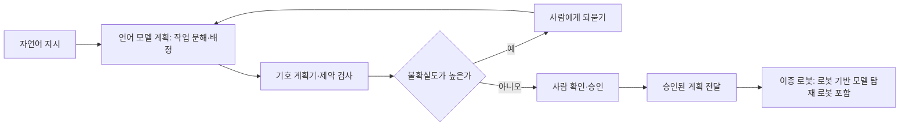

(너의 규칙은 시스템 프롬프트의 agents/shared-rules.md 와 agents/verifier.md 이다. 아래는 이번 실행의 컨텍스트와 입력이다.)

## 실행 컨텍스트

- run_id: 2026-09-30-07
- date: 2026-09-30
- run_type: area_deep_dive (영역 심화)
- 대상: 44. 로봇 기반 모델·언어 모델 계획 (L. AI·학습 기술)
- 예산:
    - max_search_queries: 30
    - max_sources_per_run: 15
    - new_topic_pages: 1
    - page_updates: 2
    - max_retries: 2
- 환경 알림: web_fetch_available: true · fetch_mode: full
- 언어: ko
- verification_stage: second
- verifier_budget:
    - max_search_queries: 30
    - max_sources_per_run: 15
    - new_topic_pages: 1
    - page_updates: 2
    - max_retries: 2
- retry_count: 1
- max_retries: 2

## 입력

### runs/2026-09-30-07/target.json

```json
{
  "run_id": "2026-09-30-07",
  "date": "2026-09-30",
  "weekday": "Wed",
  "run_number": 116,
  "run_type": "area_deep_dive",
  "forced": true,
  "target": {
    "area_no": 44,
    "area_name": "44. 로봇 기반 모델·언어 모델 계획",
    "category": "L. AI·학습 기술",
    "category_letter": "L"
  },
  "topic": null,
  "track": null,
  "corrections": [],
  "budget": {
    "max_search_queries": 30,
    "max_sources_per_run": 15,
    "new_topic_pages": 1,
    "page_updates": 2,
    "max_retries": 2
  },
  "priority_reason": null,
  "priority_questions": [],
  "excluded_areas": [],
  "lifted_areas": [],
  "deferred": {
    "monthly_recheck": false,
    "weekly_review": false
  },
  "selection_rationale": "CLI 지정 run_type=area_deep_dive, area=44"
}
```

### runs/2026-09-30-07/research.json

```json
{
  "run_id": "2026-09-30-07",
  "date": "2026-09-30",
  "run_type": "area_deep_dive",
  "target": {
    "area_no": 44,
    "area_name": "44. 로봇 기반 모델·언어 모델 계획",
    "category": "L. AI·학습 기술"
  },
  "gaps": [
    "섹션 3. 왜 중요한가 비어 있음",
    "섹션 4. 핵심 개념과 용어 비어 있음 — 로봇 기반 모델, 교차 형태 학습, 행동 토큰화, LLM-모듈로, 불확실도 정렬 연결 없음",
    "섹션 5. 적용 사례 (현장 유형 명시) 비어 있음 — 가정·제조 공장·물류창고 사례와 여섯 항목 정리 없음",
    "섹션 6. 대표 접근법과 기술 비어 있음 — 시각–언어–행동 모델, 언어 모델 계획과 기호 계획기 결합, 다중 로봇 계획, 불확실도 기반 도움 요청 근거 없음",
    "섹션 7. 관련 표준·프레임워크·오픈소스 비어 있음 — Open X-Embodiment, OpenVLA, GR00T N1, ROSA 위치 없음",
    "섹션 8. 대표 연구와 자료 비어 있음",
    "섹션 9. ROP가 직접 맡는 것과 외부와 연계하는 것 (책임 경계 기준) 비어 있음",
    "섹션 10. 다른 연구영역과의 연결 (번호와 이름을 함께 표기) 비어 있음",
    "섹션 11. 열린 질문 비어 있음 — 이 영역에 걸린 기존 열린 질문 0건",
    "프런트매터 related_areas·sources 비어 있음"
  ],
  "research_questions": [
    "범용 로봇 모델과 언어 모델은 오케스트레이션의 무엇을 바꾸는가? [분류원문]",
    "시각–언어–행동(Vision-Language-Action, VLA) 모델과 로봇 기반 모델은 무엇이며 어떤 데이터·구조로 여러 로봇·작업에 일반화하는가? (섹션 4·6·8 겨냥)",
    "대규모 언어 모델(LLM)로 작업을 계획·분해할 때의 한계는 무엇이고, 기호 계획기·외부 검증기·불확실도 기반 도움 요청으로 어떻게 보완하는가? (섹션 3·6·8 겨냥)",
    "언어 모델로 여러 로봇의 작업 분해·연합 형성·배정을 계획하는 연구와 공개 오픈소스(ROS 연동 에이전트 포함)는 무엇인가? (섹션 6·7 겨냥)",
    "가정·제조 공장·물류창고 등 현장(국내 포함)에서 로봇 기반 모델을 적용한 사례와 그 조건·성과는 무엇인가? (섹션 5 겨냥, 한국 자료 우선)",
    "로봇 기반 모델·언어 모델 계획에서 ROP가 직접 맡을 것과 로봇 제조사·모델 제공자에 맡길 것의 경계는 어디이며 어느 영역과 연결되는가? (섹션 9·10 겨냥)"
  ],
  "findings": [
    {
      "id": "f1",
      "claim": "Brohan 외의 RT-2(arXiv 2307.15818, 2023-07)는 로봇 행동을 텍스트 토큰으로 표현해 자연어 토큰과 같은 방식으로 학습 데이터에 넣고, 시각–언어 모델을 로봇 궤적 데이터와 웹 시각 질의응답 과제에 함께 미세조정한 시각–언어–행동(VLA) 모델로, 6,000회 평가에서 새 물체·학습에 없던 명령에 대한 일반화가 좋아졌다고 보고했다.",
      "tag": "사실",
      "source_ids": [
        "ref-1045"
      ],
      "cross_checked": false,
      "confidence": "medium",
      "evidence_excerpt": "행동을 텍스트 토큰으로 표현하고 자연어 토큰과 같은 방식으로 학습 세트에 넣는다. 6,000회 평가, 새 물체·새 명령 일반화, 연쇄 사고 프롬프트로 다단계 추론(초록 기준).",
      "as_of": "2023-07",
      "site_type": null,
      "flow_item": null
    },
    {
      "id": "f2",
      "claim": "Open X-Embodiment 협력단(arXiv 2310.08864, 2023-10)은 21개 기관이 모은 22종 로봇의 데이터(527개 스킬, 160,266개 작업)를 표준 형식으로 공개하고, 이 데이터로 학습한 RT-X 모델이 다른 로봇의 경험을 활용해 여러 로봇의 능력을 높이는 긍정적 전이를 보였다고 보고했다.",
      "tag": "사실",
      "source_ids": [
        "ref-1048"
      ],
      "cross_checked": false,
      "confidence": "medium",
      "evidence_excerpt": "22종 로봇, 21개 기관, 527개 스킬, 160,266개 작업. RT-X 는 다른 플랫폼의 경험으로 여러 로봇의 능력을 높이는 긍정적 전이를 보임(초록 기준, v9 2025-05 개정).",
      "as_of": "2023-10",
      "site_type": null,
      "flow_item": null
    },
    {
      "id": "f3",
      "claim": "Kim 외의 OpenVLA(arXiv 2406.09246, 2024-06)는 Llama 2 에 DINOv2·SigLIP 시각 특징을 결합한 70억 매개변수 공개 VLA 모델로 실제 로봇 시연 97만 건으로 학습했고, 29개 작업에서 매개변수가 7배 많은 RT-2-X(550억)보다 절대 성공률이 16.5%p 높았으며, 모델 체크포인트·미세조정 노트북·PyTorch 코드를 공개했다.",
      "tag": "사실",
      "source_ids": [
        "ref-1046"
      ],
      "cross_checked": false,
      "confidence": "medium",
      "evidence_excerpt": "7B 매개변수, Llama 2 + DINOv2·SigLIP, 97만 건 실제 로봇 시연. 29개 작업에서 RT-2-X(55B) 대비 절대 성공률 16.5% 높음, 미세조정 시 Diffusion Policy 대비 20.4% 높음(초록 기준).",
      "as_of": "2024-06",
      "site_type": null,
      "flow_item": null
    },
    {
      "id": "f4",
      "claim": "Physical Intelligence 의 π0.5(arXiv 2504.16054, 2025-04)는 여러 로봇의 데이터·고수준 의미 예측·웹 데이터 등 이질적 과제를 함께 학습(co-training)해, 처음 보는 가정집에서 부엌·침실 정리 같은 장기·정교한 조작 작업을 수행했다고 보고했다.",
      "tag": "사실",
      "source_ids": [
        "ref-1047"
      ],
      "cross_checked": false,
      "confidence": "medium",
      "evidence_excerpt": "\"cleaning a kitchen or bedroom, in entirely new homes\". 영상 관측·언어 명령·물체 검출·의미 하위 작업 예측·저수준 행동을 섞은 예제로 공동 학습(초록 기준).",
      "as_of": "2025-04",
      "site_type": "가정",
      "flow_item": "작업 대상"
    },
    {
      "id": "f5",
      "claim": "NVIDIA 의 GR00T N1(arXiv 2503.14734, 2025-03)은 환경을 해석하는 시각–언어 모듈(System 2)과 실시간 운동 명령을 만드는 확산 트랜스포머(System 1)를 나눈 이중 시스템 구조의 공개 휴머노이드용 VLA 모델로, 실제 로봇 궤적·사람 영상·합성 데이터를 섞어 학습하고 Fourier GR-1 휴머노이드의 양손 조작에 배치했다고 보고했다.",
      "tag": "사실",
      "source_ids": [
        "ref-1054"
      ],
      "cross_checked": false,
      "confidence": "medium",
      "evidence_excerpt": "System 2 시각–언어 모듈 + System 1 확산 트랜스포머. 실제 로봇 궤적·사람 영상·합성 데이터의 이질적 혼합으로 학습, Fourier GR-1 양손 조작 배치(초록 기준, 성능 비교 주장은 제외).",
      "as_of": "2025-03",
      "site_type": null,
      "flow_item": null
    },
    {
      "id": "f6",
      "claim": "Ahn 외의 SayCan(arXiv 2204.01691, 2022-04)은 언어 모델이 긴 추상적 지시를 수행하는 절차 지식을 제공하고, 로봇이 미리 학습한 스킬의 가치 함수가 현재 물리 환경에서 그 스킬이 실행 가능한 정도를 제공해 둘을 결합하는 방식으로 언어 모델 계획을 로봇 능력에 접지(grounding)했으며, 모바일 매니퓰레이터로 실험했다.",
      "tag": "사실",
      "source_ids": [
        "ref-088"
      ],
      "cross_checked": false,
      "confidence": "medium",
      "evidence_excerpt": "언어 모델은 고수준 절차 지식, 스킬의 가치 함수는 특정 물리 환경에 연결하는 접지를 제공. 모바일 매니퓰레이터로 장기·추상 자연어 지시 수행(초록 기준).",
      "as_of": "2022-04",
      "site_type": null,
      "flow_item": null
    },
    {
      "id": "f7",
      "claim": "Liu 외의 LLM+P(arXiv 2304.11477, 2023-04)는 자연어 문제 설명을 언어 모델로 PDDL(계획 도메인 정의 언어) 문제로 바꾸고 고전 계획기로 해를 찾은 뒤 다시 자연어로 옮기는 3단계 방식으로, 대부분의 벤치마크 문제에서 최적해를 낸 반면 언어 모델 단독은 대부분 실행 가능한 계획조차 내지 못했다고 보고했다.",
      "tag": "사실",
      "source_ids": [
        "ref-092"
      ],
      "cross_checked": false,
      "confidence": "medium",
      "evidence_excerpt": "자연어→PDDL 변환, 고전 계획기로 풀이, 결과를 자연어로 역변환. LLM+P 는 대부분 문제에 최적해, LLM 단독은 대부분 실행 가능한 계획도 못 냄(초록 기준).",
      "as_of": "2023-04",
      "site_type": null,
      "flow_item": null
    },
    {
      "id": "f8",
      "claim": "Kambhampati 외(ICML 2024, arXiv 2402.01817)는 자기회귀 언어 모델이 스스로 계획하거나 자기 검증할 수 없다고 보고, 언어 모델을 근사적 지식원으로 두고 외부 기호 검증기와 양방향으로 상호작용하게 하는 LLM-모듈로(LLM-Modulo) 프레임워크를 제안했다.",
      "tag": "의견",
      "source_ids": [
        "ref-586"
      ],
      "cross_checked": false,
      "confidence": "medium",
      "evidence_excerpt": "\"auto-regressive LLMs cannot, by themselves, do planning or self-verification\". 언어 모델은 보편적 근사 지식원, 외부 기호 검증기와 양방향 결합(ICML 2024, PMLR 235).",
      "as_of": "2024-06",
      "site_type": null,
      "flow_item": null
    },
    {
      "id": "f9",
      "claim": "Ren 외의 KnowNo(CoRL 2023, arXiv 2307.01928)는 언어 모델 계획기가 확신에 찬 환각 예측을 내는 문제에 대해 등각 예측으로 불확실도를 측정해, 공간·수량·선호·언어 모호성이 있을 때 사람에게 도움을 요청하게 하고 사람 도움을 최소화하면서 작업 완료에 통계적 보장을 주며, 모델 미세조정이 필요 없다고 보고했다.",
      "tag": "사실",
      "source_ids": [
        "ref-351"
      ],
      "cross_checked": false,
      "confidence": "medium",
      "evidence_excerpt": "등각 예측으로 작업 완료의 통계적 보장과 사람 도움 최소화. 공간·수량·선호·언어 모호성 대상, 미세조정 불필요(초록 기준, CoRL 2023 구두 발표).",
      "as_of": "2023-07",
      "site_type": null,
      "flow_item": "예외·성과"
    },
    {
      "id": "f10",
      "claim": "Kannan·Venkatesh·Min 의 SMART-LLM(arXiv 2309.10062, IROS 2024 투고)은 프로그램 형식의 퓨샷 프롬프트로 언어 모델이 고수준 지시를 작업 분해·연합 형성·작업 배정의 세 단계로 다중 로봇 계획으로 바꾸게 하고, 복잡도가 다른 네 범주의 지시로 된 벤치마크를 만들어 시뮬레이션과 실제 로봇으로 시험했다.",
      "tag": "사실",
      "source_ids": [
        "ref-090"
      ],
      "cross_checked": false,
      "confidence": "medium",
      "evidence_excerpt": "작업 분해, 연합 형성, 작업 배정의 3단계. 프로그램형 퓨샷 프롬프트, 네 범주 지시 벤치마크, 시뮬레이션·실제 로봇 실험(초록 기준).",
      "as_of": "2023-09",
      "site_type": null,
      "flow_item": null
    },
    {
      "id": "f11",
      "claim": "Su 외의 IMR-LLM(arXiv 2603.02669, 2026-03)은 가정용보다 제약이 엄격한 산업 다중 로봇 생산 작업을 대상으로, 언어 모델이 선택 그래프(disjunctive graph) 구성을 돕고 결정적 풀이 방법으로 실행 가능한 고수준 계획을 얻은 뒤 공정 트리를 따라 실행 가능한 저수준 프로그램을 생성하게 했으며, 세 난이도의 벤치마크 IMR-Bench 로 평가했다(초록에는 실제 공장 배치가 적혀 있지 않다).",
      "tag": "사실",
      "source_ids": [
        "ref-170"
      ],
      "cross_checked": false,
      "confidence": "medium",
      "evidence_excerpt": "LLM 이 disjunctive graph 구성을 돕고 결정적 풀이로 고수준 계획, 공정 트리로 저수준 프로그램 생성. IMR-Bench 세 난이도. 초록에 실제 배치 언급 없음.",
      "as_of": "2026-03",
      "site_type": "제조 공장",
      "flow_item": "제약"
    },
    {
      "id": "f12",
      "claim": "NASA 제트추진연구소(JPL)가 관리하는 오픈소스 ROSA(ROS Agent)는 LangChain 위에 만든 에이전트로, ROS 1(Noetic)과 ROS 2(Humble·Iron·Jazzy) 기반 로봇 시스템에 자연어로 질의하고 명령하게 한다.",
      "tag": "사실",
      "source_ids": [
        "ref-171"
      ],
      "cross_checked": false,
      "confidence": "medium",
      "evidence_excerpt": "ROS 기반 로봇 시스템과 자연어 질의로 상호작용하는 에이전트. LangChain 기반, ROS 1 Noetic·ROS 2 Humble/Iron/Jazzy 지원, TurtleSim 데모(README 기준).",
      "as_of": "2026-09-30",
      "site_type": null,
      "flow_item": null
    },
    {
      "id": "f13",
      "claim": "BMW 그룹은 2025년 스파턴버그 공장에 Figure AI 의 휴머노이드 Figure 02 를 11개월 동안 배치해 용접 공정용 판금 부품 투입을 맡겼고, 이 로봇이 BMW X3 3만 대 이상의 생산을 도왔다고 밝힌다.",
      "tag": "추정",
      "source_ids": [
        "ref-1058"
      ],
      "cross_checked": false,
      "confidence": "low",
      "evidence_excerpt": "벤더 주장: 2025년 11개월 배치, 용접 공정용 판금 부품 삽입, X3 3만 대 이상 생산 지원(BMW 그룹 보도자료, 2026-06-25). Figure AI 자체 발표 페이지는 열지 못해 교차 확인 못 함.",
      "as_of": "2026-06-25",
      "site_type": "제조 공장",
      "flow_item": "예외·성과",
      "vendor_claim": true
    },
    {
      "id": "f14",
      "claim": "같은 BMW 그룹 자료는 후속 Figure 03 이 스파턴버그 공장에서 대용량 용기에 섞여 들어온 부품을 집어 순서 대차(sequencing trolley)에 정리하고, 대차가 자동화 시스템으로 조립 공정에 운반되는 순서 공급(just in sequence) 물류 작업을 맡으며, 음성 대화 기능과 무선 충전을 갖췄다고 밝힌다.",
      "tag": "추정",
      "source_ids": [
        "ref-1058"
      ],
      "cross_checked": false,
      "confidence": "low",
      "evidence_excerpt": "벤더 주장: 미분류 부품을 대용량 용기에서 받아 순서 대차에 정리, 대차는 자동화 시스템으로 조립 공정에 운반. 촉각 센서 손, 음성 대화, 무선 충전.",
      "as_of": "2026-06-25",
      "site_type": "제조 공장",
      "flow_item": "완료·인계",
      "vendor_claim": true
    },
    {
      "id": "f15",
      "claim": "지디넷코리아 보도(2025-05-01)에 따르면 2025-04-10 출범한 산업통상자원부 주도 K-휴머노이드 연합에서 레인보우로보틱스·에이로봇·홀리데이로보틱스·로보티즈·로브로스 5개 로봇기업이 개발 중인 휴머노이드를 서울대 AI연구원에 제공해 로봇 AI 파운데이션 모델 개발을 지원하기로 했다.",
      "tag": "사실",
      "source_ids": [
        "ref-1057"
      ],
      "cross_checked": false,
      "confidence": "low",
      "evidence_excerpt": "산업부 설명을 인용한 기사. 4월 10일 출범, 3주 만에 MOU 4건. 5개 로봇기업이 휴머노이드를 서울대 AI연구원에 제공해 로봇 AI 파운데이션 모델 개발 지원. 정부 보도자료(korea.kr) 본문은 첨부 파일에만 있어 교차 확인 못 함.",
      "as_of": "2025-05-01",
      "site_type": null,
      "flow_item": null
    },
    {
      "id": "f16",
      "claim": "헬로티 보도(2025-11-26)에 따르면 로보티즈는 산업통상부 과제 'AI 파운데이션 모델 기반 유통 공정 특화 휴머노이드 로봇 개발'(정부 출연금 약 60억 원)로 VLA 모델을 넣은 상체형 휴머노이드 AI 워커를 BGF로지스 물류센터에 투입해 입·출고, 오발주 재분류, 비정형 상품 분류, 반품 처리 작업을 수행하게 한다.",
      "tag": "추정",
      "source_ids": [
        "ref-1059"
      ],
      "cross_checked": false,
      "confidence": "low",
      "evidence_excerpt": "벤더 주장: VLA 모델을 내재화한 상체형 휴머노이드 AI 워커, BGF로지스와 협력해 입·출고·오발주·비정형 상품 분류·반품 처리 수행. 기사가 전한 회사·과제 설명이며 1차 출처 미확인.",
      "as_of": "2025-11-26",
      "site_type": "물류창고",
      "flow_item": "작업 대상",
      "vendor_claim": true
    },
    {
      "id": "f17",
      "claim": "같은 보도에 따르면 이 과제는 물류센터 핵심 공정 자동화율 80% 이상과 오발주 재분류·피킹 작업 성공률 90% 이상을 목표로 한다(달성 결과가 아니라 목표치다).",
      "tag": "추정",
      "source_ids": [
        "ref-1059"
      ],
      "cross_checked": false,
      "confidence": "low",
      "evidence_excerpt": "벤더 주장: 핵심 공정 자동화율 80% 이상, 오발주 재분류 및 피킹 작업 성공률 90% 이상 달성 목표. 실측 결과는 기사에 없음.",
      "as_of": "2025-11-26",
      "site_type": "물류창고",
      "flow_item": "예외·성과",
      "vendor_claim": true
    },
    {
      "id": "f18",
      "claim": "확인한 자료를 종합하면 핵심 질문(범용 로봇 모델과 언어 모델이 오케스트레이션의 무엇을 바꾸는가)에 대해, 로봇 기반 모델은 로봇 쪽 기능을 고정된 스킬 목록에서 새 물체·지시에 일반화하는 학습된 정책으로 바꾸고(f1~f5), 언어 모델은 지시 해석·작업 분해·다중 로봇 배정의 입력 방식을 바꾸지만(f6·f10·f11), 언어 모델 단독 계획은 실행 가능성·검증이 약해 기호 계획기·외부 검증기·불확실도 기반 사람 확인과 짝지어 쓰는 형태가 연구의 공통 방향으로 보인다(f7·f8·f9).",
      "tag": "추정",
      "source_ids": [
        "ref-1045",
        "ref-1048",
        "ref-1046",
        "ref-1047",
        "ref-1054",
        "ref-088",
        "ref-090",
        "ref-170",
        "ref-092",
        "ref-586",
        "ref-351"
      ],
      "cross_checked": false,
      "confidence": "low",
      "evidence_excerpt": "f1~f11 의 종합 판단. 개별 근거는 각 finding 참조.",
      "as_of": "2026-09-30",
      "site_type": null,
      "flow_item": null
    },
    {
      "id": "f19",
      "claim": "확인한 자료를 종합하면 이 영역이 중요한 까닭은, 여러 로봇의 데이터를 모아 하나의 정책을 학습하는 흐름(f2·f3)이 이종 로봇의 능력 표현과 등록 방식에 영향을 주고, 언어 모델 계획이 확신에 찬 오류를 낼 수 있어(f8·f9) 대화로 받은 지시를 실행 전에 검증할 장치가 필요하며, 제조 공장·물류창고에서 휴머노이드·VLA 적용이 시작됐다고 발표되고 있기 때문이다(f13·f16).",
      "tag": "추정",
      "source_ids": [
        "ref-1048",
        "ref-1046",
        "ref-586",
        "ref-351",
        "ref-1058",
        "ref-1059"
      ],
      "cross_checked": false,
      "confidence": "low",
      "evidence_excerpt": "f2·f3·f8·f9·f13·f16 의 종합 판단. f13·f16 은 벤더 주장이다.",
      "as_of": "2026-09-30",
      "site_type": null,
      "flow_item": null
    },
    {
      "id": "f20",
      "claim": "확인한 자료를 종합하면 44. 로봇 기반 모델·언어 모델 계획에서 ROP 가 직접 맡을 범위는 언어 모델이 만든 작업 분해·배정 계획을 기호 계획기·제약 검사로 검증하는 계층(f7·f8·f11), 불확실할 때 사람에게 확인을 요청하는 절차(f9), 로봇 기반 모델을 탑재한 로봇을 포함한 이종 로봇에 계획을 내리는 인터페이스(f6·f10·f12)다.",
      "tag": "추정",
      "source_ids": [
        "ref-092",
        "ref-586",
        "ref-170",
        "ref-351",
        "ref-088",
        "ref-090",
        "ref-171"
      ],
      "cross_checked": false,
      "confidence": "low",
      "evidence_excerpt": "f6~f12 의 종합 판단. 분류 원문 C. 채팅 기반 구성·운영 주석의 '사람이 확인·승인한 계획만 실행' 원칙과 같은 방향.",
      "as_of": "2026-09-30",
      "site_type": null,
      "flow_item": null
    },
    {
      "id": "f21",
      "claim": "연계 대상: 분류 원문 19장 기준으로 VLA·로봇 기반 모델이 카메라 영상에서 관절·그리퍼 행동을 직접 생성하는 저수준 조작 정책(f1·f3·f4·f5)은 로봇 자체 지능·제어(파지·모터·관절 제어)에 속하므로 로봇 제조사·모델 제공자가 맡고, 이종 제조사를 잇는 ROP 는 그런 로봇의 가능한 기능·실행 조건·완료·실패 확인을 받는 인터페이스를 맡을 것으로 보인다.",
      "tag": "추정",
      "source_ids": [
        "ref-1045",
        "ref-1046",
        "ref-1047",
        "ref-1054"
      ],
      "cross_checked": false,
      "confidence": "low",
      "evidence_excerpt": "f1·f3·f4·f5 의 모델은 영상·언어에서 로봇 행동(저수준 운동 명령)을 직접 출력한다. 원문 19장 '로봇 자체 지능·제어' 경계에 대응시킨 판단.",
      "as_of": "2026-09-30",
      "site_type": null,
      "flow_item": null
    },
    {
      "id": "f22",
      "claim": "이 영역은 학습된 범용 기능을 표현해야 하는 5. 로봇 능력·작업 표현과 4. 이기종 로봇 등록(f2·f3), 언어 모델 계획을 대화로 부르는 12. 채팅으로 업무 지시·오케스트레이션과 13. 대화형 기능의 신뢰·기반(f9·f12), 작업 분해의 24. 작업·워크플로 모델링(f7·f11), 연합 형성·배정의 25. 작업 배정 — MRTA(f10), 공정 순서의 26. 작업 순서·스케줄링(f11), 계획 검증의 29. 명령·작업 실행의 신뢰성과 54. 시험·형식 검증·벤치마크(f7·f8·f11), 사람 확인의 31. 사람–로봇 협업(f9), 실행 기준의 47. AI·학습·적응과 모델 운영(f8·f9), 업체 동향의 1. 기술·시장·업체 동향(f13·f15·f16), 적용 현장인 61. 물류창고(f16)·62. 제조 공장(f11·f13)·65. 가정·공동주택(f4)과 이어진다.",
      "tag": "추정",
      "source_ids": [
        "ref-1048",
        "ref-1046",
        "ref-351",
        "ref-171",
        "ref-092",
        "ref-170",
        "ref-090",
        "ref-586",
        "ref-1058",
        "ref-1057",
        "ref-1059",
        "ref-1047"
      ],
      "cross_checked": false,
      "confidence": "low",
      "evidence_excerpt": "각 연결의 근거 finding 을 괄호로 표시한 종합 판단.",
      "as_of": "2026-09-30",
      "site_type": null,
      "flow_item": null
    }
  ],
  "sources": [
    {
      "id": "ref-1045",
      "org": "Brohan, A., Brown, N. 외 (Google DeepMind, arXiv)",
      "title": "RT-2: Vision-Language-Action Models Transfer Web Knowledge to Robotic Control",
      "published": "2023-07-28",
      "url": "https://arxiv.org/abs/2307.15818",
      "type": "논문",
      "reliability": "medium",
      "accessed": "2026-09-30",
      "summary": "행동을 텍스트 토큰으로 표현해 시각–언어 모델을 로봇 데이터·웹 데이터로 공동 미세조정한 VLA 모델. 초록 페이지 열람.",
      "fetched": true,
      "fetched_via": "webfetch",
      "fetch_url": null,
      "source_unopened": false
    },
    {
      "id": "ref-1046",
      "org": "Kim, M. J., Pertsch, K., Karamcheti, S. 외 (arXiv)",
      "title": "OpenVLA: An Open-Source Vision-Language-Action Model",
      "published": "2024-06-13",
      "url": "https://arxiv.org/abs/2406.09246",
      "type": "논문",
      "reliability": "medium",
      "accessed": "2026-09-30",
      "summary": "97만 건 실제 로봇 시연으로 학습한 70억 매개변수 공개 VLA 모델과 RT-2-X 비교. 초록 페이지 열람.",
      "fetched": true,
      "fetched_via": "webfetch",
      "fetch_url": null,
      "source_unopened": false
    },
    {
      "id": "ref-1047",
      "org": "Physical Intelligence (Black, K., Finn, C., Levine, S. 외, arXiv)",
      "title": "π0.5: a Vision-Language-Action Model with Open-World Generalization",
      "published": "2025-04-22",
      "url": "https://arxiv.org/abs/2504.16054",
      "type": "논문",
      "reliability": "medium",
      "accessed": "2026-09-30",
      "summary": "이질적 데이터 공동 학습으로 처음 보는 가정집에서 부엌·침실 정리를 수행한 VLA 모델. 초록 페이지 열람.",
      "fetched": true,
      "fetched_via": "webfetch",
      "fetch_url": null,
      "source_unopened": false
    },
    {
      "id": "ref-1048",
      "org": "Open X-Embodiment Collaboration (arXiv)",
      "title": "Open X-Embodiment: Robotic Learning Datasets and RT-X Models",
      "published": "2023-10-13",
      "url": "https://arxiv.org/abs/2310.08864",
      "type": "논문",
      "reliability": "medium",
      "accessed": "2026-09-30",
      "summary": "21개 기관·22종 로봇의 데이터셋과 교차 형태 전이를 보인 RT-X 모델. 초록 페이지 열람.",
      "fetched": true,
      "fetched_via": "webfetch",
      "fetch_url": null,
      "source_unopened": false
    },
    {
      "id": "ref-088",
      "org": "Ahn, M., Brohan, A., Brown, N. 외 (arXiv)",
      "title": "Do As I Can, Not As I Say: Grounding Language in Robotic Affordances",
      "published": "2022-04-04",
      "url": "https://arxiv.org/abs/2204.01691",
      "type": "논문",
      "reliability": "medium",
      "accessed": "2026-09-30",
      "summary": "언어 모델의 절차 지식과 스킬 가치 함수를 결합해 계획을 로봇 능력에 접지한 SayCan. 초록 페이지 열람.",
      "fetched": true,
      "fetched_via": "webfetch",
      "fetch_url": null,
      "source_unopened": false
    },
    {
      "id": "ref-092",
      "org": "Liu, B., Jiang, Y., Zhang, X. 외 (arXiv)",
      "title": "LLM+P: Empowering Large Language Models with Optimal Planning Proficiency",
      "published": "2023-04-22",
      "url": "https://arxiv.org/abs/2304.11477",
      "type": "논문",
      "reliability": "medium",
      "accessed": "2026-09-30",
      "summary": "자연어를 PDDL 로 옮겨 고전 계획기로 풀고 다시 자연어로 옮기는 LLM+P. 초록 페이지 열람.",
      "fetched": true,
      "fetched_via": "webfetch",
      "fetch_url": null,
      "source_unopened": false
    },
    {
      "id": "ref-586",
      "org": "Kambhampati, S., Valmeekam, K., Guan, L. 외 (ICML 2024, arXiv)",
      "title": "LLMs Can't Plan, But Can Help Planning in LLM-Modulo Frameworks",
      "published": "2024-02-02",
      "url": "https://arxiv.org/abs/2402.01817",
      "type": "논문",
      "reliability": "medium",
      "accessed": "2026-09-30",
      "summary": "언어 모델 단독 계획·자기 검증의 한계를 논하고 외부 검증기와 결합하는 LLM-모듈로 프레임워크를 제안. 초록 페이지 열람.",
      "fetched": true,
      "fetched_via": "webfetch",
      "fetch_url": null,
      "source_unopened": false
    },
    {
      "id": "ref-090",
      "org": "Kannan, S. S., Venkatesh, V. L. N., & Min, B.-C. (arXiv)",
      "title": "SMART-LLM: Smart Multi-Agent Robot Task Planning using Large Language Models",
      "published": "2023-09-18",
      "url": "https://arxiv.org/abs/2309.10062",
      "type": "논문",
      "reliability": "medium",
      "accessed": "2026-09-30",
      "summary": "언어 모델로 작업 분해·연합 형성·작업 배정을 하는 다중 로봇 계획 프레임워크와 벤치마크. 초록 페이지 열람.",
      "fetched": true,
      "fetched_via": "webfetch",
      "fetch_url": null,
      "source_unopened": false
    },
    {
      "id": "ref-351",
      "org": "Ren, A. Z., Dixit, A., Bodrova, A. 외 (CoRL 2023, arXiv)",
      "title": "Robots That Ask For Help: Uncertainty Alignment for Large Language Model Planners",
      "published": "2023-07-04",
      "url": "https://arxiv.org/abs/2307.01928",
      "type": "논문",
      "reliability": "medium",
      "accessed": "2026-09-30",
      "summary": "등각 예측으로 언어 모델 계획기의 불확실도를 측정해 도움을 요청하게 하는 KnowNo. 초록 페이지 열람.",
      "fetched": true,
      "fetched_via": "webfetch",
      "fetch_url": null,
      "source_unopened": false
    },
    {
      "id": "ref-1054",
      "org": "NVIDIA (Bjorck, J., Castañeda, F. 외, arXiv)",
      "title": "GR00T N1: An Open Foundation Model for Generalist Humanoid Robots",
      "published": "2025-03-18",
      "url": "https://arxiv.org/abs/2503.14734",
      "type": "논문",
      "reliability": "medium",
      "accessed": "2026-09-30",
      "summary": "시각–언어 모듈과 확산 트랜스포머를 나눈 이중 시스템 구조의 공개 휴머노이드 VLA 모델. 초록 페이지 열람.",
      "fetched": true,
      "fetched_via": "webfetch",
      "fetch_url": null,
      "source_unopened": false
    },
    {
      "id": "ref-170",
      "org": "Su, X., Xu, J., van Kaick, O., Xu, K., & Hu, R. (arXiv)",
      "title": "IMR-LLM: Industrial Multi-Robot Task Planning and Program Generation using Large Language Models",
      "published": "2026-03-03",
      "url": "https://arxiv.org/abs/2603.02669",
      "type": "논문",
      "reliability": "medium",
      "accessed": "2026-09-30",
      "summary": "언어 모델과 선택 그래프·결정적 풀이를 결합한 산업 다중 로봇 계획·프로그램 생성과 IMR-Bench. 초록 페이지 열람.",
      "fetched": true,
      "fetched_via": "webfetch",
      "fetch_url": null,
      "source_unopened": false
    },
    {
      "id": "ref-171",
      "org": "NASA Jet Propulsion Laboratory (nasa-jpl)",
      "title": "ROSA — README",
      "published": null,
      "url": "https://github.com/nasa-jpl/rosa",
      "type": "오픈소스 문서",
      "reliability": "high",
      "accessed": "2026-09-30",
      "summary": "LangChain 기반으로 ROS 1·ROS 2 시스템에 자연어로 질의·명령하는 ROS 에이전트의 저장소 README.",
      "fetched": true,
      "fetched_via": "github_raw",
      "fetch_url": "https://raw.githubusercontent.com/nasa-jpl/rosa/main/README.md",
      "source_unopened": false
    },
    {
      "id": "ref-1057",
      "org": "지디넷코리아",
      "title": "K-휴머노이드 연합, 출범 3주 만에 협약 4건 성과",
      "published": "2025-05-01",
      "url": "https://zdnet.co.kr/view/?no=20250501140356",
      "type": "기사",
      "reliability": "low",
      "accessed": "2026-09-30",
      "summary": "산업부 설명을 인용해 K-휴머노이드 연합의 초기 성과와 로봇 AI 파운데이션 모델 개발 협력을 전한 기사.",
      "fetched": true,
      "fetched_via": "webfetch",
      "fetch_url": null,
      "source_unopened": false
    },
    {
      "id": "ref-1058",
      "org": "BMW Group",
      "title": "BMW Group advances the use of Physical AI in production with Figure 03 project in Spartanburg",
      "published": "2026-06-25",
      "url": "https://www.press.bmwgroup.com/global/article/detail/T0458778EN/bmw-group-advances-the-use-of-physical-ai-in-production-with-figure-03-project-in-spartanburg?language=en",
      "type": "벤더 문서",
      "reliability": "medium",
      "accessed": "2026-09-30",
      "summary": "Figure 02 의 2025년 스파턴버그 배치 결과와 Figure 03 의 순서 공급 물류 작업 계획을 밝힌 BMW 그룹 보도자료.",
      "fetched": true,
      "fetched_via": "webfetch",
      "fetch_url": null,
      "source_unopened": false
    },
    {
      "id": "ref-1059",
      "org": "헬로티",
      "title": "VLA 이식한 로보티즈 'AI 워커', 물류 현장 난제 해결사로 전격 투입",
      "published": "2025-11-26",
      "url": "https://www.hellot.net/news/article.html?no=107567",
      "type": "기사",
      "reliability": "low",
      "accessed": "2026-09-30",
      "summary": "VLA 모델을 넣은 로보티즈 AI 워커의 BGF로지스 물류센터 투입과 과제 목표를 전한 기사.",
      "fetched": true,
      "fetched_via": "webfetch",
      "fetch_url": null,
      "source_unopened": false
    }
  ],
  "page_proposals": [
    {
      "action": "update",
      "path": "docs/categories/ai-and-learning/robot-foundation-models-and-llm-planning.md",
      "sections": [
        "3",
        "4",
        "5",
        "6",
        "7",
        "8",
        "9",
        "10",
        "11"
      ],
      "rationale": "섹션 3: f19(왜 중요한가), f18(핵심 질문 답, 추정) / 섹션 4: VLA·행동 토큰화 f1, 교차 형태 학습 f2, 이중 시스템 구조 f5, 접지 f6, LLM-모듈로 f8, 불확실도 정렬 f9 / 섹션 5: 가정 — f4, 제조 공장 — f11(벤치마크 한정)·f13·f14(벤더 주장 병기), 물류창고 — f16·f17(국내, 벤더 주장·목표치 병기). 병원·상업 시설·실외 사례는 찾지 못함을 명시 / 섹션 6: 로봇 기반 모델 f1~f5, 언어 모델 계획과 기호 계획기·검증기 결합 f6~f8, 다중 로봇 계획 f10·f11, 불확실도 기반 도움 요청 f9 / 섹션 7: Open X-Embodiment f2, OpenVLA f3, GR00T N1 f5, ROSA f12, PDDL f7 / 섹션 8: f1~f11, 국내 동향 f15 / 섹션 9: f20(직접 범위), f21(연계 대상) / 섹션 10: f22 — 1, 4, 5, 12, 13, 24, 25, 26, 29, 31, 47, 54, 61, 62, 65 / 섹션 11: open_questions_new 3건. 다음 실행 후보: 12. 채팅으로 업무 지시·오케스트레이션 페이지에 f7~f9 반영, 25. 작업 배정 — MRTA 페이지에 f10 반영."
    }
  ],
  "glossary_candidates": [
    {
      "term_ko": "로봇 기반 모델",
      "term_en": "Robot Foundation Model",
      "definition": "여러 로봇·작업·환경의 대규모 데이터로 사전 학습해 새 작업·물체·로봇에 미세조정하거나 바로 쓸 수 있게 한 범용 로봇 모델로, 시각–언어–행동 모델이 대표적이다."
    },
    {
      "term_ko": "교차 형태 학습",
      "term_en": "Cross-embodiment Learning",
      "definition": "형태·센서·구동 방식이 다른 여러 로봇의 데이터를 함께 학습해 한 로봇의 경험이 다른 로봇의 성능을 높이게 하는 학습 방식이다."
    },
    {
      "term_ko": "이중 시스템 구조",
      "term_en": "Dual-system Architecture (System 1 / System 2)",
      "definition": "느린 시각–언어 추론 모듈(System 2)이 상황을 해석하고 빠른 행동 생성 모듈(System 1)이 실시간 운동 명령을 만드는 로봇 기반 모델 구조다."
    }
  ],
  "open_questions_new": [
    "로봇 기반 모델(VLA)을 탑재해 명시적 스킬 목록 없이 학습된 범용 기능을 가진 로봇의 능력을 플랫폼의 능력 모델에 어떻게 등록·기술하고 검증할 것인가? | 관련 영역: 44. 로봇 기반 모델·언어 모델 계획, 5. 로봇 능력·작업 표현 | 근거: f3 | 종류: 일반",
    "언어 모델 기반 다중 로봇 계획기를 현장 제약(설비·안전·시간창)이 있는 조건에서 비교할 공통 벤치마크나 평가 기준이 있는가? | 관련 영역: 44. 로봇 기반 모델·언어 모델 계획, 54. 시험·형식 검증·벤치마크 | 근거: f11 | 종류: 일반",
    "국내 로봇 AI 파운데이션 모델 과제의 물류센터 실증 목표(자동화율 80%, 성공률 90%)에 대한 공개된 측정 결과가 있는가? | 관련 영역: 44. 로봇 기반 모델·언어 모델 계획, 61. 물류창고 | 근거: f17 | 종류: 일반"
  ],
  "open_questions_resolved": [],
  "self_check": {
    "source_count": 15,
    "cross_checked_count": 0,
    "unverified": [
      "f1~f11 은 arXiv 초록 기준이며 본문 실험 조건 미확인",
      "f13·f14: Figure AI 자체 발표 페이지(figure.ai/news/production-at-bmw)는 연결 오류로 열지 못해 교차 확인 실패",
      "f15: 산업통상자원부 보도자료(korea.kr, 2025-04-10) 본문은 첨부 파일에만 있어 교차 확인 실패, '2028년까지 로봇 AI 파운데이션 모델 구축' 목표는 검색 요약에만 있어 넣지 않음",
      "f16·f17: 로보티즈·BGF로지스 1차 발표 미확인, 목표치는 실측 결과 아님",
      "OpenVLA 라이선스는 요약 결과가 모호해 넣지 않음",
      "병원·상업 시설·실외 현장의 로봇 기반 모델·언어 모델 계획 실배치 사례는 찾지 못함"
    ],
    "scope_violations": [
      "f1·f3·f4·f5: VLA 의 저수준 조작 정책은 로봇 자체 지능·제어 영역이므로 동향 근거로만 쓰고 f21 에서 '연계 대상: '으로 구분함",
      "f11: 공정 프로그램 생성은 로봇 제어 코드에 닿으므로 계획 검증 근거로만 제안함",
      "f13·f14·f16·f17: 벤더·기사 주장이므로 vendor_claim: true·태그 추정으로 냄"
    ],
    "budget_used": {
      "queries": 5,
      "sources": 15
    },
    "limits": "재실행 1회차. 반려 사유 1(스키마 불일치 — f15·f17 이 벤더 문서만 근거로 한 [사실]인데 vendor_claim 표시 없음): 직전 반환 JSON(runs/2026-09-30-07/research.json)이 입력에 포함되지 않아 형식만 고칠 수 없었으므로, 같은 대상으로 브리프를 다시 만들고 벤더·기사가 전한 기능·성능 주장(f13·f14·f16·f17)을 모두 vendor_claim: true·태그 추정·evidence_excerpt 첫머리 '벤더 주장: '으로 냈다. 새 브리프의 f15 는 기사(ref-1057)의 정부 협력 사실 보도로 벤더 문서가 아니며 신뢰도 low 로 두었다. 직전 브리프와 finding 번호·출처 번호가 다를 수 있다. web_fetch_available: true · fetch_mode full. 검색 5회/30, 신규 출처 15건/15(ref-1045~ref-1059, 예약 구간 안)로 출처 상한 도달. 원문 열람: 15건 모두 열었다(webfetch 14건, github_raw 1건). 논문은 초록 페이지다. 교차 확인 0건. 분류 원문 핵심 질문에는 f18 로 답했고 결론은 '로봇 기반 모델은 로봇 쪽 기능을 학습된 범용 정책으로 바꾸고, 언어 모델은 지시·분해·배정의 입력을 바꾸되 기호 계획기·외부 검증기·불확실도 기반 사람 확인과 짝지어 쓰는 방향'이라는 추정이다. 현장 유형 사례는 가정(f4)·제조 공장(f11 벤치마크, f13·f14 벤더 주장)·물류창고(f16·f17 국내, 벤더 주장)다. 국내 자료는 지디넷코리아(ref-1057)·헬로티(ref-1059) 두 건이다. 교차 규칙에 따라 이 영역의 L. AI·학습 기술 내용은 적용 대상인 25. 작업 배정 — MRTA(f10)와 C. 채팅 기반 구성·운영의 12. 채팅으로 업무 지시·오케스트레이션(f7~f9)에 함께 연결하도록 제안했다. 18. 실시간 세계 상태·데이터 일관성과 34. 시뮬레이션·예측용 디지털 트윈은 다루지 않았다. 용어집에 이미 있는 VLA·LLM 에이전트·LLM-모듈로·PDDL·등각 예측·불확도 정렬·작업 분해·어포던스·연합 형성은 후보로 내지 않았다. 입력 누락: runs/2026-09-30-07/research.json(직전 반환값) 없음. 정정 요청 없음. 우선 지정 질문 없음. 이 영역에 걸린 기존 열린 질문 없음."
  }
}
```

### runs/2026-09-30-07/verification.json

```json
{
  "run_id": "2026-09-30-07",
  "stage": "first",
  "verdict": "조건부 승인",
  "claim_checks": [
    {
      "finding_id": "f1",
      "source_exists": true,
      "supports_claim": true,
      "cross_checked": false,
      "tag_decision": "유지",
      "note": "확인: arXiv 2307.15818 초록(2023-07-28, Brohan·Brown 외)에 행동의 텍스트 토큰 표현, 로봇 궤적·웹 VQA 공동 미세조정, 6k 평가, 새 물체·새 명령 일반화가 있다. 논문 자체의 보고로 서술하는 한 단일 출처로 [사실] 유지. 초록 기준."
    },
    {
      "finding_id": "f2",
      "source_exists": true,
      "supports_claim": true,
      "cross_checked": false,
      "tag_decision": "유지",
      "note": "확인: arXiv 2310.08864 초록(최초 2023-10-13, 최신 v9 2025-05-14)에 22종 로봇·21개 기관·527개 스킬·160,266개 작업과 RT-X 의 긍정적 전이가 있다. 초록 기준."
    },
    {
      "finding_id": "f3",
      "source_exists": true,
      "supports_claim": true,
      "cross_checked": false,
      "tag_decision": "유지",
      "note": "확인: arXiv 2406.09246 초록(2024-06-13, 개정 2024-09-05)에 7B·Llama 2·DINOv2+SigLIP·97만 건·29개 작업·RT-2-X(55B) 대비 절대 16.5% 높음(7배 적은 매개변수)·체크포인트·미세조정 노트북·PyTorch 코드 공개가 있다. 논문 자체 보고 수치."
    },
    {
      "finding_id": "f4",
      "source_exists": true,
      "supports_claim": true,
      "cross_checked": false,
      "tag_decision": "유지",
      "note": "확인: arXiv 2504.16054 초록(2025-04-22)에 이질적 과제 공동 학습과 처음 보는 가정집의 부엌·침실 정리가 있다. 연구 평가이지 상용 배치가 아니므로 5절에서 그 점을 밝히게 했다(수정 지시). 직접 인용 1회, 짧은 구절."
    },
    {
      "finding_id": "f5",
      "source_exists": true,
      "supports_claim": true,
      "cross_checked": false,
      "tag_decision": "유지",
      "note": "확인: arXiv 2503.14734 초록(2025-03-18, 개정 2025-03-27)에 시각–언어 모듈(System 2)+확산 트랜스포머(System 1), 실제 궤적·사람 영상·합성 데이터 혼합, Fourier GR-1 양손 조작 배치가 있다. 성능 비교 주장을 뺀 것은 적절하다."
    },
    {
      "finding_id": "f6",
      "source_exists": true,
      "supports_claim": true,
      "cross_checked": false,
      "tag_decision": "유지",
      "note": "확인: arXiv 2204.01691 초록(2022-04-04, Ahn·Brohan·Brown 외)에 언어 모델의 고수준 절차 지식과 스킬 가치 함수의 접지 결합, 모바일 매니퓰레이터의 장기 자연어 지시 수행이 있다."
    },
    {
      "finding_id": "f7",
      "source_exists": true,
      "supports_claim": true,
      "cross_checked": false,
      "tag_decision": "유지",
      "note": "확인: arXiv 2304.11477 초록(2023-04-22, 개정 2023-09-27)에 자연어→PDDL→고전 계획기→자연어 3단계와 'LLM+P 는 대부분 최적해, LLM 단독은 대부분 실행 가능한 계획도 못 냄'이 있다."
    },
    {
      "finding_id": "f8",
      "source_exists": true,
      "supports_claim": true,
      "cross_checked": false,
      "tag_decision": "유지",
      "note": "확인: arXiv 2402.01817(2024-02-02, ICML 2024 게재) 초록에 '자기회귀 LLM 은 스스로 계획·자기 검증을 할 수 없다'와 외부 기호 검증기와 양방향 결합하는 LLM-모듈로 프레임워크, '보편적 근사 지식원'이 있다. 입장 논문이므로 [의견] 유지, 본문에서 Kambhampati 외의 의견임을 밝히게 했다."
    },
    {
      "finding_id": "f9",
      "source_exists": true,
      "supports_claim": true,
      "cross_checked": false,
      "tag_decision": "유지",
      "note": "확인: arXiv 2307.01928(2023-07-04, CoRL 2023 구두 발표) 초록에 등각 예측 기반 작업 완료의 통계적 보장, 사람 도움 최소화, 공간·수량·선호·언어 추론 모호성, 재학습 불필요가 있다."
    },
    {
      "finding_id": "f10",
      "source_exists": true,
      "supports_claim": true,
      "cross_checked": false,
      "tag_decision": "유지",
      "note": "확인: arXiv 2309.10062(2023-09-18, 개정 2024-03-23) 초록에 작업 분해·연합 형성·작업 배정, 프로그램형 퓨샷 프롬프트, 네 범주 벤치마크, 시뮬레이션·실제 로봇 실험이 있다. arXiv 주석은 'IROS 2024'로 게재를 표시하므로 '투고'를 '게재'로 고치게 했다(수정 지시)."
    },
    {
      "finding_id": "f11",
      "source_exists": true,
      "supports_claim": true,
      "cross_checked": false,
      "tag_decision": "유지",
      "note": "확인: arXiv 2603.02669(2026-03-03, Su·Xu·van Kaick·Xu·Hu) 초록에 LLM 보조 선택 그래프 구성, 결정적 풀이, 공정 트리 기반 저수준 프로그램 생성, 세 난이도 IMR-Bench 가 있고 실제 공장 배치 언급은 없다. 제조 공장 현장 적용 사례가 아니라 벤치마크이므로 5절·매트릭스에는 쓰지 않게 했다(수정 지시)."
    },
    {
      "finding_id": "f12",
      "source_exists": true,
      "supports_claim": true,
      "cross_checked": false,
      "tag_decision": "유지",
      "note": "확인: nasa-jpl/rosa README(raw.githubusercontent.com 열람)에 LangChain 기반, ROS 1 Noetic·ROS 2 Humble/Iron/Jazzy 지원, JPL 저작권 표기, TurtleSim 데모가 있다. 발행일 미확인, 기준일 2026-09-30."
    },
    {
      "finding_id": "f13",
      "source_exists": true,
      "supports_claim": true,
      "cross_checked": false,
      "tag_decision": "유지",
      "note": "확인(부분 보정 필요): BMW 그룹 보도자료(2026-06-25)에 차체 공장 용접 공정 판금 부품 삽입과 X3 3만 대 이상 생산 지원이 있으나, 같은 자료 안에서 기간이 '10개월(over ten months)'과 '11개월 배치'로 엇갈린다. 둘 다 제시하게 했다. 도입 기업 발표이며 Figure AI 발표로 교차 확인 못 함 — [추정]·벤더 주장 유지."
    },
    {
      "finding_id": "f14",
      "source_exists": true,
      "supports_claim": true,
      "cross_checked": false,
      "tag_decision": "유지",
      "note": "확인(부분 보정 필요): 같은 보도자료에 미분류 부품을 순서 대차에 정리해 조립 구역에 순서 공급하는 물류 작업, 촉각 센서·손바닥 카메라 손, 음성 대화, 무선 충전이 있다. 다만 Figure 03 은 'will now start'로 착수를 알린 것이므로 현재 수행 중인 작업처럼 쓰지 않게 했다. [추정]·벤더 주장 유지."
    },
    {
      "finding_id": "f15",
      "source_exists": true,
      "supports_claim": true,
      "cross_checked": false,
      "tag_decision": "유지",
      "note": "확인: 지디넷코리아 '… 출범 3주 만에 협약 4건 성과'(2025-05-01)에 4월 10일 출범, 협약 4건, 5개 로봇기업(레인보우로보틱스·에이로봇·로보티즈·홀리데이로보틱스·로브로스)의 휴머노이드를 서울대 AI 연구원에 제공해 로봇 AI 파운데이션 모델 개발을 지원한다는 문장이 있다. 기사 보도로 귀속한 협력 사실이며 핵심 수치가 아니어서 [사실] 유지, 신뢰도 low. 정부 원 보도자료는 교차 확인 못 함."
    },
    {
      "finding_id": "f16",
      "source_exists": true,
      "supports_claim": true,
      "cross_checked": false,
      "tag_decision": "유지",
      "note": "확인(부분 보정 필요): 헬로티(2025-11-26)에 과제명, 정부 출연금 약 60억 원, 산업통상자원부, BGF로지스 협력, VLA 가 있다. 다만 기사는 AI 워커가 PoC 를 '수행하게 됐다', 현장 투입을 '구체화한 것'이라 적어 실증 계획 단계이고, 작업은 '입·출고, 오발주 등 고난도 작업'과 '분류·피킹·반품 등 수작업 기반 공정', '비정형 작업'으로 표현한다. '비정형 상품 분류'·이미 투입된 것처럼 읽히는 표현을 고치게 했다. [추정]·벤더 주장 유지."
    },
    {
      "finding_id": "f17",
      "source_exists": true,
      "supports_claim": true,
      "cross_checked": false,
      "tag_decision": "유지",
      "note": "확인: 같은 기사에 핵심 공정 자동화율 80% 이상, 오발주 재분류·피킹 작업 성공률 90% 이상 목표가 있다. 목표치로 명시한 것이 맞다. [추정]·벤더 주장 유지."
    },
    {
      "finding_id": "f18",
      "source_exists": true,
      "supports_claim": true,
      "cross_checked": false,
      "tag_decision": "유지",
      "note": "종합 판단 [추정] 유지. 근거 finding(f1~f11)은 모두 확인됐다. 핵심 질문의 답으로 3절에 추정임을 밝혀 쓴다."
    },
    {
      "finding_id": "f19",
      "source_exists": true,
      "supports_claim": true,
      "cross_checked": false,
      "tag_decision": "유지",
      "note": "종합 판단 [추정] 유지. 다만 f16 은 실증(PoC) 계획, f14 는 착수 발표이므로 '적용이 시작됐다'를 '적용·실증이 발표·계획되고 있다'로 고치게 했다."
    },
    {
      "finding_id": "f20",
      "source_exists": true,
      "supports_claim": true,
      "cross_checked": false,
      "tag_decision": "유지",
      "note": "종합 판단 [추정] 유지. 분류 원문 C. 채팅 기반 구성·운영 주석의 '사람이 확인·승인한 계획만 실행' 원칙과 어긋나지 않는다."
    },
    {
      "finding_id": "f21",
      "source_exists": true,
      "supports_claim": true,
      "cross_checked": false,
      "tag_decision": "유지",
      "note": "종합 판단 [추정] 유지. '연계 대상: '으로 원문 19장 로봇 자체 지능·제어 경계에 맞게 구분했다."
    },
    {
      "finding_id": "f22",
      "source_exists": true,
      "supports_claim": true,
      "cross_checked": false,
      "tag_decision": "유지",
      "note": "종합 판단 [추정] 유지. 연결 영역 번호와 이름이 부록 A 원문 명칭과 같고 L. AI·학습 기술의 교차 규칙(적용 대상 25·12번 연결)을 지켰다."
    }
  ],
  "category_fit": {
    "ok": true,
    "reassign_to": null
  },
  "scope_boundary": {
    "ok": true,
    "issues": []
  },
  "duplication": {
    "ok": false,
    "overlaps": [
      "출처 id 충돌 위험: 이 브리프의 ref-1045·ref-1046·ref-1048·ref-088·ref-586·ref-090 는 같은 날 입력 브리프 2026-09-30-06 이 다른 출처(Zhang 외 Kubernetes 논문, Mender README, FinOps Phases, FOCUS 1.2, Bruno 외 LLM 연쇄 계획, Ocado 디지털 트윈)에 이미 부여한 id 와 같다. 참고문헌 색인은 1044건으로 2026-09-30-06 의 게시 여부를 알 수 없다.",
      "47. AI·학습·적응과 모델 운영 페이지(옛 27번 본문 이관, published)가 LLM 에이전트·불확실성 평가를 다루며 용어집에 LLM-모듈로 프레임워크·등각 예측·불확실도 정렬·PDDL 이 이미 있으므로, f7·f8·f9 의 출처(LLM+P, Kambhampati 외, KnowNo)가 기존 참고문헌에 다른 id 로 있을 수 있다(전체 목록 미입력). 같은 URL 이면 퍼블리셔가 기존 id 로 합친다.",
      "2026-09-30-06 브리프의 f14(Bruno 외 LLM 연쇄 계획)가 44. 로봇 기반 모델·언어 모델 계획과의 연결을 제안했으나 이번 브리프에는 들어 있지 않다 — 충돌은 아니다."
    ]
  },
  "terminology": {
    "ok": false,
    "conflicts": [
      "용어집 vision-language-action-model 의 한글 표기는 '비전 언어 행동 모델'인데 브리프(f1·f3·glossary_candidates)는 분류 원문 44번 정의와 같은 '시각–언어–행동 모델'을 쓴다."
    ]
  },
  "quotation_check": {
    "ok": true
  },
  "corrections_applied": [],
  "corrections_rejected": [],
  "required_fixes": [
    "용어(f1·f3·4절): 본문은 분류 원문 표기 '시각–언어–행동(Vision-Language-Action, VLA) 모델'을 쓰되 첫 등장에 용어집 항목 '비전 언어 행동 모델'(docs/glossary/vision-language-action-model.md)로 링크해 같은 개념임을 밝힌다 — 용어집 표기와 분류 원문 표기가 다르다.",
    "f13: Figure 02 배치 기간을 '11개월'로 단정하지 않고, 같은 BMW 그룹 보도자료 안에서 '10개월 동안 X3 3만 대 이상 생산 지원'과 '11개월 배치'로 엇갈린다고 둘 다 제시하며 [추정]에 '벤더 주장'을 병기한다 — 출처 내부 표기가 다르다.",
    "f14: Figure 03 의 순서 공급 물류 작업을 현재 수행 중인 것처럼 쓰지 않고 '스파턴버그에서 시작한다고 밝힌다(착수 발표)'로 서술하며, 5절 제조 공장 사례의 완료·인계 항목에 계획 내용임을 표시한다 — 원문이 'will now start'로 적는다.",
    "f16: '투입해 … 수행하게 한다'를 '물류센터 실증(PoC)을 수행할 계획'으로 고치고, 작업 목록은 기사 표현대로 '입·출고·오발주 등 고난도 작업과 분류·피킹·반품 등 수작업 공정(비정형 작업)'으로 바꾸며 '비정형 상품 분류'라는 표현은 쓰지 않는다 — 기사는 실증 계획을 전하고 그 표현을 쓰지 않는다.",
    "f19: 3절에서 'f13·f16 처럼 휴머노이드·VLA 적용이 시작됐다고 발표되고 있다'를 '제조 공장 배치 결과(f13, 벤더 주장)와 물류센터 실증 계획(f16, 벤더 주장)이 발표되고 있다'로 고친다 — f16 은 계획 단계다.",
    "f11: 5절 제조 공장 적용 사례와 site_matrix_updates 의 '제조 공장|L' 칸 근거로 쓰지 않고 6절(다중 로봇 계획)·8절에 벤치마크 연구로 두며, 저수준 로봇 프로그램 생성 부분은 9절에서 연계 대상(로봇 자체 제어) 문맥으로만 언급한다 — 초록에 실제 공장 배치가 없다. 제조 공장 칸의 근거는 f13·f14 뿐이다.",
    "f4: 5절 가정 사례에 '연구 평가(처음 보는 가정집에서의 실험)이며 상용 배치가 아니다'를 밝히고, 출처로 채울 수 없는 여섯 항목(시작 조건·수행 자원·완료·인계 등)은 '미확인'으로 둔다.",
    "f8: [의견] 문장에 'Kambhampati 외는 …라고 본다'처럼 의견의 주체를 밝힌다.",
    "f10: 'IROS 2024 투고'를 'IROS 2024 게재(arXiv 주석 기준)'로 고친다 — arXiv 초록 페이지 주석이 IROS 2024 로 적는다.",
    "f13·f14·f16·f17: 페이지 본문에서 [추정] 뒤에 '벤더 주장'을 병기하고 f17 은 '목표치(실측 아님)'를 함께 적는다. f15 는 '지디넷코리아 보도에 따르면'처럼 기사 귀속을 유지한다."
  ],
  "confidence": "medium",
  "verification_note": "판정: 조건부 승인. 확인 22건, 미확인 0건, 교차 확인 0건. 강등: 없음(f13·f14·f16·f17 은 이미 [추정]·벤더 주장, f13 기간 10·11개월 엇갈림 병기, f14·f16 은 착수·실증 계획으로 보정 지시). 원문 미열람 출처: 없음(논문 11건은 arXiv 초록 페이지 기준, ROSA 는 GitHub raw README). 주의: 6절 근거(f1~f11)는 각 논문이 스스로 보고한 초록 수치이며 독립 재현으로 교차 확인되지 않았다. 3·9절의 핵심 판단(f18~f21)은 종합 추정이다. 현장 사례는 가정(f4, 연구 평가)·제조 공장(f13·f14, 도입 기업 발표)·물류창고(f16·f17, 기사가 전한 실증 계획·목표치)이며 병원·상업 시설·실외 사례는 찾지 못했다. f11(IMR-LLM)은 벤치마크이며 실제 공장 배치가 아니다. 출처 id 주의: ref-1045·ref-1046·ref-1048·ref-088·ref-586·ref-090 가 같은 날 브리프 2026-09-30-06 의 다른 출처 id 와 겹치므로 퍼블리셔는 참고문헌 등록 전에 URL 기준으로 충돌을 확인해야 한다. 용어: 용어집 '비전 언어 행동 모델'과 분류 원문 '시각–언어–행동 모델' 표기가 다르다. 정정 요청 없음. 검증 사용량: 검색 0회, 열람 17회.",
  "retry_reason": null
}
```

### runs/2026-09-30-07/pages.json

```json
{
  "run_id": "2026-09-30-07",
  "outline": [
    {
      "path": "docs/categories/ai-and-learning/robot-foundation-models-and-llm-planning.md",
      "section": "3. 왜 중요한가",
      "budget_chars": 750,
      "summary": "로봇 기반 모델과 언어 모델 계획은 ROP가 로봇 능력을 받아들이는 방식과 대화 지시를 실행으로 옮기는 방식을 함께 바꾸며, 언어 모델 단독 계획은 기호 계획기·외부 검증기·사람 확인과 짝지어 쓰는 방향이 공통적이다. [추정][^ref-1048][^ref-351]",
      "planned_findings": [
        "f19",
        "f18"
      ]
    },
    {
      "path": "docs/categories/ai-and-learning/robot-foundation-models-and-llm-planning.md",
      "section": "4. 핵심 개념과 용어",
      "budget_chars": 1300,
      "summary": "시각–언어–행동 모델, 로봇 기반 모델, 교차 형태 학습, 이중 시스템 구조, 접지, LLM-모듈로 프레임워크, 불확실도 정렬, PDDL을 정리한다. [추정][^ref-1045][^ref-586]",
      "planned_findings": [
        "f1",
        "f2",
        "f3",
        "f5",
        "f6",
        "f7",
        "f8",
        "f9"
      ]
    },
    {
      "path": "docs/categories/ai-and-learning/robot-foundation-models-and-llm-planning.md",
      "section": "5. 적용 사례 (현장 유형 명시)",
      "budget_chars": 1800,
      "summary": "가정(π0.5 연구 평가)은 [사실], 제조 공장(BMW 스파턴버그 Figure 02·03)과 물류창고(로보티즈 AI 워커 실증 계획·목표치)는 [추정] 벤더 주장으로 여섯 항목에 정리한다. [추정] 벤더 주장[^ref-1058][^ref-1059]",
      "planned_findings": [
        "f4",
        "f13",
        "f14",
        "f16",
        "f17"
      ]
    },
    {
      "path": "docs/categories/ai-and-learning/robot-foundation-models-and-llm-planning.md",
      "section": "6. 대표 접근법과 기술",
      "budget_chars": 1500,
      "summary": "여러 로봇 데이터로 범용 정책을 학습하는 로봇 기반 모델과, 언어 모델 계획을 로봇 능력·기호 계획기·사람 확인에 묶는 방법이 대표 접근법이다. [추정][^ref-1048][^ref-092][^ref-351]",
      "planned_findings": [
        "f1",
        "f2",
        "f3",
        "f5",
        "f6",
        "f7",
        "f8",
        "f9",
        "f10",
        "f11"
      ]
    },
    {
      "path": "docs/categories/ai-and-learning/robot-foundation-models-and-llm-planning.md",
      "section": "7. 관련 표준·프레임워크·오픈소스",
      "budget_chars": 600,
      "summary": "공개 데이터셋 Open X-Embodiment, 공개 VLA 모델 OpenVLA·GR00T N1, ROS 에이전트 ROSA, 계획 도메인 정의 언어(PDDL)를 정리한다. [사실][^ref-1048][^ref-171]",
      "planned_findings": [
        "f2",
        "f3",
        "f5",
        "f7",
        "f12"
      ]
    },
    {
      "path": "docs/categories/ai-and-learning/robot-foundation-models-and-llm-planning.md",
      "section": "8. 대표 연구와 자료",
      "budget_chars": 1100,
      "summary": "로봇 기반 모델 계열과 언어 모델 계획 계열의 대표 논문, 국내 K-휴머노이드 연합 보도를 정리한다. [사실][^ref-1045][^ref-1057]",
      "planned_findings": [
        "f1",
        "f2",
        "f3",
        "f4",
        "f5",
        "f6",
        "f7",
        "f8",
        "f9",
        "f10",
        "f11",
        "f15"
      ]
    },
    {
      "path": "docs/categories/ai-and-learning/robot-foundation-models-and-llm-planning.md",
      "section": "9. ROP가 직접 맡는 것과 외부와 연계하는 것 (책임 경계 기준)",
      "budget_chars": 800,
      "summary": "ROP는 언어 모델 계획의 검증 계층·사람 확인 절차·이종 로봇 인터페이스를 맡고, VLA의 저수준 조작 정책은 로봇 제조사·모델 제공자에 연계한다. [추정][^ref-092][^ref-351]",
      "planned_findings": [
        "f20",
        "f21",
        "f11"
      ]
    },
    {
      "path": "docs/categories/ai-and-learning/robot-foundation-models-and-llm-planning.md",
      "section": "10. 다른 연구영역과의 연결 (번호와 이름을 함께 표기)",
      "budget_chars": 1200,
      "summary": "5. 로봇 능력·작업 표현, 12. 채팅으로 업무 지시·오케스트레이션, 25. 작업 배정 — MRTA 등 15개 영역과 연결한다. [추정][^ref-1046][^ref-090]",
      "planned_findings": [
        "f22"
      ]
    },
    {
      "path": "docs/categories/ai-and-learning/robot-foundation-models-and-llm-planning.md",
      "section": "11. 열린 질문",
      "budget_chars": 550,
      "summary": "학습된 범용 기능의 능력 등록, 현장 제약 벤치마크, 국내 실증 측정 결과, BMW 자료 내 배치 기간 엇갈림을 열린 질문으로 둔다.",
      "planned_findings": [
        "f3",
        "f11",
        "f17",
        "f13"
      ]
    }
  ],
  "pages": [
    {
      "path": "docs/categories/ai-and-learning/robot-foundation-models-and-llm-planning.md",
      "action": "update",
      "status": "draft",
      "diff_summary": "영역 심화: seed → draft, 3~11절 신규 작성(자동 분리 후 요약·링크), 각주 15건, 1차 수정 지시 10건 이행. 2차: 5절 도입 문장을 가정 [사실]과 제조 공장·물류창고 [추정] 벤더 주장으로 분리, 5절에 VLA(용어집 링크)·PoC, 7절에 PDDL 풀어쓰기"
    },
    {
      "path": "docs/topics/2026/2026-09-30-area44-s6.md",
      "action": "create",
      "status": "draft",
      "diff_summary": "자동 분리: 44. 로봇 기반 모델·언어 모델 계획 의 \"6. 대표 접근법과 기술\" 절(1,491자)을 옮겼다(2차 재실행에서 변경 없음)"
    },
    {
      "path": "docs/topics/2026/2026-09-30-area44-s4.md",
      "action": "create",
      "status": "draft",
      "diff_summary": "자동 분리: 44. 로봇 기반 모델·언어 모델 계획 의 \"4. 핵심 개념과 용어\" 절(1,296자)을 옮겼다(2차 재실행에서 변경 없음)"
    },
    {
      "path": "docs/topics/2026/2026-09-30-area44-s8.md",
      "action": "create",
      "status": "draft",
      "diff_summary": "자동 분리: 44. 로봇 기반 모델·언어 모델 계획 의 \"8. 대표 연구와 자료\" 절을 옮겼다. 2차: RT-2 '출발점' 평가 삭제·f1·f3 범위로 재서술, LLM+P 문장을 분리해 [사실][^ref-092] 부여(각주 정의·sources 추가), [의견]은 Kambhampati 외 주장에만"
    },
    {
      "path": "docs/topics/2026/2026-09-30-area44-s10.md",
      "action": "create",
      "status": "draft",
      "diff_summary": "자동 분리: 44. 로봇 기반 모델·언어 모델 계획 의 \"10. 다른 연구영역과의 연결 (번호와 이름을 함께 표기)\" 절(953자)을 옮겼다(2차 재실행에서 변경 없음)"
    },
    {
      "path": "docs/topics/2026/2026-09-30-area44-s7.md",
      "action": "create",
      "status": "draft",
      "diff_summary": "자동 분리: 44. 로봇 기반 모델·언어 모델 계획 의 \"7. 관련 표준·프레임워크·오픈소스\" 절(651자)을 옮겼다(2차 재실행에서 변경 없음)"
    },
    {
      "path": "docs/topics/2026/2026-09-30-area44-s3.md",
      "action": "create",
      "status": "draft",
      "diff_summary": "자동 분리: 44. 로봇 기반 모델·언어 모델 계획 의 \"3. 왜 중요한가\" 절(584자)을 옮겼다(2차 재실행에서 변경 없음)"
    },
    {
      "path": "docs/topics/2026/2026-09-30-area44-s11.md",
      "action": "create",
      "status": "draft",
      "diff_summary": "자동 분리: 44. 로봇 기반 모델·언어 모델 계획 의 \"11. 열린 질문\" 절(527자)을 옮겼다(2차 재실행에서 변경 없음)"
    }
  ],
  "changelog_entry": "2026-09-30 | 44. 로봇 기반 모델·언어 모델 계획 | 영역 심화: 3~11절 신규 작성(VLA·교차 형태 학습, 언어 모델 계획 검증·불확실도 기반 도움 요청, 가정·제조 공장·물류창고 사례), 각주 15건, 1차 수정 지시 10건·2차 수정 지시 4건 이행 | run 2026-09-30-07",
  "index_updates": {
    "home_recent": "2026-09-30 — 44. 로봇 기반 모델·언어 모델 계획: 영역 심화로 3~11절 신규 작성(시각–언어–행동 모델·교차 형태 학습, 언어 모델 계획과 기호 계획기·불확실도 기반 사람 확인, 가정·제조 공장·물류창고 사례)",
    "category_recent": "2026-09-30 — 44. 로봇 기반 모델·언어 모델 계획: 영역 심화 초안 작성(로봇 기반 모델 5건·언어 모델 계획 6건 논문, 제조 공장·물류창고 사례는 벤더 주장·실증 계획으로 표시)",
    "area_recent": "2026-09-30 — 44. 로봇 기반 모델·언어 모델 계획: 3~11절 신규 작성, 각주 15건, 열린 질문 4건"
  },
  "glossary_updates": [
    {
      "action": "new",
      "slug": "robot-foundation-model",
      "term_ko": "로봇 기반 모델",
      "term_en": "Robot Foundation Model",
      "definition": "여러 로봇·작업·환경의 대규모 데이터로 사전 학습해 새 작업·물체·로봇에 미세조정하거나 바로 쓸 수 있게 한 범용 로봇 모델로, 시각–언어–행동 모델이 대표적이다.",
      "related_areas": [
        44,
        4,
        5
      ],
      "sources": [
        "ref-1045",
        "ref-1048",
        "ref-1046"
      ]
    },
    {
      "action": "new",
      "slug": "cross-embodiment-learning",
      "term_ko": "교차 형태 학습",
      "term_en": "Cross-embodiment Learning",
      "definition": "형태·센서·구동 방식이 다른 여러 로봇의 데이터를 함께 학습해 한 로봇의 경험이 다른 로봇의 성능을 높이게 하는 학습 방식이다.",
      "related_areas": [
        44,
        4
      ],
      "sources": [
        "ref-1048"
      ]
    },
    {
      "action": "new",
      "slug": "dual-system-architecture",
      "term_ko": "이중 시스템 구조",
      "term_en": "Dual-system Architecture (System 1 / System 2)",
      "definition": "환경을 해석하는 시각–언어 추론 모듈(System 2)과 실시간 운동 명령을 만드는 행동 생성 모듈(System 1)을 나눈 로봇 기반 모델 구조다.",
      "related_areas": [
        44
      ],
      "sources": [
        "ref-1054"
      ]
    }
  ],
  "reference_updates": [
    {
      "id": "ref-1045",
      "org": "Brohan, A., Brown, N. 외 (Google DeepMind, arXiv)",
      "title": "RT-2: Vision-Language-Action Models Transfer Web Knowledge to Robotic Control",
      "published": "2023-07-28",
      "url": "https://arxiv.org/abs/2307.15818",
      "type": "논문",
      "reliability": "medium",
      "accessed": "2026-09-30",
      "summary": "행동을 텍스트 토큰으로 표현해 시각–언어 모델을 로봇 데이터·웹 데이터로 공동 미세조정한 VLA 모델. 초록 페이지 열람.",
      "cited_by": [
        "docs/categories/ai-and-learning/robot-foundation-models-and-llm-planning.md"
      ],
      "source_unopened": false
    },
    {
      "id": "ref-1046",
      "org": "Kim, M. J., Pertsch, K., Karamcheti, S. 외 (arXiv)",
      "title": "OpenVLA: An Open-Source Vision-Language-Action Model",
      "published": "2024-06-13",
      "url": "https://arxiv.org/abs/2406.09246",
      "type": "논문",
      "reliability": "medium",
      "accessed": "2026-09-30",
      "summary": "97만 건 실제 로봇 시연으로 학습한 70억 매개변수 공개 VLA 모델과 RT-2-X 비교. 초록 페이지 열람.",
      "cited_by": [
        "docs/categories/ai-and-learning/robot-foundation-models-and-llm-planning.md"
      ],
      "source_unopened": false
    },
    {
      "id": "ref-1047",
      "org": "Physical Intelligence (Black, K., Finn, C., Levine, S. 외, arXiv)",
      "title": "π0.5: a Vision-Language-Action Model with Open-World Generalization",
      "published": "2025-04-22",
      "url": "https://arxiv.org/abs/2504.16054",
      "type": "논문",
      "reliability": "medium",
      "accessed": "2026-09-30",
      "summary": "이질적 데이터 공동 학습으로 처음 보는 가정집에서 부엌·침실 정리를 수행한 VLA 모델. 초록 페이지 열람.",
      "cited_by": [
        "docs/categories/ai-and-learning/robot-foundation-models-and-llm-planning.md"
      ],
      "source_unopened": false
    },
    {
      "id": "ref-1048",
      "org": "Open X-Embodiment Collaboration (arXiv)",
      "title": "Open X-Embodiment: Robotic Learning Datasets and RT-X Models",
      "published": "2023-10-13",
      "url": "https://arxiv.org/abs/2310.08864",
      "type": "논문",
      "reliability": "medium",
      "accessed": "2026-09-30",
      "summary": "21개 기관·22종 로봇의 데이터셋과 교차 형태 전이를 보인 RT-X 모델. 초록 페이지 열람.",
      "cited_by": [
        "docs/categories/ai-and-learning/robot-foundation-models-and-llm-planning.md"
      ],
      "source_unopened": false
    },
    {
      "id": "ref-088",
      "org": "Ahn, M., Brohan, A., Brown, N. 외 (arXiv)",
      "title": "Do As I Can, Not As I Say: Grounding Language in Robotic Affordances",
      "published": "2022-04-04",
      "url": "https://arxiv.org/abs/2204.01691",
      "type": "논문",
      "reliability": "medium",
      "accessed": "2026-09-30",
      "summary": "언어 모델의 절차 지식과 스킬 가치 함수를 결합해 계획을 로봇 능력에 접지한 SayCan. 초록 페이지 열람.",
      "cited_by": [
        "docs/categories/ai-and-learning/robot-foundation-models-and-llm-planning.md"
      ],
      "source_unopened": false
    },
    {
      "id": "ref-092",
      "org": "Liu, B., Jiang, Y., Zhang, X. 외 (arXiv)",
      "title": "LLM+P: Empowering Large Language Models with Optimal Planning Proficiency",
      "published": "2023-04-22",
      "url": "https://arxiv.org/abs/2304.11477",
      "type": "논문",
      "reliability": "medium",
      "accessed": "2026-09-30",
      "summary": "자연어를 PDDL 로 옮겨 고전 계획기로 풀고 다시 자연어로 옮기는 LLM+P. 초록 페이지 열람.",
      "cited_by": [
        "docs/categories/ai-and-learning/robot-foundation-models-and-llm-planning.md"
      ],
      "source_unopened": false
    },
    {
      "id": "ref-586",
      "org": "Kambhampati, S., Valmeekam, K., Guan, L. 외 (ICML 2024, arXiv)",
      "title": "LLMs Can't Plan, But Can Help Planning in LLM-Modulo Frameworks",
      "published": "2024-02-02",
      "url": "https://arxiv.org/abs/2402.01817",
      "type": "논문",
      "reliability": "medium",
      "accessed": "2026-09-30",
      "summary": "언어 모델 단독 계획·자기 검증의 한계를 논하고 외부 검증기와 결합하는 LLM-모듈로 프레임워크를 제안. 초록 페이지 열람.",
      "cited_by": [
        "docs/categories/ai-and-learning/robot-foundation-models-and-llm-planning.md"
      ],
      "source_unopened": false
    },
    {
      "id": "ref-090",
      "org": "Kannan, S. S., Venkatesh, V. L. N., & Min, B.-C. (arXiv)",
      "title": "SMART-LLM: Smart Multi-Agent Robot Task Planning using Large Language Models",
      "published": "2023-09-18",
      "url": "https://arxiv.org/abs/2309.10062",
      "type": "논문",
      "reliability": "medium",
      "accessed": "2026-09-30",
      "summary": "언어 모델로 작업 분해·연합 형성·작업 배정을 하는 다중 로봇 계획 프레임워크와 벤치마크(IROS 2024 게재, arXiv 주석 기준). 초록 페이지 열람.",
      "cited_by": [
        "docs/categories/ai-and-learning/robot-foundation-models-and-llm-planning.md"
      ],
      "source_unopened": false
    },
    {
      "id": "ref-351",
      "org": "Ren, A. Z., Dixit, A., Bodrova, A. 외 (CoRL 2023, arXiv)",
      "title": "Robots That Ask For Help: Uncertainty Alignment for Large Language Model Planners",
      "published": "2023-07-04",
      "url": "https://arxiv.org/abs/2307.01928",
      "type": "논문",
      "reliability": "medium",
      "accessed": "2026-09-30",
      "summary": "등각 예측으로 언어 모델 계획기의 불확실도를 측정해 도움을 요청하게 하는 KnowNo. 초록 페이지 열람.",
      "cited_by": [
        "docs/categories/ai-and-learning/robot-foundation-models-and-llm-planning.md"
      ],
      "source_unopened": false
    },
    {
      "id": "ref-1054",
      "org": "NVIDIA (Bjorck, J., Castañeda, F. 외, arXiv)",
      "title": "GR00T N1: An Open Foundation Model for Generalist Humanoid Robots",
      "published": "2025-03-18",
      "url": "https://arxiv.org/abs/2503.14734",
      "type": "논문",
      "reliability": "medium",
      "accessed": "2026-09-30",
      "summary": "시각–언어 모듈과 확산 트랜스포머를 나눈 이중 시스템 구조의 공개 휴머노이드 VLA 모델. 초록 페이지 열람.",
      "cited_by": [
        "docs/categories/ai-and-learning/robot-foundation-models-and-llm-planning.md"
      ],
      "source_unopened": false
    },
    {
      "id": "ref-170",
      "org": "Su, X., Xu, J., van Kaick, O., Xu, K., & Hu, R. (arXiv)",
      "title": "IMR-LLM: Industrial Multi-Robot Task Planning and Program Generation using Large Language Models",
      "published": "2026-03-03",
      "url": "https://arxiv.org/abs/2603.02669",
      "type": "논문",
      "reliability": "medium",
      "accessed": "2026-09-30",
      "summary": "언어 모델과 선택 그래프·결정적 풀이를 결합한 산업 다중 로봇 계획·프로그램 생성과 IMR-Bench(벤치마크 연구, 초록에 실제 공장 배치 없음). 초록 페이지 열람.",
      "cited_by": [
        "docs/categories/ai-and-learning/robot-foundation-models-and-llm-planning.md"
      ],
      "source_unopened": false
    },
    {
      "id": "ref-171",
      "org": "NASA Jet Propulsion Laboratory (nasa-jpl)",
      "title": "ROSA — README",
      "published": null,
      "url": "https://github.com/nasa-jpl/rosa",
      "type": "오픈소스 문서",
      "reliability": "high",
      "accessed": "2026-09-30",
      "summary": "LangChain 기반으로 ROS 1·ROS 2 시스템에 자연어로 질의·명령하는 ROS 에이전트의 저장소 README.",
      "cited_by": [
        "docs/categories/ai-and-learning/robot-foundation-models-and-llm-planning.md"
      ],
      "source_unopened": false
    },
    {
      "id": "ref-1057",
      "org": "지디넷코리아",
      "title": "K-휴머노이드 연합, 출범 3주 만에 협약 4건 성과",
      "published": "2025-05-01",
      "url": "https://zdnet.co.kr/view/?no=20250501140356",
      "type": "기사",
      "reliability": "low",
      "accessed": "2026-09-30",
      "summary": "산업부 설명을 인용해 K-휴머노이드 연합의 초기 성과와 로봇 AI 파운데이션 모델 개발 협력을 전한 기사.",
      "cited_by": [
        "docs/categories/ai-and-learning/robot-foundation-models-and-llm-planning.md"
      ],
      "source_unopened": false
    },
    {
      "id": "ref-1058",
      "org": "BMW Group",
      "title": "BMW Group advances the use of Physical AI in production with Figure 03 project in Spartanburg",
      "published": "2026-06-25",
      "url": "https://www.press.bmwgroup.com/global/article/detail/T0458778EN/bmw-group-advances-the-use-of-physical-ai-in-production-with-figure-03-project-in-spartanburg?language=en",
      "type": "벤더 문서",
      "reliability": "medium",
      "accessed": "2026-09-30",
      "summary": "Figure 02 의 2025년 스파턴버그 배치 결과(기간 10·11개월 엇갈림)와 Figure 03 의 순서 공급 물류 작업 착수를 밝힌 BMW 그룹 보도자료.",
      "cited_by": [
        "docs/categories/ai-and-learning/robot-foundation-models-and-llm-planning.md"
      ],
      "source_unopened": false
    },
    {
      "id": "ref-1059",
      "org": "헬로티",
      "title": "VLA 이식한 로보티즈 'AI 워커', 물류 현장 난제 해결사로 전격 투입",
      "published": "2025-11-26",
      "url": "https://www.hellot.net/news/article.html?no=107567",
      "type": "기사",
      "reliability": "low",
      "accessed": "2026-09-30",
      "summary": "VLA 모델을 넣은 로보티즈 AI 워커의 BGF로지스 물류센터 실증(PoC) 계획과 과제 목표치를 전한 기사.",
      "cited_by": [
        "docs/categories/ai-and-learning/robot-foundation-models-and-llm-planning.md"
      ],
      "source_unopened": false
    }
  ],
  "open_question_updates": [
    {
      "action": "new",
      "question": "로봇 기반 모델(VLA)을 탑재해 명시적 스킬 목록 없이 학습된 범용 기능을 가진 로봇의 능력을 플랫폼의 능력 모델에 어떻게 등록·기술하고 검증할 것인가?",
      "areas": [
        44,
        5
      ],
      "status": "열림",
      "link": null
    },
    {
      "action": "new",
      "question": "언어 모델 기반 다중 로봇 계획기를 현장 제약(설비·안전·시간창)이 있는 조건에서 비교할 공통 벤치마크나 평가 기준이 있는가?",
      "areas": [
        44,
        54
      ],
      "status": "열림",
      "link": null
    },
    {
      "action": "new",
      "question": "국내 로봇 AI 파운데이션 모델 과제의 물류센터 실증 목표(자동화율 80%, 성공률 90%)에 대한 공개된 측정 결과가 있는가?",
      "areas": [
        44,
        61
      ],
      "status": "열림",
      "link": null
    },
    {
      "action": "new",
      "question": "출처 충돌: BMW 그룹 보도자료(2026-06-25) 안에서 Figure 02의 스파턴버그 배치 기간이 10개월과 11개월로 엇갈리는데, 실제 배치 기간은 얼마인가?",
      "areas": [
        44,
        62
      ],
      "status": "열림",
      "link": null
    }
  ],
  "site_matrix_updates": [
    {
      "site_type": "가정",
      "item": "작업 대상",
      "link": "docs/categories/ai-and-learning/robot-foundation-models-and-llm-planning.md#5-적용-사례-현장-유형-명시",
      "title": "44. 로봇 기반 모델·언어 모델 계획"
    },
    {
      "site_type": "가정",
      "item": "제약",
      "link": "docs/categories/ai-and-learning/robot-foundation-models-and-llm-planning.md#5-적용-사례-현장-유형-명시",
      "title": "44. 로봇 기반 모델·언어 모델 계획"
    },
    {
      "site_type": "제조 공장",
      "item": "작업 대상",
      "link": "docs/categories/ai-and-learning/robot-foundation-models-and-llm-planning.md#5-적용-사례-현장-유형-명시",
      "title": "44. 로봇 기반 모델·언어 모델 계획"
    },
    {
      "site_type": "제조 공장",
      "item": "수행 자원",
      "link": "docs/categories/ai-and-learning/robot-foundation-models-and-llm-planning.md#5-적용-사례-현장-유형-명시",
      "title": "44. 로봇 기반 모델·언어 모델 계획"
    },
    {
      "site_type": "제조 공장",
      "item": "완료·인계",
      "link": "docs/categories/ai-and-learning/robot-foundation-models-and-llm-planning.md#5-적용-사례-현장-유형-명시",
      "title": "44. 로봇 기반 모델·언어 모델 계획"
    },
    {
      "site_type": "제조 공장",
      "item": "예외·성과",
      "link": "docs/categories/ai-and-learning/robot-foundation-models-and-llm-planning.md#5-적용-사례-현장-유형-명시",
      "title": "44. 로봇 기반 모델·언어 모델 계획"
    },
    {
      "site_type": "물류창고",
      "item": "작업 대상",
      "link": "docs/categories/ai-and-learning/robot-foundation-models-and-llm-planning.md#5-적용-사례-현장-유형-명시",
      "title": "44. 로봇 기반 모델·언어 모델 계획"
    },
    {
      "site_type": "물류창고",
      "item": "수행 자원",
      "link": "docs/categories/ai-and-learning/robot-foundation-models-and-llm-planning.md#5-적용-사례-현장-유형-명시",
      "title": "44. 로봇 기반 모델·언어 모델 계획"
    },
    {
      "site_type": "물류창고",
      "item": "예외·성과",
      "link": "docs/categories/ai-and-learning/robot-foundation-models-and-llm-planning.md#5-적용-사례-현장-유형-명시",
      "title": "44. 로봇 기반 모델·언어 모델 계획"
    }
  ],
  "standards_updates": [
    {
      "name": "Open X-Embodiment 데이터셋·RT-X 모델",
      "kind": "오픈소스",
      "org": "Open X-Embodiment Collaboration",
      "url": "https://arxiv.org/abs/2310.08864",
      "related_areas": [
        44,
        4,
        5
      ],
      "summary": "21개 기관이 모은 22종 로봇의 데이터(527개 스킬, 160,266개 작업)를 표준 형식으로 공개하고, 이 데이터로 학습한 RT-X 모델이 교차 형태 전이를 보였다고 보고했다.",
      "ref_id": "ref-1048"
    },
    {
      "name": "OpenVLA",
      "kind": "오픈소스",
      "org": "Kim, M. J., Pertsch, K., Karamcheti, S. 외",
      "url": "https://arxiv.org/abs/2406.09246",
      "related_areas": [
        44
      ],
      "summary": "실제 로봇 시연 97만 건으로 학습한 70억 매개변수 공개 VLA 모델로, 체크포인트·미세조정 노트북·PyTorch 코드를 공개했다. 라이선스는 미확인.",
      "ref_id": "ref-1046"
    },
    {
      "name": "GR00T N1",
      "kind": "오픈소스",
      "org": "NVIDIA",
      "url": "https://arxiv.org/abs/2503.14734",
      "related_areas": [
        44
      ],
      "summary": "시각–언어 모듈(System 2)과 확산 트랜스포머(System 1)를 나눈 이중 시스템 구조의 휴머노이드용 공개 기반 모델이다.",
      "ref_id": "ref-1054"
    }
  ],
  "additional_research_requests": [
    "5. 적용 사례 (현장 유형 명시): 병원·상업 시설·실외 현장에서 로봇 기반 모델·언어 모델 계획을 적용한 사례가 브리프에 없어 쓰지 못했다. 현장 유형 균형을 위해 해당 사례 조사가 필요하다.",
    "5. 적용 사례 (현장 유형 명시): 세 사례의 시작 조건·제약·완료·인계(가정 사례는 수행 자원·예외·성과 포함)가 '미확인'이다. 논문 본문(π0.5 평가 절차)과 BMW·로보티즈 1차 자료로 채울 사실이 필요하다.",
    "5절 제조 공장 사례: Figure 02 배치 기간(10개월 대 11개월)을 Figure AI 자체 발표(figure.ai) 등 독립 출처로 교차 확인해야 한다.",
    "5절 물류창고 사례: 로보티즈·BGF로지스 1차 발표와 실증 측정 결과(자동화율·성공률 실측치)가 필요하다. 현재는 기사가 전한 목표치뿐이다.",
    "8. 대표 연구와 자료: K-휴머노이드 연합 관련 산업통상자원부 보도자료(korea.kr, 2025-04-10) 원문으로 f15 를 교차 확인해야 한다.",
    "7. 관련 표준·프레임워크·오픈소스: OpenVLA·GR00T N1 의 라이선스와 공개 범위(가중치·코드)를 공식 저장소에서 확인해야 한다.",
    "6. 대표 접근법과 기술: 논문 수치(RT-2·OpenVLA·LLM+P 등)는 초록 기준 자체 보고이므로, 본문 실험 조건이나 독립 재현 결과가 있으면 교차 확인이 필요하다.",
    "참고문헌 id 정리(퍼블리셔·다음 실행 확인 요청): ref-088(SayCan)·ref-092(LLM+P)·ref-351(KnowNo)는 기존 ref-088·ref-092·ref-351 과 같은 논문으로 보이므로 URL 기준 병합이 필요하다. 또 1·2차 검증이 지적한 대로 ref-1045·ref-1046·ref-1048·ref-088·ref-586·ref-090 는 같은 날 실행 2026-09-30-06 의 다른 출처 id 와 겹칠 수 있어 등록 전 URL 대조 확인이 필요하다.",
    "분량(퍼블리셔 확인 요청): 2차 수정으로 영역 페이지 5·7절에 약어 풀어쓰기와 용어집 링크를 더해 3~11절 본문이 기준(4,000자) 가까이 늘었다. 넘치면 코드의 자동 분리 규칙을 따르되, 5절의 VLA·PoC 풀어쓰기와 용어집 링크는 영역 페이지에 남아야 한다."
  ],
  "fixes_applied": [
    "용어(f1·f3·4절) — 4절 첫 항목에서 분류 원문 표기 '시각–언어–행동(Vision-Language-Action, VLA) 모델'을 쓰고 용어집 '비전 언어 행동 모델'(../../glossary/vision-language-action-model.md)로 링크해 같은 개념임을 밝혔다(본문에서 이 용어의 첫 등장).",
    "f13 — 5절 제조 공장 사례의 예외·성과 칸과 서술에서 기간을 단정하지 않고 같은 BMW 그룹 보도자료 안에 10개월(3만 대 이상 생산 지원)과 11개월 배치가 함께 있다고 둘 다 제시했으며, [추정] 벤더 주장을 병기하고 11절에 출처 충돌 열린 질문을 올렸다.",
    "f14 — Figure 03 순서 공급 물류 작업을 '스파턴버그에서 시작한다고 밝혔다(착수 발표)'로 서술하고, 5절 제조 공장 사례 완료·인계 칸에 '계획 내용(착수 발표) … 수행 결과가 아니다'를 표시했다.",
    "f16 — 5절 물류창고 사례를 'BGF로지스 물류센터 실증(PoC)을 수행할 계획'으로 고치고, 작업 대상을 '입·출고·오발주 등 고난도 작업과 분류·피킹·반품 등 수작업 공정(비정형 작업)'으로 썼으며 '비정형 상품 분류' 표현은 쓰지 않았다.",
    "f19 — 3절에서 '적용이 시작됐다'를 쓰지 않고 '제조 공장의 휴머노이드 배치 결과와 물류센터의 실증 계획이 발표되고 있으며, 둘 다 … 발표다'로 쓰고 [추정] 벤더 주장을 병기했다.",
    "f11 — 5절 제조 공장 사례와 site_matrix_updates 의 제조 공장 칸 근거에서 빼고(제조 공장 칸은 ref-1058 의 f13·f14 만 근거), 6절 '다중 로봇 계획'과 8절에 벤치마크 연구로 두었으며, 저수준 로봇 프로그램 생성 부분은 9절에서 연계 대상(로봇 자체 제어) 문맥으로만 언급했다.",
    "f4 — 5절 가정 사례 서술에 '연구 평가(처음 보는 가정집에서의 실험)이며 상용 배치가 아니다'를 밝히고, 시작 조건·수행 자원·완료·인계·예외·성과 칸을 '미확인'으로 두었다.",
    "f8 — 4절·6절·8절의 [의견] 문장을 'Kambhampati 외는 …라고 보고/본다'로 써서 의견의 주체를 밝혔다.",
    "f10 — 6절·8절에서 SMART-LLM 을 'IROS 2024 게재(arXiv 주석 기준)'로 적었다(reference_updates 요약에도 반영).",
    "f13·f14·f16·f17·f15 — 본문의 해당 문장·표 칸마다 [추정] 뒤에 '벤더 주장'을 병기하고 f17 은 '목표치(실측 아님)'를 함께 적었으며, f15 는 8절에서 '지디넷코리아 보도(2025-05-01)에 따르면'으로 기사 귀속을 유지했다.",
    "분량 초과 자동 분리: 44. 로봇 기반 모델·언어 모델 계획 본문 9,316자 > 기준 4,000자 → 7개 절을 주제 페이지로 옮김, 남은 본문 3,861자",
    "2차: 5절 도입 문장 태그 분리 — 영역 페이지 5절 첫 문장을 둘로 나눠 '가정 사례는 처음 보는 가정집에서의 연구 평가다. [사실][^ref-1047]'와 '제조 공장 사례는 도입 기업의 발표이고, 물류창고 사례는 국내 실증 계획이다. [추정] 벤더 주장[^ref-1058][^ref-1059]'로 고쳤다.",
    "2차: 8절 LLM+P 각주 — docs/topics/2026/2026-09-30-area44-s8.md 본문의 LLM+P·LLM-모듈로 항목에서 LLM+P 서술(자연어를 PDDL로 옮겨 고전 계획기로 푸는 방식)을 따로 한 문장으로 떼어 [사실][^ref-092]를 붙이고, [의견][^ref-586]은 Kambhampati 외의 주장 문장에만 남겼으며, 그 페이지의 각주 정의와 프런트매터 sources 에 ref-092 를 더했다.",
    "2차: 8절 RT-2 '출발점' 삭제 — 같은 주제 페이지 첫 항목에서 '출발점' 평가와 '여러 로봇·작업에 일반화' 표현을 지우고 'RT-2는 새 물체·학습에 없던 명령에 대한 일반화를, OpenVLA는 실제 로봇 시연 97만 건 학습과 29개 작업 성능을 자체 보고했다. [사실][^ref-1045][^ref-1046]'로 f1·f3 범위에 맞춰 고쳤다.",
    "2차: 약어 풀어쓰기 — 영역 페이지 3~11절에서 VLA가 처음 나오는 5절 물류창고 사례 제목에 '시각–언어–행동(Vision-Language-Action, VLA) 모델'을 풀어 쓰고 용어집 [비전 언어 행동 모델](../../glossary/vision-language-action-model.md) 링크를 달았으며, 같은 제목의 PoC 첫 등장을 '개념 검증, Proof of Concept, PoC'로, 7절 요약문의 PDDL을 '계획 도메인 정의 언어(Planning Domain Definition Language, PDDL)'로 풀어 썼다."
  ]
}
```

### runs/2026-09-30-07/format_check.md

```markdown
# 형식 검증 결과(pages)

- 판정: 통과
```

### runs/2026-09-30-07/pages/categories/ai-and-learning/robot-foundation-models-and-llm-planning.md

```markdown
---
title: "44. 로봇 기반 모델·언어 모델 계획"
type: area
category: "L. AI·학습 기술"
area_no: 44
related_areas: [1, 4, 5, 12, 13, 24, 25, 26, 29, 31, 47, 54, 61, 62, 65]
tags: [VLA, 로봇 기반 모델, 언어 모델 계획, 교차 형태 학습, 불확실도 정렬, 다중 로봇 계획]
status: draft
confidence: medium
created: 2026-09-28
updated: 2026-09-30
sources: [ref-1045, ref-1046, ref-1047, ref-1048, ref-088, ref-092, ref-586, ref-090, ref-351, ref-1054, ref-170, ref-171, ref-1057, ref-1058, ref-1059]
last_run: 2026-09-30
version: 2
---

[홈](../../index.md) › [L. AI·학습 기술](index.md) › 44. 로봇 기반 모델·언어 모델 계획

# 44. 로봇 기반 모델·언어 모델 계획

!!! info "소속 대분류"
    [L. AI·학습 기술](index.md) — 핵심 질문:
    학습·언어 모델 같은 AI 기술을 어디에 쓰고, 그 결과를 어떤 기준으로 믿을 것인가? [분류원문]

<!-- auto:area-tracks:start -->
<!-- auto:area-tracks:end -->

<!-- auto:page-status:start -->
> 페이지 상태: seed · 신뢰도: 미부여 · 페이지 버전: 1 · 마지막 갱신: 2026-09-28 · 마지막 실행: 없음
<!-- auto:page-status:end -->

## 1. 한 줄 정의

시각–언어–행동 모델 같은 로봇 기반 모델의 흐름과 언어 모델 기반 작업 계획 [분류원문]

이 영역이 다루는 일(2026-09-28 리스트업 기준):

- **언어 모델 기반 작업 계획**: 언어 모델 에이전트로 작업을 계획·분해하는 방법과 한계를 다룬다
- **로봇 기반 모델·임바디드 AI 동향**: 시각–언어–행동 모델, 범용 로봇·휴머노이드 같은 흐름이 오케스트레이션에 주는 영향을 추적한다

이 영역의 일부는 이전 분류(2026-09-24)의 옛 27번 영역 ‘AI·학습·적응과 모델 운영’에서 왔다. 그 본문은 [47. AI·학습·적응과 모델 운영](ai-learning-adaptation-and-model-operations.md)로 옮겼으며, 이 영역은 그 내용을 출발점으로 삼는다.

## 2. 핵심 질문

범용 로봇 모델과 언어 모델은 오케스트레이션의 무엇을 바꾸는가? [분류원문]

## 3. 왜 중요한가

로봇 기반 모델과 대규모 언어 모델(Large Language Model, LLM) 기반 계획은 ROP가 로봇의 능력을 받아들이는 방식과 대화로 받은 지시를 실행으로 옮기는 방식을 함께 바꾸고 있어, 무엇을 받아들이고 무엇을 검증할지 정해야 하는 영역이다. [추정][^ref-1048][^ref-351]

자세한 내용은 주제 페이지 [44. 로봇 기반 모델·언어 모델 계획 — 왜 중요한가](../../topics/2026/2026-09-30-area44-s3.md)에 있다.

## 4. 핵심 개념과 용어

이 영역의 개념은 로봇 쪽의 학습된 범용 정책과 계획 쪽의 접지·검증 장치로 나뉜다. [추정][^ref-1045][^ref-586]

자세한 내용은 주제 페이지 [44. 로봇 기반 모델·언어 모델 계획 — 핵심 개념과 용어](../../topics/2026/2026-09-30-area44-s4.md)에 있다.

## 5. 적용 사례 (현장 유형 명시)

이번 조사에서 확인한 가정 사례는 처음 보는 가정집에서의 연구 평가다. [사실][^ref-1047] 제조 공장 사례는 도입 기업의 발표이고, 물류창고 사례는 국내 실증 계획이다. [추정] 벤더 주장[^ref-1058][^ref-1059] 병원·상업 시설·실외 현장의 로봇 기반 모델·언어 모델 계획 적용 사례는 이번 조사에서 찾지 못했다.

**현장 유형:** 가정

**사례:** 처음 보는 가정집에서 부엌·침실 정리(연구 평가)

| 항목 | 내용 |
|---|---|
| 시작 조건 | 미확인(초록에 작업을 일으키는 요청 방식이 없다) |
| 작업 대상 | 처음 보는 가정집의 부엌·침실 공간과 그 안의 물건 [사실][^ref-1047] |
| 수행 자원 | 미확인(초록에 로봇 기종과 사람의 역할이 없다) |
| 제약 | 학습 때 보지 못한 가정집에서 장기·정교한 조작 작업을 해야 한다 [사실][^ref-1047] |
| 완료·인계 | 미확인 |
| 예외·성과 | 미확인 |

Physical Intelligence의 π0.5는 여러 로봇의 데이터, 고수준 의미 예측, 웹 데이터 같은 이질적 과제를 함께 학습(co-training)해 “cleaning a kitchen or bedroom, in entirely new homes” 같은 장기 작업을 수행했다고 보고했다(2025-04). [사실][^ref-1047] 이것은 연구 평가(처음 보는 가정집에서의 실험)이며 상용 배치가 아니다. [사실][^ref-1047] 이 사례에서 로봇 기반 모델이 관여하는 부분은 작업 대상을 미리 정한 스킬 목록 없이 다루는 방식이다. [추정][^ref-1045][^ref-1047]

**현장 유형:** 제조 공장

**사례:** 자동차 공장에서 휴머노이드의 부품 투입과 순서 공급(BMW 그룹 스파턴버그 공장)

| 항목 | 내용 |
|---|---|
| 시작 조건 | 미확인(자료에 작업을 일으키는 요청 방식이 없다) |
| 작업 대상 | 용접 공정용 판금 부품(Figure 02), 대용량 용기에 섞여 들어온 부품(Figure 03, 착수 발표) [추정] 벤더 주장[^ref-1058] |
| 수행 자원 | Figure AI의 휴머노이드 Figure 02·Figure 03, 순서 대차를 조립 공정으로 옮기는 자동화 시스템 [추정] 벤더 주장[^ref-1058] |
| 제약 | 미확인 |
| 완료·인계 | 계획 내용(착수 발표): Figure 03이 부품을 순서 대차(sequencing trolley)에 정리하면 대차가 자동화 시스템으로 조립 공정에 운반된다. 수행 결과가 아니다 [추정] 벤더 주장[^ref-1058] |
| 예외·성과 | Figure 02가 BMW X3 3만 대 이상의 생산을 도왔다고 밝히나, 같은 자료 안에서 기간이 10개월과 11개월로 엇갈린다. 복구 주체는 미확인 [추정] 벤더 주장[^ref-1058] |

BMW 그룹은 2025년 스파턴버그 공장에 Figure AI의 휴머노이드 Figure 02를 배치해 용접 공정용 판금 부품 투입을 맡겼고, 이 로봇이 BMW X3 3만 대 이상의 생산을 도왔다고 밝힌다. [추정] 벤더 주장[^ref-1058] 같은 보도자료(2026-06-25) 안에는 10개월 동안 3만 대 이상 생산을 지원했다는 문장과 11개월 배치라는 문장이 함께 있어 기간을 하나로 정하지 않는다(11절 열린 질문). [추정] 벤더 주장[^ref-1058]

BMW 그룹은 또 후속 Figure 03이 스파턴버그에서 순서 공급(just in sequence) 물류 작업을 시작한다고 밝혔고(착수 발표), 이 로봇이 음성 대화 기능과 무선 충전을 갖췄다고 설명한다. [추정] 벤더 주장[^ref-1058] Figure AI 자체 발표로는 교차 확인하지 못했다.

**현장 유형:** 물류창고

**사례:** 물류센터에서 시각–언어–행동(Vision-Language-Action, VLA) 모델([비전 언어 행동 모델](../../glossary/vision-language-action-model.md))을 넣은 휴머노이드의 실증(개념 검증, Proof of Concept, PoC) 계획 — 입고·출고·피킹·반품 단계

| 항목 | 내용 |
|---|---|
| 시작 조건 | 미확인 |
| 작업 대상 | 입·출고·오발주 등 고난도 작업과 분류·피킹·반품 등 수작업 공정(비정형 작업) [추정] 벤더 주장[^ref-1059] |
| 수행 자원 | VLA 모델을 넣은 로보티즈의 상체형 휴머노이드 AI 워커, 협력사 BGF로지스 [추정] 벤더 주장[^ref-1059] |
| 제약 | 미확인 |
| 완료·인계 | 미확인 |
| 예외·성과 | 목표치(실측 아님): 핵심 공정 자동화율 80% 이상, 오발주 재분류·피킹 작업 성공률 90% 이상 [추정] 벤더 주장[^ref-1059] |

헬로티 보도(2025-11-26)에 따르면 로보티즈는 정부 과제 'AI 파운데이션 모델 기반 유통 공정 특화 휴머노이드 로봇 개발'(정부 출연금 약 60억 원)로, VLA 모델을 넣은 상체형 휴머노이드 AI 워커가 BGF로지스 물류센터 실증(PoC)을 수행할 계획이다. [추정] 벤더 주장[^ref-1059] 기사가 전한 성과 수치는 목표치(실측 아님)이며, 공개된 측정 결과는 확인하지 못했다(11절 열린 질문). [추정] 벤더 주장[^ref-1059]

## 6. 대표 접근법과 기술

대표 접근법은 여러 로봇 데이터로 범용 정책을 학습하는 로봇 기반 모델과, 언어 모델 계획을 로봇 능력·기호 계획기·사람 확인에 묶어 믿을 수 있게 하는 방법으로 나뉜다. [추정][^ref-1048][^ref-092][^ref-351]

자세한 내용은 주제 페이지 [44. 로봇 기반 모델·언어 모델 계획 — 대표 접근법과 기술](../../topics/2026/2026-09-30-area44-s6.md)에 있다.

## 7. 관련 표준·프레임워크·오픈소스

이번 조사에서 확인한 관련 자원은 공개 데이터셋(Open X-Embodiment), 공개 VLA 모델(OpenVLA, GR00T N1), ROS용 언어 모델 에이전트(ROSA), 계획 표현 언어인 계획 도메인 정의 언어(Planning Domain Definition Language, PDDL)다. [사실][^ref-1048][^ref-1046][^ref-1054][^ref-171][^ref-092]

자세한 내용은 주제 페이지 [44. 로봇 기반 모델·언어 모델 계획 — 관련 표준·프레임워크·오픈소스](../../topics/2026/2026-09-30-area44-s7.md)에 있다.

## 8. 대표 연구와 자료

대표 자료는 로봇 기반 모델 계열과 언어 모델 계획 계열의 논문, 그리고 국내 협력 동향 기사다. [사실][^ref-1045][^ref-088][^ref-1057]

자세한 내용은 주제 페이지 [44. 로봇 기반 모델·언어 모델 계획 — 대표 연구와 자료](../../topics/2026/2026-09-30-area44-s8.md)에 있다.

## 9. ROP가 직접 맡는 것과 외부와 연계하는 것 (책임 경계 기준)

ROP는 언어 모델 계획을 검증하고 사람 확인을 거쳐 이종 로봇에 내리는 계층을 맡고, VLA의 저수준 조작 정책은 로봇 제조사·모델 제공자에게 연계하는 것으로 보인다. [추정][^ref-092][^ref-351][^ref-1045]

| 경계 | ROP가 직접 맡는 것 | 외부와 연계하는 것 |
|---|---|---|
| 로봇 자체 지능·제어 | 로봇 기반 모델을 탑재한 로봇을 포함한 이종 로봇의 가능한 기능·실행 조건·완료·실패 확인을 받고, 검증된 계획을 내리는 인터페이스 [추정][^ref-088][^ref-090][^ref-171] | 연계 대상: VLA·로봇 기반 모델이 카메라 영상에서 관절·그리퍼 행동을 직접 생성하는 저수준 조작 정책(로봇 제조사·모델 제공자) [추정][^ref-1045][^ref-1046][^ref-1047][^ref-1054] |

ROP가 직접 맡을 범위는 언어 모델이 만든 작업 분해·배정 계획을 기호 계획기·제약 검사로 검증하는 계층, 불확실할 때 사람에게 확인을 요청하는 절차, 이종 로봇에 계획을 내리는 인터페이스이며, 이는 분류 원문 C. 채팅 기반 구성·운영 주석의 '사람이 확인·승인한 계획만 실행' 원칙과 같은 방향이다. [추정][^ref-092][^ref-586][^ref-351]

IMR-LLM처럼 공정 트리를 따라 실행 가능한 저수준 로봇 프로그램까지 생성하는 연구도 있으나, 그 부분은 로봇 자체 제어에 닿으므로 ROP에서는 연계 대상 문맥으로 본다. [추정][^ref-170] 이 경계는 제품 전략에 따라 이동할 수 있으며, 분류 원문은 '이종 제조사를 연결하는 ROP는 그 기능을 제조사에 맡기고 인터페이스와 실행 보장을 담당할 수 있다'고 적는다([범위 경계](../../about/scope-boundary.md)).

## 10. 다른 연구영역과의 연결 (번호와 이름을 함께 표기)

이 영역은 로봇 능력 표현, 대화형 지시, 계획·배정, 계획 검증, 현장 유형 영역과 이어진다. [추정][^ref-1046][^ref-090]

자세한 내용은 주제 페이지 [44. 로봇 기반 모델·언어 모델 계획 — 다른 연구영역과의 연결](../../topics/2026/2026-09-30-area44-s10.md)에 있다.

## 11. 열린 질문

(상태: 열림 · 제기 2026-09-30 · 실행 2026-09-30-07) 로봇 기반 모델(VLA)을 탑재해 명시적 스킬 목록 없이 학습된 범용 기능을 가진 로봇의 능력을 플랫폼의 능력 모델에 어떻게 등록·기술하고 검증할 것인가?

자세한 내용은 주제 페이지 [44. 로봇 기반 모델·언어 모델 계획 — 열린 질문](../../topics/2026/2026-09-30-area44-s11.md)에 있다.

## 12. 최근 업데이트 (자동)

<!-- auto:area-recent:start -->
아직 기록된 업데이트가 없다.
<!-- auto:area-recent:end -->

## 13. 참고 자료 (각주)

[^ref-1045]: Brohan, A., Brown, N. 외 (Google DeepMind, arXiv), RT-2: Vision-Language-Action Models Transfer Web Knowledge to Robotic Control, 2023-07-28, https://arxiv.org/abs/2307.15818, 접근일 2026-09-30
[^ref-1046]: Kim, M. J., Pertsch, K., Karamcheti, S. 외 (arXiv), OpenVLA: An Open-Source Vision-Language-Action Model, 2024-06-13, https://arxiv.org/abs/2406.09246, 접근일 2026-09-30
[^ref-1047]: Physical Intelligence (Black, K., Finn, C., Levine, S. 외, arXiv), π0.5: a Vision-Language-Action Model with Open-World Generalization, 2025-04-22, https://arxiv.org/abs/2504.16054, 접근일 2026-09-30
[^ref-1048]: Open X-Embodiment Collaboration (arXiv), Open X-Embodiment: Robotic Learning Datasets and RT-X Models, 2023-10-13, https://arxiv.org/abs/2310.08864, 접근일 2026-09-30
[^ref-088]: Ahn, M., Brohan, A., Brown, N. 외 (arXiv), Do As I Can, Not As I Say: Grounding Language in Robotic Affordances, 2022-04-04, https://arxiv.org/abs/2204.01691, 접근일 2026-09-30
[^ref-092]: Liu, B., Jiang, Y., Zhang, X. 외 (arXiv), LLM+P: Empowering Large Language Models with Optimal Planning Proficiency, 2023-04-22, https://arxiv.org/abs/2304.11477, 접근일 2026-09-30
[^ref-586]: Kambhampati, S., Valmeekam, K., Guan, L. 외 (ICML 2024, arXiv), LLMs Can't Plan, But Can Help Planning in LLM-Modulo Frameworks, 2024-02-02, https://arxiv.org/abs/2402.01817, 접근일 2026-09-30
[^ref-090]: Kannan, S. S., Venkatesh, V. L. N., & Min, B.-C. (arXiv), SMART-LLM: Smart Multi-Agent Robot Task Planning using Large Language Models, 2023-09-18, https://arxiv.org/abs/2309.10062, 접근일 2026-09-30
[^ref-351]: Ren, A. Z., Dixit, A., Bodrova, A. 외 (CoRL 2023, arXiv), Robots That Ask For Help: Uncertainty Alignment for Large Language Model Planners, 2023-07-04, https://arxiv.org/abs/2307.01928, 접근일 2026-09-30
[^ref-1054]: NVIDIA (Bjorck, J., Castañeda, F. 외, arXiv), GR00T N1: An Open Foundation Model for Generalist Humanoid Robots, 2025-03-18, https://arxiv.org/abs/2503.14734, 접근일 2026-09-30
[^ref-170]: Su, X., Xu, J., van Kaick, O., Xu, K., & Hu, R. (arXiv), IMR-LLM: Industrial Multi-Robot Task Planning and Program Generation using Large Language Models, 2026-03-03, https://arxiv.org/abs/2603.02669, 접근일 2026-09-30
[^ref-171]: NASA Jet Propulsion Laboratory (nasa-jpl), ROSA — README, 미확인, https://github.com/nasa-jpl/rosa, 접근일 2026-09-30
[^ref-1057]: 지디넷코리아, K-휴머노이드 연합, 출범 3주 만에 협약 4건 성과, 2025-05-01, https://zdnet.co.kr/view/?no=20250501140356, 접근일 2026-09-30
[^ref-1058]: BMW Group, BMW Group advances the use of Physical AI in production with Figure 03 project in Spartanburg, 2026-06-25, https://www.press.bmwgroup.com/global/article/detail/T0458778EN/bmw-group-advances-the-use-of-physical-ai-in-production-with-figure-03-project-in-spartanburg?language=en, 접근일 2026-09-30
[^ref-1059]: 헬로티, VLA 이식한 로보티즈 'AI 워커', 물류 현장 난제 해결사로 전격 투입, 2025-11-26, https://www.hellot.net/news/article.html?no=107567, 접근일 2026-09-30
```

### docs/categories/ai-and-learning/robot-foundation-models-and-llm-planning.md

```markdown
---
title: "44. 로봇 기반 모델·언어 모델 계획"
type: area
category: "L. AI·학습 기술"
area_no: 44
related_areas: []
tags: []
status: seed
created: 2026-09-28
updated: 2026-09-28
sources: []
version: 1
---

[홈](../../index.md) › [L. AI·학습 기술](index.md) › 44. 로봇 기반 모델·언어 모델 계획

# 44. 로봇 기반 모델·언어 모델 계획

!!! info "소속 대분류"
    [L. AI·학습 기술](index.md) — 핵심 질문:
    학습·언어 모델 같은 AI 기술을 어디에 쓰고, 그 결과를 어떤 기준으로 믿을 것인가? [분류원문]

<!-- auto:area-tracks:start -->
<!-- auto:area-tracks:end -->

<!-- auto:page-status:start -->
> 페이지 상태: seed · 신뢰도: 미부여 · 페이지 버전: 1 · 마지막 갱신: 2026-09-28 · 마지막 실행: 없음
<!-- auto:page-status:end -->

## 1. 한 줄 정의

시각–언어–행동 모델 같은 로봇 기반 모델의 흐름과 언어 모델 기반 작업 계획 [분류원문]

이 영역이 다루는 일(2026-09-28 리스트업 기준):

- **언어 모델 기반 작업 계획**: 언어 모델 에이전트로 작업을 계획·분해하는 방법과 한계를 다룬다
- **로봇 기반 모델·임바디드 AI 동향**: 시각–언어–행동 모델, 범용 로봇·휴머노이드 같은 흐름이 오케스트레이션에 주는 영향을 추적한다

이 영역의 일부는 이전 분류(2026-09-24)의 옛 27번 영역 ‘AI·학습·적응과 모델 운영’에서 왔다. 그 본문은 [47. AI·학습·적응과 모델 운영](ai-learning-adaptation-and-model-operations.md)로 옮겼으며, 이 영역은 그 내용을 출발점으로 삼는다.

## 2. 핵심 질문

범용 로봇 모델과 언어 모델은 오케스트레이션의 무엇을 바꾸는가? [분류원문]

## 3. 왜 중요한가

아직 작성되지 않음

## 4. 핵심 개념과 용어

아직 작성되지 않음

## 5. 적용 사례 (현장 유형 명시)

아직 작성되지 않음

## 6. 대표 접근법과 기술

아직 작성되지 않음

## 7. 관련 표준·프레임워크·오픈소스

아직 작성되지 않음

## 8. 대표 연구와 자료

아직 작성되지 않음

## 9. ROP가 직접 맡는 것과 외부와 연계하는 것 (책임 경계 기준)

아직 작성되지 않음

## 10. 다른 연구영역과의 연결 (번호와 이름을 함께 표기)

아직 작성되지 않음

## 11. 열린 질문

아직 작성되지 않음

## 12. 최근 업데이트 (자동)

<!-- auto:area-recent:start -->
아직 기록된 업데이트가 없다.
<!-- auto:area-recent:end -->

## 13. 참고 자료 (각주)

(아직 각주가 없다. 본문이 작성되면 출처 각주를 여기에 둔다.)
```

### runs/2026-09-30-07/pages/topics/2026/2026-09-30-area44-s6.md

````markdown
---
title: "44. 로봇 기반 모델·언어 모델 계획 — 대표 접근법과 기술"
type: topic
category: "L. AI·학습 기술"
primary_area_no: 44
related_areas: [1, 4, 5, 12, 13, 24, 25, 26, 29, 31, 47, 54, 61, 62, 65]
tags: [분리 페이지]
status: draft
confidence: medium
created: 2026-09-30
updated: 2026-09-30
sources: [ref-1045, ref-1046, ref-1048, ref-088, ref-092, ref-586, ref-090, ref-351, ref-1054, ref-170]
last_run: 2026-09-30
version: 1
split_from: docs/categories/ai-and-learning/robot-foundation-models-and-llm-planning.md#6
---

[홈](../../index.md) › [주제](../index.md) › 44. 로봇 기반 모델·언어 모델 계획 — 대표 접근법과 기술

# 44. 로봇 기반 모델·언어 모델 계획 — 대표 접근법과 기술

<!-- auto:page-status:start -->
<!-- auto:page-status:end -->

## 1. 세 줄 요약

- 대표 접근법은 여러 로봇 데이터로 범용 정책을 학습하는 로봇 기반 모델과, 언어 모델 계획을 로봇 능력·기호 계획기·사람 확인에 묶어 믿을 수 있게 하는 방법으로 나뉜다. [추정][^ref-1048][^ref-092][^ref-351]
- 이 페이지는 [44. 로봇 기반 모델·언어 모델 계획](../../categories/ai-and-learning/robot-foundation-models-and-llm-planning.md) 페이지의 "대표 접근법과 기술" 절이 분량 기준을 넘어 옮겨 온 것이다. 원 페이지의 검증을 거친 내용이며 새 주장은 없다.

## 2. 배경

[44. 로봇 기반 모델·언어 모델 계획](../../categories/ai-and-learning/robot-foundation-models-and-llm-planning.md) 페이지를 쓰는 과정에서 "대표 접근법과 기술" 절의 분량이 세부영역 페이지 기준(4,000자)을 넘어, 내용을 줄이지 않고 이 주제 페이지로 분리했다.

## 3. 본문

대표 접근법은 여러 로봇 데이터로 범용 정책을 학습하는 로봇 기반 모델과, 언어 모델 계획을 로봇 능력·기호 계획기·사람 확인에 묶어 믿을 수 있게 하는 방법으로 나뉜다. [추정][^ref-1048][^ref-092][^ref-351]

### 로봇 기반 모델: 여러 로봇 데이터로 학습한 범용 정책

RT-2는 시각–언어 모델을 로봇 궤적 데이터와 웹 시각 질의응답 과제에 함께 미세조정해, 6,000회 평가에서 새 물체·학습에 없던 명령에 대한 일반화가 좋아졌다고 보고했다(2023-07). [사실][^ref-1045] Open X-Embodiment 협력단은 21개 기관이 모은 22종 로봇의 데이터(527개 스킬, 160,266개 작업)를 표준 형식으로 공개했다(2023-10). [사실][^ref-1048]

OpenVLA는 Llama 2에 DINOv2·SigLIP 시각 특징을 결합한 70억 매개변수 공개 모델로 실제 로봇 시연 97만 건으로 학습했고, 29개 작업에서 매개변수가 7배 많은 RT-2-X(550억)보다 절대 성공률이 16.5%p 높았다고 보고했다(2024-06). [사실][^ref-1046] GR00T N1은 실제 로봇 궤적·사람 영상·합성 데이터를 섞어 학습하고 Fourier GR-1 휴머노이드의 양손 조작에 배치했다고 보고했다(2025-03). [사실][^ref-1054]

위 수치는 각 논문의 초록이 스스로 보고한 값이며, 이 위키에서 독립 재현으로 교차 확인하지 않았다.

### 언어 모델 계획의 접지와 기호 계획기 결합

SayCan은 언어 모델이 긴 추상적 지시를 수행하는 절차 지식을 내고, 스킬의 가치 함수가 현재 환경에서 그 스킬의 실행 가능 정도를 내게 해 [모바일 매니퓰레이터](../../glossary/mobile-manipulator.md)로 실험했다(2022-04). [사실][^ref-088]

LLM+P는 자연어 문제를 PDDL 문제로 바꾸고 고전 계획기로 해를 찾은 뒤 다시 자연어로 옮기는 3단계 방식으로 대부분의 벤치마크 문제에서 최적해를 냈고, 언어 모델 단독은 대부분 실행 가능한 계획조차 내지 못했다고 보고했다(2023-04). [사실][^ref-092] Kambhampati 외는 언어 모델을 외부 기호 검증기와 양방향으로 결합해 써야 한다고 본다(4절 LLM-모듈로 프레임워크). [의견][^ref-586]

### 다중 로봇 계획

SMART-LLM(IROS 2024 게재, arXiv 주석 기준)은 프로그램 형식의 퓨샷 프롬프트로 언어 모델이 고수준 지시를 작업 분해·[연합 형성](../../glossary/coalition-formation.md)·작업 배정의 세 단계로 다중 로봇 계획으로 바꾸게 하고, 복잡도가 다른 네 범주의 지시로 된 벤치마크를 시뮬레이션과 실제 로봇으로 시험했다(2023-09). [사실][^ref-090]

IMR-LLM은 가정용보다 제약이 엄격한 산업 다중 로봇 생산 작업을 대상으로, 언어 모델이 선택 그래프(disjunctive graph) 구성을 돕고 결정적 풀이 방법으로 실행 가능한 고수준 계획을 얻게 한 벤치마크 연구이며(IMR-Bench, 세 난이도), 초록에는 실제 공장 배치가 적혀 있지 않다(2026-03). [사실][^ref-170]

### 불확실도 기반 도움 요청

KnowNo는 언어 모델 계획기가 확신에 찬 환각 예측을 내는 문제에 대해 등각 예측으로 불확실도를 측정해, 공간·수량·선호·언어 모호성이 있을 때 사람에게 도움을 요청하게 하고 사람 도움을 최소화하면서 작업 완료에 통계적 보장을 주며 모델 미세조정이 필요 없다고 보고했다(CoRL 2023). [사실][^ref-351]

아래 도식은 이 절의 연구들을 ROP의 지시 처리 흐름으로 묶어 본 것이며 종합 추정이다. [추정][^ref-092][^ref-586][^ref-351]



## 4. 현장 시나리오

현장 시나리오는 원 페이지의 [5. 적용 사례 (현장 유형 명시)](../../categories/ai-and-learning/robot-foundation-models-and-llm-planning.md) 절에 있다.

## 5. ROP 관점의 시사점

ROP가 직접 맡는 것과 외부와 연계하는 것은 원 페이지의 [9. ROP가 직접 맡는 것과 외부와 연계하는 것 (책임 경계 기준)](../../categories/ai-and-learning/robot-foundation-models-and-llm-planning.md) 절에 있다.

## 6. 연결되는 연구영역

- 주 연구영역: [44. 로봇 기반 모델·언어 모델 계획](../../categories/ai-and-learning/robot-foundation-models-and-llm-planning.md)
- 관련 영역: [1. 기술·시장·업체 동향](../../categories/planning-and-business/technology-market-and-vendor-trends.md), [4. 이기종 로봇 등록](../../categories/robot-ontology/heterogeneous-robot-registration.md), [5. 로봇 능력·작업 표현](../../categories/robot-ontology/robot-capability-and-task-representation.md), [12. 채팅으로 업무 지시·오케스트레이션](../../categories/chat-based-configuration-and-operation/chat-task-instruction-and-orchestration.md), [13. 대화형 기능의 신뢰·기반](../../categories/chat-based-configuration-and-operation/conversational-trust-and-foundations.md), [24. 작업·워크플로 모델링](../../categories/planning-and-optimization/task-and-workflow-modeling.md), [25. 작업 배정 — MRTA](../../categories/planning-and-optimization/task-allocation-mrta.md), [26. 작업 순서·스케줄링](../../categories/planning-and-optimization/task-sequencing-and-scheduling.md), [29. 명령·작업 실행의 신뢰성](../../categories/execution-collaboration-and-recovery/command-and-task-execution-reliability.md), [31. 사람–로봇 협업](../../categories/execution-collaboration-and-recovery/human-robot-collaboration.md), [47. AI·학습·적응과 모델 운영](../../categories/ai-and-learning/ai-learning-adaptation-and-model-operations.md), [54. 시험·형식 검증·벤치마크](../../categories/verification-deployment-and-lifecycle/testing-formal-verification-and-benchmarking.md), [61. 물류창고](../../categories/site-type-applications/warehouse.md), [62. 제조 공장](../../categories/site-type-applications/manufacturing-plant.md), [65. 가정·공동주택](../../categories/site-type-applications/home-and-apartment.md)

## 7. 열린 질문

열린 질문은 원 페이지의 [11. 열린 질문](../../categories/ai-and-learning/robot-foundation-models-and-llm-planning.md) 절과 [열린 질문](../../open-questions.md) 페이지에 모은다.

## 8. 출처

[^ref-1045]: Brohan, A., Brown, N. 외 (Google DeepMind, arXiv), RT-2: Vision-Language-Action Models Transfer Web Knowledge to Robotic Control, 2023-07-28, https://arxiv.org/abs/2307.15818, 접근일 2026-09-30
[^ref-1046]: Kim, M. J., Pertsch, K., Karamcheti, S. 외 (arXiv), OpenVLA: An Open-Source Vision-Language-Action Model, 2024-06-13, https://arxiv.org/abs/2406.09246, 접근일 2026-09-30
[^ref-1048]: Open X-Embodiment Collaboration (arXiv), Open X-Embodiment: Robotic Learning Datasets and RT-X Models, 2023-10-13, https://arxiv.org/abs/2310.08864, 접근일 2026-09-30
[^ref-088]: Ahn, M., Brohan, A., Brown, N. 외 (arXiv), Do As I Can, Not As I Say: Grounding Language in Robotic Affordances, 2022-04-04, https://arxiv.org/abs/2204.01691, 접근일 2026-09-30
[^ref-092]: Liu, B., Jiang, Y., Zhang, X. 외 (arXiv), LLM+P: Empowering Large Language Models with Optimal Planning Proficiency, 2023-04-22, https://arxiv.org/abs/2304.11477, 접근일 2026-09-30
[^ref-586]: Kambhampati, S., Valmeekam, K., Guan, L. 외 (ICML 2024, arXiv), LLMs Can't Plan, But Can Help Planning in LLM-Modulo Frameworks, 2024-02-02, https://arxiv.org/abs/2402.01817, 접근일 2026-09-30
[^ref-090]: Kannan, S. S., Venkatesh, V. L. N., & Min, B.-C. (arXiv), SMART-LLM: Smart Multi-Agent Robot Task Planning using Large Language Models, 2023-09-18, https://arxiv.org/abs/2309.10062, 접근일 2026-09-30
[^ref-351]: Ren, A. Z., Dixit, A., Bodrova, A. 외 (CoRL 2023, arXiv), Robots That Ask For Help: Uncertainty Alignment for Large Language Model Planners, 2023-07-04, https://arxiv.org/abs/2307.01928, 접근일 2026-09-30
[^ref-1054]: NVIDIA (Bjorck, J., Castañeda, F. 외, arXiv), GR00T N1: An Open Foundation Model for Generalist Humanoid Robots, 2025-03-18, https://arxiv.org/abs/2503.14734, 접근일 2026-09-30
[^ref-170]: Su, X., Xu, J., van Kaick, O., Xu, K., & Hu, R. (arXiv), IMR-LLM: Industrial Multi-Robot Task Planning and Program Generation using Large Language Models, 2026-03-03, https://arxiv.org/abs/2603.02669, 접근일 2026-09-30

## 9. 검증 노트

원 페이지와 함께 실행 2026-09-30-07 의 1차·2차 검증을 거쳤다. 분리는 코드가 했고 내용은 바꾸지 않았다.

## 10. 이력

| 날짜 | 실행 id | 변경 |
|---|---|---|
| 2026-09-30 | 2026-09-30-07 | 44. 로봇 기반 모델·언어 모델 계획 의 "대표 접근법과 기술" 절에서 분리 |
````

### runs/2026-09-30-07/pages/topics/2026/2026-09-30-area44-s4.md

```markdown
---
title: "44. 로봇 기반 모델·언어 모델 계획 — 핵심 개념과 용어"
type: topic
category: "L. AI·학습 기술"
primary_area_no: 44
related_areas: [1, 4, 5, 12, 13, 24, 25, 26, 29, 31, 47, 54, 61, 62, 65]
tags: [분리 페이지]
status: draft
confidence: medium
created: 2026-09-30
updated: 2026-09-30
sources: [ref-1045, ref-1046, ref-1048, ref-088, ref-092, ref-586, ref-351, ref-1054]
last_run: 2026-09-30
version: 1
split_from: docs/categories/ai-and-learning/robot-foundation-models-and-llm-planning.md#4
---

[홈](../../index.md) › [주제](../index.md) › 44. 로봇 기반 모델·언어 모델 계획 — 핵심 개념과 용어

# 44. 로봇 기반 모델·언어 모델 계획 — 핵심 개념과 용어

<!-- auto:page-status:start -->
<!-- auto:page-status:end -->

## 1. 세 줄 요약

- 이 영역의 개념은 로봇 쪽의 학습된 범용 정책과 계획 쪽의 접지·검증 장치로 나뉜다. [추정][^ref-1045][^ref-586]
- 이 페이지는 [44. 로봇 기반 모델·언어 모델 계획](../../categories/ai-and-learning/robot-foundation-models-and-llm-planning.md) 페이지의 "핵심 개념과 용어" 절이 분량 기준을 넘어 옮겨 온 것이다. 원 페이지의 검증을 거친 내용이며 새 주장은 없다.

## 2. 배경

[44. 로봇 기반 모델·언어 모델 계획](../../categories/ai-and-learning/robot-foundation-models-and-llm-planning.md) 페이지를 쓰는 과정에서 "핵심 개념과 용어" 절의 분량이 세부영역 페이지 기준(4,000자)을 넘어, 내용을 줄이지 않고 이 주제 페이지로 분리했다.

## 3. 본문

이 영역의 개념은 로봇 쪽의 학습된 범용 정책과 계획 쪽의 접지·검증 장치로 나뉜다. [추정][^ref-1045][^ref-586]

- **시각–언어–행동(Vision-Language-Action, VLA) 모델** — 시각–언어 모델을 로봇 행동 데이터로 학습해 행동까지 출력하게 한 모델로, RT-2는 로봇 행동을 텍스트 토큰으로 표현해 자연어 토큰과 같은 방식으로 학습 데이터에 넣었다(2023-07). [사실][^ref-1045] 용어집의 [비전 언어 행동 모델](../../glossary/vision-language-action-model.md)과 같은 개념이며, 이 페이지는 분류 원문 표기를 따른다.
- **로봇 기반 모델(Robot Foundation Model)** — 여러 로봇·작업·환경의 대규모 데이터로 사전 학습해 새 작업·물체·로봇에 미세조정하거나 바로 쓰게 한 범용 로봇 모델이며, 시각–언어–행동 모델이 대표적이다. [추정][^ref-1048][^ref-1046]
- **교차 형태 학습(Cross-embodiment Learning)** — 형태·센서·구동 방식이 다른 로봇들의 데이터를 함께 학습해 한 로봇의 경험이 다른 로봇의 성능을 높이게 하는 방식으로, Open X-Embodiment의 RT-X 모델이 이런 긍정적 전이를 보고했다(2023-10). [사실][^ref-1048]
- **이중 시스템 구조(Dual-system Architecture)** — 환경을 해석하는 시각–언어 모듈(System 2)과 실시간 운동 명령을 만드는 행동 생성 모듈(System 1)을 나눈 구조로, NVIDIA GR00T N1이 확산 트랜스포머를 System 1로 쓴다(2025-03). [사실][^ref-1054]
- **접지(Grounding)** — 언어 모델의 계획을 로봇이 현재 환경에서 실제로 할 수 있는 일에 연결하는 것으로, SayCan은 미리 학습한 스킬의 가치 함수로 실행 가능 정도를 구해 언어 모델의 절차 지식과 결합했다(2022-04). [사실][^ref-088] 관련 용어: [어포던스](../../glossary/affordance.md).
- **[LLM-모듈로 프레임워크](../../glossary/llm-modulo-framework.md)(LLM-Modulo Framework)** — Kambhampati 외는 자기회귀 언어 모델이 스스로 계획하거나 자기 검증할 수 없다고 보고, 언어 모델을 근사적 지식원으로 두어 외부 기호 검증기와 양방향으로 주고받게 하는 틀을 제안한다(ICML 2024). [의견][^ref-586]
- **[불확실도 정렬](../../glossary/uncertainty-alignment.md)(Uncertainty Alignment)** — 언어 모델 계획기가 확신할 수 없을 때 사람에게 도움을 요청하게 맞추는 것으로, KnowNo는 [등각 예측](../../glossary/conformal-prediction.md)으로 불확실도를 측정한다(2023-07). [사실][^ref-351]
- **[계획 도메인 정의 언어](../../glossary/pddl.md)(Planning Domain Definition Language, PDDL)** — 고전 계획기가 푸는 문제 표현 형식으로, LLM+P는 자연어 문제 설명을 언어 모델로 이 형식에 옮긴다(2023-04). [사실][^ref-092]

## 4. 현장 시나리오

현장 시나리오는 원 페이지의 [5. 적용 사례 (현장 유형 명시)](../../categories/ai-and-learning/robot-foundation-models-and-llm-planning.md) 절에 있다.

## 5. ROP 관점의 시사점

ROP가 직접 맡는 것과 외부와 연계하는 것은 원 페이지의 [9. ROP가 직접 맡는 것과 외부와 연계하는 것 (책임 경계 기준)](../../categories/ai-and-learning/robot-foundation-models-and-llm-planning.md) 절에 있다.

## 6. 연결되는 연구영역

- 주 연구영역: [44. 로봇 기반 모델·언어 모델 계획](../../categories/ai-and-learning/robot-foundation-models-and-llm-planning.md)
- 관련 영역: [1. 기술·시장·업체 동향](../../categories/planning-and-business/technology-market-and-vendor-trends.md), [4. 이기종 로봇 등록](../../categories/robot-ontology/heterogeneous-robot-registration.md), [5. 로봇 능력·작업 표현](../../categories/robot-ontology/robot-capability-and-task-representation.md), [12. 채팅으로 업무 지시·오케스트레이션](../../categories/chat-based-configuration-and-operation/chat-task-instruction-and-orchestration.md), [13. 대화형 기능의 신뢰·기반](../../categories/chat-based-configuration-and-operation/conversational-trust-and-foundations.md), [24. 작업·워크플로 모델링](../../categories/planning-and-optimization/task-and-workflow-modeling.md), [25. 작업 배정 — MRTA](../../categories/planning-and-optimization/task-allocation-mrta.md), [26. 작업 순서·스케줄링](../../categories/planning-and-optimization/task-sequencing-and-scheduling.md), [29. 명령·작업 실행의 신뢰성](../../categories/execution-collaboration-and-recovery/command-and-task-execution-reliability.md), [31. 사람–로봇 협업](../../categories/execution-collaboration-and-recovery/human-robot-collaboration.md), [47. AI·학습·적응과 모델 운영](../../categories/ai-and-learning/ai-learning-adaptation-and-model-operations.md), [54. 시험·형식 검증·벤치마크](../../categories/verification-deployment-and-lifecycle/testing-formal-verification-and-benchmarking.md), [61. 물류창고](../../categories/site-type-applications/warehouse.md), [62. 제조 공장](../../categories/site-type-applications/manufacturing-plant.md), [65. 가정·공동주택](../../categories/site-type-applications/home-and-apartment.md)

## 7. 열린 질문

열린 질문은 원 페이지의 [11. 열린 질문](../../categories/ai-and-learning/robot-foundation-models-and-llm-planning.md) 절과 [열린 질문](../../open-questions.md) 페이지에 모은다.

## 8. 출처

[^ref-1045]: Brohan, A., Brown, N. 외 (Google DeepMind, arXiv), RT-2: Vision-Language-Action Models Transfer Web Knowledge to Robotic Control, 2023-07-28, https://arxiv.org/abs/2307.15818, 접근일 2026-09-30
[^ref-1046]: Kim, M. J., Pertsch, K., Karamcheti, S. 외 (arXiv), OpenVLA: An Open-Source Vision-Language-Action Model, 2024-06-13, https://arxiv.org/abs/2406.09246, 접근일 2026-09-30
[^ref-1048]: Open X-Embodiment Collaboration (arXiv), Open X-Embodiment: Robotic Learning Datasets and RT-X Models, 2023-10-13, https://arxiv.org/abs/2310.08864, 접근일 2026-09-30
[^ref-088]: Ahn, M., Brohan, A., Brown, N. 외 (arXiv), Do As I Can, Not As I Say: Grounding Language in Robotic Affordances, 2022-04-04, https://arxiv.org/abs/2204.01691, 접근일 2026-09-30
[^ref-092]: Liu, B., Jiang, Y., Zhang, X. 외 (arXiv), LLM+P: Empowering Large Language Models with Optimal Planning Proficiency, 2023-04-22, https://arxiv.org/abs/2304.11477, 접근일 2026-09-30
[^ref-586]: Kambhampati, S., Valmeekam, K., Guan, L. 외 (ICML 2024, arXiv), LLMs Can't Plan, But Can Help Planning in LLM-Modulo Frameworks, 2024-02-02, https://arxiv.org/abs/2402.01817, 접근일 2026-09-30
[^ref-351]: Ren, A. Z., Dixit, A., Bodrova, A. 외 (CoRL 2023, arXiv), Robots That Ask For Help: Uncertainty Alignment for Large Language Model Planners, 2023-07-04, https://arxiv.org/abs/2307.01928, 접근일 2026-09-30
[^ref-1054]: NVIDIA (Bjorck, J., Castañeda, F. 외, arXiv), GR00T N1: An Open Foundation Model for Generalist Humanoid Robots, 2025-03-18, https://arxiv.org/abs/2503.14734, 접근일 2026-09-30

## 9. 검증 노트

원 페이지와 함께 실행 2026-09-30-07 의 1차·2차 검증을 거쳤다. 분리는 코드가 했고 내용은 바꾸지 않았다.

## 10. 이력

| 날짜 | 실행 id | 변경 |
|---|---|---|
| 2026-09-30 | 2026-09-30-07 | 44. 로봇 기반 모델·언어 모델 계획 의 "핵심 개념과 용어" 절에서 분리 |
```

### runs/2026-09-30-07/pages/topics/2026/2026-09-30-area44-s8.md

```markdown
---
title: "44. 로봇 기반 모델·언어 모델 계획 — 대표 연구와 자료"
type: topic
category: "L. AI·학습 기술"
primary_area_no: 44
related_areas: [1, 4, 5, 12, 13, 24, 25, 26, 29, 31, 47, 54, 61, 62, 65]
tags: [분리 페이지]
status: draft
confidence: medium
created: 2026-09-30
updated: 2026-09-30
sources: [ref-1045, ref-1046, ref-1047, ref-1048, ref-088, ref-092, ref-586, ref-090, ref-351, ref-1054, ref-170, ref-1057]
last_run: 2026-09-30
version: 1
split_from: docs/categories/ai-and-learning/robot-foundation-models-and-llm-planning.md#8
---

[홈](../../index.md) › [주제](../index.md) › 44. 로봇 기반 모델·언어 모델 계획 — 대표 연구와 자료

# 44. 로봇 기반 모델·언어 모델 계획 — 대표 연구와 자료

<!-- auto:page-status:start -->
<!-- auto:page-status:end -->

## 1. 세 줄 요약

- 대표 자료는 로봇 기반 모델 계열과 언어 모델 계획 계열의 논문, 그리고 국내 협력 동향 기사다. [사실][^ref-1045][^ref-088][^ref-1057]
- 이 페이지는 [44. 로봇 기반 모델·언어 모델 계획](../../categories/ai-and-learning/robot-foundation-models-and-llm-planning.md) 페이지의 "대표 연구와 자료" 절이 분량 기준을 넘어 옮겨 온 것이다. 원 페이지의 검증을 거친 내용이며 새 주장은 없다.

## 2. 배경

[44. 로봇 기반 모델·언어 모델 계획](../../categories/ai-and-learning/robot-foundation-models-and-llm-planning.md) 페이지를 쓰는 과정에서 "대표 연구와 자료" 절의 분량이 세부영역 페이지 기준(4,000자)을 넘어, 내용을 줄이지 않고 이 주제 페이지로 분리했다.

## 3. 본문

대표 자료는 로봇 기반 모델 계열과 언어 모델 계획 계열의 논문, 그리고 국내 협력 동향 기사다. [사실][^ref-1045][^ref-088][^ref-1057]

- Brohan 외, RT-2(2023)와 Kim 외, OpenVLA(2024) — 두 VLA 모델 가운데 RT-2는 새 물체·학습에 없던 명령에 대한 일반화를, OpenVLA는 실제 로봇 시연 97만 건 학습과 29개 작업 성능을 자체 보고했다. [사실][^ref-1045][^ref-1046]
- Open X-Embodiment 협력단, Open X-Embodiment와 RT-X(2023) — 22종 로봇 데이터 공개와 교차 형태 전이를 보고해, 이종 로봇 데이터를 하나의 모델로 모으는 흐름을 보여 준다. [사실][^ref-1048]
- Physical Intelligence, π0.5(2025)와 NVIDIA, GR00T N1(2025) — 이질적 데이터 공동 학습으로 처음 보는 가정집 정리(연구 평가)와 휴머노이드 양손 조작을 보고했다. [사실][^ref-1047][^ref-1054]
- Ahn 외, SayCan(2022) — 언어 모델 계획을 스킬 가치 함수로 로봇 능력에 접지한 초기 연구다. [사실][^ref-088]
- Liu 외, LLM+P(2023)와 Kambhampati 외, LLM-모듈로(ICML 2024) — LLM+P는 자연어 문제를 PDDL로 옮겨 고전 계획기로 푸는 방식을 제안하고, 언어 모델 단독 계획보다 나은 결과를 보고했다. [사실][^ref-092] Kambhampati 외는 언어 모델이 스스로 계획하거나 자기 검증할 수 없다고 보고, 외부 기호 검증기와 결합하는 틀을 제안한다. [의견][^ref-586]
- Ren 외, KnowNo(CoRL 2023) — 등각 예측으로 언어 모델 계획기의 불확실도를 재 사람에게 도움을 요청하게 한다. [사실][^ref-351]
- Kannan·Venkatesh·Min, SMART-LLM(IROS 2024 게재, arXiv 주석 기준)과 Su 외, IMR-LLM(2026) — 언어 모델 기반 다중 로봇 작업 분해·배정과 산업 다중 로봇 계획의 벤치마크 연구다. [사실][^ref-090][^ref-170]
- 국내 동향 — 지디넷코리아 보도(2025-05-01)에 따르면 2025-04-10 출범한 산업통상자원부 주도 K-휴머노이드 연합에서 레인보우로보틱스·에이로봇·홀리데이로보틱스·로보티즈·로브로스 5개 로봇기업이 개발 중인 휴머노이드를 서울대 AI연구원에 제공해 로봇 AI 파운데이션 모델 개발을 지원하기로 했다. [사실][^ref-1057]

## 4. 현장 시나리오

현장 시나리오는 원 페이지의 [5. 적용 사례 (현장 유형 명시)](../../categories/ai-and-learning/robot-foundation-models-and-llm-planning.md) 절에 있다.

## 5. ROP 관점의 시사점

ROP가 직접 맡는 것과 외부와 연계하는 것은 원 페이지의 [9. ROP가 직접 맡는 것과 외부와 연계하는 것 (책임 경계 기준)](../../categories/ai-and-learning/robot-foundation-models-and-llm-planning.md) 절에 있다.

## 6. 연결되는 연구영역

- 주 연구영역: [44. 로봇 기반 모델·언어 모델 계획](../../categories/ai-and-learning/robot-foundation-models-and-llm-planning.md)
- 관련 영역: [1. 기술·시장·업체 동향](../../categories/planning-and-business/technology-market-and-vendor-trends.md), [4. 이기종 로봇 등록](../../categories/robot-ontology/heterogeneous-robot-registration.md), [5. 로봇 능력·작업 표현](../../categories/robot-ontology/robot-capability-and-task-representation.md), [12. 채팅으로 업무 지시·오케스트레이션](../../categories/chat-based-configuration-and-operation/chat-task-instruction-and-orchestration.md), [13. 대화형 기능의 신뢰·기반](../../categories/chat-based-configuration-and-operation/conversational-trust-and-foundations.md), [24. 작업·워크플로 모델링](../../categories/planning-and-optimization/task-and-workflow-modeling.md), [25. 작업 배정 — MRTA](../../categories/planning-and-optimization/task-allocation-mrta.md), [26. 작업 순서·스케줄링](../../categories/planning-and-optimization/task-sequencing-and-scheduling.md), [29. 명령·작업 실행의 신뢰성](../../categories/execution-collaboration-and-recovery/command-and-task-execution-reliability.md), [31. 사람–로봇 협업](../../categories/execution-collaboration-and-recovery/human-robot-collaboration.md), [47. AI·학습·적응과 모델 운영](../../categories/ai-and-learning/ai-learning-adaptation-and-model-operations.md), [54. 시험·형식 검증·벤치마크](../../categories/verification-deployment-and-lifecycle/testing-formal-verification-and-benchmarking.md), [61. 물류창고](../../categories/site-type-applications/warehouse.md), [62. 제조 공장](../../categories/site-type-applications/manufacturing-plant.md), [65. 가정·공동주택](../../categories/site-type-applications/home-and-apartment.md)

## 7. 열린 질문

열린 질문은 원 페이지의 [11. 열린 질문](../../categories/ai-and-learning/robot-foundation-models-and-llm-planning.md) 절과 [열린 질문](../../open-questions.md) 페이지에 모은다.

## 8. 출처

[^ref-1045]: Brohan, A., Brown, N. 외 (Google DeepMind, arXiv), RT-2: Vision-Language-Action Models Transfer Web Knowledge to Robotic Control, 2023-07-28, https://arxiv.org/abs/2307.15818, 접근일 2026-09-30
[^ref-1046]: Kim, M. J., Pertsch, K., Karamcheti, S. 외 (arXiv), OpenVLA: An Open-Source Vision-Language-Action Model, 2024-06-13, https://arxiv.org/abs/2406.09246, 접근일 2026-09-30
[^ref-1047]: Physical Intelligence (Black, K., Finn, C., Levine, S. 외, arXiv), π0.5: a Vision-Language-Action Model with Open-World Generalization, 2025-04-22, https://arxiv.org/abs/2504.16054, 접근일 2026-09-30
[^ref-1048]: Open X-Embodiment Collaboration (arXiv), Open X-Embodiment: Robotic Learning Datasets and RT-X Models, 2023-10-13, https://arxiv.org/abs/2310.08864, 접근일 2026-09-30
[^ref-088]: Ahn, M., Brohan, A., Brown, N. 외 (arXiv), Do As I Can, Not As I Say: Grounding Language in Robotic Affordances, 2022-04-04, https://arxiv.org/abs/2204.01691, 접근일 2026-09-30
[^ref-092]: Liu, B., Jiang, Y., Zhang, X. 외 (arXiv), LLM+P: Empowering Large Language Models with Optimal Planning Proficiency, 2023-04-22, https://arxiv.org/abs/2304.11477, 접근일 2026-09-30
[^ref-586]: Kambhampati, S., Valmeekam, K., Guan, L. 외 (ICML 2024, arXiv), LLMs Can't Plan, But Can Help Planning in LLM-Modulo Frameworks, 2024-02-02, https://arxiv.org/abs/2402.01817, 접근일 2026-09-30
[^ref-090]: Kannan, S. S., Venkatesh, V. L. N., & Min, B.-C. (arXiv), SMART-LLM: Smart Multi-Agent Robot Task Planning using Large Language Models, 2023-09-18, https://arxiv.org/abs/2309.10062, 접근일 2026-09-30
[^ref-351]: Ren, A. Z., Dixit, A., Bodrova, A. 외 (CoRL 2023, arXiv), Robots That Ask For Help: Uncertainty Alignment for Large Language Model Planners, 2023-07-04, https://arxiv.org/abs/2307.01928, 접근일 2026-09-30
[^ref-1054]: NVIDIA (Bjorck, J., Castañeda, F. 외, arXiv), GR00T N1: An Open Foundation Model for Generalist Humanoid Robots, 2025-03-18, https://arxiv.org/abs/2503.14734, 접근일 2026-09-30
[^ref-170]: Su, X., Xu, J., van Kaick, O., Xu, K., & Hu, R. (arXiv), IMR-LLM: Industrial Multi-Robot Task Planning and Program Generation using Large Language Models, 2026-03-03, https://arxiv.org/abs/2603.02669, 접근일 2026-09-30
[^ref-1057]: 지디넷코리아, K-휴머노이드 연합, 출범 3주 만에 협약 4건 성과, 2025-05-01, https://zdnet.co.kr/view/?no=20250501140356, 접근일 2026-09-30

## 9. 검증 노트

원 페이지와 함께 실행 2026-09-30-07 의 1차·2차 검증을 거쳤다. 분리는 코드가 했고 내용은 바꾸지 않았다.

## 10. 이력

| 날짜 | 실행 id | 변경 |
|---|---|---|
| 2026-09-30 | 2026-09-30-07 | 44. 로봇 기반 모델·언어 모델 계획 의 "대표 연구와 자료" 절에서 분리 |
```

### runs/2026-09-30-07/pages/topics/2026/2026-09-30-area44-s10.md

```markdown
---
title: "44. 로봇 기반 모델·언어 모델 계획 — 다른 연구영역과의 연결"
type: topic
category: "L. AI·학습 기술"
primary_area_no: 44
related_areas: [1, 4, 5, 12, 13, 24, 25, 26, 29, 31, 47, 54, 61, 62, 65]
tags: [분리 페이지]
status: draft
confidence: medium
created: 2026-09-30
updated: 2026-09-30
sources: [ref-1046, ref-1047, ref-1048, ref-092, ref-586, ref-090, ref-351, ref-170, ref-171, ref-1057, ref-1058, ref-1059]
last_run: 2026-09-30
version: 1
split_from: docs/categories/ai-and-learning/robot-foundation-models-and-llm-planning.md#10
---

[홈](../../index.md) › [주제](../index.md) › 44. 로봇 기반 모델·언어 모델 계획 — 다른 연구영역과의 연결

# 44. 로봇 기반 모델·언어 모델 계획 — 다른 연구영역과의 연결

<!-- auto:page-status:start -->
<!-- auto:page-status:end -->

## 1. 세 줄 요약

- 이 영역은 로봇 능력 표현, 대화형 지시, 계획·배정, 계획 검증, 현장 유형 영역과 이어진다. [추정][^ref-1046][^ref-090]
- 이 페이지는 [44. 로봇 기반 모델·언어 모델 계획](../../categories/ai-and-learning/robot-foundation-models-and-llm-planning.md) 페이지의 "다른 연구영역과의 연결" 절이 분량 기준을 넘어 옮겨 온 것이다. 원 페이지의 검증을 거친 내용이며 새 주장은 없다.

## 2. 배경

[44. 로봇 기반 모델·언어 모델 계획](../../categories/ai-and-learning/robot-foundation-models-and-llm-planning.md) 페이지를 쓰는 과정에서 "다른 연구영역과의 연결 (번호와 이름을 함께 표기)" 절의 분량이 세부영역 페이지 기준(4,000자)을 넘어, 내용을 줄이지 않고 이 주제 페이지로 분리했다.

## 3. 본문

이 영역은 로봇 능력 표현, 대화형 지시, 계획·배정, 계획 검증, 현장 유형 영역과 이어진다. [추정][^ref-1046][^ref-090]

- [1. 기술·시장·업체 동향](../../categories/planning-and-business/technology-market-and-vendor-trends.md) — 휴머노이드·로봇 기반 모델 도입 발표와 국내 협력 동향을 추적한다. [추정][^ref-1057][^ref-1058][^ref-1059]
- [4. 이기종 로봇 등록](../../categories/robot-ontology/heterogeneous-robot-registration.md) — 여러 로봇 데이터로 학습한 모델을 탑재한 로봇을 어떻게 등록할지에 영향을 준다. [추정][^ref-1048]
- [5. 로봇 능력·작업 표현](../../categories/robot-ontology/robot-capability-and-task-representation.md) — 명시적 스킬 목록 없이 학습된 범용 기능을 어떻게 표현할지가 이어진다. [추정][^ref-1046]
- [12. 채팅으로 업무 지시·오케스트레이션](../../categories/chat-based-configuration-and-operation/chat-task-instruction-and-orchestration.md) — 언어 모델 계획을 대화로 부르는 짝 영역이며, ROSA 같은 자연어 에이전트가 예다. [추정][^ref-171]
- [13. 대화형 기능의 신뢰·기반](../../categories/chat-based-configuration-and-operation/conversational-trust-and-foundations.md) — 불확실할 때 사람에게 되묻는 방법이 대화형 기능의 신뢰와 이어진다. [추정][^ref-351]
- [24. 작업·워크플로 모델링](../../categories/planning-and-optimization/task-and-workflow-modeling.md) — 자연어를 PDDL·선택 그래프 같은 계획 표현으로 옮기는 작업 분해와 이어진다. [추정][^ref-092][^ref-170]
- [25. 작업 배정 — MRTA](../../categories/planning-and-optimization/task-allocation-mrta.md) — 언어 모델 기반 연합 형성·작업 배정이 적용 대상이다. [추정][^ref-090]
- [26. 작업 순서·스케줄링](../../categories/planning-and-optimization/task-sequencing-and-scheduling.md) — 산업 다중 로봇 공정 순서를 결정적 풀이로 구하는 방법과 이어진다. [추정][^ref-170]
- [29. 명령·작업 실행의 신뢰성](../../categories/execution-collaboration-and-recovery/command-and-task-execution-reliability.md) — 실행 전 계획 검증이 실행 신뢰성과 이어진다. [추정][^ref-092][^ref-586]
- [31. 사람–로봇 협업](../../categories/execution-collaboration-and-recovery/human-robot-collaboration.md) — 로봇이 사람에게 도움을 요청하는 절차와 이어진다. [추정][^ref-351]
- [47. AI·학습·적응과 모델 운영](../../categories/ai-and-learning/ai-learning-adaptation-and-model-operations.md) — AI가 만든 계획을 실행에 쓰는 기준과 불확실성 평가를 함께 다룬다. [추정][^ref-586][^ref-351]
- [54. 시험·형식 검증·벤치마크](../../categories/verification-deployment-and-lifecycle/testing-formal-verification-and-benchmarking.md) — 외부 검증기와 다중 로봇 계획 벤치마크가 시험·검증과 이어진다. [추정][^ref-092][^ref-170]
- [61. 물류창고](../../categories/site-type-applications/warehouse.md) — 국내 물류센터의 VLA 휴머노이드 실증 계획(벤더 주장)이 있다. [추정][^ref-1059]
- [62. 제조 공장](../../categories/site-type-applications/manufacturing-plant.md) — 자동차 공장의 휴머노이드 배치 발표(벤더 주장)와 산업 다중 로봇 계획 벤치마크가 있다. [추정][^ref-1058][^ref-170]
- [65. 가정·공동주택](../../categories/site-type-applications/home-and-apartment.md) — 처음 보는 가정집 정리 연구 평가가 있다. [추정][^ref-1047]

## 4. 현장 시나리오

현장 시나리오는 원 페이지의 [5. 적용 사례 (현장 유형 명시)](../../categories/ai-and-learning/robot-foundation-models-and-llm-planning.md) 절에 있다.

## 5. ROP 관점의 시사점

ROP가 직접 맡는 것과 외부와 연계하는 것은 원 페이지의 [9. ROP가 직접 맡는 것과 외부와 연계하는 것 (책임 경계 기준)](../../categories/ai-and-learning/robot-foundation-models-and-llm-planning.md) 절에 있다.

## 6. 연결되는 연구영역

- 주 연구영역: [44. 로봇 기반 모델·언어 모델 계획](../../categories/ai-and-learning/robot-foundation-models-and-llm-planning.md)
- 관련 영역: [1. 기술·시장·업체 동향](../../categories/planning-and-business/technology-market-and-vendor-trends.md), [4. 이기종 로봇 등록](../../categories/robot-ontology/heterogeneous-robot-registration.md), [5. 로봇 능력·작업 표현](../../categories/robot-ontology/robot-capability-and-task-representation.md), [12. 채팅으로 업무 지시·오케스트레이션](../../categories/chat-based-configuration-and-operation/chat-task-instruction-and-orchestration.md), [13. 대화형 기능의 신뢰·기반](../../categories/chat-based-configuration-and-operation/conversational-trust-and-foundations.md), [24. 작업·워크플로 모델링](../../categories/planning-and-optimization/task-and-workflow-modeling.md), [25. 작업 배정 — MRTA](../../categories/planning-and-optimization/task-allocation-mrta.md), [26. 작업 순서·스케줄링](../../categories/planning-and-optimization/task-sequencing-and-scheduling.md), [29. 명령·작업 실행의 신뢰성](../../categories/execution-collaboration-and-recovery/command-and-task-execution-reliability.md), [31. 사람–로봇 협업](../../categories/execution-collaboration-and-recovery/human-robot-collaboration.md), [47. AI·학습·적응과 모델 운영](../../categories/ai-and-learning/ai-learning-adaptation-and-model-operations.md), [54. 시험·형식 검증·벤치마크](../../categories/verification-deployment-and-lifecycle/testing-formal-verification-and-benchmarking.md), [61. 물류창고](../../categories/site-type-applications/warehouse.md), [62. 제조 공장](../../categories/site-type-applications/manufacturing-plant.md), [65. 가정·공동주택](../../categories/site-type-applications/home-and-apartment.md)

## 7. 열린 질문

열린 질문은 원 페이지의 [11. 열린 질문](../../categories/ai-and-learning/robot-foundation-models-and-llm-planning.md) 절과 [열린 질문](../../open-questions.md) 페이지에 모은다.

## 8. 출처

[^ref-1046]: Kim, M. J., Pertsch, K., Karamcheti, S. 외 (arXiv), OpenVLA: An Open-Source Vision-Language-Action Model, 2024-06-13, https://arxiv.org/abs/2406.09246, 접근일 2026-09-30
[^ref-1047]: Physical Intelligence (Black, K., Finn, C., Levine, S. 외, arXiv), π0.5: a Vision-Language-Action Model with Open-World Generalization, 2025-04-22, https://arxiv.org/abs/2504.16054, 접근일 2026-09-30
[^ref-1048]: Open X-Embodiment Collaboration (arXiv), Open X-Embodiment: Robotic Learning Datasets and RT-X Models, 2023-10-13, https://arxiv.org/abs/2310.08864, 접근일 2026-09-30
[^ref-092]: Liu, B., Jiang, Y., Zhang, X. 외 (arXiv), LLM+P: Empowering Large Language Models with Optimal Planning Proficiency, 2023-04-22, https://arxiv.org/abs/2304.11477, 접근일 2026-09-30
[^ref-586]: Kambhampati, S., Valmeekam, K., Guan, L. 외 (ICML 2024, arXiv), LLMs Can't Plan, But Can Help Planning in LLM-Modulo Frameworks, 2024-02-02, https://arxiv.org/abs/2402.01817, 접근일 2026-09-30
[^ref-090]: Kannan, S. S., Venkatesh, V. L. N., & Min, B.-C. (arXiv), SMART-LLM: Smart Multi-Agent Robot Task Planning using Large Language Models, 2023-09-18, https://arxiv.org/abs/2309.10062, 접근일 2026-09-30
[^ref-351]: Ren, A. Z., Dixit, A., Bodrova, A. 외 (CoRL 2023, arXiv), Robots That Ask For Help: Uncertainty Alignment for Large Language Model Planners, 2023-07-04, https://arxiv.org/abs/2307.01928, 접근일 2026-09-30
[^ref-170]: Su, X., Xu, J., van Kaick, O., Xu, K., & Hu, R. (arXiv), IMR-LLM: Industrial Multi-Robot Task Planning and Program Generation using Large Language Models, 2026-03-03, https://arxiv.org/abs/2603.02669, 접근일 2026-09-30
[^ref-171]: NASA Jet Propulsion Laboratory (nasa-jpl), ROSA — README, 미확인, https://github.com/nasa-jpl/rosa, 접근일 2026-09-30
[^ref-1057]: 지디넷코리아, K-휴머노이드 연합, 출범 3주 만에 협약 4건 성과, 2025-05-01, https://zdnet.co.kr/view/?no=20250501140356, 접근일 2026-09-30
[^ref-1058]: BMW Group, BMW Group advances the use of Physical AI in production with Figure 03 project in Spartanburg, 2026-06-25, https://www.press.bmwgroup.com/global/article/detail/T0458778EN/bmw-group-advances-the-use-of-physical-ai-in-production-with-figure-03-project-in-spartanburg?language=en, 접근일 2026-09-30
[^ref-1059]: 헬로티, VLA 이식한 로보티즈 'AI 워커', 물류 현장 난제 해결사로 전격 투입, 2025-11-26, https://www.hellot.net/news/article.html?no=107567, 접근일 2026-09-30

## 9. 검증 노트

원 페이지와 함께 실행 2026-09-30-07 의 1차·2차 검증을 거쳤다. 분리는 코드가 했고 내용은 바꾸지 않았다.

## 10. 이력

| 날짜 | 실행 id | 변경 |
|---|---|---|
| 2026-09-30 | 2026-09-30-07 | 44. 로봇 기반 모델·언어 모델 계획 의 "다른 연구영역과의 연결" 절에서 분리 |
```

### runs/2026-09-30-07/pages/topics/2026/2026-09-30-area44-s7.md

```markdown
---
title: "44. 로봇 기반 모델·언어 모델 계획 — 관련 표준·프레임워크·오픈소스"
type: topic
category: "L. AI·학습 기술"
primary_area_no: 44
related_areas: [1, 4, 5, 12, 13, 24, 25, 26, 29, 31, 47, 54, 61, 62, 65]
tags: [분리 페이지]
status: draft
confidence: medium
created: 2026-09-30
updated: 2026-09-30
sources: [ref-1046, ref-1048, ref-092, ref-1054, ref-171]
last_run: 2026-09-30
version: 1
split_from: docs/categories/ai-and-learning/robot-foundation-models-and-llm-planning.md#7
---

[홈](../../index.md) › [주제](../index.md) › 44. 로봇 기반 모델·언어 모델 계획 — 관련 표준·프레임워크·오픈소스

# 44. 로봇 기반 모델·언어 모델 계획 — 관련 표준·프레임워크·오픈소스

<!-- auto:page-status:start -->
<!-- auto:page-status:end -->

## 1. 세 줄 요약

- 이번 조사에서 확인한 관련 자원은 공개 데이터셋(Open X-Embodiment), 공개 VLA 모델(OpenVLA, GR00T N1), ROS용 언어 모델 에이전트(ROSA), 계획 표현 언어(PDDL)다. [사실][^ref-1048][^ref-1046][^ref-1054][^ref-171][^ref-092]
- 이 페이지는 [44. 로봇 기반 모델·언어 모델 계획](../../categories/ai-and-learning/robot-foundation-models-and-llm-planning.md) 페이지의 "관련 표준·프레임워크·오픈소스" 절이 분량 기준을 넘어 옮겨 온 것이다. 원 페이지의 검증을 거친 내용이며 새 주장은 없다.

## 2. 배경

[44. 로봇 기반 모델·언어 모델 계획](../../categories/ai-and-learning/robot-foundation-models-and-llm-planning.md) 페이지를 쓰는 과정에서 "관련 표준·프레임워크·오픈소스" 절의 분량이 세부영역 페이지 기준(4,000자)을 넘어, 내용을 줄이지 않고 이 주제 페이지로 분리했다.

## 3. 본문

이번 조사에서 확인한 관련 자원은 공개 데이터셋(Open X-Embodiment), 공개 VLA 모델(OpenVLA, GR00T N1), ROS용 언어 모델 에이전트(ROSA), 계획 표현 언어(PDDL)다. [사실][^ref-1048][^ref-1046][^ref-1054][^ref-171][^ref-092]

| 이름 | 유형 | 이 영역과의 관계 | 출처 |
|---|---|---|---|
| Open X-Embodiment 데이터셋·RT-X | 오픈소스 | 22종 로봇의 데이터를 표준 형식으로 공개해 교차 형태 학습의 기반이 된다 [사실] | [^ref-1048] |
| OpenVLA | 오픈소스 | 70억 매개변수 VLA 모델의 체크포인트·미세조정 노트북·PyTorch 코드를 공개했다 [사실] | [^ref-1046] |
| GR00T N1 | 오픈소스(공개 모델) | 이중 시스템 구조의 휴머노이드용 공개 기반 모델이다 [사실] | [^ref-1054] |
| ROSA (ROS Agent) | 오픈소스 | NASA 제트추진연구소(JPL)가 관리하며, LangChain 위에서 ROS 1(Noetic)·ROS 2(Humble·Iron·Jazzy) 로봇 시스템에 자연어로 질의·명령하게 한다(README, 확인일 2026-09-30) [사실] | [^ref-171] |
| PDDL | 프레임워크 | LLM+P가 자연어 문제를 옮겨 고전 계획기로 푸는 계획 표현 형식이다 [사실] | [^ref-092] |

OpenVLA의 라이선스는 확인하지 못했다. 전체 목록은 [표준·프레임워크 목록](../../standards/index.md)에 있다.

## 4. 현장 시나리오

현장 시나리오는 원 페이지의 [5. 적용 사례 (현장 유형 명시)](../../categories/ai-and-learning/robot-foundation-models-and-llm-planning.md) 절에 있다.

## 5. ROP 관점의 시사점

ROP가 직접 맡는 것과 외부와 연계하는 것은 원 페이지의 [9. ROP가 직접 맡는 것과 외부와 연계하는 것 (책임 경계 기준)](../../categories/ai-and-learning/robot-foundation-models-and-llm-planning.md) 절에 있다.

## 6. 연결되는 연구영역

- 주 연구영역: [44. 로봇 기반 모델·언어 모델 계획](../../categories/ai-and-learning/robot-foundation-models-and-llm-planning.md)
- 관련 영역: [1. 기술·시장·업체 동향](../../categories/planning-and-business/technology-market-and-vendor-trends.md), [4. 이기종 로봇 등록](../../categories/robot-ontology/heterogeneous-robot-registration.md), [5. 로봇 능력·작업 표현](../../categories/robot-ontology/robot-capability-and-task-representation.md), [12. 채팅으로 업무 지시·오케스트레이션](../../categories/chat-based-configuration-and-operation/chat-task-instruction-and-orchestration.md), [13. 대화형 기능의 신뢰·기반](../../categories/chat-based-configuration-and-operation/conversational-trust-and-foundations.md), [24. 작업·워크플로 모델링](../../categories/planning-and-optimization/task-and-workflow-modeling.md), [25. 작업 배정 — MRTA](../../categories/planning-and-optimization/task-allocation-mrta.md), [26. 작업 순서·스케줄링](../../categories/planning-and-optimization/task-sequencing-and-scheduling.md), [29. 명령·작업 실행의 신뢰성](../../categories/execution-collaboration-and-recovery/command-and-task-execution-reliability.md), [31. 사람–로봇 협업](../../categories/execution-collaboration-and-recovery/human-robot-collaboration.md), [47. AI·학습·적응과 모델 운영](../../categories/ai-and-learning/ai-learning-adaptation-and-model-operations.md), [54. 시험·형식 검증·벤치마크](../../categories/verification-deployment-and-lifecycle/testing-formal-verification-and-benchmarking.md), [61. 물류창고](../../categories/site-type-applications/warehouse.md), [62. 제조 공장](../../categories/site-type-applications/manufacturing-plant.md), [65. 가정·공동주택](../../categories/site-type-applications/home-and-apartment.md)

## 7. 열린 질문

열린 질문은 원 페이지의 [11. 열린 질문](../../categories/ai-and-learning/robot-foundation-models-and-llm-planning.md) 절과 [열린 질문](../../open-questions.md) 페이지에 모은다.

## 8. 출처

[^ref-1046]: Kim, M. J., Pertsch, K., Karamcheti, S. 외 (arXiv), OpenVLA: An Open-Source Vision-Language-Action Model, 2024-06-13, https://arxiv.org/abs/2406.09246, 접근일 2026-09-30
[^ref-1048]: Open X-Embodiment Collaboration (arXiv), Open X-Embodiment: Robotic Learning Datasets and RT-X Models, 2023-10-13, https://arxiv.org/abs/2310.08864, 접근일 2026-09-30
[^ref-092]: Liu, B., Jiang, Y., Zhang, X. 외 (arXiv), LLM+P: Empowering Large Language Models with Optimal Planning Proficiency, 2023-04-22, https://arxiv.org/abs/2304.11477, 접근일 2026-09-30
[^ref-1054]: NVIDIA (Bjorck, J., Castañeda, F. 외, arXiv), GR00T N1: An Open Foundation Model for Generalist Humanoid Robots, 2025-03-18, https://arxiv.org/abs/2503.14734, 접근일 2026-09-30
[^ref-171]: NASA Jet Propulsion Laboratory (nasa-jpl), ROSA — README, 미확인, https://github.com/nasa-jpl/rosa, 접근일 2026-09-30

## 9. 검증 노트

원 페이지와 함께 실행 2026-09-30-07 의 1차·2차 검증을 거쳤다. 분리는 코드가 했고 내용은 바꾸지 않았다.

## 10. 이력

| 날짜 | 실행 id | 변경 |
|---|---|---|
| 2026-09-30 | 2026-09-30-07 | 44. 로봇 기반 모델·언어 모델 계획 의 "관련 표준·프레임워크·오픈소스" 절에서 분리 |
```

### runs/2026-09-30-07/pages/topics/2026/2026-09-30-area44-s3.md

```markdown
---
title: "44. 로봇 기반 모델·언어 모델 계획 — 왜 중요한가"
type: topic
category: "L. AI·학습 기술"
primary_area_no: 44
related_areas: [1, 4, 5, 12, 13, 24, 25, 26, 29, 31, 47, 54, 61, 62, 65]
tags: [분리 페이지]
status: draft
confidence: medium
created: 2026-09-30
updated: 2026-09-30
sources: [ref-1045, ref-1046, ref-1047, ref-1048, ref-088, ref-092, ref-586, ref-090, ref-351, ref-1058, ref-1059]
last_run: 2026-09-30
version: 1
split_from: docs/categories/ai-and-learning/robot-foundation-models-and-llm-planning.md#3
---

[홈](../../index.md) › [주제](../index.md) › 44. 로봇 기반 모델·언어 모델 계획 — 왜 중요한가

# 44. 로봇 기반 모델·언어 모델 계획 — 왜 중요한가

<!-- auto:page-status:start -->
<!-- auto:page-status:end -->

## 1. 세 줄 요약

- 로봇 기반 모델과 대규모 언어 모델(Large Language Model, LLM) 기반 계획은 ROP가 로봇의 능력을 받아들이는 방식과 대화로 받은 지시를 실행으로 옮기는 방식을 함께 바꾸고 있어, 무엇을 받아들이고 무엇을 검증할지 정해야 하는 영역이다. [추정][^ref-1048][^ref-351]
- 이 페이지는 [44. 로봇 기반 모델·언어 모델 계획](../../categories/ai-and-learning/robot-foundation-models-and-llm-planning.md) 페이지의 "왜 중요한가" 절이 분량 기준을 넘어 옮겨 온 것이다. 원 페이지의 검증을 거친 내용이며 새 주장은 없다.

## 2. 배경

[44. 로봇 기반 모델·언어 모델 계획](../../categories/ai-and-learning/robot-foundation-models-and-llm-planning.md) 페이지를 쓰는 과정에서 "왜 중요한가" 절의 분량이 세부영역 페이지 기준(4,000자)을 넘어, 내용을 줄이지 않고 이 주제 페이지로 분리했다.

## 3. 본문

로봇 기반 모델과 대규모 언어 모델(Large Language Model, LLM) 기반 계획은 ROP가 로봇의 능력을 받아들이는 방식과 대화로 받은 지시를 실행으로 옮기는 방식을 함께 바꾸고 있어, 무엇을 받아들이고 무엇을 검증할지 정해야 하는 영역이다. [추정][^ref-1048][^ref-351]

첫째, 여러 로봇의 데이터를 모아 하나의 정책을 학습하는 흐름은 이종 로봇의 능력을 표현하고 등록하는 방식에 영향을 준다. [추정][^ref-1048][^ref-1046] 둘째, 언어 모델 계획은 확신에 찬 오류를 낼 수 있어, 대화로 받은 지시를 실행 전에 검증할 장치가 필요하다. [추정][^ref-586][^ref-351] 셋째, 현장에서는 제조 공장의 휴머노이드 배치 결과와 물류센터의 실증 계획이 발표되고 있으며, 둘 다 도입 기업·개발사 쪽 발표다(5절). [추정] 벤더 주장[^ref-1058][^ref-1059]

2절의 핵심 질문에 대해 이번 조사의 자료를 종합하면, 로봇 기반 모델은 로봇 쪽 기능을 고정된 스킬 목록에서 새 물체·지시에 일반화하는 학습된 정책으로 바꾸고, 언어 모델은 지시 해석·작업 분해·다중 로봇 배정의 입력 방식을 바꾼다. [추정][^ref-1045][^ref-1047][^ref-088][^ref-090]

다만 언어 모델 단독 계획은 실행 가능성과 검증이 약하므로, 기호 계획기·외부 검증기·불확실도 기반 사람 확인과 짝지어 쓰는 형태가 연구의 공통 방향으로 보인다. [추정][^ref-092][^ref-586][^ref-351]

## 4. 현장 시나리오

현장 시나리오는 원 페이지의 [5. 적용 사례 (현장 유형 명시)](../../categories/ai-and-learning/robot-foundation-models-and-llm-planning.md) 절에 있다.

## 5. ROP 관점의 시사점

ROP가 직접 맡는 것과 외부와 연계하는 것은 원 페이지의 [9. ROP가 직접 맡는 것과 외부와 연계하는 것 (책임 경계 기준)](../../categories/ai-and-learning/robot-foundation-models-and-llm-planning.md) 절에 있다.

## 6. 연결되는 연구영역

- 주 연구영역: [44. 로봇 기반 모델·언어 모델 계획](../../categories/ai-and-learning/robot-foundation-models-and-llm-planning.md)
- 관련 영역: [1. 기술·시장·업체 동향](../../categories/planning-and-business/technology-market-and-vendor-trends.md), [4. 이기종 로봇 등록](../../categories/robot-ontology/heterogeneous-robot-registration.md), [5. 로봇 능력·작업 표현](../../categories/robot-ontology/robot-capability-and-task-representation.md), [12. 채팅으로 업무 지시·오케스트레이션](../../categories/chat-based-configuration-and-operation/chat-task-instruction-and-orchestration.md), [13. 대화형 기능의 신뢰·기반](../../categories/chat-based-configuration-and-operation/conversational-trust-and-foundations.md), [24. 작업·워크플로 모델링](../../categories/planning-and-optimization/task-and-workflow-modeling.md), [25. 작업 배정 — MRTA](../../categories/planning-and-optimization/task-allocation-mrta.md), [26. 작업 순서·스케줄링](../../categories/planning-and-optimization/task-sequencing-and-scheduling.md), [29. 명령·작업 실행의 신뢰성](../../categories/execution-collaboration-and-recovery/command-and-task-execution-reliability.md), [31. 사람–로봇 협업](../../categories/execution-collaboration-and-recovery/human-robot-collaboration.md), [47. AI·학습·적응과 모델 운영](../../categories/ai-and-learning/ai-learning-adaptation-and-model-operations.md), [54. 시험·형식 검증·벤치마크](../../categories/verification-deployment-and-lifecycle/testing-formal-verification-and-benchmarking.md), [61. 물류창고](../../categories/site-type-applications/warehouse.md), [62. 제조 공장](../../categories/site-type-applications/manufacturing-plant.md), [65. 가정·공동주택](../../categories/site-type-applications/home-and-apartment.md)

## 7. 열린 질문

열린 질문은 원 페이지의 [11. 열린 질문](../../categories/ai-and-learning/robot-foundation-models-and-llm-planning.md) 절과 [열린 질문](../../open-questions.md) 페이지에 모은다.

## 8. 출처

[^ref-1045]: Brohan, A., Brown, N. 외 (Google DeepMind, arXiv), RT-2: Vision-Language-Action Models Transfer Web Knowledge to Robotic Control, 2023-07-28, https://arxiv.org/abs/2307.15818, 접근일 2026-09-30
[^ref-1046]: Kim, M. J., Pertsch, K., Karamcheti, S. 외 (arXiv), OpenVLA: An Open-Source Vision-Language-Action Model, 2024-06-13, https://arxiv.org/abs/2406.09246, 접근일 2026-09-30
[^ref-1047]: Physical Intelligence (Black, K., Finn, C., Levine, S. 외, arXiv), π0.5: a Vision-Language-Action Model with Open-World Generalization, 2025-04-22, https://arxiv.org/abs/2504.16054, 접근일 2026-09-30
[^ref-1048]: Open X-Embodiment Collaboration (arXiv), Open X-Embodiment: Robotic Learning Datasets and RT-X Models, 2023-10-13, https://arxiv.org/abs/2310.08864, 접근일 2026-09-30
[^ref-088]: Ahn, M., Brohan, A., Brown, N. 외 (arXiv), Do As I Can, Not As I Say: Grounding Language in Robotic Affordances, 2022-04-04, https://arxiv.org/abs/2204.01691, 접근일 2026-09-30
[^ref-092]: Liu, B., Jiang, Y., Zhang, X. 외 (arXiv), LLM+P: Empowering Large Language Models with Optimal Planning Proficiency, 2023-04-22, https://arxiv.org/abs/2304.11477, 접근일 2026-09-30
[^ref-586]: Kambhampati, S., Valmeekam, K., Guan, L. 외 (ICML 2024, arXiv), LLMs Can't Plan, But Can Help Planning in LLM-Modulo Frameworks, 2024-02-02, https://arxiv.org/abs/2402.01817, 접근일 2026-09-30
[^ref-090]: Kannan, S. S., Venkatesh, V. L. N., & Min, B.-C. (arXiv), SMART-LLM: Smart Multi-Agent Robot Task Planning using Large Language Models, 2023-09-18, https://arxiv.org/abs/2309.10062, 접근일 2026-09-30
[^ref-351]: Ren, A. Z., Dixit, A., Bodrova, A. 외 (CoRL 2023, arXiv), Robots That Ask For Help: Uncertainty Alignment for Large Language Model Planners, 2023-07-04, https://arxiv.org/abs/2307.01928, 접근일 2026-09-30
[^ref-1058]: BMW Group, BMW Group advances the use of Physical AI in production with Figure 03 project in Spartanburg, 2026-06-25, https://www.press.bmwgroup.com/global/article/detail/T0458778EN/bmw-group-advances-the-use-of-physical-ai-in-production-with-figure-03-project-in-spartanburg?language=en, 접근일 2026-09-30
[^ref-1059]: 헬로티, VLA 이식한 로보티즈 'AI 워커', 물류 현장 난제 해결사로 전격 투입, 2025-11-26, https://www.hellot.net/news/article.html?no=107567, 접근일 2026-09-30

## 9. 검증 노트

원 페이지와 함께 실행 2026-09-30-07 의 1차·2차 검증을 거쳤다. 분리는 코드가 했고 내용은 바꾸지 않았다.

## 10. 이력

| 날짜 | 실행 id | 변경 |
|---|---|---|
| 2026-09-30 | 2026-09-30-07 | 44. 로봇 기반 모델·언어 모델 계획 의 "왜 중요한가" 절에서 분리 |
```

### runs/2026-09-30-07/pages/topics/2026/2026-09-30-area44-s11.md

```markdown
---
title: "44. 로봇 기반 모델·언어 모델 계획 — 열린 질문"
type: topic
category: "L. AI·학습 기술"
primary_area_no: 44
related_areas: [1, 4, 5, 12, 13, 24, 25, 26, 29, 31, 47, 54, 61, 62, 65]
tags: [분리 페이지]
status: draft
confidence: medium
created: 2026-09-30
updated: 2026-09-30
sources: []
last_run: 2026-09-30
version: 1
split_from: docs/categories/ai-and-learning/robot-foundation-models-and-llm-planning.md#11
---

[홈](../../index.md) › [주제](../index.md) › 44. 로봇 기반 모델·언어 모델 계획 — 열린 질문

# 44. 로봇 기반 모델·언어 모델 계획 — 열린 질문

<!-- auto:page-status:start -->
<!-- auto:page-status:end -->

## 1. 세 줄 요약

- (상태: 열림 · 제기 2026-09-30 · 실행 2026-09-30-07) 로봇 기반 모델(VLA)을 탑재해 명시적 스킬 목록 없이 학습된 범용 기능을 가진 로봇의 능력을 플랫폼의 능력 모델에 어떻게 등록·기술하고 검증할 것인가?
- 이 페이지는 [44. 로봇 기반 모델·언어 모델 계획](../../categories/ai-and-learning/robot-foundation-models-and-llm-planning.md) 페이지의 "열린 질문" 절이 분량 기준을 넘어 옮겨 온 것이다. 원 페이지의 검증을 거친 내용이며 새 주장은 없다.

## 2. 배경

[44. 로봇 기반 모델·언어 모델 계획](../../categories/ai-and-learning/robot-foundation-models-and-llm-planning.md) 페이지를 쓰는 과정에서 "열린 질문" 절의 분량이 세부영역 페이지 기준(4,000자)을 넘어, 내용을 줄이지 않고 이 주제 페이지로 분리했다.

## 3. 본문

- (상태: 열림 · 제기 2026-09-30 · 실행 2026-09-30-07) 로봇 기반 모델(VLA)을 탑재해 명시적 스킬 목록 없이 학습된 범용 기능을 가진 로봇의 능력을 플랫폼의 능력 모델에 어떻게 등록·기술하고 검증할 것인가?
- (상태: 열림 · 제기 2026-09-30 · 실행 2026-09-30-07) 언어 모델 기반 다중 로봇 계획기를 현장 제약(설비·안전·시간창)이 있는 조건에서 비교할 공통 벤치마크나 평가 기준이 있는가?
- (상태: 열림 · 제기 2026-09-30 · 실행 2026-09-30-07) 국내 로봇 AI 파운데이션 모델 과제의 물류센터 실증 목표(자동화율 80%, 성공률 90%)에 대한 공개된 측정 결과가 있는가?
- (상태: 열림 · 제기 2026-09-30 · 실행 2026-09-30-07) 출처 충돌: BMW 그룹 보도자료(2026-06-25) 안에서 Figure 02의 스파턴버그 배치 기간이 10개월과 11개월로 엇갈리는데, 실제 배치 기간은 얼마인가?

전체 목록은 [열린 질문](../../open-questions.md)에 있다.

## 4. 현장 시나리오

현장 시나리오는 원 페이지의 [5. 적용 사례 (현장 유형 명시)](../../categories/ai-and-learning/robot-foundation-models-and-llm-planning.md) 절에 있다.

## 5. ROP 관점의 시사점

ROP가 직접 맡는 것과 외부와 연계하는 것은 원 페이지의 [9. ROP가 직접 맡는 것과 외부와 연계하는 것 (책임 경계 기준)](../../categories/ai-and-learning/robot-foundation-models-and-llm-planning.md) 절에 있다.

## 6. 연결되는 연구영역

- 주 연구영역: [44. 로봇 기반 모델·언어 모델 계획](../../categories/ai-and-learning/robot-foundation-models-and-llm-planning.md)
- 관련 영역: [1. 기술·시장·업체 동향](../../categories/planning-and-business/technology-market-and-vendor-trends.md), [4. 이기종 로봇 등록](../../categories/robot-ontology/heterogeneous-robot-registration.md), [5. 로봇 능력·작업 표현](../../categories/robot-ontology/robot-capability-and-task-representation.md), [12. 채팅으로 업무 지시·오케스트레이션](../../categories/chat-based-configuration-and-operation/chat-task-instruction-and-orchestration.md), [13. 대화형 기능의 신뢰·기반](../../categories/chat-based-configuration-and-operation/conversational-trust-and-foundations.md), [24. 작업·워크플로 모델링](../../categories/planning-and-optimization/task-and-workflow-modeling.md), [25. 작업 배정 — MRTA](../../categories/planning-and-optimization/task-allocation-mrta.md), [26. 작업 순서·스케줄링](../../categories/planning-and-optimization/task-sequencing-and-scheduling.md), [29. 명령·작업 실행의 신뢰성](../../categories/execution-collaboration-and-recovery/command-and-task-execution-reliability.md), [31. 사람–로봇 협업](../../categories/execution-collaboration-and-recovery/human-robot-collaboration.md), [47. AI·학습·적응과 모델 운영](../../categories/ai-and-learning/ai-learning-adaptation-and-model-operations.md), [54. 시험·형식 검증·벤치마크](../../categories/verification-deployment-and-lifecycle/testing-formal-verification-and-benchmarking.md), [61. 물류창고](../../categories/site-type-applications/warehouse.md), [62. 제조 공장](../../categories/site-type-applications/manufacturing-plant.md), [65. 가정·공동주택](../../categories/site-type-applications/home-and-apartment.md)

## 7. 열린 질문

열린 질문은 원 페이지의 [11. 열린 질문](../../categories/ai-and-learning/robot-foundation-models-and-llm-planning.md) 절과 [열린 질문](../../open-questions.md) 페이지에 모은다.

## 8. 출처

이 절에는 각주가 없다.

## 9. 검증 노트

원 페이지와 함께 실행 2026-09-30-07 의 1차·2차 검증을 거쳤다. 분리는 코드가 했고 내용은 바꾸지 않았다.

## 10. 이력

| 날짜 | 실행 id | 변경 |
|---|---|---|
| 2026-09-30 | 2026-09-30-07 | 44. 로봇 기반 모델·언어 모델 계획 의 "열린 질문" 절에서 분리 |
```

### docs/references/index.md (요약: 이번 대상 페이지가 인용한 0건 / 전체 1044건. 목록에 없는 출처는 새 id 로 적는다 — 같은 URL 이 이미 있으면 퍼블리셔가 기존 id 로 합친다)

```markdown
| id | 기관 | 제목 | 발행일 | URL | 접근일 | 원문 열람 |
|---|---|---|---|---|---|---|
```

### docs/glossary/index.md (요약: 용어 282개, slug: 한국어 (영어). 정의는 docs/glossary/<slug>.md)

```markdown
- 3d-scene-graph: 3차원 장면 그래프 (3D Scene Graph)
- aas-registry-and-discovery: 자산관리셸 레지스트리·디스커버리 (AAS Registry / Discovery)
- ablation-study: 절제 실험 (Ablation Study)
- action-dependency-graph: 행동 의존 그래프 (Action Dependency Graph (ADG))
- affordance: 어포던스 (Affordance)
- age-of-information: 정보 나이 (Age of Information (AoI))
- agentic-ai: 에이전틱 AI (Agentic AI)
- aggregation-event: 집계 이벤트 (AggregationEvent)
- agv-technical-data-submodel: AGV 기술 데이터 서브모델 (Technical Data for AGV in Intralogistics (IDTA 02047))
- alternative-name: 대체 이름 (Alternative Name (IMDF alt_name))
- amr-assisted-order-picking: AMR 협업 피킹 (AMR-assisted Order Picking)
- approval-fatigue: 승인 피로 (Approval Fatigue (Consent Fatigue))
- ariac: 산업 자동화용 민첩 로봇 경진대회 (Agile Robotics for Industrial Automation Competition (ARIAC))
- artificial-intelligence-management-system: AI 관리 시스템 (Artificial Intelligence Management System (AIMS))
- as-planned-vs-as-built-deviation: 설계–준공 편차 (As-planned vs As-built Deviation)
- assembly-line-feeding-problem: 조립라인 공급 문제 (Assembly Line Feeding Problem (ALFP))
- asset-administration-shell: 자산관리셸 (Asset Administration Shell (AAS))
- association-event: 연결 이벤트 (AssociationEvent)
- asyncapi-specification: AsyncAPI 명세 (AsyncAPI Specification)
- attribute-based-access-control: 속성 기반 접근 통제 (Attribute-Based Access Control (ABAC))
- audit-trail: 감사 추적 (Audit Trail)
- automatic-simulation-model-generation: 자동 시뮬레이션 모델 생성 (Automatic Simulation Model Generation (ASMG))
- automation-bias: 자동화 편향 (Automation Bias)
- b2mml: B2MML (Business To Manufacturing Markup Language (B2MML))
- bag-file: 백 파일 (Bag File (rosbag2))
- battery-swapping: 배터리 교환 (Battery Swapping)
- behavior-tree: 행동 트리 (Behavior Tree)
- block-reference: 블록 참조 (Block Reference (INSERT))
- bpmn: 비즈니스 프로세스 모델 및 표기법 (Business Process Model and Notation (BPMN))
- brainless-robot: 브레인리스 로봇 (Brainless Robot)
- building-information-modeling: 건물 정보 모델링 (Building Information Modeling (BIM))
- building-topology-ontology: 건물 위상 온톨로지 (Building Topology Ontology (BOT))
- business-continuity-management-system: 업무 연속성 관리 시스템 (Business Continuity Management System (BCMS))
- business-location: 업무 위치 (Business Location (EPCIS bizLocation))
- cap-theorem: CAP 정리 (CAP Theorem)
- capabilities-skills-services: 능력·스킬·서비스 모델 (Capabilities, Skills and Services (CSS) Model)
- capability-based-task-allocation: 능력 기반 작업 배정 (Capability-based Task Allocation)
- capability-description-submodel: 능력 기술 서브모델 (Capability Description Submodel (IDTA 02020))
- capability-matchmaking: 능력 매칭 (Capability Matchmaking)
- cbv: 핵심 업무 어휘 (Core Business Vocabulary (CBV))
- cell-based-production: 셀 생산 방식 (Cell-based Production)
- clarification-question: 명확화 질문 (Clarification Question (Follow-up Clarification))
- cloud-robotics: 클라우드 로보틱스 (Cloud Robotics)
- coalition-formation: 연합 형성 (Coalition Formation)
- collaborative-application: 협동 적용 (Collaborative Application)
- collaborative-perception: 협동 인지 (Collaborative Perception)
- common-coordinate-system: 공통 좌표계 (Common Coordinate System (CCS, ISO 21423))
- common-data-environment: 공통 데이터 환경 (Common Data Environment (CDE))
- compensating-transaction: 보상 트랜잭션 (Compensating Transaction)
- competency-question: 역량 질문 (Competency Question (CQ))
- condition-based-maintenance: 상태 기반 정비 (Condition-Based Maintenance (CBM))
- configuration-copilot: 구성 코파일럿 (Configuration Copilot)
- conflict-based-search: 충돌 기반 탐색 (Conflict-Based Search (CBS))
- conformal-prediction: 등각 예측 (Conformal Prediction)
- conformance-test: 적합성 시험 (Conformance Test)
- confused-deputy: 혼란된 대리인 (Confused Deputy)
- consensus-based-bundle-algorithm: 합의 기반 번들 알고리즘 (Consensus-Based Bundle Algorithm (CBBA))
- constrained-decoding: 제약 디코딩 (Constrained Decoding)
- contrastive-explanation: 대조적 설명 (Contrastive Explanation)
- cooperative-object-transport: 협동 운반 (Cooperative Object Transport)
- cora: 로봇·자동화 핵심 온톨로지 (Core Ontology for Robotics and Automation (CORA))
- core-manufacturing-simulation-data: 핵심 제조 시뮬레이션 데이터 (Core Manufacturing Simulation Data (CMSD))
- costmap: 비용 지도 (Costmap)
- crdt: 무충돌 복제 데이터 타입 (Conflict-free Replicated Data Type (CRDT))
- cross-schedule-dependency: 스케줄 간 의존 (Cross-schedule Dependency (XD))
- dds-security: DDS 보안 규격 (DDS Security (DDS-Security))
- deadlock: 교착 (Deadlock)
- digital-nameplate: 디지털 명판 (Digital Nameplate (IDTA 02006))
- digital-shadow: 디지털 섀도 (Digital Shadow)
- digital-thread: 디지털 스레드 (Digital Thread)
- digital-twin-composition: 디지털 트윈 결합 (Digital Twin Composition)
- digital-twin: 디지털 트윈 (Digital Twin)
- discrete-event-simulation: 이산 사건 시뮬레이션 (Discrete Event Simulation (DES))
- dispenser-ingestor: 디스펜서·인제스터 (Dispenser / Ingestor)
- distributed-tracing: 분산 추적 (Distributed Tracing)
- drawing-exchange-format: 도면 교환 형식 (Drawing Exchange Format (DXF))
- eclass: ECLASS (ECLASS)
- edit-cost: 편집 비용 (Edit Cost)
- elevator-operating-rate: 승강기 가동률 (Elevator Operating Rate (EOR))
- empanelment-programme: 등재 프로그램 (Empanelment Programme)
- enclave: 인클레이브 (Enclave (SROS 2))
- epcis-error-declaration: 오류 선언 (Error Declaration (EPCIS errorDeclaration))
- epcis: 전자 제품 코드 정보 서비스 (Electronic Product Code Information Services (EPCIS))
- event-driven-rescheduling: 사건 기반 재스케줄링 (Event-driven Rescheduling)
- event-trace: 사건 트레이스 (Event Trace)
- excessive-agency: 과도한 에이전시 (Excessive Agency)
- expected-value-of-perfect-information: 완전 정보의 기대 가치 (Expected Value of Perfect Information (EVPI))
- explicit-implicit-confirmation: 명시적 확인·암시적 확인 (Explicit / Implicit Confirmation)
- failure-explanation: 실패 설명 (Failure Explanation)
- fan-out: 팬아웃 (Fan-out (human-robot team))
- fault-detection-and-diagnosis-fdd: 고장 탐지·진단 (Fault Detection and Diagnosis (FDD))
- fault-injection: 장애 주입 (Fault Injection)
- filter-mask: 필터 마스크 (Filter Mask (Nav2 costmap filter))
- finops: 핀옵스 (FinOps)
- fleet-adapter: 플릿 어댑터 (Fleet Adapter)
- fleet-control-level: 플릿 제어 수준 (Fleet Control Level (Open-RMF: Full Control / Traffic Light / Read Only))
- fleet-management-system: 플릿 관리 시스템 (Fleet Management System (FMS))
- fleet-sizing: 차량 소요대수 산정 (Fleet Sizing)
- floor-plan-recognition: 평면도 인식 (Floor Plan Recognition)
- fog-computing: 포그 컴퓨팅 (Fog Computing)
- frozen-horizon: 동결 구간 (Frozen Horizon (Frozen Zone))
- giai: 글로벌 개별 자산 식별자 (Global Individual Asset Identifier (GIAI))
- goal-condition: 목표 조건 (Goal Condition)
- goods-to-person: 상품-대-사람 (Goods-to-Person (GTP))
- grade-certainty-of-evidence: 근거 확실성 등급 (GRADE (Grading of Recommendations, Assessment, Development and Evaluation))
- grai: 글로벌 반환형 자산 식별자 (Global Returnable Asset Identifier (GRAI))
- graph-edit-distance: 그래프 편집 거리 (Graph Edit Distance (GED))
- hallucination: 환각 (Hallucination)
- hddl: 계층 도메인 정의 언어 (Hierarchical Domain Definition Language (HDDL))
- hierarchical-task-network: 계층적 작업 네트워크 (Hierarchical Task Network (HTN))
- high-impact-ai: 고영향 인공지능 (High-impact AI (Korea AI Basic Act))
- human-in-the-loop: 사람 참여 루프 (Human-in-the-Loop (HITL))
- hungarian-method: 헝가리안 방법 (Hungarian Method)
- idempotency-key: 멱등성 키 (Idempotency Key)
- identity-report: 신원 보고 (Identity Report (MassRobotics identityReport))
- iec-common-data-dictionary: IEC 공통 데이터 사전 (IEC Common Data Dictionary (IEC CDD))
- ifc: 산업 기초 클래스 (Industry Foundation Classes (IFC))
- indoor-mapping-data-format: 실내 지도 데이터 형식 (Indoor Mapping Data Format (IMDF))
- indoor-space-subspacing: 공간 세분화 (Subspacing (Indoor Space Subdivision))
- indoorgml: IndoorGML (IndoorGML)
- industrial-data: 산업데이터 (Industrial Data)
- information-delivery-specification: 정보 전달 명세 (Information Delivery Specification (IDS))
- information-for-use: 사용 정보 (Information for Use (Instructions for Use))
- intent-recognition: 의도 인식 (Intent Recognition (Intent Detection))
- irdi: 국제 등록 데이터 식별자 (International Registration Data Identifier (IRDI))
- irreducible-infeasible-subset: 기약 불능 제약 집합 (Irreducible Infeasible Subset (IIS))
- isa-95: 기업–제어 시스템 통합 표준 (ISA-95 Enterprise-Control System Integration)
- it-ot-convergence: IT/OT 융합 (IT/OT Convergence)
- jailbreak: 탈옥 (Jailbreak)
- job-shop-scheduling-problem: 작업장 스케줄링 문제 (Job Shop Scheduling Problem (JSSP))
- joint-goal-accuracy: 결합 목표 정확도 (Joint Goal Accuracy (JGA))
- json-schema: JSON 스키마 (JSON Schema)
- keystroke-level-model: 키 입력 수준 모델 (Keystroke-Level Model (KLM))
- lane-closure: 차선 폐쇄 (Lane Closure)
- language-guided-floor-plan-generation: 언어 유도 평면도 생성 (Language-guided Floor Plan Generation)
- latent-failure: 잠재 실패 (Latent Failure)
- layout-interchange-format: 레이아웃 교환 형식 (Layout Interchange Format (LIF))
- level-alignment-fiducial: 층 정렬 기준점 (Fiducial (Level Alignment Fiducial))
- lifelong-mapf: 지속형 다중 에이전트 경로 찾기 (Lifelong Multi-Agent Path Finding (Lifelong MAPF))
- lift-adapter: 승강기 어댑터 (Lift Adapter)
- linear-temporal-logic: 선형 시간 논리 (Linear Temporal Logic (LTL))
- littles-law: 리틀의 법칙 (Little's Law)
- llm-agent: LLM 에이전트 (LLM Agent)
- llm-modulo-framework: LLM-모듈로 프레임워크 (LLM-Modulo Framework)
- location-check-digit: 위치 체크 디지트 (Location Check Digit)
- managed-node: 관리형 노드 (Managed Node (ROS 2 Lifecycle Node))
- map-alignment: 지도 정합 (Map Alignment)
- map-version: 지도 버전 (Map Version (VDA 5050 mapId / mapVersion))
- mapf: 다중 에이전트 경로 찾기 (Multi-Agent Path Finding (MAPF))
- market-based-task-allocation: 시장 기반 작업 배정 (Market-based Task Allocation)
- matter: 매터 (Matter (Connectivity Standards Alliance smart home standard))
- mcap: MCAP (MCAP)
- milp: 혼합 정수 계획 (Mixed Integer Linear Programming (MILP))
- mission-specification-pattern: 미션 명세 패턴 (Mission Specification Pattern)
- mobile-manipulator: 모바일 매니퓰레이터 (Mobile Manipulator)
- mobile-video-information-processing-device: 이동형 영상정보처리기기 (Mobile Video Information Processing Device)
- model-checking: 모델 검사 (Model Checking)
- model-context-protocol: 모델 컨텍스트 프로토콜 (Model Context Protocol (MCP))
- model-registry: 모델 레지스트리 (Model Registry)
- model-substitution-and-routing-dilution: 모델 대체·라우팅 희석 (Model Substitution / Routing Dilution)
- mqtt: 메시지 큐잉 원격 측정 전송 (Message Queuing Telemetry Transport (MQTT))
- mrta: 다중 로봇 작업 배정 (Multi-Robot Task Allocation (MRTA))
- multi-agent-pickup-and-delivery: 다중 에이전트 픽업·배송 (Multi-Agent Pickup and Delivery (MAPD))
- multi-fleet-orchestration: 다중 플릿 오케스트레이션 (Multi-Fleet Orchestration)
- multi-trip-vehicle-routing-problem: 다중 운행 차량 경로 문제 (Multi-Trip Vehicle Routing Problem (MTVRP))
- nearest-vehicle-first-rule: 최근접 차량 우선 규칙 (Nearest Vehicle First (NVF) Rule)
- neuro-symbolic-ai: 신경-기호 AI (Neuro-symbolic AI)
- number-of-clicks: 클릭 수 지표 (Number of Clicks (NoC))
- observability: 관측성 (Observability)
- occupancy-grid-map: 점유 격자 지도 (Occupancy Grid Map (OGM))
- ocel: 객체 중심 이벤트 로그 (Object-Centric Event Log (OCEL))
- ontology-evolution: 온톨로지 진화 (Ontology Evolution)
- ontology-pitfall: 온톨로지 피트폴 (Ontology Pitfall)
- ontology-population: 온톨로지 채우기 (Ontology Population)
- open-rmf: 오픈 RMF (Open-RMF (Open Robotics Middleware Framework))
- openapi-specification: OpenAPI 명세 (OpenAPI Specification (OAS))
- opentelemetry: 오픈텔레메트리 (OpenTelemetry (OTel))
- operating-mode: 운용 모드 (Operating Mode (VDA 5050 operatingMode))
- operating-zone: 운용 구역 (Operating Zone (ISO 3691-4))
- optimality-gap: 최적성 간격 (Optimality Gap)
- order-batching: 주문 배치 (Order Batching)
- outdoor-mobile-robot-operational-safety-certification: 실외이동로봇 운행안전인증 (Outdoor Mobile Robot Operational Safety Certification)
- over-the-air-update: 무선 업데이트 (Over-the-Air Update (OTA))
- overall-equipment-effectiveness: 종합설비효율 (Overall Equipment Effectiveness (OEE))
- panoptic-quality: 파놉틱 품질 (Panoptic Quality (PQ))
- panoptic-symbol-spotting: 파놉틱 심볼 스포팅 (Panoptic Symbol Spotting)
- pass-k: pass^k 지표 (pass^k)
- pddl: 계획 도메인 정의 언어 (Planning Domain Definition Language (PDDL))
- perfect-order-fulfillment: 완전 주문 이행률 (Perfect Order Fulfillment)
- performable-action: 수행 가능 동작 (Performable Action (Open-RMF perform_action))
- personal-delivery-device: 개인 배송 장치 (Personal Delivery Device (PDD))
- plug-and-produce: 플러그 앤 프로듀스 (Plug and Produce)
- post-encroachment-time: 침범 후 시간 (Post-Encroachment Time (PET))
- pre-execution-plan-verification: 사전 실행 계획 검증 (Pre-execution Plan Verification)
- pre-hold-post-condition: 전제·유지·사후 조건 (Pre-, Hold-, Post-condition)
- precedence-constraint: 선후 제약 (Precedence Constraint)
- priority-inheritance-with-backtracking: 우선순위 상속·되돌림 (Priority Inheritance with Backtracking (PIBT))
- private-5g-network: 5G 특화망(이음5G) (Private 5G Network (e-Um 5G))
- process-mining: 프로세스 마이닝 (Process Mining)
- prompt-injection: 프롬프트 주입 (Prompt Injection)
- public-area-mobile-robot: 공공 영역 이동로봇 (Public-area Mobile Robot (PMR))
- put-wall: 풋월 (Put Wall)
- raster-to-vector-conversion: 래스터–벡터 변환 (Raster-to-Vector Conversion)
- read-point: 판독 지점 (Read Point (EPCIS readPoint))
- reality-gap: 현실 격차 (Reality Gap (Sim-to-Real Gap))
- regression-testing: 회귀 시험 (Regression Testing)
- release-zone: 해제 구역 (Release Zone)
- remote-controlled-small-vehicle: 원격 조작형 소형차 (Remote-controlled Small Vehicle (遠隔操作型小型車))
- required-and-provided-capability: 요구 능력·제공 능력 (Required Capability / Provided (Offered) Capability)
- resource-constrained-project-scheduling-problem: 자원 제약 프로젝트 스케줄링 문제 (Resource-Constrained Project Scheduling Problem (RCPSP))
- risk-assessment: 위험성평가 (Risk Assessment (ISO 12100))
- roadmap: 경로망 (Roadmap)
- robot-as-a-service: 서비스형 로봇 (Robot-as-a-Service (RaaS))
- robot-density: 로봇 밀도 (Robot Density)
- robot-friendly-building-certification: 로봇 친화형 건축물 인증 (Robot-Friendly Building Certification)
- robot-task-fitness-matrix: 로봇–작업 적합도 행렬 (Robot–Task Fitness Matrix)
- robotic-middleware-for-healthcare: 의료 로봇 미들웨어 RoMi-H (Robotic Middleware for Healthcare (RoMi-H))
- robotic-mobile-fulfillment-system: 로봇 이동형 풀필먼트 시스템 (Robotic Mobile Fulfillment System (RMFS))
- role-based-access-control: 역할 기반 접근 통제 (Role-Based Access Control (RBAC))
- root-cause-analysis-rca: 근본 원인 분석 (Root Cause Analysis (RCA))
- runtime-verification: 런타임 검증 (Runtime Verification)
- safe-interval-path-planning: 안전 구간 경로 계획 (Safe Interval Path Planning (SIPP))
- saga: 사가 (Saga)
- scan-vs-bim: 스캔 대 BIM 비교 (Scan-vs-BIM)
- scenario-reconstruction: 시나리오 재구성 (Scenario Reconstruction)
- schedule-stability: 일정 안정성 (Schedule Stability)
- scor: 공급망 운영 참조 모델 (Supply Chain Operations Reference (SCOR))
- self-driving-laboratory: 자율 실험실 (Self-driving Laboratory (Autonomous Laboratory))
- semantic-id: 의미 식별자 (Semantic ID (semanticId))
- semantic-map: 의미 지도 (Semantic Map)
- semantic-versioning: 의미적 버전 관리 (Semantic Versioning (SemVer))
- semi-open-queueing-network: 반개방형 대기행렬 네트워크 (Semi-Open Queueing Network (SOQN))
- semi-static-object: 반정적 객체 (Semi-static Object)
- service-level-agreement: 서비스 수준 협약 (Service Level Agreement (SLA))
- service-triad: 서비스 삼자 관계 (Service Triad (service robot, customer, frontline employee))
- shacl: 형상 제약 언어 (Shapes Constraint Language (SHACL))
- shifting-bottleneck-detection-active-period-method: 이동 병목 탐지 (Shifting Bottleneck Detection (Active Period Method))
- shuttle-based-storage-and-retrieval-system: 셔틀 기반 저장·회수 시스템 (Shuttle-Based Storage and Retrieval System (SBS/RS))
- signal-temporal-logic: 신호 시간 논리 (Signal Temporal Logic (STL))
- sila-2: SiLA 2 (Standardization in Lab Automation 2 (SiLA 2))
- similarity-transformation: 유사 변환 (Similarity Transformation)
- situation-awareness-based-agent-transparency: 상황 인식 기반 에이전트 투명성 (Situation Awareness-based Agent Transparency (SAT))
- situation-state-tracking: 상황 상태 추적 (Situation State Tracking)
- skill-interface: 스킬 인터페이스 (Skill Interface)
- skill: 스킬 (Skill)
- slot-filling: 슬롯 채우기 (Slot Filling)
- smart-hospital-leading-model: 스마트병원 선도모델 (Smart Hospital Leading Model)
- smart-logistics-center-certification: 스마트물류센터 인증 (Smart Logistics Center Certification)
- software-nameplate: 소프트웨어 명판 (Software Nameplate (IDTA 02007))
- space-boundary: 공간 경계 (Space Boundary (IfcRelSpaceBoundary))
- space-graph: 공간 그래프 (Space Graph)
- sscc: 물류 단위 일련 코드 (Serial Shipping Container Code (SSCC))
- state-of-charge: 충전 상태 (State of Charge (SOC))
- state-of-health: 배터리 건강 상태 (State of Health (SOH))
- stpa: 시스템 이론적 프로세스 분석 (System-Theoretic Process Analysis (STPA))
- structured-output: 구조화 출력 (Structured Output)
- success-weighted-by-path-length: 경로 길이 가중 성공률 (Success weighted by Path Length (SPL))
- supervisory-control: 감독 제어 (Supervisory Control)
- task-decomposition: 작업 분해 (Task Decomposition)
- technology-readiness-level: 기술 성숙도 (Technology Readiness Level (TRL))
- teleoperation: 원격 조작 (Teleoperation)
- time-window: 시간창 (Time Window)
- topological-map: 위상 지도 (Topological Map)
- traversability: 통과 가능성 (Traversability)
- uncertainty-alignment: 불확실도 정렬 (Uncertainty Alignment)
- underspecification: 과소명세 (Underspecification)
- urdf: 통합 로봇 기술 형식 (Unified Robot Description Format (URDF))
- user-simulator: 사용자 시뮬레이터 (User Simulator)
- vda-5050-cancel-order: 주문 취소 즉시 동작 (cancelOrder (VDA 5050 instant action))
- vda-5050-factsheet: VDA 5050 팩트시트 (VDA 5050 factsheet)
- vda-5050: VDA 5050 (VDA 5050)
- verification-and-validation-of-simulation-models: 시뮬레이션 모델 검증·타당성 확인 (Verification and Validation (V&V) of Simulation Models)
- version-iri: 버전 IRI (Version IRI (owl:versionIRI))
- virtual-commissioning: 가상 시운전 (Virtual Commissioning)
- vision-language-action-model: 비전 언어 행동 모델 (Vision-Language-Action Model (VLA))
- voice-picking: 음성 피킹 (Voice-Directed Picking (Voice Picking))
- waveless-order-release: 웨이브리스 출고 지시 (Waveless Order Release)
- webhook: 웹훅 (Webhook)
- wes-wcs-wms-mes-tms: 창고 실행·창고 제어·창고 관리·제조 실행·운송 관리 시스템 (Warehouse Execution System / Warehouse Control System / Warehouse Management System / Manufacturing Execution System / Transportation Management System)
- workflow-net: 워크플로 넷 (Workflow Net (WF-net))
- zone-set: 구역 집합 (Zone Set (VDA 5050 zoneSet))
- zones-and-conduits: 보안 구역과 도관 (Zones and Conduits (IEC 62443))
```

### docs/open-questions.md (요약: 대상 영역 [44] 에 걸린 0건 / 전체 215건)

```markdown
없음
```

### runs/2026-09-30-07/verification2.json

```json
{
  "run_id": "2026-09-30-07",
  "stage": "second",
  "verdict": "수정 후 재검증",
  "claim_checks": [
    {
      "finding_id": "f16",
      "source_exists": true,
      "supports_claim": true,
      "cross_checked": false,
      "tag_decision": "유지",
      "note": "2차: 영역 페이지 5절 도입 문장 '이번 조사에서 확인한 적용 사례는 … 물류창고의 국내 실증 계획이다. [사실][^ref-1059]'은 1차에서 [추정]·벤더 주장으로 유지한 f16을 묶어 [사실]로 올렸다. 태그 상향이므로 [추정] 벤더 주장으로 되돌려야 한다(수정 지시 1). 표와 본문 서술의 f16 태그는 1차 처분대로다."
    },
    {
      "finding_id": "f13",
      "source_exists": true,
      "supports_claim": true,
      "cross_checked": false,
      "tag_decision": "유지",
      "note": "2차: 같은 5절 도입 문장이 f13·f14(BMW 그룹 보도자료, 벤더 주장)를 '제조 공장의 도입 기업 발표'로 묶어 [사실][^ref-1058]을 붙였다. [추정] 벤더 주장으로 되돌린다(수정 지시 1). 표 칸과 본문의 10·11개월 병기, 착수 발표 표기는 1차 지시대로 이행됐다."
    }
  ],
  "category_fit": {
    "ok": true,
    "reassign_to": null
  },
  "scope_boundary": {
    "ok": true,
    "issues": []
  },
  "duplication": {
    "ok": false,
    "overlaps": [
      "출처 id 충돌 위험 미해소(1차 지적 유지): reference_updates 의 ref-088·ref-090·ref-092·ref-170·ref-171·ref-351·ref-586 은 참고문헌 색인(1044건)의 기존 id 범위 안에 있고, ref-1045·ref-1046·ref-1048·ref-088·ref-586·ref-090 은 같은 날 실행 2026-09-30-06 브리프의 다른 출처 id 와 겹친다. 스토리텔러가 additional_research_requests 에 URL 기준 확인을 요청했다. 스토리텔러가 편집으로 풀 수 있는 문제가 아니므로 퍼블리셔가 등록 전에 URL 대조로 확인해야 한다."
    ]
  },
  "terminology": {
    "ok": false,
    "conflicts": [
      "자동 분리로 4절(VLA 정의와 용어집 '비전 언어 행동 모델' 링크)이 주제 페이지로 옮겨져, 영역 페이지 본문(3~11절)에서는 'VLA'가 5절 '물류센터에서 VLA 휴머노이드 실증(PoC) 계획'에 처음 나오는데 풀어쓰기와 용어집 링크가 없다. 1차 용어 지시가 영역 페이지에서는 이행되지 않은 상태다."
    ]
  },
  "quotation_check": {
    "ok": true
  },
  "corrections_applied": [],
  "corrections_rejected": [],
  "required_fixes": [
    "영역 페이지 5절 첫 문장: '이번 조사에서 확인한 적용 사례는 가정의 연구 평가, 제조 공장의 도입 기업 발표, 물류창고의 국내 실증 계획이다. [사실][^ref-1047][^ref-1058][^ref-1059]'를 둘로 나눈다. 가정 연구 평가 부분에만 [사실][^ref-1047]을 붙이고, 제조 공장 발표와 물류창고 실증 계획 부분에는 '[추정] 벤더 주장[^ref-1058][^ref-1059]'를 붙인다. 이유: 1차에서 f13·f14·f16을 [추정]·벤더 주장으로 유지했으므로 묶어서 [사실]로 올릴 수 없다.",
    "8절(자동 분리 후 docs/topics/2026/2026-09-30-area44-s8.md 본문): 'Liu 외, LLM+P(2023)와 Kambhampati 외, LLM-모듈로(ICML 2024) — …' 항목에서 LLM+P 서술(자연어를 PDDL로 옮겨 고전 계획기로 푸는 방식, f7)을 따로 한 문장으로 떼어 [사실][^ref-092]를 붙인다. [의견][^ref-586]은 Kambhampati 외의 주장 문장에만 남긴다. 그 절의 각주 정의와 프런트매터 sources 에 ref-092 를 더한다. 이유: 지금은 LLM+P 서술에 각주가 없고 [의견] 태그가 f7([사실])까지 덮는다.",
    "8절 첫 항목의 'Brohan 외, RT-2(2023)와 Kim 외, OpenVLA(2024) — 로봇 행동을 토큰으로 학습하는 VLA 모델의 출발점과 공개 모델로, 여러 로봇·작업에 일반화하는 정책의 성능을 자체 보고했다'에서 '출발점'이라는 평가를 지운다. 일반화 서술은 브리프 범위에 맞춰 'RT-2는 새 물체·학습에 없던 명령에 대한 일반화를, OpenVLA는 97만 건 시연 학습과 29개 작업 성능을 자체 보고했다'처럼 f1·f3 내용으로 고친다. 이유: 브리프 어디에도 RT-2가 VLA의 출발점이라는 근거가 없고(드리프트), RT-2 초록은 여러 로봇에 일반화한다고 보고하지 않는다.",
    "영역 페이지 3~11절에서 'VLA'가 처음 나오는 자리(현재 5절 물류창고 사례 제목)에 '시각–언어–행동(Vision-Language-Action, VLA) 모델'을 풀어 쓰고 용어집 [비전 언어 행동 모델](../../glossary/vision-language-action-model.md) 링크를 단다. 7절 요약문의 'PDDL'은 '계획 도메인 정의 언어(Planning Domain Definition Language, PDDL)'로, 'PoC'는 첫 등장에서 '개념 검증(Proof of Concept, PoC)'으로 풀어 쓴다. 이유: 자동 분리로 4절이 빠져 1차 용어 지시와 약어 첫 등장 풀어쓰기 규칙이 영역 페이지에서 이행되지 않았다."
  ],
  "confidence": "medium",
  "verification_note": "판정: 조건부 승인 / 2차 수정 후 재검증. 확인 22건, 미확인 0건, 교차 확인 0건. 강등: 없음. f13·f14·f16·f17은 1차부터 [추정]·벤더 주장이다. f13은 기간 10·11개월 엇갈림을 병기했고, f14는 착수 발표, f16은 실증 계획으로 보정했다. 원문 미열람 출처: 없음. 논문 11건은 arXiv 초록 페이지 기준이고 ROSA는 GitHub raw README 기준이다. 주의: 6절의 수치(f1~f11)는 각 논문이 초록에서 스스로 보고한 값이며 독립 재현으로 교차 확인되지 않았다. 3·9절의 핵심 판단(f18~f21)은 종합 추정이다. 현장 사례는 세 가지다. 가정(f4)은 연구 평가, 제조 공장(f13·f14)은 도입 기업 발표, 물류창고(f16·f17)는 기사가 전한 실증 계획과 목표치다. 병원·상업 시설·실외 사례는 찾지 못했다. f11(IMR-LLM)은 벤치마크 연구이며 실제 공장 배치가 아니다. 정정 요청 없음. / 2차 수정 후 재검증. 1차 수정 지시 10건은 이행을 확인했다. 다만 네 가지 문제가 남아 수정을 요청한다. (1) 드리프트 1건: 8절 RT-2 '출발점' 평가. (2) 태그 상향 1건: 5절 도입 문장이 벤더 주장을 [사실]로 묶었다. (3) 각주 누락 1건: 8절 LLM+P 서술에 ref-092가 없다. (4) 약어 풀어쓰기 누락: 자동 분리 뒤 영역 페이지의 VLA·PDDL·PoC. [분류원문] 문장은 보존됐다. 9절의 원문 인용 두 곳도 원문과 같다. 섹션 순서·링크·분량은 형식 검증 결과를 따른다. 범위 경계도 지켰다. VLA 저수준 조작 정책과 IMR-LLM의 저수준 프로그램 생성은 연계 대상으로 구분했다. site_matrix_updates 9칸은 5절 표의 채운 칸과 맞는다. 제조 공장 칸의 근거는 f13·f14뿐이다. 퍼블리셔 확인 요청: ref-088·ref-090·ref-092·ref-170·ref-171·ref-351·ref-586은 기존 참고문헌 id 범위 안에 있다. ref-1045·ref-1046·ref-1048·ref-088·ref-586·ref-090은 같은 날 실행 2026-09-30-06의 다른 출처 id와 겹칠 수 있다. 등록 전에 URL 기준으로 충돌을 확인해야 한다. 자동 분리 주제 페이지의 9. 검증 노트에는 '2차 검증을 거쳤다'는 문구가 미리 적혀 있으므로 2차 통과 뒤에만 게시해야 한다. 검증 사용량: 검색 0회, 열람 0회.",
  "retry_reason": null
}
```
